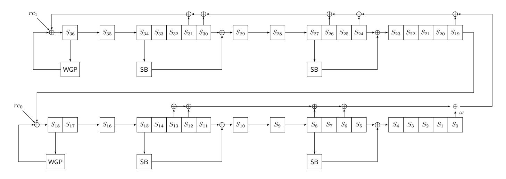
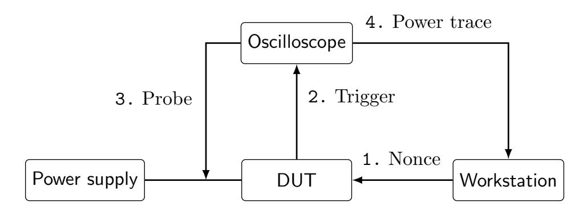
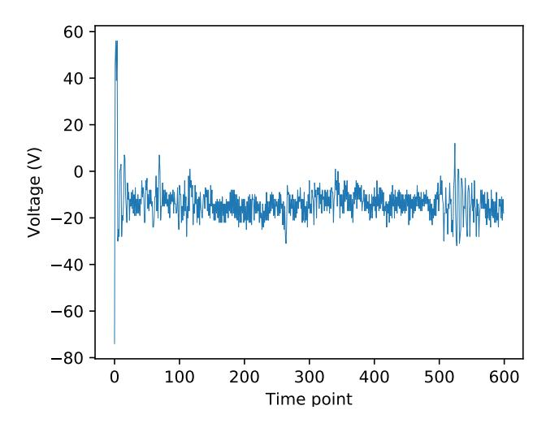
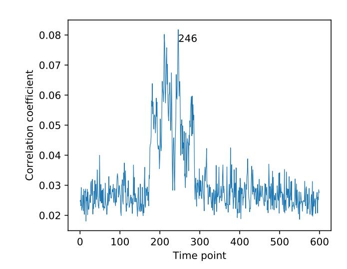
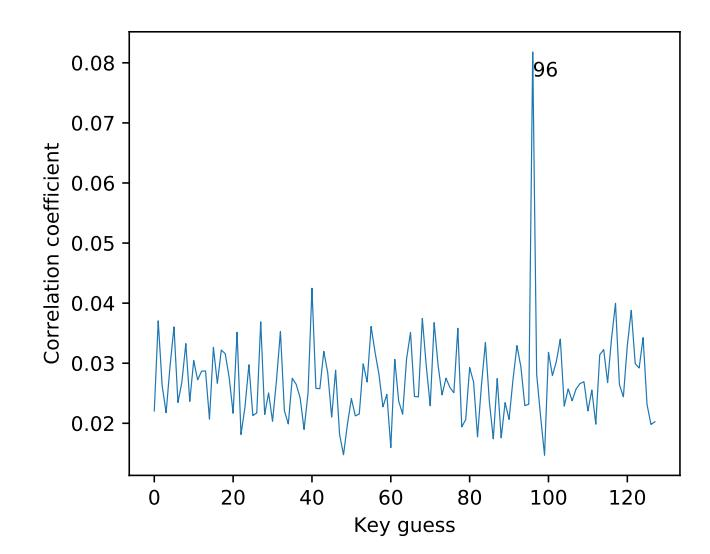
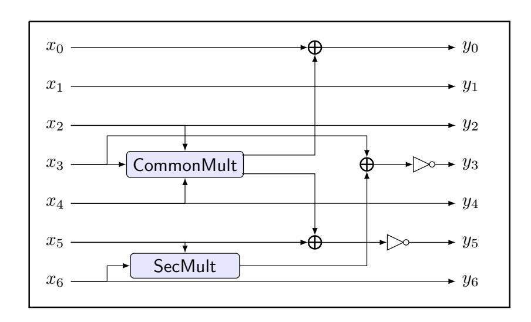
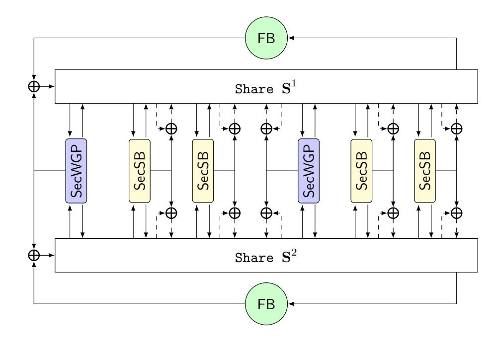
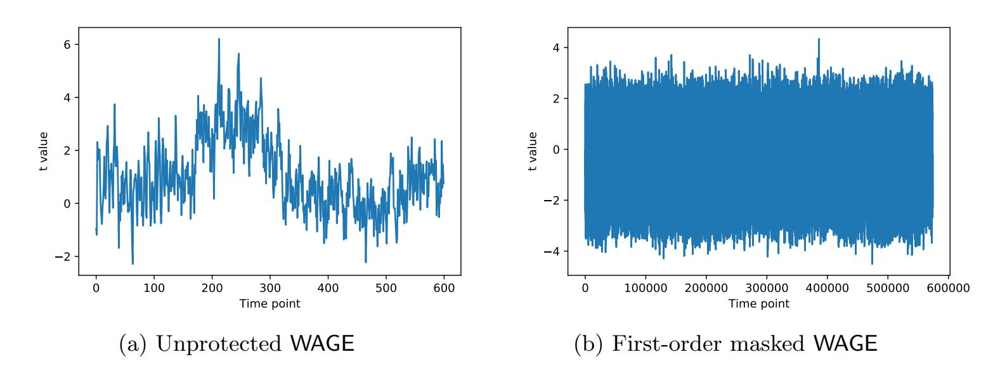

{0}------------------------------------------------

# Correlation Power Analysis and Higher-order Masking Implementation of WAGE

Yunsi Fei<sup>1</sup> and Guang Gong<sup>2</sup> and Cheng Gongye<sup>1</sup> and Kalikinkar Mandal<sup>3</sup> and Raghvendra Rohit<sup>2</sup> and Tianhong Xu<sup>1</sup> and Yunjie Yi<sup>2</sup> and Nusa Zidaric<sup>2</sup>

<sup>1</sup> Department of Electrical and Computer Engineering, Northeastern University, 360 Huntington Ave., Boston, MA, 02115, USA

yfei@ece.neu.edu, {gongye.c, xu.tianh}@northeastern.edu

<sup>2</sup> Department of Electrical and Computer Engineering, University of Waterloo, Ontario, N2L 3G1, Canada

{ggong, rsrohit, yunjie.yi, nzidaric}@uwaterloo.ca

<sup>3</sup> Faculty of Computer Science, University of New Brunswick, Fredericton, E3B 5A3, Canada

kmandal@unb.ca

Abstract. WAGE is a hardware-oriented authenticated cipher, which has the smallest (unprotected) hardware cost (for 128-bit security level) among the round 2 candidates of the NIST lightweight cryptography (LWC) competition. In this work, we analyze the security of WAGE against the correlation power analysis (CPA) on ARM Cortex-M4F microcontroller. Our attack detects the secret key leakage from power consumption for up to 12 (out of 111) rounds of the WAGE permutation and requires 10,000 power traces to recover the 128-bit secret key. Motivated by the CPA attack and the low hardware cost of WAGE, we propose the first optimized masking scheme of WAGE in the t-strong non-interference (SNI) security model. We investigate different masking schemes for S-boxes by exploiting their internal structures and leveraging the state-of-the-art masking techniques.To practically demonstrate the effectiveness of masking, we perform the test vector leakage assessment on the 1-order masked WAGE. We evaluate the hardware performance of WAGE for 1, 2, and 3-order security and provide a comparison with other NIST LWC round 2 candidates.

Keywords: Authenticated encryption, WAGE, Side-channel attack, Correlation power analysis, Masking scheme

### 1 Introduction

Side-channel analysis is a class of attacks that exploit the implementation and physical execution of a cryptographic algorithm to extract secret information through the power consumption [\[30\]](#page-20-0) or electro-magnetic emanations [\[24,](#page-19-0) [3\]](#page-18-0). Starting from the seminal work of Kocher et al. [\[30\]](#page-20-0), there has been an active research on evaluating the security of ciphers against differential power analysis (DPA) and its variant correlation power analysis (CPA) [\[14\]](#page-18-1). In general, 

{1}------------------------------------------------

a DPA attack aims to recover the secret information by analyzing the differences in power consumption for varying input data, while a CPA attack focuses on the correlation factor between the hamming weight of handled (unknown) data and power samples. Several standardized encryption algorithms and hash functions such as DES, AES, KECCAK and ASCON have been analyzed against such attacks and countermeasures of side-channel attacks have been proposed [5, 4, 31, 13, 38, 28, 25, 26].

An effective countermeasure against side-channel attacks exploiting the power consumption is masking. In a masked implementation, each input variable x is secret-shared into n shares such that  $x = x^1 \oplus \cdots \oplus x^n$ . Each share  $x^i$  is processed independently via a sequence of linear and nonlinear operations to produce n output shares  $y^1, \dots, y^n$  satisfying  $y = y^1 \oplus \dots \oplus y^n$  where y is the actual output corresponding to the input x. Any linear operation over the shares can be masked linearly, however processing nonlinear operations such as AND and/or S-box is complex. The design of efficient secure masking schemes for nonlinear operations is a challenging task. Ishai, Sahai and Wagner (ISW) [29] have initiated the study of securely computing a circuit consisting of XOR, AND and NOT gates where the AND gates are replaced by secure AND gadgets. From the security point of view, the ISW construction is resistant to the t-order probing attack when the number of shares  $n \geq 2t+1$ , i.e., evaluating the leakage on a set of at most t out of n points does not reveal information about a sensitive variable x. Barthe et al. [8] redefined the ISW security and introduced a stronger security notion, called t-strong non interference (t-SNI) security under the ISW probing model, which minimizes the number of shares to n = t + 1 (i.e., almost half) and its compositional security definition guarantees the t-SNI security in a large construction by securely composing t-SNI secure gadgets. Several other techniques for side-channel attacks have been proposed, including Threshold implementation [32], Consolidated Masking Scheme [33], Domain Oriented Masking (DOM) [27] and Unified Masking Approach [26]. In [23], De Cnudde et al. presented an AES hardware implementation using t+1 shares in the presence of glitches. The countermeasures on the secure evaluation of the AES S-box have been investigated in the literature extensively, e.g., [34, 16, 20, 35, 17, 19, 22, 36] based on finite field computations, randomized lookup table, and customized gate-level implementations. In particular, for the randomized lookup table, a first-order countermeasure for S-boxes was first proposed by Chari et al. in [17], and later on, in [19], Coron generalized the randomized lookup table countermeasure [19]. In the follow-up work [22], Coron et al. proposed a construction of a randomized lookup table countermeasure that is t-SNI secure.

The aforementioned masking techniques typically introduce an overhead due to performing additional operations on shares, complex nonlinear masking (gadget) operations, and processing randomnesses. However, in actual hardware implementations, they offer varying trade-offs due to the availability of varying gates and memory modules in specific libraries. For resource constrained devices such as Internet of Things (IoT) and sensor networks where the implementation cost is critical, the actual implementation numbers bring more confidence

{2}------------------------------------------------

in a cipher's design and in turn provides a fair comparison with other ciphers. The NIST lightweight cryptographic (LWC) competition [\[11\]](#page-18-6) for standardizing lightweight cryptographic algorithm(s) is currently in the second phase where 32 candidates are being analyzed. The performance of the protected implementations of these ciphers is an important criterion for the selection of next round candidates. WAGE [\[1,](#page-17-0) [6\]](#page-18-7) is one of the round 2 candidates in this competition. It is a permutation-based authenticated encryption where the construction of the underlying permutation is based on a Galois nonlinear feedback shift register (NLFSR) with two 7-bit S-boxes (WGP and SB) as the nonlinear components. The design offers an efficient performance in hardware with an area of 2540 GE in STMicro 90 nm, the smallest among the round 2 candidates for a security level of 128 bits [\[1,](#page-17-0) [2\]](#page-18-8). Further, it can be additionally tweaked to a WG-based pseudorandom bit generator with a low hardware overhead and theoretical randomness properties [\[6\]](#page-18-7).

Motivated by the smallest hardware footprint and features of WAGE, in this work, we analyze the security of WAGE against the CPA attack and propose the first masking implementations to evaluate its performance in hardware. In what follows, we list our contributions.

- Correlation power analysis: We present the first analysis of WAGE against correlation power analysis on ARM Cortex-M4F microcontroller. We use the hamming weight (HW) model on 7-bit state words to detect the leakage. Our experiments show that the power traces for up to 12 out of 111 rounds of the WAGE permutation reveals the secret key information. We use the Pearson correlation coefficient between the HW of the state word value and the power value of the leakage point to recover the entire 128-bit key in a word-wise fashion. In our attack, the key words are recovered in 13 batches and requires 10,000 power traces to recover the entire key.
- Higher-order masking scheme of WAGE: To provide resistance against such side-channel attacks, we propose a higher-order masking scheme for WAGE adopting both the gate-level and randomized-lookup table based approaches. To achieve the area optimized masked S-boxes, we exploit the internal structures of the SB and WGP S-boxes. For SB S-box, we exploit its iterative construction and apply the common share multiplication technique to optimize the area while for WGP S-box, we generate an optimized Boolean circuit consisting of 313 XOR, 172 AND and 66 NOT gates. We provide the security analysis of the masked WAGE permutation in the t-SNI security model along with its complexity analysis. We further analyze the first-order masked WAGE (implemented with randomized-lookup table approach) using the standard test vector leakage assessment method [\[18,](#page-19-11) [37\]](#page-20-9), however the power traces do not reveal any secret key information (see Appendix [B\)](#page-21-0).
- Hardware implementation: Our hardware architecture for the masked WAGE is parallel. We implement the round function for the t-order (t = 1, 2, 3) masked WAGE in STMicro 65 nm and TSMC 65 nm technologies and provide area results for WGP and SB S-boxes and the WAGE authenticated encryption (AE) scheme in Table [4.](#page-17-1) For instance, our smallest implemen-

{3}------------------------------------------------

tation of WAGE AE has a cost of 11.2 kGE for the 1-order protection in STMicro 65 nm technology. We provide a comparison <sup>4</sup> of WAGE AE with the currently known available first-order protected implementations of the NIST LWC round 2 candidates in Table 1.

<span id="page-3-1"></span>Table 1: Comparison of WAGE with NIST LWC round 2 candidates for the 1-order protection. Only the results for the round based implementation of primary members is listed.

| Algorithm   | Ref.      | Impl. type     | Technology    | Synthesis | Area [GE] |
|-------------|-----------|----------------|---------------|-----------|-----------|
| WAGE AE     | Section 5 | I VI o dizin c | STMicro 65 nm | Physical  | 11177     |
| WAGE AE     |           |                | TSMC 65 nm    | 1 Hysicai | 12711     |
| ASCON       | [28]      | Threshold      | UMC 90 nm     | Physical  | 28610     |
| SKINNY-AEAD | [12]      | )( ) \/        | UMC 90 nm     | -         | 20534     |
|             |           |                | IBM 130 nm    | _         | 18817     |
| GIFT-COFB   | [7]       | Threshold      | STMicro 90 nm | Logic     | 13131     |
| SUNDAE-GIFT | [15]      | Threshold      | TSMC 90 nm    | Logic     | 13297     |

**Organization.** The rest of the article is organized as follows. Section 2 gives a brief overview of the WAGE and masking schemes for side channel countermeasures. In Section 3, we present the correlation power analysis of WAGE on ARM Cortex-M4F. Section 4 explains our construction of the gate-level and randomized-look up table based masking schemes of WAGE. The details of our hardware implementations and a discussion on performance results are provided in Section 5. Finally, the paper is concluded in Section 6.

#### <span id="page-3-2"></span>2 Preliminaries

In this section, we provide a background on the WAGE authenticated encryption, the adversarial model and basic techniques on the side-channel protection.

**Notations.** Let  $\mathbb{F}_2 = \{0,1\}$  be the Galois field, and  $\mathbb{F}_{2^7}$  be an extension field where each element is a tuple of 7 bits.  $\mathbb{F}_2^m$  is a vector space of dimension m.  $\oplus$  and  $\odot$  denote the bitwise XOR and bitwise AND operations, respectively. Double square brackets  $[[x]] = (x^1, x^2, \dots, x^n)$  denotes the additive shares of  $x = \bigoplus_{i=1}^n x^i$ .  $r \leftarrow^{\$} \mathbb{F}_p$  denotes the element r is chosen from  $\mathbb{F}_p$  uniformly at random.

#### 2.1 Description of WAGE

We provide a description of WAGE, following the same notations from [1, 6]. The WAGE authenticated encryption is built upon the WAGE permutation in the unified sponge duplex mode where the WAGE permutation is a 111-round of

<span id="page-3-0"></span><sup>&</sup>lt;sup>4</sup> A fair comparison is difficult due to different types of side-channel implementations and ASIC libraries.

{4}------------------------------------------------

an iterative permutation with a state width of 259 bits over an extension field  $\mathbb{F}_{2^7}$ . The core components of the permutation, described in detail below, include two different S-boxes (WGP and SB), a linear feedback function defined over  $\mathbb{F}_{2^7}$ , five word-wise XORs, and 111 pairs of 7-bit round constant  $(rc_1, rc_0)$ . Figure 1 provides an overview of the round function of the WAGE permutation.

<span id="page-4-0"></span>

Fig. 1: An overview of the state update function of WAGE [6].

Nonlinear components of WAGE. WAGE uses two distinct 7-bit S-boxes, namely WGP and SB where WGP is defined over a finite field  $\mathbb{F}_{2^7}$  and SB is constructed iteratively at the bit-level from quadratic functions. We now provide a brief description of WGP and SB.

Welch-Gong permutation (WGP). The WGPerm, denoted by WGP7, is defined over  $\mathbb{F}_{2^7}$  which is given by

$$\mathsf{WGP7}(x) = x + (x+1)^{33} + (x+1)^{39} + (x+1)^{41} + (x+1)^{104}, \ x \in \mathbb{F}_{2^7}$$

where  $\mathbb{F}_{2^7}$  is defined by the primitive polynomial  $x^7 + x^3 + x^2 + x + 1$ . WGP is constructed from WGP7 by applying decimation d = 13 as WGP $(x) = \text{WGP7}(x^{13})$ .

**SB** S-box. The 7-bit S-box SB is constructed in an iterative way using the nonlinear transformation Q and the bit permutation P which are given by

$$Q(x_0, x_1, \dots, x_5, x_6) = (x_0 \oplus (x_2 \odot x_3), x_1, x_2, \overline{x}_3 \oplus (x_5 \odot x_6), x_4, \overline{x}_5 \oplus (x_2 \odot x_4), x_6)$$
$$P(x_0, x_1, x_2, x_3, x_4, x_5, x_6) = (x_6, x_3, x_0, x_4, x_2, x_5, x_1).$$

The construction of SB is given by

$$(x_0, x_1, x_2, x_3, x_4, x_5, x_6) \leftarrow R^5(x_0, x_1, x_2, x_3, x_4, x_5, x_6)$$
$$(x_0, x_1, x_2, x_3, x_4, x_5, x_6) \leftarrow Q(x_0, x_1, x_2, x_3, x_4, x_5, x_6)$$
$$x_0 \leftarrow x_0 \oplus 1; x_2 \leftarrow x_2 \oplus 1$$

where the round R is a composition of Q and P, i.e.,  $R = P \circ Q$ .

State update function of WAGE. The 259-bit state of WAGE consists of 37 7-bit words and is denoted by  $\mathbf{S} = (S_{36}, \dots, S_0)$  where each  $S_i$  is of 7 bits. The state update function of WAGE, denoted by WAGE\_STATEUPDATE, takes as inputs the current state S and a pair of round constants  $(rc_1, rc_0)$ , and updates the state with the following three steps:

{5}------------------------------------------------

1. Computing linear feedback:  $fb \leftarrow \mathsf{FB}(S)$ . The following primitive polynomial of degree 37 over  $\mathbb{F}_{2^7}$  is used as a feedback function

$$\ell(y) = y^{37} + y^{31} + y^{30} + y^{26} + y^{24} + y^{19} + y^{13} + y^{12} + y^{8} + y^{6} + \omega$$

where  $\omega$  is a root  $x^7 + x^3 + x^2 + x + 1$ , which is a primitive polynomial defining  $\mathbb{F}_{2^7}$ . The feedback computation is given by

$$fb = S_{31} \oplus S_{30} \oplus S_{26} \oplus S_{24} \oplus S_{19} \oplus S_{13} \oplus S_{12} \oplus S_8 \oplus S_6 \oplus (\omega \otimes S_0).$$

For an input  $x \in \mathbb{F}_{2^7}$ , the multiplier  $\omega$  maps x to  $\omega \otimes x$ , i.e.,  $x \mapsto \omega \otimes x$ . The ANF representation of it is given by

$$(x_0, x_1, x_2, x_3, x_4, x_5, x_6) \otimes \omega \rightarrow (x_6, x_0 \oplus x_6, x_1 \oplus x_6, x_2 \oplus x_6, x_3, x_4, x_5).$$

2. Updating intermediate words and adding round constants:  $(\mathbf{S}, fb) \leftarrow \mathsf{IWRC}(\mathbf{S}, fb, rc_0, rc_1)$ .

$$S_5 \leftarrow S_5 \oplus \mathsf{SB}(S_8)$$

$$S_{11} \leftarrow S_{11} \oplus \mathsf{SB}(S_{15})$$

$$S_{19} \leftarrow S_{19} \oplus \mathsf{WGP}(S_{18}) \oplus rc_0$$

$$S_{24} \leftarrow S_{24} \oplus \mathsf{SB}(S_{27})$$

$$S_{30} \leftarrow S_{30} \oplus \mathsf{SB}(S_{34})$$

$$fb \leftarrow fb \oplus \mathsf{WGP}(S_{36}) \oplus rc_1.$$

3. Shifting register contents and update the last word:  $S \leftarrow \mathsf{Shift}(S, fb)$ .

$$S_j \leftarrow S_{j+1}, 0 \le j \le 35$$
$$S_{36} \leftarrow fb.$$

On an input state **S**, the output of the WAGE permutation is obtained by applying the state update function 111 times. Note that only the IWRC transformation performs the nonlinear operations and the others are linear operations.

### 2.2 Adversarial Model

<span id="page-5-0"></span>We consider an adversarial model in which an attacker can probe up to t intermediate variables in the circuit, known as the t-probing (ISW) model [29] or t-non interference (NI) model [9] where the number of shares for each secret variable is  $n \geq 2t + 1$ . The t-probing security is provided in Definition 1. The security of t-strong non interference (t-SNI) was introduced in [8] (see Definition 3). Intuitively, a t-SNI gadget information-theoretically hides dependencies between each of its inputs and its outputs, even in the presence of internal probes [8]. Note that combining t-probing (or t-NI) secure gadgets does not necessarily results in a t-probing secure algorithm [21]. We consider the standard t-SNI security for WAGE as the number of shares is only n = t + 1, instead of n = 2t + 1 in the t-NI security and it provides an assurance on the t-SNI security of the entire scheme when t-SNI secure gadgets are composed securely.

{6}------------------------------------------------

**Definition 1** (t-probing Security). [29] An algorithm C is t-probing secure if the values taken by at most t intermediate variables of C during its execution do not leak any information about secrets.

**Definition 2** (t-NI Security). [8] Let  $\mathcal{G}$  be a gadget accepting  $(x_i)_{1 \leq i \leq n}$  as input and outputting  $(y_i)_{1 \leq i \leq n}$ . We call the gadget  $\mathcal{G}$  is t-non interference (t-NI) (also known as t-threshold probing) secure if for any set of  $\ell \leq t$  intermediate variables, there exists a subset I of input indices with  $|I| \leq \ell$  such that  $\ell$  intermediate variables can be perfectly simulated from  $x_{|I|} = (x_i)_{i \in I}$ .

<span id="page-6-0"></span>**Definition 3** (t-SNI Security). [8] Let  $\mathcal{G}$  be a gadget accepting  $(x_i)_{1 \leq i \leq n}$  as input and outputting  $(y_i)_{1 \leq i \leq n}$ . We call the gadget  $\mathcal{G}$  is t-strongly non-interference (t-SNI) secure if for any set of  $\ell \leq t$  intermediate variables and any subset of output indices O such that  $\ell + |O| \leq t$ , there exists a subset I of input indices with  $|I| \leq \ell$  such that the  $\ell$  intermediate variables and output variables  $y_{|O|}$  can be perfectly simulated from  $x_{|I|}$ .

#### 2.3 Masking Schemes for Side-channel Countermeasures

Masking is an effective countermeasure against side-channel attacks such as power analysis on cryptographic algorithms. In a masking scheme, a variable x containing sensitive information is protected by masking it with a random value r as  $x' = x \oplus r$ , i.e.,  $x = x' \oplus r$ , meaning the sensitive variable x is shared between variables r and x'. In an n-order masking, each sensitive variable x is shared among n variables  $x^i$  as  $x = x^1 \oplus x^2 \oplus \cdots \oplus x^n$ . We denote the n shares of x by  $[[x]] = (x^1, x^2, \cdots, x^n)$  such that  $x = \bigoplus_{i=1}^n x^i$ . For  $[[x]] = (x^1, x^2, \cdots, x^n)$  and  $[[y]] = (y^1, y^2, \cdots, y^n)$ ,  $[[x]] \oplus [[y]] = (x^1 \oplus y^1, x^2 \oplus y^2, \cdots, x^n \oplus y^n) = [[x \oplus y]]$ . For a binary variable x with shares [[x]], it is easy to compute  $[[\bar{x}]]$  from [[x]] as  $\bar{x} = \bar{x}^1 \oplus x^2 \oplus \cdots \oplus x^n$ . Computing the nonlinear operations such as AND and S-box introduce a large overhead when sensitive variables are additively shared. Below we describe the techniques for securely computing an AND gate and an S-box.

**Private AND computation.** Ishai, Sahai and Wagner (ISW) [29] have initiated the study of securely computing a circuit where an adversary can probe a certain number of wires in the circuit to extract sensitive information. The construction of ISW is generic and based on secret-sharing each wire in the circuit. Their technique transforms the original circuit into another circuit that is secure in the t-probing model when the number of shares  $n \geq 2t + 1$ , with an addition overhead. For each AND gate, a gadget taking a 2n-bit input and producing an n-bit output that securely computes the AND gate is introduced. The multiplication of  $x = \bigoplus_{i=1}^{n} x^i$  and  $y = \bigoplus_{i=1}^{n} y^i$  outputting n shares [[z]] is computed as

$$z = xy = \bigoplus_{0 \le i, j \le n} x^i y^j$$

where  $z = z^1 \oplus z^2 \oplus \cdots \oplus z^n$  and  $z^i = x^i y^i + \bigoplus_{j \neq i} z^{i,j}$  and for each pair (i,j) with i < j, a random bit  $z^{i,j}$  is generated and  $z^{j,i} = z^{i,j} \oplus x^i y^j \oplus x^j y^i$ .

{7}------------------------------------------------

Each AND gate introduces  $O(n^2)$  gates, thus increasing the size of the circuit. In [8], Barthe *et al.* proposed the construction of the *t*-SNI secure AND gadgets relying on the ISW construction (see Appendix A).

High-order randomized lookup table. The countermeasures on the (AES) S-box evaluation was studied from various approaches, notably finite field based masking computations, e.g., [34, 16, 20, 35], and the randomized lookup table, e.g., [17, 19, 22]. A first-order randomized table countermeasure for S-boxes was first proposed by Chari et al. in [17] where the countermeasure consists of recomputing the S-box in the RAM with input shifted by some random value r and the output is masked by another random value s, i.e.,  $T(x) = S(x \oplus r) \oplus s$  where S is the S-box. In [19], Coron generalized the randomized lookup table countermeasure to an n-th order masking as output  $y = y^1 \oplus y^2 \oplus \cdots \oplus y^n = S(x \oplus x^1 \oplus \cdots \oplus x^{n-1})$  where  $x = \bigoplus_{i=1}^n x^i$ . This countermeasure is secure against a t-order attack in the ISW probing model (t-NI secure) for  $n \geq 2t + 1$ . Coron et al. in [22] proposed a randomized lookup table scheme that is secure against t-SNI (see Appendix A). For the details of the randomized lookup table, the reader is referred to [19, 22].

### <span id="page-7-0"></span>3 Correlation Power Analysis of WAGE

In this section, we present a correlation power analysis (CPA) attack on the unprotected WAGE. The CPA attack is conducted in the microcontroller environment. For simplicity, we consider the first execution of the WAGE permutation in the initialization phase where the key and nonce are loaded and processed.

#### <span id="page-7-2"></span>3.1 Experimental Setup

Figure 2 shows a high-level overview of our experimental setup. The Device Under Test (DUT) is a Pinata <sup>5</sup> board with an ARM Cortex-M4F core running at a 168 MHz clock speed. We measured the voltage of the 3.3V power supply that powers the entire DUT. The power traces are collected using a LeCroy oscilloscope. We use the reference C implementation code of WAGE from the NIST website [11] and modify it to add a trigger to synchronize the power traces, which is the standard procedure for the power trace acquisition.

#### 3.2 The CPA Attack

Leakage model. We consider the hamming weight (HW) of the state register as a leakage model. We tested both the HW and the hamming distance of WGP and SB output tables, but did not find any leakage for the DUT. We then use the Pearson correlation coefficient (PCC) between the HW of the state value and the power value of the leakage point to detect leakage. The PCC describes a linear correlation between two variables and its value lies in the range of -1 and 1, where higher the absolute value indicates a stronger linear correlation.

<span id="page-7-1"></span><sup>&</sup>lt;sup>5</sup> https://www.riscure.com/product/pinata-training-target/

{8}------------------------------------------------

<span id="page-8-0"></span>

Fig. 2: An overview of our experimental setup. The workstation is used to control the microcontroller and record the nonce and the power traces. Oscilloscope measures the main's voltage.

Attack overview. Our attack targets the first 12 rounds of the WAGE permutation after loading the 128-bit key and 128-bit nonce in the initialization phase. The 16-byte nonce and 16-byte key are arranged into 37 state words, 19 key words K<sup>0</sup> - K18, and 19 nonce words N<sup>0</sup> - N<sup>18</sup> where K<sup>0</sup> - K<sup>17</sup> contain seven bits, and K<sup>18</sup> contains only two bits (see Appendix [C\)](#page-22-0). In our attack, we run the initialization phase 10,000 times with randomly generated nonces for a fixed key where the nonce is assumed as known, and the key is unknown. We run a data flow analysis of the 12-round computations and identify the dependency of state registers [6](#page-8-1) in each round on the key words. We identify an initial batch of seven state registers, each of which is only dependent on a single key word (see Table [2\)](#page-8-2). Our attack recovers the key words in two steps, namely the initial batch that recovers seven key words and the final batch which recovers the rest of the key words sequentially based on the prior recovered key words. The detailed steps are elaborated below.

Recovering the initial batch of key words. To recover a key word in the initial batch, we need a value of the state word such that it depends on only 1 key word and at least 7 nonce bits at a specific round. Table [2](#page-8-2) shows the targeted round and state register positions satisfying this criterion and are utilized to recover a single key word. We follow the standard CPA procedure to retrieve

<span id="page-8-2"></span>Table 2: Targeted round and state register positions in the initial batch.

|     |    | Key word Round State register Key word Round State register |     |   |    |
|-----|----|-------------------------------------------------------------|-----|---|----|
| K12 | 5  | 0                                                           | K15 | 3 | 22 |
| K13 | 3  | 21                                                          | K16 | 5 | 2  |
| K14 | 5  | 1                                                           | K17 | 3 | 23 |
| K18 | 10 | 0                                                           |     |   |    |

these seven key words one-by-one. For each key word, the select function is the HW power model of the state register which is dependent on a key word and a nonce. We run the initialization phase several times where each time, a random, but known nonce is used and the power trace is collected. We collect 10,000 such power traces. Figure [3a](#page-9-0) shows a sample power trace. We perform the CPA on all

<span id="page-8-1"></span><sup>6</sup> We use "word" and "register" interchangeably throughout this section.

{9}------------------------------------------------

<span id="page-9-0"></span>



- (a) A power trace of round 10 of first call of the WAGE permutation.
- (b) Leakage of  $K_{18}$  on time axis at round 10 where the maximum leakage is observed at the time point 246.

Fig. 3: Example of a power trace and leakage of a fixed key word.

<span id="page-9-1"></span>the time points in these traces, i.e., enumerate the 128 possible key values and calculate the Pearson correlation between the predicted and measured power values. Figure 3b shows the correlation values along the time points (under the correct key guess), which indicate the leakiest time point is 246. Figure 4 shows the key distinguishing result at this time point, where the correct key guess, 96 (in integer notation), gives the highest correlation coefficient value.



Fig. 4: Highest correlation among all the time points at round 10 for 128 guessed key values of  $K_{18}$ .

Recovering the remaining batch of key words. Similar to the initial batch, to recover the rest of key words, we need a value of the state register such that it is associated with only one unknown key word and at least seven nonce bits, at a specific round. Table 5 in Appendix B depicts the targeted round and state register positions to recover the key words of final batch. Due

{10}------------------------------------------------

to dependency among key words, the key bytes are recovered in a specific order. Unlike the initial batch recovery, these key words cannot find a state that meets the two conditions in the initial batch, hence few other key words have to be known first so that there is only one unknown key word associated with the targeted state word. The recovery technique is the same as the initial batch one. The only difference is while calculating the value of a targeted state register using the guessed key value, we use the value of known key words.

Our analysis reveals that the unprotected implementation of WAGE suffers side-channel power analysis attacks, i.e., correlation power analysis attack. Hence, similar to other symmetric-key ciphers, like DES, AES, KECCAK and ASCON [5, 4, 31, 13, 38, 28, 25, 26], a protected implementation of WAGE is needed for applications in constrained environments such as chip card technologies. In the following section, we present our masking scheme for WAGE to resist power analysis based side-channel attacks.

### <span id="page-10-0"></span>4 The Masking Scheme for WAGE

In this section, we present our construction for the masked WAGE permutation, featured for hardware, along with its complexity analysis. We first provide two optimized constructions of masked WGP and SB S-boxes that are t-SNI secure. We start by providing a high-level overview of the masked WAGE permutation.

**High-level description.** We construct a t-SNI secure masking scheme of WAGE where the number of shares n = t + 1. In doing so, the state of WAGE, denoted by **S**, is split into n state shares such that  $\mathbf{S} = \mathbf{S}^1 \oplus \mathbf{S}^2 \oplus \cdots \oplus \mathbf{S}^n$  where  $\mathbf{S}^i = (S_{36}^i, \cdots, S_0^i)$  is the *i*-th share of the state  $\mathbf{S}$ . In our masked WAGE, we update the shared states according to the round function so that at the end of 111 rounds, the state of the WAGE permutation can be constructed from the n state shares. The operations involved in the round function of WAGE are the computation of the linear feedback function, computing WGP and SB and updating intermediate words, and shifting operation where all the operations in the round function on the shared states are performed independently and parallelly, except WGP and SB. To optimized the hardware area for SB with the SNI security, we exploit the iterative construction of SB and apply the common share technique for two AND operations in the Q transformation (see Figure 5). For the t-SNI secure WGP, we use the randomized lookup table from [22], and develop a new optimized gate-level implementation of WGP in which we replace the AND gates by t-SNI secure AND gadgets of [8]. We summarize the computation steps of the masking scheme as follows:

- **Feedback computation:** As the transformation ω-multiplier is linear, the feedback computation is linear which can be performed parallelly on the n shared states, i.e., for each shared state, the corresponding feedback is computed as  $fb^i \leftarrow \mathsf{FB}(\mathbf{S}^i), i \in \{1, \dots, n\}$ .
- Secure WGP & SB evaluation and updating words: The evaluation of the masked SB, denoted by SecSB, is performed in a single clock cycle

{11}------------------------------------------------

although our technique of the masked SB is iterative. The gate-level implementation of the masked WGP, denoted by SecWGP, is also computed in one clock cycle. On the other hand, the randomized lookup table approach for secure WGP and SB S-boxes takes at least 128 cycles, and was used for the software implementation. The masked S-boxes are computed as  $[[S_j]] \leftarrow \text{SecSB}([[S_j]]), j \in \{8, 15, 27, 34\} \text{ and } [[S_j]] \leftarrow \text{SecWGP}([[S_j]]), j \in \{18, 36\} \text{ where } S_j = \bigoplus_{i=1}^n S_j^i.$ 

- Shifting and updating last word operation: This operation can be performed parallelly on the shared states, i.e.,  $\mathbf{S}^i \leftarrow \mathsf{Shift}(\mathbf{S}^i), i \in \{1, \dots, n\}.$ 

Algorithm 7 summarizes the masked algorithm of the WAGE permutation. We are now ready to describe the masking techniques for SB and WGP.

#### 4.1 Construction of an SNI-secure SB

We present a construction of an area optimized masked SB guaranteeing the t-SNI security. Note that the SB can be decomposed into six elementary transformations where only the Q transformation has AND gates. Our idea is to iteratively compute the SB where in the Q transformation consisting of three AND, three XOR and two NOT gates, we adopt a t-SNI secure AND gadget of 8 to replace each AND gate and apply a t-SNI RefreshMask operation of [8] after the Q transformation to ensure the SNI security. Let  $x = (x_0, x_1, x_2, x_3, x_4, x_5, x_6)$ be an input to the S-box SB. The nonlinear Q transformation is given by Q(x) = $(x_0 \oplus x_2x_3, x_1, x_2, \overline{x}_3 \oplus x_5x_6, x_4, \overline{x}_5 \oplus x_2x_4, x_6)$ . The input x is shared among nvariables as  $x = x^1 \oplus x^2 \oplus \cdots \oplus x^n$  where  $x^i = (x_0^i, x_1^i, x_2^i, x_3^i, x_4^i, x_5^i, x_6^i), x_j^i \in \mathbb{F}_2$ is the *i*-th share, and each component  $x_i$  is shared as  $x_i = x_i^1 \oplus x_i^2 \oplus \cdots \oplus x_i^n$ . Note that the multiplications  $x_2x_3$  and  $x_2x_4$  have a common term  $x_2$ . We exploit this property to optimize the area. Thus, we apply a common input multiplication, denoted by CommonMult, introduced in [20], for efficiently computing  $x_2x_3$  and  $x_2x_4$ . Figure 5 depicts the masked implementation of Q. Algorithm 1 provides the detailed steps of the masked SB where SecMult denotes an SNI-secure AND gadget of [8]. Note the masked SB is evaluated in a single clock cycle in hardware. For instance, our masked implementation of SB for n=2 has an overhead of  $4.5 \times$  the unprotected SB implementation (see Table 4).

**Security.** Lemma 1 states that Algorithm 1 is t-SNI secure in the ISW probing model with n = t + 1. The proof is straightforward, follows from the security of the composition of the gadgets for each round as proved in [10]. We only show that the security of the gadget CommonMult in [20], and the gadgets SecMult and RefreshMask in [8] ensures the t-SNI security of each round of SB.

<span id="page-11-0"></span>**Lemma 1.** Let  $[[x]] = (x^i)_{1 \le i \le n}$  be the input shares and  $[[y]] = (y^i)_{1 \le i \le n}$  be the output shares of SB. For any subset of  $\ell$  intermediate variables with  $\ell \le t$  and any subset O of output shares such that  $\ell + |O| \le t < n$ , there exists a subset I of input indices such that  $|I| \le \ell$ , the  $\ell$  intermediate variables and the output shares in O can be perfectly simulated from  $x_{|I|}$ .

{12}------------------------------------------------

<span id="page-12-0"></span>

Fig. 5: Schematic of one-round gadget of SB with common multiplication.

#### <span id="page-12-1"></span>Algorithm 1 New Masked SB Computation

```
1: Input: n shares (x^1, x^2, \dots, x^n) s.t. x = x^1 \oplus x^2 \oplus \dots \oplus x^n.
   2: Output: n output shares \{y^1, y^2, \dots, y^n\} s.t. y = \mathsf{SB}(x) = y^1 \oplus y^2 \oplus \dots \oplus y^n.
   3: procedure SecSB(x^1, x^2, \dots, x^n)
                           for i = 0 to 4 do
                                                                                                                                                                                                                                                 \triangleright Computing R^5
   4:
                                       (u,w) \leftarrow \mathsf{CommonMult}\Big((x_2^1, x_2^2, \cdots, x_2^n), (x_3^1, x_3^2, \cdots, x_3^n), (x_4^1, x_4^2, \cdots, x_4^n)\Big) \\ \rhd u = (u^1, u^2, \cdots, u^n), \qquad \rhd w = (w^1, w^2, \cdots, w^n) \\ v \leftarrow \mathsf{SecMult}\Big((x_5^1, x_5^2, \cdots, x_5^n), (x_6^1, x_6^2, \cdots, x_6^n)\Big) \rhd v = (v^1, v^2, \cdots, v^n) \\ \downarrow v \leftarrow \mathsf{SecMult}\Big((x_5^1, x_5^2, \cdots, x_5^n), (x_6^1, x_6^2, \cdots, x_6^n)\Big) \\ \vdash v \leftarrow \mathsf{SecMult}\Big((x_5^1, x_5^2, \cdots, x_5^n), (x_6^1, x_6^2, \cdots, x_6^n)\Big) \\ \vdash v \leftarrow \mathsf{SecMult}\Big((x_5^1, x_5^2, \cdots, x_5^n), (x_6^1, x_6^2, \cdots, x_6^n)\Big) \\ \vdash v \leftarrow \mathsf{SecMult}\Big((x_5^1, x_5^2, \cdots, x_5^n), (x_6^1, x_6^2, \cdots, x_6^n)\Big) \\ \vdash v \leftarrow \mathsf{SecMult}\Big((x_5^1, x_5^2, \cdots, x_5^n), (x_6^1, x_6^2, \cdots, x_6^n)\Big) \\ \vdash v \leftarrow \mathsf{SecMult}\Big((x_5^1, x_5^2, \cdots, x_5^n), (x_6^1, x_6^2, \cdots, x_6^n)\Big) \\ \vdash v \leftarrow \mathsf{SecMult}\Big((x_5^1, x_5^2, \cdots, x_5^n), (x_6^1, x_6^2, \cdots, x_6^n)\Big) \\ \vdash v \leftarrow \mathsf{SecMult}\Big((x_5^1, x_5^2, \cdots, x_5^n), (x_6^1, x_6^2, \cdots, x_6^n)\Big) \\ \vdash v \leftarrow \mathsf{SecMult}\Big((x_5^1, x_5^2, \cdots, x_5^n), (x_6^1, x_6^2, \cdots, x_6^n)\Big) \\ \vdash v \leftarrow \mathsf{SecMult}\Big((x_5^1, x_5^2, \cdots, x_5^n), (x_6^1, x_6^2, \cdots, x_6^n)\Big) \\ \vdash v \leftarrow \mathsf{SecMult}\Big((x_5^1, x_5^2, \cdots, x_5^n), (x_6^1, x_6^2, \cdots, x_6^n)\Big) \\ \vdash v \leftarrow \mathsf{SecMult}\Big((x_5^1, x_5^2, \cdots, x_5^n), (x_6^1, x_6^2, \cdots, x_6^n)\Big) \\ \vdash v \leftarrow \mathsf{SecMult}\Big((x_5^1, x_5^2, \cdots, x_5^n), (x_6^1, x_6^2, \cdots, x_6^n)\Big) \\ \vdash v \leftarrow \mathsf{SecMult}\Big((x_5^1, x_5^2, \cdots, x_5^n), (x_6^1, x_6^2, \cdots, x_6^n)\Big) \\ \vdash v \leftarrow \mathsf{SecMult}\Big((x_5^1, x_5^2, \cdots, x_5^n), (x_6^1, x_6^2, \cdots, x_6^n)\Big) \\ \vdash v \leftarrow \mathsf{SecMult}\Big((x_5^1, x_5^2, \cdots, x_5^n), (x_5^1, x_5^2, \cdots, x_6^n)\Big)
   5:
   6:
   7:
                                        x^1 \leftarrow (x_0^1 \oplus u^1, x_1^1, x_2^1, 1 \oplus x_3^1 \oplus v^1, x_4^1, 1 \oplus x_5^1 \oplus w^1, x_6^1)
   8:
                                         x^1 \leftarrow P(x^1)
   9:
                                        for j = 2 to n do
10:
                                                      x^{j} \leftarrow (x_{0}^{j} \oplus u^{j}, x_{1}^{j}, x_{2}^{j}, x_{3}^{j} \oplus v^{j}, x_{4}^{j}, x_{5}^{j} \oplus w^{j}, x_{6}^{j})
11:
                                                      x^j \leftarrow P(x^j)
12:
                                         end for
13:
                                        (x^1, x^2, \cdots, x^n) \leftarrow \mathsf{RefreshMask}(x^1, x^2, \cdots, x^n)
14:
                           end for
15:
                           (u,w) \leftarrow \mathsf{CommonMult}\Big((x_2^1, x_2^2, \cdots, x_2^n), (x_3^1, x_3^2, \cdots, x_3^n), (x_4^1, x_4^2, \cdots, x_4^n)\Big)
16:
                           v \leftarrow \mathsf{SecMult}\Big((x_5^1, x_5^2, \cdots, x_5^n), (x_6^1, x_6^2, \cdots, x_6^n)\Big)
17:
                           y^1 \leftarrow (x_0^1 \oplus u^1, x_1^1, x_2^1, 1 \oplus x_3^1 \oplus v^1, x_4^1, 1 \oplus x_5^1 \oplus w^1, x_6^1)
18:
                           y^1 \leftarrow P(x^1)
19:
                           y^1 \leftarrow (x_0^1 \oplus 1, x_1^1, x_2^1 \oplus 1, x_3^1, x_4^1, x_5^1, x_6^1)
20:
                           for j = 2 to n do
21:
                                        y^j \leftarrow (x_0^j \oplus u^j, x_1^j, x_2^j, x_3^j \oplus v^j, x_4^j, x_5^j \oplus w^j, x_6^j)
22:
                                        y^j \leftarrow P(x^j)
23:
                           end for
24:
                            (y^1, y^2, \cdots, y^n) \leftarrow \mathsf{RefreshMask}(y^1, y^2, \cdots, y^n)
25:
26: end procedure
```

{13}------------------------------------------------

*Proof.* Let  $\mathcal{G}_1$ ,  $\mathcal{G}_2$ ,  $\mathcal{G}_3$  be three gadgets corresponding to RefreshMask and CommonMult, SecMult, respectively. Let O be the output corresponding to  $\mathcal{G}_1$  and  $O_1$  be the output corresponding to gadgets  $\mathcal{G}_2$ ,  $\mathcal{G}_3$ . Let  $\mathcal{I} = \mathcal{I}_1 \cup \mathcal{I}_2 \cup \mathcal{I}_3$  be the set of indices corresponding to intermediate variables that an attacker can observe in three gadgets where  $|\mathcal{I}| \leq \ell$ .

Since RefreshMask is t-SNI secure, there exists a set of indices  $S_1$  such that  $|S_1| \leq |I_1|$ , and the gadget can be perfectly simulated from its input share indices in  $S_1$ . Similarly, as CommonMult and SecMult are t-SNI secure, any probe within these two gadgets can generate indices in  $I_2$  or  $I_3$ , such that  $|S_2| \leq |I_2| + |I_3| + |S_1|$ , and the gadget can be perfectly simulated from its input share indices in  $S_2$ . Therefore,  $|S_2| \leq |I_2| + |I_3| + |I_1|$  as  $|S_1| \leq |I_1|$  from  $I_3$ . As the SNI security of each gadget ensures the existence of a simulator, thus the simulator for one round can be constructed by composing these simulators to perfectly simulate from  $I_3$  where  $I_3$  and  $I_4$  where  $I_3$  and  $I_4$  where  $I_3$  and  $I_4$  hence the proof.

#### 4.2 Construction of an SNI-secure WGP

The input to the WGP is shared as  $x=x^1\oplus x^2\oplus \cdots \oplus x^n$  and the output  $y=\mathsf{WGP}(x)$  is shared as  $y=\mathsf{WGP}(x)=y^1\oplus y^2\oplus \cdots \oplus y^n$ . We explore two approaches, namely randomized lookup table of [22] and the Boolean circuit implementation, for secure evaluation of WGP. We implement the higher-order randomized lookup table of WGP using the technique described in Algorithm 7 of [22], in software. We generated an optimized Boolean circuit of WGP, in hardware, consisting of 313 XOR and 172 AND gates (2-input) and 66 NOT gates. We construct a masked WGP using the Boolean circuit by substituting each AND gate by an SNI-secure AND gadget (i.e., SecMult) and composing the gadgets securely, which results in a t-SNI secure masked WGP. For instance, our masked implementation of WGP using ANF for n=2 has an overhead of  $3.7\times$  compared to the unprotected (ANF) WGP implementation (see Table 4). The security of the masked WGP implemented using the ANF is straightforward. We omit it here.

#### 4.3 Putting all together

Our masked WAGE is designed to provide a t-order protection against side-channel attacks such as power analysis. Our hardware architecture for the masked WAGE is parallel and designed to be low-latency. Algorithm 2 describes the pseudocode of the masked WAGE permutation. In each round of the masked WAGE, the state is shared among n state shares ( $\mathbf{S}^i$ ) where the feedback computations in Lines 5-7, updating intermediate words in Lines 10-14 and shift operations in Lines 20-22 that are linear are computed in parallel. Our architecture uses corresponding masked WGP and SB in Lines 8-9 for the S-box operations, which are evaluated in parallel. Note that the pair of round constants at each round are added to only one share (say  $\mathbf{S}^1$ ) in Lines 15-16. A high-level overview of the architecture of the masked WAGE permutation for the first-order protection is shown in Figure 6. For a low-latency implementation of the masked

{14}------------------------------------------------

WAGE, the circuit level implementation of the masked WGP is used as it can be computed in one clock cycle. For software implementations, to avoid bit level operations, we use the randomized lookup table for the secure evaluation of both WGP and SB.

#### <span id="page-14-0"></span>**Algorithm 2** The Masked WAGE

```
1: Input: [[S]] = (S^1, S^2, \dots, S^n)
 2: Output: [[S]] where S \leftarrow \text{WAGE\_STATEUPDATE}^{111}(S)
 3: procedure Masked_WAGE()
 4:
            for i = 0 to 110 do
 5:
                  for j = 1 to n do
                       fb^{\jmath} \leftarrow \mathsf{FB}(\mathbf{S}^{\jmath})
 6:
                  end for
 7:
                  ||S_j|| \leftarrow \mathsf{SecSB}(||S_j||), j \in \{8, 15, 27, 34\}
 8:
                  [[S_i]] \leftarrow \mathsf{SecWGP}([[S_i]]), j \in \{18, 36\}
 9:
                  [[S_5]] \leftarrow [[S_5]] \oplus [[S_8]]
10:
                  [[S_{11}]] \leftarrow [[S_{11}]] \oplus [[S_{15}]]
11:
                  [[S_{19}]] \leftarrow [[S_{19}]] \oplus [[S_{18}]]
12:
                  [[S_{24}]] \leftarrow [[S_{24}]] \oplus [[S_{27}]]
13:
                 [[S_{30}]] \leftarrow [[S_{30}]] \oplus [[S_{34}]]
14:
                 S_{19}^1 \leftarrow S_{19}^1 \oplus rc_0
fb^1 \leftarrow fb^1 \oplus tmp^1 \oplus rc_1
15:
16:
                  for j = 2 to n do
17:
                       fb^j \leftarrow fb^j \oplus tmp^j
18:
                  end for
19:
                  for j = 1 to n do
20:
                       \mathbf{S}^j \leftarrow \mathsf{Shift}(\mathbf{S}^j, fb^j)
21:
                 end for
22:
23:
            end for
           return [[\mathbf{S}]] = (\mathbf{S}^1, \mathbf{S}^2, \cdots, \mathbf{S}^n) s.t. \mathbf{S} = \bigoplus_{i=1}^n \mathbf{S}^i
24:
25: end procedure
```

**Security.** The masked WAGE permutation is constructed by composing 111 round function gadgets. Intuitively, according to the compositional security proof of t-SNI security in [8], the masked WAGE permutation is t-SNI secure. We summarize the security of the masked WAGE permutation in the ISW probing model in Theorem 1.

<span id="page-14-1"></span>**Theorem 1.** The protected WAGE described in Algorithm 2 is t-SNI secure where t = n + 1.

**Complexity.** We now provide the amount of random bits required for the masked WAGE permutation in terms of the number of shares n. The randomness amount can be computed by calculating the unit operations of different gadgets. The RefreshMask, CommonMult and SecMult gadgets consume  $\frac{7n(n-1)}{2}$ ,  $\frac{3n(n-1)}{2}$  and  $\frac{n(n-1)}{2}$  bits, respectively. Thus, the total number of random bits for SecSB

{15}------------------------------------------------

<span id="page-15-1"></span>

Fig. 6: Schematic of the masked WAGE permutation for 1-order protection.

is 33n(n-1) bits (asymptotically  $O(n^2)$ ). According to [22], the number of random bits for SecWGP with the randomized lookup table is  $\frac{64n(n-1)(2n-1)}{3}$  (asymptotically  $O(n^3)$ ). On the other hand, the number of random bits for the gate-level implementation of SecWGP is 87n(n-1) bits. For each round of WAGE with masked WGP implemented using gate-level, the amount of bits is  $(33n(n-1)\times 4+87n(n-1)\times 2)=255n(n-1)$ , thus for evaluating the WAGE permutation the total number of random bits is  $255\times 111\times n(n-1)$ . The (asymptotic) time complexity of the masked WAGE is  $O(n^2)$  when SecWGP is implemented using a Boolean circuit.

CPA on the first-order masked WAGE. We use the randomized lookup table approach and implemented the Algorithm 2 in C. For the analysis, we first converted the C code to the ARM Cortex-M4F (see Section 3.1) environment. We then perform the standard test vector leakage assessment (TVLA) [18, 37] to validate that our masked implementation is free of the first-order leakage. We observed that power traces do not detect leakage till 60,000 time points for the protected implementation while only 600 time points are sufficient to detect leakage in case of the unprotected implementation. Note that the protected version has more time points than the unprotected version is due to the slowdown of the masking algorithm. Both traces are the entire execution of one round of the WAGE permutation. Trying to find the leakage with 10,000 traces may not be convincing or visible. Thus, we provided the result for more traces (see Appendix B).

### <span id="page-15-0"></span>5 Hardware Implementation Results

In this section, we provide the implementation results of the protected WAGE for different masking orders in hardware. Our simulations were done in Mentor Graphics ModelSim SE v10.7c and logic synthesis was performed with Synopsys

{16}------------------------------------------------

Design Compiler version P-2019.03 (using the compile ultra command). For the physical synthesis Cadence Encounter v14.13 was used. We used two 65 nm ASIC cell libraries: ST Microelectronics 65 nm and TSMC 65 nm.

Implementation results. Our preliminary implementation results are provided in Tables [3](#page-16-1) and [4.](#page-17-1) Table [3](#page-16-1) shows the comparison of two SecMult multiplication gadgets (Algorithm [4\)](#page-21-1) with a common share CS SecMult multiplication gadget (Algorithm [6\)](#page-22-1). The two multiplication gadgets in 2x SecMult were implemented with a common input. In Table [4,](#page-17-1) we include a detailed break down of area and combinational delay (resp. clock period) for n = 2, 3, 4 shares (resp. t = 1, 2, 3-order protection). For both technologies, the middle column indicates the area overhead compared to the unprotected module. To accurately show the scaling with n, all implementations assume an environment capable of providing random bits. Further details are omitted for brevity.

<span id="page-16-1"></span>Table 3: Area comparison [GE] of two SecMult multiplication gadgets with a common share CS SecMult multiplication gadget.

|            | STMicro 65 nm |       |       | TSMC 65 nm |       |       |
|------------|---------------|-------|-------|------------|-------|-------|
|            | n = 2         | n = 3 | n = 4 | n = 2      | n = 3 | n = 4 |
| 2x SecMult | 24            | 59    | 119   | 24         | 59    | 130   |
| CS SecMult | 12            | 69    | 98    | 13         | 69    | 105   |

Brief discussion on results. Our theoretical and implementation results of the stand-alone modules of SecMult (Table [3\)](#page-16-1) show comparable or smaller area of the common share multiplication gadget. However, the implementation results of the protected SB modules in Table [4](#page-17-1) show that this advantage is lost, most likely due to the additional random inputs needed for the common share multiplication gadget and their routing.

### <span id="page-16-0"></span>6 Conclusion and Future Work

In this paper, we practically demonstrated that the 128-bit key of WAGE can be recovered using the correlation power analysis, requiring 10,000 power traces. To resist against side-channel attacks, we presented the first high-order masking scheme of WAGE and proved its t-SNI security in the ISW probing model. We designed the hardware of the masked WAGE in ASIC using STMicro 65 nm and TSMC 65 nm technologies for the first, second, and third-order security and reported the detailed performance results along with a comparison with the other NIST LWC round 2 candidates.

As a future work, we will perform side-channel attack experiments and analyze the higher-order masked implementations of WAGE. Furthermore, we will extend our work and incorporate other types of side-channel implementations such as threshold, unified masked multiplication, and domain oriented masking to investigate trade-offs among performance parameters of WAGE.

{17}------------------------------------------------

<span id="page-17-1"></span>Table 4: Implementation results of S-boxes (WGP and SB) and the WAGE AE in ASIC. Italic denotes the use of the common share multiplication gadget.

| Algorithm             | STMicro 65 nm |          |             | TSMC 65 nm |          |             |
|-----------------------|---------------|----------|-------------|------------|----------|-------------|
|                       | Area          | Area     | Delay       | Area       | Area     | Delay       |
|                       | [GE]          | overhead | [ns]        | [GE]       | overhead | [ns]        |
| WGP                   |               |          |             |            |          |             |
| Constant array [1, 2] | 258           | -        | 1.4         | 270        | -        | 0.9         |
| Unprotected ANF       | 759           | -        | 1.9         | 804        | -        | 1.3         |
| n = 2                 | 2830          | 3.7      | 2.3         | 3090       | 3.8      | 1.9         |
| n = 3                 | 6030          | 2.1      | 3.1         | 6580       | 8.1      | 2.1         |
| n = 4                 | 10200         | 1.7      | 3.7         | 11400      | 14.1     | 2.4         |
| SB                    |               |          |             |            |          |             |
| Unprotected ANF       | 63            | -        | 0.9         | 70         | -        | 0.8         |
| n = 2                 | 285           | 4.5      | 1.7         | 307        | 4.3      | 1.4         |
|                       | 285           | 4.5      | 1.9         | 323        | 4.6      | 1.4         |
| n = 3                 | 626           | 9.9      | 2.2         | 677        | 9.6      | 1.5         |
|                       | 715           | 11.3     | 2.3         | 829        | 11.8     | 1.5         |
|                       | 1140          | 18.1     | 2.3         | 1200       | 17.1     | 1.9         |
| n = 4                 | 1275          | 20.2     | 2.2         | 1280       | 18.2     | 2.1         |
|                       | Area          | Area     | Clk. period | Area       | Area     | Clk. period |
|                       | [GE]          | overhead | [ns]        | [GE]       | overhead | [ns]        |
| WAGE AE               |               |          |             |            |          |             |
| Constant array [1, 2] | 2900          | -        | 1.1         | 3290       | -        | 0.9         |
| Unprotected ANF       | 3830          | -        | 1.9         | 4430       | -        | 1.8         |
|                       | 11177         | 2.9      | 3.6         | 12714      | 2.9      | 2.9         |
| n = 2                 | 11177         | 2.9      | 2.9         | 12711      | 2.9      | 2.9         |
|                       | 21566         | 5.6      | 5.0         | 23912      | 5.4      | 4.9         |
| n = 3                 | 21953         | 5.7      | 3.9         | 24174      | 5.5      | 3.4         |
|                       | 33985         | 8.9      | 5.2         | 38818      | 8.7      | 4.9         |
| n = 4                 | 34238         | 8.9      | 4.6         | 39067      | 8.8      | 4.4         |

Acknowledgement. Hardware implementation in this work are based on the original WAGE hardware implementation from [\[1\]](#page-17-0). The authors would like to thank Dr. Mark Aagaard for his great help with synthesis tools and valuable suggestions for this work. The work of Yunsi Fei, Cheng Gongye and Tianhong Xu was supported in part by US National Science Foundation under grant SaTC-1563697. The work of Guang Gong, Kalikinkar Mandal, Raghvendra Rohit, Yunjie Yi, and Nusa Zidaric was supported by the NSERC SPG grant.

### References

<span id="page-17-0"></span>[1] Mark D. Aagaard, Riham AlTawy, Guang Gong, Kalikinkar Mandal, Raghvendra Rohit, and Nusa Zidaric. Wage: An authenticated cipher, 2019.

{18}------------------------------------------------

- [https://csrc.nist.gov/CSRC/media/Projects/lightweight-cryptography/](https://csrc.nist.gov/CSRC/media/Projects/lightweight-cryptography/documents/round-2/spec-doc-rnd2/wage-spec-round2.pdf) [documents/round-2/spec-doc-rnd2/wage-spec-round2.pdf](https://csrc.nist.gov/CSRC/media/Projects/lightweight-cryptography/documents/round-2/spec-doc-rnd2/wage-spec-round2.pdf).
- <span id="page-18-8"></span>[2] Mark D. Aagaard, Marat Sattarov, and Nuˇsa Zidariˇc. Hardware design and analysis of the ACE and WAGE ciphers. NIST LWC Workshop 2019. Also available at <https://arxiv.org/abs/1909.12338>.
- <span id="page-18-0"></span>[3] Dakshi Agrawal, Bruce Archambeault, Josyula R. Rao, and Pankaj Rohatgi. The em side—channel(s). In Burton S. Kaliski, ¸cetin K. Ko¸c, and Christof Paar, editors, Cryptographic Hardware and Embedded Systems - CHES 2002, pages 29– 45, Berlin, Heidelberg, 2003. Springer Berlin Heidelberg.
- <span id="page-18-3"></span>[4] Mehdi-Laurent Akkar, R´egis Bevan, and Louis Goubin. Two power analysis attacks against one-mask methods. In International Workshop on Fast Software Encryption, pages 332–347. Springer, 2004.
- <span id="page-18-2"></span>[5] Mehdi-Laurent Akkar and Christophe Giraud. An implementation of des and aes, secure against some attacks. In International Workshop on Cryptographic Hardware and Embedded Systems, pages 309–318. Springer, 2001.
- <span id="page-18-7"></span>[6] Riham AlTawy, Guang Gong, Kalikinkar Mandal, and Raghvendra Rohit. Wage: An authenticated encryption with a twist. IACR Transactions on Symmetric Cryptology, 2020(S1):132–159, Jun. 2020.
- <span id="page-18-10"></span>[7] Subhadeep Banik, Avik Chakraborti, Tetsu Iwata, Kazuhiko Minematsu, Mridul Nandi, Thomas Peyrin, Yu Sasaki, Siang Meng Sim, and Yosuke Todo. Gift-cofb. Cryptology ePrint Archive, Report 2020/738, 2020. [https://eprint.iacr.org/](https://eprint.iacr.org/2020/738) [2020/738](https://eprint.iacr.org/2020/738).
- <span id="page-18-5"></span>[8] Gilles Barthe, Sonia Bela¨ıd, Fran¸cois Dupressoir, Pierre-Alain Fouque, Benjamin Gr´egoire, Pierre-Yves Strub, and R´ebecca Zucchini. Strong non-interference and type-directed higher-order masking. In Proceedings of the 2016 ACM SIGSAC Conference on Computer and Communications Security, CCS '16, page 116–129, New York, NY, USA, 2016. Association for Computing Machinery.
- <span id="page-18-11"></span>[9] Gilles Barthe, Sonia Bela¨ıd, Fran¸cois Dupressoir, Pierre-Alain Fouque, Benjamin Gr´egoire, and Pierre-Yves Strub. Verified proofs of higher-order masking. In Elisabeth Oswald and Marc Fischlin, editors, Advances in Cryptology – EUROCRYPT 2015, pages 457–485, Berlin, Heidelberg, 2015. Springer Berlin Heidelberg.
- <span id="page-18-12"></span>[10] Gilles Barthe, Sonia Bela¨ıd, Fran¸cois Dupressoir, Pierre-Alain Fouque, Benjamin Gr´egoire, Pierre-Yves Strub, and R´ebecca Zucchini. Strong non-interference and type-directed higher-order masking. Cryptology ePrint Archive, Report 2015/506, 2015. <https://eprint.iacr.org/2015/506>.
- <span id="page-18-6"></span>[11] Lawrence Bassham, Cagdas Calik, Donghoon Chang, Jinkeon Kang, Kerry McKay, and Meltem Sonmez Turan. Lightweight cryptography: Round 2 candidates, 2019. [https://csrc.nist.gov/Projects/lightweight-cryptography/](https://csrc.nist.gov/Projects/lightweight-cryptography/round-2-candidates) [round-2-candidates](https://csrc.nist.gov/Projects/lightweight-cryptography/round-2-candidates).
- <span id="page-18-9"></span>[12] Christof Beierle, J´er´emy Jean, Stefan K¨olbl, Gregor Leander, Amir Moradi, Thomas Peyrin, Yu Sasaki, Pascal Sasdrich, and Siang Meng Sim. Skinny-aead and skinny-hash. IACR Transactions on Symmetric Cryptology, pages 88–131, 2020.
- <span id="page-18-4"></span>[13] Olivier Benoˆıt and Thomas Peyrin. Side-channel analysis of six sha-3 candidates. In International Workshop on Cryptographic Hardware and Embedded Systems, pages 140–157. Springer, 2010.
- <span id="page-18-1"></span>[14] Eric Brier, Christophe Clavier, and Francis Olivier. Correlation power analysis with a leakage model. In International workshop on cryptographic hardware and embedded systems, pages 16–29. Springer, 2004.

{19}------------------------------------------------

- <span id="page-19-12"></span>[15] Andrea Caforio, Fatih Balli, and Subhadeep Banik. Energy analysis of lightweight aead circuits. Cryptology ePrint Archive, Report 2020/607, 2020. [https:](https://eprint.iacr.org/2020/607) [//eprint.iacr.org/2020/607](https://eprint.iacr.org/2020/607).
- <span id="page-19-6"></span>[16] Claude Carlet, Louis Goubin, Emmanuel Prouff, Michael Quisquater, and Matthieu Rivain. Higher-order masking schemes for s-boxes. In Anne Canteaut, editor, Fast Software Encryption, pages 366–384, Berlin, Heidelberg, 2012. Springer Berlin Heidelberg.
- <span id="page-19-8"></span>[17] Suresh Chari, Charanjit S. Jutla, Josyula R. Rao, and Pankaj Rohatgi. Towards sound approaches to counteract power-analysis attacks. In Michael Wiener, editor, Advances in Cryptology — CRYPTO' 99, pages 398–412, Berlin, Heidelberg, 1999. Springer Berlin Heidelberg.
- <span id="page-19-11"></span>[18] Jeremy Cooper, Elke DeMulder, Gilbert Goodwill, Joshua Jaffe, Gary Kenworthy, Pankaj Rohatgi, et al. Test vector leakage assessment (tvla) methodology in practice. In International Cryptographic Module Conference, volume 20, 2013.
- <span id="page-19-9"></span>[19] Jean-S´ebastien Coron. Higher order masking of look-up tables. In Phong Q. Nguyen and Elisabeth Oswald, editors, Advances in Cryptology – EUROCRYPT 2014, pages 441–458, Berlin, Heidelberg, 2014. Springer Berlin Heidelberg.
- <span id="page-19-7"></span>[20] Jean-S´ebastien Coron, Aur´elien Greuet, Emmanuel Prouff, and Rina Zeitoun. Faster evaluation of sboxes via common shares. In Benedikt Gierlichs and Axel Y. Poschmann, editors, Cryptographic Hardware and Embedded Systems – CHES 2016, pages 498–514, Berlin, Heidelberg, 2016. Springer Berlin Heidelberg.
- <span id="page-19-13"></span>[21] Jean-S´ebastien Coron, Emmanuel Prouff, Matthieu Rivain, and Thomas Roche. Higher-order side channel security and mask refreshing. In Shiho Moriai, editor, Fast Software Encryption, pages 410–424, Berlin, Heidelberg, 2014. Springer Berlin Heidelberg.
- <span id="page-19-10"></span>[22] Jean-S´ebastien Coron, Franck Rondepierre, and Rina Zeitoun. High order masking of look-up tables with common shares. IACR Transactions on Cryptographic Hardware and Embedded Systems, 2018(1):40–72, Feb. 2018.
- <span id="page-19-5"></span>[23] Thomas De Cnudde, Oscar Reparaz, Beg¨ul Bilgin, Svetla Nikova, Ventzislav Nikov, and Vincent Rijmen. Masking aes with d+1 shares in hardware. In Proceedings of the 2016 ACM Workshop on Theory of Implementation Security, TIS '16, page 43, New York, NY, USA, 2016. Association for Computing Machinery.
- <span id="page-19-0"></span>[24] Karine Gandolfi, Christophe Mourtel, and Francis Olivier. Electromagnetic analysis: Concrete results. In C¸ etin K. Ko¸c, David Naccache, and Christof Paar, editors, Cryptographic Hardware and Embedded Systems — CHES 2001, pages 251–261, Berlin, Heidelberg, 2001. Springer Berlin Heidelberg.
- <span id="page-19-2"></span>[25] Hannes Groß and Stefan Mangard. Reconciling d+1 masking in hardware and software. In Wieland Fischer and Naofumi Homma, editors, Cryptographic Hardware and Embedded Systems - CHES 2017 - 19th International Conference, Taipei, Taiwan, September 25-28, 2017, Proceedings, volume 10529 of Lecture Notes in Computer Science, pages 115–136. Springer, 2017.
- <span id="page-19-3"></span>[26] Hannes Groß and Stefan Mangard. A unified masking approach. J. Cryptographic Engineering, 8(2):109–124, 2018.
- <span id="page-19-4"></span>[27] Hannes Gross, Stefan Mangard, and Thomas Korak. Domain-oriented masking: Compact masked hardware implementations with arbitrary protection order. In Proceedings of the 2016 ACM Workshop on Theory of Implementation Security, TIS '16, page 3, New York, NY, USA, 2016. Association for Computing Machinery.
- <span id="page-19-1"></span>[28] H. Groß, E. Wenger, C. Dobraunig, and C. Ehrenh¨ofer. Suit up! – made-tomeasure hardware implementations of ascon. In 2015 Euromicro Conference on Digital System Design, pages 645–652, 2015.

{20}------------------------------------------------

- <span id="page-20-3"></span>[29] Yuval Ishai, Amit Sahai, and David Wagner. Private circuits: Securing hardware against probing attacks. In Dan Boneh, editor, Advances in Cryptology - CRYPTO 2003, pages 463–481, Berlin, Heidelberg, 2003. Springer Berlin Heidelberg.
- <span id="page-20-0"></span>[30] Paul Kocher, Joshua Jaffe, and Benjamin Jun. Differential power analysis. In Annual International Cryptology Conference, pages 388–397. Springer, 1999.
- <span id="page-20-1"></span>[31] Stefan Mangard, Elisabeth Oswald, and Thomas Popp. Power analysis attacks: Revealing the secrets of smart cards, volume 31. Springer Science & Business Media, 2008.
- <span id="page-20-4"></span>[32] Svetla Nikova, Christian Rechberger, and Vincent Rijmen. Threshold implementations against side-channel attacks and glitches. In Proceedings of the 8th International Conference on Information and Communications Security, ICICS'06, page 529–545, Berlin, Heidelberg, 2006. Springer-Verlag.
- <span id="page-20-5"></span>[33] Oscar Reparaz, Beg¨ul Bilgin, Svetla Nikova, Benedikt Gierlichs, and Ingrid Verbauwhede. Consolidating masking schemes. In Rosario Gennaro and Matthew Robshaw, editors, Advances in Cryptology – CRYPTO 2015, pages 764–783, Berlin, Heidelberg, 2015. Springer Berlin Heidelberg.
- <span id="page-20-6"></span>[34] Matthieu Rivain and Emmanuel Prouff. Provably secure higher-order masking of aes. In Stefan Mangard and Fran¸cois-Xavier Standaert, editors, Cryptographic Hardware and Embedded Systems, CHES 2010, pages 413–427, Berlin, Heidelberg, 2010. Springer Berlin Heidelberg.
- <span id="page-20-7"></span>[35] Arnab Roy and Srinivas Vivek. Analysis and improvement of the generic higherorder masking scheme of fse 2012. In International Conference on Cryptographic Hardware and Embedded Systems, pages 417–434. Springer, 2013.
- <span id="page-20-8"></span>[36] Pascal Sasdrich, Beg¨ul Bilgin, Michael Hutter, and Mark E. Marson. Low-latency hardware masking with application to aes. IACR Transactions on Cryptographic Hardware and Embedded Systems, 2020(2):300–326, Mar. 2020.
- <span id="page-20-9"></span>[37] Fran¸cois-Xavier Standaert. How (not) to use welch's t-test in side-channel security evaluations. In International Conference on Smart Card Research and Advanced Applications, pages 65–79. Springer, 2018.
- <span id="page-20-2"></span>[38] Nicolas Veyrat-Charvillon, Benoˆıt G´erard, and Fran¸cois-Xavier Standaert. Soft analytical side-channel attacks. In Palash Sarkar and Tetsu Iwata, editors, Advances in Cryptology – ASIACRYPT 2014, pages 282–296, Berlin, Heidelberg, 2014. Springer Berlin Heidelberg.

### <span id="page-20-10"></span>A Basic Masking Gadgets

Refresh mask and Common share multiplication. We provide the pseudocodes for algorithms RefreshMask and SecMult from [\[8\]](#page-18-5), and CommonMult and CommonShare from [\[20\]](#page-19-7) for the ease of completeness and quick references. Note that in Algorithm [6,](#page-22-1) in Lines 5-6, the multiplications for a = (a i )1≤i≤<sup>n</sup> and the common shares of b = (b i )1≤i≤<sup>n</sup> and c = (c i )1≤i≤<sup>n</sup> are computed only once which results in reducing the area of the gadget.

t-SNI secure randomized table countermeasure of S-boxes. For the sake of completeness, we rewrite the t-SNI secure randomize lookup table algorithm from [\[22\]](#page-19-10), and take WGP as an example to describe the algorithm.

{21}------------------------------------------------

### Algorithm 3 Refresh Mask [8]

```
1: Input: (a^1, a^2, \dots, a^n) s.t. a = a^1 \oplus a^2 \oplus \dots \oplus a^n, a^i \in \mathbb{F}_2^k
 2: Output: (c^1, c^2, \dots, c^n) s.t. a = c^1 \oplus c^2 \oplus \dots \oplus c^n, a^i \in \mathbb{F}_2^k
 3: procedure RefreshMask(a^1, a^2, \dots, a^n)
          for i = 1 to n do
 4:
               c^i \leftarrow a^i
 5:
          end for
 6:
 7:
          for i = 1 \text{ to } n - 1 \text{ do}
               for j = i + 1 to n do
 8:
                    r \leftarrow^{\$} \mathbb{F}_2^k
 9:
                    c^i = c^i \oplus r
10:
                    c^j = c^j \oplus r
11:
               end for
12:
          end for
13:
          return (c^1, c^2, \cdots, c^n)
14:
15: end procedure
```

#### <span id="page-21-1"></span>Algorithm 4 Multiplication Gadget (t-SNI) [8]

```
1: Inputs: (x^1, x^2, \dots, x^n) and (y^1, y^2, \dots, y^n), x^i, y^i \in \mathbb{F}_2
 2: Output: (z^1, z^2, \dots, z^n)
 3: procedure SecMult(x, y)
          for i = 1 to n do
 4:
               z^i \leftarrow x^i y^i
 5:
 6:
          end for
          for i = 1 to n do
 7:
               for j = i + 1 to n do
 8:
                    r \leftarrow^{\$} \mathbb{F}_2
 9:
                    z^i \leftarrow z^i \oplus r
10:
                    t \leftarrow x^i y^j
11:
                    r \leftarrow r \oplus t
12:
                    t \leftarrow x^j y^i
13:
                    r \leftarrow r \oplus t
14:
                    z^j \leftarrow z^j \oplus r
15:
16:
               end for
          end for
17:
18: end procedure
```

### <span id="page-21-0"></span>B Details on Correlation Power Analysis of WAGE

**CPA attack final phase.** In Table 5, we provide the details of key words recovery information at different batches in the final phase of the CPA attack.

Test vector leakage assessment of first-order masked WAGE. We use the standard test vector leakage assessment (TVLA) to test the resistance of

{22}------------------------------------------------

#### Algorithm 5 Common Share [20]

```
1: Input: (a^1, a^2, \dots, a^n) and (b^1, b^2, \dots, b^n) s.t.
 \bigoplus_{i=1}^{n} a^{i} = a \text{ and } \bigoplus_{i=1}^{n} b^{i} = b
2: Output: (c^{1}, c^{2}, \dots, c^{n}) and (d^{1}, d^{2}, \dots, d^{n}) s.t.
       \bigoplus_{i=1}^n c^i = \bigoplus_{i=1}^n a^i and \bigoplus_{i=1}^n d^i = \bigoplus_{i=1}^n b^i
 3: procedure CommonShare(a^1, a^2, \dots, a^n)
 4:
             for i = 1 to \frac{n}{2} do
                   r \leftarrow \mathbb{F}_2
 5:
                   c^i \leftarrow r; c^{\frac{n}{2}+i} \leftarrow a^i \oplus a^{\frac{n}{2}+i} \oplus r
 6:
                    d^i \leftarrow r; d^{\frac{n}{2}+i} \leftarrow b^i \oplus b^{\frac{n}{2}+i} \oplus r
 7:
             end for
 8:
             return (c^{1}, c^{2}, \dots, c^{n}) and (d^{1}, d^{2}, \dots, d^{n})
 9:
10: end procedure
```

#### <span id="page-22-1"></span>**Algorithm 6** Common Share Multiplication Gadget (t-SNI) [20]

```
1: Input: (a^{1}, a^{2}, \dots, a^{n}), (b^{1}, b^{2}, \dots, b^{n}) and (c^{1}, c^{2}, \dots, c^{n})

2: Output: (d^{1}, d^{2}, \dots, d^{n}) and (e^{1}, e^{2}, \dots, e^{n}) s.t. d = a \cdot b and e = a \cdot b

3: procedure CommonMult((a^{1}, a^{2}, \dots, a^{n}), (b^{1}, b^{2}, \dots, b^{n}), (c^{1}, c^{2}, \dots, c^{n}))

4: (b^{i})_{1 \leq i \leq n}, (c^{i})_{1 \leq i \leq n} \leftarrow \text{CommonShare}((b^{i})_{1 \leq i \leq n}, (c^{i})_{1 \leq i \leq n})

5: (d^{i})_{1 \leq i \leq n} \leftarrow \text{SecMul}((a^{i})_{1 \leq i \leq n}, (b^{i})_{1 \leq i \leq n})

6: (e^{i})_{1 \leq i \leq n} \leftarrow \text{SecMul}((a^{i})_{1 \leq i \leq n}, (c^{i})_{1 \leq i \leq n})

7: return (d^{1}, d^{2}, \dots, d^{n}), (e^{1}, e^{2}, \dots, e^{n})

8: end procedure
```

the first-order masked implementation of WAGE against the CPA attack. We collected same number of traces (nearly 10,000) and applied the TVLA on both the unprotected and first-order masked implementations. An example of TVLA for both implementations for the least significant bit (LSB) of  $K_{18}$  is shown in Figure 7. It can be seen that the t-values are larger than 5 for the unprotected version (Figure 7a) which indicates the leakage. For the masked WAGE, t-values are uniform for up to 60,000 time points (Figure 7b) and as such no leakage is detected.

## <span id="page-22-0"></span>C Key and Nonce Loading Procedure for WAGE [6]

In Table 6, we show the exact positions of the internal state where the 128-bit key  $K = k_0, k_1, \dots, k_{127}$  and 128-bit nonce  $N = n_0, n_1, \dots, n_{127}$  are loaded. In terms of 7-bit words key words are given by  $K_0 = (k_0, \dots, k_6), \dots, K_{17} = (k_{120}, \dots, k_{126})$  and  $K_{18} = (k_{63}, k_{127})$ . The nonce words are given similarly.

{23}------------------------------------------------

<span id="page-23-0"></span>Algorithm 7 Randomized lookup table computation of y = WGP(x) (t-SNI) [22]

```
1: Input: Input shares (x^1, x^2, \dots, x^n) s.t. x = x^1 \oplus x^2 \oplus \dots \oplus x^n, x^i \in \mathbb{F}_2^7
 2: Output: Output shares (y^1, y^2, \dots, y^n) s.t. y = \mathsf{WGP}(x) = y^1 \oplus y^2 \oplus \dots \oplus y^n
 3: procedure SecWGP()
          for u = 0 to 127 do
 4:
               T(u) \leftarrow (\mathsf{WGP}(u), 0, \cdots, 0)
 5:
                                                                                                  \triangleright n-tuple
          end for
 6:
 7:
          for i = 1 \text{ to } n - 1 \text{ do}
 8:
               for u = 0 to 127 do
                   for j = 1 to i do
 9:
                        T'(u)[j] \leftarrow T(u \oplus x^i)[j]
10:
                   end for
11:
               end for
12:
13:
               for u = 0 to 127 do
                   T(u) \leftarrow (T'(u)[1], T'(u)[2], \cdots T'(u)[i], 0, \cdots, 0)
14:
                   T(u) \leftarrow \mathsf{RefreshMasks}_{i+1}(T(u))
15:
               end for
16:
          end for
17:
         (y^1, y^2, \cdots, y^n) \leftarrow \mathsf{RefreshMasks}_n(T(x^n))

return (y^1, y^2, \cdots, y^n)
18:
19:
20: end procedure
21: procedure RefreshMasks_i ( )
                                                                                      \triangleright RefreshMasks<sub>i</sub>()
         Input: (z^1, \dots, z^i) s.t. z = z^1 \oplus z^2 \oplus \dots \oplus z^i
22:
         Output: (z^1, \dots, z^i) s.t. z = z^1 \oplus z^2 \oplus \dots \oplus z^i
23:
         for j = 2 to i do
24:
              t \leftarrow \{0, 1\}^7
                                                           ▶ Randomly generate a 7-bit number
25:
              z^1 \leftarrow z^1 \oplus t
26:
              z^j \leftarrow z^j \oplus t
27:
          end for
28:
         return (z^1, \cdots, z^i)
29:
30: end procedure
```

{24}------------------------------------------------

<span id="page-24-0"></span>Table 5: Key word recovery information at different batches in the final phase of attack. The corresponding round number, state register, and previously known key words used for the attack.

|    |     |    |    | Batch Key word Round State register Known required key word |
|----|-----|----|----|-------------------------------------------------------------|
| 2  | K1  | 10 | 0  | K18                                                         |
| 3  | K3  | 10 | 1  | K18, K1                                                     |
| 4  | K5  | 10 | 2  | K18, K1, K3                                                 |
| 5  | K7  | 10 | 3  | K18, K1, K3, K5                                             |
| 6  | K9  | 12 | 2  | K18, K1, K3, K5, K7                                         |
| 7  | K11 | 12 | 3  | K18, K1, K3, K5, K7, K9, K17                                |
| 8  | K0  | 0  | 36 | K12, K16, K1, K11, K15                                      |
| 9  | K2  | 1  | 36 | K0, K1, K3, K11, K12, K14, K15, K16, K17                    |
| 10 | K4  | 2  | 36 | K0, K1, K2, K3, K5, K11, K12, K14, K15,                     |
|    |     |    |    | K16, K17                                                    |
| 11 | K6  | 3  | 36 | K0, K1, K2, K3, K4, K5, K7, K11, K12, K14,                  |
|    |     |    |    | K15, K16, K17                                               |
| 12 | K8  | 4  | 36 | K0, K1, K2, K3, K4, K5, K6, K7, K9, K11, K12,               |
|    |     |    |    | K13, K14, K15, K16, K17                                     |
| 13 | K10 | 5  | 36 | K0, K1, K2, K3, K4, K5, K6, K7, K8, K9, K11,                |
|    |     |    |    | K12, K13, K14, K15, K16, K17                                |

<span id="page-24-1"></span>

Fig. 7: TVLA of LSB of K<sup>18</sup> at round 10: a) unprotected WAGE and b) first-order masked WAGE.

{25}------------------------------------------------

Table 6: The key and nonce loading procedure of WAGE AE.

<span id="page-25-0"></span>

| Word | Loaded bits              | Word | Loaded bits                                 | Word | Loaded bits                |
|------|--------------------------|------|---------------------------------------------|------|----------------------------|
| 0    | $k_0, \cdots, k_6$       | 13   | $n_{64}, \cdots, n_{70}$                    | 25   | $k_{92}, \cdots, k_{98}$   |
| 1    | $k_{14},\cdots,k_{20}$   | 14   | $n_{78},\cdots,n_{84}$                      | 26   | $k_{106},\cdots,k_{112}$   |
| 2    | $k_{28},\cdots,k_{34}$   | 15   | $n_{92},\cdots,n_{98}$                      | 27   | $k_{120},\cdots,k_{126}$   |
| 3    | $k_{42},\cdots,k_{48}$   | 16   | $n_{120}, \cdots, n_{126}$                  | 28   | $n_0,\cdots,n_6$           |
| 4    | $k_{56},\cdots,k_{62}$   | 17   | $n_{106}, \cdots, n_{112}$                  | 29   | $n_{14},\cdots,n_{20}$     |
| 5    | $k_{71},\cdots,k_{77}$   | 18   | $k_{63}, k_{127}, n_{63}, n_{127}, 0, 0, 0$ | 30   | $n_{28},\cdots,n_{34}$     |
| 6    | $k_{85},\cdots,k_{91}$   | 19   | $k_7, \cdots, k_{13}$                       | 31   | $n_{42},\cdots,n_{48}$     |
| 7    | $k_{99},\cdots,k_{105}$  | 20   | $k_{21},\cdots,k_{27}$                      | 32   | $n_{56},\cdots,n_{62}$     |
| 8    | $k_{113},\cdots,k_{119}$ | 21   | $k_{35},\cdots,k_{41}$                      | 33   | $n_{71},\cdots,n_{77}$     |
| 9    | $n_7,\cdots,n_{13}$      | 22   | $k_{49},\cdots,k_{55}$                      | 34   | $n_{85},\cdots,n_{91}$     |
| 10   | $n_{21},\cdots,n_{27}$   | 23   | $k_{64},\cdots,k_{70}$                      | 35   | $n_{99},\cdots,n_{105}$    |
| 11   | $n_{35},\cdots,n_{41}$   | 24   | $k_{78}, \cdots, k_{84}$                    | 36   | $n_{113}, \cdots, n_{119}$ |
| 12   | $n_{49},\cdots,n_{55}$   | _    | -                                           | _    | -                          |