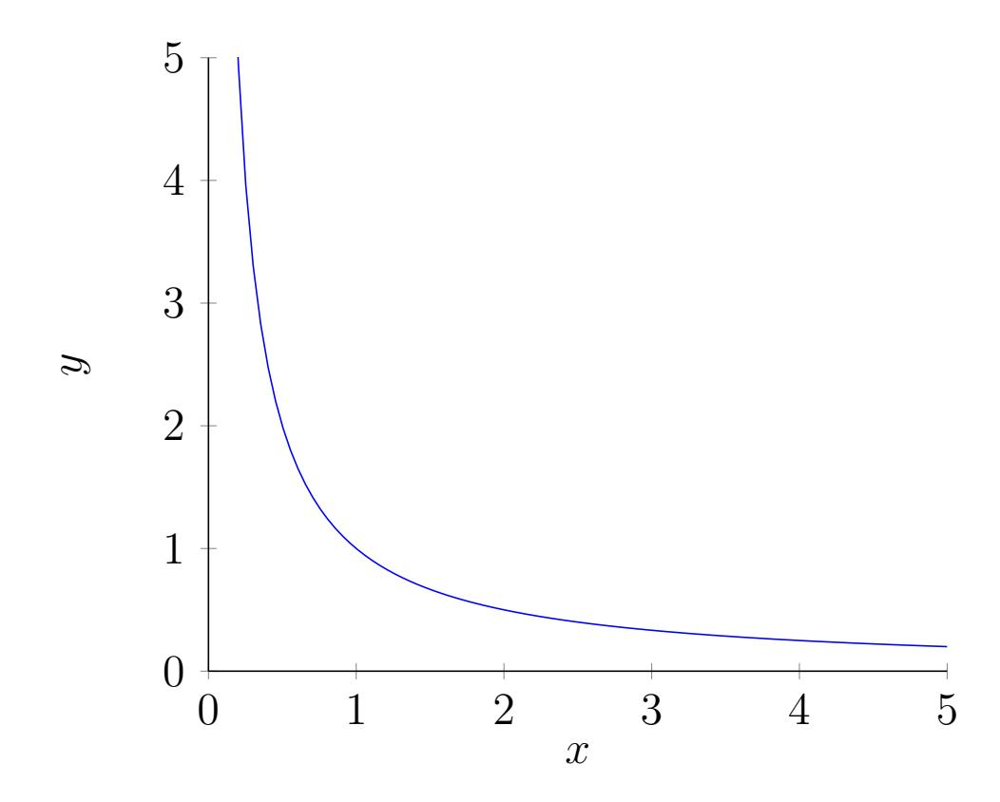
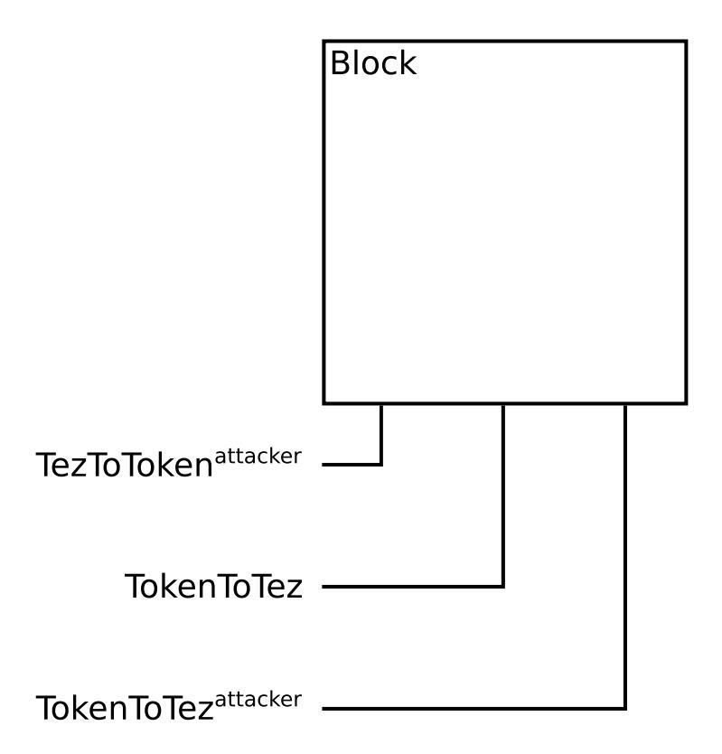
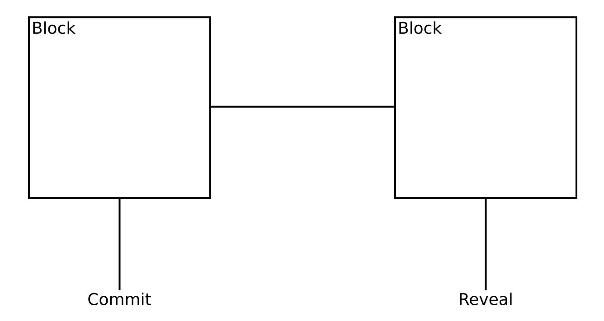

{0}------------------------------------------------

# Frontrunning on Automated Decentralized Exchange in Proof Of Stake Environment

#### Andrey Sobol

#### Abstract

This paper will contain the analysis of frontrunning potential on Quipuswap - a decentralized exchange with automated marketmaking in the context of the Proof Of Stake family consensus algo over Tezos protocol, and a proposal to boost the frontrunning resistance of the protocol via the implementation of commit reveal scheme.

{1}------------------------------------------------

### Contents

| 1 | Introduction                                               | 3  |
|---|------------------------------------------------------------|----|
|   | 1.1 Frontrunning                                     | 3  |
|   | 1.2 Frontrunning in blockchain                          | 3  |
|   | 1.3 Doublespending                                   | 3  |
| 2 | Frontrunning in automated Dex                              | 4  |
|   | 2.1 Quipuswap                                           | 4  |
|   | 2.2 Quipuswap Fee                                    | 4  |
| 3 | Consensus algo families                                    | 5  |
|   | 3.1 Proof of Work                                       | 5  |
|   | 3.2 Slot based Proof of Stake                           | 5  |
|   | 3.3 Randomness in Tezos                                 | 5  |
| 4 | Trade transaction in Quipuswap                             | 6  |
|   | 4.1 TezToToken                                       | 6  |
|   | 4.2 TokenToTez                                       | 7  |
| 5 | Main attack method                                         | 8  |
|   | 5.1 3 transactions in 1 block                        | 8  |
|   | 5.2 The order of transactions                           | 8  |
| 6 | Limiting                                                   | 9  |
| 7 | Commit-reveal                                              | 9  |
|   | 7.1 Security deposit                                    | 10 |
|   | 7.2 Should the commit-reveal method be implemented?  | 10 |
| 8 | Arbitration prividge                                       | 11 |
|   | 8.1 Commit-reveal                                       | 11 |
| 9 | Conclusion                                                 | 12 |
|   | 10 Acknowledgments                                         | 12 |

{2}------------------------------------------------

### 1 Introduction

#### 1.1 Frontrunning

The best way of getting a comlete idea of economic processes lies in the understanding of infomation asymmetry [\[1\]](#page-12-0) as it provides the agents on the market with different facts at separate points in time. The agents tend to manipulate the information regarding business transactions to their benefit. Such a phenomenon is called frontrunning [\[2\]](#page-12-1).

#### 1.2 Frontrunning in blockchain

Blockchain is a decentralized network of nodes with constant data exchange regarding the modifications in their state or mempool. As the transaction order is not assigned until the finalization state any decentralized exchange based on Blockchain will be prone to frontrunning.

#### 1.3 Doublespending

For the major part the issues related to doublespending [\[3\]](#page-12-2) are similar to the ones related to frontrunning. Only doublespending affects a certain user's balance in several competing transactions when frontrunning resembles the competition to affect the state that belongs to a specific decentralised exchange.

{3}------------------------------------------------

### 2 Frontrunning in automated Dex

#### 2.1 Quipuswap

In automated DEX (Decentralized Exchange) there are universal formulas to estimate the transaction price: those which stem from past trnsactions and those which affect the liquidity pool.

For example, Quipuswap [\[4\]](#page-12-3) [\[5\]](#page-12-4) is a uniswap-like [\[6\]](#page-12-5) automated decentralized exchange with a fixed fee that equeals the following:

$$x \cdot y = k$$

where constant k = 1

Thus a transaction affecting product x · y [\[7\]](#page-12-6) may be inserted before the user's transaction changing the transaction fee.

### 2.2 Quipuswap Fee

In Quipuswap transaction fee is incorporated and all possible revenue calculations shall taking the transaction fee into account.

$$feeRate = 333$$

{4}------------------------------------------------

meaning that fee can be calculated according to the formula:

$$fee = \frac{1}{feeRate} = 0.003003003 \approx 0.3\%$$

## 3 Consensus algo families

#### 3.1 Proof of Work

In Proof of Work [\[8\]](#page-12-7) protocol every miner aims at finding a Proof of Work proof in order to modify the blockchain. The winner of the evolutionary pow lotery will be revealed only post factum and the possibility to create every particular block depends on the hashpower in every second of the process and will not be know until the very end.

There are several research papers [\[9\]](#page-12-8) [\[10\]](#page-13-0) [\[11\]](#page-13-1) that analyse fruntrunning in PoW setting in detail.

#### 3.2 Slot based Proof of Stake

In slot based Proof of Stake [\[12\]](#page-13-2) [\[13\]](#page-13-3) we have a set of slots

$$Sl = \{sl_0, sl_1...\}$$

as well as a set of blocks that reffer to one another

$$B = \{b_0, b_1...\}$$

#### 3.3 Randomness in Tezos

For every cycle in Tezos a new randomness [\[15\]](#page-13-4) is formed which assignes the baking priority providing us with the infromation regarding the bakers beforehand. sli .

$$sl_i = (baker_k, baker_l...)$$

In the beginning of every cycle the order of bakers and their priority is public.

{5}------------------------------------------------

### 4 Trade transaction in Quipuswap

To illustrate a possible attack this paper will only consider smart contract functions: T okenT oT ez and T ezT oT oken.

Attacks related to functions investLiquidity and DivestLiquidity are identical to T okenT oT ez and T ezT oT oken thus such opportunities for frontrunning are not different from the ones listed and described below.

#### 4.1 TezToToken

s state of the current liquidity pool

tezosAmount the number of Tez sent by a user

tokenAmount minumum of tokens the user is willing to get back

$$TezToToken(s, tezosAmount, tokenAmount):$$
  
 $S \times TezosAmount \times TokenAmount \rightarrow S \times TokenAmount$ 

The result S × T okenAmount returns the new state and the number of tokens received by the user.

$$TezToToken(s, tezosAmount, tokenAmount) = \begin{cases} (news, tokensOut) & tokensOut \ge tokenAmount \\ (s, 0) & tokensOut < tokenAmount \end{cases}$$

Where news and tokensOut calculated as:

$$news.tezPool = s.tezPool + tezosAmount$$

$$news.tokenPool = \frac{s.invariant}{news.tezPool - \frac{tezosAmount}{feeRate}}$$

news.invariant = news.tezP ool · news.tokenP ool

$$tokensOut = s.tokenPool - news.tokenPool$$

{6}------------------------------------------------

Overall the function by changing the token pool in accordance to the formula x · y = k and k = 1 provided that tokensOut ≥ tokenAmount meaning that the customer will be able to get the required number of tokens. Otherwise the exchange will not happen and the state liquidity pool will not change.

#### 4.2 TokenToTez

s state of the current liquidity pool

tokenAmount the number of Tez sent by a user

tezosAmount minumum of tokens the user is willing to get back

$$TokenToTez(s, tokenAmount, tezosAmount):$$
  
 $S \times TokenAmount \times TezosAmount \rightarrow S \times TezosAmount$ 

The result S × T ezosAmount returns the new statea and the number of tokens received by the user.

$$TokenToTez(s, tokenAmount, tezosAmount) = \begin{cases} (news, tezOut) & tezOut \ge tezosAmount \\ (s, 0) & tezOut < tezosAmount \end{cases}$$

Where news and tezOut is calculated as:

news.tokenP ool = s.tokenP ool + tokenAmount

$$news.tezPool = \frac{s.invariant}{news.tokenPool - \frac{tokenAmount}{feeRate}}$$

news.invariant = news.tezP ool · news.tokenP ool

$$tezOut = s.tezPool - news.tezPool$$

The function is identical to T ezT oT oken.

{7}------------------------------------------------

### 5 Main attack method

The user initiats a transaction in the system: (T ezT oT oken, tezosAmount, tokenAmount). The validators apply this transaction to the present state s.

If T ezT oT oken(s, tezosAmount, tokenAmount) is valid, it returns (news, tokensOut) while tokensOut 6= tokenAmount. Such a transaction is prone to baker's attack attempts.

#### 5.1 3 transactions in 1 block

If bakerattacker forms a block battacker in the slot slattacker in such a case of an optimal attack the order of three transactions [\[16\]](#page-13-5) will form the following set battacker.

(T ezT oT okenattacker, T ezT oT oken, T okenT oT ezattacker) ⊂ battacker

#### 5.2 The order of transactions

- 1. (s 1 , tokensOutattacker) = T ezT oT okenattacker(s, tezosAmountattacker ,∞)
- 2. (s 2 , tokensOutuser) = T ezT oT oken(s 1 , tezosAmountuser, tokenAmountuser)
- 3. (s 3 , tezOutattacker) = T okenT oT ezattacker(s 2 , tokensOutattacker ,∞)

{8}------------------------------------------------

∞ states that this transaction can be processed at any price. In practice bakerattacker will assign a bigger price different from ∞ as there's no possibility to apply ∞ in Tesoz.

tezosAmountattacker is a prerequisite for s 1 transition into tokensOutuser = tokenAmountuser .

Condition for successful attack:

$$tezOut^{attacker} > tezosAmount^{attacker}$$

Profit for attacker will be:

$$profit = tezOut^{attacker} - tezosAmount^{attacker}$$

### 6 Limiting

To prevent frontrunning regarding the transaction, it's required to fullfill the following condition:

$$tokensOut = tokenAmount$$

Where tokensOut is calculated in regards to s the state of protocol as of the time of the transaction processing.

In this situation only one of such transactions will be incorporated into one block, as after the transaction has been accepted s will be changed and it will no longer be possible to reach this condition tokensOut = tokenAmount.

## 7 Commit-reveal

Possible protection solution is to ammend the protocol to make two-piece transaction. It will consist of the following two parts:

- 1. Commit revealing hash(T ezT oT oken, tezosAmount, tokenAmount, salt)
- 2. Reveal revealing T ezT oT oken, tezosAmount, tokenAmount, salt that can be announced at any moment

The state of s is transferred as of the time of publishing Reveal.

Commit and Reveal cannot be announced in one block thus preventing any possible manipulations by one baker.

{9}------------------------------------------------

#### 7.1 Security deposit

Under Commit stage it will be possible to submit security deposits that may account for the priorities for future transactions. Meaning that Reveal transaction may be icorporated into the block in the following order:

$$deposit(tx_i) > deposit(tx_{i+1}) > \dots$$

The outcomes of implementing the Commit Reaveal method alongside the security deposits will be quite interesting. It will endanger the security deposits of any baker that recoursed to frontrunning by creating several simultaneous transactions in TezToToken attacker and TokenToTex. Thus boosting the frontrunning resistance of the system.

#### 7.2 Should the commit-reveal method be implemented?

As its implementation will drastically complicate the protocol, in fact transforming it into a new one, it is recommended to introduce this method in the following version of the protocol.

{10}------------------------------------------------

### 8 Arbitration prividge

Time in blockchain is discreet and is revealed in the for of block slots.

$$Sl = \{sl_0, sl_1...\}$$

While on the centralised exchange the bidding is a continious process within time.

When bakerattacker with priority over slattacker it gets the arbitration previlidge among the centralised exchanges.

To create conditions for such a situation, no frontrunning is required. It is sufficient to take advantage of the block creating ability and initiate T ezT oT okenattacker or T okenT oT ezattacker and process the reverce transaction on the centralised exchange.

#### 8.1 Commit-reveal

The Commit-reveal metod will impede the development of such a scenario. Only if the baker bakerattacker controls 2 slots at a time - {sli , sli+1}. In this case both Commit and Reveal transactions can be initiated.

{11}------------------------------------------------

### 9 Conclusion

Decentralized exchanges, with or without automatic marketmaking, are prone to frontrunning. We see this in practice in ethereum conditions, we will see the same when QS is deployed in production.

This paper describes 2 attacks - a direct attack on a specific transaction in section 6 and an attack in which the baker has an advantage in arbitration in section 9.

In the event of an attack on a specific transaction, it is proposed to limit the execution of the transaction through a situation in which tokensOut = tokenAmount for the current state. This will mean that there is no way to front-end this particular transaction, but will also reduce the likelihood of successful execution of this transaction.

For future versions of QS, the Commit-Reveal protocol is proposed with the prioritization of transactions using a pledge system. It should be viewed solely as a proposal for future versions due to its excessive complexity and radical change in the essence of the protocol.

### 10 Acknowledgments

We thank Anastasiia Kondaurova, Matvii Sivoraksha, Kornii Vasylchenko, Charlie Wiser, Tezos Foundation and Madfish.Solutions for ideas and valuable feedback. This work has been supported by Tezos Foundation.

{12}------------------------------------------------

### References

- [1] Aboody, David; Lev, Baruch (2000) Information Asymmetry, R&D, and Insider Gains Journal of Finance. 55 (6): 2747–2766. doi:10.1111/0022-1082.00305.
- [2] Khan, Mozaffar and Lu, Hai, Do Short Sellers Front-Run Insider Sales? (January 28, 2011). MIT Sloan Research Paper No. 4706-08 <https://ssrn.com/abstract=1140694>
- [3] Chohan, Usman W., The Double Spending Problem and Cryptocurrencies (December 19, 2017). <https://ssrn.com/abstract=309017>
- [4] Quipuswap Source Code <https://github.com/madfish-solutions/quipuswap-core>
- [5] Andrey Sobol and Anastasiia Kondaurova Governance framework for Quipuswap - automated decentralized exchange <https://eprint.iacr.org/2020/1017>
- [6] Hayden Adams. Uniswap Whitepaper <https://hackmd.io/@HaydenAdams/HJ9jLsfTz>
- [7] Yi Zhang, Xiaohong Chen, and Daejun Park Formal Specification of Constant Product (x × y = k) Market Maker Model and Implementation Commit: c40c98d6ae35148b76742aaaa29e6eaa405b2f93 <https://github.com/runtimeverification/verified-smart-contracts/blob/uniswap/uniswap/x-y-k.pdf>
- [8] Bitcoin: A Peer-to-Peer Electronic Cash System Satoshi Nakamoto <https://bitcoin.org/bitcoin.pdf>
- [9] Philip Daian, Steven Goldfeder, Tyler Kell, Yunqi Li, Xueyuan Zhao, Iddo Bentov, Lorenz Breidenbach and Ari Juels Flash Boys 2.0: Frontrunning, Transaction Reordering, and Consensus

{13}------------------------------------------------

Instability in Decentralized Exchanges <https://arxiv.org/abs/1904.05234>

- [10] SoK: Transparent Dishonesty: Front-Running Attacks on Blockchain Shayan Eskandar, Seyedehmahsa Moosavi1, and Jeremy Clark [https://users.encs.concordia.ca/~clark/papers/2019\\_wtsc\\_front.pdf](https://users.encs.concordia.ca/~clark/papers/2019_wtsc_front.pdf)
- [11] Ethereum is a Dark Forest Dan Robinson and Georgios Konstantopoulos <https://medium.com/@danrobinson/ethereum-is-a-dark-forest-ecc5f0505dff>
- [12] Cryptocurrencies without Proof of Work Iddo Bentov and Ariel Gabizon and Alex Mizrahi <https://arxiv.org/abs/1406.5694>
- [13] Proof-of-stake in Tezos [https://tezos.gitlab.io/whitedoc/proof\\_of\\_stake.html](https://tezos.gitlab.io/whitedoc/proof_of_stake.html)
- [14] L.M Goodman. Tezos a self-amending crypto-ledger [https://tezos.com/static/white\\_paper-2dc8c02267a8fb86bd67a108199441bf.pdf](https://tezos.com/static/white_paper-2dc8c02267a8fb86bd67a108199441bf.pdf)
- [15] Random seed [https://tezos.gitlab.io/whitedoc/proof\\_of\\_stake.html#random-seed](https://tezos.gitlab.io/whitedoc/proof_of_stake.html#random-seed)
- [16] Andrey Sobol. Front running under PoS: a brief review <https://medium.com/madfish-solutions/front-running-under-pos-a-brief-review-be55e60e3bd5>