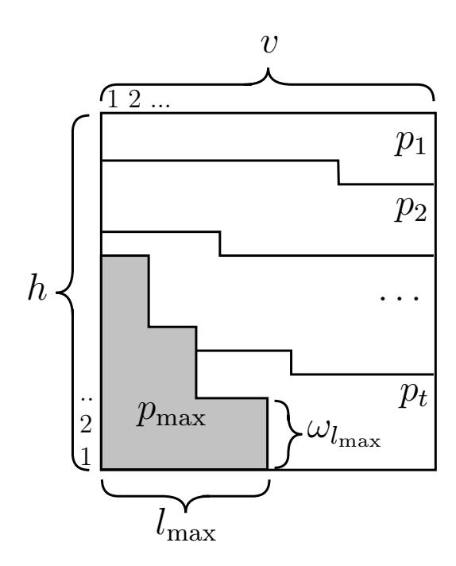
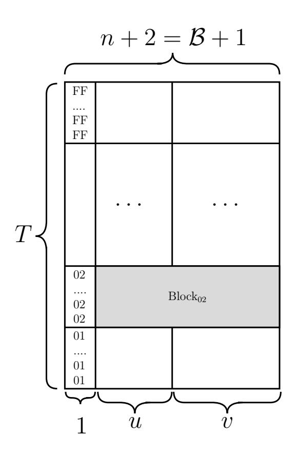

{0}------------------------------------------------

# An algorithm for bounding non-minimum weight differentials in 2-round LSX-ciphers

# Vitaly Kiryukhin

JSC «InfoTeCS», LLC «SFB Lab», Moscow, Russia Vitaly.Kiryukhin@infotecs.ru

#### Abstract

This article describes some approaches to bounding non-minimum weight differentials (EDP) and linear hulls (ELP) in 2-round LSX-cipher. We propose a dynamic programming algorithm to solve this problem. For 2-round Kuznyechik the nontrivial upper bounds on all differentials (linear hulls) with 18 and 19 active Sboxes was obtained. These estimates are also holds for other differentials (linear hulls) with a larger number of active Sboxes. We obtain a similar result for 2-round Khazad. As a consequence, the exact value of the maximum expected differential (linear) probability (MEDP/MELP) was computed for this cipher.

Keywords: Kuznyechik, Khazad, SPN, LSX, differential cryptanalysis, linear cryptanalysis, MEDP, MELP

# 1 Introduction

Differential [\[2\]](#page-15-0) and linear [\[3\]](#page-15-1) cryptanalysis are the two most known statistical attacks applicable to block ciphers. In this paper we will focus on the first method. The analogous results for linear cryptanalysis will be obtained in a similar way, due to the existing well-known duality [\[4\]](#page-15-2).

There are several approaches to estimating the security of ciphers against differential attacks. Many papers are devoted to the differential characteristics. The maximal probability of such characteristics (EDCP) decreases when the number of active Sboxes within R rounds increases. The upper bound on such probability can be analytically obtained for many LSX-ciphers (AES [\[11\]](#page-16-0), Khazad [\[12\]](#page-16-1), Kuznyechik [\[1\]](#page-15-3), etc.). In particular, these results are presented in [\[11,](#page-16-0) [17\]](#page-16-2).

However, many researchers note that differential cryptanalysis exploits differentials and not characteristics (see for example [\[16,](#page-16-3) [14,](#page-16-4) [5\]](#page-16-5)). The probability (EDP) of a differential (∆x, ∆y) corresponds to the sum of the probabilities of all characteristics with input difference ∆x and output difference 

{1}------------------------------------------------

∆y [\[8\]](#page-16-6). So from this point of view security of a cipher against differential attacks is based on the maximum expected differential probability (MEDP) over R ≥ 2 rounds.

Related works. For 2-round LSX-ciphers, some approaches to computing upper bounds on the MEDP are known [\[13,](#page-16-7) [14,](#page-16-4) [15\]](#page-16-8).

An algorithm for computing the exact MEDP of 2-round AES was proposed in [\[5\]](#page-16-5). Article [\[10\]](#page-16-9) describes upper bounds on the MEDP for so-called «nested» LSX-ciphers (e.g. 4-round AES).

In [\[16\]](#page-16-3) was shown that for some 2-round LSX-ciphers the MEDP is achieved by differentials involving a number of active Sboxes which exceeds the branch number of the linear layer (non-minimum weight differentials).

Some results about differential properties of 2-round Kuznyechik was obtained in [\[18\]](#page-16-10). The cited paper contains an algorithm for constructing the best minimum weight differentials and a proof that all other differentials have a lower EDP. Thanks to these two results, the exact value of the 2-round MEDP was computed.

Our contribution. We propose a dynamic programming algorithm designed for bounding non-minimum-weight differentials in 2-round LSXciphers. It uses only the difference distribution table and the differential branch number of the linear layer. The algorithm minimizes the number of high probability differential trails and does not try to minimize the total number of trails. Because of this reason, the algorithm is not effective for ciphers with small block size (for example, 32-bit 2-round AES).

We applied the developed algorithm to the 2-round Kuznyechik (Section [4](#page-14-0) and Appendix [B\)](#page-18-0): the probability of any 2-round differential (linear hull) with n + 3 = 19 active Sboxes is bounded by 2 <sup>−</sup>88.<sup>34</sup> (2 <sup>−</sup>79.63... correspondingly). These bounds also holds for any differential (linear hull) with a ≥ n+3 active Sboxes. Similar results were obtained for 2-round Khazad (Appendix [C\)](#page-20-0), and as a result, the exact values of MEDP = 2<sup>−</sup><sup>45</sup> + 2<sup>−</sup><sup>60</sup> and MELP = 2<sup>−</sup>37.80... are also proved.

The set of estimates obtained by us can be used in further researches to calculate the bounds on the MEDP (MELP) for more rounds. We plan to use our new results together with a modified KMT2-DC (KMT2) algorithm [\[6,](#page-16-11) [7\]](#page-16-12). The approach [\[7\]](#page-16-12) allows to incorporate other upper bounds when those bounds are superior to the values determined directly by the original algorithm [\[6\]](#page-16-11). In this way, we hope to prove the greater security of Kuznyechik to differential and linear cryptanalysis.

{2}------------------------------------------------

# 2 Notations and definitions

An LSX cipher E consists of sequence of rounds. Each of them contains three operations:  $\mathsf{X}-\mathsf{modulo}\ 2$  addition of an input block with an iterative key,  $\mathsf{S}-\mathsf{parallel}\ \mathsf{application}\ \mathsf{of}\ \mathsf{a}\ \mathsf{fixed}\ \mathsf{bijective}\ \mathsf{substitution}\ \mathsf{s},\ \mathsf{L}-\mathsf{linear}\ \mathsf{transformation}\ \mathsf{which}\ \mathsf{may}\ \mathsf{be}\ \mathsf{represented}\ \mathsf{as}\ \mathsf{multiplication}\ \mathsf{by}\ \mathsf{the}\ \mathsf{binary}\ \mathsf{matrix}.$ 

To simplify the text and notation we consider only byte-oriented LSX-ciphers.

Let us denote:

n – block size in bytes,

 $\oplus$  – bitwise XOR operation,

v[i] – i-th element of vector or sequence v,  $1 \le i \le l$ , where l is the number of elements of v,

 $Supp(v) = \{i : v[i] \neq 0\} - \text{the support of a vector } v,$ 

 $\operatorname{wt}(v) = \#\{i \colon v[i] \neq 0\}$  – the weight of a vector v,

 $\mathbf{F}_q$  – finite field of q elements,

 $\mathbf{F}_q^*$  – set of all nonzero elements of the field  $\mathbf{F}_q$ ,

 $\mathbf{F}_q^l$  – set of *l*-element vector over  $\mathbf{F}_q$ .

Depending on the context, we will interpret a value  $z \in \overline{0, 2^l - 1}$  as element of  $\mathbf{F}_{2^l}$  or  $\mathbf{F}_2^l$  or as an integer.

**Definition 1.** Let  $s: \mathbf{F}_2^8 \to \mathbf{F}_2^8$ , let  $a, b \in \mathbf{F}_2^8$  be fixed, and let x be a random variable having uniform distribution on  $\mathbf{F}_2^8$ . The differential probability of (a,b) is defined as

$$\mathrm{DP}\left(a,b\right) = \mathrm{Pr}_{x}\left(\mathsf{s}(x) \oplus \mathsf{s}(x \oplus a) = b\right).$$

<span id="page-2-0"></span>**Definition 2.** Let E be a cipher with key-size  $\kappa$  and block-size l. Let x be a random variable having uniform distribution on  $\mathbf{F}_2^l$ . Then the expected (over keys K) differential probability of  $(\Delta x, \Delta y)$  is defined as

EDP 
$$(\Delta x, \Delta y) = 2^{-\kappa} \sum_{K \in \mathbf{F}_2^{\kappa}} \Pr_x (E_K(x) \oplus E_K(x \oplus \Delta x) = \Delta y),$$

where  $E_K$  is a cipher with key K.

**Definition 3.** The maximum expected differential probability is

$$MEDP = \max_{\Delta x \neq 0, \Delta y} EDP(\Delta x, \Delta y)$$

{3}------------------------------------------------

**Definition 4.** Let s be a function  $\mathbf{F}_2^8 \to \mathbf{F}_2^8$ . The differential distribution table DDT is a  $2^8 \times 2^8$  matrix of transition probabilities such that

$$DDT[a][b] = \frac{\#\left\{x \in \mathbf{F}_2^8, \ \mathsf{s}\left(x\right) \oplus \mathsf{s}\left(x \oplus a\right) = b\right\}}{2^8} = DP\left(a, b\right), \ a, b \in \mathbf{F}_2^8,$$

and  $p_{\text{max}} = \max_{a \neq 0, b} \text{DDT}[a][b].$ 

**Definition 5.** Let L-transformation (from  $\mathbf{F}_{2^8}^n$  to  $\mathbf{F}_{2^8}^n$ ) be  $\mathbf{F}_{2^8}$ -linear. We associate with L the code  $\mathcal{C}_{\mathsf{L}}$  of length 2n over  $\mathbf{F}_{2^8}$  defined by

$$\mathcal{C}_{\mathsf{L}} = \{ (\mathbf{c}, \mathsf{L}(\mathbf{c})), \ \mathbf{c} \in \mathbf{F}_{2^8}^n \}.$$

The differential branch number  $\mathcal{B}_{L}$  of the linear transformation L is the minimum distance of the code  $\mathcal{C}_{L}$ 

$$\mathcal{B}_{\mathsf{L}} = \min_{\mathbf{c} \neq 0} \operatorname{wt}(\mathbf{c}, \mathsf{L}(\mathbf{c})).$$

Further, to simplify the text, we assume that  $C_L$  is an MDS code and  $\mathcal{B} = \mathcal{B}_L = n + 1$ .

2-round LSX-cipher may be represented as a sequence of operations

$$y = K_3 \oplus S(K_2 \oplus LS(K_1 \oplus x)),$$

where  $x, y \in \mathbf{F}_{2^8}^n$  are the plaintext and the ciphertext,  $K_1, K_2, K_3 \in \mathbf{F}_{2^8}^n$  are round keys derived from the masterkey K. The linear transformation on the last round was omitted without loss of generality.

A differential trail  $\Omega = (\Delta x, \Delta_1, \Delta_2, \Delta y)$  in 2-round LSX is a collection of four differences, where  $\Delta x = x \oplus x'$ ,  $\Delta_1$  is the difference after the first nonlinear transformation,  $\Delta_2 = \mathsf{L}(\Delta_1)$ ,  $\Delta y = y \oplus y'$ , x and x' are plaintext blocks, y and y' are the corresponding ciphertext blocks.

**Definition 6** ([16]). The expected 2-round trail  $\Omega$  probability is defined as

EDCP 
$$(\Omega) = 2^{-\kappa} \sum_{K \in \mathbf{F}_2^{\kappa}} \Pr_x \left( \Delta_1 = x_1 \oplus x_1' \text{ and } \Delta_2 = x_2 \oplus x_2' \text{ and } \Delta y = y \oplus y' \right),$$

where x is a random variable with the uniform distribution,  $x' = \Delta x \oplus x$ ,  $x_1, x_1'$  are states after the first S-transformation,  $x_2, x_2'$  are states before the second S-transformation,  $\kappa$  is a size of the masterkey K.

We futher assume that all round keys are independent and uniformly distributed (so-called Markov assumption [8]). Under this assumption we have

EDCP 
$$(\Delta x, \Delta_1, \Delta_2, \Delta y) = \left(\prod_{j=1}^n \text{DP}(\Delta x[j], \Delta_1[j])\right) \left(\prod_{j=1}^n \text{DP}(\Delta_2[j], \Delta y[j])\right).$$

{4}------------------------------------------------

Note that if EDCP  $(\Delta x, \Delta_1, \Delta_2, \Delta y) \neq 0$ , then Supp  $(\Delta x) = \text{Supp }(\Delta_1)$ , Supp  $(\Delta_2) = \text{Supp }(\Delta y)$  and  $(\Delta_1, \Delta_2)$  is a codeword of the code  $\mathcal{C}_{\mathcal{L}}$ . Therefore

$$= \sum_{\substack{(\Delta_1, \Delta_2) \in \mathcal{C}_{\mathcal{L}}, \\ \operatorname{Supp}(\Delta x) = \operatorname{Supp}(\Delta y)}} \prod_{j \in \operatorname{Supp}(\Delta x)} \operatorname{DP}(\Delta x[j], \Delta_1[j]) \prod_{j \in \operatorname{Supp}(\Delta y)} \operatorname{DP}(\Delta_2[j], \Delta y[j]).$$

The equality between the above formula for EDP  $(\Delta x, \Delta y)$  and the definition 2 was proved in [8].

We define the weight (number of nonzero bytes) of the differential  $(\Delta x, \Delta y)$  or the differential trail  $(\Delta x, \Delta_1, \Delta_2, \Delta y)$  as  $\operatorname{wt}(\Delta x) + \operatorname{wt}(\Delta y)$ . Denote

$$MEDP_{w} = \max_{\Delta x \neq 0, \Delta y, \text{wt}(\Delta x) + \text{wt}(\Delta y) = w} EDP(\Delta x, \Delta y),$$

$$MEDP_{w}^{+} = \max_{\Delta x \neq 0, \Delta y, \text{wt}(\Delta x) + \text{wt}(\Delta y) \geq w} EDP(\Delta x, \Delta y), \quad \mathcal{B} \leq w \leq 2 \cdot n.$$

Note that all mentioned definitions EDP, EDCP, MEDP are related to 2-round case unless otherwise stated.

Our main goal is to compute the nontrivial upper bound on  $MEDP_{\mathcal{B}+1}^+$ ,  $MEDP_{\mathcal{B}+2}^+$  etc.

# <span id="page-4-1"></span>3 Upper bound on non-minimum weight differentials

The strategy of our approach is as follows. Each differential trail  $\Omega = (\Delta x, \Delta_1, \Delta_2, \Delta y)$  in 2-round differential  $(\Delta x, \Delta y)$  uniquely corresponds to codeword  $(\Delta_1, \Delta_2)$  in  $\mathcal{C}_{\mathcal{L}}$ . All possible trails (codewords) in the differential have the form  $\operatorname{Supp}(\Delta x) = \operatorname{Supp}(\Delta_1)$ ,  $\operatorname{Supp}(\Delta_2) = \operatorname{Supp}(\Delta y)$ . Derive constraints («maximum cost») for the entire set of such codewords. Divide the set into several subsets. Compute contribution to the constraints («cost») and the corresponding upper bound («value») for each possible subset. Select subsets so that the upper bound («total value») is maximum and the selection satisfies all constraints («total cost» does not exceed «maximum cost»). Thus, we obtain the upper bound on the differential.

# 3.1 Auxiliary lemmas

<span id="page-4-0"></span>**Lemma 1** (The rearrangement inequality [9]). Let  $l \in \mathbb{N}$ , and suppose  $c_1, c_2, \ldots, c_l$  and  $d_1, d_2, \ldots, d_l$  are sequences of nonnegative values. Let

{5}------------------------------------------------

 $\widetilde{c}_1, \widetilde{c}_2, \ldots, \widetilde{c}_l$  and  $\widetilde{d}_1, \widetilde{d}_2, \ldots, \widetilde{d}_l$  be the sequences obtained by sorting original sequences in nonincreasing order. Then

$$\sum_{i=1}^{l} c_i d_i \le \sum_{i=1}^{l} \widetilde{c}_i \widetilde{d}_i.$$

<span id="page-5-0"></span>**Lemma 2.** Let  $l \in \mathbb{N}$ , and suppose  $c_1, c_2, \ldots, c_l$ , and  $\widetilde{c}_1, \widetilde{c}_2, \ldots, \widetilde{c}_l$ , and  $d_1, d_2, \ldots, d_l$  are sequences of nonnegative values. Each of them sorted in nonincreasing order. Suppose there exists l',  $1 \le l' \le l$ , such that

- 1)  $\widetilde{c}_i \geq c_i$ , for  $1 \leq i \leq l'$
- 2)  $\widetilde{c}_i \leq c_i$ , for  $l' + 1 \leq i \leq l$ 3)  $\sum_{i=1}^{l} c_i \leq \sum_{i=1}^{l} \widetilde{c}_i$ Then  $\sum_{i=1}^{l} c_i d_i \leq \sum_{i=1}^{l} \widetilde{c}_i d_i$ .

*Proof.* The proof of the lemma is given in particular in [6]. 

If statements 1-3 holds for some sequences  $\tilde{\boldsymbol{c}}$  and  $\boldsymbol{c}$ , then we will say that  $\widetilde{\boldsymbol{c}}$  is greater than  $\boldsymbol{c}$  under the conditions of Lemma 2. Let D be a  $h \times v$  matrix such that

$$D[i][j] \in \{p_1, p_2, ..., p_t, p_{\max}\}, \ 1 \le i \le h, \ 1 \le j \le v, \ t \in \mathbb{N},$$
  
 $0 \le p_1 < p_2 < ... < p_t < p_{\max} \le 1, \ p_k, p_{\max} \in \mathbb{R}, \ 1 \le k \le t.$ 

Denote

$$\nu_k(D) = \#\{(i,j) : D[i][j] = p_k, \ 1 \le i \le h, \ 1 \le j \le v\}, \ 1 \le k \le t,$$

$$\nu_{\max}(D) = \#\{(i,j) : D[i][j] = p_{\max}, \ 1 \le i \le h, \ 1 \le j \le v\}.$$
(1)

Denote by  $\omega_l(D)$  the number of rows containing exactly l elements  $p_{\text{max}}$ 

$$\omega_{l}(D) = \#\{i \colon \#\{j \colon D[i][j] = p_{\max}, \ 1 \le j \le v\} = l, \ 1 \le i \le h\},$$

$$\sum_{l=1}^{v} \omega_{l}(D) \cdot l = \nu_{\max}(D), \quad l_{\max}(D) = \max_{\omega_{l}(D) \ne 0} (l).$$
(2)

Let D be the reordered matrix D (see Fig. 1). The reordering procedure consists of three following steps:

- 1) sort each row of D in nonicreasing order;
- 2) sort each column of  $\tilde{D}$  in nonicreasing order;
- 3) reorder each unequal to  $p_{\text{max}}$  element:

$$\forall i, j, i', j' : \widetilde{D}[i][j] = p_{\text{max}} \text{ or } \widetilde{D}[i'][j'] = p_{\text{max}} \text{ or }$$

$$\left(\widetilde{D}[i][j] \ge \widetilde{D}[i'][j'], i' > i \text{ or } i' = i, j' > j\right),$$

$$1 \le i, i' \le h, 1 \le j, j' \le v.$$

{6}------------------------------------------------

<span id="page-6-3"></span>Lemma 3. Let <sup>D</sup> and <sup>D</sup><sup>e</sup> be defined as above, then

$$\nu_k(D) = \nu_k(\widetilde{D}), \ \nu_{\max}(D) = \nu_{\max}(\widetilde{D}), \ 1 \le k \le t,$$

$$\omega_l(D) = \omega_l(\widetilde{D}), \ l_{\max}(D) = l_{\max}(\widetilde{D}), \forall l \in \mathbb{N},$$

$$\sum_{i=1}^h \prod_{j=1}^v D[i][j] \le \sum_{i=1}^h \prod_{j=1}^v \widetilde{D}[i][j].$$



Figure 1: Example of matrix <sup>D</sup><sup>e</sup> after the reordering procedure.

Proof. Let <sup>D</sup><sup>e</sup> <sup>=</sup> <sup>D</sup> before reordering. We show that at each of three step the value

<span id="page-6-1"></span><span id="page-6-0"></span>
$$\sum_{i=1}^{h} \prod_{j=1}^{v} \widetilde{D}[i][j] \tag{3}$$

does not decrease. We also show that the final form of <sup>D</sup><sup>e</sup> is given uniquely (up to permutation of identical elements).

The first step of the reordering procedure does not change the value [\(3\)](#page-6-1) due to commutativity of multiplication.

By the rearrangement inequality it follows that the second step does not decrease [\(3\)](#page-6-1).

Note that after these two steps

<span id="page-6-2"></span>
$$\prod_{j=1}^{v} \widetilde{D}[i][j] \ge \prod_{j=1}^{v} \widetilde{D}[i+1][j], \ \forall i = \overline{1, h-1}.$$
 (4)

The set of ω0, . . . , ω<sup>l</sup>max is also the same as before. Therefore, the positions of all elements pmax are known (the gray area in figure [1\)](#page-6-0).

{7}------------------------------------------------

```
1: for pos := 1 to N-1 do
2: \operatorname{val}_{\max} := \max \left( \widetilde{D}[i_{\operatorname{pos}+1}][j_{\operatorname{pos}+1}], \widetilde{D}[i_{\operatorname{pos}+2}][j_{\operatorname{pos}+2}], \ldots, \widetilde{D}[i_N][j_N] \right)
3: \operatorname{pos}_{\max} := \min \left\{ \operatorname{p:} \widetilde{D}[i_{\operatorname{p}}][j_{\operatorname{p}}] = \operatorname{val}_{\max}, \ \operatorname{pos} + 1 \leq \operatorname{p} \leq N \right\}
4: if \widetilde{D}[i_{\operatorname{pos}}][j_{\operatorname{pos}}] < \operatorname{val}_{\max}  then
5: \operatorname{swap} \left( \widetilde{D}[i_{\operatorname{pos}}][j_{\operatorname{pos}}], \widetilde{D}[i_{\operatorname{pos}_{\max}}][j_{\operatorname{pos}_{\max}}] \right)
6: \operatorname{nonincreasing\_sort} \left( \widetilde{D}[1][j_{\operatorname{pos}_{\max}}], \ldots, \widetilde{D}[h][j_{\operatorname{pos}_{\max}}] \right)
7: end if
8: end for
```

Algorithm 1: Step 3 of the reordering procedure

For step 3, we will use a procedure similar to the well-known selection sort. Let's write a row-by-row coordinates of all elements

<span id="page-7-0"></span>
$$(1,1), (1,2), \dots, (1,v), (2,1), (2,2), \dots, (2,v), \dots, (h,1), (h,2), \dots, (h,v).$$

$$(5)$$

Remove from (5) all elements (i,j) such that  $\widetilde{D}[i][j] = p_{\text{max}}$ . We obtain the sequence of indexes

Indexes = 
$$(i_1, j_1), (i_2, j_2), \dots, (i_N, j_N), N \leq h \cdot v$$
.

Reorder the table elements according to the pseudocode.

We have got the table as in figure 1. Let us show further that value (3) has never decreased in the reordering process.

Let's consider line 5 of the pseudocode (Algorithm 1). If  $i_{pos} = i_{pos_{max}}$  then (3) remains the same due to commutativity of multiplication. If  $i_{pos} < i_{pos_{max}}$  then (3) is not decreased due to (4). But after the exchange of elements, inequality (4) may not be true any more.

Line 6 has a technical role and does not affect the final appearance of  $\widetilde{D}$ . This sort does not decrease (3) because of the rearrangement inequality. Inequality (4) becomes true after this sorting. Also note that sorting does not change the previously reordered elements.

The Lemma is proved.

<span id="page-7-2"></span>**Lemma 4.** Let D and  $\widetilde{D}$  be given as in Lemma 3. Suppose  $c_1, c_2, \ldots, c_h$  is a sequence of nonnegative values. Let  $\widetilde{c}_1, \widetilde{c}_2, \ldots, \widetilde{c}_h$  be obtained by sorting the above sequence in nonincreasing order. Then

$$\sum_{i=1}^{h} c_i \prod_{j=1}^{v} D[i][j] \le \sum_{i=1}^{h} \widetilde{c}_i \prod_{j=1}^{v} \widetilde{D}[i][j].$$

*Proof.* Directly follows from Lemmas 1 and 3.

{8}------------------------------------------------

### 3.2 Representation of trails in the differential

Consider an arbitrary differential (∆x, ∆y), wt(∆x) + wt(∆y) = B + 1. The differential consists only of trails (∆x, ∆1, ∆2, ∆y) such that Supp(∆x) = Supp(∆1) = {k1, k2, . . . , kt}, Supp(∆y) = Supp(∆2) = {m1, m2, . . . , mr}, t + r = B + 1 = n + 2.

It is easy to show that the number of differential trails does not exceed T ≤ (2<sup>8</sup>−1)<sup>2</sup> . Otherwise, there is a pair of codewords (∆1, ∆2) and (∆<sup>0</sup> 1 , ∆<sup>0</sup> 2 ) such that

$$\operatorname{wt}\left((\Delta_1,\Delta_2)\oplus(\Delta_1',\Delta_2')\right)<\mathcal{B}.$$

Let's imagine a set of differential trails in the form of a table. Such a table, called Trails, has a size of T × (n + 2). Each row is non-zero bytes of the corresponding codeword

$$\operatorname{Trails}[i] = \Delta_{1}[k_{1}], \dots, \Delta_{1}[k_{t}], \Delta_{2}[m_{1}], \dots, \Delta_{2}[m_{r}], \ 1 \leq i \leq T,$$

$$\operatorname{EDP}(\Delta x, \Delta y) = \sum_{i=1}^{T} \prod_{j=1}^{t} \operatorname{DP}(\Delta x[k_{j}], \operatorname{Trails}[i][j]) \cdot \prod_{j=t+1}^{t+r} \operatorname{DP}(\operatorname{Trails}[i][j], \Delta y[m_{j-t}]).$$
(6)

For definiteness let's sort the table by the byte value in the first column (see Fig[.2\)](#page-9-0).

Let an arbitrary byte of ∆x with an index k<sup>j</sup> , 1 ≤ j ≤ t be fixed. Consider j-th column of Trails. Bytes with the same value x will have the same probability DP(∆x[k<sup>j</sup> ], x). Similarly for ∆y. Let us denote the corresponding table by DP<sup>∗</sup> (Trails), where

<span id="page-8-0"></span>
$$DP^* (Trails[i][j]) = DP(\Delta x[k_j], Trails[i][j]), \ 1 \le i \le T, \ 1 \le j \le t,$$

$$DP^* (Trails[i][j]) = DP(Trails[i][j], \Delta y[m_{j-t}]), \ 1 \le i \le T, \ t < j \le t + r.$$

$$(7)$$

We will divide table columns into 3 groups (subtables). The group C contains exactly 1 column. In the group Trails<sup>I</sup> there are u columns. The third group has v columns, 1 + u + v = n + 2.

$$Trails = C||Trails_{\mathbb{I}}||Trails_{\mathbb{I}},$$

$$DP^* (Trails) = DP^* (Trails_{\mathbb{I}}) ||DP^* (Trails_{\mathbb{I}}) ||DP^* (Trails_{\mathbb{I}}),$$
(8)

where || is concatenation. We also denote

$$Block_j = \{Trails_{\mathbb{I}}[i] | | Trails_{\mathbb{I}}[i] : C[i] = j, \ 1 \le i \le T \}, \ j \in \mathbf{F}_{2^8}^*.$$
 (9)

{9}------------------------------------------------



Figure 2: Representation of Trails

### <span id="page-9-0"></span>3.3 DDT simplification

Let all elements in each row (column) of the DDT be sorted in nonincreasing order. The row and the column with zero indexes are ignored. Let us denote the such table  $DDT_{row}$  ( $DDT_{col}$  correspondingly)

<span id="page-9-1"></span>
$$DDT_{row}[x][1] \ge DDT_{row}[x][2] \ge ... \ge DDT_{row}[x][2^8 - 1], \ x \in \mathbf{F}_{2^8}^*,$$
  
 $DDT_{col}[1][y] \ge DDT_{col}[2][y] \ge ... \ge DDT_{col}[2^8 - 1][y], \ y \in \mathbf{F}_{2^8}^*.$ 

We define sequences  $m_x$ ,  $m_y$  and m as

$$\boldsymbol{m}_{x}[i] = \max_{a \in \mathbf{F}_{28}^{*}} \mathrm{DDT_{row}}[a][i], \quad \boldsymbol{m}_{y}[i] = \max_{a \in \mathbf{F}_{28}^{*}} \mathrm{DDT_{col}}[i][a], \quad i \in \mathbf{F}_{28}^{*}, \quad (10)$$
$$\boldsymbol{m}[i] = \max(\boldsymbol{m}_{x}[i], \boldsymbol{m}_{y}[i]), \quad 1 \leq i \leq 2^{8} - 1.$$

The sequence  $\boldsymbol{m}$  is «greater» than any sorted nontrivial row/column of the DDT. Let  $\boldsymbol{r}$  be any nontrivial sorted row/column of the DDT. Then,  $\boldsymbol{m}[i] \geq \boldsymbol{r}[i], 1 \leq i \leq 2^8-1$ . Denote  $\nu_{\max}(\boldsymbol{m}) = \#\{i : \boldsymbol{m}[i] = p_{\max}, 1 \leq i \leq 2^8-1\}$ . Note, that  $\sum_{i=1}^{2^8-1} \boldsymbol{m}[i] \geq 1$ .

We also define the sequences  $\rho$ ,  $\rho_x$ ,  $\rho_y$  as follows. Let  $\rho_x$  ( $\rho_y$ ) be one of the nontrivial sorted row (column) of the DDT. The sequence  $\rho_x$  ( $\rho_y$ ) must be greater than any other sorted row (column) of the DDT under the conditions of Lemma 2,  $\sum_{i=1}^{2^{8}-1} \rho_x[i] = \sum_{i=1}^{2^{8}-1} \rho_y[i] = 1$ . If  $\rho_x$  is greater than  $\rho_y$  under the conditions of Lemma 2, then  $\rho = \rho_x$  otherwise  $\rho = \rho_y$ .

### 3.4 Constraints

We formulate a Lemma giving us some restrictions on the set of codewords.

{10}------------------------------------------------

<span id="page-10-3"></span>**Lemma 5.** Let table Trails<sub>III</sub> and sequence m be given as above. The table  $DP^*$  (Trails<sub>III</sub>) is defined by analogy with (7). Let us denote  $\omega_l$  ( $DP^*$  (Trails<sub>III</sub>)) the number of rows containing exactly l elements  $p_{max}$ :

$$\omega_l \left( \text{DP}^* \left( \text{Trails}_{\mathbb{II}} \right) \right) = \#\{i : \#\{j : \text{DP}^* \left( \text{Trails}_{\mathbb{II}}[i][j] \right) = p_{\text{max}}, \ 1 \le j \le v \} = l, \ 1 \le i \le T \}.$$
(11)

Then

<span id="page-10-0"></span>
$$\omega_2 \le {v \choose 2} \cdot (\nu_{\text{max}}(\boldsymbol{m}))^2,$$
 (12)

and finally

<span id="page-10-1"></span>
$$\sum_{l=2}^{v} \omega_l \cdot {l \choose 2} \le {v \choose 2} \cdot (\nu_{\max}(\boldsymbol{m}))^2. \tag{13}$$

*Proof.* Let's consider two arbitrary columns of Trails<sub>II</sub>. These columns do not contain any identical byte pairs. The total number of different byte pairs does not exceed  $T \leq (2^8 - 1)^2$ . In each column not more than  $\nu_{\text{max}}(\boldsymbol{m})$  values are mapped in  $p_{\text{max}}$ . Hence, not more than  $(\nu_{\text{max}}(\boldsymbol{m}))^2$  byte pairs are mapped in  $(p_{\text{max}}, p_{\text{max}})$ . The number of ways to select 2 columns is  $\binom{v}{2}$ .

Thus we have (12).

Suppose there is a row containing 3 elements  $p_{\text{max}}$ . Then  $\binom{3}{2} = 3$  pairs of columns are generated, each of which contains a pair  $(p_{\text{max}}, p_{\text{max}})$ . Similarly for rows with l elements  $p_{\text{max}}$ . Each of them «takes»  $\binom{l}{2}$  pairs. Thereby we obtain (13).

# 3.5 Bounds on DP\*(Block)

Suppose that we are given an arbitrary Block  $\in \{\text{Block}_j, j \in \mathbf{F}_{2^8}^*\}$ . The block dimensions are  $h \cdot (n+1)$ ,  $h \leq 2^8 - 1$ . We will give an upper bound on Block's contribution to the differential  $\sum_{i=1}^h \prod_{j=1}^{n+1} \mathrm{DP}^*$  (Block[i][j]). We will use Lemmas 2, 3, 4.

Consider v = 0 and u = n + 1. Then we have

<span id="page-10-2"></span>
$$\sum_{i=1}^{h} \prod_{j=1}^{u} \mathrm{DP}^* \left( \mathrm{Block}[i][j] \right) \le \max \left( \max_{x \in \mathbf{F}_{2^8}^*} \sum_{i=1}^{2^8 - 1} \left( \mathrm{DDT}[x][i] \right)^u, \max_{y \in \mathbf{F}_{2^8}^*} \sum_{i=1}^{2^8 - 1} \left( \mathrm{DDT}[i][y] \right)^u \right).$$

$$(14)$$

The inequality (14) is so-called «FSE 2003 bound» on MEDP [14]. Lemma 2 allows us to select a row (column) that maximizes expression (14). Then

{11}------------------------------------------------

we can rewrite inequality (14)

$$\sum_{i=1}^{h} \prod_{j=1}^{u} \mathrm{DP}^* \left( \mathrm{Block}[i][j] \right) \le \sum_{i=1}^{2^8 - 1} (\boldsymbol{\rho}[i])^u. \tag{15}$$

Let v > 0. We will divide Block into two parts:

$$Block = Block_{I} || Block_{II},$$

$$\sum_{i=1}^{h} \prod_{j=1}^{n+1} \mathrm{DP}^* \left( \mathrm{Block}[i][j] \right) = \sum_{i=1}^{h} \prod_{j=1}^{u} \mathrm{DP}^* \left( \mathrm{Block}_{\mathbb{I}}[i][j] \right) \prod_{j=1}^{v} \mathrm{DP}^* \left( \mathrm{Block}_{\mathbb{II}}[i][j] \right),$$
(16)

where Block<sub>I</sub> contains u columns, and Block<sub>II</sub> contains v columns, u + v = n + 1. We will evaluate the contribution of Block<sub>I</sub> by using the sequence

$$(\rho[1])^u, (\rho[2])^u, \dots, (\rho[2^8-1])^u.$$
 (17)

We will also get a bound on the contribution of  $Block_{\mathbb{II}}$  by using Lemma 3. Suppose that each column of  $DP^*(Block_{\mathbb{II}})$  contains elements from the sequence m. Assume also that we know

$$\omega_l \left( \text{DP}^* \left( \text{Block}_{\mathbb{II}} \right) \right) = \#\{i : \#\{j : \text{DP}^* \left( \text{Block}_{\mathbb{II}}[i][j] \right) = p_{\text{max}}, 1 \le j \le v \} = l, 1 \le i \le h \},\ 0 \le l \le v,$$

$$\sum_{l=1}^{v} \omega_l \cdot l \le \nu_{\max}(\boldsymbol{m}) \cdot v. \tag{18}$$

In other words,  $\omega_l$  is the number of rows containing exactly l elements  $p_{\text{max}}$ . Let  $\widetilde{\text{Block}_{\mathbb{II}}}$  be a table obtained by the reordering procedure from Lemma 3. Then we get

$$\sum_{i=1}^{h} \prod_{j=1}^{v} \mathrm{DP}^* \left( \mathrm{Block}_{\mathbb{II}}[i][j] \right) \leq \sum_{i=1}^{h} \prod_{j=1}^{v} \mathrm{DP}^* \left( \widetilde{\mathrm{Block}_{\mathbb{II}}}[i][j] \right)$$

Thanks to Lemma 4, we finally obtain

<span id="page-11-0"></span>
$$\sum_{i=1}^{h} \prod_{j=1}^{n+1} \mathrm{DP}^* \left( \mathrm{Block}[i][j] \right) \le \sum_{i=1}^{h} \left( \boldsymbol{\rho}[i] \right)^u \prod_{j=1}^v \mathrm{DP}^* \left( \widetilde{\mathrm{Block}}_{\mathbb{II}}[i][j] \right). \tag{19}$$

Thus, if we know the distribution  $\omega_l$ ,  $0 \le l \le v$ , then we can calculate the upper bound on  $\sum_{i=1}^h \prod_{j=1}^{n+1} \mathrm{DP}^*$  (Block[i][j]).

{12}------------------------------------------------

### <span id="page-12-0"></span>3.6 Optimization problem

Let's will form all possible sets

<span id="page-12-1"></span>
$$s_i = \{(l, \omega_l), 0 \le l \le v\}, \ 1 \le i \le N.$$
 (20)

For each set  $\sum_{l=1}^{v} \omega_l \cdot l = \nu_{\max}(\boldsymbol{m}) \cdot v$  is true. In fact, we construct all possible partitions of the number  $\nu_{\max}(\boldsymbol{m}) \cdot v$ . The maximum term in the partition does not exceed v.

For each set  $s_i$ , calculate the estimate  $\pi_i$  using (19) and «contribution»  $\zeta_i$  for constraints (13):  $\zeta_i = \sum_{l=2}^v \omega_l \cdot {l \choose 2}$ . We can choose such u and v, which would minimize the final estimation. For most practical cases we use u=1 and v=n. We get a set of pairs

<span id="page-12-2"></span>
$$(\pi_1, \zeta_1), (\pi_2, \zeta_2), \dots, (\pi_N, \zeta_{N'}).$$
 (21)

Pairs with the same  $\zeta_i$  value can be removed. The pair with the largest  $\pi_i$  must be left. Hence  $N' \leq \binom{v}{2} \cdot (\nu_{\max}(\boldsymbol{m}))^2$ .

We can estimate the first column of DP\* (Trails) using the sequence  $\rho_x$  (or  $\rho_y$ ). Due to the fact that wt( $\Delta x$ )  $\geq 1$  and wt( $\Delta y$ )  $\geq 1$ , we can choose  $\rho_x$  or  $\rho_y$ . We will choose so as to *minimize* the final value. For certainty, we assume that  $\rho_x$  has been chosen.

Denote 
$$I = i_1, i_2, \dots, i_{2^8-1}, 1 \le i_j \le N', 1 \le j \le 2^8 - 1$$
. Then

<span id="page-12-3"></span>
$$\text{MEDP}_{\mathcal{B}+1} \leq \overline{\text{MEDP}_{\mathcal{B}+1}} = \max_{I} \sum_{j=1}^{2^{8}-1} \boldsymbol{\rho}_{x}[j] \cdot \boldsymbol{\pi}_{i_{j}} \text{ and } \sum_{i \in I} \zeta_{i} \leq {v \choose 2} \cdot (\nu_{\text{max}}(\boldsymbol{m}))^{2}.$$
(22)

The optimal I is chosen by us using dynamic programming (see non-optimized version of the pseudocode in Appendix A, Algorithm 2).

There is a trivial estimate on  $MEDP_{\mathcal{B}+2} \leq \sum_{i=1}^{2^8-1} \boldsymbol{\rho}[i] \cdot \overline{MEDP_{\mathcal{B}+1}} = \overline{MEDP_{\mathcal{B}+1}}$ . Similar can be done for  $MEDP_{\mathcal{B}+3}$  etc. Thus, we proved that  $MEDP_{\mathcal{B}+1}^+ \leq \overline{MEDP_{\mathcal{B}+1}}$ .

#### <span id="page-12-4"></span>3.7 Another constraints

We can compute the estimate on  $MEDP_{\mathcal{B}+1}^+$  more precisely.

Consider the table  $\mathrm{DP}^*(\mathrm{Trails}_{\mathbb{II}})$ . The number of rows that contains many elements  $p_{\mathrm{max}}$  is quite small.

Recall that  $\operatorname{wt}(\operatorname{Trails}_{\mathbb{II}}[i] \oplus \operatorname{Trails}_{\mathbb{II}}[j]) \geq v - 1, i \neq j$ . Otherwise, there is a codeword  $c \in \mathcal{C}_{\mathsf{L}}$ ,  $\operatorname{wt}(c) < \mathcal{B}$ . Thus, any two rows of  $\operatorname{Trails}_{\mathbb{II}}$  have exactly one equal byte, or these rows do not have any matches.

{13}------------------------------------------------

In each column of TrailsII, no more than νmax(m) bytes are mapped in pmax. TrailsII has v columns. Denote W = νmax(m) · v.

Suppose that some row of DP<sup>∗</sup> (TrailsII) contains w<sup>1</sup> elements pmax.

Let's say w<sup>1</sup> bytes of W were involved. Let the other row contain w<sup>2</sup> elements pmax. These two rows can intersect at most one byte. Therefore, at least w<sup>2</sup> − 1 bytes are selected from W. The third row can intersect with the first and the second rows. Hence we subtract w<sup>3</sup> − 2 from W. Continue until W ≥ 0.

Let us have a series w1, w2, w3, ..., w<sup>T</sup> sorted in noninreasing order, where T is the number of rows in TrailsII. Then

<span id="page-13-0"></span>
$$\left(W - \sum_{i=1}^{l} (w_i - (i-1))\right) \ge 0$$
(23)

must be true for all l ≤ T.

Let's form all series ψ = w1, w2, . . . , w<sup>l</sup> for which the inequality [\(23\)](#page-13-0) is true. Denote the set of such series by Ψ. We will use a relatively small value of l (about 5, 6).

We can modify the algorithm from Subsection [3.6](#page-12-0) as follows. For each set s<sup>i</sup> from [\(20\)](#page-12-1), we form a series ψ = w1, w2, . . . , w<sup>l</sup> . We obtain a sequence similar to [\(21\)](#page-12-2): (π1, ζ1, ψ1),(π2, ζ2, ψ2), . . . ,(π<sup>N</sup> , ζ<sup>N</sup> , ψ<sup>N</sup> ).

Hence, another constraint is added to the optimization problem [\(22\)](#page-12-3):

$$\operatorname{sort}_{l}\left(\psi_{i_{1}}||\psi_{i_{2}}||\dots||\psi_{i_{2^{8}-1}}\right) \in \Psi, \ 1 \leq i_{j} \leq N, 1 \leq j \leq 2^{8}-1,$$

where sort<sup>l</sup> is l largest elements of the sequence. Note that we do not need to store the entire sequence ψ<sup>i</sup><sup>1</sup> ||ψ<sup>i</sup><sup>2</sup> || . . . ||ψ<sup>i</sup> 2 8−1 in memory. We only need the first l values. Using the limitations described in this subsection requires a lot of computing resources. Therefore, this modification is not used in the calculation of bound on MEDP<sup>+</sup> <sup>B</sup>+2.

#### <span id="page-13-1"></span>3.8 Computing MEDP<sup>+</sup> <sup>B</sup>+2 and other

Let us have (∆x, ∆y) such that wt(∆x)+wt(∆y) = B+2 = n+3. Then Lemma [5](#page-10-3) can be reformulated by analogy as follows.

Lemma 6. Let the conditions of Lemma [5](#page-10-3) be hold, but weight of the differential be equal to n + 3. Then

$$\sum_{l=3}^{v} \omega_l \cdot {l \choose 3} \le {v \choose 3} \cdot (\nu_{\max}(\boldsymbol{m}))^3. \tag{24}$$

{14}------------------------------------------------

The algorithm is similar to Subsection 3.6, but the optimization problem is solved in two steps. As in Subsection 3.6:

– form all possible sets

$$s_i = \{(l, \omega_l), 0 \le l \le v\}, 1 \le i \le N, \sum_{l=1}^v \omega_l \cdot l = \nu_{\max}(\boldsymbol{m}) \cdot v;$$
  
- for each set  $s_i$ , calculate the estimate  $\pi_i$  by (19);  $\zeta_i = \sum_{l=2}^v \omega_l \cdot {l \choose 2};$ 

$$\eta_i = \sum_{l=3}^v \omega_l \cdot {l \choose 3}.$$

We obtain the sequence  $(\pi_1, \zeta_1, \eta_1), (\pi_2, \zeta_2, \eta_2), \ldots, (\pi_N, \zeta_N, \eta_N).$ 

Let's solve first optimization problem for all values  $\eta' \leq \binom{v}{3} \cdot (\nu_{\max}(\boldsymbol{m}))^3$ . Denote  $I = i_1, i_2, \dots, i_{2^8-1}, i_j \in \mathbb{N}, 1 \leq j \leq 2^8 - 1$ .

$$\pi' = \max_{I} \sum_{j=1}^{2^8-1} \boldsymbol{\rho}_x[j] \cdot \pi_{i_j}, \text{ under condition } \sum_{i \in I} \zeta_i \leq \binom{v}{2} \cdot (\nu_{\max}(\boldsymbol{m}))^2 \text{ and } \sum_{i \in I} \eta_i = \eta'.$$

We can get all the values  $\eta'$  by solving the optimization problem once.

Thus, the sequence  $(\pi'_1, \eta'_1), (\pi'_2, \eta'_2), \dots, (\pi'_{N'}, \eta'_{N'})$  will be obtained,  $N' \leq \binom{v}{3} \cdot (\nu_{\max}(\boldsymbol{m}))^3$ .

We will solve the second optimization problem

$$\text{MEDP}_{\mathcal{B}+2}^{+} \leq \overline{\text{MEDP}_{\mathcal{B}+2}} = \max_{I} \sum_{j=1}^{2^{8}-1} \boldsymbol{\rho}_{x}[j] \cdot \pi'_{i_{j}} \text{ and } \sum_{i \in I} \eta'_{i} \leq \binom{v}{3} \cdot (\nu_{\text{max}}(\boldsymbol{m}))^{3}.$$

The pseudocode in Appendix A contains a non-optimized version of the algorithm. Application of the described approach is computationally infeasible for  $MEDP_{\mathcal{B}+3}^+$  in most cases. Furthermore, the potential estimation shift is very small (see summary table 1).

# <span id="page-14-0"></span>4 New bounds on MEDP for 2-round Kuznyechik

Kuznyechik block cipher [1] consists of a sequence of 9 rounds and a postwhitening key addition. The block size is 128 bits (n = 16 bytes), the key has a size of 256 bits. The cipher Sbox has no explicit analytical form [19], such as in AES. The rows and columns of the DDT have different unbalanced distributions. The sequence  $m_y$  is «greater» than  $m_x$ . L-transformation is defined as a LFSR over  $\mathbf{F}_{2^8}$ , the differential branch number  $\mathcal{B} = n + 1$ .

In [18] was proved that each 2-round best differential contains only one differential trail

$$MEDP = MEDP_{\mathcal{B}} = \max_{\Omega \neq 0} EDCP(\Omega) = \left(\frac{8}{256}\right)^{13} \left(\frac{6}{256}\right)^4 = 2^{-86.66...}$$

Using the proposed algorithms we showed that

$$MEDP_{\mathcal{B}+1}^+ \le 2^{-87.54...}, MEDP_{\mathcal{B}+2}^+ \le 2^{-88.34...}.$$

{15}------------------------------------------------

The calculation MEDP<sup>+</sup><sub> $\mathcal{B}+1$ </sub> and MEDP<sup>+</sup><sub> $\mathcal{B}+2$ </sub> used the fact that wt  $(\Delta x) \geq 2$ . We can use  $\rho_x$  instead of  $\rho$  (the rows of DDT instead the columns) in at least two coordinates. Obtained bound on MEDP<sup>+</sup><sub> $\mathcal{B}+3$ </sub> will be not less than  $2^{-88.42...}$ .

Table 1 shows all computed values. The numbers are rounded to the second decimal place. The second data column presents the bounds we obtained using «FSE 2003 bounds» [14]. The last column (\*) shows the limitation on the capabilities of the presented algorithm. For information about the linear method, see Appendix B.

| $(p_{\text{max}})^{\mathcal{B}}$       | $FSE2003$ $MEDP_{\mathcal{B}} \leq$ | $MEDP_{\mathcal{B}} =$ | $MEDP_{\mathcal{B}+1}^+ \leq$   | $MEDP_{\mathcal{B}+2}^{+} \leq$ | $(*)$ MEDP $_{\mathcal{B}+3}^+ \le$  |
|----------------------------------------|-------------------------------------|------------------------|---------------------------------|---------------------------------|--------------------------------------|
| -85                                    | -83.97                              | -86.66                 | -87.54                          | -88.34                          | -88.42                               |
| $(p_{\mathrm{lin,max}})^{\mathcal{B}}$ | $FSE2003$ $MELP_{\mathcal{B}} \leq$ | $MELP_{\mathcal{B}} =$ | $MELP_{\mathcal{B}+1}^{+} \leq$ | $MELP_{\mathcal{B}+2}^{+} \leq$ | $(*)$ MELP $_{\mathcal{B}+3}^+ \le $ |
| -74.54                                 | -73.54                              | -76.73                 | -77.15                          | -79.63                          | -80.50                               |

<span id="page-15-4"></span>Table 1: Summary table of results for Kuznyechik ( $log_2$  scale).

### 5 Conclusion

We propose a dynamic programming algorithm for bounding non-minimum weight differentials (linear hulls) in 2-round LSX-ciphers. Thanks to the presented algorithm, we derive some new bounds on differentials and linear hulls for 2-round Kuznyechik (Table 1). Similar results were obtained for 2-round Khazad (Table 2), and as a result, the exact values of  $MEDP = 2^{-45} + 2^{-60}$  and  $MELP = 2^{-37.80...}$  are also proved.

The source codes of the presented algorithms can be found at:

# https://gitlab.com/v.kir/diff2rLSX

For any LSX-cipher with independent round keys, the R-round MEDP (MELP) is the upper bound for (R+1)-round MEDP (MELP). The presented results are a step towards obtaining new nontrivial bounds on R-round MEDP (MELP), i.e. new proofs of Kuznyechik strength against differential and linear cryptanalysis.

### References

- <span id="page-15-3"></span>[1] GOST R 34.12-2018 - National standard of the Russian Federation - Information technology - Cryptographic data security - Block ciphers, 2018.
- <span id="page-15-0"></span>[2] Biham, E., Shamir, A., "Differential cryptanalysis of DES-like cryptosystems", Journal of Cryptology, 1991, 3–72.
- <span id="page-15-1"></span>[3] Matsui M., "Linear cryptanalysis method for DES cipher", Advances in Cryptology – EU-ROCRYPT'93, **765**, Springer, Berlin, Heidelberg, 1994, 386–397.
- <span id="page-15-2"></span>[4] Biham E., "On Matsui's linear cryptanalysis", *LNCS*, Advances in Cryptology – EURO-CRYPT'94, **950**, Springer, Berlin, Heidelberg, 341–355...

{16}------------------------------------------------

- <span id="page-16-5"></span>[5] Keliher L., Sui. J., "Exact Maximum Expected Differential and Linear Probability for 2-Round Advanced Encryption Standard (AES)", *IET Information Security* 1(2), 2007, 53–57.
- <span id="page-16-11"></span>[6] Keliher L., "Linear Cryptanalysis of Substitution-Permutation Networks, PhD Thesis", 2003.
- <span id="page-16-12"></span>[7] Keliher L., "Refined Analysis of Bounds Related to Linear and Differential Cryptanalysis for the AES", *LNCS*, Advanced Encryption Standard – AES, **3373**, ed. Dobbertin H., Rijmen V., Sowa A., Springer, Berlin, Heidelberg, 2005, 42–57.
- <span id="page-16-6"></span>[8] Lai, X., Massey, J.L., Murphy, S., "Markov ciphers and differential cryptanalysis", *LNCS*, Advances in Cryptology – EUROCRYPT'91, **547**, Springer-Verlag, 1991, 17–38.
- <span id="page-16-13"></span>[9] Hardy G.H., Littlewood J.E., Polya G., "Inequalities", Cambridge Mathematical Library (2. ed.), Cambridge: Cambridge University Press, 1952.
- <span id="page-16-9"></span>[10] Sano F., Ohkuma K., Shimizu H., Kawamura S., "On the security of nested SPN cipher against the differential and linear cryptanalysis", *IEICE Transactions on Fundamentals of Electronics, Communications and Computer Sciences*, **E86-A, No. 1** (2003), 37–46.
- <span id="page-16-0"></span>[11] Daemen J., Rijmen V., "The Design of Rijndael: AES – The Advanced Encryption Standard Heidelberg etc.: Springer", 2002.
- <span id="page-16-1"></span>[12] Barreto P., Rijmen V., "The Khazad legacy-level block cipher", First open NESSIE Workshop. Leuven., November 2000.
- <span id="page-16-7"></span>[13] Kang J.-S., Hong S., Lee S., Yi O., Park C., Lim J., "Practical and provable security against differential and linear cryptanalysis for substitution-permutation networks", *ETRI Journal*, **23, No. 4,** (December 2001).
- <span id="page-16-4"></span>[14] Park, S., Sung, S.H., Lee, S., Lim, J., "Improving the Upper Bound on the Maximum Differential and the Maximum Linear Hull Probability for SPN Structures and AES.", *LNCS*, Fast Software Encryption - FSE 2003, **2887**, Springer, Berlin, Heidelberg, 2003, 247–260.
- <span id="page-16-8"></span>[15] Canteaut, A., Roue, J., "On the behaviors of affine equivalent sboxes regarding differential and linear attacks", Advances in Cryptology – EUROCRYPT 2015, 9056, Springer, Berlin, Heidelberg, 2015, 45–74.
- <span id="page-16-3"></span>[16] Canteaut, A., Roue, J., "Differential Attacks Against SPN: A Thorough Analysis", Codes, Cryptology, and Information Security, C2SI 2015, May 2015, Rabat, Morocco, 9084, Springer International Publishing, Cham, 2015, 45–62.
- <span id="page-16-2"></span>[17] Malyshev F.M., Trifonov D.I., "Diffusion properties of XSLP-ciphers", Mat. Vopr. Kriptogr., 7:3 (2016), 47–60.
- <span id="page-16-10"></span>[18] Kiryukhin V., "Exact maximum expected differential and linear probability for 2-round Kuznyechik", Mat. Vopr. Kriptogr., 10:2 (2019), 107–116.
- <span id="page-16-14"></span>[19] Shishkin V., Marshalko G., "A Memo on Kuznyechik S-Box", ISO/IEC JTC 1/SC 27/WG 2 Officer's Contribution N1804, September 2018.

{17}------------------------------------------------

# <span id="page-17-0"></span>A Pseudocode of algorithms

```
Require: (\pi_1, \zeta_1), (\pi_2, \zeta_2), \dots, (\pi_{N'}, \zeta_{N'}), \text{ and } \boldsymbol{\rho}_x, \text{ and } s = {v \choose 2} \cdot (\nu_{\max}(\boldsymbol{m}))^2
Ensure: \overline{\text{MEDP}_{\mathcal{B}+1}}
  1: \widetilde{\boldsymbol{\rho}}_x := \text{nondecreasing\_sort}(\boldsymbol{\rho}_x) // 0, \dots, 0, \frac{2}{256}, \dots, p_{\text{max}}
2: \widetilde{\boldsymbol{\rho}}_x := \text{nonzero\_elements}(\widetilde{\boldsymbol{\rho}}_x) // \frac{2}{256}, \dots, p_{\text{max}}
  3: state[s] := [0, \ldots, 0] // indexing from 0
  4: for j := 1 to len(\widetilde{\boldsymbol{\rho}}_x) do
           \text{new\_state[s]} := [0, \dots, 0] // \text{ indexing from } 0
  5:
           \operatorname{pr}_x := \widetilde{\boldsymbol{\rho}}_x[j]
  6:
           for c := 0 to s do
  7:
               for i := 1 to N' do
  8:
                    pr := pr_x \cdot \pi_i + state[c]
  9:
                   pairs := \zeta_i + c
10:
                    if pairs \leq s then
11:
                        if new_state[pairs] < pr then
12:
                            new\_state[pairs] := pr
13:
                        end if
14:
                    end if
15:
               end for
16:
           end for
17:
           state := new state
18:
19: end for
20: return max(state)
```

Algorithm 2: Computing  $\overline{\text{MEDP}_{\mathcal{B}+1}}$ 

The pseudocode above (Algorithm 2) contains a non-optimized version of the algorithm. The complexity of the algorithm is

$$O\left(\operatorname{len}(\widetilde{\boldsymbol{\rho}}_x)\cdot N'\cdot {v\choose 2}\cdot (\nu_{\max}(\boldsymbol{m}))^2\right),$$

where len $(\widetilde{\boldsymbol{\rho}}_x)$  is a number of nonzero elements in  $\boldsymbol{\rho}_x$ .

If v = 16,  $\nu_{\text{max}}(\boldsymbol{m}) = 2$ ,  $\text{len}(\widetilde{\boldsymbol{\rho}}_x) \leq 2^7$  (Kuznyechik), then the approximate number of operations is  $2^{25}$  (less than a minute on a common PC). The number of distinct pairs N' = 7665.

{18}------------------------------------------------

```
Require: (\pi_1, \zeta_1, \eta_1), (\pi_2, \zeta_2, \eta_2), \dots, (\pi_N, \zeta_N, \eta_N), \text{ and } \boldsymbol{\rho}_x, \text{ and }
        s_{\text{pairs}} = \binom{v}{2} \cdot (\nu_{\text{max}}(\boldsymbol{m}))^2, \ s_{\text{triplets}} = \binom{v}{3} \cdot (\nu_{\text{max}}(\boldsymbol{m}))^3
Ensure: \overline{\text{MEDP}_{\mathcal{B}+2}}
  1: \widetilde{\boldsymbol{\rho}}_x := \text{nondecreasing\_sort}(\boldsymbol{\rho}_x) // 0, \dots, 0, \frac{2}{256}, \dots, p_{\text{max}}
2: \widetilde{\boldsymbol{\rho}}_x := \text{nonzero\_elements}(\widetilde{\boldsymbol{\rho}}_x) // \frac{2}{256}, \dots, p_{\text{max}}
  3: state[s_{pairs}][s_{triplets}] := [0,...,0] // indexing from 0,0
  4: for j := 1 to \operatorname{len}(\widetilde{\boldsymbol{\rho}}_x) do
            new\_state[s_{pairs}][s_{triplets}] := [0, \dots, 0] \; / / \; indexing \; from \; 0,0
  5:
            \operatorname{pr}_x := \widetilde{\boldsymbol{\rho}}_x[j]
  6:
            for c_{\text{pairs}} := 0 to s_{\text{pairs}} do
  7:
                 for c_{\text{triplets}} := 0 to s_{\text{triplets}} do
  8:
                      for i := 1 to N do
  9:
                          \operatorname{pr} := \operatorname{pr}_x \cdot \pi_i + \operatorname{state}[c_{\operatorname{pairs}}][c_{\operatorname{triplets}}]
10:
                          pairs := \zeta_i + c_{\text{pairs}}
11:
                          triplets := \eta_i + c_{\text{triplets}}
12:
                          if pairs \leq s_{\text{pairs}} and triplets \leq s_{\text{triplets}} then
13:
                               if new_state[pairs][triplets] < pr then
14:
                                    new_state[pairs][triplets] := pr
15:
                               end if
16:
                          end if
17:
                      end for
18:
                 end for
19:
            end for
20:
21:
            state := new state
22: end for
23: (\pi'_1, \eta'_1), \ldots, (\pi'_{N'}, \eta'_{N'}) := (\text{state}[s_{\text{pairs}}][0], 0), \ldots, (\text{state}[s_{\text{pairs}}][s_{\text{triplets}}], s_{\text{triplets}})
24: return call Algorithm 2 ((\pi'_1, \eta'_1), (\pi'_2, \eta'_2), \dots, (\pi'_{N'}, \eta'_{N'}), \rho_x, s = s_{\text{triplets}})
                                                      Algorithm 3: Computing \overline{\text{MEDP}_{\mathcal{B}+2}}
```

The complexity of Algorithm 3 is estimated as trivial as Algorithm 2. If v = 16,  $\nu_{\text{max}}(\boldsymbol{m}) = 2$ ,  $\text{len}(\widetilde{\boldsymbol{\rho}}_x) \leq 2^7$ , then N = 7665 and the approximate number of operations is  $2^{41}$  (about an hour on common PC).

# <span id="page-18-0"></span>B Application to Linear Cryptanalysis

There is a certain duality between differential and linear cryptanalysis [4]. It allows us to apply the algorithms described above to calculate linear characteristics.

We make the appropriate substitutions.

Differential probability (DP, EDP, EDCP, MEDP) is replaced by linear probability (LP, ELP, ELCP, MELP correspondingly). DDT is replaced by Linear Approximation Table (LAT). Input/output differences  $\Delta x$  and  $\Delta y$ 

{19}------------------------------------------------

are replaced by input/output masks µ<sup>x</sup> and µ<sup>y</sup> correspondingly.

$$LP(\mu_x, \mu_y) = (2 Pr(\mu_x \bullet x = \mu_y \bullet f(x)) - 1)^2, \ \mu_x, \mu_y \in \mathbf{F}_2^l, \ f : \mathbf{F}_2^l \to \mathbf{F}_2^l,$$

where • is the inner product over F2, and x ∈ F l 2 is a uniformly distributed random variable.

Differential branch number is replaced by linear branch number. If a linear transformation generates an MDS code both values are equal to n + 1.

The value pmax = max a6=0,b DDT[a][b] is replaced by

$$p_{\text{lin,max}} = \max_{a \neq 0, b} \text{LAT}[a][b] = \text{LP}(a, b), \ a, b \in \mathbf{F}_2^8.$$

By analogy with the differential trail a linear characteristic Ω = (µx, µ1, µ2, µy) for 2 rounds is introduced. ELCP(Ω) is equal to

$$ELCP(\Omega) = \left(\prod_{j=1}^{n} LP(\mu_x[j], \mu_1[j])\right) \left(\prod_{j=1}^{n} LP(\mu_2[j], \mu_y[j])\right),$$

where µ<sup>2</sup> = L <sup>T</sup> · µ1, L is a binary matrix such that y = L(x) = L · x and L T is a transposed matrix.

The linear code C<sup>L</sup> is replaced by the code C<sup>L</sup><sup>T</sup> .

The linear hull (similar to differential) is the set of all linear characteristics having input mask µ<sup>x</sup> and output mask µy.

The expected probability of the 2-round linear hull (µx, µy) is equal to:

$$ELP(\mu_x, \mu_y) = \sum_{(\mu_1, \mu_2) \in \mathbf{F}_2^{2 \cdot 8 \cdot n}} \left( \prod_{j=1}^n LP(\mu_x[j], \mu_1[j]) \right) \left( \prod_{j=1}^n LP(\mu_2[j], \mu_y[j]) \right)$$
 and 
$$MELP = \max_{\mu_x \neq 0, \mu_y} ELP(\mu_x, \mu_y).$$
 (25)

In order to go to linear cryptanalysis, one needs to replace all formulas in Section [3](#page-4-1) according to the above analogies.

For 2-round Kuznyechik the only best linear hull containing 37 linear characteristics Ω1,Ω2, ..., Ω<sup>37</sup> is found [\[18\]](#page-16-10).

$$MELP = MELP_{\mathcal{B}} = \sum_{i=1}^{37} = ELCP(\Omega_i) = 2^{-76.73...}.$$

We show that

$$MELP_{\mathcal{B}+1}^+ \le 2^{-77.15...}, MELP_{\mathcal{B}+2}^+ \le 2^{-79.63...}.$$

A bound on MELP<sup>+</sup> <sup>B</sup>+3 will be not less than 2 −80.50... .

{20}------------------------------------------------

# <span id="page-20-0"></span>C Khazad

Khazad [12] is a 64-bit (n = 8 byte) block cipher using a 128-bit key. It is an 8-round SP network. The plaintext is initially XORed with the whitening key and then undergoes 8 identical rounds.

S-transformation and L-transformation are involutions,  $S = S^{-1}$ ,  $L = L^{-1}$ . The sequences  $m_x$  and  $m_y$  are equal (see definition 10).

Due to this involution structure, we can consider only half of the subsets of codewords. Let's assume that for some 2-round differential  $(\Delta x, \Delta y)$  we know the value of  $\text{EDP}(\Delta x, \Delta y)$ . Then we know the value of  $\text{EDP}(\Delta y, \Delta x) = \text{EDP}(\Delta x, \Delta y)$ .

We have shown that each best differential contains two differential trails  $\Omega_1$  and  $\Omega_2$ .

$$EDCP(\Omega_1) = p_{max}^{\mathcal{B}} = \left(\frac{8}{256}\right)^9 = 2^{-45}, \quad EDCP(\Omega_2) = 2^{-60}.$$

Eight best differentials  $(\Delta x, \Delta y)$  and eight differentials  $(\Delta y, \Delta x)$  were found. For each of them  $MEDP_{\mathcal{B}} = EDP(\Delta x, \Delta y) = EDP(\Delta y, \Delta x) = EDCP(\Omega_1) + EDCP(\Omega_2)$ .

We proved that  $MEDP_{\mathcal{B}+1}^+ \leq 2^{-44.99...}$  and with improvements described in Subsection 3.7  $MEDP_{\mathcal{B}+1}^+ \leq 2^{-45.02...}$ . Using algorithm from Subsection 3.8, we get  $MEDP_{\mathcal{B}+2}^+ \leq 2^{-45.09...}$ . Thus

$$MEDP = MEDP_{\mathcal{B}} = 2^{-45} + 2^{-60}.$$

We also found 16 best linear hulls: eight in the form  $(\mu_x, \mu_y)$  and eight in the form  $(\mu_y, \mu_x)$ . Each of them contains 108 linear characteristics  $\Omega_1$ ,  $\Omega_2$ ,  $\Omega_3$ , ...,  $\Omega_{108}$ .

ELCP(
$$\Omega_1$$
) =  $2^{-37.80...} < p_{\text{lin,max}}^{\mathcal{B}} = 2^{-36}$ , ELCP( $\Omega_2$ ) =  $2^{-67.70...}$ .

MELP<sub>\mathcal{B}</sub> =  $\sum_{i=1}^{108} = \text{ELCP}(\Omega_i) = 2^{-37.80...}$ . (26)

MELP<sub>\mathcal{B}+1</sub> \leq  $2^{-37.83...}$ , MELP<sub>\mathcal{B}+2</sub> \leq  $2^{-37.92...}$ .

Because of this, we get

$$MELP = MELP_{\mathcal{B}} = 2^{-37.80...}$$

The obtaining of MEDP $_{\mathcal{B}+3}^+$  and MELP $_{\mathcal{B}+3}^+$  is computationally infeasible task for us. Furthermore, the result of the algorithm will be not less than  $2^{-45.11...}$  and  $2^{-37.94...}$  respectively.

{21}------------------------------------------------

| Khazad                                 |                                     |                        |                               |                               |                                     |  |  |  |
|----------------------------------------|-------------------------------------|------------------------|-------------------------------|-------------------------------|-------------------------------------|--|--|--|
| $(p_{\max})^{\mathcal{B}}$             | $FSE2003$ $MEDP_{\mathcal{B}} \leq$ | $MEDP_{\mathcal{B}} =$ | $MEDP_{\mathcal{B}+1}^+ \leq$ | $MEDP_{\mathcal{B}+2}^+ \leq$ | $(*)$ MEDP $_{\mathcal{B}+3}^+ \le$ |  |  |  |
| -45                                    | -43.36                              | -44.99                 | -45.02                        | -45.09                        | -45.11                              |  |  |  |
| $(p_{\mathrm{lin,max}})^{\mathcal{B}}$ | $FSE2003$ $MELP_{\mathcal{B}} \leq$ | $MELP^{\mathcal{B}} =$ | $MELP_{\mathcal{B}+1}^+ \le$  | $MELP_{\mathcal{B}+2}^+ \le$  | $(*)$ MELP $_{\mathcal{B}+3}^+ \le$ |  |  |  |
| -36                                    | -35.86                              | -37.80                 | -37.83                        | -37.92                        | -37.94                              |  |  |  |

<span id="page-21-0"></span>Table 2: Table of results ( $\log_2$  scale).

### The best differentials

We show only 8 of the 16 differentials  $(\Delta x, \Delta y)$ . The remaining differentials  $(\Delta y, \Delta x)$  can be easy obtained by swapping  $\Delta x$  and  $\Delta y$ .

| Λ          | 12005000000000    |                  | lam FDCD(O)                      |
|------------|-------------------|------------------|----------------------------------|
| $\Delta x$ | 1208f00000000000f | 0000154001 14000 | $\log_2 \mathrm{EDCP}(\Omega_i)$ |
| $\Omega_1$ | 1248f0000000000f  | 0000b548fbeb4800 | -45                              |
| $\Omega_2$ | c8070a0000000023  | 0000130753a60700 | -60                              |
| $\Delta y$ |                   | 0000bf0818910800 |                                  |
| $\Delta x$ | 081200f000000f00  |                  | $\log_2 \mathrm{EDCP}(\Omega_i)$ |
| $\Omega_1$ | 481200f000000f00  | 000048b5ebfb0048 | -45                              |
| $\Omega_2$ | 07c8000a00002300  | 00000713a6530007 | -60                              |
| $\Delta y$ |                   | 000008bf91180008 |                                  |
| $\Delta x$ | f0001208000f0000  |                  | $\log_2 \mathrm{EDCP}(\Omega_i)$ |
| $\Omega_1$ | f0001248000f0000  | b54800004800fbeb | -45                              |
| $\Omega_2$ | 0a00c80700230000  | 13070000070053a6 | -60                              |
| $\Delta y$ |                   | bf08000008001891 |                                  |
| $\Delta x$ | 00f008120f000000  |                  | $\log_2 \mathrm{EDCP}(\Omega_i)$ |
| $\Omega_1$ | 00f048120f000000  | 48b500000048ebfb | -45                              |
| $\Omega_2$ | 000a07c823000000  | 071300000007a653 | -60                              |
| $\Delta y$ |                   | 08bf000000089118 |                                  |
| $\Delta x$ | 0f00000000f00812  |                  | $\log_2 \mathrm{EDCP}(\Omega_i)$ |
| $\Omega_1$ | 0f00000000f04812  | 0048ebfb48b50000 | -45                              |
| $\Omega_2$ | 230000000000a07c8 | 0007a65307130000 | -60                              |
| $\Delta y$ |                   | 0008911808bf0000 |                                  |
| $\Delta x$ | 000f0000f0001208  |                  | $\log_2 \mathrm{EDCP}(\Omega_i)$ |
| $\Omega_1$ | 000f0000f0001248  | 4800fbebb5480000 | -45                              |
| $\Omega_2$ | 002300000a00c807  | 070053a613070000 | -60                              |
| $\Delta y$ |                   | 08001891bf080000 |                                  |
| $\Delta x$ | 00000f00081200f0  |                  | $\log_2 \mathrm{EDCP}(\Omega_i)$ |
| $\Omega_1$ | 00000f00481200f0  | ebfb0048000048b5 | -45                              |
| $\Omega_2$ | 0000230007c8000a  | a653000700000713 | -60                              |
| $\Delta y$ |                   | 91180008000008bf |                                  |
| $\Delta x$ | 0000000f1208f000  |                  | $\log_2 \mathrm{EDCP}(\Omega_i)$ |
| $\Omega_1$ | 0000000f1248f000  | fbeb48000000b548 | -45                              |
| $\Omega_2$ | 00000023c8070a00  | 53a6070000001307 | -60                              |
| $\Delta y$ |                   | 189108000000bf08 |                                  |
|            |                   | I                |                                  |

Table 3: The best 2-round Khazad differentials

{22}------------------------------------------------

#### The best linear hulls

As in the previous subsection, we show only 8 of the 16 linear hulls.

| µx | 6f078e0000000500 | µx | 076f008e00000005 |
|----|------------------|----|------------------|
| µy | 00006f0eb400e153 | µy | 00000e6f00b453e1 |
| µx | 8e006f0705000000 | µx | 050000008e006f07 |
| µy | 6f0e0000e153b400 | µy | e153b4006f0e0000 |
| µx | 008e076f00050000 | µx | 00050000008e076f |
| µy | 0e6f000053e100b4 | µy | 53e100b40e6f0000 |
| µx | 000005006f078e00 | µx | 00000005076f008e |
| µy | b400e15300006f0e | µy | 00b453e100000e6f |

Table 4: The best 2-round Khazad linear hulls

| Ωi | µ1               | µ2               | log2 ELCP(Ωi) | Ωi | µ1               | µ2               | log2 ELCP(Ωi) |
|----|------------------|------------------|---------------|----|------------------|------------------|---------------|
| 1  | 8e4c6f0000002c00 | 00008ee31300e11e | -37.80        | 22 | e9645e0000004000 | 0000e973a800b716 | -75.71        |
| 2  | a3a9c1000000e300 | 0000a3fccd0062d8 | -67.71        | 23 | b1476b0000007f00 | 0000b15d3000dae4 | -75.71        |
| 3  | 039d5d0000007100 | 00000319b6005e40 | -70.37        | 24 | 2de5ae000000cf00 | 00002d1fde0083c6 | -75.71        |
| 4  | f15a660000008b00 | 0000f19f540097eb | -70.71        | 25 | 1deceb0000008800 | 00001dceb500f602 | -75.81        |
| 5  | 8803e10000001e00 | 000088d8ec0069a1 | -70.92        | 26 | 05d2d30000004300 | 000005224900d6ff | -75.91        |
| 6  | a4927b0000000100 | 0000a4cfa000df58 | -71.47        | 27 | daf0460000007600 | 0000dabb75009c92 | -76.03        |
| 7  | f9639d0000007d00 | 0000f9c371006455 | -71.77        | 28 | 32e02c000000e600 | 000032c04f001ebb | -76.34        |
| 8  | 1ba365000000ba00 | 00001bf54a007ebd | -71.85        | 29 | 465283000000c600 | 000046f99b00c5b0 | -76.40        |
| 9  | 0ba4a60000008700 | 00000b459300adfe | -72.05        | 30 | af36dd0000008600 | 0000af8a330072a6 | -76.54        |
| 10 | 849cfd0000007b00 | 000084ae120079df | -72.56        | 31 | d66f5a0000001300 | 0000d6cd8b008cec | -76.88        |
| 11 | 2f0cc70000006e00 | 00002f0efa00e8b9 | -72.71        | 32 | 6167bf0000005e00 | 000061ab4400deb7 | -76.92        |
| 12 | bb97f90000002800 | 0000bb1031004225 | -72.90        | 33 | bf311e000000bb00 | 0000bf3aea00a1e5 | -76.96        |
| 13 | d3bd890000005000 | 0000d3efc2005a13 | -72.98        | 34 | c5f5c40000005f00 | 0000c564e40001ef | -77.40        |
| 14 | ecb68d0000000300 | 0000ec51e10061e9 | -73.32        | 35 | 42f4640000005500 | 000042d340002670 | -77.51        |
| 15 | 6728310000006c00 | 00006790bb005608 | -74.23        | 36 | a0349c0000009200 | 0000a0e57b003c98 | -77.54        |
| 16 | 064f8e0000003200 | 0000063bff0088bf | -74.28        | 37 | 4726b70000001600 | 000047f10900f08f | -77.81        |
| 17 | 9aed4b0000008200 | 00009a791100d19d | -74.62        | 38 | bae3cd000000f800 | 0000ba18a300771a | -77.85        |
| 18 | b5e18c000000ec00 | 0000b577eb003924 | -74.92        | 39 | d020d40000002100 | 0000d0f674000453 | -78.15        |
| 19 | 35db960000000400 | 000035f32200a33b | -75.32        | 40 | c96ad80000003a00 | 0000c9121a001191 | -78.15        |
| 20 | f715e8000000b900 | 0000f7a4ab001f54 | -75.51        | 41 | a80d670000006400 | 0000a8b95e00cf26 | -78.30        |
| 21 | 1007c30000003d00 | 000010b0d900d343 | -75.66        | 42 | 9804220000002300 | 000098683500bae2 | -78.49        |

Table 5: One of the best 2-round Khazad linear hull, µ<sup>x</sup> = 6f078e0000000500, µ<sup>y</sup> = 00006f0eb400e153 (part 1)

{23}------------------------------------------------

| Ωi | µ1               | µ2               | log2 ELCP(Ωi) | Ωi  | µ1               | µ2               | log2 ELCP(Ωi) |
|----|------------------|------------------|---------------|-----|------------------|------------------|---------------|
| 43 | e5fb420000002500 | 0000e5055600a768 | -78.68        | 76  | a70f260000007000 | 0000a7d616008118 | -85.22        |
| 44 | ff2c130000004f00 | 0000fff88e00ecea | -78.76        | 77  | 82d3730000004900 | 00008295ed00f160 | -85.32        |
| 45 | 701448000000b300 | 000070130f0038cb | -78.90        | 78  | 2943490000005c00 | 0000293505006006 | -85.40        |
| 46 | 665c05000000bc00 | 0000669829006337 | -79.02        | 79  | 903dd9000000d500 | 000090341000495c | -85.60        |
| 47 | f02e520000005b00 | 0000f097c600a2d4 | -79.20        | 80  | 9f3f98000000c100 | 00009f5b58000762 | -85.85        |
| 48 | 7e623d0000007700 | 00007e74d50043ca | -79.32        | 81  | de56a1000000e500 | 0000de91ae007f52 | -85.85        |
| 49 | aae40e000000c500 | 0000aaa87a00a459 | -79.54        | 82  | b708e50000004d00 | 0000b766cf00525b | -86.19        |
| 50 | b67cd10000009d00 | 0000b66e5d006764 | -79.71        | 83  | d96d1b0000000700 | 0000d9a2c300c2d2 | -86.49        |
| 51 | 6f11ca0000009a00 | 00006fcc9e00a5b6 | -79.85        | 84  | 9dd6f10000006000 | 00009d4a7c006c1d | -86.49        |
| 52 | 93a084000000a400 | 0000932da600171c | -80.03        | 85  | 4950c2000000d200 | 00004996d3008b8e | -86.49        |
| 53 | 71607c0000006300 | 0000711b9d000df4 | -80.15        | 86  | 8f385b000000fc00 | 00008feb8100d421 | -86.49        |
| 54 | 2ade140000002d00 | 00002a2cb3003e46 | -80.25        | 87  | be452a0000006b00 | 0000be32780094da | -86.71        |
| 55 | 6bb72d0000000900 | 00006be645004676 | -80.34        | 88  | b2da360000000e00 | 0000b244860084a4 | -86.83        |
| 56 | 75c69b000000f000 | 000075314600ee34 | -80.37        | 89  | 9ca2c5000000b000 | 00009c42ee005922 | -86.83        |
| 57 | b0335f000000af00 | 0000b055a200efdb | -80.83        | 90  | 8977d5000000ce00 | 000089d07e005c9e | -87.60        |
| 58 | c481f00000008f00 | 0000c46c760034d0 | -81.02        | 91  | a67b12000000a000 | 0000a6de8400b427 | -87.66        |
| 59 | 1f05820000002900 | 00001fdf91009d7d | -81.34        | 92  | 8dd1320000005d00 | 00008dfaa500bf5e | -87.85        |
| 60 | fb8af4000000dc00 | 0000fbd255000f2a | -81.40        | 93  | caf7850000004b00 | 0000ca0bac004fd1 | -88.19        |
| 61 | 6df8a30000003b00 | 00006dddba00cec9 | -81.85        | 94  | a5e64f000000d100 | 0000a5c73200ea67 | -88.49        |
| 62 | 6c8c97000000eb00 | 00006cd52800fbf6 | -82.05        | 95  | 5c85d2000000ac00 | 00005c0443008e32 | -89.02        |
| 63 | 7dff600000000600 | 00007d6d63001d8a | -82.19        | 96  | fe58270000009f00 | 0000fef01c00d9d5 | -89.66        |
| 64 | 814e2e0000003800 | 0000818c5b00af20 | -82.37        | 97  | 4e6b780000003000 | 00004ea5be00360e | -89.91        |
| 65 | 217ab2000000aa00 | 00002169200093b8 | -82.57        | 98  | 52f3a70000006800 | 000052639900f533 | -90.19        |
| 66 | 04a6e70000009300 | 0000042adb00e3c0 | -82.82        | 99  | 682a700000007800 | 000068fff3001836 | -90.49        |
| 67 | eaf9030000003100 | 0000ea6a1e00e956 | -82.83        | 100 | e48f76000000f500 | 0000e40dc4009257 | -90.49        |
| 68 | d8192f000000d700 | 0000d8aa5100f7ed | -82.90        | 101 | 317d710000009700 | 000031d9f90040fb | -91.22        |
| 69 | 74b2af0000002000 | 00007439d400db0b | -83.66        | 102 | 738915000000c200 | 0000730ab900668b | -91.66        |
| 70 | c027170000001c00 | 0000c046ad00d710 | -83.74        | 103 | 62fae20000002f00 | 000062b2f20080f7 | -92.19        |
| 71 | eb8d37000000e100 | 0000eb628c00dc69 | -83.85        | 104 | 0c9f1c0000006500 | 00000c76fe00107e | -92.19        |
| 72 | 15d5100000007e00 | 00001592900005bc | -84.03        | 105 | 173c79000000df00 | 00001783b4006ec3 | -92.49        |
| 73 | ccb80b0000007900 | 0000cc305300c76e | -84.57        | 106 | dcbfc80000004400 | 0000dc808a00142d | -93.02        |
| 74 | 28377d0000008c00 | 0000283d97005539 | -84.68        | 107 | 0f02410000001400 | 00000f6f48004e3e | -94.49        |
| 75 | 55c81d0000008a00 | 00005550f40048b3 | -85.02        | 108 | 3ad9d70000001000 | 00003a9c6a00ed05 | -97.66        |

Table 6: One of the best 2-round Khazad linear hull, µ<sup>x</sup> = 6f078e0000000500, µ<sup>y</sup> = 00006f0eb400e153 (part 2)