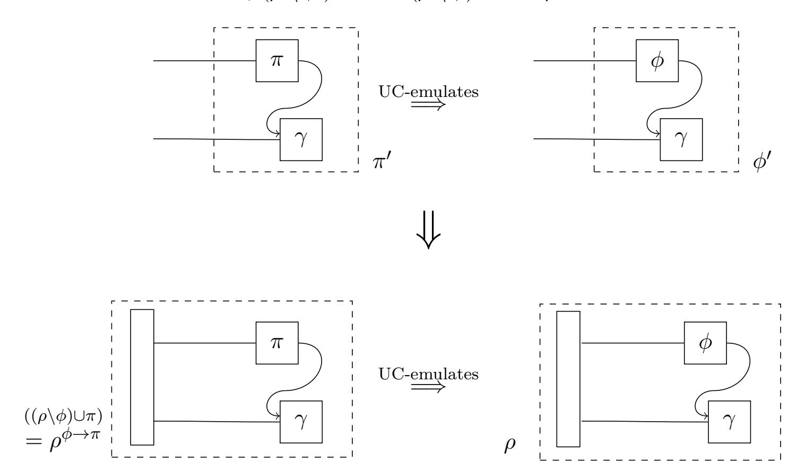
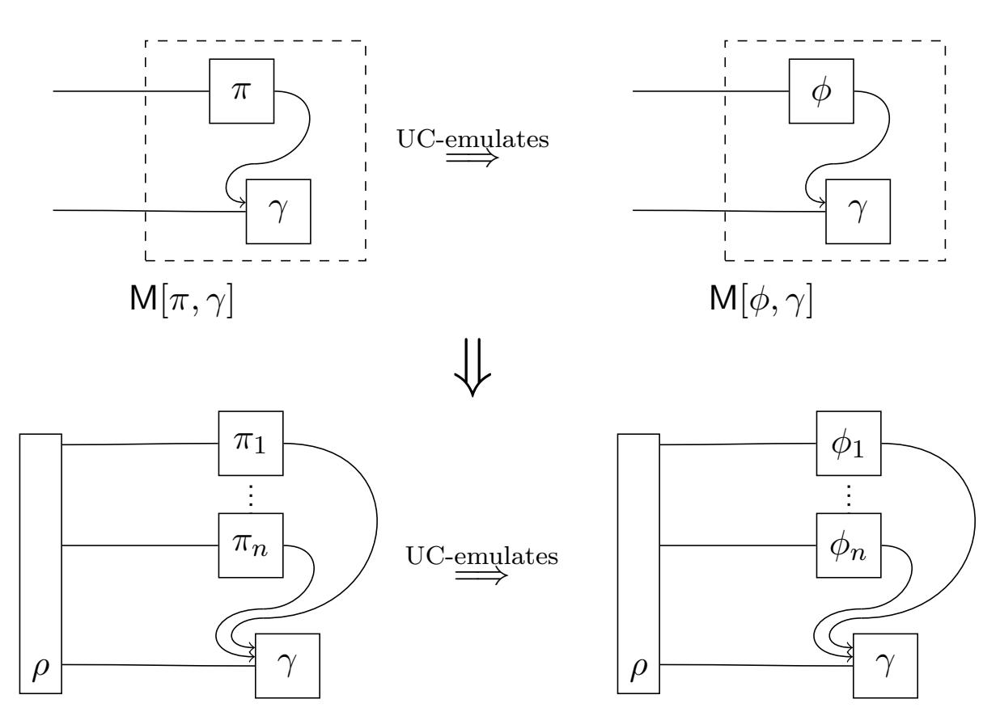
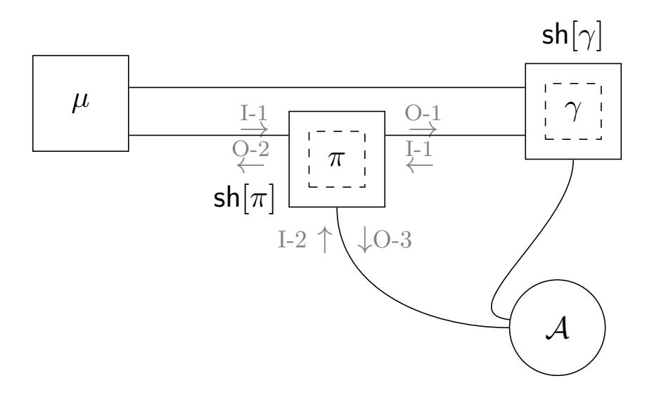
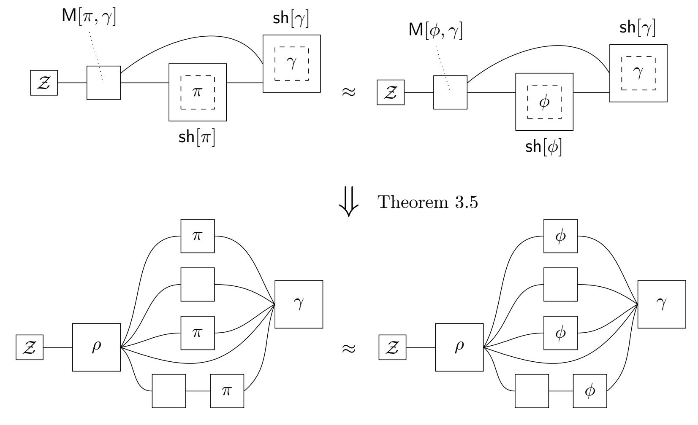
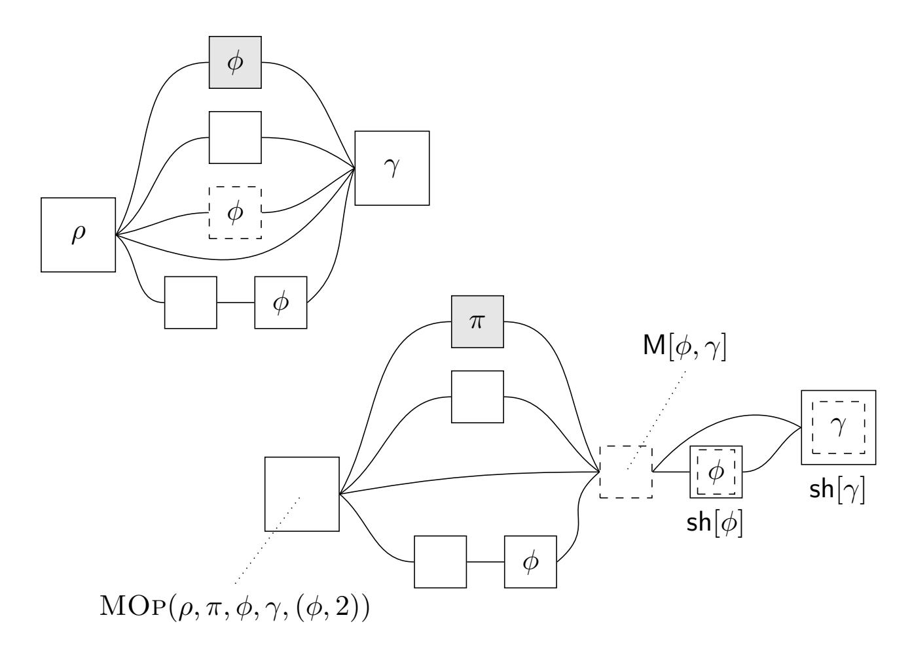
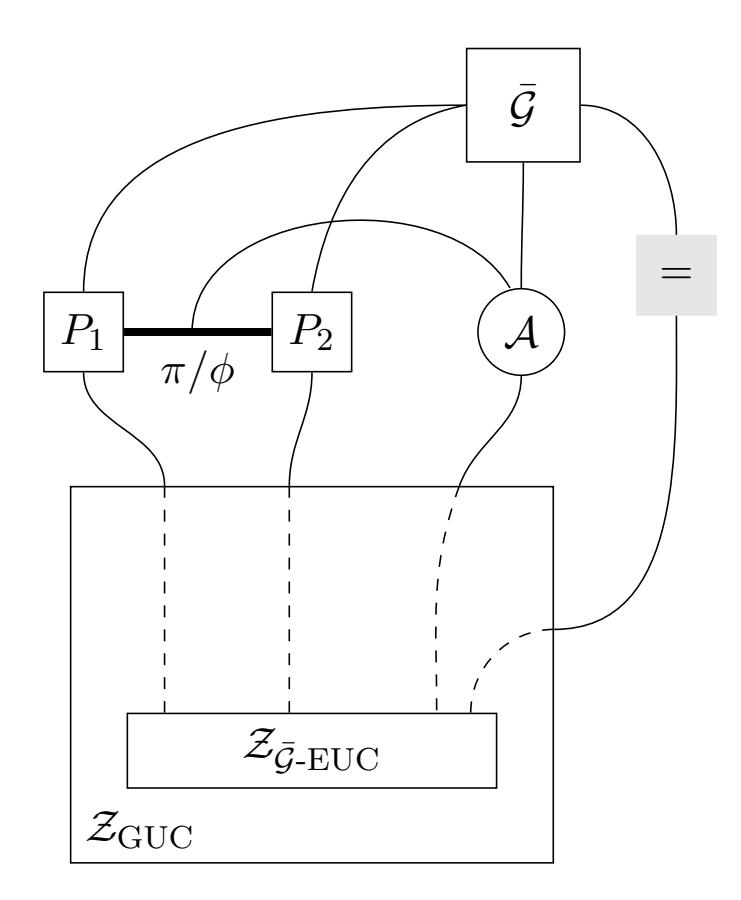
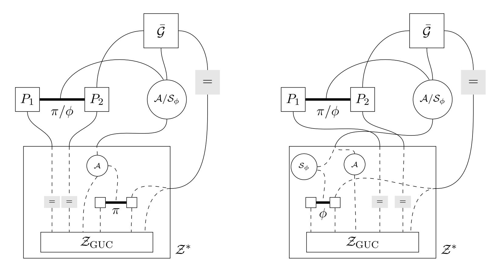

{0}------------------------------------------------

# Universal Composition with Global Subroutines: Capturing Global Setup within plain UC

Christian Badertscher∗1 [,](https://orcid.org/0000-0002-1353-1922) Ran Canetti†2 , Julia Hesse3 , Björn Tackmann‡4 , and Vassilis Zikas5

> 1 *IOHK, Switzerland,* christian.badertscher@iohk.io 2*Boston University, MA, US,* canetti@bu.edu 3 *IBM Research – Zurich, Switzerland,* jhs@zurich.ibm.com 4*DFINITY, Switzerland,* bjoern@dfinity.org 5*University of Edinburgh, United Kingdom,* vzikas@inf.ed.ac.uk

> > September 23, 2022

#### **Abstract**

The Global and Externalized UC frameworks [Canetti-Dodis-Pass-Walfish, TCC 07] extend the plain UC framework to additionally handle protocols that use a "global setup", namely a mechanism that is also used by entities outside the protocol. These frameworks have broad applicability: Examples include public-key infrastructures, common reference strings, shared synchronization mechanisms, global blockchains, or even abstractions such as the random oracle. However, the need to work in a specialized framework has been a source of confusion, incompatibility, and an impediment to broader use.

We show how security in the presence of a global setup can be captured within the plain UC framework, thus significantly simplifying the treatment. This is done as follows:

- We extend UC-emulation to the case where both the emulating protocol *π* and the emulated protocol *φ* make subroutine calls to protocol *γ* that is accessible also outside *π* and *φ*. As usual, this notion considers only a single instance of *φ* or *π* (alongside *γ*).
- We extend the UC theorem to hold even with respect to the new notion of UC emulation. That is, we show that if *π* UC-emulates *φ* in the presence of *γ*, then *ρ φ*→*π* UC-emulates *ρ* for any protocol *ρ*, even when *ρ* uses *γ* directly, and in addition calls many instances of *φ*, all of which use the same instance of *γ*. We prove this extension using the existing UC theorem as a black box, thus further simplifying the treatment.

We also exemplify how our treatment can be used to streamline, within the plain UC model, proofs of security of systems that involve global set-up, thus providing greater simplicity and flexibility.

∗Work done while author was at the University of Edinburgh, Scotland.

†Member of the CPIIS. Supported by NSF Awards 1931714, 1801564, 1414119, and the DARPA SIEVE program.

‡Work partly done while author was at IBM Research – Zurich, supported in part by the European Union's Horizon 2020 research and innovation programme under grant agreement No. 780477 PRIViLEDGE.

{1}------------------------------------------------

## **Contents**

| 1 | Introduction                                                             | 3  |
|---|--------------------------------------------------------------------------|----|
| 2 | Overview of the UC Framework                                             | 9  |
|   | 2.1 Basics                                                         | 9  |
|   | 2.2 Technical Definitions                                             | 11 |
|   | 2.2.1 Executions                                                   | 11 |
|   | 2.2.2 Protocol Properties                                             | 12 |
|   | 2.2.3 Emulation and Composition                                       | 14 |
| 3 | Formulating and proving the UCGS theorem                                 | 16 |
|   | 3.1 Treating multiple protocols as a single protocol               | 16 |
|   | 3.2 UC Emulation With Global Subroutines                              | 19 |
|   | 3.3 Universal Composition with Global Subroutines                     | 21 |
|   | 3.4 On existing Global UC Statements and Proofs                    | 28 |
| 4 | Applications of the UCGS Theorem                                         | 29 |
|   | 4.1 Interaction between Ideal Functionality and Shared Subroutine  | 29 |
|   | 4.2 Example 1: Authentication with Global Certification               | 30 |
|   | 4.3 Example 2: Composable Blockchains with a Global Clock          | 34 |
| A | On GUC and EUC                                                           | 39 |
| B | The Code of the Transformation                                           | 42 |

{2}------------------------------------------------

## **1 Introduction**

Modular security analysis of cryptographic protocols calls for an iterative process, where in each iteration the analyst first partitions the given system into basic functional components, then separately specifies the security properties of each component, then demonstrates how the security of the overall system follows from the security of the components, and then proceeds to further partition each component. The key attraction here is the potential ability to analyze the security of each component once, in a simplified "in vitro" setting, and then re-use the asserted security guarantees in the various contexts in which this component is used.

A number of analytical frameworks have been devised over the years with this goal in mind, e.g. [\[MR91,](#page-38-1) [Bea91,](#page-36-0) [HM97,](#page-38-2) [Can00,](#page-37-0) [PW00,](#page-38-3) [Can01,](#page-37-1) [BPW04,](#page-36-1) [Mau11,](#page-38-4) [KMT20,](#page-38-5) [HS16,](#page-38-6) [CKKR19\]](#page-37-2). These frameworks allow representing protocols, tasks, and attacks, and also offer various composition operations and associated security-preserving composition theorems that substantiate the above analytical process. The overarching goal here is to have an analytical framework that is as expressive as possible, and at the same time allows for a nimble and effective de-compositional analytical process.

Modularity in these frameworks is obtained as follows. (We use here the terminology of the UC framework [\[Can01\]](#page-37-1), but so far the discussion applies to all these frameworks.) We first define when a protocol *π* "emulates" another protocol *φ*. Ideally, this definition should consider a setting with only a single instance of *π* (or *φ*) and no other protocols. A general composition theorem then guarantees that if *π emulates* protocol *φ*, then for *any* protocol *ρ*, that makes "subroutine calls" to potentially multiple instances of *φ*, the protocol *ρ φ*→*π* emulates *ρ*, where *ρ φ*→*π* is the protocol that is essentially identical to *ρ* except that each subroutine call to an instance of *φ* is replaced with a subroutine call to an instance of *π*.

This composition theorem is indeed a powerful tool: It allows analyzing a protocol in a highly simplified setting that involves only a single instance of the protocol and no other components, and then deducing security in general multi-component systems. However, the general composition theorem can only be applied when protocols *π* and *φ* do not share any "module" with the calling protocol, *ρ*. That is, the theorem applies only when there is no module, or protocol, *γ*, such that *γ* is a subroutine of *π* or *φ*, and at the same time *γ* is used directly as a subroutine of *ρ*. Furthermore, when *ρ* calls multiple instances of *φ*, no module *γ* can be a subroutine of two different instances of *φ*.

This limitation has proven to be a considerable impediment when coming to analyze realistic systems, and in particular when trying to de-compose such system to smaller components as per the above methodology. Indeed, realistic systems often include some basic components that require trust in external entities or are expensive to operate. It then makes sense to minimize the number of such components and have them shared by as many other components as possible. Examples for such shared components include public-key infrastructure, long-lived signing modules, shared synchronization and timing mechanisms, common reference strings, and even more complex constructs such as blockchains and public repositories.

Overcoming this limitation turns out to take quite different forms, depending on the underlying model of computation. When the model of computation is static, namely the identities, programs, and connectivity graph of computing elements are fixed throughout the computation, extending the basic composition theorem to account for shared (or, "global") subroutines is relatively straightforward. (Examples include the restricted model of [\[Can20,](#page-37-3) Section 2], as well as [\[BPW07,](#page-36-2) [KMT20\]](#page-38-5).) However, restricting ourselves to a static model greatly limits the applicability of the framework, and more importantly the power of the composition theorem. Indeed, static models are not conducive to capturing prevalent situations where multiple instances of a simple protocol are invoked concurrently and dynamically, and where all sessions share some global infrastructure; examples include secure

{3}------------------------------------------------

communication sessions, payment protocols, cryptocurrencies, automated contracts.

In order to be able to benefit from compositional analysis with shared modules even when the analyzed protocols are dynamic in nature, new composition theorems and frameworks were formulated, such as the Joint-State UC (JUC) theorem [\[CR03\]](#page-37-4) and later the Generalized UC (GUC) and Extended UC (EUC) models [\[CDPW07\]](#page-37-5).

However the GUC modeling is significantly more complex than the plain UC model. Furthermore, the extended model needs to be used throughout the analysis, even in parts that are unrelated to the global subroutine. In particular, working in the GUC model requires directly analyzing a protocol in a setting where it runs alongside other protocols. This stands in contrast to the plain UC model of protocol execution, which consists only of a single instance of the analyzed protocol, and no other "moving parts." Additionally, while the basic UC framework has been updated and expanded several times in recent years, the GUC model has not been updated since its inception. Furthermore, the claimed relationship between statements made in the EUC framework and statements made in the GUC framework has some apparent inaccuracies.[1](#page-3-0)

**Our contribution.** We simplify the treatment of universal composition with global subroutines for fully dynamic protocols. Specifically, We show how to capture GUC-emulation with respect to global subroutines, and provide a theorem akin to the GUC theorem, all within the plain UC modeling. This theorem, which we call the Universal Composition with Global Subroutines (UCGS) theorem, allows for fully reaping all the (de-)compositional benefits of the GUC modeling, while keeping the model simple, minimizing the formalism, and enabling smooth transition between components.

We present our results in two steps. First, we present the modeling and theorem within the restricted model of computation of [\[Can20,](#page-37-3) Section 2]. Indeed, here the GUC and UCGS modeling is significantly less expressive - but it introduces the basic approach, and is almost trivial to formulate and prove. Next we explain the challenges involved in applying this approach to the full-fledged UC framework, and describe how we handle them. This is where most of the difficulty - and benefit - of this work lies.

Let us first briefly recall UC security within that restricted model. The model postulates a static system where the basic computing elements (called *machines*) send information to each other via fixed channels (or, ports). That is, machines have unique identities, and each machine has a set of machine identities with which it can communicate. Within each machine, each channel is labeled as either *input* or *output*. A system is a collection of machines where the communication sets are globally consistent, namely if machine *M* can send information to machine *M*0 with channel labeled input (resp., output) then the system contains a machine *M*0 that can send information labeled output (resp., input) to *M*. In this case we say that *M*0 is a subroutine (resp., caller) of *M*.

A protocol is a set *π* of machines with consistent labeling as above, except that some machines in *π* may have output channels to machines which are not part of *π*. These channels are the *external channels* of *π*. The machines in *π* that have external channels are called the *top level machines* of *π*.

An execution of a protocol *π* with an environment machine Z and an adversary machine A is an execution of the system that consists of (*π* ∪ {Z*,* A}), where the external channels of *π* are connected to Z, and A is connected to all machines in the system via a channel (port) named *backdoor.* The execution starts with an activation of Z and continues via a sequence of activations until Z halts with some binary decision value. Let exec*π,*A*,*Z denote the random variable describing the decision

1 Indeed, there is at the moment no completely consistent composition theorem for EUC protocols. For instance, the notion of a challenge protocol is not sufficiently well specified. Also the treatment of external identities is lacking. This is discussed further in Appendix [A.](#page-38-0)

{4}------------------------------------------------

bit of  $\mathcal{Z}$  following an execution with  $\pi$  and  $\mathcal{A}$ . We say that protocol  $\pi$  UC-emulates protocol  $\phi$  if for any polytime adversary  $\mathcal{A}$  there exists a polytime adversary  $\mathcal{S}$  such that for any polytime  $\mathcal{Z}$  we have  $\text{EXEC}_{\pi,\mathcal{A},\mathcal{Z}} \approx \text{EXEC}_{\phi,\mathcal{S},\mathcal{Z}}$ .

The universal composition operation in this model is a simple machine replacement operation: Let  $\rho$  be a protocol, let  $\phi$  be a subset of the machines in  $\rho$  that is a protocol in and of itself, and let  $\pi$  be a protocol that has the same set of external identities as  $\phi$ , and where  $\pi$  and  $\rho \setminus \phi$  are identity-disjoint, i.e. the identities of the machines in  $\pi$  are disjoint from the identities of the machines in  $\rho \setminus \phi$ . Then the composed protocol  $\rho^{\phi \to \pi}$  is defined as  $(\rho \setminus \phi) \cup \pi$ . The UC theorem states that if  $\pi$  UC-emulates  $\phi$ , then for any  $\rho$  such that  $\pi$  and  $\rho \setminus \phi$  are identity-disjoint we have that  $\rho^{\phi \to \pi}$  UC-emulates  $\rho$ . (Notice that here the UC operation replaces only a single "protocol instance". Indeed, here there is no natural concept of "multiple instances" of a protocol.)

In this restricted model, protocol  $\gamma$  is a global subroutine of a protocol  $\pi'$  if  $\gamma$  is a subroutine of  $\pi'$ , and at the same time some of the top level machines of  $\pi'$  are actually in  $\gamma$ . Said otherwise,  $\pi'$  consists of two parts,  $\gamma$  and  $\pi = \pi' \setminus \gamma$ , where both  $\pi$  and  $\gamma$  include machines that take inputs directly from outside  $\pi'$ , and in addition some machines in  $\gamma$  take inputs also from machines in  $\pi$ . Observe that this structure allows  $\gamma$  to be a subroutine also of protocols other than  $\pi$ .

The Universal Composition with Global Subroutines (UCGS) theorem for such protocols takes the following form: Let  $\rho$ ,  $\pi$ ,  $\phi$  and  $\gamma$  be such that  $\pi' = \pi \cup \gamma$  and  $\phi' = \phi \cup \gamma$  are protocols where  $\pi'$  UC-emulates  $\phi'$  (and in addition  $\pi$  and  $\rho \setminus \phi$  are identity-disjoint). Then the protocol  $((\rho \setminus \phi') \cup \pi')$  UC-emulates  $\rho$ . Observe, however, that in this model the UCGS theorem follows immediately from the standard UC theorem: Indeed,  $(\rho \setminus \phi') \cup \pi' = (\rho \setminus \phi) \cup \pi = \rho^{\phi \to \pi}$ . See illustration in Figure 1.

Figure 1: UC with Global Subroutines (UCGS) in the restricted setting of [Can20, Section 2]: Protocol  $\gamma$  is a global subroutine of protocol  $\pi'$  if  $\gamma$  takes input from  $\pi = \pi' \setminus \gamma$  and also from outside  $\pi'$ . Then plain UC theorem already guarantees that if  $\pi'$  UC-realizes protocol  $\phi'$ , where  $\phi' = \phi \cup \gamma$ , then for any  $\rho$  that calls  $\phi$  and  $\gamma$ , the protocol  $((\rho \setminus \phi) \cup \pi) = \rho^{\phi \to \pi}$  UC-emulates  $\rho$ .

**Extending the treatment to the full-fledged UC framework.** While formulating UC with global subroutines within the above basic model is indeed simple, it is also of limited applicability: While it is in principle possible to use security in this model to infer security in systems that involve

{5}------------------------------------------------

multiple instances of the analyzed protocol, inference is still limited to static systems where all identities and connectivity is fixed beforehand. The formalism breaks down when attempting to express systems where connectivity is more dynamic in nature, as prevalent in reality. In order to handle such situations, the full-fledged UC framework has a very different underlying model of distributed computation, allowing machines to form communication patterns and generate other machines in a dynamic way throughout the computation. Crucially, even in dynamic and evolving systems, the framework allows delineating those sets of processes that make up "protocol instances," and then allows using single-instance-security of protocols to deduce security of the entire system.

To gain this level of expressiveness, the framework introduces a number of constructs. One such construct is the introduction of the session identifier (SID) field, that allows identifying the machines (processes) in a protocol instance. Specifically, an *instance* (or, *session*) of a protocol *π* with SID *s*, at a given point during an execution of a system is the set of machines that have program *π* and SID *s*. The *extended session* of *π* with SID *s* consists of the machines of this session, their subroutines, and the transitive closure of all the machines that were created by the these subroutines during the execution so far. Another added construct is the concept of *subroutine respecting protocols.* Informally, protocol *π* is subroutine respecting if, in any extended session *s* of *π,* the only machines, that provide output to, or responds to inputs from, machines outside this extended instance, are the actual "main" machines of this instance (namely the machines with code *π* and SID *s*). Machines in the extended session, which are not the main machines, only take input from and provide output to other machines of this extended instance.

While the SIDs and the restriction to subroutine respecting protocols are key to the ability of the UC framework to model prevalent dynamic situations, they appear to get in the way of the ability to prove UC with global subroutines. In particular, simply applying the UC theorem as in the basic model is no longer possible. Indeed (referring to Figure [1\)](#page-4-0), neither *π* nor *φ* are subroutine respecting, and the constructs *π* 0 and *φ* 0 , which were legitimate protocols in the basic model, are not legitimate protocols in the full-fledged model, since they don't have the same program or SID. Note that this is not just a technicality: In a dynamically evolving system with multiple instances of *π* and *γ* there can be many possible ways of delineating protocol instances, and so the composition theorem may not even be well-defined!

We get around this barrier by providing a mechanism for encapsulating an instance of *φ* and one (or more) instances of *γ* within a single "transparent envelope protocol" M[*φ, γ*] such that a single instance of M[*φ, γ*] has the same effect as the union of the instance of *φ* and the instances of *γ* used by this instance of *φ*. To accomplish that, we extend the shell and body mechanism that's already used in the UC framework to enforce subroutine respecting behavior and to implement the UC operation. A similar encapsulation is done for *π* and *γ*. Furthermore, the transformation guarantees that both M[*φ, γ*] and M[*π, γ*] are now subroutine respecting, even though neither *φ* nor *π* are. This enables us to invoke the UC theorem (this time in the full-fledged UC model) to obtain our main result:

**Main Theorem (informal).** *Assume π, φ, γ are such that* M[*π, γ*] *UC-emulates* M[*φ, γ*]*. Then for (essentially) any protocol ρ we have that ρ φ*→*π UC-emulates ρ.*

Our result follows the spirit of the UC theorem: It allows using the security of a single instance of *π* (in the presence of *γ*) to deduce security of a system that involves multiple instances of *π* (again, in the presence of *γ*). Said otherwise, the theorem allows dissecting a complex, dynamic, multi-instance system into simple, individual components, analyze the security of a single instance of a component, and deduce security of the overall system - even in the prevalent cases where multiple (or even all) of the individual components are using the same global subroutines. See depiction in

{6}------------------------------------------------

#### Figure [2.](#page-6-0)

We prove the new composition theorem in a modular way. That is, our proof makes black-box use of the plain UC theorem, thus avoiding the need to re-prove it from scratch, as in the GUC and EUC modeling.

Figure 2: UC with global subroutines in the full-fledged UC framework: We encapsulate a single instance of *π* plus one or more instances of *γ* within a single instance of a protocol M[*π, γ*] that remains transparent to *π* and *γ* and is in addition subroutine respecting. We then show that if M[*π, γ*] UC-emulates M[*π, φ*] then the protocol *ρ φ*→*π* UC-emulates *ρ* for essentially any *ρ* — even when *ρ* and all the instances of *φ* (resp., *π*) use the same global instances of *γ*.

**Demonstrating the use of our treatment.** We showcase our UCGS theorem in two settings. A first setting is that of analyzing the security of signature-based authentication and key exchange protocols in a setting where the signature module is global and in particular shared by multiple instances of the authentication module, as well as by arbitrary other protocols. This setting was studied in [\[CSV16\]](#page-37-6) within the GUC framework. We demonstrate how our formalism and results can be used to cast the treatment of [\[CSV16\]](#page-37-6) within the plain UC framework. The resulting treatment is clearer, simpler, and more general. For instance, in our treatment, the Generalized Functionality Composition theorem from [\[CSV16\]](#page-37-6) turns out to be a direct implication of the standard UC composition theorem.

The other setting is that of composable analysis of blockchains, where assuming global subroutines is essential and permeates all the works in the literature. In a nutshell, in [\[BMTZ17\]](#page-36-3), a generic ledger was described which, as proved there, is GUC-emulated by (a GUC version of) the Bitcoin backbone protocol [\[GKL15\]](#page-37-7) in the presence of a global clock functionality used to allow the parties to remain synchronized. This ledger was, in turn, used within another protocol, also having access to the global clock, in order to implement a cryptocurrency-style ledger, which, for example, prevents double spending. [\[BMTZ17\]](#page-36-3) then argues that using the GUC composition theorem one can replace, in the latter construction, the generic ledger by the backbone protocol. As we demonstrate here, such a generic replacement faces several issues due to inaccuracies in GUC. Instead, we show how to apply our theorem to directly derive the above statement in the UC framework.

{7}------------------------------------------------

**Composition with global subroutines in other general frameworks.** Several other general frameworks for defining security of protocols use a static machine model akin to the restricted variant of the UC model described above, where machines communicate only via connections ("ports") that are fixed ahead of time, and the only way to compose systems is by way of connecting them using a pre-defined set of ports. (Examples include the reactive simulatability of [\[PW00,](#page-38-3) [BPW07\]](#page-36-2), the IITM framework of Küsters and Thuengertal [\[KMT20\]](#page-38-5), the abstract cryptography of of Maurer and Renner [\[MR11\]](#page-38-7), the iUC framework of Camenisch et al. [\[CKKR19\]](#page-37-2).) In these frameworks, the single-instance global-state composition theorem immediately follows from plain secure composition, in very much the same way as the single-instance UCGS theorem follows immediately from the plain UC theorem in the restricted UC model (see Figure [1\)](#page-4-0).

However, these frameworks do not provide mechanisms for modular analysis of systems where the de-composition of the system to individual modules is determined dynamically during the course of the computation. In particular, composition with global state in these frameworks does not address this important case either. In contrast, as described above, this fully dynamic, multi-instance case is the focus of this work. So far, this case has been addressed only in the GUC and EUC frameworks, as well as in the work of Hofheinz and Shoup [\[HS16\]](#page-38-6) which proposes an extension of their model to accommodate certain specific ideal functionalities as distinguished machines.

We note that the IITM framework of Küsters and Thuengertal [\[KMT20\]](#page-38-5) (as well as the recent iUC model [\[CKKR19\]](#page-37-2) that builds on top of the IITM framework) does contain an additional construct that allows machines to interact in a somewhat dynamically determined way: While each machine has a fixed set of other machines that it can interact with, and protocols are defined as fixed sets of machines that have globally consistent "communication sets", the framework additionally allows unboundedly many instances of each machine, where all instances have the same identity, code, and "communication set". Furthermore, if the communication sets of machines *M, M*0 allows them to communicate, then each instance of *M* can communicate with each instance of *M*0 . Indeed, this additional feature enables the IITM framework to express systems where the communication is arbitrarily dynamic.

However, this extra feature appears to fall short of enabling fully modular analysis of such dynamic systems. Indeed, the IITM framework still can only compose systems along the static, a-priori fixed boundaries of machine ports. This means that systems that include multiple instances of some protocol, where the boundaries of the individual instances are dynamically determined, cannot be analyzed in a modular way — rather, the framework only allows for direct analysis of all protocol instances at once, en bloc. This of course holds even in the presence of global subroutines. Example of such systems include secure pairwise communication systems where the communicating parties are determined dynamically, block-chain applications where different quorums of participants join to make decisions at different times, etc. See e.g. [\[BCL](#page-36-4)+11, [CSV16,](#page-37-6) [GHM](#page-37-8)+17].

In contrast, the goal of this work is to allow de-composing such systems to individual instances, deducing the security of the overall composite system from the security of an individual instance and carrying this through even when many (or all) instances use the same global subroutines (see Figure [2\)](#page-6-0).

A related work by Camenisch et al. [\[CDT19\]](#page-37-9) introduces a new UC variant that they call multiprotocol UC (MUC) and that allows the environment to instantiate multiple challenge protocols that can interact with each other. It is an interesting future research direction to formulate this more general type of UC execution following the approach taken in this work, i.e., to model it following standard UC and making black-box use of the UC composition theorem to derive a composition theorem for this type of protocol.

{8}------------------------------------------------

## **2 Overview of the UC Framework**

This section gives a summary of the main concepts of the UC framework by Canetti [\[Can01\]](#page-37-1). Since its introduction in 2001, the UC framework has undergone a sequence of versions, and this work is based on the UC version of 2020 as specified in [\[Can20\]](#page-37-3), which for compactness, we refer to as *UC 2020* in this work. While we assume some familiarity with the general concepts of universal composition, we introduce the definitions used in this work for the sake of self-containment and, along the way, point out some of the key differences of UC 2020 with the previous versions of the framework. To give the reader an overview which notions she should be familiar with, and to provide a glossary of terms for conveniently accessing them, we list the notions and results from UC 2020 that are restated in this section:

**Def. [2.1:](#page-10-2)** ITI configuration, extended identity **Def. [2.6:](#page-13-1)** Structured protocol

**Def. [2.2:](#page-10-3)** External-write request **Def. [2.7:](#page-13-2)** Subroutine-exposing protocol

**Def. [2.3:](#page-11-1)** Identity-bound environment **Def. [2.9:](#page-14-0)** UC Emulation

**Def. [2.4:](#page-11-2)** Compliant protocol **Def. [2.10:](#page-14-1)** UC Operator

**Def. [2.5:](#page-12-0)** Subroutine-respecting protocol **Thm. [2.11:](#page-15-2)** UC Composition Theorem

### **2.1 Basics**

The UC framework aims to capture what it means for a protocol to securely carry out a task and to guarantee this statement in any context in which the protocol is used. To achieve this, UC defines the *real process* of executing a protocol in some environment and in the presence of an adversary. Along the same lines, an *ideal process* is defined to capture what the protocol should achieve. A security proof consists of showing that no (efficient) environment can distinguish the real process and the ideal process. The core defining element of the ideal process is the ideal functionality that specifies what guarantee each party obtains from the protocol. If a protocol execution is indistinguishable from its ideal process, then we say that the protocol UC-emulates the ideal process.

**Protocol and protocol instances.** A protocol *π* is an algorithm for a distributed system and is formalized as an interactive Turing machine (ITM). An ITM has several tapes; the basic tapes are the identity tape (read-only), an activation tape (to encode whether this ITM is active) and the outgoing message tape that is used to store external-write requests (these are instructions to allow a program to give input to another program).

An ITM has three externally writable tapes for holding information that is considered as input from other programs. The input tape intuitively holds the information from the calling program and the subroutine-output tape holds return values from called programs. Last but not least, there is the backdoor tape which formalizes the interaction of an ITM, e.g., a functionality, with the adversary. The backdoor tape is also used by the adversary to send corruption messages to parties to take control over them. (In earlier versions of the UC framework the backdoor tapes were called the *communication tapes;* however they functioned in the same way.)

While an ITM is a static object, UC defines the notion of an ITM instance (denoted ITI), which is defined as the pair *M* = (*µ,* id), where *µ* is the description of an ITM and id = (sid||pid) is its identity, consisting of a session identifier sid and a party identifier pid. Each instance is associated with a Turing machine configuration, which is as usual the contents of all of its tapes and positions of its heads, and the state of the Turing machine. The identity tape of ITI *M* contains an encoding of *M* = (*µ,* id). An *instance of a protocol µ*, also called a *session* (of the protocol), with respect 

{9}------------------------------------------------

to a session identifier sid, is defined as a set of ITIs (*µ,* id1)*,*(*µ,* id2)*, . . .* with id*i* = sid||pid*i* . Each such ITI in a given protocol instance is called a *party* or *main party* of that instance. The *extended instance s* of protocol *µ* is then the transitive closure of machines spawned as a consequence of running *µ*, i.e., each newly invoked ITI *M* becomes part of the extended instance if (a) *M* is a main party of this instance, or (b) *M* is a subroutine of an ITI that is already in the extended instance, or (c) *M* was invoked by an ITI that is already a sub-party of this extended instance. An ITI is a *sub-party* of an extended instance if it is in the extended instance but is not a main party of the instance.[2](#page-9-0)

**Executions.** An execution of a system of ITMs is formally a pair (*I, C*), where *I* is the initial ITM and *C* is the control function. The initial configuration of *I* (which has identity 0) is the first ITI that gets activated by definition. Using the *external-write* mechanism, any ITI can pass input to another ITI. (If the target ITI does not yet exist, a new instance is spawned using the code and identity specified in the request.) An external-write request specifies, amongst other elements, the message as well as source and destination ITI, including whether this is a subroutine output or an input to the destination ITI. The control function is responsible for writing the message (and possibly the identity of the source ITI) on the respective tape of the destination ITI. The control function also defines which ITI is activated next; typically, the destination ITI of the last processed external write request is activated next. An execution consists of a sequence of activations. An activated ITI can change its configuration according to the rules of its code. An activation ends by issuing one external-write request (in case an ITI halts without issuing an external-write request, the initial ITI is activated). The control function guarantees that all invoked ITIs have unique values on their identity tapes, i.e., there are never two ITIs with identical pairs (*µ,* id) with code *µ* and identity id.

**Execution of a protocol, adversary, and corruption models.** In the context of executing a protocol, say *π*, the above general idea of an execution is instantiated by having the initial ITI be called the environment and defining a specific control function [\[Can20\]](#page-37-3) to capture a meaningful notion of execution of a protocol: the environment is allowed to only spawn one session of *π*, i.e., only issue external-write requests that specify a destination ITI with code *π* and all having the same session identifier. In UC 2020, one can further specify which identities an environment can set as source identities in an input to the protocol. This mechanism can be used to model flexible context restrictions. Note that prior to UC 2020, all source identities except for those that share the session identifier with the test session *π* were allowed.

Additionally, the environment is allowed to invoke an adversary. Within this execution, the adversary, typically denoted by A, is simply another ITI just with the special identity (⊥*,* ⊥) on its identity tape. The adversary can communicate with other ITIs by writing (only) on their respective backdoor tapes. This tape can therefore be used to model security properties provided by functionalities (e.g., a secure channel could leak the length of the message via the backdoor tape). The backdoor tapes are also used to model party corruption: The adversary can, at any time, issue special corruption messages in order to corrupt ITIs. The exact model of corruption—passive/active, static/adaptive—is specified by how ITIs react to these messages on the backdoor tape. The plain UC model does not prescribe or require any specific corruption model. It is instructive to keep in mind the standard interpretation: when an ITI gets corrupted, it tells the adversary the contents of all tapes, inform the adversary upon any input, and allow the adversary to decide on the next

2The extended session includes the transitive closure of the invocation relation when viewed as rooted at the main ITIs of the instance and disregarding invocations made by the main ITIs via their subroutine output tapes.

{10}------------------------------------------------

output (in the name of this ITI). This corruption dynamics corresponds to active and adaptive. By default, ideal functionalities cannot be corrupted.

Compared to its previous versions, the UC model does not include a built-in form of communication. If one wants to model potentially insecure communication within a protocol, such as messages sent between different protocol parties (in the sense that an adversary could interrupt, read, and modify the message), then one should specify a channel functionality that the parties use for this communication.

**UC emulation.** The concept of emulation induces a relation among protocols. Intuitively, a protocol *π* UC-emulates another protocol *φ* if for any adversary A against *π* there is another adversary S against *φ* such that no (efficient) environment can tell, from the observed input-output behavior, whether it is running with *π* and A or with *φ* and S. This indicates that any attack on *π* can be translated to attacks on *φ*, and thus, *π* does not admit more attacks than *φ*.

The typical incarnation of this notion is when *φ* is an ideal protocol: More specifically, the ideal protocol is formulated with respect to an ITM F which is called an ideal functionality and captures "a trusted third party" implementing a protocol task. In the ideal process, the environment Z interacts with an ideal-world adversary (simulator) S and a set of trivial, i.e., dummy ITIs representing the protocol machines that only relay inputs to the functionality and forward the outputs. These dummy ITIs are the "access points" of a calling program; they give the environment the impression of interacting with structured protocol ITIs of a party and not an ideal functionality. (The dummy protocol for ideal functionality F is denoted as idealF .) F has to specify all outputs generated for each party, and the amount of information the ideal-world adversary learns (via the backdoor tape) and what its active influence is via its interaction with F. Functionalities directly handle the corruption requests by an adversary via the backdoor tape in UC 2020 (and can adjust their behavior based on this information). Note that one always assumes that a corruption mechanism exposes towards the environment enough information about who is corrupted to enforce that the real and ideal world adversaries corrupt, for example, the same parties—identified by the party identifier. If a protocol *π* UC emulates the ideal process with F, then one says that *π* securely realizes F.

#### **2.2 Technical Definitions**

We now state the formal definitions from [\[Can20\]](#page-37-3) that are used in this work.

#### **2.2.1 Executions**

We state the definition of ITI configuration and the extended identity of an ITI.

**Definition 2.1** (ITI configuration, extended identity)**.** Let *M* denote an instance of an ITM *µ*, i.e., the pair *M* = (*µ,* id), where id = sid||pid is an identity string consisting of two parts. A Turing machine configuration of *µ* is a *configuration of an ITI M* if the contents of the identity tape contains *M*—which is henceforth referred to as the *extended identity* eid = *M*. Let further an *activation of an ITI M* refer to a sequence of configurations of *M*, i.e., state transitions that follow the rules described by *µ* starting from an active configuration of *M* until an inactive configuration is reached in which case the ITI waits for the next activation.

ITIs can write to each other's writable tapes via external-write requests that are interpreted by the control function that "delivers" the message.

{11}------------------------------------------------

**Definition 2.2** (External-write request)**.** An *external-write request* is a message written by an ITI onto its outgoing message tape. It must have the format (*f,* eiddest*, t, r,* eidsrc*, m*). In this vector, eiddest = (*π*dest*,*siddestkpiddest) is the *destination ITI* with *target code π* and *target session identifier* siddest, and *t* ∈ {input*,*subroutine-output*,* backdoor} is the tape that message *m* shall be written to. If the *reveal-sender flag r* is set, then eidsrc is written on *t* as well. Finally, the *forced-write mode f* = 1 indicates that if ITI eiddest does not exist yet, then one is created in its initial configuration.

The UC control function requires that the field eidsrc in the external write request match the contents of the identity tape of the ITI creating the request, unless the initial ITI with identity 0 is creating the request.

When the environment Z provides input to an ITI in the system, it can choose an arbitrary value for the source identifier eidsrc it uses in the external-write request. We refer to the source identifiers chosen by the environment in a particular execution as *external identities*. The latest revision of the UC paper [\[Can20\]](#page-37-3) specifies a method to restrict the external identities that the environment is allowed to choose in an execution, based on a predicate *ξ*. Predicate *ξ* is evaluated on the complete view of the environment, namely all inputs and outputs the environment provides to or obtains from other ITIs in the system. One natural predicate is the one that disallows Z to use as external identity the extended identity of any ITI that it provides input to in the system. Other choices of predicates may be helpful in various scenarios.

Of course, the more relaxed the predicate *ξ*, the more general the security statement. More restrictive predicates in turn lead to more restrictions on the contexts in which the protocols proved secure with respect to those predicates can be executed.

**Definition 2.3** (Identity-bounded environment)**.** Let *ξ* be a predicate on the view of an environment. A *ξ-identity-bounded environment* is an environment Z that only claims external identities eid (as the source of an input to an ITI eid0 ) such that the predicate *ξ* on the view of each execution of Z evaluates to 1. *ξ* is then also called the *identity bound*.

The definition of run-time changed significantly in recent versions of the UC framework (see [\[Can20\]](#page-37-3), Section 3.2, for the most recent definition). Each message sent between ITIs contains an explicit field called *import*, which encodes a natural number. The number of computation steps performed by an ITI must be, at any point in time, bounded by a polynomial in the accumulated import received by the ITI minus the accumulated import sent by this ITI. In a system of ITMs that is *parameterized* by *k* ∈ N, each ITI only starts executing after it received import at least *k*.

#### **2.2.2 Protocol Properties**

The composition theorem makes certain preconditions on the protocol it applies to. We start by introducing some nomenclature from [\[Can20\]](#page-37-3). In a given execution that includes two ITIs *M* and *M*0 , ITI *M*0 is a *subroutine* of *M* if *M* has passed input to *M*0 or *M*0 passed subroutine output to *M*. ITI *M*0 is a *subsidiary* of *M* if it is a subroutine of *M* or a subroutine of another subsidiary of *M*.

For the composition theorem to work, the parent protocol (often called *ρ*) must adhere to certain restrictions. For instance, *ρ* should not call both *π* and *φ* with the same session identifier: this would clearly make *ρ* and *ρ φ*→*π* distinguishable, since the latter protocol would then only invoke one instance of *π* (this follows from the uniqueness requirement on extended identities in an execution of ITIs). Also, if there exists an identity-bound *ξ* on the environment when proving a protocol, say *π* secure, then any protocol using *π* must use it in the way allowed by *ξ*.

The following condition, which in this form was introduced in UC 2020, formalizes a restriction to prevent such cases together with restrictions that ensure that the input-output communication between different ITIs is trustworthy:

{12}------------------------------------------------

**Definition 2.4** (Compliant protocols [\[Can20\]](#page-37-3))**.** Let *ρ*, *π*, and *φ* be protocols, and let *ξ* be a predicate on extended identities. Protocol *ρ* is called (*π, φ, ξ*)−*compliant* if the following holds in any execution with a (potentially *ξ*-identity-bounded) environment:

- 1. All external-writes made by parties and sub-parties of *ρ*, where the target tape is the input tape, use the forced-write mode as in [Definition 2.2.](#page-10-3) Similarly, all messages received on the subroutine-output tapes of these ITIs are expected to have reveal-sender-id flag on; other subroutine-outputs are rejected.
- 2. No two external-write instructions, out of all external-write instructions made by the members of an extended instance of *ρ*, where one instruction has target code *π*, and the other instruction has target code *φ*, have the same target session identifier.
- 3. The extended identities of all the ITIs in any extended instance of *ρ* (in any execution) that pass inputs to ITIs with code either *π* or *φ* satisfy the predicate *ξ* (based on the view of the interaction with those subroutines with code either *π* or *φ*).

Composition has a further precondition that is referred to as *subroutine respecting*. On a high level, this condition means that all sub-protocols of a protocol *π* receive all their inputs and provide all their outputs through *π*. This condition is a natural requirement for composition: if sub-protocols of *π* interacted with protocols outside of *π*, then the ideal protocol *φ* that is to be realized by *π* would have to resemble the same structure. Subroutine respecting is the requirement that these inner workings of the protocols remain hidden from the outside.

**Definition 2.5** (Subroutine respecting [\[Can20\]](#page-37-3))**.** Protocol *π* is subroutine respecting if each session *s* of *π*, occurring within an execution of any protocol with any environment satisfies the following four requirements, in any execution of any protocol *ρ* with any adversary and environment (as per the definition of protocol execution; it is stressed that these requirements must be satisfied even when session *s* of *π* is a subroutine of *ρ*, and in particular when the execution involves ITIs which are not members of that extended session *s*):

- 1. The sub-parties of session *s* reject all inputs passed from an ITI which is not already a main party or subsidiary of session *s* (note that rejecting a message means that the recipient ITI returns to its state prior to receiving the message and ends the activation without sending any message; see [\[Can20,](#page-37-3) Section 3.1.2]).
- 2. The main parties and sub-parties of session *s* reject all incoming subroutine outputs passed from an ITI which is not already a main party or subsidiary of session *s*.
- 3. No sub-party of session *s* passes subroutine output to an existing ITI that is not already a main party or sub-party of session *s*.
- 4. No main party or sub-party of session *s* passes input to an existing ITI that is not already a main party or sub-party of session *s*.

A protocol *ρ* making calls to a subroutine *π* can be subroutine respecting even if *π* is not. Consider a case where *ρ* provides input to subroutines of *π*, which means that *π* is not subroutine respecting. At the same time, protocol *π* and all of its subroutines ignore all inputs from protocols outside of the session of *ρ* and also do not provide subroutine output to any protocol outside of *ρ*.

It is convenient to consider protocols that consist of two parts: a *shell* part that takes care of model functionality such as corruption or subroutine replacement, and a *body* part that encodes the 

{13}------------------------------------------------

actual cryptographic protocol. One advantage of this modeling is that the body is not cluttered with model formalism such as addressing and communication mechanisms. Furthermore, different corruption models can be formalized by using different shells, while leaving the body with the core protocol untouched. It is important to note that the shell mechanism lies at the core of many important definitions in [\[Can20\]](#page-37-3) and that a protocol body can again consist of a protocol (consisting of shell and body) which yields a sequence of shells (with a clear distinction into inner shells and outer shells). This hierarchy of shells is quite vital to many definitions in UC (for example, the shell introduced by the UC operator is outer to the corruption shell and hence the corruption model does not interfere with the subroutine replacement mechanism). We refer the reader to [\[Can20,](#page-37-3) Section 5.1] for further details.

A protocol that follows this structure is called a *structured protocol*.

**Definition 2.6** (Structured protocol [\[Can20\]](#page-37-3))**.** A *structured protocol*[3](#page-13-3) consists of a shell and a body. The shell can read and modify the state of the body, but the body does not have access to the state of the shell. An activation of a structured protocol starts by running the shell, which may (or may not) execute the body sub-process. In case the body executes, it keeps executing until it reaches a special "end of activation state", at which point the shell resumes executing. The body may prepare all the information necessary for executing an external-write operation, but it may not execute this operation. Only the shell executes external-write instructions.

In the model of execution described above, parties of a protocol can generate subroutines with arbitrary codes and identities. Upon the first external-write request to an extended identity, the ITI with that identity is created and will start following its instructions. One effect of this modeling is that the adversary is not necessarily aware of all subroutines that exist in the system as, for instance, session identities may be chosen at random. This is usually undesired, as it renders those subroutines effectively incorruptible. This undesired effect is countered in UC 2020 by the definition of *subroutine exposing*, in which specific ITIs that are readable by the adversary hold a directory of all existing members of an extended instance. We give here a direct constructive definition of this property as it is sufficient to follow this work and refer to [\[Can20\]](#page-37-3) for a deeper discussion on the subroutine-exposure property.

**Definition 2.7** (Exposure mechanism of subroutines)**.** A protocol *π* implements the *subroutine exposing* mechanism if for each instance *s* of *π* there exists a special directory ITI with identity tape (*π, s*||>) that contains the list of the extended identities of all parties and sub-parties of this (extended) instance of *π*, and returns this list to the adversary upon request. More precisely, this list is a sequence of eid's ordered according to invocation. Each ITI that is a main- or sub-party of this instance notifies the directory ITI of its extended identity immediately upon its invocation, and also of each newly invoked ITI before invoking it. When notified by an ITI *M* that it has been invoked, the directory ITI adds *M* to its database if *M* is a main party of session *s*, or if some ITI already in the database invoked it.

#### **2.2.3 Emulation and Composition**

We are now ready to state the UC security definition—which is protocol emulation—the composition operation, and finally the composition theorem. The security notion targets computational security and is based on the computational indistinguishability of random variables.

The output of the execution of protocol *π* in presence of adversary A and in environment Z is the output of Z, which we assume to be a binary value *v* ∈ {0*,* 1}. We denote this output by

3This property was called *compliant* in previous versions of UC.

{14}------------------------------------------------

 $\text{EXEC}_{\pi,\mathcal{A},\mathcal{Z}}(k,z,r)$  where k is the security parameter,  $z \in \{0,1\}^*$  is the input to the environment, and randomness r for the entire experiment. Let  $\text{EXEC}_{\pi,\mathcal{A},\mathcal{Z}}(k,z)$  denote the random variable obtained by choosing the randomness r uniformly at random and evaluating  $\text{EXEC}_{\pi,\mathcal{A},\mathcal{Z}}(k,z,r)$ . Let  $\text{EXEC}_{\pi,\mathcal{A},\mathcal{Z}}(k,z,r)$  denote the ensemble  $\{\text{EXEC}_{\pi,\mathcal{A},\mathcal{Z}}(k,z)\}_{k\in\mathbb{N},z\in\{0,1\}^*}$ .

**Definition 2.8.** Denote by  $\mathcal{X} = \{X(k,z)\}_{k \in \mathbb{N}, z \in \{0,1\}^*}$  and  $\mathcal{Y} = \{Y(k,z)\}_{k \in \mathbb{N}, z \in \{0,1\}^*}$  two distribution ensembles over  $\{0,1\}$ . We say that  $\mathcal{X}$  and  $\mathcal{Y}$  are (computationally) indistinguishable if for any  $c,d \in \mathbb{N}$  there exists a  $k_0 \in \mathbb{N}$  such that  $|\Pr[X(k,z)=1] - \Pr[Y(k,z)=1]| < k^{-c}$  for all  $k > k_0$  and all  $z \in \bigcup_{\kappa \leq k^d} \{0,1\}^{\kappa}$ . We use the shorthand notation  $\mathcal{X} \approx \mathcal{Y}$  to denote two indistinguishable ensembles.

**UC-realization.** The UC security definition is stated in terms of emulation of protocols. Intuitively, a protocol  $\pi$  emulates another protocol  $\phi$  if  $\pi$  is at least as secure as  $\phi$ . This is formalized following the simulation paradigm [GMR85], by showing that for every adversary  $\mathcal{A}$  against  $\pi$  there exists an ideal adversary (or simulator)  $\mathcal{S}$  against  $\phi$  that emulates  $\mathcal{A}$ 's attack. The additional strength of UC comes from the requirement that the statement hold true in presence of every environment  $\mathcal{Z}$ .

**Definition 2.9.** Let  $n \in \mathbb{N}$ , Let  $\pi$  and  $\phi$  be subroutine respecting protocols. We say that  $\pi$  UC-emulates  $\phi$  if for any (efficient) adversary  $\mathcal{A}$  there exists an (efficient) ideal-world adversary (the simulator)  $\mathcal{S}$  such that for every (efficient and balanced4) environment  $\mathcal{Z}$  it holds that  $\text{EXEC}_{\pi,\mathcal{A},\mathcal{Z}} \approx \text{EXEC}_{\phi,\mathcal{S},\mathcal{Z}}$ . If  $\mathcal{Z}$  is  $\xi$ -identity-bounded then we say  $\pi$  UC-emulates  $\phi$  with respect to  $\xi$ -identity-bounded environments.

**Composition.** Let  $\pi$  be a protocol that presumably UC-emulates another protocol  $\phi$ . The composition operation in UC is then defined as replacing, in a given protocol  $\rho$ , all subroutine calls to protocols with code  $\phi$  by subroutine calls to protocols with code  $\pi$ . The underlying idea here is that one designs protocol  $\rho$  with an idealized, simple and abstract protocol  $\phi$  in mind, and later realizes  $\phi$  with the concrete protocol  $\pi$ .

We first state the definition of the UC operator that formalizes the operation on protocols described above [Can20].

**Definition 2.10** (UC Operator). The UC-operator is a transformation denoted by

$$\rho^{\phi \to \pi} := \mathrm{UC}(\rho, \pi, \phi)$$

and maps a (context) protocol  $\rho$ , which presumably makes subroutine calls to  $\phi$ , to a (context) protocol  $\rho^{\phi \to \pi}$  that makes subroutine calls (i.e., provides input) to  $\pi$  whenever  $\rho$  (or a sub-party of an extended instance of  $\rho$ ) makes a call to  $\phi$  (more precisely, gives input to any top-level instance of  $\phi$  in an extended instance of  $\rho$ ). For the technical definition, we refer to [Can20, Section 6.1].

It is important to note that the UC-operator replaces  $\phi$  by  $\pi$  in a code-oblivious fashion, meaning that the transformed protocol has only a different input-output behavior due to the fact that  $\pi$  and  $\phi$  might have a different behavior, and not by the fact that the source eid on the subroutine-output tape denotes  $\pi$  instead of  $\phi$ . The technical definition in [Can20] basically rewrites the shell instructions of the context protocol to ensure a proper replacement (and is overall similar to the approach taken in this paper).

&lt;sup>4An environment is *balanced* if it, intuitively speaking, allocates to the adversary at least as much runtime as it allocates to the honest parties. As this notion is not crucial for this work, we refer to [Can20] for details.

{15}------------------------------------------------

We are finally ready to state the composition theorem. It basically states that if protocol *π* emulates protocol *φ*, then protocol *ρ φ*→*π* emulates protocol *ρ*, for any protocol *ρ* fulfilling certain preconditions.

**Theorem 2.11** (UC Theorem)**.** *Let ρ, π, φ be protocols and let ξ be a predicate on extended identities, such that ρ is* (*π, φ, ξ*)*-compliant, both φ and π are subroutine exposing and subroutine respecting, and π UC-emulates φ with respect to ξ-identity-bounded environments. Then ρ φ*→*π UC-emulates protocol ρ.*

## **3 Formulating and proving the UCGS theorem**

In this section, we formulate and prove the main result of this work. In [Section 3.1](#page-15-1) we present the transformation that takes protocols *π* and *γ* and constructs a single, transparent encapsulation protocol M[*π, γ*] that behaves like a single instance of *π* along with one (or more) instances of a "global subroutine protocol" *γ*. We formulate UC emulation with Global Subroutines in [Section 3.2,](#page-18-0) state and provethe Universal Composition theorem with Global Subroutines composition in [Section 3.3](#page-20-0) and conclude with remarks in [Section 3.4.](#page-27-0)

### **3.1 Treating multiple protocols as a single protocol**

We start by defining the transformation that takes two protocols *π* and *γ* and combines them into a single protocol *µ* = M[*π, γ*], such that one instance of *µ* behaves like one instance of *π* and one or more instances of *γ*, and where the instances of *γ* take inputs both from the instance of *π* within *µ*, and from outside *µ*. We refer to *µ* as the *management protocol.*

The goal of the construction is to ensure that an instance of protocol *µ* presents the exact same behavior as one instance of *π* alongside one (or more) instances of *γ*, while at the same time making sure that, from the point of view of the basic UC framework, *µ* remains a subroutine-respecting protocol. This will mean that incoming communication to *µ* specifies a session ID for *µ*, plus a session identifier for either the instance of *π* or an instance of *γ*. The input is then forwarded internally either to the instance of *π* or to the appropriate instance of *γ*. Outgoing communication is handled similarly. Note that it is important to make sure that the (virtual) instances of *π* and *γ* receive communication that is formatted exactly as it would be, were it the case that *π* and *γ* are independent machines. (This is needed so that the behavior of *π* and *γ* will remain unchanged.) See depiction in Figure [3.](#page-16-0)

In order to allow black-box use of the UC composition theorem in the proof of our new composition theorem, we need to make sure that an instance of *µ* mimics the execution of a *single* instance of *π* (alongside one or more instances of *γ*). That is, *µ* must make sure that the various machines of an instance of *µ* maintain a single, consistent virtual instance of *π*. To maintain the necessary information about the execution, we allow the management protocol *µ* to make use of a *directory ITI* similar to the one used to ensure the subroutine-exposing property. That is, we embed a special ITI called *execution graph directory* in the operation of the management protocol (and shells) that acts as a central accumulator of knowledge.[5](#page-15-3)

We now detail the execution graph directory for the structured protocol *µ*. The following generic shell mechanism—implemented by an additional, outermost shell of *µ* and all its subroutines—makes

5While there are alternative solutions such as an extra shell propagating information about the execution graph, the directory appears to be a technically simple solution for our transformation. Our transformation is a proof technique, and as such the transformed protocol is not meant to be deployed in reality (where one may argue that such a central entity is unrealistic).

{16}------------------------------------------------

Figure 3: The three main components of our management protocol  $\mu = \mathsf{M}[\pi, \gamma]$  handling access to  $\pi$  and  $\gamma$ , both equipped with shells  $\mathsf{sh}[\cdot]$ . For  $\mathsf{sh}[\pi]$ , different types of incoming and outgoing messages are indicated in gray.

sure that this outermost shell layer maintains information about the induced execution graph as well as additional auxiliary information extracted from the underlying protocol (i.e. the body in the view of this additional shell). Let  $\mathsf{pid}_{\mathsf{egDIR}}$  be an exclusive identifier, i.e., an identifier that never appears in any execution of the base protocol. Assume the session identifier is  $\mathsf{sid}$ .

- The ITI with special identifier  $(\mu, \mathsf{sid} || \mathsf{pid}_{\mathsf{egDIR}})$  never activates its body and the shell processes three types of requests: first, when activated with input (REGISTER, aux) from an ITI M, it stores the entry (M, aux) in an ordered list (initially empty) unless M is already recorded in the list. Second, when activated with input (INVOKE, M', aux) from an already registered ITI M and ITI M' is not yet registered, then record  $(M \to M')$ . Also, record (M', aux) unless M' is already registered. The return value to M in both cases is the trivial output  $\mathsf{ok}$ . The party allows any registered ITI M to query the stored list and ignores any message on the backdoor tape.
- For any other ITI running in this instance, when activated for the first time, the shell sends (REGISTER, aux) to ITI ( $\mu$ , sid||pidegDIR) where aux can denote any auxiliary information. (Note that reveal-sender id and forced-write flags are set). When receiving ok it resumes processing its first activation by activating its body (which in structured protocols might be another shell oblivious of the above interaction).
- For any other ITI running in this instance, when the shell processes an external write request from its body to an ITI M, it sends (INVOKE, M, aux) to ITI ( $\mu$ , sid||pidegDIR) where aux can denote any auxiliary information, before resuming with processing the external write request.

By exclusivity of  $pid_{egDIR}$ , the shell operates in an oblivious fashion from the point of view of the body. Since the shell only talks to  $pid_{egDIR}$ , this in turn is even oblivious to the environment and the adversary.

In fact, this is not entirely obvious: while no interaction via the backdoor tape indeed means that the adversary can neither corrupt nor extract information from the directory, another corrupted ITI in the system might get information from  $pid_{egDIR}$  via a normal query and give the result to the adversary. This, however, is not possible: in UC, model-related instructions are organized in shell layers, where each shell is unaware of the outer shells, and treats the inner shells as part of the body. Now, the shell layer describing the model-related instructions to communicate with directories is outside of the shell implementing the corruption layer and therefore, the corruption layer is unaware of the directory. For more details, see [Can20, Section 5.1]. We note that this observation is already

{17}------------------------------------------------

crucial for the standard UC composition theorem and not novel for our work, because corruptions must not invalidate the subroutine-exposing property of a protocol and hence corruptions should not interfere with the subroutine-exposing shell (or the shell introduced by the UC operator).

To conclude, the above mechanism is used by M[*π, γ*] and its subsidiaries sh[·] in the following way: first, whenever a new machine with code M[·] is about to spawn an instance of *π*, it registers with the directory and defines as auxiliary input the extended identity of the instance of *π* it is going to spawn (and can also halt if it sees that another session already started). Second, the machines running code sh[·] use the invoke calls and put as auxiliary input the information eidsrc → eiddest of the virtual ITIs of sh[·] to additionally store the invocation graph of the main instance of *π* which in particular allows to infer what the (virtual) main instance of *π* is (see below for why this is important). In particular, all ITIs in the extended session of M[*π, γ*] use the same execution graph directory ITI. To see that we get all properties we need from this, we refer to [Proposition 3.4.](#page-20-1)

**An alternative approach.** It is worth to point out that introducing such an additional ideal party is not an additional framework assumption. Equivalently, one can reach agreement by using a distributed protocol among the shells of the transformation to mimic this party. Recall that in structured protocols, shell instructions are used to model technical model instructions and therefore this notion can be leveraged to "emulate" the execution graph directory ITI (i.e., invoke the distributed protocol instead of the execution graph directory ITI).

We now give a formal definition of M[*π, γ*]. The construction uses the body and shell formalism from [\[Can20\]](#page-37-3).

**The management protocol.** In a nutshell, M[*π, γ*] is a standard UC protocol that works as follows:

- M[*π, γ*] exposes its subroutine structure to a directory ITI (which the environment can access, see [Definition 2.7\)](#page-13-2) and its invocation graph to an additional execution graph directory ITI as discussed above to ensure that M[*π, γ*] is subroutine respecting.
- M[*π, γ*] can be invoked with an arbitrary session identifier. It allows the environment to invoke exactly one (top-level) instance of *π* with a freely chosen session identifier (note that addressing this "challenge protocol" is done in an abstract manner by using an identifier MAIN). Additionally, arbitrarily many instances of *γ* (again with arbitrary session identifiers) can be invoked (again the addressing is done in an abstract fashion using identifier GLOBAL).
- When an ITI running M[*π, γ*], say with party ID pid, provides input to *π* in session *s*, then it wraps this input and invokes the ITI with code sh[*π*], party id pid, and a session ID that encodes *s*. This ITI unwraps the received content and provides it to the main party pid of *π* in session *s*. A similar mechanism happens between any two machines to ensure that this instance of *π* is oblivious of this overlay.
- The machines running sh[*π*] (resp. sh[*γ*]) detect, using the execution graph directory, when a "main party of *π* (resp. *γ*)" provides subroutine output to an external party, and can then provide this output to the correct main party M[*π, γ*] which delivers it to the environment. Note that when M[*π, γ*] delivers such outputs to the environment, it only reveals the party ID and session ID, and whether the source was the global subroutine (using identifier GLOBAL) or the single invoked instance (using identifier MAIN). Recall that the UC control function plays a similar role. We note in passing that M[*π, γ*] can ensure that at most one session of *π* is

{18}------------------------------------------------

invoked by the concept of the execution graph directory and block any attempt to create a new session of *π* if one exists already.

• M[*π, γ*] refuses to communicate with the adversary, i.e., it does not communicate over the backdoor tape and is hence also incorruptible.

In order to map this to a program, we quickly recall the message passing mechanism in UC. UC uses the external-write mechanism via which a machine can instruct the control function to invoke a machine with a given input on one of three tapes. Messages are either written on the input tape (e.g., when a party calls a subsidiary), or on the subroutine-output tape (e.g., when a subsidiary returns an output to a caller), or on the backdoor tape (which only models the interaction with the adversary). Therefore, our transformation has to take care to route all the messages of the "wrapped" instance of *π* to the correct machines by taking care of inputs, subroutine outputs, and backdoor messages.

**Code of Transformation.** The formal description of the management protocol M[*π, γ*], which is parameterized by two ITMs *π* and *γ*, as well as the code of the associated shell of the transformation, denoted sh[code] that takes as parameters the ITM code and is a structured protocol that runs code as its body, are provided in Appendix [B.](#page-41-0)

**Runtime considerations as a standard UC protocol.** The protocols generated by M[·] are standard UC protocols executed by an environment Z. The run-time of M[·] and sh[·] deserves further discussion. Recall that in a parameterized system, each ITI only starts executing after receiving import at least *k* — where *k* is the security parameter. That means when M[·] is first invoked it requires import *k* to before executing, the execution graph directory requires additional import *k*, and the sub-protocol sh[*π*] or sh[*γ*] to which the message is directed also requires import *k* before executing. We define M[·] such that it begins executing only after receiving import at least 3*k*; this ensures that the initial operation has sufficient import to complete. The further operations performed by M[·] and the shell sh of *π* and *γ* are only administrative such as copying and routing messages between ITIs, which means that they can be accounted for by slightly increasing the involved polynomials.

**An alternative management protocol.** We note that defining M[*π, γ*] so that the main parties of an instance of M[*π, γ*] consist of ITIs that run exclusively shell code, and where the ITIs that have body *π* or *γ* are subroutines of these main parties of M[*π, γ*], is a design choice that was made mainly for clarity of exposition and to clearly delineate the various parts of the management protocol. Alternatively, one can define a different management protocol, M[*π, γ*] 0 , where the code of the main ITIs of M[*π, γ*] becomes part of the shell code of the ITIs whose body runs either *π* or *γ*. That is, the main parties of an instance of M[*π, γ*] 0 will be the union of the main parties of the relevant top-level instance of *π*, along with the main parties of the relevant top-level instances of *γ*. One advantage of this formalism is that there are no additional management-only ITIs, and so the runtime issues mentioned in the previous paragraph do not come up. In addition, we believe that the restriction to regular setups can be relaxed. This is an interesting future direction.

### **3.2 UC Emulation With Global Subroutines**

We now define a variant of UC emulation that intends to capture, within the plain UC model, the notion of EUC-emulation from [\[CDPW07\]](#page-37-5). Namely, we say what it means for a protocol *π* to

{19}------------------------------------------------

UC-emulate another protocol *φ*, in the case where either *π* or *φ* or both are using another protocol *γ* as subroutine, where *γ* can be accessed as subroutine of other protocols, i.e., is "global" or "shared".

**Definition 3.1** (UC emulation with global subroutines)**.** Let *π*, *φ* and *γ* be protocols. We say that *π ξ-UC-emulates φ in the presence of γ* if protocol M[*π, γ*] *ξ*-UC-emulates protocol M[*φ, γ*].

Note that in the above, *ξ* can be any identity bound as of standard UC. Recall that it is a tool to get more fine-grained security statements and technically restricts the environment to interact with the protocol instances *π* and *γ* in a certain way.

Our definition of UC-emulation in the presence of a global subroutine is very general, and we need further terminology in preparation for the conditions under which the composition theorem applies. Consider the case where we want to analyze security of multiple instances of a protocol *π* which individually are subroutine respecting except that they all call a global subroutine *γ*. In the terminology of [\[CDPW07\]](#page-37-5), such protocols are called *γ-subroutine respecting*. We generalize their definition and allow for more than one instance of *γ*.

**Definition 3.2** (*γ*-subroutine respecting)**.** A protocol *π* is called *γ*-subroutine respecting if the four conditions of [Definition 2.5r](#page-12-0)equired from any (sub-)party of some instance of *π* are relaxed as follows:

- the conditions do not apply to those sub-parties of instance *s* that also belong to some extended session *s* 0 of protocol *γ*;
- (sub-)parties of *s* may pass input to machines that belong to some extended session *s* 0 of protocol *γ*, even if those machines are not yet part of the extended instance of *s* (cf. [Definition 2.5,](#page-12-0) item 4).

While the definition above allows *π* to violate subroutine respecting through subroutines with a code that is also used by *γ*, we are only interested in protocols *π* where subsidiaries only communicate with outside protocols if they belong to the subroutine *γ*. To this end, we will only consider *γ*-subroutine-respecting protocols *π* where *γ* is itself subroutine respecting.

For our composition theorem to hold, we must impose a light technical condition on the shared subroutine. The condition states that (a) a shared subroutine does not spawn new ITIs by providing subroutine output to them, and (b) the shared subroutine may not invoke the outside protocol as a subroutine. On a high level, this prevents that the shared subroutine itself spawns new higher-level sessions. On a technical level, the composition theorem relies on a hybrid argument that would not work if the shared subroutine spawns, for example, new sessions for which it is not decidable in a dynamic fashion whether or not they actually belong to the main instance of the protocol under consideration. To our knowledge, all global setups used in the literature satisfy these restrictions. For example, a global CRS does not output the reference string to parties who never asked for it, a global ledger requires parties to register before participating in the protocol, and a global clock only tells the time on demand. An example of a hypothetical functionality that violates this condition is a global channel functionality that outputs a message to a receiver whose extended identity can be freely chosen by the sender.

**Definition 3.3** (Regular setup)**.** Let *φ, γ* be protocols. We say that *γ* is a *φ-regular setup* if, in any execution, the main parties of an instance of *γ* do not invoke a new ITI of *φ* via a message destined for the subroutine output tape, and do not have an ITI with code *φ* as subsidiary.

As will become clear in [Proposition 3.4,](#page-20-1) when considering a protocol *φ* that is *γ*-subroutine respecting, where *γ* itself is *φ*-regular and subroutine respecting, then we naturally have a clean 

{20}------------------------------------------------

interaction between  $\phi$  and "a global subroutine"  $\gamma$  without any unexpected artifacts. For example,  $\gamma$  does not initiate new ITIs with code  $\phi$ , neither as new protocol sessions "outside of  $\gamma$ " nor as proper subroutines of  $\gamma$  itself.

We next state the useful proposition that our transformation is by default subroutine respecting and preserves the behavior of the involved protocols in the following sense: Let  $\pi$ ,  $\gamma$  be as before, and let  $\alpha$  be a protocol that invokes at most one session of  $\pi$ . Let  $\widehat{\alpha}$  be the protocol that executes  $\alpha$  as a virtual ITI within a shell. Let  $\operatorname{sid}_{\mathrm{M}}$  be an otherwise unused SID.

- When  $\alpha$  provides input m to ITI  $\operatorname{eid}_{\operatorname{dest}}$  with code  $\operatorname{code} \in \{\pi, \gamma\}$ , then  $\widehat{\alpha}$  instead provides input  $((m, \operatorname{eid}_{\operatorname{src}}), \operatorname{eid}'_{\operatorname{dest}})$  to  $M[\pi, \gamma]$  with SID  $\operatorname{sid}_M$ , where  $\operatorname{eid}_{\operatorname{src}}$  is the extended identity of the virtual instance of  $\alpha$  and  $\operatorname{eid}'_{\operatorname{dest}}$  equals  $\operatorname{eid}_{\operatorname{dest}}$  except that its code-field  $\operatorname{code}'$  is set to MAIN if  $\operatorname{code} = \pi$  and to GLOBAL if  $\operatorname{code} = \gamma$  (and results in the same subroutine being invoked as  $\alpha$  does).
- When  $\widehat{\alpha}$  obtains subroutine output  $((m, \operatorname{eid}_{\operatorname{src}}), \operatorname{eid}_{\operatorname{dest}})$  from  $M[\pi, \gamma]$  with SID  $\operatorname{sid}_M$ , where  $\operatorname{eid}_{\operatorname{dest}}$  is the extended identity of the virtual instance of  $\alpha$ , then  $\widehat{\alpha}$  emulates subroutine output m from  $\operatorname{eid}_{\operatorname{src}}$  to  $\alpha$ , overwriting code MAIN of  $\operatorname{eid}_{\operatorname{src}}$  with  $\pi$  and code GLOBAL with  $\gamma$ .

**Proposition 3.4** (M[ $\pi$ , $\gamma$ ] is subroutine respecting and preserves behavior). Let  $\gamma$  be subroutine respecting and  $\pi$  be  $\gamma$ -subroutine respecting. Then the protocol M[ $\pi$ , $\gamma$ ] is subroutine respecting. In addition, let  $\gamma$  be  $\pi$ -regular, and let  $\alpha$  be a protocol that invokes at most one subroutine with code  $\pi$ . Denote by  $\widehat{\alpha}$  the transformed protocol described above. Then the transcript established by the set of virtual ITIs in an execution of some environment with  $\widehat{\alpha}$  is identical to the transcript established by the set of ITIs induced by the environment that has the same random tape but interacts with  $\alpha$ .

Proof. The subroutine-respecting property follows due to employing the special ITI  $eid_{egDIR} := (code_{M}, sid_{M} || pid_{egDIR})$  per instance where the parties that are currently part of this instance jointly store the current view of the entire execution graph (which includes both the real ITIs and the virtual ITIs run as the body of the transformation shells sh[]). By definition, shells ignore messages not coming from other shells (or the main management protocol) of the same instance, and  $eid_{egDIR}$  maintains and provides this information.

For the second part of the proposition, we first observe that the virtual ITIs running as part of the extended instance of  $M[\pi, \gamma]$  never give subroutine output or receive input from a virtual ITI that is not within the extended instance of  $\pi$  or  $\gamma$ : this follows from the fact that  $\pi$  is  $\gamma$ -subroutine respecting and  $\gamma$  is  $\pi$ -regular and subroutine respecting itself. More detailed, from the perspective of  $\pi$ , the only violation of subroutine respecting could happen via calls to  $\gamma$ . However,  $\gamma$  never creates rogue ITIs via subroutine output due to its regularity, and all ITIs it spawns never give any output or accept input to/from ITIs outside the instance of  $\gamma$ . Consequently, the shells  $\mathfrak{sh}[]$  (in which the virtual ITIs are executed) never have to ignore inputs and always produce the outputs they should, thereby not interfering with the messages passed from any virtual ITI to any other. Finally, the outputs produced towards the real  $\alpha$  and the virtual  $\alpha$  within  $\widehat{\alpha}$  are the same, by the translation made by  $\widehat{\alpha}$ . To conclude the statement, we observe that the overhead introduced by the management protocol is small and can be accounted for by managing its import as explained above, i.e., the management protocol has enough import to emulate a virtual instance of  $\pi$  (and the invocations of  $\gamma$ ).

#### 3.3 Universal Composition with Global Subroutines

We are now ready to state a composition theorem that lets us replace protocol instances in the presence of a global setup. See Figure 4 for a graphical depiction.

{21}------------------------------------------------

Figure 4: A graphical depiction of our composition theorem in the presence of global setups. **Top:** *π* UC-emulates *φ* [\(Definition 3.1\)](#page-19-0). **Bottom:** Replacement of *φ* by *π* in some context protocol *ρ*. See [Theorem 3.5](#page-20-2) for the assumptions made on *ρ, π* and *γ* for replacement to go through. Empty boxes indicate subroutines of *ρ* that are not *π* or *φ*.

**Theorem 3.5** (Universal Composition with Global Subroutines – UCGS Theorem)**.** *Let ρ, φ, π, γ be subroutine-exposing protocols, where γ is a φ-regular setup and subroutine respecting, φ, π are γ-subroutine respecting and ρ is* (*π, φ, ξ*)*-compliant and* (*π,* M[code*, γ*]*, ξ*)*-compliant for* code ∈ {*φ, π*}*. Assume π ξ-UC-emulates φ in the presence of γ, then ρ φ*→*π UC-emulates ρ.*

In line with the run-time discussion for M[·], protocol *ρ* only starts executing after receiving import at least 4*k*. This ensures that, during the execution, the modified version of *ρ* (which we refer to as *ϑ* in the proof) has a sufficient run-time budget to accommodate the creation of the additional ITI M[code*, γ*], its execution graph directory, as well as an additional directory introduced by the proof technique in this theorem.

*Proof.* Let *n* ∈ N be an upper bound on the number of top-level instances of *φ* that are invoked in an extended session of *ρ*. For ease of presentation, we assume that *ρ* calls only one instance of *γ*, and later show how to lift this assumption.

The basic structure of the proof is as follows. We modify each invocation of *φ* within *ρ* separately. For each *i* = 1*, . . . , n*, we first rewrite *ρ* such that the management protocol M[*φ, γ*] is invoked instead of the *i*-th *φ*. Then, we replace *φ* with *π* within this instance of the management protocol. Afterwards, we remove the management protocol instance again and let *ρ* instead call *π* directly. All modifications are oblivious from the perspective of the environment.

We now formalize what it means to rewrite *ρ* by introducing or removing the management protocol. We define a transformation MOp(*ρ, π, φ, γ,*(code*, i*)) that introduces the management protocol, where *ρ, π, φ, γ* are protocols, code ∈ {*π, φ*} and *i* ∈ [*n*]. Similar to the standard UC operator, MOp(*ρ, π, φ, γ,*(code*, i*)) adds a shell[6](#page-21-1) to its input protocol *ρ*. This shell acts basically as

6As with the UC operator shell, the shell of MOp() is incorruptible and thus all instructions are executed regardless

{22}------------------------------------------------

follows (and will be made precise later):

- 1. The operator adds shell instructions that rewrite the first *i* − 1 invocations of *φ* to invocations of *π* in an oblivious way (similar to the UC operator, but simplified and tailored to our case).
- 2. Replace the *i*-th invocation of *φ* with M[code*, γ*].
- 3. Route all calls to *γ*, except for the ones coming from the *i*-th invocation of *φ*, through M[code*, γ*].
- 4. Ensure that all members of the extended session of *ρ*, which are not in the extended session of M[code*, γ*], are equipped with the above instructions.

The last step ensures that, after applying MOp, there is still only one instance of *γ* in the extended instance of *ρ*. See [Figure 5](#page-24-0) for a graphical depiction of MOp applied to a protocol *ρ* invoking three instances of *φ*.

More formally, the shell of protocol *ϑ* := MOp(*ρ, π, φ, γ,*(code*, i*)) works as follows. Protocol *ϑ* maintains a variable idmain that is used to store the identity of the *i*-th invocation of *φ* and is initially set to (⊥||⊥), and chooses a session identifier sidM that will be used for the instance M[code*, γ*] introduced by the operation. Protocol *ϑ* also manages an execution graph directory eid0 egDIR := (*ϑ, s*||pidegDIR), where *s* is the session identifier of *ϑ*. The execution graph directory is similar to that of M[] described in [Section 3.1,](#page-15-1) but it is additionally used to count the top-level instances of *φ* that are replaced by *π* or M[code*, γ*] to ensure that *ϑ* and its subsidiaries operate on consistent information. Whenever *ρ* requests to create an ITI with code *φ* in a new session sid that is a top-level instance (which can be checked by looking at the execution graph in the directory), the shell obtains the list of registered ITIs and looks for the maximum session number *c* stored as part of the auxiliary input *aux* within the directory (default value 0 in case it is not defined yet). It then increases this counter by 1 and stores it alongside the new edge of the invocation graph. Any ITI with code different from *φ*, or instances of *φ* that are not replaced, are simply recorded in the execution graph without this additional value. This way, eid0 egDIR can be used to obtain the number of already replaced top-level instances of *φ* in the extended instance of *ϑ* (and deduce whether and how the next one must be replaced). Now, the shell of *ϑ* acts as follows:

- **Switching invocations of** *φ* **to either** *π* **or** M[*.*]**:** Whenever *ρ* or a subsidiary of *ρ* instructs to pass input *x* to an ITI (*φ,*sid||pid) running a top-level instance of *φ* (after registering this new invocation with eid0 egDIR), coming from source ITI eidsrc, the shell obtains the list of registered ITIs from eid0 egDIR. If there is any entry ((*φ,*sid||pid)*, i*), it sets idmain := (sid||pid). Further,
  - **–** if an ITI (*π,*sid||·) or (*φ,*sid||·) already exists in the extended instance of *ϑ* (i.e., it is contained in the directory ITI (*ρ,*sid*ρ*||>)), then pass *x* to (*π,*sid||pid) or (*φ,*sid||pid) *//call to instance already switched to π, to a subroutine of ρ with code π, or to an instance φ that must not be replaced.*
  - **–** if idmain = (sid||pid) is defined and the ITI (M[code*, γ*]*,*sidM||pid) has been created already, then send ((*x,* eidsrc)*,*(MAIN*,*sid||pid)) to this ITI *//call to i-th instance*
  - **–** if none of two former cases hit, then we make the following case distinction: First, let *c* be the number with which the new top-level instance of *φ* was invoked.

of the corruption status of an ITI. Looking ahead, this guarantees that even instances of *φ* or *π* invoked by corrupted machines will be counted by the shell of *ϑ*.

{23}------------------------------------------------

- \* if c < i,  $\vartheta$  passes input x to the ITI  $(\pi, \mathsf{sid}||\mathsf{pid})$  instead of  $(\phi, \mathsf{sid}||\mathsf{pid})$   $//\vartheta$  switches another instance of  $\phi$  to  $\pi$
- \* if c = i, then pass input  $((x, eid_{src}), (MAIN, sid||pid))$  to the ITI with extended identity  $(M[code, \gamma], sid_M||pid)$ . //introduce M[]
- \* if c > i, x is delivered to the ITI  $(\phi, \mathsf{sid}||\mathsf{pid})$ . //done with replacements

#### • Routing access through M[]:

- **Inputs to**  $\gamma$ : Whenever any sub-party in the extended instance of  $\rho$  with extended identity  $\operatorname{eid}_{\operatorname{src}}$  passes input x to an ITI  $\operatorname{eid}_{\operatorname{dest}} = (\gamma, \operatorname{sid}||\operatorname{pid})$  (where either this ITI does not exist yet or it is, by assumption, part of the only instance of  $\gamma$  listed in the directory  $(\rho, \operatorname{sid}_{\rho}||\top)$ ),  $\vartheta$  sets  $x' := ((x, \operatorname{eid}_{\operatorname{src}}), (\operatorname{GLOBAL}, \operatorname{sid}||\operatorname{pid}))$ .  $\vartheta$  now sends input x' to  $(\operatorname{M}[\operatorname{code}, \gamma], \operatorname{sid}_{\operatorname{M}}||\operatorname{pid})$ .
- **Outputs of**  $\gamma$ ,  $\pi$  **or**  $\phi$ : Whenever the shell of an ITI of the extended instance of  $\rho$  which is not in the extended instance of M[] with session identifier  $\operatorname{sid}_{\mathrm{M}}$  receives a subroutine output  $(x,\operatorname{eid}_{\mathrm{src}})$ , parse  $x=(x',\operatorname{eid}'_{\mathrm{src}})$ . If  $\operatorname{eid}'_{\mathrm{src}}=(\operatorname{GLOBAL},\operatorname{sid}_{\gamma}||\operatorname{pid})$  for some  $\operatorname{sid}_{\gamma}$ , then start the body with  $(x',(\gamma,\operatorname{sid}_{\gamma}||\operatorname{pid}))$ . Else, if  $\operatorname{eid}'_{\mathrm{src}}=(\operatorname{MAIN},\operatorname{sid}_{\operatorname{code}}||\operatorname{pid})$  for some  $\operatorname{sid}_{\operatorname{code}}$ , then start the body with  $(x',(\operatorname{code},\operatorname{sid}_{\operatorname{code}}||\operatorname{pid}))$ .
- Replacing outputs of other replaced instances: Whenever the shell of an ITI of the extended instance of  $\rho$  which is not in the extended instance of M[] with session identifier  $\operatorname{sid}_{\mathrm{M}}$  receives a subroutine output v of a top-level instance  $\operatorname{sid}$  of  $\pi$  invoked to replace the jth session of  $\phi$  (j < i), then start the body  $\rho$  with input v and declare source-code  $\phi$  instead of  $\pi$ .
- Exposing subroutine structure:  $\vartheta$  exposes its subroutine structure via a directory ITI  $(\vartheta, \mathsf{sid}_{\vartheta}||\top)$ .
- Pass instructions to new members of the extended instance: whenever an ITI within the extended instance of  $\vartheta$  invokes an ITI M that is not a member of the extended instance of M[] with session identifier  $\operatorname{sid}_{\mathrm{M}}$  (i.e., either M[] or subsidiary thereof), then all above instructions are added to the shell code of M.

Recall the standard UC operator Definition 2.10 denoted UC( $\rho, \pi, \phi$ ) that replaces all top-level instances of  $\phi$  by  $\pi$  in the extended instance of  $\rho$ . We define the following more concrete version as a black-box extension: let  $\rho^{(\phi,i)}$  be the protocol  $\rho$  where first i top-level instances of  $\phi$  are singled-out by a special identifier and considered the only top-level instances of  $\phi$ . Now by overloading the operator, define UC( $\rho, \pi, \phi, i$ ) := UC( $\rho^{(\phi,i)}, \pi, \phi$ ) as the operator that replaces exactly the first i invocations of  $\phi$  with  $\pi$ . By definition, it holds that UC( $\rho, \pi, \phi, 0$ ) =  $\rho$  and UC( $\rho, \pi, \phi, n$ ) = UC( $\rho, \pi, \phi$ ) =  $\rho^{\phi \to \pi}$ . Note that the main task of this operator, namely the oblivious replacement of subroutines, is already contained within MOP() and we thus refrain from stating it explicitly. We are now ready to state

&lt;sup>7This again can easily be accomplished by introducing a directory ITI as before and having the shell of  $\rho$  use it to identify the respective sessions. Note that this is again only needed in the proof.

{24}------------------------------------------------

Figure 5: A graphical depiction of the workings of transformation MOp() applied to a protocol *ρ*. **Top left:** Protocol *ρ* invoking 3 instances of *φ* as subroutines and one instance of the global subroutine *γ*. The grey box indicates the first invocation of *φ*, the dashed one the second. White boxes are instances of other subroutines, possibly also making calls to the single instance of *γ*. **Bottom right:** The protocol MOp(*ρ, π, φ, γ,*(*φ,* 2))

the steps of the proof more formally. By *a b* we denote *a* UC-emulating *b*.

$$\begin{split} \operatorname{MOP}(\rho, \pi, \phi, \gamma, (\phi, 1)) & \stackrel{\operatorname{Lemma } 3.6}{\succeq} \rho \\ \operatorname{MOP}(\rho, \pi, \phi, \gamma, (\pi, 1)) & \stackrel{\operatorname{Lemma } 3.7}{\succeq} \operatorname{MOP}(\rho, \pi, \phi, \gamma, (\phi, 1)) \\ \operatorname{UC}(\rho, \pi, \phi, 1) & \stackrel{\operatorname{Lemma } 3.8}{\succeq} \operatorname{MOP}(\rho, \pi, \phi, \gamma, (\pi, 1)) \\ \operatorname{MOP}(\rho, \pi, \phi, \gamma, (\phi, 2)) & \stackrel{\operatorname{Lemma } 3.6}{\succeq} \operatorname{UC}(\rho, \pi, \phi, 1) \\ & \cdots \\ \operatorname{UC}(\rho, \pi, \phi, n) & \stackrel{\operatorname{Lemma } 3.8}{\succeq} \operatorname{MOP}(\rho, \pi, \phi, \gamma, (\pi, n)) \\ & \stackrel{\succeq \operatorname{transitive}}{\Longrightarrow} \rho^{\phi \to \pi} \succeq \rho \end{split}$$

We now state three lemmas which are enough to argue validity of the above chain of results. In a nutshell, they let us argue that each of the required steps – introducing M[], switching the protocol within M[], removing M[] again – cannot be noticed by the distinguishing environment except with negligible probability.

**Lemma 3.6** (Z is oblivious of introducing M[*φ, γ*])**.** *Let φ, π, γ, ρ be as in [Theorem 3.5](#page-20-2) such that ρ is* (*φ,* M[*φ, γ*]*, ξ*)*-compliant. Then for i* = 1*, . . . , n* − 1 *it holds that*

$$MOP(\rho, \pi, \phi, \gamma, (\phi, i + 1)) \succeq UC(\rho, \pi, \phi, i)$$
.

*Proof.* Let *ϑ* := MOp(*ρ, π, φ, γ,*(*φ, i* + 1)). We construct a simulator SM as in [Figure 6.](#page-25-0) We stress that we do not have to simulate execution graph directories, that is, all ITIs with PID pidegDIR,

{25}------------------------------------------------

#### • Adjusting the subroutine structure:

- When  $\mathcal{A}$  queries a directory  $(\phi, \mathsf{sid}_{\phi}||\top)$  with code  $\phi$ ,  $\mathcal{S}_{M}$  requests the list of extended identities  $(\mathsf{eid}_{1}, \mathsf{eid}_{2}, \dots)$  from  $(\mathsf{UC}(\rho, \pi, \phi, i), \mathsf{sid}_{\mathsf{chall}}||\top)^{a}$ . If the first extended identity in this list having code  $\phi$  does not have session identifier  $\mathsf{sid}_{\phi}$ , i.e.,  $\mathsf{sid}_{\phi}$  is not the first instance with code  $\phi$  invoked in the extended instance of  $\mathsf{UC}(\rho, \pi, \phi, i)$ ,  $\mathcal{S}_{M}$  relays  $\mathcal{Z}$ 's query to  $(\phi, \mathsf{sid}_{\phi}||\top)$  and hands the answer back to  $\mathcal{Z}$ . Else,  $\mathcal{S}_{M}$  sends query to  $(\phi, \mathsf{sid}_{\phi}||\top)$  and receives back the list of registered ITIs in  $(\phi, \mathsf{sid}_{\phi}||\top)$ . It modifies this list by inserting extended identities with code  $\mathsf{M}[\phi, \gamma]$ , each with the sid  $\mathsf{sid}_{M}$  (freshly chosen once), before every  $(\phi, \mathsf{sid}_{\phi}, \cdot)$ . Additionally,  $\mathcal{S}_{M}$  rewrites all other extended identities in the list from (code,  $\mathsf{sid}||\mathsf{pid}$ ) to ( $\mathsf{sh}[\mathsf{code}]$ , ( $\mathsf{sid}, \mathsf{sid}_{M}$ )||pid). It then outputs the modified list to  $\mathcal{Z}$ .
- Whenever  $\mathcal{Z}$  sends query to a directory ITI  $(\vartheta, \mathsf{sid}_{\mathsf{chall}}||\top)$ ,  $\mathcal{S}_{\mathsf{M}}$  sends query to the directory ITI  $(\mathsf{UC}(\rho, \pi, \phi, i), \mathsf{sid}_{\mathsf{chall}}||\top)$ . If it gets a list of registered ITIs containing already instances of  $\phi$ , then it modifies the first instance in the list in the way described above and sends the list to  $\mathcal{Z}$ . To figure out which entries of the list belong to the instance of  $\phi$ ,  $\mathcal{S}_{\mathsf{M}}$  asks the corresponding directory ITI  $(\phi, \cdot || \top)$ .
- In all other cases,  $S_M$  relays messages query from A to the corresponding directory ITIs and relays the answers back to A.
- Backdoor messages:  $S_M$  blocks backdoor messages destined for an ITI with code being either M[] or sh[]. When  $\mathcal{Z}$  instructs  $S_M$  to send a message  $(m, (\mathsf{code}, \mathsf{sid}||\mathsf{pid}))$  to an ITI  $(\mathsf{sh}[\mathsf{code}'], (\mathsf{sid}', \mathsf{sid}_M)||\mathsf{pid}'), S_M$  discards if  $(\mathsf{code}', \mathsf{sid}'||\mathsf{pid}') \neq (\mathsf{code}, \mathsf{sid}||\mathsf{pid})$ . Otherwise,  $S_M$  sends message m to the backdoor tape of  $(\mathsf{code}, \mathsf{sid}||\mathsf{pid})$ . If it receives an answer M, it sends  $(M, (\mathsf{sh}[\mathsf{code}], \mathsf{sid}||\mathsf{pid}))$  to  $\mathcal{A}$ .
- Other messages:  $S_M$  relays all other messages between A and Z.

aNote that  $\mathcal{S}_{\mathrm{M}}$  learns the session identifier  $\mathsf{sid}_{\mathrm{chall}}$  of the challenge session when first contacted by  $\mathcal{Z}$ , since, in the UC framework,  $\mathcal{Z}$  is restricted to use only one session identifier.

Figure 6: The simulator  $S_{\rm M}$  running with  $\mathcal{Z}$  and protocol  ${\rm UC}(\rho,\pi,\phi,i)$  (Lemma 3.6).

since the adversary is oblivious of these machines. Thus, we only have to simulate all standard UC directories.

Regarding backdoor messages, for any ITI that exists in  $UC(\rho, \pi, \phi, i)$  and as virtual ITI in  $\vartheta$ ,  $\mathcal{S}_M$  mimics the behavior of M[] and the shells  $\mathfrak{sh}[]$  perfectly. For shells, discarding malformed messages and relaying well-formed ones is already sufficient. For M[],  $\mathcal{S}_M$  does not accept any backdoor messages just as M[] does. Regarding simulation of directories,  $\mathcal{S}_M$  introduces the management protocol in the same instance as  $\vartheta$ , since  $\vartheta$ , just as  $UC(\rho, \pi, \phi, i)$ , substitutes the first i invocations of  $\phi$  with invocations of  $\pi$  and thus the "next" instance in  $\vartheta$  corresponds to the first instance running  $\phi$  in  $UC(\rho, \pi, \phi, i)$ . Thus, an execution of  $UC(\rho, \pi, \phi, i)$  with  $\mathcal{S}_M$  is indistinguishable from an execution with  $\mathcal{A}$  and  $\vartheta$  if, for all ITIs in the extended instance of the first invocation of subsidiary  $\phi$  in  $UC(\rho, \pi, \phi, i)$ , there exists a corresponding virtual ITI in the extended instance of  $M[\phi, \gamma]$  as subsidiary of  $\vartheta$  which was invoked by the same input, and vice versa.

Claim 1. For any possible input sequence provided by  $\mathcal{Z}$ , an ITI (code, sid||pid) is in the extended instance of  $UC(\rho, \pi, \phi, i)$  if

1. it is also contained (as a virtual ITI with shell MOP) in the extended instance of  $\vartheta$ , or

{26}------------------------------------------------

2. ITI (sh[code], (sid, sidM)||pid) is in the extended instance of  $\vartheta$ .

Moreover, the input sequences of all corresponding ITIs are the same, where two (virtual) ITIs are corresponding if they either have the same (virtual) extended identity.

Proof. The claim follows since the addition of shell MOP does not change the input for the (virtual) ITIs that are subsidiaries of  $\vartheta$ , and the introduction of M[] is oblivious by Proposition 3.4. To conclude the claim, it remains to verify that the UC operator  $UC(\rho, \pi, \phi)$ , which is a code-modifier operation, is well-defined even for protocols  $\pi/\phi$  that are  $\gamma$ -subroutine respecting. This, however, is obvious for  $\phi$ -regular and subroutine-respecting protocols  $\gamma$  and hence the operator has the declared effect stated in Definition 2.10.

This concludes the proof of Lemma 3.6.

**Lemma 3.7** (Replacement within M[]). Let  $\phi, \pi, \gamma, \rho$  be as in Theorem 3.5 such that  $\rho$  is  $(\phi, M[\pi, \gamma], \xi)$ compliant. Then

$$\vartheta_{\pi} := \mathrm{MOP}(\rho, \pi, \phi, \gamma, (\pi, i)) \succeq \mathrm{MOP}(\rho, \pi, \phi, \gamma, (\phi, i)) =: \vartheta_{\phi}$$

Proof. As explained before, our goal is to invoke the UC composition theorem (stated as Theorem 2.11 in this work) to prove the UCGS Theorem, and the time is now. So let  $\mu_{\pi} := M[\pi, \gamma], \mu_{\phi} := M[\phi, \gamma]$ . We would like to replace the (only) occurrence of  $\mu_{\phi}$  in  $\vartheta_{\phi}$  by  $\mu_{\pi}$ , obtaining  $\vartheta_{\pi}^{\mu_{\phi} \to \mu_{\pi}} = \vartheta_{\pi}$ . Since by the precondition it holds that  $\pi$  emulates  $\phi$  in the presence of  $\gamma$  which, by definition, translates to  $\mu_{\pi} \succeq \mu_{\phi}$ , the UC composition theorem would allow for the desired replacement if the following three conditions hold:

- 1. The context protocol  $\vartheta_{\phi}$  is  $(\mu_{\pi}, \mu_{\phi}, \xi)$ -compliant (cf. Definition 2.4)
- 2.  $\mu_{\pi}$ ,  $\mu_{\phi}$  are subroutine exposing (cf. Definition 2.7)
- 3.  $\mu_{\pi}$ ,  $\mu_{\phi}$  are subroutine respecting (cf. Definition 2.5).

It can be directly read from the code of M[] that the protocol is subroutine exposing, so (2) holds. To complete the proof of the lemma, it is thus enough to show (1) and (3).

For (1), let (1.1)-(1.4) denote the required properties according to Definition 2.7. (1.1) (all parties and subsidiaries of  $\vartheta_{\phi}$  that give input use force-write mode) holds since  $\rho$  is  $(\pi, \phi, \xi)$ -compliant and M[] does not tamper with the force-write flag. (1.2) (no same session identifier for  $\mu_{\pi}$  and  $\mu_{\phi}$ ) holds by selection of  $\operatorname{sid}_{\mathrm{M}}$  in  $\vartheta_{\phi}$ . (1.3) (all subroutine outputs received by parties or subsidiaries of  $\vartheta_{\phi}$  reveal the sender's identity) again holds because of compliance of  $\rho$ . However, note that M[] does indeed tamper with the reveal-sender-id flag by putting either MAIN or GLOBAL as code of subroutine output messages. (1.4) (all ITIs in extended instance of  $\vartheta_{\phi}$  having subroutine  $\mu_{\pi}$  or  $\mu_{\phi}$  are allowed by  $\xi$ ) holds again because of compliance of  $\rho$ , since these ITIs are just a subset of the ITIs having subroutines with code  $\pi$  or  $\phi$  in  $\rho$ .

Finally, (3) follows from Lemma Proposition 3.4.

**Lemma 3.8** ( $\mathcal{Z}$  is oblivious of removing  $\mathsf{M}[\pi,\gamma]$ ). Let  $\phi,\pi,\gamma,\rho$  be as in Theorem 3.5 such that  $\rho$  is  $(\phi,\pi,\xi)$ -compliant. Then for  $i=1,\ldots,n-1$  it holds that

$$UC(\rho, \pi, \phi, i) \succeq MOP(\rho, \pi, \phi, \gamma, (\pi, i))$$
.

{27}------------------------------------------------

*Proof.* The proof proceeds analogous to the proof of [Lemma 3.6,](#page-24-1) only that this time the simulator removes the additional layer introduced by M[] and its shells. A simplifying difference is that the simulator does not have to look at the order of instance invocations in the directory to find the correct instance to modify, but instead just looks for the single instance with code MOp. The rest of the simulation can be straightforwardly adopted and the indistinguishability arguments are the same as in [Lemma 3.6.](#page-24-1)

Finally, the proof can be easily adopted in the presence of many instances of *γ*. Note that this scenario is already captured by M[] which allows to invoke several instances of *γ*. Thus, even protocols *φ* using more than one instance of *γ* do not lead to M[] violating subroutine respecting, and the same arguments can be applied. This concludes the proof of the UCGS theorem.

We point out that our composition proof makes it explicit that no changes to the concrete interaction between *φ* (resp. *π*) and the instances of the global subroutine *γ* are needed. This is important point to consider, since often all instances of *φ* (resp.*π*) within *ρ* would share the same instance (or a fixed number of instances) of *γ* and hence our theorem shows that this behavior is preserved. Such specific cases (where a bounded number of instances of *γ* can be assumed to exist) follow as a special case of our treatment.

### **3.4 On existing Global UC Statements and Proofs**

In general, statements found in the literature work in the externalized UC (EUC) subspace of GUC. Although we argue in Appendix [A](#page-38-0) that EUC as a framework has some subtle issues, most known protocols do look fine in a meaningful context (which should be made explicit). First, most global setups in the literature are easily seen to be regular, i.e., only provide output to the requesting ITI (examples include a clock, random oracle, ledger functionality). Next, proofs typically assume a sort of domain separation between claimed identities by the environment and real ITIs in the system. (Note that this is not given by the model: even if the environment cannot claim external identities in the same session as the test session, the test session does not have to exist when first accessing the global setup.) In UC 2020 [\[Can20\]](#page-37-3), one can define *ξ* as a condition on allowed identities in the system. Two typical restrictions are found in the literature such as in [\[BMTZ17\]](#page-36-3):

- (a) *ξ* is satisfied if (i) any eid of an ITI in the system is not declared by the environment as an external source eid in a request to *γ*. This is typically a minimal requirement, as otherwise, whatever the global setup provides to a protocol, this information could be first claimed by the environment (for the entire test session) even before spawning the test session. This is problematic unless we have very simple setups such as a common-reference string or a plain global random oracle [\[BGK](#page-36-5)+18].
- (b) As a further restriction, one could enforce that *γ* provides *per session guarantees*: *ξ* is satisfied if whenever (additionally to above) eid = (*µ,*sid||pid) and eid0 = (*µ* 0 *,*sid||pid0 ) are the source extended identities in an input to *γ*, then *µ* = *µ* 0 has to hold. This technically does not allow any other instance to access the shared information, but still the information is formally accessible by the environment claiming an external identity of this session. This model is useful when certain elements of the setup need to be programmed by a simulator, while keeping the overall model of execution close to standard UC.

If proofs conducted in EUC have the above restrictions assumed when proving indistinguishability of the simulation, then it is conceivable that these proofs are transferable into our new model to satisfy precondition of [Theorem 3.5](#page-20-2) and thus composition is again established. We discuss such

{28}------------------------------------------------

"EUC statements" in the next section. In particular, [Section 4.2](#page-29-0) recovers an EUC example in detail, where we also show how our model can capture various forms of "shared subroutines" ranging from subroutines fully accessible by the environment to subroutines shared only by the challenge protocol (which captures joint-state UC (JUC)).

## **4 Applications of the UCGS Theorem**

We provide two examples to showcase how to prove emulation statements in the UC model in the presence of global subroutines and to verify that the preconditions of the UCGS Theorem are satisfied. The first example is global public-key infrastructure (specifically, adapting the treatment of [\[CSV16\]](#page-37-6)). The second example is a global clock (adapting the treatment of [\[BMTZ17\]](#page-36-3)).

These examples bring forth two additional technical aspects of universal composition with global subroutines within the UC framework: The first has to do with the mechanics of having one ideal functionality call another ideal functionality as a subroutine, and the second has to do with the need to find a judicious way to define the external-identities predicate *ξ* for the management protocol so as to make the best use of the UCGS theorem. (Indeed, these aspects of UC with global subroutines have been lacking in the treatment of [\[CDPW07\]](#page-37-5).)

Section [4.1](#page-28-1) introduces the formalism for having an ideal functionality call another ideal functionality as subroutine. Section [4.2](#page-29-0) presents the application to modeling global public-key infrastructure. Section [4.3](#page-33-0) presents the application to modeling global clock in the context of blockchains.

#### **4.1 Interaction between Ideal Functionality and Shared Subroutine**

The UCGS theorem essentially state that if protocol *π* UC-emulates protocol *φ* in the presence of *γ*, and both *π* and *φ* are *γ*-subroutine respecting, then *ρ φ*→*π* UC-emulates *ρ* for any *ρ*. A natural use-case of the theorem is when the emulated protocol, *φ*, is an ideal protocol for some ideal functionality F, and *γ* is an ideal protocol for some ideal functionality G. This means that to make meaningful use of the theorem, F should make subroutine calls to *γ*, which in this case means that F should call dummy parties for G.

A simplistic way to do that would be to simply have F directly call (and thus create) dummy parties for G. However, in this case, by the definition of dummy parties as per the UC framework [\[Can20\]](#page-37-3), the PID of the created dummy party will be the identity of F. This may be overly restrictive, since the emulating protocol, *π* might have other ITIs call G. So, instead, we define a mechanism whereby F does not directly call a dummy party for G. Instead, F creates a new "intermediate dummy party," which serves as a relay of inputs and outputs between F and the dummy party of G. The identity (specifically the PID) of the intermediate dummy party is determined (by F) so as to enable realization of *φ* by protocols *π* where the PIDs of the parties that use G are meaningful for the overall security. (This mechanism can be viewed as a way to make rigorous informal statements such as "provide input *x* to G on behalf of [sender] *S*" [\[CSV16\]](#page-37-6).) Details follow.

**Definition 4.1** (Intermediary dummy party)**.** Let F be an ideal functionality and *γ* some protocol. We define the operation of an intermediary dummy party with code IMF*,γ* as below. Let (*p, s*) be the party and session id indicated on the identity tape, and let CIM (code of intermediary) be an exclusive syntactic delimiter ending the description of the code IMF*,γ*.

• When activated with input (call*,*(*s* 0 *, p*0 )*, v*) from an ITI with code F and sid *s*: the party only acts if the content of the identity tape matches (·||CIM*,* ·||·) and the reveal-sender-id flag is set. Then, provide input *v* to the ITI eid*t* := (*γ, s*0 ||*p* 0 ) (with reveal-sender identity and forced-write flags set).

{29}------------------------------------------------

- Upon receiving a value *v* 0 on the subroutine output from an ITI with identity eid = (*γ, s*0 ||*p* 0 ) (for some *s* 0 *, p*0 ): the party only acts if the content of the identity tape matches (·||CIM*,* ·||·) and the reveal-sender-id flag is set. Then, provide subroutine output (return*,*(*s* 0 *, p*0 )*, v*0 ) to the ITI with identity eid*t* := (F*, s*||⊥) (with reveal-sender identity and forced-write flags set).
- Any other message on any tape that is not matching to some case above is ignored.

A functionality F can now contain general instructions of the form "provide input *x* on behalf of *P* in session *s* to an instance of *γ* running in session *s* 0 and PID *P* 0 " and is understood as the following operation: the ITI running code F in some session sid provides input (call*,*(*s* 0 *, P*0 )*, x*) to intermediary dummy party with identity (*s, P*) and code IMF*,γ*. Now, *P* (in session *s*) will appear as the PID of the ITI invoking *γ*. F can process the answers when obtaining the returned values from the intermediary dummy party on its subroutine output tape.

Often it is clear from the context—and standard for EUC-like statements—that only one session of *γ* with a predefined session identifier ˜sid is expected to be running, and that each main party (with PID) *P* of the challenge session *s* can participate in the shared process *γ* (i.e. by invoking ITI with identity (*s, P* ˜ ) and code *γ*). In such cases, the statement "output *x* on behalf of *P* to *γ*" by an ideal functionality F in (challenge) session *s* is understood as providing input (call*,*(*s, P* ˜ )*, x*) to the intermediary dummy party with identity (*s, P*) (and code IMF*,γ*) with exactly the desired effect that the ITI with code *γ*, PID *P* and sid ˜sid is invoked, and where *P* in session *s* appears as the official caller.

Clearly, the intermediary is a modeling tool that no environment should tamper with. Hence, for the sake of clarity, when we speak of UC realization of an ideal functionality interacting with a global subroutine, we mean the following:

**Definition 4.2** (Realization with interaction with shared subroutine)**.** We say that *π* UC-realizes F in the presence of *γ* w.r.t. *ξ*-identity bounded environments, if [Definition 3.1](#page-19-0) holds for the particular choice of *φ* := idealF and with respect to the identity bound *ξ* 0 that equals *ξ* augmented with the restriction that no eid specified by the environment (source or destination) can specify code with delimiter CIM.

The intermediary dummy party provides a guaranteed interaction channel and formalizes what was implicitly assumed in prior work when a functionality interacts with, e.g., a global setup such as an certification functionality in the name of a party.

### **4.2 Example 1: Authentication with Global Certification**

Authentication with respect to a global certification functionality (often called PKI) aims at formalizing the fact that if a certified verification key for a digital signature is globally available, then any signature generated with respect to that key can be verified globally, by anyone, even if the signature was generated in the context of a specific protocol. This in particular mean that protocols that employ certified digital signatures might have global "side effects". For example, if Alice signs a message in a particular session, using a signing key for which there is a globally accessible certificate, then *anyone* can cross-check that it was Alice who signed the message. In particular, this might mean that Alice can incur further liabilities.

[\[CSV16\]](#page-37-6) provides a treatment of this situation within the GUC framework of [\[CDPW07\]](#page-37-5). We use the UCGS theorem provide an alternative (and arguably simpler) treatment within the plain UC framework.

{30}------------------------------------------------

The global certification functionality. The shared subroutine is  $\gamma = \text{IDEAL}_{\mathcal{G}_{\text{cert}}^{\text{pid}}}$ . Note that the functionality is parameterized by a party identity pid. We assume that the functionality is following the standard PID-wise corruption mechanism as specified in [Can20]: this means that the functionality manages corruption messages for party identifiers that are main parties in the execution of IDEAL $_{\mathcal{F}}$ , and marks those party identifiers as corrupted for which it received a corruption message on the backdoor tape.8

## Functionality $\mathcal{G}^{\sf pid}_{\sf cert}$

Variable:  $pk \leftarrow \bot$ .

Adversarial key registration: Upon receiving (REGISTER, sid, v) on the backdoor tape and if pid is corrupted and  $pk = \bot$  then update  $pk \leftarrow v$ .

**Signature Generation:** Upon receiving a value (Sign, sid, m) from a party with PID pid (via input to the dummy party with SID sid and PID pid):

- (a) If this is the first request then do:
  - 1. If pid is not corrupted then output (KEYGEN) to the adversary (via the backdoor tape). Upon receiving (VERIFICATION KEY, v) from the adversary (on the backdoor tape) and if pid is still not corrupted store  $pk \leftarrow v$  internally.
  - 2. Check at this point that  $pk \neq \bot$ . If not, then ignore the request.
- (b) Output (Sign, m) to the adversary (via the backdoor tape). Upon receiving (Signature,  $m, \sigma$ ) from the adversary (on the backdoor tape), verify that no entry  $(m, \sigma, 0)$  is recorded. If it is, then output  $\bot$  to the caller. Else, output (Signature,  $m, \sigma$ ) to the calling party and record the entry  $(m, \sigma, 1)$ .

**Signature Verification:** Upon receiving a value (Verified,  $m, \sigma$ ) from party P (including the adversary) do the following: first, if  $pk = \bot$  then output (Verified, m, 0) to P. Else, output (Verified,  $m, \sigma$ ) to the adversary (via backdoor tape). Upon receiving (Verified,  $m, \phi$ ) from the adversary (on the backdoor tape) do:

- (a) If  $(m, \sigma, b')$  is recorded then set f = b'.
- (b) Else, if the signer is not corrupted, and no entry  $(m, \sigma', 1)$  for any  $\sigma'$  is recorded, then set f = 0 and record the entry  $(m, \sigma, 0)$ .
- (c) Else set  $f = \phi$ , and record the entry  $(m, \sigma, f)$ .
- (d) Output (VERIFIED, m, f) to P.

The protocol. The protocol  $\phi_{\text{auth}}^A$  works as follows, where the shared subroutine is  $\gamma = \text{IDEAL}_{\mathcal{G}_{\text{cert}}^A}$ , where A is part of the code. Note that we use the eid of the caller as the PID of the sender (to prevent that arbitrary machines can send messages in the name of A), and also simply choose the session-id  $\text{sid}_0 = A$  for the shared subroutine. We further assume an unprotected medium to send messages, which as specified in [Can20] can be modeled by simply letting the shell forward sent messages to the adversary (via the backdoor tape) and interpret specific inputs on the backdoor tape as received messages.

(a) Upon receiving an input (Send, sid, B, m) from party  $A^9$ , verify that this machine's eid is

 $^{8}$ The functionality is also expected to provide this list upon a special request from dummy party with PID  $\mathscr{A}$  such that the corruption sets can be verified by the environment to be identical in both the ideal and real worlds.

&lt;sup>9Let us emphasize that party (i.e., machine) A is not a participant of the protocol  $\phi_{\text{auth}}^A$  (i.e., does not run the code  $\phi_{\text{auth}}^A$ ), but is the ITI which invokes the (sender's part of the) protocol  $\phi_{\text{auth}}^A$  (with PID A).

{31}------------------------------------------------

 $(\phi_{\text{auth}}^A, \text{sid}||A)$ ; otherwise, ignore the request. Then, set  $\text{sid}_0 = A$  and m' = (m; sid; B), send (Sign, m') to  $\mathcal{G}_{\text{cert}}^A$  (i.e., the input is given to the ITI running code  $\gamma$  in session  $\text{sid}_0$  with pid = A) to obtain the response  $(\text{SignAture}, \text{sid}_0, m', \sigma)$ , send  $(\text{sid}; A; m; \sigma)$  to ITI  $(\phi_{\text{auth}}^A, \text{sid}||B)$  (via the unprotected communication medium).

(b) Upon receiving message ( $\operatorname{sid}'; A; m; \sigma$ ) from the unprotected communication medium, this party, denote its eid by  $(\phi_{\operatorname{auth}}^A, \operatorname{sid}||B)$ , sets  $\operatorname{sid}_0 = A$ , sets  $m' = (m; \operatorname{sid}; B)$ , sends (Verify,  $\operatorname{sid}_0, m', \sigma$ ) to  $\mathcal{G}_{\operatorname{cert}}^A$  (i.e., the input is given to the ITI running code  $\gamma$  in session  $\operatorname{sid}_0$  with  $\operatorname{pid} = B$ ), and obtains a response (Verified, m', f). If f = 1 then B outputs (Sent,  $\operatorname{sid}, A, B, m$ ) (with target  $\operatorname{eid} \operatorname{eid}_t = B$ ) and halts. Else B halts with no output.

We also assume here standard byzantine corruption of protocol ITIs as defined in [Can20]: for a structured protocol, this involves interaction with a special *corruption aggregation ITI* that aggregates all corruption information (provided by the shell of the protocols). The goal of this is that the environment receives "genuine" information about the corruption sets during the execution. The corruption aggregation is identified by a special PID  $\mathscr{A}$ .

The realized functionality. The realized functionality provides authenticated message exchange between a sender A and a chosen receiver. Note that the adversarial ability to obtain legitimate signatures on messages allows to produce a publicly verifiable trail of the message transmission between A and B (which is referred to by the term non-deniable in [CSV16]). As above, we follow the standard PID-wise corruption model for functionalities [Can20].

## Functionality $\mathcal{F}_{\operatorname{cert-auth}}^A$

- (a) Upon receiving an input (Send, sid, B, m) from party A, first verify that the calling (dummy) party (running IDEAL $\mathcal{F}_{cert-auth}^{A}$  in session sid by definition) encodes the PID A. Ignore the request if this is not the case. Then, generate public delayed-output to B, i.e., first output (Sent, sid, A, B, m) to the adversary on the backdoor tape. Once delivery is granted by the adversary, output (Sent, sid, A, B, m) to B.
- (b) Upon receiving (External-info, sid, A, B, m') from the adversary, if an output was not yet delivered to B, then set  $\mathsf{sid}_0 = A$  and output (Sign,  $\mathsf{sid}_0, (m', \mathsf{sid}, B)$ ) on behalf of A to  $\mathsf{IDEAL}_{\mathcal{G}^\mathsf{A}_{\mathsf{cert}}}$  (in session  $\mathsf{sid}_0$ ) and forward the response to the adversary.
- (c) Upon receiving a value (CORRUPT-SEND,  $\operatorname{sid}, B', m'$ ) from the adversaryb: if A is marked as corrupted and an output was not yet delivered to B', then output (SENT, A, B',  $\operatorname{sid}; m'$ ) to B'.
- (d) Upon receiving (REPORT), from a party P via dummy party with pid  $\mathscr{A}$ , first set  $\mathsf{sid}_0 = A$  and output (REPORT) on behalf of  $\mathscr{A}$  to  $\mathsf{IDEAL}_{\mathcal{G}^{\mathsf{A}}_{\mathsf{cert}}}$  (in session  $\mathsf{sid}_0$ ). Upon receiving the set of corrupted parties, add the PIDs of the marked corrupted parties of this functionality and output the list to P (via dummy party  $\mathscr{A}$ ).

The identity bound on the environment. In order to show in which contexts the protocol is secure, we have to specify an identity bound. For the result to be broadly applicable, we have to

&lt;sup>aIt is instructive to recall what "output m to B" means if no explicit dummy party is mentioned via which this output is delivered [Can20, Section 7.3]: it means that the functionality produces output to a main party running the dummy protocol with session sid and pid = B and this dummy party produces the output towards the machine with eid = B.

&lt;sup>bThis is an additional adversarial capability beyond what is minimally provided by the standard PID-wise corruption model.

{32}------------------------------------------------

find the least restrictive conditions on the allowed interaction between the environment and the challenge protocol (and  $\gamma$ ) such that the realization statement holds.

In our specific case, we can give the following guarantee which basically says that the environment cannot claim the extended identity of the signer: more precisely, we mean that the environment is not allowed to claim source eid eid in requests to  $\pi$  running in a session s if eid has been already used as the PID to sign a value  $(m, s, \cdot)$  and PID is not marked as corrupted. Conversely, the environment is not allowed to invoke  $\gamma$  to sign a value  $(m, s, \cdot)$  using as PID an extended id eid which has been used before as the caller of  $\pi$  running in session s and which is not marked as corrupted. Furthermore, it is not allowed that the environment provides input to the ITI  $(\gamma, \cdot || \mathscr{A})$  (where "not allowed" means that the input provided by the environment is formally rejected if the condition is satisfied by the state of the system at the moment of providing the input. See more details in [Can20]). All other invocations are allowed.

Implications of the above identity bound. Recall that any non-trivial bound  $\xi$  restricts the class of context protocols  $\rho$  for which the UCGS theorem applies: Essentially the theorem applies only to those protocols  $\rho$  which manage to guarantee that the bound  $\xi$  remains valid for any combination of  $\phi$  and  $\gamma$  as subroutines within  $\rho$ , and similarly for any combination of  $\pi$  and  $\gamma$  as subroutines of  $\rho^{\phi \to \pi}$ . In the above case, this means that authenticity of the sender identity is guaranteed as long as the context protocol  $\rho$  makes sure that the global certification module  $\gamma$  only takes signature requests from entitities that correctly represent their identity. Since the underlying model guarantees that the caller identity is correctly represented, except for the case of inputs provided by the environment, this means that authenticity is guaranteed as long as  $\rho$  makes sure that  $\gamma$  does not take inputs directly from the environment.

We note that the restriction also touches the corruption model in order to ensure PID-wise corruption. We force the environment to obtain the system's corruption information only through one corruption aggregation machine, which in our case is the functionality (resp. challenge protocol) that provides the entire system's view to  $\mathcal{Z}$ . Note that this is in accordance with the approach that there is exactly one machine in an execution that provides this information to the environment. We thus have:

**Lemma 4.3.** Let I be an extended identity, and let  $\xi_{\bar{I}}$  be the predicate that allows all extended identities other than I as described above. Protocol  $\phi^I_{\text{auth}}$  UC-realizes  $\mathcal{F}^I_{\text{cert-auth}}$  in the presence of  $\gamma = \text{IDEAL}_{\mathcal{G}^I_{\text{cert}}}$  with respect to the identity bound  $\xi_{\bar{I}}$ .

Proof sketch. We can consider dummy adversary  $\mathcal{D}$  in an execution with an environment and the protocol. Note that by Definition 4.2 we need to satisfy Definition 3.1, i.e., the environment either interacts with  $\mathcal{D}$  and main parties running  $\mathsf{M}[\phi^A_{\mathrm{auth}}, \gamma]$ , or with a simulator (that we define below) and main parties running  $\mathsf{M}[\mathrm{IDEAL}_{\mathcal{F}^A_{\mathrm{cert-auth}}}, \gamma]$ , without seeing any difference between the two settings. In principle, the simulator proceeds as in [CSV16], with some modifications that relate to the introduction of modeling tools.

Simulating the sender. When an honest main party with pid = A is activated (by a claimed source eid = A) and given input (Send, sid, B, m), S is activated by the authentication functionality and learns the value m and issues (External-info, sid, A, B, m) to obtain the signature  $\sigma$ ; here, the simulator simply behaves as  $\mathcal{D}$  in the interaction with the backdoor tape of  $\mathcal{G}^A_{cert}$ . Note that technically, communication to this backdoor tape—as well as to and from all backdoor tapes corresponding to the actual protocol ITIs running  $\phi^A_{auth}$ , IDEAL $_{\mathcal{F}^A_{cert-auth}}$  or the shared subroutine  $\gamma$ —is accomplished via the backdoor tape of the shell  $sh[\mathcal{G}^A_{cert}]$ , where by definition sh[] allows direct

{33}------------------------------------------------

interaction between S (resp. D in the real world) and the backdoor tape of virtual ITI running inside it.

Once functionality  $\mathcal{F}_{\text{cert-auth}}^A$  produces output (Signature,  $m, \sigma$ ), the simulator emulates real-world protocol message (sid;  $A; m; \sigma$ ) with destination B.

If the sender is corrupted, i.e., pid = A is registered as corrupted, then  $\mathcal{S}$  corrupts this pid as well (in any of the functionalities). All the simulator now has to do is to behave like  $\mathcal{D}$  in the interaction with  $\mathcal{G}_{cert}^A$  (since upon any activation of the main party with PID A, the dummy adversary would be activated) and no interaction is required between  $\mathcal{S}$  and  $\mathcal{F}_{cert-auth}^A$  unless when delivering a message to the receiver as discussed in the following.

Simulating the receiver. Consider the case that the environment provides S with input (sid;  $A; m'; \sigma'$ ) on the backdoor tape to be delivered to destination B, and assume pid = B is uncorrupted (as otherwise, simulation is trivial). S then sets  $\operatorname{sid}_0 = A$ ,  $\tilde{m} = (m'; \operatorname{sid}; B)$ , sends (Verify,  $\operatorname{sid}_0, \tilde{m}, \sigma'$ ) to  $\mathcal{G}^A_{\operatorname{cert}}$ . When obtaining the response (Verified,  $\tilde{m}, f = 1$ ), then do the following: if the sender is honest, then allow  $\mathcal{F}^A_{\operatorname{cert-auth}}$  to deliver this message (i.e., grant the delivery by answering the corresponding public delayed-output request from the functionality)—and abort if this message was not sent by the honest sender before (i.e., when delivering this message is not possible). If the sender is corrupted though, then input (Corrupt-Send, sid, B, m') to  $\mathcal{F}^A_{\operatorname{cert-auth}}$ . When obtaining the response (Verified,  $\tilde{m}, f = 0$ ), then do nothing.

The main argument for indistinguishability provided in [CSV16] is that the simulator above never aborts, and hence he can always simulate the real-world messages and their signatures. The simulator never aborts since, if the sender is honest and by the identity bound  $\xi$ , the sender in session sid is the only ITI obtaining a valid signature. If a signature has never been requested, then  $\mathcal{G}_{\text{cert}}^A$  will never produce f = 1 upon verification of a message for A that A has never sent for session sid.

We would like to point out further properties that must be satisfied in order for indistinguishability to hold. First, the protocol  $M[\phi_{\text{auth}}^A, \gamma]$  does by definition delete the code of  $\phi_{\text{auth}}^A$ , thus, any output generated towards the environment only leaks session and party identifier the virtual ITI running  $\phi_{\text{auth}}^A$  (and thus not the code). Furthermore, the UC control function itself ensures that the environment at any point only sees the party and session identifiers of the main parties of the execution (which coincided with the party and session identifiers of the virtual ITI running  $\phi_{\text{auth}}^A$  by definition of  $M[\cdot]$ ).

Next, the code of the shared subroutine only considers the PID of the calling party. This means that in both the real and the ideal world, the behavior of  $\mathcal{G}_{\operatorname{cert}}^A$  does not change its behavior according to the code it sees. Since in both worlds, the sender has the same PID A, this means that the outputs produced by  $\mathcal{G}_{\operatorname{cert}}^A$  towards the environment do not signal whether it is being invoked by protocol  $\phi_{\operatorname{auth}}^A$  or IDEAL $\mathcal{F}_{\operatorname{cert-auth}}^A$ . This concludes this proof sketch.

### 4.3 Example 2: Composable Blockchains with a Global Clock

**Motviation.** We next showcase the shared-setups composition theorem by demonstrating how it can be applied to obtain composition (i.e., subroutine replacement) in a context in which global (shared) setups have recently become the norm, namely that of composable blockchains. Concretely, a number of recent works [BGK+18, BGM+18, KKKZ18, BMTZ17] analyze the backbone protocol (intuitively corresponding to the the consensus layer) of mainstream cryptocurrencies, such as Bitcoin and Ouroboros assuming a *global (shared) clock* functionality which is used for enforcing synchrony.

{34}------------------------------------------------

In a nutshell these works prove that by providing access to a global clock Gclock (along with some additional local or global setups) the underlying backbone implements a functionality FLedger that abstract a transaction ledger with eventual consistency guarantees (more concretely, a ledger enforcing the so-called common-prefix, liveness, and chain quality property, cf. [\[GKL15,](#page-37-7) [PSS17\]](#page-38-9).

Let us focus on [\[BMTZ17\]](#page-36-3). This work proved that inducing a special way (discussed below) in which the global (shared) clock functionality is used—i.e., a special registration/deregistration mechanism—there exists a simulator in the {FLedger*,* Gclock}-hybrid world that emulates the behavior of any adversary attacking the Bitcoin backbone protocol in the {Gclock*,* FRO*,* Fnet}-hybrid world, where FRO and Fnet are standard (local to the protocol) UC functionalities. The goal of this modeling is to enable abstracting the internals of the ledger protocol, designing protocols that have access to the ledger functionality (and the global clock), and then using the GUC theorem to argue that any protocol which is proved security assuming access to this local ledger functionality will remain secure when the functionality is replaced by the Bitcoin backbone protocol. Assuming existence of such a composition theorem, [\[BMTZ17\]](#page-36-3) proceeded in proposing a construction of a *cryptocurrency ledger*—namely a ledger functionality that also checks signatures of parties—assuming a ledger as above and a signatures functionality. However, as discussed, the GUC modeling does not provide sufficiently detailed treatment of external identities so as to make the above approach go through.

We show how the UCGS Theorem can be used by arguing that the preconditions of [Theorem 3.5](#page-20-2) are satisfied for the involved components.

**Context restrictions.** First we need to fix the (identity bound) predicate *ξ* used to define the applicable context. Recall, that *ξ* is intended to restrict the set (or rather the sequence) of extended identities that the environment can claim when contacting protocols. Let us first consider what happens if we do not impose any restriction. We argue that any such unrestricted access makes the global clock functionality behave in a way that no longer ensures synchrony.

To this direction let us recall the basic idea behind clock Gclock. For clarity, we show a concrete clock functionality formulated in our model in [Figure 7.](#page-35-0) The functionality Gclock stores a monotonically increasing counter *τ*sid (corresponding to the current time or global round) which any party can request by issuing a special clock-read command. Furthermore, any honest party can send a message clock-update to the clock which records it and once all honest parties have sent such a request while the time was *τ*sid, the clock increases its time, i.e., sets *τ*sid := *τ*sid + 1.

The above clock was used as follows to ensure synchrony—i.e., that no party starts its round *ρ* + 1 before every party has finished round *ρ*—which was a property necessary for the security proof in the above blockchain protocols: In each round, as soon as a party has completed all its actions (sent and received all its messages) for the current round, it signals this to the clock by sending a clock-update command; from that point on this party keeps asking the clock for the time whenever activated and proceeds to the next round only once it observes that this counter advances. As the latter event requires everyone to signal that they are done with the current round, this gives us the desired synchrony guarantee. Notably, by design of the setup, any Gclock-ideal protocol *γ* is trivially regular (according to [Definition 3.3\)](#page-19-1). This is true because the clock has a special registration mechanism which forces it to only talk to ITIs which have already registered with it and therefore never spawns new ITIs as required by that definition.

So what happens to the above, when *ξ* is overly liberal? If the environment is allowed to impersonate the protocol session of a party towards the clock (by issuing an external write request with the source-ID being the session of that party) then the environment is able to make the clock advance without waiting for this party, thus entirely destroys the above round structure. This points

{35}------------------------------------------------

## Functionality $\mathcal{G}_{clock}$

The functionality manages the set  $\mathcal{P}$  of registered machines (identified by extended identities), i.e., a machine is added to  $\mathcal{P}$  when receiving input REGISTER (and removes a machine from  $\mathcal{P}$  when receiving DE-REGISTER. The requests give activation back to the calling machine).

For each identity  $P \in \mathcal{P}$  it manages a variable  $d_P$ . For each session identifier sid specified in an extended identity  $P \in \mathcal{P}$ , the clock manages a variable  $\tau_{\text{sid}}$  (all these integer variables are initially 0).

#### Synchronization:

- Upon receiving (CLOCK-UPDATE,  $\operatorname{sid}_C$ ) from  $P \in \mathcal{P}$ , first verify that the calling (dummy) party encodes P as its PID; otherwise ignore the request. Set  $d_P := 1$ ; execute  $\operatorname{Round-Update}$  and forward (CLOCK-UPDATE,  $\operatorname{sid}_C, P$ ) to  $\mathcal{A}$ .
- Upon receiving (CLOCK-READ,  $\operatorname{sid}_C$ ) from any ITI P, execute Round-Update, and then return (CLOCK-READ,  $\operatorname{sid}_C$ ,  $\tau_{\operatorname{sid}}$ ) to the requestor, where  $\operatorname{sid}$  corresponds to the session identifier encoded in P.

Procedure Round-Update: For each managed session sid do: If  $d_P = 1$  for all uncorrupted  $P = (\cdot, \mathsf{sid}||\cdot) \in \mathcal{P}$ , then set  $\tau_{\mathsf{sid}} := \tau_{\mathsf{sid}} + 1$  and reset  $d_P := 0$  for all identities  $P = (\cdot, \mathsf{sid}||\cdot) \in \mathcal{P}$ .

Figure 7: A global clock functionality. We remark that due to the clean definition of shared subroutines in our model, the depicted global clock has a simpler structure than the clock in the original version of [BMTZ17]. Still, the clock offers the same functionality towards calling ITIs.

to the following natural  $\xi$ : The environment is not able to issue any request to the clock which has source ID the ID of a party that already exists in the system, or to spawn any ITI for which it already claimed an external identity before in an interaction with the clock. This corresponds to item (a) in the last paragraph of section Section 3.4.10 This requirement is assumed and shown to be sufficient in [BMTZ17] and therefore implies that the environment cannot make the clock ignore existing honest parties playing the protocol, hence the clock will enable the above synchronous rounds structure. In the following we will use this  $\xi$  to apply Theorem 3.5; for clarity we denote it as  $\xi_{sync}$ .

Applying the composition theorem. Assume now that we want to prove that in the aforementioned construction of the cryptocurrency ledger from the simpler (backbone) ledger  $\mathcal{F}_{Ledger}$  from [BMTZ17] we can replace the simpler ledger  $\mathcal{F}_{Ledger}$  by the backbone protocol. This corresponds to proving Theorem 3.5 for  $\gamma$  being the  $\mathcal{G}_{clock}$ -ideal protocol,  $\pi$  being the backbone protocol,  $\phi$  being the  $\mathcal{F}_{Ledger}$ -ideal protocol, and  $\rho$  being the construction of the cryptocurrency ledger with access to  $\phi$ . All protocols,  $\pi$ ,  $\phi$ ,  $\rho$  can access protocol  $\gamma$ . First, by inspection of these protocols, we can verify that  $\rho$ ,  $\phi$ ,  $\pi$ ,  $\gamma$  are subroutine respecting. Note that although the protocols logic is involved, the subroutine structure is quite simple (i.e., subroutine calls only go to ideal protocols that formalize either local or global setups). In particular, although not directly claimed in the original version of in [BMTZ17], it is possible to convert both  $\phi$  and  $\pi$  into subroutine-exposing protocols by applying the exposing mechanismdescribed in Definition 2.7(by equipping the protocols with the respective subroutine-exposing shell). Finally, both  $\pi$  and  $\phi$  are by design subroutine respecting except with calls to  $\gamma$  (note that this is due to the fact that a similar concept exists in

&lt;sup>10Clearly, if we assume again PID-wise corruption like previous paragraphs, we need to further restrict the environment to access only the corruption aggregation machine of the ledger protocol to obtain the natural interpretation of "PID-wise corruption".

{36}------------------------------------------------

EUC). Finally, restricting the environment via *ξsync* ensures that the use of *γ* (i.e., the clock) will induce the desired synchronous structure specified for the simulation proof from [\[BMTZ17\]](#page-36-3). Given all of this, the UC-realization proof of [\[BMTZ17\]](#page-36-3) can be translated to this model (the overhead is identical to the overhead in the previous example) to conclude that *π* UC-emulate *φ* in the presence of *γ* when the environment is *ξsync*-identity-bounded. Thus we can apply [Theorem 3.5](#page-20-2) to prove that *ρ φ*→*π* UC-emulates *ρ* whenever the context protocol calls the subroutine (to be replaced) in the legal way as defined by *ξsync* and obtain the desired statement.[11](#page-36-7)

**Acknowledgments.** We thank the anonymous reviewers of Eurocrypt and TCC 2020 for their corrections and suggestions to improve this work.

## **References**

- [BCL+11] Boaz Barak, Ran Canetti, Yehuda Lindell, Rafael Pass, and Tal Rabin. Secure computation without authentication. *J. Cryptology*, 24(4):720–760, 2011.
- [Bea91] Donald Beaver. Secure multiparty protocols and zero-knowledge proof systems tolerating a faulty minority. *Journal of Cryptology*, 4(2):75–122, January 1991.
- [BGK+18] Christian Badertscher, Peter Gaži, Aggelos Kiayias, Alexander Russell, and Vassilis Zikas. Ouroboros genesis: Composable proof-of-stake blockchains with dynamic availability. In David Lie, Mohammad Mannan, Michael Backes, and XiaoFeng Wang, editors, *Proceedings of the 2018 ACM SIGSAC Conference on Computer and Communications Security, CCS 2018, Toronto, ON, Canada, October 15-19, 2018*, pages 913–930. ACM, 2018.
- [BGM+18] Christian Badertscher, Juan A. Garay, Ueli Maurer, Daniel Tschudi, and Vassilis Zikas. But why does it work? A rational protocol design treatment of bitcoin. In Jesper Buus Nielsen and Vincent Rijmen, editors, *Advances in Cryptology - EUROCRYPT 2018 - 37th Annual International Conference on the Theory and Applications of Cryptographic Techniques, Tel Aviv, Israel, April 29 - May 3, 2018 Proceedings, Part II*, volume 10821 of *Lecture Notes in Computer Science*, pages 34–65. Springer, 2018.
- [BMTZ17] Christian Badertscher, Ueli Maurer, Daniel Tschudi, and Vassilis Zikas. Bitcoin as a transaction ledger: A composable treatment. In Jonathan Katz and Hovav Shacham, editors, *Advances in Cryptology - CRYPTO 2017 - 37th Annual International Cryptology Conference, Santa Barbara, CA, USA, August 20-24, 2017, Proceedings, Part I*, volume 10401 of *Lecture Notes in Computer Science*, pages 324–356. Springer, 2017.
- [BPW04] Michael Backes, Birgit Pfitzmann, and Michael Waidner. A general composition theorem for secure reactive systems. In Moni Naor, editor, *Theory of Cryptography*, volume 2951 of *LNCS*, pages 336–354. Springer, 2004.
- [BPW07] Michael Backes, Birgit Pfitzmann, and Michael Waidner. The reactive simulatability (rsim) framework for asynchronous systems. *Information and Computation*, 205(12):1685 – 1720, 2007.

11We omit more details here since the authors of [\[BMTZ17\]](#page-36-3) will adopt that paper to the new UCGS model to replace their original EUC treatment of blockchains.

{37}------------------------------------------------

- [Can00] Ran Canetti. Security and composition of multi-party cryptographic protocols. *Journal of Cryptology*, 13(1):143–202, January 2000.
- [Can01] R. Canetti. Universally composable security: A new paradigm for cryptographic protocols. In *Proceedings of the 42nd IEEE Symposium on Foundations of Computer Science*, FOCS '01, pages 136–145, Washington, DC, USA, 2001. IEEE Computer Society.
- [Can05] Ran Canetti. Universally composable security: A new paradigm for cryptographic protocols. Cryptology ePrint Archive, Report 2000/067, December 2005.
- [Can20] Ran Canetti. Universally composable security. Journal of the ACM, Vol. 67, No. 5, 2020.
- [CDPW07] Ran Canetti, Yevgeniy Dodis, Rafael Pass, and Shabsi Walfish. Universally composable security with global setup. In Salil P. Vadhan, editor, *Theory of Cryptography*, pages 61–85, Berlin, Heidelberg, 2007. Springer Berlin Heidelberg.
- [CDT19] Jan Camenisch, Manu Drijvers, and Björn Tackmann. Multi-protocol uc and its use for building modular and efficient protocols. Cryptology ePrint Archive, report 2019/065, January 2019.
- [CKKR19] Jan Camenisch, Stephan Krenn, Ralf Küsters, and Daniel Rausch. iUC: flexible universal composability made simple. *Advances in Cryptology — ASIACRYPT 2019* (to appear), 2019.
- [CR03] Ran Canetti and Tal Rabin. Universal composition with joint state. In Dan Boneh, editor, *Advances in Cryptology — CRYPTO*, volume 2729 of *LNCS*, pages 265–281. Springer, 2003.
- [CSV16] Ran Canetti, Daniel Shahaf, and Margarita Vald. Universally composable authentication and key-exchange with global PKI. In Chen-Mou Cheng, Kai-Min Chung, Giuseppe Persiano, and Bo-Yin Yang, editors, *Public-Key Cryptography – PKC 2016*, pages 265–296, Berlin, Heidelberg, 2016. Springer Berlin Heidelberg.
- [GHM+17] Yossi Gilad, Rotem Hemo, Silvio Micali, Georgios Vlachos, and Nickolai Zeldovich. Algorand: Scaling byzantine agreements for cryptocurrencies. In *Proceedings of the 26th Symposium on Operating Systems Principles*, SOSP '17, page 51–68, New York, NY, USA, 2017. Association for Computing Machinery.
- [GKL15] Juan A. Garay, Aggelos Kiayias, and Nikos Leonardos. The bitcoin backbone protocol: Analysis and applications. In Elisabeth Oswald and Marc Fischlin, editors, *Advances in Cryptology - EUROCRYPT 2015 - 34th Annual International Conference on the Theory and Applications of Cryptographic Techniques, Sofia, Bulgaria, April 26-30, 2015, Proceedings, Part II*, volume 9057 of *Lecture Notes in Computer Science*, pages 281–310. Springer, 2015.
- [GMR85] Shafi Goldwasser, Silvio Micali, and Charles Rackoff. The knowledge complexity of interactive proof-systems. In *Proceedings of the seventeenth annual ACM symposium on Theory of computing*, pages 291–304. ACM, 1985.

{38}------------------------------------------------

- [HM97] Martin Hirt and Ueli Maurer. Complete characterization of adversaries tolerable in secure multi-party computation. In *Proceedings of the sixteenth annual ACM symposium on Principles of distributed computing*, pages 25–34. ACM, 1997.
- [HS16] Dennis Hofheinz and Victor Shoup. GNUC: A new universal composability framework. *Journal of Cryptology*, 28(3):423–508, July 2016.
- [KKKZ18] Thomas Kerber, Markulf Kohlweiss, Aggelos Kiayias, and Vassilis Zikas. Ouroboros crypsinous: Privacy-preserving proof-of-stake. *IACR Cryptology ePrint Archive*, 2018:1132, 2018. To appear at IEEE S&P 2019.
- [KMT20] Ralf Küsters and Daniel Rausch Max Tuengerthal. The IITM model: a simple and expressive model for universal composability. Journal of Cryptology, 2020.
- [Mau11] Ueli Maurer. Constructive cryptography – a new paradigm for security definitions and proofs. In Sebastian Mödersheim and Catuscia Palamidessi, editors, *Theory of Security and Applications*, volume 6993 of *LNCS*, pages 33–56. Springer, 2011.
- [MR91] Silvio Micali and Phillip Rogaway. Secure computation. In Joan Feigenbaum, editor, *Advances in Cryptology – CRYPTO*, volume 576 of *LNCS*, pages 392–404. Springer, 1991.
- [MR11] Ueli Maurer and Renato Renner. Abstract cryptography. In *Innovations in Computer Science*, 2011.
- [PSS17] Rafael Pass, Lior Seeman, and Abhi Shelat. Analysis of the blockchain protocol in asynchronous networks. In Jean-Sébastien Coron and Jesper Buus Nielsen, editors, *Advances in Cryptology - EUROCRYPT 2017 - 36th Annual International Conference on the Theory and Applications of Cryptographic Techniques, Paris, France, April 30 - May 4, 2017, Proceedings, Part II*, volume 10211 of *Lecture Notes in Computer Science*, pages 643–673, 2017.
- [PW00] Birgit Pfitzmann and Michael Waidner. Composition and integrity preservation of secure reactive systems. In *Proceedings of the 7th ACM conference on Computer and Communications Security*, pages 245–254. ACM, 2000.

## **A On GUC and EUC**

Generalized universal composability (GUC), as defined by Canetti, Dodis, Pass, and Walfish [\[CDPW07\]](#page-37-5), operates on the same formal basis as plain UC (more concretely: the version from 2005 [\[Can05\]](#page-37-11)) but allows more freedom to the environment. Recall that, as described in [Section 2,](#page-8-0) the UC environment can invoke only ITIs within a single protocol session, the so-called *test session*, and the code of these ITIs is set by the control function to the code of the specified challenge protocol *π*. The GUC framework does not restrict the environment in this way: the environment Z is allowed to instantiate arbitrary ITIs, running arbitrary chosen code, in arbitrary sessions. In particular, environment Z can run arbitrarily many sessions of the challenge protocol *π*. In the description of the security experiment of Canetti et al. [\[CDPW07\]](#page-37-5), it remains unclear how the environment signals to the control function that it intents to instantiate an ITI with the code of the challenge protocol. Independently of the particular choice that one makes, however, the GUC experiment described there does not lead to a reasonable security definition.

{39}------------------------------------------------

**Inconsistencies in GUC.** More formally, the outcome of the GUC experiment with environment  $\mathcal{Z}$ , adversary  $\mathcal{A}$ , and challenge protocol  $\pi$  defines the random variable  $GEXEC_{\pi,\mathcal{A},\mathcal{Z}}$ . The definition of GUC protocol emulation is then analogous to the one for UC.

**Definition A.1** (GUC-Emulation [CDPW07]). Let  $\pi$  and  $\phi$  be PPT multi-party protocols. We say that  $\pi$  GUC-emulates  $\phi$  if, for any PPT adversary  $\mathcal{A}$ , there exists a PPT adversary  $\mathcal{S}$  such that for any (unconstrained) PPT environment  $\mathcal{Z}$ , we have:

$$GEXEC_{\phi,\mathcal{S},\mathcal{Z}} \approx GEXEC_{\pi,\mathcal{A},\mathcal{Z}}.$$

If the environment is supposed to be truly unconstrained, then it should be able to instantiate, in addition to the test protocol, which is either  $\pi$  or  $\phi$  in the above experiments, further instances of  $\pi$  and  $\phi$ , and with arbitrary session identifiers. (Also in terms of notation, there is nothing that refers to  $\pi$  in  $GEXEC_{\phi,\mathcal{S},\mathcal{Z}}$  or to  $\phi$  in  $GEXEC_{\pi,\mathcal{A},\mathcal{Z}}$ .) This, however, is problematic: if  $\mathcal{Z}$  invokes an instance of, say,  $\pi$ , with a session identifier that matches one that is used in a test session, then  $\pi$  will be able to communicate with the test session in  $GEXEC_{\pi,\mathcal{A},\mathcal{Z}}$ , but not in  $GEXEC_{\phi,\mathcal{S},\mathcal{Z}}$ . For many natural protocols, this will lead to attacks in the model that do not correspond to any real-world vulnerability.

One can of course come up with ad-hoc fixes such as forbidding the environment  $\mathcal{Z}$  to invoke further instances of  $\pi$  and  $\phi$ , at least with the same session identifier. This, however, does not solve the problem, as  $\mathcal{Z}$  can simply invoke a protocol  $\rho$  that in turn invokes such a session of  $\pi$  or  $\phi$ . The only way out seems a modification of the control function, but it is not clear whether this would indeed solve the problem, and there is no indication in [CDPW07] toward this direction.

The definition of an EUC execution in [CDPW07] follows much closer the description of a UC execution in [Can01]. For a shared functionality  $\bar{\mathcal{G}}$  and a challenge protocol  $\pi$ , environment  $\mathcal{Z}$  is allowed to invoke (a) one session of the challenge protocol  $\pi$  and (b) one instance of the shared functionality  $\bar{\mathcal{G}}$ . An environment  $\mathcal{Z}$  that adheres to these restrictions is dubbed a  $\bar{\mathcal{G}}$ -externally constrained environment. The execution of  $\mathcal{Z}$  with challenge protocol  $\pi$ , shared functionality  $\bar{\mathcal{G}}$ , and adversary  $\mathcal{A}$  is denoted as  $\mathrm{EXEC}_{\pi,\mathcal{A},\mathcal{Z}}^{\bar{\mathcal{G}}}$ .

**Definition A.2** (EUC-Emulation [CDPW07]). Let  $\pi$  and  $\phi$  be PPT multi-party protocols, where  $\pi$  is  $\bar{\mathcal{G}}$ -subroutine respecting. We say that  $\pi$  emulates  $\phi$  with respect to shared functionality  $\bar{\mathcal{G}}$  (or, in shorthand, that  $\pi$   $\bar{\mathcal{G}}$ -emulates  $\phi$ ) if for any PPT adversary  $\mathcal{A}$  there exists a PPT adversary  $\mathcal{S}$  such that for any  $\bar{\mathcal{G}}$ -externally constrained environment  $\mathcal{Z}$ , we have

$$\mathrm{EXEC}_{\phi,\mathcal{S},\mathcal{Z}}^{\bar{\mathcal{G}}} \approx \mathrm{EXEC}_{\pi,\mathcal{A},\mathcal{Z}}^{\bar{\mathcal{G}}}.$$

The EUC definition itself makes sense, modulo formal inconsistencies in the underlying version of the UC framework [Can05]. The problem is, however, that the proof of the composition theorem in [CDPW07] crucially depends on GUC, which is formally inconsistent.

Subtleties in the Equivalence of GUC and EUC. The work of Canetti et al. [CDPW07] contains an equivalence statement between GUC and EUC. A protocol  $\pi$  is  $\bar{\mathcal{G}}$ -subroutine respecting if it is subroutine respecting in the standard UC sense except that it can make calls to the subroutine  $\bar{\mathcal{G}}$  that can be shared with other protocols. Said equivalence then states that  $\pi$  is GUC secure if and only if it is EUC secure.

**Theorem A.3** (GUC  $\iff$  EUC, [CDPW07, Theorem 2.1]). Let  $\pi$  be a protocol that is  $\bar{\mathcal{G}}$ -subroutine-respecting. Then

$$\pi~GUC\text{-}emulates~\phi \Longleftrightarrow \pi~\bar{\mathcal{G}}\text{-}EUC\text{-}emulates~\pi$$

{40}------------------------------------------------

**GUC**  $\Longrightarrow$  **EUC.** This direction trivially holds due to the fact that every  $\bar{\mathcal{G}}$ -externally environment  $\mathcal{Z}_{\bar{\mathcal{G}}\text{-EUC}}$  can be viewed as an unconstrained environment. Formally, this is done by constructing a distinguishing environment  $\mathcal{Z}_{\text{GUC}}$  which internally executes  $\mathcal{Z}_{\bar{\mathcal{G}}\text{-EUC}}$  and relays all queries.  $\mathcal{Z}_{\text{GUC}}$  is depicted in Figure 8.

Figure 8: Constructing  $\mathcal{Z}_{GUC}$  out of  $\mathcal{Z}_{\bar{\mathcal{G}}\text{-EUC}}$ , where = denotes a dummy party.

**EUC**  $\Longrightarrow$  **GUC.** We first recall the proof strategy from [CDPW07]. In a nutshell, they assume an unconstrained distinguisher  $\mathcal{Z}_{\text{GUC}}$  and show how to construct a  $\bar{\mathcal{G}}$ -externally constrained environment  $\mathcal{Z}^*$  from it. As EUC only has a single test session12, Canetti et al. use a hybrid argument to replace one instance of  $\pi$  at a time by an instance of  $\phi$  using only  $\mathcal{Z}_{\bar{\mathcal{G}}\text{-EUC}}$  conforming requests.

The first problem is that it is not clear how the behavior of  $\mathcal{Z}_{\text{GUC}}$  can be emulated by  $\mathcal{Z}_{\bar{\mathcal{G}}\text{-EUC}}$ . Recall that  $\mathcal{Z}_{\text{GUC}}$  is unconstrained and should in particular be able to spawn arbitrary ITIs that share the session identifier with the chosen test session. (As discussed above, even if  $\mathcal{Z}_{\text{GUC}}$  cannot do so directly, it can spawn subroutines that will do this for it.) Environment  $\mathcal{Z}_{\bar{\mathcal{G}}\text{-EUC}}$  can simply not do this: the EUC experiment simply does not allow it to create such subroutines; even if  $\mathcal{Z}_{\bar{\mathcal{G}}\text{-EUC}}$  were emulating the behavior of these subroutines, it would not be allowed to send the messages that the emulated subroutines generate (since they would be in the name of parties of the test session.

Furthermore, as an additional example, let us consider an environment  $\mathcal{Z}_{GUC}$  which invokes only two instances of the challenge protocol. Then Game 0 is the real GUC execution where two instances of  $\pi$  are invoked. In Game 1, the first invocation of the challenge protocol creates an instance of  $\phi$ , and the second invocation creates an instance of  $\pi$ . Finally, in Game 2, two instances of  $\phi$  are invoked, so this is equal to the ideal GUC execution. Now every distinguisher between the real GUC execution (only instances of  $\pi$  are invoked) and the ideal GUC execution (only instances of  $\phi$  are invoked) must distinguish one of the intermediate games, yielding a  $\bar{\mathcal{G}}$ -externally constrained distinguisher  $\mathcal{Z}^*$ . The hybrids are depicted in Figure 9. For ease of presentation, we assume protocols  $\pi$  and  $\phi$  involving only two parties  $P_1, P_2$ , where only  $P_2$  calls the shared setup  $\bar{\mathcal{G}}$ .

Unfortunately, one crucial step in the above hybrid argument is not argued. This can be best explained by looking at Figure 9. Consider the cases corresponding to Game 1, namely on the left

&lt;sup>12Note that technically, this condition does imply a regularity condition on  $\bar{\mathcal{G}}$  along the lines of our regularity condition, as otherwise  $\bar{\mathcal{G}}$  could spawn a second session on its own.

{41}------------------------------------------------

Figure 9: **Left:** Transition from Game 0 (real execution with two instances of  $\pi$ ) to Game 1 (one instance of  $\phi$  and one of  $\pi$ ), depending on whether  $\pi$  or  $\phi$  runs outside of the  $\bar{\mathcal{G}}$ -externally constrained  $\mathcal{Z}^*$ . **Right:** Transition from Game 1 to Game 2 (ideal execution with two instances of  $\phi$ ). Note that in Game 1  $\mathcal{Z}^*$  internally runs one copy of  $\mathcal{S}_{\phi}$  for simulating the first instance of the challenge protocol. As before,  $\blacksquare$  denotes a dummy party.

where the external protocol is  $\phi$ , and on the right where the external protocol is  $\pi$ . These two cases must be the same, and in particular they must be the same from the perspective of  $\bar{\mathcal{G}}$ , as otherwise  $\bar{\mathcal{G}}$  could behave differently toward the environment and thereby prevent the equivalence.

While it is conceivable that such an equivalence could be argued, this is non-trivial and the GUC paper omits too many important details (e.g. how identities are handled, how the functionality  $\bar{\mathcal{G}}$  is accessed by the environment, etc.) to evaluate this claim.

### B The Code of the Transformation

### **Protocol** $M[\pi, \gamma]$

Let  $\operatorname{\mathsf{eid}}_{\operatorname{M}} = (\operatorname{\mathsf{code}}_{\operatorname{M}}, \operatorname{\mathsf{sid}}_{\operatorname{M}} || \operatorname{\mathsf{pid}}_{\operatorname{M}})$  be code, SID, and PID of this ITI as written on the identity tape. Initialize  $\operatorname{\mathsf{sid}}_{\pi} := \varepsilon$  as the empty string and H[.] as an empty map. Set  $\operatorname{\mathsf{eid}}_{\operatorname{\mathsf{egDIR}}} := (\operatorname{\mathsf{code}}_{\operatorname{M}}, \operatorname{\mathsf{sid}}_{\operatorname{M}} || \operatorname{\mathsf{pid}}_{\operatorname{\mathsf{egDIR}}})$ .

**Subroutine exposing.** Machine  $M[\cdot]$  follows the subroutine-exposing instructions, i.e., it registers itself and all invoked subroutines in the directory ITIaccording to Definition 2.7.

#### Incoming messages on the input tape.

- Upon receiving an input in := (m, eid'), where eid' is an extended identity, parse  $m := ((m', eid_{src}), eid_{dest})$  where  $eid_{dest} = (code, sid_{dest} || pid_{dest})$  is an extended identity. If code = MAIN overwrite (within  $eid_{dest}$ )  $code \leftarrow \pi$ , in case of GLOBAL overwrite  $code \leftarrow \gamma$ . Otherwise, overwrite  $code \leftarrow \bot$ . Additionally, store the source machine as  $H[eid_{src}] \leftarrow eid'$ . //Unwrap the real message, set the correct code, and remember the source machine.
- If  $\operatorname{sid}_{\pi} = \varepsilon$  then query the execution graph directory  $\operatorname{eid}_{\operatorname{egDIR}}$ . If there is some entry  $(M,\operatorname{sid})$  where M is an ITI with code  $\pi$ , then set  $\operatorname{sid}_{\pi} := \operatorname{sid}$  for the first such entry. Discard and give up activation if  $\operatorname{code} \notin \{\pi,\gamma\}$  or if  $\operatorname{pid}_{\operatorname{dest}} \neq \operatorname{pid}_{\operatorname{M}}$  or if  $\operatorname{code} = \pi \wedge \operatorname{sid}_{\pi} \neq \varepsilon \wedge \operatorname{sid}_{\operatorname{dest}} \neq \operatorname{sid}_{\pi}$ .//Only talk to one instance of  $\pi$ , or to  $\gamma$

{42}------------------------------------------------

- If code =  $\pi$  then set  $\operatorname{sid}_{\pi} := \operatorname{sid}_{\operatorname{dest}}$ . Define eid :=  $(\operatorname{sh[code]}, (\operatorname{sid}_{\operatorname{dest}}, \operatorname{sid}_{\operatorname{M}})||\operatorname{pid}_{\operatorname{M}})$ . Send (REGISTER,  $\operatorname{sid}_{\operatorname{dest}}$ ) to  $\operatorname{eid}_{\operatorname{egDIR}}$ . Issue the external-write request  $(f := 1, \operatorname{eid}, t, r := 1, \operatorname{eid}_{\operatorname{M}}, (m', \operatorname{eid}_{\operatorname{src}}))$ , where t denotes the input tape. //Send message to corresponding shell

#### Incoming messages on the subroutine-output tape.

- Upon receiving a subroutine output  $\operatorname{sub-out} := (m, \operatorname{eid})$ , where  $\operatorname{eid} = (\operatorname{code}, \operatorname{sid}||\operatorname{pid})$  is an extended identity, parse  $\operatorname{code} = (\operatorname{sh}[\operatorname{code}'], (\operatorname{sid}', \operatorname{sid}'')||\operatorname{pid})$  and  $m := ((m', \operatorname{eid}_{\operatorname{src}}), \operatorname{eid}_{\operatorname{dest}})$ .
- If  $\operatorname{sid}_{\pi} = \varepsilon$  then query  $\operatorname{eid}_{\operatorname{egDIR}}$  for the list of registered ITIs, and if some entry  $(M,\operatorname{sid})$  exists, where M has  $\operatorname{code} \pi$ , set  $\operatorname{sid}_{\pi} := \operatorname{sid}$  for the first such entry. Discard and give up activation if  $\operatorname{code}' \notin \{\pi, \gamma\}$  or if  $\operatorname{code} = \pi \wedge \operatorname{sid}_{\pi} = \varepsilon$  or if  $\operatorname{code}' = \pi$  but  $\operatorname{eid} \neq (\operatorname{sh}[\pi], (\operatorname{sid}_{\pi}, \operatorname{sid}_{M})||\operatorname{pid}_{M}).//\operatorname{Only} \ talk \ to \ one instance \ of \ \pi, \ or \ to \ \gamma$
- If  $\operatorname{eid}_{\operatorname{src}} = (\pi, \operatorname{sid}||\operatorname{pid})$  (for some  $\operatorname{pid}$ ,  $\operatorname{sid}$ ) then set  $\operatorname{eid}'_{\operatorname{src}} := (\operatorname{MAIN}, \operatorname{sid}||\operatorname{pid})$ , if  $\operatorname{eid}_{\operatorname{src}} = (\gamma, \operatorname{sid}||\operatorname{pid})$  (for some  $\operatorname{pid}$ ,  $\operatorname{sid}$ ) then set  $\operatorname{eid}'_{\operatorname{src}} := (\operatorname{GLOBAL}, \operatorname{sid}||\operatorname{pid})$ . Overwrite  $m := (m', \operatorname{eid}'_{\operatorname{src}})$ . //Hide source of message from calling ITI
- Issue an external-write request: If  $H[\mathsf{eid}_{\mathsf{dest}}] \neq \bot$ , then issue  $(f' = 1, H[\mathsf{eid}_{\mathsf{dest}}], t, r' = 1, \mathsf{eid}_{\mathsf{M}}, m)$ , and otherwise, issue  $(f' = 1, \mathsf{eid}_{\mathsf{dest}}, t, r' = 1, \mathsf{eid}_{\mathsf{M}}, m)$  where t denotes in both cases the subroutine-output tape.

Incoming messages for the backdoor tape. This protocol ignores messages to the backdoor tapes (and does not write to the backdoor tape of any other machine).

### **Shell** sh[code]

Let  $\operatorname{\mathsf{eid}}_{\mathsf{sh}}$  denote the contents on the identity tape and let  $\operatorname{\mathsf{pid}}_{\mathsf{sh}}$  and  $\operatorname{\mathsf{sid}}_{\mathsf{sh}} =: (\operatorname{\mathsf{sid}}_{\operatorname{loc}}, \operatorname{\mathsf{sid}}_{\operatorname{M}})$  denote the PID and SID, respectively. Set  $\operatorname{\mathsf{eid}}_{\operatorname{egDIR}} := (\operatorname{\mathsf{code}}_{\operatorname{M}}, \operatorname{\mathsf{sid}}_{\operatorname{M}} || \operatorname{\mathsf{pid}}_{\operatorname{egDIR}})$  (where  $\operatorname{\mathsf{pid}}_{\operatorname{egDIR}}$  is a publicly known special PID and  $\operatorname{\mathsf{code}}_{\operatorname{M}}$  can be extracted from the extended identity of the sender on the input tape upon first invocation).

#### Incoming messages.

//Relay message to virtual ITI

- I-1: Upon receiving an input or subroutine output (m, eid), where  $eid = (\psi, sid||pid)$  is an extended identity, parse m as  $(m', eid_{src})$ . Query  $eid_{egDIR}$  for the list of the registered ITIs. If eid is not contained in the list, or sid is not either  $sid_M$  or of the form  $(*, sid_M)$ , then ignore the message. Otherwise, do:
  - If the virtual ITI  $M' = (\text{code}, \text{sid}_{\text{loc}}||\text{pid}_{\text{sh}})$  already exists, then message m' and  $\text{eid}_{\text{src}}$  are written to the corresponding tape of M'. Virtual ITI M' is then activated.
  - If the virtual ITI  $M' = (\mathsf{code}, \mathsf{sid}_{\mathsf{loc}} || \mathsf{pid}_{\mathsf{sh}})$  does not exist yet, then a new one is created, i.e., a new configuration for program  $\mathsf{code}$  with the corresponding identity is created and the request is executed as above.

//Corruption handling: only existing virtual ITIs can be corrupted, shells are incorruptible

- I-2: Upon receiving m on the backdoor tape,  $\mathsf{sh}$  parses it as  $(m', \mathsf{eid}_{\mathsf{dest}})$ , where  $\mathsf{eid}_{\mathsf{dest}}$  is an extended identity. If  $\mathsf{eid}_{\mathsf{dest}} \neq (\mathsf{code}, \mathsf{sid}_{\mathsf{loc}} || \mathsf{pid}_{\mathsf{sh}})$  then discard the input and give up activation (i.e., ITIs running  $\mathsf{sh}[\cdot]$  are not corrupted).
  - 1: If the virtual ITM  $M' = eid_{dest}$  does not exist yet, then give up activation.
  - 2: If the virtual ITM  $M' = eid_{dest}$  exists, m' is written on its backdoor tape and M' is activated.

#### Outgoing messages.

//Shell can give input to any subsidiary of M[]

O-1: If the virtual ITI of the body issues an external-write instruction  $(f, \operatorname{\sf eid}_{\operatorname{dest}}, t, r, \operatorname{\sf eid}_{\operatorname{src}}, m)$  where t denotes the input tape, then: (\*) Parse  $\operatorname{\sf eid}_{\operatorname{dest}} = : (\operatorname{\sf code}_{\operatorname{dest}}, (\operatorname{\sf sid}_{\operatorname{dest}}))$ .

{43}------------------------------------------------

Send (INVOKE,  $\mathsf{sh}[\mathsf{code}_{\mathsf{dest}}], \mathsf{eid}_{\mathsf{src}} \to \mathsf{eid}_{\mathsf{dest}})$  to  $\mathsf{eid}_{\mathsf{egDIR}}$ . Issue an external-write instruction  $(f, (\mathsf{sh}[\mathsf{code}_{\mathsf{dest}}], (\mathsf{sid}_{\mathsf{dest}}, \mathsf{sid}_{\mathsf{M}}) || \mathsf{pid}_{\mathsf{dest}}), t, r, \mathsf{eid}_{\mathsf{sh}}, m')$  where  $m' = (m, \mathsf{eid}_{\mathsf{src}})$ .

//Subroutine output either goes to M[] or to another shell

- O-2: If the virtual ITI of the body issues an external-write instruction  $(f, \mathsf{eid}_{\mathsf{dest}}, t, r, \mathsf{eid}_{\mathsf{src}}, m)$  where t denotes the subroutine-output tape, query  $\mathsf{eid}_{\mathsf{egDIR}}$  to obtain the list of registered ITIs and the execution graph structure of the virtual ITIs.
  - If the obtained execution graph reveals that (1) this ITI with  $\operatorname{sid}_{\mathsf{sh}} = (\operatorname{\mathsf{sid}}_{\mathsf{loc}}, \operatorname{\mathsf{sid}}_{\mathsf{M}})$  is a main party of the test session of  $\pi$  (i.e., the one invoked by  $\mathsf{M}[\pi, \gamma]$ ) and  $\operatorname{\mathsf{eid}}_{\mathsf{dest}}$  is not part of this extended test session  $\operatorname{\mathsf{or}}(2)$   $\operatorname{\mathsf{eid}}_{\mathsf{dest}}$  is not part of the extended test session and this ITI runs a virtual ITI with code  $\gamma$ : then issue an external-write instruction  $(f, \operatorname{\mathsf{eid}}_{\mathsf{M}}, t, r, (\operatorname{\mathsf{sh}}[\operatorname{\mathsf{code}}], \operatorname{\mathsf{sid}}_{\mathsf{sh}}||\operatorname{\mathsf{pid}}_{\mathsf{sh}}), m')$ , where  $m' = ((m, \operatorname{\mathsf{eid}}_{\mathsf{src}}), \operatorname{\mathsf{eid}}_{\mathsf{dest}})$ ,  $\operatorname{\mathsf{eid}}_{\mathsf{M}}$  denotes the unique identity from the list of registered devices running  $\operatorname{\mathsf{code}}(\operatorname{\mathsf{code}}_{\mathsf{M}})$  with identity  $(\operatorname{\mathsf{sid}}_{\mathsf{M}}||\operatorname{\mathsf{pid}}_{\mathsf{sh}})$ .
  - //Otherwise, the subroutine output goes to a ITI which must be part of this extended instance. Else, proceed as in O-1 position (\*) and use the subroutine relation  $\operatorname{eid}_{\operatorname{dest}} \to \operatorname{eid}_{\operatorname{src}}$  when talking to  $\operatorname{eid}_{\operatorname{egDIR}}$ .

//Enable communication with adversary

O-3: If the virtual ITI sends backdoor message m' to the adversary, then define the message  $m:=(m',(\mathsf{code},\mathsf{sid}_{\mathsf{loc}}||\mathsf{pid}_{\mathsf{sh}}))$  and execute the external-write request  $(f'=0,(\bot,\bot),t,r'=1,(\mathsf{sh}[\mathsf{code}],\mathsf{sid}_{\mathsf{loc}}||\mathsf{pid}_{\mathsf{sh}}),m')$  destined for the adversary ITI.