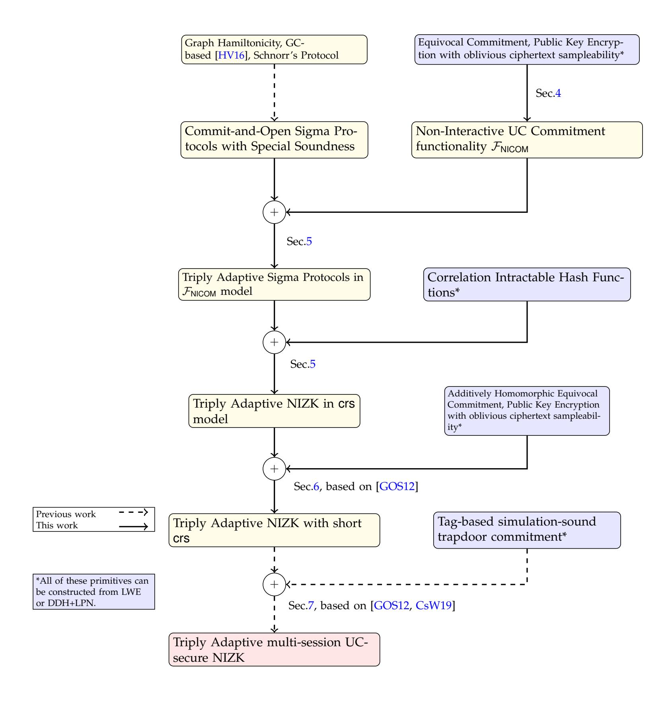

{0}------------------------------------------------

# **Triply Adaptive UC NIZK**

Ran Canetti\*1, Pratik Sarkar\*\*1, and Xiao Wang\* \* \*2

Boston UniversityNorthwestern University

Non-interactive zero knowledge (NIZK) enables proving the validity of NP statement without leaking anything else. We study multi-instance NIZKs in the common reference string (CRS) model, against an adversary that adaptively corrupts parties and chooses statements to be proven. We construct the first such *triply adaptive* NIZK that provides full adaptive soundness, as well as adaptive zero-knowledge, assuming either LWE or else LPN and DDH (previous constructions rely on non-falsifiable knowledge assumptions). In addition, our NIZKs are universally composable (UC). Along the way, we:

- Formulate an ideal functionality,  $\mathcal{F}_{NICOM}$ , which essentially captures *non-interactive* commitments, and show that it is realizable by existing protocols using standard assumptions.
- Define and realize, under standard assumptions, Sigma protocols which satisfy triply adaptive security with access to  $\mathcal{F}_{\text{NICOM}}$ .
- Use the Fiat-Shamir transform, instantiated with correlation intractable hash functions, to compile a Sigma protocol with triply adaptive security with access to  $\mathcal{F}_{\text{NICOM}}$  into a triply adaptive UC-NIZK argument in the CRS model with access to  $\mathcal{F}_{\text{NICOM}}$ , assuming LWE (or else LPN and DDH).
- Use the UC theorem to obtain UC-NIZK in the CRS model.

<sup>\*</sup> Supported by NSF Awards 1931714, 1801564, 1414119, and by DARPA under Agreement No. HR00112020023.

<sup>\*\*</sup> Supported by NSF Awards 1931714, 1414119, and the DARPA SIEVE program.

<sup>\* \* \*</sup> Supported by DARPA under Contract No. HR001120C0087, NSF award #2016240, and research awards from Facebook and Google .

{1}------------------------------------------------

# **Table of Contents**

| 1 |                                                                | Introduction                                                          |    |  |  |  |  |
|---|----------------------------------------------------------------|-----------------------------------------------------------------------|----|--|--|--|--|
|   | 1.1                                                            | Our Contributions                                                     | 2  |  |  |  |  |
|   | 1.2                                                            | Our Techniques                                                        | 2  |  |  |  |  |
|   | 1.3                                                            | Related Works                                                         | 6  |  |  |  |  |
| 2 | Technical Overview                                             |                                                                       |    |  |  |  |  |
|   | 2.1                                                            | UC non-interactive commitment functionality FNICOM<br>                | 7  |  |  |  |  |
|   | 2.2                                                            | Adaptively Secure Sigma Protocols in the FNICOM<br>model              | 9  |  |  |  |  |
|   | 2.3                                                            | Compiling to an Adaptively-Secure NIZK                                | 10 |  |  |  |  |
|   | 2.4                                                            | Constructing Adaptively Secure Sigma Protocols with Special Soundness | 12 |  |  |  |  |
|   | 2.5                                                            | Reducing the Length of the crs                                        | 16 |  |  |  |  |
|   | 2.6                                                            | Obtaining UC Security for Multiple Subsessions                        | 17 |  |  |  |  |
| 3 | Preliminaries                                                  |                                                                       |    |  |  |  |  |
|   | 3.1                                                            | Non-Interactive Zero Knowledge                                        | 19 |  |  |  |  |
|   | 3.2                                                            | Commitment Schemes                                                    | 20 |  |  |  |  |
|   | 3.3                                                            | Correlation Intractability                                            | 22 |  |  |  |  |
|   | 3.4                                                            | Garbling Schemes                                                      | 23 |  |  |  |  |
| 4 |                                                                | New UC-Commitment Functionality FNICOM<br>                            | 24 |  |  |  |  |
| 5 | Triply Adaptive NIZK Argument in the crs model                 |                                                                       |    |  |  |  |  |
|   | 5.1                                                            | Sigma Protocol                                                        | 30 |  |  |  |  |
|   | 5.2                                                            | Fully Adaptive Sigma Protocol in FNICOM<br>model                      | 31 |  |  |  |  |
|   | 5.3                                                            | Our NIZK Compiler in the FNICOM<br>model                              | 31 |  |  |  |  |
|   | 5.4                                                            | Instantiations                                                        | 37 |  |  |  |  |
| 6 | Triply Adaptive NIZK Argument in the short crs model<br><br>39 |                                                                       |    |  |  |  |  |
| 7 | Triply Adaptive, multi-proof UC-NIZK Argument<br>43            |                                                                       |    |  |  |  |  |
| A |                                                                | Equivalence of UC-Commitment Functionalities<br>50                    |    |  |  |  |  |

{2}------------------------------------------------

## <span id="page-2-0"></span>**1 Introduction**

Non-Interactive zero knowledge [\[BFM90,](#page-48-0) [BSMP91\]](#page-48-1) is a magical primitive: with the help of a trusted reference string, it allows parties to publicly assert knowledge of sensitive data and prove statements regarding the data while keeping the data itself secret. Proofs are written once and for all, to be inspected and verified by anyone at any time.

However, harnessing this magic in a concrete and realizable set of security requirements has turned out to be non trivial. A first thrust provides basic formulations of soundness and zero knowledge in the presence of a reference string, and constructions that satisfy them under standard assumptions [\[BSMP91,](#page-48-1) [FLS99,](#page-49-0) [GR13\]](#page-50-0). Indeed, even these basic requirements turn out to be non-trivial to formulate and obtain, especially in the case of multiple proofs that use the same reference string and where the inputs and witnesses are chosen adversarially in an adaptive way.

A second thrust addresses malleability attacks [\[SCO](#page-50-1)+01, [DDN91\]](#page-49-1), and more generally universally composable security [\[CLOS02\]](#page-49-2) in a multi-party setting. In particular, UC NIZK has been used as a mainstay for incorporating NIZK proofs in cryptographic protocols and systems - actively secure MPC [\[GMW87\]](#page-49-3), CCA secure encryption [\[NY90,](#page-50-2) [DDN91\]](#page-49-1), signatures [\[BMW03,](#page-48-2) [BKM06\]](#page-48-3) and cryptocurrencies [\[BCG](#page-48-4)+14].

A third thrust is to construct NIZK protocols that are secure in a multi-party setting where the adversary can corrupt parties adaptively [\[CLOS02,](#page-49-2) [AMPS21,](#page-48-5) [CGPS21\]](#page-49-4), as the computation proceeds. Here the traditional definition (which requires that the attacker does not gain any advantage towards breaking the security of the overall system beyond the ideal case where the NIZK is replaced by a trusted party) is extended to the case where the attacker obtains the hidden internal state of some provers *after* the proof was sent. Indeed, this extended guarantee is essential whenever NIZK is used as a primitive within larger protocols that purport to obtain security against adaptive corruptions[3](#page-2-1) .

The first protocol that provides security against adaptive corruptions is that of Groth, Ostrovsky, and Sahai [\[GOS06,](#page-49-5) [GOS12\]](#page-49-6) (GOS). That protocol is also UC secure, even in a multiproof, multi-party setting. However it only guarantees *culpable soundness*, namely that the sequence of instances proven to be in a language L during an execution of the protocol is indistinguishable (given the reference string) from a sequence of instances that are actually in L. The works of [\[KNYY19,](#page-50-3) [KNYY20\]](#page-50-4) have similar characteristics: they provide security against adaptive corruptions, but only culpable adaptive soundness.

Abe and Fehr [\[AF07\]](#page-48-6) show how to prove full adaptive soundness of a variant of the GOS protocol, under a knowledge-of-exponent (KOE) assumption[4](#page-2-2) . However, their analysis is incompatible with UC security [\[KZM](#page-50-5)+15], KOE-style assumptions require existence of a knowledge extractor that has full access to whose code is larger than the code of the environment. In contrast, in the UC framework a single extractor/simulator would have to handle arbitrary poly-time environments. The recent work of [\[KKK21\]](#page-50-6) investigated composable security for knowledge assumptions in the generic group model. They rule out general composition but demonstrate that it is possible under restricted settings. We refer to their paper for more details. Proving composable security of [\[AF07\]](#page-48-6) in their model is still an open question.

<span id="page-2-1"></span><sup>3</sup> In cases where the prover is able to immediately erase all records of its sensitive state - specifically the witness and randomness used in generating the proof - adaptive security is easy to obtain. However such immediate and complete erasure of local state is not always practical.

<span id="page-2-2"></span><sup>4</sup> [\[AF07\]](#page-48-6) provides adaptive soundness and adaptive zero knowledge and claims security against adaptive corruptions in Remark 11 of their paper.

{3}------------------------------------------------

We are thus left with the following natural question: Can we have triply adaptive NIZK protocols, namely full-fledged UC NIZK protocols in the multi-party, multi-proof setting, in the case of adaptive corruptions without erasures, and with full adaptive soundness? And if so, under what assumptions?

### <span id="page-3-0"></span>**1.1 Our Contributions**

We develop a general methodology for obtaining triply adaptive NIZKs, namely UC NIZKs with full adaptive soundness, withstanding adaptive corruptions with no erasures. Using this methodology, we obtain triply adaptive NIZK protocols from statically secure Sigma protocols. The NIZK protocols reuse a single crs for multiple NIZK instances between different pairs of parties. Moreover, one of the NIZK protocols also avoids expensive Karp reductions. Upon concrete instantiation based on either Learning With Errors, or Decisional Diffie Hellman plus Learning Parity with Noise assumption, we obtain the following result:

**Theorem 1.** *(Informal) Assuming either 1) LWE assumption holds or 2) both DDH and LPN assumptions hold, there exists a multi-theorem NIZK protocol that UC-securely implements the NIZK functionality(Fig. [3\)](#page-20-1) against adaptive corruptions in the crs model for multiple instances. Furthermore, it is adaptively sound and adaptively zero knowledge.*

As an independent result we also obtain a compiler that (assuming either LWE or DDH) transforms a given NIZK protocol, where the length of the crs can depend on the NP relation to be asserted, to a NIZK protocol where the length of the crs depends only on the security parameter. Furthermore, we do so while preserving triple adaptive security. Previous such compilers [\[GGI](#page-49-7)+15, [CsW19\]](#page-49-8) were known only from LWE:

**Theorem 2.** *(Informal) Assuming either 1) LWE assumption holds or 2) both DDH and LPN assumptions hold, there exists a multi-theorem NIZK protocol that UC-securely implements the NIZK functionality(Fig. [3\)](#page-20-1) against adaptive corruptions with short crs (i.e.* |*crs*| = *poly*(κ) *and* κ *is the computational security parameter) for multiple instances. Furthermore, it is adaptively sound and adaptively zero knowledge.*

Furthermore, by plugging our NIZK protocol in the compiler of [\[CsW19\]](#page-49-8) we can obtain a triply adaptive NIZK protocol from LWE, where the reference string size depends only on the security parameter and the proof size depends on the witness size and the security parameter. We compare the state-of-the-art results and our result in Tab. [1.](#page-4-0)

## <span id="page-3-1"></span>**1.2 Our Techniques**

We present our NIZK compiler in Fig. [1.](#page-5-0) Our approach follows the general paradigm of applying the Fiat-Shamir transform (instantiated via correlation in tractable hash functions) to Sigma protocols, as developed in [\[CGH98,](#page-49-9) [HL18,](#page-50-7) [CCH](#page-49-10)+19, [PS19,](#page-50-8) [BKM20,](#page-48-7) [HLR21\]](#page-50-9). However, to preserve triple adaptivity the transform should be applied with some care.

*Starting Point.* Let us briefly recall the definition of a Sigma protocol: A Sigma protocol is a 3 round protocol for proving validity of an NP statement x ∈ L (where L is the language) using the knowledge of an accepting witness w. The prover sends the first message a, the verifier samples a random challenge c, and based on the challenge c ∈ C the prover computes

{4}------------------------------------------------

| Protocol              | Adaptive<br>Soundness | Adaptive<br>Zero-Knowledge | Security against<br>Adaptive<br>Corruptions | Assumptions              | UC-Secure    |
|-----------------------|-----------------------|----------------------------|---------------------------------------------|--------------------------|--------------|
| [GOS12]               | ×                     | <b>√</b>                   | ✓                                           | Pairings                 | <b>√</b>     |
| [KNYY19],<br>[KNYY20] | ×                     | <b>√</b>                   | <b>√</b>                                    | Pairings                 | ✓            |
| CI-based NIZKs        | <b>√</b>              | ✓                          | ×                                           | LWE/DDH+LPN              | <b>√</b>     |
| [AF07]                | <b>√</b>              | <b>√</b>                   | <b>√</b>                                    | Knowledge<br>of Exponent | ×            |
| This work             | <b>√</b>              | <b>√</b>                   | <b>√</b>                                    | LWE/DDH+LPN              | $\checkmark$ |

<span id="page-4-0"></span>**Table 1.** Comparison of Triply Adaptive NIZK Protocols.

the response z. The verifier accepts an honest proof when  $x \in \mathcal{L}$ . Soundness ensures that the verifier rejects cheating proofs with  $\frac{1}{|\mathcal{C}|}$  probability. Honest verifier zero knowledge (HVZK) ensures that the simulator constructs an honest proof given a random challenge c and the simulated proof is indistinguishable from an honest proof. However, the usual Sigma protocols [FLS99, Blu86] are only secure against static corruption of prover, i.e. upon post-execution corruption of prover the HVZK simulator obtains witness w and is unable to provide randomness such that it is consistent with the proof (a, c, z) constructed by the HVZK simulator.

New UC-Commitment Functionality  $\mathcal{F}_{NICOM}$ . To solve the above issue in a modular fashion, we first introduce a new non-interactive UC commitment functionality,  $\mathcal{F}_{NICOM}$ , that enables modular analyzing of NIZK protocols that use commitments as an underlying primitive. Specifically, the new functionality returns a commitment string and a decommitment to the committer as an output of the commit phase, where the committer commits to a message. The open phase allows non-interactive verification of the commitment, decommitment and message tuple by a verifier. Moreover, the functionality is provided with an explicit simulation algorithm  $\mathcal{S}_C$  which extracts committed messages from maliciously generated commitments and permits equivocation of simulated commitments. Looking ahead, the CI-hash function would be equipped with the  $\mathcal{S}_C$  algorithm to run the bad challenge function and yet we would argue security of the NIZK protocol in the  $\mathcal{F}_{NICOM}$  model. Hence,  $\mathcal{F}_{NICOM}$  provides a cleaner abstraction of non-interactive UC commitments. The formal description of the  $\mathcal{F}_{NICOM}$  functionality can be found in Fig. 2.

Strengthening Sigma protocols in  $\mathcal{F}_{NICOM}$  model. Now, we define the notion of an adaptively secure Sigma protocol in the  $\mathcal{F}_{NICOM}$  model as a stepping stone towards security against adaptive corruptions. These are Sigma protocols which provide security against adaptive corruption of prover in the  $\mathcal{F}_{NICOM}$  model. To attain constructions of such Sigma protocols, we replace the underlying commitment scheme in the commit-and-open protocols of [Blu86, FLS99, HV16] with  $\mathcal{F}_{NICOM}$ . Then we prove that these Sigma protocols are adaptively secure in the  $\mathcal{F}_{NICOM}$  model, while preserving special soundness. Furthermore, these protocols satisfies full adaptive soundness and provides adaptive ZK in the  $\mathcal{F}_{NICOM}$  model. If  $\mathcal{F}_{NICOM}$  is concretely instantiated using

{5}------------------------------------------------



<span id="page-5-0"></span>Fig. 1. An overview of our NIZK results

an adaptively secure non-interactive commitment in non-programmable **crs** model <sup>5</sup> then the protocol also preserves full adaptive soundness and adaptive ZK.

Removing Interaction. It is now tempting to apply the Fiat-Shamir (FS) transform [FS87] using correlation intractable hash functions (due to [CGH98, HL18, CCH+19, PS19, BKM20, HLR21]), and conclude that the resulting protocol is a NIZK. However, it is not clear how the transform would actually work: the bad challenge function for the CI hash function cannot be defined given blackbox access to a and the challenge space can be exponentially large, for example consider Schnorr's protocol [Sch90]. The current CI-based NIZKs [CGH98, HL18, CCH+19, PS19] consider specific Sigma protocols to construct NIZKs. We take a different route to solve this problem by relying on special soundness property. Special soundness property of a Sigma protocol ensures that given two accepting transcripts  $(a, c_0, z_0)$  and  $(a, c_1, z_1)$  for different challenges  $c_0 \neq c_1$  there exists an extractor which extracts a valid witness from the transcripts. If

<span id="page-5-1"></span><sup>&</sup>lt;sup>5</sup> The crs distribution in the real world is statistically close to the crs distribution in the ideal world

{6}------------------------------------------------

the statement x /∈ L is not in the language then the prover cannot construct two such accepting transcripts for the same a.

We generalize the framework of [\[CD00\]](#page-49-12) to construct our compiler. In our compiler, the prover computes a, samples two challenges c<sup>0</sup> and c1, computes responses z<sup>0</sup> and z<sup>1</sup> and commits to (c0, z0) and (c1, z1) in FNICOM model. This step is repeated for τ = O(κ) times, where κ is the security parameter. Let Y denote the commitments to (c0, c1, z0, z1) for the τ iterations. The CI-hash function is defined in the statistical mode equipped with the extraction algorithm S<sup>C</sup> for FNICOM. The hash function is CI for the bad challenge function - for each iteration (a, c0, c1, z0, z1) it outputs 0 if (a, c0, z0) is accepting. The prover invokes the CI hash function on (a, Y) to obtain a challenge bit e for each iteration. For each iteration, the prover computes the response as the decommitment to (c0, c1, ze). Special soundness of the Sigma protocol ensures that a malicious prover is unable to compute two such valid transcripts (a, c0, z0) and (a, c1, z1) for a false statement x /∈ L.

*CI-based NIZK Transformations for Arguments.* Now we would like to apply the analysis of [\[CCH](#page-49-10)+19] to argue soundness of the NIZK protocol, which says that if the malicious prover is able to construct an accepting proof for x /∈ L then it breaks correlation intractability. However, now we are faced with another barrier: The [\[CCH](#page-49-10)+19] analysis for CI crucially needs the underlying Sigma protocol to be statistically sound. In contrast, our Sigma protocols are only computationally sound since it relies on the special soundness property (which can be computational) of the Sigma protocol and the computational binding property of the commitment scheme. Furthermore, this is inherent: Statistically sound ZK protocols cannot possibly be secure against adaptive corruptions. In particular, this means that we cannot "switch the crs in the hybrids to make the sigma protocol statistically sound": As soon as we do so, the protocol (in that hybrid) stops being secure against adaptive corruptions.

We get around this barrier[6](#page-6-0) as follows: with each commitment made during the interaction we can associate an event B, determined at the time of commitment, such that: (a) event B can be shown to occur only with negligible probability, and (b) conditioned on event B not occurring, the commitment is statistically binding. Event B is the event where the adversary successfully evades the extraction algorithm S<sup>C</sup> of FNICOM and yet the corresponding decommitment is accepted. Given that event B does not occur, we then associate an event D with each of the τ adaptively secure Sigma protocol executions, such that: (a) event D can be shown to occur only with negligible probability, and (b) conditioned on event D not occurring, the Sigma protocol is statistically sound. The event D is the event where the adversary breaks special soundness property of the Sigma protocol. The [\[CCH](#page-49-10)+19] analysis can now be resurrected, conditioned on event B not occurring for any of the commitments made, and event D not occurring for the Sigma protocols. Initializing the hash function in the statistical mode ensures that soundness of the protocol is reduced to breaking statistical correlation intractability of the hash function, provided event B and event D does not occur.

Adaptive soundness of our protocol follows in a straightforward way from the fact that the entire proof is performed without changing the distribution of the crs in the FNICOM model. (Indeed, this important feature allows us to avoid the main obstacle that prevents the [\[GOS12\]](#page-49-6) protocol from being adaptively sound.) Adaptive zero knowledge follows from the adaptive security of the Sigma protocol in the FNICOM model. If FNICOM is concretely instantiated using

<span id="page-6-0"></span><sup>6</sup> The recent work of [\[CJJ21\]](#page-49-13) also applied the Fiat-Shamir paradigm on an interactive protocol which is not statistically sound using CI hash functions. However, their protocol is not adaptively sound. Meanwhile, the plainmodel sigma protocol that [\[CCH](#page-49-10)<sup>+</sup>19] start from is statistically sound.)

{7}------------------------------------------------

an adaptively secure non-interactive commitment in non-programmable crs model [7](#page-7-1) then the protocol also preserves full adaptive soundness and adaptive ZK.

*Instantiations of Adaptively Secure Sigma protocols in* F*NICOM model.* We show that a wide variety of Sigma protocols satisfy (in FNICOM model) adaptive security with special soundness and adaptive soundness - Schnorr's protocol, Sigma protocol of [\[FLS99\]](#page-49-0) (FLS), Blum's Hamiltonicity protocol and garbled circuit (GC) based protocol of [\[HV16\]](#page-50-10). Furthermore, the GC based protocol avoids expensive Karp reduction.

*Instantiating the CI-hash and* F*NICOM.* The CI function can be instantiated from LWE [\[PS19\]](#page-50-8), or it can be replaced by a CI-Approx [\[BKM20\]](#page-48-7) function based on LPN+DDH. FNICOM is instantiated using the protocol of [\[CF01\]](#page-49-14) from equivocal commitments and CCA-2 secure public key encryption with oblivious ciphertext sampling property in the non-programmable crs model.

*Reducing crs size.* By applying techniques from GOS, we obtain a compiler which *reduces the crs size* of a NIZK argument. Assuming reusable non-interactive equivocal commitments with additive homomorphism and PKE (with oblivious ciphertext sampleability) we compile any triply adaptive NIZK argument with a long multi-proof crs, i.e. |crs| = poly(κ, |C|) to obtain a triply adaptive NIZK argument with a short multi-proof common reference string scrs, where |scrs| = poly(κ), C is the NP verification circuit and κ is the computational security parameter. The prover commits to each wire value (of the circuit) and proves that they are bit commitments using the NIZK. In addition, the prover applies some homomorphic operation on the input wire and output wire commitments for each gate. If the input and output wire values are consistent with the gate evaluation then the homomorphically evaluated commitment will be a bit commitment. The prover proves this using NIZK for every gate in the circuit. Each NIZK statement is short and depends only on the committer's algorithm (= poly(κ)) and not on |C|. As a result the crs size of the NIZK can be short. The commitment can be instantiated from DDH (Pedersen commitment or [\[CSW20\]](#page-49-15)) or LWE/SIS [\[GVW15\]](#page-50-12). The encryption scheme can be instantiated from DDH assumption using Elgamal encryption or LWE [\[GSW13\]](#page-50-13) assumption.

*Obtaining multi-session UC security.* We add non-malleability to our NIZK argument using standard techniques from GOS to obtain the multi-session UC-secure NIZK in the short crs model. It relies on a tag-based simulation-sound trapdoor commitment scheme and a strong one-time signature scheme . The tag-based commitment can be instantiated from UC-commitments - DDH [\[CSW20\]](#page-49-15) and LWE [\[CsW19\]](#page-49-8). Strong one-time signatures can be constructed from oneway functions. This transformation also preserves triply adaptive security.

## <span id="page-7-0"></span>**1.3 Related Works**

The works of [\[GOS06,](#page-49-5) [KNYY19,](#page-50-3) [KNYY20\]](#page-50-4) construct NIZKs which are secure against adaptive corruptions but they lack adaptive soundness. The works of [\[CCH](#page-49-10)+19, [BKM20\]](#page-48-7) construct statically secure NIZKs which attain adaptive soundness and adaptive ZK. A concurrent work by [\[CPV20\]](#page-49-16) compiled delayed input Sigma protocol into a Sigma protocol which satisfies adaptive zero knowledge. Upon applying the result of [\[CPS](#page-49-17)+16] they obtain adaptive soundness. The Fiat-Shamir transform is applied using CI hash function to obtain NIZKs, but they lack

<span id="page-7-1"></span><sup>7</sup> The crs distribution in the real world is statistically close to the crs distribution in the ideal world

{8}------------------------------------------------

security against adaptive corruptions. The only work which achieves triple adaptive security is [AF07] based on knowledge assumptions; which is incompatible with the UC framework.

The literature consists of work [GGI<sup>+</sup>15, CsW19] that make the crs size independent of |C| but those approaches are instantiatable only from LWE. Whereas, our compiler can be instantiated from non-lattice based assumptions like DDH.

Paper Organization. In Section 2, we present the key intuitions behind our protocols. We introduce some notations and important concepts used in this work in Section 3. This is followed by our triply adaptively-secure NIZK compiler in Section 5. We present our compiler to reduce the crs length in Section 6. Finally, we conclude with our multi-session UC-NIZK protocol in the short crs model in Section 7.

*Note.* Throughout the paper we refer to *security against adaptive corruptions* as *adaptive security*.

### <span id="page-8-0"></span>2 Technical Overview

In this section we provide an overview of our protocols. As discussed in the Introduction, a key component in our approach is to break the Fiat-Shamir transformation into two steps: A first step that uses an ideal UC commitment fucntionality, and a second step of instantiating this functionality with an adaptively secure protocol. Validity of the approach would follow from the UC theorem and the special soundness of the sigma protocol.

We first overview the new formulation of ideal UC commitments,  $\mathcal{F}_{\text{NICOM}}$ , that enables our two-step approach, and argue that known protocols, that UC realize the traditional ([CF01]) formulation of ideal commitment, realize  $\mathcal{F}_{\text{NICOM}}$  as well. Next, we overview our notion of fully adaptive Sigma protocols that use  $\mathcal{F}_{\text{NICOM}}$ , followed by the first step of the Fiat-Shamir transform. We demonstrate that the resulting NIZKs satisfy triply adaptive security in the  $\mathcal{F}_{\text{NICOM}}$ -hybrid model, and that triple adaptivity is preserved even after replacing  $\mathcal{F}_{\text{NICOM}}$  with a protocol that realizes it. Next, we show instantiations of adaptive Sigma protocol. Finally we show how to reduce the crs size of our NIZK protocols to  $\text{poly}(\kappa)$  by assuming homomorphic equivocal commitments. Till this point, all our protocols are triply adaptive and single-prover UC-secure. Finally, we make them UC-secure in the general, multi-prover sense by adding non-malleability.

### <span id="page-8-1"></span>2.1 UC non-interactive commitment functionality $\mathcal{F}_{\text{NICOM}}$

Our new UC-commitment functionality  $\mathcal{F}_{\mathsf{NICOM}}$  can be found in Fig. 2. The functionality receives an algorithm  $\mathcal{S}_C$  algorithm from the adversary  $\mathcal{S}$ . When an honest committer P wants to commit to a message m for subsession ssid, the functionality invokes  $\mathcal{S}_C$  for a commitment string  $\pi$  and an internal state st.  $\pi$  is independent of the message m. The functionality then invokes  $\mathcal{S}_C$  with the message m and the state st to obtain a decommitment d and an updated state st. The functionality stores (ssid,  $P, m, \pi, d$ , st) and returns the commitment string  $\pi$  and the decommitment d to the committer. The committer sends  $\pi$  as the commitment to message m. An honest committer decommits to a commitment string  $\pi'$  by sending (m', d') to the verifier V. The verifier locally verifies the decommitment by invoking  $\mathcal{F}_{\mathsf{NICOM}}$  on the tuple  $(m', \pi', d')$ . The functionality returns verified if the tuple is stored in memory corresponding to the subsession and the same committer P. If the same commitment string  $\pi'$  is stored but with

{9}------------------------------------------------

- <span id="page-9-0"></span>- At first activation, obtain algorithm  $S_C$  from S. Initialize a list  $\mathcal{L} = \emptyset$  that would store illegitimate queries which failed to verify.
- **Commit:** On input (Com, ssid, m) from committer P:
  - obtain commitment  $\pi$  and internal state St as  $(\pi, \text{St}) \leftarrow \mathcal{S}_C(\text{Com}, \text{ssid})$  (Hiding)
  - obtain decommitment d and state St as  $(d, St) \leftarrow S_C(Equiv, ssid, \pi, St, m)$  (Equivocal)
  - store (ssid,  $m, \pi, d$ , st) and output (Receipt, ssid,  $\pi, d$ ) to P.
- Open: On input (Open, ssid,  $m', \pi', d'$ ) from verifier V:
  - If  $(ssid, m', \pi', d', st)$  is stored for some st, then return (verified, ssid) to V.
  - If  $(ssid, m', \pi', d', st) \in \mathcal{L}$ , then return (verification-failed, ssid) to V.
  - If  $(ssid, m'', \pi', d'', st)$  is stored, and  $m'' \neq m'$  or  $d'' \neq d'$  then return (verification-failed, ssid) to V, and add  $(ssid, m', \pi', d')$  in list  $\mathcal{L} = \mathcal{L} \cup (ssid, m', \pi', d')$ . (Binding)
  - Else (i.e., no record (ssid, ...) is stored, or there is a stored record of the form (ssid, m'',  $\pi''$ , d'', st) where  $\pi'' \neq \pi'$ ):
    - Obtain  $(m'', st) \leftarrow \mathcal{S}_C(\mathsf{Ext}, \mathsf{ssid}, \pi')$ .

(Extractable)

- If  $m'' \neq m'$ , set v = verification-failed.
- If m'' = m', set  $v \leftarrow \mathcal{S}_C(\text{Verify}, \text{ssid}, \pi', d', \text{st})$ .
- If v == verified, then store the tuple (ssid,  $m', \pi', d', st$ ) and return (v, ssid) to V. Else return (verification-failed, ssid) to V, and add (ssid,  $m', \pi', d'$ ) in list  $\mathcal{L} = \mathcal{L} \cup (ssid, m', \pi', d')$ .
- Corruption: When receiving (Corrupt, ssid) from S, mark ssid as corrupted. Send all the stored tuples of the form (ssid, . . .) to S. If there does not exist any tuple then send (ssid,  $\bot$ ) to S. On input (corrupt-check, sid, ssid), return whether (sid, ssid) is marked as corrupted.

different messages/decommitments/committers/ssid then the functionality rejects the opening by sending verification-failed. Finally, if the commitment string has never been stored in the memory of  $\mathcal{F}_{\text{NICOM}}$  then  $\mathcal{F}_{\text{NICOM}}$  invokes  $\mathcal{S}_C$  to extract a valid message m'' from the commitment string  $\pi'$ . If m'' == m' then the functionality invokes  $\mathcal{S}_C$  with the opening  $(m', \pi', d')$  to verify the decommitment. If the decommitment correctly verifies then the functionality stores the tuple in the memory and returns verified to V. Else, it rejects the decommitment. Once an opening request - (ssid,  $m', \pi', d'$ ) gets rejected then that request is added to a list  $\mathcal{L}$ . Next time when the same tuple is requested to be verified  $\mathcal{F}_{\text{NICOM}}$  rejects it.

Our model allows a prover to send a commitment that was not computed by invoking the  $\mathcal{F}_{\mathsf{NICOM}}$  functionality. Furthermore, access to the  $\mathcal{S}_C$  algorithm enables extraction from a maliciously generated commitment and equivocating a simulated commitment. The command  $\mathcal{S}_C(\mathsf{Equiv}, \mathsf{ssid}, \mathsf{P}, \pi, \mathsf{st}, m)$  is used to equivocate a commitment string  $\pi$  such that it opens to m. The  $\mathcal{S}_C(\mathsf{Ext}, \mathsf{ssid}, \mathsf{P}, \pi)$  command is used to extract a message from the commitment  $\pi$ . These algorithms come in handy for simulation purposes when  $\mathcal{F}_{\mathsf{NICOM}}$  is used in bigger protocols.

Implementing  $\mathcal{F}_{NICOM}$ . We implement  $\mathcal{F}_{NICOM}$  in Section. 4 using the non-interactive commitment scheme of [CF01] based on equivocal commitments and CCA-2 secure public key encryption with oblivious ciphertext sampleability. The committer P commits to a bit message m as c = Com(m;r). The commitment randomness is encrypted via a pair of encryptions. The committer encrypts the corresponding randomness r, subsession id ssid and committer id P using a CCA-2 secure PKE as  $E_m = \text{Enc}(\text{pk}, (r, \text{ssid}, \text{P}); s_m)$  with randomness  $s_m$ . The other encryption  $E_{1-m}$  is obliviously sampled using randomness  $s_{1-m}$ . The commitment consists of  $(c, E_0, E_1)$  and the opening information is  $(m, r, s_0, s_1)$ . The verifier performs the canonical verification by reconstructing the commitment. The equivocal commitment can be instantiated from Pedersen Commitment and the obliviously sampleable encryption scheme can be instantiated from Cramer Shoup encryption [CS98], yielding a protocol from DDH. Similarly, we can instantiate the equivocal commitment from LWE [CsW19] and the obliviously sampleable encryption scheme from LWE [MP12].

{10}------------------------------------------------

### <span id="page-10-0"></span>2.2 Adaptively Secure Sigma Protocols in the $\mathcal{F}_{NICOM}$ model

We recall the definition of a Sigma protocol and then we introduce the notion of adaptively Sigma protocols in the  $\mathcal{F}_{NICOM}$  model.

Sigma Protocol. A Sigma protocol consists of a prover possessing an NP statement  $x \in \mathcal{L}$  (for language  $\mathcal{L}$ ) and witness w which validates the statement. The verifier possesses the statement x. The prover constructs a first message a and the honest verifier challenges the prover with a random challenge  $c \leftarrow_R \mathcal{C}$  from the challenge space  $\mathcal{C}$ . Based on the challenge, the prover computes a response z and sends it to the verifier. Completeness ensures that an honest verifier always accepts the proof (a,c,z). Soundness ensures that the verifier accepts a proof corresponding to an invalid statement  $x' \notin \mathcal{L}$  with probability  $\frac{1}{|\mathcal{C}|}$ . The protocol is repeated  $\kappa$  times to obtain negligible (in  $\kappa$ ) soundness error. We also require special soundness which guarantees a witness extractor given two accepting transcripts (a,c,z) and (a,c',z') corresponding to the same first message but different challenges  $c \neq c' \in \mathcal{C}$ . Finally, we need honest verifier zero knowledge which allows a simulator to simulate an accepting proof given an honestly sampled challenge c. The simulated proof should be indistinguishable from an honestly generated proof.

Limitations of a Sigma protocol. A Sigma protocol does not necessarily guarantee security against adaptive corruptions. The adversary can choose to corrupt the prover after obtaining the simulated proof. In such a case, the simulator obtains the witness and needs to provide prover's randomness such that the simulated proof is consistent with the witness. This problem crops up especially when the first message of the Sigma protocol [FLS99] is statistically binding and doesn't allow equivocation later on. To tackle this issue, we introduce the notion of adaptively secure Sigma protocols in the ideal UC commitment functionality (for multiple subsessions)  $\mathcal{F}_{\text{NICOM}}$  model. The traditional UC commitment functionality of [CF01] (Fig. 19) is not compatible with non-interactive commitments since the functionality is required to interact with the parties during Commit and open phases. So we use our new commitment functionality  $\mathcal{F}_{\text{NICOM}}$  which allows non-interactive Commit and Open phases.

Adaptively Secure Sigma Protocols. As seen above, the traditional Sigma protocols does not necessarily guarantee security against adaptive corruptions. In the light of this, we consider Sigma protocols in the  $\mathcal{F}_{\mathsf{NICOM}}$  model. The prover sends the first message a to the verifier, the verifier sends a random challenge c to the prover and the prover computes the response z based on c. The prover and verifier have access to the  $\mathcal{F}_{\mathsf{NICOM}}$  functionality during the protocol execution. In addition to HVZK and special soundness properties, we also require that the simulator is able to produce consistent randomness for a simulated proof and a valid witness when the prover gets corrupted post-execution. Looking ahead, the first message a will consist of commitments that are obtained by invoking  $\mathcal{F}_{\mathsf{NICOM}}$  functionality. This enables the simulator to construct an HVZK proof during protocol execution - where it opens a few of the commitments in a which are required for verification. The other commitments in a remain unopened during the protocol. When the prover gets corrupted post-execution, the simulator obtains the witness w, and it equivocates the unopened commitments in a to produce a simulated prover's randomness such that it is indistinguishable from honestly sampled prover randomness (in the real world execution).

We also require special soundness property from our adaptively secure Sigma protocol to construct a NIZK protocol. We say that the protocol satisfies special soundness if there exists 

{11}------------------------------------------------

an extractor which extracts the witness given two transcripts  $(a, c_0, z_0)$  and  $(a, c_1, z_1)$  corresponding to the same a.

### <span id="page-11-0"></span>2.3 Compiling to an Adaptively-Secure NIZK

Next, we implement the  $\mathcal{F}_{NIZK}$  functionality for a single session by using the Fiat-Shamir transform on  $\tau = \mathcal{O}(\kappa)$  iterations of the adaptively secure Sigma protocol. We instantiate the hash function in the Fiat-Shamir Transform using a correlation intractable hash function H [PS19, CCH<sup>+</sup>19, BKM20].

Correlation Intractability. A correlation intractable hash function H has the following property: For every efficient function f, given a hash function  $H \leftarrow \mathcal{H}$  from the hash family  $\mathcal{H}$ , it is computationally hard to find an x s.t. f(x) = H(x). Based on the first message  $\mathbf{a}$  of a trapdoor-Sigma Protocol, the Fiat-Shamir challenge  $\mathbf{e}$  can be generated using the hash function as  $\mathbf{e} = H(\mathbf{a})$ . The prover computes the third message  $\mathbf{z}$  using  $\mathbf{e}$ . Trapdoor-Sigma protocol ensures that for every statement not in the language there can be only one bad challenge  $\mathbf{e} = g(\mathbf{a})$  s.t.  $(\mathbf{a}, \mathbf{e}, \mathbf{z})$  is an accepting transcript. By setting the function f = g as the bad challenge function in H it is ensured that a malicious prover who constructs a bad challenge  $\mathbf{e} = H(\mathbf{a})$  can be used to break correlation intractability since  $\mathbf{e} = g(\mathbf{a}) = f(\mathbf{a})$ . This guarantees soundness of the NIZK protocol.

Protocol. We compile our adaptively secure Sigma protocol into an adaptively secure NIZK in the  $\mathcal{F}_{\mathsf{NICOM}}$  model (the  $\mathcal{F}_{\mathsf{NICOM}}$  functionality is later instantiated using an adaptively secure non-interactive commitment scheme [CF01]). The prover computes the first message  $a^j$  of the adaptively secure Sigma protocol for the jth iteration where  $j \in [\tau]$ . It samples two challenges  $c_0^j$  and  $c_1^j$  from the challenge space such that  $c_0^j \neq c_1^j$ . The prover computes the responses  $z_0^j$  and  $z_1^j$  corresponding to both challenges  $c_0^j$  and  $c_1^j$  respectively. The prover commits to the challenges  $c_0^j$  and  $c_1^j$ , and the responses  $z_0^j$  and  $z_1^j$ . Let us denote the set of commitments as  $Y^j$ . The prover repeats the above protocol for  $\tau$  iterations. Let  $\mathbf{Y} = \{Y^j\}_{j \in [\tau]}$  denote the complete set of commitments and let  $\mathbf{a} = \{a^j\}_{j \in [\tau]}$  denote the complete set of first messages. The prover computes the challenge bit-vector  $\mathbf{e} = H(\mathbf{k}, (\mathbf{a}, \mathbf{Y}))$  (where  $\mathbf{k}$  is the hash key) by invoking the hash function on the commitments  $\mathbf{Y}$ . The hash function is initialized in the statistical mode and the hash key contains the algorithm  $\mathcal{S}_C$  obtained from  $\mathcal{F}_{\mathsf{NICOM}}$ . The hash function internally runs  $\mathcal{S}_C$  to extract from the commitments. We capture this using the bad challenge function  $\mathcal{C}_{\mathsf{sk}}$  where the hash key  $\mathbf{k}$  is embedded with the circuit  $\mathcal{C}_{\mathsf{sk}}$  as follows:

$$k = \mathcal{H}.StatGen(\mathcal{C}_{sk})$$
, where

 $C_{sk}$  is a poly-size circuit that takes  $\mathbf{Y}$  as input and  $sk = \mathcal{S}_C$  is the secret algorithm of  $\mathcal{F}_{NICOM}$ .  $C_{sk}(\mathbf{a}, \mathbf{Y})$  is the circuit computing the function  $f_{sk}(\mathbf{a}, \mathbf{Y}) = \mathbf{e}$  s.t. for  $j \in [\tau]$ ,  $e^j = 0$  iff  $(a^j, c_0^j, z_0^j)$  is an accepting proof where  $C_{sk}$  extracts the challenges  $(c_0^j, c_1^j)$ , and the responses  $(z_0^j, z_1^j)$  by running  $\mathcal{S}_C$ . Setting the hash function in the statistical mode ensures that the hash function H is correlation intractable for all relations of the form:

$$\mathcal{R}_{\mathsf{sk}} = \{(\mathbf{a}, \mathbf{Y}, \mathbf{e}) : \mathbf{e} = f_{\mathsf{sk}}(\mathbf{a}, \mathbf{Y})\}$$

In the jth iteration, upon obtaining e as the challenge bit the prover decommits to  $(c_0^j, c_1^j, z_e^j)$ . The NIZK proof for the jth iteration is  $(a^j, c_0^j, c_1^j, z_e^j)$  and the decommitments corresponding

{12}------------------------------------------------

to  $(c_0^j, c_1^j, z_e^j)$ . The verifier checks that - 1) the decommitments are correct, 2) the challenges are different, i.e.  $c_0^j \neq c_1^j$ , 3) the proof -  $(a^j, c_e^j, z_e^j)$  verifies. The verifier runs the verification protocols for every iteration  $j \in [\tau]$ . The verifier outputs accept if all the  $\tau$  proofs verify correctly. Correctness of the protocol follows from the correctness of the commitment scheme and correctness of the sigma protocol.

Soundness and Proof of Knowledge. The soundness and proof of knowledge argument follows through a sequence of hybrids. The correlation intractability does not hold in the real world since we start off with a NIZK argument and not a NIZK proof. The hybrid argument starts off with the real-world protocol in the first hybrid. In the second hybrid, we rely on the binding property and extractability property of the commitment scheme to ensure that the committed messages can be either correctly extracted or the commitment fails to open correctly. In the next hybrid, we rely on the special soundness property of the Sigma protocol to ensure that if for any jth iteration (for  $j \in [\tau]$ ) if the prover constructs an accepting proof for both  $e^j = 0$ and  $e^{j} = 1$  then the witness extractor of the sigma protocol correctly extracts the underlying witness. In the final hybrid, if the prover has evaded the witness extractor and yet succeeded in creating an accepting proof then it has predicted the challenge vector e correctly by breaking the correlation intractability of the hash function. However, we know that there does not exist e such that the following holds due to statistical correlation intractability and the underlying Sigma protocol in this hybrid is a proof. This ensures that either the witness extractor extracts an accepting witness from atleast one of the iterations or the proof does not verify. This completes our soundness argument.

*Adaptive Soundness.* This follows along the same lines provided the underlying sigma protocol satisfies adaptive soundness. The distribution of the **crs** is identical in the real and ideal world and hence we can argue that the proof fails to verify for a statement  $x \notin \mathcal{L}$  since there does not exist any valid witness.

Security against Adaptive Corruptions and Adaptive ZK. The ZK property crucially relies on the adaptive security of the Sigma protocol and security against adaptive corruptions of the commitment scheme. The ZK simulator of the NIZK protocol invokes the HVZK simulator the sigma protocol to obtain a simulated proof  $(a^j, c^j, z^j)$  corresponding to a random ZK challenge  $c^{j}$  for the jth iteration. The simulator constructs the commitments Y in the equivocal mode and invokes the hash function to obtain the challenge string e. Upon obtaining the challenge bits  $e^{j}$ (for  $j \in [\tau]$ ) the simulator opens the commitments corresponding to  $e^j$  to the simulated proof  $(a^{j}, z^{j}, c^{j})$ . It also equivocates the commitment for the ZK challenge corresponding to bit  $1 - e^{j}$ to open to a different challenge  $c^{j'}$  as part of the protocol. The proof verifies correctly due to the HVZK property of the Sigma protocol and equivocal property of the commitment scheme. Upon post-execution corruption of the prover, the NIZK simulator obtains the correct witness w and it invokes the simulator of the adaptively secure Sigma protocol with w to obtain the internal prover state. Using these information the NIZK simulator constructs the response corresponding to challenge  $c^{j'}$  for choice bit  $1 - e^{j}$ . The simulator equivocates the commitments in **Y** (mainly the commitment to the *j*th response for challenge bit  $1 - e^j$ ) such that the proofs corresponding to challenge bits  $1 - e^j$  verify for every jth proof. Indistinguishability follows from the adaptive security of the Sigma protocol and the adaptive security of the commitment scheme. Adaptive zero-knowledge also follows along the same lines provided the sigma protocol satisfies adaptive zero-knowledge.

{13}------------------------------------------------

### <span id="page-13-0"></span>2.4 Constructing Adaptively Secure Sigma Protocols with Special Soundness

Next, we show various instantiations of our adaptively sigma protocol which also satisfies special soundness. Plugging these protocols in a blackbox manner into our above compiler would yield a triply adaptive NIZK protocol.

**Schnorr's** [Sch90] **Protocol.** The classic Schnorr's identification protocol provides HVZK and satisfies special soundness. It also provides security against adaptive corruption. Let us recall the protocol and demonstrate that the Sigma protocol trivially satisfies adaptive security.

In the Schnorr's protocol the prover has a witness  $w \in \mathbb{Z}_q$  and statement  $x \in \mathbb{G}$  such that  $x = g^w$ , where  $g \in \mathbb{G}$  is a generator of the cyclic group  $\mathbb{G}$  where Discrete Log problem holds. The prover samples a random  $r \in \mathbb{Z}_q$  and sets  $a = g^r$ . Upon obtaining a random challenge  $c \in \mathbb{Z}_q$  from the verifier the prover sends z = r + wc as the response. The verifier checks that  $g^z \stackrel{?}{=} a \cdot x^c$ . Given two accepting trancripts (a, c, z) and (a, c', z') the witness w can be extracted as  $w = \frac{(z-z')}{c-c'}$ . On the other hand, for HVZK the simulator samples a random  $c \in \mathbb{Z}_q$  and a random  $c \in \mathbb{Z}_q$  and computes  $c \in \mathbb{Z}_q$  and computes  $c \in \mathbb{Z}_q$  and sets  $c \in \mathbb{Z}_q$  and sets  $c \in \mathbb{Z}_q$  and sets  $c \in \mathbb{Z}_q$  and sets  $c \in \mathbb{Z}_q$  and sets  $c \in \mathbb{Z}_q$  and sets  $c \in \mathbb{Z}_q$  and sets  $c \in \mathbb{Z}_q$  and sets  $c \in \mathbb{Z}_q$  and sets  $c \in \mathbb{Z}_q$  and sets  $c \in \mathbb{Z}_q$  and sets  $c \in \mathbb{Z}_q$  and sets  $c \in \mathbb{Z}_q$  and sets  $c \in \mathbb{Z}_q$  and sets  $c \in \mathbb{Z}_q$  and sets  $c \in \mathbb{Z}_q$  and sets  $c \in \mathbb{Z}_q$  and sets  $c \in \mathbb{Z}_q$  and sets  $c \in \mathbb{Z}_q$  and sets  $c \in \mathbb{Z}_q$  and sets  $c \in \mathbb{Z}_q$  and sets  $c \in \mathbb{Z}_q$  and sets  $c \in \mathbb{Z}_q$  and sets  $c \in \mathbb{Z}_q$  and sets  $c \in \mathbb{Z}_q$  and sets  $c \in \mathbb{Z}_q$  and sets  $c \in \mathbb{Z}_q$  and sets  $c \in \mathbb{Z}_q$  and sets  $c \in \mathbb{Z}_q$  and sets  $c \in \mathbb{Z}_q$  and sets  $c \in \mathbb{Z}_q$  and sets  $c \in \mathbb{Z}_q$  and sets  $c \in \mathbb{Z}_q$  and sets  $c \in \mathbb{Z}_q$  and sets  $c \in \mathbb{Z}_q$  and sets  $c \in \mathbb{Z}_q$  and sets  $c \in \mathbb{Z}_q$  and sets  $c \in \mathbb{Z}_q$  and sets  $c \in \mathbb{Z}_q$  and sets  $c \in \mathbb{Z}_q$  and sets  $c \in \mathbb{Z}_q$  and sets  $c \in \mathbb{Z}_q$  and sets  $c \in \mathbb{Z}_q$  and sets  $c \in \mathbb{Z}_q$  and sets  $c \in \mathbb{Z}_q$  and sets  $c \in \mathbb{Z}_q$  and sets  $c \in \mathbb{Z}_q$  and sets  $c \in \mathbb{Z}_q$  and sets  $c \in \mathbb{Z}_q$  and sets  $c \in \mathbb{Z}_q$  and sets  $c \in \mathbb{Z}_q$  and sets  $c \in \mathbb{Z}_q$  and sets  $c \in \mathbb{Z}_q$  and sets  $c \in \mathbb{Z}_q$  and sets  $c \in \mathbb{Z}_q$  and sets  $c \in \mathbb{Z}_q$  and sets  $c \in \mathbb{Z}_q$  and sets  $c \in \mathbb{Z}_q$  and sets  $c \in \mathbb{Z}_q$  and sets  $c \in \mathbb{Z}_q$  and sets  $c \in \mathbb{Z}_q$  and sets  $c \in \mathbb{Z}_q$  and sets

Adaptive Soundness and Adaptive ZK. Adaptive soundness cannot be defined for Schnorr's protocol since every statement  $x' \in \mathbb{G}$  lies in the language corresponding to the witness  $w' \in \mathbb{Z}_q$  where  $x' = g^{w'}$ . Adaptive ZK follows from the HVZK property of the protocol.

**Sigma protocol of [FLS99].** We briefly recall the Sigma protocol of [FLS99] for the sake of completeness. Let  $\mathcal{R}_{\mathsf{Ham}}$  be the set of Hamiltonian graphs. The prover P proves that an n-node graph G is Hamiltonian, i.e.  $G \in \mathcal{R}_{\mathsf{Ham}}$ , given a Hamiltonian cycle  $\sigma$  as a witness. P samples a random n-node cycle H and commits to the adjacency matrix of the cycle as the first message a. The matrix contains  $n^2$  entries, and P commits to the edges as  $\mathsf{Com}(1)$ , and non-edges as  $\mathsf{Com}(0)$ . The prover sends these commitments to the verifier V. V samples a random challenge bit e and sends it to the prover. If e = 0, then P decommits to the cycle e . Else, it computes a random permutation e s.t. e = e (e) and decommits to the non-edges in e and sends e. P sends the decommitments as its response e . Upon obtaining e, the verifier performs the following check:

- -c=0: Verify that z contains decommitments to 1, and they form a valid cycle, i.e. the prover must have committed to a valid n-node cycle.
- c=1: Verify that z contains decommitments to 0, and the decommitted edges correspond to non-edges in  $\pi(G)$ .

Special Soundness. There are only two possible challenges in the boolean challenge space. Given the transcripts  $(a,0,z_0)$  and  $(a,1,z_1)$  where  $a_c$  and  $a'_c$  are computed as described above, the witness extractor obtains H from  $z_0$  and  $\pi$  from  $z_1$ . The extractor computes the witness cycle as  $\sigma=\pi^{-1}(H)$ . This proves special soundness property of the Sigma protocol.

Honest Verifier Zero Knowledge. The FLS protocol achieves honest verifier zero knowledge. The ZK simulator samples a random challenge  $e \in \{0,1\}$  and based on that he computes (a,z) as follows.

{14}------------------------------------------------

- c = 0 : The simulator samples a random n-node cycle H and commits to the adjacency matrix of the cycle as a. It sets z as the decommitment to the cycle.
- c = 1 : The simulator sets all the commitments to 0 in a, i.e. commits to a null graph. It computes a random permutation π and decommits to the non-edges in π(G). It sets z as π and the decommitments to the non-edges in π(G).

Let us denote a proof as γ = (a, e, z). It can be observed that an honest γ is identically distributed to a simulated γ when e = 0. When e = 1, an honestly γ contains a committed cycle whereas γ contains commitments to 0. The two proofs are indistinguishable due to the hiding of the commitment scheme.

*Adaptive Security in* F*NICOM model.* We observe that the FLS protocol satisfies adaptive security if the commitments in a are computed in the FNICOM model. We consider the simulated ZK proof and adaptive corruption of prover as follows:

- c = 0 : The HVZK simulator samples a random n-node cycle H and commits to the adjacency matrix of the cycle as a by invoking FNICOM. It sets z as the decommitment to the cycle.
  - Upon post execution corruption of prover, the simulator obtains the witness cycle σ and it computes the permutation π such that H = π(σ). The internal state of the prover is set as a, permutation π and the internal state of the committer returned by FNICOM (for computing the commitments in a).
- c = 1 : The HVZK simulator sets a as the commitments to 0 in the FNICOM model, i.e. the simulator commits to a null graph. It computes a random permutation π, and sets z as the random permutation π and the decommitments to the non-edges in π(G). Upon post execution corruption of prover, the simulator obtains the witness cycle σ and it computes the permutation π such that H = π(σ). The simulator equivocates the unopened commitments in a by invoking the FNICOM simulator, such that the unopened commitments decommit to H. The internal state of the prover is set to the permutation π and the commitment randomness returned by FNICOM for all the commitments.

For the case of c == 0, it can be observed that the simulated internal state is identical to the honest prover internal state. When c == 1, the simulated proof consists of commitments to 0 and the simulated prover internal state consists of equivocation randomness which was returned by FNICOM. Hence, the real and ideal world views are identically distributed in the FNICOM model. This shows that the FLS protocol can be plugged into our NIZK compiler to obtain a NIZK protocol which is secure against adaptive corruptions.

*Adaptive Soundness and Adaptive ZK.* In FLS, the first message a of the prover is computed based on the parameter n without the knowledge of the graph or the witness. After obtaining c from V, the prover requires the input graph G and the witness cycle σ to construct the response. Thus, only the last message in this protocol depends on the input. This property is called delayed-input property. And hence the FLS protocol trivially satisfies adaptive soundness and adaptive ZK in the FNICOM model where the input statement can be adversarially chosen after observing the setup string distribution. This allows our NIZK protocol to be adaptively sound and satisfy adaptive ZK when the FLS Sigma protocol is plugged into the triply adaptive NIZK compiler.

{15}------------------------------------------------

**Blum's protocol for Hamiltonicity.** Next, we build upon the result of The work of [\[LZ09\]](#page-50-15) constructed the first adaptively secure proofs for NP based on Blum's protocol [\[Blu86\]](#page-48-8) for Hamiltonicity. They use instance-dependent commitment schemes for this purpose. However, such commitment schemes are incompatible (shown on the next page for [\[HV16\]](#page-50-10)) with CIhash functions for Fiat-Shamir transform since they lack an extraction trapdoor. We replace the instance-dependent commitment scheme with FNICOM and show that Blum's protocol satisfies adaptive security and special soundness in the FNICOM model. The protocol itself does not satisfy the delayed input property since the first message of the prover depends on the statement. However, the protocol does achieve adaptive soundness since a malicious prover would be unsuccessful in generating an accepting proof for a statement x /∈ L in the FNICOM model.

**Garbled circuit based protocol of [\[HV16\]](#page-50-10).** Next, we modify the GC-based protocol of [\[HV16\]](#page-50-10) to obtain an adaptively secure sigma protocol with special soundness in the FNICOM model. We recall their protocol and then discuss the bottlenecks involved.

*Protocol of [\[HV16\]](#page-50-10).* The protocol of [\[HV16\]](#page-50-10) constructs an adaptively secure ZK proof from oneway functions in the plain model. Their protocol relies on a special commitment scheme called adaptive-instance dependent commitment (AIDCS) schemes. It depends on the statement being proven. AIDCS is statistically binding when the statement (being proven) is not in the language. AIDCS is equivocal when the statement is in the language. The committer can open a commitment to any message given an accepting witness for the statement. In [\[HV16\]](#page-50-10), the prover constructs a garbled circuit computing the NP relation on the statement x. The prover commits to the garbled circuit GC (Section. [3.4](#page-24-0) contains garbling notations), encoding information **u** and the decoding information **v** using the AIDCS. These commitments are jointly denoted as the first message a. The verifier sends the challenge bit c. If the bit is c = 0 then the prover decommits to (GC, **u**, **v**). The verifier checks that the garbled circuit was correctly constructed. If the bit is c = 1 then the prover computes the input wire labels W corresponding to the witness w and decommits to W, the decoding information **v** and the path of the computation as path = ΠEv(GC, W) in the GC which corresponds to evaluation of GC on W. The verifier accepts if the computation of the garbled circuit on W along the path outputs 1. When x is not in the language the AIDCS is statistically binding and hence the prover has to guess the verifier's bit. For ZK, the ZK simulator will guess the random challenge bit of verifier and it will rewind if the guess is wrong. When the prover gets corrupted post-execution, the simulator can equivocate the commitments given the witness w using the equivocal property of AIDCS.

*Bottlenecks in obtaining NIZK.* The protocol of [\[HV16\]](#page-50-10) obtains soundness but it does not achieve special soundness since the ZK proof is not binding when x ∈ L. If a corrupt prover knows the witness then the AIDCS is equivocal given the witness and as a result a malicious prover evades the special soundness property by equivocating the commitments. We describe the following adversarial strategy for completeness: Assume x ∈ L, then the adversary constructs the AIDCS in the equivocal mode as the first message a and it constructs the responses as follows:

- c<sup>0</sup> == 0 *:* It samples a garbled circuit as (GC, **u**, **v**) and sets z<sup>0</sup> as (GC, **u**, **v**) and the decommitment of a to (GC, **u**, **v**).
- c<sup>1</sup> == 1 *:* It invokes the privacy simulator of the garbled circuit on output 1 to obtain a simulated GC and input wire labels for evaluation. The adversary sets the response z<sup>1</sup> as

{16}------------------------------------------------

these wire labels and the path of GC evaluation. The response  $z_1$  also contains the decommitments of a to the wire labels and the evaluation path.

The adversary is able to equivocate the AIDCS to open to different values and this hampers witness extraction from the two accepting transcripts  $(a, c_0, z_0)$  and  $(a, c_1, z_1)$ . This hampers the special soundness property.

Our Solution. We solve this issue by replacing the AIDCS with the  $\mathcal{F}_{\text{NICOM}}$  model and demonstrate that the new Sigma protocol in the  $\mathcal{F}_{\text{NICOM}}$  model satisfies adaptive security and special soundness property. The prover constructs a garbled circuit computing the NP relation on the statement x. The prover sets a as the commitment to garbled circuit  $\mathbf{GC}$ , encoding information  $\mathbf{u}$  and the decoding information  $\mathbf{v}$  in the  $\mathcal{F}_{\text{NICOM}}$  model. The prover sends a to the verifier. The verifier sends the challenge bit c. The prover performs the following based on challenge c:

- c = 0: The prover decommits to the garbled circuit **GC**, encoding information **u** and decoding information **v** as the response  $z_0$ .
- c = 1: The prover decommits to the input wire labels and the evaluation path in the garbled circuit as the response  $z_1$ .

The verifier performs verification using the original verifier algorithm of [HV16]. Completeness is straightforward. Next, we show that the above Sigma protocol satisfies special soundness property and adaptive security in the  $\mathcal{F}_{\text{NICOM}}$  model.

Special Soundness. There are only two possible challenges in the boolean challenge space. Given two accepting transcripts  $(a, 0, z_0)$  and  $(a, 1, z_1)$ , the witness extractor obtains the encoding information  $\mathbf{u}$  and the input wire labels  $\mathbf{W}$ . Assuming the garbling scheme is projective (for every input wire in the circuit the encoding information consists of two posible wire labels corresponding to bit values 0 and 1), it maps the wire labels with the encoding information to extract the witness w. This proves special soundness property of the Sigma protocol.

Adaptive Security in  $\mathcal{F}_{\text{NICOM}}$  model. We describe the HVZK simulator and then extend it to satisfy adaptive security in the  $\mathcal{F}_{\text{NICOM}}$  model. We crucially rely on the reconstructability property of the garbling scheme to argue adaptive security. Reconstructability property says that given a path of computation, the input wire labels and the input to a garbled circuit for circuit C it is possible to reconstruct the rest of the garbled circuit as being honestly generated by the garbling algorithm. We define the HVZK simulator as follows based on the challenge c:

- c=0: The HVZK simulator computes a fresh garbled circuit as  $(\mathbf{GC}, \mathbf{u}, \mathbf{v})$  and commits to it using  $\mathcal{F}_{\mathsf{NICOM}}$  as the first message a. It sets a as the commitment to  $(\mathbf{GC}, \mathbf{u}, \mathbf{v})$ . The simulator sends  $z_0$  as  $(\mathbf{GC}, \mathbf{u}, \mathbf{v})$  and the decommitments to a. When the prover gets adaptively corrupted, the simulator obtains the witness w and it sets the randomness used to garble  $\mathbf{GC}$  and the commitment randomness as the internal randomness.
- c=1: The HVZK simulator invokes the GC privacy simulator on output 1 and circuit C to obtain a simulated garbled circuit, input wire label, decoding information and internal state  $(\mathbf{GC'}, \mathbf{W'}, \mathbf{v'}, \mathbf{st'})$ . The HVZK simulator sets a as the commitment to  $(\mathbf{GC'}, 0^{|\mathbf{u}|}, \mathbf{v'})$  in the  $\mathcal{F}_{\mathsf{NICOM}}$  model. The simulator computes the path of computation as  $\mathsf{path} = \Pi_{\mathsf{Ev}}(\mathbf{GC'}, \mathbf{W'})$  on wire labels  $\mathsf{W'}$ . The simulator sends  $z_1$  as  $(\mathsf{path}, \mathsf{W'})$  and decommitment to  $(\mathsf{path}, \mathsf{W'})$  from the set of commitments in a.

{17}------------------------------------------------

When the prover gets adaptively corrupted, the simulator obtains the witness w. Using input w, simulated input wire labels W′ and the computation path path, it uses the reconstructability property of the garbling scheme to reconstruct a fresh garbled GC, encoding information **u** and decoding information **v** and the corresponding garbling randomness. It sets the garbling randomness as the internal state and invokes the FNICOM simulator to equivocate the commitments in a such that they open to (GC, **u**, **v**).

For the case of c == 0, it can be observed that the simulated internal state is identical to the honest prover internal state. When c == 1, the proof contains the evaluation path, the input wire labels and their decommitments. Upon post execution corruption the simulator relies on the reconstructability property of the garbling scheme to construct the garbled circuit. The distribution of the simulated a in the ideal world is indistinguishable from the honestly constructed a in the real world in the FNICOM model due to the reconstructability property. The garbling scheme of [\[LP09\]](#page-50-16) based on one-way functions satisfies all the required properties for the Sigma protocol. This was shown in the work of [\[HV16\]](#page-50-10).

*Adaptive Soundness and Adaptive ZK.* The protocol achieves adaptive soundness and adaptive ZK even when the functionality FNICOM is implemented by an adaptively secure commitment protocol [\[CF01\]](#page-49-14) in the crs model. The distribution of crs is identical in the real and ideal world. A malicious prover fails to prove a false statement x /∈ L without breaking the binding of the commitment scheme (implementing FNICOM functionality). Adaptive ZK follows from the adaptive security of the protocol.

## <span id="page-17-0"></span>**2.5 Reducing the Length of the crs**

Let crsNIZK denote the setup string for our NIZK protocol ΠNIZK. Currently the crsNIZK contains the public hash key k which depends on the circuit length. We reduce this to poly(κ) by applying a compiler which compiles any single-prover multi-proof NIZK protocol ΠNIZK in the crsNIZK model to a NIZK protocol ΠsNIZK in the short crssNIZK model, where |crssNIZK| = poly(κ), assuming additively homomorphic equivocal commitment Com and a PKE with oblivious ciphertext sampling algorithm. Our compiler is inspired from the work of GOS and it can be instantiated from DDH or LWE.

Given the witness y and the statement x for a language L, the prover computes a circuit C s.t. C(y) = R(x, y) where R is the NP verification relation. Let y = {yi}i∈[|y|] . The prover commits to each bit y<sup>i</sup> as c<sup>i</sup> = Com(y<sup>i</sup> ; ri) and encrypts the corresponding randomness as ei,y<sup>i</sup> = Enc(pk, r<sup>i</sup> ; si) while ei,y<sup>i</sup> is sampled obliviously. The output wire is committed as Com(1; 1). Using ΠNIZK the prover proves that each c<sup>i</sup> is a commitment to 0 or 1 and the underlying commitment randomness is also encrypted correctly in ei,<sup>0</sup> or ei,1. For each jth NAND gate with input wires α and β and output wires Γ, it computes C<sup>j</sup> = c<sup>α</sup> +c<sup>β</sup> + 2c<sup>Γ</sup> −2Com(1; 0) and proves using ΠNIZK that C<sup>j</sup> is a commitment to 0 or 1. The GOS protocol showed that if the order of the message domain of Com is at least 4 then C<sup>j</sup> will always be a commitment to 0 or 1. The verifier verifies the proofs and checks that the commitment corresponding to the output wire is Com(1; 1).

*Adaptive Soundness and Proof of Knowledge.* The distribution of the crs is identical in the real and ideal world. A corrupt prover P ∗ can adaptively chose the statement based on the crs distribution. If P ∗ constructs a proof for a statement x /∈ L, then he must have broken the binding property of the commitment scheme or the soundness of ΠNIZK. Else if P ∗ constructs a proof for 

{18}------------------------------------------------

a statement  $x \in \mathcal{L}$  then the simulator can extract the witness bits  $y_i$  from the individual proofs by invoking the simulator of  $\Pi_{\mathsf{NIZK}}$ . Note that we encrypt the randomness  $r_i$  for each commitment  $c_i$  for reduction in the security proof. If a corrupt prover computes two valid openings of  $c_i$  then those openings can be decrypted and used to break the binding property of  $\mathsf{Com}$ .

Adaptive Zero Knowledge. Zero-knowledge is ensured since a ZK simulator can construct the  $c_i$  commitments in the equivocal mode, i.e.  $c_i = \text{Com}(0; r_i) = \text{Com}(1; r_i')$ , and set the encryptions as  $(e_{i,0}, e_{i,1}) = (\text{Enc}(\mathsf{pk}, r_i; s_i), \text{Enc}(\mathsf{pk}, r_i'; s_i'))$ . He sets the output wire commitment as Com(1; 1). He invokes the ZK simulator of  $\Pi_{\text{NIZK}}$  to produce the proofs for each wire and each NAND gate. In the real world one of the encryptions corresponding to a commitment is honestly generated while the other is obliviously sampled. In the ideal world both encryptions are honestly generated. The two cases are indistinguishable due to oblivious ciphertext sampling property of PKE. Thus, ZK follows from the ZK of  $\Pi_{\text{NIZK}}$ , hiding of Com and oblivious ciphertext sampling property of PKE. A statically corrupt verifier can also choose the statement adaptively based on the Crs distribution. Adaptive ZK of this protocol is ensured since  $\Pi_{\text{NIZK}}$  supports adaptive ZK, the Com is hiding and PKE provides oblivious ciphertext sampling property.

Security against Adaptive Corruptions. When the prover gets corrupted and it obtains the witness w it can compute y. Suppose  $y_i = 0$ , then he opens  $c_i$  and  $e_{i,0}$  as  $(0, r_i, s_i)$  and claims that  $e_{i,1}$  was obliviously sampled. It invokes the  $\Pi_{\mathsf{NIZK}}$  simulator of wire i with input witness  $(y_i, r_i)$  to obtain randomness for the NIZK proof corresponding to wire i. Similar steps are repeated to obtain randomness for each NAND gate j and the corresponding NIZK proof. The encryption of  $r_i'$  (in ideal world) is indistinguishable from an obliviously sampled ciphertext (in real world) due to the oblivious sampling property. Thus, security against adaptive corruption is ensured due to adaptive security of  $\Pi_{\mathsf{NIZK}}$ , equivocal property of Com and oblivious sampleability of PKE.

*Multi-proof.* The protocol  $\Pi_{\mathsf{SNIZK}}$  also allows the prover to prove multiple statements using the same  $\mathsf{CrS}_{\mathsf{SNIZK}}$ . If a corrupt party breaks the security of the protocol in one of the proof then that party can be used to either break the multi-proof security of  $\Pi_{\mathsf{NIZK}}$  or the security of  $\mathsf{Com}$ .

### <span id="page-18-0"></span>2.6 Obtaining UC Security for Multiple Subsessions

We add non-malleability to our  $\Pi_{\mathsf{SNIZK}}$  protocol to attain UC-security for multiple statements in different subsessions. This is performed in the same way as GOS using tag based simulation-sound trapdoor commitment  $\mathsf{Com}_{\mathsf{SST}}$  (defined in Section 3.2) and strong one-time signature SIG. The prover generates a pair of signature keys  $(\mathsf{vk},\mathsf{sk}) \leftarrow \mathsf{SIG}.\mathsf{KeyGen}$ . It commits to the witness bits w using  $\mathsf{Com}_{\mathsf{SST}}$  with the tag being  $(\mathsf{vk},\mathsf{sid},\mathsf{ssid},x)$  (where  $\mathsf{sid},\mathsf{ssid}$  is the session ID of the multi-instance NIZK functionality and  $\mathsf{ssid}$  is the sub-session ID for the particular proof) and encrypts the randomness for the commitments. It proves using  $\Pi_{\mathsf{SNIZK}}$  that  $\mathcal{R}(x,w)=1$  and the witness bits are correctly committed to compute a proof  $\pi$ . It signs the proof  $\pi$  using  $\mathsf{sk}$  and sends the proof  $\pi$  and the signature as the final proof. The signature enables that an adversary cannot forge a signature on a different proof with the same  $\mathsf{vk}$ . Whereas,  $\mathsf{Com}_{\mathsf{SST}}$  and  $\Pi_{\mathsf{SNIZK}}$  ensures that an adversary cannot reuse the same proof  $\pi$  in a different session ssid since it is bound to the  $\mathsf{vk}$  and  $\mathsf{ssid}$ .

{19}------------------------------------------------

Security against Statically Corrupt Prover. Soundness follows from the binding property of  $\mathsf{Com}_{\mathsf{SST}}$ , unforgeability of SIG and adaptive soundness of  $\Pi_{\mathsf{sNIZK}}$ . The witness can be extracted from the commitments by decrypting the randomness of the commitments from the encryptions using  $\mathsf{sk}$ . Next, we briefly discuss the different cases for triple adaptive security.

Security against Adaptive Corruption of Prover. The ZK simulator commits to all 0s as witness and invokes the ZK simulator of  $\Pi_{\mathsf{SNIZK}}$  to construct the simulated proof. Upon obtaining the witness it can equivocate the commitments using the trapdoor and equivocate the proof by invoking the adaptive simulator of  $\Pi_{\mathsf{SNIZK}}$ .

Adaptive Soundness and Adaptive Zero Knowledge. The crs distribution is identical in the real and ideal world for our multi-session UC protocol. Adaptive soundness follows from the unforgeability of signature, binding property of the tag-based commitment scheme and adaptive soundness of underlying single instance NIZK protocol. For adaptive ZK our ZK simulator (mentioned in previous paragraph) suffices.

### <span id="page-19-0"></span>3 Preliminaries

Notations. We denote by  $a \leftarrow D$  a uniform sampling of an element a from a distribution D. The set of elements  $\{1,2,\ldots,n\}$  is represented by [n]. A function  $\operatorname{neg}(\cdot)$  is said to be negligible, if for every polynomial  $p(\cdot)$ , there exists a constant c, such that for all n>c, it holds that  $\operatorname{neg}(n)<\frac{1}{p(n)}$ . We denote a probabilistic polynomial time algorithm as PPT. We denote the computational and statistical security parameters by  $\kappa$  by  $\mu$  respectively. We denote computational and statistical indistinguishability by  $\stackrel{c}{\approx}$  and  $\stackrel{s}{\approx}$  respectively. When a party  $\mathcal P$  gets corrupted we denote it by  $\mathcal P^*$ . Let  $\mathcal R_{\mathsf{Ham}}$  denote the set of n-node Hamiltonian graphs for n>1. We prove security of our protocol in the Universal Composability (UC) model. We refer to the original paper [Can01] for details. Our protocols are in the common reference string model where the parties of a session (sid) have access to a public reference string Crs sampled from a distribution. In the one-time Crs model, each Crs is local to each (sid). In the reusable Crs model, the same Crs can be reused across different sessions by different parties. The simulator knows the trapdoors of the Crs in both cases. We refer to [CLOS02] for more details.

**Definition 1.** ([DN00] **PKE** with oblivious ciphertext sampling) A public key encryption scheme PKE = (KeyGen, Enc, Dec) over message space  $\mathcal{M}$ , ciphertext space  $\mathcal{C}$  and randomness space  $\mathcal{R}$  satisfies oblivious ciphertext sampling property if there exists PPT algorithms (oEnc, Inv) s.t. for any message  $m \in \mathcal{M}$ , the following two distributions are computationally indistinguishable to a PPT adversary  $\mathcal{A}$ :

$$\left|\Pr[\mathcal{A}(m,c,r)=1|m\leftarrow\mathcal{A}(\textit{pk}),c\leftarrow\textit{Enc}(\textit{pk},m;r'),r\leftarrow\textit{Inv}(\textit{pk},c)]\right| \\ -\Pr[\mathcal{A}(m,\tilde{c},r)=1|m\leftarrow\mathcal{A}(\textit{pk}),\tilde{c}\leftarrow\textit{oEnc}(\textit{pk};r)]\right| \leq \textit{neg}(\kappa),$$
 where  $(\textit{pk},\textit{sk})\leftarrow\textit{KeyGen}(1^{\kappa}).$ 

We instantiate CCA-2 secure PKE with oblivious ciphertext sampling from DDH [CS98] and LWE [MP12].

{20}------------------------------------------------

### <span id="page-20-0"></span>3.1 Non-Interactive Zero Knowledge

We provide the ideal UC-NIZK functionality in Fig. 3 for a single prover and a single proof. It also considers the case for adaptive corruption of parties where the prover gets corrupted after outputting the proof  $\pi$ . In such a case, the adversary receives the internal state of the prover.

<span id="page-20-1"></span>**Fig. 3.** Single-Proof Non-Interactive Zero-Knowledge Functionality  $\mathcal{F}_{\mathsf{NIZK}}$ 

 $\mathcal{F}_{NIZK}$  is parametrized by an NP relation  $\mathcal{R}$ . (The code treats  $\mathcal{R}$  as a binary function.)

- **Proof:** On input (prove, sid, x, w) from party P: If  $\mathcal{R}(x, w) = 1$  then send (prove, P, sid, x) to  $\mathcal{S}$ . Upon receiving (proof, sid,  $\pi$ ) from  $\mathcal{S}$ , store (sid, x, w,  $\pi$ ) and send (proof, sid,  $\pi$ ) to P.
- **Verification:** On input (verify, sid,  $x, \pi$ ) from a party V: If  $(\text{sid}, x, w, \pi)$  is stored, then return (verification, sid,  $x, \pi, \mathcal{R}(x, w)$ ) to V. Else, send (verify, V, sid,  $x, \pi$ ) to S. Upon receiving (witness, sid, w) from S, store (sid,  $x, w, \pi$ ), and return (verification, sid,  $x, \pi, \mathcal{R}(x, w)$ ) to V.
- **Corruption:** When receiving (corrupt, sid) from S, mark sid as corrupted. If there is a stored tuple (sid, x, w,  $\pi$ ), then send it to S.

We also consider  $\mathcal{F}^m_{NIZK}$  (Fig. 4) functionality where a single prover can parallelly prove multiple statements in a single session. The verifier verifies each of them separately. It is a weaker notion than multi-session UC NIZK since  $\mathcal{F}^m_{NIZK}$  considers only a single session between a pair of parties with roles preserved. Different provers have to use different instances of  $\mathcal{F}^m_{NIZK}$  to prove statements.

<span id="page-20-2"></span>**Fig. 4.** Non-Interactive Zero-Knowledge Functionality  $\mathcal{F}_{NIZK}^{m}$  for single prover multi-proof setting

 $\mathcal{F}_{NIZK}$  is parametrized by an NP relation  $\mathcal{R}$ . (The code treats  $\mathcal{R}$  as a binary function.)

- **Proof:** On input (prove,  $\operatorname{sid}, x, w, P$ ) from party P: If there exists  $(\operatorname{sid}, P') \in \mathcal{Q}$  and  $P \neq P'$  or  $\mathcal{R}(x, w) \neq 1$  then ignore the input. Else record  $\mathcal{Q} = (\operatorname{sid}, P)$ . Send (prove, P,  $\operatorname{sid}, x$ ) to  $\mathcal{S}$ . Upon receiving (proof,  $\operatorname{sid}, \pi$ ) from  $\mathcal{S}$ , store  $(\operatorname{sid}, x, w, \pi)$  and send (proof,  $\operatorname{sid}, \pi$ ) to P.
- **Verification:** On input (verify, sid,  $x, \pi$ ) from a party V: If  $(\operatorname{sid}, x, w, \pi)$  is stored, then return (verification, sid,  $x, \pi, \mathcal{R}(x, w)$ ) to V. Else, send (verify, V, sid,  $x, \pi$ ) to S. Upon receiving (witness, sid, w) from S, store (sid,  $x, w, \pi$ ), and return (verification, sid,  $x, \pi, \mathcal{R}(x, w)$ ) to V.
- **Corruption:** When receiving (corrupt, sid) from S, mark (sid) as corrupted. If there are stored tuples of the form (sid, x, w,  $\pi$ ), then send it to S.
  - On input (corrupt-check, sid), return whether (sid) is marked as corrupted.

Next, we define the notion of triple adaptive security for NIZK protocols and provide the property-based definitions of NIZK for completeness. UC-secure NIZKs in the crs model imply adaptive ZK since an environment can statically corrupt the verifier, obtain the crs of the protocol and then choose the statement x to be proven by the honest prover. The simulator against a corrupt verifier ensures that it constructs an accepting simulated proof which is indistinguishable from an honestly generated proof. Hence, UC-NIZK implies adaptive ZK if the environment is allowed to choose the statement being proven after corrupting the verifier.

**Definition 2.** A non-interactive zero-knowledge argument system (NIZK) for an NP-language  $\mathcal{L}$  consists of three PPT machines  $\Pi_{NIZK} = (Gen, P, V)$ , that have the following properties:

- Completeness: For all  $\kappa \in \mathbb{N}$ , and all  $(x, w) \in \mathcal{R}$ , it holds that:

$$\Pr[\textit{V}(\textit{crs}, x, \textit{P}(\textit{crs}, x, w)) = 1 | (\textit{crs}, \textit{td}) \leftarrow \textit{Gen}(1^{\kappa}, 1^{|x|})] = 1.$$

{21}------------------------------------------------

**–** *Soundness: For all PPT provers P* ∗ *and* x /∈ L *the following holds for all* κ ∈ N*:*

$$\Pr[\textit{V}(\textit{crs}, x, \pi) = 1 | (\textit{crs}, \textit{td}) \leftarrow \textit{Gen}(1^{\kappa}, 1^{|x|}), \pi \leftarrow \textit{P}^*(\textit{crs})] \leq \textit{neg}(\kappa).$$

**–** *Zero knowledge: There exists a PPT simulator* S *such that for every* (x, w) ∈ R*, the following distribution ensembles are computationally indistinguishable:*

$$\begin{aligned} &\{(\textit{crs},\pi)|(\textit{crs},\textit{td}) \leftarrow \textit{Gen}(1^{\kappa},1^{|x|}),\pi \leftarrow \textit{P}(\textit{crs},x,w)\}_{\kappa \in \mathbb{N}} \ &\approx \{(\textit{crs},\{\mathcal{S}(1^{\kappa},x,\textit{td})\})|(\textit{crs},\textit{td}) \leftarrow \textit{Gen}(1^{\kappa},1^{|x|}\}_{\kappa \in \mathbb{N}} \end{aligned}$$

**Definition 3.** *(Full Adaptive Soundness)* Π*NIZK is adaptively sound if for every PPT cheating prover P* ∗ *the following holds:*

$$\Pr[x \notin \mathcal{L} \land \textit{V}(\textit{crs}, x, \pi) = 1 | (\textit{crs}, \textit{td}) \leftarrow \textit{Gen}(1^{\kappa}, 1^{|x|}), (x, \pi) \leftarrow \textit{P}^*(\textit{crs})] < \textit{neg}(\kappa).$$

**Definition 4.** *(Adaptive Zero-Knowledge)* Π*NIZK is adaptively zero-knowledge if for all PPT verifiers V* ∗ *there exists a PPT simulator* S *such that the following distribution ensembles are computationally indistinguishable:*

$$\{(\textit{crs}, \textit{P}(\textit{crs}, x, w), \textit{aux})\} \stackrel{c}{\approx} \{\mathcal{S}(\textit{crs}, \textit{td}, 1^{\kappa}, x)\}_{\kappa \in \mathbb{N}}$$

*where* (*crs*, *td*) ← *Gen*(1<sup>κ</sup> , 1 |x| ) *and* (x, w, *aux*) ← *V* ∗ (*crs*)*.*

The Gen algorithm takes the |x| (length of the statement) as input to generate the crs. This shows that the crs size depends on |x|. When the crs is independent of |x|, the Gen algorithm only takes 1 <sup>κ</sup> as input.

### **Definition 5.** *(Triple Adaptive Security for a single instance)*

*Let* Π*NIZK* = (*Gen*, *P*, *V*) *be a NIZK protocol in the crs model. Then* Π*NIZK satisfies triple adaptive security for a single instance if it securely implements* F*NIZK functionality for a single instance and provides adaptive soundness and adaptive zero knowledge.*

### **Definition 6.** *(Triple Adaptive Security for multiple instances)*

*Let* Π*NIZK* = (*Gen*, *P*, *V*) *be a NIZK protocol in the crs model. Then* Π*NIZK satisfies triple adaptive security for multiple instances if it UC-securely implements* F*NIZK functionality for multiple instances and provides adaptive soundness and adaptive zero knowledge.*

### <span id="page-21-0"></span>**3.2 Commitment Schemes**

A commitment scheme Com = (Gen, Com, Ver, Equiv) allows a committing party C to compute a commitment c to a message m, using randomness r, towards a party V in the Com phase. Later in the open phase, C can open c to m by sending the decommitment to V who verifies it using Ver. It should be binding, hiding and equivocal using Equiv algorithm given trapdoor td of the crs. Moreover, we require our commitment scheme to be additively homomorphic for message domain of size at least four, i.e. Com(m1; r1) +Com(m2; r2) = Com(m<sup>1</sup> + m2; r<sup>1</sup> +r2). We also need a tag-based simulation sound commitment consists of ComSST = (KeyGen, Com, Ver, TCom, TOpen) for our protocols.

We define an equivocal commitment scheme Com = (Gen, Com, Ver, Equiv) as follows:

{22}------------------------------------------------

**Definition 7.** (Correctness) Com is a correct commitment scheme if the following holds true

$$\Pr\left[\textit{Ver}(m, c, \textit{crs}, r) = 1 | (\textit{crs}, \textit{td}) \leftarrow \textit{Gen}(1^{\kappa}), c \leftarrow \textit{Com}(m, \textit{crs}; r) \right] = 1$$

**Definition 8.** (Binding) Com is computationally binding scheme if the following holds true for all PPT adversary A

$$\Pr\left[(m_0, r_0, m_1, r_1) \leftarrow \mathcal{A}(\textit{crs}) | (\textit{crs}, \textit{td}) \leftarrow \textit{Gen}(1^{\kappa}), \right.$$
  $\textit{Com}(m_0; r_0) = \textit{Com}(m_1; r_1) \right] \leq \textit{neg}(\kappa)$ 

**Definition 9.** (Hiding) Com is computationally hiding scheme if the following holds true for all PPT adversary  $A = (A_1, A_2)$ .

$$\Pr\left[b == b' | (\textit{crs}, \textit{td}) \leftarrow \textit{Gen}(1^{\kappa}), (m_0, m_1, \textit{st}) \leftarrow \mathcal{A}_1(\textit{crs}), b \leftarrow_r \{0, 1\}, \right.$$
$$\left. (c, d) \leftarrow \textit{Com}(m_b), b' \leftarrow \mathcal{A}_2(c; \textit{st}) \right] \leq \frac{1}{2} + \textit{neg}(\kappa)$$

**Definition 10.** (Equivocal) Com is equivocal if it has a PPT algorithm Equiv s.t. the following holds true for all PPT adversary A and all message pairs (m, m').

$$\left|\Pr\left[\mathcal{A}(c,r)=1|(\textit{crs},\textit{td})\leftarrow\textit{Gen}(1^{\kappa}),(m,m')\leftarrow\mathcal{A}(\textit{crs}),c=\textit{Com}(\textit{crs},m;r)\right]\right.\\ \\ \left.-\Pr\left[\mathcal{A}(c,r)=1|(\textit{crs},\textit{td})\leftarrow\textit{Gen}(1^{\kappa}),(m,m')\leftarrow\mathcal{A}(\textit{crs}),c=\textit{Com}(\textit{crs},m';r'),\\ \\ \left.r=\textit{Equiv}(m,r',c,\textit{td})\right]\right|\leq\textit{neg}(\kappa),\textit{for }m\neq m'$$

**Definition 11.** (Extractable) Com is extractable if it has a PPT algorithm Ext if the following holds true for any  $m \in \{0,1\}$  and  $r \in \{0,1\}^*$ .

$$\Pr\left[\textit{Ver}(m,c,\textit{crs},r) = 1 \land \textit{Ext}(\textit{td},c) \neq m : (\textit{crs},\textit{td}) \leftarrow \textit{Gen}(1^{\kappa}),\right.$$
 
$$c = \textit{Com}(m;r)\right] \leq \textit{neg}(\kappa)$$

We denote Com(m, crs; r) as Com(m; r) to avoid notation overloading.

Tag-based simulation soundness. A tag-based simulation sound commitment scheme is denoted as  $\mathsf{Com}_{\mathsf{SST}} = (\mathsf{KeyGen}, \mathsf{Com}, \mathsf{Dec}, \mathsf{Ver}, \mathsf{TCom}, \mathsf{TOpen})$ . We define it following [GOS12]. The key generation algorithm  $\mathsf{KeyGen}$  produces a  $\mathsf{crs}$  as well as a trapdoor key td. There is a  $\mathsf{Com}$  algorithm that takes as input  $\mathsf{crs}$ , a message m and any tag t and outputs a commitment  $c = \mathsf{Com}(\mathsf{crs}, m, t; r)$ . To open a commitment c with tag t we reveal m and the randomness r. Verification is performed by verifying the commitment with r on (m, t).  $\mathsf{Com}_{\mathsf{SST}}$  is a correct, binding and hiding commitment scheme.  $\mathsf{Com}_{\mathsf{SST}}$  has trapdoor opening if the following holds for all PPT adversary  $\mathcal{A}$ .

$$\begin{split} \Pr\left[\mathsf{Ver}(\mathsf{crs}, m, t, r) = 1 | (c, \alpha) \leftarrow \mathsf{TCom}(\mathsf{td}, t), m \leftarrow \mathcal{A}(c, \mathsf{crs}), \\ r \leftarrow \mathsf{TOpen}(\mathsf{crs}, \alpha, c, m, t) \right] = 1 \end{split}$$

{23}------------------------------------------------

The tag-based simulation-soundness property means that a commitment using tag t remains binding even if we have made equivocations for commitments using different tags. For all non-uniform PPT adversaries  $\mathcal A$  we have

$$\Pr\left[(\mathsf{crs},td) \leftarrow \mathsf{KeyGen}(1^{\kappa}), (c,t,m_0,r_0,m_1,r_1) \leftarrow \mathcal{A}^{O(\cdot)}(\mathsf{crs}) | t \notin Q, \\ c = \mathsf{Com}(m_0,t;r_0) = \mathsf{Com}(m_1,t;r_1), m_0 \neq m_1)\right] \leq \mathsf{neg}(\kappa).$$

where  $O(\mathsf{Com}, t)$  computes  $(c, \alpha) \leftarrow \mathsf{TCom}(\mathsf{td}, t)$  returns c and stores  $(c, t, \alpha)$ , and O(open, c, m, t) returns  $r \leftarrow \mathsf{TOpen}(\mathsf{crs}, \alpha, c, m, t)$  if  $(c, t, \alpha)$  has been stored, and where Q is the list of tags for which equivocal commitments have been made by oracle  $O(\cdot)$ .

 $\mathcal{F}_{\text{NICOM}}$ -model. We also provide a new non-interactive UC-commitment functionality in Fig. 2. The  $\mathcal{F}_{\text{NICOM}}$  functionality (Fig. 2) is implemented against adaptive adversaries using adaptively secure non-interactive UC commitments [CF01] in the crs model. We perform this using equivocal commitments and CCA-2 secure PKE with oblivious ciphertext sampleability in the non-programmable crs model. It can be found in Fig. 5. We prove in Appendix. A that this new functionality implies the old UC commitment functionality (Fig. 19) but our new functionality is more compatible with non-interactive protocols.

### <span id="page-23-0"></span>3.3 Correlation Intractability.

As in [CCH<sup>+</sup>19, PS19, BKM20] we define efficiently searchable relations and recall the definitions of correlation intractability, in their computational and statistical versions.

**Definition 12.** We say that a relation  $R \subseteq X \times Y$  is searchable in size S if there exists a function  $f: X \to Y$  that is implementable as a boolean circuit of size S, such that if  $(x, y) \in R$  then y = f(x). (In other words, f(x) is the unique witness for x, if such a witness exists.)

**Definition 13.** Let  $R = \{\mathcal{R}_{\kappa}\}$  be a relation class, i.e., a set of relations for each  $\kappa$ . A hash function family  $\mathcal{H} = (\mathbf{Gen}, H)$  is correlation intractable for R if for every non-uniform PPT adversary  $\mathcal{A} = \{\mathcal{A}_{\kappa}\}$  and every  $R \in \mathcal{R}_{\kappa}$  the following holds:

$$\Pr[(x, H(\mathbf{k}, x)) \in R : \mathbf{k} \leftarrow \mathbf{Gen}(1^{\kappa}), x = \mathcal{A}_{\kappa}(\mathbf{k})] \leq \mathbf{neg}(\kappa)$$

**Definition 14.** Let  $R = \{\mathcal{R}_{\kappa}\}$  be a relation class. A hash function family  $\mathcal{H} = (\mathbf{Gen}, H)$  with a fake-key generation algorithm **StatGen** is somewhere statistically correlation intractable for R if for every  $R \in R_{\kappa}$  and circuits  $\exists z_R \in Z_{\kappa}$  s.t:

$$\Pr[\exists x \ s.t. \ (x, H(k, x)) \in R : k \leftarrow \textit{StatGen}(1^{\kappa}, z_R)] \leq \textit{neg}(\kappa).$$

and for every  $z_{\kappa} \in Z_{\kappa}$  if the following distributions the indistinguishable:

$$\{ \mathit{StatGen}(1^{\kappa}, z_{\kappa}) \}_{\kappa} \stackrel{c}{\approx} \{ \mathit{Gen}(1^{\kappa}) \}_{\kappa}.$$

**Definition 15.** A hash family  $\mathcal{H} = (Gen, H)$ , with input and output length  $n := n(\kappa)$  and, resp.,  $m := m(\kappa)$ , is said to be programmable if the following two conditions hold:

- 1-Universality: For every  $\kappa \in \mathbb{N}$ ,  $x \in \{0,1\}^n$  and  $y \in \{0,1\}^m$ , the following holds:  $\Pr[H(\mathbf{k},x) = y : \mathbf{k} \leftarrow \mathbf{Gen}(1^{\kappa})] = 2^{-m}$ .
- Programmability: There exists a PPT algorithm  $\operatorname{Gen}'(1^{\kappa}, x, y)$  that samples from the conditional distribution  $\operatorname{Sample}(1^{\kappa})|H(\mathbf{k}, x) = y$ .

{24}------------------------------------------------

## <span id="page-24-0"></span>**3.4 Garbling Schemes**

A garbling scheme [\[Yao86,](#page-50-17) [LP09,](#page-50-16) [BHR12\]](#page-48-9) consists of the following algorithms: Gb takes a circuit C as input and outputs a garbled circuit GC, encoding information **u**, and decoding information **v**. En takes an input x and encoding information **u** and outputs a garbled input X. Ev takes a garbled circuit and garbled input X and outputs a garbled output Y. Finally, De takes a garbled output Y and decoding information and outputs a plain circuit-output (or an error, ⊥). There is an additional verification algorithm Ve in the garbling scheme which when accepts a given (GC, **u**, **v**) signifies that the GC is correct, and that the garbled output corresponding to any clear output can be extracted. Formally, a *garbling scheme* is defined by a tuple of functions Garble = (Gb, En, Ev, De, Ve), described as follows:

- Gb (1<sup>κ</sup> , C) = (GC, **u**, **v**): A randomized algorithm which takes as input the security parameter and a circuit C : {0, 1} <sup>n</sup> → {0, 1} <sup>m</sup> and outputs a tuple of strings (GC, **u**, **v**), where GC is the garbled circuit, **u** denotes the input-wire labels, and **v** denotes the decoding information.
- En (x, **u**) = X: a deterministic algorithm that outputs the garbled input X corresponding to input x.
- Ev (GC, X) = Y: A deterministic algorithm which evaluates garbled circuit GC on garbled input X, and outputs a garbled output Y.
- De (Y, **v**) = y: A deterministic algorithm that outputs the plaintext output corresponding to Y or ⊥ signifying an error if the garbled output Y is invalid.
- Ve (C, GC, **u**, **v**) = 1or⊥: A deterministic algorithm which takes as input a circuit C : {0, 1} n 7→ {0, 1} <sup>m</sup>, a garbled circuit (possibly malicious) GC, encoding information e and decoding information **v**. It outputs 1 when GC is a valid garbling of C, and ⊥ otherwise.

The garbling scheme used in our protocols need to satisfy several properties such as *correctness, privacy, verifiability and reconstructability*. We borrow the notations from the work of [\[HV16\]](#page-50-10).

**Definition 16. Perfect Correctness:** *A garbling scheme* Garble *is perfectly correct if for all input lengths* n ≤ poly(κ)*, circuits* C : {0, 1} <sup>n</sup> → {0, 1} <sup>m</sup> *and inputs* x ∈ {0, 1} n *, the following holds:*

$$\Pr\left[\mathsf{De}(\mathsf{Ev}(\mathbf{GC},\mathsf{En}(\pmb{u},x)),\pmb{v}) \neq C(x) : (\mathbf{GC},\pmb{u},\pmb{v}) \leftarrow \mathsf{Gb}(1^\kappa,C)\right] = 1.$$

**Definition 17. Privacy:** *A garbling scheme* Garble *is private if for all input lengths* n ≤ poly(κ)*, circuits* C : {0, 1} <sup>n</sup> → {0, 1} <sup>m</sup>*, there exists a PPT simulator* S *such that for all inputs* x ∈ {0, 1} n *, for all probabilistic polynomial-time adversaries* A*, the following two distributions are computationally indistinguishable:*

```
– REAL(C, x) : run (GC, u, v) ← Gb(1κ
                                         , C), and output (GC, En(x, u), v).
– IDEALS(C, C(x)): Compute (GC′
                                    , X, v
                                         ′
                                          , st) ← SGC(1κ
                                                         , C, C(x)) and output (GC′
                                                                                     , X, v
                                                                                          ′
                                                                                           ).
```

**Definition 18. Verifiability:** *A garbling scheme* Garble *is verifiable if for all input lengths* n ≤ *poly*(κ)*, circuits* C : {0, 1} <sup>n</sup> → {0, 1} <sup>m</sup>*, inputs* x ∈ {0, 1} n *, and PPT adversaries* A*, the following probability is negligible in* κ*:*

$$\Pr\left(\mathsf{De}(\mathsf{Ev}(\mathbf{GC},\mathsf{En}(x,\pmb{u})),\pmb{v}) \neq C(x) : \frac{(\mathbf{GC},\pmb{u},\pmb{v}) \leftarrow \mathcal{A}(1^\kappa,C)}{\mathsf{Ve}\left(C,\mathbf{GC},\pmb{u},\pmb{v}\right) = 1 \neq \bot}\right).$$

{25}------------------------------------------------

We are interested in a class of garbling schemes referred to as *projective* in [BHR12]. When garbling a circuit  $C:\{0,1\}^n\mapsto\{0,1\}^m$ , a projective garbling scheme produces encoding information of the form  $\mathbf{u}=\left(\mathbb{K}_i^0,\mathbb{K}_i^1\right)_{i\in[n]}$ , and the encoded input X corresponding to  $x=(x_i)_{i\in[n]}$  can be interpreted as  $\mathsf{X}=\mathsf{En}(x,\mathbf{u})=(\mathbb{K}_i^{x_i})_{i\in[n]}$ . In addition to the above properties, we also require it to be reconstructable as defined in [HV16]. Given a path of computation in a garbled circuit for circuit C it is possible to reconstruct the rest of the garbled circuit as being honestly generated by the garble algorithm. The path of computation in the garbled circuit is computed by computing a function path  $=H_{\mathsf{Ev}}(\mathbf{GC},\mathsf{X})$ .

**Definition 19. Reconstructability:** A garbling scheme Garble is **verifiable** is reconstructable if there exists a PPT algorithm  $S_{GC} = (S_{GC}^2, S_{GC}^2)$  and a projection function  $\Pi_{Ev}$  (as defined in [HV16]) such that for  $(\mathbf{GC}, \mathbf{u}, \mathbf{v}) \leftarrow \mathsf{Gb}(1^{\kappa}, C)$  and  $\mathbf{X} \leftarrow \mathsf{En}(\mathbf{u}, x)$ , we have  $\mathsf{De}(\mathsf{Ev}(\Pi_{Ev}(\mathbf{GC}, \mathbf{X}), \mathbf{X}), \mathbf{v}) = C(x) = y$  and the following holds:

$$\{(\mathbf{GC}', \mathbf{X}', \mathbf{v}, \mathbf{st}) \leftarrow \mathcal{S}^1_{\mathbf{GC}}(1^{\kappa}, C, y) : \mathcal{S}^2_{\mathbf{GC}}(\mathbf{st}, x)\} \approx$$

$$\{(\mathbf{GC}, \mathbf{u}, \mathbf{v}) \leftarrow \mathsf{Gb}(1^{\kappa}, C; r_{\mathsf{Gb}}), \mathbf{X} \leftarrow \mathsf{En}(\mathbf{u}, x) : (r_{\mathsf{Gb}}, \mathbf{X})\}$$

The scheme of [LP09] based on one-way functions satisfies all the above properties and it was shown in the work of [HV16].

## <span id="page-25-0"></span>4 New UC-Commitment Functionality $\mathcal{F}_{NICOM}$

We provide a new non-interactive UC-commitment functionality in Fig. 2. The  $\mathcal{F}_{\text{NICOM}}$  functionality (Fig. 2) is implemented against adaptive adversaries using adaptively secure non-interactive UC commitments [CF01] in the crs model. We perform this using equivocal commitments and CCA-2 secure PKE with oblivious ciphertext sampleability in the non-programmable crs model. It can be found in Fig. 5. We prove in Appendix. A that this new functionality implies the old UC commitment functionality (Fig. 19) but our new functionality is more compatible with non-interactive protocols.

We implement  $\mathcal{F}_{\mathsf{NICOM}}$  (Fig. 2) in this section based on the [CF01] protocol in Fig. 5. The committer P commits to a bit message m as  $c = \mathsf{Com}(m;r)$ . The commitment randomness is encrypted via a pair of encryptions. The committer encrypts the corresponding randomness r, subsession id ssid and committer id P using a CCA-2 secure PKE as  $E_m = \mathsf{Enc}(\mathsf{pk}, (r, \mathsf{ssid}, \mathsf{P}); s_m)$  with randomness  $s_m$ . The other encryption  $E_{1-m}$  is obliviously sampled using randomness  $s_{1-m}$ . The commitment consists of  $(c, E_0, E_1)$  and the opening information is  $(m, r, s_0, s_1)$ . The verifier performs the canonical verification by reconstructing the commitment. The equivocal commitment can be instantiated from Pedersen Commitment and the obliviously sampleable encryption scheme can be instantiated from Cramer Shoup encryption [CS98], yielding a protocol from DDH. Similarly, we can instantiate the equivocal commitment from LWE [CsW19] and the obliviously sampleable encryption scheme from LWE [MP12]. We show that the [CF01] protocol in Fig. 5 implements the  $\mathcal{F}_{\mathsf{NICOM}}$  functionality by proving Thm. 3 as follows.

<span id="page-25-1"></span>**Theorem 3.** Assuming **Com** is a non-interactive equivocal commitment scheme and PKE is a CCA2 secure public key encryption with oblivious ciphertext sampling and negligible correctness error, the protocol in Fig. 5 implements  $\mathcal{F}_{NICOM}$  in the **crs** model.

{26}------------------------------------------------

<span id="page-26-0"></span>**Fig. 5.** The protocol of [\[CF01\]](#page-49-14), structured for implementing FNICOM

- **Primitives:** Non-interactive equivocal commitment scheme Com=(Gen, Com, Ver, Equiv) and a CCA2 secure public key encryption scheme PKE = (KeyGen, Enc, Dec) with oblivious ciphertext sampling algorithm oEnc.
- **Public Inputs:** Setup string crs = (crsCom, pk) where (crsCom, td) ← Com.Gen(1<sup>κ</sup> ) and (pk, sk) ← PKE.KeyGen(1<sup>κ</sup> ). The trapdoors of crs are set as td = (tdCom, sk).
- **Private Inputs:** Committer P has a bit message m ∈ {0, 1}.

**Commit Phase**: Upon getting invoked with command (Com,ssid, P, m), the committer P commits to m ∈ {0, 1} as follows:

- The committer samples randomness r ← {0, 1} ∗ and computes c = Com(crsCom, m; r).
- If m == 0, the committer encrypts commitment randomness r as E<sup>0</sup> = PKE.Enc(pk,(r,ssid, P); s0) with randomness s<sup>0</sup> ← {0, 1} ∗ and obliviously samples E<sup>1</sup> = PKE.oEnc(pk; s1) with randomness s<sup>1</sup> ← {0, 1} ∗ .
- If m == 1, the committer encrypts commitment randomness r as E<sup>1</sup> = PKE.Enc(pk,(r,ssid, P); s1) with randomness s<sup>1</sup> ← {0, 1} ∗ and obliviously samples E<sup>0</sup> = PKE.oEnc(pk; s0) with randomness s<sup>0</sup> ← {0, 1} ∗ .

The committer generates π = {c, E0, E1} as the commitment to m and stores st = d = {m, r, s0, s1} as the opening information d and internal prover state st.

### **Decommitment Phase :**

The committer sets decommitments as d = {m, r, s0, s1}.

**Verification Phase:** Upon getting invoked with the command (Open,ssid, P, m′ , π′ , d′ ), the V verifies the decommitments d = {m, r, s0, s1} corresponding to commitment {c, E0, E1} as follows:

- Abort if c ̸= Com(crsCom, m; r).
- Abort if E<sup>m</sup> ̸= PKE.Enc(pk,(r,ssid, P); sm).
- Abort if E<sup>m</sup> ̸= PKE.oEnc(pk; sm).

The verifier outputs (verified, ssid, P) if the above checks verify. Else, output (verification-failed, ssid, P).

*Proof.* We provide an overview of our security proof before proceeding to the formal proof details. The simulation algorithm is provided in Fig. [6.](#page-27-0) The simulator S constructs the S<sup>C</sup> algorithm. Upon being invoked with Com command, S<sup>C</sup> algorithm constructs a commitment in equivocal mode. This is performed by constructing c in equivocal mode with randomness r<sup>0</sup> and r<sup>1</sup> corresponding to bit messages 0 and 1. E<sup>0</sup> and E<sup>1</sup> are correct encryptions of r<sup>0</sup> and r<sup>1</sup> with randomness s<sup>0</sup> and s1. S<sup>C</sup> equivocates the commitment to open m when invoked with Equiv command and m as argument. This is performed by returning r<sup>m</sup> and s<sup>m</sup> as the randomness for c and Em. It claims that E<sup>m</sup> was obliviously sampled by running the randomness inversion algorithm Inv on Em. Indistinguishability follows due to the equivocal property of the commitment scheme, IND-CCA-2 property and the oblivious ciphertext sampleability of the encryption scheme. CCA-2 security ensures that a simulated commitment/opening generated by the simulator, when the committer is honest, in a subsession cannot be reused by a corrupt committer in a different subsession. The Com and Equiv are useful for simulation when the committer is honest and the commitment is returned by the ideal functionality. The commitment is constructed in equivocal mode and is later equivocated by S<sup>C</sup> to open to the functionality provided message m.

Next, S<sup>C</sup> can also be used to extract a committed message from a valid commitment upon invocation with command Ext. S<sup>C</sup> decrypts E<sup>0</sup> and E<sup>1</sup> to obtain candidate randomness r<sup>0</sup> and r1. Then it reconstructs c using (0, r1) and (1, r1). If both reconstructions fail then commitment c is invalid and S<sup>C</sup> outputs m = ⊥. If both reconstructions succeed then the corrupt committer has broken the binding of the commitment scheme and hence S<sup>C</sup> outputs m = ⊥. Else if c == Com(b; rb) then S<sup>C</sup> extracts m = b. This is returned by S<sup>C</sup> as the extracted message.

{27}------------------------------------------------

<span id="page-27-0"></span>**Fig. 6.** Ideal world simulation (and Hyb<sub>4</sub>) for the UC-Commitment Protocol in Fig. 5

#### **Ideal Functionality:**

The ideal functionality of  $\mathcal{F}_{NICOM}$  (Fig. 2) is invoked in the ideal world.

The simulator S forwards messages between the environment Z and the dummy adversary A. S constructs  $S_C$  algorithm as follows.

### $S_C$ Algorithm:

S hardcodes the trapdoors  $td = (td_{Com}, sk)$  inside the  $S_C$  algorithm. S constructs the  $S_C$  algorithm corresponding to different commands as follows:

- (Com, ssid, P) :  $\mathcal{S}_C$  samples randomness  $r_0 \leftarrow \{0,1\}^*$  and computes  $c = \mathsf{Com}(\mathsf{crs}_{\mathsf{Com}}, 0; r_0)$ .  $\mathcal{S}_C$  also obtains  $r_1 = \mathsf{Equiv}(1, r_0, c, \mathsf{td}_{\mathsf{Com}})$ .  $\mathcal{S}_C$  samples  $s_0, s_1 \leftarrow \{0,1\}^*$ .  $\mathcal{S}_C$  computes  $E_0 = \mathsf{PKE}.\mathsf{Enc}(\mathsf{pk}, (r_0, \mathsf{ssid}, \mathsf{P}); s_0)$  and  $E_1 = \mathsf{PKE}.\mathsf{Enc}(\mathsf{pk}, (r_1, \mathsf{ssid}, \mathsf{P}); s_1)$ .  $\mathcal{S}_C$  sets  $\pi = \{c, E_0, E_1\}$  and  $\mathsf{st} = (r_0, r_1, s_0, s_1)$ .  $\mathcal{S}_C$  returns  $(\pi, \mathsf{st})$ .
- (Equiv, ssid, P,  $\pi$ , st, m):  $S_C$  parses  $\pi = (\pi, E_0, E_1)$  and st  $= (r_0, r_1, s_0, s_1)$ , and computes  $s'_m = s_m$  and  $s'_{\overline{m}} = \text{PKE.Inv}(\text{pk}, E_{\overline{m}})$ .  $S_C$  sets  $d = (m, r_m, s'_0, s'_1)$ .  $S_C$  returns (st, d).
- (Ext, ssid, P,  $\pi'$ ):  $\mathcal{S}_C$  parses  $\pi' = (c, E_0, E_1)$ .  $\mathcal{S}_C$  computes  $(r'_0, \mathsf{id}') = \mathsf{PKE.Dec}(\mathsf{sk}, E_0)$  and  $(r'_1, \mathsf{id}'') = \mathsf{PKE.Dec}(\mathsf{sk}, E_1)$ .  $\mathcal{S}_C$  sets  $(m = \bot, \mathsf{st} = \bot)$  if 1)  $\mathsf{id}' \neq (\mathsf{ssid}, \mathsf{P})$  and  $\mathsf{id}'' \neq (\mathsf{ssid}, \mathsf{P})$ , 2)  $c == \mathsf{Com}(0; r_0) == \mathsf{Com}(1; r_1)$ , or 3)  $c \neq \mathsf{Com}(0; r_0)$  and  $c \neq \mathsf{Com}(1; r_1)$ . Else,  $\mathcal{S}_C$  sets  $(m = b, \mathsf{st} = r_b)$  where  $c == \mathsf{Com}(b; r_b)$ .  $\mathcal{S}_C$  returns  $(m, \mathsf{st})$ .
- (Verify, ssid, P,  $\pi'$ , d', st) :  $\mathcal{S}_c$  parses  $\pi' = (c', E'_0, E'_1)$ ,  $d' = (m', r', s'_0, s'_1)$  and st = r.  $\mathcal{S}_C$  sets v = verified if 1) r == r', 2) c' == Com(m'; r'), 3)  $E_m == \text{PKE.Enc}(\text{pk}, (r', \text{ssid}, P); s'_m)$ , and 4)  $E_{\overline{m}} == \text{PKE.oEnc}(\text{pk}, s'_{\overline{m}})$ . Else,  $\mathcal{S}_C$  sets v = verification-failed.  $\mathcal{S}$  returns v.

S activates  $\mathcal{F}_{NICOM}$  by sending the  $S_C$  algorithm.

When  $\mathcal Z$  instructs (via the dummy adversary  $\mathcal A$ ) the ideal-world adversary to corrupt an honest committer in subsession ssid, the simulator  $\mathcal S$  invokes the  $\mathcal F_{\mathsf{NICOM}}$  functionality with command (Corrupt, ssid).  $\mathcal S$  receives a tuple of the form (ssid,  $m, \pi, d$ , st) or (ssid,  $\bot$ ) from  $\mathcal F_{\mathsf{NICOM}}$ .  $\mathcal S$  forwards the tuple to the dummy adversary  $\mathcal A$ . At the end of the protocol,  $\mathcal A$  forwards it view to  $\mathcal S$  which is forwarded to  $\mathcal Z$  as the ideal world adversary view.

The Verify command of  $S_C$  allows to verify that a provided decommitment is valid. When the environment  $\mathcal{Z}$  issues corruption request for the honest committer via the dummy adversary  $\mathcal{A}$ , the simulator algorithm issues corruption request to the ideal functionality and receive the internal state of the committer. This is returned to the environment via dummy adversary  $\mathcal{A}$ .

We argue that the real world adversary view is indistinguishable from the ideal world adversary view via a sequence of hybrids. We modify the ideal functionality and the  $S_C$  algorithm in the hybrids to argue indistinguishability between the consecutive pair of hybrids. We provide the indistinguishability arguments as follows.

- Hyb<sub>4</sub>: This is the ideal world execution of the protocol as demonstrated in Fig. 6.
- $Hyb_3$ : The hybrid (ideal functionality,  $S_C$  algorithm and the simulator) can be found in Fig. 7.

Indistinguishability: This is identically distributed to  $\mathtt{Hyb}_4$  (Fig. 6) as it only involves assmebling the  $\mathcal{S}_C(\mathsf{Com},\mathsf{ssid})$  and  $\mathcal{S}_C(\mathsf{Equiv},\mathsf{ssid},\pi,\mathsf{st},m)$  steps from  $\mathtt{Hyb}_4$  into the protocol step  $\mathcal{S}_C(\mathsf{Com},\mathsf{ssid},m)$ .

– Hyb<sub>2</sub>: This is same as Hyb<sub>3</sub>, except in commitment phase,  $E_m$  and  $E_{\overline{m}}$  encrypt the same commitment randomness r corresponding to c = Com(m; r). The hybrid can be found in Fig. 8.

*Indistinguishability:* A distinguisher  $\mathcal{D}_{23}$  for the two hybrids can be used to break CCA2 security of the encryption scheme. The adversary for the CCA2 game uses  $\mathcal{D}_{23}$ . In the com-

{28}------------------------------------------------

#### **Ideal Functionality:**

- <span id="page-28-0"></span>- Commit: On input (Com, ssid, P, m) from committer P: Obtain commitment  $\pi$ , decommitment d and internal state st as  $(\pi, d, st) \leftarrow \mathcal{S}_C(\mathsf{Com}, \mathsf{ssid}, \mathsf{P}, m)$ . Store (ssid, P, m,  $\pi$ , d, st) and output (Receipt, ssid, P,  $\pi$ , d) to P. Ignore future execution requests - (Com, ssid, ·), with the same ssid.
- **Open:** Same as the ideal functionality  $\mathcal{F}_{NICOM}$  in Hyb<sub>4</sub> (Fig. 6).
- Corruption: Same as the ideal functionality  $\mathcal{F}_{NICOM}$  in Hyb<sub>4</sub> (Fig. 6).

The simulator S forwards messages between the environment Z and the dummy adversary A. S constructs  $S_C$  algorithm as follows.

#### $S_C$ Algorithm:

S hardcodes the trapdoors  $td = (td_{Com}, sk)$  inside the  $S_C$  algorithm. S constructs the  $S_C$  algorithm corresponding to different commands as follows:

- (Com, ssid, P, m) :  $\mathcal{S}_C$  samples randomness  $\widetilde{r} \leftarrow \{0,1\}^*$  and computes  $c = \mathsf{Com}(\mathsf{crs}_{\mathsf{Com}}, 1 m; \widetilde{r})$ .  $\mathcal{S}_C$  computes  $r = \mathsf{Equiv}(m, \widetilde{r}, c, \mathsf{td}_{\mathsf{Com}})$ .  $\mathcal{S}_C$  samples  $\widetilde{s_0}, \widetilde{s_1} \leftarrow \{0,1\}^*$ .  $\mathcal{S}_C$  computes  $E_m = \mathsf{PKE}.\mathsf{Enc}(\mathsf{pk}, (r, \mathsf{ssid}, \mathsf{P}); \widetilde{s_m})$  and  $E_{1-m} = \mathsf{PKE}.\mathsf{Enc}(\mathsf{pk}, (\widetilde{r}, \mathsf{ssid}); \widetilde{s_{1-m}})$ . Sets  $s_m = \widetilde{s_m}$  and  $s_{1-m} = \mathsf{PKE}.\mathsf{Inv}(\mathsf{pk}, E_{1-m})$ .  $\mathcal{S}_C$  sets  $\pi = \{c, E_0, E_1\}$ ,  $d = (m, r, s_0, s_1)$  and  $\mathsf{st} = (r, s_0, s_1)$ .  $\mathcal{S}_C$  returns  $(\pi, d, \mathsf{st})$ .
- (Ext, ssid, P,  $\pi'$ ): Same as Hyb<sub>4</sub>.
- (Verify, ssid,  $P, \pi', d'$ , st) : Same as  $Hyb_4$ .

S activates the above ideal functionality by sending the  $S_C$  algorithm.

When  $\mathcal Z$  instructs (via the dummy adversary  $\mathcal A$ ) the ideal-world adversary to corrupt an honest committer in subsession ssid the simulator  $\mathcal S$  corrupts the honest party similar to  $\mathsf{Hyb}_4$  by invoking the above ideal functionality with (Corrupt, ssid). Upon obtaining the state of the honest party,  $\mathcal S$  forwards the tuple to  $\mathcal A$ . At the end of the protocol,  $\mathcal A$  forwards its view to  $\mathcal S$ , who forwards it to  $\mathcal Z$ .

#### <span id="page-28-1"></span>**Fig. 8.** Hybrid $Hyb_2$

### **Ideal Functionality:**

Same as the ideal functionality in Hyb<sub>3</sub> (Fig. 7).

The simulator S forwards messages between the environment Z and the dummy adversary A. S constructs  $S_C$  algorithm as follows.

#### $S_C$ Algorithm:

S hardcodes the trapdoors  $td = (td_{Com}, sk)$  inside the  $S_C$  algorithm. S constructs the  $S_C$  algorithm corresponding to different commands as follows:

- (Com, ssid, P, m) :  $\mathcal{S}_C$  samples randomness  $\widetilde{r} \leftarrow \{0,1\}^*$  and computes  $c = \mathsf{Com}(\mathsf{crs}_{\mathsf{Com}}, 1 m; \widetilde{r})$ .  $\mathcal{S}_C$  computes  $r = \mathsf{Equiv}(m, \widetilde{r}, c, \mathsf{td}_{\mathsf{Com}})$ .  $\mathcal{S}_C$  samples  $\widetilde{s_0}, \widetilde{s_1} \leftarrow \{0,1\}^*$ .  $\mathcal{S}_C$  computes  $E_0 = \mathsf{PKE}.\mathsf{Enc}(\mathsf{pk}, (r, \mathsf{ssid}, \mathsf{P}); \widetilde{s_0})$  and  $E_1 = \mathsf{PKE}.\mathsf{Enc}(\mathsf{pk}, (r, \mathsf{ssid}, \mathsf{P}); \widetilde{s_1})$ . Sets  $s_m = \widetilde{s_m}$  and  $s_{\overline{m}} = \mathsf{PKE}.\mathsf{Inv}(\mathsf{pk}, E_{\overline{m}})$ .  $\mathcal{S}_C$  sets  $\pi = \{c, E_0, E_1\}$ ,  $d = (m, r, s_0, s_1)$  and  $\mathsf{st} = (r, s_0, s_1)$ .  $\mathcal{S}_C$  returns  $(\pi, d, \mathsf{st})$ .
- (Ext, ssid,  $P, \pi'$ ): Same as  $Hyb_3$ .
- (Verify, ssid,  $P, \pi', d'$ , st) : Same as  $Hyb_3$ .

S activates the above ideal functionality by sending the  $S_C$  algorithm.

When  $\mathcal Z$  instructs (via the dummy adversary  $\mathcal A$ ) the ideal-world adversary to corrupt an honest committer in subsession ssid the simulator  $\mathcal S$  corrupts the honest party similar to  $\mathrm{Hyb}_3$  by invoking the above ideal functionality with (Corrupt, ssid). Upon obtaining the state of the honest party,  $\mathcal S$  forwards the tuple to  $\mathcal A$ . At the end of the protocol,  $\mathcal A$  forwards its view to  $\mathcal S$ , who forwards it to  $\mathcal Z$ .

mitment phase, when the adversary receives a commitment request to bit m, it constructs

{29}------------------------------------------------

#### <span id="page-29-0"></span>**Ideal Functionality:**

Same as the ideal functionality in Hyb<sub>2</sub> (Fig. 8).

The simulator S forwards messages between the environment Z and the dummy adversary A. S constructs  $S_C$  algorithm as follows.

### $S_C$ Algorithm:

S hardcodes the trapdoors  $td = (td_{Com}, sk)$  inside the  $S_C$  algorithm. S constructs the  $S_C$  algorithm corresponding to different commands as follows:

- (Com, ssid, P, m):  $\mathcal{S}_C$  samples randomness  $r \leftarrow \{0,1\}^*$  and computes  $c = \mathsf{Com}(\mathsf{crs}_{\mathsf{Com}}, m; r)$ .  $\mathcal{S}_C$  samples  $\widetilde{s_0}, \widetilde{s_1} \leftarrow \{0,1\}^*$ .  $\mathcal{S}_C$  computes  $E_0 = \mathsf{PKE}.\mathsf{Enc}(\mathsf{pk}, (r, \mathsf{ssid}, \mathsf{P}); \widetilde{s_0})$  and  $E_1 = \mathsf{PKE}.\mathsf{Enc}(\mathsf{pk}, (r, \mathsf{ssid}, \mathsf{P}); \widetilde{s_1})$ . Sets  $s_m = \widetilde{s_m}$  and  $s_m = \mathsf{PKE}.\mathsf{Inv}(\mathsf{pk}, E_m)$ .  $\mathcal{S}_C$  sets  $\pi = \{c, E_0, E_1\}$ ,  $d = (m, r, s_0, s_1)$  and  $\mathsf{st} = (r, s_0, s_1)$ .  $\mathcal{S}_C$  returns  $(\pi, d, \mathsf{st})$ .
- (Ext, ssid, P,  $\pi'$ ): Same as Hyb<sub>2</sub>.
- (Verify, ssid,  $P, \pi', d', st$ ) : Same as  $Hyb_2$ .

S activates the above ideal functionality by sending the  $S_C$  algorithm.

When  $\mathcal Z$  instructs (via the dummy adversary  $\mathcal A$ ) the ideal-world adversary to corrupt an honest committer in subsession ssid the simulator  $\mathcal S$  corrupts the honest party similar to  $\operatorname{Hyb}_2$  by invoking the above ideal functionality with (Corrupt, ssid). Upon obtaining the state of the honest party,  $\mathcal S$  forwards the tuple to  $\mathcal A$ . At the end of the protocol,  $\mathcal A$  forwards its view to  $\mathcal S$ , who forwards it to  $\mathcal Z$ .

- $c = \mathsf{Com}(m; r) = \mathsf{Com}(1 m; \widetilde{r})$ .  $E_m$  encrypts r with randomness  $s_m$ . To construct  $E_{1-m}$ , query the CCA2 challenger with messages  $(r, \widetilde{r})$  to receive a ciphertext  $E^*$ . Set  $E_{1-m} = E^*$ . Return the commitment to m as  $\pi = (c, E_0, E_1)$  and record the tuple. In the opening phase if  $\mathcal{D}_{23}$  sends an opening  $(m', \pi', d')$  then parse  $\pi' = (c, E_0', E_1')$  and proceed as follows:
  - If  $E_0$  and  $E_1$  were not returned as challenge ciphertexts in the CCA-2 game, then invoke the decryption oracle to decrypt them to obtain candidate randomness values and run the simulation algorithm similar to  $S_C(\mathsf{Ext}, \mathsf{ssid}, \pi')$  to extract a message m''.
  - If  $E_0$  or  $E_1$  were returned as challenge ciphertexts in the CCA-2 game, then it was returned as a commitment by an honest committer previously and got corrupted later on. If this has been a different party than P then ignore the adversary's message. Else, (the encryption(s) appeared in a commitment made by P before P got corrupted) recall the corresponding stored bit m'' from the previous commitment.

If  $m' \neq m''$  and the verification using  $S_C(\text{Verify}, \text{ssid}, \pi', d', \text{st})$  succeeds then the CCA2 adversary outputs 1. Else,  $\mathcal{D}_{23}$  outputs bit b which is forwarded by the CCA-2 adversary to the challenger of the CCA-2 game.

When the challenge bit of the CCA-2 game is 0 (resp. 1),  $E^*$  is the encryption of  $r(\tilde{r})$  and  $\mathcal{D}_{23}$  is in  $\text{Hyb}_2$  (resp.  $\text{Hyb}_3$ ). Thus, when the challenge bit is 0 (resp. 1) the adversary outputs b=1 with the same probability when  $\mathcal{D}_{23}$  is in  $\text{Hyb}_2$  (resp.  $\text{Hyb}_3$ ). Hence, the distinguishing advantage of  $\mathcal{D}_{23}$  gets translated into the advantage of the CCA-2 adversary.

-  $\text{Hyb}_1$ : This is same as  $\text{Hyb}_2$ , except the commitment is honestly generated corresponding to message m and randomness r. The hybrid can be found in Fig. 9.

Indistinguishability: A distinguisher  $\mathcal{D}_{12}$  for the two hybrids can be used to break the equivocal property of the commitment scheme. The adversary for the equivocal property invokes the challenger of the game with input  $(m, \overline{m})$  to obtain the commitment c and randomness  $\widetilde{r}$ .  $\widetilde{r}$  is encrypted in  $E_0$  and  $E_1$ .  $\pi = (c, E_0, E_1)$  is provided as the commitment. To open the commitment  $\pi$  the adversary provides  $(m, r, s_0, s_1)$  as the decommitment where  $s_{1-m}$  is computed by the inverting the encryption randomness of  $E_{1-m}$ .  $\mathcal{D}_{12}$  outputs bit b which

{30}------------------------------------------------

is forwarded by the adversary to the challenger of the equivocal property game. If c was honestly generated (resp. generated via equivocation) then the  $\mathcal{D}_{12}$  receives the view of the Hyb<sub>1</sub> (resp. Hyb<sub>2</sub>). Indistinguishability follows from the equivocal property of the commitment scheme.

- $\text{Hyb}_0$ : This is the real world execution of the protocol corresponding to the [CF01] protocol in Fig. 5. After rearranging the protocol steps and incorporating a modified ideal functionality in  $\text{Hyb}_1$ , the major changes between  $\text{Hyb}_0$  and  $\text{Hyb}_1$  are highlighted as follows:
  - 1. In the commitment phase, both  $E_0$  and  $E_1$  are generated as encryptions of commitment randomness r.  $E_{1-m}$  is inverted to compute the encryption randomness  $s_{1-m}$ .
  - 2. In the opening phase, a corrupt prover provides a decommitment d' to a commitment  $\pi' = (c', E'_0, E'_1)$ . Here, the  $\mathcal{S}_C$  algorithm decrypts both  $E'_0$  and  $E'_1$  to obtain  $r'_0$  and  $r'_1$  as candidate commitment randomness respectively.  $\mathcal{S}_C$  rejects the opening if  $1)c' = \mathsf{Com}(0; r'_0) == \mathsf{Com}(1; r'_1)$ , or 2)  $c' \neq \mathsf{Com}(0; r'_0)$  and  $c' \neq \mathsf{Com}(1; r'_1)$ .

*Indistinguishability:* We show that a distinguisher  $\mathcal{D}_{01}$  between  $\mathtt{Hyb}_0$  and  $\mathtt{Hyb}_1$  distinguishes with negligible probability based on the above two changes as follows:

- 1. If  $\mathcal{D}_{01}$  can distinguish between the two hybrids based on the distribution of  $E_{1-m}$  then it can be used to break the oblivious ciphertext sampling property of the PKE. An adversary for the oblivious ciphertext sampling game invokes the challenger of the game with input r. It receives a challenge ciphertext  $\widetilde{c}$  and sampling randomness  $\widetilde{r}$ . The adversary sets  $E_{1-m}=\widetilde{c}$  and  $s_{1-m}=\widetilde{r}$ . This is returned to the distinguisher  $\mathcal{D}_{01}$  for the hybrids.  $\mathcal{D}_{01}$  outputs bit b which is forwarded by the adversary to the challenger of the oblivious ciphertext sampling game. If  $\widetilde{c}$  was honestly (resp. obliviously) generated then the  $\mathcal{D}_{01}$  receives the view of the Hyb<sub>1</sub> (resp. Hyb<sub>0</sub>). Indistinguishability follows from the oblivious ciphertext sampling property if  $\mathcal{D}_{01}$  does not break the binding property of the commitment scheme and the correctness of the encryption scheme.
- 2.  $\mathcal{D}_{01}$  can distinguish between the two hybrids if it constructs c' in the equivocal mode, i.e.  $c' == \mathsf{Com}(0; r'_0) == \mathsf{Com}(1; r'_1)$  or the encrypted randomness (in  $E_{m'}$ ) is different from the randomness decrypted by  $\mathcal{S}_C$ . In the first case, the committer breaks the binding property of the commitment scheme where  $(0, r'_0)$  and  $(1, r'_1)$  can be returned as the response to the challenger of the binding property for the commitment. In the second case, the decrypted randomness from  $E_{m'}$  is invalid and hence the verification fails in  $\mathsf{Hyb}_1$ , whereas the verification succeeds in  $\mathsf{Hyb}_0$ . This occurs since the committer can show that it has encrypted a different randomness which is consistent with the commitment construction in  $\mathsf{Hyb}_0$ . This breaks the correctness of PKE where  $E_{m'}$  is the ciphertext which fails to provide correct decryption.

We prove in Section. A that this new functionality implies the old UC commitment functionality (Fig. 19) of [CF01] but our new functionality is more compatible with non-interactive protocols.

## <span id="page-30-0"></span>5 Triply Adaptive NIZK Argument in the crs model

In this section, we present our NIZK protocol. First, we recall the definition of Sigma protocol in the **crs** model and then build upon it to define adaptively Sigma protocol in the  $\mathcal{F}_{\text{NICOM}}$  model. Finally, we compile adaptively Sigma protocols into NIZKs using the Fiat-Shamir transform.

{31}------------------------------------------------

### <span id="page-31-0"></span>5.1 Sigma Protocol

We consider Sigma protocol [CPV20]  $\Sigma = (\text{Setup}, P_1, V_1, P_2, V_2)$  for relation  $\mathcal{R}$  between a prover P and a verifier V that receive a common input statement x. P receives an additional private input a witness w for x. The protocol has the following form:

- Setup( $1^{\kappa}$ ): The Setup algorithm runs on security parameter  $\kappa$  and generates a common reference string crs and a trapdoor td. The crs is published as the public setup string.
- $P_1(crs, x, w, 1^{\kappa}; st)$ : The prover runs algorithm  $P_1$  on common input x, crs, private input w, security parameter  $\kappa$  and randomness st obtaining the first message  $a = P_1(x, w, 1^{\kappa}; st)$  and sends a to verifier.
- $V_1(crs, a)$ : Verifier samples random challenge  $c \leftarrow_R C$  and sends c to prover.
- $P_2(crs, x, w, st, c)$ : The prover runs algorithm  $P_2$  on input x, w, crs, st, c and obtain z. It sends z to verifier.
- $V_2(crs, x, a, c, z)$ : The verifier outputs 1 if it accepts the proof else it outputs 0 to reject the proof.

The above protocol should satisfy completeness, honest verifier zero knowledge and special soundness. We call the property definitions of Sigma protocol as follows.

We consider Sigma protocol [CPV20]  $\Sigma = (\text{Setup}, P_1, V_1, P_2, V_2)$  for relation  $\mathcal{R}$  between a prover P and a verifier V that receive a common input statement x. P receives an additional private input a witness w for x. The protocol has the following form:

- Setup $(1^{\kappa})$ : The Setup algorithm runs on security parameter  $\kappa$  and generates a common reference string crs and a trapdoor td. The crs is published as the public setup string.
- $P_1(crs, x, w, 1^{\kappa}; st)$ : The prover runs algorithm  $P_1$  on common input x, crs, private input w, security parameter  $\kappa$  and randomness st obtaining the first message  $a = P_1(x, w, 1^{\kappa}; st)$  and sends a to verifier.
- $V_1(crs, a)$ : The verifier samples a random challenge  $c \leftarrow_R C$  and sends c to prover.
- $P_2(crs, x, w, st, c)$ : The prover runs algorithm  $P_2$  on input x, w, crs, st, c and obtain z. It sends z to verifier.
- $V_2(crs, x, a, c, z)$ : The verifier outputs 1 if it accepts the proof else it outputs 0 to reject the proof.

The above protocol should satisfy completeness, honest verifier zero knowledge and special soundness.

**Definition 20.** A 3-move protocol  $\Sigma = (a, c, z)$  over corresponding domains (A, C, Z) is a Sigma protocol in the **crs** model for a relation R if it satisfies the following properties:

- 1. Completeness. If  $(x, w) \in \mathcal{R}$ , then all honest 3-move transcripts for (x, w) are accepting.
- 2. **Special soundness.** There exists an efficient algorithm **Ext** that, on input two accepting transcripts (a, c, z) and (a, c', z') for x with  $c \neq c' \in \mathcal{C}$  outputs a witness w such that  $(x, w) \in \mathcal{R}$ .
- 3. **Honest-verifier zero knowledge (HVZK).** There exists a PPT simulator algorithm S that takes as input the setup string crs, statement  $x \in \mathcal{L}$ , a challenge random  $c \leftarrow_R C$  and trapdoor td of crs, and outputs an accepting transcript (a, z) for x and an internal state st. The simulated transcript is computationally indistinguishable from an honestly generated proof. More formally, the following holds for every PPT adversary A:

$$|\Pr\left[\mathcal{A}(a,c,z,x) = 1 | a \leftarrow \mathcal{P}_1(\textit{crs},x,w,1^{\kappa};\textit{st}), c \leftarrow_R \mathcal{C}, z \leftarrow \mathcal{P}_2(\textit{crs},x,w,\textit{st},c)\right] -$$

{32}------------------------------------------------

$$\Pr\left[\mathcal{A}(a,c,z,x) = 1 \middle| c \leftarrow_R \mathcal{C}, (a,z,\textit{st}) \leftarrow \mathcal{S}(\textit{crs},x,c,\textit{td}) \right] \middle| \leq \textit{neg}(\kappa),$$
 where  $(\textit{crs},\textit{td}) \leftarrow \textit{Setup}(1^{\kappa}).$ 

### <span id="page-32-0"></span>5.2 Fully Adaptive Sigma Protocol in $\mathcal{F}_{NICOM}$ model

The traditional Sigma protocols are not secure against adaptive corruption of parties. Hence, we introduce the notion of fully adaptive Sigma protocols in the UC-commitment functionality  $\mathcal{F}_{\text{NICOM}}$  model. Consider the above Sigma protocol transcript (a, c, z). In the fully adaptive Sigma protocol, the prover has access to the  $\mathcal{F}_{\text{NICOM}}$  functionality while computing the first message a. The prover sends a to the verifier. Upon obtaining the challenge c, the prover computes the response z and sends it to the verifier.

**Definition 21.** Let  $\Sigma = (Setup, P_1, V_1, P_2, V_2)$  be a Sigma protocol for relation  $\mathcal{R}$  over corresponding domains  $(\mathcal{A}, \mathcal{C}, \mathcal{Z})$ , where parties make use of an instance of  $\mathcal{F}_{NICOM}$  where the prover is the commiter, and where the first message consists exclusively of a sequence of commitment strings that the prover obtains from  $\mathcal{F}_{NICOM}$ . Then  $\Sigma$  is fully adaptive in the  $\mathcal{F}_{NICOM}$  model if the following requirements hold:

- 1. **Completeness.** If  $(x, w) \in \mathcal{R}$ , then honest transcripts of the form (x, a, c, z) obtained by the verifier for (x, w) are accepting.
- 2. Computational Special soundness. There exists a PPT algorithm Ext such that for any polytime adversarial prover  $P^*$  and two transcripts (a, c, z) and (a, c', z'), such that  $P^*(\kappa) \to (S_C, x, a)$  where  $S_C$  is the adversarial code used by  $\mathcal{F}_{NICOM}$ ,  $P^*(\kappa, c) \to z$ ,  $P^*(\kappa, c') \to z'$ ,  $c' \neq c$ , and such that the verifier accepts both transcripts when given access to  $\mathcal{F}_{NICOM}^{S_C}$ , it holds that:

$$\Pr[\textit{Ext}(\textit{crs}, S_C, x, a, c, z, c', z') = w \& (x, w) \notin \mathcal{R}] < \textit{neg}(\kappa)$$

3. Adaptive Honest-verifier zero knowledge. There exists PPT algorithm  $S = (S_1, S_2)$  such that, for any  $(x, w) \in \mathcal{R}$ , any PPT distinguisher A, and any PPT adversarial code  $S_C$  for  $\mathcal{F}_{NICOM}$ :

$$\left| \Pr\left[ (a, c, z, st) \leftarrow \mathcal{S}_{1}(\textit{crs}, S_{C}, x; \textit{td}), r \leftarrow \mathcal{S}_{2}(st, w) : \mathcal{A}^{\mathcal{F}_{NICOM}^{S_{C}}}(a, c, z, r) = 1 \right] - \right.$$

$$\left. \Pr\left[ r \leftarrow \{0, 1\}^{\kappa}, (a, st) \leftarrow \mathcal{P}_{1}^{\mathcal{F}_{NICOM}^{S_{C}}}(x, w, r), c \leftarrow \mathcal{C}, z \leftarrow \mathcal{P}_{2}^{\mathcal{F}_{NICOM}^{S_{C}}}(x, w, st, c) : \right.$$

$$\left. \mathcal{A}^{\mathcal{F}_{NICOM}^{S_{C}}}(a, c, z, r) = 1 \right] \right| \leq \textit{neg}(\kappa)$$

where (crs, td)  $\leftarrow$  Setup(1<sup> $\kappa$ </sup>).

## <span id="page-32-1"></span>5.3 Our NIZK Compiler in the $\mathcal{F}_{NICOM}$ model

We apply the Fiat-Shamir transform on the Sigma protocol using correlation intractable hash functions H to remove interaction and obtain our NIZK protocol. The CI hash function is provided with the description of the  $S_C$  algorithm to extract the prover's view and compute the bad challenge function. Our compiler can be found in Figure. 10, 11.

<span id="page-32-2"></span>We show that our NIZK protocol  $\Pi_{NIZK}$  implements  $\mathcal{F}_{NIZK}$  functionality against adaptive corruption of parties by proving Thm. 4. It can be further shown that the same protocol implements the single prover multi-proof NIZK functionality  $\mathcal{F}_{NIZK}^{m}$ .

{33}------------------------------------------------

#### <span id="page-33-0"></span> $\Pi_{\mathsf{NIZK}}$

- **Primitives:** Adaptively-secure Sigma Protocol  $\Sigma = (\mathsf{Setup}, \mathsf{P}_1, \mathsf{V}_1, \mathsf{P}_2, \mathsf{V}_2)$ , that uses functionality  $\mathcal{F}_{\mathsf{NICOM}}$  (with algorithm  $\mathcal{S}_C$ ). Correlation Intractable hash function family  $\mathcal{H} = (\mathsf{Gen}, \mathsf{StatGen}, H)$ .
- **Public Inputs:** Setup string  $\operatorname{crs}_{\mathsf{NIZK}} = (\mathsf{k}, \operatorname{crs}_{\Sigma})$  where  $(\operatorname{crs}_{\Sigma}, \operatorname{td}_{\Sigma}) \leftarrow \Sigma.\operatorname{Setup}(1^{\kappa})$  and  $\mathsf{k} \leftarrow \mathcal{H}.\operatorname{StatGen}(1^{\kappa}, C_{\mathsf{sk}})$  where  $\mathsf{sk} = (\operatorname{td}_{\Sigma}, \mathcal{S}_{C}).$  The Sigma protocol is repeated for  $\tau = \mathcal{O}(\kappa)$  times.
- **Private Inputs:** V has input statement x. P has the same input statement x and secret witness w such that  $\mathcal{R}(x,w)=1$ .

### $\mathsf{P}(\mathsf{crs}_{\mathsf{NIZK}}, x, w, 1^{\kappa}):$

Upon invoked with command (prove, sid, x, w) the prover performs the following for  $j \in [\tau]$ :

- $-(a^j, \operatorname{st}_{\Sigma}^j) \leftarrow \Sigma.\mathsf{P}_1(\operatorname{crs}_{\Sigma}, x, w, 1^{\kappa}).$
- Sample  $c_0^j, c_1^j \leftarrow_R \mathcal{C}$  such that  $c_0^j \neq c_1^j$ . Commit to challenges as  $(\mathsf{Receipt}, C^j, \mathsf{st}_C^j) \leftarrow \mathcal{F}_{\mathsf{NICOM}}(\mathsf{Com}, 3j + 2, (c_0^j, c_1^j))$ .
- For  $\delta \in \{0, 1\}$ , the prover performs the following:
  - Compute  $z^{j}_{\delta} \leftarrow \Sigma.\mathsf{P}_{2}(\mathsf{crs}_{\Sigma}, x, w, \mathsf{st}^{j}_{\Sigma}, c^{j}_{\delta}).$
  - Commit to the responses as follows: (Receipt,  $3j + \delta$ , P,  $Z^j_{\delta}$ ,  $\operatorname{st}^j_{Z,\delta}$ )  $\leftarrow \mathcal{F}_{\mathsf{NICOM}}(\mathsf{Com}, 3j + \delta, z^j_{\delta})$ .
- The commitments for the jth run are denoted as  $Y^j = (C^j, Z_0^j, Z_1^j)$ .

Assemble the commitments as  $\mathbf{Y} = \{Y^j\}_{j \in [\tau]}$  and the first messages as  $\mathbf{a} = \{a^j\}_{j \in [\tau]}$ . Compute the challenge as  $\mathbf{e} = \{e^j\}_{j \in [\tau]} = H(\mathbf{k}, (\mathbf{a}, \mathbf{Y}))$ . The prover performs the following for  $j \in [\tau]$ :

- Set the challenge as  $\delta = e^j \in \{0, 1\}$ .
- Construct the response as  $U^j=(c_0^j,c_1^j,z_\delta^j,\operatorname{st}_C^j,\operatorname{st}_{Z,\delta}^j)$  by decommitting to the challenges and the response  $z_\delta^j$ .

The prover sends the NIZK proof  $\gamma = (\mathbf{a}, \mathbf{Y}, \mathbf{U})$  where  $\mathbf{U} = \{U^j\}_{j \in [\tau]}$  to the verifier.

<span id="page-33-1"></span>Fig. 11. Adaptively Secure NIZK Protocol (Cont.)

#### $\Pi_{\mathsf{NIZK}}$

### $V(crs_{NIZK}, x, \gamma)$ :

Upon invoked with command (verify, sid, x,  $\gamma$ ) the verifier performs the following:

- Parse the proof  $\gamma = (\mathbf{a}, \mathbf{Y}, \mathbf{U}) = \{a^j, Y^j, U^j\}_{j \in [\tau]}$ .
- Compute the challenge string as  $\mathbf{e} = \{e^j\}_{j \in [\tau]} = \mathcal{H}.H(\mathbf{k}, (\mathbf{a}, \mathbf{Y}))$  where  $\mathbf{e} \in \{0, 1\}^{\tau}$ .
- − For  $j \in [\tau]$ , the verifier performs the following :
  - The verifier sets  $\delta = e^{j} \in \{0, 1\}$ .
  - Parse the proof as  $Y^j = (C^j, Z_0^j, Z_1^j)$  and  $U^j = (c_0^j, c_1^j, z^j, \operatorname{St}_Z^j, \operatorname{St}_Z^j)$ .
  - Verifies the provided decommitments and proofs. Output (verification, sid, x,  $\gamma$ , 0) if any of the following occurs:
    - 1. If  $\mathcal{F}_{NICOM}(\mathsf{Open}, 3j+2, (c_0^j, c_1^j), C^j, \mathsf{st}_C^j)$  returns verification-failed.
    - 2. If  $\mathcal{F}_{NICOM}(\mathsf{Open}, 3j + \delta, z^j, Z^j_{\delta}, \mathsf{st}^j_Z)$  returns verification-failed.
    - 3. If  $\Sigma . \mathsf{V}_2(\mathsf{crs}_{\Sigma}, x, a^{\jmath}, c^{\jmath}_{\delta}, z^{\jmath}) = 0$ .

The verifier outputs (verification, sid,  $x, \gamma, 1$ ) if all the above  $\tau$  proofs verified correctly and the above decommitments were correct.

<span id="page-33-2"></span><sup>&</sup>lt;sup>a</sup>  $\mathcal{C}_{sk}$  is a poly-size circuit computing the function  $f_{sk}(\mathbf{a}, \mathbf{Y}) = \mathbf{e}$ , such that for every  $j \in [\tau], e^j = 0$  iff  $\Sigma.V_2(\text{crs}_{\Sigma}, x, a^j, c_0^j, z^j) = 1$  where  $(c_0^j, c_1^j) \leftarrow \mathcal{F}_{\text{NICOM}}(\mathcal{S}_C, \text{Ext}, 3j + 2, C^j), z^j \leftarrow \mathcal{F}_{\text{NICOM}}(\mathcal{S}_C, \text{Ext}, 3j, Z_0^j)$ .

{34}------------------------------------------------

**Theorem 4.** If  $\mathcal{H}$  is a somewhere statistically correlation intractable hash function family with programmability,  $\Sigma = (Setup, P_1, V_1, P_2, V_2)$  is an adaptively secure Sigma protocol (in the  $\mathcal{F}_{NICOM}$  model) with computational special soundness then  $\Pi_{NIZK}$  implements  $\mathcal{F}_{NIZK}$  functionality in ( $crs_{NIZK}$ ,  $\mathcal{F}_{NICOM}$ ) model against adaptive corruption of parties.

*Proof.* The hash key k of H function is generated in the statistical mode by running the StatGen algorithm on  $\mathcal{C}_{sk}$ , where sk contains the trapdoors to extract the committed values in  $\mathbf{Y}$ .  $\mathcal{C}$  is a poly-size circuit that takes  $\mathbf{Y}$  (of  $\mathcal{L}$ ) as input, computing the function  $f_{sk}(\mathbf{a},\mathbf{Y})=\mathbf{e}\,\mathbf{s}.\mathbf{t}.$  for every  $j\in[\tau], e^i=0$  iff the proof computed corresponding to challenge  $c_0^j$  is valid. The hash function is somewhere statistical correlation intractable if the commitments are binding and the Sigma protocol satisfies special soundness. It ensures that if a corrupt prover constructs an accepting proof then a valid witness can be extracted by relying on the special soundness property of the Sigma protocol. For zero-knowledge, the simulator invokes the HVZK simulator  $\mathcal{L}.\mathcal{S}_1$  of the Sigma protocol to construct a simulated proof. It commits to it for both branches. For post-execution corruption of prover, it again invokes the  $\mathcal{L}.\mathcal{S}_2$  algorithm with a correct witness to compute a valid first message and then simulate the jth proof for the other branch. It relies on the equivocal property of the  $\mathcal{F}_{\text{NICOM}}$  to obtain randomness that allows equivocation of the commitments. Security follows from the adaptive security of the Sigma protocol in the  $\mathcal{F}_{\text{NICOM}}$  model. Next, we present our formal security proof. Our proof contains two corruption cases.

Security against statically corrupt prover  $P^*$ . We provide our simulation algorithm in Fig. 12. The hybrid argument follows:

<span id="page-34-0"></span>**Fig. 12.** Simulation of  $\Pi_{NIZK}$  against a statically corrupt prover  $P^*$ 

- **Simulator Inputs:** Simulator  $S_V$  has input statement x, trapdoor  $\mathsf{td}_{\mathsf{NIZK}} = \mathsf{td}_{\varSigma}$  and  $S_C$  algorithm of  $\mathcal{F}_{\mathsf{NICOM}}$ , where  $\mathsf{td}_{\varSigma}$  is the trapdoor of  $\varSigma$ .

```
\mathsf{P}^*(\mathsf{crs}_{\mathsf{NIZK}}, x, 1^{\kappa})
```

The corrupt prover sends the NIZK proof  $\gamma=(\mathbf{a},\mathbf{Y},\mathbf{U})$  where  $\mathbf{a}=\{a^j\}_{j\in[\tau]}$ ,  $\mathbf{Y}=\{Y^j\}_{j\in[\tau]}$  and  $\mathbf{U}=\{U^j\}_{j\in[\tau]}$  to the simulated verifier.

 $\mathcal{S}_{\mathsf{P}}(\mathsf{crs}_{\mathsf{NIZK}}, x, \mathcal{S}_C, 1^{\kappa})$ 

- Parse the proof  $\gamma = (\mathbf{a}, \mathbf{Y}, \mathbf{U}) = \{a^j, Y^j, U^j\}_{j \in [\tau]}$ .
- For  $j \in [\tau]$ , the verifier performs the following :
  - Parse the proof  $Y^{\jmath} = (C^{\jmath}, Z_0^{\jmath}, Z_1^{\jmath})$ .
  - Extracts  $(c_0^j, c_1^j) = \mathcal{S}_C(\mathsf{Ext}, 3j, C^j)$ .
  - For  $\delta \in \{0,1\}$ , the simulator extracts  $z_{\delta}^{j} = \mathcal{S}_{C}(\mathsf{Ext}, 3j + \delta, Z_{\delta}^{j})$ .
  - If  $\Sigma.V_2(crs_{\Sigma}, x, a^j, c_0^j, z_0^j) == \Sigma.V_2(crs_{\Sigma}, x, a^j, c_1^j, z_1^j) == 1$  then the simulator extracts w as follows:

$$w = \Sigma.\mathsf{Ext}(\mathcal{S}_C, x, a^j, c_0^j, c_1^j, z_0^j, z_1^j).$$

The simulator aborts if  $\Sigma$ . Ext fails to extract a valid witness.

- The simulator runs the honest verifier algorithm. The simulator outputs 0 if the verifier algorithm outputs 0.
- The simulator aborts if the decommitted values (checked by the honest verifier algorithm) in the proof for the commitments are different from the values extracted from the commitments in the previous step.
- If the simulator has extracted a valid witness w from any of the above  $\tau$  proofs then it invokes  $\mathcal{F}_{\mathsf{NIZK}}$  functionality with witness w, else it aborts the protocol.
- **Hyb**<sub>0</sub>: Real world execution of the protocol.

{35}------------------------------------------------

- **Hyb**<sub>1</sub>: Same as Hyb<sub>0</sub>, except the simulator aborts if the decommitted values (checked by the honest verifier algorithm) in the proof for the commitments are different from the values extracted from the commitments in the simulation algorithm.
  - An adversary distinguishing between the two hybrids produces correct decommitments corresponding to  $(C^j, Z_0^j, Z_1^j)$  and  $e^j$  but evades extraction. This contradicts the  $\mathcal{F}_{\text{NICOM}}$  model for a statically corrupt committer.
- **Hyb**<sub>2</sub>: Same as Hyb<sub>1</sub>, except  $\exists j \in [\tau]$ , such that  $(a^j, c_0^j, z_0^j)$  and  $(a^j, c_1^j, z_1^j)$  are valid proofs for the jth iteration but  $\Sigma$ . Ext fails to extract a correct witness from the two proofs. An adversary distinguishing between the two hybrids breaks computational special soundness of the sigma protocol.
- **Hyb**<sub>3</sub>: Same as Hyb<sub>2</sub>, except the simulator aborts if it fails to extract a valid witness w from any of the  $\tau$  proofs.
  - The simulator fails to extract the correct witness when the corrupt prover  $\mathsf{P}^*$  finds an  $\mathbf{Y}$  which satisfies  $f_{\mathsf{sk}}(\mathbf{a},\mathbf{Y})=\mathbf{e}$ , such that for every  $j\in[\tau], e^j=0$  iff  $\Sigma.\mathsf{V}_2(\mathsf{crs}_\Sigma,x,a^j,c^j_0,z^j)=1$ . In these two hybrids the commitments are extractable if their decommitments are valid. Hence, the only way a corrupt prover distinguishes between the two hybrids if the proof is accepting but the simulator fails to extract a correct witness. This is possible if the adversary breaks the correlation intractability of the hash function H. However, H is statistically correlation intractable for  $\mathcal{R}_{\mathsf{sk}} = \{(\mathbf{a},\mathbf{Y},\mathbf{e}): \mathbf{e} = f_{\mathsf{sk}}(\mathbf{a},\mathbf{Y})\}$  and hence such an  $(\mathbf{a},\mathbf{Y})$  does not exist.

This completes the simulation of a statically corrupt prover. Adaptive corruption of the verifier can be trivially simulated since the verifier does not possess any input. A random tape can be returned as the verifier's internal state upon post-execution corruption.

Security against statically corrupt verifier  $V^*$ . Next, we demonstrate zero knowledge by simulating against a statically corrupt verifier. For proving ZK, we need to modify the distribution of the hash key from the statistical mode (where the hash key generation depends on the secret key sk) to a mode where it is independent of the secret key sk. We provide our simulation algorithm in Fig. 13. The hybrid argument follows:

- **Hyb**<sub>0</sub>: Real world.
- **Hyb**<sub>1</sub>: Same as Hyb<sub>0</sub>, except the hash key k is computed by programming the hash function as follows  $k \leftarrow \mathcal{H}.\mathsf{Gen}(1^\kappa)|H(\mathsf{k},(\mathbf{a},\mathbf{Y})) = \mathbf{e}$  where  $(\mathbf{a},\mathbf{Y})$  is generated by running the honest prover algorithm and  $\mathbf{e}$  is random. The proof  $\gamma$  is computed by running the honest prover algorithm.
  - The adversary cannot distinguish between the two hash keys due to indistinguishability between the two modes of the CI hash function. An adversary for the hash function can simulate either of the two views by running the honest prover algorithm using the witness w. A distinguisher for the hybrids successfully distinguishes between the CI modes.
- **Hyb**<sub>2</sub>: Same as Hyb<sub>1</sub>, except the simulator runs the honest prover algorithm with the witness w to compute  $(a^j, z^j_{e_j})$  correctly but it computes  $(C^j, Z^j_{\delta})$  for  $\delta = 1 e_j$  and  $j \in [\tau]$  following the simulation algorithm in Fig. 13. If the prover gets corrupted post-execution then the simulator equivocates  $(C^j, Z^j_{\delta})$ .
  - Indistinguishability follows from the equivocal property of the commitment strings in the  $\mathcal{F}_{\text{NICOM}}$  model.
- **Hyb**<sub>3</sub>: Same as Hyb<sub>2</sub>, except the simulator computes according to the simulation algorithm in Fig. 13. If the prover gets corrupted post-execution then the simulator produces the internal state of the prover following the simulation algorithm.

{36}------------------------------------------------

#### <span id="page-36-0"></span>**Fig. 13.** Simulation of $\Pi_{NIZK}$ against a statically corrupt verifier $V^*$

- **Simulator Inputs:** Simulator  $S_V$  has input statement x and trapdoors  $td_{NIZK} = (td_{Com}, td_{\Sigma})$ , where  $td_{Com}$  is the trapdoor of Com and  $td_{\Sigma}$  is the trapdoor of  $\Sigma$ .

 $\mathcal{S}^1_{\mathsf{V}}(\mathsf{crs}_{\mathsf{NIZK}}, x, \mathcal{S}_C, 1^{\kappa})$ 

 $(a, c, z, st) \leftarrow \mathcal{S}_1(S_C, x), r \leftarrow \mathcal{S}_2(st, w)$  The prover performs following for  $j \in [\tau]$ :

- Sample a random challenge  $c^j \leftarrow \mathcal{C}$ .
- Obtain the simulated Sigma protocol proof  $(a^j, c^j, z^j, \operatorname{st}_{\Sigma}^j) \leftarrow \Sigma.\mathcal{S}_1(\operatorname{crs}_{\Sigma}, S_C, x; \operatorname{td}_{\Sigma})$  by invoking the HVZK simulator.
- Commit to garbage challenge strings as  $(C^j, \operatorname{St}_C^j) = \mathcal{S}_C(\operatorname{\mathsf{Com}}, 3j)$ .
- The prover commits to the HVZK proof  $z^j$  as follows: For  $\delta \in \{0,1\}$ , commit to  $z^j$  as  $(Z^j_{\delta}, \operatorname{st}^j_{Z,\delta}) = \mathcal{S}_C(\mathsf{Com}, 3j + \delta)$ .
- The commitments for the jth run are denoted as  $Y^j=(C^j,Z^j_0,Z^j_1)$ .

Assemble the commitments as  $\mathbf{Y} = \{Y^j\}_{j \in [\tau]}$ , first messages as  $\mathbf{a} = \{a_j\}_{j \in [\tau]}$  and compute the verifier challenge as  $\mathbf{e} = \{e^j\}_{j \in [\tau]} = H(\mathbf{k}, (\mathbf{a}, \mathbf{Y}))$ . The simulator performs the following for  $j \in [\tau]$ :

- Set the verifier challenge as  $\delta = e^j \in \{0, 1\}$ .
- Sample  $c_0^j, c_1^j \leftarrow_R \mathcal{C}$  such that  $c_\delta^j = c^j$  and  $c_0^j \neq c_1^j$ . Equivocate  $C^j$  such that it opens to  $(c_0^j, c_1^j)$  by computing  $(\widehat{\mathsf{st}}_C^j, \widehat{\mathsf{st}}_C^j) = \mathcal{S}_C(\mathsf{Equiv}, 3j, C^j, \widehat{\mathsf{st}}_C^j, (c_0^j, c_1^j))$ .
- Construct the response as  $U^j=(a^j,c^j_0,c^j_1,z^j,\operatorname{St}^j_{Z,\delta},\widehat{\operatorname{St}}^j_C)$  by decommitting to the challenges and Sigma protocol response  $z^j$ .

The simulator sends the simulated NIZK proof  $\gamma=(\mathbf{a},\mathbf{Y},\mathbf{U})$ , where  $\mathbf{U}=\{U^j\}_{j\in[\tau]}$  to the verifier. Sets the internal state as  $\mathsf{St}_{\mathcal{S}}=\{a^j,e^j,c^j_0,c^j_1,z^j,z^j,\mathsf{st}^j_{\Sigma},\widehat{\mathsf{st}}^j_{\Sigma},\mathsf{st}^j_{Z,0},\mathsf{st}^j_{Z,1}\}_{j\in[\tau]}.$ 

 $S_{\mathsf{V}}^{2}(\mathsf{crs}_{\mathsf{NIZK}}, x, w, \gamma, \mathsf{td}_{\mathsf{NIZK}}, \mathsf{st}_{\mathcal{S}}, \mathcal{S}_{C}, 1^{\kappa})$ 

The prover gets corrupted post-execution. The simulator obtains witness w and performs the following for  $j \in [\tau]$ :

- Set  $\delta = 1 e^{j}$ .
- Compute  $r^j \leftarrow \Sigma . \mathcal{S}_2(\mathsf{crs}_{\Sigma}, \mathsf{st}_{\Sigma}^j, w)$  and construct  $\widehat{z_{\delta}^j} = \Sigma . \mathsf{P}_2(\mathsf{crs}_{\Sigma}, x, w, r^j, c_{\delta}^j)$ .
- Equivocate  $Z^j_{\delta}$  such that it opens to  $\widehat{z^j_{\delta}}$  under randomness  $(\widehat{\operatorname{st}^j_{Z,\delta}}, \widehat{\operatorname{st}^j_{Z,\delta}}) = \mathcal{S}_C(\operatorname{Equiv}, 3j + \delta, Z^j_{\delta}, \widehat{\operatorname{st}^j_{Z,\delta}}, \widehat{z^j_{\delta}})$ . Set  $\operatorname{st}^j_{Z,\delta} = \widehat{\operatorname{st}^j_{Z,\delta}}$  and  $z^j_{\delta} = \widehat{z^j_{\delta}}$ .

Return prover's internal state as  $\mathsf{St}_{\mathcal{S}} = \{a^j, e^j, c^j_0, c^j_1, z^j_0, z^j_1, r^j, \widehat{\mathsf{st}}_C^j, \mathsf{st}_{Z,0}^j, \mathsf{st}_{Z,1}^j\}_{j \in [\tau]}.$ 

{37}------------------------------------------------

The simulated NIZK proof γ is indistinguishable from an honestly generated one due to HVZK property of the underlying Sigma protocol. When the prover gets corrupted postexecution, the simulator equivocates the prover's internal state using the knowledge of the witness by invoking the Σ.S<sup>2</sup> algorithm. This equivocated prover state is indistinguishable from an original prover state due to adaptive security of the Sigma protocol. The decommitments corresponding to the equivocated commitments are generated using the S<sup>C</sup> algorithm. The randomness for the commitments are indistinguishable due to the equivocal property of the commitment scheme in the FNICOM model.

– **Hyb**4**:** Same as Hyb<sup>3</sup> , except the hash key k is generated in the statistical mode k ← H.StatGen(1<sup>κ</sup> , Csk).

The adversary cannot distinguish between the two hash keys due to indistinguishability between the two modes of the CI hash function. An adversary for the hash function can simulate either of the two simulated views by running the NIZK simulator using the trapdoor tdNIZK. A distinguisher for the hybrids successfully distinguishes between the CI modes.

⊓⊔

The NIZK protocol can be made triply adaptive secure by adding adaptive soundness and adaptive zero-knowledge. The NIZK protocol satisfies adaptive soundness if the underlying Sigma protocol satisfies adaptive soundness and Com is a non-interactive UC-commitment in the non-programmable crs model. Moreover, the NIZK protocol satisfies adaptive zero knowledge if the underlying Sigma protocol satisfies adaptive zero knowledge and FNICOM is implemented using a non-interactive adaptively secure commitment in the non-programmable crs model. We demonstrate this by proving Thm. [5.](#page-37-0)

<span id="page-37-0"></span>**Theorem 5.** *If* H *is a somewhere statistically correlation intractable hash function family,* Σ*=(Setup, P*1*, V*1*, P*2*, V*2*) is a Sigma protocol satisfying adaptive special soundness and adaptive zero knowledge, and* F*NICOM is implemented using an adaptively secure UC commitment in the non-programmable crsCom model then* Π*NIZK satisfies adaptive soundness and adaptive zero knowledge in the (crsNIZK, crsCom) model.*

*Proof.* We implement FNICOM using a non-interactive adaptively secure commitment [\[CF01\]](#page-49-14) scheme Com whose the crs distribution of the commitment string is identical in real and ideal world. Our crsNIZK distribution is identical in real and ideal world execution. It contains the setup string of the commitment scheme and Sigma protocol, and the hash key, i.e. crsNIZK(= (k, crsCom, crsΣ)). The hash function is defined in the statistical mode. An adversary breaking adaptive soundness creates an accepting proof by adaptively choosing the statement x /∈ L based on the crsNIZK distribution. If an adversary A breaks adaptive soundness of ΠNIZK then we can use A to construct an adversary ACOM to break the binding property of Com or an adversary A<sup>Σ</sup> to break the computational special soundness of Σ. We show that such an adversary should be able to distinguish between the real world proof and the simulation algorithm provided in Fig. [12.](#page-34-0) In the simulation algorithm the simulator fails to extract a valid witness (since x /∈ L) and hence it always aborts, meanwhile the real world proof is accepting. Our security argument proceeds in form of hybrids:

- **Hyb**0**:** Real world execution of the protocol.
- **Hyb**1**:** Same as Hyb<sup>0</sup> , except the simulator aborts if the decommitted values (checked by the honest verifier algorithm) in the proof for the commitments are different from the values extracted from the commitments in the simulation algorithm.

{38}------------------------------------------------

The commitment adversary  $\mathcal{A}_{\mathsf{COM}}$  obtains  $\mathsf{crs}_{\mathsf{Com}}$  as the setup string for the UC commitment. It samples k and  $\mathsf{crs}_{\Sigma}$  according to protocol, and constructs  $\mathsf{crs}_{\mathsf{NIZK}}$ . It provides  $\mathsf{crs}_{\mathsf{NIZK}}$  to  $\mathcal{A}$ . The adversary  $\mathcal{A}$  distinguishing between the two hybrids produces correct decommitments corresponding to  $(C^j, Z_0^j, Z_1^j)$  and  $e^j$  but evades extraction. The commitment adversary  $\mathcal{A}_{\mathsf{COM}}$  returns those commitments to break the UC security of the commitment scheme.

- Hyb<sub>2</sub>: Same as Hyb<sub>1</sub>, except  $\exists j \in [\tau]$ , such that  $(a^j, c^j_0, z^j_0)$  and  $(a^j, c^j_1, z^j_1)$  are valid proofs for the jth iteration but  $\Sigma$ . Ext fails to extract a correct witness from the two proofs. The Sigma protocol adversary  $\mathcal{A}_{\Sigma}$  obtains  $\operatorname{Crs}_{\Sigma}$  as the setup string for the Sigma protocol. It samples k and  $\operatorname{Crs}_{\mathsf{Com}}$  according to protocol, and constructs  $\operatorname{Crs}_{\mathsf{NIZK}}$ . It provides  $\operatorname{Crs}_{\mathsf{NIZK}}$  to  $\mathcal{A}$ . The adversary  $\mathcal{A}$  samples a statement  $x \notin \mathcal{L}$  and distinguishes between the two hybrids by constructing two valid accepting transcripts for  $a^j$  corresponding to challenges  $c^j_0$  and  $c^j_1$ . The Sigma protocol witness extractor  $\Sigma$ . Ext always fails to extract a valid witness since x is a false statement for every possible witness w, i.e.  $\forall w \in \{0,1\}^*, \mathcal{R}(x,w) = 0$ .  $\mathcal{A}_{\Sigma}$  returns  $(a^j, c^j_0, z^j_0, c^j_1, z^j_1)$  to the extractor and breaks adaptive special soundness property of the Sigma protocol.
- **Hyb**<sub>3</sub>: Same as Hyb<sub>2</sub>, except the simulator aborts if it fails to extract a valid witness w from any of the  $\tau$  proofs. The simulator fails to extract the correct witness when the corrupt prover  $\mathsf{P}^*$  finds an  $\mathsf{Y}$  which satisfies  $f_{\mathsf{sk}}(\mathbf{a}, (\mathbf{a}, \mathbf{Y})) = \mathbf{e}$ , such that for every  $j \in [\tau], e^j = 0$  iff  $\Sigma.\mathsf{V}_2(\mathsf{crs}_{\Sigma}, x, a^j, c_0^j, z^j) = 1$ . In these two hybrids the commitments are extractable if their decommitments are valid. Hence, the only way a corrupt prover distinguishes between the two hybrids if the proof is accepting but the simulator fails to extract a correct witness. This is possible if the adversary breaks the correlation intractability of the hash function H. However, H is statistically correlation intractable for  $\mathcal{R}_{\mathsf{sk}} = \{(\mathbf{a}, \mathbf{Y}, \mathbf{e}) : \mathbf{e} = f_{\mathsf{sk}}(\mathbf{a}, \mathbf{Y})\}$  and hence such an  $(\mathbf{a}, \mathbf{Y})$  does not exist.

The zero knowledge simulator for  $\Pi_{NIZK}$  in Fig. 13 is secure when the statement is adaptively chosen based on the  $Crs_{NIZK}$  distribution. Adaptive zero knowledge of  $\Pi_{NIZK-FLS}$  follows from the adaptive zero knowledge property of the Sigma protocol and the adaptive security of the UC commitment scheme. The simulation algorithm and the proof is the same as the security proof of  $\Pi_{NIZK}$  against a corrupt prover.

### <span id="page-38-0"></span>5.4 Instantiations

The adaptively Sigma protocol can be instantiated using Schnorr's protocol, Sigma protocol of FLS, Blum's Hamiltonicity protocol or the GC-based protocol of [HV16]. Detailed overview can be found in Sec. 2.4. The CI hash function can be instantiated from LWE [PS19, CCH $^+$ 19], or from DDH+LPN assumption [BKM20]. This is discussed below.  $\mathcal{F}_{NICOM}$  is constructed from the UC-commitment scheme of [CF01] in Section. 4 by relying on equivocal commitments and CCA-2 secure public key encryption with oblivious sampleability. The equivocal commitment can be instantiated from Pedersen Commitment and the obliviously sampleable encryption scheme can be instantiated from Cramer Shoup encryption [CS98], yielding a protocol from DDH. Similarly, we can instantiate the equivocal commitment from LWE [CsW19] and the obliviously sampleable encryption scheme from LWE [MP12].

The work of [BKM20] demonstrated that given a commitment scheme Com any commitand-open Sigma protocol  $\Pi_{\text{Com}}$  can be converted to different commit-and-open Sigma protocol  $\Pi'_{\text{Com}}$  with the following properties and their results are summarized in Thm. 6.

{39}------------------------------------------------

- If Com is extractable then  $\Pi'_{Com}$  is a trapdoor Sigma protocol.
- If the commitment extraction function  $f_{td}(\mathbf{a}) = \mathsf{Com}.\mathsf{Ext}(\mathsf{td},\mathbf{a})$  has probabilistic constant-degree representation, then so does the trapdoor function  $\mathsf{BadChallenge}$ , corresponding to  $\Pi'_{\mathsf{Com}}$  and, therefore  $\mathcal{R}_{\varSigma}(\Pi_{\mathsf{Com}}')$  is probabilistically searchable by constant-degree polynomials.

<span id="page-39-0"></span>**Theorem 6 ([BKM20]).** Let  $\Pi_{Com} = (Gen, P_1, P_2, V)$  be a trapdoor Sigma protocol for Language  $\mathcal{L}$ , where the output  $\mathbf{a}$  of  $P_1$  is of length  $\ell = \ell(\kappa)$ . Let Com be a statistically-binding extractable commitment scheme where, for any extraction trapdoor td for the commitment, the function  $f_{td}(x) = Com.Ext(td,x)$  has an  $\epsilon$ -probabilistic representation by c-degree polynomials, for a constant  $c \in \mathbb{N}$  and  $0 < \epsilon(\kappa) < 1/\ell$ . Then, for any polynomial  $m := m(\kappa)$ , there exists a trapdoor Sigma-protocol  $\Pi'_{Com}$  for  $\mathcal{L}$  with soundness  $2^{-m}$  such that  $\mathcal{R}_{\Sigma}(\Pi_{Com}')$  is  $\epsilon'$ -probabilistically searchable by 6cc'-degree polynomials, where  $c' \in \mathbb{N}$  is an arbitrary constant and  $\epsilon' = \ell \cdot \epsilon + 2^{-c'}$ .

Next, they showed that the Fiat-Shamir transform can be applied using a correlation approx hash function  $H_{\mathsf{Apx}}$  to obtain a NIZK protocol. Moreover, if  $\Pi_{\mathsf{Com}}$  is input-delayed then the NIZK protocol satisfies adaptive soundness and adaptive zero knowledge.

**Theorem 7 ([BKM20]).** (Sufficient Conditions for NIZK for NP). The following conditions are sufficient to obtain a NIZK argument system for NP with adaptive soundness and adaptive zero-knowledge from  $\Pi'_{Com}$ :

- 1. A trapdoor-Sigma protocol  $\Pi_{Com}$  satisfying delayed-input property.
- 2. A statistically-binding extractable commitment scheme where, for any td, the function  $f_{td}(x) = Com.Ext(td,x)$  has an  $\epsilon$ -probabilistic representation by c-degree polynomials, for a constant  $c \in \mathbb{N}$  and  $0 < \epsilon(\kappa) < 1/\ell(\kappa)$  for an arbitrarily large polynomial  $\ell$ .
- <span id="page-39-1"></span>3. A programmable correlation intractable hash family  $\mathcal{H}_{Apx}$  for relations  $\epsilon$  probabilistically searchable by c'-degree polynomials, for some constant  $\epsilon > 0$  and arbitrarily large constant  $c' \in \mathbb{N}$ .

They instantiate the correlation approx hash function  $H_{Apx}$  from trapdoor hash [DGI<sup>+</sup>19] under DDH, QR, DCR and LWE assumptions. The commitment scheme is instantiated under LPN assumption s.t. its extractor algorithm can be probabilistically represented by a constant degree polynomial. We refer to their paper [BKM20] for more details and formal definitions.

Our adaptively secure Sigma protocol with special soundness protocol can be shown to be a trapdoor Sigma protocol in the  $\mathcal{F}_{PCOM}$  model.  $\mathcal{F}_{PCOM}$  can be instantiated based on DDH assumption. The statistically-binding extractable commitment scheme with a constant degree extractor function is obtained using the LPN-based commitment scheme of [BKM20]. By applying the Fiat-Shamir transform using  $H_{Apx}$  as the hash function and applying the result of Thm. 7 we obtain a triply adaptive NIZK protocol from LPN+DDH assumption.

We provide a brief overview of adapting our compiler such that it is compatible with the approximate CI hash function. In the protocol, the verification relation of the bad challenge function is converted into a 3CNF formulae using Construction 3.1 of [BKM20] by applying the Cook-Levin theorem. The intermediate steps in the Pedersen commitment computation (which implements  $\mathcal{F}_{PCOM}$ ) to commit to the first message of the Sigma protocol are also encrypted using the LPN-based commitment scheme. Encrypting the intermediate steps in the commitment computation helps in regenerating the commitments using a 3CNF. This allows regenerating the committed view of the prover and computing the bad challenge function using a 3CNF formulae. Lemma 3.18 of [BKM20] shows that any 3CNF formulae can be approximated using a constant degree polynomial. By combining the above results and applying the lemma,

{40}------------------------------------------------

we obtain a probabilistic representation of the bad challenge function using a constant degree polynomial. This has been proven by [BKM20] in Lemma 3.19. Finally, we can apply the Fiat-Shamir transform using the CI-Apx hash function  $\mathcal{H}_{Apx}$  to obtain the NIZK from DDH+LPN assumption.

## <span id="page-40-0"></span>6 Triply Adaptive NIZK Argument in the short **crs** model

Let  $\operatorname{crs}_{\mathsf{NIZK}}$  denote the setup string for our NIZK protocol  $\Pi_{\mathsf{NIZK}}$  (Fig. 10,11). Currently the  $\operatorname{crs}_{\mathsf{NIZK}}$  contains the public hash key k which depends on the circuit length. We reduce this to  $\operatorname{poly}(\kappa)$  by applying a compiler which compiles any single-prover multi-proof NIZK protocol  $\Pi_{\mathsf{NIZK}}$  in the  $\operatorname{crs}_{\mathsf{NIZK}}$  model to a NIZK protocol  $\Pi_{\mathsf{SNIZK}}$  in the short  $\operatorname{crs}_{\mathsf{SNIZK}}$  model, where  $|\operatorname{crs}_{\mathsf{SNIZK}}| = \operatorname{poly}(\kappa)$ , assuming additively homomorphic equivocal commitment Com and a PKE with oblivious ciphertext sampling algorithm. Our compiler is inspired from the work of GOS and it can be instantiated from DDH or LWE.

Given the witness y and the statement x for a language  $\mathcal{L}$ , the prover computes a circuit  $\mathcal{C}$  s.t.  $\mathcal{C}(y) = \mathcal{R}(x,y)$  where  $\mathcal{R}$  is the NP verification relation. Let  $y = \{y_i\}_{i \in [|y|]}$ . The prover commits to each bit  $y_i$  as  $c_i = \mathsf{Com}(y_i; r_i)$  and encrypts the corresponding randomness as  $e_{i,y_i} = \mathsf{Enc}(\mathsf{pk}, r_i; s_i)$  while  $e_{i,\overline{y_i}}$  is sampled obliviously. The output wire is committed as  $\mathsf{Com}(1;1)$ . Using  $\Pi_{\mathsf{NIZK}}$  the prover proves that each  $c_i$  is a commitment to 0 or 1 and the underlying commitment randomness is also encrypted correctly in  $e_{i,0}$  or  $e_{i,1}$ . For each jth NAND gate with input wires  $\alpha$  and  $\beta$  and output wires  $\Gamma$ , it computes  $C_j = c_\alpha + c_\beta + 2c_\Gamma - 2\mathsf{Com}(1;0)$  and proves using  $\Pi_{\mathsf{NIZK}}$  that  $C_j$  is a commitment to 0 or 1. The GOS protocol showed that if the order of the message domain of  $\mathsf{Com}$  is at least 4 then  $C_j$  will always be a commitment to 0 or 1. The verifier verifies the proofs and checks that the commitment corresponding to the output wire is  $\mathsf{Com}(1;1)$ .

Adaptive Soundness and Proof of Knowledge. The distribution of the crs is identical in the real and ideal world. A corrupt prover  $P^*$  can adaptively chose the statement based on the crs distribution. If  $P^*$  constructs a proof for a statement  $x \notin \mathcal{L}$ , then he must have broken the binding property of the commitment scheme or the soundness of  $\Pi_{NIZK}$ . Else if  $P^*$  constructs a proof for a statement  $x \in \mathcal{L}$  then the simulator can extract the witness bits  $y_i$  from the individual proofs by invoking the simulator of  $\Pi_{NIZK}$ . Note that we encrypt the randomness  $r_i$  for each commitment  $c_i$  for reduction in the security proof. If a corrupt prover computes two valid openings of  $c_i$  then those openings can be decrypted and used to break the binding property of Com.

Adaptive Zero Knowledge. Zero-knowledge is ensured since a ZK simulator can construct the  $c_i$  commitments in the equivocal mode, i.e.  $c_i = \text{Com}(0; r_i) = \text{Com}(1; r_i')$ , and set the encryptions as  $(e_{i,0}, e_{i,1}) = (\text{Enc}(\mathsf{pk}, r_i; s_i), \text{Enc}(\mathsf{pk}, r_i'; s_i'))$ . He sets the output wire commitment as Com(1;1). He invokes the ZK simulator of  $\Pi_{\mathsf{NIZK}}$  to produce the proofs for each wire and each NAND gate. In the real world one of the encryptions corresponding to a commitment is honestly generated while the other is obliviously sampled. In the ideal world both encryptions are honestly generated. The two cases are indistinguishable due to oblivious ciphertext sampling property of PKE. Thus, ZK follows from the ZK of  $\Pi_{\mathsf{NIZK}}$ , hiding of Com and oblivious ciphertext sampling property of PKE. A statically corrupt verifier can also choose the statement adaptively based on the Crs distribution. Adaptive ZK of this protocol is ensured since  $\Pi_{\mathsf{NIZK}}$  supports adaptive ZK, the Com is hiding and PKE provides oblivious ciphertext sampling property.

{41}------------------------------------------------

Security against Adaptive Corruptions. When the prover gets corrupted and it obtains the witness w it can compute y. Suppose  $y_i = 0$ , then he opens  $c_i$  and  $e_{i,0}$  as  $(0, r_i, s_i)$  and claims that  $e_{i,1}$  was obliviously sampled. It invokes the  $\Pi_{\mathsf{NIZK}}$  simulator of wire i with input witness  $(y_i, r_i)$  to obtain randomness for the NIZK proof corresponding to wire i. Similar steps are repeated to obtain randomness for each NAND gate j and the corresponding NIZK proof. The encryption of  $r_i'$  (in ideal world) is indistinguishable from an obliviously sampled ciphertext (in real world) due to the oblivious sampling property. Thus, security against adaptive corruption is ensured due to adaptive security of  $\Pi_{\mathsf{NIZK}}$ , equivocal property of Com and oblivious sampleability of PKE.

*Multi-proof.* The protocol  $\Pi_{\mathsf{SNIZK}}$  also allows the prover to prove multiple statements using the same  $\mathsf{crs}_{\mathsf{sNIZK}}$ . If a corrupt party breaks the security of the protocol in one of the proof then that party can be used to either break the multi-proof security of  $\Pi_{\mathsf{NIZK}}$  or the security of Com. We discuss triple adaptive security proof of  $\Pi_{\mathsf{sNIZK}}$  by proving Theorem 8.

<span id="page-41-0"></span>**Theorem 8.** Assuming PKE is a public key encryption scheme with oblivious ciphertext sampling, Com is an equivocal additively homomorphic commitment scheme in the reusable  $crs_{Com}$  model and  $\Pi_{NIZK}$  implements  $\mathcal{F}_{NIZK}^m$  against adaptive corruption of parties, then  $\Pi_{sNIZK}$  UC-securely implements  $\mathcal{F}_{NIZK}$  functionality for NP languages against adaptive adversaries in the crs model where  $|crs| = poly(\kappa)$ .  $\Pi_{sNIZK}$  is also adaptively sound and adaptively zero knowledge.

*Proof.* The work of [GOS12] showed that if the order of the message domain of Com is atleast 4 and  $\alpha$ ,  $\beta$  are the input values of a NAND gate and  $\Gamma$  is the output value then,

$$\Gamma = \alpha \odot \beta$$
 if and only if  $\alpha + \beta + 2\Gamma - 2 \in \{0, 1\}$ 

And if the order is 3 then

$$\Gamma = \alpha \odot \beta$$
 if and only if  $\alpha + \beta + 2\Gamma - 2 \in \{0, 1\}$  and  $\alpha + \beta + \Gamma - 1 \in \{0, 1\}$ .

We assume the order is 4 (for the sake of simplicity) and correctness for the NAND gates follows from this observation. It can be modified when the order is 3. Next, we present two possible corruption cases.

*P* is statically corrupt and *V* is honest. In this case, the adversary can break the soundness of the protocol if he can break the binding of the commitment or the soundness of  $\Pi_{NIZK}$ . The simulation algorithm is presented in Fig. 15. We present the formal hybrids and prove indistinguishability as follows:

- − Hyb<sub>0</sub>: Real world.
- **Hyb**<sub>1</sub>: Same as Hyb<sub>0</sub>, except the simulator decrypts  $(r_{i,0}, r_{i,1})$  from  $(E_{i,0}, E_{i,1})$  for all  $i \in [n]$ . He aborts if  $\exists i \in [n]$  (resp.  $\exists j \in [m]$ ) s.t  $c_i$  (resp  $C_j$ ) opens to both 0 and 1 using randomness  $r_{i,0}$  (resp.  $R_{j,0}$ ) and  $r_{i,1}$  (resp.  $R_{j,1}$ ).
  - The adversary can distinguish between the hybrids if he computes valid decommitments for both 0 and 1. In such a case, the simulator can extract the randomness for both decommitments and he can be used to break the binding of the commitment scheme.
- **Hyb**<sub>2</sub>: Same as Hyb<sub>1</sub>, except the simulator aborts if the simulator of  $\Pi_{NIZK}$  fails to extract a correct witness from a single proof. Indistinguishability follows from the multi-proof security of  $\Pi_{NIZK}$ .

{42}------------------------------------------------

Fig. 14. Triply Adaptively Secure NIZK Protocol in the short crs model

#### $\Pi_{\mathsf{sNIZK}}$

- **Primitives:** Non-interactive equivocal additively homomorphic commitment scheme Com = (Gen, Com, Ver, Equiv). Public key encryption scheme PKE = (KeyGen, Enc, Dec) with oblivious ciphertext sampling algorithm oEnc. Adaptively secure NIZK protocol  $\Pi_{NIZK} = (Gen, P, V)$ .
- **Public Inputs:** Common reference string  $\operatorname{crs}_{\mathsf{SNIZK}} = (\operatorname{crs}_{\mathsf{Com}}, \mathsf{pk}, \operatorname{crs}_{\mathsf{NIZK}})$  where  $(\operatorname{crs}_{\mathsf{Com}}, \mathsf{td}) \leftarrow \mathsf{Com}.\mathsf{Gen}(1^{\kappa}), (\operatorname{crs}_{\mathsf{NIZK}}, \mathsf{td}_{\mathsf{NIZK}}) \leftarrow \varPi_{\mathsf{NIZK}}.\mathsf{Gen}(1^{\kappa})$  and  $(\mathsf{pk}, \mathsf{sk}) \leftarrow \mathsf{PKE}.\mathsf{KeyGen}(1^{\kappa}).$
- **Notations:** If  $x \in \mathcal{L}$  and w is a valid witness then  $\mathcal{R}(x,w) = 1$ . Circuit  $\mathcal{C}$  computes  $\mathcal{R}(x)$  s.t.  $\mathcal{C}(y_1y_2 \dots y_n) = 1$  iff  $\mathcal{R}(x,w) = 1$  where  $y_1y_2y_{|w|} = w$  and  $\mathcal{C}$  has m NAND gates and n wires, where the nth wire is the output wire of  $\mathcal{C}$ . Com.Com $(\alpha; r_{\alpha}) + \text{Com.Com}(\beta; r_{\beta}) = \text{Com.Com}(\alpha + \beta; r_{\alpha} + r_{\beta})$ .

### **Prove**: P(x, w)

- Assign the wire values  $y_1y_2 \dots y_n$  based on w.
- Commit to each bit  $y_i$  as  $c_i \leftarrow \mathsf{Com}.\mathsf{Com}(y_i; r_i)$  and encrypt the randomness as  $E_{i,y_i} = \mathsf{PKE}.\mathsf{Enc}(\mathsf{pk}, r_i; s_i)$  and  $E_{i,\overline{y_i}} \leftarrow \mathsf{PKE}.\mathsf{oEnc}(1^\kappa)$  for  $i \in [n-1]$ .
- For the output wire let  $r_n = 0$  and  $c_n = \text{Com.Com}(1; 1)$ .
- For all  $i \in [n-1]$ , prove  $c_i$  is a commitment to 0 or 1 by computing proof  $\pi_i \leftarrow \Pi_{\mathsf{NIZK}}.\mathsf{P}((c_i,E_{i,0},E_{i,1}),(w_i,r_i,s_i))$  for the following relation,

$$\mathcal{R}_1((c_i, E_{i,0}, E_{i,1}), (w_i, r_i, s_i)) = (\exists r_i, s_i : (c_i = \mathsf{Com}.\mathsf{Com}(0; r_i) \land \mathsf{Com}(0; r_i))$$

$$E_{i,0} = \text{PKE.Enc}(\mathsf{pk}, r_i; s_i)) \lor (c_i = \mathsf{Com.Com}(1; r_i) \land E_{i,1} = \mathsf{PKE.Enc}(\mathsf{pk}, r_i; s_i)).$$

- For the *j*th ( $j \in [m]$ ) NAND gate with input wires  $\alpha$  and  $\beta$  and output wire  $\Gamma$  perform the following:
  - Compute  $C_j = c_{\alpha} + c_{\beta} + 2c_{\Gamma} 2$ .
  - Compute the randomness for  $C_j$  as  $R_j = r_{\alpha} + r_{\beta} + 2r_{\Gamma} 2$ .
  - Prove  $C_j$  is a commitment to 0 or 1 by computing proof  $\pi'_j \leftarrow \Pi_{NIZK}.P(C_j,R_j)$  for the following relation,

$$\mathcal{R}_2(C_j, R_j) = (\exists R_j : C_j = \mathsf{Com}.\mathsf{Com}(0; R_j) \lor (C_j = \mathsf{Com}.\mathsf{Com}(1; R_j))).$$

- P sends proof  $\gamma = \{\{c_i, E_{i,0}, E_{i,1}, \pi_i\}_{i \in [n-1]}, c_n, \{\pi'_j\}_{j \in [m]}\}$  to V.

### **Verify** : $V(x, \gamma)$

- Parse  $\gamma = \{\{c_i, E_{i,0}, E_{i,1}, \pi_i\}_{i \in [n-1]}, c_n, \{\pi'_j\}_{j \in [m]}\}.$
- Verifies  $c_n = \mathsf{Com}.\mathsf{Com}(1;0)$ .
- Verifies  $\pi_i$  for  $i \in [n-1]$  using  $\Pi_{NIZK}$ . $V((c_i, E_{i,0}, E_{i,1}), \pi_i)$  algorithm.
- For the *j*th  $(j \in [m])$  NAND gate with input wires  $\alpha$  and  $\beta$  and output wire  $\Gamma$  compute  $C_j = c_\alpha + c_\beta + 2c_\Gamma 2$  and verify  $\pi'_j$  by running  $\Pi_{NIZK}$ . V $(C_j, R_j)$ .
- If verification succeeds then output ACCEPT else output REJECT.

*P is honest and V is statically corrupt.* Next, we demonstrate zero knowledge property of  $\Pi_{SNIZK}$  by relying on the ZK simulator of  $\Pi_{NIZK}$  and the equivocal property of Com. The simulation algorithm is presented in Fig. 16. We present the formal hybrids and prove indistinguishability as follows:

- **Hyb**<sub>0</sub>: Real world.
- **Hyb**<sub>1</sub>: Same as Hyb<sub>0</sub>, except the simulator constructs  $\pi_i$  and  $\pi'_j$  using the ZK simulator of  $\Pi_{\mathsf{NIZK}}$ .

Indistinguishability follows due to the multi-proof security of  $\Pi_{NIZK}$ .

- **Hyb**<sub>2</sub>: Same as Hyb<sub>1</sub>, except the simulator uses the equivocating trapdoor td (of Com) computes all the commitments  $c_i$  as commitment to 0 using randomness  $r_i$  and commitment to 1 using randomness  $r_i'$ . He encrypts  $r_i$  and  $r_i'$  to form  $E_{i,0}$  and  $E_{i,1}$  respectively.

Indistinguishability follows from the equivocal property of Com. The oblivious ciphertext sampling property of PKE also ensures that for every  $i \in [n]$  the following two events are indistinguishable - one of  $E_{i,0}$  and  $E_{i,1}$  is obliviously sampled (real world view), both  $E_{i,0}$  and  $E_{i,1}$  are valid encryptions (ideal world view).

{43}------------------------------------------------

<span id="page-43-0"></span>**Fig. 15.** Simulation against a statically corrupt  $P^*$  by S

- **Public Inputs:** Common reference string  $crs_{sNIZK} = (crs_{Com}, pk, crs_{NIZK})$ .
- **Simulator Inputs:** Trapdoor of  $crs_{sNIZK} = (td, sk, td_{NIZK})$  where sk is the secret key for pk, td is the equivocating trapdoor of Com and  $td_{NIZK}$  is the trapdoor of  $crs_{NIZK}$ .

#### Prove:

```
P* sends proof \gamma = \{\{c_i, E_{i,0}, E_{i,1}, \pi_i\}_{i \in [n-1]}, c_n, \{\pi'_j\}_{j \in [m]}\} to V. Verify: S(x, \gamma)
```

- S runs the honest verifier algorithm to compute  $C_j$  for  $j \in [m]$  and verify  $c_n = \mathsf{Com}(1;1)$ .
- For  $i \in [n]$ , S aborts if PKE.Dec(sk,  $E_{i,0}$ ) and PKE.Dec(sk,  $E_{i,1}$ ) are valid decommitment randomness for  $c_i$  to 0 and 1 respectively.
- S invokes the simulator of  $\Pi_{\mathsf{NIZK}}$  with  $\mathsf{td}_{\mathsf{NIZK}}$  to verify  $\{\pi_i\}_{i\in[n-1]}, \{\pi'_j\}_{j\in[m]}$  and extract  $y_1\dots y_{|w|}$ .
- S invokes  $\mathcal{F}_{NIZK}$  with  $w = y_1 \dots y_{|w|}$  to complete the simulation.

<span id="page-43-1"></span>**Fig. 16.** Simulation against a statically corrupt  $V^*$  by S

- **Public Inputs:** Common reference string  $crs_{sNIZK} = (crs_{Com}, pk, crs_{NIZK})$ .
- **Simulator Inputs:** Trapdoor of  $crs_{sNIZK} = (td, sk, td_{NIZK})$  where sk is the secret key for pk, td is the equivocating trapdoor of Com and  $td_{NIZK}$  is the trapdoor of  $crs_{NIZK}$ .

#### **Prove** : S(x)

- For  $i \in [n-1]$ , compute  $c_i = \mathsf{Com}.\mathsf{Com}(0; r_i) = \mathsf{Com}(1; r_i')$ . Compute  $E_{i,0} = \mathsf{PKE}.\mathsf{Enc}(\mathsf{pk}, r_i; s_i)$  and  $E_{i,1} = \mathsf{PKE}.\mathsf{Enc}(\mathsf{pk}, r_i'; s_i')$ . Compute  $c_n = \mathsf{Com}.\mathsf{Com}(1; 1)$ .
- For  $j \in [m], i \in [n-1]$ , invoke  $\Pi_{NIZK}$  simulator with  $\mathsf{td}_{NIZK}$  to obtain simulated proofs for  $\pi_i$  and  $\pi'_j$ .
- Send proof  $\gamma = \{\{c_i, E_{i,0}, E_{i,1}, \pi_i\}_{i \in [n-1]}, c_n, \{\pi'_i\}_{i \in [m]}\}$  to V.

#### Verify:

Runs its own adversarial algorithm.

Pgets corrupted post-execution. We discuss simulating the view of an honest prover when it gets adaptively corrupted post-execution. In such a case the adaptive simulator obtains the correct  $y_1 \dots y_n$  and he equivocates the  $c_i$  s.t. they open to  $y_i$ . It claims that  $E_{i,\overline{y_i}}$  was randomly sampled owing to the oblivious ciphertext sampling algorithm.  $\pi_i$  and  $\pi'_j$  are simulated by invoking the adaptive simulator for  $\Pi_{\text{NIZK}}$  using the respective witnesses. Indistinguishability follows due to the equivocal property of Com which holds in presence of adaptive corruptions, oblivious ciphertext sampling property of PKE and adaptive security for multi-proofs of  $\Pi_{\text{NIZK}}$ .

*Proof of Adaptive Soundness.* In our compiler, the setup string is  $crs_{sNIZK} = (crs_{NIZK}, pk, crs_{Com})$  where  $crs_{NIZK}$  is the setup string of an adaptively sound NIZK protocol  $\Pi_{NIZK}$ . If an adversary  $\mathcal{A}$  breaks adaptive soundness of  $\Pi_{sNIZK}$  then we can use  $\mathcal{A}$  to construct an adversary  $\mathcal{A}_{COM}$ , who breaks the binding property of Com, or an adversary  $\mathcal{A}_{NIZK}$ , who breaks the adaptive soundness property of  $\Pi_{NIZK}$ . We construct  $\mathcal{A}_{COM}$  and  $\mathcal{A}_{NIZK}$  as follows:

- Constructing  $\mathcal{A}_{\text{COM}}$ :  $\mathcal{A}_{\text{COM}}$  obtains  $\text{Crs}_{\text{Com}}$  for the commitment and he samples a PKE key pair (pk, sk) and  $\text{crs}_{\text{NIZK}}$  to set  $\text{crs}_{\text{SNIZK}} = (\text{crs}_{\text{NIZK}}, \text{pk}, \text{crs}_{\text{Com}})$ .  $\mathcal{A}_{\text{COM}}$  invokes  $\mathcal{A}$  to obtain a statement and a proof.  $\mathcal{A}$  checks if  $\exists i \in [n]$ , s.t. commitment  $c_i$  opens both to 0 and 1 by decrypting  $r_i$  and  $r_i'$  from  $E_{i,0}$  and  $E_{i,1}$  given the secret key sk. If there is one such  $c_i$  then  $\mathcal{A}_{\text{COM}}$  outputs  $(0, r_i)$  and  $(1, r_i')$  to the commitment challenger and breaks the binding property of Com. Else,  $\mathcal{A}$  has broken the adaptive soundness of  $\Pi_{\text{NIZK}}$ .
- Constructing  $A_{NIZK}$ :  $A_{COM}$  obtains  $Crs_{NIZK}$  for  $\Pi_{NIZK}$ . He samples a PKE key pair (pk, sk) and  $Crs_{Com}$  to set  $Crs_{SNIZK} = (Crs_{NIZK}, pk, Crs_{Com})$ .  $A_{COM}$  invokes A to obtain a statement and a proof. A checks if  $\exists i \in [n]$ , s.t. commitment  $c_i$  opens both to 0 and 1 by decrypting  $r_i$  and  $r'_i$  from  $E_{i,0}$  and  $E_{i,1}$  given the secret key sk. If there is no such  $c_i$  then A has broken adaptive

{44}------------------------------------------------

soundness in atleast one of the {πi}i∈[n−1] or {π ′ j }j∈[m] . ANIZK samples one of those proofs randomly and returns it to the challenger of adaptive soundness game of ΠNIZK. If A wins with probability p and ACOM wins with probability p<sup>c</sup> then ANIZK wins with probability p−p<sup>c</sup> m+n−1 .

*Proof of Adaptive ZK.* Our ZK simulator in Fig. [16](#page-43-1) suffices for adaptive zero knowledge as the statement x is adaptively chosen by the adversary after obtaining crssNIZK. ⊓⊔

The homomorphic commitment scheme can be instantiated from DDH (Pedersen commitment or [\[CSW20\]](#page-49-15)) or LWE [\[GVW15\]](#page-50-12) asusmptions. The PKE can be instantiated from DDH assumption (Elgamal encryption) or LWE [\[GSW13\]](#page-50-13) assumptions. This yields our compiler from DDH or LWE assumption.

## <span id="page-44-0"></span>**7 Triply Adaptive, multi-proof UC-NIZK Argument**

We add non-malleability to our ΠsNIZK protocol to attain UC-security for multiple statements in different subsessions. This is performed in the same way as GOS using tag based simulationsound trapdoor commitment ComSST and strong one-time signature SIG. The prover generates a pair of signature keys (vk, sk) ← SIG.KeyGen. It commits to the witness bits w using ComSST with the tag being (vk,sid,ssid, x) (where sid is the session ID of the multi-instance NIZK functionality and ssid is the sub-session ID for the particular proof) and encrypts the randomness for the commitments. It proves using ΠsNIZK that R(x, w) = 1 and the witness bits are correctly committed to compute a proof π. It signs the proof π using sk and sends the proof π and the signature as the final proof. The signature enables that an adversary cannot forge a signature on a different proof with the same vk. Whereas, ComSST and ΠsNIZK ensures that an adversary cannot reuse the same proof π in a different session ssid since it is bound to the vk and ssid.

*Security against Statically Corrupt Prover.* Soundness follows from the binding property of ComSST, unforgeability of SIG and adaptive soundness of ΠsNIZK. The witness can be extracted from the commitments by decrypting the randomness of the commitments from the encryptions using sk. Next, we briefly discuss the different cases for triple adaptive security.

*Security against Adaptive Corruption of Prover.* The ZK simulator commits to all 0s as witness and invokes the ZK simulator of ΠsNIZK to construct the simulated proof. Upon obtaining the witness it can equivocate the commitments using the trapdoor and equivocate the proof by invoking the adaptive simulator of ΠsNIZK.

*Adaptive Soundness and Adaptive Zero Knowledge.* The crs distribution is identical in the real and ideal world for our multi-session UC protocol. Adaptive soundness follows from the unforgeability of signature, binding property of the tag-based commitment scheme and adaptive soundness of underlying single instance NIZK protocol. For adaptive ZK our ZK simulator (mentioned in previous paragraph) suffices.

**Theorem 9.** *If* Π*sNIZK UC-realizes* F*NIZK for a single proof,* SIG *is a strong one-time secure signature scheme, ComSST is a tag-based simulation-sound trapdoor commitment and* PKE *is a public key encryption scheme with oblivious ciphertext sampling property then* Π*UC-NIZK UC-securely implements* F*NIZK for multiple instances against adaptive adversaries. In addition,* Π*UC-NIZK is adaptively sound and adaptively zero knowledge.*

{45}------------------------------------------------

Fig. 17. Triply Adaptive UC-Secure NIZK Protocol for multiple sessions in the short crs model

#### $\Pi_{\mathsf{UC}\text{-NIZK}}$

- **Primitives:** Strong one-time signature scheme SIG = (KeyGen, Sign, Ver). Public key encryption scheme PKE = (KeyGen, Enc, Dec) with oblivious ciphertext sampling algorithm oEnc. Simulation sound tag based commitment Com<sub>SST</sub> = (KeyGen, Com, Dec, Ver, TCom, TOpen).
- **Public Inputs:** Common reference string  $crs_{UC\text{-NIZK}} = (crs_{Com}, pk, crs_{sNIZK})$  where  $(crs_{Com}, td) \leftarrow Com_{SST}.KeyGen(1^{\kappa})$ ,  $(crs_{sNIZK}, td_{sNIZK}) \leftarrow \varPi_{sNIZK}.Gen(1^{\kappa})$  and  $(pk, sk) \leftarrow PKE.KeyGen(1^{\kappa})$ . Session id sid and subsession id ssid.

**Prove**: P(x, w, sid, ssid)

- Generates signature key pair  $(sk, vk) \leftarrow Sig.KeyGen(1^{\kappa})$ .
- Commits to the bits of witness  $w_i$  using the tag (vk, sid, ssid, x) as  $c_i = \mathsf{Com}_{\mathsf{SST}}.\mathsf{Com}(\mathsf{crs}_{\mathsf{Com}}, w_i, (\mathsf{vk}, \mathsf{sid}, \mathsf{ssid}, x); r_i)$  using randomness  $r_i$ . Encrypt the randomness as  $E_{i,r_i} = \mathsf{PKE}.\mathsf{Enc}(\mathsf{pk}, r_i; s_i)$  and  $E_{i,\overline{y_i}} \leftarrow \mathsf{PKE}.\mathsf{oEnc}(1^\kappa)$  for  $i \in [n-1]$ .
- Computes proof  $\pi \leftarrow \Pi_{\mathsf{sNIZK}}.\mathsf{P}((x,\mathsf{vk},\{c_i,E_{i,0},E_{i,1}\}_{i\in[|w|]}),(w,\mathsf{sk},\{r_i,s_i\}_{i\in[|w|]}))$  for the following relation:

$$\mathcal{R}'(x',w') = ((x,\mathsf{vk},\{c_i,E_{i,0},E_{i,1}\}_{i\in[|w|]}),(w,\mathsf{sk},\{r_i,s_i\}_{i\in[|w|]}):\mathcal{C}(x,w) = 1 \land \\ (\forall i \in [|w|],c_i = \mathsf{Com}_{\mathsf{SST}}.\mathsf{Com}(\mathsf{crs}_{\mathsf{Com}},w_i,(\mathsf{vk},\mathsf{sid},\mathsf{ssid},x);r_i) \land \\ (E_{i,0} = \mathsf{PKE}.\mathsf{Enc}(\mathsf{pk},r_i;s_i) \lor E_{i,1} = \mathsf{PKE}.\mathsf{Enc}(\mathsf{pk},r_i;s_i))).$$

- Signs the proof  $s \leftarrow \text{Sig.Sign}(\mathsf{sk}, \pi, \mathsf{sid}, \mathsf{ssid}, x)$ . Sends the proof  $\gamma = (\pi, \{c_i, E_{i,0}, E_{i,1}\}_{i \in [|w|]}, s, \mathsf{vk})$ .

**Verify**:  $V(x, \gamma, \text{sid}, \text{ssid})$ 

- The verifier outputs ACCEPT if  $\Pi_{\mathsf{SNIZK}}.\mathsf{V}((x,\mathsf{vk},\{c_i,E_{i,0},E_{i,1}\}_{i\in[|w|]},\pi) = 1$  and  $\mathsf{SIG}.\mathsf{Ver}(\mathsf{vk},(\pi,x,\mathsf{sid},\mathsf{ssid}),s) = 1$ . Else, output REJECT.

*Proof.* We consider that there are s subsessions and out of that the prover is statically corrupt in s' of those subsessions and he gets adaptively corrupted in s-s' subsessions. In s' of those subsessions the adversary can break the security of the protocol without breaking the security of the single-session NIZK protocol if he can forge a signature or if he can break the binding property of the simulation sound tag-based commitment scheme Com<sub>SST</sub>. This is captured by a sequence of hybrids for each such subsession. For the rest s-s' subsessions, the environment  $\mathcal Z$  can distinguish a real and ideal world view either by distinguishing the views of the single-session NIZK protocol or by breaking the equivocal property of Com<sub>SST</sub>(or oblivious ciphertext sampling property of PKE). In Fig. 18 we capture our ideal world simulation against adaptive corruption of parties for multi-subsessions. We consider 5s+5 hybrids where in hybrid 5j (for  $j \in [s]$ ) the first j-1 subsessions are simulated and the rest are real executions. The jth subsession is modified in hybrids  $\mathrm{Hyb}_{5j+1}$ -  $\mathrm{Hyb}_{5j+3}$  if the prover is statically corrupted. Else, if the prover is honest then the simulator simulates on behalf of the prover and that is captured in hybrids  $\mathrm{Hyb}_{5j+4}$  and  $\mathrm{Hyb}_{5j+5}$ . In  $\mathrm{Hyb}_{5j+5}$  the first j subsessions are simulated and the rest s-j subsessions consist of real executions.

- **Hyb**<sub>0</sub>: Real world execution of all the subsessions.
- **Hyb**<sub>5j</sub>: The simulator S simulates the first j-1 subsessions by invoking the simulator  $\Pi_{\mathsf{sNIZK}}.S$  and the rest s-j+1 subsessions are simulated by running the real protocol with the honest prover's input witness.
- **Hyb**<sub>5j+1</sub>: Same as Hyb<sub>5j</sub>, except if the prover is statically corrupt in subsession j and the reduction aborts if the corrupt prover has successfully generated a signature s using Vk in the proof for subsession j, where Vk was used to generate a proof  $\gamma'$  by an honest prover in another subsession.

The adversary  $\mathcal{A}$  can distinguish between the two hybrids if he forges a signature s on  $m=(\pi,x,\operatorname{sid},\operatorname{ssid})$  using vk where vk has been used to generate a proof in a different NIZK

{46}------------------------------------------------

- subsession. One can build an adversary for the strong one-time signature scheme  $A_s$  using A where  $A_s$  outputs (m, s) as the forgery.
- **Hyb**<sub>5j+2</sub>: Same as Hyb<sub>5j+1</sub>, except if the prover is statically corrupt in subsession j and the reduction aborts if  $c_i$  (in the maliciously constructed proof for subsession j) opens to both 0 and 1 using randomness  $r_{i,0}$  and  $r_{i,1}$  from  $E_{i,0}$  and  $E_{i,1}$  respectively.
  - The adversary can distinguish between the hybrids if he computes valid decommitments for both 0 and 1. In such a case, the simulator can extract the randomness for both decommitments as the adversary can be used to break the simulation soundness property of  $Com_{SST}$  for the challenge tag (vk, sid, ssid, x).
- **Hyb**<sub>5j+3</sub>: Same as Hyb<sub>5j+2</sub>, except if the prover is statically corrupt in subsession j then the simulator constructs the ideal world view by invoking the single session simulator of  $\Pi_{\mathsf{SNIZK}}$ .
  - Indistinguishability between  $\text{Hyb}_{5j+2}$  and  $\text{Hyb}_{5j+3}$  follows from the security of  $\Pi_{\mathsf{sNIZK}}$ . This completes simulating the jth subsession for static corruption of prover.
- **Hyb**<sub>5j+4</sub>: Same as Hyb<sub>5j+3</sub>, except if the prover is honest in the beginning of susbsession j then the simulator simulates an honest prover by computing the commitments using TCom and encrypts the corresponding randomness values for 0 and 1. The proof is generated honestly using the knowledge of the witness and adaptive corruption of prover is simulated by opening the honest prover randomness.
  - Indistinguishability follows from the security of Com<sub>SST</sub> and oblivious ciphertext sampling property of PKE.
- **Hyb**<sub>5j + 5</sub>: Same as Hyb<sub>5j + 4</sub>, except if the prover is honest in the beginning of susbsession j then the simulator invokes  $\Pi_{\mathsf{SNIZK}}.\mathcal{S}(x')$  to simulate the proof. If the prover gets corrupted post-execution with witness w then invoke the adaptive simulator of  $\Pi_{\mathsf{SNIZK}}$  with w to obtain randomness consistent with the proof.
  - Indistinguishability between  $\text{Hyb}_{5j+4}$  and  $\text{Hyb}_{5j+5}$  follows from the adaptive security of  $\Pi_{\text{SNIZK}}$ . This completes simulating the jth subsession for adaptive corruption of prover.

- **Hyb**<sub>5s+5</sub>: This is the ideal world execution of the protocol where all the subsessions are simulated. The ideal world adversary view consists of the combined ideal world views of all the subsessions and this is forwarded to the environment  $\mathcal{Z}$ .

*Proof of Adaptive Soundness.* If adversary  $\mathcal{A}$  breaks adaptive soundness of  $\Pi_{UC\text{-NIZK}}$  for a subsession j then one can either build an adversary  $\mathcal{A}_S$ , forging signature, or an adversary  $\mathcal{A}_{COM}$ , breaking soundness of  $Com_{SST}$ , or an adversary  $\mathcal{A}_{SNIZK}$  breaking adaptive soundness of  $\Pi_{SNIZK}$  as follows:

- Constructing  $A_S$ :  $A_S$  initiates a multi-session UC protocol with A.  $A_S$  samples (pk, sk), crs<sub>Com</sub> and crs<sub>SNIZK</sub> s.t. he knows the trapdoors of crs<sub>UC-NIZK</sub> = (crs<sub>Com</sub>, pk, crs<sub>SNIZK</sub>). A obtains crs<sub>UC-NIZK</sub> as the setup string.  $A_S$  has oracle access to obtain signatures using challenge verification key vk. He incorporates the vk as part of the tag in a subsession  $j' \neq j$ , where the prover is honest.  $A_S$  computes the proof for subsession j' using trapdoors of crs<sub>Com</sub> and crs<sub>SNIZK</sub>.  $A_S$  signs the proof using oracle access to the signing algorithm.  $A_S$  sends this proof to A as the proof for subsession j'.  $A_S$  simulates other subsessions where the prover is honest, by invoking the ZK simulator using the trapdoors of  $\Pi_{UC-NIZK}$ . A returns a statement and a proof for subsession j where he breaks adaptive soundness. If A has used the same vk as part of the proof in subsession j then  $A_S$  forwards this proof as a forgery using vk to the signing algorithm. The proofs in subsession j and subsession j'

{47}------------------------------------------------

<span id="page-47-0"></span>**Fig. 18.** Simulation against adaptive corruption of parties in  $\Pi_{UC-NIZK}$ 

- **Public Inputs:** Common reference string  $crs_{UC-NIZK} = (crs_{Com}, pk, crs_{sNIZK})$ .
- **Simulator Inputs:** Trapdoor of  $crs_{UC-NIZK} = (td, sk, td_{sNIZK})$  where td is the trapdoor for  $Com_{SST}$ , sk is the secret key of pk and  $td_{sNIZK}$  is trapdoor of  $crs_{sNIZK}$ .

The simulator  $\mathcal S$  simulates multiple NIZK subsessions concurrently using the trapdoor td of crs.  $\mathcal S$  maintains a list  $\mathcal L$  of subsession ids, corresponding statements x'' and proofs with entries of the form - (ssid'', x'',  $\gamma''$ ). Upon obtaining a request for ideal world adversary view in subsession ssid from the environment  $\mathcal Z$  with statement x, the simulator  $\mathcal S$  returns  $\gamma$  to  $\mathcal Z$  if (ssid,  $x, \gamma$ )  $\in \mathcal L$ . If (ssid, x'',  $\mathcal S$ )  $\in \mathcal L$  and  $x \neq x''$ :  $\mathcal S$  returns  $\mathcal S$  returns  $\mathcal S$  to  $\mathcal S$ . Else,  $\mathcal S$  generates the ideal world view as described below for ssid based on the corruption of prover.

#### Case 1: If the prover is statically corrupt in subsession ssid:

#### Prove:

 $\mathcal{S}$  invokes the dummy adversary for subsession ssid with statement x to obtain  $\gamma = (\pi, \{c_i, E_{i,0}, E_{i,1}\}_{i \in [|w|]}, s, \mathsf{vk}).$ 

**Verify** :  $S(x, \gamma, \text{sid}, \text{ssid})$ 

- Abort if vk was the verification key of an honestly generated proof in a different subsession ssid'  $\neq$  ssid and SIG. Ver(vk,  $(\pi, x, \text{sid}, \text{ssid}), s) = 1$ .
- For  $i \in [|w|]$ , S aborts if PKE.Dec(sk,  $E_{i,0}$ ) and PKE.Dec(sk,  $E_{i,1}$ ) are valid decommitment randomness for  $c_i$  to 0 and 1 respectively.
- Extracts witness w by invoking the simulator algorithm for  $\Pi_{\mathsf{SNIZK}}$  with trapdoor  $\mathsf{td}_{\mathsf{SNIZK}}$  of  $\mathsf{crs}_{\mathsf{SNIZK}}$  for statement  $x' = (x, \mathsf{vk}, \{c_i, E_{i,0}, E_{i,1}\}_{i \in [|w|]})$ , i.e.  $w = \Pi_{\mathsf{SNIZK}}.\mathcal{S}(x', \pi)$ .
- If  $w = \bot$  then output REJECT. Else, invoke  $\mathcal{F}_{\mathsf{NIZK}}$  with w and output ACCEPT.

### Case 2: If the prover is honest at the beginning of subsession ssid :

#### **Prove** : S(x, sid, ssid)

- Generates signature key pair (sk, vk).
- For  $i \in [|w|]$ , S computes  $(c_i, r_i') \leftarrow \mathsf{Com}_{\mathsf{SST}}.\mathsf{TCom}(\mathsf{crs}_{\mathsf{Com}}, \mathsf{td}, (\mathsf{vk}, x, \mathsf{sid}, \mathsf{ssid}))$ .
- Compute randomness  $r_{i,0} \leftarrow \mathsf{Com}_{\mathsf{SST}}.\mathsf{TOpen}(\mathsf{crs}_{\mathsf{Com}}, c, 0, r'_i)$  and  $r_{i,1} \leftarrow \mathsf{Com}_{\mathsf{SST}}.\mathsf{TOpen}(\mathsf{crs}_{\mathsf{Com}}, c, 1, r'_i)$ . Encrypt  $E_{i,0} = \mathsf{PKE}.\mathsf{Enc}(\mathsf{pk}, r_{i,0})$  and  $E_{i,1} = \mathsf{PKE}.\mathsf{Enc}(\mathsf{pk}, r_{i,1})$ .
- $\mathcal{S}$  invokes  $\pi \leftarrow \Pi_{\mathsf{sNIZK}}.\mathcal{S}(x')$  with trapdoors  $\mathsf{td}_{\mathsf{sNIZK}}$  for statement  $x' = (x, \mathsf{vk}, \{c_i, E_{i,0}, E_{i,1}\}_{i \in [|w|]})$  to obtain  $\pi$ .
- Signs the proof  $s \leftarrow Sig.Sign(sk, \pi, sid, ssid, x)$ .
- S sends the proof  $\gamma = (\pi, \{c_i, E_{i,0}, E_{i,1}\}_{i \in [|w|]}, s, \forall k)$  to verifier.

### Verify:

Performs its own algorithm.

### **Post-Execution Corruption of Prover:**

 $\mathcal S$  computes the correct decommitment randomness  $r_{i,w_i}$  and its encryption randomness  $s_i$ . It invokes the adaptive simulator  $\Pi_{\mathsf{SNIZK}}.\mathcal S$  on  $(w,\mathsf{Sk},r_{i,w_i},s_i)$  to obtain randomness for  $\pi$ . It opens  $c_i$  and  $E_{i,w_i}$  using randomness  $r_{i,w_i}$  and  $s_i$  respectively and claims that  $E_{i,\overline{w_i}}$  is randomly sampled.

{48}------------------------------------------------

- are ensured to be different because the subsession ids are different and hence the tags are different for each subsession. Thus, the proof for subsession j with same vk will act as a forgery.
- Constructing  $\mathcal{A}_{COM}$ :  $\mathcal{A}_{COM}$  initiates a multi-session UC protocol with  $\mathcal{A}$ .  $\mathcal{A}_{COM}$  receives  $\operatorname{crs}_{Com}$  from the challenger of the binding game.  $\mathcal{A}_{COM}$  samples (pk, sk) and  $\operatorname{crs}_{SNIZK}$  and sets  $\operatorname{crs}_{UC\text{-NIZK}} = (\operatorname{crs}_{Com}, \operatorname{pk}, \operatorname{crs}_{SNIZK})$ .  $\mathcal{A}$  obtains  $\operatorname{crs}_{UC\text{-NIZK}}$  as the setup string. If  $\mathcal{A}$  breaks adaptive soundness of subsession j then  $\mathcal{A}_{COM}$  checks if  $\exists i \in [|w|]$ , s.t. commitment  $c_i$  opens both to 0 and 1 by decrypting  $r_i$  and  $r_i'$  from  $E_{i,0}$  and  $E_{i,1}$  given the secret key sk. He returns  $r_i$  and  $r_i'$  to the challenger of Com to break the binding property.
- Constructing  $\mathcal{A}_{\mathsf{SNIZK}}$ :  $\mathcal{A}_{\mathsf{SNIZK}}$  obtains  $\mathsf{crs}_{\mathsf{SNIZK}}$  from the challenger of adaptive soundness for  $\Pi_{\mathsf{SNIZK}}$ .  $\mathcal{A}_{\mathsf{SNIZK}}$  initiates a multi-session UC protocol with  $\mathcal{A}$ .  $\mathcal{A}_{\mathsf{SNIZK}}$  samples (pk, sk) and  $\mathsf{crs}_{\mathsf{Com}}$  and sets  $\mathsf{crs}_{\mathsf{UC-NIZK}} = (\mathsf{crs}_{\mathsf{Com}}, \mathsf{pk}, \mathsf{crs}_{\mathsf{SNIZK}})$ .  $\mathcal{A}$  obtains  $\mathsf{crs}_{\mathsf{UC-NIZK}}$  as the setup string.  $\mathcal{A}_{\mathsf{SNIZK}}$  simulates subsessions where the prover is honest by invoking the ZK simulator using the trapdoors of  $\mathsf{crs}_{\mathsf{Com}}$ . If  $\mathcal{A}$  returns a statement and a proof for subsession j then  $\mathcal{A}_{\mathsf{SNIZK}}$  checks that  $\nexists i \in [|w|]$ , s.t. commitment  $e_i$  opens both to 0 and 1 by decrypting  $r_i$  and  $r_i$  from  $E_{i,0}$  and  $E_{i,1}$  given the secret key sk. Also,  $\mathcal{A}_{\mathsf{SNIZK}}$  verifies that the vk contained in the tag for session j is not used in any previous subsessions where the prover was honest. These two checks rule out the possibility of  $\mathcal{A}$  breaking the binding property of Com and forging a signature. After these checks, it is ensured that  $\mathcal{A}$  succeeds in breaking adaptive soundness in subsession j by breaking adaptive soundness of  $\Pi_{\mathsf{SNIZK}}$ .  $\mathcal{A}_{\mathsf{SNIZK}}$  forwards the statement and the proof (without the signature) forwarded by  $\mathcal{A}$  in subsession j.

*Proof of Adaptive Zero Knowledge.* Our simulator for an honest prover provides adaptive zero knowledge even when a statically corrupt verifier adaptively chooses the statement to be proven based on the **crs**<sub>UC-NIZK</sub> distribution.

### References

- <span id="page-48-6"></span>AF07. Masayuki Abe and Serge Fehr. Perfect NIZK with adaptive soundness. In Salil P. Vadhan, editor, *TCC* 2007, volume 4392 of *LNCS*, pages 118–136. Springer, Heidelberg, February 2007.
- <span id="page-48-5"></span>AMPS21. Navid Alamati, Hart Montgomery, Sikhar Patranabis, and Pratik Sarkar. Two-round adaptively secure MPC from isogenies, lpn, or CDH. In *Advances in Cryptology - ASIACRYPT 2021*, volume 13091 of *Lecture Notes in Computer Science*, pages 305–334. Springer, 2021.
- <span id="page-48-4"></span>BCG<sup>+</sup>14. Eli Ben-Sasson, Alessandro Chiesa, Christina Garman, Matthew Green, Ian Miers, Eran Tromer, and Madars Virza. Zerocash: Decentralized anonymous payments from bitcoin. In 2014 IEEE Symposium on Security and Privacy, SP 2014, Berkeley, CA, USA, May 18-21, 2014, pages 459–474, 2014.
- <span id="page-48-0"></span>BFM90. Manuel Blum, Paul Feldman, and Silvio Micali. Proving security against chosen cyphertext attacks. In Shafi Goldwasser, editor, *CRYPTO'88*, volume 403 of *LNCS*, pages 256–268. Springer, Heidelberg, August 1990.
- <span id="page-48-9"></span>BHR12. Mihir Bellare, Viet Tung Hoang, and Phillip Rogaway. Foundations of garbled circuits. In Ting Yu, George Danezis, and Virgil D. Gligor, editors, *ACM CCS* 2012, pages 784–796. ACM Press, October 2012.
- <span id="page-48-3"></span>BKM06. Adam Bender, Jonathan Katz, and Ruggero Morselli. Ring signatures: Stronger definitions, and constructions without random oracles. In Shai Halevi and Tal Rabin, editors, *TCC 2006*, volume 3876 of *LNCS*, pages 60–79. Springer, Heidelberg, March 2006.
- <span id="page-48-7"></span>BKM20. Zvika Brakerski, Venkata Koppula, and Tamer Mour. NIZK from LPN and trapdoor hash via correlation intractability for approximable relations. In Hovav Shacham and Alexandra Boldyreva, editors, *CRYPTO 2020, Part III*, LNCS, pages 738–767. Springer, Heidelberg, August 2020.
- <span id="page-48-8"></span>Blu86. Manuel Blum. How to prove a theorem so no one else can claim it. 1986.
- <span id="page-48-2"></span>BMW03. Mihir Bellare, Daniele Micciancio, and Bogdan Warinschi. Foundations of group signatures: Formal definitions, simplified requirements, and a construction based on general assumptions. In Eli Biham, editor, *EUROCRYPT 2003*, volume 2656 of *LNCS*, pages 614–629. Springer, Heidelberg, May 2003.
- <span id="page-48-1"></span>BSMP91. Manuel Blum, Alfredo De Santis, Silvio Micali, and Giuseppe Persiano. Noninteractive zero-knowledge. *SIAM J. Comput.*, 20(6):1084–1118, 1991.

{49}------------------------------------------------

- <span id="page-49-19"></span>Can01. Ran Canetti. Universally composable security: A new paradigm for cryptographic protocols. In *42nd FOCS*, pages 136–145. IEEE Computer Society Press, October 2001.
- <span id="page-49-10"></span>CCH<sup>+</sup>19. Ran Canetti, Yilei Chen, Justin Holmgren, Alex Lombardi, Guy N. Rothblum, Ron D. Rothblum, and Daniel Wichs. Fiat-Shamir: from practice to theory. In Moses Charikar and Edith Cohen, editors, *51st ACM STOC*, pages 1082–1090. ACM Press, June 2019.
- <span id="page-49-12"></span>CD00. Jan Camenisch and Ivan Damgard. Verifiable encryption, group encryption, and their applications ˚ to separable group signatures and signature sharing schemes. In Tatsuaki Okamoto, editor, *ASI-ACRYPT 2000*, volume 1976 of *LNCS*, pages 331–345. Springer, Heidelberg, December 2000.
- <span id="page-49-14"></span>CF01. Ran Canetti and Marc Fischlin. Universally composable commitments. In Joe Kilian, editor, *CRYPTO 2001*, volume 2139 of *LNCS*, pages 19–40. Springer, Heidelberg, August 2001.
- <span id="page-49-9"></span>CGH98. Ran Canetti, Oded Goldreich, and Shai Halevi. The random oracle methodology, revisited (preliminary version). In *30th ACM STOC*, pages 209–218. ACM Press, May 1998.
- <span id="page-49-4"></span>CGPS21. Suvradip Chakraborty, Chaya Ganesh, Mahak Pancholi, and Pratik Sarkar. Reverse firewalls for adaptively secure MPC without setup. In *Advances in Cryptology - ASIACRYPT 2021 - 27th International Conference on the Theory and Application of Cryptology and Information Security, Singapore, December 6-10, 2021, Proceedings, Part II*, volume 13091 of *Lecture Notes in Computer Science*, pages 335–364. Springer, 2021.
- <span id="page-49-13"></span>CJJ21. Arka Rai Choudhuri, Abhishek Jain, and Zhengzhong Jin. Non-interactive batch arguments for NP from standard assumptions. LNCS, pages 394–423. Springer, Heidelberg, 2021.
- <span id="page-49-2"></span>CLOS02. Ran Canetti, Yehuda Lindell, Rafail Ostrovsky, and Amit Sahai. Universally composable two-party and multi-party secure computation. In *34th ACM STOC*, pages 494–503. ACM Press, May 2002.
- <span id="page-49-17"></span>CPS<sup>+</sup>16. Michele Ciampi, Giuseppe Persiano, Alessandra Scafuro, Luisa Siniscalchi, and Ivan Visconti. Online/offline OR composition of sigma protocols. In Marc Fischlin and Jean-Sebastien Coron, editors, ´ *EUROCRYPT 2016, Part II*, volume 9666 of *LNCS*, pages 63–92. Springer, Heidelberg, May 2016.
- <span id="page-49-16"></span>CPV20. Michele Ciampi, Roberto Parisella, and Daniele Venturi. On adaptive security of delayed-input sigma protocols and fiat-shamir nizks. In Clemente Galdi and Vladimir Kolesnikov, editors, *Security and Cryptography for Networks - 12th International Conference, SCN 2020,*, pages 670–690, 2020.
- <span id="page-49-18"></span>CS98. Ronald Cramer and Victor Shoup. A practical public key cryptosystem provably secure against adaptive chosen ciphertext attack. In Hugo Krawczyk, editor, *CRYPTO'98*, volume 1462 of *LNCS*, pages 13–25. Springer, Heidelberg, August 1998.
- <span id="page-49-8"></span>CsW19. Ran Cohen, abhi shelat, and Daniel Wichs. Adaptively secure MPC with sublinear communication complexity. In Alexandra Boldyreva and Daniele Micciancio, editors, *CRYPTO 2019, Part II*, volume 11693 of *LNCS*, pages 30–60. Springer, Heidelberg, August 2019.
- <span id="page-49-15"></span>CSW20. Ran Canetti, Pratik Sarkar, and Xiao Wang. Efficient and round-optimal oblivious transfer and commitment with adaptive security. In Shiho Moriai and Huaxiong Wang, editors, *Advances in Cryptology - ASIACRYPT 2020 - 26th International Conference on the Theory and Application of Cryptology and Information Security, Daejeon, South Korea, December 7-11, 2020, Proceedings, Part III*, volume 12493 of *Lecture Notes in Computer Science*, pages 277–308. Springer, 2020.
- <span id="page-49-1"></span>DDN91. Danny Dolev, Cynthia Dwork, and Moni Naor. Non-malleable cryptography (extended abstract). In *23rd ACM STOC*, pages 542–552. ACM Press, May 1991.
- <span id="page-49-21"></span>DGI<sup>+</sup>19. Nico Dottling, Sanjam Garg, Yuval Ishai, Giulio Malavolta, Tamer Mour, and Rafail Ostrovsky. Trap- ¨ door hash functions and their applications. In Alexandra Boldyreva and Daniele Micciancio, editors, *CRYPTO 2019, Part III*, volume 11694 of *LNCS*, pages 3–32. Springer, Heidelberg, August 2019.
- <span id="page-49-20"></span>DN00. Ivan Damgard and Jesper Buus Nielsen. Improved non-committing encryption schemes based on a ˚ general complexity assumption. In Mihir Bellare, editor, *CRYPTO 2000*, volume 1880 of *LNCS*, pages 432–450. Springer, Heidelberg, August 2000.
- <span id="page-49-0"></span>FLS99. Uriel Feige, Dror Lapidot, and Adi Shamir. Multiple noninteractive zero knowledge proofs under general assumptions. *SIAM J. Comput.*, 29(1):1–28, 1999.
- <span id="page-49-11"></span>FS87. Amos Fiat and Adi Shamir. How to prove yourself: Practical solutions to identification and signature problems. In Andrew M. Odlyzko, editor, *CRYPTO'86*, volume 263 of *LNCS*, pages 186–194. Springer, Heidelberg, August 1987.
- <span id="page-49-7"></span>GGI<sup>+</sup>15. Craig Gentry, Jens Groth, Yuval Ishai, Chris Peikert, Amit Sahai, and Adam D. Smith. Using fully homomorphic hybrid encryption to minimize non-interative zero-knowledge proofs. *Journal of Cryptology*, 28(4):820–843, October 2015.
- <span id="page-49-3"></span>GMW87. Oded Goldreich, Silvio Micali, and Avi Wigderson. How to play any mental game or A completeness theorem for protocols with honest majority. In Alfred Aho, editor, *19th ACM STOC*, pages 218–229. ACM Press, May 1987.
- <span id="page-49-5"></span>GOS06. Jens Groth, Rafail Ostrovsky, and Amit Sahai. Perfect non-interactive zero knowledge for NP. In Serge Vaudenay, editor, *EUROCRYPT 2006*, volume 4004 of *LNCS*, pages 339–358. Springer, Heidelberg, May / June 2006.
- <span id="page-49-6"></span>GOS12. Jens Groth, Rafail Ostrovsky, and Amit Sahai. New techniques for noninteractive zero-knowledge. *J. ACM*, 59(3):11:1–11:35, 2012.

{50}------------------------------------------------

- <span id="page-50-0"></span>GR13. Oded Goldreich and Ron D. Rothblum. Enhancements of trapdoor permutations. *Journal of Cryptology*, 26(3):484–512, July 2013.
- <span id="page-50-13"></span>GSW13. Craig Gentry, Amit Sahai, and Brent Waters. Homomorphic encryption from learning with errors: Conceptually-simpler, asymptotically-faster, attribute-based. In Ran Canetti and Juan A. Garay, editors, *CRYPTO 2013, Part I*, volume 8042 of *LNCS*, pages 75–92. Springer, Heidelberg, August 2013.
- <span id="page-50-12"></span>GVW15. Sergey Gorbunov, Vinod Vaikuntanathan, and Daniel Wichs. Leveled fully homomorphic signatures from standard lattices. In Rocco A. Servedio and Ronitt Rubinfeld, editors, *47th ACM STOC*, pages 469–477. ACM Press, June 2015.
- <span id="page-50-7"></span>HL18. Justin Holmgren and Alex Lombardi. Cryptographic hashing from strong one-way functions (or: Oneway product functions and their applications). In Mikkel Thorup, editor, *59th IEEE Annual Symposium on Foundations of Computer Science, FOCS 2018, Paris, France, October 7-9, 2018*, pages 850–858. IEEE Computer Society, 2018.
- <span id="page-50-9"></span>HLR21. Justin Holmgren, Alex Lombardi, and Ron D. Rothblum. Fiat-shamir via list-recoverable codes (or: parallel repetition of gmw is not zero-knowledge). In *STOC '21: 53rd Annual ACM SIGACT Symposium on Theory of Computing, 2021*, pages 750–760, 2021.
- <span id="page-50-10"></span>HV16. Carmit Hazay and Muthuramakrishnan Venkitasubramaniam. On the power of secure two-party computation. In Matthew Robshaw and Jonathan Katz, editors, *CRYPTO 2016, Part II*, volume 9815 of *LNCS*, pages 397–429. Springer, Heidelberg, August 2016.
- <span id="page-50-6"></span>KKK21. Thomas Kerber, Aggelos Kiayias, and Markulf Kohlweiss. Composition with knowledge assumptions. LNCS, pages 364–393. Springer, Heidelberg, 2021.
- <span id="page-50-3"></span>KNYY19. Shuichi Katsumata, Ryo Nishimaki, Shota Yamada, and Takashi Yamakawa. Exploring constructions of compact NIZKs from various assumptions. In Alexandra Boldyreva and Daniele Micciancio, editors, *CRYPTO 2019, Part III*, volume 11694 of *LNCS*, pages 639–669. Springer, Heidelberg, August 2019.
- <span id="page-50-4"></span>KNYY20. Shuichi Katsumata, Ryo Nishimaki, Shota Yamada, and Takashi Yamakawa. Compact NIZKs from standard assumptions on bilinear maps. In Vincent Rijmen and Yuval Ishai, editors, *EUROCRYPT 2020, Part III*, LNCS, pages 379–409. Springer, Heidelberg, May 2020.
- <span id="page-50-5"></span>KZM<sup>+</sup>15. Ahmed E. Kosba, Zhichao Zhao, Andrew Miller, Yi Qian, T.-H. Hubert Chan, Charalampos Papamanthou, Rafael Pass, Abhi Shelat, and Elaine Shi. How to use snarks in universally composable protocols. *IACR Cryptol. ePrint Arch.*, 2015:1093, 2015.
- <span id="page-50-16"></span>LP09. Yehuda Lindell and Benny Pinkas. A proof of security of Yao's protocol for two-party computation. *Journal of Cryptology*, 22(2):161–188, April 2009.
- <span id="page-50-15"></span>LZ09. Yehuda Lindell and Hila Zarosim. Adaptive zero-knowledge proofs and adaptively secure oblivious transfer. In Omer Reingold, editor, *TCC 2009*, volume 5444 of *LNCS*, pages 183–201. Springer, Heidelberg, March 2009.
- <span id="page-50-14"></span>MP12. Daniele Micciancio and Chris Peikert. Trapdoors for lattices: Simpler, tighter, faster, smaller. In David Pointcheval and Thomas Johansson, editors, *EUROCRYPT 2012*, volume 7237 of *LNCS*, pages 700–718. Springer, Heidelberg, April 2012.
- <span id="page-50-2"></span>NY90. Moni Naor and Moti Yung. Public-key cryptosystems provably secure against chosen ciphertext attacks. In *22nd ACM STOC*, pages 427–437. ACM Press, May 1990.
- <span id="page-50-8"></span>PS19. Chris Peikert and Sina Shiehian. Noninteractive zero knowledge for NP from (plain) learning with errors. In Alexandra Boldyreva and Daniele Micciancio, editors, *CRYPTO 2019, Part I*, volume 11692 of *LNCS*, pages 89–114. Springer, Heidelberg, August 2019.
- <span id="page-50-11"></span>Sch90. Claus-Peter Schnorr. Efficient identification and signatures for smart cards. In Gilles Brassard, editor, *CRYPTO'89*, volume 435 of *LNCS*, pages 239–252. Springer, Heidelberg, August 1990.
- <span id="page-50-1"></span>SCO<sup>+</sup>01. Alfredo De Santis, Giovanni Di Crescenzo, Rafail Ostrovsky, Giuseppe Persiano, and Amit Sahai. Robust non-interactive zero knowledge. In *Advances in Cryptology - CRYPTO 2001, 21st Annual International Cryptology Conference, Santa Barbara, California, USA, August 19-23, 2001, Proceedings*, pages 566–598, 2001.
- <span id="page-50-17"></span>Yao86. Andrew Chi-Chih Yao. How to generate and exchange secrets (extended abstract). In *27th FOCS*, pages 162–167. IEEE Computer Society Press, October 1986.

{51}------------------------------------------------

## <span id="page-51-0"></span>**A** Equivalence of UC-Commitment Functionalities

In this section, we prove that our new functionality  $\mathcal{F}_{NICOM}$  implies the old UC commitment functionality of [CF01] by constructing a protocol in Fig. 20 that implements the  $\mathcal{F}_{COM}^{CF}$  functionality (Fig. 19) in the  $\mathcal{F}_{NICOM}$  model. We prove security by proving the following theorem.

**Theorem 10.** The protocol in Fig. 20 securely implements the  $\mathcal{F}_{COM}^{CF}$  functionality (Fig. 19) in the  $\mathcal{F}_{NICOM}$  model.

# <span id="page-51-1"></span>**Fig. 19.** Non-Interactive Commitment Functionality $\mathcal{F}_{COM}^{CF}$ [CF01]

 $\mathcal{F}_{COM}^{CF}$  proceeds as follows, running with parties (P,V) and an adversary  $\mathcal{S}.$ 

- Upon receiving a value (Com, ssid, m) from P, record the tuple (ssid, m) and send the message (Receipt, ssid) to V and S. Ignore subsequent (Com, ssid, . . .) values.
- Upon receiving a value (Open, ssid) from P, proceed as follows: If the tuple (ssid, m) is recorded then send the message (verified, ssid, m) to V and S. Otherwise, do nothing.
- When receiving (Corrupt, ssid) from S, mark ssid as corrupted. Send the stored tuple of the form (ssid, . . .) to S. If there does not exist any tuple then send (ssid,  $\bot$ ) to S.

*Proof.* We describe the ideal-model adversary  $\mathcal{S}$ . This adversary runs an execution with the environment  $\mathcal{Z}$  and, in parallel, simulates a virtual copy of the real-life dummy adversary  $\mathcal{A}$  in a black-box way.  $\mathcal{S}$  acts as an interface between  $\mathcal{A}$  and  $\mathcal{Z}$  by imitating a copy of a real execution of the protocol for  $\mathcal{A}$ , incorporating  $\mathcal{Z}$ 's ideal-model interactions and vice versa forwarding  $\mathcal{A}$ 's messages to  $\mathcal{Z}$ . More precisely, firstly we consider the case where the committer is honest and gets corrupted post-execution. Secondly, we consider the case where the committer is statically corrupt.

## <span id="page-51-2"></span>**Fig. 20.** Protocol implementing $\mathcal{F}_{COM}^{CF}$ in $\mathcal{F}_{NICOM}$ model

The parties participate in a session and subsession with identifiers sid and ssid respectively.

- Com(ssid, m): The committer invokes  $\mathcal{F}_{NICOM}$  with input (Com, ssid, m) to obtain (Receipt, ssid,  $\pi$ , d). Send  $\pi$  as the commitment to verifier V and store d as the decommitment. Upon receiving  $\pi$ , the verifier V outputs (Receipt, ssid).
- Open(ssid) Phase: The committer sends (m,d) to the verifier. Upon obtaining (m,d), the verifier invokes  $\mathcal{F}_{\mathsf{NICOM}}$  with input (Open, ssid,  $m,\pi,d$ ) to obtain  $(v,\mathsf{ssid})$  where  $v\in\{\mathsf{verified},\mathsf{verification}$ -failed $\}$ . If  $(v=\mathsf{verified})$  the verifier outputs m, otherwise do nothing.
- 1. If at some point in the execution the environment  $\mathcal{Z}$  writes a message of the form (Com, ssid, m) on the tape of the uncorrupted committer P and copies this to the functionality  $\mathcal{F}_{\text{COM}}^{\text{CF}}$ , then the ideal-model simulator  $\mathcal{S}$  who cannot read m, but is informed about the commitment by receiving (Receipt, ssid) from  $\mathcal{F}_{\text{COM}}^{\text{CF}}$ . The simulator obtains  $\mathcal{S}_C$  from  $\mathcal{Z}$  and activates  $\mathcal{F}_{\text{NICOM}}$  with  $\mathcal{S}_C$  algorithm if this is the first activation. Else, the simulator invokes  $\mathcal{S}_C$  with input (Com, ssid) to obtain  $(\pi, \text{st})$ .  $\mathcal{S}$  sends  $\pi$  internally to the simulated verifier. If the verifier is corrupted by  $\mathcal{A}$ , then  $\mathcal{S}$  directly sends  $\pi$  to  $\mathcal{A}$ .
- 2. When  $\mathcal{Z}$  instructs the adversary to corrupt the uncorrupted committer, the ideal world adversary  $\mathcal{S}$  writes a message (Corrupt, ssid) on the tape of the uncorrupted committer P and copies this to the functionality  $\mathcal{F}_{COM}^{CF}$ , then the functionality marks ssid as corrupted and sends (ssid, m) to the ideal world adversary  $\mathcal{S}$ . If  $(m \neq \bot)$ ,  $\mathcal{S}$  invokes  $\mathcal{S}_C$  with input

{52}------------------------------------------------

- (Equiv, ssid,  $\pi$ , st, m) to obtain (d, st) and the simulator invokes  $\mathcal{F}_{\mathsf{NICOM}}$  functionality with input (Open, ssid, m,  $\pi$ , d) to obtain (v, ssid).  $\mathcal{S}$  forwards the corruption request by  $\mathcal{Z}$  to the dummy adversary  $\mathcal{A}$  to corrupt the committer in the simulated execution.
- 3. When the environment  $\mathcal{Z}$  instructs the dummy adversary  $\mathcal{A}$  to corrupt the prover and sends a commitment  $\pi$  to the ideal-world adversary simulator,  $\mathcal{S}$  performs the following: The simulator obtains  $\mathcal{S}_C$  from  $\mathcal{Z}$  and activates  $\mathcal{F}_{NICOM}$  with  $\mathcal{S}_C$  algorithm if this is the first activation. The simulator instructs the dummy adversary to corrupt the prover and send  $\pi$  to the simulated verifier. Upon obtaining  $\pi$  from the corrupt prover, the simulator invokes  $\mathcal{S}_C(\mathsf{Ext},\mathsf{ssid},\pi)$  to obtain  $(m,\mathsf{st})$ . If  $m \neq \bot$ , then  $\mathcal{S}$  invokes  $\mathcal{F}_{\mathsf{COM}}^{\mathsf{CF}}$  with input (Com, ssid, m). If  $m == \bot$ , then do nothing.

When  $\mathcal{A}$  opens the commitment  $\pi$  by providing input (m',d') then the simulator invokes  $\mathcal{F}_{\mathsf{NICOM}}$  with input (Open, ssid, m,d) to obtain v from the functionality. If  $(v == \mathsf{verified})$  then  $\mathcal{S}$  invokes  $\mathcal{F}_{\mathsf{COM}}^{\mathsf{CF}}$  with input (Open, ssid).

At the end of the execution, the dummy adversary forwards its view to S, who forwards its view to the environment Z as the ideal world adversary view.

*Indistinguishability.* We prove that the real world adversary view is indistinguishable from the ideal world adversary view in the  $\mathcal{F}_{NICOM}$  model as follows:

- 1. In the real world, the verifier obtains a proof  $\pi$  obtained from  $\mathcal{F}_{\text{NICOM}}$  which is generated by  $\mathcal{S}_C$ . In the ideal world the simulator invokes  $\mathcal{S}_C$  to generate the simulated proof  $\pi$  and send it to the simulated verifier or  $\mathcal{A}$  (if the verifier is corrupted). The two proofs are identically distributed in the  $\mathcal{F}_{\text{NICOM}}$  model.
- 2. In the real world, when the prover is uncorrupted during proof generation  $\mathcal{S}_C$  generates  $(\pi, \operatorname{st})$  independent of the message and then returns the opening d upon being invoked on message m. The tuple (ssid,  $m, \pi, d, \operatorname{st}$ ) is stored by  $\mathcal{F}_{\operatorname{NICOM}}$ . When  $\mathcal{Z}$  instructs the  $\mathcal{A}$  to corrupt prover in subsession ssid,  $\mathcal{F}_{\operatorname{NICOM}}$  returns (ssid,  $m, \pi, d, \operatorname{st}$ ) to  $\mathcal{A}$ . In the ideal world, upon obtaining the corruption request the simulator obtains  $(\pi, \operatorname{st})$  by invoking the simulation algorithm  $\mathcal{S}_C(\operatorname{Com}, \operatorname{ssid})$  and sets it as the simulated proof. When  $\mathcal{A}$  corrupts the prover, the simulator obtains m and equivocates  $\pi$  by invoking  $\mathcal{S}_C(\operatorname{Equiv}, \operatorname{ssid}, \pi, \operatorname{st}, m)$  to obtain  $(d, \operatorname{st})$ . The simulator forces  $\mathcal{F}_{\operatorname{NICOM}}$  to store this tuple by invoking  $\mathcal{F}_{\operatorname{NICOM}}$  with (Open, ssid,  $m, \pi, d$ ). This is an unregistered tuple and so  $\mathcal{F}_{\operatorname{NICOM}}$  stores it once its gets validated internally (in  $\mathcal{F}_{\operatorname{NICOM}}$ ) by the  $\mathcal{S}_C$  algorithm. Finally, the simulator forwards the corruption request (from  $\mathcal{Z}$ ) to the dummy  $\mathcal{A}$  to corrupt the prover in subsession ssid. The two views are identical in the  $\mathcal{F}_{\operatorname{NICOM}}$  model.
- 3. In the real world, the corrupt prover sends a commitment  $\pi$  to the honest verifier. When the prover opens the commitment by sending  $(m,\pi,d)$ , the verifier is supposed to verify the commitment by invoking  $\mathcal{F}_{\text{NICOM}}$  with command (Open, ssid,  $m,\pi,d$ ). In the ideal world, the simulator extracts the committed message from  $\pi$  by invoking  $\mathcal{S}_C(\text{Ext},\text{ssid},\pi)$ . When the dummy adversary provides the opening, the simulator invokes  $\mathcal{F}_{\text{NICOM}}$  with command (Open, ssid,  $m,\pi,d$ ) to verify the opening. If the verification is successful then the simulator invokes  $\mathcal{F}_{\text{COM}}^{\text{CF}}$  with command (Open, ssid). The output of the honest verifier is identically distributed in the two worlds in the  $\mathcal{F}_{\text{NICOM}}$  model.