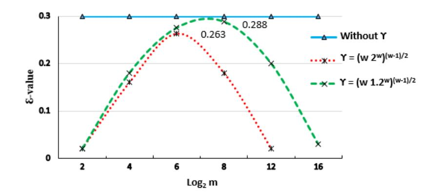
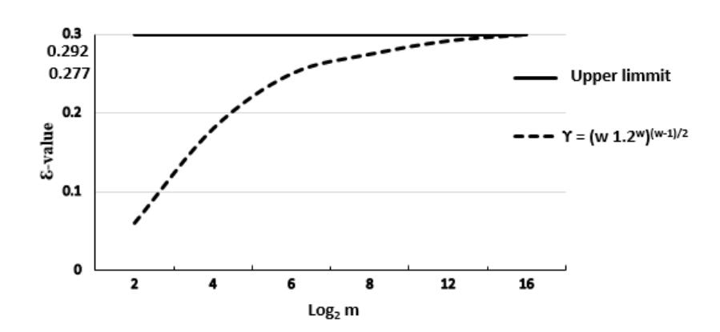

{0}------------------------------------------------

## Cryptanalysis of RSA: A Special Case of Boneh-Durfee's Attack

Majid Mumtaz1 and Luo Ping

Tsinghua University, Beijing, China maji16@mails.tsinghua.edu.cn luop@mail.tsinghua.edu.cn

Abstract. Boneh-Durfee proposed (at Eurocrypt 1999) a polynomial time attacks on RSA small decryption exponent which exploits lattices and sub-lattice structure to obtain an optimized bounds d < N0.284 and d < N0.292 respectively using lattice based Coppersmith's method. In this paper we propose a special case of Boneh-Durfee's attack with respect to large private exponent (i.e. d = N > e = N α where and α are the private and public key exponents respectively) for some α ≤ , which satisfy the condition d > φ(N) − N . We analyzed lattices whose basis matrices are triangular and non-triangular using large decryption exponent and focus group attacks respectively. The core objective is to explore RSA polynomials underlying algebraic structure so that we can improve the performance of weak key attacks. In our solution, we implemented the attack and perform several experiments to show that an RSA cryptosystem successfully attacked and revealed possible weak keys which can ultimately enables an adversary to factorize the RSA modulus.

Keywords: RSA · Cryptanalysis · small Public Key · Lattice Reduction Attack · Large private Key · Coppersmith's Method.

## 1 Introduction

#### 1.1 Background

RSA public key algorithm [23] is one of the popular data encryption/decryption and signing strategy which provides confidentiality and integrity services to World Wide Web (WWW) since 1990 to onward (after Internet invention). Most of the applications (i.e. financial, military and others), typically based on SSL/TLS protocol which heavily dependent on RSA public key. An RSA cipher suits used to secure the sender/receiver communication session over an insecure remote network. Also, today's m-commerce based applications widely adopting RSA protection solutions for all their financial remittances. RSA includes public/private key pair, where public key denotes by (N, e) and it is openly (publicly) accessible. Furthermore N the modulus written as N = pq, where p and q be the product of two unknown distinct (random) primes. The corresponding private key d ∈ Z satisfy the equation (1) as follows.

$$ed \equiv 1 \ mod(\phi(N)) \tag{1}$$

{1}------------------------------------------------

Since four decades, cryptanalysts finding inadequacies in RSA by various means as summarized in [6,21], but still it consider a secure and widely adopted algorithm due to big integer modulus. We briefly cover some popular RSA based small and large decryption key attacks, then we formulate our specific large decryption key attacks and "Focus Group" attacks to analyze the RSA security using lattice reduction method in this work, which is not yet studied according to best of our knowledge. We demonstrate our solution by exploiting RSA polynomial especially for multivariate case. Before moving towards our concrete problem, lets first summaries the previous work.

#### 1.2 RSA Small Decryption Key Attacks

When an RSA cryptosystem require cost effective decryption/signature generation operations, the devised solution must use the small decryption exponent  $d > N^{\epsilon}$ , where  $\epsilon = 0.292$ . In 1990, Wiener [27] first exposed the small decryption key vulnerability using Continued Fraction (CF) expansion and shows that the decryption (private) exponent  $d < N^{0.25}$  leads to a polynomial time attack. Later at Eurocrypt 1999, Boneh and Durfee [4,5] attack improves the Wiener's bound using lattice based Coppersmith's method. In their solution an RSA small decryption (private) attack (also known as "Small Inverse Problem" (SIP)) exploits the triangular and non-triangular lattice structure and obtained a refined bounds after a decade of Wiener's result. In their attack they showed that an RSA crypto system becomes insecure if  $d < N^{0.292}$  chosen, which is known as the most refined RSA small exponent insecure attack bounds to date. Unlike Wiener's method, Boneh-Durfee's attack yields a heuristic outcome based on Howgrave-Graham's reformulation of lattice based Coppersmith's method to find the small root of modular polynomial equation [7,13]. In most recent work by Willy Susilo et al. [25] revisits the Wiener's CF attack using classical Legendre method on Continued Fraction (CF) to refine the their reported bound limitations. They highlights the findings to improve the tight bound of the Wiener's attack upto  $d \leq \frac{1}{\sqrt[4]{18}} = \frac{1}{2.06...}N^{\frac{1}{4}}$ . In our work, we revisits the existing limitations using lattice reduction Coppersmith's method. In our environment we implemented the Wiener's and Boneh-Durfee's first attack method which is always failed and ultimately can not retrieve the roots, though we take a slightly bigger values than Wiener's bound (i.e.  $d < N^{\frac{1}{4}}$ ).

In literature various attempts have been made to improve Boneh-Durfee's attack bound but no one yet increases their optimized bounds, though many of them proposed some strategies to optimize lattices and sub-lattice structure as mentioned in [1, 10, 12, 14, 26]. Blömer and May [3] also proposed the small decryption exponent attack, though they refined the triangular lattice construction mechanism without improving the Boneh-Durfee's bound. In RSA small decryption exponents, a "Focus Group" attacks proposed by S. Miller and B. Narayanan [20] which claimed an improve LLL running time and performance without picking sub-lattices from the original lattice as previously explained by Boneh-Durfee's work. According to them, the simple idea about "Focus Group" attack is to opt specific vectors which can contribute to a non-trivial solution and

{2}------------------------------------------------

helps to find the short vectors after LLL reduction. In this study, we consider a special case of Boneh-Durfee's Attack (i.e. large decryption exponent attack) as well as the "Focus Group" attack to exploits the RSA large and small decryption key security by implementing a solution to fulfill the experimental evidence. In subsections, we describe both the cases in detail.

## 1.3 Special Case of Boneh-Durfee's Attack (Large Decryption (Private) Key Attack)

The attacks employed on RSA small decryption exponent are usually based on lattice basis reduction method which gives an asymptotic outcome with respect to the modulus size. Also their results are mostly dependent on lattice structure (i.e triangular lattice construction is the most technical part). Boneh-Durfee's attack populate the SIP solution by implying an RSA bivariate polynomial equation which exploits the triangular and non-triangular lattice structure. Such type of attacks are employed using lattice based Coppersmith's method for finding small roots of modular polynomials which ultimately yield a heuristic outcome. Therefore, there is no such known method exist that can produce a rigorous outcome especially for multivariate polynomials.

In 2004, Hinek motivates an alternate case instead of considering small private key exponent, one can use bigger decryption key exponent to exploit the RSA security [11]. Later in 2009, Luo et al. [18] devised an attack on private exponent larger than the public exponent (i.e. d > e). It was one of the case of Boneh and Durfee's scheme used to obtained weak public keys in the range of 0.258 ≤ e ≤ 0.857. But their algorithm does not cover complete solution of the attack (especially they the solution did not cover e < 0.25), therefore concrete analysis still pending that can cover complete rigorous solution. In result section [18], authors mentioned the shortcomings that experimental yield could not achieve an algebraic independent polynomial vectors. Thus knowledge gap still left in their study that still needs to be addressed thoroughly with concrete experimental evidence.

## 1.4 Our contribution

In this paper, we revisit the Luo's method as a special case of Boneh-Durfee's large decryption key. In Boneh and Durfee's scheme, three major contributions were reported using lattice based Coppersmith's method which solves small decryption key attacks by exploiting specific RSA modular polynomial. First result describe Wiener's bound i.e. N < d1/4 . In second result, they extended the scheme by adding some extra polynomial vectors and achieved an improved bound i.e. N < d0.284 based on experimental evidence. In third result, a sublattice were picked from the original lattice and achieved more stronger bound i.e. N < d0.292, heuristically. In their outcome, the picked sub-lattice were not the full-rank, therefore a tedious work need to compute the determinant of such non-triangular matrix especially for multivariate polynomials and it is not an 

{3}------------------------------------------------

easy task to achieve the desired outcome, thus their solution further needs detailed analysis of the involved bound.

In our work, we made an experimental observation that the first method of Boneh-Durfee's scheme which supposed to work for d < N1/4 always failed. In fact, in our experimental outcome the resultant (Res) identically vanish. To solve the issue we utilize a certain condition in which it satisfy the weak RSA keys analogous to d > φ(N) − N large decryption key. To devise the solution we formulate the RSA key equation (1) into trivariate polynomial w.r.t to large decryption exponent. In our settings we choose an appropriate auxiliary polynomials (i.e. x-shift and a fixed number of y-shift helpful polynomials) to construct a square triangular lattice. We also revisit the attack bound by using the "Focus Group" attack with experimental evidence to solve the specific SIP using non-triangular lattice construction.

In theoretical analysis, a short polynomial vectors in the lattice immediately reveals the solution through Gr¨oebner basis computation [8]. As many authors emphasize the necessity of a rigorous analysis of SIP solution based on Coppersmith's approach especially for multivariate polynomials [2, 17]. We perform several experiments according to varied integer m and reported detailed results and comparisons with Boneh-Durfee's [5] and Bl¨omer and May [3] low secret exponent attacks. In all cases, we observed that our attack method improves the LLL running time w.r.t short lattice dimension. Also we analyze that the obtained bounds gives a rigorous outcome and found that Boneh-Durfee's heuristic bound (i.e. d < N0.292) have considerable limitations which is quite far from experimental outcome (i.e. d < N0.284).

#### 1.5 Roadmap

The rest of the article proceeds as follows, in section 2, we describes the mathematical preliminaries and useful lemmas. In section 3, we briefly review the Boneh and Durfee's seminal work. In section 4, we describe the construction of specific bivariate modular polynomial equation and in section 5, we covers the specific solution of a modular polynomial using lattice basis reduction method. In section 6, we describes the analysis of the obtained results and in section 9, we describes the experimental outcome and detail comparison with known results and finally in section 10, we conclude the paper.

## 2 Preliminaries

In this section, we describe a brief detail about lattices, technical lemmas 1 and 2. These lemmas are the fundamental tools to solve lattice based small inverse problem. Also, by satisfying lemma conditions will helps to construct the devised solution.

Fact 1. The decryption key d's Most Significant Bit (MSB) can be recovered if the given public key e chosen to be very small.

{4}------------------------------------------------

*Proof.* Suppose RSA key equation  $ed = 1 + k \phi(N)$ , implies that ed = k(N + 1) - k(p+q) + 1. In case of small e, we can recover k by exhaustive search using the following relation.

$$d = \frac{k}{e}(N+1) + \frac{1}{e} - \frac{k}{e}(p+q) \approx \frac{k}{e}(N+1) + \frac{1}{e}$$

As 1 < k < e, therefore the error in this approximation will be  $\frac{k}{e}(p+q) < p+q$ . As p and q both have the same bit length, if we set  $d = d_0 - d_1$  with  $d_0 = \left\lceil \frac{k(N+1)}{e} + \frac{1}{e} \right\rceil$ , then  $|d_0 - d_1| < N^{\epsilon}$  implies that  $d_0$  estimates the most significant bit value of d efficiently.

Lattices and useful properties: Let  $\Lambda$  be a lattice spanned by  $\omega$  linearly independent (row) vectors define as  $v_1, v_2, \ldots, v_{\omega} \in \mathbb{R}^n$ . The lattice  $(\Lambda)$  composed by all integers, the set of vectors  $v_1, \ldots, v_{\omega}$  is called the lattice basis and  $n \geq \omega$ . In this work, we are only interested in full rank lattice. Therefore, if  $n = \omega$  then our lattice becomes the full rank. The linear combination of  $\Lambda$  is written as  $a_1v_1 + \ldots + a_nv_{\omega}$  of (row) vector  $v_1, v_2, \ldots, v_{\omega}$  where  $a_1, a_2, \ldots, a_n \in \mathbb{Z}$ . In addition for any vector with dimension greater than 1 can easily be transform into corresponding lattice in which determinant is  $\pm 1$ . For lattice construction and finding short vectors, we use the concepts of integer lattice over the polynomial and Euclidean length vectors respectively. The determinant of a full rank lattice is computed by  $det(\Lambda(B)) = |det(B)|$ . As lattice have many infinite basis, therefore finding a basis that contains low norm vectors is one of the fundamental lattice problem [19]. The following LLL property by Lenstra, Lenstra and Lovász [16] helps to compute low norm vectors efficiently.

**Lemma 1.** LLL [16,24] Let  $\Lambda$  be a lattice which have dimension  $\omega$ . The reduced basis vectors  $v_1, v_2, \ldots, v_{\omega}$  becomes the input to LLL and its output satisfy the following inequality.

$$||v_i|| \le 2^{\frac{\omega(\omega-i)}{4(\omega+1-i)}} det(\Lambda)^{\frac{1}{\omega+1-i}} \text{ for any } 1 \le i \le \omega.$$

Usually we are interested first couple of vectors to find the desired roots. If we elaborate the above inequality further the property is simplifies as follows;

(i) 
$$v_{1}, ..., v_{n}$$
 is a basis of  $\Lambda$   
(ii)  $|v_{1}| \leq 2^{(\omega-1)/2} \lambda_{1}$   
(iii)  $|v_{1}| \leq 2^{(\omega-1)/2} (\det(\Lambda))^{1/\omega}$   
(iv)  $|v_{2}| \leq 2^{\omega/2} (\det(\Lambda))^{1/(\omega-1)}$   
(v)  $\det(\Lambda) \leq \prod_{i} |v_{i}| \leq 2^{\omega(\omega-1)/2} \det(\Lambda)$ 

Howgrave-Graham's lemma simplify the procedure for LLL algorithm where one can find the low norm vectors. In LLL processing usually one can consider first couple of reduced vectors to extract the desired result. The LLL lemma 1 is an essential ingredient which mostly output low norm within Euclidean domain. Both the lemma's mentioned above helps to compute the low norm of the multivariate polynomial  $f(x_1, \ldots, x_n)$ .

{5}------------------------------------------------

**Lemma 2.** (Howgrave-Graham's [13] for multivariate settings) Let  $f(x_1, ..., x_n) \in \mathbb{Z}[x_1, ..., x_n]$  be an integer polynomial in n variable with at most  $\omega$  monomials. Suppose that

- 1.  $f(x_1, \ldots, x_n) \equiv 0 \pmod{R}$  for some  $x_1, \ldots, x_n$  and
- 2.  $|| f(x_1 X_1, \dots, x_n X_n) || < \frac{R}{\sqrt{\omega}}$

Then,  $f(x_1, ..., x_n) = 0$  holds over the integers.

In trivariate equations, we need two independent polynomial vectors which must satisfy the lemma 2 conditions. Thus to achieve Howgrave-Graham's bound as  $2^{\frac{\omega(\omega-i)}{4(\omega+1-i)}} \det(\Lambda)^{\frac{1}{\omega+1-i}} < \frac{R}{\sqrt{\omega}}$ . Upon success we ultimately obtain the shortest i reduced basis vectors. Therefore, the above inequality can simplify as follows.

$$det(\Lambda) \le 2^{\frac{-\omega(\omega-1)}{4}} \left(\frac{1}{\omega}\right)^{\omega+1-i} R^{\omega+1-i}$$

To simplify it more, we neglect insignificant terms i.e.  $2^{\frac{-\omega(\omega-1)}{4}}(\frac{1}{\omega})^{\omega+1-i}$  which are independent of lattice as compare to  $det(\Lambda)$ . Therefore, we obtain a more simplified (roughly) approximate relation as follows.

$$det(\Lambda) < R^{\omega + 1 - i}$$

Fact 2: In RSA small decryption key attacks, Boneh-Durfee's and Blömer-May solves the small inverse problem. As both the attacks work for all  $d < N^{\epsilon}$  for some maximum  $\epsilon = 0.292$ , then both the attacks can also works for very large  $d > \phi(N) - N^{\epsilon}$ .

Proof. We know that  $ed \equiv 1 \pmod{\phi(N)}$  and we have certain condition which satisfy  $d > \phi(N) - N^{\epsilon}$  and  $d < \phi(N)$ . Therefore,  $ed \equiv 1 \pmod{\phi(N)}$ . Here k denotes the positive integer and defined by  $ed - k\phi(N) = 1$ . As e and k are very small, therefore finding the solution can reveals  $\phi(N)$  and private exponent computed as  $d = e^{-1} \pmod{\phi(N)}$ . Suppose  $\phi(N) = N - \Delta$  by reducing equation  $ed - k \phi(N) \equiv 1 \mod e$  gives the relation as

$$k(N - \Delta) \equiv 1 \pmod{e}$$

Where  $|k| < N^{\alpha} \le N^{\epsilon}$  and  $|\Delta| < 3N^{1/2}$ . This inequality also satisfy both the Boneh–Durfee and Blömer–May's attacks.

For instance, we see the following example for the clarification of fact 2.

**Example**: Let, we have p = 557, q = 787, be distinct primes, thus N = pq = 438359 be the modulus,  $\phi(N) = (p-1)(q-1) = 437016$ , let, e = 497 and d = 425585, where d > e. Since,  $N^{0.292} < 45 < d = 425585 < 436971 < \phi(N) - N^{0.292}$ . Let,  $e' = e^2 = 247009$  can also be consider an RSA public exponent, where the corresponding private exponent is  $d' = d^2 mod\phi(N) = 436993$ . In this case, we have  $d' = 436993 > 436972 > \phi(N) - N^{0.292}$ . Then we can factorize the RSA modulus efficiently with (N, e').

Remarks: As we deal decryption key greater than public key, therefore Fact 2 helps to certify the validity of the weak keys. Our study also clarify the research direction of the special cases of Boneh and Durfee's and Blömer and May's schemes. We also validate the obtained theoretical and experimental bounds w.r.t large decryption key attack in the analysis phase.

{6}------------------------------------------------

Gröebner Basis Computation: Let  $\mathbb{Z}[x,y,z]$  be the polynomial ring of two variables x,y,z over  $\mathbb{Z}$ . If f is a polynomial defined over  $\mathbb{Z}$  then the Newton polygon of p refers to the convex hull of all the monomials. The most useful ordering is the lexicographic order which is written as:

$$x^{\alpha_1}y^{\alpha_2}z^{\alpha_3} > x^{\beta_1}y^{\beta_2}z^{\beta_3} \Leftrightarrow \begin{cases} \underset{Or}{\alpha > \beta} \\ \underset{\alpha = \beta and \exists i, j \in \{1, 2, 3\}, \alpha_i > \beta_j \ \forall j < i, \alpha_i = \beta_j}{} \end{cases}.$$

We compute the Gröebner basis with respect to lexicographic monomial ordering. The input will be the set of LLL reduced polynomials and in output we extract the desired roots with the help of heuristic Assumption 1.

**Assumption 1:** The lattice-based construction yields an algebraically independent polynomials. Gröebner basis of the ideal computes the zero dimensional polynomials so that we can efficiently extract the desired roots corresponding to the first couple of LLL reduced polynomials.

Note that in our attack method, we consider Assumption 1 always to be true. In experiments, we validate the proposed attacks with the help of Assumption 1. We indeed successfully collected the roots by using Gröebner basis technique, though it seems very difficult to prove or demonstrate the validity of algebraically independent polynomials. Also, we assume that the running time of the Gröebner basis computation is negligible as compared to the time complexity of the LLL-algorithm, since in general, our algorithm yields more than the number of n polynomials, so one can make use of these additional polynomials to speed up the Gröebner basis computation.

### 3 Boneh-Durfee Small Inverse Problem

In this section, we recall a brief review about Boneh-Durfee's small inverse problem. The detailed algorithm is available in [5].

#### 3.1 Algorithmic Procedure

According to Boneh-Durfee settings an RSA public key is the pair of integers (N, e) where N = pq describes the product of two n-bit distinct primes. The corresponding private key  $d \in \mathbb{Z}$  satisfy the key equation ed = k'(A - s) + 1 where,  $\phi$  is an Euler totient function defined as  $\phi(N) = (p - 1)(q - 1)$ , there exist a bivariate integers x, y such that.

$$ed + x(A + y) = 1$$
, where  $A = \frac{N+1}{2}$  and  $y = s = -\frac{p+q}{2}$ 

Boneh-Durfee shows that for small modular bivariate polynomials, once s is known we can immediately find the secret key d and ultimately factorize the modulus N=pq for the unknowns p and q. Also,  $e=N^{\alpha}$  and  $d=N^{\epsilon}$ , where  $\alpha$  and  $\epsilon$  denotes the public and private exponents respectively and if  $\alpha\approx 1$ , thus  $e\approx N$ . They modeled the bivariate polynomial provided an absolute value of x,y as  $|x|<3e^{1+(\epsilon-1)/\alpha}\approx e^{\epsilon}, |y|<2e^{\frac{1}{2\alpha}}\approx e^{0.5}$  respectively. The mapped polynomial equation becomes.

{7}------------------------------------------------

$$f(x,y) = x(A+y) - 1 \mod(e)$$

Boneh-Durfee algorithm finds  $x_0$  and  $y_0$  small roots of  $f(x_0, y_0) = 0 \mod(e)$  such that  $|x| < e^{\epsilon}$  and  $|y| < e^{0.5}$  by fixing the integer m. The derived auxiliary shift polynomial equations are written as follows.

$$g_{i,k}(x,y) = x^i f^k(x,y) e^{m-k}$$
, for  $i = 0, ..., m-k$  and  $k = 0, ..., m$   
 $g_{j,k}(x,y) = y^j f^k(x,y) e^{m-k}$ , for  $j = 1, ..., t$  and  $k = 0, ..., m$ 

By utilizing Coppersmith's bivariate method for finding small solution of polynomial, the constructed lower triangular square matrix becomes the input to LLL algorithm. The outputted reduced vectors produced the two linear independent polynomials  $g_1, g_2 \in \mathbb{Z}[x, y]$  based on algebraic independence assumption gives the common roots  $x_0$  and  $y_0$ . The resultant  $(h(y) = Res(g_1, g_2))$  reveals the root  $y_0 = -\frac{p+q}{2}$  which facilitate to factorize the modulus N.

Experimental Observations: This is completely dubious that the reduced polynomials  $g_1, g_2$  always satisfy the algebraic independence property, though most of the time vectors are linear independent. Therefore, the obtained solution becomes a heuristic i.e. without certainty of algebraic independence, the resultant identically output zero (vanished), therefore Boneh—Durfee's algorithm fail to produce the desired output on each algorithm turn and ultimately unable to factorize the modulus. We can adopt an alternate approach to compute the greatest common factors [15] of LLL reduced polynomial vectors and deduce the desired result if possible but it would make the process quite tedious. In a multivariate case, if we did not consider Assumption 1 to be true, we can not compute the solution, therefore we should consider Assumption 1 to be true which ultimately output the desired result and enables us to factorize the modulus.

In our work, we formulate the RSA equation (1) into trivariate polynomial according to new settings, see section 4 for more detail.

# 4 Formulation of Our Specific Trivariate Modular Polynomial

Let RSA public key be (e, N), where N = pq be the product of two n-bit distinct prime p and q, for simplicity we assume that greatest common factor of primes denoted as gcd(p-1,q-1)=2. The associated private key d be an integer satisfy the equation (1) as  $ed=1 \mod(\phi(N))$  where,  $\phi(N)=(p-1)(q-1)$  implies that  $\phi(N)=N-p-q+1$ , there must exists some positive integer k such that ed=1+k(N+1-(p+q)). Let we have s=p+q and A=N+1, then we obtain the following equation.

$$ed = k(A - s) + 1 \tag{3}$$

Also, we consider the approximation of private key (i.e.  $d = d_0 - d_1$ ). By substituting d in equation (3) and using the Fact 1 we get the following equation.

$$ed_0 - 1 = ed_1 + k(A - s) (4)$$

{8}------------------------------------------------

As d > φ(N) − N , also we know that φ(N) = A − s then equation (4) becomes.

$$ed_0 - 1 = ed_1 + k(A - s) (5)$$

Therefore, we model the equation (5) into trivariate modular polynomial as follows.

$$f(x, y, z) = ex + y(A - z) + 1 \tag{6}$$

Where, e, A and R = N1+α are known integers. Also, x = d1, y = k and z = s are three unknown variables. The equation (6) becomes the Small Inverse Problem (SIP) with possible roots x0, y0 and z0 satisfy the relation f(x0, y0, z0) = 0 mod R. We also know that e = Nα and d = N be the public/private exponents respectively. We sketched the problem in theorem statement as follows.

Theorem 1. Let N = pq be the RSA modulus with balanced primes p and q (i.e. n/2). Let e, d be the RSA public, private keys respectively. Assume the approximation of d is d > φ(N) − N , where ≈ 0.30 and suppose that e = Nα and d = N are the public/private key exponents respectively, then in some special case of Boneh-Durfee SIP when d >> e, then RSA cryptosystem becomes insecure upto ≥ α.

Please see the sections 5 and 6 for the detail proof of theorem 1.

## 5 Solution of Trivariate Modular Polynomial Equation

Proof (Theorem 1 Proof ). We solve the trivariate polynomial equation (6) using lattice based Coppersmith's method for finding small roots of bivariate polynomial. We generalize it to solve the trivariate case. The following relation must satisfy at the end.

$$f(x_0, y_0, z_0) \equiv 0 \pmod{R}$$

where R = N1+α and k x0 k< X, k y0 k< Y, k z0 k< Z and let, X = R 1− 2(1+α) , Y = Nα = R α 1+α and Z = R 1− 2(1+α) . In order to obtain an integer linear combination, we define a suitable polynomial equations which must share the common roots (x0, y0, z0), so that the devised algorithm satisfy the equation (6). For that we define a collection of auxiliary polynomials by fixing a positive integer m. In our experimental settings m values varies (but every time we fix it to test the algorithm) until we derived the desired outcome.

$$g_{i,j,k}(x,y,z) = x^i y^j f^k(x,y,z) R^{m-k}$$
, for  $k = 0, \dots, m, i+j = r$ , where  $r = 0, \dots, m-k$ 

$$h_{i,j,k}(x,y,z) = x^i z^j f^k(x,y,z) R^{m-k}, \text{ for } k = 0, \dots, m, j = 1,$$
  
 $i = 0, \dots, m-k-1$ 

The auxiliary polynomials gi,j,k(x, y, z) and hi,j,k(x, y, z) construct a triangular lattice spanned by the corresponding coefficient vectors that have sufficiently 

{9}------------------------------------------------

small norm according to Howgrave-Graham's lemma. To find the linear combination of such polynomial coefficients of  $g_{i,j,k}(xX,yY,zZ)$  and  $h_{i,j,k}(xX,yY,zZ)$ , we construct a square triangular lattice. A toy example matrix with  $m=2 \in \mathbb{Z}^+$ is illustrated in Table 1. The lattice vectors are spanned in the matrix from left to right row wise fashion.

**Table 1.** Example lattice spanned by polynomial vectors  $g_{i,j,k}$ ,  $h_{i,j,k}$  with m=2 for RSA (d>e)

| $\overline{G_l}$  |                                                      | 1     | x      | $\overline{y}$ | yz  | $x^2$    | $y^2$    | xy      | xyz  | $y^2z$  | $y^2z^2$ | z      | xz      | $x^2z$  | $yz^2$    | $xyz^2$  | $y^{2}z^{3}$ |
|-------------------|------------------------------------------------------|-------|--------|----------------|-----|----------|----------|---------|------|---------|----------|--------|---------|---------|-----------|----------|--------------|
| $\frac{G_0}{G_1}$ | $R^2$                                                | $R^2$ | •      |                |     | •        |          |         |      |         |          |        |         |         |           |          |              |
| $\overline{G_1}$  | $xR^2$                                               |       | $XR^2$ |                |     |          |          |         |      |         |          |        |         |         |           |          |              |
| _                 | $yR^2$                                               | *     | *      | $YR^2$         |     |          |          |         |      |         |          |        |         |         |           |          |              |
|                   | fR                                                   | *     | *      | *              | YZR |          |          |         |      |         |          |        |         |         |           |          |              |
| $\overline{G_2}$  | $x^2R^2$                                             |       |        |                |     | $X^2R^2$ |          |         |      |         |          |        |         |         |           |          |              |
| _                 | $ y^2R^2 $                                           |       | *      |                | *   | *        | $Y^2R^2$ |         |      |         |          |        |         |         |           |          |              |
|                   | $\begin{array}{c} xyR^2 \\ xfR \end{array}$          | *     | *      | *              | *   | *        | *        | $XYR^2$ |      |         |          |        |         |         |           |          |              |
|                   | xfR                                                  |       |        |                |     |          |          |         | XYZR |         |          |        |         |         |           |          |              |
|                   | yfR                                                  |       |        |                | *   |          |          | *       | *    | $Y^2ZR$ |          |        |         |         |           |          |              |
|                   | $f^2$                                                |       | *      |                | *   | *        |          | *       | *    | *       | $Y^2Z^2$ |        |         |         |           |          |              |
| H                 | $zR^2$                                               |       |        |                |     |          |          |         |      |         |          | $ZR^2$ |         |         |           |          |              |
|                   | $xzR^2$                                              |       |        |                |     |          |          |         |      |         |          |        | $XZR^2$ |         |           |          |              |
|                   | z f R                                                |       |        |                | *   |          |          |         |      |         |          | *      | *       | $YZ^2R$ |           |          |              |
|                   | $ \begin{vmatrix} z f R \\ x^2 z R^2 \end{vmatrix} $ |       |        |                |     |          |          |         |      |         |          |        |         |         | $X^2ZR^2$ |          |              |
|                   | $xzfR$ $zf^2$                                        |       |        |                |     |          |          | *       |      |         |          |        | *       |         | *         | $XYZ^2R$ |              |
|                   | $z f^2$                                              |       |        |                | *   |          |          |         | *    | *       |          | *      | *       | *       | *         | *        | $Y^{2}Z^{3}$ |

For triangular matrix construction, we elaborate the collection of polynomials to construct a square triangular matrix. In Table 1, the matrix divided into two big blocks same as mentioned by Luo et al. [18]. We further subdivide the big blocks into multiple rows w.r.t to m. In our toy example, we select m=2 for illustration, therefore the big block  $G_l$  contains three smaller blocks namely  $G_0, \ldots G_2$ . The monomials ordering is an essential ingredients in our settings for the construction of lower triangular square matrix. Furthermore, in our trivariate polynomial case x-shifted polynomial monomials construct the matrix  $G_l$  block and y-shifted polynomial monomials to construct an H block. Note down in our settings, we fixed the H block monomials (in this work atleast 3 and at most 6 monomials are fixed). This will intact the triangular matrix structure, thus we did not consider the full y-shifted polynomial monomials in this work. The indices of  $G_l$  block are  $l=0,\ldots,2$  in which we map the corresponding rows of polynomial coefficients  $g_{i,k}(xX,yY,zZ)$ .

In big  $G_l$  block, the monomials in  $g_{i,j,k}$  consider as a row component and the sum of exponents for x, y and f equals to l, and  $g_{i,j,k}$  with larger f exponents appears in the lower rows of the matrix. Also, in  $G_l$  block each row vector have indices (i, j, k). In Table 1, matrix diagonal entries used to compute the determinant. For simplicity in Table 1, non-zero entries are denoted by \*-symbol. Also, integer m help to find the full-rank lattice dimension. As m is given, thus dimension of the full-rank lattice is computed as  $w_m(g) = \sum_{l=0}^m \sum_{i=0}^{m-k} +6 = \frac{(m+1)(m+2)(m+3)}{6} +6$ . According to lattice construction principle as mentioned above, it is to be noted that only the x components in

{10}------------------------------------------------

 $g_{i,j,k}$  contributes the number of X elements in the diagonal entries and  $X_m$  is computed as follows.

$$X_m(g) = \sum_{k=1}^m \sum_{i=0}^{m-k} ik + 4 = \frac{m(m+1)(m+2)(m+3)}{24} + 4$$

As f components in  $g_{i,j,k}$  contribute the same way as  $X_m$  components, thus we add up together and obtained the total number of  $Y_m$  components as follows.

$$Y_m(g) = X_m g + F_m g + 4 = \sum_{k=1}^m \sum_{i=0}^{m-k} ik + \sum_{k=1}^m \sum_{i=0}^{m-k} ik + 4 = \frac{m(m+1)(m+2)(m+3)}{12} + 4$$

Similarly, Z components in  $h_{i,j,k}$  contributes to the number of  $Z_m$  elements as follows.

$$Z_m(h) = \sum_{k=1}^{m} \sum_{i=0}^{m-k} ik + 10 = \frac{m(m+1)(m+2)(m+3)}{24} + 10$$

Finally, the number of R elements in the diagonal entries are just the number of  $R_m$  components in  $g_{i,j,k}$  to describe the following relation.

$$R_m(g) = \sum_{k=0}^{m-k} (m-k) \sum_{i=0}^{m-k} 1 = \frac{m(m+1)(m+2)(m+3)}{8} + 6m - 4$$

By substituting  $X_m(g), Y_m(g), Z_m(g)$  into lattice determinant relation  $det(\Lambda) = R^{R_m} X^{X_m} Y^{Y_m} Z^{Z_m}$  to fulfill the Howgrave-Graham's condition i.e. if  $det(\Lambda) < R^m/\sqrt{w}$ , this means that we are able to satisfy the lemma and obtain the desired result accordingly.

$$\mid v_i \mid < \frac{R^m}{\sqrt{w}}, i = 1, 2 \tag{7}$$

The inequality (7) must holds over  $\mathbb{Z}$  after substituting the values of  $X_m, Y_m, Z_m, R_m$  so that we can compute the Gröebner basis which ultimately outputs the two algebraically independent polynomials  $g_1, g_2 \in \mathbb{Z}[x, y, z]$  such that

$$q_i(x_0, y_0, z_0) = 0$$
, where  $j = 1, 2$ 

The polynomials  $g_1, g_2$  are linear independent but for algebraic independence we need to validate it through computer experiments according to Assumption 1, see section 9 for more detail. If the polynomial  $g_1(x)$  and/or  $g_2(x)$  both yields zero output, then finding  $g_0$  becomes more difficult. In all experimental tests, we obtained the results most of the time. We also compute the Gröebner basis of the obtained linear combination of the zero dimensional independent polynomials and ultimately we are able to deduced the desired solution.

#### 6 Bound Analysis

In this section, we analyze the boundaries of  $\alpha$  and  $\epsilon$  such that  $|x_0| < R^{\frac{1-\epsilon}{2(1+\alpha)}}$ ,  $|y_0| < R^{\frac{\alpha}{1+\alpha}}$ ,  $|z_0| < R^{\frac{1-\epsilon}{2(1+\alpha)}}$ , where  $(x_0, y_0, z_0)$  are the polynomial roots. The desired roots can be deduced using the above algorithm. As we compute the determinant of the triangular square matrix, therefore our main concern is the matrix diagonal entries only and it can be computed as follows.

{11}------------------------------------------------

$$det(\Lambda) = R^{R_m} X^{X_m} Y^{Y_m} Z^{Z_m}$$

By substituting the values of Rm, Xm, Ym and Zm in above relation, then according to Howgrave-Graham's Lemma condition, the following inequality obtained.

$$\det(\Lambda) < R^{m(w+1-i)} \le R^{m(\omega-1)}$$
  
$$\therefore R^{R_m} X^{X_m} Y^{Y_m} Z^{Z_m} \le R^{m(\omega-1)}$$

To optimize the solution w.r.t given value of m using the relation as follows.

$$R_m + \frac{1-\epsilon}{2(1+\alpha)}X_m + \frac{\alpha}{1+\alpha}Y_m + \frac{1-\epsilon}{2(1+\alpha)}Z_m \le m(\omega - 1)$$

After substituting values and by taking logarithms, we obtained the following simplified relation.

$$\frac{(m+3)}{2} + \frac{(1-\epsilon)(m+3)}{24(1+\alpha)} + \frac{\alpha(m+3)}{6(1+\alpha)} \le 0$$

To further simplify the above relation with respect to α, we pick the left side of the inequality and neglect all the low order terms as follows.

$$\alpha \le \frac{(m+3)\epsilon - 13m - 9}{24 + 16m}$$

Solving the inequality by taking m → ∞, we obtained the desired inequality.

$$\alpha \le \epsilon \tag{8}$$

Remarks: In above simplification, we ignore all the values which are irrelevant w.r.t , and obtained a more simplified inequality (8). This also shows that bound increases as α decreases. This concludes the proof of the theorem 1 with the observation that the matrix determinant increases in response of upper bound of decreases, this could only be possible by fixing the y-shifted polynomial monomials. Furthermore, we cryptanalyze the RSA as a special case of Boneh-Durfee's scheme with respect to large decryption exponent which satisfy the condition d > φ(N) − N .

## 7 Comparison with Boneh-Durfee's bounds

We cryptanalyze RSA in some special case of Boneh and Durfee scheme. We derived the new RSA polynomial equation (6) from equation (5) instead of using Boneh and Durfee's derived equation k(A + s) = 1 mod e, where | k |< e and | s |< e0.5 . After LLL processing their scheme obtained reduced vectors, but without guarantee of algebraic independence (as the resultant becomes zero), thus solution can not be extracted and the process unexpectedly failed. In our scheme LLL always produce the linear independent polynomials g1(x) and g2(x) and both the vectors satisfy the inequality as follows.

$$det(\Lambda) < R^{m(w-1)}/\gamma$$

{12}------------------------------------------------

where, γ = (ω2 ω) (ω−1)/2 . In Boneh-Durfee's scheme γ be a small constant typically depends on lattice dimension ω and its value becomes negligible as compared with e m(ω−1). Also, when m taken to be very large, the highest order terms (i.e. o(m2 ) becomes negligible and obtained bound becomes d < N0.284 , therefore an adversary can easily factorize the RSA modulus N. Also about the bound d < N0.292 be the theoretical bound and it is far away from an experimental outcome, especially when the public key taken to be very small (say e = 3). This is because after LLL processing, we only get a "supremum" of the norm of first couple of vectors among reduced basis. In Fig. 1 without considering special γ, the upper bound becomes d ≈ N0.30, but still the theoretical bound have considerable limitation (as it is far from experimental outcome), thus the obtained bound is not much tight as expected after tedious computation. Though Boneh-Durfee considerably improved the existing small decryption key bound by removing some unhelpful vectors (they named it "damaging vectors") which are based on sub lattice with larger integer m and obtained the bound d < N0.288 , but we observe that the theoretical bound of Boneh-Durfee's attack is far from experimental yield. In our analysis the γ value depends on lattice dimension ω

Fig. 1. Bounds when the RSA key is about 1024-bits

and it becomes negligible as compare to Rm(ω−1) with the help of floating point LLL (L 2 ) algorithm as presented by Stehl´e and Ngyuen [24]. According to their heuristic outcome, given any basis of a lattice Λ with higher dimension ω, the L 2 always output first couple of vectors which have to satisfy the following relation.

$$\parallel v_1 \parallel \approx 1.02^{\omega} det(\Lambda)^{\frac{1}{w}}$$

Though this heuristic can be used in many experiments. In our experiment this provides an approximate result as the vector norm is equal to an expected norm as shown in Fig. 2. For further investigation of outputted LLL reduced vectors norm produced a more tight bounds, which is near to d ≈ N0.30. More concisely, let's denote T(n) = log2n, where T(n) ∈ R and n denotes as an integer bits. We elaborate the tight bound in theorem statement as follows.

Theorem 2. The RSA public key is (N, e) and the private key d = N , if we pick a moderate enough m as m ≤ 2T(R)/(1−) then we have γ < (ω2 ω) (ω−1)/2

{13}------------------------------------------------

Fig. 2. Upper Bounds when the RSA key is about 1024-bits

is less then Rmω where ω ≈ (1 − )m2 represents the lattice dimension as used in lattice reduction method.

Proof. We carry the proof by taking T bit operations with respect to modulus R as

$$T(R^m) \approx T(R^{m(1-\epsilon)m^2}) \approx (1-\epsilon)m^3T(R)$$

We also have the relation

$$T(\alpha) = T((\omega 2^{\omega})^{\omega/2}) \approx w/2(T(\omega) + \omega)$$
$$\approx (1 - \epsilon)m^2/2(2T(m) + (1 - \epsilon)m^2)$$
$$\leq (1 - \epsilon)m^4/2$$

If we take m ≤ 2T(R)/(1 − ), then

$$T(\alpha) \le (1 - \epsilon)m^4/2 = (1 - \epsilon)m^3 T(R) \frac{m(1 - \epsilon)}{2T(R)} \le T(R^{mw})$$

Thus, when we simplify it we have α ≤ . This concludes that have more bits than α.

In Theorem 2, it is clear that if we pick a moderate m, then the small constant γ = (ω2 ω) ω/2 becomes smaller than Rmω, thus it can be negligible. If we take a larger m, then the higher order o(m3 ) terms can be ignored easily. This will modify the upper bound on . In Boneh and Durfee's scheme we can break RSA scheme if and only if we pick a very large N and e. They ignored the small constants like γ and o(m3 ) terms to achieve the bound < 0.292. Whereas, in experimentation the practical attack only be significant for T(N) ≈ 1024 bits. Since we are considering the special case with d > e with the condition d > φ(N) − N , in our settings it satisfy perfectly and ultimately it produce RSA weak keys.

## 8 Comparison with "Focus Group" Attack

In this section, we compare our findings with "Focus Group" attack proposed by Miller et. al. [20]. In their work authors claim that "Focus Group" attack 

{14}------------------------------------------------

minimize the lattice dimension and troubleshoot the choke points as faced in LLL reduction process during scanning the larger dimension matrices. They highlights experimental findings on small-exponent RSA attack as previously done in Boneh-Durfee's and Blömer and May's work. For a brief review, we summaries major steps involved in their attack, then we implement and give result comparison with our proposed technique using our environment.

"Focus Group" Attack: The following are the major steps in "focus group" attack.

**Step-1:** First scan the triangular matrix and pick only those basis whose dimension becomes consistent with minimized vector coordinates. After that LLL algorithm process the scanned lattice efficiently especially it is useful for large dimension matrices. Only pick specific vectors whose dimension approximately remains same. In small-exponent RSA attacks, authors set the d's value slightly greater than  $d > N^{\frac{1}{4}} \approx N^{0.251}$ .

**Step-2:** In this step, one can scan the LLL outputted vectors and identify those basis which can be used to find short vectors. Usually the focus would be given to x-shift auxiliary polynomials (as probability becomes high to produce a desired short vectors) instead of considering y-shifts polynomials. In x-shifted auxiliary polynomial vectors collection, one can scan concretely the outputted rigorous short basis only.

**Step-3:** Finally, algorithm running improves the lattice performance, processing time, storage and overall efficiency of the devised attack. All remaining unused basis automatically discarded and ultimately it improves the overall attack performance.

We implemented the "Focus Group" attack according to authors setting in our environment. We observe some extra interesting results besides authors mentioned in their findings.

Remarks: We notice that when we pick consistent length vectors in "Focus Group" attack, it affects the lattice structure and output a non-triangular matrix as the determinant computation involves more work. Also, another important findings is that authors introduced two additional integer parameters in-spite of already defined two fixed integers (m,t) as mentioned by Boneh-Durfee's study and our proposed attack method. Even authors did not mentioned how to optimized those integers (i.e. bound analysis completely ignored), this makes the process more ambiguous and the analysis more complex, therefore in "Focus Group" attack authors completely ignored the fine grained tuning and analysis.

## 9 Experimental Results

In computer experiments, we implemented the proposed technique and carried several experiments on SageMath environment [9] in Windows 10 environment on a computer with Intel(R) Core(TM) i5-4590CPU@3.30 GHz CPU, 20 GB RAM and 6 MB L3 Cache. In all experimental tests, every time we found the

{15}------------------------------------------------

linear independent vectors with norm smaller than  $\frac{R^m}{\sqrt{w}}$ . Also, in our experiments the obtained vectors further scrutinized through resultant method and Gröebner basis method for the extraction of polynomial roots  $x_0$ ,  $y_0$  and  $z_0$ . We compare the running time with Boneh-Durfee's [5] work and Blömer and May [4] work. A few important results are mentioned in Table 2 for reference. Our results improves the LLL running time as compare to existing schemes with

**Table 2.** Private Exponent d recovered using integer (m) and lattice dimension (w)

| $\overline{N \text{ (bits)}}$ | $\epsilon$ | m,w   | LLL Time(Ours)     | LLL Time [3] | LLL Time [6] |
|-------------------------------|------------|-------|--------------------|--------------|--------------|
| 1000                          | 0.104      | 3,26  | $70  \mathrm{sec}$ | 4 minutes    | 45 minutes   |
| 1000                          | 0.15       | 4,41  | 04 minutes         | 6 minutes    | 100 minutes  |
| 1024                          | 0.28       | 5,62  | 20 minutes         | 7 hours      | -            |
| 500                           | 0.29       | 6,90  | 15 minutes         | 90 minutes   | -            |
| 1024                          | 0.29       | 6,90  | 75 minutes         | 90 minutes   | -            |
| 1024                          | 0.30       | 8,171 | 145 minutes        | 22 hours     | _            |

reduced lattice dimension. We point out running time of the polynomial with respect to LLL basis reduction. If we increase the value of m, the time to compute Gröebner basis takes longer than normal and ultimately we obtained the independent polynomials in which we can extract the desired roots. We compiled the "Focus Group" attack results in Table 3. Though we obtained an improved results for  $N \approx 1024$ -bits, but for larger dimensions the process becomes quite tedious, especially when we use very big (i.e.  $N \approx 10000$ -bits). In our implemented solution we construct the lattice according to Miller et al. [20] auxiliary polynomials to fulfill the focus group attack. After constructing the lattice, the input is given to LLL  $(L^2)$  algorithm [16,22] which produced the reduced basis matrix. We observed that, the experimental outcome produced quite interesting results when we compare to Miller et al. [20] outcome. We found the decryption key every time on each algorithm execution and compile the useful results in the range of  $0.23 \le \epsilon \le 0.285$ . Whereas their study reports some results in the range of  $0.25 < \epsilon \le 0.284$ . We observed that the introduction of two additional variables  $\sigma$ ,  $\tau$  always produced a non-triangular matrix, though makes the process quite complex but most of the time satisfy the Howgrave-Graham's lemma conditions. We randomly verify by selecting different values of  $m, t, \sigma, \tau$  it always provide desired outcome at the end.

## 10 Conclusions

In this work, we showed that if we consider a special case of Boneh and Durfee algorithm when d > e and prove that its shortest polynomial vector by using lattice basis reduction algorithm, then we are able to find the weak public keys upon the validity of  $d > \phi(N) - N^{\epsilon}$ . If we have many solutions in the

{16}------------------------------------------------

Table 3. Private Exponent recovery using "Focus Group" attack with integers (m, t, σ, τ ) by constructing non-triangular lattice

| N (bits) |           |     |            | m, t σ, τ Matrix Dim. LLL Time(Ours) LLL Time [20] LLL Time [6] |            |             |
|----------|-----------|-----|------------|-----------------------------------------------------------------|------------|-------------|
| 1024     | 0.265 6,2 | 2,0 | 34*42      | 03 sec                                                          | 1 minutes  | 45 minutes  |
| 2048     | 0.230 6,3 | 2,0 | 37*42      | 12 sec                                                          | 6 minutes  | 100 minutes |
| 2048     | 0.240 5,2 |     | 1,-1 29*33 | 03 sec                                                          | 7 minutes  | -           |
| 2048     | 0.250 5,2 |     | 1,-1 26*33 | 03 sec                                                          | 9 minutes  | -           |
| 6000     | 0.260 6,3 |     | 2,-1 39*49 | 135 sec                                                         | 24 minutes | -           |
| 10000    | 0.277 6,2 | 2,0 | 34*42      | 270 sec                                                         | 61 minutes | -           |
| 10000    | 0.285 6,2 | 2,0 | 37*49      | 05 minutes                                                      | 73 minutes | -           |

given bounded range, Boneh-Durfee algorithm always fails as the construction of small ω-dimensional lattice. As in our study we consider small public key (N, e) with large decryption key d, therefore the theoretical upper bound on is much tighter than Boneh and Durfee and Bl¨omer and May's claim. According to our experimentation when we take RSA 1024-bit public key, the obtained experimental bound on ≈ 0.288, which we consider as an ideal bound. Also, our new settings countermeasure the security against numerous attacks with more better and modified theoretical bound approximately upto ≈ 0.30, where in Boneh-Durfee's case one must pick a very large public key (N, e) to obtain the result < 0.292. Our results are based on Assumption 1, thus the obtained outcome be a heuristic which still needs improvements.

## References

- 1. Aono, Y.: Simplification of the lattice based attack of boneh and durfee for rsa cryptoanalysis. In: Computer Mathematics, pp. 15–32. Springer (2014)
- 2. Aono, Y., Agrawal, M., Satoh, T., Watanabe, O.: On the optimality of lattices for the coppersmith technique. Applicable Algebra in Engineering, Communication and Computing 29(2), 169–195 (2018)
- 3. Bl¨omer, J., May, A.: Low secret exponent rsa revisited. In: International Cryptography and Lattices Conference. pp. 4–19. Springer (2001)
- 4. Boneh, D., Durfee, G.: Cryptanalysis of rsa with private key d less than n0. 292. Writing 2(1), 1
- 5. Boneh, D., Durfee, G.: Cryptanalysis of rsa with private key d less than n/sup 0.292. IEEE transactions on Information Theory 46(4), 1339–1349 (2000)
- 6. Boneh, D., et al.: Twenty years of attacks on the rsa cryptosystem. Notices of the AMS 46(2), 203–213 (1999)
- 7. Coppersmith, D.: Finding a small root of a univariate modular equation. In: Advances in cryptology—EUROCRYPT'96. pp. 155–165. Springer (1996)
- 8. Cox, D., Little, J., OShea, D.: Ideals, varieties, and algorithms: an introduction to computational algebraic geometry and commutative algebra. Springer Science & Business Media (2013)
- 9. Developers, T.: Sagemath (2018)

{17}------------------------------------------------

- 10. Herrmann, M., May, A.: Attacking power generators using unravelled linearization: When do we output too much? In: International Conference on the Theory and Application of Cryptology and Information Security. pp. 487–504. Springer (2009)
- 11. Hinek, M.J.: ( Very ) Large RSA Private Exponent Vulnerabilities pp. 1–6 (2004)
- 12. Hinek, M.J.: Cryptanalysis of RSA and its variants. Chapman and Hall/CRC (2009)
- 13. Howgrave-Graham, N.: Finding small roots of univariate modular equations revisited. In: IMA International Conference on Cryptography and Coding. pp. 131–142. Springer (1997)
- 14. Joye, M., Lepoint, T.: Partial key exposure on rsa with private exponents larger than n. In: International Conference on Information Security Practice and Experience. pp. 369–380. Springer (2012)
- 15. Kunihiro, N.: On optimal bounds of small inverse problems and approximate gcd problems with higher degree. In: International Conference on Information Security. pp. 55–69. Springer (2012)
- 16. Lenstra, A.K., Lenstra, H.W., Lov´asz, L.: Factoring polynomials with rational coefficients. Mathematische Annalen 261(4), 515–534 (1982)
- 17. Lu, Y., Peng, L., Kunihiro, N.: Recent progress on coppersmith's lattice-based method: A survey. In: Mathematical Modelling for Next-Generation Cryptography, pp. 297–312. Springer (2018)
- 18. Luo, P., Zhou, H., Wang, D., Dai, Y.: Cryptanalysis of rsa for a special case with d¿ e. Science in China Series F: Information Sciences 52(4), 609–616 (2009)
- 19. Micciancio, D., Peikert, C.: Trapdoors for lattices: Simpler, tighter, faster, smaller. In: Annual International Conference on the Theory and Applications of Cryptographic Techniques. pp. 700–718. Springer (2012)
- 20. Miller, S.D., Narayanan, B., Venkatesan, R.: Coppersmith's lattices and" focus groups": an attack on small-exponent rsa. arXiv preprint arXiv:1708.09445 (2017)
- 21. Mumtaz, M., Ping, L.: Forty years of attacks on the rsa cryptosystem: A brief survey. Journal of Discrete Mathematical Sciences and Cryptography 22(1), 09–29 (2019)
- 22. Nguyen, P.Q., Stehl´e, D.: An lll algorithm with quadratic complexity. SIAM Journal on Computing 39(3), 874–903 (2009)
- 23. Rivest, R.L., Shamir, A., Adleman, L.: A method for obtaining digital signatures and public-key cryptosystems. Communications of the ACM 21(2), 120–126 (1978)
- 24. Stehl´e, D.: Floating-point lll: theoretical and practical aspects. In: The LLL Algorithm, pp. 179–213. Springer (2009)
- 25. Susilo, W., Tonien, J., Yang, G.: The wiener attack on rsa revisited: A quest for the exact bound. In: Australasian Conference on Information Security and Privacy. pp. 381–398. Springer (2019)
- 26. Takayasu, A., Kunihiro, N.: Partial key exposure attacks on rsa: Achieving the boneh–durfee bound. Theoretical Computer Science 761, 51–77 (2019)
- 27. Wiener, M.J.: Cryptanalysis of short rsa secret exponents. IEEE Transactions on Information theory 36(3), 553–558 (1990)