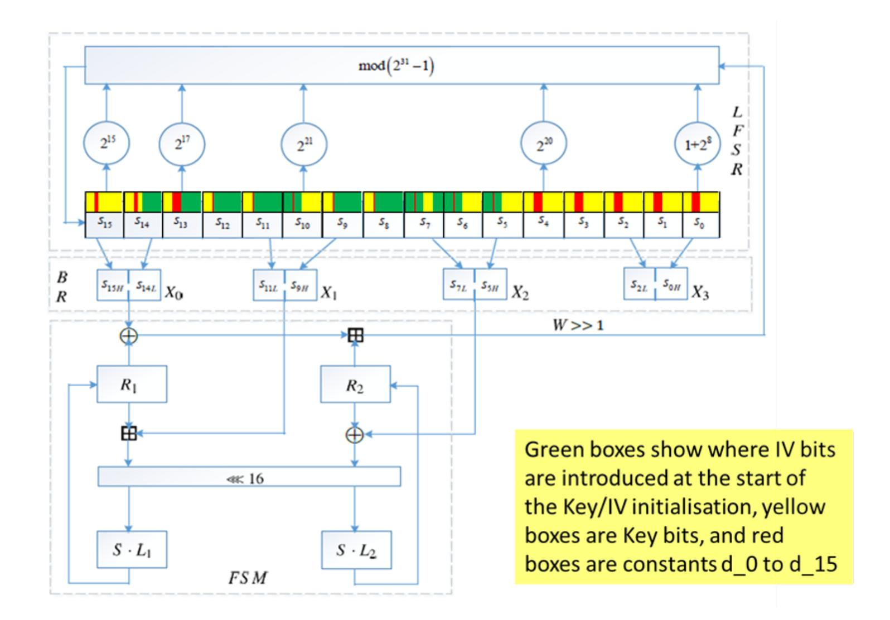
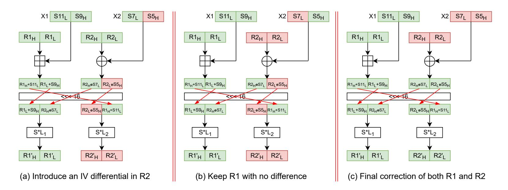

{0}------------------------------------------------

# **Differential analysis of the ZUC-256 initialisation**

Steve Babbage1 and Alexander Maximov2

1 Vodafone Group R&D, Newbury, UK [steve.babbage@vodafone.com](mailto:steve.babbage@vodafone.com) 2 Ericsson Research, Lund, Sweden [alexander.maximov@ericsson.com](mailto:alexander.maximov@ericsson.com)

**Abstract.** This short report contains results of a brief cryptanalysis of the initialisation phase of ZUC-256. We find IV differentials that persist for 26 of the 33 initialisation rounds, and Key differentials that persist for 28 of the 33 rounds.

**Keywords:** 3GPP, 5G, ZUC-256

## **1 Introduction**

Both 4G and 5G mobile systems include radio interface encryption and integrity algorithms constructed using the stream cipher ZUC, which has a 128-bit key [\[TS3a,](#page-8-0) [TS3b\]](#page-8-1). As part of recent initiatives to create a set of 256-bit security algorithms for 5G, the design team of ZUC has recently proposed an updated version ZUC-256 [\[The18\]](#page-8-2) that can accommodate a 256-bit secret *Key* and a 184-bit initialisation vector *IV* .

Like many stream ciphers, the operation of ZUC-256 takes place in two stages:

- the initialisation phase, in which the Key and IV should be thoroughly mixed into the algorithm's internal state;
- the keystream generation phase, in which keystream is produced as the internal state is updated.

One recent attempt to cryptanalyse this new cipher [\[YJM20\]](#page-8-3) was focused on the keystream generation phase of ZUC-256, and it presents an academic attack of complexity around *O*(2236). It shows that the generated keystream does not provide a full 256-bit entropy, although in 5G settings that attack does not impose an immediate threat. However, there has not been much published analysis on the initialisation phase of ZUC-256.

The initialisation of ZUC-256 is depicted in [Figure 1.](#page-1-0) We refer to the original paper [\[The18\]](#page-8-2) for more details. *Key* is represented as a string of 32 bytes *Key*[0]*, . . . , Key*[31]; *IV* is represented as a string of 25 bytes *IV* [0]*, . . . , IV* [24], where *IV* [0]*, . . . , IV* [16] are 17 full 8-bit bytes and *IV* [17]*, . . . , IV* [24] are 8 6-bit values. The *Key* and *IV* are loaded into the Linear Feedback Shift Register (LFSR), and then 33 rounds of the state update algorithm are carried out. In each round of the state update function, 31 bits from the nonlinear Finite State Machine (FSM) are combined into the LFSR feedback, as depicted in [Figure 1.](#page-1-0) The LFSR consists of 16 words of 31 bits each, with a feedback function operating over the prime field GF(*p*) where *p* = (231 − 1).

An ideal initialisation phase should map a (*Key, IV* ) pair into a pseudo-random state that is hard to distinguish from random. In this paper we examine both Key- and IVdifferentials with respect to the ZUC-256 initialisation phase. Although it is easier to see how IV-differentials might be exploited in an attack, an analysis of Key-differentials is also important to understand the effectiveness of the cipher initialisation procedure.

{1}------------------------------------------------

Figure 1: The initialisation phase of the ZUC-256 stream cipher.

In our brief study we found a number of features of ZUC-256 that one may exploit for a differential attack on ZUC-256 initialisation. As a result, we found that the state word *S*0 is highly biased after 26 of the 33 rounds for an IV-differential case, and up to 28 of the 33 rounds for a Key-differential scenario.

# **2 Key-differentials and spectral search approach**

ZUC-256 initialisation consists of the initial loading of (*Key, IV* ) into the LFSR, and then 33 state update rounds, before it starts producing the keystream. It is important to consider both Key- and IV-differentials; we want to be assured that the state of ZUC-256 is pseudo-random after the initialisation, i.e. that each register of the state has a very small correlation or differential bias by the time that keystream generation begins. In this short study, we look for differentials that persist through as many of the 33 initialisation rounds as possible.

Our first observation is that if after *t* rounds of the initialisation we find a large differential bias in the LFSR word *S*15, then that differential bias will also appear in the word *S*0 after *t* + 15 rounds. This way, we can focus our efforts on *S*15 and try to detect the bias there with as many rounds as possible.

In the Key-differential approach, we tried to introduce a differential in a small number of *Key* bits (1-5 bits). For a fixed differential we then simulate the initialisation of ZUC-256 for *t* = 1*,* 2*, . . .* rounds as follows: take a random pair (*Key, IV* ) (we used a PRNG with large enough entropy); change the selected bits of the *Key* so that we get another pair (*Key*0 *, IV* ); load both pairs into two ZUC states and perform *t* initialisation rounds on both of them; we then collect a 31-bit multidimensional distribution ∆*D*(*t*) of ∆*S*15(*t*) = *S*15(*t*) ⊕ *S*150(*t*) from *N* such samples, where *S*15(*t*) denotes the value of *S*15 after *t* initialisation rounds.

{2}------------------------------------------------

It is computationally hard to construct an accurate 31-bit distribution ∆*D*(*t*) purely from simulations, because in order for the observed bias to be reliable, we would need to collect *O*(231) times more samples than just for a binary case with the same bias. However, we can still use the collected distribution ∆*D*(*t*) containing *N* samples to search for a good *binary approximation*, as follows.

If we take a nonzero 31-bit linear mask *L*, then

$$Pr\{L \cdot \Delta(S15^{(t)} \oplus S15^{\prime(t)}) = 1\} = (1 - \mathcal{W}(\Delta D^{(t)})_L)/2,$$

where W(∆*D*(*t*) )*L* is the value of the Walsh-Hadamard Transform (WHT) of the distribution table ∆*D*(*t*) at the index *L*. I.e., in order to find a good linear mask *L* we just take the WHT of the distribution ∆*D*(*t*) in time complexity *O*(31 · 2 31), then loop through the spectrum in time *O*(231) and find the nonzero index *L* where the absolute value is the largest. This way we can test all 2 31 − 1 nonzero binary approximations with the cost of a single simulation run.

If the observed binary bias is around 2 −*q* , i.e. if

$$Pr\{L \cdot \Delta(S15^{(t)} \oplus S15^{\prime(t)}) = 1\} \approx \frac{1}{2} \pm 2^{-q},$$

then we provisionally declare that the bias is detected, with a small probability of error (false-positives), if the number of collected samples *N* satisfies

$$N \ge 2^{2q+4}.$$

This rule of thumb was selected to prevent too many false-positive results. Afterwards, in a second stage, we verify the detected bias by collecting a lot more samples ≫ *N*, but only for selected cases identified by the rule of thumb mentioned above.

As the result of this two-stage search for a good Key-differential we found the following:

**Differential:** 
$$\Delta Key[2] = 0x02; \ \Delta Key[6] = 0x10; \ \Delta Key[27] = 0x10;$$
  
**Detected bias:**  $Pr\{\Delta(S0_9 \oplus S0_{10}) = 1 \text{ after } 28 \text{ rounds}\} \approx \frac{1}{2} - 2^{-10.46}.$ 

The above large bias was verified by using ∼ 2 47 samples that we managed to collect with help of a cloud cluster. With 2 47 samples, the standard deviation of the observed bias is approximately 2 −24*.*5 ; thus the observed bias of 2 −10*.*46 is highly significant, and our confidence interval around the observed bias is quite tight.

With this 28-round differential, we are only 5 rounds short of the full initialisation. A more comprehensive mathematical study, instead of simply simulations and samplings, could potentially handle smaller biases. However, we leave this idea for further research.

## **3 IV-differentials in ZUC-256**

#### **3.1 New ideas**

When we tried a brute-force approach for IV-differentials similar to that in [Section 2,](#page-1-1) we ended up detecting a large bias of ∆*S*15 for only 5 rounds of the initialisation, which translates to a large bias of ∆*S*0 after 20 rounds. Then we started to look into the structure of the FSM, and found some ways to prolong an IV-differential by controlling differences happening in the FSM registers.

**First idea.** In [Figure 2](#page-3-0) we can see 3 situations for the FSM registers. Green boxes represent values that have no differential, while Red boxes contain differentials. We noted that when two red values are summed up together, then the result may be a green box – i.e., the difference in the inputs may cancel out and become zero. Also note that, in the

{3}------------------------------------------------

Figure 2: Sketch ideas for controlling the FSM registers.

initial Key/IV loading, the two registers R1 and R2 are always initialised with 0. This way, the attacker has full control over the FSM differential for the first steps.

In Figure 2 case (a) we demonstrate how we can introduce an IV-differential as  $\Delta S5_H$ , i.e. in the most significant 16 bits of the 31-bit word S5; this results in R2 (but not R1) containing some difference after the first clock. In (b) we demonstrate how we can control an existing difference in R2 in such a way that the resulting  $\Delta R1$  remains equal to 0. In (c) we show how to remove the difference in the FSM, such that  $\Delta R1 = \Delta R2 = 0$ . We will use these observations in our further construction of an IV-differential.

Second idea. We would also like to "correct" the values of S15 and keep  $\Delta S15 = 0$  for some initial steps. Note that in the first idea we only ever have a difference in R2, not in R1; and any difference  $\Delta R2$  in the next clock will contribute to the LFSR update function as  $(\Delta R2 \gg 1) \mod 2^{31} - 1$ , where  $\gg 1$  is the binary right shift to 1 bit. Thus, when introducing a value  $\Delta R2$  we could also keep track of the resulting difference that is pushed to the LFSR update function, and cancel out that difference in the LFSR feedback function by means of a corresponding difference in, e.g,  $\Delta S4$ . Because the  $\Delta R2$  difference occurs after one round, we actually introduce the canceling difference in  $\Delta S5$ , so that it has shifted to  $\Delta S4$  when we need it. This way we can "correct" the value of S15 and keep  $\Delta S15 = 0$  for a few initial rounds.

# 3.2 Example 1: 2-clock FSM and LFSR recovery, producing an (8+15) round bias

In this simplified case we will demonstrate how we can use the above new ideas to construct a differential yielding a large bias of  $\Delta S0$  after 23 rounds (compared with 20 rounds for the brute-force search strategy).

Following the ideas from Subsection 3.1, we would like to introduce some differential  $\Delta S5_H$  such that R1 will not change, but R2 will change after the first clock – this corresponds to case (a) in Figure 2. During the second clock we will "correct" the FSM state so that  $\Delta R1 = \Delta R2 = 0$ , by properly selecting two other differential values  $\Delta S7_L'$  (the shifted value of  $\Delta S8_L$ ) and  $\Delta S5_H'$  (=  $\Delta S6_H$ ) – this corresponds to case (c) in Figure 2. Recall that  $S5_H$  refers to the most significant 16 bits of the 31-bit word S5, and  $S7_L$  refers to the least significant 16 bits of the 31-bit word S7.

We always start with R1 = R2 = 0, so we can skip the initial values; in the equations below, therefore, R1 and R2 represent the values after the first clock. Then we get the

{4}------------------------------------------------

following set of equations:

$$R1 = SL_1(S9_H|S7_L),$$
  

$$R2 \oplus \Delta R2 = SL_2(S5_H \oplus \Delta S5_H|S11_L).$$

In order to make the correction to the FSM in the second clock, we need to cancel out that  $\Delta R2$  by using some IV-bit differential in the word  $(S8_L|S6_H)$  (which will have shifted to  $(S7_L|S5_H)$ ) when the second clock occurs). So, if

Bitwise\_AND(
$$\Delta R2, \neg M(S8_L|S6_H)_{iv}) = 0,$$

where M is the mask representing where IV bits are placed in the 32-bit word  $(S8_L|S6_H)$  during the initial loading (see the colour scheme in Figure 1), then we can set

$$\Delta(S8_L|S6_H) = \Delta R2.$$

Finally, we want  $\Delta S5_H$  to contribute to the LFSR update function in such a way that the difference  $\Delta S15'$  is 0 during the second clock – this is the second idea presented in the previous section. Note that in the second clock  $S5_H$  will contribute to the LFSR feedback as  $(S5_H \ll 15) \cdot 2^{20} \mod p$ , which means the 16-bit value  $S5_H$  will be rotated to the left by  $(15 + 20 \mod 31) = 4$  bits. We want the contributions of R2 and  $S5_H$  to the LFSR feedback in the two different states to match, and thus we get one more condition:

$$(R2 \gg 1) + (S5_H \ll 4) = ((R2 \oplus \Delta R2) \gg 1) + ((S5_H \oplus \Delta S5_H) \ll 4) \mod p.$$

Simply looping through  $S5_H, S11_L, \Delta S5_H$  in time  $\sim 2^{14+16+14}$  one can find many solutions that satisfy all the above conditions, while the other values, such as  $\Delta R2$ , are simply derived from these three 16-bit values, i.e.:

$$\Delta(S8_L|S6_H) = \Delta R2 = \underbrace{SL_2(S5_H|S11_L)}_{=R2} \oplus \underbrace{SL_2(S5_H \oplus \Delta S5_H|S11_L)}_{=R2 \oplus \Delta R2}.$$

The search space here is  $2^{44}$  rather than  $2^{48}$  because of restrictions arising from initialisation constants and IV-bit placement in the initial loading.

The search algorithm found many solutions but let us take the first that appeared in the search. In the notation below,  $Key[i]_j$  represents the j'th bit of the byte Key[i], where bits are numbered from 0 and bit 0 is the least significant bit.

• Pick a random valid state of ZUC-256 after initialisation, but guess 1 key bit  $Key[5]_7 = 1$ , and also fix some of the IV values as follows:

$$S11_L = 0x2ce5 \Rightarrow IV[6] = 0x2c, IV[13] = 0xe5;$$
  
 $S5_H = 0x009b \Rightarrow IV[0] = 0x00, IV[17] = 0x0d, Key[5]_7 = 1.$ 

• Introduce differentials into the following IV values (the constants and key bits must not change), so that we get a differential state:

$$\begin{split} \Delta S5_{H} &= \texttt{0xe852} \Rightarrow \Delta IV[0] = \texttt{0xe8}, \Delta IV[17] = \texttt{0x29}; \\ \Delta S6_{H} &= \texttt{0x0a40} \Rightarrow \Delta IV[1] = \texttt{0x0a}, \Delta IV[18] = \texttt{0x20}; \\ \Delta S8_{L} &= \texttt{0x0025} \Rightarrow \Delta IV[3] = \texttt{0x00}, \Delta IV[11] = \texttt{0x25}. \end{split}$$

Then we have that after 2 clocks both the FSM and the LFSR word S15 are "corrected". Simulation results for the above case where we guess 1 bit of the Key are as follows:

$$Pr\{\Delta(S0_{18} \oplus S0_{19}) = 1 \text{ after } 23 \text{ rounds}\} \approx \frac{1}{2} - 2^{-5.3}.$$

{5}------------------------------------------------

#### **3.3 Example 2: 3-clock FSM and LFSR recovery, producing an (11+15) round bias**

In Example 1 we only used cases (a) and (c) from [Figure 2,](#page-3-0) but let us explore how one can also utilize case (b) in order to keep control of the FSM differentials for more clocks. The set of conditions is then as follows:

$$R2^{1} \oplus \Delta R2^{1} = SL_{2}(S5_{H} \oplus \Delta S5_{H}|S11_{L})$$

$$(R2^{1} \gg 1) + (S5_{H} \ll 4) = ((R2^{1} \oplus \Delta R2^{1}) \gg 1) + ((S5_{H} \oplus \Delta S5_{H}) \ll 4) \mod p$$

$$R1^{1} = SL_{1}(S9_{H}|S7_{L})$$

$$\Delta S8_{L} = \Delta R2_{H}^{1}$$

$$\det y = (R1^{1} \boxplus (S12_{L}|S10_{H})) \gg 16$$

$$R2^{2} \oplus \Delta R2^{2} = SL_{2}(R2_{L}^{1} \oplus \Delta R2_{L}^{1} \oplus S6_{H} \oplus \Delta S6_{H}|y)$$

$$(R2^{2} \gg 1) + (S6_{H} \ll 4) = ((R2^{2} \oplus \Delta R2^{2}) \gg 1) + ((S6_{H} \oplus \Delta S6_{H}) \ll 4) \mod p$$

$$\Delta S9_{L} = \Delta R2_{H}^{2}$$

$$\Delta S7_{H} = \Delta R2_{L}^{2}$$

Additionally, we may restrict ∆*S*7*H* such that the lower 12 bits are 0s. This means that when this differential contributes to *S*15 for the first time (as feedback from *S*4 after shifting three positions to the right), it will probably affect only the upper 15 bits; and then another four rounds later, when this new value of *S*15 has moved to position *S*11, it will not change *X*1 for one more clock. This extra condition is:

$$\Delta S7_H \equiv 0 \mod 2^{12}.$$

On their own, the above tricks guarantee a large bias of ∆*S*0 after 10+15 rounds. However, we made an optimized search loop over solutions satisfying the above conditions, and found that some of the differential results gave us an IV-differential in ∆*S*0 that can be detected by simulations even after 11+15 rounds. One such solution is as follows:

$$S5_H = \texttt{0x61ac} \quad S6_H = \texttt{0x7ea5} \quad S7_L = \texttt{0x0000} \quad S9_H = \texttt{0x0080} \quad S11_L = \texttt{0x1117}$$
 
$$S12_L = \texttt{0xa483} \quad S10_{30} = 0$$
 
$$\Delta S5_H = \texttt{0x8d2e} \quad \Delta S6_H = \texttt{0x6e00} \quad \Delta S7_H = \texttt{0x4000} \quad \Delta S8_L = \texttt{0x0011} \quad \Delta S9_L = \texttt{0x07f2}$$

That translates into the following scenario where we guess 18 bits of the Key:

• Pick a random state of ZUC-256 after initialisation, but guess the following 18 bits of the Key:

$$Key[7] = 0x00; \quad Key[9] = 0x00; \quad Key[5]_7 = 0; \quad Key[6]_7 = 1,$$

and fix the following IV bits:

$$IV[0] = 0x61; \quad IV[1] = 0x7e; \quad IV[2] = 0x00; \quad IV[5]_7 = 0; \quad IV[6] = 0x11;$$
  $IV[7] = 0xa4; \quad IV[12]_7 = 0; \quad IV[13] = 0x17; \quad IV[14] = 0x83; \quad IV[17] = 0x16;$   $IV[18] = 0x12; \quad IV[21] = 0x00.$ 

• Introduce difference into the following IV values

$$\Delta IV[0] = \texttt{0x8d}; \quad \Delta IV[1] = \texttt{0x6e}; \quad \Delta IV[4] = \texttt{0xf2}; \quad \Delta IV[10] = \texttt{0x40}; \\ \Delta IV[11] = \texttt{0x11}; \quad \Delta IV[12] = \texttt{0x07}; \quad \Delta IV[17] = \texttt{0x17}.$$

We simulated the above scenario and collected a large number of samples to detect and verify the bias. The results are as follows:

$$Pr\{\Delta S0_{13} = 1 \text{ after } 26 \text{ rounds}\} \approx \frac{1}{2} + 2^{-12.6}.$$

{6}------------------------------------------------

#### 3.4 Attack scenarios

In the above two example IV-differentials we have to guess 1 or 18 bits of the Key, respectively. In a simple attack scenario, we can just wait for when these particular key bits have the desired values, i.e., the attack will work with probabilities  $2^{-1}$  and  $2^{-18}$ , respectively.

However, another attack scenario would be to run 21 or 218 parallel differential attacks, each corresponding to a unique value of those key bits that we have to guess. One of those attacks will be successful, while other IV-differentials will demonstrate a "random" case (we assume an attack scenario in which it is possible to detect the presence of the differential bias).

Conjecture 1. For each combination of the key bits that we have to guess, there exists an IV-differential solution that satisfies the required set of conditions, similar to those examples given in Subsection 3.2 and Subsection 3.3.

Justification. In this justification we will consider the concrete example given in Subsection 3.3, and make additional arguments in order to support the claimed conjecture that such an IV-differential attack exists for any value of those 18 key bits.

Assume we choose those 18 bits of the Key and fix them. Let's estimate the number of expected choices of IV-differentials as follows (see the set of conditions given in Subsection 3.3).

- Step 1: loop for  $S5_H$ ,  $S11_L$ ,  $\Delta S5_H$ , and deriving  $\Delta S8_L$ 
  - Loop for  $S5_H: 2^{14}$  choices, the constant bit and  $Key[5]_7$  are fixed
  - Loop for  $S11_L: 2^{16}$  choices, can choose any 16-bit value as they are (IV[6], IV[13])
  - Loop for  $\Delta S5_H: 2^{14}-1$  choices, a nonzero difference in (IV[0], IV[17])
  - Derive  $\Delta S8_L = \Delta R2_H^1$ : must have 0 in the bit 15, so the success probability  $2^{-1}$
  - Probability that the first sum modulo p will coincide is  $p^{-1}$
  - Number of choices in this step is thus  $n_1 \approx 2^{14+16+14} \cdot 2^{-1} p^{-1} \approx 2^{12}$ .
- Step 2: loop for  $y, S6_H, \Delta S6_H$ , and deriving  $\Delta S7_H, \Delta S9_L$ 
  - Loop for a 16-bit random y (later we will ensure that  $y = (R1^1 \boxplus (S12_L | S10_H)) \gg 16)$ :  $2^{16}$  choices
  - Loop for  $S6_H: 2^{14}$  choices, the constant bit and  $Key[6]_7$  are fixed
  - Loop for  $\Delta S6_H$ :  $2^{14}$  1 choices, a nonzero difference in (IV[1], IV[18])
  - Derive  $\Delta S7_H=\Delta R2_L^2$ : must have the lower 12 bits all zeroes, the success probability is  $\approx 2^{-12}$
  - Probability that the second sum modulo p will coincide is  $p^{-1}$
  - Derive  $\Delta S9_L = \Delta R2_H^2$ : the 15th bit must be 0, the success probability is  $2^{-1}$
  - Number of choices in this step is thus  $n_2 \approx 2^{16+14+14} \cdot 2^{-12-1} \cdot p^{-1} \approx 2^0$  (together with step 1 we now have  $\approx 2^{12}$  solutions).
- Step 3: loop for  $S9_H$ ,  $S7_L$ , deriving  $S12_L$  to satisfy y
  - Loop for  $S7_L: 2^8$  choices, the 8 bits of Key[7] are fixed
  - Loop for  $S9_H: 2^7$  choices, the constant bit and 8 bits of Key[9] are fixed
  - Derive  $S12_L=y\boxminus(R1^1\gg 16),$  to satisfy y: success probability is 1 since  $S12_L=IV[7]|IV[14]$

{7}------------------------------------------------

- We set one IV-bit  $S10_{30} = IV[5]_7 = 0$  so that it prevents the carry propagation in the 32-bit addition that might otherwise arrive from the sum of the lower half of  $R1 \boxplus X1$  (when  $X1 = S12_L|S10_H$ ). Thus, the derived  $S12_L$  will always lead to the wanted value y.
- Number of choices in this step is  $n_3 \approx 2^{8+7} = 2^{15}$

Accumulating the above, we get that for any choice of those 18 bits of the Key one could expect to derive the following average number of IV-differentials satisfying all the conditions:

$$n_1 \cdot n_2 \cdot n_3 \approx 2^{27}.$$

I.e., for any selection of those 18 bits of the Key, there should be around  $2^{27}$  variants of the IV and  $\Delta IV$  selections that lead to the example as in Subsection 3.3. There is a very high chance that a solution exists, and thus we have a strong justification for our conjecture1.

#### 3.5 Search algorithm

In the justification for Conjecture 1, we can organize the three steps of the search algorithm for a valid IV-differential, conditioned on the "guessed" key bits values, in a manageable way:

- We first run step 1 in a big loop of size  $\approx 2^{14+16+14} = 2^{44}$ , from which we expect to find around  $2^{12}$  combinations.
- Then we run step 2 on those  $2^{12}$  combinations, requiring a loop of size  $\approx 2^{12+16+14+14} = 2^{56}$ . We expect this to yield around  $2^{12}$  combinations. If the size of this loop is a concern2, then we could run it on only a subset of the  $2^{12}$  combinations from step 1.
- In step 3 we have the remaining loop of length  $2^{12+7+8} = 2^{27}$ , each providing one IV-differential satisfying all of the necessary conditions given the particular values of the 18 bits of Key.

#### 4 Conclusions and further directions

In this paper we presented a very simple way to find high biases in both Key- and IV-differentials for  $\Delta S0$ , after 28 and 26 rounds of the initialisation respectively, out of the 33 rounds in total. The biases are large enough that we could detect them by straightforward simulations even on a laptop, and collect enough samples to confirm our results with high statistical confidence.

With further research, it seems possible that a Key-differential might be found across the full 33-round initialisation. At the moment we are only 5 rounds short. Recall that in the IV-differential we managed to extend the attack for 6 more rounds (from 20 to 26 rounds) by using relatively simple ideas presented in Subsection 3.1. Applying similar ideas to the Key-differential search may potentially extend it to the full 33 rounds of the initialisation phase, and create a controllable statistical bias in the register state at the start of the keystream generation phase.

It also seems possible that the IV-differential attack could be extended further by guessing more Key bits. As long as the number of key bits to be guessed is much smaller

&lt;sup>1For example, we also found an IV-differential for the case in Subsection 3.2, but with  $Key[5]_7 = 0$ .

&lt;sup>2Perhaps, it may be possible to trade the loop for y for a loop for  $\Delta S7_H$ , i.e. where we derive y instead of deriving  $\Delta S7_H$ , thus reducing the complexity down to  $2^{12+4+14+14} = 2^{44}$ . But this idea requires further thought.

{8}------------------------------------------------

than 256, and the detected bias is still large enough, such an IV-differential attack might possibly provide a route to an attack on the overall algorithm.

We stress that the ambitions stated in the two previous paragraphs are pure conjecture. We have not found an attack on the full ZUC-256 algorithm. We believe there could be various improvements to our findings, and encourage further research.

## **References**

- [The18] The ZUC design team. The ZUC-256 Stream Cipher, 2018. [http://www.is.cas.](http://www.is.cas.cn/ztzl2016/zouchongzhi/201801/W020180126529970733243.pdf) [cn/ztzl2016/zouchongzhi/201801/W020180126529970733243.pdf](http://www.is.cas.cn/ztzl2016/zouchongzhi/201801/W020180126529970733243.pdf).
- [TS3a] 3GPP TS 33.401, 3GPP System Architecture Evolution (SAE); Security Architecture. [https://www.3gpp.org/DynaReport/33401.htm](https://www.3gpp.org/DynaReport/33401.htm ).
- [TS3b] 3GPP TS 33.501, Security Architecture and Procedures for 5G System. [https:](https://www.3gpp.org/DynaReport/33501.htm ) [//www.3gpp.org/DynaReport/33501.htm](https://www.3gpp.org/DynaReport/33501.htm ).
- [YJM20] Jing Yang, Thomas Johansson, and Alexander Maximov. Spectral analysis of ZUC-256. *IACR Transactions on Symmetric Cryptology*, 2020(1):266–288, May 2020. <https://tosc.iacr.org/index.php/ToSC/article/view/8565>.