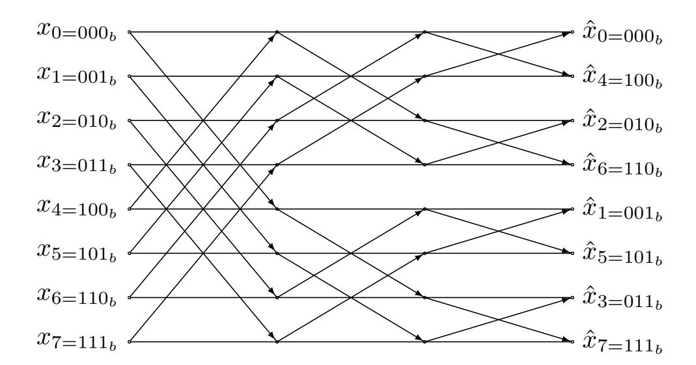
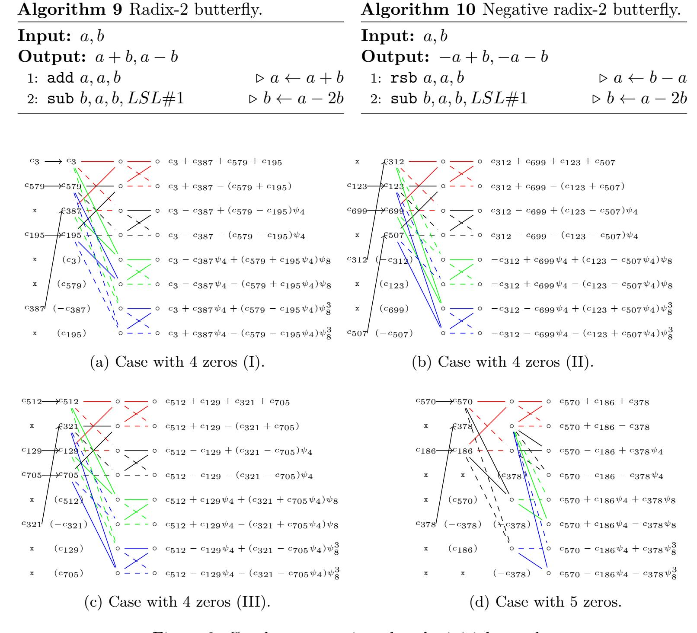
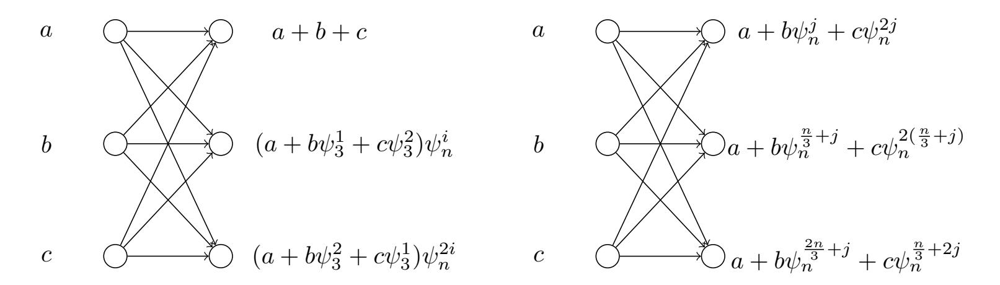
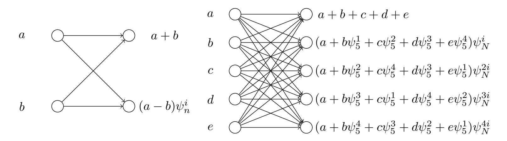
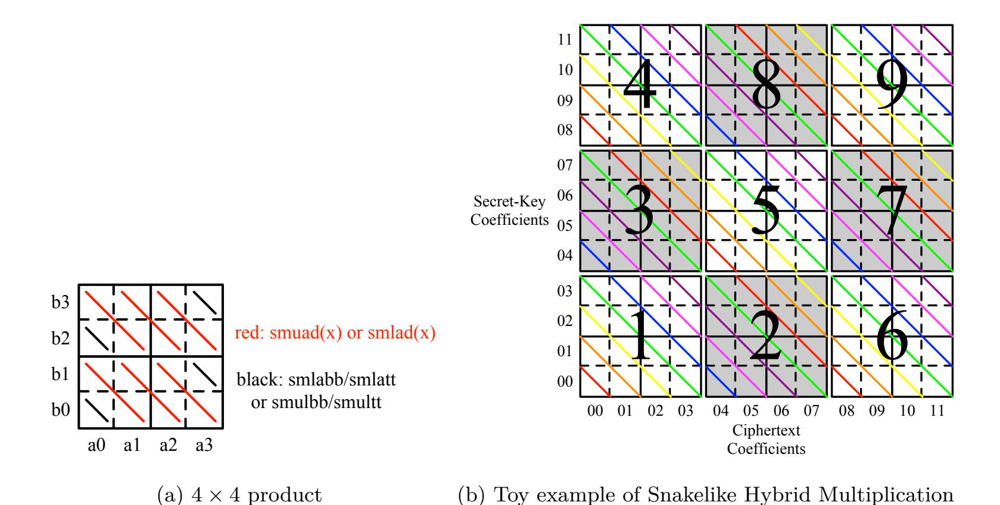
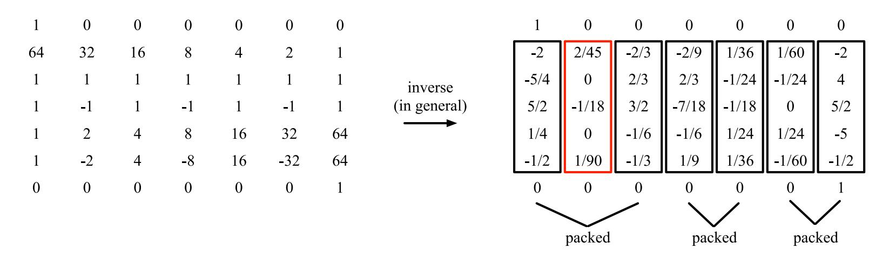

{0}------------------------------------------------

# **Polynomial Multiplication in NTRU Prime**

### **Comparison of Optimization Strategies on Cortex-M4**

Erdem Alkim<sup>1</sup>*,*<sup>2</sup> , Dean Yun-Li Cheng<sup>3</sup>*,*<sup>4</sup> , Chi-Ming Marvin Chung<sup>3</sup> , Hülya Evkan<sup>2</sup> , Leo Wei-Lun Huang<sup>3</sup> , Vincent Hwang<sup>3</sup>*,*<sup>4</sup> , Ching-Lin Trista Li<sup>3</sup>*,*<sup>4</sup> , Ruben Niederhagen<sup>5</sup> , Cheng-Jhih Shih<sup>3</sup> , Julian Wälde<sup>2</sup> and Bo-Yin Yang<sup>3</sup>

```
1 Ondokuz Mayıs University, Samsun, Turkey, erdemalkim@gmail.com
        2 Fraunhofer SIT, Darmstadt, Germany, {hevkan,julianwaelde}@gmail.com
3 Academia Sinica, Taipei, Taiwan, {dean3154,marvin852316497,271828182euler}@gmail.com,
            {vincentvbh7,trista5658321,cs861324}@gmail.com, by@crypto.tw
                       4 National Taiwan University, Taipei, Taiwan
       5 University of Southern Denmark, Odense, Denmark, ruben@polycephaly.org
```

**Abstract.** This paper proposes two different methods to perform NTT-based polynomial multiplication in polynomial rings that do not naturally support such a multiplication. We demonstrate these methods on the NTRU Prime key-encapsulation mechanism (KEM) proposed by Bernstein, Chuengsatiansup, Lange, and Vredendaal, which uses a polynomial ring that is, by design, not amenable to use with NTT. One of our approaches is using Good's trick and focuses on speed and supporting more than one parameter set with a single implementation. The other approach is using a mixed radix NTT and focuses on the use of smaller multipliers and less memory. On a ARM Cortex-M4 microcontroller, we show that our three NTT-based implementations, one based on Good's trick and two mixed radix NTTs, provide between 32% and 17% faster polynomial multiplication. For the parameter-set ntrulpr761, this results in between 16% and 9% faster total operations (sum of key generation, encapsulation, and decapsulation) and requires between 15% and 39% less memory than the current state-of-the-art NTRU Prime implementation on this platform, which is using Toom-Cook-based polynomial multiplication.

**Keywords:** NTT · polynomial multiplication · Cortex-M4 · NTRU Prime · PQC

## <span id="page-0-0"></span>**1 Introduction**

Due to the ongoing advances in quantum computing, the threat by quantum computers to IT-security becomes more and more imminent: Experts predict that sufficiently large and stable quantum computers running Shor's algorithm for factorization and solving discrete logarithms may be able to break currently wide-spread asymmetric cryptographic primitives in the next ten to fifteen years. Therefore, in the research field Post-Quantum Cryptography (PQC), researchers haven been investigating alternative cryptographic schemes that are believed to be secure against attacks aided by quantum computers.

PQC-primitives based on lattice problems have attracted significant attention due to their efficient implementations that often are on par with or even better than current cryptographic schemes. This attention is reflected in the NIST post-quantum cryptography standardization process, as nearly half of the candidates are using hard lattice problems as their building blocks. Among the other lattice-based NIST candidates, the key encapsulation mechanism (KEM) NTRU Prime [\[BCLvV17\]](#page-20-0), which has advanced to the third round as alternate candidate, differentiates itself by its choice of the polynomial ring using an

{1}------------------------------------------------

irreducible polynomial as quotient and a prime field for its coefficients, which makes it harder to provide efficient implementations compared to other lattice-based schemes.

One crucial aspect for the performance of NTRU Prime is the basic operation of polynomial multiplication, which is used frequently in the key generation, encapsulation, and decapsulation operations. Therefore, an efficient multiplication algorithm is required to achieve peak-performance for this scheme.

There are several approaches for multiplying polynomials that have different asymptotic complexities, e.g., basic-schoolbook multiplication (Θ(*n* 2 )), Karatsuba (Θ(*n* log<sup>2</sup> 3 )), Toom-Cook (e.g., Θ(*n* log<sup>3</sup> 5 ) for Toom-3), and the Number Theoretic Transform (NTT, Θ(*n*·log *n*· log log *n*)). Due to the constant factors in the asymptotic complexities, for specific problem sizes, the best choice for the multiplication algorithm depends on the size of the operands and the target processor architecture for the implementation. Except for corner-cases of very small or very large operand sizes, it is hard to predict the best multiplication algorithm in advance; typically different approaches need to be implemented, optimized for the specific target platform, and compared in regard to their computational efficiency and memory consumption.

In contrast to other lattice-based schemes, which commonly use either cyclotomic polynomials to enable the use of an NTT or power-of-two moduli for efficient coefficientwise operations, it is a challenging task to implement NTRU Prime efficiently due to its specific design. This challenge becomes even bigger on embedded devices with low resources in regard to computational power and memory.

In this work, we implement two approaches of polynomial multiplication for NTRU Prime based on NTT on the Cortex-M4 architecture and show that our approaches are faster and more memory efficient than the current state-of-the-art.

**Related Work.** There has been work conducted before to improve the efficiency of polynomial multiplication in lattice-based schemes in general and for NTRU and NTRUrelated schemes like NTRU Prime specifically. Also, there has been some work on implementing NTRU Prime for embedded devices.

For example, in [\[MKV20\]](#page-21-0) Mera et al. investigate the use of Toom-Cook multiplication to speed up lattice-based cryptography, specifically the KEM scheme Saber with polynomials of degree 256. They report performance numbers for AVX and for ARM Cortex-M4 with assembler optimizations.

Hülsing et al. provided an efficient implementation of a variant of NTRU for the AVX2 vector instruction set [\[HRSS17\]](#page-21-1). They are using several recursive levels of Karatsuba for polynomial multiplication. The work by Lyubashevsky and Seiler [\[LS19\]](#page-21-2) is using an NTT to achieve a fast implementation of an NTRU variant.

NTRUEncrypt has been optimized, for example, for the AVX2 vector instruction set by Dai et al. in [\[DWZ18\]](#page-21-3) using a combination of Karatsuba and Toom-Cook for polynomial multiplication with sparse index-based multiplication for the final polynomials of degree smaller than 32. An implementation of NTRUEncrypt for embedded systems on an 8-bit AVR microcontroller is provided by Cheng et al. in [\[CGRR19\]](#page-21-4) using optimization techniques for sparse polynomial multiplication.

There is an implementation of NTRU Prime for the Haswell x86 architecture using AVX2 vector instructions by Bernstein[1](#page-1-0) using Good's trick and the Chinese Remainder Theorem (CRT) to enable the use of the NTT for the design and the parameters of NTRU Prime. We will take a closer look at this approach in [Section 3.](#page-8-0) Cheng et al. provide an efficient implementation of NTRU Prime on an ATmega1284 8-bit AVR microcontroller [\[CDG](#page-20-1)<sup>+</sup>19] using Karatsuba-based polynomial multiplication and efficient modular reduction. Kannwischer et al. performed measurements of the C reference implementations

<span id="page-1-0"></span><sup>1</sup><https://groups.google.com/a/list.nist.gov/forum/#!msg/pqc-forum/XZomSSgV6g8/Eqvn1VdrAgAJ>

{2}------------------------------------------------

of several PQC schemes on a Cortex-M4 platform (without any optimizations) [KRSS19]. They report performance numbers for NTRU Prime as well.

However, the current state-of-the-art implementation of NTRU Prime on Cortex-M4 is the work by Yang et al.<sup>2</sup> that was included as optimized implementation for NTRU Prime in the pqm4 project in April 2020<sup>3</sup>. It is using Toom-Cook for polynomial multiplication, fast modular inversion from [BY19], and platform-specific, hand-written assembly optimization. It is up to two orders of magnitude faster than the C-reference code reported in [KRSS19]. This work is the basis of our optimizations for polynomial multiplication. Performance values are listed in Table 6 for comparison to our improvements.

**Our Contributions.** We present, evaluate, and compare two methods to implement NTT-based polynomial multiplication in  $\mathbb{Z}_{4591}/(X^{761}-X-1)$  accompanied with three implementations. We use the following two methods, one being more generic and the other more parameter specific:

- Good's Trick We implemented an NTT for  $\mathbb{Z}_{q'}/(X^{N_1}-1)$ , where  $N_1 = p' \cdot 2^k \geq 2 \cdot p$ , p' is a small prime, and q' is selected to ensure that there will be no modular reduction in the coefficients of the resulting polynomial.
- Mixed Radix NTT We implemented an NTT for  $\mathbb{Z}_q/(X^{N_2}-1)$ , where  $N_2=t\cdot 2^k\cdot 3^l\cdot 5^m\cdot 7^n\geq 2\cdot p$ , t is a small integer, and  $q\equiv 1 \mod \frac{N_2}{t}$  as well as an NTT for  $\mathbb{Z}_q/(X^{1530}-1)$ , where 1530 is the smallest divisor of q-1 which is bigger than 2p.

The NTRU Prime submission has two additional parameter sets which use q = 4621 and q = 5167, and q - 1 can be factored as  $2^2 \cdot 3 \cdot 5 \cdot 7 \cdot 11$  and  $2 \cdot 3^2 \cdot 7 \cdot 41$ , respectively. Thus the techniques described in this paper can be applied to all parameter sets in the submission. Although the techniques are not new, we present their first implementation in lattice-based cryptography. Thus, we focus on implementation issues instead of implementing all parameter sets of NTRU Prime. Our implementations are publicly available under an open source license at https://github.com/vincentvbh/NTRUPrime-PolyMul.

Structure of this Paper. Section 2 provides some background information on NTRU Prime and on using NTT for polynomial multiplication. In Section 3 we introduce our approaches for the implementation of polynomial multiplication using NTT for odd sizes including Good's trick. Section 4 describes the implementation of our two approaches for improving polynomial multiplication. Section 5 provides an evaluation of our work and a comparison of our improvements with prior art. Finally, Section 6 concludes our work.

### <span id="page-2-2"></span>2 Preliminaries

In this section, we recall the NTRU Prime key encapsulation scheme and we provide an overview of the number theoretic transform when used for polynomial multiplication.

### 2.1 NTRU Prime

The authors of NTRU Prime [BCLvV17] propose "an efficient implementation of high-security prime-degree large-Galois-group inert-modulus ideal-lattice-based cryptography." NTRU Prime tweaks the classic NTRU scheme to use rings without exploiting special structures of the rings. The NTRU Prime submission to the NIST standardization process [BCLvV19] provides two KEM schemes: Streamlined NTRU Prime and NTRU LPRime.

<span id="page-2-0"></span><sup>&</sup>lt;sup>2</sup>https://groups.google.com/a/list.nist.gov/forum/#!topic/pqc-forum/FHAMYa-m2hY

<span id="page-2-1"></span><sup>&</sup>lt;sup>3</sup>https://github.com/mupq/pqm4/ commit e1c6949eafbf7d93

{3}------------------------------------------------

| Scheme    | security level | p   | q    | $\overline{w}$ |
|-----------|----------------|-----|------|----------------|
| sntrup653 | 2              | 653 | 4621 | 288            |
| sntrup761 | 3              | 761 | 4591 | 286            |
| sntrup857 | 4              | 857 | 5167 | 322            |

<span id="page-3-0"></span>Table 1: Parameter sets of Streamlined NTRU Prime.

Both schemes share common notations and definitions for the parameters and theorems. The parameters are a prime number  $p \geq 17$ , a prime number q and a positive integer  $w \leq p$ , where  $x^p - x - 1$  is irreducible in the polynomial ring  $(\mathbb{Z}/q)[x]$ . An element of the ring  $\mathbb{Z}[x]/(x^p - x - 1)$  is **small** if all coefficients are in  $\{-1,0,1\}$ . If there are exactly w coefficients that are nonzero, then the weight of the element is w. We define the set of the elements of the ring  $\mathbb{Z}[x]/(x^p - x - 1)$  that have a small weight-w as Short. The set Rounded is defined as the set of polynomials  $r_0 + r_1x + \cdots + r_{p-1}x^{p-1} \in \mathbb{Z}[x]/(x^p - x - 1)$  where each coefficient  $r_i$  is in  $\{-(q-1)/2, \ldots, -6, -3, 0, 3, 6, \ldots (q-1)/2\}$  for  $q \in 1 + 3\mathbb{Z}$  or in  $\{-(q+1)/2, \ldots, -6, -3, 0, 3, 6, \ldots (q+1)/2\}$  for  $q \in 2 + 3\mathbb{Z}$ . Please note that we will abbreviate the rings  $\mathbb{Z}[x]/(x^p - x - 1)$ ,  $(\mathbb{Z}/3)[x]/(x^p - x - 1)$ , and  $(\mathbb{Z}/q)[x]/(x^p - x - 1)$  as  $\mathcal{R}$ ,  $\mathcal{R}/3$ , and  $\mathcal{R}/q$ , respectively.

NTRU Prime defines two deterministic algorithms called HashConfirm and HashSession that are using a function Hash. Hash(z) returns the first 32 bytes of SHA-512(z) and Hash<sub>b</sub>(z) is defined as Hash(b, z) prefixing the input z with a one-byte value  $b \in \{0, \ldots, 255\}$ . HashConfirm( $r, \underline{h}$ ) is defined as Hash<sub>2</sub>(Hash<sub>3</sub>(r), Hash<sub>4</sub>(h)) for  $r \in$  Short in Streamlined NTRU Prime and  $r \in \{0, 1\}^I$  in NTRU LPRime where h is the public key and  $I \in 8\mathbb{Z}^+$ . The algorithm HashSession(b, r, C) is defined as Hash<sub>b</sub>(Hash<sub>3</sub>(r), C) for  $b \in \{0, 1\}$ , r same as above, and z is the ciphertext of the respective scheme.

**Theorem 1** ([BCLvV17, Theorem 1]). Let  $p \geq 3$  and  $w \geq 1$  be fixed integers. Let  $g \in \mathbb{Z}[x]$  be a polynomial of degree at most p-1 with each coefficient in  $\{-1,0,1\}$ . Let i be an integer with  $0 \leq i < p$ . Then  $x^i g \mod x^p - x - 1$  has each coefficient in  $\{-2,-1,0,1,2\}$ .

**Theorem 2** ([BCLvV17, Theorem 2]). Let  $p \geq 3$  and  $w \geq 1$  be fixed integers. Let  $r, g \in \mathbb{Z}[x]$  be polynomials of degree at most p-1 with each coefficient in  $\{-1,0,1\}$ . Assume that r has at most w nonzero coefficients. Then  $gr \mod x^p - x - 1$  has each coefficient in the interval [-2w, 2w].

**Theorem 3** ([BCLvV17, Theorem 3]). Let  $p \geq 3$  and  $w \geq 1$  be fixed integers. Let  $m, r, f, g, \in \mathbb{Z}[x]$  be polynomials of degree at most p-1 with each coefficient in  $\{-1, 0, 1\}$ . Assume that f and r each have at most w nonzero coefficients. Then  $3fm+gr \mod x^p-x-1$  has each coefficient in the interval [-8w, 8w].

### 2.1.1 Streamlined NTRU Prime

Streamlined NTRU Prime (sntrup) has two lavers:

- a perfectly correct deterministic PKE as inner layer and
- a perfectly correct KEM as outer layer.

The inner layer, Streamlined NTRU Prime Core, has parameters (p, q, w) where p and q are prime numbers, w is a positive integer such that  $2p \geq 3w$ ,  $q \geq 16w + 1$ , and  $x^p - x - 1$  is irreducible in the polynomial ring  $(\mathbb{Z}/q)[x]$ . The parameter sets of Streamlined NTRU Prime are listed in Table 1. The algorithms for key generation, encapsulation, and decapsulation of Streamlined NTRU Prime are shown in Algorithms 1, 2, and 3.

{4}------------------------------------------------

### <span id="page-4-0"></span>**Algorithm 1** Streamlined NTRU Prime Key Generation: SKeyGen()

```
Output: (pk, sk) = (h,(f, g−1
                               , h, ρ)).
 1: repeat
 2: g
         $← small,
 3: until g
           −1 ∈ R/3
 4: g
     −1 ← 1/g ∈ R/3
                                               5: f
                                                    $← Short
                                               6: h ← g/(3f) ∈ R/q
                                               7: ρ ← Short
                                               8: return (h,(f, g−1
                                                                     , h, ρ))
```

#### <span id="page-4-1"></span>**Algorithm 2** Streamlined NTRU Prime Encapsulation: SEncap(*h*)

```
Input: pk = h
Output: C = (C, HashSession(1, r, C))
 1: r
     $← Short
 2: hr ← h · r ∈ R/q
 3: c ← Round(hr)
                                              4: C ← HashConfirm(r, h)
                                              5: return (c, C, HashSession(1, r, C))
```

#### <span id="page-4-2"></span>**Algorithm 3** Streamlined NTRU Prime Decapsulation: SDecap(*C*, (*f*, *g* −1 , *h*, *ρ*))

```
Input: C = (c, γ), sk = (f, g−1
                                 , h, ρ)
Output: HashSession(1, r, C) if C
                                     0 == C, otherwise HashSession(0, ρ, C).
 1: 3f c ← 3 · f · c ∈ R/q
 2: e ← MaptoR/3(3f c)
 3: ev ← e · g
              −1 ∈ R/3
 4: r
     0 ← MaptoR/q(ev)
 5: hr0 ← h · r
               0 ∈ R/q
                                                6: c
                                                    0 ← Round(hr0
                                                                   )
                                                7: C
                                                     0 ← (c
                                                           0
                                                            , HashConfirm(r
                                                                             0
                                                                              , h))
                                                8: return (C
                                                              0 == C)
                                                        ? HashSession(1, r0
                                                                             , C)
                                                        : HashSession(0, ρ, C)
```

**Switching the ring of an element.** Decapsulation in Streamlined NTRU Prime needs to map polynomials between R*/q* and R*/*3 as shown in line 2 and 4 of [Algorithm 3.](#page-4-2) While MaptoR*/*3 performs

$$c_j = (a_j \bmod {}^{\pm}q) \bmod {}^{\pm}3$$

for each coefficient, MaptoR*/q* performs

$$c_j = (a_j \bmod {\pm 3}) \bmod {\pm q},$$

which simply changes the ring of the arithmetic operations without changing the signed representation of the coefficients.

Streamlined NTRU Prime utilizes the Fujisaki-Okamoto (FO) transformation [\[FO13\]](#page-21-6) to construct a CCA secure KEM. This transformation involves re-encryption of the decrypted message to check if the ciphertext was correctly generated using the encryption algorithm. This re-encryption can be seen in lines 5 − 7 of [Algorithm 3.](#page-4-2) The comparison with the original ciphertext is performed in line 8 in [Algorithm 3.](#page-4-2)

#### **2.1.2 NTRU LPRime**

NTRU LPRime (ntrulpr) has three layers:

- a perfectly correct randomized PKE as inner layer,
- a perfectly correct deterministic PKE as middle layer, and
- a perfectly correct KEM as outer layer.

{5}------------------------------------------------

<span id="page-5-0"></span>

| Scheme     | security level | p   | q    | w   | $\delta$ | $\tau_0$ | $\tau_1$ | $\tau_2$ | $\tau_3$ |
|------------|----------------|-----|------|-----|----------|----------|----------|----------|----------|
| ntrulpr653 | 2              | 653 | 4621 | 252 | 289      | 2175     | 113      | 2031     | 290      |
| ntrulpr761 | 3              | 761 | 4591 | 250 | 292      | 2156     | 144      | 2007     | 287      |
| ntrulpr857 | 4              | 857 | 5167 | 281 | 329      | 2433     | 101      | 2265     | 324      |

Table 2: Parameter sets of NTRU LPRime.

### <span id="page-5-1"></span>**Algorithm 4** NTRU LPRime Key Generation: LPRKeyGen()

```
Output: (pk, sk) = ((S, A), (a, S, A, \rho)).

1: S \stackrel{\$}{\leftarrow} \text{Seeds}

2: G \leftarrow \text{Generator}(S)

3: a \stackrel{\$}{\leftarrow} \text{Short}

4: aG \leftarrow a \cdot G \in \mathcal{R}/q

5: A \leftarrow \text{Round}(aG)

6: \rho \leftarrow \text{Short}

7: \text{return}(S, A, (a, S, A, \rho))
```

### <span id="page-5-2"></span>**Algorithm 5** NTRU LPRime Encapsulation: LPREncap(S, A)

```
Input: pk = (S, A)
Output: C = (C, \operatorname{HashSession}(1, r, C))

1: r \overset{\$}{\leftarrow} \{0, 1\}^l
2: G \leftarrow \operatorname{Generator}(S)
3: b \leftarrow \operatorname{HashShort}(r)
4: bG \leftarrow b \cdot G \in \mathcal{R}/q
5: bA \leftarrow b \cdot A \in \mathcal{R}/q
6: c \leftarrow \operatorname{Round}(bG)
7: T \leftarrow Encode(bA, r)
8: C \leftarrow (c, T, \operatorname{HashConfirm}(S, A))
9: \operatorname{return}(C, \operatorname{HashSession}(1, r, C))
```

### <span id="page-5-3"></span>**Algorithm 6** NTRU LPRime Decapsulation: LPRDecap $(C, (a, S, A, \rho))$

```
\begin{array}{lll} \textbf{Input:} & C = (c,T,\gamma), \ sk = (a,S,A,\rho) \\ \textbf{Output:} & \texttt{HashSession}(1,r,C) \ \text{if} \ C' == C, \ \text{otherwise HashSession}(0,\rho,C). \\ 1: & aB \leftarrow a \cdot c \in \mathcal{R}/q & 7: \ c' \leftarrow \texttt{Round}(bG') \\ 2: & r' \leftarrow Decode(aB,T) & 8: \ T' \leftarrow Encode(bA',r') \\ 3: & G \leftarrow \texttt{Generator}(S) & 9: \ C' \leftarrow (c',T',\texttt{HashConfirm}(S,A)) \\ 4: & b' \leftarrow \texttt{HashShort}(r') & 10: \ \textbf{return} \ (C' == C) \\ 5: & bG' \leftarrow b' \cdot G \in \mathcal{R}/q & ? \ \texttt{HashSession}(1,r',C) \\ 6: & bA' \leftarrow b' \cdot A \in \mathcal{R}/q & : \ \texttt{HashSession}(0,\rho,C) \end{array}
```

NTRU LPRime Core, the inner layer, has parameters  $(p,q,w,\delta,I)$ , where p and q are prime numbers, w,  $\delta$ , I are positive integers such that  $2p \geq 3w$ , I is a multiple of 8,  $p \geq 1$ ,  $q \leq 16w + 2\delta + 3$ , and  $x^p - x - 1$  is irreducible in the polynomial ring  $(\mathbb{Z}/q)[x]/(x^p - x - 1)$ . Additionally, NTRU LPRime uses a positive integer  $\tau$ , a deterministic algorithm  $Top: \mathbb{Z}/q \longrightarrow \mathbb{Z}/\tau$ , and a deterministic algorithm  $Right: \mathbb{Z}/\tau \longrightarrow \mathbb{Z}/q$  such that the difference  $Right(Top(C)) - C \in \mathbb{Z}/q$  is in  $\{0, 1, \cdots, \delta\}$  for each  $C \in \mathbb{Z}/q$ . Seeds is a nonempty set. The parameter sets for NTRU LPRime are listed in Table 2. The algorithms for key generation, encapsulation, and decapsulation of NTRU LPRime are listed in Algorithms 4, 5, and 6.

Encoding and decoding bit strings to polynomials. Encapsulation and decapsulation of NTRU LPRime need to encode bit strings to polynomials. The operation Encode is called in the line 7 of Algorithm 5 and line 8 of Algorithm 6, while Decode is used only in line 2 of Algorithm 6. The Encode function encodes an I-size bit string  $r = (r_0, r_1, \ldots, r_{I-1})$  to

{6}------------------------------------------------

a polynomial *bA* by performing the computation

$$T_j = Top(bA_j + r_j(q-1)/2).$$

The Decode function generates a bit string from *aB* and *T* by computing

$$r_j = Right(T_j) - aB_j + 4\omega + 1.$$

The NTRU LPRime scheme also uses an FO transformation for CCA security. The re-encryption stage of this transformation can be seen in lines 3 − 9 in [Algorithm 6.](#page-5-3)

### **2.2 Number Theoretic Transform**

As mentioned before, one popular method for implementing polynomial multiplication is to apply a number theoretic transform (NTT) and point-wise multiplication. This approach is very attractive, because it has quasi-linear complexity. The NTT *x*ˆ of a vector *x* ∈ Z *N q* is defined as

$$\hat{x}_k = \sum_{i=0}^{N-1} x_i \psi^{ik}, k \in \{0, \dots, N-1\}$$

for an *n*th-root of unity *ψ* in Z*q*. Since this requires that an *n*th root of unity exists in Z*q*, *q* is called an "NTT-friendly prime", if Z*<sup>q</sup>* has an *n*th root of unity. This means that a size-*N* NTT operation is equivalent to a matrix multiplication with an *N* × *N* matrix *A* that consists of the coefficients *ai,j* = *ψ* (*i*−1)(*j*−1). A naive implementation, however, will result in *O*(*N*<sup>2</sup> ) complexity for the operation and result in no advantage over other multiplication routines. A well known divide-and-conquer strategy exists for cases in which *N* is not prime [\[CT65\]](#page-21-7).

In such cases, the NTT operation can be realized by combining the results of *N/p* smaller NTT operations on vectors of size *p*. These smallest NTT operations over vectors of prime size are referred to as butterflies in the literature. This is due to the "butterfly-shape" of diagrams mapping the signal flow in such operations. Because of this structure, the immediate output *x*ˆ*<sup>k</sup>* of the algorithm appears in an order different from that of the input. In the popular case of a transforms that only comprises radix-2 stages, the output is in bit-reversed order compared to the input order (see [Figure 1](#page-7-0) for an example).

For the general case, one can define an index calculation function *Rp*1*,...,p<sup>n</sup>* for an NTT using *n* layers with radix-*p<sup>i</sup>* on layer 1 ≤ *i* ≤ *n* in a recursive manner as *Rp*(*k*) = *k* for an index *k* and

$$R_{p_1,\dots,p_{n-1},p_n}(k) = \left(k - \left\lfloor \frac{k}{p_n} \right\rfloor p_n\right) \cdot \prod_{i=1}^n p_i + R_{p_1,\dots,p_{n-1}}\left(\left\lfloor \frac{k}{p_n} \right\rfloor\right).$$

This can be used to express the output order of an NTT. For example, the "digit reversed" index permutation *dr*<sup>270</sup> of a 270-NTT that applies one radix-2, three radix-3, and finally one radix-5 stage can thus be expressed as

$$dr_{270} = [R_{2,3,3,3,5}(0), R_{2,3,3,3,5}(1), \dots, R_{2,3,3,3,5}(269)].$$

For the application of the NTT, it is practical to reorder to the inputs of the transformation in order to attain an output in normal order. If the transformation is used for polynomial multiplication, the order of the output is irrelevant and the normal input order can be used. In this case, the index permutation can be incorporated into the inverse transform instead. For arithmetic in Z*q*, the possible input sizes are determined by the prime factors of *q* − 1, as only *n*th roots of unity exist if *n* divides *q* − 1. This also determines the radix-*p* stages that are applied when performing a given transform, but not the order in which they are applied.

{7}------------------------------------------------

<span id="page-7-0"></span>

Figure 1: Bit-reversed output order in a radix-2 NTT.

Although the NTT algorithm can work for any size, it can use recursive structures when the size is a highly composite number, i.e., a power of a small prime. Below, we describe two tricks to implement an NTT more efficiently when the size has a special form that is not a power of a prime.

#### <span id="page-7-2"></span>2.2.1 Rader's Trick

In [Rad68], Rader proposed a method to compute a prime-size NTT for a prime p. The method transforms the multiplication with the twiddle factors to a polynomial multiplication of size p-1. For a polynomial  $a = \sum_{i=0}^{p-1} a_i x^i$ , the coefficient  $a_j$  in NTT domain can be computed with  $\hat{x}_j = \sum_{i=0}^{p-1} a_i \psi^{ij} \mod q$ , where  $\psi$  is a p-th root of unity in  $\mathbb{Z}_q$ .

The first observation of [Rad68] is that the first coefficient  $\hat{x}_0$  of the NTT can be computed as the sum of the coefficients  $\hat{x}_0 = \sum_{i=0}^{p-1} x_i$ . The second observation of the paper is that  $x_0$  is always multiplied with 1 during the calculation of the other indices. Thus, the calculation of the other indices takes the form

<span id="page-7-1"></span>
$$\hat{x}_j = x_0 + \sum_{i=1}^{p-1} x_i \psi^{ij}. \tag{1}$$

After moving  $x_0$  to the left hand side, the sum in Equation (1) becomes a multiplication of p-1 pairs of coefficients in  $\mathbb{Z}_q$ , but the order of the coefficients used would not form a polynomial multiplication as desired. Rader proposed a permutation to transform the sum into a polynomial multiplication modulo  $x^{p-1}-1$ . The permutation uses the fact that there is a number g in [0, p-1] that can form a bijection from [1, p-1] to [1, p-1]. Using this, the index calculation function can be expressed as  $k=g^i \mod p$ . This changes Equation (1) to

$$\hat{x}_{g^j \bmod p} - x_0 = \sum_{i=1}^{p-1} x_{g^i \bmod p} \psi^{g^{i+j} \bmod p}.$$

This technique is useful, especially for the implementation of mixed radix NTT, because the butterfly operations are basically small prime-size NTTs — with the exception of the radix-2 butterfly, where p-1=1 and the required operation becomes simple integer multiplication. Table 3 shows an example of this index permutation for p=17 and g=3.

{8}------------------------------------------------

Table 3: Rader's permutation for p = 17 and g = 3.

<span id="page-8-2"></span><span id="page-8-1"></span>

| $\overline{i}$ | 1 | 2 | 3  | 4 | 5 | 6 | 7  | 8  | 9  | 10 | 11 | 12 | 13 | 14 | 15 | 16 |
|----------------|---|---|----|---|---|---|----|----|----|----|----|----|----|----|----|----|
| $\overline{j}$ | 6 | 2 | 12 | 4 | 7 | 8 | 14 | 16 | 11 | 15 | 5  | 13 | 10 | 9  | 3  | 1  |

Table 4: Good's permutation for size 12.

| $\overline{i}$   | 0 | 1 | 2 | 3 | 4 | 5 | 6 | 7 | 8 | 9 | 10 | 11 |
|------------------|---|---|---|---|---|---|---|---|---|---|----|----|
| $\overline{i_0}$ | 0 | 1 | 2 | 0 | 1 | 2 | 0 | 1 | 2 | 0 | 1  | 2  |
| $i_1$            | 0 | 1 | 2 | 3 | 0 | 1 | 2 | 3 | 0 | 1 | 2  | 3  |

#### 2.2.2 Good's Trick

In [Goo51], Good proposed a method to perform a size- $(p_0 \cdot p_1^k)$  NTT as a combination of  $p_0$  size- $p_1^k$  NTTs where  $p_0$  and  $p_1$  are small prime numbers. This technique maps polynomial multiplication in  $\mathbb{Z}_q[x]/(x^{p_0 \cdot p_1^k} - 1)$  into its isomorphic ring  $\mathbb{Z}_q[y]/(y^{p_0} - 1)[z]/(z^{p_1^k} - 1)$  where x = yz. This also requires a permutation of the coefficients of the input polynomial. Using the fact that  $p_0$  and  $p_1^k$  are relatively prime, the index calculation

$$i = ((p_1^k)^{-1} \mod p_0) \cdot p_1^k \cdot i_0 + ((p_0)^{-1} \mod p_1^k) \cdot p_0 \cdot i_1$$

applies the CRT to obtain  $x^i = y^{i_0}z^{i_1}$ . As an example, the permutation of the indices for an input of size 12 is given in Table 4.

We will use this trick for polynomials that have a degree less than half of the size of the polynomial multiplication. Using the above permutation after zero-padding of a polynomial of degree 5, the two-dimensional polynomial representation is

$$a_5x^5 + a_4x^4 + a_3x^3 + a_2x^2 + a_1x + a_0 = (a_2z^2 + a_5z)y^2 + (a_1z + a_4)y + (a_3z^3 + a_0).$$

We explain the internals of this method for selected parameters in Section 3.1.

# <span id="page-8-0"></span>3 Approaches

In NIST's post-quantum cryptography mailing list<sup>4</sup>, Bernstein shared cycle counts of an NTRU Prime implementation on the Haswell architecture<sup>5</sup>. The software uses Good's trick with an additional CRT map as suggested in [Pol71]. The CRT map allows us to use a modulus for coefficient-wise operations that is a product of two or more smaller, more NTT-friendly primes. The implementation utilizes three multiplications in  $\mathbb{Z}_{7681}/(X^{512}-1)$  and three multiplications in  $\mathbb{Z}_{10753}/(X^{512}-1)$  together with Good's trick to perform multiplication in  $\mathbb{Z}_{7681}/(X^{1536}-1)$  and  $\mathbb{Z}_{10753}/(X^{1536}-1)$ , respectively. Finally, the implementation computes coefficient-wise CRT to perform the multiplication in  $\mathbb{Z}_{82593793}/(X^{1536}-1)$ , which is similar to the polynomial ring used in our implementation.

Bernstein's method requires us to perform two NTT-based polynomial multiplications, which is very suitable for the AVX2 vector extensions: The AVX2 extension has special instructions for performing 16 multiplications of 16-bit inputs, i.e., VPMULLW and VPMULHW, and Montgomery multiplication can be implemented very efficiently for 16 coefficients in parallel. However, AVX2 does not have similar instructions for 32-bit integers. This makes performing two polynomial multiplications with 16-bit base more efficient than one polynomial multiplication with 32-bit base.

Although the Cortex-M4 architecture also has some special instructions for 16-bit integers, most instructions operate on 32-bit integers. Hence, performing two polynomial

<span id="page-8-4"></span><span id="page-8-3"></span><sup>&</sup>lt;sup>4</sup>https://groups.google.com/a/list.nist.gov/forum/#!msg/pqc-forum/XZomSSgV6g8/Eqvn1VdrAgAJ <sup>5</sup>The code can be found at https://ntruprime.cr.yp.to/ntruprime-haswell-20190712.tar.gz.

{9}------------------------------------------------

multiplications with smaller moduli is not an efficient choice on a Cortex-M4 processor. Instead, we decided to use size 1536 NTTs, size 1620 NTTs, and size 1530 NTTs as described in the following.

## <span id="page-9-0"></span>3.1 Products in $Z_q[x]/(x^{761}-x-1)$ using Size 1536 NTT

For the NTRU Prime parameter sets sntrup761 and ntrulpr761, we have p = 761 and q = 4591. On a first glance, it seems intuitive to use size  $1536 = 2^9 \cdot 3$  NTTs for p = 761, because that is the nearest "nice" number suitable for the NTT. But q = 4591 does not have roots of order 1536. We can choose between the following options:

- <span id="page-9-2"></span>1. Interpose rings with roots of unity e.g. of order 64 (Schönhage/Nussbaumer), or
- <span id="page-9-4"></span>2. Switch to a NTT-friendly ring  $Z_{q'}$ , where  $1536|(q'-1), q'>2 \cdot 2295 \cdot 1521$ , so that the products in  $Z[x]/(x^{761}-x-1)$  and in  $Z_{q'}[x]/(x^{761}-x-1)$  coincide<sup>6</sup> — we find  $q'=6984193=4547 \cdot 1536+1$ , or
- <span id="page-9-3"></span>3. Use two or more NTT-friendly moduli (e.g. 7681 and 10753) whose product is larger than  $2 \cdot 2295 \cdot (2 \cdot 761 - 1)$  as above, then assemble the results using the CRT (i.e., Bernstein's approach).

Option 1 replaces multiplications with moves and additions/subtractions, which is beneficial for platforms such as FPGAs, but not the Cortex-M4 with relatively cheap multiplications. Option 3 would require to run the same size-1536 NTT multiple times, while Option 2 runs it only once but with larger operands. In general on the Cortex-M4 using the larger operand is better as long as it is feasible. The reason is that while loads and additions/subtractions are up to twice as fast for the smaller operand size, the multiplications are not. Therefore, an NTT modulo 7681 or 10753 (16-bit operands) does not cost less than half of an NTT modulo 6984193 (32-bit operands).

**Good's trick.** When using Option 2, we are performing multiplication in  $Z_{q'}[x]/(x^{1536}-1)$ . There are three approaches to do an FFT multiplication of size  $3 \cdot 2^k$ :

- <span id="page-9-7"></span>1. Standard Cooley-Tukey FFTs, including one radix-3 stage,
- <span id="page-9-5"></span>2. Incomplete NTTs, splitting down to degree-2 polynomials, followed by a point multiplication stage modulo  $x^3 - \psi^i$  for various powers of  $\psi$ ,  $2^k$ th root of unity, and then a matching incomplete inverse NTT, or
- <span id="page-9-6"></span>3. Good's FFT trick [Goo51, Ber], where we set x = yw with  $y^{2^{k-1}} = -1 = w^2 + w$ .

When applying Good's trick, each multiplicand  $f(x) \in Z_{q'}[x]/(x^{3\cdot 2^k}-1)$  with  $\deg f < 3\cdot 2^k$  becomes a polynomial in  $Z_{q'}[y,w]$  with  $x^i=y^{i \bmod 2^k}w^{i \bmod 3}$ , with y-degree less than  $2^k$  and w-degree less than 3. We may split it as  $f_0(y)+wf_1(y)+w^2f_2(y)$  with  $f_i(y) \in Z_{q'}[y]/(y^{2^k}-1)$ . The mapping from the array a[] representing  $\sum_{0 \le i < 3 \cdot 2^k} a_i x^i$  to b[][] representing  $\sum_{i=0}^2 \sum_{j=0}^{2^k-1} b_{i,j} w^i y^j$  may be referred to as Good's permutation.

We follow with a size- $2^{k}$  FFT with respect to the variable y on each multiplicand, represented by three parallel size- $2^{k}$  NTTs. Then we do "point" multiplication by multiplying together degree-2 polynomials in w modulo  $w^{3}-1$ , do an inverse size- $2^{k}$  FFT (represented by three inverse NTTs), and then finally undo Good's permutation.

<span id="page-9-1"></span>The main implementation differences between Approaches 2 and 3 are:

<sup>&</sup>lt;sup>6</sup>During NTRU Prime encapsulation and decapsulation, one multiplicand f is ternary and the other c has input size between  $\pm 2295$ , and the largest possible magnitude of coefficients for  $a = fc \in Z[x]/(x^{761} - x - 1)$  is  $a_1 = (f_0c_1 + f_1c_0) + (f_1c_{760} + f_2c_{759} + \cdots + f_{760}c_1) + (f_2c_{760} + f_3c_{759} + \cdots + f_{760}c_2)$ .

{10}------------------------------------------------

- In Good's trick, the size- $2^k$  NTTs have operands continuous in memory (which may allow to use multi-word memory access instructions); in an incomplete NTT, the size- $2^k$  NTTs have their coefficients spaced three indices apart.
- In Good's trick, point multiplications work with coefficients spaced  $2^k$  slots apart in memory, but are modulo  $w^3 1$ . In an incomplete NTT, point multiplications have operands contiguous in memory, but are modulo  $x^3 \psi^i$  for different powers of  $\psi$ .

After applying Good's trick, we may also perform a two-dimensional FFT on both y and w, which would be three-fold parallel size- $2^k$  NTTs followed by  $2^k$  parallel size-3 NTTs. Then "point" multiplication would be just simple modular products, to be followed by an inverse 2-dimensional FFT. This is better than Approach 1 in that in a complete Cooley-Tukey FFT, after the initial radix-3 stage one would have to transform ("twist") two of the three degree  $< 2^k$  polynomials from modulo  $x^{2^k} - \omega_3$  and  $x^{2^k} - \omega_3^2$  to modulo  $x^{2^k} - 1$  by multiplying each coefficient with a different root of unity for the same effect.

Note: Good's trick is a general statement about a product of coprime groups giving a tensor product of group rings. Given a root of unity of order  $3 \cdot 2^k$ , multiplication of degree-2 polynomials may be done using size-3 NTTs, but mostly we just need a root of order  $2^k$ . A significant advantage is that Good's permutation can usually be achieved "for free" by careful rearrangement of loops and index variables.

## 3.2 Products in $Z_q[x]/(x^{761}-x-1)$ using Size 1620 NTT

The multiplication of two elements in  $Z_q[x]/(x^{761}-x-1)$  will result in polynomials of degree at most 1520 if it is performed in  $\mathbb{Z}_q[x]$ . One can facilitate this multiplication using an incomplete size 1620 NTT in a manner similar to the polynomial multiplication of Kyber v2 [ABD<sup>+</sup>19] as described in [BKS19]. Instead of applying the NTT to all of the coefficients  $f_i$  of a polynomial f, effectively six transforms are used on 270 coefficients at a time. The transformed 1620 coefficients are viewed in 270 groups of 6 (or polynomials of degree 5) as

$$NTT(f)^{(k)} = \hat{f}^{(k)} = (\hat{f}_{6k}, \hat{f}_{6k+1}, \hat{f}_{6k+2}, \hat{f}_{6k+3}, \hat{f}_{6k+4}, \hat{f}_{6k+5}).$$

Polynomial multiplication using this incomplete NTT requires that the point-wise multiplication of these polynomials  $\hat{f}^{(k)}$  is performed in a different ring  $\mathbb{Z}_q[x]/(x^6+\psi_{270}^{dr_{270}(k)})$  for each coefficient. After applying the six inverse transforms on the product, the resulting polynomial can be projected from  $\mathbb{Z}_q[x]$  to  $Z_q[x]/(x^{761}-x-1)$ . The choice for an incomplete NTT in Kyber v2 was motivated by a change of the underlying field that did no longer include 512th roots of unity. We implemented this approach because it is more generic allowing code generation for an NTT without hand-optimized large-radix butterflies.

# 3.3 Products in $Z_q[x]/(x^{761}-x-1)$ using Size 1530 NTT

One can also implement a size-1530 NTT for q=4591, since  $4591\equiv 1 \bmod 1530$ . Although this would be also a mixed-radix implementation, it would require bigger butterfly operations, e.g., radix-17 butterfly. The components of a size-1530 NTT multiplication are radix-17 butterfly, radix-5 butterfly, radix-3 butterfly and radix-2 butterfly. Note that each butterfly should be performed twice forward and once backward, so there is less and less benefit to perform butterflies in the last several stages than just performing multiplication of small degree polynomials. Hence we decided to perform multiplications of degree-9 polynomials rather than performing radix-2 and radix-5 butterflies. As a result, we chose to use another incomplete NTT for the size-1530 NTT, and perform a radix-17 butterfly followed by two radix-3 butterflies for each of the two input polynomials. Then, the multiplication requires to perform 153 point-wise multiplications of degree-9 polynomials in different rings.

{11}------------------------------------------------

<span id="page-11-2"></span>**Algorithm 7** Signed Barrett reduction using  $\beta = 2^{32}$ .

Input: a

Output: reduced a

1: smmulr 
$$t, a, q^{-1}$$
  $\triangleright t \leftarrow \left\lfloor \frac{((a \cdot q^{-1}) + 2^{31})}{2^{32}} \right\rfloor$   $\triangleright a \leftarrow a - t \cdot q$ 

<span id="page-11-3"></span>**Algorithm 8** 32-bit Montgomery multiplier using  $R = 2^{32}, q \cdot q^{-1} \equiv 1 \mod R$ .

Input: a, b

**Output:**  $c_{high} \leftarrow a \cdot b \mod q$ 

- 1:  $\operatorname{smull} c_{low}, c_{high}, a, b > c \leftarrow a \cdot b$ 2:  $\operatorname{mul} t, c_{low}, q^{-1} > t \leftarrow c \cdot q^{-1} \operatorname{mod} R$ 
  - 3: smlal  $c_{low}, c_{high}, t, q$   $\triangleright c \leftarrow t \cdot q$

## <span id="page-11-0"></span>4 Implementation

In this section, we discuss the implementation of our approaches for polynomial multiplication in NTRU Prime. We integrated our optimizations into the existing state-of-the-art Cortex-M4 implementation of NTRU Prime in the pqm4 project to be able to directly compare our improvements to this implementation. We avoided to use secret dependent branches, and use Barrett and Montgomery modular reductions to ensure the running time is independent from secrets.

**Two-cycle Barrett reduction.** When implementing Barrett reduction for signed integers, the output of the procedure often has some bias in its sign. For example, for any q, 32-bit Barrett reduction can be implemented as

$$a \mod q \equiv a - \left( \left\lfloor \frac{(a \cdot \beta)}{2^{32}} \right\rfloor \cdot q \right)$$

where  $\beta = \lfloor \frac{2^{32}}{q} \rfloor$ . Thus, this algorithm cannot reduce numbers between q and  $t = \frac{2^{32}}{\beta}$ . Actually it can be seen that for t' = t - q the output of the Barrett reduction would be in  $(-k \cdot t', q + (k \cdot t'))$ . The factor k is determined by the input size of the reduction. t' can be decreased by rounding the result of the division by  $\beta$  to the nearest integer. Computing  $\beta$  with ceiling changes the sign of the output range, thus the reduction outputs are more likely going to be negative numbers. Usually these are the only two options to tune the output of the Barrett reduction when integers are used.

However, the ARM Cortex-M4 architecture has an extension for rounding the high bits of the multiplication results, which can be used to reduce the output size. This instruction adds  $2^{31}$  to the result of the multiplication of two 32-bit integers and returns the most significant 32-bits of the result. Thus, the output of the Barrett reduction is similarly distributed over positive and negative numbers, i.e., its output range is  $\left(-\frac{q+kt'}{2}, \frac{q+kt'}{2}\right)$ . Our two-cycle implementation<sup>7</sup> of Barrett reduction can be seen in Algorithm 7.

**32-bit Montgomery multiplier.** While the 32-bit Barrett reduction would be enough for a 16-bit modulus, the output range of the reduction would be bigger than the modulus when it is also 32-bit. Thus, the two-cycle Barrett reduction is not an efficient choice for implementing Good's trick. However, the Cortex-M4 architecture has also extended multiplication instructions for 32-bit full multiplication preferably accompanied with 64-bit addition. Hence, one can implement a three-cycle Montgomery multiplication for 32-bit integers as in Algorithm 8.

The first split in the polynomial. The CRT map starts with  $\mathbb{Z}_q/(X^N-1)$  and splits it into two small polynomials as  $\mathbb{Z}_q/(X^{\frac{N}{2}}-1)\times\mathbb{Z}_q/(X^{\frac{N}{2}}+1)$ . The operations during the

<span id="page-11-1"></span><sup>&</sup>lt;sup>7</sup>We can easily substitute  $-q^{-1}$  and mla (multiply-add) for  $q^{-1}$  and mls (multiply-subtract).

{12}------------------------------------------------

first layer of the NTT can be simply interpreted as reducing the input polynomial modulo  $(X^{\frac{N}{2}}-1)$  and  $(X^{\frac{N}{2}}+1)$ .

The mixed-radix NTT starts with the original order of the input polynomial and the size of the NTT defined as bigger than twice the degree of the input polynomial. Therefore, we do not need to perform any polynomial reduction during the first layer of the NTT.

Good's trick needs a reordering of the input polynomial to perform three small NTTs. Although the size of the multiplication is bigger than twice the degree of the input polynomial, one needs to consider the inputs of the small NTTs. The reordering process simply distributes the low degree coefficients of the input polynomials to the low degree coefficients of each input of the NTTs. Thus, the first layers of all three NTTs can also be omitted.

Using NTT-based multiplication in NTRU Prime. The most obvious optimization for NTT-based multiplications is to keep polynomials in NTT domain whenever this is possible. Although the secret and public keys can be also kept in NTT domain, our implementation needs at least double-sized arrays to represent polynomials in NTT domain. Therefore, we only used this optimization inside of the low-level operations. NTRU Prime has such a case only in the encryption process: The polynomial b used in bG (line 4) and bA (line 5) in Algorithm 5. Thus, we transform b only once and use the result in NTT domain for the two multiplications.

Floating point registers. Microcontrollers of the ARM Cortex-M4 family have only 14 available general purpose registers, which might cause some additional memory operations during NTT computations for register spills. Although our implementation does not make use of floating-point operations, there are 32 single-precision floating-point registers. Those registers can be used to store commonly used variables to avoid memory-load and -store operations. Instead, a vmov instruction is used to transfer data to and from a floating-point register, which only takes one cycle in each direction. Another use of those registers is to temporarily store the content of the stack pointer and the link pointer in order to make all integer registers available for calculations.

## 4.1 Implementation of Good's Trick for Size $1536 = 3 \cdot 2^9$

Conceptually, using Good's trick to multiply is first to copy each multiplicand to a temporary array and perform Good's permutation followed by three simultaneous NTTs. Then we do "point multiplication" as the small convolutions modulo  $x^3 - 1$ . Finally, we do three inverse NTTs, the inverse of Good's permutation, and reductions modulo q' = 6984193, q = 4591 and then  $x^{761} - x - 1$ . In detail, the implementation is as follows:

• We first apply Good's permutation *combined* with the initial three NTT levels: If input and temporary arrays are in[] and out[] respectively, we can write Good's permutation as  $in[1024i + 513j \mod 1536] \mapsto out[i][j]$  via the CRT.

We take the 8 positions  $\operatorname{out}[i][j]$ ,  $\operatorname{out}[i][j+64]$ ,...,  $\operatorname{out}[i][j+448]$ , load corresponding entries from the input array, and compute the initial levels 0, 1, 2 of the NTT. Since  $\operatorname{out}[i][j]$  and  $\operatorname{out}[i][j+256]$  correspond to entries that are 768 indices apart in the  $\operatorname{in}[l]$  array, at least one starts the NTT as zero. Therefore, for the NTT at level 0 we only need at most four loads of entries (spaced 192 apart) and some negations. However, negations cost nothing, because, as shown in Algorithm 9 and Algorithm 10, the radix-2 butterfly and negated radix-2 butterfly cost exactly same number of cycles.

We trace the signs and the numbers as in Figure 2 to handle negations and such that for a small input, when multiplied to a root, we use mul and not Montgomery's multiplication, which saves two instructions each time.

{13}------------------------------------------------

<span id="page-13-2"></span><span id="page-13-1"></span><span id="page-13-0"></span>

Figure 2: Goods permutation plus the initial rounds.

- For the next three rounds (3*,* 4*,* 5) of the NTT, we note that the first eighth (the modulo *x* <sup>64</sup> − 1 component) uses the same three roots as the previous three layers and we can handle this separately. For the other seven eighths, we do an outer loop, vldm (floating point register load multiple) seven roots, do inner the loop for eight sets of entries (spaced 8 apart) and unroll the code in the out[0]*,* out[1]*,* out[2] direction, so that we never need to re-vldm the roots.
- For the last three rounds (6*,* 7*,* 8) of the NTT, we vldm seven roots 64 times and unroll again in the direction of out[0]*,* out[1]*,* out[2]. The vldm costs 8 cycles for seven loads, and we vmov (floating point register move) in those seven values three times each for a total of 29 cycles. Loading each root separately would be 42 cycles.
- We do Cooley-Tukey butterflies, computing (*a, b*) 7→ (*a*+*wb, a*−*wb*) by first computing *wb* via Montgomery multiplication with *w* <sup>0</sup> = 2<sup>32</sup>*w* mod *q* <sup>0</sup> as in [Algorithm 8](#page-11-3) and then add-subtract (*a, ωb*). This can be done in place in only two instructions. The convolution modulo *x* <sup>3</sup> −1 is shown in [Algorithm 12](#page-14-0) using the preparation of registers for Montgomery multiplication from [Algorithm 11.](#page-14-1)
- The inverse NTT also uses Cooley-Tukey butterflies and proceeds almost exactly as above in three rounds of three levels each, except that the indices are permuted, a different roots table is required, and of course level 0 is nontrivial.

{14}------------------------------------------------

#### <span id="page-14-1"></span>**Algorithm 11** Preparation of registers for Montgomery multiplication.

```
Input: two register names (R, R')
Output: setMM(R, R'), or: R = 926273535 := -1/q' \mod 2^{32}, R' = q' = 6984193
```

### <span id="page-14-0"></span>**Algorithm 12** Convolution modulo $x^3 - 1$ with Montgomery reduction.

```
Input: {A, B}, where A and B are both 3 \times 512 matrices
Output: (Y_0, Y_1, Y_2) = (A0 \cdot B0 + A1 \cdot B2 + A2 \cdot B1, A0 \cdot B1 + A1 \cdot B0 + A2 \cdot B2, A0 \cdot B2 + A1 \cdot B1 + A2 \cdot B0)
                                        ⊳ prepare r2, r3 for Montgomery multiplication
 1: setMM(r2, r3)
 2: smull lower, temp2, AO, BO
 3: smlal lower, temp2, A1, B2
 4: smlal lower, temp2, A2, B1
 5: mul temp1, lower, r2
 6: smlal lower, temp2, temp1, r3
                                                         \triangleright temp2 = AOBO + A1B2 + A2B1
 7: smull lower, upper, A1, B0
 8: smlal lower, upper, AO, B1
 9: smlal lower, upper, A2, B2
10: mul temp1, lower, r2
11: smlal lower, upper, temp1, r3
                                                         \triangleright upper = A1B0 + A0B1 + A2B2
12: smull lower, A1, A1, B1
13: smlal lower, A1, A0, B2
14: smlal lower, A1, A2, B0
15: mul temp1, lower, r2
16: smlal lower, A1, temp1, r3
                                                            \triangleright A1 = A1B1 + A0B2 + A2B0
17: store temp2, upper, A1 and repeat 512 times (unrolling by 8)
                                                       > rearranged for reducing code size
18:
```

Algorithms 15 and 16 in Appendix A show assembler code for Cooley-Tukey NTT with three layers and the central loop for reduction to  $\mathbb{Z}_{4591}[x]/\langle x^{761}-x-1\rangle$ .

#### 4.2 Implementation of Mixed-Radix NTT Multiplication

The size N of a complete NTT has to divide  $q-1=4590=2\cdot 3^3\cdot 5\cdot 17$  such that an N-th root of unity exists in  $\mathbb{Z}_q$ . Since the implementation should avoid any polynomial reduction, a natural N would be  $2\cdot 3^2\cdot 5\cdot 17=1530>2p$ . One visible drawback is the need to implement a radix-17 NTT or butterfly. Another is that every other parameter set would need to be implemented separately, potentially with butterflies with even larger radixes and even more complex implementations. Alternatively, a smaller N can be chosen, with fewer or no large butterflies, if an incomplete mixed-radix NTT is implemented.

<span id="page-14-2"></span>**Choices.** We provide two mixed-radix implementations in our work:

- 1. We implemented size  $N=270=2\cdot 3^3\cdot 5$  FFTs involving one radix-2 stage, three radix-3 stages, and one radix-5 stage. To use this for multiplication, we need  $270k\geq 2p-1=1521$ , and we see that the smallest k=6. So the length of our incomplete NTT is 1620. After such an incomplete NTT, component-wise multiplication is not in  $\mathbb{Z}_q$  but in  $\mathbb{Z}_q[X]/(X^6-\psi_{270}^i)$ .
- <span id="page-14-3"></span>2. We implemented a length-1530 incomplete mixed-radix NTT (Appendix B).

{15}------------------------------------------------

<span id="page-15-0"></span>

Figure 3: Radix-3 butterfly diagrams for Gentleman-Sande (left) and Cooley-Tukey (right).

<span id="page-15-1"></span>

Figure 4: Radix-2 and radix-5 Gentleman-Sande butterfly diagrams.

For a mixed-radix NTT implementation, Cooley-Tukey and Gentlemen-Sande butterfly operations can be used as demonstrated in Figure 3. On the one hand, the Gentlemen-Sande butterfly needs to transform all polynomials to  $(X^d - 1)$  after each CRT layer, i.e., we need to evaluate the polynomial  $(X^{\frac{N}{2}} + 1)$  with  $\frac{N}{2}$ -th root of -1 after the first CRT split. On the other hand, the Cooley-Tukey butterflies needs different powers of the n-th root of unity to compute each output of the butterfly operations.

The Cooley-Tukey butterfly can be optimized with the observation that  $\psi_n^{\frac{n}{3}} = \psi_3$ . Thus, multiplication with  $\psi_n^j$  and  $\psi_n^{2j}$  can be moved to the beginning of the butterfly computations to have the same type of multiplication as the Gentlemen-Sande butterfly. However, we would still need to perform modular reduction for the first output more often than with the Gentlemen-Sande butterfly. Hence, we decided to implement Gentlemen-Sande butterflies to optimize register usage and performance of each butterfly operation for the incomplete mixed-radix NTT Option 1, e.g. the implementation which comprises only small radixes. But the radix-17 implementation requires a sum of 17 variables for the first output, thus Gentlemen-Sande butterfly also requires modular reduction for all of its output. Therefore, we decided to implement Cooley-Tukey butterflies to combine all multiplications with Rader's trick for the incomplete mixed-radix Option 2. The ARM Cortex-M4 architecture has special instructions (smlad(x), smuad(x), smlsd(x), smusd(x)) that can perform two 16-bit signed multiplications plus one or two 32-bit addition/subtractions in one cycle. Thus the Cooley-Tukey type butterfly can compute each output in one cycle for radix-3 as in Gentlemen-Sande type butterfly before the modular reductions. In our implementation Option 1, in addition to radix-3 butterflies (see Figure 3), we also needed radix-2 and radix-5 butterflies as shown in Figure 4. On the other hand, in the implementation Option 2, we need Cooley-Tukey version of radix-3 from Figure 3 together with the radix-17 implementation described in Appendix B.

{16}------------------------------------------------

### <span id="page-16-0"></span>**Algorithm 13** Radix-3 butterfly $w = \psi_3^2 || \psi_3$ .

```
Input: a_0, a_{1,2} = a_2 || a_1 \text{ where } \psi_3 \text{ 3rd root of unity, } t_0 = 0 \times 00010001
 Output: reduced a_0 = a_0 + a_1 + a_2, a_{1,2} = a_0 + \psi_3^2 \cdot a_1 + \psi_3 \cdot a_2 ||a_0 + \psi_3 \cdot a_1 + \psi_3^2 \cdot a_2||a_0 + a_1 + a_2||a_0 + a_1 + a_2||a_0 + a_2||a_0 + a_2||a_0 + a_2||a_0 + a_2||a_0 + a_2||a_0 + a_2||a_0 + a_2||a_0 + a_2||a_0 + a_2||a_0 + a_2||a_0 + a_2||a_0 + a_2||a_0 + a_2||a_0 + a_2||a_0 + a_2||a_0 + a_2||a_0 + a_2||a_0 + a_2||a_0 + a_2||a_0 + a_2||a_0 + a_2||a_0 + a_2||a_0 + a_2||a_0 + a_2||a_0 + a_2||a_0 + a_2||a_0 + a_2||a_0 + a_2||a_0 + a_2||a_0 + a_2||a_0 + a_2||a_0 + a_2||a_0 + a_2||a_0 + a_2||a_0 + a_2||a_0 + a_2||a_0 + a_2||a_0 + a_2||a_0 + a_2||a_0 + a_2||a_0 + a_2||a_0 + a_2||a_0 + a_2||a_0 + a_2||a_0 + a_2||a_0 + a_2||a_0 + a_2||a_0 + a_2||a_0 + a_2||a_0 + a_2||a_0 + a_2||a_0 + a_2||a_0 + a_2||a_0 + a_2||a_0 + a_2||a_0 + a_2||a_0 + a_2||a_0 + a_2||a_0 + a_2||a_0 + a_2||a_0 + a_2||a_0 + a_2||a_0 + a_2||a_0 + a_2||a_0 + a_2||a_0 + a_2||a_0 + a_2||a_0 + a_2||a_0 + a_2||a_0 + a_2||a_0 + a_2||a_0 + a_2||a_0 + a_2||a_0 + a_2||a_0 + a_2||a_0 + a_2||a_0 + a_2||a_0 + a_2||a_0 + a_2||a_0 + a_2||a_0 + a_2||a_0 + a_2||a_0 + a_2||a_0 + a_2||a_0 + a_2||a_0 + a_2||a_0 + a_2||a_0 + a_2||a_0 + a_2||a_0 + a_2||a_0 + a_2||a_0 + a_2||a_0 + a_2||a_0 + a_2||a_0 + a_2||a_0 + a_2||a_0 + a_2||a_0 + a_2||a_0 + a_2||a_0 + a_2||a_0 + a_2||a_0 + a_2||a_0 + a_2||a_0 + a_2||a_0 + a_2||a_0 + a_2||a_0 + a_2||a_0 + a_2||a_0 + a_2||a_0 + a_2||a_0 + a_2||a_0 + a_2||a_0 + a_2||a_0 + a_2||a_0 + a_2||a_0 + a_2||a_0 + a_2||a_0 + a_2||a_0 + a_2||a_0 + a_2||a_0 + a_2||a_0 + a_2||a_0 + a_2||a_0 + a_2||a_0 + a_2||a_0 + a_2||a_0 + a_2||a_0 + a_2||a_0 + a_2||a_0 + a_2||a_0 + a_2||a_0 + a_2||a_0 + a_2||a_0 + a_2||a_0 + a_2||a_0 + a_2||a_0 + a_2||a_0 + a_2||a_0 + a_2||a_0 + a_2||a_0 + a_2||a_0 + a_2||a_0 + a_2||a_0 + a_2||a_0 + a_2||a_0 + a_2||a_0 + a_2||a_0 + a_2||a_0 + a_2||a_0 + a_2||a_0 + a_2||a_0 + a_2||a_0 + a_2||a_0 + a_2||a_0 + a_2||a_0 + a_2||a_0 + a_2||a_0 + a_2||a_0 + a_2||a_0 + a_2||a_0 + a_2||a_0 + a_2||a_0 + a_2||a_0 + a_2||a_0 + a_2||a_0 + a_2||a_0 + a_2||a_0 + a_2||a_0 + a_2||a_0 + a_2||a_0 + a_2||a_0 + a_2||a_
                                                                                                                                                                                                                                                                                                                                                                                                      \triangleright t_0 \leftarrow a_0 + a_1 + a_2
        1: smlad t_0, a_{1,2}, t_0, a_0
                                                                                                                                                                                                                                                                                                                                                      \triangleright t_1 \leftarrow a_0 + \psi_3 \cdot a_1 + \psi_3^2 \cdot a_2
        2: smlad t_1, a_{1,2}, w, a_0
                                                                                                                                                                                                                                                                                                                                                      \triangleright t_2 \leftarrow a_0 + \psi_3^2 \cdot a_1 + \psi_3 \cdot a_2
       3: smladx t_2, a_{1,2}, w, a_0
       4: smmulr t, t_0, q^{-1}
                                                                                                                                                                                                                                                                                                                                                                                                                                                       \triangleright reduce t_0
        5: mls a_0, t, q, t_0
       6: smmulr t, t_1, q^{-1}
                                                                                                                                                                                                                                                                                                                                                                                                                                                        \triangleright reduce t_1
        7: mls t_1, t, q, t_1
        8: smmulr t, t_2, q^{-1}
                                                                                                                                                                                                                                                                                                                                                                                                                                                        \triangleright reduce t_2
       9: mls t_2, t, q, t_2
                                                                                                                                                                                                                                                                                                                                                                                                                                     \triangleright a_{1,2} \leftarrow t_2 || t_1
   10: pkhbt a_{1,2}, t_1, t_2, LSL \# 16
```

Implementation of radix-3 and radix-5 butterflies. Since the smlad/smladx instructions perform very similar computations as required for the radix-3 and radix-5 butterflies, we packed the inputs of the butterflies to be able to use these instructions. Algorithm 13 shows that the radix-3 butterfly operation takes only three cycles when it is possible to omit modular reductions. Note that  $t_1$  and  $t_2$  must be multiplied with some powers of  $\psi_n$  to compute the actual output of the butterfly.

Radix-5 butterflies involve more computation, but still benefit from the smlad instruction. Even without any reduction operations, the butterfly operation in Algorithm 14 involves ten smlad instructions to compute intermediate results. Another optimization would be to pack odd and even powers of  $\psi_5$  into separated registers, but the low number of available registers prevents this optimization on the Cortex-M4. Hence, we opted for packing these values during the butterfly operation.

Implementation of radix-17 butterfly. The radix-17 butterfly can be seen as a size-17 NTT. Thus, Rader's trick can be applied to transform it into a polynomial multiplication in  $\mathbb{Z}_q/(X^{16}-1)$ . Since  $2^{-1}$  exists modulo q, CRT can be used to split the ring as  $\mathbb{Z}_q/(X^8-1)\times\mathbb{Z}_q/(X^8+1)$ . One can also use CRT for the  $\mathbb{Z}_q/(X^8-1)=\mathbb{Z}_q/(X^4-1)\times\mathbb{Z}_q/(X^4+1)$  to reduce the size of the multiplication even further. Note that using CRT for  $\mathbb{Z}_q/(X^8+1)$  requires  $\sqrt{-1}$  modulo q, which does not exist for q=4591. After the above CRT map, we perform two 4-by-4 and an 8-by-8 polynomial multiplications to apply Rader's trick. We describe the implementation of the radix-17 butterfly in more detail in Appendix B.

Base multiplication for degree-5 polynomials. The final component-wise multiplication becomes a multiplication in  $\mathbb{Z}_q/(X^6-\psi_{270}^i)$ . We implemented this using a  $O(n^2)$  schoolbook multiplication routine. Similar to the radix-5 butterfly operation, multiplications for even and odd indices of the output are combined together. The even indices require an even number of multiplications with  $\psi_{270}^i$ . Thus, they can be packed together to use the smladx instruction. We compute the odd indexed coefficients of  $a \cdot b$  where  $a = a_0 + a_1x + a_2x^2 + a_3x^3 + a_4x^4 + a_5x^5$  and  $b = b_0 + b_1x + b_2x^2 + b_3x^3 + b_4x^4 + b_5x^5$ , then compute the even indexed coefficients by transforming a to  $a' = a_5\psi_{270}^i + a_0x + a_1x^2 + a_2x^3 + a_3x^4 + a_4x^5$  and then compute the odd indices of  $a' \cdot b$ .

Merging layers in mixed-radix NTT. Merging the radix- $p_1$  and radix- $p_2$  butterfly layers involves  $p_1 \cdot p_2$  coefficients. Although we can use 32-bit registers, our butterfly implementations above make use of 16-bit multiplications. In addition to this, we can only allow the coefficients to grow to 12 times the input size before performing a modular reduction. Considering the number of available registers, we can therefore not merge a radix-3 and

{17}------------------------------------------------

<span id="page-17-1"></span>**Algorithm 14** Radix-5 butterfly  $w_0 = \psi_5^2 || \overline{\psi_5}$  and  $w_1 = \psi_5^4 || \psi_5^3$ .

**Input:**  $a_0$ ,  $a_{1,2} = a_2 ||a_1$ ,  $a_{3,4} = a_4 ||a_3$  where  $\psi_5 =$  fifth root of unity **Output:** reduced

$$a_{0} = t_{1} = a_{0} + a_{1} + a_{2} + a_{3} + a_{4}$$

$$a_{1} = t_{2} = a_{0} + \psi_{5} \cdot a_{1} + \psi_{5}^{2} \cdot a_{2} + \psi_{5}^{3} \cdot a_{3} + \psi_{5}^{4} \cdot a_{4}$$

$$a_{4} = t_{3} = a_{0} + \psi_{5}^{4} \cdot a_{1} + \psi_{5}^{3} \cdot a_{2} + \psi_{5}^{2} \cdot a_{3} + \psi_{5} \cdot a_{4}$$

$$a_{2} = t_{4} = a_{0} + \psi_{5}^{2} \cdot a_{1} + \psi_{5}^{4} \cdot a_{2} + \psi_{5} \cdot a_{3} + \psi_{5}^{3} \cdot a_{4}$$

$$a_{3} = t_{5} = a_{0} + \psi_{5}^{3} \cdot a_{1} + \psi_{5} \cdot a_{2} + \psi_{5}^{4} \cdot a_{3} + \psi_{5}^{2} \cdot a_{4}$$

```
1: mov t_0, \#65537
                                                                                                                                        \triangleright t_1 \leftarrow a_0 + a_1 + a_2
 2: smlad t_1, a_{1,2}, t_0, a_0
                                                                                                                                        \triangleright t_1 \leftarrow t_1 + a_3 + a_4
 3: smlad t_1, a_{3,4}, t_0, t_1
                                                                                                                       \triangleright t_2 \leftarrow a_0 + \psi_5 \cdot a_1 + \psi_5^2 \cdot a_2
 4: smlad t_2, a_{1,2}, w_0, a_0
                                                                                                                       \triangleright t_2 \leftarrow t_2 + \psi_5^3 \cdot a_3 + \psi_5^4 \cdot a_4
 5: smlad t_2, a_{3,4}, w_1, t_2
                                                                                                                       \triangleright t_3 \leftarrow a_0 + \psi_5^4 \cdot a_1 + \psi_5^3 \cdot a_2
 6: smladx t_3, a_{1,2}, w_1, a_0
                                                                                                                       \triangleright t_3 \leftarrow t_3 + \psi_3^2 \cdot a_3 + \psi_3 \cdot a_4
 7: smladx t_3, a_{3,4}, w_0, t_3
                                                                                                                                                 \triangleright w_2 \leftarrow \psi_5^3 || \psi_5
 8: pkhbt w_2, w_0, w_1, LSL\#16
                                                                                                                                                 \triangleright w_3 \leftarrow \psi_5^4 || \psi_5^2
 9: pkhtb w_3, w_1, w_0, ASR \# 16
                                                                                                                      \triangleright t_4 \leftarrow a_0 + \psi_5^2 \cdot a_1 + \psi_5^4 \cdot a_2
10: smlad t_4, a_{1,2}, w_3, a_0
                                                                                                                       \triangleright t_4 \leftarrow t_4 + \psi_5 \cdot a_3 + \psi_5^3 \cdot a_4
11: smlad t_4, a_{3,4}, w_2, t_4
                                                                                                                      \triangleright t_5 \leftarrow a_0 + \psi_5^3 \cdot a_1 + \psi_5 \cdot a_2 \\ \triangleright t_5 \leftarrow t_5 + \psi_3^4 \cdot a_3 + \psi_3^2 \cdot a_4
12: smladx t_5, a_{1,2}, w_2, a_0
13: smladx t_5, a_{3,4}, w_3, t_5
14: Plus reduction and packing as in Algorithm 13.
```

a radix-5 butterfly. In our implementation, we have one radix-2, three radix-3, and one radix-5 layer. Hence, the only way to merge layers is merging the radix-2 and one radix-3 layer, as well as merging the other two radix-3 layers together.

### <span id="page-17-0"></span>5 Evaluation

The pqm4 framework provides an infrastructure for measuring the execution time of cryptographic primitives on a Cortex-M4 microprocessor. The framework measures the number of cycles required for key generation, key encapsulation, and key decapsulation. Furthermore, the framework also provides an infrastructure to measure the stack memory used by different implementations.

We compare our results with implementations provided by the pqm4 project. The current state-of-the-art implementation of NTRU Prime for Cortex-M4 by Yang et al.<sup>8</sup> (referred to as "Toom-Cook") is using Toom-Cook multiplication and has been part of the pqm4 library since April 2020<sup>9</sup> as mentioned in Section 1.

The cycle counts of the different optimized implementations of polynomial multiplication are shown in Table 5. When compared to the Toom-Cook implementation, our implementation using Good's trick and the first mixed-radix implementation are 30% faster. The second and more generic mixed-radix implementation is 17% faster. All implementations provide a special NTT version for polynomials with coefficients in [-1,0,1]. Thus, the cycle counts provided for the NTT are an average of an NTT with input coefficients modulo q and with sparse inputs where non-zero coefficients can be only  $\pm 1$ .

<span id="page-17-2"></span> $<sup>^8 {\</sup>tt https://groups.google.com/a/list.nist.gov/forum/\#!topic/pqc-forum/FHAMYa-m2hY}$ 

<span id="page-17-3"></span><sup>&</sup>lt;sup>9</sup>https://github.com/mupq/pqm4/ commit e1c6949eafbf7d93

{18}------------------------------------------------

<span id="page-18-1"></span>

| Mult.   | Toom-Cooka | Good's Trickb | Mixed Radix (1)b | Mixed Radix (2)b<br>" |
|---------|------------|---------------|------------------|-----------------------|
| NTT     | —          | 42 937 c      | 37 810 c         | 50 992 c              |
| Basemul | —          | 13 583        | 25 641           | 18 717                |
| invNTT  | —          | 59 850        | 51 045           | 64 450                |
| Polymul | 223 871    | 159 176       | 152 177          | 185 010               |

Table 5: Cycle counts for operations during polynomial multiplication.

<span id="page-18-0"></span>Table 6: Cycle count and memory use comparison. **G**: Keygen, **E**: Encaps, **D**: Decaps.

|    | Toom-Cooka              |    | Good's Trickb             |    | Mixed Radix (1)b |    | Mixed Radix (2)b |  |  |  |  |
|----|-------------------------|----|---------------------------|----|------------------|----|------------------|--|--|--|--|
|    |                         |    | ntrulpr761 Speed (cycles) |    |                  |    |                  |  |  |  |  |
| G: | 823 655                 | G: | 735 168                   | G: | 731 301          | G: | 760 947          |  |  |  |  |
| E: | 1 309 214               | E: | 1 110 628                 | E: | 1 101 938        | E: | 1 153 722        |  |  |  |  |
| D: | 1 491 900               | D: | 1 214 546                 | D: | 1 199 460        | D: | 1 284 253        |  |  |  |  |
|    |                         |    | ntrulpr761 Memory (byte)  |    |                  |    |                  |  |  |  |  |
| G: | 28 468                  | G: | 19 356                    | G: | 13 392           | G: | 13 752           |  |  |  |  |
| E: | 34 740                  | E: | 32 288                    | E: | 23 000           | E: | 23 536           |  |  |  |  |
| D: | 39 700                  | D: | 35 048                    | D: | 31 880           | D: | 32 776           |  |  |  |  |
|    |                         |    | sntrup761 Speed (cycles)  |    |                  |    |                  |  |  |  |  |
| G: | 10 901 785              | G: | 10 787 337                | G: | 10 777 811       | G: | 10 808 526       |  |  |  |  |
| E: | 789 442                 | E: | 701 612                   | E: | 694 000          | E: | 726 930          |  |  |  |  |
| D: | 742 182                 | D: | 586 244                   | D: | 571 895          | D: | 637 286          |  |  |  |  |
|    | sntrup761 Memory (byte) |    |                           |    |                  |    |                  |  |  |  |  |
| G: | 66 100                  | G: | 61 460                    | G: | 66 156           | G: | 66 428           |  |  |  |  |
| E: | 28 612                  | E: | 19 516                    | E: | 13 560           | E: | 13 912           |  |  |  |  |
| D: | 31 452                  | D: | 23 148                    | D: | 18 504           | D: | 18 872           |  |  |  |  |
|    |                         |    |                           |    |                  |    |                  |  |  |  |  |

a <https://github.com/mupq/pqm4/>, commit e1c6949eafbf7d93. <sup>b</sup> Our work.

In [Table 6,](#page-18-0) we provide high-level cycle counts for the main operations of NTRU Prime as well as the stack usage of our implementations compared to the Toom-Cook implementation, which contains assembly-optimized implementations of selected functions in the NTRU-Prime scheme. It provides Toom-Cook based polynomial multiplication in both *R/q* and *R/*3. In our implementation, we only optimized the multiplication operation for polynomials in *R/q*. Although multiplication in *R/*3 can also use our implementations with a similar approach as described in [Section 3.1,](#page-9-0) it has small coefficients as inputs. The implementation in the Toom-Cook version is optimized in a way that reduces computational overhead based on this property, while NTT based multiplication brings additional modular reductions in selected moduli. Hence we used the existing polynomial multiplication in *R/*3 from the Toom-Cook version.

Unlike other lattice-based schemes such as Kyber [\[BKS19\]](#page-20-6), NTRU Prime is computationally intensive and the time spent in the generation of random bit strings (measured as "hashing" in the pqm4 library) takes only around 20% of the total running time for ntrulpr761 and only 1% for sntrup761 instead of more than 54% for Kyber. Although the generation of random bit strings takes a small fraction of the running time of the scheme, the most computing intensive operations are integer sorting and polynomial inversion, but not basic arithmetic operations. The effect of this can be seen in the key-generation operation of sntrup761, which computes two polynomial inversions in addition to integer sorting used to randomly shuffle indices of polynomials that are part of the secret key.

Although the Toom-Cook implementation uses an efficient inversion algorithm proposed

a <https://github.com/mupq/pqm4/>, commit e1c6949eafbf7d93. <sup>b</sup> Our work. <sup>c</sup> Averaging 2 NTTs.

{19}------------------------------------------------

by Bernstein and Yang in [\[BY19\]](#page-20-2), the key generation still is dominated by the time spent on the generation of polynomials instead arithmetic operations on them. As a result, our implementations show less than 1% speed-up during key generation (**G**) of sntrup761, while our implementations show improvements for encapsulation (**E**) and decapsulation (**D**) respectively of **E**: 10% and **D**: 22% using Good's trick or mixed radix implementation of size 1530 NTT as well as **E**: 5% and **D**: 10% using the size 1620 mixed radix version.

The ntrulpr761 key generation requires no polynomial inversion. Thus, we are able to see the effect of our implementations better in this scheme. Our versions using Good's trick and mixed radix (1) have **G**: 10%, **E**: 15%, and **D**: 20% speed improvements in key generation, encapsulation, and decapsulation respectively compared to the Toom-Cook based implementation. Furthermore, the mixed radix (2) implementation has a speed-up of **G**: 5%, **E**: 10%, and **D**: 11% for the same operations.

Since, except for polynomial multiplication, we mostly used existing code from the Toom-Cook implementation, the differences in the cycle counts of the key generation in ntrulpr761 are exactly the difference of the polynomial multiplication between our implementations and the Toom-Cook version. The encapsulation primitive in ntrulpr761 requires two multiplications with a common multiplier and thus the difference is as big as the difference of two polynomial multiplications plus the time spent for one NTT. Because decapsulation uses encapsulation as a part of the Fujisaki-Okamoto transform, the difference can be calculated in a similar fashion.

## <span id="page-19-0"></span>**6 Conclusion**

In this paper, we present three efficient and constant-time implementations of the two NTRU Prime schemes Streamlined NTRU Prime and NTRU LPRime. Considering the parameter sets of NTRU Prime with *p* = 761 and *q* = 4591, our implementation using Good's trick overall has slightly better performance when comparing with the mixed-radix version but requires 32-bit multipliers and noticeably more memory, which might be an issue on constrained devices or platforms like Cortex-M3-based platforms that have no constant-time 32-bit multiplier. The mixed-radix version has very close performance and it requires less memory as well as it can be implemented with smaller multipliers.

Another difference of our three implementation approaches is their applicability. Our fast mixed-radix implementation is mostly parameter-set specific and it requires a new design for other parameters of NTRU Prime. The version using Good's trick can be used for more than one parameter set of NTRU Prime when the selected *q* <sup>0</sup> and *N*<sup>1</sup> cover the full multiplication for the target polynomial. For example, NTRU Prime has another parameter set with *p* = 653 and *q* = 4621. Using a similar calculation as described in [Section 3.1](#page-9-0) with *q* <sup>0</sup> = 6984193, which is larger than 4 · 2310 · 653 = 6033720, and *N*<sup>1</sup> = 1536, which is larger than 2 · 653, one can see that almost the same implementation can be used for this parameter set by only changing the last polynomial reduction. However, the mixed-radix version for the same polynomial with *q* −1 = 4620 = 2<sup>2</sup> · 3 · 5 · 7 · 11 will require more adjustments since the *q* is different. Although Good's trick has more flexibility, the third parameter set of NTRU Prime needs different choices for *q* <sup>0</sup> and *N*<sup>1</sup> and therefore a new implementation is required to apply this approach.

As a result, we recommend to use Good's trick for larger systems, e.g., CPU's with vector extensions, or for supporting more than one parameter set to reduce engineering effort. Furthermore, we recommend to use the mixed-radix version for smaller microcontrollers, FPGA implementations, and hardware accelerators, where only small multipliers are available, and for finite-field instruction-set extensions using small multipliers as discussed in [\[AEL](#page-20-7)<sup>+</sup>20]. Both approaches presented in this paper are suitable for other NTRU Prime parameter sets. Since Good's trick would also work for mixed-radix NTT, it would be interesting to combine the two techniques in the mixed-radix approach.

{20}------------------------------------------------

## **Acknowledgements**

This research work has been partly funded by the German Federal Ministry of Education and Research and the Hessen State Ministry for Higher Education, Research and the Arts within their joint support of the National Research Center for Applied Cybersecurity ATHENE and by the German Federal Ministry of Education and Research under the project "QuantumRISC" (ID 16KIS1033K) [\[Qua20\]](#page-21-11). The work of Erdem Alkim was partially carried out during his tenure of the ERCIM 'Alain Bensoussan' Fellowship Programme. Taiwanese authors were supported by Taiwan Ministry of Science and Technology Grants 108-2221-E-001-008 and 109-2221-E-001-009-MY3, Sinica Investigator Award AS-IA-109-M01, Executive Yuan Data Safety and Talent Cultivation Project (AS-KPQ-109-DSTCP).

## **References**

- <span id="page-20-5"></span>[ABD<sup>+</sup>19] Roberto Avanzi, Joppe Bos, Léo Ducas, Eike Kiltz, Tancrède Lepoint, Vadim Lyubashevsky, John M. Schanck, Peter Schwabe, Gregor Seiler, and Damien Stehle. CRYSTALS-Kyber–algorithm specifications and supporting documentation. *NIST Technical Report*, 2019.
- <span id="page-20-7"></span>[AEL<sup>+</sup>20] Erdem Alkim, Hülya Evkan, Norman Lahr, Ruben Niederhagen, and Richard Petri. ISA extensions for finite field arithmetic: Accelerating Kyber and NewHope on RISC-V. *IACR Transactions on Cryptographic Hardware and Embedded Systems*, 2020(3):219–242, 2020.
- <span id="page-20-8"></span>[ARM14] ARM. ARM v7-M architecture reference manual. [https://documentation](https://documentation-service.arm.com/static/5f2820003951795e690a8114)[service.arm.com/static/5f2820003951795e690a8114](https://documentation-service.arm.com/static/5f2820003951795e690a8114), 2014.
- <span id="page-20-0"></span>[BCLvV17] Daniel J. Bernstein, Chitchanok Chuengsatiansup, Tanja Lange, and Christine van Vredendaal. NTRU prime: Reducing attack surface at low cost. In Carlisle Adams and Jan Camenisch, editors, *Selected Areas in Cryptography – SAC 2017*, volume 10719 of *LNCS*, pages 235–260. Springer, 2017.
- <span id="page-20-3"></span>[BCLvV19] Daniel J. Bernstein, Chitchanok Chuengsatiansup, Tanja Lange, and Christine van Vredendaal. NTRU Prime: round 2. Submission to the NIST PQC standardization process, url: <https://ntruprime.cr.yp.to/>, 2019.
- <span id="page-20-4"></span>[Ber] Daniel J. Bernstein. Multidigit multiplication for mathematicians. [http:](http://cr.yp.to/papers.html#m3) [//cr.yp.to/papers.html#m3](http://cr.yp.to/papers.html#m3).
- <span id="page-20-6"></span>[BKS19] Leon Botros, Matthias J. Kannwischer, and Peter Schwabe. Memory-efficient high-speed implementation of Kyber on Cortex-M4. In Johannes Buchmann, Abderrahmane Nitaj, and Tajje-eddine Rachidi, editors, *Progress in Cryptology – AFRICACRYPT 2019*, volume 11627 of *LNCS*, pages 209–228. Springer, 2019.
- <span id="page-20-2"></span>[BY19] Daniel J. Bernstein and Bo-Yin Yang. Fast constant-time gcd computation and modular inversion. *IACR Transactions on Cryptographic Hardware and Embedded Systems*, 2019(3):340–398, 2019.
- <span id="page-20-1"></span>[CDG<sup>+</sup>19] Hao Cheng, Daniel Dinu, Johann Großschädl, Peter B. Rønne, and Peter Y. A. Ryan. A lightweight implementation of NTRU Prime for the post-quantum internet of things. In Maryline Laurent and Thanassis Giannetsos, editors, *Information Security Theory and Practice – WISTP 2019*, volume 12024 of *LNCS*, pages 103–119. Springer, 2019.

{21}------------------------------------------------

- <span id="page-21-4"></span>[CGRR19] Hao Cheng, Johann Großschädl, Peter B. Rønne, and Peter Y. A. Ryan. A lightweight implementation of NTRUEncrypt for 8-bit AVR microcontrollers. In *Second PQC Standardization Conference, University of California, Santa Barbara, USA*, 2019.
- <span id="page-21-7"></span>[CT65] James W. Cooley and John W. Tukey. An algorithm for the machine calculation of complex Fourier series. *Mathematics of Computation*, 19(90):297–301, 1965.
- <span id="page-21-3"></span>[DWZ18] Wei Dai, William Whyte, and Zhenfei Zhang. Optimizing polynomial convolution for NTRUEncrypt. *IEEE Trans. Computers*, 67(11):1572–1583, 2018.
- <span id="page-21-6"></span>[FO13] Eiichiro Fujisaki and Tatsuaki Okamoto. Secure integration of asymmetric and symmetric encryption schemes. *Journal of Cryptology*, 26(1):80–101, 2013.
- <span id="page-21-9"></span>[Goo51] Irving J. Good. Random motion on a finite abelian group. *Proceedings of the Cambridge Philosophical Society*, 47:756–762, 1951. MR 13,363e.
- <span id="page-21-1"></span>[HRSS17] Andreas Hülsing, Joost Rijneveld, John M. Schanck, and Peter Schwabe. High-speed key encapsulation from NTRU. In Wieland Fischer and Naofumi Homma, editors, *Cryptographic Hardware and Embedded Systems – CHES 2017*, volume 10529 of *LNCS*, pages 232–252. Springer, 2017.
- <span id="page-21-5"></span>[KRSS19] Matthias J. Kannwischer, Joost Rijneveld, Peter Schwabe, and Ko Stoffelen. pqm4: Testing and benchmarking NIST PQC on ARM Cortex-M4. Cryptology ePrint Archive, Report 2019/844, 2019.
- <span id="page-21-2"></span>[LS19] Vadim Lyubashevsky and Gregor Seiler. NTTRU: truly fast NTRU using NTT. *IACR Transactions on Cryptographic Hardware and Embedded Systems*, 2019(3):180–201, 2019.
- <span id="page-21-0"></span>[MKV20] Jose Maria Bermudo Mera, Angshuman Karmakar, and Ingrid Verbauwhede. Time-memory trade-off in Toom-Cook multiplication: an application to module-lattice based cryptography. *IACR Transactions on Cryptographic Hardware and Embedded Systems*, 2020(2):222–244, 2020.
- <span id="page-21-10"></span>[Pol71] John M. Pollard. The fast Fourier transform in a finite field. *Mathematics of computation*, 25(114):365–374, 1971.
- <span id="page-21-11"></span>[Qua20] QuantumRISC. QuantumRISC — Next Generation Cryptography for Embedded Systems. <https://www.quantumrisc.org/>, 2020.
- <span id="page-21-8"></span>[Rad68] Charles M. Rader. Discrete fourier transforms when the number of data samples is prime. *Proceedings of the IEEE*, 56(6):1107–1108, 1968.

{22}------------------------------------------------

## **Appendix**

30:

31:

#### <span id="page-22-1"></span>**Algorithms** Α

<span id="page-22-0"></span>**Algorithm 15** Cooley-Tukey NTT with three layers. Note: The code for small inputs has no Montgomery in Layer 1 and in some part of Layer 2.

```
Input: \{a_0,\ldots,a_7\}, \{\omega_0',\ldots,\omega_6'\} where \omega_i'=(2^{32}\omega_i \bmod q') each in a float register
Output: \{a_0''', ..., a_7'''\} where
                         a_0''' = a_0'' + \omega_3 a_1'' a_0'' = a_0' + \omega_1 a_2' a_0' = a_0 + \omega_0 a_4
                        a_{1}^{""} = a_{0}^{"'} - \omega_{3}a_{1}^{"} \qquad a_{2}^{"} = a_{0}^{'} - \omega_{1}a_{2}^{'} \qquad a_{4}^{'} = a_{0} - \omega_{0}a_{4}
a_{2}^{""} = a_{2}^{"} + \omega_{4}a_{3}^{"} \qquad a_{1}^{"} = a_{1}^{'} + \omega_{1}a_{3}^{'} \qquad a_{1}^{'} = a_{1} + \omega_{0}a_{5}
a_{3}^{""} = a_{2}^{"} - \omega_{4}a_{3}^{"} \leftarrow a_{3}^{"} = a_{1}^{'} - \omega_{1}a_{3}^{'} \leftarrow a_{5}^{'} = a_{1} - \omega_{0}a_{5}
a_{4}^{""} = a_{4}^{"} + \omega_{5}a_{5}^{"} \leftarrow a_{4}^{"} = a_{4}^{'} + \omega_{2}a_{6}^{'} \leftarrow a_{2}^{'} = a_{2} + \omega_{0}a_{6}
                         a_5''' = a_4'' - \omega_5 a_5'' a_6'' = a_4' - \omega_2 a_6' a_6' = a_2 - \omega_0 a_6
                         a_6''' = a_6'' + \omega_6 a_7'' a_5'' = a_5' + \omega_2 a_7' a_3' = a_3 + \omega_0 a_7
                         a_7''' = a_6'' - \omega_6 a_7'' a_7'' = a_5' - \omega_2 a_7' a_7' = a_3 - \omega_0 a_7
  1: (r4, ..., r11) = (a_0, ..., a_7)
  2: setMM(r3, r2)
                                                                ⊳ prepare r3, r2 for Montgomery multiplication
  3: vmov r1 = \omega_0'
                                      \triangleright butterflies (r4 \leftrightarrow r8), (r5 \leftrightarrow r9), (r6 \leftrightarrow r10), (r7 \leftrightarrow r11) below
  4: smull r12, r8, r8, r1
  5: mul r14, r12, r3
                                                                                                                            \triangleright r8 = \omega_0 a_4
  6: smlal r12, r8, r14, r2
  7: smull r12, r9, r9, r1
  8: mul r14, r12, r3
                                                                                                                            \triangleright r9 = \omega_0 a_5
  9: smlal r12, r9, r14, r2
10: smull r12, r10, r10, r1
11: mul r14, r12, r3
12: smlal r12, r10, r14, r2
                                                                                                                          \triangleright r10 = \omega_0 a_6
13: smull r12, r11, r11, r1
14: mul r14, r12, r3
15: smlal r12, r11, r14, r2
                                                                                                                          \triangleright r11 = \omega_0 a_7
16: add r4, r8
                                                                                                                    \triangleright r4 = a_0 + \omega_0 a_4
                                                                                                                    \triangleright r5 = a_1 + \omega_0 a_5
17: add r5, r9
                                                                                                                    \rho r6 = a_2 + \omega_0 a_6
18: add r6, r10
19: add r7, r11
                                                                                                                    \rho r7 = a_3 + \omega_0 a_7
20: sub r8, r4, r8, lsl \#1
                                                                                                                    \rho r8 = a_0 - \omega_0 a_4
21: sub r9, r5, r9, lsl \#1
                                                                                                                   \rho r9 = a_1 - \omega_0 a_5
22: sub r10, r6, r10, lsl #1
                                                                                                                  \rho r10 = a_2 - \omega_0 a_6
23: sub r11, r7, r11, lsl \#1
                                                                                                                  \rhightharpoonupr11 = a_3 - \omega_0 a_7
24: vmov r1 = \omega'_1 then repeat for butterflies (r4 \leftrightarrow r6), (r5 \leftrightarrow r7)
25: vmov r1 = \omega_2' then repeat for butterflies (r8 \leftrightarrow r10), (r9 \leftrightarrow r11)
26: vmov r1 = \omega_3' then repeat for butterfly (r4 \leftrightarrow r5)
27: vmov r1 = \omega_4' then repeat for butterfly (r6 \leftrightarrow r7)
28: vmov r1 = \omega_5' then repeat for butterfly (r8 \leftrightarrow r9)
29: vmov r1 = \omega_6' then repeat for butterfly (r10 \leftrightarrow r11)
```

> rearranged for reducing code size,

 $\triangleright$  if  $\omega = \pm 1$  then no multiplications

{23}------------------------------------------------

```
Algorithm 16 Central Loop to reduce to \mathbb{F}_{4591}[x]/\langle x^{761}-x-1\rangle and to pack the result.
Input: \{a_i, \ldots, a_{i+5}\} \cup \{a_{i+760}, \ldots, a_{i+766}\}
Output: \{a'_{i+1}||a'_i,a'_{i+3}||a'_{i+2},a'_{i+5}||a'_{i+4}\} where
```

$$a'_{i} = (a_{i} + a_{i+760} + a_{i+761})/512 \mod 4591,$$

$$a'_{i+1} = (a_{i+1} + a_{i+761} + a_{i+762})/512 \mod 4591$$

$$a'_{i+2} = (a_{i+2} + a_{i+762} + a_{i+763})/512 \mod 4591,$$

$$a'_{i+3} = (a_{i+3} + a_{i+763} + a_{i+764})/512 \mod 4591$$

$$a'_{i+4} = (a_{i+4} + a_{i+764} + a_{i+765})/512 \mod 4591,$$

$$a'_{i+5} = (a_{i+5} + a_{i+765} + a_{i+766})/512 \mod 4591$$

```
a'_{i+5} = (a_{i+5} + a_{i+765} + a_{i+766})/512 \mod 4591
 1: r1 = (2^{32})^2/512 \mod 4591
             \rho Calculate r4 = a'_{i+1} || a'_i using (r4, r5, r10, r7, r8) while doing setMM(r6, r7)
 2:
 3: (r4, r5, r10, r7, r8) = (a_i, a_{i+1}, a_{i+760}, a_{i+761}, a_{i+762})
 4: add, r4, r10
                                                                        \triangleright r4 = a_i + a_{i+760} + a_{i+761}
 5: add, r4, r7
 6: add, r5, r7
                                                                     \triangleright r5 = a_{i+1} + a_{i+761} + a_{i+762}
 7: add, r5, r8
 8: setMM(r6, r7)
 9: smull r10, r4, r4, r1
10: mul r14, r10, r6
                                                \rho r4 = [(a_i + a_{i+760} + a_{i+761})/512] \mod 6984193
11: smlal r10, r4, r14, r7
12: smull r10, r5, r5, r1
13: mul r14, r10, r6
                                             \rho r5 = [(a_{i+1} + a_{i+761} + a_{i+762})/512] \mod 6984193
14: smlal r10, r5, r14, r7
                                                                     \rho r14 = \frac{q'}{2}, s13 containing \frac{q'}{2}
15: vmov r14, s13
16: cmp r4, r14
17: it gt
                                                                         \triangleright if r4 > \frac{q'}{2} then r4 - = q'
18: subgt r4, r11
19: cmn r4, r14
20: it lt
                                                                       \triangleright if r4 < -\frac{q'}{2} then r4+ =q'
21: addlt r4, r11
22: cmp r5, r14
23: it gt
                                                                         \triangleright if r5 > \frac{q'}{2} then r5 - = q'
24: subgt r5, r11
25: cmn r5, r14
26: it lt
                                                                       \triangleright if r5 < -\frac{q'}{2} then r5+ = q'
27: addlt r5, r11
28: smmulr r14, r4, r12
                                                                                            \triangleright r4 = a'_i
29: mls r4, r14, r11, r4
30: smmulr r14, r5, r12
                                                                                          \triangleright r5 = a'_{i+1}
31: mls r5, r14, r11, r5
                                                                                      \rho r4 = a'_{i+1}||a'_i|
32: pkhbt r4, r4, r5, lsl \#16
33: Repeat to calculate r5 = a'_{i+3}||a'_{i+2}|| using (r5, r6, r8, r7, r9), doing setMM(r7, r8)
34: Repeat to calculate r6 = a'_{i+5} ||a'_{i+4}|| using (r6, r7, r9, r8, r10), doing setMM(r8, r9)
                                                    ▶ head and tail cases are handled separately
35:
```

{24}------------------------------------------------

## <span id="page-24-0"></span>B Radix-17 Butterfly and Size-1530 Incomplete NTT

By Rader's trick, we can rearrange the coefficients  $f_i$  of a polynomial f and the indices of the 17th-root of unity  $\psi^k$  to compute the discrete Fourier transform (DFT)  $F_j$  with a cyclic convolution and some additions. The order of  $f_i$  and  $\psi^k$  is

$$\hat{f} = (f_{11}, f_{15}, f_5, f_{13}, f_{10}, f_9, f_3, f_1, f_6, f_2, f_{12}, f_4, f_7, f_8, f_{14}, f_{16})$$

$$\hat{\psi} = (\psi^1, \psi^3, \psi^9, \psi^{10}, \psi^{13}, \psi^5, \psi^{15}, \psi^{11}, \psi^{16}, \psi^{14}, \psi^8, \psi^7, \psi^4, \psi^{12}, \psi^2, \psi^6).$$

The cyclic convolution can be viewed as performing a polynomial multiplication  $\hat{f} * \hat{\psi}$  in  $Z_q[x]/(x^{16}-1)$ . By using the FFT trick, we implement the efficient polynomial multiplication and get  $\hat{F}_j$ , which are the points of DFT minus  $f_0$  as

$$\hat{F}_j = F_j - f_0 = \sum_{i=1}^{16} f_i \psi^{ij}, j \in \{1, ..., 16\}$$

with order  $(\hat{F}_{14}, \hat{F}_{8}, \hat{F}_{7}, \hat{F}_{4}, \hat{F}_{12}, \hat{F}_{2}, \hat{F}_{6}, \hat{F}_{1}, \hat{F}_{3}, \hat{F}_{9}, \hat{F}_{10}, \hat{F}_{13}, \hat{F}_{5}, \hat{F}_{15}, \hat{F}_{11}, \hat{F}_{16})$ . We can obtain  $F_{j}$  by adding a 16-dimensional vector  $\bar{x}$  to the result above with

$$\bar{x} = (x_i)$$
, where  $x_i = f_0$  for  $i \in \{1, ..., 16\}$ .

Finally, we calculate  $F_0 = \sum_{i=0}^{16} f_i$  and we get all the points of a DFT. That is how we do a radix-17 FFT. During the forward radix-17 NTT, also, we only need to load the first 8 or 9 coefficients into registers just as in Section 4.

We can further apply CRT to reduce the multiplications needed (cf. Section 2.2.1). After we apply the CR map of  $(x^{16} - 1)$  to  $(x^8 - 1) * (x^8 + 1)$  and  $(x^8 - 1)$  to  $(x^4 - 1) * (x^4 + 1)$ , we just need to do 96 multiplication operations for two 4-by-4 and one 8-by-8 polynomial convolutions.

In using the CRT to compute convolutions  $(P_0(x) \mod (x^8 - 1), P_1(x) \mod (x^8 + 1))$  and converting back to  $\mod (x^{16} - 1)$  to a result g, we have to multiply by  $2^{-1}$  twice since

$$g = 2^{-1}(P_0(x) + P_1(x)) + [2^{-1}(P_0(x) - P_1(x))]x^8,$$
  

$$P_0(x) = (\hat{f}_0(x) + \hat{f}_1(x)) * (\hat{\psi}_0(x) + \hat{\psi}_1(x))$$
  

$$P_1(x) = (\hat{f}_0(x) - \hat{f}_1(x)) * (\hat{\psi}_0(x) - \hat{\psi}_1(x)).$$

Since  $\hat{\psi}$ 's are known, we can multiply by  $2^{-1}$  in advance, store the intermediate result and get the same final result without those multiplications as

$$g = \hat{P}_0(x) + \hat{P}_1(x) + (\hat{P}_0(x) - \hat{P}_1(x))x^8,$$

$$\hat{P}_0(x) = 2^{-1}P_0(x) = (\hat{f}_0(x) + \hat{f}_1(x)) * \left(2^{-1}(\hat{\psi}_0(x) + \hat{\psi}_1(x))\right)$$

$$\hat{P}_1(x) = 2^{-1}P_1(x) = (\hat{f}_0(x) - \hat{f}_1(x)) * \left(2^{-1}(\hat{\psi}_0(x) - \hat{\psi}_1(x))\right).$$

The same technique is also applied in mapping  $(x^4 - 1) * (x^4 + 1)$  to  $(x^8 - 1)$ .

Since the smlad(x) and smlsd(x) instructions perform two 16-bit multiplications and two 32-bit additions/substractions in one cycle, we can fit the 96 multiplications into 48 instructions plus some add/substract operations to apply the CRT-map back to  $(x^{16}-1)$ . This is why we can perform a very efficient radix-17 butterfly on the Cortex-M4 architecture.

If  $A(x) = \sum_{i=0}^{1529} a_i x^j$  is a polynomial in a ring  $Z_q[x]/(x^{1530} - 1)$ , we may use radix-17 butterflies and the CRT to map the A(x) to the 17 degree-89 polynomials  $B_i(x) = \sum_{j=0}^{89} b_{i_j} x^j$ ,  $i \in \{0, ..., 16\}$ , where  $B_i(x) = A(x) \mod (x^{90} - \psi^i)$ . We can now view  $\sum_{i=0}^{16} a_{90i} x^i$  as a degree-16 polynomial and apply radix-17 FFT to get all the constant terms of the 17 polynomials  $B_i$ , then the same for  $\sum_{i=0}^{16} a_{90i+1} x^i$  to get the linear term of the  $B_i$ 's, and so on with all 1530 points in 90 radix-NTT's.

{25}------------------------------------------------



### <span id="page-25-1"></span><span id="page-25-0"></span>B.1 Radix-3 butterfly stages and Base Multiplication

After performing the radix-17 butterfly, we do two radix-3 butterflies (merged). Then there are 153 point-wise multiplications of degree-9 polynomials. The 153 point-wise multiplications are performed in different rings  $Z_q[x]/(x^{10}-\psi_i)$ , so we have to hold different  $\psi_i$  for each point-wise multiplication. The implementation of the radix-3 butterfly is the same as the one mentioned for length-1620 incomplete NTT. The polynomial multiplications in different rings are simple schoolbook multiplications with Montgomery modular multiplication to save one register compared to Barrett reduction.

## C The sntrup761 Polynomial Multiplications on pqm4

The sntrup761 code on the pqm4 Github repository [KRSS19], commit e1c6949eafbf7d93, adopts a single/two-level Toom-4 over a 4m-by-4m hybrid multiplication for its polynomial multiplications over  $\mathbb{Z}/4591\mathbb{Z}$ . We describe this hybrid multiplication and the assembly-level optimizations in this Toom-4 implementation. Each coefficient is of 16 bits unless otherwise specified.

**Hybrid Multiplication.** sntrup761 uses a snakelike hybrid multiplication. The building block is a four-by-four product. In Figure 5a, a0, a1, a2, a3 are four consecutive coefficients (in ascending order of degree) from one input polynomial, and b0, b1, b2, b3 from the other. (a0, a1), (a2, a3), (b0, b1), (b2, b3) together occupy four registers. This product leads to seven (partial) products, each of which occupies one register to avoid overflow. This building block is optimal in size since ARM Cortex-M4 has 14 general-purpose registers, and so far 11 of them are in use.

Instructions smuad(x)/smlad(x) completes two 16-bit multiplications and one/two 32-bit additions at once [ARM14]. Therefore, we should replace as many smulbb/smultt and smlabb/smlatt with these SIMD instructions as possible. Figure 5a shows the optimal arrangement: six SIMD instructions and four normal multiplications/multiply-and-accumulates. To summarize, an independent building block needs four ldr, one pkhbt, ten multiplication instructions, seven 32-bit modular reductions, and seven str.

To facilitate the understanding of the snakelike hybrid multiplication, Figure 5b presents a 12-by-12 toy example. It contains nine building blocks, and the labels indicate the

{26}------------------------------------------------

<span id="page-26-0"></span>

Figure 6: Inverse interpolation matrix.

order that the hybrid multiplication follows to visit each block. Based on this order and the diagonal each block lies on, the toy example corresponds to a tuple of tuples ((1)*,*(2*,* 3)*,*(4*,* 5*,* 6)*,*(7*,* 8)*,*(9)). Now each building block is no longer independent: Take (2*,* 3) and (4*,* 5*,* 6) as an example. Block 3 should add its output coefficients to those of Block 2, Block 5 to those of Block 4, and Block 6 to those of Block 4 plus Block 5. Furthermore, Block 4 should add its three lowest-order output coefficients to the three highest-order output coefficients of Block 2 plus Block 3.

Notice also through this example, that the hybrid multiplication only stores the output coefficients when it goes through a child tuple, and that the hybrid multiplication only stores the three lowest-order output coefficients from that child tuple (if the first building block is Block 9, then the three highest-order). Finally, the reason behind the snakelike pattern is to reuse the four input coefficients on the same side and save two load operations when switching between child tuples.

**Toom-4 Optimizations.** Here the discussion focuses on the Toom-specific optimization techniques. Common techniques like instruction alignment, consecutive load/store, the use of floating-point registers, etc. are out of scope. However, developers should still keep both kinds of optimization techniques in mind.

Most of the optimizations are about the evaluation and interpolation arithmetics. Since some essential sntrup761 polynomial multiplications deal with an *R/*4591 input and a Short input, there are two different ways to implement fast evaluation arithmetics. In contrast, the results from the lower-level polynomial multiplications are so general that we consider them *R/*4591 elements regardless of the input coefficient types. Thus, the interpolation arithmetics are always the same. The sntrup761 Toom-4 evaluates its inputs at 0*,* ±1*,* ±2*,* +1*/*2*,* ∞ and employs the inverse matrix multiplication for interpolation, because on ARM Cortex-M4, most if not all arithmetic operations cost one clock cycle [\[ARM14\]](#page-20-8).

[Algorithm 17](#page-27-0) describes the Short input evaluation. It needs no modular reductions because Short polynomials are ternary. The evaluation could then prepare three bit masks in registers and left-shift two input coefficients in one instruction. However, this is not the case for the *R/*4591 input evaluation. It needs modular reductions whenever overflow could occur in the worst-case scenario. Therefore, the evaluation has to keep the modular reduction constants in registers, and there is no space for the three handy bit masks. As shown in [Algorithm 18,](#page-28-0) the *R/*4591 input evaluation left-shifts two input coefficients with lsl and bfc.

The interpolation packs as many columns of the inverse matrix as possible and uses smuad(x)/smlad(x) to reduce the cycle count. [Figure 6](#page-26-0) points out that at least one column could not be packed due to the odd number of columns, and the interpolation should isolate the sparsest column. A radical technique to optimize the interpolation is to identify the identical entries in the inverse matrix and reduce the required movw during column packing.

{27}------------------------------------------------

#### <span id="page-27-0"></span>**Algorithm 17** The Short Input Evaluation: the 768-by-768 Toom-4

```
Inputs: a pointer to the Short input r2 and a pointer to the evaluation result r0
Settings: r1 ← 0xFFFEFFFF, r3 ← 0xFFFCFFFF, r4 ← 0xFFF8FFFF
1: ldr.w r8, [r2, #1152] . D = (D0, D1): input coefficients of degrees 576, · · · , 767
2: ldr.w r7, [r2, #384] . B = (B0, B1): input coefficients of degrees 192, · · · , 383
3: ldr.w r6, [r2, #768] . C = (C0, C1): input coefficients of degrees 384, · · · , 575
4: ldr.w r5, [r2], #4 . A = (A0, A1): input coefficients of degrees 000, · · · , 191
5: and.w r9, r1, r7, lsl #1 . B × 2
6: and.w r10, r4, r8, lsl #3 . D × 8
7: sadd16.w r9, r9, r10 . B × 2 + D × 8
8: and.w r10, r3, r6, lsl #2 . C × 4
9: sadd16.w r10, r10, r5 . A + C × 4
10: sadd16.w r11, r10, r9 . eval @ 2: A + B × 2 + C × 4 + D × 8
11: ssub16.w r10, r10, r9 . eval @ −2: A − B × 2 + C × 4 − D × 8
12: and.w r9, r4, r5, lsl #3 . A × 8
13: and.w r12, r1, r6, lsl #1 . C × 2
14: sadd16.w r9, r9, r12 . A × 8 + C × 2
15: sadd16.w r5, r5, r6 . A + C
16: and.w r12, r3, r7, lsl #2 . B × 4
17: sadd16.w r12, r12, r8 . B × 4 + D
18: sadd16.w r7, r7, r8 . B + D
19: sadd16.w r9, r9, r12 . eval @ 1/2: A × 8 + B × 4 + C × 2 + D
20: ssub16.w r8, r5, r7 . eval @ −1: A − B + C − D
21: sadd16.w r7, r5, r7 . eval @ 1: A + B + C + D
22: Store r7, · · · , r11 to the array indicated by r0 . the five pairs of evaluation results
```

{28}------------------------------------------------

```
Algorithm 18 The R/4591 Input Evaluation: the 768-by-768 Toom-4 (I/O omitted)
1: lsl.w r9, r7, #1
2: lsl.w r10, r8, #3
3: bfc.w r9, #16, #1 . B × 2
4: bfc.w r10, #16, #3 . D × 8
5: sadd16.w r9, r9, r10 . B × 2 + D × 8
6: Apply 2x16-bit Barrett reduction to r9
7: lsl.w r10, r6, #2
8: bfc.w r10, #16, #2 . C × 4
9: sadd16.w r10, r10, r5 . A + C × 4
10: sadd16.w r11, r10, r9 . eval @ 2: A + B × 2 + C × 4 + D × 8
11: ssub16.w r10, r10, r9 . eval @ −2: A − B × 2 + C × 4 − D × 8
12: Apply 2x16-bit Barrett reduction to r11
13: Apply 2x16-bit Barrett reduction to r10
14: lsl.w r9, r5, #3
15: lsl.w r12, r6, #1
16: bfc.w r9, #16, #3 . A × 8
17: bfc.w r12, #16, #1 . C × 2
18: sadd16.w r9, r9, r12 . A × 8 + C × 2
19: sadd16.w r5, r5, r6 . A + C
20: Apply 2x16-bit Barrett reduction to r9
21: lsl.w r12, r7, #2
22: bfc.w r12, #16, #2 . B × 4
23: sadd16.w r12, r12, r8 . B × 4 + D
24: sadd16.w r7, r7, r8 . B + D
25: sadd16.w r9, r9, r12 . eval @ 1/2: A × 8 + B × 4 + C × 2 + D
26: Apply 2x16-bit Barrett reduction to r9
27: ssub16.w r8, r5, r7 . eval @ −1: A − B + C − D
28: sadd16.w r7, r5, r7 . eval @ 1: A + B + C + D
29: Apply 2x16-bit Barrett reduction to r8
30: Apply 2x16-bit Barrett reduction to r7
```