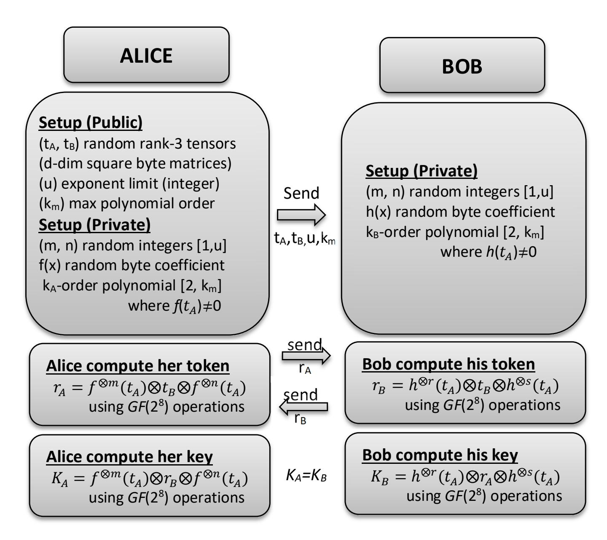

{0}------------------------------------------------

# **R-Propping of HK17: Upgrade for a Detached Proposal of NIST PQC First Round Survey**

### Pedro Hecht

Information Security Master, School of Economic Sciences, School of Exact and Natural Sciences and Engineering School (ENAP-FCE), University of Buenos Aires, Av. Cordoba 2122 2nd Floor, . CABA C1120AAP, República Argentina phecht@dc.uba.ar

**Abstract.** NIST is currently conducting the 3rd round of a survey to find postquantum class asymmetric protocols (PQC) [1]. We participated in a jointteam with a fellow researcher of the Interamerican Open University (UAI) with a Key-Exchange Protocol (KEP) called HK17 [2]. The proposal was flawed because Bernstein [3] found a weakness, which was later refined by Li [4] using a quadratic reduction of octonions and quaternions, albeit no objection about the published non-commutative protocol and the one-way trapdoor function (OWTF). This fact promoted the search for a suitable algebraic platform. HK17 had its interest because it was the only first-round offer strictly based on canonical group theory [5]. At last, we adapted the original protocol with the R-propping solution of 3-dimensional tensors [6], yielding Bernstein attack fruitless. Therefore, an El Gamal IND-CCA2 cipher security using Cao [7] arguments are at hand.

**Keywords:** Post-quantum cryptography, finite fields, rings, combinatorial group theory, R-propping, public-key cryptography, KEP, non-commutative cryptography, semantic security, IND-CCA2.

# **1 Introduction**

# **1.1 Goals of the original HK17 proposal**

It is noteworthy that besides a couple of described solutions [8], there remains overlooked solutions belonging to Non-Commutative (NCC) and Non-Associative (NAC) algebraic cryptography. The general structure of these solutions relies on protocols defining one-way trapdoor functions (OWTF) extracted from the combinatorial group theory [5].

The main objective was to develop a parametric family of multifunctional asymmetric protocols of the PQC class, based on the use of modular polynomials of hypercomplex numbers (quaternions, octonions) and OWTF derived from abstract algebra.

### **1.2 Flaw of the original HK17 platform**

Choosing hypercomplex numbers like quaternions and octonions was a failure. As Bernstein and later Li found, the following theorem lay the basis of the weakness.

*Theorem 1*. For any octonion = + ⋯ + , when all the coordinates of *o* are in ℤ , for any polynomial *g(x)* ∈ ℤ there exist *(a,b)* ∈ ℤ such that = + ∎

Therefore, every eight unknowns octonion polynomial reduces to a pair of integer unknowns. A similar deduction could be found for the renormalized quaternions version.

{1}------------------------------------------------

#### 1.3 Solution for the HK17 protocol

In this paper, we propose an algebraic patch to HK17 using theoretical well supported combinatorial solutions. Specifically, we switch from hypercomplex numbers to 3-dimensional matrices of AES-field polynomials (bytes) and from numerical operations to field operations [9]. Obviously, this class of matrices are rank-3 tensors [9]. We refer to this version as R-propped [6] HK17 or HK17+.

Essentially R-propping consists of replacing all numerical field operations (arithmetic sum and multiplication), a typical scalar proposal, by algebraic operations using the AES field, a vectorial proposal [9]. This scales up operations complexity foiling classical linearization attacks like AES does and at same time quantum ones. This is a solid way to achieve the best of two worlds, both pointing to cryptographic security

The R-propping solution is described as an Algebraic Extension Ring [9]

# 2 Schematic HK17+ key exchange protocol (KEP)



This is the R-propped version of the original HK17 protocol. The OWTF which protects the KEP, is the generalized symmetric decomposition problem as defined in [[4][6][7].

### 3 Step-by-step numeric example of HK17+

We use as example the following parameters:

 $k_m = k_A = k_B$  (polynomial degree) = 31

d (tensor -square matrix- dimension) = 3

u (upper limit for exponents) =  $2^{32}$  = 4,294,967,296

{2}------------------------------------------------

**Table 1**. Mathematica 11.3 code of an interpreted session of HK17+. Detailed notebook with full defined functions is available upon request to the author. Here u=zlimit, the upper limit for exponents.

{3}------------------------------------------------

**Table 2.** Output of the Mathematica 11.3 code of an interpreted session of HK17+.

{4}------------------------------------------------

#### Cryptographic security of HK17+ 4

There is no way to adapt Bernstein and Li attacks to this HK17+ instance and other simplifying linear attacks would equally fail because of the field operations involved. There are two brute-force attacks we consider:

#### First kind brute-force attack 4.1

As the private polynomial search space of does not depend on the dimension of public tensors, there are  $256^{k+1}$  Field Element Coefficient Polynomial of degree k and coefficients in  $\mathbb{Z}_{256}$ . To evaluate the computational effort, this cardinal we must the multiplied with the square of the integer exponent upper limit (zlimit) due to the private exponents pair (m, n). Here we present classical and quantum security levels as functions of the private keys polynomial degrees:

| k-degree of R-propped private key Polynomial and\nexponent *factor f=1 | Conservative<br>Classical<br>Security<br>(bits) | [Grover] Quantum Security (bits) | session time<br>(setup-<br>exchange-key<br>derivation)<br>(sec) | NIST security<br>level for PQC<br>proposals [6] |
|------------------------------------------------------------------------|-------------------------------------------------|----------------------------------|-----------------------------------------------------------------|-------------------------------------------------|
| 7                                                                      | 64                                              | 32                               | 2.5625                                                          | Insecure                                        |
| 15                                                                     | 128                                             | 64                               | 2.7656                                                          | Category 1                                      |
| 23                                                                     | 192                                             | 96                               | 3.1094                                                          | Category 3                                      |
| 31                                                                     | 256                                             | 128                              | 3.3594                                                          | Category 5                                      |

**Table 3.** Expected security and mean session time (Interpreted Mathematica 11.3) of increasing Polynomial degree used as private keys subject to classical and quantum attacks. To simplify interpretation, we consider here unitary exponents but in general the classical securities must be multiplied with a \*factor  $f = \lfloor 2\log_2 u \rfloor$  for u>1. For the 3rd-round NIST PQC selection, Category 5 parameters must be supplied.

#### 4.2 Second kind brute-force attack

This apparently more profitable attack searches directly the two unknown tensors powers replacing:

$$r_A = f^{\otimes m}(t_A) \otimes t_B \otimes f^{\otimes n}(t_A) \text{ or } r_B = h^{\otimes r}(t_A) \otimes t_b \otimes h^{\otimes s}(t_A)$$
 [1]  
 $r_A = x \otimes t_B \otimes y$  [2]  
 $K_A = x \otimes r_A \otimes y$  [3]

$$r_A = x \otimes t_B \otimes y \tag{2}$$

$$K_A = x \otimes r_A \otimes y \tag{3}$$

With equation [2] witch depends on any public tensor r and unknown tensors (x,y) who once solved allow computing [3], the session key. We assume that the u parameter is sufficiently big to foil power set brute-force explorations. This reduces SGDP to the DP problem [5] under field operations. A way to estimate present search difficulty is referring to matrix field operations and overall complexity will be related to dimension of the square matrices.

Suppose we work with 2-dim matrices (tensors), the pair (x,y) involves 8 unknown field elements (bytes) and 8 known field elements, equation [2] against ALICE could be defined as:

$$\binom{\mathsf{rA}_{11}}{\mathsf{rA}_{21}} \quad \overset{\mathsf{rA}_{12}}{\mathsf{rA}_{22}} = \binom{x_{11}}{x_{21}} \quad \overset{x_{12}}{x_{22}} \cdot \binom{\mathsf{tB}_{11}}{\mathsf{tB}_{21}} \quad \overset{\mathsf{tB}_{12}}{\mathsf{tB}_{22}} \cdot \binom{y_{11}}{y_{21}} \quad \overset{y_{12}}{y_{22}} )$$
 [4]

In expanded form, the rA matrix become:

{5}------------------------------------------------

```
 [5]
```

As a result, 2-dim attack involves 32 field product and 12 field sum operation. Considering that byte sums and multiplications in GF(2<sup>8</sup>) could be hardcoded (like AES does), each field operation involves 44 elementary lookup operations. Expanding the exposed equations, they resume into a set of 4 nonlinear equations:

```
 [6]
```

This non-linear set of four equations in 8 variables could not be linearized so a residual way to solve would be to perform a systematic exploration of 2-dim matrices space for each variable. As a result, each variable takes 256 values giving a total of 256<sup>8</sup>combinations, a 64-bit space. Similarly, given a greater dimension like 3, there would appear a nonlinear system of 9 equations with 18 unknowns, yielded a search space of 144-bit. Table 4. resumes further security levels.

| d-degree<br>of matrices (tensors) | Classical<br>Security<br>(bits) | [Grover]<br>Quantum<br>Security<br>(bits) | NIST security<br>level for PQC<br>proposals [6] |
|-----------------------------------|---------------------------------|-------------------------------------------|-------------------------------------------------|
| 2                                 | 64                              | 32                                        | Insecure                                        |
| 3                                 | 144                             | 72                                        | Category 1                                      |
| 4                                 | 256                             | 128                                       | Category 5                                      |
| 5                                 | 400                             | 200                                       | Category>>5                                     |

**Table 4.** Expected security of increasing matrix (tensor) dimension of HK17+ against classical and quantum attacks if the second kind of brute-force attack is used. Clearly any randomized polynomial time attack must find a better algorithm to proceed.

# **5 Conclusions**

We present a reasonable way to increase the security of the original HK17 protocol simply switching from hypercomplex numbers to rank-3 tensors and GF(2<sup>8</sup>) operations. For real-life use we recommend using at least k=31 and d=4 to reach NIST Category 5 security. Further works of the author covering PQC can be found at [10].

# **References**

- 1. NIST, https://www.nist.gov/news-events/news/2020/07/pqc-standardizationprocess-third-round-candidate-announcement, 2020
- 2. P. Hecht, J, Kamlofsky, HK17: Post Quantum Key Exchange Protocol Based on Hypercomplex Numbers, NIST PQC Standarization Proposals, Round 1, https://csrc.nist.gov/projects/post-quantum-cryptography/round-1-submissions, 2017
- 3. D. Bernstein, T. Lange, HK17 Official Comment, Dec 25., https://csrc.nist.gov/CSRC/media/Projects/Post-Quantum-Cryptography/documents/round-1/official-comments/HK17-official-comment.pdf, 2017
- 4. H. Li, R. Liu, Y. Pan, T. Xie, Cryptanalysis of HK17, Cryptology ePrint https://eprint.iacr.org/2017/1259.pdf, 2017
- 5. A. Myasnikov, V. Shpilrain, A. Ushakov, Non-commutative Cryptography and Complexity of Group-theoretic Problems, Mathematical Surveys and Monographs, AMS Volume 177, 2011

{6}------------------------------------------------

- 6. P. Hecht, PQC: R-Propping of Public-Key Cryptosystems Using Polynomials over Noncommutative Algebraic Extension Rings, Preprint IACR, https://eprint.iacr.org/2020/1102.pdf
- 7. Z. Cao, X. Lei, L. Wang, New Public Key Cryptosystems Using Polynomials over Noncommutative Rings, Preprint IACR, http://eprint.iacr.org/2007/009.pdf 1.2
- 8. D. J. Bernstein, T. Lange, "Post-Quantum Cryptography", Nature, 549:188-194, 2017.
- 9. P. Hecht, Algebraic Extension Ring Framework for Non-Commutative Asymmetric Cryptography, Preprint ,arXiv https://arxiv.org/ftp/arxiv/papers/2002/2002.08343.pdf 1.2, 2020
- 10. https://arxiv.org/a/hecht\_p\_1.html