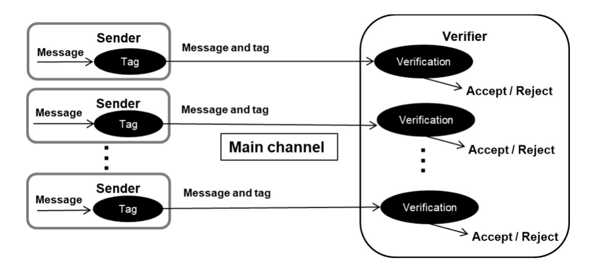
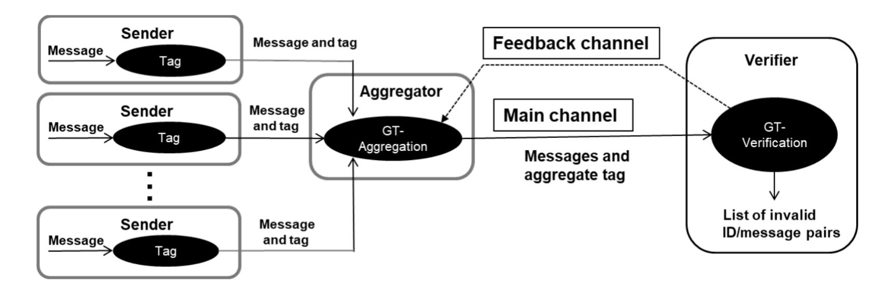
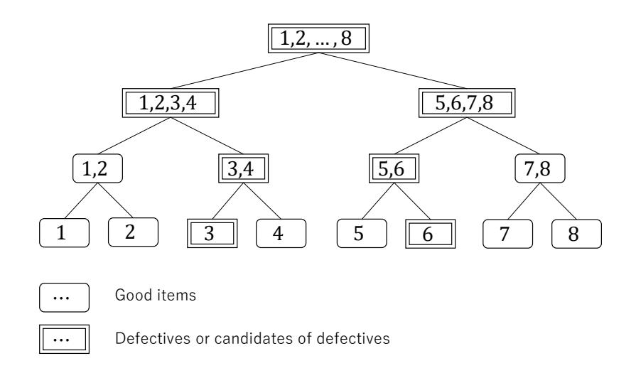

{0}------------------------------------------------

# **Interactive Aggregate Message Authentication Equipped with Detecting Functionality from Adaptive Group Testing***<sup>⋆</sup>*

Shingo Sato<sup>1</sup> and Junji Shikata<sup>2</sup>

- <sup>1</sup> National Institute of Information and Communications Technology (NICT), Japan shingo-sato@nict.go.jp
  - <sup>2</sup> Graduate School of Environment and Information Sciences, and Institute of Advanced Sciences, Yokohama National University, Yokohama, Japan shikata-junji-rb@ynu.ac.jp

**Abstract.** In this paper, we propose a formal security model and a construction methodology of interactive aggregate message authentication with detecting functionality (IAMD). The IAMD is an interactive aggregate MAC protocol which can identify invalid messages with a small amount of tag-size. Several aggregate MAC schemes that can specify invalid messages has been proposed so far by using non-adaptive group testing in the prior work. In this paper, we utilize adaptive group testing to construct IAMD scheme, and we show that the resulting IAMD scheme can identify invalid messages with a small amount of tag-size compared to the previous schemes.

**Keywords:** aggregate message authentication, adaptive group testing, message authentication code.

# **1 Introduction**

### **1.1 Background**

The number of IoT (Internet of Things) devices is increasing, and there would be an enormous number of devices connected to the Internet in near future. Hence, we would need efficient data-transmissions with lots of communicating devices in an authenticated manner in networks including wireless networks in 5G and beyond.

Usually, we consider the message authentication code (MAC) as a lightweight cryptographic primitive for message authentication, however, the one-to-one authenticated communication by MACs would lead to heavy traffic in the network: This is because the number of MAC-tags is proportional to that of messages sent from IoT devices, and hence an enormous number of MAC-tags will be transmitted if there will be a huge number of communicating IoT devices (see Fig.

*<sup>⋆</sup>* The preliminary version of this paper appeared in [13]. This paper is revised and extended, and a full version of it.

{1}------------------------------------------------

1). One may think of the aggregate message authentication code (AMAC for short) to reduce MAC-tags: AMAC is a cryptographic primitive proposed by Katz and Lindell [6] that can compress MAC-tags on multiple messages into a short aggregate tag. However, it is not enough to use it, since we cannot identify an IoT device that has sent an invalid message from the aggregate tag in general, namely AMAC has functionality of compressing MAC-tags but does not have functionality of identifying an invalid message among lots of messages.

Recently, Hirose and Shikata [4] proposed AMAC that has the functionality of both compressing multiple MAC-tags into a short aggregate tag and identifying an invalid message from the aggregate tag, and we call it AMAC with detecting functionality (AMAD for short). The model of AMAD in [4] considers keyless aggregation like AMAC in [6], and AMAD is constructed in [4] from non-adaptive group testing in addition to the underlying MAC scheme in a generic way. The resulting AMAD can reduce the total tag-size compared to that of the one-to-one authenticated communication by MAC, and it can be applied without changing structures of the underlying MACs, though we need to assume the number of invalid messages is much smaller than the number of all messages sent from IoT devices (see [4] in details) due to the restriction on designing non-adaptive group testing (or disjunct matrices) [14]. Related work by applying non-adaptive group testing in cryptography includes [8, 9, 12, 10], however, there is no work reported for applications of adaptive group testing in cryptography.

In this paper, we consider an interactive AMAD (IAMD for short) that is an interactive version of AMAD (see Fig. 2 for overview of IAMD). For constructing IAMD in general, we propose to use *adaptive group testing* in addition to the underlying MAC scheme, by which we expect IAMD achieves much better compression compared to AMAD, since adaptive group testing is more powerful than non-adaptive group testing in terms of the number of required tests.



**Fig. 1.** One-to-one authenticated communication by MACs.

{2}------------------------------------------------



**Fig. 2.** Overview of Interactive Aggregate MAC with Detecting Functionality (IAMD): An aggregator and a verifier communicate each other by using the above two channels. A main channel is an insecure one, and a feedback channel is an authenticated one with low bandwidth.

### **1.2 Our Contribution**

The contribution of this paper is as follows.

- **–** In Section 3, we introduce a formal model of adaptive group testing (AGT), since we want to deal with AGT in a comprehensive way to construct IAMD in a generic way. Although several instantiations of AGT have been proposed so far, as far as we know, there is no formal model that comprehensively captures those instantiations. In addition, we show that several interesting instantiations are captured in our model, which implies that our model for AGT is reasonable.
- **–** In Section 4, we propose a formal model of IAMD and formalize security notions of IAMD along with the model. Specifically, we formalize the notions of *unforgeability* and *identifiability* in the context of IAMD, where identifiability consists of *completeness* and *soundness*. We also define a notion of *weak-soundness* which is a relaxed version of soundness.
- **–** In Section 5, we propose construction of IAMD. Specifically, we propose a generic construction of IAMD starting from any AGT and AMAC with formal security proofs. By applying AGT to aggregation and verification algorithms, which will be called GTAgg and GTVrfy respectively, it is possible to realize the detecting functionality. The advantage of this generic construction lies in applying any AGT and AMAC. We also provide several concrete constructions of IAMD by applying several AGT and AMAC to the generic construction. In addition, we compare those resulting IAMD constructions in terms of the following evaluation items: total amount of tag-size, number of stages, preknowledge on the number of invalid messages assumed, and security-levels. In particular, we show that the IAMD construction from the digging algorithm and hash-based AMAC would be best, if we put importance on all the evaluation items except for the number of stages.

{3}------------------------------------------------

#### 2 Preliminaries

In this paper, we use the following notation: For a positive integer n, let  $[n] = \{1, \ldots, n\}$ . For any values  $x_1, \ldots, x_n$  and a subset  $I \subseteq [n]$  of indexes, let  $\{x_i\}_{i \in I}$  be the set of values indexes of which are in I and let  $(x_i)_{i \in I}$  be the sequence of values indexes of which are in I. Let  $\emptyset$  be the empty set, and null denotes the empty-string that means no data. A function  $\epsilon : \mathbb{N} \to [0,1]$  is negligible in n, if we have  $\epsilon(n) < 1/g(n)$  for any polynomial g and sufficiently large  $n \in \mathbb{N}$ . A negligible function in n is denoted by  $\operatorname{negl}(n)$ . A polynomial of n is denoted by  $\operatorname{negl}(n)$ . Probabilistic polynomial-time is abbreviated as PPT.

### 2.1 Message Authentication Code (MAC)

A MAC function is defined as a keyed function  $F: \mathcal{K} \times \mathcal{M} \to \mathcal{T}$ , where for a security parameter  $\lambda$ ,  $\mathcal{K} = \mathcal{K}(\lambda)$  is a key space,  $\mathcal{M} = \mathcal{M}(\lambda)$  is a message space, and  $\mathcal{T} = \mathcal{T}(\lambda)$  is a tag space. We write  $F_{\mathsf{k}}(\cdot) = F(\mathsf{k}, \cdot)$  for any  $\mathsf{k} \in \mathcal{K}$ . Security of MAC functions is defined as follows.

**Definition 1 (Unforgeability).** A MAC function F meets unforgeability if for any PPT adversary A against F, the advantage  $Adv_{F,A}^{uf}(\lambda) := Pr[Expt(A) \rightarrow 1]$  is negligible in  $\lambda$ , where the experiment Expt(A) is defined as follows:

**Setup:**  $k \stackrel{U}{\leftarrow} \mathcal{K}$ ,  $\mathcal{L}_{\mathsf{Tag}} \leftarrow \emptyset$ , win  $\leftarrow 0$ .

Oracle Access: A is allowed to access the following oracles:

- $O_{\mathsf{Tag}}(\mathsf{m})$ : Given a message  $\mathsf{m} \in \mathcal{M}$ , the tagging oracle  $O_{\mathsf{Tag}}$  returns  $F_{\mathsf{k}}(\mathsf{m})$  and sets  $\mathcal{L}_{\mathsf{Tag}} \leftarrow \mathcal{L}_{\mathsf{Tag}} \cup \{\mathsf{m}\}$ .
- $O_{\mathsf{Vrfy}}(\mathsf{m}, \tau)$ : Given a pair  $(\mathsf{m}, \tau) \in \mathcal{M} \times \mathcal{T}$  of a message and a tag, the verification oracle  $O_{\mathsf{Vrfy}}$  returns 1 if  $F_{\mathsf{k}}(\mathsf{m}) = \tau$ , and returns 0 otherwise. It sets win  $\leftarrow 1$  if  $F_{\mathsf{k}}(\mathsf{m}) = \tau$  and  $\mathsf{m} \notin \mathcal{L}_{\mathsf{Tag}}$ .

**Output:** When A halts, output 1 if win = 1, and output 0 otherwise.

## 2.2 Aggregate MAC (AMAC)

An aggregate MAC (AMAC) scheme consists of a four-tuple of polynomialtime algorithms (KGen, Tag, Agg, Vrfy) as follows: For a security parameter  $\lambda$ ,  $n = \mathsf{poly}(\lambda)$  is the number of senders,  $\mathcal{ID} = \{\mathsf{id}_1, \ldots, \mathsf{id}_n\}$  (where  $\mathsf{id}_i \in \{0, 1\}^{\lambda}$ for  $i \in [n]$ ) is an ID space,  $\mathcal{K} = \mathcal{K}(\lambda)$  is a key space,  $\mathcal{M} = \mathcal{M}(\lambda)$  is a message space,  $\mathcal{T} = \mathcal{T}(\lambda)$  is a tag space, and  $\mathcal{T}_{\mathsf{Agg}} = \mathcal{T}_{\mathsf{Agg}}(\lambda)$  is an aggregate-tag space:

**Key Generation:** A randomized algorithm KGen takes as input a security parameter  $1^{\lambda}$  and an ID id  $\in \mathcal{ID}$ , and it outputs a secret key  $k_{id} \in \mathcal{K}$  corresponding to the ID id.

**Tagging:** A deterministic or randomized algorithm Tag takes as input a secret key k and a message  $m \in \mathcal{M}$ , and it outputs a tag  $\tau \in \mathcal{T}$ .

{4}------------------------------------------------

**Aggregation:** A deterministic or randomized algorithm Agg takes as input a set  $\{(\mathsf{id}^{(1)}, \tau_1), \ldots, (\mathsf{id}^{(n_a)}, \tau_{n_a})\}$  of distinct pairs of an ID and a tag  $(2 \le n_a \le n)$ , where  $\mathsf{id}^{(i)} \in \mathcal{ID}$  and  $\tau_i \in \mathcal{T}$  for all  $i \in [n_a]$ . It outputs an aggregate tag  $T \in \mathcal{T}_{\mathsf{Agg}}$ . Notice that  $(\mathsf{id}^{(i)}, \mathsf{m}_i) \ne (\mathsf{id}^{(j)}, \mathsf{m}_j)$  for any  $i, j \in [n_a]$  such that  $i \ne j$ .

**Verification:** A deterministic algorithm Vrfy takes as input a set  $\{k_{id_i}\}_{i\in[n]}$  of secret keys, a set  $M = \{(id^{(1)}, m_1), \dots, (id^{(n_a)}, m_{n_a})\}$  of pairs of an ID and a message, and an aggregate tag T, and it outputs 1 (acceptance) or 0 (rejection).

It is required that AMAC schemes meet correctness: An AMAC scheme AMAC = (KGen, Tag, Agg, Vrfy) meets correctness if for all  $i \in [n]$ , all  $\mathsf{k}_{\mathsf{id}_i} \leftarrow \mathsf{KGen}(1^\lambda, \mathsf{id}_i)$ , and all  $\mathsf{m}_i \in \mathcal{M}$ , we have  $\mathsf{Vrfy}(\{\mathsf{k}_{\mathsf{id}_i}\}_{i \in [n]}, M, T) = 1$ , where  $M = \{(\mathsf{id}^{(1)}, \mathsf{m}_1), \ldots, (\mathsf{id}^{(n_a)}, \mathsf{m}_{n_a})\}, T \leftarrow \mathsf{Agg}(\{(\mathsf{id}^{(1)}, \tau_1), \ldots, (\mathsf{id}^{(n_a)}, \tau_{n_a})\})$  and for all  $i \in [n_a]$ ,  $\mathsf{id}^{(i)} \in \mathcal{ID}$  and  $\tau_i \leftarrow \mathsf{Tag}(\mathsf{k}_{\mathsf{id}^{(i)}}, \mathsf{m}_i)$ .

Security of AMAC schemes is defined as follows.

**Definition 2 (Unforgeability).** An AMAC scheme AMAC = (KGen, Tag, Agg, Vrfy) meets unforgeability if for any PPT adversary A against AMAC, the advantage  $Adv_{AMAC,A}^{uf}(\lambda) := Pr[Expt(A) \rightarrow 1]$  is negligible in  $\lambda$ , where the experiment Expt(A) is defined as follows:

Setup:  $\forall i \in [n]$ ,  $k_{\mathsf{id}_i} \leftarrow \mathsf{KGen}(1^{\lambda}, \mathsf{id}_i)$ ,  $\mathcal{L}_{\mathsf{Tag}} \leftarrow \emptyset$ ,  $\mathcal{L}_{\mathsf{Corr}} \leftarrow \emptyset$ , win  $\leftarrow 0$ . Oracle Access: A is allowed to access the following oracles:

- $O_{\mathsf{Tag}}(\mathsf{id},\mathsf{m})$ : Given a pair  $(\mathsf{id},\mathsf{m}) \in \mathcal{ID} \times \mathcal{M}$  of an ID and a message, the tagging oracle  $O_{\mathsf{Tag}}$  returns  $\tau \leftarrow \mathsf{Tag}(\mathsf{k}_{\mathsf{id}},\mathsf{m})$  and sets  $\mathcal{L}_{\mathsf{Tag}} \leftarrow \mathcal{L}_{\mathsf{Tag}} \cup \{(\mathsf{id},\mathsf{m})\}$ .
- $O_{\mathsf{Corr}}(\mathsf{id})$ : Given an ID  $\mathsf{id}$ , the corruption oracle  $O_{\mathsf{Corr}}$  returns the corresponding  $k_{\mathsf{id}}$  and sets  $\mathcal{L}_{\mathsf{Corr}} \leftarrow \mathcal{L}_{\mathsf{Corr}} \cup \{\mathsf{id}\}$ .
- $O_{\mathsf{Vrfy}}(M,T)$ : Given a set  $M = \{(\mathsf{id}^{(1)},\mathsf{m}_1),\ldots,(\mathsf{id}^{(n_a)},\mathsf{m}_{n_a})\}$  of pairs of an ID and a message, and an aggregate tag  $T \in \mathcal{T}_{\mathsf{Agg}}$ , the verification oracle  $O_{\mathsf{Vrfy}}$  returns  $b \leftarrow \mathsf{Vrfy}(\{\mathsf{k}_{\mathsf{id}_i}\}_{i\in[n]},M,T) \in \{0,1\}$ . It sets  $\mathsf{win} \leftarrow 1$  if b = 1 and there exists  $(\mathsf{id}^{(i)},\mathsf{m}_i) \in M$   $(i \in [n_a])$  such that  $\mathsf{id}^{(i)} \notin \mathcal{L}_{\mathsf{Corr}}$  and  $(\mathsf{id}^{(i)},\mathsf{m}_i) \notin \mathcal{L}_{\mathsf{Tag}}$ .

**Output:** When A halts, output 1 if win = 1, and output 0 otherwise.

### 3 Adaptive Group Testing (AGT)

# 3.1 Background and Contribution

**Group Testing.** Group testing (e.g., [2]) is a method to specify some special items called *defectives* among many whole items with a small number of tests than the trivial individual testing for each item. The applications of group testing include screening blood samples for detecting a disease, and detecting clones which have a particular DNA sequence.

{5}------------------------------------------------

The first paper about group testing is published by Dorfman [1]. The group testing techniques are classified into two types: the first type means the testing techniques by non-adaptive strategies, called non-adaptive group testing [15, 11, 3], and the second type means the techniques by adaptive strategies, called adaptive group testing (or called sequential group testing) [1, 7, 5, 3]. Suppose that there are totally *n* items of which there are (at most) *d* defectives. In nonadaptive group testing, we need to know *d* beforehand and to select all the subsets of *n* items to be tested without knowing the results of other tests. This type of testing is typically designed by providing a *d*-disjunct matrix or a *d*separable matrix (e.g., see [2]). On the other hand, in adaptive group testing, we can do tests several times such that we can select a subset of items to be tested after observing the result of the previous test. In particular, a competitive group testing is an adaptive group testing which does not need to know *d* (i.e., the number of defectives) beforehand, and this type of testing is useful in a real application when it is not easy to estimate *d* beforehand.

**Our Contribution.** In this paper, we introduce a formal model of adaptive group testing (AGT) protocols, since we want to deal with AGT in a comprehensive way to construct IAMD in a generic way. Although several instantiations of AGT have been proposed so far, as far as we know, there is no formal model that comprehensively captures those instantiations. In Section 3.4, we propose a formal model of AGT as an interactive protocol. In Section 3.5, we show that several interesting instantiations (i.e., concrete constructions) are captured in our model, which implies that our model of AGT is reasonable.

### **3.2 Informal Description of AGT**

In an AGT protocol, two entities Group-selector and Inspector denoted by GS and IS, respectively, interactively communicate to detect all the defectives among items. In each interaction process, GS selects a group (i.e., a subset of items) and generates a compressed item-data from multiple item-data of the group. Then, GS sends the compressed data to IS. Given compressed item-data from GS, IS checks whether the corresponding items of the group contains any defectives by using a testing mechanism, where it is supposed to be able to check whether an arbitrarily selected subset of items includes a defective by testing only once. IS updates a list of defective-candidates based on the tested result, and sends the tested result to GS. This process is repeated between GS and IS, until IS finally outputs a list of defectives. This leads to the informal definition of AGT as follows.

**Definition 3 (Informal).** GS *and* IS *interactively performs the following procedures:*

GS**:** *The set of item-data I including some defectives is given as input. First,* GS *selects a group (i.e., a subset of items) to be tested by using a group-selection algorithm* Gsel*. Then,* GS *compresses multiple item-data in the selected group into a compressed item-data by using a compression algorithm* Coms*, and it* 

{6}------------------------------------------------

sends the compressed item-data to IS. Next, GS repeats the following procedures:

- 1. Receive the tested result on compressed item-data from IS.
- 2. Select a subset of items to be tested next by using Group-selection algorithm Gsel.
- 3. For each selected set, compress item-data included in the set into a compressed item-data by using Coms.
- 4. Send all the compressed item-data of the selected sets with their IDs to IS.
- IS: The set V of verification-data is given as input. First, IS receives  $\mathcal{ID}$  and a compressed item-data of the selected group (i.e., a subset of items) from GS. IS uses a testing algorithm Test with inputting a compressed item-data to check whether there is a defective in the selected group. If Test outputs 1 (negative), it means there is no defective in the group; If Test outputs 0 (positive), it means there is a defective in the group. Then, IS updates a list J of IDs of defective candidates by eliminating IDs in the group if testing result is negative, and send all the tested results to GS. Next, IS repeats the following procedures:
  - 1. Receive compressed item-data for the selected sets from IS.
  - 2. Select a subset of items to be tested next by using Group-selection algorithm Gsel, as GS does.
  - 3. For each selected set, use Test with inputting a compressed item-data of the selected set to check whether there is a defective in it. If Test outputs 1 (negative), update a list J of IDs of defective candidates by eliminating IDs in the selected set. Then, send all the results of testing to GS.

Finally, IS outputs a list J of all defectives' IDs.

#### 3.3 Formal Definition of Items and Defectives

Let  $\mathcal{ID} = \{id_1, id_2, \dots, id_n\}$  be a set of IDs used for distinguishing objects to be tested. An *item* denotes a pair (id, data) consisting of an ID and an item-data in spaces  $\mathcal{ID}$  and  $\mathcal{X}$ , respectively. A *defective* means a particular item, and a *good item* means an item which is not a defective. A *verification-item* is a pair (id, vrf)  $\in \mathcal{ID} \times \mathcal{Y}$  of an ID and a verification-item which will be used to decide whether a target item is a defective. Let  $\mathcal{I} = \{(id^{(i)}, data_i)\}_{i \in [n]}$  be the set of all items including some defectives. Notice that for any distinct  $i, j \in [n]$ ,  $(id^{(i)}, data_i) \neq (id^{(j)}, data_j)$  holds. Let  $\mathcal{V} = \{(id^{(i)}, vrf_i)\}_{i \in [n]}$  be a set of all verification-items. For each item  $(id^{(i)}, data_i)$ , we can check whether or not  $(id^{(i)}, data_i)$  is a defective by testing with the corresponding verification-item  $(id^{(i)}, vrf_i)$ . However, if we individually test it for  $i = 1, 2, \ldots, n$ , we need testing n times to specify all the defectives. In a scenario of group testing, it is supposed to check whether or not an arbitrarily selected subset of items includes a defective by testing only once, and the purpose is to specify all the defectives with smaller number of testing.

{7}------------------------------------------------

In this paper, we introduce a definition of good items and defectives more strictly by using a (binary) relation as follows. We define a relation<sup>3</sup>  $R: \mathcal{X} \times \mathcal{Y} \to \{\top, \bot\}$  that takes  $\mathsf{data} \in \mathcal{X}$  and  $\mathsf{vrf} \in \mathcal{Y}$ , and then it evaluates  $\top$  or  $\bot$ . An item  $(\mathsf{id}, \mathsf{data}) \in \mathcal{I}$  is defined as a defective (resp., a good item), if we have  $R(\mathsf{data}, \mathsf{vrf}) = \bot$  (resp.,  $R(\mathsf{data}, \mathsf{vrf}) = \top$ ) for the corresponding verification-

3.4 Formal Model of AGT

item (id, vrf)  $\in \mathcal{V}$ .

8

An AGT protocol is defined as follows.

**Definition 4 (Formal).** An adaptive group testing (AGT) protocol is an interactive protocol between GS and IS with three polynomial-time algorithms<sup>4</sup> (Coms, Gsel, Test).  $\mathcal{ID} = \{ \mathsf{id}_1, \ldots, \mathsf{id}_n \}$  is a set of  $\mathit{IDs}, \mathcal{I} = \{ (\mathsf{id}^{(1)}, \mathsf{data}_1), \ldots, (\mathsf{id}^{(n)}, \mathsf{data}_n) \}$  is a set of items,  $\mathcal{V} = \{ (\mathsf{id}^{(1)}, \mathsf{vrf}_1), \ldots, (\mathsf{id}^{(n)}, \mathsf{vrf}_n) \}$  is a set of verification-items. For a subset  $\mathcal{G} \subseteq \mathcal{I}$ , we define  $\mathcal{V}(\mathcal{G}) = \{ (\mathsf{id}^{(i)}, \mathsf{vrf}_i) \mid i \in [n] \land (\mathsf{id}^{(i)}, \mathsf{data}_i) \in \mathcal{G} \}$ .

- $-\left(\{\mathcal{G}_{1}^{(s)},\ldots,\mathcal{G}_{u^{(s)}}^{(s)}\},ST^{(s)}\right)\leftarrow\mathsf{Gsel}(J^{(s-1)},\{\mathcal{G}_{1}^{(s-1)},\ldots,\mathcal{G}_{u^{(s-1)}}^{(s-1)}\},ST^{(s-1)})\colon$  A group-selection algorithm  $\mathsf{Gsel}$  is a deterministic algorithm by which a group of  $\mathsf{IDs}$  (i.e., a subset of  $\mathsf{ID}$ ) to be tested next is determined. At the stage, it takes as input a set  $J^{(s-1)}\subseteq \mathcal{I}$  which means defective candidates'  $\mathsf{IDs}$ , subsets  $\mathcal{G}_{i}^{(s-1)}\subseteq \mathcal{I}$  ( $i=1,2,\ldots,u^{(s-1)}$ ) which means the current group-selection, and the current internal state  $\mathsf{ST}^{(s-1)}$ . Then, it outputs subsets  $\mathcal{G}_{i}^{(s)}\subseteq \mathcal{I}$  ( $i=1,2,\ldots,u^{(s)}$ ) and  $\mathsf{ST}^{(s)}$  which means next group-selection and next internal state, respectively.
- com  $\leftarrow$  Coms( $\mathcal{G}$ ): A compression algorithm Coms is a deterministic algorithm which takes as input a subset  $\mathcal{G} \subseteq \mathcal{I}$ , and it outputs a compressed item-data com generated from the items  $\mathcal{G}$ . Specifically, for  $\mathcal{G} = \{(\mathsf{id}^{(i_1)}, \mathsf{data}_{i_1}), \ldots, (\mathsf{id}^{(i_j)}, \mathsf{data}_{i_j})\}$ , a compressed item-data com of  $\mathcal{G}$  is generated from  $\mathsf{data}_{i_1}, \ldots, \mathsf{data}_{i_j}$ .
- $-1/0 \leftarrow \mathsf{Test}(\mathcal{V}(\mathcal{G}), \mathsf{com})$ : A testing algorithm  $\mathsf{Test}$  is a deterministic algorithm that takes as input a subset  $\mathcal{V}(\mathcal{G}) \subseteq \mathcal{V}$ , and a compressed item-data  $\mathsf{com} \in \mathcal{Z}$ . It outputs 1 (negative) if there is no defective in items from which the compressed item-data  $\mathsf{com}$  is generated; and it outputs 0 (positive) if there is a defective in items from which the compressed item-data  $\mathsf{com}$  is generated.

An N-stage protocol  $\mathsf{AGT}(\mathcal{I},\mathcal{V}) = \langle \mathsf{GS}(\mathcal{I}), \mathsf{IS}(\mathcal{V}) \rangle$  is expressed as follows: Set  $s \leftarrow 1$ ,  $u^{(0)} = 1$  and  $\mathcal{G}_1^{(0)} \leftarrow \mathcal{ID}$ ,  $J^{(0)} \leftarrow \mathcal{ID}$ ,  $ST^{(0)} \leftarrow \mathsf{null}$ . At the s-th stage  $(s = 1, 2, \ldots, N)$ ,  $\mathsf{GS}(\mathcal{I})$  and  $\mathsf{IS}(\mathcal{V})$  do the following:

$$\begin{split} &\mathsf{GS}(\mathcal{I}) \colon \mathit{If} \ s = 1, \ \mathit{start} \ \mathit{from} \ \mathit{Step} \ 2. \\ &- \ \mathit{Step} \ 1 \colon \mathit{Receive} \ (b_1^{(s-1)}, \dots, b_{u^{(s-1)}}^{(s-1)}) \in \{0,1\}^{u^{(s-1)}} \ \mathit{from} \ \mathsf{IS}, \ \mathit{and} \ \mathit{set} \ \mathit{J}^{(s-1)} \leftarrow \\ & \ \mathit{J}^{(s-2)} \backslash \{ (\mathsf{id}, \mathsf{data}) \mid i \in [u^{(s-1)}] \land b_i^{(s-1)} = 1 \land (\mathsf{id}, \mathsf{data}) \in \mathcal{G}_i^{(s-1)} \}. \end{split}$$

A relation is given as a subset  $\mathcal{R} \subseteq \mathcal{X} \times \mathcal{Y}$ , but this is equivalent to the mapping  $R: \mathcal{X} \times \mathcal{Y} \to \{\top, \bot\}$  by considering  $R(x, y) = \top$  iff  $(x, y) \in \mathcal{R}$  for all  $(x, y) \in \mathcal{X} \times \mathcal{Y}$ .

<sup>&</sup>lt;sup>4</sup> In a broader class of group testing, Coms and Test are not always given as algorithms, and they might be given as medical, chemical, or physical experiments.

{8}------------------------------------------------

$$\begin{array}{c} \underline{\mathsf{GS}} & \underline{\mathsf{IS}} \\ (\{\mathcal{G}_i^{(s)}\}_{i \in [u^{(s)}]}, ST^{(s)}) \\ \leftarrow \mathsf{Gsel}(J^{(s-1)}, \{\mathcal{G}_i^{(s-1)}\}_{i \in [u^{(s-1)}]}, ST^{(s-1)}) \\ \mathsf{For each } i \in [u^{(s)}] : \\ \mathsf{com}_i^{(s)} \leftarrow \mathsf{Coms}(\mathcal{G}_i^{(s)}) & (\mathsf{com}_i^{(s)})_{i \in [u^{(s)}]} \\ & & \\ & & \\ & & \\ & & \\ & & \\ & & \\ & & \\ & & \\ & & \\ & & \\ & & \\ & & \\ & & \\ & & \\ & & \\ & & \\ & & \\ & & \\ & & \\ & & \\ & & \\ & & \\ & & \\ & & \\ & & \\ & & \\ & & \\ & & \\ & & \\ & & \\ & & \\ & & \\ & & \\ & & \\ & & \\ & & \\ & & \\ & & \\ & & \\ & & \\ & & \\ & & \\ & & \\ & & \\ & & \\ & & \\ & & \\ & & \\ & & \\ & & \\ & & \\ & & \\ & & \\ & & \\ & & \\ & & \\ & & \\ & & \\ & & \\ & & \\ & & \\ & & \\ & & \\ & & \\ & & \\ & & \\ & & \\ & & \\ & & \\ & & \\ & & \\ & & \\ & & \\ & & \\ & & \\ & & \\ & & \\ & & \\ & & \\ & & \\ & & \\ & & \\ & & \\ & & \\ & & \\ & & \\ & & \\ & & \\ & & \\ & & \\ & & \\ & & \\ & & \\ & & \\ & & \\ & & \\ & & \\ & & \\ & & \\ & & \\ & & \\ & & \\ & & \\ & & \\ & & \\ & & \\ & & \\ & & \\ & & \\ & & \\ & & \\ & & \\ & & \\ & & \\ & & \\ & & \\ & & \\ & & \\ & & \\ & & \\ & & \\ & & \\ & & \\ & & \\ & & \\ & & \\ & & \\ & & \\ & & \\ & & \\ & & \\ & & \\ & & \\ & & \\ & & \\ & & \\ & & \\ & & \\ & & \\ & & \\ & & \\ & & \\ & & \\ & & \\ & & \\ & & \\ & & \\ & & \\ & & \\ & & \\ & & \\ & & \\ & & \\ & & \\ & & \\ & & \\ & & \\ & & \\ & & \\ & & \\ & & \\ & & \\ & & \\ & & \\ & & \\ & & \\ & & \\ & & \\ & & \\ & & \\ & & \\ & & \\ & & \\ & & \\ & & \\ & & \\ & & \\ & & \\ & & \\ & & \\ & & \\ & & \\ & & \\ & & \\ & & \\ & & \\ & & \\ & & \\ & & \\ & & \\ & & \\ & & \\ & & \\ & & \\ & & \\ & & \\ & & \\ & & \\ & & \\ & & \\ & & \\ & & \\ & & \\ & & \\ & & \\ & & \\ & & \\ & & \\ & & \\ & & \\ & & \\ & & \\ & & \\ & & \\ & & \\ & & \\ & & \\ & & \\ & & \\ & & \\ & & \\ & & \\ & & \\ & & \\ & & \\ & & \\ & & \\ & & \\ & & \\ & & \\ & & \\ & & \\ & & \\ & & \\ & & \\ & & \\ & & \\ & & \\ & & \\ & & \\ & & \\ & & \\ & & \\ & & \\ & & \\ & & \\ & & \\ & & \\ & & \\ & & \\ & & \\ & & \\ & & \\ & & \\ & & \\ & & \\ & & \\ & & \\ & & \\ & & \\ & & \\ & & \\ & & \\ & & \\ & & \\ & & \\ & & \\ & & \\ & & \\ & & \\ & & \\ & & \\ & & \\ & & \\ & & \\ & & \\ & & \\ & & \\ & & \\ & & \\ & & \\ & & \\ & & \\ & & \\ & & \\ & & \\ & & \\ & & \\ & & \\ & & \\ & & \\ & & \\ & & \\ & & \\ & & \\ & & \\ & & \\ & & \\ & & \\$$

**Fig. 3.** Process of AGT protocols in the j-th stage

```
• If s > N or J^{(s-1)} = \emptyset, then halt.

• Otherwise, move to Step 2.

- Step 2: (\{\mathcal{G}_1^{(s)}, \dots, \mathcal{G}_{u^{(s)}}^{(s)}\}, ST^{(s)}) \leftarrow \mathsf{Gsel}(J^{(s-1)}, \{\mathcal{G}_1^{(s-1)}, \dots, \mathcal{G}_{u^{(s-1)}}^{(s-1)}\}, ST^{(s-1)}).

- Step 3: \forall i \in [u^{(s)}] : \mathsf{com}_i^{(s)} \leftarrow \mathsf{Coms}(\mathcal{G}_i^{(s)}).

- Step 4: Send \ (\mathsf{com}_1^{(s)}, \dots, \mathsf{com}_{u^{(s)}}^{(s)}) \ to \ \mathsf{IS}.

\mathsf{IS}(\mathcal{V}):

- Step 1: Receive \ (\mathsf{com}_1^{(s)}, \dots, \mathsf{com}_{u^{(s)}}^{(s)}) \ from \ \mathsf{GS}.

- Step 2: (\{\mathcal{G}_1^{(s)}, \dots, \mathcal{G}_{u^{(s)}}^{(s)}\}, ST^{(s)}) \leftarrow \mathsf{Gsel}(J^{(s-1)}, \{\mathcal{G}_1^{(s-1)}, \dots, \mathcal{G}_{u^{(s-1)}}^{(s-1)}\}, ST^{(s-1)}).

- Step 3: Set \ J^{(s)} \leftarrow J^{(s-1)}, \ and \ do \ the \ following \ for \ each \ i \in [u^{(s)}]:

(3-1) \ b_i^{(s)} \leftarrow \mathsf{Test}(\mathcal{V}(\mathcal{G}_i^{(s)}), \mathsf{com}_i^{(s)}).

(3-2) \ J^{(s)} \leftarrow J^{(s)} \setminus \{(\mathsf{id}, \mathsf{data}) \mid b_i^{(s)} = 1 \land (\mathsf{id}, \mathsf{data}) \in \mathcal{G}_i^{(s)}\}.

- Step \ 4: \ Send \ (b_1^{(s)}, \dots, b_{u^{(s)}}^{(s)}) \ to \ \mathsf{GS}. \ If \ s = N \ or \ J^{(s)} = \emptyset, \ then \ output \ J \leftarrow J^{(s)}.
```

The above process in the s-th stage is shown in Fig. 3.

For an AGT protocol, we define two notions, correctness and detection-completeness as follows.

**Definition 5 (Correctness).** An AGT protocol AGT with (Coms, Test, Gsel) meets correctness, if it meets the following conditions:

- For any subset  $\mathcal{G} \subseteq \mathcal{I}$  such that  $R(\mathsf{data},\mathsf{vrf}) = \top$  for every  $(\mathsf{id},\mathsf{data},\mathsf{vrf})$  with  $(\mathsf{id},\mathsf{data}) \in \mathcal{G}$  and  $(\mathsf{id},\mathsf{vrf}) \in \mathcal{V}(\mathcal{G})$ , we have  $\mathsf{Test}(\mathcal{V}(\mathcal{G}),\mathsf{com}) = 1$ , where  $\mathsf{com} \leftarrow \mathsf{Coms}(\mathcal{G})$ .
- Suppose  $R(\mathsf{data},\mathsf{vrf}) = \top$  for every  $(\mathsf{id},\mathsf{data},\mathsf{vrf})$  with  $(\mathsf{id},\mathsf{data}) \in \mathcal{I}$  and  $(\mathsf{id},\mathsf{vrf}) \in \mathcal{V}$ . Then, we have  $\mathsf{AGT}(\mathcal{I},\mathcal{V}) = \emptyset$  if  $\mathsf{GS}$  and  $\mathsf{IS}$  correctly follow the protocol  $\mathsf{AGT}$ .

{9}------------------------------------------------

10

In Definition 5, the first notion requires correctness of Test and Coms in AGT; and the second notion refers to the case where all items are good. However, we need to define a reasonable condition on the output by AGT even for the case where there is a defective. Therefore, we formalize two notions, GT-completeness and GT-soundness that guarantee the correctness of the output of AGT. Let  $D = \{(id^{(i)}, data_i) \mid i \in [n] \land R(data_i, vrf_i) = \bot\}$  be the set consisting of all defectives. Then, we define:

**Definition 6 (GT-completeness).** Suppose that GS and IS correctly follow the protocol AGT. Then, AGT with (Coms, Test, Gsel) meets GT-completeness if, for  $J \leftarrow \mathsf{AGT}(\mathcal{I}, \mathcal{V})$ , we have  $\bar{D} \subseteq \bar{J}$  with overwhelming probability, where  $\bar{D} = \mathcal{I} \setminus D$  and  $\bar{J} = \mathcal{I} \setminus J$ .

**Definition 7 (GT-soundness).** Suppose that GS and IS correctly follow the protocol AGT. Then, AGT with (Coms, Test, Gsel) meets GT-soundness if, for  $J \leftarrow \mathsf{AGT}(\mathcal{I}, \mathcal{V})$ , we have  $D \subseteq J$  with overwhelming probability.

Intuitively, GT-completeness means that (truly) good items are regarded as good items by the group testing, and GT-soundness means that (true) defectives are regarded as defectives by the group testing. In the context of testing, the terms of false positive and false negative are often used. In terms of the notions of GT-completeness and GT-soundness, GT-completeness implies that there is no false negative items except for negligible errors, and GT-soundness implies that there is no false positive items except for negligible errors.

# 3.5 Instantiations of AGT

We can describe several interesting AGT protocols along with our model such as the binary search [2], rake-and-winnow algorithm [3], Li's s-stage algorithm [7], and digging algorithm [2]. This implies reasonability of our modeling of AGT protocols. Specifically, we represent these AGT protocols by describing the corresponding algorithm Gsel in the following, where for simplicity we write only IDs to specify items.

**Binary search.** The AGT protocol based on binary search (see also the bisecting algorithm in [2]), which is a  $(\log n + 1)$ -stage AGT protocol, is expressed by applying the following Gsel algorithm at the s-th stage.

$$(\{\mathcal{G}_1^{(s)},\dots,\mathcal{G}_{u^{(s)}}^{(s)}\},ST^{(s)}) \leftarrow \mathsf{Gsel}(J^{(s-1)},\{\mathcal{G}_1^{(s-1)},\dots,\mathcal{G}_{u^{(s-1)}}^{(s-1)}\},ST^{(s-1)}) \colon$$

- Step 1: If s=1, output  $\mathcal{G}_1^{(1)} \leftarrow \mathcal{G}_1^{(0)}$  and  $ST^{(1)} \leftarrow ST^{(0)}$ . Otherwise, move to Step 2.
- Step 2: Do the following:

2-1: Set 
$$X \leftarrow \emptyset$$
 and  $ST^{(s)} \leftarrow ST^{(s-1)}$ .  
2-2: For all  $\mathcal{G}_{i}^{(s-1)} = \{ \mathsf{id}_{1}^{(s-1)}, \ldots, \mathsf{id}_{k}^{(s-1)} \}$  such that  $\mathcal{G}_{i}^{(s-1)} \subseteq J^{(s-1)}$ ,  $X \leftarrow X \cup \{ \{ \mathsf{id}_{1}^{(s-1)}, \ldots, \mathsf{id}_{\lfloor k/2 \rfloor}^{(s-1)} \}, \{ \mathsf{id}_{\lfloor k/2 \rfloor + 1}^{(s-1)}, \ldots, \mathsf{id}_{k}^{(s-1)} \} \}$ .

- Step 3: Output  $\{\mathcal{G}_1^{(s)}, \dots, \mathcal{G}_{u^{(s)}}^{(s)}\} \leftarrow X$  and  $ST^{(s)}$ .

{10}------------------------------------------------

**Rake-and-winnow algorithm.** We describe the 2-stage algorithm of [3], which is called the rake-and-winnow algorithm. Suppose that there are at most d defectives in n items. Then, this algorithm uses a  $(d, \lambda)$ -resolvable matrix  $M \in$  $\{0,1\}^{2t\times n}$  (see [3]), where t is a parameter related to the number of tests. Let C be the set consisting of columns of M, and M satisfies the condition that, for any subset  $D(\subseteq C)$  having cardinality d, there are fewer than  $\lambda$  columns in  $C \setminus D$ that are not distinguishable from D.

We can represent the rake-and-winnow algorithm having 2 stages in our model of AGT, and Gsel algorithm at the s-th stage (s = 1, 2) is given as follows, where  $u^{(1)} = 2t$  and  $u^{(2)} = d + \lambda$ .

$$(\{\mathcal{G}_1^{(s)}, \dots, \mathcal{G}_{u^{(s)}}^{(s)}\}, ST^{(s)}) \leftarrow \mathsf{Gsel}(J^{(s-1)}, \{\mathcal{G}_1^{(s-1)}, \dots, \mathcal{G}_{u^{(s-1)}}^{(s-1)}\}, ST^{(s-1)}) \colon$$

- Step 1: Do the following.  $ST^{(s)} \leftarrow ST^{(s-1)}$ .

   If s = 1,  $\mathcal{G}_i^{(1)} \leftarrow \{ \operatorname{id}^{(\ell)} \mid \ell \in [n] \land M_{i,\ell} = 1 \}$  for all  $i \in [2t]$ .
- If s=2,  $\mathcal{G}_i^{(2)} \leftarrow \{\mathsf{id}\}_{(\mathsf{id},\cdot) \in J^{(1)}}$ . Step 2: Output  $\{\mathcal{G}_1^{(s)}, \dots, \mathcal{G}_{u^{(s)}}^{(s)}\}$  and  $ST^{(s)}$ .

Li's algorithm. We describe Li's N-stage algorithm [7] as follows. At the first stage, n items are divided into  $u^{(1)}$  groups consisting  $k^{(1)}$  items. Each group is tested, and groups consisting of good items are removed. Items in groups including defectives are pooled together and arbitrarily divided into  $u^{(2)}$  groups of  $k^{(2)}$  items at the second stage. At the s-th stage  $(2 \le s \le N)$ , items from the contaminated groups at the (s-1)-th stage are pooled and arbitrarily divided into  $u^{(s)}$  groups of  $k^{(s)}$  items, and a test is performed on each group.  $k^{(N)}$  is set to be 1.

In Li's algorithm, the following parameters need to be set: the number Nof stages to detect all defectives so that the number of tests would be smallest, the number  $u^{(s)}$  of groups at the s-th stage  $(1 \le s \le N)$ , and the number  $k^{(s)}$ of items in a group at the s-th stage. In particular, in the case of  $N = \log \frac{n}{d}$ ,  $u^{(s)} \leq d(n/d)^{1/N}$  and  $k^{(s)} = (n/d)^{(N-s)/N}$ , the number of tests is smallest. With the parameters above, Gsel algorithm at the s-th stage is given as follows.

$$(\{\mathcal{G}_{1}^{(s)}, \dots, \mathcal{G}_{u^{(s)}}^{(s)}\}, ST^{(s)}) \leftarrow \mathsf{Gsel}(J^{(s-1)}, \{\mathcal{G}_{1}^{(s-1)}, \dots, \mathcal{G}_{u^{(s-1)}}^{(s-1)}\}, ST^{(s-1)}) \colon$$
 
$$- \text{Step 1: Suppose } J^{(s-1)} = \{\mathsf{id}_{1}, \dots, \mathsf{id}_{\ell}\}. \text{ Then, } \mathcal{G}_{1}^{(s)} \leftarrow \{\mathsf{id}_{1}, \dots, \mathsf{id}_{k^{(s)}}\},$$
 
$$\mathcal{G}_{2}^{(s)} \leftarrow \{\mathsf{id}_{k^{(s)}+1}, \dots, \mathsf{id}_{2k^{(s)}}\}, \dots, \mathcal{G}_{u^{(s)}}^{(s)} \leftarrow \{\mathsf{id}_{\ell-k^{(s)}+1}, \dots, \mathsf{id}_{\ell}\}$$
 
$$- \text{Step 2: } ST^{(s)} \leftarrow ST^{(s-1)}.$$
 
$$- \text{Step 3: Output } \{\mathcal{G}_{1}^{(s)}, \dots, \mathcal{G}_{u^{(s)}}^{(s)}\} \text{ and } ST^{(s)}.$$

Digging algorithm. We can view the digging algorithm as a variant of binary search (see Section 4.6 of [2]). Informally, the process in the algorithm is performed as follows. Let  $\mathcal{Q}(=ST^{(s)})$  be a queue of sets of defective candidates. It pops a set X from  $\mathcal{Q}$  and replies the following: If X is a set consisting of good items or a defective in X was detected, pop a frontier set X from  $\mathcal{Q}$  again. If X is a set including a defective, divide X into two disjoint sets to specify a defective in X in the same way as the binary search algorithm.

{11}------------------------------------------------



Fig. 4. An example of tested items

In the digging algorithm, Gsel algorithm using the subroutine DIG is constructed as follows, where we set  $J^{(0)} \leftarrow \mathcal{ID}, \mathcal{G}_1^{(0)} \leftarrow \mathcal{ID}, \mathcal{G}_2^{(0)} \leftarrow \emptyset$ , and  $ST^{(0)} \leftarrow \emptyset$ .

$$(\{\mathcal{G}_1^{(s)},\mathcal{G}_2^{(s)}\},ST^{(s)}) \leftarrow \mathsf{Gsel}(J^{(s-1)},\{\mathcal{G}_1^{(s-1)},\mathcal{G}_2^{(s-1)}\},ST^{(s-1)}) \colon$$

- Step 1: Generate two sets  $X_1, X_2$  and update  $ST^{(s-1)}$  as follows.

1. If 
$$\mathcal{G}_2^{(s-1)} \subseteq J^{(s-1)}$$
 and  $|\mathcal{G}_2^{(s-1)}| > 1$ , set  $ST^{(s-1)} \leftarrow ST^{(s-1)} \cup \{\mathcal{G}_2^{(s-1)}\}$ .

2. If 
$$\mathcal{G}_1^{(s-1)} \not\subseteq J^{(s-1)}$$
 or  $(|\mathcal{G}_1^{(s-1)}| = 1 \land |\mathcal{G}_2^{(s-1)}| = 1)$ , do the following.

- If  $ST^{(s-1)} \neq \emptyset$ , pop a set X from  $ST^{(s-1)}$ . If  $ST^{(s-1)} = \emptyset$ , set  $X_1 \leftarrow \emptyset$  and  $X_2 \leftarrow \emptyset$ , and move to Step 2.
- $(X_1, X_2) \leftarrow \mathsf{DIG}(X)$ .
- 3. If  $\mathcal{G}_1^{(s-1)} \subseteq J^{(s-1)}$ ,  $(X_1, X_2) \leftarrow \mathsf{DIG}(\mathcal{G}_1^{(s-1)})$ .
- Step 2: Set  $\mathcal{G}_{1}^{(s)} \leftarrow X_{1}, \mathcal{G}_{2}^{(s)} \leftarrow X_{2}, \text{ and } ST^{(s)} \leftarrow ST^{(s-1)}. \text{ Output } (\{\mathcal{G}_{1}^{(s)}, \mathcal{G}_{2}^{(s)}\}, ST^{(s)}).$

$$(X_1, X_2) \leftarrow \mathsf{DIG}(X)$$
:

- 1. For  $X = \{\mathsf{id}_1, \ldots, \mathsf{id}_k\}$ , set  $X_1 \leftarrow \{\mathsf{id}_1, \ldots, \mathsf{id}_{\lfloor k/2 \rfloor}\}$  and  $X_2 \leftarrow \{\mathsf{id}_{\lfloor k/2 \rfloor+1}, \ldots, \mathsf{id}_k\}$ .
- 2. Output  $(X_1, X_2)$ .

For example, we consider the case n=8 and assume that IDs of defectives are 3 and 6. Then, the process of the digging algorithm is shown as follows (see also Fig. 4).

- 
$$\mathcal{G}_1^{(1)} = \{1, \dots, 8\}, \, \mathcal{G}_2^{(1)} = ST^{(1)} = \emptyset, \, J^{(1)} = \{1, \dots, 8\}.$$

- 
$$\mathcal{G}_1^{(2)} = \{1, 2, 3, 4\}, \ \mathcal{G}_2^{(2)} = \{5, 6, 7, 8\}, \ ST^{(2)} = \emptyset, \ J^{(2)} = \{1, \dots, 8\}.$$

- 
$$\mathcal{G}_1^{(3)} = \{1, 2\}, \, \mathcal{G}_2^{(3)} = \{3, 4\}, \, ST^{(3)} = \{\{5, 6, 7, 8\}\}, \, J^{(3)} = \{3, 4, \dots, 8\}.$$

$$\begin{array}{l} -\mathcal{G}_{1}^{(4)} = \{3\}, \, \mathcal{G}_{2}^{(4)} = \{4\}, \, ST^{(4)} = \{\{5,6,7,8\}\}, \, J^{(4)} = \{3,5,6,7,8\}. \\ -\mathcal{G}_{1}^{(5)} = \{5,6\}, \, \mathcal{G}_{2}^{(5)} = \{7,8\}, \, ST^{(5)} = \emptyset, \, J^{(5)} = \{3,5,6\}. \end{array}$$

$$-\mathcal{G}_{1}^{(6)} = \{5\}, \, \mathcal{G}_{2}^{(6)} = \{6\}, \, ST^{(6)} = \emptyset, \, J^{(6)} = \{3, 6\}.$$

{12}------------------------------------------------

# 4 Interactive AMAC with Detecting Functionality: Model and Security

We introduce a formal model and security definition of interactive aggregate MACs with detecting functionality (IAMD for short).

The overview of IAMD is shown in Fig. 2 and explained as follows: Suppose that a MAC scheme is given. Each sender with an ID  $\operatorname{id}_i$  ( $i \in [n]$ ) generates a tag  $\tau_i$  on his local message  $\mathsf{m}_i$  by using Tag, and sends the pair ( $\mathsf{m}_i, \tau_i$ ) to Aggregator. In order to specify all the invalid pairs of IDs and messages, Aggregator and Verifier repeat the following process in a similar way as AGT protocols: Aggregator selects a subset of pairs of IDs and messages, and generates a tuple of aggregate tags from the multiple tags of the selected pairs of IDs and messages; On receiving a set of pairs of IDs and messages and the tuple of aggregate tags, Verifier checks whether there is an invalid pair of an ID and a message by using aggregate tags; Through a feedback channel which is an authenticated channel with low bandwidth, Verifier transmits the verification result to Aggregator. Finally, Verifier outputs a list that specifies invalid pairs of IDs and messages.

Formally, an IAMD is an interactive protocol between GTAgg and GTVrfy with three polynomial algorithms (KGen, Tag, Vrfy) and two more algorithms (Agg, Gsel) as follows. For a security parameter  $\lambda$ ,  $n = \text{poly}(\lambda)$  is the number of Senders,  $\mathcal{ID} = \{\text{id}_1, \dots, \text{id}_n\}$  is a set of IDs,  $\mathcal{K} = \mathcal{K}(\lambda)$  is a key space,  $\mathcal{M} = \mathcal{M}(\lambda)$  is a message space,  $\mathcal{T} = \mathcal{T}(\lambda)$  is a tag space, and  $\mathcal{T}_{Agg} = \mathcal{T}_{Agg}(\lambda)$  is an aggregatetag space:

- **Key Generation** A randomized algorithm KGen takes as input a security parameter  $1^{\lambda}$  and an ID id, and it outputs a secret key  $k_{id} \in \mathcal{K}$  corresponding to the ID id.
- **Tagging** A deterministic or randomized algorithm Tag takes as input a secret key  $k_{id} \in \mathcal{K}$  and a message  $m \in \mathcal{M}$ , and it outputs a tag  $\tau \in \mathcal{T}$ .
- **Aggregation** A deterministic or randomized algorithm Agg takes as input a set  $\{(id^{(1)}, \tau_1), \ldots, (id^{(n_a)}, \tau_{n_a})\}$  of distinct pairs of IDs and tags, where  $n_a \leq n$ , and it outputs an aggregate tag  $T \in \mathcal{T}_{Agg}$ .
- **Verification** A deterministic algorithm Vrfy takes as input a set  $\{k_{id_i}\}_{i\in[n]}$  of secret keys, a set  $M = \{(id^{(1)}, m_1), \ldots, (id^{(n_a)}, m_{n_a})\}$  of pairs of IDs and messages, (where  $(id^{(i)}, m_i) \neq (id^{(j)}, m_j)$  for all distinct  $i, j \in [n_a]$ ), and an aggregate tag T, and it outputs 1 (accept) or 0 (reject).
- **Group Selection** A deterministic algorithm Gsel takes as input a set  $J^{(s-1)} \subseteq \mathcal{IM} = \{(\mathsf{id}^{(1)}, \mathsf{m}_1), \ldots, (\mathsf{id}^{(n_a)}, \mathsf{m}_{n_a})\}$  which is a list of candidates of invalid pairs of IDs and messages, subsets  $\mathcal{G}_i^{(s-1)} \subseteq \mathcal{IM}$  for  $i = 1, 2, \ldots, u^{(s-1)}$  that are the current group-selection, and the current internal state  $ST^{(s-1)}$ . Then, it outputs subsets  $\mathcal{G}_i^{(s)} \subseteq \mathcal{IM}$  for  $i = 1, 2, \ldots, u^{(s)}$  and  $ST^{(s)}$  that are next group-selection and next internal state, respectively.

We require that the above algorithms (KGen, Tag, Vrfy) is to be the same as the traditional message authentication code (MAC). Let  $\mathcal{IMT} = \{(\mathsf{id}^{(1)}, \mathsf{m}_1, \tau_1), \ldots, \mathsf{m}_1, \mathsf{m}_1, \mathsf{m}_1, \mathsf{m}_1, \mathsf{m}_1, \mathsf{m}_1, \mathsf{m}_1, \mathsf{m}_1, \mathsf{m}_1, \mathsf{m}_1, \mathsf{m}_1, \mathsf{m}_1, \mathsf{m}_1, \mathsf{m}_1, \mathsf{m}_1, \mathsf{m}_1, \mathsf{m}_1, \mathsf{m}_1, \mathsf{m}_1, \mathsf{m}_1, \mathsf{m}_1, \mathsf{m}_1, \mathsf{m}_1, \mathsf{m}_1, \mathsf{m}_1, \mathsf{m}_1, \mathsf{m}_1, \mathsf{m}_1, \mathsf{m}_1, \mathsf{m}_1, \mathsf{m}_1, \mathsf{m}_1, \mathsf{m}_1, \mathsf{m}_1, \mathsf{m}_1, \mathsf{m}_1, \mathsf{m}_1, \mathsf{m}_1, \mathsf{m}_1, \mathsf{m}_1, \mathsf{m}_1, \mathsf{m}_1, \mathsf{m}_1, \mathsf{m}_1, \mathsf{m}_1, \mathsf{m}_1, \mathsf{m}_1, \mathsf{m}_1, \mathsf{m}_1, \mathsf{m}_1, \mathsf{m}_1, \mathsf{m}_1, \mathsf{m}_1, \mathsf{m}_1, \mathsf{m}_1, \mathsf{m}_1, \mathsf{m}_1, \mathsf{m}_1, \mathsf{m}_1, \mathsf{m}_1, \mathsf{m}_1, \mathsf{m}_1, \mathsf{m}_1, \mathsf{m}_1, \mathsf{m}_1, \mathsf{m}_1, \mathsf{m}_1, \mathsf{m}_1, \mathsf{m}_1, \mathsf{m}_1, \mathsf{m}_1, \mathsf{m}_1, \mathsf{m}_1, \mathsf{m}_1, \mathsf{m}_1, \mathsf{m}_1, \mathsf{m}_1, \mathsf{m}_1, \mathsf{m}_1, \mathsf{m}_1, \mathsf{m}_1, \mathsf{m}_1, \mathsf{m}_1, \mathsf{m}_1, \mathsf{m}_1, \mathsf{m}_1, \mathsf{m}_1, \mathsf{m}_1, \mathsf{m}_1, \mathsf{m}_1, \mathsf{m}_1, \mathsf{m}_1, \mathsf{m}_1, \mathsf{m}_1, \mathsf{m}_1, \mathsf{m}_1, \mathsf{m}_1, \mathsf{m}_1, \mathsf{m}_1, \mathsf{m}_1, \mathsf{m}_1, \mathsf{m}_1, \mathsf{m}_1, \mathsf{m}_1, \mathsf{m}_1, \mathsf{m}_1, \mathsf{m}_1, \mathsf{m}_1, \mathsf{m}_1, \mathsf{m}_1, \mathsf{m}_1, \mathsf{m}_1, \mathsf{m}_1, \mathsf{m}_1, \mathsf{m}_1, \mathsf{m}_1, \mathsf{m}_1, \mathsf{m}_1, \mathsf{m}_1, \mathsf{m}_1, \mathsf{m}_1, \mathsf{m}_1, \mathsf{m}_1, \mathsf{m}_1, \mathsf{m}_1, \mathsf{m}_1, \mathsf{m}_1, \mathsf{m}_1, \mathsf{m}_1, \mathsf{m}_1, \mathsf{m}_1, \mathsf{m}_1, \mathsf{m}_1, \mathsf{m}_1, \mathsf{m}_1, \mathsf{m}_1, \mathsf{m}_1, \mathsf{m}_1, \mathsf{m}_1, \mathsf{m}_1, \mathsf{m}_1, \mathsf{m}_1, \mathsf{m}_1, \mathsf{m}_1, \mathsf{m}_1, \mathsf{m}_1, \mathsf{m}_1, \mathsf{m}_1, \mathsf{m}_1, \mathsf{m}_1, \mathsf{m}_1, \mathsf{m}_1, \mathsf{m}_1, \mathsf{m}_1, \mathsf{m}_1, \mathsf{m}_1, \mathsf{m}_1, \mathsf{m}_1, \mathsf{m}_1, \mathsf{m}_1, \mathsf{m}_1, \mathsf{m}_1, \mathsf{m}_1, \mathsf{m}_1, \mathsf{m}_1, \mathsf{m}_1, \mathsf{m}_1, \mathsf{m}_1, \mathsf{m}_1, \mathsf{m}_1, \mathsf{m}_1, \mathsf{m}_1, \mathsf{m}_1, \mathsf{m}_1, \mathsf{m}_1, \mathsf{m}_1, \mathsf{m}_1, \mathsf{m}_1, \mathsf{m}_1, \mathsf{m}_1, \mathsf{m}_1, \mathsf{m}_1, \mathsf{m}_1, \mathsf{m}_1, \mathsf{m}_1, \mathsf{m}_1, \mathsf{m}_1, \mathsf{m}_1, \mathsf{m}_1, \mathsf{m}_1, \mathsf{m}_1, \mathsf{m}_1, \mathsf{m}_1, \mathsf{m}_1, \mathsf{m}_1, \mathsf{m}_1, \mathsf{m}_1, \mathsf{m}_1, \mathsf{m}_1, \mathsf{m}_1, \mathsf{m}_1, \mathsf{m}_1, \mathsf{m}_1, \mathsf{m}_1, \mathsf{m}_1, \mathsf{m}_1, \mathsf{m}_1, \mathsf{m}_1, \mathsf{m}_1, \mathsf{m}_1, \mathsf{m}_1, \mathsf{m}_1, \mathsf{m}_1, \mathsf{m}_1, \mathsf{m}_1, \mathsf{m}_1, \mathsf{m}_1, \mathsf{m}_1, \mathsf{m}_1, \mathsf{m}_1, \mathsf{m}_1, \mathsf{m}_1, \mathsf{m}_1, \mathsf{m}_1, \mathsf{m}_1, \mathsf{m}_1, \mathsf{m}_1, \mathsf{m}_1, \mathsf{m}_1, \mathsf{m}_1, \mathsf{m}_1, \mathsf{m}_1, \mathsf{m}_1, \mathsf{m}_1,$ 

{13}------------------------------------------------

An N-stage IAMD scheme  $\mathsf{IAMD} = \langle \mathsf{GTAgg}(\cdot), \mathsf{GTVrfy}(\cdot) \rangle$  with input  $\mathcal{IMT}$ and  $\mathcal{IMK}$  respectively is expressed as follows: Set  $s \leftarrow 1, J^{(0)} \leftarrow \mathcal{IM}$ , and  $\mathcal{G}_1^{(0)} \leftarrow \mathcal{IM}$ . At the s-th stage, GTAgg and GTVrfy do the following:

- $\mathsf{GTAgg}(\mathcal{IMT})$ : If s=1, go to Step 2.
  - Step 1: Receive  $(b_1^{(s-1)}, \ldots, b_{u^{(s-1)}}^{(s-1)}) \in \{0,1\}^{u^{(s-1)}}$  from GTVrfy, and set  $J^{(s-1)} \leftarrow J^{(s-2)} \setminus \{ (\mathsf{id}, \mathsf{data}) \mid i \in [u^{(s-1)}] \land b_i^{(s)} = 1 \land (\mathsf{id}, \mathsf{data}) \in \mathcal{G}_i^{(s)} \}.$ 
    - \* If s > N or  $J^{(s-1)} = \emptyset$ , then halt.
    - \* Otherwise, go to Step 2.
  - $$\begin{split} \bullet & \text{ Step 2:}(\{\mathcal{G}_1^{(s)}, \dots, \mathcal{G}_{u^{(s)}}^{(s)}\}, ST^{(s)}) \leftarrow \text{Gsel}(J^{(s-1)}, \{\mathcal{G}_1^{(s-1)}, \dots, \mathcal{G}_{u^{(s-1)}}^{(s-1)}\}, ST^{(s-1)}). \\ \bullet & \text{ Step 3: } \forall i \in [u^{(s)}], \ T_i^{(s)} \leftarrow \text{Agg}(\{(\mathsf{id}^{(j)}, \tau_j)\}_{(\mathsf{id}^{(j)}, \mathsf{m}_j) \in \mathcal{G}_i^{(s)}}). \end{split}$$

  - Step 4: Send  $(T_1^{(s)}, \ldots, T_{n^{(s)}}^{(s)})$  to GTVrfy.
- $\mathsf{GTVrfy}(\mathcal{IMK})$  :

14

- Step 1: Receive  $(T_1^{(s)}, \ldots, T_{n^{(s)}}^{(s)})$  from GTAgg.
- $\bullet \ \ \mathsf{Step 2:} \ (\{\mathcal{G}_1^{(s)}, \dots, \mathcal{G}_{u^{(s)}}^{(s)}\}, ST^{(s)}) \leftarrow \mathsf{Gsel}(J^{(s-1)}, \{\mathcal{G}_1^{(s-1)}, \dots, \mathcal{G}_{u^{(s-1)}}^{(s-1)}\}, ST^{(s-1)}).$
- Step 3: Set  $J^{(s)} \leftarrow \ddot{J}^{(s-1)}$ , and do the following for each  $i \in [u^{(s)}]$ :  $(3-1) \ b_i^{(s)} \leftarrow \mathsf{Vrfy}(\{\mathsf{k}_{\mathsf{id}_i}\}_{i\in[n]}, \mathcal{G}_i^{(s)}, T_i^{(s)}).$ (3-2)  $J^{(s)} \leftarrow J^{(s)} \setminus \{ (\mathsf{id}, \mathsf{m}) \mid (\mathsf{id}, \mathsf{m}) \in \mathcal{G}_i^{(s)} \land b_i^{(s)} = 1 \}.$
- Step 4: Send  $(b_1^{(s)}, \ldots, b_{n(s)}^{(s)})$  to GTAgg. If s = N or  $J^{(s)} = \emptyset$ , then output  $J \leftarrow J^{(s)}$ .

We require that IAMD schemes satisfy correctness.

**Definition 8 (Correctness).** An IAMD scheme  $|AMD| = \langle GTAgg(\cdot), GTVrfy(\cdot) \rangle$ with (KGen, Tag, Vrfy, Gsel, Agg), meets correctness if the following holds:

- For all  $k \leftarrow \mathsf{KGen}(1^{\lambda})$ , and all  $m \in \mathcal{M}$ , we have  $\mathsf{Vrfy}(k, m, \tau) = 1$ , where  $\tau \leftarrow \mathsf{Tag}(\mathsf{k},\mathsf{m})$ .
- It holds that  $\langle \mathsf{GTAgg}(\mathcal{IMT}), \mathsf{GTVrfy}(\mathcal{IMK}) \rangle = \emptyset$  if Aggregator and Verifier follow the protocol.

As security of IAMD, we define unforgeability and identifiability in the following way.

**Definition 9 (Unforgeability).** An IAMD scheme  $\mathsf{IAMD} = \langle \mathsf{GTAgg}(\cdot), \mathsf{GTVrfy}(\cdot) \rangle$ with (KGen, Tag, Vrfy, Gsel, Agg), meets unforgeability if for any PPT adversary  $\mathsf{A}\ against\ \mathsf{IAMD},\ the\ advantage\ \mathsf{Adv}^{\mathrm{uf}}_{\mathsf{IAMD},\mathsf{A}}(\lambda) := \Pr[\mathsf{Expt}^{\mathrm{uf}}(\mathsf{A}) \to 1]\ is\ negligible$ in  $\lambda$ , where the experiment  $\mathsf{Expt}^{\mathrm{uf}}(\mathsf{A})$  is defined as follows:

 $\mathbf{Setup:} \ \forall i \in [n], \ \mathsf{k}_{\mathsf{id}_i} \leftarrow \mathsf{KGen}(1^{\lambda}, \mathsf{id}_i), \ \mathcal{L}_{\mathsf{Tag}} \leftarrow \emptyset, \ \mathcal{L}_{\mathsf{Corr}} \leftarrow \emptyset, \ \mathsf{win} \leftarrow 0.$ **Oracle Access:** A is allowed to access the following oracles:

-  $\mathit{O}_{\mathsf{Tag}}(\mathsf{id},\mathsf{m})$ :  $\mathit{Given}\ \mathit{a}\ \mathit{pair}\ (\mathsf{id},\mathsf{m}) \in \mathcal{ID} \times \mathcal{M}\ \mathit{of}\ \mathit{an}\ \mathit{ID}\ \mathit{and}\ \mathit{a}\ \mathit{message},$ the tagging oracle  $O_{\mathsf{Tag}}$  returns  $\tau \leftarrow \mathsf{Tag}(\mathsf{k}_{\mathsf{id}},\mathsf{m})$  and sets  $\mathcal{L}_{\mathsf{Tag}} \leftarrow \mathcal{L}_{\mathsf{Tag}} \cup$  $\{(id, m)\}$ .

{14}------------------------------------------------

- $O_{\mathsf{Corr}}(\mathsf{id})$ : Given an ID  $\mathsf{id} \in \mathcal{ID}$ , the corruption oracle  $O_{\mathsf{Corr}}$  returns the corresponding  $\mathsf{k}_{\mathsf{id}}$  and sets  $\mathcal{L}_{\mathsf{Corr}} \leftarrow \mathcal{L}_{\mathsf{Corr}} \cup \{\mathsf{id}\}$ .
- $O_{\mathsf{GTD}}(\{(\mathsf{id}^{(1)},\mathsf{m}_1,\tau_1),\ldots,(\mathsf{id}^{(n)},\mathsf{m}_n,\tau_n)\})$ : Given a set  $\{(\mathsf{id}^{(1)},\mathsf{m}_1,\tau_1),\ldots,(\mathsf{id}^{(n)},\mathsf{m}_n,\tau_n)\}$  of triplets of an ID, a message, and a tag, the group testing detection oracle  $O_{\mathsf{GTD}}$  returns  $J \leftarrow \langle \mathsf{GTAgg}(\mathcal{IMT}), \mathsf{GTVrfy}(\mathcal{IMK}) \rangle$ . It sets  $\mathsf{win} \leftarrow 1$  if there exists  $z \in [n]$  such that  $(\mathsf{id}^{(z)},\mathsf{m}_z) \notin J$ ,  $(\mathsf{id}^{(z)},\mathsf{m}_z) \notin \mathcal{L}_{\mathsf{Tag}}$  and  $\mathsf{id}^{(z)} \notin \mathcal{L}_{\mathsf{Corr}}$ .

**Output:** Output 1 if win = 1, and output 0 otherwise.

We next define identifiability consisting of two notions, completeness and soundness. Informally, completeness is security against an adversary who tries to make Verifier regard a valid pair of a message and a tag as invalid, while soundness is security against an adversary who tries to make Verifier regard an invalid pair as valid. We formalize the notion of identifiability for IAMD as follows.

**Definition 10 (Identifiability).** An IAMD scheme IAMD =  $\langle \mathsf{GTAgg}(\cdot), \mathsf{GTVrfy}(\cdot) \rangle$  with (KGen, Tag, Vrfy, Gsel, Agg), meets ident-completeness (resp. ident-soundness) if for any PPT adversary A against IAMD, the advantage  $\mathsf{Adv}^{\mathsf{ident-c}}_{\mathsf{IAMD},\mathsf{A}}(\lambda) := \Pr[\mathsf{Expt}^{\mathsf{ident-c}}(\mathsf{A}) \to 1]$  (resp.  $\mathsf{Adv}^{\mathsf{ident-s}}_{\mathsf{IAMD},\mathsf{A}}(\lambda) := \Pr[\mathsf{Expt}^{\mathsf{ident-s}}(\mathsf{A}) \to 1]$ ) is negligible in  $\lambda$ , where the experiments  $\mathsf{Expt}^{\mathsf{ident-c}}(\mathsf{A})$  and  $\mathsf{Expt}^{\mathsf{ident-s}}(\mathsf{A})$  are defined as follows:

Setup:  $\forall i \in [n], \ \mathsf{k}_{\mathsf{id}_i} \leftarrow \mathsf{KGen}(1^{\lambda}, \mathsf{id}_i). \ \mathcal{L}_{\mathsf{Tag}} \leftarrow \emptyset, \ \mathcal{L}_{\mathsf{Corr}} \leftarrow \emptyset.$ 

**Oracle Access:** A is allowed to access the following oracles:

- $O_{\mathsf{Tag}}(\mathsf{id},\mathsf{m})$ : Given a pair  $(\mathsf{id},\mathsf{m}) \in \mathcal{I}\mathcal{D} \times \mathcal{M}$  of an ID and a message, the tagging oracle  $O_{\mathsf{Tag}}$  returns  $\tau \leftarrow \mathsf{Tag}(\mathsf{k}_{\mathsf{id}},\mathsf{m})$  and sets  $\mathcal{L}_{\mathsf{Tag}} \leftarrow \mathcal{L}_{\mathsf{Tag}} \cup \{(\mathsf{id},\mathsf{m})\}$ .
- $O_{\mathsf{Corr}}(\mathsf{id})$ : Given an ID  $\mathsf{id} \in \mathcal{ID}$ , the corruption oracle  $O_{\mathsf{Corr}}$  returns the corresponding  $k_{\mathsf{id}}$  and sets  $\mathcal{L}_{\mathsf{Corr}} \leftarrow \mathcal{L}_{\mathsf{Corr}} \cup \{\mathsf{id}\}$ .
- $O_{\mathsf{GTD}}(\{(\mathsf{id}^{(1)},\mathsf{m}_1,\tau_1),\ldots,(\mathsf{id}^{(n)},\mathsf{m}_n,\tau_n)\})$ : Given a set  $\{(\mathsf{id}^{(1)},\mathsf{m}_1,\tau_1),\ldots,(\mathsf{id}^{(n)},\mathsf{m}_n,\tau_n)\}$  of triplets of an ID, a message, and a tag, the group testing detection oracle  $O_{\mathsf{GTD}}$  returns  $J \leftarrow \langle \mathsf{GTAgg}(\mathcal{IMT}), \mathsf{GTVrfy}(\mathcal{IMK}) \rangle$ .

**Output:** The experiment  $\mathsf{Expt}^{\mathsf{ident-c}}(\mathsf{A})$  of ident-completeness or the experiment  $\mathsf{Expt}^{\mathsf{ident-s}}(\mathsf{A})$  of ident-soundness outputs  $b \in \{0,1\}$  in the following way:

- Completeness. Expt<sup>ident-c</sup>(A) outputs 1 if a query  $\{(id^{(1)}, m_1, \tau_1), \ldots, (id^{(n)}, m_n, \tau_n)\}$  issued to  $O_{\mathsf{GTD}}$  meets  $J \cap \{(id^{(i)}, m_i) \mid i \in [n] \land \mathsf{Vrfy}(\mathsf{k}_{id^{(i)}}, m_i, \tau_i) = 1\} \neq \emptyset$ . It outputs 0 otherwise.
- Soundness. Expt<sup>ident-s</sup>(A) outputs 1 if a query  $\{(\mathsf{id}^{(1)}, \mathsf{m}_1, \tau_1), \ldots, (\mathsf{id}^{(n)}, \mathsf{m}_n, \tau_n)\}$  issued to  $O_{\mathsf{GTD}}$  meets  $\{(\mathsf{id}^{(i)}, \mathsf{m}_i) \mid i \in [n] \land \mathsf{Vrfy}(\mathsf{k}_{\mathsf{id}^{(i)}}, \mathsf{m}_i, \tau_i) = 0\} \setminus J \neq \emptyset$ . It outputs 0 otherwise.

We claim that even if an IAMD scheme does not meet ident-soundness, it may be useful in terms of the unforgeability of messages. From this viewpoint, we define ident-weak-soundness which is a slightly weaker security notion than soundness. This definition is the same as ident-soundness except that

{15}------------------------------------------------

the ident-weak-soundness experiment  $\mathsf{Expt}^{\mathsf{ident-ws}}(\mathsf{A})$  outputs 1 if A submits a query  $\{(\mathsf{id}^{(i)},\mathsf{m}_i,\tau_i)\}_{i\in[n]}$  such that  $\{(\mathsf{id}^{(i)},\mathsf{m}_i)\mid i\in[n]\land\mathsf{Vrfy}(\mathsf{k}_{\mathsf{id}^{(i)}},\mathsf{m}_i,\tau_i)=0\land(\mathsf{id}^{(i)},\mathsf{m}_i)\notin\mathcal{L}_{\mathsf{Tag}}\land\mathsf{id}^{(i)}\notin\mathcal{L}_{\mathsf{Corr}}\}\backslash J\neq\emptyset.$ 

As the relation between unforgeability and ident-weak-soundness, we show the following:

**Proposition 1.** If IAMD meets unforgeability, it also meets ident-weak-soundness.

*Proof.* Let A be a PPT adversary which breaks ident-weak-soundness of IAMD. By using A, we construct a PPT algorithm F breaking the unforgeability of IAMD as follows: It is given the oracles  $O'_{\mathsf{Tag}}$ ,  $O'_{\mathsf{Corr}}$ , and  $O'_{\mathsf{GTD}}$  in the unforgeability game. F sets lists  $\mathcal{L}_{\mathsf{Tag}} \leftarrow \emptyset$  and  $\mathcal{L}_{\mathsf{Corr}} \leftarrow \emptyset$ . It simulates the oracles in the ident-weak-soundness game in the following way:

- $\ \mathit{O}_{\mathsf{Tag}}(\mathsf{id},\mathsf{m}) \colon \mathrm{Return} \ \mathrm{a} \ \mathrm{tag} \ \tau \leftarrow \mathit{O}'_{\mathsf{Tag}}(\mathsf{id},\mathsf{m}) \ \mathrm{and} \ \mathrm{set} \ \mathcal{L}_{\mathsf{Tag}} \leftarrow \mathcal{L}_{\mathsf{Tag}} \cup \{(\mathsf{id},\mathsf{m})\}.$
- $O_{\mathsf{Corr}}(\mathsf{id})$ : Return the corresponding key  $\mathsf{k}_{\mathsf{id}} \leftarrow O'_{\mathsf{Corr}}(\mathsf{id})$  and set  $\mathcal{L}_{\mathsf{Corr}} \leftarrow \mathcal{L}_{\mathsf{Corr}} \cup \{\mathsf{id}\}.$
- $O_{\mathsf{GTD}}(\{(\mathsf{id}^{(1)},\mathsf{m}_1,\tau_1),\ldots,(\mathsf{id}^{(n)},\mathsf{m}_n,\tau_n)\})$ : Return  $J \leftarrow O'_{\mathsf{GTD}}(\{(\mathsf{id}^{(1)},\mathsf{m}_1,\tau_1),\ldots,(\mathsf{id}^{(n)},\mathsf{m}_n,\tau_n)\})$ . If  $\{(\mathsf{id}^{(i)},\mathsf{m}_i)\mid i\in[n]\land\mathsf{Vrfy}(\mathsf{k}_{\mathsf{id}^{(i)}},\mathsf{m}_i,\tau_i)=0\land\mathsf{id}^{(i)}\notin\mathcal{L}_{\mathsf{Corr}}\land(\mathsf{id}^{(i)},\mathsf{m}_i)\notin\mathcal{L}_{\mathsf{Tag}}\}\setminus J\neq\emptyset$  holds, then output 1 and halt.

Finally, when A halts, F outputs 0 and halts.

If A issues a query  $\{(\mathsf{id}^{(1)},\mathsf{m}_1,\tau_1),\ldots,(\mathsf{id}^{(n)},\mathsf{m}_n,\tau_n)\}$  to  $O_{\mathsf{GTD}}$ , such that  $\{(\mathsf{id}^{(i)},\mathsf{m}_i)\mid i\in[n]\land\mathsf{Vrfy}(\mathsf{k}_{\mathsf{id}^{(i)}},\mathsf{m}_i,\tau_i)=0\land(\mathsf{id}^{(i)},\mathsf{m}_i)\notin\mathcal{L}_{\mathsf{Tag}}\land\mathsf{id}^{(i)}\notin\mathcal{L}_{\mathsf{Corr}}\}\backslash J\neq\emptyset$ , then, there exists  $z\in[n]$  such that  $(\mathsf{id}^{(z)},\mathsf{m}_z)\notin J$ ,  $(\mathsf{id}^{(z)},\mathsf{m}_z)\notin\mathcal{L}_{\mathsf{Tag}}$ , and  $\mathsf{id}^{(z)}\notin\mathcal{L}_{\mathsf{Corr}}$ , clearly. Thus, such a query is a valid forgery in the unforgeability game, and we have  $\mathsf{Adv}^{\mathsf{ident-ws}}_{\mathsf{IAMD},\mathsf{A}}(\lambda)\leq\mathsf{Adv}^{\mathsf{uf}}_{\mathsf{IAMD},\mathsf{F}}(\lambda)$ .

# 5 Interactive AMAC with Detecting Functionality: Constructions

In this section, we propose a generic construction of IAMD starting from any aggregate MAC and any AGT protocol, and show several concrete constructions of IAMD by applying instantiations of AGT protocols. Furthermore, we compare constructions of IAMD in terms of total amount of tag-size, number of stages, and security levels.

#### 5.1 GIAMD: Generic Construction of IAMD

We propose a generic construction of IAMD starting from any aggregate MAC and any AGT protocol. That is, we use an aggregate MAC AMAC = (AMAC.KGen, AMAC.Tag, AMAC.Agg, AMAC.Vrfy) and an AGT protocol AGT =  $\langle GS(\cdot), IS(\cdot) \rangle$  with (AGT.Coms, AGT.Test, AGT.Gsel). Our generic construction GIAMD =  $\langle GTAgg(\cdot), GTVrfy(\cdot) \rangle$  with (KGen, Tag, Agg, Vrfy, Gsel) is given as follows:

 $- k_{id} \leftarrow \mathsf{KGen}(1^{\lambda}, \mathsf{id}) : \mathrm{Output} \ k_{id} \leftarrow \mathsf{AMAC}.\mathsf{KGen}(1^{\lambda}, \mathsf{id}).$ 

{16}------------------------------------------------

```
 \begin{array}{l} -\tau \leftarrow \mathsf{Tag}(\mathsf{k}_{\mathsf{id}},\mathsf{m}) \colon \mathsf{Output} \ \tau \leftarrow \mathsf{AMAC}.\mathsf{Tag}(\mathsf{k}_{\mathsf{id}},\mathsf{m}). \\ -T \leftarrow \mathsf{Agg}(\{(\mathsf{id}^{(1)},\tau_1),\ldots,(\mathsf{id}^{(n_a)},\tau_{n_a})\}) \colon \mathsf{Output} \ T \leftarrow \mathsf{AMAC}.\mathsf{Agg}(\{(\mathsf{id}^{(1)},\tau_1),\ldots,(\mathsf{id}^{(n_a)},\tau_{n_a})\}). \\ -1/0 \leftarrow \mathsf{Vrfy}(\{\mathsf{k}_{\mathsf{id}_i}\}_{i \in [n]},M,T) \colon \mathsf{Output} \ 1/0 \leftarrow \mathsf{AMAC}.\mathsf{Vrfy}(\{\mathsf{k}_{\mathsf{id}_i}\}_{i \in [n]},M,T). \\ -(\{\mathcal{G}_1^{(s)},\ldots,\mathcal{G}_{u^{(s)}}^{(s)}\},ST^{(s)}) \leftarrow \mathsf{Gsel}(J^{(s-1)},\{\mathcal{G}_1^{(s-1)},\ldots,\mathcal{G}_{u^{(s-1)}}^{(s-1)}\},ST^{(s-1)}) \colon \mathsf{Output} \ (\{\mathcal{G}_1^{(s)},\ldots,\mathcal{G}_{u^{(s)}}^{(s)}\},ST^{(s)}) \leftarrow \mathsf{AGT}.\mathsf{Gsel}(J^{(s-1)},\{\mathcal{G}_1^{(s-1)},\ldots,\mathcal{G}_{u^{(s-1)}}^{(s-1)}\},ST^{(s-1)}). \\ -J \leftarrow \langle \mathsf{GTAgg}(\mathcal{IMT}),\mathsf{GTVrfy}(\mathcal{IMK})\rangle, \ \text{where} \ \mathcal{IMT} = \{(\mathsf{id}^{(1)},\mathsf{m}_1,\tau_1),\ldots,(\mathsf{id}^{(n)},\mathsf{m}_n,\tau_n)\} \ \text{and} \ \mathcal{IMK} = \{(\mathsf{id}^{(1)},\mathsf{m}_1,\mathsf{k}_{\mathsf{id}^{(1)}}),\ldots,(\mathsf{id}^{(n)},\mathsf{m}_n,\mathsf{k}_{\mathsf{id}^{(n)}})\} \colon 1. \ \mathsf{GTAgg}(\mathcal{IMT}) \ \text{and} \ \mathsf{GTVrfy}(\mathcal{IMK}) \ \mathrm{run} \ \mathsf{GS}(\mathcal{IMT}) \ \mathrm{and} \ \mathsf{IS}(\mathcal{IMK}), \ \mathrm{respectively} \ ^5. \\ 2. \ \mathsf{Output} \ J \leftarrow \langle \mathsf{GS}(\mathcal{IMT}),\mathsf{IS}(\mathcal{IMK}) \rangle. \end{array}
```

We next show the security of GIAMD as follows.

**Theorem 1.** If AMAC meets unforgeability, and AGT meets GT-soundness, then GIAMD also satisfies unforgeability.

*Proof.* Let A be a PPT adversary against GIAMD. We classify adversaries which break unforgeability as follows: an adversary which breaks the unforgeability of GIAMD without generating any forgery of AMAC, and an adversary which breaks the unforgeability of AMAC.

First, we consider the case where A is an adversary which does not generate any forgery of AMAC. Let  $D = \{(\mathsf{id}^{(i)}, \mathsf{m}_i) \mid i \in [n] \land F_{\mathsf{k}_{\mathsf{id}^{(i)}}}(\mathsf{m}_i) \neq \tau_i\}$ . If A submits a query  $\{(\mathsf{id}^{(1)}, \mathsf{m}_1, \tau_1), \ldots, (\mathsf{id}^{(n)}, \mathsf{m}_n, \tau_n)\}$  to  $O_{\mathsf{GTD}}$ , such that there exists  $z \in [n]$  such that  $(\mathsf{id}^{(z)}, \mathsf{m}_z) \notin J$ ,  $(\mathsf{id}^{(z)}, \mathsf{m}_z) \notin \mathcal{L}_{\mathsf{Tag}}$  and  $\mathsf{id}^{(z)} \notin \mathcal{L}_{\mathsf{Corr}}$ , then  $(\mathsf{id}^{(z)}, \mathsf{m}_z) \in D$  holds since  $F_{\mathsf{k}_{\mathsf{id}^{(z)}}}(\mathsf{m}_z) \neq \tau_z$  holds under the assumption that the adversary does not generate any forgery of AMAC. Thus, we have  $D \not\subseteq J$ . However, the probability that this case occurs is negligible due to  $\mathit{GT}$ -soundness.

Next, we consider the case in which A is an adversary breaking the unforgeability of AMAC. We construct the following PPT algorithm F against AMAC: F is given oracles  $O'_{\mathsf{Tag}}$ ,  $O'_{\mathsf{Corr}}$ , and  $O'_{\mathsf{Vrfy}}$  in the security game of AMAC. By using these oracles, it simulates  $O_{\mathsf{Tag}}$ ,  $O_{\mathsf{Corr}}$ , and  $O_{\mathsf{GTD}}$  in the game of GIAMD in the straightforward way.

If A issues a query  $\{(\mathsf{id}^{(1)}, \mathsf{m}_1, \tau_1), \ldots, (\mathsf{id}^{(n)}, \mathsf{m}_n, \tau_n)\}$  to  $O_{\mathsf{GTD}}$ , such that there exists  $z \in [n]$  meeting  $(\mathsf{id}^{(z)}, \mathsf{m}_z) \notin J$ ,  $(\mathsf{id}^{(z)}, \mathsf{m}_z) \notin \mathcal{L}_{\mathsf{Tag}}$ , and  $\mathsf{id}^{(z)} \notin \mathcal{L}_{\mathsf{Corr}}$ , then there exists a pair  $(s,i) \in [N] \times [u^{(s)}]$  of indexes, such that  $(\mathsf{id}^{(z)}, \mathsf{m}_z) \in \mathcal{G}_i^{(s)}$  and  $O'_{\mathsf{Vrfy}}(\mathcal{G}_i^{(s)}, T_i^{(s)})$  returns 1 due to  $(\mathsf{id}^{(z)}, \mathsf{m}_z) \notin J$ . Thus, the issued query  $(\mathcal{G}_i^{(s)}, T_i^{(s)})$  meets the winning condition of the security game of AMAC. Then, F wins in the unforgeability game of AMAC.

From the above discussion, we obtain  $Adv_{\mathsf{IAMD},\mathsf{A}}^{\mathrm{uf}}(\lambda) \leq Adv_{\mathsf{AMAC},\mathsf{F}}^{\mathrm{uf}}(\lambda) + \mathsf{negl}(\lambda)$ .

**Theorem 2.** For identifiability of GIAMD, we have the following.

<sup>&</sup>lt;sup>5</sup> Instead of AGT.Coms(·), GTAgg runs AMAC.Agg(·), and instead of AGT.Test(·,·), GTVrfy runs Vrfy( $\{k_{\mathsf{id}_i}\}_{i\in[n]},\cdot,\cdot$ ).

{17}------------------------------------------------

- (i) If AGT meets GT-completeness, GIAMD satisfies ident-completeness.
- (ii) If AMAC meets unforgeability, GIAMD satisfies ident-weak-soundness.

*Proof.* Let A be a PPT adversary against GIAMD.

(i): We show that GIAMD satisfies the ident-completeness of GIAMD. We assume that A submits a query  $\{(\mathsf{id}^{(1)},\mathsf{m}_1,\tau_1),\ldots,(\mathsf{id}^{(n)},\mathsf{m}_n,\tau_n)\}$  breaking ident-completeness, to  $O_{\mathsf{GTD}}$  oracle. Let  $D=\{(\mathsf{id}^{(i)},\mathsf{m}_i)\mid i\in[n]\land\mathsf{Vrfy}(\mathsf{k}_{\mathsf{id}^{(i)}},\mathsf{m}_i,\tau_i)=0\},\ \bar{D}=\mathcal{IM}\backslash D,\ \text{and}\ \bar{J}=\mathcal{IM}\backslash J.$  There exits a query  $\{(\mathsf{id}^{(i)},\mathsf{m}_i,\tau_i)\}_{i\in[n]}$  to  $O_{\mathsf{GTD}}$  oracle such that  $J\cap\{(\mathsf{id}^{(i)},\mathsf{m}_i)\mid i\in[n]\land\mathsf{Vrfy}(\mathsf{k}_{\mathsf{id}^{(i)}},\mathsf{m}_i,\tau_i)=1\}\neq\emptyset$  (i.e.,  $J\cap\bar{D}\neq\emptyset$ ), where  $J\leftarrow\langle\mathsf{GTAgg}(\mathcal{IMT}),\mathsf{GTVrfy}(\mathcal{IMK})\rangle$ . Then, we have  $\bar{D}\not\subseteq\bar{J}$  since there exists a pair  $(\mathsf{id}^{(v)},\mathsf{m}_v)\in J\cap\bar{D}$  (where  $v\in[n]$ ), and this pair is in  $\bar{D}$  but not in  $\bar{J}$ . However, this event does not occur due to the GT-completeness of AGT. Hence, we have  $\mathsf{Adv}_{\mathsf{GIAMD},\mathsf{A}}^{\mathsf{complete}}(\lambda)\leq\mathsf{negl}(\lambda)$ .

(ii): By combining Proposition 1 and Theorem 1, it is shown that GIAMD satisfies ident-weak-soundness, and we have  $\mathsf{Adv}^{\mathsf{ident-ws}}_{\mathsf{GIAMD},\mathsf{A}}(\lambda) \leq \mathsf{Adv}^{\mathsf{uf}}_{\mathsf{AMAC},\mathsf{F}}(\lambda) + \mathsf{negl}(\lambda)$ .

From the above discussion, the proof is completed.

#### 5.2 Constructions of IAMD

We provide several concrete constructions of IAMD by specifying AMAC and AGT. As instantiation of AMAC for constructing IAMD, we consider XOR-based and hash-based constructions in this section.

**XOR-based Construction** We construct an IAMD scheme by using a MAC function  $F: \mathcal{K} \times \mathcal{M} \to \mathcal{T}$  and an N-stage AGT protocol AGT =  $\langle \mathsf{GS}(\cdot), \mathsf{IS}(\cdot) \rangle$  with (AGT.Gsel, AGT.Coms, AGT.Test). The aggregation is computing bit-wise XOR for MAC tags, in the same way as [6].

Our construction XIAMD =  $\langle \mathsf{GTAgg}(\cdot), \mathsf{GTVrfy}(\cdot) \rangle$  with (KGen, Tag, Agg, Vrfy, Gsel), is given as follows:

- $-k_{id} \leftarrow \mathsf{KGen}(1^{\lambda}, \mathsf{id})$ : For each  $\mathsf{id}$ , select a secret key  $\mathsf{k} \overset{U}{\leftarrow} \mathcal{K}$  uniformly at random and output  $\mathsf{k}_{\mathsf{id}} = (\mathsf{id}, \mathsf{k})$ .
- $-\tau \leftarrow \mathsf{Tag}(\mathsf{k}_{\mathsf{id}},\mathsf{m})$ : For a secret key  $\mathsf{k}_{\mathsf{id}} = (\mathsf{id},\mathsf{k})$  and a message  $\mathsf{m}$  sent from  $\mathsf{id}$ , output a tag  $\tau = F_{\mathsf{k}}(\mathsf{m})$ .
- $-T \leftarrow \mathsf{Agg}(\{(\mathsf{id}^{(1)}, \tau_1), \dots, (\mathsf{id}^{(n_a)}, \tau_{n_a})\})$ : Output an aggregate tag  $T \leftarrow \tau_1 \oplus \cdots \oplus \tau_{n_a}$ .
- $-1/0 \leftarrow \operatorname{Vrfy}(\{\mathsf{k}_{\mathsf{id}_i}\}_{i\in[n]}, M, T): \text{ For } M = \{(\mathsf{id}^{(1)}, \mathsf{m}_1), \dots, (\mathsf{id}^{(n)}, \mathsf{m}_{n_a})\}, \text{ compute } \widetilde{T} \leftarrow F_{\mathsf{k}_{\mathsf{id}^{(1)}}}(\mathsf{m}_1) \oplus \cdots \oplus F_{\mathsf{k}_{\mathsf{id}^{(n_a)}}}(\mathsf{m}_{n_a}). \text{ Output 1 if } T = \widetilde{T}, \text{ and output 0 otherwise.}$
- $-\left(\{\mathcal{G}_{1}^{(s)},\ldots,\mathcal{G}_{u^{(s)}}^{(s)}\},ST^{(s)}\right)\leftarrow\mathsf{Gsel}(J^{(s-1)},\{\mathcal{G}_{1}^{(s-1)},\ldots,\mathcal{G}_{u^{(s-1)}}^{(s-1)}\},ST^{(s-1)})\colon$  Output  $(\{\mathcal{G}_{1}^{(s)},\ldots,\mathcal{G}_{u^{(s)}}^{(s)}\},ST^{(s)})\leftarrow\mathsf{AGT}.\mathsf{Gsel}(J^{(s-1)},\{\mathcal{G}_{1}^{(s-1)},\ldots,\mathcal{G}_{u^{(s-1)}}^{(s-1)}\},ST^{(s-1)}).$
- $J \leftarrow \langle \mathsf{GTAgg}(\mathcal{IMT}), \mathsf{GTVrfy}(\mathcal{IMK}) \rangle, \text{ where } \mathcal{IMT} = \{(\mathsf{id}^{(1)}, \mathsf{m}_1, \tau_1), \ldots, (\mathsf{id}^{(n)}, \mathsf{m}_n, \tau_n)\} \text{ and } \mathcal{IMK} = \{(\mathsf{id}^{(1)}, \mathsf{m}_1, \mathsf{k}_{\mathsf{id}^{(1)}}), \ldots, (\mathsf{id}^{(n)}, \mathsf{m}_n, \mathsf{k}_{\mathsf{id}^{(n)}})\}:$ 
  - 1.  $\mathsf{GTAgg}(\mathcal{IMT})$  and  $\mathsf{GTVrfy}(\mathcal{IMK})$  run  $\mathsf{GS}(\mathcal{IMT})$  and  $\mathsf{IS}(\mathcal{IMK})$ , respectively.

{18}------------------------------------------------

2. Output the list J generated by  $\langle \mathsf{GS}(\mathcal{IMT}), \mathsf{IS}(\mathcal{IMK}) \rangle$ , in the same way as GIAMD in Section 5.1.

We next show security of XIAMD as follows.

**Theorem 3.** If a MAC function F meets unforgeability, and AGT meets GT-soundness, then XIAMD satisfies unforgeability. For identifiability, we have the following results:

- If AGT meets GT-completeness, XIAMD satisfies ident-completeness.
- If AGT meets GT-soundness, and F meets unforgeability, then XIAMD satisfies ident-weak-soundness, however, does not satisfy ident-soundness.

*Proof.* By combining Theorem 1 in [6] and Theorem 1 in this paper, XIAMD meets unforgeability. Namely, for any PPT adversary against XIAMD, there exists a PPT algorithm F against the underlying MAC function F such that  $Adv_{XIAMD,A}^{uf}(\lambda) \leq n \cdot Adv_{F,F}^{uf}(\lambda) + negl(\lambda)$ .

XIAMD also satisfies ident-completeness and ident-weak-soundness by Theorem 2. However, it does not meet the soundness, since we can construct an adversary B breaking the security as follows: It submits queries  $(\mathsf{id}_1, \mathsf{m}_1), \ldots, (\mathsf{id}_n, \mathsf{m}_n)$  to  $O_{\mathsf{Tag}}$  and receives the corresponding responses  $\tau_1, \ldots, \tau_n$ . It computes  $\tau_1^* \leftarrow \tau_1 \oplus 1$  and  $\tau_2^* \leftarrow \tau_2 \oplus 1$ , and it outputs  $\{(\mathsf{id}_1, \mathsf{m}_1, \tau_1^*), (\mathsf{id}_2, \mathsf{m}_2, \tau_2^*), (\mathsf{id}_3, \mathsf{m}_3, \tau_3), \ldots, (\mathsf{id}_n, \mathsf{m}_n, \tau_n)\}$ . The output of B breaks ident-soundness since  $\tau_1 \oplus \tau_2 = \tau_1^* \oplus \tau_2^*$  and  $(\tau_1, \tau_2) \neq (\tau_1^*, \tau_2^*)$  hold. Therefore, the proof is completed.

**Hash-based Construction** We construct an IAMD scheme in the random oracle model. The aggregation of this scheme uses a random oracle, and this is based on the aggregate MAC scheme using hashing in [4].

We use a MAC function  $F: \mathcal{K} \times \mathcal{M} \to \mathcal{T}$ , an N-stage AGT protocol AGT =  $\langle \mathsf{GS}(\cdot), \mathsf{IS}(\cdot) \rangle$  with (AGT.Gsel, AGT.Coms, AGT.Test), and a hash function that is modeled as a random oracle  $H: \mathcal{T}^n \to \mathcal{T}_{\mathsf{Agg}}$ , where  $\mathcal{T}^n$  is a domain and  $\mathcal{T}_{\mathsf{Agg}}$  is a range. The construction  $\mathsf{HIAMD} = \langle \mathsf{GTAgg}(\cdot), \mathsf{GTVrfy}(\cdot) \rangle$  with (KGen, Tag, Agg, Vrfy, Gsel) is given as follows:

- $-k_{id} \leftarrow \mathsf{KGen}(1^{\lambda}, \mathsf{id})$ : For each  $\mathsf{id}$ , select a secret key  $\mathsf{k} \xleftarrow{U} \mathcal{K}$  uniformly at random and output  $\mathsf{k}_{\mathsf{id}} = (\mathsf{id}, \mathsf{k})$ .
- $-\tau \leftarrow \mathsf{Tag}(\mathsf{k}_{\mathsf{id}},\mathsf{m})$ : For a secret key  $\mathsf{k}_{\mathsf{id}} = (\mathsf{id},\mathsf{k})$  and a message  $\mathsf{m}$  sent from  $\mathsf{id}$ , output a tag  $\tau = F_{\mathsf{k}}(\mathsf{m})$ .
- $-T \leftarrow \mathsf{Agg}(\{(\mathsf{id}^{(1)}, \tau_1), \dots, (\mathsf{id}^{(n_a)}, \tau_{n_a})\})$ : Output an aggregate tag  $T \leftarrow H(\tau_1 \parallel \dots \parallel \tau_{n_a})$ .
- $-1/0 \leftarrow \mathsf{Vrfy}(\{\mathsf{k}_{\mathsf{id}_i}\}_{i \in [n]}, M, T)$ : For  $M = \{(\mathsf{id}^{(1)}, \mathsf{m}_1), \dots, (\mathsf{id}^{(n_a)}, \mathsf{m}_{n_a})\}$ , compute  $\widetilde{T} \leftarrow H(F_{\mathsf{k}_{\mathsf{id}^{(1)}}}(\mathsf{m}_1) \parallel \dots \parallel F_{\mathsf{k}_{\mathsf{id}^{(n_a)}}}(\mathsf{m}_{n_a}))$ . Output 1 if  $T = \widetilde{T}$ , and output 0 otherwise.
- $$\begin{split} &-(\{\mathcal{G}_{1}^{(s)},\ldots,\mathcal{G}_{u^{(s)}}^{(s)}\},ST^{(s)}) \leftarrow \mathsf{Gsel}(J^{(s-1)},\{\mathcal{G}_{1}^{(s-1)},\ldots,\mathcal{G}_{u^{(s-1)}}^{(s-1)}\},ST^{(s-1)}) \colon \\ &- \mathsf{Output}\,(\{\mathcal{G}_{1}^{(s)},\ldots,\mathcal{G}_{u^{(s)}}^{(s)}\},ST^{(s)}) \leftarrow \mathsf{AGT}.\mathsf{Gsel}(J^{(s-1)},\{\mathcal{G}_{1}^{(s-1)},\ldots,\mathcal{G}_{u^{(s-1)}}^{(s-1)}\},ST^{(s-1)}). \end{split}$$

{19}------------------------------------------------

- $J \leftarrow \langle \mathsf{GTAgg}(\mathcal{IMT}), \mathsf{GTVrfy}(\mathcal{IMK}) \rangle, \text{ where}$   $\mathcal{IMT} = \{(\mathsf{id}^{(i)}, \mathsf{m}_i, \tau_i)\}_{i \in [n]} \text{ and } \mathcal{IMK} = \{(\mathsf{id}^{(i)}, \mathsf{k}_{\mathsf{id}_i}, \mathsf{m}_i)\}_{i \in [n]}:$ 
  - 1.  $\mathsf{GTAgg}(\mathcal{IMT})$  and  $\mathsf{GTVrfy}(\mathcal{IMK})$  run  $\mathsf{GS}(\mathcal{IMT})$  and  $\mathsf{IS}(\mathcal{IMK})$ , respectively.
  - 2. Output the list J generated by  $\langle \mathsf{GS}(\mathcal{IMT}), \mathsf{IS}(\mathcal{IMK}) \rangle$ , in the same way as GIAMD in Section 5.1.

We have the following results for security of HIAMD.

**Theorem 4.** If a MAC function F meets unforgeability, and AGT meets GT-soundness, then HIAMD satisfies unforgeability. In addition, HIAMD fulfills the following identifiability:

- If AGT meets GT-completeness, HIAMD satisfies ident-completeness in the random oracle model.
- If AGT  $meets\ GT-soundness,\ HIAMD\ satisfies\ ident-soundness\ in\ the\ random\ oracle\ model.$

*Proof.* Let  $|\tau|$  be the bit-length of aggregate-tags,  $q_h$  be the number of queries submitted to the random oracle H, and  $q_g$  be the number of queries submitted to  $O_{\mathsf{GTD}}$ .

First, we show that HIAMD satisfies unforgeability. By Theorem 1, it is sufficient to prove that the tuple  $\mathsf{AMAC}_H = (\mathsf{KGen}, \mathsf{Tag}, \mathsf{Agg}, \mathsf{Vrfy})$  of algorithms is an aggregate MAC with unforgeability. Let A be a PPT adversary breaking the unforgeability of this aggregate MAC  $\mathsf{AMAC}_H$ .

Let Coll be the event that A finds a collision of the random oracle H, and Forge be the event that A issues a query to  $O_{\mathsf{GTD}}$ , such that win = 1 in the unforgeability game. Then, we have

$$\mathsf{Adv}^{\mathrm{uf}}_{\mathsf{AMAC}_H,\mathsf{A}}(\lambda) \leq \Pr[\mathsf{Coll}] + \Pr[\mathsf{Forge} \land \neg \mathsf{Coll}].$$

 $\Pr[\mathsf{Coll}] \leq (q_h + N \cdot q_g)^2/2^{|\tau|+1}$  holds since the number of accessing H is at most  $(q_h + N \cdot q_g)$ . We consider the event  $[\mathsf{Forge} \land \neg \mathsf{Coll}]$ . Then, it is shown that there exists a PPT algorithm  $\mathsf{F}$  against F, in the same way as the proof of Theorem 4 in [4]. Besides, the probability that  $\mathsf{A}$  issues a valid verification query without issuing queries to H is at most  $N \cdot q_g/2^{|\tau|}$ . Hence, we have  $\Pr[\mathsf{Forge} \land \neg \mathsf{Coll}] \leq n \cdot \mathsf{Adv}^{\mathrm{uf}}_{F,\mathsf{F}}(\lambda) + N \cdot q_g/2^{|\tau|}$ . Then, we obtain the following advantage for  $\mathsf{HIAMD}$ :

$$\mathsf{Adv}^{\mathrm{uf}}_{\mathsf{HIAMD},\mathsf{A}}(\lambda) \leq n \cdot \mathsf{Adv}^{\mathrm{uf}}_{F,\mathsf{F}}(\lambda) + \frac{N \cdot q_g}{2^{|\tau|}} + \frac{(q_h + N \cdot q_g)^2}{2^{|\tau| + 1}} + \mathsf{negl}(\lambda),$$

and HIAMD satisfies unforgeability by Theorem 1 in this paper.

Regarding the identifiability of HIAMD, ident-completeness of AGT is shown by Theorem 2. We show that it fulfills ident-soundness in the random oracle model. We classify adversaries that break ident-soundness as follows: an adversary that breaks ident-soundness without finding any collision of the random oracle H, and an adversary that finds a collision of H. First, we consider the case in

{20}------------------------------------------------

which an adversary breaks ident-soundness without finding any collision of H. Let  $D = \{(\mathsf{id}^{(i)}, \mathsf{m}_i) \mid i \in [n] \land F_{\mathsf{k}_{\mathsf{id}^{(i)}}}(\mathsf{m}_i) \neq \tau_i\}$ . If A wins in the ident-soundness game, there exists a query  $\{(id^{(1)}, m_1, \tau_1), \dots, (id^{(n)}, m_n, \tau_n)\}$  issued to  $O_{\mathsf{GTD}}$ , such that  $D \setminus J \neq \emptyset$ . Then, there exists a pair  $(id^{(z)}, m_z)$  (where  $z \in [n]$ ) which is in D but not in J. Thus,  $D \not\subset J$  holds under the assumption that A does not find any collision of H. However, the probability that A submits such a query is negligible, due to the GT-soundness of AGT. Next, we consider the case in which A finds a collision of H. If A submits a query  $\{(\mathsf{id}^{(1)}, \mathsf{m}_1, \tau_1), \ldots, (\mathsf{id}^{(n)}, \mathsf{m}_n, \tau_n)\}$ to  $O_{\mathsf{GTD}}$ , such that  $D \setminus J \neq \emptyset$ , then there exists a pair  $(\mathsf{id}^{(z)}, \mathsf{m}_z) \in D \setminus J$  (where  $z \in [n]$ ). In this case, there exists a pair  $(s,i) \in [N] \times [u^{(s)}]$  of indexes, such that  $(\mathsf{id}^{(z)}, \mathsf{m}_z) \in \mathcal{G}_i^{(s)} \text{ and } \mathsf{Vrfy}(\{\mathsf{k}_{\mathsf{id}_i}\}_{i \in [n]}, \mathcal{G}_i^{(s)}, T_i^{(s)}) = 1 \text{ (i.e., } H(\tau_{\sigma_1} \| \cdots \| \tau_{\sigma_k}) = 1 \text{ (i.e., } H(\tau_{\sigma_1} \| \cdots \| \tau_{\sigma_k}) = 1 \text{ (i.e., } H(\tau_{\sigma_1} \| \cdots \| \tau_{\sigma_k}) = 1 \text{ (i.e., } H(\tau_{\sigma_1} \| \cdots \| \tau_{\sigma_k}) = 1 \text{ (i.e., } H(\tau_{\sigma_1} \| \cdots \| \tau_{\sigma_k}) = 1 \text{ (i.e., } H(\tau_{\sigma_1} \| \cdots \| \tau_{\sigma_k}) = 1 \text{ (i.e., } H(\tau_{\sigma_1} \| \cdots \| \tau_{\sigma_k}) = 1 \text{ (i.e., } H(\tau_{\sigma_1} \| \cdots \| \tau_{\sigma_k}) = 1 \text{ (i.e., } H(\tau_{\sigma_1} \| \cdots \| \tau_{\sigma_k}) = 1 \text{ (i.e., } H(\tau_{\sigma_1} \| \cdots \| \tau_{\sigma_k}) = 1 \text{ (i.e., } H(\tau_{\sigma_1} \| \cdots \| \tau_{\sigma_k}) = 1 \text{ (i.e., } H(\tau_{\sigma_1} \| \cdots \| \tau_{\sigma_k}) = 1 \text{ (i.e., } H(\tau_{\sigma_1} \| \cdots \| \tau_{\sigma_k}) = 1 \text{ (i.e., } H(\tau_{\sigma_1} \| \cdots \| \tau_{\sigma_k}) = 1 \text{ (i.e., } H(\tau_{\sigma_1} \| \cdots \| \tau_{\sigma_k}) = 1 \text{ (i.e., } H(\tau_{\sigma_1} \| \cdots \| \tau_{\sigma_k}) = 1 \text{ (i.e., } H(\tau_{\sigma_1} \| \cdots \| \tau_{\sigma_k}) = 1 \text{ (i.e., } H(\tau_{\sigma_1} \| \cdots \| \tau_{\sigma_k}) = 1 \text{ (i.e., } H(\tau_{\sigma_1} \| \cdots \| \tau_{\sigma_k}) = 1 \text{ (i.e., } H(\tau_{\sigma_1} \| \cdots \| \tau_{\sigma_k}) = 1 \text{ (i.e., } H(\tau_{\sigma_1} \| \cdots \| \tau_{\sigma_k}) = 1 \text{ (i.e., } H(\tau_{\sigma_1} \| \cdots \| \tau_{\sigma_k}) = 1 \text{ (i.e., } H(\tau_{\sigma_1} \| \cdots \| \tau_{\sigma_k}) = 1 \text{ (i.e., } H(\tau_{\sigma_1} \| \cdots \| \tau_{\sigma_k}) = 1 \text{ (i.e., } H(\tau_{\sigma_1} \| \cdots \| \tau_{\sigma_k}) = 1 \text{ (i.e., } H(\tau_{\sigma_1} \| \cdots \| \tau_{\sigma_k}) = 1 \text{ (i.e., } H(\tau_{\sigma_1} \| \cdots \| \tau_{\sigma_k}) = 1 \text{ (i.e., } H(\tau_{\sigma_1} \| \cdots \| \tau_{\sigma_k}) = 1 \text{ (i.e., } H(\tau_{\sigma_1} \| \cdots \| \tau_{\sigma_k}) = 1 \text{ (i.e., } H(\tau_{\sigma_1} \| \cdots \| \tau_{\sigma_k}) = 1 \text{ (i.e., } H(\tau_{\sigma_1} \| \cdots \| \tau_{\sigma_k}) = 1 \text{ (i.e., } H(\tau_{\sigma_1} \| \cdots \| \tau_{\sigma_k}) = 1 \text{ (i.e., } H(\tau_{\sigma_1} \| \cdots \| \tau_{\sigma_k}) = 1 \text{ (i.e., } H(\tau_{\sigma_1} \| \cdots \| \tau_{\sigma_k}) = 1 \text{ (i.e., } H(\tau_{\sigma_1} \| \cdots \| \tau_{\sigma_k}) = 1 \text{ (i.e., } H(\tau_{\sigma_1} \| \cdots \| \tau_{\sigma_k}) = 1 \text{ (i.e., } H(\tau_{\sigma_1} \| \cdots \| \tau_{\sigma_k}) = 1 \text{ (i.e., } H(\tau_{\sigma_1} \| \cdots \| \tau_{\sigma_k}) = 1 \text{ (i.e., } H(\tau_{\sigma_1} \| \cdots \| \tau_{\sigma_k}) = 1 \text{ (i.e., } H(\tau_{\sigma_1} \| \cdots \| \tau_{\sigma_k}) = 1 \text{ (i.e., } H(\tau_{\sigma_1} \| \cdots \| \tau_{\sigma_k}) = 1 \text{ (i.e., } H(\tau_{\sigma_1} \| \cdots \| \tau_{\sigma_k}) = 1 \text{ (i.e., } H(\tau_{\sigma_1} \| \cdots \| \tau_{\sigma_k}) = 1 \text{ (i.e., } H(\tau_{\sigma_1} \| \cdots \| \tau_{\sigma_k}) = 1 \text{ (i.e., } H(\tau_{\sigma_1} \| \cdots \| \tau_{\sigma_k}) = 1 \text{ (i.e., } H(\tau_{\sigma_1} \| \cdots \| \tau_{\sigma_k}) = 1 \text{ (i.e., } H(\tau_{\sigma_1} \| \cdots \| \tau_{\sigma_k}) = 1 \text{ (i.$  $H(F_{\mathsf{k}_{\mathsf{id}}(\sigma_1)}(\mathsf{m}_{\sigma_1}) \| \cdots \| F_{\mathsf{k}_{\mathsf{id}}(\sigma_k)}(\mathsf{m}_{\sigma_k})) \text{ holds for } \mathcal{G}_i^{(s)} = \{ (\mathsf{id}^{(\sigma_1)}, \mathsf{m}_{\sigma_1}), \dots, (\mathsf{id}^{(\sigma_k)}, \mathsf{m}_{\sigma_k}) \}$ and  $\sigma_1, \ldots, \sigma_k \in [n]$ , due to  $(\mathsf{id}^{(z)}, \mathsf{m}_z) \notin J$ . The pair of  $(\tau_{\sigma_1} \| \cdots \| \tau_{\sigma_k})$  and  $(F_{\mathsf{k}_{\mathsf{id}}(\sigma_1)}(\mathsf{m}_{\sigma_1})\| \cdots \|F_{\mathsf{k}_{\mathsf{id}}(\sigma_k)}(\mathsf{m}_{\sigma_k}))$  is a collision of H since  $\tau_z \neq F_{\mathsf{k}_{\mathsf{id}}(z)}(\mathsf{m}_z)$  holds owing to  $(id^{(z)}, m_z) \in D$ . Besides, the number of accessing H is  $(q_h + N \cdot q_g)$ . Hence, the probability that A finds a collision is at most  $(q_h + N \cdot q_g)^2/2^{|\tau|+1}$ and we have the following advantage

$$\mathsf{Adv}^{\text{ident-s}}_{\mathsf{HIAMD},\mathsf{A}}(\lambda) \leq \frac{(q_h + N \cdot q_g)^2}{2^{|\tau|+1}} + \mathsf{negl}(\lambda).$$

From the above discussion, the proof is completed.

#### 5.3 Comparison of IAMD Constructions

We consider several concrete constructions of IAMD obtained by applying the following AMACs and AGT protocols: we apply XOR-based AMAC and hash-based AMAC; and we apply the binary search algorithm [2], rake-and-winnow algorithm [3], Li's s-stage algorithm [7], and digging algorithm [2].

| Construction         | Underlying AMAC | Underlying AGT            |  |
|----------------------|-----------------|---------------------------|--|
| XIAMD <sub>BIN</sub> | XOR-based AMAC  | Binary search             |  |
| XIAMD <sub>RAW</sub> | XOR-based AMAC  | Rake-and-winnow algorithm |  |
| XIAMD <sub>Li</sub>  | XOR-based AMAC  | Li's  s-stage algorithm   |  |
| $XIAMD_{DIG}$        | XOR-based AMAC  | Digging algorithm         |  |
| HIAMD <sub>BIN</sub> | Hash-based AMAC | Binary search             |  |
| HIAMD <sub>RAW</sub> | Hash-based AMAC | Rake-and-winnow algorithm |  |
| HIAMD <sub>Li</sub>  | Hash-based AMAC | Li's  s-stage algorithm   |  |
| HIAMD <sub>DIG</sub> | Hash-based AMAC | Digging algorithm         |  |

Table 1. Concrete Constructions of IAMD

As a result, we obtain eight IAMD constructions and these constructions are summarized in Table 1. We have selected the above AGT protocols, since the

{21}------------------------------------------------

Table 2. Comparison of IAMD: d is the upper bound on the number of invalid pairs of IDs and messages among n pairs.  $|\tau|$  is the bit-length of aggregate-tags. |h| is the bit-length of output of hash functions. The number of stages s in XIAMD<sub>Li</sub> and HIAMD<sub>Li</sub> is determined by the optimal parameter setting. e is Napier's constant. "Unknown d" allows us to detect all invalid pairs of IDs and messages without preknowledge of d. Comp. means ident-completeness and Sound. (resp., wSound.) means ident-soundness (resp., ident-weak-soundness).

| Construction         | Total Tag Size (in the worst-case)                          | #Stage             | Unknown $d$ | Identifiability   |
|----------------------|-------------------------------------------------------------|--------------------|-------------|-------------------|
| XIAMD <sub>BIN</sub> | $\left(2d\log\frac{n}{d}+2d-1\right)( \tau +1)$             | $\log n + 1$       | ✓           | Comp. and wSound. |
| $XIAMD_{RAW}$        | $\left(4d\log\frac{en}{d} + 2\log n\right)( \tau  + 1)$     | 2                  |             | Comp. and wSound. |
| XIAMD <sub>Li</sub>  | $\left(\frac{e}{\log e}d\log(\frac{n}{d})\right)( \tau +1)$ | $\log \frac{n}{d}$ |             | Comp. and wSound. |
| $XIAMD_{DIG}$        | $\left(d\log\frac{n}{d} + 4d\right)( \tau  + 1)$            | $d(\log n + 1)$    | ✓           | Comp. and wSound. |
| HIAMD <sub>BIN</sub> | $\left(2d\log\frac{n}{d} + 2d - 1\right)( h  + 1)$          | $\log n + 1$       | ✓           | Comp. and Sound.  |
| HIAMD <sub>RAW</sub> | $\left(4d\log\frac{en}{d} + 2\log n\right)( h  + 1)$        | 2                  |             | Comp. and Sound.  |
| $HIAMD_{Li}$         | $\left(\frac{e}{\log e}d\log\frac{n}{d}\right)( h +1)$      | $\log \frac{n}{d}$ |             | Comp. and Sound.  |
| HIAMD <sub>DIG</sub> | $\left(d\log\frac{n}{d} + 4d\right)( h  + 1)$               | $d(\log n + 1)$    | ✓           | Comp. and Sound.  |

number of tests required in them is  $O(d \log \frac{n}{d})$  that is asymptotically optimal from the following result:

**Proposition 2 (Lemma 4.5.2 of [2]).** For integers n, d with  $0 \le d \le n$ , let M(d,n) be the minimum number of tests to detect d defectives from n items. Then, we have  $d \log \frac{n}{d} \le M(d,n) \le d \log \frac{n}{d} + (1 + \log e)d$ .

Note that the number of tests required in non-adaptive group testing using d-disjunct matrices is  $O(d^2 \log n)$  (see [2]), and the number of tests in adaptive group testing is much smaller.

We compare IAMD constructions in Tables 2 in terms of the following evaluation items.

- 1. Total amount of tag-size. In terms of a total amount of tag-size, XIAMD<sub>DIG</sub> is the best among XIAMD constructions, if  $n > d \cdot 2^{\varepsilon}$ , where  $\varepsilon = 4/\left(e/\log e 1\right) \approx 4.5$ : This is because the difference between tag-sizes of XIAMD<sub>Li</sub> and XIAMD<sub>DIG</sub> is  $((e/\log e 1)d\log(n/d) 4d)|\tau|$ , and we can see that XIAMD<sub>DIG</sub> is the best if  $(e/\log e 1)d\log(n/d) 4d > 0$ , namely,  $n > d \cdot 2^{\varepsilon}$ . The same analysis can be applied in HIAMD constructions, and we see that HIAMD<sub>DIG</sub> is best. However, we cannot conclude which is better, XIAMD construction or HIAMD construction, since MAC-tag size  $|\tau|$  and hash-value size |h| are depending on the choice of underlying MACs or hash functions.
- 2. Number of stages. In terms of the number of stages, XIAMD<sub>RAW</sub> and HIAMD<sub>RAW</sub> are the best. They are the most effective if we focus on time complexity because the number of communications between Aggregator and Verifier is small, and it is possible to verify ID/message pairs in a parallel process.
- 3. **Preknowledge of** d. Since we need not know the number d of invalid ID/messages pairs beforehand, XIAMD<sub>BIN</sub>, XIAMD<sub>DIG</sub>, HIAMD<sub>BIN</sub> and HIAMD<sub>DIG</sub>

{22}------------------------------------------------

- are very useful. This is because the underlying AGT protocols are competitive group testing.
- 4. **Security.** In terms of security-level of ident-soundness, HIAMD has the advantage. However, as we discussed in Section 4, we stress that XIAMD schemes are also useful in some applications since they meet ident-weak-soundness.

# **6 Conclusion**

The main purpose of this paper was to propose IAMD which could compress multiple MAC tags and detect invalid messages among lots of messages by interactive communications between Aggregator and Verifier. The contribution of this paper is summarized as follows:

- (i) We introduced a formal model of adaptive group testing (AGT) protocols that comprehensively captured well-known instantiations of AGT. This modeling was necessary to treat AGT protocols to construct IAMD in a generic way.
- (ii) We proposed a formal model of IAMD and formalized security notions of IAMD along with the model.
- (iii) We proposed constructions of IAMD: a generic construction of IAMD starting from any AGT and AMAC; and concrete constructions by applying instantiations of AGT to our generic construction. We compared the resulting constructions in terms of total tag-size, number of stages, and security levels. Consequently, we achieved almost minimum number of total tag-size by applying the digging algorithm, though there was a trade-off between total tag-size and the number of stages in general.

**Acknowledgements.** This research was in part conducted under a contract of Research and Development for Expansion of Radio Wave Resources funded by the Ministry of Internal Affairs and Communications, Japan, and in part supported by JSPS KAKENHI under Grant number 18H03238.

# **References**

- 1. Dorfman, R.: The detection of defective members of large populations. The Annals of Mathematical Statistics **Vol. 14, No. 4**, 436–440 (1943)
- 2. Du, D.Z., Hwang, F.K.: Combinatorial Group Testing and Its Applications (2nd Edition), Series on Applied Mathematics, vol. 12. World Scientific (2000)
- 3. Eppstein, D., Goodrich, M.T., Hirschberg, D.S.: Improved combinatorial group testing algorithms for real-world problem sizes. SIAM J. Comput. **36**(5), 1360– 1375 (2007)
- 4. Hirose, S., Shikata, J.: Non-adaptive group-testing aggregate mac scheme. In: The 14th International Conference on Information Security Practice and Experience (ISPEC 2018). Lecture Notes in Computer Science, vol. 11125, pp. 357–372. Springer (2018)

{23}------------------------------------------------

- 5. Hwang, F.K.: A method for detecting all defective members in a population by group testing. Journal of the American Statistical Association **Vol. 67, No. 339**, 605–608 (1972)
- 6. Katz, J., Lindell, A.Y.: Aggregate message authentication codes. In: CT-RSA. Lecture Notes in Computer Science, vol. 4964, pp. 155–169. Springer (2008)
- 7. Li, C.H.: A sequential method for screening experimental variables. Journal of the American Statistical Association **Vol. 57, No. 298**, 455–477 (1962)
- 8. Minematsu, K.: Efficient message authentication codes with combinatorial group testing. In: ESORICS (1). Lecture Notes in Computer Science, vol. 9326, pp. 185– 202. Springer (2015)
- 9. Minematsu, K., Kamiya, N.: Symmetric-key corruption detection: When xor-macs meet combinatorial group testing. In: ESORICS 2019, Part I. Lecture Notes in Computer Science, vol. 11735, pp. 595–615. Springer (2019)
- 10. Ogawa, Y., Sato, S., Shikata, J., Imai, H.: Aggregate message authentication codes with detecting functionality from biorthogonal codes. In: 2020 IEEE International Symposium on Information Theory (ISIT 2020). IEEE (2020)
- 11. Porat, E., Rothschild, A.: Explicit non-adaptive combinatorial group testing schemes. In: ICALP (1). Lecture Notes in Computer Science, vol. 5125, pp. 748– 759. Springer (2008)
- 12. Sato, S., Hirose, S., Shikata, J.: Sequential aggregate macs with detecting functionality revisited. In: Network and System Security (NSS 2019). Lecture Notes in Computer Science, vol. 11928, pp. 387–407. Springer (2019)
- 13. Sato, S., Shikata, J.: Interactive aggregate message authentication scheme with detecting functionality. In: AINA. Advances in Intelligent Systems and Computing, vol. 926, pp. 1316–1328. Springer (2019)
- 14. Shangguan, C., Ge, G.: New bounds on the number of tests for disjunct matrices. In: IEEE Trans. Information Theory. 62, vol. 12, pp. 7518–7521. IEEE (2016)
- 15. Thierry-Mieg, N.: A new pooling strategy for high-throughput screening: the shifted transversal design. BMC Bioinformatics **7**, 28 (2006)