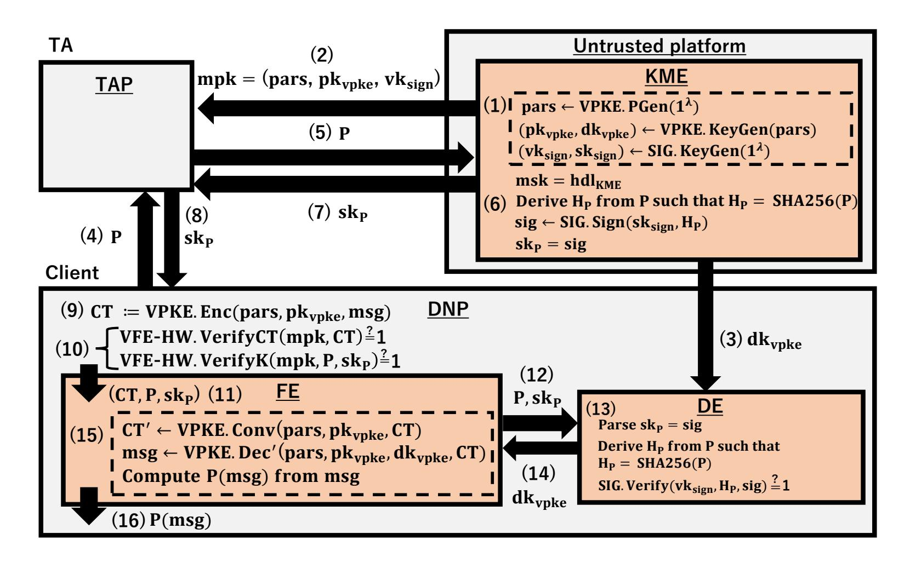

{0}------------------------------------------------

# Verifiable Functional Encryption using Intel SGX<sup>∗</sup>

Tatsuya Suzuki<sup>1</sup> , Keita Emura<sup>2</sup> , Toshihiro Ohigashi3, 2, and Kazumasa Omote1, 2

<sup>1</sup>University of Tsukuba, Japan. <sup>2</sup>National Institute of Information and Communications Technology (NICT), Japan. <sup>3</sup>Tokai University, Japan.

February 7, 2022

#### **Abstract**

Most functional encryption schemes implicitly assume that inputs to decryption algorithms, i.e., secret keys and ciphertexts, are generated honestly. However, they may be tampered by malicious adversaries. Thus, verifiable functional encryption (VFE) was proposed by Badrinarayanan et al. in ASIACRYPT 2016 where anyone can publicly check the validity of secret keys and ciphertexts. They employed indistinguishability-based (IND-based) security due to an impossibility result of simulation-based (SIM-based) VFE even though SIM-based security is more desirable. In this paper, we propose a SIM-based VFE scheme. To bypass the impossibility result, we introduce a trusted setup assumption. Although it appears to be a strong assumption, we demonstrate that it is reasonable in a hardware-based construction, e.g., Fisch et al. in ACM CCS 2017. Our construction is based on a verifiable public-key encryption scheme (Nieto et al. in SCN 2012), a signature scheme, and a secure hardware scheme, which we refer to as VFE-HW. Finally, we discuss an implementation of VFE-HW using Intel Software Guard Extensions (Intel SGX).

## **1 Introduction**

**Functional Encryption**: Cloud computing has gained increasing attention since it supports several functionalities, e.g., data analysis. However, sensitive user data must be secured, and protected. Thus, since Public-Key Encryption (PKE) only provides all-or-nothing decryption capabilities, functional encryption [20] has been proposed. Functional encryption allows clients to flexibly access sensitive data toward usual "all or nothing" decryption procedure. Briefly, a Trusted Authority (TA) first generates a master public key mpk and a master secret key msk. A client sends the information of function P to the TA. Generally, P can enforce sophisticated functions, e.g., access control etc. The TA generates a secret key sk<sup>P</sup> using the msk, and gives it to the client. A plaintext msg is encrypted by the mpk, where CT is the ciphertext. Finally, the client obtains P(msg) by decrypting CT using skP.

The security of functional encryption is defined by indistinguishability-based (IND-based) or simulation-based (SIM-based) notions. IND-based security guarantees that no adversary can distinguish which plaintext was encrypted. IND-based functional encryption schemes have been proposed

<sup>∗</sup>The main part of this work was done when the first author, Tatsuya Suzuki, was a master student at the Tokai University, Japan, and was a research assistant at the National Institute of Information and Communications Technology (NICT), Japan. The first author is supported by a JSPS Fellowship for Young Scientists. An extended abstract appeared at the 15th International Conference on Provable and Practical Security, ProvSec 2021 [43].

{1}------------------------------------------------

Table 1: Comparison of Verifiable Functional Encryption

|                            | Security  | Functionality | Verifiability  | Secure | Trusted  |
|----------------------------|-----------|---------------|----------------|--------|----------|
|                            |           |               |                | HW     | Setup    |
| Fisch et al. [29]          | SIM-based | Any           | Not Considered | Yes    | 1<br>Yes |
| (Functional Encryption)    |           |               |                |        |          |
| Badrinarayanan et al. [15] | IND-based | Limited       | Normal         | No     | No       |
| Soroush et al. [42]        | IND-based | Limited       | Normal         | No     | No       |
| Our VFE scheme             | SIM-based | Any           | Weak           | Yes    | Yes      |

for the class of all (polynomial-sized) functionalities under inefficient assumptions, e.g., multi-linear maps, or indistinguishability obfuscation [21,31,32,45]. Consequently, Abdalla et al. [4] proposed an IND-based functional encryption scheme that supports inner products under simple assumptions, and several works followed this direction [2, 3, 5, 5–8, 13, 17, 23–25, 27, 28, 36, 37, 41, 44]. However, Boneh et al. [20] and O'Neil [40] demonstrated that IND-based functional encryption yields insufficient security. For example, an adversary is allowed to obtain secret keys for a function P selected by the adversary with the restriction P(msg*∗* 0 ) = P(msg*∗* 1 ) where msg*∗* 0 and msg*∗* 1 are challenge plaintexts with the condition msg*∗* 0 *̸*= msg*∗* 1 . Thus, the class of P remains restricted, e.g., we cannot specify a cryptographic hash function as P due to collision resistance. Thus, SIM-based security is more desirable. Several SIM-based functional encryption schemes [10–12, 20, 22, 40] have been proposed recently. However, several works [10, 11, 20, 22] have shown that achieving SIM-based functional encryption that supports all (polynomial-sized) functionalities is impossible.

**Functional Encryption using Intel SGX**: To overcome this impossibility result, Fisch et al. [29] proposed IRON, a SIM-based functional encryption scheme that uses Intel SGX [14, 35, 38]. Intel SGX is a hardware protection set that protects sensitive data (e.g. medical data) from malicious adversaries by storing them in enclaves generated as isolated spaces in an application. They employed a secure hardware scheme (HW) which modeled Intel SGX.

Briefly, IRON is described as follows. The TA generates a public key pk and a decryption key dk for a PKE scheme, as well as a verification key vk and a signing key sk for a signature scheme (SIG). Then, the TA generates a secret key skP, where P is a function for the client. The TA generates a signature of P as a secret key sk<sup>P</sup> using sk in a Key Manager Enclave (KME), and sends it to the client. Let CT be the ciphertext of a plaintext msg under pk. In the decryption procedure, if sk<sup>P</sup> is a valid signature using vk, CT is decrypted inside an enclave, and P(msg) is output.

**Verifiable Functional Encryption**: Most functional encryption schemes implicitly assume that inputs to decryption algorithm, i.e., sk<sup>P</sup> and CT, are generated honestly according to the algorithmic procedures. However, they may be tampered by malicious adversaries. Badrinarayanan et al. [15] proposed Verifiable Functional Encryption (VFE). With VFE, anyone can publicly check the validity of sk<sup>P</sup> and CT. If verification of sk<sup>P</sup> and CT passes, the decryption algorithm of VFE correctly outputs P(msg). Badrinarayanan et al. insisted that VFE are useful for some applications, e.g., storing encrypted images [20] and audits [34]. As a drawback, they demonstrated that SIM-based VFE implies the existence of one message zero-knowledge proof systems for **NP** in the plain model. This implication contradicts the impossibility result shown by Goldreich et al. [33]. We emphasize that IRON does not help us to bypass this impossibility result. As a result, they employed INDbased security as shown in Table 1. A VFE proposed by Soroush et al. [42], which supports inner products, employs the same IND-based security definition. Thus, no SIM-based VFE has been proposed so far.

<sup>1</sup>The HW.Setup algorithm in the pre-processing phase is required to be honestly run by the TA.

{2}------------------------------------------------

**Our Contribution**: We propose a SIM-based VFE scheme that supports any (polynomial-sized) functionality. To support such functionality, we employ the hardware-based construction given in IRON [29], and, to achieve SIM-based security, we relax the verifiability of the definition given by Badrinarayanan et al. without losing the practicability. Intuitively, we assume that mpk and msk are generated honestly whereas those can be arbitrary values in the definition given by Badrinarayanan et al. Due to this trusted setup assumption, mpk can be considered a common reference string (CRS) in the one message zero-knowledge context [19]. One may think that this trusted setup assumption is unreasonable and too strong in practice. However, this is not the case in the hardware-based construction. We will explain it in detail in Section 4.

In addition to provide a security definition that bypasses the impossibility result, we also give a SIM-based VFE construction. The original IRON has supported public verifiability of secret keys (because these are signatures), thus we focus on how to support public verifiability for ciphertexts. Therefore, we employ (publicly) Verifiable PKE (VPKE) [39] proposed by Nieto et al. in addition to the ingredients of IRON (PKE, SIG, and HW). We employ HW as in IRON, thus we refer to proposed system as VFE-HW. Note that publicly executable computations should be run outside of memory-constrained enclaves as much as possible. Simultaneously, as in IRON, ciphertexts input to enclaves require to be non-malleable, and thus the underlying (V)PKE scheme needs to be CCA-secure. Consequently, we modify the definition of VPKE (Section 2).

Finally, we give our implementation of the proposed VFE-HW scheme for a cryptographic hash function H as the function P, i.e., the decryption algorithm for a ciphertext of msg outputs H(msg). Due to the nonlinearity of the hash function, the functionality seems hard to be supported by functional encryption with linear computations, e.g., inner products. Moreover, the IND-based VFE scheme does not support the function due to the key generation query restriction. In addition to these theoretical perspectives, it seems meaningful to support this functionality in practice, e.g., a password PW is encrypted and H(PW) can be computed without revealing PW. Here, we employ the Pairing-Based Cryptography (PBC) library [1] to implement the VPKE scheme proposed by Nieto et al.

Finally, we give our implementation of the proposed VFE-HW scheme for a cryptographic hash function H as the function P, i.e., the decryption algorithm for a ciphertext of msg outputs H(msg). Due to the nonlinearity of the hash function, the functionality seems hard to be supported by functional encryption with linear computations, e.g., inner products. Moreover, the IND-based VFE scheme does not support the function due to the key generation query restriction. In addition to these theoretical perspectives, it seems meaningful to support this functionality in practice, e.g., a password PW is encrypted and H(PW) can be computed without revealing PW. Here, we employ the Pairing-Based Cryptography (PBC) library [1] to implement the VPKE scheme proposed by Nieto et al. Briefly, the encryption algorithm runs in 0.11845 sec, the verification algorithm for ciphertexts runs in 0.12329 sec, the verification algorithm for secret keys runs in 0.00057 sec, and the decryption algorithm runs in 0.06164 sec. This is an extended abstract appeared at the 15th International Conference on Provable and Practical Security, ProvSec 2021 [43].

## **2 Preliminaries**

Here, we define PKE, VPKE, SIG, and HW. When *x* is selected uniformly from set *S*, we denote this as *x* \$ *←− S*, and *y ← A*(*x*) represents that *y* is the output of an algorithm *A* with an input *x*. First, we introduce the definition of PKE as follows. Let *M*pke be a plaintext space of PKE.

**Definition 1** (Syntax of PKE)*. A PKE scheme* PKE *consists of the following three algorithms,* PKE.KeyGen*,* PKE.Enc*, and* PKE.Dec*:*

{3}------------------------------------------------

- PKE.KeyGen(1 $^{\lambda}$ ): This key generation algorithm takes as input the security parameter  $\lambda \in \mathbb{N}$ , and return a public key  $\mathsf{pk}_{\mathsf{pke}}$  and a secret key  $\mathsf{dk}_{\mathsf{pke}}$ .
- PKE.Enc( $pk_{pke}$ , msg): This encryption algorithm takes as input  $pk_{pke}$ , a plaintext  $msg \in \mathcal{M}_{pke}$ , and returns a ciphertext CT.
- PKE.Dec(dk<sub>pke</sub>, CT): This decryption algorithm takes as input dk<sub>pke</sub>, and CT, and returns a plaintext msg or reject symbol  $\perp$ .

Correctness is defined as follows: For all  $(pk_{pke}, dk_{pke}) \leftarrow PKE.KeyGen(1^{\lambda})$ , all  $msg \in \mathcal{M}_{pke}$ , and  $PKE.Dec(dk_{pke}, CT) = msg holds$ , where  $CT \leftarrow PKE.Enc(pk_{pke}, msg)$ .

Next, we define indistinguishability against chosen plaintext attack (IND-CPA) as follows.

**Definition 2** (IND-CPA). For any probabilistic polynomial-time (PPT) adversary  $\mathcal{A}$  and the security parameter  $\lambda \in \mathbb{N}$ , we define the experiment  $\operatorname{Exp}^{\operatorname{IND-CPA}}_{\mathsf{PKE},\mathcal{A}}(\lambda)$  as follows. Here, state is state information that an adversary  $\mathcal{A}$  can preserve any information, and state is used for transferring state information to the other stage.

$$\begin{split} &\operatorname{Exp}_{\mathsf{PKE},\mathcal{A}}^{\mathrm{IND\text{-}CPA}}(\lambda): \\ &(\mathsf{pk}_{\mathsf{pke}},\mathsf{dk}_{\mathsf{pke}}) \leftarrow \mathsf{PKE}.\mathsf{KeyGen}(1^{\lambda}) \\ &(\mathsf{msg}_{0}^{*},\mathsf{msg}_{1}^{*},\mathsf{state}) \leftarrow \mathcal{A}(\mathsf{find},\mathsf{pk}_{\mathsf{pke}}) \\ &\mathsf{msg}_{0}^{*},\mathsf{msg}_{1}^{*} \in \mathcal{M}_{\mathsf{pke}}; \ |\mathsf{msg}_{0}^{*}| = |\mathsf{msg}_{1}^{*}| \\ &\mu \xleftarrow{\$} \{0,1\}; \ \mathsf{CT}^{*} \leftarrow \mathsf{PKE}.\mathsf{Enc}(\mathsf{pk}_{\mathsf{pke}},\mathsf{msg}_{\mu}^{*}) \\ &\mathit{If} \ \mu = \mu' \ \mathit{then} \ \mathit{output} \ 1, \ \mathit{and} \ 0 \ \mathit{otherwise} \end{split}$$

We say that PKE is IND-CPA secure if the advantage

$$\operatorname{Adv}_{\mathsf{PKE},\mathcal{A}}^{\operatorname{IND-CPA}}(\lambda) \coloneqq |\operatorname{Pr}[\operatorname{Exp}_{\mathsf{PKE},\mathcal{A}}^{\operatorname{IND-CPA}}(\lambda) = 1] - 1/2 |$$

is negligible for any PPT adversary A.

Next, we introduce the definition of SIG as follows. Let  $\mathcal{M}_{sig}$  be a message space.

**Definition 3** (Syntax of SIG). A signature scheme SIG consists of the following three algorithms, SIG.KeyGen, SIG.Sign and SIG.Verify:

- SIG.KeyGen( $1^{\lambda}$ ): This key generation algorithm takes as input the security parameter  $\lambda \in \mathbb{N}$ , and returns a signing/verification key pair ( $\mathsf{sk}_{\mathsf{sign}}, \mathsf{vk}_{\mathsf{sign}}$ ).
- SIG.Sign( $\mathsf{sk}_{\mathsf{sign}}, \mathsf{msg}$ ): This signing algorithm takes as input  $\mathsf{sk}_{\mathsf{sign}}$  and a message  $\mathsf{msg} \in \mathcal{M}_{\mathsf{sig}}$ , and returns a signature  $\sigma$ .
- SIG.Verify( $vk_{sign}$ , msg,  $\sigma$ ): This verification algorithm takes as input  $vk_{sign}$ , msg and  $\sigma$ , and returns 1 (valid) or 0 (invalid).

Correctness is defined as follows: For all  $(\mathsf{sk}_{\mathsf{sign}}, \mathsf{vk}_{\mathsf{sign}}) \leftarrow \mathsf{SIG}.\mathsf{KeyGen}(1^\lambda)$  and all  $\mathsf{msg} \in \mathcal{M}_{\mathsf{sig}}, \mathsf{SIG}.\mathsf{Verify}(\mathsf{vk}_{\mathsf{sign}}, \mathsf{msg}, \sigma) = 1 \text{ holds}, \text{ where } \sigma \leftarrow \mathsf{SIG}.\mathsf{Sign}(\mathsf{sk}_{\mathsf{sign}}, \mathsf{msg}).$ 

Next, we define existential unforgeability against chosen message attack (EUF-CMA) of SIG as follows.

{4}------------------------------------------------

**Definition 4** (EUF-CMA). For any PPT adversary  $\mathcal{A}$  and the security parameter  $\lambda \in \mathbb{N}$ , we define the experiment  $\operatorname{Exp}^{\operatorname{EUF-CMA}}_{\mathsf{SIG},\mathcal{A}}(\lambda)$  as follows.

$$\begin{split} & \operatorname{Exp}_{\mathsf{SIG},\mathcal{A}}^{\mathsf{EUF\text{-}CMA}}(1^{\lambda}): \\ & (\mathsf{sk}_{\mathsf{sign}},\mathsf{vk}_{\mathsf{sign}}) \leftarrow \mathsf{SIG}.\mathsf{KeyGen}(1^{\lambda}); \ \mathsf{QUERY} := \emptyset \\ & (\mathsf{msg}^*,\sigma^*) \leftarrow \mathcal{A}^{\mathsf{SIG}.\mathsf{SIGN}}(\mathsf{vk}_{\mathsf{sign}}) \\ & \mathit{If} \ \mathsf{SIG}.\mathsf{Verify}(\mathsf{vk}_{\mathsf{sign}},\mathsf{msg}^*,\sigma^*) = 1 \ \mathit{and} \ \mathsf{msg}^* \notin \mathsf{QUERY} \\ & \mathit{then} \ \mathit{output} \ 1, \ \mathit{and} \ 0 \ \mathit{otherwise} \end{split}$$

• SIG.SIGN: This signing oracle takes as input a message msg, and returns  $\sigma$  by running the SIG.Sign(sk<sub>sign</sub>, msg) algorithm. Finally, the challenger stores msg in QUERY.

We say that SIG is EUF-CMA secure if the advantage

$$Adv_{\mathsf{SIG}.\mathcal{A}}^{\mathsf{EUF}\text{-}\mathsf{CMA}}(\lambda) \coloneqq \Pr[\mathsf{Exp}_{\mathsf{SIG}.\mathcal{A}}^{\mathsf{EUF}\text{-}\mathsf{CMA}}(\lambda) = 1]$$

is negligible for any PPT adversary A.

Next, we introduce VPKE as defined by Nieto et al. [39]. VPKE provides public verifiability, where anyone can check the validity of ciphertexts without using any secret value. They defined the decryption algorithm VPKE.Dec using two algorithms, i.e., the verification algorithm VPKE.Ver and the decryption algorithm for converted ciphertext VPKE.Dec'. VPKE.Ver verifies ciphertext CT and converts CT to CT' if CT is valid. VPKE.Dec' decrypts CT', and outputs msg. In this paper, we further decompose VPKE.Ver into two algorithms, i.e., VPKE.Ver and VPKE.Conv, which will be explained later. The verification algorithm VPKE.Ver verifies CT and the conversion algorithm VPKE.Conv converts CT into CT'.

Next, we define VPKE. Here, let  $\mathcal{M}_{\mathsf{vpke}}$  be a plaintext space of VPKE.

**Definition 5** (Syntax of VPKE).

- VPKE.PGen( $1^{\lambda}$ ): This public parameter generation algorithm takes the security parameter  $\lambda \in \mathbb{N}$  as input, and returns a public parameter pars.
- VPKE.KeyGen(pars): This key generation algorithm takes pars as input, and returns a public key pk<sub>vpke</sub> and a secret key dk<sub>vpke</sub>.
- VPKE.Enc(pars, pk<sub>vpke</sub>, msg): This encryption algorithm takes pars, pk<sub>vpke</sub> and a plaintext msg  $\in$   $\mathcal{M}_{vpke}$  as input, and returns a ciphertext CT.
- $\label{eq:VPKEDec} \begin{aligned} \text{VPKE.Dec}(\mathsf{pars},\mathsf{pk_{vpke}},\mathsf{dk_{vpke}},\mathsf{CT}) \colon \mathit{This} \ \mathit{decryption} \ \mathit{algorithm} \ \mathit{takes} \ \mathsf{pars}, \ \mathsf{pk_{vpke}}, \ \mathsf{dk_{vpke}} \ \mathit{and} \ \mathsf{CT} \\ \mathit{as} \ \mathit{input}, \ \mathit{and} \ \mathit{returns} \ \mathit{a} \ \mathit{plaintext} \ \mathsf{msg} \ \mathit{or} \ \mathit{reject} \ \mathit{symbol} \ \bot. \ \mathit{Internally} \ \mathit{the} \ \mathit{algorithm} \ \mathit{runs} \\ \mathsf{VPKE.Ver}, \ \mathsf{VPKE.Conv}, \ \mathit{and} \ \mathsf{VPKE.Dec'}, \ \mathit{which} \ \mathit{are} \ \mathit{defined} \ \mathit{as} \ \mathit{follows}. \end{aligned}$
- VPKE.Ver(pars, pk<sub>vpke</sub>, CT): This verification algorithm takes pars, pk<sub>vpke</sub> and CT as input, and returns 1 or  $\theta$ .
- VPKE.Conv(pars, pk<sub>vpke</sub>, CT): This conversion algorithm takes pars, pk<sub>vpke</sub> and CT as input, and returns a ciphertext CT'.
- VPKE.Dec'(pars, pk<sub>vpke</sub>, dk<sub>vpke</sub>, CT'): This decryption algorithm takes pars, pk<sub>vpke</sub>, dk<sub>vpke</sub> and CT' as input, and returns a plaintext msg.

{5}------------------------------------------------

Correctness is defined as follows: For all pars  $\leftarrow$  VPKE.PGen(1 $^{\lambda}$ ), all (pk<sub>vpke</sub>, dk<sub>vpke</sub>)  $\leftarrow$  VPKE.KeyGen (pars), all msg  $\in \mathcal{M}_{vpke}$ , VPKE.Dec'(pars, pk<sub>vpke</sub>, dk<sub>vpke</sub> and VPKE.Conv(pars, pk<sub>vpke</sub>, CT)) = msg holds, where CT  $\leftarrow$  VPKE.Enc(pars, pk<sub>vpke</sub>, msg) and VPKE.Ver(pars, pk<sub>vpke</sub>, CT) = 1.

Next, we define strictly non-trivial public verification. Condition 1 requires that the decryption of a ciphertext CT succeeds if and only if its verification outputs 1, and Condition 2 excludes CCA-secure schemes where the decryption algorithm does not output  $\perp$ .

**Definition 6** (Strictly Non-Trivial Public Verification). For any PPT adversary  $\mathcal{A}$  and the security parameter  $\lambda \in \mathbb{N}$ , let pars  $\leftarrow$  VPKE.PGen( $1^{\lambda}$ ). We define the VPKE.Ver algorithm is strictly non-trivial public verifiable if (1) (pk<sub>vpke</sub>, dk<sub>vpke</sub>)  $\leftarrow$  VPKE.KeyGen(pars), and VPKE.Ver(pars, pk<sub>vpke</sub>, CT) =  $0 \iff \text{VPKE.Dec}(\text{pars}, \text{pk}_{\text{vpke}}, \text{dk}_{\text{vpke}}, \text{CT}) = \bot \text{ for all CT, and (2) there exists a ciphertext CT for which VPKE.Dec(pars, pk<sub>vpke</sub>, dk<sub>vpke</sub>, CT) = <math>\bot \text{ are provided.}$ 

Next, we define IND-CCA as follows.

**Definition 7** (IND-CCA). For any PPT adversary  $\mathcal{A}$  and the security parameter  $\lambda \in \mathbb{N}$ , we define the experiment  $\operatorname{Exp}^{\operatorname{IND-CCA}}_{\mathsf{VPKE},\mathcal{A}}(\lambda)$  as follows. Here, state is state information that an adversary  $\mathcal{A}$  can preserve any information, and state is used for transferring state information to the other stage.

```
\begin{split} &\operatorname{Exp}_{\mathsf{VPKE},\mathcal{A}}^{\mathsf{IND-CCA}}(\lambda) \colon \\ &\operatorname{pars} \leftarrow \mathsf{VPKE}.\mathsf{PGen}(1^{\lambda}); \ (\mathsf{pk_{\mathsf{vpke}}},\mathsf{dk_{\mathsf{vpke}}}) \leftarrow \mathsf{VPKE}.\mathsf{KeyGen}(\mathsf{pars}) \\ &(\mathsf{msg}_0^*,\mathsf{msg}_1^*,\mathsf{state}) \leftarrow \mathcal{A}^{\mathsf{VPKE}.\mathsf{DEC}}(\mathsf{find},\mathsf{pars},\mathsf{pk_{\mathsf{vpke}}}) \\ &\operatorname{msg}_0^*,\mathsf{msg}_1^* \in \mathcal{M}_{\mathsf{vpke}}; \ |\mathsf{msg}_0^*| = |\mathsf{msg}_1^*| \\ &\mu \overset{\$}{\leftarrow} \{0,1\}; \ \mathsf{CT}^* \leftarrow \mathsf{VPKE}.\mathsf{Enc}(\mathsf{pars},\mathsf{pk_{\mathsf{vpke}}},\mathsf{msg}_{\mu}^*) \\ &\mu' \leftarrow \mathcal{A}^{\mathsf{VPKE}.\mathsf{DEC}}(\mathsf{guess},\mathsf{CT}^*,\mathsf{state}) \\ &\mathit{If} \ \mu = \mu' \ \mathit{then} \ \mathit{output} \ 1, \ \mathit{and} \ 0 \ \mathit{otherwise} \end{split}
```

• VPKE.DEC: This decryption oracle takes a ciphertext  $CT \neq CT^*$  as input. If VPKE.Ver(pars,  $pk_{vpke}, CT) = 0$ , output  $\bot$ . Otherwise, compute  $CT' \leftarrow VPKE.Conv(pars, pk_{vpke}, CT)$ , and return msg by running the VPKE.Dec'(pars,  $pk_{vpke}, dk_{vpke}, CT'$ ) algorithm.

```
We say that VPKE is IND-CCA secure if the advantage \operatorname{Adv}^{\operatorname{IND-CCA}}_{\operatorname{VPKE},\mathcal{A}}(\lambda) := |\operatorname{Pr}[\operatorname{Exp}^{\operatorname{IND-CCA}}_{\operatorname{VPKE},\mathcal{A}}(\lambda) = 1] - 1/2 | \text{ is negligible for any PPT adversary } \mathcal{A}.
```

For the sake of clarity, we give the Nieto et al. VPKE scheme employed in our implementation in the Appendix A.

Next, we define the secure hardware scheme (HW scheme) [29]. In this paper, the hardware instance HW denotes an oracle that provides the functionalities given in Definition 8. Furthermore, the hardware oracle  $HW(\cdot)$  denotes an interaction with other local secure hardware in addition to HW, and the Key Manager oracle  $KM(\cdot)$  denotes an interaction with a remote secure hardware over an untrusted channel.

**Definition 8** (Syntax of HW Scheme). A HW scheme for a set of probabilistic programs  $\mathcal{Q}$  comprises the following seven algorithms. HW has variables HW.sk<sub>report</sub>, HW.sk<sub>quote</sub>, and a table T. Here, HW.sk<sub>report</sub> and HW.sk<sub>quote</sub> are leveraged to store keys, and the table T is leveraged to manage the internal state of loaded enclave programs.

{6}------------------------------------------------

- HW.Setup(1*<sup>λ</sup>* ): *This hardware setup algorithm takes the security parameter λ ∈* N *as input, and returns a public parameters* params*. This algorithm also generates the secret keys* skreport *and* skquote*, and stores these keys in the* HW*.*skreport *and* HW*.*skquote *valuables respectively.*
- HW.Load(params*,* Q): *This loading program algorithm takes* params *and a program* Q *∈ Q as input, and returns a handle* hdl*. Intuitively, this algorithm loads the stateful program into the enclave to be launched. Here,* hdl *is leveraged to identify the enclave running* Q*.*
- HW.Run(hdl*,* in): *This running algorithm takes as inputs a handle* hdl *for an enclave running a program* Q *and an input* in *for* Q*. The algorithm first executes* Q *on* in *to get the output* out*, and updates* T[hdl] *accordingly.*
- HW*.*Run&Reportskreport (hdl*,* in): *This algorithm, can be verified by an enclave program on the same hardware platform for a local attestation, takes as inputs a handle* hdl *for an enclave running a program* Q *and an input* in *for* Q*. The algorithm first executes* Q *on* in *to get a* report := (mdhdl*,* tagQ*,* in, out, mac)*, where* mdhdl *is a metadata relative to the enclave,* tag<sup>Q</sup> *is an MRENCLAVE of* Q *that identifies the program running inside the enclave,* out *is an output of* Q*, and* mac *is a message authentication code produced using* skreport *for* (mdhdl*,*tagQ*,* in*,* out)*. Finally, the algorithm updates* T[hdl]*.*
- HW*.*Run&Quoteskquote (hdl*,* in): *This algorithm, which can be publicly verified different hardware platform for a remote attestation, takes as inputs a handle* hdl *for an enclave running a program* Q *and an input* in *for* Q*. The algorithm first executes* Q *on* in *to get a* quote := (mdhdl*,* tagQ*,* in, out, mac)*, where* mdhdl *is a metadata relative to the enclave,* tag<sup>Q</sup> *is an MRENCLAVE of* Q *that identifies the program running inside the enclave,* out *is an output of* Q*, and* mac *is a signature produced using* skquote *for* (mdhdl*,*tagQ*,* in*,* out)*. Finally, the algorithm updates* T[hdl]*.*
- HW*.*ReportVerifyskreport (hdl*,*report): *This report verification algorithm takes* hdl *and* report *as input, and uses* skreport *to verify* mac*. If* mac *is valid, then the algorithm outputs* 1 *and adds a tuple* (1*,*report) *to* T[hdl]*. Otherwise, the algorithm outputs* 0 *and adds tuple* (0*,*report) *to* T[hdl]*.*
- HW*.*QuoteVerify(params*,* quote): *This quote verification algorithm, takes* params *and* quote *as input. This algorithm verifies σ. If the verification of σ succeeds, then the algorithm outputs* 1*. Otherwise,* 0 *is output.*

Correctness is defined as follows: HW is correct if the following things hold. For all Q *∈ Q*, in in the input domain of Q and all handles hdl

- Correctness of Run: out = Q(in) if Q is deterministic. More generally, *∃* random coins r (sampled in time and used by *Q*) such that out = Q(in).
- Correctness of Report and ReportVerify: Pr[HW*.*ReportVerifyskreport (hdl, report) = 0] = negl(*λ*)
- Correctness of Quote and QuoteVerify: Pr[HW.QuoteVerify(params, quote) = 0] = negl(*λ*)

Next, we define local attestation unforgeability (LOC-ATT-UNF) of HW as follows. This security guarantees that no adversary that does not have skreport can produce a valid report.

{7}------------------------------------------------

**Definition 9** (LOC-ATT-UNF) For any PPT adversary  $\mathcal{A}$  and the security parameter  $\lambda \in \mathbb{N}$ , we define the experiment  $\operatorname{Exp}_{\mathsf{HW},\mathcal{A}}^{\mathsf{LOC-ATT-UNF}}(\lambda)$  as follows.

```
\begin{split} & \operatorname{Exp}_{\mathsf{HW},\mathcal{A}}^{\operatorname{LOC-ATT-UNF}}(\lambda): \\ & (\mathsf{params}, \mathsf{sk}_{\mathsf{report}}, \mathsf{sk}_{\mathsf{quote}}, \mathsf{state}) \leftarrow \mathsf{HW.Setup}(1^{\lambda}) \\ & \mathsf{QUERY} := \emptyset \ ; (\mathsf{hdl}^*, \mathsf{report}^*) \leftarrow \mathcal{A}^{\mathsf{HW},\mathsf{HW}(\cdot)}(\mathsf{params}) \\ & \mathit{If} \ \mathsf{HW.ReportVerify}_{\mathsf{sk}_{\mathsf{report}}}(\mathsf{hdl}^*, \mathsf{report}^*) = 1 \ \mathit{where} \\ & \mathsf{report}^* = (\mathsf{md}_{\mathsf{hdl}}^*, \mathsf{tag}_{\mathsf{Q}}^*, \mathsf{in}^*, \mathsf{out}^*, \mathsf{mac}^*) \ \mathit{and} \\ & (\mathsf{md}_{\mathsf{hdl}}^*, \mathsf{tag}_{\mathsf{Q}}^*, \mathsf{in}^*, \mathsf{out}^*) \ \not\in \ \mathsf{QUERY} \\ & \mathit{then} \ \mathit{output} \ 1, \ \mathit{and} \ 0 \ \mathit{otherwise} \end{split}
```

- HW: A can access the instance as follows.
  - HW.LOAD: A queries the instance as input params and Q, and the instance returns the handle hdl by running the HW.Load(params, Q) algorithm.
  - HW.REPORTVERIFY:  $\mathcal{A}$  queries the instance as input hdl and report, and the instance returns the result by running the HW.ReportVerify<sub>skreport</sub>(hdl, report) algorithm.
- $HW(\cdot)$ : A can access the oracle as follows.
  - HW.RUN&REPORT :  $\mathcal{A}$  queries the oracle as input hdl and in, and the oracle returns report :=  $(\mathsf{md}_{\mathsf{hdl}}, \mathsf{tag}_{\mathsf{Q}}, \mathsf{in}, \mathsf{out}, \mathsf{mac})$  by running the HW.Run&Report<sub>skreport</sub>(hdl, in) algorithm. Finally, the oracle stores  $(\mathsf{md}_{\mathsf{hdl}}, \mathsf{tag}_{\mathsf{Q}}, \mathsf{in}, \mathsf{out})$  in QUERY.

We say that HW is LOC-ATT-UNF secure if the advantage

$$\mathrm{Adv}_{\mathsf{HW},\mathcal{A}}^{\mathrm{LOC\text{-}ATT\text{-}UNF}}(\lambda) \coloneqq \Pr[\mathrm{Exp}_{\mathsf{HW},\mathcal{A}}^{\mathrm{LOC\text{-}ATT\text{-}UNF}}(\lambda) = 1]$$

is negligible for any PPT adversary A.

Next, we define remote attestation unforgeability (REM-ATT-UNF) of HW as follows. This security guarantees that no adversary that does not have  $\mathsf{sk}_{\mathsf{quote}}$  can produce a valid  $\mathsf{quote}$ .

**Definition 10** (REM-ATT-UNF) For any PPT adversary  $\mathcal{A}$  and the security parameter  $\lambda \in \mathbb{N}$ , we define the experiment  $\operatorname{Exp}_{\mathsf{HW},\mathcal{A}}^{\mathsf{REM-ATT-UNF}}(\lambda)$  as follows.

```
\begin{split} & \operatorname{Exp_{HW,\mathcal{A}}^{REM\text{-}ATT\text{-}UNF}}(\lambda): \\ & (\operatorname{params}, \operatorname{sk_{report}}, \operatorname{sk_{quote}}, \operatorname{state}) \leftarrow \operatorname{HW.Setup}(1^{\lambda}) \\ & \operatorname{QUERY} := \emptyset \ ; \operatorname{quote}^* \leftarrow \mathcal{A}^{\operatorname{HW},\operatorname{KM}(\cdot)}(\operatorname{params}) \\ & \mathit{If} \ \operatorname{HW.QuoteVerify}(\operatorname{params}, \operatorname{quote}) = 1 \ \mathit{where} \\ & \operatorname{quote}^* = (\operatorname{md}^*_{\operatorname{hdl}}, \operatorname{tag}^*_{\operatorname{Q}}, \operatorname{in}^*, \operatorname{out}^*, \sigma) \ \mathit{and} \\ & (\operatorname{md}^*_{\operatorname{hdl}}, \operatorname{tag}^*_{\operatorname{Q}}, \operatorname{in}^*, \operatorname{out}^*) \ \not\in \ \operatorname{QUERY} \\ & \mathit{then} \ \mathit{output} \ 1, \ \mathit{and} \ 0 \ \mathit{otherwise} \end{split}
```

• HW: A can access the instance as follows.

{8}------------------------------------------------

- HW.LOAD: A queries the instance as input params and Q, and the instance returns the handle hdl by running the HW.Load(params, Q) algorithm.
- $KM(\cdot)$ : A can access the oracle as follows.
  - HW.RUN&QUOTE:  $\mathcal{A}$  queries the oracle as input hdl and in, and the oracle returns quote :=  $(\mathsf{md}_{\mathsf{hdl}}, \mathsf{tag}_{\mathsf{Q}}, \mathsf{in}, \mathsf{out}, \sigma)$  by running the HW.Run&Quote<sub>skquote</sub>(hdl, in) algorithm. Finally, the oracle stores  $(\mathsf{md}_{\mathsf{hdl}}, \mathsf{tag}_{\mathsf{Q}}, \mathsf{in}, \mathsf{out})$  in QUERY.

We say that HW is REM-ATT-UNF secure if the advantage

$$\mathrm{Adv}_{\mathsf{HW},\mathcal{A}}^{\mathrm{REM-ATT-UNF}}(\lambda) \coloneqq \Pr[\mathrm{Exp}_{\mathsf{HW},\mathcal{A}}^{\mathrm{REM-ATT-UNF}}(\lambda) = 1]$$

is negligible for any PPT adversary A.

## 3 Impossibility Result of VFE and Our Solution

In this section, we recall the impossibility result of VFE shown by Badrinarayanan et al. [15]. We remark that this impossibility is caused by the verifiability of VFE. Thus, they have mentioned that even if the impossibility of SIM-based security given by Agrawal et al. [10] is bypassed, still the impossibility of VFE remains.

Since their VFE syntax is differ from our VFE-HW, first we introduce their syntax as follows. The setup algorithm VFE.Setup( $1^{\lambda}$ ) generates (mpk, msk), the key-generation algorithm VFE.KeyGen(mpk, msk, P) outputs sk<sub>P</sub>, the encryption algorithm VFE.Enc(mpk, msg) outputs CT, and the decryption algorithm VFE.Dec(mpk, P, sk<sub>P</sub>, CT) outputs P(msg) or  $\bot$ . In addition to these algorithms, VFE supports two verification algorithms. The ciphertext verification algorithm VFE.VerifyCT(mpk, CT) outputs 0 or 1, and the secret key verification algorithm VFE.VerifyK(mpk, P, sk<sub>P</sub>) outputs 0 or 1.

Next, we introduce verifiability defined by them as follows. The verifiability guarantees that if ciphertexts and secret keys are verified by the respective algorithms then each ciphertext should be associated with a unique message msg, and the decryption result is P(msg). We remark that it holds even under possibly maliciously generated mpk. Let  $\mathcal{P}_{VFE}$  and  $\mathcal{M}_{VFE}$  be a family of function for VFE and a plaintext space of VFE respectively.

**Definition 11** (Verifiability). For all security parameter  $\lambda \in \mathbb{N}$ ,  $\mathsf{mpk} \in \{0,1\}^*$ , and all  $\mathsf{CT} \in \{0,1\}^*$ , there exists  $\mathsf{msg} \in \mathcal{M}_{\mathsf{VFE}}$  such that for all  $\mathsf{P} \in \mathcal{P}_{\mathsf{VFE}}$  and  $\mathsf{sk}_{\mathsf{P}} \in \{0,1\}^*$ , if  $\mathsf{VFE}.\mathsf{VerifyCT}(\mathsf{mpk}, \mathsf{CT}) = 1$  and  $\mathsf{VFE}.\mathsf{VerifyK}(\mathsf{mpk},\mathsf{P},\mathsf{sk}_{\mathsf{P}}) = 1$ , then  $\mathsf{Pr}[\mathsf{VFE}.\mathsf{Dec}(\mathsf{mpk},\mathsf{P},\mathsf{sk}_{\mathsf{P}},\mathsf{CT}) = \mathsf{P}(\mathsf{msg})] = 1$  holds.

We further remark that the probability that the VFE.Dec algorithm outputs P(msg) is exactly 1 if CT and  $sk_P$  are valid. Thus, Badrinarayanan et al. assumed that perfect correctness holds (otherwise, a non-uniform malicious authority can sample ciphertexts/keys from the space where it fails to be correct). We note that the probability is exactly 1 yields perfect soundness for all adversaries when a proof system is constructed from VFE.

Next, we describe the impossibility result as follows.

**Theorem 1** ([15], **Theorem 3**) There exists a family of functions, each of which can be represented as a polynomial sized circuit, for which there does not exist any simulation secure verifiable functional encryption scheme.

{9}------------------------------------------------

To prove the theorem, Badrinarayanan et al. showed that SIM-based VFE implies the existence of one message zero-knowledge proof system for **NP** in the plain model which is known to be impossible. More concretely, let L be a **NP** complete language and R be the relation of L which takes as input a string *x* and a polynomial sized (in the length of *x*) witness *ω*. R(*x*, *ω*) outputs 1 if and only if *x ∈ L* and *ω* is its witness. We denote R(*x*, *·*) for all *x ∈ {*0*,* 1*} λ* . A one message zero-knowledge proof system (*P, V*) for the language *L* with relation R is constructed from VFE as follows. For (*x*, *ω*), the prover *P* runs (mpk, msk) *←* VFE.Setup(1*<sup>λ</sup>* ) where *λ* = *|x|*, computes CT *←* VFE.Enc(mpk, *ω*) and skR(*x, ·*) *←* VFE.KeyGen(mpk, msk, R(*x*, *·*)), and outputs a proof *π* = (mpk, CT, skR(*x, ·*)). The verifier *V* accepts *π* if VFE.Dec(mpk, R(*x*, *·*), skR(*x, ·*), CT) = 1. Obviously, the proof system is perfectly complete if the underlying VFE scheme is perfectly correct. Moreover, due to the verifiability property, the system is perfectly sound. Furthermore, since the verifiability holds even for maliciously generated mpk, CT, and sk, no trusted setup is assumed. Due to the SIM-based security, i.e., the existence of the simulator that can produce a ciphertext only from R(*x*, *ω*) without knowing *ω* (here, 1 = R(*x*, *ω*) in this case), the system provides computational zero knowledge.

To bypass the impossibility result, we introduce the trusted setup where (mpk, msk) is generated honestly, and mpk is considered as a CRS. <sup>2</sup> One may think that this trusted setup assumption is unreasonable and too strong in practice. However, this is not the case in the hardware-based construction. In our system, mpk and msk are generated by running a setup program, and it is implicitly assumed that the setup program is executed correctly (Q in our scheme). That is, anyone can verify the description of the function. Moreover, we assume that the program is hardcoded as the static data, and is assumed to be not tampered. The remaining is to trust the computer that correctly runs the program, and is widely assumed when cryptographic protocols are implemented. Thus, we claim that the trusted assumption is reasonable, and leave how to remove the assumption without losing the SIM-based security as a future work of this paper.

We remark that even if one message zero-knowledge proof system in the CRS model can be constructed from SIM-based VFE, this does not bypass the impossibility result since the proof system in the plain model implies a proof system in the CRS model. We emphasize that the setup algorithm that generates (mpk, msk) must be run first since other algorithms take mpk or msk as input. Due to this situation, we can bypass the impossibility result of Badrinarayanan et al. since any VFE-based one message zero-knowledge proof system or argument need to run the Setup algorithm first, and then mpk can be seen as a CRS. As mentioned by Barak and Pass [16], one message zero-knowledge proofs and arguments can be constructed in the CRS model (without certain relaxations).

Regarding the CRS model, Badrinarayanan et al. have mentioned that VFE seems to be constructed from a functional encryption scheme with Non-Interactive Zero-Knowledge (NIZK) proof systems. However, the CRS may be maliciously generated and then soundness does not hold. Thus, they gave up for employing NIZK proof systems and employed non-interactive witness indistinguishable proof (NIWI) systems as the ingredients. Since we introduce the trusted setup assumption, we may be able to construct VFE from this direction without employing a HW scheme. However, even then, another impossibility arises [10]. For bypassing the impossibility, we employ a HW scheme.

Random oracles may be employed to avoid introducing the trusted setup assumption. However, as mentioned by Agrawal, Koppula, and Waters [11], there is an impossibility result of SIM-based

<sup>2</sup>We note that we also relax the condition that the verifiability holds where the probability that the decryption algorithm outputs P(msg) is not exactly 1 (concretely 1 *−* negl(*λ*)) in our definition. Because the underlying local or remote attestations require non-perfect correctness, this relaxation is reasonable. This relaxation provides the converted proof system to be an argument, i.e., soundness holds only for computationally bounded adversaries.

{10}------------------------------------------------

security in the random oracle model. Thus, we do not further consider the random oracle model in this paper.

### 4 Definitions of VFE-HW

In this section, we define VFE-HW. Here, let HW be a hardware instance that takes a handle hdl that identifies an enclave. If an algorithm is allowed to access HW, then the algorithm can use the secure hardware functionality given in Definition 8. Let  $HW(\cdot)$  (resp.  $KM(\cdot)$ ) be a hardware (resp. a key manager) oracle that takes hdl and an authentication information (Report (resp. Quote) in our construction), interacts with other local enclave specified by hdl, and runs the function contained in the authentication information. Let  $\mathcal{P}_{VFE-HW}$  and  $\mathcal{M}_{VFE-HW}$  be a family of functions for VFE-HW and a plaintext space of VFE-HW respectively.

**Definition 12** (Syntax of VFE-HW). A VFE-HW scheme comprises the following seven algorithms:

- VFE-HW.Setup<sup>HW</sup>( $1^{\lambda}$ ): This setup algorithm takes the security parameter  $\lambda \in \mathbb{N}$  as input, and returns a master public key mpk and a master secret key msk.
- VFE-HW.KeyGen<sup>HW</sup>(msk, P): This key generation algorithm takes msk and a function  $P \in \mathcal{P}_{VFE-HW}$  as input, and returns a secret key sk<sub>P</sub> for P.
- VFE-HW.Enc(mpk, msg): This encryption algorithm takes mpk and a plaintext msg  $\in \mathcal{M}_{VFE-HW}$  as input, and returns a ciphertext CT.
- VFE-HW.DecSetup $^{HW,KM(\cdot)}(mpk)$ : This decryption node setup algorithm takes mpk as input, and returns a handle hdl.
- VFE-HW.VerifyCT(mpk, CT): This ciphertext verification algorithm takes mpk and CT as input, and returns 1 or 0.
- VFE-HW.VerifyK(mpk, P,  $sk_P$ ): This secret key verification algorithm takes mpk, P, and  $sk_P$  as input, and returns 1 or 0.
- $\label{eq:VFE-HWDec} \begin{aligned} \mathsf{VFE}\text{-HW}.\mathsf{Dec}^{\mathsf{HW}(\cdot)}(\mathsf{mpk},\mathsf{hdl},\mathsf{P},\mathsf{sk}_\mathsf{P},\mathsf{CT}) \colon \ \mathit{This} \ \mathit{decryption} \ \mathit{algorithm} \ \mathit{takes} \ \mathsf{mpk},\mathsf{hdl},\mathsf{sk}_\mathsf{P}, \ \mathit{and} \ \mathsf{CT} \ \mathit{as} \\ \mathit{input}, \ \mathit{and} \ \mathit{returns} \ \mathit{a} \ \mathit{value} \ \mathsf{P}(\mathsf{msg}) \ \mathit{or} \ \mathit{a} \ \mathit{reject} \ \mathit{symbol} \ \bot. \end{aligned}$
- Correctness is defined as follows: For all  $P \in \mathcal{P}_{VFE-HW}$ , all  $(mpk, msk) \leftarrow VFE-HW.Setup^{HW}(1^{\lambda})$ , all  $sk_P \leftarrow VFE-HW.KeyGen^{HW}(msk, P)$ , all  $hdl \leftarrow VFE-HW.DecSetup^{HW,KM(\cdot)}(mpk)$ , and all  $msg \in \mathcal{M}_{VFE-HW}$ , let  $CT \leftarrow VFE-HW.Enc(mpk, msg)$ , then  $\Pr[VFE-HW.Dec^{HW(\cdot)}(mpk, hdl, sk_P, CT) = P(msg)] = 1 negl(\lambda) \ holds$ .

Next we define weak verifiability. As mentioned in Section 3, we somewhat relax the original verifiability definition, i.e., we employ the trusted setup and the probability of verifiability is not exactly 1 due to the correctness of HW scheme. Thus, we call our definition weak verifiability. Weak verifiability guarantees that if ciphertexts and secret keys are verified by the respective algorithms, then each ciphertext should be associated with a unique message msg, and the decryption result is P(msg). Note that this holds only when mpk is generated honestly and hdl is non- $\bot$ .

**Definition 13** (Weak Verifiability). For all security parameters  $\lambda \in \mathbb{N}$ , (mpk, msk)  $\leftarrow$  VFE-HW. Setup<sup>HW</sup>(1 $^{\lambda}$ ), and hdl  $\leftarrow$  VFE-HW.DecSetup<sup>HW,KM(·)</sup>(mpk) where hdl  $\neq \bot$ , and all CT  $\in \{0,1\}^*$ , there exists msg  $\in \mathcal{M}_{\mathsf{VFE-HW}}$  such that for all  $\mathsf{P} \in \mathcal{P}_{\mathsf{VFE-HW}}$  and  $\mathsf{sk}_{\mathsf{P}} \in \{0,1\}^*$ , if VFE-HW. VerifyCT (mpk, CT) = 1 and VFE-HW. VerifyK(mpk, P, sk<sub>P</sub>) = 1, then Pr[VFE-HW. Dec<sup>HW(·)</sup>(mpk, hdl, P, sk<sub>P</sub>, CT) = P(msg)] = 1 - negl( $\lambda$ ) holds.

{11}------------------------------------------------

Next we define the simulation security of VFE-HW as follows. This security guarantees that no adversary can distinguish REAL and IDEAL, where REAL represents the actual environment. Note that msk and the challenge plaintext msg\* are not explicitly used in IDEAL. In the IDEAL world, an adversary  $\mathcal{A}$  is allowed to access the VFE-HW.KeyGen oracle. That is,  $\mathcal{A}$  can obtain  $\mathsf{sk}_P$  for any P, and can obtain  $\mathsf{P}(\mathsf{msg}^*)$  by decrypting the challenge ciphertext. So, what we would like to guarantee in our definition is no information of msg\* is leaked from the challenge ciphertext beyond its length and information leaked from  $\mathsf{P}(\mathsf{msg}^*)$ . Basically, our definition is an extension of that of Fisch et al. [29]. They also mentioned that "The only information that the simulator will get about msg\* other than its length is the access to the  $\mathsf{U}_{\mathsf{msg}^*}$  oracle which reveals  $\mathsf{P}(\mathsf{msg}^*)$  for the P's queried by  $\mathcal{A}$  to FE.Keygen." Although semi-adaptive SIM-based functional encryption schemes have been proposed [9,47] where an adversary declares the challenge after obtaining mpk but before issuing secret key queries, our definition does not have such a restriction.

**Definition 14** (Simulation security). For a stateful PPT adversary  $\mathcal{A}$ , a stateful PPT simulator  $\mathcal{S}$  and the security parameter  $\lambda \in \mathbb{N}$ , we define the real experiment  $\operatorname{Exp}_{\mathsf{VFE-HW}}^{\mathsf{REAL}}(\lambda)$  and the ideal experiment  $\operatorname{Exp}_{\mathsf{VFE-HW}}^{\mathsf{IDEAL}}(\lambda)$  as follows. Here, let  $\mathsf{U}_{\mathsf{msg}}(\cdot)$  denote a universal oracle where  $\mathsf{U}_{\mathsf{msg}}(P) = \mathsf{P}(\mathsf{msg})$ .

```
\begin{split} & \operatorname{Exp}_{\mathsf{VFE-HW}}^{\mathsf{REAL}}(\lambda) \colon \\ & (\mathsf{mpk},\mathsf{msk}) \leftarrow \mathsf{VFE-HW.Setup}^{\mathsf{HW}}(1^{\lambda}); \ \mathsf{msg}^* \leftarrow \mathcal{A}^{\mathsf{VFE-HW.KeyGen}^{\mathsf{HW}}(\mathsf{msk},\cdot)}(\mathsf{mpk}) \\ & \mathsf{CT}^* \leftarrow \mathsf{VFE-HW.Enc}(\mathsf{mpk},\mathsf{msg}^*); \ \alpha \leftarrow \mathcal{A}^{\mathsf{VFE-HW.KeyGen}^{\mathsf{HW}}(\mathsf{msk},\cdot),\mathsf{HW}(\cdot),\mathsf{KM}(\cdot)}(\mathsf{mpk},\mathsf{CT}^*) \\ & \mathsf{Output} \ (\mathsf{msg}^*,\alpha) \end{split}
```

- HW: A can access the instance as follows.
  - HW.LOAD: A queries the instance as input params and Q, and the instance returns hdl by running the HW.Load(params, Q) algorithm.
  - HW.RUN: A queries the instance as input hdl and in, and the instance returns out by running the HW.Run(hdl,in) algorithm.
- VFE-HW.KeyGen<sup>HW</sup>: A queries this key generation oracle as input msk and P. The oracle accesses HW.RUN as input hdl = msk and in = P, and the oracle returns sk<sub>P</sub> as out by running the HW.Run(hdl,in) algorithm.
- $\bullet$  HW(·):  $\mathcal{A}$  can access HW.RUN&REPORT in addition to HW as input hdl and in, and the oracle returns report by running the HW.Run&Report<sub>skreport</sub>(hdl, in) algorithm.
- $KM(\cdot)$ :  $\mathcal{A}$  can access HW.RUN&QUOTE as input hdl and in, and the oracle returns quote by running the HW.Run&Quote<sub>skquote</sub>(hdl, in) algorithm.

$$\begin{split} & \operatorname{Exp}_{\mathsf{VFE-HW}}^{\mathsf{IDEAL}}(\lambda) \colon \\ & \mathsf{mpk} \leftarrow \mathcal{S}(1^{\lambda}); \ \mathsf{msg}^* \leftarrow \mathcal{A}^{\mathcal{S}^{(\cdot)}}(\mathsf{mpk}) \\ & \mathsf{CT}^* \leftarrow \mathcal{S}^{\mathsf{U}_{\mathsf{msg}}(\cdot)}(1^{\lambda},1^{|\mathsf{msg}^*|}); \ \alpha \leftarrow \mathcal{A}^{\mathcal{S}^{\mathsf{U}_{\mathsf{msg}}(\cdot)}(\cdot)}(\mathsf{mpk},\mathsf{CT}^*) \\ & \mathsf{Output} \ (\mathsf{msg}^*,\alpha) \end{split}$$

•  $S(\cdot)$ : S simulates the HW, VFE-HW.KeyGen<sup>HW</sup>, HW( $\cdot$ ) and KM( $\cdot$ ) oracles.

{12}------------------------------------------------

•  $\mathcal{S}^{U_{msg}(\cdot)}(\cdot)$ :  $\mathcal{S}$  simulates the HW, the VFE-HW.KeyGen<sup>HW</sup>, the HW( $\cdot$ ) and the KM( $\cdot$ ) oracles. Here, if  $\mathcal{A}$  queries this oracle as input CT\* and sk<sub>P</sub>,  $\mathcal{S}$  outputs P(msg) using the universal oracle  $U_{msg}(\cdot)$  that inputs P queried in the VFE-HW.KeyGen<sup>HW</sup> oracle.

If there exists a stateful simulator S and  $\operatorname{Exp}_{\mathsf{VFE-HW}}^{\mathsf{REAL}}(\lambda)$  and  $\operatorname{Exp}_{\mathsf{VFE-HW}}^{\mathsf{IDEAL}}(\lambda)$  are computationally indistinguishable, then we say that the VFE-HW scheme is simulation secure against a stateful PPT adversary

## 5 Proposed Scheme

In this section, we show the construction of VFE-HW from VPKE, PKE, SIG and HW.

**High-Level Description:** Essentially, we follow the construction of IRON. IRON has supported public verifiability of secret keys (since these are signatures), we focus on supporting the public verifiability of ciphertexts. Therefore, we replace a PKE scheme in IRON with a VPKE scheme.

We slightly modify the form of a program tag of P. In IRON, the KME signs a tag, denoted as tagp, to authorize a client to use P in the FE. Here, tagp is an MRENCLAVE value of P generated on an enclave, and the secret key skp is set as a signature on tagp. In our VFE-HW scheme, we need to guarantee that anyone can derive tagp from P for providing public verifiability. Thus, we clarify how to generate a tag of P, and employ a cryptographic hash function to derive the tag (concretely we employ SHA256). We remark that the authorization is checked whether the signature is valid or not under  $vk_{sign}$  which is contained in mpk. Thus, replacing tagp to Hp does not affect the verifiability of the authorization. Since the original tagp is contained in report generated by HW.Run&Report<sub>skreport</sub>(hdl<sub>FE(P)</sub>, ("init", P)) in the VFE-HW.Dec algorithm, we distinguish tagp and the signed message of skp, and we denote it Hp = SHA256(P). For checking the validity of skp in the "provision" procedure of the program  $Q_{DE}$ , we add P as an input of the "init" procedure of the program  $Q_{FE(P)}$  although P is not explicitly used in the "init" procedure. We explain it in detail in the definition of  $Q_{FE(P)}$ .

In our VFE-HW scheme, the (function) enclave securely executes computations that require secret values, however, its computational power and memory are constrained. Thus, the verification part should be run outside of the enclave, and we employ the public verifiability of VFE. However, the ciphertext is converted if the original VPKE.Ver algorithm is employed. Thus, the converted ciphertext CT' is decrypted via VPKE.Dec' in the enclave. Although at least IND-CPA security is guaranteed if VPKE.Dec is replaced with VPKE.Dec' [39], the underlying VPKE scheme is required to be CCA-secure. Thus, we decompose VPKE.Ver to VPKE.Ver and VPKE.Conv, and run VPKE.Conv inside of the enclave.

We consider the following assumptions in the construction of the VFE-HW. The first two assumptions are the same as those of IRON, and we introduce the last assumption in this paper.

- Pre-Processing: The TA and a client need to complete the pre-processing phase before using VFE-HW scheme. In our construction, we consider that a manufacturer setups and initializes the secure hardware. A public parameter is generated by this phase independent of the VFE-HW algorithms, and this parameter is implicitly given to all algorithms.
- Non-Interaction: In VFE-HW, a plaintext is encrypted using a public key of a VPKE scheme, and thus the decryption of the ciphertext requires the corresponding decryption key, which differs from a secret key  $sk_P$ . To obtain the decryption key from the KME, we require a one-time hardware setup operation. The VFE-HW.DecSetup<sup>HW,KM(·)</sup> algorithm interacts with the KME via the KM(·), and the VFE-HW.Dec<sup>HW(·)</sup> algorithm is non-interactive.

{13}------------------------------------------------

• Trusted Setup: VFE-HW*.*SetupHW and VFE-HW*.*DecSetupHW*,*KM(*·*) are executed honestly. In short, mpk, msk and hdl are generated honestly.

The proposed scheme is given as follows. First, we describe the programs QKME (for the KME), QDE (for a Decryption Enclave DE) and QFE (for a Function Enclave FE). QFE is parameterized by a function P, and thus we denote QFE(P) . Let T be an internal state valuable, tagQDE , which is hardcoded in the static data of QKME, be an MRENCLAVE of the program QDE, and tagQFE(P) be an MRENCLAVE of the program QFE(P) .

### QKME :

- On input ("init", 1 *λ* ):
  - 1. Run pars *←* VPKE*.*PGen(1 *λ* ).
  - 2. Run (pkvpke*,* dkvpke) *←* VPKE*.*KeyGen(pars) and (sksign*,* vksign) *←* SIG*.*KeyGen(1 *λ* ).
  - 3. Update T to (dkvpke*,*sksign*,* vksign) and output (pars*,* pkvpke*,* vksign).
- On input ("provision", quote*,* params):
  - 1. Parse quote = (mdhdlDE *,*tagQDE *,* in*,* out*, σ*). If tagQDE is not matched to tag hardcoded as static data, then output *⊥*.
  - 2. Parse in = ("init setup", vksign) and check if vksign matches with one in T.
  - 3. Parse out = (sid*,* pkra) and run b *←* HW*.*QuoteVerify(params*,* quote). If b = 0 output *⊥*.
  - 4. Retrieve dkvpke from T and compute ctdk = PKE*.*Enc(pkra*,* dkvpke) and *σ*dk = SIG*.*Sign(sksign*,* (sid*,* ctdk)), and output (sid*,* ctdk*, σ*dk).
- On input ("sign", msg): Compute sig *←* SIG*.*Sign(sksign*,* msg) and output sig.

## QDE :

- On input ("init setup", vksign):
  - 1. Run (pkra*,* dkra) *←* PKE*.*KeyGen(1 *λ* ).
  - 2. Generate a session ID, sid *← {*0*,* 1*} λ* .
  - 3. Update T to (sid*,* dkra*,* vksign) and output (sid*,* pkra).
- On input ("complete setup", pkra*,*sid*,* ctdk*, σ*dk):
  - 1. Look up T to obtain the entry (sid*,* dkra*,* vksign). If no entry exists for sid, output *⊥*.
  - 2. If SIG*.*Verify(vksign*,*(sid*,* ctdk)*, σ*dk) = 0, output *⊥*. Otherwise, run dkvpke *←* PKE*.*Dec(dkra*,* ctdk).
  - 3. Add the tuple (dkvpke*,* vksign) to T.
- On input ("provision", report*,*sig):
  - 1. Check to see that the setup has been completed, i.e. T contains the tuple (dkvpke*,* vksign). If not, output *⊥*.
  - 2. Check to see that the report has been verified, i.e. T contains the tuple (1*,*report). If not, output *⊥*.
  - 3. Parse report = (mdhdlFE(P) *,*tagQFE(P) *,* in*,* out*,* mac), and then parse in = ("init", P) and out = (sid*,* pkla).
  - 4. Derive H<sup>P</sup> from P using SHA256 such that H<sup>P</sup> = SHA256(P).

{14}------------------------------------------------

5. If SIG*.*Verify(vksign*,* HP*,*sig) = 0, then output *⊥*. Otherwise, output (sid*,* ctkey = PKE*.*Enc (pkla*,* dkvpke)).

QFE(P) : We remark that P, input in the "init" procedure, is not explicitly used in this program. The reason is to run the signature verification algorithm in the "provision" procedure of QDE. Concretely, in the VFE-HW.Dec algorithm, run HW.Run&Report(hdlFE(P) , ("init", P)), and then QFE(P) is internally run. Then, in = ("init", P) is included in report and the "provision" procedure of QDE, that takes (report, sig) as input, can run SIG.Verify(vksign*,* HP, sig) in Step 5.

- On input ("init", P):
  - 1. Run (pkla*,* dkla) *←* PKE*.*KeyGen(1 *λ* ).
  - 2. Generate a session ID, sid *← {*0*,* 1*} λ* .
  - 3. Update T to (sid*,* dkla) and output (sid*,* pkla).
- On input ("run", pars*,* params*,* mpk*,* pkla*,*reportdk*,* CT):
  - 1. Parse mpk = (pkvpke*,* vksign).
  - 2. Check to see that the report has been verified, i.e. T contains the tuple (1*,*reportdk). If not, output *⊥*.
  - 3. Parse reportdk = (mdhdlDE *,*tagQDE *,* in*,* out*,* mac). Parse out = (sid*,* ctkey).
  - 4. Look up T to obtain the entry (sid*,* dkla*,*skP). If no entry exists for sid, output *⊥*.
  - 5. Compute dkvpke *←* PKE*.*Dec(dkla*,* ctkey).
  - 6. Compute CT*′ ←* VPKE*.*Conv(pars*,* pkvpke*,* CT)*.*
  - 7. Compute msg *←* VPKE*.*Dec*′* (pars*,* pkvpke*,* dkvpke*,* CT*′* ).
  - 8. Compute P on msg and record the output out := P(msg). Output out.

Next, we describe the proposed scheme as follows. Here, without loss of generality, prior to running VFE-HW*.*Dec, we assume that a ciphertext CT is verified by VFE-HW*.*VerifyCT, and a secret key sk<sup>P</sup> is verified by VFE-HW*.*VerifyK. Then, CT and sk<sup>P</sup> are input to VFE-HW*.*Dec only when these are valid, and VFE-HW*.*Dec does not check their validity. This assumption is natural because we consider public verifiability for both CT and skP.

#### **Proposed scheme:**

Pre-Processing phase : The trusted authority platform and decryption node run respectively.

1. Call params *←* HW*.*Setup(1 *λ* ), and output params.

#### VFE-HW*.*SetupHW(1 *λ* ):

- 1. Call hdlKME *←* HW*.*Load(params*,* QKME).
- 2. Call (pars*,* pkvpke*,* vksign) *←* HW*.*Run(hdlKME*,* ("init", 1 *λ* )).
- 3. Output mpk = (pars*,* pkvpke*,* vksign)*,* msk = hdlKME.

## VFE-HW*.*KeyGenHW(msk*,* P):

1. Parse msk = hdlKME.

{15}------------------------------------------------

- 2. Derive H<sup>P</sup> from P using SHA256 such that H<sup>P</sup> = SHA256(P).
- 3. Call sig *←* HW*.*Run(hdlKME, ("sign", HP)).
- 4. Output sk<sup>P</sup> = sig.

#### VFE-HW*.*Enc(mpk*,* msg):

- 1. Parse mpk = (pars*,* pkvpke*,* vksign).
- 2. Compute CT *←* VPKE*.*Enc(pars*,* pkvpke*,* msg), and output CT.

#### VFE-HW*.*DecSetupHW*,*KM(*·*) (mpk):

- 1. Call hdlDE *←* HW*.*Load(params*,* QDE).
- 2. Parse mpk = (pars*,* pkvpke*,* vksign).
- 3. Call quote *←* HW*.*Run&Quoteskquote (hdlDE, ("init setup", vksign)).
- 4. Call KM(quote) which internally run (sid*,* ctdk*, σ*dk) *←* HW.Run(hdlKME, ("provision", quote*,* params)).
- 5. Call HW.Run(hdlDE, ("complete setup", pkra*,*sid*,* ctdk*, σ*dk)).
- 6. Output hdlDE.

#### VFE-HW*.*VerifyCT(mpk*,* CT):

- 1. Parse mpk = (pars*,* pkvpke*,* vksign).
- 2. If VPKE*.*Ver(pars*,* pkvpke*,* CT) = *⊥*, then output 0. Otherwise, output 1.

### VFE-HW*.*VerifyK(mpk*,* P*,*skP):

- 1. Parse mpk = (pars*,* pkvpke*,* vksign), and sk<sup>P</sup> = sig.
- 2. Derive H<sup>P</sup> from P using SHA256 such that H<sup>P</sup> = SHA256(P).
- 3. If SIG*.*Verify(vksign*,* HP*,*skP) = 0, then output 0. Otherwise, output 1.

#### VFE-HW*.*DecHW(*·*) (mpk*,* hdl*,* P*,*skP*,* CT):

- 1. Parse mpk = (pars*,* pkvpke*,* vksign), hdl = hdlDE, and sk<sup>P</sup> = sig.
- 2. Call hdlFE(P) *←* HW*.*Load(params*,* QFE(P) ).
- 3. Call report *←* HW*.*Run&Reportskreport (hdlFE(P) , ("init", P)).
- 4. If HW*.*ReportVerifyskreport (hdlDE*,*report) = 0, then output *⊥*. Otherwise, call reportdk *←* HW*.*Run&Reportskreport (hdlDE, ("provision", report*,*sig)).
- 5. If HW*.*ReportVerifyskreport (hdlFE(P) *,*reportdk) = 0, then output *⊥*. Otherwise, call out *←* HW*.*Run(hdlFE(P) , ("run", pars, params, mpk, pkla*,*reportdk*,* CT)), and output P(msg) = out.

{16}------------------------------------------------



Figure 1: Protocol flow. Steps (1) and (2) specify VFE-HW.Setup, step (3) specifies VFE-HW.DecSetup, steps (4), (5), (6), (7) and (8) specify VFE-HW.KeyGen, step (9) specifies VFE-HW.Enc, steps (10) and (11) specify VFE-HW.VerifyK and VFE-HW.VerifyCT, and steps (12), (13), (14), (15) and (16) specify VFE-HW.Dec.

Obviously, correctness holds if VPKE, PKE, SIG, and HW are correct.

For clarity, we describe the protocol flow of VFE-HW using Figure 1, where the gray areas represent the untrusted space of each platform, orange areas represent the trusted space of each platform, and the procedures inside dashed boxes are run within enclaves. For example, the TA manages the TAP, and setups the KME in the TAP. A client manages a Decryption Node Platform (DNP), and setups a DE in the DNP. The TA generates a public key  $pk_{vpke}$  and a secret key  $dk_{vpke}$ , as well as a signing key  $sk_{sign}$  and a verification key  $vk_{sign}$  as step (1) within KME. Here, mpk generated by the VFE-HW.Setup<sup>HW</sup> algorithm consists of pars,  $pk_{vpke}$  and  $vk_{sign}$  as step (2). Furthermore, msk generated by the VFE-HW.Setup<sup>HW</sup> algorithm is a handle hdl<sub>KME</sub> used to confirm the KME. Next, the client preserves  $dk_{vpke}$  into the DE via a remote attestation as step (3). Next, the client gets the secret key sk<sub>P</sub> of the VFE-HW.KeyGen<sup>HW</sup> algorithm which KME issues as a signature on H<sub>P</sub> and its program tag H<sub>P</sub> via a secure channel as steps (4) to (8). Here, let CT be a ciphertext of a plaintext msg under pk<sub>vpke</sub> using the VFE-HW.Enc algorithm as step (9). We assume that an external encryptor generates CT, and sends it to the client. Note that we omit this procedure in Figure 1. In the decryption procedure, the client setups a FE parameterized P in the DNP. Then, the client checks the validity of  $sk_P$  and CT using the VFE-HW. VerifyK and VFE-HW. VerifyCT algorithms respectively as step (10). If sk<sub>P</sub> and CT are valid, the client inputs sk<sub>P</sub>, P and CT into the FE via hardware invocation as step (11). If the DNP is managed remotely by the client, then a remote attestation is employed in this case. Next, the FE transfers skp to the DE via a local attestation as step (12). The validity of sk<sub>P</sub> is confirmed by using the SIG. Verify algorithm as step (13). If  $sk_P$  is valid, the DE transfers  $dk_{vpke}$  to FE via a local attestation as step (14). The FE decrypts CT as step (15) using the VPKE.Conv and VPKE.Dec' algorithms. Finally, the client obtains P(msg) as step (16).

{17}------------------------------------------------

## **6 Security Analysis**

We provide two proofs to demonstrate that the proposed scheme provides weak verifiability and simulation security.

### **6.1 Weak Verifiability**

In this section, we prove the weak verifiability of VFE-HW. Essencially, we employ the strictly non-trivial public verifiability of VPKE. To do so, we need to guarantee that dkvpke used in the VPKE.Dec algorithm is generated correctly by the VPKE.KeyGen algorithm. We guarantee this using the correctness of HW. Formally, the following theorem holds.

**Theorem 2** VFE-HW *is weak verifiable if* VPKE *is strictly non-trivial public verifiable, and* HW *is correct.*

Proof. According to our trusted setup assumption, VFE-HW*.*SetupHW and VFE-HW*.*DecSetupHW*,*KM(*·*) algorithms were honestly run which means that dkvpke was correctly generated, and sent from the KME to a DE. Moreover, VFE-HW*.*VerifyCT(mpk*,* CT) = 1 and VFE-HW*.*VerifyK(mpk*,* P*,*skP) = 1 hold. Now, we need to guarantee that dkvpke is correctly sent from the DE to a FE in the VFE-HW*.*DecHW(*·*) algorithm. This holds with probability 1 *−* negl(*λ*) due to the correctness of HW. Next, by using this dkvpke, VPKE*.*Ver(pars*,* pkvpke*,* CT) = 1 *⇒* VPKE*.*Dec(pars*,* pkvpke*,* dkvpke*,* CT) *̸*= *⊥* holds due to the strictly non-trivial public verifiability of VPKE. Thus, decryption result of CT is determined to be unique since the VPKE.Dec algorithm is deterministic algorithm. Let the decryption result denote msg. Then, the VFE-HW*.*Dec algorithm outputs P(msg) from P and msg.

### **6.2 Simulation Security**

Here, we prove the simulation security of the VFE-HW scheme. We replace the PKE scheme of IRON with a VPKE scheme. In this case, we primarily consider whether the SIM-based security is preserved after the replacement. In other words, an adversary *A* can check the validity of ciphertexts and it may use for distinguishing REAL and IDEAL. For example, if the challenge ciphertext is changed as a random number (typically employed to provide key privacy/anonymity in the PKE/IBE context), then the public verifiability helps *A* to distinguish REAL and IDEAL, and the proof fails. Fortunately, the security proof of IRON does not employ the step, and hence we can replace the PKE scheme with the VPKE scheme.

**Theorem 3** VFE-HW *is simulation secure if* VPKE *is IND-CCA secure,* PKE *is IND-CPA secure,* SIG *is EUF-CMA secure, and* HW *is a secure hardware scheme.*

Proof. We construct a simulator *S*. First, *S* needs to simulate the Pre-Processing phase as REAL. *S* runs HW*.*Setup(1 *λ* ) and records (skreport*,*skquote). *S* measures the designated program QDE, and stores the program tag tagQDE . Finally, *S* creates seven empty lists *LK,LR,LD,LKM ,LDE,LDE*2, and *LF E*.

We use sequences of games Game0, ... , Game<sup>7</sup> to prove that adversary *A* cannot computationally distinguish between REAL and IDEAL as follows.

Game<sup>0</sup> *S* runs REAL.

Game<sup>1</sup> *S* runs as Game<sup>0</sup> with the following exceptions

• HW*.*LOAD(params*,* QDE): If *A* queries this instance as input params and QDE, *S* responds hdlDE by running the HW.Load(params, QDE) algorithm, and storing it in *LD*.

{18}------------------------------------------------

- HW.LOAD(params,  $Q_{FE(P)}$ ): If  $\mathcal{A}$  queries this instance as input params and  $Q_{FE(P)}$ ,  $\mathcal{S}$  responds  $\mathsf{hdl}_{FE(P)}$  by running the HW.Load(params,  $Q_{FE(P)}$ ) algorithm, and storing it in  $\mathcal{L}_K$ . If  $\mathsf{H}_P$   $\notin \mathcal{L}_K$ , then  $\mathcal{S}$  stores  $(0, \mathsf{H}_P, \mathsf{hdl}_{FE(P)})$  in  $\mathcal{L}_K$ .
- HW.RUN(hdl, in): If  $\mathcal{A}$  queries this instance as input hdl and in,  $\mathcal{S}$  responds out by running the HW.Run(hdl, in) algorithm. If  $\mathsf{vk}_{\mathsf{sign}}$ , which is queried by  $\mathcal{A}$  as the HW.Run(hdl<sub>DE</sub>, in = ("init setup",  $\mathsf{vk}_{\mathsf{sign}}$ )) algorithm, is not the same as that of  $\mathsf{mpk}$ ,  $\mathcal{S}$  removes  $\mathsf{hdl}_{\mathsf{DE}}$  from  $\mathcal{L}_D$ .
- VFE-HW.KeyGen<sup>HW</sup>(msk, P): If  $\mathcal{A}$  queries to this oracle as input P,  $\mathcal{S}$  responds  $\mathsf{sk}_\mathsf{P}$  by running the HW.Run(hdl, in) algorithm as follows. Parse  $\mathsf{msk} = \mathsf{hdl}_{\mathsf{KME}}$ .  $\mathcal{S}$  computes  $\mathsf{H}_\mathsf{P} = \mathsf{SHA256}(\mathsf{P})$ , calls  $\mathsf{sig} \leftarrow \mathsf{HW}.\mathsf{Run}(\mathsf{hdl}_{\mathsf{KME}}, (\text{"sign"}, \mathsf{H}_\mathsf{P}))$ , and outputs  $\mathsf{sk}_\mathsf{P} := \mathsf{sig}$ . If  $\mathsf{H}_\mathsf{P}$  already has an entry in  $\mathcal{L}_K$ ,  $\mathcal{S}$  makes the first entry 1 (we call "honest-bit" for the first entry in  $\mathcal{L}_K$ ); otherwise,  $\mathcal{S}$  adds the tuple  $(1, \mathsf{H}_\mathsf{P}, \{\})$  to  $\mathcal{L}_K$ .
- VFE-HW.Enc(mpk, msg): If  $\mathcal{A}$  provides msg,  $\mathcal{S}$  responds CT by running the VPKE.Enc(pars, pk<sub>vpke</sub>, msg) algorithm. If msg is a challenge plaintext msg\*,  $\mathcal{S}$  responds CT\* by running the algorithm, and stores it in  $\mathcal{L}_R$ .

 $\overline{\text{Game}_2}$   $\mathcal{S}$  runs as  $\text{Game}_1$  with the following exceptions.

HW.RUN&REPORT(hdl, in): If  $\mathcal{A}$  queries this oracle as input hdl = hdl<sub>DE</sub> and in = ("provision", report, sig), then  $\mathcal{S}$  responds report<sub>dk</sub> by running the HW.Run&Report<sub>skreport</sub>(hdl<sub>DE</sub>, ("provision", report, sig)) algorithm. If H<sub>P</sub>, which is associated with P, is not contained in  $\mathcal{L}_K$  that has the honest bit, then  $\mathcal{S}$  outputs  $\bot$ .

Here, we consider a case where the HW.RUN&REPORT(hdl<sub>DE</sub>, ("provision", report, sig)) algorithm outputs non  $\bot$  even if H<sub>P</sub> is not contained as an honest-bit tuple in  $\mathcal{L}_K$ . If  $\mathcal{A}$  can make a query while ensuring this case, we can break the existential unforgeability for SIG with non-negligible probability. The following Lemma is the same as Lemma C.1 of IRON.

**Lemma 1** If the signature scheme SIG is EUF-CMA secure, then  $Game_2$  is indistinguishable from  $Game_1$ .

Proof. Let  $\mathcal{A}$  be an adversary who distinguishes between  $Game_1$  and  $Game_2$ , and let  $\mathcal{C}$  be the challenger of EUF-CMA security. We construct an algorithm  $\mathcal{B}$  that breaks EUF-CMA as follows. First,  $\mathcal{C}$  runs  $(\mathsf{sk}^*_{\mathsf{sign}}, \mathsf{vk}^*_{\mathsf{sign}}) \leftarrow \mathsf{SIG}.\mathsf{KeyGen}(1^{\lambda})$ , and gives  $\mathsf{vk}^*_{\mathsf{sign}}$  to  $\mathcal{B}$ .  $\mathcal{B}$  sets this  $\mathsf{vk}^*_{\mathsf{sign}}$  as a part of  $\mathsf{mpk}$ , generates other values of  $\mathsf{mpk}$  as usual, and sends  $\mathsf{mpk}$  to  $\mathsf{A}$ .

For key generation query P of VFE-HW.KeyGen<sup>HW</sup> oracle,  $\mathcal{B}$  derives H<sub>P</sub> from P and forwards H<sub>P</sub> to  $\mathcal{C}$ .  $\mathcal{C}$  runs sig  $\leftarrow$  SIG.Sign(sk\*<sub>sign</sub>, H<sub>P</sub>), and sends sig to  $\mathcal{B}$ . Then,  $\mathcal{B}$  sends sk<sub>P</sub> := sig to  $\mathcal{A}$ , and stores H<sub>P</sub> in  $\mathcal{L}_K$ .

Now, if  $\mathcal{A}$  can distinguish between the two games, it is only because  $\mathcal{A}$  makes a "provision" query to the HW.RUN&REPORT(hdl<sub>DE</sub>, ·) oracle with a hdl<sub>DE</sub>  $\in \mathcal{L}_D$  that has  $\mathsf{vk}^*_{\mathsf{sign}}$  in its state and with a valid signature  $\mathsf{sig}^*$  on a  $\mathsf{H}^*_\mathsf{P} \notin \mathcal{L}_K$ .  $\mathcal{B}$  outputs  $(\mathsf{H}^*_\mathsf{P}, \mathsf{sig}^*)$  as a forged signature to  $\mathcal{C}$ .

 $\overline{\text{Game}_{3.0}}$   $\mathcal{S}$  runs as  $\overline{\text{Game}_2}$  with the following exceptions.

1. HW.RUN&QUOTE(hdl, in): If  $\mathcal{A}$  queries this oracle as input hdl = hdl<sub>DE</sub> and in = ("init setup",  $\mathsf{vk}_{\mathsf{sign}}$ ),  $\mathcal{S}$  responds quote by running the HW.Run&Quote<sub> $\mathsf{sk}_{\mathsf{quote}}$ </sub>(hdl<sub>DE</sub>, ("init setup",  $\mathsf{vk}_{\mathsf{sign}}$ )) algorithm, and stores out = (sid,  $\mathsf{pk}_{\mathsf{ra}}$ ) as a component of quote in  $\mathcal{L}_{DE2}$ .

19

{19}------------------------------------------------

2. HW.RUN(hdl, in): If  $\mathcal{A}$  queries this oracle as input hdl = hdl<sub>KME</sub> and in = ("provision", quote, params),  $\mathcal{S}$  responds (sid, ct<sub>dk</sub>,  $\sigma_{dk}$ ) by running the HW.Run(hdl<sub>KME</sub>, ("provision", quote, params)) algorithm. If (sid, pk<sub>ra</sub>)  $\notin \mathcal{L}_{DE2}$ , then  $\mathcal{S}$  outputs  $\perp$ .

Here, we consider a case where the HW.RUN(hdl<sub>KME</sub>, ("provision", quote, params)) algorithm outputs non  $\bot$  even if (sid, pk<sub>ra</sub>)  $\notin \mathcal{L}_{DE2}$ . Here, if  $\mathcal{A}$  can make a query while ensuring this case, then we can break the remote attestation unforgeability for HW with non-negligible probability. The following Lemma is the same as Lemma C.4 of IRON.

**Lemma 2** If the secure hardware scheme HW is REM-ATT-UNF secure, then Game<sub>3.0</sub> is indistinguishable from Game<sub>2</sub>.

Proof. Let  $\mathcal{A}$  be an adversary who distinguishes between  $Game_2$  and  $Game_{3.0}$ , and let  $\mathcal{C}$  be the challenger of REM-ATT-UNF security. We construct an algorithm  $\mathcal{B}$  that breaks REM-ATT-UNF as follows. First,  $\mathcal{C}$  runs (params\*,  $\mathsf{sk}^*_{\mathsf{report}}, \mathsf{sk}^*_{\mathsf{quote}}, \mathsf{state}^*$ )  $\leftarrow \mathsf{HW}.\mathsf{Setup}(1^{\lambda})$ , and gives  $\mathsf{params}^*$  to  $\mathcal{B}$ .  $\mathcal{B}$  sets this  $\mathsf{params}^*$  as part of the  $\mathsf{mpk}$ , and  $\mathsf{sends}$   $\mathsf{mpk}$  to  $\mathcal{A}$ .

For quote generation query  $\mathsf{hdl}_{\mathsf{DE}}$  and  $\mathsf{in} = (\text{``init setup''}, \mathsf{vk}_{\mathsf{sign}})$  of  $\mathsf{KM}(\cdot)$  oracle,  $\mathcal{B}$  forwards them to  $\mathcal{C}$ .  $\mathcal{C}$  runs quote  $\leftarrow \mathsf{HW}.\mathsf{RUN\&QUOTE}(\mathsf{hdl},\mathsf{in})$  where quote  $= (\mathsf{md}_{\mathsf{hdl}_{\mathsf{DE}}}, \mathsf{tag}_{\mathsf{Q}_{\mathsf{DE}}}, \mathsf{in}, \mathsf{out}, \sigma)$ , and sends quote to  $\mathcal{B}$ . Then,  $\mathcal{B}$  stores  $\mathsf{out} = (\mathsf{sid}, \mathsf{pk}_{\mathsf{ra}})$  to  $\mathcal{L}_{DE2}$ , and sends quote to  $\mathcal{A}$ .

Now, if  $\mathcal{A}$  can distinguish between the two games, it is only because  $\mathcal{A}$  makes a "provision" query to the HW.RUN(hdl<sub>KME</sub>, ·) instance with a valid quote quote\* on a (sid\*, pk\*<sub>ra</sub>)  $\notin \mathcal{L}_{DE2}$ , and params\*.  $\mathcal{B}$  outputs quote\* as a forged quote to  $\mathcal{C}$ .

 $Game_{3.1} \mid S$  runs as  $Game_{3.0}$  with the following exceptions.

1. HW.RUN&REPORT(hdl, in): If  $\mathcal{A}$  queries this oracle as input hdl = hdl<sub>FE(P)</sub> and in = ("init", P), then  $\mathcal{S}$  responds report by running the HW.Run&Report<sub>skreport</sub>(hdl<sub>FE(P)</sub>, ("init", P)) algorithm, and storing out = (sid, pk<sub>la</sub>) as a component of report in  $\mathcal{L}_{FE}$ .

2. HW.RUN(hdl, in): If  $\mathcal{A}$  queries this oracle as input hdl = hdl<sub>DE</sub> and in = ("provision", report, sig),  $\mathcal{S}$  responds report<sub>dk</sub> by running the HW.Run(hdl<sub>DE</sub>, ("provision", report, sig)) algorithm. If (sid, pk<sub>la</sub>)  $\notin \mathcal{L}_{FE}$ ,  $\mathcal{S}$  outputs  $\perp$ .

Here, we consider a case where the HW.RUN&REPORT(hdl<sub>DE</sub>, ("provision", report, sig)) algorithm outputs non  $\bot$  even if (sid, pk<sub>la</sub>)  $\notin \mathcal{L}_{FE}$ . If  $\mathcal{A}$  can make a query while ensuring this case, we can break the local attestation unforgeability for HW with non-negligible probability. The following Lemma is the same as Lemma C.5 of IRON.

**Lemma 3** If the secure hardware scheme HW is LOC-ATT-UNF secure, Game<sub>3.1</sub> is indistinguishable from Game<sub>3.0</sub>.

Proof. Let  $\mathcal{A}$  be an adversary who distinguishes between  $Game_{3.0}$  and  $Game_{3.1}$ , and let  $\mathcal{C}$  be the challenger of LOC-ATT-UNF security. We construct an algorithm  $\mathcal{B}$  that breaks LOC-ATT-UNF as follows. First,  $\mathcal{C}$  runs (params\*,  $sk_{report}^*$ ,  $sk_{quote}^*$ ,  $state^*$ )  $\leftarrow$  HW.Setup(1 $^{\lambda}$ ), and gives params\* to  $\mathcal{B}$ .  $\mathcal{B}$  sets this params\* as part of the mpk, and sends mpk to  $\mathcal{A}$ .

For key generation query P of VFE-HW.KeyGen<sup>HW</sup> oracle,  $\mathcal{B}$  derives H<sub>P</sub> from P and forwards it to  $\mathcal{C}$ .  $\mathcal{C}$  runs sig  $\leftarrow$  HW.Run(hdl<sub>KME</sub>, ("sign", H<sub>P</sub>)), and sends sig to  $\mathcal{B}$ . Then,  $\mathcal{B}$  sends sk<sub>P</sub> := sig to  $\mathcal{A}$ , and stores H<sub>P</sub> in  $\mathcal{L}_K$ .

{20}------------------------------------------------

For report generation query  $\mathsf{hdl}_{\mathsf{FE}(\mathsf{P})}$  and  $\mathsf{in} = (\text{``init''}, \, \mathsf{P})$  of  $\mathsf{HW}(\cdot)$  oracle,  $\mathcal{B}$  forwards them to  $\mathcal{C}$ .  $\mathcal{C}$  calls report  $\leftarrow \mathsf{HW}.\mathsf{RUN\&REPORT}(\mathsf{hdl},\mathsf{in})$  where  $\mathsf{report} = (\mathsf{md}_{\mathsf{hdl}_{\mathsf{FE}(\mathsf{P})}}, \mathsf{tag}_{\mathsf{Q}_{\mathsf{FE}(\mathsf{P})}}, \mathsf{in}, \mathsf{out}, \sigma)$ , and sends  $\mathsf{report}$  to  $\mathcal{B}$ . Then,  $\mathcal{B}$  stores  $\mathsf{out} = (\mathsf{sid}, \mathsf{pk}_{\mathsf{la}})$  to  $\mathcal{L}_{\mathit{FE}}$ , and sends  $\mathsf{report}$  to  $\mathcal{A}$ .

Now, if  $\mathcal{A}$  can distinguish between the two games, it is only because  $\mathcal{A}$  makes a "provision" query to the HW.RUN(hdl<sub>DE</sub>, ·) instance with a valid report report\* on a (sid\*, pk\*<sub>la</sub>)  $\notin \mathcal{L}_{FE}$ , and params\*.  $\mathcal{B}$  outputs report\* as a forged report to  $\mathcal{C}$ .

 $\overline{\text{Game}_{4.0}}$   $\mathcal{S}$  runs as  $\overline{\text{Game}_{3.1}}$  with the following exceptions.

#### HW.RUN(hdl, in):

1. If  $\mathcal{A}$  queries this oracle as input  $\mathsf{hdl} = \mathsf{hdl}_{\mathsf{KME}}$  and  $\mathsf{in} = (\text{"provision"}, \mathsf{quote}, \mathsf{params})$ ,  $\mathcal{S}$  responds ( $\mathsf{sid}, \mathsf{ct}_{\mathsf{dk}}$ ) by running the HW.Run( $\mathsf{hdl}_{\mathsf{KME}}$ , ("provision",  $\mathsf{quote}, \mathsf{params}$ )) algorithm, and storing it in  $\mathcal{L}_{KM}$ .

2. If  $\mathcal{A}$  queries this oracle as input  $\mathsf{hdl} = \mathsf{hdl}_{\mathsf{DE}}$  and  $\mathsf{in} = (\text{``complete setup''}, \mathsf{sid}, \mathsf{ct}_{\mathsf{dk}})$ ,  $\mathcal{S}$  runs the HW.Run( $\mathsf{hdl}_{\mathsf{DE}}$ , ("complete setup",  $\mathsf{sid}$ ,  $\mathsf{ct}_{\mathsf{dk}}$ )) algorithm. If  $(\mathsf{sid}, \mathsf{ct}_{\mathsf{dk}}) \notin \mathcal{L}_{KM}$ , then  $\mathcal{S}$  outputs  $\bot$ .

Here, we consider a case that the HW.RUN(hdl<sub>DE</sub>, ("complete setup", sid, ct<sub>dk</sub>,  $\sigma_{dk}$ )) algorithm outputs non  $\bot$  even if (sid, ct<sub>dk</sub>)  $\notin \mathcal{L}_{KM}$ . If  $\mathcal{A}$  can make a query while ensuring this case, we can break the existentially unforgeability for SIG with non-negligible probability. The following Lemma is the same as Lemma C.2 of IRON.

**Lemma 4** If the signature scheme SIG is EUF-CMA secure, Game<sub>4.0</sub> is indistinguishable from Game<sub>3.1</sub>.

Proof. Let  $\mathcal{A}$  be an adversary who distinguishes between  $Game_{3.1}$  and  $Game_{4.0}$ , and let  $\mathcal{C}$  be the challenger of EUF-CMA security. We construct an algorithm  $\mathcal{B}$  that breaks EUF-CMA as follows. First,  $\mathcal{C}$  runs  $(\mathsf{sk}^*_{\mathsf{sign}}, \mathsf{vk}^*_{\mathsf{sign}}) \leftarrow \mathsf{SIG}.\mathsf{KeyGen}(1^{\lambda})$ , and gives  $\mathsf{vk}^*_{\mathsf{sign}}$  to  $\mathcal{B}$ .  $\mathcal{B}$  sets this  $\mathsf{vk}^*_{\mathsf{sign}}$  as part of the  $\mathsf{mpk}$ , and sends  $\mathsf{mpk}$  to  $\mathcal{A}$ .

For run query  $\mathsf{hdl} = \mathsf{hdl}_{\mathsf{KME}}$  and  $\mathsf{in} = (\text{"provision"}, \mathsf{quote}, \mathsf{params})$  of HW instance,  $\mathcal{B}$  runs  $\mathsf{out} \leftarrow \mathsf{HW}.\mathsf{RUN}(\mathsf{hdl}, \mathsf{in})$  where  $\mathsf{out} = (\mathsf{sid}, \mathsf{ct}_{\mathsf{dk}}, \sigma_{\mathsf{dk}})$ .  $\mathcal{B}$  stores  $\mathsf{out}$  to  $\mathcal{L}_{KM}$ , and sends it to  $\mathcal{A}$ .

Now, if  $\mathcal{A}$  can distinguish between the two games, it is only because  $\mathcal{A}$  makes a "complete setup" query to the HW.RUN(hdl<sub>DE</sub>, ·) oracle with a hdl<sub>DE</sub>  $\in \mathcal{L}_D$  that has  $\mathsf{vk}^*_{\mathsf{sign}}$  in its state and with a valid signature  $\sigma^*_{\mathsf{dk}}$  on a  $(\mathsf{sid}^*, \mathsf{ct}^*_{\mathsf{dk}}), \notin \mathcal{L}_{KM}$ .  $\mathcal{B}$  outputs  $(\mathsf{sid}^*, \mathsf{ct}^*_{\mathsf{dk}}, \sigma^*_{\mathsf{dk}})$  as a forged signature to  $\mathcal{C}$ .

Game<sub>4.1</sub>  $\mathcal{S}$  runs as Game<sub>4.0</sub> with the following exceptions.

- 1. HW.RUN&REPORT(hdl, in): If  $\mathcal{A}$  queries this oracle as input hdl = hdl<sub>DE</sub> and in = ("provision", report, sig),  $\mathcal{S}$  responds report<sub>dk</sub> by running the HW.Run&Report<sub>skreport</sub>(hdl<sub>DE</sub>, ("provision", report, sig)) algorithm, and storing out = (sid, ct<sub>key</sub>) as a component of report<sub>dk</sub> in  $\mathcal{L}_{DE}$ .
- 2. HW.RUN(hdl, in): If  $\mathcal{A}$  queries this oracle as input hdl =hdl<sub>FE(P)</sub> and in = ("run", params, mpk, pk<sub>la</sub>, report<sub>dk</sub>, CT),  $\mathcal{S}$  responds P(msg) by running the HW.Run(hdl<sub>FE(P)</sub>, ("run", params, mpk, pk<sub>la</sub>, report<sub>dk</sub>, CT)) algorithm. If (sid, ct<sub>key</sub>)  $\notin \mathcal{L}_{DE}$ ,  $\mathcal{S}$  outputs  $\perp$ .

{21}------------------------------------------------

Here, we consider a case where the HW.RUN(hdl<sub>P</sub>, ("run", params, mpk, pk<sub>la</sub>, report<sub>dk</sub>, CT)) algorithm outputs non  $\bot$  even if (sid, ct<sub>key</sub>)  $\notin \mathcal{L}_{DE}$ . If  $\mathcal{A}$  can make a query while ensuring this case, we can break the local attestation unforgeability for HW with non-negligible probability. The following Lemma is the same as Lemma C.3 of IRON.

**Lemma 5** If the secure hardware scheme HW is LOC-ATT-UNF secure, Game<sub>4.1</sub> is indistinguishable from Game<sub>4.0</sub>.

Proof. Let  $\mathcal{A}$  be an adversary who distinguishes between  $Game_{4.0}$  and  $Game_{4.1}$ , and let  $\mathcal{C}$  be the challenger of LOC-ATT-UNF security. We construct an algorithm  $\mathcal{B}$  that breaks LOC-ATT-UNF as follows. First,  $\mathcal{C}$  runs (params\*,  $sk_{\mathsf{report}}^*$ ,  $sk_{\mathsf{quote}}^*$ ,  $state^*$ )  $\leftarrow$  HW.Setup(1 $^{\lambda}$ ), and gives params\* and  $sk_{\mathsf{quote}}^*$  to  $\mathcal{B}$ .  $\mathcal{B}$  sets this params\* as part of the mpk, and sends mpk to  $\mathcal{A}$ .

For report generation query  $\mathsf{hdl} = \mathsf{hdl}_{\mathsf{DE}}$  and  $\mathsf{in} = (\text{"provision"}, \mathsf{report}, \mathsf{sig}), \mathsf{of} \; \mathsf{HW}(\cdot) \; \mathsf{oracle}, \; \mathcal{B} \; \mathsf{forwards} \; \mathsf{them} \; \mathsf{to} \; \mathcal{C}. \; \mathcal{C} \; \mathsf{runs} \; \mathsf{report}_{\mathsf{dk}} \leftarrow \mathsf{HW}.\mathsf{RUN\&REPORT}(\mathsf{hdl}, \mathsf{in}) \; \mathsf{where} \; \mathsf{report} = (\mathsf{md}_{\mathsf{hdl}_{\mathsf{DE}}}, \mathsf{tag}_{\mathsf{Q}_{\mathsf{DE}}}, \mathsf{in}, \mathsf{out}, \sigma), \; \mathsf{and} \; \mathsf{sends} \; \mathsf{report}_{\mathsf{dk}} \; \mathsf{to} \; \mathcal{B}. \; \mathsf{Then}, \; \mathcal{B} \; \mathsf{stores} \; \mathsf{out} = (\mathsf{sid}, \mathsf{ct}_{\mathsf{key}}) \; \mathsf{to} \; \mathcal{L}_{DE}, \; \mathsf{and} \; \mathsf{sends} \; \mathsf{report}_{\mathsf{dk}} \; \mathsf{to} \; \mathcal{A}.$ 

Now, if  $\mathcal{A}$  can distinguish between the two games, it is only because  $\mathcal{A}$  makes a "run" query to the HW.RUN(hdl<sub>FE(P)</sub>, ·) instance with a valid report report\* on a (sid\*, ct\*<sub>key</sub>)  $\notin \mathcal{L}_{DE}$ , and params\*.  $\mathcal{B}$  outputs report\* as a forged report to  $\mathcal{C}$ .

Game<sub>5</sub>  $\mathcal{S}$  runs as Game<sub>4.1</sub> with the following exceptions.

 $\begin{aligned} & \text{HW.RUN(hdl, in): If } \mathcal{A} \text{ queries this oracle as input hdl} = \text{hdl}_{FE(P)} \text{ and in} = (\text{"run", params, mpk, pk}_{la}, \\ & \text{report}_{dk}, CT), \, \mathcal{S} \text{ evaluates } CT \text{ as follows.} \end{aligned}$ 

• If  $CT \notin \mathcal{L}_R$ ,  $\mathcal{S}$  retrieves  $dk_{vpke}$  from  $ct_{key}$ , and computes  $msg \leftarrow VPKE.Dec(pars, pk_{vpke}, dk_{vpke}, CT)$ . Finally,  $\mathcal{S}$  evaluates P on msg, and outputs out := P(msg)

• If  $CT \in \mathcal{L}_R$ ,  $\mathcal{S}$  uses the  $U_{msg^*}(P)$  oracle, and responds with  $P(msg^*)$ .  $\mathcal{S}$  has the restriction of P queried by  $\mathcal{A}$  in the VFE-KeyGen<sup>HW</sup> oracle, i.e.,  $H_P \in \mathcal{L}_K$ .

In the case of the decryption of  $CT \notin \mathcal{L}_R$ ,  $\mathcal{S}$  decrypts CT using  $dk_{vpke}$  in  $HW.RUN(hdl_{FE(P)},$  ("run", params, mpk,  $pk_{la}$ , report<sub>dk</sub>, CT). We guarantee that  $dk_{vpke}$  is correct for decrypting CT since it will be sent from KME to DE (in  $Game_{3.0}$  and  $Game_{4.0}$ ) and DE to FE (in  $Game_{3.1}$  and  $Game_{4.1}$ ) correctly. Therefore,  $\mathcal{S}$  can decrypt any  $CT \notin \mathcal{L}_R$ , and the game is indistinguishable from  $Game_{4.1}$ . In the case of the decryption of  $CT \in \mathcal{L}_R$ , there is a restriction that  $H_P$  is in  $\mathcal{L}_K$ . Since  $\mathcal{A}$  cannot use an invalid P from  $Game_2$ ,  $\mathcal{S}$  outputs the decryption result using  $U_{msg^*}$  if  $\mathcal{A}$  sends a "run" query to  $HW.Run(hdl_{FE(P)})$ . Therefore,  $Game_5$  is indistinguishable from  $Game_{4.1}$  for any ciphertext.

 $Game_6 \mid \mathcal{S} \text{ runs as } Game_5 \text{ with the following exceptions.}$ 

$$\begin{split} \mathsf{KM}(\mathsf{quote}) \colon & \text{ If } \mathcal{A} \text{ queries this oracle as input } \mathsf{quote} = (\mathsf{md}_{\mathsf{hdl}_{\mathsf{DE}}}, \; \mathsf{tag}_{\mathsf{Q}_{\mathsf{DE}}}, \; \mathsf{in} = (\text{``run''}, \; \mathsf{vk}_{\mathsf{sign}}), \\ & \mathsf{out} = (\mathsf{sid}, \; \mathsf{pk}_{\mathsf{ra}}), \; \sigma), \; \mathcal{S} \; \text{ runs the HW.Run}(\mathsf{hdl}_{\mathsf{KME}}, \; (\text{``provision''}, \; \mathsf{quote}, \mathsf{params})) \; \mathrm{algorithm}, \\ & \mathrm{which \; internally \; runs \; } \mathsf{ct}_{\mathsf{dk}} \leftarrow \mathsf{PKE.Enc}(\mathsf{pk}_{\mathsf{ra}}, \mathsf{0}^{|\mathsf{dk}_{\mathsf{vpke}}|}), \; \mathrm{and \; outputs} \; (\mathsf{sid}, \mathsf{ct}_{\mathsf{dk}}, \sigma_{\mathsf{dk}}). \end{split}$$

The following Lemma is the same as Lemma C.6 of IRON.

**Lemma 6** If the public key encryption scheme PKE is IND-CPA secure, Game<sub>6</sub> is indistinguishable from Game<sub>5</sub>.

{22}------------------------------------------------

Proof. We will run two IND-CPA games in parallel, one for  $ct_{dk}$  and another for  $ct_{key}$ . It can be easily shown that this variant is equivalent to the regular IND-CPA security game. Let  $\mathcal{A}$  be an adversary who distinguishes between  $Game_5$  and  $Game_6$ , and let  $\mathcal{C}$  be the challenger of IND-CPA security. We construct an algorithm  $\mathcal{B}$  that breaks IND-CPA as follows. First,  $\mathcal{C}$  runs  $(\mathsf{pk}_{\mathsf{pke},1},\mathsf{dk}_{\mathsf{pke},1}) \leftarrow \mathsf{PKE}.\mathsf{KeyGen}(1^{\lambda})$  and  $(\mathsf{pk}_{\mathsf{pke},2},\mathsf{dk}_{\mathsf{pke},2}) \leftarrow \mathsf{PKE}.\mathsf{KeyGen}(1^{\lambda})$ , and gives  $\mathsf{pk}_{\mathsf{pke},1}$  and  $\mathsf{pk}_{\mathsf{pke},2}$  to  $\mathcal{B}$ .  $\mathcal{B}$  sets  $\mathsf{pk}_{\mathsf{la}} = \mathsf{pk}_{\mathsf{pke},1}$  and  $\mathsf{pk}_{\mathsf{ra}} = \mathsf{pk}_{\mathsf{pke},2}$ , runs  $(\mathsf{sk}_{\mathsf{sign}},\mathsf{vk}_{\mathsf{sign}}) \leftarrow \mathsf{SIG}.\mathsf{KeyGen}(1^{\lambda})$ ,  $\mathsf{pars} \leftarrow \mathsf{VPKE}.\mathsf{PGen}(1^{\lambda})$  and  $(\mathsf{pk}_{\mathsf{vpke}},\mathsf{dk}_{\mathsf{vpke}}) \leftarrow \mathsf{VPKE}.\mathsf{KeyGen}(\mathsf{pars})$ , and gives  $\mathsf{params}$  and  $\mathsf{mpk} = (\mathsf{pars},\mathsf{pk}_{\mathsf{vpke}},\mathsf{vk}_{\mathsf{sign}})$  to  $\mathcal{A}$ .

For run query  $(hdl_{FE(P)}, ("run", params, mpk, pk_{la}, report_{dk}, CT))$  where  $report_{dk}$  is valid and  $hdl_{FE(P)} \in \mathcal{L}_K$  with honest-bit,  $\mathcal{B}$  forwards CT to  $\mathcal{C}$  as a decryption query.  $\mathcal{C}$  returns msg by running the VPKE.Dec(pars,  $pk_{vpke}, dk_{vpke}, CT)$  algorithm to  $\mathcal{B}$ . If  $msg = \bot$ ,  $\mathcal{B}$  outputs  $\bot$ ; otherwise,  $\mathcal{B}$  runs P on msg, and sends P(msg) to  $\mathcal{A}$ .

In the challenge phase,  $\mathcal{A}$  sends  $\mathsf{dk}_{\mathsf{la}}^*$  and  $\mathsf{dk}_{\mathsf{ra}}^*$  to  $\mathcal{B}$ .  $\mathcal{B}$  sets  $\mathsf{dk}_{\mathsf{la}}^* = \mathsf{M}_{i,0}^*$  and  $\mathsf{0}^{|\mathsf{dk}_{\mathsf{la}}^*|} = \mathsf{M}_{i,1}^*$  and  $\mathsf{dk}_{\mathsf{ra}}^* = \mathsf{M}_{j,0}^*$  and  $\mathsf{0}^{|\mathsf{dk}_{\mathsf{ra}}^*|} = \mathsf{M}_{j,1}^*$ , and sends  $(\mathsf{M}_{i,0}^*, \mathsf{M}_{i,1}^*, \mathsf{M}_{j,0}^*, \mathsf{M}_{j,1}^*)$  to  $\mathcal{C}$ .  $\mathcal{C}$  computes two challenge ciphertexts  $\mathsf{CT}_0^* = \mathsf{PKE}.\mathsf{Enc}(\mathsf{pars}, \mathsf{pk}_{\mathsf{vpke}}, \mathsf{M}_{i,\mu}^*)$  and  $\mathsf{CT}_1^* = \mathsf{PKE}.\mathsf{Enc}(\mathsf{pars}, \mathsf{pk}_{\mathsf{vpke}}, \mathsf{M}_{j,\mu}^*)$  where  $\mu \in \{0,1\}$ , and sends  $(\mathsf{CT}_0^*, \mathsf{CT}_1^*)$  to  $\mathcal{B}$ .  $\mathcal{B}$  sends  $(\mathsf{CT}_0^*, \mathsf{CT}_1^*)$  to  $\mathcal{A}$ , and stores  $\mathsf{CT}_0^*$  to  $\mathcal{L}_{DE}$  and  $\mathsf{CT}_1^*$  to  $\mathcal{L}_{KM}$ .

For run query  $(hdl_{FE(P)}, ("run", params, mpk, pk_{la}, report_{dk}, CT))$  where  $report_{dk}$  is valid and  $hdl_P \in \mathcal{L}_K$  with honest-bit:

- $CT \in \mathcal{L}_R$ :  $\mathcal{B}$  uses the universal oracle  $U_{msg^*}(P)$ , and sends  $P(msg^*)$  to  $\mathcal{A}$ .
- CT  $\notin \mathcal{L}_R$ :  $\mathcal{B}$  forwards CT to  $\mathcal{C}$  as a decryption query.  $\mathcal{C}$  returns msg by running the VPKE.Dec(pars,  $pk_{vpke}$ ,  $dk_{vpke}$ , CT) algorithm to  $\mathcal{B}$ . If  $msg = \bot$ ,  $\mathcal{B}$  outputs  $\bot$ ; otherwise,  $\mathcal{B}$  runs P on msg, and sends P(msg) to  $\mathcal{A}$ .

Finally,  $\mathcal{A}$  outputs  $\mu' \in \{0,1\}$ .  $\mathcal{B}$  outputs  $\mu'$ , and breaks IND-CPA security.

Game<sub>7</sub>  $\mathcal{S}$  runs as Game<sub>6</sub> with the following exceptions.

If  $\mathcal{A}$  provides  $\mathsf{msg}^*$  as the challenge ciphertext,  $\mathcal{S}$  outputs  $\mathsf{CT}^*$  generated from the VPKE. $\mathsf{Enc}(\mathsf{pars}, \mathsf{pk}_{\mathsf{vpke}}, \mathsf{0}^{|\mathsf{msg}^*|})$  algorithm for the VFE-HW. $\mathsf{Enc}(\mathsf{mpk}, \mathsf{0}^{|\mathsf{msg}^*|})$  algorithm. Finally,  $\mathcal{S}$  stores  $\mathsf{CT}^*$  in  $\mathcal{L}_R$ .

Here, no step replaces a valid ciphertext with an invalid ciphertext, e.g., a random number; therefore, the public verifiability does not affect the security proof.

**Lemma 7** If the verifiable public key encryption scheme VPKE is IND-CCA secure, Game<sub>7</sub> is indistinguishable from Game<sub>6</sub>.

Proof. Let  $\mathcal{A}$  be an adversary who distinguishes between  $\mathsf{Game}_6$  and  $\mathsf{Game}_7$ , and let  $\mathcal{C}$  be the challenger of IND-CCA security. We construct an algorithm  $\mathcal{B}$  that breaks IND-CCA as follows. First,  $\mathcal{C}$  runs pars  $\leftarrow$  VPKE.PGen(1 $^{\lambda}$ ), then  $(\mathsf{pk}_{\mathsf{vpke}}, \mathsf{dk}_{\mathsf{vpke}}) \leftarrow \mathsf{VPKE}.\mathsf{KeyGen}(\mathsf{pars})$ , and gives pars and  $\mathsf{pk}_{\mathsf{vpke}}$  to  $\mathcal{B}$ .  $\mathcal{B}$  runs  $(\mathsf{sk}_{\mathsf{sign}}, \mathsf{vk}_{\mathsf{sign}}) \leftarrow \mathsf{SIG}.\mathsf{KeyGen}(1^{\lambda})$  and  $\mathsf{params} \leftarrow \mathsf{HW}.\mathsf{Setup}(1^{\lambda})$ , and gives  $\mathsf{params}$  and  $\mathsf{mpk} = (\mathsf{pars}, \mathsf{pk}_{\mathsf{vpke}}, \mathsf{vk}_{\mathsf{sign}})$  to  $\mathcal{A}$ .

For key generation query P,  $\mathcal{B}$  derives H<sub>P</sub> from P, and calls  $sig \leftarrow HW.Run(hdl_{KME}, ("sign", H<sub>P</sub>))$ . Then,  $\mathcal{B}$  sends  $sk_P := sig$  to  $\mathcal{A}$ , and stores H<sub>P</sub> in  $\mathcal{L}_K$ .

For run query  $(hdl_{FE(P)}, ("run", params, mpk, pk_{la}, report_{dk}, CT))$  where  $report_{dk}$  is valid and  $hdl_{FE(P)} \in \mathcal{L}_K$  with honest-bit,  $\mathcal{B}$  forwards CT to  $\mathcal{C}$  as a decryption query.  $\mathcal{C}$  returns msg by running

{23}------------------------------------------------

the VPKE.Dec(pars*,* pkvpke*,* dkvpke*,* CT) algorithm to *B*. If msg = *⊥*, *B* outputs *⊥*; otherwise, *B* runs P on msg, and sends P(msg) to *A*.

In the challenge phase, *A* sends msg*∗* to *B*. *B* sets msg*∗* = M*∗* 0 and 0 *<sup>|</sup>*msg*∗<sup>|</sup>* = M*<sup>∗</sup>* 1 , and sends (M*∗* 0 *,* M*∗* 1 ) to *C*. *C* computes challenge ciphertext CT*<sup>∗</sup>* = VPKE*.*Enc(pars*,* pkvpke*,* M*<sup>∗</sup> µ* ) where *µ ∈ {*0*,* 1*}*, and sends CT*∗* to *B*. *B* sends CT*∗* to *A*, and stores CT*∗* in *LR*.

For key generation query P, *B* derives H<sup>P</sup> from P, and calls sig *←* HW*.*Run(hdlKME, ("sign", HP)). *B* sends sk<sup>P</sup> := sig to *A*, and stores H<sup>P</sup> in *LK*.

For run query (hdlFE(P) , ("run", params*,* mpk*,* pkla*,*reportdk*,* CT)) where reportdk is valid and hdlFE(P) *∈ L*<sup>K</sup> with honest-bit:

- CT *∈ L*R: *B* uses the universal oracle Umsg*<sup>∗</sup>* (P), and sends P(msg*<sup>∗</sup>* ) to *A*.
- CT *∈ L /* <sup>R</sup>: *B* forwards CT to *C* as a decryption query. *C* returns msg by running the VPKE.Dec(pars*,* pkvpke*,* dkvpke*,* CT) algorithm to *B*. If msg = *⊥*, *B* outputs *⊥*; otherwise, *B* runs P on msg, and sends P(msg) to *A*.

□

Finally, *A* outputs *µ ′ ∈ {*0*,* 1*}*. *B* outputs *µ ′* , and breaks IND-CCA security.

This concludes the proof of Theorem 3 □

## **7 Implementation**

In this section, we give an implementation result when we employ a cryptographic hash function H as a function P, i.e., the decryption algorithm outputs H(msg). As mentioned before, theoretically the function is not realized in the IND-based VFE scheme [15] due to the collision-resistance of H, and practically the function seems attractive when we compute a hashed value for a sensitive data such as a password. This system can be achieved by IRON, however no verifiability is guaranteed. On the other hand, in our scheme the server can verify the ciphertext, and can delegate the verification to another server as an option.

We measured the average times and standard deviations of the VFE-HW.Enc, VFE-HW.VerifyCT, VFE-HW.VerifyK and VFE-HW.Dec algorithms because we estimate the runtime of the algorithms related to msg for the proposed scheme. Here, except for the VFE-HW.Dec algorithm, all algorithms were run outside enclaves. In the VFE-HW.Dec algorithm, the FE runs the VPKE*.*Conv and VPKE*.*Dec*′* algorithms, and evaluates H on msg. We employ the VPKE scheme [39], ECDSA as SIG, and SHA-256 as H.

The VPKE.Ver algorithm checks whether (part of) the ciphertext is a DDH tuple, we employed symmetric pairings even though asymmetric pairings are desirable for efficient implementation [30]. We used the PBC library [1], which supports the symmetric pairings. We generated parameters for a Type-A curve with 128-bit security, defined over the field F*<sup>p</sup>* with a 256-bit prime *p*, where the order is a 1536-bit prime, using a function called pbc param init a gen. The parameters is given in Appendix B. For running the PBC library in enclaves, we employed the PBC for SGX given by Contiu et al. [26]. In our implementation, we set the input-output of enclaves is as an array of unsigned char values regarding a valuable of PBC. We transformed the binary data into an element of elliptic curves using the element from bytes function supported by PBC within enclaves.

Our implementation environment includes the CPU: Intel(R) Core(TM) i3-7100U (2.40GHz), and the libraries openssl 1.0.2g, Intel SGX 1.5 Linux Driver, Intel SGX SDK, Intel SGX PSW, GMP, PBC, and PBC for SGX [26].

We give our implementation result in Table 2. Compared to the running time of the VFE-HW.Dec algorithm, which was run inside the enclave, those of the VFE-HW.Enc and VFE-HW.VerifyCT

{24}------------------------------------------------

Table 2: Implementation results of VFE-HW scheme

| Running Time (sec) | Average | Standard Deviation |
|--------------------|---------|--------------------|
| VFE-HW.Enc         | 0.12436 | 0.00250            |
| VFE-HW.VerifyCT    | 0.12828 | 0.00259            |
| VFE-HW.VerifyK     | 0.00060 | 0.00015            |
| VFE-HW.Dec         | 0.06499 | 0.00163            |

Table 3: Implementation results of VFE-HW scheme (Invalid ciphertext/secret key)

| Running Time (sec)            | Average | Standard Deviation |
|-------------------------------|---------|--------------------|
| VFE-HW.VerifyCT<br>(DDH)      | 0.11828 | 0.00228            |
| VFE-HW.VerifyCT<br>(OTS)      | 0.12329 | 0.00252            |
| VFE-HW.VerifyK<br>(Signature) | 0.00061 | 0.00014            |

algorithms were relatively slow. The reason seems to employ symmetric bilinear groups in our implementation, i.e., the size of the group G is much larger than that of the case of asymmetric bilinear groups. Thus, proposing a VPKE scheme secure in asymmetric bilinear groups (or without pairings) and re-implementing our VFE-HW scheme seems an interesting future work. Since we focus on verifiability of ciphertexts and secret keys, we also evaluate when VFE-HW.VerifyCT and VFE-HW.VerifyK algorithms output 0 in Table 3. In our implementation, the VFE-HW.VerifyCT algorithm outputs 0 either the DDH test or a verification of One-Time Signature (OTS) [46] fails. The VFE-HW.VerifyK algorithm outputs 0 when a verification of signature fails. Even if the verification process fails when invalid ciphertexts or secret keys are used, the running times are similar to those of valid ciphertexts or secret keys.

## **8 Conclusion**

In this paper, we proposed a SIM-based VFE that supports any functionality. To support any functionality, we employed a hardware-based construction. In addition, we gave a SIM-based VFE construction that employs VPKE, PKE, SIG, and HW. Finally, we give our implementation of proposed VFE-HW scheme for H. Recently, Bhatotia et al. [18] considered a composable security when Trusted Execution Environments (TEEs) including Intel SGX are employed. Considering such a composability in the VFE-HW context is left as a future work. Although we have claimed that the trusted assumption is reasonable in the HW setting, we leave how to remove this assumption without losing the SIM-based security as a future work. In addition, we leave how to construct SIM-based secure VFE without using secure hardware as a future work.

## **Acknowledgement**

This work was supported by the JSPS KAKENHI Grant Numbers JP20K11811, JP20J22324, and JP21K11897. We thank Dr. Rafael Pires for helpful discussion.

## **References**

[1] The pbc (pairing based cryptography) library. available at http://crypto.stanford.edu/pbc/.

{25}------------------------------------------------

- [2] M. Abdalla, F. Benhamouda, and R. Gay. From single-input to multi-client inner-product functional encryption. In *Advances in Cryptology - ASIACRYPT 2019 - 25th International Conference on the Theory and Application of Cryptology and Information Security, Kobe, Japan, Proceedings, Part III*, volume 11923, pages 552–582, Dec. 2019.
- [3] M. Abdalla, F. Benhamouda, M. Kohlweiss, and H. Waldner. Decentralizing inner-product functional encryption. In *Public-Key Cryptography - PKC 2019 - 22nd IACR International Conference on Practice and Theory of Public-Key Cryptography, Beijing, China, Proceedings, Part II*, volume 11443, pages 128–157, Apr. 2019.
- [4] M. Abdalla, F. Bourse, A. D. Caro, and D. Pointcheval. Simple functional encryption schemes for inner products. In *Public-Key Cryptography - PKC 2015 - 18th IACR International Conference on Practice and Theory in Public-Key Cryptography, Gaithersburg, MD, USA, Proceedings*, volume 9020, pages 733–751, Mar. 2015.
- [5] M. Abdalla, F. Bourse, H. Marival, D. Pointcheval, A. Soleimanian, and H. Waldner. Multiclient inner-product functional encryption in the random-oracle model. In *Security and Cryptography for Networks - 12th International Conference, SCN 2020, Amalfi, Italy, Proceedings*, volume 12238, pages 525–545, Sept. 2020.
- [6] M. Abdalla, D. Catalano, D. Fiore, R. Gay, and B. Ursu. Multi-input functional encryption for inner products: Function-hiding realizations and constructions without pairings. In *Advances in Cryptology - CRYPTO 2018 - 38th Annual International Cryptology Conference, Santa Barbara, CA, USA, Proceedings, Part I*, volume 10991, pages 597–627, Aug. 2018.
- [7] M. Abdalla, D. Catalano, R. Gay, and B. Ursu. Inner-product functional encryption with finegrained access control. In *Advances in Cryptology - ASIACRYPT 2020 - 26th International Conference on the Theory and Application of Cryptology and Information Security, Daejeon, South Korea, Proceedings, Part III*, volume 12493, pages 467–497, Dec. 2020.
- [8] M. Abdalla, R. Gay, M. Raykova, and H. Wee. Multi-input inner-product functional encryption from pairings. In *Advances in Cryptology - EUROCRYPT 2017 - 36th Annual International Conference on the Theory and Applications of Cryptographic Techniques, Paris, France, Proceedings, Part I*, volume 10210, pages 601–626, Apr. 2017.
- [9] M. Abdalla, J. Gong, and H. Wee. Functional encryption for attribute-weighted sums from k-lin. In *Advances in Cryptology - CRYPTO 2020 - 40th Annual International Cryptology Conference, CRYPTO 2020, Santa Barbara, CA, USA, Proceedings, Part I*, volume 12170, pages 685–716, Aug. 2020.
- [10] S. Agrawal, S. Gorbunov, V. Vaikuntanathan, and H. Wee. Functional encryption: New perspectives and lower bounds. In *Advances in Cryptology - CRYPTO 2013 - 33rd Annual Cryptology Conference, Santa Barbara, CA, USA, Proceedings, Part II*, volume 8043, pages 500–518, Aug. 2013.
- [11] S. Agrawal, V. Koppula, and B. Waters. Impossibility of simulation secure functional encryption even with random oracles. In *Theory of Cryptography - 16th International Conference, TCC 2018, Panaji, India, Proceedings, Part I*, volume 11239, pages 659–688, Nov. 2018.
- [12] S. Agrawal, B. Libert, M. Maitra, and R. Titiu. Adaptive simulation security for inner product functional encryption. In *Public-Key Cryptography - PKC 2020 - 23rd IACR International*

{26}------------------------------------------------

- *Conference on Practice and Theory of Public-Key Cryptography, Edinburgh, UK, Proceedings, Part I*, volume 12110, pages 34–64, May 2020.
- [13] S. Agrawal, B. Libert, and D. Stehl´e. Fully secure functional encryption for inner products, from standard assumptions. In *Advances in Cryptology - CRYPTO 2016 - 36th Annual International Cryptology Conference, Santa Barbara, CA, USA, Proceedings, Part III*, volume 9816, pages 333–362, Aug. 2016.
- [14] I. Anati, S. Gueron, S. Johnson, and V. Scarlata. Innovative technology for cpu based attestation and sealing. In *Proceedings of the 2nd international workshop on hardware and architectural support for security and privacy*, pages 1–7, 2013.
- [15] S. Badrinarayanan, V. Goyal, A. Jain, and A. Sahai. Verifiable functional encryption. In *Advances in Cryptology - ASIACRYPT 2016 - 22nd International Conference on the Theory and Application of Cryptology and Information Security, Hanoi, Vietnam, Proceedings, Part II*, volume 10032, pages 557–587, Dec. 2016.
- [16] B. Barak and R. Pass. On the possibility of one-message weak zero-knowledge. In *Theory of Cryptography, First Theory of Cryptography Conference, TCC 2004, Cambridge, MA, USA, Proceedings*, volume 2951, pages 121–132, Feb. 2004.
- [17] F. Benhamouda, F. Bourse, and H. Lipmaa. Cca-secure inner-product functional encryption from projective hash functions. In *Public-Key Cryptography - PKC 2017 - 20th IACR International Conference on Practice and Theory in Public-Key Cryptography, Amsterdam, The Netherlands, Proceedings, Part II*, volume 10175, pages 36–66, Mar. 2017.
- [18] P. Bhatotia, M. Kohlweiss, L. Martinico, and Y. Tselekounis. Steel: Composable hardwarebased stateful and randomised functional encryption. In *Public-Key Cryptography - PKC 2021 - 24th IACR International Conference on Practice and Theory of Public Key Cryptography, Virtual Event, Proceedings, Part II*, volume 12711, pages 709–736, May 2021.
- [19] M. Blum, P. Feldman, and S. Micali. Non-interactive zero-knowledge and its applications. In *Providing Sound Foundations for Cryptography: On the Work of Shafi Goldwasser and Silvio Micali*, pages 329–349. 2019.
- [20] D. Boneh, A. Sahai, and B. Waters. Functional encryption: Definitions and challenges. In *Theory of Cryptography - 8th Theory of Cryptography Conference, TCC 2011, Providence, RI, USA, Proceedings*, volume 6597, pages 253–273, Mar. 2011.
- [21] E. Boyle, K. Chung, and R. Pass. On extractability obfuscation. In *Theory of Cryptography - 11th Theory of Cryptography Conference, TCC 2014, San Diego, CA, USA, Proceedings*, volume 8349, pages 52–73, Feb. 2014.
- [22] A. D. Caro, V. Iovino, A. Jain, A. O'Neill, O. Paneth, and G. Persiano. On the achievability of simulation-based security for functional encryption. In *Advances in Cryptology - CRYPTO 2013 - 33rd Annual Cryptology Conference, Santa Barbara, CA, USA, Proceedings, Part II*, volume 8043, pages 519–535, Aug. 2013.
- [23] G. Castagnos, F. Laguillaumie, and I. Tucker. Practical fully secure unrestricted inner product functional encryption modulo p. In *Advances in Cryptology - ASIACRYPT 2018 - 24th International Conference on the Theory and Application of Cryptology and Information Security, Brisbane, QLD, Australia, Proceedings, Part II*, volume 11273, pages 733–764, Dec. 2018.

{27}------------------------------------------------

- [24] J. Chotard, E. Dufour-Sans, R. Gay, D. H. Phan, and D. Pointcheval. Dynamic decentralized functional encryption. In *Advances in Cryptology - CRYPTO 2020 - 40th Annual International Cryptology Conference, CRYPTO 2020, Santa Barbara, CA, USA, Proceedings, Part I*, volume 12170, pages 747–775, Aug. 2020.
- [25] J. Chotard, E. D. Sans, R. Gay, D. H. Phan, and D. Pointcheval. Decentralized multi-client functional encryption for inner product. In *Advances in Cryptology - ASIACRYPT 2018 - 24th International Conference on the Theory and Application of Cryptology and Information Security, Brisbane, QLD, Australia, Proceedings, Part II*, volume 11273, pages 703–732, Dec. 2018.
- [26] S. Contiu, R. Pires, S. Vaucher, M. Pasin, P. Felber, and L. R´eveill`ere. IBBE-SGX: cryptographic group access control using trusted execution environments. In *48th Annual IEEE/IFIP International Conference on Dependable Systems and Networks, DSN 2018, Luxembourg City, Luxembourg*, pages 207–218, 2018.
- [27] P. Datta, R. Dutta, and S. Mukhopadhyay. Functional encryption for inner product with full function privacy. In *Public-Key Cryptography - PKC 2016 - 19th IACR International Conference on Practice and Theory in Public-Key Cryptography, Taipei, Taiwan, Proceedings, Part I*, volume 9614, pages 164–195, Mar. 2016.
- [28] P. Datta, T. Okamoto, and J. Tomida. Full-hiding (unbounded) multi-input inner product functional encryption from the k-linear assumption. In *Public-Key Cryptography - PKC 2018 - 21st IACR International Conference on Practice and Theory of Public-Key Cryptography, Rio de Janeiro, Brazil, Proceedings, Part II*, volume 10770, pages 245–277, Mar. 2018.
- [29] B. Fisch, D. Vinayagamurthy, D. Boneh, and S. Gorbunov. IRON: functional encryption using intel SGX. In *Proceedings of the 2017 ACM SIGSAC Conference on Computer and Communications Security, CCS 2017, Dallas, TX, USA*, pages 765–782, Oct. 2017.
- [30] S. D. Galbraith, K. G. Paterson, and N. P. Smart. Pairings for cryptographers. *Discrete Applied Mathematics*, 156(16):3113–3121, 2008.
- [31] S. Garg, C. Gentry, S. Halevi, M. Raykova, A. Sahai, and B. Waters. Candidate indistinguishability obfuscation and functional encryption for all circuits. *SIAM J. Comput.*, 45(3):882–929, 2016.
- [32] S. Garg, C. Gentry, S. Halevi, and M. Zhandry. Fully secure attribute based encryption from multilinear maps. *IACR Cryptol. ePrint Arch.*, page 622, 2014.
- [33] O. Goldreich and Y. Oren. Definitions and properties of zero-knowledge proof systems. *J. Cryptol.*, 7(1):1–32, 1994.
- [34] V. Goyal, O. Pandey, A. Sahai, and B. Waters. Attribute-based encryption for fine-grained access control of encrypted data. In *Proceedings of the 13th ACM Conference on Computer and Communications Security, CCS 2006, Alexandria, VA, USA*, pages 89–98, Oct. 2006.
- [35] S. Johnson, V. Scarlata, C. Rozas, E. Brickell, and F. Mckeen. Intel software guard extensions: Epid provisioning and attestation services. *White Paper*, (1):1–10, 2016.
- [36] S. Kim, K. Lewi, A. Mandal, H. Montgomery, A. Roy, and D. J. Wu. Function-hiding inner product encryption is practical. In *Security and Cryptography for Networks - 11th International Conference, SCN 2018, Amalfi, Italy, Proceedings*, volume 11035, pages 544–562, Sept. 2018.

{28}------------------------------------------------

- [37] K. Lee and D. H. Lee. Two-input functional encryption for inner products from bilinear maps. *IEICE Trans. Fundam. Electron. Commun. Comput. Sci.*, 101-A(6):915–928, 2018.
- [38] F. McKeen, I. Alexandrovich, A. Berenzon, C. Rozas, H. Shafi, V. Shanbhogue, and U. Savagaonkar. Innovative instructions and software model for isolated execution. *Hasp 2013*, 10(1):1–8, 2013.
- [39] J. M. G. Nieto, M. Manulis, B. Poettering, J. Rangasamy, and D. Stebila. Publicly verifiable ciphertexts. In *Security and Cryptography for Networks - 8th International Conference, SCN 2012, Amalfi, Italy, Proceedings*, volume 7485, pages 393–410, Sept. 2012.
- [40] A. O'Neill. Definitional issues in functional encryption. *IACR Cryptol. ePrint Arch.*, page 556, 2010.
- [41] E. D. Sans and D. Pointcheval. Unbounded inner-product functional encryption with succinct keys. In *Applied Cryptography and Network Security - 17th International Conference, ACNS 2019, Bogota, Colombia, Proceedings*, volume 11464, pages 426–441, June 2019.
- [42] N. Soroush, V. Iovino, A. Rial, P. B. Rønne, and P. Y. A. Ryan. Verifiable inner product encryption scheme. In *Public-Key Cryptography - PKC 2020 - 23rd IACR International Conference on Practice and Theory of Public-Key Cryptography, Edinburgh, UK, Proceedings, Part I*, volume 12110, pages 65–94, May 2020.
- [43] T. Suzuki, K. Emura, T. Ohigashi, and K. Omote. Verifiable functional encryption using intel SGX. In *Provable and Practical Security - 15th International Conference, ProvSec 2021, Guangzhou, China, Proceedings*, volume 13059, pages 215–240, Nov. 2021.
- [44] J. Tomida and K. Takashima. Unbounded inner product functional encryption from bilinear maps. In *Advances in Cryptology - ASIACRYPT 2018 - 24th International Conference on the Theory and Application of Cryptology and Information Security, Brisbane, QLD, Australia, Proceedings, Part II*, volume 11273, pages 609–639, Dec. 2018.
- [45] B. Waters. A punctured programming approach to adaptively secure functional encryption. In *Advances in Cryptology - CRYPTO 2015 - 35th Annual Cryptology Conference, Santa Barbara, CA, USA, Proceedings, Part II*, volume 9216, pages 678–697, Aug. 2015.
- [46] H. Wee. Public key encryption against related key attacks. In *Public Key Cryptography PKC 2012 - 15th International Conference on Practice and Theory in Public Key Cryptography, Darmstadt, Germany, Proceedings*, volume 7293, pages 262–279, May 2012.
- [47] H. Wee. Attribute-hiding predicate encryption in bilinear groups, revisited. In *Theory of Cryptography - 15th International Conference, TCC 2017, Baltimore, MD, USA, Proceedings, Part I*, volume 10677, pages 206–233, Nov. 2017.

## **A The Nieto et al. VPKE scheme**

In this appendix, we introduce the Nieto et al. VPKE scheme [39, FIGURE4] as follows. For the underlying One-Time Signature (OTS) scheme, we employ the discrete-log-based Wee OTS scheme [46], and for the DDH test, we employ symmetric pairings whether e(*g*, *π*) is the same as e(*c*1, *u <sup>t</sup>v*) or not.

{29}------------------------------------------------

- VPKE.PGen(1 $^{\lambda}$ ): Choose  $(p, e, g, \mathbb{G}, \mathbb{G}_T)$  where  $\mathbb{G}$  and  $\mathbb{G}_T$  are groups of  $\lambda$ -bit prime order p,  $g \in \mathbb{G}$  is a generator, and  $e : \mathbb{G} \times \mathbb{G} \to \mathbb{G}_T$  is a bilinear map. Let  $H : \mathbb{G} \to \{0,1\}^{\mathsf{poly}(\lambda)}$ ,  $H_{OTS} : \{0,1\}^* \to \{0,1\}^{\mathsf{poly}(\lambda)}$ , and TCR  $: \mathbb{G} \times \{0,1\} \to \mathbb{Z}_p$  be collision or target collision resistant hash functions where  $\mathsf{poly}(\lambda)$  is a polynomial in  $\lambda$ . Output  $\mathsf{pars} = (p, e, g, \mathbb{G}, \mathbb{G}_T, H, H_{OTS}, TCR)$ .
- VPKE.KeyGen(pars): Parse pars =  $(p, e, g, \mathbb{G}, \mathbb{G}_T, H, H_{OTS}, TCR)$ . Choose  $x_1 \stackrel{\$}{\leftarrow} \mathbb{Z}_p^*$  and  $v \stackrel{\$}{\leftarrow} \mathbb{G}$  and compute  $u = g^{x_1}$ . Output  $\mathsf{pk} = (u, v)$  and  $\mathsf{dk} = x_1$ .
- VPKE.Enc(pars, pk, msg): Parse pars =  $(p, e, g, \mathbb{G}, \mathbb{G}_T, H, H_{OTS}, TCR)$  and pk = (u, v). Choose  $s_0, s_1, x_2, r, n \stackrel{\$}{\leftarrow} \mathbb{Z}_p^*$  and compute  $u_0 = g^{s_0}, u_1 = g^{s_1}, c' = g^{x_2}, c_1 = g^r, t \leftarrow TCR(c_1, (u_0, u_1, c')), K \leftarrow H(u^r)$  and  $\pi \leftarrow (u^t v)^r$ . Set  $c_2 \leftarrow \mathsf{msg} \oplus K$  and  $c = (c_1, c_2, \pi)$ . Compute  $w \leftarrow x_2 + ns_0 + s_1(H_{OTS}(c) + n)$ . Output  $\mathsf{CT} \leftarrow (c, (n, w), (u_0, u_1, c'))$
- VPKE.Ver(pars, pk, CT): Parse pars =  $(p, e, g, \mathbb{G}, \mathbb{G}_T, H, H_{OTS}, TCR)$ , pk = (u, v), CT =  $(c, (n, w), (u_0, u_1, c'))$  and  $c = (c_1, c_2, \pi)$ . Compute  $t \leftarrow TCR(c_1, (u_0, u_1, c'))$  and  $\pi \leftarrow (u^t v)^r$ . If  $e(g, \pi) \neq e(c_1, u^t v)$  or  $g^w \neq c' u_0^n \cdot u_1^{H_{OTS}(c)+n}$ , then output 0. Otherwise, output 1.
- VPKE.Conv: Parse pars =  $(p, e, g, \mathbb{G}, \mathbb{G}_T, H, H_{OTS}, TCR)$ , pk = (u, v), CT =  $(c, (n, w), (u_0, u_1, c'))$  and  $c = (c_1, c_2, \pi)$ . Output CT' =  $(c_1, c_2)$ .
- VPKE.Dec'(pars, pk, dk, CT'): Parse pars =  $(p, e, g, \mathbb{G}, \mathbb{G}_T, H, H_{OTS}, TCR)$ , pk = (u, v), dk =  $x_1$  and  $CT' = (c_1, c_2)$ . Compute  $K \leftarrow H(c_1^{x_1})$  and set  $\mathsf{msg} \leftarrow c_2 \oplus K$ . Output  $\mathsf{msg}$ .

## B Type A Curve with 128-bit Security

Here, we indicate the parameters as shown in Table 4. h is defined as h := (p+1)/Order and is a multiple of 12, and sign0, sign1, exp1, and exp2 are defined as  $\text{Order} = 2^{\text{exp2}} + \text{sign1} \cdot 2^{\text{exp1}} + \text{sign0} \cdot 1$ .

{30}------------------------------------------------

## Table 4: Type A curve with 128-bit security

| m     | 137829182137841914660939203166562778481072472868799212883736033373776389423                                               |
|-------|---------------------------------------------------------------------------------------------------------------------------|
| p     |                                                                                                                           |
|       | $\left  \ \ 275856600849965727557905145379787147011573918838400696256791520969790954647 \ \ \ \right $                    |
|       | $\left \begin{array}{c}234026134149836279179970069912941702077185846892228741645147037546137834958\end{array}\right $     |
|       | 016993449032368771117716800854231045245128514829131301048171717614739196745                                               |
|       | $\left  \ 940412209360282518205988243325127502858859823618043686336864956271850425997 \ \right $                          |
|       | 773219601256420082271109126943413847132693452774733004856610405223161761104                                               |
|       | 4807535038087                                                                                                             |
| Order | 578960446186580977117854925043439539266349923328202820197287920061555880755                                               |
|       | 21                                                                                                                        |
| h     | 238063209750643048886022474472094216560766062709758760649150166949046752384                                               |
|       | $\left \hspace{0.1cm} 245829423385367442267660654963459018826556642656137089040285666790582182002 \hspace{0.1cm} \right $ |
|       | 598333807307620189224986606097900823156136453183171049170543365773619829534                                               |
|       | $\left \ 386565283791806164145599669023668121875720159425971381043029195875236768247\right $                              |
|       | $\left  \ 182750347222425692281034022570346337224333818783563819554407177204040132394 \right  \\$                         |
|       | 72452603528                                                                                                               |
| exp1  | 41                                                                                                                        |
| exp2  | 255                                                                                                                       |
| sign0 | 1                                                                                                                         |
| sign1 | 1                                                                                                                         |
|       |                                                                                                                           |