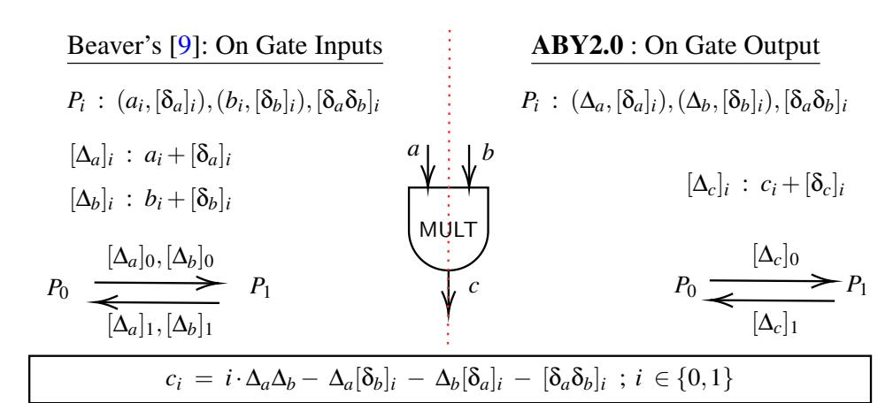
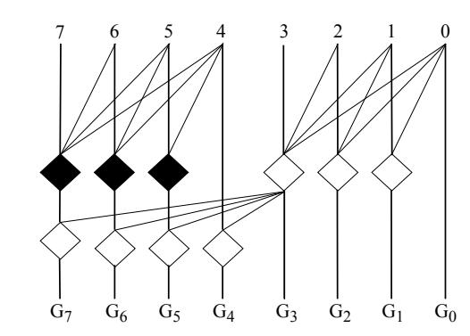
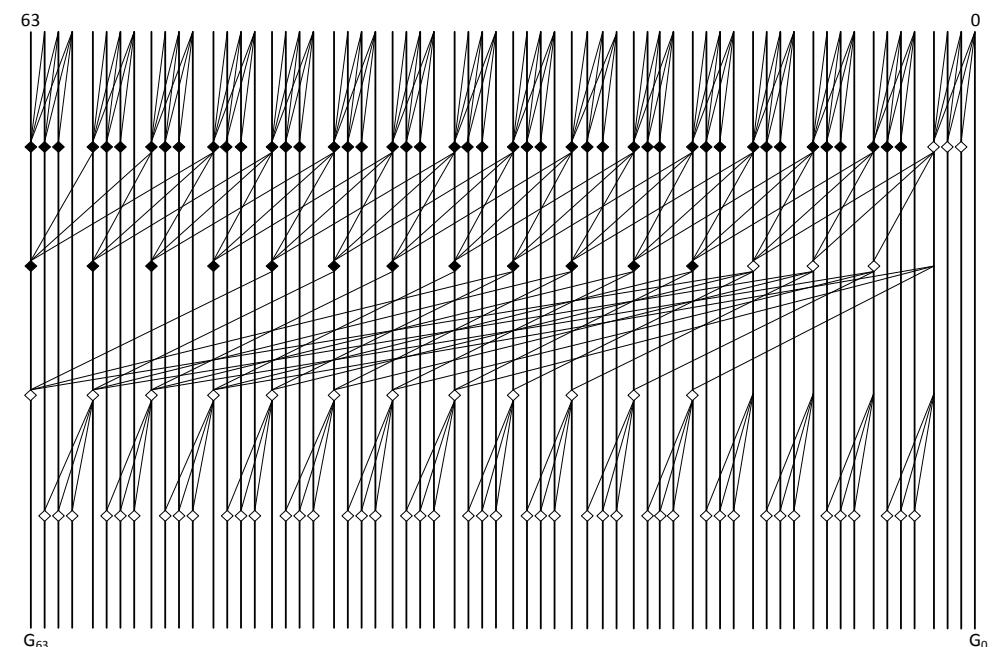
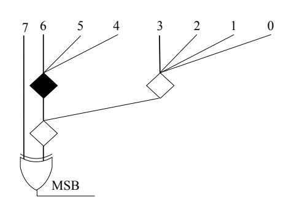
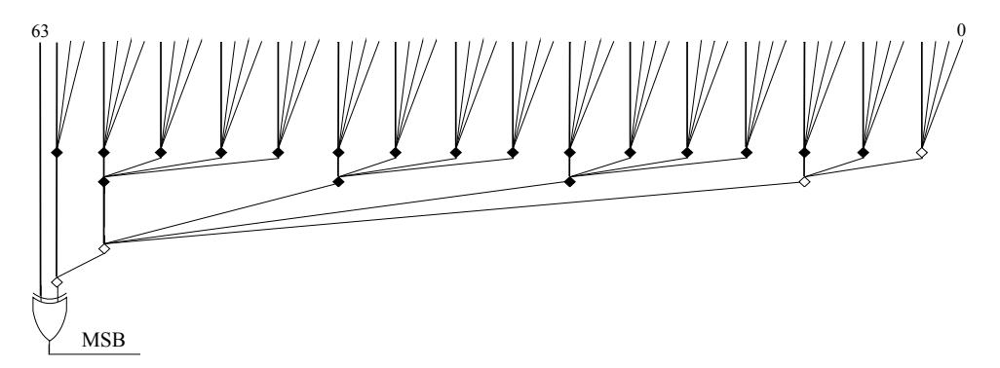

{0}------------------------------------------------

## ABY2.0: Improved Mixed-Protocol Secure Two-Party Computation (Full Version)<sup>∗</sup>

Arpita Patra *Indian Institute of Science* Thomas Schneider *TU Darmstadt*

Ajith Suresh *Indian Institute of Science* Hossein Yalame *TU Darmstadt*

### Abstract

Secure Multi-party Computation (MPC) allows a set of mutually distrusting parties to jointly evaluate a function on their private inputs while maintaining input privacy. In this work, we improve semi-honest secure two-party computation (2PC) over rings, with a focus on the efficiency of the online phase.

We propose an efficient mixed-protocol framework, outperforming the state-of-the-art 2PC framework of ABY. Moreover, we extend our techniques to multi-input multiplication gates without inflating the online communication, i.e., it remains independent of the fan-in. Along the way, we construct efficient protocols for several primitives such as scalar product, matrix multiplication, comparison, maxpool, and equality testing. The online communication of our scalar product is two ring elements *irrespective* of the vector dimension, which is a feature achieved for the first time in the 2PC literature.

The practicality of our new set of protocols is showcased with four applications: i) AES S-box, ii) Circuit-based Private Set Intersection, iii) Biometric Matching, and iv) Privacypreserving Machine Learning (PPML). Most notably, for PPML, we implement and benchmark training and inference of Logistic Regression and Neural Networks over LAN and WAN networks. For training, we improve online runtime (both for LAN and WAN) over SecureML (Mohassel et al., IEEE S&P'17) in the range 1.5×–6.1×, while for inference, the improvements are in the range of 2.5×–754.3×.

### 1 Introduction

Secure Multi-Party Computation (MPC) [\[14,](#page-14-0) [50,](#page-15-0) [105\]](#page-17-0) allows *n* mutually distrusting parties to jointly compute a function on their private inputs. The computation guarantees i) privacy– no set of *t* corrupt parties can learn more information than the output, and ii) correctness– corrupt parties cannot force others to accept a wrong output. Due to its immense potential, MPC can be used for solving real-life applications such as

privacy-preserving auctions [\[84\]](#page-16-0) and remote diagnostics [\[27\]](#page-14-1), secure genome analysis [\[15,](#page-14-2) [103\]](#page-17-2), and recently in the domain of privacy-preserving machine learning (PPML) [\[17,](#page-14-3)[31,](#page-14-4) [34,](#page-14-5) [35,](#page-15-1) [57,](#page-15-2) [63,](#page-16-1) [73,](#page-16-2) [82,](#page-16-3) [91,](#page-17-3) [98,](#page-17-4) [108\]](#page-17-5).

MPC protocols can be broadly classified into two categories: i) low-latency [\[32,](#page-14-6) [51,](#page-15-3) [81,](#page-16-4) [88\]](#page-16-5) and ii) high-throughput [\[4,](#page-13-0) [31,](#page-14-4) [34,](#page-14-5) [35,](#page-15-1) [73,](#page-16-2) [74,](#page-16-6) [91\]](#page-17-3) protocols. The low-latency protocols are built using Yao's garbled circuits (GC) [\[11,](#page-14-7) [72,](#page-16-7) [105,](#page-17-0) [106\]](#page-17-6) and result in constant-round solutions. Secret-sharing (SS) based solutions have been used for high-throughput protocols, but require a number of communication rounds linear in the multiplicative depth of the circuit. However, less communication than GC-based protocols facilitates several instances of SS-based protocols to be executed in parallel, leading to high throughput. The characteristics of the categories mentioned above put forth the need for a mixed-protocol framework [\[35,](#page-15-1) [43,](#page-15-4) [74,](#page-16-6) [80,](#page-16-8) [82,](#page-16-3) [99\]](#page-17-7), where the protocol is split into blocks and each block is executed in one of the following three worlds: i) Arithmetic, ii) Boolean, and iii) Yao. While the arithmetic world performs operations on ℓ-bit rings (or fields), both boolean and Yao world perform operations on bits. Also, arithmetic and boolean worlds operate using a secret-sharing based approach while the Yao world uses a GC-based approach.

To achieve practical run times, several works [\[13,](#page-14-8) [30,](#page-14-9) [31,](#page-14-4) [34,](#page-14-5) [35,](#page-15-1) [42,](#page-15-5) [67,](#page-16-9) [73,](#page-16-2) [98\]](#page-17-4) considered the paradigm of having an *input-independent* setup phase where the parties generate a lot of correlated randomness (e.g., Beaver multiplication triples [\[9\]](#page-14-10)) which are then used in the *input-dependent* online phase to enable a very fast computation on the parties' inputs. Moreover, the benchmarking results of [\[101\]](#page-17-8) and the works of [\[18,](#page-14-11) [38,](#page-15-6) [39,](#page-15-7) [41,](#page-15-8) [43\]](#page-15-4) have showcased the efficiency improvements of protocols compared to rings over their field counterparts. The 32/64-bit computations done in standard CPUs, emulating ring operations, allow for very simple and efficient implementations. Also, several algorithms as well as hardware have been optimized for this domain since it has been the norm for several years.

<sup>∗</sup>This article is the full and extended version of an article published at USENIX Security'21 [\[90\]](#page-17-1).

{1}------------------------------------------------

In this work, we focus on the specific problem of secure two-party computation (2PC) [42,43] with mixed protocols over rings. Our aim is to minimize the online communication and rounds keeping high throughput as our end-goal.

#### 1.1 Our Contributions

We propose an efficient mixed-protocol framework for secure 2PC over an  $\ell$ -bit ring. Our protocols are secure against a *semi-honest* adversary and use an *input-independent* setup. We build several building blocks with the focus on online efficiency. Our contributions can be summed up as follows:

**2PC** (§3) We propose an efficient 2PC protocol over  $\ell$ -bit rings, requiring a communication of just 2 ring elements per multiplication in the online phase. Our construction relies on Beaver's circuit randomization technique [9] (§3.1.1), but uses a different perspective of the technique. Moreover, our protocol helps in realising efficient primitives as will be shown in §5. We believe that our new perspective can bring several further optimizations where Beaver's randomization technique is currently being used.

<span id="page-1-0"></span>

|          |        | Setup                  | Online      |        |
|----------|--------|------------------------|-------------|--------|
| Protocol | Ref.   | Comm [bits]            | Comm [bits] | Rounds |
|          | [43]   | $2\ell(\kappa+\ell)$   | 4 ℓ         | 1      |
| MULT     | [13]   | $2\ell(\kappa+\ell)$   | 2ℓ          | 1      |
| y = ab   | [85]   | $2\ell(\kappa+\ell)$   | $4\ell$     | 1      |
|          | ABY2.0 | $2\ell(\kappa+\ell)$   | 2ℓ          | 1      |
|          | [43]   | $4\ell(\kappa + \ell)$ | 8ℓ          | 2      |
| MULT3    | [13]   | $4\ell(\kappa+\ell)$   | $4\ell$     | 2      |
| y = abc  | [85]   | $8\ell(\kappa+\ell)$   | $6\ell$     | 1      |
|          | ABY2.0 | $8\ell(\kappa+\ell)$   | 2ℓ          | 1      |
|          | [43]   | $6\ell(\kappa + \ell)$ | 12ℓ         | 2      |
| MULT4    | [13]   | $6\ell(\kappa+\ell)$   | 6ℓ          | 2      |
| y = abcd | [85]   | $22\ell(\kappa+\ell)$  | 8ℓ          | 1      |
|          | ABY2.0 | $22\ell(\kappa+\ell)$  | 2ℓ          | 1      |

Table 1: Comparison of ABY2.0 and existing works for 2PC protocols. Best values for the online phase are marked in bold.

Tab. 1 shows our improvement over previous works. For 2-input multiplication, we achieve the same complexity as [13], but using a completely different approach. Moreover, for an N-input multiplication gate, our solution has a *constant* cost of 2 ring elements and one round of interaction. This is a massive improvement over [85], where they require communication of 2N ring elements. Round complexity wise, the naive method of multiplying N elements by taking two at a time requires  $\log_2(N)$  online rounds and overall communication of 4(N-1) ring elements for [43] and 2(N-1) for [13].

Mixed Protocol Conversions (§4) The mixed world conversions, that enable easy transition between Arithmetic (A), Boolean (B) and Yao (Y) sharing, are now celebrated in the literature [3, 30, 63, 82, 98] due to their potential in building practically-efficient protocols. We propose a new set of conversions that outperform the state-of-the-art conversions

of ABY [43] in the online phase. Our solution reduces the number of online rounds of ABY from 2 to 1 for most of the conversions. We achieve this because, in contrast to ABY, we forgo OTs in the online phase of our conversions.

Tab. 2 provides the concrete costs for the mixed protocol conversions. The conversion from sharing type S to sharing type D is denoted as S2D, where  $S,D \in \{A,B,Y\}$ . For the setup phase, we use correlated OTs (cOT) [5] which incur a communication of  $\ell + \kappa$  bits per cOT on  $\ell$ -bit strings, where  $\kappa$  is the computational security parameter. It is evident from Tab. 2 that for all except the Y2B conversion, our conversions outperform ABY's in the online phase.

<span id="page-1-1"></span>

| Conv. | D.C      | Setup                  | Online               |        |
|-------|----------|------------------------|----------------------|--------|
|       | Ref.     | Comm [bits]            | Comm [bits]          | Rounds |
| Y2B   | ABY [43] | 0                      | 0                    | 0      |
|       | ABY2.0   | $\ell$                 | $\ell$               | 1      |
| B2Y   | ABY [43] | $2\ell\kappa$          | $\ell \kappa + \ell$ | 2      |
|       | ABY2.0   | $2\ell\kappa$          | $\ell \kappa$        | 1      |
| A2Y   | ABY [43] | 4ℓ <b>κ</b>            | $2\ell\kappa + \ell$ | 2      |
|       | ABY2.0   | $4\ell\kappa$          | $\ell \kappa$        | 1      |
| Y2A   | ABY [43] | 2ℓκ                    | $(\ell^2 + 3\ell)/2$ | 2      |
|       | ABY2.0   | $3\ell\kappa + 2\ell$  | $\ell$               | 1      |
| A2B   | ABY [43] | 4ℓ <b>κ</b>            | $2\ell\kappa + \ell$ | 2      |
|       | ABY2.0   | $4\ell\kappa + \ell$   | $\ell \kappa + \ell$ | 2      |
| B2A   | ABY [43] | $\ell \kappa$          | $(\ell^2 + \ell)/2$  | 2      |
|       | ABY2.0   | $\ell \kappa + \ell^2$ | 2ℓ                   | 1      |

Table 2: Comparison of ABY2.0 and ABY for the conversions. The values are reported for  $\ell$ -bit values. Best values for the online phase are marked in bold.

**Building Blocks** (§5) We propose efficient constructions for widely-used building blocks that include Scalar Product, Depth-Optimized Circuits, Matrix Multiplication, Comparison, Non-linear Activation functions, and Maxpool. The highlights include:

- Scalar Product (§5.1): Our new protocol incurs an online communication that is *independent* of the vector dimension n. This feature is achieved for the first time in the 2PC literature. Concretely, we require communication of just 2 ring elements as opposed to 4n elements of [43]. Since scalar product forms an essential building block for most of the widely used ML algorithms [31, 34, 35, 62, 80, 82, 98] such as Linear Regression, Logistic Regression, and Clustering, our solution substantially improves the performance of their secure 2PC implementations by several orders of magnitude.
- Matrix Multiplication (§5.2): Matrix multiplication is the fundamental building block in most ML algorithms. For instance, the linear layer in a Neural Network (NN) can be viewed as an instance of matrix multiplication. Also the convolution operation in a Convolutional Neural Network can be phrased as an instance of matrix multiplication using standard methods [102]. We extend the 2PC multiplication protocol to support vector operations and provide an efficient matrix multiplication protocol.

{2}------------------------------------------------

- Depth Optimized Circuits ([§5.3\)](#page-8-1): The Parallel Prefix Adder (PPA) [\[8,](#page-13-3) [52\]](#page-15-9) used in the recent PPML literature [\[80\]](#page-16-8) incurs a multiplicative depth of log<sup>2</sup> (ℓ) since it uses two-input AND gates only. We propose round efficient PPA constructions using a combination of two, three, and four input AND gates. Concretely, for a 64-bit ring, our solution has 2× fewer rounds and also less online communication compared to the PPA used in [\[80\]](#page-16-8).
- Comparison ([§5.4\)](#page-8-2): Our new protocol for checking less than relation improves the online communication of the comparison protocol of [\[85\]](#page-16-10) by 6× and reduces the number of online rounds from 4 to 3.
- Maximum of three elements ([§5.7\)](#page-9-0): Our new protocol improves the online communication of [\[85\]](#page-16-10) by 14× while reducing the online rounds from 5 to 4.
- Equality Test ([§5.10\)](#page-9-1): Our new protocol for checking the equality of two ℓ-bit values, improves the online rounds of [\[94\]](#page-17-10) from log<sup>2</sup> (ℓ) to log<sup>4</sup> (ℓ).

Applications ([§6\)](#page-9-2) The practicality of our constructions are showcased in these four popular applications:

- *AES S-box ([§6.2\)](#page-10-0):* Using our protocol for 3-input multiplication, we obtain an S-box with an AND-depth of 3 instead of 4 before. This improves the online round complexity of AES by factor 1.33×.
- *Circuit-based PSI ([§6.3\)](#page-11-0):* Using our efficient equality testing protocol, we improve the online communication of the state-of-the-art circuit-based PSI [\[94\]](#page-17-10) by 2.35× and the online round complexity by 1.3×.
- *Biometric Matching ([§6.4\)](#page-11-1):* We propose a round-optimized as well as a communication-optimized solution for computing the minimum Euclidean distance, which forms the core for biometric matching. For the round-optimized variant, we improve over ABY [\[43\]](#page-15-4) by 2.2× in communication and 1.6× in rounds in the online phase. Similarly, for the communicationoptimized variant, we improve over [\[85\]](#page-16-10) by 20.8× in communication and 1.3× in rounds.
- *Privacy-Preserving Machine Learning ([§6.5\)](#page-11-2):* Here we implement the training and inference of Logistic Regression and Neural Networks in a LAN and a WAN setting and benchmarked over datasets with various feature sizes. For training, we obtain online runtime improvements over

<span id="page-2-0"></span>

| Algorithm              | Ref.           | LAN                 |           | WAN           |           |
|------------------------|----------------|---------------------|-----------|---------------|-----------|
|                        |                | TP (x104<br>)       | Improvem. | TP (x104<br>) | Improvem. |
| Logistic<br>Regression | [82]<br>ABY2.0 | 1,344.4<br>42,372.4 | 31.5×     | 4.0<br>39.9   | 9.9×      |
| Neural<br>Networks     | [82]<br>ABY2.0 | 43.0<br>30,797.0    | 716.0×    | 0.1<br>92.39  | 710.7×    |

Table 3: Comparison of the online throughput (TP) of ABY2.0 and SecureML [\[82\]](#page-16-3) for inference on the MNIST [\[77\]](#page-16-12) dataset.

SecureML [\[82\]](#page-16-3) in the range 2.7×–6.1× for LAN and 1.5×– 2.8× for WAN. For inference, we used *throughput* as one

metric to capture the effect of runtime and communication utilization in a single shot. Our improvement for inference ranges from 7.9×–754.3× for LAN, while it ranges from 2.5×–753.2× for WAN. Tab. [3](#page-2-0) provides the concrete details for inference over the MNIST [\[77\]](#page-16-12) dataset.

#### 1.2 Related Work

Here, we provide a concise summary of related work. More details on the preliminaries are given in [§A.](#page-17-11)

Secret Sharing (SS). The works of [\[42,](#page-15-5)[67\]](#page-16-9) proposed efficient SS-based solutions for the dishonest majority setting over fields, which was then extended to the ring setting in [\[37\]](#page-15-10). The solution involves the generation of Beaver multiplication triples [\[9\]](#page-14-10) in the setup phase and evaluation of the circuit (multiplication gates) in the online phase using the generated triples. For the 2PC case, the aforementioned approach requires two public reconstructions among the parties per multiplication gate in the online phase. In contrast, we require only one public reconstruction among the parties. Later, works like [\[65,](#page-16-13) [66,](#page-16-14) [86\]](#page-16-15) focused on improving the setup cost using techniques like Oblivious Transfer (OT) and Homomorphic Encryption (HE). [\[13\]](#page-14-8) improved the number of public reconstructions required in the online phase from two to one using a function-dependent preprocessing, but requires additional communication of four ring elements in the preprocessing phase.

Multi-Input Multiplication. In the boolean setting, [\[44\]](#page-15-11) extended two-input AND gates to the general N-input case using lookup tables. As shown in [§B.3.4,](#page-21-0) we have significantly better online communication of *N*-input AND gates (ANDN) by *N*×. Recently, [\[85\]](#page-16-10) extended the multiplication from twoinput to arbitrary input using Beaver triple extension with a focus on minimizing the online rounds. However, the online communication of [\[85\]](#page-16-10) scale with the fan-in of the multiplication gates as opposed to ours, where we achieve an online communication of 2 ring elements.

Mixed-Protocol Conversions. Mixed 2PC protocols that combine GC-based and SS-based approaches benefit from their respective advantages and were used in many privacypreserving applications such as face recognition [\[54\]](#page-15-12), fingerprint recognition [\[28\]](#page-14-12), biometric matching [\[43\]](#page-15-4), and machine learning [\[63,](#page-16-1) [80,](#page-16-8) [82,](#page-16-3) [98\]](#page-17-4). The first mixed-protocol framework for MPC was TASTY [\[54,](#page-15-12) [71\]](#page-16-16), which combined garbled circuits with homomorphic encryption. ABY [\[43\]](#page-15-4) then proposed an efficient framework in the semi-honest model combining state-of-the-art 2PC approaches based on Arithmetic sharing, Boolean sharing, and GCs. The work of [\[99\]](#page-17-7) shows conversions between MPC based on arithmetic secret sharing and garbled circuits with malicious security. Later, the ABY framework was extended to the three and four party honestmajority setting by [\[35,](#page-15-1) [80\]](#page-16-8). HyCC [\[30\]](#page-14-9) provides a compiler to automatically partition a function (specified in ANSI C)

{3}------------------------------------------------

into sub-functions such that each sub-function is evaluated with either Arithmetic sharing, Boolean sharing or GCs. The partitioning takes into account the real-world setup such as the network between the parties. The work of [61] has shown a method to find an optimal partitioning in polynomial time.

#### 2 Preliminaries

Here, we describe our security model and the parameters and notations used. More details along with a brief overview of the state-of-the-art 2PC protocols are given in §A.

**Semi-honest Security Model** In this work, we consider a semi-honest (aka passive) adversary [36, 58, 107], who is "honest-but-curious". The adversary is guaranteed to follow the protocol steps but will try to learn additional information from the messages that he has seen during the protocol execution. Though not the strongest model, this model forms the first step towards achieving protocols with stronger security guarantees [6, 33, 75, 78]. Also, the setting facilitates practically-efficient protocols with higher performance especially for PPML applications [34, 82, 98]. In practical scenarios where the computation is outsourced to a set of servers, the reputation of the servers forces them to behave semi-honestly. Moreover, in many application scenarios, semihonest behaviour can be enforced by attestation using tools like Intel SGX or ARM TrustZone. We refer the reader to [49] for details on the model.

**Parameters and Notation** In our framework, we have two parties  $\mathcal{P} = \{P_0, P_1\}$  who are connected by a bidirectional synchronous channel (eg. instantiated via TLS over TCP/IP). Our protocols are designed to work over an  $\ell$ -bit ring denoted by  $\mathbb{Z}_{2^{\ell}}$ .  $\kappa$  denotes the computational security parameter. In our implementation, we use  $\ell = 64$  and  $\kappa = 128$ .

For two vectors  $\vec{a}, \vec{b}$  of length n, the scalar dot product is denoted by  $\vec{a} \odot \vec{b} = \sum_{j=1}^{n} a_{j} b_{j}$ . Here  $a_{j}$  and  $b_{j}$  denote the  $j^{th}$  elements of vectors  $\vec{a}$  and  $\vec{b}$  respectively. For a bit  $u \in \{0,1\}$ ,  $\overline{u}$  denotes the complement value  $1 \oplus u$ . For two matrices  $\mathbf{A}, \mathbf{B}$ , matrix multiplication is denoted by  $\mathbf{A} \circ \mathbf{B}$ . Table 4 depicts notation that we use throughout the paper.

Our protocols are cast into an *input-independent* setup phase and an *input-dependent* online phase. To enable parties to non-interactively sample a random value, parties perform a one-time key-setup that establishes random keys among them for a pseudo-random function (PRF) which can be instantiated, for instance, using AES in counter mode. Towards this, each party  $P_i$  for  $i \in \{0,1\}$  samples a random key  $K_i \in_R \{0,1\}^K$  and sends it to the other party. The shared key is now defined as  $K = K_0 + K_1$ .

For applications such as machine learning where the inputs are decimal numbers, we use the Fixed-Point Arithmetic (FPA) representation [31, 34, 35, 80, 82] to embed the value in the underlying ring. Decimal value is treated as an  $\ell$ -bit integer in signed 2's complement representation. The most significant

<span id="page-3-2"></span>

| $P_0, P_1$                            | Parties performing secure computation                                                                                             |
|---------------------------------------|-----------------------------------------------------------------------------------------------------------------------------------|
| $\mathbb{Z}_{2^\ell}$                 | Ring of size $\ell$ bits; $\ell = 64$ in this work                                                                                |
| κ                                     | Symmetric security parameter; $\kappa = 128$ in this work                                                                         |
| $a_j$                                 | $j$ -th element of vector $\vec{a}$                                                                                               |
| $\vec{a}_{j} \ \vec{a} \odot \vec{b}$ | Scalar dot product between two vectors $\vec{a}$ and $\vec{b}$                                                                    |
| $\mathbf{A} \circ \mathbf{B}$         | Multiplication of two matrices <b>A</b> and <b>B</b>                                                                              |
| $[v]_i$                               | [·]-sharing of $v \in \mathbb{Z}_{2^{\ell}}$ held by $P_i$ s.t. $v = [v]_0 + [v]_1$                                               |
|                                       | $\langle \cdot \rangle$ -sharing of $v \in \mathbb{Z}_{2^{\ell}}$ held by $P_i$ s.t. $v = \Delta_v - [\delta_v]_1 - [\delta_v]_0$ |
| $t \in \{A, B, Y\}$                   | Type of sharing: Arithmetic, Boolean, or Yao                                                                                      |
| $x^s = s2t(x^t)$                      | Sharing conversion from source <i>s</i> to target <i>t</i>                                                                        |
| OT                                    | Oblivious Transfer                                                                                                                |
| HE                                    | Homomorphic Encryption                                                                                                            |
| $cOT^n_\ell$                          | <i>n</i> instances of Correlated OT on $\ell$ -bit strings                                                                        |
| MSB/LSB                               | Most / Least Significant Bit                                                                                                      |
| FPA                                   | Fixed-point Arithmetic                                                                                                            |
| SED                                   | Squared Euclidean Distance                                                                                                        |

Table 4: Notations used throughout this paper.

bit (MSB) represents the sign while the least significant x bits represent the fractional part. For our implementation, we use  $\ell = 64$  and x = 13.

#### <span id="page-3-0"></span>3 2PC in Arithmetic, Boolean and Yao's World

The contribution of this section is our new 2PC over ring  $\mathbb{Z}_{2^\ell}$ . This construction gives us a new 2PC in the arithmetic world and in the Boolean world. The latter is easily derived by having  $\ell=1$ . The 2PC in Yao's world is borrowed from ABY [43]. Below, we start with our new 2PC over  $\mathbb{Z}_{2^\ell}$ . We describe the secret-sharing semantics, the sharing and reconstruction protocols, and the multiplication protocols (both for setup and online phase) with various fan-ins. Our final 2PC for any functionality represented over an arithmetic circuit over  $\mathbb{Z}_{2^\ell}$  can be obtained by running the following steps in sequence: (a) sharing all the inputs via the sharing protocols, (b) gate by gate evaluation (using linearity of our secret sharing and the multiplication protocols) and (c) output reconstruction via the reconstruction protocol.

#### 3.1 2PC in Arithmetic World

We provide the details for our 2PC scheme here. Before going into the details, we present a high-level overview of our scheme and a side-by-side comparison with the well-known Beaver's circuit randomization technique [9]. Our protocol, inspired by the 3PC protocol of ASTRA [34], achieves a communication similar to [13]. The highlight of our protocol is its effectiveness towards efficient realisations for multiple input multiplication gates and dot product operations as will be explained in §3.1.4 and §5.1 later.

#### <span id="page-3-1"></span>3.1.1 High-level Overview of Our 2PC over Ring

Consider two parties  $P_0$ ,  $P_1$  with values a, b additively shared among them who want to compute a multiplication gate with output c.

{4}------------------------------------------------

Beaver's technique [9] on gate inputs (cf. left of Fig. 1) In 2PC, there has been a lot of works [42, 43, 63, 67, 98] that use Beaver's [9] circuit randomization technique to compute the product  $a \cdot b$ . In this technique (cf. left side of Fig. 1), the inputs of the multiplication gate are randomized first and the corresponding correlated randomness is generated independently (preferably in a setup phase). In detail, parties interactively generate an additive sharing of the multiplication triple  $(\delta_a, \delta_b, \delta_{ab})$  with  $\delta_{ab} = \delta_a \delta_b$  during the setup phase before the actual inputs are known. Now, we can write

$$\begin{split} \mathbf{a} \cdot \mathbf{b} &= ((\mathbf{a} + \delta_{\mathsf{a}}) - \delta_{\mathsf{a}})((\mathbf{b} + \delta_{\mathsf{b}}) - \delta_{\mathsf{b}}) \\ &= (\mathbf{a} + \delta_{\mathsf{a}})(\mathbf{b} + \delta_{\mathsf{b}}) - (\mathbf{a} + \delta_{\mathsf{a}})\delta_{\mathsf{b}} - (\mathbf{b} + \delta_{\mathsf{b}})\delta_{\mathsf{a}} + \delta_{\mathsf{a}\mathsf{b}}. \end{split}$$

Let  $\Delta_a=(a+\delta_a)$  and  $\Delta_b=(b+\delta_b)$  be the randomized versions of the input values of a multiplication gate. Then, during the online phase, parties locally compute an additive sharing of  $\Delta_a$  using additive shares of a and  $\delta_a$ . Similarly, an additive sharing of  $\Delta_b$  is computed. This is followed by the parties mutually exchanging the shares of  $\Delta_a$  and  $\Delta_b$  to enable public reconstruction of  $\Delta_a$  and  $\Delta_b$ . Then using the above equation, parties can locally compute a sharing of  $a \cdot b$ . Note that this method requires communicating 4 elements per multiplication (2 elements per reconstruction). We observe that the communication is required for enabling parties to obtain the value of  $\Delta_a$  and  $\Delta_b$  in clear.

<span id="page-4-0"></span>

Figure 1: High level overview of Beaver's [9] and ABY2.0

Our technique on gate outputs (cf. right of Fig. 1) With this insight, we modify the sharing semantics so that the parties are ensured to have the  $\Delta$  value as a part of their share, corresponding to every wire value (including the inputs of a multiplication gate). As a result, the reconstructions of  $\Delta_a$  and  $\Delta_b$  are no longer required. This may give the wrong impression that no communication is required for evaluating a multiplication gate. It is true that now the parties can locally evaluate the additive sharing of  $y = a \cdot b$ . But in order to proceed further, a sharing for y according to the new sharing semantics needs to be generated. This requires both parties to obtain  $\Delta_y$  in clear. Hence, the parties locally compute an additive sharing of  $\Delta_y$  using the shares of y computed earlier and mutually exchange their shares to reconstruct  $\Delta_y$ .

Our technique, in summary, shifts the need of reconstruction (which alone causes communication for a multiplication gate) from per input wire to the *output* wire alone for a multiplication gate. For a traditional 2-input multiplication gate, we reduce the number of reconstructions (each involves sending 2 elements) from 2 to 1. As a result, we improve communication by a factor of  $2\times$ . The impact is much higher for an N-input multiplication gate (cf. §3.1.4) and a scalar product of two N-dimensional vectors (cf. §5.1). For scalar product, Beaver's circuit re-randomization required 2N reconstructions, whereas our techniques need a *single* one, offering a gain of  $2N\times$ . Our constructions can be generalized to the n-party scenario (which is out of scope for this work) and bring a significant pay-off, as the cost per reconstruction depends linearly on the number of parties.

#### 3.1.2 Sharing Semantics

[·]-sharing A value  $v \in \mathbb{Z}_{2^{\ell}}$  is said to be [·]-shared among  $\mathcal{P}$ , if party  $P_i$  for  $i \in \{0,1\}$  holds  $[v]_i$  such that  $v = [v]_0 + [v]_1$ .

 $\langle \cdot \rangle$ -sharing A value  $v \in \mathbb{Z}_{2^{\ell}}$  is said to be  $\langle \cdot \rangle$ -shared among  $\mathcal{P}$ , if there exist values  $\delta_{v}, \Delta_{v} \in \mathbb{Z}_{2^{\ell}}$  such that i)  $\delta_{v}$  is  $[\cdot]$ -shared among  $P_{0}, P_{1}$ , ii)  $\Delta_{v} = v + \delta_{v}$ , and iii)  $\Delta_{v}$  is known to both  $P_{0}, P_{1}$  in clear. We denote the shares of individual parties as  $\langle v \rangle_{i} = ([\delta_{v}]_{i}, \Delta_{v})$  for  $i \in \{0, 1\}$ .

We use  $\delta_{v_1...v_n}$  to represent the product  $\delta_{v_1}\delta_{v_2}\cdots\delta_{v_n}$ . Similarly,  $\Delta_{v_1...v_n}$  represents  $\Delta_{v_1}\Delta_{v_2}\cdots\Delta_{v_n}$ .

#### <span id="page-4-1"></span>3.1.3 Protocols

**Sharing Protocol** Protocol SHARE enables party  $P_i$  for  $i \in \{0,1\}$  to generate a  $\langle \cdot \rangle$ -sharing of its input value v. During the setup,  $P_i$  samples random  $[\delta_v]_i$  while the parties together sample  $[\delta_v]_{1-i}$  so that  $P_i$  will get to know  $\delta_v = [\delta_v]_0 + [\delta_v]_1$  in clear. During the online phase,  $P_i$  computes  $\Delta_v = v + \delta_v$  and sends it to  $P_{1-i}$ .

**Reconstruction Protocol** To reconstruct value v given  $\langle v \rangle$ , protocol REC proceeds as follows: parties mutually exchange their missing  $[\cdot]$ -share of  $\delta_v$  and locally compute  $v = \Delta_v - [\delta_v]_0 - [\delta_v]_1$ .

**Linear Operations** Our sharing scheme is linear in the sense that given  $\langle a \rangle$ ,  $\langle b \rangle$  and public constants  $c_1, c_2$ , parties can locally compute  $\langle y \rangle = c_1 \cdot \langle a \rangle + c_2 \cdot \langle b \rangle$ . For this,  $P_i$  for  $i \in \{0,1\}$  locally sets  $\Delta_y = c_1 \cdot \Delta_a + c_2 \cdot \Delta_b$  and  $[\delta_y]_i = c_1 \cdot [\delta_a]_i + c_2 \cdot [\delta_b]_i$ .

**Multiplication Protocol** Given the  $\langle \cdot \rangle$ -sharing of a, b, the goal of protocol MULT (cf. Fig. 2) is to generate  $\langle y \rangle$  where y = ab. For correctness to hold, we will need

$$\begin{split} \Delta_{y} &= y + \delta_{y} = ab + \delta_{y} = (\Delta_{a} - \delta_{a})(\Delta_{b} - \delta_{b}) + \delta_{y} \\ &= \Delta_{a}\Delta_{b} - \Delta_{a}\delta_{b} - \Delta_{b}\delta_{a} + \delta_{a}\delta_{b} + \delta_{v}. \end{split}$$

Since the  $\delta$ -values are not available in clear to any of  $P_0, P_1$ , they cannot compute the value  $\Delta_y$  on their own. But if we enable the parties obtain a  $[\cdot]$ -sharing of  $\delta_{ab} = \delta_a \delta_b$ , then

{5}------------------------------------------------

each of them can compute a  $[\cdot]$ -sharing of  $\Delta_y$  which they can mutually exchange to obtain  $\Delta_y$  in clear. So the problem of multiplication reduces to generating  $[\delta_{ab}]$  given  $[\delta_a]$  and  $[\delta_b]$ . We use protocol setupMULT to accomplish this task, the details of which is provided later in this subsection. We note that Turbospeedz [13] achieves same online cost as that of ours, but with a more expensive preprocessing. We provide more details in §A.3.

Setup:

• 
$$P_i$$
 for  $i \in \{0,1\}$  samples random  $[\delta_y]_i \in_R \mathbb{Z}_{2^\ell}$ .

• Parties execute setupMULT( $[\delta_a]$ ,  $[\delta_b]$ ) to generate  $[\delta_{ab}]$ .

Online:

•  $P_i$  for  $i \in \{0,1\}$  locally computes and sends to  $P_{1-i}$ 
 $[\Delta_y]_i = i \cdot \Delta_{ab} - \Delta_a [\delta_b]_i - \Delta_b [\delta_a]_i + [\delta_{ab}]_i + [\delta_y]_i$ .

•  $P_i$  for  $i \in \{0,1\}$  locally sets  $\Delta_y = [\Delta_y]_0 + [\Delta_y]_1$ .

<span id="page-5-1"></span>Figure 2: Multiplication Protocol

To summarize, during the setup phase, parties first locally sample the  $[\cdot]$ -shares for  $\delta_y$ . In parallel, parties execute the setupMULT protocol on  $[\delta_a]$  and  $[\delta_b]$  to obtain  $[\delta_{ab}]$ . During the online phase, the parties locally compute  $[\Delta_y]$  and subsequently reconstruct  $\Delta_y$ .

We now provide the details for instantiating setupMULT using two of the well-known primitives: i) Oblivious Transfer (OT) as used in [43, 65] and ii) Homomorphic Encryption (HE) as used in [42, 54, 97]. These two approaches have been rallied against each other in terms of practical efficiency in the past and fair competition is still going on. In our work, we make only black-box access to these primitives, and hence any improvement in any of them will have a direct impact on the overall efficiency of the setup phase of our protocols.

Note that  $\delta_{\mathsf{a}\mathsf{b}} = ([\delta_{\mathsf{a}}]_0 + [\delta_{\mathsf{a}}]_1)([\delta_{\mathsf{b}}]_0 + [\delta_{\mathsf{b}}]_1) = [\delta_{\mathsf{a}}]_0 [\delta_{\mathsf{b}}]_0 + [\delta_{\mathsf{a}}]_0 [\delta_{\mathsf{b}}]_1 + [\delta_{\mathsf{a}}]_1 [\delta_{\mathsf{b}}]_0 + [\delta_{\mathsf{a}}]_1 [\delta_{\mathsf{b}}]_1$ . Here  $P_i$  for  $i \in \{0, 1\}$  can locally compute  $[\delta_{\mathsf{a}}]_i [\delta_{\mathsf{b}}]_i$  and hence the problem reduces to computing  $[\delta_{\mathsf{a}}]_0 [\delta_{\mathsf{b}}]_1$  and  $[\delta_{\mathsf{a}}]_1 [\delta_{\mathsf{b}}]_0$ .

**OT based** setupMULT In our OT-based approach, we use Correlated OTs (cOT) [5] where the sender inputs a correlation function  $f(\cdot)$  to cOT and obtains  $(m_0, m_1)$ , where  $m_0$  is a random element and  $m_1 = f(m_0)$ . We use cOT<sup>n</sup><sub> $\ell$ </sub> to represent n parallel instances of 1-out-of-2 Correlated OTs on  $\ell$  bit input strings.

To compute  $[([\delta_a]_0[\delta_b]_1)]$ , the parties execute  $\operatorname{cOT}_\ell^\ell$  with  $P_0$  being the sender and  $P_1$  being the receiver. For the j-th instance of  $\operatorname{cOT}$  where  $j \in \{0, \dots, \ell-1\}$ ,  $P_0$  inputs the correlation  $f_j(x) = x + 2^j [\delta_a]_0$  and obtains  $(m_{j,0} = r_j, m_{j,1} = r_j + 2^j [\delta_a]_0)$ .  $P_1$  inputs choice bit  $b_j$  as the j-th bit of  $[\delta_b]_1$  and obtains  $m_{j,b_j}$  as output. Now the  $[\cdot]$ -shares are defined as  $[([\delta_a]_0[\delta_b]_1)]_0 = \sum_{j=0}^{\ell-1} (-r_j)$  and  $[([\delta_a]_0[\delta_b]_1)]_1 = \sum_{j=0}^{\ell-1} m_{j,b_j}$ . Computation of  $[([\delta_a]_1[\delta_b]_0)]$  proceeds similarly with the role of the parties reversed.

**HE-based** setupMULT In a HE based solution,  $P_0$ , using his public key  $\mathsf{pk}_0$ , encrypts its messages  $[\delta_{\mathsf{a}}]_0$ ,  $[\delta_{\mathsf{b}}]_0$  in independent ciphertexts and sends the ciphertexts to  $P_1$ . In parallel,  $P_1$  computes the ciphertexts corresponding to  $[\delta_{\mathsf{a}}]_1$ ,  $[\delta_{\mathsf{b}}]_1$  and a random element  $r \in_R \mathbb{Z}_{2^\ell}$  using  $\mathsf{pk}_0$ . Upon receiving the ciphertexts from  $P_0$ ,  $P_1$  computes the ciphertext corresponding to  $\mathsf{v} = [\delta_{\mathsf{a}}]_0 [\delta_{\mathsf{b}}]_1 + [\delta_{\mathsf{a}}]_1 [\delta_{\mathsf{b}}]_0 - r$  using the homomorphic property of the underlying HE.  $P_1$  then sends encryption of  $\mathsf{v}$  to  $P_0$  who then decrypts it using his secret key  $\mathsf{sk}_0$ . Note that  $(\mathsf{v}, r)$  forms an additive sharing of the desired value:  $[\delta_{\mathsf{a}}]_0 [\delta_{\mathsf{b}}]_1 + [\delta_{\mathsf{a}}]_1 [\delta_{\mathsf{b}}]_0 = \mathsf{v} + r$ .

Recently, Ring LWE-based AHE [97] was shown to outperform the solutions based on OT for generating multiplication triples. The work uses the Microsoft SEAL library and ciphertext packing. A more detailed description for instantiating setupMULT using OT and HE is provided in §B.2.1.

#### <span id="page-5-0"></span>3.1.4 Multi-Input Multiplication Gates

**3-Input Multiplication gate** We show how to compute a 3-input multiplication gate with three inputs a, b, c with each input being  $\langle \cdot \rangle$ -shared. Protocol MULT3 (cf. Fig. 5 in §B.3.1) generates  $\langle y \rangle$  where y = abc. Similar to 2-input multiplication, we can write

$$\begin{split} \Delta_{\text{y}} &= \text{abc} + \delta_{\text{y}} = (\Delta_{\text{a}} - \delta_{\text{a}})(\Delta_{\text{b}} - \delta_{\text{b}})(\Delta_{\text{c}} - \delta_{\text{c}}) + \delta_{\text{y}} \\ &= \Delta_{\text{abc}} - \Delta_{\text{ab}}\delta_{\text{c}} - \Delta_{\text{bc}}\delta_{\text{a}} - \Delta_{\text{ac}}\delta_{\text{b}} + \Delta_{\text{a}}\delta_{\text{bc}} + \Delta_{\text{b}}\delta_{\text{ac}} \\ &+ \Delta_{\text{c}}\delta_{\text{ab}} - \delta_{\text{abc}} + \delta_{\text{y}}. \end{split}$$

Here we need to generate the  $[\cdot]$ -sharing of four terms, namely  $\delta_{ab}$ ,  $\delta_{bc}$ ,  $\delta_{ac}$  and  $\delta_{abc}$  which is done by protocol setupMULT3. The protocol can be instantiated using either OT or HE in a similar fashion to that of setupMULT and the details are deferred to §B.

**Multi-Input Multiplication gate** We can extend our method to handle a 4-input multiplication (MULT4) gate and in the most general case, an N-input multiplication gate (MULTN) for any positive constant N, without inflating the online communication which remains just 2 ring elements independent of the fan-in of the gate. In contrast, the previous solution [85] requires an online communication of 2N ring elements for an N-input multiplication gate. Note that our improved online communication comes at the cost of an expensive setup (cf. §B.3) and hence to maintain balance, we use  $N \in \{3,4\}$  in our applications. A more detailed description of MULT4 and MULTN is given in §B.3 and the security proof is given in §F. Also, we provide more details of [85] along with a comparison to our protocol in §A.3.

#### 3.2 2PC in Boolean World

All the protocols mentioned above work over a Boolean ring  $(\mathbb{Z}_{2^1})$  as well. This can be achieved by replacing additions (or subtractions) with XORs and multiplications with ANDs.

{6}------------------------------------------------

Here, we introduce an additional protocol for secure negation as below.

**Negation Protocol** Given the **B**-sharing of a bit u as  $\langle u \rangle^{\mathbf{B}} = ([\delta_u], \Delta_u)$ , the goal of a NOT protocol is to generate the boolean sharing of  $\overline{u}$ . This can be done locally by setting  $\Delta_{\overline{u}} = 1 \oplus \Delta_u$  and  $[\delta_{\overline{u}}] = [\delta_u]$ .

#### <span id="page-6-1"></span>3.3 2PC in Yao World

For the Yao world, we follow the sharing semantics introduced by ABY [43]. For a wire u with value  $v \in \{0,1\}$ , party  $P_0$  acts as the garbler with the zero-key on the wire  $(K_u^0)$  being its share, while  $P_1$  acts as the evaluator with the actual key  $(K_u^v)$  as its share. More formally,  $\langle v \rangle_0 = K_u^0$  and  $\langle v \rangle_1 = K_u^v$ .

We use the free-XOR technique [72] in the garbling scheme, which enables the XOR gates to be evaluated without any communication. Here, the one-key for a wire is defined as a fixed offset from the zero-key as  $K_u^1 = K_u^0 \oplus R$  with the least significant bit (LSB) of value R being set to 1 to enable point-and-permute [11]. The value R is chosen by  $P_0$  and is fixed across all the wires in the circuit.

To generate a  $\langle \cdot \rangle$ -sharing of a bit v, protocol SHARE( $P_i, v$ ) proceeds as follows:  $P_0$  chooses a random zero-key  $\mathsf{K}^0_\mathsf{u} \in_R \{0,1\}^\mathsf{K}$  and sets  $\mathsf{K}^1_\mathsf{u} = \mathsf{K}^0_\mathsf{u} \oplus R$ , where  $\mathsf{K}$  denotes the computational security parameter. If  $P_i = P_0$ ,  $P_0$  sends  $\mathsf{K}^\mathsf{v}_\mathsf{u}$  to  $P_1$ . For the case when  $P_i = P_1$ , parties engage in a cOT $^1_\mathsf{K}$  with  $P_0$  being the sender and  $P_1$  being the receiver. Here  $P_0$  inputs the correlation function  $f_R(x) = x \oplus R$  and obtains  $(\mathsf{K}^0_\mathsf{u}, \mathsf{K}^1_\mathsf{u} = \mathsf{K}^0_\mathsf{u} \oplus R)$  while  $P_1$  inputs v as choice bit and receives  $\mathsf{K}^\mathsf{v}_\mathsf{u}$  as the output.

To generate a  $\langle \cdot \rangle$ -sharing of an  $\ell$ -bit value v, parties execute the SHARE() protocol on each of its bits  $(v[j] \text{ for } j \in \{0, \ell-1\})$  in parallel. For a value  $v \in \mathbb{Z}_{2^\ell}$ , we abuse the notation slightly and use  $\langle v \rangle$  to denote the  $\langle \cdot \rangle$ -sharing corresponding to each bit of v. We refer readers to ABY [43] for a formal description of the two-party Yao world and the operations within it.

#### <span id="page-6-0"></span>**4 Mixed Protocol Conversions**

In this section, we show techniques to convert the shared values among the three protocols, namely—Arithmetic, Boolean, and Yao. We use the superscripts  $\{A, B, Y\}$  to distinguish the sharing and the respective protocols in the Arithmetic, Boolean, and Yao respectively.

#### <span id="page-6-2"></span>4.1 Standard Conversions

Here we detail the conversions amongst the three protocols. While most of the conversions of ABY [43] demand OT execution in the online phase, our protocols invoke OT in the setup phase only. This makes the online phase of the conversions—(a) free of any cryptographic operations and (b) run for just one round as opposed to two rounds for OT in ABY (cf. Tab. 2), except the Arithmetic to Boolean conversion.

**Y2B:** Given the  $\langle \cdot \rangle^{\mathbf{Y}}$ -sharing of a bit  $\mathbf{u} \in \{0,1\}$ , the goal is to generate its equivalent Boolean sharing. As observed in ABY, since the last bit of the zero and one key are distinct, XORing the LSB of  $\mathsf{K}^0_{\mathsf{u}}$  and  $\mathsf{K}^\mathsf{u}_{\mathsf{u}}$  results in the underlying bit  $\mathsf{u}$ . Hence, each  $P_i$  for  $i \in \{0,1\}$  Boolean-shares the LSB of their respective shares  $\langle \mathsf{u} \rangle_i^{\mathbf{Y}}$  followed by locally XORing the shares to obtain the desired result. We note that  $P_0$  can perform SHARE $^{\mathbf{B}}(P_0,\mathsf{LSB}(\mathsf{K}^0_{\mathsf{u}}))$  already in the setup phase.

**B2Y:** To convert  $\langle \mathsf{u} \rangle^{\mathbf{B}}$  to its equivalent  $\langle \cdot \rangle^{\mathbf{Y}}$ -sharing,  $P_i$  for  $i \in \{0,1\}$  first locally sets  $\mathsf{u}_i = (1-i) \cdot \Delta_\mathsf{u} \oplus [\delta_\mathsf{u}]_i$ . It is easy to verify that  $\mathsf{u} = \mathsf{u}_0 \oplus \mathsf{u}_1$ . This is followed by party  $P_i$  generating  $\langle \mathsf{u}_i \rangle^{\mathbf{Y}}$  by executing the SHARE $^{\mathbf{Y}}(P_i, \mathsf{u}_i)$  protocol as described in §3.3. Given  $\langle \mathsf{u}_0 \rangle^{\mathbf{Y}}, \langle \mathsf{u}_1 \rangle^{\mathbf{Y}}$ , the parties can locally compute  $\langle \mathsf{u} \rangle^{\mathbf{Y}} = \langle \mathsf{u}_0 \rangle^{\mathbf{Y}} \oplus \langle \mathsf{u}_1 \rangle^{\mathbf{Y}}$  using the free-XOR technique [72]. In our solution, we observe that parties can generate  $\langle \mathsf{u}_1 \rangle^{\mathbf{Y}}$  in the setup phase, with  $\mathsf{u}_1$  available in the setup phase itself. This allows us to shift the OT run to the setup phase, as opposed to ABY [43].

**A2Y:** The conversion from  $\langle \mathsf{v} \rangle^{\mathbf{A}}$  to its equivalent  $\langle \cdot \rangle^{\mathbf{Y}}$ -sharing proceeds similar to that of the B2Y conversion. Party  $P_i$  for  $i \in \{0,1\}$  locally sets  $\mathsf{v}_i = (1-i) \cdot \Delta_\mathsf{v} - [\delta_\mathsf{v}]_i$  so that  $\mathsf{v} = \mathsf{v}_0 + \mathsf{v}_1$ . During the setup phase,  $P_0$  garbles a two-input adder circuit which computes  $\mathsf{y} = \mathsf{x}_0 + \mathsf{x}_1$ , given the inputs  $\mathsf{x}_0, \mathsf{x}_1 \in \mathbb{Z}_{2^\ell}$ . The garbled circuit is then sent to  $P_1$ . In parallel, parties execute SHARE $^{\mathbf{Y}}(P_1,\mathsf{v}_1)$  to generate  $\langle \mathsf{v}_1 \rangle^{\mathbf{Y}}$ . During the online phase, parties execute SHARE $^{\mathbf{Y}}(P_0,\mathsf{v}_0)$  to generate  $\langle \mathsf{v}_0 \rangle^{\mathbf{Y}}$ . This is followed by  $P_1$  locally evaluating the garbled adder circuit to generate  $\langle \mathsf{v} \rangle^{\mathbf{Y}}$  which is our desired result. The adder circuit consists of  $\ell$  AND gates [21]. Using the half-gates technique [106], this has setup communication of  $2\ell\kappa$  bits.

**Y2A:** To convert  $\langle \mathsf{v} \rangle^\mathbf{Y}$  to  $\langle \mathsf{v} \rangle^\mathbf{A}$ , parties proceed similarly to ABY [43] as follows: During the setup phase,  $P_0$  samples a random value  $r \in_R \mathbb{Z}_{2^\ell}$  and executes SHARE $^\mathbf{Y}(P_0,r)$  and SHARE $^\mathbf{A}(P_0,r)$  to generate  $\langle r \rangle^\mathbf{Y}$  and  $\langle r \rangle^\mathbf{A}$  respectively. In parallel,  $P_0$  garbles an Adder circuit and sends the garbled circuit along with the decoding information to  $P_1$ . During the online phase,  $P_1$  evaluates the garbled circuit with inputs  $\langle \mathsf{v} \rangle^\mathbf{Y}$  and  $\langle r \rangle^\mathbf{Y}$  to generate  $\langle \mathsf{v} + r \rangle^\mathbf{Y}$ . Using the decoding information,  $P_1$  obtains the value  $(\mathsf{v} + r)$  in clear followed by executing SHARE $^\mathbf{A}(P_1, \mathsf{v} + r)$  to generate  $\langle \mathsf{v} + r \rangle^\mathbf{A}$ . Parties then locally compute  $\langle \mathsf{v} \rangle^\mathbf{A} = \langle \mathsf{v} + r \rangle^\mathbf{A} - \langle r \rangle^\mathbf{A}$ .

**A2B:** To convert an arithmetic share  $\langle \mathsf{v} \rangle^{\mathbf{A}}$  to its equivalent Boolean share, parties use a Boolean Adder circuit similar to that of the A2Y conversion. Here, party  $P_i$  for  $i \in \{0,1\}$  locally sets  $\mathsf{v}_i = (1-i) \cdot \Delta_\mathsf{v} - [\delta_\mathsf{v}]_i$  followed by executing SHARE<sup>B</sup>( $P_i, \mathsf{v}_i$ ) to generate  $\langle \mathsf{v}_i \rangle^{\mathbf{B}}$ . Parties then evaluate the circuit using the 2PC protocol as described in §3. As mentioned in ABY [43] and ABY3 [80], the adder circuit can either be instantiated in its size-optimized [21] or depthoptimized variant (Parallel-prefix Adder [76]) and both these methods result in a non-constant (dependent on  $\ell$ ) number of rounds. A constant-round solution is to use Y2B(A2Y( $\langle \mathsf{v} \rangle^{\mathbf{A}})$ ).

{7}------------------------------------------------

**Bit2A:** Here the goal is to generate the arithmetic sharing of a bit  $v \in \{0,1\}$ , given its Boolean sharing  $\langle v \rangle^{\mathbf{B}}$ . Let  $v^{\mathbf{a}}$  denote the value of bit v when viewed over an  $\ell$ -bit ring. Then for  $v = v_0 \oplus v_1$ , we can write  $v^{\mathbf{a}} = v_0^{\mathbf{a}} + v_1^{\mathbf{a}} - 2v_0^{\mathbf{a}}v_1^{\mathbf{a}}$ . We make use of this observation in the rest of the paper several times. Note that  $v^{\mathbf{a}} = (\Delta_v \oplus \delta_v)^{\mathbf{a}} = \Delta_v^{\mathbf{a}} + \delta_v^{\mathbf{a}} - 2\Delta_v^{\mathbf{a}}\delta_v^{\mathbf{a}}$ .

During the setup phase, parties interactively generate the  $[\cdot]$  sharing of value  $\delta_{\mathsf{v}}^{\mathsf{a}}$ . During the online phase,  $P_i$  for  $i \in \{0,1\}$  locally computes  $[\mathsf{v}^{\mathsf{a}}]_i = i \cdot \Delta_{\mathsf{v}}^{\mathsf{a}} + (1 - 2\Delta_{\mathsf{v}}^{\mathsf{a}}) \cdot [\delta_{\mathsf{v}}^{\mathsf{a}}]_i$  and executes SHARE<sup>A</sup> $(P_i, [\mathsf{v}^{\mathsf{a}}]_i)$  to generate  $\langle [\mathsf{v}^{\mathsf{a}}]_i \rangle^{\mathsf{A}}$ . This is followed by parties locally computing  $\langle \mathsf{v}^{\mathsf{a}} \rangle^{\mathsf{A}} = \langle [\mathsf{v}^{\mathsf{a}}]_0 \rangle^{\mathsf{A}} + \langle [\mathsf{v}^{\mathsf{a}}]_1 \rangle^{\mathsf{A}}$ .

Now we describe how to generate  $[\delta_v^a]$  in the setup phase, given the  $[\cdot]$ -sharing of bit  $\delta_v$ . Since  $\delta_v = [\delta_v]_0 \oplus [\delta_v]_1$ , we can write  $\delta_v^a = [\delta_v^a]_0 + [\delta_v^a]_1 - 2([\delta_v^a]_0 [\delta_v^a]_1)$ . The parties first execute  $\operatorname{cOT}_\ell^1$  with  $P_0$  as sender and  $P_1$  as receiver.  $P_0$  inputs the correlation  $f_j(x) = x + [\delta_v]_0^a$  and obtains  $(s_0 = r, s_1 = r + [\delta_v]_0^a)$ .  $P_1$  inputs the choice bit as  $[\delta_v]_1$  and obtains  $s_{[\delta_v]_1} = r + [\delta_v]_1 \cdot [\delta_v]_0^a$  as the output.  $P_0$  locally sets  $[([\delta_v]_0^a [\delta_v]_1^a)]_0 = -r$  while  $P_1$  sets  $[([\delta_v]_0^a [\delta_v]_1^a)]_0 = s_{[\delta_v]_1}$ . Party  $P_i$  for  $i \in \{0,1\}$  locally sets the  $[\cdot]$ -share of  $[\delta_v^a]$  as  $[\delta_v^a]_i = (1-i) \cdot [\delta_v]_0^a + i \cdot [\delta_v]_1^a - 2[([\delta_v]_0^a [\delta_v]_1^a)]_i$ .

**B2A:** To convert a value  $v \in \mathbb{Z}_{2^{\ell}}$  from its  $\langle \cdot \rangle^{\mathbf{B}}$ -sharing to its equivalent arithmetic sharing  $\langle v \rangle^{\mathbf{A}}$ , one simple solution is to follow steps similar to the Y2A conversion. Here, parties evaluate a Boolean subtraction circuit with  $\langle v \rangle^{\mathbf{B}}$  and  $\langle r \rangle^{\mathbf{B}}$  as the inputs, where r denotes a random value chosen by  $P_0$ . In addition,  $P_0$  executes SHARE<sup>A</sup> $(P_0, r)$  to generate  $\langle r \rangle^{\mathbf{A}}$  as well. After the evaluation, the value (v - r) is reconstructed to  $P_1$ , who further generates  $\langle v - r \rangle^{\mathbf{A}}$ . Parties then locally compute  $\langle v \rangle^{\mathbf{A}} = \langle v + r \rangle^{\mathbf{A}} - \langle r \rangle^{\mathbf{A}}$ .

As the above solution results in a non-constant round protocol in the online phase, we propose a *novel* round efficient variant which makes use of the Bit2A protocol. Our protocol was inspired from [35] that proposed a similar solution for the four party honest majority case. Here we make use of the fact that  $\mathbf{v} = \sum_{j=0}^{\ell-1} 2^j \cdot \mathbf{v}[j]$  where  $\mathbf{v}[j]$  denotes the  $j^{th}$  bit of  $\mathbf{v}$ . Since the parties possess  $\langle \mathbf{v}[j] \rangle^{\mathbf{B}}$  for each  $j \in [0,\ell)$ , they execute Bit2A conversion on  $\langle \mathbf{v}[j] \rangle^{\mathbf{B}}$  to generate its arithmetic equivalent  $\langle \mathbf{v}[j] \rangle^{\mathbf{A}}$ . This results in a communication corresponding to  $\ell$  instances of Bit2A conversions.

We observe that the online cost can be brought down to just 2 ring elements using the following approach. For each bit v[j], parties locally compute the  $[\cdot]$ -sharing corresponding to  $(v[j])^a$  as mentioned in Bit2A. Now, instead of generating the  $\langle \cdot \rangle^A$ -share corresponding to each bit,  $P_i$  for  $i \in \{0,1\}$  locally computes  $[v]_i = \sum_{j=0}^{\ell-1} 2^j \cdot [(v[j])^a]_i$  and executes SHARE $^A(P_i,[v]_i)$  to generate  $\langle [v]_i \rangle^A$ . Both parties then locally compute  $\langle v \rangle^A = \langle [v_0] \rangle^A + \langle [v_1] \rangle^A$ . It is easy to verify that  $v = [v]_0 + [v]_1$ .

#### <span id="page-7-2"></span>4.2 Special Conversions

For the three special conversions described below, the inputs are either Boolean shares or a mix of Boolean and arithmetic shares. The goal is to compute the equivalent arithmetic sharing of the product of the inputs. These conversions use the techniques of the Bit2A protocol (§4.1).

a) Protocol PQ(
$$\langle p \rangle^{B}$$
,  $\langle q \rangle^{B}$ ):  $\langle p \rangle^{B} \langle q \rangle^{B} \rightarrow \langle pq \rangle^{A}$   
Prep:  $\left[\delta_{p}^{a}\right]$ ,  $\left[\delta_{q}^{a}\right]$ ,  $\left[\delta_{p}^{a}\delta_{q}^{a}\right]$   
(pq)<sup>a</sup> =  $(\Delta_{p}^{a} + (1 - 2\Delta_{p}^{a})\delta_{p}^{a})(\Delta_{q}^{a} + (1 - 2\Delta_{q}^{a})\delta_{q}^{a})$   
b) Protocol PV( $\langle p \rangle^{B}$ ,  $\langle v \rangle^{A}$ ):  $\langle p \rangle^{B} \langle v \rangle^{A} \rightarrow \langle pv \rangle^{A}$   
Prep:  $\left[\delta_{p}^{a}\right]$ ,  $\left[\delta_{p}^{a}\delta_{v}\right]$   
(pv)<sup>a</sup> =  $(\Delta_{p}^{a} + (1 - 2\Delta_{p}^{a})\delta_{p}^{a})(\Delta_{v} - \delta_{v})$   
c) Protocol PQV( $\langle p \rangle^{B}$ ,  $\langle q \rangle^{B}$ ,  $\langle v \rangle^{A}$ ):  $\langle p \rangle^{B} \langle q \rangle^{B} \langle v \rangle^{A} \rightarrow \langle pqv \rangle^{A}$   
Prep:  $\left[\delta_{p}^{a}\right]$ ,  $\left[\delta_{q}^{a}\right]$ ,  $\left[\delta_{p}^{a}\delta_{q}^{a}\right]$ ,  $\left[\delta_{p}^{a}\delta_{v}\right]$ ,  $\left[\delta_{p}^{a}\delta_{q}^{a}\delta_{v}\right]$   
(pqv)<sup>a</sup> =  $(\Delta_{p}^{a} + (1 - 2\Delta_{p}^{a})\delta_{p}^{a})(\Delta_{q}^{a} + (1 - 2\Delta_{q}^{a})\delta_{q}^{a})(\Delta_{v} - \delta_{v})$ 

During the online phase, parties locally generate a  $[\cdot]$ -sharing of the value to be computed followed by executing the SHARE<sup>A</sup> protocol on it to generate its equivalent arithmetic sharing. Then, parties locally add the resulting arithmetic shares to obtain the final result. The difference lies in the setup required for each of the conversions. The expression provided above shows the desired result in terms of corresponding  $\Delta$  and  $\delta$  values and the setup data (labelled as Prep) to be prepared.

As observed in the Bit2A protocol, the online phase of all these conversions consists of both parties executing arithmetic sharing of a single element resulting in one round with a communication of just 2 ring elements. We defer a detailed description of the conversions to §C.2.

#### <span id="page-7-0"></span>5 Building Blocks for Applications

In this section, we provide details for our building blocks that form the core of the applications that we explore in §6. The formal details and communication cost analysis are given in §D.

#### <span id="page-7-1"></span>**5.1** Scalar Product

Given the arithmetic sharing of n-element vectors  $\vec{\mathbf{a}}$ ,  $\vec{\mathbf{b}}$ , the goal is to generate  $\langle y \rangle^{\mathbf{A}}$  where  $y = \vec{\mathbf{a}} \odot \vec{\mathbf{b}} = \sum_{j=1}^{n} a_{i}b_{i}$ . One trivial way is to invoke the multiplication protocol from §3.1.3 corresponding to each of the n underlying multiplications. This would result in online communication linear in the vector size n. We now show how to make the online communication *independent* of the vector size.

The parties first execute the preprocessing corresponding to each of the n multiplications in parallel. Here we observe that there is no need to sample the shares of  $\left[\delta_{y_j}\right]$  corresponding to each of the underlying multiplications. Instead, the

{8}------------------------------------------------

parties locally sample the shares of  $[\delta_y]$ . During the online phase, parties first locally compute the  $[\cdot]$ -sharing of value  $\Delta_{y_j}$  where  $y_j$  denotes  $a_jb_j$ .  $P_i$  for  $i \in \{0,1\}$  now locally computes  $[\Delta_y]_i = \sum_{j=1}^n [\Delta_{y_j}]_i$ . This is followed by the parties mutually exchanging  $[\Delta_y]$ -shares to reconstruct  $\Delta_y$ . The formal details are shown in Fig. 7 in §D.1.

Compared with the state-of-the-art 2PC solutions in ABY [43] which require communication of 4n elements in the online phase, our protocol requires an online communication of just 2 ring elements.

#### <span id="page-8-0"></span>5.2 Matrix Multiplication

Here we provide the details for extending our 2PC multiplication (§3.1.3) to the matrix setting. We abuse the notation slightly and use '+' for addition of matrices and '-' for subtraction. Also, we follow the  $\langle \cdot \rangle$ -sharing semantics for matrices as well. For  $\mathbf{X}^{m \times n}$ , we have  $\Delta_{\mathbf{X}} = \mathbf{X} + [\delta_{\mathbf{X}}]_0 + [\delta_{\mathbf{X}}]_1$ . Here  $\Delta_{\mathbf{X}}$ ,  $[\delta_{\mathbf{X}}]_0$  and  $[\delta_{\mathbf{X}}]_1$  are matrices with dimension  $m \times n$  and  $\mathbf{x}_{i,j}$  denote the [i:j]-th entry of  $\mathbf{X}$ .

Given  $\mathbf{A}^{p \times q}, \mathbf{B}^{q \times r}$ , protocol MATMULT (Fig. 8 in §D.2), proceeds as follows: During the setup phase, for  $i \in [p], j \in [q], k \in [r]$ , parties execute setupMULT( $\left[\delta_{\mathsf{a}_{i,j}}\right], \left[\delta_{\mathsf{b}_{j,k}}\right]$ ) to generate  $\left[\delta_{\mathsf{a}_{i,j}\mathsf{b}_{j,k}}\right]$ . This results in a  $[\cdot]$ -sharing of  $\gamma_{\mathbf{A}\mathbf{B}} = \delta_{\mathbf{A}} \circ \delta_{\mathbf{B}}$  among  $P_0, P_1$ . During the online phase, parties locally compute a  $[\cdot]$ -sharing of  $\Delta_{\mathbf{C}}$  using the following relation:

$$\begin{split} \Delta_{C} &= C + \delta_{C} = A \circ B + \delta_{C} = (\Delta_{A} - \delta_{A}) \circ (\Delta_{B} - \delta_{B}) + \delta_{C} \\ &= \Delta_{A} \circ \Delta_{B} - \Delta_{A} \circ \delta_{B} - \delta_{A} \circ \Delta_{B} + \gamma_{AB} + \delta_{C}. \end{split}$$

Finally, parties mutually exchange  $[\Delta_{\mathbf{C}}]$  and obtain  $\Delta_{\mathbf{C}}$  completing the protocol. Our protocol improved the online communication from O(pqr) to O(pr) ring elements, eliminating the dependency on dimension q.

#### <span id="page-8-1"></span>**5.3** Depth-Optimized Circuits

Parallel-prefix Adders (PPA) offer a depth-optimized solution to the binary addition between two  $\ell$ -bit binary numbers. The best-known PPAs have  $\log_2(\ell)$  depth [52]. Using ideas from [8,52], we design a PPA using two, three, and four input AND gates combined and obtain depth-optimized PPAs. Concretely, for a 64-bit ring, we achieve a  $2\times$  improvement in depth over existing designs along with a reduction in online communication.

As shown in [80], the PPA circuit can be optimized to obtain just the most significant bit (MSB), which we denote as Bit Extraction (BitExt) circuits. The efficiency gain in our PPA construction extends to BitExt circuits as well. Tab. 5 provides a summary of the results and the details are given in §E.

<span id="page-8-3"></span>

| Circuit         | $ \ell $ | #AND2                 | #AND3     | #AND4     | Depth          |
|-----------------|----------|-----------------------|-----------|-----------|----------------|
| Adder<br>BitExt | 8 8      | 15 (24)<br>7 (14)     | 6 4       | 1<br>1    | 2 (3) 2 (3)    |
| Adder<br>BitExt | 64<br>64 | 216 (384)<br>41 (126) | 184<br>27 | 179<br>47 | 3 (6)<br>3 (6) |

Table 5: Depth-optimized Circuits for  $\ell$ -bit rings. Previous circuits from ABY3 [80] are given in brackets.

#### <span id="page-8-2"></span>5.4 Comparison

As pointed out in [34, 80], checking x < y in the Fixed-Point Arithmetic (FPA) representation is equivalent to checking the sign of v = x - y, which is stored in the MSB position of v.

The corresponding protocol LT begins with parties locally computing  $\langle v \rangle = \langle x \rangle - \langle y \rangle$ . Let v = a + b where  $a = -[\delta_v]_0$  and  $b = \Delta_v - [\delta_v]_1$ .  $P_0, P_1$  execute SHARE<sup>B</sup> on a, b respectively to generate its equivalent boolean sharing. The parties then use the Bit Extraction (BitExt, §5.3) circuit to compute MSB(v) in the boolean sharing format.

#### 5.5 Truncation

In Fixed-Point Arithmetic (FPA), repeated multiplications result in an overflow with the fractional part doubling up in size after each multiplication. The naive solution of choosing a large enough ring to avoid the overflow is impractical for ML algorithms where the number of sequential multiplications is large. To tackle this, truncation [35, 80, 82] is used where the result of the multiplication is brought back to the FPA representation by chopping off the last x bits.

Below we explain how to perform truncation without affecting the communication cost for the multiplication. Our protocol is inspired by SecureML [82] and works as follows: During the online phase of multiplication, the parties first locally compute [y] directly instead of  $[\Delta_y]$ . This is possible since  $[y] = [\Delta_y] - [\delta_y]$ . Now each party locally truncates [y] to obtain the truncated value denoted by  $[y^t]$ . This is followed by parties executing the SHARE<sup>A</sup> protocol on  $[y^t]$  to generate its arithmetic sharing. Finally, the parties locally compute  $\langle y^t \rangle^A = \langle [y^t]_0 \rangle^A + \langle [y^t]_1 \rangle^A$ . The correctness of the method follows trivially from SecureML. The formal details for multiplication with truncation are given in Fig. 9 in §D.4.

#### <span id="page-8-4"></span>**5.6** MAX2 / MIN2

The MAX2 protocol is used to compute the maximum among two values a,b in a secure manner given  $\langle a \rangle^A$  and  $\langle b \rangle^A$ . For this, the parties execute the LT protocol from §5.4 on  $\langle a \rangle^A, \langle b \rangle^A$  to obtain  $\langle u \rangle^B = \langle a < b \rangle^B$ . Note that MAX2(a,b) =  $u \cdot (b-a) + a$ . Hence, parties can use the PV protocol from §4.2 to compute the desired result. The MIN2 protocol proceeds similarly except that MIN2(a,b) =  $u \cdot (a-b) + b$ .

{9}------------------------------------------------

#### <span id="page-9-0"></span>**5.7** MAX3 / MIN3

Given the arithmetic sharing  $\langle a \rangle^{\mathbf{A}}, \langle b \rangle^{\mathbf{A}}, \langle c \rangle^{\mathbf{A}}$ , the goal of the MAX3 protocol is to find the maximum value among the three. For this, we optimize the solution proposed by [85] which results in an improvement of  $24.5\times$  in terms of the communication and  $1.3\times$  in rounds in the online phase. The parties first securely compare the pairs (a,b),(a,c) and (b,c) using the LT protocol from §5.4 and obtain  $\langle u_1 \rangle^{\mathbf{B}}, \langle u_2 \rangle^{\mathbf{B}}$  and  $\langle u_3 \rangle^{\mathbf{B}}$  respectively. Here  $u_1 = 1$  if a < b and 0 otherwise.  $u_2$  and  $u_3$  are defined likewise . Now the maximum among the three, denoted by y, can be written as  $y = \overline{u_1} \cdot \overline{u_2} \cdot a + u_1 \cdot \overline{u_3} \cdot b + u_2 \cdot u_3 \cdot c$ .

Given  $\langle u_1 \rangle^{\mathbf{B}}, \langle u_2 \rangle^{\mathbf{B}}, \langle u_3 \rangle^{\mathbf{B}}$  and  $\langle a \rangle^{\mathbf{A}}, \langle b \rangle^{\mathbf{A}}, \langle c \rangle^{\mathbf{A}}$ , the parties can use the PQV protocol from §4.2 to obtain each term in the expression for y and can locally add them to obtain the desired result. As an optimization, we can combine the online phase corresponding to all three executions of the PQV protocol into one. This reduces the online communication from 6 to 2 ring elements. The details are given in Fig. 10 in §D.6.

The protocol for MIN3, which computes the minimum among the three values can be obtained by slightly modifying the protocol for MAX3. The difference lies in the expression for computing the minimum which will now be  $y = u_1 \cdot u_2 \cdot a + \overline{u_1} \cdot u_3 \cdot b + \overline{u_2} \cdot \overline{u_3} \cdot c$ .

We observe that the protocol described above can be modified slightly to compute the index of the maximum (or minimum) among a set of three values. We use ArgMax/ArgMin to denote such a protocol and the details are given in §D.7.

#### <span id="page-9-4"></span>**5.8** Non-linear Activation Functions

We show how to compute two of the most widely used non-linear activation functions for PPML: ReLU and Sigmoid. While ReLU is used in Neural Networks, Sigmoid is used in functions like Logistic Regression.

**ReLU** The ReLU function on a value v is defined as ReLU(v) = max(0,v). To compute this, parties first execute the LT protocol from §5.4 on v to obtain  $\langle u \rangle^B$ , where u=1 if v<0 and 0 otherwise. Parties can then locally compute  $\langle \overline{u} \rangle^B$ , followed by executing the PV protocol from §4.2 on  $\langle \overline{u} \rangle^B$  and  $\langle v \rangle^A$  to obtain the desired result.

**Sigmoid** We use the MPC-friendly version of the Sigmoid function [34, 80, 82], which is defined as:

$$Sig(v) = \begin{cases} 0 & \text{if } v < -\frac{1}{2} \\ v + \frac{1}{2} & \text{if } -\frac{1}{2} \le v \le \frac{1}{2} \\ 1 & \text{if } v > \frac{1}{2} \end{cases}$$

Note that the value  $\operatorname{Sig}(v) = \overline{u_1}u_2(v+1/2) + \overline{u_2}$ , where  $u_1 = 1$  if v+1/2 < 0 and  $u_2 = 1$  if v-1/2 < 0. To compute this, the parties first execute the LT protocol from §5.4 on v+1/2 and v-1/2 to generate  $\langle u_1 \rangle^{\mathbf{B}}$  and  $\langle u_2 \rangle^{\mathbf{B}}$ , respectively. Similar to ReLU, both parties can then use PQV from §4.2 and Bit2A from §4.1 to obtained the desired result.

#### <span id="page-9-3"></span>**5.9** Maxpool and Minpool

Given the arithmetic sharing of an n-element vector  $\vec{\mathbf{x}} = (\mathbf{x}_1, \dots, \mathbf{x}_n)$  of values with  $\mathbf{x}_j \in \mathbb{Z}_{2^\ell}$  for  $j \in \{1, \dots, n\}$ , the goal of the Maxpool protocol is to compute the arithmetic sharing of the maximum value among the n values.

For this, parties arrange the n values into an N-ary tree (tournament) composed of MAXN blocks with depth  $\log_N(n)$  and evaluate in a top-down fashion [70]. In the recent work of [85], a maxpool using MAX3 was proposed where three values are compared at a time. In this work, we use our optimized MAX3 protocol from §5.7 as the building block for computing Maxpool. The improvement in rounds as well as communication of our MAX3 protocol over [85] directly translates to this case as well. We provide an empirical comparison for the Maxpool protocol in §6.1. Note that using MIN3 instead of MAX3 will directly provide a solution for Minpool, where the goal is to find the minimum among the values.

#### <span id="page-9-1"></span>5.10 Equality Testing

Given  $\langle a \rangle^A$ ,  $\langle b \rangle^A$ , the goal of the Equality Testing (EQ) protocol is to check whether  $a \stackrel{?}{=} b$  or not. An equivalent formulation of the problem [19, 85] is to check if all the bits of a - b are 0 or not. This simple primitive is crucial in building efficient protocol for applications like Circuit-based Private Set Intersection [92, 94, 95] (cf. §6.3), the Table Lookup Protocol from [44], and Data Mining [19].

We begin with the observation that if x = y, then using our sharing semantics we can write  $\Delta_x - [\delta_x]_0 - [\delta_x]_1 = \Delta_y - [\delta_y]_0 - [\delta_y]_1$ . Assuming  $v_0 = (\Delta_x - [\delta_x]_0) - (\Delta_y - [\delta_y]_0)$  and  $v_1 = [\delta_x]_1 - [\delta_y]_1$ , the problem now reduces to checking whether  $v_0 \stackrel{?}{=} v_1$  or not. Note that the value  $v_i$  can be locally computed by party  $P_i$  for  $i \in \{0,1\}$ .

Protocol EQ (cf. Fig. 12 in §D.9) proceeds as follows:  $P_i$  for  $i \in \{0,1\}$  locally computes  $v_i$  and executes SHARE<sup>B</sup> to generate  $\langle v_i \rangle^B$ . The parties then compute  $\langle v \rangle^B = \text{NOT}(\langle v_0 \rangle^B \oplus \langle v_1 \rangle^B)$ . Note that checking  $v_0 = v_1$  is the same as checking whether all the bits of v are 1 or not. For this, the parties use AND4 gates and a tree structure, where 4 bits are taken at a time and the AND of them is computed in one go. This approach improves the round complexity by a factor of 2 over the traditional approach using AND2 gates. In concrete terms for a 64 bit ring, our solution improves over the protocol of [19] by  $2\times$  in online rounds and by  $2.4\times$  in online communication.

### <span id="page-9-2"></span>6 Applications and Benchmarks

All secure two-party applications using Boolean sharing (**B**) or Arithmetic sharing (**A**) directly benefit from our improvement in the online phase of our protocols. In this section, we give four applications with further improvements: i) AES

{10}------------------------------------------------

which benefits from AND3 gates ([§6.2\)](#page-10-0), ii) Circuit-based Private Set Intersection (PSI) which benefits from our improved Equality Tests ([§6.3\)](#page-11-0), ii) Biometric Matching which benefits from our new *dimension-independent* Scalar Product and Minpool protocols ([§6.4\)](#page-11-1), and iv) Privacy-Preserving Machine Learning (PPML), specifically training and inference of Logistic Regression and Neural Networks which benefit from many of our improved protocol building blocks ([§6.5\)](#page-11-2). Since Maxpool/Minpool is an essential building block for several applications like K-means clustering [\[29\]](#page-14-16), face-recognition [\[100\]](#page-17-16), and fingerprint-matching [\[16,](#page-14-17) [48\]](#page-15-17), we provide a separate analysis for Maxpool in [§6.1.](#page-10-1)

To showcase the practicality of our constructions, we have implemented our protocols and compare them with their closest competitors. We implemented our protocols using the ENCRYPTO library [\[45\]](#page-15-18) in C++17 over a 64-bit ring. Each experiment is run 15 times and the average values are reported. The benchmarking is performed over a LAN of 25Gbps bandwidth and a WAN of 75Mbps bandwidth. Over the LAN, we use two machines, each equipped with a 3.5 GHz Intel (R) Xeon (R) Gold 6144 CPU and 64 GB of RAM. The WAN was instantiated using n1-standard-8 instances of Google Cloud[1](#page-10-2) with machines located in East Australia (*P*0) and South East Asia (*P*1). Over the WAN, machines are equipped with 2.3 GHz Intel Xeon E5 v3 (Haswell) processors supporting hyperthreading, with 8 vCPUs, and 30 GB of RAM. The average round-trip time (rtt), which was taken as the time for communicating 128 KB of data, turned out to be 0.056 ms for LAN and 60.19 ms for WAN.

Update: The recent work of Braun et al. [\[25\]](#page-14-18) contains implementations of our ABY2.0 protocols along with further optimizations and more protocols. Their implementation is based on the MOTION [\[26\]](#page-14-19) MPC framework.

#### <span id="page-10-1"></span>6.1 Maxpool

Here we provide an empirical analysis of our Maxpool protocol from [§5.9](#page-9-3) and compare it with its competitors. For the analysis, we consider vectors with dimensions n ∈ {1024,65536}.

We have evaluated both round-optimized and communication-optimized variants of the Maxpool protocol. In the round-optimized variant proposed by SecureML [\[82\]](#page-16-3), a garbled circuit is used to evaluate the maximum among n elements. This method requires converting Arithmetic shares to Yao shares and back, which can be tackled using A2Y and Y2A conversions. In the communication-optimized variant, we use the tree-based approach where either two or three elements are compared at a time as described in [§5.9.](#page-9-3)

Based on the building block used to instantiate Maxpool, the analysis can be divided into three cases – i) *Case I:* where the garbled circuit is used, ii) *Case II:* only MAX2 is used, and iii) *Case III:* a mix of MAX3 and MAX2 are used. For Case I, we compare with SecureML [\[82\]](#page-16-3), while ours is compared with [\[85\]](#page-16-10) for the rest. Table [6](#page-10-3) summarizes the cost for the online phase of the Maxpool protocol. It is evident from the table that our protocols outperform [\[82,](#page-16-3)[85\]](#page-16-10) in both communication and rounds for the online phase in all three cases.

<span id="page-10-3"></span>

| Ref.   | Type | n = 1,024 |        | n = 65,536 |        |
|--------|------|-----------|--------|------------|--------|
|        |      | Comm [KB] | Rounds | Comm [KB]  | Rounds |
| [82]   | GC   | 2,056     | 4      | 131,584    | 4      |
| ABY2.0 | GC   | 1,024     | 2      | 65,536     | 2      |
| [85]   | MAX2 | 258       | 50     | 16,512     | 80     |
| ABY2.0 | MAX2 | 53        | 40     | 3,408      | 64     |
| [85]   | MAX3 | 492       | 35     | 31,679     | 55     |
| ABY2.0 | MAX3 | 63        | 28     | 4,080      | 44     |

Table 6: Online communication and rounds of Maxpool protocols. Best results in bold. n is the number of input elements.

For Case I, our round-optimized variant has a 2× improvement over SecureML [\[82\]](#page-16-3) in both online communication and rounds. This is due to our efficient A2Y and Y2A conversions. For Case II, we improve upon [\[85\]](#page-16-10) by a factor of 6.2× in online communication and 1.3× in rounds. Similarly, for Case III, the respective improvements over [\[85\]](#page-16-10) are 9.6× and 1.3×. For cases II&III, while the improvement in online rounds is due to our efficient comparison protocol, improvement in communication is primarily contributed by our PQV protocol from [§4.2.](#page-7-2) We also note that [\[85\]](#page-16-10) improved the online rounds by 1.4× by switching from MAX2 to MAX3 as the building block for Maxpool at the expense of 1.9× higher online communication. In contrast, our solution improves the online rounds by 1.4× with a minimal overhead of 1.2× in online communication.

For the round-optimized variant, our protocol incurs an additional communication of just 2KB over SecureML in the setup phase. For the communication-optimized variant, we improve upon [\[85\]](#page-16-10) for both MAX2 and MAX3 in terms of communication in the setup phase. This improvement results from our improved comparison protocol.

#### <span id="page-10-0"></span>6.2 Improved S-box for AES

In a privacy-preserving AES [\[56,](#page-15-19) [93\]](#page-17-17), the goal is to enable *P*<sup>0</sup> to encrypt her message *x* using a key *k* held *P*1. The privacy guarantee is that *P*<sup>0</sup> gets the corresponding ciphertext while leaking nothing else. This has several applications in PSI [\[53,](#page-15-20) [64\]](#page-16-21) and encrypted databases [\[2,](#page-13-5) [24\]](#page-14-20). Since the MixColumns and AddRoundKey operations can be evaluated using only free XOR gates [\[56\]](#page-15-19), the focus was shifted to building efficient protocols for evaluating S-boxes as its core block. While [\[22\]](#page-14-21) gives a depth-optimized S-box of 34 AND gates with an AND-Depth of 4, [\[20\]](#page-14-22) gives a size-optimized solution with 32 AND gates and AND-Depth 6.

We give a new construction for the AES S-box that results in an effective AND-Depth of only 3. On a high level, we

<span id="page-10-2"></span><sup>1</sup>https://cloud.google.com/

{11}------------------------------------------------

start with the three-layer construction of [20,22] and optimize the middle layer (inversion layer) by replacing some of the AND2 gates with AND3 gates. This optimization is crucial since AES-128, AES-192 and AES-256 have 10, 12, and 14 sequential calls to layers of S-boxes resulting in a respective saving of 10, 12, and 14 rounds of interaction over [22]. We provide the empirical analysis in Table 7 and defer a detailed description to §E.3.

<span id="page-11-3"></span>

| Cinhan     | Ref.                   | <br>  #AND<br>          | Setup                          | Online                      |                       |
|------------|------------------------|-------------------------|--------------------------------|-----------------------------|-----------------------|
| Cipher     |                        |                         | Comm [KB]                      | Comm [KB]                   | Rounds                |
| AES<br>128 | [22]<br>[20]<br>ABY2.0 | 5,440<br>5,120<br>5,440 | 88.98<br><b>83.75</b><br>98.13 | 2.66<br>2.50<br><b>1.33</b> | 40<br>60<br><b>30</b> |

Table 7: Communication and rounds for Secure evaluation of AES. Best results in bold.

In the setup phase, we used  $4\text{-}OT_1^1$  for AND2 gates and  $8\text{-}OT_4^1$  for AND3 gates. With the optimization of [44] applied, one instance of  $4\text{-}OT_1^1$  requires communication of 134 bits while  $8\text{-}OT_4^1$  takes 253 bits. Our protocol outperforms its competitors in terms of both online communication and rounds.

#### <span id="page-11-0"></span>**6.3** Circuit-Based PSI

Circuit-based PSI [55] allows us to efficiently compute *variants* of the Private Set Intersection (PSI) functionality by securely evaluating a Boolean circuit. Today's most efficient protocols in this area [92, 94–96] do this by using hashing techniques and then evaluating a Boolean circuit that checks for equality among several bit strings using secure 2PC.

In fact, for today's most efficient circuit-based PSI protocol of [94], the majority of the computation, as well as communication, is spent on this two-party Equality Checking protocol. To be precise, 96% of the overall communication (cf. [94, Tab. 3]) and 34% - 63% of the overall runtime (cf. [94, Tab. 5]) is spent on Equality Checking. Plugging in our efficient Equality Checking protocol from §5.10 into the PSI protocol of [94] results in a direct improvement of  $\approx 1.3\times$  in runtime and  $\approx 2.4\times$  in communication in the online phase.

# <span id="page-11-1"></span>**6.4** Biometric Matching (Minimum Euclidean Distance)

Given a database owner with m biometric samples  $(\vec{s_1}, \ldots, \vec{s_m})$  and a party with its biometric sample  $\vec{c}$ , the goal of privacy-preserving biometric matching is to find out the "minimum distance" of  $\vec{c}$  from the database. This method is used for various traits of biometrics such as face-recognition [46, 54] and fingerprint-matching [16, 56]. Some of these works use the Squared Euclidean Distance (SED) as the metric to compute the distance between two vectors. For two n-element vectors

 $\vec{a}, \vec{b}$ , SED is defined as SED $(\vec{a}, \vec{b}) = \sum_{j=1}^{n} (a_j - b_j)^2$ . Note that for  $\vec{y} = \vec{a} - \vec{b}$ , SED $(\vec{a}, \vec{b}) = \vec{y} \odot \vec{y}$ .

In our framework,  $P_0$  is the database owner while  $P_1$  is the party with the sample to be checked. For finding the nearest sample securely, the parties first generate an arithmetic sharing of both the database samples and the query according to our sharing semantics. Given  $\langle \vec{s_j} \rangle^{\mathbf{A}}$  for  $j \in \{1, \dots, m\}$  and  $\langle \vec{c} \rangle^{\mathbf{A}}$ , the parties locally compute  $\langle \vec{s_j} \rangle^{\mathbf{A}} = \langle \vec{s_j} \rangle^{\mathbf{A}} - \langle \vec{c} \rangle^{\mathbf{A}}$ . This is followed by running the dot product protocol from §5.1 on each  $\langle \vec{x_j} \rangle^{\mathbf{A}}$  with itself to generate  $\langle y_j \rangle^{\mathbf{A}} = \langle \vec{x_j} \odot \vec{x_j} \rangle^{\mathbf{A}}$ . Note that the vector  $\langle \vec{y} \rangle^{\mathbf{A}} = \{\langle y_1 \rangle^{\mathbf{A}}, \dots, \langle y_m \rangle^{\mathbf{A}}\}$  represents the SED of the query with each of the database samples. To find the minimum among the elements of  $\vec{y}$  given the arithmetic sharing of its elements, the parties can use either of the two methods described below.

In the first method,  $P_0$  generates a garbled circuit that can compute the minimum among m inputs and sends this circuit to  $P_1$ . The parties then execute the A2Y conversion on each  $\langle y_j \rangle^{\mathbf{A}}$  for  $j \in \{1, \dots, m\}$  to generate  $\langle y_j \rangle^{\mathbf{Y}}$ .  $P_1$  evaluates the circuit to obtain the desired result in  $\langle \cdot \rangle^{\mathbf{Y}}$ -sharing. This method will result in a constant round solution, but the communication will be large. Another option is to use our Minpool protocol from §5.9 which results in a communication-efficient solution, but will require a non-constant number of rounds.

<span id="page-11-4"></span>

| Ref.          | Type | m = 1,024 |              | m = 4,096 |              | m = 16,384 |              |
|---------------|------|-----------|--------------|-----------|--------------|------------|--------------|
|               |      | Rounds    | Comm<br>[KB] | Rounds    | Comm<br>[KB] | Rounds     | Comm<br>[KB] |
| [43]          | A+Y  | 5         | 2,312        | 5         | 9,248        | 5          | 36,992       |
| <b>ABY2.0</b> | A+Y  | 3         | 1,040        | 3         | 4,160        | 3          | 16,640       |
| [85]          | A+B  | 36        | 748          | 41        | 3,003        | 46         | 12,014       |
| <b>ABY2.0</b> | A+B  | 29        | 51           | 33        | 205          | 37         | 818          |

Table 8: Online rounds and communication of Minimum Euclidean Distance. Best results in bold. *m* is the number of biometric samples.

An empirical analysis for the online phase of the two aforementioned variants is given in Tab. 8. We consider databases with  $m \in \{1,024,4,096,16,384\}$  samples. Each biometric sample has a dimension of n = 8.

For the round-optimized variant, we improve upon ABY [43] by  $2.2\times$  in communication and and by  $1.6\times$  in rounds in the online phase. Similarly, for the communication-optimized variant, our improvements over [85] are  $14.7\times$  in communication and  $1.3\times$  in rounds. The overhead in the setup cost for our protocol over ABY [43] and [85] is similar to that of Maxpool (§6.1) since Minpool forms the majority of the computation for Biometric Matching.

# <span id="page-11-2"></span>6.5 Privacy-Preserving Machine Learning (PPML)

In the domain of PPML [34, 35, 80, 82], we show that Logistic Regression and Neural Networks can be substantially improved with our building blocks. While we chose the above applications, our building blocks are sufficient to perform

{12}------------------------------------------------

training and inference of Linear Regression and Convolutional Neural Networks [\[35\]](#page-15-1) as well as inference of Support Vector Machines [\[34\]](#page-14-5) and Binarized Neural Networks [\[31\]](#page-14-4).

The training phase for the aforementioned algorithms consists of two stages: (i) a *forward propagation* phase, where the model computes the output given the input; and (ii) a *backward propagation* phase, where the model parameters are adjusted according to the difference in the computed output and the actual one. The inference phase can be viewed as one pass of the forward propagation alone. In our work, we use the technique of Batching [\[80,](#page-16-8) [82\]](#page-16-3), where the entire set of samples is divided into batches of size B and a combined update function is applied to the weight vectors.

For the training phase, we follow [\[35,](#page-15-1) [80\]](#page-16-8) and benchmark the *number of iterations per minute* (#it/min) over both LAN and WAN. The values are reported over batch sizes of {128,256,512} and with feature sizes n ∈ {100,900}. For the inference, we report the online runtime as well as the *throughput* (TP) for the aforementioned feature sizes. Runtime shows the impact of rounds on the overall performance, while TP denotes the numbers of queries the framework can process in a minute and allows to analyse the impact of communication.

Logistic Regression In Logistic Regression, one iteration comprises of updation of the weight vector ⃗w using the gradient descent algorithm (GD) as follows:

$$\vec{\mathbf{w}} = \vec{\mathbf{w}} - \frac{\alpha}{B} \mathbf{X}_i^T \circ (\mathsf{Sig}(\mathbf{X}_i \circ \vec{\mathbf{w}}) - \mathbf{Y}_i).$$

Here α denotes the learning rate and X*<sup>i</sup>* denotes a subset of batch size B, randomly selected from the entire dataset in the *i*-th iteration.

<span id="page-12-0"></span>

| Batch<br>Size | Ref.   |         | LAN (#it/min) | WAN (#it/min) |         |
|---------------|--------|---------|---------------|---------------|---------|
|               |        | n = 100 | n = 900       | n = 100       | n = 900 |
| 128           | [82]   | 29,112  | 27,273        | 108           | 104     |
|               | ABY2.0 | 176,471 | 149,626       | 162           | 162     |
|               | [82]   | 25,829  | 24,058        | 107           | 97      |
| 256           | ABY2.0 | 163,043 | 117,188       | 162           | 162     |
| 512           | [82]   | 23,292  | 22,247        | 104           | 83      |
|               | ABY2.0 | 110,906 | 98,847        | 162           | 162     |

Table 9: Comparison of the online throughput of ABY2.0 and SecureML [\[82\]](#page-16-3) for Logistic Regression Training. Best results are in bold and larger is better. n is the number of features.

For the case of training, the data owner possesses the matrices X,Y and the initial weights (⃗w) are all set to 0. During the forward propagation, X*<sup>i</sup>* ◦⃗w is first computed followed by applying the sigmoid (Sig) function on it. During the backward propagation, the weight vector is updated according to the equation above. The update function requires computation of a series of matrix multiplications, which can be achieved using our dot product protocol from [§5.1.](#page-7-1) The operations of subtraction as well as multiplication by a public constant can be performed locally.

Tab. [9](#page-12-0) gives our benchmarks for Logistic Regression training. Over SecureML [\[82\]](#page-16-3), we have improvements in the range 4.4×-6.1× for LAN and in the range 1.5×-2.0× for WAN. The improvement stems from our round efficient comparison protocol from [§5.4](#page-8-2) that forms the building block for the activation function ReLU as well as our scalar product protocol from [§5.1](#page-7-1) that has a communication independent of the size of the vector. Note that over WAN, the throughput of our protocol remains unchanged across feature sizes as well as batch sizes. This discrepancy is due to the effect of communication on the rtt. In detail, the rtt is in the order of microseconds for LAN and scales with the communication size, whereas rtt in the WAN is in the order of milliseconds and does not scale with communication up to a threshold, within which all our protocols operate.

<span id="page-12-1"></span>

|               | Ref.   |           | LAN       | WAN     |         |
|---------------|--------|-----------|-----------|---------|---------|
| Parameter     |        | n = 100   | n = 900   | n = 100 | n = 900 |
| Runtime       | [82]   | 1.60      | 1.69      | 496.08  | 504.96  |
| (ms)          | ABY2.0 | 0.29      | 0.29      | 308.16  | 308.16  |
| Throughput    | [82]   | 5,342.61  | 1,193.01  | 16.08   | 3.58    |
| (Queries/min) | ABY2.0 | 42,372.41 | 42,371.11 | 39.88   | 39.88   |

Table 10: Comparison of the online runtime and throughput of ABY2.0 and SecureML [\[82\]](#page-16-3) for Logistic Regression Inference. Best results in bold. n is the number of features.

Tab. [10](#page-12-1) gives our benchmarks for Logistic Regression inference. We improve the online runtime over SecureML [\[82\]](#page-16-3) by 5.5× for LAN and 1.6× for WAN, and the online throughput by 7.9×-35.5× in LAN and 2.5×-11.1× in WAN.

Neural Networks (NN) Neural Networks are stronger than regression algorithms since they can learn more complex relationships between high dimensional input and output data. NNs are used in a wide variety of applications such as image processing, voice, and text recognition.

<span id="page-12-2"></span>

| Batch<br>Size |        |         | LAN (#it/min) | WAN (#it/min) |         |  |
|---------------|--------|---------|---------------|---------------|---------|--|
|               | Ref.   | n = 100 | n = 900       | n = 100       | n = 900 |  |
| 128           | [82]   | 3,593   | 3,559         | 17            | 17      |  |
|               | ABY2.0 | 12,448  | 12,343        | 42            | 42      |  |
| 256           | [82]   | 3,578   | 3,521         | 17            | 17      |  |
|               | ABY2.0 | 9,259   | 9,156         | 42            | 42      |  |
| 512           | [82]   | 3,330   | 3,323         | 15            | 15      |  |
|               | ABY2.0 | 9,177   | 9,146         | 42            | 42      |  |

Table 11: Comparison of the online throughput of ABY2.0 and SecureML [\[82\]](#page-16-3) for NN Training. Best results in bold and larger is better. n is the number of features.

In our work, we follow previous works [\[34,](#page-14-5) [80,](#page-16-8) [82\]](#page-16-3) and consider a Neural Network with two hidden layers, each having 128 nodes followed by an output layer of 10 nodes. We use ReLU as the activation function over the nodes. Moreover, for training we use the MPC-friendly variant

{13}------------------------------------------------

of the softmax function [82] which is defined as  $f(v_i) = \text{ReLU}(v_i)/\sum_{j=1}^{m} \text{ReLU}(v_j)$ . The division is performed using a garbled circuit where we use the conversion from Arithmetic to Yao.

Tab.11 gives our benchmarks for NN Training. Over SecureML [82], we have improvements in the range  $2.7 \times 3.46 \times$  for LAN and  $2.4 \times -2.8 \times$  for WAN. Here the improvement is further boosted with our implementation of the softmax function that requires 2 online rounds as opposed to 4 rounds in SecureML.

<span id="page-13-6"></span>

| D             | Ref.   | LAN       |           | WAN      |          |
|---------------|--------|-----------|-----------|----------|----------|
| Parameter     |        | n = 100   | n = 900   | n = 100  | n = 900  |
| Runtime       | [82]   | 8.68      | 8.77      | 1,759.92 | 1,759.95 |
| (ms)          | ABY2.0 | 2.66      | 2.66      | 744.12   | 744.12   |
| TP            | [82]   | 62.02     | 40.89     | 0.19     | 0.12     |
| (queries/min) | ABY2.0 | 30,796.99 | 30,795.17 | 92.39    | 91.57    |

Table 12: Comparison of the online runtime and throughput of ABY2.0 and SecureML [82] for NN Inference. Best results in bold. n is the number of features.

Tab. 12 gives our benchmarks for NN Inference. Here we improve the online runtime of SecureML [82] by a factor of  $3.3\times$  in LAN and  $2.4\times$  in WAN. Regarding the online throughput, we observe huge improvements in the range  $496\times-754\times$  for both LAN and WAN. This improvement is primarily due to our efficient dot product protocol from §5.1 which has a dimension-independent online communication.

**Setup Costs for PPML** We incur a minimal overhead of just 1.6% over SecureML [82] in terms of communication in the setup phase for Logistic Regression, while the overhead is 0.7% for the case of Neural Networks. The overhead results from the expensive communication required by our activation functions (Sigmoid and ReLU) over the garbled circuit based solutions of SecureML [82].

#### 7 Conclusion and Future Work

In this work, we presented a new 2PC protocol for securely evaluating a circuit over the ring  $\mathbb{Z}_{2^\ell}$ . Our new sharing semantics allow for new mixed protocol conversions that outperform ABY [43] in terms of both rounds and online communication. We then design a set of efficient building blocks which are by several orders of magnitude better than previous works. Finally we show four example applications that leverage the improvements of our constructions.

Potential future works are: i) Improving the efficiency of our constructions using recent works like eDaBits [47] and Ferret [104], ii) Extending our work for low-end devices, e.g. similar to [7] iii) Extending our work to the malicious setting, and iv) Extending our protocols to more than two parties.

#### **Acknowledgements**

Arpita Patra would like to acknowledge financial support from SERB MATRICS (Theoretical Sciences) Grant 2020 and Google India AI/ML Research Award 2020. Ajith Suresh would like to acknowledge financial support from Google PhD Fellowship 2019.

This project has received funding from the European Research Council (ERC) under the European Union's Horizon 2020 research and innovation program (grant agreement No. 850990 PSOTI). It was co-funded by the Deutsche Forschungsgemeinschaft (DFG) — SFB 1119 CROSS-ING/236615297 and GRK 2050 Privacy & Trust/251805230, and by the German Federal Ministry of Education and Research and the Hessen State Ministry for Higher Education, Research and the Arts within ATHENE.

#### References

- <span id="page-13-8"></span>[1] Abbas Acar, Hidayet Aksu, A. Selcuk Uluagac, and Mauro Conti. A survey on homomorphic encryption schemes: Theory and implementation. *ACM Computing Surveys*, 2018.
- <span id="page-13-5"></span>[2] Martin R Albrecht, Christian Rechberger, Thomas Schneider, Tyge Tiessen, and Michael Zohner. Ciphers for MPC and FHE. In *EUROCRYPT*, 2015.
- <span id="page-13-1"></span>[3] Abdelrahaman Aly, Emmanuela Orsini, Dragos Rotaru, Nigel P Smart, and Tim Wood. Zaphod: Efficiently combining LSSS and garbled circuits in SCALE. In Workshop on Encrypted Computing & Applied Homomorphic Cryptography, 2019.
- <span id="page-13-0"></span>[4] Toshinori Araki, Assi Barak, Jun Furukawa, Tamar Lichter, Yehuda Lindell, Ariel Nof, Kazuma Ohara, Adi Watzman, and Or Weinstein. Optimized honest-majority MPC for malicious adversaries - breaking the 1 billion-gate per second barrier. In *IEEE S&P*, 2017.
- <span id="page-13-2"></span>[5] Gilad Asharov, Yehuda Lindell, Thomas Schneider, and Michael Zohner. More efficient oblivious transfer and extensions for faster secure computation. In *CCS*, 2013.
- <span id="page-13-4"></span>[6] Yonatan Aumann and Yehuda Lindell. Security against covert adversaries: Efficient protocols for realistic adversaries. In *TCC*, 2007.
- <span id="page-13-7"></span>[7] Assi Barak, Martin Hirt, Lior Koskas, and Yehuda Lindell. An end-to-end system for large scale P2P mpcas-a-service and low-bandwidth MPC for weak participants. In *CCS*, 2018.
- <span id="page-13-3"></span>[8] A. Beaumont-Smith and C. . Lim. Parallel Prefix Adder Design. In *15th IEEE Symposium on Computer Arithmetic*, 2001.

{14}------------------------------------------------

- <span id="page-14-10"></span>[9] D. Beaver. Efficient multiparty protocols using circuit randomization. In *CRYPTO*, 1991.
- <span id="page-14-23"></span>[10] D. Beaver. Precomputing oblivious transfer. In *CRYPTO*, 1995.
- <span id="page-14-7"></span>[11] D. Beaver, S. Micali, and P. Rogaway. The round complexity of secure protocols. In *STOC*, 1990.
- <span id="page-14-24"></span>[12] M. Bellare, V. T. Hoang, S. Keelveedhi, and P. Rogaway. Efficient garbling from a fixed-key blockcipher. In *IEEE S&P*, 2013.
- <span id="page-14-8"></span>[13] Aner Ben-Efraim, Michael Nielsen, and Eran Omri. Turbospeedz: Double your online SPDZ! improving SPDZ using function dependent preprocessing. In *ACNS*, 2019.
- <span id="page-14-0"></span>[14] Michael Ben-Or, Shafi Goldwasser, and Avi Wigderson. Completeness theorems for non-cryptographic faulttolerant distributed computation (extended abstract). In *STOC*, 1988.
- <span id="page-14-2"></span>[15] Marina Blanton and Fattaneh Bayatbabolghani. Efficient server-aided secure two-party function evaluation with applications to genomic computation. In *PETS*, 2016.
- <span id="page-14-17"></span>[16] Marina Blanton and Paolo Gasti. Secure and efficient protocols for iris and fingerprint identification. In *ES-ORICS*, 2011.
- <span id="page-14-3"></span>[17] Fabian Boemer, Rosario Cammarota, Daniel Demmler, Thomas Schneider, Casimir Wierzynski, and Hossein Yalame. MP2ML: A Mixed-Protocol Machine Learning Framework for Private Inference. In *ARES*, 2020.
- <span id="page-14-11"></span>[18] Dan Bogdanov, Sven Laur, and Jan Willemson. Sharemind: A framework for fast privacy-preserving computations. In *ESORICS*, 2008.
- <span id="page-14-15"></span>[19] Dan Bogdanov, Margus Niitsoo, Tomas Toft, and Jan Willemson. High-performance secure multi-party computation for data mining applications. *International Journal of Information Security*, 2012.
- <span id="page-14-22"></span>[20] Joan Boyar, Philip Matthews, and René Peralta. Logic minimization techniques with applications to cryptology. *Journal of Cryptology*, 2013.
- <span id="page-14-14"></span>[21] Joan Boyar and René Peralta. Concrete multiplicative complexity of symmetric functions. In *International Symposium on Mathematical Foundations of Computer Science*, 2006.
- <span id="page-14-21"></span>[22] Joan Boyar and René Peralta. A small depth-16 circuit for the AES S-box. In *IFIP International Information Security Conference*, 2012.

- <span id="page-14-25"></span>[23] Elette Boyle, Geoffroy Couteau, Niv Gilboa, Yuval Ishai, Lisa Kohl, Peter Rindal, and Peter Scholl. Efficient two-round OT extension and silent noninteractive secure computation. In *CCS*, 2019.
- <span id="page-14-20"></span>[24] Luís TAN Brandão, Nicolas Christin, and George Danezis. Toward mending two nation-scale brokered identification systems. In *PETS*, 2015.
- <span id="page-14-18"></span>[25] Lennart Braun, Rosario Cammarota, and Thomas Schneider. POSTER: A generic hybrid 2PC framework with application to private inference of unmodified neural networks (Extended Abstract). PriML@NeurIPS'21, 2021. [https://encrypto.de/](https://encrypto.de/code/MOTION2NX) [code/MOTION2NX](https://encrypto.de/code/MOTION2NX).
- <span id="page-14-19"></span>[26] Lennart Braun, Daniel Demmler, Thomas Schneider, and Oleksandr Tkachenko. MOTION - A framework for mixed-protocol multi-party computation. *ACM Transactions on Privacy and Security (TOPS)*, 2021.
- <span id="page-14-1"></span>[27] Justin Brickell, Donald E. Porter, Vitaly Shmatikov, and Emmett Witchel. Privacy-preserving remote diagnostics. In *CCS*, 2007.
- <span id="page-14-12"></span>[28] Julien Bringer, Herve Chabanne, Melanie Favre, Alain Patey, Thomas Schneider, and Michael Zohner. GSHADE: Faster privacy-preserving distance computation and biometric identification. In *IH&MMSEC*, 2014.
- <span id="page-14-16"></span>[29] Paul Bunn and Rafail Ostrovsky. Secure two-party k-means clustering. In *CCS*, 2007.
- <span id="page-14-9"></span>[30] Niklas Büscher, Daniel Demmler, Stefan Katzenbeisser, David Kretzmer, and Thomas Schneider. HyCC: Compilation of hybrid protocols for practical secure computation. In *CCS*, 2018.
- <span id="page-14-4"></span>[31] Megha Byali, Harsh Chaudhari, Arpita Patra, and Ajith Suresh. Flash: Fast and robust framework for privacypreserving machine learning. In *PETS*, 2020.
- <span id="page-14-6"></span>[32] Megha Byali, Arun Joseph, Arpita Patra, and Divya Ravi. Fast secure computation for small population over the Internet. In *CCS*, 2018.
- <span id="page-14-13"></span>[33] Henry Carter, Benjamin Mood, Patrick Traynor, and Kevin Butler. Secure outsourced garbled circuit evaluation for mobile devices. *Journal of Computer Security*, 2016.
- <span id="page-14-5"></span>[34] Harsh Chaudhari, Ashish Choudhury, Arpita Patra, and Ajith Suresh. ASTRA: High throughput 3PC over rings with application to secure prediction. In *CCSW@ACM CCS*, 2019.

{15}------------------------------------------------

- <span id="page-15-1"></span>[35] Harsh Chaudhari, Rahul Rachuri, and Ajith Suresh. Trident: Efficient 4PC framework for privacy preserving machine learning. In *NDSS*, 2020.
- <span id="page-15-14"></span>[36] Joseph I Choi, Dave Jing Tian, Grant Hernandez, Christopher Patton, Benjamin Mood, Thomas Shrimpton, Kevin RB Butler, and Patrick Traynor. A hybrid approach to secure function evaluation using SGX. In *ASIACCS*, 2019.
- <span id="page-15-10"></span>[37] Ronald Cramer, Ivan Damgård, Daniel Escudero, Peter Scholl, and Chaoping Xing. Spd $\mathbb{Z}_{2^k}$ : Efficient MPC mod  $2^k$  for dishonest majority. In *CRYPTO*, 2018.
- <span id="page-15-6"></span>[38] Ronald Cramer, Serge Fehr, Yuval Ishai, and Eyal Kushilevitz. Efficient multi-party computation over rings. In *EUROCRYPT*, 2003.
- <span id="page-15-7"></span>[39] Ivan Damgård, Daniel Escudero, Tore Kasper Frederiksen, Marcel Keller, Peter Scholl, and Nikolaj Volgushev. New primitives for actively-secure MPC over rings with applications to private machine learning. In *IEEE S&P*, 2019.
- <span id="page-15-26"></span>[40] Ivan Damgård, Martin Geisler, and Mikkel Krøigaard. Homomorphic encryption and secure comparison. *International Journal of Applied Cryptography*, 2008.
- <span id="page-15-8"></span>[41] Ivan Damgård, Claudio Orlandi, and Mark Simkin. Yet another compiler for active security or: Efficient MPC over arbitrary rings. In *CRYPTO*, 2018.
- <span id="page-15-5"></span>[42] Ivan Damgård, Valerio Pastro, Nigel Smart, and Sarah Zakarias. Multiparty computation from somewhat homomorphic encryption. In *CRYPTO*, 2012.
- <span id="page-15-4"></span>[43] Daniel Demmler, Thomas Schneider, and Michael Zohner. ABY— a framework for efficient mixed-protocol secure two-party computation. In *NDSS*, 2015.
- <span id="page-15-11"></span>[44] Ghada Dessouky, Farinaz Koushanfar, Ahmad-Reza Sadeghi, Thomas Schneider, Shaza Zeitouni, and Michael Zohner. Pushing the communication barrier in secure computation using lookup tables. In *NDSS*, 2017.
- <span id="page-15-18"></span>[45] ENCRYPTO Utils. https://github.com/encryptogroup/ENCRYPTO\_utils.
- <span id="page-15-22"></span>[46] Zekeriya Erkin, Martin Franz, Jorge Guajardo, Stefan Katzenbeisser, Inald Lagendijk, and Tomas Toft. Privacy-preserving face recognition. In *PETS*, 2009.
- <span id="page-15-23"></span>[47] Daniel Escudero, Satrajit Ghosh, Marcel Keller, Rahul Rachuri, and Peter Scholl. Improved primitives for MPC over mixed arithmetic-binary circuits. In *CRYPTO*, 2020.

- <span id="page-15-17"></span>[48] David Evans, Yan Huang, Jonathan Katz, and Lior Malka. Efficient privacy-preserving biometric identification. In *NDSS*, 2011.
- <span id="page-15-16"></span>[49] Oded Goldreich. *Foundations of cryptography: volume 2, basic applications*. Cambridge university press, 2009.
- <span id="page-15-0"></span>[50] Oded Goldreich, Silvio Micali, and Avi Wigderson. How to play any mental game. In *STOC*, 1987.
- <span id="page-15-3"></span>[51] S Dov Gordon, Samuel Ranellucci, and Xiao Wang. Secure computation with low communication from cross-checking. In *ASIACRYPT*, 2018.
- <span id="page-15-9"></span>[52] David M. Harris. A taxonomy of parallel prefix networks. In *Asilomar Conference on Signals, Systems and Computers*, 2003.
- <span id="page-15-20"></span>[53] Carmit Hazay and Yehuda Lindell. Efficient protocols for set intersection and pattern matching with security against malicious and covert adversaries. In *TCC*, 2008.
- <span id="page-15-12"></span>[54] Wilko Henecka, Stefan Kögl, Ahmad Reza Sadeghi, Thomas Schneider, and Immo Wehrenberg. TASTY: Tool for automating secure two-party computations. In *CCS*, 2010.
- <span id="page-15-21"></span>[55] Yan Huang, David Evans, and Jonathan Katz. Private set intersection: Are garbled circuits better than custom protocols? In *NDSS*, 2012.
- <span id="page-15-19"></span>[56] Yan Huang, David Evans, Jonathan Katz, and Lior Malka. Faster secure two-party computation using garbled circuits. In *USENIX Security*, 2011.
- <span id="page-15-2"></span>[57] Tyler Hunt, Congzheng Song, Reza Shokri, Vitaly Shmatikov, and Emmett Witchel. Chiron: Privacy-preserving machine learning as a service. *arXiv* preprint:1803.05961, 2018.
- <span id="page-15-15"></span>[58] Nathaniel Husted, Steven Myers, Abhi Shelat, and Paul Grubbs. GPU and CPU parallelization of honest-but-curious secure two-party computation. In *CCS*, 2013.
- <span id="page-15-24"></span>[59] Russell Impagliazzo and Steven Rudich. Limits on the provable consequences of one-way permutations. In *STOC*, 1989.
- <span id="page-15-25"></span>[60] Y. Ishai, J. Kilian, K. Nissim, and E. Petrank. Extending oblivious transfers efficiently. In *CRYPTO*, 2003.
- <span id="page-15-13"></span>[61] Muhammad Ishaq, Ana Milanova, and Vassilis Zikas. Efficient MPC via program analysis: A framework for efficient optimal mixing. In *CCS*, 2019.

{16}------------------------------------------------

- <span id="page-16-11"></span>[62] Mohamad Javadi, Hossein Yalame, and Hamid Mahdiani. Small constant mean-error imprecise adder/multiplier for efficient vlsi implementation of MAC-based applications. In *TC*, 2020.
- <span id="page-16-1"></span>[63] Chiraag Juvekar, Vinod Vaikuntanathan, and Anantha Chandrakasan. Gazelle: A low latency framework for secure neural network inference. In *USENIX Security*, 2018.
- <span id="page-16-21"></span>[64] Daniel Kales, Christian Rechberger, Thomas Schneider, Matthias Senker, and Christian Weinert. Mobile private contact discovery at scale. In *USENIX Security*, 2019.
- <span id="page-16-13"></span>[65] Marcel Keller, Emmanuela Orsini, and Peter Scholl. MASCOT: Faster malicious arithmetic secure computation with oblivious transfer. In *CCS*, 2016.
- <span id="page-16-14"></span>[66] Marcel Keller, Valerio Pastro, and Dragos Rotaru. Overdrive: Making SPDZ great again. In *EURO-CRYPT*, 2018.
- <span id="page-16-9"></span>[67] Marcel Keller, Peter Scholl, and Nigel P Smart. An architecture for practical actively secure MPC with dishonest majority. In *CCS*, 2013.
- <span id="page-16-23"></span>[68] Joe Kilian. Founding cryptography on oblivious transfer. In *STOC*, 1988.
- <span id="page-16-24"></span>[69] Vladimir Kolesnikov and Ranjit Kumaresan. Improved OT extension for transferring short secrets. In *CRYPTO*, 2013.
- <span id="page-16-20"></span>[70] Vladimir Kolesnikov, Ahmad-Reza Sadeghi, and Thomas Schneider. Improved garbled circuit building blocks and applications to auctions and computing minima. In *CANS*, 2009.
- <span id="page-16-16"></span>[71] Vladimir Kolesnikov, Ahmad-Reza Sadeghi, and Thomas Schneider. A systematic approach to practically efficient general two-party secure function evaluation protocols and their modular design. *Journal of Computer Security*, 2013.
- <span id="page-16-7"></span>[72] Vladimir Kolesnikov and Thomas Schneider. Improved garbled circuit: Free XOR gates and applications. In *ICALP*, 2008.
- <span id="page-16-2"></span>[73] Nishat Koti, Mahak Pancholi, Arpita Patra, and Ajith Suresh. SWIFT: super-fast and robust privacy-preserving machine learning. *CoRR*, abs/2005.10296, 2020.
- <span id="page-16-6"></span>[74] Nishat Koti, Arpita Patra, Rahul Rachuri, and Ajith Suresh. Tetrad: Actively Secure 4PC for Secure Training and Inference. In *NDSS 2022 (To Appear)*, 2022.

- <span id="page-16-17"></span>[75] Benjamin Kreuter, Abhi Shelat, and Chih-Hao Shen. Billion-gate secure computation with malicious adversaries. In *USENIX Security*, 2012.
- <span id="page-16-19"></span>[76] Richard E Ladner and Michael J Fischer. Parallel prefix computation. *Journal of the ACM*, 1980.
- <span id="page-16-12"></span>[77] Yann LeCun and Corinna Cortes. MNIST handwritten digit database. 2010. http://yann.lecun.com/exdb/mnist/.
- <span id="page-16-18"></span>[78] Yehuda Lindell and Benny Pinkas. An efficient protocol for secure two-party computation in the presence of malicious adversaries. In *EUROCRYPT*, 2007.
- <span id="page-16-27"></span>[79] Yehuda Lindell and Benny Pinkas. A proof of security of Yao's protocol for two-party computation. *Journal of Cryptology*, 2009.
- <span id="page-16-8"></span>[80] Payman Mohassel and Peter Rindal. ABY<sup>3</sup>: A mixed protocol framework for machine learning. In *CCS*, 2018.
- <span id="page-16-4"></span>[81] Payman Mohassel, Mike Rosulek, and Ye Zhang. Fast and secure three-party computation: Garbled circuit approach. In *CCS*, 2015.
- <span id="page-16-3"></span>[82] Payman Mohassel and Yupeng Zhang. SecureML: A system for scalable privacy-preserving machine learning. In *IEEE S&P*, 2017.
- <span id="page-16-22"></span>[83] Moni Naor and Benny Pinkas. Computationally secure oblivious transfer. *Journal of Cryptology*, 2005.
- <span id="page-16-0"></span>[84] Moni Naor, Benny Pinkas, and Reuban Sumner. Privacy preserving auctions and mechanism design. In *ACM Conference on Electronic Commerce*, 1999.
- <span id="page-16-10"></span>[85] Satsuya Ohata and Koji Nuida. Communication-efficient (client-aided) secure two-party protocols and its application. In *FC*, 2020.
- <span id="page-16-15"></span>[86] Emmanuela Orsini, Nigel P. Smart, and Frederik Vercauteren. Overdrive2k: Efficient secure MPC over  $\mathbb{Z}_{2^k}$  from somewhat homomorphic encryption. In *CT-RSA*, 2020.
- <span id="page-16-26"></span>[87] Pascal Paillier. Public-key cryptosystems based on composite degree residuosity classes. In *EUROCRYPT*, 1999.
- <span id="page-16-5"></span>[88] Arpita Patra and Divya Ravi. On the exact round complexity of secure three-party computation. In *CRYPTO*, 2018.
- <span id="page-16-25"></span>[89] Arpita Patra, Pratik Sarkar, and Ajith Suresh. Fast actively secure OT extension for short secrets. In *NDSS*, 2017.

{17}------------------------------------------------

- <span id="page-17-1"></span>[90] Arpita Patra, Thomas Schneider, Ajith Suresh, and Hossein Yalame. ABY2.0: Improved Mixed-Protocol Secure Two-Party Computation. In *USENIX Security*, 2021.
- <span id="page-17-3"></span>[91] Arpita Patra and Ajith Suresh. BLAZE: Blazing Fast Privacy-Preserving Machine Learning. In *NDSS*, 2020.
- <span id="page-17-14"></span>[92] Benny Pinkas, Thomas Schneider, Gil Segev, and Michael Zohner. Phasing: Private set intersection using permutation-based hashing. In *USENIX Security*, 2015.
- <span id="page-17-17"></span>[93] Benny Pinkas, Thomas Schneider, Nigel P. Smart, and Stephen C. Williams. Secure two-party computation is practical. In *ASIACRYPT*, 2009.
- <span id="page-17-10"></span>[94] Benny Pinkas, Thomas Schneider, Oleksandr Tkachenko, and Avishay Yanai. Efficient circuit-based PSI with linear communication. In *EUROCRYPT*, 2019.
- <span id="page-17-15"></span>[95] Benny Pinkas, Thomas Schneider, Christian Weinert, and Udi Wieder. Efficient circuit-based PSI via cuckoo hashing. In *EUROCRYPT*, 2018.
- <span id="page-17-18"></span>[96] Benny Pinkas, Thomas Schneider, and Michael Zohner. Scalable private set intersection based on OT extension. *ACM Trans. Priv. Secur.*, 2018.
- <span id="page-17-13"></span>[97] Deevashwer Rathee, Thomas Schneider, and KK Shukla. Improved multiplication triple generation over rings via RLWE-based AHE. In *CANS*, 2019.
- <span id="page-17-4"></span>[98] M Sadegh Riazi, Christian Weinert, Oleksandr Tkachenko, Ebrahim M Songhori, Thomas Schneider, and Farinaz Koushanfar. Chameleon: A hybrid secure computation framework for machine learning applications. In *ASIACCS*, 2018.
- <span id="page-17-7"></span>[99] Dragos Rotaru and Tim Wood. Marbled circuits: Mixing arithmetic and boolean circuits with active security. In *INDOCRYPT*, 2019.
- <span id="page-17-16"></span>[100] Ahmad-Reza Sadeghi, Thomas Schneider, and Immo Wehrenberg. Efficient privacy-preserving face recognition. In *ICISC*, 2009.
- <span id="page-17-8"></span>[101] Shreya Sharma, Chaoping Xing, and Yang Liu. Privacy-preserving deep learning with SPDZ. In *The AAAI Workshop on Privacy-Preserving Artificial Intelligence*, 2019.
- <span id="page-17-9"></span>[102] Stanford. CS231n: Convolutional Neural Networks for Visual Recognition. https://cs231n.github.io/convolutional-networks/.

- <span id="page-17-2"></span>[103] Oleksandr Tkachenko, Christian Weinert, Thomas Schneider, and Kay Hamacher. Large-scale privacy-preserving statistical computations for distributed genome-wide association studies. In *ASIACCS*, 2018.
- <span id="page-17-19"></span>[104] Kang Yang, Chenkai Weng, Xiao Lan, Jiang Zhang, and Xiao Wang. Ferret: Fast extension for correlated ot with small communication. In *CCS*, 2020.
- <span id="page-17-0"></span>[105] Andrew Chi-Chih Yao. How to generate and exchange secrets. In *FOCS*, 1986.
- <span id="page-17-6"></span>[106] Samee Zahur, Mike Rosulek, and David Evans. Two halves make a whole: Reducing data transfer in garbled circuits using half gates. In *EUROCRYPT*, 2015.
- <span id="page-17-12"></span>[107] Yihua Zhang, Aaron Steele, and Marina Blanton. PICCO: A general-purpose compiler for private distributed computation. In *CCS*, 2013.
- <span id="page-17-5"></span>[108] Wenting Zheng, Raluca Ada Popa, Joseph E Gonzalez, and Ion Stoica. Helen: Maliciously secure coopetitive learning for linear models. In *IEEE S&P*, 2019.

#### <span id="page-17-11"></span>**A** Preliminaries

#### **A.1** Oblivious Transfer (OT)

In a 1-out-of-n Oblivious Transfer [59, 83] (OT) over  $\ell$ -bit messages, the sender S inputs n messages  $(x_1, \ldots, x_n)$  each of length  $\ell$  bits, while the receiver R inputs the choice  $c \in \{1, \ldots, n\}$ . R receives  $x_c$  as output while S receives  $\bot$  as output. The privacy guarantee is that S learns nothing about c, while R learns nothing about the inputs of S other than  $x_c$ . We use n-OT $^m_{\ell}$  to denote m instances of 1-out-of-n OT on  $\ell$  bit inputs.

OT is a fundamental building block for MPC [68] and requires expensive public-key cryptography [59]. The technique of OT Extension [5, 60, 69, 89] allows us to generate many OTs from a small number (equal to the security parameter) of base OTs at the expense of symmetric-key operations alone. This reduces the cost of OT mainly to highly efficient symmetric-key primitives. Concretely, the OT Extension implementation of [5] generates around 1 million 2-OT $_{\ell}^{1}$  per second with passive security. An orthogonal line of work considered pre-computation of OT [10], where all the cryptographic operations can be shifted to a setup phase, independent of the function to be evaluated. This technique enables a very efficient online phase for protocols that use OT. In the semi-honest setting, the state-of-the-art solution for OT extension [5] has communication  $\kappa + 2\ell$  bits per OT for 2-OT $_{\ell}^{1}$  where  $\kappa$  denotes the computational security parameter.

A correlated OT (cOT) [5] is a variant of the traditional OT where the sender's input messages are correlated. In a cOT, the sender inputs a correlation function f() and obtains the message pair  $(x_0 \in_R \{0,1\}^\ell, x_1 = f(x_0))$  as the output. The

{18}------------------------------------------------

receiver, on the other hand, inputs her choice c and obtains  $x_c$  as output. We use  $\mathsf{cOT}_\ell^m$  to denote m instances of 1-out-of-2 correlated OT on  $\ell$  bit inputs. In the semi-honest setting,  $\mathsf{cOT}_\ell^1$  has communication  $\kappa + \ell$  bits [5].

#### A.2 Secure 2PC

The three main generic approaches for 2PC are based on homomorphic encryption (HE), garbled circuits (GC), or secret-sharing (SS) as described next.

Homomorphic Encryption (HE) The homomorphic property allows us to compute a ciphertext from a set of ciphertexts such that the plaintext underlying the former is a function of the underlying plaintexts of the latter. Towards this, one party called client generates a key-pair (pk,sk) for the HE scheme and sends pk to the other party called server. To perform a secure computation operation, the client encrypts its data using pk and sends this to the server. Now the server can locally compute the ciphertext corresponding to the operation and return the encrypted result to the client. The client can now decrypt the received ciphertext using her private key sk. An additively HE allows us to generate the ciphertext corresponding to the sum of the underlying plaintexts by doing operations on the ciphertexts. Prominent examples of additively HE schemes are Paillier [87], DGK [40] and RLWE-AHE [97]. On the other hand, fully homomorphic encryption schemes allow arbitrary computations under encryption but are less efficient. See [1] for a more detailed description.

**Garbled Circuits (GC)** In the two-party setting, Yao's garbled circuit protocol [79, 105] provides a constant-round solution. This method is particularly useful in high-latency networks like the Internet. Here, one party called *garbler* generates the garbled circuit (GC) corresponding to the function to be evaluated. On a high level, garbling the circuit consists of associating two keys per wire corresponding to the bit values of  $\{0,1\}$  and preparing garbled tables corresponding to each gate in the circuit. The garbler then sends the GC to the other party called *evaluator*. The evaluator, upon obliviously obtaining the keys corresponding to the inputs via OT, evaluates the GC and obtains the output.

Today's most efficient solution for garbled circuits is the combination of point-and-permute [11], free-XOR [72], fixed-key AES [12], and half-gates [106]. With these optimizations, each AND gate requires communication 2κ bits in the setup phase, and XOR gates have no communication. GC-based protocols perform in the online phase symmetric-key operations for each AND gate and need substantial memory to store the garbled tables. To avoid storing the garbled tables, their generation and transfer can be pipelined [54,56], but this shifts all the setup communication to the online phase.

**Secret Sharing (SS)** In the SS-based protocols, two parties compute a function in a secret-shared manner. Here, for every wire with value v, party  $P_i$  for  $i \in \{0,1\}$  holds

an additive sharing of the value denoted by  $[v]_i$  such that  $v = [v]_0 + [v]_1 \pmod{2^\ell}$ . All the linear gates can be evaluated non-interactively. To securely evaluate a multiplication gate, parties use Beaver's [9] circuit randomization technique where the additive sharing of a random arithmetic triple is generated in the setup phase (cf. §3.1.1). The shares of the triple are then used in the online phase to compute the shares of the product. This requires communication of 4 ring elements per multiplication gate in the online phase. Later, [13] reduced online communication to 2 ring elements using a function-dependent preprocessing.

In this line of work, the GMW protocol [50] takes a function represented as Boolean circuit (i.e.,  $\ell=1$ ) and the values are secret-shared using XOR-based secret sharing. To precompute a multiplication triple  $(c_1 \oplus c_2) = (a_1 \oplus a_2) \wedge (b_1 \oplus b_2)$ , the solution of [5] which uses 1-out-of-2 OT, requires  $2\kappa$  bits of communication. As shown in [44], this cost can be improved by factor  $1.2\times$  by using the 1-out-of-N OT extension of [69].

# <span id="page-18-0"></span>A.3 Comparison with Turbospeedz [13] and [85]

Comparison with Turbospeedz [13]: For the 2-input multiplication, Turbospeedz [13] presented a protocol that reduces the online communication of SPDZ-style protocols from 4 to 2 ring elements using a function-dependent preprocessing. Turbospeedz first executes a SPDZ-like preprocessing where random multiplication triples are generated. These triples are then associated to the multiplication gates using additional values that they call "external values" (cf. [13], §3.2). On the contrary, we obtain the preprocessing data directly and hence save communication of 4 ring elements as well as storage of 5 ring elements when compared with Turbospeedz. Tab. 13 provides the communication and storage required for the 2-input multiplication protocol of ABY [43], Turbospeedz [13] and ABY2.0.

<span id="page-18-1"></span>

| Phase  | Parameter     | ABY [43]           | Turbospeedz [13]   | ABY2.0             |
|--------|---------------|--------------------|--------------------|--------------------|
| Setup  | Storage       | 3ℓ                 | 9ℓ                 | 4ℓ                 |
|        | Communication | Triple             | $ Triple  + 4\ell$ | Triple             |
| Online | Storage       | 5ℓ                 | 5ℓ                 | 3ℓ                 |
|        | Communication | 4ℓ                 | <b>2</b> ℓ         | $2\ell$            |
| Total  | Storage       | 8ℓ                 | 14ℓ                | 7ℓ                 |
|        | Communication | $ Triple  + 4\ell$ | $ Triple  + 6\ell$ | $ Triple  + 2\ell$ |

Table 13: Comparison of ABY2.0 with ABY [43] and Turbospeedz [13] in terms of storage and communication for a single multiplication. All values are given in bits. |Triple| denotes the communication required to generate a multiplication triple. Best values for the online phase are marked in bold.

For the multi-input multiplication (fan-in of N), the tree-based method (multiplying N elements by taking two at a

{19}------------------------------------------------

time) requires  $\log_2(N)$  rounds for both ABY [43] and Turbospeedz [13], while it requires communication of 4(N-1) ring elements for ABY [43] and 2(N-1) elements for Turbospeedz [13] in the online phase.

Comparison with [85]: Recently, [85] proposed round-efficient solutions for multi-input multiplication using a preprocessing for which the communication cost grows exponentially with the fan-in of the multiplication gate. However, for an N-input multiplication, [85] requires an online communication of 2N - 2 ring elements. On the contrary, ABY2.0 requires only an online communication of 2 ring elements and the preprocessing cost remains same as that of [85]. Note that since the preprocessing cost grows exponentially with the number of inputs to the multiplication gate, [85] considered only up to 5-input multiplication gates in their work. In our work, we use three and four input multiplication gates.

MULT when input parties are the computing parties: For the case of a two-input multiplication gate, [85] considered a special case where the input parties are the computing parties (cf. [85], §3.4). For this case, [85] proposed a protocol for which the online communication is 2 ring elements. For the same setting, we observe that our solution results in a protocol with zero online communication. To see this, recall the online phase of our multiplication protocol MULT( $\langle a \rangle, \langle b \rangle$ ) (Fig. 2). The modified protocol is as follows: During the online phase, party  $P_i$  for  $i \in \{0,1\}$  locally computes  $[ab]_i = i \cdot \Delta_{ab} - \Delta_a [\delta_b]_i - \Delta_b [\delta_a]_i + [\delta_{ab}]_i$ . Now to generate  $\langle \cdot \rangle$ -shares corresponding to y = ab, the parties locally set  $[\delta_y]_i = -[ab]_i$  and  $\Delta_y = 0$ . It is easy to see that  $y = \Delta_y - [\delta_y]_0 - [\delta_c]_1 = 0 - ([ab]_0 + [ab]_1) = ab$ .

#### <span id="page-19-1"></span>**B** 2PC Arithmetic

#### **B.1** Basic Protocols

<span id="page-19-4"></span>**Lemma B.1** (Communication of SHARE). *Protocol* SHARE (cf. Fig. 3) requires 1 round and communication of  $\ell$  bits in the online phase.

*Proof.* The setup phase is completely non-interactive. During the online phase,  $P_i$  communicates one ring element to  $P_{1-i}$  resulting in 1 round and a communication of  $\ell$  bits.

### Protocol SHARE $(P_i, v)$

#### **Setup:**

•  $P_i$  samples random  $[\delta_{\vee}]_i \in_R \mathbb{Z}_{2^{\ell}}$ , while  $P_i, P_{1-i}$  together sample random  $[\delta_{\vee}]_{1-i} \in_R \mathbb{Z}_{2^{\ell}}$ .

#### Online:

•  $P_i$  computes and sends to  $P_{1-i}$ :  $\Delta_{\mathsf{v}} = \mathsf{v} + [\delta_{\mathsf{v}}]_0 + [\delta_{\mathsf{v}}]_1$ .

<span id="page-19-2"></span>Figure 3: Sharing Protocol SHARE

<span id="page-19-5"></span>**Lemma B.2** (Communication of MULT). *Protocol* MULT (cf. Fig. 2) requires communication of  $2\ell(\ell + \kappa)$  bits in the setup phase, while it requires 1 round and communication of  $2\ell$  bits in the online phase. Here  $\kappa$  denotes the computational security parameter.

*Proof.* For the setup phase (setupMULT), we use 2 instances of correlated OTs (cOT) [5] which incur a communication of  $\ell + \kappa$  bits per cOT on  $\ell$ -bit strings, where  $\kappa$  is the computational security parameter. During the online phase, parties mutually exchange one share of  $\Delta_y$  value, resulting in 1 round and a communication of  $2\ell$  bits.

**Lemma B.3** (Communication of REC). *Protocol* REC (cf. Fig. 4) requires 1 round and communication of  $2\ell$  bits in the online phase.

*Proof.* During the online phase, parties mutually exchange one missing share resulting in 1 round and a communication of  $2\ell$  bits.

## $- \underbrace{ \text{Protocol REC}(\mathcal{P}, \langle \mathsf{v} \rangle) }_{}$

#### **Online:**

•  $P_i$  for  $i \in \{0,1\}$  sends  $[\delta_{\mathsf{v}}]_i$  to  $P_{1-i}$ .  $P_i$  then locally computes  $\mathsf{v} = \Delta_{\mathsf{v}} - [\delta_{\mathsf{v}}]_0 - [\delta_{\mathsf{v}}]_1$ .

<span id="page-19-3"></span>Figure 4: Reconstruction Protocol REC

#### **B.2** Setup Phase for Multiplication

Here we provide the details for instantiating the setup phase for multiplication using Homomorphic Encryption (HE) and Oblivious Transfer (OT) Techniques.

#### <span id="page-19-0"></span>**B.2.1** setupMULT for MULT

Here we provide concrete details for instantiating the setupMULT protocol where the goal is to generate  $[\delta_{ab}]$  from  $[\delta_a]$  and  $[\delta_b]$ . Recall from §3.1.3 that setupMULT can be instantiated with either HE or OT schemes.

In the HE-based approach [42, 54, 97],  $P_0$  is given the key pair  $(pk_0, sk_0)$  for the public key encryption scheme.  $P_0$ encrypts his messages  $[\delta_a]_0, [\delta_b]_0$  and sends these ciphertexts along with  $pk_0$  to  $P_1$ , who then computes the ciphertext corresponding to  $\delta_{ab} - r$  encrypted under the public key  $pk_0$ . Here r denotes a random ring element chosen by  $P_1$  $P_1$  then sends back the ciphertext to  $P_0$ , who then decrypts using  $sk_0$  to obtain  $\delta_{ab} - r$ . The shares are now defined as  $[\delta_{ab}]_0 = \delta_{ab} - r, [\delta_{ab}]_1 = r.$  In [97], the authors observed that the plaintext space is much larger than the range of the values being encrypted. Thus they used the technique of ciphertext packing, where ciphertexts corresponding to multiple plaintexts are packed into a single ciphertext. This optimizes the amount of ciphertexts being sent back as well as the number of decryptions on  $P_0$ 's side. In [97], the amortized communication cost for performing one instance of setupMULT over a 

{20}------------------------------------------------

64-bit ring with a security level of 128 bits is 448 bytes, which is a  $7 \times$  improvement over the best OT-based solutions [43] available at that time.

In the OT-based approach [43, 65], the technique of OT extension [5, 69, 89] can be used. As mentioned in §3.1.3, one instance of setupMULT requires two instances of  $cOT_{\ell}^{\ell}$  where each instance has communication  $\ell(\kappa + \ell)$  bits. Over a 64-bit ring, this corresponds to 3072 bytes.

Recently, [23] came up with a very efficient OT extension technique named Silent OT Extension which claims to outperform state-of-the-art solutions for performing setupMULT. Since our protocol makes black-box calls to setupMULT, it can directly benefit from the improvements of [23].

#### <span id="page-20-4"></span>**B.2.2** setupMULT3 for MULT3

The setupMULT3 protocol proceeds similar to that of setupMULT apart from four values being computed instead of one in setupMULT. Concretely, setupMULT3 computes a  $[\cdot]$ -sharing of  $\delta_{ab}$ ,  $\delta_{ac}$ ,  $\delta_{bc}$  and  $\delta_{abc}$  given [a], [b] and [c].

In the HE-based approach,  $P_0$  prepares ciphertexts corresponding to  $[\delta_a]_0$ ,  $[\delta_b]_0$ ,  $[\delta_c]_0$ ,  $[\delta_{ab}]_0$ ,  $[\delta_{ac}]_0$ ,  $[\delta_{bc}]_0$  and sends these ciphertexts to  $P_1$ .  $P_1$  then homomorphically computes the ciphertext corresponding to  $\delta_{abc} - r$  similar to setupMULT and sends it to  $P_0$ . In the OT-based approach, parties use steps similar to that of setupMULT to generate a  $[\cdot]$ -sharing of  $\delta_{ab}$ ,  $\delta_{ac}$ ,  $\delta_{bc}$ . Once  $[\delta_{ab}]$  is generated, both parties use  $[\delta_{ab}]$  and  $[\delta_c]$  to compute  $[\delta_{abc}]$ . Note that this method requires eight instances of  $cOT_{\ell}^{\ell}$ .

#### <span id="page-20-2"></span>**B.3** Multi-Input Multiplication Gate

This section describes our multi-input multiplication protocols. We provide formal details for the three and four input cases, which are used in this work. We also show how the technique can be generalised for the case of an N-input multiplication gate.

#### <span id="page-20-1"></span>**B.3.1 3-Input Multiplication Gate MULT3**

Protocol MULT3( $\langle a \rangle, \langle b \rangle, \langle c \rangle$ )

#### **Setup:**

- $P_i$  for  $i \in \{0,1\}$  samples random  $[\delta_y]_i \in_R \mathbb{Z}_{2^\ell}$ .
- Parties execute setupMULT3([ $\delta_a$ ],[ $\delta_b$ ],[ $\delta_c$ ]) to generate [ $\delta_{ab}$ ],[ $\delta_{bc}$ ],[ $\delta_{ac}$ ],[ $\delta_{abc}$ ].

#### **Online:**

- $P_i$  for  $i \in \{0, 1\}$  locally computes and sends to  $P_{1-i}$  the value  $[\Delta_y]_i = i \cdot \Delta_{abc} \Delta_{ab} [\delta_c]_i \Delta_{bc} [\delta_a]_i \Delta_{ac} [\delta_b]_i + \Delta_a [\delta_{bc}]_i + \Delta_b [\delta_{ac}]_i + \Delta_c [\delta_{abc}]_i [\delta_{abc}]_i + [\delta_y]_i$ .
- $P_i$  for  $i \in \{0,1\}$  locally sets  $\Delta_y = [\Delta_y]_0 + [\Delta_y]_1$ .

<span id="page-20-0"></span>Figure 5: 3-Input Multiplication Protocol MULT3

**Lemma B.4** (Communication of MULT3). *Protocol* MULT3 (cf. Fig. 5) requires communication of  $8\ell(\ell + \kappa)$  bits in the setup phase, while it requires 1 round and communication of  $2\ell$  bits in the online phase.

*Proof.* For the setup phase (setupMULT3), we need to generate the  $[\cdot]$ -shares of four terms, namely  $\delta_{ab}$ ,  $\delta_{bc}$ ,  $\delta_{ac}$  and  $\delta_{abc}$ . Each of these terms requires 2 instances of correlated OTs (cOT) [5] which incur a communication of  $\ell + \kappa$  bits per cOT on  $\ell$ -bit strings, where  $\kappa$  is the computational security parameter. During the online phase, parties mutually exchange one share of  $\Delta_y$  value, resulting in 1 round and a communication of  $2\ell$  bits.

#### **B.3.2 4-Input Multiplication Gate MULT4**

Here we provide the details for securely evaluating a 4-Input multiplication gate. Given the inputs  $\langle a \rangle, \langle b \rangle, \langle c \rangle, \langle d \rangle$ , the goal is to compute  $\langle \cdot \rangle$ -sharing of y = abcd. Protocol MULT4 (cf. Fig. 6) proceeds similar to MULT3 (cf. Fig. 5). Note that

$$\begin{split} \Delta_{y} &= \mathsf{abcd} + \delta_{y} = (\Delta_{\mathsf{a}} - \delta_{\mathsf{a}})(\Delta_{\mathsf{b}} - \delta_{\mathsf{b}})(\Delta_{\mathsf{c}} - \delta_{\mathsf{c}})(\Delta_{\mathsf{d}} - \delta_{\mathsf{d}}) + \delta_{y} \\ &= \Delta_{\mathsf{abcd}} - \delta_{\mathsf{a}}\Delta_{\mathsf{bcd}} - \delta_{\mathsf{b}}\Delta_{\mathsf{acd}} - \delta_{\mathsf{c}}\Delta_{\mathsf{abd}} - \delta_{\mathsf{d}}\Delta_{\mathsf{abc}} + \delta_{\mathsf{ab}}\Delta_{\mathsf{cd}} + \delta_{\mathsf{ac}}\Delta_{\mathsf{bd}} \\ &\quad + \delta_{\mathsf{ad}}\Delta_{\mathsf{bc}} + \delta_{\mathsf{bc}}\Delta_{\mathsf{ad}} + \delta_{\mathsf{bd}}\Delta_{\mathsf{ac}} + \delta_{\mathsf{cd}}\Delta_{\mathsf{ab}} - \delta_{\mathsf{abc}}\Delta_{\mathsf{d}} - \delta_{\mathsf{acd}}\Delta_{\mathsf{b}} \\ &\quad - \delta_{\mathsf{abd}}\Delta_{\mathsf{c}} - \delta_{\mathsf{bcd}}\Delta_{\mathsf{a}} + \delta_{\mathsf{abcd}} + \delta_{\mathsf{y}}. \end{split}$$

Here the parties need to generate of following [·]-sharing the the terms:  $\delta_{\mathsf{ab}}, \delta_{\mathsf{ac}}, \delta_{\mathsf{ad}}, \delta_{\mathsf{bc}}, \delta_{\mathsf{bd}}, \delta_{\mathsf{cd}}, \delta_{\mathsf{abc}}, \delta_{\mathsf{abd}}, \delta_{\mathsf{acd}}, \delta_{\mathsf{bcd}}, \delta_{\mathsf{abcd}}.$ This can be computed similar to that of setupMULT (cf. §B.2.1) and setupMULT3 (cf. §B.2.2) and we use setupMULT4 to denote such a computation.

## Protocol MULT4( $\langle a \rangle, \langle b \rangle, \langle c \rangle, \langle d \rangle$ )

#### **Setup:**

- $P_i$  for  $i \in \{0,1\}$  samples random  $[\delta_y]_i \in_R \mathbb{Z}_{2^\ell}$ .
- Parties execute setupMULT4 to generate a [·]-sharing of  $\delta_{ab}, \delta_{ac}, \delta_{ad}, \delta_{bc}, \delta_{bd}, \delta_{cd}, \delta_{abc}, \delta_{abd}, \delta_{acd}, \delta_{bcd}$  and  $\delta_{abcd}$ .

#### Online:

- $P_i$  for  $i \in \{0,1\}$  locally computes and sends to  $P_{1-i}$  the value  $[\Delta_y]_i = i \cdot \Delta_{abcd} [\delta_a]_i \Delta_{bcd} [\delta_b]_i \Delta_{acd} [\delta_c]_i \Delta_{abd} [\delta_d]_i \Delta_{abc} + [\delta_{ab}]_i \Delta_{cd} + [\delta_{ac}]_i \Delta_{bd} + [\delta_{ad}]_i \Delta_{bc} + [\delta_{bc}]_i \Delta_{ad} + [\delta_{bd}]_i \Delta_{ac} + [\delta_{cd}]_i \Delta_{ab} [\delta_{abc}]_i \Delta_d [\delta_{acd}]_i \Delta_b [\delta_{abd}]_i \Delta_c [\delta_{bcd}]_i \Delta_a + [\delta_{abcd}]_i + [\delta_y]_i.$
- $P_i$  for  $i \in \{0,1\}$  locally sets  $\Delta_y = [\Delta_y]_0 + [\Delta_y]_1$ .

<span id="page-20-3"></span>Figure 6: 4-Input Multiplication Protocol MULT4

**Lemma B.5** (Communication of MULT4). *Protocol* MULT4 (cf. Fig. 6) requires communication of  $22\ell(\ell + \kappa)$  bits in the setup phase, while it requires 1 round and communication of  $2\ell$  bits in the online phase.

*Proof.* For the setup phase (setupMULT4), we need to generate the [·]-shares of eleven terms, namely

{21}------------------------------------------------

 $\delta_{ab}$ ,  $\delta_{ac}$ ,  $\delta_{ad}$ ,  $\delta_{bc}$ ,  $\delta_{bd}$ ,  $\delta_{cd}$ ,  $\delta_{abc}$ ,  $\delta_{abd}$ ,  $\delta_{acd}$ ,  $\delta_{bcd}$  and  $\delta_{abcd}$ . Each of these terms requires 2 instances of correlated OTs (cOT) [5] which incur a communication of  $\ell + \kappa$  bits per cOT on  $\ell$ -bit strings, where  $\kappa$  is the computational security parameter. During the online phase, both parties mutually exchange one share of  $\Delta_y$  value, resulting in 1 round and a communication of  $2\ell$  bits.

#### **B.3.3 N-Input Multiplication Gate MULTN**

Consider an N-Input multiplication gate MULTN with inputs  $a_1, ..., a_N$  and output y. Then, we can write

$$\begin{split} \Delta_{\mathbf{y}} &= \mathbf{y} + \delta_{\mathbf{y}} = \prod_{j=1}^{N} (\Delta_{\mathsf{a}_{j}} - \delta_{\mathsf{a}_{j}}) + \delta_{\mathbf{y}} \\ &= \left( \sum_{I \subseteq \{1, \dots, N\}} (-1)^{|I|} \prod_{j \in I} \delta_{\mathsf{a}_{j}} \prod_{k \notin I} \Delta_{\mathsf{a}_{k}} \right) + \delta_{\mathbf{y}}. \end{split}$$

Here  $I \subseteq \{1, ..., N\}$  denotes a subset of indices from 1 to N, while |I| denotes the cardinality of the set.

We note that for an N-Input multiplication gate, we would require a total of  $2^N - N - 1$  terms to be processed in the setup phase, while the online phase still requires a communication of just 2 ring elements. Instantiating the setup phase using Correlated OTs (cOT) [5] require a communication of  $(2^N - N - 1)2\ell(\kappa + \ell)$  bits. Hence, to maintain a balance between the online communication and the setup phase overhead, we consider N = 3 and N = 4 in this work.

#### <span id="page-21-0"></span>**B.3.4** Comparison with the LUT-based protocol of [44]

We compare our multi-input AND gate protocols with [44] for two, three and four inputs. [44] proposed two variants – i) OP-LUT - optimized online communication of 2N bits, and ii) SP-LUT - optimized total communication of  $2\kappa + 2^N$  bits. The concrete details are given in Tab. 14.

<span id="page-21-1"></span>

| ~        | Protocol    | Setup       | Online      |        |
|----------|-------------|-------------|-------------|--------|
| Gate     |             | Comm [bits] | Comm [bits] | Rounds |
| AND      | OP-LUT [44] | 206         | 4           | 1      |
| AND      | SP-LUT [44] | 190         | 6           | 1      |
| y = ab   | ABY2.0      | 134         | 2           | 1      |
| AND3     | OP-LUT [44] | 285         | 6           | 1      |
|          | SP-LUT [44] | 221         | 11          | 1      |
| y = abc  | ABY2.0      | 250         | 2           | 1      |
| AND4     | OP-LUT [44] | 492         | 8           | 1      |
|          | SP-LUT [44] | 236         | 20          | 1      |
| y = abcd | ABY2.0      | 412         | 2           | 1      |

Table 14: Comparison of ABY2.0 and [44]. Best values for the online phase are marked in bold.

#### **C** Mixed Protocol Conversions

#### **C.1** Conversions

<span id="page-21-3"></span>**Lemma C.1** (Communication of Y2B). *Protocol* Y2B (cf. §4.1) requires communication of 1 bit in the

setup phase, while it requires 1 round and communication of 1 bit in the online phase.

*Proof.* In the setup phase,  $P_0$  executes one instance of SHARE<sup>B</sup>( $P_0$ , LSB( $K_u^0$ )) resulting in a communication of just 1 bit. Similarly, during the online phase,  $P_1$  executes one instance of SHARE<sup>B</sup>( $P_1$ , LSB( $K_u^u$ )), resulting in one round and a communication of 1 bit. The cost follows from Lemma B.1.

**Lemma C.2** (Communication of B2Y). *Protocol* B2Y (cf. §4.1) requires communication of  $2\kappa$  bits in the setup phase, while it requires 1 round and communication of  $\kappa$  bits in the online phase. Here  $\kappa$  denotes the computational security parameter.

*Proof.* In the setup phase,  $P_1$  executes one instance of SHARE<sup>Y</sup>( $P_1$ ,  $u_1$ ). This requires a communication of  $2\kappa$  bits since it requires an invocation of  $cOT_{\kappa}^1$ . During the online phase,  $P_0$  executes one instance of SHARE<sup>Y</sup>( $P_1$ ,  $u_1$ ) where  $P_0$  sends the corresponding keys to  $P_1$ . This results in one round and a communication of  $\kappa$  bits.

<span id="page-21-2"></span>**Lemma C.3** (Communication of A2Y). *Protocol* A2Y (cf. §4.1) requires communication of  $4\ell\kappa$  bits in the setup phase, while it requires 1 round and communication of  $\ell\kappa$  bits in the online phase. Here  $\kappa$  denotes the computational security parameter.

*Proof.* In the setup phase,  $P_1$  executes  $\ell$  instances of SHARE<sup>Y</sup>( $P_1$ ,  $u_1$ ). This requires a communication of  $2\ell\kappa$  bits since it requires an invocation of  $\text{cOT}^1_\kappa$ . Moreover,  $P_0$  communicates a garbled Adder circuit consisting of  $\ell$  AND gates resulting in a communication of  $2\ell\kappa$  bits (using the half gates technique). During the online phase,  $P_0$  executes  $\ell$  instances of SHARE<sup>Y</sup>( $P_0$ ,  $u_0$ ) where  $P_0$  sends the corresponding keys to  $P_1$ . This results in one round and a communication of  $\ell\kappa$  bits.

**Lemma C.4** (Communication of Y2A). *Protocol* Y2A (cf. §4.1) requires communication of  $3\ell\kappa + 2\ell$  bits in the setup phase, while it requires 1 round and communication of  $\ell$  bits in the online phase. Here  $\kappa$  denotes the computational security parameter.

*Proof.* In the setup phase,  $P_0$  executes one instance of SHARE<sup>A</sup>( $P_0,r$ ) and SHARE<sup>Y</sup>( $P_0,r$ ) each, where r is a  $\ell$ -bit ring element. This requires a communication of  $\ell \kappa + \ell$  bits. Moreover,  $P_0$  communicates a garbled Adder circuit consisting of  $\ell$  AND gates resulting in a communication of  $2\ell\kappa$  bits (using the half gates technique). Since we use the point-and-permute technique, the decoding information given to  $P_1$  can be simply the LSB bits of the zero keys corresponding to the output wires. Thus the decoding information requires a communication of  $\ell$  bits in this conversion. During the online phase,  $P_1$  executes one instance of

{22}------------------------------------------------

SHARE<sup>A</sup>( $P_1$ , v+r) resulting in 1 round and a communication of  $\ell$  bits (Lemma B.1).

**Lemma C.5** (Communication of A2B). *Protocol* A2B (cf. §4.1) requires communication of  $4\ell\kappa + \ell$  bits in the setup phase, while it requires 2 rounds and communication of  $\ell\kappa + \ell$  bits in the online phase. Here  $\kappa$  denotes the computational security parameter.

*Proof.* The conversion requires one instance of A2Y and  $\ell$  instances of Y2B conversions. The cost then follows from A2Y (Lemma C.3) and Y2B (Lemma C.1).

<span id="page-22-1"></span>**Lemma C.6** (Communication of Bit2A). *Protocol* Bit2A (cf. §4.1) requires communication of  $\kappa + \ell$  bits in the setup phase, while it requires 1 round and communication of  $\ell$  bits in the online phase. Here  $\kappa$  denotes the computational security parameter.

*Proof.* During the setup phase, parties engage in one instance of  $cOT_{\ell}^{1}$  resulting in a communication of  $\kappa + \ell$  bits. During the online phase, both parties execute one instance of SHARE<sup>A</sup>, resulting in one round and a communication of  $2\ell$  bits.

**Lemma C.7** (Communication of B2A). *Protocol* B2A (cf. §4.1) requires communication of  $\ell \kappa + \ell^2$  bits in the setup phase, while it requires 1 round and communication of  $2\ell$  bits in the online phase. Here  $\kappa$  denotes the computational security parameter.

*Proof.* The setup phase involves  $\ell$  instances of the Bit2A protocol resulting in a communication of  $\ell\kappa + \ell^2$  bits (Lemma C.6). During the online phase, instead of executing SHARE<sup>A</sup> corresponding to each instance, parties can locally sum up their shares according to the semantics and perform SHARE<sup>A</sup> on the result, resulting in one round and a communication of just  $2\ell$  bits.

#### <span id="page-22-0"></span>**C.2** Special Conversions

Here we provide details for the special conversions mentioned in §4.2. Their complexities in comparison to [85] are summarized in Tab. 15. All the three conversions described below proceed similar to that of the Bit2A protocol.

<span id="page-22-2"></span>

|            |        | Setup                   | Online |                      |
|------------|--------|-------------------------|--------|----------------------|
| Conv.      | Ref.   | Comm [bits]             | Rounds | Comm [bits]          |
| Bit2A      | [85]   | $2\ell(\kappa+\ell)$    | 1      | 4 \ell               |
| (cf. §4.1) | ABY2.0 | $\kappa + \ell$         | 1      | 2ℓ                   |
|            | [85]   | $50\ell(\kappa+\ell)$   | 1      | 28ℓ                  |
| PQ         | ABY2.0 | $5\kappa + 3\ell + 2$   | 1      | $\boldsymbol{2}\ell$ |
|            | [85]   | $10\ell(\kappa + \ell)$ | 1      | 10ℓ                  |
| PV         | ABY2.0 | $5(\kappa + \ell)$      | 1      | $\boldsymbol{2}\ell$ |
|            | [85]   | $128\ell(\kappa+\ell)$  | 1      | 38ℓ                  |
| PQV        | ABY2.0 | $14\kappa + 12\ell + 2$ | 1      | $\boldsymbol{2}\ell$ |

Table 15: Comparison of ABY2.0 and [85] for special conversions. Best values are marked in bold.

 $PQ(\langle p \rangle^{\mathbf{B}}, \langle q \rangle^{\mathbf{B}}) : \langle p \rangle^{\mathbf{B}} \langle q \rangle^{\mathbf{B}} \rightarrow \langle pq \rangle^{\mathbf{A}}$  Given the  $\langle \cdot \rangle^{\mathbf{B}}$ -sharing of bits p,q, the goal of the PQ protocol is to generate an arithmetic sharing of the bit pq. Note that

$$\begin{split} (pq)^{\text{a}} &= (\Delta_{\text{p}}^{\text{a}} + (1-2\Delta_{\text{p}}^{\text{a}}) \cdot \delta_{\text{p}}^{\text{a}}) (\Delta_{\text{q}}^{\text{a}} + (1-2\Delta_{\text{q}}^{\text{a}}) \cdot \delta_{\text{q}}^{\text{a}}) \\ &= \Delta_{\text{pq}}^{\text{a}} + \Delta_{\text{p}}^{\text{a}} (1-2\Delta_{\text{q}}^{\text{a}}) \cdot \delta_{\text{q}}^{\text{a}} \\ &+ \Delta_{\text{q}}^{\text{a}} (1-2\Delta_{\text{p}}^{\text{a}}) \cdot \delta_{\text{p}}^{\text{a}} + (1-2\Delta_{\text{p}}^{\text{a}}) (1-2\Delta_{\text{q}}^{\text{a}}) \cdot \delta_{\text{pq}}^{\text{a}}. \end{split}$$

During the setup phase, parties proceed similar to the Bit2A protocol and generate  $\left[\delta_{p}^{a}\right]$  and  $\left[\delta_{q}^{a}\right]$  from  $\langle p \rangle^{B}$  and  $\langle q \rangle^{B}$ , respectively. In parallel, the parties can use two instances of cOT<sub>1</sub><sup>1</sup> on the  $\left[\cdot\right]$ -shares of bits p and q to generate  $\left[u\right]$  where bit u=pq. This is followed by both parties generating  $\left[\delta_{u}^{a}\right]$  from  $\langle u \rangle^{B}$  using the idea described in the Bit2A conversion. Given a  $\left[\cdot\right]$ -sharing of  $\delta_{p}^{a}$ ,  $\delta_{q}^{a}$  and  $\delta_{pq}^{a}$ , the parties can locally compute  $\left[pq^{a}\right]$  followed by executing the SHARE<sup>A</sup> protocol to generate its corresponding arithmetic shares. The parties then locally add the arithmetic shares generated to obtain the desired result.

<span id="page-22-3"></span>**Lemma C.8** (Communication of PQ). Protocol PQ as described above requires communication of  $5\kappa + 3\ell + 2$  bits in the setup phase, while it requires 1 round and communication of  $2\ell$  bits in the online phase. Here  $\kappa$  denotes the computational security parameter.

*Proof.* The setup phase involves three instances of  $cOT_{\ell}^1$  for generating  $\left[\delta_p^a\right]$ ,  $\left[\delta_q^a\right]$  and  $\left[\delta_u^a\right]$ , resulting in a communication of  $3(\kappa+\ell)$  bits. In addition, two instances of  $cOT_1^1$  are executed to compute [u] for u=pq, resulting in a communication of  $2(\kappa+1)$  bits. During the online phase, both  $P_0, P_1$  execute one instance of SHARE<sup>A</sup> each, resulting in one round and a communication of  $2\ell$  bits (Lemma B.1).

 $\mathsf{PV}(\langle \mathsf{p} \rangle^{\mathbf{B}}, \langle \mathsf{v} \rangle^{\mathbf{A}}) : \langle \mathsf{p} \rangle^{\mathbf{B}} \langle \mathsf{v} \rangle^{\mathbf{A}} \to \langle \mathsf{pv} \rangle^{\mathbf{A}}$  Given  $\langle \mathsf{p} \rangle^{\mathbf{B}}$  and  $\langle \mathsf{v} \rangle^{\mathbf{A}}$ , the goal of PV protocol is to generate an arithmetic sharing of the value pv. Note that

$$\begin{split} \text{pv} &= (\Delta_{\text{p}}^{\text{a}} + (1 - 2\Delta_{\text{p}}^{\text{a}}) \cdot \delta_{\text{p}}^{\text{a}})(\Delta_{\text{v}} - \delta_{\text{v}}) \\ &= \Delta_{\text{pv}} + \Delta_{\text{p}}^{\text{a}} \delta_{\text{v}} + \Delta_{\text{v}} (1 - 2\Delta_{\text{p}}^{\text{a}}) \cdot \delta_{\text{p}}^{\text{a}} + (1 - 2\Delta_{\text{p}}^{\text{a}}) \Delta_{\text{v}} \cdot \delta_{\text{pv}}. \end{split}$$

Here we need to compute  $\left[\delta_p^a\right]$  and  $\left[\delta_{pv}\right]$ .  $\left[\delta_p^a\right]$  can be computed using just one instance of  $cOT_\ell^1$  similar to the Bit2A protocol and incurs a communication of  $\kappa+\ell$  bits. For  $\left[\delta_{pv}\right]$ , multiplying  $\left[\delta_p^a\right]$  and  $\left[\delta_v\right]$  requires  $cOT_\ell^\ell$ . The cost can be optimized further by carefully analysing the value of  $\delta_{pv}$ . Note that

$$\begin{split} \delta_{\text{pv}} &= (\left[\delta_{\text{p}}^{\text{a}}\right]_{0} + \left[\delta_{\text{p}}^{\text{a}}\right]_{1} - 2\left[\delta_{\text{p}}^{\text{a}}\right]_{0} \left[\delta_{\text{p}}^{\text{a}}\right]_{1}) (\left[\delta_{\text{v}}\right]_{0} + \left[\delta_{\text{v}}\right]_{1}) \\ &= \left[\delta_{\text{p}}^{\text{a}}\right]_{0} \left[\delta_{\text{v}}\right]_{0} + \left[\delta_{\text{p}}^{\text{a}}\right]_{0} \left[\delta_{\text{v}}\right]_{1} + \left[\delta_{\text{p}}^{\text{a}}\right]_{1} \left[\delta_{\text{v}}\right]_{0} + \left[\delta_{\text{p}}^{\text{a}}\right]_{1} \left[\delta_{\text{v}}\right]_{1} \\ &- 2\left[\delta_{\text{p}}^{\text{a}}\right]_{0} \left[\delta_{\text{p}}^{\text{a}}\right]_{1} \left[\delta_{\text{v}}\right]_{0} - 2\left[\delta_{\text{p}}^{\text{a}}\right]_{0} \left[\delta_{\text{p}}^{\text{a}}\right]_{1} \left[\delta_{\text{v}}\right]_{1}. \end{split}$$

Here  $P_0$  can locally compute  $\left[\delta_p^a\right]_0 \left[\delta_v\right]_0$  while  $P_1$  can locally compute  $\left[\delta_p^a\right]_1 \left[\delta_v\right]_1$ . For the four remaining terms, both parties can proceed similar to the Bit2A protocol and require a total of four instances of  $cOT_\ell^1$  resulting in a communication of  $4(\kappa + \ell)$  bits.

{23}------------------------------------------------

<span id="page-23-5"></span>**Lemma C.9** (Communication of PV). Protocol PV as described above requires communication of  $5\kappa + 5\ell$  bits in the setup phase, while it requires 1 round and communication of  $2\ell$  bits in the online phase. Here  $\kappa$  denotes the computational security parameter.

*Proof.* The setup phase involves five instances of  $\mathsf{cOT}^1_\ell$ , resulting in a communication of  $\mathsf{5}(\kappa + \ell)$  bits. During the online phase, both  $P_0, P_1$  execute one instance of SHARE<sup>A</sup> each, resulting in one round and a communication of  $2\ell$  bits (Lemma B.1).

PQV:  $\langle p \rangle^{\mathbf{B}} \langle q \rangle^{\mathbf{A}} \langle v \rangle^{\mathbf{A}} \rightarrow \langle pqv \rangle^{\mathbf{A}}$  Given  $\langle p \rangle^{\mathbf{B}}, \langle q \rangle^{\mathbf{B}}$  and  $\langle v \rangle^{\mathbf{A}}$ , the goal of the PQV protocol is to generate an arithmetic sharing of the value pqv. Note that

$$\begin{split} \mathsf{pqv} &= (\Delta_\mathsf{p}^\mathsf{a} + (1 - 2\Delta_\mathsf{p}^\mathsf{a}) \cdot \delta_\mathsf{p}^\mathsf{a}) (\Delta_\mathsf{q}^\mathsf{a} + (1 - 2\Delta_\mathsf{q}^\mathsf{a}) \cdot \delta_\mathsf{q}^\mathsf{a}) (\Delta_\mathsf{v} - \delta_\mathsf{v}) \\ &= \Delta_\mathsf{pqv} + \Delta_\mathsf{pv} (1 - 2\Delta_\mathsf{q}^\mathsf{a}) \cdot \delta_\mathsf{q}^\mathsf{a} + \Delta_\mathsf{qv} (1 - 2\Delta_\mathsf{p}^\mathsf{a}) \cdot \delta_\mathsf{p}^\mathsf{a} \\ &\quad + (1 - 2\Delta_\mathsf{p}^\mathsf{a}) (1 - 2\Delta_\mathsf{q}^\mathsf{a}) \Delta_\mathsf{v} \cdot \delta_\mathsf{pq}^\mathsf{a} - \Delta_\mathsf{pq}^\mathsf{a} \delta_\mathsf{v} - \Delta_\mathsf{p}^\mathsf{a} (1 - 2\Delta_\mathsf{q}^\mathsf{a}) \cdot \delta_\mathsf{qv}^\mathsf{a} \\ &\quad - \Delta_\mathsf{q}^\mathsf{a} (1 - 2\Delta_\mathsf{p}^\mathsf{a}) \cdot \delta_\mathsf{pv} - (1 - 2\Delta_\mathsf{p}^\mathsf{a}) (1 - 2\Delta_\mathsf{q}^\mathsf{a}) \cdot \delta_\mathsf{pqv}. \end{split}$$

Here parties need to compute  $[\cdot]$ -sharings of  $\delta_p^a$ ,  $\delta_q^a$ ,  $\delta_{pq}^a$ ,  $\delta_{pv}$ ,  $\delta_{qv}$  and  $\delta_{pqv}$ . All except  $[\delta_{pqv}]$  are generated similar to that of the PQ and PV protocols. For  $[\delta_{pqv}]$ , parties first multiply  $\delta_p$  and  $\delta_q$  to obtain  $\delta_{pq}$ . This is followed by executing steps similar to the PV conversion.

<span id="page-23-6"></span>**Lemma C.10** (Communication of PQV). *Protocol* PQV *as* described above requires communication of  $14\kappa + 12\ell + 2$  bits in the setup phase, while it requires 1 round and communication of  $2\ell$  bits in the online phase. Here  $\kappa$  denotes the computational security parameter.

*Proof.* The setup phase involves twelve instances of  $\mathsf{cOT}^1_\ell$ , resulting in a communication of  $12(\kappa + \ell)$  bits. In addition, two instances of  $\mathsf{cOT}^1_1$  are needed, resulting in additional communication of  $2(\kappa + 1)$  bits. During the online phase, both  $P_0, P_1$  execute one instance of SHARE<sup>A</sup> each, resulting in one round and a communication of  $2\ell$  bits (Lemma B.1).

#### <span id="page-23-0"></span>**D** Building Blocks

Here we provide the formal details and the communication cost analysis for the building blocks described in §5.

#### <span id="page-23-2"></span>**D.1** Scalar Product

**Lemma D.1** (Communication of DOTP). *Protocol* DOTP (cf. Fig. 7) requires communication of  $2n\ell(\ell+\kappa)$  bits in the setup phase, while it requires 1 round and communication of  $2\ell$  bits in the online phase. Here  $\kappa$  denotes the computational security parameter and  $\kappa$  denotes the size of the underlying vectors.

*Proof.* The setup phase involves n invocation of setupMULT resulting in a communication of  $2n\ell(\ell+\kappa)$  bits (Lemma B.2). During the online phase, instead of exchanging  $[\cdot]$ -shares corresponding to each instance, parties can locally sum up their  $[\cdot]$ -shares and then perform the exchange, resulting in one round and a communication of  $2\ell$  bits.

## Protocol DOTP( $\langle \vec{a} \rangle, \langle \vec{b} \rangle)$

#### **Setup:**

- $P_i$  for  $i \in \{0,1\}$  samples random  $[\delta_y]_i \in_R \mathbb{Z}_{2^\ell}$ .
- For j = 1, ..., n, parties execute setupMULT( $\left[\delta_{\mathsf{a}_j}\right], \left[\delta_{\mathsf{b}_j}\right]$ ) to generate  $\left[\delta_{\mathsf{a}_j \mathsf{b}_j}\right]$ .

#### Online:

- $P_i$  for  $i \in \{0,1\}$  locally computes and sends to  $P_{1-i}$  the value  $[\Delta_y]_i = \sum_{j=1}^n [\Delta_{y_j}]_i = \sum_{j=1}^n (i \cdot \Delta_{a_j b_j} \Delta_{a_j} [\delta_{b_j}]_i \Delta_{b_j} [\delta_{a_j}]_i + [\delta_{a_j b_j}]_i) + [\delta_y]_i$ .
- $P_i$  for  $i \in \{0, 1\}$  locally sets  $\Delta_y = [\Delta_y]_0 + [\Delta_y]_1$ .

<span id="page-23-1"></span>Figure 7: Scalar Dot Product Protocol DOTP

#### <span id="page-23-4"></span>**D.2** Matrix Multiplication

Protocol MATMULT (Fig. 8) begins with both parties holding  $\langle \cdot \rangle$ -shares of two matrices  $\mathbf{A}^{p \times q}, \mathbf{B}^{q \times r}$  and the goal is to compute  $\langle \mathbf{C} \rangle$  where  $\mathbf{C}^{p \times r} = \mathbf{A} \circ \mathbf{B}$ .

## Protocol MATMULT $(\langle \mathbf{A} \rangle^{p \times q}, \langle \mathbf{B} \rangle)^{q \times r}$

#### **Setup:**

- $P_i$  for  $i \in \{0,1\}$  locally samples random  $[\delta_{\mathbf{C}}]_i \in_{\mathcal{R}} \mathbb{Z}_{2^\ell}^{p \times r}$ .
- Parties execute setupMULT( $\left[\delta_{\mathsf{a}_{i,j}}\right]$ ,  $\left[\delta_{\mathsf{b}_{j,k}}\right]$ ), for  $i \in [p], j \in [r], k \in [q]$ , to generate  $\left[\delta_{\mathsf{a}_{i,j}\mathsf{b}_{j,k}}\right]$ . This results in generation of  $\left[\gamma_{\mathbf{A}\mathbf{B}}\right]$ -shares among  $P_0, P_1$ , where  $\gamma_{\mathbf{A}\mathbf{B}} = \delta_{\mathbf{A}} \circ \delta_{\mathbf{B}}$ .

#### Online:

- $P_i$  for  $i \in \{0, 1\}$  locally computes and sends to  $P_{1-i}$  the value  $[\Delta_{\mathbf{C}}]_i = (i-1)\Delta_{\mathbf{A}} \circ \Delta_{\mathbf{B}} \Delta_{\mathbf{A}} \circ [\delta_{\mathbf{B}}]_i [\delta_{\mathbf{A}}]_i \circ \Delta_{\mathbf{B}} + [\gamma_{\mathbf{A}\mathbf{B}}]_i + [\delta_{\mathbf{C}}]_i$ .
- $P_i$  for  $i \in \{0,1\}$  locally sets  $\Delta_{\mathbf{C}} = [\Delta_{\mathbf{C}}]_0 + [\Delta_{\mathbf{C}}]_1$ .

<span id="page-23-3"></span>Figure 8: Matrix Multiplication Protocol MATMULT

**Lemma D.2** (Communication of MATMULT). *Protocol* MATMULT (cf. Fig. 8) requires communication of  $2pqr\ell(\ell + \kappa)$  bits in the setup phase, while it requires 1 round and communication of  $2pr\ell$  bits in the online phase. Here  $\kappa$  denotes the computational security parameter and  $(p \times q), (q \times r)$  denote the dimension of the underlying matrices  $\mathbf{A}$ ,  $\mathbf{B}$  respectively.

*Proof.* The setup phase involves pqr invocations of setupMULT resulting in a communication of  $2pqr\ell(\ell + \kappa)$ 

{24}------------------------------------------------

bits (Lemma [B.2\)](#page-19-5). During the online phase, parties can locally compute [·]-shares of ∆<sup>C</sup> which is of dimension (*p*×*r*), resulting in one round and a communication of 2*pr*ℓ bits.

#### D.3 Comparison

<span id="page-24-6"></span>Lemma D.3 (Communication of LT). *Protocol* LT *(cf. [§5.4\)](#page-8-2) requires communication of* x1(κ + 1) + ℓ *bits in the setup phase with* x<sup>1</sup> = 2n<sup>2</sup> + 8n<sup>3</sup> + 22n4*, while it requires* 1 + log<sup>4</sup> (ℓ) [2](#page-24-5) *rounds and communication of* 2x<sup>2</sup> + ℓ *bits in the online phase with* x<sup>2</sup> = n<sup>2</sup> +n<sup>3</sup> +n4*. Here* κ *denotes the computational security parameter while* n2,n3,n<sup>4</sup> *denote the number of AND gates in the Bit Extraction (*BitExt*) circuit of [§E.2](#page-26-0) with 2,3,4 inputs respectively.*

*Proof. P*0,*P*<sup>1</sup> execute ℓ instances of SHARE<sup>B</sup> resulting in a communication of ℓ bits each. In addition, both parties evaluate a Bit Extraction (BitExt, cf. [§5.3,](#page-8-1) [§E.2\)](#page-26-0) circuit consisting of n<sup>2</sup> two-input, n<sup>3</sup> three-input and n<sup>4</sup> four-input AND gates. The cost then follows from Lemma [B.1](#page-19-4) and Lemma [B.2.](#page-19-5)

#### <span id="page-24-1"></span>D.4 Truncation

#### **Protocol** MULTTR(⟨a⟩,⟨b⟩)

Setup: This phase is same as that of MULT(⟨a⟩,⟨b⟩) (Fig. [2\)](#page-5-1). Online: *P<sup>i</sup>* for *i* ∈ {0,1} proceeds as follows:

- Locally computes [y] *<sup>i</sup>* = *i*·∆ab −∆<sup>a</sup> [δb] *<sup>i</sup>* −∆<sup>b</sup> [δa] *<sup>i</sup>* +[δab] *i* and truncates to obtain [y *t* ] *i* .
- Executes SHAREA(*P<sup>i</sup>* ,[y *t* ] *i* ) to generate ⟨[y *t* ] *i* ⟩ A.
- Locally computes ⟨y *t* ⟩ <sup>A</sup> = ⟨[y *t* ]0 ⟩ <sup>A</sup> +⟨[y *t* ]1 ⟩ A.

<span id="page-24-0"></span>Figure 9: Multiplication Protocol with Truncation MULTTR

Lemma D.4 (Communication of MULTTR). *Protocol* MULTTR *(cf. Fig. [9\)](#page-24-0) requires communication of* 2ℓ(ℓ + κ) *bits in the setup phase, while it requires* 1 *round and communication of* 2ℓ *bits in the online phase. Here* κ *denotes the computational security parameter.*

*Proof.* The cost follows directly from Lemma [B.2.](#page-19-5)

#### D.5 MAX2 / MIN2

Lemma D.5 (Communication of MAX2/MIN2). *Protocol* MAX2/MIN2 *(cf. [§5.6\)](#page-8-4) requires communication of* (x<sup>1</sup> + 5)κ+x<sup>1</sup> +5ℓ *bits in the setup phase with* x<sup>1</sup> = 2n<sup>2</sup> +8n<sup>3</sup> + 22n4*, while it requires* 2+log<sup>4</sup> (ℓ) *rounds and communication of* 2x<sup>2</sup> + 3ℓ *bits in the online phase with* x<sup>2</sup> = n<sup>2</sup> + n<sup>3</sup> + n4*. Here* κ *denotes the computational security parameter while* n2,n3,n<sup>4</sup> *denote the number of AND gates in the Bit Extraction (*BitExt*) circuit of [§E.2](#page-26-0) with 2,3,4 inputs respectively.*

*Proof.* The protocol involves one instance of the LT protocol followed by an instance of the PV protocol. The cost then follows from Lemma [D.3](#page-24-6) and Lemma [C.9.](#page-23-5)

#### <span id="page-24-3"></span>D.6 MAX3 / MIN3

#### **Protocol** MAX3(⟨a⟩ <sup>A</sup>,⟨b⟩ <sup>A</sup>,⟨c⟩ A)

#### Setup:

- Parties execute the setup phase corresponding to ⟨u1⟩ <sup>B</sup> = LT(⟨a⟩ <sup>A</sup>,⟨b⟩ <sup>A</sup>),⟨u2⟩ <sup>B</sup> = LT(⟨a⟩ <sup>A</sup>,⟨c⟩ <sup>A</sup>) and ⟨u3⟩ <sup>B</sup> = LT(⟨b⟩ <sup>A</sup>,⟨c⟩ A)
- Parties execute the setup phase corresponding to PQV(⟨u1⟩ <sup>B</sup>,⟨u2⟩ <sup>B</sup>,⟨a⟩ <sup>A</sup>), PQV(⟨u1⟩ <sup>B</sup>,⟨u3⟩ <sup>B</sup>,⟨b⟩ <sup>A</sup>) and PQV(⟨u2⟩ <sup>B</sup>,⟨u3⟩ <sup>B</sup>,⟨c⟩ <sup>A</sup>).

#### Online:

- Parties execute the online phase corresponding to ⟨u1⟩ <sup>B</sup> = LT(⟨a⟩ <sup>A</sup>,⟨b⟩ <sup>A</sup>),⟨u2⟩ <sup>B</sup> = LT(⟨a⟩ <sup>A</sup>,⟨c⟩ <sup>A</sup>) and ⟨u3⟩ <sup>B</sup> = LT(⟨b⟩ <sup>A</sup>,⟨c⟩ <sup>A</sup>).
- For each *j* ∈ {1,2,3}, parties locally compute ⟨u*j*⟩ <sup>B</sup> by applying the NOT operation on ⟨u*j*⟩ B.
- *P<sup>i</sup>* for *i* ∈ {0,1} locally computes the [·]-share corresponding to y<sup>1</sup> = u<sup>1</sup> · u<sup>2</sup> · a, y<sup>2</sup> = u<sup>1</sup> · u<sup>3</sup> · b and y<sup>3</sup> = u<sup>2</sup> · u<sup>3</sup> · c (as part of the PQV protocol) and sets [y] *<sup>i</sup>* = [y1] *<sup>i</sup>* +[y2] *<sup>i</sup>* +[y3] *i* .
- *P<sup>i</sup>* for *i* ∈ {0,1} executes SHAREA(*P<sup>i</sup>* ,[y] *i* ) to generate ⟨[y] *i* ⟩ A. This is followed by both parties locally setting ⟨y⟩ <sup>A</sup> <sup>=</sup> ⟨[y]<sup>0</sup> ⟩ <sup>A</sup> + ⟨[y]<sup>1</sup> ⟩ A.

<span id="page-24-2"></span>Figure 10: Maximum among three values MAX3

Lemma D.6 (Communication of MAX3/MIN3). *Protocol* MAX3/MIN3 *(cf. Fig. [10\)](#page-24-2) requires communication of* (3x<sup>1</sup> + 42)κ + 3x<sup>1</sup> + 39ℓ + 6 *bits in the setup phase with* x<sup>1</sup> = 2n<sup>2</sup> +8n<sup>3</sup> +22n4*, while it requires* 2+log<sup>4</sup> (ℓ) *rounds and communication of* 6x<sup>2</sup> +5ℓ *bits in the online phase with* x<sup>2</sup> = n<sup>2</sup> +n<sup>3</sup> +n4*. Here* κ *denotes the computational security parameter while* n2,n3,n<sup>4</sup> *denote the number of AND gates in the Bit Extraction (*BitExt*) circuit of [§E.2](#page-26-0) with 2,3,4 inputs respectively.*

*Proof.* The protocol involves three instances of the LT protocol followed by three instances of the PQV protocol. Moreover the online communication cost corresponding to three instances of PQV can be brought down to 2ℓ bits by locally adding up the shares and performing SHARE<sup>A</sup> on the result. The cost then follows from Lemma [D.3](#page-24-6) and Lemma [C.10.](#page-23-6)

#### <span id="page-24-4"></span>D.7 ArgMax/ArgMin

ArgMax (resp. ArgMin) computes the index of the maximum (resp. minimum) element among a set of elements. Here we provide the details for finding the index of the maximum among three elements a,b, c given their arithmetic sharing. Towards this, note that the index of the maximum element

<span id="page-24-5"></span><sup>2</sup>The log<sup>4</sup> (ℓ) factor is the result of having up to 4-input AND gates in our construction for BitExt. We observed that the bound holds for ℓ up to 128 in our construction.

{25}------------------------------------------------

can be written as  $y = \overline{u_1} \cdot \overline{u_2} + u_1 \cdot \overline{u_3} + u_2 \cdot u_3$  where  $u_1, u_2$  and  $u_3$  are the result of a < b, a < c and b < c respectively.

The protocol is almost similar to that of the MAX3 protocol apart from the PQ protocol being used instead of the PQV protocol. The formal details of the ArgMax protocol are given in Fig. 11.

$$\left\{ \text{ Protocol } \mathsf{ArgMax}(\langle \mathsf{a} \rangle^{\mathbf{A}}, \langle \mathsf{b} \rangle^{\mathbf{A}}, \langle \mathsf{c} \rangle^{\mathbf{A}}) \right\} -$$

#### **Setup:**

- Parties execute the setup phase corresponding to  $\langle \mathsf{u}_1 \rangle^{\mathbf{B}} = \mathsf{LT}(\langle \mathsf{a} \rangle^{\mathbf{A}}, \langle \mathsf{b} \rangle^{\mathbf{A}}), \langle \mathsf{u}_2 \rangle^{\mathbf{B}} = \mathsf{LT}(\langle \mathsf{a} \rangle^{\mathbf{A}}, \langle \mathsf{c} \rangle^{\mathbf{A}})$  and  $\langle \mathsf{u}_3 \rangle^{\mathbf{B}} = \mathsf{LT}(\langle \mathsf{b} \rangle^{\mathbf{A}}, \langle \mathsf{c} \rangle^{\mathbf{A}}).$
- ArgMax: Parties execute the setup phase corresponding to  $PQ(\langle \overline{u_1} \rangle^B, \langle \overline{u_2} \rangle^B), PQ(\langle u_1 \rangle^B, \langle \overline{u_3} \rangle^B), PQ(\langle u_2 \rangle^B, \langle u_3 \rangle^B).$

#### **Online:**

- $\bullet$  Parties execute the online phase corresponding to  $\langle \mathsf{u}_1 \rangle^{\boldsymbol{B}} = \mathsf{LT}(\langle \mathsf{a} \rangle^{\boldsymbol{A}}, \langle \mathsf{b} \rangle^{\boldsymbol{A}}), \langle \mathsf{u}_2 \rangle^{\boldsymbol{B}} = \mathsf{LT}(\langle \mathsf{a} \rangle^{\boldsymbol{A}}, \langle \mathsf{c} \rangle^{\boldsymbol{A}})$  and  $\langle \mathsf{u}_3 \rangle^{\boldsymbol{B}} = \mathsf{LT}(\langle \mathsf{b} \rangle^{\boldsymbol{A}}, \langle \mathsf{c} \rangle^{\boldsymbol{A}}).$
- Parties locally compute  $\langle \overline{u_i} \rangle^{\mathbf{B}}$  for each  $j \in \{1, 2, 3\}$ ,
- Parties, as a part of the PQ protocol, locally compute the  $[\cdot]$ -share corresponding to  $y_1 = \overline{u_1} \cdot \overline{u_2}$ ,  $y_2 = 2 \cdot u_1 \cdot \overline{u_3}$  and  $y_3 = 3 \cdot u_2 \cdot u_3$ .
- Parties set  $[y]_i = [y_1]_i + [y_2]_i + [y_3]_i$ .

<span id="page-25-3"></span>Figure 11: ArgMax Protocol

The protocol for ArgMin can be obtained by tweaking the above protocol similar to the MIN3 protocol (cf. §5.7).

**Lemma D.7** (Communication of ArgMax/ArgMin). *Proto-col* ArgMax/ArgMin (*cf. Fig. 11*) requires communication of  $(3x_1+45)\kappa+3x_1+12\ell+6$  bits in the setup phase with  $x_1=2n_2+8n_3+22n_4$ , while it requires  $2+\log_4(\ell)$  rounds and communication of  $6x_2+5\ell$  bits in the online phase with  $x_2=n_2+n_3+n_4$ . Here  $\kappa$  denotes the computational security parameter while  $n_2,n_3,n_4$  denote the number of AND gates in the Bit Extraction (BitExt) circuit of §E.2 with 2,3,4 inputs respectively.

*Proof.* The protocol is similar to MAX3/MIN3 except that PQV is replaced with the PQ protocol. Moreover the online communication cost for three instances of PQ can be brought to  $2\ell$  bits using the same trick. The cost then follows from Lemma D.3 and Lemma C.8.

#### **D.8** Non-Linear Activation Functions

**Lemma D.8** (Communication of ReLU). *Protocol* ReLU (cf. §5.8) requires communication of  $(x_1+5)\kappa+x_1+5\ell$  bits in the setup phase with  $x_1 = 2n_2 + 8n_3 + 22n_4$ , while it requires  $2 + \log_4(\ell)$  rounds and communication of  $2x_2 + 3\ell$  bits in the online phase with  $x_2 = n_2 + n_3 + n_4$ . Here  $\kappa$  denotes the computational security parameter while  $n_2, n_3, n_4$  denote the number of AND gates in the Bit Extraction (BitExt) circuit of §E.2 with 2,3,4 inputs respectively.

*Proof.* The protocol involves one instance of the LT protocol followed by an instance of the PV protocol. The cost then follows from Lemma D.3 and Lemma C.9.

**Lemma D.9** (Communication of Sig). *Protocol* Sig (cf. §5.8) requires communication of  $(2x_1+15)\kappa+2x_1+14\ell+2$  bits in the setup phase with  $x_1=2n_2+8n_3+22n_4$ , while it requires  $2+\log_4(\ell)$  rounds and communication of  $4x_2+4\ell$  bits in the online phase with  $x_2=n_2+n_3+n_4$ . Here  $\kappa$  denotes the computational security parameter while  $n_2,n_3,n_4$  denote the number of AND gates in the Bit Extraction (BitExt) circuit of §E.2 with 2,3,4 inputs respectively.

*Proof.* The protocol involves two instances of the LT protocol followed by one instance each of PQV and Bit2A. Moreover the online communication cost corresponding to PQV and Bit2A can be brought down to  $2\ell$  bits by locally adding up the shares corresponding to these two instances and performing SHARE<sup>A</sup> on the result. The cost then follows from Lemma D.3, Lemma C.10 and Lemma C.6.

#### <span id="page-25-2"></span>**D.9** Equality Testing

The formal details for EQ are given in Fig. 12.

Protocol EQ
$$(\langle a \rangle^A, \langle b \rangle^A)$$

#### **Setup:**

- $P_1$  locally sets  $v_1 = [\delta_a]_1 [\delta_b]_1$  and generates  $\langle v_1 \rangle^{\mathbf{B}}$  by executing SHARE $^{\mathbf{B}}(P_1, v_1)$ .
- Parties execute setupMULT4 (over the Boolean ring) corresponding to all instances of the MULT4 protocol.

#### Online:

- $P_0$  locally sets  $v_0 = (\Delta_a [\delta_a]_1) (\Delta_b [\delta_b]_1)$  and generates  $\langle v_0 \rangle^{\mathbf{B}}$  by executing SHARE $^{\mathbf{B}}(P_0, v_0)$ .
- Parties locally compute  $\langle \mathsf{v} \rangle^{\mathbf{B}} = \mathsf{NOT}(\langle \mathsf{v}_0 \rangle^{\mathbf{B}} \oplus \langle \mathsf{v}_1 \rangle^{\mathbf{B}})$
- Parties compute  $\langle \mathsf{u}_1[j] \rangle^{\mathbf{B}} = \mathsf{MULT4}(\langle \mathsf{v}[4j] \rangle^{\mathbf{B}}, \langle \mathsf{v}[4j+1] \rangle^{\mathbf{B}}, \langle \mathsf{v}[4j+2] \rangle^{\mathbf{B}}, \langle \mathsf{v}[4j+3] \rangle^{\mathbf{B}})$  for  $j \in \{0, ..16\}$ .
- Parties compute  $\langle \mathsf{u}_2[j] \rangle^{\mathbf{B}} = \mathsf{MULT4}(\langle \mathsf{u}_1[4j] \rangle^{\mathbf{B}}, \langle \mathsf{u}_1[4j+1] \rangle^{\mathbf{B}}, \langle \mathsf{u}_1[4j+2] \rangle^{\mathbf{B}}, \langle \mathsf{u}_1[4j+3] \rangle^{\mathbf{B}})$  for  $j \in \{0,..4\}$ .
- $\begin{array}{lll} \bullet \mbox{ Parties} & \mbox{compute} & \langle \mathsf{u} \rangle^{\mathbf{B}} & = & \mbox{MULT4}(\langle \mathsf{u}_2[0] \rangle^{\mathbf{B}}, \langle \mathsf{u}_2[1] \rangle^{\mathbf{B}}, \\ \langle \mathsf{u}_2[2] \rangle^{\mathbf{B}}, \langle \mathsf{u}_2[3] \rangle^{\mathbf{B}}). \end{array}$

<span id="page-25-1"></span>Figure 12: Equality Testing Protocol EQ for  $\ell = 64$  bit ring

#### <span id="page-25-0"></span>**E** Depth-Optimized Circuits

In this section, we provide concrete details for our depth-optimized Adder circuit constructions. We use ideas from [8, 52] and incorporate three and four input AND gates in addition to the two-input AND gates. We focused on optimizing the multiplicative depth without increasing the total number of gates considerably. We construct a Parallel Prefix Adder (PPA) circuit as well as a Bit Extraction circuit which computes the Most Significant Bit (MSB) of the sum. Here we provide a high level description of the construction and refer the reader [8, 52] for more concrete details.

{26}------------------------------------------------

#### <span id="page-26-6"></span>E.1 Depth-Optimized Adder

Given two  $\ell$ -bit values a and b, the goal is to compute the sum of the inputs. For this, the circuit makes use of intermediate generate (g) and propagate (p) prefix signals [8,52]. Consider the i-th bit of the inputs,  $a_i$  and  $b_i$ . Then the corresponding generate ( $g_i$ ) and propagate ( $p_i$ ) signals are obtained as:

$$g_i = a_i \cdot b_i, \quad p_i = a_i \oplus b_i.$$
 (1)

Operators  $\Diamond$  and  $\blacklozenge$ , that takes a pair of (g,p) signals as input, are defined as:

$$(g_1, p_1) \diamondsuit (g_2, p_2) = g_1 \oplus (p_1 \cdot g_2),$$
  

$$(g_1, p_1) \blacklozenge (g_2, p_2) = ((g_1 \oplus (p_1 \cdot g_2)), p_1 p_2).$$
 (2)

For ease of representation, let  $\Diamond_i(g,p)$  denote the operation  $(g_1,p_1)\Diamond(g_2,p_2)\ldots\Diamond(g_i,p_i)$ . Similarly,  $\blacklozenge_i(g,p)$  denotes  $(g_1,p_1)\blacklozenge(g_2,p_2)\ldots\blacklozenge(g_i,p_i)$ . Then for sequential operations, we apply the operation recursively and obtain

$$\begin{split} \diamondsuit_{3}(g,p) &= g_{1} \oplus p_{1}(g_{2} \oplus (p_{2} \cdot g_{3})) \\ &= g_{1} \oplus p_{1}g_{2} \oplus p_{1}p_{2}g_{3}, \\ \diamondsuit_{4}(g,p) &= g_{1} \oplus p_{1}(g_{2} \oplus (p_{2}(g_{3} \oplus p_{3}g_{4}))) \\ &= g_{1} \oplus p_{1}g_{2} \oplus p_{1}p_{2}g_{3} \oplus p_{1}p_{2}p_{3}g_{4}, \\ \blacklozenge_{3}(g,p) &= ((g_{1} \oplus p_{1}(g_{2} \oplus (p_{2} \cdot g_{3}))), p_{1}p_{2}p_{3}) \\ &= ((g_{1} \oplus p_{1}g_{2} \oplus p_{1}p_{2}g_{3}), p_{1}p_{2}p_{3}), \\ \blacklozenge_{4}(g,p) &= ((g_{1} \oplus p_{1}(g_{2} \oplus (p_{2}(g_{3} \oplus p_{3}g_{4})))), p_{1}p_{2}p_{3}p_{4}) \\ &= ((g_{1} \oplus p_{1}g_{2} \oplus p_{1}p_{2}g_{3} \oplus p_{1}p_{2}p_{3}g_{4}), p_{1}p_{2}p_{3}p_{4}). \end{split}$$

Note that all of  $\phi_i(g, p)$  and  $\phi_i(g, p)$  in Equation 3 require only 1 online round. This is possible because of the two, three, and four input AND gates, each of which requires 1 online round of communication.

Given the aforementioned details, the circuit evaluation (in a high level) can be summarized in three steps as follows:

- **Step 1** For each  $i \in [\ell]$ , compute generate  $(g_i)$  and propagate  $(p_i)$  signals according to Equation 1.
- **Step 2** Recursively compute the Carry bits using the signals generated in **Step 1** according to Equations 2 and 3.
- <span id="page-26-4"></span>**Step 3** Compute the Sum bits  $(s_i \text{ for } i \in [\ell])$  using an additional level of XOR gates at the output.



Figure 13: PPA Adder for 8-bit input

Fig. 13 shows our PPA construction for the 8-bit inputs and Fig. 14 for 64-bit inputs. A detailed description for the 8-bit case with inputs  $a, b \in \mathbb{Z}_{2^8}$  is as follows:

<span id="page-26-2"></span>
$$\begin{split} G_0 &= a_0 b_0 \\ G_1 &= (g_1, p_1) \lozenge (g_0, p_0) = g_1 \oplus p_1 a_0 b_0 \\ G_2 &= (g_2, p_2) \lozenge (g_1, p_1) \lozenge (g_0, p_0) \\ &= g_2 \oplus p_1 a_1 b_1 \oplus p_2 p_1 a_0 b_0 \\ G_3 &= (g_3, p_3) \lozenge (g_2, p_2) \lozenge (g_1, p_1) \lozenge (g_0, p_0) = g_3 \oplus p_3 G_2 \\ G_4 &= (g_4, p_4) \lozenge G_3 = g_4 \oplus p_4 g_3 \oplus p_4 g_3 G_2 \\ G_5 &= (g_5, p_5) \spadesuit (g_4, p_4) \lozenge G_3 = (g_5 \oplus p_5 g_4, p_5 p_4) \lozenge G_3 \\ &= g_5 \oplus p_5 g_4 \oplus p_5 p_4 g_3 \oplus p_5 p_4 p_3 G_2 \\ G_6 &= (g_6, p_6) \spadesuit (g_5, p_5) \spadesuit (g_4, p_4) \lozenge G_3 \\ &= g_6 \oplus p_6 g_5 \oplus p_6 p_5 g_4 \oplus p_6 p_5 p_4 G_3 \\ &= g_6 \oplus p_6 g_5 \oplus p_6 p_5 g_4 \oplus p_6 p_5 p_4 g_3 \oplus (p_6 p_5 p_4 p_3) G_2 \\ s_0 &= p_0, \quad s_i = G_{i-1} \oplus p_i \end{split}$$

<span id="page-26-3"></span>Note that many of these equations use bit multiplications of 4 values (i.e.,  $p_2p_1a_0b_0$ ) for which we can use our efficient AND4 gates.

<span id="page-26-5"></span><span id="page-26-1"></span>

Figure 14: PPA Adder for 64-bit inputs

#### <span id="page-26-0"></span>**E.2** Bit Extraction Circuit

As shown in [80], our proposed PPA adders from §E.1 can be optimized to compute the most significant bit (MSB) and we call this circuit Bit Extraction (BitExt) circuit. This is achieved by removing the unnecessary gates from the respective PPA circuit. Fig. 15 shows the structure for the BitExt circuit with 8-bit inputs and Fig. 16 for 64-bits inputs.

<span id="page-26-7"></span>

Figure 15: BitExt circuit for 8-bit inputs

Figure 17 provides a more detailed version of the BitExt circuit with 64-bit inputs. Given two inputs  $a, b \in \mathbb{Z}_{2^{64}}$ , the

{27}------------------------------------------------

<span id="page-27-1"></span>

Figure 16: BitExt circuit for 64-bit inputs

MSB is computed as s63. Our construction has 41 two-input, 27 three-input, and 47 four-input AND gates. Also, the multiplicative depth was reduced from 6 to 3.

Figure 17: BitExt circuit description for 64-bit input

#### <span id="page-27-0"></span>E.3 AES S-box

In this section, we elaborate on how to reduce the AND-depth of the AES S-box from 4 to 3. Towards this, we use the 3-input multiplication gate MULT3 (cf. [§3.1.4\)](#page-5-0).

To design an optimized S-box, [\[20](#page-14-22)[,22\]](#page-14-21) divides the overall Sbox circuit into three layers: i) top linear layer ( [\[20,](#page-14-22) Fig. 10]), ii) middle non-linear layer ( [\[20,](#page-14-22) Fig. 11]), and ii) bottom linear layer ( [\[20,](#page-14-22) Fig. 12]). In this work, we focus on the middle non-linear layer.

Figure 18: Non-linear circuit for the middle layer of the Sbox based on [\[20\]](#page-14-22) .

In the middle layer, given the input (*x*0, *x*1, *x*2, *x*3), an inversion over *GF*(2 4 ) is applied resulting in the output (*y*0, *y*1, *y*2, *y*4) where

```
• y1 = x2x3x4 ⊕x1x3 ⊕x2x3 ⊕x3 ⊕x4,
```

• 
$$y_2 = x_1x_3x_4 \oplus x_1x_3 \oplus x_2x_3 \oplus x_2x_4 \oplus x_4$$
,

$$\bullet \ y_3 = x_1x_2x_4 \oplus x_1x_3 \oplus x_1x_4 \oplus x_1 \oplus x_2,$$

• 
$$y_1 = x_1x_2x_3 \oplus x_1x_3 \oplus x_1x_4 \oplus x_2x_4 \oplus x_2$$
.

We modify the above inversion to the following and use a 3-input AND gate:

```
• y1 = x2x3x4 ⊕(x1 ⊕x2)x3 ⊕x3 ⊕x4,
```

• 
$$y_2 = x_1x_3x_4 \oplus (x_1 \oplus x_2)x_3 \oplus x_2x_4 \oplus x_4$$
,

• 
$$y_3 = x_1 x_2 x_4 \oplus (x_3 \oplus x_4) x_1 \oplus x_1 \oplus x_2$$
,

• 
$$y_1 = x_1x_2x_3 \oplus (x_3 \oplus x_4)x_1 \oplus x_2x_4 \oplus x_2$$
.

For the top and bottom layer, we follow the same structure of [\[20,](#page-14-22) [22\]](#page-14-21). Fig. [18](#page-27-3) depicts the non-linear part of the AES-Sbox. This layer maps 22 inputs *x*7, *y*1,..., *y*<sup>21</sup> to 18 outputs *z*0,...,*z*17. This circuit is based on the size-optimized Sbox proposed by [\[20\]](#page-14-22) and we use the same notation. The modified circuit has thirty 2-input AND gates and four 3-input AND gates. The overall round complexity was reduced from 4 to 3.

{28}------------------------------------------------

#### <span id="page-28-0"></span>**Security Proof** $\mathbf{F}$

In this section, we provide a security proof for our 2PC protocol denoted by  $\Pi_{2PC}$ . We use the standard real world/ideal world paradigm. We provide the simulation for the case of a corrupt  $P_0$ . Since the protocol is symmetric, the simulation for the case of corrupt  $P_1$  follows similarly. Our proof works in the  $\mathcal{F}_{\text{setupMULT}}$ -hybrid model where  $\mathcal{F}_{\text{setupMULT}}$  represents the ideal functionality corresponding to protocol setupMULT.

 $\mathcal{F}_{2pc}$  interacts with the parties in  $\{P_0, P_1\}$  and the adversary  $\mathcal{S}$  and is parametrized by a 2-ary function f, represented by a publicly known arithmetic circuit over  $\mathbb{Z}_{2\ell}$ .

**Input:**  $\mathcal{F}_{2pc}$  receives the input  $x_1, \dots, x_l$  from the respective parties in  $\{P_0, P_1\}$ , where I denotes the number of inputs to the circuit.

**Computation:**  $\mathcal{F}_{2pc}$  computes  $(y_1, ..., y_0) = f(x_1, ..., x_l)$ , where O denotes the number of outputs of the circuit.

**Output:** Send  $(y_1, ..., y_0)$  to all the parties in  $\{P_0, P_1\}$ .

<span id="page-28-1"></span>Figure 19: Functionality  $\mathcal{F}_{2pc}$ 

We present the ideal functionality  $\mathcal{F}_{2pc}$  for the 2PC protocol in Fig. 19.

**Theorem 1.** In the  $\{\mathcal{F}_{\mathsf{setupMULT}}\}\$ -hybrid model,  $\Pi_{\mathsf{2PC}}$  securely realizes the functionality  $\mathcal{F}_{2pc}$  against a semi-honest adversary  $\mathcal{A}$ , who corrupts  $P_0$ .

*Proof.* Let  $\mathcal{A}$  denote the semi-honest adversary that corrupts  $P_0$  during the protocol  $\Pi_{2PC}$ . We now present the steps of the ideal-world adversary (simulator)  $S_{2PC}$  for  $\mathcal{A}$  for this case. At a high level,  $S_{2PC}$  executes the setup phase honestly on the behalf of  $P_1$  and will simulate the entire circuitevaluation, assuming the circuit-inputs of  $P_1$  to be 0. In the output-reconstruction stage, it "adjusts" the shares of circuitoutput values on behalf of  $P_1$  so that  $\mathcal{A}$  sees the same function output as in the real-world protocol.

- Shared-key Setup:  $S_{2PC}$  samples a random key  $K_1 \in \{0,1\}^{\kappa}$ on behalf of  $P_1$  and sends it to  $\mathcal{A}$ .  $\mathcal{S}_{2PC}$  then receives  $K_0$  from  $\mathcal{A}$  on behalf of  $P_1$  and computes the key  $K = K_0 + K_1$ .
- Sharing Protocol: For the instances where  $P_0$  is the owner of the values,  $S_{2PC}$  has to do nothing since  $\mathcal{A}$  is not receiving any messages.  $S_{2PC}$  receives  $\Delta_{v}$  from  $\mathcal{A}$  on behalf of  $P_{1}$ . For the instances where  $P_1$  is the owner,  $S_{2PC}$  sets v = 0 and performs the protocol steps honestly.
- Reconstruction Protocol: To reconstruct a value v, the  $S_{2PC}$ is given the output v, which is the output of  $\mathcal{A}$ . Using v and shares corresponding to  $P_1$  (i.e.,  $[\delta_v]_1, \Delta_v$ ),  $\mathcal{S}_{2PC}$  computes  $[\delta_{\mathsf{v}}]_0 = \Delta_{\mathsf{v}} - \mathsf{v} - [\delta_{\mathsf{v}}]_1$  and sends this to  $\mathcal{A}$  on behalf of  $P_1$ .  $S_{2PC}$  receives  $[\delta_{\mathsf{v}}]_0$  from  $\mathcal{A}$  on behalf of  $P_1$ .
- Addition gates: There is nothing to simulate as the protocol is non-interactive.
- Multiplication gates: For the setup phase, we consider setupMULT as an ideal functionality  $\mathcal{F}_{\text{setupMULT}}$  which generates the required correlated randomness. Since we make only black-box access to setupMULT, the simulation for the same follows from the security of the underlying primitive used to instantiate  $\mathcal{F}_{\text{setupMULT}}$ , which is either OT or HE in our case. During the online phase,  $S_{2PC}$  follows the step honestly using the data obtained from the corresponding setup phase.

| This concludes the proof. |  |
|---------------------------|--|
|---------------------------|--|

**.**