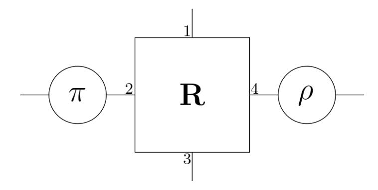
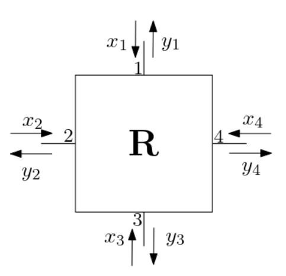
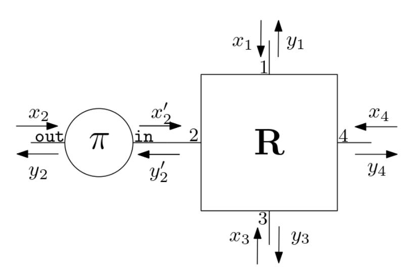
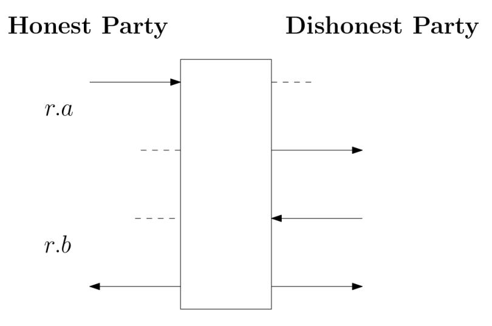

{0}------------------------------------------------

# **Synchronous Constructive Cryptography**

Chen-Da Liu-Zhang and Ueli Maurer

{lichen,maurer}@inf.ethz.ch, ETH Zurich

**Abstract.** This paper proposes a simple synchronous composable security framework as an instantiation of the Constructive Cryptography framework, aiming to capture minimally, without unnecessary artefacts, exactly what is needed to state synchronous security guarantees. The objects of study are specifications (i.e., sets) of systems, and traditional security properties like consistency and validity can naturally be understood as specifications, thus unifying composable and property-based definitions. The framework's simplicity is in contrast to current composable frameworks for synchronous computation which are built on top of an asynchronous framework (e.g. the UC framework), thus not only inheriting artefacts and complex features used to handle asynchronous communication, but adding additional overhead to capture synchronous communication.

As a second, independent contribution we demonstrate how secure (synchronous) multi-party computation protocols can be understood as constructing a computer that allows a set of parties to perform an arbitrary, on-going computation. An interesting aspect is that the instructions of the computation need not be fixed before the protocol starts but can also be determined during an on-going computation, possibly depending on previous outputs.

# **1 Introduction**

# **1.1 Composable Security**

One can distinguish two different types of security statements about multi-party protocols. *Stand-alone security* considers only the protocol at hand and does not capture (at least not explicitly) what it means to use the protocol in a larger context. This can cause major problems. For example, if one intuitively understands an *r*-round broadcast protocol as implementing a functionality where the sender inputs a value and *r* rounds later everybody learns this value, then one missed the point that a dishonest party learns the value already in the first round. Therefore a naive randomness generation protocol, in which each party broadcasts (using a broadcast protocol) a random string and then all parties compute the XOR of all the strings, is insecure even though naively it may look secure [\[17\]](#page-24-0). There are also more surprising and involved examples of failures when using stand-alone secure protocols in larger contexts.

The goal of *composable security* frameworks is to capture all aspects of a protocol that can be relevant in any possible application; hence the term *universal composability* [\[6\]](#page-24-1). While composable security is more difficult to achieve 

{1}------------------------------------------------

than some form of stand-alone security, one can argue that it is ultimately necessary. Indeed, one can sometimes reinterpret stand-alone results in a composable framework. There exist several frameworks for defining and reasoning about composable security (e.g. [\[34,](#page-25-0) [6,](#page-24-1) [11,](#page-24-2) [29,](#page-25-1) [32,](#page-25-2) [24,](#page-25-3) [19\]](#page-24-3)).

## **1.2 Composable Synchronous Models**

One can classify results on distributed protocols according to the underlying interaction model. Synchronous models, where parties are synchronized and proceed in rounds, were first considered in the literature because they are relatively simple in terms of the design and analysis of protocols. Asynchronous models are closer to the physical reality, but designing them and proving their security is significantly more involved, and the achievable results (e.g. the fraction of tolerable dishonest parties) are significantly weaker than for a synchronous model. However, synchronous models are nevertheless justified because if one assumes a maximal latency of all communication channels as well as sufficiently well-synchronized clocks, then one can execute a synchronous protocol over an asynchronous network.

Most composable treatments of synchronous protocols are in (versions of) the UC framework by Canetti [\[6\]](#page-24-1), which is an inherently asynchronous model. The models presented in [\[6,](#page-24-1) [33,](#page-25-4) [18,](#page-24-4) [22\]](#page-25-5) propose different approaches to model synchronous communication on top of the UC framework [\[6\]](#page-24-1). These approaches inherit the complexity of the UC framework designed to capture full asynchrony. Another approach was introduced with the Timing Model [\[12,](#page-24-5) [14,](#page-24-6) [21\]](#page-25-6). This model integrates a notion of time in an intuitive manner, but as noted in [\[22\]](#page-25-5) fails to exactly capture the guarantees expected from a synchronous network. A similar approach was proposed in [\[2\]](#page-23-0), which modifies the asynchronous reactivesimulatability framework [\[3\]](#page-23-1) by adding an explicit time port to each automaton.

Despite the large number of synchronous composable frameworks, the overhead created when using them is still too large. For example, when using a model built on top of UC, one typically needs to consider clock/synchronization functionalities, activation tokens, message scheduling, etc. Researchers wish to make composable statements, but using these models often turn out to be a burden and create huge overhead. As a consequence, papers written in synchronous UC models tend to be rather informal: the descriptions of the functionalities are incomplete, clock functionalities are missing, protocols are underspecified and the proofs are often made at an intuitive level. This leaves the question:

*Can one design a composable framework targeted to minimally capture synchronous protocols?*

People have considered capturing composable frameworks for restricted settings (e.g. [\[36,](#page-25-7) [7\]](#page-24-7)), but to the best of our knowledge, there is no composable framework that is targeted to minimally capture any form of synchronous setting.

{2}------------------------------------------------

## **1.3 Multi-Party Computation**

In the literature on secure multi-party computation (MPC) protocols, of which secure function evaluation (SFE) is a special case, most of the results are for the synchronous model as well as stand-alone security, even though intuitively most protocols seem to provide composable security. To the best of our knowledge, the first paper proving the composable security of a classical SFE protocol is [\[8\]](#page-24-8), where the security of the famous GMW-protocol [\[15\]](#page-24-9) is proved. The protocol assumes trusted setup, and security is obtained in the UC framework. In [\[1\]](#page-23-2), the security of the famous BGW-protocol [\[4\]](#page-23-3) is proved in the plain model. With the results in [\[23,](#page-25-8) [22\]](#page-25-5), one can prove security in the UC framework.

# **1.4 Contributions of this Paper**

A guiding principle in this work is to strive for minimality and to avoid unnecessary artefacts, thus lowering the entrance fee for getting into the field of composable security and also bringing the reasoning about composable security for synchronous protocols closer to being tractable by formal methods.

Our contributions are two-fold. First, we introduce a new composable framework to capture settings where parties have synchronized clocks (in particular, traditional synchronous protocols), and illustrate the framework with a few simple examples. Our focus is on the meaningful class of information-theoretic security as well as static corruption. However, in Section [9,](#page-23-4) we discuss how one can further extend the framework.

As a second contribution, we prove the composable security of Maurer's simple-MPC protocol [\[27\]](#page-25-9) and demonstrate that it perfectly constructs a versatile computer resource which can be (re-)programmed during the execution. Compared to [\[8,](#page-24-8) [1\]](#page-23-2), our treatment is significantly simpler for two reasons. First, the protocol of [\[27\]](#page-25-9) is simpler than the BGW-protocol. Second, and more importantly, the simplicity of our framework allows to prove security of the protocols without the overhead of asynchronous models: we do not deal with activation tokens, message scheduling, running time, etc.

**Synchronous Constructive Cryptography.** Our framework is an instantiation of the Constructive Cryptography framework [\[28,](#page-25-10) [29,](#page-25-1) [30\]](#page-25-11), for specific instantiations of the resource and converter concepts. Moreover, we introduce a new type of construction notion, parameterized by the set *Z* of potentially dishonest parties, allowing to capture the guarantees for every such dishonest set *Z*. An often considered special case is that nothing is guaranteed if *Z* contains too many parties.

Synchronous resources are very simple: They are (random) systems where the alphabet is list-valued. That is, a system takes a complete input list and produces a complete output list. Parallel composition of resources is naturally defined. There is no need to talk about a scheduler or activation patterns.

To allow that dishonest parties can potentially make their inputs depend on some side information of the round, we let one round *r* of the protocol correspond to two rounds, *r.a* and *r.b* (called semi-rounds). Honest parties provide 

{3}------------------------------------------------

the round input in semi-round r.a and the dishonest parties receive some information already in the same semi-round r.a. In semi-round r.b, the dishonest parties give their inputs and everybody receives the round's output.<sup>1</sup>

The framework is aimed at being minimal and differs from other frameworks in several ways. One aspect is that the synchronous communication network is simply a resource and not part of the framework; hence it can be modelled arbitrarily, allowing to capture incomplete networks and various types of channels (e.g., delay channels, secure, authenticated, insecure, etc).

We demonstrate the usage of our model with three examples: a two-party protocol to construct a common randomness resource (Section 5), the protocol introduced in [5] to construct a broadcast resource (Section A), and the simple MPC protocol [27] as the construction of a computer resource (Sections 7 and 8).

The Computer Resource. We introduce a system Computer which captures intuitively what traditional MPC protocols like GMW, BGW or CCD [15, 4, 9, 35, 13, 27] achieve. Traditionally, in a secure function evaluation protocol among n parties, the function to compute is modelled as an arithmetic circuit assumed to be known in advance. However, the same protocols are intuitively secure even if parties do not know in advance the entire circuit. It is enough that parties have agreement on the next instruction to execute.

We capture such guarantees in an interactive computer resource, similar to a (programmable) old-school calculator with a small instruction set (read, write, addition, and multiplication in our case), an array of value-registers, and an instruction queue. The resource has n interfaces. The interfaces  $1, \ldots, n-1$  are used to give inputs to the resource and receive outputs from the resource. Interface n is used to write instructions into the queue. A read instruction (INPUT, i, p) instructs the computer to read a value from a value space  $\mathcal{V}$  at interface i and store it at position p of the value register. A write instruction (OUTPUT, i, p) instructs the computer to output the value stored at position p to interface i. A computation instruction (OP,  $p_1, p_2, p_3$ ), OP  $\in$  {ADD, MULT} instructs the computer to add or to multiply the values at positions  $p_1$  and  $p_2$  and store it at position  $p_3$ . We then show how to construct the computer resource using the Simple MPC protocol [27]. A similar statement could be obtained using other traditional MPC protocols.

#### 1.5 Notation

We denote random variables by capital letters. Prefixes of sequences of random variables are denoted by a superscript, e.g.  $X^i$  denotes the finite sequence  $X_1, \ldots, X_i$ . For random variables X and Y, we denote by  $p_{X|Y}$  the corresponding conditional probability distribution.<sup>2</sup> Given a tuple t, we write the projection

<span id="page-3-0"></span><sup>&</sup>lt;sup>1</sup> What is known as a rushing adversary in the literature is the special case of communication channels where a dishonest receiver sees the other parties' inputs of a round before choosing his own input for that round.

<span id="page-3-1"></span><sup>&</sup>lt;sup>2</sup> Conditional probability distributions are denoted by a small "p" because they are defined without defining a random experiment. A capital P for probabilities is used only if a random experiment is defined.

{4}------------------------------------------------

to the j-th component of the tuple as  $[t]_j$ . Given a sequence  $t^i$  of tuples  $t_1, \ldots, t_i$ , we write  $[t^i]_j$  as the sequence  $[t_1]_j, \ldots, [t_i]_j$ . For a finite set  $X, x \leftarrow_{\$} X$  denotes sampling x uniform randomly from X.

# 2 Constructive Cryptography

The basic concepts of the Constructive Cryptography framework by Maurer and Renner [29, 28, 30] needed for this paper are quite simple and natural and are summarized below.

## 2.1 Specifications

A basic idea, which one finds in many disciplines, is that one considers a set  $\Phi$  of objects and specifications of such objects. A specification  $\mathcal{U} \subseteq \Phi$  is a subset of  $\Phi$  and can equivalently be understood as a predicate on  $\Phi$  defining the set of objects satisfying the specification, i.e., being in  $\mathcal{U}$ . Examples of this general paradigm are the specification of mechanical parts in terms of certain tolerances (e.g. the thickness of a bolt is between 1.33 and 1.34 millimeters), the specification of the property of a program (e.g. the set of programs that terminate, or the set of programs that compute a certain function within a given accuracy and time limit), or in a cryptographic context the specification of a close-to-uniform n-bit key as the set of probability distributions over  $\{0,1\}^n$  with statistical distance at most  $\epsilon$  from the uniform distribution.

A specification corresponds to a guarantee, and smaller specifications hence correspond to stronger guarantees. An important principle is to abstract a specification  $\mathcal{U}$  by a larger specification  $\mathcal{V}$  (i.e.,  $\mathcal{U} \subseteq \mathcal{V}$ ) which is simpler to understand and work with. One could call  $\mathcal{V}$  an ideal specification to hint at a certain resemblance with terminology often used in the cryptographic literature. If a construction (see below) requires an object satisfying specification  $\mathcal{V}$ , then it also works if the given object actually satisfies the stronger specification  $\mathcal{U}$ .

## 2.2 Constructions

A construction is a function  $\gamma: \Phi \to \Phi$  transforming objects into (usually in some sense more useful) objects. A well-known example of a construction useful in cryptography, achieved by a so-called extractor, is the transformation of a pair of independent random variables (say a short uniform random bit-string, called seed, and a long bit-string for which only a bound on the min-entropy is known) into a close-to-uniform string.

A construction statement of specification  $\mathcal{S}$  from specification  $\mathcal{R}$  using construction  $\gamma$ , denoted  $\mathcal{R} \xrightarrow{\gamma} \mathcal{S}$ , is of the form

$$\mathcal{R} \xrightarrow{\gamma} \mathcal{S} :\iff \gamma(\mathcal{R}) \subseteq \mathcal{S}.$$

It states that if construction  $\gamma$  is applied to any object satisfying specification  $\mathcal{R}$ , then the resulting object is guaranteed to satisfy (at least) specification  $\mathcal{S}$ .

{5}------------------------------------------------

The composability of this construction notion follows immediately from the transitivity of the subset relation:

$$\mathcal{R} \xrightarrow{\gamma} \mathcal{S} \wedge \mathcal{S} \xrightarrow{\gamma'} \mathcal{T} \implies \mathcal{R} \xrightarrow{\gamma' \circ \gamma} \mathcal{T}.$$

### 2.3 Resources and Converters

The above natural and very general viewpoint is also taken in Constructive Cryptography, where the objects in  $\Phi$  are systems, called resources, with interfaces to the parties considered in the given setting. If a party performs actions at its interface, this corresponds to applying a so-called converter which can also be thought of as a system or protocol engine. At its inside, the converter "talks to" the party's interface of the resource and at the outside it emulates an interface (of the transformed resource). Applying such a converter induces a mapping  $\Phi \to \Phi$ . We denote the set of converters as  $\Sigma$ .

Figure 1 shows a resource with four interfaces where converters are applied at two of the interfaces. The resource obtained by applying a converter  $\pi$  at interface j of resource  $\mathbf{R}$  is denoted as  $\pi^{j}\mathbf{R}$ . Applying converters at different interfaces commutes.<sup>3</sup> The resource shown in Figure 1 can hence be written

$$\pi^2 \rho^4 \mathbf{R}$$
,

which is equal to  $\rho^4 \pi^2 \mathbf{R}$ .



**Fig. 1.** Example of a resource with 4 interfaces, where converters  $\pi$  and  $\rho$  are attached to interfaces 2 and 4.

<span id="page-5-0"></span>Several resources (more precisely a tuple of resources) can be understood as a single resource, i.e., as being composed in parallel. One can think that for each party, all its interfaces are merged into a single interface, where the original interfaces can be thought of as sub-interfaces.

<span id="page-5-1"></span><sup>&</sup>lt;sup>3</sup> This is an abstract requirement, in the sense of an axiom, which for an instantiation of the theory, for example to the special case of discrete systems, must be proven to hold.

{6}------------------------------------------------

## **2.4 Multi-Party Protocols and Constructions**

Let us consider a setting with *n* parties, where P = {1*, . . . , n*} denotes the set of parties (or, rather, interfaces).[4](#page-6-0) A *protocol* consists of a tuple *π* = (*π*1*, . . . , πn*) of converters, one for each party, and a construction consists of each party applying its converter. However, an essential aspect of reasoning in cryptography is that one considers that parties can either be honest or dishonest, and the goal is to state meaningful guarantees for the honest parties.[5](#page-6-1) While an honest party applies its converter, there is no such guarantee for a dishonest party, meaning that a dishonest party may apply an arbitrary converter to its interface, including the identity converter that gives direct access to the interface.

In many cryptographic settings one considers a set of (honest) parties and a fixed dishonest party (often called the adversary). However, in a so-called multi-party context one considers each party to be either honest or dishonest. For each subset *Z* ⊆ P of dishonest parties one states a separate guarantee: If the assumed resource satisfies specification R*Z*, then, if all parties in P \ *Z* apply their converter, the resulting resource satisfies specification S*Z*. Typically, but not necessarily, all guarantees R*<sup>Z</sup>* (and analogously all S*Z*) are compactly described, possibly all derived as variations of the same resource.

<span id="page-6-2"></span>**Definition 1.** *The protocol π* = (*π*1*, . . . , πn*) *constructs specifications* S*<sup>Z</sup> from* R*<sup>Z</sup> if*

$$\forall Z \subseteq \mathcal{P} \quad \mathcal{R}_Z \xrightarrow{\boldsymbol{\pi}_{\mathcal{P} \setminus Z}} \mathcal{S}_Z.$$

A special case often considered is that one provides guarantees only if the set of dishonest parties is within a so-called adversary structure [\[16\]](#page-24-13), for example that there are at most *t* dishonest parties. This simply corresponds to the special case where S*<sup>Z</sup>* = *Φ* if |*Z*| *> t*. In other words, if *Z* is not in the adversary structure, then the resource is only known to satisfy the trivial specification *Φ*.

# **2.5 Specification Relaxations**

As mentioned above, that a party *j* is possibly dishonest means that we have no guarantee about which converter is applied at that interface. For a given specification S, this is captured by relaxing the specification to the larger specification S ∗*j* :

$$\mathcal{S}^{*_j} := \{ \pi^j \mathbf{S} \mid \pi \in \Sigma \land \mathbf{S} \in \mathcal{S} \}.$$

If we consider a set *Z* of potentially dishonest parties, we can consider the set of interfaces in *Z* as being merged to a single interface with several sub-interfaces, and applying the above relaxation to this interface. The resulting specification

<span id="page-6-0"></span><sup>4</sup> In the literature, one often refers to parties with a name, say *P<sup>i</sup>* for party at interface *i*, but we do not need explicit party names and can simply refer to party *i*.

<span id="page-6-1"></span><sup>5</sup> Note that in this view, the often used term "corruption" does not mean that a party switches from being honest to being dishonest, it rather means that a resource loses some guarantees, for example the memory resource of a party becomes accessible to some other parties.

{7}------------------------------------------------

is denoted  $\mathcal{S}^{*z}$ . This corresponds to the viewpoint that all dishonest parties collude (or, as sometimes stated in the literature, are under control of a central adversary). It is easy to see that the described \*-relaxation is idempotent: For any specification  $\mathcal{S}$  and any set of interfaces Z, we have  $(\mathcal{S}^{*z})^{*z} = \mathcal{S}^{*z}$ .

If one wants to prove that a given specification  $\mathcal{U}$  is contained in  $\mathcal{S}^{*z}$ , one can exhibit for every element  $U \in \mathcal{U}$  a converter  $\alpha$  such that  $U = \alpha^Z S$  for some  $S \in \mathcal{S}$ . Here  $\alpha^Z S$  means applying  $\alpha$  to the interface resulting from merging the interfaces in Z. If the same  $\alpha$  works for every U, then one can think of  $\alpha$  as corresponding to a (joint) simulator for the interfaces in Z.

It should be pointed out that Constructive Cryptography [30] considers general specifications, and the above described specification type is only a special case. Therefore the construction notion does not involve a simulator. Indeed, this natural viewpoint allows to circumvent impossibility results in classical simulation-based frameworks (including the early version of Constructive Cryptography[29, 28]) because the type of specifications resulting from requiring a single simulator is too restrictive. See [20] for an example.

# 3 Synchronous Systems

To instantiate the Constructive Cryptography framework at the level of synchronous discrete systems, we need to instantiate the notions of a resource  $\mathbf{R} \in \Phi$  and a converter  $\pi \in \Sigma$ . We define each of them as special types of random systems [26, 31]. We briefly explain the role of random systems in such definitions.

### 3.1 Random Systems

**Definition 2.** An  $(\mathcal{X}, \mathcal{Y})$ -random system  $\mathbf{R}$  is a sequence of conditional probability distributions  $\mathbf{p}_{Y_i|X^iY^{i-1}}^{\mathbf{R}}$ , for  $i \geq 1$ . Equivalently, the random system can be characterized by the sequence  $\mathbf{p}_{Y^i|X^i}^{\mathbf{R}} = \prod_{k=1}^i \mathbf{p}_{Y_k|X^kY^{k-1}}^{\mathbf{R}}$ , for  $i \geq 1$ .

As explained in [25], a random system is the mathematical object corresponding to the behavior of a discrete system. A deterministic system is a special type of function (or sequence of functions), and the composition of systems is defined via function composition. Probabilistic systems are often thought about (and described) at a more concrete level, where the randomness is made explicit (e.g. as the randomness of an algorithm or the random tape of a Turing machine). Hence a probabilistic discrete system (PDS) corresponds to a probability distribution over deterministic systems, and the definition of the composition of probabilistic systems is induced by the definition of composition of deterministic systems (analogously to the fact that the definition of the sum of real-valued random variables is naturally induced by the definition of the sum of real numbers, which are not probabilistic objects).

Different PDS can have the same behavior, which means that the behavior, i.e., a random system, corresponds to an equivalence class of PDS (with the same behavior). The fact that the composition of (independent) random systems

{8}------------------------------------------------

corresponds to a particular product of the involved conditional distribution can be proved and should not be seen as the definition. However, in this paper, which only considers random systems (the actual mathematical objects of study), the product of distributions appears as the definition.

It is important to distinguish the *type* and the *description* of a mathematical object. An object of a given type can be described in may different ways. For example, a random system can be described by several variants of pseudocode, and as is common in the literature we also use such an ad-hoc description language. The fact that a random system is defined via conditional probability distributions does not mean that they have to described in that way.

### 3.2 Resources

A resource (the mathematical type) is a special type of random system [26, 31].

**Definition 3.** An  $(\mathcal{X}, \mathcal{Y})$ -random system  $\mathbf{R}$  is a sequence of conditional probability distributions  $p_{Y_i|X^iY^{i-1}}^{\mathbf{R}}$ , for  $i \geq 1$ . Equivalently, the random system can be characterized by the sequence  $p_{Y^i|X^i}^{\mathbf{R}} = \prod_{k=1}^i p_{Y_k|X^kY^{k-1}}^{\mathbf{R}}$ , for  $i \geq 1$ .

A resource with n interfaces takes one input per interface and produces an output at every interface (see Figure 2). Without loss of generality, we assume that the alphabets at all interfaces and for all indices i are the same.<sup>6</sup> An  $(n, \mathcal{X}, \mathcal{Y})$ -resource is a resource with n interfaces and input (resp. output) alphabet  $\mathcal{X}$  (resp.  $\mathcal{Y}$ ).



**Fig. 2.** An example resource with 4 interfaces. At each invocation, the resource takes an input  $x_j \in \mathcal{X}$  at each interface j, and it outputs a value  $y_j \in \mathcal{Y}$  at each interface j.

<span id="page-8-2"></span><span id="page-8-0"></span>**Definition 4.** An  $(n, \mathcal{X}, \mathcal{Y})$ -resource is an  $(\mathcal{X}^n, \mathcal{Y}^n)$ -random system.

**Parallel Composition.** One can take several independent  $(n, \mathcal{X}_j, \mathcal{Y}_j)$ -resources  $\mathbf{R}_1, \dots, \mathbf{R}_k$  and form an  $(n, \times_{j=1}^k \mathcal{X}_j, \times_{j=1}^k \mathcal{Y}_j)$ -resource, denoted  $[\mathbf{R}_1, \dots, \mathbf{R}_k]$ .

<span id="page-8-1"></span>The alphabets are large enough to include all values that can actually appear.

{9}------------------------------------------------

A party interacting with the composed resource  $[\mathbf{R}_1, \dots, \mathbf{R}_k]$  can give an input  $\mathbf{a} = (a^1, \dots, a^k)$ , which is interpreted as giving each input  $a^j \in \mathcal{X}_j$  to resource  $\mathbf{R}_j$ , and then receive an output  $\mathbf{b} = (b^1, \dots, b^k)$  containing the output from each of the resources.

In the following definition, we denote by  $x_i = (\mathbf{a}_{1,i}, \dots, \mathbf{a}_{n,i})$  the *i*-th input to the resource, and by  $y_i = (\mathbf{b}_{1,i}, \dots, \mathbf{b}_{n,i})$  the *i*-th output from the resource. We further let  $[[x_i]]_j = ([\mathbf{a}_{1,i}]_j, \dots, [\mathbf{a}_{n,i}]_j)$  be the tuple with the *j*-th component of each tuple  $\mathbf{a}_{\cdot,i}$ ; and let  $[[x^i]]_j$  be the finite sequence  $[[x_1]]_j, \dots, [[x_i]]_j$ . We let  $[[y_i]]_j$  and  $[[y^i]]_j$  be defined accordingly.

**Definition 5.** Given a tuple of resources  $(\mathbf{R}_1, \dots, \mathbf{R}_k)$ , where  $\mathbf{R}_j$  is an  $(n, \mathcal{X}_j, \mathcal{Y}_j)$ resource. The parallel composition  $\mathbf{R} \coloneqq [\mathbf{R}_1, \dots, \mathbf{R}_k]$ , is an  $(n, \times_{j=1}^k \mathcal{X}_j, \times_{j=1}^k \mathcal{Y}_j)$ resource, defined as follows:

$$\mathbf{p}_{Y_i|X^iY^{i-1}}^{\mathbf{R}}(y_i, x^i, y^{i-1}) = \prod_{j=1}^k \mathbf{p}_{Y_i|X^iY^{i-1}}^{\mathbf{R}_j}([[y_i]]_j, [[x^i]]_j, [[y^{i-1}]]_j)$$

### 3.3 Converters

An  $(\mathcal{X}, \mathcal{Y})$ -converter is a system (of a different type than resources) with two interfaces, an outside interface out and an inside interface in. The inside interface is connected to the  $(n, \mathcal{X}, \mathcal{Y})$ -resource, and the outside interface serves as the interface of the combined system. When an input is given (an input at the outside), the converter invokes the resource (with an input on the inside), and then converts its response into a corresponding output (an output on the outside). When a converter is connected to several resources in parallel  $[\mathbf{R}_1, \dots, \mathbf{R}_k]$ , we address the corresponding sub-interfaces with the name of the resource, i.e, in.R1 is the sub-interface connected to  $\mathbf{R}_1$ .

More concretely, an  $(\mathcal{X}, \mathcal{Y})$ -converter is an  $(\mathcal{X} \cup \mathcal{Y}, \mathcal{X} \cup \mathcal{Y})$ -random system whose input and output alphabets alternate between  $\mathcal{X}$  and  $\mathcal{Y}$ . That is,

- On the first input, and further odd inputs, it takes a value  $x \in \mathcal{X}$  and produces a value  $x' \in \mathcal{X}$ .
- On the second input, and further even inputs, it takes a value  $y' \in \mathcal{Y}$ , and produces a value  $y \in \mathcal{Y}$ .

**Definition 6.** An  $(\mathcal{X}, \mathcal{Y})$ -converter  $\pi$  is a pair of sequences of conditional probability distributions  $p_{X'_i|X^iX'^{i-1}Y'^{i-1}Y^{i-1}}^{\pi}$  and  $p_{Y_i|X^iX'^iY'^iY^{i-1}}^{\pi}$ , for  $i \geq 1$ . Equivalently, a converter can be characterized by the sequence  $p_{X'^iY^i|X^iY'^i}^{\pi} = \prod_{k=1}^i p_{X'_k|X^kX'^{k-1}Y'^{k-1}Y^{k-1}}^{\pi} \cdot p_{Y_k|X^kX'^kY'^kY^{k-1}}^{\pi}$ , for  $i \geq 1$ .

Application of a Converter to a Resource Interface. The application of a converter  $\pi$  to a resource  $\mathbf{R}$  at interface j can be naturally understood as the resource that operates as follows (see Figure 3):

{10}------------------------------------------------

- On input  $(x_1, \ldots, x_n) \in \mathcal{X}^n$ : input  $x_j$  to  $\pi$ , and let  $x'_j$  be the output. Then, input  $(x_1, \ldots, x_{j-1}, x'_j, x_{j+1}, \ldots, x_n) \in \mathcal{X}^n$  to  $\mathbf{R}$ .
- On output  $(y_1, \ldots, y_{j-1}, y'_j, y_{j+1}, \ldots, y_n) \in \mathcal{Y}^n$  from **R**, input  $y'_j$  to  $\pi$ , and let  $y_j$  be the output.

The output is  $(y_1, \ldots, y_n) \in \mathcal{Y}^n$ .



<span id="page-10-0"></span>**Fig. 3.** The figure shows the application of a converter  $\pi$  to the interface 2 of a resource  $\mathbf{R}$ . On input a value  $x_2 \in \mathcal{X}$  to interface out of  $\pi$ , the converter  $\pi$  outputs a value  $x_2' \in \mathcal{X}$  at interface in. The resource  $\mathbf{R}$  takes as input  $(x_1, x_2', x_3, x_4) \in \mathcal{X}^4$ , and outputs  $(y_1, y_2', y_3, y_4) \in \mathcal{Y}^4$ . On input  $y_2'$  to interface in of  $\pi$ , the converter outputs a value  $y_2$  at interface out.

Given a tuple  $a = (a_1, \ldots, a_n)$ , we denote  $a_{\{j \to b\}}$  the tuple where the j-th component is substituted by value b, i.e. the tuple  $(a_1, \ldots, a_{j-1}, b, a_{j+1}, a_n)$ . Moreover, given a sequence  $a^i$  of tuples  $t^1, \ldots, t^i$  and a sequence  $b^i$  of values  $b_1, \ldots, b_i$ , we denote  $a^i_{\{j \to b^i\}}$ , the sequence of tuples  $t^1_{\{j \to b_1\}}, \ldots, t^i_{\{j \to b_i\}}$ .

**Definition 7.** The application of an  $(\mathcal{X}, \mathcal{Y})$ -converter  $\pi$  at interface j of an  $(n, \mathcal{X}, \mathcal{Y})$ -resource  $\mathbf{R}$  is the  $(n, \mathcal{X}, \mathcal{Y})$ -resource  $\pi^{j}\mathbf{R}$  defined as follows:

$$p_{Y^{i}|X^{i}}^{\pi^{j}\mathbf{R}}\left(y^{i}, x^{i}\right) = \sum_{x'^{i}, y'^{i}} p_{X'^{i}Y^{i}|X^{i}Y'^{i}}^{\pi}\left(x'^{i}, [y^{i}]_{j}, [x^{i}]_{j}, y'^{i}\right) p_{Y^{i}|X^{i}}^{\mathbf{R}}\left(y_{\{j \to y'^{i}\}}^{i}, x_{\{j \to x'^{i}\}}^{i}\right)$$

One can see that applying converters at distinct interfaces commutes. That is, for any converters  $\pi$  and  $\rho$ , any resource  $\mathbf{R}$  and any disjoint interfaces j, k, we have that  $\pi^j \rho^k \mathbf{R} = \rho^k \pi^j \mathbf{R}$ .

For a tuple of converters  $\boldsymbol{\pi} = (\pi_1, \dots, \pi_n)$ , we denote by  $\boldsymbol{\pi} \mathbf{R}$  the resource where each converter  $\pi_j$  is attached to interface j. Given a subset of interfaces I, we denote by  $\boldsymbol{\pi}_I \mathbf{R}$  the resource where each converter  $\pi_j$  with  $j \in I$ , is attached to interface j.

{11}------------------------------------------------

# **4 Resources with Specific Round-Causality Guarantees**

The resource type of Definition [4](#page-8-2) captures that all parties act in a synchronized manner. The definition also implies that any (dishonest) party's input depends solely on the previous outputs seen by the party.

In practice this assumption is often not justified. For example, consider a resource consisting of two parallel communication channels (in a certain round) between two parties, one in each direction. Then it is typically unrealistic to assume that a dishonest party can not delay giving its input until having seen the output on the other channel. Such adversarial behavior is typically called "rushing" in the literature. More generally, a dishonest party's input can depend on partial information of the current round inputs from honest parties.

To model such causality guarantees, we introduce resources that proceed in two rounds (called semi-rounds) per actual protocol round.[7](#page-11-0) This makes explicit what a dishonest party's input can (and can not) depend on.

More concretely, each round *r* consists of two semi-rounds, denoted *r.a* and *r.b*. In the first semi-round, *r.a*, the resource takes inputs from the honest parties and gives an output to the dishonest parties. No output is given to honest parties, and no input is taken from dishonest parties. In the second semi-round, *r.b*, the resource takes inputs from the dishonest parties and gives an output to all parties. Figure [4](#page-11-1) illustrates the behavior of such a resource within one round. When describing such resources, we often omit specifying the semi-round when it is clear from the context.



**Fig. 4.** Figure depicts a resource operating in a round. The dashed lines indicate that no value is taken as input to the resource, and is output from the resource. The honest (resp. dishonest) parties give inputs to the resource in the first (resp. second) invocation, and all parties receive an output in the second invocation. The dishonest parties receive in addition an output in the first invocation.

<span id="page-11-1"></span><span id="page-11-0"></span><sup>7</sup> This type of resource is similar to the notion of *canonical synchronous functionalities* in [\[10\]](#page-24-15).

{12}------------------------------------------------

When applying a protocol converter to such a resource, we formally attach the corresponding converter that operates in semi-rounds, where round-*r* inputs are given to the resource at *r.a*, and round-*r* outputs are obtained at *r.b*.

# <span id="page-12-0"></span>**5 A First Example**

We demonstrate the usage of our model to describe a very simple 2-party protocol which uses delay channels to generate common randomness. The protocol uses a channel with a known lower and upper bound on the delay, and proceeds as follows: Each party generates a random value and sends it to the other party via a delay channel. Then, once the value is received, each party outputs the sum of the received value and the previously generated random value. It is intuitively clear that the protocol works because 1) a dishonest party does not learn the message before round *r*, and 2) an honest party is guaranteed to learn the message at round *R*.

**Bounded-Delay Channel with Known Lower and Upper Bound.** We model a simple delay channel −→DC (resp. ←−DC) from party 1 to party 2 (resp. party 2 to party 1) with known lower and upper bound on the delay. It takes a message at round 1, and is guaranteed to not deliver the message until round *r* to a dishonest party, but is guaranteed to deliver it at round *R* to an honest party. To model such a delay channel, we define a delay channel −→DC*r,R,Z* with message space M from party 1 to party 2 with fixed delay that takes a message at round 1 and delivers it at round *r* if the receiver is dishonest, and at round *R* if the receiver is honest. The set *Z* indicates the set of dishonest parties. The channel ←−DC*r,R,Z* in the other direction is analogous.

```
msg ← 0
 On input m ∈ M at interface 1 of round 1, set msg ← m.
 if 2 ∈ Z then
    Output msg at interface 2 at round r.
 else
    Output msg at interface 2 at round R.
 end if
Resource
          −→DCr,R,Z
```

To capture that the delay channel is not guaranteed to deliver the message to a dishonest receiver exactly at round *<sup>r</sup>*, we consider the <sup>∗</sup>-relaxation (−→DC*r,R,Z*) ∗*<sup>Z</sup>* on the delay channel at the dishonest interfaces *Z*. This specification includes resources with no guarantees at *Z*. For example, the resource may deliver the message later than *r*, or garbled, or not at all.

**Common Randomness Resource.** The sketched protocol constructs a common randomness resource CRS that outputs a random string. We would like to 

{13}------------------------------------------------

model a CRS that is guaranteed to output the random string at round R to an honest party, but does not output the random string before r to a dishonest party. For that, we first consider a resource which outputs a random string to each honest (resp. dishonest) party at round R (resp. r).

```
Resource CRS_{r,R,Z}

rnd \leftarrow_{\$} \mathcal{M}

For each party i \in \{1,2\}:

if \ i \in Z \ then

Output rnd \ at \ interface \ i \ at \ round \ r.

else

Output rnd \ at \ interface \ i \ at \ round \ R.

end \ if
```

With the same idea as with the delay channels, we can model a common randomness resource that is guaranteed to deliver the randomness to the honest parties at round R but is not guaranteed to deliver the output to the dishonest parties at round r, by considering a \*-relaxation on the resource over the dishonest interfaces Z,  $(\mathsf{CRS}_{r,R,Z})^{*z}$ .

**Two-Party Construction.** We describe the 2-party protocol  $\pi = (\pi_1, \pi_2)$  sketched at the beginning of the section and show that it constructs a common randomness resource.

```
Converter \pi_1

Local variable: rnd

Round 1

\operatorname{rnd} \leftarrow_{\$} \mathcal{M}

Output rnd at in.dc. // in.dc for \pi_2

Round R

On input v \in \mathcal{M} at in.dc, output rnd + v at out. // in.dc for \pi_2
```

**Lemma 1.**  $\pi = (\pi_1, \pi_2)$  constructs the specification  $(CRS_{r,R,Z})^{*z}$  from the specification  $[(\overrightarrow{DC}_{r,R,Z})^{*z}, (\overrightarrow{DC}_{r,R,Z})^{*z}].$ 

*Proof.* We prove each case separately.

- 1)  $Z = \varnothing$ : In this case, it is easy to see that  $\pi_1 \pi_2[\overrightarrow{\mathsf{DC}}_{r,R,\varnothing}, \overleftarrow{\mathsf{DC}}_{r,R,\varnothing}] = \mathsf{CRS}_{r,R,\varnothing}$  holds, since the sum of two uniformly random messages is uniformly random.
- 2)  $Z = \{2\}$ : Consider now the case where party 2 is dishonest (the case where party 1 is dishonest is similar). Let  $\mathbf{S} := [\overrightarrow{\mathsf{DC}}_{r,R,Z}, \overleftarrow{\mathsf{DC}}_{r,R,Z}]$ . It suffices to prove that  $\pi_1 \mathbf{S} \in (\mathsf{CRS}_{r,R,Z})^{*_Z}$  because:

{14}------------------------------------------------

$$\pi_1[(\overrightarrow{\mathsf{DC}}_{r,R,Z})^{*_Z}, (\overleftarrow{\mathsf{DC}}_{r,R,Z})^{*_Z}] \subseteq (\pi_1[\overrightarrow{\mathsf{DC}}_{r,R,Z}, \overleftarrow{\mathsf{DC}}_{r,R,Z}])^{*_Z} = (\pi_1 \mathbf{S})^{*_Z} \subseteq ((\mathsf{CRS}_{r,R,Z})^{*_Z})^{*_Z} = (\mathsf{CRS}_{r,R,Z})^{*_Z},$$

where the last equality holds because the ∗-relaxation is idempotent. Hence, we show that the converter *σ* described below is such that *π*1**S** = *σ* <sup>2</sup>CRS*r,R,Z*.

```
Initialization
   rcv ← 0.
Round 1.b
   On input v ∈ M at out.
                            ←−dc, set rcv ← v.
Round r.a
   On input rnd at in, output rnd − rcv at out.
                                                  −→dc.
  Converter σ
```

Consider the system *π*1**S**. The system outputs at interface 1 of round *R.b*, a value rnd + *v*, where rnd is a random value and *v* is the value received at interface 2 of round 1*.b* (and *v* = 0 if no value was received). Moreover, the system outputs at interface 2 of round *r.a*, the value rnd.

Now consider the system *σ* <sup>2</sup>CRS*r,R,Z*. The system outputs at interface 1 of round *R.b*, a random value rnd<sup>0</sup> . Moreover, the system outputs at interface 2 of round *r.a*, the value rnd<sup>0</sup> − *v*, where *v* is the same value received at interface 2 of round 1*.b* (and *v* = 0 if no value was received).

Since the joint distribution {rnd + *v,* rnd} and {rnd<sup>0</sup> *,* rnd<sup>0</sup> − *v*} are exactly the same, we conclude that *π*1**S** = *σ* <sup>2</sup>CRS*r,R,Z*.

ut

# **6 Communication Resources**

# <span id="page-14-0"></span>**6.1 Point-to-Point Channels**

We model the standard synchronous communication network, where parties have the guarantee that messages input at round *k* are received by round *k* + 1, and dishonest parties' round-*k* messages potentially depend on the honest parties' round-*k* messages. Let CH*`,Z*(*s, r*) be a bilateral channel resource with *n* interfaces, one designated to each party *i* ∈ P, and where two of the interfaces, *s* and *r* are designated to the sender and the receiver. The channel is parameterized by the set of dishonest parties *Z* ⊆ P. The privacy guarantees are formulated by a leakage function *`*(·) that determines the information leaked to dishonest parties. For example, in an authenticated channel *`*(*m*) = *m*, and in a secure channel *`*(*m*) = |*m*|.

{15}------------------------------------------------

Resource  $CH_{\ell,Z}(s,r)$ 

Round  $k, k \ge 1$ 

On input m at interface s, output m at interface r. Output  $\ell(m)$  at each interface  $i \in \mathbb{Z}$ .

Let  $\mathcal{N}_Z$  be the complete network of pairwise secure channels. That is,  $\mathcal{N}_Z$  is the parallel composition of secure channels  $\mathsf{CH}_{\ell,Z}(i,j)$  with  $\ell(m) = |m|$ , for each pair of parties  $i,j \in \mathcal{P}$ .

### <span id="page-15-1"></span>6.2 Broadcast Resource Specification

Broadcast is an important building block that many distributed protocols use. It allows a specific party, called the sender, to consistently distribute a message. More formally, it provides two guarantees: 1) Every honest party outputs the same value (consistency), and 2) the output value is the sender's value in case the sender is honest (validity).

The broadcast specification  $\mathcal{BC}_{k,l,Z}(s)$  involves a set of parties  $\mathcal{P}$ , where one of the parties is the sender s. It is parameterized by the round numbers k and l indicating when the sender distributes the message and when the parties are guaranteed to receive it. The specification  $\mathcal{BC}_{k,l,Z}(s)$ , is the set of all resources satisfying both validity and consistency. That is, there is a value v such that the output at each interface j for  $j \notin Z$  at round l.b is  $y_j^{l.b} = v$ , and if the sender is honest, this value is the sender's input  $x_s^{k.a}$  at round k.a. That is:

$$\mathcal{BC}_{k,l,Z}(s) \coloneqq \left\{ \mathbf{R} \in \varPhi \mid \exists v \Big[ \Big( \forall j \in \overline{Z} \ y_j^{l.b} = v \Big) \land \Big( s \in \overline{Z} \to v = x_s^{k.a} \Big) \Big] \right\}$$

We show how to construct such a broadcast specification in Section A. Let  $\mathcal{BC}_{\Delta,Z}(s)$  be the parallel composition of  $\mathcal{BC}_{k,k+\Delta,Z}(s)$ , for each  $k \geq 1$ , and let  $\mathcal{BC}_{\Delta,Z}$  be the parallel composition of  $\mathcal{BC}_{\Delta,Z}(s)$ , for each party  $s \in \mathcal{P}$ .

# <span id="page-15-0"></span>7 The Interactive Computer Resource

In this section, we introduce a simple ideal interactive computer resource with n interfaces. Interfaces  $1, \ldots, n-1$  are used to give input values and receive output values. Interface n allows to input instruction commands. The resource has a memory which is split into two parts: an array storing values S and a queue C storing instruction commands to be processed. We describe the functionality of the resource in two parts: Storing the instructions that are input at n, and processing the instructions.

**Store Instructions.** On input an instruction at interface n at round r, the instruction is stored in the queue C. Then, after a fixed number of rounds, the input instruction is output at each honest interface i, and at dishonest interfaces at round r.a.

{16}------------------------------------------------

**Instruction Processing.** The interactive computer processes instructions sequentially. There are three types of instructions that the resource can process. Each instruction type has a fixed number of rounds.

- 1. An input instruction (input*, i, p*) instructs the resource to read a value from a value space V at interface *i* and store it at position *p* of the array *S*. If party *i* is honest, it inputs the value at the first round of processing the input instruction, otherwise it inputs the value at the last round. This models the fact that a dishonest party *i* can defer the choice of the input value to the end of processing the instruction.
- 2. An output instruction (output*, i, p*) instructs the computer to output the value stored at position *p* to interface *i*. If party *i* is dishonest, it receives the value at the first round of processing the output instruction. Otherwise, the value is output at the last round of processing the instruction.
- 3. A computation instruction (op*, p*1*, p*2*, p*3)), op ∈ {add*,* mult} instructs the computer to add or to multiply the values at positions *p*<sup>1</sup> and *p*<sup>2</sup> and store it at *p*3.

One could consider different refinements of the interactive computer. For example, a computer that can receive lists of instructions, process instructions in parallel, or a computer that allows instructions to be the result of a computation using values from *S*. For simplicity, we stick to a simple version of the computer and leave possible refinements to future work.

```
Parameters: ri,ro,ra,rm, rs. // #rounds to process an input, output, addition or
multiplication instruction, and to store an instruction
Initialization
   L ← empty array. // Store values
   C ← empty queue. // Store instructions
   Next2Read ← 1. // Counter indicating when to read the next instruction
   Current ← ⊥. // Contains the current instruction being processed
Round k, k ≥ 1
   // Read next instruction
   if Next2Read = k then
       Current ← C.pop()
       if Current 6= ⊥ then
          Next2Read ← k + rj , where rj , for j ∈ {i, o, a, m}, is the round delay of
          the instruction in Current.
       else
          Next2Read ← k + 1
       end if
   end if
   // Process instruction
  Resource ComputerZ
```

{17}------------------------------------------------

```
if Current = (INPUT, i, p) then
    if i \notin Z then
        Read x \in \mathcal{V} at interface i at round Next2Read -r_i.
    else
        Read x \in \mathcal{V} at interface i at round Next2Read -1.
    end if
    L[p] \leftarrow x
else if Current = (OP, p_1, p_2, p_3), OP \in \{ADD, MULT\} then
    L[p_3] \leftarrow L[p_1] \text{ OP } L[p_2]
else if Current = (OUTPUT, i, p) then
    if i \notin Z then
        Output L|p| at interface i at round Next2Read -1.
    else
        Output L[p] at interface i at round Next2Read -r_o.
    end if
end if
\mathtt{Current} \leftarrow \bot
// Store instruction in queue
Read instruction I at interface n.
If I is a valid instruction, output I at each interface i \in \mathbb{Z}. Then, at round
k + \Delta introduce the instruction in the queue C.push(I), and output I at each
interface i \notin \mathbb{Z}. // If party n is honest, output to honest parties at (k + \Delta).b
and dishonest parties at k.a. Otherwise, output to all parties at (k + \Delta).b
```

# <span id="page-17-0"></span>8 Protocol Simple MPC

We adapt Maurer's Simple MPC protocol [27], originally described for SFE in the stand-alone setting, to realize the resource Computer from Section 7, thereby proving a much stronger (and composable) statement. The protocol is run among a set  $\mathcal{P} = \{1, \ldots, n\}$  of n parties. Parties  $1, \ldots, n-1$  process the instructions, give input values and obtain output values. Party n has access to the instructions that the other parties needs to execute.

**General Adversaries.** In many protocols, the sets of possible dishonest parties are specified by a threshold t, that indicates that any set of dishonest parties is of size at most t. However, in this protocol, one specifies a so-called *adversary structure*  $\mathcal{Z}$ , which is a monotone<sup>8</sup> set of subsets of parties, where each subset indicates a possible set of dishonest parties. We are interested in the condition that no three sets in  $\mathcal{Z}$  cover [n-1], also known as  $\mathcal{Q}^3([n-1],\mathcal{Z})$  [16].

### 8.1 Protocol Description

Let  $\mathcal{Z}$  be an adversary structure that satisfies  $\mathcal{Q}^3([n-1],\mathcal{Z})$ . Protocol sMPC =  $(\pi_1,\ldots,\pi_n)$  constructs the resource Computer<sub>Z</sub>, introduced in Section 7, for any  $Z \in \mathcal{Z}$ . For sets  $Z \notin \mathcal{Z}$ , the protocol constructs the trivial specification  $\Phi$ .

<span id="page-17-1"></span> $<sup>\</sup>overline{{}^8 \text{ If } Z \in \mathcal{Z} \text{ and } Z' \subseteq Z, \text{ then } Z' \in \mathcal{Z}.}$ 

{18}------------------------------------------------

Assumed Specifications. The protocol assumes the following specifications: a network specification  $\mathcal{N}_Z$  among the parties in  $\mathcal{P}$  (see Section 6.1) and a parallel broadcast specification  $\mathcal{BC}_{\Delta,Z}$  which is the parallel composition of broadcast channels where any party in  $\mathcal{P}$  can be a sender and the set of recipients is  $\mathcal{P}$  (see Section 6.2).

Converters. The converter  $\pi_n$  is the identity converter. It allows to give direct access to the flow of instructions that the parties need to process. Because the instructions are delivered to the parties in  $\mathcal{P}$  via the broadcast specification  $\mathcal{BC}_{\Delta,Z}(n)$ , parties have agreement on the next instruction to execute.

We now describe the converters  $\pi_1, \ldots, \pi_{n-1}$ . Each converter  $\pi_i$  keeps an (initially empty) array L with the current stored values, and a queue C of instructions to be executed. Each time an instruction is received from  $\mathcal{BC}_{\Delta,Z}(n)$ , it is added to C and also output. Each instruction in C is processed sequentially.

In order to describe how to process each instruction, we consider the adversary structure  $\mathcal{Z}' := \{Z \setminus \{n\} : Z \in \mathcal{Z}\}$ . Let the maximal sets in  $\mathcal{Z}'$  be  $\max(\mathcal{Z}') := \{Z_1, \ldots, Z_m\}$ .

Input Instruction (input, i, p), for  $i \in [n-1]$ . Converter  $\pi_i$  does as follows: On input a value s from the outside interface, compute shares  $s_1, \ldots, s_m$  using a m-out-of-m secret-sharing scheme (m is the number of maximal sets in  $\mathbb{Z}'$ ). That is, compute random summands such that  $s = \sum_{j=1}^m s_j$ . Then, output  $s_j$  to the inside interface in.net.ch<sub>i,k</sub>, for each party  $k \in \overline{Z_j}$ .

Then each converter for party in  $\overline{Z_j}$ , echoes the received shares to all parties in  $\overline{Z_j}$ , i.e. outputs the received shares to in.net.ch<sub>i,k</sub>, for each party  $k \in \overline{Z_j}$ . If a converter obtained different values, it broadcasts a complaint message, i.e. it outputs a complaint message at in.bc. In such a case,  $\pi_i$  broadcasts the share  $s_j$ . At the end of the process, the converters store the received shares in their array, along with the information that the value was assigned to position p. Intuitively, a consistent sharing ensures that no matter which set  $Z_k$  of parties is dishonest, they miss the share  $s_k$ , and hence s remains secret.

Output Instruction (output, i, p), for  $i \in [n-1]$ . Each converter  $\pi_l, l \in [n-1]$ , outputs all the stored shares assigned to position p at interface in.net.ch<sub>l,i</sub>. Converter  $\pi_i$  does: Let  $v_j^l$  be the value received from party l as share j at in.net.ch<sub>l,i</sub>. Then, converter  $\pi_i$  reconstructs each share  $s_j$  as the value v such that  $\{l \mid v_j^l \neq v\} \in \mathcal{Z}$ , and outputs  $\sum_j s_j$ .

**Addition Instruction** (add,  $p_1, p_2, p_3$ ). Each converter for a party in  $\overline{Z_j}$  adds the j-th shares of the values assigned to positions  $p_1$  and  $p_2$ , and stores the result as the j-th share of the value at position  $p_3$ .

**Multiplication Instruction** (**mult**,  $p_1, p_2, p_3$ ). The goal is to compute a share of the product ab, assuming that the converters have stored shares of a and of b respectively. Given that  $ab = \sum_{p,q=1}^m a_p b_q$ , it suffices to compute shares of each term  $a_p b_q$ , and add the shares locally. In order to compute a sharing of  $a_p b_q$ , the converter for each party  $i \in \overline{Z_p} \cap \overline{Z_q}$  executes the same steps as the input instruction, with the value  $a_p b_q$ . Then, converters for parties in  $\overline{Z_p} \cap \overline{Z_q}$  check

{19}------------------------------------------------

that they all shared the same value by reconstructing the difference of every pair of shared values. In the case that all differences are zero, they store the shares of a fixed party (e.g. the shares from the party in  $\overline{Z_p} \cap \overline{Z_q}$  with the smallest index). Otherwise, each term  $a_p$  and  $b_q$  is reconstructed, and the default sharing  $(a_p b_q, 0, \ldots, 0)$  is adopted.

**Theorem 1.** Let  $\mathcal{P} = \{1, \ldots, n\}$ , and let  $\mathcal{Z}$  be an adversary structure that satisfies  $\mathcal{Q}^3([n-1], \mathcal{Z})$ . Protocol sMPC constructs (Computer<sub>Z</sub>)\*<sub>Z</sub> with parameters  $(r_i, r_o, r_a, r_m, r_s) = (2\Delta + 2, 1, 0, 2\Delta + 4, \Delta)$  from  $[\mathcal{N}_Z, \mathcal{BC}_{\Delta, Z}]$ , for any  $Z \in \mathcal{Z}$ , and constructs  $\Phi$  otherwise.

*Proof.* Case  $Z = \emptyset$ : In this case all parties are honest. We need to argue that:

$$\mathcal{R}_{\varnothing} \coloneqq \mathsf{sMPC}[\mathcal{N}_{\varnothing}, \mathcal{BC}_{\Delta,\varnothing}] = \mathsf{Computer}_{\varnothing}.$$

At the start of the protocol, the computer resource Computer<sub> $\varnothing$ </sub>, and each protocol converter has an empty queue C of instructions and empty array L of values. Consider the system  $\mathcal{R}_{\varnothing}$ . Each time party n inputs an instruction I to  $\mathcal{BC}_{\Delta,\varnothing}(n)$ , because of validity, it is guaranteed that after  $\Delta$  rounds each protocol converter receives I, stores I in the queue C and outputs I at interface out. Each converter processes the instructions in its queue sequentially, and each instruction takes the same constant amount of rounds to be processed for all parties. Hence, all honest parties keep a queue with the same instructions throughout the execution of the protocol.

Now consider the system  $\mathsf{Computer}_{\varnothing}$ . It stores each instruction input at interface n in its queue C, and outputs the instruction I at each party interface  $i \in \mathcal{P}$  after  $\Delta$  rounds. The instructions are processed sequentially, and it takes the same amount of rounds to process each instruction as in  $\mathcal{R}_{\varnothing}$ .

We then conclude that each queue for each protocol converter in  $\mathcal{R}_{\varnothing}$  contains exactly the same instructions as the queue in  $\mathsf{Computer}_{\varnothing}$ .

We now argue that the behavior of both systems is identical not only when storing the instructions, but also when processing them.

Let us look at the content of the arrays L that  $\mathsf{Computer}_{\varnothing}$  and each protocol converter in  $\mathcal{R}_{\varnothing}$  has. Whenever a value s is stored in the array L of  $\mathsf{Computer}_{\varnothing}$  at position p, there are values  $s_l$ , such that  $s = \sum_{l=1}^m s_l$  and  $s_l$  is stored in each converter  $\pi_j$  such that  $j \notin Z_l$ . For each value  $s_l$ , the converters that store  $s_l$ , also stores additional information containing the position p and the index l.

Consider an input instruction, (INPUT, i, p) at round k, and a value x is input at the next round at interface i. In the system  $\mathcal{R}_{\varnothing}$ , the converter  $\pi_i$  computes values  $s_l$ , such that  $s = \sum_{l=1}^m s_l$  and sends each  $s_l$  to each converter  $\pi_j$  such that  $j \notin Z_l$ . All broadcasted messages are 0, i.e. there are no complaints, and as a consequence  $s_l$  is stored in each converter  $\pi_j$ , where  $j \notin Z_j$ . In the system Computer, the value x is stored at the p-th register of the array L.

Consider an output instruction, (OUTPUT, i, p). In the system  $\mathcal{R}_{\varnothing}$ , each converter  $\pi_j$  sends the corresponding previously stored values  $s_l$  associated with position p, and  $\pi_i$  outputs  $s = \sum_{l=1}^m s_l$ . In the system Computer, the value x stored at the p-th register of the array L is output at interface i.

{20}------------------------------------------------

Consider an addition instruction, (ADD,  $p_1, p_2, p_3$ ). In the system  $\mathcal{R}_{\varnothing}$  each converter adds, for each share index l, the corresponding values associated with position  $p_1$  and  $p_2$ , and stores the result as a value associated with position  $p_3$  and index l. In the system Computer<sub> $\varnothing$ </sub>, the sum of the values a and b stored at the  $p_1$ -th and  $p_2$ -th positions is stored at position  $p_3$ .

Consider a multiplication instruction, (MULT,  $p_1, p_2, p_3$ ). In the ideal system Computer, the product of the values a and b stored at positions  $p_1$ -th and  $p_2$ -th is stored at position  $p_3$ . In the system  $\mathcal{R}_{\varnothing}$ , let  $a_p$  (resp.  $b_q$ ) be the value associated with position  $p_1$  (resp.  $p_2$ ) and with index p (resp. q), that each converter for party in  $\overline{Z_p}$  (resp.  $\overline{Z_q}$ ) has. For each  $1 \leq p, q \leq m$ , consider each protocol converter for party  $j \in \overline{Z_p} \cap \overline{Z_q}$ . (Note that since the adversary structure satisfies  $Q^3(\mathcal{P}, \mathcal{Z})$ , then, for any two sets  $Z_p, Z_q \in \mathcal{Z}, \overline{Z_p} \cap \overline{Z_q} \neq \varnothing$ .) The converter does the following steps:

- 1. Input instruction steps with the value  $a_p b_q$  as input. As a result, each converter in  $\overline{Z_u}$  stores a value, which we denote  $v_j^u$ , from  $j \in \overline{Z_p} \cap \overline{Z_q}$ .
- 2. Execute the output instruction, with the value  $v_j^u v_{j_0}^u$  and towards all parties in [n-1]. As a result, every party obtains 0, and the value  $v_{j_0}^u$  is stored.
- 3. The value associated with position  $p_3$  and index p, stored by each converter for party in  $\overline{Z_p}$ , is the sum  $w_p = \sum_{j_0} v_{j_0}^p$ .

As a result, each party in  $\overline{Z_p}$  stores  $w_p$ , and  $\sum_p w_p = ab$ .

Case  $Z \neq \emptyset$ : In this case, the statement is only non-trivial if  $Z \in \mathcal{Z}$ , because otherwise the ideal system specification is  $\mathcal{S}_Z = \Phi$ , i.e. there are no guarantees.

We need to show that when executing sMPC with the assumed specification, we obtain a system in the specification (Computer<sub>Z</sub>)\*<sub>Z</sub>. That is, for each network resource  $N \in \mathcal{N}_Z$  and parallel broadcast resource  $PBC = [BC_1, \ldots, BC_n] \in \mathcal{BC}_{\Delta, Z}$  we need to find a system  $\sigma$  such that:

$$\mathbf{R} \coloneqq \mathsf{sMPC}_{\mathcal{P} \setminus Z}[\mathsf{N}, \mathsf{PBC}] = \mathbf{S} \coloneqq \sigma^Z \mathsf{Computer}_Z.$$

### Converter $\sigma$

## Round $k, k \ge 1$

// Dishonest party n

- 1: Emulate the behavior of the assumed broadcast resource  $BC_n$ , where honest parties' inputs are  $\bot$ , and dishonest parties' inputs are given at out.
- 2: On input an instruction at in, store it.

// Instruction emulation

- 3: Read the next instruction I to execute.
- 4: if I = (INPUT, i, p) then
- 5: if  $i \notin Z$  then
- 6: Compute and output a random value  $s_q$  at each interface out. $i, i \in Z \cap \overline{Z_q}$ . Store  $s_q$ , q and p.

{21}------------------------------------------------

```
On input a complaint message on q at out.i, output the stored value s_q
 7:
            at interface out.bc.
 8:
        else
            If there is exactly one value received s_q for each \overline{Z} \cap \overline{Z_q}, then store the
 9:
            values s_q with q and p.
             Otherwise, emulate the behavior of BC_j for a complaint message, for
10:
    each q such that there are zero or more than a different value, and for each
    j \in Z \cap Z_q.
11:
             On input s_q at out, store it.
12:
            Input at in the sum of values s_q stored.
13:
        end if
14: else if I = (OUTPUT, i, p) then
        Read x \in \mathcal{V} at interface in.
15:
        Output at out, random values s'_q such that
16:
    \sum_{q:Z\cap\overline{Z_q}=\varnothing} s'_q + \sum_{q:Z\cap\overline{Z_q}\neq\varnothing} s_q = x. // The dishonest values s_q associated
    with position p are stored
17: else if I = (ADD, p_1, p_2, p_3) then
        For each q, add the values s_q, s'_q associated with p_1 and p_2 respectively,
18:
    and store the result as well as the position p_3.
19: else if I = (MULT, p_1, p_2, p_3) then
        Consider, for each 1 \le p, q \le m, two possible cases:
20:
        if Z \cap \overline{Z_p} \cap \overline{Z_q} \neq \emptyset then
21:
22:
            The values a_p and b_q, where a_p (resp. b_q) is the value associated with
    position p_1 (resp. p_2).
            For each i \in Z \cap \overline{Z_p} \cap \overline{Z_q}, follow the same steps as with the input
23:
    instruction (Steps 9-11). // Check that the dishonest parties in Z_p \cap Z_q input
    a consistent sharing
24:
             Check that the values from party i add up to a_p b_q. If so, store the values
    from the party with the smallest index. Otherwise, define the sharing of a_p b_q
    as (a_p b_q, \ldots, 0), and output the corresponding shares to the dishonest parties.
25:
        else
            If all parties in \overline{Z_p} \cap \overline{Z_q} are honest, generate random values as shares of
26:
    a_p b_q, store them and answer complaints, according to Steps 6-7.
27:
             Output 0s as the reconstructed differences.
28:
        end if
29: end if
```

We first argue that the instructions written at the queue C in resource  $\sigma^Z \mathsf{Computer}_Z$  follow the same distribution as the instructions that the honest parties store in their queue in the system  $\mathcal{R}_Z$ . If party n is honest, this is true, as argued in the previous case for  $Z = \emptyset$ . In the case that party n is dishonest, the converter  $\sigma$  inputs (equally distributed) instructions as  $\mathsf{BC}_n$  outputs to honest parties in  $\mathcal{R}_Z$  by emulating the behavior of  $\mathsf{BC}_n$ , taking into account the inputs from dishonest parties provided at the outside interface, and the honest parties' inputs are  $\bot$ .

Now we need to show that the messages that dishonest parties receive in both systems are equally distributed. We argue about each single instruction separately. Let I be the next instruction to be executed.

{22}------------------------------------------------

**Input instruction:** I = (INPUT, i, p). We consider two cases, depending on whether party i is honest.

Dishonest party i. In the system  $\mathbf{R}$ , if a complaint message is generated from an honest party, the exact same complaint message will be output by  $\sigma$  in the system  $\mathbf{S}$ . This is because  $\sigma$  stores the shares received at the outside interface by the dishonest parties, and checks that the shares are consistent. Moreover, at the end of the input instruction it is guaranteed that all shares are consistent (i.e., all honest parties in each  $\overline{Z_q}$  have the same share), and hence the sum of the shares is well-defined. This exact sum is input at Computer<sub>Z</sub> by  $\sigma$ .

Honest party i. In this case, the converter  $\sigma$  generates and outputs random consistent values as the shares for dishonest parties. On input a complaint from a dishonest party, output at the broadcast interface its share to all dishonest parties. In the system  $\mathbf{R}$ , dishonest parties also receive shares that are randomly distributed. Observe that in this case, the correct value is stored in the queue of  $\mathsf{Computer}_Z$ , but  $\sigma$  only has the shares of dishonest parties.

Output instruction: I = (OUTPUT, i, p). In this case, the emulation is only non-trivial if party i is dishonest. The converter outputs random shares such that the sum of the random shares and the corresponding shares from dishonest parties that are stored, corresponds to the output value x obtained from  $\text{Computer}_Z$ . Observe that in the system  $\mathbf{R}$ , the shares sum up to the value x as well, because of the  $\mathcal{Q}^3$  condition. Given that the correct value was stored in the queue in every input instruction, the same shares that are output by  $\sigma$  follow the same distribution as the shares received by dishonest parties in  $\mathbf{R}$  (namely, random shares subject to the fact that the sum of the random shares and the dishonest shares is equal to x).

Addition instruction:  $I = (ADD, p_1, p_2, p_3)$ . The converter  $\sigma$  simply adds the corresponding shares and stores them in the correct location.

**Multiplication instruction:**  $I = (\text{MULT}, p_1, p_2, p_3)$ . Consider each  $1 \leq p, q \leq m$ . Consider the following steps in the execution of the multiplication instruction in **R**:

- 1. Honest parties execute the input instruction steps with the value  $a_p b_q$  as input. Dishonest parties can use any value as input. However, it is guaranteed that the sharing is consistent. That is, each converter for an honest party in  $\overline{Z_u}$  stores a value, which we denote  $v_j^u$ , from  $j \in \overline{Z_p} \cap \overline{Z_q}$ .
- 2. Execute the output instruction, with the value  $v_j^u v_{j_0}^u$  and towards all parties in  $\mathcal{P}$ . If any dishonest party used a value different than  $a_p b_q$  in the previous step, one difference will be non-zero, and the default sharing  $(a_p b_q, 0, \ldots, 0)$  is adopted. Otherwise, the sharing from  $P_{j_0}$ , i.e. the values  $v_{j_0}^u$ , is adopted.

Case  $Z \cap \overline{Z_p} \cap \overline{Z_q} \neq \emptyset$ : If there is a dishonest party in  $\overline{Z_p} \cap \overline{Z_q}$ , then the converter  $\sigma$  has the values  $a_p$  and  $b_q$  stored.

Step 1: For each dishonest party  $i \in \overline{Z_p} \cap \overline{Z_q}$ , the converter  $\sigma$  checks whether the shares are correctly shared (it checks that the dishonest parties in  $\overline{Z_p} \cap \overline{Z_q}$  input a consistent sharing), in the same way as when emulating the input instruction.

{23}------------------------------------------------

Step 2: After that, *σ* checks that the shares from party *i* add up to *apbq*. If not, the converter *σ* defines the sharing of *apb<sup>q</sup>* as (*apbq,* 0*, . . . ,* 0), and outputs the corresponding shares to the dishonest parties.

Observe that given that the adversary structure satisfies the Q<sup>3</sup> condition, there is always an honest party in *Zp*∩*Zq*. Then, in the system **R**, it is guaranteed that the value *apb<sup>q</sup>* is shared. Moreover, as in **S**, the default sharing is adopted if and only if a dishonest party shared a value different from *apbq*.

*Case Z* ∩ *Z<sup>p</sup>* ∩ *Z<sup>q</sup>* = ∅*:* If all parties in *Z<sup>p</sup>* ∩ *Z<sup>q</sup>* are honest, dishonest parties receive random shares in **R**. Moreover, all reconstructed differences are 0, since honest parties in *Z<sup>p</sup>* ∩*Z<sup>q</sup>* share the same value. In **S**, *σ* generates random values as shares of *apb<sup>q</sup>* as well, and then open 0s as the reconstructed differences.

ut

# <span id="page-23-4"></span>**9 Concluding Remarks**

The fact that the construction notion in Definition [1](#page-6-2) states a guarantee for every possible set of dishonest parties, might suggest that our model cannot be extended to the setting of adaptive corruptions. However, the term adaptive corruption most often refers to the fact that a resource can be adaptively compromised, e.g. a party's computer has a weakness (e.g. a virus) which allows the adversary to take it over, depending on environmental events. This can be modeled by stating explicitly the party's resources with an interface to the adversary and with a so-called *free* interface on which the corruptibility can be (adaptively) initiated. If one takes this viewpoint, it is actually natural to consider a more fine-grained model of the resources (e.g. the computer, the memory, and the randomness resource as separate resources) with separate meanings of what "corruption" means. Note that the guarantees for honest parties whose resources have been (partially) taken over are (and must be) still captured by the constructed resource specification.

# **References**

- <span id="page-23-2"></span>[1] Gilad Asharov and Yehuda Lindell. A full proof of the BGW protocol for perfectly secure multiparty computation. *Journal of Cryptology*, 30(1):58–151, January 2017.
- <span id="page-23-0"></span>[2] Michael Backes, Dennis Hofheinz, J¨orn M¨uller-Quade, and Dominique Unruh. On fairness in simulatability-based cryptographic systems. In *Proceedings of the 2005 ACM workshop on Formal methods in security engineering*, pages 13–22. ACM, 2005.
- <span id="page-23-1"></span>[3] Michael Backes, Birgit Pfitzmann, and Michael Waidner. The reactive simulatability (rsim) framework for asynchronous systems. *Information and Computation*, 205(12):1685–1720, 2007.
- <span id="page-23-3"></span>[4] Michael Ben-Or, Shafi Goldwasser, and Avi Wigderson. Completeness theorems for non-cryptographic fault-tolerant distributed computation (extended abstract). In *20th ACM STOC*, pages 1–10. ACM Press, May 1988.

{24}------------------------------------------------

- <span id="page-24-10"></span>[5] Piotr Berman, Juan A Garay, and Kenneth J Perry. Towards optimal distributed consensus. In *—*, pages 410–415. IEEE, 1989.
- <span id="page-24-1"></span>[6] Ran Canetti. Universally composable security: A new paradigm for cryptographic protocols. In *42nd FOCS*, pages 136–145. IEEE Computer Society Press, October 2001.
- <span id="page-24-7"></span>[7] Ran Canetti, Asaf Cohen, and Yehuda Lindell. A simpler variant of universally composable security for standard multiparty computation. In Rosario Gennaro and Matthew J. B. Robshaw, editors, *CRYPTO 2015, Part II*, volume 9216 of *LNCS*, pages 3–22. Springer, Heidelberg, August 2015.
- <span id="page-24-8"></span>[8] Ran Canetti, Yehuda Lindell, Rafail Ostrovsky, and Amit Sahai. Universally composable two-party and multi-party secure computation. In *34th ACM STOC*, pages 494–503. ACM Press, May 2002.
- <span id="page-24-11"></span>[9] David Chaum, Claude Cr´epeau, and Ivan Damg˚ard. Multiparty unconditionally secure protocols (extended abstract). In *20th ACM STOC*, pages 11–19. ACM Press, May 1988.
- <span id="page-24-15"></span>[10] Ran Cohen, Sandro Coretti, Juan A. Garay, and Vassilis Zikas. Probabilistic termination and composability of cryptographic protocols. In Matthew Robshaw and Jonathan Katz, editors, *CRYPTO 2016, Part III*, volume 9816 of *LNCS*, pages 240–269. Springer, Heidelberg, August 2016.
- <span id="page-24-2"></span>[11] Anupam Datta, Ralf K¨usters, John C. Mitchell, and Ajith Ramanathan. On the relationships between notions of simulation-based security. In Joe Kilian, editor, *TCC 2005*, volume 3378 of *LNCS*, pages 476–494. Springer, Heidelberg, February 2005.
- <span id="page-24-5"></span>[12] Cynthia Dwork, Moni Naor, and Amit Sahai. Concurrent zero-knowledge. In *30th ACM STOC*, pages 409–418. ACM Press, May 1998.
- <span id="page-24-12"></span>[13] Rosario Gennaro, Michael O. Rabin, and Tal Rabin. Simplified VSS and fasttrack multiparty computations with applications to threshold cryptography. In Brian A. Coan and Yehuda Afek, editors, *17th ACM PODC*, pages 101–111. ACM, June / July 1998.
- <span id="page-24-6"></span>[14] Oded Goldreich. Concurrent zero-knowledge with timing, revisited. In *34th ACM STOC*, pages 332–340. ACM Press, May 2002.
- <span id="page-24-9"></span>[15] Oded Goldreich, Silvio Micali, and Avi Wigderson. How to play any mental game or A completeness theorem for protocols with honest majority. In Alfred Aho, editor, *19th ACM STOC*, pages 218–229. ACM Press, May 1987.
- <span id="page-24-13"></span>[16] Martin Hirt and Ueli M. Maurer. Player simulation and general adversary structures in perfect multiparty computation. *Journal of Cryptology*, 13(1):31–60, January 2000.
- <span id="page-24-0"></span>[17] Martin Hirt and Vassilis Zikas. Adaptively secure broadcast. In Henri Gilbert, editor, *EUROCRYPT 2010*, volume 6110 of *LNCS*, pages 466–485. Springer, Heidelberg, May / June 2010.
- <span id="page-24-4"></span>[18] Dennis Hofheinz and J¨orn M¨uller-Quade. A synchronous model for multi-party computation and the incompleteness of oblivious transfer. In *Proceedings of FCS*, pages 117–130. Citeseer, 2004.
- <span id="page-24-3"></span>[19] Dennis Hofheinz, Dominique Unruh, and J¨orn M¨uller-Quade. Polynomial runtime and composability. *Journal of Cryptology*, 26(3):375–441, July 2013.
- <span id="page-24-14"></span>[20] Daniel Jost and Ueli Maurer. Overcoming impossibility results in composable security using interval-wise guarantees. In Daniele Micciancio and Thomas Ristenpart, editors, *Advances in Cryptology – CRYPTO 2020*, volume 12170 of *LNCS*, pages 33–62. Springer, 8 2020.

{25}------------------------------------------------

- <span id="page-25-6"></span>[21] Yael Tauman Kalai, Yehuda Lindell, and Manoj Prabhakaran. Concurrent general composition of secure protocols in the timing model. In Harold N. Gabow and Ronald Fagin, editors, *37th ACM STOC*, pages 644–653. ACM Press, May 2005.
- <span id="page-25-5"></span>[22] Jonathan Katz, Ueli Maurer, Bj¨orn Tackmann, and Vassilis Zikas. Universally composable synchronous computation. In Amit Sahai, editor, *TCC 2013*, volume 7785 of *LNCS*, pages 477–498. Springer, Heidelberg, March 2013.
- <span id="page-25-8"></span>[23] Eyal Kushilevitz, Yehuda Lindell, and Tal Rabin. Information-theoretically secure protocols and security under composition. In Jon M. Kleinberg, editor, *38th ACM STOC*, pages 109–118. ACM Press, May 2006.
- <span id="page-25-3"></span>[24] Ralf K¨usters and Max Tuengerthal. The iitm model: a simple and expressive model for universal composability. *IACR Cryptology EPrint Archive*, 2013:25, 2013.
- <span id="page-25-15"></span>[25] David Lanzenberger and Ueli Maurer. Coupling of random systems. In *Theory of Cryptography — TCC 2020, to appear*, 11 2020.
- <span id="page-25-13"></span>[26] Ueli Maurer. Indistinguishability of random systems. In *International Conference on the Theory and Applications of Cryptographic Techniques*, pages 110–132. Springer, 2002.
- <span id="page-25-9"></span>[27] Ueli Maurer. Secure multi-party computation made simple. *Discrete Applied Mathematics*, 154(2):370–381, 2006.
- <span id="page-25-10"></span>[28] Ueli Maurer. Constructive cryptography - a new paradigm for security definitions and proofs. In *In TOSCA*, pages 33,56, 2011.
- <span id="page-25-1"></span>[29] Ueli Maurer and Renato Renner. Abstract cryptography. In *In Innovations in Computer Science*. Citeseer, 2011.
- <span id="page-25-11"></span>[30] Ueli Maurer and Renato Renner. From indifferentiability to constructive cryptography (and back). In Martin Hirt and Adam D. Smith, editors, *TCC 2016-B, Part I*, volume 9985 of *LNCS*, pages 3–24. Springer, Heidelberg, October / November 2016.
- <span id="page-25-14"></span>[31] Ueli M. Maurer, Krzysztof Pietrzak, and Renato Renner. Indistinguishability amplification. In Alfred Menezes, editor, *CRYPTO 2007*, volume 4622 of *LNCS*, pages 130–149. Springer, Heidelberg, August 2007.
- <span id="page-25-2"></span>[32] Daniele Micciancio and Stefano Tessaro. An equational approach to secure multiparty computation. In Robert D. Kleinberg, editor, *ITCS 2013*, pages 355–372. ACM, January 2013.
- <span id="page-25-4"></span>[33] Jesper Buus Nielsen. *On protocol security in the cryptographic model*. BRICS, 2003.
- <span id="page-25-0"></span>[34] Birgit Pfitzmann and Michael Waidner. *Composition and integrity preservation of secure reactive systems*. IBM Thomas J. Watson Research Division, 2000.
- <span id="page-25-12"></span>[35] Tal Rabin and Michael Ben-Or. Verifiable secret sharing and multiparty protocols with honest majority (extended abstract). In *21st ACM STOC*, pages 73–85. ACM Press, May 1989.
- <span id="page-25-7"></span>[36] Douglas Wikstr¨om. Simplified universal composability framework. In Eyal Kushilevitz and Tal Malkin, editors, *TCC 2016-A, Part I*, volume 9562 of *LNCS*, pages 566–595. Springer, Heidelberg, January 2016.

{26}------------------------------------------------

# Appendix

## <span id="page-26-0"></span>A Broadcast Construction

We show how to construct the broadcast resource specification introduced in Section 6.2, using the so-called *king-phase* paradigm [5]. The construction consists of several steps, each providing stronger consistency guarantees.

#### A.1 Weak-Consensus

Let Z be a set of parties. The primitive weak-consensus provides two guarantees:

- Validity: If all parties in  $\overline{Z}$  input the same value, they agree on this value.
- Weak Consistency: If some party  $i \in \overline{Z}$  decides on an output  $y_i \in \{0,1\}$ , then every other party  $j \in \overline{Z}$  decides on a value  $y_j \in \{y_i, \bot\}$ .

A specification  $WC_{k,l,Z,t}$  capturing the guarantees of a weak-consensus primitive (up to t dishonest parties, and where parties input at round k and output at round k and output at round k and be naturally defined as the set of all resources satisfying validity and weak consistency. More concretely, for  $|Z| \leq t$ ,  $WC_{k,l,Z,t}$ , is the set of all resources which output a value at round k that satisfy the validity and weak consistency properties, according to the inputs from round k.k. That is:

$$\mathcal{WC}_{k,l,Z,t} := \left\{ \mathbf{R} \in \Phi \mid \exists v \Big( \forall j \in \overline{Z} \ y_j^{l.b} \in \{v, \bot\} \Big) \land \\ \Big( \exists v' \ \forall j \in \overline{Z} \ x_j^{k.a} = v' \to \forall j \in \overline{Z} \ y_j^{l.b} = x_j^{k.a} \Big) \right\}$$

And when |Z| > t,  $\mathcal{WC}_{k,l,Z,t} = \Phi$ .

Protocol  $\Pi_{\text{wc}}^k = (\pi_1^{\text{wc}}, \dots, \pi_n^{\text{wc}})$  constructs specification  $\mathcal{WC}_{k,k,Z,t}$  from  $\mathcal{N}_Z$ . The protocol is quite simple: At round k each party sends its input message to every other party via each channel. Then, if there is a bit b that is received at least n-t times, the output is b. Otherwise, the output is b. At a very high level, the protocol meets the specification because, if a party i outputs a bit b, it received b from at least n-t parties, and hence it received b from at least n-2t honest parties. This implies that every other party received the bit 1-b at most 2t < n-t times (since  $t < \frac{n}{3}$ ). Hence, no honest party outputs 1-b.

```
Converter \pi_i^{\mathtt{wc}}
```

Local Variable: y.

Round k

On input  $x_i$  at out, output  $x_i$  to each in.net.ch<sub>i,j</sub>, where  $j \in \mathcal{P}$ . On input values  $y_j$  at each in.net.ch<sub>i,j</sub>:

if 
$$|\{j \in \mathcal{P} \mid y_j = 0\}| \ge n - t$$
 then  $y \leftarrow 0$ 

{27}------------------------------------------------

```
else if \left|\{j \in \mathcal{P} \mid y_j = 1\}\right| \geq n - t then y \leftarrow 1 else y \leftarrow \bot end if Output y at out.
```

**Theorem 2.** Let  $t < \frac{n}{3}$ .  $\Pi_{wc}^k$  constructs  $\mathcal{WC}_{k,k,Z,t}$  from  $\mathcal{N}_Z$ , for any  $Z \subseteq \mathcal{P}$  such that  $|Z| \leq t$ , and constructs  $\Phi$  otherwise.

*Proof.* Let  $Z \subseteq \mathcal{P}$  such that  $|Z| \leq t$ . We want to prove that the system specification  $\mathcal{R}_Z := (\Pi^k_{wc})_{\overline{Z}} \mathcal{N}_Z \subseteq \mathcal{WC}_{k,k,Z,t}$ .

For that, all we need to prove is that at round k.b, the outputs from the honest parties satisfy both the weak-consistency and the validity property, where the inputs to be taken into account are those at round k.a. We divide two cases:

- If every party  $i \in \overline{Z}$  had as input value b at round k (there was preagreement): In the system specification  $\mathcal{WC}_{k,k,Z,t}$ , the parties output the bit b by definition. In the system specification  $\mathcal{R}_Z$ , each party  $i \in \overline{Z}$  receives the bit b at least n-t times. Hence, each party  $i \in \overline{Z}$  also outputs b.
- Otherwise, in  $\mathcal{R}_Z$ , either every party  $i \in \overline{Z}$  outputs  $\bot$  (in which case the parties meet the specification  $\mathcal{WC}_{k,k,Z,t}$ ), or some party i outputs a bit b. In this case, we observe that it received b from at least n-t parties, and hence it received b from at least n-2t honest parties. This implies that every other party received the bit 1-b at most 2t < n-t times (since  $t < \frac{n}{3}$ ). In conclusion, no honest party outputs 1-b, and the parties output a value  $v_i \in \{\bot, b\}$ .

### A.2 Graded-Consensus

We define graded-consensus with respect to a set of parties Z. In this protocol, each party inputs a bit  $x_i \in \{0,1\}$  and outputs a pair value-grade  $(y_i, g_i) \in \{0,1\}^2$ . The primitive provides two guarantees:

- Validity: If all parties in  $\overline{Z}$  input the same value, they agree on this value with grade 1.
- Graded Consistency: If some party  $i \in \overline{Z}$  decides on a value  $y_i \in \{0,1\}$  with grade  $g_i = 1$ , then every other party  $j \in \overline{Z}$  decides on the same value  $y_j = y_i$ .

Specification  $\mathcal{GC}_{k,l,Z,t}$  captures the guarantees of a graded-consensus primitive secure up to t dishonest parties, and where parties give input at round k and output at round l. If  $|Z| \leq t$ :

{28}------------------------------------------------

$$\mathcal{GC}_{k,l,Z,t} := \left\{ \mathbf{R} \in \Phi \mid \\ \forall v \left( \exists j \in \overline{Z} \ y_j^{l.b} = (v,1) \to \forall i \in \overline{Z} \ y_i^{l.b} = (v,g) \ \land \ g \in \{0,1\} \right) \land \\ \left( \exists v \ \forall j \in \overline{Z} \ x_j^{k.a} = v \to \forall j \in \overline{Z} \ y_j^{l.b} = (x_j^{k.a},1) \right) \right\}$$

And when |Z| > t,  $\mathcal{GC}_{k,l,Z,t} = \Phi$ .

We show a protocol  $\Pi_{gc}^k = (\pi_1^{gc}, \dots, \pi_n^{gc})$  that constructs specification  $\mathcal{GC}_{k,k+1,Z,t}$  from the assumed specification  $[\mathcal{WC}_{k,k,Z,t}, \mathcal{N}_Z]$ : At round k, each party i invokes the weak consensus protocol on its input  $x_i$ . Then, at round k+1, each party sends the output from the weak consensus protocol to every other party via the network. After that, each party i sets the output value  $y_i$  to be the most received bit, and the grade  $g_i = 1$  if and only if the value was received at least n-t times.

If any party i decides on an output  $y_i$  with  $g_i = 1$ , it means that the party received  $y_i$  from at least n - t parties, where at least n - 2t are honest parties. Hence, every other honest party received the value  $y_i$  at least n - 2t times. Given that n - 2t > t, at least one honest party obtained  $y_i$  as output of  $\mathcal{WC}_{k,k,Z,t}$ . Therefore, by weak consistency, no honest party obtained  $1 - y_i$  as output from  $\mathcal{WC}_{k,k,Z,t}$ , from which it follows that each honest party j received it at most t < n - 2t times and therefore outputs  $y_i = y_i$ .

```
Converter \pi_i^{gg}
Local Variables: y, g.
Round k
     On input x_i at out, output x_i at in.wc. // Output the value to \mathcal{WC}_{k,k,Z,t}
     On input z_i at in.wc, store the value.
Round k+1
     Output z_i at each interface in.net.ch<sub>i,j</sub>, for j \in \mathcal{P}.
     On input a message z_j from each in.net.ch<sub>j,i</sub>: // Value from each party j
    if |\{j \in \mathcal{P} \mid z_j = 0\}| \ge |\{j \in \mathcal{P} \mid z_j = 1\}| then
         y \leftarrow 0
     else
         y \leftarrow 1
    end if
    if |\{j \in \mathcal{P} \mid z_j = y\}| \geq n - t then
         g \leftarrow 1
     else
         g \leftarrow 0
     end if
     Output (y, q) at out.
```

**Theorem 3.** Let  $t < \frac{n}{3}$ .  $\Pi_{gc}^k$  constructs  $\mathcal{GC}_{k,k+1,Z,t}$  from  $[\mathcal{WC}_{k,k,Z,t}, \mathcal{N}_Z]$ , for any  $Z \subseteq \mathcal{P}$  such that  $|Z| \leq t$ , and constructs  $\Phi$  otherwise.

{29}------------------------------------------------

*Proof.* Let  $Z \subseteq \mathcal{P}$  such that  $|Z| \leq t$ . We want to prove that the system specification  $\mathcal{R}_Z := (\Pi_{gc}^k)_{\overline{Z}}[\mathcal{WC}_{k,k,Z,t}, \mathcal{N}_Z] \subseteq \mathcal{GC}_{k,k+1,Z,t}$ .

For that, all we need to prove is that at round (k+1).b, the outputs from the honest parties satisfy both the graded-consistency and the validity property, where the inputs to be taken into account are those at round k.a.

At round k.a, each party  $i \in \overline{Z}$  inputs the message  $x_i$  to  $\mathcal{WC}_{k,k,Z,t}$ . Then, it is guaranteed that at round k.b, honest parties obtain an output that satisfies validity and weak-consistency. At round (k+1).b, we divide two cases:

- If every party  $i \in \overline{Z}$  had as input value b at round k (there was preagreement): In  $\mathcal{GC}_{k,k+1,Z,t}$ , the parties output the bit (b,1) by definition. In  $\mathcal{R}_Z$ , each party  $i \in \overline{Z}$  outputs the bit b as  $z_j$  because of the validity of  $\mathcal{WC}_{k,k,Z,t}$ . Then, party i receives at least n-t times the bit b. Hence, each party  $i \in \overline{Z}$  also outputs b.
- If an honest party i decides on an output  $y_i$  with  $g_i = 1$ , then it means that the party received  $y_i$  from at least n t parties, where at least n 2t are honest parties. This implies that every other honest party received the value  $y_i$  at least n 2t times. Given that n 2t > t, at least one honest party obtained  $y_i$  as output of  $\mathcal{WC}_{k,k,Z,t}$  at round (k + 1).b. Therefore, by weak consistency, no honest party obtained  $1 y_i$  as output from  $\mathcal{WC}_{k,k,Z,t}$ , from which it follows that each honest party j received at most t < n 2t times and therefore outputs  $y_j = y_i$ .

### A.3 King-Consensus

We first define a specification that achieves king-consensus with respect to a set of parties Z. In the king-consensus primitive, there is a party K, the king, which plays a special role. The primitive provides two guarantees:

- Validity: If all parties in  $\overline{Z}$  input the same value, they agree on this value.
- King Consistency: If party  $K \in \overline{Z}$ , then there is a value y such that every party  $j \in \overline{Z}$  decides on the value  $y_j = y$ .

We describe a specification  $\mathcal{KC}_{k,l,Z,t,K}$  that models a king-consensus primitive where K has the role of king, and is secure up to t dishonest parties, which starts at round k and ends at round l. If  $|Z| \leq t$ :

$$\mathcal{KC}_{k,l,Z,t,K} \coloneqq \left\{ \mathbf{R} \in \varPhi \mid \left( K \in \overline{Z} \to \exists v \ \forall i \in \overline{Z} \ y_i^{l.b} = v \right) \land \right.$$

$$\left( \exists v \ \forall j \in \overline{Z} \ x_j^{k.a} = v \to \forall j \in \overline{Z} \ y_j^{l.b} = x_j^{k.a} \right) \right\}$$

And when |Z| > t,  $\mathcal{KC}_{k,l,Z,t,K} = \Phi$ .

Protocol  $\Pi_{kc}^k = (\pi_1^{kc}, \dots, \pi_n^{kc})$  constructs specification  $\mathcal{KC}_{k,k+2,Z,t,K}$  from the assumed specification  $[\mathcal{GC}_{k,k+1,Z,t}, \mathcal{N}_Z]$ : At round k, each party i invokes the

{30}------------------------------------------------

graded consensus protocol on its input  $x_i$ . Then, at round k + 2, the king K sends the output  $z_K$  from the graded consensus protocol to every other party. Finally, each party i sets the value  $y_i = z_i$  to the output of graded consensus if the grade was  $g_i = 1$ , and otherwise to the value of the king  $y_i = z_K$ . Note that consistency is guaranteed to hold only in the case the king is honest: if every honest party i has grade  $g_i = 0$ , they all adopt the king's value. Otherwise, there is a party j with grade  $g_j = 1$ , and graded consistency ensures that all honest parties (in particular the king) have the same output.

```
Converter \pi_i^{\text{kc}}

Local Variable: y.

Round k

On input x_i at out, output x_i at in.gc. // Output to \mathcal{GC}_{k,k+1,Z,t}

Round k+1

On input (z_i,g_i) from in.gc, store the pair.

Round k+2

If i=K, output z_K to each in.net.ch_{K,j}, for j\in\mathcal{P}. // Party i is the king On input z_K from in.net.ch_{K,i}:
\nif g_i=0 then

y\leftarrow z_K
\nelse

y\leftarrow z_i
\nend if

Output y at out.
```

**Theorem 4.** Let  $t < \frac{n}{3}$ .  $\Pi_{kc}^k$  constructs  $\mathcal{KC}_{k,k+2,Z,t,K}$  from  $[\mathcal{GC}_{k,k+1,Z,t}, \mathcal{N}_Z]$ , for any  $Z \subseteq \mathcal{P}$  such that  $|Z| \leq t$ , and constructs  $\Phi$  otherwise.

*Proof.* Let  $Z \subseteq \mathcal{P}$  such that  $|Z| \leq t$ . We want to prove that the system specification  $\mathcal{R}_Z := (\Pi_{\mathtt{kc}}^k)_{\overline{Z}}[\mathcal{GC}_{k,k+1,Z,t}, \mathcal{N}_Z] \subseteq \mathcal{KC}_{k,k+2,Z,t,K}$ .

At round k.a, each party  $i \in \overline{Z}$  inputs the message  $x_i$  to  $\mathcal{GC}_{k,k+1,Z,t}$ . Then, it is guaranteed that at round (k+1).b, honest parties obtain an output that satisfies validity and graded-consistency. We divide two cases:

- If every party  $i \in \overline{Z}$  had as input value b at round k (there was preagreement): In  $\mathcal{KC}_{k,k+2,Z,t,K}$ , the parties output the bit b at round k+2 by definition. In the system specification  $\mathcal{R}_Z$ , each party  $i \in \overline{Z}$  receives the bit (b,1) at round k+1, because of the validity of  $\mathcal{GC}_{k,k+1,Z,t}$ . Hence, each party  $i \in \overline{Z}$  also outputs b at round k+2.
- Otherwise, assume the king is honest. If every honest party i obtains an output  $(z_i, 0)$ , then at round (k + 2).b, every party takes the value of the king  $z_K$ . Otherwise, there is a party j that obtained an output  $(z_j, 1)$  at round (k + 1).b. In this case, graded consistency implies that all honest parties have the same output. In particular, this holds for the honest king. Thus, all parties decide on the same output.

{31}------------------------------------------------

### A.4 Consensus

We define a specification that achieves consensus with respect to a set of parties Z. The primitive provides two guarantees:

- Validity: If all parties in  $\overline{Z}$  input the same value, they agree on this value.
- Consistency: There is a value y such that every party  $j \in \overline{Z}$  decides on the value  $y_j = y$ .

We describe a specification  $C_{k,l,Z,t}$  that models consensus, secure up to t dishonest parties, which starts at round k and ends at round l. If  $|Z| \leq t$ :

$$C_{k,l,Z,t} := \left\{ \mathbf{R} \in \Phi \mid \left( \exists v \ \forall i \in \overline{Z} \ y_i^{l.b} = v \right) \land \left( \exists v \ \forall j \in \overline{Z} \ x_j^{k.a} = v \to \forall j \in \overline{Z} \ y_j^{l.b} = x_j^{k.a} \right) \right\}$$

And when |Z| > t,  $C_{k,l,Z,t} = \Phi$ .

Protocol  $\Pi_{\text{cons}}^k = (\pi_1^{\text{cons}}, \dots, \pi_n^{\text{cons}})$  constructs specification  $\mathcal{C}_{k,k+3(t+1)-1,Z,t}$  from the assumed specification  $[\mathcal{KC}_{k,k+2,Z,t,1},\dots,\mathcal{KC}_{k+3t,k+3(t+1)-1,Z,t,t+1}]$ . The idea is simply to execute the king consensus protocol sequentially t+1 times with different kings. More concretely, at round  $k+3j, j \in [0,t]$ , parties execute the king consensus protocol, where the king is j+1. If parties start with the same input bit, validity of king consensus guarantees that this bit is kept until the end. Otherwise, since the number of dishonest parties is at most t, one of the executions has an honest king. After the execution with the honest king, consistency is reached, and validity ensures that consistency is maintained until the end of the execution.

```
Converter \pi_i^{\text{cons}}

Local Variable: y.

On input x at round k, y \leftarrow x.

for j = 0 to t do

Output y at in.kc at round k + 3j. // Output to \mathcal{KC}_{k+3j,k+3j+2,Z,t,j+1}

On input x' at in.kc at round k + 3j + 2, set y \leftarrow x'.
\nend for
Output y at out.
```

**Theorem 5.** Let t < n.  $\Pi_{\text{cons}}^k$  constructs  $C_{k,k+3t+2,Z,t}$  from  $[\mathcal{KC}_{k,k+2,Z,t,1},\ldots,\mathcal{KC}_{k+3t,k+3t+2,Z,t,t+1}]$ , for any  $Z \subseteq \mathcal{P}$  such that  $|Z| \leq t$ , and constructs  $\Phi$  otherwise.

*Proof.* Let  $Z \subseteq \mathcal{P}$  such that  $|Z| \leq t$ . We divide two cases:

{32}------------------------------------------------

- If every party  $i \in \overline{Z}$  had as input value b at round k (there was preagreement): After each input to  $\mathcal{KC}_{k+3j,k+3j+2,Z,t,j+1}$ , the parties obtain the bit b because of validity. This is the same in  $\mathcal{C}_{k,k+3t+2,Z,t}$  by definition.
- Otherwise, given that there are up to t dishonest parties and there are t+1 different kings, there is an honest king K. The output of any system in the specification  $\mathcal{KC}_{k+3(K-1),k+3K-1,Z,t,K}$  is the same value v for all honest parties because of the king consistency. All the following invocations to king consensus keep the value v as the output because of the validity property. Thus, all parties decide on the same output.

### A.5 Broadcast

In Section 6.2 we introduced a broadcast resource specification. We show how to achieve such a specification from  $C_{k,l,Z,t}$ , as long as  $|Z| \leq t$ , for any  $t \leq \frac{n}{3}$ . We recall the broadcast specification resource secure up to t dishonest parties, which starts at round k and ends at round l. If  $|Z| \leq t$ :

$$\mathcal{BC}_{k,l,Z,t} \coloneqq \left\{ \mathbf{R} \in \Phi \mid \exists v \left[ \left( \forall j \in \overline{Z} \ y_j^{l,b} = v \right) \land \left( s \in \overline{Z} \to v = x_s^{k,a} \right) \right] \right\}$$

And when |Z| > t,  $\mathcal{BC}_{k,l,Z,t} = \Phi$ .

Protocol  $\Pi_{bc}^k = (\pi_1^{bc}, \dots, \pi_n^{bc})$  constructs specification  $\mathcal{BC}_{k,k+3t+3,Z,t}$  from the assumed specification  $[\mathcal{C}_{k+1,k+3t+3,Z,t}, \mathcal{N}_Z]$ . The sender simply sends its input value x to every party, and then parties execute the consensus protocol on the received value from the sender.

**Theorem 6.** Let  $t < \frac{n}{2}$ .  $\Pi_{bc}^k$  constructs  $\mathcal{BC}_{k,k+3t+3,Z,t}$  from  $[\mathcal{C}_{k+1,k+3t+3,Z,t}, \mathcal{N}_Z]$ , for any  $Z \subseteq \mathcal{P}$  such that  $|Z| \leq t$ , and constructs  $\Phi$  otherwise.

*Proof.* Let  $Z \subseteq \mathcal{P}$  such that  $|Z| \leq t$ . We divide two cases:

- If the sender is honest, every honest party receives the sender's input  $x_s$  and inputs this value into the consensus resource. Because of the validity of consensus, every honest party obtains  $x_s$  from the consensus resource and outputs it. This is the same in  $\mathcal{BC}_{k,k+3t+3,Z,t}$  by definition.
- Otherwise, the consistency of the consensus resource guarantees that every honest party receives the same value from the consensus resource, and hence every honest party outputs the same value.

As a corollary of composing all the previous protocols, we obtain that there is a protocol which constructs broadcast from a network of bilateral channels.

Corollary 1. Let  $t < \frac{n}{3}$ . There is a protocol that constructs  $\mathcal{BC}_{k,k+3t+3,Z,t}$  from  $\mathcal{N}_Z$ , for any  $Z \subseteq \mathcal{P}$  such that  $|Z| \leq t$ , and constructs  $\Phi$  otherwise.