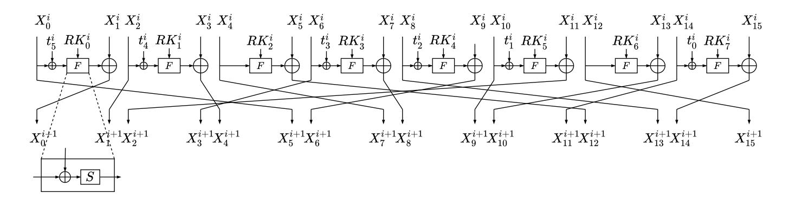
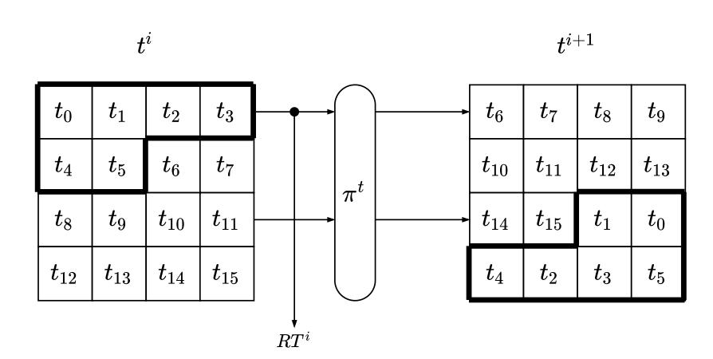
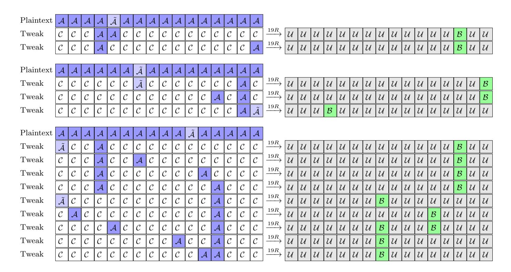
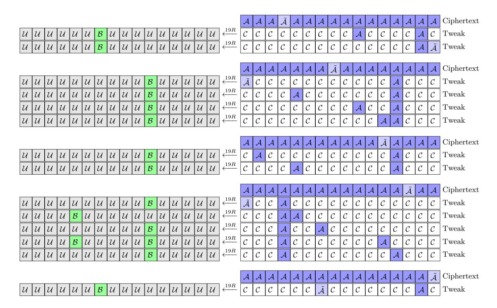
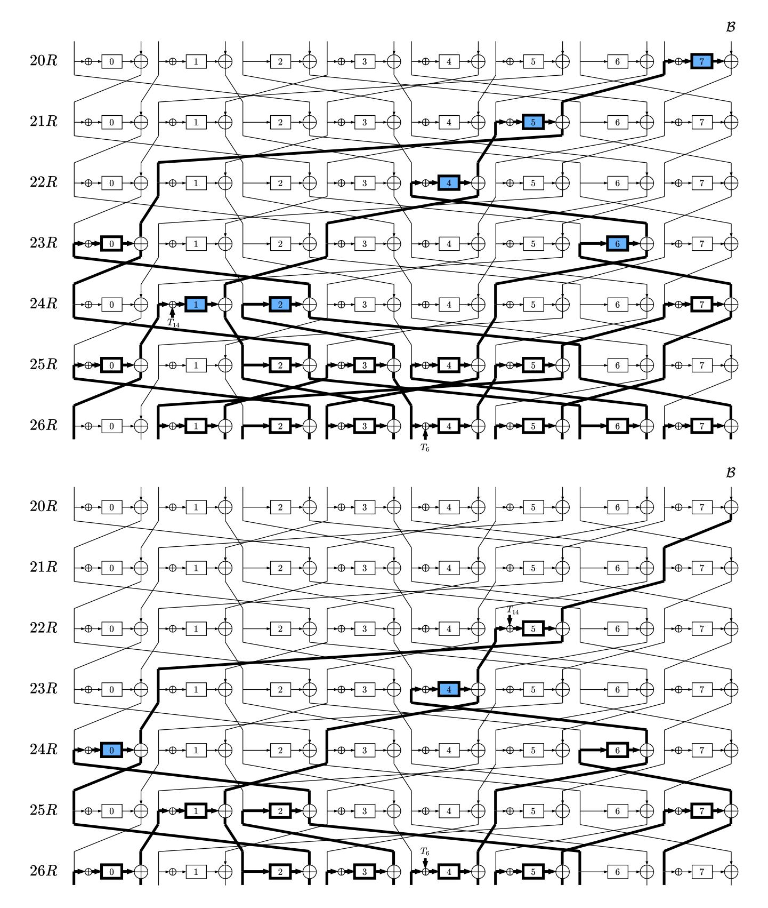

{0}------------------------------------------------

# Integral Cryptanalysis of Reduced-Round Tweakable TWINE

Muhammad ElSheikh and Amr M. Youssef

Concordia Institute for Information Systems Engineering, Concordia University, Montr´eal, Qu´ebec, Canada {m elshei,youssef}@ciise.concordia.ca

Abstract. Tweakable TWINE (T-TWINE) is the first lightweight dedicated tweakable block cipher family built on Generalized Feistel Structure (GFS). T-TWINE family is an extension of the conventional block cipher TWINE with minimal modification by adding a simple tweak based on the SKINNY's tweakey schedule. Similar to TWINE, T-TWINE has two variants, namely T-TWINE-80 and T-TWINE-128. The two variants have the same block size of 64 bits and a variable key length of 80 and 128 bits. In this paper, we study the implications for adding the tweak on the security of T-TWINE against the integral cryptanalysis. In particular, we first utilize the bit-based division property to search for the longest integral distinguisher. As a result, we are able to perform a distinguishing attack against 19 rounds using 2<sup>6</sup> × 2 <sup>63</sup> = 2<sup>69</sup> chosen tweak-plaintext combinations. We then convert this attack to key recovery attacks against 26 and 27 rounds (out of 36) of T-TWINE-80 and T-TWINE-128, respectively. By prepending one round before the distinguisher and using dynamically chosen plaintexts, we manage to extend the attack one more round without using the full codebook of the plaintext. Therefore, we are able to attack 27 and 28 rounds of T-TWINE-80 and T-TWINE-128, respectively.

# 1 Introduction

A Tweakable block cipher (TBC) is a symmetric-key cryptographic primitive that takes an auxiliary input called tweak in addition to the inputs of traditional block ciphers, plaintext message and cryptographic key [\[11\]](#page-20-0). Ideally, a different tweak value gives randomly chosen and different instant of the permutation over the message space without needing to change the key which may be costly in traditional block ciphers. A Tweakable block cipher is a powerful primitive that can be used in several applications such as disk encryption in which the repeated same plaintext should be encrypted to different ciphertexts under the same key. The concept of tweakable block ciphers also allows interesting modes for authenticated encryption such as OCB3 [\[10\]](#page-20-1) and Counter-in-Tweak [\[12\]](#page-20-2).

There are two general approaches to build TBCs: (i) using ordinary block ciphers through modes of operation, and (ii) dedicated constructions. Both the LRW and XEX modes of operations [\[13\]](#page-20-3) are examples of the first approach. For 

{1}------------------------------------------------

a block cipher with n-bit block, the security of these modes is guaranteed up to around 2n/<sup>2</sup> queries. For a higher level of security, we can use a dedicated TBC that is built with the tweak concept from the beginning such as Deoxys-BC [\[8\]](#page-20-4), SKINNY [\[1\]](#page-20-5), and CRAFT [\[2\]](#page-20-6).

Tweakable TWINE (T-TWINE) [\[14\]](#page-20-7) is the first lightweight dedicated TBC that is built on Generalized Feistel Structure (GFS). It was built with the goal of reducing the cost of design, security evaluation, and implementation. Therefore, the designers decided to reuse a well-designed GFS block cipher, TWINE [\[19\]](#page-21-0), and attached an extremely simple tweak scheduling to it. Similar to TWINE, T-TWINE has two variants namely, T-TWINE-80 and T-TWINE-128. These variants have the same block size of 64 bits, a tweak of 64 bits, and a variable key length of 80 and 128 bits.

The security of T-TWINE is evaluated by its designers against distinguishing attacks including differential, linear, impossible differential, and integral cryptanalysis. Regarding the integral cryptanalysis, they only reported an 11-round integral distinguisher. Key recovery attacks based on impossible differential against reduced-round of T-TWINE are presented in [\[21\]](#page-21-1).

Our Contributions. In this work, we study the security of T-TWINE against the integral attack. More precisely,

- 1. We utilize a Mixed-Integer-Linear Programming (MILP) model of the bitbased division property to search for the longest integral distinguisher in the chosen tweak, chosen tweak-plaintext, and chosen tweak-ciphertext attack settings. As a result, we found two 11-round integral distinguishers using a tweak with only one active nibble in the chosen tweak setting. We also checked the 11-round distinguisher reported in the design paper and we show that it is not correct. All the found 11-round distinguishers are verified experimentally. Furthermore, we found several 19-round integral distinguishers in both chosen tweak-plaintext and chosen tweak-ciphertext settings. This allows us to attack an extra three rounds more than TWINE which has 16-round integral distinguisher [\[23\]](#page-21-2). The best distinguishing attack can be performed using 2<sup>6</sup> × 2 <sup>63</sup> = 2<sup>69</sup> chosen tweak-plaintext combinations.
- 2. We employ meet-in-the-middle [\[15\]](#page-20-8) and partial-sum [\[6\]](#page-20-9) techniques to convert the best distinguishing attack to key recovery attacks against 26 (27) out of 36 rounds of T-TWINE-80 (T-TWINE-128) by appending 7 (8) rounds after the disntinguisher.
- 3. By prepending one round before the distinguisher and using dynamically chosen plaintexts [\[3\]](#page-20-10), we managed to extend the attack one more round without using the full codebook of the plaintext. Therefore, we are able to attack 27 and 28 rounds of T-TWINE-80 and T-TWINE-128, respectively.

Table [1](#page-2-0) summarizes the complexities of our attacks and contrast them with the complexities of the impossible differential attacks presented in [\[21\]](#page-21-1).

Outline. The rest of this paper is organized as follows. In Section [2,](#page-2-1) we briefly revisit the specifications of T-TWINE and the integral cryptanalysis using the

{2}------------------------------------------------

|             | Attack     | #Rounds | Data                    | Time         | Memory      | Reference |
|-------------|------------|---------|-------------------------|--------------|-------------|-----------|
|             | Imp. diff. | 25      | $2^{65.5}$ CTP          | $2^{70.86}$  | $2^{66}$    | [21]      |
| T-TWINE-80  | Integral   | 26      | $2^{70.58} \text{ CTP}$ | $2^{72.62}$  | $2^{67.62}$ | Sec. 4.1  |
|             | Imegrai    | 27      | $2^{70.95}$ CTP         | -            | $2^{71.08}$ | Sec. 5.1  |
|             | Imp. diff. | 27      | $2^{64}$ CTP            | $2^{120.83}$ | $2^{118}$   | [21]      |
| T-TWINE-128 | Integral   | 27      | $2^{71.58} \text{ CTP}$ | -            | _           | Sec. 4.2  |
|             | Imegrai    | 28      | $2^{72.27}$ CTP         | $2^{113.38}$ | $2^{94.32}$ | Sec. 5.1  |

<span id="page-2-0"></span>**Table 1:** Attack results on T-TWINE where CTP denotes chosen tweak-plaintext.

bit-based division property. The detailed integral distinguishing attacks against T-TWINE is explained in Section 3. In Section 4, we describe the key recovery attacks against 26 and 27 rounds of T-TWINE-80 and T-TWINE-128, respectively. Then, the details of our attacks against 27 and 28 rounds of T-TWINE-80 and T-TWINE-128 using dynamically chosen plaintexts are presented in Section 5. Finally, the paper is concluded in Section 6.

#### <span id="page-2-1"></span>2 Preliminaries

#### 2.1 T-TWINE Specifications

The following notation is used throughout the rest of the paper:

- K: The 80 or 128 bits master key.
- $K_j$ : The  $j^{th}$  nibble of K. The indices of the nibbles begin from 0.
- $-RK^{i}$ : The 32-bit round key used in round i.
- $-RK_{i}^{i}$ : The  $j^{th}$  nibble of  $RK^{i}$ . The indices of the nibbles begin from 0.
- -T: The 64-bit tweak.
- $T_j$ : The  $j^{th}$  nibble of the tweak T.
- $RT^i$ : The 24-bit round tweak used in round i, where  $RT^i \leftarrow t_0^i ||t_1^i||$   $t_2^i ||t_3^i||t_4^i||t_5^i$ , and  $t_j^i$  is the  $j^{th}$  nibble of  $RT^i$ .
- $-X^{i}$ : The 16 nibbles input to round i. The indices of the round begin from 1.
- $X_i^i$ :  $j^{th}$  nibble of  $X^i$ .
- -x[m]:  $m^{th}$  bit of the nibble x where x[0] is the least significant bit.
- $\oplus$ : The XOR operation.
- − ||: The concatenation operation.
- Rotz(x): The z-bit left cyclic shift of x.

As we mentioned above, T-TWINE is an extension of the conventional block cipher TWINE. It takes a tweak of 64 bits as an extra input in addition to a block of plaintext with 64 bits in order to produce a block of ciphertext using 80 or 128 bits of a secret key. T-TWINE structure consists of three parts: data processing which is a slightly modified version of the equivalent part in TWINE to deal with the extra input, key scheduling function of TWINE, and tweak scheduling function. The two variants of T-TWINE are the same except in the key scheduling function.

{3}------------------------------------------------

#### 4 M. ElSheikh et al.

<span id="page-3-0"></span>

Fig. 1: T-TWINE Round Function

<span id="page-3-1"></span>

|                             | Tab       | ole 2: Nibble   | shuffle $\pi$ |                  |              |
|-----------------------------|-----------|-----------------|---------------|------------------|--------------|
| $h \mid 0 \mid 1 \mid$      | 2   3   4 | 5   6   7   8   | 9   10        | 11   12          | 13   14   15 |
| $\pi[h] \mid 5 \mid 0 \mid$ | 1   4   7 | 12   3   8   13 | 6   9         | $2 \mid 15 \mid$ | 10 11 14     |
| $\pi^{-1}[h]  1  2 $        | 11 6 3    | 0   9   4   7   | 10  13        | 14 5             | 8   15   12  |

**Data Processing.** The round function is based on a variant of Type-2 GFS [18] with 16 4-bit nibbles as depicted in Fig. 1. It consists of a nonlinear layer (F-function operations), round tweak XOR, and a diffusion layer which is a 16-nibble shuffle operation ( $\pi$ , see Table 2). The F-function operation is a round-key XOR followed by 4-bit Sbox (S, see Table 3). This round function is iterated 36 times in both variants where the diffusion layer is omitted from the last round.

**Key Scheduling Function.** Each variant of T-TWINE has its own key schedule. The key scheduling function is used to stretch 80/128 bits of the master key K to 36 32-bit round keys  $RK^i$  where  $1 \le i \le 36$ . Algorithms 1 and 2 in Appendix A show the details of these key schedules. For more details, see [14,19].

**Tweak Scheduling Function.** A 64-bit tweak T is used to generate 36 24-bit round tweaks  $RT^i$  where  $1 \le i \le 36$  using a permutation-based function. Firstly, the 64-bit tweak T is loaded to 16 4-bit nibbles  $t_j^1$  where  $0 \le j \le 15$ . In i-th round, the first 6 nibbles  $(t_0^i, \ldots, t_5^i)$  are used as the round tweak  $RT^i$ , then these nibbles are shuffled using a 6-nibble permutation  $\pi^t$ , s.t.  $(0,1,2,3,4,5) \to (1,0,4,2,3,5)$ . After that, all nibbles are shifted by 6 nibbles to construct  $t_j^{i+1}$  where  $0 \le j \le 15$  as depicted in Fig 2.

#### 2.2 Integral Cryptanalysis

Integral cryptanalysis was firstly introduced by Daemen et al. in [4] to analyze the security of the block cipher SQUARE. Subsequently, Knudsen and Wagner [9] formalized this technique. It is a chosen-plaintext attack and can be performed as follows. Firstly, the cryptanalyst constructs a set of plaintexts that has a constant value at some bits while the other bits vary through all possible values.

{4}------------------------------------------------

<span id="page-4-1"></span><span id="page-4-0"></span>

| T    | able | e <b>3:</b> | 4-b | it Sl        | ООХ | (S) | of T | -TV | VINE | E in | hexa         | adec | ima | l for | m |   |
|------|------|-------------|-----|--------------|-----|-----|------|-----|------|------|--------------|------|-----|-------|---|---|
| x    | 0    | 1           | 2   | 3            | 4   | 5   | 6    | 7   | 8    | 9    | $\mathbf{a}$ | b    | c   | d     | e | f |
| S(x) | c    | 0           | f   | $\mathbf{a}$ | 2   | b   | 9    | 5   | 8    | 3    | d            | 7    | 1   | е     | 6 | 4 |



Fig. 2: Tweak Schedule of T-TWINE

After that, the cryptanalyst calculates the XOR sum of all bits (or some of them) on the corresponding ciphertext. If it is always 0 irrespective of the used secret key, these bits are called balanced. This property can be used to distinguish the block cipher under test form a random permutation.

**Bit-Based Division Property.** In [20], Todo and Morii proposed the *bit-based division property*, which can be used to build a longer integral distinguisher for block ciphers with block size less than 32 bits. Xiang *et al.* [22] overcome the problem of the restriction on the block size using *the division trails*. They proposed systematic rules to represent the bit-based division property propagation as a set of Mixed Integer Linear Programming (MILP) constraints. Hence, we can use MILP solvers to search for a distinguisher.

**Definition 1** (Bit-based Division Property[20]). Let X be a multiset whose elements take a value of  $\mathbb{F}_2^n$ . When the multiset X has the division property  $\mathcal{D}_{K}^{1^n}$ , where X denotes a set of n-dimensional vectors whose i-th element takes 0 or 1, it fulfills the following conditions:

$$\bigoplus_{x \in \mathbb{X}} \boldsymbol{x}^{\boldsymbol{u}} = \begin{cases} unknown & if there \ exists \ \boldsymbol{k} \in \mathbb{K} \ s.t. \ \boldsymbol{u} \succeq \boldsymbol{k}, \\ 0 & otherwise. \end{cases}$$

where  $\mathbf{x}^{\mathbf{u}} = \prod_{i=1}^{n} x[i]^{u[i]}$ ,  $\mathbf{u} \succeq \mathbf{k}$  if  $u[i] \geq k[i] \ \forall i$ , and x[i], u[i] are the i-th bits of  $\mathbf{x}$  and  $\mathbf{u}$ , respectively.

**Definition 2 (Division Trail[22]).** Let  $f_r$  denote the round function of an iterated block cipher. Assume that the input multiset to the block cipher has the initial division property  $\mathcal{D}^{1^n}_{\{k\}}$ , and denote the division property after i-round propagation through  $f_r$  by  $\mathcal{D}^{1^n}_{\mathbb{K}_i}$ . Thus, we have the following chain of division

{5}------------------------------------------------

property propagations:  $\{\boldsymbol{k}\} \stackrel{\text{def}}{=} \mathbb{K}_0 \stackrel{f_r}{\longrightarrow} \mathbb{K}_1 \stackrel{f_r}{\longrightarrow} \mathbb{K}_2 \stackrel{f_r}{\longrightarrow} \cdots \stackrel{f_r}{\longrightarrow} \mathbb{K}_r$ . Moreover, for any vector  $\boldsymbol{k}_i^* \in \mathbb{K}_i (i \geq 1)$ , there must exist a vector  $\boldsymbol{k}_{i-1}^* \in \mathbb{K}_{i-1}$  such that  $\boldsymbol{k}_{i-1}^*$  can propagate to  $\boldsymbol{k}_i^*$  by the division property propagation rules. Furthermore, for  $(\boldsymbol{k}_0, \boldsymbol{k}_1, \dots, \boldsymbol{k}_r) \in \mathbb{K}_0 \times \mathbb{K}_1 \times \cdots \times \mathbb{K}_r$ , if  $\boldsymbol{k}_{i-1}$  can propagate to  $\boldsymbol{k}_i$  for all  $i \in \{1, 2, \dots, r\}$ , we call  $(\boldsymbol{k}_0, \boldsymbol{k}_1, \dots, \boldsymbol{k}_r)$  an r-round division trail.

Using the division trial, the search process for an integral distinguisher is converted to check if the division trail  $k_0 \to \cdots \to e_i$  (a unit vector whose i-th element is 1) does exist or not. If it does not exist, then the *i*-th bit of r-round output is balanced. This process can be modeled efficiently as an MILP optimization problem. Further details can be found in [22,16,5].

In the following, we summarize the MILP models of the propagation rules of the bit-based division property through the basic operations in block ciphers.

- Model for COPY: Let  $(a) \xrightarrow{COPY} (b_1, b_2, \dots, b_m)$  denote the division trail through COPY function, where a single bit (a) is copied to m bits. Then, it can be described using the following MILP constraints:

$$a - b_1 - b_2 - \cdots - b_m = 0$$
, where  $a, b_1, b_2, \ldots, b_m$  are binary variables.

- Model for XOR: Let  $(a_1, a_2, \ldots, a_m) \xrightarrow{XOR} (b)$  denote the division trail through an XOR function, where m bits are compressed to a single bit (b) using an XOR operation. Then, it can be described using the following MILP constraints:

$$a_1 + a_2 + \cdots + a_m - b = 0$$
, where  $a_1, a_2, \ldots, a_m, b$  are binary variables.

- Model for S-boxes: The division property through an S-box can be obtained by representing the S-Box using its algebraic normal form (ANF) [22]. The division trail though an n-bit S-box can be represented as a set of 2n-dimensional binary vectors  $\in \{0,1\}^{2n}$  which has a convex hull. The H-Representation of this convex hull can be computed using readily available functions such as inequality\_generator() function in SageMath<sup>1</sup> which returns a set of linear inequalities that describe these vectors. We use this set of inequalities as MILP constraints to present the division trail though the S-box.

# <span id="page-5-0"></span>3 Integral Distinguishing Attacks

Since T-TWINE is an extension of TWINE which has 16-round integral distinguisher using  $2^{63}$  chosen plaintexts [23], in this section we study the effect of the freedom gained by adding a tweak to the structure. Thereby, we report the result regarding the integral distinguishers in the three attack settings: chosen

<span id="page-5-1"></span><sup>1</sup> http://www.sagemath.org/

{6}------------------------------------------------

tweak, chosen tweak-plaintext, and chosen tweak-ciphertext. To this end, we utilize MILP models of the propagation rules of the bit-based division property described in the previous section to automate the search process using Gurobi optimizer [\[7\]](#page-20-15). We obtain the best distinguisher in two steps. In the first step, we look for a distinguisher that covers the maximum number of rounds irrespective of the data complexity. Then, we try to reduce the data complexity of the longest one in the second step. We use the following notation to present the status of each nibble of the tweak, plaintext, and ciphertext:

- C each bit of the nibble is fixed to constant.
- A all bits of the nibble are active.
- A˜ all bits of the nibble are active except one arbitrary bit is constant.
- B each bit of the nibble is balanced (the XOR sum is zero).
- U a nibble with unknown status.

Chosen tweak setting. In this setting, all the plaintext bits are fixed to constant values and some or all the bits of the tweak are active while the remaining bits are constant.

In the first step, we set all bits of the tweak to active. We then target r rounds and use our MILP model to search for some balanced bits. If there is at least one balanced bit, we increase the target rounds to r+1 and repeat the search process in the same way. Otherwise, we conclude that the disnguisher with the maximum number of rounds based on our model covers r rounds. Based on our evaluation, there is no distinguisher for 12 or more rounds and the longest distinguisher is an 11-round one. In the second step, we try to reduce the data complexity of that 11-round distinguisher by minimizing the number of active nibbles in the tweak. To this end, we start with only one active nibble and if there is no balanced bits, we progressively increase the number of active nibbles. Fortunately, we find two distinguishers with only one active nibble as shown bellow:

| Plaintext C C C C C C C C C C C C C C C C |  |  |                                 |  |  |  |  |  |                                         |  |  |  |  |  |  |  |  |
|-------------------------------------------|--|--|---------------------------------|--|--|--|--|--|-----------------------------------------|--|--|--|--|--|--|--|--|
| Tweak                                     |  |  | C C C C C C C C C C C C C C A C |  |  |  |  |  | 11R −−→ U U U U U U U B U U U U U U U U |  |  |  |  |  |  |  |  |
| Tweak                                     |  |  | C C C C C C C C C C C C C C C A |  |  |  |  |  | 11R −−→ U U U U U B U U U U U B U U U U |  |  |  |  |  |  |  |  |

It should be mentioned that the designers have reported in [\[14\]](#page-20-7) a different 11 round integral distinguisher in which the plaintext nibbles are fixed to constant, the three nibbles (5, 10, 11) in the tweak are actives, and the remaining nibbles in the tweak are fixed to constant. This distinguisher has two balanced nibbles (0, 11) in the ciphertext side as shown below. However, when we test this distinguisher using our MILP model with the same input settings, we confirmed that there is only one balanced nibble (11) in the ciphertext side.

| Plaintext C C C C C C C C C C C C C C C C |  |  |  |                                 |  |  |  |  |  |  |  |  |  |  |  |  |                                                  |
|-------------------------------------------|--|--|--|---------------------------------|--|--|--|--|--|--|--|--|--|--|--|--|--------------------------------------------------|
| Tweak                                     |  |  |  | C C C C C A C C C C A A C C C C |  |  |  |  |  |  |  |  |  |  |  |  | 11R −−→ B U U U U U U U U U U B U U U U ✗ ([14]) |
| Tweak                                     |  |  |  | C C C C C A C C C C A A C C C C |  |  |  |  |  |  |  |  |  |  |  |  | 11R −−→ U U U U U U U U U U U B U U U U ✓(Ours)  |

{7}------------------------------------------------

Since the data complexity for each one of the two 11-round integral distinguishers we have proposed is 2<sup>4</sup> , we have verified the correctness of them experimentally to validate our results. Additionally, the data complexity of the 11-round distinguisher with the same input settings as the distinguisher reported in [\[14\]](#page-20-7) is 2<sup>12</sup> , we also have verified experimentally that it has only one balanced nibble (11) in the ciphertext side which is consistent with the result using our MILP model[2](#page-7-0) .

Chosen tweak-plaintext setting. In this setting, some of plaintext bits are active and the remaining bits are constant. For the tweak, some or all bits are active and the remaining bits are constant.

Since the goal of the first step is to obtain the longest distinguisher, we set the 64 bits of the tweak and 63 bits of the plaintext to active and the remaining bit of the plaintext to constant[3](#page-7-1) . We then target r rounds and iterate over the 64 positions of the constant bit until we find some balanced bits or terminate without finding any. In the first case, we increase the target rounds to r + 1 and repeat the search process in the same way. Otherwise, we conclude that the disnguisher with the maximum number of rounds based on our model covers r rounds. In our evaluation, we found that the 19-round distinguisher is the longest one.

In order to convert the distinguishing attack to a key recovery attack applicable for both variants T-TWINE-80 and T-TWINE-128, the data complexity of the distinguisher must be less than 280. Therefore, we limit the search process to find a distinguisher that needs up to 80 active bits.

During the second step, we try to reduce the data complexity by minimizing the number of active bits in both plaintext and tweak. We follow the technique described in [\[17\]](#page-21-6) to reduce the active bits of the plaintext. In particular, we repeat the previous step for 19 rounds and instead of stopping the search process if there are some balanced bits, we keep a record of the position of the constant bit in case of no balanced bits. In our evaluation, there are 32 bits corresponding to the nibbles (1, 3, 5, 7, 9, 11, 13, 15) that must be active to obtain 19-round distinguisher and the remaining bits may be active or constant. After that, we try all the combinations of 2 out of 32 bits that might be constant and check if the 19-round distinguisher exists. Unfortunately, such distinguisher does not exist if we set any two bits in the plaintext to constant. Regarding the active bits reduction in the tweak, we start with only one active nibble and if there is no distinguisher, we progressively increase the number of active nibbles.

In our evaluation, there are several 19-round integral distinguishers using tweak with two active nibbles. Moreover, we are able to reduce the active bits to 7 bits for some of them and 6 bits for the distingiusher that we will use during the

<span id="page-7-0"></span><sup>2</sup> The code can be found at: <https://github.com/mhgharieb/Integral-Attack-T-TWINE>

<span id="page-7-1"></span><sup>3</sup> The data complexity of plaintext must be less than the full codebook because using the full codebook of any permutation (a random permutation or a block cipher) always gives a balanced output.

{8}------------------------------------------------

<span id="page-8-0"></span>

Fig. 3: 104 19-round integral distinguishers in chosen tweak-plaintext setting, where the three groups consist of 4 × (1 + 1) = 8, 4 × (4 + 1 + 4) = 36, and 4 × (4 + 1 + 1 + 1 + 4 + 1 + 1 + 1 + 1) = 60 distinguishers.

<span id="page-8-1"></span>

Fig. 4: 104 19-round Integral distinguishers in chosen tweak-ciphertext setting, where the five groups consist of 20, 28, 8, 32, and 16 distinguishers.

key recovery attacks. Figure [3](#page-8-0) summarizes 40 distinguishers with 2<sup>8</sup> ×2 <sup>63</sup> = 2<sup>71</sup> , and 64 distinguishers with 2<sup>7</sup> × 2 <sup>63</sup> = 2<sup>70</sup> chosen tweak-plaintext combinations. 

{9}------------------------------------------------

Chosen tweak-ciphertext setting. In this setting, some of ciphertext bits are active and the remaining bits are constant. For the tweak, some or all bits are active and the remaining bits are constant.

We followed the same technique we have used in chosen tweak-plaintext setting and we found that the 19-round integral distinguisher is the longest one. Like chosen tweak-plaintext setting, the distinguisher does not exist if there are two constant bits in the ciphertext. Also, there are several two active nibbles combinations of the tweak that lead to 19-round distinguisher. Moreover, we are able to reduce, for some of them, the active bits to only 7. Figure 4 summarizes 104 19-round integral distinguishers, 64 of them need  $2^7 \times 2^{63} = 2^{70}$  chosen tweak-ciphertext combinations and the remaining need  $2^8 \times 2^{63} = 2^{71}$  chosen tweak-ciphertext combinations.

# <span id="page-9-0"></span>4 Integral Attacks on T-TWINE

We convert the distinguishing attacks described in the previous section to key recovery attacks against reduced-round versions of T-TWINE. In particular, we target 26 and 27 rounds of T-TWINE-80 and T-TWINE-128, respectively, using the following 19-round distinguisher that needs 6 and 63 active bits of the tweak and the plaintext, respectively:

Plaintext: 
$$(\mathcal{A}, \mathcal{A}, \mathcal{A}, \mathcal{A}, \mathcal{A}, \mathcal{A}, \mathcal{A}, \mathcal{A}, \mathcal{A}, \mathcal{A}, \mathcal{A}, \mathcal{A}, \mathcal{A}, \mathcal{A}, \mathcal{A}, \mathcal{A}, \mathcal{A}, \mathcal{A}, \mathcal{A}, \mathcal{A}, \mathcal{A}, \mathcal{A}, \mathcal{A}, \mathcal{A}, \mathcal{A}, \mathcal{A}, \mathcal{A}, \mathcal{A}, \mathcal{A}, \mathcal{A}, \mathcal{A}, \mathcal{A}, \mathcal{A}, \mathcal{A}, \mathcal{A}, \mathcal{A}, \mathcal{A}, \mathcal{A}, \mathcal{A}, \mathcal{A}, \mathcal{A}, \mathcal{A}, \mathcal{A}, \mathcal{A}, \mathcal{A}, \mathcal{A}, \mathcal{A}, \mathcal{A}, \mathcal{A}, \mathcal{A}, \mathcal{A}, \mathcal{A}, \mathcal{A}, \mathcal{A}, \mathcal{A}, \mathcal{A}, \mathcal{A}, \mathcal{A}, \mathcal{A}, \mathcal{A}, \mathcal{A}, \mathcal{A}, \mathcal{A}, \mathcal{A}, \mathcal{A}, \mathcal{A}, \mathcal{A}, \mathcal{A}, \mathcal{A}, \mathcal{A}, \mathcal{A}, \mathcal{A}, \mathcal{A}, \mathcal{A}, \mathcal{A}, \mathcal{A}, \mathcal{A}, \mathcal{A}, \mathcal{A}, \mathcal{A}, \mathcal{A}, \mathcal{A}, \mathcal{A}, \mathcal{A}, \mathcal{A}, \mathcal{A}, \mathcal{A}, \mathcal{A}, \mathcal{A}, \mathcal{A}, \mathcal{A}, \mathcal{A}, \mathcal{A}, \mathcal{A}, \mathcal{A}, \mathcal{A}, \mathcal{A}, \mathcal{A}, \mathcal{A}, \mathcal{A}, \mathcal{A}, \mathcal{A}, \mathcal{A}, \mathcal{A}, \mathcal{A}, \mathcal{A}, \mathcal{A}, \mathcal{A}, \mathcal{A}, \mathcal{A}, \mathcal{A}, \mathcal{A}, \mathcal{A}, \mathcal{A}, \mathcal{A}, \mathcal{A}, \mathcal{A}, \mathcal{A}, \mathcal{A}, \mathcal{A}, \mathcal{A}, \mathcal{A}, \mathcal{A}, \mathcal{A}, \mathcal{A}, \mathcal{A}, \mathcal{A}, \mathcal{A}, \mathcal{A}, \mathcal{A}, \mathcal{A}, \mathcal{A}, \mathcal{A}, \mathcal{A}, \mathcal{A}, \mathcal{A}, \mathcal{A}, \mathcal{A}, \mathcal{A}, \mathcal{A}, \mathcal{A}, \mathcal{A}, \mathcal{A}, \mathcal{A}, \mathcal{A}, \mathcal{A}, \mathcal{A}, \mathcal{A}, \mathcal{A}, \mathcal{A}, \mathcal{A}, \mathcal{A}, \mathcal{A}, \mathcal{A}, \mathcal{A}, \mathcal{A}, \mathcal{A}, \mathcal{A}, \mathcal{A}, \mathcal{A}, \mathcal{A}, \mathcal{A}, \mathcal{A}, \mathcal{A}, \mathcal{A}, \mathcal{A}, \mathcal{A}, \mathcal{A}, \mathcal{A}, \mathcal{A}, \mathcal{A}, \mathcal{A}, \mathcal{A}, \mathcal{A}, \mathcal{A}, \mathcal{A}, \mathcal{A}, \mathcal{A}, \mathcal{A}, \mathcal{A}, \mathcal{A}, \mathcal{A}, \mathcal{A}, \mathcal{A}, \mathcal{A}, \mathcal{A}, \mathcal{A}, \mathcal{A}, \mathcal{A}, \mathcal{A}, \mathcal{A}, \mathcal{A}, \mathcal{A}, \mathcal{A}, \mathcal{A}, \mathcal{A}, \mathcal{A}, \mathcal{A}, \mathcal{A}, \mathcal{A}, \mathcal{A}, \mathcal{A}, \mathcal{A}, \mathcal{A}, \mathcal{A}, \mathcal{A}, \mathcal{A}, \mathcal{A}, \mathcal{A}, \mathcal{A}, \mathcal{A}, \mathcal{A}, \mathcal{A}, \mathcal{A}, \mathcal{A}, \mathcal{A}, \mathcal{A}, \mathcal{A}, \mathcal{A}, \mathcal{A}, \mathcal{A}, \mathcal{A}, \mathcal{A}, \mathcal{A}, \mathcal{A}, \mathcal{A}, \mathcal{A}, \mathcal{A}, \mathcal{A}, \mathcal{A}, \mathcal{A}, \mathcal{A}, \mathcal{A}, \mathcal{A}, \mathcal{A}, \mathcal{A}, \mathcal{A}, \mathcal{A}, \mathcal{A}, \mathcal{A}, \mathcal{A}, \mathcal{A}, \mathcal{A}, \mathcal{A}, \mathcal{A}, \mathcal{A}, \mathcal{A}, \mathcal{A}, \mathcal{A}, \mathcal{A}, \mathcal{A}, \mathcal{A}, \mathcal{A}, \mathcal{A}, \mathcal{A}, \mathcal{A}, \mathcal{A}, \mathcal{A}, \mathcal{A}, \mathcal{A}, \mathcal{A}, \mathcal{A}, \mathcal{A}, \mathcal{A}, \mathcal{A}, \mathcal{A}, \mathcal{A}, \mathcal{A}, \mathcal{A}, \mathcal{A}, \mathcal{A}, \mathcal{A}, \mathcal{A}, \mathcal{A}, \mathcal{A}, \mathcal{A}, \mathcal{A}, \mathcal{A}, \mathcal{A}, \mathcal{A}, \mathcal{A}, \mathcal{A}, \mathcal{A}, \mathcal{A}, \mathcal{A}, \mathcal{A}, \mathcal{A}, \mathcal{A}, \mathcal{A}, \mathcal{A}, \mathcal{A}, \mathcal{A}, \mathcal{A}, \mathcal{A}, \mathcal{A}, \mathcal{A}, \mathcal{A}, \mathcal{A}, \mathcal{A}, \mathcal{A}, \mathcal{A}, \mathcal{A}, \mathcal{A}, \mathcal{A}, \mathcal{A}, \mathcal{A}, \mathcal{A}, \mathcal{A}, \mathcal{A}, \mathcal{A}, \mathcal{A}, \mathcal{A}, \mathcal{A}, \mathcal{A}, \mathcal{A}, \mathcal{A}, \mathcal{A}, \mathcal{A}, \mathcal{A}, \mathcal{A}, \mathcal{A}, \mathcal{A}, \mathcal{A}, \mathcal{A}, \mathcal{A}, \mathcal{A}, \mathcal{A}, \mathcal{A}, \mathcal{A}, \mathcal{A}, \mathcal{A}, \mathcal{A}, \mathcal{A}, \mathcal{A}, \mathcal{A}, \mathcal{A}, \mathcal{A}, \mathcal{A}, \mathcal{A}$$

where  $A_3$  means all bits of the nibble are active except bit 3, counted from the least significant bit, is constant and  $A_{1,3}$  means bits (0 and 2) are active and bits (1 and 3) are constant.

In the following, we revisit the Meet-in-the-Middle technique [15] and Partial-Sum technique [6] that we use to enhance the time complexities of our proposed attacks.

**Meet-in-the-Middle Technique.** Let  $Z_j^i$ ,  $(0 \le j \le 7)$  denote the output of the F functions in i-th round of T-TWINE. Consider the 19-round distinguisher mentioned above, then the nibble  $X_{15}^{20}$  is balanced  $(\bigoplus X_{15}^{20} = 0)$ . Since this nibble can be expressed as a linear combination of  $Z_7^{20}$  and  $X_{14}^{21}$ , we can obtain the following relation

$$\bigoplus Z_7^{20} = \bigoplus X_{14}^{21}$$

In meet-in-the-middle technique [15], each sum is independently computed from ciphertexts (e.g., see Fig. 5) and the subkeys used during the computation are stored in two different tables indexed by the value of the sum. After that, we consider the matches between the two tables, in the same manner of the meet-in-the-middle attack, as candidate subkeys because they satisfy the previous relation. Since the procedure to obtain both  $\bigoplus Z_7^{20}$  and  $\bigoplus X_{14}^{21}$  independently

{10}------------------------------------------------

involves less number of subkeys than the one to obtain  $\bigoplus X_{15}^{20}$  directly, the time complexity will be improved.

Partial-Sum Technique. Ferguson et al. introduced the partial-sum technique to improve the time complexity of integral attacks [6]. Suppose the key recovery procedure during the integral cryptanalysis involves N operations,  $\kappa$ -bit subkey and  $2^{|I|}$  ciphertexts, then the time complexity of the direct computation will be  $N \times 2^{|I|+\kappa}$  operations. Using the partial-sum technique, this time complexity can be improved as follows. We firstly store the ciphertexts that appear odd times in the memory whereas the ciphertexts that appear even times are discarded since they have no effect on the balanced property. Then, we guess a part of the subkey  $(\kappa_1$ -bit) and partially decrypt the ciphertexts through a single operation to an intermediate state with  $|I_1|$ -bit size (that can have up to  $2^{|I_1|}$  values) such that  $|I_1| \leq |I|$ . The time complexity of this step is  $2^{|I|+\kappa_1}$  operations. After that, we repeat the step of storing the values that appear odd times and partially decrypting the intermediate state using  $\kappa_i$ -bit to get another intermediate state with  $|I_i|$ -bit size such that  $|I_i| \leq |I_{i-1}|$ . The time complexity of the i-th step will be  $2^{|I_{i-1}|+\kappa_1+\cdots+\kappa_i}$  where  $I_0$  is I, and the whole time complexity will be

$$\sum_{i=1}^{N} 2^{|I_{i-1}| + \kappa_1 + \dots + \kappa_i} < \sum_{i=1}^{N} 2^{|I| + \kappa} = N \times 2^{|I| + \kappa}$$

In the following, we give the details of the key recovery attack against T-TWINE-80.

## <span id="page-10-0"></span>4.1 Attack on 26-Round T-TWINE-80

The ciphertexts of 26-round of T-TWINE-80 can be written as  $X^{27}$ . The process of obtaining  $\bigoplus X_{15}^{20}$  involves the following 27 round keys (See Fig. 5):

$$RK^{26}, RK^{25}_{[0,1,2,3,4,5,7]}, RK^{24}_{[0,1,2,6,7]}, RK^{23}_{[0,4,6]}, RK^{22}_{[4,5]}, RK^{21}_{5}, RK^{20}_{7}$$

However, we only need to guess 76 bits in 19 round keys and the other 8 round keys can be computed based on the key schedule as follows:

$$\begin{split} RK_0^{24} &= RK_7^{25} \oplus S(RK_6^{26} \oplus (0||CON_L^{25})), \quad RK_1^{24} = RK_5^{26}, \\ RK_2^{24} &= S^{-1}(RK_7^{26} \oplus RK_0^{25}) \oplus S(RK_7^{24}), \quad RK_4^{23} = RK_0^{26}, \\ RK_6^{23} &= RK_1^{26} \oplus (0||CON_H^{25}), \qquad RK_4^{22} = RK_0^{25}, \\ RK_5^{21} &= RK_4^{26}, \qquad RK_7^{20} = RK_6^{26} \oplus S(RK_2^{26}) \oplus (0||CON_L^{25}). \end{split}$$

where  $CON_L^{25}$  and  $CON_H^{25}$  are predefined constants.

{11}------------------------------------------------

<span id="page-11-0"></span>

**Fig. 5:** Analysis rounds of T-TWINE-80 where the upper part is used during computing  $\bigoplus Z_7^{20}$  and the lower part is used during computing  $\bigoplus X_{14}^{21}$ .

**Key Recovery Procedure.** We firstly construct a data structure where all the bits of the plaintext  $X^1$  are active except the bit  $X_6^1[3]$  which is fixed to constant. For the tweak, the 6 bits  $T_6[0,2]||T_{14}$  are active whereas the other bits are fixed to constant. We then ask the encryption oracle to obtain the corresponding ciphertext  $(X^{27})$ . After that, we initialize two empty hash tables  $H_Z$  and  $H_X$  with  $2^{56}$  and  $2^{40}$  entries to store the values of  $\bigoplus Z_7^{20}$  and  $\bigoplus X_{14}^{21}$ , respectively, indexed by the round keys used during the computations.

{12}------------------------------------------------

Since obtaining  $\bigoplus Z_7^{20}$  (the upper part of Fig. 5) requires much more computation than obtaining  $\bigoplus X_{14}^{21}$  (the lower part of Fig. 5), we only explain the procedure to obtain  $\bigoplus Z_7^{20}$ . The attack starts by storing the values of  $X_{[0,2,3,4,5,6,7,8,9,10,11,12,13,14,15]}^{27}||T_6[0,2]||T_{14}$  that appear odd times in a list called the state  $S_0$  which has a size of up to  $2^{66}$  66-bit values. Then, we guess at the *i*-th step a round key (or deduce it based on the key schedule as shown above) and partially decrypt the values in the state  $S_{i-1}$ , then store the values of the output that appear odd times in a new state  $S_i$ . For example, we guess at step 1  $RK_2^{26}$  and partially decrypt  $X_4^{27}$  and  $X_5^{27}$  to obtain  $X_5^{26} = X_5^{27} \oplus S(X_4^{27} \oplus K_2^{26})$ . The state size after compression is up to  $2^{62}$  62-bit values. The time complexity of this step is  $2^4 \times 2^{66} = 2^{70}$  F-function operations. Table 4 summarizes the steps of the attack procedure.

Finally, we access the hash tables  $(H_Z, H_X)$  for each 76-bit key, and we consider a 76-bit key as a candidate if the two entries are equal. The 4 balanced bits lead to 4 bits filtration, therefore we get  $2^{72}$  76-bit candidates for the round keys when we use a single data structure. We can reduce the number of the candidates by repeating the attack using another data structure. Thanks to the key schedule, we can obtain  $2^{76}$  80-bit candidates for the master key corresponding to these  $2^{72}$  76-bit round keys by guessing 4-bit round key. The details of this step can be found in Appendix B. We then get the right master key by exhaustively searching over these candidates using 2 plaintext/ciphertext pairs.

**Attack Complexity.** When we use a single data structure, we need  $2^6 \times 2^{63} = 2^{69}$  queries to the encryption oracle. From Table 4, we need  $2^{78.13}$  F-function operations to compute  $\bigoplus Z_7^{20}$ . Using the same method, we need  $2^{59.91}$  F-Function operations to compute  $\bigoplus X_{14}^{21}$ .

We then access the hash tables  $(H_Z, H_X)$  sequentially to retrieve 2 4-bit words. For simplicity, we consider the time to retrieve a single 4-bit word as a one F-function operation. Therefore, for this step, we need  $2^{56} \times (1+2^{20}) \approx 2^{76}$  F-function operations. Consequently, we got  $2^{72}$  76-bit candidates of the round keys. As shown in Appendix B, we need 145 F-function operations for each candidate to get the corresponding  $2^4$  80-bit candidates of the master key. The exhaustive search over the candidates to get the right master key takes  $2^{76} + 2^{12}$  26-round encryptions. Therefore, the total time complexity is  $2^{69} + 1 \times \frac{2^{78.13} + 2^{59.91}}{8 \times 26} + \frac{2^{76}}{8 \times 26} + 2^{12} \approx 2^{76.11}$  26-round encryptions. The memory complexity is dominated by storing the part of the ciphertexts involved during the computation of  $\bigoplus Z_7^{20}$  (the state  $S_0$ ) which is  $2^{66}$  66-bit blocks that is equivalent to  $2^{66.04}$  64-bit blocks. As shown in Table 5, the lowest time complexity can be achieved using 3 data structures and in this case the data, time, and memory complexities are  $3 \times 2^6 \times 2^{63} = 2^{70.58}$  chosen tweak-plaintext combinations,  $2^{72.62}$  26-round encryprions, and  $2^{67.62}$  64-bit blocks, receptively.

{13}------------------------------------------------

<span id="page-13-1"></span>**Table 4:** Summary of the procedure to obtain  $\bigoplus Z_7^{20}$  where 'Size' refers to the size of the intermediate state  $S_i$  after the partial decryption at each step, the nibbles  $X_j^r$  in the state  $S_{i-1}$  are replaced by the nibbles  $X_j^r$ s in the state  $S_i$  during the *i*-th step, and 'Complexity' is measured in term of F-function operations except step 0 is measured in number of memory accesses (MA).

| Step | Key           | Size     | The State $(S_i)$                                                                                                                                                                                                                                                                                                                                                                                                                                                                                                                                                                                                                                                                                                                                                                                                                                                                                                                                                                                                                                                                                                                                                                                                                                                                                                                                                                                                                                                                                                                                                                                                                                                                                                                                                                                                                                                                                                                                                                                                                                                                                                                                            | Complexity                              |
|------|---------------|----------|--------------------------------------------------------------------------------------------------------------------------------------------------------------------------------------------------------------------------------------------------------------------------------------------------------------------------------------------------------------------------------------------------------------------------------------------------------------------------------------------------------------------------------------------------------------------------------------------------------------------------------------------------------------------------------------------------------------------------------------------------------------------------------------------------------------------------------------------------------------------------------------------------------------------------------------------------------------------------------------------------------------------------------------------------------------------------------------------------------------------------------------------------------------------------------------------------------------------------------------------------------------------------------------------------------------------------------------------------------------------------------------------------------------------------------------------------------------------------------------------------------------------------------------------------------------------------------------------------------------------------------------------------------------------------------------------------------------------------------------------------------------------------------------------------------------------------------------------------------------------------------------------------------------------------------------------------------------------------------------------------------------------------------------------------------------------------------------------------------------------------------------------------------------|-----------------------------------------|
| 0    | -             | $2^{66}$ | $ \overline{\left X_0^{27}, X_2^{27}, X_3^{27}, \left[X_4^{27}\right], \left[X_5^{27}\right], X_6^{27}, X_7^{27}, X_8^{27}, X_9^{27}, X_{10}^{27}, X_{11}^{27}, X_{12}^{27}, X_{13}^{27}, X_{14}^{27}, X_{15}^{27}, T_6, T_{14}}, X_{15}^{27}, X_{15}^{27}, X_{15}^{27}, X_{15}^{27}, X_{15}^{27}, X_{15}^{27}, X_{15}^{27}, X_{15}^{27}, X_{15}^{27}, X_{15}^{27}, X_{15}^{27}, X_{15}^{27}, X_{15}^{27}, X_{15}^{27}, X_{15}^{27}, X_{15}^{27}, X_{15}^{27}, X_{15}^{27}, X_{15}^{27}, X_{15}^{27}, X_{15}^{27}, X_{15}^{27}, X_{15}^{27}, X_{15}^{27}, X_{15}^{27}, X_{15}^{27}, X_{15}^{27}, X_{15}^{27}, X_{15}^{27}, X_{15}^{27}, X_{15}^{27}, X_{15}^{27}, X_{15}^{27}, X_{15}^{27}, X_{15}^{27}, X_{15}^{27}, X_{15}^{27}, X_{15}^{27}, X_{15}^{27}, X_{15}^{27}, X_{15}^{27}, X_{15}^{27}, X_{15}^{27}, X_{15}^{27}, X_{15}^{27}, X_{15}^{27}, X_{15}^{27}, X_{15}^{27}, X_{15}^{27}, X_{15}^{27}, X_{15}^{27}, X_{15}^{27}, X_{15}^{27}, X_{15}^{27}, X_{15}^{27}, X_{15}^{27}, X_{15}^{27}, X_{15}^{27}, X_{15}^{27}, X_{15}^{27}, X_{15}^{27}, X_{15}^{27}, X_{15}^{27}, X_{15}^{27}, X_{15}^{27}, X_{15}^{27}, X_{15}^{27}, X_{15}^{27}, X_{15}^{27}, X_{15}^{27}, X_{15}^{27}, X_{15}^{27}, X_{15}^{27}, X_{15}^{27}, X_{15}^{27}, X_{15}^{27}, X_{15}^{27}, X_{15}^{27}, X_{15}^{27}, X_{15}^{27}, X_{15}^{27}, X_{15}^{27}, X_{15}^{27}, X_{15}^{27}, X_{15}^{27}, X_{15}^{27}, X_{15}^{27}, X_{15}^{27}, X_{15}^{27}, X_{15}^{27}, X_{15}^{27}, X_{15}^{27}, X_{15}^{27}, X_{15}^{27}, X_{15}^{27}, X_{15}^{27}, X_{15}^{27}, X_{15}^{27}, X_{15}^{27}, X_{15}^{27}, X_{15}^{27}, X_{15}^{27}, X_{15}^{27}, X_{15}^{27}, X_{15}^{27}, X_{15}^{27}, X_{15}^{27}, X_{15}^{27}, X_{15}^{27}, X_{15}^{27}, X_{15}^{27}, X_{15}^{27}, X_{15}^{27}, X_{15}^{27}, X_{15}^{27}, X_{15}^{27}, X_{15}^{27}, X_{15}^{27}, X_{15}^{27}, X_{15}^{27}, X_{15}^{27}, X_{15}^{27}, X_{15}^{27}, X_{15}^{27}, X_{15}^{27}, X_{15}^{27}, X_{15}^{27}, X_{15}^{27}, X_{15}^{27}, X_{15}^{27}, X_{15}^{27}, X_{15}^{27}, X_{15}^{27}, X_{15}^{27}, X_{15}^{27}, X_{15}^{27}, X_{15}^{27}, X_{15}^{27}, X_{15}^{27}, X_{15}^{27}, X_{15}^{27}, X_{15}^{27}, X_{$ | $2^{66} MA$                             |
| 1    | $RK_{2}^{26}$ | $2^{62}$ | $ X_0^{27}, X_2^{27}, X_3^{27}, X_5^{26}, X_6^{27}, X_7^{27}, X_8^{27}, X_9^{27}, \overline{X_{10}^{27}}, \overline{X_{11}^{27}}, X_{12}^{27}, X_{13}^{27}, X_{14}^{27}, X_{15}^{27}, T_6, T_{14} $                                                                                                                                                                                                                                                                                                                                                                                                                                                                                                                                                                                                                                                                                                                                                                                                                                                                                                                                                                                                                                                                                                                                                                                                                                                                                                                                                                                                                                                                                                                                                                                                                                                                                                                                                                                                                                                                                                                                                          | $2^4 \times 2^{66} = 2^{70}$            |
| 2    | $RK_{5}^{26}$ | $2^{58}$ | $ X_0^{27}, X_2^{27}, X_3^{27}, X_5^{26}, X_6^{27}, X_7^{27}, X_8^{27}, X_9^{27}, X_{11}^{26}, X_{12}^{27}, X_{13}^{27}, X_{14}^{27}, X_{15}^{27}, T_6, T_{14} $                                                                                                                                                                                                                                                                                                                                                                                                                                                                                                                                                                                                                                                                                                                                                                                                                                                                                                                                                                                                                                                                                                                                                                                                                                                                                                                                                                                                                                                                                                                                                                                                                                                                                                                                                                                                                                                                                                                                                                                             | $2^8 \times 2^{62} = 2^{70}$            |
| 3    | $RK_{7}^{26}$ | $2^{54}$ | $X_0^{27}$ , $X_2^{27}$ , $X_3^{27}$ , $X_5^{26}$ , $X_6^{27}$ , $X_7^{27}$ , $X_8^{27}$ , $X_9^{27}$ , $X_{11}^{26}$ , $X_{12}^{27}$ , $X_{13}^{27}$ , $X_{15}^{26}$ , $T_6$ , $T_{14}$                                                                                                                                                                                                                                                                                                                                                                                                                                                                                                                                                                                                                                                                                                                                                                                                                                                                                                                                                                                                                                                                                                                                                                                                                                                                                                                                                                                                                                                                                                                                                                                                                                                                                                                                                                                                                                                                                                                                                                     | $2^{12} \times 2^{58} = 2^{70}$         |
| 4    | $RK_0^{25}$   | $2^{50}$ | $X_1^{25}, X_2^{27}, X_3^{27}, X_6^{27}, X_7^{27}, X_8^{27}, X_8^{27}, X_9^{27}, X_{11}^{26}, X_{12}^{27}, X_{13}^{27}, X_{15}^{26}, T_6, T_{14}$                                                                                                                                                                                                                                                                                                                                                                                                                                                                                                                                                                                                                                                                                                                                                                                                                                                                                                                                                                                                                                                                                                                                                                                                                                                                                                                                                                                                                                                                                                                                                                                                                                                                                                                                                                                                                                                                                                                                                                                                            | $2^{16} \times 2^{54} = 2^{70}$         |
| 5    | $RK_3^{26}$   | $2^{50}$ | $X_1^{25}$ , $X_2^{27}$ , $X_3^{27}$ , $X_6^{26}$ , $X_7^{26}$ , $X_8^{27}$ , $X_9^{27}$ , $X_{11}^{26}$ , $X_{12}^{27}$ , $X_{13}^{27}$ , $X_{15}^{26}$ , $T_6$ , $T_{14}$                                                                                                                                                                                                                                                                                                                                                                                                                                                                                                                                                                                                                                                                                                                                                                                                                                                                                                                                                                                                                                                                                                                                                                                                                                                                                                                                                                                                                                                                                                                                                                                                                                                                                                                                                                                                                                                                                                                                                                                  | $2^{20} \times 2^{50} = 2^{70}$         |
| 6    | $RK_1^{24}$   | $2^{46}$ | $X_3^{24}, X_2^{27}, X_3^{27}, X_6^{26}, X_7^{26}, X_8^{27}, X_9^{27}, X_{11}^{26}, X_{12}^{27}, X_{13}^{27}, X_{15}^{26}, T_6$                                                                                                                                                                                                                                                                                                                                                                                                                                                                                                                                                                                                                                                                                                                                                                                                                                                                                                                                                                                                                                                                                                                                                                                                                                                                                                                                                                                                                                                                                                                                                                                                                                                                                                                                                                                                                                                                                                                                                                                                                              | $2^{20} \times 2^{50} = 2^{70}$         |
| 7    | $RK_4^{26}$   | $2^{44}$ | $X_3^{24}, X_2^{27}, X_3^{27}, X_6^{26}, X_7^{26}, X_8^{26}, X_9^{26}, X_{11}^{26}, X_{12}^{27}, X_{13}^{27}, X_{15}^{26}$                                                                                                                                                                                                                                                                                                                                                                                                                                                                                                                                                                                                                                                                                                                                                                                                                                                                                                                                                                                                                                                                                                                                                                                                                                                                                                                                                                                                                                                                                                                                                                                                                                                                                                                                                                                                                                                                                                                                                                                                                                   | $2^{24} \times 2^{46} = 2^{70}$         |
| 8    | $RK_1^{26}$   | $2^{44}$ | $X_3^{24}, X_2^{26}, X_3^{26}, X_6^{26}, X_7^{26}, X_8^{26}, X_9^{26}, X_{11}^{26}, X_{12}^{27}, X_{13}^{27}, X_{15}^{26}$                                                                                                                                                                                                                                                                                                                                                                                                                                                                                                                                                                                                                                                                                                                                                                                                                                                                                                                                                                                                                                                                                                                                                                                                                                                                                                                                                                                                                                                                                                                                                                                                                                                                                                                                                                                                                                                                                                                                                                                                                                   | $2^{28} \times 2^{44} = 2^{72}$         |
| 9    | $RK_3^{25}$   | $2^{40}$ | $X_3^{24}$ , $X_2^{26}$ , $X_6^{26}$ , $X_7^{26}$ , $X_7^{25}$ , $X_9^{26}$ , $X_{11}^{26}$ , $X_{12}^{27}$ , $X_{13}^{27}$ , $X_{15}^{26}$                                                                                                                                                                                                                                                                                                                                                                                                                                                                                                                                                                                                                                                                                                                                                                                                                                                                                                                                                                                                                                                                                                                                                                                                                                                                                                                                                                                                                                                                                                                                                                                                                                                                                                                                                                                                                                                                                                                                                                                                                  | $2^{32} \times 2^{44} = 2^{76}$         |
| 10   | $RK_5^{25}$   | $2^{36}$ | $X_3^{24}, X_6^{26}, X_7^{26}, X_7^{25}, $ $X_{11}^{25}, $ $X_{11}^{26}, X_{12}^{27}, X_{13}^{27}, X_{15}^{26}$                                                                                                                                                                                                                                                                                                                                                                                                                                                                                                                                                                                                                                                                                                                                                                                                                                                                                                                                                                                                                                                                                                                                                                                                                                                                                                                                                                                                                                                                                                                                                                                                                                                                                                                                                                                                                                                                                                                                                                                                                                              | $2^{36} \times 2^{40} = 2^{76}$         |
| 11   | $RK_7^{24}$   | $2^{32}$ | $X_3^{24}, X_6^{26}, X_7^{26}, X_7^{25}, X_{12}^{27}, X_{13}^{27}, X_{15}^{24}, X_{15}^{26}$                                                                                                                                                                                                                                                                                                                                                                                                                                                                                                                                                                                                                                                                                                                                                                                                                                                                                                                                                                                                                                                                                                                                                                                                                                                                                                                                                                                                                                                                                                                                                                                                                                                                                                                                                                                                                                                                                                                                                                                                                                                                 | $2^{40} \times 2^{36} = 2^{76}$         |
| 12   | $RK_{2}^{24}$ | $2^{28}$ | $X_3^{24}, X_5^{24}, X_6^{26}, X_7^{26}, X_{12}^{27}, X_{13}^{27}, X_{15}^{24}$                                                                                                                                                                                                                                                                                                                                                                                                                                                                                                                                                                                                                                                                                                                                                                                                                                                                                                                                                                                                                                                                                                                                                                                                                                                                                                                                                                                                                                                                                                                                                                                                                                                                                                                                                                                                                                                                                                                                                                                                                                                                              | $2^{40} \times 2^{32} = 2^{72}$         |
| 13   | $RK_6^{26}$   | $2^{28}$ | $X_3^{24}, X_5^{24}, X_6^{26}, X_7^{26}, X_{12}^{26}, X_{13}^{26}, X_{15}^{24}$                                                                                                                                                                                                                                                                                                                                                                                                                                                                                                                                                                                                                                                                                                                                                                                                                                                                                                                                                                                                                                                                                                                                                                                                                                                                                                                                                                                                                                                                                                                                                                                                                                                                                                                                                                                                                                                                                                                                                                                                                                                                              | $2^{44} \times 2^{28} = 2^{72}$         |
| 14   | $RK_4^{24}$   | $2^{24}$ | $X_3^{24}, X_5^{24}, X_7^{26}, X_9^{25}, X_{12}^{26}, X_{15}^{24}$                                                                                                                                                                                                                                                                                                                                                                                                                                                                                                                                                                                                                                                                                                                                                                                                                                                                                                                                                                                                                                                                                                                                                                                                                                                                                                                                                                                                                                                                                                                                                                                                                                                                                                                                                                                                                                                                                                                                                                                                                                                                                           | $2^{48} \times 2^{28} = 2^{76}$         |
| 15   | $RK_6^{23}$   | $2^{20}$ | $X_3^{24}$ , $X_5^{24}$ , $X_7^{26}$ , $X_{12}^{26}$ , $X_{13}^{23}$                                                                                                                                                                                                                                                                                                                                                                                                                                                                                                                                                                                                                                                                                                                                                                                                                                                                                                                                                                                                                                                                                                                                                                                                                                                                                                                                                                                                                                                                                                                                                                                                                                                                                                                                                                                                                                                                                                                                                                                                                                                                                         | $\boxed{2^{48} \times 2^{24} = 2^{72}}$ |
| 16   | $RK_4^{22}$   | $2^{16}$ | $X_5^{24}, [X_7^{26}], X_9^{22}, [X_{12}^{26}]$                                                                                                                                                                                                                                                                                                                                                                                                                                                                                                                                                                                                                                                                                                                                                                                                                                                                                                                                                                                                                                                                                                                                                                                                                                                                                                                                                                                                                                                                                                                                                                                                                                                                                                                                                                                                                                                                                                                                                                                                                                                                                                              | $2^{48} \times 2^{20} = 2^{68}$         |
| 17   | $RK_2^{25}$   | $2^{12}$ | $X_5^{24}$ , $X_5^{25}$ , $X_9^{22}$                                                                                                                                                                                                                                                                                                                                                                                                                                                                                                                                                                                                                                                                                                                                                                                                                                                                                                                                                                                                                                                                                                                                                                                                                                                                                                                                                                                                                                                                                                                                                                                                                                                                                                                                                                                                                                                                                                                                                                                                                                                                                                                         | $\boxed{2^{52} \times 2^{16} = 2^{68}}$ |
| 18   | $RK_0^{23}$   | $2^8$    | $\boxed{X_1^{23}}, \boxed{X_9^{22}}$                                                                                                                                                                                                                                                                                                                                                                                                                                                                                                                                                                                                                                                                                                                                                                                                                                                                                                                                                                                                                                                                                                                                                                                                                                                                                                                                                                                                                                                                                                                                                                                                                                                                                                                                                                                                                                                                                                                                                                                                                                                                                                                         | $2^{56} \times 2^{12} = 2^{68}$         |
| 19   | $RK_{5}^{21}$ | $2^4$    | $X_{11}^{21}$                                                                                                                                                                                                                                                                                                                                                                                                                                                                                                                                                                                                                                                                                                                                                                                                                                                                                                                                                                                                                                                                                                                                                                                                                                                                                                                                                                                                                                                                                                                                                                                                                                                                                                                                                                                                                                                                                                                                                                                                                                                                                                                                                | $2^{56} \times 2^8 = 2^{64}$            |
| 20   | $RK_{7}^{20}$ | 1        | $\bigoplus Z_7^{20} = \bigoplus S(X_{11}^{21} \oplus RK_7^{20})$                                                                                                                                                                                                                                                                                                                                                                                                                                                                                                                                                                                                                                                                                                                                                                                                                                                                                                                                                                                                                                                                                                                                                                                                                                                                                                                                                                                                                                                                                                                                                                                                                                                                                                                                                                                                                                                                                                                                                                                                                                                                                             | $2^{56} \times 2^4 = 2^{60}$            |

<span id="page-13-2"></span>Table 5: The data, time, and memory complexities using multiple data structures.

<span id="page-13-0"></span>

| Data                    | Time Complexity                                                                                                                                                                                            | Memory      |
|-------------------------|------------------------------------------------------------------------------------------------------------------------------------------------------------------------------------------------------------|-------------|
| $1   2^{69}  $          | $2^{69} + 1 \times \frac{2^{78.13} + 2^{59.91}}{8 \times 26} + \frac{2^{76}}{8 \times 26} + \frac{145 \times 2^{72}}{8 \times 26} + 2^{76} + 2^{12} \approx 2^{76.11}$                                     | $2^{66.04}$ |
| $2   2^{70}  $          | $2^{70} + 2 \times \frac{2^{78.13} + 2^{59.91}}{8 \times 26} + \frac{2^{76} + 2^{72}}{8 \times 26} + \frac{145 \times 2^{68}}{8 \times 26} + 2^{72} + 2^{8} \approx 2^{73.03}$                             | $2^{67.04}$ |
| $3   2^{70.58}   2^{7}$ | $\frac{0.58 + 3 \times \frac{2^{78.13} + 2^{59.91}}{8 \times 26} + \frac{2^{76} + 2^{72} + 2^{68}}{8 \times 26} + \frac{145 \times 2^{64}}{8 \times 26} + 2^{68} + 2^{4} \approx 2^{72.62}}{8 \times 26}}$ | $2^{67.62}$ |
| $ 4  2^{71}   2$        | $2^{71} + 4 \times \frac{2^{78.13} + 2^{59.91}}{8 \times 26} + \frac{2^{76} + 2^{72} + 2^{68} + 2^{64}}{8 \times 26} + \frac{145 \times 2^{60}}{8 \times 26} + 2^{64} \approx 2^{72.95}$                   | $2^{68.04}$ |

{14}------------------------------------------------

#### 4.2 Attack on 27-Round T-TWINE-128

The ciphertexts of 27-round of T-TWINE-128 can be written as  $X^{28}$ . The process of obtaining  $\bigoplus X_{15}^{20}$  involves the following 35 round keys:

$$RK^{27}, RK^{26}, RK^{25}_{[0,1,2,3,4,5,7]}, RK^{24}_{[0,1,2,6,7]}, RK^{23}_{[0,4,6]}, RK^{22}_{[4,5]}, RK^{21}_{5}, RK^{20}_{7}$$

However, we only need to guess 116 bits in 29 round keys and the other 6 round keys can be computed based on the key schedule as follows:

$$\begin{split} RK_0^{23} &= RK_4^{27}, & RK_6^{23} &= RK_2^{27}, \\ RK_4^{22} &= RK_6^{27} \oplus S(RK_7^{27}), & RK_5^{22} &= RK_0^{26}, \\ RK_5^{21} &= RK_0^{25}, & RK_7^{20} &= RK_1^{27} \oplus S(RK_5^{25}) \oplus (0||CON_L^{23}) \oplus (0||CON_H^{26}). \end{split}$$

where  $CON_L^{23}$  and  $CON_H^{26}$  are predefined constants.

**Key Recovery Procedure.** Using the same procedure we have applied in the previous section, we can recover  $2^{112}$  116-bit candidates of the round keys and then retrieve  $2^{124}$  128-bit candidates of the master key by guessing 12 bits. The number of the candidates can be reduced by repeating the attack several times using different values of the constant bits in the data structure.

Attack Complexity. When we use a single data structure, we need approximately  $2^{113.83}$  F-function operations to fill the hash tables, then we need additionally  $2^{116}$  F-function operations to access the tables and recover  $2^{112}$  116-bit candidates. Thus, we retrieve the right master key using  $2 \times 2^{124}$  27-round encryptions. By repeating the attack 6 times, we need  $\frac{1}{8 \times 27} \times (6 \times 2^{113.83} + 2^{116} + 2^{112} + \cdots + 2^{96}) + 2^{104} + 2^{40} = 2^{109.54}$  27-round encryptions to retrieve the right master key. Hence, the data complexity is  $6 \times 2^{69} = 2^{71.58}$  chosen tweakplaintext combinations. The memory complexity is dominated by storing the values of  $\bigoplus Z_7^{20}$  in the hash table  $H_Z$ . Therefore, we need  $6 \times 2^{92}$  4-bit blocks which is equivalent to  $2^{90.58}$  64-bit blocks.

# <span id="page-14-0"></span>5 Attacking One More Round

Chu et al. [3] presented a general method to use the dynamically chosen plaintexts idea in order to attack one more round in the integral cryptanalysis by adding this round before the distinguisher. In general, appending rounds before the integral distinguisher may lead to use the full codebook of the plaintext. However, the dynamically chosen plaintext method guarantees that we will not use the full codebook of the plaintext. In this section, we explain how we can prepend one round before the integral distinguisher. Consequently, we can target 27 and 28 rounds of T-TWINE-80 and T-TWINE-128, respectively.

The core idea of the method is to express one of the constant bits (c) of the distinguisher input as a non-linear boolean function in some plaintext bits (x)

{15}------------------------------------------------

and key bits (k) i.e., c = f(x, k). Then, we guess the key bits (k) and carefully select a specific plaintext set  $\mathfrak{D}_k^c$  that guarantees the constant bit c is fixed to 0 or 1 while the other bits satisfy the distinguisher input. Consequently, the whole plaintext set used during the attack will be  $\bigcup \mathfrak{D}_k^c$ .

In our attack, the plaintext is  $X^1$  and the distinguisher input is  $X^2$ . Therefore, we have to select the plaintexts such that  $X_6^2[3]$  (the most significant bit of  $X_6^2$ ) is fixed to 0 or 1 while the other bits of  $X^2$  are active. From T-TWINE structure,  $X_6^2[3] = X_9^1[3] \oplus S(X_8^1 \oplus k)[3]$  where  $k = RK_4^1 \oplus RT_2^1$ .

Based on the algebraic normal form of T-TWINE's Sbox,  $X_6^2[3]$  can be expressed as follows:

$$X_6^2[3] = X_9^1[3] \oplus 1 \oplus x[0] \oplus x[2] \oplus (x[0] \cdot x[1]) \oplus (x[1] \cdot x[2]) \oplus (x[0] \cdot x[1] \cdot x[2])$$
  
$$\oplus (x[0] \cdot x[1] \cdot x[3]) \oplus (x[1] \cdot x[2] \cdot x[3])$$

where  $x[i] = X_1^8[i] \oplus k[i]$  and  $k[i] = RK_4^1[i] \oplus RT_2^1[i]$ . Therefore,  $X_6^2[3]$  depends on the 5 bits  $X_8^1||X_9^1[3]$  and the 4 bits of the round key  $RK_4^1$ .

The procedure to determine the suitable plaintext set in our attack is as follows:

- 1. Initialize 32 empty lists namely  $\mathfrak{D}_k^0$  and  $\mathfrak{D}_k^1$  where  $0 \le k \le 15$ .
- 2. For each possible value of k and for all  $2^5$  possible values of  $X_8^1||X_9^1[3]$ ,
- compute  $X_6^2[3]$  and store  $X_8^1||X_9^1[3]$  in  $\mathfrak{D}_k^0$  if  $X_6^2[3]$  is 0 or in  $\mathfrak{D}_k^1$  if  $X_6^2[3]$  is 1. 3. For each  $C := \{c_k | 0 \le k \le 15\} \in \mathbb{F}_2^{16}$ , if  $|\bigcup_k \mathfrak{D}_k^{c_k}| < 2^5$ , export C and its corresponding  $\{\mathfrak{D}_k^{c_k}\}$  as a possible plaintext set.

Based on our evaluation, there are 32 plaintext sets of  $\{\mathfrak{D}_k^{c_k}\}$ . In each set, there are 31 out of 32 possible values of  $X_8^1||X_9^1[3]$ . To validate these sets, we perform an extra step as follows: for each k, we construct  $X_8^1, X_9^1$  such that  $X_8^1||X_9^1[3] \in \mathfrak{D}_k^{c_k}$  and  $X_9^1[2]||X_9^1[1]||X_9^1[0]$  takes all possible values, then compute  $X_6^2 = X_9^1 \oplus S(X_8^1 \oplus k)$ , after that, we check if  $X_8^1 || X_6^2[2] || X_6^2[1] || X_6^2[0]$  takes all 128 possible values and  $X_6^2[3] = c_k$  or not. Table 6 depicts an example of these sets in which  $X_8^1||X_9^1[3]|$  does not take the value of 000000.

**Data Collection.** We firstly construct a data structure in which all bits of  $X^1$ take all the possible values except  $X_8^1||X_9^1[3] \in \bigcup \mathfrak{D}_k^{c_k}$ . For the tweak, all bits are fixed to constant except the 6 bits  $(T_3, T_{12}[0, 2])$  take all the possible values. Then, we ask the encryption oracle to obtain the corresponding ciphertexts and store the ciphertext associated with the active bits of the tweak in a hash table indexed by the value of  $X_8^1||X_9^1[3]$ . Therefore, the data complexity of a single structure is  $2^6 \times (2^{64} - 2^{59}) \approx 2^{69.95}$  chosen tweak-plaintext combinations.

#### Key Recovery Attacks 5.1

<span id="page-15-0"></span>**T-TWINE-80.** We firstly guess the value of  $RK_4^1$  and based on the value of  $k = RK_4^1 \oplus RT_2^1$ , we select a set of  $2^{69}$  ciphertexts corresponding to the plaintexts that include  $\mathfrak{D}_k^{c_k}$ . After that, we apply the same steps described in Section 4.1

{16}------------------------------------------------

to obtain  $2^{72}$  candidates of the 76-bit round keys. It should be mentioned that the *relative* relations between the round keys involved in the analysis rounds are the same as in Section 4.1.

Using each value of  $RK_4^1$  combined with  $2^{72}$  76-bit candidates of the round keys, we can compute  $2^{72}$  80-bit candidates of the master key. Subsequently, we get in total  $2^4 \times 2^{72} = 2^{76}$  80-bit candidates of the master. The right master key can be retrieved by the exhaustive search over these candidates using 2 pairs of plaintext/ciphertext.

The time complexity is  $2^{69.95} + 2^4 \times (\frac{2^{78.13} + 2^{59.91}}{8 \times 27} + \frac{2^{76}}{8 \times 27} + \frac{145 \times 2^{72}}{8 \times 27}) + 2^{76} + 2^{12} \approx 2^{76.47}$  27-round encryptions. The time complexity can be reduced to  $2^{75.79}$  27-round encryptions if we use two data structures  $(2 \times 2^{69.95} = 2^{70.95})$  chosen tweakplaintext combinations). The memory complexity is dominated by storing the ciphertexts associated with the active bits of the tweak. Therefore, the memory complexity will be  $2^{71.08}$  64-bit blocks.

<span id="page-16-0"></span>**T-TWINE-128.** In the same manner, we can target 28 rounds of T-TWINE-128. By repeating the attack using different 5 data structures, we can retrieve the right master key. The data complexity is  $5 \times 2^{69.95} = 2^{72.27}$  chosen tweak-plaintext combinations. The time complexity is  $2^{113.38}$  28-round encryptions. The memory complexity is  $5 \times 2^4 \times 2^{92}$  4-bit blocks which is equivalent to  $2^{94.32}$  64-bit blocks.

#### <span id="page-16-1"></span>6 Conclusion

We studied the security of T-TWINE against the integral cryptanalysis. In particular, we showed that adding a tweak to the round function structure gives the attacker more room to target a large number of rounds in T-TWINE compared to TWINE. More precisely, we are able to construct several integral distinguishers that cover 19 rounds of T-TWINE whereas the longest distinguisher covers only 16 rounds of TWINE. Furthermore, we launched key recovery attacks against 27 and 28 of T-TWINE-80 and T-TWINE-128, respectively. Up to the authors' knowledge, the presented attacks are the best-published attacks against both variants of T-TWINE.

{17}------------------------------------------------

# <span id="page-17-2"></span>A Key Schedule of T-TWINE

#### Algorithm 1: Key Schedule of T-TWINE-80

```
Data: The 80-bit master key K

Result: The round keys RK = RK^1 ||RK^2|| \cdots ||RK^{36}|
k_0 ||k_1|| \cdots ||k_{19} \leftarrow K;
for i \leftarrow 1 to 35 do
```

#### <span id="page-17-0"></span>**Algorithm 2:** Key Schedule of T-TWINE-128

```
Data: The 128-bit master key K

Result: The round keys RK = RK^1 ||RK^2|| \cdots ||RK^{36}|
k_0 ||k_1|| \cdots ||k_{31} \leftarrow K;
for i \leftarrow 1 to 35 do
```

# <span id="page-17-3"></span><span id="page-17-1"></span>B Recovery of 80-bit keys of T-TWINE-80 attack

During the key recovery attack against T-TWINE-80, we have got  $2^{72}$  76-bit candidates of the 19 round keys  $RK_{[0,1,2,3,4,5,6,7]}^{26}$ ,  $RK_{[0,1,2,3,4,5,7]}^{25}$ ,  $RK_{[6,7]}^{24}$ ,  $RK_{0}^{23}$ ,  $RK_{5}^{22}$  as shown in Section 4.1. In this section, we describe how we can transform them to the 80-bit candidates of the master key.

Based on the key schedule of T-TWINE-80, these 19 round keys can be expressed as:

{18}------------------------------------------------

(29)

(30)

$$RK_0^{23} = V_1 \oplus CL_9 \oplus CH_{12} \qquad (1)$$

$$RK_0^{25} = V_2 \oplus CL_{11} \oplus CH_{14} \qquad (2)$$

$$RK_0^{26} = V_3 \oplus CL_{12} \oplus CH_{15} \qquad (3)$$

$$RK_4^{25} = V_4 \oplus CL_{14} \oplus CH_{17} \qquad (4)$$

$$RK_4^{26} = V_5 \oplus CL_{15} \oplus CH_{18} \qquad (5)$$

$$RK_5^{22} = V_6 \oplus CL_{16} \oplus CH_{19} \qquad (6)$$

$$RK_3^{26} = V_7 \oplus CL_{18} \oplus CH_{21} \qquad (7)$$

$$RK_3^{25} = V_8 \oplus CL_{17} \oplus CH_{20} \qquad (8)$$

$$RK_5^{26} = V_9 \oplus CL_{20} \oplus CH_{23} \qquad (9)$$

$$RK_6^{26} = V_{10} \oplus CL_{21} \oplus CH_{24} \qquad (11)$$

$$RK_1^{25} = V_{11} \oplus CL_{21} \oplus CH_{24} \qquad (12)$$

$$RK_1^{25} = V_{11} \oplus CL_{21} \oplus CH_{24} \qquad (13)$$

$$RK_2^{26} = V_{12} \qquad (12)$$

$$RK_2^{25} = V_{13} \qquad (13)$$

$$RK_5^{25} = V_{14} \oplus CL_{19} \oplus CH_{22} \qquad (14)$$

$$RK_7^{24} = V_{15} \qquad (15)$$

$$RK_7^{26} = V_2 \oplus CL_{11} \oplus CH_{14} \oplus S(V_{16} \oplus CL_6 \oplus CH_9 \oplus S(V_{11}) \oplus S(V_{15})) \qquad (16)$$

$$RK_6^{26} = V_{17} \oplus CL_3 \oplus CH_6 \oplus S(V_7) \oplus S(V_{16} \oplus CL_6 \oplus CH_9 \oplus S(V_{11})) \oplus CL_{23} \qquad (17)$$

$$RK_6^{26} = V_{18} \oplus CL_5 \oplus CH_8 \oplus S(V_9) \oplus S(V_{12}) \oplus CL_{25} \qquad (18)$$

$$RK_7^{25} = V_{19} \oplus CL_{10} \oplus CH_{13} \oplus S(V_{18} \oplus CL_5 \oplus CH_8 \oplus S(V_9) \oplus S(V_{12})) \qquad (19)$$
where  $CL_4 = 0||CON_L^i \text{ and } CH_4 = 0||CON_H^i \text{ are predefined constants. The variables  $V_1, \dots, V_{19}$  are expressed as follows:

$$V_9 = K_{15} \oplus CH_3 \oplus S(V_5) \oplus S(V_{17} \oplus CL_3 \oplus CH_6 \oplus S(V_7)) \qquad (20)$$

$$V_8 = K_3 \oplus S(V_3) \oplus S(K_{15} \oplus CH_3 \oplus S(V_5)) \qquad (21)$$

$$V_4 = K_{10} \oplus S(V_1) \oplus S(K_{3} \oplus S(V_3)) \qquad (22)$$

$$V_2 = K_{17} \oplus S(V_{16}) \oplus S(K_{19} \oplus S(V_{10})) \oplus CL_8 \oplus CH11 \oplus S(V_{17} \oplus CL_3 \oplus CH_6 \oplus S(V_7)) \oplus S(K_{10} \oplus S(V_{10}) \oplus S(K_{10} \oplus S(V_{11}))) \oplus CL_{23} \oplus CH_6 \oplus S(V_7) \oplus S(V_{16} \oplus CL_6 \oplus CH_9 \oplus S(V_{11}))) \qquad (24)$$

$$V_{18} = K_{12} \oplus S(K_5 \oplus S(V_{17}) \oplus S(K_{16} \oplus CL_6 \oplus CH_9 \oplus S(V_{11}))) \oplus (24)$$

$$V_{18} = K_{12} \oplus S(K_5 \oplus S(V_{17})) \oplus S(K_{10} \oplus CL_6 \oplus CH_9 \oplus S(V_{11}))) \oplus (24)$$

$$V_{18} = K_{12} \oplus S(K_5 \oplus S(V_{17})) \oplus S(K_{10} \oplus CL_6 \oplus CH_9 \oplus S(V_{11}))) \oplus (24)$$

$$V_{18} = K_{12} \oplus S(K_5 \oplus S(V_{17})) \oplus S(K_{10} \oplus CL_6 \oplus CH_9 \oplus S(V_{11}))) \oplus (24)$$

$$V_{18} = K_{12} \oplus S(K_5 \oplus S(V_{17})) \oplus S(K_{10} \oplus CL_6 \oplus CH_9 \oplus S(V_{11})) \oplus (24)$$

$$V_{19} = K_{18} \oplus S(V_2) \oplus S(K_{11} \oplus CH_2 \oplus S(V_4)$$$ 

 $V_{15} = V_1 \oplus CL_9 \oplus CH12 \oplus S(A) \oplus CL_4 \oplus CH_7 \oplus S(V_{14}) \oplus S(V_{13})$ 

 $V_{11} = K_{19} \oplus CL_1 \oplus CH_4 \oplus S(V_6) \oplus S(A) \oplus CL_4 \oplus CH_7 \oplus S(V_{14})$ 

{19}------------------------------------------------

$$V_7 = {\color{red}B} \oplus S(K_{19} \oplus CL_1 \oplus CH_4 \oplus S(V_6)) \tag{31}$$

$$V_5 = \underline{K_{14}} \oplus S(V_{19}) \oplus S(B) \tag{32}$$

$$V_{13} = {\color{red}C} \oplus CL_7 \oplus CH10 \oplus S(V_{10}) \tag{33}$$

$$V_3 = K_2 \oplus S(C) \oplus S(K_{14} \oplus S(V_{19}))$$
 (34)

$$V_1 = \underline{K_9} \oplus S(A)) \oplus S(K_2 \oplus S(C)) \tag{35}$$

$$V_{16} = K_{16} \oplus S(K_9 \oplus S(A)) \tag{36}$$

$$V_{17} = K_4 \oplus S(K16) \tag{37}$$

$$V_{19} = K_{13} \oplus S(V_{18}) \oplus S(K_6 \oplus S(K_5 \oplus S(V_{17}) \oplus S(K_{17} \oplus S(V_{16}))))$$
(38)

$$B = K_7 \oplus CH_1 \oplus S(K_6 \oplus S(K_5 \oplus S(V_{17}) \oplus S(K_{17} \oplus S(V_{16})))) \oplus S(K_{18} \oplus S(V_2)))$$
(39)

$$C = K_1 \oplus S(K_0) \oplus S(K_{13} \oplus S(V_{18})) \tag{40}$$

$$A = \underline{K_8} \oplus S(K_1 \oplus S(K_0)) \tag{41}$$

Therefore, we can compute the values of the variables  $V_1, \ldots, V_{19}$  directly from equations 1-19. Hence, we substitute their values into the equations 20-41. Thus, it is easy to obtain the values of  $K_{15}, K_3, K_{10}, K_{17}, K_5, K_{12}, K_0, K_{11}, K_{18}, A, K_{19}, B, K_{14}, C, K_2, K_9, K_{16}, K_4$  one by one from equations 20-37. Next, we guess the value of  $K_6$  and obtain the values of  $K_{13}, K_7, K_1, K_8$  from equations 38-41.

# C Dynamically Chosen Plaintexts of T-TWINE

Table 6 depicts an example of  $\{\mathfrak{D}_k^{c_k}\}$  in which  $X_8^1||X_9^1[3]$  does not take the value of 000000.

**Table 6:** An example of  $\{\mathfrak{D}_k^{c_k}\}$ 

<span id="page-19-0"></span>

| $RK_4^1 \oplus RT_2^1$ | $\mathfrak{D}_k^{c_k} = \{X_8^1    X_9^1[3]\}$                                                                                                                                                                                                                                                                                                                                                                                                                                                                                                                                                                                                                                                                                                                                                                                                                                                                                                                                                                                                                                                                                                                                                                                                                                                                                                                                                                                                                                                                                                                                                                                                                                                                                                                                                                                                              | $X_6^2[3]$ |
|------------------------|-------------------------------------------------------------------------------------------------------------------------------------------------------------------------------------------------------------------------------------------------------------------------------------------------------------------------------------------------------------------------------------------------------------------------------------------------------------------------------------------------------------------------------------------------------------------------------------------------------------------------------------------------------------------------------------------------------------------------------------------------------------------------------------------------------------------------------------------------------------------------------------------------------------------------------------------------------------------------------------------------------------------------------------------------------------------------------------------------------------------------------------------------------------------------------------------------------------------------------------------------------------------------------------------------------------------------------------------------------------------------------------------------------------------------------------------------------------------------------------------------------------------------------------------------------------------------------------------------------------------------------------------------------------------------------------------------------------------------------------------------------------------------------------------------------------------------------------------------------------|------------|
| 0000                   | 00001,00010,00101,00111,01000,01011,01101,01110,10001,10010,10101,10110,11000,11011,11100,11110,11100,1111100,111110,111100,111110,111100,111110,111100,111110,1111100,111110,111110,111110,111110,111110,111110,111110,111110,111110,111110,111110,111110,111110,111110,111110,111110,111110,111110,111110,111110,111110,111110,111110,111110,111110,111110,111110,111110,111110,111110,111110,111110,111110,111110,111110,111110,111110,111110,111110,111110,111110,111110,111110,111110,111110,111110,111110,111110,111110,111110,111110,111110,111110,111110,111110,111110,111110,111110,111110,111110,111110,111110,111110,111110,111110,111110,111110,111110,111110,111110,111110,111110,111110,111110,111110,111110,111110,111110,111110,111110,111110,111110,111110,111110,111110,111110,111110,111110,111110,111110,111110,111110,111110,111110,111110,111110,111110,111110,111110,111110,111110,111110,111110,111110,111110,111110,111110,111110,111110,111110,111110,111110,111110,111110,111110,111110,111110,111110,111110,111110,111110,111110,111110,111110,111110,111110,111110,111110,111110,111110,111110,111110,111110,111110,111110,111110,111110,111110,111110,111110,111110,111110,111110,111110,111110,111110,111110,111110,111110,111110,111110,111110,111110,111110,111110,111110,111110,111110,111110,111110,111110,111110,111110,111110,111110,111110,111110,111110,111110,111110,111110,111110,111110,111110,111110,111110,111110,111110,111110,111110,111110,111110,111110,111110,111110,111110,111110,111110,111110,111110,111110,111110,111110,111110,111110,111110,111110,111110,111110,111110,111110,111110,111110,111110,111110,111110,111110,111110,111110,111110,111110,111110,111110,111110,111110,1111110,111110,111110,111110,1111110,111110,111110,111110,111110,1111110,111110,111110,111110,111110,111110,111110, | 10 0       |
| 0001                   | 00001,00010,00100,00110,01000,01011,01101,01110,10001,10010,10101,10110,11000,11011,11101,11101,11111,11111,11111,11111,11111,11111,11111,11111,11111,11111,11111,11111,11111,11111,11111,11111,11111,11111,11111,11111,11111,11111,11111,11111,11111,11111,11111,11111,11111,11111,11111,11111,11111,11111,11111,11111,11111,11111,11111,11111,11111,11111,11111,11111,11111,11111,11111,11111,11111,11111,11111,11111,11111,11111,11111,11111,11111,11111,11111,11111,11111,11111,11111,11111,11111,11111,11111,11111,11111,11111,11111,11111,11111,11111,11111,11111,11111,11111,11111,11111,11111,11111,11111,11111,11111,11111,11111,11111,11111,11111,11111,11111,11111,11111,11111,11111,11111,11111,11111,11111,11111,11111,11111,11111,11111,11111,11111,11111,11111,11111,11111,11111,11111,11111,11111,11111,11111,11111,11111,11111,11111,11111,11111,11111,11111,11111,11111,11111,11111,11111,11111,11111,11111,11111,11111,11111,11111,11111,11111,11111,11111,11111,11111,11111,11111,11111,11111,11111,11111,11111,11111,11111,11111,11111,11111,11111,11111,11111,11111,11111,11111,11111,11111,11111,11111,11111,11111,11111,11111,11111,11111,11111,11111,11111,11111,11111,11111,11111,11111,11111,11111,11111,11111,11111,11111,11111,11111,11111,11111,11111,11111,11111,11111,11111,11111,11111,11111,11111,11111,11111,11111,11111,11111,11111,11111,11111,11111,11111,11111,11111,11111,11111,11111,11111,11111,11111,11111,11111,11111,11111,11111,11111,11111,11111,11111,11111,11111,11111,11111,11111,11111,11111,11111,11111,11111,11111,11111,11111,11111,111111                                                                                                                                                                                                                                                            | 11 1       |
| 0010                   | 00001,00011,00101,00110,01010,01001,01010,01110,01111,10001,10010,10101,10110,11100,11010,11100,11110,11100,111110,111100,111100,111110,111100,111110,111100,111110,111100,111110,111100,111110,111100,111110,111100,111110,111100,111110,111100,111110,111100,111110,111100,111110,111100,111110,111100,111110,111100,111110,111100,111110,111100,111110,111100,111110,111100,111110,111100,111110,111100,111110,111100,111110,111100,111110,111100,111110,111100,111110,111100,111110,111100,111110,111100,111110,111100,111110,111100,111110,111100,111110,111100,111110,111100,111110,111100,111110,111100,111110,111100,111110,111100,111110,111100,111110,111100,111110,111100,111110,111100,111110,111100,111110,111100,111100,111110,111100,111100,111100,111100,111100,111100,111100,111100,111100,111100,111100,111100,111100,111100,111100,111100,111100,111100,111100,111100,111100,111100,111100,111100,111100,111100,111100,111100,111100,111100,111100,111100,111100,111100,111100,111100,111100,111100,111100,111100,111100,111100,111100,111100,111100,111100,111100,111100,111100,111100,111100,111100,111100,111100,111100,111100,111100,111100,111100,111100,111100,111100,111100,111100,111100,111100,111100,111100,111100,111100,111100,111100,111100,111100,111100,111100,111100,111100,111100,111100,111100,111100,111100,111100,111100,111100,111100,111100,111100,111100,111100,111100,111100,111100,111100,111100,111100,111100,111100,111100,111100,111100,111100,111100,111100,111100,111100,111100,111100,111100,111100,111100,111100,1111100,111100,1111100,111100,111100,111100,111100,111100,111100,111100,111100,111100,111100,111100,111100,111100,111100,111100,111100,111100,111100,111100,111100,111100,111100,111100,111100,111100,111100,111100,111100,111100,111100,111100,111100,111100,111100,111100,111100,1111 | 11 0       |
| 0011                   | 00001,00011,00100,00111,01000,01011,01101,01110,10000,10011,10100,10111,11000,11010,11101,11101,11111,1111000,11111,111110,11111,111111,111111,111111,111111,111111                                                                                                                                                                                                                                                                                                                                                                                                                                                                                                                                                                                                                                                                                                                                                                                                                                                                                                                                                                                                                                                                                                                                                                                                                                                                                                                                                                                                                                                                                                                                                                                                                                                                                         | 10 0       |
| 0100                   | 00001,00010,00100,00111,01000,01011,01100,01110,10001,10010,10101,10111,11100,11011,11100,1111,11100,1111,11100,1111,11100,1111,11100,1111,11100,1111,11100,1111,11110,1111,11110,1111,11110,1111,11110,1111,11110,1111,11110,1111,11110,1111,11110,1111,11110,1111,11110,11111,11110,11111,11111,11111,11111,11111,11111,11111,11111,11111,11111,11111,11111,11111,11111,11111,11111,11111,11111,11111,11111,11111,11111,11111,11111,11111,11111,11111,11111,11111,11111,11111,11111,11111,11111,11111,11111,11111,11111,11111,11111,11111,11111,11111,11111,11111,11111,11111,11111,11111,11111,11111,11111,11111,11111,11111,11111,11111,11111,11111,11111,11111,11111,11111,11111,11111,11111,11111,11111,11111,11111,11111,11111,11111,11111,11111,11111,11111,11111,11111,11111,11111,11111,11111,11111,11111,11111,11111,11111,11111,11111,11111,11111,11111,11111,11111,11111,11111,11111,11111,11111,11111,11111,11111,11111,11111,11111,11111,11111,11111,11111,11111,11111,11111,11111,11111,11111,11111,11111,11111,11111,11111,11111,11111,11111,11111,11111,11111,11111,11111,11111,11111,11111,11111,11111,11111,11111,11111,11111,11111,11111,11111,11111,11111,11111,11111,11111,11111,11111,11111,11111,11111,11111,11111,11111,11111,11111,11111,11111,11111,11111,11111,11111,11111,11111,11111,11111,11111,11111,11111,11111,11111,11111,11111,11111,11111,11111,11111,11111,11111,11111,11111,11111,11111,11111,11111,11111,11111,11111,11111,11111,111111                                                                                                                                                                                                                                                                                                                                                                            | 11 1       |
| 0101                   | 00001,00010,00100,00111,01000,01011,01101,01111,10001,10010,10100,10110,11000,11011,11100,1111,11100,1111,11100,1111,11100,1111,11100,1111,11100,1111,11100,1111,111100,1111,111100,1111,111100,1111,111100,1111,111100,1111,111100,11111,111100,11111,111100,11111,111100,11111,111100,11111,111100,11111,111100,11111,111100,11111,111100,11111,111100,11111,111100,11111,111100,11111,111100,11111,111100,11111,111100,11111,111100,11111,111100,11111,111100,11111,111100,11111,111100,11111,111100,11111,111100,11111,111100,11111,111100,11111,111100,11111,111100,11111,111100,11111,111100,11111,111100,11111,111100,11111,111100,11111,111100,11111,111100,11111,111100,11111,111100,11111,111100,11111,111100,11111,111100,11111,111100,11111,111100,11111,111100,11111,111100,11111,111100,11111,111100,11111,111100,11111,111100,11111,111100,11111,111100,11111,111100,11111,111100,11111,111100,11111,111100,11111,111100,11111,111100,11111,111100,11111,111100,11111,11111,11111,11111,11111,11111,11111,11111,11111,11111,11111,11111,11111,11111,11111,11111,11111,11111,11111,11111,11111,11111,11111,11111,11111,11111,11111,11111,11111,11111,11111,11111,11111,11111,11111,11111,11111,11111,11111,11111,11111,11111,11111,11111,111111                                                                                                                                                                                                                                                                                                                                                                                                                                                                                                                                                                                               | 11 0       |
| 0110                   | 00001,00010,00100,00111,01001,01011,01101,01110,10000,10010,10100,10111,11001,11101,11101,11111,11101,11111,11111,11111,11111,11111,11111,11111,11111,11111,11111,11111,11111,11111,11111,11111,11111,11111,11111,11111,11111,11111,11111,11111,11111,11111,11111,11111,11111,11111,11111,11111,11111,11111,11111,11111,11111,11111,11111,11111,11111,11111,11111,11111,11111,11111,11111,11111,11111,11111,11111,11111,11111,11111,11111,11111,11111,11111,11111,11111,11111,11111,11111,11111,11111,11111,11111,11111,11111,11111,11111,11111,11111,11111,11111,11111,11111,11111,11111,11111,11111,11111,11111,11111,11111,11111,11111,11111,11111,11111,11111,11111,11111,11111,11111,11111,11111,11111,11111,11111,11111,11111,11111,11111,11111,11111,11111,11111,11111,11111,11111,11111,11111,11111,11111,11111,11111,11111,11111,11111,11111,11111,11111,11111,11111,11111,11111,11111,11111,11111,11111,11111,11111,11111,11111,11111,11111,11111,11111,11111,11111,11111,11111,11111,11111,11111,11111,11111,11111,11111,11111,11111,11111,11111,11111,11111,11111,11111,11111,11111,11111,11111,11111,11111,11111,11111,11111,11111,11111,11111,11111,11111,11111,11111,11111,11111,11111,11111,11111,11111,11111,11111,11111,11111,11111,11111,11111,11111,11111,11111,11111,11111,11111,11111,11111,11111,11111,11111,11111,11111,11111,11111,11111,11111,11111,11111,11111,11111,11111,11111,11111,11111,11111,11111,11111,11111,11111,11111,11111,11111,11111,11111,11111,11111,11111,11111,11111,11111,11111,11111,111111                                                                                                                                                                                                                                                                                                                  | 10 0       |
| 0111                   | 00001,00010,00100,00111,01000,01010,01101,01110,10001,10011,10100,10111,11001,11010,11101,11101,11111,111011,11111,11111,11111,11111,11111,11111,11111,11111,11111,11111,11111,11111,11111,11111,11111,11111,11111,11111,11111,11111,11111,11111,11111,11111,11111,11111,11111,11111,11111,11111,11111,11111,11111,11111,11111,11111,11111,11111,11111,11111,11111,11111,11111,11111,11111,11111,11111,11111,11111,11111,11111,11111,11111,11111,11111,11111,11111,11111,11111,11111,11111,11111,11111,11111,11111,11111,11111,11111,11111,11111,11111,11111,11111,11111,11111,11111,11111,11111,11111,11111,11111,11111,11111,11111,11111,11111,11111,11111,11111,11111,11111,11111,11111,11111,11111,11111,11111,11111,11111,11111,11111,11111,11111,11111,11111,11111,11111,11111,11111,11111,11111,11111,11111,11111,11111,11111,11111,11111,11111,11111,11111,11111,11111,11111,11111,11111,11111,11111,11111,11111,11111,11111,11111,11111,11111,11111,11111,11111,11111,11111,11111,11111,11111,11111,11111,11111,11111,11111,11111,11111,11111,11111,11111,11111,11111,11111,11111,11111,11111,11111,11111,11111,11111,11111,11111,11111,11111,11111,11111,11111,11111,11111,11111,11111,11111,11111,11111,11111,11111,11111,11111,11111,11111,11111,11111,11111,11111,11111,11111,11111,11111,11111,11111,11111,11111,11111,11111,11111,11111,11111,11111,11111,11111,11111,11111,11111,11111,11111,11111,11111,11111,11111,11111,11111,11111,11111,11111,11111,11111,111111                                                                                                                                                                                                                                                                                                                                                                       | 10 1       |
| 1000                   | 00001,00010,00101,00110,01000,01011,01100,01110,10001,10010,10101,10111,11100,11011,11101,11111,11101,11111,111111,111111,111111,111111                                                                                                                                                                                                                                                                                                                                                                                                                                                                                                                                                                                                                                                                                                                                                                                                                                                                                                                                                                                                                                                                                                                                                                                                                                                                                                                                                                                                                                                                                                                                                                                                                                                                                                                     | 10 0       |
| 1001                   | 00001,00010,00101,00110,01000,01011,01101,01111,10001,10010,10100,10110,11000,11011,11101,11111,11111,11111,11111,11111,11111,11111,11111,11111,11111,11111,11111,11111,11111,11111,11111,11111,11111,11111,11111,11111,11111,11111,11111,11111,11111,11111,11111,11111,11111,11111,11111,11111,11111,11111,11111,11111,11111,11111,11111,11111,11111,11111,11111,11111,11111,11111,11111,11111,11111,11111,11111,11111,11111,11111,11111,11111,11111,11111,11111,11111,11111,11111,11111,11111,11111,11111,11111,11111,11111,11111,11111,11111,11111,11111,11111,11111,11111,11111,11111,11111,11111,11111,11111,11111,11111,11111,11111,11111,11111,11111,11111,11111,11111,11111,11111,11111,11111,11111,11111,11111,11111,11111,11111,11111,11111,11111,11111,11111,11111,11111,11111,11111,11111,11111,11111,11111,11111,11111,11111,11111,11111,11111,11111,11111,11111,11111,11111,11111,11111,11111,11111,11111,11111,11111,11111,11111,11111,11111,11111,11111,11111,11111,11111,11111,11111,11111,11111,11111,11111,11111,11111,11111,11111,11111,11111,11111,11111,11111,11111,11111,11111,11111,11111,11111,11111,11111,11111,11111,11111,11111,11111,11111,11111,11111,11111,11111,11111,11111,11111,11111,11111,11111,11111,11111,11111,11111,11111,11111,11111,11111,11111,11111,11111,11111,11111,11111,11111,11111,11111,11111,11111,11111,11111,11111,11111,11111,11111,11111,11111,11111,11111,11111,11111,11111,11111,11111,11111,11111,11111,11111,11111,11111,11111,11111,11111,11111,11111,11111,11111,11111,11111,11111,11111,11111,11111,11111,11111,11111,11111,111111                                                                                                                                                                                                                                                            | 10 1       |
| 1010                   | 00001,00010,00101,00110,01100,01010,01100,01111,10001,10011,10101,10110,11001,11001,11100,11100,11110,11100,11110,111100,11110,111100,111100,111100,111100,111100,111100,111100,111100,111100,111100,111100,111100,111100,111100,111100,111100,111100,111100,111100,111100,111100,111100,111100,111100,111100,111100,111100,111100,111100,111100,111100,111100,111100,111100,111100,111100,111100,111100,111100,111100,111100,111100,111100,111100,111100,111100,111100,111100,111100,111100,111100,111100,111100,111100,111100,111100,111100,111100,111100,111100,111100,111100,111100,111100,111100,111100,111100,111100,111100,111100,111100,111100,111100,111100,111100,111100,111100,111100,111100,111100,111100,111100,111100,111100,111100,111100,111100,111100,111100,111100,111100,111100,111100,111100,111100,111100,111100,111100,111100,111100,111100,111100,111100,111100,111100,111100,111100,111100,111100,111100,111100,111100,111100,111100,111100,111100,111100,111100,111100,111100,111100,111100,111100,111100,111100,111100,111100,111100,111100,111100,111100,111100,111100,111100,111100,111100,111100,111100,111100,111100,111100,111100,111100,111100,111100,111100,111100,111100,111100,111100,111100,111100,111100,111100,111100,111100,111100,111100,111100,111100,111100,111100,111100,111100,111100,111100,111100,111100,111100,111100,111100,111100,111100,111100,111100,111100,111100,111100,111100,111100,111100,111100,111100,111100,111100,111100,111100,111100,111100,111100,111100,111100,111100,111100,111100,111100,111100,111100,111100,111100,111100,111100,111100,111100,111100,111100,111100,111100,111100,111100,111100,111100,111100,111100,111100,111100,111100,111100,111100,111100,111100,111100,111100,111100,111100,111100,111100,111100,111100,111100,111100,111100,111100,111100,111100,111100,111100,  | 11 0       |
| 1011                   | 00001,00010,00101,00110,01001,01001,01011,01100,01111,10000,10010,10101,10110,11001,11001,11100,11110,11100,11111,111100,111100,111110,111100,111110,111100,111110,111110,111110,111110,111110,111110,111110,111110,111110,111110,111110,111110,111110,111110,111110,111110,111110,111110,111110,111110,111110,111110,111110,111110,111110,111110,111110,111110,111110,111110,111110,111110,111110,111110,111110,111110,111110,111110,111110,111110,111110,111110,111110,111110,111110,111110,111110,111110,111110,111110,111110,111110,111110,111110,111110,111110,111110,111110,111110,111110,111110,111110,111110,111110,111110,111110,111110,111110,111110,111110,111110,111110,111110,111110,111110,111110,111110,111110,111110,111110,111110,111110,111110,111110,111110,111110,111110,111110,111110,111110,111110,111110,111110,111110,111110,111110,111110,111110,111110,111110,111110,111110,111110,111110,111110,111110,111110,111110,111110,111110,111110,111110,111110,111110,111110,111110,111110,111110,111110,111110,111110,111110,111110,111110,111110,111110,111110,111110,111110,111110,111110,111110,111110,111110,111110,111110,111110,111110,111110,111110,111110,111110,111110,111110,111110,111110,111110,111110,111110,111110,111110,111110,111110,111110,111110,111110,111110,111110,111110,111110,111110,111110,111110,111110,111110,111110,111110,111110,111110,111110,111110,111110,111110,111110,111110,111110,111110,111110,111110,111110,111110,111110,111110,111110,111110,111110,111110,111110,111110,111110,111110,111110,1111110,1111110,111110,111110,111110,111110,111110,111110,111110,111110,111110,111110,111110,111110,111110,111110,111110,111110,111110,111110,111110,111110,111110,111110,111110,111110,111110,111110,111110,111110,111110,111111,111110,111110,111110,111110,111110,111110,1111110,111110,1111 | 11 1       |
| 1100                   | 00001,00010,00101,00111,01000,01011,01100,01111,10001,10010,10100,10111,11000,11011,11100,1111,11100,1111,11100,1111,11100,1111,11100,1111,11100,1111,11100,1111,11100,1111,11100,1111,11100,1111,11100,1111,11100,1111,11100,1111,11100,1111,11100,1111,11100,1111,11100,1111,11100,1111,11100,1111,11100,1111,11100,1111,11100,1111,11100,1111,11100,1111,11100,1111,11100,1111,11100,1111,11100,1111,11100,1111,11100,1111,11100,1111,11100,1111,11100,1111,11100,1111,11100,1111,11100,1111,11100,1111,11100,1111,11100,1111,11100,1111,11100,1111,11100,1111,11100,1111,11100,1111,11100,1111,11100,1111,11100,1111,11100,1111,11100,1111,11100,1111,11100,1111,11100,1111,11100,1111,11100,1111,11100,1111,11100,1111,11100,1111,11100,1111,11100,1111,11100,1111,11100,1111,11100,1111,11100,1111,11100,1111,11100,1111,11100,1111,11100,1111,11100,1111,11100,1111,11100,1111,11100,1111,11100,1111,11100,1111,11100,1111,11100,1111,11100,1111,11100,1111,11100,1111,11100,1111,11100,1111,11100,1111,11100,1111,11100,1111,11100,1111,11100,1111,11100,1111,11100,1111,11100,1111,11100,1111,11100,1111,11100,1111,11100,1111,11100,1111,11100,1111,11100,1111,11100,1111,11100,1111,11100,1111,11100,1111,11100,1111,11100,1111,11100,1111,11100,1111,11100,1111,11100,1111,11100,1111,11100,1111,11100,1111,11100,1111,11100,1111,11100,1111,11100,1111,11100,1111,11100,1111,11100,1111,11100,1111,11100,1111,11100,1111,11100,1111,11100,1111,11100,1111,11100,1111,11100,1111,11100,1111,11100,1111,11100,1111,11100,1111,11100,1111,11100,1111,11100,1111,11100,1111,11100,1111,11100,1111,11100,1111,11100,1111,11100,1111,11100,1111,11100,1111,11100,1111,11100,1111,11100,1111,11100,1111,11100,1111,11100,1111,11100,1111,11100,1111,11110,11100,11111,11100,11111,11100,11111,                                                        | 10 1       |
| 1101                   | 00001,00010,00100,00110,01000,01011,01100,01111,10001,10010,10100,10111,11000,11011,11101,11111,11101,11111,11111,11111,11111,11111,11111,11111,11111,11111,11111,11111,11111,11111,11111,11111,11111,11111,11111,11111,11111,11111,11111,11111,11111,11111,11111,11111,11111,11111,11111,11111,11111,11111,11111,11111,11111,11111,11111,11111,11111,11111,11111,11111,11111,11111,11111,11111,11111,11111,11111,11111,11111,11111,11111,11111,11111,11111,11111,11111,11111,11111,11111,11111,11111,11111,11111,11111,11111,11111,11111,11111,11111,11111,11111,11111,11111,11111,11111,11111,11111,11111,11111,11111,11111,11111,11111,11111,11111,11111,11111,11111,11111,11111,11111,11111,11111,11111,11111,11111,11111,11111,11111,11111,11111,11111,11111,11111,11111,11111,11111,11111,11111,11111,11111,11111,11111,11111,11111,11111,11111,11111,11111,11111,11111,11111,11111,11111,11111,11111,11111,11111,11111,11111,11111,11111,11111,11111,11111,11111,11111,11111,11111,11111,11111,11111,11111,11111,11111,11111,11111,11111,11111,11111,11111,11111,11111,11111,11111,11111,11111,11111,11111,11111,11111,11111,11111,11111,11111,11111,11111,11111,11111,11111,11111,11111,11111,11111,11111,11111,11111,11111,11111,11111,11111,11111,11111,11111,11111,11111,11111,11111,11111,11111,11111,11111,11111,11111,11111,11111,11111,11111,11111,11111,11111,11111,11111,11111,11111,11111,11111,11111,11111,11111,11111,11111,11111,11111,11111,11111,11111,11111,11111,11111,11111,11111,11111,11111,11111,11111,11111,11111,11111,11111,11111,11111,11111,11111,11111,111111                                                                                                                                                                                                                                                            | 11 0       |
| 1110                   | 00001,00011,00101,00110,01000,01011,01100,01111,10000,10011,10101,10110,11100,11010,11100,11110,11100,11110,111100,11110,111100,11110,111100,111110,111100,111110,111110,111110,111110,111110,111110,111110,111110,111110,111110,111110,111110,111110,111110,111110,111110,111110,111110,111110,111110,111110,111110,111110,111110,111110,111110,111110,111110,111110,111110,111110,111110,111110,111110,111110,111110,111110,111110,111110,111110,111110,111110,111110,111110,111110,111110,111110,111110,111110,111110,111110,111110,111110,111110,111110,111110,111110,111110,111110,111110,111110,111110,111110,111110,111110,111110,111110,111110,111110,111110,111110,111110,111110,111110,111110,111110,111110,111110,111110,111110,111110,111110,111110,111110,111110,111110,111110,111110,111110,111110,111110,111110,111110,111110,111110,111110,111110,111110,111110,111110,111110,111110,111110,111110,111110,111110,111110,111110,111110,111110,111110,111110,111110,111110,111110,111110,111110,111110,111110,111110,111110,111110,111110,111110,111110,111110,111110,111110,111110,111110,111110,111110,111110,111110,111110,111110,111110,111110,111110,111110,111110,111110,111110,111110,111110,111110,111110,111110,111110,111110,111110,111110,111110,111110,111110,111110,111110,111110,111110,111110,111110,111110,111110,111110,111110,111110,111110,111110,111110,111110,111110,111110,111110,111110,111110,111110,111110,111110,111110,111110,111110,111110,111110,111110,111110,1111110,111110,111110,111110,111110,111110,111110,111110,111110,111110,111110,111110,111110,111110,111110,111110,111110,111110,111110,111110,111110,111110,111110,111110,111110,111110,111110,111110,111110,111110,111110,111110,111110,111110,111110,111110,111110,111110,111110,111110,111110,111110,111110,111110,111110,111110,111110,1111110 | 11 1       |
| 1111                   | 00001,00011,00100,00111,01001,01010,01101,01110,10001,10010,10100,10111,11000,11010,11101,11101,11111,11111111                                                                                                                                                                                                                                                                                                                                                                                                                                                                                                                                                                                                                                                                                                                                                                                                                                                                                                                                                                                                                                                                                                                                                                                                                                                                                                                                                                                                                                                                                                                                                                                                                                                                                                                                              | 10 1       |

{20}------------------------------------------------

# References

- <span id="page-20-5"></span>1. Beierle, C., Jean, J., K¨olbl, S., Leander, G., Moradi, A., Peyrin, T., Sasaki, Y., Sasdrich, P., Sim, S.M.: The SKINNY Family of Block Ciphers and Its Low-Latency Variant MANTIS. In: Robshaw, M., Katz, J. (eds.) Advances in Cryptology – CRYPTO 2016. pp. 123–153. Springer Berlin Heidelberg, Berlin, Heidelberg (2016)
- <span id="page-20-6"></span>2. Beierle, C., Leander, G., Moradi, A., Rasoolzadeh, S.: CRAFT: Lightweight Tweakable Block Cipher with Efficient Protection Against DFA Attacks. IACR Transactions on Symmetric Cryptology 2019(1), 5–45 (Mar 2019), [https://tosc.iacr.org/](https://tosc.iacr.org/index.php/ToSC/article/view/7396) [index.php/ToSC/article/view/7396](https://tosc.iacr.org/index.php/ToSC/article/view/7396)
- <span id="page-20-10"></span>3. Chu, Z., Chen, H., Wang, X., Li, L., Dong, X., Ding, Y., Hao, Y.: Improved integral attacks without full codebook. IET Information Security 12(6), 513–520 (2018)
- <span id="page-20-11"></span>4. Daemen, J., Knudsen, L., Rijmen, V.: The block cipher Square. In: Biham, E. (ed.) FSE 1997. LNCS, vol. 1267, pp. 149–165. Springer (1997)
- <span id="page-20-14"></span>5. ElSheikh, M., Tolba, M., Youssef, A.M.: Integral Attacks on Round-Reduced Bel-T-256. In: Cid, C., Jacobson Jr., M.J. (eds.) Selected Areas in Cryptography – SAC 2018. LNCS, vol. 11349, pp. 73–91. Springer International Publishing, Cham (2019)
- <span id="page-20-9"></span>6. Ferguson, N., Kelsey, J., Lucks, S., Schneier, B., Stay, M., Wagner, D., Whiting, D.: Improved Cryptanalysis of Rijndael. In: Goos, G., Hartmanis, J., van Leeuwen, J., Schneier, B. (eds.) Fast Software Encryption. LNCS, vol. 1978, pp. 213–230. Springer Berlin Heidelberg, Berlin, Heidelberg (2001)
- <span id="page-20-15"></span>7. Gurobi Optimization, L.: Gurobi Optimizer Reference Manual (2020), [http://www.](http://www.gurobi.com) [gurobi.com](http://www.gurobi.com)
- <span id="page-20-4"></span>8. Jean, J., Nikoli´c, I., Peyrin, T., Seurin, Y.: Deoxys v1.41. Submitted to CAESAR Competition (2016), <https://competitions.cr.yp.to/round3/deoxysv141.pdf>
- <span id="page-20-12"></span>9. Knudsen, L., Wagner, D.: Integral Cryptanalysis. In: Daemen, J., Rijmen, V. (eds.) FSE 2002. LNCS, vol. 2365, pp. 112–127. Springer (2002)
- <span id="page-20-1"></span>10. Krovetz, T., Rogaway, P.: The Software Performance of Authenticated-Encryption Modes. In: Joux, A. (ed.) Fast Software Encryption – FSE2011. LNCS, vol. 6733, pp. 306–327 (2011)
- <span id="page-20-0"></span>11. Liskov, M., Rivest, R.L., Wagner, D.: Tweakable block ciphers. Journal of cryptology 24(3), 588–613 (2011)
- <span id="page-20-2"></span>12. Peyrin, T., Seurin, Y.: Counter-in-Tweak: Authenticated Encryption Modes for Tweakable Block Ciphers. In: Robshaw, M., Katz, J. (eds.) Advances in Cryptology – CRYPTO 2016. LNCS, vol. 9814, pp. 33–63 (2016)
- <span id="page-20-3"></span>13. Rogaway, P.: Efficient Instantiations of Tweakable Blockciphers and Refinements to Modes OCB and PMAC. In: Lee, P.J. (ed.) Advances in Cryptology - ASIACRYPT 2004. pp. 16–31. Springer Berlin Heidelberg, Berlin, Heidelberg (2004)
- <span id="page-20-7"></span>14. Sakamoto, K., Minematsu, K., Shibata, N., Shigeri, M., Kubo, H., Funabiki, Y., Bogdanov, A., Morioka, S., Isobe, T.: Tweakable TWINE: Building a Tweakable Block Cipher on Generalized Feistel Structure. In: Attrapadung, N., Yagi, T. (eds.) Advances in Information and Computer Security. pp. 129–145. Springer International Publishing, Cham (2019)
- <span id="page-20-8"></span>15. Sasaki, Y., Wang, L.: Meet-in-the-Middle Technique for Integral Attacks against Feistel Ciphers. In: Knudsen, L.R., Wu, H. (eds.) Selected Areas in Cryptography. LNCS, vol. 10624, pp. 234–251. Springer Berlin Heidelberg, Berlin, Heidelberg (2013)
- <span id="page-20-13"></span>16. Sun, L., Wang, W., Wang, M.: MILP-Aided Bit-Based Division Property for Primitives with Non-Bit-Permutation Linear Layers. Cryptology ePrint Archive, Report 2016/811 (2016), <https://eprint.iacr.org/2016/811>

{21}------------------------------------------------

- <span id="page-21-6"></span>17. Sun, L., Wang, W., Wang, M.: Automatic Search of Bit-Based Division Property for ARX Ciphers and Word-Based Division Property. In: Takagi, T., Peyrin, T. (eds.) ASIACRYPT 2017. LNCS, vol. 10624, pp. 128–157. Springer (2017)
- <span id="page-21-3"></span>18. Suzaki, T., Minematsu, K.: Improving the Generalized Feistel. In: Hong, S., Iwata, T. (eds.) Fast Software Encryption – FSE 2010. LNCS, vol. 6147, pp. 19–39 (2010)
- <span id="page-21-0"></span>19. Suzaki, T., Minematsu, K., Morioka, S., , Kobayashi, E.: TWINE: A Lightweight, Versatile Block Cipher. In: ECRYPT Workshop on Lightweight Cryptography. pp. 28–29. Belgium (2011)
- <span id="page-21-4"></span>20. Todo, Y., Morii, M.: Bit-based division property and application to simon family. In: Peyrin, T. (ed.) FSE 2016. LNCS, vol. 9783, pp. 357–377. Springer (2016)
- <span id="page-21-1"></span>21. Tolba, M., ElSheikh, M., Youssef, A.M.: Impossible Differential Cryptanalysis of Reduced-Round Tweakable TWINE. In: Nitaj, A., Youssef, A. (eds.) Progress in Cryptology - AFRICACRYPT 2020. LNCS, vol. 12174, pp. 91–113. Springer International Publishing, Cham (2020)
- <span id="page-21-5"></span>22. Xiang, Z., Zhang, W., Bao, Z., Lin, D.: Applying MILP Method to Searching Integral Distinguishers Based on Division Property for 6 Lightweight Block Ciphers. In: Cheon, J.H., Takagi, T. (eds.) ASIACRYPT 2016. LNCS, vol. 10031, pp. 648–678. Springer (2016)
- <span id="page-21-2"></span>23. Zhang, H., Wu, W.: Structural Evaluation for Generalized Feistel Structures and Applications to LBlock and TWINE. In: Biryukov, A., Goyal, V. (eds.) Progress in Cryptology – INDOCRYPT 2015. LNCS, vol. 9462, pp. 218–237. Springer International Publishing, Cham (2015)