{0}------------------------------------------------

# Low-Cost Body Biasing Injection (BBI) Attacks on WLCSP Devices?

Extended Version from CARDIS 2020 Oct 7, 2020

Colin O'Flynn

Dalhousie University, Halifax, Canada colin@oflynn.com

Abstract. Body Biasing Injection (BBI) uses a voltage applied with a physical probe onto the backside of the integrated circuit die. Compared to other techniques such as electromagnetic fault injection (EMFI) or Laser Fault Injection (LFI), this technique appears less popular in academic literature based on published results. It is hypothesized being due to (1) moderate cost of equipment, and (2) effort required in device preperation.

This work demonstrates that BBI (and indeed many other backside attacks) can be trivially performed on Wafer-Level Chip-Scale Packaging (WLCSP), which inherently expose the die backside. A low-cost (\$15) design for the BBI tool is introduced, and validated with faults introduced on a STM32F415OG against code flow, RSA, and some initial results on various hardware block attacks are discussed.

Keywords: Fault Injection · Glitch Attacks · Body Biasing Injection.

# 1 Introduction

Fault injection attacks allow an attacker to modify the operation of a device under test. This can include simple control-flow attacks allowing bypass of secure boot and other security checks, or differential fault analysis attacks that allow recovery of secret cryptographic material [\[7\]](#page-19-0)[\[10\]](#page-19-1). These faults are introduced by various methods [\[4\]](#page-19-2) – the least equipment-intensive manipulated the external clock or voltage supply, but many other methods including optical via flash tubes or lasers [\[20\]](#page-20-0)[\[18\]](#page-20-1)[\[23\]](#page-20-2), electromagnetic faults [\[18\]](#page-20-1), X-Rays [\[2\]](#page-19-3), and body biasing injection (BBI)[\[11\]](#page-19-4)[\[12\]](#page-19-5).

The popularity of various techniques depend on both the deployed countermeasures (i.e., what is required to bypass devices in practice), along with the complexity and cost of the techniques. Originally voltage and clock fault injection were popular due to their low-cost of implementation, but the well-tested

<sup>?</sup> See <https://www.github.com/newaetech/chipjabber-basicbbi> for related datasets.

{1}------------------------------------------------

countermeasures, along with changes such as more devices running from internal oscillators, has pushed new injection techniques such as laser fault injection and EM fault injection (EMFI). EMFI has the advantage of requiring almost no changes to the target device in many cases - devices can even be attacked without opening the target [\[15\]](#page-19-6).

The popularity of EMFI has resulted in several commercial tools (Riscure EM-FI, NewAE Technology ChipSHOUTER, Langer EM Pulse Injector, etc), along with several open-source tools and implementation papers [\[3\]](#page-19-7)[\[9\]](#page-19-8)[\[1\]](#page-19-9).

Considerable less has been published on practical attacks using BBI, that is beyond the seminal work on the topic [\[12\]](#page-19-5) and related follow-up [\[22\]](#page-20-3)[\[6\]](#page-19-10). The authors of this paper aim to bring BBI to a wider audience by addressing two issues which have complicated the use of BBI in practice, and demonstrate some additional attacks that BBI can accomplish, including the potential for permanent damage or modification of non-volatile memory.

The first complication with BBI is that it may require a level of device preparation beyond the capabilities of a low-cost laboratory. The second is that BBI requires a fault injection tool to generate the high-voltage pulse, which was previously demonstrated with moderate-cost high-voltage injection tools.

To address the first point, we primarily rely on the usage of a particular package type called Wafer-Level Chip-Scale Package (WLCSP). This package type inherently exposes the backside of the die, at most requiring a small amount of mechanical or chemical preparation that can easily be performed. To address the second point, we have released an open-source tool that can be built for approximately \$15, assuming an existing adjustable power supply and pulse generation platform. Even including all supporting tools besides a computer, a practical platform can be build for between \$100-\$1000 depending on the effort the attacker wishes to put into development. Additional equipment for characterization used in this paper cost up to \$10 000, but these tools are not required for application of the work.

To demonstrate the practicality of the attack, fault injection attacks are performed on a popular microcontroller (STM32F415) available in WLCSP. These attacks start with a simple glitch parameterization code (loop), then perform a classic attack on RSA code from MBED-TLS, before finally attempting fault attacks on the hardware AES engine.Characterization of the spatial positioning of the probe is performed, in order to better understand the ability of this technique to also contain a spatial position component, similar to EMFI and Laser FI.

In addition, a new result is demonstrated that non-volatile memory can have their contents disrupted by the BBI method, although the specific method remains under investigation.

This work will demonstrate that not all device packages are not created equal. The simple choice of a small WLCSP results in a relatively trivial application of the BBI attack, and may also be beneficial for other attacks such as EMFI, Laser Fault Injection (LFI), and EM side-channel analysis.

{2}------------------------------------------------

The authors have made available not only the design of the tooling used in this paper, but the capture and analysis software scripts (in the form of Python code in Jupyter notebooks), along with various raw datasets. It is hoped this effort helps to jump-start interest in BBI, by providing a starting point for others to replicate and extend these results. See [https://github.com/newaetech/](https://github.com/newaetech/chipjabber-basicbbi) [chipjabber-basicbbi](https://github.com/newaetech/chipjabber-basicbbi) for these tools.

#### 1.1 Contributions

This paper contributes to the research area the following items:

- An open-source and simple design for a BBI tool.
- Methods for characterizing a BBI setup.
- Demonstrating that BBI on WLCSP devices is trivial to perform.
- Characterization of several fault attacks on the STM32F415 device.
- Initial results on memory damage/corruption with BBI.
- Replication of the RSA-CRT fault attack from the seminal BBI paper [\[12\]](#page-19-5).

#### 1.2 Body Biasing Injection

Forward Body Biasing Injection (FBBI or just BBI) relies on a 'connection' between the die backside and internal transistors and nets on the integrated circuit. By inserting pertubations onto the backside (die substrate), there will be some coupling of these perturbations to the internal sensitive nets[\[12\]](#page-19-5). Any such perturbations on the internal power rails and nets are known to cause faults in a general sense, no matter where or how they are injected [\[24\]](#page-20-4).

BBI attacks can also take advantage of the semiconductor physics of this interconnection. Thus the positive or negative pulses will result in differing amounts of energy injected into the CMOS logic elements[\[6\]](#page-19-10). As BBI is known to also have some spatial dimension in that the location of the probe connection affects the result[\[12\]](#page-19-5), it appears there are many parameters we can tweak with BBI to achieve a desired result.

#### 1.3 Wafer-Level Chip-Scale Packaging

As consumer devices continue to shrink, the usage of the smallest possible device packaging, called Wafer-Level Chip-Scale Packaging (WLCSP) has increased. This package has effectively the sawn chip wafer placed onto a minimal carrier built in the same process, with solder balls attached to this carrier. An example of the WLCSP device under investigation in this paper is given in Figure [1.](#page-3-0)

This package is easily identifiable as the underside often has identifiable chip structures, and the top-side is normally reflective as simply presents the backside of the silicon wafer. Early packages of this type had problems with light causing resets for example[\[5\]](#page-19-11), and thus a thin coating may also be applied to the package to block light (and allow more visible package markings). For devices with this thin coating, we found it can be easily removed by physically scraping

{3}------------------------------------------------

#### 4 C. O'Flynn

<span id="page-3-0"></span>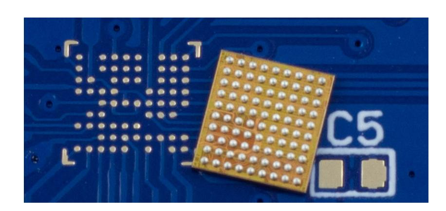

Fig. 1: STM32F415 in WLCSP with low-cost carrier PCB. C5 is a 0603 capacitor footprint for scale.

the coating off with a sharp knife. If devices are removed from a board, they can also be soaked in acetone for 24 hours which seemed to remove the coating without damaging the device.

Many devices are available in this package - this includes standard microcontrollers, along with secure devices such as the NXP SLM 78[1](#page-3-1) , A71CH[2](#page-3-2) , etc.

WLCSP and Physical Attacks Intuitively, we expect the WLCSP to be useful for a range of physical attacks. Most obviously are anything where backside attacks are in-scope, including for example backside LFI [\[23\]](#page-20-2) and photon emission analysis [\[17\]](#page-20-5). Some thinning may yet be required, but this may be easier since the device is designed to be handled, and can be soldered onto a carrier board for example. Other attacks such as lateral LFI (LLFI) that relies on an exposed die edge should be applicable to WLCSP packages with minimal effort[\[16\]](#page-20-6).

Using small electromagnetic probes for both side-channel analysis[\[21\]](#page-20-7) and fault injection may require the probe to be closer to the die than a normal TQFP or similar packaging technologies allow. Previously the target was partially decapsulated, but with WLCSP you get closer to the die (via the backside) with minimal effort. It may also be possible to access the front-side, depending on the layout of balls and how the device can be physically manipulated. On many devices visible micro-vias allow access to the interface signals even if the normal balls are removed.

Building WLCSP Targets If the attacker wishes to build a target board, there may be a perceived complexity (and cost) for WLCSP designs. In practice we found that for our targets we did not require the expensive "via-in-pad" services. Instead we use a 4 mil trace/space PCB service (which is available even from many low-cost providers), and avoided placing some pads to provide space to break out signals from internal balls, as can be seen in Figure [1.](#page-3-0) For full

<span id="page-3-1"></span><sup>1</sup> <https://www.eetimes.com/infineon-claims-first-industrial-grade-wlcsp-esim-chip>

<span id="page-3-2"></span><sup>2</sup> [https://www.nxp.com/products/security-and-authentication/](https://www.nxp.com/products/security-and-authentication/authentication/plug-and-trust-the-fast-easy-way-to-deploy-secure-iot-connections:A71CH) [authentication/plug-and-trust-the-fast-easy-way-to-deploy-secure-iot-co](https://www.nxp.com/products/security-and-authentication/authentication/plug-and-trust-the-fast-easy-way-to-deploy-secure-iot-connections:A71CH)nnections: [A71CH](https://www.nxp.com/products/security-and-authentication/authentication/plug-and-trust-the-fast-easy-way-to-deploy-secure-iot-connections:A71CH)

{4}------------------------------------------------

details see the target PCB layout described next. During assembly, the devices are soldered using a "flux-only" process, which avoids the need for very fine stencils and careful alignment.

### 2 STM32F415 Target

The primary target device investigated is a STM32F415OG, which is a microcontroller from ST Micro. Previous work on EMFI has used the similar STM32F411 in TQFP packaging for characterizing an EMFI tool [\[3\]](#page-19-7). A very similar device (STM32F215) in the TQFP package is used in the Trezor bitcoin wallet, for which fault attacks have been demonstrated against in practice [\[15\]](#page-19-6).

A close-up of the WLCSP STM32F415OG device was shown in Figure [1,](#page-3-0) and the full PCB can be seen as part of Figure [3.](#page-5-0) The full details (including schematic, board files, etc) of the target are available[3](#page-4-0) ). The top covering of the WLCSP package can be scraped off once the device is soldered down, or a more gentle removal is done by soaking the device in acetone before soldering the device. Note the STM32F415OG appears to be easily killed by optical flashes once the covering is removed – future work may look at WLCSP and optical injection, and we had briefly experimented with a Xenon flash. Exposing the topside[4](#page-4-1) to such a flash causes the device to enter a CMOS latch-up state, but does not recover from this state with a power cycle (i.e., the device is dead and gets very hot).

This follows previously reported publications, showing that optical (or laser) fault injection has a high chance of causing a latch-up effect [\[19\]](#page-20-8).

To support the target, we are using the ChipWhisperer CW308 UFO baseboard that board provides power and reset signals to the target device. This base-board also provides diode clamping on the output lines running back to our control platform (ChipWhisperer-Lite), as during this attack we will be presenting high voltages that could escape on the I/O lines.

# 3 Low-Cost BBI Probe

The low-cost BBI probe uses a transformer coupling to generate the required voltage pulse, which is then coupled into the target device. A schematic of the probe is given in Figure [2,](#page-5-1) and a photo of a prototype is seen in Figure [3.](#page-5-0) The 4.7 uF ceramic capacitors C1 and C2 are charged by a variable power supply limited to 100 mA current – if the power supply does not have current limiting a series resistor or must be inserted inline. The logic-level MOSFET allows any normal drive circuitry (FPGA, microcontroller, or bench pulse generator), with gate resistor R1 to limit overswing, and a pull-down resistor R2 to ensure the MOSFET is normally off when disconnected.

<span id="page-4-0"></span><sup>3</sup> [https://github.com/newaetech/chipwhisperer-target-cw308t/tree/master/](https://github.com/newaetech/chipwhisperer-target-cw308t/tree/master/CW308T_STM32F4_CSP) [CW308T\\_STM32F4\\_CSP](https://github.com/newaetech/chipwhisperer-target-cw308t/tree/master/CW308T_STM32F4_CSP)

<span id="page-4-1"></span><sup>4</sup> We will use 'topside' to refer to the top WLCSP package surface for clarify, which is the backside of the IC wafer.

{5}------------------------------------------------

<span id="page-5-1"></span>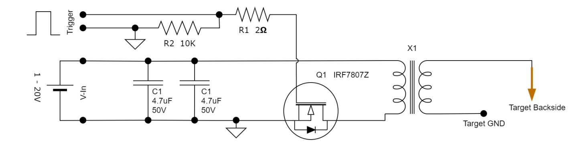

Fig. 2: The BBI injection device relies on transformer X1 to produce a higher voltage from a simple capacitor based circuit.

The heart of the circuit is transformer X1 which is (poorly) custom-wound. The primary winding is 6 turns of 26 AWG magnet wire, wound on a ferrite rod, part number 3061990871 from Fair-Rite Corporation. The secondary winding is 60 turns of 30 AWG magnet wire, wound directly on-top of the primary winding in several layers. The transformer construction is fairly insensitive to variations in parameters, and the winding ratio was chosen somewhat arbitrary with the expected objective of achieving around 300V output with a standard 30V DC power supply. A low number of primary turns was required to allow rapid pulse transients, as higher primary turns would typically increase the inductance, and thus limit the slew rate and thus pulse duration.

The probe tip used here is Harwin part number P25-0123. Various sizes of probe tips are easily available, including smaller tips and different materials. More details of the construction are available in the accompanying public GIT repository at <https://github.com/newaetech/chipjabber-basicbbi>.

<span id="page-5-0"></span>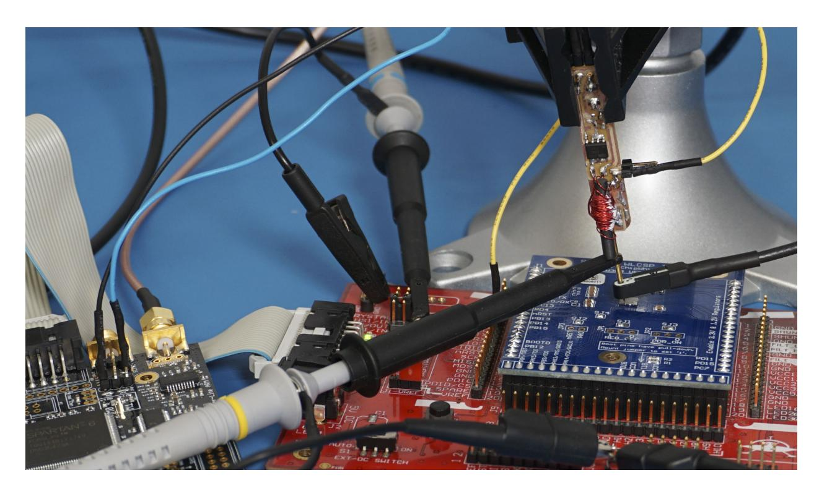

Fig. 3: The BBI setup includes the low-cost probe, the target board, a ChipWhisperer-Lite for triggering, and various probes for characterizing results.

{6}------------------------------------------------

#### 3.1 Power Supply

The probe assumes the existence of a power supply. The injection parameter can be controlled by the drive signal (i.e., pulse duration), as well as the voltage of the probe. In practice both may need to be varied to achieve the desired results.

In these experiments a Rigol DP832 power supply is used (\$500), which includes a simple USB interface for computer control. This power supply is overkill for the requirements however - there is almost no current required during operation, and a simple linear regulator built with a LM317 would be sufficient in practical scenarios (\$10).

#### 3.2 Pulse Generation

Any fault injection circuit requires a pulse generator. A ChipWhisperer-Lite (\$250) is used herein, but for a lower-cost attack a simple FPGA board or microcontroller could also be used (\$50).

#### 3.3 Characterization Setup

In order to characterize the BBI tool and WLCSP combination, we place the probe on the topside of the prepared WLCSP target, and will then measure injection characteristics for various settings. The physical measurement equipment setup is shown in Figure [3.](#page-5-0)

As previously reported, the backside connection had a fairly large resistance. Measuring with a multimeter showed a resistance of 220 KΩ from the backside of the die to the ground net. To better understand the voltage and current relationship (that is, assuming it is not a simple resistive connection) we will now characterize our probe on the die backside.

For this characterization, the target device is held in reset to avoid code execution. Before every injection we power cycle the device, to ensure no effects such as CMOS latch-up are present. We have chosen a relatively large 680 nS pulse width for our tests, which was based on some initial characterization (to be discussed in Section [4\)](#page-8-0).

Current Measurement The current measurement is performed with a Tektronix CT6 current probe. This probe has a 2 GHz bandwidth, and the injection needle passes directly through the CT6 probe. Thus the CT6 probe is as close as practical to the actual target device, to ensure the most accurate measurement possible.

The CT6 probe is terminated by enabling the 50Ω input option of the Pico-Scope 6403D, and thus our measurement chain should closely match the claimed calibrated scaling factor.

Voltage Measurement The voltage measurement is performed with a 100 MHz bandwidth, 100:1 oscilloscope probe (the higher voltages of the target exceeds the limits of the normal 10:1 probe for our oscilloscope). This probe is connected to the injection needle directly, just above the current measurement probe CT6.

{7}------------------------------------------------

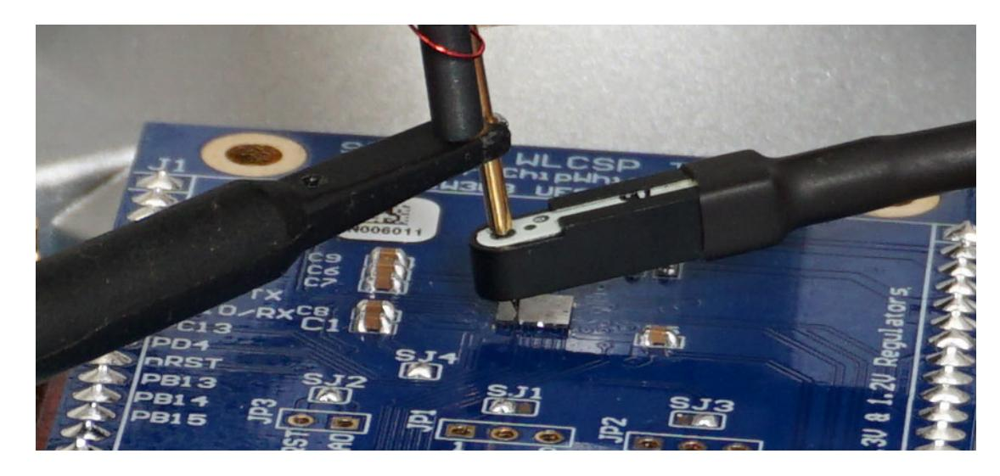

Fig. 4: A closer view of the BBI probe touching the WLCSP topside (i.e., die backside), with the CT6 current probe for measuring injection current, and an oscilloscope probe for measuring injection voltage.

#### 3.4 Pulse Examples

<span id="page-7-0"></span>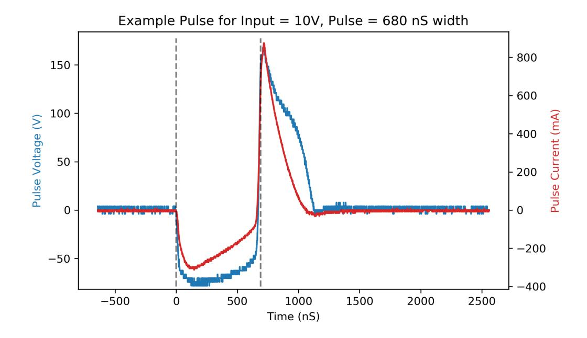

Fig. 5: Example of the pulse output generated by the circuit. The vertical lines show a 680 nS time offset showing the negative/positive spikes on each edge.

As an example of the injected pulse is shown in Figure [5.](#page-7-0) The close alignment of voltage and current suggests that the load does not contain substantial capacitive or inductive components. Note the large positive voltage is generated by the turn-off of the MOSFET at the falling edge of the input pulse at time 680 µS.

The absolute peak of the voltage and current is used to generate a graph of the output voltage and current for a given drive voltage. This is shown in Figure [6,](#page-8-1) and will be discussed next.

{8}------------------------------------------------

#### 3.5 Input Voltage vs. Outputs

It can be seen that fairly high voltages and currents are generated for low input voltages. Notably this suggests that a successful attack may be possible even with lower-cost power supplies. The actual impedance during the pulse is much lower than the DC resistance measured with the DMM (of 220 KΩ). It can be seen from Figure [6](#page-8-1) graph the effective impedance appears closer to 250 Ω, based on the voltage and current peaks.

<span id="page-8-1"></span>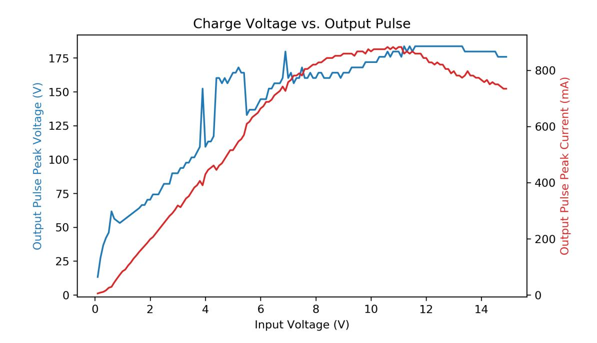

Fig. 6: Peak pulse voltage and current injected into WLCSP device based on changing charge (input) voltage.

# <span id="page-8-0"></span>4 Fault Attack Results

Three main fault injection attempts are performed. Starting with some basic characterization of the target, we then demonstrate a classic fault attack on RSA-CRT, before performing some initial work on characterizing the AES hardware accelerator.

The initial characterization is done with a simple "double-loop", which is widely used in previous work [\[8\]](#page-19-12) (also see Listing 1 in [\[13\]](#page-19-13)). This code runs an inner and outer loop, and counts the total iterations through both loops. The specific code comes from the ChipWhisperer simpleserial-glitch application, and is shown in Listing [1.](#page-9-0)The objective of this glitch is to corrupt the total loop counter variable. This corruption is detectable under a wide variety of conditions. If the glitch causes a loop exit, instruction skip, register corruption, or memory corruption it will result in an incorrect final loop value but not a device reset.

The results can be seen in Figure [7](#page-10-0) with the device running at the default speed for the ChipWhisperer Hardware Abstraction Layer (HAL) build system (7.37 MHz), and a higher 40 MHz speed in Figure [8](#page-10-1) as a comparison. The width

{9}------------------------------------------------

```
10 C. O'Flynn
```

```
uint8_t glitch_loop(uint8_t* in)
{
    volatile uint16_t i, j;
    volatile uint32_t cnt;
    cnt = 0;
    trigger_high();
    for(i=0; i<50; i++){
        for(j=0; j<50; j++){
            cnt++;
        }
    }
    trigger_low();
    simpleserial_put("r", 4, (uint8_t*)&cnt);
    return (cnt != 2500);
}
```

Listing 1: This function is part of the simpleserial-glitch example from Chip-Whisperer.

of the glitch insertion is linked to the device clock cycle (the same clock is used for both during our test), hence at the higher 40 MHz speed the number of cycles faulted is higher for the same width of an injected pulse.

#### 4.1 RSA-CRT Fault

The seminal work on fault attacks demonstrated how an incorrect calculation during a signing operation on many implementations of the RSA algorithm (using RSA-CRT) allowed immediate recovery of the secret key [\[7\]](#page-19-0). This attack is summarized also in the seminal BBI work[\[12\]](#page-19-5), as the same attack is applied therein.

{10}------------------------------------------------

<span id="page-10-0"></span>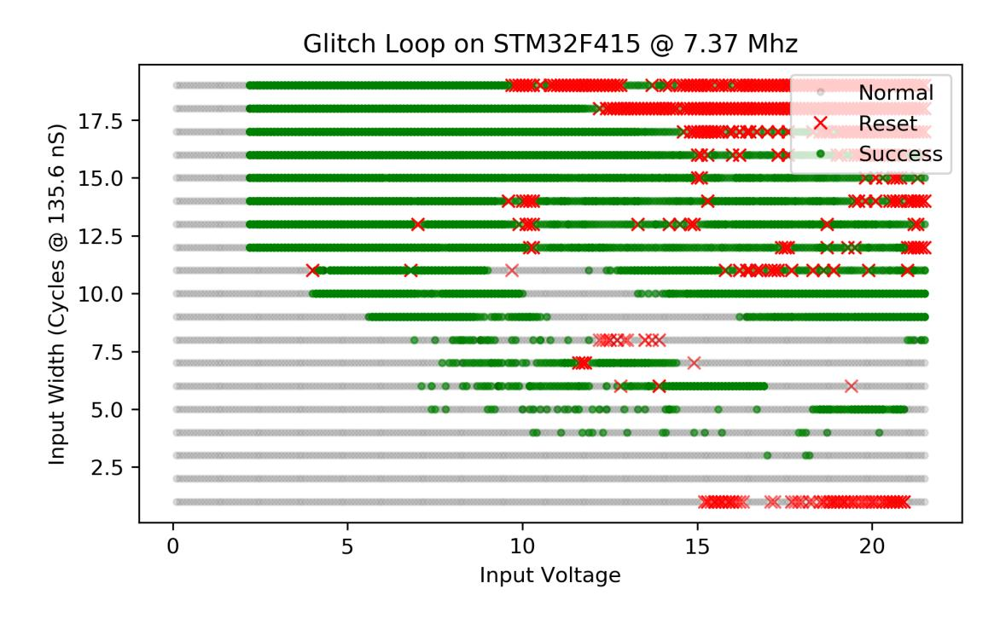

Fig. 7: The double-loop code running at 7.37 MHz, showing a wide variety of settings with highly successful fault injections.

<span id="page-10-1"></span>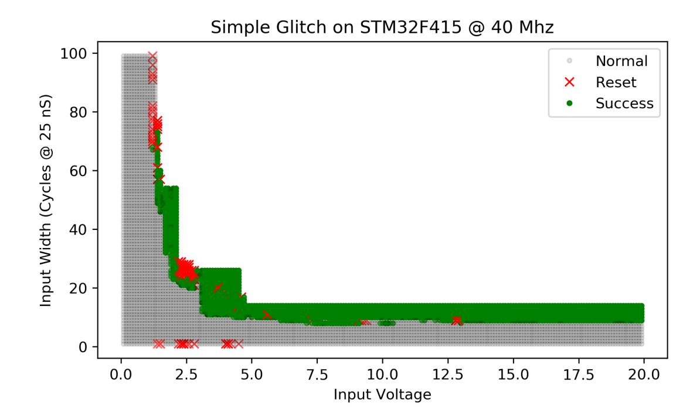

Fig. 8: The double-loop code running at 40 MHz. Due to the larger search space, an optimized search decreases the width at higher voltages, and thus some areas are not searched.

For our target we used MBED-TLS, which provides a suitable RSA implementation. The current codebase includes a signature verification step before returning the signature, specifically to check for a faulty signature and prevent the attack in [\[7\]](#page-19-0). Thus executing this attack requires either (1) a double fault, or (2) modification to the source code ('cheating') to remove the check. As it 

{11}------------------------------------------------

appears the previous BBI work [\[12\]](#page-19-5) did not require a double-fault, we present results using the latter option to better compare our test setup.

Based on Figure [7](#page-10-0) we fixed the voltage setting to 5.0V and a width of 10 cycles. As in [\[12\]](#page-19-5) we estimated the total RSA time, and inserted a glitch approximately 65% of the way into the operation, which is expected to be in one of the vulnerable operations. We swept the glitch through various times in the area, and recorded the data in Table [1.](#page-11-0)

For a returned invalid signature, we check if the attack successfully recovers part of the known secret key value (in this case p or q, which allows recovery of all other secrets) and mark it as 'exploitable', otherwise it is some unknown invalid result. It can be seen that 54% of injection attempts result in an exploitable invalid signature, meaning that even adding the complexity of double-fault should still leave a reasonably high success rate.

#### 4.2 Hardware AES Faults

Several DFA attacks on AES have been previously presented, and we wished to examine the AES engine for a known vulnerability [\[10\]](#page-19-1). We presented a constant cipher-text for the majority of this work, along with an easily identifiable constant key (00 01 02 03 04 05 06 07 08 09 0a 0b 0c 0d 0e 0f).

As the leakage for the STM32F415 hardware AES engine is known[\[14\]](#page-19-14), we used a CPA attack to confirm the last-round of the AES cipher is around clock cycle 270 from our trigger. We thus swept our attack at clock cycles 250 to 280 from a known trigger. The width of the glitch would cover approximately 5 clock cycles of the target device. To begin with, we characterized the responses into three main categories:

- Normal (correct response).
- Reset or no response.
- Incorrect Response (possible fault).

Of the incorrect responses, the device would frequently return various combinations of the input plaintext (unencrypted) and ciphertext. These cases are assumed to be generated due to a fault in the interaction with the hardware engine. The ST provided API we are calling loads the plaintext into the engine, and then unloads it afterwards. Thus if one skips the actual execution or unloading, we would expect that the API call returns the original plaintext itself. Such a fault is potentially valuable, but has no chance to reveal the secret key.

<span id="page-11-0"></span>In some cases the device appeared to return 4 bytes of the key. Again, this is assumed to be related to the interaction of the loading and unload of data into

| RSA Signing Result   | Occurrence |
|----------------------|------------|
| Exploitable (p or q) | 54.2 %     |
| Device Reset         | 28.0 %     |
| Normal               | 11.9 %     |
| Invalid              | 5.9 %      |

Table 1: RSA-CRT Fault Attack.

{12}------------------------------------------------

the engine. Such a partial key result is itself interesting, as in normal usage of this API may reveal such a key.

Finally, there are several cases where a totally incorrect ciphertext was generated, which appear most interesting for DFA. We thus break down the faulty output types into these classes: (1) Key leakage, (2) Partial ciphertext, (3) Plaintext leakage, (4) Other constant output, and (5) Interesting-looking output for investigation.

<span id="page-12-0"></span>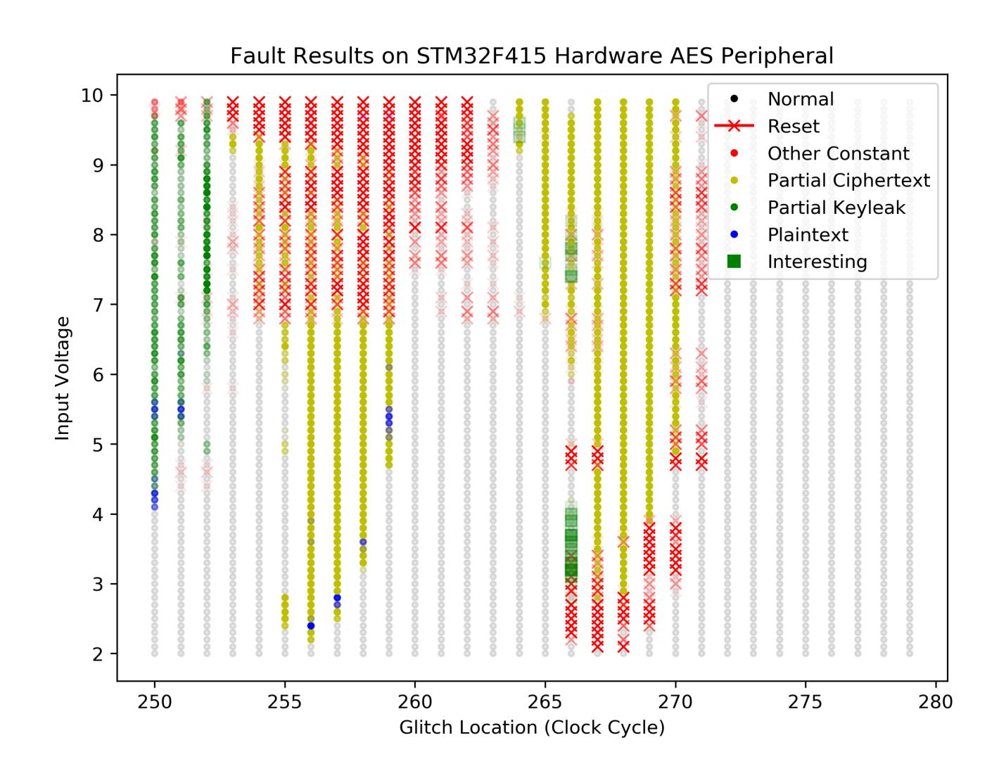

Fig. 9: Various outputs are seen from the hardware AES peripheral, including directly leaking part of the key.

Figure [9](#page-12-0) shows the location of fault types for various input voltages and offsets. In this figure each setting pair of (voltage, offset) is tried 10 times, and the transparency of the symbol represents the likelihood of a given result at that point. That is, a location with a reset 100% of the time will appear as a red X, but a location with a reset 50% of the time will appear as a light red X.

Additional work is required to build a complete fault model on the STM32F415 engine. It is clear however that the fault attack is effective at manipulating the device, which can skip the encryption operation such the device returns the input plaintext. In addition partial key reveals were observed, and then some level of unknown faults which may yet prove to be attackable.

{13}------------------------------------------------

### 5 Permanent and Quasi-Permanent Faults

During our work, several additional results were observed on the STM32F415OG. While they are not yet well characterized, they are worth reporting as an area of future study.

The first was some devices appear to have entered a permanent CMOS latchup state. One device for example was observed that programming was rarely successful - this device would still respond to commands as the built-in bootloader could read memory, and would execute a flash erase or program without reporting an error. It was assumed some internal short developed, and this short allowed enough voltage for the core to execute, but could not write memory cells[5](#page-13-0) . This was typically triggered with a more powerful BBI injection coil that was driven from a high-voltage pulse source instead of the simple design from Figure [2.](#page-5-1)

With the probe from Figure [2,](#page-5-1) we observed various effects on the non-volatile memory as well. With an empty device (i.e., flash is in 0xFF state), we performed a sweep of a fault where we set a 28V input voltage and 6.8µS pulse width, and physically moved the probe across the device during insertion of 5000 pulses. After each campaign of 5000 pulses we read the FLASH memory state, and observed that between 50 – 2048 bytes of the FLASH memory from the start of flash were now 0x00. The 00 bytes were consecutive, and the number of 00s were related to the delay between injection pulses. A higher delay between pulses meant more 00 bytes. Thus we hypothesize that one of the fault injections triggered the flash program hardware, and was the interrupted by another fault injection. Where security information is stored in flash memory, such program triggering could be a useful attack vector.

A second effect seen was apparent damage to sections of flash memory. On another test device we noticed that the flash area with offset 0x40000 – 7FFFF would no longer read as the erased state of all 1 bits, but instead would randomly read about 20% of bits as 0. On each read the location of the erroneous bits would change. We could successfully program that area to be all 0 without error (all bits now read as 0). Calling erase would return the area again to only partially functioning, with approximately 20% of bits reading transiently as 0 instead of 1. The damaged area represents exactly half of the flash on the chip, whereas the other half of the flash on the chip continued to function normally as both erase and program worked without error. We hypothesize that some damage was done to transistors connecting the erase voltage to half of the flash array in this case, and they were no longer at a valid 1 level after erase.

These preliminary results do not appear to offer any sort of localized precision such as X-Ray attacks promise related to modification of non-volatile memory [\[2\]](#page-19-3). Yet this demonstrates that BBI offers new possibilities, and more effort is required to better understand the nuances of this fault injection technique.

<span id="page-13-0"></span><sup>5</sup> The device would also immediately get very hot...

{14}------------------------------------------------

### 6 Scanning of X-Y Location

In previous sections, a low-cost table vise is used to demonstrate that finding a good position can be done without a XYZ table. In order to understand the affect of the probe position on the results, we used an XYZ table to scan the probe across the STM32F415OG topside. The sensitivity to spatial positioning was again covered in previous work [\[12\]](#page-19-5).

A scanner using the ChipShover controller was used to position the needle at various points over the probe. In previous work [\[12\]](#page-19-5), a scale was used to measure the application force of a fixed needle. Instead we use a spring-loaded tip that is depressed 1.0 mm from a point over the surface (visually – starting approximately 0.5 mm above the surface) such that contact was made. The overall scanner setup is shown in Figure [10.](#page-14-0)

<span id="page-14-0"></span>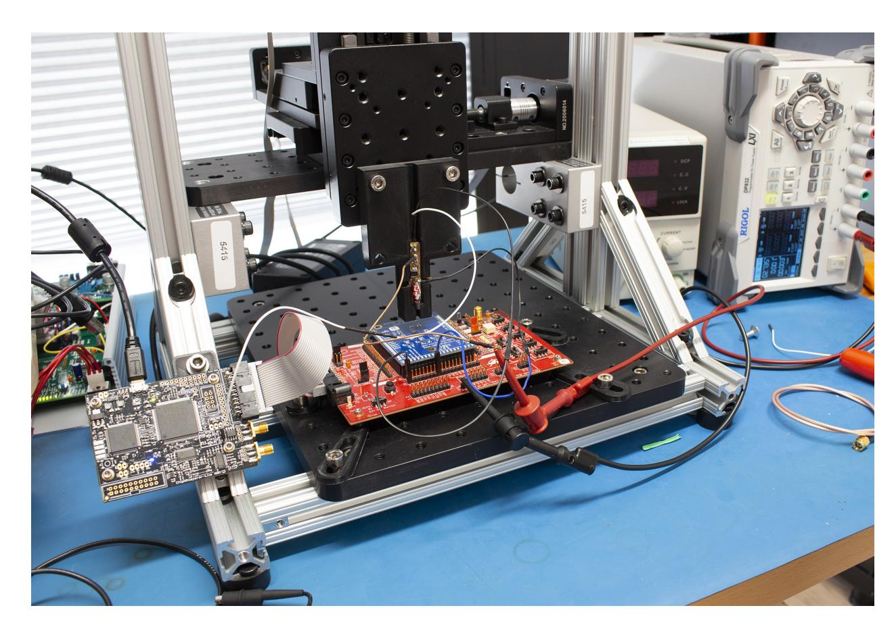

Fig. 10: XYZ table driven by ChipSHOVER is used to position the needle on the surface.

With this setup, the needle 'hops' along the surface of the chip by raising and lowering it at each probe point. As the edges of the WLCSP are susceptible to damage, the needle was visually positioned at a starting point approximately 0.5mm from the edge of the chip. From the device datasheet, the package is 4.223 mm x 3.969 mm. Our scan covered a 2.8 mm x 3.2 mm section of that, which is 53 % of the total area. The needle at the furthest X-Y extent is shown in Figure [11.](#page-15-0) The needle position (50.4, 11.8) in Figure [11](#page-15-0) corresponds to location (0,0) in remaining figures in this section.

{15}------------------------------------------------

<span id="page-15-0"></span>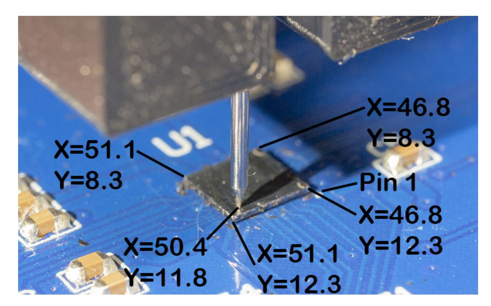

Fig. 11: Needle position relative to chip – the XY positions on the figure reference the raw values in the dataset. Four corners of chip along with needle position corresponding to (0,0) in other figures shown.

The astute reader will notice that the scan in the X direction is a 2.8 mm length, whereas the chip is positioned with the "long" side on the X axis (4.223 mm side). The scan pattern does not exactly match the chip aspect ratio, and the specific scan pattern showing all 255 probe points relative to the WLCSP surface can be seen in Figure [12.](#page-16-0)

The result of scanning at 0.2 mm steps are shown in Figure [13,](#page-18-0) showing the number of resets and successful glitches, based on the double-loop from Section [4.](#page-8-0) The voltage input for this scan was limited to 0.5V – 10.0V, as we found larger voltages beyond 10.0V increased the chance of damage to the device (either temporarily flash erasure, or permanent damage).

For each scan point, the voltage and cycles are swept as shown in Algorithm [1.](#page-17-0) In the fixed location-specific testing from Section [4,](#page-8-0) we performed 10 trials for each pulse width and voltage setting. In the work done in this section on the XYZ table, we reduce the total scan time by performed only 2 attempts for a given (width, voltage, location) tuple. Each location had 2090 (width, voltage) combinations tested, and the WLCSP surface was probed at 255 locations[6](#page-15-1) . With 2x 2090 attempts at each location, this meant a total of 1 065 900 injection attempts are represented in the dataset.

In addition to the number of successes (incorrect counter output), we can also see the minimum voltage required for a successful fault varies. A lower voltage means a more sensitive area of the die, since a glitch is seen with a smaller pulse amplitude at the output of the BBI tool. Figure [14](#page-18-1) shows the minimum

<span id="page-15-1"></span><sup>6</sup> The total number of fault locations being 2<sup>8</sup> was entirely a coincidence, and is not some limitation of the setup

{16}------------------------------------------------

<span id="page-16-0"></span>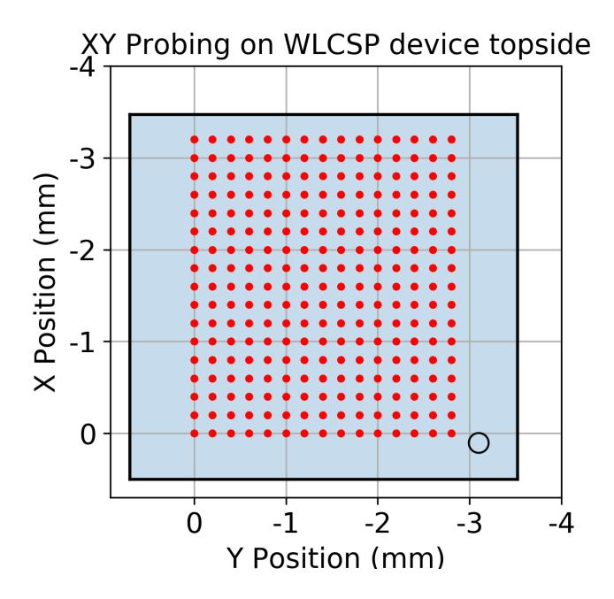

Fig. 12: Specific locations probed shown as red dots, the edges of chip measured with probe.

input voltage required before a successful glitch was seen. The first subfigures show where one or more glitches were observed at the location, and the second subfigure shows where 10 or more glitches were observed at that location (that is, a more reliable location). The mapping of input voltages to output voltages for the BBI tool was given in Figure [6.](#page-8-1)

It can be seen that while spatial position is important, the voltage setting changes with spatial position. Thus from an attacker perspective, it may be sufficient to scan relatively coarsely (or manually as done in Section [4\)](#page-8-0), and simply check a large range of voltage and width settings at each position.

Likewise, an attacker with control over the position, but without control over the voltage and width settings, would appear to be less likely to have successful attacks.

Note the full dataset is available on the previously mentioned github repository. This allows interested readers to perform more detailed analysis, such as understanding the voltage settings for resets, or the specific clustering of voltages and resets.

# 7 Conclusions

Forward Body Biasing Injection (FBBI or just BBI) is a relatively new fault injection method, first introduced in [\[12\]](#page-19-5). It remains less explored in academic publications compared to other methods such as electromagnetic fault injection (EMFI) and laser fault injection (LFI). This work demonstrates that BBI can be accomplished with very simple equipment, and in fact it is even easier to build a BBI injection setup than with EMFI, as no high-voltage source is required.

This technique is particularly effective with WLCSP devices, which naturally expose the die backside. Thus the complication of exposing the die backside can

{17}------------------------------------------------

Algorithm 1: Summary of evaluation at each step.

```
Result: Fault injection details about location.
for TrialNumber ← 1 to 2 do
   for BBIV ← 0.50V to 10.00V do
       for GlitchCycles ← 5 to 60 do
           Run double-loop code;
           Insert pulse;
           if Output is incorrect but correctly formed then
               Log success;
           end
           if Reset is detected or output malformed then
               Log reset;
           end
           if 5 or more resets in a row then
               Check for flash corruption;
               if Flash memory corruption then
                  Log flash error;
                  Reprogram target;
               end
           end
       end
   end
end
```

be skipped for these devices. The BBI technique with the simple transformerbased probe allows faults on microcontrollers with high repeatability, as demonstrated on several target programs. In addition, it appears there may be some physical effects that cause permanent faults on the target device, which is an area requiring more study.

Finally, the WLCSP is likely to remain interesting for other attack methods. Several attacks depend on, or are improved by, the quasi-exposed die that the WLCSP presents. This knowledge should be considered both by security researchers who do not have access to decapsulation equipment, and designers of secure systems when specifying devices.

{18}------------------------------------------------

<span id="page-18-0"></span>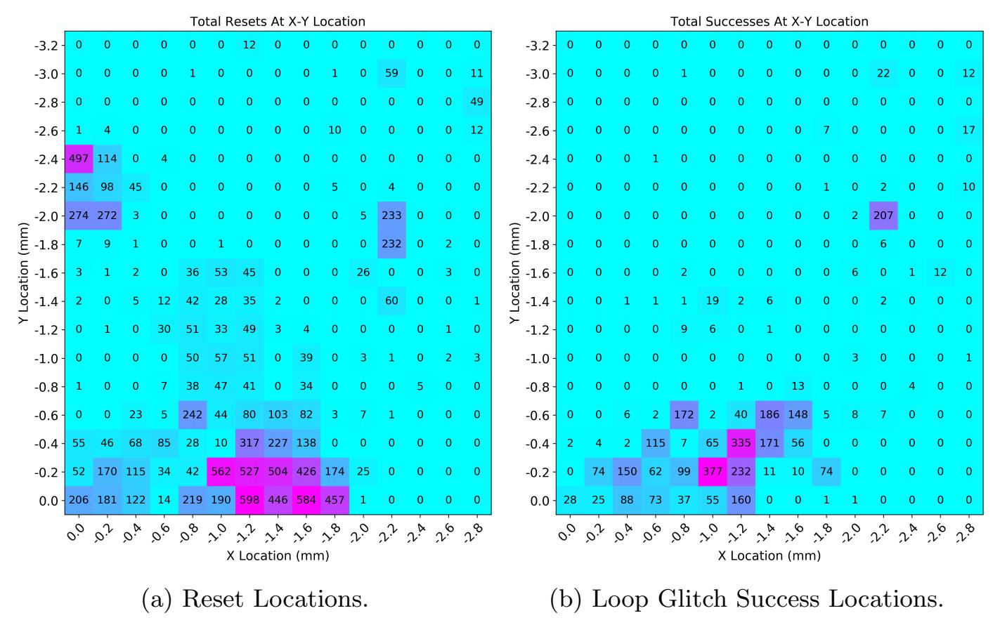

Fig. 13: Scanning WLCSP surface at 0.2mm steps to determine spatial position sensitivity, from a total of 4180 attempts at each location.

<span id="page-18-1"></span>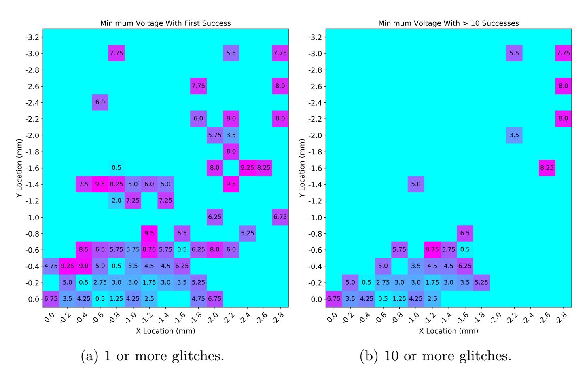

Fig. 14: Scanning WLCSP surface at 0.2mm steps, and minimum input voltage to BBI tool before one or more glitches are seen.

{19}------------------------------------------------

### References

- <span id="page-19-9"></span>1. Abdellatif, K., H´eriveaux, O.: SiliconToaster: A Cheap and Programmable EM Injector for Extracting Secrets. In: Proceedings of 2020 Workshop on Fault Diagnosis and Tolerance in Cryptography (2020)
- <span id="page-19-3"></span>2. Anceau, S., Bleuet, P., Cl´edi`ere, J., Maingault, L., Rainard, J.l., Tucoulou, R.: Nanofocused X-Ray Beam to Reprogram Secure Circuits. In: Fischer, W., Homma, N. (eds.) Cryptographic Hardware and Embedded Systems – CHES 2017. pp. 175– 188. LNCS, Springer International Publishing, Cham (2017)
- <span id="page-19-7"></span>3. Balasch, J., Arum´ı, D., Manich, S.: Design and validation of a platform for electromagnetic fault injection. In: 2017 32nd Conference on Design of Circuits and Integrated Systems (DCIS). pp. 1–6 (Nov 2017)
- <span id="page-19-2"></span>4. Bar-El, H., Choukri, H., Naccache, D., Tunstall, M., Whelan, C.: The Sorcerer's Apprentice Guide to Fault Attacks. Proceedings of the IEEE 94(2), 370–382 (Feb 2006)
- <span id="page-19-11"></span>5. Benchoff, B.: Photonic Reset Of The Raspberry Pi 2 (Feb 2015), [https://](https://hackaday.com/2015/02/08/photonic-reset-of-the-raspberry-pi-2/) [hackaday.com/2015/02/08/photonic-reset-of-the-raspberry-pi-2/](https://hackaday.com/2015/02/08/photonic-reset-of-the-raspberry-pi-2/), library Catalog: hackaday.com
- <span id="page-19-10"></span>6. Beringuier-Boher, N., Lacruche, M., El-Baze, D., Dutertre, J.M., Rigaud, J.B., Maurine, P.: Body Biasing Injection Attacks in Practice. In: Proceedings of the Third Workshop on Cryptography and Security in Computing Systems. pp. 49– 54. CS2 '16, Association for Computing Machinery, Prague, Czech Republic (Jan 2016)
- <span id="page-19-0"></span>7. Boneh, D., DeMillo, R.A., Lipton, R.J.: On the Importance of Checking Cryptographic Protocols for Faults. In: Fumy, W. (ed.) Advances in Cryptology — EUROCRYPT '97. pp. 37–51. LNCS, Springer, Berlin, Heidelberg (1997)
- <span id="page-19-12"></span>8. Carpi, R.B., Picek, S., Batina, L., Menarini, F., Jakobovic, D., Golub, M.: Glitch It If You Can: Parameter Search Strategies for Successful Fault Injection. In: Francillon, A., Rohatgi, P. (eds.) Smart Card Research and Advanced Applications. pp. 236–252. LNCS, Springer International Publishing, Cham (2014)
- <span id="page-19-8"></span>9. Cui, A., Housley, R.: BADFET: Defeating Modern Secure Boot Using Second-Order Pulsed Electromagnetic Fault Injection. In: Proceedings of 11th USENIX Workshop on Offensive Technologies (WOOT 17) (2017)
- <span id="page-19-1"></span>10. Dusart, P., Letourneux, G., Vivolo, O.: Differential Fault Analysis on A.E.S. In: Zhou, J., Yung, M., Han, Y. (eds.) Applied Cryptography and Network Security. pp. 293–306. LNCS, Springer, Berlin, Heidelberg (2003)
- <span id="page-19-4"></span>11. Maurine, P.: Techniques for EM Fault Injection: Equipments and Experimental Results. In: 2012 Workshop on Fault Diagnosis and Tolerance in Cryptography. pp. 3–4 (Sep 2012)
- <span id="page-19-5"></span>12. Maurine, P., Tobich, K., Ordas, T., Liardet, P.Y.: Yet Another Fault Injection Technique : by Forward Body Biasing Injection (Sep 2012), [https://hal-lirmm.](https://hal-lirmm.ccsd.cnrs.fr/lirmm-00762035) [ccsd.cnrs.fr/lirmm-00762035](https://hal-lirmm.ccsd.cnrs.fr/lirmm-00762035)
- <span id="page-19-13"></span>13. O'Flynn, C.: Fault Injection using Crowbars on Embedded Systems. Tech. Rep. 810 (2016), <http://eprint.iacr.org/2016/810>
- <span id="page-19-14"></span>14. O'Flynn, C.: I, For One, Welcome Our New Power Analysis Overlords An Introduction to ChipWhisperer-Lint (2018)
- <span id="page-19-6"></span>15. O'Flynn, C.: MIn()imum failure: EMFI attacks against USB stacks. In: Proceedings of the 13th USENIX Conference on Offensive Technologies. p. 15. WOOT'19, USENIX Association, Santa Clara, CA, USA (Aug 2019)

{20}------------------------------------------------

- <span id="page-20-6"></span>16. Rodriguez, J., Baldomero, A., Montilla, V., Mujal, J.: LLFI: Lateral Laser Fault Injection Attack. In: 2019 Workshop on Fault Diagnosis and Tolerance in Cryptography (FDTC). pp. 41–47 (Aug 2019)
- <span id="page-20-5"></span>17. Schl¨osser, A., Nedospasov, D., Kr¨amer, J., Orlic, S., Seifert, J.P.: Simple Photonic Emission Analysis of AES. In: Prouff, E., Schaumont, P. (eds.) Cryptographic Hardware and Embedded Systems – CHES 2012. pp. 41–57. Lecture Notes in Computer Science, Springer, Berlin, Heidelberg (2012)
- <span id="page-20-1"></span>18. Schmidt, J.M., Hutter, M.: Optical and EM Fault-Attacks on CRT-based RSA : Concrete Results. In: Proceedings of Austrochip 2007, 15th Austrian Workshop on Microelectronics (2007)
- <span id="page-20-8"></span>19. Selmke, B., Zinnecker, K., Koppermann, P., Miller, K., Heyszl, J., Sigl, G.: Locked out by Latch-up? An Empirical Study on Laser Fault Injection into Arm Cortex-M Processors. In: 2018 Workshop on Fault Diagnosis and Tolerance in Cryptography (FDTC). pp. 7–14 (Sep 2018)
- <span id="page-20-0"></span>20. Skorobogatov, S.P., Anderson, R.J.: Optical Fault Induction Attacks. In: Kaliski, B.S., Koc, C.K., Paar, C. (eds.) Cryptographic Hardware and Embedded Systems - CHES 2002. pp. 2–12. LNCS, Springer, Berlin, Heidelberg (2003)
- <span id="page-20-7"></span>21. Specht, R., Heyszl, J., Kleinsteuber, M., Sigl, G.: Improving Non-profiled Attacks on Exponentiations Based on Clustering and Extracting Leakage from Multichannel High-Resolution EM Measurements. In: Mangard, S., Poschmann, A.Y. (eds.) Constructive Side-Channel Analysis and Secure Design. pp. 3–19. LNCS, Springer International Publishing, Cham (2015)
- <span id="page-20-3"></span>22. Tobich, K., Maurine, P., Liardet, P.Y., Lisart, M., Ordas, T.: Voltage Spikes on the Substrate to Obtain Timing Faults. In: 2013 Euromicro Conference on Digital System Design. pp. 483–486 (Sep 2013)
- <span id="page-20-2"></span>23. van Woudenberg, J.G., Witteman, M.F., Menarini, F.: Practical Optical Fault Injection on Secure Microcontrollers. In: 2011 Workshop on Fault Diagnosis and Tolerance in Cryptography. pp. 91–99 (Sep 2011)
- <span id="page-20-4"></span>24. Zussa, L., Dutertre, J.M., Clediere, J., Robisson, B.: Analysis of the fault injection mechanism related to negative and positive power supply glitches using an on-chip voltmeter. In: 2014 IEEE International Symposium on Hardware-Oriented Security and Trust (HOST). pp. 130–135 (May 2014)