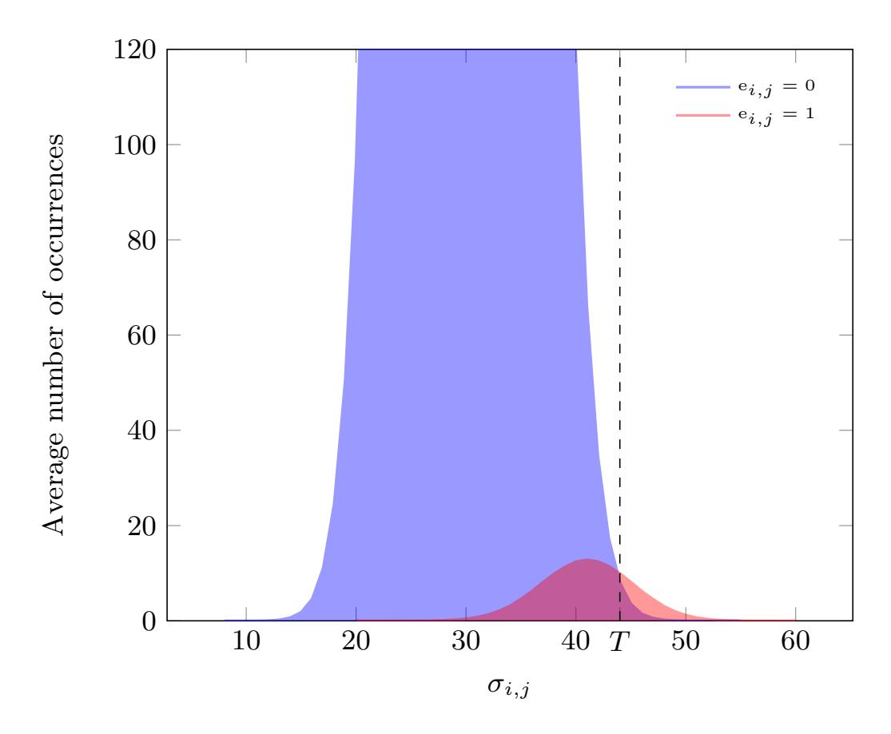
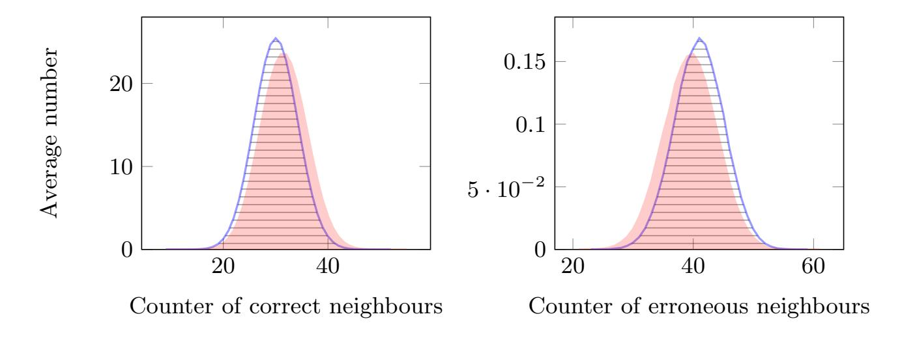
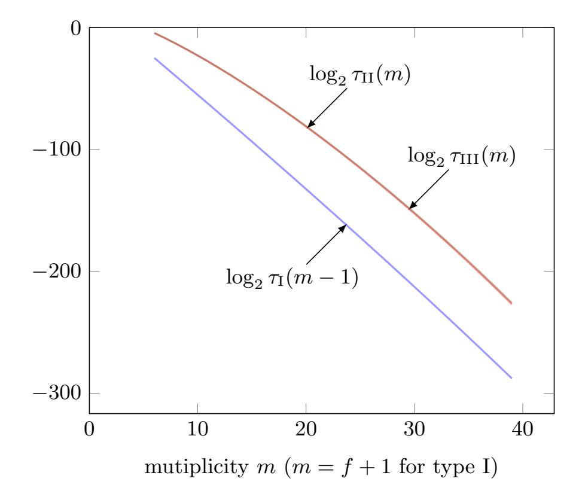
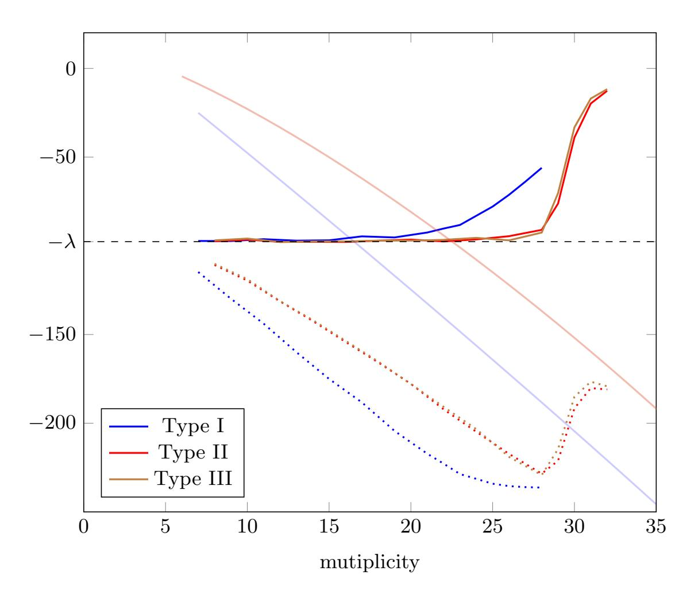

{0}------------------------------------------------

# On the Existence of Weak Keys for QC-MDPC Decoding

Nicolas Sendrier<sup>1</sup> and Valentin Vasseur<sup>12</sup>

1 Inria, Paris, France FirstName.LastName@inria.fr, <sup>2</sup> Universit´e de Paris, France.

Abstract We study in this work a particular class of QC-MDPC codes for which the decoding failure rate is significantly larger than for typical QC-MDPC codes of same parameters. Our purpose is to figure out whether the existence of such weak codes impacts the security of cryptographic schemes using QC-MDPC codes as secret keys. A class of weak keys was exhibited in [\[DGK19\]](#page-16-0). We generalize it and show that, though their Decoding Failure Rate (DFR) is higher than normal, the set is not large enough to contribute significantly to the average DFR. It follows that with the proper semantically secure transform [\[HHK17\]](#page-16-1), those weak keys do not affect the IND-CCA status of key encapsulation mechanisms, like BIKE, which are using QC-MDPC codes.

# 1 Introduction

Weak keys generally refer to a subset of valid keys of a cryptographic scheme, which presents a vulnerability or triggers a bad behavior of the primitives involved. Their density is usually very small, but occasionally they may lead to an attack. Anyway, weak keys are an undesirable feature and they are worth being studied and understood. For instance, some weak keys were found for LEDAcrypt [\[APRS20\]](#page-16-2) which defeat the CPA security claims.

Taking QC-MDPC codes [\[MTSB13\]](#page-16-3), some weak keys were studied in [\[BDLO16\]](#page-16-4), whose particular algebraic properties allow retrieval of the secret key by solving a rational reconstruction problem. The density of those keys is small, of order 2 <sup>−</sup><sup>λ</sup> where λ the security parameters of the system (e.g. λ = 128), and do not represent a direct threat.

A recent work by Drucker, Gueron and Kostic [\[DGK19\]](#page-16-0) has revealed the existence of weak keys on the decoder side. They are weak in the sense that they have a Decoding Failure Rate (DFR) higher than average. These keys are more prevalent but they do not allow a direct recovery of the secret key. Still, in conjonction with reaction attacks as in [\[GJS16\]](#page-16-5) and amplification techniques as in [\[NJS19\]](#page-16-6), decoding failures may lead to a key recovery attack.

In a Key Encapsulation Mechanism (KEM) based on QC-MDPC, like BIKE [\[AABB+19\]](#page-16-7), those attacks may hinder IND-CCA claims. However, using an appropriate transform, as in [\[HHK17\]](#page-16-1), the IND-CCA security only requires the average DFR to be under 2<sup>−</sup><sup>λ</sup> , for a claim of λ security bits. A more intuitive 

{1}------------------------------------------------

understanding is that, with the proper randomization of the KEM, a set of weak keys whose DFR  $\delta$  is larger than the security requirements,  $\delta > 2^{-\lambda}$ , do not affect the IND-CCA security claims as long as its density  $\tau$  is such that  $\delta \cdot \tau < 2^{-\lambda}$ .

As mentioned in [DGK19] there is a link between the proposed weak keys and the distance spectrum of the secret key, as introduced in [GJS16]—here distances are the difference between any two indices of nonzero coordinates in a sparse vector. We also observe that this is related to the maximal multiplicity of a distance in the spectrum, and to the existence in the (secret) sparse parity check matrix of columns with many 1's in common coordinates.

Our Contribution: We analyze the effect of the weak keys of [DGK19] on decoding, relating the bad decoding behavior to distance spectrum properties, namely high multiplicity. This allows us generalize weak keys as the set of all keys with a given maximal multiplicity in their distance spectrum. We give a count of those keys, allowing us to compute their density, and provide an algorithm to generate them, allowing us to make simulation and estimate their DFR using the methodology developed in [SV20]. Finally, we show that the estimated contribution of the weak keys in the average DFR, is, by a comfortable margin, below the security requirement and do not affect the IND-CCA security claims of KEMs based on QC-MDPC codes, as long as an appropriate tranform, for instance as in [HHK17], is used.

#### Notation

We denote by  $|\cdot|$  the Hamming weight and by  $\star$  the componentwise product, both for vectors and polynomials. Vectors and polynomials are denoted in roman type (e.g. h) and matrices in bold, (e.g. **H**).

# 2 QC-MDPC Codes

#### 2.1 Definition and Polynomial Representation

**Definition 1.** A circulant matrix is a matrix where each row vector is rotated one element to the right relative to the preceding row vector

$$\mathbf{H} = \begin{pmatrix} h_0 & h_{r-1} & \dots & h_2 & h_1 \\ h_1 & h_0 & h_{r-1} & & h_2 \\ \vdots & h_1 & h_0 & \ddots & \vdots \\ h_{r-2} & & \ddots & \ddots & h_{r-1} \\ h_{r-1} & h_{r-2} & \dots & h_1 & h_0 \end{pmatrix}.$$

**Definition 2.** A QC-MDPC code is a code whose parity check matrix consists of  $n_0$  circulant blocks of size  $r \times r$  and row weight  $d = O(\sqrt{r})$ .

Equivalently, the parity check matrix  $\mathbf{H} = (\mathbf{H}_0, \dots, \mathbf{H}_{n_0-1})$  can be written as a tuple of polynomials, using the following isomorphism.

{2}------------------------------------------------

**Proposition 1.** The application

$$H \mapsto h_0 + h_1 x + \dots + h_{r-2} x^{r-2} + h_{r-1} x^{r-1}$$

is an isomorphism between the circulant  $r \times r$  matrices with coefficients in  $\mathbb{F}_2$  and the quotient  $\mathbb{F}_2[x]/(x^r-1)$ .

**Proposition 2.** For all  $\delta \in \mathbb{Z}_r^{\times}$ , the endomorphism  $\phi_{\delta}$  of  $(\mathbb{F}_2[x]/(x^r-1), +, \times)$  induced by

$$x \mapsto x^{\delta}$$

is an isomorphism and an isometry for the Hamming distance.

In this paper we consider BIKE [AABB+19], a key encapsulation mechanism based on QC-MDPC codes. It uses two blocks,  $n_0 = 2$ , a binary alphabet, and the block size r is prime. It is required that 2 is primitive mod r to ensure that all non zero elements of  $\mathbb{F}_2[x]/(x^r-1)$  are invertible. To illustrate our results, we will use the parameters (r,d) = (11779,71) where d is the Hamming weight of both components of the secret key  $(h_0,h_1) \in (\mathbb{F}_2[x]/(x^r-1))^2$ .

#### 2.2 Decoding

Decoding MDPC codes is achieved with variants of the bitflipping algorithm (see Algorithm 1).

**Definition 3.** Let  $(h_0, \ldots, h_{n_0-1})$  be an MDPC parity check matrix. For all  $i \in \{0, \ldots, n_0 - 1\}$  and  $j \in \{0, \ldots, r - 1\}$ , we call counter, the quantity

$$\sigma_{i,j} = |x^j \mathbf{h}_i \star \mathbf{s}|$$
.

The counter of a position (i, j) of  $\mathbf{H}$  (the j-th column of the i-th block) is the number of parity check equations (rows of  $\mathbf{H}$ ) involving that position and which are unsatisfied. If the number of unsatisfied parity check equations is high, the coordinate on that position is likely to be erroneous.

Finding  $(e_0, \ldots, e_{n_0-1})$  from the syndrome  $s = h_0e_0 + \cdots + h_{n_0-1}e_{n_0-1}$  and the sparse parity check matrix  $(h_0, \ldots, h_{n_0-1})$  such that  $|e_0| + \cdots + |e_{n_0-1}| = t$  is possible by exploiting the bias in the counters. Figure 1 gives the number of positions with given counter values, the smaller Gaussian shape curve on the right stands for the erroneous positions. The decoder knows the counters but not the errors location (i.e. it knows only the sum of the two curves). So Algorithm 1 chooses a sensible threshold T and flips all positions with a counter above it, the syndrome is recomputed, then the counters again. This process is repeated and the error weight usually decreases after each iteration until all errors have been removed and the syndrome is zero.

<span id="page-2-0"></span>Remark 1. If the counters of erroneous positions become comparatively smaller (for instance when the block size decreases or when the error weight increases), the small Gaussian shaped curve in Figure 1 will move left and the detection of

{3}------------------------------------------------

errors will become more difficult—even if the threshold is adjusted—as they will be overwhelmed by the sheer mass of correct positions. Any effect that moves the small curve left or the big curve right will affect negatively the decoder behavior. As we will see later in this paper, this is precisely what happens with weak keys.



<span id="page-3-1"></span>Figure 1. Average counters distribution for r = 11779, d = 71 and t = 137

# <span id="page-3-0"></span>Algorithm 1 Bitflipping algorithm

```
Input: h_0, ..., h_{n_0-1} \in \mathbb{F}_2[x]/(x^r-1); y_0, ..., y_{n_0-1} \in \{0, 1\}^r

while y_0h_0 + \cdots + y_{n_0-1}h_{n_0-1} \neq 0 do

s \leftarrow y_0h_0 + \cdots + y_{n_0-1}h_{n_0-1}

T \leftarrow \text{threshold}(context)

for i \in \{0, ..., n_0 - 1\} do

for j \in \{0, ..., r - 1\} do
\nif |x^jh_i \star s| \geq T then

y_{i,j} \leftarrow 1 - y_{i,j}

return y_0, ..., y_{n_0-1}
```

{4}------------------------------------------------

# 3 Distance Spectrum

In [GJS16] the notion of spectrum for a circulant matrix was introduced. We recall its definition and significance here and show its close relashionship with the intersections between two columns in the same circulant block.

**Definition 4.** We define the distance between two positions  $i, j \in \{0, ..., r-1\}$  in a circulant block as

$$d(i,j) = \min((r+j-i) \bmod r, (r+i-j) \bmod r).$$

The multiplicity of a distance is defined as the number of times it appears as the difference of degrees of nonzero monomials of a polynomial  $h \in \mathbb{F}_2[x]/(x^r-1)$ 

$$\mu(\delta, \mathbf{h}) = \left| \left\{ (i, j) \mid 0 \le i \le j < r, h_i = h_j = 1 \text{ and } d(i, j) = \delta \right\} \right|.$$

The spectrum of h is defined as the set of all nonzero distances with their multiplicity:

$$\mathrm{Sp}(\mathbf{h}) = \left\{ (\delta, \mu(\delta, \mathbf{h})) \mid \delta \in \{1, 1, \dots, \lfloor r/2 \rfloor\} \right\}.$$

The spectral polynomial of h is defined as:

$$s(h) = \sum_{\delta=1}^{\lfloor r/2 \rfloor} \mu(\delta, h) x^{\delta}.$$

It is shown in [GJS16] that the knowledge, even partial, of the distance spectrum of a sparse polynomial allows its complete recovery. It is also shown that the statistical analysis of error patterns leading to failures of the QC-MDPC decoder provides information on the secret key spectrum and eventually allows a key recovery attack.

#### 3.1 New Properties of the Distance Spectrum

**Proposition 3.** Let  $h \in \mathbb{F}_2[x]/(x^r-1)$ . We write  $h^{\mathsf{T}} = \phi_{-1}(h) = \sum_{i \in \text{Supp}(h)} x^{-i}$  for any  $h \in \mathbb{F}_2[x]/(x^r-1)$ , this operation corresponds to transposing the circulant block. We have

$$hh^{\mathsf{T}} = |h| + s(h) + s(h)^{\mathsf{T}}$$

where the above product of polynomials is considered in  $\mathbb{Z}[x]/(x^r-1)$ .

{5}------------------------------------------------

Proof.

$$hh^{\mathsf{T}} = \left(\sum_{i \in \text{Supp}(h)} x^{i}\right) \left(\sum_{j \in \text{Supp}(h)} x^{-j}\right)$$

$$= \sum_{i,j \in \text{Supp}(h)} x^{i-j} + \sum_{i,j \in \text{Supp}(h)} x^{i-j} + \sum_{i,j \in \text{Supp}(h)} x^{i-j}$$

$$= \sum_{i,j \in \text{Supp}(h)} x^{i-j} + \sum_{i,j \in \text{Supp}(h)} x^{\min(i-j,r+i-j)} + \sum_{i,j \in \text{Supp}(h)} x^{\max(i-j,r+i-j)}$$

$$= |h| + s(h) + s(h)^{\mathsf{T}}$$

There is a one-to-one correspondence between the spectrum of a polynomial h and the number of common bits between h and its  $\delta$ -shift  $x^{\delta}$ h

Corollary 1. For all  $h \in \mathbb{F}_2[x]/(x^r-1)$  and all  $\delta \in \{1, 2, \dots, \lfloor r/2 \rfloor\}$ , we have

(i) 
$$\mu(\delta, \mathbf{h}) = |\mathbf{h} \star x^{\delta} \mathbf{h}|;$$
  
(ii)  $\mu(1, \mathbf{h}) = \mu(\delta, \phi_{\delta}(\mathbf{h}))$ 

*Proof.* Considering coefficients indices modulo r:

<span id="page-5-0"></span>
$$\mu(\delta, \mathbf{h}) = (\mathbf{h}\mathbf{h}^{\mathsf{T}})_{\delta} = \sum_{i=0}^{r-1} h_i h_{i-\delta} = |\mathbf{h} \star x^{\delta}\mathbf{h}|.$$

The second identity easily derives from  $\phi_{\delta}(xh) = x^{\delta}\phi_{\delta}(h)$  and the fact that  $\phi_{\delta}$  is an isometry for the Hamming distance.

<span id="page-5-1"></span>Remark 2.  $\operatorname{Sp}(h) = \operatorname{Sp}(x^{\ell}h)$  for all  $\ell \in \{0, \dots, r-1\}$ .

#### <span id="page-5-2"></span>Proposition 4.

$$\operatorname{Sp}(h) \to \operatorname{Sp}(\phi_a(h))$$
  
 $(\delta, m) \mapsto (\delta', m)$ 

with  $\delta' = \min(a\delta \mod r, r - (a\delta \mod r))$ , is a bijection.

Proof.

$$\phi_{\delta}(hh^{\mathsf{T}}) = \phi_{\delta}(h)\phi_{\delta}(h)^{\mathsf{T}}$$

#### <span id="page-5-3"></span>3.2 Distance Spectrum Statistics

**Definition 5.** Let  $h \in \mathbb{F}_2[x]/(x^r-1)$ . Viewed as a binary vector, we assume h starts with 0 and ends with 1, using run-length encoding it can be uniquely described as a sequence of strictly positive integers  $(z_1, o_1, z_2, o_2, \ldots, z_s, o_s)$ : it starts with  $z_1$  zeros followed by  $o_1$  ones, followed by  $z_2$  zeros, etc.

We will write  $h \sim (z_1, o_1, z_2, o_2, \dots, z_s, o_s)$ .

{6}------------------------------------------------

**Proposition 5.** If  $h \sim (z_1, o_1, z_2, o_2, ..., z_s, o_s)$ , then

$$\mu(1, \mathbf{h}) = \sum_{i=1}^{s} (o_i - 1).$$

*Proof.* Counting the multiplicity of  $\delta = 1$  in h is simply counting the number of times there are two consecutive ones. In a block of  $o_i$  consecutive ones, this happens  $(o_i - 1)$  times.

The following proposition reduces the problem of fixing a multiplicity in a vector to splitting  $|\mathbf{h}|$  ones into s nonempty segments interleaved with s nonempty segments of zeroes of total length  $(r - |\mathbf{h}|)$ .

**Proposition 6.** Let  $h \in \mathbb{F}_2[x]/(x^r-1)$ . Suppose  $h \sim (z_1, o_1, z_2, o_2, \dots, z_s, o_s)$ , then

$$\begin{cases} o_1 + o_2 + \dots + o_s = |\mathbf{h}| ; \\ z_1 + z_2 + \dots + z_s = r - |\mathbf{h}| . \end{cases}$$

and

$$\mu(1, h) = m$$
 if and only if  $s = |h| - m$ .

**Corollary 2.** There are exactly  $\binom{d-1}{d-m-1}\binom{r-d-1}{d-m-1}$  polynomials  $h \in \mathbb{F}_2[x]/(x^r-1)$  of weight d starting with a zero and ending with a one such that  $\mu(1,h)=m$ .

*Proof.* The equivalence of the previous proposition gives s = d - m, and patterns following the two other conditions are counted using the "stars and bars" principle.

To count the number of general patterns h such that  $\mu(1,h) = m$ , circular shifts of patterns starting with a zero and ending with a one have to be considered. However not all shifts are possible as we need to avoid counting several times the same configuration. For example shifting  $h \sim (z_1, o_1, z_2, o_2, \dots, z_s, o_s)$  by  $(z_1 + o_1)$  positions would give  $x^{-(z_1+o_1)}h \sim (z_2, o_2, \dots, z_s, o_s, z_1, o_1)$ .

For the sake of clarity, let us generalize our  $\sim$  notation for any pattern h.

**Definition 6.** Let  $h \in \mathbb{F}_2[x]/(x^r-1)$  and let  $\ell$  be the smallest integer such that  $x^{-\ell}h$  starts with a 0 and ends with a 1. We write

$$h \sim (z_1, o_1, \dots, z_s, o_s)^{\ell}$$

if and only if

$$x^{-\ell} h \sim (z_1, o_1, \dots, z_s, o_s)$$
.

<span id="page-6-0"></span>**Proposition 7.** For any pattern  $h \in \mathbb{F}_2[x]/(x^r-1)$  of weight d such that  $\mu(1,h)=m$ , there is a unique representation

<span id="page-6-1"></span>
$$h \sim (z_1, o_1, \dots, z_s, o_s)^{\ell} \quad with \quad \begin{cases} s = d - m; \\ o_1 + \dots + o_s = d; \\ z_1 + \dots + z_s = r - d; \\ \ell \in \{0, \dots, z_1 + o_1 - 1\}. \end{cases}$$

{7}------------------------------------------------

Corollary 3. For given integers m,  $0 \le m < d$ , and  $\delta$ ,  $1 \le \delta \le \lfloor r/2 \rfloor$ , there are

$$\mathcal{N}_{m} = \begin{cases} r & \text{if } m = d - 1\\ \sum_{z_{1}=1}^{r-d-s+1} \sum_{o_{1}=1}^{d-s+1} (z_{1} + o_{1}) {d-o_{1}-1 \choose s-2} {r-d-z_{1}-1 \choose s-2} & \text{otherwise.} \end{cases}$$

polynomials  $h \in \mathbb{F}_2[x]/(x^r-1)$  of weight d such that  $\mu(\delta, h) = m$ .

*Proof.* When  $\delta = 1$  the result derives from Proposition 7. The generalization derives from the identity  $\mu(1, h) = \mu(\delta, \phi_{\delta}(h))$  of Corollary 1.

<span id="page-7-0"></span>**Corollary 4.** We assume the independence of the multiplicities of the spectrum. Let m be an integer such that  $0 \le m < d$ ,  $\delta$  be such that  $1 \le \delta \le \lfloor r/2 \rfloor$  and  $h \in \mathbb{F}_2[x]/(x^r-1)$ ,

$$\pi_m = \Pr[\mu(\delta, \mathbf{h}) = m] = \frac{\mathcal{N}_m}{\binom{r}{d}},$$

$$p_{\geq m} = \Pr\left[\max_{\delta \in \{1, \dots, \lfloor r/2 \rfloor\}} \mu(\delta, \mathbf{h}) \geq m\right] = 1 - (1 - \pi_m)^{\lfloor r/2 \rfloor},$$

and

$$p_{=m} = \Pr\left[\max_{\delta \in \{1, \dots, \lfloor r/2 \rfloor\}} \mu(\delta, \mathbf{h}) = m\right] = p_{\geq m} - p_{\geq m+1}.$$

Example. We give in Table 1, for (r, d) = (11779, 71), the probabilities  $p_{=m}$  to reach a target mutiplicity m for any given distance, and the probability  $\pi_m$  for the maximum over all distances to reach a specific value m. We observe that this maximum is typically low. Though this assumption is false, we believe that the approximation is good enough.

## <span id="page-7-1"></span>4 Weak Keys: Constructions and Properties

### 4.1 IND-CCA Security and Weak Keys for KEMs

BIKE uses the  $\mathsf{FO}^{\not\perp}$  transformation analysed in [HHK17]. A key encapsulation mechanism (Gen, Encaps, Decaps) is said to be  $\delta$ -correct if

$$\Pr[\operatorname{Decaps}(\operatorname{sk}, c) \neq K \mid (\operatorname{pk}, \operatorname{sk}) \leftarrow \operatorname{Gen}; (K, c) \leftarrow \operatorname{Encaps}(\operatorname{pk})] \leq \delta.$$

The left hand side term above is the average DFR over all messages and all keys. If  $\mathcal{A}$  is an IND-CCA adversary for any version of BIKE in the ROM, with parameters such that the KEM is  $\delta$ -correct, running in time T and issuing at most  $q_{\rm RO}$  queries to the random oracle then

$$\mathrm{Adv}^{\mathrm{IND\text{-}CCA}}_{\mathrm{KEM}}(\mathcal{A}) \leq q_{\mathrm{RO}} \cdot \delta + \varepsilon.$$

{8}------------------------------------------------

| $\underline{m}$ | $\pi_m$               | $p_{\geq m}$          | $p_{=m}$              |
|-----------------|-----------------------|-----------------------|-----------------------|
| 0               | 0.654                 | 1.0                   | 0.0                   |
| 1               | 0.279                 | 1.0                   | 0.0                   |
| 2               | 0.058                 | 1.0                   | 0.0                   |
| 3               | 0.00779               | 1.0                   | 0.0112                |
| 4               | 0.000762              | 0.989                 | 0.7                   |
| 5               | $5.79 \cdot 10^{-5}$  | 0.289                 | 0.268                 |
| 6               | $3.55 \cdot 10^{-6}$  | 0.0207                | 0.0196                |
| 7               | $1.81 \cdot 10^{-7}$  | 0.00107               | 0.00102               |
| 8               | $7.85 \cdot 10^{-9}$  | $4.62 \cdot 10^{-5}$  | $4.45\cdot10^{-5}$    |
| 9               | $2.93 \cdot 10^{-10}$ | $1.72 \cdot 10^{-6}$  | $1.67 \cdot 10^{-6}$  |
| 10              | $9.5 \cdot 10^{-12}$  | $5.6 \cdot 10^{-8}$   | $5.44 \cdot 10^{-8}$  |
| 11              | $2.71 \cdot 10^{-13}$ | $1.6 \cdot 10^{-9}$   | $1.56 \cdot 10^{-9}$  |
| 12              | $6.87 \cdot 10^{-15}$ | $4.05 \cdot 10^{-11}$ | $3.96 \cdot 10^{-11}$ |
| 13              | $1.55 \cdot 10^{-16}$ | $9.15 \cdot 10^{-13}$ | $8.96 \cdot 10^{-13}$ |
| 14              | $3.15 \cdot 10^{-18}$ | $1.85 \cdot 10^{-14}$ | $1.82 \cdot 10^{-14}$ |

<span id="page-8-0"></span>**Table 1.** Numerical application of the multiplicity probabilities given in Corollary 4 for (r, d) = (11779, 71).

The term  $\varepsilon$  relates to the CPA security and is not our concern here. The scheme is IND-CCA secure and ensures  $\lambda$  bits of security as long as for any adversary  $\mathcal{A}$  running in time T,  $\mathrm{Adv_{KEM}^{IND-CCA}}(\mathcal{A})/T \leq 2^{-\lambda}$ . Since  $q_{RO} > T$ , it is enough that  $\delta \leq 2^{-\lambda}$ , up to a constant factor, to ensure that the CCA security is not compromised by decoding failures.

The weak keys we consider first are mentioned in [DGK19] and relate to the DFR, that is to the  $\delta$  term in the advantage upper bound. If there exists a subset of keys  $\mathcal{W}$  of density  $\tau$  such that the average DFR, say DFR( $\mathcal{W}$ ), is such that  $\tau \cdot \text{DFR}(\mathcal{W}) > 2^{-\lambda}$  then we also have  $\delta \geq \tau \cdot \text{DFR}(\mathcal{W}) > 2^{-\lambda}$  and the scheme cannot claim  $\lambda$  bits of IND-CCA security.

In the sequel, we will analyze and generalize as much as possible those weak keys, count them and compute their DFR using the extrapolation techniques of [SV20]. Those estimates will allow us to discard the possibility of a vulnerability stemming from them.

#### 4.2 Type I

In [DGK19], weak keys are specified as  $(h_0, h_1)$  with

$$h_0 = (1 + x + \dots + x^{f-1}) + h_0'$$

such that  $|\mathbf{h}_0'| = d - f$  and  $|(1 + x + \ldots + x^{f-1}) \star \mathbf{h}_0'| = 0$  for f in a range from 0 to 40. Authors observe that the correcting capability deteriorates as f grows. Values as high as 40 always lead to a decoding failure in simulation.

The reason for this degradation comes from the fact that, compared to a typical key, a weak key admits column pairs with a larger intersection in its private

{9}------------------------------------------------

parity check matrix. This can be seen by computing the spectral polynomial of  $h_0$ :

$$s(h_0) = h_0 h_0^{\mathsf{T}} = (1 + x + \dots + x^{f-1})(1 + x^{-1} + \dots + x^{-(f-1)}) + s'$$
$$= f + (f - 1)x + \dots + x^{f-1} + s'$$

where s' has nonnegative coefficients. So any column  $x^{j}h_{0}$  has at least (f-1)intersections with its two neighbours  $x^{j\pm 1}\mathbf{h}_0$ , at least (f-2) intersections with  $x^{j\pm 2}h_0$ , etc. The typical largest column intersection of BIKE keys is small: for (r,d) = (11779,71) less than half of the keys have a maximal column intersection of 5 (see Table 1). More intersections between columns mean higher correlations between their counters. In Figure 2 we measure the difference between type I weak keys of parameter f = 20 and random keys. With a weak key, an erroneous position tends to have lower counter when its neighbour is erroneous. Conversely, always with a weak key, a non erroneous position tends to have higher counter when its neighbour is erroneous. Intuitively, this means (1) that neighbours that are both erroneous tend to hide each other and (2) that an erroneous position will contaminate its correct neighbours. Both effects negatively impact the (thresholdbased) decoder (see Figure 1 and Remark 1). Indeed a higher counter on average for correct positions implies that more of them are above the threshold and are thus being flipped, adding errors. A lower counter for errors implies that more of them are below the threshold and are thus left unchanged, not decreasing the error weight.



<span id="page-9-0"></span>**Figure 2.** Typical key (horizontal lines); Weak key with f = 20 (filled)

As the decoding degradation is explained by the abnormal distribution of multiplicities in the spectrum of a block, we can generalize the construction of the weak keys. Using Remark 2 and Proposition 4, from one key defined as in [DGK19] we derive many more with the same multiplicity distribution (up to a permutation of the distance values in the spectrum).

<span id="page-9-1"></span>**Definition 7.** We call weak key of Type I and parameter f, a key  $h = (h_0, h_1)$  such that

$$h_i = \phi_\delta(x^\ell(1 + x + \dots + x^{f-1}) + h_i')$$

{10}------------------------------------------------

.

for some i ∈ {0, 1}, ` ∈ {0, . . . , r − 1}, with |h 0 i | = d − f and |h<sup>i</sup> | = d.

Algorithm [2](#page-10-0) gives a generation algorithm for Type I weak keys.

### <span id="page-10-0"></span>Algorithm 2 Type I weak keys generation

```
Require: r, d, f
Ensure: h ∈ F2[x]/(x
                       r − 1) with |h| = d and f δ-consecutive positions
  (p1, p2, . . . , pf ) ← (0, 1, . . . , f − 1)
  Sample (d − f) values (pf+1, . . . , pd) in {f, . . . , r − 1}
  δ
    $← {1, . . . , br/2c}; `
                         $← {0, . . . , r − 1}
  h ← 0
  for k ∈ {1, . . . , d} do
      hδ(`+pk) ← 1 . Coordinate transformation to directly compute φδ(h)
  return h
```

Proposition 8. We denote WI(f) the set of weak keys of Type I of parameter f with blocks of weight d and length r.

$$|\mathcal{W}_I(f)| \le 2r \left\lfloor \frac{r}{2} \right\rfloor \binom{r-f}{d-f}$$
.

In Definition [7,](#page-9-1) the constructed keys are such that µ(δ, hi) ≥ f −1, µ(2δ, hi) ≥ f − 2, . . . , µ((f − 1)δ, hi) ≥ 1.

### 4.3 Type II

Instead of having several high multiplicities at the same time, Type II weak keys only increase the multiplicity of a single distance. We will see that they have a lower impact on DFR for a given multiplicity, but a higher density.

Definition 8. We call weak key of Type II and parameter m, a key h = (h0, h1) such that µ(δ, hi) = m for some i ∈ {0, 1} and some distance δ ∈ {1, . . . , br/2c}.

Thanks to Corollary [3](#page-6-1) of §[3.2](#page-5-3) we may obtain an upper bound for the number of type II weak keys.

Proposition 9. We denote WII(m) the set of patterns h of weight d and length r for which one distance at least of its spectrum has multiplicity m.

$$|\mathcal{W}_{II}(m)| \le 2r \left\lfloor \frac{r}{2} \right\rfloor .$$

$$- If \ m < d - 1 \Rightarrow s > 1,$$

$$|\mathcal{W}_{II}(m)| \le 2 \left\lfloor \frac{r}{2} \right\rfloor \sum_{z_1 = 1}^{r - d - s + 1} \sum_{o_1 = 1}^{d - s + 1} (z_1 + o_1) \binom{d - o_1 - 1}{s - 2} \binom{r - d - z_1 - 1}{s - 2}$$

{11}------------------------------------------------

We only have an upper bound because, for a given m, the sets  $\{h \in \mathbb{F}_2[x]/(x^r-1) \mid \mu(\delta, h) = m\}$  are not disjoint when  $\delta$  varies. But in practice, when m is above the typical values (5 or 6), the intersections are very small and the bound is very tight. Algorithm 3 derives from the combinatorial analysis of §3.2 and gives a generation algorithm for Type II weak keys. Its correctness is guaranteed by Proposition 7 and Corollary 1.

### <span id="page-11-0"></span>**Algorithm 3** Type II weak keys generation

```
Require: r, d, m
Ensure: h \in \mathbb{F}_2[x]/(x^r-1) with |h|=d and \exists \delta, \mu(\delta,h)=m
   s \leftarrow d - m
   a_0 \leftarrow 0; a_s \leftarrow d; b_0 \leftarrow 0; b_s \leftarrow r - d
   Sample (s-1) values (a_1, ..., a_{s-1}) in \{1, ..., d-1\}
   Sample (s-1) values (b_1, ..., b_{s-1}) in \{1, ..., r-d-1\}
   (o_1,\ldots,o_s) \leftarrow (a_1,\ldots,a_s) - (a_0,\ldots,a_{s-1})

   (z_1,\ldots,z_s) \leftarrow (b_1,\ldots,b_s) - (b_0,\ldots,b_{s-1})
  \delta \stackrel{\$}{\leftarrow} \{1,\ldots,\lfloor r/2\rfloor\}; \ell \stackrel{\$}{\leftarrow} \{0,\ldots,z_1+o_1-1\}
   h \leftarrow 0; i \leftarrow -\ell
   for j \in \{1, ..., s\} do
        i \leftarrow i + z_i
        for k \in \{0, \dots, o_j - 1\} do
                                               \triangleright Coordinate transformation to directly compute \phi_{\delta}(h)
             h_{\delta(i+k)} \leftarrow 1
        i \leftarrow i + o_i
   return h
```

Remark 3. With BIKE, the suggested decoders are parallel: the syndrome is only computed once for each iteration and flips are chosen independently of the order in which positions are considered in an iteration. Therefore the decoders are such that

$$Decode(\phi_{\delta}(s), \phi_{\delta}(h_0), \phi_{\delta}(h_1)) = \phi_{\delta}(Decode(s, h_0, h_1))$$
.

This means that all the patterns with a forced multiplicity m in their spectrum have exactly the same contribution to the DFR regardless of the distance  $\delta$  such that  $\mu(\delta, h) = m$ .

#### 4.4 Type III

Weak keys of Type I and II have properties that concern only one block of the parity check matrix. We can also define weak keys that have many intersection between two columns of two different blocks.

**Definition 9.** We call weak key of Type III and parameter m, a key  $h = (h_0, h_1)$  such that  $|h_0 \star x^{\ell} h_1| = m$  for some  $\ell \in \{0, \ldots, r-1\}$ .

{12}------------------------------------------------

**Proposition 10.** We denote  $W_{III}(m)$  the set of weak keys of Type III of parameter m with blocks of weight d and length r.

$$|\mathcal{W}_{III}(m)| \le r \binom{d}{m} \binom{r-d}{d-m}$$

#### 4.5 Statistics

In Figure 3 we give the density of all types of weak keys for (r, d) = (11779, 71). We denote for all m > 0 and for type  $\in \{I, II, III\}$ 

$$\tau_{\mathrm{type}}(m) = \frac{|\mathcal{W}_{\mathrm{type}}(m)|}{\binom{r}{d}} \,.$$

We shift the type I curve (m = f - 1) to align the multiplicities. As we will observe in §5, the type I keys have a worse effect on decoding for a given multiplicity. We observe also that for large multiplicity (roughly above f = 20 for type I, and above m = 26 else) the density is small enough to make those keys harmless (assuming a target of 128 bits of security), regardless of their impact on decoding.



<span id="page-12-0"></span>**Figure 3.** Density of weak keys versus multiplicity (log scale) for (r, d) = (11779, 71). Type II keys are slightly denser but their count is very close to the count for type III.

# <span id="page-12-1"></span>5 DFR Estimations

<span id="page-12-2"></span>To estimate the DFR for weak keys, we will rely on the following assumption and methodology from [SV20].

{13}------------------------------------------------

Assumption 1 For a given decoder D, and a given security level λ, the function r 7→ log(DFRD,λ(r)) is decreasing and is concave if DFRD,λ(r) ≥ 2 −λ .

The DFR for actual BIKE parameters is out of reach from simulation. Assumption [1](#page-12-2) gives an upper bound on the DFR by linearly extrapolating log(DFR(r)) from values measured for two different values r = r<sup>1</sup> and r = r<sup>2</sup> > r1.

We will admit Assumption [1](#page-12-2) when keys are restricted to any of the weak keys set we have identified. In other words, the high distance multiplicity will not have a stronger effect when the block size gets larger, but will affect the decoder similarely for any block size.

In Table [2](#page-13-0) and Figure [4](#page-14-0) we give simulation results for all the types of weak keys previously defined with several values for f or m. As these results require a lot of computation time, the Backflip algorithm used for decoding was limited to 20 iterations (instead of 100 hence the estimated DFR over 2<sup>−</sup><sup>128</sup>). As a consequence, the estimated security given in the rightmost column of Table [2](#page-13-0) has to be compared with the estimated security of Backflip-20, that is a number of security bits λ ≈ 97 rather than 128 with the full decoder.

| Type I                      | Type II                     | Type III               |
|-----------------------------|-----------------------------|------------------------|
| f<br>(a)<br>(b)<br>(a)+(b)  | m<br>(a)<br>(b)<br>(a)+(b)  | (a)<br>(b)<br>(a)+(b)  |
| 6<br>−17.50 −97.26 −114.77  | 8<br>−13.23 −96.93 −110.16  | −13.40 −97.41 −110.81  |
| 8<br>−32.53 −97.30 −129.84  | 10<br>−22.88 −95.90 −118.78 | −23.09 −96.50 −119.59  |
| 10<br>−47.64 −96.25 −143.90 | 12<br>−33.26 −97.87 −131.14 | −33.52 −97.80 −131.32  |
| −62.85 −97.08 −159.93<br>12 | −44.30 −97.54 −141.85<br>14 | −44.61 −97.73 −142.35  |
| −78.15 −96.89 −175.05<br>14 | −55.95 −97.52 −153.47<br>16 | −56.31 −97.82 −154.13  |
| −93.56 −94.67 −188.23<br>16 | −68.15 −97.05 −165.20<br>18 | −68.56 −97.11 −165.68  |
| 18 −109.07 −95.28 −204.35   | −80.88 −97.06 −177.95<br>20 | −81.35 −96.47 −177.83  |
| 20 −124.68 −92.50 −217.18   | −94.12 −96.64 −190.76<br>22 | −94.64 −97.53 −192.18  |
| 21 −132.53 −90.26 −222.79   | 24 −107.85 −95.50 −203.35   | −108.43 −96.39 −204.83 |
| 22 −140.41 −88.25 −228.66   | 26 −122.05 −96.92 −218.97   | −122.70 −94.57 −217.28 |
| 23 −148.31 −83.05 −231.37   | 28 −136.73 −92.53 −229.26   | −137.45 −91.01 −228.46 |
| 24 −156.25 −77.86 −234.12   | 29 −144.25 −70.26 −214.51   | −145.00 −76.15 −221.15 |
| 25 −164.22 −71.24 −235.46   | 30 −151.88 −33.22 −185.11   | −152.66 −38.92 −191.58 |
| 26 −172.21 −63.82 −236.04   | 31 −159.63 −16.96 −176.60   | −160.45 −19.76 −180.22 |
| 27 −180.24 −56.04 −236.29   | 32 −167.50 −11.68 −179.18   | −168.35 −12.62 −180.97 |

<span id="page-13-0"></span>Table 2. Contribution of different types of weak keys to the average DFR. DFR is estimated with a 20 iterations Backflip algorithm on the Level 1 BIKE CCA parameters. (a) = log<sup>2</sup> (density), (b) = log<sup>2</sup> (DFR), for random keys and (r, d) = (11 779, 71) log<sup>2</sup> (DFR) = −λ = −97.655.

We can observe that Type I keys with f ≥ 10 and Type II and III with m ≥ 14 have a negligible influence on the average DFR since their densities multiplied by their DFR are well below 2<sup>−</sup><sup>λ</sup> . For the other weak keys, with lower mutiplicity, the estimated DFR for weak keys is within the confidence interval of

{14}------------------------------------------------



<span id="page-14-0"></span>**Figure 4.** DFR for type I, II, III: raw/weighted values above/below the dashed line. Data from Table 2 for (r, d) = (11779, 71),  $\lambda = 97.655$ . Density appears as watermark.

the average DFR obtained with random keys (using the methodology of [SV20]). This means that for f < 10 and m < 14 we did not observe in our experiment a measurable difference in the decoder's DFR between weak keys and random keys.

While all types of weak keys that we established have at least a pair of columns with (f-1) (for Type I) or m (for Type II or III) intersections, some differences explain the different DFR. In a weak key of type I and parameter f, a column  $x^j\mathbf{h}_i$  has at least (f-1) intersections with its two neighbours  $x^{j\pm\delta}\mathbf{h}_i$ , at least (f-2) intersections with  $x^{j\pm2\delta}\mathbf{h}_i$ , etc. In a weak key of type II and parameter m, a column  $x^j\mathbf{h}_i$  has exactly m intersections with its two neighbours  $x^{j\pm\delta}\mathbf{h}_i$ . In a weak key of type III and parameter m, a column  $x^j\mathbf{h}_0$  has exactly m intersections with a single column  $x^{j'}\mathbf{h}_1$ .

Data Accuracy: DFR estimations werre computed by extrapolation from two points as described in [SV20]. The sample size for each point was between  $10^9$  and  $10^{10}$  and the 95% confidence interval for each value is roughly one unit plus or minus each entry of colums (b).

# 6 Filtering Weak Keys

Algorithm 4 provides a way of filtering weak keys defined in this paper. It filters Type II weak keys (which include Type I weak keys) by computing the spectrum

{15}------------------------------------------------

of each block and rejecting when a multiplicity is too high (over a threshold). Type III weak keys are filtered by computing the intersection between every column from the first block with every column from the second block. From the statistics of §4 by setting a threshold to, say, 10, this algorithm rejects less than one key out of several million.

```
Algorithm 4 Rejection algorithm for weak keys
```

```
Require: h_0 = x^{j_{0,1}} + x^{j_{0,2}} + \dots + x^{j_{0,d}}, h_1 = x^{j_{1,1}} + x^{j_{1,2}} + \dots + x^{j_{1,d}}, r, threshold
   for i \in \{0, 1\} do
         S \leftarrow 0
         for k \in \{1, ..., d\} do
              for \ell \in \{k + 1, ..., d\} do
                    \delta \leftarrow \mathrm{d}(j_{i,k}, j_{i,\ell})
                    S_{\delta} \leftarrow S_{\delta} + 1
         if \max_{\delta \in \{1, \dots, \lfloor r/2 \rfloor\}} S_{\delta} \geq \text{threshold then}
              return Reject
                                                                                                                  ▶ Filter Type II
   for k \in \{1, ..., d\} do
         for \ell \in \{1, \ldots, d\} do
              if |\mathbf{h}_0 \star x^{j_{0,k}-j_{1,\ell}} \mathbf{h}_1| \geq \text{threshold then}
                                                                                                                ▶ Filter Type III
                    return Reject
   return Accept
```

### 7 Conclusion

We have highlighted the impact on the DFR of a high number of intersections between two columns of the secret parity check matrix of a QC-MDPC. We have defined three different types of weak keys. Type II includes Type I (with m = f - 1), it has less impact on the DFR but it is denser. Type III is similar to type II but implies two blocks instead of one.

We have seen that the impact of those weak keys on the average DFR is negligible. Either, for large mutiplicities, because the density is too small. Or, for smaller multiplicities, because the DFR does not increase significantly. Throughout the range of multiplicities, the product of the density by the relative DFR is always smaller, even much smaller, than the average DFR as estimated in [SV20].

At this moment, the simulation for BIKE was completed for a single algorithm and a single set of parameters. However, we believe that this reflects what would happen in general: when the weak keys are dense enough, the impact on DFR is measurable but not significant enough to impact the average DFR.

With the reserve that more simulation should be conducted to confirm our observation, it seems that for any KEM based on QC-MDPC codes, equipped by the proper semantically secure transform (as BIKE with [HHK17]), the weak

{16}------------------------------------------------

keys studied in this paper have no impact on the average DFR and thus on the IND-CCA claims that exist today.

# References

- <span id="page-16-7"></span>[AABB+19] Carlos Aguilar Melchor, Nicolas Aragon, Paulo Barreto, Slim Bettaieb, Lo¨ıc Bidoux, Olivier Blazy, Jean-Christophe Deneuville, Philippe Gaborit, Shay Gueron, Tim G¨uneysu, Rafael Misoczki, Edoardo Persichetti, Nicolas Sendrier, Jean-Pierre Tillich, Gilles Z´emor and Valentin Vasseur. BIKE. Second round submission to the NIST post-quantum cryptography call. Apr. 2019. url: <https://bikesuite.org>.
- <span id="page-16-2"></span>[APRS20] Daniel Apon, Ray A. Perlner, Angela Robinson and Paolo Santini. 'Cryptanalysis of LEDAcrypt'. In: Advances in Cryptology - CRYPTO 2020, Part III. Ed. by Daniele Micciancio and Thomas Ristenpart. Vol. 12172. Lecture Notes in Computer Science. Springer, 2020, pp. 389–418. doi: [10.1007/978-3-030-56877-1\\_14](http://dx.doi.org/10.1007/978-3-030-56877-1_14).
- <span id="page-16-4"></span>[BDLO16] Magali Bardet, Vlad Dragoi, Jean-Gabriel Luque and Ayoub Otmani. 'Weak Keys for the Quasi-Cyclic MDPC Public Key Encryption Scheme'. In: AFRICACRYPT 2016. Ed. by David Pointcheval, Abderrahmane Nitaj and Tajjeeddine Rachidi. Vol. 9646. LNCS. Springer, 2016, pp. 346–367. doi: [10.1007/978-3-319-31517-](http://dx.doi.org/10.1007/978-3-319-31517-1_18) [1\\_18](http://dx.doi.org/10.1007/978-3-319-31517-1_18).
- <span id="page-16-0"></span>[DGK19] Nir Drucker, Shay Gueron and Dusan Kostic. On constant-time QC-MDPC decoding with negligible failure rate. Cryptology ePrint Archive, Report 2019/1289. [https://eprint.iacr.org/2019/](https://eprint.iacr.org/2019/1289) [1289](https://eprint.iacr.org/2019/1289). 2019.
- <span id="page-16-5"></span>[GJS16] Qian Guo, Thomas Johansson and Paul Stankovski. 'A Key Recovery Attack on MDPC with CCA Security Using Decoding Errors'. In: Advances in Cryptology - ASIACRYPT 2016. Ed. by Jung Hee Cheon and Tsuyoshi Takagi. Vol. 10031. LNCS. 2016, pp. 789–815. isbn: 978-3-662-53886-9. doi: [10.1007/978-3-662-53887-6\\_29](http://dx.doi.org/10.1007/978-3-662-53887-6_29).
- <span id="page-16-1"></span>[HHK17] Dennis Hofheinz, Kathrin H¨ovelmanns and Eike Kiltz. 'A modular analysis of the Fujisaki-Okamoto transformation'. In: Theory of Cryptography Conference. Springer. 2017, pp. 341–371. doi: [10.](http://dx.doi.org/10.1007/978-3-319-70500-2_12) [1007/978-3-319-70500-2\\_12](http://dx.doi.org/10.1007/978-3-319-70500-2_12).
- <span id="page-16-3"></span>[MTSB13] Rafael Misoczki, Jean-Pierre Tillich, Nicolas Sendrier and Paulo S. L. M. Barreto. 'MDPC-McEliece: New McEliece variants from Moderate Density Parity-Check codes'. In: Proc. IEEE Int. Symposium Inf. Theory - ISIT. 2013, pp. 2069–2073. doi: [10.1109/](http://dx.doi.org/10.1109/ISIT.2013.6620590) [ISIT.2013.6620590](http://dx.doi.org/10.1109/ISIT.2013.6620590).
- <span id="page-16-6"></span>[NJS19] Alexander Nilsson, Thomas Johansson and Paul Stankovski Wagner. 'Error Amplification in Code-based Cryptography'. In: IACR Transactions on Cryptographic Hardware and Embedded Systems

{17}------------------------------------------------

#### 18 REFERENCES

2019.1 (Nov. 2019), pp. 238–258. doi: [10.13154/tches.v2019.](http://dx.doi.org/10.13154/tches.v2019.i1.238-258) [i1.238-258](http://dx.doi.org/10.13154/tches.v2019.i1.238-258).

<span id="page-17-0"></span>[SV20] Nicolas Sendrier and Valentin Vasseur. 'About Low DFR for QC-MDPC Decoding'. In: Post-Quantum Cryptography 2020. Ed. by Jintai Ding and Jean-Pierre Tillich. Vol. 12100. LNCS. Springer, 2020. doi: [10.1007/978-3-030-44223-1\\_2](http://dx.doi.org/10.1007/978-3-030-44223-1_2).