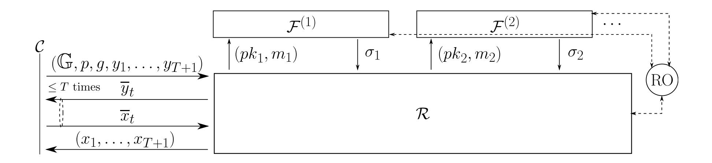
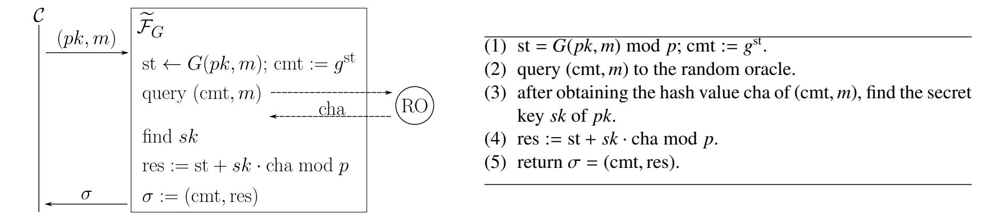
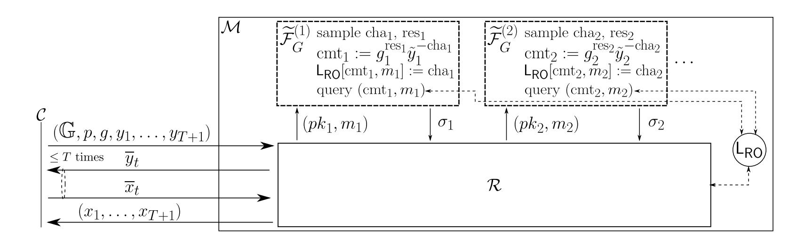

{0}------------------------------------------------

# Impossibility on the Schnorr Signature from the One-more DL Assumption in the Non-programmable Random Oracle Model⋆

Masayuki Fukumitsu1 and Shingo Hasegawa2

1 Faculty of Information Media, Hokkaido Information University, Nishi-Nopporo 59-2 Ebetsu, Hokkaido, 069–8585 Japan. fukumitsu@do-johodai.ac.jp 2 Graduate School of Information Sciences, Tohoku University, 41 Kawauchi, Aoba-ku, Sendai, Miyagi, 980–8576 Japan. shingo.hasegawa.b7@tohoku.ac.jp

Abstract. The Schnorr signature is one of the representative signature schemes and its security was widely discussed. In the random oracle model (ROM), it is provable from the DL assumption, whereas there is negative circumstantial evidence in the standard model. Fleischhacker, Jager, and Schroder showed that ¨ the tight security of the Schnorr signature is unprovable from a strong cryptographic assumption, such as the One-More DL (OM-DL) assumption and the computational and decisional Diffie-Hellman assumption, in the ROM via a generic reduction as long as the underlying cryptographic assumption holds. However, it remains open whether or not the impossibility of the provable security of the Schnorr signature from a strong assumption via a *non-tight* and reasonable reduction. In this paper, we show that the security of the Schnorr signature is unprovable from the OM-DL assumption in the non-programmable ROM as long as the OM-DL assumption holds. Our impossibility result is proven via a non-tight Turing reduction.

Keywords: Schnorr signature · Non-programmable random oracle model · Impossibility result · One-more DL assumption

# 1 Introduction

The Schnorr signature is one of the representative signature schemes and its security was discussed in several pieces of literature. Pointcheval and Stern [PS00] showed that it is provable to be strongly existentially unforgeable against the chosen message attack (seuf-cma) in the random oracle model (ROM) from the discrete logarithm (DL) assumption. Abdalla, An, Bellare, and Namprempre [AABN08] expands its result to cover other signatures which can be obtained via the Fiat-Shamir transformation [FS87] as well as the Schnorr signature.

On the other hand, there is negative circumstantial evidence for the provable security of the Schnorr signature in the *standard model*. The Schnorr signature is unprovable to be secure from the DL assumption in the standard model via an algebraic reduction as long as the One-More DL (OM-DL) assumption holds [PV05]. The OM-DL assumption [BNPS03] is parameterized by a polynomial *T*. It intuitively states that any probabilistic polynomial-time (PPT) adversary A cannot find the DLs (*x*1, *x*2, . . . , *xT*+1) of given *T* + 1 group elements (*y*1, *y*2, . . . , *yT*+1), even when A adaptively obtains at most *T* DLs of arbitrary elements. We occasionally call such a OM-DL assumption *T-OM-DL assumption* explicitly.

For the provable security of the Schnorr signature, the affirmative results were given in the ROM, whereas the impossibility result was given in the standard model. The ROM is different from the standard model in the feature that the hash value is a truly random string in the ROM. This feature enables a reduction in the security proof to simulate the random oracle which involves the *programming technique* [PS00]. The programming technique allows a reduction R, which is constructed in the security proof, to simulate the random oracle by setting hash values itself. By employing this technique, many cryptographic schemes e.g. [Cor02,KK12] were proven to be secure in the ROM. Especially, the forking lemma [PS00] can be realized by using this technique to construct security proofs of several cryptographic schemes including the Schnorr signature.

In the theoretical cryptography, one of the interests is how one can relax the property of the ROM for proving the security of cryptographic schemes. For this purpose, intermediate security models between the ROM and the standard model were proposed. One of these is a *Non-programmable ROM (NPROM)*. The concept of the NPROM was introduced by Nielsen [Nie02] to give the impossibility result on non-interactive noncommitting encryptions. They defined the notion in the simulation-based security model. Fischlin, Lehmann, Ristenpart, Shrimpton, Stam, and Tessaro [FLR+10] formalized the NPROM for the game-based security proof

⋆ The preliminary version of this paper appeared in [FH17]. The final version will be published as in [FH21]

{1}------------------------------------------------

and discussed the security of a trapdoor-permutation-based key-encapsulation and a full-domain hash in the NPROM. In the NPROM, the random oracle is dealt with the independent party, and any parties in the security proof such as a reduction R and an adversary obtain hash values from the external random oracle as well as the ROM. However, R is prohibited to simulate it, namely R cannot set the hash values, and hence we cannot use the programming technique.

The security of the Schnorr signature in the NPROM was also discussed. Fischlin and Fleischhacker [FF13] first gave negative circumstantial evidence. They showed that the Schnorr signature is unprovable to be eufcma from the DL assumption in the NPROM via a single-instance (SI) reduction as long as the OM-DL assumption holds. Subsequently, their impossibility result was extended to cover other signatures or assumptions [FH16,FH18,ZCC+15]. In particular, Fukumitsu and Hasegawa [FH18] enhanced their result to cover the existential unforgeability against the key-only attack (euf-koa) which is weaker security than euf-cma. Moreover, they [FH16] also proved that the DL assumption is incompatible with the selective unforgeability against the static message attack (suf-sma) [BJLS16] of the Schnorr signature in the NPROM via a sequentially multiinstance (SMI) reduction. The impossibility results in [FF13,FH18] require the OM-DL assumption on the statement while the result excludes the provable security of the Schnorr signature from the DL assumption in the NPROM. Thus their result does not cover the situation where the DL assumption holds but the OM-DL assumption can be broken. [FH16] addressed this issue so that the impossibility result can capture this situation. Namely, they showed that the Schnorr signature is unprovable to be suf-sma, which is weaker than euf-cma, from the DL assumption in the NPROM via an SMI reduction as long as the DL assumption holds. The SMI reduction is one of the generalized variants of the SI reduction such that it can invoke an adversary of the target cryptographic scheme polynomially many times, although it is prohibited to invoke the clones of the adversary concurrently.

As described above, it seems to be hard for the Schnorr signature to be proven secure under the DL assumption without the programming technique. One can consider the possibility of security proofs with a cryptographic assumption that is stronger than the DL assumption, such as the OM-DL assumption and the computational and decisional Diffie-Hellman assumption [Bon98]. In particular, whether or not interactive cryptographic assumptions such as the OM-DL assumption help the security proof of the Schnorr signature is an interesting problem. The difference between interactive assumptions and non-interactive ones in security proofs is that one can use oracles that correspond to the underlying interactive assumption to construct a reduction. This question was also discussed. Paillier and Vergnaud [PV05] showed that the Schnorr signature is provable to be unkeybreakable against the chosen-message attack (ukb-cma) from the OM-DL assumption in the standard model. Although it was proven via a tight reduction, the ukb-cma is a weaker notion than the ordinary euf-cma.

Not only the affirmative result but also pieces of the negative circumstantial evidence were given. Fleischhacker, Jager, and Schroder [FJS14] showed that the Schnorr signature is unprovable to be universally un- ¨ forgeable against the key only attack (uuf-koa) from some cryptographic assumption, such as not only the DL assumption but also the OM-DL assumption, in the ROM via a tight and generic reduction as long as the underlying cryptographic assumption holds. Recall that Paillier and Vergnaud [PV05] also gave the impossibility result from the DL assumption via a tight and algebraic reduction. It should be noted that their impossibility results do not contradict the affirmative results by [AABN08,PS00]. This is because the results by [AABN08,PS00] considered a non-tight reduction for the security proofs, whereas these impossibility results hold only for *tight* and some *constrained* reductions like generic or algebraic reductions. For the impossibility result which concerns a non-tight reduction, Fukumitsu and Hasegawa [FH20] showed that the generalized OM assumption [ZZC+14], which is a generalization of the OM-DL assumption, seems not to imply the euf-cma security of several Fiat-Shamir-type signature schemes. Non-tight reductions are considered in their result, however, they only considered a vanilla reduction which only can invoke a forger once and is prohibited to rewind it.

Eventually, it remains open whether or not the impossibility holds on the provable security of the Schnorr signature from an *interactive cryptographic assumption* in the NPROM via a *non-restricted* reduction. Moreover, the known impossibility result of the Schnorr signature from the OM-DL assumption in the NPROM concerns the cma security. Since it is stronger than the koa security, from the point of view of impossibility, there may be a chance to prove the security in the NPROM on the koa security.

The affirmative results and the impossibility results mentioned above are collected in Tables 1 and 2, respectively. Note that "only" in the Tight column means that the corresponding impossibility result excludes a tight reduction only. Namely, there is a possibility of the existence of non-tight reductions.

{2}------------------------------------------------

**Table 1.** The affirmative results on proving the security of the Schnorr signature.

|               | Model    | Security | Tight    | Assumption | Forger |
|---------------|----------|----------|----------|------------|--------|
| [AABN08,PS00] | ROM      | seuf-cma |          | DL         |        |
| [FPS20]       | ROM      | euf-cma  | <b>√</b> | DL         | AGM    |
| [PV05]        | Standard | ukb-cma  | <b>√</b> | OM-DL      |        |

**Table 2.** The impossibility results on proving the security of the Schnorr signature

|           |          |                  | Assumed reduction $\mathcal{R}$ |                |                   | Resulting meta-reduction $\mathcal{M}$ |
|-----------|----------|------------------|---------------------------------|----------------|-------------------|----------------------------------------|
|           | Model    | Security         | Tight                           | Assumption     | Type              | Assumption                             |
| [PV05],   | ROM      | uuf-koa          | only                            | DL             | algebraic         | OM-DL                                  |
| [GBL08],  |          |                  |                                 |                |                   |                                        |
| [Seu12]   |          |                  |                                 |                |                   |                                        |
| [FJS14]   | ROM      | uuf-koa          | only                            | DL             | generic           | DL                                     |
| [FJS14]   | ROM      | uuf-koa          | only                            | OM-DL          | generic           | OM-DL                                  |
| [ours]    | NPROM-   | uuf-koa          |                                 | OM-DL          | Turing            | OM-DL                                  |
|           | PROM     |                  |                                 |                |                   |                                        |
| [FF13]    | NPROM-   | euf-cma          |                                 | DL             | SI                | OM-DL                                  |
|           | NPROM    |                  |                                 |                |                   |                                        |
| Theorem 1 | NPROM-   | euf-koa          |                                 | DL             | key-preserving    | OM-DL                                  |
| [FH18]    | NPROM    |                  |                                 |                |                   |                                        |
| Theorem 2 | NPROM-   | euf-cma          |                                 | DL             | SI key-preserving | DL                                     |
| [FH18]    | NPROM    |                  |                                 |                |                   |                                        |
| [FH16]    | NPROM-   | suf-sma [BJLS16] |                                 | DL             | SMI               | DL                                     |
|           | NPROM    |                  |                                 |                |                   |                                        |
| [FH20]    | NPROM-   | euf-cma          |                                 | generalized OM | Vanilla           | generalized OM                         |
|           | NPROM    |                  |                                 |                |                   |                                        |
| [PV05]    | Standard | uuf-koa          |                                 | DL             | algebraic         | OM-DL                                  |

For "Security" column, uuf, suf, euf, koa, sma, and cma stand for universal unforgeability, selective unforgeability, existential unforgeability, key-only attack, static-message attack, chosen-message attack, respectively. "Type" column describes the type of black-box reductions  $\mathcal R$  which are covered in the impossibility results. algebraic stands for algebraic reductions to which any group element is yielded only by the group operation on given group elements. generic stands for generic reductions which are the almost same as algebraic reductions except that generic reductions only can yield any group operation via accessing the corresponding oracle. key-preserving indicates key-preserving reduction which invokes a forger  $\mathcal F$  only with the public key same as that given to  $\mathcal R$ . Vanilla reductions cannot invoke  $\mathcal F$  multiple times and rewind  $\mathcal F$ . SI is the abbreviation of single-instance. Such reductions cannot invoke a forger multiple times as Vanilla one, but it can rewind  $\mathcal F$  polynomially many times. SMI means sequentially-multi-instance. Such reductions can invoke forgers polynomially many times and rewind  $\mathcal F$ , although it is prohibited to invoke  $\mathcal F$  concurrently.

#### 1.1 Our Contributions

In this paper, we aim to show the impossibility results concerning the koa security of the Schnorr signature from an interactive assumption via a non-restricted reduction. We give an impossibility result on the provable security of the Schnorr signature from the OM-DL assumption in the NPROM via a black-box Turing reduction. It is given by the following theorem.

**Theorem 5.** (Informal) The Schnorr signature is unprovable to be uuf-koa from the OM-DL assumption in the NPROM via a black-box Turing reduction as long as the OM-DL assumption holds. The considered situations are explained below.

Theorem 5 can cover the class of black-box reductions  $\mathcal{R}$  which is wider than that of SMI reductions. SMI reduction can invoke a forger  $\mathcal{F}$  polynomially many times, but such invocations are only sequential. In other words, the reduction cannot invoke multiple forgers concurrently. On the other hand, our class of reductions allows concurrent invocations of forgers. Moreover, our result does not restrict the operation of the reductions like generic or algebraic reduction.

We describe the basic strategy of the proof of Theorem 5. Assume that there exists a PPT black-box Turing reduction algorithm  $\mathcal{R}$  which solves the OM-DL problem by invoking a uuf-koa forger  $\mathcal{F}$  of the Schnorr signature in the NPROM. We shall construct a PPT *meta-reduction* algorithm [BV98]  $\mathcal{M}$  which solves the OM-DL

{3}------------------------------------------------

problem by running  $\mathcal{R}$ . This means that the OM-DL assumption is broken if there exists such a reduction  $\mathcal{R}$ . Thus the theorem follows from the contraposition. On the construction of  $\mathcal{M}$ , we utilize the ability of  $\mathcal{R}$  that solves the OM-DL problem which is supposed at the statement. Since  $\mathcal{R}$  requires the help of a uuf-koa forger  $\mathcal{F}$  to run correctly, the main task of  $\mathcal{M}$  is the simulation of  $\mathcal{F}$ .

In Theorem 5, we consider the *uuf-koa* security [GMR88]. The uuf-koa security states that any PPT forger  $\mathcal{F}$  cannot find a signature  $\sigma$  of m on a given pair (pk,m) of a public key pk and a message m. In the uuf-koa security, a forger  $\mathcal{F}$  makes no signing oracle query. Since uuf-koa is weaker than suf-cma, euf-koa, and euf-cma, [GMR88,BJLS16], putting together with Theorem 5, the impossibility of the suf-cma, euf-koa, and euf-cma securities also follows.

In the ordinary security proof of signature schemes, we construct a reduction  $\mathcal{R}$  which breaks some cryptographic assumption by using a forger  $\mathcal{F}$  which is assumed in the statement. Such an  $\mathcal{R}$  is required to run correctly when  $\mathcal{F}$  computes a forgery. In the impossibility proof case, a reduction  $\mathcal{R}$  is assumed to exist and  $\mathcal{R}$  is desired to run with *any* forger  $\mathcal{F}$  which succeeds in computing a forgery. By using this property of  $\mathcal{R}$ , we consider a specific type of forgers to correspond to the concurrent invocation of  $\mathcal{F}$  and the rewinding  $\mathcal{F}$  by  $\mathcal{R}$ .

The specific uuf-koa forger  $\widetilde{\mathcal{F}}$  is deterministic and makes only one query to the external random oracle. Since  $\widetilde{\mathcal{F}}$  performs the key only attack,  $\widetilde{\mathcal{F}}$  makes no query to the signing oracle. And the hash value cannot be controlled by  $\mathcal{R}$  because we consider the NPROM setting. Therefore the behavior of  $\widetilde{\mathcal{F}}$  is determined totally by the input (pk,m) which is given from  $\mathcal{R}$  when  $\mathcal{R}$  invokes  $\widetilde{\mathcal{F}}$ , and the output  $\sigma$  of  $\widetilde{\mathcal{F}}$  is also fixed. Thus  $\mathcal{R}$  cannot affect  $\widetilde{\mathcal{F}}$  even if  $\mathcal{R}$  rewinds  $\widetilde{\mathcal{F}}$  or invokes it concurrently. Then the meta-reduction  $\mathcal{M}$  does not have to consider the concurrent invocation of  $\widetilde{\mathcal{F}}$  and the rewinding of it in the simulation of  $\widetilde{\mathcal{F}}$  when the uuf-koa security is considered. Namely, the impossibility on the uuf-koa security not only is important itself but also helps us to cover the black-box Turing reduction.

As described above, we can show the impossibility against the black-box Turing reduction if  $\mathcal{M}$  can simulate the hypothetical uuf-koa forger. We now briefly explain the idea of constructing our meta-reduction  $\mathcal{M}$ . Recall that  $\mathcal{M}$  aims to make the assumed reduction  $\mathcal{R}$  solve the OM-DL problem. Since  $\mathcal{R}$  may invoke a uuf-koa forger  $\mathcal{F}$  with a pair (pk, m),  $\mathcal{M}$  is required to simulate it. In the simulation,  $\mathcal{M}$  needs to return a valid signature  $\sigma$  of m under pk for the pair (pk, m). A straightforward idea is to utilize the honest-verifier zero-knowledge (HVZK) property of the Schnorr signature. This is frequently used to simulate the signing oracle in the security proof of the Schnorr signature in the ordinary ROM.

We consider whether or not this idea can be employed in our case where uuf-koa forgers are considered. In the security proof of the Schnorr signature, the idea of using the HVZK succeeds by incorporating the programming technique which is due to the ordinary ROM. From the point of view of the treatment of the random oracle by  $\mathcal{M}$ , we can find two types of meta-reductions in existing impossibility results in NPROM.

The first one is that  $\mathcal{M}$  also obtains any hash value from the external random oracle as well as  $\mathcal{R}$ . The meta-reductions such as [FF13,FH16,FH20] are categorized in this type. We refer to this type of meta-reductions as the *NPROM-NPROM* model. Meta-reductions in this type do not employ the idea using the HVZK because  $\mathcal{M}$  cannot use the programming technique of the random oracle. Instead,  $\mathcal{M}$  constructed in [FF13,FH16,FH20] utilized the abilities of the signing oracle emulated by  $\mathcal{R}$  to simulate  $\mathcal{F}$ . To make the assumed reduction  $\mathcal{R}$  have the ability to simulate the signing oracle, one has to consider the cma or sma forger in the statement of the impossibility. This is the reason why their impossibility results cannot cover koa forgers. Therefore the idea of using the HVZK cannot be applied to our case where uuf-koa forgers are considered when we employ the NPROM-NPROM model.

To make matters worse, we now consider an impossibility result from the interactive cryptographic assumption via a non-restricted reduction. The meta-reductions in [FF13,FH16,FH20] run  $\mathcal{R}$  multiple times to succeed in the utilization of the ability of  $\mathcal{R}$ . Such a multiple running of  $\mathcal{R}$  by  $\mathcal{M}$  seems not to directly employ the security from interactive assumptions. This is because interactive assumptions including the OM-DL assumption generally have a limit on the number of times of the access to the oracle supposed by the assumption, and each  $\mathcal{R}$  can access the oracle at most such times. This means that the total number of times of the access to the oracle by  $\mathcal{M}$  is beyond this limit, and hence  $\mathcal{M}$  no longer breaks the assumption. Although [FPS20] constructed a meta-reduction to overcome this difficulty, the assumed reduction  $\mathcal{R}$  is restricted to be a vanilla reduction. This suggests that it is difficult for us to give an impossibility result of the koa security in the NPROM-NPROM from interactive assumption via a reasonable reduction.

The other type of the meta-reduction is that  $\mathcal{M}$  can simulate the random oracle for  $\mathcal{R}$ . Fischlin, Harasser, and Janson [FHJ20] used this type of meta-reduction implicitly to show the impossibility of the security of a signature scheme yielded from a parallel-OR protocol, under some cryptographic assumption as long as the same assumption holds. They succeeded in the simulation of  $\mathcal{F}$  by allowing  $\mathcal{M}$  to use the programming technique. We call this type the *NPROM-PROM* model.

{4}------------------------------------------------

In this paper, we employ the NPROM-PROM model in the construction of M. Under the NPROM-PROM model, we can use the programming technique of the random oracle. This idea comes from the result by [FHJ20], however, their proof seems not to apply to our case directly. This is because [FHJ20] considers the impossibility of the euf-cma security from the non-interactive assumption via an SMI reduction, whereas we consider the impossibility of the uuf-koa security from the interactive assumption, i.e. OM-DL assumption, via a black-box Turing reduction. Thus we have to adjust the proof to the case of the Schnorr signature. Fortunately, we can avoid the need of the cma forgers in [FHJ20] by using the algebraic structure on which the Schnorr signature is based, and then we can achieve the impossibility of the uuf-koa security. In [FHJ20], the cma forgers are required to make R have the ability of the signing oracle. M uses such a signing oracle to check the validity of given public keys of the OR protocol. In our case, the inputs to the forger from R can be checked with no help of R, since the inputs are the public keys of the Schnorr signature, i.e. instances of the DL problem, and one can check easily whether or not a given element is a generator of an underlying cyclic group of prime order. Then we can simulate the uuf-koa forger by incorporating the HVZK property of the Schnorr signature. Eventually, we achieve the impossibility of the black-box Turing reduction by considering the uuf-koa forger from the OM-DL assumption in the statement. We finally note that our proof of impossibility is specific to the Schnorr signature. Whether or not a similar result holds for other types of signature remains to be open.

## 1.2 Related Works

Pass [Pas11] gave an impossibility result of the provable security on the Schnorr ID scheme [Sch91] from which the Schnorr signature is derived via the Fiat-Shamir transformation. They showed that the Schnorr ID is unprovable to be secure against the impersonation under the active attack (imp-aa secure) from several interactive assumptions such as the OM-DL assumption. Note that the imp-aa security of the Schnorr ID was proven from the OM-DL assumption in [BP02]. The difference between these two results is due to the parameter *T* of the OM-DL assumption. Bellare and Palacio [BP02] considered the case where *T* is equivalent to the number of the access to the oracle in the imp-aa game, whereas Pass considered that *T* is asymptotically smaller than the number of the oracle access. It is known that the *T*1-OM-DL assumption may be strictly weaker than the *T*2-OM-DL assumption when *T*2 > *T*1 [BMV08]. These imply that the Schnorr ID may be unprovable to be secure from the *T*-OM-DL assumption where the parameter *T* is strictly smaller than the number of the oracle access.

Although they focused on the provable security of the Schnorr ID, their result seems not to directly elucidate the question on the provable security of the Schnorr signature from the OM-DL assumption in the NPROM. This is because the relationship between the security of the Schnorr signature in the NPROM and the security of the Schnorr ID has not been known so far. Therefore, we consider this question by directly observing the relationship between the security of the Schnorr signature and the OM-DL assumption.

Recently, Fuchsbauer, Plouviez, and Seurin [FPS20] prove the euf-cma security of the Schnorr signature in the ROM with a tight security by restricting the computational model of a forger to the algebraic group model (AGM).

#### 1.3 Differences from Proceedings Version

The earlier version of this paper appeared in [FH17]. In the proceeding version, we showed the impossibility result only concerning the selective unforgeability against the chosen message attack (suf-cma) from the OM-DL assumption in the NPROM. We employed the NPROM-NPROM model in this result. Thus the statement involved the suf-cma forgers.

In this paper, we strengthen the previous result, namely we consider the impossibility of the uuf-koa security from the OM-DL assumption in the NPROM via a black-box Turing reduction. As described above, our result in this paper is achieved by applying the NPROM-PROM model to the Schnorr signature case.

# 2 Preliminaries

For any natural number *n*, let Z*n* denote the residue ring Z/*n*Z. The notation *x* ∈U *X* means that an element *x* is sampled uniformly at random from the finite set *X*. For a finite set *X*, let *U*(*X*) be the uniform distribution over *X*. And, *x* ∈*D X* means that *x* is sampled according to the distribution *D*. We denote by *x* := *y* that *x* is defined or substituted as *y*. For any algorithm A, we define by *y* ← A(*x*) that A takes *x* as input and then outputs *y*. When A is probabilistic, we write *y* ← A(*x*;*r*) to denote that A takes *x* as input with a randomness *r* and then outputs *y*, and A(*x*) is the random variable on the fixed input *x*, where the probability is taken over 

{5}------------------------------------------------

the internal coin flips of  $\mathcal{A}$ . A function  $\epsilon$  is *negligible* if for any polynomial  $\nu$ , there exists a natural number  $\lambda_0$  such that for any  $\lambda > \lambda_0$ ,  $\epsilon(\lambda) < 1/\nu(\lambda)$ . For any ensembles  $\left\{D_{\lambda}^{(1)}\right\}_{\lambda}$  and  $\left\{D_{\lambda}^{(2)}\right\}_{\lambda}$  of distributions over an ensemble  $\{X_{\lambda}\}_{\lambda}$  of sets, we say that  $\left\{D_{\lambda}^{(1)}\right\}_{\lambda}$  is *statistically close* to  $\left\{D_{\lambda}^{(2)}\right\}_{\lambda}$  if the statistical distance between  $\left\{D_{\lambda}^{(1)}\right\}_{\lambda}$  and  $\left\{D_{\lambda}^{(2)}\right\}_{\lambda}$  is negligible in  $\lambda$ , where the statistical distance between  $\left\{D_{\lambda}^{(1)}\right\}_{\lambda}$  and  $\left\{D_{\lambda}^{(2)}\right\}_{\lambda}$  is defined as  $1/2\sum_{x\in X_{\lambda}}\left|\Pr\left[x\in_{D_{\lambda}^{(1)}}X_{\lambda}\right]-\Pr\left[x\in_{D_{\lambda}^{(2)}}X_{\lambda}\right]\right|$ . Then the following lemma holds.

**Lemma 1.** Let  $\{D_{\lambda}^{(1)}\}_{\lambda}$ ,  $\{D_{\lambda}^{(2)}\}_{\lambda}$  and  $\{D_{\lambda}\}_{\lambda}$  be ensembles of distributions over an ensemble  $\{X_{\lambda}\}_{\lambda}$ . Assume that  $\{D_{\lambda}^{(1)}\}_{\lambda}$  and  $\{D_{\lambda}^{(2)}\}_{\lambda}$  are statistically close to  $\{D_{\lambda}\}_{\lambda}$ , respectively. Then,  $\{D_{\lambda}^{(1)}\}_{\lambda}$  is also statistically close to  $\{D_{\lambda}^{(2)}\}_{\lambda}$ .

*Proof.* For the statistical distance between  $\{D_{\lambda}^{(1)}\}_{\lambda}$  and  $\{D_{\lambda}^{(2)}\}_{\lambda}$ , we have

$$\frac{1}{2} \sum_{x \in X_{\lambda}} |\Pr[x \in_{D_{\lambda}^{(1)}} X_{\lambda}] - \Pr[x \in_{D_{\lambda}^{(2)}} X_{\lambda}]| = \frac{1}{2} \sum_{x \in X_{\lambda}} |\Pr[x \in_{D_{\lambda}^{(1)}} X_{\lambda}] + (\Pr[x \in_{D_{\lambda}} X_{\lambda}] - \Pr[x \in_{D_{\lambda}} X_{\lambda}]) \\
- \Pr[x \in_{D_{\lambda}^{(2)}} X_{\lambda}]| \\
\leq \frac{1}{2} \sum_{x \in X_{\lambda}} (|\Pr[x \in_{D_{\lambda}^{(1)}} X_{\lambda}] - \Pr[x \in_{D_{\lambda}} X_{\lambda}]| \\
+ |\Pr[x \in_{D_{\lambda}} X_{\lambda}] - \Pr[x \in_{D_{\lambda}^{(2)}} X_{\lambda}]|) \\
= \frac{1}{2} \sum_{x \in X_{\lambda}} |\Pr[x \in_{D_{\lambda}^{(1)}} X_{\lambda}] - \Pr[x \in_{D_{\lambda}} X_{\lambda}]| \\
+ \frac{1}{2} \sum_{x \in X_{\lambda}} |\Pr[x \in_{D_{\lambda}} X_{\lambda}] - \Pr[x \in_{D_{\lambda}^{(2)}} X_{\lambda}]|.$$

By the definition of the statistical distance, the former term is the statistical distance between  $\{D_{\lambda}^{(1)}\}_{\lambda}$  and  $\{D_{\lambda}\}_{\lambda}$ , and the latter term is the one between  $\{D_{\lambda}^{(2)}\}_{\lambda}$  and  $\{D_{\lambda}\}_{\lambda}$ . Both are negligible from the assumption of the lemma. It follows that  $\{D_{\lambda}^{(1)}\}_{\lambda}$  is also statistically close to  $\{D_{\lambda}^{(2)}\}_{\lambda}$ .

Let L denote a key-value list. For any key string  $x \in \{0, 1\}^*$ , L[x] stands for the value of x. For a string x,  $L[x] = \bot$  means that the value of x is undefined. For any list L, any algorithm or distribution  $\mathcal{D}$  and any string x, we denote by  $y \leftrightsquigarrow_{\mathcal{D}} L[x]$  the lazy sampling from  $\mathcal{D}$ , in a sense that y := L[x] if  $L[x] \neq \bot$ , or  $y := L[x] \leftarrow \mathcal{D}(x)$  otherwise.

#### 2.1 Cryptographic Assumption

We first introduce the notion of interactive cryptographic assumptions [Nao03,Pas11,MP18]. For a polynomial r, an r-round interactive cryptographic assumption is formalized by a pair (C, t) of a PPT interactive algorithm C of r rounds, which is called the challenger, and a polynomial t which is called the threshold function. We say that the r-round interactive assumption (C, t) holds if for any PPT interactive algorithm  $\mathcal{A}$ , there exists a negligible function v such that for any  $\lambda$ , C returns 1 after the interaction between C and  $\mathcal{A}$  with probability at most  $t(\lambda) + v(\lambda)$ . Such an interaction is referred to as the *security game*. Contrary, we say that  $\mathcal{A}$  breaks or solves (C, t) if for some polynomial  $\mu$ , C returns 1 after the interaction with probability at least  $t(\lambda) + 1/\mu(\lambda)$  for all sufficiently large  $\lambda$ . Note that the threshold function t of any assumption on computational problems rather than decisional problems is set to 0. Since we only consider the computational assumptions in this paper, we remove the threshold t from the notation.

We now introduce the One-More DL (OM-DL) assumption. Let  $\ell_p$  be a polynomial in  $\lambda$ . We write GGen to denote a PPT group parameter generator which takes a security parameter  $1^{\lambda}$  as input, and then outputs a group parameter  $(\mathbb{G}, p, g)$  of a group description  $\mathbb{G}$  which is of prime order p such that  $p < 2^{\ell_p}$  with a generator q. For any group parameter  $(\mathbb{G}, p, g) \leftarrow \mathsf{GGen}(1^{\lambda})$  and any element  $q \in \mathbb{G}$ , an element  $q \in \mathbb{Z}_p$  is said to be the discrete logarithm (DL) of q if it holds that  $q = q^{\alpha}$  in  $\mathbb{G}$ .

Let T be a polynomial in  $\lambda$ . An algorithm  $\mathcal{A}$  is said to *solve the T-OM-DL problem* if a challenger C outputs 1 in the T-OM-DL game that is defined in the following way: on a security parameter  $\lambda$ ,

**OM Init**  $\mathcal{A}$  is given a tuple  $(\mathbb{G}, p, g, y_1, y_2, \dots, y_{T+1})$  where C generates a group parameter  $(\mathbb{G}, p, g) \leftarrow \mathsf{GGen}(1^{\lambda})$ , and then samples T+1 distinct instances  $y_1, \dots, y_{T+1} \in_{\mathbb{U}} \mathbb{G}$ .

{6}------------------------------------------------

- DL Oracle A is allowed to access the *DL oracle*. Namely, when A sends a *t*-th query *yt* ∈ G, A receives the DL *xt* ∈ Z*p* of *yt* .
- OM Challenge When A eventually outputs a tuple (*x*1, *x*2, . . . , *xT*+1), C outputs 1 if A made at most *T* queries to the DL oracle in DL Oracle phase, and for any 1 ≤ *t* ≤ *T* + 1, *xt* is the DL of *yt* .

The *T-OM-DL assumption* states that any PPT algorithm A solves the *T*-OM-DL problem with negligible probability. In short, *T*-OM-DL assumption coincides with (*T* + 1)-round interactive assumption defined by the *T*-OM-DL challenger C above.

### 2.2 Signature Scheme

A signature scheme Sig consists of a tuple (KGen, Sign, Ver) of three polynomial-time algorithms. KGen is a PPT key generator which takes a security parameter 1λ as input, and then outputs a pair (*sk*, *pk*) of a secret key and a public key. Sign is a PPT signing algorithm that takes a key pair (*sk*, *pk*) and a message *m* as input, and then outputs a signature σ. Ver is a deterministic verification algorithm which takes a public key *pk*, a message *m* and a signature σ as input, and then outputs 1 if σ is a *valid* signature on the message *m* under the public key *pk*.

We now introduce for Sig := (KGen, Sign, Ver), the notions of the existential unforgeability against the chosen message attack (euf-cma) and the universal unforgeability against the key-only attack (uuf-koa). Let *Qs* be a polynomial in a security parameter λ. The *Qs-euf-cma game* is defined in the following way: on a security parameter λ,

EF Init A forger F is given a public key *pk* where a challenger C generates (*sk*, *pk*) ← KGen(1λ ).

Signing Oracle When F hands an *i*-th message *mi* to C, C replies its signature σ*i* ← Sign(*sk*, *pk*, *mi*). Note that F can access this phase at most *Qs* times.

EF Challenge When F finally returns a pair (*m* ∗ , σ∗ ), C outputs 1 if *m* ∗ < {*mi*} *Qs i*=1 and Ver(*pk*, *m* ∗ , σ∗ ) = 1.

In a similar manner, the *uuf-koa game* is defined in the following way: on a security parameter λ,

UF Init A forger F is given a public key *pk* and a message *m* where a challenger C generates (*sk*, *pk*) ← KGen(1λ ) and samples *m*.

UF Challenge When F finally returns a signature σ, C outputs 1 if Ver(*pk*, *m*, σ) = 1.

Let sec ∈ {*Qs*-euf-cma, uuf-koa}. Then F is said to *win the sec game of* Sig if C outputs 1 in the corresponding game. The signature scheme Sig is said to be *sec* if any PPT forger F wins the corresponding game with a negligible probability. The probability is taken over the internal coin flips of KGen and F , and the choices of *m* only for the uuf-koa game.

The *Qs*-euf-cma security is the (*Qs* + 1)-round interactive assumption defined by the *Qs*-euf-cma challenger, whereas the uuf-koa security is the 1-round interactive assumption defined by the uuf-koa challenger. On the relationship between these two security notions, the following proposition holds.

Proposition 2 ([GMR88]). *Let* Sig *be a signature scheme, and let Qs be a polynomial in a security parameter* λ*. If there exists a PPT forger algorithm that wins the uuf-koa game of* Sig*, then there exists a PPT forger algorithm that wins the Qs-euf-cma game of* Sig*.*

#### 2.3 Black-Box Reduction

Following [Pas11,MP18], we describe the notion of black-box assumptions. Consider two cryptographic assumptions (C1, *t*1) and (C2, *t*2). A *black-box reduction* R *from* (C1, *t*1) *to* (C2, *t*2) is a PPT interactive algorithm R which breaks (C1, *t*1) if a deterministic algorithm A which breaks (C2, *t*2) is provided as a subrutine. The "subroutine" means that R is only given interfaces of input and output for A. In other words, it cannot utilize the internal code of A. On the execution of A against (C2, *t*2), R is required to simulate C2.

# 3 Impossibility on Schnorr Signature in NPROM

In this section, we show the impossibility of proving that the Schnorr signature is uuf-koa from the *T*-OM-DL assumption in the NPROM.

{7}------------------------------------------------

#### 3.1 Schnorr Signature

We now introduce the Schnorr signature [Sch91].

KGen(1 $^{\lambda}$ ) outputs (sk, pk), where  $(\mathbb{G}, p, g) \leftarrow \text{GGen}(1^{\lambda})$ ,  $sk \in_{\mathbb{U}} \mathbb{Z}_p$ ,  $y := g^{sk}$ , and  $pk := (\mathbb{G}, p, g, y)$ . Sign(sk, pk, m) outputs a signature  $\sigma := (\text{cmt}, \text{res})$  on the message  $m \in \{0, 1\}^{\ell_m}$ , where  $\ell_m$  is a polynomial in  $\lambda$ , under the public key pk. The procedure is as follows:

- (1) st  $\in_{\mathbf{U}} \mathbb{Z}_p$  and then cmt :=  $g^{\text{st}}$ ,
- (2) cha := H(cmt, m), where  $H: \{0, 1\}^* \to \{0, 1\}^{2\ell_p}$ ,
- (3) res := st +  $sk \cdot$  cha mod p.

Ver $(pk, m, \sigma)$  outputs 1 if we have cmt =  $g^{\text{res}}y^{-H(\text{cmt},m)}$ .

Note that we consider the hash function  $H: \{0,1\}^* \to \{0,1\}^{2\ell_p}$  instead of  $H': \{0,1\}^* \to \mathbb{Z}_p$ . This is because the uniform distribution over  $\{0,1\}^{2\ell_p}$  can be seen as the one over  $\mathbb{Z}_p$  regardless of the order p by the following lemma.

**Lemma 3.** Let  $\ell_p$  be a polynomial in  $\lambda$ , and let  $p < 2^{\ell_p}$ . Then, the distribution of  $z \mod p$  for  $z \in_U \{0, 1\}^{2\ell_p}$  is statistically close to  $U(\mathbb{Z}_p)$ .

*Proof.* To prove this lemma, we use the following fact.

**Lemma 4** ([FHIS14, Lemma 3]). Let  $\{n_1(\lambda)\}_{\lambda}$  and  $\{n_2(\lambda)\}_{\lambda}$  be two sequences of natural numbers. Assume that  $n_2/n_1$  is negligible in  $\lambda$ . If  $z \in_{\mathbb{U}} \mathbb{Z}_{n_1}$ , then the distribution of  $z \mod n_2$  is statistically close to the uniform distribution over  $\mathbb{Z}_{n_2}$ .

Since  $p/2^{2\ell_p} < 2^{\ell_p}/2^{2\ell_p} = 1/2^{\ell_p}$  is negligible in  $\lambda$ , Lemma 4 implies that the distribution of  $z \mod p$  for  $z \in_{\mathrm{U}} \{0,1\}^{2^{\ell_p}}$  is statistically close to  $U(\mathbb{Z}_p)$ .

We note the notation H(cmt, m). The string cha is defined as the hash value of H(cmt, m). The domain of the hash function H is defined as  $\{0, 1\}^*$ , and the input pair (cmt, m) is in  $\mathbb{G} \times \{0, 1\}^{\ell_m}$ . We consider that the hash value H(cmt, m) is computed on the concatication of the binary representation of  $\text{cmt} \in \mathbb{G}$  and  $m \in \{0, 1\}^{\ell_m}$ .

The Schnorr signature is known to have the honest-verifier zero-knowledge property. Namely, there exists a PPT simulator which takes a public key  $pk = (\mathbb{G}, p, g, y)$  and a string cha  $\in \{0, 1\}^{2\ell_p}$  as input, and then return (cmt, cha, res) such that  $\operatorname{Ver}(pk, m, \sigma) = 1$ . Moreover, for any  $(pk, sk) \leftarrow \operatorname{KGen}(1^{\lambda})$  and any  $m \in \{0, 1\}^{\ell_m}$ , the distribution of (cmt, res) is identical to that of  $(\overline{\operatorname{cmt}}, \overline{\operatorname{res}}) \leftarrow \operatorname{Sign}(sk, pk, m)$  if the distribution of cha given to the simulator coincides with that of  $H(\overline{\operatorname{cmt}}, m)$ . Note that the above property follows in the random oracle model by sampling a string cha uniformly at random from  $\{0, 1\}^{2\ell_p}$ , since  $H(\overline{\operatorname{cmt}}, m)$  is uniformly distributed over  $\{0, 1\}^{2\ell_p}$  in the random oracle model.

#### 3.2 Our Impossibility Result

Let T be a polynomial in  $\lambda$ . We now explain the situation where the Schnorr signature is provable to be uuf-koa from the T-OM-DL assumption. This is defined by the manner of the black-box reduction from the OM-DL assumption to the uuf-koa security of Schnorr signature such as [PS00,FF13]. Namely, there exist a non-negligible function  $\epsilon$  and a PPT black-box reduction algorithm  $\mathcal{R}$  such that  $\mathcal{R}$  solves the T-OM-DL problem with probability  $\epsilon$  by invoking a forger  $\mathcal{F}$  which wins the uuf-koa game. Here,  $\mathcal{R}$  is allowed to access the DL oracle at most T times, since  $\mathcal{R}$  aims to win the T-OM-DL game.

Let  $(\mathbb{G}, p, g, y_1, y_2, \dots, y_{T+1})$  be a T-OM-DL instance given from the T-OM-DL challenger C to the reduction  $\mathcal{R}$ .  $\mathcal{R}$  aims to find the solution  $(x_1, x_2, \dots, x_{T+1})$  of the instance  $(\mathbb{G}, p, g, y_1, y_2, \dots, y_{T+1})$ . For this purpose,  $\mathcal{R}$  would access the DL oracle at most T times and invoke a uuf-koa forger  $\mathcal{F}$  polynomially many times.  $\mathcal{R}$  plays a role of a T-OM-DL adversary in the T-OM-DL game, and plays a uuf-koa challenger in the uuf-koa game simultaneously. On a t-th DL oracle query,  $\mathcal{R}$  sends a t-th instance  $\overline{y}_t \in \mathbb{G}$  to receive its DL  $\overline{x}_t \in \mathbb{Z}_p$ . On the other hand,  $\mathcal{R}$  invokes a forger  $\mathcal{F}$  of the Schnorr signature. Suppose that  $\mathcal{R}$  invokes  $\mathcal{F}$  with a pair (pk, m). Then,  $\mathcal{F}$  returns a *forgery*  $\sigma$ , namely a valid signature  $\sigma$  of m.

We consider the security in the *non-programmable random oracle model (NPROM)* [FF13]. In the NPROM,  $\mathcal{R}$  and  $\mathcal{F}$  should obtain hash values from the random oracle in a similar manner to the ordinary ROM. However, the random oracle is dealt with an independent party from  $\mathcal{R}$  and  $\mathcal{F}$  in the security proof. This means that  $\mathcal{R}$  is prohibited to simulate the random oracle internally, whereas such a simulation is allowed in the ordinary ROM. Hence,  $\mathcal{R}$  can observe all random oracle queries by  $\mathcal{F}$ , but it is not allowed to program these values.

 $\mathcal{R}$  is allowed to concurrently and adaptively invoke  $\mathcal{F}$  at most I times and rewind it polynomially many times for some polynomial I.  $\mathcal{R}$  would eventually behave as follows. On a T-OM-DL instance ( $\mathbb{G}$ , p, g,  $y_1$ ,  $y_2$ , ...,  $y_{T+1}$ ) to  $\mathcal{R}$ ,  $\mathcal{R}$  would execute the following processes concurrently:

{8}------------------------------------------------

**Fig. 1.** The overview of a reduction  $\mathcal{R}(\mathbb{G}, p, g, y_1, y_2, \dots, y_{T+1})$ 

**Fig. 2.** uuf-koa forger  $\widetilde{\mathcal{F}}_G(pk, m)$ , where  $pk = (\mathbb{G}, p, g, y)$ 

Access to DL oracle When  $\mathcal{R}$  sends a t-th instance  $\overline{y}_t$  to the DL oracle, it receives its DL  $\overline{x}_t$ .

**Request to obtain the hash value** When  $\mathcal{R}$  makes an *i*-th pair  $(\overline{\text{cmt}}, \overline{m})$  to the random oracle, it receives its hash value  $\overline{\text{cha}}$ .

**Invocation of**  $\mathcal{F}$  When  $\mathcal{R}$  invokes a k-th forger  $\mathcal{F}^{(k)}$  on  $(pk_k, m_k)$ ,  $\mathcal{R}$  obtains a forgery  $\sigma_k := (cmt_k, res_k)$  after  $\mathcal{F}^{(k)}$  obtains the hash value  $cha_k$  of the pair  $(cmt_k, m_k)$ .

Finally,  $\mathcal{R}$  outputs the solution  $(x_1, x_2, \dots, x_{T+1})$  of  $(\mathbb{G}, p, g, y_1, y_2, \dots, y_{T+1})$  with probability  $\epsilon$ . The behavior of  $\mathcal{R}$  is depicted as in Fig. 1. Note that  $\mathcal{R}$  may rewind  $\mathcal{F}^{(k)}$  just after  $\mathcal{F}^{(k)}$  queries to the random oracle. This is because  $\mathcal{R}$  can observe the queries and the responses of  $\mathcal{F}^{(k)}$  in the NPROM setting.

We assume that  $\mathcal{R}$  is *fixed-parameter* [MP18] in a sense that  $\mathcal{R}$  and  $\mathcal{F}$  run with respect to the same security parameter. Namely, for each k-th invocation  $\mathcal{F}^{(k)}$ , the length of  $(pk_k, m_k)$  given to  $\mathcal{F}^{(k)}$  is fixed by the security parameter  $\lambda$  that is used to genretate the T-OM-DL instance to  $\mathcal{R}$ . More precicely, for each  $1 \le k \le I$ ,  $\mathcal{R}$  invokes  $\mathcal{F}^{(k)}$  only with  $(pk_k, m_k)$  such that  $pk_k = (\mathbb{G}_k, p_k, g_k, \tilde{y}_k) \in \mathsf{PK}_{\lambda}$ , especially the length of the order  $p_k$  is  $\ell_p$ , where  $\mathsf{PK}_{\lambda}$  is the set of all public keys  $(\mathbb{G}, p, g, y)$  of the Schnorr signature such that  $(\mathbb{G}, p, g)$  is a group parameter which would be output by GGen on input the security parameter  $1^{\lambda}$  and  $y \in \mathbb{G}$ . This is a relaxed notion of the key-preserving reduction [PV05,FH18] which requires that each  $pk_k$  must coincide with the T-OM-DL instance given to  $\mathcal{R}$ .

We now show the impossibility of the provable security of the Schnorr signature in the NPROM.

**Theorem 5.** Let  $\ell_p$ , T, and I be polynomials in  $\lambda$ , and let  $\epsilon$  be a non-negligible function. Assume that there exists a PPT fixed-parameter black-box reduction algorithm  $\mathcal{R}$  which solves the T-OM-DL problem with probability  $\epsilon$  by invoking a forger  $\mathcal{F}$  at most I times such that  $\mathcal{F}$  wins the uuf-koa game on a public key  $pk_k = (\mathbb{G}_k, p_k, g_k, \tilde{y}_k) \in \mathsf{PK}_{\lambda}$  for  $p_k < 2^{\ell_p}$ . Then there exists a PPT algorithm  $\mathcal{M}$  which solves the T-OM-DL problem with probability  $\epsilon$  – negl.

*Proof.* Assume that there exists a PPT fixed-parameter black-box reduction algorithm  $\mathcal{R}$  which solves the T-OM-DL problem with probability  $\epsilon$  by invoking a forger  $\mathcal{F}$  that wins the uuf-koa game at most I times. As mentioned above,  $\mathcal{R}$  can find the solution  $(x_1, \ldots, x_{T+1})$  of a given T-OM-DL instance  $(\mathbb{G}, p, g, y_1, \ldots, y_{T+1})$  with probability  $\epsilon$  if a forger  $\mathcal{F}$  which can win the uuf-koa game is provided to  $\mathcal{R}$  no matter what  $\mathcal{F}$  executes. We first describe a specific hypothetical uuf-koa forger  $\widetilde{\mathcal{F}}$ . We shall next construct a meta-reduction algorithm  $\mathcal{M}$  which solves the T-OM-DL problem with non-negligible probability by utilizing  $\mathcal{R}$  and simulating  $\widetilde{\mathcal{F}}$ .

Family  $\{\widetilde{\mathcal{F}}_G\}_G$  of Hypothetical Forgers We consider a family of hypothetical uuf-koa forgers  $\widetilde{\mathcal{F}}_G$  which are parameterized by a uniformly random chosen function  $G \in_{\mathrm{U}} G_{\lambda}$ , where  $G_{\lambda}$  is the set of all functions G:

{9}------------------------------------------------

- sample random coins r and initialize  $L_{RO}$ ,  $L_{cha}$ , and  $L_{res}$ . Then run  $\mathcal{R}(\mathbb{G}, p, g, y_1, y_2, \dots, y_{T+1}; r)$ . During that, proceed to the following according to the  $\mathcal{R}$ 's output:

Accessing DL oracle with  $\overline{y}_t \in \mathbb{G}$ : forward  $\overline{y}_t$  to DL oracle, and then reply  $\overline{x}_t$  obtained from DL oracle. Requesting the hash value of  $(\overline{\text{cmt}}, \overline{m})$ : return  $\overline{\text{cha}} \iff_{U(\{0,1\}^{2\ell_p})} \mathsf{L}_{\mathsf{RO}}[\overline{\text{cmt}}, \overline{m}]$ .

**Invoking a** k-th forger  $\widetilde{\mathcal{F}}_G^{(k)}$  on  $(pk_k, m_k)$ : start to run the simulation of  $\widetilde{\mathcal{F}}_G^{(k)}$ , where the simulator is defined as follows:

- (i)  $\operatorname{cha}_k \iff_{U(\{0,1\}^{2\ell_p})} \mathsf{L}_{\operatorname{cha}}[pk_k, m_k]$
- (ii)  $\operatorname{res}_k = \varrho_k \mod p_k$ , where  $\varrho_k \leftrightsquigarrow_{U(\{0,1\}^{2\ell_p})} \mathsf{L}_{\operatorname{res}}[pk_k, m_k]$ .
- (iii) cmtk :=  $g_k^{\text{res}_k} \tilde{y}_k^{-\text{cha}_k}$ , where  $pk_k = (\mathbb{G}_k, p_k, g_k, \tilde{y}_k)$ .
- (iv) if  $L_{RO}$  [cmtk,  $m_k$ ]  $\notin$  {chak,  $\bot$ }, then abort.
- (v)  $L_{RO} [\operatorname{cmt}_k, m_k] := \operatorname{cha}_k$
- (vi) query  $(cmt_k, m_k)$  to the random oracle.
- (vii) after obtaining the hash value chak, return  $\sigma_k := (\text{cmt}_k, \text{res}_k)$ .
- When  $\mathcal{R}$  outputs a tuple  $(x_1, x_2, \dots, x_{T+1})$ , output it and then halt.

**Fig. 3.** Meta-reduction  $\mathcal{M}(\mathbb{G}, p, g, y_1, y_2, \dots, y_{T+1})$ 

 $\mathsf{PK}_{\lambda} \times \{0,1\}^{\ell_m} \to \{0,1\}^{2\ell_p}$  for each  $\lambda$ . As in [Pas11,ZZC+14,MP18], G is used to generate random values while maintaining the deterministic execution of  $\widetilde{\mathcal{F}}_G$ . It follows from  $G \in_{\mathsf{U}} \mathsf{G}_{\lambda}$  that G(pk,m) is distirubted according to  $U(\{0,1\}^{2\ell_p})$  for any  $(pk,m) \in \mathsf{PK}_{\lambda} \times \{0,1\}^{\ell_m}$ .  $\widetilde{\mathcal{F}}_G$  aims to return a forgery  $\sigma = (\mathsf{cmt},\mathsf{res})$  whose distribution is statistically close to that of  $\mathsf{Sign}(sk,pk,m)$ . The formal description of  $\widetilde{\mathcal{F}}_G$  is given in Fig 2. Since we now consider the security game in the NPROM, all hash values are supposed to be obtained from the external random oracle. Since the output of G is distributed according to the distribution  $U(\{0,1\}^{2\ell_p})$ , Lemma 3 implies that the distribution of st generated in (1) is statistically close to  $U(\mathbb{Z}_p)$ . Then, we have that  $\widetilde{\mathcal{F}}_G$  can always win the uuf-koa game, and the distribution of the forgery  $\sigma$  is statistically close to that of honestly generated signatures.

It should be noted that the process (3) seems not to be done in PPT, however, we will construct a meta-reduction  $\mathcal{M}$  which simulates the forger  $\widetilde{\mathcal{F}}_G$  for  $\mathcal{R}$  in PPT.

We fix a function G, and consider that the reduction  $\mathcal{R}$  invokes the forger  $\widetilde{\mathcal{F}}_G$  above at most I times. For any  $1 \leq k \leq I$ , we explicitly denote by  $\widetilde{\mathcal{F}}_G^{(k)}$  the hypothetical forger  $\widetilde{\mathcal{F}}_G$  which is invoked on the k-th time.  $\mathcal{R}$  may rewind some k-th invocation  $\widetilde{\mathcal{F}}_G^{(k)}$ . However,  $\widetilde{\mathcal{F}}_G^{(k)}$  is deterministic, since st is fixed by G, any hash value is determined by the random oracle, and pk has only one secret key. Namely, the behavior of  $\widetilde{\mathcal{F}}_G^{(k)}$  is identical for the same inputs.

*Meta-Reduction*  $\mathcal{M}$  We depict the meta-reduction  $\mathcal{M}$  in Fig. 3. We explain the idea of constructing the meta-reduction  $\mathcal{M}$ .  $\mathcal{M}$  aims to make  $\mathcal{R}$  to solve the T-OM-DL problem. Recall that  $\mathcal{R}$  can solve the T-OM-DL problem with non-negligible probability  $\epsilon$  if  $\widetilde{\mathcal{F}}_G$  is provided. The main point to construct  $\mathcal{M}$  is how to simulate  $\widetilde{\mathcal{F}}_G$  for  $\mathcal{R}$ . We now fix a k-th invocation  $\widetilde{\mathcal{F}}_G^{(k)}$  on a pair  $(pk_k, m_k)$ .  $\mathcal{M}$  is required to return a forgery, although this task seems not to be in PPT in general. To overcome the difficulty,  $\mathcal{M}$  utilizes the honest-verifier zero-knowledge property of the Schnorr signature and the ability to simulate the random oracle which is allowed in the NPROM-PROM model. In other words,  $\mathcal{M}$  generates  $(\mathrm{cmt}_k, \mathrm{cha}_k, \mathrm{res}_k)$  in the same way as the simulator which is assumed in the honest-verifier zero-knowledge property does. In the forgery generation, the secret key of pk is no longer needed. Then,  $\mathcal{M}$  programs  $\mathrm{cha}_k$  as the hash value of the pair  $(\mathrm{cmt}_k, m_k)$ . Thus,  $\mathcal{M}$  succeeds in simulating  $\widetilde{\mathcal{F}}_G^{(k)}$  by returning  $\sigma_k = (\mathrm{cmt}_k, \mathrm{res}_k)$  as a forgery.

We now show that  $\mathcal{M}$  can solve the T-OM-DL problem by ensuring that  $\mathcal{M}$  correctly simulates  $\widetilde{\mathcal{F}}_G^{(k)}$ . We now fix an k-th invocation  $\widetilde{\mathcal{F}}^{(k)}$ . Before showing the correctness of the simulation, we exclude two exceptional

{10}------------------------------------------------

cases on a public key  $pk_k = (\mathbb{G}_k, p_k, g_k, \tilde{y}_k) \in \mathsf{PK}_{\lambda}$  given by  $\mathcal{R}$ . The first one is that  $\tilde{y}_k$  is the identity  $e_k$  of  $\mathbb{G}_k$ . In this case, the secret key of  $pk_k$  can be determined as 0. Hence,  $\mathcal{M}$  likely to enable to run  $\widetilde{\mathcal{F}}_G$  as in Fig. 2 in polynomial time instead of the simulation of  $\widetilde{\mathcal{F}}$  depicted in Fig. 3. To succeed in this idea, we need to discuss the treatment of the function G used in the process (1). As mentioned in the description of  $\widetilde{\mathcal{F}}_G$ , G is used to generate a random value while maintaining the deterministic execution of  $\widetilde{\mathcal{F}}_G$ . Selecting G can be emulated by lazily sampling st in (1) of Fig. 2 from  $U(\{0,1\}^{2\ell_p})$  with a new list  $L_G$ . In fact, lazy sampling algorithm samples st according to  $U(\{0,1\}^{2\ell_p})$  for a newly given  $(pk_k, m_k)$ , whereas it returns the same st which has been already determined. Therefore,  $\mathcal{M}$  can run  $\widetilde{\mathcal{F}}_G$  in the case where  $\tilde{y}_k$  is the identity  $e_k$  of  $\mathbb{G}_k$ .

The second case is that  $\tilde{y}_k \neq e_k$  and  $g_k = e_k$ . Then, there is no secret key of  $pk_k$ . This means that  $\mathcal{M}$  can detect that  $pk_k$  is unformed, and then abort the simulation of  $\widetilde{\mathcal{F}}_G$ . Therefore, we hereafter do not consider this case.

We finally consider the other case, i.e.,  $g_k, \tilde{y}_k \in \mathbb{G}_k \setminus \{e_k\}$ . It should also be noted that  $\mathcal{M}$  no longer uses the function G to simulate  $\widetilde{\mathcal{F}}_G^{(k)}$  as depicted in Fig. 3. We now assume that  $\mathcal{R}$  is a black-box reduction. This implies that  $\mathcal{R}$  can only observe a query  $(\operatorname{cmt}_k, m_k)$  to the random oracle and a forgery  $(\operatorname{cmt}_k, \operatorname{res}_k)$  by  $\widetilde{\mathcal{F}}_G^{(k)}$  during the invocation of  $\widetilde{\mathcal{F}}_G^{(k)}$ . In other words,  $\mathcal{R}$  cannot detect that G is internally used by  $\widetilde{\mathcal{F}}_G^{(k)}$ . Therefore, to simulate  $\widetilde{\mathcal{F}}_G^{(k)}$ , we only require that the distribution of  $(\operatorname{cmt}_k, m_k, \operatorname{res}_k)$  output by  $\mathcal{M}$  is statistically close to that of  $\widetilde{\mathcal{F}}_G^{(k)}$  as in conventional impossibility results such as [PV05,Pas11,FF13,FH18,MP18]. We show that  $\mathcal{M}$  indeed simulates  $\widetilde{\mathcal{F}}_G^{(k)}$  in this case by the following lemmas.

**Lemma 6.** We fix  $1 \le k \le I$ . Assume that the simulation of  $\widetilde{\mathcal{F}}_G^{(k)}$  by  $\mathcal{M}$  does not abort at (iv) in Fig. 3. The distribution of the output by the simulation of  $\widetilde{\mathcal{F}}_G^{(k)}$  by  $\mathcal{M}$  is statistically close to the one of the hypothetical forger  $\widetilde{\mathcal{F}}_G^{(k)}$ , which is given a public key  $pk_k = (\mathbb{G}_k, p_k, g_k, \tilde{y}_k)$  and a message  $m_k$ , if  $p_k < 2^{\ell_p}$  and  $g_k, \tilde{y}_k \in \mathbb{G}_k \setminus \{e_k\}$ .

*Proof.* We fix an index k. We consider the case where the input  $(pk_k, m_k)$  for  $\widetilde{\mathcal{F}}_G^{(k)}$  from  $\mathcal{R}$  is newly given at the k-th invocation. We estimate the statistical distance between the distributions of  $\mathrm{cmt}_k$  generated by both forgers.  $\widetilde{\mathcal{F}}_G^{(k)}$  generates  $\mathrm{cmt}_k = g_k^{\mathrm{st}_k}$  for  $\mathrm{st}_k = G(pk_k, m_k)$  mod p in the process (1) depicted in Fig. 2. As mentioned above,  $\mathrm{st}_k$  is statistically close to  $U(\mathbb{G}_k)$ . Therefore, the distribution of  $\mathrm{cmt}_k$  is statistically close to  $U(\mathbb{G}_k)$ . This is because  $g_k \neq e_k$  is a generator of the group  $\mathbb{G}_k$  of prime order, and then the map from  $x \in \mathbb{Z}_{p_k}$  to  $g_k^x \in \mathbb{G}_k$  is bijective. On the other hand, the simulator by M generates  $\mathrm{cmt}_k = g_k^{\mathrm{res}_k} h_k$  by lazily sampling  $\mathrm{res}_k$  from  $U(\{0,1\}^{2\ell_p})$  with using the list  $L_{\mathrm{res}}$  in the process (iii) depicted in Fig. 3, where  $h_k = \tilde{y}_k^{-\mathrm{cha}_k}$ . Since  $(pk_k, m_k)$  is newly given by  $\mathcal{R}$ , this means that  $L_{\mathrm{res}}[pk_k, m_k] = \bot$  before running the process (ii) on the simulation of the k-th invocation. Therefore, the lazy sampling algorithm selects  $\mathrm{res}_k$  uniformly at random over  $\{0,1\}^{2\ell_p}$  at this time. Lemma 3 implies that the distribution of  $\mathrm{res}_k$  is statistically close to  $U(\mathbb{G}_k)$ . This implies that  $\mathrm{cmt}_k = g_k^{\mathrm{res}_k} h_k$  is also statistically close to  $U(\mathbb{G}_k)$ . This is because the map from  $y \in \mathbb{G}_k$  to  $yh \in \mathbb{G}_k$  is bijective for any  $h \in \mathbb{G}_k$ . It follows from Lemma 1 that the distribution of  $\mathrm{cmt}_k$  by  $\widetilde{\mathcal{F}}_G^{(k)}$  is statistically close to the one by M. Since  $m_k$  is a string given by  $\mathcal{R}$ , the distributions of  $m_k$  for both forgers are the same.

resk is set as resk = stk + skk·chak mod  $p_k$  in the process (4), where  $sk_k$  is the secret key corresponding to the given public key  $pk_k$  by  $\widetilde{\mathcal{F}}_G^{(k)}$ , whereas the simulator by  $\mathcal{M}$  lazily samples resk from  $U(\{0,1\}^{2\ell_p})$  as mentioned above. Since the distribution of stk is statistically close to  $U(\mathbb{Z}_{p_k})$  as we have seen and the map  $x \in \mathbb{Z}_{p_k}$  to  $x + a \mod p_k \in \mathbb{Z}_{p_k}$  is bijective, the distribution of resk set by  $\widetilde{\mathcal{F}}_G^{(k)}$  is also statistically close to  $U(\mathbb{Z}_{p_k})$ . On the other hand, that of resk by the simulator is also statistically close to  $U(\mathbb{Z}_{p_k})$  by Lemma 3. By Lemma 1, the distribution of the output  $(m_k, \operatorname{cmt}_k, \operatorname{res}_k)$  by the simulator is statistically close to the one by  $\widetilde{\mathcal{F}}_G^{(k)}$  in the case where  $(pk_k, m_k)$  is newly output by  $\mathcal{R}$ .

We note the programming of the hash value  $\operatorname{cha}_k$  in (v). By the assumption of this lemma, the simulation of  $\widetilde{\mathcal{F}}_G^{(k)}$  does not abort. Then  $\mathcal{M}$  always set  $\operatorname{cha}_k$  as the hash value of  $(\operatorname{cmt}_k, m_k)$ . The simulator by  $\mathcal{M}$  lazily samples  $\operatorname{cha}_k$  from  $U(\{0,1\}^{2\ell_p})$  with using  $\mathsf{L}_{\operatorname{cha}}$  at (i). In the same manner as  $\operatorname{res}_k$  in (ii),  $\operatorname{cha}_k$  is sampled from  $U(\{0,1\}^{2\ell_p})$  at this time. This is because  $(pk_k, m_k)$  is newly given, and hence  $\mathsf{L}_{\operatorname{cha}}[pk_k, m_k] = \bot$ . Since the random oracle also chooses a hash value according to  $U(\{0,1\}^{2\ell_p})$  for a newly given  $(\operatorname{cmt}_k, m_k)$ , the distribution of  $\operatorname{cha}_k$  set in (v) is identical to that of the random oracle.

We next consider the opposite case, namely  $(pk_k, m_k)$  is already given before the k-th invocation. More precisely, there exists k' < k such that  $\mathcal{R}$  already gives  $(pk_{k'}, m_{k'}) = (pk_k, m_k)$  at the k'-th invocation. Suppose that k' is the minimum number that satisfies the situation above. Since all the processes of forgers are deterministic, the outputs by both forgers are the same. On the other hand, the distribution of the output by the simulator by

{11}------------------------------------------------

 $\mathcal{M}$  at the k'-th invocation is guaranteed to be statistically close to that by  $\widetilde{\mathcal{F}}_G^{(k')}$  from the discussion above. Thus the distribution of the output  $(m_k, \operatorname{cha}_k, \operatorname{res}_k)$  by the simulator is statistically close to the one by  $\widetilde{\mathcal{F}}_G^{(k)}$ .

**Lemma 7.** For any  $1 \le k \le I$ , the simulation of  $\widetilde{\mathcal{F}}_G^{(k)}$ , which is given  $pk_k = (\mathbb{G}_k, p_k, g_k, \tilde{y}_k)$  and  $m_k$ , aborts with probability  $2/p_k + \text{negl}$ , if  $g_k, \tilde{y}_k \in \mathbb{G}_k \setminus \{e_k\}$ .

*Proof.* We fix an index k. The simulator  $\widetilde{\mathcal{F}}_G^{(k)}$  aborts when the event  $\mathsf{L}_{\mathsf{RO}}[\mathsf{cmt}_k, m_k] \notin \{\mathsf{cha}_k, \bot\}$  occurs. The event  $\mathsf{L}_{\mathsf{RO}}[\mathsf{cmt}_k, m_k] \notin \{\mathsf{cha}_k, \bot\}$  means that the hash value of  $(\mathsf{cmt}_k, m_k)$  is already defined as the different value from  $\mathsf{cha}_k$  before the process (iv) of the simulation of  $\widetilde{\mathcal{F}}_G^{(k)}$ . As in Fig. 3, such a process is only happened in either the process on **Requesting the hash value of**  $(\overline{\mathsf{cmt}}, \overline{m})$  or the process (v) on **Invoking a** k-th forger  $\widetilde{\mathcal{F}}_G^{(k)}$  on  $(pk_k, m_k)$ . Namely, one can consider these two cases that the hash value of  $(\overline{\mathsf{cmt}}_k, m_k)$  is defined before the process (iv).

We now consider the case where the hash value of  $(\operatorname{cmt}_k, m_k)$  is defined in **Requesting the hash value of**  $(\overline{\operatorname{cmt}}, \overline{m})$ . This means that  $\mathcal{R}$  finds  $\operatorname{cmt}_k$  and then makes the query  $(\operatorname{cmt}_k, m_k)$  to the random oracle before  $\operatorname{cmt}_k$  is output by  $\mathcal{M}$ . As estimated in the proof of Lemma 6, the distribution of  $\operatorname{cmt}_k$  set by the simulator at (iii) is statistically close to  $U(\mathbb{G}_k)$ . This implies that the probability that  $\mathcal{R}$  can find  $\operatorname{cmt}_k$  before it is given from  $\mathcal{M}$  is  $1/p_k + \operatorname{negl}$ .

We next consider the other case, namely it is defined in the process (v). This implies that for some k' < k, the simulation of  $\widetilde{\mathcal{F}}_G^{(k')}$  defines it at (v). We focus on the situation where  $\mathcal{R}$  invokes  $\widetilde{\mathcal{F}}_G^{(k)}$  with  $(pk_k, m_k) = (pk_{k'}, m_{k'})$ . Observe that  $(\operatorname{cmt}_{k'}, \operatorname{cha}_{k'}, \operatorname{res}_{k'}) = (\operatorname{cmt}_k, \operatorname{cha}_k, \operatorname{res}_k)$ , because  $\operatorname{cha}_{k'}$ ,  $\operatorname{cha}_k$ ,  $\operatorname{res}_{k'}$  and  $\operatorname{res}_k$  are lazily sampled in (i) and (ii). This implies that  $\operatorname{cha}_k$  is already defined as the hash value of  $(\operatorname{cmt}_k, m_k)$ . Thus, the simulation of  $\widetilde{\mathcal{F}}_G^{(k)}$  does not abort. We next focus on the opposite situation. Namely,  $\mathcal{R}$  invokes  $\widetilde{\mathcal{F}}_G^{(k)}$  with  $(pk_k, m_k) \neq (pk_{k'}, m_{k'})$ . Under this situation, we now evaluate the probability that the hash value of  $(\operatorname{cmt}_k, m_k)$  is already defined. This happens if the binary representation of  $(\operatorname{cmt}_k, m_k)$  coincides with that of  $(\operatorname{cmt}_{k'}, m_{k'})$ . Since the distribution of  $\operatorname{cmt}_k$  chosen in the process (iii) is statistically close to  $U(\mathbb{G}_k)$  for any invocation, the simulation of  $\widetilde{\mathcal{F}}_G^{(k)}$  sets  $\operatorname{cmt}_k$  so that the representation of  $\operatorname{cmt}_{k'}$  coincides with  $\operatorname{cmt}_k$  with the probability at most  $1/p_k + \operatorname{negl}$ . Thus,  $\mathcal{M}$  aborts in the process (iv) with  $2/p_k + \operatorname{negl}$  for the k-th invocation  $\widetilde{\mathcal{F}}_G^{(k)}$ .

For each k-th invocation of  $\widetilde{\mathcal{F}}_G^{(k)}$  with  $pk_k = (\mathbb{G}_k, p_k, g_k, \tilde{y}_k)$ , the distribution of the output by the simulator by  $\mathcal{M}$  is identical to that of  $\widetilde{\mathcal{F}}_G^{(k)}$  in the case where  $\tilde{y}_k = e_k$  with probability 1. On the other hand, when  $g_k, \tilde{y}_k \in \mathbb{G}_k \setminus \{e_k\}$ , it follows from Lemmas 6 and 7 that the distribution of the output is statistically close to that of  $\widetilde{\mathcal{F}}_G^{(k)}$  except the abort probability  $2/p_k$  + negl. Therefore, we can ensure that this distribution is statistically close to that of  $\widetilde{\mathcal{F}}_G^{(k)}$  except the abort probability at most  $2/p_k$  + negl for each k-th invocation of  $\widetilde{\mathcal{F}}_G^{(k)}$ . Since the number of times I of the invocation of  $\widetilde{\mathcal{F}}$  is polynomial, this implies that  $\mathcal{M}$  can make  $\mathcal{R}$  to return the solution of the given T-OM-DL instance with probability  $\epsilon$  – negl, if  $\mathcal{M}$  does not abort in the simulation of  $\widetilde{\mathcal{F}}_G^{(k)}$  for all  $1 \le k \le I$ . Recall that the abort probability in the simulation of  $\widetilde{\mathcal{F}}_G^{(k)}$  is at most  $2/p_k$  + negl for each  $1 \le k \le I$ . This means that the abort probability of  $\mathcal{M}$  is evaluated by  $1 - \prod_{k=1}^I \left(1 - \left(2/p_k + \text{negl}\right)\right) < 1 - \prod_{k=1}^I \left(1 - \left(2/2^{\ell_p} + \text{negl}\right)\right) = 1 - \left(1 - \left(2/2^{\ell_p} + \text{negl}\right)\right)^I \le I\left(2/2^{\ell_p} + \text{negl}\right)$  because of  $p_k < 2^{\ell_p}$ . Then the success probability of  $\mathcal{M}$  is at least  $\epsilon$  – negl –  $I(2/2^{\ell_p} + \text{negl}) = \epsilon$  – negl. Observe that  $\mathcal{M}$  runs in polynomial time. Thus, the PPT algorithm  $\mathcal{M}$  can solve the T-OM-DL game with probability  $\epsilon$  – negl.

The following is shown by Theorem 5 and Proposition 2.

**Corollary 8.** Let  $\ell_p$ , T, I, and  $Q_s$  be polynomials in  $\lambda$ , and let  $\epsilon$  be a non-negligible function. Assume that there exists a PPT fixed-parameter black-box reduction algorithm  $\mathcal{R}$  which solves the T-OM-DL problem with probability  $\epsilon$  by invoking a forger  $\mathcal{F}$  at most I times such that  $\mathcal{F}$  wins the  $Q_s$ -euf-cma game on a public key  $pk_k = (\mathbb{G}_k, p_k, g_k, \tilde{y}_k) \in \mathsf{PK}_{\lambda}$  for  $p_k < 2^{\ell_p}$ . Then there exists a PPT algorithm  $\mathcal{M}$  which solves the T-OM-DL problem with probability  $\epsilon$  – negl.

*Proof.* Assume that there exists a PPT fixed-parameter black-box reduction algorithm  $\mathcal{R}$  which solves the T-OM-DL problem with probability  $\epsilon$  by invoking a forger  $\mathcal{F}$  that wins the  $Q_s$ -euf-cma game at most I times. Proposition 2 implies that  $\mathcal{R}$  can solve the T-OM-DL problem with probability  $\epsilon$  even when a forger  $\mathcal{F}$  that wins the uuf-koa game is provided. Then it follows from Theorem 5 the construction of a PPT algorithm  $\mathcal{M}$  which solves the T-OM-DL problem with probability  $\epsilon$  – negl.

{12}------------------------------------------------

# 4 Concluding Remarks

In this paper, we have shown that the Schnorr signature is unprovable to be universally unforgeable against the key-only attack (uuf-koa) from the OM-DL assumption in the NPROM via a black-box Turing reduction as long as the OM-DL assumption holds. We have also discussed that our impossibility result for the uuf-koa security implies the impossibility of the ordinary euf-cma security.

Our result is shown by using the meta-reduction technique [BV98]. Namely, we have constructed a metareduction M which solves the OM-DL problem with the help of an assumed reduction R which solves the OM-DL problem with black-box access to a uuf-koa forger F of the Schnorr signature. In the proof of the result, we employ the NPROM-PROM model [FHJ20] which allows a meta-reduction to simulate the external random oracle. It remains open whether or not the same impossibility result holds in other models such as the conventional NPROM-NPROM model.

# Acknowledgment

We would like to thank anonymous reviewers for their valuable comments and suggestions. This work was supported in part by JSPS KAKENHI Grant Numbers JP18K11288 and JP19K20272.

# References

- [AABN08] Michel Abdalla, Jee Hea An, Mihir Bellare, and Chanathip Namprempre. From identification to signatures via the Fiat-Shamir transform: Necessary and sufficient conditions for security and forward-security. *Information Theory, IEEE Transactions on*, 54(8):3631–3646, 2008.
- [BJLS16] Christoph Bader, Tibor Jager, Yong Li, and Sven Schage. On the impossibility of tight cryptographic reductions. ¨ In Marc Fischlin and Jean-Sebastien Coron, editors, ´ *EUROCRYPT 2016*, volume 9666 of *LNCS*, pages 273–304. Springer, Heidelberg, 2016.
- [BMV08] Emmanuel Bresson, Jean Monnerat, and Damien Vergnaud. Separation results on the "One-more" computational problems. In Tal Malkin, editor, *CT-RSA 2008*, volume 4964 of *LNCS*, pages 71–87. Springer, Heidelberg, 2008.
- [BNPS03] M. Bellare, C. Namprempre, D. Pointcheval, and M. Semanko. The One-more-RSA-inversion problems and the security of Chaum's blind signature scheme. *J. Cryptology*, 16(3):185–215, 2003.
- [Bon98] Dan Boneh. The decision Diffie-Hellman problem. In Joe P. Buhler, editor, *Algorithmic Number Theory*, volume 1423 of *LNCS*, pages 48–63. Springer, Heidelberg, 1998.
- [BP02] Mihir Bellare and Adriana Palacio. GQ and Schnorr identification schemes: Proofs of security against impersonation under active and concurrent attacks. In Moti Yung, editor, *EUROCRYPT 2002*, volume 2442 of *LNCS*, pages 162–177. Springer, Heidelberg, 2002.
- [BV98] Dan Boneh and Ramarathnam Venkatesan. Breaking RSA may not be equivalent to factoring. In Kaisa Nyberg, editor, *EUROCRYPT'98*, volume 1403 of *LNCS*, pages 59–71. Springer, Heidelberg, 1998.
- [Cor02] Jean-Sebastien Coron. Optimal security proofs for pss and other signature schemes. In Lars R. Knudsen, editor, ´ *EUROCRYPT 2002*, volume 2332 of *LNCS*, pages 272–287. Springer, Heidelberg, 2002.
- [FF13] Marc Fischlin and Nils Fleischhacker. Limitations of the meta-reduction technique: The case of Schnorr signatures. In Thomas Johansson and Phong Q. Nguyen, editors, *EUROCRYPT 2013*, volume 7881 of *LNCS*, pages 444–460. Springer, Heidelberg, 2013.
- [FH16] Masayuki Fukumitsu and Shingo Hasegawa. Impossibility on the provable security of the Fiat-Shamir-type signatures in the non-programmable random oracle model. In M. Bishop and A.C.A. Nascimento, editors, *ISC 2016*, volume 9866 of *LNCS*, pages 389–407. Springer, Heidelberg, 2016.
- [FH17] Masayuki Fukumitsu and Shingo Hasegawa. Impossibility of the provable security of the Schnorr signature from the One-More DL assumption in the non-programmable random oracle model. In Tatsuaki Okamoto, Yong Yu, Man Ho Au, and Yannan Li, editors, *ProvSec 2017*, volume 10592 of *LNCS*, pages 201–218. Springer, Heidelberg, 2017.
- [FH18] Masayuki Fukumitsu and Hasegawa. Black-box separations on Fiat-Shamir-type signatures in the nonprogrammable random oracle model. *IEICE Trans. Fundamentals, Special Section on Cryptography and Information Security*, E101-A(1):77–87, 2018.
- [FH20] Masayuki Fukumitsu and Shingo Hasegawa. One-more assumptions do not help Fiat-Shamir-type signature schemes in nprom. In Stanislaw Jarecki, editor, *Topics in Cryptology – CT-RSA 2020*, pages 586–609, Cham, 2020. Springer International Publishing.
- [FH21] Masayuki FUKUMITSU and Shingo HASEGAWA. Impossibility on the schnorr signature from the one-more dl assumption in the non-programmable random oracle model. *IEICE Transactions on Fundamentals of Electronics, Communications and Computer Sciences*, advpub, 2021.

{13}------------------------------------------------

- [FHIS14] Masayuki Fukumitsu, Shingo Hasegawa, Shuji Isobe, and Hiroki Shizuya. The RSA group is adaptive pseudofree under the RSA assumption. *IEICE Trans. Fundamentals, Special Section on Cryptography and Information Security*, E97-A(1):200–214, 2014.
- [FHJ20] Marc Fischlin, Patrick Harasser, and Christian Janson. Signatures from sequential-or proofs. In Anne Canteaut and Yuval Ishai, editors, *Advances in Cryptology – EUROCRYPT 2020*, pages 212–244, Cham, 2020. Springer International Publishing.
- [FJS14] Nils Fleischhacker, Tibor Jager, and Dominique Schroder. On tight security proofs for Schnorr signatures. In ¨ Palash Sarkar and Tetsu Iwata, editors, *ASIACRYPT 2014*, volume 8873 of *LNCS*, pages 512–531. Springer, Heidelberg, 2014.
- [FLR+10] Marc Fischlin, Anja Lehmann, Thomas Ristenpart, Thomas Shrimpton, Martijn Stam, and Stefano Tessaro. Random oracles with(out) programmability. In Masayuki Abe, editor, *ASIACRYPT 2010*, volume 6477 of *LNCS*, pages 303–320. Springer, Heidelberg, 2010.
- [FPS20] Georg Fuchsbauer, Antoine Plouviez, and Yannick Seurin. Blind schnorr signatures and signed elgamal encryption in the algebraic group model. In Anne Canteaut and Yuval Ishai, editors, *Advances in Cryptology – EUROCRYPT 2020*, pages 63–95, Cham, 2020. Springer International Publishing.
- [FS87] Amos Fiat and Adi Shamir. How to prove yourself: Practical solutions to identification and signature problems. In Andrew M. Odlyzko, editor, *CRYPTO'86*, volume 263 of *LNCS*, pages 186–194. Springer, Heidelberg, 1987.
- [GBL08] Sanjam Garg, Raghav Bhaskar, and SatyanarayanaV. Lokam. Improved bounds on security reductions for discrete log based signatures. In David Wagner, editor, *CRYPTO 2008*, volume 5157 of *LNCS*, pages 93–107. Springer, Heidelberg, 2008.
- [GMR88] Shafi Goldwasser, Silvio Micali, and Ronald L Rivest. A digital signature scheme secure against adaptive chosen-message attacks. *SIAM J. Comput.*, 17(2):281–308, 1988.
- [KK12] Saqib A. Kakvi and Eike Kiltz. Optimal security proofs for full domain hash, revisited. In David Pointcheval and Thomas Johansson, editors, *EUROCRYPT 2012*, volume 7237 of *LNCS*, pages 537–553. Springer, Heidelberg, 2012.
- [MP18] Andrew Morgan and Rafael Pass. On the security loss of unique signatures. In Amos Beimel and Stefan Dziembowski, editors, *TCC 2018*, volume 11239 of *LNCS*, pages 507–536. Springer, Heidelberg, 2018.
- [Nao03] Moni Naor. On cryptographic assumptions and challenges. In Dan Boneh, editor, *Advances in Cryptology - CRYPTO 2003*, pages 96–109, Berlin, Heidelberg, 2003. Springer Berlin Heidelberg.
- [Nie02] JesperBuus Nielsen. Separating random oracle proofs from complexity theoretic proofs: The non-committing encryption case. In Moti Yung, editor, *CRYPTO 2002*, volume 2442 of *LNCS*, pages 111–126. Springer, Heidelberg, 2002.
- [Pas11] Rafael Pass. Limits of provable security from standard assumptions. In *STOC2011*, pages 109–118, 2011.
- [PS00] David Pointcheval and Jacques Stern. Security arguments for digital signatures and blind signatures. *J. Cryptology*, 13(3):361–396, 2000.
- [PV05] Pascal Paillier and Damien Vergnaud. Discrete-log-based signatures may not be equivalent to discrete log. In Bimal Roy, editor, *ASIACRYPT 2005*, volume 3788 of *LNCS*, pages 1–20. Springer, Heidelberg, 2005.
- [Sch91] C.P. Schnorr. Efficient signature generation by smart cards. *J. Cryptology*, 4(3):161–174, 1991.
- [Seu12] Yannick Seurin. On the exact security of Schnorr-type signatures in the random oracle model. In David Pointcheval and Thomas Johansson, editors, *EUROCRYPT 2012*, volume 7237 of *LNCS*, pages 554–571. Springer, Heidelberg, 2012.
- [ZCC+15] Zongyang Zhang, Yu Chen, Sherman S. M. Chow, Goichiro Hanaoka, Zhenfu Cao, and Yunlei Zhao. Blackbox separations of hash-and-sign signatures in the non-programmable random oracle model. In Man-Ho Au and Atsuko Miyaji, editors, *Provable Security 2015*, volume 9451 of *LNCS*, pages 435–454. Springer, Heidelberg, 2015.
- [ZZC+14] Jiang Zhang, Zhenfeng Zhang, Yu Chen, Yanfei Guo, and Zongyang Zhang. Black-box separations for Onemore (static) CDH and its generalization. In Palash Sarkar and Tetsu Iwata, editors, *ASIACRYPT 2014*, volume 8874 of *LNCS*, pages 366–385. Springer, Heidelberg, 2014.