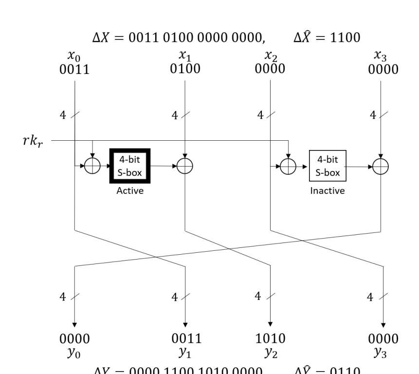
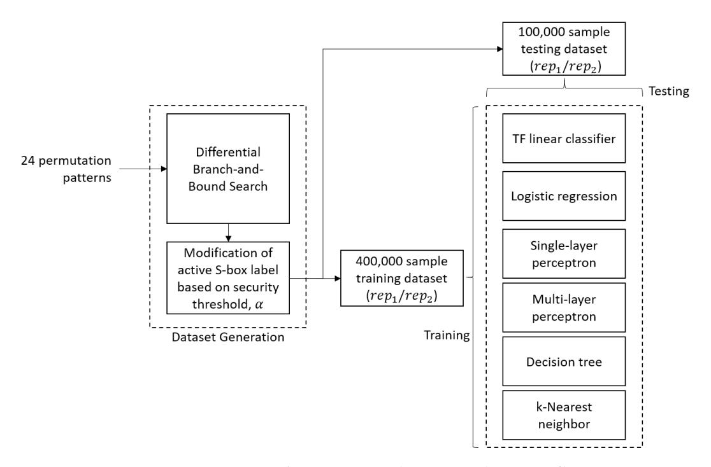
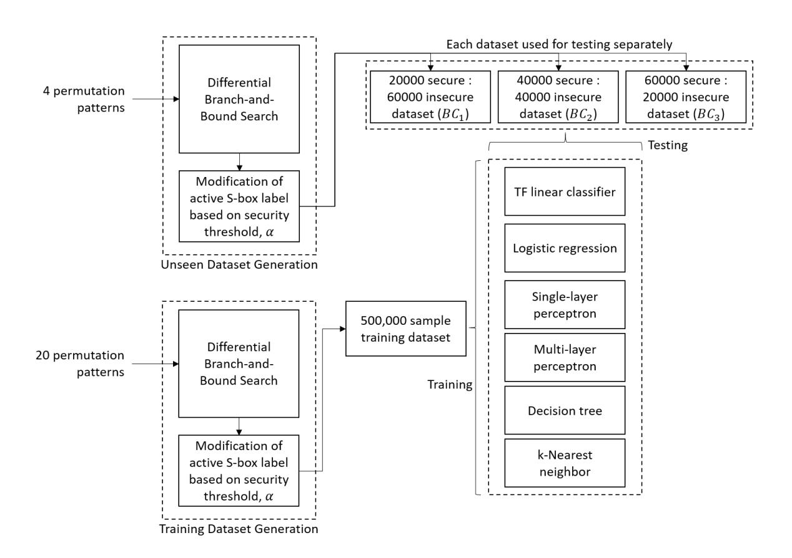
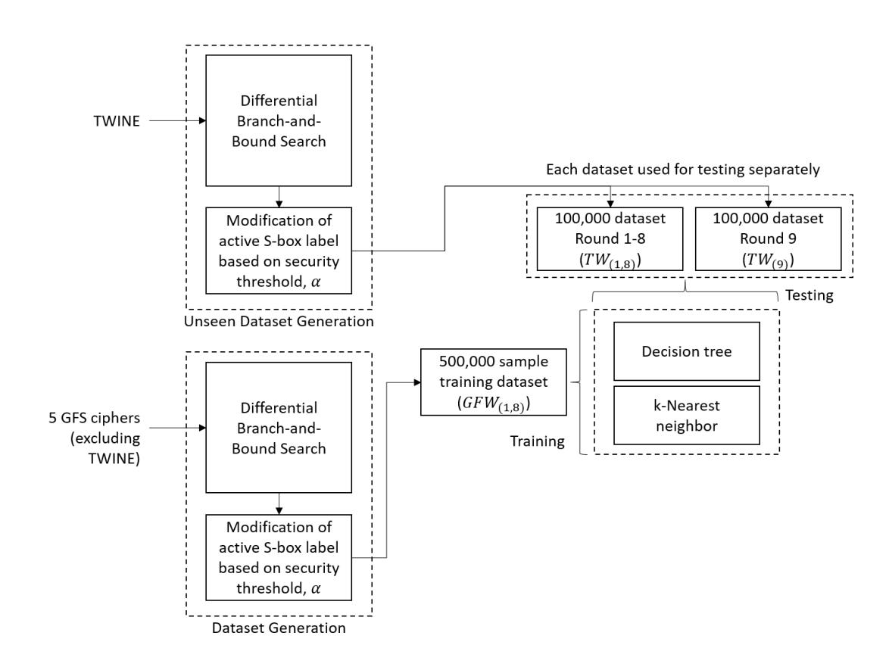
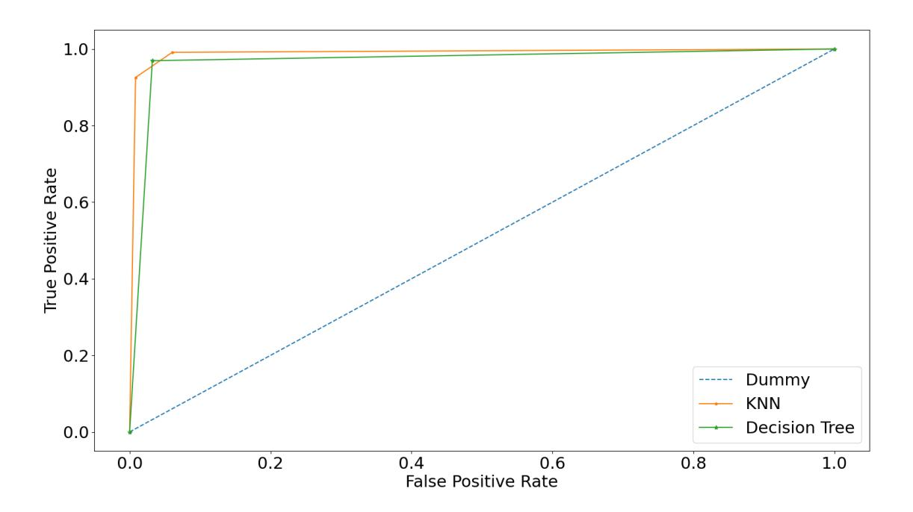
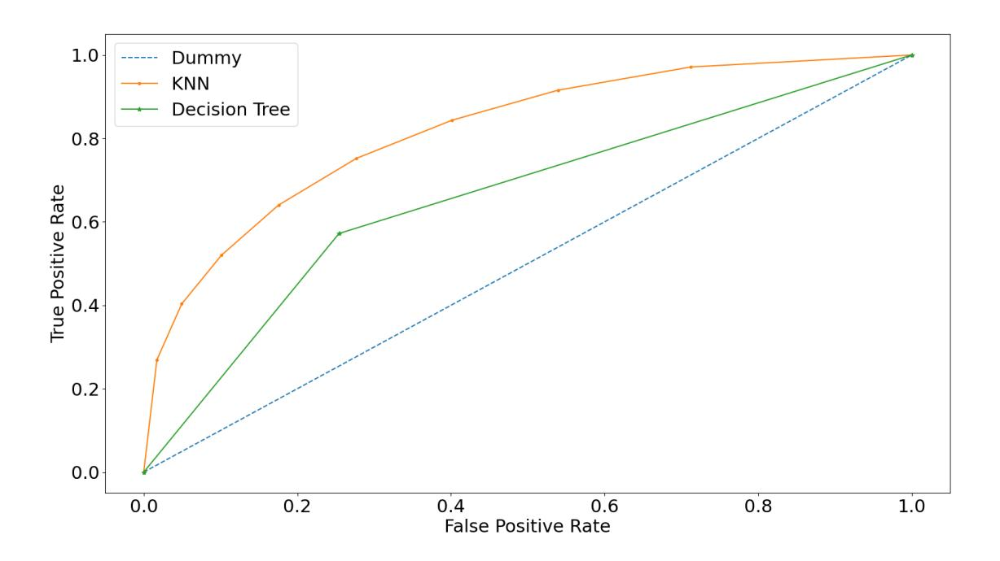
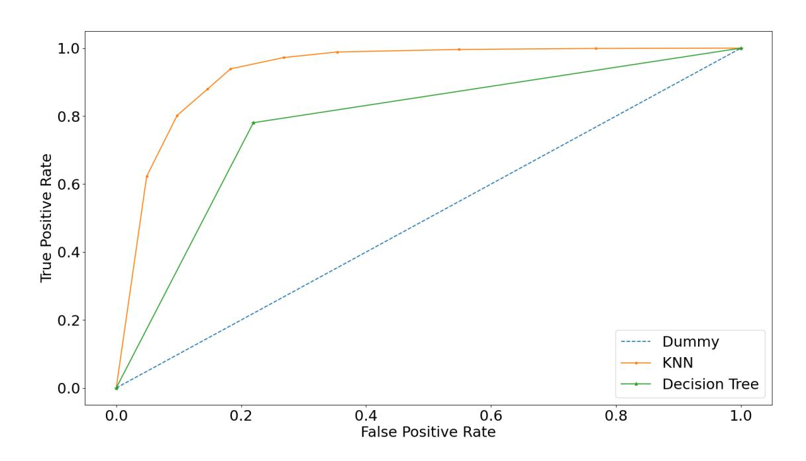

{0}------------------------------------------------

Date of publication xxxx 00, 0000, date of current version xxxx 00, 0000.

Digital Object Identifier 10.1109/ACCESS.2017.DOI

# Lightweight Block Cipher Security Evaluation based on Machine Learning Classifiers and Active S-boxes

# TING RONG LEE1, JE SEN TEH1, NORZIANA JAMIL2, JASY LIEW SUET YAN1, AND JIAGENG CHEN3.

2Department of Computing, College of Computing and Informatics, Universiti Tenaga Nasional

Corresponding author: Je Sen Teh (e-mail: jesen\_teh@usm.my), Norziana Jamil (e-mail: norziana@uniten.edu.my)

This work was supported in part by the Uniten BOLD2025 Research Grant 2021 entitled "A Deep Learning Approach to Block Cipher Security Evaluation" and the Uniten BOLD Publication Fund 2021.

**ABSTRACT** Machine learning has recently started to gain the attention of cryptographic researchers, notably in block cipher cryptanalysis. Most of these machine learning-based approaches are black box attacks that are cipher-specific. Thus, more research is required to understand the capabilities and limitations of machine learning when being used to evaluate block cipher security. We contribute to this body of knowledge by investigating the capability of linear and nonlinear machine learning classifiers in evaluating block cipher security. We frame block cipher security evaluation as a classification problem, whereby the machine learning models attempt to classify a given block cipher output as secure or insecure based on the number of active S-boxes. We also train the machine learning models with common block cipher features such as truncated differences, the number of rounds, and permutation pattern. Various experiments were performed on small-scale (4-branch) generalized Feistel ciphers to identify the best performing machine learning model for the given security evaluation problem. Results show that nonlinear machine learning models outperform linear models, achieving a prediction accuracy of up to 93% when evaluating inputs from ciphers that they have *seen* before during training. When evaluating inputs from other *unseen* ciphers, nonlinear models again outperformed linear models with an accuracy of up to 71%. We then showcase the feasibility of our approach when used to evaluate a real-world 16-branch generalized Feistel cipher, TWINE. By training the best performing nonlinear classifiers (k-nearest neighbour and decision tree) using data from other similar ciphers, the nonlinear classifiers achieved a 74% accuracy when evaluating differential data generated from TWINE. In addition, the trained classifiers were capable of generalizing to a larger number of rounds than they were trained for. Our findings showcase the feasibility of using simple machine learning classifiers as a security evaluation tool to assess block cipher security.

**INDEX TERMS** Active S-boxes, block cipher, cryptanalysis, machine learning, differential cryptanalysis, lightweight cryptography, TWINE

#### I. INTRODUCTION

**B** LOCK ciphers are symmetric-key encryption algorithms that require only one secret key for both encryption and decryption tasks. A plaintext undergoes multiple rounds of key-dependent transformations to produce a corresponding ciphertext. Block ciphers are designed using a variety of well-studied structures such as substitution-permutation networks (SPN), generalized Feistel structure (GFS) and Addition-Rotation-XOR (ARX). Block cipher

security is usually evaluated on a *trial-by-fire* basis, whereby newer ciphers will be subjected to various cryptanalytic attacks to ascertain their security levels. Resistance against differential cryptanalysis has become one of the de facto requirements when it comes to block cipher security. To aid the complex task of performing these attacks, researchers have used searching algorithms [1], mixed-integer linear programming [2] or boolean satisfiability solvers [3], [4] to identify differential trails that occur with sufficiently high

Multidisciplinary : Rapid Review : Open Access Journa

&lt;sup>3School of Computer, Central China Normal University

&lt;sup>1School of Computer Sciences, Universiti Sains Malaysia

{1}------------------------------------------------

probability to be used as statistical distinguishers in a key recovery attack. However, these algorithms become more computationally intensive as the number of rounds or block size increases, and still require niche cryptographic knowledge to design an accurate model of the cipher to be used as inputs.

Efforts to further ease the difficult task of cryptanalysis has led researchers to look into the application of machine learning. Rather than having cryptanalysts themselves design an accurate model of the cipher, machine learning algorithms can be trained to accurately model the cipher based on data generated from the cipher itself. This reduces cryptanalysis to a data-driven approach that requires minimal cryptographic expertise. Early applications mainly consisted of training machine learning models to emulate the behaviour of ciphers given the assumption of a fixed secret key. In [5], a neural network was trained to encrypt data as simplified DES (SDES). Then, the cryptanalyst would be able to extract secret key information given sufficient plaintext-ciphertext pairs. [6] extended this concept to decrypt ciphertexts of the full 64 bit DES without knowledge of the secret key. A similar attempt using neural networks was used to perform knownplaintext attacks on DES and Triple-DES in [7], whereby the neural networks were capable of decrypting ciphertexts without knowledge of the secret key. However, this approach has limited practicality as the neural networks were trained using plaintexts and ciphertexts corresponding to a specific key. If a different key is used, the model would have to be retrained using a separate dataset. The concept of emulating a cipher has been adopted for security evaluation purposes by [8]. In their work, the strength of a cipher is determined by how difficult it is for a neural network to learn a cipher's behavior.

A similar approach was used to cryptanalyze lightweight block ciphers, FeW and PRESENT [9], [10], with limited success. Neural networks were trained, validated and tested using plaintexts, ciphertexts, and intermediate round data which were all generated using the same encryption key. Unfortunately, the trained networks were unable to learn the behaviour of the block ciphers, achieving an accuracy of approximately 50%. Generally, the use of machine learning algorithms to perform a direct key recovery attack were only successful in older, classical ciphers. For example, [11] trained a neural network to extract the encryption keys of the Caesar and Vigenère poly-alphabetic and substitution ciphers. Generative adversarial networks were also used to crack these classical ciphers in [12].

A more practical approach is the use of machine learning algorithms as cryptographic distinguishers or to distinguish block cipher ciphertexts from random data [13]. The classification capabilities of machine learning algorithms have been used to identify cryptographic algorithms from ciphertexts [14]–[18]. Classifiers were trained using known ciphertexts generated from a set of five commonly used cryptographic algorithms. A high identification rate of 90% was achieved if the same key was used for both training and testing data. Another approach compared the performance of five different machine learning algorithms when distinguishing encrypted traffic from unencrypted traffic [19]. They found that the C4.5 decision tree-based classification algorithm performed the best, achieving a detection rate of up to 97.2%. [20], a neural network was used to distinguish between right and wrong subkey guesses, similar to how a differential or linear distinguisher would be used for key recovery in traditional cryptanalysis. When the neural network was trained using plaintext-ciphertext pairs generated from a wrong key guess, it will produce random outputs that greatly differ from a cipher's actual outputs, whereas training using data generated from a correct key guess will lead to outputs with fewer errors. This allows a cryptanalyst to distinguish between right and wrong key guesses. The approach was tested on a hypothetical Feistel cipher as a proof of concept. Neural networks have also been used to search for high probability differentials for the block cipher Serpent by modelling the search as a multi-level weighted directed graph [21].

[22] later introduced an attack on Speck32/64 by training a deep learning model to distinguish between random data and differential data generated from the cipher. The proposed method outperformed existing differential attacks in terms of time complexity. As the deep learning model was only trained using plaintext and ciphertext pairs, there is a possibility to further improve the performance of the attack by including other block cipher features as training data. In addition, as the attack basically treats the deep learning model as a black box, researchers are still unsure of what block cipher features were actually learned by the deep learning model. This was further investigated in [23] which hypothesized that the deep learning distinguisher was actually learning more than just differential cryptanalysis, but rather differentiallinear cryptanalysis. The effect of block cipher features on deep learning prediction accuracy was studied in [24], which trained deep learning models to predict the number of active S-boxes for GFS ciphers. Other deep learning distinguishers and attacks were also introduced against Simon, Speck, as well as non-Markov ciphers such as Gimli [25], [26].

So far, most machine learning or deep learning approaches have been cipher-specific rather than generalizable [5]–[10], [21]–[23], [25], [26]. A cipher-specific approach is one that would require the entire training process to be repeated if a different cipher needs to be analyzed. In addition, attacks that used machine or deep learning to directly perform key recovery did not give any advantage over random guessing [9], [10]. Those successful machine learning-based approaches were only applicable to a cipher with a reduced keyspace [26] , classical ciphers that are no longer in use [11], [12] or for algorithm identification rather than security evaluation [14]– [19]. Although there have been past approaches that are generalizable to more ciphers [8], [20], [24], these approaches all utilized deep neural networks (deep learning) rather than simpler, standard machine learning models.

{2}------------------------------------------------

#### A. CONTRIBUTION

In this paper, we propose a data-driven, generalizable security evaluation method that relies on common machine learning classifiers. The proposed machine learning-based method evaluates block cipher security based on the number of active S-boxes, a metric used to measure resistance against differential or linear cryptanalysis 1. Rather than predicting or extracting key information, we frame the security evaluation problem as a machine learning classification task, whereby machine learning models classify whether a given r-round truncated differential path is secure or insecure. We investigate the capability of both linear and nonlinear machine learning classifiers in solving this security evaluation problem. These classifiers were trained using various cipher features that include truncated input and output differences, permutation patterns, and the number of rounds. Data was generated using a modified Matsui's branch-and-bound algorithm [1]. Apart from determining the most suitable machine learning classifier and hyperparameters for the security prediction task, we also look into how data representation can affect prediction accuracy. Preliminary experiments were performed on 4-branch GFS ciphers to showcase the generalizability of the proposed approach to an entire class of block ciphers, rather than a specific one. An in-depth comparison of six classifiers (linear and nonlinear) was performed.

Our findings show that nonlinear classifiers outperform linear classifiers due to the nonlinear transforms involved in block ciphers, achieving a prediction accuracy of up to 93% when predicting *seen* cipher variants and up to 71% when predicting *unseen* cipher variants. We then apply the bestperforming classifiers to predict or label data obtained from full-scale (16-branch) lightweight GFS ciphers. We train two nonlinear classifiers (k-nearest neighbour and decision tree) using data from five 16-branch GFS ciphers. When labelling data samples from ciphers that the models have *seen* before, they were able to achieve an accuracy of up to 97%. When assessing another GFS cipher, TWINE which was not seen during training, the best performing classifier achieved an accuracy of up to 74%. Additionally, the classifiers were also able to accurately label data obtained from the 9th round of TWINE despite being trained with data from round 1-8 of the five GFS ciphers. This indicates that the trained classifier was able to generalize to a larger number of rounds than it has been trained for. Our findings and contributions can be summarized as follows:

- A data-driven, generalizable approach to evaluate block cipher security using simple machine learning classifiers rather than deep learning.
- An in-depth comparison between linear and nonlinear machine learning classifiers performed on small-scale (4-branch) GFS ciphers to identify the best classifiers for the security evaluation task.

- An investigation into how data representation of cipher features affects prediction performance, specifically when block cipher features are subdivided into multiple, smaller variables.
- Nonlinear machine learning models that achieve a classification accuracy of up to 97% for *seen* and 73% for *unseen* full-scale (16-branch) lightweight GFS ciphers such as TWINE. These nonlinear classifiers were also able to generalize to a larger number of rounds.

#### B. OUTLINE

The rest of this paper is structured as follows: Section II introduces preliminary information required to understand the proposed work. Sections III and IV then provide the detailed steps, experimental setup and results for the small-scale (4-branch) and full-scale (16-branch) GFS experiments respectively. Section V provides a discussion of our findings and their significance. The paper is concluded in Section VI which includes some future directions of this work.

#### **II. PRELIMINARIES**

# A. DIFFERENTIAL CRYPTANALYSIS AND ACTIVE S-BOXES

Differential cryptanalysis observes the propagation of an XOR difference of a pair of plaintexts (input difference) through a cipher to produce a corresponding pair of ciphertexts with a specific XOR difference (output difference). We define an input difference as

$$\Delta X = X' \oplus X" \tag{1}$$

$$\Delta X = [\Delta X_0, \Delta X_1, ..., \Delta X_{i-1}], \tag{2}$$

where X' and X" are two individual plaintexts. An output difference is similarly defined where Y' and Y'' are the corresponding ciphertexts. The pair,  $\{\Delta X, \Delta Y\}$  is known as a differential pair. For an ideal cipher, given any particular input difference  $\Delta X$ , the probability of any particular  $\Delta Y$  occurring will be exactly  $\frac{1}{2^b}$  where b is the block size. A successful differential attack requires a differential,  $\Delta X \to \Delta Y$  with a probability far greater than  $\frac{1}{2^b}$ .

An S-box is defined to be differentially active if its input is a non-zero difference. Rather than computing the concrete differential probability for a given differential pair, resistance against differential cryptanalysis can be estimated by calculating the number of active S-boxes. The estimated probability that input differences will be mapped to output differences can then be calculated based on the S-box's differential distribution table. The mapping of differences holds with a certain probability,  $2^{-p}$ . By taking into consideration the best-case (from the attacker's perspective) S-box differential probability, a block cipher is considered to be secure if  $2^{AS \times p} \geq 2^b$ , where AS denotes the total number of active S-boxes. Figure 1 depicts an example of S-box activation for a 4-branch GFS cipher, whereby the left S-box is active.

An interesting property of differential cryptanalysis that we leverage upon in this work is the effect of round keys,

&lt;sup>1Supplementary code for this paper is available at https://github.com/trlee/ml-block-cipher

{3}------------------------------------------------

FIGURE 1: 1 round of a 4-branch GFS with 4-bit S-box

rki being negated through the use of differences. Any random key can be used to generate differential pairs, thus the resulting dataset for machine learning experiments is not catered to a specific secret key. In addition, we are also able to generate an exhaustive dataset by taking advantage of truncated differentials [27]. We can truncate the input differences based on the size of the S-box. For example, plaintext or ciphertext differences for a b-bit block cipher with s-bit S-boxes can be truncated to t-bit differences, where (t = b s ). Thus, each bit in the truncated difference denotes a non-zero difference corresponding to each s-bit word in the plaintext (or ciphertext) block. An example of how a differential pair (∆X, ∆Y ) is mapped to a truncated differential pair (∆X, ˆ ∆Yˆ ) is shown in Figure 1. However, the use of such a truncated difference would only be applicable to block ciphers that use a word-based permutation rather than bitwise permutation.

### *B. MATSUI'S BRANCH-AND-BOUND DIFFERENTIAL SEARCH*

Matsui's branch-and-bound is an algorithm used for deriving the best differential or linear paths for differential and linear cryptanalysis. It is applicable to block ciphers that have S-box-like tables. The algorithm goes through all possible iterations of the differential paths, then prunes paths that have probabilities less than Bn. Bn is defined as the best probability the running algorithm has found so far. An initial value has to be set for Bn and it should be as close to the actual probability Bn as possible to eliminate more non-promising paths earlier on. The Bn is constantly updated according to the best probability of the paths found so far which effectively reduces the potential search space. The process is repeated until all the possible paths with respect to the branching rules and bounding criteria have been enumerated.

In the proposed work, we use a variant of Matsui's algorithm as described in [1]. We further simplify the algorithm as we only need the number of differentially active S-boxes rather than the concrete differential probability for our experiments. This greatly increases the speed of the search, which allows us to remove all bounding restrictions to generate large datasets for training and testing purposes. The dataset generated for the current study can be reproduced using the algorithm available at [https://github.com/jesenteh/](https://github.com/jesenteh/16b-gfs-as-search) [16b-gfs-as-search.](https://github.com/jesenteh/16b-gfs-as-search)

#### *C. GENERALIZED FEISTEL STRUCTURE*

GFS is the generalization of the Feistel structure that was first used in the block cipher Lucifer, the predecessor to DES. It divides an input into d blocks, where d > 2. As a proofof-concept, our proposed work is applied to a 4-branch GFS cipher (d = 4), similar to the one in Figure 1. We then extend our work to full-scale 16-branch (d = 16) GFS ciphers. By using a GFS cipher with a word-based permutation, we can use truncated differences in our experiments. A 4-branch GFS effectively represents ultralightweight block ciphers with 16- or 32-bit blocks depending on whether 4-bit or 8 bit S-boxes are used whereas a 16-branch GFS can represent a lightweight 64-bit block cipher such as TWINE or a 128 bit block cipher. Regardless of which, security analysis based on the number of active S-boxes is usually performed based on the highest differential probability for a given S-box. For example, TWINE and AES S-boxes have the best differential probabilities of 2 −2 and 2 −6 respectively.

# *D. MACHINE LEARNING CLASSIFIERS AND THE SECURITY PREDICTION TASK*

The proposed work investigates the performance of linear and nonlinear classifiers when predicting the security of block ciphers. Essentially, the goal is to have the classifiers learn the best hypothesis function (i.e. linear or nonlinear) to segregate the secure and insecure classes. A machine learning model refers to a trained classifier with specific features, machine learning algorithm and hyperparameters. This section describes the three linear and nonlinear classifiers used in our experiments.

# 1) Linear Classifiers

As its name suggests, linear classifiers solve classification tasks based on a linear combination of features. The goal of linear classifiers is to segregate, as accurately as possible, the training data into their respective classes using a linear function (i.e., a straight line). We utilize three linear classifiers in our experiments: Tensorflow (TF) Linear classifier, and *scikit-learn*'s logistic regression and single-layer perceptron.

Linear models predict the probability of a discrete value/label, otherwise known as a class, given a set of inputs. For the context of binary classification, the possible labels for the problem will only be 0 or 1. The linear model computes the input features with weights and bias. The weights indicate the direction of the correlation between the input features and the output label, whereas the bias acts as the offset in

{4}------------------------------------------------

determining the final value of the label, should its conditions be fulfilled.

Logistic regression models the probabilities of an observation belonging to each class using linear functions and is generally considered more robust than regular linear classifiers. Unlike a linear function used by a linear classifier, the logistic regression model uses what is referred to as a sigmoid function, and maps any real value of a problem into another value between the boundary of 0 and 1. In the case of machine learning, sigmoid functions are typically used for mapping the predictions of a model to probabilities. This structure is shared by both TF's linear classifier and scikitlearn's logistic regression models. Both models differ in terms of how the data is represented and used for training. In TF's linear classifier, training samples are pooled from the training dataset randomly in batches, and steps are defined by the total number of batch sampling that has to be performed before moving to the next epoch while *scikit-learn*'s logistic regression model fits the data directly and trains its model throughout the epochs.

Single-layer perceptron is a linear classifier based on a threshold function

$$f(x) = w(x) + b, (3)$$

where f(x) is the output value, x is a real-valued input vector, w is the weight of the vector and b is the bias. When it comes to a binary classification task, the threshold function classifies x as either a positive or negative instance, with the weight and vector being the primary variable in determining the label, and bias is an additional parameter that can possibly adjust the label. All aforementioned linear classifiers are tuned with respect to the following hyperparameters for optimal performance:

- *Stopgap*: The total number of iterations that the model needs to undergo with no improvements before stopping the training process early.
- *Epochs*: The total number of passes the model has to undergo throughout the training data batches.

## 2) Nonlinear Classifiers

Not all data can be segregated naturally using a linear function. A nonlinear classifier allows the machine learning model to learn a nonlinear function or decision boundary to best separate the training data into two classes. The nonlinear classifiers used in this study are *scikit-learn*'s k-nearest neighbors, decision tree and multi-layer perceptron.

k-nearest neighbor (KNN) is a type of instance-based learning that classifies new data based on majority voting of k number of training instances closest to it. Hyperparameters that can be tuned to optimize performance include:

- *NN*: The value of k as explained earlier. *NN* refers to the number of neighbors to be used for the k-neighbors query.
- *Distance*: This is measure used to determine the distance between two neighbors. The default Minkowski distance is used for all experiments.

- *Algo*: Algorithm used to compute the nearest neighbors for the model. Three options include *KDTree*, *BallTree* or brute force.
- LeafS: Leaf size passed to the *KDTree* or *BallTree*, which can affect the speed of the tree construction and query, as well as memory required.

Decision tree classifiers are used to predict a class or value of the target variable by learning simple decision rules inferred from the training data. The model operates on the basis of "branching" from one decision node to another deeper down until it finally reaches its desired output. Its parameters include:

- *Split*: The strategy used to choose the split on each node, which can be either *best* or *random*.
- LeafN : Maximum number of leaf nodes.
- *Sample Split*: Minimum amount of samples required to split an internal node.

Multi-layer perceptron (MLP) is a derivation of the perceptron model as described in Section II-D1, with added functions such as error functions and backpropagation to further improve the performance of the model. The hyperparameters that are tuned to optimize the model are as follows:

- *Stopgap*
- *Epochs*
- *Activation*: The function that determines the outputs of the nodes. The default rectified linear function is used for all experiments.
- *Hidden layers*: The number of hidden layers of the neural network.
- *Nodes per hidden layer*: The number of nodes per hidden layer. We use a default value of 100 nodes per hidden layer for all experiments.

#### **III. 4-BRANCH GFS EXPERIMENTS**

# *A. EXPERIMENTAL SETUP*

All experiments were performed on a computer with an Intel i5 2.4GHz CPU and 16GB RAM using Python 3.6.7, *scikitlearn* 0.22.2 and TensorFlow 2.2. Assessing block cipher security based on its features is a supervised learning problem which we framed as a binary classification task (1 for secure, 0 for insecure). We limit the scope of this paper to linear and nonlinear classifiers, where Tensorflow's (TF) linear classifier model, *scikit-learn*'s single-layer perceptron and logistic regression models were selected as linear classifiers, and KNN, decision tree and MLP were selected as nonlinear classifiers. To optimize performance, we perform hyperparameter tuning for each classifier. We also investigate the effect of data representation on prediction accuracy, specifically how the permutation patterns are represented.

To investigate the feasibility of the proposed approach, we first perform preliminary experiments on smaller-scale, 4-branch GFS ciphers before proceeding to their 16-branch counterparts. This allows us to generate a large amount of training/testing data within a practical amount of time for all possible permutation patterns. Each sample in the dataset

{5}------------------------------------------------

used to train the machine learning classifiers consists of block cipher-related features. They are labelled as secure or insecure depending on the number of active S-boxes associated with the particular sample. For the target 4-branch GFS ciphers, features include the truncated input difference  $\hat{X}$ , truncated output difference  $\hat{Y}$ , number of rounds, r and a word-based permutation pattern, P,  $\hat{X}$ ,  $\hat{Y}$  and r are features shared by any block cipher whereas P is commonly used in GFS ciphers. Each training sample essentially describes a truncated differential trail from X to Y for r number of rounds that goes through a GFS cipher with P permutation pattern. In our experiments, we use all 4! = 24 possible permutation patterns for a 4-branch GFS. This also implies that there are 24 possible variants of the GFS cipher. Each cipher variant can generate a large set of data samples which consists of its truncated differential paths for a different

number of rounds.

We utilize the branch-and-bound algorithm described in Section II-B to automatically generate the dataset. The output of the branch-and-bound algorithm is the number of active S-boxes, AS which will be used alongside a security margin threshold,  $\alpha$  to calculate the data labels (secure - 1, insecure - 0). If  $AS > r\alpha$ , the input sample is considered to be secure (labelled as 1) whereas if  $AS \leq r\alpha$ , the input sample is considered to be insecure (labelled as 0). In other words,  $\alpha$ dictates the minimum number of active S-boxes per round for a block cipher to be considered secure.  $\alpha$  can be configured based on the desired security margin that the cryptanalyst or designer requires. We want to ensure that  $\alpha$  is selected to be as strict as possible, while still allowing us to generate a balanced dataset for training purposes.  $\alpha = 1$  is a loose bound, whereby a 16-bit and 32-bit cipher will require at least 8 rounds and 16 rounds respectively to be considered secure. On the other hand, if  $\alpha = 2$ , a 16-bit and 32-bit cipher will require at least 4 rounds and 8 rounds respectively to be considered secure. Having  $\alpha = 2$  is too restrictive as it requires all S-boxes to be active in every round. Thus, to ensure that the security bound is sufficiently strict while capable of generating a balanced dataset, we have selected  $\alpha = 1.5$ . Some samples from the dataset are shown in Table 1 (note that actual values of AS are not used for training).

Our experiments can be divided into three main phases: baseline setup, permutation feature representation, and generalization. In Phase 1, a balanced dataset (50:50) of 500000 samples are generated from all 24 variants of the GFS cipher. Note that all examples are randomly sampled from an exhaustive dataset. A single integer is used to represent the entire permutation pattern. We denote this method of representation as  $rep_1$ . We compare the effect of the permutation representation on model performance in Phase 2 where  $rep_1$  is compared with  $rep_2$  which represents the permutation as separate features (one integer to map each truncated difference bit). As an example, the permutation pattern shown in Figure 1 can be represented by  $rep_1 = \{1230\}$  or by  $rep_2 = \{1, 2, 3, 0\}$ . For Phase 2, we use the same 500000 samples from all 24 variants of the GFS cipher but with the

permutation feature transformed into  $rep_2$ . Figure 2 depicts the experimental flow for both Phase 1 and Phase 2.

The third phase depicted in Figure 3 involves generalizing to unseen cipher variants. This phase reflects upon the capability of the trained machine learning classifiers to predict the security level of these unseen ciphers. We define an unseen cipher variant as a block cipher whose data was not used to train the machine learning classifiers. Thus, predicting the security of these unseen ciphers is analogous to predicting the security of newly proposed ciphers. In Phase 3, we test the classifiers' performance on three different unseen block ciphers denoted as  $BC_1$ ,  $BC_2$  and  $BC_3$ . For each of these block ciphers, we generate a dataset consisting of 80000 samples each. The difference between these datasets is the ratio of the number of secure to insecure samples (1:0). The ratios are summarized as:

- $BC_1$  1:3 (20000 to 60000)
- $BC_2$  1:1 (40000 to 40000)
- *BC*3 3:1 (60000 to 20000)

 $BC_1$  represents an insecure block cipher design,  $BC_2$  represents a moderately secure block cipher design whereas  $BC_3$  represents a secure block cipher design. In order to generate sufficient samples that fulfil these ratios, four block cipher variants (or equivalently, four permutation patterns) are used,  $P = \{0321, 1320, 2013, 3012\}$ . Thus, the training dataset consists of 500000 samples generated from only 20 out of the 24 variants of the GFS cipher. A summary of the three main phases are as follows:

- **Phase 1 Baseline Setup** The goal of this phase is to identify classifiers that are best suited for the prediction task. An 80:20 train-test split is performed on the dataset. Apart from the six classifiers, we also include a dummy classifier as a baseline model for performance comparison. Intuitively, the dummy classifier should have a prediction accuracy of 50% as it is a randomly guessing model that does not have an advantage in predicting security margins. For all classifiers, we investigate various hyperparameter combinations to maximize prediction performance.  $rep_1$  is used as the permutation representation.
- Phase 2 Permutation Feature Representation In this phase, we investigate the effect of  $rep_1$  and  $rep_2$  on prediction accuracy. We select the best performing linear and nonlinear models (along with the optimal hyperparameter values) from Phase 1 and repeat the train-test procedure using the dataset generated from  $rep_2$ .
- Phase 3 Generalizability to Unseen Cipher Variants This phase consists of three separate experiments. In each one, we first train the machine learning classifiers using 500000 samples from the 20 seen cipher variants. Then, we separately test the performance of the models using the dataset from  $BC_1$ ,  $BC_2$  and  $BC_3$ . Unlike Phase 1, the training dataset will not contain a single sample from these unseen cipher variants. Thus, the test

{6}------------------------------------------------

| TABLE 1: Sample Dataset where α = 1.5 |  |
|---------------------------------------|--|
|---------------------------------------|--|

| Xˆ   | ˆ Y | P    | r  | AS | Label    |
|------|--------|------|----|----|----------|
| 1010 | 1010   | 0123 | 8  | 16 | Secure   |
| 0111 | 1101   | 1203 | 11 | 17 | Secure   |
| 1111 | 0100   | 3021 | 12 | 9  | Secure   |
| 0010 | 0010   | 0123 | 5  | 5  | Insecure |
| 1111 | 0101   | 3021 | 12 | 6  | Insecure |
| 1101 | 1100   | 3120 | 11 | 6  | Insecure |

FIGURE 2: Experiment 1 - Phase 1/Phase 2 flow

results will indicate if the classifiers are able to generalize to "new" ciphers with varying levels of security. For this experiment, the type of permutation representation will be selected based on results obtained in Phase 2.

Let S, T P, T N, F P, and F N represent the total number of samples, true positives, true negatives, false positives and false negatives respectively. The following metrics are used to evaluate the performance of each classifier in which *secure* is the positive class and *insecure* is the negative class:

• Accuracy (Acc): The sum of true positives and true negatives divided by the total number of samples,

$$\frac{TP + TN}{S}. (4)$$

Accuracy refers to the fraction of predictions that the model has correctly made.

• Precision (Pre): True positives divided by the sum of true and false positives,

$$\frac{TP}{TP + FP}. (5)$$

Precision refers to the percentage of correctly classified samples out of the total number of predictions made. We record the precision for both positive and negative classes as they are both equally important from the cryptographic perspective.

• Recall (Rec): True positives divided by the sum of true positives and false negatives,

$$\frac{TP}{TP + FN}. (6)$$

It represents the percentage of correctly classified samples out of the total number of actual samples that belong to a particular class. Similar to precision, we record the recall for both positive and negative classes.

• F1 score (F1): The harmonic mean of precision and recall,

$$F1 = 2 \times \frac{Pre \times Rec}{Pre + Rec}.$$
 (7)

It is an accuracy measure that takes both precision and recall into consideration.

We analyze the performance of the proposed models based on accuracy and F1 score. Accuracy reflects upon how well the models generally perform in the prediction task whereas the F1 scores for each of the classes provide deeper insights into prediction bias.

#### *B. EXPERIMENTAL RESULTS*

### 1) Baseline Results

The prediction accuracy of the dummy classifier (50%) is used as a baseline to determine which models have truly learnt to perform the classification task. In general, all classifiers outperformed the dummy classifier with nonlinear classifiers outperforming linear ones. The majority of classifiers performed well, achieving accuracy values ranging from 69% to 93%. TF linear classifier underperformed (56% accuracy) with a distinct bias towards predicting samples as insecure. Although TF linear classifier and logistic regression are both based on the same machine learning algorithm, the difference in their data sampling methods leads to a significant difference in prediction results. As for nonlinear classifiers, deci-

{7}------------------------------------------------

FIGURE 3: Experiment 1 - Phase 3 flow

sion tree and KNN have less biased predictions as compared to MLP, which is biased towards the insecure class.

Overall, the best performing models are logistic regression for linear classifiers, and KNN and decision tree for nonlinear classifiers. A summary of the results is shown in Table 2 for which the optimal hyperparameters are listed below:

• TF Linear Classifier:

Stopgap = 350

Epochs = 750

• Other linear classifiers:

Stopgap = 1000

Epochs = 1000

• MLP:

Stopgap = 1000

Epochs = 1000

HiddenLayers = 4

*Neurons per hidden layer* = 100

• Decision Tree Classifier:

Split = random

LeafN = unlimited

SampleSplit = 2

• KNN:

NN = 4

Algo = BallT ree

LeafS = 40

## 2) Permutation Feature Representation

To study the impact of feature representation on prediction accuracy, we perform experiments on the best linear classifier (single-layer perceptron) and all nonlinear classifiers. The same set of optimal hyperparameter values described in Phase 1 were used. Results in Table 3 show that only MLP classifier has visible improvements when using rep2 rather than rep1. We conjecture that the use of rep2 improves upon the performance MLP due to its sensitivity to feature scaling. rep2 reduces the scale of the feature to a single integer in the range of [1,4] (although the number of features is increased), allowing MLP to converge faster and avoid being stuck in a local minimum. KNN and decision tree were able to achieve optimal performance regardless of how the permutations were presented, while single-layer perceptron saw a slight improvement. Based on these results, Phase 3 will rely on rep2 as it has the potential to improve the performance of certain classifiers without having an adverse effect on the rest.

## 3) Generalizability to *Unseen* Cipher Variants

The third phase is the most important one as it reflects upon the practicality of the proposed approach. We expect the classifiers to perform better when predicting *unseen* cipher variants that are insecure compared to secure ones. We also expect the classifiers to generally perform poorer at making security predictions on *unseen* cipher variants as compared to the ones that they have. As expected, all classifiers do not perform as well as in the baseline experiments in Phase 1. Although linear classifiers seem to be as accurate as nonlinear classifiers, a closer inspection of the F1 scores indicate that the predictions made by linear classifiers are highly biased. In fact, all of the linear classifiers predict nearly every sample as insecure, showing that linear classifiers cannot generalize well to *unseen* block ciphers.

As for nonlinear classifiers, decision tree and KNN have the most unbiased results when predicting all *unseen* cipher variants but their performance is inversely proportionate to the cipher's security level. Generally, KNN outperforms decision tree in all scenarios: 71% vs 69% for BC1, 62% vs 58% for BC2, and 56% vs 51% for BC3. We can conclude that the best classifier for predicting the security of an *unseen* cipher variant is KNN. A summary of the results is shown in Table 4

{8}------------------------------------------------

TABLE 2: Baseline Setup Results

| Model                   | F1 (Insecure) | F1 (Secure) | Accuracy |
|-------------------------|---------------|-------------|----------|
| Dummy Classfier         | 0.50          | 0.50        | 0.50     |
| TF Linear Classifier    | 0.71          | 0.15        | 0.56     |
| Logistic Regression     | 0.66          | 0.72        | 0.69     |
| Single-layer Perceptron | 0.71          | 0.71        | 0.71     |
| MLP                     | 0.73          | 0.75        | 0.74     |
| Decision Tree           | 0.95          | 0.85        | 0.93     |
| KNN                     | 0.95          | 0.83        | 0.92     |

TABLE 3: Comparison results for permutation feature representation

| Model         | Perm | F1 (Insecure) | F1 (Secure) | Accuracy |
|---------------|------|---------------|-------------|----------|
| Single-layer  | rep1 | 0.71          | 0.71        | 0.71     |
| Perceptron    | rep2 | 0.71          | 0.74        | 0.73     |
| MLP           | rep1 | 0.73          | 0.75        | 0.74     |
|               | rep2 | 0.86          | 0.84        | 0.84     |
| Decision Tree | rep1 | 0.95          | 0.85        | 0.93     |
|               | rep2 | 0.95          | 0.85        | 0.93     |
| KNN           | rep1 | 0.95          | 0.83        | 0.92     |
|               | rep2 | 0.95          | 0.83        | 0.92     |

for which all models use the same hyperparameter settings as in Phase 1, except for decision tree classifier (Split = best, LeafN = unlimited, SampleSplit = 2).

#### **IV. 16-BRANCH GFS EXPERIMENTS**

## *A. EXPERIMENTAL SETUP*

All experiments were performed on the same computer with an Intel i5 2.4GHz CPU and 16GB RAM using Python 3.6.7, *scikit-learn* 0.22.2 and TensorFlow 2.2. The computational time required to generate sufficient training data for 16 branch GFS ciphers is exponentially higher than that of 4-branch ciphers. It is also not practical to generate data for every possible permutation pattern (16! ≈ 2 × 1013 possibilities). Thus, we have selected six 16-branch GFS ciphers for our experiments. Apart from TWINE itself, which is the target cipher for generalization experiments, five others were selected based on permutation patterns with optimal cryptographic properties (full diffusion in 8 rounds and a minimum of 40 AS after 20 rounds). The six permutation patterns for the chosen GFS ciphers are shown in Table 5, with naming conventions for the permutations taken from [28]. The same modified branch-and-bound search is used to generate data samples. Due to their underlying permutation patterns, these ciphers already achieve full diffusion in 8 rounds. Thus, we limit the number of rounds to 8 to ensure that data can be generated in an exhaustive manner within a practical amount of time (approximately 1-2 days for 8 rounds). Generating the data in an exhaustive manner allows us to perform random sampling without imposing any limits to the inputs nor bounding criteria for the branch-andbound search. For each cipher, we generate 100000 samples, whereby 12500 samples are taken from each round of the cipher. To determine if the machine learning models are able to generalize to more rounds than they have been trained with, we generate an additional 100000 samples from the 9th round of TWINE. In total, we have three datasets that can be summarized as follows:

- GF S(1,8) 500000 samples from round 1-8 of five GFS ciphers (excluding TWINE)
- TW(1,8) 100000 samples from round 1-8 of TWINE
- TW9 100000 samples from round 9 of TWINE

The format of each data sample is similar to Table 1 but the input and output truncated differences as well as the permutation are 16 words rather than 4. In terms of feature representation, we found that using rep2 for both permutation pattern and truncated differences led to better results. As the maximum number of AS per round for a 16 branch GFS is 8, the security margin threshold is set to half, α = 4. For our experiments, we chose the KNN and decision tree classifiers as they were the two best performing models based on our findings in Section III. The experiments are divided into two main phases:

- Phase 1 Baseline Setup The goal of this phase (depicted in Figure 4) is to determine if machine learning classifiers are able to perform security predictions for *seen* 16-branch block ciphers. The GF S(1,8) dataset is used, to which an 80:20 train-test split is performed (400000 training samples, 100000 test samples). Hyperparameter tuning is performed to obtain the best performing models.
- Phase 2 Generalizability to TWINE The goal of this phase (depicted in Figure 5) is to determine if machine learning models can be used for security prediction for an actual *unseen* lightweight cipher, TWINE after being trained using data from the five other GFS ciphers. The GF S(1,8) dataset is used for training whereas TW(1,8) dataset is used for testing. We also compare the performance of the classifiers when performing predictions for more rounds than they have been trained for. This is performed by training the models using the GF S(1,8) dataset and using the TW9 dataset for testing. Hyperparameter tuning is performed again to obtain the best performing models.

We analyze the performance of the proposed models using

{9}------------------------------------------------

| TABLE 4: Generalization Results |  |
|---------------------------------|--|
|---------------------------------|--|

| Cipher | Model                   | F1 (Insecure) | F1 (Secure) | Accuracy |
|--------|-------------------------|---------------|-------------|----------|
|        | TF Linear Classifier    | 0.86          | 0           | 0.76     |
|        | Logistic Regression     | 0.86          | 0           | 0.76     |
|        | Single-layer Perceptron | 0.77          | 0.25        | 0.69     |
| BC1    | MLP                     | 0.83          | 0.20        | 0.71     |
|        | Decision Tree           | 0.69          | 0.64        | 0.69     |
|        | KNN                     | 0.82          | 0.26        | 0.71     |
|        | TF Linear Classifier    | 0.68          | 0           | 0.52     |
|        | Logistic Regression     | 0.68          | 0           | 0.52     |
|        | Single-layer Perceptron | 0.73          | 0.18        | 0.54     |
| BC2    | MLP                     | 0.69          | 0.16        | 0.56     |
|        | Decision Tree           | 0.77          | 0.36        | 0.58     |
|        | KNN                     | 0.66          | 0.52        | 0.62     |
| BC3    | TF Linear Classifier    | 0.44          | 0           | 0.28     |
|        | Logistic Regression     | 0.44          | 0           | 0.28     |
|        | Single-layer Perceptron | 0.29          | 0.43        | 0.36     |
|        | MLP                     | 0.43          | 0.54        | 0.48     |
|        | Decision Tree           | 0.46          | 0.48        | 0.51     |
|        | KNN                     | 0.51          | 0.62        | 0.56     |

| Name   | Permutation Pattern, P                |
|--------|---------------------------------------|
| No. 5  | 5,2,9,4,11,6,15,8,3,12,1,10,7,0,13,14 |
| No. 7  | 1,2,11,4,3,6,7,8,15,12,5,14,9,0,13,10 |
| No. 9  | 1,2,11,4,9,6,15,8,5,12,7,14,3,0,13,10 |
| No. 10 | 7,2,13,4,11,8,3,6,15,0,9,10,1,14,5,12 |
| No. 12 | 1,2,11,4,15,8,3,6,7,0,9,12,5,14,13,10 |
| TWINE  | 5,0,1,4,7,12,3,8,13,6,9,2,15,10,11,14 |

TABLE 5: 16-branch permutation patterns

the same accuracy and F1 metrics as in Section III. Additionally, we also compare the models based on the area under the receiver operating characteristic (AUROC). As the TW9 dataset is highly imbalanced (more secure samples as compared to insecure samples), AUROC will provide better performance insights.

# *B. EXPERIMENTAL RESULTS*

### 1) Baseline Results

The best performing decision tree and KNN models achieved an accuracy of 97% and 96% respectively. They were able to perform predictions with minimal biases for both the secure and insecure classes as shown in Table 6. These results also indicate that the machine learning models are better at security prediction for 16-branch GFS ciphers as compared to 4-branch ciphers. This can be attributed to the larger number of features involved during training, 49 features (Input difference - 16, Output difference - 16, Permutation - 16, Number of Rounds - 1) features as compared to 7 features (Input difference - 1, Output difference - 1, Permutation - 4, Number of Rounds - 1). Although decision tree slightly outperforms KNN in terms of accuracy, KNN is more accurate in predicting the secure class as depicted in the ROC curve shown in Figure 6. The optimal hyperparameters for both models are listed below:

• Decision Tree Classifier: Split = best LeafN = unlimited SampleSplit = 2

• KNN: NN = 2 Algo = KDT ree LeafS = 100

#### 2) Generalizability to TWINE

This phase is an important one as it reflects upon the feasibility of the proposed approach to be used in actual cryptanalytic settings. Naturally, we expect the nonlinear classifiers to make more accurate predictions for the five GFS ciphers that they have already *seen* as compared to TWINE. The results in Table 7 confirm this notion as both decision tree and KNN did not perform as well as in the baseline experiments when labelling data from TWINE. However, both models were still able to generalize well to TWINE, with KNN and decision tree achieving accuracy scores of 74% and 67% respectively. The ROC curve in Figure 7 clearly depicts that KNN discriminates between secure and insecure classes better than decision tree. The prediction results for TWINE in terms of both accuracy and bias were also better than the generalization results for the *unseen* 4-branch ciphers, BC1, BC2 and BC3.

GFS ciphers with strong permutation patterns such as TWINE will achieve full diffusion after 8 rounds. Thus, a dataset generated entirely from the 9th round will consist of mostly secure samples. This is the case for the TW9 dataset, which has 99918 secure samples but only 82 insecure samples. Due to the highly imbalanced nature of this dataset, a comparison of accuracy scores shown in Table 8 cannot reliably depict performance. However, the AUROC scores still indicate that KNN greatly outperforms decision tree (0.818 vs 0.659) in terms of correctly predicting the secure class. The ROC curve for the 9-round TWINE generalization experiment is shown in Figure 8. We can conclude that the best classifier for predicting the security of an *unseen* 16 branch cipher is KNN, even for a larger number of rounds than it has been trained for. These results were obtained after a second round of hyperparameter tuning which resulted

{10}------------------------------------------------

FIGURE 4: Experiment 2 - Phase 1 flow

FIGURE 5: Experiment 2 - Phase 2 flow

FIGURE 6: ROC curve for 16-branch baseline experiment (AUROCKNN = 0.989, AUROCDT = 0.969)

{11}------------------------------------------------

TABLE 6: Baseline Setup Results for 16-branch GFS

| Model         | F1 (Insecure) | F1 (Secure) | Accuracy |
|---------------|---------------|-------------|----------|
| Decision Tree | 0.97          | 0.97        | 0.97     |
| KNN           | 0.97          | 0.96        | 0.96     |

TABLE 7: Generalization Results (TWINE) for 16-branch GFS (Round 1-8)

| Model         | F1 (Insecure) | F1 (Secure) | Accuracy |
|---------------|---------------|-------------|----------|
| Decision Tree | 0.72          | 0.60        | 0.67     |
| KNN           | 0.79          | 0.68        | 0.74     |

FIGURE 7: ROC curve for TWINE (Round 1-8) experiment (AUROCKNN = 0.818, AUROCDT = 0.659)

in the same hyperparameter values for decision tree but different values for KNN (NN = 8, Algo = KDT ree, LeafS = 250).

# **V. DISCUSSION, PRACTICAL APPLICATIONS AND FUTURE WORK**

Overall, the experimental results showcased the feasibility of the proposed approach whereby classifiers were able to learn the relationship between block cipher features and security (with respect to the number of active S-boxes). Notably, results showed that nonlinear classifiers are better suited for assessing the security of block ciphers as compared to linear classifiers. Linear classifiers such as logistic regression can still be used if security assessment is performed on *seen* block cipher variants but they cannot generalize well to *unseen* ones. In general, we recommend the use of nonlinear classifiers, specifically KNN as it was able to achieve a 92% prediction accuracy for *seen* cipher variants. KNN was still able to generalize to *unseen* cipher variants with an accuracy of 71%, 62% and 56% for BC1, BC2 and BC3, respectively.

Contrary to intuition, the trained models (specifically decision tree and KNN) actually performed better when applied to 16-branch GFS ciphers. We conjecture that this is a result of the increased number of features being used for training (7× more features as compared to the 4-branch ciphers). Investigating the impact of specific features and the number of features will be left to future work. Our findings indicate that the prior recommendation of using KNN for the prediction task still holds valid. KNN was able to achieve 96% accuracy when performing predictions for the five *seen* GFS ciphers, and could generalize well to the *unseen* GFS cipher, TWINE with an accuracy of 74%. As compared to decision tree, KNN can better discriminate between secure and insecure classes based on its higher AUROC scores. In addition, KNN was able to make accurate predictions for 9 rounds of TWINE despite being trained with only round 1-8 data from the five GFS ciphers. This depicts the capability of KNN to generalize to more rounds than it has been trained for.

As the proposed approach can achieve high accuracy (up to 96%) when predicting the security of *seen* cipher variants, it can be used to aid cryptanalysts in identifying good differential pairs for cryptanalysis, filtering out insecure samples for further investigation. Although searching algorithms or SAT solvers can also be used for this reason, they require niche cryptographic expertise to develop efficient models for the differential search problem [23]. In contrast, the proposed approach is a data-driven approach that only requires access to the block cipher itself and requires only standard machine learning models, which simplifies the cryptanalysis task. The machine learning algorithms can perform predictions nearinstantaneously albeit with longer pre-processing (training) time. This is an efficiency trade-off between the *online* phase of an attack and its *pre-processing* phase. Apart from that,

{12}------------------------------------------------

TABLE 8: Generalization Results (TWINE) for 16-branch GFS (Round 9)

| Model         | F1 (Insecure) | F1 (Secure) | Accuracy |
|---------------|---------------|-------------|----------|
| Decision Tree | 0.01          | 0.88        | 0.78     |
| KNN           | 0.02          | 0.97        | 0.94     |

FIGURE 8: ROC curve for TWINE (Round 9) experiment (AUROCKNN = 0.934, AUROCDT = 0.781)

high accuracy when predicting *seen* cipher variants implies that additional cipher features such as permutation patterns can potentially be used to improve the accuracy of existing machine learning-based distinguishers.

The trained machine learning models can be used to quickly assess the security margin of *unseen* block ciphers or used as a tool to identify possible weaknesses early on in the design phase of a new cipher. In practice, these *unseen* block ciphers can be new designs or any other block cipher that the model was not trained with. This capability was depicted when the trained nonlinear classifiers were used on TWINE, achieving a prediction accuracy of 74%. A closer inspection of the F1 scores indicates that KNN is more likely to classify a cipher as insecure (F1 = 0.79) rather than secure (F1 = 0.68), and will do so more accurately. This implies that the predictions made by the classifier are more conservative (favouring insecure rather than secure), which is desirable in a practical setting. Its high AUROC scores (0.818-0.934) shows that it is also proficient at classifying secure samples correctly. These results support the reliability of the proposed model's predictions. The trained models will be useful for block cipher designers who wish to quickly discard poor designs without having to constantly redesign accurate models of those block ciphers to be fed into computationally intensive searching algorithms or solvers. However, we note that the proposed machine learning approach is not meant to replace these state-of-the-art cryptanalysis techniques entirely, but is merely an additional tool that can be used by both designers and cryptanalysts alike for security evaluation tasks.

The proposed work is not without its limitations. As of now, it remains to be seen if the same approach can be applied to other block cipher structures such as SPN and ARX. For these structures, the use of truncated differentials may not be feasible as these ciphers may involve bitwise permutations. Thus, generating an exhaustive dataset for training will be more time-consuming. Apart from that, the use of a single threshold value α is restrictive and may not accurately reflect the security requirements of different ciphers. With a more dynamic or flexible threshold, the performance of the models may be improved. The proposed approach sets a precedence for future work which includes:

- Exploring the use of deep learning to maximize the prediction accuracy for *unseen* cipher variants
- Investigating the use (and different representations) of other features such as S-box probability or diffusion properties of the permutation pattern to further optimize prediction accuracy
- Prediction of differential probability or the number of active S-boxes using regression techniques
- Improving the accuracy of existing machine learningbased distinguishers using additional cipher features
- Training a machine learning algorithm to predict the security of a larger block cipher using data from smaller block ciphers with the same structure
- Predicting the security of other block cipher structures such as SPN or ARX

#### **VI. CONCLUSION**

In this paper, we investigated the use of machine learning classifiers for block cipher security evaluation. Rather than being used for key recovery or as statistical distinguishers, machine learning classifiers were trained using generic block cipher features to predict if a block cipher is secure or

{13}------------------------------------------------

insecure based on the notion of active S-boxes. Thus, the proposed approach is not specific to a particular block cipher nor secret key, which is the case for the majority of existing methods. As a proof-of-concept, we performed experiments on 4-branch GFS ciphers. By using truncated differentials, we were able to exhaustively generate the training and testing datasets by using a modified version of Matsui's branchand-bound algorithm. We tested our approach by using three linear and three nonlinear classifiers. Experimental results concluded that nonlinear classifiers were better suited for the security prediction task, with decision tree and KNN depicting optimal performance. When predicting *seen* cipher variants, the decision tree classifier was able to achieve a prediction accuracy of up to 93% as compared to 92% for KNN. KNN outperformed decision tree when generalizing to *unseen* cipher variants, achieving an accuracy of up to 71% depending on the security level of the targeted cipher. We then applied the proposed approach on 16-branch GFS ciphers, including the lightweight block cipher, TWINE. We found that the decision tree and KNN classifiers were adept at making predictions for *seen* ciphers, achieving accuracy results ranging between 96-97%. When generalizing to an *unseen* block cipher (TWINE), KNN not only outperformed decision tree (74% versus 67%), there were also minimal biases as compared to predictions made for the smaller-scale ciphers. KNN could also make accurate predictions (accuracy of 94%, AUROC score of 0.934) for 9-round TWINE despite being trained using data obtained from only round 1- 8 of the five GFS ciphers. These results not only depict the feasibility of the proposed approach but also implies that the trained models can be used in practice to aid cryptanalysis efforts and to perform preliminary security evaluation for new block cipher designs.

#### **REFERENCES**

- [1] J. Chen, J. Teh, Z. Liu, C. Su, A. Samsudin, and Y. Xiang, "Towards accurate statistical analysis of security margins: New searching strategies for differential attacks," *IEEE Transactions on Computers*, vol. 66, no. 10, pp. 1763–1777, oct 2017.
- [2] N. Mouha, Q. Wang, D. Gu, and B. Preneel, "Differential and Linear Cryptanalysis Using Mixed-Integer Linear Programming," in *Information Security and Cryptology*. Springer Berlin Heidelberg, 2012, pp. 57–76.
- [3] R. Ankele and S. Kölbl, "Mind the gap a closer look at the security of block ciphers against differential cryptanalysis," in *Selected Areas in Cryptography – SAC 2018*. Springer International Publishing, 2019, pp. 163–190.
- [4] L. Sun, W. Wang, and M. Wang, "Accelerating the Search of Differential and Linear Characteristics with the SAT Method," *IACR Transactions on Symmetric Cryptology*, pp. 269–315, mar 2021.
- [5] K. Alallayah, M. Amin, W. AbdElwahed, and A. Alhamamii, "Applying neural networks for simplified data encryption standard (SDES) cipher system cryptanalysis," in *The International Arab Journal of Information Technology*, 2012, pp. 163–169.
- [6] A. Mundra, S. Mundra, J. S. Srivastava, and P. Gupta, "Optimized deep neural network for cryptanalysis of DES," *Journal of Intelligent & Fuzzy Systems*, vol. 38, pp. 5921–5931, 2020.
- [7] M. M. Alani, "Neuro-cryptanalysis of DES and triple-DES," in *Neural Information Processing*. Springer Berlin Heidelberg, 2012, pp. 637–646.
- [8] Y. Xiao, Q. Hao, and D. D. Yao, "Neural Cryptanalysis: Metrics, Methodology, and Applications in CPS Ciphers," in *2019 IEEE Conference on Dependable and Secure Computing (DSC)*. IEEE, nov 2019.

- [9] A. Jain and G. Mishra, "Analysis of lightweight block cipher FeW on the basis of neural network," in *Harmony Search and Nature Inspired Optimization Algorithms*. Springer Singapore, aug 2018, pp. 1041–1047.
- [10] G. Mishra, S. V. S. S. N. V. G. K. Murthy, and S. K. Pal, "Neural network based analysis of lightweight block cipher PRESENT," in *Harmony Search and Nature Inspired Optimization Algorithms*. Springer Singapore, aug 2018, pp. 969–978.
- [11] R. Focardi and F. L. Luccio, "Neural cryptanalysis of classical ciphers," in *ICTCS*, 2018.
- [12] A. N. Gomez, S. Huang, I. Zhang, B. M. Li, M. Osama, and L. Kaiser, "Unsupervised cipher cracking using discrete gans."
- [13] A. Perov, "Using Machine Learning Technologies for Carrying out Statistical Analysis of Block Ciphers," in *2019 International Multi-Conference on Engineering, Computer and Information Sciences (SIBIRCON)*. IEEE, oct 2019.
- [14] C. Tan and Q. Ji, "An approach to identifying cryptographic algorithm from ciphertext," in *2016 8th IEEE International Conference on Communication Software and Networks (ICCSN)*. IEEE, jun 2016.
- [15] K. V. Pradeepthi, V. Tiwari, and A. Saxena, "Machine Learning Approach for Analysing Encrypted Data," in *2018 Tenth International Conference on Advanced Computing (ICoAC)*. IEEE, dec 2018.
- [16] S. Pamidiparthi and S. Velampalli, "Cryptographic Algorithm Identification Using Deep Learning Techniques," in *Evolution in Computational Intelligence*. Springer Singapore, sep 2020, pp. 785–793.
- [17] V. Tiwari, K. V. Pradeepthi, and A. Saxena, *Identification of Cryptographic Algorithms Using Clustering Techniques*, K. S. Raju, A. Govardhan, B. P. Rani, R. Sridevi, and M. R. Murty, Eds. Springer Singapore, 2020.
- [18] W. Zhang, Y. Zhao, and S. Fan, "Cryptosystem Identification Scheme Based on ASCII Code Statistics," *Security and Communication Networks*, vol. 2020, pp. 1–10, dec 2020.
- [19] R. Alshammari and A. N. Zincir-Heywood, "Machine learning based encrypted traffic classification: Identifying SSH and skype," in *2009 IEEE Symposium on Computational Intelligence for Security and Defense Applications*. IEEE, jul 2009.
- [20] A. Albassal and A.-M. Wahdan, "Neural network based cryptanalysis of a feistel type block cipher," in *International Conference on Electrical, Electronic and Computer Engineering, 2004. ICEEC '04.* IEEE.
- [21] A. G. Bafghi, R. Safabakhsh, and B. Sadeghiyan, "Finding the differential characteristics of block ciphers with neural networks," *Information Sciences*, vol. 178, no. 15, pp. 3118–3132, aug 2008.
- [22] A. Gohr, "Improving attacks on round-reduced speck32/64 using deep learning," in *Advances in Cryptology – CRYPTO 2019*. Springer International Publishing, 2019, pp. 150–179.
- [23] A. Benamira, D. Gerault, T. Peyrin, and Q. Q. Tan, "A Deeper Look at Machine Learning-Based Cryptanalysis," in *Lecture Notes in Computer Science*. Springer International Publishing, 2021, pp. 805–835.
- [24] M. F. Idris, J. S. Teh, J. L. S. Yan, and W.-Z. Yeoh, "A Deep Learning Approach for Active S-Box Prediction of Lightweight Generalized Feistel Block Ciphers," *IEEE Access*, vol. 9, pp. 104 205–104 216, 2021.
- [25] A. Baksi, J. Breier, Y. Chen, and X. Dong, "Machine Learning Assisted Differential Distinguishers For Lightweight Ciphers (Extended Version)," Cryptology ePrint Archive, Report 2020/571, Dec. 2020, [https://eprint.iacr.org/2020/571.](https://eprint.iacr.org/2020/571) [Online]. Available: [https://eprint.iacr.](https://eprint.iacr.org/2020/571/20201202:014352) [org/2020/571/20201202:014352](https://eprint.iacr.org/2020/571/20201202:014352)
- [26] J. So, "Deep Learning-Based Cryptanalysis of Lightweight Block Ciphers," *Security and Communication Networks*, vol. 2020, pp. 1–11, jul 2020.
- [27] L. R. Knudsen, "Truncated and higher order differentials," in *Fast Software Encryption*. Springer Berlin Heidelberg, 1995, pp. 196–211.
- [28] T. Suzaki and K. Minematsu, "Improving the generalized feistel," in *Fast Software Encryption*. Springer Berlin Heidelberg, 2010, pp. 19–39.

{14}------------------------------------------------

TING RONG LEE received the B.Eng. degree (Hons.) majoring in Computer Science from Coventry University, INTI International College Penang in 2018. He has completed his pursuit of M.Sc in Computer Science from University Sains Malaysia in 2021. He is currently working software engineer in Clarion Malaysia Sdn. Bhd. His research interests include symmetric cryptography, cryptanalysis and machine learning.

JIAGENG CHEN received the B.S. degree from the School of Computer Science and Technology, Huazhong University of Science and Technology (HUST) in 2004 and received his M.S. and PhD of computer science from the School of Information Science, Japan Advanced Institute of Science and Technology (JAIST) in 2007 and 2012, respectively. He was working as an Assistant Professor in School of Information Science, Japan Advanced Institute of Science and Technology from 2012 to

2015. And currently, he is an Associate Professor at the Computer School of Central China Normal University. His research areas include cryptography, especially in the areas of algorithms, cryptanalysis and secure designs.

JE SEN TEH received the B.Eng. degree (Hons.) majoring in Electronics from Multimedia University, Malaysia in 2011, then received his M.Sc. and Ph.D. in Computer Science from Universiti Sains Malaysia in 2013 and 2017 respectively. He is currently working as a Senior Lecturer in Universiti Sains Malaysia under the School of Computer Sciences. His research interests include symmetric cryptography, cryptanalysis and chaos theory.

NORZIANA JAMIL received her PhD in Security in Computing (Cryptographic Hash Functions) in 2013. She is now serving Universiti Tenaga Nasional as an Associate Professor. Her area of specialization and interest includes Cryptography, security for Cyber-Physical Systems, security analytics and intelligence. She is an alumni of Leadership in Innovation Fellowship by UK Royal Academy of Engineering, a Project Leader and consultant of various cryptography and cyber se-

curity related research and consultancy projects, has been actively involving in advisory for cryptography and cyber security projects, and works with several international prominent researchers and professors.

JASY LIEW SUET YAN is a Senior Lecturer at the School of Computer Sciences, Universiti Sains Malaysia specializing in sentiment analysis, natural language processing, and machine learning. Her broader research interests include text mining, computational linguistics, and deep learning. She completed her Masters in Information Management and Ph.D. in Information Science and Technology from the School of Information Studies, Syracuse University, USA.