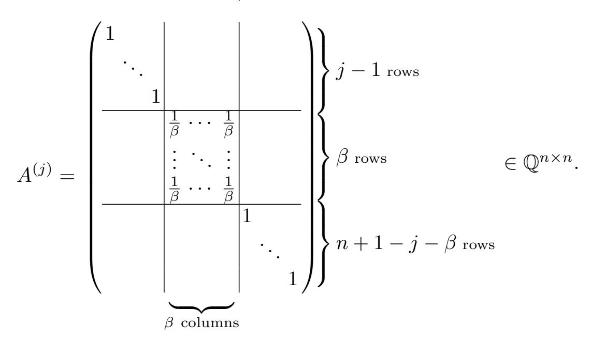

{0}------------------------------------------------

# <span id="page-0-0"></span>A Complete Analysis of the BKZ Lattice Reduction Algorithm\*

Jianwei Li\*\* and Phong Q. Nguyen\*\*\*

**Abstract.** We present the first rigorous dynamic analysis of BKZ, the most widely used lattice reduction algorithm besides LLL: we provide guarantees on the quality of the current lattice basis during execution. Previous analyses were either heuristic or only applied to theoretical variants of BKZ, not the real BKZ implemented in software libraries. Our analysis extends to a generic BKZ algorithm where the SVP-oracle is replaced by an approximate oracle and/or the basis update is not necessarily performed by LLL. As an application, we observe that in certain approximation regimes, it is more efficient to use BKZ with an approximate rather than exact SVP-oracle.

**Keywords:** Lattice Reduction · BKZ · Dynamical Systems · Enumeration.

## 1 Introduction

Lattices are discrete subgroups of  $\mathbb{R}^m$ . A lattice L is represented by a basis, i.e. a set B of linearly independent vectors  $\mathbf{b}_1, \ldots, \mathbf{b}_n$  in  $\mathbb{R}^m$  such that L is equal to the set  $L(\mathbf{b}_1, \ldots, \mathbf{b}_n) = \{\sum_{i=1}^n x_i \mathbf{b}_i, x_i \in \mathbb{Z}\}$  of all integer linear combinations of the  $\mathbf{b}_i$ 's. The integer n is the rank of L.

Given a basis B of L, the goal of a lattice reduction algorithm is to find a better basis, ideally formed by short and nearly orthogonal vectors, which has numerous applications in mathematics and computer science. The most widely used lattice reduction algorithm is also its simplest one: LLL [LLL82]. However, the quality of LLL is not sufficient for all applications, especially in cryptanalysis. This has led to the development of stronger blockwise reduction algorithms [Sch87, SE91, SH95, GHGKN06, GN08a, MW16, ABF<sup>+</sup>20, ALNS20, ABLR21, LW23], which generalize LLL using a special subroutine parameterized by an additional input parameter – the blocksize  $\beta$  – which impacts both the running time and the output quality: the higher  $\beta$  is, the slower the algorithm and the better the output basis.

The simplest such algorithm is the Blockwise Korkine-Zolotarev (BKZ) algorithm, published thirty years ago by Schnorr and Euchner [SE91]. Commonly available in software libraries (such as FP(y)LLL [FPL19, FPy19] and NTL [Sho20]), it has been used in many cryptanalyses and most lattice record

<sup>\*</sup> Acknowledgements: We thank Divesh Aggarwal, Martin R. Albrecht, Eamonn W. Postlethwaite, Damien Stehlé, Noah Stephens-Davidowitz, Michael Walter, and X-iaoyun Wang for helpful discussions. We also thank the reviewers for their helpful comments. This work was partly supported by the European Research Council (ERC) under the European Union's Horizon 2020 research and innovation programme (grant agreement No 885394).

<sup>\*\*</sup> Inria and DIENS, PSL. Email: jianwei.li@inria.fr

<sup>\* \* \*</sup> Inria and DIENS, PSL. Email: Phong.Nguyen@inria.fr

{1}------------------------------------------------

computations [\[LR10,](#page-36-6) [ADH](#page-34-3)+19, [DSvW21\]](#page-35-5). Its importance has grown as latticebased cryptography has emerged as the most popular candidate for post-quantum cryptography and homomorphic encryption: security estimates typically involve an assessment of the performances of BKZ. Yet, despite its simplicity, BKZ is still not very well understood from a theoretical point of view.

When BKZ terminates, the quality of the output basis is guaranteed [\[SE91,](#page-36-1) [GN08b\]](#page-35-6). But unfortunately, unless the blocksize is small, the number of subroutine calls does not seem to be polynomial: Gama and Nguyen [\[GN08b\]](#page-35-6) reported an exponential growth. Therefore, in practice [\[CN11,](#page-35-7) [AWHT16,](#page-35-8) [B-](#page-35-9)[SW18,](#page-35-9) [ADH](#page-34-3)+19, [FPL19,](#page-35-3) [FPy19,](#page-35-4) [Sho20,](#page-36-5) [ABF](#page-34-0)+20, [ABLR21\]](#page-34-2), except for small blocksizes (less than 25), one usually stops the execution of BKZ well before termination, without any rigorous worst-case guarantee on the output quality: Hanrot et al. published at CRYPTO '11 [\[HPS11\]](#page-35-10) the first provable analysis, but only for a theoretical variant BKZ' of BKZ, noting that "it does not seem easy to use (their) techniques to analyze" BKZ, meaning that the analysis [\[HPS11\]](#page-35-10) did not apply to the original BKZ algorithm nor the implementation of BKZ in software libraries [\[FPL19,](#page-35-3) [FPy19,](#page-35-4) [Sho20\]](#page-36-5), and it was unclear if it was even possible to extend their analysis to BKZ. BKZ' only has theoretical interest: it is not implemented in software libraries, because it would be much less efficient. In fact, until the present work, no rigorous dynamical analysis applicable to the actual BKZ was known, despite the popularity of BKZ. Instead, security estimates typically rely on Chen-Nguyen's heuristic modelization [\[CN11\]](#page-35-7) of BKZ.

Interestingly, Hanrot et al. [\[HPS11\]](#page-35-10) introduced the use of discrete dynamical systems to analyze blockwise reduction algorithms, which allows to analyze the quality of the current basis during execution. All prior analyses mimicked the analysis of LLL itself, based on an always-decreasing potential function, but this type of analysis can only analyze the final reduced basis output by the algorithm, not the current basis during execution [\[LLL82\]](#page-35-0).

Our Results. Building upon the work of Hanrot, Pujol and Stehl´e [\[HPS11\]](#page-35-10), we obtain the first rigorous dynamic analysis of BKZ: previous analyses were either heuristic (like [\[CN11,](#page-35-7) [BSW18\]](#page-35-9)) or only applied to a theoretical variant of BKZ (like [\[HPS11\]](#page-35-10)). Here, "dynamic" means that we provide guarantees on the quality of the current lattice basis during the execution of BKZ, not just after termination. The execution of BKZ consists of a sequence of tours: each tour modifies the basis using LLL and a subroutine which finds shortest nonzero vectors in a lattice of rank ≤ β. After each tour, all the basis vectors have been examined, and may have been modified.

Informally, our analysis proves that after a number of tours at most

<span id="page-1-1"></span><span id="page-1-0"></span>
$$\Theta\left(\frac{n^2}{\beta^2}\log n\right),\tag{1}$$

the first basis vector of BKZ is short, with Euclidean norm at most:

$$\gamma_{\beta}^{\frac{n-1}{2(\beta-1)} + \frac{\beta(\beta-2)}{2n(\beta-1)}} \operatorname{vol}(L)^{1/n}, \tag{2}$$

where γ<sup>β</sup> and vol(L) denote as usual Hermite's constant and the volume of L. More generally, our analysis shows that not only the first vector is short, also the whole basis is already reduced: namely, it gives upper bounds (which we omit in

{2}------------------------------------------------

this introduction) on the volume of the paralellepiped formed by the first i vectors of the basis for any  $i \in \{1, ..., n-1\}$ , which is related to Rankin's constant (see [GHGKN06]). Such volume bounds are useful to upper bound the heuristic running time of enumeration algorithms using partially BKZ-reduced bases. In particular, combined with (1), it validates the recursive BKZ preprocessing strategy implemented in BKZ 2.0 [CN11] and FP(y)LLL [FPL19, FPy19].

Prior to our work, the only comparable result was that of [HPS11], who showed that if a certain theoretical variant BKZ' of BKZ was given an input basis  $B_0$ , then after a number of tours at most

<span id="page-2-1"></span><span id="page-2-0"></span>
$$\Theta\left(\frac{n^2}{\beta^2} \left(\log n + \log\log\frac{\|B_0\|}{\operatorname{vol}(L)^{1/n}}\right)\right),\tag{3}$$

the first basis vector of BKZ' has norm essentially at most:

$$\nu_{\beta}^{\frac{n-1}{2(\beta-1)} + \frac{3}{2}} \operatorname{vol}(L)^{1/n}, \text{ where } \nu_{\beta} = \max_{1 \le i \le \beta} \gamma_i.$$
 (4)

In fact, our analysis not only applies to BKZ itself, it extends to a general family of BKZ algorithms, including [CN11, ADH+19, ABF+20, ABLR21] among others BKZ' and BKZ with weaker subroutines. Yet, our bounds (1) and (2) still improve upon (3) and (4), and are simpler. First, our bound (1) on a sufficient number of tours is independent of the input basis  $B_0$ . Next, our bound (2) is much closer to Mordell's inequality reached by [GN08a, MW16, ALNS20] using different algorithms. More precisely, the main multiplicative term  $\gamma_{\beta}^{\frac{n-1}{2(\beta-1)}}$  in (2) corresponds to Mordell's inequality  $\gamma_n \leq \gamma_{\beta}^{\frac{n-1}{\beta-1}}$  for any  $2 \leq \beta \leq n$  [Mor44]. However, (4) involves a potentially worse function  $\nu_{\beta} \geq \gamma_{\beta}$ , and the additional exponent  $\frac{\beta(\beta-2)}{2n(\beta-1)}$  in (2) is smaller than both  $\frac{3}{2}$  in (4) and the improved constant given in [HPS11, App. B in full version]: for any  $\beta = \Theta(n) < (1 - \ln 2)n$ , (2) implies the best provable polynomial Hermite factor of  $\gamma_{\beta}^{\frac{n-1}{2(\beta-1)} + \frac{\beta(\beta-2)}{2n(\beta-1)}}$ ; for any  $\beta = o(n)$ ,  $\frac{\beta(\beta-2)}{2n(\beta-1)}$  converges to zero; and for any  $\beta = O(n^{1-\varepsilon})$  where  $\varepsilon > 0$ , the multiplicative term  $\gamma_{\beta}^{\frac{\beta(\beta-2)}{2n(\beta-1)}}$  converges to one, which is better than all previously known bounds for (full) BKZ-reduced bases.

Furthermore, our work provides a better understanding of BKZ, by validating several design choices:

- The fact that each BKZ tour consists of consecutive iterations with nearly-maximal overlap is crucial for our analysis. At each iteration, the block examined by BKZ is shifted by only one position: our analysis would break down if it was even two positions (behaving worse in practice). This fact was also used in the analysis of [HPS11] for a certain theoretical variant BKZ' rather than BKZ itself.
- The initial LLL reduction in BKZ is crucial to make our bound (1) independent of the input basis.
- Our analysis clarifies by which algorithms LLL could be replaced, which might be useful for certain applications.

<span id="page-2-2"></span><sup>&</sup>lt;sup>1</sup> A patch to [HPS11]'s analysis allows to make (3) independent of the input basis  $B_0$  for a variant of BKZ' using ((3) for BKZ') itself. We clarify this observation in App. A.

{3}------------------------------------------------

As a secondary result, we deduce that in certain approximation regimes, BKZ with approximate-SVP oracles (be it sieving or enumeration) is more efficient than BKZ with exact-SVP oracles. This justifies the common practice of implementing BKZ with a subroutine which does not always output a shortest nonzero lattice vector [CN11, AWHT16, BSW18]: we show that the speed-up is larger when the SVP subroutine is enumeration with cylinder pruning [SH95, GNR10], by adapting the asymptotic analysis of Gama et al. [GNR10]. Intuitively, this can be explained as follows. When the SVP-oracle is replaced by an approximate-SVP-oracle, each oracle call is faster by a factor exponential in the blocksize (if the oracle is enumeration or sieving), but our general analysis of BKZ guarantees that the loss in the global approximation factor is limited: this is because the algorithm only cares that the oracle output is short in an absolute sense (which is quantified by the so-called Hermite factor), and not that the output is as short as possible. Overall, we obtain better time/quality trade-offs for certain approximation regimes.

Our analysis identifies precisely the minor properties that BKZ needs to succeed. This could potentially lead to better (practical) BKZ variants by optimizing such steps. For instance, our analysis suggests to replace the exact SVP enumeration oracle used in the BKZ variant [ABF<sup>+</sup>20] with an approximate one [ABLR21].

TECHNICAL OVERVIEW. Given as input a lattice basis B of rank n, a lattice reduction algorithm keeps modifying the current basis B until it is "reduced". For BKZ-type algorithms [SE91, HPS11, AWHT16, MW16, BSW18, ABF<sup>+</sup>20, ABLR21], these modifications can be structured as a sequence of tours, where each tour makes a limited number of elementary modifications.

To analyze the behaviour of BKZ', Hanrot  $et\ al.\ [HPS11]$  introduced the use of dynamical systems to study the quality of the current basis B at the end of each tour, rather than just at the end of the algorithm.

To do so, they defined a profile function  $\mathcal{P}$ , mapping any lattice basis onto a vector of  $\mathbb{R}^n$ . This function  $\mathcal{P}$  is chosen to satisfy two properties. First, if one knows  $\mathbf{u} \in \mathbb{R}^n$  with "small" entries such that  $\mathcal{P}(B) \leq \mathbf{u}$  component-wise, then the quality of B is guaranteed. Second, one can upper bound  $\mathcal{P}(B)$  during the execution of the algorithm. More precisely, [HPS11] built a matrix  $M \in \mathbb{R}^{n \times n}$  and a vector  $\mathbf{v} \in \mathbb{R}^n$  such that component-wise:

<span id="page-3-0"></span>
$$\mathcal{P}(B_k) \le \mathcal{P}(B_{k-1})M + \mathbf{v},\tag{5}$$

where  $B_k$  denotes the basis at the end of the k-th tour, and  $B_0$  is the input basis. [HPS11] then analyzes a discrete-time dynamical system  $\mathbf{x} \leftarrow \mathbf{x}M + \mathbf{v}$ . Its fixed point(s) and speed of convergence encode information on the output quality and runtime of BKZ', respectively. More specifically, if the dynamical system  $\mathbf{x} \leftarrow \mathbf{x}M + \mathbf{v}$  has a fixed point  $\mathbf{w} \in \mathbb{R}^n$ , then (5) can be rewritten as  $\mathcal{P}(B_k) - \mathbf{w} \leq (\mathcal{P}(B_{k-1}) - \mathbf{w})M$ . If all the entries of M are  $\geq 0$ , this implies  $\mathcal{P}(B_k) - \mathbf{w} \leq (\mathcal{P}(B_0) - \mathbf{w})M^k$ . Thus,

<span id="page-3-1"></span>
$$\mathcal{P}(B_k) \le \mathbf{w} + (\mathcal{P}(B_0) - \mathbf{w})M^k. \tag{6}$$

Thanks to properties of both M and  $\mathcal{P}(B_0) - \mathbf{w}$ , [HPS11] showed that  $(\mathcal{P}(B_0) - \mathbf{w})M^k$  converges to zero with an explicit vectorial upper bound. And the latter bound can be reinjected into (6) to guarantee the quality of  $B_k$  for all sufficiently large k, provided that the fixed point  $\mathbf{w}$  can also be bounded.

{4}------------------------------------------------

Our proof follows the same strategy as [\[HPS11\]](#page-35-10). The most difficult part is to show that an inequality like [\(5\)](#page-3-0) actually holds for BKZ, and not just for BKZ'. To explain the difficulty, it is helpful to outline the differences between BKZ and BKZ'. Each tour of BKZ and BKZ' respectively consists of n − 1 and n − β + 1 consecutive iterations, but a BKZ' iteration may only modify at most β consecutive basis vectors, whereas any BKZ iteration can potentially also modify all the front basis vectors before the latter ones, due to the use of a wide LLL reduction inside each BKZ iteration. [\[HPS11\]](#page-35-10) proved [\(5\)](#page-3-0) for BKZ' by establishing an analogue inequality for each BKZ' iteration. Unfortunately, such inequalities are unlikely to hold for a BKZ iteration, because of LLL. Intuitively, BKZ' is easier to analyze because it relies on a local HKZ-reduction which restricts the range of modifications at each iteration.

To solve this problem, we exploit two ideas. The first one shows that the impact of the LLL reduction is limited, thanks to the recent work [\[LN19\]](#page-35-12), which revisited the fundamental problem of computing a basis given only a lattice generating set: [\[LN19\]](#page-35-12) identified desirable properties of basis algorithms, which are shared by BKZ's LLL subroutine and are essential to preserve [\(5\)](#page-3-0) during the execution of BKZ. The second idea is loosely related to the BKZ simulator of Chen and Nguyen [\[CN11\]](#page-35-7): there, it was noted that the basis profile at the end of a tour could be heuristically guessed, even though not all entries of the profile were known at the end of each iteration during the execution of a tour. Similarly, we observe that each BKZ iteration nearly implies [\(5\)](#page-3-0): a vectorial inequality holds except for at most β consecutive coordinates. Yet, that is surprisingly enough to achieve a full [\(5\)](#page-3-0) at the end of each tour.

Our dynamical system is a variant of [\[HPS11\]](#page-35-10)'s dynamical system, but it has slightly better properties: it uses a slightly different profile function, has a unique fixed point, has better constants and is a bit simpler to analyze.

Related Work. BKZ is not the only blockwise reduction algorithm. In particular, both slide reduction [\[GN08a,](#page-35-2) [ALNS20\]](#page-34-1) and DBKZ [\[MW16\]](#page-36-3) achieve a slightly better bound than [\(2\)](#page-1-1), namely they reach Mordell's inequality: [\(2\)](#page-1-1) is replaced by γ n−1 2(β−1) β vol(L) <sup>1</sup>/n. However, both rely on duality, and therefore require computations of shortest (or nearly-shortest) vectors in dual blocks, which makes them experimentally less competitive than BKZ: until now, all the lattice record computations used a BKZ strategy [\[LR10,](#page-36-6) [ADH](#page-34-3)+19, [DSvW21\]](#page-35-5).

Neumaier introduced in [\[Neu17\]](#page-36-9) a simplification of [\[HPS11\]](#page-35-10)'s method to analyze dynamically blockwise reduction algorithms. Roughly speaking, this simplification replaces the dynamical system by a one-dimensional one: instead of using a vectorial inequality on consecutive profiles, [\[Neu17\]](#page-36-9) looks for a single inequality on the max-norm of consecutive profiles. This method simplifies the analysis by removing the need to study matrices, and was shown to be especially useful in the case of the DBKZ algorithm [\[MW16\]](#page-36-3) and LLL-type algorithms [\[N-](#page-36-10)[S16,](#page-36-10) [Neu17\]](#page-36-9). We stress that in these latter applications, the oracles all use the same rank.

However, BKZ uses oracles of varying rank (because the tail blocks have smaller ranks): our analysis can be rewritten using Neumaeir's strategy, but it turns out that the bounds obtained are noticeably worse. Intuitively, this is because the max-norm forgets that we have better bounds for certain coordinates (due to the tail blocks). Thus, Neumaier's method is simpler, but does not seem adapted to the situation of varying ranks, leading to much worse bounds, 

{5}------------------------------------------------

namely replacing (2) with the following bound:

$$\left(\prod_{\kappa=2}^{\beta} \gamma_{\kappa}^{\frac{1}{\kappa-1}}\right)^{\frac{n-1}{2(\beta-1)}} \operatorname{vol}(L)^{1/n}.$$

Note that  $\prod_{\kappa=2}^{\beta} \gamma_{\kappa}^{\frac{1}{\kappa-1}} = \Theta(\beta^{\frac{1}{2}\ln\beta})$  is asymptotically much larger than  $\gamma_{\beta} = \Theta(\beta)$ . We address this issue [Neu20] in details in Appendix B.

We stress that our work is a provable worst-case analysis of BKZ, so (2) does not intend to reflect the average-case behaviour of BKZ on typical lattices. For that setting, other works [CN11, BSW18] propose heuristic analyses of BKZ by essentially replacing Hermite's constant in (2) by some estimate based on the Gaussian heuristic: such analyses require to assume that projected lattices behave roughly like independent random lattices. Yet, our analysis can also provide theoretical guarantees under the same heuristic model: (2) can then be modified using the Gaussian heuristic, thanks to elementary inequalities shared by both Hermite's constant and some versions of the Gaussian heuristic. In particular, if we plug the heuristic estimates used by the BKZ simulator [CN11] into our dynamical system, the bounds we obtain are not very far from the output of the BKZ simulator, which illustrates the interest of dynamical systems.

ROADMAP. Sect. 2 recalls background and usual notation. Sect. 3 presents our main result: the analysis of BKZ using the dynamical systems framework of [HPS11]. In Sect. 4, we show how to adapt the analysis to study the practical behaviour of BKZ, when the worst-case inequalities based on Hermite's constant are replaced by inequalities based on the Gaussian heuristic. These stronger inequalities are directly inspired by results from random lattices theory, and give rise to better bounds. Sect. 5 deals with our secondary result: we show that enumeration with cylinder pruning [SH95, GNR10] is exponentially faster for approximate-SVP than for exact-SVP, and exploit this speed-up in the context of BKZ. In App. B, we explain how Neumaier's method can be adapted to BKZ, but leads to worse bounds.

### <span id="page-5-0"></span>2 Background

We use row-representation of both vectors and matrices: bold lower case letters and upper case letters denote row vectors and matrices, respectively. The *i*-th row and *j*-th column of a matrix M are denoted by  $\mathbf{m}_i$  and  $M|_j$  respectively, when no confusion can arise. The *i*-th entry of an *n*-dimensional vector  $\mathbf{v}$  is denoted by  $v_i$ . The *n*-dimensional row vector with each entry 1 is denoted by  $\mathbf{1}_n$ . The  $n \times n$  identity matrix is denoted by  $\mathbf{1}_{n \times n}$ . The set of  $n \times m$  matrices with coefficients in the ring  $\mathbb{A}$  is denoted by  $\mathbb{A}^{n \times m}$ , and we identify  $\mathbb{A}^m$  with  $\mathbb{A}^{1 \times m}$ . For a matrix  $B = (\mathbf{b}_1, \dots, \mathbf{b}_n)$  of n rows, we let  $||B|| = \max\{||\mathbf{b}_1||, \dots, ||\mathbf{b}_n||\}$ , where  $||\cdot||$  is the Euclidean norm. If the rows of B generate a lattice, we denote it by L(B) or  $L(\mathbf{b}_1, \dots, \mathbf{b}_n)$ . We stipulate  $\log(\cdot) := \log_2(\cdot)$  and  $\ln(\cdot) := \log_e(\cdot)$ .

For an  $n \times n$  matrix M, we denote its spectral norm by  $||M||_2$ . We write  $M \geq 0$  if all the entries of M are  $\geq 0$ . For two vectors  $\mathbf{u}, \mathbf{v} \in \mathbb{R}^n$ , we write  $\mathbf{u} \leq \mathbf{v}$  if the inequalities hold componentwise. We will use the key elementary property: if  $\mathbf{u} \leq \mathbf{v}$  and  $M \geq 0$ , then  $\mathbf{u}M \leq \mathbf{v}M$ .

{6}------------------------------------------------

#### <span id="page-6-1"></span>2.1 Gram-Schmidt Orthogonalization

Let  $B = (\mathbf{b}_1, \dots, \mathbf{b}_n) \in \mathbb{R}^{n \times m}$  be a basis of a lattice L. Lattice algorithms rely on the orthogonal projections  $\pi_i : \mathbb{R}^m \mapsto \operatorname{span}(\mathbf{b}_1, \dots, \mathbf{b}_{i-1})^{\perp}$  for  $i = 1, \dots, n$ . The *Gram-Schmidt orthogonalization* (GSO) of B is  $B^* = (\mathbf{b}_1^*, \dots, \mathbf{b}_n^*)$  where the Gram-Schmidt vector  $\mathbf{b}_i^*$  is  $\pi_i(\mathbf{b}_i)$ . Then  $\mathbf{b}_1^* = \mathbf{b}_1$  and  $\mathbf{b}_i^* = \mathbf{b}_i - \sum_{j=1}^{i-1} \mu_{i,j} \mathbf{b}_j^*$  for  $i = 2, \dots, n$ , where  $\mu_{i,j} = \frac{\langle \mathbf{b}_i, \mathbf{b}_j^* \rangle}{\langle \mathbf{b}_j^*, \mathbf{b}_j^* \rangle}$ .

The *volume*  $\operatorname{vol}(L)$  of the lattice L is the volume  $\operatorname{vol}(B)$  of the parallelepiped spanned by the basis  $B: \operatorname{vol}(L) = \operatorname{vol}(B) = \prod_{k=1}^{n} \|\mathbf{b}_{k}^{*}\|$ .

The GSO can also be extended to linearly dependent vectors, in which case some  $\mathbf{b}_i^*$  will be zero [LN19].

**Profiles.** The projected block  $(\pi_i(\mathbf{b}_i), \pi_i(\mathbf{b}_{i+1}), \dots, \pi_i(\mathbf{b}_j))$  is denoted by  $B_{[i,j]}$ . Then  $B_{[1,j]} = (\mathbf{b}_1, \dots, \mathbf{b}_j)$  and  $\operatorname{vol}(B_{[i,j]}) = \prod_{k=i}^{j} \|\mathbf{b}_k^*\| = \operatorname{vol}(B_{[1,j]})/\operatorname{vol}(B_{[1,i-1]})$ . In order to assess the quality of bases, [HPS11] used two profiles  $(\log \|\mathbf{b}_1^*\|, \dots, \log \|\mathbf{b}_n^*\|)$  and  $(\log \operatorname{vol}(B_{[1,1]}), \dots, \log \operatorname{vol}(B_{[1,n]})^{1/n})$ . We use two slightly different but closely related profiles, which we call the *Gram-Schmidt* and *Rankin profiles*:

$$\mathcal{G}(B) = (\mathcal{G}_1(B), \mathcal{G}_2(B), \dots, \mathcal{G}_n(B)) \in \mathbb{R}^n \text{ with each } \mathcal{G}_i(B) = \log \frac{\|\mathbf{b}_i^*\|}{\operatorname{vol}(L)^{1/n}},$$

$$\mathcal{R}(B) = (\mathcal{R}_1(B), \mathcal{R}_2(B), \dots, \mathcal{R}_n(B)) \in \mathbb{R}^n \text{ with each } \mathcal{R}_i(B) = \log \frac{\operatorname{vol}(B_{[1,i]})}{\operatorname{vol}(L)^{i/n}}.$$

These profiles only depend on the  $\|\mathbf{b}_i^*\|$ 's: their first coordinate measures the norm of the first basis vector. The Gram-Schmidt profile  $\mathcal{G}(B)$  measures these norms in logarithmic scale, whereas the Rankin profile  $\mathcal{R}(B)$  upper bounds the Rankin invariants [GHGKN06] of the lattice. We have:  $\sum_{i=1}^n \mathcal{G}_i(B) = \mathcal{R}_n(B) = 0$  and the scale invariance  $\mathcal{G}(B) = \mathcal{G}(\rho \cdot B)$  and  $\mathcal{R}(B) = \mathcal{R}(\rho \cdot B)$  for any real  $\rho \neq 0$ . Notice that  $\mathcal{G}(B)$  can be linearly transformed into  $\mathcal{R}(B)$ , and reciprocally, namely  $\mathcal{R}(B) = \mathcal{G}(B)E$  and  $\mathcal{G}(B) = \mathcal{R}(B)E^{-1}$  via the upper triangular matrix E and its inverse:

<span id="page-6-0"></span>
$$E = \begin{pmatrix} 1 & 1 & 1 & \cdots & 1 \\ 1 & 1 & \cdots & 1 \\ & 1 & \cdots & 1 \\ & & \ddots & \vdots \\ & & & 1 \end{pmatrix} \in \mathbb{Z}^{n \times n} \text{ and } E^{-1} = \begin{pmatrix} 1 & -1 \\ & 1 & -1 \\ & & \ddots & \ddots \\ & & & 1 & -1 \\ & & & & 1 \end{pmatrix} \in \mathbb{Z}^{n \times n}.$$
 (7)

## 2.2 Lattices

Hermite's constant. Hermite's constant of dimension n is the maximum  $\gamma_n = \max \left(\lambda_1(L)/\operatorname{vol}(L)^{1/n}\right)^2$  over all n-rank lattices L, where  $\lambda_1(L) = \min_{\mathbf{v} \in L \setminus \{\mathbf{0}\}} \|\mathbf{v}\|$  is the first minimum of L. The exact value of  $\gamma_n$  is known for  $1 \le n \le 8$  and n = 24. It asymptotically satisfies [CS87, MH73]:  $\frac{n}{2\pi e} + \frac{\log(\pi n)}{2\pi e} \le \gamma_n \le \frac{1.744n}{2\pi e} + o(n)$ . Primitive vector. A nonzero vector  $\mathbf{p}$  in a lattice L is primitive for L if and only if it can be extended to a basis of L. In particular, a nonzero vector  $\mathbf{p} \in \mathbb{Z}^n$  is primitive for  $\mathbb{Z}^n$  if and only if it can be extended to a unimodular matrix. Lattice reduction. Let  $B = (\mathbf{b}_1, \dots, \mathbf{b}_n)$  be a basis of a lattice L.

B is size-reduced if its GSO satisfies:  $|\mu_{i,j}| \leq \frac{1}{2}$  for all  $1 \leq j < i \leq n$ . For  $\xi \in (\frac{1}{4}, 1]$ , B is  $\xi$ -LLL-reduced if it is size-reduced and every 2-rank projected block  $B_{[i,i+1]}$  satisfies Lovász's condition:  $\xi \|\mathbf{b}_i^*\|^2 \leq \|\mu_{i+1,i}\mathbf{b}_i^* + \mathbf{b}_{i+1}^*\|^2$  for  $1 \leq 1$ 

{7}------------------------------------------------

i < n. In such a case, it is well-known that  $\mathcal{R}(B)$  can be upper bounded independently of B, namely  $\mathcal{R}(B) \le \left(\frac{i(n-i)}{4}\log\frac{4}{4\xi-1}\right)_{1\le i\le n}$  ([PT08, Eq. (3)]). The LLL algorithm [LLL82] can efficiently size-reduce a basis and compute an LLL-reduced basis.

B is SVP-reduced if  $\|\mathbf{b}_1\| = \lambda_1(L)$ . There is a natural relaxation with  $\delta \geq 1$ : B is  $\delta$ -SVP-reduced if  $\|\mathbf{b}_1\|^2 \leq \delta \times \lambda_1(L)^2$ . B is HKZ-reduced if it is size-reduced and  $B_{[i,n]}$  is SVP-reduced for  $i=1,\ldots,n$ . B is  $\beta$ -BKZ-reduced [Sch87] if it is size-reduced and  $B_{[i,\min\{i+\beta-1,n\}]}$  is SVP-reduced for  $i=1,\ldots,n$ . There is a relaxed variant: B is  $(\delta,\beta)$ -BKZ-reduced [SE91] if it is size-reduced and  $B_{[i,\min\{i+\beta-1,n\}]}$  is  $\delta$ -SVP-reduced for  $i=1,\ldots,n$ .

**SVP-oracle**. A  $\delta$ -SVP-oracle with relaxation factor  $\delta \geq 1$  is any algorithm which, given as input a  $\beta$ -rank lattice  $\Lambda$  with basis B, outputs a primitive vector  $\alpha$  for  $\mathbb{Z}^{\beta}$  such that  $\|\alpha B\|^2 \leq \delta \times \lambda_1(\Lambda)^2$ . Then  $\|\alpha B\| \leq \sqrt{\delta \gamma_{\beta}} \times \operatorname{vol}(\Lambda)^{1/\beta}$ . The LLL algorithm [LLL82] can efficiently achieve  $\|\alpha B\| \leq 2^{(\beta-1)/4} \times \operatorname{vol}(\Lambda)^{1/\beta}$  [LLL82, Eq. (1.9)]. So, one could restrict  $1 \leq \delta \leq \frac{2^{(\beta-1)/2}}{\gamma_{\beta}}$  (e.g. in Th. 3).

### 2.3 The BKZ Algorithm

We recall the (original) BKZ algorithm introduced by Schnorr and Euchner [SE91] in Alg. 1. It computes  $(\delta, \beta)$ -BKZ-reduced bases in high rank, using an exact SVP-oracle in rank  $\leq \beta$  as a subroutine and running the LLL algorithm to remove the linear dependency right after inserting a lattice vector (found by the oracle) in the current basis.

#### Algorithm 1 BKZ: Schnorr-Euchner's BKZ algorithm [SE91]

```
Input: A blocksize \beta \in (2, n), a relaxation factor \delta \in (1, 2), and a basis B =
     (\mathbf{b}_1,\ldots,\mathbf{b}_n) of a lattice L in \mathbb{Z}^m.
Output: A (\delta, \beta)-BKZ-reduced basis of L.
 1: z \leftarrow 0; j \leftarrow 0; \frac{1}{\delta}-LLL-reduce B
 2: while z < n - 1 do
        j \leftarrow (j \mod (n-1)) + 1; n_j \leftarrow \min\{j + \beta - 1, n\}; h \leftarrow \min\{j + \beta, n\}
 3:
        Run an enumeration for L(B_{[j,n_j]}) to find (\alpha_j,\ldots,\alpha_{n_j})\in\mathbb{Z}^{n_j-j+1} and compute
 4:
        \mathbf{b} = \sum_{i=j}^{n_j} \alpha_i \mathbf{b}_i such that \|\pi_j(\mathbf{b})\| = \lambda_1(L(B_{[j,n_j]}))
        if \|\mathbf{b}_i^*\|^2 > \delta \times \|\pi_i(\mathbf{b})\|^2 then
 5:
            z \leftarrow 0; \frac{1}{\delta}-LLL-reduce (\mathbf{b}_1, \dots, \mathbf{b}_{j-1}, \mathbf{b}, \mathbf{b}_j, \dots, \mathbf{b}_h) at stage j
 6:
 7:
         else
            z \leftarrow z + 1; 0.99-LLL-reduce (\mathbf{b}_1, \dots, \mathbf{b}_h) at stage h - 1
 8:
         end if //Due to LLL calls, B_{[j,n_j]} may no longer be \delta-SVP-reduced right after
 9:
         this step.
10: end while
                         //It is folklore in practice to allow \delta = 1 and run (say,) 0.99-LLL-
11: return B.
     reductions at Steps 1 and 6.
```

<span id="page-7-3"></span>Here, the variable z counts the number of indices j such that  $B_{[j,n_j]}$  is  $\delta$ -SVP-reduced, then "z = n - 1" on termination means that the current basis is already  $(\delta, \beta)$ -BKZ-reduced; "stage j" at Step 6 means to run LLL already from index j: this is the same as running LLL because  $(\mathbf{b}_1, \ldots, \mathbf{b}_{j-1})$  is already LLL-reduced right before Step 6.

{8}------------------------------------------------

Originally, the SVP subroutine implemented in [SE91] was the simplest form of lattice enumeration, but it is now replaced by better subroutines, such as pruned enumeration [GNR10] in BKZ 2.0 [CN11]/FP(y)LLL, enumeration in rank  $\kappa$  with extended preprocessing in "blocksize"  $\lceil (1+c) \cdot \kappa \rceil$  in [ABF<sup>+</sup>20]'s BKZ variant for some small constant  $c \geq 0$ , and (asymptotically) faster sieving in G6K [ADH<sup>+</sup>19]. In practice, BKZ is typically implemented with an approximate (rather than exact) SVP-oracle. There are essentially two classes of SVP-oracles:

- Exponential-space algorithms, like sieve algorithms. The fastest provably exact SVP algorithm is the ADRS algorithm with  $2^{\beta+o(\beta)}$ -time and space [ADRS15]. The AKS sieve algorithm [AKS01] can be modified into a  $\delta$ -SVP-oracle with  $2^{0.802\beta+o(\beta)}$ -time and  $2^{0.401\beta+o(\beta)}$ -space for some large constant factor  $\delta$  [WL-W15].
- Polynomial-space algorithms, like enumeration algorithms. Most implementations [CN11, AWHT16, Sho20, FPL19] of BKZ use enumeration with cylinder pruning [SH95, GNR10]. Compared to sieving, pruned enumeration can heuristically achieve bigger exponential speed-ups when relaxing the approximation factor, which we will clarify in Sect. 5.

Our analysis in Sect. 3 shows that if equipped with an approximate SVP-oracle rather than exact oracle, BKZ can achieve substantial speedups for approximating SVP with a minor loss in the approximation factor. For instance, if BKZ is equipped with AKS's variant instead of the ADRS algorithm, we obtain:

- Polynomial speedups (approximately  $n^{0.198p}$  w.r.t. blocksize  $\beta = p \log n$  with constant p) for approximating SVP to within sub-exponential factors, provided that the SVP-oracle dominates the global cost of the algorithm.
- Exponential speedups (essentially  $2^{0.198n/q}$  w.r.t. blocksize  $\beta = n/q$  with constant  $q \in \mathbb{Q}_{>1}$ ) for approximating SVP to within polynomial factors.

## <span id="page-8-2"></span>2.4 Hanrot-Pujol-Stehlé's Analysis

The original BKZ algorithm [SE91] (see Alg. 1) has a bad worst-case complexity upper bound, and its experimental running time degrades significantly when the blocksize  $\beta$  is  $\geq 30$  [GN08b]. As a result, the execution of BKZ is usually aborted early [CN11, BSW18]. By introducing dynamical systems, Hanrot *et al.* [HPS11] showed that if one terminates a certain variant BKZ' (Alg. 2) of BKZ early, using only polynomially many calls to an exact SVP-oracle, one obtains a basis almost as reduced as the full BKZ algorithm.

Theorem 1 ([HPS11, Th. 1/Lem. 11]). There exists a constant C > 0 such that the following holds. Let  $n > \beta \ge 2$  be integers and let  $0 < \varepsilon \le 1$ . Given as input a blocksize  $\beta$  and a basis  $B_0$  of an n-rank lattice L in  $\mathbb{R}^m$ , BKZ aborted after  $C \frac{n^2}{\beta^2} (\log \frac{n}{\varepsilon} + \log \log \frac{||B_0^*||}{\operatorname{vol}(L)^{1/n}})$  tours outputs a basis  $(\mathbf{b}_1, \ldots, \mathbf{b}_n)$  of L s.t.

<span id="page-8-1"></span><span id="page-8-0"></span>
$$\|\mathbf{b}_1\| \le (1+\varepsilon)\nu_{\beta}^{\frac{n-1}{2(\beta-1)}+\frac{3}{2}} \operatorname{vol}(L)^{1/n}.$$

Moreover, if L is a rational lattice, then the overall cost is  $\leq Poly(m, \log ||B_0||) \cdot HKZ(\beta)$ , where  $HKZ(\beta)$  denotes the cost of HKZ-reduction in rank  $\beta$ .

Here,  $\nu_{\beta}$  is the ad-hoc constant used in [HPS11] (instead of Hermite's constant  $\gamma_{\beta}$ , because it is unknown if  $\gamma_i$  increases with i):  $\nu_i = \max\{\gamma_j : 1 \leq j \leq i\}$ , which increases by definition.

{9}------------------------------------------------

#### **Algorithm 2** BKZ': the BKZ variant analyzed in [HPS11, Alg. 2]

**Input:** A blocksize  $\beta \geq 2$  and a basis  $B = (\mathbf{b}_1, \dots, \mathbf{b}_n)$  of a lattice L. **Output:** A new basis of L.

- 1: repeat
- <span id="page-9-0"></span>2: **for** j = 1 to  $n - \beta + 1$  **do**
- 3: Modify  $(\mathbf{b}_j, \dots, \mathbf{b}_{j+\beta-1})$  so that  $B_{[j,j+\beta-1]}$  is HKZ-reduced
- <span id="page-9-3"></span>4: Size-reduce  $(\mathbf{b}_1, \dots, \mathbf{b}_n)$  //Different from Steps 5-9 of Alg. 1,  $B_{[j,j+\beta-1]}$  is HKZ-reduced during this step.
- <span id="page-9-1"></span>5: **end for** //A BKZ' tour refers to a single execution of Steps 2-5.
- 6: **until** no change occurs or termination is requested, and **return** B.

Th. 1 relies on a discrete-time affine dynamical system, as explained in the introduction overview. First, [HPS11] uses the following profile function  $\mathcal{F}$ : if B is a basis of an n-rank lattice L, let

$$\mathcal{F}(B) = \left(\log \frac{\operatorname{vol}(B_{[1,1]})^{1/1}}{\operatorname{vol}(L)^{1/n}}, \log \frac{\operatorname{vol}(B_{[1,2]})^{1/2}}{\operatorname{vol}(L)^{1/n}}, \dots, \log \frac{\operatorname{vol}(B_{[1,n]})^{1/n}}{\operatorname{vol}(L)^{1/n}}\right) \in \mathbb{R}^n.$$

Notice that the last coordinate of  $\mathcal{F}(B)$  is zero, and that  $\mathcal{F}(B)$  is a linear function of the Gram-Schmidt profile  $\mathcal{G}(B)$ :  $\mathcal{F}(B) = \mathcal{G}(B)P$  where  $P = (p_{i,j}) \in \mathbb{Q}^{n \times n}$  is the upper triangular matrix with entries  $p_{i,j} = \frac{1}{j}$  for  $1 \le i \le j \le n$ .

The proof of Th. 1 is based on the following key technical result, which shows that BKZ' satisfies an inequality of type (5):

**Proposition 1 ([HPS11, Lem. 9]).** There exist a matrix  $A \in \mathbb{Q}^{n \times n}$  and a vector  $\mathbf{g} \in \mathbb{R}^n$  such that  $P^{-1}AP \geq 0$  and for any tour of BKZ', the basis B at the beginning of the tour and the basis C at the end of the tour satisfy:

<span id="page-9-2"></span>
$$\mathcal{F}(C) < \mathcal{F}(B)P^{-1}AP + \mathbf{g}P$$

The matrix A and vector  $\mathbf{g}$  are explicitly constructed in [HPS11]. More precisely, letting  $\omega = \frac{\beta - 1}{\beta}$ :

$$A = \frac{1}{\beta} \times \begin{pmatrix} 1 \omega \cdots \omega^{n-\beta-1} & \omega^{n-\beta} & \cdots & \omega^{n-\beta} \\ \vdots & \vdots & & \vdots & & \vdots \\ 1 \omega \cdots \omega^{n-\beta-1} & \omega^{n-\beta} & \cdots & \omega^{n-\beta} \\ \hline 1 \cdots \omega^{n-\beta-2} & \omega^{n-\beta-1} \cdots & \omega^{n-\beta-1} \\ \vdots & & \vdots & & \vdots \\ 1 & \omega & \cdots & \omega \\ \hline 1 & \omega & \cdots & \omega \\ \hline 1 & \cdots & 1 \end{pmatrix} \begin{cases} \beta \text{ rows} \\ n - \beta \text{ rows} \end{cases} \in \mathbb{Q}^{n \times n}.$$
 (8)

This matrix A was actually built as a matrix product  $A = A^{(1)} \cdot \ldots \cdot A^{(n-\beta+1)}$ . Here, for  $j = 1, \ldots, n-\beta+1$ , every term is a doubly stochastic matrix (whose 

{10}------------------------------------------------

rows and columns each sum to 1)

<span id="page-10-0"></span>

Then:

$$\mathbf{g} = \sum_{j=1}^{n-\beta+1} \mathbf{g}^{(j)} \cdot A^{(j+1)} \cdot \dots \cdot A^{(n-\beta+1)} \in \mathbb{R}^n$$
 (9)

where  $\mathbf{g}^{(j)} = (g_1^{(j)}, \dots, g_n^{(j)}) \in \mathbb{R}^n$  is defined by

<span id="page-10-1"></span>
$$g_i^{(j)} = \begin{cases} 0 & \text{for } i = 1, \dots, j - 1, \\ \frac{1}{2} \log \nu_{\beta} & \text{for } i = j, \\ \frac{1}{2} \log \nu_{\beta - i + j} - \sum_{\kappa = \beta - i + j + 1}^{\beta} \frac{\log \nu_{\kappa}}{2(\kappa - 1)} & \text{for } i = j + 1, \dots, j + \beta - 1, \\ 0 & \text{for } i = j + \beta, \dots, n. \end{cases}$$

From the introduction overview, the inequality of Prop. 1 can be transformed into an inequality of the type (6) if we find a fixed point  $\mathbf{w}$  of the dynamical system  $\mathbf{x} \leftarrow \mathbf{x}P^{-1}AP + \mathbf{g}P$ . Since P is an invertible matrix, this is equivalent to  $\mathbf{w}P^{-1}$  being a fixed point of  $\mathbf{x} \leftarrow \mathbf{x}A + \mathbf{g}$ . [HPS11] constructed a fixed point  $\overline{\mathbf{x}} = (\overline{x}_1, \dots, \overline{x}_n)$  of the latter as:

$$\overline{x}_j = \begin{cases} g_j^{(n-\beta+1)} & \text{for } j = n, \dots, n-\beta+1, \\ \frac{\beta}{2(\beta-1)} \log \nu_\beta + \frac{1}{\beta-1} \sum_{i=j+1}^{j+\beta-1} \overline{x}_i & \text{for } j = n-\beta, \dots, 1. \end{cases}$$
(10)

Then the inequality of type (6) allowed to prove Th. 1. Unfortunately, [HPS11] could not extend their analysis to the original BKZ: they could not prove an analogue of Prop. 1 for BKZ, because their proof of Prop. 1 worked by iterating a similar result for each iteration of BKZ', but an individual iteration of BKZ does not satisfy Prop. 1. This is why [HPS11, §3] claimed: "it does not seem easy to use our techniques to analyze" the original BKZ.

**Spoiler Alert.** The following observations are proved in App. C and will be useful in the next section: Item 1 will be used to prove Item 2, Lem. 2 in Sect. 3.3 and Prop. 3 in Sect. 3.5; Item 2 inspires us to explicitly define analogues of the vectors  $\mathbf{g}$  and  $\overline{\mathbf{x}}$  for a dynamical system of the original BKZ:

<span id="page-10-2"></span>**Fact 2.** Let  $A \in \mathbb{Q}^{n \times n}$ ,  $E \in \mathbb{Z}^{n \times n}$ ,  $\mathbf{g} \in \mathbb{R}^n$  and  $\overline{\mathbf{x}} \in \mathbb{R}^n$  be the matrices and vectors defined in Eq. (8), Eq. (7), Eq. (9) and Eq. (10), respectively. Let  $\beta_j = \min\{\beta, n-j+1\}$  and  $n_j = \min\{j+\beta-1, n\}$  for  $j=1, \ldots, n$ . Then

{11}------------------------------------------------

#### **Algorithm 3** GBKZ: a generic BKZ algorithm

<span id="page-11-6"></span><span id="page-11-4"></span>**Input:** A blocksize  $\beta \geq 2$ , two relaxation factors  $\delta \geq \eta \geq 1$ , a basis  $B = (\mathbf{b}_1, \dots, \mathbf{b}_n)$ of a lattice L in  $\mathbb{R}^m$ , and two GBKZ-compatible subroutines  $\mathcal{A}_{\text{reduce}}$  and  $\mathcal{A}_{\text{extract}}$ . Output: A new basis of L. 1: repeat 2: for j = 1 to n - 1 do  $\beta_j \leftarrow \min\{\beta, n-j+1\}; n_j \leftarrow \min\{j+\beta-1, n\}$ 3: Find a primitive vector **b** for  $L(\mathbf{b}_j, \dots, \mathbf{b}_{n_j})$  such that  $\|\pi_j(\mathbf{b})\| \leq \sqrt{\eta \gamma_{\beta_j}}$ . 4:  $\operatorname{vol}(B_{[j,n_j]})^{1/\beta_j}$  //The factor  $\eta$  parameterizes approximate SVP oracles used in the current BKZ implementation. if  $\eta \times \|\mathbf{b}_{i}^{*}\|^{2} > \delta \times \|\pi_{j}(\mathbf{b})\|^{2}$  then 5: Extract a new basis B by calling  $A_{\text{extract}}$  on the generator matrix G =6:  $(\mathbf{b}_1,\ldots,\mathbf{b}_{i-1},\mathbf{b},\mathbf{b}_i,\ldots,\mathbf{b}_n)$ 7: else 8: Reduce B by calling  $\mathcal{A}_{\text{reduce}}$  //Right before Step 8, we have  $\|\mathbf{b}_i^*\| \leq$  $\sqrt{\delta\gamma_{\beta_j}}\cdot \operatorname{vol}(B_{[j,n_j]})^{1/\beta_j}.$ end if 9:

<span id="page-11-1"></span>1. For j = 1, ..., n, we have:

end for

<span id="page-11-10"></span><span id="page-11-9"></span><span id="page-11-7"></span><span id="page-11-5"></span><span id="page-11-3"></span>10:

$$E|_{n_{j}} = \sum_{i=1}^{j-1} A|_{i} + \beta_{j} A|_{j} \quad or \ \ equivalently \ \ AE|_{j} = AE|_{j-1} + \frac{1}{\beta_{j}} (E|_{n_{j}} - AE|_{j-1}).$$

<span id="page-11-2"></span>2. **g** and  $\overline{\mathbf{x}}$  have respectively internal recurrence relations:

11: **until** no change occurs or termination is requested, and **return** B.

$$g_{j} = \begin{cases} \frac{1}{2} \log \nu_{\beta} & \text{for } j = 1, \\ \frac{1}{2} \log \nu_{\beta_{j}} - \frac{1}{\beta_{j}} \sum_{i=1}^{j-1} g_{i} & \text{for } j = 2, \dots, n-1, \\ -\sum_{i=1}^{n-1} g_{i} & \text{for } j = n, \end{cases}$$

$$\overline{x}_{j} = \begin{cases} -\sum_{\kappa=2}^{\beta} \frac{\log \nu_{\kappa}}{2(\kappa-1)} & \text{for } j = n, \\ \frac{\beta_{j}}{2(\beta_{j}-1)} \log \nu_{\beta_{j}} + \frac{1}{\beta_{j}-1} \sum_{i=j+1}^{n_{j}} \overline{x}_{i} & \text{for } j = n-1, \dots, 1. \end{cases}$$

## <span id="page-11-0"></span>3 Worst-Case Analysis of BKZ Using Dynamical Systems

In this section, we show that it is actually possible to adapt the analysis of [HPS11] to the original BKZ, and more generally, to a generic BKZ algorithm which includes BKZ, BKZ' and other variants. Besides, we will see that our analysis offers both quantitative and qualitative improvements over [HPS11].

#### <span id="page-11-8"></span>3.1 A Generic BKZ Algorithm

To analyze the worst-case behaviour of BKZ (Alg. 1), we introduce a generic BKZ algorithm, which we call GBKZ (Alg. 3), of which Alg. 1 is only a particular instantiation: this allows to better understand which properties of BKZ are essential, and to modify BKZ while preserving its most important properties.

A GBKZ iteration refers to a single execution of Steps 4-9: we call j the iteration index. The j-th GBKZ iteration retrieves the sublattice  $L(\mathbf{b}_j, \dots, \mathbf{b}_{n_j})$ 

{12}------------------------------------------------

whose rank  $\beta_j$  varies over index  $j: \beta_j = \beta$  if  $j \leq n - \beta + 1$  and  $\beta_j \in \{2, \dots, \beta - 1\}$  otherwise. For convenience, we use the notation  $\beta_j$  and  $n_j$  in Sect. 3.

A GBKZ tour refers to a single execution of Steps 2-10, which corresponds to n-1 consecutive iterations from index 1 to n-1.

GBKZ requires two GBKZ-compatible subroutines  $\mathcal{A}_{reduce}$  and  $\mathcal{A}_{extract}$ :

- $\mathcal{A}_{\text{reduce}}$  denotes any algorithm which, given as input a basis B of L, outputs a basis C of L such that  $\mathcal{R}(C) \leq \mathcal{R}(B)$ .
- $\mathcal{A}_{\text{extract}}$  denotes any algorithm with the property below, which is "almost" the same as the previous  $\mathcal{R}(C) \leq \mathcal{R}(B)$ .

We present and explain the requirement of  $\mathcal{A}_{\text{extract}}$ . Let L be the input lattice of BKZ. Let  $B = (\mathbf{b}_1, \dots, \mathbf{b}_n)$  be the current basis. The crucial step of Alg. 1 is Step 4, where BKZ calls an oracle on the projected lattice  $L(B_{[j,n_j]})$ : this provides a primitive vector  $\mathbf{b}$  in the sublattice  $L(\mathbf{b}_j, \dots, \mathbf{b}_{n_j})$ , whose projection reaches the first minimum of  $L(B_{[j,n_j]})$ . If this vector is 'better' than  $\mathbf{b}_j$ , BKZ executes Step 5, which means that it builds the generator matrix  $G = (\mathbf{b}_1, \dots, \mathbf{b}_{j-1}, \mathbf{b}, \mathbf{b}_j, \dots, \mathbf{b}_n) \in \mathbb{R}^{(n+1)\times m}$  by inserting  $\mathbf{b}$  at index j.

Step 6 of BKZ then runs the modified LLL algorithm [Poh87] for linearly dependent vectors on the first  $\min\{j+\beta+1,n+1\}$  vectors of G: it concatenates the output with the last  $\max\{n-j-\beta,0\}$  vectors of G to form a new lattice basis. In GBKZ, we replace this step by  $\mathcal{A}_{\text{extract}}$  which, given as input G, outputs a basis C of L s.t.  $C \leq_j G$ . Here, the notation  $C \leq_j G$  for a basis C of L means:

$$\operatorname{vol}(C_{[1,i]}) \leq \begin{cases} \operatorname{vol}(G_{[1,i]}) = \operatorname{vol}(B_{[1,i]}) & \text{if } i = 1, \dots, j - 1, \\ \operatorname{vol}(G_{[1,i]}) & \text{if } i = j, \\ \operatorname{vol}(L(G_{[1,i+1]})) = \operatorname{vol}(B_{[1,i]}) & \text{if } i = n_j, \dots, n. \end{cases}$$

This is equivalent to  $\mathcal{R}_{\ell}(C) \leq \mathcal{R}_{\ell}(B)$  for all  $\ell \in \{1, \ldots, n\} \setminus \{j, \ldots, n_j - 1\}$  and  $\mathcal{R}_{j}(C) \leq \log \frac{d}{\operatorname{vol}(L)^{1/n}} + \mathcal{R}_{j-1}(B)$  where d is the distance of  $\mathbf{b}$  to the subspace spanned by  $B_{[1,j-1]}$ .

Notice that BKZ is a particular instantiation of GBKZ where  $\mathcal{A}_{\text{reduce}}$  is a partial LLL reduction (on  $B_{[1,\min\{j+\beta,n\}]}$  rather than the whole B) and  $\mathcal{A}_{\text{extract}}$  is a partial LLL for linearly dependent vectors, restricted to the first  $\min\{j+\beta+1,n+1\}$  vectors of G. It follows from classical properties of LLL that in the case of BKZ,  $\mathcal{A}_{\text{reduce}}$  and  $\mathcal{A}_{\text{extract}}$  satisfy our two constraints:  $\mathcal{R}(\text{output}(\mathcal{A}_{\text{reduce}})) \leq \mathcal{R}(\text{input}(\mathcal{A}_{\text{reduce}}))$  and  $\text{output}(\mathcal{A}_{\text{extract}}) \leq j$  input( $\mathcal{A}_{\text{extract}}$ ). When these two constraints are satisfied, we say that  $\mathcal{A}_{\text{reduce}}$  and  $\mathcal{A}_{\text{extract}}$  are GBKZ-compatible.

Alternatively, we could select a full LLL reduction for  $\mathcal{A}_{\text{extract}}$  and a trivial algorithm (without updating the input basis) for  $\mathcal{A}_{\text{reduce}}$ : this choice is also GBKZ-compatible.

Finally, since one BKZ' tour (ignoring size-reduction) is equivalent to HKZ-reducing  $B_{[j,n_j]}$  over  $j=1,\ldots,n-1$ , [HPS11]'s BKZ' is also an instantiation of GBKZ where the choice of  $\mathcal{A}_{\text{reduce}}$  and  $\mathcal{A}_{\text{extract}}$  is GBKZ-compatible.

Thus, GBKZ captures both BKZ and BKZ', as well as a simple modification of BKZ. We note that it is also possible to define different GBKZ-compatible algorithms  $\mathcal{A}_{\text{reduce}}$  and  $\mathcal{A}_{\text{extract}}$  without using LLL at all: for instance, one can rely on Li-Nguyen's XGCD-based basis algorithm [LN19].

#### 3.2 Overview

<span id="page-12-0"></span>The main result of this paper is as follows:

{13}------------------------------------------------

**Theorem 3.** Let  $n > \beta \ge 2$  be integers and let  $0 < \varepsilon \le 1 \le \delta \le \frac{2^{(\beta-1)/2}}{\gamma_{\beta}}$ . Given as input a blocksize  $\beta$ , two relaxation factors  $\delta \ge \eta \ge 1$ , and a  $\frac{3}{4}$ -LLL-reduced basis  $B_0$  of an n-rank lattice L in  $\mathbb{R}^m$ , if terminated after  $\left[4(\ln 2)\frac{n^2}{\beta^2}\log\frac{n^{1.5}}{(4\sqrt{3})\varepsilon}\right]$  tours, then Alg. 3 (GBKZ) outputs a basis  $B = (\mathbf{b}_1, \ldots, \mathbf{b}_n)$  of L such that

$$\frac{\operatorname{vol}(B_{[1,i]})}{\operatorname{vol}(L)^{i/n}} \leq \begin{cases} (1+\varepsilon)^{\sqrt{i}} (\delta\gamma_{\beta})^{\frac{i(n-i)}{2(\beta-1)} + \frac{i\beta(\beta-2)}{2n(\beta-1)}} & if \ i = 1, \dots, n-\beta, \\ (1+\varepsilon)^{\sqrt{n-\beta}} (\delta\gamma_{\beta})^{\frac{(n-\beta)(n-i)}{2(\beta-1)} \left(1 + \frac{\beta-2}{n}\right)} \left(\prod_{\kappa=n-i+1}^{\beta} (\delta\gamma_{\kappa})^{\frac{n-i}{2(\kappa-1)}}\right) & if \ i = n-\beta+1, \dots, n-1. \end{cases}$$

As a by-product, our analysis gives the bound  $\|\mathbf{b}_1\| \leq \gamma_{\beta}^{\frac{n-1}{2(\beta-1)} + \frac{\beta(\beta-2)}{2n(\beta-1)}} \operatorname{vol}(L)^{1/n}$  for  $\beta$ -BKZ reduced bases: it improves [GN08b]'s bound  $\|\mathbf{b}_1\| \leq \gamma_{\beta}^{\frac{n-1}{2(\beta-1)} + \frac{1}{2}} \operatorname{vol}(L)^{1/n}$ .

**Analysis Overview.** We summarize the structure of our analysis. We use the Rankin profile  $\mathcal{R}(\cdot)$  to assess the quality of bases. Our proof of Th. 3 has the same structure as our introduction overview.

Let  $B_0$  be the input basis of GBKZ, and denote by  $B_k$  the current basis of GBKZ at the end of the k-th tour, where  $k \geq 1$ . We construct an  $n \times n$  matrix  $M \geq 0$  and a vector  $\mathbf{v} \in \mathbb{R}^n$  such that for any  $k \geq 1$ :

$$\mathcal{R}(B_k) \leq \mathcal{R}(B_{k-1})M + \mathbf{v}.$$

Then, we select a fixed point  $\mathbf{w} \in \mathbb{R}^n$  of the map  $\mathbf{x} \leftarrow \mathbf{x}M + \mathbf{v}$ , which implies:

$$\mathcal{R}(B_k) \le (\mathcal{R}(B_0) - \mathbf{w})M^k + \mathbf{w}.$$

Finally, we build a vector  $\mathbf{c} \in \mathbb{R}^n$  such that  $\mathcal{R}(B_0) - \mathbf{w} \leq \mathbf{c}$ , then

<span id="page-13-2"></span>
$$\mathcal{R}(B_k) \le \|\mathbf{c}\| \cdot \|M\|_2^k \cdot \mathbf{1}_n + \mathbf{w}. \tag{11}$$

It follows that if  $B_0$  is LLL-reduced and  $\mathbf{w} \geq \mathbf{0}$ , then we can take  $\mathbf{c} = n^{O(1)} \cdot \mathbf{1}_n$  (because  $\mathcal{R}(B_0) \leq n^{O(1)} \cdot \mathbf{1}_n$ ) such that

<span id="page-13-1"></span>
$$\mathcal{R}(B_k) \le n^{O(1)} \cdot ||M||_2^k \cdot \mathbf{1}_n + \mathbf{w}.$$

By upper bounding **w** and the spectral norm  $||M||_2$  (< 1), we deduce a good upper bound on  $\mathcal{R}(B_k)$  for any sufficiently large k, independent of  $B_0$ .

#### <span id="page-13-0"></span>3.3 Analysis of GBKZ Iterations

The Case of One Iteration. Consider the j-th iteration of an arbitrary GBKZ tour (Step 2 of Alg. 3): let B and C be the current basis at respectively the beginning and the end of the iteration, that is, at the beginning of Step 4 and at the end of Step 9. [HPS11] could only analyze a variant of BKZ, because it is not possible to upper bound  $\mathcal{R}(C)$  using only  $\mathcal{R}(B)$ . Yet, we can upper bound most of the entries of  $\mathcal{R}(C)$  by some affine linear transform of  $\mathcal{R}(B)$ , thanks to the following key elementary lemma:

**Lemma 1** (Propagation-lemma). Let  $B = (\mathbf{b}_1, \dots, \mathbf{b}_n)$  and C be two bases of an n-rank lattice L in  $\mathbb{R}^m$ . Let  $G = (\mathbf{b}_1, \dots, \mathbf{b}_{j-1}, \mathbf{b}, \mathbf{b}_j, \dots, \mathbf{b}_n) \in \mathbb{R}^{(n+1)\times m}$  be a generator matrix of L obtained by inserting at index  $j \in [1, n-1]$  in B a primitive vector  $\mathbf{b}$  of the sublattice  $L(\mathbf{b}_j, \dots, \mathbf{b}_{n_j})$ . If either of the following two conditions hold for some q > 0:

{14}------------------------------------------------

- Condition 1:  $C \preccurlyeq_j G$  and  $\|\pi_j(\mathbf{b})\| \leq q \cdot \operatorname{vol}(B_{[j,n_j]})^{1/\beta_j}$  where  $\pi_j$  is the orthogonal projection onto  $\operatorname{span}(\mathbf{b}_1,\ldots,\mathbf{b}_{j-1})^{\perp}$ ;
- Condition 2:  $\mathcal{R}(C) \leq \mathcal{R}(B)$  and  $\|\mathbf{b}_{j}^{*}\| \leq q \cdot \operatorname{vol}(B_{[j,n_{j}]})^{1/\beta_{j}}$ , then (with  $\mathcal{R}_{0}(B) := 0$ )

$$\mathcal{R}_{j}(C) \leq \frac{\beta_{j} - 1}{\beta_{j}} \mathcal{R}_{j-1}(B) + \frac{1}{\beta_{j}} \mathcal{R}_{n_{j}}(B) + \log q, \tag{12}$$

<span id="page-14-1"></span><span id="page-14-0"></span>
$$\mathcal{R}_i(C) \le \mathcal{R}_i(B) \quad if \quad 1 \le i < j \quad or \quad n_j \le i \le n.$$
 (13)

*Proof.* If Condition 1 holds, then the definition of  $C \leq_j G$  in Sect. 3.1 implies:

$$\operatorname{vol}(C_{[1,j]}) \leq \operatorname{vol}(G_{[1,j]}) = \operatorname{vol}(B_{[1,j-1]}) \cdot \|\pi_{j}(\mathbf{b})\|$$

$$\leq \operatorname{vol}(B_{[1,j-1]}) \cdot q \cdot \operatorname{vol}(B_{[j,n_{j}]})^{1/\beta_{j}}$$

$$= q \cdot \operatorname{vol}(B_{[1,j-1]}) \cdot \left(\frac{\operatorname{vol}(B_{[1,n_{j}]})}{\operatorname{vol}(B_{[1,j-1]})}\right)^{1/\beta_{j}}$$

$$= q \cdot \operatorname{vol}(B_{[1,j-1]})^{(\beta_{j}-1)/\beta_{j}} \cdot \operatorname{vol}(B_{[1,n_{j}]})^{1/\beta_{j}}.$$

Since  $\frac{j}{n} = \frac{j-1}{n} \cdot \frac{\beta_j-1}{\beta_j} + \frac{n_j}{n} \cdot \frac{1}{\beta_j}$ , we divide both sides by  $\operatorname{vol}(L)^{j/n}$  to deduce (12). Furthermore,  $\mathcal{R}_i(C) \leq \mathcal{R}_i(B)$  if  $1 \leq i < j$  or  $n_j \leq i \leq n$  because  $C \preccurlyeq_j G$ . Similarly, one can prove the same statements if Condition 2 holds.

The inequalities  $\|\pi_j(\mathbf{b})\| \leq \sqrt{\delta \gamma_{\beta_j}} \cdot \operatorname{vol}(B_{[j,n_j]})^{1/\beta_j}$  and  $\|\mathbf{b}_j^*\| \leq \sqrt{\delta \gamma_{\beta_j}} \cdot \operatorname{vol}(B_{[j,n_j]})^{1/\beta_j}$  are implicit at Step 5 and Step 7 of GBKZ, respectively. Our requirements that  $\mathcal{A}_{\text{extract}}$  and  $\mathcal{A}_{\text{reduce}}$  are GBKZ-compatible imply that either one of the two conditions of Lem. 1 with  $q = \sqrt{\delta \gamma_{\beta_j}}$  holds at the end of each iteration. Thus, Lem. 1 allows to upper bound most coordinates of  $\mathcal{R}(C)$  with  $\mathcal{R}(B)$ .

The Case of Consecutive Iterations. Since GBKZ encompasses BKZ' studied by [HPS11], it should have a similar dynamical system as BKZ': in particular, one expects the matrix A used in [HPS11]'s analysis (see Sect. 2.4) to be useful to analyze GBKZ.

Each GBKZ tour consists of consecutive iterations with nearly-maximal overlap. Here, the so-called nearly-maximal overlap refers to that at each iteration, the block examined by GBKZ is shifted by only one position: that is, for any index  $1 \le j < n-1$ , GBKZ retrieves the sublattice  $L(\mathbf{b}_{j+1}, \ldots, \mathbf{b}_{n_{j+1}})$  (rather than  $L(\mathbf{b}_{j+2}, \ldots, \mathbf{b}_{n_{j+2}})$ ) straight after retrieving the sublattice  $L(\mathbf{b}_{j}, \ldots, \mathbf{b}_{n_{j}})$ .

At any GBKZ tour, we are able to upper bound  $\mathcal{R}(C)$  partially at the end of the iteration of any index j using  $\mathcal{R}(B)$  at the beginning of the tour, thanks to the consecutive iterations with nearly-maximal overlap and the resulting key observation that Lem. 1 can be composed into a matrix expression in terms of the known matrix A.

To see this, consider two consecutive GBKZ iterations of index j and j+1: denote by B (resp. C) the current basis at the start of the iteration of index j (resp. j+1), and denote by D the basis at the end of the iteration of index j+1. By Lem. 1, we can upper bound  $\mathcal{R}(D)$  partially using  $\mathcal{R}(C)$ :

$$\mathcal{R}_{j+1}(D) \le \frac{\beta_{j+1} - 1}{\beta_{j+1}} \mathcal{R}_j(C) + \frac{1}{\beta_{j+1}} \mathcal{R}_{n_{j+1}}(C) + \frac{1}{2} \log(\delta \gamma_{\beta_{j+1}}),$$
  
$$\mathcal{R}_i(D) \le \mathcal{R}_i(C) \text{ if } 1 \le i < j+1 \text{ or } n_{j+1} \le i \le n.$$

{15}------------------------------------------------

Since  $n_{j+1} \geq n_j$ , any coordinate  $\mathcal{R}_{\ell}(C)$  appearing on the right-hand side can be upper-bounded using  $\mathcal{R}(B)$  by Lem. 1:

$$\mathcal{R}_{j}(C) \leq \frac{\beta_{j} - 1}{\beta_{j}} \mathcal{R}_{j-1}(B) + \frac{1}{\beta_{j}} \mathcal{R}_{n_{j}}(B) + \frac{1}{2} \log(\delta \gamma_{\beta_{j}}),$$
  
$$\mathcal{R}_{i}(C) \leq \mathcal{R}_{i}(B) \text{ if } 1 \leq i < j \text{ or } n_{j} \leq i \leq n.$$

By combining these inequalities together, we can upper bound  $\mathcal{R}(D)$  partially using  $\mathcal{R}(B)$ :

$$\mathcal{R}_{j+1}(D) \leq \frac{\beta_{j+1} - 1}{\beta_{j+1}} \left( \frac{\beta_{j} - 1}{\beta_{j}} \mathcal{R}_{j-1}(B) + \frac{1}{\beta_{j}} \mathcal{R}_{n_{j}}(B) + \frac{1}{2} \log(\delta \gamma_{\beta_{j}}) \right) + \frac{1}{\beta_{j+1}} \mathcal{R}_{n_{j+1}}(B) + \frac{1}{2} \log(\delta \gamma_{\beta_{j+1}}),$$

$$\mathcal{R}_{j}(D) \leq \mathcal{R}_{j}(C) \leq \frac{\beta_{j} - 1}{\beta_{j}} \mathcal{R}_{j-1}(B) + \frac{1}{\beta_{j}} \mathcal{R}_{n_{j}}(B) + \frac{1}{2} \log(\delta \gamma_{\beta_{j}}),$$

$$\mathcal{R}_{i}(D) \leq \mathcal{R}_{i}(C) \leq \mathcal{R}_{i}(B) \text{ if } 1 \leq i < j \text{ or } n_{j+1} \leq i \leq n.$$

Importantly, the number of coordinates of  $\mathcal{R}(D)$  (upper-bounded using  $\mathcal{R}(B)$ ) is exactly equal to that of  $\mathcal{R}(D)$  (upper-bounded using  $\mathcal{R}(C)$ ), and is equal to or greater than that of  $\mathcal{R}(C)$  (upper-bounded using  $\mathcal{R}(B)$ ).

By composing multiple iterations instead of just two, we obtain the second key elementary lemma:

**Lemma 2 (Aggregation-lemma).** Let  $A \in \mathbb{Q}^{n \times n}$  and  $E \in \mathbb{Z}^{n \times n}$  be the matrices defined in Eq. (8) and Eq. (7), respectively. Let  $\mathbf{g} = (g_1, \ldots, g_n)$  be a vector in  $\mathbb{R}^n$  depending on the relaxation factor  $\delta \geq 1$  and defined by

<span id="page-15-1"></span><span id="page-15-0"></span>
$$g_{j} = \begin{cases} \frac{1}{2} \log(\delta \gamma_{\beta}) & \text{for } j = 1, \\ \frac{1}{2} \log(\delta \gamma_{\beta_{j}}) - \frac{1}{\beta_{j}} \sum_{i=1}^{j-1} g_{i} & \text{for } j = 2, \dots, n-1, \\ -\sum_{i=1}^{n-1} g_{i} & \text{for } j = n. \end{cases}$$
(14)

If a GBKZ tour transforms a basis  $B^{(j-1)}$  of an n-rank lattice L into another basis  $B^{(j)}$  of L in turn over the iteration index  $j=1,\ldots,n-1$  where  $B^{(0)}=B$ , then for all  $j=1,\ldots,n-1$ ,

<span id="page-15-3"></span>
$$\mathcal{R}_i(B^{(j)}) \le \mathcal{R}(B)E^{-1}AE|_i + \mathbf{g}E|_i \quad if \quad i = 1, \dots, j, \tag{15}$$

<span id="page-15-2"></span>
$$\mathcal{R}_i(B^{(j)}) \le \mathcal{R}_i(B) \ if \ i = n_i, \dots, n. \tag{16}$$

Our construction of the above vector  $\mathbf{g}$  is inspired by Fact 2.2. We stress that both  $\mathbf{g}$  defined in Eq. (14) and Eq. (9) are different: Besides depending on the relaxation factor  $\delta$ , the vector  $\mathbf{g}$  in Eq. (14) is expressed in terms of Hermite's constant  $\gamma_i$  (rather than [HPS11]'s ad-hoc constant  $\nu_i$ ; See Sect. 2.4).

One key point here is that the number of coordinates of  $\mathcal{R}(B^{(j)})$  upper-bounded using  $\mathcal{R}(B)$  is

$$j+(n-n_j+1) = \max\{j+1, n-\beta+2\} \in \{n-\beta+2, \dots, n\} \text{ for } j=1, \dots, n-1,$$

which increases over index j and reaches n when j = n - 1.

Proof of Lem. 2. Eq. (16) follows from Eq. (13) in Lem. 1, because for all  $j = 1, \ldots, n-1, \mathcal{R}_i(B^{(j)}) \leq \mathcal{R}_i(B^{(j-1)}) \leq \cdots \leq \mathcal{R}_i(B^{(0)}) = \mathcal{R}_i(B)$  if  $i = n_j, \ldots, n$ . The main difficulty is to show Eq. (15), which is done by induction on j.

{16}------------------------------------------------

Notice that Eq. (12) implies  $\mathcal{R}_1(B^{(1)}) \leq \frac{1}{\beta}\mathcal{R}_{\beta}(B) + \frac{1}{2}\log(\delta\gamma_{\beta})$ . It follows from the definitions of  $\mathcal{R}(B)$ ,  $\mathcal{G}(B)$ , A, E and  $\mathbf{g}$  that  $\frac{1}{\beta}\mathcal{R}_{\beta}(B) = \mathcal{G}(B)A|_1 = (\mathcal{R}(B)E^{-1})(AE|_1)$  and  $\frac{1}{2}\log(\delta\gamma_{\beta}) = g_1 = \mathbf{g}E|_1$ . This implies  $\mathcal{R}_1(B^{(1)}) \leq \mathcal{R}(B)E^{-1}AE|_1 + \mathbf{g}E|_1$ .

Assume that  $\mathcal{R}_i(B^{(j-1)}) \leq \mathcal{R}(B)E^{-1}AE|_i + \mathbf{g}E|_i$  holds over  $i = 1, \ldots, j-1$  for some index  $j \in [2, n-1]$ . We need to upper bound  $\mathcal{R}_i(B^{(j)})$  over  $i = 1, \ldots, j$ . Eq. (13) implies  $\mathcal{R}_i(B^{(j)}) \leq \mathcal{R}_i(B^{(j-1)})$  over  $i = 1, \ldots, j-1$ . By the induction hypothesis, we have  $\mathcal{R}_i(B^{(j)}) \leq \mathcal{R}(B)E^{-1}AE|_i + \mathbf{g}E|_i$  over  $i = 1, \ldots, j-1$ . By applying Eq. (12) to  $\mathcal{R}_j(B^{(j)})$ , we obtain:

$$\mathcal{R}_j(B^{(j)}) \le \frac{\beta_j - 1}{\beta_j} \mathcal{R}_{j-1}(B^{(j-1)}) + \frac{1}{\beta_j} \mathcal{R}_{n_j}(B^{(j-1)}) + \frac{1}{2} \log(\delta \gamma_{\beta_j}).$$

Note that Eq. (16) guarantees that  $\mathcal{R}_{n_j}(B^{(j-1)}) \leq \mathcal{R}_{n_j}(B)$ . The definition of  $\mathcal{R}(\cdot)$  implies that  $\mathcal{R}_{n_j}(B) = \mathcal{R}(B)E^{-1}E|_{n_j}$ . It follows from the induction hypothesis  $\mathcal{R}_{j-1}(B^{(j-1)}) \leq \mathcal{R}(B)E^{-1}AE|_{j-1} + \mathbf{g}E|_{j-1}$  that

$$\mathcal{R}_{j}(B^{(j)}) \leq \left(1 - \frac{1}{\beta_{j}}\right) \mathcal{R}_{j-1}(B^{(j-1)}) + \frac{1}{\beta_{j}} \mathcal{R}(B) E^{-1} E|_{n_{j}} + \frac{1}{2} \log(\delta \gamma_{\beta_{j}}) 
\leq \mathcal{R}(B) E^{-1} A E|_{j-1} + \mathbf{g} E|_{j-1} + \frac{\mathcal{R}(B) E^{-1}}{\beta_{j}} (E|_{n_{j}} - A E|_{j-1}) + \frac{1}{2} \log(\delta \gamma_{\beta_{j}}) - \frac{1}{\beta_{j}} \mathbf{g} E|_{j-1} 
= \mathcal{R}(B) E^{-1} A E|_{j} + \mathbf{g} E|_{j} + \left(\frac{1}{2} \log(\delta \gamma_{\beta_{j}}) - \frac{1}{\beta_{j}} \sum_{i=1}^{j-1} g_{i} - g_{j}\right)$$
(By Fact 2.1)
$$= \mathcal{R}(B) E^{-1} A E|_{j} + \mathbf{g} E|_{j},$$
(By Eq. (14))

as desired. This completes the proof.

### 3.4 A Dynamical System for GBKZ Tours

At any GBKZ tour, we are able to upper bound  $\mathcal{R}(C)$  partially at the end of any iteration using  $\mathcal{R}(B)$  at the beginning of the tour, thanks to Lem. 2. Right after the last iteration of the tour, the partial profile has become a full profile. This shows that GBKZ satisfies an inequality like (5), where the iterative matrix is "positive", and the corresponding dynamical system has a unique fixed point (which we will show in Sect. 3.5). From the introduction overview, this means that GBKZ also satisfies an inequality of type (6).

<span id="page-16-2"></span>**Proposition 2.** Let  $A \in \mathbb{Q}^{n \times n}$ ,  $E \in \mathbb{Z}^{n \times n}$  and  $\mathbf{g} \in \mathbb{R}^n$  be the matrices and vector defined in Eq. (8), Eq. (7) and Eq. (14), respectively. Let  $Q \in \mathbb{Q}^{n \times n}$  be the orthogonal projection onto  $span(\mathbf{1}_n)$ . Let L be an n-rank lattice. If a GBKZ tour transforms a basis B of L into another basis C of L, then

<span id="page-16-0"></span>
$$\mathcal{R}(C) \le \mathcal{R}(B)E^{-1}(A-Q)E + \mathbf{g}E \quad with \quad E^{-1}AE \ge 0. \tag{17}$$

Moreover, let  $B_0$  be the input basis of L to GBKZ and  $B_k$  be the current basis at the end of the k-th tour. If  $\mathbf{w} \in \mathbb{R}^n$  satisfies  $\mathbf{w} = \mathbf{w}E^{-1}(A-Q)E + \mathbf{g}E$ , then

<span id="page-16-1"></span>
$$\mathcal{R}(B_k) \le (\mathcal{R}(B_0) - \mathbf{w}) E^{-1} (A - Q)^k E + \mathbf{w} \quad for \quad \forall k \in \mathbb{Z}^+.$$
 (18)

{17}------------------------------------------------

Since Q is the orthogonal projection onto span $(\mathbf{1}_n)$ , it is folklore that

<span id="page-17-0"></span>
$$Q = \mathbf{1}_n^T (\mathbf{1}_n \mathbf{1}_n^T)^{-1} \mathbf{1}_n = \frac{1}{n} \begin{pmatrix} 1 \cdots 1 \\ \vdots & \ddots & \vdots \\ 1 \cdots & 1 \end{pmatrix} \in \mathbb{Q}^{n \times n}$$
 (19)

and  $1_{n\times n} - Q$  is the orthogonal projection onto span $(\mathbf{1}_n)^{\perp}$  (see, e.g., [YTT11, Example 2.3]).

Thanks to scaling the basis profile (log vol $(B_{[1,1]})$ , log vol $(B_{[1,2]})^{1/2}$ , ..., log vol $(B_{[1,n]})^{1/n}$ ) (used in [HPS11]) by a factor of  $1/\text{vol}(L)^{i/n}$  for every *i*-th component, one is able to use the matrix A - Q (instead of the one A used in [HPS11]'s analysis) and could further replace the matrix A - Q in both Eq. (17) and Eq. (18) by any matrix  $A - \rho \cdot Q$  where  $\rho \in \mathbb{R}$ . Yet, we choose A - Q because it has the smallest spectral norm  $||A - Q||_2 \le ||A - \rho \cdot Q||_2$ . It follows from the basic knowledge that  $||M||_2^2$  is the largest eigenvalue of  $MM^T$  for any matrix M and the claim below (see App.  $\mathbb{C}$  for the proof):

<span id="page-17-5"></span>Claim 1. Let  $A \in \mathbb{Q}^{n \times n}$  and  $Q \in \mathbb{Q}^{n \times n}$  be the matrices defined in Eq. (8) and Eq. (19), resp. Let  $\Phi(M)$  denote the set of eigenvalues of matrix M. Then

$$\Phi((A-Q)(A-Q)^T) \subseteq \Phi((A-\rho\cdot Q)(A-\rho\cdot Q)^T)$$
 for any  $\rho \in \mathbb{R}$ .

In particular,  $\Phi((A-Q)(A-Q)^T) = \Phi(AA^T) \setminus \{1\}.$ 

Prop. 2 follows from Lem. 2 and the following basic facts (see App. C for the proof):

<span id="page-17-2"></span>Fact 4. Using the notation of Prop. 2, we have:

- <span id="page-17-6"></span>1. For any n-rank basis B,  $\mathcal{R}_n(B) = 0$  and  $(\mathcal{R}(B)E^{-1})Q = \mathbf{0}$ .
- 2. A is a doubly stochastic matrix and hence

<span id="page-17-3"></span>
$$A^{i}Q = QA^{i} = QA^{T} = Q^{i} = Q^{T} = Q \text{ for any } i \in \mathbb{Z}^{+}.$$
 (20)

<span id="page-17-7"></span>In particular,  $(\mathcal{R}(B)E^{-1})(AE|_n) = 0$  and  $(A-Q)E|_n = \mathbf{0}^T$ . 3.  $\mathbf{g}E|_n = \sum_{i=1}^n g_i = 0$ .

Proof of Prop. 2. First, since we know the explicit expressions of matrices  $E^{-1}$ , A and E (e.g., both  $E^{-1}$  and E are simple upper triangular matrices), a direct calculation by hand allows to validate  $E^{-1}AE \geq 0$ .

To show Eq. (17), it is equivalent to prove that

<span id="page-17-1"></span>
$$\mathcal{R}(C) \le \mathcal{R}(B)E^{-1}AE + \mathbf{g}E. \tag{21}$$

Note that  $\mathcal{R}_n(C) \leq \mathcal{R}(B)E^{-1}AE|_n + \mathbf{g}E|_n$  holds, because both sides are zero. With the notations of Lem. 2,  $C = B^{(n-1)}$ : hence, Eq. (15) in Lem. 2 for index j = n - 1 implies Eq. (21). This proved Eq. (17).

It remains to show Eq. (18). Note that the last entry of **w** is zero, because the definition of **w** and Fact 4 imply  $w_n = \mathbf{w}E^{-1}(A-Q)E|_n + \mathbf{g}E|_n = 0$ . It is easy to check that the first n-1 rows of  $E^{-1}Q$  are zero. Thus,  $\mathcal{R}(B)E^{-1}Q = \mathbf{w}E^{-1}Q = \mathbf{0}$ . Then Eq. (20) implies:

<span id="page-17-4"></span>
$$(\mathcal{R}(B) - \mathbf{w})E^{-1}(A - Q)^k = (\mathcal{R}(B) - \mathbf{w})E^{-1}A^k \text{ for } \forall k \in \mathbb{Z}^+.$$
 (22)

{18}------------------------------------------------

Thus, to show Eq. (18), it is equivalent to prove the following inequality:

<span id="page-18-0"></span>
$$\mathcal{R}(B_k) \le (\mathcal{R}(B_0) - \mathbf{w}) E^{-1} A^k E + \mathbf{w} \text{ for } \forall k \in \mathbb{Z}^+.$$
 (23)

This is done by induction on k. First, since  $\mathbf{w} = \mathbf{w}E^{-1}AE + \mathbf{g}E$ , Eq. (21) implies Eq. (23) for k = 1. Assume that Eq. (23) holds for some  $k \in \mathbb{Z}^+$ .

The crucial fact  $E^{-1}AE \geq 0$  allows us to iterate the following inequalities:

$$\mathcal{R}(B_{k+1}) \leq \mathcal{R}(B_k)E^{-1}AE + \mathbf{g}E$$
 (By Eq. (21))  
 
$$\leq (\mathcal{R}(B_0) - \mathbf{w})E^{-1}A^{k+1}E + \mathbf{w}E^{-1}AE + \mathbf{g}E$$
 (By the induction hypothesis)  
 
$$= (\mathcal{R}(B_0) - \mathbf{w})E^{-1}A^{k+1}E + \mathbf{w}.$$

Thus, we proved Eq. (23) and hence Eq. (18). This proves Prop. 2.

Remark 1. A direct calculation by hand implies:

$$E^{-1}QE = \frac{1}{n} \begin{pmatrix} 0 & 0 & \cdots & 0 \\ \vdots & \vdots & \ddots & \vdots \\ 0 & 0 & \cdots & 0 \\ 1 & 2 & \cdots & n \end{pmatrix} \in \mathbb{Q}^{n \times n},$$

so that  $(E^{-1}(A-Q)E)_{[1,n-1]} \geq 0$ , but the last row of  $E^{-1}(A-Q)E$  has negative entries. Yet, since the last entry of both  $\mathbf{w}$  and  $\mathcal{R}(B)$  for any basis B is zero,  $E^{-1}QE$  amounts to a zero matrix when multiplying  $\mathcal{R}(B) - \mathbf{w}$  with  $E^{-1}(A-Q)E$ . As a result, Eq. (22) ensures that it is still possible to iterate and deduce Eq. (18), with condition  $E^{-1}AE \geq 0$ .

It is known that any HKZ-reduced basis C of rank  $\beta$  has Rankin profile:  $\mathcal{R}_j(C) \leq (\beta - j) \sum_{\kappa=\beta-j+1}^{\beta} \frac{\log \gamma_{\kappa}}{2(\kappa-1)}$  for  $j = 1, \ldots, \beta-1$  [HS07, Lem. 3]. We note that the tail projected block  $B_{[n-\beta+1,n]}$  of the current basis B at the end of any GBKZ tour satisfies a similar inequality:

<span id="page-18-1"></span>Corollary 1. Let  $A \in \mathbb{Q}^{n \times n}$ ,  $E \in \mathbb{Z}^{n \times n}$  and  $Q \in \mathbb{Q}^{n \times n}$  be the matrices defined in Eq. (8), Eq. (7) and (19), respectively. Let  $\mathbf{w} \in \mathbb{R}^n$  be a fixed point of the dynamical system  $\mathbf{x} \leftarrow \mathbf{x}E^{-1}(A-Q)E + \mathbf{g}E$ . Let  $B_0$  be the input basis of an n-rank lattice L to GBKZ and  $B_k$  be the current basis at the end of the k-th tour. For any  $k \in \mathbb{Z}^+$  and all  $j = n - \beta + 1, \ldots, n - 1$ , we have:

$$\mathcal{R}_j(B_k) \le \frac{n-j}{\beta} \left( w_{n-\beta} + (\mathcal{R}(B_0) - \mathbf{w}) E^{-1} (A - Q)^k E|_{n-\beta} \right) + (n-j) \sum_{\kappa=n-j+1}^{\beta} \frac{\log(\delta \gamma_{\kappa})}{2(\kappa - 1)}.$$

*Proof.* Cor. 1 is a consequence of Lem. 1, Lem. 2 and Prop. 2.

Let  $k \in \mathbb{Z}^+$  be fixed. Let  $B_k^{(j)}$  denote the current basis at the end of the iteration of index  $j = 1, \ldots, n-1$  during the k-th GBKZ tour. We first prove by induction that for  $j = n - \beta, \ldots, n-1$ ,

<span id="page-18-2"></span>
$$\mathcal{R}_{j}(B_{k}^{(j)}) \leq \frac{n-j}{\beta} \left( w_{n-\beta} + (\mathcal{R}(B_{0}) - \mathbf{w}) E^{-1} (A - Q)^{k} E|_{n-\beta} \right) + (n-j) \sum_{\kappa=n-j+1}^{\beta} \frac{\log(\delta \gamma_{\kappa})}{2(\kappa - 1)}.$$
(24)

{19}------------------------------------------------

Since  $\mathbf{w} = (\mathbf{w}E^{-1}(A-Q) + \mathbf{g})E$  implies  $(\mathbf{w}E^{-1}(A-Q) + \mathbf{g})E|_{n-\beta} = w_{n-\beta}$ , by applying Eq. (18) to  $\mathcal{R}(B_{k-1})$ , Eq. (24) holds for  $j = n - \beta$ :

$$\mathcal{R}_{n-\beta}(B_k^{(n-\beta)}) \le (\mathcal{R}(B_{k-1})E^{-1}(A-Q) + \mathbf{g}) E|_{n-\beta}$$

$$\le ((\mathcal{R}(B_0) - \mathbf{w}) E^{-1}(A-Q)^k + \mathbf{w}E^{-1}(A-Q) + \mathbf{g}) E|_{n-\beta}$$

$$= w_{n-\beta} + (\mathcal{R}(B_0) - \mathbf{w}) E^{-1}(A-Q)^k E|_{n-\beta}.$$
(By Lem. 2)

Assume that Eq. (24) holds over  $j = n - \beta, ..., \ell - 1$  for some index  $\ell \in [n - \beta + 1, n - 1]$ . Applying Eq. (12) in Lem. 1 and the induction hypothesis for  $\mathcal{R}_{\ell-1}(B_k^{(\ell-1)})$  in turn, we have

$$\mathcal{R}_{\ell}(B_k^{(\ell)}) \leq \frac{n-\ell}{n-\ell+1} \mathcal{R}_{\ell-1}(B_k^{(\ell-1)}) + \log \sqrt{\delta \gamma_{n-\ell+1}} \qquad (\text{Since } \mathcal{R}_n(B_k^{(\ell-1)}) = 0)$$

$$\leq \frac{n-\ell}{\beta} \left( w_{n-\beta} + (\mathcal{R}(B_0) - \mathbf{w}) E^{-1} (A-Q)^k E|_{n-\beta} \right) + (n-\ell) \sum_{k=n-\ell+1}^{\beta} \frac{\log(\delta \gamma_k)}{2(\kappa-1)}.$$

Thus, we proved Eq. (24) for all  $j = n - \beta, ..., n - 1$ .

Eq. (13) in Lem. 1 ensures 
$$\mathcal{R}_j(B_k) \leq \mathcal{R}_j(B_k^{(n-1)}) \leq \cdots \leq \mathcal{R}_j(B_k^{(j)})$$
 for all  $j = n - \beta, \ldots, n - 1$ . By Eq. (24), Cor. 1 follows.

### <span id="page-19-1"></span>3.5 Properties of the Dynamical System

The effect of a GBKZ tour on  $\mathcal{R}(B)$  can be interpreted as the dynamical system  $\mathbf{x} \leftarrow \mathbf{x}E^{-1}(A-Q)E + \mathbf{g}E$ , thanks to Eq. (17). Its fixed point(s) and speed of convergence encode information on the output quality and runtime of GBKZ, respectively, as illustrated by Eq. (18). Since E is an invertible matrix, it is equivalent to study another simpler dynamical system

<span id="page-19-2"></span>
$$\mathbf{x} \leftarrow \mathbf{x}(A - Q) + \mathbf{g}.\tag{25}$$

[HPS11]'s system  $\mathbf{x} \leftarrow \mathbf{x}A + \mathbf{g}$  (with different  $\mathbf{g}$  in Eq. (9)) has spectral norm  $||A||_2 = 1$  and fixed point set  $\overline{\mathbf{x}} + \operatorname{span}(\mathbf{1}_n)$  (see [HPS11, §4]). However, our system (25) converges and has a unique fixed point, thanks to the "-Q" shift of the matrix A:

<span id="page-19-0"></span>**Proposition 3.** Let  $A \in \mathbb{Q}^{n \times n}$ ,  $Q \in \mathbb{Q}^{n \times n}$  and  $\mathbf{g} \in \mathbb{R}^n$  be respectively the matrices and vectors defined in Eq. (8), Eq. (19) and Eq. (14), where  $\mathbf{g}$  depends on the relaxation factor  $\delta \geq 1$ .

- <span id="page-19-3"></span>1. A - Q has spectral norm:  $||A - Q||_2 \le \sqrt{1 - \frac{\beta^2}{2n^2}}$ .
- 2. The system  $\mathbf{x} \leftarrow \mathbf{x}(A Q) + \mathbf{g}$  has a unique fixed point

<span id="page-19-5"></span>
$$\widehat{\mathbf{w}} = (\widehat{w}_1, \dots, \widehat{w}_n) := \widehat{\mathbf{x}}(1_{n \times n} - Q) \in \mathbb{R}^n, \tag{26}$$

which is the orthogonal projection onto  $span(\mathbf{1}_n)^{\perp}$  of  $\widehat{\mathbf{x}} = (\widehat{x}_1, \dots, \widehat{x}_n) \in \mathbb{R}^n$ :

<span id="page-19-4"></span>
$$\widehat{x}_{j} = \begin{cases} -\sum_{\kappa=2}^{\beta} \frac{\log(\delta \gamma_{\kappa})}{2(\kappa-1)} & \text{for } j = n, \\ \frac{\beta_{j}}{2(\beta_{j}-1)} \log(\delta \gamma_{\beta_{j}}) + \frac{1}{\beta_{j}-1} \sum_{i=j+1}^{n_{j}} \widehat{x}_{i} & \text{for } j = n-1, \dots, 1. \end{cases}$$
(27)

{20}------------------------------------------------

*Proof.* We first argue Item 1. It was shown in [HPS11, §4.3] that the largest eigenvalue of  $AA^{T}$  is 1 and that the second largest eigenvalue belongs to [1 - $\frac{\pi^2\beta^2}{(n-\beta)^2}$ ,  $1-\frac{\beta^2}{2n^2}$ ]. Since  $||A-Q||_2^2$  is the largest eigenvalue of  $(A-Q)(A-Q)^T$ , Claim 1 immediately implies  $||A - Q||_2^2 \le 1 - \frac{\beta^2}{2n^2}$ . This proves Item 1.

We now show Item 2. The hard part is to argue the equality below:

<span id="page-20-0"></span>
$$\widehat{\mathbf{x}} = \widehat{\mathbf{x}}A + \mathbf{g}.\tag{28}$$

*Proof of Eq.* (28). It suffices to prove the following equalities by induction on i:

<span id="page-20-1"></span>
$$\widehat{x}_i = \widehat{\mathbf{x}} A|_i + g_i \quad \text{for} \quad i = 1, \dots, n. \tag{29}$$

The concrete approach is to just simply exploit the definitions of both  $\mathbf{g}$  and  $\hat{\mathbf{x}}$ . Eq. (29) holds initially when i = 1. Indeed, applying Eq. (27) and Eq. (14) in turn, we have  $\widehat{x}_1 = \frac{1}{2} \log(\delta \gamma_\beta) + \frac{1}{\beta} \sum_{i=1}^{\beta} \widehat{x}_i = \widehat{\mathbf{x}} A|_1 + g_1$ .

Assume that Eq. (29) holds over i = 1, ..., j-1 for some index  $j \in [2, n-1]$ . The summation of Eq. (29) over i = 1, ..., j - 1 implies:

$$\sum_{i=1}^{j-1} \widehat{x}_i = \widehat{\mathbf{x}} \left( \sum_{i=1}^{j-1} A|_i \right) + \sum_{i=1}^{j-1} g_i = \widehat{\mathbf{x}} \left( E|_{n_j} - \beta_j A|_j \right) + \sum_{i=1}^{j-1} g_i \quad \text{(By Fact 2.1)}$$

$$= \widehat{\mathbf{x}} \left( E|_{n_j} - \beta_j A|_j \right) + \beta_j \left( \frac{1}{2} \log(\delta \gamma_{\beta_j}) - g_j \right) \quad \text{(By Eq. (14))}$$

$$= \sum_{i=1}^{n_j} \widehat{x}_i + \beta_j \left( \frac{1}{2} \log(\delta \gamma_{\beta_j}) - \widehat{\mathbf{x}} A|_j - g_j \right).$$

Thus,  $\frac{1}{2}\log(\delta\gamma_{\beta_j}) + \frac{1}{\beta_j}\sum_{i=j}^{n_j}\widehat{x}_i = \widehat{\mathbf{x}}A|_j + g_j$ . Since  $\widehat{x}_j = \frac{1}{2}\log(\delta\gamma_{\beta_j}) + \frac{1}{\beta_j}\sum_{i=j}^{n_j}\widehat{x}_i$ (by Eq. (27)), this implies  $\hat{x}_j = \hat{\mathbf{x}} A|_j + g_j$ , that is, Eq. (29) holds for i = j.

Thus, we proved Eq. (29) for all i = 1, ..., n - 1. In particular, we have  $\sum_{i=1}^{n-1} \widehat{x}_i = \sum_{i=1}^{n-1} (\widehat{\mathbf{x}} A|_i + g_i).$  Since A is a doubly stochastic matrix, we have  $\sum_{i=1}^{n} A|_i = \mathbf{1}_n^T.$  Note that  $\sum_{i=1}^{n} g_i = 0$  (by Eq. (14)), then

<span id="page-20-2"></span>
$$\sum_{i=1}^{n} \widehat{x}_{i} = \widehat{\mathbf{x}} \left( \sum_{i=1}^{n} A|_{i} \right) + \sum_{i=1}^{n} g_{i} = \sum_{i=1}^{n} (\widehat{\mathbf{x}} A|_{i} + g_{i}).$$

It follows that  $\hat{x}_n = \hat{\mathbf{x}} A|_n + g_n$ . This proves Eq. (28).

Returning to the proof of Item 2, it follows from  $Q^2 = Q$  (see Eq. (20)) that  $\widehat{\mathbf{w}}Q = \mathbf{0}$ , or equivalently,  $\sum_{i=1}^{n} \widehat{w}_i = 0$ . Then  $\widehat{\mathbf{w}}$  is the orthogonal projection of  $\widehat{\mathbf{x}}$  onto span $(\mathbf{1}_n)^{\perp}$ . Since QA = Q (see Eq. (20)), applying the fact  $\widehat{\mathbf{x}} = \widehat{\mathbf{w}} + \widehat{\mathbf{x}}Q$ to Eq. (28), we have  $\widehat{\mathbf{w}} = \widehat{\mathbf{w}}A + \mathbf{g}$ . This implies  $\widehat{\mathbf{w}} = \widehat{\mathbf{w}}(A - Q) + \mathbf{g}$ .

It remains to show the uniqueness. Let  $\mathbf{w} \in \mathbb{R}^n$  also satisfy  $\mathbf{w} = \mathbf{w}(A-Q)+\mathbf{g}$ Then  $\widehat{\mathbf{w}} - \mathbf{w} = (\widehat{\mathbf{w}} - \mathbf{w})(A - Q)$  implies  $\|\widehat{\mathbf{w}} - \mathbf{w}\| \le \|\widehat{\mathbf{w}} - \mathbf{w}\| \cdot \|A - Q\|_2$ . Since  $||A-Q||_2 < 1$ , we have  $||\widehat{\mathbf{w}} - \mathbf{w}|| = 0$ , i.e.,  $\widehat{\mathbf{w}} = \mathbf{w}$ . This proves Prop. 3. 

By Prop. 3.2,  $\widehat{\mathbf{w}}E$  is the unique fixed point of the system  $\mathbf{x} \leftarrow \mathbf{x}E^{-1}(A - \mathbf{x})$ Q)E + gE. This uniquesness helps simply the analysis of the output quality of GBKZ. Eq. (18) in Prop. 2 suggests to upper bound and lower bound  $\widehat{\mathbf{w}}E$ :

**Proposition 4.** Let  $n > \beta \geq 2$  be integers and  $\delta \geq 1$ . Let  $\widehat{\mathbf{w}} \in \mathbb{R}^n$  be the vector defined in Eq. (26).

- <span id="page-20-3"></span>1. Upper bound: for  $i = 1, \ldots, n-\beta$ ,  $\sum_{j=1}^{i} \widehat{w}_j = \widehat{\mathbf{w}} E|_i \leq \left(\frac{i(n-i)}{2(\beta-1)} + \frac{i\beta(\beta-2)}{2n(\beta-1)}\right) \log(\delta \gamma_{\beta})$ .
- <span id="page-20-4"></span>2. Lower bound:  $\widehat{\mathbf{w}}E \geq \mathbf{0}$ .

{21}------------------------------------------------

Sketched Proof of Prop. 4. A full proof can be found in Appendix D. Here, we only describe the main ideas behind the proof of Item 1, which is the most technical part of the proposition.

For convenience, we define two vectors related to Hermite's constants:

$$\mathbf{h} = (h_2, h_3, \dots, h_{\beta}) \in \mathbb{R}^{\beta - 1} \text{ with each } h_{\kappa} = \frac{\log(\delta \gamma_{\kappa})}{2(\kappa - 1)},$$

$$\overline{\mathbf{h}} = (\overline{h}_2, \overline{h}_3, \dots, \overline{h}_{\beta}) \in \mathbb{R}^{\beta - 1} \text{ with each } \overline{h}_{\kappa} = \frac{\beta \log(\delta \gamma_{\beta})}{2\kappa(\kappa - 1)}.$$

Firstly, with direct calculations by hand, the definition of  $\hat{\mathbf{x}} = (\hat{x}_1, \dots, \hat{x}_n)$  in Eq. (27) can be rewritten into the following more explicit form:

<span id="page-21-0"></span>
$$\widehat{x}_{j} = \begin{cases} -\sum_{\kappa=2}^{\beta} h_{\kappa} & \text{if } j = n, \\ (n-j)h_{n-j+1} - \sum_{\kappa=n-j+2}^{\beta} h_{\kappa} & \text{if } j = n, \\ (\beta-1)h_{\beta} & \text{if } j = n-1, \dots, n-\beta+2, \\ \beta \cdot h_{\beta} + \frac{1}{\beta-1} \sum_{\kappa=2}^{\beta} h_{\kappa} & \text{if } j = n-\beta+1, \\ \beta \cdot h_{\beta} + \frac{1}{\beta-1} \sum_{i=j+1}^{n-\beta} \widehat{x}_{i} + \frac{n-\beta+1-j}{\beta-1} \sum_{\kappa=n-\beta-j+2}^{\beta} h_{\kappa} & \text{if } n-2\beta+2 \leq j \leq n-\beta-1, \\ \beta \cdot h_{\beta} + \frac{1}{\beta-1} \sum_{i=j+1}^{j+\beta-1} \widehat{x}_{i} & \text{if } 1 \leq j \leq n-2\beta+1. \end{cases}$$

$$(30)$$

It follows that the summation of the tail  $\hat{x}_j$ 's is zero:  $\sum_{j=n-\beta+1}^n \hat{x}_j = 0$ . Eq. (26) implies  $\hat{\mathbf{w}} = \hat{\mathbf{x}} - \frac{1}{n} \left( \sum_{j=1}^n \hat{x}_j \right) \cdot \mathbf{1}_n$ . Then  $\sum_{j=1}^i \hat{w}_j$  can be expressed as a linear combination of the head  $\hat{x}_j$ 's: for  $i = 1, \ldots, n - \beta$ ,

<span id="page-21-4"></span>
$$\sum_{j=1}^{i} \widehat{w}_{j} = \sum_{j=1}^{i} \widehat{x}_{j} - \frac{i}{n} \sum_{j=1}^{n} \widehat{x}_{j} = \left(1 - \frac{i}{n}\right) \sum_{j=1}^{i} \widehat{x}_{j} - \frac{i}{n} \sum_{j=i+1}^{n-\beta} \widehat{x}_{j}.$$
(31)

Secondly, one observes that each  $\sum_{j=1}^{i} \widehat{w}_{j}$  can be written as a linear combination of  $h_{\kappa}$  for  $\kappa = 2, \ldots, \beta$ , because this is true for each  $\widehat{x}_{j}$  (by Eq. (30)). The main issue is to upper bound and lower bound each  $h_{\kappa} \triangleq \frac{\log(\delta \gamma_{\kappa})}{2(\kappa-1)}$  in terms of  $h_{\beta} \triangleq \frac{\log(\delta \gamma_{\beta})}{2(\beta-1)}$ . To do so, we can use two classical inequalities on Hermite's constants: for  $\kappa = 2, \ldots, \beta$ ,

(Mordell's inequality [Mor44]) 
$$\gamma_{\beta}^{1/(\beta-1)} \leq \gamma_{\kappa}^{1/(\kappa-1)}, \quad (32)$$

(Newman's inequality [New63]) 
$$\gamma_{\kappa}^{\kappa} \leq \gamma_{\beta}^{\beta}$$
. (33)

Thus, we can upper bound and lower bound each  $h_{\kappa}$  in terms of  $h_{\beta}$ :

<span id="page-21-2"></span><span id="page-21-1"></span>
$$h_{\beta} \le h_{\kappa} \le \overline{h}_{\kappa} = \frac{\beta(\beta - 1)}{\kappa(\kappa - 1)} h_{\beta} \text{ for } \kappa = 2, \dots, \beta.$$

Applying it to Eq. (30) and distinguishing two cases  $n - 2\beta + 2 \le j \le n - \beta$  and  $j \le n - 2\beta + 1$ , it can be checked by the backward induction on j that the following explicit bounds for the head  $\hat{x}_j$ 's hold:

<span id="page-21-3"></span>
$$(2(n-j)-(\beta-1)) h_{\beta} \le \hat{x}_j \le (2(n-j)-1) h_{\beta} \text{ for } j=1,\ldots,n-\beta, (34)$$

where the first inequality used (32) and the second one used (33).

{22}------------------------------------------------

By applying Eq. (34) to Eq. (31), we obtain the following bounds, which are slightly worse than Item 1: for  $i = 1, ..., n - \beta$ ,

$$\sum_{j=1}^{i} \widehat{w}_{j} \leq \left(1 - \frac{i}{n}\right) \sum_{j=1}^{i} \left(2(n-j) - 1\right) h_{\beta} - \frac{i}{n} \sum_{j=i+1}^{n-\beta} \left(2(n-j) - (\beta - 1)\right) h_{\beta}$$
$$= i(n-i) \left(1 + \frac{\beta - 2}{n}\right) h_{\beta} = \left(\frac{i(n-i)}{2(\beta - 1)} + \frac{i(n-i)(\beta - 2)}{2n(\beta - 1)}\right) \log(\delta \gamma_{\beta}).$$

To obtain the claimed upper bounds on the  $\sum_{j=1}^{i} \widehat{w}_{j}$ 's, we only use Newman's inequality and the following key observations.

First, we observe by Eq. (30) that each  $\hat{x}_j$  is a rational linear combination of the  $h_{\kappa}$ 's. More precisely, we have the linear transform:

$$\widehat{x}_j = \mathbf{c}_j \cdot \mathbf{h}^{\mathrm{T}} = \sum_{\kappa=2}^{\beta} c_{j,\kappa} \cdot h_{\kappa} \text{ for } j = 1, \dots, n.$$

where  $\mathbf{c}_j = (c_{j,2}, \dots, c_{j,\beta}) \in \mathbb{Q}^{\beta-1}$  is defined by

<span id="page-22-2"></span>
$$(\mathbf{c}_{n}, \mathbf{c}_{n-1}, \dots, \mathbf{c}_{n-\beta+1}, \mathbf{c}_{n-\beta}) = \begin{pmatrix} -1 & -1 & \cdots & -1 & -1 \\ 1 & -1 & \cdots & -1 & -1 \\ 0 & 2 & \ddots & \ddots & -1 \\ \vdots & \ddots & \ddots & \ddots & \vdots \\ 0 & \ddots & \ddots & (\beta-2) & -1 \\ 0 & 0 & \cdots & 0 & (\beta-1) \\ \frac{1}{\beta-1} & \frac{1}{\beta-1} & \cdots & \frac{1}{\beta-1} & (\frac{1}{\beta-1}+\beta) \end{pmatrix} \in \mathbb{Q}^{(\beta+1)\times(\beta-1)},$$
(35)

$$\mathbf{c}_{j} = \begin{cases} (\underbrace{0, \dots, 0}_{n-\beta-j \text{ zeros}}, \frac{n-\beta+1-j}{\beta-1}, \dots, \frac{n-\beta+1-j}{\beta-1}, \frac{n-\beta+1-j}{\beta-1} + \beta) + \frac{1}{\beta-1} \sum_{i=j+1}^{n-\beta} \mathbf{c}_{i} & \text{if } n-2\beta+2 \leq j \leq n-\beta-1, \\ (0, \dots, 0, \beta) + \frac{1}{\beta-1} \sum_{i=j+1}^{j+\beta-1} \mathbf{c}_{i} & \text{if } 1 \leq j \leq n-2\beta+1. \end{cases}$$
(36)

It follows from the backward induction on j that  $\mathbf{c}_j \geq \mathbf{0}$  for  $j = n - \beta + 1, n - \beta, \ldots, 1$ . Our first key observation is that the linear expression of  $\sum_{j=1}^{i} \widehat{w}_j = \sum_{j=1}^{i} \widehat{x}_j - \frac{i}{n} \sum_{j=1}^{n} \widehat{x}_j$  in terms of the "variable"  $h_{\kappa}$ 's also has nonnegative rational coefficients (cf. Lem. 3 in App. D.1): for  $i = 1, \ldots, n - \beta$ ,

<span id="page-22-1"></span>
$$\sum_{j=1}^{i} \widehat{w}_j = \left(\sum_{j=1}^{i} \mathbf{c}_j - \frac{i}{n} \sum_{j=1}^{n} \mathbf{c}_j\right) \cdot \mathbf{h}^{\mathrm{T}} \quad \text{with} \quad \sum_{j=1}^{i} \mathbf{c}_j - \frac{i}{n} \sum_{j=1}^{n} \mathbf{c}_j \ge \mathbf{0}. \tag{37}$$

Then Newman's inequality (33) implies

<span id="page-22-0"></span>
$$\sum_{j=1}^{i} \widehat{w}_{j} \leq \left(\sum_{j=1}^{i} \mathbf{c}_{j} - \frac{i}{n} \sum_{j=1}^{n} \mathbf{c}_{j}\right) \cdot \overline{\mathbf{h}}^{\mathrm{T}} \quad \text{for} \quad i = 1, \dots, n - \beta.$$
 (38)

This inspires us to introduce the following related sequence of the  $\widehat{x}_j$ 's, by replacing each "variable"  $h_{\kappa}$  of  $\widehat{x}_j = \sum_{\kappa=2}^{\beta} c_{j,\kappa} \cdot h_{\kappa}$  with new "variable"  $\overline{h}_{\kappa}$ :

<span id="page-22-3"></span>
$$\widehat{y}_{j} := \mathbf{c}_{j} \cdot \overline{\mathbf{h}}^{\mathrm{T}} = \sum_{\kappa=2}^{\beta} c_{j,\kappa} \cdot \overline{h}_{\kappa} = \begin{cases} -\frac{\beta-1}{2} \log(\delta \gamma_{\beta}) & \text{for } j = n, \\ \frac{1}{2} \log(\delta \gamma_{\beta}) & \text{for } j = n-1, \dots, n-\beta+1, \\ \frac{\beta}{2(\beta-1)} \log(\delta \gamma_{\beta}) + \frac{1}{\beta-1} \sum_{i=j+1}^{j+\beta-1} \widehat{y}_{i} & \text{for } j = n-\beta, \dots, 1. \end{cases}$$
(39)

{23}------------------------------------------------

Then Eq. (38) becomes the following inequalities (i.e., Cor. 5 in App. D.1):

<span id="page-23-0"></span>
$$\sum_{j=1}^{i} \widehat{w}_{j} \le \sum_{j=1}^{i} \widehat{y}_{j} - \frac{i}{n} \sum_{j=1}^{n} \widehat{y}_{j} \quad \text{for } i = 1, \dots, n - \beta.$$
 (40)

A direct calculation by hand implies:

<span id="page-23-3"></span>
$$\widehat{y}_j = \left(1 + \left(\frac{\beta}{\beta - 1}\right)^{n - \beta + 1 - j}\right) \frac{\log(\delta \gamma_\beta)}{2} \quad \text{if} \quad \max\{1, n - 2\beta + 1\} \le j \le n - \beta.$$
(41)

Our second key observation is that with the method of backward induction, one is able to use such **exact values** of  $\widehat{y}_j$  for tail indices  $n-2\beta < j \le n$  and the recurrence relation of the sequence  $\widehat{y}_j$ 's to upper bound  $\sum_{j=1}^i \widehat{y}_j - \frac{i}{n} \sum_{j=1}^n \widehat{y}_j$  well (i.e., Lem. 4 in App. D.1) and hence  $\sum_{j=1}^i \widehat{w}_j$  as desired in Item 1.

We now intuitively explain why the second method (40) is better than the first method (34). Consider a toy example: if one wants to upper bound  $(\bar{c}-\underline{c})h_{\kappa}$  (for any positive coefficients  $\bar{c} > \underline{c} > 0$  and for any index  $\kappa \in \{2, \ldots, \beta - 1\}$ ) with  $h_{\beta}$ , then the estimate solely with Newman's inequality

$$(\overline{c} - \underline{c})h_{\kappa} \leq (\overline{c} - \underline{c})\frac{\beta(\beta - 1)}{\kappa(\kappa - 1)}h_{\beta}$$

is obviously tighter than the estimate with both Mordell's inequality and Newman's inequality

$$(\overline{c} - \underline{c})h_{\kappa} \leq \overline{c} \cdot \frac{\beta(\beta - 1)}{\kappa(\kappa - 1)}h_{\beta} - \underline{c} \cdot h_{\beta}.$$

The (tedious) proof of Item 1 is relegated to App. D.1, while we prove Item 2 in App. D.2.

By Eq. (18), the tail term  $(\mathcal{P}(B_0) - \mathbf{w})M^k$  of Eq. (6) in the context of GBKZ is exactly  $(\mathcal{R}(B) - \hat{\mathbf{w}}E) E^{-1}(A - Q)^k E$ . It has an explicit vectorial upper bound (as exhibited in Eq. (11)), which converges to zero by Prop. 3.1:

<span id="page-23-2"></span>**Proposition 5.** Let  $n > \beta \geq 2$  be integers and  $\delta \geq 1$ . Let  $A \in \mathbb{Q}^{n \times n}$ ,  $E \in \mathbb{Z}^{n \times n}$ ,  $Q \in \mathbb{Q}^{n \times n}$  and  $\widehat{\mathbf{w}} \in \mathbb{R}^n$  be the matrices and vector defined in Eq. (8), Eq. (7), Eq. (19) and Eq. (26), respectively. If B is an n-rank basis, then

$$(\mathcal{R}(B) - \widehat{\mathbf{w}}E) E^{-1}(A - Q)^k E \le \|\overline{\mathcal{R}}(B)E^{-1}\| \cdot \|A - Q\|_2^k \cdot \left(1, \sqrt{2}, \dots, \sqrt{n}\right) \text{ for } \forall k \in \mathbb{Z}^+.$$

Here,  $\overline{\mathcal{R}}(B)$  is any vector in  $\mathbb{R}^n$  s.t.  $\mathcal{R}(B) \leq \overline{\mathcal{R}}(B)$  and  $\mathcal{R}_n(B) = \overline{\mathcal{R}}_n(B) = 0$ . Moreover, for  $0 < \varepsilon \leq 1$ , if

<span id="page-23-1"></span>
$$k \ge 4(\ln 2)\frac{n^2}{\beta^2}\log\frac{\|\overline{\mathcal{R}}(B)E^{-1}\|}{\varepsilon},$$
 (42)

then

$$(\mathcal{R}(B) - \widehat{\mathbf{w}}E) E^{-1} (A - Q)^k E \le (1, \sqrt{2}, \dots, \sqrt{n}) \times \log(1 + \varepsilon) \in \mathbb{R}^n_{>0}.$$

*Proof.* We first show the first assertion. Let  $\mathbf{w}^{(k)} = \overline{\mathcal{R}}(B)E^{-1}(A-Q)^k$  for  $k \in \mathbb{Z}^+$ . As argued for Eq. (22) in the proof of Prop. 2, we similarly have

$$(\mathcal{R}(B) - \widehat{\mathbf{w}}E) E^{-1} (A - Q)^k = (\mathcal{R}(B) - \widehat{\mathbf{w}}E) E^{-1} A^k,$$
$$\overline{\mathcal{R}}(B) E^{-1} (A - Q)^k = \overline{\mathcal{R}}(B) E^{-1} A^k.$$

{24}------------------------------------------------

It follows from  $E^{-1}AE \geq 0$  (see Eq. (17)) and  $\widehat{\mathbf{w}}E \geq \mathbf{0}$  (by Prop. 4.2) that  $(\mathcal{R}(B) - \widehat{\mathbf{w}}E) E^{-1}A^kE \leq \overline{\mathcal{R}}(B)E^{-1}A^kE$ . This implies

$$(\mathcal{R}(B) - \widehat{\mathbf{w}}E) E^{-1} (A - Q)^k E \le \mathbf{w}^{(k)} E.$$

It follows from  $\frac{1}{i} \sum_{j=1}^{i} |w_j^{(k)}| \le \sqrt{\frac{1}{i} \sum_{j=1}^{i} (w_j^{(k)})^2} \le \frac{1}{\sqrt{i}} \times ||\mathbf{w}^{(k)}||$  that

$$\mathbf{w}^{(k)}E|_i \le \left|\mathbf{w}^{(k)}E|_i\right| = \left|\sum_{j=1}^i w_j^{(k)}\right| \le \sqrt{i} \times \|\mathbf{w}^{(k)}\| \text{ for } i = 1, \dots, n.$$

Since the spectral norm  $\|\cdot\|_2$  on  $\mathbb{R}^{n\times n}$  is consistent with the Euclidean norm  $\|\cdot\|$  on  $\mathbb{R}^n$ , we have

$$\|\mathbf{w}^{(k)}\| < \|\overline{\mathcal{R}}(B)E^{-1}\| \cdot \|A - Q\|_2^k$$

Combining the above together, this implies the first assertion.

It remains to show the second assertion under the assumption that k satisfies Eq. (42). Thanks to the first assertion, it suffices to prove  $\|\overline{\mathcal{R}}(B)E^{-1}\| \cdot \|A - Q\|_2 \le \log(1+\varepsilon)$ . Since  $\|A - Q\|_2 \le \sqrt{1 - \frac{\beta^2}{2n^2}}$  (cf. Prop. 3.1), consider the positive real number N such that  $\left(1 - \frac{\beta^2}{2n^2}\right)^{N/2} \|\overline{\mathcal{R}}(B)E^{-1}\| = \log(1+\varepsilon)$ . Then

$$N = \frac{2(\log \|\overline{\mathcal{R}}(B)E^{-1}\| - \log\log(1+\varepsilon))}{\log(1 - \frac{\beta^2}{2n^2})^{-1}}.$$

Since  $\log(1-x)^{-1} \ge \frac{x}{\ln 2}$  and  $\log(1+x) \ge x$  for 0 < x < 1, we have

$$\log\left(1 - \frac{\beta^2}{2n^2}\right)^{-1} \ge \frac{1}{2\ln 2} \cdot \frac{\beta^2}{n^2} \text{ and } \log\log(1+\varepsilon) \ge \log \varepsilon.$$

It follows that

$$N \le 4(\ln 2) \frac{n^2}{\beta^2} \log \frac{\|\overline{\mathcal{R}}(B)E^{-1}\|}{\varepsilon}.$$

Since k satisfies Eq. (42), then  $k \ge N$  implies  $\|\overline{\mathcal{R}}(B)E^{-1}\| \cdot \|A - Q\|_2^k \le \log(1+\varepsilon)$ . This proves the second assertion and hence Prop. 5.

### <span id="page-24-0"></span>3.6 Quantitative Analysis of GBKZ

**Proof of Theorem 3.** We now prove Th. 3 by combining previous analyses. In order to assess the basis quality of GBKZ tours, we denote the current

basis at the end of the k-th tour by  $B_k$ . Let  $A \in \mathbb{Q}^{n \times n}$ ,  $E \in \mathbb{Z}^{n \times n}$ ,  $Q \in \mathbb{Q}^{n \times n}$  and  $\widehat{\mathbf{w}} \in \mathbb{R}^n$  be the matrices and vector defined by Eq. (8), Eq. (7), Eq. (19) and Eq. (26), respectively. Let  $\overline{\mathcal{R}}(\cdot)$  be defined as in Prop. 5.

Since the input basis  $B_0$  is  $\frac{3}{4}$ -LLL-reduced, we have  $\mathcal{R}(B_0) \leq \left(\frac{i(n-i)}{4}\right)_{1 \leq i \leq n}$  ([PT08, Eq. (3)]) and hence take  $\overline{\mathcal{R}}(B_0) = \left(\frac{i(n-i)}{4}\right)_{1 \leq i \leq n}$ . Then  $\overline{\mathcal{R}}(B_0)E^{-1} = \left(\frac{n-2i+1}{4}\right)_{1 \leq i \leq n}$  implies  $\|\overline{\mathcal{R}}(B_0)E^{-1}\| = \frac{\sqrt{(n^2-1)n}}{4\sqrt{3}}$ .

{25}------------------------------------------------

Let  $k \geq 4(\ln 2) \frac{n^2}{\beta^2} \log \frac{n^{1.5}}{(4\sqrt{3})\varepsilon}$ . Applying Prop. 3.2 to Eq. (18), we have:

<span id="page-25-0"></span>
$$\mathcal{R}(B_k) \le \widehat{\mathbf{w}}E + (\mathcal{R}(B_0) - \widehat{\mathbf{w}}E)E^{-1}(A - Q)^k E$$

$$\le \widehat{\mathbf{w}}E + \left(1, \sqrt{2}, \dots, \sqrt{n}\right) \times \log(1 + \varepsilon).$$
(By Prop. 5)

I.e.,  $\mathcal{R}_i(B_k) \leq \sum_{j=1}^i \widehat{w}_j + \sqrt{i} \times \log(1+\varepsilon)$  for  $i = 1, \dots, n$ . Then Prop. 4.1 implies:

$$\mathcal{R}_i(B_k) \le \left(\frac{i(n-i)}{2(\beta-1)} + \frac{i\beta(\beta-2)}{2n(\beta-1)}\right) \log(\delta\gamma_\beta) + \sqrt{i} \times \log(1+\varepsilon) \text{ for } i = 1, \dots, n-\beta.$$

We now upper bound  $\mathcal{R}_i(B_k)$  for  $i = n - \beta + 1, \dots, n - 1$  by applying Cor. 1, Prop. 5 and Prop. 4.1 in turn:

$$\mathcal{R}_{i}(B_{k}) \leq \frac{n-i}{\beta} \left( \sum_{j=1}^{n-\beta} \widehat{w}_{j} + (\mathcal{R}(B_{0}) - \widehat{\mathbf{w}}E) E^{-1} (A - Q)^{k} E|_{n-\beta} \right) + (n-i) \sum_{\kappa=n-i+1}^{\beta} \frac{\log(\delta \gamma_{\kappa})}{2(\kappa - 1)}$$

$$\leq \frac{n-i}{\beta} \left( \sum_{j=1}^{n-\beta} \widehat{w}_{j} + \sqrt{n-\beta} \times \log(1+\varepsilon) \right) + (n-i) \sum_{\kappa=n-i+1}^{\beta} \frac{\log(\delta \gamma_{\kappa})}{2(\kappa - 1)}$$

$$\leq \frac{(n-\beta)(n-i)}{2(\beta - 1)} \left( 1 + \frac{\beta - 2}{n} \right) \log(\delta \gamma_{\beta}) + \sqrt{n-\beta} \times \log(1+\varepsilon) + (n-i) \sum_{\kappa=n-i+1}^{\beta} \frac{\log(\delta \gamma_{\kappa})}{2(\kappa - 1)}.$$

Since  $\mathcal{R}_i(B_k) = \log \frac{\operatorname{vol}((B_k)_{[1,i]})}{\operatorname{vol}(L)^{i/n}}$ , we have proved:

$$\frac{\operatorname{vol}((B_k)_{[1,i]})}{\operatorname{vol}(L)^{i/n}} \leq \begin{cases} (1+\varepsilon)^{\sqrt{i}} (\delta \gamma_\beta)^{\frac{i(n-i)}{2(\beta-1)} + \frac{i\beta(\beta-2)}{2n(\beta-1)}} & \text{if } i = 1, \dots, n-\beta, \\ (1+\varepsilon)^{\sqrt{n-\beta}} (\delta \gamma_\beta)^{\frac{(n-\beta)(n-i)}{2(\beta-1)}} (1+\frac{\beta-2}{n}) \left(\prod_{\kappa=n-i+1}^{\beta} (\delta \gamma_\kappa)^{\frac{n-i}{2(\kappa-1)}}\right) & \text{if } i = n-\beta+1, \dots, n-1. \end{cases}$$

This completes the proof of Theorem 3.

Worst Case Behaviour of GBKZ. Hanrot and Stehlé [HS08, Cor. 4] showed that for  $n > \beta > 8\pi e$ , there is a  $\beta$ -BKZ reduced basis  $B = (\mathbf{b}_1, \dots, \mathbf{b}_n)$  with  $\|\mathbf{b}_i^*\| = \left(\frac{8\pi e}{\beta - 1}\right)^{i/\beta}$  for  $i = 1, \dots, n$ . Then  $\frac{\operatorname{vol}(B_{[1,i]})}{\operatorname{vol}(B)^{i/n}} = \left(\frac{\beta - 1}{8\pi e}\right)^{\frac{i(n-i)}{2\beta}}$  for  $i = 1, \dots, n$ . Since  $\gamma_{\beta} \leq \frac{\beta + 6}{7}$  [Neu17], this means that the upper bound on  $\frac{\operatorname{vol}(B_{[1,i]})}{\operatorname{vol}(L)^{i/n}}$  for  $i = 1, \dots, n - \beta$  in Th. 3 is essentially tight as  $\delta = 1$ .

Experiments suggest that Eq. (43) is sharp. For simplicity, consider the upper bound on the logarithmic Hermite factor in Eq. (43):

<span id="page-25-1"></span>
$$\mathcal{G}_1(B_k) \le \widehat{w}_1 + (\mathcal{G}(B_0) - \widehat{\mathbf{w}}) (A - Q)^k E|_1 \text{ for } k = 1, 2, \dots$$
 (44)

By checking the proof, we see that Eq. (43) and the above inequality stillable, even if replacing Hermite's constants  $\gamma_i$  inside  $\hat{\mathbf{w}}$  with their upper bounds (which would increase  $\hat{w}_1$  by Eq. (37)). With the exact value of  $\gamma_i$  if  $i \in \{1, 2, \dots, 8, 24\}$  and Blichfeldt's inequality  $\gamma_i \leq \frac{2}{\pi} \cdot \Gamma(2 + \frac{i}{2})^{2/i}$  [Bli14] otherwise, we are able to experimentally verify the tightness of Eq. (44) (and hence Eq. (43)): more specifically, the upper bound on the root Hermite factor (RHF) ( $\|\mathbf{b}_1\|/\operatorname{vol}(L)^{1/n})^{1/(n-1)}$  from Eq. (44) is sharp at least for  $\delta = 1$ , when comparing with Chen-Nguyen's heuristic BKZ simulator [CN11].<sup>2</sup>

<span id="page-25-2"></span><sup>&</sup>lt;sup>2</sup> For readers' convenience, we provide our pseudo-code in Appendix E.

{26}------------------------------------------------

Complexity Analysis of GBKZ. So far, we have only looked at the number of required iterations. To show that GBKZ runs in polynomial time (apart from SVP-oracle calls), we need additional requirements on  $\mathcal{A}_{\text{extract}}$  or  $\mathcal{A}_{\text{reduce}}$ . Following what happens with LLL and blockwise reduction algorithms, we ask that  $\mathcal{A}_{\text{extract}}$  and  $\mathcal{A}_{\text{reduce}}$  are polynomial-time algorithms which, given as input a generator matrix or a basis G of an n-rank lattice  $\Lambda$ , they output a basis G of G such that  $\|G^*\| \leq \|G^*\|$  and G is size-controlled, that is,  $\|G\|/\|G^*\|$  can be upper bounded by a polynomial function of G. This is achieved by the partial LLL subroutines used by BKZ, but other choices are possible.

Then the current basis B at the end of any GBKZ tour always has size<sup>3</sup> polynomial in the size of the input basis  $B_0 \in \mathbb{Z}^{n \times m}$ :

$$||B^*|| \le ||B_0^*|| \Rightarrow ||B|| \le \text{poly}(n) \cdot ||B^*|| \le \text{poly}(n) \cdot ||B_0^*|| \le \text{poly}(n) \cdot ||B_0||.$$

For instance, we always have  $||B^*|| \le ||B_0^*||$  and  $||B|| \le \sqrt{n} \cdot ||B_0||$  during the execution of BKZ. As a result, all intermediate entries and the total cost during the execution of any GBKZ tour (excluding oracle queries) remain polynomially bounded if the input lattice is integral.

## <span id="page-26-0"></span>4 Heuristic Analysis of BKZ Using Dynamical Systems

It is well-known [NS06, GN08b, MW16] that there is a gap between the theoretical worst-case analyses and the practical performances of lattice reduction algorithms. In the context of cryptanalysis, we are more interested in the practical behaviour of algorithms. Interestingly, our previous worst-case analysis of GBKZ using dynamical systems can to some extent also be applied to the practical behaviour of BKZ: using a much weaker assumption than heuristic models initiated by [CN11], we obtain rigorous bounds which are not far from the output of BKZ simulators [CN11, BSW18].

## <span id="page-26-3"></span>4.1 The First Minimum of Random Lattices

We recall facts on random lattices and establish weak bounds on their first minimum. The set of full-rank lattices in  $\mathbb{R}^n$  of unit volume is classically identified with the moduli space  $\mathcal{L}_n = SL_n(\mathbb{R})/SL_n(\mathbb{Z})$ . Siegel [Sie45] introduced a Haar-based measure  $\mu_n$  over  $\mathcal{L}_n$  such that  $\mu_n(\mathcal{L}_n) = 1$ . In the mathematical literature, a random lattice is a lattice in  $\mathbb{R}^n$  of unit volume chosen with distribution  $\mu_n$ . For this distribution, Rogers [Rog56] studied the moments of the number of lattice points in a set C:

**Theorem 5** ([Rog56, Th. 3]). Let  $\rho(\cdot)$  be the characteristic function of a measurable set C in  $\mathbb{R}^n$  whose volume is V, and symmetric with respect to  $\mathbf{0}$ . Then, provided that  $n \geq \frac{k^2}{4} + 3$ :

<span id="page-26-2"></span>
$$0 \le \int_{L \in \mathcal{L}_n} \rho(L \setminus \{0\})^k d\mu_n - 2^k e^{-\frac{V}{2}} \sum_{r=0}^{\infty} \frac{r^k}{r!} \left(\frac{V}{2}\right)^r$$

$$\le \left(2 \times 3^{\frac{k^2}{4}} \left(\sqrt{\frac{3}{4}}\right)^n + 21 \times 5^{\frac{k^2}{4}} \left(\frac{1}{2}\right)^n\right) \times (V+1)^k.$$

<span id="page-26-1"></span><sup>&</sup>lt;sup>3</sup> The size of an object means the length of its binary representation.

{27}------------------------------------------------

Rogers deduced the following corollary:

Corollary 2. Let C be a measurable set in  $\mathbb{R}^n$  of fixed volume V, symmetric with respect to 0. Then the number  $N_n$  of pairs of nonzero points  $\pm \mathbf{x}$  of a lattice  $L \in \mathcal{L}_n$  in C has a limit distribution, as n becomes large, which is the Poisson distribution with mean V/2.

<span id="page-27-0"></span>Th. 5 is also useful for varying V:

**Corollary 3.** There exist constants  $c_1 > 0$  and  $c_2 > 0$  s.t. for all sufficiently large n, the number  $N_n$  of pairs of nonzero points  $\pm \mathbf{x}$  of a random lattice  $L \in \mathcal{L}_n$  in a measurable set C of volume V, symmetric with respect to  $\mathbf{0}$ , satisfies:

$$\operatorname{Exp}(N_n) = \frac{V}{2}(1 + O(2^{-c_1 n}))$$
 and  $\operatorname{Var}(N_n) = \frac{V}{2} + (V+1)^2 O(2^{-c_2 n}).$ 

*Proof.* First, let us clarify the expression in Th. 5. It is classical that  $f(x) := xe^x = \sum_{r=0}^{\infty} \frac{r}{r!} x^r$ . Then  $f'(x) = e^x + xe^x = \sum_{r=0}^{\infty} \frac{r^2}{r!} x^{r-1}$ . This implies:

$$e^{-\frac{V}{2}} \sum_{r=0}^{\infty} \frac{r}{r!} \left(\frac{V}{2}\right)^r = e^{-\frac{V}{2}} f(\frac{V}{2}) = \frac{V}{2},$$

$$e^{-\frac{V}{2}} \sum_{r=0}^{\infty} \frac{r^2}{r!} \left(\frac{V}{2}\right)^r = \frac{V}{2} e^{-\frac{V}{2}} f'(\frac{V}{2}) = V/2 + (V/2)^2.$$

With the characteristic function  $\rho(\cdot)$  of C,  $\rho(L\setminus\{0\})$  is the number of nonzero points in  $L\cap C$ . It follows from the expectation and variance formulae that

$$\operatorname{Exp}(N_n) = \int_{L \in \mathcal{L}_n} \frac{\rho(L \setminus \{0\})}{2} d\mu_n,$$

$$\operatorname{Var}(N_n) = \int_{L \in \mathcal{L}_n} \left(\frac{\rho(L \setminus \{0\})}{2}\right)^2 d\mu_n - \operatorname{Exp}(N_n)^2.$$

By combining the above equalities with Th. 5, then Cor. 3 follows.

Let h(n) denote the radius of the unit-volume n-dimensional ball, i.e.  $h(n) = 1/V_n(1)^{1/n}$  where  $V_n(R)$  denotes the volume of the n-dimensional Euclidean ball of radius R > 0. It is well-known that

$$h(n) = \frac{\Gamma(n/2+1)^{1/n}}{\sqrt{\pi}} \simeq \sqrt{\frac{n}{2\pi e}}.$$

For an arbitrary n-rank lattice L, the quantity  $GH(L) = h(n) \operatorname{vol}(L)^{1/n}$  is a classical heuristic estimate of  $\lambda_1(L)$ , known as the Gaussian heuristic, because the ball of radius GH(L) has volume  $\operatorname{vol}(L)$ .

It is possible to show that h(n) is a rigorous estimate for a random lattice, by combining Markov's inequality with Cor. 3:

**Theorem 6.** Let L be a random unit-volume full-rank lattice in  $\mathbb{R}^n$ . Then, with probability at least 1 - o(1) as n grows to infinity:

<span id="page-27-1"></span>
$$1 - \frac{\log \log n}{n} \le \frac{\lambda_1(L)}{h(n)} \le 1 + \frac{\log \log n}{n}.$$

Thus,  $\operatorname{Exp}(\lambda_1(L)/h(n))$  converges to 1, and therefore  $\operatorname{Exp}(\lambda_1(L))$  is asymptotically equivalent to h(n).

{28}------------------------------------------------

*Proof.* Markov's inequality ensures that for any t > 0:

$$\Pr(|N_n - \operatorname{Exp}(N_n)| > t) \le \operatorname{Var}(N_n)/t^2,$$

or equivalently,  $\Pr(\text{Exp}(N_n) - t \leq N_n \leq \text{Exp}(N_n) + t) \geq 1 - \text{Var}(N_n)/t^2$ . Let  $t = (\log n)/8$  and C be the centered ball of volume  $V = (\log n)/2$ . By Cor. 3, for sufficiently large n,

$$\operatorname{Exp}(N_n) - t = ((\log n)/4)(1 + O(2^{-c_1 n})) - (\log n)/8 = ((\log n)/8)(1 + O(2^{-c_1 n})) > 1,$$

$$\operatorname{Var}(N_n)/t^2 = 64((\log n)/4 + ((\log n)/2 + 1)^2 O(2^{-c_2 n}))/\log^2 n = 16/\log n + O(2^{-c_2 n}).$$

Thus, with probability at least 1 - o(1),  $N_n \ge \operatorname{Exp}(N_n) - t > 1$ , i.e.  $L \cap C$  includes nonzero points: hence,  $\lambda_1(L) \le \operatorname{the radius of the ball } C$ , which is  $((\log n)/2)^{1/n}h(n) \le (1 + (\log \log n)/n)h(n)$  for all sufficiently large n.

To obtain the lower bound, let  $t = 1/\log \log n$  and C be the centered ball of volume  $V = 2/\log n$ . Its radius is  $(2/\log n)^{1/n}h(n) \ge (1 - (\log \log n)/n)h(n)$  for all sufficiently large n. Further, Cor. 3 implies:  $\operatorname{Exp}(N_n) + t = (1/\log n)(1 + O(2^{-c_1n})) + 1/\log \log n = o(1)$  and  $\operatorname{Var}(N_n)/t^2 = o(1)$ . Thus, with probability at least 1 - o(1),  $N_n \le \operatorname{Exp}(N_n) + t = o(1)$ , i.e.  $L \cap C = \{\mathbf{0}\}$ : hence,  $\lambda_1(L) \ge$  the radius of the ball C. This proves the lower bound.

We conclude that the bounds on  $\lambda_1(L)/h(n)$  hold with probability at least 1 - o(1). And by Minkowski's bound, we always have  $0 < \lambda_1(L)/h(n) \le 2$ . It follows that  $\text{Exp}(\lambda_1(L)/h(n))$  converges to 1. This proves Th. 6.

For  $n \geq 1$ , Blichfeldt's inequality  $\gamma_n \leq \frac{2}{\pi} \cdot \Gamma(2 + \frac{n}{2})^{2/n}$  [Bli14] implies that any lattice L of rank n satisfies  $\lambda_1(L) \leq \sqrt{2} \cdot (1 + n/2)^{1/n} \cdot \text{GH}(L)$ . Th. 6 suggests the following weak version of the Gaussian heuristic: for any  $\varepsilon \in (0, 1/2]$ , there exists N > 0 such that for "most" random lattices L of rank  $n \geq N$ ,

$$\lambda_1(L) \le (1+\varepsilon)\mathrm{GH}(L).$$

#### 4.2 Heuristically Modeling the Practical Behavior of BKZ

We adapt our previous worst-case analysis of GBKZ to heuristically model the practical behaviour of BKZ.

It was experimentally verified [CN11] that the first minimum of most local blocks during the execution of BKZ roughly looks like that of a random lattice of rank the blocksize: this phenomenon does not hold in small blocksize  $\leq 30$ , but it becomes more and more true as the blocksize increases. The BKZ simulator of [CN11] assumed that for every projected lattice L of rank  $\geq 50$ ,  $\lambda_1(L) \approx \text{GH}(L)$ . This assumption was also used to heuristically analyze DBKZ [MW16].

Here, we are going to assume that for some  $\varepsilon \in (0, 1/2]$  and N = 50, our weak version of the Gaussian heuristic holds for high-rank projected lattices L arising during the execution of BKZ, that is  $\lambda_1(L) \leq (1+\varepsilon) \text{GH}(L)$ . Thus, we let  $\widetilde{\gamma}_i$  denote the heuristic analog of Hermite's constant  $\gamma_i$  in the context of BKZ:  $\widetilde{\gamma}_i$  is the Hermite's constant  $\gamma_i$  if  $i \leq 50$  and is the Gaussian heuristic upper bound  $(1+\varepsilon)^2 h(i)^2$  otherwise. Let  $\widetilde{\mathbf{w}}$  denote the heuristic analog of the fixed point  $\widehat{\mathbf{w}}$  (defined in Eq. (26)), by replacing each  $\gamma_i$  inside  $\widehat{\mathbf{w}}$  with  $\widetilde{\gamma}_i$ .

Suppose that every projected lattice  $L(B_{[j,n_j]})$  appearing at Step 4 of Alg. 1 satisfies  $\lambda_1(L(B_{[j,n_j]})) \leq \sqrt{\widetilde{\gamma}_{\beta_j}} \times \operatorname{vol}(B_{[j,n_j]})^{1/\beta_j}$  where  $\beta_j = n_j - j + 1$ . Let  $B_0$  be the input basis of L to Alg. 1 and  $B_k$  be the current basis at the end of

{29}------------------------------------------------

the k-th tour. By checking our analyses in Sections 3.3-3.6 step by step, we can deduce the following heuristic analog of Eq. (43):

$$\mathcal{R}(B_k) \leq \widetilde{\mathbf{w}}E + (\mathcal{R}(B_0) - \widetilde{\mathbf{w}}E) E^{-1}(A - Q)^k E \text{ for } k = 1, 2, \dots$$

We stress that if  $\beta \geq 69$ ,  $\widetilde{\gamma}_i$  satisfies a Newman-type inequality just like Eq. (33) for Hermite's constant  $\gamma_i$  (see the bottom of this subsection for the proof):

<span id="page-29-0"></span>
$$\widetilde{\gamma}_i^i \le \widetilde{\gamma}_\beta^\beta \quad \text{for } i = 2, \dots, \beta.$$
 (45)

Here, the condition  $\beta \geq 69$  ensures that  $\gamma_i^i < h(69)^{2 \times 69} \leq \widetilde{\gamma}_{\beta}^{\beta}$  for  $i = 2, \dots, 50$ , as shown in the proof of Eq. (45).

This key inequality (45) allows to similarly deduce the heuristic analog of Prop. 4:

$$\sum_{j=1}^{i} \widetilde{w}_j \le \left(\frac{i(n-i)}{2(\beta-1)} + \frac{i\beta(\beta-2)}{2n(\beta-1)}\right) \log(\delta \widetilde{\gamma}_{\beta}) \text{ for } i = 1, \dots, n-\beta \text{ and } \widetilde{\mathbf{w}} E \ge \mathbf{0}.$$

As a result, with almost the same argument of Th. 3, we have the following heuristic version of Th. 3:

**Theorem 7.** Let  $n > \beta \ge 69$  be integers and let  $0 < \varepsilon \le 1 \le \delta \le 2$ . Given as input a blocksize  $\beta$ , a relaxation factor  $\delta$ , and a  $\frac{3}{4}$ -LLL-reduced basis  $B_0$  of an n-rank lattice L in  $\mathbb{R}^m$ , if every projected lattice  $L(B_{[j,n_j]})$  of rank  $\beta_j$  appearing at Step  $\frac{4}{4}$  satisfies  $\lambda_1(L(B_{[j,n_j]})) \le \sqrt{\widetilde{\gamma}_{\beta_j}} \times \operatorname{vol}(B_{[j,n_j]})^{1/\beta_j}$ , then Alg. 1 (BKZ) aborted after  $\left[4(\ln 2)\frac{n^2}{\beta^2}\log\frac{n^{1.5}}{(4\sqrt{3})\varepsilon}\right]$  tours outputs a basis B of L s.t.

$$\frac{\operatorname{vol}(B_{[1,i]})}{\operatorname{vol}(L)^{i/n}} \leq \begin{cases} (1+\varepsilon)^{\sqrt{i}} (\delta \widetilde{\gamma}_{\beta})^{\frac{i(n-i)}{2(\beta-1)} + \frac{i\beta(\beta-2)}{2n(\beta-1)}} & if \ i = 1, \dots, n-\beta, \\ (1+\varepsilon)^{\sqrt{n-\beta}} (\delta \widetilde{\gamma}_{\beta})^{\frac{(n-\beta)(n-i)}{2(\beta-1)} \left(1 + \frac{\beta-2}{n}\right)} \left(\prod_{\kappa=n-i+1}^{\beta} (\delta \widetilde{\gamma}_{\kappa})^{\frac{n-i}{2(\kappa-1)}}\right) & if \ i = n-\beta+1, \dots, n. \end{cases}$$

The resulting RHF  $\left(\frac{\|\mathbf{b}_1\|}{\operatorname{vol}(L)^{1/n}}\right)^{\frac{1}{n-1}} \leq 2^{\frac{1}{n-1}} (\delta \widetilde{\gamma}_{\beta})^{\frac{1}{2(\beta-1)} + \frac{\beta}{2n^2}} \approx \left(\frac{\delta \beta}{2\pi e} \cdot (\pi \beta)^{\frac{1}{\beta}}\right)^{\frac{1}{2(\beta-1)} + \frac{\beta}{2n^2}}$  as  $n > \beta \geq 69$ . By setting  $\delta = 1$ , it is not far from the output RHF  $\left(\frac{\beta}{2\pi e} \cdot (\pi \beta)^{\frac{1}{\beta}}\right)^{\frac{1}{2(\beta-1)}}$  of both BKZ simulators [CN11, BSW18] and BKZ implementation [AD21].

**Proof of Eq. (45).** We first show

<span id="page-29-2"></span>
$$\widetilde{\gamma}_i^i \le \widetilde{\gamma}_{i+1}^{i+1} \text{ for any integer } i \ge 51.$$
 (46)

Since  $\widetilde{\gamma}_i = (1+\varepsilon)^2 h(i)^2$ , it suffices to prove  $h(i)^i \leq h(i+1)^{i+1}$ , or equivalently,

<span id="page-29-1"></span>
$$\pi \cdot \Gamma\left(\frac{i}{2} + 1\right)^2 \le \Gamma\left(\frac{i+1}{2} + 1\right)^2. \tag{47}$$

Indeed, applying Stirling's formula

$$\sqrt{2\pi x} \left(\frac{x}{e}\right)^x < \Gamma(x+1) < \sqrt{2\pi x} \left(\frac{x}{e}\right)^x e^{\frac{1}{12x}} \quad \text{for } x > 0,$$

{30}------------------------------------------------

we set respectively  $x = \frac{i}{2}$  and  $x = \frac{i+1}{2}$  to obtain:

$$\pi \cdot \Gamma\left(\frac{i}{2}+1\right)^2 < \pi^2 i \left(\frac{i}{2e}\right)^i e^{1/(3i)} \text{ and } \pi(i+1) \left(\frac{i+1}{2e}\right)^{i+1} < \Gamma\left(\frac{i+1}{2}+1\right)^2.$$

Using two basic facts  $2\pi e^{1/(3i)} < i+1$  and  $e \le \left(1+\frac{1}{i}\right)^{i+1}$ , our manual calculation implies:

$$\pi^2 i \left(\frac{i}{2e}\right)^i e^{1/(3i)} < \pi(i+1) \left(\frac{i+1}{2e}\right)^{i+1}.$$

Combining the above three inequalities, then Eq. (47) and hence Eq. (46) follows. Eq. (46) immediately implies Eq. (45) for  $i = 51, \ldots, \beta$ .

It remains to show Eq. (45) for  $i=2,\ldots,50$ . Indeed, note that  $\gamma_{\kappa}<\frac{\kappa}{8}+\frac{6}{5}$  for any integer  $\kappa\geq 1$  [WC19, Th. 1], this implies the desired:

$$\widetilde{\gamma}_i^i = \gamma_i^i < \left(\frac{i}{8} + \frac{6}{5}\right)^i \le \left(\frac{50}{8} + \frac{6}{5}\right)^{50} \le h(69)^{2 \times 69} \le \widetilde{\gamma}_{69}^{69} \le \widetilde{\gamma}_{\beta}^{\beta} \text{ for } i = 2, \dots, 50,$$

where  $\left(\frac{50}{8} + \frac{6}{5}\right)^{50} \le h(69)^{2 \times 69}$  follows from the numerical calculation and the last inequality used Eq. (46) and the condition  $\beta \ge 69$ . This proves Eq. (45).

#### 4.3 Validating Recursive BKZ Preprocessing

Our bounds on  $\frac{\text{vol}(B_{[1,i]})}{\text{vol}(L)^{i/n}}$ 's and a sufficient number of tours in Th. 3 somehow validate the recursive BKZ preprocessing strategy (cf. [ABF<sup>+</sup>20, §2.5]) implemented in BKZ 2.0 [CN11] and FP(y)LLL [FPL19, FPy19].

Consider the cost of enumeration with an n-rank reduced basis B obtained by terminating BKZ early: assuming the Gaussian heuristic, if the blocksize is  $\beta = n - O(\frac{n}{\log n})$ , then the heuristic cost of enumeration is bounded by  $n^{\frac{n}{2e}}2^{O(n)}$  matching well with simulations/implementation (cf. [ABF<sup>+</sup>20, §2.5]) and like for the quasi-HKZ bases used in Kannan's algorithm [Kan83, HS07]. This is because:

$$\begin{aligned} & \max_{0 \leq i < n} \frac{\mathbf{V}_{n-i}(\sqrt{\gamma_n} \mathrm{vol}(B)^{1/n})}{\mathrm{vol}(B_{[i+1,n]})} = \max_{0 \leq i < n} \frac{\mathbf{V}_{n-i}(1)\sqrt{\gamma_n}^{n-i} \mathrm{vol}(B_{[1,i]})}{\mathrm{vol}(B)^{i/n}} \\ & \leq \left(\max_{1 \leq i \leq n} \frac{\mathrm{vol}(B_{[1,i]})}{\mathrm{vol}(B)^{i/n}}\right) \cdot \max_{1 \leq j \leq n} \left(\mathbf{V}_j(1)\sqrt{\gamma_n}^j\right) \\ & \leq 2^{O(n)} \cdot \max_{1 \leq i \leq n} \frac{\mathrm{vol}(B_{[1,i]})}{\mathrm{vol}(B)^{i/n}} \\ & \leq 2^{O(n)} \cdot \max_{n-\beta \leq i \leq n} \left(\gamma_{\beta}^{\frac{(n-\beta)(n-i)}{2(\beta-1)}\left(1+\frac{\beta-2}{n}\right)} \left(\prod_{\kappa=n-i+1}^{\beta} \gamma_{\kappa}^{\frac{n-i}{2(\kappa-1)}}\right)\right) \\ & \leq 2^{O(n)} \cdot \max_{n-\beta \leq i \leq n} \left(\gamma_{\beta}^{\frac{(n-\beta)(n-i)}{2(\beta-1)}\left(1+\frac{\beta-2}{n}\right)} \cdot n^{\frac{n-i}{2}\ln\frac{n}{n-i}}\right) \end{aligned} \tag{By Th. 3}$$

$$\leq 2^{O(n)} \cdot \max_{n-\beta \leq i \leq n} \left(\gamma_{\beta}^{\frac{(n-\beta)(n-i)}{2(\beta-1)}\left(1+\frac{\beta-2}{n}\right)} \cdot n^{\frac{n-i}{2}\ln\frac{n}{n-i}}\right)$$

$$\leq n^{\frac{n}{2e}} 2^{O(n)}. \tag{By [HS07, Lem. 2]}$$

Reminder: [KT20] proved a worst-case time bound  $n^{\frac{n}{2}}2^{O(n)}$  for the same  $\beta$ . However, as opposed to Kannan-type algorithms, the preprocessing is much lighter, because the required number of tours is relatively small, namely  $O(\log n)$ . 

{31}------------------------------------------------

and independent of the input basis. By recursively using a blocksize  $\beta' = n' - O(\frac{n'}{\log n'})$ , the total number of enumeration calls is only  $O\left((n\log n)^{\log n}\right) = 2^{O(\log^2 n)}$ , each with a rank  $\leq n - O(\frac{n}{\log n})$ .

By contrast, the fastest variants of Kannan's algorithm known [MW15] require either  $2^{n/\log n}$  calls and  $n^{0.75n}$ -time, or  $2^{O(n(\log\log n)/k)}$  calls and  $n^{\frac{n}{2e}}2^{O(kn)}$ -time with index  $1 \le k \in O(1)$ . It is a different trade-off, but [MW15]'s complexity analysis is completely rigorous: it does not require the Gaussian heuristic.

## <span id="page-31-0"></span>5 Approximate Enumeration with Cylinder Pruning

**Background.** Enumeration [Kan83, SE91, MW15] is the simplest algorithm to solve SVP: given a full-rank lattice L in  $\mathbb{R}^n$  and a radius R > 0, it outputs  $L \cap \text{Ball}_n(R)$  by a depth-first tree search.

Cylinder pruning [SH95, GNR10] speeds up enumeration by replacing the search region  $Ball_n(R)$  with a (much smaller) subset  $P_f(B,R)$  defined by a bounding function  $f: \{1, \ldots, n\} \to [0, 1]$ , a basis B of L and R:

$$P_f(B,R) = \{ \mathbf{x} \in \mathbb{R}^n : ||\pi_{n+1-k}(\mathbf{x})|| \le f(k)R \text{ for all } 1 \le k \le n \} \subseteq Ball_n(R),$$

where  $\pi_i$  is the orthogonal projection over span $(B_{[1,i-1]})^{\perp}$ . The set  $P_f(B,R)$  is an intersection of cylinders, since each equation  $\|\pi_{n+1-k}(\mathbf{x}/R)\| \leq f(k)$  defines a k-dimensional cylinder

$$C_{f,k} = \left\{ (x_1, \dots, x_k) \in \mathbb{R}^k : \forall \ j \le k, \sum_{i=1}^j x_i^2 \le f(j)^2 \right\} \subseteq \text{Ball}_k(1) \text{ for } k = 1, \dots, n.$$

Alg. 4 recalls enumeration with extreme cylinder pruning, where one repeats enumeration with cylinder pruning many times over different subsets  $P_f(B, R)$  by randomizing B. Here, each Step 2 is a single cylinder pruning.

#### **Algorithm 4** Enumeration with extreme cylinder pruning [GNR10, Alg. 1]

**Input:** (L, R, f), where L is a full-rank lattice in  $\mathbb{R}^n$  specified by a basis, R > 0 is a radius and f is a bounding function.

**Output:** A nonzero vector in  $L \cap Ball_n(R)$ .

**WHILE** no nonzero vector in  $L \cap Ball_n(R)$  has been found:

- <span id="page-31-2"></span>1: Compute a (randomized) reduced basis B by applying basis reduction to a "random" basis of L
- <span id="page-31-1"></span>2: Compute  $L \cap P_f(B, R)$  by enumeration with cylinder pruning

Enumeration is often used in public-key cryptanalysis either as standalone algorithms, or as subroutines in blockwise lattice reduction algorithms. These roughly correspond to two settings respectively:

- Unique setting:  $L \cap \text{Ball}_n(R) = \{\mathbf{0}, \pm \mathbf{u}\}$ . The goal here is to find the unique shortest nonzero vector  $\mathbf{u}$  of L (up to sign).
- Approximation setting (formalized in [AN17, ANSS18]): One is interested in finding just one non-zero point in  $L \cap P_f(B, R)$  for some basis B produced at Step 1. This actually corresponds to the use of cylinder pruning in blockwise lattice reduction: it allows to suitably relax radius R, as shown in Sect. 3.

{32}------------------------------------------------

In [GNR10], Gama et al. provided the first sound analysis of cylinder pruning and showed that in the unique setting, extreme cylinder pruning provided heuristically an exponential speedup over full enumeration. More precisely, they gave a simple bounding function such that Alg. 4 was heuristically expected to find  $\mathbf{u}$  in  $2^{n/2}$  times less operations than full enumeration over  $L \cap \text{Ball}_n(R)$ . However, this asymptotical analysis only covered the unique setting. The approximation setting was studied by [AN17], but for a different form of pruning, known as discrete pruning.

In this section, we fill this gap by adapting the asymptotical analysis of [GN-R10] for cylinder pruning to the approximation setting. Naturally, we obtain further exponential speedups over full enumeration: we note that similar speedups were already exploited in solving SVP challenges [LR10] with enumeration (e.g. [AWHT16]).

#### 5.1 Asymptotic Analysis

All complexity analyses of pruned enumeration in [GNR10, AN17, ANSS18] rely on the Gaussian heuristic (revisited in Sect. 4.1). We will also use the notation GH(L) and  $V_n(1)$  defined as in Sect. 4.1.

Step 2 of Alg. 4 will stop the loop if and only if  $L \cap P_f(B, R) \not\subseteq \{0\}$ . As observed in [AN17, ANSS18], the probability of this event is heuristically:

<span id="page-32-2"></span>
$$p_{\text{succ}}(f,R) = \min\left\{1, \frac{\text{vol}(C_{f,n})R^n}{\text{vol}(L)}\right\}.$$
(48)

Furthermore, [GNR10] showed that a single execution of Step 2 takes  $\sum_{k=1}^{n} N_k$  poly-time operations, where  $N_k$  is the cardinality of the set  $\pi_{n+1-k}(L \cap P_f(B, R))$ . Under the Gaussian heuristic, we have:

$$N_k \approx \frac{\text{vol}(\pi_{n+1-k}(P_f(B,R)))}{\text{vol}(\pi_{n+1-k}(L))} = \frac{\text{vol}(C_{f,k})R^k}{\text{vol}(B_{[n-k+1,n]})}.$$

The standard heuristic estimate for the cost of one enumeration with cylinder pruning (Step 2) is therefore:

$$N(f, R, B) = \sum_{k=1}^{n} \frac{\text{vol}(C_{f,k})R^k}{\text{vol}(B_{[n-k+1,n]})}.$$
 (See [ANSS18, Eq. (5)])

Thus, Alg. 4 will find a non-zero vector in  $L \cap \text{Ball}_n(R)$  within a number of poly-time operations which is heuristically (cf. [GNR10, Eq. (7)]):

<span id="page-32-1"></span>
$$T_{\text{extreme}}(f, R) = \frac{N(f, R, B)}{p_{\text{succ}}(f, R)} = \max\left\{\frac{1}{\text{vol}(C_{f, n})}, \frac{R^n}{\text{vol}(L)}\right\} \cdot \sum_{k=1}^n \frac{\text{vol}(C_{f, k})\text{vol}(B_{[1, n-k]})}{R^{n-k}}.$$
(49)

Here, as in [GNR10], we assume that:

- The cost of Alg. 4 is dominated by enumeration with cylinder pruning at Step 2, rather than the repeated reductions of Step 1.
- <span id="page-32-0"></span>- The term  $\operatorname{vol}(B_{[1,n-k]})$  assumes that all the bases B of Step 1 have approximately the same  $\operatorname{vol}(B_{[1,n-k]})$ , that is,  $\mathcal{R}(B)$  is independent of B.

The following result clarifies the heuristic asymptotic speed-up achieved by cylinder pruning in the approximation setting:

{33}------------------------------------------------

**Theorem 8.** Let L be a full-rank lattice in  $\mathbb{R}^n$ . Let  $\alpha \geq 1$  and  $\rho \in (0, \frac{1}{2})$  be constants such that  $4\alpha^4\rho(1-\rho) < 1$ . Let  $R = \alpha \times GH(L)$  and  $f(i) = \begin{cases} \sqrt{\rho} \text{ if } 1 \leq i \leq n/2, \\ 1 \text{ otherwise.} \end{cases}$  Assume that all the reduced bases B of Alg. 4 follow the Geometric Series Assumption: there exists r > 0 (depending on the basis reduction procedure at Step 1) such that  $\|\mathbf{b}_i^*\|/\|\mathbf{b}_{i+1}^*\| = r$  for all i, i.e.  $\mathcal{G}(B)$  is an arithmetic sequence. Then the heuristic estimate  $T_{extreme}(f,R)$  of the running time of Alg. 4 is less than that of full enumeration on  $L \cap Ball_n(GH(L))$  by a multiplicative factor of  $(4\alpha^2(1-\rho))^{n/4}$  (up to some polynomial factor).

In order to achieve bigger exponential speedups in the approximation setting, one can simultaneously relax R and decrease  $\rho$ . In particular, when  $\rho$  goes to zero, the global speedup is asymptotically roughly  $(2\alpha)^{n/2}$ . For instance, the extreme pruning regime with  $\alpha = 2$  and  $\rho \leq \frac{1}{64}$  leads to an exponential speedup of about  $2^n$  over full enumeration on  $L \cap \text{Ball}_n(\text{GH}(L))$ , which is better than the  $2^{n/2}$  speed-up of [GNR10] for the unique setting.

As an application, both Th. 3 and Th. 8 have already inspired the best current time/quality trade-off for enumeration-based BKZ implementations (in cryptographic parameter ranges) [ABLR21].

Proof of Th. 8. The analysis of [GNR10] shows that if the basis  $B = (\mathbf{b}_1, \dots, \mathbf{b}_n)$  at Step 2 is a typical reduced basis, namely that  $\|\mathbf{b}_i^*\|/\|\mathbf{b}_{i+1}^*\| = r$  where r depends on the basis reduction algorithm at Step 1, the number of enumeration nodes is maximized in the middle depth  $k \approx n/2$ . In the pruning regime, the success probability of every Step 2 is less than 1, namely  $\frac{\operatorname{vol}(C_{f,n})R^n}{\operatorname{vol}(L)} < 1$ , then Eq. (49) implies:

<span id="page-33-0"></span>
$$T_{\text{extreme}}(f, R) = g(n) \frac{\text{vol}(C_{f, n/2}) \text{vol}(B_{[1, n/2]})}{\text{vol}(C_{f, n}) R^{n/2}}.$$
 (50)

where  $g(n) = n^{O(1)} \ge 1$ . By our choice of  $f: C_{f,n/2}$  is an  $\frac{n}{2}$ -dimensional ball of radius  $\sqrt{\rho}$  and has volume  $\operatorname{vol}(C_{f,n/2}) = \rho^{n/4} \operatorname{V}_{\frac{n}{2}}(1)$ ; and

$$C_{f,n} = \left\{ (x_1, \dots, x_n) \in \mathbb{R}^n : \sum_{i=1}^{n/2} x_i^2 \le \rho \text{ and } \sum_{i=1}^n x_i^2 \le 1 \right\} \subseteq \text{Ball}_n(1)$$

is the so-called ball-cylinder defined in [ANSS18]. [ANSS18, Lem. 2] proved

$$vol(C_{f,n}) = I_{\rho}(\frac{n}{4}, \frac{n}{4} + 1) \cdot V_n(1),$$

where  $I_{\rho}(\frac{n}{4}, \frac{n}{4} + 1) = \frac{1}{B(\frac{n}{4}, \frac{n}{4} + 1)} \int_0^{\rho} x^{\frac{n}{4} - 1} (1 - x)^{\frac{n}{4}} dx$  is the regularized incomplete beta function with beta function  $B(\frac{n}{4}, \frac{n}{4} + 1) \approx 2e\sqrt{\frac{\pi}{n}} \cdot 2^{-n/2}$ .

Now, the issue is to estimate the integral term of  $I_{\rho}(\frac{n}{4}, \frac{n}{4} + 1)$ . It follows from [Dut81, §2] that

$$\int_0^\rho x^{\frac{n}{4}-1} (1-x)^{\frac{n}{4}} dx = \frac{4}{n} \times \rho^{\frac{n}{4}} (1-\rho)^{\frac{n}{4}+1} \times F(\frac{n}{2}+1, 1, \frac{n}{4}+1, \rho),$$

where  $F(\frac{n}{2}+1, 1, \frac{n}{4}+1, \rho) = 1 + \frac{\frac{n}{2}+1}{\frac{n}{4}+1}\rho + \frac{(\frac{n}{2}+1)(\frac{n}{2}+2)}{(\frac{n}{4}+1)(\frac{n}{4}+2)}\rho^2 + \frac{(\frac{n}{2}+1(\frac{n}{2}+2)(\frac{n}{2}+3)}{(\frac{n}{4}+1)(\frac{n}{4}+2)(\frac{n}{4}+3)}\rho^3 + \cdots$ We have  $1 < F(\frac{n}{2}+1, 1, \frac{n}{4}+1, \rho) < \frac{1}{1-2\rho}$ . 

{34}------------------------------------------------

Recall that the success probability of every Step 2 in the extreme pruning regime is required to be exponentially small, so one presets  $4\alpha^4\rho(1-\rho) < 1$ . Then Eq. (48) implies

$$p_{\text{succ}}(f,R) = \min\left\{1, \alpha^n \times I_{\rho}(\frac{n}{4}, \frac{n}{4} + 1)\right\} \approx \frac{2(1-\rho)F(\frac{n}{2} + 1, 1, \frac{n}{4} + 1, \rho)}{e\sqrt{\pi n}} (4\alpha^4 \rho (1-\rho))^{n/4}.$$

Finally, using the definition  $GH(L) = V_n(1)^{-1/n} \cdot vol(L)^{1/n}$ , Eq. (50) implies:

$$T_{\text{extreme}}(f,R) = g(n) \cdot \frac{\rho^{n/4} V_{\frac{n}{2}}(1) \text{vol}(B_{[1,n/2]})}{I_{\rho}(\frac{n}{4}, \frac{n}{4} + 1) V_{n}(1) (\alpha \times \text{GH}(L))^{n/2}}$$
$$= g(n) \cdot (4\alpha^{2} (1 - \rho))^{-n/4} \cdot \frac{V_{\frac{n}{2}}(1) \text{vol}(B_{[1,n/2]})}{\sqrt{V_{n}(1) \text{vol}(L)}}.$$

Recall that the number of poly-time operations of a full enumeration on  $L \cap \operatorname{Ball}_n(\operatorname{GH}(L))$  is heuristically

$$T_{\text{full}} = h(n) \frac{V_{\frac{n}{2}}(\text{GH}(L))}{\text{vol}(B_{[\frac{n}{2}+1,n]})} = h(n) \frac{V_{\frac{n}{2}}(1)\text{vol}(B_{[1,n/2]})}{\sqrt{V_n(1)\text{vol}(L)}},$$

for some  $h(n) = n^{O(1)} \ge 1$ . We conclude that, up to some polynomial factors, the speed-up of Alg. 4 in the given extreme pruning regime over full enumeration on  $L \cap \text{Ball}_n(\text{GH}(L))$  is

$$\frac{T_{\text{full}}}{T_{\text{extreme}}(f,R)} \approx (4\alpha^2(1-\rho))^{n/4}.$$

This completes the proof of Theorem 8.

## References

- <span id="page-34-0"></span>[ABF<sup>+</sup>20] M. R. Albrecht, S. Bai, P.-A. Fouque, P. Kirchner, D. Stehlé, and W. Wen. Faster enumeration-based lattice reduction: Root Hermite factor  $k^{1/(2k)}$  in time  $k^{k/8+o(k)}$ . In CRYPTO, pages 186–212, 2020.
- <span id="page-34-2"></span>[ABLR21] M. R. Albrecht, S. Bai, J. Li, and J. Rowell. Lattice reduction with approximate enumeration oracles: Practical algorithms and concrete performance. In *CRYPTO*, pages 732–759, 2021.
- <span id="page-34-6"></span>[AD21] M. R. Albrecht and L. Ducas. Lattice attacks on NTRU and LWE: A history of refinements. https://eprint.iacr.org/2021/799, 2021.
- <span id="page-34-3"></span>[ADH<sup>+</sup>19] M. R. Albrecht, L. Ducas, G. Herold, E. Kirshanova, E. W. Postlethwaite, and M. Stevens. The general sieve kernel and new records in lattice reduction. In *EUROCRYPT*, pages 717–746, 2019.
- <span id="page-34-4"></span>[ADRS15] D. Aggarwal, D. Dadush, O. Regev, and N. Stephens-Davidowitz. Solving the shortest vector problem in  $2^{\rm n}$  time using discrete Gaussian sampling. In STOC, pages 733–742, 2015.
- <span id="page-34-5"></span>[AKS01] M. Ajtai, R. Kumar, and D. Sivakumar. A sieve algorithm for the shortest lattice vector problem. In *STOC*, pages 601–610, 2001.
- <span id="page-34-1"></span>[ALNS20] D. Aggarwal, J. Li, P. Q. Nguyen, and N. Stephens-Davidowitz. S-lide reduction, revisited — filling the gaps in SVP approximation. In *CRYPTO*, pages 274–295, 2020.

{35}------------------------------------------------

- <span id="page-35-19"></span>[AN17] Y. Aono and P. Q. Nguyen. Random sampling revisited: Lattice enumeration with discrete pruning. In EUROCRYPT, pages 65–102, 2017.
- <span id="page-35-20"></span>[ANSS18] Y. Aono, P. Q. Nguyen, T. Seito, and J. Shikata. Lower bounds on lattice enumeration with extreme pruning. In CRYPTO, pages 608– 637, 2018.
- <span id="page-35-8"></span>[AWHT16] Y. Aono, Y. Wang, T. Hayashi, and T. Takagi. Improved progressive BKZ algorithms and their precise cost estimation by sharp simulator. In EUROCRYPT, pages 789–819, 2016.
- <span id="page-35-16"></span>[Bli14] H. F. Blichfeldt. A new principle in the geometry of numbers, with some applications. Trans. Am. Math. Soc., 16:227–235, 1914.
- <span id="page-35-9"></span>[BSW18] S. Bai, D. Stehl´e, and W. Wen. Measuring, simulating and exploiting the head concavity phenomenon in BKZ. In ASIACRYPT, pages 369– 404, 2018.
- <span id="page-35-7"></span>[CN11] Y. Chen and P. Q. Nguyen. BKZ 2.0: better lattice security estimates. In ASIACRYPT, pages 1–20, 2011.
- <span id="page-35-13"></span>[CS87] J. H. Conway and N. J. A. Sloane. Sphere-packings, Lattices, and Groups. Springer, 1987.
- <span id="page-35-5"></span>[DSvW21] L. Ducas, M. Stevens, and W. van Woerden. Advanced lattice sieving on GPUs, with tensor cores. In EUROCRYPT, pages 249–279, 2021.
- <span id="page-35-21"></span>[Dut81] J. Dutka. The incomplete beta function: a historical profile. Archive for History of Exact Sciences, 24:11–29, 1981.
- <span id="page-35-3"></span>[FPL19] FPLLL development team. FPLLL, a lattice reduction library. Available at <https://github.com/fplll/fplll>, 2019.
- <span id="page-35-4"></span>[FPy19] FPyLLL development team. FPyLLL, a Python interface to FPLLL. Available at <https://github.com/fplll/fpylll>, 2019.
- <span id="page-35-1"></span>[GHGKN06] N. Gama, N. Howgrave-Graham, H. Koy, and P. Q. Nguyen. Rankin's constant and blockwise lattice reduction. In CRYPTO, pages 112–130, 2006.
- <span id="page-35-2"></span>[GN08a] N. Gama and P. Q. Nguyen. Finding short lattice vectors within Mordell's inequality. In STOC, pages 207–216, 2008.
- <span id="page-35-6"></span>[GN08b] N. Gama and P. Q. Nguyen. Predicting lattice reduction. In EURO-CRYPT, pages 31–51, 2008.
- <span id="page-35-11"></span>[GNR10] N. Gama, P. Q. Nguyen, and O. Regev. Lattice enumeration using extreme pruning. In EUROCRYPT, pages 257–278, 2010.
- <span id="page-35-10"></span>[HPS11] G. Hanrot, X. Pujol, and D. Stehl´e. Analyzing blockwise lattice algorithms using dynamical systems. In CRYPTO, pages 447–464, 2011. Full version in <https://eprint.iacr.org/2011/198.pdf>.
- <span id="page-35-14"></span>[HS07] G. Hanrot and D. Stehl´e. Improved analysis of Kannan's shortest lattice vector algorithm. In CRYPTO, pages 170–186, 2007.
- <span id="page-35-15"></span>[HS08] G. Hanrot and D. Stehl´e. Worst-case Hermite-Korkine-Zolotarev reduced lattice bases. <https://arxiv.org/pdf/0801.3331.pdf>, 2008.
- <span id="page-35-17"></span>[Kan83] R. Kannan. Improved algorithms for integer programming and related lattice problems. In STOC, pages 193–206, 1983.
- <span id="page-35-18"></span>[KT20] N. Kunihiro and A. Takayasu. Worst case short lattice vector enumeration on block reduced bases of arbitrary blocksizes. Discrete Applied Mathematics, 277:198–220, 2020.
- <span id="page-35-0"></span>[LLL82] A. K. Lenstra, H. W. Lenstra Jr., and L. Lov´asz. Factoring polynomials with rational coefficients. Math. Ann., 261:366–389, 1982.
- <span id="page-35-12"></span>[LN19] J. Li and P. Q. Nguyen. Computing a lattice basis revisited. In ISSAC, pages 275–282, 2019.

{36}------------------------------------------------

- <span id="page-36-6"></span>[LR10] R. Lindner and M. Ruckert. TU Darmstadt lattice challenge. Available at <http://www.latticechallenge.org/>, 2010.
- <span id="page-36-4"></span>[LW23] J. Li and M. Walter. Improving convergence and practicality of slidetype reductions. Inf. Comput., 291:105012, 2023.
- <span id="page-36-12"></span>[MH73] J. Milnor and D. Husemoller. Symmetric bilinear forms. Springer, 1973.
- <span id="page-36-7"></span>[Mor44] L. J. Mordell. Observation on the minimum of a positive quadratic form in eight variables. J. London Math. Soc., 19:3–6, 1944.
- <span id="page-36-22"></span>[MW15] D. Micciancio and M. Walter. Fast lattice point enumeration with minimal overhead. In SODA, pages 276–294, 2015.
- <span id="page-36-3"></span>[MW16] D. Micciancio and M. Walter. Practical, predictable lattice basis reduction. In EUROCRYPT, pages 820–849, 2016.
- <span id="page-36-9"></span>[Neu17] A. Neumaier. Bounding basis reduction properties. Des. Codes Cryptogr., 84:237–259, 2017.
- <span id="page-36-11"></span>[Neu20] A. Neumaier. Private communication. Jan, 2020.
- <span id="page-36-17"></span>[New63] M. Newman. Bounds for cofactors and arithmetic minima of quadratic forms. J. London Math. Soc., 38:215–217, 1963.
- <span id="page-36-18"></span>[NS06] P. Q. Nguyen and D. Stehl´e. LLL on the average. In ANTS-VII, pages 238–256, 2006.
- <span id="page-36-10"></span>[NS16] A. Neumaier and D. Stehl´e. Faster LLL-type reduction of lattice bases. In ISSAC, pages 373–380, 2016.
- <span id="page-36-15"></span>[Poh87] M. Pohst. A modification of the LLL reduction algorithm. J. Symbolic Comput., 4(1):123–127, 1987.
- <span id="page-36-13"></span>[PT08] G. Pataki and M. Tural. On sublattice determinants in reduced bases. Aailable at <https://arxiv.org/pdf/0804.4014.pdf>, 2008.
- <span id="page-36-20"></span>[Rog56] C. A. Rogers. The number of lattice points in a set. Proc. Lond. Math. Soc., 3-6, 1956.
- <span id="page-36-0"></span>[Sch87] C. P. Schnorr. A hierarchy of polynomial time lattice basis reduction algorithms. Theoret. Comput. Sci., 53:201–224, 1987.
- <span id="page-36-1"></span>[SE91] C. P. Schnorr and M. Euchner. Lattice basis reduction: Improved practical algorithms and solving subset sum problems. In FCT, pages 68–85, 1991. Full version in Math. Program., 1994.
- <span id="page-36-2"></span>[SH95] C. P. Schnorr and H. H. H¨orner. Attacking the Chor-Rivest cryptosystem by improved lattice reduction. In EUROCRYPT, pages 1–12, 1995.
- <span id="page-36-5"></span>[Sho20] V. Shoup. NTL 11.4.3: Number theory c++ library. [http://www.](http://www.shoup.net/ntl/) [shoup.net/ntl/](http://www.shoup.net/ntl/), 2020.
- <span id="page-36-19"></span>[Sie45] C. L. Siegel. A mean value theorem in Geometry of Numbers. Ann. of Math., 46:340–347, 1945.
- <span id="page-36-21"></span>[WC19] J. Wen and X.-W. Chang. On the kz reduction. IEEE Trans. Inf. Theory, 65(3):1921–1935, 2019.
- <span id="page-36-14"></span>[WLW15] W. Wei, M. Liu, and X. Wang. Finding shortest lattice vectors in the presence of gaps. In CT-RSA, pages 239–257, 2015.
- <span id="page-36-16"></span>[YTT11] H. Yanai, K. Takeuchi, and Y. Takane. Projection Matrices, Generalized Inverse Matrices, and Singular Value. Springer, 2011.

## <span id="page-36-8"></span>A A Patch to BKZ' for Improving [\(3\)](#page-2-0)

A variant of [\[HPS11\]](#page-35-10)'s BKZ' (i.e. Alg. [5\)](#page-0-0) allows to deduce [\(3\)](#page-2-0) independent of the input basis using ([\(3\)](#page-2-0) for BKZ') itself.

{37}------------------------------------------------

## **Algorithm 5** A variant of [HPS11]'s BKZ'

Input: A blocksize  $\beta \geq 2$  and a basis  $B = (\mathbf{b}_1, \dots, \mathbf{b}_n)$  of a lattice L. Output: A new basis of L.

- 1:  $\frac{3}{4}$ -LLL-reduce B
- <span id="page-37-1"></span>2: Find the index  $k \in [1, n]$  such that  $\|\mathbf{b}_i^*\| > 2^{(i-1)/4} \operatorname{vol}(B_{[1,i]})^{1/i}$  for  $i = k+1, \ldots, n$  and  $\|\mathbf{b}_k^*\| \le 2^{(k-1)/4} \operatorname{vol}(B_{[1,k]})^{1/k}$
- <span id="page-37-0"></span>3: Run some BKZ' tours (cf. Alg. 2) with blocksize  $\beta$  to reduce  $(\mathbf{b}_1, \dots, \mathbf{b}_k)$
- 4: return B.

More precisely, the sufficient number of tours for Step 3 is independent of the input basis of Alg. 5. Notice that this claim critically depends on [HPS11]'s results for BKZ'. Thus, even if we replace BKZ' with BKZ at Step 3 of Alg. 5, the issue still boils down to analyzing (the original) BKZ.

Claim 2. There exists a constant C > 0 such that the following holds. Let  $n > \beta \geq 2$  be integers and let  $0 < \varepsilon \leq 1$ . Given as input a blocksize  $\beta$  and a basis  $B_0$  of an n-rank lattice L in  $\mathbb{R}^m$ , Alg. 5 after running  $C \frac{n^2}{\beta^2} \log \frac{n}{\varepsilon} BKZ'$  tours at Step 3 outputs a basis  $(\mathbf{b}_1, \ldots, \mathbf{b}_n)$  of L s.t.

$$\|\mathbf{b}_1\| \le (1+\varepsilon)\nu_{\beta}^{\frac{n-1}{2(\beta-1)}+\frac{3}{2}} \operatorname{vol}(L)^{1/n}.$$

*Proof.* Let  $\overline{B} = (\overline{\mathbf{b}}_1, \dots, \overline{\mathbf{b}}_n)$  denote the current basis during Step 2. If the index k found at Step 2 is strictly less than n, Step 2 implies:

$$\|\overline{\mathbf{b}}_n^*\| > 2^{(n-1)/4} \operatorname{vol}(\overline{B})^{1/n}.$$

It is equivalent to the following inequality

$$\operatorname{vol}(\overline{B}_{[1,n-1]})^{1/(n-1)} < 2^{-1/4} \operatorname{vol}(\overline{B})^{1/n}.$$

Similarly, we can deduce:

$$\operatorname{vol}(\overline{B}_{[1,i]})^{1/i} < 2^{-1/4} \operatorname{vol}(\overline{B}_{[1,i+1]})^{1/(i+1)} \text{ for all } i = k, \dots, n-1.$$

This implies:

$$vol(\overline{B}_{[1,k]})^{1/k} < 2^{-(n-k)/4} vol(\overline{B})^{1/n}.$$

It follows from Th. 1 (i.e. [HPS11, Th. 1/Lem. 11]) that after running  $\frac{C}{2} \frac{k^2}{\beta^2} (\log \frac{k}{\varepsilon} + \log \log \frac{\|(\overline{B}_{[1,k]})^*\|}{\operatorname{vol}(\overline{B}_{[1,k]})^{1/k}})$  BKZ' tours at Step 3 for some constant C > 0, Alg. 5 outputs a basis  $(\mathbf{b}_1, \ldots, \mathbf{b}_n)$  of L s.t.

$$\|\mathbf{b}_{1}\| \leq (1+\varepsilon)\nu_{\beta}^{\frac{k-1}{2(\beta-1)}+\frac{3}{2}} \operatorname{vol}(\mathbf{b}_{1},\ldots,\mathbf{b}_{k})^{1/k}$$

$$= (1+\varepsilon)\nu_{\beta}^{\frac{k-1}{2(\beta-1)}+\frac{3}{2}} \operatorname{vol}(\overline{B}_{[1,k]})^{1/k}$$

$$\leq (1+\varepsilon)2^{-(n-k)/4}\nu_{\beta}^{\frac{k-1}{2(\beta-1)}+\frac{3}{2}} \operatorname{vol}(\overline{B})^{1/n}$$

$$\leq (1+\varepsilon)\nu_{\beta}^{\frac{n-1}{2(\beta-1)}+\frac{3}{2}} \operatorname{vol}(L)^{1/n}.$$

The last inequality becomes an equality if k = n.

{38}------------------------------------------------

Since  $\overline{B}$  is  $\frac{3}{4}$ -LLL-reduced, we have  $\|\overline{\mathbf{b}}_i^*\| \le 2^{(k-i)/2} \|\overline{\mathbf{b}}_k^*\|$  for  $i = 1, \dots, k$ . Then the fact  $\|\overline{\mathbf{b}}_k^*\| \le 2^{(k-1)/4} \operatorname{vol}(\overline{B}_{[1,k]})^{1/k}$  implies

$$\|\overline{\mathbf{b}}_i^*\| \le 2^k \operatorname{vol}(\overline{B}_{[1,k]})^{1/k} \text{ for all } i = 1, \dots, k.$$

Notice that  $\|(\overline{B}_{[1,k]})^*\|$  is defined as the maximum of  $\|\overline{\mathbf{b}}_i^*\|$  over  $i=1,\ldots,k$ , it follows that  $\frac{\|(\overline{B}_{[1,k]})^*\|}{\operatorname{vol}(\overline{B}_{[1,k]})^{1/k}} \leq 2^k$ . This implies the claimed number of tours  $\frac{C}{2} \frac{k^2}{\beta^2} (\log \frac{k}{\varepsilon} + \log \log \frac{\|(\overline{B}_{[1,k]})^*\|}{\operatorname{vol}(\overline{B}_{[1,k]})^{1/k}}) \leq C \frac{n^2}{\beta^2} \log \frac{n}{\varepsilon}$ . This completes the proof.

## <span id="page-38-0"></span>B Neumaier's Analysis for BKZ Variants

Neumaier [Neu17, §3.3] analyzed (S)DBKZ (presented in [MW16]) and mentioned analyses of other BKZ variants with one paragraph in [Neu17, p. 256]:

"The cyclic variant of the BKZ algorithm analyzed in Hanrot et al. [HPS11] proceeds by using primal tours only, but these are extended to shorter blocks towards the end of the basis. In this case, a similar analysis works, with the same N but using the symmetric bit defect defined by [Neu17, Eq. (57)]. The resulting new proof (whose details are left to the reader) is far simpler than that of [HPS11] and results in the same convergence rate as given above for DBKZ, which is a factor of approximately 16 better the bound on the rate derived in [HPS11]. The final bound on  $\mu$  and hence the Hermite factor resulting for BKZ is slightly weaker than that for DBKZ."

App. B.1 concisely recalls Neumaier's analysis for DBKZ. We reconstruct Neumaier's analysis for BKZ' [HPS11] in App. B.2: it gives noticeably worse output bounds than our Th. 3; with our Lem. 1, the similar analysis and same conclusion hold for the original BKZ.

We think that Neumaier's technique seems not to be suitable for analyses of BKZ variants which call an SVP-oracle over varying ranks. This can intuitively be explained as follows:

- The most important difference between DBKZ and BKZ/BKZ' is that the first calls an SVP-oracle in fixed rank  $\beta$ , whereas the latter makes oracle queries over varying ranks  $2, 3, \ldots, \beta$ . Such a difference is also highlight in [MW16, §1]. This means that any analysis for DBKZ only involves the single Hermite's constant  $\gamma_{\beta}$ , while all of different Hermite's constants  $\gamma_{\kappa}$  over  $\kappa = 2, 3, \ldots, \beta$  would appear in the analysis of BKZ/BKZ' whatever technique we use, except the simplest case  $\beta = 2$  like that for LLL-type algorithms analyzed in [NS16, Neu17].
- It should also be noted that we know very little about Hermite's constants. Our analysis uses the Rankin profile  $\mathcal{R}(B)$  (defined in Sect. 2.1), which maps any basis B to a real row vector. We show that when a BKZ tour updates
- the current basis, there is a vectorial inequality (17). Neumaier suggests to use a real-valued potential  $\mu(B)$  (cf. Eq. (51)) for DBKZ and another real-valued potential  $\tilde{\mu}(B)$  (cf. Eq. (55)) for BKZ', which result in a real-valued inequality for characterising any DBKZ/BKZ' tour (cf. Eq. (52) and Eq. (56), resp.). This simplifies a bit the proof by avoiding matrix calculations, but it also provides less information. Moreover, the single real-valued inequality (56) needs to "melt" all of different  $\gamma_{\kappa}$  over  $\kappa = 2, 3, \ldots, \beta$ , so that it would be naturally "rough" to analyze BKZ/BKZ'. Yet, this is not the case for DBKZ [MW16] or LLL [NS16, Neu17].

{39}------------------------------------------------

This shows that the original vectorial technique of Hanrot et al. [HPS11] still has some benefits, at least when analyzing BKZ/BKZ'.

#### <span id="page-39-0"></span>B.1 Neumaier's Analysis for DBKZ

Neumaier used the following real-valued potential [Neu17, Eq. (58)]

<span id="page-39-1"></span>
$$\mu(B) = \max_{1 \le i \le n - \beta} \log \left( \frac{\text{vol}(B_{[1,i]})}{\text{vol}(L)^{i/n}} \right)^{\frac{2}{i(n-i)}} = \max_{1 \le i \le n - \beta} \frac{2\mathcal{R}_i(B)}{i(n-i)}$$
(51)

to measure the effect of one DBKZ tour (see Alg. 6) on an n-rank basis B.

## Algorithm 6 One DBKZ tour analyzed in [Neu17]

**Input:** A block size  $\beta \geq 2$  and a basis B of an n-rank lattice L.

Output: A new basis of L.

- 1: **for**  $i = n \beta + 1$  **to** 1 **do**
- 2: DSVP-reduce  $B_{[i,i+\beta-1]}$
- 3: end for
- 4: **for** j = 1 **to**  $n \beta + 1$  **do**
- 5: SVP-reduce  $B_{[j,j+\beta-1]}$ .
- 6: end for

More precisely, [Neu17, §3.3] proved that if  $\mu(B) > \mu_{\beta} := \frac{\log \gamma_{\beta}}{\beta - 1}$ , then a DBKZ tour transforms a basis B of an n-rank lattice into another basis C s.t.

<span id="page-39-2"></span>
$$\mu(C) \le \mu_{\beta} + \left(1 - \frac{1}{N}\right)^2 (\mu(B) - \mu_{\beta}),$$
 (52)

where

<span id="page-39-3"></span>
$$N = \begin{cases} \frac{n-1}{\beta - 1} & \text{if } n \le 2\beta + 1, \\ \frac{n^2}{4\beta(\beta - 1)} + 1 & \text{if } n \ge 2\beta + 2. \end{cases}$$
 (53)

Since DBKZ calls an SVP-oracle in fixed rank  $\beta$ , Eq. (52) only contains the single Hermite's constant  $\gamma_{\beta}$ .

As a result, if k consecutive DBKZ tours transform a  $\frac{3}{4}$ -LLL-reduced basis  $B_0$  of an n-rank lattice L into another basis  $B_k$  s.t.  $\mu(B_j) > \mu_\beta$  for  $j = 0, \ldots, k-1$ , it follows from  $\mu(B_0) \leq \frac{1}{2}$  and  $1 - \frac{1}{N} \leq e^{-1/N}$  that

$$\mu(B_k) \le \mu_\beta + \left(1 - \frac{1}{N}\right)^{2k} (\mu(B_0) - \mu_\beta) \le \mu_\beta + e^{-2k/N} \left(\frac{1}{2} - \mu_\beta\right).$$

As  $k = \left\lceil \frac{N}{2} \ln \frac{\frac{1}{2} - \mu_{\beta}}{\log(1+\varepsilon)} \right\rceil \in O(\frac{n^2}{\beta^2} \log \frac{1}{2\varepsilon})$  (independent of  $||B_0||$ ) with  $0 < \varepsilon < 0.1$ , then  $\mu(B_k) \le \mu_{\beta} + \log(1+\varepsilon)$ , that is,

<span id="page-39-4"></span>
$$\frac{\operatorname{vol}((B_k)_{[1,i]})}{\operatorname{vol}(L)^{i/n}} \le (1+\varepsilon)^{\frac{i(n-i)}{2}} \gamma_{\beta}^{\frac{i(n-i)}{2(\beta-1)}} \quad \text{for } i = 1, \dots, n-\beta.$$
 (54)

{40}------------------------------------------------

### <span id="page-40-0"></span>B.2 Reconstructing Neumaier's Analysis for BKZ'

The real-valued potential of an n-rank basis B defined in [Neu17, Eq. (57)] is:

<span id="page-40-1"></span>
$$\widetilde{\mu}(B) = \max_{1 \le i \le n-1} \log \left( \frac{\text{vol}(B_{[1,i]})}{\text{vol}(L)^{i/n}} \right)^{\frac{2}{i(n-i)}} = \max_{1 \le i \le n-1} \frac{2\mathcal{R}_i(B)}{i(n-i)}.$$
 (55)

Following Neumaier's hint [Neu17, p. 256], the claim below holds:

<span id="page-40-3"></span>Claim 3. Let  $\beta \geq 2$  be the blocksize of BKZ' (Alg. 2) and let  $\widetilde{\mu}_{\beta} = \frac{1}{\beta - 1} \sum_{\kappa=2}^{\beta} \frac{\log \gamma_{\kappa}}{\kappa - 1}$ . Let N be the number defined in Eq. (53). If  $\widetilde{\mu}(B) > \widetilde{\mu}_{\beta}$ , then a BKZ' tour transforms a basis B of an n-rank lattice L into another basis C s.t.

<span id="page-40-2"></span>
$$\widetilde{\mu}(C) \le \widetilde{\mu}_{\beta} + \left(1 - \frac{1}{N}\right) (\widetilde{\mu}(B) - \widetilde{\mu}_{\beta}).$$
 (56)

Since BKZ' makes SVP calls over varying ranks (mainly for HKZ-reducing the tail block  $B_{[n-\beta+1,n]}$ ), Eq. (56) naturally contains all of different Hermite's constants  $\gamma_{\kappa}$  over  $\kappa=2,3,\ldots,\beta$ . From the proof of Claim 3 (for "Case 2:  $j\geq n-\beta+1$ ", which corresponds to SVP-reductions on the tail block  $B_{[n-\beta+1,n]}$ ), we are not able to set a smaller  $\widetilde{\mu}_{\beta}$  in the above claim.

<span id="page-40-5"></span>Similarly to  $\mu_{\beta} = \frac{\log \gamma_{\beta}}{\beta - 1}$  for DBKZ (see Eq. (54)),  $\widetilde{\mu}_{\beta}$  implies the Hermite factor for BKZ':

Corollary 4. Using the notation  $\beta, \widetilde{\mu}_{\beta}$  and N defined in Claim 3, let  $k = \left\lceil N \times \ln \frac{\frac{1}{2} - \widetilde{\mu}_{\beta}}{\log(1+\varepsilon)} \right\rceil \in O(\frac{n^2}{\beta^2} \log \frac{1}{2\varepsilon})$  with  $0 < \varepsilon < 0.1$ . If k consecutive BKZ' tours transform a  $\frac{3}{4}$ -LLL-reduced basis  $B_0$  of an n-rank lattice L into another basis  $B_k$  s.t.  $\widetilde{\mu}(B_j) > \widetilde{\mu}_{\beta}$  for  $j = 0, \ldots, k-1$ , then

<span id="page-40-4"></span>
$$\frac{\text{vol}((B_k)_{[1,i]})}{\text{vol}(L)^{i/n}} \le (1+\varepsilon)^{\frac{i(n-i)}{2}} \left(\prod_{\kappa=2}^{\beta} \gamma_{\kappa}^{\frac{1}{\kappa-1}}\right)^{\frac{i(n-i)}{2(\beta-1)}} \quad for \ i=1,\dots,n-1. \quad (57)$$

In particular, the first basis vector  $\mathbf{b}_1$  of  $B_k$  satisfies

$$\frac{\|\mathbf{b}_1\|}{\operatorname{vol}(L)^{1/n}} \le (1+\varepsilon)^{\frac{n-1}{2}} \left(\prod_{\kappa=2}^{\beta} \gamma_{\kappa}^{\frac{1}{\kappa-1}}\right)^{\frac{n-1}{2(\beta-1)}}.$$

Since  $\prod_{\kappa=2}^{\beta} \gamma_{\kappa}^{\frac{1}{\kappa-1}} = \prod_{j=1}^{\beta-1} \Theta(j)^{\frac{1}{j}} = \Theta(\beta^{\frac{1}{2}\ln\beta})$  is asymptotically much larger than  $\gamma_{\beta} = \Theta(\beta)$ , the quality bounds in Eq. (57) for BKZ' (with Neumaier's technique) is significantly worse than those in Eq. (54) for DBKZ.

We now prove Claim 3 and Cor. 4:

Proof of Claim 3. Neumaier defined the bit profile of B as  $g_i(B) = \log \operatorname{vol}(B_{[1,i]})^2$  for  $i = 1, \ldots, n$  [Neu17, Eq. (2)], such that  $\widetilde{\mu}(B) = \max_{1 \leq i \leq n-1} \frac{1}{n-i} \left( \frac{g_i(B)}{i} - \frac{g_n(B)}{n} \right)$ .

For simplicity, assume that vol(L) = 1. Then  $g_n(B) = g_n(C) = 0$ . In order to prove Eq. (56), it suffies to show

<span id="page-40-6"></span>
$$g_{i}(C) \leq \begin{cases} i(n-i)\left(\mu_{\beta} + \left(1 - \frac{1}{N}\right)\left(\widetilde{\mu}(B) - \mu_{\beta}\right)\right) & \text{if } i = 1, \dots, n - \beta, \\ i(n-i)\left(\widetilde{\mu}_{\beta} + \left(1 - \frac{1}{N}\right)\left(\widetilde{\mu}(B) - \widetilde{\mu}_{\beta}\right)\right) & \text{if } i = n - \beta + 1, \dots, n - 1. \end{cases}$$

$$(58)$$

{41}------------------------------------------------

As did in [Neu17], we do this by induction on i.

Let  $B_j$  be the current basis at the end of Step 4 of BKZ' w.r.t. index j. Note that  $C_{[1,j]} = (B_j)_{[1,j]}$  for  $j = 1, \ldots, n - \beta + 1$  and  $C = B_{n-\beta+1}$ , we have

$$g_j(C) = \begin{cases} g_j(B_j) & \text{if } j = 1, \dots, n - \beta + 1, \\ g_j(B_{n-\beta+1}) & \text{if } j = n - \beta + 1, \dots, n. \end{cases}$$

First, since  $(B_1)_{[1,\beta]}$  is SVP-reduced, Eq. (12) implies Eq. (58) for i=1:

$$g_{1}(B_{1}) \leq \frac{1}{\beta}g_{\beta}(B) + \log \gamma_{\beta}$$

$$\leq (n - \beta)\widetilde{\mu}(B) + \log \gamma_{\beta} \qquad \text{(By the definition of } \widetilde{\mu}(B))$$

$$= (n - \beta)\widetilde{\mu}(B) + (\beta - 1)\mu_{\beta}$$

$$\leq (n - 1)\left(\mu_{\beta} + \left(1 - \frac{1}{N}\right)(\widetilde{\mu}(B) - \mu_{\beta})\right),$$

where the last inequality used the conditions  $N \geq \frac{n-1}{\beta-1}$  and  $\widetilde{\mu}(B) > \widetilde{\mu}_{\beta} \geq \mu_{\beta}$ .

Assume that Eq. (58) holds over  $i = 1, \ldots, j-1$  for some index  $2 \le j \le n-1$ .

We now show Eq. (58) for i = j. There are two cases:

Case 1:  $j \leq n - \beta$ . Since  $(B_j)_{[j,j+\beta-1]}$  is SVP-reduced, Eq. (12) implies

$$g_{j}(B_{j}) \leq \frac{\beta - 1}{\beta} g_{j-1}(B_{j-1}) + \frac{1}{\beta} g_{j+\beta-1}(B) + \log \gamma_{\beta}$$

$$\leq \frac{\beta - 1}{\beta} g_{j-1}(B_{j-1}) + \frac{(j+\beta-1)(n+1-j-\beta)}{\beta} \widetilde{\mu}(B) + \log \gamma_{\beta} \quad \text{(By the definition of } \widetilde{\mu}(B))$$

$$\leq \frac{\beta - 1}{\beta} (j-1)(n+1-j) \left( \mu_{\beta} + \left(1 - \frac{1}{N}\right) (\widetilde{\mu}(B) - \mu_{\beta}) \right)$$

$$+ \frac{(j+\beta-1)(n+1-j-\beta)}{\beta} \widetilde{\mu}(B) + (\beta-1)\mu_{\beta} \qquad \text{(By the induction hypothesis)}$$

$$\leq j(n-j) \left( \mu_{\beta} + \left(1 - \frac{1}{N}\right) (\widetilde{\mu}(B) - \mu_{\beta}) \right),$$

where the last inequality used the definition of N and the condition  $\widetilde{\mu}(B) > \mu_{\beta}$ . Case 2:  $j > n - \beta$ . Since  $C_{[n-\beta+1,n]}$  is HKZ-reduced and  $\operatorname{vol}(C) = 1$ , we have

$$\operatorname{vol}(C_{[1,j]}) = \operatorname{vol}(C_{[1,n-\beta]}) \cdot \operatorname{vol}(C_{[n-\beta+1,j]})$$

$$\leq \operatorname{vol}(C_{[1,n-\beta]}) \cdot \left(\prod_{\kappa=n-j+1}^{\beta} \gamma_{\kappa}^{\frac{n-j}{2(\kappa-1)}}\right) \operatorname{vol}(C_{[n-\beta+1,n]})^{(j+\beta-n)/\beta} \quad (\text{By [HS07, Lem. 3]})$$

$$= \left(\prod_{\kappa=n-j+1}^{\beta} \gamma_{\kappa}^{\frac{n-j}{2(\kappa-1)}}\right) \cdot \operatorname{vol}(C_{[1,n-\beta]})^{(n-j)/\beta}.$$

Equivalently,  $g_j(C) \leq \frac{n-j}{\beta} g_{n-\beta}(C) + (n-j) \sum_{\kappa=n-j+1}^{\beta} \frac{\log \gamma_{\kappa}}{\kappa-1}$ . Applying the induction hypothesis to  $g_{n-\beta}(C)$ , we have

$$g_{j}(C) \leq (n-j)(n-\beta) \left(\mu_{\beta} + \left(1 - \frac{1}{N}\right) (\widetilde{\mu}(B) - \mu_{\beta})\right) + (n-j) \sum_{\kappa=n-j+1}^{\beta} \frac{\log \gamma_{\kappa}}{\kappa - 1}$$
  
$$\leq j(n-j) \left(\widetilde{\mu}_{\beta} + \left(1 - \frac{1}{N}\right) (\widetilde{\mu}(B) - \widetilde{\mu}_{\beta})\right),$$

{42}------------------------------------------------

where the last inequality used the condition  $\widetilde{\mu}(B) > \widetilde{\mu}_{\beta} \ge \frac{1}{j+\beta-n} \sum_{\kappa=n-j+1}^{\beta} \frac{\log \gamma_{\kappa}}{\kappa-1}$ . Here, Mordell's inequality (32) implies  $\widetilde{\mu}_{\beta} \ge \frac{1}{j+\beta-n} \sum_{\kappa=n-j+1}^{\beta} \frac{\log \gamma_{\kappa}}{\kappa-1}$ .

This proved Eq. (58) for i = j and completes the proof of Claim 3.

Proof of Cor. 4. Since  $\widetilde{\mu}(B_0) \leq \frac{1}{2}$  and  $1 - \frac{1}{N} \leq e^{-1/N}$ , Claim 3 implies:

$$\widetilde{\mu}(B_k) \le \widetilde{\mu}_{\beta} + \left(1 - \frac{1}{N}\right)^k (\widetilde{\mu}(B_0) - \widetilde{\mu}_{\beta}) \le \widetilde{\mu}_{\beta} + e^{-k/N} \left(\frac{1}{2} - \widetilde{\mu}_{\beta}\right).$$

Since  $k \geq N \times \ln \frac{\frac{1}{2} - \widetilde{\mu}_{\beta}}{\log(1+\varepsilon)}$ , we have  $\widetilde{\mu}(B_k) \leq \widetilde{\mu}_{\beta} + \log(1+\varepsilon)$ . Eq. (57) follows.  $\square$ 

## <span id="page-42-0"></span>C Proofs of Fact 2, Claim 1 and Fact 4

*Proof of Fact* 2. We use the notation of Sect. 2.4. Since we know the explicit expressions of both A and E (e.g., A is a doubly stochastic matrix and E is an upper triangular matrix), a direct calculation by hand implies Item 1.

We show Item 2. We first justify the recurrence relation for  $\overline{\mathbf{x}}$ . To do so, recall the definition of  $\mathbf{g}^{(n-\beta+1)} = (g_1^{(n-\beta+1)}, \dots, g_n^{(n-\beta+1)})$  (right after Eq. (9)):

<span id="page-42-1"></span>
$$g_i^{(n-\beta+1)} = \begin{cases} 0 & \text{for } i = 1, \dots, n-\beta, \\ \frac{1}{2} \log \nu_{\beta} & \text{for } i = n-\beta+1, \\ \frac{1}{2} \log \nu_{n+1-i} - \sum_{\kappa=n+2-i}^{\beta} \frac{\log \nu_{\kappa}}{2(\kappa-1)} & \text{for } i = n-\beta+2, \dots, n. \end{cases}$$

It follows that  $g_j^{(n-\beta+1)} = \frac{n-j+1}{2(n-j)} \log \nu_{n-j+1} + \frac{1}{n-j} \sum_{i=j+1}^n g_i^{(n-\beta+1)}$  for  $j = n-\beta+1,\ldots,n-1$  and  $g_n^{(n-\beta+1)} = -\sum_{\kappa=2}^{\beta} \frac{\log \nu_{\kappa}}{2(\kappa-1)}$ . Then the definition of  $\overline{\mathbf{x}}$  in Eq. (10) implies:

$$\overline{x}_{j} = \begin{cases} -\sum_{\kappa=2}^{\beta} \frac{\log \nu_{\kappa}}{2(\kappa-1)} & \text{for } j = n, \\ \frac{n-j+1}{2(n-j)} \log \nu_{n-j+1} + \frac{1}{n-j} \sum_{i=j+1}^{n} \overline{x}_{i} & \text{for } j = n-1, \dots, n-\beta+1, \\ \frac{\beta}{2(\beta-1)} \log \nu_{\beta} + \frac{1}{\beta-1} \sum_{i=j+1}^{j+\beta-1} \overline{x}_{i} & \text{for } j = n-\beta, \dots, 1. \end{cases}$$

With the notation  $\beta_j$  and  $n_j$ , this proves the recurrence relation for  $\overline{\mathbf{x}}$ .

We now justify the recurrence relation for  $\mathbf{g}$ . To do so, we use the following equivalent form of the recurrence equation on the  $\overline{x}_j$ 's:

$$\overline{x}_j = \frac{1}{2} \log \nu_{\beta_j} + \frac{1}{\beta_j} \sum_{i=j}^{n_j} \overline{x}_i \text{ for } j = 1, \dots, n-1.$$
 (59)

[HPS11, Lem. 4] proves  $\overline{\mathbf{x}} = \overline{\mathbf{x}}A + \mathbf{g}$ . That is,

<span id="page-42-2"></span>
$$\overline{x}_i = \overline{\mathbf{x}}A|_i + g_i \text{ for } i = 1, \dots, n.$$
 (60)

The identity  $\overline{\mathbf{x}}A|_1 = \frac{1}{\beta} \sum_{i=1}^{\beta} \overline{x}_i$  implies  $\overline{x}_1 = \frac{1}{\beta} \sum_{i=1}^{\beta} \overline{x}_i + g_1$ . Then Eq. (59) for j = 1 implies  $g_1 = \frac{1}{2} \log \nu_{\beta}$ . Eq. (59) also implies:

$$\overline{x}_j + \frac{1}{\beta_j} \sum_{i=1}^{j-1} \overline{x}_i = \frac{1}{2} \log \nu_{\beta_j} + \frac{1}{\beta_j} \overline{\mathbf{x}} E|_{n_j} \text{ for } j = 2, \dots, n-1.$$

{43}------------------------------------------------

Substituting Eq. (60) with i = 1, ..., j into the left side of the above equation, we have

$$\frac{1}{\beta_j} \overline{\mathbf{x}} \left( \sum_{i=1}^{j-1} A|_i + \beta_j A|_j \right) + g_j + \frac{1}{\beta_j} \sum_{i=1}^{j-1} g_i = \frac{1}{2} \log \nu_{\beta_j} + \frac{1}{\beta_j} \overline{\mathbf{x}} E|_{n_j} \text{ for } j = 2, \dots, n-1.$$

By Item 1, this implies  $g_j + \frac{1}{\beta_j} \sum_{i=1}^{j-1} g_i = \frac{1}{2} \log \nu_{\beta_j}$  for  $j = 2, \dots, n-1$ . Notice that  $\sum_{i=1}^n A|_i = \mathbf{1}_n^T$ , it follows from Eq. (60) that

$$\sum_{i=1}^{n} g_i = \sum_{i=1}^{n} \overline{x}_i - \overline{\mathbf{x}} \left( \sum_{i=1}^{n} A|_i \right) = \sum_{i=1}^{n} \overline{x}_i - \overline{\mathbf{x}} \cdot \mathbf{1}_n^T = 0.$$

Thus, we proved the recurrence relation for  $\mathbf{g}$ . Fact 2 follows.

Proof of Claim 1. By Eq. (20), we have  $(A-\rho \cdot Q)(A-\rho \cdot Q)^T = AA^T + (\rho^2 - 2\rho)Q$  for any  $\rho \in \mathbb{R}$ . Then  $(A-Q)(A-Q)^T = AA^T - Q$ . So, it suffices to verify

<span id="page-43-0"></span>
$$\Phi(AA^T - Q) \subseteq \Phi(AA^T) \setminus \{1\} \subseteq \Phi(AA^T + (\rho^2 - 2\rho)Q) \text{ for any } \rho \in \mathbb{R}.$$
 (61)

First, we show  $\Phi(AA^T - Q) \subseteq \Phi(AA^T) \setminus \{1\}$ . Let  $\lambda \in \Phi(AA^T - Q)$  and let  $\mathbf{v} \in \mathbb{R}^n \setminus \{\mathbf{0}\}$  be an eigenvector for  $AA^T - Q$  associated with  $\lambda$ . Then  $\mathbf{v}(AA^T - Q) = \lambda \mathbf{v}$ . Note that  $\mathbf{v}(AA^T - Q)(1_{n \times n} - Q) = \lambda \mathbf{v}(1_{n \times n} - Q)$  is equivalent to  $\mathbf{v}(AA^T - Q) = \lambda \mathbf{v} - \lambda \mathbf{v}Q$ , this implies  $\lambda \mathbf{v}Q = \mathbf{0}$ . There are two cases:

- If  $\lambda = 0$ , then  $\lambda \in \Phi(AA^T) \setminus \{1\}$ . Indeed,  $(1, -1, 0, \dots, 0) \in \mathbb{R}^n$  is an eigenvector for  $AA^T$  associated with 0, since  $(1, -1, 0, \dots, 0)AA^T = \mathbf{0}$ .
- Otherwise  $\lambda \neq 0$  and  $\mathbf{v}Q = \mathbf{0}$ . Then  $\mathbf{v}AA^T = \lambda \mathbf{v}$ . We claim that  $\lambda < 1$ : indeed, it follows from  $\mathbf{v}Q = \mathbf{0}$  that  $\sum_{i=1}^n v_i = 0$ ; without loss of generality, assume that  $v_1 = \max_{1 \leq i \leq n} v_i > 0 > \min_{1 \leq i \leq n} v_i$ ; we have  $\lambda v_1 = \mathbf{v}A\mathbf{a}_1^T < v_1(\mathbf{1}_n A\mathbf{a}_1^T) = v_1$ , which proves  $\lambda < 1$ . This implies  $\lambda \in \Phi(AA^T) \setminus \{1\}$ .

Then we proved  $\Phi(AA^T - Q) \subseteq \Phi(AA^T) \setminus \{1\}.$ 

Next, we show  $\Phi(AA^T)\setminus\{1\}\subseteq\Phi(AA^T+(\rho^2-2\rho)Q)$ . Let  $\lambda\in\Phi(AA^T)\setminus\{1\}$  and let  $\mathbf{v}\in\mathbb{R}^n\setminus\{\mathbf{0}\}$  be an eigenvector for  $AA^T$  associated with  $\lambda$ . Then  $\mathbf{v}AA^T=\lambda\mathbf{v}$ . Note that  $\mathbf{v}AA^T(1_{n\times n}-Q)=\lambda\mathbf{v}(1_{n\times n}-Q)$  is equivalent to  $\mathbf{v}AA^T=\lambda\mathbf{v}+(1-\lambda)\mathbf{v}Q$ , this implies  $\mathbf{v}Q=\mathbf{0}$  and hence  $\mathbf{v}(AA^T+(\rho^2-2\rho)Q)=\lambda\mathbf{v}$ . Then  $\lambda\in\Phi(AA^T+(\rho^2-2\rho)Q)$ , which proves  $\Phi(AA^T)\setminus\{1\}\subseteq\Phi(AA^T+(\rho^2-2\rho)Q)$ . Thus, we proved Eq. (61), which implies Claim 1.

Proof of Fact 4. We show Item 1. As mentioned in Sect. 2.1, we have  $\mathcal{R}_n(B) = \log \frac{\operatorname{vol}(B_{[1,n]})}{\operatorname{vol}(L)} = 0$ ,  $\mathcal{R}(B)E^{-1} = \mathcal{G}(B)$  and  $\mathcal{G}(B) \cdot \mathbf{1}_n^T = \sum_{i=1}^n \mathcal{G}_i(B) = 0$ . Notice that all entries of Q are the same, namely  $\frac{1}{n}$ . This implies  $(\mathcal{R}(B)E^{-1})Q = \mathcal{G}(B)Q = \mathbf{0}$ .

We show Item 2. A doubly stochastic matrix is a square matrix of nonnegative real numbers, each of whose rows and columns sums to 1. By this definition, A is a doubly stochastic matrix. Therefore, we have  $AQ = QA = QA^T = Q$ . This implies Eq. (20).

Since  $AE|_n = \mathbf{1}_n^T$ ,  $(\mathcal{R}(B)E^{-1})Q = \mathbf{0}$  implies  $(\mathcal{R}(B)E^{-1})(AE|_n) = 0$  and  $QE|_n = \mathbf{1}_n^T$  implies  $(A - Q)E|_n = \mathbf{0}^T$ .

Item 3 follows from Eq. (14). This completes the proof of Fact 4.

{44}------------------------------------------------

## <span id="page-44-0"></span>D Proof of Prop. 4

We prove Prop. 4 by following the notation in Sect. 3.5.

### <span id="page-44-2"></span>D.1 Proof of Prop. 4.1

We follow the technical ideas illustrated right after Prop. 4 to prove its Item 1, with Newman's inequality (33) and without Mordell's inequality (32). More specifically, among Lem. 3, Cor. 5 and Lem. 4 below, only Cor. 5 uses (33).

Our first key observation (37) is formalized as follows:

**Lemma 3.** Let  $n > \beta \geq 2$  be integers and let  $\mathbf{c}_j \in \mathbb{Q}^{\beta-1}$  be the vector defined in Eq. (35)/Eq. (36) for  $j = 1, \ldots, n$ . Then

<span id="page-44-3"></span><span id="page-44-1"></span>
$$\sum_{j=1}^{i} \mathbf{c}_j - \frac{i}{n} \sum_{j=1}^{n} \mathbf{c}_j \ge \mathbf{0} \quad for \quad i = 1, \dots, n - \beta.$$
 (62)

*Proof.* To show the lemma, the hard part is to argue the following special case of Eq. (62): for  $i = 1, ..., n - \beta$ ,

<span id="page-44-4"></span>
$$\mathbf{c}_i - \frac{1}{n-i+1} \sum_{j=i}^n \mathbf{c}_j \ge \mathbf{0}$$
 or equivalently  $(n-i)\mathbf{c}_i - \sum_{j=i+1}^n \mathbf{c}_j \ge \mathbf{0}$ . (63)

*Proof of Eq.* (63). We prove this assertion by backward induction over i.

First, it follows from the definition of the  $\mathbf{c}_j$ 's in Eq. (35)/Eq. (36) that  $\sum_{j=n-\beta+1}^{n} \mathbf{c}_j = \mathbf{0}$  and

<span id="page-44-5"></span>
$$\mathbf{c}_{j} \ge \mathbf{0} \text{ for } j = n - \beta + 1, n - \beta, \dots, n - 2\beta + 2.$$
 (64)

This implies Eq. (63) for  $i = n - \beta$ :  $\beta \mathbf{c}_{n-\beta} - \sum_{j=n-\beta+1}^{n} \mathbf{c}_j = \beta \mathbf{c}_{n-\beta} \ge \mathbf{0}$ .

Assume that Eq. (63) holds over  $i = k + 1, \dots, n - \beta$  for some index  $k \in [1, n - \beta - 1]$ . We prove Eq. (63) for i = k by distinguishing two cases:

Case 1:  $n-2\beta+2 \le k \le n-\beta-1$ . By Eq. (36),  $\mathbf{c}_k$  is the sum of a non-negative vector and  $\frac{1}{\beta-1} \sum_{j=k+1}^{n-\beta} \mathbf{c}_j$ . Together with Eq. (64), this implies:

$$(n-k)\mathbf{c}_{k} - \sum_{j=k+1}^{n} \mathbf{c}_{j} = (n-k)\mathbf{c}_{k} - \sum_{j=k+1}^{n-\beta} \mathbf{c}_{j}$$

$$= (n-k)(\underbrace{0,\dots,0}_{n-\beta-k \text{ zeros}}, \frac{n-\beta+1-k}{\beta-1},\dots, \frac{n-\beta+1-k}{\beta-1}, \frac{n-\beta+1-k}{\beta-1} + \beta)$$

$$+ \frac{n-\beta+1-k}{\beta-1} \sum_{j=k+1}^{n-\beta} \mathbf{c}_{j} \ge \mathbf{0}.$$

Case 2:  $1 \le k \le n - 2\beta + 1$ . By Eq. (36),  $\mathbf{c}_k$  is the sum of a non-negative vector and  $\frac{1}{\beta-1} \sum_{j=k+1}^{k+\beta-1} \mathbf{c}_j$ . Then

$$(n-k)\mathbf{c}_{k} - \sum_{j=k+1}^{n} \mathbf{c}_{j} = (n-k)(0,\ldots,0,\beta) + \frac{n-k}{\beta-1} \sum_{j=k+1}^{k+\beta-1} \mathbf{c}_{j} - \sum_{j=k+1}^{n} \mathbf{c}_{j}$$
$$= (n-k)(0,\ldots,0,\beta) + \frac{n-\beta+1-k}{\beta-1} \left( \sum_{j=k+1}^{k+\beta-1} \mathbf{c}_{j} - \frac{\beta-1}{n-k-\beta+1} \sum_{j=k+\beta}^{n} \mathbf{c}_{j} \right).$$

{45}------------------------------------------------

We claim that  $\sum_{j=k+1}^{k+\beta-1} \mathbf{c}_j \geq \frac{\beta-1}{n-k-\beta+1} \sum_{j=k+\beta}^n \mathbf{c}_j$ . Indeed, the induction hypothesis implies  $\mathbf{c}_i \geq \frac{1}{n-i} \sum_{j=i+1}^n \mathbf{c}_j$  for  $i=k+1,\ldots,n-\beta$ . Using it to eliminate each term  $\mathbf{c}_j$  in turn over  $j=k+1,\ldots,k+\beta-1$ , we have:

$$\sum_{j=k+1}^{k+\beta-1} \mathbf{c}_{j} \geq \frac{n-k}{n-k-1} \sum_{j=k+2}^{k+\beta-1} \mathbf{c}_{j} + \frac{1}{n-k-1} \sum_{j=k+\beta}^{n} \mathbf{c}_{j}$$

$$\geq \frac{n-k}{n-k-2} \sum_{j=k+3}^{k+\beta-1} \mathbf{c}_{j} + \frac{2}{n-k-2} \sum_{j=k+\beta}^{n} \mathbf{c}_{j}$$

$$\cdots$$

$$\geq \frac{n-k}{n-k-\beta+2} \mathbf{c}_{k+\beta-1} + \frac{\beta-2}{n-k-\beta+2} \sum_{j=k+\beta}^{n} \mathbf{c}_{j}$$

$$\geq \frac{\beta-1}{n-k-\beta+1} \sum_{j=k+\beta}^{n} \mathbf{c}_{j}.$$

It follows that  $(n-k)\mathbf{c}_k - \sum_{j=k+1}^n \mathbf{c}_j \geq \mathbf{0}$ . Then Eq. (63) for i=k follows. Thus, we proved Eq. (63) for  $i=1,\ldots,n-\beta$ .

Returning to the proof of Eq. (62), we show it using Eq. (63) and by induction over i. First, Eq. (62) for i = 1 holds, because which is exactly Eq. (63) for i = 1.

Assume that Eq. (62) holds over  $i = \ell - 1$  for some index  $\ell \in [2, n - \beta]$ . This induction hypothesis  $\sum_{j=1}^{\ell-1} \mathbf{c}_j - \frac{\ell-1}{n} \sum_{j=1}^n \mathbf{c}_j \geq \mathbf{0}$  implies:

$$\sum_{j=1}^{\ell-1} \mathbf{c}_j \ge \frac{\ell-1}{n-\ell+1} \sum_{j=\ell}^n \mathbf{c}_j.$$

It implies Eq. (62) for  $i = \ell$  with the fact  $\left(1 - \frac{\ell}{n}\right) \frac{\ell - 1}{n - \ell + 1} - \frac{\ell}{n} = -\frac{1}{n - \ell + 1}$ :

$$\sum_{j=1}^{\ell} \mathbf{c}_{j} - \frac{\ell}{n} \sum_{j=1}^{n} \mathbf{c}_{j} = \mathbf{c}_{\ell} - \frac{\ell}{n} \sum_{j=\ell}^{n} \mathbf{c}_{j} + \left(1 - \frac{\ell}{n}\right) \sum_{j=1}^{\ell-1} \mathbf{c}_{j}$$

$$\geq \mathbf{c}_{\ell} - \frac{\ell}{n} \sum_{j=\ell}^{n} \mathbf{c}_{j} + \left(1 - \frac{\ell}{n}\right) \frac{\ell - 1}{n - \ell + 1} \sum_{j=\ell}^{n} \mathbf{c}_{j}$$

$$= \mathbf{c}_{\ell} - \frac{1}{n - \ell + 1} \sum_{j=\ell}^{n} \mathbf{c}_{j} \geq \mathbf{0}.$$
(By Eq. (63) for  $i = \ell$ )

Thus, we proved Eq. (62) for all  $i = 1, ..., n - \beta$ . Lem. 3 follows.

By Lem. 3, Eq. (40) can be rigorously argued below:

Corollary 5. Let  $n > \beta \geq 2$  be integers and  $\delta \geq 1$ . Let  $\widehat{x}_j$ 's and  $\widehat{y}_j$ 's be the sequences defined in Eq. (30) and Eq. (39), respectively. Then

<span id="page-45-0"></span>
$$\sum_{j=1}^{i} \widehat{x}_{j} - \frac{i}{n} \sum_{j=1}^{n} \widehat{x}_{j} \leq \sum_{j=1}^{i} \widehat{y}_{j} - \frac{i}{n} \sum_{j=1}^{n} \widehat{y}_{j} \quad for \quad i = 1, \dots, n - \beta.$$

*Proof.* Let  $\mathbf{c}_j \in \mathbb{Q}^{\beta-1}$  be the vectors defined in Eq. (35)/Eq. (36). With the two vectors  $\mathbf{h}$  and  $\overline{\mathbf{h}}$  (defined right after Prop. 4), we have  $\hat{x}_j = \mathbf{c}_j \cdot \mathbf{h}^{\mathrm{T}}$  and

{46}------------------------------------------------

 $\widehat{y}_j = \mathbf{c}_j \cdot \overline{\mathbf{h}}^{\mathrm{T}}$  for  $j = 1, \dots, n$ , as mentioned in the sketched proof of Prop. 4. This implies that for  $i = 1, \dots, n$ ,

$$\sum_{j=1}^{i} \widehat{x}_j - \frac{i}{n} \sum_{j=1}^{n} \widehat{x}_j = \left( \sum_{j=1}^{i} \mathbf{c}_j - \frac{i}{n} \sum_{j=1}^{n} \mathbf{c}_j \right) \cdot \mathbf{h}^{\mathrm{T}},$$

$$\sum_{j=1}^{i} \widehat{y}_j - \frac{i}{n} \sum_{j=1}^{n} \widehat{y}_j = \left( \sum_{j=1}^{i} \mathbf{c}_j - \frac{i}{n} \sum_{j=1}^{n} \mathbf{c}_j \right) \cdot \overline{\mathbf{h}}^{\mathrm{T}}.$$

By Newman's inequality (33), we have  $h \leq \overline{h}$ . It follows from Lem. 3 that

$$\left(\sum_{j=1}^{i} \mathbf{c}_{j} - \frac{i}{n} \sum_{j=1}^{n} \mathbf{c}_{j}\right) \cdot \mathbf{h}^{\mathrm{T}} \leq \left(\sum_{j=1}^{i} \mathbf{c}_{j} - \frac{i}{n} \sum_{j=1}^{n} \mathbf{c}_{j}\right) \cdot \overline{\mathbf{h}}^{\mathrm{T}}$$

<span id="page-46-0"></span>

for  $i = 1, ..., n - \beta$ . This implies Cor. 5.

Eq. (40) suggests to upper bound  $\sum_{j=1}^{i} \widehat{y}_j - \frac{i}{n} \sum_{j=1}^{n} \widehat{y}_j$  for  $i = 1, \ldots, n-\beta$ . To do so, our second key observation gives rise to the lemma below. For conciseness, we use the notation  $g_1$  for  $\frac{1}{2} \log(\delta \gamma_\beta)$  by Eq. (14).

**Lemma 4.** Let  $n > \beta \geq 2$  be integers and  $\widehat{y}_j$ 's be the sequence defined in Eq. (39) with  $\delta \geq 1$ . Then

<span id="page-46-1"></span>
$$\sum_{j=1}^{i} \widehat{y}_{j} - \frac{i}{n} \sum_{j=1}^{n} \widehat{y}_{j} \le \left( \frac{i(n-i)}{\beta - 1} + \frac{i\beta(\beta - 2)}{n(\beta - 1)} \right) g_{1} \quad \text{for } i = 1, \dots, n - \beta.$$
 (65)

*Proof.* Without loss of generality, we may assume that  $n \geq 2\beta + 1$ . Note that  $\sum_{j=1}^{i} \widehat{y}_j - \frac{i}{n} \sum_{j=1}^{n} \widehat{y}_j = \left(\sum_{j=1}^{i} \mathbf{c}_j - \frac{i}{n} \sum_{j=1}^{n} \mathbf{c}_j\right) \cdot \overline{\mathbf{h}}^{\mathrm{T}}$  for each i, we show this lemma by following the similar strategy in the proof of Lem. 3.

The hard part is to argue the following special case of Eq. (65):

<span id="page-46-2"></span>
$$\widehat{y}_{i} - \frac{1}{n-i+1} \sum_{j=i}^{n} \widehat{y}_{j} \le \left( \frac{n-i}{\beta-1} + \frac{\beta(\beta-2)}{(n-i+1)(\beta-1)} \right) g_{1} \text{ for } i = 1, \dots, n-\beta.$$
(66)

In order to prove Eq. (66), we need the following fact: for any integers  $2 \le \beta < z \le 2\beta$ ,

<span id="page-46-3"></span>
$$\frac{2\beta}{z} + \frac{z - \beta}{z} \left(\frac{\beta}{\beta - 1}\right)^{z - \beta} \le \frac{z - 1}{\beta - 1} + \frac{\beta(\beta - 2)}{z(\beta - 1)}.$$
 (67)

Proof of Eq. (67). Let  $x = z - \beta$ . It is equivalent to show that for any integers  $1 \le x \le \beta$  and  $\beta \ge 2$ ,

$$f(x) := x^2 + 2x\beta - x - \beta - x(\beta - 1) \left(\frac{\beta}{\beta - 1}\right)^x \ge 0.$$

With direct calculations by hand, we can see that it holds for  $2 \le \beta \le 7$ . Now, suppose that  $\beta \ge 8$ . Notice that the third-order derivative

$$f'''(x) = -3(\beta - 1) \left(\frac{\beta}{\beta - 1}\right)^x \ln^2 \frac{\beta}{\beta - 1} - x(\beta - 1) \left(\frac{\beta}{\beta - 1}\right)^x \ln^3 \frac{\beta}{\beta - 1} < 0$$

{47}------------------------------------------------

for  $1 \le x \le \beta$  and  $f''(1) = 2 - 3\beta \ln \frac{\beta}{\beta - 1} < 0$  (because  $\left(1 + \frac{1}{\beta - 1}\right)^{\beta} \ge e$ ), it follows that the second-order derivative

$$f''(x) = 2 - 2(\beta - 1) \left(\frac{\beta}{\beta - 1}\right)^x \ln \frac{\beta}{\beta - 1} - x(\beta - 1) \left(\frac{\beta}{\beta - 1}\right)^x \ln^2 \frac{\beta}{\beta - 1} < 0$$

for  $1 \le x \le \beta$ . Then the first-order derivative

$$f'(x) = 2x + 2\beta - 1 - (\beta - 1) \left(\frac{\beta}{\beta - 1}\right)^x - x(\beta - 1) \left(\frac{\beta}{\beta - 1}\right)^x \ln \frac{\beta}{\beta - 1}$$

strictly decreases over  $1 \le x \le \beta$ . Notice that  $f'(1) = 1 + \beta \ln \frac{e(\beta-1)}{\beta} > 0$  and  $f'(\beta) = (4-2e)\beta + 2e - 1 < 0$ , it follows that f(x) first increases and then decreases over  $x = 1, \ldots, \beta$ . We have f(1) = 0 and  $f(\beta) = (3-e)\beta^2 - 2\beta > 0$  (because  $\beta \ge 8$ ). This implies  $f(x) \ge \min\{f(1), f(\beta)\} = 0$  for any integers  $1 \le x \le \beta$ , as desired.

Proof of Eq. (66). First, since  $\sum_{j=n-\beta+1}^{n} \widehat{y}_j = 0$  (see Eq. (39)), the exact expression of  $\widehat{y}_j$  for tail indices j in Eq. (41) implies that for  $i = n - 2\beta + 1, \ldots, n - \beta$ ,

$$\widehat{y}_i - \frac{1}{n-i+1} \sum_{j=i}^n \widehat{y}_j = \left( \frac{2\beta}{n-i+1} + \frac{n-i+1-\beta}{n-i+1} \left( \frac{\beta}{\beta-1} \right)^{n-i+1-\beta} \right) g_1.$$

By applying Eq. (67) with z = n - i + 1 to the above equality, this implies Eq. (66) for  $i = n - 2\beta + 1, \ldots, n - \beta$ .

Assume that Eq. (66) holds over  $i = k + 1, ..., n - \beta$  for some index  $k \in [1, n - 2\beta]$ . We show Eq. (66) for i = k. The definition of  $\widehat{y}_k$  in Eq. (39) implies

$$\widehat{y}_k - \frac{1}{n-k+1} \sum_{j=k}^n \widehat{y}_j = \frac{n-k}{n-k+1} \left( \frac{\beta}{\beta-1} g_1 + \frac{1}{\beta-1} \sum_{j=k+1}^{k+\beta-1} \widehat{y}_j \right) - \frac{1}{n-k+1} \sum_{j=k+1}^n \widehat{y}_j$$

$$= \frac{(n-k)\beta}{(n-k+1)(\beta-1)} g_1 + \frac{n-k-\beta+1}{(n-k+1)(\beta-1)} \left( \sum_{j=k+1}^{k+\beta-1} \widehat{y}_j - \frac{\beta-1}{n-k-\beta+1} \sum_{j=k+\beta}^n \widehat{y}_j \right).$$

Now, the only issue is to prove  $\sum_{j=k+1}^{k+\beta-1} \widehat{y}_j - \frac{\beta-1}{n-k-\beta+1} \sum_{j=k+\beta}^n \widehat{y}_j \le \left(n-k+\frac{\beta(\beta-2)}{n-k-\beta+1}\right) g_1$ . Indeed, the induction hypothesis implies  $\widehat{y}_i \le \frac{1}{n-i} \sum_{j=i+1}^n \widehat{y}_j + \frac{1}{\beta-1} \left(n-i+1+\frac{\beta(\beta-2)}{n-i}\right) g_1$  for  $i=k+1,\ldots,n-\beta$ . Using it to eliminate each term  $\widehat{y}_j$  in turn over  $j=k+1,\ldots,k+\beta-1$ , we have

$$\sum_{j=k+1}^{k+\beta-1} \widehat{y}_{j} \leq \frac{n-k}{n-k-1} \sum_{j=k+2}^{k+\beta-1} \widehat{y}_{j} + \frac{1}{n-k-1} \sum_{j=k+\beta}^{n} \widehat{y}_{j} + \frac{1}{\beta-1} \left( n-k + \frac{\beta(\beta-2)}{n-k-1} \right) g_{1}$$

$$\leq \frac{n-k}{n-k-2} \sum_{j=k+3}^{k+\beta-1} \widehat{y}_{j} + \frac{2}{n-k-2} \sum_{j=k+\beta}^{n} \widehat{y}_{j} + \frac{2}{\beta-1} \left( n-k + \frac{\beta(\beta-2)}{n-k-2} \right) g_{1}$$
...
$$\leq \frac{n-k}{n-k-\beta+2} \widehat{y}_{k+\beta-1} + \frac{\beta-2}{n-k-\beta+2} \sum_{j=k+\beta}^{n} \widehat{y}_{j} + \frac{\beta-2}{\beta-1} \left( n-k + \frac{\beta(\beta-2)}{n-k-\beta+2} \right) g_{1}$$

$$\leq \frac{\beta-1}{n-k-\beta+1} \sum_{j=k+\beta}^{n} \widehat{y}_{j} + \left( n-k + \frac{\beta(\beta-2)}{n-k-\beta+1} \right) g_{1}.$$

{48}------------------------------------------------

Then Eq. (66) for i = k follows. Thus, Eq. (66) holds for  $i = 1, \ldots, n - \beta$ .  $\square$  Returning to the proof of Eq. (65), we show it using Eq. (66) and by induction over i. First, Eq. (65) for i = 1 holds, because which is exactly Eq. (66) for i = 1.

Assume that Eq. (65) holds over  $i = \ell - 1$  for some index  $\ell \in [2, n - \beta]$ . This induction hypothesis  $\sum_{j=1}^{\ell-1} \widehat{y}_j - \frac{\ell-1}{n} \sum_{j=1}^n \widehat{y}_j \le \frac{\ell-1}{\beta-1} \left(n - \ell + 1 + \frac{\beta(\beta-2)}{n}\right) g_1$  implies:

$$\sum_{j=1}^{\ell-1} \widehat{y}_j \le \frac{\ell-1}{n-\ell+1} \sum_{j=\ell}^n \widehat{y}_j + \frac{\ell-1}{\beta-1} \left( n + \frac{\beta(\beta-2)}{n-\ell+1} \right) g_1.$$

It implies Eq. (65) for  $i = \ell$  with the fact  $\left(1 - \frac{\ell}{n}\right) \frac{\ell - 1}{n - \ell + 1} - \frac{\ell}{n} = -\frac{1}{n - \ell + 1}$ :

$$\sum_{j=1}^{\ell} \widehat{y}_{j} - \frac{\ell}{n} \sum_{j=1}^{n} \widehat{y}_{j} = \widehat{y}_{\ell} - \frac{\ell}{n} \sum_{j=\ell}^{n} \widehat{y}_{j} + \left(1 - \frac{\ell}{n}\right) \sum_{j=1}^{\ell-1} \widehat{y}_{j} 
\leq \widehat{y}_{\ell} - \frac{\ell}{n} \sum_{j=\ell}^{n} \widehat{y}_{j} + \left(1 - \frac{\ell}{n}\right) \frac{\ell - 1}{n - \ell + 1} \sum_{j=\ell}^{n} \widehat{y}_{j} + \frac{(\ell - 1)(n - \ell)}{\beta - 1} \left(1 + \frac{\beta(\beta - 2)}{n(n - \ell + 1)}\right) g_{1} 
= \widehat{y}_{\ell} - \frac{1}{n - \ell + 1} \sum_{j=\ell}^{n} \widehat{y}_{j} + \frac{(\ell - 1)(n - \ell)}{\beta - 1} \left(1 + \frac{\beta(\beta - 2)}{n(n - \ell + 1)}\right) g_{1} 
\leq \left(\frac{\ell(n - \ell)}{\beta - 1} + \frac{\ell\beta(\beta - 2)}{n(\beta - 1)}\right) g_{1}.$$
(By Eq. (66) for  $i = \ell$ )

Thus, we proved Eq. (65) for all  $i = 1, ..., n - \beta$ . Lem. 4 follows.

**Proof of Prop. 4.1.** Combining Eq. (31), Cor. 5 and Lem. 4, we conclude that

$$\sum_{j=1}^{i} \widehat{w}_{j} = \sum_{j=1}^{i} \widehat{x}_{j} - \frac{i}{n} \sum_{j=1}^{n} \widehat{x}_{j} \le \sum_{j=1}^{i} \widehat{y}_{j} - \frac{i}{n} \sum_{j=1}^{n} \widehat{y}_{j} \le \left( \frac{i(n-i)}{\beta - 1} + \frac{i\beta(\beta - 2)}{n(\beta - 1)} \right) g_{1}$$

for  $i = 1, ..., n - \beta$ . Since  $g_1 = \frac{1}{2} \log(\delta \gamma_\beta)$  (cf. Eq. (14)), Prop. 4.1 follows.  $\square$ 

#### <span id="page-48-0"></span>D.2 Proof of Prop. 4.2

Prop. 4.2 is a consequence of the following claim:

<span id="page-48-1"></span>Claim 4. With the notation of Prop. 4, we have:  $\widehat{w}_1 \geq \widehat{w}_2 \geq \cdots \geq \widehat{w}_n$ .

Proof. Since  $\widehat{\mathbf{w}} = \widehat{\mathbf{x}} - \frac{1}{n} \left( \sum_{j=1}^{n} \widehat{x}_{j} \right) \cdot \mathbf{1}_{n}$ , it suffices to show  $\widehat{x}_{1} \geq \widehat{x}_{2} \geq \cdots \geq \widehat{x}_{n}$ . By Eq. (30), Newman's inequality (33) implies  $\widehat{x}_{n-\beta} \geq \widehat{x}_{n-\beta+1} \geq \cdots \geq \widehat{x}_{n}$ . Assume that  $\widehat{x}_{k+1} \geq \widehat{x}_{k+2} \geq \cdots \geq \widehat{x}_{n}$  for some index  $k \in [1, n-\beta-1]$ . We prove  $\widehat{x}_{k} \geq \widehat{x}_{k+1}$ : the definitions of  $\widehat{x}_{k}$  and  $\widehat{x}_{k+1}$  in Eq. (27) imply

$$\widehat{x}_k - \widehat{x}_{k+1} = \frac{1}{\beta - 1} \left( \sum_{j=k+1}^{k+\beta - 1} \widehat{x}_j - \sum_{j=k+2}^{k+\beta} \widehat{x}_j \right) = \frac{1}{\beta - 1} \sum_{j=k+1}^{k+\beta - 1} (\widehat{x}_j - \widehat{x}_{j+1}) \ge 0,$$

where the inequality follows from the induction hypothesis.

Thus, we proved  $\widehat{x}_1 \geq \widehat{x}_2 \geq \cdots \geq \widehat{x}_n$ . Then the claim follows.

{49}------------------------------------------------

**Proof of Prop. 4.2.** It follows from Claim 4 and the fact  $\sum_{i=1}^n \widehat{w}_i = 0$  that there is an unique index  $\ell \in [1, n]$  such that

$$\widehat{w}_1 \geq \cdots \geq \widehat{w}_{\ell} \geq 0 > \widehat{w}_{\ell+1} \geq \cdots \geq \widehat{w}_n.$$

For  $i = 1, ..., \ell$ , this implies  $\sum_{j=1}^{i} \widehat{w}_j \geq 0$ . For  $i = \ell + 1, ..., n$ , this implies  $\sum_{j=1}^{n} \widehat{w}_j \geq \sum_{j=1}^{n} \widehat{w}_j = 0$ . Thus,  $\widehat{\mathbf{w}}E \geq \mathbf{0}$ . This proves Prop. 4.2. 

#### <span id="page-49-0"></span>Pseudo-code for Testing Eq. (44) $\mathbf{E}$

The simple pseudo-code in Alg. 7 can be used to experimentally test the tightness of Eq. (44), as well as its evolution w.r.t. the number of tours.

## **Algorithm 7** Pseudo-code for testing Eq. (44)

**Input:** A blocksize  $\beta \geq 2$ , a number  $k \geq 1$  of tours, and the Gram-Schmidt profile  $\mathcal{G}(B_0)$  of an *n*-rank basis  $B_0$ .

**Output:** An upper bound for the logarithmic Hermite factor  $\log \frac{\|\mathbf{b}_1\|}{\operatorname{vol}(B)^{1/n}}$  right after k BKZ tours.

- 1: for i = 1 to  $\beta$  do
- if  $i \in \{1, 2, \dots, 8, 24\}$  then 2:
- $r_i \leftarrow \log \sqrt{\gamma_i}$ 3:
- 4:  $\mathbf{else}$
- $r_i \leftarrow \log\left(\sqrt{\frac{2}{\pi}} \cdot \Gamma(2+\frac{i}{2})^{1/i}\right)$  //For i here,  $\gamma_i \leq \frac{2}{\pi} \cdot \Gamma(2+\frac{i}{2})^{2/i}$  [Bli14] 5: implies  $\log \sqrt{\gamma_i} \leq r_i$ .
- 6: end if
- 7: end for
- 8: Compute an analog  $\overline{y}$  of  $\hat{x}$  (defined in Eq. (27) with  $\delta = 1$ ) via Steps 9-10, by replacing each  $\log \sqrt{\gamma_i}$  with  $r_i$ :
- <span id="page-49-1"></span>9: **for** j = n downto  $n - \beta + 1$  **do**  $\overline{y}_j \leftarrow r_{n-j+1} - \sum_{\kappa=n-j+2}^{\beta} \frac{r_{\kappa}}{\kappa-1}$ 10: **for**  $s = n - \beta$  downto 1 **do**  $\overline{y}_s \leftarrow \frac{\beta}{\beta-1} r_{\beta} + \frac{1}{\beta-1} \sum_{t=s+1}^{s+\beta-1} \overline{y}_t$
- <span id="page-49-2"></span>
- 11: Compute an analog y of  $\hat{\mathbf{w}}$  (defined in Eq. (26) with  $\delta = 1$ ), by replacing each  $\log \sqrt{\gamma_i}$  with  $r_i$ :  $\mathbf{y} \leftarrow \overline{\mathbf{y}}(1_{n \times n} - Q)$
- 12:  $\mathcal{G}_1(\dot{B}_k)' \leftarrow y_1 + (\mathcal{G}(B_0) \mathbf{y})(A Q)^k E|_1 //\mathcal{G}_1(B_k)'$  converges to  $y_1$  as k increases.
- 13: **return**  $\mathcal{G}_1(B_k)'$ .  $//\text{Eq. } (37) \text{ implies } \widehat{w}_1 \leq y_1, \text{ then } \lim_{k \to +\infty} \mathcal{G}_1(B_k)' = y_1 \geq \widehat{w}_1.$