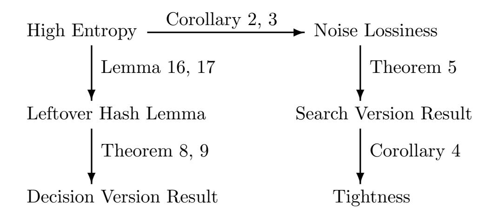

{0}------------------------------------------------

# Hardness of Entropic Module-LWE

Hao Lin1,2 , Mingqiang Wang1,2 , Jincheng Zhuang2,3 , and Yang Wang1,2

> 1. School of Mathematics, Shandong University, Jinan, 250100, China; lhao17@mail.sdu.edu.cn, wangmingqiang@sdu.edu.cn, wyang1114@mail.sdu.edu.cn

- 2. Key Laboratory of Cryptologic Technology and Information Security, Ministry of Education, Shandong University;
  - 3. School of Cyber Science and Technology, Shandong University, Qingdao 266237, China jzhuang@sdu.edu.cn

Abstract. The Learning with Errors (LWE) problem is a versatile basis for building various purpose post-quantum schemes. Goldwasser et al. [ISC 2010] initialized the study of a variant of this problem called the Entropic LWE problem, where the LWE secret is generated from a distribution with a certain min-entropy. Brakerski and D¨ottling recently further extended the study in this field, and first proved the hardness of the Entropic LWE problem with unbounded secret [Eurocrypt 2020], then gave a similar result for the Entropic Ring-LWE problem [TCC 2020].

In this work, we systematically study the hardness of the Entropic Module-LWE problem. Adapting the "lossiness approach" to the module setting, we give lower entropy bounds for the secret distribution that guarantee the hardness of the Entropic Module-LWE problem in both search and decision cases, where results are divided into two settings: bounded and unbounded norm. We also present that our search entropy lower bound in the unbounded case is essentially tight. An application of our bounded result is to deduce the hardness for the Binary Module-LWE problem. One of our central techniques is a new generalized leftover hash lemma over rings, which might be of independent interest.

Keywords: Post-quantum cryptography, Entropic Module-LWE, Binary Module-LWE, Entropic Ring-LWE, Leftover hash lemma

# 1 Introduction

The Learning with Errors (LWE) problem, introduced by Regev [\[28\]](#page-32-0), has proven to be a versatile basis for constructing cryptography schemes. Among several appealing properties of the LWE problem are the existence of reductions from worst-case lattice problems [\[19,](#page-32-1) [21,](#page-32-2) [27,](#page-32-3) [28\]](#page-32-0), and its conjectured post-quantum security.

To improve the asymptotic and practical efficiency of LWE-based cryptographic schemes, Lyubashevsky et al. [\[21\]](#page-32-2) introduced the Ring-LWE problem. 

{1}------------------------------------------------

To interpolate LWE and Ring-LWE, Brakerski et al. [\[10,](#page-31-0) [19\]](#page-32-1) introduced the Module-LWE problem. The Module-LWE problem offers a better level of security than the Ring-LWE problem, while still offering performance advantages over the LWE problem.

The assumption that the LWE and its variants are intractable was used as a basis for various classical applications, such as public key encryption [\[14,](#page-32-4)[28\]](#page-32-0), key exchange [\[12,](#page-31-1) [26\]](#page-32-5), identity-based encryption [\[14\]](#page-32-4), functional encryption [\[1\]](#page-31-2) and various cutting edge primitives, such as fully homomorphic encryption (FHE) [\[15\]](#page-32-6) and indistinguishability obfuscation (IO) [\[17\]](#page-32-7).

With the rapid development of quantum computers, it is imperative to develop quantum-resistant cryptography schemes. For example, NIST proposed a standardization project, with the aim of selecting quantum-safe schemes for public-key encryption and digital signatures. Currently, the process is in its third round, where 3 out of 4 candidates for PKE or KEM base their security on problems related to lattices, with or without special structure. Specifically, Kyber [\[6\]](#page-31-3) is based on the hardness of the Module-LWE problem, while Saber is based on the hardness of the Module-LWR problem, which is the definite variant of the Module-LWE problem.

Entropic Secrets Motivated to achieve an entropic notion of security that will allow guaranteeing the hardness even if some information about the secret s is leaked, Goldwasser et al. [\[16\]](#page-32-8) initiated the study on the hardness of the LWE problem when the secret s is not chosen uniformly at random. They developed a "noise flooding" method and proved that if s is sampled from a binary distribution (i.e. supported over {0, 1} n), then the LWE problem remains hard so long as s has sufficient entropy. Later, Alwen et al. [\[4\]](#page-31-4) proved that the LWE problem is hard for bounded secret with sufficient entropy.

Recently, Brakerski and D¨ottling [\[9\]](#page-31-5) further extended the study in this setting. They first considered the hardness of the LWE problem with unbounded secrets. By proposing a new approach to deal with the noise ("flooding at the source"), they first got an entropy bound that guarantees the security of the Entropic LWE problem. Besides, their method is also applicable for the bounded case, and yields similar results as [\[4\]](#page-31-4). Then they adopted this approach to the ring setting [\[34\]](#page-33-0), and established the hardness result for the search Entropic Ring-LWE problem. The hardness of the decision Entropic Ring-LWE problem is still an open problem.

Boudgoust et al. [\[7,](#page-31-6) [18\]](#page-32-9) studied a special Entropic Module-LWE problem, called Binary Module-LWE. They adapted the method proposed in [\[16\]](#page-32-8) to the module setting, and showed the hardness of the Binary Module-LWE problem. However, there is no result known about the hardness of the Entropic Module-LWE problem with general secret distribution both in bounded and unbounded cases. In this work, we focus on determining hardness of the Entropic Module-LWE problem.

{2}------------------------------------------------

#### 1.1 Our Contributions

We make a systematic study on the hardness of the Entropic Module-LWE problem, and get the hardness results for both search and decision versions. The brief structure of our study is outlined in Figure 1.

Figure 1. Outline of our approach for Entropic Module-LWE

Search Version First, we adapt the "flooding at the source" [9] approach to the module setting, and show that the secret distributions with sufficiently high noise lossiness will lead to the hardness of the search Entropic Module-LWE problem. The noise lossiness of secret distribution  $\mathcal{S}$ , denoted by  $\nu_{\alpha}(\mathcal{S})$ , is defined to be the conditional smooth min-entropy of a sample from  $\mathcal{S}$  conditioned on learning its perturbation by gaussian noise. Formally,  $\nu_{\alpha}(\mathcal{S}) = \tilde{H}_{\infty}(\mathbf{s} \mid \mathbf{s} + \mathbf{e} \mod qR^{\vee})$  where  $\mathbf{e}$  is a gaussian noise with parameter  $\alpha$ . Then, we analyze the relation between the noise-lossiness and the min-entropy of the secret distribution. According to whether there is a bound on the norm of the secret, we distinguish two cases below. By this one can deduce the lower bound for minentropy of the secret distribution to imply the hardness of Module-LWE in both general case and bounded case, where the bounded case can achieve a better lower bound. Our results can be expressed as the following theorem.

**Theorem 1.** Assume that the decision primal Module-LWE problem over ring R with modulus q, dimension k and gaussian noise parameter  $\beta$  is hard. Then the following holds:

#### General case:

If secret distribution S over  $(R_q^{\vee})^d$  satisfies that:

$$\widetilde{H}_{\infty}(\mathcal{S}) \ge nk \log(q) + nd \log\left(\frac{q}{\alpha'}\right) - \frac{d}{2}\log(\Delta_K) + 1 + \omega(\log(\lambda)),$$

where  $\frac{q}{\alpha'} \geq \|\tilde{B}_R\| \cdot \sqrt{\frac{\log 4nd}{\pi}}$ . Then the search Entropic Module LWE problem with rank d, modulus q, secret distribution S and gaussian noise parameter  $\alpha \approx \alpha' \beta \sqrt{m}$  is hard.

{3}------------------------------------------------

### Bounded case:

If secret distribution S over (R∨ q ) d is M-bounded and satisfies that:

$$\widetilde{H}_{\infty}(S) \ge nk \log(q) + \sqrt{2\pi nd} \cdot \frac{M}{\alpha'} \log(e) + \omega(\log(\lambda)).$$

Then the search Entropic Module LWE problem with rank d, modulus q, secret distribution S and gaussian noise parameter α ≈ α 0β √ m is also hard.

Our bounded case result directly implies the hardness of the Binary Module-LWE problem, which is a very common variant in applications. For unbounded case, we also show that for general modulus and general min-entropy distributions, this lower bound is tight up to polynomial factors. Besides, during the proof, we introduce a new gaussian decomposition theorem and present the relation between the noise-lossiness and the min-entropy over module setting, which might be of independent interests.

Decision Version Note that, the above theorem only applies to the search version. But the security of many cryptographic schemes depends on the hardness of the decision version. An interesting phenomenon is that, for the Module-LWE problem, we have a search to decision reduction, which means the decision version problem is as hard as the search version. But for the Entropic Module-LWE problem, the hardness of the search version does not always imply the hardness of the decision version. To illustrate this, let us consider a specific setting that the ring R satisfies qR = q1q2, where each N(qi) = q n/2 , S be a uniform distribution over (R/q1) d and noise satisfies a gaussian distribution. In this case, the secret distribution has very high min-entropy He∞(S) = nd log(q)/2 which satisfies our requirement, so the search problem is hard. However, in this case, the decision problem is easy. Note that for any Module-LWE sample (a, y), we have ha, si mod q2 = 0. The adversary can easily solve the decision problem by identifying whether y mod q2 is uniform distribution over R/q2. Therefore, the hardness of the decision version and the search version problem on these rings are separated. This is different from the plain Entropic LWE problem. This separation property of the Entropic Module-LWE problem may also find applications in other scenarios.

From the above simple example, we know that the requirement that the secret distribution has high-entropy is obviously not enough for the decision Entropic Module-LWE problem. To deal with the above attacks, the secret distribution needs at least has enough entropy on each prime ideal. Fortunately, we find that this requirement is sufficient. We show that if secret distribution satisfies that for every prime ideal factor pi |qR, s mod piR∨ has high entropy, then the decision Entropic Module-LWE problem is also hard. To prove this result, we introduce a new leftover hash lemma over module setting, which might be of independent interest. Similar to the search case, the results in the decision version are also divided into two cases, general high entropy case and bounded case, the bounded case can also get a smaller lower bound. The results can be expressed as the following theorem.

{4}------------------------------------------------

**Theorem 2.** Assume that the decision primal Module-LWE problem over ring R with prime modulus q, dimension k and gaussian noise parameter  $\beta$  is hard. Assume the decomposition of qR can be expressed as  $\prod_i \mathfrak{p}_i^{r_i}$ , where each  $\mathfrak{p}_i$  is a prime ideal over R, and  $N(\mathfrak{p}_i) \geq q^{\frac{n}{l}}$ . Then the following holds:

#### General case:

If secret distribution S over  $(R_q^{\vee})^d$  satisfies that:

$$\tilde{H}_{\infty}(\mathbf{s} \mod \mathfrak{p}_i R^{\vee}) \ge nk \log(q+1) + nd \log\left(\frac{q}{\alpha'}\right) - \frac{d}{2}\log(\Delta_K) - 1 + \omega(\log(\lambda)),$$

for any prime ideal  $\mathfrak{p}_i$  of qR, where  $\frac{q}{\alpha'} \geq ||\tilde{B}_R|| \cdot \sqrt{\frac{\log 4nd}{\pi}}$ . Then the search Entropic Module LWE problem with rank d, modulus q, secret distribution  $\mathcal{S}$  and gaussian noise parameter  $\alpha \approx \alpha' \beta \sqrt{m}$  is hard.

#### Bounded case:

If secret distribution S over  $(R_q^{\vee})^d$  is M-bounded and satisfies that:

$$\tilde{H}_{\infty}(\mathbf{s} \mod \mathfrak{p}_i R^{\vee}) \ge nk \log(q+1) + \sqrt{2\pi nd} \cdot \frac{M}{\alpha'} \log(e) - 2 + \omega(\log(\lambda))$$

for any prime ideal  $\mathfrak{p}_i$  of qR. Then the search Entropic Module LWE problem with rank d, modulus q, secret distribution S and gaussian noise parameter  $\alpha \approx \alpha' \beta \sqrt{m}$  is also hard.

As an application of this result, we can obtain the hardness of the decision Entropic Ring-LWE problem for some special case secret distribution by combing this theorem and the "modulus switching" technique developed by [2].

#### 1.2 Technical Overview

Here we provide a technical overview of our main contributions.

**Search Version** At a high level, we prove the hardness of the Entropic Module-LWE problem by adapting the "flooding at the source" approach developed by Brakerski et al. [9] to the module setting. Their proof framework consists of the following 3 steps.

- 1. Replace A by a lossy matrix BC + Z, and replace **e** by F**e**1 + **e**2;
- 2. Show that high noise lossiness  $\nu_{\alpha}(\mathcal{S})$  implies the hardness of Entropic LWE;
- 3. Show that high min-entropy  $H_{\infty}(\mathbf{s})$  implies high noise lossiness.

In the module setting, by the hardness of decision primal Module-LWE assumption (or decision primal Ring-LWE assumption) we can also replace A by BC + Z. But since the error term is in  $K_{\mathbb{R}}$  and the matrix multiplication in the ring is different from which in  $\mathbb{R}^n$ , we need to establish a new decomposition theorem for continuous Gaussian distribution on  $K_{\mathbb{R}}$  first.

If K is a number field with  $s_1$  real embeddings and  $s_2$  pairs complex embeddings, then when F is a fixed matrix in  $R^{m\times d}$ ,  $\mathbf{e}_1 \leftarrow (D_{\alpha'}(K_{\mathbb{R}}))^d$  and  $\mathbf{e} = F\mathbf{e}_1$ ,

{5}------------------------------------------------

we have σi(e) and σj (e) are independent where i 6= j and |i − j| 6= s2. Therefore, we can sample e2 in blocks and make the random variable Fe1 + e2 follow distribution according to (Dα(KR))m. The details are outlined in Section [3.1.](#page-13-0)

Step 3 (establishing a relation between min-entropy and noise-lossiness) are portable to the module setting, but we also need to take care of some mathematical subtleties in the ring. The complete analysis and formal statement are presented in Section [4.1.](#page-24-1)

Decision Version In [\[9\]](#page-31-5), Brakerski et al. proved the hardness of decision Entropic LWE problem when the modulus q is a prime. In this case Zq is a field, and they can get a generalized leftover hash lemma. However, for module setting, the requirement that Rq is a field is too harsh. The commonly used ring does not meet this requirement. Therefore, to get the hardness result of the decision Entropic Module-LWE problem, we need to give a variant of leftover hash lemma first.

Our leftover hash lemma consider the case where there is a small amount of leakage of secrets, which states that for some secret distribution S, if for every prime ideal factor pi |qR, s mod piR∨ has high entropy, then the distribution (C, Cs, s + e) and (C, u, s + e) are statistical indistinguishability. The proof of our leftover hash lemma follows the framework from [\[20\]](#page-32-10), but has some differences. Because we consider the case that the secret s is partially leaked (s + e), we need to use conditional probability in our calculation. As a result, the statistical distance between the two distributions in [\[20\]](#page-32-10) is controlled by the collision probability of Sp, while in this work it is controlled by the conditional collision probability Sp|(s + e). Then we combine the result about the relation between min-entropy and noise-lossiness in Section [3.2](#page-16-0) to get the result. For the complete analysis and formal statement of the result, see Section [3.3.](#page-18-1)

Combining this new lemma, we can adapt the framework in [\[9\]](#page-31-5) to the module setting and get the hardness result for the decision version problem. The complete analysis and formal statement are presented in Section [4.2.](#page-27-1)

### 1.3 Comparison to Previous Work

Entropic Module-LWE: Following the generalized "closeness to low-rank" approach, Brakerski and D¨ottling [\[34\]](#page-33-0) proved that the Ring-LWE problem is hard so long as secret distribution S has sufficient min-entropy. Their result is established under Decisional Small Polynomial Ratio (DSPR) and Ring-LWE assumption, where DSPR assumption is a mild variant of the NTRU assumption which does not enjoy a worst-case to average-case reduction. They determined the hardness of the search version Entropic Ring-LWE problem. The hardness of the decision version Entropic Ring-LWE problem is still open.

Boudgoust et al. [\[7,](#page-31-6) [18\]](#page-32-9) studied a special Entropic Module-LWE problem, namely Binary Module-LWE. In [\[7\]](#page-31-6), they adapted the method proposed in [\[16\]](#page-32-8) to the module setting and use R´enyi divergence proved the hardness result for the search version Binary Module-LWE problem. In [\[18\]](#page-32-9), they adapted the method 

{6}------------------------------------------------

proposed in [11] to the module setting and showed the hardness result for the decision version Binary Module-LWE problem. These two results are established under the Module-LWE assumption.

Liu et al. [20] studied the definite variant of the Module-LWE problem, namely Module-LWR. They present a search-to-decision reduction for Module-LWR. As the result, they show that Module-LWR is pseudorandom as long as it is one-way.

Boudgoust et al. [8] recently adapted the proof method from [34] on rings to modules, which uses a sensibly different approach from the one we described above. Their proof is based on an Module-NTRU hardness assumption, while it is based on M-LWE for us. Although their reduction is rank-preserving, hardness problem they based (Module-NTRU) has very few theoretical hardness results. Besides, their method only shows the entropic hardness of search M-LWE problem, while our method also provide the entropic hardness of decidion M-LWE problem.

Concretely, in this work, we make the first systematic study on the hardness of the Entropic Module-LWE problem. We get the hardness results for the Entropic Module-LWE problem for both search and decision versions. Each version consists of two cases, where the bounded case has a better lower bound. Our results are established under the Module-LWE assumption (or Ring-LWE assumption). By using "modulus switching" technique, we also get the hardness result of the decision Entropic Ring-LWE problem for some special case secret distribution.

**Leftover Hash Lemma** Most previous ring-based leftover hash lemmas require secret  $\mathbf{s}$  to obey some special distribution. Roşca et al. [29] require  $\mathbf{s} \leftarrow (D_{R,\alpha})^d$  and Boudgoust et al. [7] require  $\mathbf{s} \leftarrow U((R_2^{\vee})^d)$ . Recently, Liu et al. [20] also proposed a new leftover hash lemma, they show that if  $\mathbf{s} \mod \mathfrak{p}$  has sufficient entropy for every ideal factor  $\mathfrak{p}$ , then  $C\mathbf{s}$  is indistinguishable from uniform distribution.

The situation we consider is different from theirs. We show that if  $\mathbf{s} \mod \mathfrak{p}$  has sufficient entropy for every ideal factor  $\mathfrak{p}$ , then  $C\mathbf{s}$  is indistinguishable from uniform distribution even if some auxiliary information  $\mathbf{s} + \mathbf{e}$  is leaked. In their article, auxiliary information  $\mathbf{s} + \mathbf{e}$  is not allowed to be disclosed.

#### 1.4 Paper Organization

The remaining of the paper is organized as follows. In Section 2, we present preliminaries and definitions. In Section 3, we prove three probability lemmas over ring. In Section 4, the Entropic Module-LWE problem is formally defined, and the hardness results for both search and decision version are established. In Appendix A, we present the hardness results for the decision Entropic Ring-LWE.

{7}------------------------------------------------

### 2 Preliminaries

In this section, we review some basic notions and mathematical notations used throughout the paper. We denote the security parameter by  $\lambda$ , and we say a function  $f(\lambda)$  is negligible if  $f(\lambda) \in \lambda^{-\omega(1)}$ . For any positive integer n, we represent the set  $\{1, \dots, n\}$  by [n].

We denote column vectors over  $\mathbb{R}^n$  or  $\mathbb{C}^n$  by bold lower case letters (**a**, **b**, etc.). Matrices over  $\mathbb{R}^{m \times n}$  or  $\mathbb{C}^{m \times n}$  are denoted by bold upper-case letters (A, B, etc.). For a vector **x** over  $\mathbb{R}^n$  or  $\mathbb{C}^n$ , define the  $\ell_2$  norm as  $\|\mathbf{x}\|_2 = (\sum_j |x_j|^2)^{1/2}$ , define the  $\ell_\infty$  norm as  $\|\mathbf{x}\|_\infty = \max_j |x_j|$ . We denote the identity matrix in n dimensions using  $I_n$ . The transpose of a matrix or vector will be denoted by  $(\cdot)^T$ , the conjugate transpose of a matrix or vector will be denoted by  $(\cdot)^\dagger$  and the complex conjugate of  $z \in \mathbb{C}$  will be written as  $\bar{z}$ . For a matrix X over  $\mathbb{R}^{m \times n}$ , the spectral norm of matrix is defined by  $s_1(X) = \sup_{\mathbf{u} \neq 0} \frac{\|X\mathbf{u}\|_2}{\|\mathbf{u}\|_2}$ .

An *n*-dimensional *lattice* is a discrete subgroup of  $\mathbb{R}^n$ . Any lattice  $\Lambda$  can be seen as the set of all integer linear combinations of a set of basis vectors  $\{\mathbf{b}_1, \dots, \mathbf{b}_j\}$ . We will consider full rank (i.e. j=n) lattice. We use the matrix  $B = [\mathbf{b}_1, \dots, \mathbf{b}_n]$  to denote a basis.  $\widetilde{B}$  is used to denote the Gram-Schmidt orthogonalization of columns in B (from left to right), ||B|| is the length of the longest vector in  $\ell_2$  norm of the columns of B and  $||B||_{\infty}$  is the length of the longest vector in  $\ell_{\infty}$  norm of the columns of B. The dual of a lattice  $\Lambda$  is defined as  $\Lambda^* = \{\mathbf{x} \in \operatorname{span}(\Lambda) : \forall \mathbf{y} \in \Lambda, \langle \mathbf{x}, \mathbf{y} \rangle \in \mathbb{Z}\}$ .

### 2.1 Algebraic Number Theory

Let K be some algebraic number field, the degree of K is equal to the dimension of K as a vector space over  $\mathbb{Q}$ . For any field element  $\nu \in K$ , multiplication by  $\nu$  is a  $\mathbb{Q}$ -linear transformation of K into itself, i.e.

$$m_{\nu}: K \mapsto K$$
 given by  $m_{\nu}(x) = \nu x$ .

The trace of  $\nu$ , denoted by  $\text{Tr}(\nu)$ , is defined as the trace of this linear transformation. An element  $\nu \in K$  is said to be integral if it is the root of a monic polynomial with integer coefficients. The set of all integral elements R forms the ring of integers of K. Let  $R^{\vee} = \{x \in K \mid \text{Tr}(xR) \subset \mathbb{Z}\}$  be the dual of R. R is a free  $\mathbb{Z}$ -module of rank n (the degree of K), i.e. it is the set of all  $\mathbb{Z}$ -linear combinations of some basis  $B = \{b_1, \dots, b_n\} \subset R$ . Also let  $K_{\mathbb{R}} := K \otimes_{\mathbb{Q}} \mathbb{R}$  and define  $\mathbb{T}_{qR^{\vee}} := K_{\mathbb{R}}/qR^{\vee}$ . In this paper, we always explicitly assume K be some algebraic number field, R be its ring of integers and  $R^{\vee}$  be the dual of R, unless stated otherwise.

An ideal  $\mathcal{I} \subset R$  is a nontrivial additive subgroup that is closed under multiplication by R. Two ideal  $\mathcal{I}, \mathcal{J} \subset R$  are said to be coprime if  $\mathcal{I} + \mathcal{J} = R$ . A fractional ideal  $\mathcal{I} \subset K$  is a set such that  $d\mathcal{I} \subset R$  is an integral ideal for some  $d \in R$ . The product ideal  $\mathcal{I}\mathcal{J}$  is the set of all finite sums of terms ab for  $a \in \mathcal{I}, b \in \mathcal{J}$ . Multiplication extends to fractional ideal in an obvious way, and the set of fractional ideals forms a group under multiplication; in particular,

{8}------------------------------------------------

every fractional ideal  $\mathcal{I}$  has a (multiplicative) inverse ideal, written  $\mathcal{I}^{-1}$ . The norm of an ideal  $\mathcal{I}$  is its index as a subgroup of R, i.e.  $N(\mathcal{I}) = |R/\mathcal{I}|$ . We have  $N(\mathcal{I}\mathcal{J}) = N(\mathcal{I}) \cdot N(\mathcal{J})$ .

The (absolute) discriminant  $\Delta_K$  of a number field K is defined to be the square of the fundamental volume of  $\sigma(R)$ , the embedded ring of integers. Equivalently,  $\Delta_K = |\det(\operatorname{Tr}(b_i \cdot b_j))|$  where  $b_1, \dots, b_n$  is any integral basis of R.

When working with number fields and ideal lattices, it is convenient to work with the space  $\mathbb{H} \subset \mathbb{R}^{s_1} \times \mathbb{C}^{2s_2}$  for some number  $s_1 + 2s_2 = n$ , defined as

$$\mathbb{H} = \{(x_1, \dots, x_n) \in \mathbb{R}^{s_1} \times \mathbb{C}^{2s_2} : x_{s_1 + s_2 + j} = \overline{x_{s_1 + j}}, \ \forall j \in [s_2]\} \subset \mathbb{C}^n.$$

For  $j \in [s_1]$ , we set  $\mathbf{h}_j = \mathbf{e}_j$ , and for  $j \in \{s_1 + 1, \dots, s_1 + s_2\}$ , we set  $\mathbf{h}_j = \frac{\sqrt{2}}{2}(\mathbf{e}_j + \mathbf{e}_{j+s_2})$  and  $\mathbf{h}_{j+s_2} = \frac{\sqrt{2}i}{2}(\mathbf{e}_j - \mathbf{e}_{j+s_2})$ , where  $\mathbf{e}_j \in \mathbb{C}^n$  is the vector with 1 in its j-th coordinate and 0 elsewhere, i is the imaginary number such that  $i^2 = -1$ . The set  $\{\mathbf{h}_j\}_{j\in[n]}$  forms an orthonormal basis of  $\mathbb{H}$  as a real vector space. Let  $U_H = [\mathbf{h}_1, \mathbf{h}_2, \dots, \mathbf{h}_n]^{\dagger}$ , we can easily get a field isomorphic  $\sigma_H : \mathbb{H} \mapsto \mathbb{R}^n$  where  $\sigma_H(\mathbf{x}) = U_H \cdot \mathbf{x}$ . Thus  $\mathbb{H} \cong \mathbb{R}^n$  as an inner product space. And we will also equip  $\mathbb{H}$  with the  $\ell_2$  and  $\ell_{\infty}$  norm induced on it from  $\mathbb{C}^n$ .

We will often use canonical embeddings to endow field elements with a geometry. A number field  $K := \mathbb{Q}(\xi)$  of degree n has exactly  $n = s_1 + 2s_2$  field homomorphisms  $\sigma_j : K \mapsto \mathbb{C}$  fixing each element of  $\mathbb{Q}$ . Let  $\sigma_1, \dots, \sigma_{s_1}$  be the real embeddings and  $\sigma_{s_1+1}, \dots, \sigma_n$  be complex. The complex embeddings come in conjugate pairs, so we have  $\sigma_j = \overline{\sigma_{j+s_2}}$  for  $j = s_1 + 1, \dots, s_1 + s_2$  if we use an appropriate ordering of the embeddings. The canonical embedding is defined as  $\sigma_C : K \to \mathbb{H}$  where  $\sigma_C(x) := (\sigma_1(x), \dots, \sigma_n(x))^T$ . We can also represent  $\sigma_C(x)$  via the real vector  $\sigma_H(x) \in \mathbb{R}^n$  through the change described above. So for any  $x \in K$ ,  $\sigma_H(x) = U_H \cdot \sigma_C(x)$ .

For the ring of integer R of the field K, we define the canonical embedding of the module  $R^d$  into the space  $\mathbb{H}^d$  in an obvious way, i.e. by embedding each component of  $R^d$  into  $\mathbb{H}$  separately. For any  $\mathbf{x} \in K^d$ , define the norm as  $||\mathbf{s}|| = (\sum_{j=1}^d \sum_{i=1}^n |\sigma_i(x_j)|^2)^{1/2}$ . It is well known that the dimension of the ring of integers R as a  $\mathbb{Z}$ -module is equal to the degree of K over  $\mathbb{Q}$ , that means the lattice  $\sigma_H(R)$  is of full rank. We often refer to the ring of integer R as a lattice. Whenever we do this, we are really referring to the lattice  $\sigma_H(R)$ .

For any integer q, we have the following ideal factorization lemma.

**Lemma 1.** Let  $K = \mathbb{Q}(\alpha)$  be a number field with degree n, where  $\alpha$  is an algebraic integer. Moreover if  $\gcd(q, [R : \mathbb{Z}[\alpha]]) = 1$ , then we have prime ideal decomposition  $qR = \prod_{i,j} \mathfrak{p}_{i,j}^{r_{i,j}}$  and  $qR^{\vee} = \prod_{i,j} \mathfrak{p}_{i,j}^{r_{i,j}} R^{\vee}$ .

**Lemma 2** (Chinese Remainder Theorem [5]). Let  $\mathcal{I}$  be a fractional ideal over K, and let  $\mathfrak{p}_i$  be pairwise coprime ideals in R, then natural ring homomorphism is an isomorphism:  $\mathcal{I}/(\prod_i \mathfrak{p}_i)\mathcal{I} \mapsto \bigoplus_i (\mathcal{I}/\mathfrak{p}_i\mathcal{I})$ .

The following lemma first appeared in [23] and was generalized by Liu et al. in [20] recently. This lemma is the key to prove the generalized leftover hash lemma.

{9}------------------------------------------------

**Lemma 3.** Let R be the ring of integers of a number field K,  $\mathcal{I}$  be an ideal of R, and  $\mathbf{s} = (s_1, \dots, s_d) \in (R^{\vee}/\mathcal{I}R^{\vee})^d$  be a vector of ring elements. If  $\mathbf{a} = (a_1, \dots, a_d) \in (R/\mathcal{I})^d$  are uniformly random, then  $\sum_i a_i \cdot s_i \mod \mathcal{I}R^{\vee}$  is uniformly random over the ideal  $\langle s_1, \dots, s_d \rangle/\mathcal{I}R^{\vee}$ . In particular,  $\Pr[\sum_i a_i \cdot s_i = 0 \mod \mathcal{I}R^{\vee}] = 1/|\langle s_1, \dots, s_d \rangle/\mathcal{I}R^{\vee}|$ .

We recall the notion of maximal belongs for the vector  $\mathbf{s} \in (R^{\vee})^d$  in the following, which was first introduced in [20].

**Definition 1.** Let R be the ring of integers of a number field K,  $\mathcal{I}$  be an ideal of R and  $R^{\vee}$  be the dual of R. We say a vector  $\mathbf{s} \in (R^{\vee})^d$  maximal belongs to a factor  $\mathcal{I}$  of qR, abbreviated as  $\mathbf{s} \in_{\max} \mathcal{I}R^{\vee}$ , if the following conditions hold:

- For every coordinate  $s_i$  of  $\mathbf{s}$ , we have  $s_i \in \mathcal{I}R^{\vee}$ ;
- For any ideal  $\mathcal{J}|qR$  such that  $\mathcal{I}|\mathcal{J}$ , there exists at least one coordinate  $s_i$  such that  $s_i \notin \mathcal{J}R^{\vee}$ .

Liu et al. [20] also proved that any possible  $\mathbf{s}$  in the range must maximal belong to  $\mathcal{J}R^{\vee}$  for only one ideal factor  $\mathcal{J}|qR$ , which means  $\{\mathbf{s} \in \mathcal{J}R^{\vee}\}_{\mathcal{J}|qR}$  forms a partition.

#### 2.2 Probability

The uniform probability distribution over some finite set  $\mathcal{M}$  will be denoted by  $U(\mathcal{M})$ . If s is sampled from a distribution  $\mathcal{D}$ , we write  $s \leftarrow \mathcal{D}$ . Also, let  $\mathbf{s} = (s_1, \dots, s_m)^{\mathrm{T}} \leftarrow \mathcal{D}^d$  denote the act of sampling each component  $s_i$  according to  $\mathcal{D}$  independently. We also write  $\mathrm{Supp}(\mathcal{D})$  to mean the support of the distribution  $\mathcal{D}$ . For a continuous random variable X, denote the probability density function of X by  $P_X(\cdot)$  and denote the probability density of X conditioned on an event E by  $P_{X|E}(\cdot)$ .

The statistical distance is a widely used measure of distribution closeness.

**Definition 2 (Statistical distance).** Let X and Y be two discrete probability distributions on a discrete domain  $\mathcal{E}$ . Their statistical distance is defined as

$$\Delta(X;Y) = \frac{1}{2} \sum_{x \in \mathcal{E}} |\Pr(X = x) - \Pr(Y = x)|.$$

The following is the definition of min-entropy and conditional min-entropy.

**Definition 3 (Min-entropy).** Given a discrete random variable X over  $\mathcal{X}$ , the min-entropy of X is denoted by

$$\widetilde{H}_{\infty}(X) = -\log\left(\max_{x \in \mathcal{X}} \Pr[X = x]\right).$$

**Definition 4 (Conditional min-entropy).** Let X be a discrete random variable over  $\mathcal{X}$ , Z be a random variable over  $\mathcal{Z}$ , define the conditional min-entropy of X given Z, denoted by

$$\widetilde{H}_{\infty}(X \mid Z) = -\log \left( E_z[\max_{x \in \mathcal{X}} \Pr[X = x \mid Z = z]] \right).$$

{10}------------------------------------------------

We now state a fundamental property of the conditional min-entropy.

**Lemma 4 (Lemma 2.2 in [13]).** Let X, Y, Z be random variables, and Y has at most  $2^{\lambda}$  possible values, then

$$\widetilde{H}_{\infty}(X \mid (Y, Z)) \ge \widetilde{H}_{\infty}(X \mid Z) - \lambda.$$

**Gaussian Measures** The Gaussian function of parameter  $\alpha$  and center c is defined as  $\rho_{\alpha,c}(x) = \exp(-\pi(x-c)^2/\alpha^2)$ , and the Gaussian distribution  $D_{\alpha,c}$  is the probability distribution whose probability density function is given by  $\frac{1}{\alpha}\rho_{\alpha,c}$ .

Similarly, for multivariate case, we have the following formal definition. A matrix  $\Sigma \in \mathbb{R}^{n \times n}$  is called positive definite, if it holds for every  $\mathbf{x} \in \mathbb{R}^n \setminus \{\mathbf{0}\}$  that  $\mathbf{x}^T \Sigma \mathbf{x} > 0$ . For every positive definite matrix  $\Sigma$  there exists a unique positive definite matrix  $\sqrt{\Sigma}$  such that  $(\sqrt{\Sigma})^2 = \Sigma$ .

**Definition 5 (Multivariate Gaussian distribution).** Let  $\Sigma \in \mathbb{R}^{n \times n}$  be a positive definite matrix. The multivariate Gaussian function with covariance matrix  $\Sigma$  centred on  $\mathbf{c} \in \mathbb{R}^n$  is defined as

$$\rho_{\sqrt{\Sigma},\mathbf{c}}(\mathbf{x}) = \exp(-\pi(\mathbf{x} - \mathbf{c})^{\mathrm{T}} \Sigma^{-1}(\mathbf{x} - \mathbf{c})),$$

and the corresponding multivariate Gaussian distribution denoted  $D_{\sqrt{\Sigma},\mathbf{c}}$  is defined by the density function  $\frac{1}{\sqrt{\det(\Sigma)}}\rho_{\sqrt{\Sigma},\mathbf{c}}$ .

Notice that the matrix  $\Sigma$  differs from the standard covariance matrix by a factor of  $2\pi$ . However, for convenience, we refer to  $\Sigma$  as the covariance matrix throughout. Note that if the centre  $\mathbf{c}$  is omitted, it should be assumed that  $\mathbf{c} = \mathbf{0}$ . If the covariance matrix is diagonal, we describe it using the vector of its diagonal entries. For example, suppose that  $\Sigma_{ij} = (\alpha_i)^2 \delta_{ij}$  and let  $\boldsymbol{\alpha} = (\alpha_1, \dots, \alpha_n)^T$ . Then we would write  $D_{\boldsymbol{\alpha}}$  to denote the centred Gaussian distribution  $D_{\Sigma}$ . Furthermore, if  $\alpha_1 = \dots = \alpha_n = \alpha$ , we would write  $D_{\alpha}$  to denote this centred Gaussian distribution.

Using the identification of  $\mathbb{H}$  as  $\mathbb{R}^n$ , we can extend the definition of multivariate Gaussian distribution on  $\mathbb{R}^n$  to  $\mathbb{H}$  as follows. Let  $\Sigma \in \mathbb{R}^{n \times n}$  be a positive definite matrix, a sample from  $D_{\Sigma}$  on  $\mathbb{H}$  is given by  $\sum_{i \in [n]} x_i \mathbf{h}_i$ , where  $\mathbf{x} = (x_1, \dots, x_n)^{\mathrm{T}} \leftarrow D_{\Sigma}$  over  $\mathbb{R}^n$ .

We also have discrete Gaussian distributions i.e. normalized distributions defined over some discrete set (typically lattice or lattice coset). The notation for a discrete Gaussian distribution over some n-dimensional lattice  $\Lambda$  and coset vector  $\mathbf{u} \in \mathbb{R}^n$  with parameter  $\alpha$  is  $D_{\Lambda+\mathbf{u},\alpha}$ . This distribution has probability mass function  $\frac{\rho_{\alpha}(\mathbf{y})}{\rho_{\alpha}(\Lambda+\mathbf{u})}$ , where  $\rho_{\alpha}(\Lambda+\mathbf{u}) = \sum_{\mathbf{x} \in \Lambda+\mathbf{u}} \rho_{\alpha}(\mathbf{x})$ . For the ring of integers R of a number field K and any  $x \in K$ , we define  $D_{R+x,\alpha}$  to be the discrete Gaussian over the coset R+x of the lattice R, i.e. over the lattice coset  $\sigma_H(R) + \sigma_H(x)$  of the lattice  $\sigma_H(R)$ .

Next we recall the definition and some lemmas of the smoothing parameter of a lattice that we will make use of.

{11}------------------------------------------------

**Definition 6 (Smoothing parameter).** For a lattice  $\Lambda$  and  $\epsilon > 0$ , the smoothing parameter  $\eta_{\epsilon}(\Lambda)$  is defined as the smallest  $\alpha > 0$  s.t.  $\rho_{1/\alpha}(\Lambda^* \setminus \{0\}) \leq \epsilon$ .

**Lemma 5 (Lemma 3.1 in [14]).** For any  $\epsilon > 0$  and n-dimensional lattice  $\Lambda$  with basis B,

$$\eta_{\epsilon}(\Lambda) \le ||\widetilde{\mathbf{B}}|| \sqrt{\log(2n(1+1/\epsilon))/\pi}.$$

Lemma 6 (Lemma 2.9 in [25]). For any lattice  $\Lambda$ , positive real  $\alpha > 0$  and vector  $\mathbf{c}$ ,  $\rho_{\alpha,\mathbf{c}}(\Lambda) \leq \rho_{\alpha}(\Lambda)$ .

Lemma 7 (Lemma 2.5 in [9]). Let  $\alpha_2 > \alpha_1 > 0$ . Then it holds for all  $\mathbf{x} \in \mathbb{R}^n$  and  $\mathbf{t} \in \mathbb{R}^n$  that

$$\rho_{\alpha_1}(\mathbf{x} - \mathbf{t}) \le \exp\left(\pi \frac{||\mathbf{t}||^2}{\alpha_2^2 - \alpha_1^2}\right) \cdot \rho_{\alpha_2}(\mathbf{x}).$$

Moreover, the same holds for the q-periodic Gaussian function, i.e.

$$\rho_{\alpha_1}(\mathbf{x} - \mathbf{t} + q\mathbb{Z}^n) \le \exp\left(\pi \frac{||\mathbf{t}||^2}{\alpha_2^2 - \alpha_1^2}\right) \cdot \rho_{\alpha_2}(\mathbf{x} + q\mathbb{Z}^n).$$

**Subgaussian** Subgaussian distributions are those on  $\mathbb{R}$  which have tail dominated by Gaussians [31]. An equivalent formulation is through the moment-generating function of the distribution, this definition is commonly used throughout lattice-based cryptography [24].

**Definition 7.** A real random variable X is subgaussian with parameter  $\alpha \geq 0$  if for all  $\beta \in \mathbb{R}$ ,

$$E\left(e^{2\pi\beta X}\right) \le e^{\pi\alpha^2\beta^2}.$$

More generally, we say that a random vector  $\mathbf{x} \in \mathbb{R}^n$  is subgaussian with parameter  $\alpha \geq 0$  if for all unit vectors  $\mathbf{u} \in \mathbb{R}^n$ , the random variable  $\langle \mathbf{x}, \mathbf{u} \rangle$  is subgaussian with parameter  $\alpha$ .

The subgaussian distribution admits the following properties.

**Lemma 8 (Theorem 4.4.5 in [32]).** Let  $X \in \mathbb{R}^{m \times d}$  be a random matrix with entries drawn independently from a subgaussian distribution with parameter  $\alpha \leq 0$ . Then, there exists some universal constant  $C_0 \geq 0$  such that for any  $t \geq 0$ , with probability at least  $1 - 2e^{-t^2}$  we have

$$s_1(X) \le C_0 \cdot \alpha \cdot (\sqrt{m} + \sqrt{d} + t).$$

**Lemma 9 (Adapted Lemma 2.8 in [24]).** Let  $\Lambda \subset \mathbb{R}^n$  be a lattice, then for any  $\alpha > 0$ ,  $D_{\Lambda,\alpha}$  is subgaussian with parameter  $\alpha$ .

{12}------------------------------------------------

**Noise Lossiness** The *noise lossiness* of a distribution S measures how information is lost about a sample of S when adding Gaussian noise. It is defined to be the conditional smooth min-entropy of a sample from S conditioned on learning its perturbation by Gaussian noise. This notion was proposed by [9] first.

**Definition 8 (Noise Lossiness).** Let S be a secret distribution over  $(R_q^{\vee})^d$  and  $\mathbf{e} \leftarrow (D_{\alpha})^d$  be a gaussian noise. We define the noise-lossiness  $\nu_{\alpha}(S)$  by

$$\nu_{\alpha}(\mathcal{S}) = \widetilde{H}_{\infty}(\mathbf{s} \mid \mathbf{s} + \mathbf{e} \mod qR^{\vee})$$

where  $\mathbf{s} \leftarrow \mathcal{S}$ .

Lemma 10 (Adapted from Lemma 5.1 in [9]). Let s be a random variable over  $(R_q^{\vee})^d$  with min-entropy  $\widetilde{H}_{\infty}(\mathbf{s})$  and  $\mathbf{e} \leftarrow (D_{\alpha})^d$ . Then it holds that

$$\nu_{\alpha}(\mathcal{S}) \geq \widetilde{H}_{\infty}(\mathbf{s}) - \log \left[ \int_{(\mathbb{T}_{qR^{\vee}})^d} \max_{\mathbf{s}^*} P_{\mathbf{e}}(\mathbf{y} - \mathbf{s}^* + (qR^{\vee})^d) d\mathbf{y} \right].$$

### 2.3 Module-LWE

The module variant of LWE was first introduced by Brakerski et al. [10], and thoroughly studied by Langlois and Stehlé [19]. The search version problem  $\text{MLWE}(K,d,q,m,\chi)$  is to find  $\mathbf{s} \in (R_q^\vee)^d$  given  $(A,A\cdot\mathbf{s}+\mathbf{e} \mod qR^\vee)$ , where  $A \leftarrow U((R_q)^{m\times d})$ ,  $\mathbf{s} \leftarrow U((R_q^\vee)^d)$  and  $\mathbf{e} \leftarrow \chi^m$ . The decisional version problem  $\text{DMLWE}(K,d,q,m,\chi)$  asks to distinguish between the distributions  $(A,A\cdot\mathbf{s}+\mathbf{e} \mod qR^\vee)$  and  $(A,\mathbf{u})$ , where A,  $\mathbf{s}$  and  $\mathbf{e}$  are as in the search version and  $\mathbf{u} \leftarrow U((\mathbb{T}_{R^\vee})^m)$ . As pointed out by Lyubashevsky et al. [22], sometimes it can be more convenient to work with a discrete variant, where  $\chi$  is a discrete error distribution over  $R^\vee$ . Langlois et al. [19] showed that  $\text{DMLWE}(K,d,q,m,D_{R^\vee,\sqrt{2}\alpha})$  is at least as hard as  $\text{DMLWE}(K,d,q,m,D_\alpha)$  using discretization technique.

Furthermore, Roşca et al. also considered primal form Ring-LWE in [29]. The primal-DRLWE $(K, q, m, D_{R,\alpha})$  problem asks to distinguish between the distributions  $(\mathbf{a}, \mathbf{a} \cdot s + \mathbf{e} \mod qR)$  and  $(\mathbf{a}, \mathbf{u})$ , where  $\mathbf{a} \leftarrow U((R_q)^{m \times 1})$ ,  $s \leftarrow U(R_q)$ ,  $\mathbf{e} \leftarrow (D_{R,\alpha})^m$  and  $\mathbf{u} \leftarrow U((R_q)^m)$ . In [29] Roşca et al. showed a reduction from RLWE to primal-RLWE with a limited error growth. Later, in [33] Wang et al. showed that when the field K is a cyclotomic field, the growth in the error term does not exceed  $O(n \log \log n)$ . Likewise, we can also consider primal-MLWE. The primal-DMLWE $(K, d, q, m, D_{R,\alpha})$  problem asks to distinguish between the distributions  $(A, A \cdot \mathbf{s} + \mathbf{e} \mod qR)$  and  $(A, \mathbf{u})$ , where  $A \leftarrow U((R_q)^{m \times d})$ ,  $\mathbf{s} \leftarrow U((R_q)^d)$ ,  $\mathbf{e} \leftarrow (D_{R,\alpha})^m$  and  $\mathbf{u} \leftarrow U((R_q)^m)$ . By the same way, we can also get the reduction from MLWE to primal-MLWE.

We also consider the primal-DMLWE problem for any sample  $m = \text{poly}(n \log q)$ , which are denoted by prime-DMLWE $(K, d, q, D_{R,\alpha})$ . The matrix version of prime-DMLWE asks to distinguish between the distribution  $(A, A \cdot S + E \mod qR)$  from (A, U), where  $A \leftarrow U((R_q)^{m \times k})$ ,  $S \leftarrow U((R_q)^{k \times d})$ ,  $E \leftarrow (D_{R,\alpha})^{m \times d}$  and  $U \leftarrow U((R_q)^{m \times d})$ . The hardness of matrix version for any d = poly(n) can be established from DMLWE $(K, k, q, m, D_{R,\alpha})$  via a routine hybrid argument. For technical reason, we use this form primal-DMLWE in the proof in Section 4.

{13}------------------------------------------------

### 3 Probability Lemmas

In this section, we present three results in the probability theory.

- 1. First, we give a decomposition theorem for Continuous Gaussian on  $K_{\mathbb{R}}$  in Section 3.1, which is a generalization of Proposition 3.2 in [9]. This theorem is the key to adapt the proof of the hardness of Entropy LWE to the module setting.
- 2. Then, we compute the noise lossiness for high-entropy distributions on  $K_{\mathbb{R}}$  in Section 3.2. Similar to [9], we will consider two cases: one is for general high-entropy distribution and the other is for bounded high-entropy distribution. We will show that considerable improvements can be achieved when considering bounded case.
- 3. Finally, we give a generalized leftover hash lemma over rings in Section 3.3. The proof of our leftover hash lemma follows the framework from [20], but has some differences. This theorem will be used to prove the hardness of the decision Entropic Module-LWE problem.

#### 3.1 Gaussian Decomposition

In this subsection, we present a new decomposition theorem for continuous Gaussian distribution on  $K_{\mathbb{R}}$ . Specifically, we show there exists an efficient sampling algorithm  $D(F, \alpha, \alpha')$ , such that the random variable  $\mathbf{e} = F\mathbf{e}_1 + \mathbf{e}_2$  follows Gaussian distribution  $(D_{\alpha}(K_{\mathbb{R}}))^m$ , where  $\mathbf{e}_1 \leftarrow (D_{\alpha'}(K_{\mathbb{R}}))^d$ ,  $\mathbf{e}_2 \leftarrow D(F, \alpha, \alpha')$  and  $F \leftarrow D_{R,\beta}^{m \times d}$ .

Assume field K has exactly  $s_1$  real embeddings and  $s_2$  pairs complex embeddings. For any matrix  $F = (f_{ij}) \in \mathbb{R}^{m \times d}$  and any  $j \in [s_1]$ , we set1

$$F^{j} = \begin{pmatrix} \sigma_{j}(f_{11}) & \cdots & \sigma_{j}(f_{1d}) \\ \vdots & & \vdots \\ \sigma_{j}(f_{m1}) & \cdots & \sigma_{j}(f_{md}) \end{pmatrix},$$

and for  $j \in \{s_1 + 1, \dots, s_1 + s_2\}$ , set

$$F^{j} = \begin{pmatrix} \sqrt{2}\operatorname{Re}(\sigma_{j}(f_{11})) & \cdots & \sqrt{2}\operatorname{Re}(\sigma_{j}(f_{1d})) \\ \vdots & & \vdots \\ \sqrt{2}\operatorname{Re}(\sigma_{j}(f_{m1})) & \cdots & \sqrt{2}\operatorname{Re}(\sigma_{j}(f_{md})) \end{pmatrix},$$

$$F^{j+s_2} = \begin{pmatrix} \sqrt{2} \operatorname{Im}(\sigma_j(f_{11})) & \cdots & \sqrt{2} \operatorname{Im}(\sigma_j(f_{1d})) \\ \vdots & & \vdots \\ \sqrt{2} \operatorname{Im}(\sigma_j(f_{m1})) & \cdots & \sqrt{2} \operatorname{Im}(\sigma_j(f_{md})) \end{pmatrix}.$$

We are interested in the spectral norm of  $F^j$  when  $F \leftarrow D_{R,\beta}^{m \times d}$  and give an upper bound in the following lemma.

 $\overline{\phantom{a}}^{1}$  Here d could be 1, and in this case F would be a vector.

{14}------------------------------------------------

**Lemma 11.** Let  $F \leftarrow D_{R,\beta}^{m \times d}$ , assume for convenience that  $m \geq d$ . Then with all but  $2^{-m}$  probability it holds that  $s_1(F^j) \leq C\beta\sqrt{m}$  for all  $j \in [n]$ , where C is a global constant.

*Proof.* In order to show  $s_1(F^j) \leq C\beta\sqrt{m}$ , we only need to show that  $F^j$  is a random matrix with entries drawn independently from a subgaussian distribution, and then apply Lemma 8. Recall that  $F \leftarrow D_{R,\beta}^{m \times d}$  means samples each component  $f_{kl}$  according to  $D_{R,\beta}$  independently, and  $f_{kl} \leftarrow D_{R,\beta}$  means  $\sigma_H(f_{kl}) \leftarrow D_{\sigma_H(R),\beta}$ , where

$$\sigma_{H}(f_{kl}) = \begin{pmatrix} \sigma_{1}(f_{kl}) \\ \vdots \\ \sigma_{s_{1}}(f_{kl}) \\ \sqrt{2}\operatorname{Re}(\sigma_{s_{1}+1}(f_{kl})) \\ \vdots \\ \sqrt{2}\operatorname{Re}(\sigma_{s_{1}+s_{2}}(f_{kl})) \\ \sqrt{2}\operatorname{Im}(\sigma_{s_{1}+1}(f_{kl})) \\ \vdots \\ \sqrt{2}\operatorname{Im}(\sigma_{s_{1}+s_{2}}(f_{kl})) \end{pmatrix}$$

Clearly, for any  $j \in [n]$ , the entries of  $F^j$  are sampled from the same distribution independently.

Since  $\sigma_H(R)$  is a lattice in  $\mathbb{R}^n$ , by Lemma 9,  $\sigma_H(f_{kl})$  is subgaussian with parameter  $\beta$ . So by definition, we have  $\langle \sigma_H(f_{kl}), \mathbf{e}_j \rangle$  is also subgaussian with parameter  $\beta$ .

Thus for any  $j \in [n]$ ,  $F^j$  is a random matrix with entries drawn independently from a subgaussian distribution with parameter  $\beta$ . Therefore, by Lemma 8 and set  $t = \sqrt{m}$ ,  $C = 3C_0$ , we have  $s_1(F^j) \leq C\beta\sqrt{m}$  with probability at least  $1 - 2e^{-m}$ . Finally, we take a union bound over all j and get

$$\Pr[\exists j \in [n] : s_1(F^j) \ge C\beta\sqrt{m})] \le n \cdot 2e^{-m} \le 2^{-m}.$$

We now show and prove a generalized decomposition theorem for continuous Gaussian distribution over  $K_{\mathbb{R}}$ . To avoid confusion, we use  $D_{\alpha}(K_{\mathbb{R}})$  to denote the Gaussian distribution over  $K_{\mathbb{R}}$ . For  $j \in \{s_1 + 1, \dots, s_1 + s_2\}$ , we set

$$\widetilde{F}^{j} = \frac{\sqrt{2}}{2} \begin{pmatrix} F^{j} & -F^{j+s_2} \\ F^{j+s_2} & F^{j} \end{pmatrix}.$$

**Theorem 3.** Let  $F \in R^{m \times d}$  be a matrix with  $s_1(F^j) \leq B$  for any  $j \in [n]$ . Let  $\alpha, \alpha' > 0$  be positive real numbers with  $\alpha > \sqrt{2}B \cdot \alpha'$ . Let  $\mathbf{e}_1 \leftarrow (D_{\alpha'}(K_{\mathbb{R}}))^d$  and  $\mathbf{e}_2$  be the random variable in  $(K_{\mathbb{R}})^m$  obtained in the following way: for  $j \in [s_1]$ , set  $\mathbf{e}_2^j \leftarrow D_{\sqrt{\Sigma_j}}$  where  $\Sigma_j = \alpha^2 I_m - \alpha'^2 F^j(F^j)^{\mathrm{T}}$ ; for  $j \in \{s_1 + 1, \dots, s_1 + s_2\}$ , set  $((\mathbf{e}_2^j)^{\mathrm{T}}, (\mathbf{e}_2^{j+s_2})^{\mathrm{T}}) \leftarrow D_{\sqrt{\Sigma_j}}$  where  $\Sigma_j = \alpha^2 I_{2m} - \alpha'^2 \widetilde{F}^j(\widetilde{F}^j)^{\mathrm{T}}$ . Then the random variable  $\mathbf{e} = F\mathbf{e}_1 + \mathbf{e}_2$  follows distribution according to  $(D_{\alpha}(K_{\mathbb{R}}))^m$ .

{15}------------------------------------------------

*Proof.* We first prove that  $\Sigma_j$  is positive definite for any  $j \in [s_1 + s_2]$ . For any  $j \in [s_1]$  and any  $\mathbf{x} \in \mathbb{R}^m/\{0\}$ , we have

$$\mathbf{x}^{\mathrm{T}} \Sigma_{j} \mathbf{x} \ge \alpha^{2} \|\mathbf{x}\|_{2}^{2} - \alpha'^{2} \cdot s_{1}(F^{j})^{2} \|\mathbf{x}\|_{2}^{2} \ge (\alpha^{2} - \alpha'^{2} B^{2}) \cdot \|\mathbf{x}\|_{2}^{2} > 0,$$

as  $\alpha > \sqrt{2}B \cdot \alpha'$  and  $s_1(F^j) = s_1((F^j)^T)$ .

For any  $j \in \{s_1 + 1, \dots, s_1 + s_2\}$  and any  $\mathbf{x} = (\mathbf{y}^T, \mathbf{z}^T)^T \in \mathbb{R}^{2m}/\{0\}$ , we have

$$\begin{aligned} \|(\widetilde{F}^{j})^{\mathrm{T}}\mathbf{x}\|_{2}^{2} &= \frac{1}{2} [\|(F^{j})^{\mathrm{T}}\mathbf{y} + (F^{j+s_{2}})^{\mathrm{T}}\mathbf{z}\|_{2}^{2} + \|(F^{j})^{\mathrm{T}}\mathbf{z} - (F^{j+s_{2}})^{\mathrm{T}}\mathbf{y}\|_{2}^{2}] \\ &\leq \frac{1}{2} [(\|(F^{j})^{\mathrm{T}}\mathbf{y}\|_{2} + \|(F^{j+s_{2}})^{\mathrm{T}}\mathbf{z}\|_{2})^{2} + (\|(F^{j})^{\mathrm{T}}\mathbf{z}\|_{2} + \|(F^{j+s_{2}})^{\mathrm{T}}\mathbf{y}\|_{2})^{2}] \\ &\leq B^{2} (\|\mathbf{y}\|_{2} + \|\mathbf{z}\|_{2})^{2} \leq 2B^{2} (\|\mathbf{y}\|_{2}^{2} + \|\mathbf{z}\|_{2}^{2}) = 2B^{2} \|\mathbf{x}\|_{2}^{2}. \end{aligned}$$

So for any  $j \in \{s_1 + 1, \dots, s_1 + s_2\}$  and any  $\mathbf{x} = (\mathbf{y}^T, \mathbf{z}^T)^T \in \mathbb{R}^{2m}/\{0\}$ , we also have

$$\mathbf{x}^{\mathrm{T}} \Sigma_{j} \mathbf{x} \ge \alpha^{2} \|\mathbf{x}\|_{2}^{2} - \alpha^{2} \cdot 2B^{2} \|\mathbf{x}\|_{2}^{2} > 0.$$

Since we have  $(K_{\mathbb{R}})^m \cong \mathbb{R}^{mn}$ ,  $\sigma_H(\mathbf{e}_1), \sigma_H(\mathbf{e}_2)$  are independent Gaussian vectors, and therefore  $\sigma_H(\mathbf{e})$  is also a Gaussian vector. Since  $\sigma_H(\mathbf{e}_1), \sigma_H(\mathbf{e}_2)$  have expectation 0, then so does  $\sigma_H(\mathbf{e})$ .

Now let us calculate the covariance matrix for  $\sigma_H(\mathbf{e})$ . We use  $\sigma_{H_j}(e_i)$ ,  $\sigma_{H_j}(e_{1i})$  and  $\sigma_{H_j}(e_{2i})$  to denote the j-th component of  $\sigma_H(e_i)$ ,  $\sigma_H(e_{1i})$  and  $\sigma_H(e_{2i})$  respectively, where  $e_i$ ,  $e_{1i}$  and  $e_{2i}$  is the i-th coordinate of  $\mathbf{e}$ ,  $\mathbf{e}_1$  and  $\mathbf{e}_2$  separately, and we use  $f_{kl}^j$  to denote the entry that appears in the k-th row and l-th column of matrix  $F^j$ . Since  $e_i = \sum_{k=1}^d f_{ik} e_{1k} + e_{2i}$ , for any  $j \in [s_1]$  we have

$$\sigma_{H_j}(e_i) = \sum_{k=1}^d f_{ik}^j \sigma_{H_j}(e_{1k}) + \sigma_{H_j}(e_{2i}).$$

For any  $j \in \{s_1 + 1, \dots, s_1 + s_2\}$  we have

$$\sigma_{H_{j}}(e_{i}) = \sqrt{2} \operatorname{Re} \left[ \sum_{k=1}^{d} \sigma_{j}(f_{ik}) \sigma_{j}(e_{1k}) + \sigma_{j}(e_{2i}) \right]$$

$$= \frac{1}{\sqrt{2}} \sum_{k=1}^{d} \left[ f_{ik}^{j} \sigma_{H_{j}}(e_{1k}) - f_{ik}^{j+s_{2}} \sigma_{H_{j+s_{2}}}(e_{1k}) \right] + \sigma_{H_{j}}(e_{2i}),$$

$$\sigma_{H_{j+s_2}}(e_i) = \sqrt{2} \operatorname{Im} \left[ \sum_{k=1}^d \sigma_j(f_{ik}) \sigma_j(e_{1k}) + \sigma_j(e_{2i}) \right]$$
$$= \frac{1}{\sqrt{2}} \sum_{k=1}^d \left[ f_{ik}^j \sigma_{H_{j+s_2}}(e_{1k}) + f_{ik}^{j+s_2} \sigma_{H_j}(e_{1k}) \right] + \sigma_{H_{j+s_2}}(e_{2i}).$$

Therefore, according to the sampling method of  $\mathbf{e}_1$  and  $\mathbf{e}_2$ , for any  $j \in [s_1]$ ,  $j' \in [n]$  which satisfies  $j' \neq j$ , and any  $i, i' \in [m]$ ,  $\sigma_{H_j}(e_i)$  and  $\sigma_{H_{j'}}(e_{i'})$  are

{16}------------------------------------------------

independent. For any  $j \in \{s_1 + 1, \dots, s_1 + s_2\}$ , any  $j' \in [n]$  which satisfies  $j' \neq j, j' \neq j + s_2$ , and any  $i, i' \in [m]$ ,  $\sigma_{H_j}(e_i)$  and  $\sigma_{H_{j'}}(e_{i'})$  are independent. For any  $j \in \{s_1 + s_2 + 1, \dots, n\}$ , any  $j' \in [n]$  which satisfies  $j' \neq j, j' \neq j - s_2$ , and any  $i, i' \in [m]$ ,  $\sigma_{H_j}(e_i)$  and  $\sigma_{H_{j'}}(e_{i'})$  are independent.

By a direct calculation, for any  $j \in [s_1]$ , we have  $\mathbf{e}^j = F^j \mathbf{e}_1^j + \mathbf{e}_2^j$ ; for any  $j \in \{s_1 + 1, \dots, s_1 + s_2\}$ , we have

$$\begin{pmatrix} \mathbf{e}^j \\ \mathbf{e}^{j+s_2} \end{pmatrix} = \frac{\sqrt{2}}{2} \widetilde{F}^j \begin{pmatrix} \mathbf{e}_1^j \\ \mathbf{e}_1^{j+s_2} \end{pmatrix} + \begin{pmatrix} \mathbf{e}_2^j \\ \mathbf{e}_2^{j+s_2} \end{pmatrix}.$$

Therefore, for any  $j \in [s_1]$ , the covariance matrix of  $\mathbf{e}^j$  is:

$$E(\mathbf{e}^{j}(\mathbf{e}^{j})^{\mathrm{T}}) = E(F^{j}\mathbf{e}_{1}^{j}(\mathbf{e}_{1}^{j})^{\mathrm{T}}(F^{j})^{\mathrm{T}}) + E(\mathbf{e}_{2}^{j}(\mathbf{e}_{2}^{j})^{\mathrm{T}}) = \alpha'^{2}F^{j}(F^{j})^{\mathrm{T}} + \Sigma_{j} = \alpha^{2}I_{m}$$

Likewise, for any  $j \in \{s_1 + 1, \dots, s_1 + s_2\}$ , the covariance matrix of  $\begin{pmatrix} \mathbf{e}^j \\ \mathbf{e}^{j+s_2} \end{pmatrix}$  is:

$$E\left[\begin{pmatrix} \mathbf{e}^j \\ \mathbf{e}^{j+s_2} \end{pmatrix} \cdot ((\mathbf{e}^j)^{\mathrm{T}}, (\mathbf{e}^{j+s_2})^{\mathrm{T}})\right] = \alpha'^2 \widetilde{F}^j (\widetilde{F}^j)^{\mathrm{T}} + \Sigma_j = \alpha^2 I_{2m}.$$

Consequently,  $\mathbf{e} = F\mathbf{e}_1 + \mathbf{e}_2$  follows the distribution according to  $(D_{\alpha}(K_{\mathbb{R}}))^m$ .

Remark 1. We find that Brakerski et al. also provided a blockwise Gaussian decomposition theorem (Lemma 5.4) in [34]. Since multiplication over a ring can be converted into multiplication between a matrix and a vector, their result can be regarded as a special case of our result when d = 1.

Combining Theorem 3 and Lemma 11, we obtain the following corollary.

Corollary 1. Let K be a number field with degree n, R be the ring of integers of K. Let  $F \leftarrow D_{R,\beta}^{m \times d}$ , assume for convenience that m > d. Let  $\alpha, \alpha' > 0$  with  $\alpha > \sqrt{2}c\beta\sqrt{m}\alpha'$ . Let  $\mathbf{e}_1 \leftarrow (D_{\alpha'}(K_{\mathbb{R}}))^d$  be the random variable in  $(K_{\mathbb{R}})^d$ . Then with all but  $2^{-m}$  probability there exists an efficient sampling algorithm  $D(F,\alpha,\alpha')$ , such that the random variable  $\mathbf{e} = F\mathbf{e}_1 + \mathbf{e}_2$  is distribution according to  $(D_{\alpha}(K_{\mathbb{R}}))^m$ , where  $\mathbf{e}_2 \leftarrow D(F,\alpha,\alpha')$ .

### 3.2 Gaussian Noise Lossiness

In this subsection, we compute the Gaussian noise lossiness high-entropy distributions over  $K_{\mathbb{R}}$ . Similar to [9], we will consider two cases: one is general high-entropy distribution and the other is bounded high-entropy distribution. Thanks for Lemma 10, we only need to bound

$$\int_{(\mathbb{T}_{qR}^{\vee})^d} \max_{\mathbf{s}^*} P_{\mathbf{e}}(\mathbf{y} - \mathbf{s}^* + (qR^{\vee})^d) d\mathbf{y}$$

in the following.

{17}------------------------------------------------

General High Entropy Secrets In order to get noise lossiness result in general high entropy case, we establish the following lemma first.

**Lemma 12.** Let  $B_R$  be some known basis of R in  $\mathbb{H}$ , d, q be integers and  $\alpha$  be a parameter for Gaussian with

$$\frac{q}{\alpha} \ge \|\widetilde{B}_R\| \cdot \sqrt{\frac{\log(4nd)}{\pi}},$$

then it holds for all  $\mathbf{x} \in (K_{\mathbb{R}})^d$  that  $\rho_{\alpha}(\mathbf{x} + (qR^{\vee})^d) \leq 2$ 

Proof. Since  $B_R$  is a basis of R in  $\mathbb{H}$ , we have  $B_{R^d} = I_d \otimes B_R$  is a basis of  $R^d$  in  $\mathbb{H}^d$ . Orthogonalizing from left to right, we can see that  $\|\widetilde{B}_{R^d}\|$  is precisely  $\|\widetilde{B}_R\|$ . By Lemma 5 and set  $\epsilon = 1$ , we have  $\frac{1}{\alpha} \geq \eta_1((\frac{1}{q}R)^d)$ . By definition, we obtain  $\rho_{\alpha}((qR^{\vee})^d \setminus \{0\}) \leq 1$ . Thus, we have  $\rho_{\alpha}((qR^{\vee})^d) \leq 2$ . And by Lemma 6, we get

$$\rho_{\alpha}(\mathbf{x} + (qR^{\vee})^d) = \rho_{\alpha,\mathbf{x}}((qR^{\vee})^d) \le \rho_{\alpha}((qR^{\vee})^d) \le 2.$$

Now we bound  $\int_{(\mathbb{T}_{qR^{\vee}})^d} \max_{\mathbf{s}^*} P_{\mathbf{e}}(\mathbf{y} - \mathbf{s}^* + (qR^{\vee})^d) d\mathbf{y}$  in the following lemma.

**Lemma 13.** Let  $B_R$  be some known basis of R in  $\mathbb{H}$ , d, q be integers and  $\alpha$  be a parameter for gaussian with  $\frac{q}{\alpha} \geq \|\widetilde{B}_R\| \cdot \sqrt{\frac{\log(4nd)}{\pi}}$ , then we have

$$\int_{(\mathbb{T}_{qR^{\vee}})^d} \max_{\mathbf{s}^*} P_{\mathbf{e}}(\mathbf{y} - \mathbf{s}^* + (qR^{\vee})^d) d\mathbf{y} \le 2 \cdot \left(\frac{q}{\alpha}\right)^{nd} \cdot \left(\frac{1}{\Delta_K}\right)^{\frac{d}{2}}.$$

*Proof.* Since  $\frac{q}{\alpha} \ge \|\widetilde{B}_R\| \cdot \sqrt{\frac{\log(4nd)}{\pi}}$ , by Lemma 12, we have  $\rho_{\alpha}(\mathbf{x} + (R^{\vee})^d) \le 2$ . Thus, we have

$$\int_{(\mathbb{T}_{qR^{\vee}})^d} \max_{\mathbf{s}^*} P_{\mathbf{e}}(\mathbf{y} - \mathbf{s}^* + (qR^{\vee})^d) d\mathbf{y}$$

$$= \frac{1}{\rho_{\alpha}(\mathbb{R}^{nd})} \int_{(\mathbb{T}_{qR^{\vee}})^d} \max_{\mathbf{s}^*} \rho_{\alpha}(\mathbf{y} - \mathbf{s}^* + (qR^{\vee})^d) d\mathbf{y}$$

$$\leq \frac{1}{\alpha^{nd}} \cdot \int_{(\mathbb{T}_{qR^{\vee}})^d} 2d\mathbf{y} = 2 \cdot \left(\frac{q}{\alpha}\right)^{nd} \cdot \left(\frac{1}{\Delta_K}\right)^{\frac{d}{2}}.$$

By combining Lemma 10 and Lemma 13, we can get the following corollary, which bounds noise lossiness by min-entropy.

Corollary 2 (General high entropy). Let R be the ring of integers of a field K with degree n,  $R^{\vee}$  be the dual of R and  $B_R$  be some known basis of R in  $\mathbb{H}$ . Let d, q be integers and  $\alpha$  be a parameter for gaussian with  $\frac{q}{\alpha} \geq \|\widetilde{B}_R\| \cdot \sqrt{\frac{\log(4nd)}{\pi}}$ . Let  $\mathbf{s}$  be a random variable on  $(R_q^{\vee})^d$  then it holds that

$$\nu_{\alpha}(\mathbf{s}) \geq \widetilde{H}_{\infty}(\mathbf{s}) + \frac{d}{2}\log(\Delta_K) - nd\log\left(\frac{q}{\alpha}\right) - 1.$$

{18}------------------------------------------------

**Bounded Norm Secrets** We now turn to the case that the secret has bounded norm. We show that considerable improvements can be achieved in this case. We also bound  $\int_{(\mathbb{T}_{qR}^{\vee})^d} \max_{\mathbf{s}^*} P_{\mathbf{e}}(\mathbf{y} - \mathbf{s}^* + (qR^{\vee})^d) d\mathbf{y}$  first.

**Lemma 14.** Let d, q be integers and  $\alpha$  be a parameter for Gaussian. Let **s** be a random variable on  $(R_q^{\vee})^d$  which satisfies  $||\mathbf{s}|| \leq M$ . Then it holds that

$$\int_{(\mathbb{T}_{qR^{\vee}})^d} \max_{\mathbf{s}^*} P_{\mathbf{e}}(\mathbf{y} - \mathbf{s}^* + (qR^{\vee})^d) d\mathbf{y} \le \exp\left(\sqrt{2\pi nd} \cdot \frac{M}{\alpha}\right).$$

*Proof.* By Lemma 7, for some  $\tilde{\alpha} > \alpha$ , we have

$$\int_{(\mathbb{T}_{qR^{\vee}})^{d}} \max_{\mathbf{s}^{*}} P_{\mathbf{e}}(\mathbf{y} - \mathbf{s}^{*} + (qR^{\vee})^{d}) d\mathbf{y}$$

$$= \frac{1}{\rho_{\alpha}(\mathbb{R}^{nd})} \int_{(\mathbb{T}_{qR^{\vee}})^{d}} \max_{\mathbf{s}^{*}} \rho_{\alpha}(\mathbf{y} - \mathbf{s}^{*} + (qR^{\vee})^{d}) d\mathbf{y}$$

$$\leq \frac{1}{\rho_{\alpha}(\mathbb{R}^{nd})} \int_{(\mathbb{T}_{qR^{\vee}})^{d}} \max_{\mathbf{s}^{*}} \exp\left(\pi \frac{||\mathbf{s}^{*}||^{2}}{\tilde{\alpha}^{2} - \alpha^{2}}\right) \cdot \rho_{\tilde{\alpha}}(\mathbf{y} + (R^{\vee})^{d}) d\mathbf{y}$$

$$\leq \left(\frac{\tilde{\alpha}}{\alpha}\right)^{nd} \cdot \exp\left(\pi \frac{M^{2}}{\tilde{\alpha}^{2} - \alpha^{2}}\right).$$

In particular, let  $\tilde{\alpha} = \alpha \cdot \sqrt{1+\eta}$  where  $\eta = \sqrt{\frac{2\pi}{nd}} \frac{M}{\alpha}$ , we have

$$\int_{(\mathbb{T}_{qR^{\vee}})^d} \max_{\mathbf{s}^*} P_{\mathbf{e}}(\mathbf{y} - \mathbf{s}^* + (qR^{\vee})^d) d\mathbf{y}$$

$$\leq (1 + \eta)^{\frac{nd}{2}} \cdot \exp\left(\pi \frac{M^2}{\eta \alpha^2}\right) \leq \exp\left(\pi \frac{M^2}{\eta \alpha^2} + \frac{nd\eta}{2}\right)$$

$$= \exp\left(\sqrt{2\pi nd} \cdot \frac{M}{\alpha}\right).$$

By combining Lemma 10 and Lemma 14, we can get the following corollary.

Corollary 3 (Bounded norm). Let R be the ring of integers of a field K with degree n,  $R^{\vee}$  be the dual of R. Let d, q be integers and  $\alpha$  be a parameter for Gaussian. Let  $\mathbf{s}$  be a random variable on  $(R_q^{\vee})^d$  which satisfies  $||\mathbf{s}|| \leq M$ . Then it holds that  $\nu_{\alpha}(\mathbf{s}) \geq \widetilde{H}_{\infty}(\mathbf{s}) - \sqrt{2\pi nd} \cdot \frac{M}{\alpha} \log(e)$ .

#### 3.3 Leftover Hash Lemma

Here we show a generalized leftover hash lemma over  $R_q$ . We are interested in the case where the noise lossiness of secrets is leaked. Following the framework from [20], we prove a new generalized leftover hash lemma.

{19}------------------------------------------------

In this subsection, all operations are performed on  $R_q^{\vee}$  (i.e. whenever dealing with all operations, they are involved end with a modulo  $qR^{\vee}$  operation), unless stated otherwise. Let  $\mathcal{S}$  denote a secret distribution defined on  $(R_q^{\vee})^d$ . For simplicity, we denote distribution  $\mathcal{D}$  as

$$\mathcal{D} = \{ (C, \mathbf{x}, \mathbf{z}) \mid C \leftarrow U(R_a^{k \times d}), \mathbf{x} = C\mathbf{s}, \mathbf{z} = \mathbf{s} + \mathbf{e} \text{ for } \mathbf{s} \leftarrow \mathcal{S}, \mathbf{e} \leftarrow \chi \},$$

and denote  $\mathcal{D}_{\mathbf{z}}$  as the conditional distribution of  $(C, \mathbf{x})$  given  $\mathbf{z} = \mathbf{s} + \mathbf{e}$ . Similarly, we denote distribution  $\mathcal{U}$  as

$$\mathcal{U} = \{ (C, \mathbf{x}, \mathbf{z}) \mid C \leftarrow U(R_q^{k \times d}), \mathbf{x} \leftarrow U((R_q^{\vee})^k), \mathbf{z} = \mathbf{s} + \mathbf{e} \text{ for } \mathbf{s} \leftarrow \mathcal{S}, \mathbf{e} \leftarrow \chi \},$$

and denote  $\mathcal{U}_{\mathbf{z}}$  as the conditional distribution of  $(C, \mathbf{x})$  given  $\mathbf{z} = \mathbf{s} + \mathbf{e}$ . Note that,  $\mathcal{U}_{\mathbf{z}}$  is uniform distribution over  $R_q^{k \times d} \times (R_q^{\vee})^d$ . Now we present our leftover hash lemma as follows.

**Theorem 4.** Let  $K = \mathbb{Q}(\xi)$  be a number field with degree n, where  $\xi$  is an algebraic integer. Let R be the ring of integers of K and  $R^{\vee}$  be the dual of R. Let q, d, k be positive integers with d > k and  $gcd(q, [R : \mathbb{Z}[\xi]]) = 1$ . Let S be a secret distribution defined on  $(R_q^{\vee})^d$ ,  $\chi$  be a noise distribution over  $(K_{\mathbb{R}})^d$  and let  $\mathbf{e} \leftarrow \chi$ , then we have

$$\Delta(\mathcal{D}, \mathcal{U}) \leq \frac{1}{2} \sqrt{\sum_{\mathcal{J}|qR, \mathcal{J} \neq R} (N(\mathcal{J}))^k \cdot \int_{\mathbf{z}} P_{\mathbf{s} + \mathbf{e}}(\mathbf{z}) \cdot \operatorname{Col}(\mathcal{S}_{\mathcal{J}}|\mathbf{z}) d\mathbf{z}},$$

where  $\operatorname{Col}(\mathcal{S}_{\mathcal{I}}|\mathbf{z})$  is the collision probability of

$$\mathcal{S}_{\mathcal{T}R^{\vee}} = \{\mathbf{s} \mod \mathcal{T}R^{\vee} \mid \mathbf{s} \leftarrow \mathcal{S}\} \text{ given } \mathbf{z} = \mathbf{s} + \mathbf{e}.$$

*Proof.* By definition, we need to bound  $\Delta(\mathcal{D}, \mathcal{U})$ . To do this, we first derive an upper bound on the statistical distance between  $\mathcal{D}$  and  $\mathcal{U}$  in terms of the conditional collision probability  $\operatorname{Col}(\mathcal{D}|\mathbf{z})$ , where  $\operatorname{Col}(\mathcal{D}|\mathbf{z})$  is the collision probability of  $\mathcal{D}_{\mathbf{z}}$ .

$$\Delta(\mathcal{D}, \mathcal{U}) = \frac{1}{2} \int_{\mathbf{z}} P_{\mathbf{s}+\mathbf{e}}(\mathbf{z}) \cdot \sum_{(C, \mathbf{x})} |\Pr[(C, \mathbf{x}) \leftarrow \mathcal{D}_{\mathbf{z}}] - \Pr[(C, \mathbf{x}) \leftarrow \mathcal{U}_{\mathbf{z}}]| d\mathbf{z}$$

$$\leq \frac{1}{2} \int_{\mathbf{z}} P_{\mathbf{s}+\mathbf{e}}(\mathbf{z}) \cdot q^{\frac{nk(d+1)}{2}} \cdot \sqrt{\sum_{(C, \mathbf{x})} (\Pr[(C, \mathbf{x}) \leftarrow \mathcal{D}_{\mathbf{z}}] - \Pr[(C, \mathbf{x}) \leftarrow \mathcal{U}_{\mathbf{z}}])^{2}} d\mathbf{z}$$

$$= \frac{1}{2} \int_{\mathbf{z}} P_{\mathbf{s}+\mathbf{e}}(\mathbf{z}) \cdot \sqrt{q^{nk(d+1)} \cdot \operatorname{Col}(\mathcal{D}|\mathbf{z}) - 1} d\mathbf{z}. \tag{1}$$

Next we bound  $\operatorname{Col}(\mathcal{D}|\mathbf{z})$  as follows, where probabilities run through two independently copies of  $(C, C\mathbf{s}), (C', C'\mathbf{s}') \leftarrow \mathcal{D}_{\mathbf{z}}$ .

$$\operatorname{Col}(\mathcal{D}|\mathbf{z}) = \Pr[(C = C') \land (C\mathbf{s} = C'\mathbf{s}') \mid \mathbf{s} + \mathbf{e} = \mathbf{s}' + \mathbf{e}' = \mathbf{z}]$$
$$= \frac{1}{q^{ndk}} \cdot \Pr[C(\mathbf{s} - \mathbf{s}' = 0) \mid \mathbf{s} + \mathbf{e} = \mathbf{s}' + \mathbf{e}' = \mathbf{z}]. \tag{2}$$

{20}------------------------------------------------

Now we further bound the probability

$$\Pr[C(\mathbf{s} - \mathbf{s}' = 0) \mid \mathbf{s} + \mathbf{e} = \mathbf{s}' + \mathbf{e}' = \mathbf{z}].$$

We denote  $\operatorname{Col}(\mathcal{S}_{\mathcal{J}}|\mathbf{z})$  as the collision probability of  $\mathcal{S}_{\mathcal{J}R^{\vee}}$  given  $\mathbf{z} = \mathbf{s} + \mathbf{e}$ , where  $\mathcal{J}$  is an ideal of R. Obviously, we have

$$Col(\mathcal{S}_{\mathcal{J}}|\mathbf{z}) = \Pr[\mathbf{s} - \mathbf{s}' \in \mathcal{J}R^{\vee} \mid \mathbf{s} + \mathbf{e} = \mathbf{s}' + \mathbf{e}' = \mathbf{z}]$$

$$> \Pr[\mathbf{s} - \mathbf{s}' \in_{\max} \mathcal{J}R^{\vee} \mid \mathbf{s} + \mathbf{e} = \mathbf{s}' + \mathbf{e}' = \mathbf{z}].$$

For simplicity, we use  $\clubsuit$  to express the condition

$$s + e = s' + e' = z$$

in the following. Since  $\{\mathbf{s} \in_{\max} \mathcal{J}R^{\vee}\}_{\mathcal{J}R^{\vee}|qR^{\vee}}$  forms a partition, we have:

$$\Pr[C(\mathbf{s} - \mathbf{s}') = 0 \mid \mathbf{A}]$$

$$= \sum_{\mathcal{J}R^{\vee}|qR^{\vee}} \Pr[C(\mathbf{s} - \mathbf{s}') = 0 \mid \mathbf{s} - \mathbf{s}' \in_{\max} \mathcal{J}R^{\vee}, \mathbf{A}] \cdot \Pr[\mathbf{s} - \mathbf{s}' \in_{\max} \mathcal{J}R^{\vee} \mid \mathbf{A}]$$

$$\leq \sum_{\mathcal{J}R^{\vee}|qR^{\vee}} \Pr[C(\mathbf{s} - \mathbf{s}') = 0 \mid \mathbf{s} - \mathbf{s}' \in_{\max} \mathcal{J}R^{\vee}, \mathbf{A}] \cdot \operatorname{Col}(\mathcal{S}_{\mathcal{J}}|\mathbf{z}). \tag{3}$$

Now we compute  $\Pr[C(\mathbf{s} - \mathbf{s}') = 0 \mid \mathbf{s} - \mathbf{s}' \in_{\max} \mathcal{J}R^{\vee}, \clubsuit]$ . By Lemma 1, we have  $qR = \prod_{i,j} \mathfrak{p}_{i,j}^{r_{i,j}}$  and  $qR^{\vee} = \prod_{i,j} \mathfrak{p}_{i,j}^{r_{i,j}} R^{\vee}$ . Without loss of generality, we let  $\mathcal{J} = \prod_{i,j} \mathfrak{p}_{i,j}^{r'_{i,j}}$  with  $r'_{i,j} \leq r_{i,j}$ . By Lemma 2, we have

$$R_{q} = R/qR \cong \bigoplus_{i,j} R/\mathfrak{p}_{i,j}^{r_{i,j}},$$
  
$$R_{q}^{\vee} = R^{\vee}/qR^{\vee} \cong \bigoplus_{i,j} R^{\vee}/\mathfrak{p}_{i,j}^{r_{i,j}}R^{\vee}.$$

Thus a random ring element in  $R_q$  can be viewed as independently random coordinates in  $\{R/\mathfrak{p}_{i,j}^{r_{i,j}}\}_{i,j}$ . Therefore, we have:

$$\Pr[C(\mathbf{s} - \mathbf{s}') = 0 \mid \mathbf{s} - \mathbf{s}' \in_{\max} \mathcal{J}R^{\vee}, \clubsuit]$$

$$= \prod_{i,j} \Pr[C(\mathbf{s} - \mathbf{s}') = 0 \mod \mathfrak{p}_{i,j}^{r_{i,j}}R^{\vee} \mid \mathbf{s} - \mathbf{s}' \in_{\max} \mathcal{J}R^{\vee}, \clubsuit]$$

$$= \prod_{i,j} \Pr[C_{i,j}(\mathbf{s} - \mathbf{s}')_{i,j} = 0 \mod \mathfrak{p}_{i,j}^{r_{i,j}}R^{\vee} | \mathbf{s} - \mathbf{s}' \in_{\max} \mathcal{J}R^{\vee}, \clubsuit], \tag{4}$$

where  $C_{i,j} = C \mod \mathfrak{p}_{i,j}^{r_{i,j}}$  and

$$(\mathbf{s} - \mathbf{s}')_{i,j} = (\mathbf{s} - \mathbf{s}') \mod \mathfrak{p}_{i,j}^{r_{i,j}} R^{\vee}.$$

{21}------------------------------------------------

In [20], Liu et al. proved that the ideal generated by the vector  $(\mathbf{s} - \mathbf{s}')_{i,j}$  is  $\mathfrak{p}_{i,j}^{r'_{i,j}} R^{\vee}$  in Claim 5.6. Therefore, by Lemma 3, we have

$$\Pr[C_{i,j}(\mathbf{s} - \mathbf{s}')_{i,j} = 0 \mod \mathfrak{p}_{i,j}^{r_{i,j}} R^{\vee} \mid \mathbf{s} - \mathbf{s}' \in_{\max} \mathcal{J} R^{\vee}, \clubsuit] = \left(\frac{N(\mathfrak{p}_{i,j}^{r'_{i,j}} R^{\vee})}{N(\mathfrak{p}_{i,j}^{r_{i,j}} R^{\vee})}\right)^{k}.$$

Thus, we get

$$\prod_{i,j} \Pr[C_{i,j}(\mathbf{s} - \mathbf{s}')_{i,j} = 0 \mod \mathfrak{p}_{i,j}^{r_{i,j}} R^{\vee} \mid \mathbf{s} - \mathbf{s}' \in_{\max} \mathcal{J} R^{\vee}, \clubsuit]$$

$$= \prod_{i,j} \left( \frac{N(\mathfrak{p}_{i,j}^{r'_{i,j}} R^{\vee})}{N(\mathfrak{p}_{i,j}^{r_{i,j}} R^{\vee})} \right)^{k} = \left( \frac{N(\prod_{i,j} \mathfrak{p}_{i,j}^{r'_{i,j}} R^{\vee})}{N(\prod_{i,j} \mathfrak{p}_{i,j}^{r_{i,j}} R^{\vee})} \right)^{k}$$

$$= \left( \frac{N(\mathcal{J} R^{\vee})}{N(q R^{\vee})} \right)^{k} = \frac{(N(\mathcal{J}))^{k}}{q^{nk}}.$$
(5)

Combining the facts N(R) = 1,  $Col(\mathcal{S}_R|\mathbf{z}) = 1$  and Eqs. (1), (2), (3), (4), (5), we have

$$\Delta(\mathcal{D}, \mathcal{U}) \leq \frac{1}{2} \int_{\mathbf{z}} P_{\mathbf{s}+\mathbf{e}}(\mathbf{z}) \cdot \sqrt{\sum_{\mathcal{J}|qR, \mathcal{J} \neq R} (N(\mathcal{J}))^k \cdot \operatorname{Col}(\mathcal{S}_{\mathcal{J}}|\mathbf{z})} d\mathbf{z}$$

$$\leq \frac{1}{2} \sqrt{\int_{\mathbf{z}} P_{\mathbf{s}+\mathbf{e}}(\mathbf{z}) \cdot \sum_{\mathcal{J}|qR, \mathcal{J} \neq R} (N(\mathcal{J}))^k \cdot \operatorname{Col}(\mathcal{S}_{\mathcal{J}}|\mathbf{z})} d\mathbf{z}$$

$$= \frac{1}{2} \sqrt{\sum_{\mathcal{J}|qR, \mathcal{J} \neq R} (N(\mathcal{J}))^k \cdot \int_{\mathbf{z}} P_{\mathbf{s}+\mathbf{e}}(\mathbf{z}) \cdot \operatorname{Col}(\mathcal{S}_{\mathcal{J}}|\mathbf{z})} d\mathbf{z}.$$

Now we bound  $\int_{\mathbf{z}} P_{\mathbf{s}+\mathbf{e}}(\mathbf{z}) \cdot \operatorname{Col}(\mathcal{S}_{\mathcal{J}}|\mathbf{z}) d\mathbf{z}$  for any ideal  $\mathcal{J}$  in the following lemma.

**Lemma 15.** Let q, d, k be positive integers with d > k. Let S be a secret distribution defined on  $(R_q^{\vee})^d$  and  $\chi$  be a noise distribution over  $(K_{\mathbb{R}})^d$  and let  $\mathbf{e} \leftarrow \chi$ , then we have

$$\int_{\mathbf{z}} P_{\mathbf{s}+\mathbf{e}}(\mathbf{z}) \cdot \operatorname{Col}(\mathcal{S}_{\mathcal{J}}|\mathbf{z}) d\mathbf{z} \leq 2^{-\tilde{H}_{\infty}(\mathcal{S} \mod \mathcal{J}R^{\vee})} \cdot \int_{\mathbf{z}} \max_{\mathbf{s}^{*}} P_{\mathbf{e}}(\mathbf{z} - \mathbf{s}^{*}) d\mathbf{z}.$$

*Proof.* Obviously, we have

$$\operatorname{Col}(\mathcal{S}_{\mathcal{J}}|\mathbf{z}) = \sum_{\mathbf{t} \in (R^{\vee}/\mathcal{J}R^{\vee})^d} \Pr[\mathbf{s} = \mathbf{t} \mod \mathcal{J}R^{\vee} \mid \mathbf{s} + \mathbf{e} = \mathbf{z}]^2$$
$$\leq \max_{\mathbf{t}^*} \Pr[\mathbf{s} = \mathbf{t}^* \mod \mathcal{J}R^{\vee} \mid \mathbf{s} + \mathbf{e} = \mathbf{z}].$$

{22}------------------------------------------------

Therefore, we have

$$\int_{\mathbf{z}} P_{\mathbf{s}+\mathbf{e}}(\mathbf{z}) \cdot \operatorname{Col}(\mathcal{S}_{\mathcal{J}}|\mathbf{z}) d\mathbf{z}$$

$$\leq \int_{\mathbf{z}} P_{\mathbf{s}+\mathbf{e}}(\mathbf{z}) \max_{\mathbf{t}^*} \Pr[\mathbf{s} = \mathbf{t}^* \mod \mathcal{J}R^{\vee} \mid \mathbf{s} + \mathbf{e} = \mathbf{z}] d\mathbf{z}$$

$$= \int_{\mathbf{z}} \max_{\mathbf{t}^*} P_{(\mathbf{s}+\mathbf{e},\mathbf{s} \mod \mathcal{J}R^{\vee})}(\mathbf{z}, \mathbf{t}^*) d\mathbf{z}$$

$$= \int_{\mathbf{z}} \max_{\mathbf{t}^*} P_{(\mathbf{s}+\mathbf{e}|\mathbf{s}=\mathbf{t}^* \mod \mathcal{J}R^{\vee})}(\mathbf{z}) \cdot \Pr[\mathbf{s} = \mathbf{t}^* \mod \mathcal{J}R^{\vee}] d\mathbf{z}$$

$$\leq 2^{-\tilde{H}_{\infty}(\mathcal{S} \mod \mathcal{J}R^{\vee})} \cdot \int_{\mathbf{z}} \max_{\mathbf{t}^*} P_{(\mathbf{s}+\mathbf{e}|\mathbf{s}=\mathbf{t}^* \mod \mathcal{J}R^{\vee})}(\mathbf{z}) d\mathbf{z}$$

$$\leq 2^{-\tilde{H}_{\infty}(\mathcal{S} \mod \mathcal{J}R^{\vee})} \cdot \int_{\mathbf{z}} \max_{\mathbf{s}^*} P_{(\mathbf{s}}+\mathbf{e} \mid \mathbf{s} = \mathbf{s}^*)(\mathbf{z}) d\mathbf{z}$$

$$= 2^{-\tilde{H}_{\infty}(\mathcal{S} \mod \mathcal{J}R^{\vee})} \cdot \int_{\mathbf{z}} \max_{\mathbf{s}^*} P_{\mathbf{e}}(\mathbf{z} - \mathbf{s}^*) d\mathbf{z}.$$

From Theorem 4, Lemma 15, Lemma 13 and Lemma 14, we can derive the following lemmas for two cases: one is for the general high-entropy case and the other is for the bounded norm case.

**Lemma 16 (General case).** Let K be some number field with degree n, R be the ring of integers of K and  $R^{\vee}$  be the dual of R. Let d, k be positive integers with d > k, q be a prime and  $\epsilon \in (0,1)$ . Let  $\alpha$  be a parameter for gaussian with  $\frac{q}{\alpha} \geq \|\widetilde{B}_R\| \cdot \sqrt{\frac{\log(4nd)}{\pi}}$  and  $\mathbf{e} \leftarrow (D_{\alpha}(K_{\mathbb{R}}))^d$  be an noise term. Assume that the decomposition of qR can be expressed as  $\prod_i \mathfrak{p}_i^{r_i}$ , where each  $\mathfrak{p}_i$  is a prime ideal over R, and  $N(\mathfrak{p}_i) \geq q^{\frac{n}{l}}$ . Suppose  $\mathbf{s}$  is chosen from some distribution  $\mathcal{S}$  over  $(R_{\alpha}^{\vee})^d$  such that

$$\tilde{H}_{\infty}(\mathbf{s} \mod \mathfrak{p}_i R^{\vee}) \ge 2\log\left(\frac{1}{\epsilon}\right) + nk\log(q+1) + nd\log\left(\frac{q}{\alpha}\right) - \frac{d}{2}\log(\Delta_K) - 1,$$

for any prime ideal  $\mathfrak{p}_i$  of qR. Then we have  $\Delta(\mathcal{D}, \mathcal{U}) \leq \epsilon$ .

*Proof.* By combining Lemma 15 and Lemma 13, for any  $\mathcal{J}|qR$  we have

$$\int_{\mathbf{z}} p_{\mathbf{z}}(\mathbf{z}) \cdot \operatorname{Col}(\mathcal{S}_{\mathcal{J}}|\mathbf{z}) d\mathbf{z} \leq 2 \left(\frac{q}{\alpha}\right)^{nd} \cdot \left(\frac{1}{\Delta_K}\right)^{\frac{d}{2}} \cdot 2^{-\tilde{H}_{\infty}(\mathcal{S} \mod \mathcal{J}R^{\vee})}.$$

Obviously, we have

$$\tilde{H}_{\infty}(\mathcal{S} \mod \mathcal{J}R^{\vee}) \ge \tilde{H}_{\infty}(\mathbf{s} \mod \mathfrak{p}_i R^{\vee})$$

for any  $\mathfrak{p}_i|\mathcal{J}$ . Thus, for any  $\mathcal{J}|qR$  we have

$$\tilde{H}_{\infty}(\mathbf{s} \mod \mathcal{J}R^{\vee}) \ge 2\log\left(\frac{1}{\epsilon}\right) + nk\log(q+1) + nd\log\left(\frac{q}{\alpha}\right) - \frac{d}{2}\log(\Delta_K) - 1.$$

{23}------------------------------------------------

Since each prime ideal  $\mathfrak{p}_i$  has  $N(\mathfrak{p}_i) \geq q^{\frac{n}{l}}$ , we have that qR has at most l prime ideals. Thus, we have

$$\sum_{\mathcal{J}|qR} (N(\mathcal{J}))^k \le \sum_{i=0}^l \binom{i}{l} q^{nk(1-\frac{i}{l})} = (q^{\frac{nk}{l}} + 1)^l \le (q+1)^{nk}.$$

Since q is a prime, we have

$$\Delta(\mathcal{D}, \mathcal{U}) \leq \frac{1}{2} \sqrt{\sum_{\mathcal{J}|qR, \mathcal{J} \neq R} (N(\mathcal{J}))^k \cdot \int_{\mathbf{z}} p_{\mathbf{z}}(\mathbf{z}) \cdot \operatorname{Col}(\mathcal{S}_{\mathcal{J}}|\mathbf{z}) d\mathbf{z}} \leq \epsilon.$$

Similarly, for the bounded case, we can get the following lemma. The proof is the same, so we omit here.

**Lemma 17** (Bounded case). Let K be some number field with degree n, R be the ring of integers of K and  $R^{\vee}$  be the dual of R. Let d, k be positive integers with d > k, q be a prime and  $\epsilon \in (0,1)$ . Let  $\alpha$  be a parameter for gaussian and  $\mathbf{e} \leftarrow (D_{\alpha}(K_{\mathbb{R}}))^d$  be an noise term. Assume that the decomposition of qR can be expressed as  $\prod_i \mathfrak{p}_i^{r_i}$ , where each  $\mathfrak{p}_i$  is a prime ideal over R, and  $N(\mathfrak{p}_i) \geq q^{\frac{n}{l}}$ . Suppose  $\mathbf{s}$  is chosen from some M-bounded distribution  $\mathcal{S}$  over  $(R_q^{\vee})^d$  such that

$$\tilde{H}_{\infty}(\mathbf{s} \mod \mathfrak{p}_i R^{\vee}) \ge 2\log(\frac{1}{\epsilon}) + nk\log(q+1) + \sqrt{2\pi nd}\frac{M}{\alpha}\log e - 2$$

for any prime ideal  $\mathfrak{p}_i$  of qR. Then we have  $\Delta(\mathcal{D}, \mathcal{U}) \leq \epsilon$ .

Remark 2. Note that, in the above lemma we can get smaller parameters when qR does not have a small ideal factor. In the most special case where qR is a field, the best parameters will be obtained. However, in this case number theoretic transform (NTT) [30] algorithm cannot be used in this case, the computational efficiency is the worst. On the other hand, when each  $N(\mathfrak{p}_i)$  is very small then the parameters will be undesirable. For example when qR is completely-splitting, then each coordinate of  $\mathfrak{s} \mod \mathfrak{p}_i$  can only provide  $\log q$  bits of entropy. In this case, d will be very large. From the perspective of efficiency and security, our lemma suggests using an appropriate q (such that qR only has ideals with large norms) in future Module-LWE applications.

### 4 Entropic Module Learning With Error

In this section, we give a formal definition for the Entropic Module-LWE problem and then adapt the "flooding at the source approach" from [9] to the module setting to get the first result for the hardness of the Entropic Module-LWE problem. In particular, we present an entropy bound that guarantees the hardness of the Entropic Module-LWE problem. We also adapt the counterexample from [5, 9]

{24}------------------------------------------------

to the module setting to deduce that our entropy bound is essentially tight for general modulus and general min-entropy distributions.

Specifically, in Section 4.1, we show that high noise lossiness implies the hardness of search Entropic Module-LWE problem. Combining with the result in Section 3.2, we get the entropy bound. In Section 4.2, we show that if for every ideal factor  $\mathcal{J}|qR$ ,  $\mathbf{s} \mod \mathcal{J}$  has high entropy, then we can also get the hardness result of decision Entropic Module-LWE. Finally, we show the tightness of the hardness result for the general high entropy setting in Section 4.3. In the following, we give the formal definition for the Entropic Module-LWE first.

**Definition 9 (Entropic Module-LWE).** Let K be some number field with degree n, R be the ring of integers of K and  $R^{\vee}$  be the dual of R. Let q be a modulus, d be a dimension and m be a sample size. Let  $\chi$  be an error distribution on  $K_{\mathbb{R}}$  and S be a secret distribution on  $(R_q^{\vee})^d$ . Let  $\mathrm{EMLWE}(R,d,q,m,\chi,\mathcal{S})$  be a distribution over  $(R_q)^{m\times d}\times (\mathbb{T}_{qR^{\vee}})^m$  obtained by choosing  $A\leftarrow U((R_q)^{m\times d})$ ,  $\mathbf{s}\leftarrow\mathcal{S}$ ,  $\mathbf{e}\leftarrow\chi^m$ , and outputting the pair  $(A,A\cdot\mathbf{s}+\mathbf{e} \bmod qR^{\vee})$ .

We say search Entropic Module-LWE problem SEMLWE $(R, d, q, m, \chi, S)$  is hard, if it holds for every PPT adversary A that

$$\Pr[\mathcal{A}(A, A \cdot \mathbf{s} + \mathbf{e} \mod qR^{\vee}) = \mathbf{s}] \le \operatorname{negl}(\lambda),$$

where  $A \leftarrow U((R_q)^{m \times d})$ ,  $\mathbf{s} \leftarrow \mathcal{S}$  and  $\mathbf{e} \leftarrow \chi^m$ .

We say decision Entropic Module-LWE problem DEMLWE $(R, d, q, m, \chi, S)$  is hard, if it holds for every PPT distinguisher D that

$$|\Pr[\mathcal{D}(A_1, \mathbf{b}_1) = 1] - \Pr[\mathcal{D}(A_2, \mathbf{b}_2) = 1]| \le \operatorname{negl}(\lambda),$$

where  $(A_1, \mathbf{b}_1) \leftarrow \text{EMLWE}(R, d, q, m, \chi, \mathcal{S})$  and  $(A_2, \mathbf{b}_2) \leftarrow U((R_a)^{m \times d} \times (\mathbb{T}_{aR^{\vee}})^m)$ .

### 4.1 Hardness of Search Entropic Module-LWE

In this subsection, we only establish the hardness of the search Entropic Module-LWE problem with continuous Gaussian noise. Using discretization technique (see Lyubashevsky et al. [22] for more details) we can get that the search entropic Module-LWE problem with discrete Gaussian noise is also hard. The results are divided into two cases, general high entropy case and bounded case, in which the bounded case can get a smaller lower bound.

**Theorem 5.** Let c be the global constant from Corollary 1. Let q, d, m, k be positive integers with m > n, d > k and  $\alpha$ ,  $\beta$ ,  $\alpha' > 0$  with  $\alpha > \sqrt{2mc}\beta\alpha'$ . Let s be a random variable on  $(R_q^{\vee})^d$  distributed according to some distribution S. Further assume that  $\nu_{\alpha'}(S) \geq nk \log(q) + \omega(\log(\lambda))$ . Then search Entropic Module-LWE problem SEMLWE $(R, d, q, m, D_{\alpha}, S)$  is hard, provided that primal-DMLWE $(R, k, q, D_{R,\beta})$  is hard.

*Proof.* Let  $\mathcal{A}$  be a search adversary against SEMLWE $(R, d, q, m, D_{\alpha}, \mathcal{S})$  and  $D(F, \alpha, \alpha')$  be the efficient sampling algorithm from Corollary 1. Consider the following hybrid MLWE distributions:

{25}------------------------------------------------

- $-\mathcal{H}_0$ : Let  $\mathbf{s} \leftarrow \mathcal{S}$ ,  $A \leftarrow U((R_q)^{m \times d})$  and  $\mathbf{e} \leftarrow D_{\alpha}(K_{\mathbb{R}})^m$ , and then output  $(A, A \cdot \mathbf{s} + \mathbf{e} \mod qR^{\vee});$
- $-\mathcal{H}_1$ : Let  $\mathbf{s} \leftarrow \mathcal{S}$ ,  $B \leftarrow U((R_q)^{m \times k})$ ,  $C \leftarrow U((R_q)^{k \times d})$ ,  $F \leftarrow D_{R,\beta}^{m \times d}$ , set
- $A = BC + F \mod qR, \mathbf{e} \leftarrow D_{\alpha}(K_{\mathbb{R}})^m, \text{ and output } (A, A \cdot \mathbf{s} + \mathbf{e} \mod qR^{\vee});$   $\mathcal{H}_2$ : Let  $\mathbf{s} \leftarrow \mathcal{S}, B \leftarrow U((R_q)^{m \times k}), C \leftarrow U((R_q)^{k \times d}), F \leftarrow D_{R,\beta}^{m \times d}, \text{ if there}$ exists  $j \in [n]$  s.t.  $s_1(F^j) > c\beta\sqrt{m}$  output  $\perp$ . Else, let  $A = BC + F \mod qR$ ,  $\mathbf{e} \leftarrow D_{\alpha}(K_{\mathbb{R}})^m$ , and output  $(A, A \cdot \mathbf{s} + \mathbf{e} \mod qR^{\vee})$ ;
- $-\mathcal{H}_3$ : Let  $\mathbf{s} \leftarrow \mathcal{S}$ ,  $B \leftarrow U((R_q)^{m \times k})$ ,  $C \leftarrow U((R_q)^{k \times d})$ ,  $F \leftarrow D_{R,\beta}^{m \times d}$ , if there exists  $j \in [n]$  s.t.  $s_1(F^j) > c\beta\sqrt{m}$  output  $\perp$ . Otherwise, let  $\mathbf{e}_1 \leftarrow D_{\alpha'}(K_{\mathbb{R}})^d$ ,  $\mathbf{e}_2 \leftarrow D(F, \alpha, \alpha')$ , and set  $A = BC + F \mod qR$ ,  $\mathbf{e} = \mathbf{F}\mathbf{e}_1 + \mathbf{e}_2$ , and then output  $(A, A \cdot \mathbf{s} + \mathbf{e} \mod qR^{\vee})$ .

First note that  $\mathcal{H}_0$  is identical to the SEMLWE $(R, d, q, m, D_\alpha, \mathcal{S})$  experiment. Second, it follows directly by the hardness of primal-DMLWE $(R, k, q, D_{R,\beta})$  that  $\mathcal{H}_0$  and  $\mathcal{H}_1$  are computationally indistinguishable. Then, if we have for any  $j \in [n], s_1(F^j) \le c\beta\sqrt{m}, \mathcal{H}_1$  and  $\mathcal{H}_2$  are identically distributed. Thus we can bound the statistical distance between  $\mathcal{H}_1$  and  $\mathcal{H}_2$  by the probability

$$\Pr[\exists j \in [n] : s_1(F^j) \ge c\beta \cdot \sqrt{m})].$$

By Lemma 11, with all but  $2^{-m}$  probability it holds that  $s_1(F^j) \leq c \cdot \beta \cdot \sqrt{m}$ for all  $j \in [n]$ . Therefore, the statistical distance between  $\mathcal{H}_1$  and  $\mathcal{H}_2$  is at most  $2^{-m}$ . Finally, by Corollary 1, we have  $\mathcal{H}_2$  and  $\mathcal{H}_3$  are identically distributed.

We now show that for any search adversary A, we have

$$\Pr[\mathcal{A}(A, A \cdot \mathbf{s} + \mathbf{e} \mod qR^{\vee}) = \mathbf{s}] < \operatorname{negl}(\lambda),$$

where  $(A, A \cdot \mathbf{s} + \mathbf{e} \mod qR^{\vee}) \leftarrow \mathcal{H}_3$ . Consequently, by the above we can then argue that the same holds for  $(A, A \cdot \mathbf{s} + \mathbf{e} \mod qR^{\vee}) \leftarrow \mathcal{H}_0$ , which means that the search problem SEMLWE $(R, d, q, m, D_{\alpha}, \mathcal{S})$  is hard, concluding the proof for the theorem.

To do so, we bound the conditional min-entropy of s given  $(A, \mathbf{y}) \leftarrow \mathcal{H}_3$ . Note that we can compute  $\mathbf{y} = A \cdot \mathbf{s} + \mathbf{e} \mod qR^{\vee}$  given  $B \in (R_q)^{m \times k}$ ,  $C\mathbf{s} \mod qR^{\vee}$ ,  $F \in \mathbb{R}^{m \times d}$ ,  $\mathbf{s} + \mathbf{e}_1 \mod q \mathbb{R}^{\vee}$  and  $\mathbf{e}_2 \in (K_{\mathbb{R}})^m$ . Since  $\mathbb{R}^{\vee}$  is a free  $\mathbb{Z}$ -module of rank  $n, R_q^{\vee}$  is a free  $\mathbb{Z}_q$ -module of rank n, we have  $C\mathbf{s} \mod qR^{\vee} \in (R_q^{\vee})^k$  has at most  $2^{kn \log q}$  possible values. Then by Lemma 4, we can get the bound:

$$\widetilde{H}_{\infty}(\mathbf{s} \mid (A, A \cdot \mathbf{s} + \mathbf{e} \bmod qR^{\vee}))$$

$$\geq \widetilde{H}_{\infty}(\mathbf{s} \mid B, C, F, C\mathbf{s} \bmod qR^{\vee}, \mathbf{s} + \mathbf{e}_1 \bmod qR^{\vee}, \mathbf{e}_2)$$

$$= \widetilde{H}_{\infty}(\mathbf{s} \mid C, C\mathbf{s} \bmod qR^{\vee}, \mathbf{s} + \mathbf{e}_1 \bmod qR^{\vee})$$

$$\geq \widetilde{H}_{\infty}(\mathbf{s} \mid C, \mathbf{s} + \mathbf{e}_1 \bmod qR^{\vee}) - nk \log q$$

$$= \nu_{\alpha'}(\mathcal{S}) - nk \log q.$$

Where the first equality follows from the fact that  $B, F, \mathbf{e}_2$  are independent of everything else, and the second equality follows from the fact that C is independent of everything else. The second inequality follows from Lemma 4. By

{26}------------------------------------------------

assumption we have  $\nu_{\alpha'}(\mathcal{S}) \geq nk \log(q) + \omega(\log(\lambda))$ , it follows that

$$\Pr[\mathcal{A}(A, A \cdot \mathbf{s} + \mathbf{e} \bmod qR^{\vee}) = \mathbf{s}] \le 2^{-\widetilde{H}_{\infty}(\mathbf{s}|(A, A \cdot \mathbf{s} + \mathbf{e} \bmod qR^{\vee}))} \le 2^{-\omega(\log(\lambda))},$$

which is negligible. This concludes the proof of the theorem.

By combining Theorem 5, Corollary 2 and Corollary 3, we deduce the following theorems, which present an entropy bound that guarantees the hardness of search Entropic Module-LWE problem in both general case and bounded case.

**Theorem 6 (General high entropy).** Let c be the global constant from Corollary 1. Let R be the ring of integers of some algebraic number field K of degree  $n, R^{\vee}$  be the dual of R and  $B_R$  be some known basis of R in  $\mathbb{H}$ . Let q, d, m, k be positive integers with  $m > n, d > k, \beta, \alpha' > 0$  with  $\frac{q}{\alpha'} \geq \|\widetilde{B}_R\| \cdot \sqrt{\frac{\log(4nd)}{\pi}}$ . Let **s** be a random variable on  $(R_q^{\vee})^d$  distributed according to some distribution S, with

$$\widetilde{H}_{\infty}(\mathbf{s}) \ge nk \log(q) + nd \log(\frac{q}{\alpha'}) + 1 - \frac{d}{2} \log(\Delta_K) + \omega(\log(\lambda)).$$

Furthermore let  $\alpha > \sqrt{2m}c\beta\alpha'$ , then the search problem SEMLWE $(R, d, q, m, D_{\alpha}, \mathcal{S})$  is hard, provided that primal-DMLWE $(R, k, q, D_{R,\beta})$  is hard.

**Theorem 7 (Bounded norm).** Let c be the global constant, R be the ring of integers of some algebraic number field K of degree n and  $R^{\vee}$  be the dual of R. Let q, d, m, k be positive integers with m > n, d > k,  $\beta, \alpha' > 0$ . Let s be a M-bounded random variable on  $(R_q^{\vee})^d$  with

$$\widetilde{H}_{\infty}(\mathbf{s}) \ge nk \log(q) + \sqrt{2\pi nd} \cdot \frac{M}{\alpha'} \log(e) + \omega(\log(\lambda)).$$

Furthermore let  $\alpha > \sqrt{2mc\beta\alpha'}$ , then the search problem SEMLWE $(R, d, q, m, D_{\alpha}, \mathcal{S})$  is hard, provided that primal-DMLWE $(R, k, q, D_{R,\beta})$  is hard.

Remark 3. The hardness of primal-DMLWE assumption is used to assert that  $BC + F \mod qR$  is computationally indistinguishable from a uniform matrix. Thus we can set k = 1 and use the hardness of Ring-LWE assumption to get the hardness Entropic Module-LWE result.

Binary Module LWE Theorem 7 directly implies the hardness of the Binary Module-LWE problem. The Binary Module-LWE problem is a special case of the Entropic Module-LWE problem where the secret is chosen from the  $R_2^{\vee}$ . Our method provides an alternative solution for the hardness of the Binary Module-LWE problem. Besides, as a small improvement, the noise ratio in our result is  $\sqrt{m}$ , smaller than  $n^2 d\sqrt{m}$  in [7] and  $n^{1.5}\sqrt{d}$  in [18].

For the sake of simplicity, we only consider a particular case, where  $K = \mathbb{Q}(\xi)$  is a cyclotomic number field with degree n. In this case, the map taking the coefficient embedding to the canonical embedding is a scaled isometry with scaling factor  $\sqrt{n}$ . Taking the "power basis" of R given by  $1, \xi, \dots, \xi^{n-1}$ , gives

{27}------------------------------------------------

us an orthonormal lattice basis of R in the coefficient embedding. Applying the aforementioned scaled isometry, we find can an orthogonal basis in the canonical embedding where each vector has length  $\sqrt{n}$ . Therefore, in the canonical embedding  $\|\tilde{B}_R\| = \sqrt{n}$  when using this basis.

**Lemma 18.** Let c be the global constant, R be a cyclotomic rings with degree n and  $R^{\vee}$  be the dual of R. Let q, d, m be positive integers with  $m > n, d > 11 \log q$ ,  $\beta, \alpha' > 0$ . Let **s** be a uniform random variable on  $(R_2^{\vee})^d$ . Also let  $\alpha > 6c\sqrt{m}\beta$ . Then the Binary Module-LWE problem SEMLWE $(R, d, q, m, D_{\alpha}, (R_2^{\vee})^d)$  is hard, provided that primal-DRLWE $(R, q, D_{R,\beta})$  is hard.

*Proof.* Since **s** is a uniform random variable on  $(R_2^{\vee})^d$ , we have  $\widetilde{H}_{\infty}(\mathbf{s}) = nd$ . Since R is a cyclotomic ring with degree n, we have  $R_2^{\vee} = \frac{1}{n}R_2$ . Let  $1, \xi, \dots, \xi^{n-1}$  be the "power basis" of R, for any  $s \in R_2^{\vee}$ , we have  $s = \frac{1}{n}(a_0 + a_1\xi + \dots + a_{n-1}\xi^{n-1})$ , where  $a_i \in \{0,1\}$ . So we have

$$|\sigma_i(s)| = \frac{1}{n} |\sigma_i(a_0 + a_1\xi + \dots + a_{n-1}\xi^{n-1})| \le \frac{1}{n} \sum_{j=1}^n a_j |\sigma_j(\xi^j)| = 1.$$

Therefore, we can take  $M = \sqrt{nd}$ , k = 1 and  $\alpha' = 4$ , then apply Theorem 7 in SEMLWE $(R, d, q, m, D_{\alpha}, (R_2^{\vee})^d)$  to completes this proof.

Remark 4. In the above lemma, we use k=1 to establish the hardness of the Binary Module-LWE problem from the Ring-LWE problem, because we can get the smallest d in this case. We can also take k>1 to get the hardness of the Binary Module-LWE problem from the Module-LWE problem. In this case d need to satisfy  $d>11k\log q$ .

#### 4.2 Hardness of Decision Entropic Module-LWE

In this subsection, we will establish the hardness of the decision entropic Module-LWE problem with continuous Gaussian noise. To achieve this, we require secret distribution satisfies that for every prime ideal factor  $\mathfrak{p}_i|qR$ ,  $\mathfrak{s} \mod \mathfrak{p}_i R^{\vee}$  has high entropy. This requirement is not unique to our article, Liu et al. also used it when considering the pseudorandom of Module-LWR in [20]. In addition, the Binary-MLWE problem also satisfies this requirement. Similar to the search pattern, the results in this subsection are also divided into two cases, general high entropy case and bounded case, the bounded case can also get a smaller lower bound.

**Theorem 8 (Bounded norm).** Let c be the global constant from Corollary 1. Let K be some number field with degree n, R be the ring of integers of K and  $R^{\vee}$  be the dual of R. Let d, m, k be positive integers where m > n, d > k, q be a prime and  $\alpha, \alpha', \beta > 0$ . Assume that the decomposition of qR can be expressed as  $\prod_i \mathfrak{p}_i^{r_i}$ , where each  $\mathfrak{p}_i$  is a prime ideal over R, and  $N(\mathfrak{p}_i) \geq q^{\frac{n}{l}}$ . Suppose  $\mathbf{s}$  is chosen from some M-bounded distribution  $\mathcal{S}$  over  $(R_q^{\vee})^d$  such that

$$\tilde{H}_{\infty}(\mathbf{s} \mod \mathfrak{p}_i R^{\vee}) \ge nk \log(q+1) + \sqrt{2\pi nd} \frac{M}{\alpha'} \log e - 2 + \omega(\log(\lambda))$$

{28}------------------------------------------------

for any prime ideal  $\mathfrak{p}_i$  of qR. Let  $\alpha > \sqrt{2mc\beta\alpha'}$ , then we have decisional problem DEMLWE $(R, d, q, m, D_{\alpha}, \mathcal{S})$  is hard, provided primal-DMLWE $(R, k, q, D_{R,\beta})$  and DMLWE $(R, k, q, m, D_{\alpha})$  are hard.

*Proof.* Throughout this proof, c is the global constant from Corollary 1 and  $D(F, \alpha, \alpha')$  is the efficient sampling algorithm from Corollary 1. We assume  $\mathcal{D}$  be a PPT distinguisher which distinguishes DEMLWE $(K, d, q, m, \mathcal{S}, D_{\alpha})$  with non-negligible advantage. Consider the following hybrid MLWE distributions:

- $\mathcal{H}_0$ : Let  $\mathbf{s} \leftarrow \mathcal{S}$ ,  $A \leftarrow U((R_q)^{m \times d})$  and  $\mathbf{e} \leftarrow D_{\alpha}(K_{\mathbb{R}})^m$ , and then output  $(A, A \cdot \mathbf{s} + \mathbf{e} \mod qR^{\vee})$ ;
- $\mathcal{H}_3$ : Let  $\mathbf{s} \leftarrow \mathcal{S}$ ,  $B \leftarrow U((R_q)^{m \times k})$ ,  $C \leftarrow U((R_q)^{k \times d})$ ,  $F \leftarrow D_{R,\beta}^{m \times d}$ , if there exists  $j \in [n]$  s.t.  $s_1(F^j) > c\beta\sqrt{m}$  output  $\bot$ . Otherwise, let  $\mathbf{e}_1 \leftarrow D_{\alpha'}(K_{\mathbb{R}})^d$ ,  $\mathbf{e}_2 \leftarrow D(F, \alpha, \alpha')$ , and set  $A = BC + F \mod qR$ ,  $\mathbf{e} = F\mathbf{e}_1 + \mathbf{e}_2$ , and then output  $(A, A \cdot \mathbf{s} + \mathbf{e} \mod qR^{\vee})$ .
- $\mathcal{H}_4$ : Let  $\mathbf{s} \leftarrow \mathcal{S}$ ,  $\mathbf{s}^* \leftarrow U((R_q^{\vee})^d)$ ,  $B \leftarrow U((R_q)^{m \times k})$ ,  $C \leftarrow U((R_q)^{k \times d})$ ,  $F \leftarrow D_{R,\beta}^{m \times d}$ , if there exists  $j \in [n]$  s.t.  $s_1(F^j) > c\beta\sqrt{m}$  output  $\bot$ . Otherwise, let  $\mathbf{e}_1 \leftarrow D_{\alpha'}(K_{\mathbb{R}})^d$ ,  $\mathbf{e}_2 \leftarrow D(F,\alpha,\alpha')$ , and set  $A = BC + F \mod qR$ , and then output  $(A,B\mathbf{s}^* + F(\mathbf{s} + \mathbf{e}_1 \mod qR^{\vee}) + \mathbf{e}_2 \mod qR^{\vee})$ .
- $\mathcal{H}_5$ : Let  $\mathbf{s} \leftarrow \mathcal{S}$ ,  $\mathbf{s}^* \leftarrow U((R_q^{\vee})^k)$ ,  $B \leftarrow U((R_q)^{m \times k})$ ,  $C \leftarrow U((R_q)^{k \times d})$ ,  $F \leftarrow D_{R,\beta}^{m \times d}$ , if there exists  $j \in [n]$  s.t.  $s_1(F^j) > c\beta\sqrt{m}$  output  $\bot$ . Otherwise, let  $\mathbf{e} \leftarrow D_{\alpha}(K_{\mathbb{R}})^m$ , set  $A = BC + F \mod qR$ , and then output the pair  $(A, B\mathbf{s}^* + F\mathbf{s} + \mathbf{e} \mod qR^{\vee})$ .

First, we have  $\mathcal{H}_0$  and  $\mathcal{H}_3$  are computationally indistinguishable by the proof in Theorem 5. Then, we will show that  $\mathcal{H}_3$  and  $\mathcal{H}_4$  are statistically close via the Lemma 17. Note that the only difference between  $\mathcal{H}_3$  and  $\mathcal{H}_4$  is that in  $\mathcal{H}_4$  we have replaced  $C\mathbf{s}$  by a uniformly random  $\mathbf{s}^*$ . Moreover, the only other term depending on  $\mathbf{s}$  is  $\mathbf{s} + \mathbf{e}_1 \mod q R^{\vee}$ . Consequently, we can bound the statistical distance between  $\mathcal{H}_3$  and  $\mathcal{H}_4$  by

$$\Delta(\mathcal{H}_3; \mathcal{H}_4) \leq \Delta((C, C\mathbf{s}, \mathbf{s} + \mathbf{e}_1 \mod qR^{\vee}); (C, \mathbf{s}^*, \mathbf{s} + \mathbf{e}_1 \mod qR^{\vee}))$$
$$= \Delta(\mathcal{D}, \mathcal{U}) \leq 2^{-\omega(\log(\lambda))/2},$$

which is negligible. The second inequality follows by the Lemma 17.

Next, we claim that  $\mathcal{H}_4$  and  $\mathcal{H}_5$  are identically distributed. Note that all we did was reversing the decomposition of  $\mathbf{e} = F\mathbf{e}_1 + \mathbf{e}_2$ . Thus, by the above argument, distinguisher  $\mathcal{D}$  also have non-negligible advantage in distinguishing  $(A, \mathbf{y})$  from  $(A, \mathbf{u})$ , where  $(A, \mathbf{y}) \leftarrow \mathcal{H}_5$ ,  $(A, \mathbf{u}) \leftarrow U((R_q)^{m \times d} \times (\mathbb{T}_{qR^{\vee}})^m)$ . From such a distinguisher  $\mathcal{D}$  we can construct a distinguisher  $\mathcal{D}'$  which distinguishes DMLWE $(K, k, q, m, D_{\alpha})$  with non-negligible advantage as follows.  $\mathcal{D}'$  gets as input  $B \in (R_q)^{m \times k}$  and  $\mathbf{z} \in (\mathbb{T}_{qR^{\vee}})^m$ , and proceeds as follows:

- Let  $\mathbf{s} \leftarrow \mathcal{S}$ ,  $C \leftarrow U((R_q)^{k \times d})$ ,  $F \leftarrow D_{R,\beta}^{m \times d}$ , if there exists  $j \in [n]$  s.t.  $s_1(F^j) > C\beta\sqrt{m}$  output  $\perp$ . Otherwise, set  $A = BC + F \mod qR$ ,  $\mathbf{y} = \mathbf{z} + F\mathbf{s} \mod qR^{\vee}$ , and then output  $\mathcal{D}(A, \mathbf{y})$ .

{29}------------------------------------------------

We claim that  $\mathcal{D}'$  has the same advantage as  $\mathcal{D}$ . First consider the case that the input of  $\mathcal{D}'$  is a pair of the form  $(B, \mathbf{z} = B\mathbf{s}^* + \mathbf{e} \mod qR^{\vee})$ , where  $B \leftarrow U((R_q)^{m \times k})$ ,  $\mathbf{s}^* \leftarrow U((R_q^{\vee})^k)$  and  $\mathbf{e} \leftarrow D_r(K_{\mathbb{R}})^m$ . Then it holds that

$$\mathbf{y} = \mathbf{z} + F\mathbf{s} \mod qR^{\vee} = B\mathbf{s}^* + F\mathbf{s} + \mathbf{e} \mod qR^{\vee}.$$

Thus,  $(A, \mathbf{y})$  is distributed according to  $\mathcal{H}_5$ .

On the other hand, if the input of  $\mathcal{D}'$  is distributed according to  $(B, \mathbf{z})$ , where  $\mathbf{z} \leftarrow U((\mathbb{T}_{qR^{\vee}})^m)$ . Then it holds that  $\mathbf{y} = \mathbf{z} + F\mathbf{s} \mod qR^{\vee}$  is also a uniformly random variable.

Therefore,  $\mathcal{D}'$  has the same advantage as  $\mathcal{D}$ , which contradicts the hardness of DMLWE $(K, k, q, m, D_r)$ . This concludes the proof.

Similarly, by replacing Lemma 17 with Lemma 16 in the above theorem, we can get the following general case theorem. The proof is the same, so we omit here.

**Theorem 9 (General high entropy).** Let c be the global constant from Corollary 1. Let K be some number field with degree n, R be the ring of integers of K and  $R^{\vee}$  be the dual of R. Let d, m, k be positive integers with m > n, d > k, q be a prime and  $\alpha, \alpha', \beta > 0$  with  $\frac{q}{\alpha} \geq \|\widetilde{B}_R\| \cdot \sqrt{\frac{\log(4nd)}{\pi}}$ . Assume that the decomposition of qR can be expressed as  $\prod_i \mathfrak{p}_i^{r_i}$ , where each  $\mathfrak{p}_i$  is a prime ideal over R, and  $N(\mathfrak{p}_i) \geq q^{\frac{n}{l}}$ . Suppose  $\mathbf{s}$  is chosen from some distribution  $\mathcal{S}$  over  $(R_q^{\vee})^d$  such that

$$\tilde{H}_{\infty}(\mathbf{s} \mod \mathfrak{p}_i R^{\vee}) \ge nk \log(q+1) + nd \log(\frac{q}{\alpha'}) - \frac{d}{2} \log(\Delta_K) - 1 + \omega(\log(\lambda))$$

for any prime ideal  $\mathfrak{p}_i$  of qR. Let  $\alpha > \sqrt{2m}c\beta\alpha'$ , then we have decisional problem DEMLWE $(R, d, q, m, D_{\alpha}, \mathcal{S})$  is hard, provided primal-DMLWE $(R, k, q, D_{R,\beta})$  and DMLWE $(R, k, q, m, D_{\alpha})$  are hard.

Remark 5. Similarly with the search Entropic Module-LWE problem, we can set k=1 here and use the hardness of Ring-LWE assumption to get the hardness of the decision Entropic Module-LWE problem.

#### 4.3 Tightness of the Result

In this section, we will show that for general modulus and general min-entropy distributions, our result is tight up to polynomial factors. For sake of simplicity, we also consider the case of cyclotomic rings with degree n.

For a modulus q and a noise parameter  $\alpha$ , we will provide an example of a distribution s with min-entropy at least  $nd \log(\frac{q}{\alpha}) - 2\log(\log(\lambda))$ , such that SEMLWE $(R, d, q, m, D_{\alpha}, \mathcal{S})$  is easy. Our counter-example is a natural generalization of the counter example in [5, 9].

{30}------------------------------------------------

**Lemma 19.** Let R be a cyclotomic rings with degree n and  $R^{\vee}$  be the dual of R. Let  $1, \xi, \dots, \xi^{n-1}$  be the "power basis" of  $R^{\vee}$ . Let q be a modulus such that q has a big divisor p. Let d, m be positive integers with m > n, d > 1 and let  $\chi$  be a error distribution with  $\Pr_{e \leftarrow \chi}[\max_i \operatorname{Tr}(e\xi^i) > B] \leq \delta$  for some  $(B, \delta)$ , where  $B \leq \frac{p}{2}$ . Define the distribution S to be the uniform distribution on  $p \cdot (R_q^{\vee})^d$ . Then there exists an efficient algorithm A that solves the search problem SEMLWE $(R, d, q, m, \chi, S)$  with advantage at least  $1 - \delta$ .

*Proof.* Assume that an element in  $(K_{\mathbb{R}})^d$  modulo  $pR^{\vee}$  is represented by the elements in the central residual class. In other word, let  $\mathbf{y} = (y_1, \dots, y_m)$  and  $\mathbf{z} = \mathbf{y} \mod pR^{\vee}$ , then we have  $|\operatorname{Tr}(z_j\xi^i)| \leq \frac{p}{2}$  for any  $i \in [n], j \in [m]$ . The adversary  $\mathcal{A}$  gets as input  $(A, \mathbf{y})$  and proceeds as follows:

- Compute  $\mathbf{e} \leftarrow \mathbf{y} \mod pR^{\vee}$ ;
- Solve the equation system  $\mathbf{A} \cdot \mathbf{s} = \mathbf{y} \mathbf{e}$  for  $\mathbf{s}$ , and then output  $\mathbf{s}$ .

To see that the algorithm  $\mathcal{A}$  is correct, note that since R is a cyclotomic rings with degree n, we have  $R_q = nR_q^{\vee}$ . Thus, for any  $\mathbf{a} \in (R_q)^d$ ,  $\mathbf{s} \in p \cdot (R_q^{\vee})^d$ , we have  $\mathbf{a} \cdot \mathbf{s} \in p \cdot (R_q^{\vee})^d$ . Therefore

$$\mathbf{y} \mod pR^{\vee} = A \cdot \mathbf{s} + \mathbf{e} \mod pR^{\vee} = \mathbf{e}$$

as 
$$B \leq \frac{p}{2}$$
.

By the above lemma, we deduce the following corollary.

Corollary 4. Let R be a cyclotomic rings with degree n and  $R^{\vee}$  be the dual of R. There exist moduli q and distribution S over  $(R^{\vee})^d$  with min-entropy at least  $nd \log(\frac{q}{\alpha}) - 2\log(\log(\lambda))$  such that the search problem SEMLWE $(R, d, q, m, D_{\alpha}, S)$  is easy.

*Proof.* Note that a gaussian of parameter  $\alpha$  is  $\log(\lambda)\alpha$  bounded, except with negligible probability and  $\sigma_C(1), \sigma_C(\xi), \cdots, \sigma_C(\xi^{n-1})$  is an orthogonal basis on  $\mathbb{H}$ , we have  $\operatorname{Tr}(e\xi^i)$  is also  $\log(\lambda)\alpha$  bounded. Moreover, by choosing  $p = 2\alpha \log(\lambda)$ , the distribution  $\mathcal{S}$  in Lemma 19 has min-entropy

$$nd \log(q/p) \ge nd \log(\frac{q}{\alpha}) - 2\log(\log(\lambda)).$$

Thus we can apply Lemma 19 to complete this proof.

### 5 Conclusion

LWE and its variants have been served as the foundation of many post-quantum cryptographic schemes. Module-LWE enjoys the properties of high computational efficiency and feasible concrete parameter selection. Towards establishing leakage resilience of Module-LWE, we study the hardness of entropic version of Module-LWE. Our results apply to both the search and decision versions, each of which consists of bounded and unbounded norm cases. In terms of techniques, we develop several probability lemmas including a new variant of leftover hash lemma, which might find applications in other scenarios.

{31}------------------------------------------------

# Acknowledgements

This work was partially supported by the National Key Research and Development Program of China (No. 2021YFA1000600), National Key Research and Development Program of China (Grant No. 2018YFA0704702) and the National Natural Science Foundation of China (Grant No. 61832012).

## References

- 1. Agrawal, S., Freeman, D.M., Vaikuntanathan, V.: Functional Encryption for Inner Product Predicates from Learning with Errors. In: Lee, D.H., Wang, X. (eds.) ASIACRYPT 2011. LNCS, vol. 7073, pp. 21–40. Springer (2011)
- 2. Albrecht, M.R., Deo, A.: Large Modulus Ring-LWE ≥ Module-LWE. In: Takagi, T., Peyrin, T. (eds.) ASIACRYPT 2017. LNCS, vol. 10624, pp. 267–296. Springer (2017)
- 3. Albrecht, M.R., Deo, A.: Large Modulus Ring-LWE ≥ Module-LWE. IACR Cryptol. ePrint Arch. 2017, 612 (2017)
- 4. Alwen, J., Krenn, S., Pietrzak, K., Wichs, D.: Learning with Rounding, Revisited - New Reduction, Properties and Applications. In: Canetti, R., Garay, J.A. (eds.) CRYPTO 2013. LNCS, vol. 8042, pp. 57–74. Springer (2013)
- 5. Bolboceanu, M., Brakerski, Z., Perlman, R., Sharma, D.: Order-LWE and the Hardness of Ring-LWE with Entropic Secrets. In: Galbraith, S.D., Moriai, S. (eds.) ASIACRYPT 2019. LNCS, vol. 11922, pp. 91–120. Springer (2019)
- 6. Bos, J.W., Ducas, L., Kiltz, E., Lepoint, T., Lyubashevsky, V., Schanck, J.M., Schwabe, P., Seiler, G., Stehl´e, D.: CRYSTALS - Kyber: A CCA-Secure Module-Lattice-Based KEM. In: EuroS&P 2018. pp. 353–367. IEEE (2018)
- 7. Boudgoust, K., Jeudy, C., Roux-Langlois, A., Wen, W.: Towards Classical Hardness of Module-LWE: The Linear Rank Case. In: Moriai, S., Wang, H. (eds.) ASI-ACRYPT 2020. LNCS, vol. 12492, pp. 289–317. Springer (2020)
- 8. Boudgoust, K., Jeudy, C., Roux-Langlois, A., Wen, W.: Entropic hardness of module-lwe from module-ntru. IACR Cryptol. ePrint Arch. p. 245 (2022)
- 9. Brakerski, Z., D¨ottling, N.: Hardness of LWE on General Entropic Distributions. In: Canteaut, A., Ishai, Y. (eds.) EUROCRYPT 2020. LNCS, vol. 12106, pp. 551– 575. Springer (2020)
- 10. Brakerski, Z., Gentry, C., Vaikuntanathan, V.: (Leveled) fully homomorphic encryption without bootstrapping. In: Goldwasser, S. (ed.) Innovations in Theoretical Computer Science 2012, Cambridge, MA, USA, January 8-10, 2012. pp. 309–325. ACM (2012)
- 11. Brakerski, Z., Langlois, A., Peikert, C., Regev, O., Stehl´e, D.: Classical hardness of learning with errors. In: Boneh, D., Roughgarden, T., Feigenbaum, J. (eds.) Symposium on Theory of Computing Conference, STOC 2013, Palo Alto, CA, USA, June 1-4, 2013. pp. 575–584. ACM (2013)
- 12. Ding, J.: A Simple Provably Secure Key Exchange Scheme Based on the Learning with Errors Problem. IACR Cryptol. ePrint Arch. 2012, 688 (2012)
- 13. Dodis, Y., Ostrovsky, R., Reyzin, L., Smith, A.D.: Fuzzy Extractors: How to Generate Strong Keys from Biometrics and Other Noisy Data. SIAM J. Comput. 38(1), 97–139 (2008)

{32}------------------------------------------------

- 14. Gentry, C., Peikert, C., Vaikuntanathan, V.: Trapdoors for hard lattices and new cryptographic constructions. In: Dwork, C. (ed.) Symposium on Theory of Computing Conference, STOC 2008, Victoria, British Columbia, Canada, May 17-20, 2008. pp. 197–206. ACM (2008)
- 15. Gentry, C., Sahai, A., Waters, B.: Homomorphic Encryption from Learning with Errors: Conceptually-Simpler, Asymptotically-Faster, Attribute-Based. In: Canetti, R., Garay, J.A. (eds.) CRYPTO 2013. LNCS, vol. 8042, pp. 75–92. Springer (2013)
- 16. Goldwasser, S., Kalai, Y.T., Peikert, C., Vaikuntanathan, V.: Robustness of the Learning with Errors Assumption. In: Yao, A.C. (ed.) Innovations in Computer Science, ICS 2010, Tsinghua University, Beijing, China, January 5-7, 2010. pp. 230–240. Tsinghua University Press (2010)
- 17. Jain, A., Lin, H., Sahai, A.: Indistinguishability obfuscation from well-founded assumptions. In: Khuller, S., Williams, V.V. (eds.) STOC 2021. pp. 60–73. ACM (2021)
- 18. K. Boudgoust, Jeudy, C., Roux-Langlois, A., Wen, W.: On the Hardness of Module-LWE with Binary Secret. In: Paterson, K.G. (ed.) CT-RSA 2021. LNCS, vol. 12704, pp. 503–526. Springer (2021)
- 19. Langlois, A., Stehl´e, D.: Worst-case to average-case reductions for module lattices. Des. Codes Cryptogr. 75(3), 565–599 (2015)
- 20. Liu, F., Wang, Z.: Rounding in the Rings. In: Micciancio, D., Ristenpart, T. (eds.) CRYPTO 2020. LNCS, vol. 12171, pp. 296–326. Springer (2020)
- 21. Lyubashevsky, V., Peikert, C., Regev, O.: On Ideal Lattices and Learning with Errors over Rings. In: Gilbert, H. (ed.) EUROCRYPT 2010. LNCS, vol. 6110, pp. 1–23. Springer (2010)
- 22. Lyubashevsky, V., Peikert, C., Regev, O.: A Toolkit for Ring-LWE Cryptography. In: Johansson, T., Nguyen, P.Q. (eds.) EUROCRYPT 2013. LNCS, vol. 7881, pp. 35–54. Springer (2013)
- 23. Micciancio, D.: Generalized Compact Knapsacks, Cyclic Lattices, and Efficient One-Way Functions from Worst-Case Complexity Assumptions. In: Symposium on Foundations of Computer Science, FOCS 2002, Vancouver, BC, Canada, November 16-19, 2002. pp. 356–365. IEEE Computer Society (2002)
- 24. Micciancio, D., Peikert, C.: Trapdoors for Lattices: Simpler, Tighter, Faster, Smaller. In: Pointcheval, D., Johansson, T. (eds.) EUROCRYPT 2012. LNCS, vol. 7237, pp. 700–718. Springer (2012)
- 25. Micciancio, D., Regev, O.: Worst-Case to Average-Case Reductions Based on Gaussian Measures. In: Symposium on Foundations of Computer Science, FOCS 2004, Rome, Italy, October 17-19, 2004. pp. 372–381. IEEE Computer Society (2004)
- 26. Peikert, C.: Public-key cryptosystems from the worst-case shortest vector problem: extended abstract. In: Mitzenmacher, M. (ed.) Symposium on Theory of Computing, STOC 2009, Bethesda, MD, USA, May 31 - June 2, 2009. pp. 333–342. ACM (2009)
- 27. Peikert, C., Regev, O., Stephens-Davidowitz, N.: Pseudorandomness of ring-LWE for any ring and modulus. In: Hatami, H., McKenzie, P., King, V. (eds.) Symposium on Theory of Computing, STOC 2017, Montreal, QC, Canada, June 19-23, 2017. pp. 461–473. ACM (2017)
- 28. Regev, O.: On lattices, learning with errors, random linear codes, and cryptography. In: Gabow, H.N., Fagin, R. (eds.) Symposium on Theory of Computing, STOC 2005, Baltimore, MD, USA, May 22-24, 2005. pp. 84–93. ACM (2005)

{33}------------------------------------------------

- 29. Roşca, M., Stehlé, D., Wallet, A.: On the Ring-LWE and Polynomial-LWE Problems. In: Nielsen, J.B., Rijmen, V. (eds.) EUROCRYPT 2018. LNCS, vol. 10820, pp. 146–173. Springer (2018)
- 30. Seiler, G.: Faster AVX2 optimized NTT multiplication for ring-lwe lattice cryptography. IACR Cryptol. ePrint Arch. **2018**, 39 (2018)
- 31. Vershynin, R.: Introduction to the non-asymptotic analysis of random matrices. In: Eldar, Y.C., Kutyniok, G. (eds.) Compressed Sensing, pp. 210–268. Cambridge University Press (2012)
- 32. Vershynin, R.: High-dimensional probability: An introduction with applications in data science, vol. 47. Cambridge university press (2018)
- 33. Wang, Y., Wang, M.: CRPSF and NTRU Signatures over cyclotomic fields. IACR Cryptol. ePrint Arch. **2018**, 445 (2018)
- 34. Z. Brakerski, Döttling, N.: Lossiness and Entropic Hardness for Ring-LWE. In: Pass, R., Pietrzak, K. (eds.) TCC 2020. LNCS, vol. 12550, pp. 1–27. Springer (2020)

### A Entropic Ring-LWE

In this section, we show an entropy bound that guarantees the security of the Entropic Ring-LWE problem. The Entropic Ring-LWE is a special Entropic Module-LWE with d=1. We use a different approach than Brakershi et al. [34] to get an essentially same entropy bound for search Entropic Ring-LWE problem in bounded case. The advantage of our method is that we can not only get the hardness for the search Entropic Ring-LWE problem in any number field based on common hardness assumption, but can also get the hardness result for the decision Entropic Ring-LWE problem in some special number fields. To the best of our knowledge, this is the first result for the decision Entropic Ring-LWE problem.

Hardness of E-SRLWE: Brakerski et al. [9] use the generalized "closeness to low-rank" approach to get the first hardness result of the search Entropic Ring-LWE problem. Here, we use another approach to get the hardness of search Entropic Ring-LWE. We only consider continuous gaussian noise here. Using discretization technique, the result holds for the search Entropic Ring-LWE problem with discrete gaussian noise. We show the entropy bound for the search Entropic Ring-LWE problem by combining the result of Albrecht et al. [3] and our Theorem 7.

Lemma 20 (Adapted from Corollary 3 in [3]). Let R be the ring of integers of some algebraic number field K of degree n,  $R^{\vee}$  be the dual of R and  $B_R$  be some known basis of R in  $\mathbb{H}$ . Let d, d, d be positive integers and let  $\mathbf{G} = (1, q, \cdots, q^{d-1}) \in R^{1 \times d}$ . Let  $\mathbf{S}$  be a random variable on  $(R_q^{\vee})^d$  according to some distribution S satisfying  $\Pr_{\mathbf{S} \leftarrow S}[\max_{i,j} |\sigma_i(s_j)| > B] \leq \delta$ . Let d d d d d d d d d d

{34}------------------------------------------------

We now use the above lemma to show the hardness of the Entropic Ring-LWE problem.

**Theorem 10.** Let c be the global constant from Corollary 1, R be the ring of integers of degree n,  $R^{\vee}$  be the dual of R and  $B_R$  be a basis of R. Let q, m be integers  $\alpha, \alpha', \beta > 0$  and  $\tau \geq \|\widetilde{B}_R\| \cdot \sqrt{2 \ln(4n(1+2^{\omega(\log(\lambda))}))/\pi}$ . Let s be a random variable on  $(R_{q^2}^{\vee})$  with  $\|s \mod qR^{\vee}\| \leq M$ ,  $\|s-(s \mod qR^{\vee})\| \leq qM$  and  $\widetilde{H}_{\infty}(s) \geq n \log(q) + 5.5 \frac{M\sqrt{n}}{\alpha'}$ . Let  $\alpha = \sqrt{(\sqrt{2m}c\beta\alpha')^2 + (\tau M(mn)^{1/4})^2}$ . Then we have that the search problem SERLWE $(K, q^2, m, \mathcal{S}, D_{\alpha})$  is hard, provided the primal-DRLWE $(K, q, D_{R,\beta})$  is hard.

Proof. Let  $\mathbf{G} = (1, q) \in R^{1 \times 2}$ . Then the map  $h_{\mathbf{G}} : (R_q^{\vee})^2 \mapsto R_{q^2}^{\vee}$  given by  $h_{\mathbf{G}}(\mathbf{s}) = \mathbf{G}\mathbf{s}$  is a bijection. Thus, for any  $\mathbf{s} \in R_{q^2}^{\vee}$ , we denote  $\mathbf{G}^{-1}(\mathbf{s})$  be preimage of  $\mathbf{s}$ . And for any distribution  $\mathcal{S}$  on  $R_{q^2}^{\vee}$ , we denote  $\mathbf{G}^{-1}(\mathcal{S})$  be a distribution on  $(R_q^{\vee})^2$  such that if  $\mathbf{s}$  is a random variable according to  $\mathcal{S}$ .

Assume there is an adversary  $\mathcal{A}$  and a distribution  $\mathcal{S}$  such that  $\mathcal{A}$  has non-negligible advantage to solve SERLWE $(R, q^2, m, \mathcal{S}, D_{\alpha})$ , and  $\mathcal{S}$  satisfies

$$||s \mod qR^{\vee}|| \le M$$
,  $||s - (s \mod qR^{\vee})|| \le qM$ ,  $\widetilde{H}_{\infty}(s) \ge n \log(q) + 5.5 \frac{M\sqrt{n}}{\alpha'}$ .

Then since  $\mathbf{G}^{-1}(\mathcal{S})$  is a distribution on  $(R_q^{\vee})^d$ , we have

$$\Pr_{\mathbf{s} \leftarrow \mathbf{G}^{-1}(\mathcal{S})}[\max_{i,j} |\sigma_i(s_j)| > M] = 0.$$

Then by Lemma 20, we can construct a PPT adversary  $\mathcal{A}'$  such that  $\mathcal{A}'$  solving SEMLWE $(R, 2, q, m, \mathbf{G}^{-1}(\mathcal{S}), D_{\tilde{\alpha}})$  with probability

$$Adv(\mathcal{A}') \ge \frac{(Adv(\mathcal{A}))^2}{2} - (2d+6)m \cdot 2^{-\omega(\log(\lambda))},$$

where  $\tilde{\alpha} = \sqrt{2mc\beta\alpha'}$ . And since  $h_{\mathbf{G}}$  is a bijection, we have

$$\widetilde{H}_{\infty}(\mathbf{G}^{-1}(\mathcal{S})) = \widetilde{H}_{\infty}(\mathcal{S}) \ge n \log(q) + 5.5 \frac{M\sqrt{n}}{q\alpha'}.$$

Thus by Theorem 7, we have the search problem SEMLWE $(R, 2, q, m, \mathcal{S}, D_{\alpha})$  is hard, which contradicts to the advantage of  $\mathcal{A}'$ . This concludes the proof.

Remark 6. Here, for sake of simplicity, we only use bounded case to get the hardness result for some special secret distribution with modulus  $q^2$ . Similar results can be obtained for the Entropic Ring-LWE problem with general secret distribution and modulus  $q^d$ .

{35}------------------------------------------------

Hardness of E-DRLWE In this section we will establish the hardness result for the decision version Entropic Ring-LWE problem with continuous gaussian noise. We first give a reduction from the decision Entropic Module-LWE problem to the decision Entropic Ring-LWE problem with a spherical error distribution, and then give the hardness result for the decision Entropic Ring-LWE problem by combining this reduction and our Theorem 8.

**Lemma 21.** Let R be the ring of integers of some algebraic number field K of degree n,  $R^{\vee}$  be the dual of R and  $B_R$  be some known basis of R in  $\mathbb{H}$ . Let d, q be positive integers, and  $\mathbf{G} = (1, q, \dots, q^{d-1}) \in R^{1 \times d}$ . Let  $\mathbf{s}$  be a random variable on  $(R_q^{\vee})^d$  according to some distribution  $\mathcal{S}$  satisfying

$$\Pr_{\mathbf{s} \leftarrow \mathcal{S}}[\max_{i,j} |\sigma_i(s_j)| > B] = 0.$$

Also take any r > 0, any  $\epsilon \in (0, 1/2)$ ,

$$\tau \ge \|\widetilde{B}_R\| \cdot \sqrt{2\ln(2nd(1+2^{\omega(\log(\lambda))}))/\pi},$$

and define  $r' = \sqrt{r^2 + 2\tau^2 B^2 d} \cdot (nm/\log(nm))^{1/4}$ . Suppose there exists a PPT algorithm solving E-DRLWE $(K, q^d, m, \mathbf{G}\mathcal{S}, D_{r'})$  with non-negligible probability, then there is a PPT algorithm solving E-DMLWE $(K, d, q, m, \mathcal{S}, D_r)$  with non-negligible probability.

The proof of this lemma is obtained by combining the reduction from [2] and a technique (non-spherical error to spherical error) used in [27]. The proof is included in the full version of this paper.

Combining Theorem 8 and Lemma 21, we can get the following theorem. The proof of the following theorem is analogous to Theorem 10.

**Theorem 11.** Let c be the global constant from Corollary 1. Let K be some number field with degree n, R be the ring of integers of K and  $R^{\vee}$  be the dual of R. Let d, m, k be positive integers where m > n, d > k, q be a prime and  $\alpha, \alpha', \beta > 0$ . and  $\tau \geq \|\widetilde{B}_R\| \cdot \sqrt{2 \ln(4n(1+2^{\omega(\log(\lambda))}))/\pi}$ . Assume that the decomposition of qR can be expressed as  $\prod_i \mathfrak{p}_i^{r_i}$ , where each  $\mathfrak{p}_i$  is a prime ideal over R, and  $N(\mathfrak{p}_i) \geq q^{\frac{n}{l}}$ . Let s be a random variable on  $(R_{q^2}^{\vee})$  distributed according to some distribution  $\mathcal{S}$ , with  $\|s \mod qR^{\vee}\| \leq M$ ,  $\|s - (s \mod qR^{\vee})\| \leq qM$  and

$$\tilde{H}_{\infty}(\mathbf{s} \mod \mathfrak{p}_i R^{\vee}) \ge nk \log(q+1) + \sqrt{2\pi nd} \frac{M}{\alpha'} \log e - 2 + \omega(\log(\lambda))$$

for any prime ideal  $\mathfrak{p}_i$  of qR. Let  $r > \sqrt{2}c\sqrt{m}\beta\alpha'$ , and  $\alpha = \sqrt{r^2 + 4\tau^2M^2} \cdot (nm/\log(nm))^{1/4}$ . Then the decisional problem E-DRLWE $(K, q^2, m, \mathcal{S}, D_{\alpha})$  is hard, provided that primal-RLWE $(K, q, D_{R,\beta})$  and DRLWE $(K, q, m, D_r)$  are hard.

Remark 7. Similarly, the hardness results with general secret distibution and modulus  $q^d$  can be obtained by the same way.