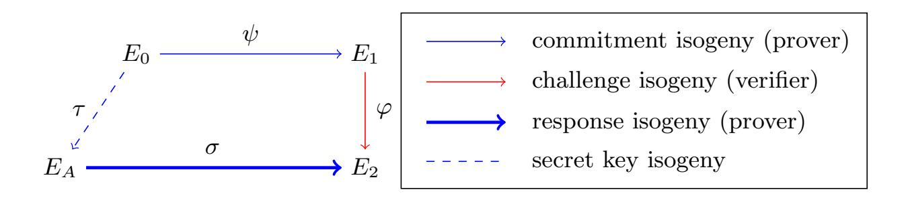
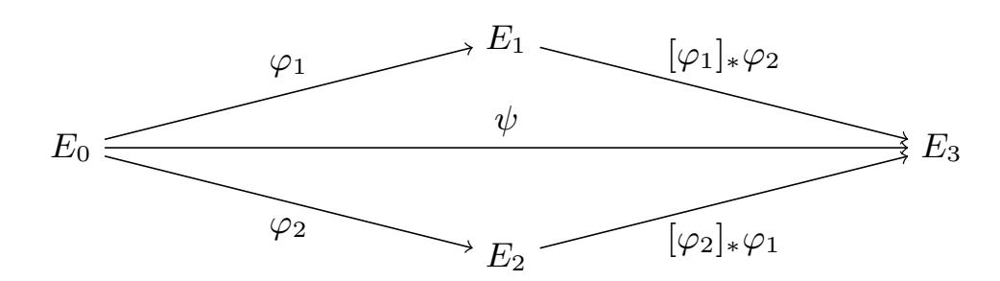
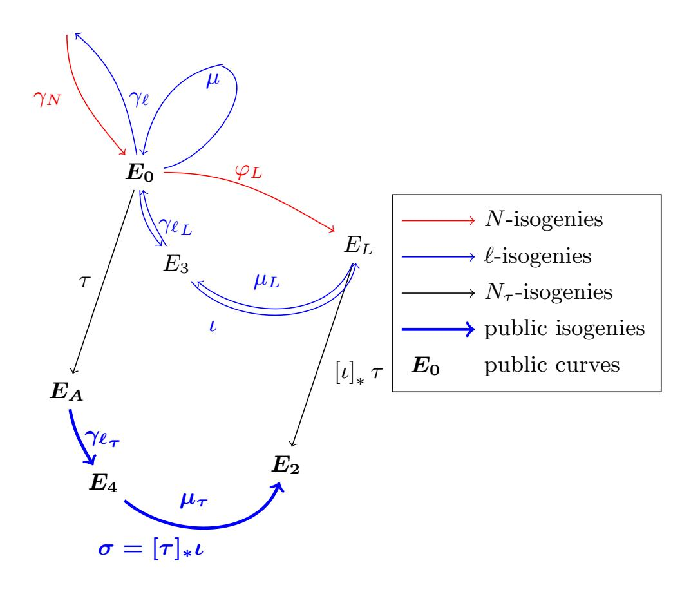
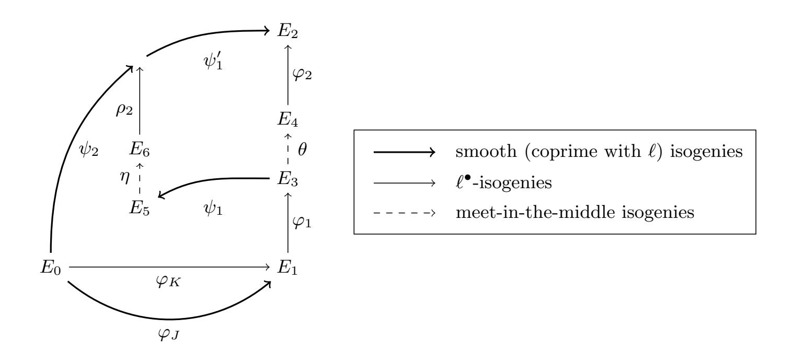

{0}------------------------------------------------

# SQISign: compact post-quantum signatures from quaternions and isogenies

Luca De Feo1,6,<sup>7</sup> , David Kohel<sup>2</sup> , Antonin Leroux3,6,<sup>7</sup> , Christophe Petit4,<sup>8</sup> , and Benjamin Wesolowski5,<sup>7</sup>

1 IBM Research <sup>2</sup> Aix Marseille Univ, CNRS, Centrale Marseille, I2M, Marseille, France <sup>3</sup> DGA

<sup>4</sup> University of Birmingham

<sup>5</sup> Univ. Bordeaux, CNRS, Bordeaux INP, IMB, UMR 5251, F-33400, Talence, France <sup>6</sup> LIX, CNRS, Ecole Polytechnique, Institut Polytechnique de Paris 7 INRIA

<sup>8</sup> Universit´e libre de Bruxelles

Abstract. We introduce a new signature scheme, SQISign, (for Short Quaternion and Isogeny Signature) from isogeny graphs of supersingular elliptic curves. The signature scheme is derived from a new one-round, high soundness, interactive identification protocol. Targeting the post-quantum NIST-1 level of security, our implementation results in signatures of 204 bytes, secret keys of 16 bytes and public keys of 64 bytes. In particular, the signature and public key sizes combined are an order of magnitude smaller than all other post-quantum signature schemes. On a modern workstation, our implementation in C takes 0.6s for key generation, 2.5s for signing, and 50ms for verification.

While the soundness of the identification protocol follows from classical assumptions, the zero-knowledge property relies on the second main contribution of this paper. We introduce a new algorithm to find an isogeny path connecting two given supersingular elliptic curves of known endomorphism rings. A previous algorithm to solve this problem, due to Kohel, Lauter, Petit and Tignol, systematically reveals paths from the input curves to a 'special' curve. This leakage would break the zeroknowledge property of the protocol. Our algorithm does not directly reveal such a path, and subject to a new computational assumption, we prove that the resulting identification protocol is zero-knowledge.

Keywords: Post-quantum · Signatures · Isogenies.

# 1 Introduction

Isogeny-based cryptography has existed since at least the work of Couveignes in 1997 [\[15\]](#page-46-0) and has developed significantly in the last decade due to increasing interest in post-quantum cryptography. The CGL hash function of [\[11\]](#page-46-1) and the SIDH key exchange proposed in [\[30\]](#page-47-0) have put isogenies between supersingular elliptic curves at the center of attention. The security of these schemes relies on 

{1}------------------------------------------------

the hardness of finding a path in the `-isogeny supersingular graph between two given vertices. This problem is believed to be hard for both classical and quantum computers. This assumption was studied by Kohel, Lauter, Petit and Tignol, who in [\[33\]](#page-47-1) introduced a new algorithm (often called KLPT in the litterature) that solves the quaternion analog of the `-isogeny path problem under the Deuring correspondence. This algorithm revealed its full potential in [\[25\]](#page-46-2), leading to several reductions between computational problems related to isogenies between supersingular curves, most notably a heuristic security reduction between the `-isogeny path problem and the endomorphism ring computation.

In parallel to these cryptanalytic efforts, isogeny-based cryptography has continued to develop with several new proposals. We can mention CSIDH [\[10\]](#page-45-0), an efficient reinterpretation of Couveignes' idea using supersingular elliptic curves defined over Fp. Another active area of research has been isogeny-based signature schemes, see for instance [\[52](#page-48-0)[,28,](#page-46-3)[18,](#page-46-4)[19,](#page-46-5)[6\]](#page-45-1).

Galbraith, Petit and Silva's signature scheme [\[28\]](#page-46-3) (also known as GPS) was the first constructive cryptographic application of the KLPT algorithm. However, their work remains mainly theoretical and, to this day, we are not aware of any implementation of their scheme. We follow in the footsteps of GPS by introducing a new signature scheme based on the quaternion `-isogeny path problem. Indeed, GPS relies on the KLPT algorithm for so-called "special" maximal orders (the main focus of [\[33\]](#page-47-1)), whereas our protocol requires a new variant of KLPT working for arbitrary maximal orders, which we introduce here.

The contributions of this paper can be summarized as follows:

- A new interactive identification protocol and the resulting signature scheme based on a generic algorithm for the quaternion `-isogeny path problem.
- A new generic KLPT algorithm, suited for our signature scheme, which produces a smaller output than the existing algorithm of [\[33\]](#page-47-1).
- A proof of the interpretation of Eichler orders and their class sets under the Deuring correspondence, and its application to the analysis of the output of our algorithm. This leads us to a natural security assumption from which we prove zero-knowledge of the identification scheme, and consequently unforgeability of the signature scheme.
- New algorithms for the efficient instantiation of the protocol, along with parameters targeting the NIST-1 level of post-quantum security, and a complete implementation of our signature scheme in both C and Magma.

The remainder of this paper is organized as follows. Section [2](#page-2-0) contains preliminaries on elliptic curves and quaternion algebras. Section [3](#page-9-0) sketches our new protocols along with some proofs. Section [4](#page-12-0) lays out the mathematical background on Eichler orders necessary for the rest of the paper. Section [5](#page-19-0) gives a generic description of our new Generalized KLPT algorithm. Section [6](#page-22-0) provides the generic variant used in our protocols. Section [7](#page-29-0) studies the zero knowledge property of the identification scheme. Finally, Section [8](#page-34-0) provides algorithms for efficient implementation of the schemes.

{2}------------------------------------------------

### <span id="page-2-0"></span>2 Preliminaries

Throughout this work, p is a prime number and  $\mathbb{F}_q$  is a finite field of size q, where q is a power of p. We are interested in supersingular elliptic curves over  $\mathbb{F}_q = \mathbb{F}_{p^2}$ , in an isogeny class such that the full endomorphism ring is defined over  $\mathbb{F}_q$ .

A negligible function  $f: \mathbb{Z}_{>0} \to \mathbb{R}_{>0}$  is a function whose growth is bounded by  $O(x^{-n})$  for all n > 0. In the analysis of a probabilistic algorithm, we say that an event happens with *overwhelming probability* if its probability of failure is a negligible function of the length of the input. We say that a distinguishing problem is hard when any probabilistic polynomial-time distinguisher has a negligible advantage with respect to the length of the instance. Two distributions are computationally indistinguishable if their associated distinguishing problem is hard.

#### 2.1 Supersingular elliptic curves and isogenies

Isogenies An isogeny  $\varphi: E_1 \to E_2$  is a non-constant morphism sending the identity of  $E_1$  to that of  $E_2$ . The degree of an isogeny is its degree as a rational map (see [43] for more details). When the degree  $\deg(\varphi) = d$  is coprime to p, the isogeny is necessarily separable. An isogeny induces a homomorphism of groups  $E_1(K) \to E_2(K)$  and, if separable, the kernel of  $\varphi$  is a group of order d. Such an isogeny is entirely described by its kernel, meaning that there is a one-to-one correspondence between separable isogenies (up to an isomorphism of the target curve) and finite subgroups of  $E(\overline{K})$ . The isogeny can be computed from its kernel G using Vélu's formula [47], in this case we write  $\varphi: E \to E/G$ . The degree of  $\varphi \circ \psi$  is equal to  $\deg(\varphi) \deg(\psi)$ . For any isogeny  $\varphi$  of degree  $d = \prod_{i=1}^n p_i^{e_i}$ ,  $\varphi$  can be factored as the composition of  $e_i$  isogenies of degree  $p_i$  for i = 1 to n. For any isogeny  $\varphi: E_1 \to E_2$ , there exists a unique dual isogeny  $\hat{\varphi}: E_2 \to E_1$ , satisfying  $\varphi \circ \hat{\varphi} = [\deg(\varphi)]$ , the multiplication by  $\deg(\varphi)$  map on  $E_2$ . Similarly  $\hat{\varphi} \circ \varphi$  is the multiplication-by-deg $(\varphi)$  map on  $E_1$ .

Endomorphism ring An isogeny from a curve E to itself is called an endomorphism. For each k in  $\mathbb{Z}$ , the multiplication-by-k map [k] is an endomorphism. The set  $\operatorname{End}(E)$  of all endomorphisms of E forms a ring under addition and composition, whose unit group  $\operatorname{Aut}(E)$  consists of the endomorphism of degree 1. For elliptic curves defined over a finite field  $\mathbb{F}_q$ , the Frobenius map  $\pi:(x,y)\mapsto (x^q,y^q)$  is an endomorphism, which generates a subring  $\mathbb{Z}[\pi]$ , and  $\operatorname{End}(E)$  is isomorphic either to an order of a quadratic imaginary field or a maximal order in a quaternion algebra. In the first case, the curve is said to be *ordinary* and otherwise supersingular [43]. We focus on the supersingular case in this article.

Supersingular elliptic curves and  $\ell$ -isogeny graphs Every supersingular elliptic curve defined over a field of characteristic p admits an isomorphic representative defined over  $\mathbb{F}_{p^2}$ . The supersingular  $\ell$ -isogeny graph is the graph whose vertices are the supersingular j-invariants in  $\mathbb{F}_{p^2}$ , and whose edges are the

{3}------------------------------------------------

 $\ell$ -isogenies between them. These graphs are connected (see [32,40]), essentially undirected (away from  $j=0,12^3$ ) since each  $\ell$ -isogeny has a dual,  $(\ell+1)$ -regular (there are exactly  $\ell+1$  outgoing edges from each j-invariant), and Ramanujan [41] (see [29] for applications of expander and Ramanujan graphs, and [11] for their cryptographic applications). An important consequence of the Ramanujan property is that random walks in the graph quickly converge to the uniform distribution.

#### <span id="page-3-0"></span>2.2 Quaternion algebras

For  $a, b \in \mathbb{Q}^*$  we denote by  $H(a, b) = \mathbb{Q} + i\mathbb{Q} + j\mathbb{Q} + k\mathbb{Q}$  the quaternion algebra over  $\mathbb{Q}$  with basis 1, i, j, k such that  $i^2 = a, j^2 = b$  and k = ij = -ji. We are interested in  $\mathcal{B}_{p,\infty}$ , the unique quaternion algebra (up to isomorphism) ramified exactly at p and  $\infty$ , since the endomorphism ring of a supersingular elliptic curve over  $\mathbb{F}_{p^2}$  is isomorphic to a maximal order of  $\mathcal{B}_{p,\infty}$ . When  $p \equiv 3 \mod 4$  we have  $\mathcal{B}_{p,\infty} = H(-1,-p)$ . Every quaternion algebra has a canonical involution that sends an element  $\alpha = a_1 + a_2i + a_3j + a_4k$  to its conjugate  $\overline{\alpha} = a_1 - a_2i - a_3j - a_4k$ . We define the reduced trace and the reduced norm by  $tr(\alpha) = \alpha + \overline{\alpha}$  and  $n(\alpha) = \alpha \overline{\alpha}$ . This norm is multiplicative and the induced inner product

$$(\alpha, \beta) \mapsto \frac{1}{2} (n(\alpha + \beta) - n(\alpha) - n(\beta))$$

is positive definite with orthogonal basis  $\{1, i, j, k\}$ .

Orders and Ideals A fractional ideal I is a  $\mathbb{Z}$ -lattice of rank four, meaning that  $I = \alpha_1 \mathbb{Z} + \alpha_2 \mathbb{Z} + \alpha_3 \mathbb{Z} + \alpha_4 \mathbb{Z}$  with  $\langle \alpha_1, \alpha_2, \alpha_3, \alpha_4 \rangle$  a basis of  $\mathcal{B}_{p,\infty}$ . We denote by n(I) the norm of I, defined as the  $\mathbb{Z}$ -module generated by the reduced norms of the elements of I. Given fractional ideals I and J, if  $J \subseteq I$  then the index [I:J] is defined to be the order of the finite quotient group I/J.

An order  $\mathcal{O}$  is a subring of  $\mathcal{B}_{p,\infty}$  that is also a fractional ideal. Elements of an order  $\mathcal{O}$  are said to be integral, since they have reduced norm and trace in  $\mathbb{Z}$ . The discriminant of  $\mathcal{O}$  is defined as  $\operatorname{disc}(\mathcal{O}) = \sqrt{\det((\alpha_i, \alpha_j))}_{i,j \in \{1,2,3,4\}}$  given a basis  $\langle \alpha_1, \alpha_2, \alpha_3, \alpha_4 \rangle$  of  $\mathcal{O}$ ;  $\operatorname{disc}(\mathcal{O}) \in \mathbb{Z}$  and is independent of a choice of basis. An order is called *maximal* when it is not contained in any other larger order. A suborder  $\mathfrak{O}$  of  $\mathcal{O}$  is an order of rank 4 contained in  $\mathcal{O}$ . If  $N = [\mathcal{O} : \mathfrak{O}]$  then the discriminant of  $\mathfrak{O}$  satisfies  $\operatorname{disc}(\mathfrak{O}) = N^2 \operatorname{disc}(\mathcal{O})$ .

The left order of a fractional ideal is defined as  $\mathcal{O}_L(I) = \{\alpha \in \mathcal{B}_{p,\infty} \mid \alpha I \subset I\}$  and similarly for the right order  $\mathcal{O}_R(I)$ . Then I is said to be a left fractional ideal of  $\mathcal{O}_L(I)$ . A fractional ideal is *integral* if it is contained in its left order, or equivalently in its right order; we refer to integral ideals hereafter as ideals. An integral ideal of integer norm and can be written as  $I = \mathcal{O}_L(I)\alpha + \mathcal{O}_L(I)n(I)$  for some  $\alpha \in \mathcal{O}_L(I)$ , and similarly for  $\mathcal{O}_R(I)$ . We simplify this notation by writing  $\mathcal{O}\alpha + \mathcal{O}N = \mathcal{O}\langle\alpha,N\rangle$  for any order  $\mathcal{O}$ .

The product IJ of ideals I and J satisfying  $\mathcal{O}_R(I) = \mathcal{O}_L(J)$  is the ideal generated by the products of pairs in  $I \times J$ . It follows that IJ is also an

{4}------------------------------------------------

(integral) ideal and  $\mathcal{O}_L(IJ) = \mathcal{O}_L(I)$  and  $\mathcal{O}_R(IJ) = \mathcal{O}_R(J)$ . The ideal norm is multiplicative with respect to ideal products. An ideal I is invertible if there exists another ideal  $I^{-1}$  verifying  $II^{-1} = \mathcal{O}_L(I) = \mathcal{O}_R(I^{-1})$  and  $I^{-1}I = \mathcal{O}_R(I) = \mathcal{O}_L(I^{-1})$ . The conjugate of an ideal  $\overline{I}$  is the set of conjugates of elements of I, which is an ideal satisfying  $I\overline{I} = n(I)\mathcal{O}_L(I)$  and  $\overline{I}I = n(I)\mathcal{O}_R(I)$  when I is invertible. This allows one to define the multiplicative inverse of I as

$$I^{-1} = \frac{1}{n(I)}\overline{I}$$

Note that invertibility is not a feature of every left  $\mathcal{O}$ -ideal when  $\mathcal{O}$  is generic. However, this is the case for the orders we study in this work.

We define an equivalence on orders by conjugacy and on left  $\mathcal{O}$ -ideals by right scalar multiplication. Two orders  $\mathcal{O}_1$  and  $\mathcal{O}_2$  are equivalent if there is an element  $\beta \in \mathcal{B}_{p,\infty}^{\star}$  such that  $\beta \mathcal{O}_1 = \mathcal{O}_2 \beta$ . Two left  $\mathcal{O}$ -ideals I and J are equivalent if there exists  $\beta \in \mathcal{B}_{p,\infty}^{\star}$ , such that  $I = J\beta$ . If the latter holds, then it follows that  $\mathcal{O}_R(I)$  and  $\mathcal{O}_R(J)$  are equivalent since  $\beta \mathcal{O}_R(I) = \mathcal{O}_R(J)\beta$ . For a given  $\mathcal{O}$ , this defines equivalences classes of left  $\mathcal{O}$ -ideals, and we denote the set of such classes by  $\mathrm{Cl}(\mathcal{O})$ .

#### 2.3 The Deuring Correspondence

In [21], Deuring made the link between the geometric world of elliptic curves and the arithmetic world of quaternion algebras over  $\mathbb{Q}$  by showing that the endomorphism ring of a supersingular elliptic curve E defined over  $\mathbb{F}_{p^2}$  is isomorphic to a maximal order in  $\mathcal{B}_{p,\infty}$ . This correspondence is in fact an equivalence of categories [32] between supersingular elliptic curves and left ideals for a maximal order  $\mathcal{O}$  of  $\mathcal{B}_{p,\infty}$ , inducing a bijection between conjugacy classes of supersingular j-invariants and maximal orders (up to equivalence). Given a supersingular curve  $E_0$ , this allows us to associate each pair  $(E_1, \varphi)$ , where  $E_1$  is another supersingular elliptic curve and  $\varphi: E_0 \to E_1$  is an isogeny, to a left integral  $\mathcal{O}_0$ -ideal (with  $\operatorname{End}(E_0) \simeq \mathcal{O}_0$ ) and every such ideal arises in this way. In this case  $\operatorname{End}(E_1)$  is isomorphic to the right order of this ideal. The explicit correspondence between isogenies and ideals is given through kernel ideals as defined in [51]. Given I an integral left- $\mathcal{O}_0$ -ideal we define the set

$$E_0[I] = \{ P \in E_0(\overline{\mathbb{F}}_{p^2}) : \alpha(P) = 0 \text{ for all } \alpha \in I \}$$

as the kernel of I. To I, we associate the isogeny  $\varphi_I$  of kernel  $E_0[I]$  defined by

$$\varphi_I: E_0 \to E_0/E_0[I]$$

Conversely given an isogeny  $\varphi$ , the corresponding kernel ideal is defined as

$$I_{\varphi} = \{ \alpha \in \mathcal{O}_0 : \alpha(P) = 0 \text{ for all } P \in \ker(\varphi) \}$$

<span id="page-4-0"></span>Remark 1. In the definitions above we identify  $\alpha \in \mathcal{O}_0$  with the related endomorphism in  $\operatorname{End}(E_0)$ , implicitly assuming a fixed isomorphism between  $\mathcal{O}_0$  and

{5}------------------------------------------------

End( $E_0$ ). This is a simplification that we will reiterate throughout this paper to lighten notations. In fact, we will sometimes go further and also write  $\alpha$  for the principal ideal  $\mathcal{O}_0\alpha$ . It is easily verified that this ideal corresponds to the kernel ideal  $I_{\alpha}$ , and conversely any principal ideal corresponds to an endomorphism  $\varphi_{\mathcal{O}_0\alpha}$ .

We summarize the main properties of this correspondence in Table 1.

Remark 2. The above correspondence can be extended to a larger setting. This fact is mentioned in [50, Remark 42.3.10] but neither proof nor reference is provided. This brief remark states that Eichler orders (intersections of maximal orders) can be seen as endomorphism rings of elliptic curves together with a given subgroup (stable under the action of this endomorphism ring). In Section 4, we propose an equivalent statement to this fact, together with a proof. Many intermediate properties encountered on the way to this result will play an important role in both the design of Algorithms 4 and 5 and the analysis of our signature scheme.

A Concrete example: *j*-invariant 1728 Let  $p = 3 \mod 4$ , and let  $\mathcal{E}_0$  be the curve of *j*-invariant 1728, defined over  $\mathbb{F}_{p^2}$  by  $y^2 = x^3 + x$ . The endomorphism ring of this curve is isomorphic to the maximal order  $\mathcal{O}_0 = \langle 1, i, \frac{i+j}{2}, \frac{1+k}{2} \rangle$  with  $i^2 = -1$ ,  $j^2 = -p$  and k = ij. Moreover, we have explicit endomorphisms  $\pi$  and  $\iota$  such that  $\operatorname{End}(E_0) = \langle 1, \iota, \frac{\iota+\pi}{2}, \frac{1+\iota\pi}{2} \rangle$ , where  $\pi$  is the Frobenius morphism  $(x, y) \mapsto (x^p, y^p)$  and  $\iota$  is the map  $(x, y) \mapsto (-x, \sqrt{-1}y)$ .

<span id="page-5-1"></span>On representing and computing endomorphism rings Apart from special curves such as  $\mathcal{E}_0$ , we have no efficient explicit way to compute the endomorphism ring of a supersingular curve  $E_1$ . By explicit we mean a concrete basis such that  $\mathcal{O}_0 = \langle \omega_1, \omega_2, \omega_3, \omega_4 \rangle$ , where each  $\omega_i$  corresponds to an endomorphism  $\rho_i$  that can be efficiently evaluated on any point through an explicit isomorphism between  $\operatorname{End}(E_0)$  and  $\mathcal{O}_0$ . In [25] a formula is given, based on  $\operatorname{End}(E_0)$  and an isogeny  $\varphi: E_0 \to E_1$  of degree  $N_{\varphi}$ . The ideal  $I_{\varphi}$  is a left  $\mathcal{O}_0$ -ideal and right  $\mathcal{O}_1$ -ideal with  $\mathcal{O}_1 \simeq \operatorname{End}(E_1)$ . Since  $I_{\varphi}$  is integral, it is contained in both  $\mathcal{O}_0$  and  $\mathcal{O}_1$ . From that, it is easy to see that  $N_{\varphi}\mathcal{O}_1 \subset \mathcal{O}_0$ . We will use that fact to represent and compute elements of  $\mathcal{O}_1$ . An element  $\alpha \in \mathcal{O}_1$  can be written as an element of  $\frac{\mathcal{O}_0}{N_{\varphi}}$  with  $\alpha = \frac{1}{N_{\varphi}} \sum_{i=1}^4 a_i \omega_i$  with  $a_i \in \mathbb{Z}$  for  $i \in \{1, 2, 3, 4\}$ . Using that, it is possible to evaluate an endomorphism  $\alpha$  at a point P as  $\alpha(P) = \frac{1}{N_{\varphi}^2} \sum_{i=1}^4 [a_i] \varphi \circ \rho_i \circ \hat{\varphi}(P)$ .

#### <span id="page-5-0"></span>2.4 Algorithmic building blocks

In this section we introduce some sub-algorithms that will be used in the remaining of the paper. These algorithms are either classical or inherited from recent works [33,28] in the literature.

We will write  $\mathsf{CRT}_{M,N}(x,y)$  for the Chinese Remainder algorithm, that takes  $x \in \mathbb{Z}/M\mathbb{Z}, \ y \in \mathbb{Z}/N\mathbb{Z}$  and returns  $z \in \mathbb{Z}/MN\mathbb{Z}$  with  $z = x \bmod M$  and  $z = y \bmod N$ .

{6}------------------------------------------------

| O . 1                                                      | N. 1 1 1 1 12                                                                     |
|------------------------------------------------------------|-----------------------------------------------------------------------------------|
| Supersingular j-invariants over $\mathbb{F}_{p^2}$         | Maximal orders in $\mathcal{B}_{p,\infty}$                                        |
| j(E) (up to galois conjugacy)                              | $\mathcal{O} \cong \operatorname{End}(E)$ (up to isomorpshim)                     |
| $(E_1, \varphi)$ with $\varphi: E \to E_1$                 | $I_{\varphi}$ integral left $\mathcal{O}$ -ideal and right $\mathcal{O}_1$ -ideal |
| $\theta \in \operatorname{End}(E_0)$                       | Principal ideal $\mathcal{O}\theta$                                               |
| $\overline{\deg(\varphi)}$                                 | $n(I_{\varphi})$                                                                  |
| $\hat{\varphi}$                                            | $\overline{I_{\varphi}}$                                                          |
| $\varphi: E \to E_1, \psi: E \to E_1$                      | Equivalent Ideals $I_{\varphi} \sim I_{\psi}$                                     |
| Supersingular <i>j</i> -invariants over $\mathbb{F}_{p^2}$ | $\mathrm{Cl}(\mathcal{O})$                                                        |
| $\tau \circ \rho : E \to E_1 \to E_2$                      | $I_{\tau \circ \rho} = I_{\rho} \cdot I_{\tau}$                                   |
| [this work, Proposition 3]                                 | Eichler orders $\mathfrak{O} = \mathcal{O} \cap \mathcal{O}_1$ of level $N$       |
| N-isogenies (up to isomorphism)                            | $\mathrm{Cl}(\mathfrak{O})$                                                       |
| [this work, Proposition 6]                                 |                                                                                   |

<span id="page-6-0"></span>**Table 1.** The Deuring correspondence, a summary. The results labelled with [this work, ·] are proved in the article. All other results are classical and well-established in the literature.

The KLPT Algorithm A significant part of the present work is spent on providing a new generalization of the KLPT algorithm [33] (see Algorithm 5). This algorithm takes an integral ideal I as input and finds an equivalent ideal  $I \sim I$  of given norm. For instance, the norm can be required to be  $\ell^e$  for some  $e \in \mathbb{N}$ . In general, in the rest of this paper when an output of an algorithm is required to be a power of  $\ell$ , we write  $\ell^{\bullet}$ .

We start by introducing a few notations taken from [33], before introducing several sub-algorithms that we will use. Finally we describe a short version of KLPT in Algorithm 3 built from these sub-algorithms.

An important notion introduced in [33] is that of special extremal orders. In the quaternion algebra  $\mathcal{B}_{p,\infty} = \mathbb{Q}[i,j]$ , a special extremal order is a maximal order  $\mathcal{O}_0$  containing a suborder admitting an orthogonal decomposition R+jR where  $R=\mathbb{Z}[\omega]\subset\mathbb{Q}[i]$  is a quadratic order of minimal discriminant (or equivalently such that  $\omega$  has smallest norm in  $\mathcal{O}_0$ ). By orthogonal decomposition we mean that  $R\subset (jR)^{\perp}$ . The order  $\mathcal{O}_0=\langle 1,i,\frac{i+j}{2},\frac{1+k}{2}\rangle$ , with  $i^2=-1$  and  $j^2=-p$ , corresponding to the elliptic curve of j-invariant 1728 when  $p=3 \mod 4$ , is one of the simplest examples of such special extremal orders, as it contains the suborder  $\mathbb{Z}[i]+j\mathbb{Z}[i]$ . For the rest of this paper, we fix these notations for  $j,R,\omega$ . The method of resolution resulting in Algorithm 3 is inspired by [33, Lemma 5]. We introduce here a reformulation of this lemma using notations that we will keep for the rest of this article.

**Lemma 1.** For any integral ideal I, the map

<span id="page-6-1"></span>
$$\chi_I(\alpha) = I \frac{\overline{\alpha}}{n(I)}$$

is a surjection from  $I \setminus \{0\}$  to the set of ideals J equivalent to I. For  $\alpha \neq \beta$ , we have  $\chi_I(\alpha) = \chi_I(\beta)$  if and only if  $\alpha = \beta \delta$  where  $\delta \in \mathcal{O}_R(I)^{\times}$ .

*Proof.* This map is well-defined as proved in [33]. We see that it is a surjection by identifying  $\overline{I} \cdot J$  with a principal ideal  $\mathcal{O}_R(I)\overline{\beta}$ . Then, it is clear that  $\beta \in I$ 

{7}------------------------------------------------

and  $J = \chi_I(\beta)$ . Finally, one can verify that  $\mathcal{O}_R(I)\beta_1 = \mathcal{O}_R(I)\beta_2$  if and only if  $\beta_1 = \delta\beta_2$  where  $\delta \in \mathcal{O}_R(I)^{\times}$ .

With  $n(\chi_I(\alpha)) = n(\alpha)/n(I)$ , we see that finding  $J \sim I$  of given norm N is equivalent to finding some  $\alpha \in I$  of norm n(I)N. This observation underlies the solution of [33] for Algorithm 3.

Remark 3. In what follows will often define a projective point  $(C_0 : D_0) \in \mathbb{P}^1(\mathbb{Z}/N\mathbb{Z})$  for some prime N and then, by an abuse of notation, define an element  $C_0 + \omega D_0$  inside our maximal order.

Following [33,39], we define several sub-routines for KLPT. When it is relevant for our analysis, we introduce those sub-protocols formally as in Algorithms 1 and 2 (the remaining routines can be found at [33]). In the descriptions below,  $\mathcal{O}_0$  denotes a special extremal order.

- EquivalentPrimeIdeal(I), given a left  $\mathcal{O}_0$ -ideal I, finds an equivalent left  $\mathcal{O}_0$ -ideal of prime norm.
- RepresentInteger<sub> $\mathcal{O}_0$ </sub> (M), given  $M \in \mathbb{N}$  with M > p, finds  $\gamma \in \mathcal{O}_0$  of norm M. We summarize it in Algorithm 1. Therein, we write f(x,y) for the norm of  $x + \omega y$ . Cornacchia(M') denotes Cornacchia's well known algorithm [12]: on input  $M' \in \mathbb{Z}$ , it outputs either  $\bot$  if M' cannot be represented as f(x,y), or a solution x,y to the norm equation M' = f(x,y).
- IdealModConstraint $(I, \gamma)$ , given an ideal I of norm N, and  $\gamma \in \mathcal{O}_0$  of norm Nn, finds  $(C_0 : D_0) \in \mathbb{P}^1(\mathbb{Z}/N\mathbb{Z})$  such that  $\mu_0 = j(C_0 + \omega D_0)$  verifies  $\gamma \mu_0 \in I$ .
- StrongApproximation<sub>F</sub> $(N, C_0, D_0)$ , given a prime N and  $C_0, D_0 \in \mathbb{Z}$ , finds  $\mu = \lambda \mu_0 + N \mu_1 \in \mathcal{O}_0$  of norm dividing F, with  $\mu_0 = j(C_0 + \omega D_0)$ . We write StrongApproximation<sub> $\ell$ </sub>• when the expected norm is a power of  $\ell$ .

We provide in Algorithm 2 a description of StrongApproximation<sub> $\ell$ </sub>. For clarity's sake, our description closely follows [33]; however we will use in practice a modification due to [39] which produces outputs of smaller norm (see Remark 4).

# <span id="page-7-0"></span>**Algorithm 1** RepresentInteger $_{\mathcal{O}_0}(M)$

**Require:**  $M \in \mathbb{Z}$  such that M > p

**Ensure:**  $\gamma = x + y\omega + zj + tj\omega$  with  $n(\gamma) = M$ .

- 1: Set  $m = \lfloor \sqrt{\frac{M}{p(1+q)}} \rfloor$  and sample random integers  $z, t \in [-m, m]^2$ . Set M' = M pf(z, t).
- 2: If  $\mathsf{Cornacchia}(M') = \bot$  go back to the previous step. Otherwise set  $x, y = \mathsf{Cornacchia}(M')$ .
- <span id="page-7-1"></span>3: **return**  $\gamma = x + \omega y + j(z + \omega t)$ .

{8}------------------------------------------------

#### <span id="page-8-0"></span>Algorithm 2 StrongApproximation ...

**Require:** A prime number N, such that  $\ell$  is a non quadratic residue mod N, two values  $C, D \in \mathbb{Z}$ .

**Ensure:**  $\mu = \lambda \mu_0 + N \mu_1$  with  $\mu_0 = j(C + \omega D)$ ,  $\mu_1 \in \mathcal{O}_0$  such that  $n(\mu) = \ell^{e_1}$  for some  $e_1 \in \mathbb{N}$ .

- <span id="page-8-2"></span><span id="page-8-1"></span>1: Select  $e_1 \ge pN^4$  and adjust the parity so that  $\ell^e/p(C^2 + qD^2)$  is a quadratic residue mod N. We denote  $\lambda$  its square root.
- Select a random pair z, t such that l<sup>e</sup> pf(λC + Nz, λD + Nt) = 0 mod N². This can done by solving a linear equation mod N and thus has N solutions.
   Set M = l<sup>e</sup>-pf(λC+Nz,λD+Nt)/N² and determines if the equation f(x, y) = M has a
- <span id="page-8-5"></span>3: Set  $M = \frac{\ell^2 - pf(\lambda C + Nz, \lambda D + Nt)}{N^2}$  and determines if the equation f(x, y) = M has a solution (and its solution in the affirmative case) using Cornacchia's algorithm. If no solution exists, go back to Step 2.
- 4: **return**  $\mu = \lambda j(C + D\omega) + N(x + \omega y + j(z + \omega t)).$

Remark 4. Following [39], Algorithm 2 can be modified so that it is deterministic and its outputs have smaller norm. The only difference lies in Step 2. Instead of selecting a random solution z, t among the N possible pairs satisfying the equation, the idea is to look for the one that will yield the best solution. We define good solutions as the ones corresponding to small value of  $pf(\lambda C + Nz, \lambda D + Nt)$ . In [39], it is shown that good solutions correspond to short vectors in some lattice L. Looking at the determinant of this lattice, we can prove that there exists a solution of approximate size  $pN^3$  (instead of  $pN^4$ ). This in turns lets us define a smaller exponent  $e_1$  in Step 1. By enumerating short vectors in increasing order, we can make StrongApproximation deterministic.

We can now give a compact description of the KLPT algorithm. There are several versions of it, depending on the norm sought for the output: we will write  $\mathsf{KLPT}_{\ell^{\bullet}}$  when the algorithm produces an output of norm a power of  $\ell$ ;  $\mathsf{KLPT}_T$  when the norm is a divisor of  $T \in \mathbb{Z}$ . The changes between the two variants are minimal; for simplicity, we describe only  $\mathsf{KLPT}_{\ell^{\bullet}}$  in Algorithm 3.

<span id="page-8-3"></span>Remark 5. The sub-routine EquivalentPrimeldeal can be made deterministic if we look for the ideal of smallest norm satisfying the desired condition. Since we are looking at lattices of dimension at most 4, finding an ordered set of smallest vectors can be done efficiently. We already pointed out in Remark 4 that StrongApproximation can be made deterministic. The sub-routine IdealModConstraint is also deterministic as shown in [33]. Making RepresentInteger  $\mathcal{O}_0$  deterministic is less natural, as there are several solutions for a given input M. Nevertheless, we can fix an ordering for the tuple (x,y,z,t) of coordinates over  $\mathbb{Z}\langle\omega,j\rangle$  and search for the smallest solution with respect to that ordering. In conclusion, the whole algorithm KLPT can be made deterministic.

<span id="page-8-4"></span>Remark 6. A result of [28] shows that the outputs of EquivalentPrimeIdeal and KLPT only depend on the equivalence class of the input (in fact this is only true with a minor tweak to the original algorithm of [33]). Hence, we will sometimes abuse notations and use both as if they took inputs in  $Cl(\mathcal{O}_0)$ .

{9}------------------------------------------------

#### <span id="page-9-1"></span>**Algorithm 3** $\mathsf{KLPT}_{\ell^{\bullet}}(I)$

Require: I a left  $\mathcal{O}_0$ -ideal. Ensure:  $J \sim I$  of norm  $\ell^e$ .

- 1: Compute  $L = \text{EquivalentPrimeIdeal}(I), L = \chi_I(\delta) \text{ for } \delta \in I \text{ with } N = n(L).$
- 2: Compute  $\gamma = \mathsf{RepresentInteger}_{\mathcal{O}_0}(N\ell^{e_0})$  for  $e_0 \in \mathbb{N}$ .
- 3: Compute  $(C_0:D_0) = \mathsf{IdealModConstraint}(L,\gamma)$ .
- 4: Compute  $\nu = \mathsf{StrongApproximation}_{\ell^{\bullet}}(N, C_0, D_0))$  and set  $\beta = \gamma \nu$  and e such that  $n(\beta) = N\ell^e$ .
- 5: **return**  $J = \chi_L(\beta)$ .

Remark 7. Algorithm 3 only applies to  $\mathcal{O}_0$ -ideals. To handle ideals of arbitrary maximal orders  $O_L$ ,  $O_R$ , [33] starts by looking for two connecting ideals between  $\mathcal{O}_0$  and  $O_L$ , and  $O_0$  and  $O_R$ . This yields two left  $\mathcal{O}_0$ -ideals on which Algorithm 3 can be applied. Concatenation of the two outputs then gives the desired solution. This strategy would be problematic in our signature scheme, as it would reveal the secret key. In Algorithm 5 we present a solution that does not suffer from this flaw, and that moreover produces ideals of smaller norm.

# <span id="page-9-0"></span>3 New identification protocol and signature scheme

In this section we describe our new identification protocol and signature scheme based on supersingular isogeny problems. We refer to Appendix A for more details on security definitions.

#### <span id="page-9-2"></span>3.1 An identification protocol

Let  $\lambda$  be a security parameter. The setup is as follows.

setup:  $\lambda \mapsto \text{param}$  Pick a prime number p and a supersingular elliptic curve  $E_0$  defined over  $\mathbb{F}_p$  with known special extremal endomorphism ring  $\mathcal{O}_0$ . Select an odd smooth number  $D_c$  of  $\lambda$  bits and  $D = 2^e$  where e is above the diameter of the supersingular 2-isogeny graph. To prove knowledge of the secret  $\tau$ , the prover engages in the following  $\Sigma$ -protocol with the verifier.

keygen: param  $\mapsto$  (pk =  $E_A$ , sk =  $\tau$ ) Pick a random isogeny walk  $\tau: E_0 \to E_A$ , leading to a random elliptic curve  $E_A$ . The public key is  $E_A$ , and the secret key is the isogeny  $\tau$ .

The identification protocol goes as follows:

**Commitment** The prover generates a random (secret) isogeny walk  $\psi : E_0 \to E_1$ , and sends  $E_1$  to the verifier.

**Challenge** The verifier sends the description of a cyclic isogeny  $\varphi: E_1 \to E_2$  of degree  $D_c$  to the prover.

**Response** From the isogeny  $\varphi \circ \psi \circ \hat{\tau} : E_A \to E_2$ , the prover constructs a new isogeny  $\sigma : E_A \to E_2$  of degree D such that  $\hat{\varphi} \circ \sigma$  is cyclic, and sends  $\sigma$  to the verifier.

{10}------------------------------------------------

**Verification** The verifier accepts if  $\sigma$  is an isogeny of degree D from  $E_A$  to  $E_2$  and  $\hat{\varphi} \circ \sigma$  is cyclic. They reject otherwise.



Fig. 1. A picture of the identification protocol

<span id="page-10-0"></span>We summarize the protocol in Fig. 1. Completeness follows from the correctness of Algorithm 5, allowing a honest prover to construct  $\sigma: E_A \to E_2$  such that  $\hat{\varphi} \circ \sigma$  is cyclic. Soundness is analysed in Section 3.2, and follows from the difficulty of the Smooth Endomorphism Problem — a problem heuristically equivalent to the classic Endomorphism Ring Problem. Zero-knowledge is more difficult to prove, as we argue in Section 3.3, and we defer its analysis to Section 7.

#### <span id="page-10-1"></span>3.2 Soundness

In this section, we prove that the protocol is sound if the following problem is hard.

<span id="page-10-2"></span>Problem 1 (Supersingular Smooth Endomorphism Problem). Given a prime p and a supersingular elliptic curve E over  $\mathbb{F}_{p^2}$ , find a (non-trivial) cyclic endomorphism of E of smooth degree.

Remark 8. Note that under heuristics similar to those used in [25], the above problem is equivalent to the Endomorphism Ring Problem (given  $E/\mathbb{F}_{p^2}$ , compute endomorphisms forming a  $\mathbb{Z}$ -basis of  $\operatorname{End}(E)$ ). Indeed, random endomorphisms in E can be constructed by taking a random walk  $E \to E'$ , then finding a non-zero cyclic endomorphism of E'. Therefore, one can adapt the heuristic algorithm [25, Algorithm 8] to reduce the Endomorphism Ring Problem to Problem 1. The converse reduction follows from the heuristic algorithm [25, Algorithm 7]. The algorithms presented in [24] are also related to this problem.

<span id="page-10-3"></span>**Theorem 1 (Soundness).** If there is an adversary that breaks the soundness of the protocol with probability w and expected running time r for the public key  $E_A$ , then there is an algorithm for the Supersingular Smooth Endomorphism Problem on  $E_A$  with expected running time O(r/(w-1/c)), where c is the size of the challenge space.

<span id="page-10-4"></span>The theorem is a consequence of the following lemma.

{11}------------------------------------------------

**Lemma 2.** Given two accepting conversations  $(E_1, \varphi, \sigma)$  and  $(E_1, \varphi', \sigma')$  where  $\varphi \neq \varphi'$ , the composition  $\hat{\sigma}' \circ \varphi' \circ \hat{\varphi} \circ \sigma$  is a non-scalar endomorphism of  $E_A$  of smooth degree.

Proof. By construction,  $\hat{\sigma}' \circ \varphi' \circ \hat{\varphi} \circ \sigma$  is an endomorphism of  $E_A$  of degree  $(DD_c)^2$ . This shows that the degree is smooth. It remains to prove that it is not a scalar. Suppose by contradiction that  $\hat{\sigma}' \circ \varphi' \circ \hat{\varphi} \circ \sigma = [DD_c]$ . The compositions  $\hat{\varphi} \circ \sigma$  and  $\hat{\varphi}' \circ \sigma'$  are two cyclic isogenies from  $E_A$  to  $E_1$  of same degree. Therefore  $\hat{\sigma}' \circ \varphi'$  is the dual of  $\hat{\varphi} \circ \sigma$ . We deduce that  $\hat{\varphi} \circ \sigma = \hat{\varphi}' \circ \sigma'$ , a contradiction.

Proof of Theorem 1. The endomorphism  $\hat{\sigma}' \circ \varphi' \circ \hat{\varphi} \circ \sigma$  in Lemma 2 corresponds to a (possibly backtracking) sequence of isogenies, and removing the backtracking subsequences, we obtain a solution to the Supersingular Smooth Endomorphism Problem of  $E_A$ . Therefore the protocol has special soundness for the relation R defined as

 $(E_A, \alpha) \in R \iff \alpha$  is a cyclic smooth degree endomorphism of  $E_A$ .

It is therefore a proof of knowledge for R with knowledge error 1/c — see for instance [17, Theorem 1]. In other words, an adversarial prover with success probability w and running time r can be turned into a knowledge extractor for R of expected running time O(r/(w-1/c)).

#### <span id="page-11-0"></span>3.3 Zero-knowledge: two insecure approaches

The sketch given in Section 3.1 is incomplete, as it does not specify a method to compute the response isogeny  $\sigma$ . The zero-knwoledge property of the scheme clearly depends on this method, and it turns out that all previously known methods lead to insecure constructions. Indeed the trivial approach of setting  $\sigma = \varphi \circ \psi \circ \hat{\tau}$  immediately reveals the secret.

Following [28], it would be tempting to translate the isogeny  $\varphi \circ \psi \circ \hat{\tau}$  to the corresponding left ideal of  $\mathcal{O}_A \approx \operatorname{End}(E_A)$ , then apply the algorithm of [33] to obtain another ideal in the same class, and finally translate that ideal back to an isogeny  $\sigma : E_A \to E_2$ . However this approach is no more secure, as the algorithm of [33] ends up revealing some path from  $E_A$  to  $E_0$ , which is equivalent to revealing  $\tau$  as shown in [25].

In Sections 5 and 6 we will introduce a new variant of the KLPT algorithm that conjecturally does not suffer from the same leakages. Then, we will prove zero-knowledge in Section 7, under a new conjecturally hard computational problem.

#### 3.4 The signature scheme

The new signature scheme is simply a Fiat-Shamir transformation of the identification protocol introduced in Section 3.1. Following the construction of [11] extended in [42] for smooth degrees, if  $D_c = \prod_{i=1}^n \ell_i^{e_i}$ , we write  $\mu(D_c) = \prod_{i=1}^n \ell_i^{e_i-1}(\ell_i+1)$ 

{12}------------------------------------------------

and we define an arbitrary function  $\Phi_{D_c}(E, s)$ , mapping integers  $s \in [1, \mu(D_c)]$  to non-backtracking sequences of isogenies of total degree  $D_c$  starting at E. Let  $H: \{0,1\}^* \to [1, \mu(D_c)]$  be a cryptographically secure hash function.

The signature scheme is as follows.

- sign:  $(\mathsf{sk}, m) \mapsto \Sigma$  Pick a random (secret) isogeny  $\psi : E_0 \to E_1$ . Let  $s = H(j(E_1), m)$ , and build the isogeny  $\Phi_{D_c}(E_1, s) = \varphi : E_1 \to E_2$ . From the knowledge of  $\mathcal{O}_A$ , and of the isogeny  $\varphi \circ \psi : E_0 \to E_2$ , construct an isogeny  $\sigma : E_A \to E_2$  of degree D such that  $\hat{\varphi} \circ \sigma$  is cyclic. The signature is the pair  $(E_1, \sigma)$ .
- verify:  $(\mathsf{pk}, m, \Sigma) \mapsto \mathsf{true} \ \mathbf{or} \ \mathsf{false} \ \mathsf{Parse} \ \Sigma \ \mathsf{as} \ (E_1, \sigma). \ \mathsf{From} \ s = H(j(E_1), m),$  recover the isogeny  $\Phi_{D_c}(E_1, s) = \varphi : E_1 \to E_2$ . Check that  $\sigma$  is an isogeny from  $E_A$  to  $E_2$  and that  $\hat{\varphi} \circ \sigma$  is cyclic.

**Theorem 2.** The signature described above is secure against chosen-message attacks in the random oracle model assuming the hardness of Problems 1 and 2.

*Proof.* This follows from Theorem 3 applied to the identification scheme described in Section 3.1. The associated sigma-protocol is complete as explained briefly in Section 3.1, special sound due to Theorem 1 and honest verifier zero-knowledge as proved by combining Lemma 12 with Proposition 11.

# <span id="page-12-0"></span>4 Eichler orders and the Deuring correspondence

In this section we recall the notion of Eichler orders and we interpret them under the Deuring correspondence. Eichler orders have been studied extensively in the literature of quaternion algebras [23,40]. The results of this section appear to be folklore (see [50, Remark 42.3.10]), we nevertheless provide a detailed treatment for completeness.

An Eichler order is the intersection of two maximal orders inside  $\mathcal{B}_{p,\infty}$ . In all this section we will consider the case of the Eichler order  $\mathfrak{O} = \mathcal{O}_0 \cap \mathcal{O}$  where  $\mathcal{O}_0$  and  $\mathcal{O}$  are maximal orders connected through an ideal I of norm n(I) such that  $I \nsubseteq n\mathcal{O}_L(I)$  for any n > 1. This setting corresponds to curves  $E_0, E$  connected by an isogeny  $\varphi_I$  of cyclic kernel and degree n(I) with  $\operatorname{End}(E_0) \cong \mathcal{O}_0$  and  $\operatorname{End}(E) \cong \mathcal{O}$ .

Looking at the interpretation of Eichler orders under the Deuring correspondence is in fact quite natural. There is a direct link between such orders and integral ideals. Indeed, for a given ideal I, we can define the corresponding Eichler order  $\mathfrak{O} = \mathcal{O}_L(I) \cap \mathcal{O}_R(I)$ . In this case, it is a well-known fact that the index of  $\mathfrak{O}$  is the same in both  $\mathcal{O}_0$  and  $\mathcal{O}$ . In the litterature, the term level is used for this quantity and it is equal to n(I) if  $I \nsubseteq n\mathcal{O}_L(I)$  for any n > 1 [33]. This last condition implies that  $\varphi_I$  has cyclic kernel. Given the role of integral ideals in the Deuring correspondence, it is not surprising that we are able to interpret Eichler orders in the geometric world of elliptic curves.

<span id="page-12-1"></span>The following proposition clarifies the link between ideals and Eichler orders.

{13}------------------------------------------------

**Proposition 1.**  $\mathfrak{O} := \mathcal{O}_0 \cap \mathcal{O} = \mathcal{O}_L(I) \cap \mathcal{O}_R(I) = \mathbb{Z} + I$ .

*Proof.* Since I is integral, it is clear that  $\mathbb{Z} + I \subset \mathfrak{D}$ . We conclude by observing that the index of  $\mathbb{Z} + I$  in both  $\mathcal{O}$  and  $\mathcal{O}_0$  is n(I), the same as  $\mathfrak{D}$ .

One goal of this section is to interpret the elements in  $\mathfrak{O}$  under the Deuring correspondence. As elements in  $\mathcal{O}_0 \cap \mathcal{O}$  we can see them as endomorphisms in both  $\operatorname{End}(E_0)$  and  $\operatorname{End}(E)$ . What does that mean exactly?

<span id="page-13-2"></span>Remark 9. The decomposition  $\mathbb{Z} + I$  allows one to refine the statement above. In fact, we can separate elements in  $\mathfrak{O}$  according to whether their norm is coprime to n(I) or not. Given that  $n(I)\mathbb{Z} \subset I$ , it is easily verified that this partition can be written as  $\mathfrak{O} = (I \cup \overline{I}) \cup (\mathbb{Z} \setminus n(I)\mathbb{Z} + I)$ . It is well-known that  $I = \operatorname{Hom}(E, E_0)\varphi_I$ . Hence, the elements in I correspond to the endomorphisms  $\psi \circ \varphi_I$  for any isogeny  $\psi : E \to E_0$ . The same analysis proves  $\overline{I} = \operatorname{Hom}(E_0, E)\hat{\varphi_I}$ . The elements of  $\overline{I}$  correspond to the same endomorphisms as those of I, but decomposed as  $\hat{\psi} \circ \hat{\varphi}_I$  in  $\operatorname{End}(E)$ .

We start by setting the vocabulary and notations for commutative isogeny diagrams in Section 4.1. Then, in Section 4.2, we study the elements of  $(\mathbb{Z} \setminus n(I)\mathbb{Z}) + I$  to complete our interpretation of Eichler orders as stated in Proposition 3. Finally, in Section 4.3 we build upon our results to study class sets of Eichler orders.

#### <span id="page-13-0"></span>4.1 Commutative Isogeny Diagrams

We define commutative diagrams of isogenies using the classical notations of pushforward and pullback maps. Let us take 3 curves  $E_0, E_1, E_2$  and two separable isogenies  $\varphi_1 : E_0 \to E_1$  and  $\varphi_2 : E_0 \to E_2$  of coprime degrees,  $N_1$  and  $N_2$ . Then, there is a fourth curve  $E_3$  and two pushforward isogenies  $[\varphi_1]_*\varphi_2$  and  $[\varphi_2]_*\varphi_1$  going from  $E_1$  and  $E_2$  toward  $E_3$ , verifying  $\deg([\varphi_1]_*\varphi_2) = N_2$  and  $\deg([\varphi_2]_*\varphi_1) = N_1$ . This yields the commutative diagram pictured in Fig. 2. The

<span id="page-13-1"></span>

Fig. 2. A commutative isogeny diagram

isogenies  $[\varphi_2]_*\varphi_1$  and  $[\varphi_1]_*\varphi_2$  are defined as the separable isogenies of respective kernels  $\varphi_2(\ker(\varphi_1))$  and  $\varphi_1(\ker(\varphi_2))$ . We will sometimes refer to  $[\varphi_2]_*\varphi_1$  as the image of  $\varphi_1$  through  $\varphi_2$ . The two sides of the diagram can be seen as two decompositions of the same isogeny  $\psi = [\varphi_2]_*\varphi_1 \circ \varphi_2 = [\varphi_1]_*\varphi_2 \circ \varphi_1$ .

{14}------------------------------------------------

Remark 10. These commutative diagrams are at the heart of the SIDH key exchange protocol [30].

There is a dual notion of *pullback isogeny*: given  $\varphi_1 : E_0 \to E_1$  and  $\rho_2 : E_1 \to E_3$ , of coprime degrees, we can define the pullback of  $\rho_2$  by  $\varphi_1$  as  $[\varphi_1]^*\rho_2 = [\hat{\varphi}_1]_*\rho_2$ . With this definition it is easy to see that  $\varphi_2 = [\varphi_1]^*[\varphi_1]_*\varphi_2$ .

For simplicity, when the isogenies have not been defined we will implicitly write  $[I]_*J$  for the ideal  $I_{[\varphi_J]_*\varphi_I}$  corresponding to the pushforward of  $\varphi_J$  by  $\varphi_I$ . The same holds for  $[I]^*J$ . With this convention, we extend the terms *pushforward* and *pullback* to ideals. Next, we describe in Lemma 3 formulas to compute  $[I]_*J$  and  $[I]^*J$  from I and J.

<span id="page-14-1"></span>We take the notations of Fig. 2 and write  $I_1 = I_{\varphi_1}$ ,  $I_2 = I_{\varphi_2}$ ,  $J_1 = [I_2]_*I_1$ ,  $J_2 = [I_1]_*I_2$  and  $K = I_{\psi}$ .

**Lemma 3.** If  $N_1 \wedge N_2 = 1$ , the three ideals  $J_1, J_2$  and K are well-defined and :

- <span id="page-14-2"></span>(i)  $K = I_1 \cap I_2$ .
- <span id="page-14-3"></span>(ii)  $J_2 = I_1^{-1}(I_1 \cap I_2)$  and  $J_1 = I_2^{-1}(I_1 \cap I_2)$ .
- <span id="page-14-4"></span>(iii)  $I_2 = [I_1]^* J_2 = I_1 J_2 + N_2 \mathcal{O}_0$  and  $I_1 = I_2 J_1 + N_1 \mathcal{O}_0$ .

Proof. When  $N_1 \wedge N_2 = 1$  the situation depicted in Fig. 2 is well-defined and so are the corresponding ideals. By definition of  $\psi$  we have  $\ker \psi = \ker \varphi_1 + \ker \varphi_2$ , (i) follows from the definition of kernel ideals. The composition of isogenies can be rewritten in terms of ideals as  $K = I_1 J_2 = I_2 J_1$ , this together with (i) implies (ii). The equality  $[I_1]^* J_2 = I_1 J_2 + N_2 \mathcal{O}_0$  of (iii) is a classical formula to decompose an ideal of norm  $N_1 N_2$  with coprime  $N_1, N_2$ . For instance, it is used in [28,25]. The fact  $I_2 = [I_1]^* J_2$  stems from  $I_2 = [I_1]^* [I_1]_* I_2$ . The formula for  $I_1$  follows similarly.

#### <span id="page-14-0"></span>4.2 The endomorphism ring $\mathfrak{O}$

With the formalism of Section 4.1, we are ready to state Proposition 2, which shows that the image through  $\varphi$  of the endomorphism corresponding to any element in  $\mathfrak{O} \subset \mathcal{O}_0$  (which is neither in I nor in  $\bar{I}$ ) is an endomorphism of E. To make sense of the last sentence, we remind the reader that we identify quaternion elements inside maximal orders with the corresponding endomorphisms (see Remark 1).

<span id="page-14-5"></span>**Proposition 2.** Let  $\beta \in \mathcal{O}_0$  of norm coprime with N, then  $[\mathcal{O}_0\beta]_*I = I$  if and only if  $\beta \in \mathfrak{O} \setminus (I \cup \overline{I})$ . In particular,  $[I]_*\mathcal{O}_0\beta$  is a principal  $\mathcal{O}$ -ideal equal to  $\mathcal{O}\beta$ .

*Proof.* When  $\beta \in \mathfrak{O} \setminus (I \cup \overline{I})$ , the norm of  $\beta$  is coprime with n(I) as noted in Remark 9. Thus, Lemma 3 applies and we have  $[I]_*(\mathcal{O}_0\beta) = I^{-1}(I \cap \mathcal{O}_0\beta)$ . We now show that  $I \cap \mathcal{O}_0\beta = I\beta$ . Indeed, since I is integral,  $I\beta \subset \mathcal{O}_0\beta$  and as  $\beta \in \mathfrak{O} \subset \mathcal{O} = \mathcal{O}_R(I)$  we also have  $I\beta \subset I$ . For the other side, let us take  $x \in \mathcal{O}_0\beta \cap I$ . We can write  $x = \delta\beta$  for  $\delta \in \mathcal{O}_0$ . Writing  $\beta = \lambda + \alpha$  with  $\lambda \in \mathbb{Z}$  invertible modulo N and  $\alpha \in I$ , we see that  $\delta$  is necessarily in I. We have proven

{15}------------------------------------------------

that  $I \cap \mathcal{O}_0 \beta = I\beta$ , and  $[I]_*(\mathcal{O}_0 \beta) = I^{-1}(I \cap \mathcal{O}_0 \beta)$  concludes the first part of the proof with  $I^{-1}I = \mathcal{O}$ .

Now, we show that if  $[\mathcal{O}_0\beta]_*I = I$ , then  $\beta$  is necessarily in  $\mathfrak{O}$ . If  $[\mathcal{O}_0\beta]_*I = I$ , we know that the kernel  $E_0[I]$  of  $\varphi_I$  is fixed by the action of  $\beta$ . This implies that  $E_0[I]$  is in an eigenspace of  $\beta$  (since  $E_0[I] = \ker \varphi_I$  is a cyclic subgroup) and there exists  $\lambda \in \mathbb{Z}$  such that  $\beta - \lambda \in I$ . Hence,  $\beta \in \mathfrak{O}$  by Proposition 1.

We have shown that  $I \cap \mathcal{O}_0\beta = I\beta$  and we can conclude the proof using the formula  $[I]_*(\mathcal{O}_0\beta) = I^{-1}(I \cap \mathcal{O}_0\beta)$ . We obtain  $[I]_*(\mathcal{O}_0\beta) = \mathcal{O}\beta$  and this ideal is principal since  $\beta \in \mathcal{O}$ .

Said otherwise, the endomorphisms in  $\mathfrak{O} \setminus (I \cup \overline{I})$  leave  $\varphi_I$  stable. Equivalently, the endomorphisms of  $\mathfrak{O}$  remain endomorphisms after being pushed forward by  $\varphi_I$ , and thus belong to both  $\operatorname{End}(E_0)$  and  $\operatorname{End}(E)$ . This completes our analysis of the elements of  $\mathfrak{O}$  that we summarize below.

<span id="page-15-0"></span>**Proposition 3.** For  $\beta \in \mathfrak{O}$  one of the following holds:

- $-n(\beta) = 0 \mod n(I)$  and  $\beta = \alpha$  or  $\beta = \overline{\alpha}$  with  $\alpha \in I$  and  $\alpha = \psi \circ \varphi_I \in \operatorname{End}(E_0)$  for  $\psi : E_0 \to E$  and  $\hat{\varphi}_I \circ \hat{\psi} \in \operatorname{End}(E)$ .
- <span id="page-15-1"></span> $-n(\beta) \neq 0 \mod n(I)$  and  $\beta$  represents an endomorphism of both E and  $E_0$  with  $\beta \in \operatorname{End}(E_0)$  and  $[\varphi_I]_*\beta \in \operatorname{End}(E)$ .

From Proposition 2, we deduce the following result which will underlie Algorithm 5; it is a reformulation using the map  $\chi$  of Lemma 1.

Corollary 1. Let  $J_1, J_2$  be  $\mathcal{O}_0$ -ideals, with  $J_1 \sim J_2$  and  $gcd(n(J_1)n(J_2), n(I)) = 1$ . Suppose that  $J_1 = \chi_{J_2}(\beta)$  with  $\beta \in J_2 \cap \mathfrak{O}$ . Then  $[I]_*J_1 \sim [I]_*J_2$  and  $[I]_*J_1 = \chi_{[I]_*J_2}(\beta)$ .

*Proof.* When  $\chi_{J_2}(\beta) = J_1$ , we can identify  $J_2 \cdot \overline{J_1}$  with  $\mathcal{O}_0\beta$ . By Proposition 2 we know that  $[I]_*\mathcal{O}_0\beta = \mathcal{O}\beta$  and by decomposing  $\mathcal{O}\beta$  the same way as  $\mathcal{O}_0\beta$ , we see that  $[I]_*J_1 = \chi_{[I]_*J_2}(\beta)$ .

In fact, we can show that the converse of Corollary 1 does not hold in general. As shown in Lemma 4, there are cases where  $\beta \in \mathcal{O}_0 \setminus \mathfrak{D}$  can be found such that  $[I]_*\mathcal{O}_0\beta$  is principal. In this context, there exists a  $\beta' \in \mathcal{O}$  distinct from  $\beta$  such that  $[I]_*\mathcal{O}_0\beta = \mathcal{O}\beta'$ . Of course  $n(\beta) = n(\beta')$ , however it appears that the trace of  $\beta$  is not necessarily preserved in this case. This means that even though  $\beta$  is sent to an endomorphism over E, the suborder  $\mathbb{Z}[\beta]$  of  $\mathcal{O}_0$  is not sent to an isomorphic suborder  $\mathbb{Z}[\beta'] \subset \mathcal{O}$ .

<span id="page-15-2"></span>**Lemma 4.** If there exists  $J \neq I$  of same norm with  $J \sim I$ , then there exists  $\beta \in \mathcal{O}_0 \setminus \mathfrak{D}$  such that  $J = [\mathcal{O}_0\beta]_*I$  and  $[I]_*\mathcal{O}_0\beta$  is principal.

Proof. We need to show that we can always find  $\beta \in \mathcal{O}_0 \setminus \mathfrak{D}$  such that  $[\mathcal{O}_0\beta]_*I = J$  (i.e.  $[I]_*\mathcal{O}_0\beta$  is principal since  $J \sim I$ ). This is the case if  $J\beta \subset I$ . Indeed, any endomorphism of  $J\beta$  can be written as a composition of  $\beta$  with an element of J. The kernel of the elements in J are exactly  $E_0[J]$  by definition, but since  $J\beta$  is in I, the elements of  $J\beta$  send  $E_0[I]$  to zero. The only possibility is that

{16}------------------------------------------------

 $\beta(E_0[I]) = E_0[J]$ . By definition of our pushforward isogenies this is equivalent to  $[\mathcal{O}_0\beta]_*I = J$ . Hence,  $J\beta \subset I$  is sufficient to prove the result.

We just need to justify that such a  $\beta$  can be found for any given pair of distinct  $I \sim J$ . There are several ways to construct it, for instance we can do so by computing  $\mathsf{IdealModConstraint}(\alpha, J)$  (the algorithm defined in Section 2.4) for any  $\alpha$  such that  $I = \langle \alpha, n(I) \rangle$ . Finally, since  $I \sim J$  we conclude that  $[I]_* \mathcal{O}_0 \beta$  is principal.

#### <span id="page-16-0"></span>4.3 Ideal class sets of Eichler orders

For simplicity we now assume that  $\mathcal{O}_0$  is special extremal as defined in Section 2.4. This implies the existence of  $R = \mathbb{Z}[\omega]$  such that  $R + Rj \subset \mathcal{O}_0$  with  $j^2 = -p$ . Given another maximal order  $\mathcal{O}$ , we write again  $\mathfrak{O} = \mathcal{O}_0 \cap \mathcal{O}$ . We write I for the ideal connecting  $\mathcal{O}_0$  and  $\mathcal{O}$  and we assume in this section that its norm N is prime.

Class sets of ideals play an important role through the Deuring correspondence. When  $\mathcal{O}$  is a maximal order we can put  $Cl(\mathcal{O})$  in bijection with the set of supersingular curves (see Table 1). This motivates studying Eichler orders, and indeed isogeny graphs were first constructed through class sets of quaternion orders by [41], and only later reinterpreted as isogeny graphs in [11].

Our definition of Eichler orders of level N is classical [49,50] and corresponds to the definition of orders of level pN in the works of Pizer [40]. When N is squarefree, the Eichler orders of level N are hereditary (see [50]) which implies nice behaviors of the ideals (such as invertibility). Eichler [23] proved a formula for the class number  $h(\mathfrak{O}) = |\operatorname{Cl}(\mathfrak{O})|$ . When N is prime we obtain

$$h(\mathfrak{O}) = \frac{(p+1)(N+1)}{12} + \varepsilon_{N,p}$$

where  $\varepsilon_{N,p}$  is a small value depending on N and p modulo 12. This, combined with  $h(\mathcal{O}_0) = p/12 + \varepsilon_p$ , ( $\varepsilon_p$  depends on the value  $p \mod 12$ ) suggests that there is a (N+1)-to-1 correspondence between  $Cl(\mathfrak{O})$  and  $Cl(\mathcal{O}_0)$ , which we are now going to exhibit.

Remark 11. By symmetry of the definition of  $\mathfrak{O}$ , everything could be restated replacing  $\mathcal{O}_0$  by  $\mathcal{O}$ , up to replacing some pushforward notations  $[\cdot]_*$  by pullbacks  $[\cdot]^*$  when it makes sense (or equivalently replacing I by  $\overline{I}$ ).

Let us write  $\mathcal{I}_N(\mathcal{O})$  for the set of left integral  $\mathcal{O}$ -ideals of norm coprime to N for any order  $\mathcal{O}$ . We start by showing a connection between  $\mathcal{I}_N(\mathcal{O}_0)$  and  $\mathcal{I}_N(\mathfrak{O})$ .

<span id="page-16-1"></span>Lemma 5. The map

$$\Psi: \mathcal{I}_N(\mathcal{O}_0) \longrightarrow \mathcal{I}_N(\mathfrak{O})$$

$$J \longmapsto J \cap \mathfrak{O}$$

is a well-defined bijection between the set of integral  $\mathcal{O}_0$ -ideals and  $\mathfrak{O}$ -ideals of norm coprime with N. Its inverse is given by  $: \Psi^{-1} : \mathfrak{J} \mapsto \mathcal{O}_0 \mathfrak{J}$ .

{17}------------------------------------------------

Proof. Verifying that the images of Ψ (resp. Ψ −1 ) are left integral O-ideals (resp. O0-ideals) is straightforward from the definition. Then, it suffices to show I = O0(I ∩ O) and J = O ∩ O0J for any I ∈ I<sup>N</sup> (O0) and J ∈ I<sup>N</sup> (O). This is straightforward after seeing that any O0-ideal of norm coprime with N can be written as J = O0hα, n(J)i for some α ∈ O. The corresponding O-ideal is J = J ∩ O = Ohα, n(J)i and O0J = J. Moreover, this decomposition justifies that the norm is preserved through Ψ.

Remark 12. From the fact that any ideal class of Cl(O) or Cl(O0) has a representative of norm coprime with N, we can easily identify the equivalence classes of I<sup>N</sup> (O0) and I<sup>N</sup> (O) to the ones of O<sup>0</sup> and O respectively.

The bijection of Lemma [5](#page-16-1) suggests defining the following equivalence relation ∼<sup>O</sup> on left O0-ideals of norm coprime with N. We say that J ∼<sup>O</sup> K if and only if Ψ(J) ∼ Ψ(K) as O-ideals (here ∼ is the classical equivalence relation introduced in Section [2.2](#page-3-0) between ideals having the same left order). The bijection Ψ transports the structure of ∼ to ∼<sup>O</sup> and this implies that we have defined an equivalence relation.

<span id="page-17-1"></span>Definition 1. We write ClO(O0) for the set of equivalence classes of I<sup>N</sup> (O0) under ∼O.

From the definition, we have that ClO(O0) is in bijection with Cl(O) through Ψ. In the next proposition we make the link between class sets and the results of Section [4.2](#page-14-0) by showing that we can obtain an explicit correspondence between ideals of norm N and ClO(O0) using pushforward ideals.

<span id="page-17-0"></span>Proposition 4. J ∼<sup>O</sup> K if and only if there exists β ∈ O such that K = χ<sup>J</sup> (β) and β −1 [K]∗Iβ = [J]∗I.

Proof. We start by noting that β −1 [K]∗Iβ = [J]∗I is an equality of left OR(J) ideals. Indeed, K = χ<sup>J</sup> (β) implies OR(J) = β <sup>−</sup>1OR(K)β (equivalent ideals have equivalent right orders).

By definition of ∼<sup>O</sup> and properties of our bijection Ψ, J ∼<sup>O</sup> K ⇔ K = χ<sup>J</sup> (β) for some β ∈ O. In this case, applying the formula of Lemma [3](#page-14-1) for [K]∗I yields β −1 [K]∗Iβ = βK · (I ∩ K)β/n(β)n(K) which can be simplified as J −1 · (I ∩ K)β/n(K) with K = χβ(J). As noted in Corollary [1,](#page-15-1) when β ∈ O we can write [I]∗K = χ[I]∗<sup>J</sup> (β). With this and the decomposition I ∩J = I ·[I]∗J, we see that (I ∩ J) = (I ∩ K)β/n(K). By replacing (I ∩ K)β/n(K) in β −1 [K]∗Iβ = J −1 · (I ∩ K)β/n(K) we obtain β −1 [K]∗Iβ = J −1 (I ∩ J) = [J]∗I.

An interesting question is how the new equivalence relation ∼<sup>O</sup> relates to the classical one ∼. In fact, ∼<sup>O</sup> is compatible with ∼ in the sense that J ∼<sup>O</sup> K implies J ∼ K, as is easily verified from Corollary [1.](#page-15-1) This suggests partitioning ClO(O0) in subsets indexed by the elements of Cl(O0). Understanding this partition is the focus of Proposition [5](#page-18-0) and will lead naturally to our final result of Proposition [6.](#page-19-1) Hence, we write

$$\mathrm{Cl}_{\mathfrak{D}}(\mathcal{O}_0) = \bigcup_{\mathcal{C} \in \mathrm{Cl}(\mathcal{O}_0)} \mathrm{Cl}_{\mathfrak{D}}(\mathcal{C})$$

{18}------------------------------------------------

where  $\operatorname{Cl}_{\mathfrak{D}}(\mathcal{C})$  is the set of classes in  $\operatorname{Cl}_{\mathfrak{D}}(\mathcal{O}_0)$  contained in  $\mathcal{C}$ . As mentioned above, the respective sizes of  $\operatorname{Cl}(\mathcal{O}_0)$  and  $\operatorname{Cl}(\mathfrak{D})$  suggest that the partition above provides an (N+1)-to-1 correspondence between  $\operatorname{Cl}(\mathcal{O}_0)$  and  $\operatorname{Cl}(\mathfrak{D})$ . The difference between  $h(\mathfrak{D})$  and  $(N+1)h(\mathcal{O}_0)$  is entirely accountable to the classes  $\mathcal{C}$  not treated by Proposition 5, which we will briefly describe in Remark 13.

<span id="page-18-0"></span>**Proposition 5.** For  $C \in Cl(\mathcal{O}_0)$ , let us take  $L \in C$  and define  $\mathcal{O}_C := \mathcal{O}_R(L)$ . If  $\mathcal{O}_C^{\times} = \langle \pm 1 \rangle$ , then for any  $\gamma \in L \setminus N\mathcal{O}_C$  and quadratic order  $S = \mathbb{Z}[\omega_s]$  of discriminant  $\Delta_S$  inside  $\mathcal{O}_0$  in which N is inert, the map:

$$\Theta: \mathbb{P}^1(\mathbb{Z}/N\mathbb{Z}) \longrightarrow \mathrm{Cl}_{\mathfrak{O}}(\mathcal{C})$$
$$(C:D) \longmapsto \chi_L((C+\omega_s D)\gamma)$$

is a bijection. In particular,  $|\operatorname{Cl}_{\mathfrak{D}}(\mathcal{C})| = N + 1$ .

<span id="page-18-1"></span>*Proof.* First, it is clear that such  $\gamma$  and S can be found for any class  $\mathcal{C}$  and representative L. We propose to prove the proposition by decomposing  $\Theta$  in two bijections  $\Theta_1$  and  $\Theta_2$ . For this, we reformulate our equivalence relation as a relation on the ideal elements. For  $\alpha_0, \alpha_1 \in L$  of norm coprime with N, we define the relation  $\sim_{\mathfrak{D}}$  as  $\alpha_0\overline{\alpha_1}/n(L) \in \mathfrak{D}$ . It is an equivalence relation and we have  $\chi_L(\alpha_0) \sim_{\mathfrak{I}} \chi_L(\alpha_1) \Leftrightarrow \alpha_0 \sim_{\mathfrak{I}} \alpha_1$ . Indeed, since  $\chi_L(\alpha_0) \sim_{\mathfrak{I}} \chi_L(\alpha_1)$ we know that there exists  $\beta \in \mathfrak{D}$  such that  $\chi_L(\alpha_0) = \chi_L(\beta \alpha_1/n_1)$  if we write  $n(\alpha) = n(L)n_1$ . Then, since  $\mathcal{O}_R(L)^{\times}$  only contains  $\pm 1$ , we can say w.l.o.g that  $\alpha_0 = \beta \alpha_1/n_1$  which implies that  $\alpha_0 \overline{\alpha_1}/n(L) \in \mathfrak{O}$ . Thus, we have showed that  $\Theta_2: \alpha \longmapsto \chi_L(\alpha)$  is a bijection between  $L/\sim_{\mathfrak{O}}$  and  $\mathrm{Cl}_{\mathfrak{O}}(\mathcal{O}_0)$ . Then, it remains to show that  $\Theta_1: (C:D) \longmapsto (C+\omega_S D)\gamma$  is a bijection between  $\mathbb{P}^1(\mathbb{Z}/N\mathbb{Z})$  and  $L/\sim_{\mathfrak{O}}$ . First,  $\Theta_1$  is well-defined. It stems from  $C+\omega_S D\in\mathcal{O}_0=\mathcal{O}_L(L)$ . Then,  $\Theta_1$  is injective. Indeed, if not, there exist  $\mu_1, \mu_2 \in S$  such that  $\theta := \mu_1 \gamma \overline{\gamma} \overline{\mu_2}$  is in  $\mathfrak{O}$ . Let us rewrite  $\theta = n(\gamma)\mu_1\overline{\mu}_2 \in S$ . Since N is inert in S, we can assume without loss of generality that  $n(\theta)$  is coprime with N. Otherwise, this would imply that either  $\mu_1$  or  $\mu_2$  have norm a multiple of N which contradicts the fact that N is inert in S (for more details on quadratic orders see |16| for instance). Since  $\mathfrak{O} = \mathbb{Z} + I$  by Proposition 1, there must be some  $\lambda$  such that  $(x - \lambda) + \omega_S y$ is in I and has norm divisible by N. A necessary condition is that we can find  $\lambda \in \mathbb{Z}^*$  such that the norm of  $\theta - \lambda$  is divisible by N. Looking at the norm of  $\theta - \lambda$ we see that this is possible only if  $X^2 - tr(\theta)X + n(\theta) = 0$  has a solution in  $\mathbb{Z}/N\mathbb{Z}$ . The discriminant of this equation is  $4\Delta_S y^2 n(\gamma)^2$ , and it is not a square since N is inert in S. Thus, there are no solutions to the equation and this suffices to prove the injectivity of our map. Bijectivity follows from a counting argument. We know that  $|\mathbb{P}^1(\mathbb{Z}/N\mathbb{Z})| = N+1$  and we can show that  $|L/\sim_{\mathfrak{O}}| = |\operatorname{Cl}_{\mathfrak{O}}(\mathcal{C})| \leq N+1$ . This last bound is a consequence of Proposition 4 which implies that  $|\operatorname{Cl}_{\mathfrak{D}}(\mathcal{C})|$  is bounded by the number of  $\mathcal{O}_R(L)$ -ideals of norm N. There are exactly N+1 such ideals (this is easy to see for instance by looking at the number of corresponding N-isogenies). Thus, we have showed that  $\Theta_1$  and  $\Theta_2$  are bijective maps. It is clear that their composition is  $\Theta$ , hence the result.

{19}------------------------------------------------

Remark 13. Proposition [5](#page-18-0) fails when O<sup>C</sup> contains non-trivial automorphisms. Intuitively this can be explained because the map χ<sup>I</sup> of Lemma [1](#page-6-1) is not injective (up to signs) anymore. If δ is such an automorphism, taking β ∈ Oδ is another solution to obtain equivalence in Proposition [4.](#page-17-0) In this case, we see that [K]∗I and [J]∗I are the same ideals up to multiplication by an automorphism. This justifies that the number ClO(C) is basically equal to N +1 divided by the number of automorphisms (up to sign). The number of such exceptions depends on the value of p mod 12 and is at most 2. When p = 3 mod 4, the special order O<sup>0</sup> is one of those exceptions (with i = √ −1 as a non-trivial automorphism).

We conclude this section by interpreting Eichler order's class set by putting Cl(O) in bijection with elements over the geometric world of elliptic curves.

<span id="page-19-1"></span>Proposition 6. Cl(O) is in bijection with the set of N-isogenies up to isomorphism.

Proof. We already mentioned (see Table [1\)](#page-6-0) the bijection identifying a class C ∈ Cl(O0) with a supersingular invariant j<sup>C</sup> corresponding to the isomorphism class of some elliptic curve EC. This bijection is obtained by E<sup>C</sup> = E0/E0[J] for any J ∈ C. Similarly, if we take a class C ∈ ClO(O0) ' Cl(O) following Definition [1,](#page-17-1) and J ∈ C, we associate C with the isogeny ϕ<sup>C</sup> between the pair of supersingular elliptic curves (EC, FC) defined as E<sup>C</sup> = E0/E0[J] and F<sup>C</sup> = E/E [K] with K = [I]∗J. By the properties of pushforward isogenies, E<sup>C</sup> and F<sup>C</sup> are indeed N-isogenous and we have ϕ<sup>C</sup> = [ϕ<sup>J</sup> ]∗ϕ<sup>I</sup> for any J ∈ C. By Propositions [4](#page-17-0) and [5](#page-18-0) and Remark [13,](#page-18-1) classes ClO(O) can be associated with the set of OC-ideals of norm N up to left multiplication by an automorphism of OC. It is clear that this is in bijection with the set of N-isogenies up to isomorphisms under the Deuring correspondence.

# <span id="page-19-0"></span>5 New generalized KLPT algorithm

Building upon the results of Section [4](#page-12-0) and specifically Corollary [1,](#page-15-1) we introduce in this section a new algorithm to perform the computation of the response in our identification protocol. We aim at solving the issues raised in Section [3.3](#page-11-0) with the original KLPT algorithm [\[33\]](#page-47-1).

#### 5.1 A new method, with Eichler orders

The existence of the suborder O = Zhω, ji = R + Rj introduced in Section [2.4](#page-5-0) is what makes special extremal orders good candidates for applying the KLPT algorithm. Here, R = Z[ω] is a quadratic order of small discriminant generated by ω, an element of small norm. The norm equation f(x, y) = M over R has a good probability of being solvable for any M and as a consequence, solving norm equations over O is easy.

To extend the KLPT algorithm to arbitrary orders, our approach is to find an appropriate suborder in which we know how to solve norm equations. Note that 

{20}------------------------------------------------

for a generic maximal order, the norm of the smallest non-trivial endomorphism  $\omega$  is  $p^{2/3}$ . In particular, a suborder of the form  $\mathbb{Z}\langle\omega_1,\omega_2\rangle$  with  $\omega_1,\omega_2$  orthogonal can only be obtained with elements of high norm. In Appendix E, we present a generalized KLPT algorithm based on this idea. This algorithm leads to bigger and slower signatures than the one we describe here, but it might offer some interesting trade-offs for security.

The method we now describe uses the Eichler orders studied in Section 4. The link with isogenies under the Deuring correspondence provided by Proposition 3 is already enough motivation to justify their use in our context. The other reason is more practical: it lets us do computations inside special extremal orders. Indeed, let us take  $\mathcal{O}_0$  a special extremal order and  $\mathcal{O}$  an arbitrary maximal order, our goal is to extend the KLPT algorithm to left  $\mathcal{O}$ -ideals. Then, the Eichler order  $\mathfrak{O} = \mathcal{O} \cap \mathcal{O}_0$  is a suborder of  $\mathcal{O}_0$  and that allows us to apply the techniques developed in [33] for special extremal orders.

### 5.2 The generic algorithm

We now use our observations of Section 4 to design a new GeneralizedKLPT algorithm. As mentioned in Section 2.4, there are several possible variants of this algorithm depending on the kind of norm we need to obtain. For simplicity, we present the case  $\ell^{\bullet}$  where we look for an equivalent ideal of norm  $\ell^{e}$ . Any other variant is easily derived from this.

For the rest of this paper, let  $\mathcal{O}_0$  and  $\mathcal{O}$  be two maximal orders, with  $\mathcal{O}_0$  being special extremal. These maximal orders are respectively isomorphic to the endomorphism rings of two supersingular curves  $E_0$  and E. From now on, we write  $I_{\tau}$  (instead of I in the previous section) for the ideal connecting  $\mathcal{O}_0$  with  $\mathcal{O}$ , and we denote its norm by  $N_{\tau}$ . This notation is motivated by the fact that, in the signature context,  $I_{\tau}$  will be the ideal corresponding to the secret isogeny  $\tau$  of degree  $N_{\tau}$ . Up to replacing  $\mathcal{O}$  with an isomorphic representative, we can assume that  $N_{\tau}$  is prime and inert in R (we explain in Section 6.2, the reasons behind this last condition). We consider the Eichler order  $\mathfrak{O} = \mathcal{O} \cap \mathcal{O}_0$  of level  $N_{\tau}$  (see Section 4 for more details).

Let I be a left integral  $\mathcal{O}$ -ideal, given as input. Our purpose is to find  $e \in \mathbb{N}$  and  $J \sim I$  of norm  $\ell^e$  upon input I. As a consequence of Lemma 1, this problem is equivalent to finding  $\beta \in I$  of norm  $n(I)\ell^e$  and setting  $J = \chi_I(\beta)$ . From Corollary 1, we see that if  $\beta \in I \cap \mathfrak{D}$  we have  $[I_\tau]^*J = \chi_{[I_\tau]^*I}(\beta)$ . In particular,  $\beta \in \mathfrak{O} \cap [I_\tau]^*I$  and so we can search for  $\beta$  inside  $([I_\tau]^*I) \cap \mathfrak{O}$  instead. The ideal  $K' := [I_\tau]^*I$  is a left  $\mathcal{O}_0$ -ideal and this is a situation close to  $\mathsf{KLPT}_{\ell^{\bullet}}$ . The fact that we look for a solution inside  $K' \cap \mathfrak{O}$  instead of just K' will add an additional constraint. Proposition 1 allows us to write  $\mathfrak{O} = \mathbb{Z} + I_\tau$ , and intuitively this decomposition tells us that the algorithm for integral ideals used in [33] will be applicable to Eichler orders with small changes.

This suggests the method detailed in Algorithm 4, which can be seen as an adaptation of the  $\mathsf{KLPT}_{\ell^{\bullet}}$  algorithm (Algorithm 3), replacing the input I by  $I \cap \mathfrak{D}$ . In  $\mathsf{KLPT}_{\ell^{\bullet}}$  we satisfy the constraint that the desired element is in I using

{21}------------------------------------------------

the sub-algorithm IdealModConstraint. We proceed similarly in Step 4 to ensure that the solution is in  $\mathfrak D$  as well. Combining the two constraints ensures that the solution is in their intersection. An algorithm to perform Step 4 will be described in Section 6.2; its description is not needed to convey the principle of Algorithm 4. An extension of StrongApproximation to the case where N is not prime (as in [33]) will be provided in Section 6.3.

#### <span id="page-21-0"></span>**Algorithm** 4 Generalized KLPT $_{\ell \bullet}(I, I_{\tau})$

**Require:** I, a left  $\mathcal{O}$ -ideal, and  $I_{\tau}$ , a left  $\mathcal{O}$ 0-ideal and right  $\mathcal{O}$ -ideal of norm  $N_{\tau}$  coprime with the norm of I.

Ensure:  $J \sim I$  of norm  $\ell^e$ .

- 1: Compute  $K' = [I_{\tau}]^*I$  and set  $L = \mathsf{EquivalentPrimeldeal}(K'), L = \chi_{K'}(\delta)$  for  $\delta \in K'$  with N = n(L).
- <span id="page-21-5"></span><span id="page-21-1"></span> $2: \ \mathrm{Compute} \ \gamma = \mathsf{RepresentInteger}_{\mathcal{O}_0}(N\ell^{e_0}).$
- 3: Compute  $(C_0:D_0) = \mathsf{IdealModConstraint}(L,\gamma)$ .
- 4: Find  $(C_1:D_1) \in \mathbb{P}^1(\mathbb{Z}/N_\tau\mathbb{Z})$  such that  $\gamma j(C_1+\omega D_1)\delta \in \mathbb{Z}+I_\tau$ .
- 5: Compute  $C = \mathsf{CRT}_{N_{\tau},N}(C_0,C_1)$  and  $D = \mathsf{CRT}_{N_{\tau},N}(D_0,D_1)$ .
- 6: Compute  $\mu = \mathsf{StrongApproximation}_{\ell^{\bullet}}(NN_{\tau}, C, D)$  of norm  $\ell^{e_1}$
- 7: Set  $\beta = \gamma \mu$  and  $e = e_0 + e_1$  such that  $n(\beta) = N\ell^e$ .
- 8: **return**  $J = [I_{\tau}]_* \chi_L(\beta)$ .

<span id="page-21-4"></span>**Lemma 6.** Algorithm  $\frac{4}{4}$  is correct and returns  $J \sim I$  of norm  $\ell^e$ .

Proof. We assume here that the algorithm terminates without failure and do not consider its complexity for now. First, Lemma 1 and the conservation of the norm through pushforward ideals shows that J has norm  $\ell^e$ . Then Corollary 1 applied to  $\chi_L(\beta) = \chi_{K'}\left(\frac{\overline{\beta\delta}}{n(L)}\right)$  implies that  $[I_{\tau}]_*\chi_L(\beta) \sim [I_{\tau}]_*K$  since  $\beta\delta \in \mathfrak{O}$ . This proves  $J \sim I$ .

<span id="page-21-2"></span>Remark 14. As pointed out in Remark 5, KLPT is essentially deterministic when one looks for the smallest possible solution with this method. Given that the only major difference in Algorithm 4 is the additional Step 4 (for which there is only one solution as we will see in Section 6.2) it is not difficult to argue that Algorithm 4 can be made deterministic.

#### <span id="page-21-3"></span>5.3 On the length of the solution

We start by stating some length estimates for the solution of  $\mathsf{KLPT}_{\ell^{\bullet}}$ . This gives a point of comparison and will be useful to do the same for Algorithm 5. As we can see in Algorithm 3, the output has norm  $\ell^{e_0+e_1}$ . The size of the output mostly depends on N and p. The prime p is fixed and does not depend on any precise input but this is not the case for N. In fact this value depends only on the equivalence class of the input I [28]. It was argued in [33] that for a random class in  $\mathsf{Cl}(\mathcal{O}_0)$ , we can expect  $N = \tilde{O}(\sqrt{p})$ . With that, it was showed in [33] that we

{22}------------------------------------------------

have  $\ell^{e_0} = \tilde{O}(\frac{p}{N})$  and  $\ell^{e_1} = \tilde{O}(pN^4)$ . This gives  $e_0 + e_1 \sim \frac{7}{2} \log_{\ell}(p)$  as showed in [33]. However, as we mentioned earlier, [39] introduced an improvement allowing one to decrease the size of  $e_1$ . The improved version of StrongApproximation allows one to reach  $\ell^{e_1} = \tilde{O}(pN^3)$ , decreasing the size of the final output to approximately  $3 \log_{\ell}(p)$ .

From that it is easy to see that Algorithm 4 yields a solution of norm  $\ell^{e_0+e_1}$  with  $e_0+e_1\sim \frac{9}{2}\log_\ell(p)$ . Indeed, the estimate for  $e_0$  remains accurate and the StrongApproximation step in Algorithm 4 provides an output of size  $\ell_1^e=\tilde{O}(p(NN_\tau)^3)$  replacing N by  $NN_\tau$ . In general, we can expect  $N_\tau$  to have a size similar to N (i.e.  $\tilde{O}(\sqrt{p})$ ), thus giving our final estimate of  $\frac{9}{2}\log_\ell(p)$ . We will argue in Section 7.2 that it might be acceptable to consider cases where  $N_\tau$  is significantly smaller than this average estimate. This allows us to decrease the size of the solution. We give in Section 6.4 a more proper statement for the approximations introduced above.

Remark 15. This analysis shows that our method succeeds in finding an ideal of norm smaller than the solution proposed in [33]. Indeed, as mentioned in Remark 7, their output is a concatenation of two solutions obtained from KLPT, thus their output is of norm  $\ell^e$  where  $e \sim 6 \log_{\ell}(p)$ . As noted in Section 3.3, this was not our primary motivation but this is a nice improvement nonetheless. Justifying that this new method meets our goal will be the focus of Section 7.

In our signature scheme, we will use a variant of Algorithm 4, called Signing-KLPT, suited for our application. The purpose of Section 6 is to detail this algorithm and to fill in the gaps left in the description of Algorithm 4.

# <span id="page-22-0"></span>6 Application to the signature scheme: the SigningKLPT algorithm

In this section, we describe the SigningKLPT procedure used in our signature scheme. This procedure, described in Algorithm 5, is a variant of Algorithm 4. Most of its building blocks are common to Algorithm 3 and were introduced in [33]. The rest of this section fills in the remaining gaps as follows.

- 1. In Section 6.1, we introduce the EquivalentRandomEichlerIdeal used in Step 1.
- 2. In Section 6.2, we describe the EichlerModConstraint algorithm to perform Step 5 of Algorithm 5 (or Step 4 in Algorithm 4).
- 3. In Section 6.3, we extend StrongApproximation to the case where the first argument is not prime. The quadratic reduosity condition of Step 6 is a consequence of the changes to StrongApproximation.
- 4. The parameter e is fixed (and it only depends on p). To ensure this, we will need to adapt the exponent  $e_0$  and  $e_1$  to the values N = n(L) and  $N_{\tau}$ . That is why we will write  $e_0(N)$ . In Section 6.4 we justify that this is possible.

We establish the termination, correctness and complexity of our algorithm in Section 6.5.

{23}------------------------------------------------

#### <span id="page-23-0"></span>**Algorithm 5** SigningKLPT $(I, I_{\tau})$

```
Require: I_{\tau} a left \mathcal{O}_0-ideal and right \mathcal{O}-ideal of norm N_{\tau}, and I, a left \mathcal{O}-ideal.
Ensure: J \sim I of norm \ell^e, where e is fixed.
 1: Compute K = \text{EquivalentRandomEichlerIdeal}(I, N_{\tau})
 2: Compute K' = [I_{\tau}]^*K and set L = \text{EquivalentPrimeIdeal}(K'), <math>L = \chi_{K'}(\delta) for
     \delta \in K' with N = n(L). Set e_0 = e_0(N) and e_1 = e - e_0.
 3: Compute \gamma = \mathsf{RepresentInteger}_{\mathcal{O}_0}(N\ell^{e_0}).
 4: Compute (C_0: D_0) = \mathsf{IdealModConstraint}(L, \gamma).
 5: Compute (C_1:D_1)=\mathsf{EichlerModConstraint}(\mathbb{Z}+I_{\tau},\gamma,\delta).
 6: Compute C = \mathsf{CRT}_{N_\tau,N}(C_0,C_1) and D = \mathsf{CRT}_{N_\tau,N}(D_0,D_1). If \ell^e p(C^2+D^2) is
     not a quadratic residue, go back to Step 3.
 7: Compute \mu = \mathsf{StrongApproximation}_{\ell^{\bullet}}(NN_{\tau}, C, D) \text{ of norm } \ell^{e_1}
 8: Set \beta = \gamma \mu.
 9: return J = [I_{\tau}]_* \chi_L(\beta).
```

#### <span id="page-23-9"></span><span id="page-23-8"></span><span id="page-23-1"></span>The randomization procedure 6.1

The purpose of Step 1 is to perform a randomization step which we will use to argue the security of our signature. This addition has two interesting consequences for us. First, the output of Algorithm 5 only depends on the equivalence class of the input I. Second, it randomizes the execution as otherwise the algorithm would be essentially deterministic as noted in Remark 14.

The EquivalentRandomEichlerldeal algorithm receives an ideal I as input and returns an equivalent random ideal. In this context equivalent random ideal means that if we write  $\mathcal{C}$  the class of I in  $Cl(\mathcal{O})$ , we want an output ideal equivalent to I and lying in a uniformly random class of  $Cl_{\mathfrak{D}}(\mathcal{C})$  (see Definition 1). This condition might seem a bit arbitrary at first; however Proposition 7 will justify that this is exactly the kind of randomness we need.

To reach this goal, we use the classical technique of finding some well-chosen  $\beta \in I$  and output  $\chi_I(\beta)$ . The method to choose the  $\beta$  is inspired by the results of Section 4.3. The idea is to use the bijection from Proposition 5 in order to sample a class uniformly. Note that Proposition 5 does not hold for some special cases of maximal orders  $\mathcal{O}$ , but we may assume that this is not the case here (in the worst case there are two such types of maximal orders among O(p) possibilities).

#### <span id="page-23-6"></span> ${\bf Algorithm~6}$ EquivalentRandomEichlerldeal $(I,N_{\tau})$

```
Require: I a left \mathcal{O}-ideal.
Ensure: K \sim I of norm coprime with N_{\tau}.
 1: Sample a random element \omega_S in \mathcal{O} until N_{\tau} is inert in \mathbb{Z}[\omega_S].
 2: Sample \gamma a random element in I such that n(\gamma)/n(I) is coprime with N_{\tau}.
 3: Select a random class (C:D) \in \mathbb{P}^1(\mathbb{Z}/N_\tau\mathbb{Z}).
 4: Set \beta = (C + \omega_S D)\gamma.
 5: return K = \chi_I(\beta)
```

{24}------------------------------------------------

<span id="page-24-2"></span>We start by showing that Algorithm 6 terminates and that the output distribution is correct.

**Lemma 7.** Algorithm 6 terminates in polynomial time and outputs an ideal equivalent to I and uniformly distributed among the  $N_{\tau} + 1$  possible classes of  $Cl_{\mathfrak{O}}(\mathcal{O})$ .

*Proof.* We can find in  $O(\log(p))$  attempts a quadratic suborder  $\mathbb{Z}[\omega_S] \subset \mathcal{O}$  in which  $N_{\tau}$  is inert. Then, it is clear that taking a random element in I will verify that  $n(\gamma)/n(I)$  is coprime with  $N_{\tau}$  with overwhelming probability. Thus, the algorithm terminates in polynomial time.

The algorithm concretely instantiates the map  $\Theta$  from Proposition 5. This map is bijective and we choose (C:D) uniformly at random inside  $\mathbb{P}^1(\mathbb{Z}/N_{\tau}\mathbb{Z})$  so the output is uniformly distributed.

Consequently, the output of EquivalentRandomEichlerIdeal only depends on the class (inside  $\mathrm{Cl}(\mathcal{O})$ ) of the ideal in input. The call to EquivalentRandomEichlerIdeal in Step 1 of Algorithm 5 thus implies the following lemma that will prove useful in Section 7.

<span id="page-24-4"></span>**Lemma 8.** For any  $I_{\tau}$ , the output distributions of SigningKLPT $(I, I_{\tau})$  and SigningKLPT $(J, I_{\tau})$  are the same for any  $I \sim J$ . Said otherwise, for fixed  $I_{\tau}$ , the output distribution of Algorithm 5 only depends on the equivalence class of the ideal I in input.

Next, we describe how the distribution of L (as defined in Step 2 of Algorithm 5) is determined by the output distribution of EquivalentRandomEichlerIdeal. This is what motivates the current formulation of Algorithm 6.

<span id="page-24-0"></span>**Proposition 7.** The set  $\mathcal{G}_I = \{L, L = \text{EquivalentPrimeIdeal}([I_\tau]^*K) \text{ for } K \sim I\}$  has size at most  $N_\tau + 1$  and for every  $L \in \mathcal{G}_I$  there exists an output K = EquivalentRandomEichlerIdeal(I) such that  $L = \text{EquivalentPrimeIdeal}([I_\tau]^*K)$ . When  $\#\mathcal{G}_I = N_\tau + 1$ , the ideal L is uniformly distributed inside this set.

*Proof.* As we mentioned already, there are exactly  $N_{\tau} + 1$  classes for  $K \sim I$  in  $\text{Cl}_{\mathfrak{D}}(\mathcal{O})$ . By Corollary  $\mathbf{1}^9$ , the class of K in  $\text{Cl}_{\mathfrak{D}}(\mathcal{O})$  uniquely determines the class of  $[I_{\tau}]^*K$  in  $\text{Cl}(\mathcal{O}_0)$ . As noted in Section 2.4, the output of EquivalentPrimeIdeal is well-defined and deterministic on  $\text{Cl}(\mathcal{O}_0)$ . The result is proved if we combine the above remark with Lemma 7.

<span id="page-24-3"></span>Remark 16. In full generality, we cannot prove more than this  $N_{\tau} + 1$  upper bound. However, in most cases this number is exactly equal to  $N_{\tau} + 1$ . To estimate the difference with the upper bound we need to count the number of times when  $[I_{\tau}]^*K_1 \sim [I_{\tau}]_*K_2$  for  $K_1$  and  $K_2$  lying in different classes of  $\mathrm{Cl}_{\mathfrak{D}}(\mathcal{O})$ . Rewriting this in our commutative diagram (recall that the norms of  $K_1$  and  $K_2$ are coprime with  $N_{\tau}$ ) we have  $[I_{\tau}]^*K_1 \sim [I_{\tau}]_*K_2$  if and only if  $[K_1]_*\overline{I_{\tau}} \sim [K_2]_*\overline{I_{\tau}}$ .

<span id="page-24-1"></span><sup>&</sup>lt;sup>9</sup> Corollary 1 uses pushforwards rather than pullbacks, but we obtain the desired result by replacing I with  $\overline{I}$ .

{25}------------------------------------------------

Thus, each of the  $N_{\tau} + 1$  classes of  $\operatorname{Cl}_{\mathfrak{O}}(\mathcal{O})$  that we consider is mapped to one left  $\mathcal{O}_R(I)$ -ideal of norm  $N_{\tau}$  through  $K \mapsto [K]_* \overline{I_{\tau}}$ . Hence, we want to estimate the number of pairs of distinct equivalent ideals of norm  $N_{\tau}$ . In general, if  $N_{\tau} + 1$  is small compared to p, a maximal order has a very low probability of having two distinct equivalent ideals of same norm  $N_{\tau}$ , which means that with high probability there are exactly  $N_{\tau} + 1$  classes. In any case, the number of possible equivalence classes is in  $\Theta(N_{\tau})$ .

#### <span id="page-25-0"></span>6.2 Eichler modular constraint

Step 5 in Algorithm 5 (or Step 4 of Algorithm 4) is essential to find a solution that lies in  $\mathfrak{O} = \mathcal{O} \cap \mathcal{O}_0$ . More precisely for given  $\gamma, \delta$  of norm coprime with  $N_{\tau}$  we need to find  $\mu_1 \in jR$  such that  $\gamma \mu_1 \delta \in \mathfrak{O}$ . In fact, this can be done for any  $\gamma, \delta$  of norm coprime with  $N_{\tau}$ . This is stated and proved in Proposition 8 below, following a reasoning similar to the one used in [33] for IdealModConstraint.

The method of resolution is also strongly inspired by IdealModConstraint. Namely, we use an explicit isomorphism  $\mathcal{O}_0/N_{\tau}\mathcal{O}_0 \cong \mathbb{M}_2(\mathbb{Z}/N_{\tau}\mathbb{Z})$  and a correspondence between the set of proper nonzero left ideals in  $\mathbb{M}_2(\mathbb{Z}/N_{\tau}\mathbb{Z})$  and  $\mathbb{P}^1(\mathbb{Z}/N_{\tau}\mathbb{Z})$  to translate the condition  $\gamma\mu_1\delta\in\mathbb{Z}+I_{\tau}$  as a system of linear equations mod  $N_{\tau}$ . We write EichlerModConstraint $(\mathfrak{O}, \gamma, \delta)$  for this. It outputs  $(C_1:D_1)\in\mathbb{P}^1(\mathbb{Z}/N_{\tau}\mathbb{Z})$  such that  $\gamma j(C_1+\omega D_1)\delta\in\mathfrak{O}$ .

We remind the reader that we consider  $N_{\tau}$  inert in R (where R is defined, like in Section 2.4, as the quadratic suborder of minimal discriminant inside  $\mathcal{O}_0$ ). If  $N_{\tau}$  is split, the method is very likely to work as well but there may be some cases where it fails. Since the constraint that  $N_{\tau}$  is inert in R is quite easy to satisfy (see Section 8.3) we may assume that it holds.

<span id="page-25-1"></span>**Proposition 8.** The sub-routine EichlerModConstraint on any input  $\mathfrak{O}, \gamma, \delta$  returns  $(C_1 : D_1) \in \mathbb{P}^1(\mathbb{Z}/N_\tau\mathbb{Z})$  such that  $\gamma\mu\delta \in \mathfrak{O}$  with  $\mu = (C_1 + \omega D_1)j$ .

Proof. In Algorithm 5, we want to find  $\mu$  such that  $\beta = \gamma \mu$  verifies  $\beta \delta \in \mathfrak{O}$  to ensure that  $[I_{\tau}]_*\chi_L(\beta) \sim I$ . In Section 4.3, we showed that this was equivalent to  $\chi_L(\beta)$  lying in the correct equivalence class of  $\mathrm{Cl}(\mathfrak{O})$ . To prove that a solution can always be found it suffices to show that the map  $\Theta' : \mathbb{P}^1(\mathbb{Z}/N_{\tau}\mathbb{Z}) \to \mathrm{Cl}(\mathfrak{O})$  sending (C:D) to  $\gamma(C+\omega D)$  is surjective. In fact, this map is almost the one from Proposition 5 and is bijective (thus surjective) for the same reasons.

Hence we see that there always exists a solution  $\mu$  such that  $\chi_L(\gamma\mu)$  lies in the correct class in  $\text{Cl}_{\mathfrak{D}}(\mathcal{O}_0) \equiv \text{Cl}(\mathfrak{D})$  and this proves the result.

We deduce a useful corollary, which shows that EichlerModConstraint is independent of the choice of  $\delta$ . This is to be understood in the sense that if we replace  $\delta$  by another  $\delta' \in L$  verifying  $\delta' \sim_{\mathfrak{D}} \delta$ , where  $\sim_{\mathfrak{D}}$  is the equivalence relation used in the proof of Proposition 5, the output does not change. Note that from the results of Section 4.3, this is equivalent to replacing K by another equivalent ideal (over  $\mathrm{Cl}_{\mathfrak{D}}(\mathcal{O})$ ) in Step 1 of Algorithm 5.

<span id="page-25-2"></span>**Corollary 2.** Taking  $\delta, \delta'$  as above, for any given  $\gamma \in \mathcal{O}_0$  of norm coprime with  $N_{\tau}$ , EichlerModConstraint( $\mathfrak{O}, \gamma, \delta$ ) = EichlerModConstraint( $\mathfrak{O}, \gamma, \delta'$ ).

{26}------------------------------------------------

*Proof.* In the proof of Proposition 8, we showed that the map  $(C_1 : D_1) \to \gamma j(C_1 + \omega D_1)$  is injective for any  $\gamma$  of norm coprime with  $N_{\tau}$ . This justifies that there is only one solution in  $\mathbb{P}^1(\mathbb{Z}/N_{\tau}\mathbb{Z})$  giving a  $\beta$  with  $\chi_L(\beta)$  in the correct class of  $\mathrm{Cl}_{\mathfrak{D}}(\mathcal{O}_0)$ . Hence, EichlerModConstraint $(\mathfrak{D}, \gamma, \delta)$  and EichlerModConstraint $(\mathfrak{D}, \gamma, \delta')$  are both equal to this unique solution.

#### <span id="page-26-0"></span>6.3 Strong Approximation step for composite numbers

Here we explain how we can extend the StrongApproximation algorithm described in [33] to the case where the modular constraint is not modulo a prime but a product of two primes  $NN_{\tau}$ . We refer to Algorithm 2 on page 9 for a detailed description of the original algorithm. In fact, we can just follow the method described in Algorithm 2 and replace N by  $NN_{\tau}$ . For parameter sizes of interest to our application, the product  $NN_{\tau}$  behaves almost as a prime and the algorithm will work just as well. The only difference is that we will sometimes encounter some errors. There are two possibilities: first, the equation of Step 2 of Algorithm 2 may require to compute the inverse of non-invertible elements. Since N and  $N_{\tau}$  are large integers, non-invertible elements in  $\mathbb{Z}/(NN_{\tau}\mathbb{Z})$  are scarce and the probability of not encountering such a special value  $\text{mod}(NN_{\tau})$  is overwhelming.

The second concern, however, is more problematic as it occurs with constant probability. During Step 1 of Algorithm 2, parameters  $\lambda$ ,  $e_1$  must be chosen such that  $\lambda^2(C^2+D^2)p \equiv \ell^{e_1} \mod (NN_{\tau})$ . This implies that  $\ell^{e_1}(p(C^2+D^2))^{-1}$  is a quadratic residue. When we work modulo a prime N (as in [33]), the solution is to choose N such that  $\ell$  is a non-quadratic residue modulo N. Then, depending on whether the value  $p(C^2+D^2)$  is a square modulo N, we choose the parity of  $e_1$ . Hence, fitting values  $\lambda$ ,  $e_1$  can always be found. Unfortunately, in the case of Algorithm 5 we cannot always find a solution. Firstly, the value of  $e_1$  is fixed before the strong approximation to avoid any information leakage through signatures. Secondly, in order for  $\ell^{e_1}p(C^2+D^2)$  to have a chance to be a quadratic residue  $\operatorname{mod}(NN_{\tau})$  (depending on the parity of e), we need that  $p(C^2+D^2)$  has the same quadratic residuosity  $\operatorname{mod} N$  and  $\operatorname{mod} N_{\tau}$ . With a fixed value of  $e_1$ , the failure probability of our quadratic residuosity condition is 3/4 assuming that  $C^2 + D^2$  is uniformly distributed  $\operatorname{mod}(NN_{\tau})$ .

Remark 17. Failure cases can be treated by rerandomizing some of the previous steps of Algorithm 5. We do this by choosing another  $\gamma$  in Step 3 depending on a quadratic condition checked in Step 6. To ensure that a suitable  $\gamma$  can be found we need to have  $e_0$  big enough so that enough randomization is possible during Step 3. This is discussed precisely in Section 6.4.

#### <span id="page-26-1"></span>6.4 Suitable values for $e_0$ and $e_1$

For security (specifically zero-knowledge) it is important that our output has fixed norm so that the size of the output does not reveal any information on the input. In this section, we justify that it is possible to find a parameter e such that finding an output of exact size  $\ell^e$  is possible for almost every input. The

{27}------------------------------------------------

exponent e is the sum of two exponents  $e_0(N)$  and  $e_1(N, N_\tau)$  whose individual values depend on N and  $N_\tau$  but whose sum can be fixed. In fact, we will pick e following the approximations of [33] presented in Section 5.3 as they appear to be quite tight in practice. To simplify notations we write log instead of  $\log_\ell$  in the rest of this section. Let us refine the statements of Section 5.3. For KLPT, the most important parameter is the size of N. We state in Lemma 9 that N cannot be a lot bigger than  $\sqrt{p}$ . This result holds under an assumption on the norms of elements in a Minkowski basis of an integral ideal, and heuristic assumptions on the distribution of primes represented by some quadratic forms (see [33]). We stress that this approximation is quite tight in practice as illustrated in the experimental results of [33] and it seems to hold by taking  $\varepsilon = \log \log(p)$ .

<span id="page-27-0"></span>**Lemma 9.** There exists  $\varepsilon = O(\log \log(p))$  such that for a random class  $\mathcal{C} \in \mathrm{Cl}(\mathcal{O}_0)$ , the norm N of EquivalentPrimeldeal( $\mathcal{C}$ ) verifies  $\log(N) < \log(p)/2 + \varepsilon$  with overwhelming probability.

This approximation is valid for both N and  $N_{\tau}$ , and we will assume that it holds for both values for the rest of this section. As we will not be able to provide a tight lower bound on  $\log(N)$ ,  $\log(N_{\tau})$ , we need to adjust the exponents  $e_0$  and  $e_1$  and that is why we write  $e_0(N)$  and  $e_1(N, N_{\tau})$  for the lower bounds of Lemmas 10 and 11. We recall our assumption that the failure probability in the quadratic residuosity condition of Steps 6 is 3/4 on average for a given  $\gamma$  and  $\delta$ .

In Lemmas 10 and 11, we assume that we are in an execution of Algorithm 5 that led to an ideal L of norm N. We keep the notation  $\varepsilon$  from Lemma 9. A description of the RepresentInteger algorithm was given in Algorithm 1 on page 8.

<span id="page-27-1"></span>**Lemma 10.** For any  $\kappa \in \mathbb{N}$ , there exists  $\eta_0 = O(\log \log(p) + \log(\kappa))$  such that for any  $e_0 \geq e_0(N) = \log(p) - \log(N) + \varepsilon + \eta_0$ , the probability that there exists a solution  $\gamma = \text{RepresentInteger}_{\mathcal{O}_0}(N\ell^{e_0})$  that will lead to a correct execution of Algorithm 5 is higher than  $1 - 2^{-\kappa}$ .

*Proof.* From [33], we have the estimate

$$x = \frac{\sqrt{N\ell^{e_0}}}{\sqrt{p}\log(p)h(R)}$$

for x the number of solutions  $\gamma = \text{RepresentInteger}_{\mathcal{O}_0}(N\ell^{e_0})$ . In particular, we need  $N\ell^{e_0} \geq p$  to have at least one solution. If we associate the failure probability 3/4 to a given  $\gamma$ , for a fixed input I the probability that there exists one  $\gamma$  leading to a successful execution of Algorithm 5 is  $1 - (3/4)^x$ . To have this probability higher that  $1 - 2^{-\kappa}$  we need  $\log(x) > c_1 \log(\kappa)$  where  $c_1 = \log(2)/\log(3/4)$ . The above estimate implies that  $\log(x)$  is at least  $1/2e_0 + 1/2\log(N) - 1/2\log(p) - 1/2\varepsilon - \log\log(p) - \log(h(R))$ . We obtain that choosing  $\eta_0 = 2\log\log(p) + 2\log\kappa + 2\log(h(R))$  is enough.

<span id="page-27-2"></span>Remark 18. We note that taking  $\kappa \sim \log(p)$  ensures that the success probability in Lemma 10 is overwhelming. In the case of (very unlikely) failure where one of

{28}------------------------------------------------

the assumptions above does not hold, we simply abort and start the computation again.

We conclude this section by evaluating the size of the exponent e<sup>1</sup> in the output of StrongApproximation. A description of this algorithm can be found in Section [2.4.](#page-5-0) The algorithm for StrongApproximation(N, ·) in [\[39\]](#page-47-9) computes close vectors in some lattice of discriminant O˜(N3p).

<span id="page-28-1"></span>Lemma 11. There exists η<sup>1</sup> = O(log log(p)) such that if e<sup>1</sup> ≥ e1(N, N<sup>τ</sup> )log p + 3 log(N) + 3 log(N<sup>τ</sup> ) + η1, Step [7](#page-23-8) of Algorithm [5](#page-23-0) succeeds in finding a solution µ of norm ` <sup>e</sup><sup>1</sup> with overwhelming probability.

Proof. As mentioned in Section [2.4,](#page-5-0) the algorithm iterates through close vectors of a lattice of discriminant pN<sup>3</sup> <sup>τ</sup> N<sup>3</sup>p h(R) (here we have replaced the usual N by NN<sup>τ</sup> , see Section [6.3\)](#page-26-0) until some norm condition is met (see Step [3](#page-8-5) of Algorithm [2\)](#page-8-0). Under the assumption that the distribution of this norm is uniformly random, the condition will be met after O(log log(p)) attempts. Norm estimates for close vectors give the conclusion.

#### <span id="page-28-0"></span>6.5 Termination, correctness and complexity

<span id="page-28-2"></span>We are now ready to state the following proposition. As noted in Remark [18,](#page-27-2) we take κ ∼ log(p) for Lemma [10.](#page-27-1)

Proposition 9. Algorithm [5](#page-23-0) terminates in heuristic probabilistic polynomial time. It returns an ideal J ∼ I of fixed norm ` e for any input I with overwhelming probability if e ≥ 9/2 log(p)+6ε+η0+η<sup>1</sup> where ε, η0, η<sup>1</sup> are defined as in Lemmas [9](#page-27-0) to [11.](#page-28-1)

Proof. The proof of correctness follows almost directly from Lemma [6,](#page-21-4) replacing I by an equivalent K. Since the correctness of Algorithm [4](#page-21-0) holds for any input and K ∼ I, we see that Algorithm [5](#page-23-0) is correct. Combining Lemmas [10](#page-27-1) and [11](#page-28-1) we see that we need to pick e0, e<sup>1</sup> above the bounds e0(N), e1(N, N<sup>τ</sup> ) for the computation to succeed with overwhelming probability. We obtain e<sup>0</sup> + e<sup>1</sup> ≥ 2 log(p) + 2 log(N) + 3 log(N<sup>τ</sup> ) + η<sup>0</sup> + η<sup>1</sup> + . Taking the upper bound of Lemma [9](#page-27-0) for both N and N<sup>τ</sup> we obtain e ≥ 9/2 log(p) + 6ε + η<sup>0</sup> + η1. Given that the probability of failure is 3/4, the number of different values γ that we need to choose before finding a fitting choice is logarithmic in p. This proves termination. The complexity statement follows directly from the heuristic polynomial-time complexities argued in [\[33\]](#page-47-1). From the description in Section [6.2,](#page-25-0) it is clear that the complexity of EichlerModConstraint is the same as IdealModConstraint and it is also polynomial in log(p).

Remark 19. In Section [8.3,](#page-38-0) we introduce a new key sampling method. The idea is to choose a value N<sup>τ</sup> smaller than the generic estimate of Lemma [9](#page-27-0) in order to reduce the size of e. To ensure this, we choose a bound B<sup>τ</sup> and sample a random degree smaller than this bound. In this case, we can state the result of Proposition [9](#page-28-2) in full generality by rewriting our bound in Lemma [11](#page-28-1) as e ≥ 3 log(p) + 3 log(B<sup>τ</sup> ) + 3ε + η<sup>0</sup> + η1.

{29}------------------------------------------------

Remark 20. Proposition [9](#page-28-2) does not tell much about concrete efficiency. In fact, it is quite easy to compare complexity of Algorithm [5](#page-23-0) with the original one from [\[33\]](#page-47-1) (described in Algorithm [3\)](#page-9-1). The only real differences between the two algorithms are the executions of EquivalentRandomEichlerIdeal, EichlerModConstraint and CRT in Algorithm [5.](#page-23-0) We argued in Section [6.2](#page-25-0) that EichlerModConstraint is in fact very similar to IdealModConstraint. We can see from the description in Algorithm [6,](#page-23-6) that EquivalentRandomEichlerIdeal involves operations quite similar to those of IdealModConstraint. It is quite obvious that CRT's execution time is negligible compared to all the other computations. Additionally, it is worth mentioning that until the condition of Step [4](#page-21-1) is not met, Algorithm [5](#page-23-0) will loop. As explained in Section [6.3,](#page-26-0) the probabilty of failure is assumed to be 3/4. All this analysis shows that executing Algorithm [5](#page-23-0) will take the same amount of time than a few executions of Algorithm [3](#page-9-1) with overwhelming probability. In practice, this amounts to approximately 20 ms in our C implementation and is completely negligible compared to other aspects of the signature (see Section [8.7\)](#page-43-0).

# <span id="page-29-0"></span>7 Zero-Knowledge

We now discuss the Zero-Knowledge property of our identification scheme.

#### 7.1 An ad hoc assumption

We prove that our identification scheme is computationally zero-knowledge assuming that the distribution of the response isogeny σ can be simulated.

<span id="page-29-1"></span>We define D(EA) as the distribution of isogenies σ in SQISign, for a given public key EA.

Lemma 12. If we assume that for any SQISign public key EA, there exists a probabilistic polynomial algorithm S, taking E<sup>A</sup> as input, whose output distribution is (computationally) indistinguishable from D(EA), then the SQISign identification protocol is (computationally) Honest-Verifier Zero-Knowledge.

Proof. (sketch) We refer to Section [3](#page-9-0) for a description of the scheme. We construct a simulator as follows. The simulator generates the isogeny S(EA) = σ : E<sup>A</sup> → E2, a uniformly random isogeny ϕˆ : E<sup>2</sup> → E<sup>1</sup> of degree Dc, and outputs (E1, ϕ, E2, σ). We now argue that transcripts constructed by the simulator are computationally indistinguishable from real transcripts. First, observe that in the real transcript all curves are nearly uniformly distributed, as long as D<sup>c</sup> and the degree of ψ are chosen large enough. This is due to the Ramanujan property of the supersingular isogeny graphs (see [\[11\]](#page-46-1)). With our asumption on S, the distribution of E<sup>2</sup> is (computationally) indistinguishable from the real one. The "challenge" φ is a random isogeny of degree D<sup>c</sup> and so it is identically distributed in both the real and simulated transcripts, and thus so is the curve E1.

It remains to prove that the "response" isogeny σ and its real counterpart cannot be efficiently distinguished, which stems directly from our assumption on S and the definition of D(EA).

{30}------------------------------------------------

In the following subsections we will focus on the instantiation of SQISign with the SigningKLPT algorithm of Section [6](#page-22-0) (Algorithm [5\)](#page-23-0), and argue that in this case, the distribution D(EA) is indistinguishable from the uniform distribution of cyclic D-isogenies under the hardness of Problem [2.](#page-32-0)

#### <span id="page-30-0"></span>7.2 On the distribution of signatures

The goal of this section is to understand the distribution of the isogenies σ obtained from J = SigningKLPT(I, I<sup>τ</sup> ). With Lemma [13,](#page-30-1) we will see that any such σ is the image under the secret isogeny of some other isogeny ι. From the proof of Lemma [13,](#page-30-1) it appears that ι lies in a specific set of isogenies: the set P<sup>N</sup><sup>τ</sup> from Definition [2.](#page-31-0) This fact is quite obvious from Lemma [13](#page-30-1) and the definition of P<sup>N</sup><sup>τ</sup> (which closely follows Algorithm [5\)](#page-23-0). What is less trivial is that any element of PN<sup>τ</sup> is a possible output of our algorithm, and that this set can be entirely computed from the knowledge of N<sup>τ</sup> . We will prove this fact in Proposition [10,](#page-31-1) and use it to state Problem [2](#page-32-0) as our security assumption.

We represent in Fig. [3](#page-30-2) the different isogenies involved in the proof of Lemma [13.](#page-30-1) The isogenies and curves that are public are highlighted in bold.



<span id="page-30-2"></span>Fig. 3. Analysis of Algorithm [5](#page-23-0) under the Deuring correspondence

<span id="page-30-1"></span>Lemma 13. Let L ⊂ O and β ∈ L be as in steps [2,](#page-23-7) [8](#page-23-9) respectively of Algorithm [5.](#page-23-0) The isogeny σ corresponding to the output J of Algorithm [5](#page-23-0) is equal to σ = [τ ]∗ι, where ι is an isogeny of degree ` e verifying β = ˆι ◦ ϕL.

{31}------------------------------------------------

Proof. The endomorphism  $\gamma$  can be decomposed as  $\gamma_N \circ \gamma_\ell$  and then  $\beta = \gamma \mu = \gamma_N \circ \gamma_\ell \circ \mu$ . Since  $\beta \in L$ , it can be rewritten  $\gamma_{\ell L} \circ \mu_L \circ \varphi_L$  if we compose the other way, where  $\gamma_{\ell L} \circ \mu_L = [\varphi_L]_* \gamma_\ell \circ \mu$ . Thus, we see that  $\iota$  is defined as the dual of  $\gamma_{\ell L} \circ \mu_L$ . Finally,  $\sigma$  is the image through  $\tau$  of  $\iota$ . We have the decomposition  $\sigma = [\tau]_* \iota = \mu_\tau \circ \gamma_{\ell \tau}$ . Note that equivalently,  $\sigma$  can also be seen as the image through  $\tau \circ \gamma_N$  of the dual of  $\gamma_\ell \circ \nu$ .

To argue that  $\iota$  lies in a public set  $\mathcal{P}_{N_{\tau}}$ , we need to understand what is the exact link between  $\tau$  and  $\iota$ . It is clear that L is strongly related to  $\iota$  as  $\beta = \hat{\iota} \circ \varphi_L$ . Hence, the codomain of  $\iota$  is determined by the class of L in  $\mathrm{Cl}(\mathcal{O}_0)$ . This underlies the definition of  $\mathcal{P}_{N_{\tau}}$  as the union of subsets  $\mathcal{U}_{L,N_{\tau}}$  indexed by all possible L (see Definition 2).

Remark 21. In Proposition 7, we saw that L lies among at most  $N_{\tau} + 1$  possible values for a given input I. Each such L is uniquely determined by the class of K (with respect to  $\sim_{\mathfrak{D}}$ ) computed in Step 1 of Algorithm 5. In this sense, it would be more natural to divide outputs according to the classes of  $\mathrm{Cl}_{\mathfrak{D}}(\mathcal{O})$ . However, with this point of view, it is less clear that the set  $\mathcal{P}_{N_{\tau}}$  is independent of  $\tau$ . As argued in Remark 16, this number is exactly  $N_{\tau} + 1$  with an overwhelming probability. To simplify the remaining statements we will consider that we are in this likely case.

Suppose we have chosen a class for L among the  $N_{\tau}+1$  candidates. We want to determine how the rest of the computation follows from this initial choice. During Step 3 we compute a value  $\gamma$ , and it is clear that N = n(L) uniquely determines the distribution of outputs for RepresentInteger<sub> $O_0$ </sub> ( $N\ell^{e_0(N)}$ ) (see Algorithm 1). Then, the projective pair ( $C_0:D_0$ ) only depends on L and  $\gamma$ . We have proved in Corollary 2 that the projective pair ( $C_1:D_1$ ) did not depend on the actual value of  $\delta$ , so it is also uniquely determined by the choice of class for K (and thus of L) and  $\gamma$ . The rest of the computation is deterministic from there (up to failures that imply picking another  $\gamma$ ). We are now ready to characterize the set of all possible outputs of our algorithm SigningKLPT.

Let us take the value  $e_0(N)$  and  $e_1(N, N_\tau)$  as defined in Section 6.4 for Algorithm 5. For a given L of norm N, we consider  $\mathcal{U}_{L,N_\tau}$  as the set of all isogenies  $\iota$  computed as in Lemma 13 from elements  $\beta = \gamma \mu \in L$  where  $\gamma$  is a random output of RepresentInteger $_{\mathcal{O}_0}(N\ell^{e_0(N)})$  and  $\mu = (C + \omega D)j$  where  $p(C^2 + D^2)\ell^{e_1(N,N_\tau)}$  is a quadratic residue  $\operatorname{mod} NN_\tau$  and is defined as  $C = \operatorname{CRT}_{N,N_\tau}(C_0,C_1)$ ,  $D = \operatorname{CRT}_{N,N_\tau}(D_0,D_1)$  where  $(C_0:D_0) = \operatorname{IdealModConstraint}(L,\gamma)$  and  $(C_1:D_1)$  is a random element of  $\mathbb{P}^1(\mathbb{Z}/N_\tau\mathbb{Z})$ . For an equivalence class  $\mathcal{C}$  in  $\operatorname{Cl}(\mathcal{O}_0)$  we write  $\mathcal{U}_{\mathcal{C},N_\tau}$  for  $\mathcal{U}_{L,N_\tau}$  where  $L = \operatorname{EquivalentPrimeIdeal}(\mathcal{C})$ .

<span id="page-31-0"></span>Definition 2.  $\mathcal{P}_{N_{\tau}} = \bigcup_{\mathcal{C} \in Cl(\mathcal{O}_0)} \mathcal{U}_{\mathcal{C},N_{\tau}}$ 

<span id="page-31-1"></span>With the next proposition we show that our definition of  $\mathcal{P}_{N_{\tau}}$  is the relevant one as it accounts for all the output of Algorithm 5.

**Proposition 10.** The set  $\mathcal{P}_{N_{\tau}}$  from Definition 2 can be computed from the sole knowledge of  $N_{\tau}$ . The set  $\{J, J = [I_{\tau}]_*I_{\iota}, \iota \in \mathcal{P}_{N_{\tau}}\}$  is exactly the set of outputs SigningKLPT $(I, I_{\tau})$  for I ranging over all the non-trivial classes in  $Cl(\mathcal{O})$ .

{32}------------------------------------------------

<span id="page-32-0"></span>.

.

Proof. The first point is direct from Definition [2.](#page-31-0) Indeed, it appears clearly from the definition that each U<sup>C</sup>,N<sup>τ</sup> can be computed from L = EquivalentPrimeIdeal(C) and N<sup>τ</sup> . With Lemma [13](#page-30-1) and comparing the definition of the UL,N<sup>τ</sup> with the steps of Algorithm [5](#page-23-0) we see that its outputs are all contained in {J, J = [I<sup>τ</sup> ]∗I<sup>ι</sup> , ι ∈ P<sup>N</sup><sup>τ</sup> }. To conclude the proof, we need to show that for any element J of this set, there exists an ideal I and an execution of Algorithm [5](#page-23-0) such that SigningKLPT(I, I<sup>τ</sup> ) = J. We write β = γµ corresponding to ι ∈ UL,N<sup>τ</sup> for L ∼ I<sup>ι</sup> . For such a J, any I ∼ J can work as input as a consequence of Lemma [8.](#page-24-4) From Proposition [7,](#page-24-0) we know there exists K and a random input leading to K = RandomEquivalentEichlerIdeal(I) with [I<sup>τ</sup> ] <sup>∗</sup>K ∼<sup>O</sup> χL(β) during the execution of Step [1.](#page-23-2) We can obtain γ as the output of RepresentIntegerO<sup>0</sup> (N `e0(N) ) by definition of γ. Because of Corollary [2,](#page-25-2) we see that the elements C and D obtained in the execution of Algorithm [5](#page-23-0) are in the same classes as the elements C 0 , D<sup>0</sup> used in the computation of µ = StrongApproximation(NN<sup>τ</sup> , C<sup>0</sup> , D<sup>0</sup> ) in the definition of PN<sup>τ</sup> . Hence, we obtain the same element β ∈ L and we have just described an execution of Algorithm [5](#page-23-0) that led to the output J precisely.

#### 7.3 Hardness Assumption for Zero-Knowledge

In this section, we present the hardness assumption on which the zero-knowledge property will rely. We would like to show that the output of SigningKLPT cannot be linked to any isogeny from E<sup>0</sup> to E<sup>A</sup> and more specifically τ . The formulation of Problem [2](#page-32-0) is suggested by the results introduced in Lemma [13](#page-30-1) and Proposition [10](#page-31-1) where we showed that the signature isogeny σ is the image through τ of an isogeny ι lying in some public set of isogenies PN<sup>τ</sup> , see Definition [2.](#page-31-0)

For D ∈ N and a supersingular curve E, we define IsoD,j(E) as the set of cyclic isogenies of degree D, whose domain is a curve inside the isomorphism class of E. When P is a subset of IsoD,j(E) and τ : E → E<sup>0</sup> is an isogeny with gcd(deg τ, D) = 1, we write [τ ]<sup>∗</sup> P for the subset {[τ ]<sup>∗</sup> φ | φ ∈ P} of IsoD,j(E0) Finally, we denote by K a probability distribution on the set of cyclic isogenies whose domain is E0, representing the distribution of SQISign private keys. With these notations, we define the following computational problem:

Problem 2. Let p be a prime, and D a smooth integer. Let τ : E<sup>0</sup> → E<sup>A</sup> be a random isogeny drawn from K, and let N<sup>τ</sup> be its degree. Let PN<sup>τ</sup> ⊂ IsoD,j<sup>0</sup> as in Definition [2,](#page-31-0) and let O<sup>τ</sup> be an oracle sampling random elements in [τ ]∗P<sup>N</sup><sup>τ</sup> Let σ : E<sup>A</sup> → ? of degree D where either

- 1. σ is uniformly random in IsoD,j(EA) ;
- 2. σ is uniformly random in [τ ]<sup>∗</sup> P<sup>N</sup><sup>τ</sup> .

The problem is, given p, D, K, EA, σ, to distinguish between the two cases with a polynomial number of queries to O<sup>τ</sup> .

We will assume that Problem [2](#page-32-0) cannot be solved with non-negligible advantage by any polynomial time adversary. In Appendix [B](#page-49-2) we briefly discuss several potential attack strategies; however, given current knowledge, no strategy seems 

{33}------------------------------------------------

to be better than a direct key recovery, computing τ from the knowledge of E<sup>A</sup> only.

Remark 22. To ensure hardness of Problem [2,](#page-32-0) the size of the family P<sup>N</sup><sup>τ</sup> used in Proposition [10](#page-31-1) must be exponential in the security parameter. We have that |P<sup>N</sup><sup>τ</sup> | = Θ˜(pN<sup>τ</sup> ). Indeed following the analysis of Section [7.2,](#page-30-0) there are Θ(N<sup>τ</sup> ) elements resulting from a given pair (L, γ) (the maximal number of possibilities is N<sup>τ</sup> + 1, and there is a constant probability that each element meets the quadratic residuosity condition). There are h(O0) = Θ(p) possible L and x = O(log(p)) = Θ˜(1) possible γ (following Lemma [10](#page-27-1) and the discussion afterwards).

Remark 23. Here we formulated the security assumption of SQISign as instantiated on top of Algorithm [5.](#page-23-0) It is possible to devise variants of Algorithm [5,](#page-23-0) which would entail different families PN<sup>τ</sup> in the definition of Problem [2.](#page-32-0) We argue in Appendix [B](#page-49-2) that any secure instantiation requires |PN<sup>τ</sup> | to be exponential in the security parameter for any N<sup>τ</sup> but that this condition is not sufficient.

<span id="page-33-1"></span>In Proposition [11,](#page-34-1) we show the security reduction to Problem [2.](#page-32-0) The proof relies on several heuristic assumptions that we summarize here for convenience. The first one was the focus of Section [6.4.](#page-26-1)

Assumption 1 Under the heuristic assumptions used in Section [6.4,](#page-26-1) we can fix a given degree D = ` <sup>e</sup> with e depending only on p, such that Algorithm [5](#page-23-0) succeeds in finding an output of norm D for any input with overwhelming probability.

Proposition [10](#page-31-1) is not enough to prove Proposition [11:](#page-34-1) we need some information on the distribution of the outputs of Algorithm [5](#page-23-0) inside PN<sup>τ</sup> . We will prove in Lemma [14](#page-33-0) that when the input is uniformly distributed inside Cl(O), the output distribution of Algorithm [5](#page-23-0) is statistically close to the uniform distribution on the set of possible outputs. This result is obtained with one new assumption:

<span id="page-33-2"></span>Assumption 2 The distribution of classes obtained by taking the classes of the ideals I<sup>ι</sup> corresponding to ι ∈ PN<sup>τ</sup> is statistically close to the uniform distribution on ClO(O0).

<span id="page-33-0"></span>Lemma 14. Under the assumptions listed above, the outputs of Algorithm [5,](#page-23-0) given uniformly distributed inputs, are distributed in a manner statistically indistinguishable from the uniform distribution on {J, J = [I<sup>τ</sup> ]∗I<sup>ι</sup> , ι ∈ P<sup>N</sup><sup>τ</sup> }.

Proof. First, with Assumption [1,](#page-33-1) we showed in Section [6.4](#page-26-1) that we can find an output of the correct degree. By Proposition [10,](#page-31-1) it lies in {J, J = [I<sup>τ</sup> ]∗I<sup>ι</sup> , ι ∈ P<sup>N</sup><sup>τ</sup> }. From Lemma [7,](#page-24-2) we see that K lies in a uniformly random class of ClO(O) and so is K<sup>0</sup> in ClO(O0). Once this class is fixed, the output is uniquely determined by the choice of γ. During, Step [3](#page-23-5) a random γ is selected. Repeating until the quadratic condition of Step [6](#page-23-4) is met, we find a uniformly random solution among the elements in P<sup>N</sup><sup>τ</sup> contained in that equivalence class. By Assumption [2,](#page-33-2) this is statistically indistinguishable from a uniformly random element of {J, J = [I<sup>τ</sup> ]∗I<sup>ι</sup> , ι ∈ P<sup>N</sup><sup>τ</sup> }.

{34}------------------------------------------------

Under Lemma [12,](#page-29-1) the next proposition entails that Zero-Knowledge security reduces to Problem [2.](#page-32-0)

<span id="page-34-1"></span>Proposition 11. When SQISign is instantiated with Algorithm [5,](#page-23-0) distinguishing between D(EA) and the uniform distribution of D-isogenies starting from E<sup>A</sup> reduces to Problem [2,](#page-32-0) under the heuristic assumptions listed above.

Proof. To prove Proposition [11,](#page-34-1) we will show that we can construct a distinguisher for Problem [2](#page-32-0) from a distinguisher between D(EA) and the uniform distribution on IsoD,j(EA) . When Algorithm [5](#page-23-0) is used to compute σ, the distribution D(EA) is statistically indistinguisahble from the distribution of isogenies corresponding, through the Deuring Correspondence, to the output of SigningKLPT upon input I<sup>τ</sup> , I, where I lies in a uniformly random class of Cl(O) and I<sup>τ</sup> is computed from the secret key as an ideal corresponding to an isogeny between E<sup>0</sup> and EA. Recall that the distribution of E<sup>2</sup> is nearly uniform, so the distribution of the class of I in the real execution is statistically close to the uniform distribution.

Clearly, the two distinguishers have compatible inputs. To prove the reduction we have to prove that the input distributions are statistically indistinguishable. Recall that for both problems there are two possible cases: either the isogeny is uniformly random of degree D or it has a special form. In the first case, the two problems clearly share the same input distribution. The second case is covered by Lemma [14.](#page-33-0)

# <span id="page-34-0"></span>8 Efficiency

In this section, we describe a concrete instantiation of our scheme. This includes a precise description of the protocols outlined in Section [3.1,](#page-9-2) along with all the missing sub-algorithms, concrete parameters and various ideas to improve the overall efficiency. The resulting signature reaches 128-bit of classical security and the post-quantum NIST level 1 and is very compact as highlighted in Table [2.](#page-43-1) We also provide a proof-of-concept implementation of the protocol.

The algorithm SigningKLPT was extensively studied in Sections [5](#page-19-0) and [6,](#page-22-0) and we will see in Section [8.7](#page-43-0) that it is reasonably efficient. The efficiency bottleneck of our signature scheme turns out to be the translation of the input and output ideals of Algorithm [5](#page-23-0) from and to isogenies. Specifically, we seek to define two families of algorithms:

- IdealToIsogeny: Given a left O-ideal I of smooth norm D, compute the corresponding isogeny ϕ<sup>I</sup> as a sequence of prime-degree isogenies.
- IsogenyToIdeal: Given an isogeny from E of smooth degree D, compute the corresponding left O-ideal.

Algorithms for these tasks in the case where O and E are special extremal were already introduced in [\[28\]](#page-46-3). They are very general, but not really efficient, owing to their use of D-torsion points defined in algebraic extensions of Fp<sup>2</sup> . A classical solution would be to choose a special prime p such that the D-torsion is Fp<sup>2</sup> -rational. However in our case D is a power of 2 and, following the estimates of

{35}------------------------------------------------

Section [5.3,](#page-21-3) we need D ≈ p 9/2 (or at best D ≈ p <sup>15</sup>/<sup>4</sup> using the idea of Section [8.3\)](#page-38-0). With these requirements finding such a prime is not feasible, we thus devise new solutions to the two problems.

This section is organized as follows. We first present our version of IdealTo-Isogeny in Section [8.1.](#page-35-0) We then introduce a set of concrete parameters in Section [8.2,](#page-37-0) and we analyze two possible key spaces in Section [8.3.](#page-38-0) Following up, we give a detailed description of our identification scheme in Section [8.4.](#page-40-0) We conclude by presenting improvement perspectives in Section [8.6.](#page-42-0) Size and time performances of the resulting signature scheme are presented in Section [8.7.](#page-43-0)

#### <span id="page-35-0"></span>8.1 Translating ideals to isogenies

Let I be a left O0-ideal of smooth norm D where O<sup>0</sup> is a special extremal maximal order, and let E<sup>0</sup> be a curve such that O<sup>0</sup> is isomorphic to End(E0). In this section we assume that we know an explicit representation of O0, meaning that we know an explicit isomorphism between End(E0) and O0, allowing us to efficiently evaluate endomorphisms of E0. We want to find the isogeny ϕ<sup>I</sup> of degree D and domain E<sup>0</sup> corresponding to I. We will describe ϕ<sup>I</sup> as the composition of several prime degree isogenies represented by their kernels. Most of the ideas presented in this section are adaptations of algorithms introduced in [\[28](#page-46-3)[,25\]](#page-46-2); below we first recall these algorithms then describe our improvements.

Algorithm in [\[25\]](#page-46-2) As each primary factor of D can be treated separately let us for simplicity assume that D = ` e . The idea is to divide ϕ<sup>I</sup> into g isogenies of smaller degrees ` <sup>f</sup> where the ` f -torsion is defined over a reasonably small field extension. Following [\[25\]](#page-46-2), to write ϕ<sup>I</sup> = ϕ<sup>g</sup> ◦ . . . ϕ<sup>2</sup> ◦ ϕ<sup>1</sup> under the ideal filtration I = I<sup>1</sup> · I<sup>2</sup> · · · Ig, we need an explicit representation of O<sup>i</sup> = OR(Ii) in order to compute the action of End(Ei) on E<sup>i</sup> [` f ], where E<sup>i</sup> is the codomain of ϕ<sup>i</sup> . In Section [2.3,](#page-5-1) we introduced a formula due to [\[25\]](#page-46-2) providing such a representation from an ideal connecting O<sup>i</sup> to O<sup>0</sup> (equivalently an isogeny connecting E<sup>i</sup> with E0). However the formula in [\[25\]](#page-46-2) involves division by the norm N<sup>i</sup> of this ideal. In particular if e<sup>i</sup> is the `-adic valuation of N<sup>i</sup> , we would need to compute the ` f+e<sup>i</sup> -torsion points. It thus appears that having N<sup>i</sup> coprime to ` is essential for efficiency. We will therefore not be able to use I<sup>1</sup> · · · I<sup>i</sup> as the connecting ideal, but we will instead use an equivalent ideal J<sup>i</sup> of coprime degree. Fortunately, this can be found with KLPT. This idea underlies all the algorithms introduced in this section.

The discussion above motivates the introduction of a smooth integer T representing the torsion coprime with ` that is accessible (i.e., defined over small extensions of Fp<sup>2</sup> ), we refer to Section [8.2](#page-37-0) for concrete parameters illustrating what we mean by "accessible" and "small". Ideally, we would like to have J<sup>i</sup> of norm dividing T (obtained by execution of the variant KLPT<sup>T</sup> ) so that the translations into the corresponding isogenies are efficient. However, once again we are hindered by the size of KLPT's outputs, which have norm around p 3 . We now describe two tricks to reduce the torsion requirements.

{36}------------------------------------------------

<span id="page-36-0"></span>Computing half of the isogeny from the image curve Let us assume that our ideal corresponds to  $\psi: E_1 \to E_2$  where  $\psi$  has degree  $D_1D_2$  (with  $D_1$  and  $D_2$  not necessarily coprime). Instead of trying to express  $\psi$  from  $E_1$  and using the  $E_1[D_1D_2]$  torsion, we can try and split  $\psi$  as  $\hat{\psi}_2 \circ \psi_1$  where  $\deg \psi_i = D_i$ , i = 1, 2. We compute  $\psi_1$  from  $E_1[D_1]$  and  $\psi_2$  from  $E_2[D_2]$ . We apply this idea in Algorithm 7 to translate an ideal of norm dividing  $T^2$  (instead of T previously) to the corresponding isogeny. This means we now only need  $T \sim p^{\frac{3}{2}}$  instead of  $T \sim p^{\frac{3}{2}}$ . We will see in Section 8.2 that this is indeed possible.

<span id="page-36-2"></span>Meet-in-the-middle Let us now assume that  $D = D_1D_2D'$ , where D' is a reasonably small integer (in our application, D,  $D_1$ ,  $D_2$ , D' are all  $\ell$ -powers). We can write an isogeny  $\psi$  of degree D as  $\hat{\psi}_2 \circ \theta \circ \psi_1$  where  $\deg \psi_1 = D_1$ ,  $\deg \theta = D'$  and  $\deg \psi_2 = D_2$ . The two isogenies  $\psi_1, \hat{\psi}_2$  can be computed using  $E_1[D_1]$  and  $E_2[D_2]$  as before. Writing  $E_3$  and  $E_4$  for their codomains we know that there is  $\theta: E_3 \to E_4$  of degree D'. If D' is small and smooth, a meet-in-the-middle search allows us to recover  $\theta$  efficiently. This idea, combined with that of Section 8.1, underlies Algorithm 8 IdealTolsogeny $_{\ell^2 f + \Delta}$ , that is illustrated in Fig. 4. In our implementation, this trick decreases the number of T-isogeny computations, which currently are the efficiency bottleneck.



<span id="page-36-1"></span>Fig. 4. Graphical representation of the ideal to isogeny translation of Algorithm 8

Ideal to isogeny: our optimized solution We are now ready to present the algorithm IdealTolsogeny<sub> $\ell$ </sub>• used in our implementation. The algorithm translates an  $\mathcal{O}$ -ideal in the corresponding isogeny for any maximal order  $\mathcal{O}$ . It requires K a left  $\mathcal{O}_0$ -ideal and right  $\mathcal{O}$ -ideal of degree  $\ell$ • along with the corresponding isogeny  $\varphi_K : E_0 \to E$  where  $\mathcal{O} \cong \operatorname{End}(E)$ . As before we write  $\ell^f$  for the accessible

{37}------------------------------------------------

 $\ell^{\bullet}$ -torsion and T for the accessible smooth torsion coprime to  $\ell$ . We write  $\Delta$  for a meet-in-the-middle parameter  $\ell^{\Delta} = D'$  (see Section 8.1). The algorithm uses the following subroutines.

- SpecialIdealTolsogeny $(J, I, \varphi_I)$ : described in Algorithm 7, it takes I, J two left  $\mathcal{O}_0$ -ideals of norm  $n(I) = \ell^{\bullet}$  and n(J) dividing  $T^2$  along with the isogeny  $\varphi_I : E_0 \to E$  and outputs  $\varphi_J$ .
- IdealTolsogeny $_{\ell^{2f+\Delta}}(I, J, K, \varphi_J, \varphi_K)$ : described in Algorithm 8, it takes I a left  $\mathcal{O}_0$ -ideal of norm dividing  $T^2\ell^{2f+\Delta}$ , J containing I of norm dividing  $T^2$  and  $K \sim J$  of norm  $\ell^{\bullet}$  along with  $\varphi_J, \varphi_K$  and outputs  $\varphi$  of degree  $\ell^{2f+\Delta}$  such that  $\varphi_I = \varphi \circ \varphi_J$ .

The algorithm IdealTolsogeny<sub> $\ell$ •</sub>  $(I, K, \varphi_K)$  is described in Algorithm 9. Note that we do not provide any proof of correctness and termination for Algorithms 7 to 9. This is because these algorithms already existed in essence in [25,28] and were only improved with the ideas of Section 8.1 and Section 8.1 for efficiency.

#### <span id="page-37-1"></span>**Algorithm 7** SpecialIdealTolsogeny $(J, I, \varphi_I)$

**Require:** Two equivalent left ideals I, J of  $\mathcal{O}_0$ , with J of norm dividing  $T^2$  and I of norm  $\ell^{\bullet}$ , and the corresponding isogeny  $\varphi_I : E_0 \to E$ .

Ensure:  $\varphi_J$ .

- 1:  $H_1 \leftarrow J + T\mathcal{O}_0$ .
- 2: Let  $\alpha \in I$  such that  $J = \chi_I(\alpha)$ .
- 3:  $H_2 \leftarrow \langle \alpha, (n(J)/n(H_1)) \rangle$ .
- 4:  $\varphi_{H_i} \leftarrow \mathsf{IdealTolsogeny}_T(H_i) : E_0 \rightarrow E_i$ .
- 5: Let  $\psi: E \to E/\varphi_I(\ker \varphi_{H_2}) = E_1$ .
- 6: **return**  $\hat{\psi} \circ \varphi_{H_1}$ .

#### <span id="page-37-0"></span>8.2 Choosing the parameters

We discuss now the choice of the parameters and most importantly the prime p that we will use. As mentioned above, we need a prime p such that the  $T\ell^f$ -torsion is accessible for  $T \simeq p^{3/2}$  and f is as big as possible. Recall that by "accessible" we generally mean that the full  $T\ell^f$ -torsion subgroup is defined over a small extension of  $\mathbb{F}_{p^2}$ . We can strengthen this by asking that  $T\ell^f \mid (p^2-1)$ , which implies that the full  $T\ell^f$ -torsion is generated by four points with x-coordinates in  $\mathbb{F}_{p^2}$ , or equivalently by two  $\mathbb{F}_{p^2}$ -rational points on the curve with Frobenius trace -2p and two other  $\mathbb{F}_{p^2}$ -rational points on its twist. Similar primes were recently considered for use in B-SIDH [13], an adaptation of SIDH with smaller (uncompressed) public keys.

For  $\lambda$  bits of classical security, we need a prime of  $2\lambda$  bits as argued in Section 8.3. In the implementation described in Section 8.7, we used the 256-bits

{38}------------------------------------------------

# <span id="page-38-1"></span>**Algorithm 8** IdealTolsogeny $_{\ell^{2f+\Delta}}(I,J,K,\varphi_J,\varphi_K)$

**Require:** I a left  $\mathcal{O}_0$ -ideal of norm dividing  $T^2\ell^{2f+\Delta}$ , an  $\mathcal{O}_0$ -ideal in J containing I of norm dividing  $T^2$ , and an ideal  $K \sim J$  of norm a power of  $\ell$ , as well as  $\varphi_J$  and  $\varphi_K$ . **Ensure:**  $\varphi = \varphi_2 \circ \theta \circ \varphi_1 : E_1 \to E_2$  of degree  $\ell^{2f+\Delta}$  such that  $\varphi_I = \varphi \circ \varphi_J$ ,  $L \sim I$  of norm dividing  $T^2$  and  $\varphi_L$ .

- 0: Write  $\varphi_J, \varphi_K : E_0 \to E_1$ .
- 1: Let  $I_1 = I + \ell^f \mathcal{O}_0$ .
- 2: Let  $\varphi'_1 = \mathsf{IdealTolsogeny}_{\ell^f}(I_1)$ .
- 3: Let  $\varphi_1 = [\varphi_J]_* \varphi_1' : E_1 \to E_3$ .
- 4: Let  $L = \mathsf{KLPT}_T(I)$ .
- 5: Let  $\alpha \in K$  such that  $J = \chi_K(\alpha)$ .
- 6: Let  $\beta \in I$  such that  $L = \chi_I(\beta)$ .
- 7: Let  $\gamma = \beta \alpha / n(J)$ . We have  $\gamma \in K$ ,  $\bar{\gamma} \in L$ , and  $n(\gamma) = T^2 \ell^{2f + \Delta} n(K)$ .
- 8: Let  $H_1 = \langle \gamma, n(K)\ell^f T \rangle$ . We have  $\varphi_{H_1} = \psi_1 \circ \varphi_1 \circ \varphi_K : E_0 \to E_5$ , where  $\psi_1$  has degree T.
- 9: Let  $H_2 = \langle \overline{\gamma}, \ell^f T \rangle$ . We have  $\varphi_{H_2} = \rho_2 \circ \psi_2 : E_0 \to E_6$ , where  $\psi_2$  has degree T and  $\varphi_2$  has degree  $\ell^f$ .
- 10: Find  $\eta: E_5 \to E_6$  of degree  $\ell^{\Delta}$  with meet-in-the-middle.
- 11: Let  $\varphi_2 \circ \theta = [\hat{\psi}_1]_* \hat{\rho}_2 \circ \eta : E_3 \to E_2$  and  $\psi'_1 = [\hat{\varphi}_2 \circ \eta]_* \hat{\psi}_1$
- 12: **return**  $\varphi = \varphi_2 \theta \circ \varphi_1$ , L and  $\psi'_1 \circ \psi_2$ .

prime p such that

```
\begin{aligned} p+1 &= 2^{33} \cdot 5^{21} \cdot 7^2 \cdot 11 \cdot 31 \cdot 83 \cdot 107 \cdot 137 \cdot 751 \cdot 827 \cdot 3691 \cdot 4019 \cdot 6983 \\ & \quad \cdot 517434778561 \cdot 26602537156291 \,, \\ p-1 &= 2 \cdot 3^{53} \cdot 43 \cdot 103^2 \cdot 109 \cdot 199 \cdot 227 \cdot 419 \cdot 491 \cdot 569 \cdot 631 \cdot 677 \cdot 857 \cdot 859 \\ & \quad \cdot 883 \cdot 1019 \cdot 1171 \cdot 1879 \cdot 2713 \cdot 4283 \,. \end{aligned}
```

This prime verifies that  $p^2-1$  is a multiple of  $2^{33}T$  where T is a 395-bit  $2^{13}$ -smooth number. We give more details on the search for such primes in Appendix C.

Algorithm 9 requires numerous evaluations of T-isogenies, and this will prove to be the bottleneck of our scheme. The recent work of [5] provided a square root speedup to compute and evaluate an isogeny of degree d. Their method appears to be faster than the naive method for  $d \geq 100$  approximately and our scheme's implementation also benefits from this improvement.

#### <span id="page-38-0"></span>8.3 Defining the key space

For statistical security, the secret isogeny should be of degree sufficiently large, so to ensure a nearly uniform distribution of the public key  $E_A$  in the set of supersingular curves. However, a larger degree results in a bigger output for Algorithm 5, hence poorer performance. In this section we discuss an alternative key sampling method which trades off statistical security for efficiency. We will use this alternative key space in our implementation. As our attempts at breaking Problem 2 were unsuccessful, we solely focus on key recovery attacks that use the public key only.

{39}------------------------------------------------

 $\varphi_i, J, \varphi_J \leftarrow \mathsf{IdealTolsogeny}_{\ell^{2f+\Delta}}(J \cdot I_i, J, K, \varphi_J, \varphi_K).$ 

5:

# <span id="page-39-0"></span> $\overline{\mathbf{Algorithm}}$ 9 IdealTolsogeny $_{\ell^{\bullet}}(I,K,\varphi_K)$

Require: A left O-ideal I of norm a power of ℓ, K a left O<sub>0</sub>-ideal and right O-ideal of norm ℓ<sup>•</sup>, the corresponding φ<sub>K</sub>.
Ensure: φ<sub>I</sub>.
1: Write I = I<sub>n</sub> ⊂ · · · ⊂ I<sub>1</sub> ⊂ I<sub>0</sub> = O where n(I<sub>i</sub>)/n(I<sub>i-1</sub>) ≤ ℓ<sup>2f+Δ</sup>.
2: J ← KLPT<sub>T</sub>(K).
3: φ<sub>J</sub> ← SpecialIdealTolsogeny(J, K, φ<sub>K</sub>).
4: for i = 1,...,n do

6:  $K \leftarrow K \cdot I_i$ . 7:  $\varphi_K \leftarrow \varphi_i \circ \varphi_K$ . 8: **end for** 9: **return**  $\varphi_n \circ \cdots \circ \varphi_1$ .

A natural method to generate the key would be as follows: we fix a bound  $B_{\tau}$ , then we sample a prime degree  $N_{\tau}$  randomly in  $[2, B_{\tau}]$  (coprime with  $\ell$  and T) and we finally sample a random isogeny of degree  $N_{\tau}$  from  $E_0$ . By the estimates of Lemma 9, we see that an overwhelming proportion of the supersingular graph can be reached with this method if  $B_{\tau}$  is at least  $\sqrt{p}$ . When  $E_A$  is nearly uniformly distributed, the best known classical attack is due to Delfs and Galbraith [20] and has cost  $O(p^{1/2})$ . It consists in performing a random walk from  $E_A$  until a curve E' in  $\mathbb{F}_p$  is reached, then doing a search in the  $\mathbb{F}_p$ -graph for an isogeny connecting E' to  $E_0$ . The quantum version of this algorithm achieves a quadratic speed-up using Grover's algorithm, and thus has cost  $O(p^{1/4})$  [7]. Hence, for a classical security level  $\lambda$ , and quantum security level  $\mu = \lambda/2$ , it is enough to choose  $\log(p) = 2\lambda = 4\mu$ . In particular,  $\log(p) = 256,384,512$  reach the NIST's security levels 1, 3 and 5 respectively.

A simple way to improve the efficiency of our protocols is to decrease the bound  $B_{\tau}$ . This is reminiscent of the SIDH protocol [30], in which only a small fraction of the supersingular graph is used, and whose security is consequently not amenable to a generic isogeny problem. However unlike in the SIDH case, slightly reducing the key space does not improve the cost of known attacks. Indeed, in our protocols  $N_{\tau}$  is a large prime, thus meet-in-the-middle strategies à la [2] would be ineffective.

When  $B_{\tau}$  becomes small enough, exhaustive search becomes the best strategy: compute all isogenies of degree smaller than  $B_{\tau}$ , and compare their codomain curve with  $E_A$ . Every single isogeny can be computed in polynomial time in  $\log(p)$  even if  $N_{\tau}$  is not smooth, because we can translate the ideal into a smooth degree one with KLPT. Since there are  $\tilde{\Theta}(B_{\tau})$  possible degrees  $N_{\tau}$  and  $\Theta(N_{\tau})$  cyclic isogenies for each of these degrees, the classical complexity of this attack is in  $\tilde{\Theta}(B_{\tau}^2)$ , and Grover's algorithm yields again a quadratic speed-up at best. To defeat this attack, we only need  $\log(B_{\tau}) = \frac{1}{4}\log(p)$  which is smaller than the  $\log(N_{\tau}) = \frac{1}{2}\log(p)$  bound that we have in general.

This improvement produces a shorter and more efficient signature for the same level of security, as it reduces the output size of Algorithm 5 from  $\frac{9}{2} \log_{\ell}(p)$ 

{40}------------------------------------------------

to  $\frac{15}{4} \log_{\ell}(p)$  (see Section 6.4). We use it for the implementations presented in Section 8.7. With the parameters from Section 8.2, this gives an approximation of 960 for the exponent e when  $\ell=2$  for the smallest solution. As explained in Section 6.4, to ensure termination on any input, we need to take e slightly bigger than this estimate. Empirically, it appears that taking e=1000 is already enough.

#### <span id="page-40-0"></span>8.4 The concrete protocol

Now that we have all the preliminary algorithms, we can provide a concrete description of our identification scheme. Let us assume that we have found a prime p as described above in Section 8.2. We recall that  $T \approx p^{3/2}$  is the smooth torsion defined over  $\mathbb{F}_{p^2}$  for supersingular elliptic curves. For the challenge and the commitment we divide T as  $D_c \cdot T'$  where  $D_c$  is a  $\lambda$ -bit integer and T' a  $2\lambda$ -bit integer. In the protocol presented below we decided to use  $D = \ell^{\bullet}$ . As noted in Remark 24, this is not a necessity, and this choice implies a tradeoff between signature and verification times.

Building  $\tau$  (keygen) We use the efficiency improvement from Section 8.3 hence fix  $B_{\tau} = 2^{\lambda/2}$ . The degree  $N_{\tau}$  is a prime number inert in R and smaller than  $B_{\tau}$ , chosen uniformly at random among such numbers.

Since  $N_{\tau}$  is a large prime number, we never compute concretely the isogeny  $\tau$  as this would be too inefficient. Instead we use the corresponding ideal  $I_{\tau}$ . This is enough to apply SigningKLPT but it does not give us the public key  $E_A$ . For this, we compute another isogeny  $\tau': E_0 \to E_A$  of degree  $\ell^{\bullet}$ . This can be done with KLPT. We present an alternative (more efficient) key generation procedure in Appendix D. We briefly summarize the description above for keygen:

- 1. Select a prime  $N_{\tau} \leq B_{\tau}$  that is inert in R uniformly at random.
- 2. Select a left  $\mathcal{O}_0$ -ideal  $I_{\tau}$  of norm  $N_{\tau}$ , uniformly at random among the  $N_{\tau} + 1$  possibilities.
- 3. Compute  $J_{\tau} = \mathsf{KLPT}_{\ell^{\bullet}}(I_{\tau})$
- 4. Compute  $\tau' = \mathsf{IdealTolsogeny}_{\ell^{\bullet}}(J_{\tau}, \mathcal{O}_0, [1]_{E_0})$  and set  $\mathsf{pk} = E_A$  the codomain of  $\tau'$ .

Building  $\psi$  (commitment) There are several options for building the commitment (and incidentally the challenge); we present the most efficient option here. We note that for security reasons,  $\psi$  must be as hard to recover as the secret. This suggests taking a smooth isogeny of degree about p (here we do not gain anything by using the same idea as in Section 8.3). Given the factorization  $T = D_c \cdot T'$ , we choose  $\psi$  as a random isogeny of degree T' from  $E_0$ . With this choice, computing the isogeny and converting it to an ideal is efficient. Let  $I_{\psi} := \mathsf{lsogenyToldeal}_{T'}(\psi)$ .

{41}------------------------------------------------

Building  $\varphi$  (challenge) The previous choice of commitment generation was motivated by the fact that we want an efficient way to translate the challenge into its corresponding ideal. For  $\lambda$ -bit soundness security we need a challenge space of size  $2^{\lambda} = O(\sqrt{p})$ , so the challenge isogeny needs to be of degree  $O(\sqrt{p})$ . Let  $\varphi: E_1 \to E_2$  be a random cyclic isogeny of degree  $D_c$ . Since the  $T = T'D_c$ -torsion is accessible, computing the corresponding ideal will be efficient for the prover.

Building  $\sigma$  (response) The response is computed as follows:

```
1. Compute I_{\varphi} = [I_{\psi}]_* (IsogenyToldeal_{D_c}([\psi]^*\varphi)).
```

- 2. Set  $I = \overline{I_{\tau}} \cdot I_{\psi} \cdot I_{\varphi}$  and compute  $J = \mathsf{SigningKLPT}(I, I_{\tau})$ .
- 3. Compute  $\sigma = \mathsf{IdealTolsogeny}_{\ell^{\bullet}}(J, J_{\tau}, \tau')$ .

#### <span id="page-41-1"></span>8.5 Response and verification

In this section we discuss the verification part of the protocol. We remind the reader that upon receiving  $\sigma$ , the verifier needs to check that it is an isogeny of degree D between  $E_A$  and  $E_2$  such that the composition with the challenge  $\varphi$  is cyclic (this last part is trivial when D and  $D_c$  are coprime). All this can be done by computing the chain of isogenies associated with  $\sigma$ . We decompose  $\sigma$  of degree  $D = \ell^e$  as  $\sigma_g \circ \cdots \circ \sigma_1$  where each of the  $\sigma_j$  has degree at most  $\ell^f$  (f = 33 in our case). The main problem is to find a compact and efficient representation of  $\sigma$  that can be sent to the verifier. Inspired by key compression approaches for SIDH/SIKE [53,36,3,14,37], we adopt the strategy described in Algorithms 10 and 11.

It is possible to compress a  $2^e$  isogeny in e bits when the domain is known, however this compression is slower than what we achieve. This is because computing the kernel for each new step of size  $2^f$  is somewhat slow. We can achieve a faster decompression by adding a few bits of information for every  $\sigma_j$ . We choose arbitrarily to take 4 for the number of these bits, but we stress that this choice can be adjusted. For the sake of explanation, let us assume that each  $\sigma_j$  has degree exactly  $\ell^f$ . We use a canonical way to sample pseudo-random points on any supersingular curve E known to both the prover and the verifier. This means that they can both agree on an ordered list of points  $P_1^E, P_2^E, P_3^E, \cdots$  on  $E(\mathbb{F}_{p^2})$ . This is classical for key compression, and we refer to the sources mentioned previously for more details. We keep this notation for Algorithms 10 and 11. We write c for  $(p+1)/2^f$ .

<span id="page-41-0"></span>Remark 24. Here we have made the choice of responding with isogenies of degree  $2^{\bullet}$ , but this is not a necessity. In fact there is a tradeoff in efficiency of signature vs. efficiency of verification. Signing time could be greatly improved by allowing some T-torsion inside the response isogeny. However, in this case, the verifier would be required to compute isogenies of degree dividing T which is a lot less efficient than 2-isogenies, with the current parameters. For instance, if  $N_{\tau} \approx p^{1/4}$ , a response isogeny of degree  $T\ell^{\bullet}$  would decrease the  $\ell$ -valuation of  $\sigma$ 's degree by a factor of 5/3 and replace this by a T-isogeny computation. As each iteration of

{42}------------------------------------------------

#### <span id="page-42-1"></span>Algorithm 10 Compression

```
Require: An isogeny σ = σg ◦ · · · σ1 of degree `
                                                 fg of codomain EA.
Ensure: A bit string of size (f + 4)(g − 1) + f representing σ.
1: Compute a canonically basis of the torsion EA[2f
                                                      ] and encode in S1 an integer of
   f bits, the kernel of σ1. This also determines Q1 a point orthogonal to the kernel.
   Q2 ← σ1(Q1)
2: for j ∈ [2, g] do
3: Write Ej for the codomain of σj−1, k ← 1.
4: Deterministically generate a sequence k until R1, R2, · · · ∈ EA[2f
                                                                          ] until Rk is
      orthogonal to Qj . If k < 2
                                4 − 1, set sj to be the binary representation of k. Else,
      set sj = 1111.
5: Compute the f-bit integer Sj such that ker σj = hRj + [Sj ]Qj i.
6: Qj+1 ← σj (Qj ).
7: end for
8: return S = S1||s2||S2|| · ||sg||Sg.
```

```
Algorithm 11 Decompression
Require: A bit string S of size (f + 4)(g − 1) + f representing σ.
Ensure: An isogeny σ = σg ◦ · · · σ1 of degree `
                                               fg to codomain EA.
 1: Parse S as S1||s2||S2|| · ||sg||Sg where each Sj has f bits and sj has 4 bits.
 2: Compute canonically a basis of the torsion EA[2f
                                                       ] and find R1 using S1. Define
    σ1 as the isogeny of kernel R1 and determine Q1 a point orthogonal to the kernel.
    Q2 ← σ1(Q1)
 3: for j ∈ [2, g] do
 4: Write Ej for the codomain of σj−1, k ← 1.
 5: If sj 6= 1111, parse sj as an integer k and recover Rj . Else, k ← 16 and compute
      R15, R16, . . . until Rj is orthogonal to Qj .
 6: Parse Sj as an integer and compute σj from its kernel hRj + [Sj ]Qj i.
 7: Qj+1 ← σj (Qj ).
 8: end for
 9: return σ = σg ◦ · · · ◦ σ1.
```

Algorithm [8](#page-38-1) requires several computation of T-isogenies, we can estimate that this would decrease the signing time by approximately the same factor of 5/3. This would come at the cost of requiring the verifier to compute one T-isogeny. Further work could clarify the efficiency of our signature scheme if we were to push this idea to its full extent and look for σ with a degree dividing some power of T.

#### <span id="page-42-0"></span>8.6 Improvement perspectives

The complexity of our signature scheme entails that there are several possible choices of instantation, some of which might differ quite critically from the solution we described. The potential for optimization is left to future work.

One of the critical points of improvement is the KLPT algorithm. The problem lies not in the efficiency of this algorithm in itself but in the size of the solution. 

{43}------------------------------------------------

As mentioned, the solutions found by KLPT have approximate norm p 3 , far from the smallest possible solution (which should be around p in the ` • case for instance). Even reducing the output size to p 5/2 instead would mean a huge improvement to our signature scheme. First, it would allow us to reduce the size of T by a factor of p 1/4 . Apart from the obvious decrease in the cost of T-isogeny computations, this would mean more room for ` • in the accessible torsion. When p is a 256-bit prime as in our example, we could hope for an accessible 296-torsion instead of 2<sup>32</sup>. This would divide the number of steps by a factor between 2 and 3 (depending on the actual value of ∆) in the execution of Algorithm [9.](#page-39-0) Finally, this improvement would probably also imply a similar improvement for SigningKLPT, which would reduce the size of the signing isogeny σ. We thus see that we could roughly expect at least to divide the running time by a factor of 2 from this small improvement in KLPT. Unfortunately, such an improvement remains out of reach for now, and it would probably not come from a simple tweak on Algorithm [3.](#page-9-1)

#### <span id="page-43-0"></span>8.7 The concrete instantiation

We discuss below the performance features of our implementation.

Signature size and comparison with existing schemes For λ bit of classical security, we take a prime p ≈ 2 2λ . The public key is the j-invariant of the curve E<sup>A</sup> and it is of size 2 log<sup>2</sup> (p) = 4λ. The secret can be seen as a pair N<sup>τ</sup> , I<sup>τ</sup> . The integer N<sup>τ</sup> is a log(p)/4-bit prime, and we can represent I<sup>τ</sup> as a number in [1, N<sup>τ</sup> + 1], so another log(p)/4-bit integer. In total the secret key has size λ. The signature is made of E<sup>1</sup> and σ, where σ is compressed as described in Section [8.5.](#page-41-1) As argued there, we can either use a full compression of exactly e bits, or allow for a few additional bits to accelerate the verification time. With the second method the size is e + 4(de/fe − 1). We recall that, using keys as in [8.3,](#page-38-0) e = 15/4 log(p) + O(log(λ)). Representing the commitment curve E<sup>1</sup> requires 2 log<sup>2</sup> (p) = 4λ additional bits. We summarize these values in Table [2](#page-43-1) when λ = 128, for our concrete instantiation we have log<sup>2</sup> (p) = 256, f = 33 and e = 1000.

<span id="page-43-1"></span>

|    | Secret Key (bytes) Public Key (bytes) Signature (bytes) |     |
|----|---------------------------------------------------------|-----|
| 16 | 64                                                      | 204 |

Table 2. Size of SQISign keys and signature for the NIST-1 level of security.

These sizes make SQISign the most compact post-quantum digital signature targeting NIST-1 level of security, in terms of combined public key and signature size. With respect to round 3 candidates, it is more than 5 times more compact than Falcon [\[27\]](#page-46-16) in terms of combined size, and only trails GeMSS [\[9\]](#page-45-6) in terms of signature size. Signatures are more compact than RSA, and about three times larger than ECDSA, for a comparable level of classical security.

{44}------------------------------------------------

Performance We implemented SQISign in C, on top of the libpari library of PARI/GP 2.11.4 [\[45\]](#page-47-14), and a port of the isogeny evaluation code published in [\[5\]](#page-45-2). Our code is available at <https://github.com/SQISign/sqisign>. We ran experiments on a 3.40GHz Intel Core i7-6700 (Skylake) CPU with Turbo Boost disabled. The code was compiled using clang-6.0 -O3 -Os -march=native -mtune=native -Wall -Wextra -std=gnu99 -pedantic.

The results are summarized in Table [3.](#page-44-0) We empirically chose the parameter ∆ = 14. For key generation we generated 100 random keys. For signature we generated 10 random keys and signed 10 random messages under each key. For verification we generated 5 random keys, we signed 5 random messages under each key, and we ran verification 10 times. We stress that we did not attempt at producing a constant-time implementation, which appears to be an intensive task owing to the complexity of the algorithms involved.

|         |              | Keygen      |           | Sign Verify |
|---------|--------------|-------------|-----------|-------------|
| Mcycles | 1st quartile | 1,922 7,687 |           | 140         |
|         | median       | 1,959 7,767 |           | 142         |
|         | 3rd quartile | 2,000 7,909 |           | 148         |
| ms      | 1st quartile |             | 564 2,256 | 41          |
|         | median       |             | 575 2,279 | 42          |
|         | 3rd quartile |             | 587 2,321 | 43          |

<span id="page-44-0"></span>Table 3. Performance of SQISign in millions of cycles and in milliseconds. Statistics over 100 runs for key generation and signature, and over 250 runs for verification.

In <https://github.com/SQISign/sqisign-magma>, we provide an additional implementation in Magma [\[8\]](#page-45-7). It performs poorly compared to our C code, but we hope it may serve as a useful reference.

# 9 Conclusion

We introduced a new signature scheme along with a concrete instantiation and implementation. Our implementation proves that our signature is quite efficient compared to other isogeny-based candidates. The associated identification scheme is sound under classical isogeny assumptions, while its zero-knowledge relies on hardness of a new ad hoc problem. We briefly justified that this new problem bears some resemblance with existing hard problems, lending some credibility to its conjectured hardness.

More work on understanding the output distribution of our generalized KLPT algorithm is needed to gain confidence in the security of SQISign. It would be interesting, for example, to reduce the zero-knowledge property to more classical assumptions. Such a result would probably come at a cost in terms of efficiency as this would mean using a different generalization of KLPT. Indeed, from 

{45}------------------------------------------------

our analysis in Section [7](#page-29-0) it appears unlikely to prove security under classical assumptions with the current algorithm.

The second direction for improvement is efficiency. The scheme is complex and there is a lot of potential for optimizations. A search for better parameters could allow one to obtain a more efficient signature, and algorithmic progress in any aspect of isogeny computations and evaluations would probably impact the performance. The main bottleneck remains the translation from ideals to isogenies, new techniques for which could greatly benefit our protocol. For instance, finding a more direct algorithm that does not rely as heavily on rational torsion points could yield a more efficient translation. Finally, any improvement to KLPT producing ideals of smaller norm in reasonable time would improve every single step of the translation, thus greatly reducing the signature time.

# References

- <span id="page-45-8"></span>1. Abdalla, M., An, J.H., Bellare, M., Namprempre, C.: From identification to signatures via the fiat-shamir transform: Minimizing assumptions for security and forward-security. In: International Conference on the Theory and Applications of Cryptographic Techniques. pp. 418–433. Springer (2002)
- <span id="page-45-4"></span>2. Adj, G., Cervantes-V´azquez, D., Chi-Dom´ınguez, J.J., Menezes, A., Rodr´ıguez-Henr´ıquez, F.: On the cost of computing isogenies between supersingular elliptic curves. In: Cid, C., Jacobson Jr., M.J. (eds.) Selected Areas in Cryptography – SAC 2018. pp. 322–343. Springer International Publishing, Cham (2019)
- <span id="page-45-5"></span>3. Azarderakhsh, R., Jao, D., Kalach, K., Koziel, B., Leonardi, C.: Key compression for isogeny-based cryptosystems. In: Proceedings of the 3rd ACM International Workshop on ASIA Public-Key Cryptography. pp. 1–10. ACM (2016)
- <span id="page-45-9"></span>4. Banks, W.D., Shparlinski, I.E.: Integers with a large smooth divisor. Integers 7, A17 (2007)
- <span id="page-45-2"></span>5. Bernstein, D.J., De Feo, L., Leroux, A., Smith, B.: Faster computation of isogenies of large prime degree. ANTS XIV (2020)
- <span id="page-45-1"></span>6. Beullens, W., Kleinjung, T., Vercauteren, F.: Csi-fish: Efficient isogeny based signatures through class group computations. In: International Conference on the Theory and Application of Cryptology and Information Security. pp. 227–247. Springer (2019)
- <span id="page-45-3"></span>7. Biasse, J.F., Jao, D., Sankar, A.: A quantum algorithm for computing isogenies between supersingular elliptic curves. In: International Conference on Cryptology in India. pp. 428–442. Springer (2014)
- <span id="page-45-7"></span>8. Bosma, W., Cannon, J., Playoust, C.: The Magma algebra system. I. The user language. J. Symbolic Comput. 24(3-4), 235–265 (1997). [https://doi.org/10.](https://doi.org/10.1006/jsco.1996.0125) [1006/jsco.1996.0125](https://doi.org/10.1006/jsco.1996.0125), <http://dx.doi.org/10.1006/jsco.1996.0125>, computational algebra and number theory (London, 1993). [https://www.math.ru.nl/](https://www.math.ru.nl/~bosma/pubs/JSC1997Magma.pdf) [~bosma/pubs/JSC1997Magma.pdf](https://www.math.ru.nl/~bosma/pubs/JSC1997Magma.pdf)
- <span id="page-45-6"></span>9. Casanova, A., Faugere, J.C., Macario-Rat, G., Patarin, J., Perret, L., Ryckeghem, J.: GeMSS: a great multivariate short signature. NIST Post-Quantum Cryptography Standardization (2019), <https://www-polsys.lip6.fr/Links/NIST/GeMSS.html>
- <span id="page-45-0"></span>10. Castryck, W., Lange, T., Martindale, C., Panny, L., Renes, J.: CSIDH: an efficient post-quantum commutative group action. In: International Conference on the Theory and Application of Cryptology and Information Security. pp. 395–427. Springer (2018)

{46}------------------------------------------------

- <span id="page-46-1"></span>11. Charles, D.X., Lauter, K.E., Goren, E.Z.: Cryptographic hash functions from expander graphs. Journal of Cryptology **22**(1), 93–113 (Jan 2009). https://doi.org/10.1007/s00145-007-9002-x
- <span id="page-46-8"></span>12. Cornacchia, G.: Su di un metodo per la risoluzione in numeri interi dell'equazione  $\sum_{h=0}^{n} c_h x^{n-h} y^h = p$ . Giornale di Matematiche di Battaglini **46**, 33–90 (1908)
- <span id="page-46-13"></span>13. Costello, C.: B-SIDH: supersingular isogeny Diffie-Hellman using twisted torsion (2019), https://ia.cr/2019/1145
- <span id="page-46-15"></span>14. Costello, C., Jao, D., Longa, P., Naehrig, M., Renes, J., Urbanik, D.: Efficient Compression of SIDH Public Keys, pp. 679–706. Springer International Publishing (2017). https://doi.org/10.1007/978-3-319-56620-7\_24
- <span id="page-46-0"></span>15. Couveignes, J.M.: Hard homogeneous spaces. IACR Cryptology ePrint Archive **2006**, 291 (2006)
- <span id="page-46-12"></span>16. Cox, D.: Primes of the Form  $x^2 + ny^2$ , chap. 1, From Fermat to Gauss, pp. 7–85. John Wiley & Sons, Ltd (2013). https://doi.org/10.1002/9781118400722.ch1
- <span id="page-46-10"></span>17. Damgård: On  $\Sigma$  protocols. http://www.cs.au.dk/%7eivan/Sigma.pdf (2010)
- <span id="page-46-4"></span>18. De Feo, L., Galbraith, S.D.: Seasign: Compact isogeny signatures from class group actions. In: Annual International Conference on the Theory and Applications of Cryptographic Techniques. pp. 759–789. Springer (2019)
- <span id="page-46-5"></span>19. Decru, T., Panny, L., Vercauteren, F.: Faster seasign signatures through improved rejection sampling. In: International Conference on Post-Quantum Cryptography. pp. 271–285. Springer (2019)
- <span id="page-46-14"></span>20. Delfs, C., Galbraith, S.D.: Computing isogenies between supersingular elliptic curves over  $\mathbb{F}_p$ . Designs, Codes and Cryptography **78**(2), 425–440 (Feb 2016). https://doi.org/10.1007/s10623-014-0010-1
- <span id="page-46-7"></span>21. Deuring, M.: Die Typen der Multiplikatorenringe elliptischer Funktionenkörper. Abhandlungen aus dem Mathematischen Seminar der Universität Hamburg **14**(1), 197–272 (Dec 1941)
- <span id="page-46-18"></span>22. Don, J., Fehr, S., Majenz, C., Schaffner, C.: Security of the fiat-shamir transformation in the quantum random-oracle model. In: Annual International Cryptology Conference. pp. 356–383. Springer (2019)
- <span id="page-46-11"></span>23. Eichler, M.: Uber die Idealklassenzahl total definiter Quaternionenalgebren. Mathematische Zeitschrift **43**(1), 102–109 (1938)
- <span id="page-46-9"></span>24. Eisentraeger, K., Hallgren, S., Leonardi, C., Morrison, T., Park, J.: Computing endomorphism rings of supersingular elliptic curves and connections to pathfinding in isogeny graphs. ANTS XIV (2020)
- <span id="page-46-2"></span>25. Eisenträger, K., Hallgren, S., Lauter, K., Morrison, T., Petit, C.: Supersingular isogeny graphs and endomorphism rings: Reductions and solutions. In: Nielsen, J.B., Rijmen, V. (eds.) Advances in Cryptology – EUROCRYPT 2018. pp. 329–368. Springer International Publishing, Cham (2018)
- <span id="page-46-17"></span>26. Fiat, A., Shamir, A.: How to prove yourself: Practical solutions to identification and signature problems. In: Conference on the theory and application of cryptographic techniques. pp. 186–194. Springer (1986)
- <span id="page-46-16"></span>27. Fouque, P.A., Hoffstein, J., Kirchner, P., Lyubashevsky, V., Pornin, T., Prest, T., Ricosset, T., Seiler, G., Whyte, W., Zhang, Z.: Falcon: Fast-Fourier lattice-based compact signatures over NTRU. NIST Post-Quantum Cryptography Standardization (2019), https://falcon-sign.info/
- <span id="page-46-3"></span>28. Galbraith, S.D., Petit, C., Silva, J.: Identification protocols and signature schemes based on supersingular isogeny problems. In: ASIACRYPT (2017)
- <span id="page-46-6"></span>29. Hoory, S., Linial, N., Wigderson, A.: Expander graphs and their applications. Bulletin of the American Mathematical Society **43**(4), 439–561 (2006)

{47}------------------------------------------------

- <span id="page-47-0"></span>30. Jao, D., De Feo, L.: Towards quantum-resistant cryptosystems from supersingular elliptic curve isogenies. In: Yang, B. (ed.) International Workshop on Post-Quantum Cryptography – PQCrypto 2011. pp. 19–34 (2011)
- <span id="page-47-15"></span>31. Katz, J.: Digital signatures. Springer Science & Business Media (2010)
- <span id="page-47-4"></span>32. Kohel, D.: Endomorphism rings of elliptic curves over finite fields. Ph.D. thesis, University of California, Berkeley (1996)
- <span id="page-47-1"></span>33. Kohel, D., Lauter, K.E., Petit, C., Tignol, J.P.: On the quaternion `-isogeny path problem. IACR Cryptology ePrint Archive 2014, 505 (2014)
- <span id="page-47-20"></span>34. Kutas, P., Martindale, C., Panny, L., Petit, C., Stange, K.E.: Weak instances of SIDH variants under improved torsion-point attacks. arXiv preprint arXiv:2005.14681 (2020)
- <span id="page-47-18"></span>35. Liu, Q., Zhandry, M.: Revisiting post-quantum fiat-shamir. In: Annual International Cryptology Conference. pp. 326–355. Springer (2019)
- <span id="page-47-12"></span>36. Naehrig, M., Renes, J.: Dual isogenies and their application to public-key compression for isogeny-based cryptography. In: Galbraith, S.D., Moriai, S. (eds.) Advances in Cryptology – ASIACRYPT 2019. pp. 243–272. Springer International Publishing, Cham (2019)
- <span id="page-47-13"></span>37. Pereira, G.C.C.F., Doliskani, J., Jao, D.: x-only point addition formula and faster torsion basis generation in compressed sike. Cryptology ePrint Archive, Report 2020/431 (2020), <https://eprint.iacr.org/2020/431>
- <span id="page-47-19"></span>38. Petit, C.: Faster algorithms for isogeny problems using torsion point images. In: International Conference on the Theory and Application of Cryptology and Information Security. pp. 330–353. Springer (2017)
- <span id="page-47-9"></span>39. Petit, C., Smith, S.: An improvement to the quaternion analogue of the l-isogeny path problem (2018), conference talk at MathCrypt
- <span id="page-47-5"></span>40. Pizer, A.: An algorithm for computing modular forms on γ0(n). Journal of Algebra - J ALGEBRA 64, 340–390 (06 1980). [https://doi.org/10.1016/0021-8693\(80\)](https://doi.org/10.1016/0021-8693(80)90151-9) [90151-9](https://doi.org/10.1016/0021-8693(80)90151-9)
- <span id="page-47-6"></span>41. Pizer, A.K.: Ramanujan graphs and Hecke operators. Bulletin of the American Mathematical Society 23(1), 127–137 (1990)
- <span id="page-47-10"></span>42. de Saint Guilhem, C.D., Kutas, P., Petit, C., Silva, J.: S´eta: Supersingular encryption from torsion attacks. Tech. rep., Cryptology ePrint Archive, Report 2019/1291, 2019. https://eprint. iacr. org . . . (2019)
- <span id="page-47-2"></span>43. Silverman, J.H.: The Arithmetic of Elliptic Curves, Gradute Texts in Mathematics, vol. 106. Springer-Verlag (1986)
- <span id="page-47-21"></span>44. Størmer, C.: Quelques th´eor`emes sur l'´equation de pell x <sup>2</sup> − dy<sup>2</sup> = ±1 et leurs applications. Christiania Videnskabens Selskabs Skrifter, Math. Nat. Kl (2), 48 (1897)
- <span id="page-47-14"></span>45. The PARI Group, Universit´e de Bordeaux: PARI/GP version 2.11.4 (2020), available from <http://pari.math.u-bordeaux.fr/>
- <span id="page-47-17"></span>46. Unruh, D.: Non-interactive zero-knowledge proofs in the quantum random oracle model. In: Annual International Conference on the Theory and Applications of Cryptographic Techniques. pp. 755–784. Springer (2015)
- <span id="page-47-3"></span>47. V´elu, J.: Isog´enies entre courbes elliptiques. Comptes rendus de l'Acad´emie des Sciences, S´eries A-B 273, A238–A241 (1971)
- <span id="page-47-16"></span>48. Venturi, D.: Zero-knowledge proofs and applications (2015)
- <span id="page-47-11"></span>49. Vign´eras, M.F.: Arithm´etique des algebres de quaternions, vol. 800. Springer (2006)
- <span id="page-47-8"></span>50. Voight, J.: Quaternion Algebras. Springer Graduate Texts in Mathematics series (2018)
- <span id="page-47-7"></span>51. Waterhouse, W.C.: Abelian varieties over finite fields. Annales scientifiques de l'Ecole Normale Sup´erieure ´ 2(4), 521–560 (1969)

{48}------------------------------------------------

- <span id="page-48-0"></span>52. Yoo, Y., Azarderakhsh, R., Jalali, A., Jao, D., Soukharev, V.: A post-quantum digital signature scheme based on supersingular isogenies. In: International Conference on Financial Cryptography and Data Security. pp. 163–181. Springer (2017)
- <span id="page-48-1"></span>53. Zanon, G.H.M., Simplicio, M.A., Pereira, G.C.C.F., Doliskani, J., Barreto, P.S.L.M.: Faster isogeny-based compressed key agreement. In: Lange, T., Steinwandt, R. (eds.) Post-Quantum Cryptography. pp. 248–268. Springer International Publishing (2018)

{49}------------------------------------------------

# Supplementary Material

# <span id="page-49-0"></span>A Identification protocols and Fiat-Shamir signatures

We briefly recall here the standard security definitions for sigma-protocol (see [\[17](#page-46-10)[,31](#page-47-15)[,48\]](#page-47-16) for precise references).

A sigma protocol is a 3-round interactive protocol between a prover and a verifier. For R, a relation on set Y × X, we define the language L = {y ∈ Y, ∃x ∈ X, R(x, y) = 1}. The verifier is given y ∈ L and the prover holds a witness x for this y and wants to prove it to the verifier without revealing x. A transcript is a triple (a, b, c) where a is the commitment, b the challenge and c is the response. In the end, the verifier outputs a bit, indicating whether it accepts the transcript.

Definition 3. A sigma-protocol is complete if the verifier outputs 1 with probability 1. A sigma-protocol is special sound if there exists an extractor that recovers the witness x from two valid transcipts (a, b, c) and (a, b<sup>0</sup> , c0 ) sharing the same commitment. A sigma-protocol is (computationally) honest verifier zero-knowledge if there is an efficient simulator that generates valid transcripts on input y ∈ L that are (computationally) indistinguishable from transcripts of the real protocol.

It is a classical result (for instance see [\[48\]](#page-47-16)) that a canonical identification scheme secure against impersonation under passive attacks can be constructed from a complete, special sound and honest verifier zero-knowledge sigma-protocol. A signature scheme unforgeable under chosen message attacks can be derived from such an identification scheme using the Fiat-Shamir transform [\[26\]](#page-46-17). This way of constructing signatures from sigma-protocols is standard and we refer the readers to [\[1\]](#page-45-8) for the proof of the following result:

<span id="page-49-1"></span>Theorem 3. Let ID be a non-trivial canonical identification scheme that is secure against impersonation under passive attacks. Let S be the signature derived from ID using the Fiat-Shamir transform. Then S is unforgeable under chosenmessage attacks in the random oracle model.

Extending the result above to the quantum random oracle model is an active area of research. Unruh proposed in [\[46\]](#page-47-17) a post-quantum adaptation of the Fiat-Shamir transform, however the cost of applying Unruh's transformation is rather high. More recently, several results have appeared proving the security of the unmodified Fiat-Shamir transform under mild assumptions [\[35](#page-47-18)[,22\]](#page-46-18), however we leave it as an open question to prove similar results for SQISign.

# <span id="page-49-2"></span>B Cryptanalysis attempts at Problem [2](#page-32-0)

The zero-knowledge property of our identification scheme, hence the security of our signature scheme, relies on the hardness of Problem [2.](#page-32-0) In Appendix [B.1](#page-50-0) we start by looking at Problem [2](#page-32-0) without any specific instantiation of families

{50}------------------------------------------------

P<sup>N</sup><sup>τ</sup> (we will only make assumptions on the size of P<sup>N</sup><sup>τ</sup> ). Then, in Appendix [B.2](#page-52-0) we study the case where a specific property verified by the family P<sup>N</sup><sup>τ</sup> might prove useful to break Problem [2,](#page-32-0) before arguing that our concrete family P<sup>N</sup><sup>τ</sup> of Definition [2](#page-31-0) does not verify such a problematic property.

# <span id="page-50-0"></span>B.1 Cryptanalysis for generic families of P<sup>N</sup><sup>τ</sup>

To this aim, we introduce several variants of Problem [2](#page-32-0) (Problems [3](#page-50-1) to [5\)](#page-51-0), which we obtain by modifying the size of P<sup>N</sup><sup>τ</sup> and the range of possible values N<sup>τ</sup> . While we show that the first two problems can be solved efficiently, we also argue that existing cryptanalysis techniques fall short for the last one.

A first important remark is that since P<sup>N</sup><sup>τ</sup> can be computed without the knowledge of τ we do not have to worry about σ having problematic properties such as revealing a path from E<sup>A</sup> to a special curve E (hence revealing critical information). This could, of course, happen but it cannot be more than an unlucky coincidence. The density of special curves being low in the set of all supersingular curves, this event will only happen with negligible probability. Thus, to produce an effective distinguisher, an adversary has to exploit the information that σ is the image through τ of an element of the public set PN<sup>τ</sup> .

<span id="page-50-1"></span>In Problem [3](#page-50-1) we assume that the value of N<sup>τ</sup> is fixed and publicly known, and we impose the constraint that the size of PN<sup>τ</sup> is polynomial in the security parameter λ.

Problem 3. Let p be a prime and D be a smooth number, let B<sup>τ</sup> be a positive integer and let N<sup>τ</sup> be a prime smaller than B<sup>τ</sup> coprime with D. Let E<sup>A</sup> be a supersingular curve for which there exists τ : E<sup>0</sup> → E<sup>A</sup> of degree N<sup>τ</sup> . Let PN<sup>τ</sup> ⊂ IsoD,j<sup>0</sup> be a subset of size polynomial in λ and O<sup>τ</sup> an oracle sampling random elements in [τ ]∗PN<sup>τ</sup> . Let σ : E<sup>A</sup> → ? of degree D where either

- 1. σ is a uniformly random isogeny of degree D starting from EA.
- 2. σ is a uniformly random element of [τ ]<sup>∗</sup> PN<sup>τ</sup> .

The problem is to distinguish between these two cases with a polynomial number of calls to O<sup>τ</sup> .

This problem can be easily solved due to the small size of PN<sup>τ</sup> . Indeed, the number of isogenies in [τ ]∗P<sup>N</sup><sup>τ</sup> being polynomially bounded implies that we can enumerate them all with a polynomial number of calls. Once the list is made, distinguishing is easy.

Even though the problem is already broken, let us also study the prospects of key recovery as well, it will prove useful for the rest of this section. In fact, the setting of Problem [3](#page-50-1) might also allow efficient key recovery. The precise analysis is a bit tedious, so we do not prove formally that this attack succeeds in polynomial time, we just sketch a brief outline and argue why it appears to be troublesome. If σ is the image of ι ∈ P<sup>N</sup><sup>τ</sup> through τ , then its kernel is the image of the kernel of ι. In [\[38\]](#page-47-19), an attack on SIDH is devised using similar information (the action of the secret isogeny on some torsion group). Namely if N<sup>τ</sup> is smaller

{51}------------------------------------------------

than a certain bound (depending on D), this could allow an adversary to recover  $\tau$ . The actual parameters in our scheme are of the size that are troublesome for such an attack, where the degree of  $\sigma$  is a lot bigger than  $N_{\tau}$ . With the estimates from Section 6.4, we see that  $D \sim N_{\tau}^{9}$  in the generic case and this is enough for the attack of [38] (that was recently improved in [34]).

Also note that the fact that  $N_{\tau}$  is public allows one to improve the brute-force key recovery attack. Indeed, in this case there are only  $O(N_{\tau})$  possible secret isogenies. As mentioned in Section 8.3, the brute-force attack can be performed in  $\Theta(B_{\tau})$  in this case.

<span id="page-51-1"></span>In Problem 4 we look at a modified version of Problem 3 where we remove the assumption that  $N_{\tau}$  is public.

Problem 4. Let p be a prime, D a smooth number and  $B_{\tau}$  and a positive integer. Let  $E_A$  be a supersingular curve for which there exists  $\tau: E_0 \to E_A$  of prime degree  $N_{\tau}$  with  $N_{\tau} \leq B_{\tau}$ . Let  $\mathcal{P}_{N_{\tau}} \subset \mathbf{Iso}_{D,j_0}$  be a family of subsets indexed by  $N_{\tau}$  of size polynomial in  $\lambda$  and  $O_{\tau}$  is an oracle sampling random elements in  $[\tau]_*\mathcal{P}_{N_{\tau}}$ . Let  $\sigma: E_A \to \star$  of degree D where either

- 1.  $\sigma$  is a uniformly random isogeny of degree D starting from  $E_A$ .
- 2.  $\sigma$  is a uniformly random element of  $[\tau]_* \mathcal{P}_{N_{\tau}}$ .

The problem is to distinguish between the two cases with a polynomial number of calls to  $O_{\tau}$ .

For the same reasons as Problem 3, we can easily produce a distinguisher for Problem 4. Indeed, even if the exact  $N_{\tau}$  value is unknown, there is still only one valid value and so  $[\tau]_*\mathcal{P}_{N_{\tau}}$  has polynomial size. Just as before, we can get it entirely by querying the oracle (we do not even have to know which  $N_{\tau}$  was used for this) and the problem is easy. A brute-force attack to recover the key will now cost  $\Theta(B_{\tau}^2)$  as we are back in the case described in Section 8.3. Moreover, the torsion attack of [38] can no longer be applied as it requires the knowledge of the exact value of  $N_{\tau}$ . However, it is still possible to try and perform it on all possible  $N_{\tau}$  until one works. This would yield an attack in  $\Theta(B_{\tau})$ . For Problem 5 we go back to the case where  $N_{\tau}$  is public, but this time  $\mathcal{P}_{N_{\tau}}$  has exponential size with respect to the security parameter.

<span id="page-51-0"></span>Problem 5. Let p be a prime and D be a smooth number, let  $B_{\tau}$  be positive integers and let  $N_{\tau}$  be a prime smaller than  $B_{\tau}$  coprime with D. Let  $E_A$  be a supersingular curve for which there exists  $\tau: E_0 \to E_A$  of degree  $N_{\tau}$  (not provided as input). Let  $\mathcal{P}_{N_{\tau}} \subset \mathsf{Iso}_{D,j_0}$  be a family of subsets indexed by  $N_{\tau}$  and let  $O_{\tau}$  be an oracle sampling random elements in  $[\tau]_*\mathcal{P}_{N_{\tau}}$ . Let  $\sigma: E_A \to \star$  of degree D where either

- 1.  $\sigma$  is a uniformly random isogeny of degree D starting from  $E_A$ .
- 2.  $\sigma$  is a uniformly random element of  $[\tau]_* \mathcal{P}_{N_{\tau}}$ .

The problem is to distinguish between the two cases with a polynomial number of calls to  $O_{\tau}$ .

{52}------------------------------------------------

In this case, similarly to Problem 3 the brute-force key recovery attack is in  $\Theta(B_{\tau})$ . Moreover, it is not clear that we can exploit the information provided by  $\sigma$  to help the key recovery. In particular, the potential key recovery attack against Problem 3 appears difficult to apply in this setting. The set  $\mathcal{P}_{N_{\tau}}$  is too large to efficiently identify a possible preimage for ker  $\sigma$ . We are reduced to trying all possible values for ker $[\tau]^*\sigma$  which is too long. In full generality, the call to the oracles appear to be difficult to exploit as well. Indeed, enumerating all possibilities is out of the question and it seems difficult to exploit anything else.

With the analysis above, it appears that having a secret  $N_{\tau}$  is important to prevent efficient attacks for key recovery, while having  $\mathcal{P}_{N_{\tau}}$  of large size is the important feature for guaranteeing the hardness of the distinguishing problem.

### <span id="page-52-0"></span>B.2 Exploiting the specific properties of $\mathcal{P}_{N_{\tau}}$

We will present here an attack that takes advantage of a hypothetical special property of a family  $\mathcal{P}_{N_{\tau}}$ . Let us assume that there exists an integer  $D_1$  dividing D and polynomial in the security parameter such that for  $N_{\tau}$  there is a cyclic isogeny of degree  $D_1$  from  $E_0$  which is not in  $\mathcal{I}_{N_{\tau}} = \{\iota_1 \text{ of degree } D_1, \exists \iota_2, \ \iota_2 \circ \iota_1 \in \mathcal{P}_{N_{\tau}}\}$ . Then the set  $\{\sigma_1 \text{ of degree } D_1, \exists \sigma_2, \ \sigma_2 \circ \sigma_1 \in [\tau]_* \mathcal{P}_{N_{\tau}}\}$  similarly misses some isogenies of degree  $D_1$  from  $E_A$ . This allows one to build a distinguisher.

Short of exploiting similar properties that allow one to construct a distinguishing criterion based on the study of a small, specific part of  $\sigma$ , Problem 2 seems computationally hard. For instance, if the family  $\mathcal{P}_{N_{\tau}}$  verified the above criterion but only for  $D_1$  that is exponential in the security parameter, it is unclear that a distinguisher could be built from this knowledge.

Now let us argue that the family  $\mathcal{P}_{N_{\tau}}$  of Definition 2 does not suffer from such a flaw. This is quite visible from Fig. 3. We see that the isogeny  $\iota$  is equal to  $\mu_L \circ \gamma_{\ell L}$ . In particular, the beginning of  $\iota$  is entirely determined by  $\gamma$ , the number of possible  $\gamma$  depends on the number of different values n(L). In fact, since the value  $\gamma$  is not depending on  $N_{\tau}$ , this decomposition is shared by all  $\mathcal{P}_{N_{\tau}}$ . Note that by the estimates of Lemma 9, we expect  $\gamma_{\ell L}$  to have at least degree  $\sqrt{p}$  with overwhelming probability. Even assuming a lot of redundancy in the n(L) for L spanning the classes of  $\mathrm{Cl}(\mathcal{O}_0)$  and a value x (cf Section 6.4) polynomial in  $\lambda$ , this number is exponential in  $\lambda$ . Moreover, given the algorithm RepresentInteger  $\mathcal{O}_0$  introduced in [33] and the high number of possible inputs, there is no reason that the isogenies  $\gamma_{\ell L}$  verify a property similar to the one described in the beginning of this section with a degree  $D_1$  polynomial in  $\lambda$ .

In the event that a distinguisher could still be built based on the study of the part of  $\sigma$  corresponding to  $\gamma$ , we note that this flaw could be prevented by increasing the bound  $e_0(N)$  in Step 3 of Algorithm 5. As explained in Section 6.4, we choose a quite tight bound allowing only a polynomial number of solutions (in the security parameter) for a given N. At a little cost in terms of efficiency, the bound could be increased so that the number of solutions is exponential for each N.

{53}------------------------------------------------

# <span id="page-53-0"></span>C Searching for SQISign friendly primes

As outlined in Section 8, to efficiently implement SQISign, like most other isogeny-based protocols, it is necessary to select curves with a large torsion subgroup, and thus special primes.

However, unlike SIDH and CSIDH which only need to control the smoothness of p+1, SQISign benefits from simultaneously controlling both p-1 an p+1. Finding primes such that  $p^2-1$  has a smooth factor considerably larger than p is a difficult task. This problem was recently considered in the context of the SIDH-like key exchange B-SIDH [13], where the focus is on finding p such that  $p^2-1$  is fully smooth. Here, we have a slightly different problem, as we only need  $p^2-1$  to contain a large enough smooth factor; in addition, we want it to be divisible by a large power of  $\ell$ . Concretely, for a NIST-1 security level, we look for a prime p of 256 bits, such that  $p^2-1$  contains a smooth odd factor of about 400 bits, and is also divisible by a large power of 2.

An earlier version of [13] explored the possibility of using Størmer's theorem [44] for this search, however this theorem does not match exactly our needs; on top of that, a recent update to [13] reports that Størmer's theorem doesn't seem to produce good results for meaningful sizes. We thus took a simpler approach in our search: we constructed primes p such that

$$p \pm 1 = 2^{a} \cdot \alpha \cdot A,$$
  
$$p \mp 1 = 2 \cdot \beta \cdot B,$$

where

- $-a + \log_2(\alpha\beta) \approx 2\lambda$ , where  $\lambda$  is the security parameter
- $-\alpha, \beta$  are odd  $B_1$ -smooth for some bound  $B_1$ ,
- there is a  $\gamma | AB$  that is  $B_2$ -smooth and such that  $\log_2(\alpha \beta \gamma) > t$  for some threshold t.

We construct them by choosing a,  $\alpha$  and  $\beta$ , using the Chinese remainder theorem to reconstruct p, and then testing for the primality of p and the smoothness of AB.

We use two tricks to increase the probability of success. First, to increase the probability that p is prime, we always include some small factors in  $\alpha$  or  $\beta$ , namely 3, 5, 7 and 11. Second, and most importantly, to increase the probability that AB contains a large smooth factor, we observe that we have freedom in the choice of  $\log_2(A)$  and  $\log_2(B)$ , as long as  $\log_2(AB) = 2\lambda - 1$ , and that the probability of having a large smooth factor  $\gamma | AB$  is not maximized by  $\log_2(A) \approx \log_2(B)$  unless  $\gamma = AB$ .

Concretely, for  $2\lambda = 256$  and t = 395, we used the following parameters: a = 32,  $B_1 = 2^{10}$  and  $B_2 = 2^{14}$ . Using the probability estimates of [4], we found that the smoothness probability is maximized by taking  $\log_2(B) = 87$ , and thus  $\log_2(\beta) = 168$ ,  $\log_2(\alpha) = 56$  and  $\log_2(A) = 168$ . We fixed  $\alpha = 5^{21} \cdot 7 \cdot 11$ , and  $\beta = 3^b \cdot \prod_i \delta_i$  where the number of  $B_1$ -smooth integers in  $\beta$  is chosen to guarantee a large enough search space.

{54}------------------------------------------------

We implemented this strategy in C using the GMP library. A search effort of about 6 cpu-years produced several useful primes, the most interesting ones being

$$p+1 = 2^{33} \cdot 5^{21} \cdot 7^2 \cdot 11 \cdot 31 \cdot 83 \cdot 107 \cdot 137 \cdot 751 \cdot 827 \cdot 3691 \cdot 4019 \cdot 6983$$
$$\cdot 517434778561 \cdot 26602537156291,$$
$$p-1 = 2 \cdot 3^{53} \cdot 43 \cdot 103 \cdot 109 \cdot 199 \cdot 227 \cdot 419 \cdot 491 \cdot 569 \cdot 631 \cdot 677 \cdot 857 \cdot 859$$
$$\cdot 883 \cdot 1019 \cdot 2713 \cdot 4283,$$

used in our implementation, and

$$p+1 = 2 \cdot 3^{53} \cdot 37 \cdot 101 \cdot 127 \cdot 131 \cdot 163 \cdot 241 \cdot 331 \cdot 677 \cdot 733 \cdot 751 \cdot 761 \cdot 863$$
$$\cdot 977 \cdot 1321 \cdot 3823 \cdot 4583 \cdot 5581 \cdot 5939$$
$$p-1 = 2^{33} \cdot 5^{21} \cdot 7 \cdot 11 \cdot 461 \cdot 569 \cdot 577 \cdot 673 \cdot 1487 \cdot 1847 \cdot 3163 \cdot 4337$$
$$\cdot 2959539923 \cdot 1604895447402629 \, .$$

Accidentally, our search also produced the B-SIDH-friendly prime

```
p + 1 = 232
             · 5
                21
                   · 7 · 11 · 163 · 1181 · 2389 · 5233 · 8353 · 10139 · 11939
                                      · 22003 · 25391 · 41843 · 3726787 · 6548911 ,
p − 1 = 2 · 3
              56
                 · 31 · 43 · 59 · 271 · 311 · 353 · 461 · 593 · 607 · 647 · 691
                                      · 743 · 769 · 877 · 1549 · 4721 · 12433 · 26449 .
```

We note, however, that the most recent version of [\[13\]](#page-46-13) contains new primes, such as B-SIDHp250, which are smoother than this. It seems possible to combine the new technique presented there with our approach to produce even better SQISign friendly primes.

# <span id="page-54-0"></span>D An alternative key generation procedure

Here, we present an alternative key generation procedure. It is more efficient than the one of Section [8.4](#page-40-0) but the distribution of the resulting secret key is more difficult to analyze. We state it here for completeness. The idea is quite simple: instead of generating first I<sup>τ</sup> and then computing J<sup>τ</sup> using KLPT, we generate an endomorphism γ of norm N<sup>τ</sup> ` • and then derive I<sup>τ</sup> and J<sup>τ</sup> from it. The endomorphism γ can be generated using RepresentInteger. Since this algorithm allows one to find endomorphisms that are a lot smaller than the one used in KLPT, we can obtain τ <sup>0</sup> of smaller norm. Let us write e<sup>τ</sup> the `-valuation of the degree of τ 0 . With KLPT we have e<sup>τ</sup> ≈ 2 log(p) + 2 log(N<sup>τ</sup> ). Using this new method, the lower bound on e<sup>τ</sup> becomes the diameter of the graph (so that every secret isogeny of degree N<sup>τ</sup> can be generated that way). This allows one to take e<sup>τ</sup> ≈ log(p). When e<sup>τ</sup> is smaller, key generation becomes more efficient as the translation from J<sup>τ</sup> to τ <sup>0</sup> becomes faster. This idea leads to the key generation described below.

{55}------------------------------------------------

- 1. Select a prime  $N_{\tau} \leq B_{\tau}$  that is inert in R uniformly at random.
- 2. Compute  $\gamma \in \mathcal{O}_0$  a random solution of  $\gamma = \mathsf{RepresentInteger}_{\mathcal{O}_0}(N_\tau \ell^{e_\tau})$  and set  $I_\tau = \langle \gamma, N_\tau \rangle$ ,  $J_\tau = \langle \bar{\gamma}, \ell^{e_\tau} \rangle$ .
- 3. Compute  $\tau' = \mathsf{IdealTolsogeny}_{\ell^{\bullet}}(J_{\tau}, \mathcal{O}_0, [1]_{E_0})$  and set  $\mathsf{pk} = E_A$  the codomain of  $\tau'$ .

We leave the study of this method and in particular the distribution of  $I_{\tau}$  and its security implications to future work.

# <span id="page-55-0"></span>E An alternative method for the generalized KLPT

In this section, we present an alternative method to solve the generalized KLPT. This method produces outputs of bigger norm than Algorithm 5, but might be more interesting from a security standpoint. We present only present the method here, leaving a security analysis for future work.

As highlighted in Section 5, the main problem is to find a nice suborder in which we are able to solve norm equations efficiently. The principal idea behind Algorithm 4 is to use the Eichler order  $\mathfrak{D}$ . However, in the context of the signature, this order has a strong link with the secret  $\tau$  since it is equal to  $\mathbb{Z} + I_{\tau}$ . Intuitively, this seems a bit dangerous. That is why we propose here to use a suborder of  $\mathfrak{D}$  that contains much less information about the secret. If  $N_{\tau}$  is the level our Eichler order, we can look for a solution inside  $\mathbb{Z} + N_{\tau}\mathcal{O}_0 \subset \mathfrak{D}$ . This suborder is shared by the  $N_{\tau} + 1$  Eichler orders of level  $N_{\tau}$  contained in  $\mathcal{O}_0$ , thus it contains less information about the secret than  $\mathfrak{D}$ . The suborder  $\mathbb{Z} + N_{\tau}\mathcal{O}_0$  contains a suborder with the nice orthognal basis  $\langle 1, N_{\tau}\omega, N_{\tau}j, N_{\tau}j\omega \rangle$ . Given this structure, our algorithm is somewhat closer to KLPT than our Algorithm 4. First, we show how to solve norm equations inside this order before stating the full algorithm.

#### E.1 Norm equation inside $\mathbb{Z} + N_{\tau} \mathcal{O}_0$

Interestingly enough, solving norm equations inside this order has already been studied in a cryptographic context in [38]. More recently, solving a similar norm equation was required for the parameter generation of the new encryption scheme SÉTA [42]. The method is summarized in Algorithm 12. The analysis of [38] shows that a solution is found when  $M \sim p^2 N_\tau^2$ .

### E.2 The generalized algorithm

We now describe informally our generalized KLPT algorithm using the suborder  $\mathbb{Z} + N_{\tau}\mathcal{O}_0$ . We will follow the general path of KLPT Algorithm 3 with modified sub-algorithms. The input is I. First, we start by computing L =EquivalentPrimeIdeal(I). Then, Algorithm 12 replaces RepresentInteger $\mathcal{O}_0$  in Step 2 of Algorithm 3. We obtain a  $\gamma$  of norm  $N\ell^{e_0}$  (with  $e_0$  big enough so that we can find a solution). Similarly, we can use a small adpatation of IdealModConstraint to find  $\mu = X + \omega N_{\tau}W$  such that  $\gamma \mu \in L$ . Since we need to adapt StrongApproximation

{56}------------------------------------------------

# <span id="page-56-0"></span> $\overline{\mathbf{Algorithm}}$ 12 RepresentInteger $_{\mathbb{Z}+N_{\tau}\mathcal{O}_0}(M)$

**Require:**  $M \in \mathbb{Z}$  such that  $M > p^2 N_{\tau}^2$ 

**Ensure:** either  $\perp$  or  $\gamma = x + N_{\tau}(y\omega + zj + tj\omega)$  with  $n(\gamma) = M$ .

- <span id="page-56-1"></span>1: If M is not a square  $\operatorname{mod} N_{\tau}^2$  output  $\perp$ , else set x to be the squareroot of M  $\operatorname{mod} N_{\tau}^2$ .
- 2: Set  $A = (M x^2)/N_{\tau}^2$ .
- 3: while qA is not square mod p do
- 4:  $x \leftarrow x + N_{\tau}^2$ ,  $A \leftarrow (M x^2)/N_{\tau}^2$ . If A < 0 output  $\perp$ .
- 5: end while
- 6: Set  $B = (A qy^2)/p$ .
- 7: while  $B = z^2 + qt^2$  has no solution do
- 8: increase y by p or increase x by  $N_{\tau}$  and go back to 2. If B < 0 output  $\perp$ .
- 9: end while
- 10: **return**  $x + N_{\tau}(y\omega + zj + tj\omega)$ .

to this new suborder, we need  $\mu \in \mathbb{Z} + \omega N_{\tau}\mathbb{Z}$  instead of  $\mu \in j(\mathbb{Z} + \omega \mathbb{Z})$ , as we had in Algorithm 3. This does not change the fact that we can find such X, W. Then, we perform the strong approximation similarly to Algorithm 2, with small adaptations that we describe next.

We want to find integers  $\lambda, w, x, y, z$  and a positive integer  $e_1$  such that

$$(\lambda W + Nw)^2 + qN_{\tau}^2(\lambda X + Nx)^2 + pN_{\tau}^2N^2(y^2 + qz^2) = \ell^{e_1}.$$

We first arbitrarily fix  $w = x = 0 \mod p$  (relaxing this might lead to some improvement). Looking at the equation modulo Np we fix the value of  $\lambda$ . We then look at the equation modulo  $N_{\tau}^2$ , which fixes w modulo  $N_{\tau}^2$ . Let  $w = p(w_0 + N_{\tau}^2 w')$  and x = px', where  $w_0$  is chosen such that the equation is satisfied modulo  $N_{\tau}^2$ . The equation becomes

$$(\lambda W + Npw_0 + NpN_{\tau}^2 w')^2 + qN_{\tau}^2 (\lambda X + Npx')^2 + pN_{\tau}^2 N^2 (y^2 + qz^2) = \ell^{e_1}.$$

Our next goal is to make sure the first two terms are as small as possible, while satisfying a necessary condition modulo  $N^2$ . This can be modeled as a closest vector problem. Indeed the congruence condition modulo  $N^2$  can be written as

$$(w', x') = (a_0, b_0) + \langle (N, 0), (\alpha, 1) \rangle$$

for some efficiently computable  $a_0, b_0, \alpha$ . Introducing new variables  $w'' = NpN_{\tau}^2(w' - a_0)$  and  $x'' = NpN_{\tau}q^{1/2}(x' - b_0)$  the first two terms can be re-written as

$$||(w'', x'') - (c_0, d_0)||_2^2$$

for efficiently computable  $c_0, d_0$ , where (w'', x'') is in the lattice

$$\langle (N^2pN_{\tau}^2,0), (NpN_{\tau}^2\alpha, NpN_{\tau}q^{1/2}) \rangle.$$

The discriminant of that lattice is  $N^3p^2N_{\tau}^3q^{1/2}\approx p^5$ . We compute a reduced basis for that lattice, then search for vectors close to  $(c_0,d_0)$  until the equation

{57}------------------------------------------------

has a solution for (y, z), which is computed with Cornachia's algorithm. The Gaussian heuristic suggests we can find β with e<sup>1</sup> ≈ 5 log p. Combining this, with the estimate of the previous section we obtain a total estimate e0+e<sup>1</sup> ≈ 15/2 log p in the generic case. This is to be compared with the 9/2 log(p) of Algorithm [5.](#page-23-0) If we assume N<sup>τ</sup> ≈ p 1/4 , the size becomes 25/4 log(p) which is comparatively closer to 15/4 log(p), but still a lot bigger.