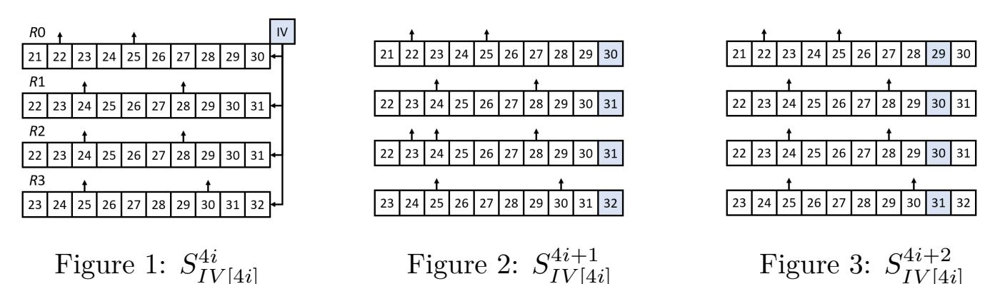
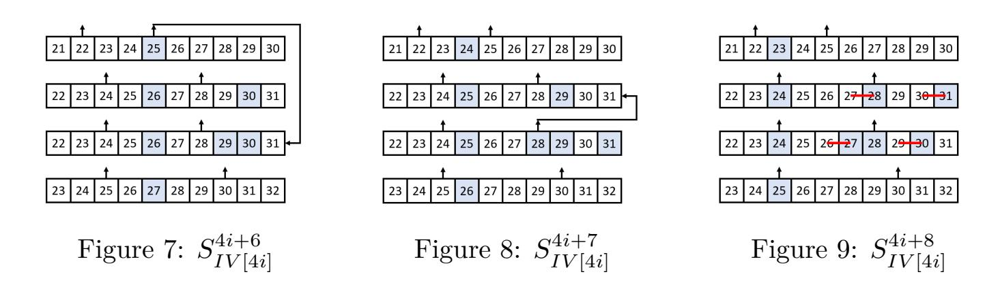
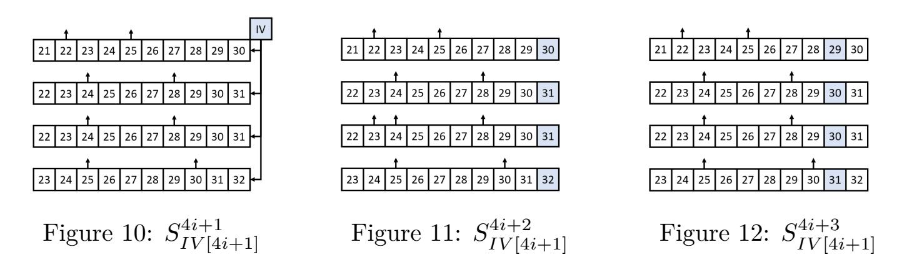
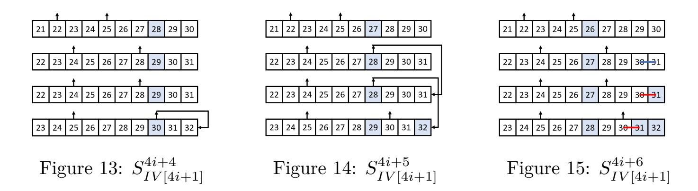
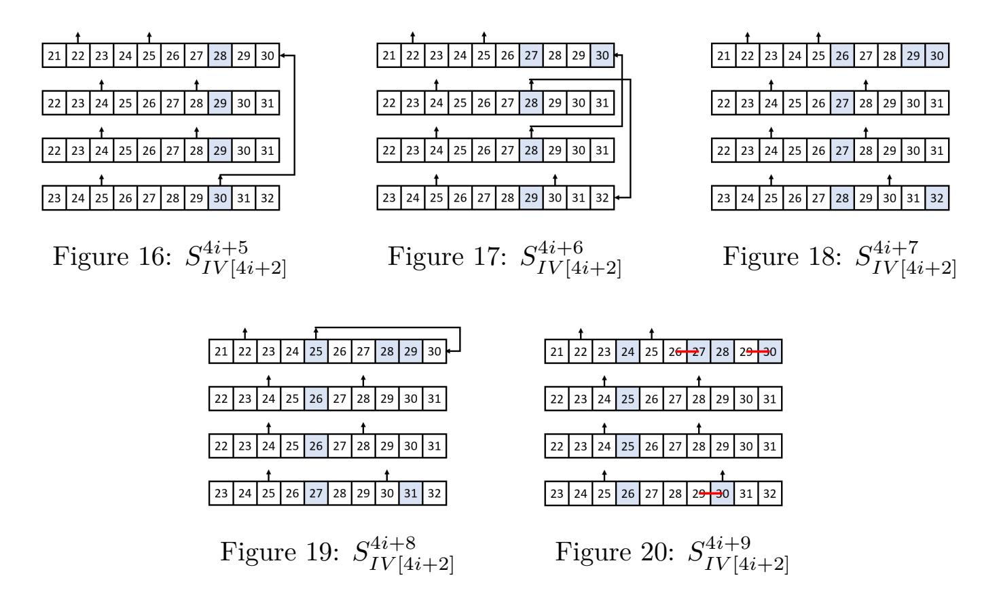
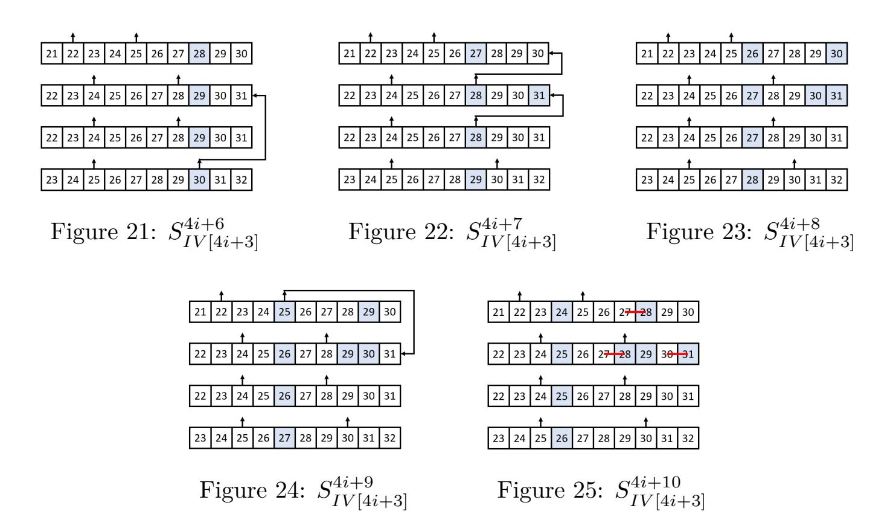
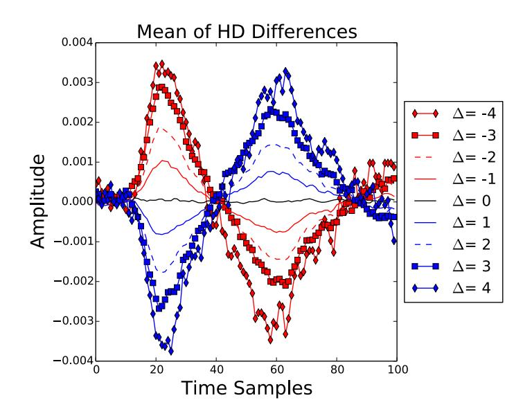
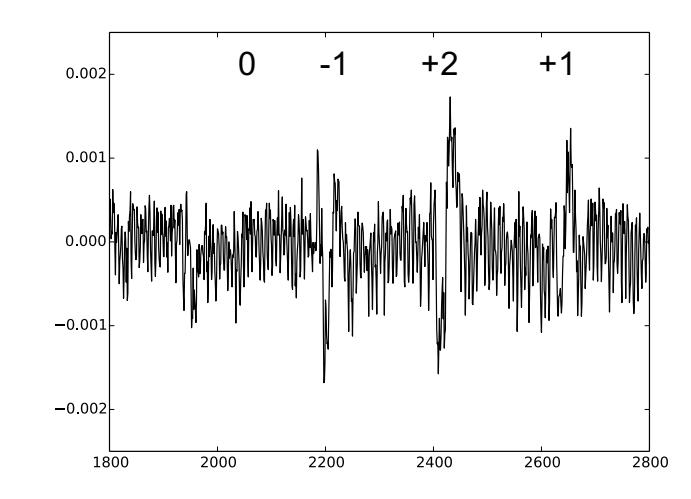
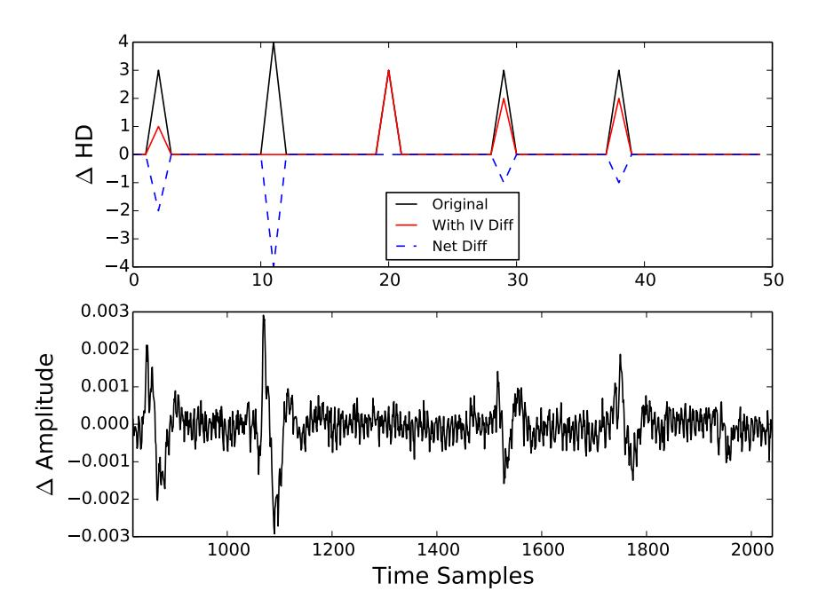

{0}------------------------------------------------

# **DAPA: Differential Analysis aided Power Attack on (Non-)Linear Feedback Shift Registers (Extended version)**

Siang Meng Sim<sup>1</sup> , Dirmanto Jap<sup>2</sup> and Shivam Bhasin<sup>2</sup>

- <sup>1</sup> DSO National Laboratories, Singapore
- <sup>2</sup> Temasek Laboratories, NTU Singapore

[crypto.s.m.sim@gmail.com,{djap,sbhasin}@ntu.edu.sg](mailto:crypto.s.m.sim@gmail.com,{djap,sbhasin}@ntu.edu.sg)

**Abstract.** Differential power analysis (DPA) is a form of side-channel analysis (SCA) that performs statistical analysis on the power traces of cryptographic computations. DPA is applicable to many cryptographic primitives, including block ciphers, stream ciphers and even hash-based message authentication code (HMAC). At COSADE 2017, Dobraunig et al. presented a DPA on the fresh re-keying scheme Keymill to extract the bit relations of neighbouring bits in its shift registers, reducing the internal state guessing space from 128 to 4 bits. In this work, we generalise their methodology and combine with differential analysis, we called it differential analysis aided power attack (DAPA), to uncover more bit relations and take into account the linear or non-linear functions that feedback to the shift registers (i.e. LFSRs or NLFSRs). Next, we apply our DAPA on LR-Keymill, the improved version of Keymill designed to resist the aforementioned DPA, and breaks its 67.9-bit security claim with a 4-bit internal state guessing. We experimentally verified our analysis. In addition, we improve the previous DPA on Keymill by halving the amount of data resources needed for the attack. We also applied our DAPA to Trivium, a hardware-oriented stream cipher from the eSTREAM portfolio and reduces the key guessing space from 80 to 14 bits.

**Keywords:** SCA · Power analysis · LFSR · NLFSR · Fresh re-keying scheme · Keymill · LR-Keymill · Stream cipher · Trivium

## **1 Introduction**

There are two major families of cryptanalysis — mathematical attack and physical attacks, including SCA and fault attacks. Mathematical attacks study the structure of a cryptographic primitive to find exploitable mathematical structures and utilise them to recover sensitive information from the primitive, for example the differential cryptanalysis [\[BS90\]](#page-23-0) and linear cryptanalysis [\[Mat93\]](#page-25-0). Physical attacks, on the other hand, studies the hardware or software implementation of a primitive and tackles it through other physical means, for example observing the timing of the algorithm computation [\[Koc96\]](#page-25-1) (timing attack), the power consumption [\[KJJ99\]](#page-25-2) (power analysis) or injecting faults to the implementation [\[BS97\]](#page-24-0) (fault attack).

Resource-constrained or low-cost devices such as Radio-Frequency IDentification (RFID) tags, wireless sensors nodes and smart cards, have always been in an ever-increasing demand and usage in this information era. These devices could be operating in hostile environments and are especially susceptible to SCA, in particular, the differential power analysis [\[CLK](#page-24-1)<sup>+</sup>03, [MAK15\]](#page-25-3).

{1}------------------------------------------------

First proposed by Kocher et al. [\[KJJ99\]](#page-25-2) in 1999, DPA involves statistical analysis of the power traces of cryptographic computations obtained using devices like oscilloscopes. It had been used to target cryptographic algorithms that handles sensitive information, including block ciphers [\[ÖGOP04,](#page-25-4) [SSA14\]](#page-26-0), stream ciphers [\[FGKV07,](#page-24-2) [QGGL13\]](#page-25-5) and even hash-based message authentication code (HMAC) [\[BBD](#page-23-1)<sup>+</sup>13] and had proven to be practical with high success rate. Thus posting a serious threat to embedded implementation of cryptographic primitives.

DPA typically involves power modelling and key hypothesis to recover secret information, for instance the DPA on linear feedback shift register (LFSR) based stream ciphers [\[QGGL13,](#page-25-5) [FGKV07\]](#page-24-2). In 2017, Dobraunig et al. [\[DEKM17\]](#page-24-3) showed that DPA can also be used on shift registers to extract the bit relations of neighbouring bits, allowing attacker to significantly reduce the internal state guessing space. More specifically, with the knowledge that two neighbouring bits have the same or different values, guessing the value for one of them would determine the value of the other. In other words, it reduces the entropy by 1 bit for every known bit relation. Inspired by their work, we generalised their analysis methodology and combine with differential analysis, we call it Differential Analysis aided Power Attack (DAPA), to uncover more bit relations from a shift register and also taking into account the linear or non-linear feedback function.

In the rest of the paper, we use power attack and power analysis interchangeably. Moreover, as shown in our experiments, the leakage can also be captured through electromagnetic channel. For simplicity, we still refer it to as power attack as the exploited leakage arises from power consumption activity.

### **1.1 Related Work**

The vulnerability of LFSR to side-channel attacks was first reported by Burman et al. [\[BMV07\]](#page-23-2). They exploited the fact that power consumption difference between two consecutive clock cycles, which is observable by simple power analysis (SPA), reveals information about the LFSR. They exploited this vulnerability to show recovery of secret key dependent internal state and later few countermeasures were proposed [\[BPMV16\]](#page-23-3). This attack was further extented to NLFSR by Zadeh et al. [\[ZH14\]](#page-26-1), by exploiting the relations between neighbouring bits in the internal state using simple power analysis. Chakraborty et al. [\[CMM14\]](#page-24-4) studied the susceptibility of Galois and Fibonacci construction of NLFSR to power attacks and showed that Galois NLFSR are more vulnerable. These observations were then further extented to attack GRAINv1 cipher [\[CMM17\]](#page-24-5), which was an improvement over an chosen IV power attack on GRAINv1 by Fischer et al. [\[FGKV07\]](#page-24-2). The power attack in [\[CMM17\]](#page-24-5) was enhanced by machine learning based classifiers as compared to previous approaches. NLFSR were previously exploited in real world attacks on KEELOQ code hopping scheme [\[EKM](#page-24-6)<sup>+</sup>08], widely used for access control purposes such as garage openers or car door systems.

In 2017, Dobraunig et al. [\[DEKM17\]](#page-24-3) proposed an attack on shift registers by inserting controlled differences into the IV and observing power differences of shift register update when the difference is introduced. This attack was finally extended to show practical attack on Keymill, where the NLFSRs are treated as black boxes with a small assumption that the newest bit position is not one of the feedback bits.

The main difference between the SPA on shift registers like [\[BMV07,](#page-23-2) [ZH14\]](#page-26-1) and the DPA on shift registers by [\[DEKM17\]](#page-24-3) is the length of consecutive power difference to be collected. The former requires a collection of *n* consecutive power differences, where *n* is the length of the shift register, to recover the entire internal state in one shot. Any missing or misinformation of just a single power difference could lead to attack failure. On the other hand, [\[DEKM17\]](#page-24-3) introduces difference into the internal state to recover one pair of neighbouring bit relations at a time. This drops the need for (relatively) long period of high precision measurements. In addition, even if full internal state recovery

{2}------------------------------------------------

is unsuccessful, the guess space for the entire internal state is significantly reduced by the bits and pieces of bit relations. In this work, we take a step further by incorporating differential patterns into the power analysis[1](#page-2-0) .

*To the best of our knowledge, none of the aforementioned attacks are applicable to* LR-Keymill *because multiple NLFSRs are updated in parallel, while our DAPA practically breaks* LR-Keymill*.*

### **1.2 Our Contributions**

In this work, our main results are summarised as follows:

- We extend the [\[DEKM17\]](#page-24-3) observation beyond analysing the first clock cycle when the difference is injected, and we present a complete analysis on the power consumption changes of shift registers for various cases.
- We propose DAPA on (N)LFSRs taking into account the feedback function[2](#page-2-1) .
- We present a DAPA on LR-Keymill, an improved version of Keymill designed to resist the [\[DEKM17\]](#page-24-3) attack, breaking their 67.9-bit side-channel security claim with 4-bit internal state guessing.
- We reduce the attack complexity on Keymill by halving the amount of data resources needed to perform the key-recovery attack.
- We conduct the experiments and verified our analysis on LR-Keymill.
- We present a DAPA on lightweight stream cipher Trivium, recovering the 80-bit key with just 14-bit key guessing.

## **1.3 Structure of this paper**

We describe the generic analysis on (N)LFSRs in Section [2,](#page-3-0) followed by some toy examples to illustrate our attack strategy in Section [3.](#page-8-0) Next, we give the specification of LR-Keymill and Keymill in Section [4,](#page-10-0) present the DAPA on LR-Keymill and Keymill in Section [5,](#page-13-0) and present our experimental results in Section [5.5.](#page-17-0) Lastly, we apply our DAPA on Trivium in Section [6](#page-21-0) and conclude our work in Section [7.](#page-23-4)

<span id="page-2-0"></span><sup>1</sup>The preliminary study of this work is posted on Cryptology ePrint Archive, Report 2020/349 [\[Sim20\]](#page-25-6).

<span id="page-2-1"></span><sup>2</sup> [\[DEKM17\]](#page-24-3) did not exploit the feedback function for their attack.

{3}------------------------------------------------

## <span id="page-3-0"></span>**2 Generic DPA on (N)LFSRs**

### **2.1 Preliminary**

In [\[ZH14\]](#page-26-1), Zadeh and Heys exploited the well known fact that at the rising edge of a clock, a D flip-flop consumes more power when there is a state change, either 0 −→ 1 or 1 −→ 0. In a nutshell, they analysed D flip-flop that is constructed from 6 NAND gates and showed that 3 of the gates changes when the D flip-flop changes its state, as compared to 1 gate change when there is no change its state.

By the nature of a shift register, say left-shift, the state of a register bit (current bit value) will be updated to the state in the register bit on its right (succeeding bit value) at the rising edge of a clock. In other words, the power consumption of the register bits in a shift register is dependent on the value of the current and succeeding bit values. More precisely, if the succeeding bit is the same as the current bit value, the register bit consumes lesser power compared to the case when the bits are different and it has to change its state.

As there are many other activities happening concurrently with the updating of a register bit at the rising edge of a clock, it is difficult to identify and isolate power consumption of a particular register bit to uncover the relation between the current and succeeding bit values from a single power trace. However, if we can introduce a bit difference to that targeted register bit while keeping all other computations constant, we can gain information about some bit relations by comparing the power consumption differences between the original computation and the instance with the bit difference.

### <span id="page-3-1"></span>**2.2 Power Consumption Differences and Bit Relations**

Shift registers are often part of a linear feedback shift register (LFSR) or non-linear feedback shift register (NLFSR). We will address the feedback function in Section [2.3.](#page-5-0) For the moment, let us focus only on the shift registers.

Let [*x*]*y* denote a register bit of interest in the square parenthesis with bit value *x*, and *y* is the succeeding bit value. A bar symbol *x* denote having a difference, which is simply flipping of the bit value.

We define the power consumption difference the subtraction of the original power trace from the power trace with some differences. If a register bit has an increase in power consumption difference, we denote it as +1, −1 if it is decrement, and 0 if there is no difference in the power consumption difference. In practice, the power trace is the summation of the power consumption of all the register bits. Hence, we can apply simple arithmetic to compute the combined power consumption difference.

#### **2.2.1 Power consumption difference of a register bit**

For a register bit, we only need to consider the current (*x*) and succeeding bit value (*y*), denoted as [*x*]*y*. There are 3 possible differential patterns:

**Case 1.1:** [*x*]*y* vs [*x*]*y*. If *x* = *y*, then the register bit does not have to change its state. On the other hand, the second instance has *x* 6= *y* and more power is consumed to change its state. Therefore, the latter instance consumes more power (+1). Inversely, if *x* =6 *y*, then the power consumption for [*x*]*y* is lower than [*x*]*y* (−1). To summarise:

- *x* = *y*, rise in power consumption. Difference: +1.
- *x* 6= *y*, drop power consumption. Difference: −1.

**Remark:** This is the main observation used in [\[DEKM17\]](#page-24-3) attack to recover bit relations. We generalise this result further to different cases shown below.

{4}------------------------------------------------

- **Case 1.2:** [x]y vs  $[\overline{x}]y$ . This case is essentially the same as Case 1.1, if x=y, then  $\overline{x}\neq y$  consumes more power. Inversely, if  $x\neq y$ , then  $\overline{x}=y$  consumes lesser power.
  - x = y, rise power consumption. Difference: +1.
  - $x \neq y$ , drop power consumption. Difference: -1.
- **Case 1.3:** [x]y vs  $[\overline{x}]\overline{y}$ . If x=y, we have  $\overline{x}=\overline{y}$  which for both instances the register bit maintains its state. On the other hand, if  $x\neq y$ , then so does  $\overline{x}\neq \overline{y}$  and both instances will consume more power to change its state. Thus regardless of the relation between x and y, both instances have the same power consumption traces.
  - For both x = y and  $x \neq y$ , no change in power consumption. Difference: 0.

#### 2.2.2 Power consumption difference of multiple register bits

Using Case 1 as the building blocks, we look at the combined power consumption of multiple register bits in Table 1. The middle two columns are the sub-cases considering individual register bits, and the right column denote the obtained relation and expected power consumption difference.

<span id="page-4-0"></span>

| Table 1: Power consumption differences and relations of multiple register bits |                                                                                                           |                                                                                                                                                                                                                                                                                                                                                                                                                                                                                                                                                                                                                                                                                                                                             |                                                                |             |  |  |  |
|--------------------------------------------------------------------------------|-----------------------------------------------------------------------------------------------------------|---------------------------------------------------------------------------------------------------------------------------------------------------------------------------------------------------------------------------------------------------------------------------------------------------------------------------------------------------------------------------------------------------------------------------------------------------------------------------------------------------------------------------------------------------------------------------------------------------------------------------------------------------------------------------------------------------------------------------------------------|----------------------------------------------------------------|-------------|--|--|--|
| Case                                                                           | Case Sub-cases                                                                                            |                                                                                                                                                                                                                                                                                                                                                                                                                                                                                                                                                                                                                                                                                                                                             | Possible outcomes                                              | Power diff. |  |  |  |
| 2.1:                                                                           | 1.1:                                                                                                      | +1/-1                                                                                                                                                                                                                                                                                                                                                                                                                                                                                                                                                                                                                                                                                                                                       | x = y, y = z                                                   | +2          |  |  |  |
| $[x][y]z \text{ vs } [x][\overline{y}]z$                                       | $[x]y \text{ vs } [x]\overline{y}$ $\mathbf{1.2:}$                                                        | +1/-1                                                                                                                                                                                                                                                                                                                                                                                                                                                                                                                                                                                                                                                                                                                                       | $x \neq y, y = z$                                              | 0           |  |  |  |
| [][9][][9]                                                                     | $[y]z \text{ vs } [\overline{y}]z$                                                                        | Sub-case pow. diff.         Possible outcomes $+1/-1$ $x = y, y = z$ $x = y, y = z$ $x \neq y, y \neq z$ $x \neq y, y \neq z$ $x \neq y, y \neq z$ $x \neq y, y \neq z$ $x \neq y, y \neq z$ $x \neq y, y \neq z$ $x \neq y$ $x \neq y$ $x \neq y$ $x \neq y$ $x \neq y$ $x \neq y$ $x \neq y$ $x \neq y$ $x \neq y$ $x \neq y$ $x \neq y$ $x \neq y$ $x \neq y$ $x \neq y$ $x \neq y$ $x \neq y$ $x \neq y$ $x \neq y$ $x \neq y$ $x \neq y$ $x \neq y$ $x \neq y$ $x \neq y$ $x \neq y$ $x \neq y$ $x \neq y$ $x \neq y$ $x \neq y$ $x \neq y$ $x \neq y$ $x \neq y$ $x \neq y$ $x \neq y$ $x \neq y$ $x \neq y$ $x \neq y$ $x \neq y$ $x \neq y$ $x \neq y$ $x \neq y$ $x \neq y$ $x \neq y$ $x \neq y$ $x \neq y$ $x \neq y$ $x \neq y$ | -2                                                             |             |  |  |  |
| 2.2:                                                                           | $[x]y \text{ vs } [x]\overline{y}$                                                                        | +1/-1                                                                                                                                                                                                                                                                                                                                                                                                                                                                                                                                                                                                                                                                                                                                       | x = y                                                          | +1          |  |  |  |
| $[x][y]z \text{ vs } [x][\overline{y}]\overline{z}$                            | 1.3: $[y]z \text{ vs } [\overline{y}]\overline{z}$                                                        | 0                                                                                                                                                                                                                                                                                                                                                                                                                                                                                                                                                                                                                                                                                                                                           | $x \neq y$                                                     | -1          |  |  |  |
| 3: $[x_0][x_1] \dots [x_{i-1}][x_i]x_{i+1}$                                    | 1.1: $[x_0]x_1 \text{ vs } [x_0]\overline{x_1}$                                                           | +1/-1                                                                                                                                                                                                                                                                                                                                                                                                                                                                                                                                                                                                                                                                                                                                       | $x_0 = x_1, x_i = x_{i+1}$                                     | +2          |  |  |  |
| VS                                                                             | <b>1.3:</b> for $1 \le j < i$ $[x_j]x_{j+1}$ vs $[\overline{x_j}]\overline{x_{j+1}}$                      | 0                                                                                                                                                                                                                                                                                                                                                                                                                                                                                                                                                                                                                                                                                                                                           | $x_0 = x_1, x_i \neq x_{i+1}$<br>$x_0 \neq x_1, x_i = x_{i+1}$ | 0           |  |  |  |
|                                                                                | $ \begin{array}{ c c } \hline  & 1.2 \\  & [x_i]x_{i+1} \text{ vs } [\overline{x_i}]x_{i+1} \end{array} $ | +1/-1                                                                                                                                                                                                                                                                                                                                                                                                                                                                                                                                                                                                                                                                                                                                       | $x_0 \neq x_1, x_i \neq x_{i+1}$                               | -2          |  |  |  |

Table 1: Power consumption differences and relations of multiple register bits

From Table 1, we can have the following observations.

**Observation 2.1:** The change in power consumption in Case 2.1 is always a multiple of  $2, \{-2, 0, 2\}$ .

**Observation 2.2:** Observing power level +2 or -2 gives a clear indication of the relations of (x, y) and (y, z). Otherwise there is an ambiguity when the observed power level is 0, nevertheless knowing one of the relations determines the relation of the other pair to be the opposite.

**Observation 2.3:** As seen in Case 3, if there is consecutive register bits with difference, the intermediate register bits do not contribute to the power consumption differences and the analysis can be reduced to the leading and ending register bits  $([x_0]x_1 \text{ vs } [x_0]\overline{x_1} \text{ and } [x_i]x_{i+1} \text{ vs } [\overline{x_i}]x_{i+1})$ .

#### 2.2.3 Summary Table for Power Consumption Differences and Bit Relations

We denote a power consumption difference the subtraction of the original power trace from the power trace with injected difference. The following Table 2 summarises the necessary and sufficient conditions of the power consumption differences and deduced bit relations.

{5}------------------------------------------------

| Current bit x | Succeeding bit y | Rise/Drop | Relation obtained |
|---------------|------------------|-----------|-------------------|
| -             | -                | -         | -                 |
| -             | ∆                | Rise      | x = y             |
| -             | ∆                | Drop      | x 6= y            |
| ∆             | -                | Rise      | x = y             |
| ∆             | -                | Drop      | x 6= y            |
| ∆             | ∆                | -         | -                 |

<span id="page-5-1"></span>Table 2: Power Consumption Differences and Bit Relations. '∆' indicates there is difference while '-' is no difference.

Although a bit relation does not reveal the actual value of the related bits, it reduces the guessing space by 1 bit because guessing the value for one register bit determines the value of the related bit too.

**Observation of the power consumption differences.** A natural question is whether such power consumption differences {−2*,* −1*,* 0*,* +1*,* +2} (which we refer to as 5-class difference in the following) can be observed in practice. Observing multi-class differences has been practically demonstrated in previous works. For instance, Saha et al. [\[SJB](#page-26-2)<sup>+</sup>18] were able to report 5- and 9-class differences in a different context to break fault-hardened implementation of PRESENT and AES respectively on an 8-bit microcontroller. Our analysis typically only require observing a rise, no change, drop in power consumption differences, as seen in Section [3.](#page-8-0) This intuitively might seem easier than reported in [\[SJB](#page-26-2)<sup>+</sup>18] where the value of change was required for the analysis. However [\[SJB](#page-26-2)<sup>+</sup>18] do not need to know the sign (or polarity) of change, which as is crucial for the success of our attack. In Section [5.5,](#page-17-0) we conduct practical analysis on a 32-bit ARM Cortex-M3 microcontroller to confirm our hypothesis.

## <span id="page-5-0"></span>**2.3 On (non-)linear feedback functions**

When targeting (N)LFSRs, we need to consider the actual specification of the feedback function to determine how the differential propagates. A feedback function typically consists of 6 basic binary operations — AND (∧), NAND (∧), OR (∨), NOR (∨), XOR (⊕) and NXOR (⊕). The truth table and differential table of these operations are listed in Table [3.](#page-5-2)

<span id="page-5-2"></span>Table 3: Truth table and differential table of various binary operations. The entries in the differential table indicate the probability of having a difference.

| x                  | y | x ∧ y | x∧y | x ∨ y       | x∨y | x ⊕ y | x⊕y |
|--------------------|---|-------|-----|-------------|-----|-------|-----|
|                    |   |       |     | Truth table |     |       |     |
| 0                  | 0 | 0     | 1   | 0           | 1   | 0     | 1   |
| 0                  | 1 | 0     | 1   | 1           | 0   | 1     | 0   |
| 1                  | 0 | 0     | 1   | 1           | 0   | 1     | 0   |
| 1                  | 1 | 1     | 0   | 1           | 0   | 0     | 1   |
| Differential table |   |       |     |             |     |       |     |
| ∆                  | - | 0.5   | 0.5 | 0.5         | 0.5 | 1     | 1   |
| -                  | ∆ | 0.5   | 0.5 | 0.5         | 0.5 | 1     | 1   |
| ∆                  | ∆ | 0.5   | 0.5 | 0.5         | 0.5 | 0     | 0   |

**Linear feedback functions.** The linear operations (XOR and NXOR) are rather simple, we can trace the differential trail trivially and know that it holds with probability 1. Hence, observing rise, no change or drop in power consumption difference will directly reveal some bit relation or reaffirm our knowledge about some known bit relation and the differential propagation.

{6}------------------------------------------------

**Non-linear feedback functions.** For the non-linear operations (AND, NAND, OR and NOR), half of the time the differential propagates. Despite that, using DPA we are able to know the differential propagation which leads to knowing some information of the internal state.

Let us consider [*x*]*y*, where the state of *y* is uncertain (half the chance with or without a difference), as seen in Case 1's from Section [2.2,](#page-3-1) if the current bit *x* has no difference, then we expect a rise or drop in power consumption difference if *y* has a difference. If there is no change in the power consumption, we know that *y* has no difference too. On the other hand, if *x* has a difference, then observing no change in the power consumption indicates that *y* has a difference too. Otherwise, we will observe a rise or drop in power consumption difference and we know *y* has no difference.

In addition to knowing if *y* has a difference, it could also reveal some information of the value of other bits. For example, let *y* = (*x*<sup>0</sup> ∧ *x*2) ⊕ *x*<sup>1</sup> ⊕ *x*<sup>2</sup> and we know only *x*<sup>2</sup> has a difference, because of the non-linear operation AND, we are uncertain of the state of *y*. If through the differential power analysis we deduce that *y* has a difference, it is necessary and sufficient that *x*<sup>0</sup> = 0. Otherwise, we know *x*<sup>0</sup> = 1.

## **2.4 High-level Description of DAPA on (N)LFSRs**

Our attack methodology can be broken down into the following three steps:

- 1. Determine the differential patterns
- 2. Perform the power measurements
- 3. Recover the internal state

**Step 1 (Offline): Determine the differential patterns.** In this preparation phase, the goal is to choose a differential pattern that we would want to have in the shift register. Although the choice is highly dependent on the target algorithm, there is a general strategy.

One obvious entry point is through the IV[3](#page-6-0) , which essentially every (N)LFSR-based algorithm should have. The main idea is to introduce some difference in the IV and analyse how it would propagate throughout the internal state.

Notice from Table [2](#page-5-1) that when we can deduce a bit relation when exactly one of the two consecutive bits has a difference (so-called active bit) and the other is constant (inactive bit). To reduce the number of instances to run and measure, we can choose to introduce differences such that the differential pattern alternates between active and inactive bits as much as possible[4](#page-6-1) .

As seen in Table [3,](#page-5-2) non-linear operations can cause ambiguity in the differential pattern. Fortunately, there is a clear distinction between having a difference or not by observing the power consumption difference. More explanation in Step 3.

This step would take up a significant amount of time as the attack complexity depends heavily on the selected differential patterns. Generally, there is no need to find optimal differential patterns, so long as the execution, say introducing the different IVs, is feasible and the attack complexity is practical, we are good to move to the next step.

**Step 2 (Online): Perform the power measurements.** This is the only online phase of the attack and rather straightforward — collect the power traces of various computations and take the difference to obtain power consumption differences.

**Step 3 (Offline): Recover the internal state.** In this step, we try to gather as many pieces of bit relations to link the internal state bits together. From the rise, drop or no

<span id="page-6-1"></span><span id="page-6-0"></span><sup>3</sup>Or something equivalent that is public and preferably can be chosen.

<sup>4</sup> In the work, our main focus is to propose DAPA and present easy-to-understand analysis for demonstration purposes. Therefore, we did not fully exploit this strategy to optimise our attacks and do not claim optimal attack complexities. Nonetheless, our current analysis on LR-Keymill, Keymill and Trivium are already quite efficient and practical.

{7}------------------------------------------------

change in power consumption (collected in Step 2) of the differential patterns (determined in Step 1), we can deduce the bit relations.

When non-linear operations are involved, our first goal is to determine if that bit has a difference. Recall that if both the consecutive bits have difference or both are constants, there is no change in the power consumption, otherwise there is a rise or drop in power consumption. Thus, depending on the preceding bit and the power consumption behaviour, we can deduce whether there is a difference. In addition, as explained in the previous section, it could also reveal some information of the actual value of some bits.

Finally, after gathering as many bit relations as we can, we enumerate the possible values for the leading bit in each chained bit relation, other bits within the chain will be defined according to the bit relations. The true internal state will be one of these candidates.

**On overcoming algorithmic noise:** The (dynamic) power consumption of a (N)LFSRbased algorithm would typically be influenced by simultaneous toggling of various components. A conventional way is to collect more traces to filter the noise. In addition to that, our DAPA methodology has two advantages in overcoming the algorithmic noise.

Firstly, we can allocate more resources to noise filtering. This is possible because our attack could reduce the number of chosen IV or nonce to launch an attack, and effectively the number of different power traces, needed to recover the same amount of bit relations (see Section [5.4\)](#page-17-1). To give a numerical example, instead of collecting 100 traces for noise filtering for each of the 10 differential patterns (a total of 1000 traces), we could collect 200 traces for noise filtering for each of the 5 differential patterns (still a total of 1000 traces) and get the same set of bit relations.

Secondly, it is possible to choose different differential patterns that recover that same bit relation. This allows us to have alternative ways to recover the bit relation or affirmation that our deduction is correct should one of the attempts is inconclusive.

{8}------------------------------------------------

## <span id="page-8-0"></span>**3 Analysis on Toy Examples**

### **3.1 Toy Shift Register**

For the moment, let us omit the details of the feedback function and assume that we know exactly when a difference is introduced into the shift register.

We use a simple toy example to illustrate how we can recover the bit relations. Suppose we have a 6-bit shift register containing values *c<sup>i</sup>* , and *x<sup>j</sup>* the incoming bits in the next 5 clock cycles, denoted as

Clock cycle 
$$0: [c_0][c_1][c_2][c_3][c_4][c_5]x_0x_1x_2x_3x_4$$
,

and suppose the values are [0][0][1][1][0][1]10011.

In another instance, there are bit differences in the incoming bits *x*0*, x*<sup>1</sup> and *x*3.

Clock cycle 
$$0: [c_0][c_1][c_2][c_3][c_4][c_5]\overline{x_0x_1}x_2\overline{x_3}x_4$$

and the corresponding values are [0][0][1][1][0][1]01001.

After executing both computations and collecting their power traces, we can compare the power trace and deduce 4 bit relations as seen in Table [4.](#page-8-1)

<span id="page-8-1"></span>Table 4: Toy shift register example: Power consumption difference and bit relations obtained. Second and third columns are the register state of the original and with some difference, "Orig. dist." and "∆ dist." indicates the Hamming distance between the previous and current state, "Power diff." indicates the numerical power consumption differences, "Rise/Drop" is the observation of the power consumption difference at the rising edge of the clock, and last column is the bit relation obtained.

| Clock | Original shift      | ∆ shift             | Orig. | ∆     | Power | Rise/ | Relation |
|-------|---------------------|---------------------|-------|-------|-------|-------|----------|
| cycle | register            | register            | dist. | dist. | diff. | Drop  | obtained |
| 0     | [0][0][1][1][0][1]1 | [0][0][1][1][0][1]0 | -     | -     | -     | -     | -        |
| 1     | [0][1][1][0][1][1]0 | [0][1][1][0][1][0]1 | 3     | 4     | +1    | Rise  | c5 = x0  |
| 2     | [1][1][0][1][1][0]0 | [1][1][0][1][0][1]0 | 4     | 5     | +1    | -     | -        |
| 3     | [1][0][1][1][0][0]1 | [1][0][1][0][1][0]0 | 3     | 5     | +2    | Rise  | x1 = x2  |
| 4     | [0][1][1][0][0][1]1 | [0][1][0][1][0][0]1 | 4     | 5     | +1    | Drop  | x2 6= x3 |
| 5     | [1][1][0][0][1][1]  | [1][0][1][0][0][1]  | 3     | 5     | +2    | Rise  | x3 = x4  |

Suppose that the attacker's goal is to recover the internal state at any clock cycle, the values of *c<sup>i</sup>* and *x<sup>j</sup>* are unknown to the attacker but he knows the differential positions in *x<sup>j</sup>* . From there, he is able to deduce the following relations *c*<sup>5</sup> = *x*0*, x*<sup>1</sup> = *x*<sup>2</sup> 6= *x*<sup>3</sup> = *x*4, and guess the shift register state at clock cycle 5 as one of the following:

$$[c_5][x_0][x_1][x_2][x_3][x_4] \in \{ [0] [0] [0] [0] [1] [1],$$
 
$$[0] [0] [1] [1] [0] [0],$$
 
$$[1] [1] [0] [0] [1] [1],$$
 
$$[1] [1] [1] [1] [0] [0] \}$$

To summarise, if the attacker is able to obtain noiseless measurement for these 2 computation instances, he is able to reduce the guessing complexity from the naive 2 <sup>6</sup> = 64 to just 4 guesses (third combination is the correct internal state).

### **3.2 Toy Non-linear Feedback Shift Register**

Here, we use another toy example to illustrate how an analysis can be performed on NLFSR. Suppose we have a 4-bit maximum period NLFSR (from [\[Dub12\]](#page-24-7)) defined as follows:

<span id="page-8-2"></span>
$$[x_0^{i+1}][x_1^{i+1}][x_2^{i+1}][x_3^{i+1}] \leftarrow [x_1^i][x_2^i][x_3^i][x_0^i \oplus x_1^i \oplus x_2^i \oplus x_1^i x_2^i], \tag{1}$$

{9}------------------------------------------------

where  $X^0 = x_0^0 ||x_1^0|| x_2^0 ||x_3^0|$  is the initial state and  $x_1^i x_2^i = x_1^i \wedge x_2^i$ , for brevity we omit the AND notation when there is no ambiguity.

Let the initial values be [0][0][1][0] and another instance with a bit difference at  $x_3^0$ , i.e. [0][0][1][1]. After executing both computations and collecting their power traces, we can compare the power trace and deduce 4 bit relations as seen in Table 5.

<span id="page-9-0"></span>Table 5: Toy NLFSR example: Power consumption difference and bit relations obtained. Second and third columns are the register state of the original and with some difference, "Orig. dist." and " $\Delta$  dist." indicates the Hamming distance between the previous and current state, "Power diff." indicates the numerical power consumption differences, "Rise/Drop" is the observation of the power consumption difference at the rising edge of the clock, and last column is the information obtained.

| Clock | Original      | Δ             | Orig. | Δ     | Power | Rise/    | Information                          |
|-------|---------------|---------------|-------|-------|-------|----------|--------------------------------------|
| cycle | NLFSR         | NLFSR         | dist. | dist. | diff. | Drop     | obtained                             |
| 0     | [0][0][1][0]1 | [0][0][1][1]1 | -     | -     | -     | -        | -                                    |
| 1     | [0][1][0][1]1 | [0][1][1][1]1 | 3     | 1     | -2    | big drop | $x_1^1 \neq x_2^1, x_2^1 \neq x_3^1$ |
| 2     | [1][0][1][1]0 | [1][1][1][1]0 | 3     | 1     | -2    | -        | $x_3^2 \neq \Delta, x_1^1 = 1$       |
| 3     | [0][1][1][0]  | [1][1][0]     | 3     | 1     | -2    | -        | $x_3^3 \neq \Delta, x_2^2 = 1$       |

Starting from a difference  $X^0=(0,0,0,\Delta)$ , we know the difference in the next cycle is  $X^1=(0,0,\Delta,0)$ . Here, we observed a big drop<sup>5</sup> in the power consumption difference. As seen in Case 2.1 of Section 2.2, it indicates that the differential bit is different from both its neighbours, thus we have  $x_1^1 \neq x_2^1$  and  $x_2^1 \neq x_3^1$ .

For the next update (to clock cycle 2), it could be  $X^2 = (0, \Delta, 0, 0)$  or  $X^2 = (0, \Delta, 0, \Delta)$ . Since we observe no change in the power consumption difference, we know that the succeeding bit  $x_3^2$  has no difference. In addition, from Equation 1, we have

$$x_0^1 \oplus x_1^1 \oplus x_2^1 \oplus x_1^1 x_2^1 = x_0^1 \oplus x_1^1 \oplus \overline{x_2^1} \oplus x_1^1 \overline{x_2^1}$$

$$\Rightarrow x_1^1 (x_2^1 \oplus \overline{x_2^1}) = x_2^1 \oplus \overline{x_2^1}$$

which implies that  $x_1^1 = 1$ .

From  $X^2 = (0, \Delta, 0, 0)$ , it could propagate to  $X^3 = (\Delta, 0, 0, 0)$  or  $X^3 = (\Delta, 0, 0, \Delta)$ . Since we again observe no change in power consumption difference, we know that  $x_3^3$  has no difference and deduce that  $x_2^2 = 1^6$ .

Combining all these information, we reduced the possible states of  $X^2$  from  $2^4 = 16$  to just 2 states as shown in the following:

$$[x_0^2][x_1^2][x_2^2][x_3^2] \in \{ [1] [0] [1] [0],$$
 [1] [0] [1] [1] \}

In fact, with information obtained up to clock cycle 2, it is sufficient to arrive at this same conclusion.

<span id="page-9-1"></span><sup>&</sup>lt;sup>5</sup>This drop in power consumption difference that was due to two register bits difference is relatively "big" compared to a drop caused by a single register bit.

<span id="page-9-2"></span><sup>&</sup>lt;sup>6</sup>From the knowledge that  $x_1^1 \neq x_2^1 \neq x_3^1$  and  $x_1^1 = 1$ , it is already sufficient to deduce that  $x_2^2 = x_3^1 = 1$ . This observation reassured that our gathered information and observations are accurate.

{10}------------------------------------------------

## <span id="page-10-0"></span>**4 Fresh Re-keying Schemes —** Keymill **and** LR-Keymill

## **4.1 Fresh re-keying scheme**

Although there are countermeasures [\[BLGT05,](#page-23-5) [CPM06,](#page-24-8) [NRR06,](#page-25-7) [PR11\]](#page-25-8) like masking, hiding and threshold implementation to protect against DPA, they are generally costly to implement on the encryption algorithms, unless the primitives are designed to be side-channel protection efficient, for example Pyjamask [\[GJK](#page-24-9)<sup>+</sup>] and CRAFT [\[BLMR19\]](#page-23-6).

Fresh re-keying schemes were proposed by Medwed et al. [\[MSGR10\]](#page-25-9) as a countermeasure against side-channel analysis for low-cost devices. Low-cost devices like RFID tags have very constrained physical space to implement the cryptographic algorithms, there may not be enough resources to implement effective side-channel protections like masking or threshold implementation. Instead, the idea of fresh re-keying scheme is to have a lightweight function *g* that derives session keys *SK* from given secret master key *MK* and nonce *IV* , denoted as *g*(*IV, MK*) = *SKIV* , and use the fresh session keys for block cipher encryption *E*.

Under the nonce-respecting scenario, a fresh re-keying scheme helps to protect the block cipher encryption against DPA since each encryption uses a different encryption key. However, the re-keying scheme now becomes the target of SCA. One can perceive a re-keying scheme as an encryption cipher, encrypting different nonces (plaintexts) using a same master key. While a re-keying scheme does not need very strong mathematical properties like block ciphers, it should have the following 6 properties given by [\[MSGR10\]](#page-25-9):

- 1. Good diffusion of the master key *MK*.
- 2. No synchronization between parties. Hence, *g* should be stateless.
- 3. No need for additional key material.
- 4. Little hardware overhead. Total costs lower than protecting *E* alone.
- 5. Easy protection against side-channel attacks.
- 6. Regularity.

Keymill [\[TRS16\]](#page-26-3) is a NLFSR-based re-keying scheme designed by Taha et al. to be side-channel resilient at algorithmic level and not rely on the side-channel countermeasures to protect against SCA. However, Dobraunig et al. [\[DEKM17\]](#page-24-3) found a DPA using the Case 1.1 analysis (Section [2.2\)](#page-3-1), breaking the scheme with 4-bit internal state guessing and 128 chosen nonces[7](#page-10-1) .

LR-Keymill [\[TRS17\]](#page-26-4) [8](#page-10-2) is an improved version of Keymill by the same designers, the idea was to update all 4 NLFSRs simultaneously with the same *IV* bits, making it nontrivial for the attacker to deduce which NLFSR consumes higher or lower amount of power, thus increasing the search space. Based on this argument, the designers claimed 67.9-bit security against DPA.

**Remark on** LR-Keymill **implementation:** We note that the designers of LR-Keymill have recommended the implementation should update all 4 NLFSRs in parallel to generate algorithmic noise. A basic serial implementation of LR-Keymill where only one of the NLFSRs is updated in each clock cycle will defeat its purpose and be vulnerable to the original [\[DEKM17\]](#page-24-3) attack.

In this section, we give the specification of LR-Keymill and Keymill. In Section [5,](#page-13-0) we show that by exploiting the feedback functions of LR-Keymill, we can still recover the secret internal state with just 4-bit internal state guessing. Also, we can half the amount of nonces (hence, power traces) needed to attack Keymill (Section [5.4\)](#page-17-1).

<span id="page-10-1"></span><sup>7</sup>Assuming noiseless measurements. Otherwise, the attacker could vary the last few bits of the nonce to collect more power traces. More details in Section 3.4 of [\[DEKM17\]](#page-24-3).

<span id="page-10-2"></span><sup>8</sup>Nominated best paper [\[Tah\]](#page-26-5).

{11}------------------------------------------------

## **4.2 Specification of** Keymill **and** LR-Keymill

#### **4.2.1 Overview**

The internal state *S* of LR-Keymill and Keymill consists of 4 NLFSRs — with shift registers *R*0*, R*1*, R*2 and *R*3 of length 31*,* 32*,* 32*,* 33 bits and feedback functions *F*0*, F*1*, F*2 and *F*3 respectively.

At the initialisation phase, a 128-bit master key *MK* will be loaded into these registers. Next, a 128-bit initialisation vector *IV* is introduced to update the internal state. After some preprocessing phase, it will start releasing arbitrary amount of keystream bits as the session keys.

#### **4.2.2 Feedback functions**

The bits in the registers are indexed from 0 and in ascending order *Rx* = *s*0*s*<sup>1</sup> *. . . s*|*Rx*|−1. When the clock cycle matters, we denote *Rx<sup>c</sup>* [*i*] as the *i*-th leftmost bit in register *Rx* at clock cycle *c*, where *c* = 0 denote the initial state right after loading the master key. For a range of bit registers from *i*-th to *j*-th bits inclusive, we denote it as *Rx<sup>c</sup>* [*i* ∼ *j*].

During an update, the feedback function *F x* draws the information from *Rx* and feedback to *Ry*, where *y* = *x*+*c* mod 4. Each registers does a left-shift, drops the leftmost bit *s*<sup>0</sup> and takes in the new bit into the rightmost position of the register.

The feedback functions are defined as follow:

```
F0(R0) = s0 ⊕ s2 ⊕ s5 ⊕ s6 ⊕ s15 ⊕ s17 ⊕ s18 ⊕ s20 ⊕ s25 ⊕ s8s18
                   ⊕ s8s20 ⊕ s12s21 ⊕ s14s19 ⊕ s17s21 ⊕ s20s22 ⊕ s4s12s22
                   ⊕ s4s19s22 ⊕ s7s20s21 ⊕ s8s18s22 ⊕ s8s20s22 ⊕ s12s19s22
                   ⊕ s20s21s22 ⊕ s4s7s12s21 ⊕ s4s7s19s21 ⊕ s4s12s21s22
                   ⊕ s4s19s21s22 ⊕ s7s8s18s21 ⊕ s7s8s20s21 ⊕ s7s12s19s21
                   ⊕ s8s18s21s22 ⊕ s8s20s21s22 ⊕ s12s19s21s22
F1(R1) = F2(R2) = s0 ⊕ s3 ⊕ s17 ⊕ s22 ⊕ s28 ⊕ s2s13 ⊕ s5s19 ⊕ s7s19
                   ⊕ s8s12 ⊕ s8s13 ⊕ s13s15 ⊕ s2s12s13 ⊕ s7s8s12 ⊕ s7s8s14
                   ⊕ s8s12s13 ⊕ s2s7s12s13 ⊕ s2s7s13s14 ⊕ s4s11s12s24
                   ⊕ s7s8s12s13 ⊕ s7s8s13s14 ⊕ s4s7s11s12s24 ⊕ s4s7s11s14s24
          F3(R3) = s0 ⊕ s2 ⊕ s7 ⊕ s9 ⊕ s10 ⊕ s15 ⊕ s23 ⊕ s25 ⊕ s30 ⊕ s8s15
                   ⊕ s12s16 ⊕ s13s15 ⊕ s13s25 ⊕ s1s8s14 ⊕ s1s8s18 ⊕ s8s12s16
                   ⊕ s8s14s18 ⊕ s8s15s16 ⊕ s8s15s17 ⊕ s15s17s24 ⊕ s1s8s14s17
                   ⊕ s1s8s17s18 ⊕ s1s14s17s24 ⊕ s1s17s18s24 ⊕ s8s12s16s17
                   ⊕ s8s14s17s18 ⊕ s8s15s16s17 ⊕ s12s16s17s24 ⊕ s14s17s18s24
                   ⊕ s15s16s17s24
```

The key observation here is that when a new bit is introduced to *R*0 (resp. *R*1*, R*2*, R*3), it is at position *s*<sup>30</sup> (resp. *s*31*, s*31*, s*32). After 5 (resp. 3, 3, 2) clock cycles, this new bit is extracted to its feedback function for the first time in monomial term *s*<sup>25</sup> (resp. *s*28*, s*28*, s*30). Although a new bit is introduced to all 4 NLFSRs at the same clock, the clock cycle that the new bits are fed back differs.

{12}------------------------------------------------

### **4.2.3** LR-Keymill **internal state update**

For the first 128 updates, all 4 registers are updated with a nonce bit *IV* [*c*].

$$Ry^{c+1} = Ry^{c}[1 \sim |Ry| - 1] \parallel Fx(Rx^{c}) \oplus IV[c]$$

where *y* = *x* + *c* mod 4 and *c* ∈ {0*, . . . ,* 127}.

After the *IV* is completely absorbed, it is clocked for another 33 updates.

$$Ry^{c+1} = Ry^{c}[1 \sim |Ry| - 1] \parallel Fx(Rx^{c})$$

where *y* = *x*+*c* mod 4 and *c* ∈ {128*, . . . ,* 160}. So far, no keystream bit is being outputted. Lastly, in each clock cycle, the leftmost bit from each register is XORed to form the output keystream bits *KS*.

$$Ry^{c+1} = Ry^{c}[1 \sim |Ry| - 1] \parallel Fx(Rx^{c})$$
  
 $KS[i] = R0^{c}[0] \oplus R1^{c}[0] \oplus R2^{c}[0] \oplus R3^{c}[0]$ 

where *y* = *x* + *c* mod 4*, i* = *c* − 161 and *c* ≥ 161.

#### **4.2.4** Keymill **internal state update**

For the first 32 updates, each register is updated with a nonce bit *IV* [4*c* + *x*].

$$Ry^{c+1} = Ry^{c}[1 \sim |Ry| - 1] \parallel Fx(Rx^{c}) \oplus IV[4c + x]$$

where *y* = *x* + *c* mod 4 and *c* ∈ {0*, . . . ,* 31}.

After the *IV* is completely absorbed, it is clocked for another 33 updates.

$$Ry^{c+1} = Ry^{c}[1 \sim |Ry| - 1] \parallel Fx(Rx^{c})$$

where *y* = *x* + *c* mod 4 and *c* ∈ {32*, . . . ,* 64}. So far, no keystream bit is being outputted. Lastly, in each clock cycle, the leftmost bit from each register is outputted as keystream bits *KS* (4 keystream bits per cycle).

$$Ry^{c+1} = Ry^{c}[1 \sim |Ry| - 1] \parallel Fx(Rx^{c})$$

$$KS[4i \sim 4i + 3] = R0^{c}[0] \parallel R1^{c}[0] \parallel R2^{c}[0] \parallel R3^{c}[0]$$

where *y* = *x* + *c* mod 4*, i* = *c* − 65 and *c* ≥ 65.

{13}------------------------------------------------

## <span id="page-13-0"></span>5 DAPA on LR-Keymill and Keymill

### **5.1 DAPA on** LR-Keymill

In a nutshell, we analyse how a differential propagates through the internal state and extract sufficient information for us to reduce the internal state guessing complexity to the minimum of 4 bits.

When there is a difference in IV[c-1], it is introduced to the rightmost position of all 4 NLFSRs, namely  $R0^c[30]$ ,  $R1^c[31]$ ,  $R2^c[31]$ ,  $R3^c[32]$ . Here, we obtain a combined power consumption of all the 4 NLFSRs and may not be able to deduce conclusive bit relations. But we can gain more information if we observe the power trace from the next few clock cycles. After 2 clock cycles, we see that these differences are now at  $R0^{c+2}[28]$ ,  $R1^{c+2}[29]$ ,  $R2^{c+2}[29]$ ,  $R3^{c+2}[30]$ , and  $R3^{c+2}[30]$  is the first and only difference to get extracted by the feedback function. In addition, in F3 the variable  $s_{30}$  is a monomial term, this difference will propagate to some NLFSR deterministically, updating only a single NLFSR. Exploiting this fact allows us to obtain a definitive bit relation. By letting the differences propagate further and choosing bit difference at different positions in the nonces, we are able to obtain sufficient bit relations to deduce the relations of all the neighbouring bits in the internal state. We denote the bit relation of  $Rx^c[j]$  and  $Rx^c[j+1]$  as  $Rx^c[(j,j+1)]$ .

Since feedback bit mapping  $(y = x + c \mod 4)$  has a cycle of period 4, we consider the nonce differences in 4 different positions, namely 4i, 4i + 1, 4i + 2 and 4i + 3.

#### <span id="page-13-7"></span>5.1.1 Difference introduced at IV[4i].

Let the only difference in the nonce be at bit position 4i, the differential propagation can be seen in Figure 1-9, where differential bits are coloured in blue.

<span id="page-13-3"></span><span id="page-13-2"></span>

<span id="page-13-1"></span>**Figure 1.** The difference from IV is introduced to all the NLFSRs. As shown by [TRS17], the relation between neighbouring bits in the 4 NLFSRs are collectively observed, namely  $R0^{4i+1}[(29,30)]$ ,  $R1^{4i+1}[(30,31)]$ ,  $R2^{4i+1}[(30,31)]$  and  $R3^{4i+1}[(31,32)]$ .

**Figure 2.** In the coming update, the rightmost register bit of each NLFSRs has the same differential pattern as Case 2.1. By Observation 2.2, we are able to obtain a collective bit relations of the next neighbouring bits,  $R0^{4i+2}[(29,30)]$ ,  $R1^{4i+2}[(30,31)]$ ,  $R2^{4i+2}[(30,31)]$  and  $R3^{4i+2}[(31,32)]$ .

**Figure 3.** Here, we expect no change in the power consumption difference.

<span id="page-13-6"></span><span id="page-13-5"></span><span id="page-13-4"></span>

| 1 1 2 2 2 2 2 2 2 2 2 2 2 2 2 2 2 2 2 2                                         | †     †       21     22     23     24     25     26     27     28     29     30 | †     †       21     22     23     24     25     26     27     28     29     30 |
|---------------------------------------------------------------------------------|---------------------------------------------------------------------------------|---------------------------------------------------------------------------------|
| †     †       22     23     24     25     26     27     28     29     30     31 | 22 23 24 25 26 27 28 29 30 31                                                   | 22 23 24 25 26 27 28 29 30 31                                                   |
| 22 23 24 25 26 27 28 29 30 31                                                   | 22 23 24 25 26 27 28 29 30 31                                                   | †     †       22     23     24     25     26     27     28     29     30     31 |
| 23 24 25 26 27 28 29 30 31 32                                                   | t     t       23     24     25     26     27     28     29     30     31     32 | t     t       23     24     25     26     27     28     29     30     31     32 |
| Figure 4: $S_{IV[4i]}^{4i+3}$                                                   | Figure 5: $S_{IV[4i]}^{4i+4}$                                                   | Figure 6: $S_{IV[4i]}^{4i+5}$                                                   |

{14}------------------------------------------------

**Figure [4.](#page-13-4)** This is where things start to get interesting. Notice that the difference is fed back to *R*2, introducing with a new difference, which is like Case 1.1. By observing the rise or drop of the power consumption difference, we can unambiguously determine the bit relation *R*2 <sup>4</sup>*i*+4[(30*,* 31)].

**Figure [5.](#page-13-5)** Another 2 differences are fed back, namely to *R*1 and *R*2. For *R*2, the update is the same as Case 2.2, thus this does not result in any rise or drop in the power consumption difference. For *R*1, we can determine the bit relation *R*1 <sup>4</sup>*i*+5[(30*,* 31)].

**Figure [6.](#page-13-6)** No new difference will be introduced to the internal state in the coming update. The rightmost register bit of *R*1 and *R*2 are the same as Case 1.2, but the observable power consumption difference is the combined result of *R*1 <sup>4</sup>*i*+6[(30*,* 31)] and *R*2 <sup>4</sup>*i*+6[(30*,* 31)]. If we are lucky and observed a rise or drop in the power consumption difference, we know the bit relation for both registers. Otherwise, we know exactly one relation is equal while the other is not equal, but not the order. Nevertheless, this information is still useful to us when we consider a nonce difference to be at 4*i* + 1 (see analysis of Figure [14\)](#page-15-0).



<span id="page-14-2"></span><span id="page-14-1"></span><span id="page-14-0"></span>**Figure [7.](#page-14-1)** From this update, we can determine the bit relation of *R*2 <sup>4</sup>*i*+7[(30*,* 31)].

**Figure [8.](#page-14-2)** Lastly, the most involved relation to unravel. Like in Figure [6,](#page-13-6) we have a Case 1.1 and 1.2 at *R*1 and *R*2 respectively. While this gives us a combined result of the relation *R*1 <sup>4</sup>*i*+8[(30*,* 31)] and *R*2 <sup>4</sup>*i*+8[(30*,* 31)], we could still deduce the relation deterministically through another power trace. When we consider another instance and introduce a difference at *IV* [4(*i* + 1)], as seen in Figure [4,](#page-13-4) we can recover the bit relation *R*2 4(*i*+1)+4[(30*,* 31)], which is the latter relation of the combined bit relations. Therefore, we can determine the relation *R*1 <sup>4</sup>*i*+8[(30*,* 31)] too.

**Figure [9](#page-14-0) (Summary).** By introducing a single difference at *IV* [4*i*] and *IV* [4(*i* + 1)] on 2 separate nonces, we can learn 4 bit relations (in red) over the course of 8 cycles: *R*2 <sup>4</sup>*i*+8[(26*,* 27)], *R*1 <sup>4</sup>*i*+8[(27*,* 28)], *R*2 <sup>4</sup>*i*+8[(29*,* 30)] and *R*1 <sup>4</sup>*i*+8[(30*,* 31)]. In addition, we know a combined relation *R*1 <sup>4</sup>*i*+6[(30*,* 31)] and *R*2 <sup>4</sup>*i*+6[(30*,* 31)].

#### **5.1.2 Difference introduced at** *IV* **[4***i* **+ 1].**

We repeat the analysis with difference in *IV* [4*i*+ 1] and observe how the differential pattern propagates. See Figure [10-](#page-14-3)[15.](#page-15-1)

<span id="page-14-4"></span><span id="page-14-3"></span>

{15}------------------------------------------------

**Figure [10](#page-14-3)[-12.](#page-14-4)** No difference is introduced at clock cycle 4*i* since the difference in the nonce is at *IV* [4*i* + 1]. From clock cycle 4*i* + 1 to 4*i* + 3, the same differential pattern and similar bit relation information is obtained as seen in Figure [1-](#page-13-1)[3.](#page-13-3)



<span id="page-15-2"></span><span id="page-15-1"></span><span id="page-15-0"></span>**Figure [13.](#page-15-2)** Here, we see that the feedback difference is sent to *R*3 as defined by the cycle period of the LR-Keymill. As before, we can determine the relation *R*3 <sup>4</sup>*i*+5[(31*,* 32)].

**Figure [14.](#page-15-0)** Similar analysis as Figure [5,](#page-13-5) we can determine the relation of *R*2 <sup>4</sup>*i*+6[(30*,* 31)]. Recall in the analysis of Figure [6,](#page-13-6) we have the combined result of *R*1 <sup>4</sup>*i*+6[(30*,* 31)] and *R*2 <sup>4</sup>*i*+6[(30*,* 31)], hence, we can also determine the bit relation *R*1 <sup>4</sup>*i*+6[(30*,* 31)].

**Figure [15](#page-15-1) (Summary).** By introducing a single difference at *IV* [4*i* + 1], we can learn 2 bit relations (in red) over the course of 6 cycles: *R*3 <sup>4</sup>*i*+6[(30*,* 31)] and *R*2 <sup>4</sup>*i*+6[(30*,* 31)], plus an additional relation (in blue) *R*1 <sup>4</sup>*i*+6[(30*,* 31)] when combined with another power trace analysis.

#### **5.1.3 Difference introduced at** *IV* **[4***i* **+ 2] and** *IV* **[4***i* **+ 3].**

The analysis for the other 2 bit positions are pretty much the same, thus for brevity we present the differential propagations (see Figure [16](#page-15-3)[-20](#page-15-4) and Figure [21-](#page-16-0)[25\)](#page-16-1) and the summary of the analysis.

<span id="page-15-3"></span>

<span id="page-15-4"></span>**Figure [20](#page-15-4) (Summary).** By introducing a single difference at *IV* [4*i* + 2], we can learn 3 bit relations (in red) over the course of 9 cycles: *R*0 <sup>4</sup>*i*+9[(26*,* 27)]*, R*3 <sup>4</sup>*i*+9[(29*,* 30)] and *R*0 <sup>4</sup>*i*+9[(29*,* 30)].

{16}------------------------------------------------

<span id="page-16-0"></span>

<span id="page-16-1"></span>**Figure [25](#page-16-1) (Summary).** By introducing a single difference at *IV* [4*i* + 3], we can learn 3 bit relations (in red) over the course of 10 cycles: *R*1 <sup>4</sup>*i*+10[(27*,* 28)]*, R*0 <sup>4</sup>*i*+10[(27*,* 28)] and *R*1 <sup>4</sup>*i*+10[(30*,* 31)].

### **5.2 Key-recovery on** LR-Keymill

Recall that besides the aforementioned new bit relations, we can obtain the combined relations for all 4 NLFSRs. Thus if we know 3 of the 4 relations, we can fully determine all the bit relations for a particular column of register bits.

<span id="page-16-2"></span>Table 6: Bit relations learnt from introducing differences at *IV* [4*i* + *j*] where *j* = {0*, . . . ,* 4}. The first column denotes the indices of each shift registers. (*j*) denotes the relations obtained from having difference at *IV* [4*i* + *j*]. (!), (?) and (\*) denote derived relation from multiple sources. The "Combined" column denotes the difference position in the *IV* to obtain the 4 combined bit relations.

| Clock cycle c = 4i + 10 |         |         |         |         |             |  |  |  |
|-------------------------|---------|---------|---------|---------|-------------|--|--|--|
| c<br>R<br>[(x, x + 1)]  | c<br>R3 | c<br>R2 | c<br>R1 | c<br>R0 | Combined    |  |  |  |
| (25,24,24,23)           |         | (0)     |         |         | IV [4i + 3] |  |  |  |
| (26,25,25,24)           | (1)     |         | (0)     |         | IV [4i + 4] |  |  |  |
| (27,26,26,25)           | (*)     | (1)     | (!)     | (2)     | IV [4i + 5] |  |  |  |
| (28,27,27,26)           | (2)     | (0)     | (3)     | (*)     | IV [4i + 6] |  |  |  |
| (29,28,28,27)           |         |         | (?)     | (3)     | IV [4i + 7] |  |  |  |
| (30,29,29,28)           |         |         |         | (2)     | IV [4i + 8] |  |  |  |
| (31,30,30,29)           |         |         | (3)     |         | IV [4i + 9] |  |  |  |

In Table [6,](#page-16-2) (!) denotes the bit relation obtained from the effort of *IV* [4*i*] and *IV* [4*i*+ 1], (?) denotes the information coming from *IV* [4*i*] and *IV* [4(*i*+1)], and (\*) denotes the derived information after knowing 3 out of 4 bit relations. One can see that we can already determine the relations of both the neighbouring bits of *R*0 <sup>4</sup>*i*+10[26]*, R*1 <sup>4</sup>*i*+10[27]*, R*2 <sup>4</sup>*i*+10[27] and *R*3 <sup>4</sup>*i*+10[28].

When we extend the analysis for another period of 4 cycles, we can determine the bit relations between 7 consecutive bits in all 4 NLFSRs, see Table [7.](#page-17-2)

When we perform the analysis for *j* = {0*, . . . ,* 35} and a fixed *i* ∈ {0*, . . . ,* 22} [9](#page-16-3) , it is sufficient for us to obtain bit relations of 33 consecutive bits for all 4 NLFSRs. This gives

<span id="page-16-3"></span><sup>9</sup>We bound the choice of *i* so that 4*i* + *j* + 3 ≤ 128, the length of the nonce.

{17}------------------------------------------------

<span id="page-17-2"></span>

| Table 7: Bit relations learnt from introducing differences at IV [4i + j] where j = {0, , 7}. The     |  |  |  |  |  |  |
|-------------------------------------------------------------------------------------------------------|--|--|--|--|--|--|
| first column denotes the indices of each shift registers. (j) denotes where the relation is obtained, |  |  |  |  |  |  |
| (!), (?) and (*) denote derived relation from multiple sources. The "Combined" column denotes         |  |  |  |  |  |  |
| the difference position in the IV to obtain the 4 combined bit relations.                             |  |  |  |  |  |  |

| Clock cycle c = 4i + 14 |         |         |         |         |              |  |  |  |
|-------------------------|---------|---------|---------|---------|--------------|--|--|--|
| c<br>R<br>[(x, x + 1)]  | c<br>R3 | c<br>R2 | c<br>R1 | c<br>R0 | Combined     |  |  |  |
| (21,20,20,19)           |         | (0)     |         |         | IV [4i + 3]  |  |  |  |
| (22,21,21,20)           | (1)     |         | (0)     |         | IV [4i + 4]  |  |  |  |
| (23,22,22,21)           | (*)     | (1)     | (!)     | (2)     | IV [4i + 5]  |  |  |  |
| (24,23,23,22)           | (2)     | (0)     | (3)     | (*)     | IV [4i + 6]  |  |  |  |
| (25,24,24,23)           | (*)     | (4)     | (?)     | (3)     | IV [4i + 7]  |  |  |  |
| (26,25,25,24)           | (5)     | (*)     | (4)     | (2)     | IV [4i + 8]  |  |  |  |
| (27,26,26,25)           | (*)     | (5)     | (3)     | (6)     | IV [4i + 9]  |  |  |  |
| (28,27,27,26)           | (6)     | (4)     | (7)     | (*)     | IV [4i + 10] |  |  |  |
| (29,28,28,27)           |         |         |         | (7)     | IV [4i + 11] |  |  |  |
| (30,29,29,28)           |         |         |         | (6)     | IV [4i + 12] |  |  |  |
| (31,30,30,29)           |         |         | (7)     |         | IV [4i + 13] |  |  |  |

us all the bit relations within each shift register in the internal state at a particular clock cycle. All that is left is to guess one key bit from each shift register and we can roll back the updates to recover the master key.

In summary, we need noiseless measurements of 36 chosen nonces and and 4-bit key guessing to recover the master key.

### **5.3 Remark on filtering the noise**

From a practical perspective, we expect some noise during the computation and power measurement. To filter the noise, one could vary the latter bits of the nonce to collect and average out the traces. This is because the internal state of LR-Keymill only depends on the nonce bits that are already absorbed. Let *i* = 0, we only need the first 47 nonce bits to be fixed[10](#page-17-3), there are still 81 bits of freedom to generate different nonces giving similar power traces to filter the noise.

### <span id="page-17-1"></span>**5.4 Improved attack on** Keymill

In [\[DEKM17\]](#page-24-3), the authors recover 1 bit relation (*x, y*) per chosen nonce using the information gained from Case 1.1. In fact, as seen in Case 2.1, if one observes the power consumption difference in the next cycle, one could deduce another bit relation (*y, z*) because (*x, y*) is already known. Thus, every chosen nonce with a single bit input can actually recover 2 bit relations, effectively halving the number of nonces (and corresponding power traces) needed to launch the attack[11](#page-17-4)

There are better choices of IV differences that could further reduce the number of nonces needed. But we do not go further into improvement on the attack as the attack complexity is already very low.

### <span id="page-17-0"></span>**5.5 Experimental Results**

The leakage and attack on NLFSR was previously validated on an FPGA platform by Dobraunig et al. [\[DEKM17\]](#page-24-3), targeting Keymill. In this paper, we validate our proposed

<span id="page-17-3"></span><sup>10</sup>First 36 bits for introducing differences in the nonce and next 11 bits to be constant to avoid affecting the differential trails.

<span id="page-17-4"></span><sup>11</sup>Since [\[DEKM17\]](#page-24-3) performed their experiments on an FPGA and ours are on ARM Cortex-M3, direct comparison is not possible. Given the exact same SNR and platform, our attack has complexity exactly half as explained.

{18}------------------------------------------------

attack on LR-Keymill. The target design is implemented on ARM Cortex-M3 microcontroller mounted on the Arduino Due board. The microcontroller has 512KB flash, 96KB SRAM and 84 MHz operating frequency. The measurements are captured using RF-U 5-2 near-field electromagnetic (EM) probe from Langer on a Lecroy WaveRunner 610zi oscilloscope at a sampling frequency of 1.25 GSamples/s. A 30 dB pre-amplifier is also used for better measurement quality.

For the implementation itself, we adopted bitslice approach, written in assembly. In this scenario, four bits, one from every NLFSR, will be updated simultaneously. The four bits are grouped together from the Least Significant Bits (LSBs) to allow more efficient state update. Updating multiple registers together in the bitslice implementation also result in algorithmic noise from all NLFSR as suggested by designers of LR-Keymill [\[TRS17\]](#page-26-4).

As described, the target of the attack is the Hamming Distance (HD) of the internal states as the IV difference propagates. We then target the operation in which the register is updated, which is typically implemented as MOV *Rd*,*Rs*, where *R<sup>d</sup>* and *R<sup>s</sup>* being the destination and source registers respectively. In this case, if we targeted the register storing the LSBs, the leakage is expected to be HD between the previous state and the updated state, which matches the theoretical model.

### **5.5.1 Profiling and Results**

We first conducted the profiling to identify area and point of interest. For the profiling, we implement a simple single state update. We send random 2 input data, in which we can calculate the HD between them. In total, we measure 20*,* 000 traces, each is averaged 100× to minimize the effect of noise. The data is then split and subtracted to obtain 10*,* 000 traces of ∆*HD*. From these traces, we can build a profile of 9 different ∆*HD* {−4*,* −3*, ...,* 3*,* 4} as plotted in Figure [26.](#page-18-0) ∆*HD* classes can be clearly distinguished.





<span id="page-18-0"></span>Figure 26: Mean for each class of HD difference

<span id="page-18-1"></span>Figure 27: Investigating ∆*HD* to distinguish sign of the difference

#### **5.5.2 Identifying Differences**

Previous results show that the classes have distinct power consumption and can be identified. However same difference with opposite polarity (like −1*,* 1) can be hard to distinguish on a real measurement. To this end, we investigate if ∆*HD* of opposite polarity (sign) can be recognised in a captured EM measurement. The experiment is done on the previously described bitslice implementation of LR-Keymill running on the ARM Cortex-M3. We executed two IV sequences so as to have a sequence of ∆*HD* = 0*,* −1*,* +2*,* 1 over 4 clock cycles and measured two (averaged) EM traces. The difference of the two EM traces is then checked to recognise ∆*HD*. The results are plotted in Figure [27.](#page-18-1) While ∆*HD* of 0, 1 and 2 are easily distinguishable, it is expected that it would be hard to distinguish

{19}------------------------------------------------

1 from −1. Nevertheless, one could easily check the polarity and magnitude of the peak to distinguish the two cases, which also matches the previous profiles. The peaks also matches the timing, which according to operating frequency and sampling frequency of the scope, must be separated by around 208 samples. Moreover, we choose the pair (−1*,* 1) for this experiment as being low consuming pair it is worst affected by noise, still we are able to distinguish them.

<span id="page-19-0"></span>

Figure 28: Investigating ∆*HD* difference for a sequence of changes

Finally, we experiment to recognise a longer sequence generated from a LR-Keymill simulation on a real measurement. The initial state of LR-Keymill was randomly fixed and with a pair of IVs with difference in the first bit and executed on ARM Cortex-M3 and corresponding two (averaged) EM traces were measured. The averaging was done by repeating the IV 1000 times, which remains well within the adversary model and noise filtering capability. The results are shown in Figure [28.](#page-19-0) The top half of the figure (generated from Python simulation) shows the power traces generated by the two IVs and their difference in dotted blue line. The corresponding EM trace difference is shown in the bottom half of the figure showing observed differences, which perfectly matches the expected values and pattern as discussed in Section [5.1.1.](#page-13-7) The peaks again match the expected separation of 208 samples.

**Practical Challenges:** The practical recovery of value and sign for an observed difference is demonstrated in Figure [28.](#page-19-0) However, often the difference recovery can be erroneous in value or sign or both due to its high sensitivity to noise. In our experiments, we observed that the sign has lower resistance to noise in traces. In the event that a sign of a particular difference bit is inconclusive, the adversary can still continue to perform the attack, with slightly higher complexity, by either of the following techniques:

- 1. discard noisy traces and repeat the experiment, say with a new pair of nonce with the same differential bit,
- 2. try to recover the bit relation from other power analysis instances, as there could be overlapping bit relations that can be recovered, or
- 3. guess that sign which increases the final key-recovery complexity by 1 bit for each inconclusive sign.

Moreover, our attack is not limited in length of sequence to recover at once. Shorter sequences can be independently recovered. Consecutive sequences with overlapping difference bits can also help in error correction for wrongly recovered differences. The attack can be trivially extend from difference recovery of shorter sequences to full key recovery

{20}------------------------------------------------

by repeating the analysis on different IV differences. Note that, the analysis for different IV bit position are independent of each other and there is *no snowball effect* even if any of the iterations obtains inconclusive results. Thus, the key complexity increases only by 1 bit for each inconclusive difference bit recovered. As the attack on Trivium, presented in the following section, also require recovery of differences with sign, the same techniques are therefore directly applicable.

{21}------------------------------------------------

## <span id="page-21-0"></span>6 Application to Trivium

Trivium is one of the stream ciphers selected to eSTREAM porfolio [CP08], listed in Profile 2 that is particularly suitable for hardware applications with restricted resources. It is a synchronous stream cipher designed to generate up to  $2^{64}$  keystream bits from an 80-bit secret key K and 80-bit initial value IV. In this section, we illustrate how our DAPA can be applied to Trivium to reduce the key guessing from 80 to 14 bits.

#### 6.1 Specification of Trivium

Its internal state consists of 3 shift registers, denoted as  $A^c, B^c, C^c$  and some non-linear feedback functions connecting the shift registers, where c is the clock cycle and c=0 is the initial state after loading the K and IV. The bits in the registers are indexed from 1 and in ascending order  $X^c = X^c[1] \ X^c[2] \ \dots \ X^c[|X|]$ . For a range of bit registers from i-th to j-th bits inclusive, we denote it as  $X^c[i \sim j]$ .

Here, we only describe the key and IV setup as that is all we need to know for our DAPA. We also use a different notation to describe the algorithm for the ease of describing our attack. Note that, in contrast with LR-Keymill, the indexing starts from 1.

#### 6.1.1 Loading key and initial value

First, the 80-bit secret key  $K = K_{80}K_{79}...K_1$  is loaded flush left into the 93-bit shift register A, while other bits are set to zero. Next, the 80-bit initial value  $IV = IV_{80}IV_{79}...IV_1$  is loaded flush left into the 84-bit shift register B and other bits are set to zero too. Lastly, the 111-bit shift register C is initialised as all zeroes except the last 3 bits to be ones. The initial registers are denoted as  $A^0[1 \sim 93] = [K_{80}, K_{79},...,K_1,0^{13}]$ ,  $B^0[1 \sim 84] = [IV_{80}, IV_{79},...,IV_1,0^4]$ , and  $C^0[1 \sim 111] = [0^{108},1^3]$  respectively.

#### **6.1.2** Internal state update

After loading K and IV, the internal state is updated  $4 \times 288$  times before any keystream output. The updating is as follows

```
t_1^c = A^c[66] \oplus (A^c[91] \wedge A^c[92]) \oplus A^c[93] \oplus B^c[78]
t_2^c = B^c[69] \oplus (B^c[82] \wedge B^c[83]) \oplus B^c[84] \oplus C^c[87]
t_3^c = C^c[66] \oplus (C^c[109] \wedge C^c[110]) \oplus C^c[111] \oplus A^c[69]
A^{c+1} = t_3^c \parallel A^c[1 \sim 92], \ B^{c+1} = t_1^c \parallel B^c[1 \sim 83], \ C^{c+1} = t_2^c \parallel C^c[1 \sim 110]
```

where  $c \in \{0, ..., 1151\}$ . Notice that the shift registers are now a right shift.

#### 6.2 DAPA on Trivium

We consider the attack model of resynchronization attacks, where the adversary is allowed to manipulate the value of IV. If repeating of IV is permissible, the adversary can collect as many power traces of the same computation as he needs to filter the noise. Hence, we consider a more constraint scenario where the adversary is not allow to repeat IV. Nevertheless, we show that the adversary will still be able to collect thousands of power traces of the same computation (see Section 6.3).

At clock cycle 0, the adversary knows the value of all but 80 register bits, namely  $A^0[1 \sim 80]$  that contains the secret key K. And his goal is to guess the correct K with significantly lesser than 80-bit key guessing.

{22}------------------------------------------------

#### 6.2.1 Introducing difference in IV

Suppose we introduce a difference at  $IV_3$ , which correspond to a difference at  $B^0[78]$ . At the rising edge of a clock, it results in some power consumption differences in shift register  $B^1[78]$  and  $B^1[79]$ . Since the value of IV is known, we know the expected power consumption difference from these register bits. For convenience of our analysis, from 2nd point of Case 2.1 we know that if we choose  $IV_2 \neq IV_4$ , the combined effect of these 2 registers is that there is no change in power consumption difference. Thus, we can focus on the feedback function, in particular, the value of  $t_1^0$ .

By specification,  $B^1[1] = t_1^0 = A^0[66] \oplus B^0[78]$ , as  $A^0[91 \sim 93]$  are initialised as zeroes and we know  $t_1^0$  has a difference with probability 1. By observing the power consumption difference, we are able to determine the bit relation  $B^1[(1,2)]$  (Case 1.1). If we observe the power consumption difference for the next cycle, we can also determine the bit relation of  $B^2[(1,2)]$  (Observation 2.2).

Since  $B^2[3] = IV_0$  is known, we can determine the value of  $t_1^0$  from the bit relation. In addition, we can deduce the value of  $A^0[66]$  from the knowledge of  $B^0[78]$ . The same deduction can be repeated to recover the value of  $A^0[65]$ .

To summarise, by introducing a single bit difference at  $B^0[78]$ , we can recover 2 bit values of the secret information  $A^0[65]$ ,  $A^0[66]$ .

#### 6.2.2 Key-recovery on Trivium

For incremental i = 0, 1, 2, ..., 5, we can repeat the above strategy with difference at  $B^0[78-2i]$  and recover additional 2 bits of the secret information  $A^0[65-2i]$ ,  $A^0[66-2i]$ . However, for  $i \ge 6$ , this strategy no longer works because the feedback term  $t_1$  includes unknown key bits from  $A^0[67 \sim 80]$ .

The simplest way to overcome that is to guess the key bits (14 bits) at these positions. For each key guessing of  $A^0[67 \sim 80]$ , we can continue the aforementioned strategy for i = 0, ..., 32 and recover the rest of the key bits  $A^0[1 \sim 66]$ .

In summary, we need noiseless measurements of 33 chosen initial values IV and 14-bit key guessing to recover the 80-bit secret key K.

#### <span id="page-22-0"></span>6.3 Remark on filtering the noise

From a practical perspective, we expect some noise during the computation and power measurement. To filter the noise, we could vary the leftmost IV bits that are not used to introduce differences. More specifically, the smallest index that we are introducing difference in the shift register is  $B^0[14]$ , which corresponds to  $IV_{67}$ . We can enumerate the values of  $IV_{80}, IV_{79}, \ldots, IV_{69}$  to give us  $2^{12}$  power traces for each chosen IV difference  $1^{12}$ . If having  $2^{12}$  power traces is insufficient, we can always double the number of traces in exchange for recovering 1 key bit lesser.

<span id="page-22-1"></span> $<sup>^{12}</sup>$ We do not include varying  $IV_{68}$ , because our strategy measures the power trace for 2 subsequent clock cycle from the chosen difference.

{23}------------------------------------------------

## <span id="page-23-4"></span>**7 Conclusion and Future work**

We presented the general DPA strategy to extract bit relation information from shift registers through the power consumption difference. This methodology can be applied to both LFSRs and NLFSRs. Combined with differential analysis, we applied our DAPA methodology to break LR-Keymill security claim with 4-bit internal state guessing and halved the resources to perform DPA on Keymill. We experimentally verified our attack on LR-Keymill. Besides fresh re-keying schemes, we show that our methodology can also be applied on shift register based stream ciphers like Trivium, reducing the key-recovery to 14-bit key guessing.

The main issue with LR-Keymill security claim is that it is an upper bound assuming the NLFSRs as black boxes. It would be interesting to find a framework to analyse and find the lower bound to Keymill-like structures, taking the NLFSRs into account. Having all NLFSR identical in LR-Keymill could resist our DAPA but might introduce potential mathematical attacks due to symmetrical structure.

## **Acknowledgements**

The authors would like to thank Mostafa Taha for the meaningful discussion and comment on the analysis of LR-Keymill. The authors would like to thank the anonymous TCHES reviewers for their valuable comments and suggestions.

## **References**

- <span id="page-23-1"></span>[BBD<sup>+</sup>13] Sonia Belaïd, Luk Bettale, Emmanuelle Dottax, Laurie Genelle, and Franck Rondepierre. Differential power analysis of HMAC SHA-2 in the Hamming Weight model. In Pierangela Samarati, editor, *SECRYPT 2013 - Proceedings of the 10th International Conference on Security and Cryptography, Reykjavík, Iceland, 29-31 July, 2013*, pages 230–241. SciTePress, 2013.
- <span id="page-23-5"></span>[BLGT05] Marco Bucci, Raimondo Luzzi, Michele Guglielmo, and Alessandro Trifiletti. A countermeasure against differential power analysis based on random delay insertion. In *International Symposium on Circuits and Systems (ISCAS 2005), 23-26 May 2005, Kobe, Japan*, pages 3547–3550. IEEE, 2005.
- <span id="page-23-6"></span>[BLMR19] Christof Beierle, Gregor Leander, Amir Moradi, and Shahram Rasoolzadeh. CRAFT: lightweight tweakable block cipher with efficient protection against DFA attacks. *IACR Trans. Symmetric Cryptol.*, 2019(1):5–45, 2019.
- <span id="page-23-2"></span>[BMV07] Sanjay Burman, Debdeep Mukhopadhyay, and Kamakoti Veezhinathan. LFSR based stream ciphers are vulnerable to power attacks. In *International Conference on Cryptology in India*, pages 384–392. Springer, 2007.
- <span id="page-23-3"></span>[BPMV16] Sanjay Burman, Seetal Potluri, Debdeep Mukhopadhyay, and Kamakoti Veezhinathan. Power Consumption versus Hardware Security: Feasibility Study of Differential Power Attack on Linear Feedback Shift Register Based Stream Ciphers and Its Countermeasures. *Journal of Low Power Electronics*, 12(2):99– 106, 2016.
- <span id="page-23-0"></span>[BS90] Eli Biham and Adi Shamir. Differential Cryptanalysis of DES-like Cryptosystems. In Alfred Menezes and Scott A. Vanstone, editors, *Advances in Cryptology - CRYPTO '90, 10th Annual International Cryptology Conference, Santa Barbara, California, USA, August 11-15, 1990, Proceedings*, volume 537 of *Lecture Notes in Computer Science*, pages 2–21. Springer, 1990.

{24}------------------------------------------------

- <span id="page-24-0"></span>[BS97] Eli Biham and Adi Shamir. Differential Fault Analysis of Secret Key Cryptosystems. In Burton S. Kaliski Jr., editor, *Advances in Cryptology - CRYPTO '97, 17th Annual International Cryptology Conference, Santa Barbara, California, USA, August 17-21, 1997, Proceedings*, volume 1294 of *Lecture Notes in Computer Science*, pages 513–525. Springer, 1997.
- <span id="page-24-1"></span>[CLK<sup>+</sup>03] Hee Bong Choi, Hyoon Jae Lee, Choon Su Kim, Byung Hwa Chang, and Dongho Won. On Differential Power Analysis Attack on the Addition Modular 2n Operation of Smart Cards. In Hamid R. Arabnia and Youngsong Mun, editors, *Proceedings of the International Conference on Security and Management, SAM '03, June 23 - 26, 2003, Las Vegas, Nevada, USA, Volume 1*, pages 260–266. CSREA Press, 2003.
- <span id="page-24-4"></span>[CMM14] Abhishek Chakraborty, Bodhisatwa Mazumdar, and Debdeep Mukhopadhyay. Fibonacci LFSR vs. Galois LFSR: Which is more vulnerable to power attacks? In *International Conference on Security, Privacy, and Applied Cryptography Engineering*, pages 14–27. Springer, 2014.
- <span id="page-24-5"></span>[CMM17] Abhishek Chakraborty, Bodhisatwa Mazumdar, and Debdeep Mukhopadhyay. A combined power and fault analysis attack on protected grain family of stream ciphers. *IEEE Transactions on Computer-Aided Design of Integrated Circuits and Systems*, 36(12):1968–1977, 2017.
- <span id="page-24-10"></span>[CP08] Christophe De Cannière and Bart Preneel. Trivium. In Matthew J. B. Robshaw and Olivier Billet, editors, *New Stream Cipher Designs - The eSTREAM Finalists*, volume 4986 of *Lecture Notes in Computer Science*, pages 244–266. Springer, 2008.
- <span id="page-24-8"></span>[CPM06] Pasquale Corsonello, Stefania Perri, and Martin Margala. An integrated countermeasure against differential power analysis for secure smart-cards. In *International Symposium on Circuits and Systems (ISCAS 2006), 21-24 May 2006, Island of Kos, Greece*. IEEE, 2006.
- <span id="page-24-3"></span>[DEKM17] Christoph Dobraunig, Maria Eichlseder, Thomas Korak, and Florian Mendel. Side-Channel Analysis of Keymill. In Sylvain Guilley, editor, *Constructive Side-Channel Analysis and Secure Design - 8th International Workshop, COSADE 2017, Paris, France, April 13-14, 2017, Revised Selected Papers*, volume 10348 of *Lecture Notes in Computer Science*, pages 138–152. Springer, 2017.
- <span id="page-24-7"></span>[Dub12] Elena Dubrova. A List of Maximum Period NLFSRs. *IACR Cryptology ePrint Archive*, 2012:166, 2012.
- <span id="page-24-6"></span>[EKM<sup>+</sup>08] Thomas Eisenbarth, Timo Kasper, Amir Moradi, Christof Paar, Mahmoud Salmasizadeh, and Mohammad T Manzuri Shalmani. On the power of power analysis in the real world: A complete break of the KeeLoq code hopping scheme. In *Annual International Cryptology Conference*, pages 203–220. Springer, 2008.
- <span id="page-24-2"></span>[FGKV07] Wieland Fischer, Berndt M. Gammel, O. Kniffler, and Joachim Velten. Differential power analysis of stream ciphers. In Masayuki Abe, editor, *Topics in Cryptology - CT-RSA 2007, The Cryptographers' Track at the RSA Conference 2007, San Francisco, CA, USA, February 5-9, 2007, Proceedings*, volume 4377 of *Lecture Notes in Computer Science*, pages 257–270. Springer, 2007.
- <span id="page-24-9"></span>[GJK<sup>+</sup>] Dahmun Goudarzi1, Jérémy Jean, Stefan Kölbl, Thomas Peyrin, Matthieu Rivain, Yu Sasaki, and Siang Meng Sim. Pyjamask, https://csrc.nist.gov/csrc/media/projects/lightweightcryptography/documents/round-2/spec-doc-rnd2/pyjamask-spec-round2.pdf.

{25}------------------------------------------------

- <span id="page-25-2"></span>[KJJ99] Paul C. Kocher, Joshua Jaffe, and Benjamin Jun. Differential Power Analysis. In Michael J. Wiener, editor, *Advances in Cryptology - CRYPTO '99, 19th Annual International Cryptology Conference, Santa Barbara, California, USA, August 15-19, 1999, Proceedings*, volume 1666 of *Lecture Notes in Computer Science*, pages 388–397. Springer, 1999.
- <span id="page-25-1"></span>[Koc96] Paul C. Kocher. Timing Attacks on Implementations of Diffie-Hellman, RSA, DSS, and Other Systems. In Neal Koblitz, editor, *Advances in Cryptology - CRYPTO '96, 16th Annual International Cryptology Conference, Santa Barbara, California, USA, August 18-22, 1996, Proceedings*, volume 1109 of *Lecture Notes in Computer Science*, pages 104–113. Springer, 1996.
- <span id="page-25-3"></span>[MAK15] Hridoy Mahanta, Abul Kalam Azad, and Ajoy Khan. Power analysis attack: A vulnerability to smart card security. pages 506–510, 01 2015.
- <span id="page-25-0"></span>[Mat93] Mitsuru Matsui. Linear cryptanalysis method for DES cipher. In Tor Helleseth, editor, *Advances in Cryptology - EUROCRYPT '93, Workshop on the Theory and Application of of Cryptographic Techniques, Lofthus, Norway, May 23-27, 1993, Proceedings*, volume 765 of *Lecture Notes in Computer Science*, pages 386–397. Springer, 1993.
- <span id="page-25-9"></span>[MSGR10] Marcel Medwed, François-Xavier Standaert, Johann Großschädl, and Francesco Regazzoni. Fresh Re-keying: Security against Side-Channel and Fault Attacks for Low-Cost Devices. In Daniel J. Bernstein and Tanja Lange, editors, *Progress in Cryptology - AFRICACRYPT 2010, Third International Conference on Cryptology in Africa, Stellenbosch, South Africa, May 3-6, 2010. Proceedings*, volume 6055 of *Lecture Notes in Computer Science*, pages 279–296. Springer, 2010.
- <span id="page-25-7"></span>[NRR06] Svetla Nikova, Christian Rechberger, and Vincent Rijmen. Threshold Implementations Against Side-Channel Attacks and Glitches. In Peng Ning, Sihan Qing, and Ninghui Li, editors, *Information and Communications Security, 8th International Conference, ICICS 2006, Raleigh, NC, USA, December 4-7, 2006, Proceedings*, volume 4307 of *Lecture Notes in Computer Science*, pages 529–545. Springer, 2006.
- <span id="page-25-4"></span>[ÖGOP04] Siddika Berna Örs, Frank K. Gürkaynak, Elisabeth Oswald, and Bart Preneel. Power-analysis attack on an ASIC AES implementation. In *International Conference on Information Technology: Coding and Computing (ITCC'04), Volume 2, April 5-7, 2004, Las Vegas, Nevada, USA*, pages 546–552. IEEE Computer Society, 2004.
- <span id="page-25-8"></span>[PR11] Emmanuel Prouff and Thomas Roche. Higher-order glitches free implementation of the AES using secure multi-party computation protocols. In Bart Preneel and Tsuyoshi Takagi, editors, *Cryptographic Hardware and Embedded Systems - CHES 2011 - 13th International Workshop, Nara, Japan, September 28 - October 1, 2011. Proceedings*, volume 6917 of *Lecture Notes in Computer Science*, pages 63–78. Springer, 2011.
- <span id="page-25-5"></span>[QGGL13] Bo Qu, Dawu Gu, Zheng Guo, and Junrong Liu. Differential power analysis of stream ciphers with LFSRs. *Comput. Math. Appl.*, 65(9):1291–1299, 2013.
- <span id="page-25-6"></span>[Sim20] Siang Meng Sim. Differential Power Analysis on (Non-)Linear Feedback Shift Registers. Cryptology ePrint Archive, Report 2020/349, 2020. [https://](https://eprint.iacr.org/2020/349) [eprint.iacr.org/2020/349](https://eprint.iacr.org/2020/349).

{26}------------------------------------------------

- <span id="page-26-2"></span>[SJB<sup>+</sup>18] Sayandeep Saha, Dirmanto Jap, Jakub Breier, Shivam Bhasin, Debdeep Mukhopadhyay, and Pallab Dasgupta. Breaking redundancy-based countermeasures with random faults and power side channel. In *2018 Workshop on Fault Diagnosis and Tolerance in Cryptography, FDTC 2018, Amsterdam, The Netherlands, September 13, 2018*, pages 15–22. IEEE Computer Society, 2018.
- <span id="page-26-0"></span>[SSA14] Dillibabu Shanmugam, Ravikumar Selvam, and Suganya Annadurai. Differential power analysis attack on SIMON and LED block ciphers. In Rajat Subhra Chakraborty, Vashek Matyas, and Patrick Schaumont, editors, *Security, Privacy, and Applied Cryptography Engineering - 4th International Conference, SPACE 2014, Pune, India, October 18-22, 2014. Proceedings*, volume 8804 of *Lecture Notes in Computer Science*, pages 110–125. Springer, 2014.
- <span id="page-26-5"></span>[Tah] Mostafa Taha. Publications - Mostafa Taha, https://sites.google.com/a/vt.edu/mtaha/publications.
- <span id="page-26-3"></span>[TRS16] Mostafa M. I. Taha, Arash Reyhani-Masoleh, and Patrick Schaumont. Keymill: Side-Channel Resilient Key Generator, A New Concept for SCA-Security by Design - A New Concept for SCA-Security by Design. In Roberto Avanzi and Howard M. Heys, editors, *Selected Areas in Cryptography - SAC 2016 - 23rd International Conference, St. John's, NL, Canada, August 10-12, 2016, Revised Selected Papers*, volume 10532 of *Lecture Notes in Computer Science*, pages 217–230. Springer, 2016.
- <span id="page-26-4"></span>[TRS17] Mostafa M. I. Taha, Arash Reyhani-Masoleh, and Patrick Schaumont. Stateless leakage resiliency from NLFSRs. In *2017 IEEE International Symposium on Hardware Oriented Security and Trust, HOST 2017, McLean, VA, USA, May 1-5, 2017*, pages 56–61. IEEE Computer Society, 2017.
- <span id="page-26-1"></span>[ZH14] Abdulah Abdulah Zadeh and Howard M. Heys. Simple power analysis applied to nonlinear feedback shift registers. *IET Information Security*, 8(3):188–198, 2014.