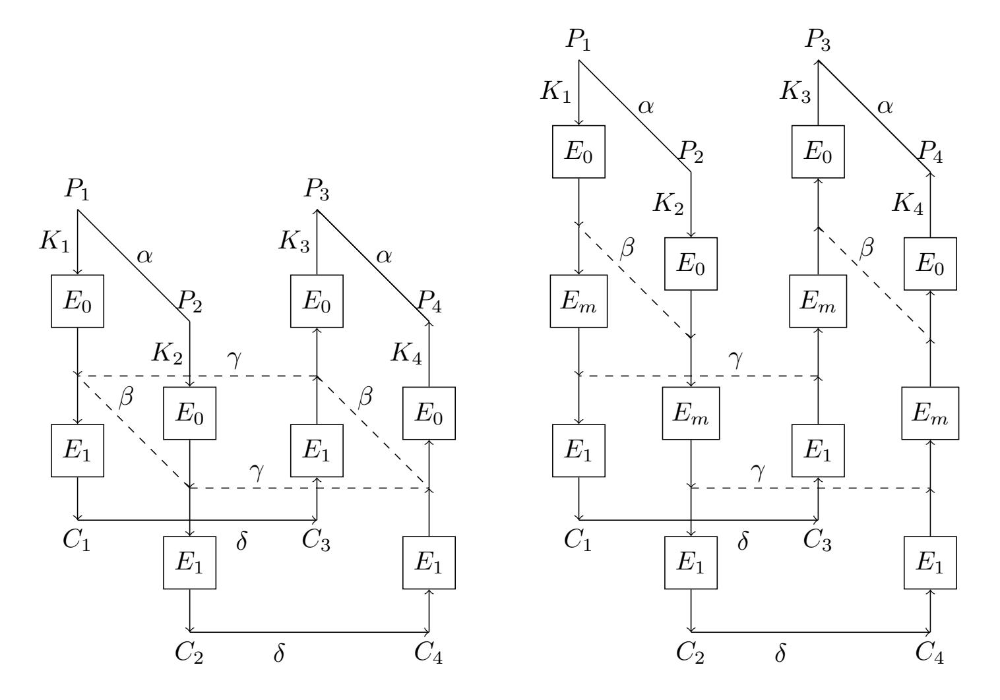
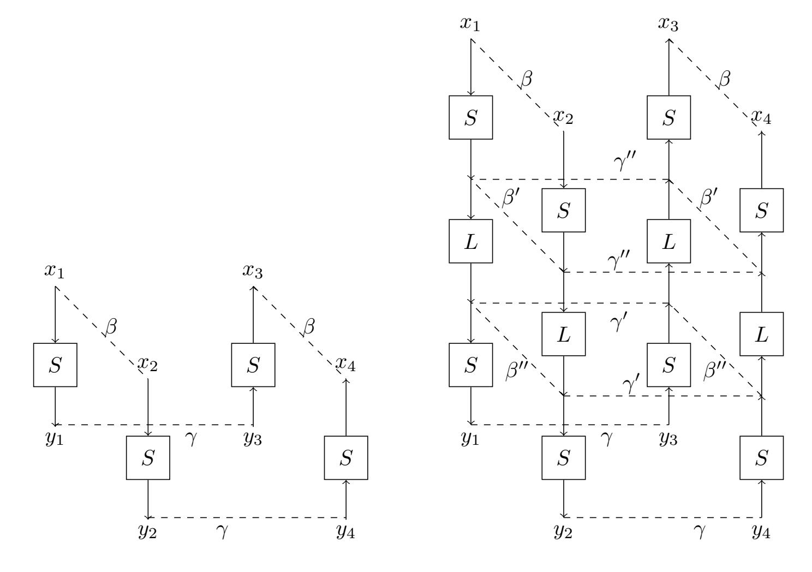

{0}------------------------------------------------

## **Improved (Related-key) Differential Cryptanalysis on GIFT**

Fulei Ji<sup>1</sup>*,*<sup>2</sup> , Wentao Zhang<sup>1</sup>*,*<sup>2</sup> , Chunning Zhou<sup>1</sup>*,*<sup>2</sup> , and Tianyou Ding<sup>1</sup>*,*<sup>2</sup>

**Abstract.** In this paper, we reevaluate the security of GIFT against differential cryptanalysis under both single-key scenario and related-key scenario. Firstly, we apply Matsui's algorithm to search related-key differential trails of GIFT. We add three constraints to limit the search space and search the optimal related-key differential trails on the limited search space. We obtain related-key differential trails of GIFT-64/128 for up to 15/14 rounds, which are the best results on related-key differential trails of GIFT so far. Secondly, we propose an automatic algorithm to increase the probability of the related-key boomerang distinguisher of GIFT by searching the clustering of the related-key differential trails utilized in the boomerang distinguisher. We find a 20-round related-key boomerang distinguisher of GIFT-64 with probability 2*−*58*.*<sup>557</sup>. The 25-round related-key rectangle attack on GIFT-64 is constructed based on it. This is the longest attack on GIFT-64. We also find a 19-round related-key boomerang distinguisher of GIFT-128 with probability 2*−*109*.*<sup>626</sup>. We propose a 23-round related-key rectangle attack on GIFT-128 utilizing the 19-round distinguisher, which is the longest related-key attack on GIFT-128. The 24-round related-key rectangle attack on GIFT-64 and 22-round related-key boomerang attack on GIFT-128 are also presented. Thirdly, we search the clustering of the single-key differential trails. We increase the probability of a 20-round single-key differential distinguisher of GIFT-128 from 2*−*121*.*<sup>415</sup> to 2 *<sup>−</sup>*120*.*<sup>245</sup>. The time complexity of the 26-round single-key differential attack on GIFT-128 is improved from 2<sup>124</sup>*.*<sup>415</sup> to 2<sup>123</sup>*.*<sup>245</sup> .

**Keywords:** GIFT *·* Related-key differential trail *·* Single-key differential trail *·* Clustering effect *·* Matsui's algorithm *·* Boomerang attack *·* Rectangle attack

## **1 Introduction**

GIFT is a lightweight Substitution-Permutation-Network block cipher proposed by Banik *et al.* at CHES'17 [7]. GIFT has two versions named GIFT-64 and GIFT-128, whose block sizes are 64 and 128 bits respectively and round numbers are 28 and 40 respectively. The key length of GIFT-64 and GIFT-128 are both 128 bits. As the inheritor of PRESENT [16], GIFT achieves improvements over PRESENT in both security and efficiency. GIFT is the underlying block cipher of the lightweight authentica[te](#page-17-0)d encryption schemes GIFT-COFB [1], HYENA [2], SUNDAE-GIFT [3], LOTUS-AEAD and LOCUS-AEAD [4], which are all the round 2 candidates of the NIST lightweight crypto standardization process [5].

*Differential cryptanalysis* [13] is one of the most fundamental methods for cryptanalysis of block ciphers. The most important step of different[ia](#page-16-0)l cryptanaly[si](#page-16-1)s is to find differenti[al](#page-17-1) trails with high probabilities. *Boomeran[g a](#page-17-2)ttack* [31] and *rectangle attack* [11,23] are extensions of differential cryptanalysis. *Related-key boo[mer](#page-17-3)ang attack* [24,12] is a combination of boomerang attack and related-key differential crypta[naly](#page-17-4)sis [10].

In recent years, the resistance of GIFT against (related-key) differential cryptanalysis have been extensively studied. **In single-key sc[ena](#page-18-0)rio**, Zhou *et al.* [35] s[ucc](#page-17-5)[eed](#page-18-1) in searching the optimal differential trails of GIFT-64 for up to 14 rounds[. Ji](#page-18-2) *[et](#page-17-6) al.* [22] found the optimal differential trails of GIFT-128 for up to 19 rounds. Li *et a[l.](#page-17-7)* [25] obtained a 20-round differential trail of GIFT-128 and presented a 26-round attack on GIFT-128. **In related-key scenario**, the designers [7] gave lower bounds of the probabilities of the optimal related-key diff[ere](#page-18-3)ntial trails of GIFT-64/GIFT-128 for

<sup>1</sup> State Key Laboratory of Information Security, Institute of Information Engineering, Chinese Academy of Sciences, Beijing, China

*<sup>{</sup>*jifulei, zhangwentao, zhouchunning, dingtianyou*}*@iie.ac.cn

<sup>2</sup> School of Cyber Security, University of Chinese Academy of Sciences, Beijing, China

{1}------------------------------------------------

up to 12/9 rounds. Liu and Sasaki [27] searched related-key differential trails of GIFT-64 for up to 21 rounds. They succeed in attacking 21-round GIFT-128 with a 19-round related-key boomerang distinguisher and 23-round GIFT-64 with a 20-round related-key boomerang distinguisher. In [18], Chen *et al.* constructed a 20-round related-key boomerang distinguisher of GIFT-64 with probability *P r* = 2*−*<sup>50</sup>. Based on this 20-ro[und](#page-18-4) distinguisher, a 23-round related-key rectangle attack was proposed in [18] and a 24-round related-key rectangle attack was proposed by Zhao *et al.* in [34]. According to the analysis in [32], the probability of the 20-round distinguisher should be corre[cted](#page-17-8) to *P r* = 2*−*<sup>68</sup>. The 23-round and 24-round attack are invalid since *P r <* 2 *<sup>−</sup>*<sup>64</sup> [11]. The detailed proof process is demonstrated in App.C.

Matsui's [alg](#page-17-8)orithm [28] is a branch-and-bound depth-first automatic search algorithm prop[osed](#page-18-5) by Matsui to search optimal [sin](#page-18-6)gle-key differential and linear trails of DES. Some improvements of Matsui's algorithm have been presented and applied to DESL, FEAL, NOEK[EO](#page-17-5)N and SPON-GENT [29,6,8,22]. In [22], Ji *et al.* app[lied](#page-20-0) three methods to speed up the search process of Matsui's algorithm. The improv[ed](#page-18-7) Matsui's algorithm given in [22] is easy to implement and performs well in searching the optimal single-key differential trails of GIFT.

In this paper, we focus on the following two issues. **Firstly**, the lower bounds of the probabilities [of t](#page-18-8)[h](#page-17-9)[e](#page-17-10) [opt](#page-17-11)imal [re](#page-17-11)lated-key differential trails of GIFT found in [7,27] are loose. We hope to find related-key differential trails of GIFT with higher [pr](#page-17-11)obabilities. We apply Matsui's algorithm to search related-key differential trails of GIFT. **Secondly**, both the probability of the single-key differential distinguisher and the related-key boomerang distinguisher can be improved by considering the clustering of the differential trails. The definitions of *th[e](#page-17-0) [clu](#page-18-4)stering of an R-round single-key differential trail* and *the clustering of the related-key differential trails utilized in an Rround related-key boomerang distinguisher* are presented in Definition 4 and Definition 5. We study how to find the clustering of the single-key differential trails and the related-key differential trails utilized in the related-key boomerang distinguisher.

#### **Our Contributions**

- 1 **We apply Matsui's algorithm to search related-key differential trails of GIFT**. We search related-key differential trails of GIFT according to the following three steps:
  - *•* Firstly, apply the speeding-up methods in [22] to speed up the search process.
  - *•* Secondly, add three constraints to limit the search space.
  - *•* Finally, search the optimal related-key differential trails on the limited search space.

The adjusted Matsui's algorithm devoted to searching related-key differential trails of GIFT is shown in Alg.1.

- We succeed in finding related-key differential trails of GIFT-64/128 for up to 15/14 rounds. The results are summarized in Table 1.
- As we can see from Table 1, compared with the known results in [7,27,18], **the relatedkey diffe[re](#page-8-0)ntial trails of GIFT we find are the best results so far**. For GIFT-128, we find related-key differential trails for up to 14 round, while the previous results up to 9 rounds. For both GIFT-64 and GIFT[-1](#page-2-0)28, our results provide tighter lower bounds for the probabilities of the optima[l r](#page-2-0)elated-key trails.

In [27], the authors presented a 9-round related-key differential trail *l* of GIFT-128 with weight 29.830. Through our verification, we find that *l* cannot be reproduced. It is because that the round key difference of *l* cannot be generated from the master key difference.

- 2 **We propose an automatic search algorithm to search the clustering of the relatedke[y d](#page-18-4)ifferential trails utilized in the related-key boomerang distinguisher**. The new algorithm is presented as Alg.2. The target cipher *E* of the related-key boomerang distinguisher is decomposed as *E*<sup>1</sup> *◦ E<sup>m</sup> ◦ E*0.
  - **For GIFT-64**, we increase the probability of a 20-round related-key boomerang distinguisher from 2*−*67*.*<sup>660</sup> to 2*−*58*.*<sup>557</sup>. The clustering of the 10-round related-key differential trail utilized in *E*<sup>0</sup> consists of [5](#page-10-0)728 trails. The clustering of the 9-round related-key differential trail utilized in *E*<sup>1</sup> consists of 312 trails.

{2}------------------------------------------------

<span id="page-2-0"></span>GIFT-64 GIFT-128 *R* [7] [18] [27] Sect.3 [7] Sect.3 5 1.415 1.415 7.000 6.830 6 5.000 4.000 11.000 10.830 7 6.415 6.000 20.000 15.830 8 10[.0](#page-17-0)00 8.00[0](#page-7-0) 25[.0](#page-17-0)00 22.8[30](#page-7-0) 9 16.000 14.000 13.415 13.415 31.000 30.000 10 22.000 20.415 37.000 11 27.000 28.830 26.000 44.000 12 31.000 56.000 13 39.000 37.000 65.830 14 42.830 77.830 15 50.000 48.000

**Table 1.** The weight<sup>1</sup> of the *R*-round related-key differential trails of GIFT

The 25-round and 24-round related-key rectangle attacks are achieved taking advantage of the 20-round distinguisher. **This is the longest attack on GIFT-64 so far**, while the previous longest attack is the 23-round related-key boomerang attack proposed in [27].

- **For GIFT-128**, we increase the probability of a 19-round related-key boomerang distinguisher from 2*−*120*.*<sup>00</sup> to 2*−*109*.*<sup>626</sup>. The clustering of the 9-round related-key differential trail utilized in *E*<sup>0</sup> contains 3952 trails. The clustering of the 9-round related-key differential trail utilized in *E*<sup>1</sup> contains 2944 trails.

Applying the 19-round distinguisher, we propose a 23-round related-key rectangle attack and a 22-round related-key boomerang attack. **This is the longest related-key attack on GIFT-128**, while the previous longest related-key attack is the 21-round related-key boomerang attack proposed in [27].

<span id="page-2-1"></span>**Table 2.** Summary of the cryptanalytic results on GIFT

| GIFT-64 |
|---------|
|---------|

| GIFT-64 |           |         |         |            |            |          |
|---------|-----------|---------|---------|------------|------------|----------|
| Rounds  | Approach  | Setting | Time    | Data       | Memory     | Ref.     |
| 20      | DC        | SK      | 2112.68 | 62<br>2    | 112<br>2   | [17]     |
| 21      | DC        | SK      | 2107.61 | 64<br>2    | 96<br>2    | [17]     |
| 23      | Boomerang | RK      | 2126.6  | 63.3<br>2  | -          | [27]     |
| 24      | Rectangle | RK      | 2106.00 | 63.78<br>2 | 64.10<br>2 | Sect.5.2 |

GIFT-128

| GIFT-128 |           |         |          |              |             |          |
|----------|-----------|---------|----------|--------------|-------------|----------|
| Rounds   | Approach  | Setting | Time     | Data         | Memory      | Ref.     |
| 21       | Boomerang | RK      | 2126.6   | 126.6<br>2   | -           | [27]     |
| 22       | Boomerang | RK      | 2112.63  | 112.63<br>2  | 52<br>2     | App.B    |
| 23       | Rectangle | RK      | 2126.89  | 121.31<br>2  | 121.63<br>2 | Sect.6.2 |
| 23       | DC        | SK      | 120<br>2 | 120<br>2     | 86<br>2     | [36]     |
| 26       | DC        | SK      | 2124.415 | 124.415<br>2 | 109<br>2    | [25]     |

<sup>1</sup> The *weight* is the negative logarithm of the *probability* to base 2.

{3}------------------------------------------------

# 3 We apply Matsui's algorithm to search the clustering of the single-key differential trails.

- We increase the probability of a 20-round single-key differential distinguisher of GIFT-128 from  $2^{-121.415}$  to  $2^{-120.245}$ . The clustering of the 20-round single-key differential trail is composed by four trails. We improve the time complexity of the 26-round differential attack on GIFT-128 constructed in [25] from  $2^{124.415}$  to  $2^{123.245}$ .

The cryptanalytic results are summarized in Table 2.

**Organization.** The paper is organized as follows. In Sect.2, we give a brief description of GIFT, the speeding-up methods on Matsui's algorithm and the related-key boomerang and rectangle attack. The definitions and notations adopted throughout the paper are also presented in Sect.2. In Sect.3, we introduce how to apply Matsui's algorithm in related-key scenario. Sect.4 declares how to search the clustering of the single-key/related-key differential trails. Sect.5 and Sect.6 provide the details of the 25/24-round attacks on GIFT-64 and the 26/23-round attacks on GIFT-128 respectively. The details of the 22-round attack on GIFT-128 are presented in App.B. Sect.7 is the conclusion and future work.

## 2 Preliminaries

4

#### 2.1 Description of GIFT

<span id="page-3-0"></span>Let n be the block size of GIFT. The master key is  $iniK := k_7 ||k_6|| \cdots ||k_0||$ , in which |iniK| = 128,  $|k_i| = 16$ . Each round of GIFT consists of three steps: SubCells, PermBits, and AddRoundKey.

<span id="page-3-1"></span>**Table 3.** The specifications of the S-box GS in GIFT

| $\overline{x}$ | 0 | 1 | 2 | 3            | 4 | 5 | 6 | 7 | 8 | 9 | a | b | c | d | e | $\overline{f}$ |
|----------------|---|---|---|--------------|---|---|---|---|---|---|---|---|---|---|---|----------------|
| GS(x)          | 1 | a | 4 | $\mathbf{c}$ | 6 | f | 3 | 9 | 2 | d | b | 7 | 5 | 0 | 8 | e              |

- 1 SubCells. The S-box GS is applied to every nibble of the cipher state. The specifications of GS is given in Table 3.
- 2 PermBits. Update the cipher state by a linear bit permutation  $P(\cdot)$  as  $b_{P(i)} \leftarrow b_i$ ,  $\forall i \in \{0, \dots, n-1\}$ .
- 3 AddRoundKey. An n/2-bit round key RK is extracted from the key state. It is further partitioned into two s-bit words  $RK := U||V = u_{s-1} \cdots u_0||v_{s-1} \cdots v_0, \ s = n/4.$

For GIFT-64, RK is XORed to the state as  $b_{4i+1} \leftarrow b_{4i+1} \oplus u_i$ ,  $b_{4i} \leftarrow b_{4i} \oplus v_i$ ,  $\forall i \in \{0, \dots, 15\}$ . For GIFT-128, RK is XORed to the state as  $b_{4i+2} \leftarrow b_{4i+2} \oplus u_i$ ,  $b_{4i+1} \leftarrow b_{4i+1} \oplus v_i$ ,  $\forall i \in \{0, \dots, 31\}$ .

For both versions, a single bit "1" and a 6-bit constant C are XORed into the internal state at positions  $n-1,\,23,\,19,\,15,\,11,\,7$  and 3 respectively.

**Key Schedule.** For GIFT-64,  $RK = U||V = k_1||k_0$ . For GIFT-128,  $RK = U||V = k_5||k_4||k_1||k_0$ . For both versions, the key state is updated as

$$k_7||k_6||\cdots||k_1||k_0\leftarrow k_1\gg 2||k_0\gg 12||\cdots||k_3||k_2$$

where  $\gg$  i is an i-bit right rotation within a 16-bit word.

We refer readers to [7] for more details of GIFT.

{4}------------------------------------------------

#### 2.2 Definitions and Notations

**Definition 1** ([20]). The weight of a difference propagation (a', b') is the negative of the binary logarithm of the difference propagation probability over the transformation h, *i.e.*,

$$w_r(a',b') = -\log_2^{Pr^h(a',b')}. (1)$$

a' is the input difference and b' is the output difference.

**Definition 2** ([19]). Let  $\varphi$  be an invertible function from  $\mathbb{F}_2^m$  to  $\mathbb{F}_2^m$ , and  $\Delta_0, \nabla_0 \in \mathbb{F}_2^m$ . The **boomerang connectivity table** (BCT) of  $\varphi$  is defined by a  $2^m \times 2^m$  table, in which the entry for  $(\Delta_0, \nabla_0)$  is computed by:

$$BCT(\Delta_0, \nabla_0) = \sharp \{ x \in \{0, 1\}^n | \varphi^{-1}(\varphi(x) \oplus \nabla_0) \oplus \varphi^{-1}(\varphi(x \oplus \Delta_0) \oplus \nabla_0) = \Delta_0 \}.$$
 (2)

**Definition 3** ([32]). Let  $\varphi$  be an invertible function from  $\mathbb{F}_2^m$  to  $\mathbb{F}_2^m$ , and  $\Delta_0, \Delta_1, \nabla_0, \nabla_1 \in \mathbb{F}_2^m$ . The **boomerang difference table** (BDT) of  $\varphi$  is a three-dimensional table, in which the entry for  $(\Delta_0, \Delta_1, \nabla_0)$  is computed by:

$$BDT(\Delta_0, \Delta_1, \nabla_0) = \sharp \{ x \in \{0, 1\}^n | \varphi^{-1}(\varphi(x) \oplus \nabla_0) \oplus \varphi^{-1}(\varphi(x \oplus \Delta_0) \oplus \nabla_0) = \Delta_0, \\ \varphi(x) \oplus \varphi(x \oplus \Delta_0) = \Delta_1 \}.$$
(3)

The iBDT, as a variant of BDT, is evaluated by:

$$iBDT(\nabla_0, \nabla_1, \Delta_0) = \sharp \{ x \in \{0, 1\}^n | \varphi(\varphi^{-1}(x) \oplus \Delta_0) \oplus \varphi(\varphi^{-1}(x \oplus \nabla_0) \oplus \Delta_0) = \nabla_0, \\ \varphi^{-1}(x) \oplus \varphi^{-1}(x \oplus \nabla_0) = \nabla_1 \}.$$

$$(4)$$

The notations used in this paper are defined as follows:

 $S(\cdot), P(\cdot), K(\cdot)$ : SubCells operation, PermBits operation, AddRoundKey operation

n: the block size of cipher E

k: the master key size of cipher E

2ns : the number of the S-boxes in  $S(\cdot)$ ; 2ns = n/4 for GIFT

MKD : the master key difference

 $X_i, Y_i$ : the input and the output of  $S(\cdot)$  in round i

 $Z_i$  : the output of  $P(\cdot)$  in round i : the round key of round i

 $\Delta X_i, \Delta Y_i, \Delta Z_i, \Delta K_i$ : the differential value of  $X_i, Y_i, Z_i$  and  $K_i$ 

W(l) : the weight of the differential trail l

 $W(\Delta X_i, \Delta Y_i)$  : the weight of  $\Delta X_i \xrightarrow{S(\cdot)} \Delta Y_i$  in round i

 $B_R := min[\Sigma_{i=1}^R W(\Delta X_i, \Delta Y_i)]$ : the weight of the R-round optimal differential trail

 $Bc_R$  : the upper bound of  $B_R$ 

bw : the value of  $Bc_R$  minus  $B_R$ ;  $Bc_R = B_R + bw$ DDT : the difference distribution table of the S-box LAT : the linear approximation table of the S-box

 $E := E_1 \circ E_m \circ E_0$ : the target cipher of the boomerang or rectangle distinguisher

 $E' := E_f \circ E \circ E_b$ : the target cipher of the boomerang or rectangle attack

 $E_b$  : the extension cipher added at the start of E : the extension cipher added at the end of E

 $r_b, r_f$ : the number of active bits in the input difference of  $E_b$  and the output difference of  $E_f$ 

 $m_b, m_f$ : the number of key bits needed to be guessed in  $E_b$  and  $E_f$ 

{5}------------------------------------------------



<span id="page-5-0"></span>**Fig. 1.** The Boomerang Distinguisher

<span id="page-5-1"></span>**Fig. 2.** The Sandwich Distinguisher

### **2.3 Three Methods to Speed Up Matsui's Algorithm**

<span id="page-5-2"></span>Matsui's algorithm [28] works by induction on the number of rounds and derives the *R*-round optimal weight *B<sup>R</sup>* from the knowledge of all *i*-round optimal weight *B<sup>i</sup>* (1 *≤ i < R*). The program requires an initial value for *BR*, which is represented as *BcR*. It works correctly for any *Bc<sup>R</sup>* as long as *Bc<sup>R</sup> ≥ BR*. In [22], Ji *et al.* applied three methods to improve the efficiency of Matsui's algorithm. The three [sp](#page-18-7)eeding-up methods are named (1) *Reconstructing DDT and LAT According to Weight*, (2) *Executing Linear Layer Operations in Minimal Cost* and (3) *Merging Two 4-bit Sboxes into One 8-bit S-box*.

**Speeding-up met[hod](#page-17-11)-1** contributes to pruning unsatisfiable candidates quickly. The authors reconstructed the DDT to sort the input and output differences according to their weights. **Speeding-up method-2 and method-3** contribute to reducing the cost of executing linear layer operations. The authors merged 2ns 4-bit S-boxes into ns 8-bit new S-boxes. The new linear table is constructed according to the output differences of each S-box. The SSE instructions are applied to reduce the cost of linear layer operations.

The improved Matsui's algorithm for GIFT is demonstrated as Alg.3 in App.A. We refer readers to [22] for more details of the speeding-up methods.

### **2.4 Related-key Boomerang Attack and Rectangle Attack**

**Ba[sic](#page-17-11) Related-key Boomerang Attack and Rectangle Attack.** *Related-key boomerang attack* is an adaptive chosen-plaintext/ciphertext attack. As is shown in Fig.1, the adversary can split the target cipher *E* into two sub-ciphers *E*<sup>0</sup> and *E*1, *i.e.*, *E* = *E*<sup>1</sup> *◦ E*0. Assume that there are a differential trail *α → β* under the key difference *∆K* over *E*<sup>0</sup> with probability *p* and a differential trail *γ → δ* under the key difference *∇K* over *E*<sup>1</sup> with probability *q*. Once *K*<sup>1</sup> is known, the other three keys are determined: *K*<sup>2</sup> = *K*<sup>1</sup> *⊕ ∆K*, *K*<sup>3</sup> = *K*<sup>1</sup> *⊕ ∇K*, *K*<sup>4</sup> = *K*<sup>2</sup> *⊕ ∇K*[.](#page-5-0) Given *P*<sup>1</sup> *⊕ P*<sup>2</sup> = *α* and *K*<sup>1</sup> *⊕ K*<sup>2</sup> = *∆K*, the probability that we obtain two plaintexts satisfying *P*<sup>3</sup> *⊕ P*<sup>4</sup> = *α* through the boomerang distinguisher is:

$$p^{2}q^{2} = Pr[E^{-1}(E(x, K_{1}) \oplus \delta, K_{3}) \oplus E^{-1}(E(x \oplus \alpha, K_{2}) \oplus \delta, K_{4}) = \alpha]$$
(5)

{6}------------------------------------------------



Fig. 3. A 1-round  $E_m$ 

<span id="page-6-0"></span>Fig. 4. A 2-round  $E_m$ 

If  $(P_1, P_2, P_3, P_4)$  can pass the boomerang distinguisher, then it is called a **right quartet**.

For a random permutation, given  $P_1 \oplus P_2 = \alpha$  and  $K_1 \oplus K_2 = \Delta K$ , the probability that two random plaintexts satisfying  $P_3 \oplus P_4 = \alpha$  is  $2^{-n}$ . Therefore, only if  $pq > 2^{-n/2}$  can we count more right quartets than random noise through the related-key boomerang distinguisher.

Related-key rectangle attack is a chosen-plaintext attack, which is a further development of the related-key boomerang attack. In Fig.1, given  $P_1 \oplus P_2 = \alpha$  and  $P_3 \oplus P_4 = \alpha$  under  $K_1, K_2, K_3, K_4$ , the probability that the corresponding ciphertexts  $C_1, C_2, C_3, C_4$  meets  $C_1 \oplus C_3 = \delta$  and  $C_2 \oplus C_4 = \delta$  (or  $C_1 \oplus C_4 = \delta$  and  $C_2 \oplus C_3 = \delta$ ) is  $2^{-n}p^2q^2$ . If  $(P_1, P_2, P_3, P_4)$  can pass the rectangle distinguisher under  $(K_1, K_2, K_3, K_4)$ , then it is called a **right quartet**. For a random permutation, we get a right quartet with probability  $2^{-2n}$  in the rectangle attack. Thus, only if  $pq > 2^{-n/2}$  can we count more right quartets than random noise.

Boomerang Switch. The interaction between the two differential trails over  $E_0$  and  $E_1$  is utilized to improve the boomerang and rectangle attack [14,15], which is called **the boomerang switch** [15]. The idea of the boomerang switch is to minimize the overall complexity of the distinguisher by optimizing the transition between  $E_0$  and  $E_1$ . In [21], a new framework named **sandwich attack** was proposed. As is shown in Fig.2, the sandwich attack decomposes the target cipher E as  $E_1 \circ E_m \circ E_0$ . The propagation of the boomerang switch is captured by the propagation of  $E_m$ . For the fixed  $\beta$  and  $\gamma$ , the probability that a quartet can pass  $E_m$  is denoted as:

$$r := Pr[E_m^{-1}(E_m(x, K_1) \oplus \gamma, K_3) \oplus E_m^{-1}(E_m(x \oplus \beta, K_2) \oplus \gamma, K_4) = \beta]$$
 (6)

Thus, the probability that we obtain a right quartet through the sandwich distinguisher (i.e., the boomerang distinguisher with boomerang switch) is  $p^2q^2r$ .

The value of r can be evaluated by the boomerang connectivity table [19] or the boomerang difference table [32] at the S-box level. Let  $\beta[2ns]||\cdots||\beta[1]:=\beta$  and  $\gamma[2ns]||\cdots||\gamma[1]:=\gamma$ . Let S and L be the non-linear and linear layer operations of E,  $\beta'=S(\beta)$ ,  $\beta''=L(\beta')$ ,  $\gamma'=S^{-1}(\gamma)$  and  $\gamma''=L^{-1}(\gamma')$ . For a 1-round  $E_m$ , the propagation of  $\beta$  and  $\gamma$  is illustrated in Fig.3. Then we have

$$r = 2^{-n} \Sigma_{1 \le i \le 2\text{ns}} BCT(\beta[i], \gamma[i]).$$

{7}------------------------------------------------

For a 2-round *Em*, the propagation of *β* and *γ* is illustrated in Fig.4. Then we have

$$r = 2^{-2n} \Sigma_{1 \le i \le 2\text{ns}}(\text{BDT}(\beta[i], \beta'[i], \gamma''[i]) \times \text{iBDT}(\gamma[i], \gamma'[i], \beta''[i])).$$

For a related-key boomerang distinguisher, if there are multi[ple](#page-6-0) trails *α → E*<sup>0</sup> *β<sup>i</sup>* and *γ<sup>j</sup> → E*<sup>1</sup> *δ* (*β<sup>i</sup> ̸*= *γ<sup>j</sup>* ) under fixed *α*, *∆K*, *δ* and *∇K*, the probability of obtaining a right quartet can be increased to:

$$\hat{p}^2 \hat{q}^2 := \Sigma_{i,j} p_i^2 q_j^2 r_{ij}, \tag{7}$$

in which *p<sup>i</sup>* = *P r*(*α → E*<sup>0</sup> *βi*), *q<sup>j</sup>* = *P r*(*γ<sup>j</sup> → E*<sup>1</sup> *δ*) and *rij* = *P r*(*β<sup>i</sup> E →m γ<sup>j</sup>* ).

A new key-recovery model for the related-key boomerang and rectangle attack against block ciphers with linear key schedules was constructed by Zhao *et al.* in [33,34]. This new model is a modification of Liu *et al.*'s model [26]. In this paper, we utilize the model proposed by Zhao *et al.* to perform the key-recovery attack against GIFT.

## **3 Searching Related-ke[y D](#page-18-10)ifferential Trails**

## **3.1 Applying Matsui's Algorithm in Related-key Scenario**

<span id="page-7-0"></span>Our objective is to find related-key differential trails with high probabilities. We apply Matsui's algorithm to search related-key differential trails of GIFT. Firstly, we apply the speeding-up methods introduced in Sect.2.3 to improve the search process. Secondly, we add three constraints to limit the search space. Finally, we search the optimal related-key differential trails on the limited search space. **The adjusted Matsui's algorithm aiming at searching optimal related-key differential trails of GIFT on limited search space is demonstrated in Alg.1**.

Let *R* be the round [nu](#page-5-2)mber of *E*. Let *∆iniK* := *∆k*7*|| · · · ||∆k*<sup>0</sup> be the master key difference and *∆K<sup>i</sup>* be the round key difference in round *i*. **We utilize the following three constraints to limit the search space:**

- 1 **Restricting the input difference of round** *f r* **to zero and traverse** *f r* **from 1 to** *R***.** It has been declared in [29] that the number of candidates in the first two rounds of Matsui's algorithm is the dominant factor of the search complexity. In Alg.3, the number of candidates *∆Y*<sup>1</sup> in Procedure Round-1 depends on the value of *Bc<sup>R</sup> − B<sup>R</sup>−*<sup>1</sup>. Alg.1 starts from Procedure Round-*fr* with only one candidate *∆Yf r* = 0. Since *∆Yf r* = 0, we can determine the input difference of round *i*+ 1 [wh](#page-18-8)ich is *∆K<sup>i</sup>* and the output difference of round *i−*1 which is *∆K<sup>i</sup>−*<sup>1</sup>. Therefore, the complexity of Matsui's algorithm in related-key sce[na](#page-19-1)rio is improved benefitting from constraint-1.
- 2 **Restricting the number of the active bits in the master key difference.** The key schedule of GIFT is a linear transformation. The value of *∆K<sup>i</sup>* are determined by *∆iniK*. The input difference of *S*(*·*) in round *i* is *∆X<sup>i</sup>* = *P*(*∆Y<sup>i</sup>−*<sup>1</sup>) *⊕ ∆K<sup>i</sup>−*<sup>1</sup>. The related-key differential trails with small weight will not contain too many active S-boxes in *S*(*·*). Thus, there should not be too many active bits in *∆K<sup>i</sup>* (1 *≤ i ≤ R*). The details of constraint-2 are as follows.
  - *•* Restricting the number of the active bits in *∆iniK* to no more than four when *R <* 11.
  - *•* Restricting the number of the active bits in *∆iniK* to no more than three when *R ≥* 11.
  - *•* Restricting the four active bit positions to belong to four different *∆k<sup>j</sup>* (0 *≤ j ≤* 7) if the number of the active bits is four.

The total number of the candidate *∆iniK* is *C* 1 <sup>128</sup> + *C* 2 <sup>128</sup> + *C* 3 <sup>128</sup> + *C* 4 7 *·* (*C* 1 <sup>16</sup>) <sup>4</sup> = 4 937 152.

3 **Restricting the number of the active S-boxes in round** *i* **(1** *≤ i ≤ R***) to no more than five when** *R ≥* **11.**

{8}------------------------------------------------

**Algorithm 1** The Adjusted Matsui's Algorithm of Searching Optimal Related-key Differential Trails for GIFT on Limited Search Space

**Require:**  $R (\geq 3)$ ;  $B_0 = 0, B_1, B_2, \dots, B_{R-1}$ ;  $Bc_R$ ; iniKeyDiff [4 937 152]; ns := n/8

```
Ensure: B_R = Bc_R; the R-round related-key differential trails with minimal weight
                                                                26: if B_{fr-1} + \sum_{j=fr}^{R} w_j \leq Bc_R then
 1: for each iniKeyDiff [v] do
                                                                27: if fr = 1 then
        gen roundkey \Delta K_i, 1 \leq i \leq R
 2:
                                                                           Bc_R = \sum_{j=1}^R w_j
        for fr = 1 to R do
                                                                28:
 3:
           \Delta X_{fr} \leftarrow 0, \ \Delta Y_{fr} \leftarrow 0, \ w_{fr} \leftarrow 0
                                                                29:
                                                                        else
 4:
                                                                           \Delta Y_{fr-1} \leftarrow P^{-1}(\Delta K_{fr-1})
           if fr = R then
                                                                30:
 5:
              \Delta Y_{fr-1} \leftarrow P^{-1}(\Delta K_{fr-1})
 6:
                                                                31:
                                                                           call Round-i-In
              call Round-i-In
                                                                32:
                                                                        end if
 7:
                                                                33: end if
 8:
           else
              \Delta X_{fr+1} \leftarrow \Delta K_{fr}
                                                                34: return to the upper procedure
 9:
10:
              call Round-i
           end if
                                                                35: Procedure Round-i-In, 2 \le i \le R - 1:
11:
        end for
12:
                                                                36: for each \Delta X_i do
13: end for
                                                                        w_i \leftarrow W(\Delta X_i, \Delta Y_i)
                                                                37:
                                                                        if B_{i-1} + \sum_{j=i}^{R} w_j \ge Bc_R then
                                                                38:
14: Procedure Round-i, 2 \le i \le R - 1:
                                                                           break
                                                                39:
15: for each \Delta Y_i do
                                                                        else
                                                                40:
        w_i \leftarrow W(\Delta X_i, \Delta Y_i)
                                                                           \Delta Y_{i-1} \leftarrow P^{-1}(\Delta X_i \oplus \Delta K_{i-1})
                                                                41:
16:
        if B_{R-i} + B_{fr-1} + \sum_{j=fr}^{i} w_j \ge Bc_R then 42:
                                                                           call Round-(i-1)-In
17:
           break
                                                                        end if
18:
                                                                43:
                                                                44: end for
19:
        else
           \Delta X_{i+1} \leftarrow P(\Delta Y_i) \oplus \Delta K_i
20:
           call Round-(i+1)
                                                                45: Procedure Round-1-In:
21:
22:
        end if
                                                                46: w_1 \leftarrow min_{\Delta X_R} W(\Delta X_R, \Delta Y_R)
                                                                47: if \Sigma_{j=1}^R w_j \leq Bc_R then
23: end for
                                                                        Bc_R = \sum_{j=1}^R w_j
                                                                48:
24: Procedure Round-R:
                                                                49: end if
25: w_R \leftarrow min_{\Delta Y_R} W(\Delta X_R, \Delta Y_R)
                                                                50: return to the upper procedure
```

#### 3.2 Results on Related-key Differential Trails of GIFT

Applying Alg.1, we find related-key differential trails of GIFT-64/128 for up to 15/14 rounds. The results are summarized in Table 1. Table 10 in App.D presents a 15-round related-key differential trail of GIFT-64 and a 14-round related-key differential trail of GIFT-128 found by Alg.1.

Compared to the previous results in [7,27,18], the optimal related-key differential trails found by Alg.1 on the limited search space are the best results known so far. We find related-key differential trails of GIFT-128 for up to 14 rounds, while the previous results up to 9 rounds. We provide tighter lower bounds for the probabilities of the optimal related-key trails of both GIFT-64 and GIFT-128. It indicates that the three constraints we choose perform well in limiting the search space while preserving the related-key differential trails with high probabilities.

# 4 Increasing the Probability of the Distinguisher Utilizing Clustering Effect

Both the probability of the single-key differential distinguisher and the related-key boomerang distinguisher can be increased by searching the clustering of the differential trails. Next, we give the

{9}------------------------------------------------

definitions of the clustering of an *R*-round single-key differential trail and the clustering of the related-key differential trails utilized in an *R*-round boomerang distinguisher and explain how to search the clustering.

#### 4.1 Single-key Scenario

**Definition 4.** The clustering of an R-round single-key differential trail is defined as:

$$C(R, \eta_{in}, \eta_{out}, Bc_R) := \{ \text{all } R \text{-round single-key differential trails } l^i \mid W(l^i) \le Bc_R, \Delta X_1 = \eta_{in}, P(\Delta Y_R) = \eta_{out} \}.$$
(8)

In fact, for an R-round single-key differential trail  $\mathcal{L}$  with fixed input difference  $\eta_{in}$  and output difference  $\eta_{out}$ , the clustering of  $\mathcal{L}$  is composed by all the differential trails whose input difference is  $\eta_{in}$  and output difference is  $\eta_{out}$ , i.e.,  $\mathcal{C}(R, \eta_{in}, \eta_{out}, \infty)$ . It will take immeasurable time to determine all the trails in  $\mathcal{C}(R, \eta_{in}, \eta_{out}, \infty)$ . Therefore, we only search all the trails with weight no more than  $Bc_R$ . The choice of  $Bc_R$  is heuristic.

We call Alg.3 to search  $C(R, \eta_{in}, \eta_{out}, Bc_R)$ . The greater the value of  $Bc_R$ , the more trails can we find, while the longer the search time is required.

#### 4.2 Related-key Scenario

Definition 5. The clustering of the related-key differential trails utilized in an R-round related-key boomerang distinguisher is defined as:

$$\mathcal{C}(R_0, R_1, R_m, \alpha, \Delta iniK_0, Bc_{R_0}, \delta, \Delta iniK_1, Bc_{R_1}) := \{\text{all combinations of } (l_0^i, l_1^j) \mid l_0^i \in \mathcal{C}_I(R_0, \alpha, \Delta iniK_0, Bc_{R_0}), l_1^j \in \mathcal{C}_O(R_1, \delta, \Delta iniK_1, Bc_{R_1})\}, \tag{9}$$

in which

$$C_I(R_0, \alpha, \Delta iniK_0, Bc_{R_0}) := \{ \text{all } R_0 \text{-round related-key differential trails } l_0^i \mid W(l_0^i) \le Bc_{R_0}, \Delta X_1 = \alpha, \text{MKD} = \Delta iniK_0 \},$$

$$(10)$$

$$C_O(R_1, \delta, \Delta iniK_1, Bc_{R_1}) := \{ \text{all } R_1 \text{-round related-key differential trails } l_1^j \mid W(l_1^j) \le Bc_{R_1}, K(\Delta Z_{R_1}) = \delta, \text{MKD} = \Delta iniK_1 \},$$
(11)

and  $R = R_0 + R_m + R_1$ .

In fact, the clustering of an  $R_0$ -round related-key differential trail  $\mathcal{L}$  with fixed input difference  $\alpha$  and master key difference  $\Delta iniK_0$  contains all the related-key differential trails with arbitrary weight, i.e.,  $\mathcal{C}_I(R_0, \alpha, \Delta iniK_0, \infty)$ . It will take immeasurable time to determine all the trails in  $\mathcal{C}_I(R_0, \alpha, \Delta iniK_0, \infty)$ . Therefore, we only search all the trails with weight no more than  $Bc_{R_0}$ . The choice of  $Bc_{R_0}$  is heuristic. The modification above also applies to  $\mathcal{C}_O(R_1, \delta, \Delta iniK_1, \infty)$ .

To construct an R-round related-key boomerang distinguisher  $\mathcal{D}$  for the target cipher  $E = E_1 \circ E_m \circ E_0$ , we firstly determine the round number  $R_0/R_m/R_1$  for  $E_0/E_m/E_1$  satisfying  $R = R_0 + R_m + R_1$ . The general way to determine the probability of the distinguisher  $\mathcal{D}$  is:

- 1 Choose an  $R_0$ -round trail  $l_0$  for  $E_0$ ; Get the input difference  $\alpha$ , the output difference  $\beta$  and the master key difference  $\Delta iniK_0$ .
- 2 Choose an  $R_1$ -round trail  $l_1$  for  $E_1$ ; Get the input difference  $\gamma$ , the output difference  $\delta$  and the master key difference  $\Delta iniK_1$ .
- 3 Apply the BCT to calculate  $Pr(\beta \to \gamma)$  if  $R_m = 1$ ; Apply the BDT and the iBDT to calculate  $Pr(\beta \to \gamma)$  if  $R_m = 2$ .

For a distinguisher  $\mathcal{D}$  with fixed  $\alpha$  and  $\delta$ , there could be mulitiple values of  $\beta$  and  $\gamma$ . To increase the probability of  $\mathcal{D}$ , we hope to find as more combinations of  $(\beta, \gamma)$  as we can. We propose Alg.2 to search  $\mathcal{C}(\mathcal{D})$ , i.e.,  $\mathcal{C}(R_0, R_1, R_m, \alpha, \Delta iniK_0, Bc_{R_0}, \delta, \Delta iniK_1, Bc_{R_1})$  and calculate the probability of  $\mathcal{D}$  by traversing all combinations of  $(l_0^i, l_1^j)$  in  $\mathcal{C}(\mathcal{D})$ . The greater the value of  $Bc_{R_0}$  and  $Bc_{R_1}$ , the more trails can we find.

{10}------------------------------------------------

**Algorithm 2** The Algorithm of Increasing the Probability of the Related-key Boomerang Distinguisher for GIFT

```
Require: R_0, R_1, R_m; bw ; ns := n/8
Ensure: \hat{p}^2\hat{q}^2 \leftarrow max\{\hat{p_i}^2\hat{q_j}^2\}; \alpha_i, \Delta iniK_0^i; \delta_j, \Delta iniK_1^j
 1: Phase 1: Search all the related-key differential trails with minimal weight
 2: call Alg. 1 to search all the R_0-round related-key trails with minimal weight on the limited
     search space for E_0
 3: B_{R_0} \leftarrow the minimal weight of R_0-round trails
 4: l_0^1, \dots, l_0^a \leftarrow all the R_0-round trails with weight B_{R_0}
 5: for each l_0^i, 1 \le i \le a do
        \alpha_i \leftarrow \Delta X_1, \ \Delta ini K_0^i \leftarrow \text{the master key difference}
 6:
 7: end for
 8: call Alg. 1 to search all the R_1-round related-key trails with minimal weight on the limited
     search space for E_1
 9: B_{R_1} \leftarrow the minimal weight of R_1-round trails
10: l_1^1, \dots, l_1^b \leftarrow all the R_1-round trails with weight B_{R_1}
11: for each l_1^j, 1 \le j \le b do
        \delta_j \leftarrow K \circ P(\Delta Y_{R_1}), \ \Delta iniK_1^j \leftarrow \text{the master key difference}
12:
13: end for
14: Phase 2: Search all the clustering
15: for each l_0^i, 1 \le i \le a do
        call Alg.1 to search C_I(R_0, \alpha_i, \Delta iniK_0^i, B_{R_0} + bw) /* see Eq.10 for definition */
16:
        l_0^{i_1}, \dots, l_0^{i_d} \leftarrow \text{all the trails in } \mathcal{C}_I(R_0, \alpha_i, \Delta iniK_0^i, B_{R_0} + bw)
17:
        for each l_0^{i_u}, 1 \le u \le d do
18:
           \beta^{i_u} \leftarrow K \circ P(\Delta Y_{R_0}), B_{R_0}^{i_u} \leftarrow W(l_0^{i_u})
19:
        end for
20:
21: end for
22: for each l_1^j, 1 \le j \le b do
        call Alg.1 to search C_O(R_1, \delta_j, \Delta iniK_1^j, B_{R_1} + bw) /* see Eq.11 for definition */
23:
        l_1^{j_1}, \dots, l_1^{j_e} \leftarrow \text{all the trails in } \mathcal{C}_O(R_1, \delta_j, \Delta iniK_1^j, B_{R_1} + bw)
24:
        for each l_1^{j_v}, 1 \le v \le e do
25:
           \gamma^{j_v} \leftarrow P^{-1} \circ K^{-1}(\Delta X_1), B_{R_1}^{j_v} \leftarrow W(l_1^{j_v})
26:
        end for
27:
28: end for
29: Phase 3: Determine the boomerang distinguisher with highest probability
30: for each l_0^i (1 \le i \le a) and l_1^j (1 \le j \le b) do
     \hat{p_i}^2 \hat{q_j}^2 \leftarrow \sum_{u,v} 2^{-2B_{R_0}^{i_u}} \cdot 2^{-2B_{R_1}^{j_v}} \cdot \text{Middle}(\beta^{i_u}, \gamma^{j_v}, R_m)
31:
32: end for
33: \hat{p}^2 \hat{q}^2 \leftarrow max_{i,j} \{ \hat{p}_i^2 \hat{q}_j^2 \}
34: Function Middle(\beta, \gamma, R_m):
35: calcutate Pr_{E_m} by the BCT, if R_m = 1
36: calcutate Pr_{E_m} by the BDT and the iBDT, if R_m = 2
37: return Pr_{E_m}
```

{11}------------------------------------------------

#### Explanations on Alg.2

- 1 Different choices of  $\alpha$  (or  $\delta$ ) will lead to different amounts and values of  $\beta$  (or  $\gamma$ ). Therefore, in *Phase 1* of Alg.2, we first determine all the choices of  $\alpha$  and  $\delta$ .
- 2 For GIFT, we find the fact that for fixed  $S(\alpha)$  of  $E_0$  and fixed  $S^{-1} \circ P^{-1} \circ K^{-1}(\delta)$  of  $E_1$ , the choices of  $\alpha$  and  $\delta$  will not influence the value of  $\hat{p}^2\hat{q}^2$ .

  Therefore, in the search process of GIFT, we only care about the value of  $S(\alpha)$  (i.e.,  $\Delta Y_1$  of
- $E_0$ ) and the value of  $S^{-1} \circ P^{-1} \circ K^{-1}(\delta)$  (i.e.,  $\Delta X_{R_1}$  of  $E_1$ ). 3 For fixed  $l_0^i$  and  $l_1^j$  ( $1 \le i \le a$ ,  $1 \le j \le b$ ), we get  $\mathcal{C}_I(R_0, \alpha_i, \Delta iniK_0^i, B_{R_0} + bw)$  and  $\mathcal{C}_O(R_1, \delta_j, \Delta iniK_1^j, B_{R_1} + bw)$  through *Phase 2*. In *Phase 3*, we traverse all combinations of  $(l_0^{i_u}, l_1^{j_v})$ , in which

$$l_0^{i_u} \in \mathcal{C}_I(R_0, \alpha_i, \Delta iniK_0^i, B_{R_0} + bw), \ l_1^{j_v} \in \mathcal{C}_O(R_1, \delta_j, \Delta iniK_1^j, B_{R_1} + bw),$$

to calculate

$$\hat{p_i}^2 \hat{q_j}^2 \leftarrow \sum_{u,v} 2^{-2B_{R_0}^{i_u}} \cdot 2^{-2B_{R_1}^{j_v}} \cdot \text{Middle}(\beta^{i_u}, \gamma^{j_v}, R_m).$$

For each  $l_0^{i_u}$  and  $l_1^{j_v}$ , the value of  $\beta^{i_u}$  and  $\gamma^{j_v}$  are determined. The incompatibility between  $\beta^{i_u}$  and  $\gamma^{j_v}$  can be captured by the BCT or the BDT.

4 The value of  $\alpha$  and  $\delta$  should be carefully determined to keep the value of  $r_b$ ,  $m_b$ ,  $r_f$  and  $m_f$  appropriate. The probability of the distinguisher is the main factor affecting the complexity of the key-recovery attack. Nevertheless the value of  $r_b$ ,  $m_b$ ,  $r_f$  and  $m_f$  can also affect the complexity, which is influenced by the value of  $\alpha$  and  $\delta$ . Therefore, once we get the value of  $\max_{i,j} \{\hat{p}_i^2 \hat{q}_j^2\}$ ,  $\alpha_i$  and  $\delta_j$  from Alg.2, we should carefully adjust the value of  $\alpha_i$  and  $\delta_j$  to reduce the complexity of the attack.

#### 5 Attacks on GIFT-64

#### 5.1 Related-key Rectangle Attack on 25-round GIFT-64

**Determining the Related-key Rectangle Distinguisher.** We utilize a 20-round related-key rectangle distinguisher to attack the 25-round GIFT-64. Choose  $R_0 = 10$  for  $E_0$ ,  $R_1 = 9$  for  $E_1$ ,  $R_m = 1$  for  $E_m$ . Set bw = 4. Apply Alg.2 to search the probability of the 20-round distinguisher.

<span id="page-11-0"></span>In *Phase 1* of Alg.2, we find sixteen 10-round trails with weight 20.415 for  $E_0$ , marked as  $l_0^1, \dots, l_0^{16}$ . We find eight 9-round trails with weight 13.415 for  $E_1$ , marked as  $l_1^1, \dots, l_1^8$ . The details of  $l_0^1, \dots, l_0^{16}$  and  $l_1^1, \dots, l_1^8$  are listed in Table 12 and Table 13 in App.D. In *Phase 3*, we determine the maximum value of  $\hat{p}_i^2 \hat{q}_j^2$ , which is  $\hat{p}_5^2 \hat{q}_8^2 = 2^{-58.557}$ . We choose

In Phase 3, we determine the maximum value of  $\hat{p}_i^2\hat{q}_j^2$ , which is  $\hat{p}_5^2\hat{q}_8^2 = 2^{-58.557}$ . We choose the value of  $\alpha$  and  $\delta$  according to  $S(\alpha_5) = 0x0000000000000000000000000000000000$ 

**Table 4.** The specifications of 20-round related-key rectangle distinguisher of GIFT-64

<span id="page-11-1"></span>

| $R_0 = 10, R_m = 1, R_1 = 9; Bc_{R_0} = 24.415, Bc_{R_1} = 17.415; \hat{p}^2 \hat{q}^2 = 2^{-58.557}$ |                         |                                         |  |  |  |  |
|-------------------------------------------------------------------------------------------------------|-------------------------|-----------------------------------------|--|--|--|--|
| $F_{-}$                                                                                               | $\alpha$                | $\textit{\Delta}iniK_0$                 |  |  |  |  |
| $E_0$                                                                                                 | 00 00 00 00 00 00 a0 00 | 0004 0000 0000 0800 0000 0000 0000 0010 |  |  |  |  |
| $\overline{F}$ .                                                                                      | δ                       | $\Delta iniK_1$                         |  |  |  |  |
| $E_1$                                                                                                 | 04 00 00 00 01 20 10 00 | 2000 0000 0000 0000 0800 0000 0200 0800 |  |  |  |  |

We construct the 25-round key-recovery model for GIFT-64, which is shown in Table 5, by appending two rounds at the end of the 20-round distinguisher and appending three rounds at the beginning of the distinguisher.

{12}------------------------------------------------

| input                    |                                                                                 |                |
|--------------------------|---------------------------------------------------------------------------------|----------------|
| $\textit{$\Delta Y_1$}$  | ??0? 1??0 01?? ?0?? 1?0? ?1?0 0??? ?0?? ??0? ???0 0??? ?0?? ??0? ???0 0??? ?0?? | ?              |
| $\varDelta Z_1$          | ???? ???? ???? 0000 0000 0000 11?? ???? ???? ???? ???? 11?? ???? ????           | ?              |
| $\Delta X_2$             | ???? ???? ???? 0000 0000 0000 0000 11?? ???? ???? ???? ???? 11?? ???? ????      | ?              |
| $\varDelta Y_2$          | 0?01 00?0 000? ?000 0000 0000 0000 0100 00?0 000? ?000 ?000 0100 00?0 000?      | ?              |
| $\varDelta Z_2$          | ???? 0000 ?1?? 0000 0000 0000 0000 0001 0000 0000 0000 0000 0000 0000 ?1??      | ?              |
| $\Delta X_3$             | ???? 0000 ?1?? 0000 0000 0000 0000 0000                                         | ?              |
| $\varDelta Y_3$          | 1000 0000 0010 0000 0000 0000 0000 0000 0000 0000 0000                          | C              |
| $\varDelta Z_3$          | 0000 0000 0000 0000 0000 0000 0000 0000 0000                                    | 0              |
| $\Delta X_4 (\alpha)$    | 0000 0000 0000 0000 0000 0000 0000 0000 0000                                    | $\overline{0}$ |
| :                        |                                                                                 |                |
| $\Delta X_{24} (\delta)$ | 0000 0100 0000 0000 0000 0000 0000 0000 0000 0001 0010 0000 0001 0000 0000      | 0              |
| $\varDelta Y_{24}$       | 0000 ???1 0000 0000 0000 0000 0000 0000                                         | $\mathcal{O}$  |
| $\Delta Z_{24}$          | 00?0 0000 00?? 0?00 0001 0000 ?00? 00?0 ?000 0000 ??00 000? 0?00 0000 0??0 ?000 | )              |
| $\Delta X_{25}$          | 00?0 0000 00?? 0?00 0001 0000 ?00? 00?0 ?010 0000 ??00 000? 0?00 0000 0??0 ?000 | <u>J</u>       |
| $\Delta Y_{25}$          | ???? 0000 ???? ???? ???? 0000 ???? ???? 0000 ???? ???? ???? 0000 ???? ????      | ?              |
| $\textit{\Delta}Z_{25}$  | ??0? ??0? ??0? ??0? ???0 ???0 ???0 0??? 0??? 0??? 0??? ?0?? ?0?? ?0?? ?0??      | ?              |
| $\overline{output}$      | ??0? ??0? ??0? ??0? ???0 ???0 ???0 0??? 0??? 0??? 0??? ?0?? ?0?? ?0?? ?0??      | ?              |

<span id="page-12-0"></span>**Table 5.** The 25-round key-recovery model of the related-key rectangle attack for GIFT-64

**Data Collection.** Since there is no whitening key XORed to the plaintext, we collect data in  $\Delta Z_1$ . There are 44 unknown bits in  $\Delta Z_1$  marked as "?", affecting 12 S-boxes in round 1 and three S-boxes in round 2. Thus,  $r_b = 44$  and the number of key bits needed to be guessed in  $E_b$  is  $m_b = 2 \times (12 + 3) = 30$ . Similarly, we have  $r_f = 48$  and  $m_f = 2 \times (12 + 4) = 32$  in  $E_f$ . We utilize the key-recovery model proposed by Zhao *et al.* in [33] to perform the rectangle key-recovery attack.

- 1 Construct  $y = \sqrt{s} \cdot 2^{n/2-r_b}/\hat{p}\hat{q}$  structures of  $2^{r_b}$  plaintexts each. s is the expected number of right quartets. Each structure takes all the possible values of the  $r_b$  active bits while the other  $n-r_b$  bits are fixed to some constant.
- 2 For each structure, query the  $2^{r_b}$  plaintexts by the encryption oracle under  $K_1, K_2, K_3$  and  $K_4$  where  $K_1$  is the secret key,  $K_2 = K_1 \oplus \Delta K$ ,  $K_3 = K_1 \oplus \nabla K$  and  $K_4 = K_1 \oplus \Delta K \oplus \nabla K$ . Obtain four plaintext-ciphertext sets denoted by  $L_1, L_2, L_3$  and  $L_4$ . Insert  $L_2$  and  $L_4$  into hash tables  $H_1$  and  $H_2$  indexed by the  $r_b$  bits of the plaintexts.
- 3 Guess the  $m_b$  bits subkey involved in  $E_b$ , then:
  - (a) Initialize a list of  $2^{m_f}$  counters, each of which corresponds to a  $m_f$  bits subkey guess.
  - (b) For each structure, partially encrypt plaintext  $P_1 \in L_1$  to the position of  $\alpha$  by the guessed subkeys, and partially decrypt it to the plaintext  $P_2$  after XORing the known difference  $\alpha$ . Then we look up  $H_1$  to find the plaintext-ciphertext indexed by the  $r_b$  bits. Do the same operations with  $P_3$  and  $P_4$ . We get two sets:

$$S_1 = \{ (P_1, C_1, P_2, C_2) : (P_1, C_1) \in L_1, (P_2, C_2) \in L_2, E_{b_{K_1}}(P_1) \oplus E_{b_{K_2}}(P_2) = \alpha \},$$
  
$$S_2 = \{ (P_3, C_3, P_4, C_4) : (P_3, C_3) \in L_3, (P_4, C_4) \in L_4, E_{b_{K_3}}(P_3) \oplus E_{b_{K_4}}(P_4) = \alpha \}.$$

- (c) The size of  $S_1$  and  $S_2$  are both  $M = y \cdot 2^{r_b}$ . Insert  $S_1$  into a hash table  $H_3$  indexed by the  $n r_f$  bits of  $C_1$  and the  $n r_f$  bits of  $C_2$  in which the output difference of  $E_f$  are all "0". For each element of  $S_2$ , we find the corresponding  $(P_1, C_1, P_2, C_2)$  satisfying  $C_1 \oplus C_3 = 0$  and  $C_2 \oplus C_4 = 0$  in the  $n r_f$  bits. In total, we obtain  $M^2 \cdot 2^{-2(n-r_f)}$  quartets.
- (d) We use all the quartets obtained in step (c) to recover the subkeys involved in  $E_f$ . This step is a guess and filter procedure. We denote the time complexity in this step as  $\varepsilon$ .
- (e) Select the top  $2^{m_f-h}$  hits in the counter to be the candidates which delivers a h bits or higher advantage.
- (f) Exhaustively search the remaining  $k m_b m_f$  unknown key bits in the master key.

{13}------------------------------------------------

**Key Recovery.** Choose the expected number of right quartets s to be 2, then we have  $y = 2^{17.78}$  and  $M = y \cdot 2^{r_b} = 2^{61.78}$ . Make use of all the  $M^2 \cdot 2^{-2(n-r_f)} = 2^{91.56}$  quartets obtained in step 3(c) to recover the subkeys involved in  $E_f$ .

The following are the details of the guess and filter procedure in step 3(d), which are similar to the process used in [34].  $\Delta X_i[u, \dots, v]$  represents the  $u^{th}$  bit,  $\dots$ , the  $v^{th}$  bit of  $\Delta X_i$ .

- d.1  $\Delta Y_{25}[63, 62, 61, 60]$  can be computed by the cipertext pair  $(C_1, C_3)$  and  $\Delta X_{25}[63, 62, 61, 60]$  is known. We guess the  $2^2$  possible values of the involved key bits in this S-box and partially decrypt the cipertexts  $(C_1, C_3)$  and  $(C_2, C_4)$ . Then check whether  $\Delta X_{25}[63, 62, 60]$  is 0 or not. If yes, we keep the guessed key and the quartet, otherwise discard it. There are about  $2^{91.56} \cdot 2^2 \cdot 2^{-6} = 2^{87.56}$  remaining quartets associated with the guessed 2-bit keys, *i.e.* for each of the  $2^2$  candidate values of the 2-bit involved keys, there are  $2^{85.56}$  quartets remain.
- d.2 Carry out a similar process to all the active S-boxes in round 25. There are about  $2^{87.56} \cdot 2^{(2-4)\times 4} \cdot 2^{(2-6)\times 6} \cdot 2^{(2-8)} = 2^{87.56-38} = 2^{49.56}$  remaining quartets associated with the guessed keys.
- d.3 Partially decrypt all the remaining quartets with the obtained key bits in steps 1 and 2.  $\Delta Y_{24}[59, 58, 57, 56]$  can be calculated from the end of the distinguisher. Guess the  $2^2$  possible values of the key bits involved in this S-box. For each guess, only  $2^{49.56} \cdot 2^{2-8} = 2^{43.56}$  quartets remain. Carry out a similar process to all the active S-boxes in round 24, there are about  $2^{43.56} \cdot 2^{(2-8)\times 3} = 2^{25.56}$  quartets remain.
- d.4 Utilize the remaining quartets to count the  $m_f = 32$  key bits. The two right quartets will all vote for the right key. The  $2^{25.56}$  random quartets will vote for a random key with probability  $2^{25.56-m_f} = 2^{-6.44}$ .
- d.5 Choose h = 22. Select the top  $2^{m_f h}$  hits in the counter to be the candidates. Exhaustively search the remaining  $128 m_b m_f$  unknown key bits in the master key.

**Complexity.** The **data complexity** is  $4M = 4y \cdot 2^{r_b} = 2^{63.78}$  chosen plaintexts. We need 4M encryptions in step 2.  $2^{m_b} \cdot 3M = 2^{93.36}$  looking-up-table operations are needed in step 3(b) and 3(c). We need  $2^{m_b} \cdot M^2 \cdot 2^{-2(n-r_f)} \cdot 4 \cdot 2^2/25 = 2^{120.92}$  encryptions and  $2^{k-h} = 2^{106}$  encryptions to recover the master key. So the **time complexity** is bounded by  $2^{120.92}$ . The **memory complexity** is bounded by the size of sets  $H_1, H_2, H_3, S_1$  and  $S_2$ , which is  $5M = 2^{64.10}$ .

Success Probability. According to the success probability calculation method of differential attacks proposed in [30], for both boomerang and rectangle attack, the success probability is

<span id="page-13-1"></span>
$$P_r = \Phi(\frac{\sqrt{sS_N} - \Phi^{-1}(1 - 2^{-h})}{\sqrt{S_N + 1}}),\tag{12}$$

in which  $S_N = \hat{p}^2 \hat{q}^2 / 2^{-n}$  is the signal-to-noise ratio.

The success probability of the 25-round attack on GIFT-64 is 74.00%.

#### 5.2 Related-key Rectangle Attack on 24-round GIFT-64

<span id="page-13-0"></span>Determining the Related-key Rectangle Distinguisher. We choose the same 20-round related-key rectangle distinguisher as in Sect.5.1. We append two rounds at the end of the distinguisher and two rounds at the beginning of the distinguisher. The details of the 24-round key-recovery model are shown in Table 5. The input difference of the 24-round model equals to  $\Delta Z_2 = \text{"????0000?1??00000000000000000000000000$ 

**Data Collection and Key Recovery.** To prepare the plaintexts, we collect data in  $\Delta Z_2$  of Table 5. There are ten unknown bits in  $\Delta Z_2$  marked as "?", affecting three S-boxes in round 2. Thus,  $r_b = 10$  and the number of key bits needed to be guessed in  $E_b$  is  $m_b = 2 \times 3 = 6$ . Similarly,

{14}------------------------------------------------

 $r_f = 48$  and  $m_f = 2 \times (12 + 4) = 32$  in  $E_f$ . The following data collection and key recovery process are similar to the process of the 25-round attack in Sect. 5.1.

Construct  $y = \sqrt{s} \cdot 2^{n/2-r_b}/\hat{p}\hat{q}$  structures of  $2^{r_b}$  plaintexts each. For each structure, query the  $2^{r_b}$  plaintexts by the encryption oracle under  $K_1, K_2, K_3$  and  $K_4$ . There are about  $M^2 \cdot 2^{-2(n-r_f)}$  quartets left after executing step 3(c). Choosing s=2, we have  $y=2^{51.78}$ ,  $M=y\cdot 2^{r_b}=2^{61.78}$  and  $M^2 \cdot 2^{-2(n-r_f)}=2^{91.56}$ . After the key guessing and filtering process, there are about  $M^2 \cdot 2^{-2(n-r_f)} \cdot 2^{-66}=2^{25.56}$  remaining quartets. Choose h=22 and select the top  $2^{m_f-h}$  hits in the counter to be the candidates. Exhaustively search the remaining  $128-m_b-m_f$  unknown key bits in the master key.

Complexity and Success Probability. The data complexity is  $4M = 2^{63.78}$  chosen plaintexts. We need  $2^{m_b} \cdot 3M = 2^{69.36}$  looking-up-table operations in step 3(b) and 3(c). We need  $2^{m_b} \cdot M^2 \cdot 2^{-2(n-r_f)} \cdot 4 \cdot 2^2/24 = 2^{96.98}$  encryptions and  $2^{k-h} = 2^{106}$  encryptions to recover the master key. So the **time complexity** is bounded by  $2^{106}$ . The **memory complexity** is bounded by  $5M = 2^{64.10}$ . The success probability is 74.00% according to Eq.12.

## 6 Attacks on GIFT-128

### 6.1 Single-key Differential Attack on 26-round GIFT-128

In [25], Li et al. found a 20-round differential trail  $l^0$  of GIFT-128 with probability  $p = 2^{-121.415}$ . The propagation of  $l^0$  is shown in Table 11 of App.D. The 26-round differential attack was obtained by extending four rounds backward and two rounds forward. The data complexity is  $2^3/p = 2^{124.415}$ . The time complexity is bounded by the data complexity. The memory complexity is the cost of the key filter counter, which is  $2^{109}$ .

Next, we search the clustering of  $l^0$ . According to Definition 4, we choose  $Bc_{20} = 124$ ,

$$\eta_{in} = \Delta X_1 = 0x0000000000000000000000000000000000$$

Then call Alg.3 to search  $C(20, \Delta X_1, P(\Delta Y_{20}), Bc_{20})$ . We find four trails:  $l^0$  with weight 121.415,  $l^2$  and  $l^3$  with weight 122.415 and  $l^4$  with weight 123.415. The probability of the 20-round single-key distinguisher that satisfies Eq.13 is increased to  $\hat{p} = 2^{-120.245}$ . The details of  $l^i$  (0  $\leq i < 4$ ) are demonstrated in Table 11.

Hence, the data complexity of the 26-round differential attack on GIFT-128 is reduced to  $2^3/\hat{p}=2^{123.245}$ . The time complexity is reduced to  $2^{123.245}$  as well. The cost of the key filter counter does not change.

#### 6.2 Related-key Rectangle Attack on 23-round GIFT-128

**Determining the Related-key Rectangle Distinguisher.** We utilize a 19-round related-key rectangle distinguisher to attack the 23-round GIFT-128. Set  $R_0 = 9$  for  $E_0$ ,  $R_1 = 9$  for  $E_1$ ,  $R_m = 1$  for  $E_m$  and bw = 3. Apply Alg.2 to search the probability of the 19-round distinguisher.

In *Phase 1* of Alg.2, we find two 9-round trails with weight 30.000 for  $E_0$ , marked as  $l_0^1, l_0^2$ . We find two 9-round trails with weight 30.000 for  $E_1$ , marked as  $l_1^1, l_1^2$ . The details of  $l_0^1, l_0^2$  and  $l_1^1, l_1^2$  are listed in Table 14 and Table 15 of App.D.

In Phase 3 of Alg.2, we determine  $\hat{p_1}^2\hat{q_1}^2=2^{-110.987}$ ,  $\hat{p_2}^2\hat{q_1}^2=2^{-112.908}$ ,  $\hat{p_1}^2\hat{q_2}^2=2^{-107.626}$  and  $\hat{p_2}^2\hat{q_2}^2=2^{-109.913}$ . We select  $l_0^1$  and  $l_1^2$  to make up the 19-round distinguisher. Since  $S^{-1}\circ P^{-1}\circ K^{-1}(\delta_2)=0$  and  $(\delta_2)^2=0$  and  $(\delta_2)^2=0$  and  $(\delta_2)^2=0$  and the complexity of the key filtering procedure will be too large. As a compromise, we choose  $(\delta_2)^2=0$  and the complexity of the key filtering procedure will be too large. As a compromise, we choose  $(\delta_2)^2=0$  and  $(\delta_2)^2=0$  and  $(\delta_2)^2=0$  and  $(\delta_2)^2=0$  and  $(\delta_2)^2=0$  and  $(\delta_2)^2=0$  and  $(\delta_2)^2=0$  and  $(\delta_2)^2=0$  and  $(\delta_2)^2=0$  and  $(\delta_2)^2=0$  and  $(\delta_2)^2=0$  and  $(\delta_2)^2=0$  and  $(\delta_2)^2=0$  and  $(\delta_2)^2=0$  and  $(\delta_2)^2=0$  and  $(\delta_2)^2=0$  and  $(\delta_2)^2=0$  and  $(\delta_2)^2=0$  and  $(\delta_2)^2=0$  and  $(\delta_2)^2=0$  and  $(\delta_2)^2=0$  and  $(\delta_2)^2=0$  and  $(\delta_2)^2=0$  and  $(\delta_2)^2=0$  and  $(\delta_2)^2=0$  and  $(\delta_2)^2=0$  and  $(\delta_2)^2=0$  and  $(\delta_2)^2=0$  and  $(\delta_2)^2=0$  and  $(\delta_2)^2=0$  and  $(\delta_2)^2=0$  and  $(\delta_2)^2=0$  and  $(\delta_2)^2=0$  and  $(\delta_2)^2=0$  and  $(\delta_2)^2=0$  and  $(\delta_2)^2=0$  and  $(\delta_2)^2=0$  and  $(\delta_2)^2=0$  and  $(\delta_2)^2=0$  and  $(\delta_2)^2=0$  and  $(\delta_2)^2=0$  and  $(\delta_2)^2=0$  and  $(\delta_2)^2=0$  and  $(\delta_2)^2=0$  and  $(\delta_2)^2=0$  and  $(\delta_2)^2=0$  and  $(\delta_2)^2=0$  and  $(\delta_2)^2=0$  and  $(\delta_2)^2=0$  and  $(\delta_2)^2=0$  and  $(\delta_2)^2=0$  and  $(\delta_2)^2=0$  and  $(\delta_2)^2=0$  and  $(\delta_2)^2=0$  and  $(\delta_2)^2=0$  and  $(\delta_2)^2=0$  and  $(\delta_2)^2=0$  and  $(\delta_2)^2=0$  and  $(\delta_2)^2=0$  and  $(\delta_2)^2=0$  and  $(\delta_2)^2=0$  and  $(\delta_2)^2=0$  and  $(\delta_2)^2=0$  and  $(\delta_2)^2=0$  and  $(\delta_2)^2=0$  and  $(\delta_2)^2=0$  and  $(\delta_2)^2=0$  and  $(\delta_2)^2=0$  and  $(\delta_2)^2=0$  and  $(\delta_2)^2=0$  and  $(\delta_2)^2=0$  and  $(\delta_2)^2=0$  and  $(\delta_2)^2=0$  and  $(\delta_2)^2=0$  and  $(\delta_2)^2=0$  and  $(\delta_2)^2=0$  and  $(\delta_2)^2=0$  and  $(\delta_2)^2=0$  and  $(\delta_2)^2=0$  and  $(\delta_2)^2=0$  and  $(\delta_2)^2=0$  and  $(\delta_2)^2=0$  and  $(\delta_2)^2=0$  and  $(\delta_2)^2=0$  and  $(\delta_2)^2=0$  and  $(\delta_2)^2=0$  and  $(\delta_2)^2=0$  and  $(\delta_2)^2=0$  and  $(\delta_2)^2=0$  and  $(\delta_2)^2=0$  and  $(\delta_2)^2=0$  and  $(\delta_2)^2=0$  and  $(\delta_2)^2=0$  and  $(\delta_2)^2=0$  and  $(\delta_2)^2=0$  a

{15}------------------------------------------------

 $R_0 = 9, R_m = 1, R_1 = 9; Bc_{R_0} = 33.000, Bc_{R_1} = 33.000; \hat{p}^2 \hat{q}^2 = 2^{-109.626}$ 

**Table 6.** The specifications of the 19-round related-key rectangle distinguisher of GIFT-128

| $R_0 = 9, R_m = 1, R_1 = 9; Bc_{R_0} = 33.000, Bc_{R_1} = 33.000; \hat{p}^2 \hat{q}^2 = 2^{-109.626}$ |                                                |                                         |
|-------------------------------------------------------------------------------------------------------|------------------------------------------------|-----------------------------------------|
| $E_0$                                                                                                 | $\alpha$                                       | $\textit{\Delta}iniK_0$                 |
| $L_0$                                                                                                 | 00000000000000000000000000000000000000         | 8000 0000 0000 0000 0000 0000 0002 0000 |
| $E_1$                                                                                                 | $\delta$                                       | $\Delta iniK_1$                         |
|                                                                                                       | $\overline{002000000000000000000004000002020}$ | 0000 0000 0000 0000 0002 0000 0002 0000 |

Finally, we obtain a 19-round related-key rectangle distinguisher with probability  $2^{-n}\hat{p}^2\hat{q}^2 = 2^{-128} \cdot 2^{-109.626}$ . The specifications of the 19-round distinguisher are shown in Table 6. There are 3952 trails in  $\mathcal{C}_I(R_0, \alpha, \Delta iniK_0, Bc_{R_0})$  and 2944 trails in  $\mathcal{C}_O(R_1, \delta, \Delta iniK_1, Bc_{R_1})$ .

We construct the 23-round key-recovery model for GIFT-128, which is shown in Table 7, by appending two rounds at the end of the 19-round distinguisher and two rounds at the beginning of the distinguisher.

Data Collection and Key Recovery. To prepare the plaintexts, we collect data in  $\Delta Z_1$  of Table 7. There are nine unknown bits in  $\Delta Z_1$  marked as "?", affecting three S-boxes in round 1. Thus,  $r_b = 9$  and the number of key bits needed to be guessed in  $E_b$  is  $m_b = 2 \times 3 = 6$ . We have  $r_f = 52$  and  $m_f = 2 \times (13 + 4) = 34$  in  $E_f$ . The following data collection and key recovery process are similar to the process of the 25-round attack in Sect.5.1.

Construct  $y = \sqrt{s} \cdot 2^{n/2-r_b}/\hat{p}\hat{q}$  structures of  $2^{r_b}$  plaintexts each. For each structure, query the  $2^{r_b}$  plaintexts by the encryption oracle under  $K_1, K_2, K_3$  and  $K_4$ . There are about  $M^2 \cdot 2^{-2(n-r_f)}$  quartets left after executing step 3(c). Choosing s=2, we have  $y=2^{110.31}, M=y\cdot 2^{r_b}=2^{119.31}$  and  $M^2 \cdot 2^{-2(n-r_f)}=2^{86.62}$ . After the key guessing and filtering process, there are about  $M^2 \cdot 2^{-2(n-r_f)} \cdot 2^{-(48+24)}=2^{14.62}$  remaining quartets. The two right quartets will all vote for the right key. The  $2^{14.62}$  random quartets will vote for a random key with probability  $2^{14.62-m_f}=2^{-19.38}$ . Choose h=22 and select the top  $2^{m_f-h}$  hits in the counter to be the candidates. Exhaustively search the remaining  $128-m_b-m_f$  unknown key bits in the master key.

Complexity and Success Probability. The data complexity is  $4M = 2^{121.31}$  chosen plain-texts. We need  $2^{m_b} \cdot 3M = 2^{126.89}$  looking-up-table operations in step 3(b) and 3(c). We need  $2^{m_b} \cdot M^2 \cdot 2^{-2(n-r_f)} \cdot 4 \cdot 2^2/23 = 2^{92.10}$  encryptions and  $2^{k-h} = 2^{106}$  encryptions to recover the master key. So the **time complexity** is bounded by  $2^{126.89}$ . The **memory complexity** is bounded by  $5M = 2^{121.63}$ . The success probability is 92.01% according to Eq.12.

The related-key boomerang attack on 22-round GIFT-128 is demonstrated in App.B.

## 7 Conclusion and Future Work

In this paper, we carry out a further research on the resistance of GIFT against single-key and related-key differential cryptanalysis. We succeed in finding related-key differential trails of GIFT-64/128 for up to 15/14 rounds. We find the longest related-key differential trails for GIFT-128 and provide tighter lower bounds for the probabilities of the optimal related-key trails for both GIFT-64 and GIFT-128.

We find a 20-round related-key boomerang distinguisher of GIFT-64 with probability  $2^{-58.557}$  and construct a 25-round related-key rectangle attack, which is the longest attack on GIFT-64. We obtain a 19-round related-key boomerang distinguisher of GIFT-128 with probability  $2^{-109.626}$  and propose a 23-round related-key rectangle attack, which is the longest related-key attack on GIFT-128. The probability of the 20-round single-key differential distinguisher of GIFT-128 is also increased from  $2^{-121.415}$  to  $2^{-120.245}$ . We improve the time complexity of the 26-round differential attack on GIFT-128 from  $2^{124.415}$  to  $2^{123.245}$ .

{16}------------------------------------------------

*input* 0000 0000 0000 0000 11?? ???? ???? ???? ???? ???? ???? ???? 0000 0000 0000 0000 0000 0000 0000 0000 0000 0000 0000 0000 0000 0000 0000 11?? 0000 0000 0000 0000 *∆Y*<sup>1</sup> 0000 0000 0000 0000 0100 00?0 000? 1000 ?100 0??0 00?? ?00? 0000 0000 0000 0000 0000 0000 0000 0000 0000 0000 0000 0000 0000 0000 0000 0100 0000 0000 0000 0000 *∆Z*<sup>1</sup> 0000 11?? ?1?? 0000 0000 0000 0000 0000 0000 0000 0000 0000 0000 0000 0100 0000 0000 0000 0000 0000 0000 0000 0000 0000 0000 0000 ???? 0000 0000 0000 0000 0000 *∆X*<sup>2</sup> 0000 11?? ?1?? 0000 0000 0000 0000 0000 0000 0000 0000 0000 0000 0000 0000 0000 0000 0000 0000 0000 0000 0000 0000 0000 0000 0000 ???? 0000 0000 0000 0000 0000 *∆Y*<sup>2</sup> 0000 0100 0010 0000 0000 0000 0000 0000 0000 0000 0000 0000 0000 0000 0000 0000 0000 0000 0000 0000 0000 0000 0000 0000 0000 0000 1000 0000 0000 0000 0000 0000 *∆Z*<sup>2</sup> 0000 0000 0000 0000 0000 0000 0000 0000 0000 0000 0000 0000 0000 0000 1000 0000 0000 0000 0000 0000 0000 0000 0000 0000 0110 0000 0000 0000 0000 0000 0000 0000 *∆X*<sup>3</sup> (*α*) 0000 0000 0000 0000 0000 0000 0000 0000 0000 0000 0000 0000 0000 0000 1010 0000 0000 0000 0000 0000 0000 0000 0000 0000 0110 0000 0000 0000 0000 0000 0000 0000 : *· · · · · · · · · ∆X*<sup>22</sup> (*δ*) 0000 0000 0010 0000 0000 0000 0000 0000 0000 0000 0000 0000 0000 0000 0000 0000 0000 0000 0000 0000 0000 0000 0100 0000 0000 0000 0000 0000 0010 0000 0010 0000 *∆Y*<sup>22</sup> 0000 0000 ???? 0000 0000 0000 0000 0000 0000 0000 0000 0000 0000 0000 0000 0000 0000 0000 0000 0000 0000 0000 ???1 0000 0000 0000 0000 0000 ???? 0000 ???? 0000 *∆Z*<sup>22</sup> 000? 0000 0000 0000 0000 0001 0000 0?0? ?000 0000 0000 0000 0000 ?000 0000 ?0?0 0?00 0000 0000 0000 0000 0?00 0000 0?0? 00?0 0000 0000 0000 0000 00?0 0000 ?0?0 *∆X*<sup>23</sup> 000? 0000 0010 0000 0000 0001 0000 0?0? ?000 0000 0000 0000 0000 ?000 0000 ?0?0 0?00 0000 0000 0000 0000 0?00 0000 0?0? 00?0 0000 0000 0000 0000 00?0 0000 ?0?0 *∆Y*<sup>23</sup> ???? 0000 ???? 0000 0000 ???? 0000 ???? ???? 0000 0000 0000 0000 ???? 0000 ???? ???? 0000 0000 0000 0000 ???? 0000 ???? ???? 0000 0000 0000 0000 ???? 0000 ???? *∆Z*<sup>23</sup> 0?0? ?0?0 0?00 ?0?0 0?00 ?0?0 0?00 ?0?0 ?0?0 0?0? 00?0 0?0? 00?0 0?0? 00?0 0?0? 0?0? ?0?0 000? ?0?0 000? ?0?0 000? ?0?0 ?0?0 0?0? ?000 0?0? ?000 0?0? ?000 0?0? *output* 0?0? ?0?0 0?00 ?0?0 0?00 ?0?0 0?00 ?0?0 ?0?0 0?0? 00?0 0?0? 00?0 0?0? 00?0 0?0? 0?0? ?0?0 000? ?0?0 000? ?0?0 000? ?0?0 ?0?0 0?0? ?000 0?0? ?000 0?0? ?000 0?0?

<span id="page-16-2"></span>**Table 7.** The 23-round key-recovery model of the related-key rectangle attack for GIFT-128

Among the 32 candidates of the NIST lightweight crypto standardization process, there are four candidates which are based on GIFT: GIFT-COFB, HYENA, SUNDAE-GIFT, LOTUS-AEAD and LOCUS-AEAD. In the next work, we will study the security of these four lightweight authenticated encryption schemes against single-key/related-key differential cryptanalysis. Besides, We will try to apply Alg.1 and Alg.2 to other SPN ciphers with linear key schedule, for example, SKINNY [9].

## **Acknowledgements**

We would like to thank the anonymous reviewers for their helpful comments. This work is supported by the Natural Science Foundation of China (61379138).

## **References**

- 1. The specification of GIFT-COFB, Last accessed 29 March 2019, https://csrc.nist. gov/CSRC/media/Projects/lightweight-cryptography/documents/round-2/spec-doc-rnd2/ gift-cofb-spec-round2.pdf
- <span id="page-16-1"></span><span id="page-16-0"></span>2. The specification of HYENA, Last accessed 29 March 2019, https://csrc.nist.gov/CSRC/media/ Projects/lightweight-cryptography/documents/round-2/spec-doc-rnd2/hy[ena-spec-round2.](https://csrc.nist.gov/CSRC/media/Projects/lightweight-cryptography/documents/round-2/spec-doc-rnd2/gift-cofb-spec-round2.pdf) [pdf](https://csrc.nist.gov/CSRC/media/Projects/lightweight-cryptography/documents/round-2/spec-doc-rnd2/gift-cofb-spec-round2.pdf)

{17}------------------------------------------------

- 3. The specification of SUNDAE-GIFT, Last accessed 29 March 2019, https://csrc.nist. gov/CSRC/media/Projects/lightweight-cryptography/documents/round-2/spec-doc-rnd2/ SUNDAE-GIFT-spec-round2.pdf
- <span id="page-17-1"></span>4. The specification of LOTUS-AEAD and LOCUS-AEAD, Last accessed 27 September 2019, https://csrc.nist.gov/CSRC/media/Projects/lightweight-cryptography/d[ocuments/round-2/](https://csrc.nist.gov/CSRC/media/Projects/lightweight-cryptography/documents/round-2/spec-doc-rnd2/SUNDAE-GIFT-spec-round2.pdf) spec-doc-rnd2/lotus-locus-spec-round2.pdf
- <span id="page-17-2"></span>5. [NIST Homepage: the round 2 candidates of the NIST lightweight crypto standardization](https://csrc.nist.gov/CSRC/media/Projects/lightweight-cryptography/documents/round-2/spec-doc-rnd2/SUNDAE-GIFT-spec-round2.pdf) pro[cess, Last accessed 15 July 202](https://csrc.nist.gov/CSRC/media/Projects/lightweight-cryptography/documents/round-2/spec-doc-rnd2/SUNDAE-GIFT-spec-round2.pdf)0, https://csrc.nist.gov/projects/lightweight-cryptography/ round-2-candidates
- <span id="page-17-3"></span>6. [Aoki, K., Kobayashi, K., Moriai, S.: Best differential characteristic search of FEAL. In: Biham, E](https://csrc.nist.gov/CSRC/media/Projects/lightweight-cryptography/documents/round-2/spec-doc-rnd2/lotus-locus-spec-round2.pdf). [\(ed.\) FSE 1997. LNCS, vol. 1267, pp. 41–53. Spri](https://csrc.nist.gov/CSRC/media/Projects/lightweight-cryptography/documents/round-2/spec-doc-rnd2/lotus-locus-spec-round2.pdf)nger, Heidelberg (1997), https://doi.org/10.1007/ BFb0052333
- <span id="page-17-9"></span>7. Banik, S., Pandey, S.K., Peyrin, T., [Sasaki, Y., Sim, S.M., Todo, Y.: GIFT: A small present - towards](https://csrc.nist.gov/projects/lightweight-cryptography/round-2-candidates) [reaching the limit of li](https://csrc.nist.gov/projects/lightweight-cryptography/round-2-candidates)ghtweight encryption. In: Fischer, W., Homma, N. (eds.) CHES 2017. LNCS, vol. 10529, pp. 321–345. Springer, Heidelberg (2017), https://doi.org/10.1007/978-3-319-66787-4 16
- <span id="page-17-0"></span>8. Bao, Z., Zhang, W., Lin, D.: Speeding up the search algorithm for the be[st differential and best linear](https://doi.org/10.1007/BFb0052333) [trails. In: Li](https://doi.org/10.1007/BFb0052333)n, D., Yung, M., Zhou, J. (eds.) Inscrypt 2014. LNCS, vol. 8957, pp. 259–285. Springer, Heidelberg (2014), https://doi.org/10.1007/978-3-319-16745-9 15
- <span id="page-17-10"></span>9. Beierle, C., Jean, J., K¨olbl, S., Leander, G., Moradi, A., Peyrin, T., Sasaki, Y., Sasdrich, P., Sim, S.M.: The SKINNY family of block ciphers a[nd its low-latency variant MANTIS. In: Robshaw,](https://doi.org/10.1007/978-3-319-66787-4_16) M., Katz, J. (eds.) CRYPTO 2016. LNCS, vol. 9815, pp. 123–153. Springer, Heidelberg (2016). https://doi.org/10.1007/978-3-662-53008-5 5, https://doi.org/10.1007/978-3-662-53008-5 5
- 10. Biham, E.: New ty[pes of cryptanalytic attacks using related keys. J. Cry](https://doi.org/10.1007/978-3-319-16745-9_15)ptology **7**(4), 229–246 (1994), https://doi.org/10.1007/BF00203965
- 11. Biham, E., Dunkelman, O., Keller, N.: The rectangle attack rectangling the Serpent. In: Pfitzmann, B. (ed.) EUROCRYPT 2001. LNCS, vol. 2[045, pp. 340–357. Springer, Heidelberg \(2001\),](https://doi.org/10.1007/978-3-662-53008-5_5) https: [//doi.org/10.1007/3-540-44987-6](https://doi.org/10.1007/978-3-662-53008-5_5) 21
- <span id="page-17-7"></span><span id="page-17-5"></span>12. Biham, E., Dunkelman, O., Keller, N.: Related-key boomerang and rectangle attacks. In: Cramer, [R. \(ed.\) EUROCRYPT 2005. LNCS, v](https://doi.org/10.1007/BF00203965)ol. 3494, pp. 507–525. Springer, Heidelberg (2005), https: //doi.org/10.1007/11426639 30
- <span id="page-17-6"></span>13. Biham, E., Shamir, A.: Differential cryptanalysis of DES-like cryptosystems. In: Menezes, A., Va[nstone,](https://doi.org/10.1007/3-540-44987-6_21) [S.A. \(eds.\) CRYPTO 1990. LNCS, vol. 5](https://doi.org/10.1007/3-540-44987-6_21)37, pp. 2–21. Springer, Heidelberg (1990), https://doi.org/ 10.1007/3-540-38424-3 1
- <span id="page-17-4"></span>14. Biryukov, A., Canni`ere, C.D., Dellkrantz, G.: Cryptanalysis of SAFER++. In: Boneh, D. (ed.) [CRYP-](https://doi.org/10.1007/11426639_30)[TO 2003. LNCS, vol. 2729, pp.](https://doi.org/10.1007/11426639_30) 195–211. Springer, Heidelberg (2003), https://doi.org/10.1007/ 978-3-540-45146-4 12
- <span id="page-17-15"></span>15. Biryukov, A., Khovratovich, D.: Related-key cryptanalysis of the full AES-192 and [AES-256. In: Mat](https://doi.org/10.1007/3-540-38424-3_1)[sui, M. \(ed.\) ASIACRYPT](https://doi.org/10.1007/3-540-38424-3_1) 2009. LNCS, vol. 5912, pp. 1–18. Springer, Heidelberg (2009), https: //doi.org/10.1007/978-3-642-10366-7 1
- <span id="page-17-16"></span>16. Bogdanov, A., Knudsen, L.R., Leander, G., Paar, C., Poschmann, A., [Robshaw, M.J.B., Seurin, Y.,](https://doi.org/10.1007/978-3-540-45146-4_12) [Vikkelsoe, C.: PRESEN](https://doi.org/10.1007/978-3-540-45146-4_12)T: an ultra-lightweight block cipher. In: Paillier, P., Verbauwhede, I. (eds.) CHES 2007. LNCS, vol. 4727, pp. 450–466. Springer, Heidelberg (2007), https://doi.org/10[.1007/](https://doi.org/10.1007/978-3-642-10366-7_1) 978-3-540-74735-2 31
- 17. [Chen, H., Zong, R., Dong, X.: Improved diff](https://doi.org/10.1007/978-3-642-10366-7_1)erential attacks on GIFT-64. In: Zhou, J., Luo, X., Shen, Q., Xu, Z. (eds.) ICICS 2019. LNCS, vol. 11999, pp. 447–462. Springer, Heidelberg (2019), https: //doi.org/10.1007/978-3-030-41579-2 26
- 18. Chen, L., Wang, G., Zhang, G.: MILP-based related-key rectangle attack [and its application to GIFT,](https://doi.org/10.1007/978-3-540-74735-2_31) [Khudra, MIBS. Comput](https://doi.org/10.1007/978-3-540-74735-2_31). J. **62**(12), 1805–1821 (2019), https://doi.org/10.1093/comjnl/bxz076
- <span id="page-17-12"></span>19. Cid, C., Huang, T., Peyrin, T., Sasaki, Y., Song, L.: Boomerang connectivity table: A new cryptanalysis tool. In: Nielsen, J.B., Rijmen, V. (eds.) EUROCRYPT 2018. LNCS, vol. 10821, pp. 683–714. S[pringer,](https://doi.org/10.1007/978-3-030-41579-2_26) Heidelberg (2018), [https://doi.org/10.100](https://doi.org/10.1007/978-3-030-41579-2_26)7/978-3-319-78375-8 22
- <span id="page-17-8"></span>20. Daemen, J., Rijmen, V.: The Design of Rijndael: AES - The Advanced Encryption Standard. Information Security and Cryptography, Springer, Heidelberg (2002), [https://doi.org/10.100](https://doi.org/10.1093/comjnl/bxz076)7/ 978-3-662-04722-4
- <span id="page-17-14"></span>21. Dunkelman, O., Keller, N., Shamir, A.: A practical-time related-key attack on the KASUMI cryptosystem used in [GSM and 3G telephony. In: Rabin, T. \(ed.\) CRYPT](https://doi.org/10.1007/978-3-319-78375-8_22)O 2010. LNCS, vol. 6223, pp. 393–410. Springer, Heidelberg (2010), https://doi.org/10.1007/978-3-642-14623-7 21
- <span id="page-17-13"></span><span id="page-17-11"></span>22. Ji, F., Zhang, W., Ding, T.: Improving matsui's search algorithm for the [best differential/linear trails](https://doi.org/10.1007/978-3-662-04722-4) [and its applications](https://doi.org/10.1007/978-3-662-04722-4) for DES, DESL and GIFT. IACR Cryptol. ePrint Arch. **2019**, 1190 (2019), https://eprint.iacr.org/2019/1190

{18}------------------------------------------------

- 23. Kelsey, J., Kohno, T., Schneier, B.: Amplified boomerang attacks against reduced-round MARS and Serpent. In: Schneier, B. (ed.) FSE 2000. LNCS, vol. 1978, pp. 75–93. Springer, Heidelberg (2000), https://doi.org/10.1007/3-540-44706-7 6
- <span id="page-18-1"></span>24. Kim, J., Kim, G., Hong, S., Lee, S., Hong, D.: The related-key rectangle attack - application to SHACAL-1. In: Wang, H., Pieprzyk, J., Varadharajan, V. (eds.) ACISP 2004. LNCS, vol. 3108, pp. 123–136. Springer, Heidelberg (2004), https://doi.org/10.1007/978-3-540-27800-9 11
- <span id="page-18-2"></span>25. Li, L., Wu, W., Zheng, Y., Zhang, L.: The relationship between the construction and solution of the [MILP models and applications. IACR Cryptol](https://doi.org/10.1007/3-540-44706-7_6)ogy ePrint Archive **2019**, 49 (2019), https://eprint. iacr.org/2019/049
- <span id="page-18-9"></span>26. Liu, G., Ghosh, M., Song, L.: Security [analysis of SKINNY under related-tweakey settings \(l](https://doi.org/10.1007/978-3-540-27800-9_11)ong paper). IACR Trans. Symmetric Cryptol. **2017**(3), 37–72 (2017), https://doi.org/10.13154/tosc.v2017. i3.37-72
- <span id="page-18-10"></span>27. Liu, Y., Sasaki, Y.: Related-key boomerang attacks on GIFT with automated trai[l search including](https://eprint.iacr.org/2019/049) [BCT effect. In: Jang](https://eprint.iacr.org/2019/049)-Jaccard, J., Guo, F. (eds.) ACISP 2019. LNCS, vol. 11547, pp. 555–572. Springer, Heidelberg (2019), https://doi.org/10.1007/978-3-030-21548-4 30
- <span id="page-18-4"></span>28. Matsui, M.: On correlation between the order of S-boxes [and the strength of DES. In: Santis, A.D.](https://doi.org/10.13154/tosc.v2017.i3.37-72) [\(ed.\) EUR](https://doi.org/10.13154/tosc.v2017.i3.37-72)OCRYPT 1994. LNCS, vol. 950, pp. 366–375. Springer, Heidelberg (1994), https://doi. org/10.1007/BFb0053451
- <span id="page-18-7"></span>29. Ohta, K., Moriai, S., Aoki, K.: Improving the search algorithm for the best linear expression. In: Coppersmith, D. ([ed.\) CRYPTO 1995. LNCS, vol. 963, pp. 157–170.](https://doi.org/10.1007/978-3-030-21548-4_30) Springer, Heidelberg (1995), https://doi.org/10.1007/3-540-44750-4 13
- 30. Sel¸cuk, A.A.: On probability of success in linear and differential cryptanalysis. J. Cry[ptology](https://doi.org/10.1007/BFb0053451) **21**(1), [131–147 \(2008\),](https://doi.org/10.1007/BFb0053451) https://doi.org/10.1007/s00145-007-9013-7
- <span id="page-18-8"></span>31. Wagner, D.A.: The boomerang attack. In: Knudsen, L.R. (ed.) FSE 1999. LNCS, vol. 1636, pp. 156– 170. Springer, Heidelberg (1999), https://doi.org/10.1007/3-540-48519-8 12
- 32. [Wang, H., Peyrin, T.: Boomerang switch in mu](https://doi.org/10.1007/3-540-44750-4_13)ltiple rounds. application to AES variants and Deoxys. IACR Trans. Symmetric Cryptol. **2019**[\(1\), 142–169 \(2019\),](https://doi.org/10.1007/s00145-007-9013-7) https://doi.org/10.13154/tosc.v2019. i1.142-169
- <span id="page-18-6"></span><span id="page-18-0"></span>33. Zhao, B., Dong, X., Jia, K.: Ne[w related-tweakey boomerang and rectangle att](https://doi.org/10.1007/3-540-48519-8_12)acks on Deoxys-BC including BDT effect. IACR Trans. Symmetric Cryptol. **2019**(3), 121–151 (2019), https://doi.org/ 10.13154/tosc.v2019.i3.121-151
- <span id="page-18-11"></span>34. Zhao, B., Dong, X., Meier, W., Jia, K., Wang, G.: Generali[zed related-key rectangle attacks on block](https://doi.org/10.13154/tosc.v2019.i1.142-169) [ciphers with](https://doi.org/10.13154/tosc.v2019.i1.142-169) linear key schedule: applications to SKINNY and GIFT. Des. Codes Cryptogr. **88**(6), 1103–1126 (2020), https://doi.org/10.1007/s10623-020-00730-1
- <span id="page-18-5"></span>35. Zhou, C., Zhang, W., Ding, T., Xiang, Z.: Improving the MILP-based security e[valuation algorithm](https://doi.org/10.13154/tosc.v2019.i3.121-151) [against differential/linear cryptanaly](https://doi.org/10.13154/tosc.v2019.i3.121-151)sis using a divide-and-conquer approach. IACR Trans. Symmetric Cryptol. **2019**(4), 438–469 (2019), https://doi.org/10.13154/tosc.v2019.i4.438-469
- <span id="page-18-3"></span>36. Zhu, B., Dong, X., Yu, H.: MILP-based differential attack on round-reduced GIFT. In: Matsui, M. (ed.) CT-RSA 201[9. LNCS, vol. 11405, pp. 372–390. Springer, Heide](https://doi.org/10.1007/s10623-020-00730-1)lberg (2019), https://doi.org/ 10.1007/978-3-030-12612-4 19

## **A Improved Matsui's Algorithm for GIFT**

[The improved Matsui's algorith](https://doi.org/10.1007/978-3-030-12612-4_19)m for GIFT proposed in [22] is demonstrated in Alg.3. There are ten different weights of the difference propagations for the new 8-bit S-box in GIFT, wich are denoted by the new table:

WeightTable[10] = *{*6*.*000*,* 5*.*000*,* 4*.*415*,* 4*.*000*,* 3*.*415*,* 3*.*0[00](#page-17-11)*,* 2*.*830*,* 2*.*000*,* 1*.*415*,* 0*.*000*[}](#page-19-1).*

To implement speeding-up method-1, the output differences of each S-box are classified according to the corresponding weights and one new table is constructed as follows:

## *•* **DDTwY[SboxN][WeightN][OutN]**

DDTwY[*t*][*j*][*r*] represents the *r th* output difference of the *t th* S-box with weight WeightTable[*j*]. SboxN represents the index of the S-box. It ranges from 1 to ns. WeightN represents the index of the weights. It ranges from 0 to 9. OutN represents the index of the output difference. It ranges from 0 to 255.

{19}------------------------------------------------

### Algorithm 3 Improved Matsui's Algorithm for GIFT

```
Require: R (\geq 3); B_1, B_2, \dots, B_{R-1}; Bc_R; WeightTable[10]; ns := n/8
Ensure: B_R = Bc_R; the optimal single-key differential trails of R-round
```

```
1: Generate Tables:
                                                               21: Procedure Round-1:
 2: DDTwY[SboxN][WeightN][OutN]
                                                               22: w_1 \leftarrow 0, \Delta Y_1 \leftarrow 0, t \leftarrow 1
                                                               23: call Sbox-1(t, w_1)
 3: Function Sbox-1(t, w_1):
 4: for j = 9 to 0 do
                                                               24: Procedure Round-i, 2 \le i \le R - 1:
                                                              25: \Delta X_i \leftarrow P(\Delta Y_{i-1})
       \alpha \leftarrow w_1 + \text{WeightTable}[j]
 5:
       if [\alpha, B_{R-1}] \geq Bc_R then
                                                               26: for each \Delta Y_i do
 6:
                                                                       w_i \leftarrow W(\Delta X_i, \Delta Y_i)
          break
 7:
                                                               27:
                                                                      if B_{R-i} + \sum_{j=1}^{i} w_j \ge Bc_R then
       else
 8:
                                                               28:
          for each DDTwY[t][j][r] do
 9:
                                                               29:
                                                                          break
              \Delta Y_1^t \leftarrow \mathrm{DDTwY}[t][j][r]
10:
                                                               30:
                                                                       else
             /* \Delta Y_1^t is the t^{th} byte of \Delta Y_1 */
                                                                          call Round-(i+1)
11:
                                                               31:
             if t < \text{ns then}
                                                               32:
                                                                       end if
12:
                call Sbox-1(t+1,\alpha)
                                                               33: end for
13:
14:
             else
                                                               34: Procedure Round-R:
15:
                w_1 \leftarrow \alpha
                                                              35: \Delta X_R \leftarrow P(\Delta Y_{R-1})
                call Round-2
16:
                                                              36: w_R \leftarrow min_{\Delta Y_R} W(\Delta X_R, \Delta Y_R)
             end if
17:
                                                              37: if \Sigma_{j=1}^R w_j \leq Bc_R then
          end for
18:
                                                                      Bc_R = \Sigma_{j=1}^R w_j
       end if
19:
                                                               38:
                                                               39: end if
20: end for
                                                               40: return to the upper procedure
```

## B Related-key Boomerang Attack on 22-round GIFT-128

#### B.1 Determining the Related-key Boomerang Distinguisher.

<span id="page-19-0"></span>We choose the same 19-round related-key rectangle distinguisher as in Sect. 6.2. We append two rounds at the end of the distinguisher and one round at the beginning of the distinguisher. The details of the 22-round key-recovery model are shown in Table 7. The input difference of the 22-round model equals to  $\Delta Z_2 = 0x0000000000000000000000000000000000$ 

#### **B.2** Data Collection.

We collect data of the value of *output* in Table 7. There are 52 unknown bits in *output* marked as "?", affecting 13 S-boxes in round 23 and four S-boxes in round 22. Thus,  $r_f = 52$  and the number of key bits needed to be guessed in  $E_f$  is  $m_f = 34$ . We utilize the key-recovery model proposed by Zhao *et al.* in [33] to perform the boomerang key-recovery attack:

- 1 Choose  $y = s/(2^{r_f} \cdot \hat{p}^2 \hat{q}^2)$  structures of  $2^{r_f}$  ciphertexts each. s is the expected number of right quartets. Each structure takes all the possible values for the  $r_f$  active bits while the other  $n r_f$  bits are fixed to some constant.
- 2 For each structure, we obtain the plaintext  $P_1$  for each ciphertext  $C_1$  by calling the decryption oracle under  $K_1$ . Compute  $P_2$  by  $P_2 = P_1 \oplus \alpha$  and obtain the ciphertext  $C_2$  by  $E_{K_2}(P_2)$ . Here we gain a set:

$$L_1 = \{(P_1, C_1, P_2, C_2) : P_1 = E_{K_1}^{-1}(C_1), P_2 = P_1 \oplus \alpha, C_2 = E_{K_2}(P_2)\}.$$

Construct the set  $L_2$  under  $K_3$  and  $K_4$  in a similar way:

$$L_2 = \{(P_3, C_3, P_4, C_4) : P_3 = E_{K_3}^{-1}(C_3), P_4 = P_3 \oplus \alpha, C_4 = E_{K_4}(P_4)\}.$$

{20}------------------------------------------------

- 3 Insert  $L_1$  into a hash table  $H_1$  indexed by the  $n-r_f$  bits of  $C_2$ . For each element of  $L_2$ , find the corresponding  $(P_1, C_1, P_2, C_2)$  colliding in the  $n-r_f$  bits. We gain a total of  $y \cdot 2^{2r_f-(n-r_f)} = y \cdot 2^{3r_f-n}$  quartets.
- 4 The process that recovers the subkeys involved in  $E_f$  is the same as the one in the related-key rectangle attack in Sect.5.1, The complexity of this step is denoted as  $\varepsilon$ .
- 5 Select the top  $2^{m_f-h}$  hits in the counter to be the candidates which delivers a h bits or higher advantage. Exhaustively search the remaining  $k m_f$  unknown key bits in the master key.

#### B.3 Key Recovery.

Choose the expected number of right quartets s to be 2, then we have  $y = s/(2^{r_f} \cdot \hat{p}^2 \hat{q}^2) = 2^{58.63}$  and  $y \cdot 2^{r_f} = 2^{110.63}$ . Make use of all the  $y \cdot 2^{3r_f - n} = 2^{86.63}$  quartets obtained in step 3 to recover the subkeys involved in  $E_f$ . The key recovery process are similar to the process of the 25-round attack in Sect.5.1. There are about  $2^{86.63} \cdot 2^{-(48+24)} = 2^{14.63}$  quartets remain after the key guessing and filtering procedure. Choose h = 22 and select the top  $2^{m_f - h}$  hits in the counter to be the candidates. Exhaustively search the remaining  $128 - m_f$  unknown key bits in the key.

#### B.4 Complexity and Success Probability.

The data complexity is  $4y \cdot 2^{r_f} = 2^{112.63}$  adapted chosen ciphertexts and plaintexts. We need  $4y \cdot 2^{r_f}$  chosen ciphertexts and plaintexts and  $y \cdot 2^{r_f}$  looking-up-table operations to construct quartets.  $y \cdot 2^{3r_f - n} \cdot \varepsilon = 2^{86.63} \cdot 4 \cdot 2^2/22$  encryptions are needed in the key recovery process. Thus, the **time complexity** is bounded by  $4y \cdot 2^{r_f} = 2^{112.63}$ . The **memory complexity** is the size of each structure and the size of the key counter, which is bounded by  $2^{r_f} = 2^{52}$ . The success probability is 92.01% according to Eq.12.

# C Analyzing the Probability of the 19-round Distinguisher proposed in [18]

<span id="page-20-0"></span>The propagation of the 2-round boomerang switch  $E_m$  is illustrated in Fig.4. The details of  $E_m$  in the 19-round related-key rectangle distinguisher for GIFT-64 proposed in [18] is shown in Table 8. The authors calculated the value of r as 1 according to the BCT. The probability of the rectangle distinguisher is  $2^{-n} \cdot \hat{p}^2 \hat{q}^2 r = 2^{-64} \cdot 2^{-50}$ . It should be noted that at the time the authors write the paper [18], the BDT technology has not been proposed yet.

**Table 8.** The propagation of  $E_m$  of the 19-round related-key rectangle distinguisher for GIFT-64 in [18]

| rounds                                                                                                                          | $E_0$            |                                                    | $E_1$      |                                                    |
|---------------------------------------------------------------------------------------------------------------------------------|------------------|----------------------------------------------------|------------|----------------------------------------------------|
| 10                                                                                                                              | $\beta$ $\beta'$ | 01 00 00 00 01 02 02 00<br>08 00 00 00 06 0a 06 00 | $\gamma''$ | 00 00 09 06 00 00 00 85                            |
| 11                                                                                                                              | $\beta''$        | 00 a2 00 00 80 20 00 44                            |            | 00 00 05 0c 0a 00 00 00<br>00 00 08 02 01 00 00 00 |
| $^{1} \beta' = S(\beta), \ \beta'' = K \circ P(\beta'), \ \gamma' = S^{-1}(\gamma), \ \gamma'' = P^{-1} \circ K^{-1}(\gamma').$ |                  |                                                    |            |                                                    |

It has been proved in [32] that when  $R_m = 2$ , the probability of  $E_m$  should be evaluated by the BDT and the iBDT, which is

$$r = 2^{-2n} \Sigma_{1 \le i \le 2nS}(BDT(\beta[i], \beta'[i], \gamma''[i]) \times iBDT(\gamma[i], \gamma'[i], \beta''[i])).$$

{21}------------------------------------------------

Meanwhile,

BDT(
$$\beta[i], \beta'[i], \gamma''[i]$$
) = DDT( $\beta[i], \beta'[i]$ ), if  $\gamma''[i] = 0$ ;  
iBDT( $\gamma[i], \gamma'[i], \beta''[i]$ ) = DDT( $\gamma[i], \gamma'[i]$ ), if  $\beta''[i] = 0$ ;

*β*[2ns]*|| · · · ||β*[1] := *β*, *γ*[2ns]*|| · · · ||γ*[1] := *γ*. We correct the value of *r* according to the data in Table 8:

$$r = 2^{-2n} \Sigma_{1 \le i \le 16}(BDT(\beta[i], \beta'[i], \gamma''[i]) \times iBDT(\gamma[i], \gamma'[i], \beta''[i]))$$
$$= 2^{-2n} \Sigma_{1 \le i \le 16}(DDT(\beta[i], \beta'[i]) \times DDT(\gamma[i], \gamma'[i]))$$
$$= 2^{-18}.$$

The value of the DDT is shown in Table 9. As a result, the probability of the rectangle distinguisher in [18] is 2*−<sup>n</sup> · p* 2 *q* 2 *r* = 2*−*<sup>64</sup> *·* 2 *−*68 .

It has been introduced in Sect.2.4 that only if *p* 2 *q* 2 *r >* 2 *<sup>−</sup><sup>n</sup>* can we count more right quartets than random noise through the related-key rectangle distinguisher. For GIFT-64, the distinguisher should satisfy *p* 2 *q* 2 *r >* 2 *<sup>−</sup>*<sup>64</sup>. Therefore, [th](#page-21-1)e 23-round related-key rectangle attack proposed in [18] an[d th](#page-17-8)e 24-round related-key rectangle attack proposed in [34] are invalid.

<span id="page-21-1"></span>*∆<sup>o</sup>* 0 1 2 3 4 5 6 7 8 9 a b c d e f *∆<sup>i</sup>* 0 16 1 2 2 2 2 2 2 2 2 2 4 4 2 2 2 2 3 2 2 2 2 2 2 2 2 4 2 4 6 2 2 5 2 2 2 2 2 2 4 6 4 6 2 2 2 7 2 2 2 2 2 4 2 8 4 4 4 4 9 2 2 2 2 2 2 2 2 a 4 4 2 2 2 2 b 2 2 2 2 2 2 2 2 c 4 4 2 2 2 2 d 2 2 4 2 2 2 2 e 4 4 2 2 2 2 f 2 2 4 2 2 2 2

**Table 9.** Differential Distribution Table (DDT) of GIFT S-box

## <span id="page-21-0"></span>**D (Related-key) Differential Trails**

{22}------------------------------------------------

<span id="page-22-0"></span>**Table 10.** Two related-key differential trails of GIFT-64 and GIFT-128

For *l*0, MKD = 0000 0000 0000 0000 0000 0000 8002 0000, weight = 48.000 For *l*1, MKD = 0000 0000 0002 0000 0002 0000 0000 0000, weight = 77.830

|    | l0: a 15-round trail of GIFT-64 |       | l1: a 14-round trail of GIFT-128 |        |
|----|---------------------------------|-------|----------------------------------|--------|
| r  | ∆Xr                             | wr    | ∆Xr                              | wr     |
| 1  | 0600000000600000                | 4.000 | 0000c0011200000000000000000c0000 | 12.000 |
| 2  | 0000000000000000                | 0.000 | 0c600000000000000000000000c00000 | 7.000  |
| 3  | 0000000000000000                | 0.000 | 00000000000000a00000000060000000 | 4.000  |
| 4  | 0000000000000000                | 0.000 | 00010000000000000000000000000000 | 3.000  |
| 5  | 0000000000000000                | 0.000 | c0000000000000000000000000000000 | 2.000  |
| 6  | 2020000000000000                | 4.000 | 00000000000000000000000000000000 | 0.000  |
| 7  | 5000000050000000                | 6.000 | 20000000000000000000000000000000 | 2.000  |
| 8  | 0000202000000000                | 5.000 | 60000000200000000000000000000000 | 4.000  |
| 9  | 0000000005000a00                | 5.000 | 00000000202000000000000000000000 | 6.000  |
| 10 | 0000200100000000                | 5.000 | 0000000000a000000000000000a00000 | 4.000  |
| 11 | 0c00060000000000                | 4.000 | 00300010000000000000000000000000 | 6.000  |
| 12 | 2200000000000000                | 5.000 | 11200000000000004400000000000000 | 12.415 |
| 13 | 6000000090000000                | 5.000 | 0000000000003000d0009000e0000000 | 10.000 |
| 14 | 0000000000100000                | 3.000 | 00000040000000000000000000080800 | 5.415  |
| 15 | 0000008000000000                | 2.000 | 01002002000000010400002002000010 |        |
| 16 | 0100000000000200                |       |                                  |        |

**Table 11.** Four 20-round single-key differential trails with weight *wsum* of GIFT-128

<span id="page-22-1"></span>*l* : *u* = 8*, v* = 8*, w*<sup>9</sup> = 4*.*0*, w*<sup>14</sup> = 4*.*0*, wsum* = 121*.*415*. l* : *u* = 9*, v* = 8*, w*<sup>9</sup> = 5*.*0*, w*<sup>14</sup> = 4*.*0*, wsum* = 122*.*415*. l* : *u* = 8*, v* = 9*, w*<sup>9</sup> = 4*.*0*, w*<sup>14</sup> = 5*.*0*, wsum* = 122*.*415*.*

*l* : *u* = 9*, v* = 9*, w*<sup>9</sup> = 5*.*0*, w*<sup>14</sup> = 5*.*0*, wsum* = 123*.*415*.*

| r  | ∆Xr                                             | wr     |
|----|-------------------------------------------------|--------|
| 1  | 00 00 00 00 00 00 00 00 00 00 00 00 00 00 00 a0 | 2.000  |
| 2  | 00 00 00 01 00 00 00 00 00 00 00 00 00 00 00 00 | 3.000  |
| 3  | 08 00 00 00 00 00 00 00 00 00 00 00 00 00 00 00 | 2.000  |
| 4  | 20 00 00 00 10 00 00 00 00 00 00 00 00 00 00 00 | 5.000  |
| 5  | 40 40 00 00 20 20 00 00 00 00 00 00 00 00 00 00 | 8.000  |
| 6  | 50 50 00 00 00 00 00 00 50 50 00 00 00 00 00 00 | 11.000 |
| 7  | 00 00 00 00 00 00 00 00 00 00 00 00 a0 00 a0 00 | 4.000  |
| 8  | 00 00 00 00 00 00 00 00 00 00 00 11 00 00 00 00 | 6.000  |
| 9  | 00 00 0u 00 00 00 08 00 00 00 00 00 00 00 00 00 | w9     |
| 10 | 02 02 00 00 01 01 00 00 00 00 00 00 00 00 00 00 | 10.000 |
| 11 | 00 00 00 00 50 50 00 00 00 00 00 00 50 50 00 00 | 12.000 |
| 12 | 00 00 00 00 00 00 00 00 00 00 00 00 00 a0 00 a0 | 4.000  |
| 13 | 00 00 00 11 00 00 00 00 00 00 00 00 00 00 00 00 | 6.000  |
| 14 | 0v 00 00 00 08 00 00 00 00 00 00 00 00 00 00 00 | w14    |
| 15 | 20 20 00 00 10 10 00 00 00 00 00 00 00 00 00 00 | 10.000 |
| 16 | 50 50 00 00 00 00 00 00 50 50 00 00 00 00 00 00 | 12.000 |
| 17 | 00 00 00 00 a0 00 a0 00 00 00 00 00 00 00 00 00 | 4.000  |
| 18 | 00 00 00 00 00 00 00 00 00 11 00 00 00 00 00 00 | 6.000  |
| 19 | 00 00 00 00 00 00 c0 00 00 00 60 00 00 00 00 00 | 4.000  |
| 20 | 00 04 00 00 00 00 02 00 00 00 00 00 00 00 00 00 | 3.415  |
| 21 | 00 00 00 00 40 01 00 00 20 00 00 00 10 04 00 00 |        |

{23}------------------------------------------------

**Table 12.** Sixteen 10-round related-key differential trails of *E*<sup>0</sup> with weight 20.415 of GIFT-64

<span id="page-23-0"></span>

|    | i                       | i                                       |
|----|-------------------------|-----------------------------------------|
| i  | ∆Y1<br>of l<br>0        | MKD of l<br>0                           |
| 1  | 00 00 00 00 00 00 00 01 | 0008 0000 0000 8000 0000 0000 0000 0001 |
| 2  | 00 00 00 00 00 01 00 00 | 0080 0000 0000 4000 0000 0000 0000 0002 |
| 3  | 00 00 00 01 00 00 00 00 | 0800 0000 0000 2000 0000 0000 0000 0004 |
| 4  | 00 01 00 00 00 00 00 00 | 8000 0000 0000 1000 0000 0000 0000 0008 |
| 5  | 00 00 00 00 00 00 10 00 | 0004 0000 0000 0800 0000 0000 0000 0010 |
| 6  | 00 00 00 00 10 00 00 00 | 0040 0000 0000 0400 0000 0000 0000 0020 |
| 7  | 00 00 10 00 00 00 00 00 | 0400 0000 0000 0200 0000 0000 0000 0040 |
| 8  | 10 00 00 00 00 00 00 00 | 4000 0000 0000 0100 0000 0000 0000 0080 |
| 9  | 00 00 00 00 00 00 08 02 | 0040 0004 0000 0000 0000 0000 0000 0000 |
| 10 | 00 00 00 00 00 00 80 20 | 0080 0008 0000 0000 0000 0000 0000 0000 |
| 11 | 00 00 00 00 08 02 00 00 | 0400 0040 0000 0000 0000 0000 0000 0000 |
| 12 | 00 00 00 00 80 20 00 00 | 0800 0080 0000 0000 0000 0000 0000 0000 |
| 13 | 00 00 08 02 00 00 00 00 | 4000 0400 0000 0000 0000 0000 0000 0000 |
| 14 | 00 00 80 20 00 00 00 00 | 8000 0800 0000 0000 0000 0000 0000 0000 |
| 15 | 08 02 00 00 00 00 00 00 | 0004 4000 0000 0000 0000 0000 0000 0000 |
| 16 | 80 20 00 00 00 00 00 00 | 0008 8000 0000 0000 0000 0000 0000 0000 |

**Table 13.** Eight 9-round related-key differential trails of *E*<sup>1</sup> with weight 13.415 of GIFT-64

<span id="page-23-1"></span>

| j | j<br>∆X9<br>of l<br>1   | j<br>MKD of l<br>1                      |
|---|-------------------------|-----------------------------------------|
| 1 | 00 00 00 00 00 00 00 02 | 0004 0000 0000 0000 0040 0000 0004 0010 |
| 2 | 00 00 00 00 00 02 00 00 | 0040 0000 0000 0000 0004 0000 0008 0020 |
| 3 | 00 00 00 02 00 00 00 00 | 0400 0000 0000 0000 4000 0000 0010 0040 |
| 4 | 00 02 00 00 00 00 00 00 | 4000 0000 0000 0000 0400 0000 0020 0080 |
| 5 | 20 00 00 00 00 00 00 00 | 0002 0000 0000 0000 0080 0000 0040 0100 |
| 6 | 00 00 00 00 00 00 20 00 | 0020 0000 0000 0000 0008 0000 0080 0200 |
| 7 | 00 00 00 00 20 00 00 00 | 0200 0000 0000 0000 8000 0000 0100 0400 |
| 8 | 00 00 20 00 00 00 00 00 | 2000 0000 0000 0000 0800 0000 0200 0800 |

<span id="page-23-2"></span>**Table 14.** Two 9-round related-key differential trails of *E*<sup>0</sup> with weight 30.000 of GIFT-128

| i | i<br>∆Y1<br>of l<br>0            | i<br>MKD of l<br>0               |
|---|----------------------------------|----------------------------------|
| 1 | 00000000000000100000000020000000 | 80000000000000000000000000020000 |
| 2 | 04200000000000000000000000800000 | 00000000000000000002000000020000 |

<span id="page-23-3"></span>**Table 15.** Two 9-round related-key differential trails of *E*<sup>1</sup> with weight 30.000 of GIFT-128

| j | j<br>∆X9<br>of l<br>1            | j<br>MKD of l<br>1               |
|---|----------------------------------|----------------------------------|
| 1 | 00300000800000000000000000000000 | 80000000000000000000000000020000 |
| 2 | 00000000000000000050000000200000 | 00000000000000000002000000020000 |

{24}------------------------------------------------

Table 16. Two 9-round related-key differential trails of GIFT-128

For  $l_0^1$ , MKD = 8000 0000 0000 0000 0000 0000 0002 0000. For  $l_1^2$ , MKD = 0000 0000 0000 0000 0002 0000 0002.

|    | $l_0^1$ : a 9-round trail with weight 30.000 |       | $l_1^2$ : a 9-round trail with weight 31.000            |       |  |  |  |  |
|----|----------------------------------------------|-------|---------------------------------------------------------|-------|--|--|--|--|
| r  | $\Delta X_r$                                 | $w_r$ | $\Delta X_r$                                            | $w_r$ |  |  |  |  |
| 1  | 000000000000000a000000000060000000           | 4.0   | 0c600000000000000000000000000000000000                  | 7.0   |  |  |  |  |
| 2  | 000100000000000000000000000000000000000      | 3.0   | 000000000000000a000000000060000000                      | 4.0   |  |  |  |  |
| 3  | c000000000000000000000000000000000000        | 2.0   | 000100000000000000000000000000000000000                 | 3.0   |  |  |  |  |
| 4  | 000000000000000000000000000000000000000      | 0.0   | $ \begin{array}{ c c c c c c c c c c c c c c c c c c c$ | 2.0   |  |  |  |  |
| 5  | 200000000000000000000000000000000000000      | 2.0   | 000000000000000000000000000000000000000                 | 0.0   |  |  |  |  |
| 6  | 600000020000000000000000000000000000000      | 4.0   | 200000000000000000000000000000000000000                 | 2.0   |  |  |  |  |
| 7  | 000000020200000000000000000000000000000      | 5.0   | 600000020000000000000000000000000000000                 | 4.0   |  |  |  |  |
| 8  | 0010000000a000000000000000000000000000       | 5.0   | 000000020200000000000000000000000000000                 | 4.0   |  |  |  |  |
| 9  | 003000080000000000000000000000000000000      | 5.0   | 0000000000000000050000000200000                         | 5.0   |  |  |  |  |
| 10 | 00200000802000000100000000000000             |       | 0020000000000000000004000002020                         |       |  |  |  |  |