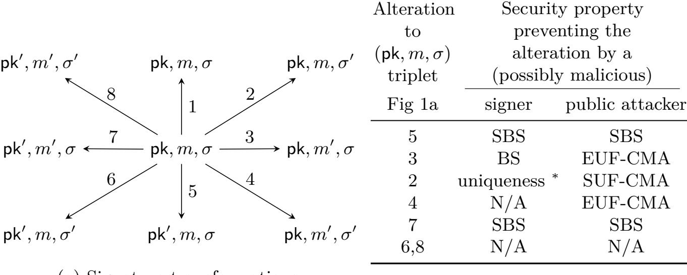

{0}------------------------------------------------

# **Taming the many EdDSAs**

Konstantinos Chalkias, François Garillot, and Valeria Nikolaenko

Novi/Facebook kostascrypto@fb.com, fga@fb.com, valerini@fb.com

**Abstract.** This paper analyses security of concrete instantiations of EdDSA by identifying exploitable inconsistencies between standardization recommendations and Ed25519 implementations. We mainly focus on current ambiguity regarding signature verification equations, binding and malleability guarantees, and incompatibilities between randomized batch and single verification. We give a formulation of Ed25519 signature scheme that achieves the highest level of security, explaining how each step of the algorithm links with the formal security properties. We develop optimizations to allow for more efficient secure implementations. Finally, we designed a set of edge-case test-vectors and run them by some of the most popular Ed25519 libraries. The results allowed to understand the security level of those implementations and showed that most libraries do not comply with the latest standardization recommendations. The methodology allows to test compatibility of different Ed25519 implementations which is of practical importance for consensus-driven applications.

**Keywords:** EdDSA · ed25519 · malleability · blockchain · cofactor

### **1 Introduction**

The Edwards-Curve Digital Signature Algorithm (EdDSA) [\[5\]](#page-20-0) is a deterministic Schnorr signature [\[36\]](#page-21-0) variant using twisted Edwards curves rather than Weierstrass curves, at a significant performance gain. As of today, Ed25519 is the most popular instance of EdDSA and is based on the Edwards Curve25519 providing ∼ 128-bits of security.

Due to its superior efficiency among Elliptic Curve schemes and better security guarantees against side-channel attacks under weak randomness sources, Ed25519 is widely adopted by such protocols as TLS 1.3, SSH, Tor, GnuPGP, Signal and more [\[16\]](#page-20-1). It is also the preferred signature scheme of several blockchain systems, such as Corda [\[14\]](#page-20-2), Tezos [\[12\]](#page-20-3), Stellar [\[3\]](#page-20-4), and Libra [\[20\]](#page-20-5).

Seeking to reap more performance and security benefits, some applications even rely on properties of Ed25519 beyond the usual staple of digital signature algorithms. Those "extras" include for instance fast batch verification, non-repudiation, strong unforgeability and correctness consistency. Serving these demands with — at first — little specification guidance, libraries implementing Ed25519 have introduced tweaks to the original scheme that we will explore in depth. Today, the wide adoption of Ed25519 heightens concerns about backwards-compatibility,

{1}------------------------------------------------

while clarity on the exact security guarantees of close variants of EdDSA has progressed but recently [\[8\]](#page-20-6). It is therefore no wonder that we have observed no agreement on the exact set of correct signatures between different implementations.

Nonetheless, two standardization efforts for Ed25519 have made attempts at such an agreement, one from IETF, RFC 8032 [\[18\]](#page-20-7) (active since 2015 and still sees modifications) and a recent one from NIST as part of FIPS 186–5 [\[32\]](#page-21-1) (published as a draft in October 2019). Although these efforts are similar, one of the most divisive topics relating to EdDSA standardization is the discrepancy in correctness definitions, i.e. in the verification equations, between standards and software libraries. Specifically, RFC 8032 [\[18\]](#page-20-7) allows optionality between using a permissive verification equation (*cofactored*) and a more strict verification equation (*cofactorless*) [1](#page-1-0) .

For base point *B*, public key *A* and signature (*R, S*), RFC 8032 states:

```
Check the group equation [8][S]B = [8]R + [8][k]A. It's sufficient, but
not required, to instead check [S]B = R + [k]A.
```

By contrast, NIST's draft [\[32\]](#page-21-1) allows no such optionality and only suggests a more permissive (*cofactored*) verification equation. This comes in contradiction to the choice of almost all software libraries, which use the more strict verification equation (*cofactorless*), most likely for performance reasons.

Beyond the discrepancies that do occur in EdDSA standards, we also note considerations they neglect. For instance, none of the standards formulate the scheme in a way that offers non-repudiation, or resilience to key substitution attacks (see Appendix [A](#page-21-2) for an example). This choice makes it difficult to use the scheme for such applications as

**Contract Signing:** if company A signed an agreement with company B using a key that allows for repudiation, it can later claim that it signed a completely different deal.

**Electronic Voting:** malicious voters may pick special keys that allow for repudiation on purpose in order to create friction in the process and deny results, as their signed vote might be verified against multiple candidates.

**Transactions:** a blockchain transaction of amount X might also be valid for another amount Y, creating potential problems for consensus and dispute resolution.

Finally, we highlight that the application domain of Ed25519 has changed over the years. For instance, Blockchain technology is a booming field, which gained hundreds of billions of US dollars in market capitalization in the time since the publication of the original EdDSA paper [\[4\]](#page-20-8). It features cryptographic signatures

<span id="page-1-0"></span><sup>1</sup> Cofactored means interpreting the verification equation modulo 8, which is a cofactor of the Curve25519. Any signature accepted by a "cofactorless" equation will be accepted by a "cofactored" equation, though the converse is false.

{2}------------------------------------------------

pervasively, and places a premium on performance. Yet, being strongly reliant on Byzantine consensus algorithms, blockchains are vulnerable to any disagreement on the validity of signatures between different implementations: a sequence of carefully crafted signatures exploiting such a disagreement could slow most consensus algorithms to a crawl.

Moreover, the adversarial ecosystem exploiting cryptographic flaws in blockchains is now well-developed, and the stakes of even minor flaws of cryptographic schemes have become consequential [\[9,](#page-20-9) [15\]](#page-20-10).

In order to stem the rapidly rising costs of the conflicting approaches to Ed25519, we hope standardization bodies will lead the way for Ed25519 developers and equip them with the guidance necessary to produce high assurance libraries that conform with each other. Specifically, the cryptographic community at large would benefit if standards offered a set of more precise recommendations and test vectors that check for all the difficult edge cases left open by the mathematics of EdDSA. We offer a first incarnation of those elements here.

Note that although this research paper focuses on Ed25519, the same methods apply to Ed448 and potentially to other non-prime order curves as well.

**Our contributions.** In this paper, we give a precise formulation of Ed25519 signature scheme that achieves the highest level of security —– strong unforgeability and resilience to repudiation —– with a minimal number of additional inexpensive checks, and we explain why each of these checks is required. In doing so, we precisely link those checks with the formal security properties usually considered in the establishment of a signature standard, but incorporate more modern considerations as well, such as compatibility with EdDSA's batch verification. To make it easy for both the standards and the libraries to add the checks we recommend, we equip the reader with specific procedures that perform them optimally. This single scheme relieves developers from the burden of making distinct choices based on their intended applications, and so it is our hope that it can help the Ed25519 ecosystem to converge to a single interoperable scheme, one compatible with the degree of determinism required by blockchain applications. But even if a standard body was to disagree on some of our approach, we expect that our systematic analysis will offer practical tools for crafting better Ed25519 implementations: for instance we highlight that beyond their differences on the style of verification equation, neither standards nor software libraries offer nonrepudiation. We explain how to add non-repudiation via an inexpensive check on the public key.

We also provide test vectors that help surface the differences between implementation choices as well as find common blunders in the wild. We run the test vectors against most of the popular cryptographic libraries, and from the results we deduce which libraries offer strong unforgeability, which guarantee non-repudiation and which of them do cofactored verification. We carefully explain the methodology, making it easy to analyze other libraries in the same way. The test vectors can be used for blockchain applications to make sure the

{3}------------------------------------------------

participants agree on acceptance/rejection of those vectors, which should give high assurance in that the participants would agree on the validity of all possible signatures.

Outline. In Section 2.1 we explain various security and malleability notions for a signature scheme, in Section 2.2 we show the stakes of precise correctness definitions (as surfaced recently in consensus-driven applications). We start Section 3 recalling the structure of the Curve25519 group, including the structure of the small-order subgroup, and we point out caveats regarding the checks for non-canonical encodings, before detailing the Ed25519 key and signature generation algorithms. In Section 3.1 we formulate a single signature verification algorithm that achieves the strongest notion of security. We explain each line of the algorithm in detail and eliminate ambigious implementation choices. In Section 3.2 we formulate batch verification algorithm. We explain why only cofactored form of single signature verification is compatible with batch verification. In Section 4 we explain how to optimize the verification algorithm, especially the additional checks. In Section 5 we provide the test vectors and analyse the existing libraries using those vectors. Related work is given in Section 6.

### <span id="page-3-1"></span>2 Background

#### <span id="page-3-0"></span>2.1 Signatures security

There are four security properties relevant to EdDSA which we sketch at a high level here (the exact game-based definitions can be found in, e.g., Brendel et al. [8]).

EUF-CMA (existential unforgeability under chosen message attacks) is usually the minimal security property required of a signature scheme. It guarantees that any efficient adversary who has the public key pk of the signer and received an arbitrary number of signatures on messages of its choice (in an adaptive manner):  $\{m_i, \sigma_i\}_{i=1}^N$ , cannot output a valid signature  $\sigma^*$  for a new message  $m^* \notin \{m_i\}_{i=1}^N$  (except with negligible probability). In case the attacker outputs a valid signature on a new message:  $(m^*, \sigma^*)$ , it is called an *existential forgery*.

**SUF-CMA** (strong unforgeability under chosen message attacks) is a stronger notion than EUF-CMA. It guarantees that for any efficient adversary who has the public key pk of the signer and received an arbitrary number of signatures on messages of its choice:  $\{m_i, \sigma_i\}_{i=1}^N$ , it cannot output a new valid signature pair  $(m^*, \sigma^*)$ , s.t.  $(m^*, \sigma^*) \notin \{m_i, \sigma_i\}_{i=1}^N$  (except with negligible probability).

Strong unforgeability implies that an adversary cannot only sign new messages, but also cannot find a new signature on an old message. Strongly unforgeable signatures are used to build chosen ciphertext secure encryption schemes and group signatures [7]. This property is highly desirable for blockchain applications,

{4}------------------------------------------------

e.g. ECDSA signatures in Bitcoin are not strongly unforgeable, and multiple attempts to fix the problem [23,39] only ended with a soft fork fixing the signature serialization format [40]. As was shown in [8], additional checks in the verification procedure makes Ed25519 signature scheme satisfy SUF-CMA.

Binding signature (BS) We say that a signature scheme is binding if no efficient signer can output a tuple  $[pk, m, m', \sigma]$ , where both  $(m, \sigma)$  and  $(m', \sigma)$  are valid message signature pairs under the public key pk and  $m \neq m'$  (except with negligible probability).

A binding signature makes it impossible for the signer to claim later [to a judge] that it has signed a different message, the signature binds the signer to the message. If the signer is able to produce another message for which the same signature is valid, we say that the signer repudiates or breaks the non-repudiation property of the signature scheme (see [41]).

Strongly Binding signature (SBS) Certain applications may require a signature to not only be binding to the message but also be binding to the public key. We say that a signature scheme is strongly-binding if any efficient signer can not output a tuple  $[pk, m, pk', m', \sigma]$ , where  $(m, \sigma)$  is a valid signature for the public key pk and  $(m', \sigma)$  is a valid signature for the public key pk' and either  $m' \neq m$  or  $pk \neq pk'$ , or both (except with negligible probability).

As was shown in [8] certain variants of EdDSA (in particular, the one described in the RFC8032 [18]) are not binding — there are special types of public keys that allow the signer to repudiate. Rejecting those keys makes the ed25519 scheme strongly binding which we prove in Section 3.1. We define the SBS security as follows (this notion is equivalent to the combination of M-S-UEO and MBS from [8])

<span id="page-4-0"></span>**Definition 1.** A signature scheme with verification algorithm Verify is strongly binding (SBS-secure) if for any probablistic polynomial time algorithm A the following probability is negligible:

$$\Pr\left[\begin{array}{c|c} (m \neq m' \lor pk \neq pk') \bigwedge \\ \mathsf{Verify}(pk, \sigma, m) \bigwedge \\ \mathsf{Verify}(pk', \sigma, m') \end{array} \middle| (pk, pk', \sigma, m, m') \xleftarrow{\$} \mathcal{A}() \right] < negl.$$

Malleable signature: Signature malleability gets different meanings in different contexts, in this writing we say that the signature is malleable if it is either not strongly unforgeable or it is not strongly binding, or both. In other words, we will call the signature scheme malleable if it does not satisfy the strongest notion of security. Note that only the signature security property (EUF-CMA) is necessary for any deployment of a signature scheme, the absence of the rest of the properties might not necessarily weaken the security of the application,

{5}------------------------------------------------

but we advocate for any modern standard to design schemes with the highest security guarantees.[2](#page-5-1)

To see why these definitions cover all the possibilities for attacks, we recall in Fig. [1](#page-5-2) different capabilities for the signer and for the external (public) attacker to alter parts of the public key, message, signature triplet.

<span id="page-5-2"></span>

(a) Signature transformations We assume pk ̸= pk′ , *m* ̸= *m*′ and *σ* ̸= *σ* ′ .

Fig. 1: Different ways of altering signatures

Often, a signature scheme is proven to be secure at a certain level, but the specific implementations may degrade the security level because of inappropriate padding, ambiguous serialization or non-unique encoding.

In Section [3](#page-6-0) we state the variant of Ed25519 that is strongly-unforgeable and strongly-binding. We also highlight multiple caveats for implementing the Ed25519 signature scheme securely.

#### <span id="page-5-0"></span>**2.2 Correctness of cryptographic signatures**

Increasing number of applications are in need of unambigious description for the set of valid signatures. It is most important for consensus-driven protocols, where participants need to agree beforehand on the exact format of a valid signature. An adversary may create a malformed signature such that half of the participants will accept it as valid and half will not thus create issues for consensus decisions on whether the signature is valid or not, potentially slowing down applications. In particular, nearly all consensus mechanisms rely on a 2/3 majority of (honest) nodes reaching the same accept or reject decision on a particular value for liveness. Imagine two signatures *σ*<sup>1</sup> and *σ*2, where half of the parties accept the first, but

<sup>(</sup>b) Here N/A means that an alteration of this type is expected from the signature scheme and does not concern us in this writing. Note (∗) that the EdDSA signatures are deterministic but not unique, i.e. a dishonest signer can always produce multiple signatures for the same message.

<span id="page-5-1"></span><sup>2</sup> Note that a malicious signer can always bypass the correct signing execution by picking a random *R* and thus output two different signatures for the same message. Thus, EdDSA cannot guarantee the signature-uniqueness property.

{6}------------------------------------------------

reject the second and the other half on the contrary accept the second, but reject the first, the consensus might come to a halt.

We observe the discrepancy between the verification equations in the standards (IETF and NIST) and almost all the cryptographic libraries. We present test vectors that surface the exact nature of these discrepancies in Section [5.](#page-15-0)

## <span id="page-6-0"></span>**3 Ed25519 signatures**

The signature scheme is defined over the elliptic curve group

$$E = \{(x, y) \in F_q \times F_q : -x^2 + y^2 = 1 + dx^2y^2\}$$

where *d* = −121665*/*121666 ∈ *F<sup>q</sup>* and *q* = 2<sup>255</sup> − 19. The neutral element of the group is 0 = (0*,* 1), the complete twisted Edwards addition law is:

$$(x_1, y_1) + (x_2, y_2) = \left(\frac{x_1y_2 + x_2y_1}{1 + dx_1x_2y_1y_2}, \frac{y_1y_2 + x_1x_2}{1 - dx_1x_2y_1y_2}\right).$$

The number of points on the elliptic curve is |*E*| = 8 × *L*, where *L* = 2<sup>252</sup> + 27742317777372353535851937790883648493 is prime. The base point *B*, specified in the RFC (Section 5.1 [\[18\]](#page-20-7)), has order *L*. It has been chosen to be the point with the smallest *u* coordinate in Montgomery representation (*u* = 9, see Appendix A, in [\[19\]](#page-20-13)).

Note that the presence of the co-factor of 8 in the curve-order makes it harder to use this curve in applications where a prime-order group is required for the cryptographic proof. For example in [\[22\]](#page-20-14), an adversary may send a key exchange group element that lies in a small subgroup of order 8 instead of the correct subgroup and use the honest user's response to deduce some bits of this user's secret exponent.

### <span id="page-6-6"></span>**Algorithm 1** Ed25519 Algorithm: Key Generation and Signature Generation

#### **Key Generation**

- <span id="page-6-2"></span>1: Sample uniformly random sk ∈ {0*,* 1} 256 .
- <span id="page-6-1"></span>2: Expand the secret with a hash function: (*h*0*, h*1*, . . . , h*511) ← SHA512(sk).
- <span id="page-6-3"></span>3: Compute a secret scalar *s* = 2<sup>254</sup> + *h*<sup>253</sup> · 2 <sup>253</sup> + · · · + *h*<sup>3</sup> · 2 3 [3](#page-7-0) .
- <span id="page-6-4"></span>4: Compute the public key pk = *A*, where *A* = *s* · *B*.

**Signature Generation** on message *M* and secret key (*h*256*, . . . , h*511) and *s*

- <span id="page-6-5"></span>5: Generate a 512-bits pseudorandom nonce *r* := SHA512(*h*256|| *. . .* ||*h*511||*M*).
- 6: Interpret the nonce as a scalar and obtain a curve point: *R* := *r* · *B*.
- 7: Compute the scalar *S* := (*r* + SHA512(*R*||*A*||*M*) ∗ *s*) mod *L*.
- 8: Encode the scalar *S* canonically (i.e. reduce *S* mod *L* prior to serializing).
- 9: Encode the curve point *R* canonically (i.e. reduce the *R.y* mod 2 <sup>255</sup> − 19 prior to serializing).

{7}------------------------------------------------

**Group structure, small-order subgroup:** Elliptic curve group E is isomorphic to  $\mathbb{Z}_L \times \mathbb{Z}_8$ . A base point  $B \in E$  generates a subgroup of order E and there is a small torsion point E can be uniquely represented as a linear combination of E and E and E and E are E and E are E and E are E and E are E are E and E are E are E and E are E are E and E are E are E and E are E are E and E are E are E are E are E are E are E are E are E are E are E are E and E are E are E are E are E and E are E are E and E are E are E and E are E are E and E are E are E are E are E are E are E are E are E are E are E and E are E are E and E are E are E are E and E are E are E and E are E are E and E are E are E are E and E are E are E are E are E are E and E are E are E are E and E are E are E are E are E are E and E are E are E are E are E are E are E are E and E are E are E and E are E are E are E are E and E are E are E and E are E are E are E and E are E are E and E are E and E are E are E and E are E are E and E are E are E and E are E are E and E are E are E and E are E are E are E are E are E are E and E are E and E are E are E are E are E are E and E are E are E are E are E and E are E are E are E are E are E and E are E are E are E and E are E are E are E are E and E are E are E are E are E are E and E are E are E and E are E are E are E and E are E are E are E and E are E are E are E are E are E are E and E are E are E are E are E are E are E are E are E are E are E are E are E are E are E are E are E are E are E are E are E are E are E are E are E are E are E are E are E

<span id="page-7-1"></span>

|                                           |                          |                                         | ~                |  |  |  |  |  |  |  |  |  |  |
|-------------------------------------------|--------------------------|-----------------------------------------|------------------|--|--|--|--|--|--|--|--|--|--|
| # (                                       | Order                    | Point                                   | Serialized point |  |  |  |  |  |  |  |  |  |  |
|                                           | Canonical serializations |                                         |                  |  |  |  |  |  |  |  |  |  |  |
| 1                                         | 1                        | (0,1)                                   | 0100000000       |  |  |  |  |  |  |  |  |  |  |
| 2                                         | 2                        | $(0,2^{255}-20)$                        | ECFFFFFF7F       |  |  |  |  |  |  |  |  |  |  |
| 3                                         | 4                        | $\left(-\sqrt{-1},0\right)$             | 0000000080       |  |  |  |  |  |  |  |  |  |  |
| 4                                         | 4                        | $(\sqrt{-1},0)$                         | 000000000        |  |  |  |  |  |  |  |  |  |  |
| 5                                         | 8                        | •••                                     | C7176A037A       |  |  |  |  |  |  |  |  |  |  |
| 6                                         | 8                        |                                         | C7176AO3FA       |  |  |  |  |  |  |  |  |  |  |
| 7                                         | 8                        | • • •                                   | 26E895FC05       |  |  |  |  |  |  |  |  |  |  |
| 8                                         | 8                        |                                         | 26E895FC85       |  |  |  |  |  |  |  |  |  |  |
| Non-canonical serializations              |                          |                                         |                  |  |  |  |  |  |  |  |  |  |  |
| 9                                         | 1                        | (-0,1)                                  | 0100000080       |  |  |  |  |  |  |  |  |  |  |
| 10                                        | 2                        | 055                                     | ECFFFFFFFF       |  |  |  |  |  |  |  |  |  |  |
| 11                                        | 1                        | $(0,2^{255}-18)$                        | EEFFFFFF7F       |  |  |  |  |  |  |  |  |  |  |
| 12                                        | 1                        | $(-0, 2^{255} - 18)$                    | EEFFFFFFFF       |  |  |  |  |  |  |  |  |  |  |
| 13                                        | 4                        | $\left(-\sqrt{-1}, 2^{255} - 19\right)$ | EDFFFFFFFF       |  |  |  |  |  |  |  |  |  |  |
| 14                                        | 4                        | $(\sqrt{-1}, 2^{255} - 19)'$            | EDFFFFFF7F       |  |  |  |  |  |  |  |  |  |  |
| Table 1: Small order points of Curve25519 |                          |                                         |                  |  |  |  |  |  |  |  |  |  |  |

Table 1: Small order points of Curve25519 in its twisted Edwards form.

| y  | $y + 2^{255} - 19$ | Valid | Order       |
|----|--------------------|-------|-------------|
| 0  | $2^{255} - 19$     | 1     | 4           |
| 1  | $2^{255} - 18$     | ✓     | 0           |
| 2  | $2^{255} - 17$     | X     | -           |
| 3  | $2^{255} - 16$     | ✓     | $8 \cdot L$ |
| 4  | $2^{255} - 15$     | ✓     | $4 \cdot L$ |
| 5  | $2^{255} - 14$     | ✓     | $8 \cdot L$ |
| 6  | $2^{255} - 13$     | ✓     | $8 \cdot L$ |
| 7  | $2^{255} - 12$     | X     | -           |
| 8  | $2^{255} - 11$     | X     | -           |
| 9  | $2^{255} - 10$     | ✓     | $2 \cdot L$ |
| 10 | $2^{255} - 9$      | ✓     | $8 \cdot L$ |
| 11 | $2^{255} - 8$      | X     | -           |
| 12 | -                  | X     | -           |
| 13 |                    | X     | -           |
| 14 | $2^{255} - 5$      | ✓     | $8 \cdot L$ |
| 15 |                    | ✓     | $4 \cdot L$ |
| 16 | $2^{255} - 3$      | ✓     | $8 \cdot L$ |
| 17 |                    | X     | -           |
| 18 | $2^{255} - 1$      | ✓     | $4 \cdot L$ |

Table 2: Non-canonically encoded points.

Table 1 shows the small order points with their orders. Any of the points of order 8 can serve as a small subgroup generator,  $T_8$ . For four intermediate rows exact formulas exist, but they are cumbersome and irrelevant for our writing. We will just mention that for one of these points  $y = \left(\sqrt{\frac{-1+\sqrt{1+d}}{d}}\right)$ ,  $x = \sqrt{-1} \cdot y$ , and

<span id="page-7-0"></span>The least significant three bits of the scalar are unset to allow using the same secret key in the DH-key agreement, where the EC point of another party is raised to the secret key. Raising to the exponent divisible by 8 there erases the small-subgroup component and defends against attacks that exploit the non-trivial co-factor of 8. The most significant bit is unset to make sure that the number is indeed the multiple of 8 and was not wrapped around the modulus. The second most significant bit is being set to prevent variable-time implementation of multiplication that first looks for the first most significant bit that is set. Note however that the secret key has 251 pseudo-random bits and is not uniformly random mod a 253-bits prime L, though this loss of a few bits of random bits is deemed acceptable.

{8}------------------------------------------------

the remaining 3 points are combinations of *x* and *y* with various signs: (−*x, y*), (*x,* −*y*) and (−*x,* −*y*). Full hexidecimal encodings of the small-order points can be found in Appendix [B.](#page-21-6)

**Encodings, non-canonical encodings:** An element of the scalar field mod *L* is encoded with a 256-bits string in little-endian format. If the scalar is reduced mod *L* its encoding is called *canonical*, otherwise it is called *non-canonical*.

A group element (*x, y*) is encoded as a 256-bits string, that consists of 255-bits encoding of *y* (in little-endian format: bytes placed from left to right and from least significant to most significant) followed by a sign bit which is 1 iff *x* is negative. Given the serialization, the *x* coordinate is restored as *x* = ± p (*y* <sup>2</sup> − 1)*/*(*dy*<sup>2</sup> + 1). If the *y* coordinate in the encoding of point (*x, y*) is reduced mod *q* the encoding is called *canonical*, otherwise it is called *non-canonical*. Two special points with *x* = 0 (*y* = 1 or *y* = 2<sup>255</sup> − 20) are canonically encoded only with a sign bit 0, otherwise the encodings are non-canonical.

There are 19 elliptic curve points that can be encoded in a non-canonical form. Those points have *y* coordinates in the range [2255−19*, . . . ,* 2 <sup>255</sup>−1]. Among these points there are 2 points of small order and from the remaining 17 *y*-coordinates only 10 decode to valid curve points all of mixed order. The details are given in Table [2.](#page-7-1) No evidence suggests that the discrete log base *B* of any of those points is known except for the first two (the discrete log is zero base *B* for those). Note that the base point was chosen "somewhat" verifiably arbitrarily: it has *y* coordinate *y* = 4*/*5 (mod 2<sup>255</sup> − 19).

#### <span id="page-8-0"></span>**3.1 Single signature verification**

The Ed25519 signature scheme, as shown in Algorithm [2,](#page-8-1) achieves the strongest notion of security (SUF-CMA + SBS); we explain all the extra-checks and important caveats for correct deployment. Algorithm [2](#page-8-1) generally conforms with the standards [\[18,](#page-20-7) [32\]](#page-21-1), except for an addition of line [#2.](#page-6-1) The implementations which we analyse in Section [5](#page-15-0) do disagree with the Algorithm in various ways.

#### <span id="page-8-1"></span>**Algorithm 2** Ed25519 Algorithm: single signature verification

**Signature Verification** on message *M*, public key *A* and signature *σ* = (*R, S*)

- 1: Reject the signature if *S /*∈ {0*, . . . , L* − 1}.
- 2: Reject the signature if the public key *A* is one of 8 small order points.
- 3: Reject the signature if *A* or *R* are non-canonical.
- 4: Compute the hash SHA512(*R*||*A*||*M*) and reduce it mod *L* to get a scalar *h*.
- 5: Accept if 8(*S* · *B*) − 8*R* − 8(*h* · *A*) = 0.

**Reject** *S* ≥ *L* **(line [#1,](#page-6-2) Alg. [2\)](#page-8-1):** This check makes the scheme strongly existentially unforgeable [\[8\]](#page-20-6) (SUF-CMA). Many approaches have been used in research or production-ready Ed25519 libraries to perform this validation and unfortunately sometimes the check is incomplete or not optimized.

{9}------------------------------------------------

Reject small order A (line #2, Alg. 2): This check makes the scheme strongly binding (SBS-secure, see Definition 1 in Section 2), i.e. resilient to key/message substitution attacks, as we prove in Theorem 1 (the proof resembles the proof of Theorem 7 in [8]). Although this additional check is not part of any standard yet and rarely appears in the libraries. The check can be done very efficiently by simply verifying that 32-byte array of A received for verification is not in the set of 14 small order points (including the non-canonical encodings) shown on Table 1 with extended version in Appendix B. Note that for binding the rejection of small order R is not required.

<span id="page-9-0"></span>**Theorem 1.** Let Verify be Algorithm 2 with the hash function assumed to act as a random oracle H with output length at least  $2\lambda$ . Then Verify is SBS secure.

*Proof.* To successfully break SBS security the adversary  $\mathcal{A}$  needs to output two public keys  $A = aB + tT_8$  and  $A' = a'B + t'T_8$ , a signature  $\sigma = (R, S)$  and two messages m and m', s.t.  $(m \neq m')$  or  $(A \neq A')$  and  $\mathsf{Verify}(A, \sigma, m)$  and  $\mathsf{Verify}(A', \sigma, m')$  both accept. The success of the verifications imply that  $a \neq 0$  and  $a' \neq 0$  (since small order public keys are rejected) and

$$8SB = 8R + 8H(R|A|m)A$$
 and  $8SB = 8R + 8H(R|A'|m')A'$ .

It follows that 8H(R|A|m)A = 8H(R|A'|m')A'. Which implies  $H(R|A|m)a = H(R|A'|m')a' \mod L$ . Since  $a' \neq 0$ , it follows that

<span id="page-9-1"></span>
$$H(R|A'|m')a'(a)^{-1} = H(R|A|m) \text{ mod } L.$$
 (1)

For some fixed a, m', a' the probability for a random m to satisfy the equation is  $\frac{\lceil 2^{2\lambda}/L \rceil}{2^{2\lambda}}$ . Assuming the adversary can make up to  $Q_h$  random oracle queries, the probability of finding a collision that satisfies Eq. 1 and thus the probability of a successful attack is  $\frac{\lceil 2^{2\lambda}/L \rceil}{2^{2\lambda}} \cdot Q_h^2$ . Given that the adversary runs in time polynomial in  $\lambda$ ,  $Q_h$  is bounded by some polynomial in  $\lambda$ . Having that the bit-length of L is close to  $\lambda$ , the overall probability of success is negligible.

On rejecting non-canonical encodings of A and R (line #3, Alg. 2): The RFC 8032 and the NIST FIPS186-5 draft both require to reject non-canonically encoded points, and as we show in Section 5 not all of the implementations follow those guidelines. For consistency with the standard, the non-canonical points should be rejected. The non-canonical points of which the discrete log is known are all of small order as explained in the beginning of this section, therefore the security level of the scheme is judged by the acceptance/rejection of small order points, not by acceptance/rejection of non-canonical subset of those.

On computing SHA512 (line #4, Alg. 2): If non-canonical points are accepted, there are two possible ways to put them into the SHA512 hash: [1] reencode them in a canonical form or [2] put them in the hash as they were received. This can cause discrepancy between implementations, thus it is recommended to reject non-canonical points.

{10}------------------------------------------------

Note that if an implementation uses *cofactorless* verifcation (discussed next), then it is absolutely required to fully reduce the scalar SHA512(*R*||*A*||*M*) to [0*, L*) range before multiplying it by *A*. Otherwise, the implementations might disagree on the validity of a signature with a public key of mixed order. Indeed, consider a public key of mixed order: *A* = *bB* +*tT*8, where *B* is the base point, *T*<sup>8</sup> is a point of order 8 and 0 *< t* ≤ 7. Consider an unreduced integer *h* ′ ≥ *L* which is an output of SHA512 and a reduced scalar *h* = *h* ′ mod *L*. With high probability for a random *h*: ((*h* · *t* ̸= *h* ′ · *t*) mod 8) (e.g. with probability 7/8 for *t* = 1), then *h* · *A* ̸= *h* ′ · *A* causing the verifications to disagree depending on whether they reduce the scalar or not. Despite this discrepancy, an implemtation will incure significant performance loss if the scalar is not fully reduced prior to scalar-topoint multiplication, therefore we never see this problem in practice. However, if the RFC8032 [\[18\]](#page-20-7) is read precicely it says to interpret the 64-octet digest as an "integer" *k* and compute [*k*]*A*, where [*n*]*X* is defined as "*X* added to itself *n* times", whereas instead it should say to take the digest, reduce is as an integer to get 0 ≤ *k < L*. In general other applications where Curve25519 is used should be very careful and not rely on the fact that (*n* mod *L*)((*m* mod *L*)*P*) = ((*nm*) mod *L*)*P* as this is not generally true for a composite order point *P*.

**On cofactored vs. cofactorless verification (line [#5,](#page-6-5) Alg. [2\)](#page-8-1)**: The verification equation of Alg. [2](#page-8-1) is called *cofactored*. If implementation computes the verification equation as stated on line [#5,](#page-6-5) then the multiplication by 8 should be done as a separate scalar-to-point multiplication, i.e. it is incorrect to first compute (8*h*) mod *L* as the resulting scalar might not be divisible by 8 as an integer and thus will not clear the low order component from *A*, if it exists. This is a recommended way to verify EdDSA signatures in the standards [\[18,](#page-20-7) [32\]](#page-21-1). The original paper of Bernstein et al. [\[5\]](#page-20-0) on line [5](#page-6-5) of Alg. [2](#page-8-1) was not multiplying by 8, which is called *cofactorless* verification. Almost all the cryptographic libraries use the cofactorless version to make verification slighly faster. In the next section we explain why multiplying by a cofactor is required for applications that want to take advantage of batch verification. We therefore would recommend to use cofactored verfication as it conforms with the standard, it enables batch verification that could bring substantial speed-up (around 2x) and in addition enables novel methods for faster single signature verification [\[30\]](#page-21-7).

#### <span id="page-10-0"></span>**3.2 Batch signature verification**

A batch verification technique allows verifying several signatures in a single operation, much faster than verifying signatures one-by-one (e.g. using the dalek ed25519 library [\[17\]](#page-20-15) on a 2.9 GHz 6-Core Intel Core i9 CPU single signature verification takes 50 *µ*s, while batch verification with more than 20 signature costs 20 *µ*s per signature). Bernstein et al. [\[5\]](#page-20-0) proposed to use random linear combinations to verify the batch of signatures, in Algorithm [3](#page-11-0) we restate the technique with a small alteration (i.e. in a cofactored form) that makes it compatible with single signature verifcation.

{11}------------------------------------------------

#### <span id="page-11-0"></span>**Algorithm 3** Ed25519 Algorithm: batch signature verification

**Batch Signature Verification** on *n* tuples {*Mi, pk<sup>i</sup>* = *Ai, σ<sup>i</sup>* = (*Ri, Si*)} *n i*=1

- 1: Reject the batch if any of the signatures fail any of the checks [1,](#page-6-2)[2](#page-6-1) or [3](#page-6-3) of single signature verification, Algorithm [2.](#page-8-1)
- 2: Sample *n* uniformly random integers *z<sup>i</sup>* ∈ {0*,* 1} 128 .
- 3: Compute SHA512(*Ri*||*Ai*||*Mi*) and reduce it mod *L* to get a scalar *hi*.
- 4: Accept if 8 − P *i ziS<sup>i</sup>* mod *L B* + 8(P *i ziRi*) + 8(P *i* (*zih<sup>i</sup>* mod *L*)*Ai*) = 0.

The batch verification equation stated on line [4,](#page-6-4) Alg. [3](#page-11-0) is called *cofactored*. The original paper of Bernstein et al. [\[5\]](#page-20-0) on line [4,](#page-6-4) Alg. [3](#page-11-0) was not multiplying by 8 which is called *cofactorless* verification. We claim that only *cofactored* verifications, single and batch, are compatible with each other [4](#page-11-1) . Other combinations (cofactorless-single with cofactorless-batch; cofactorless-signle with cofactoredbatch; cofactored-single with cofactorless-batch) are all incompatible.

Consider the following sequence of signatures of length *n* ≥ 1, we construct a first signature maliciously (deviating from the standard signature generation algorithm) and we construct the rest of the signatures in an ordinary way:

- 1. Given small integers *t<sup>A</sup>* and *t<sup>R</sup>* (where 0 ≤ *tA, t<sup>R</sup>* ≤ 7), generate the first signature in a special way:
  - (a) Set *A*<sup>1</sup> := *s* · *B* + *t<sup>A</sup>* · *T*<sup>8</sup> for some secret scalar *s*.
  - (b) Set *R*<sup>1</sup> := *r* · *B* + *t<sup>R</sup>* · *T*<sup>8</sup> for some secret scalar *r*.
  - (c) Set *S*<sup>1</sup> := *r* + SHA512(*R*1||*A*1||*M*)*s*.
  - (d) Set *σ*<sup>1</sup> = (*R*1*, S*1).
- 2. For *i* = 2*..n*, construct the rest of the signatures *σ*2*, . . . , σ<sup>n</sup>* in an ordinary way, following the standard procedure for signature generation (Algorithm [1\)](#page-6-6).

Table [3](#page-12-0) demonstrates that *only* cofactorless single with cofactorless batch verifications agree with each other accepting the signatures with overwhelming probability, other combinations do disagree with each other. Batch verification is run on the batch constructed above, single verification is run on *σ*<sup>1</sup> from the batch. For cofactorless single signature verification, the ✓*<sup>p</sup>* (or ✗*p*) indicates that we search for *M* that succeeds (or fails) the verification which happens with probability *p* for a random *M*. Next for cofactorless batch verification given *M* from the previous column, the ✓*<sup>q</sup>* (or ✗*q*) indicates that with probability *q* over the choice of the first random scalar *z*1, the batch verification will succeed (or fail) disagreeing with single signature verification. In all of these cases, cofactorless batch verification will exhibit flaky behavior — sometimes accepting and sometimes failing

<span id="page-11-1"></span><sup>4</sup> The incompatibility in semantics between batch verification and cofactorless single verification was known in the form of cryptography community folklore [\[27\]](#page-21-8), but not laid out precisely.

{12}------------------------------------------------

the batch depending on the choice of the random scalars. Note that cofactorless single verification succeeds if and only if ((*h* · *tA*)mod *<sup>L</sup>* + *tR*)mod <sup>8</sup> = 0. Here *h* denotes *h* = SHA512(*R*1||*A*1||*M*1), note that *h* depends on *t<sup>A</sup>* and *tR*. Cofactorless batch verification succeeds if and only if ((*z*<sup>1</sup> · *h* · *tA*)mod *<sup>L</sup>* + *z*<sup>1</sup> · *tR*)mod <sup>8</sup> = 0. We assume that single verification (or iterative verification over a batch) is a ground truth, so that batch verification, seen as a "failure detection" procedure, can show false negatives (FN) when it does not reflect an iterated failure or false positives (FP) when it fails a batch where iterated verification would not. The combination that gives false positives (cofactorless single + cofactorless batch) is the most dangerous for applications, since an invalid sequence of signatures might pass the batch verification and be accepted. Moreover those false positives are flaky, meaning that a batch of signatures accepted by one verifier (through batch verification) might be rejected by another verifier that used another set of random scalars. Unfortunately, this combination is proposed in the original paper [\[5\]](#page-20-0) and is the one most widely implemented (e.g. in Dalek [\[17\]](#page-20-15) and LibSodium [\[21\]](#page-20-16) libraries).

<span id="page-12-0"></span>

| cofactored |     | cofactorless                     |      |    | Example conditions |               |              |    |    |                                 |    |
|------------|-----|----------------------------------|------|----|--------------------|---------------|--------------|----|----|---------------------------------|----|
| [1]        | [2] | [3]<br>single batch single batch | [4]  | tA | tR                 | pk's<br>order | R's<br>order |    |    | [1]+[2] [1]+[4] [2]+[3] [3]+[4] |    |
| ✓1         | ✓1  | ✓1/8                             | ✗7/8 | 1  | 0                  | mixed         | L            | ok | FN | ok                              | FN |
| ✓1         | ✓1  | ✗7/8                             | ✓1/8 | 1  | 0                  | mixed         | L            | ok | ok | FN                              | FP |
| ✓1         | ✓1  | ✗1                               | ✓1/8 | 0  | 1                  | L             | mixed        | ok | ok | FN                              | FP |
| ✓1         | ✓1  | ✓1/8                             | ✗7/8 | 1  | 1                  |               | mixed mixed  | ok | FN | ok                              | FN |
| ✓1         | ✓1  | ✗7/8                             | ✓1/8 | 1  | 1                  |               | mixed mixed  | ok | ok | FN                              | FP |

Table 3: Examples of different combinations of *t<sup>A</sup>* and *t<sup>R</sup>* that cause inconsistency between cofactorless single and batch verifications. FN denotes a false negative case, FP denotes a false positive case, ok denotes no discrepancy.

The combinations that give false negatives (cofactorless single + cofactored batch or cofactored single + cofactorless batch) are less devastating, but here the batch verification can only be used as a heuristic and in case of its failure the application will have to downgrade to verifying signatures iteratively to confirm the failure. The only combination that works as expected and where the batch verification can be trusted to conform with iterative verification with overwhelming probability is cofactored single with cofactored batch.

Clearly, inconsistencies yielding false positives or false negatives could mislead developers, and slow the adoption of the scheme in domains that would benefit from the verification performance granted by batch verification. [5](#page-12-1)

<span id="page-12-1"></span><sup>5</sup> For much of the same reasons, cofactorless verification is incompatible with a method for fast (single) signature verification initially suggested by Antipa et al. [\[1\]](#page-20-17) and

{13}------------------------------------------------

In summary, an Ed25519 implementation interested in either of:

- **–** serving users which require near-perfect determinism in the behavior of signature verification, such as blockchains,
- **–** batch signature verification and its performance,
- **–** faster signature verification procedures based on linear combinations (e.g. [\[30\]](#page-21-7)),

would be well-served by at least adding a cofactored verification to their API, if not switching to cofactored verification entirely, similarly to what the NIST FIPS 186-5 suggests.

## <span id="page-13-0"></span>**4 Optimizations**

This section presents some optimization tricks for faster canonicity checks and for cofactored verification. Note that many libraries either omit canonicity checks for micro-efficiency reasons or perform a validation logic that fully iterates over the input byte-arrays which is not optimal. However, as there are no secrets involved when verifying a signature, optimized variable-time implementations can be applied; otherwise, if constant-time is required, such optimizations should be used with caution.

**Checking for non-canonical** *S***:** Due to the very small probability of the 252-th bit being set, for honestly generated *S*, a succeed-fast solution can initially check if the four most significant bits of *S* are unset, and in the rare case when it is set, one can fallback to the exhaustive check of *S < L*.

Listing 1.1: Optimized canonicity validation for S (in Rust)

```
fun i s_ c a n o ni c al_ s ( s_bytes : &[u8 ] ) −> bool {
  return
     i f s_bytes [ 3 1 ] & 240 == 0 { t r u e /∗ s u c c e e d f a s t ∗/ }
     e l s e i f s_bytes [ 3 1 ] & 224 != 0 { f a l s e /∗ f a i l f a s t ∗/ }
     e l s e { f ull_ s_ c a n o ni ci t y_ c h e c k ( s_bytes ) }
}
```

Unfortunately, this optimization trick was only introduced very recently[6](#page-13-1)[7](#page-13-2) and many implementations usually perform the full exhaustive check. Even worse, the original ref10 [\[31\]](#page-21-9) and all of the libraries that ported that code, perform

recently made practical by Pornin [\[30\]](#page-21-7), yielding speedups of about 15% on single signature verification. In essence, this method relies on mutualizing point doublings involved in checking a linear combination of the verification equation using a carefullychosen scalar. As this check's outcome should not depend on the ability of the scalar to clear small components in the equation, which is only achievable if the verification equation is cofactored.

<span id="page-13-1"></span><sup>6</sup> Pull request to Libra: [github.com/libra/libra/pull/907,](https://github.com/libra/libra/pull/907) merged Sep 11, 2019

<span id="page-13-2"></span><sup>7</sup> Pull request to Dalek: [github.com/dalek-cryptography/ed25519-dalek/pull/99,](https://github.com/dalek-cryptography/ed25519-dalek/pull/99) merged Dec 5, 2019

{14}------------------------------------------------

the "incomplete" fail-fast check (only line#4 in Listing [1.1\)](#page-13-3) which only rejects signatures if any of the first 3 most significant bits are set. The latter implies that non-canonical *S* values might be accepted, when *S* ∈ [2<sup>252</sup>*, L*) and as a result this makes the scheme malleable (breaks SUF-CMA security), since an *S <* 2 <sup>252</sup> − *C* can be altered to *S* ′ = *S* + 2<sup>252</sup> + *C* and still pass the check.

Recall that the order of the base point is *L* = 2<sup>252</sup> + *C*, where *C* = 27742317 777372353535851937790883648493, is slightly greater than 2 <sup>252</sup> + 2<sup>124</sup> because *C* = 2<sup>124</sup> + 6474669844813699569391024826398135277 is a 125-bit number. Due to this structure, serialized canonical *S* values (using a 32-byte array) do always have their first three most significant bits unset, since for canonical *S*: *S < L*. Along the same lines, for honestly generated signatures, the probability that the fourth most significant bit (252th bit) is set is very small, roughly 1*/*2 <sup>128</sup>:

$$\Pr[252\text{-th bit of } S \text{ is set}] = \log_2(1 - (2^{252} - 1)/L) \approx 1/2^{128}$$

**Checking for non-canonical y-coordinates:** We present a succeed-fast implementation for validating canonicity of point's *y* coordinate with the minimum effort. The logic is very simple and based on the fact that 2 <sup>255</sup> − 19 is a 255 bit number, where all of its bits, but the 2nd and 5th less significant bits, are set. That said, the 8 less significant bits correspond to the decimal number 237. Thus, a succeed fast algorithm checking the canonicity of *y*-coordinate of the point could start with an "is less than 237" check on the less significant byte, which will succeed with probability 237/256 = 92.5% and then perform inequality checks ("is not equal to 255") for every next byte, which results to 255/256 = 99.6% probability of success per byte. The above results to an amortized cost of a single byte inequality comparison in the happy path where most of the evaluated coordinates are indeed canonical (see Listing [1.2\)](#page-14-0).

Listing 1.2: Optimized canonicity validation for y-coordinate (in Rust)

```
fun i s_c an onic al_ y ( b y t e s : &[u8 ] ) −> bool {
      i f b y t e s [ 0 ] < 237 { t r u e }
     e l s e {
        f o r i i n 1..= 3 0 {
           i f b y t e s [ i ] != 255 { return t r u e }
        }
        ( b y t e s [ 3 1 ] | 1 2 8 ) != 255
     }
}
```

**Checking for non-canonical points:** In case small-order points are being rejected, the non-canonical *y*-coordinate check above is sufficient to check for non-canonical encodings of points. Otherwise, this check will miss out two noncanonical encodings of small-order points, those are points number 9 and 10 from Table [1.](#page-7-1) They have negative-zero *x*-coordinate, making them non-canonical, and a *y*-coordinate being less than 2 <sup>255</sup> − 19 making them pass the *y*-coordinate

{15}------------------------------------------------

canonicity check. For those non-canonical points, the Listing [1.2](#page-14-0) will return *true*, while the full non-canonicity check should return *false*. Those points need to be rejected separately, though the check can be combined with the succeed fast algorithm of *y*-canonicity.

**Faster signature verification:** Note that there is a faster way to evaluate the equation in line [#5](#page-6-5) of Algorithm 2: first compute *V* = *SB* − *R* − *hA* and then accept if *V* is one of 8 small order points (or alternatively compute 8*V* with 3 doublings and check against the neutral element). Similarly, for batch verification, to evaluate the equation on line [#4](#page-6-4) of Algorithm 3 one can compute *V* = (− P *i ziS<sup>i</sup>* mod *L*) *B* + (P *i ziRi*) + (P *i* (*zih<sup>i</sup>* mod *L*)*Ai*) and accept if *V* is one of 8 small order points.

### <span id="page-15-0"></span>**5 Test vectors and analysis of implementations**

We have generated several test vectors to help researchers and implementers manage the complexity of the Ed25519 implementations, beyond the sanity checks present in specification ([\[18,](#page-20-7) [32\]](#page-21-1)) and the limited set of serialization and malleability checks from project WycheProof [\[6\]](#page-20-18). They aim at two goals, a) detecting *specific implementation choices*: for example we strive to detect all combinations of checks on individual components of a signature in vectors [0-4, 6] below, and b) detecting *common implementation mistakes*, which help explain inconsistent behavior occurring in the wild, see vectors [5, 7-9] below.

By running the first set against an implementation, library users will be able to notice at a glance whether that library is using cofactored verification or not, and which security properties from Section [3](#page-6-0) it provides. They will also know if they can use batch verification soundly, as shown in Section [3.2,](#page-10-0) and if they work in a context where determinism is key, they will able to list the checks that any other library interfacing with their project should match exactly. Yet depending on results, those same users may also discover bugs, so that by providing the second set of vectors, we hope Ed25519 maintainers will also be able to remedy implementation shortcuts and constrain variations in Ed25519 implementations to opinionated but valid approaches.

### **5.1 Tested conditions and bugs**

Our test vectors are generated with a HC-128 RNG seeded with decimals of *π*, and the source code generating them is publicly accessible [\[13\]](#page-20-19). The vectors are reproduced in Appendix [C.](#page-21-10) We lay out the conditions satisfied by our vectors in Table [4,](#page-16-0) following the nomenclature used throughout the paper (public key *A*, signature *σ* = (*R, S*), *h* = SHA512(*R*||*A*||*M*)). As the table lists conditions that each vector verifies simultaneously, readers should be reminded that a verification failure could be attributed to any one of them.

Test vectors 0-3 are made to pass both cofactored and cofactorless verification, vectors 0-2 have small *R*, *A* or both, vector 3 only has mixed-order *A* and *R*.

{16}------------------------------------------------

<span id="page-16-0"></span>

| #  | M    | $\sigma$ | S               | A's                    |                        | 8(SB) =                 |                         |
|----|------|----------|-----------------|------------------------|------------------------|-------------------------|-------------------------|
|    |      |          |                 | order                  | order                  | 8R + 8(hA)              | R + hA                  |
| 0  | 22b6 | 0000     | S = 0           | $\operatorname{small}$ | $\operatorname{small}$ | ✓                       | ✓                       |
| 1  | 2e79 | ac04     | 0 < S < L       | $\operatorname{small}$ | mixed                  | $\checkmark$            | $\checkmark$            |
| 2  | b9ab | 260e     | 0 < S < L       | mixed                  | $\operatorname{small}$ | $\checkmark$            | ✓                       |
| 3  | 2e79 | d009     | 0 < S < L       | mixed                  | mixed                  | $\checkmark$            | $\checkmark$            |
| 4  | f56c | 1a09     | 0 < S < L       | mixed                  | mixed                  | ✓                       | X                       |
| 5  | f56c | 7405     | 0 < S < L       | mixed                  | L                      | $\checkmark^{(1)}$      | X                       |
| 6  | ec40 | a514     | S > L           | L                      | L                      | $\checkmark$            | ✓                       |
| 7  | ec40 | 8c22     | $S \gg L^{(2)}$ | L                      | L                      | $\checkmark$            | ✓                       |
| 8  | 8b41 | 5f0f     | 0 < S < L       | mixed                  | small (                | (3) - $(3)$             | - <sup>(3)</sup>        |
| 9  | 8b41 | 4908     | 0 < S < L       | mixed                  | small (                | (3) $-(3)$              | - <sup>(3)</sup>        |
| 10 | 155b | ac04     | 0 < S < L       | small (4               | mixed                  | _ (4)                   | <b>-</b> <sup>(4)</sup> |
| 11 | c06f | ac04     | 0 < S < L       | small (4               | mixed                  | <b>-</b> <sup>(4)</sup> | - (4)                   |

Table 4: Conditions satisfied by the test vectors.

Vector 4 is made to pass cofactored and fail in cofactorless verification, this vector is the main indicator of what type of verification is used in the implementation (assuming that vector 3 passes which implies that mixed-order points are not checked for). Vector 5 will be rejected in cofactored libraries that erroneously pre-reduce the scalar: compute  $(8h \mod L)A$  instead of 8(hA), note that the former might not clear the low order component from A, while the later will always do. Vector 6 or 7 will be accepted in libraries that accept non-canonical S (i.e. S > L) or do an incomplete cheaper check. Vectors 8-9 have small R that is serialized in a non-canonical way, libraries that reduce R prior to hashing will accept vector 8 and reject 9, and libraries that do not reduce R for hashing will behave in an oposite way on vectors 8-9. Vectors 10-11 behave in the same way for a public A serialized in a non-canonical way.

SUF-CMA secure libraries should reject non-canonical S, i.e. reject vectors 6-7. Libraries that offer SBS security should reject small order public keys, i.e. reject vectors 0-1. Vector 4 can be used to differentiate between cofactored vs. cofactorless verification.

#### 5.2 Test results

We have tested a number of major implementations of Ed25519 which we list in Table 5.

 $<sup>^{(1)}</sup>$  #5 fails any cofactored verification that pre-reduces scalar 8h.

<sup>(2) #7</sup> fails bitwise tests that S > L.

 $<sup>^{(3)}</sup>$  #8-9 have a non-canonical R (vector #10 from Table 1); implementations that reduce R before hashing will accept #8 and reject #9, while those that do not will reject #8 and accept #9.

 $<sup>^{(4)}</sup>$  #10-11 have a non-canonical A (vector #10 from Table 1); implementations that reduce A before hashing will accept #10 and reject #11, while those that do not will reject #10 and accept #11.

{17}------------------------------------------------

<span id="page-17-0"></span>

| Library                                   |  |  |                       |  |  |                         |   | 0 1 2 3 4 5 6 7 8 9 10 11 SUF-CMA SBS cofactored |   |   |
|-------------------------------------------|--|--|-----------------------|--|--|-------------------------|---|--------------------------------------------------|---|---|
| Algorithm 2                               |  |  | ✗ ✗ ✓ ✓ ✓ ✓ ✗ ✗ ✗ ✗ ✗ |  |  |                         | ✗ | ✓                                                | ✓ | ✓ |
| [18] ✓ ✓ ✓ ✓ ✓ ✓ ✗ ✗ ✗ ✗ ✗<br>RFC 8032(∗) |  |  |                       |  |  |                         | ✗ | ✓                                                | ✗ | ✓ |
| FIPS 186-5 [32]                           |  |  | ✓ ✓ ✓ ✓ ✓ ✓ ✗ ✗ ✗ ✗ ✗ |  |  |                         | ✗ | ✓                                                | ✗ | ✓ |
| BoringSSL                                 |  |  |                       |  |  | ✓ ✓ ✓ ✓ ✗ ✗ ✗ ✗ ✗ ✗ ✗ ✓ |   | ✓                                                | ✗ | ✗ |
| BouncyCastle                              |  |  | ✓ ✓ ✓ ✓ ✗ ✗ ✗ ✗ ✗ ✗ ✗ |  |  |                         | ✗ | ✓                                                | ✗ | ✗ |
| CryptoKit                                 |  |  |                       |  |  | ✓ ✓ ✓ ✓ ✗ ✗ ✗ ✗ ✗ ✗ ✗ ✓ |   | ✓                                                | ✗ | ✗ |
| Dalek                                     |  |  |                       |  |  | ✓ ✓ ✓ ✓ ✗ ✗ ✗ ✗ ✗ ✗ ✗ ✓ |   | ✓                                                | ✗ | ✗ |
| ed25519-donna                             |  |  |                       |  |  | ✓ ✓ ✓ ✓ ✗ ✗ ✓ ✗ ✗ ✗ ✗ ✓ |   | ✗                                                | ✗ | ✗ |
| ed25519-java                              |  |  |                       |  |  | ✓ ✓ ✓ ✓ ✗ ✗ ✓ ✓ ✗ ✗ ✓ ✗ |   | ✗                                                | ✗ | ✗ |
| Go                                        |  |  |                       |  |  | ✓ ✓ ✓ ✓ ✗ ✗ ✗ ✗ ✗ ✗ ✗ ✓ |   | ✓                                                | ✗ | ✗ |
| LibSodium                                 |  |  | ✗ ✗ ✗ ✓ ✗ ✗ ✗ ✗ ✗ ✗ ✗ |  |  |                         | ✗ | ✓                                                | ✓ | ✗ |
| nCipher nShield                           |  |  | ✗ ✗ ✓ ✗ ✗ ✗ ✗ ✗ ✗ ✗ ✗ |  |  |                         | ✗ | ✓                                                | ✓ | ✗ |
| npm                                       |  |  |                       |  |  | ✓ ✓ ✓ ✓ ✗ ✗ ✗ ✗ ✗ ✗ ✗ ✓ |   | ✓                                                | ✗ | ✗ |
| OpenSSL-3.0                               |  |  |                       |  |  | ✓ ✓ ✓ ✓ ✗ ✗ ✗ ✗ ✗ ✗ ✗ ✓ |   | ✓                                                | ✗ | ✗ |
| PyCA                                      |  |  |                       |  |  | ✓ ✓ ✓ ✓ ✗ ✗ ✗ ✗ ✗ ✗ ✗ ✓ |   | ✓                                                | ✗ | ✗ |
| python-ed25519                            |  |  |                       |  |  | ✓ ✓ ✓ ✓ ✗ ✗ ✓ ✓ ✗ ✗ ✗ ✓ |   | ✗                                                | ✗ | ✗ |
| ref10                                     |  |  |                       |  |  | ✓ ✓ ✓ ✓ ✗ ✗ ✓ ✗ ✗ ✗ ✗ ✓ |   | ✗                                                | ✗ | ✗ |
| TweetNaCl.js                              |  |  |                       |  |  | ✓ ✓ ✓ ✓ ✗ ✗ ✓ ✓ ✗ ✗ ✗ ✓ |   | ✗                                                | ✗ | ✗ |
| Zebra                                     |  |  |                       |  |  | ✓ ✓ ✓ ✓ ✓ ✓ ✗ ✗ ✗ ✓ ✓ ✓ |   | ✓                                                | ✗ | ✓ |

Table 5: Test vector results[8](#page-17-1)

We note that except for Zebra, all tested libraries implement a cofactorless variant of EdDSA (as witnessed by vector 4). That is despite the fact that libraries like Dalek or LibSodium offer batch verification, which, as we have noted in Section [3.2,](#page-10-0) comes with semantics that are not compatible with cofactorless verification.

<sup>(\*)</sup> The cofactored, recommended, version of the RFC 8032 is used.

<span id="page-17-1"></span><sup>8</sup> BoringSSL: version 0.16.5, [github.com/briansmith/ring,](https://github.com/briansmith/ring) BouncyCastle: Java version 1.8.0, [www.bouncycastle.org/java.html,](https://www.bouncycastle.org/java.html) CryptoKit: iOS 13, Apple Swift version 5.3, Dalek: Version 1.0.0-pre.4, [github.com/dalek-cryptography/ed25519-dalek,](https://github.com/dalek-cryptography/ed25519-dalek) ed25519-donna: commit 3a83a4f, [github.com/signalapp/libsignal-protocol-c,](https://github.com/signalapp/libsignal-protocol-c) ed25519-java: Version 0.3.0, [github.com/str4d/ed25519-java,](https://github.com/str4d/ed25519-java) Go: version 1.11.5 darwin/amd64, LibSodium: Version 1.0.18, [github.com/jedisct1/libsodium,](https://github.com/jedisct1/libsodium) nCipher nShield: Solo XC High (nC433N) FW 12.60.2, SW 12.50.5, npm: Version 6.13.4, Node package manager, OpenSSL-3.0: Version OpenSSL 3.0.0-alpha6-dev, [github.com/openssl/openssl,](https://github.com/openssl/openssl) PyCa: Version 3.1, backed by OpenSSL 1.1.1g, [github.com/pyca/cryptography,](https://github.com/pyca/cryptography) python-ed25519: commit d57b8f2c, [github.com/warner/python-ed25519,](https://github.com/warner/python-ed25519) ref10: from Libsodium version 1.0.18 (ED25519\_COMPAT mode), TweetNaCl.js: version 1.0.3, [www.npmjs.com/package/tweetnacl,](https://www.npmjs.com/package/tweetnacl) Zebra: version 2.1.1, [github.com/ZcashFoundation/ed25519-zebra](https://github.com/ZcashFoundation/ed25519-zebra)

{18}------------------------------------------------

On the plus side, most libraries do perform the check that a signature's scalar component *S* is in a canonical form (*S < L*, vectors 6-7), which is essential to prevent malleability issues and is required for SUF-CMA security. The exceptions are ed25519-java, TweetNacl, python-ed25519, ed25519-donna, and ref10, the latter two of which only perform the incomplete fail fast check (as shown in Listing [1.1](#page-13-3) line#4), rather than a full check of its size. This explains why ed25519 donna and ref10 reject *S >> L* values of vector 7.

Only Libsodium checks for components of small order (vectors 0—2). The absence of this check on the public key, *A*, (i.e. acceptance of vectors 0-1) could lead to non-binding signatures. No common software library implements a full check for mixed order points (vector 3), which is understandable since this would require an expensive multiplication by the full order of the large subgroup and does not necessarily enhance the security level of the scheme.

The nCipher nShield HSM has a cofactorless implementation, and does not perform a modular reduction on the hash output. In this it follows the precise reading of RFC 8032 referred to above rather than the example code. Vector 2 is accepted because there is no difference between reducing and non-reducing implementations (the scalar multiple of the small-order component happens to be a multiple of 8).

All libraries, except Zebra, reject non-canonical *R* in the signature (vectors 8-9). The non-canonical *A* (vectors 10-11) is rejected by BouncyCastle, LibSodium and nCipher nShield, the rest of the libraries accept the non-canonical *A* (despite the RFC and NIST FIPS mandate its rejection) and all, except ed25519-java, reduce it prior to hashing.

## <span id="page-18-0"></span>**6 Related work**

### **6.1 Security analyses of Ed25519**

EdDSA signatures are a variant of Schnorr signatures and inherit the security properties of the latter. Schnorr signatures are compiled from Schnorr's identification protocol [\[35,](#page-21-11) [36\]](#page-21-0) using the Fiat-Shamir transform [\[10\]](#page-20-20).

Pointcheval and Stern [\[28,](#page-21-12) [29\]](#page-21-13) were the first to give a security proof for Schnorr signatures reducing security to the hardness of the discrete logarithm in the Random Oracle model using the celebrated Forking Lemma. However, the reduction had a quadratic loss. It was later shown [\[26,](#page-21-14) [37\]](#page-21-15) that under a plausible assumption for any algebraic reduction such loss is inevitable, the result was recently extended [\[11\]](#page-20-21) to show that unconditionally the security of Schnorr signatures can not be tightly based (generically) on any non-trivial non-interactive hardness assumption.

Neven, Smart, and Warinschi [\[25\]](#page-20-22) gave a proof for Schnorr signatures in the generic group model relying on two concrete properties of the hash function: randomprefix preimage resistance, and random-prefix second-preimage resistance. The

{19}------------------------------------------------

generic group model proof combined with the conjectured optimal hash function security by Neven et al. [\[25\]](#page-20-22) therefore build confidence in the parameter choices of EdDSA and specifically the output length of the hash function.

Most recently, Brendel et al. [\[8\]](#page-20-6) analyzed the security of three instantiations of EdDSA: the Ed25519-Original [\[5\]](#page-20-0), the original reference implementation by the authors of the EdDSA paper, the Ed25519-IETF [\[18\]](#page-20-7), the version standardized by the IETF in RFC 8032 and closely followed by NIST FIPS 186-5 [\[32\]](#page-21-1), and the implementation used by LibSodium [\[21\]](#page-20-16), Ed25519-LibSodium. They showed that the strongest notion of security would be achieved by LibSodium library that rejects *S* not in the set {0*, . . . , L* − 1} and rejects *A* and *R* of small order. This variant achieves strong existentially unforgeability (SUF-CMA) and resilience to key substitution attacks, M-S-UEO and MSB (which are together equivalent to SBS). We observe that to achieve SBS security it is sufficient to just reject the public key *A* of small order which we prove in Theorem [1](#page-9-0) following [\[8\]](#page-20-6), we focus on practical aspects of implementing the most secure variant of the scheme correctly. We additionally bring attention to the question of correctness of signatures and the disagreement around this question between different libraries and the standard. We provide test-vectors alongside the way of generating them to check for those inconsistencies.

#### **6.2 Attacks on Ed25519**

In 2017, a vulnerability in the Monero crypto-currency allowed for arbitrary double spending [\[24\]](#page-20-23) due to the cofactor issue. This issue was mitigated by checking the order of the key image using a full scalar multiplication. Samwel *et al.* [\[34\]](#page-21-16) showed the feasibility of side-channel attacks on the SHA512 hash function used in EdDSA, and suggest as a protection to add randomness to the output of the hash. Weisbart et al [\[38\]](#page-21-17) recently extended these results to show that power analysis of a single trace using convolutional neural networks achieve key recovery on a single trace. In [\[33\]](#page-21-18) almost 100% key recovery through voltage glitching and electromagnetic fault injection was demostrated. Aranha *et al.* [\[2\]](#page-20-24) studied the resilience under fault of "hedged" signatures —that hash secret key, message and nonce to derive the per-signature randomness— and discriminate the type of faults mitigated by this practice.

### **7 Acknowledgements**

The authors would like to thank the reviewers of this paper for comments that greatly improved its contribution. We would also like to thank Yashvanth Kondi and Isis Lovecruft for fruitful discussions on the topic of this paper, and Rob Starkey, Yolan Romailler, Irakliy Khaburzaniya, and Rajath Shanbag for contributing to running our test vectors against EdDSA implementations. We would also like to thank Christopher Peikert, Idan Meshita and Jiayu Xu from the Algorand team for spotting an ambiguity in is\_canonical\_y check of Section [4](#page-13-0) which we gladly clarified.

{20}------------------------------------------------

## **References**

- <span id="page-20-17"></span>1. Adrian Antipa, Daniel Brown, Robert Gallant, Rob Lambert, René Struik, and Scott Vanstone. Accelerated verification of ECDSA signatures. In *Selected Areas in Cryptography*, pages 307–318. Springer Berlin Heidelberg, 2006.
- <span id="page-20-24"></span>2. Diego F Aranha, Claudio Orlandi, Akira Takahashi, and Greg Zaverucha. Security of Hedged Fiat-Shamir Signatures under Fault Attacks. In *Eurocrypt, 2020*.
- <span id="page-20-4"></span>3. Nicolas Barry, Giuliano Losa, David Mazieres, Jed McCaleb, and Stanislas Polu. The Stellar Consensus Protocol (SCP). *IETF, draft-mazieres-dinrg-scp-05*, 2018.
- <span id="page-20-8"></span>4. Daniel J. Bernstein, Peter Birkner, Marc Joye, Tanja Lange, and Christiane Peters. Twisted Edwards Curves. In *Africacrypt 2008*. 2008.
- <span id="page-20-0"></span>5. Daniel J Bernstein, Niels Duif, Tanja Lange, Peter Schwabe, and Bo-Yin Yang. High-speed high-security signatures. *Journal of Cryptographic Engineering*, 2012.
- <span id="page-20-18"></span>6. Daniel Bleichenbacher, Thai Duong, Emilia Kasper, and Quan Nguyen. Project Wycheproof. <https://github.com/google/wycheproof>.
- <span id="page-20-11"></span>7. Dan Boneh, Emily Shen, and Brent Waters. Strongly unforgeable signatures based on computational diffie-hellman. In *PKC 2006*, pages 229–240. Springer, 2006.
- <span id="page-20-6"></span>8. Jacqueline Brendel, Cas Cremers, Dennis Jackson, and Mang Zhao. The provable security of ed25519: Theory and practice. *IACR ePrint*, 2020:823, 2020.
- <span id="page-20-9"></span>9. Christian Decker and Roger Wattenhofer. Bitcoin transaction malleability and MtGox. Lecture Notes in Computer Science. Springer, Heidelberg, 2014.
- <span id="page-20-20"></span>10. Amos Fiat and Adi Shamir. How To Prove Yourself: Practical Solutions to Identification and Signature Problems. In *CRYPTO' 86*, 1987.
- <span id="page-20-21"></span>11. Nils Fleischhacker, Tibor Jager, and Dominique Schröder. On tight security proofs for schnorr signatures. *J. Cryptol.*, 32(2):566–599, Apr 2019.
- <span id="page-20-3"></span>12. L.M. Goodman. Tezos — a self-amending crypto-ledger. Technical report, 2014.
- <span id="page-20-19"></span>13. Novi Research Group. Ed25519-speccheck. [https://github.com/novifinancial/](https://github.com/novifinancial/ed25519-speccheck) [ed25519-speccheck](https://github.com/novifinancial/ed25519-speccheck), commit 79e20af.
- <span id="page-20-2"></span>14. Mike Hearn. Corda: A distributed ledger. *Corda Technical White Paper*, 2016.
- <span id="page-20-10"></span>15. Nadia Heninger, Zakir Durumeric, Eric Wustrow, and J. Alex Halderman. Mining your ps and qs: Detection of widespread weak keys in network devices. In *USENIX Security Symposium*, 2012.
- <span id="page-20-1"></span>16. IANIX: Things that use Ed25519. [https://ianix.com/pub/ed25519-deployment.](https://ianix.com/pub/ed25519-deployment.html) [html](https://ianix.com/pub/ed25519-deployment.html).
- <span id="page-20-15"></span>17. Henry de Valence Isis Agora Lovecruft. ed25519-dalek: Fast and efficient rust implementation of ed25519 key generation, signing, and verification in rust. [https:](https://github.com/dalek-cryptography/ed25519-dalek) [//github.com/dalek-cryptography/ed25519-dalek](https://github.com/dalek-cryptography/ed25519-dalek), version 1.0.0-pre.4.
- <span id="page-20-7"></span>18. S. Josefsson and I. Liusvaara. RFC 8032: Edwards-Curve Digital Signature Algorithm (EdDSA), Jan 2017.
- <span id="page-20-13"></span>19. A. Langley, M. Hamburg, and S. Turner. RFC 7748: Elliptic Curves for Security, Jan 2016.
- <span id="page-20-5"></span>20. Libra blockchain. <https://github.com/libra/libra>.
- <span id="page-20-16"></span>21. LibSodium. <https://github.com/jedisct1/libsodium>, version 1.0.18.
- <span id="page-20-14"></span>22. Chae Hoon Lim and Pil Joong Lee. A key recovery attack on discrete log-based schemes using a prime order subgroup. In *CRYPTO*, 1997.
- <span id="page-20-12"></span>23. Eric Lombrozo, Johnson Lau, and Pieter Wuille. Segregated Witness. Bitcoin Improvement Proposal 141. Created December 21, 2015.
- <span id="page-20-23"></span>24. R. luigi1111, "fluffypony" Spagni. Disclosure of a major bug in CryptoNote based currencies, 2017.
- <span id="page-20-22"></span>25. Gregory Neven, Nigel P Smart, and Bogdan Warinschi. Hash function requirements for Schnorr signatures. *Journal of Mathematical Cryptology*, 3(1):69–87, Jan 2009.

{21}------------------------------------------------

- <span id="page-21-14"></span>26. Pascal Paillier and Damien Vergnaud. Discrete-log-based signatures may not be equivalent to discrete log. In *Asiacrypt*. Springer, 2005.
- <span id="page-21-8"></span>27. Trevor Perrin. Xed25519. email to the Modern Cryptography mailing list, 2016.
- <span id="page-21-12"></span>28. David Pointcheval and Jacques Stern. Security proofs for signature schemes. In *Eurocrypt*, 1996.
- <span id="page-21-13"></span>29. David Pointcheval and Jacques Stern. Security arguments for digital signatures and blind signatures. *Journal of cryptology*, 13(3):361–396, Mar 2000.
- <span id="page-21-7"></span>30. Thomas Pornin. Optimized lattice basis reduction in dimension 2, and fast schnorr and eddsa signature verification. IACR ePrint 2020/454, 2020.
- <span id="page-21-9"></span>31. Ref10: the ed25519 software from supercop benchmarking tool. [https://bench.](https://bench.cr.yp.to/supercop.html) [cr.yp.to/supercop.html](https://bench.cr.yp.to/supercop.html), accessed 24 Aug, 2020.
- <span id="page-21-1"></span>32. Andrew Regenscheid. NIST FIPS 186-5 (Draft), Digital Signature Standard, 2019.
- <span id="page-21-18"></span>33. Niels Samwel and Lejla Batina. Practical fault injection on deterministic signatures: the case of eddsa. In *Africacrypt*, 2018.
- <span id="page-21-16"></span>34. Niels Samwel, Lejla Batina, Guido Bertoni, Joan Daemen, and Ruggero Susella. Breaking Ed25519 in WolfSSL. In *CT-RSA*, 2018.
- <span id="page-21-11"></span>35. C. P. Schnorr. Efficient Identification and Signatures for Smart Cards. In *CRYPTO' 89*, pages 239–252, New York, NY, 1990. Springer New York.
- <span id="page-21-0"></span>36. C.P. Schnorr. Efficient signature generation by smart cards. *Journal of Cryptology*, 4(3):161–174, Jan 1991.
- <span id="page-21-15"></span>37. Yannick Seurin. On the exact security of schnorr-type signatures in the random oracle model. In *Eurocrypt*, 2012.
- <span id="page-21-17"></span>38. Leo Weissbart, Stjepan Picek, and Lejla Batina. One trace is all it takes: Machine learning-based side-channel attack on eddsa. IACR ePrint 2019/358, 2019.
- <span id="page-21-3"></span>39. Pieter Wuille. Dealing with malleability. Bitcoin Improvement Proposal 62, 2015.
- <span id="page-21-4"></span>40. Pieter Wuille. Strict DER signatures. Bitcoin Improvement Proposal 66, 2015.
- <span id="page-21-5"></span>41. Jianying Zhou and Dieter Gollmann. Observations on non-repudiation. In *Asiacrypt*. Springer, 1996.

### <span id="page-21-2"></span>**Appendix A Vectors breaking the non-repudiation**

The test vector in Table [6a](#page-23-0) attacks the non-repudiation property of Ed25519 signature scheme with a small-order public key and a signature that is valid for two meaningful messages.

### <span id="page-21-6"></span>**Appendix B Serialized small order points**

Table [6b](#page-23-0) shows 14 possible serializations of small order points.The ordering of the points match the ordering in Table [1](#page-7-1) of Section [3.](#page-6-0)

## <span id="page-21-10"></span>**Appendix C Test vectors**

The test vectors discussed in Section [5](#page-15-0) are given in little-endian hex-encoded format in Table [6c.](#page-23-0)

{22}------------------------------------------------

### **Appendix D Summary of changes**

- Oct 9, 2020 : First version (very close to the initial submission for the Security Standardisation Research Conference - SSR 2020 on Aug 31, 2020).
- Oct 14, 2020 : Add test-vectors for non-canonical *pk*, add an example for repudiable signatures, explain the nCipher results (very close to the camera-ready version submitted to SSR 2020 on Oct 12).
- Oct 21, 2020 : Edit the citation [\[8\]](#page-20-6) following the update of their pre-print and a private conversation with Cas Cremers.
- Dec 3, 2020 : Fixing a typo in Table [5:](#page-17-0) Dalek rejects very large *S* (vector 7). Edit citation [\[8\]](#page-20-6) to reflect that a typo in their report was not a factual error.
- Dec 2, 2021 : Clarifying the non-canonical check on the *y*-coordinate in Section [4.](#page-13-0)

{23}------------------------------------------------

```
{"message1"
```

#### (a) Test vectors breaking non-repudiation

```
#
                     Canonical serializations
 0100000000000000000000000000000000000
1
 ECFFFFFFFFFFFFFFFFFFFFFFFFFFFFFFFFFFFFF
2
 000000000000000000000000000000000000000
3
 000000000000000000000000000000000000
 C7176A703D4DD84FBA3C0B760D10670F2A2053FA2C39CCC64EC7FD7792AC037A
 C7176A703D4DD84FBA3C0B760D10670F2A2053FA2C39CCC64EC7FD7792AC03FA
26E8958FC2B227B045C3F489F2EF98F0D5DFAC05D3C63339B13802886D53FC05
6
 26E8958FC2B227B045C3F489F2EF98F0D5DFAC05D3C63339B13802886D53FC85
8
#
                    Non-canonical serializations
_{9} 0100000000000000000000000000000000000
10 ECFFFFFFFFFFFFFFFFFFFFFFFFFFFFFFFFFFFF
11 EEFFFFFFFFFFFFFFFFFFFFFFFFFFFFFFFFFF
12 EEFFFFFFFFFFFFFFFFFFFFFFFFFFFFFFFFFFF
13 EDFFFFFFFFFFFFFFFFFFFFFFFFFFFFFFFFFFFF
14 EDFFFFFFFFFFFFFFFFFFFFFFFFFFFFFFFFFFFF
```

(b) Full serialization of small order points.

```
[{"message"
               : "8c93255d71dcab10e8f379c26200f3c7bd5f09d9bc3068d3ef4edeb4853022b6",
 'pub_key"
              : "c7176a703d4dd84fba3c0b760d10670f2a2053fa2c39ccc64ec7fd7792ac03fa"
 "signature"
              : "c7176a703d4dd84fba3c0b760d10670f2a2053fa2c39ccc64ec7fd7792ac037a \                                   
                 000000000000000000000000000000000000000
              : "9bd9f44f4dcc75bd531b56b2cd280b0bb38fc1cd6d1230e14861d861de092e79",
{"message"
              : \ \texttt{"c7176a703d4dd84fba3c0b760d10670f2a2053fa2c39ccc64ec7fd7792ac03fa"}
 "pub_key"
 "signature"
              : "f7badec5b8abeaf699583992219b7b223f1df3fbbea919844e3f7c554a43dd43
                 a5bb704786be79fc476f91d3f3f89b03984d8068dcf1bb7dfc6637b45450ac04"},
              : "aebf3f2601a0c8c5d39cc7d8911642f740b78168218da8471772b35f9d35b9ab",
{"message"
 "pub_key"
              : "f7badec5b8abeaf699583992219b7b223f1df3fbbea919844e3f7c554a43dd43",
 "signature"
              : "c7176a703d4dd84fba3c0b760d10670f2a2053fa2c39ccc64ec7fd7792ac03fa\
                 8 c 4 b d 4 5 a e caca 5 b 2 4 f b 9 7 b c 10 a c 2 7 a c 8 7 5 1 a 7 d f e 1 b a f f 8 b 9 5 3 e c 9 f 5 8 3 3 c a 2 6 0 e " \},
{"message"
                "9bd9f44f4dcc75bd531b56b2cd280b0bb38fc1cd6d1230e14861d861de092e79"
              :
 'pub_key"
              : "cdb267ce40c5cd45306fa5d2f29731459387dbf9eb933b7bd5aed9a765b88d4d"
 "signature"
              : "9046a64750444938de19f227bb80485e92b83fdb4b6506c160484c016cc1852f \setminus 100000000000000000000000000000000000
                 87909e14428a7a1d62e9f22f3d3ad7802db02eb2e688b6c52fcd6648a98bd009"},
{"message"
              : "e47d62c63f830dc7a6851a0b1f33ae4bb2f507fb6cffec4011eaccd55b53f56c"
 "pub_key"
              : "cdb267ce40c5cd45306fa5d2f29731459387dbf9eb933b7bd5aed9a765b88d4d"
 "signature"
              : "160a1cb0dc9c0258cd0a7d23e94d8fa878bcb1925f2c64246b2dee1796bed512\
                 5ec6bc982a269b723e0668e540911a9a6a58921d6925e434ab10aa7940551a09"},
{"message"
              : "e47d62c63f830dc7a6851a0b1f33ae4bb2f507fb6cffec4011eaccd55b53f56c",
 "pub_key"
              : "cdb267ce40c5cd45306fa5d2f29731459387dbf9eb933b7bd5aed9a765b88d4d",
"signature"
              : "21122a84e0b5fca4052f5b1235c80a537878b38f3142356b2c2384ebad4668b7 \
                 e40bc836dac0f71076f9abe3a53f9c03c1ceeeddb658d0030494ace586687405"},
                "85e241a07d148b41e47d62c63f830dc7a6851a0b1f33ae4bb2f507fb6cffec40"
{"message"
              :
 "pub_key"
              : "442aad9f089ad9e14647b1ef9099a1ff4798d78589e66f28eca69c11f582a623"
 "signature"
             : "e96f66be976d82e60150baecff9906684aebb1ef181f67a7189ac78ea23b6c0e\  
                 547f7690a0e2ddcd04d87dbc3490dc19b3b3052f7ff0538cb68afb369ba3a514"},
{"message"
              : "85e241a07d148b41e47d62c63f830dc7a6851a0b1f33ae4bb2f507fb6cffec40",
 "pub_key"
             : "442aad9f089ad9e14647b1ef9099a1ff4798d78589e66f28eca69c11f582a623",
 "signature" : "8ce5b96c8f26d0ab6c47958c9e68b937104cd36e13c33566acd2fe8d38aa1942\
                7e71f98a4734e74f2f13f06f97c20d58cc3f54b8bd0d272f42b695dd7e89a8c22"},
{"message
                "9bedc267423725d473888631ebf45988bad3db83851ee85c85e241a07d148b41
 "pub_key"
             : "f7badec5b8abeaf699583992219b7b223f1df3fbbea919844e3f7c554a43dd43",
 "signature" : "ecffffffffffffffffffffffffffffffffffff
                03be9678ac102edcd92b0210bb34d7428d12ffc5df5f37e359941266a4e35f0f"},
{"message"
              : "9bedc267423725d473888631ebf45988bad3db83851ee85c85e241a07d148b41",
 "pub_key"
           : "f7badec5b8abeaf699583992219b7b223f1df3fbbea919844e3f7c554a43dd43",
 "signature" : "ecffffffffffffffffffffffffffffffffffff
                ca8c5b64cd208982aa38d4936621a4775aa233aa0505711d8fdcfdaa943d4908"},
{"message"
              : "e96b7021eb39c1a163b6da4e3093dcd3f21387da4cc4572be588fafae23c155b",
 "pub_key"
             : "ecffffffffffffffffffffffffffffffffffff
 "signature": "a9d55260f765261eb9b84e106f665e00b867287a761990d7135963ee0a7d59dc\
                a5bb704786be79fc476f91d3f3f89b03984d8068dcf1bb7dfc6637b45450ac04"},
              : "39a591f5321bbe07fd5a23dc2f39d025d74526615746727ceefd6e82ae65c06f",
{"message"
 "pub_key"
             : "ecffffffffffffffffffffffffffffffffffff
 "signature": "a9d55260f765261eb9b84e106f665e00b867287a761990d7135963ee0a7d59dc\
                a5bb704786be79fc476f91d3f3f89b03984d8068dcf1bb7dfc6637b45450ac04"}]
```

(c) Test vectors in JSON format exercising the cases of § 5

Table 6: Hex-encoded vectors