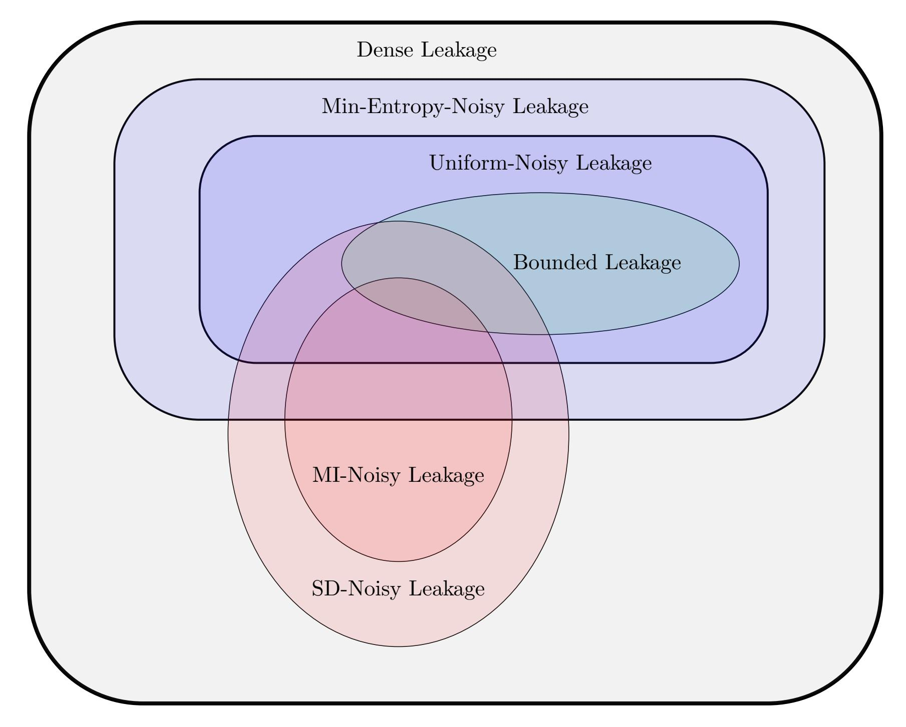

{0}------------------------------------------------

# The Mother of All Leakages: How to Simulate Noisy Leakages via Bounded Leakage (Almost) for Free∗

Gianluca Brian† Antonio Faonio‡ Maciej Obremski§ Jo˜ao Ribeiro¶ Mark Simkink Maciej Sk´orski∗∗ Daniele Venturi††

#### Abstract

We show that the most common flavors of noisy leakage can be simulated in the informationtheoretic setting using a single query of bounded leakage, up to a small statistical simulation error and a slight loss in the leakage parameter. The latter holds true in particular for one of the most used noisy-leakage models, where the noisiness is measured using the conditional average min-entropy (Naor and Segev, CRYPTO'09 and SICOMP'12).

Our reductions between noisy and bounded leakage are achieved in two steps. First, we put forward a new leakage model (dubbed the dense leakage model) and prove that dense leakage can be simulated in the information-theoretic setting using a single query of bounded leakage, up to small statistical distance. Second, we show that the most common noisy-leakage models fall within the class of dense leakage, with good parameters. Third, we prove lower bounds on the amount of bounded leakage required for simulation with subconstant error, showing that our reductions are nearly optimal. In particular, our results imply that useful general simulation of noisy leakage based on statistical distance and mutual information is impossible. We also provide a complete picture of the relationships between different noisy-leakage models.

Our result finds applications to leakage-resilient cryptography, where we are often able to lift security in the presence of bounded leakage to security in the presence of noisy leakage, both in the information-theoretic and in the computational setting. Remarkably, this lifting procedure makes only black-box use of the underlying schemes. Additionally, we show how to use lower bounds in communication complexity to prove that bounded-collusion protocols (Kumar, Meka, and Sahai, FOCS'19) for certain functions do not only require long transcripts, but also necessarily need to reveal enough information about the inputs.

Keywords: Leakage-resilient cryptography; Bounded leakage; Dense leakage; Black-box reductions.

∗A preliminary version of this work appears in the proceedings of Eurocrypt 2021 [\[BFO](#page-41-0)+21].

†Sapienza University of Rome, Italy. Email: brian@di.uniroma1.it.

‡EURECOM, Sophia Antipolis, France. Email: antonio.faonio@eurecom.fr.

§National University of Singapore, Singapore. Email: obremski.math@gmail.com.

¶Carnegie Mellon University, USA. Email: jlourenc@andrew.cmu.edu. Work done while at Imperial College London.

kAarhus University, Denmark. Email: simkin@cs.au.dk.

∗∗University of Luxembourg, Luxembourg. Email: maciej.skorski@uni.lu.

††Sapienza University of Rome, Italy. Email: venturi@di.uniroma1.it.

{1}------------------------------------------------

# 1 Introduction

#### 1.1 Background

The security analysis of cryptographic primitives typically relies on the assumption that the underlying secrets (including, e.g., secret keys and internal randomness) are uniformly random to the eyes of the attacker. In reality, however, this assumption may simply be false due to the presence of so-called side-channel attacks [Koc96, KJJ99, AARR03], where an adversary can obtain partial information (also known as leakage) on the secret state of an implementation of a cryptographic scheme, by exploiting physical phenomena.

Leakage-resilient cryptography [ISW03, MR04, DP08] aims at bridging this gap by allowing the adversary to launch leakage attacks in theoretical models too. The last decade has seen an impressive amount of work in this area, thanks to which we now dispose of a large number of leakage-resilient cryptographic primitives in different leakage models. We refer the reader to the recent survey by Kalai and Reyzin [KR19] for an overview of these results.

Bounded leakage. From an abstract viewpoint, we can think of the leakage on a random variable X (corresponding, say, to the secret key of an encryption scheme) as a correlated random variable Z = f(X) for some leakage function f that can be chosen by the adversary. Depending on the restriction we put on f, we obtain different leakage models. The first such restriction, introduced for the first time by Dziembowski and Pietrzak [DP08], is to simply assume that the length  $\ell \in \mathbb{N}$  of the leakage Z is small enough. This yields the so-called Bounded Leakage Model. Thanks to its simplicity and versatility, this model has been used to construct many cryptographic primitives that remain secure in the presence of bounded leakage.

**Noisy leakage.** A considerable limitation of the Bounded Leakage Model is the fact that, in real-world side-channel attacks, the leakage obtained by the attacker is rarely bounded in length. For instance, the power trace on a physical implementation of AES typically consists of several Megabytes of information, which is much larger than the length of the secret key.

This motivates a more general notion of noisy leakage, where there is no upper bound on the length of Z but instead we assume the leakage is somewhat noisy, in the sense that it does not reveal too much information about X. It turns out that the level of noisiness of the leakage can be measured in several ways, each yielding a different leakage model. The first such model, proposed for the first time by Naor and Segev [NS09, NS12] in the setting of leakage-resilient public-key encryption, assumes that the uncertainty of X given Z drops at most by some parameter  $\ell \in \mathbb{R}_{>0}$ . The latter can be formalized by means of conditional2 average minentropy [DORS08], i.e. by requiring that  $\widetilde{\mathbb{H}}_{\infty}(X|Z) \geq \mathbb{H}_{\infty}(X) - \ell$ . In this work, we will refer to this model as the Min-Entropy-Noisy (ME-Noisy) Leakage Model. Dodis, Haralambiev, López-Alt, and Wichs [DHLW10] considered a similar model, which we refer to as the Uniform-Noisy (U-Noisy) Leakage Model, where the condition about the min-entropy drop is defined w.r.t. the uniform distribution U (rather than on X which may not3 be uniform).

Another variant of noisy leakage was pioneered by Prouff and Rivain [PR13] (building on previous work by Chari, Jutla, Rao, and Rohatgi [CJRR99]), who suggested to measure the noisiness of the leakage by bounding the Euclidean norm between the joint distribution  $P_{XZ}$  and the product distribution  $P_X \otimes P_Z$  with some parameter  $\eta \in (0,1)$ . Follow-up

&lt;sup>1Clearly, there must be some restriction as otherwise f(X) = X and there is no hope for security.

&lt;sup>2Intuitively, the conditional average min-entropy of a random variable X given Z measures how hard it is to predict X given Z on average (by an unbounded predictor).

&lt;sup>3For instance, in the setting of public-key encryption [NS09], the random variable X corresponds to the distribution of the secret key SK given the public key PK, which may not be uniform.

{2}------------------------------------------------

works by Duc, Dziembowski, and Faust [\[DDF14,](#page-42-1) [DDF19\]](#page-42-2) and by Prest, Goudarzi, Martinelli, and Passel`egue [\[PGMP19\]](#page-45-4) replaced the Euclidean norm, respectively, with the statistical distance and the mutual information, yielding what we refer to as the SD-Noisy Leakage and the MI-Noisy Leakage Models. More precisely,[4](#page-2-0) Duc, Dziembowski, and Faust considered a strict subset of SD-noisy leakage—hereafter dubbed DDF-noisy leakage—for the special case where X = (X1, . . . , Xn), for some fixed parameter n ∈ N, and the function f has a type f = (f1, . . . , fn) such that ∆(PXi ⊗ PZi , PXiZi ) ≤ η for each Xi and Zi = fi(Xi). All of these works studied noisy leakage in the setting of leakage-resilient circuit compilers (see §[1.4\)](#page-10-0).

The different flavors of noisy leakage discussed above capture either a more general class of leakage functions than bounded leakage (as in the case of ME-noisy and U-noisy leakage), or an orthogonal class of leakage functions (as in the case of SD-noisy and MI-noisy leakage). On the other hand, it is usually easiest (and most common) to prove security of a cryptographic primitive against bounded leakage, whereas extending the analysis to other types of noisy leakage requires non-trivial specialized proofs for each primitive. Motivated by this situation, we consider the following question:

> Can we reduce noisy-leakage resilience to bounded-leakage resilience in a general way?

## 1.2 Our Results

In this work, we answer the above question to the positive in the information-theoretic setting. In a nutshell, we achieve this by proving that a novel and very general leakage model, which we refer to as the Dense Leakage Model and that encompasses all the aforementioned noisyleakage models, can be simulated almost for free (albeit possibly inefficiently) using a single query of bounded leakage. Our result allows us to show in a streamlined way that many cryptographic primitives which have only been proved to be resilient against bounded leakage are also secure against noisy leakage, with only a small loss in parameters. Importantly, the latter does not only hold for cryptographic schemes with information-theoretic security, but also for ones with computational security only. We elaborate on our contributions in more details in the paragraphs below, and refer the reader to §[1.3](#page-5-0) for a more technical overview.

Simulating dense leakage with bounded leakage. As the starting point for our work, in §[4,](#page-14-0) we introduce a meaningful simulation paradigm between leakage models. Informally, given some random variable X and two families of leakage functions F and G on X, we say F is ε-simulatable from G if for every f ∈ F we can simulate (X, f(X)) to within statistical distance ε using a single query of the form g(X) for some g ∈ G.

Taking into account the above simulation paradigm, the question we tackle is whether we can have simulation theorems stating that different noisy-leakage families F are ε-simulatable from the the family G of `-bounded leakage (for some small ε). We prove such a simulation theorem for a new leakage model that we call dense leakage.

In order to define the Dense Leakage Model, we begin with the concept of δ-density: Given two distributions P and P 0 over a discrete set X , we say P is δ-dense in P 0 if P(x) ≤ P 0 (x) δ for all x ∈ X . In particular, δ-density implies that P(x) = 0 whenever P 0 (x) = 0, and thus this concept is connected to the notion of absolute continuity of one measure with respect to another. Given this notion, it is simple to describe the Dense Leakage Model. If Z = f(X) denotes some leakage from X, then Z is (p, γ, δ)-dense leakage from X if, with probability 1 −p

4The work by Prest, Goudarzi, Martinelli, and Passel`egue considered a similar restriction for MI-noisy leakage.

{3}------------------------------------------------

over the choice of X = x, we have

$$P_{Z|X=x}(z) \le \frac{P_Z(z)}{\delta} \tag{1}$$

with probability 1 − γ over the choice of Z = z. Intuitively, Z being a dense leakage of X essentially corresponds to the distributions PZ|X=x being "approximately" dense in the marginal distribution PZ for most choices of x ∈ X .

Our first result is a simulation theorem for dense leakage with respect to bounded leakage, which we state in simplified form below.

Theorem 1 (Informal). For any random variable X, and every parameter ε ∈ (0, 1), the family of (p, γ, δ)-dense leakage functions on X is (ε + ε 1/4δ + γ + p)-simulatable from the family of `-bounded leakage functions on X, so long as

$$\ell \ge \log(1/\delta) + \log\log(1/\varepsilon) + 2\log\left(\frac{1}{1-\gamma}\right) + 2.$$

On the power of dense leakage. Second, we show that dense leakage captures all of the noisy-leakage models considered above. In particular, we obtain the following informal result.

Theorem 2 (Informal). The families of ME-noisy, U-noisy, and DDF-noisy leakages fall within the family of dense leakage with good[5](#page-3-0) parameters.

By combining Theorem [1](#page-3-1) and Theorem [2,](#page-3-2) we obtain non-trivial simulation theorems for the families of ME-noisy, U-noisy, and DDF-noisy leakage from bounded leakage, with small simulation error and small bounded leakage parameter. It is worth mentioning that, for the specific case of ME-noisy leakage, Theorem [2](#page-3-2) only holds for distributions X that are almost flat. As we shall prove, this restriction is nearly optimal in the sense that there exist "non-flat" distributions X for which we cannot simulate ME-noisy leakage on X from bounded leakage on X with good parameters, even when the drop in min-entropy is minimal.

Fundamental limitations of SD-noisy and MI-noisy leakages. Turning to the families of SD-noisy and MI-noisy leakage, one can show that they fall within the family of dense leakage too. However, the parameters we obtain in this case are not good enough to be combined with Theorem [1](#page-3-1) in order to yield interesting applications. In fact, we prove that the families of η-SD-noisy and η-MI-noisy leakage are trivially simulatable with statistical error roughly η even from the degenerate family of 0-bounded leakage. Unfortunately, this is inherent for the general form of SD-noisy and MI-noisy leakage we consider: we prove that no simulator can achieve simulation error significantly smaller than η even when leaking almost all of the input.

In contrast, Duc, Dziembowski, and Faust [\[DDF14,](#page-42-1) [DDF19\]](#page-42-2) gave a non-trivial[6](#page-3-3) simulation theorem for the family of DDF-noisy leakage (which is a strict subset of SD-noisy leakage) from a special type of bounded leakage called threshold probing leakage. Consistently, Theorem [2](#page-3-2) establishes that DDF-noisy leakage is dense leakage with good parameters which in combination with Theorem [1](#page-3-1) gives an alternative (non-trivial) simulation theorem for DDF-noisy leakage from bounded leakage. While this result is not new, we believe it showcases the generality of our techniques.

5 In particular, small enough in order to be combined with Theorem [1](#page-3-1) yielding interesting applications.

6 In particular, with negligible simulation error and small bounded leakage parameter even for constant η.

{4}------------------------------------------------

Figure 1: Containment of the different leakage models considered in this paper under typical parameter settings. Our main result is that a single query of bounded leakage is enough to simulate dense leakage to within small statistical distance.

A complete picture, and near-optimality of our simulation theorems. We also provide a complete picture of inclusions and separations between the different leakage models, as depicted in Figure [1.](#page-4-0) Some of these relationships were already known (e.g., the fact that the family of U-noisy leakage is a strict subset of the family of ME-noisy leakage), and some are new (e.g., the separations between the family of SD-noisy leakage and the families of ME-noisy and MI-noisy leakage).

Moreover, we prove a series of results showing that the amount of bounded leakage we use in our simulation theorems is nearly optimal with respect to the desired simulation error.

Applications in brief. Next, we explore applications of our results to leakage-resilient cryptography. Intuitively, the reason why the simulation paradigm is useful is that it may allow us to reduce leakage resilience of a cryptographic scheme against F to leakage resilience against G. In particular, when G is taken to be the family of bounded-leakage functions, we obtain that many primitives which were already known to be secure against bounded leakage are also secure against dense (and thus noisy) leakage. Examples include forward-secure storage [\[Dzi06a\]](#page-43-3), leakage-resilient one-way functions and public-key encryption [\[ADVW13\]](#page-41-1), cylinder-intersection extractors [\[KMS19\]](#page-44-4), symmetric non-interactive key exchange [\[LMQW20\]](#page-45-5), leakage-resilient secret sharing [\[BDIR18,](#page-41-2) [SV19,](#page-46-0) [ADN](#page-40-1)+19, [KMS19,](#page-44-4) [LCG](#page-45-6)+20] and two-party computation [\[GIM](#page-44-5)+16]. 

{5}------------------------------------------------

We remark that, although it often seems possible to extend the security proof for some of these applications from bounded to ME-noisy leakage resilience in an ad hoc, white-box manner, our approach instead provides a *black-box* way to lift bounded leakage resilience to the more general notion of dense leakage resilience.

#### 1.3 Technical Overview

Simulation via rejection sampling. We begin by giving an overview of the approach we use to simulate dense leakage from bounded leakage. As discussed before, our goal is to show that, for a random variable X and some associated dense leakage function f (where f may be randomized), there is a (possibly inefficient) simulator that makes at most one black-box query g(X) for some  $\ell$ -bounded leakage function  $g: \mathcal{X} \to \{0,1\}^{\ell}$  and outputs  $\widetilde{Z}$  such that

$$(X, f(X)) \approx_{\varepsilon} (X, \widetilde{Z}),$$
 (2)

where  $\approx_{\varepsilon}$  denotes statistical distance at most  $\varepsilon$ . For simplicity, we focus here on the setting where f is "exactly"  $\delta$ -dense leakage from X, meaning that, if Z = f(X), we have

$$P_{Z|X=x}(z) \le \frac{P_Z(z)}{\delta} \tag{3}$$

for all x and z. This setting is already appropriate to showcase our main ideas.

The key observation that enables the design of our simulator, as we formalize in §3, is that if a distribution P is  $\delta$ -dense in P', then it is possible to sample  $\widetilde{P}$  satisfying  $\widetilde{P} \approx_{\varepsilon} P$  with access only to  $s = \frac{\log(1/\varepsilon)}{\delta}$  independent and identically distributed (i.i.d.) samples from P', say  $z_1, z_2, \ldots, z_s$ , and knowledge of the distribution P, via rejection sampling: For  $i = 1, 2, \ldots, s$ , either output  $z_i$  with probability  $\delta P(z_i)/P'(z_i) \leq 1$ , or move to i + 1 otherwise (if i = s + 1, abort).

This suggests the following simulator for f exploiting Eq. (3): The simulator generates s i.i.d. samples  $\mathbf{z} = (z_1, z_2, \dots, z_s)$  from  $P_Z$ . Then, it queries the bounded-leakage oracle with the randomized function  $g_{\mathbf{z}}$  which, with full knowledge of x, performs rejection sampling of  $P_{Z|X=x}$  from  $P_Z$  using  $\mathbf{z}$ . If rejection sampling outputs  $z_i$ , then  $g_{\mathbf{z}}(x) = i$ , and if rejection sampling aborts we may set  $g_{\mathbf{z}}(x) = \bot$ . In particular,  $g_{\mathbf{z}}$  has 1 + s possible outputs, and so it is  $\ell$ -bounded-leakage from X with  $\ell = \log(1+s) \le \log(1/\delta) + \log\log(1/\varepsilon) + 1$ . The behavior of the simulator is now clear: Since it knows  $\mathbf{z}$ , it can simply output  $\widetilde{Z} = z_i$  (or  $\widetilde{Z} = \bot$  if rejection sampling aborted). The discussion above guarantees that the output of the simulator is  $\varepsilon$ -close in statistical distance to f(x), which yields Eq. (2).

As previously discussed, in the actual proof (which appears in §5.1) we must deal with an approximate variant of Eq. (3). However, we show that the above approach still works in the setting of approximate density at the price of some additional small terms in the simulation error and in the bounded leakage length.

We note that a similar rejection sampling-based approach was also used in a different setting by Goldreich and Petrank [GP99, Proposition 4.3] to establish connections between knowledge complexity measures.

Noisy leakage is dense leakage. As an example of how we manage to frame many types of noisy leakage as dense leakage with good parameters, we discuss how this can be accomplished for ME-noisy leakage assuming X satisfies a property we call  $\alpha$ -semi-flatness. The full proof appears in §5.2. The property states that X satisfies  $P_X(x) \leq 2^{\alpha} \cdot P_X(x')$  for all  $x, x' \in \text{supp}(X)$ , and, as we shall see, it is usually satisfied in applications with small  $\alpha$  (or even  $\alpha = 0$ , which corresponds to a flat distribution). We stress that for the case of U-noisy, DDF-noisy, SD-noisy,

{6}------------------------------------------------

and MI-noisy leakages, no assumption is required on X to place these types of leakage inside the set of dense leakages. More details can be found in  $\S 5.3$  and  $\S 5.4$ .

Consider some  $\alpha$ -semi-flat X and leakage function f such that Z = f(X) satisfies

$$\mathbb{H}_{\infty}(X|Z=z) \ge \mathbb{H}_{\infty}(X) - \ell \tag{4}$$

for some  $\ell > 0$  and all z. Note that this is a special case of ME-noisy leakage, but it suffices to present the main ideas of our approach. Our goal is to show that f is  $(0,0,\delta)$ -dense leakage of X for an appropriate parameter  $\delta$ , meaning that we wish to prove that  $P_{Z|X=x}(z) \leq \frac{P_Z(z)}{\delta}$  for all x and z (recall Eq. (1)). Observe that, by Eq. (4), we have

$$P_{X|Z=z}(x) \le 2^{\ell} \max_{x'} P_X(x') \le 2^{\ell+\alpha} P_X(x)$$

for all x and z, where the rightmost inequality makes use of the fact that X is  $\alpha$ -semi-flat. Rewriting the inequality above with the help of Bayes' theorem yields

$$P_{Z|X=x}(z) \le 2^{\ell+\alpha} P_Z(z),$$

meaning that f is  $(p=0, \gamma=0, \delta=2^{-\ell-\alpha})$ -dense leakage of X. By Theorem 1, we then have that f(X) can be simulated with statistical error  $2\varepsilon$  using  $\ell'=\ell+\alpha+\log\log(1/\varepsilon)+2$  bits of bounded leakage from X. This statement allows for significant flexibility in the choice of parameters. For example, setting  $\varepsilon=2^{-\lambda}$  for some security parameter  $\lambda$  yields negligible simulation error from  $\ell+\alpha+\log(\lambda)+2$  bits of bounded leakage. Since  $\alpha$  is usually very small in applications (often we have  $\alpha=0$ ), in practice we can achieve negligible simulation error using  $\ell+\log(\lambda)+O(1)$  bits of bounded leakage, i.e., by paying only an extra  $\log(\lambda)+O(1)$  bits of leakage. Extending the argument above to general ME-noisy leakage from X requires the addition of small error terms p and  $\gamma$ , but setting parameters similarly to the above still allows us to simulate general  $\ell$ -ME-noisy leakage from X using only, say,  $\ell+O(\log^2(\lambda))$  bits of bounded leakage from X.

Trivial simulation of SD-noisy and MI-noisy leakages. Consider the trivial simulator that given the function f simply samples  $\widetilde{X}$  according to the distribution of X and then outputs  $\widetilde{Z} = f(\widetilde{X})$ . Assuming f belongs to the family of  $\eta$ -SD-noisy leakage, the above gives a simulation theorem for SD-noisy leakage with simulation error  $\eta$  (and without requiring any leakage from X). By Pinsker inequality, the above also implies a simulation theorem for  $\eta$ -MI-noisy leakage with simulation error  $\sqrt{2\eta}$  (again without leaking anything from X).

Unfortunately, it turns out that one cannot do much better than the trivial simulator (even when using large bounded leakage) for our general definition of SD-noisy leakage. More specifically, we show there exists some X such that any simulator for a function f that is  $\eta$ -SD-noisy leakage for X must incur a simulation error of at least  $\eta/2$  even when leaking all but one bit from X. In the case of MI-noisy leakage, we prove a similar result: There exists an X such that any simulator must have simulation error at least  $\frac{\eta}{2n}$  when simulating  $\eta$ -MI-noisy leakage from X, even when leaking all but one bit of X. Notably, this means that negligible simulation error is impossible to achieve when  $\eta$  is non-negligible, and thus one cannot do significantly better than the trivial simulator for MI-noisy leakage either.

It is instructive to compare the above trivial simulation theorem for SD-noisy leakage with the result by Duc, Dziembowski, and Faust [DDF14, DDF19], who gave a non-trivial simulation theorem for DDF-noisy leakage from a special case of bounded leakage known as threshold probing leakage. Notice that by the triangle inequality, the trivial simulation theorem for  $\eta$ -SD-noisy leakage implies a trivial simulation theorem for  $\eta$ -DDF-noisy leakage with large simulation error  $n \cdot \eta$ , which in particular becomes uninteresting as soon as  $\eta$  is non-negligible.

{7}------------------------------------------------

Nevertheless, in §5.5, we show that the family of  $\eta$ -DDF-noisy leakage falls within the family of U-noisy (and thus dense) leakage with good parameters, which in turn gives a non-trivial simulation theorem for  $\eta$ -DDF-noisy leakage from  $\ell$ -bounded leakage with negligible simulation error and for small bounded leakage parameter  $\ell$ , even when  $\eta \in (0,1)$  is constant.

Separations between leakage families, and tradeoffs between simulation error and bounded leakage parameter. We complement our positive results in several ways. First, we present missing separations between the different types of leakages we consider, leading to a complete picture of their relationships (as depicted in Figure 1). Second, we study the minimum amount of bounded leakage required to simulate different types of noisy leakage with a given simulation error, and show that our simulation theorems are close to optimal. For example, in the case of ME-noisy leakage, for a large range of  $\ell$  and  $\alpha$  we show that  $\ell + \alpha - O(1)$  bits of bounded leakage are required to simulate  $\ell$ -ME-noisy leakage from some  $\alpha$  semi-flat X. As discussed above, our simulation theorem states that approximately  $\ell + \alpha$  bits of bounded leakage are sufficient to achieve negligible simulation error, meaning that our characterization is optimal up to the O(1) term.

To showcase our approach towards obtaining tradeoffs between simulation error and the bounded leakage parameter, we discuss here one particularly insightful implication of a more general theorem we obtain, which states that enforcing  $\alpha$ -semi-flatness of X is necessary to obtain a non-trivial simulation theorem for ME-noisy leakage with sub-constant simulation error. More precisely, there exists X with support in  $\{0,1\}^n$  with an associated 0-noisy leakage function f (meaning that  $\widetilde{\mathbb{H}}_{\infty}(X|f(X)) = \mathbb{H}_{\infty}(X)$ ) with the property that simulating Z = f(X) with simulation error less than 1/4 requires one  $\ell'$ -bounded-leakage query for  $\ell' \geq n-2$ . In other words, to achieve small simulation error without semi-flatness, we must leak almost all of the input X. The statement above is proved as follows. Consider  $X \in \{0,1\}^n$  satisfying

$$P_X(x) = \begin{cases} 1/2, & \text{if } x = 0^n, \\ \frac{1}{2(2^n - 1)}, & \text{otherwise.} \end{cases}$$

Moreover, set Z = f(X) for a leakage function f such that  $f(0^n)$  is uniformly distributed over  $\{0,1\}^n \setminus \{0^n\}$  and f(x) = x with probability 1 for  $x \neq 0^n$ . Routine calculations show that  $\mathbb{H}_{\infty}(X) = 1$  and  $\mathbb{H}_{\infty}(X|Z = z) = 1$  for all z, meaning that  $\mathbb{H}_{\infty}(X|Z = z) = 1 = \mathbb{H}_{\infty}(X)$ , as desired. Finally, every simulator for (X,Z) above with access to one query of  $\ell'$ -bounded-leakage for  $\ell' \leq n-2$  must have simulation error 1/4 because, conditioned on  $X \neq 0^n$  (which holds with probability 1/2), we have f(X) = X and X uniform over  $\{0,1\}^n \setminus \{0^n\}$ . Therefore, under this conditioning, we can only correctly guess f(X) with probability at most 1/2 from any one (n-2)-bounded-leakage query of X.

Sample Application: leakage-resilient secret sharing. We now explain how to use our result in order to lift bounded-leakage resilience to noisy-leakage resilience (almost) for free in cryptographic applications. In fact, in the information-theoretic setting, the latter is an almost immediate consequence of our result.

For the purpose of this overview, let us focus on the concrete setting of secret sharing schemes with local leakage resilience [BDIR18]. Briefly, a t-out-of-n secret sharing scheme allows to share a message y into n shares  $(x_1, \ldots, x_n)$  in such a way that y can be efficiently recovered using any subset of t shares. Local leakage resilience intuitively says that no unbounded attacker obtaining in full all of the shares  $x_{\mathcal{U}}$  within an unauthorized subset  $\mathcal{U} \subset [n]$  of size u < t, and further leaking at most  $\ell$  bits of information  $z_i$  from each of the shares  $x_i$  independently, should not be able to tell apart a secret sharing of message  $y_0$  from a secret sharing of message

{8}------------------------------------------------

 $y_1$ . Benhamouda, Degwekar, Ishai and Rabin [BDIR18] recently proved that both Shamir secret sharing and additive secret sharing satisfy local leakage resilience for certain ranges of parameters.

Thanks to Theorem 1, in §6.1, we show that any secret sharing scheme meeting the above property continues to be secure even if the attacker obtains dense (rather than bounded) leakage on each of the shares  $x_i$  independently. The proof of this fact is simple. We move to a mental experiment in which leakages  $(z_1, \ldots, z_n)$  corresponding to dense-leakage functions  $(f_1, \ldots, f_n)$  are replaced by  $(\tilde{z}_1, \ldots, \tilde{z}_n)$  obtained as follows: For each  $i \in [n]$ , first run the simulator guaranteed by Theorem 1 in order to obtain an  $\ell'$ -bounded leakage function  $f'_i$  and compute  $z'_i = f'_i(x_i)$ ; then, run the simulator upon input  $z'_i$  in order to obtain a simulated leakage  $\tilde{z}_i$ .

By a hybrid argument, the above experiment is statistically close to the original experiment. Furthermore, we can reduce a successful attacker in the mental experiment to an attacker breaking local bounded-leakage resilience. The proofs follows. Finally, thanks to Theorem 2, we can use the abstraction of dense leakage in order to obtain security also in the presence of ME-noisy and U-noisy leakage as well. Note that in the case of ME-noisy leakage, for the second step to work, we need that the distribution  $X_i$  of each share outside  $\mathcal{U}$  given the shares  $x_{\mathcal{U}}$  is almost flat, which is the case for Shamir and additive secret sharing.

Applications in the computational setting. The above proof technique can be essentially applied to any cryptographic primitive with bounded leakage resilience in the information-theoretic setting. Further examples include, e.g., forward-secure storage [Dzi06a], leakage-resilient storage [DDV10], leakage-resilient non-malleable codes [ADKO15], non-malleable secret sharing [KMS19, BFO+20] and algebraic manipulation detection codes [AS14, LSW16, AKO18]. (We work out the details for some of these primitives in §A of the appendix.) However, we cannot apply the same trick in the computational setting or when in the proof of security we need to define an efficient simulator (e.g., for leakage-resilient non-interactive zero knowledge [AJS17] and leakage-resilient multi party computation [BDIR18, GIM+16]), as the simulation of dense leakage with bounded leakage guaranteed by Theorem 1 may not be efficient.

Nevertheless, we show that our results are still useful for lifting bounded-leakage to noisy-leakage resilience in the computational setting too. In particular, in §6.2, we exemplify how to do that for the concrete construction of leakage-resilient one-way functions in the floppy model proposed by Agrawal, Dodis, Vaikuntananthan and Wichs [ADVW13], and in the setting of multi-party computation (MPC).

Let us start with an overview of the former application, and refer to §A.4 for the latter. Let G be a cyclic group with generator g and prime order q, and define  $g_i = g^{\tau_i}$  for each  $i \in [n]$ . Upon input a vector  $\boldsymbol{x} = (x_1, \dots, x_n)$ , the one-way function outputs  $y = \prod_{i=1}^n g_i^{x_i}$ ; moreover, there is a refreshing procedure that given y and  $\boldsymbol{\tau} = (\tau_1, \dots, \tau_n)$  can generate a fresh pre-image  $\boldsymbol{x}'$  of y by simply letting  $\boldsymbol{x}' = \boldsymbol{x} + \boldsymbol{\sigma}$  for randomly chosen  $\boldsymbol{\sigma}$  orthogonal to  $\boldsymbol{\tau}$ . Here, one should think of  $\boldsymbol{\tau}$  as a sort of master secret key to be stored in some secure hardware (i.e., the floppy). Agrawal, Dodis, Vaikuntananthan, and Wichs proved that, under the discrete logarithm assumption in G, no efficient attacker can successfully invert y even when given  $\ell$ -bounded leakage on  $\boldsymbol{x}$ , so long as  $\ell \approx (n-3)\log(q)$  and assuming that after each leakage query the value  $\boldsymbol{x}$  is refreshed using the floppy. The proof of this fact follows in two steps. First, we move to a mental experiment where each of the leakage queries is answered using a random (n-2)-dimensional subspace  $\mathcal{S} \subseteq \ker(\boldsymbol{\tau})$ . By the subspace hiding lemma [BKKV10], this experiment is statistically close to the original experiment. Thus, we can use Theorem 1 and Theorem 2 to show that the above still holds in the case of ME-noisy and U-noisy leakage. Second, one finally reduces a successful

&lt;sup>7The former requires the distribution of  $\boldsymbol{x}$  given y and  $(\mathbb{G}, g, g_1, \ldots, g_n, q)$  to be almost flat which is easily seen to be the case.

{9}------------------------------------------------

attacker in the mental experiment to an efficient breaker for the discrete logarithm problem; in this last step, however, the reduction can trivially answer leakage queries by using S, and thus it does not matter whether the leakage is bounded or noisy. We believe the above blueprint can be applied to analyze other cryptographic primitives whose leakage resilience is derived through the subspace hiding lemma; we mention a few natural candidates at the end of §[6.2.](#page-30-0)

Turning to simulation-based security, additional work is required before we can apply our main theorem. To keep the exposition simple, let us focus here on the concrete setting of zero-knowledge (ZK) proofs (although in §[A.4](#page-50-0) we deal with MPC for arbitrary functionalities). The idea is to downgrade the notion of security from statistical ZK in the presence of bounded leakage to the weaker notion of statistical witness indistinguishability (WI) in the presence of bounded leakage. In the latter setting, we can use our main theorem to show that any protocol that is statistically WI in the presence of bounded leakage is also statistically WI in the presence of dense leakage. Hence, we can achieve computational ZK in the presence of dense leakage by applying the standard transformation from WI to ZK in the common reference string model (see, e.g., [\[GOS06\]](#page-44-7)). Finally, we give a concrete instantiation based on the DDH assumption by invoking a result from Goyal, Ishai, Maji, Sahai and Sherstov [\[GIM](#page-44-5)+16] for passively secure two-party computation in the presence of bounded leakage.

Bounded-collusion protocols. Finally, motivated by additional applications to leakageresilient cryptography and by exploring new lower bounds in communication complexity [\[Yao79\]](#page-46-2), in §[6.3,](#page-34-0) we investigate the setting of bounded-collusion protocols (BCPs) as proposed by Kumar, Meka, and Sahai [\[KMS19\]](#page-44-4). Here, a set of n parties each holding an input xi wishes to evaluate a Boolean function φ of their inputs by means of an interactive protocol π. At the j-th round, a subset of k parties (where k < n is called the collusion bound) is selected, and appends to the protocol transcript τ an arbitrary (possibly unbounded) function fj of their joint inputs. The goal is to minimize the size ` of the transcript, which leads to what we call an `-bounded communication k-bounded collusion protocol (BC-BCP). BC-BCPs interpolate nicely between the well-studied number-in-hand (NIH) [\[PVZ12\]](#page-45-8) (which corresponds to k = 1) and number-onforehead (NOF) [\[CFL83\]](#page-42-4) (which corresponds to k = n − 1) models.

We put forward two natural generalizations of BC-BCPs, dubbed dense (resp. noisy) communication k-bounded collusion protocols (DC-BCPs, resp. NC-BCP), in which there is no restriction on the length of the final transcript τ but the round functions are either dense or U-noisy leakage functions. It is easy to see that any BC-BCP is also a NC-BCP as well as a DC-BCP. By Theorem [1](#page-3-1) and Theorem [2,](#page-3-2) we are able to show that the converse is also true: namely, we can simulate[8](#page-9-0) the transcript τ of any DC-BCP or NC-BCP π using the transcript τ 0 of a related BC-BCP π 0 up to a small statistical distance. Protocol π 0 roughly runs π and uses the simulation paradigm in order to translate the functions used within π into functions to be used within π 0 . The proof requires a hybrid argument, and thus the final simulation error grows linearly with the number of rounds of the underlying BC-BCP.

The above fact has two consequences. The first consequence is that we can translate communication complexity lower bounds for BC-BCPs into lower bounds on the noisiness of NC-BCPs. A communication complexity lower bound for a Boolean function φ says that any BC-BCP computing φ with good probability must have long transcripts (i.e., large `). Concrete examples of such functions φ include those based on the generalized inner product and on quadratic residues in the NOF model with logarithmic (in the input length) number of parties [\[Chu90,](#page-42-5) [BNS92\]](#page-41-8), and more recently a new function (based on the Bourgain extractor [\[Bou05\]](#page-42-6)) for more general

8The reason for not considering NC-BCPs where the round functions are ME-noisy (instead of U-noisy) leakage functions is that simulating ME-noisy leakage with bounded leakage inherently requires semi-flatness, but we cannot ensure this condition is maintained throughout the entire execution of a leakage protocol.

{10}------------------------------------------------

values of k and even for super-logarithmic number of parties [\[KMZ20\]](#page-44-8). Note that the above lower bounds do not necessarily say how much information a transcript must reveal about the inputs. Thanks to our results, we can show that any NC-BCP (i.e., where there is no upper bound on the transcript length) computing the above functions with good probability must also in some sense reveal enough information about the inputs. However, for technical reasons, the latter holds true only so long as the number of rounds is not too large. We refer the reader to §[6.3.1](#page-37-0) for further details.

The second consequence is that we can lift the security of cryptographic primitives whose leakage resilience is modeled as a BC-BCP (which intuitively corresponds to security against adaptive bounded joint leakage) to the more general setting where leakage resilience is modeled as a NC-BCP or DC-BCP (which intuitively corresponds to security against adaptive noisy joint leakage). Examples includes secret sharing with security against adaptive joint leakage [\[KMS19,](#page-44-4) [CGGL20,](#page-42-7) [KMZ20\]](#page-44-8) (see §[6.3.2\)](#page-38-0), extractors for cylinder-intersection sources [\[KMS19,](#page-44-4) [LMQW20,](#page-45-5) [CGGL20,](#page-42-7) [KMZ20\]](#page-44-8) (see §[A.2\)](#page-48-0) and leakage-resilient non-interactive key exchange [\[LMQW20\]](#page-45-5) (see §[A.3\)](#page-49-0). Interestingly, the security of these applications in the bounded-leakage setting has been derived exploiting communication complexity lower bounds for BC-BCPs. We can instead directly lift security to the dense and U-noisy leakage setting in a fully black-box way, and thus without re-doing the analysis.

## 1.4 Related Work

Naor and Segev [\[NS09,](#page-45-1) [NS12\]](#page-45-2) conjectured that ME-noisy leakage may be compressed to small leakage in the information-theoretic setting. Boyle, Segev, and Wichs [\[BSW11\]](#page-42-8) showed that this conjecture is false under standard cryptographic assumptions. We show that this conjecture is unconditionally false for arbitrary distributions, and also give the exact conditions under which the above statement holds true not only in the case of ME-noisy leakage, but also for U-noisy leakage.

Most relevant to our work is the line of research on leakage-resilient circuit compilers (see, e.g., [\[ISW03,](#page-44-2) [FRR](#page-44-9)+10, [FRR](#page-44-10)+14]), where the equivalence of different leakage models has also been explored. For instance, the beautiful work by Duc, Dziembowski, and Faust [\[DDF14,](#page-42-1) [DDF19\]](#page-42-2) shows that DDF-noisy leakage on masking schemes used to protect the internal values within a cryptographic circuit can be simulated by probing a limited number of wires (which can be thought of as bounded leakage in the circuit setting). The notion of DDF-noisy leakage was studied further, both experimentally and theoretically, by Duc, Faust, and Standaert [\[DFS15a,](#page-43-4) [DFS19\]](#page-43-5). Follow-up work by Dziembowski, Faust, and Sk´orski [\[DFS15b\]](#page-43-6) and by Prest, Goudarzi, Martinelli, and Passel`egue [\[PGMP19\]](#page-45-4) further improved the parameters of such a reduction and extended it to other noisy-leakage models as well. The difference between the above results and our work is that we prove simulation theorems between very abstract and general leakage models, which ultimately allows us to obtain a broad range of applications which goes beyond the setting of leakage-resilient circuits. In a complementary direction, Fuller and Hamlin [\[FH15\]](#page-43-7) studied the relationship between different types of computational leakage.

Harsha, Ishai, Kilian, Nissim, and Venkatesh [\[HIK](#page-44-11)+04] investigate tradeoffs between communication complexity and time complexity in non-cryptographic settings, including deterministic two-party protocols, query complexity and property testing. Our simulation theorems can be thought of as similar tradeoffs in the cryptographic setting.

{11}------------------------------------------------

# 2 Preliminaries

#### 2.1 Notation

We denote by [n] the set  $\{1, \ldots, n\}$ . For a string  $x \in \{0, 1\}^*$ , we denote its length by |x|; if  $\mathcal{X}$  is a set,  $|\mathcal{X}|$  represents the number of elements in  $\mathcal{X}$ . When x is chosen randomly in  $\mathcal{X}$ , we write  $x \leftarrow \mathcal{X}$ . When A is a randomized algorithm, we write  $y \leftarrow \mathcal{A}(x)$  to denote a run of A on input x (and implicit random coins r) and output y; the value y is a random variable and A(x;r) denotes a run of A on input x and randomness r. An algorithm A is probabilistic polynomial-time (PPT for short) if A is randomized and for any input  $x, r \in \{0, 1\}^*$ , the computation of A(x;r) terminates in a polynomial number of steps (in the size of the input).

**Negligible functions.** We denote with  $\lambda \in \mathbb{N}$  the security parameter. A function p is polynomial (in the security parameter), denoted  $p \in \text{poly}(\lambda)$ , if  $p(\lambda) \in O(\lambda^c)$  for some constant c > 0. A function  $\nu : \mathbb{N} \to [0,1]$  is negligible (in the security parameter) if it vanishes faster than the inverse of any polynomial in  $\lambda$ , i.e.  $\nu(\lambda) \in O(1/p(\lambda))$  for all positive polynomials  $p(\lambda)$ . We sometimes write  $negl(\lambda)$  to denote an unspecified negligible function. Unless stated otherwise, throughout the paper, we implicitly assume that the security parameter is given as input (in unary) to all algorithms.

#### 2.2 Random Variables

For a random variable X, we write  $\mathbb{P}[X=x]$  for the probability that X takes on a particular value  $x \in \mathcal{X}$ , with  $\mathcal{X}$  being the set where X is defined. The probability mass function of X is denoted  $P_X$ , i.e.,  $P_X(x) = \mathbb{P}[X=x]$  for all  $x \in \mathcal{X}$ ; we sometimes omit X and just write P when X is clear from the context. For a set (or event)  $S \subseteq \mathcal{X}$ , we write P(S) for the probability of event S, i.e.  $P(S) = \sum_{x \in S} P(x)$ .

The statistical distance between two random variables X and Y over  $\mathcal X$  is defined as

$$\Delta(X;Y) := \frac{1}{2} \sum_{x \in \mathcal{X}} |\mathbb{P}[X = x] - \mathbb{P}[Y = x]|.$$

Given two ensembles  $X = \{X_{\lambda}\}_{{\lambda} \in \mathbb{N}}$  and  $Y = \{Y_{\lambda}\}_{{\lambda} \in \mathbb{N}}$ , we write  $X \equiv Y$  to denote that they are identically distributed,  $X \approx Y$  to denote that they are statistically close, i.e.  $\Delta(X_{\lambda}; Y_{\lambda}) \leq \operatorname{negl}(\lambda)$ , and  $X \stackrel{c}{\approx} Y$  to denote that they are computationally indistinguishable, i.e. for all PPT distinguishers D:

$$|\mathbb{P}[\mathsf{D}(X_{\lambda}) = 1] - \mathbb{P}[\mathsf{D}(Y_{\lambda}) = 1]| \le \text{negl}(\lambda).$$

Sometimes we explicitly denote by  $X \approx_{\varepsilon} Y$  the fact that  $\Delta(X_{\lambda}; Y_{\lambda}) \leq \varepsilon$  for a parameter  $\varepsilon = \varepsilon(\lambda)$ .

Average min-entropy. The min-entropy of a random variable X with domain  $\mathcal{X}$  is defined as  $\mathbb{H}_{\infty}(X) := -\log \max_{x \in \mathcal{X}} \mathbb{P}[X = x]$ , which intuitively measures the best chance to predict X (by a computationally unbounded algorithm). For conditional distributions, unpredictability is measured by the conditional average min-entropy [DRS04, DORS08], defined as

$$\widetilde{\mathbb{H}}_{\infty}(X|Y) := -\log \mathbb{E}_{y \sim Y} \Big[ 2^{-\mathbb{H}_{\infty}(X|Y=y)} \Big].$$

The lemmas below are sometimes known as the "chain rule" for conditional average min-entropy.

**Lemma 1** ([DORS08]). For arbitrary random variables X, Y, and Z such that  $|\text{supp}(Z)| \leq 2^{\ell}$  it holds that

$$\widetilde{\mathbb{H}}_{\infty}(X|Y,Z) \ge \widetilde{\mathbb{H}}_{\infty}(X,Z|Y) - \ell \ge \widetilde{\mathbb{H}}_{\infty}(X|Y) - \ell.$$

{12}------------------------------------------------

Lemma 2 ([\[MW97\]](#page-45-9)). For arbitrary random variables X, Y , and Z, and for every δ ≥ 0, it holds that

$$\mathbb{P}_{z \sim Z} \Big[ \widetilde{\mathbb{H}}_{\infty}(X|Y,Z=z) \ge \widetilde{\mathbb{H}}_{\infty}(X|Y,Z) - \log(1/\delta) \Big] \ge 1 - \delta.$$

# 2.3 Hardness Assumptions

Let GroupGen(1λ ) be a randomized algorithm outputting the description of a cyclic group G with generator g and prime order q = q(λ).

Definition 1 (Discrete logarithm assumption). We say that the discrete logarithm (DL for short) assumption holds for GroupGen, if for all PPT attackers A there is a negligible function ν : N → [0, 1] such that

$$\mathbb{P}\Big[x'=x:\ (\mathbb{G},g,q)\leftarrow \mathrm{s}\ \mathsf{GroupGen}(1^\lambda);x\leftarrow \mathrm{s}\ \mathbb{Z}_q;x'\leftarrow \mathrm{s}\ \mathsf{A}(\mathbb{G},g,q,g^x)\Big]\leq \nu(\lambda).$$

# 3 Rejection Sampling for Approximate Density

The problem that we consider in this section is the following: How can we sample from a distribution P with statistical error at most ε, given only black-box access to i.i.d. samples from another distribution P 0 ?

It turns out that the problem above can be solved via rejection sampling, assuming that P is approximately dense in P 0 as defined below.

Definition 2 (δ-density). Given two distributions P and P 0 over some set Z and some δ ∈ (0, 1], we say P is δ-dense in P 0 if for every z ∈ Z it holds that

$$P(z) \le \frac{P'(z)}{\delta}.$$

Remark 1 (On the parameter δ). Note that the definition of δ-density only makes sense when δ ≤ 1. In fact, if δ > 1 above, then P cannot be a probability distribution.

Definition 3 ((γ, δ)-density). Given two distributions P and P 0 over some set Z and some γ ∈ [0, 1], δ ∈ (0, 1], we say P is γ-approximate δ-dense in P 0 , or simply (γ, δ)-dense in P 0 , if there exists a set S ⊆ Z such that P(S), P0 (S) ≥ 1 − γ, and for all z ∈ S it holds that

$$P(z) \le \frac{P'(z)}{\delta}.$$

### 3.1 The Case of Exact Density

First, we consider the special case where P is δ-dense in P 0 .

Lemma 3. Suppose P is δ-dense in P 0 and fix any ε ∈ (0, 1]. Then, there is a randomized function f which given

$$s = \frac{\log(1/\varepsilon)}{\delta}$$

i.i.d. samples Z1, Z2, . . . , Zs of P 0 outputs an index I = f(Z1, . . . , Zs) ∈ [s] ∪ {⊥} satisfying

$$\widetilde{P}=Z_I\approx_{\varepsilon}P,$$

where we define z⊥ = ⊥.

{13}------------------------------------------------

Proof. Consider the following rejection sampling algorithm:

- 1. Sample Z1, . . . , Zs i.i.d. according to the distribution P 0 , and set I := ⊥;
- 2. For j = 1, . . . , s do the following: Set Bj := 1 with probability pj = δP(Zj ) P0(Zj ) and Bj := 0 otherwise. If Bj := 1, set I := j and stop the cycle;
- 3. Output I.

Observe that δP(zj ) P0(zj ) ≤ 1 for all zj (hence the algorithm above is valid), and that

$$\mathbb{P}[B_j = 1] = \sum_z P'(z) \cdot \frac{\delta P(z)}{P'(z)} = \delta.$$
 (5)

Let Pe denote the distribution of Y = ZI , with z⊥ = ⊥. Observe that (Y |Y 6= ⊥) is distributed exactly like P. This holds because, in view of Eq. [\(5\)](#page-13-0), for any j ∈ [s] the probability that Y = z given that I = j is

$$\mathbb{P}[Y = z | B_j = 1, \forall k < j : B_k = 0] = \frac{(1 - \delta)^{j-1} \cdot P'(z) \cdot \frac{\delta P(z)}{P'(z)}}{(1 - \delta)^{j-1} \cdot \delta} = P(z).$$

Moreover, we have

$$\mathbb{P}[Y = \bot] = (1 - \delta)^s \le \exp(-\delta \cdot s) = \varepsilon.$$

From these observations, we conclude that ∆(Pe; P) ≤ Pr[Y = ⊥] ≤ ε.

## 3.2 The Case of Approximate Density

We are now ready to prove an analogous result for approximate density.

Lemma 4. Suppose P is (γ, δ)-dense in P 0 and fix any ε ∈ (0, 1]. Then, there is a randomized function f which given

$$s = \frac{2\log(1/\varepsilon)}{\delta(1-\gamma)^2}$$

i.i.d. samples Z1, . . . , Zs from P 0 outputs an index I = f(Z1, . . . , Zs) ∈ [s] ∪ {⊥} satisfying

$$\widetilde{P}=Z_I\approx_{\varepsilon}P,$$

where we define z⊥ = ⊥.

Proof. Let S denote the set such that P(S), P0 (S) ≥ 1 − γ and P(z) ≤ P 0 (z) δ for all z ∈ S. Then, if PS and P 0 S denote distributions over S satisfying

$$P_{\mathcal{S}}(z) = \frac{P(z)}{P(\mathcal{S})}$$
 and  $P'_{\mathcal{S}}(z) = \frac{P'(z)}{P'(\mathcal{S})}$ 

for z ∈ S, we conclude that

$$P_{\mathcal{S}}(z) = \frac{P(z)}{P(\mathcal{S})} \le \frac{P'(z)}{\delta P(\mathcal{S})} \le \frac{P'_{\mathcal{S}}(z)}{\delta (1 - \gamma)}$$

for all z ∈ S, where we have used the facts that P(S) ≥ 1 − γ. Therefore, it follows that PS is (δ(1 − γ))-dense in P 0 S . By Lemma [3,](#page-12-1) given s 0 = log(1/ε) δ(1−γ) i.i.d. samples Z 0 1 , . . . , Z0 s from P 0 S we can sample an index IS ∈ [s] ∪ {⊥} such that

$$\widetilde{P}_{\mathcal{S}} = Z'_{I_{\mathcal{S}}} \approx_{\varepsilon} P_{\mathcal{S}}$$

{14}------------------------------------------------

Since  $P_{\mathcal{S}} \approx_{\gamma} P$ , by the triangle inequality we have that  $\widetilde{P}_{\mathcal{S}} \approx_{\varepsilon+\gamma} P$ .

To complete the proof, it suffices to observe that, if we have access to  $s = \frac{2s'}{1-\gamma}$  i.i.d. samples from P' and W denotes the number of such samples that are in S, a straightforward application of the Chernoff bound9 shows that

$$\mathbb{P}[W < s'] \le \mathbb{P}\left[W < \frac{\mathbb{E}[W]}{2}\right]$$
$$\le \exp(-s'/4)$$
$$\le \varepsilon^{\frac{1}{4\delta}}.$$

Therefore, we can add  $\varepsilon^{\frac{1}{4\delta}}$  to the statistical error by outputting  $I = \bot$  if we do not have access to at least s' i.i.d. samples from  $P'_{\mathcal{S}}$  and proceeding as above with s' such samples otherwise.  $\square$ 

# 4 Leakage Models

In this section, we review several leakage models from the literature, and introduce the simulation paradigm which will later allow us to draw connections between different leakage models.

Our take is very general, in that we think as the leakage as a randomized function f on a random variable X, over a set  $\mathcal{X}$ , which yields a correlated random variable Z = f(X). Different leakage models are then obtained by putting restrictions on the joint distribution (X, Z). We refer the reader to §6 for concrete examples of what the distribution X is in applications.

#### 4.1 Bounded Leakage

A first natural restriction is to simply assume an upper bound  $\ell \in \mathbb{N}$  on the total length of the leakage. This yields the so-called Bounded Leakage Model, which was formalized for the first time by Dziembowski and Pietrzak [DP08].

**Definition 4** (Bounded leakage). Given a random variable X over  $\mathcal{X}$ , we say a randomized function  $f: \mathcal{X} \to \mathcal{Z}$  is an  $\ell$ -bounded leakage function for X if  $\mathcal{Z} \subseteq \{0,1\}^{\ell}$ . For fixed X, we denote the set of all its  $\ell$ -bounded leakage functions by  $\mathsf{Bounded}_{\ell}(X)$ .

#### 4.2 Noisy Leakage

A considerable drawback of the Bounded Leakage Model is that physical leakage is rarely of bounded length. The Noisy Leakage Model overcomes this limitation by assuming that the length of the leakage is unbounded but somewhat *noisy*.

There are different ways from the literature how to measure the noisiness of the leakage. A first way, considered for the first time by Naor and Segev [NS09, NS12], is to assume that the leakage drops the min-entropy of X by at most  $\ell \in \mathbb{R}_{>0}$  bits. We will refer to this model as the ME-Noisy Leakage Model.

**Definition 5** (ME-noisy leakage). Given a random variable X over  $\mathcal{X}$ , we say a randomized function  $f: \mathcal{X} \to \mathcal{Z}$  is an  $\ell$ -ME-noisy leakage function for X if, denoting Z = f(X), we have

$$\widetilde{\mathbb{H}}_{\infty}(X|Z) \ge \mathbb{H}_{\infty}(X) - \ell.$$

For fixed X, we denote the set of all its  $\ell$ -ME-noisy leakage functions by  $\mathsf{Noisy}_{\infty,\ell}(X)$ .

The version of the Chernoff bound that we use here states that  $\mathbb{P}[W < (1-c)\mathbb{E}[W]] \le \exp(-c^2\mathbb{E}[W]/2)$  for  $0 \le c \le 1$ , provided W is a sum of independent random variables in  $\{0,1\}$ .

{15}------------------------------------------------

Dodis et al. [DHLW10] considered a slight variant of the above definition where the minentropy drop is measured w.r.t. the uniform distribution U over  $\mathcal{X}$  (rather than X itself). We will refer to this model as the U-Noisy Leakage Model.

**Definition 6** (U-noisy leakage). Given a random variable X over  $\mathcal{X}$ , we say a randomized function  $f: \mathcal{X} \to \mathcal{Z}$  is an  $\ell$ -U-noisy leakage function for X if it holds that

$$\widetilde{\mathbb{H}}_{\infty}(U|f(U)) \ge \mathbb{H}_{\infty}(U) - \ell,$$

where U denotes the uniform distribution over  $\mathcal{X}$ . For fixed X, we denote the set of all its  $\ell$ -U-noisy leakage functions by  $\mathsf{UNoisy}_{\infty,\ell}(X)$ .

A second way to measure noisiness is to assume that the leakage only implies a bounded bias in the distribution X, which is formally defined as distributions  $P_{XZ}$  and  $P_X \otimes P_Z$  being close according to some distance when seen as real-valued vectors. Prouff and Rivain [PR13] were the first to consider this restriction using the Euclidean norm (i.e., the  $\ell_2$ -norm), whereas Duc, Dziembowski and Faust [DDF14, DDF19] used the statistical distance (i.e., the  $\ell_1$ -norm). We recall the latter definition below, which we will refer to as the SD-Noisy Leakage Model.

**Definition 7** (SD-noisy leakage). Given a random variable X over  $\mathcal{X}$ , we say a randomized function  $f: \mathcal{X} \to \mathcal{Z}$  is an  $\eta$ -SD-noisy leakage function for X if, denoting Z = f(X), it holds that

$$\Delta(P_{XZ}; P_X \otimes P_Z) \leq \eta$$

where  $P_X \otimes P_Z$  denotes the product distribution of X and Z. For fixed X, we denote the set of all its  $\eta$ -SD-noisy leakage functions by  $\mathsf{Noisy}_{\Delta,\eta}(X)$ .

Duc, Dziembowski, and Faust [DDF14, DDF19] considered only a restricted subset of SD-noisy leakage, which we call *DDF-noisy leakage*. We define this notion below.

**Definition 8** (DDF-noisy leakage). Given a random variable  $X = (X_1, X_2, ..., X_n)$  over  $\mathcal{X}^n$ , we say a randomized function  $f : \mathcal{X}^n \to \mathcal{Z}^n$  is an  $\eta$ -DDF-noisy leakage function for X if  $f = (f_1, f_2, ..., f_n)$  for functions  $f_i : \mathcal{X} \to \mathcal{Z}$  such that  $f_i \in \mathsf{Noisy}_{\Delta,\eta}(X_i)$  for i = 1, 2, ..., n. For a given X, we define the set of all its  $\eta$ -DDF-noisy leakage functions by  $\mathsf{DDFNoisy}_{\Delta,\eta}(X)$ .

By the triangle inequality, it is easy to see that

$$\mathsf{DDFNoisy}_{\Delta,n}(X) \subseteq \mathsf{Noisy}_{\Delta,n\cdot n}(X)$$

for every  $\eta$  and  $X \in \mathcal{X}^n$ . However, as we shall see, DDF-noisy leakage behaves quite differently than SD-noisy leakage in general. In fact, we show in §5.4 that essentially no non-trivial simulation theorem exists for SD-noisy leakage. In contrast, as it was shown in [DDF14, DDF19], it is possible to simulate DDF-noisy leakage with very low error given access to one query of a special type of bounded leakage called threshold probing leakage. Another reason for why this holds, which we will discuss in §5.5 in more detail, is that DDF-noisy leakage is a subset of U-noisy leakage (the same is not true of SD-noisy leakage). Since, as we shall show, U-noisy leakage can be simulated with very good parameters from bounded leakage via our general framework, the same automatically holds for DDF-noisy leakage.

Alternatively, as suggested by Prest *et al.* [PGMP19], we can measure the noisiness of the leakage by looking at the mutual information between X and Z. We can define the mutual information between X and Z as  $I(X;Z) = D_{\mathsf{KL}}(P_{XZ} || P_X \otimes P_Z)$ , where  $D_{\mathsf{KL}}(P || P') = \sum_{x \in \mathcal{X}} P(x) \log\left(\frac{P(x)}{P'(x)}\right)$  is the Kullback-Leibler divergence between P and P'.

{16}------------------------------------------------

Definition 9 (MI-noisy leakage). Given a random variable X over X , we say a randomized function f : X → Z is an η-MI-noisy leakage function for X if, denoting Z = f(X), it holds that

$$I(X;Z) \le \eta.$$

For fixed X, we denote the set of all its η-MI-noisy leakage functions by MINoisyη (X).

The well-known Pinsker inequality allows us to relate MI-noisy leakage to SD-noisy leakage.

Lemma 5 (Pinsker inequality). For arbitrary distributions P and P 0 over a set X it holds that

$$\Delta(P; P') \le \sqrt{2 \cdot D_{\mathsf{KL}}(P \| P')}.$$

As an immediate corollary of Lemma [5,](#page-16-0) we obtain the following result (which was observed also in [\[PGMP19\]](#page-45-4)).

Corollary 1. For any η > 0 and X we have

$$\mathsf{MINoisy}_{\eta}(X) \subseteq \mathsf{Noisy}_{\Delta,\sqrt{2\eta}}(X).$$

Proof. Fix Z = f(X) for f ∈ MINoisyη (X). The desired statement follows by noting that I(X;Z) = DKL(PXZkPX ⊗ PZ). Therefore, the Pinsker inequality implies that

$$\Delta(P_{XZ}; P_X \otimes P_Z) \le \sqrt{2 \cdot I(X; Z)} \le \sqrt{2\eta}.$$

### 4.3 Dense Leakage

Next, we introduce a new leakage model which we dub the Dense Leakage Model. This model intuitively says that the distribution of Z|X = x is approximately dense in the distribution of Z for a large fraction of x's. Looking ahead, dense leakage will serve as a powerful abstraction to relate different leakage models.

Definition 10 (Dense leakage). Given a random variable X over X , we say a randomized function f : X → Z is a (p, γ, δ)-dense leakage function for X if, denoting Z = f(X), there exists a set T ⊆ X with PX(T ) ≥ 1 − p such that PZ|X=x is (γ, δ)-dense in PZ for all x ∈ T (see Definition [3\)](#page-12-2). For fixed X, we denote the set of all its (p, γ, δ)-dense leakage functions by Densep,γ,δ(X).

We give a simple example of a dense leakage function to help the reader get comfortable with the notion. Let f be the function that upon input a source X ∈ {0, 1} n outputs the first ` bits of X, and assume X is uniform. Then, the function f is (1, 1, 2 −` )-dense leakage for X. Indeed, let Z be the random variable corresponding to the output of f, and, for any x ∈ {0, 1} n , parse x = zky where |z| = `. Then, for any z 0 , the probability PZ|X=x(z 0 ) is equal to 1 when z = z 0 and 0 otherwise. On the other hand, PZ(z 0 ) equals 2−` which implies that δ = 2−` .

### 4.4 The Simulation Paradigm

Finally, we define the simulation paradigm which allows to draw connections between different leakage models. Intuitively, for any random variable X, we will say that a leakage family F(X) is simulatable from another leakage family G(X) if for all functions f ∈ F(X) there exists a simulator Simf which can generate Ze such that (X, Z) and (X,Ze) are statistically close, using a single sample g(X) for some function g ∈ G(X).

{17}------------------------------------------------

Definition 11 (Leakage simulation). Given a random variable X and two leakage families F(X) and G(X), we say F(X) is ε-simulatable from G(X) if for all f ∈ F(X) there is a (possibly inefficient) randomized algorithm Simf such that the following holds

$$(X,Z) \approx_{\varepsilon} (X, \mathrm{Sim}_f^{\mathrm{Leak}(X,\cdot)}),$$

where Z = f(X) and the oracle Leak(X, ·) accepts a single query g ∈ G(X) and outputs g(X).

Remark 2 (On the simulator). Note that since the simulator Simf knows the distribution PX of X and the leakage function f, it also knows the joint distribution PX,Z where Z = f(X). We will use this fact to design our leakage simulators. We will also sometimes think of the simulator Simf as two machines with a shared random tape, where the first machine outputs the description of a leakage function g ∈ G(X), while the second machine outputs the simulated leakage Ze given the value g(X).

# 5 Relating Different Leakage Models

In this section, we show both implications and separations between the leakage models defined in §[4.](#page-14-0) In a nutshell, our implications show that all the noisy-leakage models from §[4](#page-14-0) can be simulated by bounded leakage with good parameters. We achieve this in two main steps: First, we prove that dense leakage can be simulated by bounded leakage with good parameters. Second, we show that dense leakage contains the other leakage models we have previously defined. Combining the two steps above, we conclude that many different leakage models can be simulated by bounded leakage with good parameters. To complement these results, our separations show that the containment of the different leakage models in dense leakage are essentially the best we can hope for in general.

The simulation theorem for the case of ME-noisy leakage only holds for certain distributions X, which are nevertheless the most relevant in applications. In particular, we will require to assume that the random variable X is semi-flat, as formally defined below.

Definition 12 (Semi-flat distribution). We say that X is α-semi-flat if for all x, x0 ∈ supp(X) we have

$$P_X(x) \le 2^{\alpha} \cdot P_X(x').$$

### 5.1 Simulating Dense Leakage with Bounded Leakage

The following theorem states that one dense leakage query can be simulated with one bounded leakage query to within small statistical error. The efficiency of the simulator and the bounded leakage function is essentially governed by the density parameter δ.

Theorem 3. For arbitrary X, and for any ε ∈ (0, 1], the set of dense leakages Densep,γ,δ(X) is (ε + ε 1/4δ + γ + p)-simulatable from Bounded`(X) with

$$\ell = 1 + \log\left(\frac{2\log(1/\varepsilon)}{(1-\gamma)^2\delta}\right) = \log(1/\delta) + \log\log(1/\varepsilon) + 2\log\left(\frac{1}{1-\gamma}\right) + 2.$$

Proof. Fix any f ∈ Densep,γ,δ(X). By hypothesis, there is a set T ⊆ X such that PX(T ) ≥ 1−p and PZ|X=x is (γ, δ)-dense in PZ for all x ∈ T . Thus, we may assume that X ∈ T by adding p to the simulation error.

We consider the simulator Simf which, given the distribution PXZ, samples s ∗ = 2 log(1/ε) (1−γ)δ i.i.d. samples z = (z1, z2, . . . , zs ∗ ) from PZ. Then, Simf makes a query to Z 0 = gz(X) ∈ 

{18}------------------------------------------------

Bounded\ell(X), where  $\ell = 1 + \log s^*$  and  $g_{\mathbf{z}} : \mathcal{X} \to \{0,1\}^{\ell}$  on input  $x \in \mathcal{T}$  runs the rejection sampling algorithm from the proof of Lemma 4 to sample from  $P_{Z|X=x}$  to within statistical error  $\varepsilon + \varepsilon^{1/4\delta} + \gamma$  using the  $s^*$  i.i.d. samples  $(z_1, \ldots, z_{s^*})$  from  $P_Z$ , and outputs the index  $i \leq s^*$  such that  $z_i$  is output by the rejection sampling algorithm, or  $s^* + 1$  if this algorithm outputs  $\perp$ . Finally, if  $I = g_{\mathbf{z}}(X) \leq s^*$ , then  $\mathsf{Sim}_f$  outputs  $z_I$ , and otherwise it outputs  $\perp$ . Let  $\widetilde{Z}$  the random variable corresponding to the output of the simulator. Summing up the different simulation errors, Lemma 4 guarantees that

$$(X,Z) \approx_{\varepsilon + \varepsilon^{1/4\delta} + \gamma + p} (X, \widetilde{Z}),$$

which completes the proof.

**Remark 3** (On useful parameters). The statement of Theorem 3 is most useful when  $\varepsilon$ ,  $\gamma$ , and p are negligible in the security parameter, so as to obtain negligible simulation error. The parameter  $\delta$  essentially dictates the number of bits of bounded leakage required to simulate a given class of dense leakages. Indeed, it is usually the case that  $\log \log(1/\varepsilon) + 2\log(\frac{1}{1-\gamma})$  is much smaller than  $\log(1/\delta)$ .

**Remark 4** (On efficiency of the simulation). The complexity of the simulator from Theorem 3 is dominated by the complexity of computing the distributions  $P_Z$  (possible with knowledge of  $P_X$  and  $P_Z|_{X=x}$  (possible with knowledge of  $P_Z$  and of sampling both the  $P_Z$  are according to  $P_Z$  and the decision in each step of rejection sampling. If these steps can be implemented in polynomial time with respect to some parameter of interest and the number of samples required is polynomial in this parameter, then the simulator is efficient.

#### 5.2 Min-Entropy-Noisy Leakage is Dense Leakage

The following theorem states that all ME-noisy leakage is also dense leakage for semi-flat distributions. Looking ahead, we will later establish that the semi-flatness condition is necessary.

**Theorem 4.** Suppose X is  $\alpha$ -semi-flat. Then, for every  $\beta > 0$  and  $\ell > 0$ , and for  $p = 2^{-\beta/2}$ ,  $\gamma = 2^{-\beta/2}$  and  $\delta = 2^{-(\ell+\beta+\alpha)}$ , we have

$$\mathsf{Noisy}_{\infty,\ell}(X) \subseteq \mathsf{Dense}_{p,\gamma,\delta}(X).$$

*Proof.* Fix  $P_{XZ}$  such that  $\widetilde{\mathbb{H}}_{\infty}(X|Z) \geq \mathbb{H}_{\infty}(X) - \ell$ . Then, by Lemma 2, with probability at least  $1 - 2^{-\beta}$  over the fixing Z = z it holds that

$$\mathbb{H}_{\infty}(X|Z=z) \ge \mathbb{H}_{\infty}(X) - \ell - \beta. \tag{6}$$

Let S denote the set of such fixings z. By a simple averaging argument, there exists a set  $\mathcal{T} \subseteq \mathcal{X}$  with  $P_X(\mathcal{T}) \geq 1 - 2^{-\beta/2}$  such that  $P_{Z|X=x}(S) \geq 1 - 2^{-\beta/2}$  for all  $x \in \mathcal{T}$ . To see this, it suffices to note that since  $P_Z(S) \geq 1 - \varepsilon$ , with probability at least  $1 - \sqrt{\varepsilon}$  over x we must have  $P_{Z|X=x}(S) \geq 1 - \sqrt{\varepsilon}$ . Suppose not. Then, with probability at least  $\sqrt{\varepsilon}$  over x we have  $P_{Z|X=x}(S) < 1 - \sqrt{\varepsilon}$ , and thus  $P_Z(S) < (1 - \sqrt{\varepsilon}) \cdot 1 + \sqrt{\varepsilon} \cdot (1 - \sqrt{\varepsilon}) = 1 - \varepsilon$ , a contradiction.

We now show that for  $x \in \mathcal{T}$  it is the case that  $P_{Z|X=x}$  is  $(\gamma = 2^{-\beta/2}, \delta = 2^{\ell+\beta+\alpha})$ -dense in  $P_Z$  by considering  $\mathcal{S}$ . Coupled with the properties of  $\mathcal{T}$ , this yields the desired result. For all  $z \in \mathcal{S}$  and x we have

$$P_{X|Z=z}(x) \le 2^{-(\mathbb{H}_{\infty}(X)-\ell-\beta)}$$
$$= 2^{\ell+\beta} \cdot \max_{x'} P_X(x')$$

{19}------------------------------------------------

$$\leq 2^{\ell+\beta+\alpha} \cdot P_X(x), \tag{7}$$

where, in the last inequality, we use the hypothesis that X is  $\alpha$ -semi-flat. By noting that  $\frac{P_{X|Z=z}(x)}{P_X(x)} = \frac{P_{Z|X=x}(z)}{P_Z(z)}$ , we can rewrite Eq. (7) as

$$P_{Z|X=x}(z) \le 2^{\ell+\beta+\alpha} \cdot P_Z(z).$$

If  $x \in \mathcal{T}$ , this implies that  $P_{Z|X=x}$  is  $(\gamma, \delta)$ -dense in  $P_Z$  for  $\delta = 2^{-(\ell+\beta+\alpha)}$ , as desired.

Combining Theorem 3 and Theorem 4, we immediately obtain the following corollary.

Corollary 2. If X is  $\alpha$ -semi-flat, then, for any  $\beta > 0$  and  $\varepsilon > 0$ , the set of leakages  $\mathsf{Noisy}_{\infty,\ell}(X)$  is  $(\varepsilon + \varepsilon^{2^{\ell+\beta+\alpha-2}} + 2^{-\beta/2+1})$ -simulatable from  $\mathsf{Bounded}_{\ell'}(X)$  with

$$\ell' = \ell + \beta + \alpha + \log\log(1/\varepsilon) + 2\log\left(\frac{1}{1 - 2^{-\beta/2}}\right) + 2.$$

The remark below says that there is a natural tradeoff between the simulation error in the above corollary and the leakage bound.

**Remark 5** (Trading simulation error with ME-noisy leakage). By choosing  $\varepsilon = 2^{-\lambda}$  and  $\beta = 2 + \log^2(\lambda)$  in Corollary 2, we can obtain negligible simulation error  $\varepsilon' = \lambda^{-\omega(1)}$  with leakage10  $\ell' = \ell + O(\log^2(\lambda) + \alpha)$ . By choosing  $\beta = \lambda$ , we can instead obtain a much smaller simulation error of  $\varepsilon' = 2^{-\Omega(\lambda)}$  with larger leakage  $\ell' = \ell + O(\lambda + \alpha)$ .

**Near-optimality of simulation theorem for ME-noisy leakage.** We now show that our simulation result for ME-noisy leakage (Corollary 2) is essentially optimal. More precisely, we obtain the following result.

**Theorem 5.** For every n and  $\alpha, \ell > 0$  such that  $\ell + \alpha < n-2$  there exists an  $(\alpha + 1)$ -semi-flat random variable X and  $f \in \mathsf{Noisy}_{\infty, \ell+2}(X)$  such that simulating f(X) with error less than 1/4 requires one  $\ell'$ -bounded leakage query for  $\ell' \geq \ell + \alpha - 1$ .

Essentially, Theorem 5 states that  $\ell + \alpha - O(1)$  bits of bounded leakage are required to simulate  $\ell$ -ME-noisy leakage from an  $\alpha$ -semi-flat random variable X with useful simulation error. Our simulation theorem from Corollary 2 complements this negative result, showing that  $\ell' \approx \ell + \alpha$  bits of bounded leakage are enough even with negligible simulation error.

*Proof.* Fix  $\alpha, \ell > 0$  such that  $\ell + \alpha < n - 2$ . Consider X with distribution  $P_X$  satisfying

$$P_X(x) = \begin{cases} 2^{\alpha - n}, & \text{if } x = 0^n, \\ \frac{1 - 2^{\alpha - n}}{2^n - 1}, & \text{otherwise.} \end{cases}$$

Observe that X is  $(\alpha + 1)$ -semi-flat for n large enough, since

$$2^{\alpha+1} \cdot \frac{1 - 2^{\alpha-n}}{2^n - 1} \ge 2(2^{\alpha-n} - 2^{2(\alpha-n)}) \ge 2^{\alpha-n}$$

by the constraint on  $\alpha$ . Then, we define Z = f(X) for the leakage function  $f : \{0,1\}^n \to \{0,1\}^{\ell+\alpha}$  specified as follows:  $f(0^n)$  is uniformly distributed over  $\{0,1\}^{\ell+\alpha}$ , and  $f(x) = (x_1, x_2, \dots, x_{\ell+\alpha})$  otherwise.

In fact, we can push the leakage bound down to  $\ell' = \ell + O(\log \log(\lambda) \log(\lambda) + \alpha)$  or even  $\ell' = \ell + O(\log^*(\lambda) \log(\lambda) + \alpha)$ , while still obtaining negligible simulation error.

{20}------------------------------------------------

Our first goal is to show that f ∈ Noisy∞,`+2(X). To begin, it is clear that H∞(X) = n − α. Therefore, the result follows if we show that

$$\mathbb{H}_{\infty}(X|Z=z) \ge n - \alpha - \ell - 2 \tag{8}$$

for all z. On the one hand, for all z we have

$$P_Z(z) \ge \frac{2^{\alpha - n}}{2^{\ell + \alpha}} + \frac{1 - 2^{\alpha - n}}{2^n - 1} \cdot (2^{n - (\alpha + \ell)} - 1)$$

$$\ge 2^{-(n + \ell)} + \frac{1 - 2^{\alpha - n}}{2^n} \cdot (2^{n - (\alpha + \ell)} - 1)$$

$$\ge 2^{-(\ell + \alpha + 2)}.$$

On the other hand, for all x and z we have

$$P_{XZ}(x,z) = \begin{cases} 2^{-(n+\ell)}, & \text{if } x = 0^n, \\ \frac{1-2^{\alpha-n}}{2^n-1}, & \text{if } x \neq 0^n \text{ and } z = (x_1, x_2, \dots, x_{\ell+\alpha}), \\ 0, & \text{otherwise.} \end{cases}$$

As a result, we conclude that

$$P_{X|Z=z}(x) = \frac{P_{XZ}(x,z)}{P_{Z}(z)} \le \frac{1-2^{\alpha-n}}{2^n-1} \cdot 2^{\ell+\alpha+2} \le 2^{\ell+\alpha+2-n},$$

for all x and z, which leads to Eq. [\(8\)](#page-20-1), as desired.

It remains to see that simulating f(X) with error less than 1/4 requires one query of ` 0 bounded leakage from X for ` 0 = ` + α − 2. This holds because, conditioning on X 6= 0n , we have that X is uniform over {0, 1} n \ {0 n} and f(X) = (X1, X2, . . . , X`+α). Therefore, under the conditioning above, an arbitrary simulator can only guess f(X) with probability at most 1/2 from any ` 0 -bounded leakage query g(X) with ` 0 ≤ ` + α − 1. Since the event X 6= 0n holds with probability 1−2 α−n ≥ 3/4, the simulation error is at least 1/2−1/4 = 1/4, as desired.

Necessity of the semi-flatness assumption in Corollary [2.](#page-19-1) Theorem [5](#page-19-3) implies that assuming α-semi-flatness of X is necessary to obtain a non-trivial simulation theorem for MEnoisy leakage, even when we are attempting to simulate only 0-ME-noisy leakage functions. Indeed, setting ` = 0 and α = n − 3 in Theorem [5,](#page-19-3) we conclude that there exists a random variable X along with an associated 0-ME-noisy-leakage function f ∈ Noisy∞,0 (X) that requires n − O(1) bits of bounded leakage from X in order to be simulated with error less than 1/4.

Note also that the proof of Theorem [5](#page-19-3) shows the impossibility of non-trivial simulation theorems for ME-noisy leakage even for a restricted subset of semi-flat distributions X for which there exists x ∗ such that PX(x ∗ ) may be large but (X|X 6= x ∗ ) is flat.

### 5.3 Uniform-Noisy Leakage is Also Dense Leakage

There is a known connection between U-noisy and ME-noisy leakage, i.e., every U-noisy leakage function is also a ME-noisy leakage function by itself.

Lemma 6 ([\[DHLW10\]](#page-43-2)). Given any randomized function f : X → Z, if it holds that

$$\widetilde{\mathbb{H}}_{\infty}(U|f(U)) \ge \mathbb{H}_{\infty}(U) - \ell,$$

then for any X over X it is the case that

$$\widetilde{\mathbb{H}}_{\infty}(X|f(X)) \ge \mathbb{H}_{\infty}(X) - \ell.$$

In particular, this implies that UNoisy∞,`(X) ⊆ Noisy∞,`(X).

{21}------------------------------------------------

We remark that there also exist some X and a leakage function f such that f ∈ Noisy∞,`(X) but f 6∈ UNoisy∞,`(X) (such an example is provided in [\[DHLW10\]](#page-43-2)). This shows that the containment of U-noisy leakage in ME-noisy leakage may be strict for some X.

Although Lemma [6](#page-20-2) immediately yields an analogue of Corollary [2](#page-19-1) for U-noisy leakage, we can obtain a better result by arguing directly that every U-noisy leakage function is also a dense leakage function for arbitrary X, i.e., without requiring that X be semi-flat. Our result is stated formally in the next theorem.

Theorem 6. For every β > 0 and arbitrary X, we have

$$\mathsf{UNoisy}_{\infty,\ell}(X) \subseteq \mathsf{Dense}_{p,\gamma,\delta}(X).$$

where p = 2−β/2 , γ = 2−β/2 and δ = 2−(`+β) .

Proof. Fix Z = f(X) for randomized f : X → Z such that f ∈ UNoisy∞,`(X). Our goal is to show that there exists a set T ⊆ X with PX(T ) ≥ 1 − p such that for every x ∈ T there exists a set S ⊆ Z satisfying PZ|X=x(S), PZ(S) ≥ 1 − γ, and

$$P_{Z|X=x}(z) \le \frac{P_Z(z)}{\delta} \tag{9}$$

for all z ∈ S, with p, γ, and δ as in the theorem statement.

Let U denote a uniform random variable over X . Then, by hypothesis we have

$$\widetilde{\mathbb{H}}_{\infty}(U|f(U)) \ge \mathbb{H}_{\infty}(U) - \ell,$$

or, equivalently,

$$2^{\ell} \ge \mathbb{E}_{y \leftarrow f(U)} \left[ \max_{x \in \mathcal{X}} \frac{P_{U|f(U)=z}(x)}{P_{U}(x)} \right]. \tag{10}$$

Then, we have

$$\mathbb{E}_{y \leftarrow f(U)} \left[ \max_{x \in \mathcal{X}} \frac{P_{U|f(U)=z}(x)}{P_{U}(x)} \right] = \sum_{z \in \mathcal{Z}} P_{f(U)}(z) \cdot \left( \max_{x \in \mathcal{X}} \frac{P_{U|f(U)=z}(x)}{P_{U}(x)} \right)$$

$$= \sum_{z \in \mathcal{Z}} \max_{x \in \mathcal{X}} P_{f(U)|U=x}(z)$$

$$\geq \sum_{z \in \mathcal{Z}} \max_{x \in \text{supp}(X)} P_{f(U)|U=x}(z)$$

$$= \sum_{z \in \mathcal{Z}} \max_{x \in \text{supp}(X)} P_{Z|X=x}(z)$$

$$= \mathbb{E}_{z \leftarrow Z} \left[ \max_{x \in \text{supp}(X)} \frac{P_{Z|X=x}(z)}{P_{Z}(z)} \right]. \tag{11}$$

Combining Eq. [\(10\)](#page-21-0) and Eq. [\(11\)](#page-21-1), we conclude that

$$2^{\ell} \ge \mathbb{E}_{z \leftarrow Z} \left[ \max_{x \in \text{supp}(X)} \frac{P_{Z|X=x}(z)}{P_Z(z)} \right]. \tag{12}$$

Via a simple averaging argument, the upper bound in Eq. [\(12\)](#page-21-2) implies that for every β > 0 there exists a set S such that PZ(S) ≥ 1 − 2 −β and

$$\frac{P_{Z|X=x}(z)}{P_Z(z)} \le 2^{\ell+\beta}$$

for all z ∈ S and x ∈ supp(X). In turn, another averaging argument implies that there exists a set T ⊆ X such that PX(T ) ≥ 1 − 2 −β/2 and for every x ∈ T we have PZ|X=x(S), PZ(S) ≥ 1 − 2 −β/2 . This implies the desired result with p = γ = 2−β/2 and δ = 2−(`+β) .

{22}------------------------------------------------

Combining Theorem [3](#page-17-1) and Theorem [6](#page-21-3) immediately yields the following result.

Corollary 3. For every X and every β > 0 and ε > 0, the set of leakages UNoisy∞,`(X) is (ε + ε 2 `+β−2 + 2−β/2+1)-simulatable from Bounded` 0(X) with

$$\ell' = \ell + \beta + \log\log(1/\varepsilon) + 2\log\left(\frac{1}{1 - 2^{-\beta/2}}\right) + 2.$$

The remark below says that there is a natural tradeoff between the simulation error in the above corollary and the leakage bound.

Remark 6 (Trading simulation error with U-noisy leakage). By choosing ε = 2−λ and β = 2 + log2 (λ) in Corollary [3,](#page-22-1) we can obtain negligible simulation error ε 0 = λ −ω(1) with leakage ` 0 = ` + O(log2 (λ)). By choosing β = λ, we can instead obtain a much smaller simulation error of ε 0 = 2−Ω(λ) with larger leakage ` 0 = ` + O(λ).

Near-optimality of simulation theorem for U-noisy leakage. We now show that in order to simulate arbitrary `-U-noisy leakage from X uniformly distributed over {0, 1} n with simulation error less than 1/2, we need access to one query of ` 0 -bounded leakage from X for ` 0 ≥ ` − 1. As we shall see, this result implies that our simulation theorem from Corollary [3](#page-22-1) is nearly optimal.

Consider the following example: Let X be uniformly distributed over {0, 1} n and consider the deterministic function f : {0, 1} n → {0, 1} ` defined as f(x) = (x1, x2, . . . , x`). Then, it is clear that f ∈ UNoisy∞,`(X), and that f(X) is uniformly distributed over {0, 1} ` . If g ∈ Bounded`−1(X), it then follows by Lemma [1](#page-11-0) that He∞(f(X)|g(X)) ≥ 1, and hence we cannot guess f(X) correctly from g(X) with probability more than 1/2. Finally, it is also clear that f ∈ Densep=0,γ=0,δ=2−` . Indeed, if Z = f(X), then we have PZ(z) = 2−` for all z ∈ {0, 1} ` , and hence trivially it holds that

$$P_{Z|X=x}(z) \le \frac{P_Z(z)}{\delta} = 1$$

for all x and z, when δ = 2−` . Summarizing the discussion above leads to the following result.

Theorem 7. For X uniform over {0, 1} n and every ` ≥ 1 there exists f ∈ UNoisy∞,`(X) ⊆ Noisy∞,`(X) such that f(X) cannot be simulated with error less than 1/2 by one (`−1)-bounded leakage query to X. Moreover, it also holds that f ∈ Densep=0,γ=0,δ=2−` (X).

Comparing Theorem [7](#page-22-2) with Corollary [3,](#page-22-1) we see that our simulation theorem for U-noisy leakage is nearly optimal with respect to the bounded leakage parameter, since we only require approximately ` bits of bounded leakage to simulate U-noisy leakage for uniform X. Furthermore, we can achieve this result with negligible simulation error.

### 5.4 SD-Noisy and MI-Noisy Leakage are also Dense Leakage

We now proceed to relate SD-noisy leakage and dense leakage.

Theorem 8. For any γ > 0 and arbitrary X, we have

$$\mathsf{Noisy}_{\Delta,\eta}(X) \subseteq \mathsf{Dense}_{p,\gamma,\delta}(X)$$

with p = 2η/γ and δ = 1/2.

{23}------------------------------------------------

*Proof.* Fix Z = f(X) for  $f \in \mathsf{Noisy}_{\Delta,\eta}(X)$ . Then, we have

$$\mathbb{E}_{(x,z)\sim P_X\otimes P_Z}\left[\frac{|P_{XZ}(x,z)-P_X(x)P_Z(z)|}{P_X(x)P_Z(z)}\right] = \sum_{x\in\mathcal{X},z\in\mathcal{Z}}|P_{XZ}(x,z)-P_X(x)P_Z(z)| \le 2\eta.$$

By Markov's inequality, we conclude that there exists a set  $W \subseteq \mathcal{X} \times \mathcal{Z}$  such that  $P_{X \otimes Z}(W) \ge 1 - 2\eta$  we have

$$\frac{|P_{XZ}(x,z) - P_X(x)P_Z(z)|}{P_X(x)P_Z(z)} \le 1$$

for all  $(x, z) \in \mathcal{W}$ . Then, this implies that

$$P_{XZ}(x,z) \le 2P_X(x)P_Z(z),$$

and hence

$$P_{Z|X=x}(z) \le 2P_Z(z)$$

for all  $(x, z) \in \mathcal{W}$ . Letting  $W_x = \{z \in \mathcal{Z} : (x, z) \in \mathcal{W}\}$ , an averaging argument implies that, for arbitrary  $\gamma > 0$ , there exists a set  $\mathcal{T} \subseteq \mathcal{X}$  with  $P_X(\mathcal{T}) \geq 1 - 2\eta/\gamma = 1 - p$  such that  $P_Z(W_x) \geq 1 - \gamma$  for all  $x \in \mathcal{T}$ . Indeed, if this is not the case, then

$$P_{X \otimes Z}(W) = \sum_{x \in \mathcal{X}} P_Z(W_x) < 2\eta/\gamma \cdot (1 - \gamma) + 1 - 2\eta/\gamma = 1 - 2\eta,$$

a contradiction.  $\Box$ 

By combining Corollary 1 and Theorem 8, we immediately obtain an analogous result for MI-noisy leakage.

**Theorem 9.** For any  $\gamma > 0$  and arbitrary X, we have

$$\mathsf{MINoisy}_n(X) \subseteq \mathsf{Dense}_{p,\gamma,\delta}(X)$$

with  $p = \sqrt{8\eta}/\gamma$  and  $\delta = 1/2$ .

Near-optimality of trivial simulator for SD-noisy leakage. While in principle one can combine Theorem 8 and Theorem 9 with Theorem 3 in order to obtain simulation theorems for SD-noisy and MI-noisy leakage from bounded leakage, it turns out that these simulation theorems would be trivial in the sense that the same statements can be obtained without even considering reductions to bounded leakage.

In particular, consider the following trivial simulator  $\mathsf{Sim}_f$  for SD-noisy leakage: Given some  $P_X$  and a function  $f \in \mathsf{Noisy}_{\Delta,\eta}(X)$ , the simulator  $\mathsf{Sim}_f$  samples  $\widetilde{X}$  according to  $P_X$  and outputs  $\widetilde{Z} = f(\widetilde{X})$  without querying any bounded leakage function. By the definition of statistical distance and the fact that  $f \in \mathsf{Noisy}_{\Delta,\eta}(X)$ , we have

$$(X,Z) \approx_{\eta} (X,\widetilde{Z}),$$

meaning that every  $\eta$ -SD-noisy leakage function f can be trivially simulated with statistical error  $\eta$  even from the trivial family of 0-bounded leakage functions. By Pinsker's inequality, the above trivial simulation strategy also shows that for arbitrary X every leakage function  $f \in \mathsf{MINoisy}_{\eta}(X)$  can be trivially simulated from 0-bounded leakage with error at most  $\sqrt{2\eta}$ .

Below, we prove that the trivial simulator for SD-Noisy leakage is essentially optimal, in the sense that any simulator for SD-noisy leakage with access to one query of  $\ell$ -bounded leakage for any  $\ell < n$  must have error  $\eta/2$ . We have the following theorem.

{24}------------------------------------------------

Theorem 10. For every η ∈ (0, 1), there exist X ∈ {0, 1} n and f ∈ Noisy∆,η(X) such that every simulator for f with respect to `-bounded leakage has error at least η/2 for any ` < n.

Proof. Consider X ∈ {0, 1} n and a function f inducing uniform correlated leakage Z = f(X) ∈ {0, 1} n satisfying

$$P_{X|Z=z}(x) = \begin{cases} \eta, & \text{if } x = z, \\ \frac{1-\eta}{2^n - 1}, & \text{otherwise,} \end{cases}$$
 (13)

where η ∈ (0, 1). Given Eq. [\(13\)](#page-24-0), it follows easily that X is also uniformly distributed over {0, 1} n , and that

$$\Delta(P_{XZ}; P_X \otimes P_Z) \le \eta.$$

Therefore, we have that f ∈ Noisy∆,η(X).

Consider now an arbitrary simulator Simf with access to one query of `-bounded leakage for some ` < n. We argue that Simf must have error at least η/2. Indeed, note that X is still uniformly distributed over {0, 1} n when conditioned on the event X = Z. Therefore, under this conditioning, the simulator Simf can only guess Z with probability at most 1/2 if it only has access to one query of `-bounded leakage from X for ` < n. Since P[X = Z] = η, the observation above implies that the error of Simf is at least η/2, as desired.

Combining the trivial simulator for η-SD-noisy leakage and Theorem [10,](#page-24-1) we conclude that it is impossible to obtain a general simulation theorem for SD-noisy leakage from bounded leakage that performs somewhat better than the trivial simulator. Indeed, it is even impossible to improve upon the error of the trivial simulator by more than a 1/2 multiplicative factor.

We remark that Theorem [10](#page-24-1) does not contradict the simulation theorems of Duc, Dziembowski, and Faust [\[DDF14,](#page-42-1) [DDF19\]](#page-42-2). The reason for this, as we discussed in §[4.2,](#page-14-2) is that the set of leakage functions considered in [\[DDF14,](#page-42-1) [DDF19\]](#page-42-2), which we termed DDF-noisy leakage, is a very restricted subset of the set of SD-noisy leakage functions of a random variable X. In fact, we show in §[5.5](#page-25-0) that DDF-noisy leakage is a subset of U-noisy leakage. This means that, via our general simulation theorem for dense leakage, and in contrast with general SD-noisy leakage, DDF-noisy leakage can be simulated in a non-trivial way with small simulation error and good parameters from bounded leakage.

Impossibility of low-error simulation of MI-noisy leakage. Via Pinsker's inequality, we know that the trivial simulator achieves simulation error √ 2η for η-MI-noisy leakage. Therefore, it is natural to wonder whether it is possible to do significantly better than this. In particular, in line with min-entropy-noisy and uniform-noisy leakages, is it possible to design a simulator with negligible simulation error when η is non-negligible?

We show that the answer to the question above is negative even when the simulator has access to one `-bounded leakage query for any ` < n. As a corollary, and similarly to the case of SD-noisy leakage, we also conclude that one cannot do significantly better than the trivial simulator. More precisely, we have the following result.

Theorem 11. There exists X uniform over {0, 1} n and a function f ∈ MINoisyη (X) such that every simulator which makes one `-bounded leakage query for any ` < n has simulation error at least η 2n . In particular, if η is non-negligible in n, then so is the simulation error.

Proof. Consider X uniform over {0, 1} n and the randomized leakage function f satisfying f(x) = x with probability η/n > 0 and f(x) = ⊥ otherwise. We begin by showing that f ∈ MINoisyη (X). Letting Z = f(X), we have

$$I(X;Z) = H(X) - H(X|Z) = n - H(X|Z) = n - P_Z(\bot) \cdot n = \eta,$$

{25}------------------------------------------------

as desired. Consider an arbitrary simulator for X and Z with access to one query of  $\ell$ -bounded leakage with  $\ell < n$ . Since the simulator can only guess X with probability at most 1/2 and Z = X holds with probability  $\eta/n$ , we conclude that the simulation error is at least  $\frac{\eta}{2n}$ .

#### 5.5 DDF-Noisy Leakage is Uniform-Noisy Leakage

We begin by showing that DDF-noisy leakage is a subset of U-noisy leakage with good parameters, and hence of dense leakage as well. Then, we discuss the consequences of this fact.

**Theorem 12.** For every  $X \in \mathcal{X}^n$  and  $\eta \leq 1/|\mathcal{X}|$ , it holds that

$$\mathsf{Noisy}_{\mathsf{DDF},\eta}(X) \subseteq \mathsf{UNoisy}_{\infty,\ell}(X)$$

for  $\ell = n \log(1 + \eta(|\mathcal{X}| - 1)|\mathcal{X}|)$ . In particular, when  $\mathcal{X} = \{0, 1\}$  we have  $\ell = n \log(1 + 2\eta) \le 2\eta \cdot n$ .

Proof. Fix some X distributed over  $\mathcal{X}^n$  and some  $f \in \mathsf{Noisy}_{\mathsf{DDF},\eta}(X)$ . It was shown in  $[\mathsf{DDF}14, \mathsf{Lemma}\ 3]$  that there exists a possibly randomized function g such that (X, f(X)) is distributed exactly like  $(X, g(\hat{X}))$ , where  $\hat{X}$  is obtained from X by independently setting each  $\hat{X}_i = X_i$  with probability  $\delta = \eta \cdot |\mathcal{X}|$ , and  $\hat{X}_i = \bot$  otherwise.11

Given the above, it suffices to show that  $\hat{X}$  is  $\ell$ -U-noisy leakage from X with  $\ell = n \log(1 + \eta(|\mathcal{X}| - 1)|\mathcal{X}|)$ . Let U be uniformly distributed over  $\mathcal{X}^n$ ,  $\hat{U}$  be the corresponding corrupted version of U obtained by independently setting each  $\hat{U}_i = U_i$  with probability  $\delta$  and  $\hat{U}_i = \bot$  otherwise, and  $w(\hat{u})$  denote the number of entries of  $\hat{u}$  not equal to  $\bot$ . Note that  $w(\hat{U})$  follows a binomial distribution with n trials and success probability  $\delta = \eta \cdot |\mathcal{X}|$ . Then, we have

$$\widetilde{\mathbb{H}}_{\infty}(U|\hat{U}) = -\log\left(\mathbb{E}_{\hat{u}\leftarrow\hat{U}}\left[2^{-\mathbb{H}_{\infty}(U|\hat{U}=\hat{u})}\right]\right)$$

$$= -\log\left(\mathbb{E}_{\hat{u}\leftarrow\hat{U}}\left[2^{-(n-w(\hat{u}))\log|\mathcal{X}|}\right]\right)$$

$$= -n\log\left(\delta + (1-\delta) \cdot \frac{1}{|\mathcal{X}|}\right)$$

$$= \mathbb{H}_{\infty}(U) - n\log(1 + \eta(|\mathcal{X}| - 1)|\mathcal{X}|),$$

where the third equality follows by noting that  $Z = n - w(\hat{U})$  is distributed according to a binomial distribution with n trials and success probability  $1 - \delta$ . Then, the moment-generating function of Z is given by

$$\mathbb{E}[e^{tZ}] = (\delta + (1 - \delta)e^t)^n$$

for all  $t \in \mathbb{R}$ . Setting  $t = -\ln 2 \cdot \log |\mathcal{X}|$  yields the desired result. Finally, the fourth equality holds by noting that  $\mathbb{H}_{\infty}(U) = n \log |\mathcal{X}|$  and  $\delta = \eta |\mathcal{X}|$ .

Recalling Corollary 3, which gives a nearly optimal simulation theorem for U-noisy leakage from bounded leakage, via Theorem 12 we conclude that we can simulate all  $\eta$ -DDF-noisy leakage with roughly  $\ell$  bits of bounded leakage, for  $\ell$  as in Theorem 12, with negligible simulation error independent of  $\eta$ , which may even be constant. More precisely, we have the following result when  $\mathcal{X} = \{0, 1\}$ .

Corollary 4. For every  $X \in \{0,1\}^n$ ,  $\eta \leq 1/2$ ,  $\beta > 0$ , and  $\varepsilon > 0$ , the set of leakages  $\mathsf{DDFNoisy}_{\Delta,\eta}(X)$  is  $(\varepsilon + \varepsilon^{2^{\ell+\beta-2}} + 2^{-\beta/2+1})$ -simulatable from  $\mathsf{Bounded}_{\ell'}(X)$  with

$$\ell' = \ell + \beta + \log\log(1/\varepsilon) + 2\log\left(\frac{1}{1 - 2^{-\beta/2}}\right) + 2$$

and  $\ell = n \log(1 + 2\eta)$ .

This random variable  $\hat{X}$  is also called random-probing leakage from X in the literature.

{26}------------------------------------------------

It is interesting to contrast this result with Theorem [10,](#page-24-1) which states that we cannot simulate general η-SD-noisy leakage with error less than η/2. We remark that the simulation result we obtain for DDF-noisy leakage here is not new. Such a simulation result for DDF-noisy leakage was derived in [\[DDF14,](#page-42-1) [DDF19\]](#page-42-2) via a reduction to a restricted subset of bounded leakage called threshold probing leakage. We chose to nevertheless include the results of this section to showcase the generality of our approach and emphasize the differences between general SD-noisy leakage and DDF-noisy leakage.

### 5.6 Missing Separations between Types of Leakage

With the final goal of having a clear picture of the inclusions and separations between different leakage models (as depicted in Figure [1\)](#page-4-0), we showcase here the missing separations between the different sets of leakages considered above. These correspond to the relationship between SD-noisy leakage and other leakage models.

Separation between SD-noisy and ME-noisy leakages. We begin by showing that there are SD-noisy leakages with very good parameters which are only ME-noisy leakages with poor parameters. As we shall see, the leakage that we consider to obtain this separation can also be used to obtain a lower bound on the error required to simulated SD-noisy leakage with bounded leakage and to separate SD-noisy and MI-noisy leakages. Consider X and Z = f(X) uniformly distributed over {0, 1} n as defined in Eq. [\(13\)](#page-24-0) for η ∈ (0, 1). As discussed in Section [5.4,](#page-23-1) from Eq. [\(13\)](#page-24-0) it follows easily that X is also uniformly distributed over {0, 1} n , and that

$$\Delta(P_{XZ}; P_X \otimes P_Z) \le \eta.$$

Therefore, we have f ∈ Noisy∆,η(X). However, on the other hand we have H∞(X|Z = z) = log(1/η) for every z ∈ {0, 1} n , and thus

$$\widetilde{\mathbb{H}}_{\infty}(X|Z) = \log(1/\eta).$$

This means that f 6∈ Noisy∞,`(X) for any ` < n − log(1/η). We summarize the above in the following result.

Theorem 13. For every η ∈ (0, 1) and n, there exists a function f such that for X uniform over {0, 1} n we have f ∈ Noisy∆,η(X) but f 6∈ Noisy∞,`(X) for any ` < n − log(1/η).

Separation between SD-noisy and MI-noisy leakages, and a counter-example to a reverse Pinsker inequality for approximate density. The same joint distribution PXZ defined in Eq. [\(13\)](#page-24-0) can be used to give a separation between SD-noisy and MI-noisy leakages whenever η is not a small function of n (e.g., if η is an arbitrary constant independent of n). Namely, we have

$$I(X; Z) = H(X) - H(X|Z)$$

$$= n - H(X|Z = 0^n)$$

$$= n + \eta \log \eta + (1 - \eta)(\log(1 - \eta) - \log(2^n - 1)),$$

where in the second equality we used the fact that X is uniform. If η ≥ 1/nα for some α < 1, then we conclude that I(X;Z) ≥ (1 − o(1))ηn ≥ (1 − o(1))n 1−α as n → ∞. On the other hand, as discussed above, we have ∆(PXZ; PX ⊗ PZ) ≤ η. We summarize the discussion above in the following theorem.

{27}------------------------------------------------

Theorem 14. If η ≥ 1/nα for any constant α > 0, then for n large enough there exists a function f such that for X uniform over {0, 1} n it holds that f ∈ Noisy∆,η(X) but f 6∈ MINoisyη 0(X) for any η 0 < η·n 2 .

Interestingly, the example above also shows that a certain reverse Pinsker inequality cannot be extended to more general pairs of distributions. We proceed to explain this in more detail. Given that the Pinsker inequality (Lemma [5\)](#page-16-0) holds for all distributions P = PXZ and P 0 = PX ⊗ PZ, it is natural to wonder under which conditions on P and P 0 we can have a reverse Pinsker inequality of the form

$$I(X;Z) = D_{\mathsf{KL}}(P_{XZ} || P_X \otimes P_Z) \le C \cdot \Delta(P_{XZ}; P_X \otimes P_Z)$$

for some absolute leading constant C > 0. A more detailed treatment of such inequalities can be found in [\[Sas15\]](#page-45-10). Verd´u [\[Ver14,](#page-46-3) Theorem 7] showed that such a reverse Pinsker inequality holds in particular whenever PXZ is δ-dense in PX ⊗ PZ, [12](#page-27-2) in which case one obtains

$$I(X;Z) \le C_{\delta} \cdot \Delta(P_{XZ}; P_X \otimes P_Z) \tag{14}$$

for Cδ = log(1/δ) 2(1−δ) . Observe that the distribution PXZ with Z = f(X) defined in Eq. [\(13\)](#page-24-0) is such that

$$f \in \mathsf{Dense}_{p = \sqrt{\eta}, \gamma = \sqrt{\eta}, \delta = 1/2}(X)$$

by Theorem [8,](#page-22-3) where η can be made arbitrarily small. Therefore, this property and Theorem [14](#page-27-3) show that Eq. [\(14\)](#page-27-4) cannot possibly hold with any leading constant C if we replace the hypothesis that PXZ is δ-dense in PX ⊗ PZ by the slightly weaker hypothesis that f ∈ Densep,γ,δ(X), i.e., that PXZ is approximately δ-dense in PX ⊗ PZ for even very small errors p and γ.

# 6 Applications

In this section we show that our results have interesting implications for so-called leakageresilient cryptography. In particular, we will show that many cryptographic primitives that have been shown to be resilient to bounded leakage are also resilient to different forms of noisy leakage, with only a small loss in parameters.

### 6.1 Secret Sharing with Local Leakage Resilience

A secret sharing scheme consists of n players, or parties, and two polynomial-time algorithms Σ = (Share, Rec) specified as follows:

- The randomized sharing algorithm Share(y) takes as input a message y ∈ {0, 1} m, and outputs n shares x1, . . . , xn, with xi ∈ {0, 1} s for each i ∈ [n].
- The deterministic reconstruction algorithm Rec((xi)i∈I) takes as input a certain subset I of shares (xi)i∈I and outputs a value in {0, 1} m.

Intuitively, in a threshold secret sharing scheme, we want that, once fixed a threshold t ≤ n, only the subsets of [n] of at least t players are allowed to reconstruct the message, while any subset of at most t − 1 players cannot obtain any information about the message from their shares. Usually, we refer to this kind of secret sharing scheme as t-out-of-n secret sharing.

12Note that this condition is equivalent to assuming that PZ|X=x is δ-dense in PZ for every x.

{28}------------------------------------------------

Definition 13 (Threshold secret sharing). Let t, n ∈ N and ε ∈ [0, 1] be parameters. We say that Σ = (Share, Rec) is a t-out-of-n ε-statistical secret sharing scheme if the following two properties hold.

- Correctness: for all y ∈ {0, 1} m and all I ⊆ [n] such that |I| ≥ t, it holds that Rec(Share(y)I) = y with probability 1 over the randomness of Share.
- Privacy: for all y0, y1 ∈ {0, 1} m and all U ⊆ [n] such that |U| < t, it holds that ∆(Share(y0), Share(y1)) ≤ ε.

In the special case of ε = 0 (i.e., Share(y0) and Share(y1) are identically distributed), we speak of t-out-of-n perfect secret sharing.

Local leakage resilience. Next, we consider the following kind of leakage attack: after seeing an unauthorized subset of shares, the adversary performs one query of leakage from all the shares independently.

Definition 14 (Local leakage-resilient secret sharing). Let t, n, u ∈ N be parameters such that u < t ≤ n, and let Σ = (Share, Rec) be a t-out-of-n secret sharing scheme. We say that Σ is a (p, γ, δ)-dense u-local ε-leakage-resilient secret sharing scheme (or (u, p, γ, δ, ε)-DLLR-SS for short) if for all messages y0, y1 ∈ {0, 1} m, all unauthorized subsets U ⊆ [n] such that |U| ≤ u, and every tuple of leakage functions (f1, . . . , fn) such that fi : {0, 1} (|U|+1)s → {0, 1} ∗ is (p, γ, δ) dense for all i ∈ [n], we have

$$\Delta\left(\left(X_{\mathcal{U}}^{0},\left(f_{i}(X_{\mathcal{U}}^{0},X_{i}^{0})\right)_{i\in[n]}\right),\left(X_{\mathcal{U}}^{1},\left(f_{i}(X_{\mathcal{U}}^{1},X_{i}^{1})\right)_{i\in[n]}\right)\right)\leq\varepsilon,$$

where (Xb 1 , . . . , Xb n ) = Share(yb) for all b ∈ {0, 1}.

Moreover, in case the functions fi in the above definition are:

- `-bounded leakage functions, we say that Σ is `-bounded u-local ε-leakage-resilient (or (u, `, ε)-BLLR-SS);
- `-ME-noisy leakage functions, we say that Σ is `-min-entropy-noisy u-local ε-leakageresilient (or (u, `, ε)-ME-NLLR-SS);
- `-U-noisy leakage functions, we say that Σ is `-uniform-noisy u-local ε-leakage-resilient (or (u, `, ε)-U-NLLR-SS);

The theorem below says that any bounded leakage-resilient secret sharing scheme is also secure in the presence of dense leakage.

Theorem 15. Any (u, `, ε)-BLLR-SS is also a (u, p, γ, δ, ε0 )-DLLR-SS so long as

$$\ell = \log(1/\delta) + \log\log(1/\varepsilon) + 2\log\left(\frac{1}{1-\gamma}\right) + 2$$
$$\varepsilon' = (2n+1)\varepsilon + 2n\varepsilon^{1/4\delta} + 2n\gamma + 2np.$$

Proof. Fix any unauthorized set U such that |U| ≤ u, n arbitrary (p, γ, δ)-dense leakage functions f1, . . . , fn and any y0, y1 ∈ {0, 1} m. For simplicity and ease of notation, let ˆε = ε + ε 1/4δ + γ + p and wlog. assume that fi output nothing for all i ∈ U. By Theorem [3,](#page-17-1) there exist n randomized simulators Simfi such that for all b ∈ {0, 1} we have

$$(X_{\mathcal{U}}^b, f_1(X_{\mathcal{U}}^b, X_1^b), f_2(X_{\mathcal{U}}^b, X_2^b), \dots, f_n(X_{\mathcal{U}}^b, X_n^b))$$

{29}------------------------------------------------

$$\begin{split} &\approx_{\hat{\varepsilon}} (X_{\mathcal{U}}^b, \mathsf{Sim}_{f_1}^{\mathsf{Leak}((X_{\mathcal{U}}^b, X_1^b), \cdot)}, f_2(X_{\mathcal{U}}^b, X_2^b), \dots, f_n(X_{\mathcal{U}}^b, X_n^b)) \\ &\approx_{\hat{\varepsilon}} \dots \\ &\approx_{\hat{\varepsilon}} (X_{\mathcal{U}}^b, \mathsf{Sim}_{f_1}^{\mathsf{Leak}((X_{\mathcal{U}}^b, X_1^b), \cdot)}, \mathsf{Sim}_{f_2}^{\mathsf{Leak}((X_{\mathcal{U}}^b, X_2^b), \cdot)}, \dots, \mathsf{Sim}_{f_n}^{\mathsf{Leak}((X_{\mathcal{U}}^b, X_n^b), \cdot)}), \end{split}$$

where, for all  $i \in [n]$ ,  $X_i^b$  is the random variable associated to the *i*-th share of a secret sharing of  $y_b$  and  $\mathsf{Sim}_{f_i}$  asks to its oracle a single query consisting of a function  $f_i': \{0,1\}^{(|\mathcal{U}|+1)s} \to \{0,1\}^{\ell}$ , with  $\ell = \log(1/\delta) + \log\log(1/\varepsilon) + 2\log\left(\frac{1}{1-\gamma}\right) + 2$ . Therefore, the triangle inequality implies that

$$(X_{\mathcal{U}}^{b}, f_{1}(X_{\mathcal{U}}^{b}, X_{1}^{b}), f_{2}(X_{\mathcal{U}}^{b}, X_{2}^{b}), \dots, f_{n}(X_{\mathcal{U}}^{b}, X_{n}^{b}))$$

$$\approx_{n\hat{\varepsilon}} (X_{\mathcal{U}}^{b}, \operatorname{Sim}_{f_{1}}^{\operatorname{Leak}((X_{\mathcal{U}}^{b}, X_{1}^{b}), \cdot)}, \operatorname{Sim}_{f_{2}}^{\operatorname{Leak}((X_{\mathcal{U}}^{b}, X_{2}^{b}), \cdot)}, \dots, \operatorname{Sim}_{f_{n}}^{\operatorname{Leak}((X_{\mathcal{U}}^{b}, X_{n}^{b}), \cdot)}). \tag{15}$$

Next, we claim that for every sequence of  $(p, \gamma, \delta)$ -dense leakage functions  $f_i : \{0, 1\}^{(|\mathcal{U}|+1)s} \to \{0, 1\}^*$  and for all messages  $y_0, y_1 \in \{0, 1\}^m$ ,

$$\begin{split} &(X_{\mathcal{U}}^{0}, \mathsf{Sim}_{f_{1}}^{\mathsf{Leak}((X_{\mathcal{U}}^{0}, X_{1}^{0}), \cdot)}, \dots, \mathsf{Sim}_{f_{n}}^{\mathsf{Leak}((X_{\mathcal{U}}^{0}, X_{n}^{0}), \cdot)}) \\ &\approx_{\varepsilon} (X_{\mathcal{U}}^{1}, \mathsf{Sim}_{f_{1}}^{\mathsf{Leak}((X_{\mathcal{U}}^{1}, X_{1}^{1}), \cdot)}, \dots, \mathsf{Sim}_{f_{n}}^{\mathsf{Leak}((X_{\mathcal{U}}^{1}, X_{n}^{1}), \cdot)}). \end{split} \tag{16}$$

By contradiction, assume that there exists a sequence of  $(p, \gamma, \delta)$ -dense leakage functions  $f_1, \ldots, f_n$ , a pair of messages  $y_0, y_1 \in \{0, 1\}^m$ , and an unbounded distinguisher D such that

$$\begin{split} \mathbb{P}\Big[\mathsf{D}(X_{\mathcal{U}}^{0},\mathsf{Sim}_{f_{1}}^{\mathsf{Leak}((X_{\mathcal{U}}^{0},X_{1}^{0}),\cdot)},\ldots,\mathsf{Sim}_{f_{n}}^{\mathsf{Leak}((X_{\mathcal{U}}^{0},X_{n}^{0}),\cdot)}) = 1\Big] \\ &- \mathbb{P}\Big[\mathsf{D}(X_{\mathcal{U}}^{1},\mathsf{Sim}_{f_{1}}^{\mathsf{Leak}((X_{\mathcal{U}}^{1},X_{1}^{1}),\cdot)},\ldots,\mathsf{Sim}_{f_{n}}^{\mathsf{Leak}((X_{\mathcal{U}}^{1},X_{n}^{1}),\cdot)}) = 1\Big] > \varepsilon. \end{split}$$

For all  $i \in [n]$ , let  $f' : \{0,1\}^{(|\mathcal{U}|+1)s} \to \{0,1\}^{\ell'}$  be the leakage function output by  $\mathsf{Sim}_{f_i}$  and denote by  $\widetilde{Z}_i$  the output of the respective simulator. Consider the distinguisher  $\mathsf{D}'$  that upon receiving  $(X^b_{\mathcal{U}}, (f'_i(X^b_{\mathcal{U}}, X^b_i))_{i \in [n]})$  returns the same as  $\mathsf{D}$  upon input  $(X^b_{\mathcal{U}}, (\widetilde{Z}_1, \dots, \widetilde{Z}_n))$ . Then,

$$\mathbb{P} \big[ \mathsf{D}'(X_{\mathcal{U}}^{0}, f_{1}'(X_{\mathcal{U}}^{0}, X_{1}^{0}), \dots, f_{n}'(X_{\mathcal{U}}^{0}, X_{n}^{0})) = 1 \big]$$

$$- \mathbb{P} \big[ \mathsf{D}'(X_{\mathcal{U}}^{1}, f_{1}'(X_{\mathcal{U}}^{1}, X_{1}^{1}), \dots, f_{n}'(X_{\mathcal{U}}^{1}, X_{n}^{1})) = 1 \big] > \varepsilon.$$

The above contradicts the fact that  $\Sigma$  is a  $(\mathcal{U}, \ell, \varepsilon)$ -BLLR-SS scheme. The theorem now follows by combining Eq. (15) and Eq. (16) with the triangle inequality.

Next, using the connection between ME-noisy and U-noisy leakage with dense leakage established in §5, we obtain the following corollary.

Corollary 5. Any  $(u, \ell', \varepsilon')$ -BLLR-SS is also an:

- (i)  $(u, \ell, \varepsilon)$ -ME-NLLR-SS so long as  $\ell = \ell' 2\log(1/\varepsilon') \alpha \log\log(1/\varepsilon') 1$  and  $\varepsilon = (6n+1)\varepsilon'$ , and assuming that  $(X_1, \ldots, X_n) = \mathsf{Share}(y)$  is such that for every  $\mathcal{U} \subseteq [n]$  with  $|\mathcal{U}| \leq u$ , and every  $i \in [n]$ , the joint distribution  $(X_{\mathcal{U}}, X_i)$  is  $\alpha$ -semi-flat.
- (ii)  $(u, \ell, \varepsilon)$ -U-NLLR-SS so long as  $\ell = \ell' 2\log(1/\varepsilon') \log\log(1/\varepsilon') 1$  and  $\varepsilon = (6n+1)\varepsilon'$ .

*Proof.* The statement follows by choosing  $\beta = 2 + 2\log(1/\varepsilon')$  and  $\varepsilon = \varepsilon'$  in Corollary 2 and Corollary 3.

{30}------------------------------------------------

As a concrete instantiation, we use the results of Benhamouda *et al.* [BDIR18], who proved that both additive and Shamir's secret sharing achieve bounded leakage resilience for certain ranges of parameters. For concreteness, we focus on additive secret sharing but similar results can be derived for Shamir's secret sharing.

In order to apply the results of Corollary 5, we need to ensure 13 that the parameters obtained by [BDIR18] satisfy  $\ell \geq 0$ , i.e. we require that, simplifying the expression,  $\ell' \geq -4\log(\varepsilon')$ . Considering [BDIR18, Corollary 4.11], for large enough q and for  $\eta > 0$  such that  $\ell' = \lfloor \log(q) - \eta \rfloor$ , they achieve  $\varepsilon' \leq 2^{\ell' - c(n - u - 2)/2q^2}$  for  $c = \pi^2(2^{2\eta} - 1)/(6\ln(2))$ , that is:

$$\log(\varepsilon') \le \ell' - c(n - u - 2)/2q^2.$$

By asking that  $c(n-u-2)/2q^2 \ge -5\log(\varepsilon')$ , we obtain that  $\ell' \ge -4\log(\varepsilon')$  and we are able to apply Corollary 5.

Fix  $\ell^*$  and let  $\eta = \log(q) - \ell^*$ . Then, we are asking that

$$-5\log(\varepsilon') \le \frac{\pi^2(2^{2\eta} - 1)}{6\ln(2)} \frac{n - u - 2}{2q^2}$$

$$= \frac{\pi^2(q^2 \cdot 2^{\ell^*} - 1)}{6\ln(2)} \frac{n - u - 2}{2q^2}$$

$$= \frac{\pi^2}{12\ln(2)} (n - u - 2) \left(2^{\ell^*} - \frac{1}{q^2}\right)$$

Finally, by letting  $\varepsilon = (6n+1)\varepsilon'$ , our goal becomes

$$-5\log(\varepsilon) \le \frac{\pi^2}{12\ln(2)}(n-u-2)\left(2^{\ell^*} - \frac{1}{q^2}\right) - 5\log(6n+1)$$

and, recalling that  $\ell' \approx \ell^*$  (since  $\ell' = \lfloor \ell^* \rfloor$ ), we obtain  $\ell' \geq 4 \log(6n + 1) - 4 \log(\varepsilon)$  whenever  $n^4(n-u) = \Omega(\log(1/\varepsilon)/\varepsilon)$ .

By applying Corollary 5 to the above results, we obtain the following.

Corollary 6. For all  $u, n \in \mathbb{N}$ , with u < n, the n-out-of-n additive secret sharing scheme over  $\mathbb{F}_q$ , where q is a large prime, is an  $(u, \ell, \varepsilon)$ -ME-NLLR-SS (and thus an  $(u, \ell, \varepsilon)$ -U-NLLR-SS) so long as  $\ell = O(\log(n) - \log(\varepsilon))$  and  $n^4(n-u) = O(\log(1/\varepsilon)/\varepsilon)$ 

In particular, the above corollary includes the following cases:

- we obtain  $\varepsilon$ -security for an arbitrarily small constant  $\varepsilon$  against constant leakage whenever an appropriate (constant) number of (honest) parties is involved;
- we obtain  $\frac{1}{\lambda}$ -security against  $O(\log(\lambda))$  bits of leakage whenever  $n^4(n-u) = \Omega(\lambda \cdot \log(\lambda))$ .

We stress that while the above parameters are somewhat limited (as, e.g., a super-polynomial number of honest parties is required in order to achieve negligible security), this limitation is inherited from the analysis of additive secret sharing done in [BDIR18].

#### 6.2 Leakage Resilience in the Floppy Model

Next, we show our results have applications to constructing so-called continuously leakage-resilient primitives in the floppy model (also called the model of invisible key updates [ADW09]). For concreteness, we focus on the case of leakage-resilient one-way functions and discuss applications to other primitives at the end of this section.

A one-way function with domain  $\mathcal{X}$  and range  $\mathcal{Y}$  in the floppy model consists of a tuple of polynomial-time algorithms  $\Pi = (\mathsf{KGen}, \mathsf{Sample}, \mathsf{Eval}, \mathsf{Update})$  specified as follows:

&lt;sup>13The semi-flatness condition in item (i) of Corollary 5 is easily seen to be met for  $\alpha = 0$ .

{31}------------------------------------------------

- The randomized key generation algorithm  $\mathsf{KGen}(1^{\lambda})$  takes as input the security parameter  $\lambda \in \mathbb{N}$  and outputs public parameters  $\rho$  and update key  $\tau$ .
- The randomized sampling algorithm  $\mathsf{Sample}(\rho)$  takes as input the public parameters  $\rho$  and outputs a value  $x \in \mathcal{X}$ .
- The deterministic evaluation algorithm  $\mathsf{Eval}(\rho, x)$  takes as input the public parameters  $\rho$  and a value x, and outputs a value  $y \in \mathcal{Y}$ .
- The randomized update algorithm  $\mathsf{Update}(\rho, \tau, x)$  takes as input the update key  $\tau$  and a value x, and outputs a value  $x' \in \mathcal{X}$ .

Correctness requires that for all  $\lambda \in \mathbb{N}$ , for all  $(\rho, \tau) \in \mathsf{KGen}(1^\lambda)$ , and for all  $x \in \mathcal{X}$ , it holds that  $\mathsf{Eval}(\rho, \mathsf{Update}(\rho, \tau, x)) = \mathsf{Eval}(\rho, x)$  with probability one over the randomness of  $\mathsf{Update}$ . As for security, we intuitively require that no computationally bounded attacker can find a valid pre-image  $x^*$  of a target value y obtained by evaluating the one-way function on a randomly chosen pre-image x, even if the attacker can obtain some leakage on x. After each leakage query, the update key is used to obtain a fresh new x which is used to answer the next leakage query. Agrawal  $et\ al.\ [ADVW13]$  formalized this notion in the setting of bounded leakage. Below, we extend their definition to the noisy-leakage setting.

**Definition 15** (Continuously leakage-resilient one-way function). We say that  $\Pi = (\mathsf{KGen}, \mathsf{Sample}, \mathsf{Update}, \mathsf{Eval})$  is a continuously  $\ell$ -min-entropy-noisy leakage-resilient one-way function in the floppy model ( $\ell$ -ME-NLR-OWF, for short) with domain  $\mathcal X$  and range  $\mathcal Y$ , if for all PPT adversaries A there exists a negligible function  $\nu : \mathbb N \to [0,1]$  such that

$$\mathbb{P}\bigg[\mathsf{Eval}(\rho,x^*) = y: \qquad \begin{matrix} (\rho,\tau) \leftarrow \$ \ \mathsf{KGen}(1^\lambda); x \leftarrow \$ \ \mathsf{Sample}(\rho) \\ y = \mathsf{Eval}(\rho,x); x^* \leftarrow \$ \ \mathsf{A}^{\mathsf{NLeak}_{\rho,\tau}(x,\cdot)}(\rho,y) \end{matrix}\bigg] \leq \nu(\lambda),$$

where oracle  $\mathsf{NLeak}_{\rho,\tau}(x,\cdot)$  upon input (the description of) function  $f:\mathcal{X}\to\{0,1\}^*$  returns f(x) and updates x to  $\mathsf{Update}(\rho,\tau,x)$ , and where A only queries its oracles with functions f that are  $\ell$ -ME-noisy for the distribution X|Y,R such that X is uniform over  $\mathcal{X}$  and  $Y=\mathsf{Eval}(R,X)$  for R being the distribution of the public parameters output by KGen.

Moreover, in case the attacker in the above definition is restricted to only output functions f that are  $\ell$ -U-noisy leakage functions, we say that  $\Pi$  is a continuously  $\ell$ -uniform-noisy leakage-resilient one-way function (or  $\ell$ -U-NLR-OWF).

Let  $\mathsf{GroupGen}(1^{\lambda})$  be a randomized algorithm outputting the description of a cyclic group  $\mathbb{G}$  with generator g and prime order  $q = q(\lambda)$ . Consider the following construction.

KGen(1\(\lambda\)): Run (G, g, q) \(\Lambda\) GroupGen(1\(\lambda\)), pick a random vector  $\mathbf{\tau} = (\tau_1, \dots, \tau_n) \leftarrow \mathbb{Z}_q^n$  and output public parameters  $\rho = (G, g, g_1 = g^{\tau_1}, \dots, g_n = g^{\tau_n}, q)$  and update key  $\mathbf{\tau}$ .

Sample( $\rho$ ): Output  $x \leftarrow \mathbb{Z}_q^n$ .

Eval $(\rho, \boldsymbol{x})$ : Parse  $\boldsymbol{x} = (x_1, \dots, x_n)$  and output  $y = \prod_{i=1}^n g_i^{x_i}$ .

Update $(\rho, \boldsymbol{\tau}, \boldsymbol{x})$ : Pick  $\boldsymbol{\sigma} \leftarrow \text{\$} \ker(\boldsymbol{\tau})$  and output  $\boldsymbol{x} + \boldsymbol{\sigma}$ .

Agrawal et al. [ADVW13] proved that the above construction is secure under the discrete log assumption (cf.  $\S 2.3$ ) in the setting of bounded leakage (i.e., in case the attacker of Definition 15 only outputs  $\ell$ -bounded leakage functions). The theorem below states that the same construction is secure in the noisy-leakage setting as well.

{32}------------------------------------------------

Theorem 16. Assuming the DL assumption holds for GroupGen, the above cryptosystem Π is an `-ME-NLR-OWF (and thus an `-U-NLR-OWF) with domain Zn q and range G, so long as ` = (n − 3) log(q) − ω(log2 (λ)).

The proof of Theorem [16](#page-32-0) relies on a noisy variant of the subspace hiding lemma [\[BKKV10,](#page-41-7) [LLW11,](#page-45-11) [ADVW13\]](#page-41-1), which was used by several previous works to construct leakage-resilient primitives. The lemma intuitively says that it is hard to distinguish (noisy) leakage on a random (affine) subspace of the space generated by a random matrix A from (noisy) leakage on a uniformly random matrix U, even if A becomes public after the leakage occurs.

Lemma 7 (Dual affine subspace hiding with ME-noisy leakage). Let n ≥ m ≥ d ≥ u be integers. Let W ⊆ Zn q be a fixed subspace of dimension m, let B ∈ Zn×u q be an arbitrary matrix, and let f : {0, 1} ∗ → {0, 1} ∗ be any `-ME-noisy function. For randomly sampled A ←\$ Wd (interpreted as an n × d matrix), V ←\$ Zd×u q , U ←\$ Wu (interpreted as an n × u matrix), we have

$$(f(\mathbf{AV} + \mathbf{B}), \mathbf{A}) \approx (f(\mathbf{U}), \mathbf{A})$$

so long as (d − u) log(q) − ` = ω(log2 (λ)), n = poly(λ), and q = λ ω(1) .

Proof. The proof is by reduction to the lemma below, which is the equivalent of Lemma [7](#page-32-1) for the case where the leakage function outputs at most ` bits.

Lemma 8 (Dual affine subspace hiding with bounded leakage [\[ADVW13\]](#page-41-1)). Let n ≥ m ≥ d ≥ u be integers. Let W ⊆ Zn q be a fixed subspace of dimension m, let B ∈ Zn×u q be an arbitrary matrix, and let f : {0, 1} ∗ → {0, 1} ` be any function with `-bit output. For randomly sampled A ←\$ Wd (interpreted as an n × d matrix), V ←\$ Zd×u q , U ←\$ Wu (interpreted as an n × u matrix), we have

$$(f(\mathbf{AV} + \mathbf{B}), \mathbf{A}) \approx (f(\mathbf{U}), \mathbf{A})$$

so long as (d − u) log(q) − ` = ω(log(λ)), n = poly(λ), and q = λ ω(1) .

By setting α = 0 (as AV + B is uniform over an affine subspace of Zn q ), β = 2 + log2 (λ), and ε = 2−λ in Corollary [2,](#page-19-1) for every `-ME-noisy leakage function f : {0, 1} ∗ → {0, 1} ∗ there exists a simulator Simf such that for randomly sampled A ←\$ Wd , V ←\$ Zd×u q and U ←\$ Wu we have

$$(f(\mathbf{A}\mathbf{V} + \mathbf{B}), \mathbf{A}) \approx (\mathsf{Sim}_f^{\mathsf{Leak}(\mathbf{A}\mathbf{V} + \mathbf{B}, \cdot)}, \mathbf{A})$$
  
 $(f(\mathbf{U}), \mathbf{A}) \approx (\mathsf{Sim}_f^{\mathsf{Leak}(\mathbf{U}, \cdot)}, \mathbf{A}),$ 

where Simf asks to its oracle a single query consisting of a function f 0 : {0, 1} ∗ → {0, 1} ` 0 with ` 0 = `+O(log2 (λ)) bits of output, and where the symbol ≈ hides a negligible statistical distance. ∗

Next, we claim that for every `-ME-noisy leakage function f : {0, 1} ∗ → {0, 1} , and for randomly sampled A ←\$ Wd , V ←\$ Zd×u q and U ←\$ Wu we have

$$(\mathsf{Sim}_f^{\mathsf{Leak}(\mathbf{AV} + \mathbf{B}, \cdot)}, \mathbf{A}) \approx (\mathsf{Sim}_f^{\mathsf{Leak}(\mathbf{U}, \cdot)}, \mathbf{A}).$$

By contradiction, assume that there exists an `-ME-noisy leakage function f : {0, 1} ∗ → {0, 1} ∗ and an unbounded distinguisher D such that for randomly sampled A ←\$ Wd , V ←\$ Zd×u q and U ←\$ Wu we have

$$\mathbb{P}\Big[\mathsf{D}(\mathsf{Sim}_f^{\mathsf{Leak}(\mathbf{AV}+\mathbf{B},\cdot)},\mathbf{A}) = 1\Big] - \mathbb{P}\Big[\mathsf{D}(\mathsf{Sim}_f^{\mathsf{Leak}(\mathbf{U},\cdot)},\mathbf{A})) = 1\Big] \geq 1/\mathrm{poly}(\lambda).$$

{33}------------------------------------------------

Let  $f': \{0,1\}^* \to \{0,1\}^{\ell'}$  be the leakage function output by  $\mathsf{Sim}_f$ , and denote by  $\widetilde{Z}$  the output of the simulator. Consider the distinguisher  $\mathsf{D}'$  that upon receiving  $(f'(\mathbf{T}), \mathbf{A})$ , where  $\mathbf{T}$  either equals  $\mathbf{AV} + \mathbf{B}$  or  $\mathbf{U}$ , returns the same as  $\mathsf{D}$  upon input  $(\widetilde{Z}, \mathbf{A})$ . Then, we have

$$\mathbb{P}[\mathsf{D}'(f'(\mathbf{AV} + \mathbf{B}), \mathbf{A}) = 1] - \mathbb{P}[\mathsf{D}'(f'(\mathbf{U}), \mathbf{A})) = 1] \ge 1/\mathrm{poly}(\lambda).$$

Since  $(d-u)\log(q)-\ell'=(d-u)\log(q)-\ell-O(\log^2(\lambda))=\omega(\log^2(\lambda)), n=\operatorname{poly}(\lambda)$  and  $q=\lambda^{\omega(1)}$ , the above contradicts Lemma 8 and thus finishes the proof.

Proof of Theorem 16. Let  $p(\lambda) \in \text{poly}(\lambda)$  be the number of leakage queries asked by attacker A in an execution of the experiment defining security of  $\Pi$ . We consider a sequence of games, as described below.

Game  $G_0(\lambda)$ : This the original experiment defining security of  $\Pi$ . Here, the challenger samples  $\rho = (\mathbb{G}, g, g_1, \ldots, g_n, q)$  and  $\boldsymbol{\tau} \leftarrow \mathbb{Z}_q^n$ , picks  $\boldsymbol{x}_1 \leftarrow \mathbb{Z}_q^n$ , computes  $y = \mathsf{Eval}(\rho, \boldsymbol{x}_1)$  and sends y to  $\mathsf{A}$ . Hence, upon input the i-th leakage query  $f_i$  from  $\mathsf{A}$ , the challenger returns  $f_i(\boldsymbol{x}_i)$  and lets  $\boldsymbol{x}_{i+1} = \boldsymbol{x}_i + \boldsymbol{\sigma}_i$  for random  $\boldsymbol{\sigma}_i \leftarrow \mathbb{K}(\boldsymbol{\tau})$ .

**Game**  $G_{1,j}(\lambda)$ : The challenger picks a random subspace  $S \subseteq \ker(\tau)$  of dimension n-2 at the beginning of the experiment, and lets  $\boldsymbol{x} = \boldsymbol{x}_1$ . Hence, the *i*-th leakage query is answered as follows:

- In case  $1 \le i \le p-j$ , compute  $\boldsymbol{x}_{i+1} = \boldsymbol{x} + \boldsymbol{\sigma}_i$  for  $\boldsymbol{\sigma}_i \leftarrow \text{$}^{\$} \ker(\boldsymbol{\tau})$ .
- In case  $p j + 1 \le i \le p$ , compute  $\boldsymbol{x}_{i+1} = \boldsymbol{x} + \boldsymbol{\sigma}_i$  for  $\boldsymbol{\sigma}_i \leftarrow \mathcal{S}$ .

**Game**  $G_2(\lambda)$ : For each leakage query  $i \in [p]$ , the challenger defines  $x_{i+1} = x_i + \sigma_i$  for  $\sigma_i \leftarrow S$ .

Notice that  $G_{1,p}(\lambda)$  is identically distributed to  $G_2(\lambda)$ . Furthermore,  $G_{1,0}(\lambda)$  is identically distributed to  $G_0(\lambda)$  as in both games the vectors  $\boldsymbol{x}_i$  are uniformly random in the affine subspace  $\{\boldsymbol{x}_i:g^{\langle \boldsymbol{x}_i,\boldsymbol{\tau}\rangle}=y\}$ . Let  $E_j$  be the event that A wins in Game  $G_{1,j}(\lambda)$  and additionally returns a vector  $\boldsymbol{x}^*$  such that  $\boldsymbol{x}^*-\boldsymbol{x}\notin\mathcal{S}$ .

**Lemma 9.** For every  $1 \le j \le p$ , and all even unbounded attackers A, there exists a negligible function  $\nu_{1,j} : \mathbb{N} \to [0,1]$  such that  $|\mathbb{P}[E_{j-1}] - \mathbb{P}[E_j]| \le \nu_{1,j}(\lambda)$ .

*Proof.* Fix any  $j \in [p]$ . By contradiction, assume that there is a possibly unbounded attacker A such that  $|\mathbb{P}[E_{j-1}] - \mathbb{P}[E_j]| \ge 1/\text{poly}(\lambda)$ . Consider the following unbounded distinguisher D breaking the affine version of the dual subspace hiding lemma with ME-noisy leakage (cf. Lemma 7 with  $\mathcal{W} = \ker(\tau)$ ,  $\mathbf{B} = x$ ,  $\mathbf{A} = \mathcal{S}$  and parameters d = n - 2 and u = 1):

- The distinguisher picks  $(\rho, \tau) \leftarrow s \mathsf{KGen}(1^{\lambda}), x \leftarrow s \mathbb{Z}_q^n$ , and runs  $\mathsf{A}(\rho, y)$  where  $y = \prod_{i=1}^n g_i^{x_i}$ .
- Upon input a leakage query  $f_i$  from A, answers as follows:
  - In case  $1 \le i \le p j 1$ , return  $f_i(\boldsymbol{x}_i)$  to A and define  $\boldsymbol{x}_{i+1} = \boldsymbol{x} + \boldsymbol{\sigma}_i$  for randomly chosen  $\boldsymbol{\sigma}_i \leftarrow \text{\$} \ker(\boldsymbol{\tau})$ .
  - In case i = p j + 1, forward the leakage function  $f_{p-j+1}$  to the challenger obtaining (a description of) the subspace S and a string  $z \in \{0,1\}^*$ , an return z to A.
  - In case  $p j + 2 \le i \le p$ , return  $f_i(\boldsymbol{x}_i)$  to A and define  $\boldsymbol{x}_{i+1} = \boldsymbol{x} + \boldsymbol{\sigma}_i$  for randomly chosen  $\boldsymbol{\sigma}_i \leftarrow \mathcal{S}$ .
- Upon receiving  $x^*$  from A, output 1 if and only if event  $E_i$  happens.

{34}------------------------------------------------

We note that the simulation is perfect, in the sense that if the leakage is applied to u = x+σˆ for σˆ ←\$ ker(τ ) the view of A is identical to that in a run of game G1,j (λ), whereas if the leakage is applied to x + σˆ for σˆ ←\$ S the view of A is identical to that in a run of game G1,j−1(λ). Since A outputs an `-ME-noisy leakage function for ` as in the statement of the theorem, we get that (n − 3) log(q) − ` = ω(log2 (λ)) which contradicts Lemma [7.](#page-32-1) The lemma follows.

Lemma 10. Under the DL assumption, for all PPT attackers A there is a negligible function ν2 : N → [0, 1] such that P[Ep] ≤ ν2(λ).

Proof. The proof of the lemma is identical to [\[ADVW13,](#page-41-1) Claim 12] and therefore omitted. The only difference is that the attacker in our case queries the leakage oracle with `-ME-noisy leakage functions (instead of leaking at most ` bits in each leakage round).

However, this is not a problem as the reduction can sample x and moreover all the leakage queries are answered using a random (n − 2)-dimensional subspace S ⊆ ker(τ ).

By combining the above lemmas, for all PPT attackers A there is a negligible function ν : N → [0, 1] such that

$$\mathbb{P}[G_0(\lambda) = 1] \le \mathbb{P}[E_0] + 1/q \le \mathbb{P}[E_p] + \sum_{j=1}^p |\mathbb{P}[E_{j-1}] - \mathbb{P}[E_j]| + 1/q \le \nu(\lambda),$$

where the first inequality follows because A has no information about S in game G0(λ). This finishes the proof.

Other primitives. The subspace hiding lemma can be used to construct other bounded leakage-resilient primitives including: public-key encryption [\[BKKV10,](#page-41-7) [LLW11,](#page-45-11) [DLWW11,](#page-43-9) [ADVW13,](#page-41-1) [DFMV13,](#page-42-9) [DFMV17\]](#page-42-10), leakage-resilient storage [\[DLWW11\]](#page-43-9), identity-based encryption [\[BKKV10\]](#page-41-7), digital signatures [\[BKKV10,](#page-41-7) [LLW11\]](#page-45-11), traitor tracing [\[ADVW13\]](#page-41-1), and nonmalleable codes with split-state refresh [\[FNSV18\]](#page-44-12). We believe our techniques can be used to prove these constructions are in fact resilient to ME-noisy leakage.

Some of the above results rely on a dual version of the lemma which intuitively says it is hard to distinguish random vectors from the column span of a random matrix A from uniformly random and independent vectors. Thanks to our result, we can directly translate this lemma in the noisy leakage setting as stated below.

Lemma 11 (Subspace hiding with ME-noisy leakage). Let n ≥ d ≥ u, s be integers, S ∈ Zd×s q be an arbitrary (fixed and public) matrix and f : {0, 1} ∗ → {0, 1} ∗ be an arbitrary `-ME-noisy leakage function. For randomly sampled A ← Zn×d q , V ← Zd×u q , U ← Zn×u q , we have

$$(f(\mathbf{A}), \mathbf{AS}, \mathbf{V}, \mathbf{AV}) \approx (f(\mathbf{A}), \mathbf{AS}, \mathbf{V}, \mathbf{U})$$

so long as (d − s − u) log(q) − ` = ω(log2 (λ)) and n = poly(λ).

### 6.3 Bounded-Collusion Protocols

In this section, we deal with applications related to so-called bounded-collusion protocols (BCPs). These are interactive protocols between n parties where at each round a subset of k < n parties are selected, and the output of a leakage function applied to the input of such parties is appended to the protocol's transcript.

Definition 16 (Bounded-communication BCPs). An interactive (possibly randomized) protocol π is called an n-party r-round `-bounded communication k-bounded-collusion protocol ((n, r, `, k)-BC-BCP, for short) if:

{35}------------------------------------------------

- (i) the n parties start the protocol with input  $x_1, \ldots, x_n \in \mathcal{X}$ , and the transcript  $\tau$  is empty at the beginning of the protocol;
- (ii) there is a function Next :  $\{0,1\}^* \to {[n] \choose k}$  taking as input a (partial) transcript  $\tau$  and outputting a set  $\mathcal{S} \subset [n]$  with  $|\mathcal{S}| = k$  along with a function  $f : \mathcal{X}^k \to \{0,1\}^*$ ;
- (iii) at each round  $j \in [r]$  with current transcript  $\tau$ , the protocol runs  $\mathsf{Next}(\tau)$  obtaining  $(\mathcal{S}_j, f_j)$  and appends the message  $f_j(X_{\mathcal{S}_j})$  to the current transcript  $\tau$ ;
- (iv) the final transcript  $\tau$  consists of at most  $\ell \in \mathbb{N}$  bits.

The above notion, which was introduced by Kumar, Meka, and Sahai [KMS19], interpolates nicely between the well-known number-in-hand (NIH) and number-on-forehead (NOF) models, which correspond respectively to the extreme cases k=1 and k=n-1. Note that the number of rounds in a BC-BCP is at most  $r \leq \ell$ .

Below, we generalize the definition of BCPs to settings where the round functions correspond to noisy-leakage (in particular, dense and uniform-noisy leakage) functions on the parties' inputs, and thus there is no restriction on the size of the final transcript.

**Definition 17** (Dense-communication BCPs). An interactive (possibly randomized) protocol  $\pi$  is called an n-party r-round  $(p, \gamma, \delta)$ -dense communication k-bounded-collusion protocol  $((n, r, p, \gamma, \delta, k)$ -DC-BCP, for short) if it satisfies the same properties as in Definition 16, except that property (iv) is replaced by

(iv') for each  $j \in [r]$ , the function  $f_j : \mathcal{X}^k \to \{0,1\}^*$  is  $(p,\gamma,\delta_j)$ -dense leakage for  $X_{\mathcal{S}_j}|\tau_{j-1}$ , where  $\tau_j$  denotes the transcript up to the j-th round and  $0 < \delta_j \leq 1$ , and where additionally  $\prod_{j=1}^r \delta_j \geq \delta$ .

**Definition 18** (Noisy-communication BCPs). An interactive (possibly randomized) protocol  $\pi$  is called an n-party r-round  $\ell$ -noisy communication k-bounded-collusion protocol ( $(n, r, \ell, k)$ -NC-BCP, for short) if it satisfies the same properties as in Definition 16, except that property (iv) is replaced by

(iv") for each  $j \in [r]$ , the function  $f_j : \mathcal{X}^k \to \{0,1\}^*$  is  $\ell_j$ -U-noisy leakage for  $X_{\mathcal{S}_j}$ , where  $\ell_j \geq 0$  and additionally  $\left[\sum_{j=1}^r \ell_j\right] \leq \ell$ .

Observe that the number of rounds in a DC-BCP or NC-BCP is unbounded. Also, note that property (iv") in Definition 18 implicitly implies that the overall leakage drops the min-entropy of the uniform distribution over any subset of k inputs by at most  $\ell$ . More formally, the final transcript  $\tau$  is such that 14 for all subsets  $\mathcal{S} \in \binom{[n]}{k}$  we have

$$\widetilde{\mathbb{H}}_{\infty}(U_{\mathcal{S}}|\pi(U_1,\ldots,U_n)) \ge \mathbb{H}_{\infty}(U_{\mathcal{S}}) - \ell,$$
 (17)

where  $U = (U_1, \ldots, U_n)$  is uniform over  $\mathcal{X}^n$  and  $\pi(U_1, \ldots, U_n)$  denotes the distribution of the transcript  $\tau$  at the end of the protocol.

Clearly, any BC-BCP is also a NC-BCP with the same leakage parameter. Below, we show that the converse is also true, in the sense that the transcript of any NC-BCP  $\pi$  can be simulated using the transcript of a related BC-BCP  $\pi'$ , up to a small statistical distance. In fact, the latter statement holds true for the more general case of DC-BCPs.

&lt;sup>14This is because, by [DHLW10, Lemma L.3], any sequence of (adaptively chosen) functions  $f_1, \ldots, f_r$  on a random variable X, such that each function  $f_j$  is  $\ell_j$ -ME-noisy leakage for some  $\ell_j \geq 0$  and where  $\sum_{j=1}^r \ell_j \leq \ell$ , satisfies  $\widetilde{\mathbb{H}}_{\infty}(X|f_1(X),\ldots,f_r(X)) \geq \mathbb{H}_{\infty}(X) - \ell$ . Furthermore, for the case of NC-BCPs, in the worst case all the leakage happens on the same subset  $\mathcal{S}$  of inputs.

{36}------------------------------------------------

**Theorem 17.** Let  $\pi$  be an  $(n, r, p, \gamma, \delta, k)$ -DC-BCP. There exists an  $(n, r, \ell', k)$ -BC-BCP  $\pi'$  such that, for any  $\varepsilon > 0$ , a transcript of  $\pi$  can be simulated within statistical distance  $r \cdot (\varepsilon + \varepsilon^{1/4} + \gamma + p)$  given a transcript of  $\pi'$  with length  $\ell' = \log(1/\delta) + r \cdot (\log\log(1/\varepsilon) + 2\log(1/(1-\gamma)) + 2)$ .

*Proof.* We start by describing protocol  $\pi'$  acting on a random variable  $X = (X_1, \ldots, X_n)$ . Consider the simulator  $\mathsf{Sim}_f$  guaranteed by Theorem 3.

- Let  $\tau'$  be initially empty, and sample r independent random tapes  $\rho_1, \ldots, \rho_r$  for Sim.
- At each round  $j \in [r]$ , the function  $\mathsf{Next}'$  takes as input the current transcript  $\tau' = z_1' || \dots || z_{j-1}'$  and runs  $\mathsf{Next}(\tilde{\tau})$ , where  $\tilde{\tau} = \mathsf{Sim}_{f_1}(z_1'; \rho_1) || \dots || \mathsf{Sim}_{f_{j-1}}(z_{j-1}'; \rho_{j-1})$ .
- Let  $(f_j, S_j)$  be the j-th output of Next. Then, Next' runs  $\operatorname{Sim}_{f_j}$  on  $X_{S_j}|\tilde{\tau}$  (with fixed random tape  $\rho_j$ ), obtaining a leakage function  $f'_j: \mathcal{X}^k \to \{0,1\}^{\ell'_j}$ , and outputs  $(f'_j, S_j)$ .

Next, we claim that protocol  $\pi'$  has  $\ell'$ -bounded communication for  $\ell'$  as in the statement of the theorem. Recall that, for each  $j \in [r]$ , the function  $f_j$  output by Next is  $(p, \gamma, \delta_j)$ -dense leakage for  $X_{\mathcal{S}_j}|\tilde{\tau}$ , with  $0 < \delta_j \le 1$ . Then, by applying Theorem 3, for any  $\varepsilon > 0$  we get that  $\ell'_j = \log(1/\delta_j) + \log\log(1/\varepsilon) + 2\log(1/(1-\gamma)) + 2$ . Hence, the final transcript  $\tau'$  has size at most  $\ell' = \sum_{j=1}^r \ell'_j = \log(1/\delta) + r \cdot (\log\log(1/\varepsilon) + 2\log(1/(1-\gamma)) + 2)$ , which is the bound in the statement of the theorem.

It remains to prove that we can simulate a transcript of  $\pi$  given a transcript of  $\pi'$ . Consider the simulator that, after running  $\pi'$  with random tapes  $\rho_1, \ldots, \rho_r$ , obtains the transcript  $\tau' = z'_1 || \ldots || z'_r$  and simply outputs the simulated transcript  $\tilde{\tau} = \operatorname{Sim}_{f_1}(z'_1; \rho_1) || \ldots || \operatorname{Sim}_{f_r}(z'_r; \rho_r)$ . By a hybrid argument, Theorem 3 implies that the transcript  $\tilde{\tau}$  is within statistical distance at most  $r \cdot (\varepsilon + \gamma + p) + \sum_{j=1}^r \varepsilon^{1/4\delta_j} \leq r \cdot (\varepsilon + \varepsilon^{1/4} + \gamma + \delta)$  from the transcript  $\tau$  obtained by running  $\pi$ . This finishes the proof.

**Theorem 18.** Let  $\pi$  be an  $(n, r, \ell, k)$ -NC-BCP. There exists an  $(n, r, \ell', k)$ -BC-BCP  $\pi'$  such that, for any  $0 < \delta < 1$ , a transcript of  $\pi$  can be simulated within statistical distance  $r \cdot 3\delta$  given a transcript of  $\pi'$  with length  $\ell' \leq \ell + r \cdot (6 + 2\log(1/\delta) + \log\log(1/\delta))$ .

*Proof.* We use the same protocol  $\pi'$  as in the proof of Theorem 17, with the only difference that at each round  $j \in [r]$  we now run the simulator  $\mathsf{Sim}_{f_j}$  guaranteed by Corollary 3 on  $X_{\mathcal{S}_j}|\tilde{\tau}$ .

Then, we claim that protocol  $\pi'$  has  $\ell'$ -bounded communication for  $\ell'$  as in the statement of the theorem. Recall that, for each  $j \in [r]$ , the function  $f_j$  output by Next is  $\ell_j$ -U-noisy for  $X_{\mathcal{S}_j}$ , with  $\ell_j \geq 0$  and  $\ell \geq \left\lceil \sum_{j=1}^r \ell_j \right\rceil$ . By Theorem 6, we conclude that  $f_j$  is  $\ell_j$ -U-noisy for  $X_{\mathcal{S}_j} \mid \tilde{\tau}$  as well. Then, by setting  $\beta = 2 + 2\log(1/\delta)$  in Corollary 3, for any  $0 < \delta < 1$ , we get that  $\ell'_j = \ell_j + 4 + 2\log(2/(2-\delta)) + 2\log(1/\delta) + \log\log(1/\delta)$ . Hence, the final transcript  $\tau'$  has size at most  $\ell' = \sum_{j=1}^r \ell'_j \leq \ell + r \cdot (4 + 2\log(2/(2-\delta)) + 2\log(1/\delta) + \log\log(1/\delta)$ , which implies the bound in the statement of the theorem.

Finally, by applying the same hybrid argument as in the proof of Theorem 17, we obtain that the transcript  $\tilde{\tau}$  is within statistical distance at most  $r \cdot 3\delta$  from the transcript  $\tau$  obtained by running  $\pi$ . This finishes the proof.

Next, we show that Theorem 17 and Theorem 18 have applications to communication complexity lower bounds, and to constructing cryptographic primitives with adaptive noisy-leakage resilience (i.e., where leakage resilience is modeled either as a NC-BCP or as a DC-BCP).

{37}------------------------------------------------

#### 6.3.1 Communication complexity lower bounds

We say that an  $(n, r, \ell, k)$ -BCP  $\pi$  (with either bounded or noisy communication)  $\varepsilon$ -computes a (deterministic) Boolean function  $\phi: \mathcal{X}^n \to \{0, 1\}$ , if there exists an unbounded predictor P that, after running a BCP protocol  $\pi$  on the parties' inputs yielding a final transcript  $\tau$ , outputs  $\phi(X_1, \ldots, X_n)$  with probability at least  $1/2 + \varepsilon$  (over the randomness of  $(X_i)_{i \in [n]}$ ,  $\pi$  and P). The theorem below says that for any NC-BCP  $\pi$  that computes a Boolean function  $\phi$  there is a BC-BCP  $\pi'$  that computes the same function with roughly the same probability, where the size  $\ell'$  of a transcript of  $\pi'$  is related to the leakage parameter  $\ell$  of  $\pi$ .

Corollary 7. Let  $\pi$  be any  $(n, r, \ell, k)$ -NC-BCP that  $\varepsilon$ -computes a Boolean function  $\phi$ . Then, there exists an  $(n, r, \ell', k)$ -BC-BCP  $\pi'$  that  $\varepsilon'$ -computes  $\phi$  so long as

$$\ell' \le \ell + r \cdot (6 + 2\log(6r/\varepsilon) + \log\log(6r/\varepsilon))$$
 and  $\varepsilon' = \varepsilon/2$ .

Proof. Consider the predictor P' that simply runs P upon input the transcript  $\tilde{\tau}$  obtained using the protocol  $\pi'$  from Theorem 18. By setting  $\delta = \varepsilon/(6r)$ , it follows that the transcript of  $\pi'$  has size at most  $\ell' \leq \ell + r \cdot (6 + 2\log(6r/\varepsilon) + \log\log(6r/\varepsilon))$  and furthermore the simulated transcript  $\tilde{\tau}$  of P is up to statistical distance at most  $r \cdot \varepsilon/(2r) = \varepsilon/2$  from the transcript  $\tau$  obtained by running  $\pi$ . Thus, P' computes  $\phi$  with probability at least  $1/2 + \varepsilon - \varepsilon/2 = 1/2 + \varepsilon/2$ .

The above corollary can be used to translate known lower bounds in communication complexity for BC-BCPs to the more general setting of NC-BCPs. Note that a lower bound on the communication complexity of BC-BCPs does not necessarily imply a lower bound on the noisiness of NC-BCPs, as the fact that the transcript must consist of  $at\ least\ \ell$  bits does not say anything about how each round function reveals on the players' inputs.

Remark 7 (On lower bounds on the leakage parameters of NC-BCPs). It may seem that a lower bound on the parameter  $\ell$  of NC-BCPs does not necessarily mean that any protocol must reveal a lot of information on the parties' inputs, as the actual min-entropy drop in Eq. (17) could be much smaller16 than  $\ell$ . Nevertheless, we observe that the definition of NC-BCP implies that there must exist an index  $j^* \in [r]$  such that, say,  $\ell_{j^*} \geq \frac{\ell-1}{r}$ . This is because, if  $\ell_j < \frac{\ell-1}{r}$  for all  $j \in [r]$ , then  $\lceil \sum_{j=1}^r \ell_j \rceil \leq \ell - 1$ . In this light, the corollaries below still say that, for certain Boolean functions, a transcript must necessarily reveal enough information about the inputs so long as the number of rounds is not too large.

Corollary 8. Let  $\phi_{gip}: (\{0,1\}^m)^n \to \{0,1\}$  be the generalized inner product function such that  $\phi_{gip}(x_1,\ldots,x_n)=1$  if and only if the number of positions where all the  $x_i$ 's have 1 is odd. Then, every  $(n,r,\ell,n-1)$ -NC-BCP that  $\varepsilon$ -computes  $\phi_{gip}$  must satisfy  $\ell+r\log(r)=\Omega(m/(2^n\cdot\log(2/\varepsilon)))$ .

*Proof.* Chung [Chu90] proved that every  $(n, r, \ell', n-1)$ -BC-BCP that  $\varepsilon'$ -computes  $\phi_{\mathsf{gip}}$  must satisfy  $\ell' = \Omega(m/2^n + \log(\varepsilon'))$ . However, by Corollary 7, every  $(n, r, \ell, n-1)$ -NC-BCP that  $\varepsilon$ -computes  $\phi_{\mathsf{gip}}$  can be transformed into an  $(n, r, \ell', n-1)$ -BC-BCP that  $\varepsilon'$ -computes  $\phi_{\mathsf{gip}}$  with  $\ell' \leq \ell + r \cdot (6 + 3\log(6r/\varepsilon)) \leq 17 \cdot (\ell + r\log(r)) \cdot \log(2/\varepsilon)$  and  $\varepsilon' = \varepsilon/2$ . Thus, we get that  $(\ell + r\log(r)) \cdot \log(2/\varepsilon) = \Omega(m/2^n + \log(\varepsilon/2))$ . The statement follows.

Corollary 9. Let  $\phi_{qr}: (\{0,1\}^m)^n \to \{0,1\}$  be the function such that  $\phi_{qr}(x_1,\ldots,x_n)=1$  if and only if  $\sum_{i=1}^n x_i$  is a quadratic residue mod q, where q is an m-bit prime number. Then, every  $(n,r,\ell,n-1)$ -NC-BCP that  $\varepsilon$ -computes  $\phi_{qr}$  must satisfy  $\ell+r\log(r)=\Omega(m/(2^n\cdot\log(2/\varepsilon)))$ .

&lt;sup>15In fact, using Theorem 17, we could also derive lower bounds on DC-BCPs. However, we stick to the setting of NC-BCPs for simplicity.

&lt;sup>16For instance, take k=1 and consider the functions  $f_1, \ldots, f_n$  that always reveal the first bit of  $X_1$ . Then,  $\ell = \sum_{j=1}^n \ell_j = n$ , but  $\widetilde{\mathbb{H}}_{\infty}(U_1 | \pi(U_1, \ldots, U_n)) = \mathbb{H}_{\infty}(U_1) - 1$ .

{38}------------------------------------------------

*Proof.* Babai, Nisant and Szegedy [BNS92] proved that every  $(n, r, \ell', n-1)$ -BC-BCP that  $\varepsilon'$ computes  $\phi_{\mathsf{qr}}$  must satisfy  $\ell' = \Omega(m/2^n + \log(\varepsilon'))$ . However, by Corollary 7, every  $(n, r, \ell, n-1)$ NC-BCP that  $\varepsilon$ -computes  $\phi_{\mathsf{qr}}$  can be transformed into an  $(n, r, \ell', n-1)$ -BC-BCP that  $\varepsilon'$ computes  $\phi_{\mathsf{qr}}$  with  $\ell' \leq \ell + r \cdot (6 + 3\log(6r/\varepsilon)) \leq 17 \cdot (\ell + r\log(r)) \cdot \log(2/\varepsilon)$  and  $\varepsilon' = \varepsilon/2$ . Thus,
we get that  $(\ell + r\log(r)) \cdot \log(2/\varepsilon) = \Omega(m/2^n + \log(\varepsilon/2))$ . The statement follows.

**Corollary 10.** There exists an explicit function  $\phi: (\{0,1\}^m)^n \to \{0,1\}$  such that every  $(n,r,\ell,k)$ -NC-BCP that  $\varepsilon$ -computes  $\phi$  must satisfy

$$\ell + r \log(r) = \Omega\left(\frac{1}{\log(2/\varepsilon)} \cdot (m + \log(\varepsilon/2))^{\frac{\log(n/k)}{1/\log(n/k) + 1}}\right).$$

Proof. Kumar, Meka, and Zuckerman [KMZ20], as well as Chattopadhyay, Goodman, Goyal and Li [CGGL20], independently proved that there exists a Boolean function  $\phi$  (based on the Bourgain extractor [Bou05]) such that every  $(n,r,\ell',k)$ -BC-BCP that  $\varepsilon'$ -computes  $\phi$  must satisfy  $\ell' = \Omega((m + \log(\varepsilon'))^{\frac{\log(n/k)}{\log(n/k)+1}})$ . However, by Corollary 7, every  $(n,r,\ell,k)$ -NC-BCP that  $\varepsilon$ -computes  $\phi$  can be transformed into an  $(n,r,\ell',k)$ -BC-BCP that  $\varepsilon'$ -computes  $\phi$  with  $\ell' \leq \ell + r \cdot (6 + 3\log(6r/\varepsilon)) \leq 17 \cdot (\ell + r\log(r)) \cdot \log(2/\varepsilon)$  and  $\varepsilon' = \varepsilon/2$ . Thus, we get that  $(\ell + r\log(r)) \cdot \log(2/\varepsilon) = \Omega((m + \log(\varepsilon/2))^{\frac{\log(n/k)}{\log(n/k)+1}})$ . The statement follows.

To get an idea of the parameters, the above corollaries imply that whenever  $n = O(\log \lambda)$ ,  $\varepsilon = 2 \cdot 2^{-\lambda}$  and  $r = O(\ell)$ , any BCP with r rounds that computes either  $\phi_{\mathsf{gip}}$  or  $\phi_{\mathsf{qr}}$  with probability better than  $2 \cdot 2^{-\lambda}$  must reduce the (average) min-entropy of the (uniform) distribution on the parties' inputs by at least  $\Omega(\sqrt{m/(\lambda \log(\lambda))})$  bits. Similarly, whenever  $k \leq c \cdot n$  for some constant c < 1, there exists an explicit function  $\phi$  such that any BCP with r rounds that computes  $\phi$  with probability better than  $2 \cdot 2^{-\lambda}$  must reduce the (average) min-entropy of the (uniform) distribution on the parties' inputs by at least  $(m/\lambda)^{\Omega(1)}$ .

#### 6.3.2 BCP Leakage Resilience

Finally, we show how to lift bounded-leakage resilience to dense-leakage and uniform-noisy-leakage resilience in applications where the leakage itself is modelled as a BCP protocol. For concreteness, we focus again on secret sharing schemes and refer the reader to §A.2 and §A.3 of the appendix for additional examples (in particular, extractors for cylinder-intersection sources [KMS19] and symmetric non-interactive key exchange [LMQW20]).

Let  $\Sigma = (\mathsf{Share}, \mathsf{Rec})$  be a secret sharing scheme as defined in §6.1. The definition below captures security of  $\Sigma$  in the presence of an adversary leaking information jointly from subsets of the shares of size k < n, where both the leakage functions and the subsets of shares are chosen adaptively. For simplicity, we focus on threshold secret sharing but our treatment can be generalized to arbitrary access structures.

**Definition 19** (Secret sharing with BCP leakage resilience). Let  $t, n, \ell \in \mathbb{N}$ ,  $\varepsilon \in [0, 1]$  be parameters. A t-out-of-n secret sharing scheme (Share, Rec) is a k-joint r-adaptive  $(p, \gamma, \delta)$ -dense  $\varepsilon$ -leakage-resilient secret sharing scheme,  $(k, r, p, \gamma, \delta, \varepsilon)$ -JA-DLR-SS for short, if for all messages  $y_0, y_1 \in \{0, 1\}^m$  and all  $(n, r, p, \gamma, \delta, k)$ -DC-BCP  $\pi$  we have

$$\pi(X_1^{(0)}, \dots, X_n^{(0)}) \approx_{\varepsilon} \pi(X_1^{(1)}, \dots, X_n^{(1)}),$$

where  $(X_1^{(b)}, \ldots, X_n^{(b)}) = \mathsf{Share}(y_b)$  is the distribution of the shares of message  $y_b \in \{0, 1\}^m$  for all  $b \in \{0, 1\}$ .

{39}------------------------------------------------

Moreover, in case the protocol π in the above definition is an:

- (n, r, `, k)-NC-BCP, we say that Σ is k-joint r-adaptive `-noisy ε-leakage-resilient (or (k, r, `, ε)-JA-NLR-SS);
- (n, r, `, k)-BC-BCP, we say that Σ is k-joint r-adaptive `-bounded ε-leakage-resilient (or (k, r, `, ε)-JA-BLR-SS).

Corollary 11. Every (k, r, `, ε)-JA-BLR-SS scheme Σ is also a (k, r, p, γ, δ, ε0 )-JA-DLR-SS so long as ` = log(1/δ) + r ·(log log(1/ε) + 2 log(1/(1 − γ)) + 2) and ε 0 = ε + 2r ·(ε + ε 1/4 + γ + p).

Proof. For all b ∈ {0, 1}, by applying Theorem [17,](#page-36-0) we can replace the transcript π(X (b) 1 , . . . , X (b) n ) of any (n, r, p, γ, δ, k)-DC-BCP with a simulated transcript ˜π(x (b) 1 , . . . , X(b) n ) obtained using the transcript π 0 (x (b) 1 , . . . , X(b) n ) of a (n, r, `, k)-BC-BCP with ` = log(1/δ) + r · (log log(1/ε) + 2 log(1/(1 − γ)) + 2). Hence, we have

$$\pi(X_1^{(0)}, \dots, X_n^{(0)}) \approx_{\tilde{\varepsilon}} \tilde{\pi}(X_1^{(0)}, \dots, X_n^{(0)})$$
$$\approx_{\varepsilon} \tilde{\pi}(X_1^{(1)}, \dots, X_n^{(1)})$$
$$\approx_{\tilde{\varepsilon}} \pi(X_1^{(1)}, \dots, X_n^{(1)}),$$

where ˜ε = ε+ε 1/4 +γ +p and the second equation follows by the fact that Σ is a (k, r, p, γ, δ, ε)- JA-DLR-SS scheme. The statement now follows by the triangle inequality.

Corollary 12. Every (k, r, `0 , ε0 )-JA-BLR-SS scheme Σ is also a (k, r, `, ε)-JA-NLR-SS scheme so long as ` 0 = ` + r · O(log(r/ε)) and ε = 3ε 0 .

Proof. For all b ∈ {0, 1}, by setting δ = ε 0/(3r) in Theorem [18,](#page-36-1) we can replace the transcript π(X (b) 1 , . . . , X(b) n ) of any (n, r, `, k)-NC-BCP with a simulated transcript ˜π(X (b) 1 , . . . , X(b) n ) obtained using the transcript π 0 (X (b) 1 , . . . , X(b) n ) of a (n, r, `0 , k)-BC-BCP with ` 0 ≤ ` + r · (6 + 2 log(3r/ε0 ) + log log(3r/ε0 )) = ` + r · (O(log(r/ε))). Hence, we have

$$\pi(X_1^{(0)}, \dots, X_n^{(0)}) \approx_{\varepsilon'} \tilde{\pi}(X_1^{(0)}, \dots, X_n^{(0)})$$
$$\approx_{\varepsilon'} \tilde{\pi}(X_1^{(1)}, \dots, X_n^{(1)})$$
$$\approx_{\varepsilon'} \pi(X_1^{(1)}, \dots, X_n^{(1)}),$$

where the second equation follows by the fact that Σ is a (k, r, `0 , ε0 )-JA-BLR-SS scheme. The statement now follows by the triangle inequality.

Explicit constructions of secret sharing schemes with BCP leakage resilience in the bounded leakage setting can be built for any leakage bound ` and any ε > 0 from n-party functions with large NOF complexity with collusion bound k = O(log(n)) [\[KMS19\]](#page-44-4) (for arbitrary access structures) and k = O(t/ log(t)) [\[KMZ20\]](#page-44-8) (for threshold access structures). By the above corollaries, these schemes are also directly secure in the settings of dense and U-noisy leakage.

# 7 Conclusions and Open Problems

We have shown that a single query of noisy leakage can be simulated in the information-theoretic setting using a single query of bounded leakage, up to a small statistical distance and at the price of a slight loss in the leakage parameter. The latter holds true for a fairly general class of

{40}------------------------------------------------

noisy leakage (which we introduce) dubbed dense leakage. Importantly, dense leakage captures many already existing noisy-leakage models including those where the noisiness of the leakage is measured using the conditional average min-entropy [\[NS09,](#page-45-1) [DHLW10,](#page-43-2) [NS12\]](#page-45-2), the statistical distance [\[DDF14,](#page-42-1) [DDF19\]](#page-42-2), or the mutual information [\[PGMP19\]](#page-45-4). For some of these models, our simulation theorems require additional assumptions on the input distribution or only hold for certain range of parameters, but in each case we show this is the best one can hope for.

The above result has applications to leakage-resilient cryptography, where we can reduce noisy-leakage resilience to bounded-leakage resilience in a black-box way. Interestingly, for some applications, the latter holds true even in the computational setting. Additionally, we have shown that our simulation theorems yield new lower bounds in communication complexity.

Several interesting open questions remain. We list some of them below:

- Can we prove that other families of noisy leakage (e.g., hard-to-invert leakage [\[DKL09\]](#page-43-10)) fall within the class of dense leakage (or directly admit simulation theorems with good parameters from bounded leakage)?
- Can we make the simulator efficient for certain families of noisy leakage? The latter would allow to lift bounded-leakage resilience to noisy-leakage resilience for all computationallysecure applications, and for statistically-secure applications with simulation-based security in which the running time of the simulator needs to be polynomial in the running time of the adversary (such as leakage-tolerant MPC [\[BCH12\]](#page-41-10)).
- Can we generalize Theorem [18](#page-36-1) to a more general setting where the leakage parameter ` of NC-BCPs measures the worst-case average min-entropy drop w.r.t. the final transcript of the protocol (instead of being the summation over the worst-case min-entropy drops of each round function in isolation)? The latter would allow to strengthen the lower bounds in §[6.3.1,](#page-37-0) as well as the security of the applications in §[6.3.2,](#page-38-0) §[A.2](#page-48-0) and §[A.3.](#page-49-0)

# Acknowledgments

We thank Fran¸cois-Xavier Standaert for bringing [\[DFS15a,](#page-43-4) [FH15\]](#page-43-7) to our attention. Maciej Obremski was funded by the Singapore Ministry of Education and the National Research Foundation under grant R-710-000-012-135. Daniele Venturi was partially supported by the research project SPECTRA funded by Sapienza University of Rome.

# References

- [AARR03] Dakshi Agrawal, Bruce Archambeault, Josyula R. Rao, and Pankaj Rohatgi. The EM side-channel(s). In Burton S. Kaliski Jr., C¸ etin Kaya Ko¸c, and Christof Paar, editors, CHES 2002, volume 2523 of LNCS, pages 29–45. Springer, Heidelberg, August 2003.
- [ADKO15] Divesh Aggarwal, Stefan Dziembowski, Tomasz Kazana, and Maciej Obremski. Leakage-resilient non-malleable codes. In Yevgeniy Dodis and Jesper Buus Nielsen, editors, TCC 2015, Part I, volume 9014 of LNCS, pages 398–426. Springer, Heidelberg, March 2015.
- [ADN+19] Divesh Aggarwal, Ivan Damg˚ard, Jesper Buus Nielsen, Maciej Obremski, Erick Purwanto, Jo˜ao Ribeiro, and Mark Simkin. Stronger leakage-resilient and nonmalleable secret sharing schemes for general access structures. In Alexandra

{41}------------------------------------------------

- Boldyreva and Daniele Micciancio, editors, CRYPTO 2019, Part II, volume 11693 of LNCS, pages 510–539. Springer, Heidelberg, August 2019.
- [ADVW13] Shweta Agrawal, Yevgeniy Dodis, Vinod Vaikuntanathan, and Daniel Wichs. On continual leakage of discrete log representations. In Kazue Sako and Palash Sarkar, editors, ASIACRYPT 2013, Part II, volume 8270 of LNCS, pages 401– 420. Springer, Heidelberg, December 2013.
- [ADW09] Jo¨el Alwen, Yevgeniy Dodis, and Daniel Wichs. Leakage-resilient public-key cryptography in the bounded-retrieval model. In Shai Halevi, editor, CRYPTO 2009, volume 5677 of LNCS, pages 36–54. Springer, Heidelberg, August 2009.
- [AJS17] Prabhanjan Ananth, Abhishek Jain, and Amit Sahai. Indistinguishability obfuscation for turing machines: Constant overhead and amortization. In Jonathan Katz and Hovav Shacham, editors, CRYPTO 2017, Part II, volume 10402 of LNCS, pages 252–279. Springer, Heidelberg, August 2017.
- [AKO18] Divesh Aggarwal, Tomasz Kazana, and Maciej Obremski. Leakage-resilient algebraic manipulation detection codes with optimal parameters. In IEEE International Symposium on Information Theory, pages 1131–1135, 2018.
- [AS14] Hadi Ahmadi and Reihaneh Safavi-Naini. Detection of algebraic manipulation in the presence of leakage. In Carles Padr´o, editor, ICITS 13, volume 8317 of LNCS, pages 238–258. Springer, Heidelberg, 2014.
- [BCH12] Nir Bitansky, Ran Canetti, and Shai Halevi. Leakage-tolerant interactive protocols. In Ronald Cramer, editor, TCC 2012, volume 7194 of LNCS, pages 266–284. Springer, Heidelberg, March 2012.
- [BDIR18] Fabrice Benhamouda, Akshay Degwekar, Yuval Ishai, and Tal Rabin. On the local leakage resilience of linear secret sharing schemes. In Hovav Shacham and Alexandra Boldyreva, editors, CRYPTO 2018, Part I, volume 10991 of LNCS, pages 531–561. Springer, Heidelberg, August 2018.
- [BFO+20] Gianluca Brian, Antonio Faonio, Maciej Obremski, Mark Simkin, and Daniele Venturi. Non-malleable secret sharing against bounded joint-tampering attacks in the plain model. Cryptology ePrint Archive, Report 2020/725, 2020. [https:](https://eprint.iacr.org/2020/725) [//eprint.iacr.org/2020/725](https://eprint.iacr.org/2020/725).
- [BFO+21] Gianluca Brian, Antonio Faonio, Maciej Obremski, Jo˜ao Ribeiro, Mark Simkin, Maciej Sk´orski, and Daniele Venturi. The mother of all leakages: How to simulate noisy leakages via bounded leakage (almost) for free. In Anne Canteaut and Fran¸cois-Xavier Standaert, editors, Advances in Cryptology – EUROCRYPT 2021, pages 408–437, Cham, 2021. Springer International Publishing.
- [BKKV10] Zvika Brakerski, Yael Tauman Kalai, Jonathan Katz, and Vinod Vaikuntanathan. Overcoming the hole in the bucket: Public-key cryptography resilient to continual memory leakage. In 51st FOCS, pages 501–510. IEEE Computer Society Press, October 2010.
- [BNS92] L´aszl´o Babai, Noam Nisan, and Mario Szegedy. Multiparty protocols, pseudorandom generators for logspace, and time-space trade-offs. J. Comput. Syst. Sci., 45(2):204–232, 1992.

{42}------------------------------------------------

- [Bou05] Jean Bourgain. More on the sum-product phenomenon in prime fields and its applications. International Journal of Number Theory, 1(1):1–32, 2005.
- [BSW11] Elette Boyle, Gil Segev, and Daniel Wichs. Fully leakage-resilient signatures. In Kenneth G. Paterson, editor, Advances in Cryptology – EUROCRYPT 2011, pages 89–108, Berlin, Heidelberg, 2011. Springer Berlin Heidelberg.
- [Can00] Ran Canetti. Universally composable security: A new paradigm for cryptographic protocols. Cryptology ePrint Archive, Report 2000/067, 2000. [http://eprint.](http://eprint.iacr.org/2000/067) [iacr.org/2000/067](http://eprint.iacr.org/2000/067).
- [CFL83] Ashok K. Chandra, Merrick L. Furst, and Richard J. Lipton. Multi-party protocols. In 15th ACM STOC, pages 94–99. ACM Press, April 1983.
- [CFV19] Sandro Coretti, Antonio Faonio, and Daniele Venturi. Rate-optimizing compilers for continuously non-malleable codes. In Robert H. Deng, Val´erie Gauthier-Uma˜na, Mart´ın Ochoa, and Moti Yung, editors, ACNS 19, volume 11464 of LNCS, pages 3–23. Springer, Heidelberg, June 2019.
- [CGGL20] Eshan Chattopadhyay, Jesse Goodman, Vipul Goyal, and Xin Li. Leakage-resilient extractors and secret-sharing against bounded collusion protocols. Cryptology ePrint Archive, Report 2020/478, 2020. <https://eprint.iacr.org/2020/478>.
- [Chu90] Fan R. K. Chung. Quasi-random classes of hypergraphs. Random Struct. Algorithms, 1(4):363–382, 1990.
- [CJRR99] Suresh Chari, Charanjit S. Jutla, Josyula R. Rao, and Pankaj Rohatgi. Towards sound approaches to counteract power-analysis attacks. In Michael J. Wiener, editor, CRYPTO'99, volume 1666 of LNCS, pages 398–412. Springer, Heidelberg, August 1999.
- [DDF14] Alexandre Duc, Stefan Dziembowski, and Sebastian Faust. Unifying leakage models: From probing attacks to noisy leakage. In Phong Q. Nguyen and Elisabeth Oswald, editors, EUROCRYPT 2014, volume 8441 of LNCS, pages 423–440. Springer, Heidelberg, May 2014.
- [DDF19] Alexandre Duc, Stefan Dziembowski, and Sebastian Faust. Unifying leakage models: From probing attacks to noisy leakage. Journal of Cryptology, 32(1):151–177, January 2019.
- [DDV10] Francesco Dav`ı, Stefan Dziembowski, and Daniele Venturi. Leakage-resilient storage. In Juan A. Garay and Roberto De Prisco, editors, SCN 10, volume 6280 of LNCS, pages 121–137. Springer, Heidelberg, September 2010.
- [DFMV13] Ivan Damg˚ard, Sebastian Faust, Pratyay Mukherjee, and Daniele Venturi. Bounded tamper resilience: How to go beyond the algebraic barrier. In Kazue Sako and Palash Sarkar, editors, ASIACRYPT 2013, Part II, volume 8270 of LNCS, pages 140–160. Springer, Heidelberg, December 2013.
- [DFMV17] Ivan Damg˚ard, Sebastian Faust, Pratyay Mukherjee, and Daniele Venturi. Bounded tamper resilience: How to go beyond the algebraic barrier. Journal of Cryptology, 30(1):152–190, January 2017.

{43}------------------------------------------------

- [DFS15a] Alexandre Duc, Sebastian Faust, and Fran¸cois-Xavier Standaert. Making masking security proofs concrete. In Elisabeth Oswald and Marc Fischlin, editors, Advances in Cryptology – EUROCRYPT 2015, pages 401–429, Berlin, Heidelberg, 2015. Springer Berlin Heidelberg.
- [DFS15b] Stefan Dziembowski, Sebastian Faust, and Maciej Skorski. Noisy leakage revisited. In Elisabeth Oswald and Marc Fischlin, editors, EUROCRYPT 2015, Part II, volume 9057 of LNCS, pages 159–188. Springer, Heidelberg, April 2015.
- [DFS19] Alexandre Duc, Sebastian Faust, and Fran¸cois-Xavier Standaert. Making masking security proofs concrete (or how to evaluate the security of any leaking device), extended version. Journal of Cryptology, 32(4):1263–1297, October 2019.
- [DHLW10] Yevgeniy Dodis, Kristiyan Haralambiev, Adriana L´opez-Alt, and Daniel Wichs. Cryptography against continuous memory attacks. In 51st FOCS, pages 511–520. IEEE Computer Society Press, October 2010.
- [DKL09] Yevgeniy Dodis, Yael Tauman Kalai, and Shachar Lovett. On cryptography with auxiliary input. In Michael Mitzenmacher, editor, 41st ACM STOC, pages 621–630. ACM Press, May / June 2009.
- [DLWW11] Yevgeniy Dodis, Allison B. Lewko, Brent Waters, and Daniel Wichs. Storing secrets on continually leaky devices. In Rafail Ostrovsky, editor, 52nd FOCS, pages 688– 697. IEEE Computer Society Press, October 2011.
- [DORS08] Yevgeniy Dodis, Rafail Ostrovsky, Leonid Reyzin, and Adam D. Smith. Fuzzy extractors: How to generate strong keys from biometrics and other noisy data. SIAM J. Comput., 38(1):97–139, 2008.
- [DP08] Stefan Dziembowski and Krzysztof Pietrzak. Leakage-resilient cryptography. In 49th FOCS, pages 293–302. IEEE Computer Society Press, October 2008.
- [DRS04] Yevgeniy Dodis, Leonid Reyzin, and Adam Smith. Fuzzy extractors: How to generate strong keys from biometrics and other noisy data. In Christian Cachin and Jan Camenisch, editors, EUROCRYPT 2004, volume 3027 of LNCS, pages 523–540. Springer, Heidelberg, May 2004.
- [Dzi06a] Stefan Dziembowski. Intrusion-resilience via the bounded-storage model. In Shai Halevi and Tal Rabin, editors, TCC 2006, volume 3876 of LNCS, pages 207–224. Springer, Heidelberg, March 2006.
- [Dzi06b] Stefan Dziembowski. On forward-secure storage (extended abstract). In Cynthia Dwork, editor, CRYPTO 2006, volume 4117 of LNCS, pages 251–270. Springer, Heidelberg, August 2006.
- [Dzi10] Stefan Dziembowski. A lower bound on the key length of information-theoretic forward-secure storage schemes. In Kaoru Kurosawa, editor, ICITS 09, volume 5973 of LNCS, pages 19–26. Springer, Heidelberg, December 2010.
- [FH15] Benjamin Fuller and Ariel Hamlin. Unifying leakage classes: Simulatable leakage and pseudoentropy. In Anja Lehmann and Stefan Wolf, editors, Information Theoretic Security, pages 69–86, Cham, 2015. Springer International Publishing.

{44}------------------------------------------------

- [FNSV18] Antonio Faonio, Jesper Buus Nielsen, Mark Simkin, and Daniele Venturi. Continuously non-malleable codes with split-state refresh. In Bart Preneel and Frederik Vercauteren, editors, ACNS 18, volume 10892 of LNCS, pages 121–139. Springer, Heidelberg, July 2018.
- [FRR+10] Sebastian Faust, Tal Rabin, Leonid Reyzin, Eran Tromer, and Vinod Vaikuntanathan. Protecting circuits from leakage: the computationally-bounded and noisy cases. In Henri Gilbert, editor, EUROCRYPT 2010, volume 6110 of LNCS, pages 135–156. Springer, Heidelberg, May / June 2010.
- [FRR+14] Sebastian Faust, Tal Rabin, Leonid Reyzin, Eran Tromer, and Vinod Vaikuntanathan. Protecting circuits from computationally bounded and noisy leakage. SIAM J. Comput., 43(5):1564–1614, 2014.
- [GIM+16] Vipul Goyal, Yuval Ishai, Hemanta K. Maji, Amit Sahai, and Alexander A. Sherstov. Bounded-communication leakage resilience via parity-resilient circuits. In Irit Dinur, editor, 57th FOCS, pages 1–10. IEEE Computer Society Press, October 2016.
- [GOS06] Jens Groth, Rafail Ostrovsky, and Amit Sahai. Perfect non-interactive zero knowledge for NP. In Serge Vaudenay, editor, EUROCRYPT 2006, volume 4004 of LNCS, pages 339–358. Springer, Heidelberg, May / June 2006.
- [GP99] Oded Goldreich and Erez Petrank. Quantifying knowledge complexity. Comput. Complex., 8(1):50–98, 1999.
- [HIK+04] Prahladh Harsha, Yuval Ishai, Joe Kilian, Kobbi Nissim, and S. Venkatesh. Communication versus computation. In Josep D´ıaz, Juhani Karhum¨aki, Arto Lepist¨o, and Donald Sannella, editors, ICALP 2004, volume 3142 of LNCS, pages 745–756. Springer, Heidelberg, July 2004.
- [ISW03] Yuval Ishai, Amit Sahai, and David Wagner. Private circuits: Securing hardware against probing attacks. In Dan Boneh, editor, CRYPTO 2003, volume 2729 of LNCS, pages 463–481. Springer, Heidelberg, August 2003.
- [KJJ99] Paul C. Kocher, Joshua Jaffe, and Benjamin Jun. Differential power analysis. In Michael J. Wiener, editor, CRYPTO'99, volume 1666 of LNCS, pages 388–397. Springer, Heidelberg, August 1999.
- [KMS19] Ashutosh Kumar, Raghu Meka, and Amit Sahai. Leakage-resilient secret sharing against colluding parties. In David Zuckerman, editor, 60th FOCS, pages 636–660. IEEE Computer Society Press, November 2019.
- [KMZ20] Ashutosh Kumar, Raghu Meka, and David Zuckerman. Bounded collusion protocols, cylinder-intersection extractors and leakage-resilient secret sharing. Cryptology ePrint Archive, Report 2020/473, 2020. <https://eprint.iacr.org/2020/473>.
- [Koc96] Paul C. Kocher. Timing attacks on implementations of Diffie-Hellman, RSA, DSS, and other systems. In Neal Koblitz, editor, CRYPTO'96, volume 1109 of LNCS, pages 104–113. Springer, Heidelberg, August 1996.
- [KR19] Yael Tauman Kalai and Leonid Reyzin. A survey of leakage-resilient cryptography. In Providing Sound Foundations for Cryptography: On the Work of Shafi Goldwasser and Silvio Micali, pages 727–794. ACM, 2019.

{45}------------------------------------------------

- [LCG+20] Fuchun Lin, Mahdi Cheraghchi, Venkatesan Guruswami, Reihaneh Safavi-Naini, and Huaxiong Wang. Leakage-resilient secret sharing in non-compartmentalized models. In Yael Tauman Kalai, Adam D. Smith, and Daniel Wichs, editors, 1st Conference on Information-Theoretic Cryptography (ITC 2020), volume 163 of Leibniz International Proceedings in Informatics (LIPIcs), pages 7:1–7:24, Dagstuhl, Germany, 2020. Schloss Dagstuhl–Leibniz-Zentrum f¨ur Informatik.
- [LLW11] Allison B. Lewko, Mark Lewko, and Brent Waters. How to leak on key updates. In Lance Fortnow and Salil P. Vadhan, editors, 43rd ACM STOC, pages 725–734. ACM Press, June 2011.
- [LMQW20] Xin Li, Fermi Ma, Willy Quach, and Daniel Wichs. Leakage-resilient key exchange and two-seed extractors. Cryptology ePrint Archive, Report 2020/771, 2020. <https://eprint.iacr.org/2020/771>.
- [LSW16] Fuchun Lin, Reihaneh Safavi-Naini, and Pengwei Wang. Detecting algebraic manipulation in leaky storage systems. In Anderson C. A. Nascimento and Paulo Barreto, editors, ICITS 16, volume 10015 of LNCS, pages 129–150. Springer, Heidelberg, August 2016.
- [MR04] Silvio Micali and Leonid Reyzin. Physically observable cryptography (extended abstract). In Moni Naor, editor, TCC 2004, volume 2951 of LNCS, pages 278–296. Springer, Heidelberg, February 2004.
- [MW97] Ueli M. Maurer and Stefan Wolf. Privacy amplification secure against active adversaries. In Burton S. Kaliski Jr., editor, CRYPTO'97, volume 1294 of LNCS, pages 307–321. Springer, Heidelberg, August 1997.
- [NS09] Moni Naor and Gil Segev. Public-key cryptosystems resilient to key leakage. In Shai Halevi, editor, CRYPTO 2009, volume 5677 of LNCS, pages 18–35. Springer, Heidelberg, August 2009.
- [NS12] Moni Naor and Gil Segev. Public-key cryptosystems resilient to key leakage. SIAM J. Comput., 41(4):772–814, 2012.
- [PGMP19] Thomas Prest, Dahmun Goudarzi, Ange Martinelli, and Alain Passel`egue. Unifying leakage models on a R´enyi day. In Alexandra Boldyreva and Daniele Micciancio, editors, CRYPTO 2019, Part I, volume 11692 of LNCS, pages 683–712. Springer, Heidelberg, August 2019.
- [PR13] Emmanuel Prouff and Matthieu Rivain. Masking against side-channel attacks: A formal security proof. In Thomas Johansson and Phong Q. Nguyen, editors, EUROCRYPT 2013, volume 7881 of LNCS, pages 142–159. Springer, Heidelberg, May 2013.
- [PVZ12] Jeff M. Phillips, Elad Verbin, and Qin Zhang. Lower bounds for number-in-hand multiparty communication complexity, made easy. In Proceedings of the Twenty-Third Annual ACM-SIAM Symposium on Discrete Algorithms, SODA 2012, Kyoto, Japan, January 17-19, 2012, pages 486–501, 2012.
- [Sas15] Igal Sason. On reverse Pinsker inequalities. arXiv e-prints, page arXiv:1503.07118, March 2015.

{46}------------------------------------------------

- [SV19] Akshayaram Srinivasan and Prashant Nalini Vasudevan. Leakage resilient secret sharing and applications. In Alexandra Boldyreva and Daniele Micciancio, editors, CRYPTO 2019, Part II, volume 11693 of LNCS, pages 480–509. Springer, Heidelberg, August 2019.
- [Ver14] Sergio Verdú. Total variation distance and the distribution of relative information. In 2014 Information Theory and Applications Workshop (ITA), pages 1–3, 2014.
- [Yao79] Andrew Chi-Chih Yao. Some complexity questions related to distributive computing (preliminary report). In *Proceedings of the 11h Annual ACM Symposium on Theory of Computing, April 30 - May 2, 1979, Atlanta, Georgia, USA*, pages 209–213, 1979.

# A Further Applications

#### A.1 Forward-Secure Storage

A forward-secure storage scheme (FSS) [Dzi06b] consists of two polynomial-time algorithms  $\Phi = (\mathsf{Enc}, \mathsf{Dec})$  specified as follows:

- The randomized encryption algorithm  $\mathsf{Enc}(\kappa, y)$  takes as input a key  $\kappa \in \{0, 1\}^k$  and a message  $y \in \{0, 1\}^m$ , and outputs a ciphertext  $x \in \{0, 1\}^n$ .
- The deterministic decryption algorithm  $Dec(\kappa, x)$  takes as input a key  $\kappa \in \{0, 1\}^k$  and a ciphertext  $x \in \{0, 1\}^n$ , and outputs a value in  $\{0, 1\}^m$ .

We require correctness, namely for every key  $\kappa \in \{0,1\}^k$  and every message  $y \in \{0,1\}^m$ , it holds that  $\mathsf{Dec}(\kappa,\mathsf{Enc}(\kappa,y)) = y$  with probability one over the randomness of  $\mathsf{Enc}$ .

Intuitively, FSS is a special type of secret-key encryption satisfying the following property: If the adversary has only partial information about the ciphertext  $x = \text{Enc}(\kappa, y)$ , represented as a leakage function z = f(x), it does not learn anything about the plaintext y even when the key  $\kappa$  becomes public *after* the leakage occurs. The original definition of FSS was in the bounded-leakage setting, where the leakage function f outputs at most  $\ell$  bits. The definition below generalizes this notion to the setting of dense leakage.

**Definition 20** (Forward-secure storage). We say that an FSS scheme  $\Phi = (\mathsf{Enc}, \mathsf{Dec})$  is  $(p, \gamma, \delta)$ -dense  $\varepsilon$ -leakage-resilient  $(p, \gamma, \delta, \varepsilon)$ -DLR-FSS for short) if for all  $y_0, y_1 \in \{0, 1\}^m$ , and for all  $(p, \gamma, \delta)$ -dense leakage functions  $f : \{0, 1\}^n \to \{0, 1\}^*$ , we have

$$(K, f(X_0)) \approx_{\varepsilon} (K, f(X_1)),$$

where K is uniform over  $\{0,1\}^k$  and  $X_b \leftarrow s \operatorname{Enc}(K, y_b)$  for all  $b \in \{0,1\}$ .

Moreover, in case the function f in the above definition is:

- an  $\ell$ -bounded leakage function, we say  $\Phi$  is  $\ell$ -bounded  $\varepsilon$ -leakage-resilient (or  $(\ell, \varepsilon)$ -BLR-FSS);
- an  $\ell$ -ME-noisy leakage function, we say  $\Phi$  is  $\ell$ -min-entropy-noisy  $\varepsilon$ -leakage-resilient (or  $(\ell, \varepsilon)$ -ME-NLR-FSS);
- an  $\ell$ -U-noisy leakage function, we say  $\Phi$  is  $\ell$ -uniform-noisy  $\varepsilon$ -leakage-resilient (or  $(\ell, \varepsilon)$ -U-NLR-FSS);

{47}------------------------------------------------

The theorem below says that any bounded leakage-resilient FSS is also secure in the presence of dense leakage.

**Theorem 19.** Any  $(\ell, \varepsilon)$ -BLR-FSS is also a  $(p, \gamma, \delta, \varepsilon')$ -DLR-FSS so long as

$$\ell = \log(1/\delta) + \log\log(1/\varepsilon) + 2\log\left(\frac{1}{1-\gamma}\right) + 2$$
$$\varepsilon' = 3\varepsilon + 2\varepsilon^{1/4\delta} + 2\gamma + 2p.$$

*Proof.* Fix an arbitrary  $(p, \gamma, \delta)$ -dense leakage function  $f : \{0, 1\}^n \to \{0, 1\}^*$ , and any  $y_0, y_1 \in \{0, 1\}^m$ . By Theorem 3, there exists a randomized simulator  $\mathsf{Sim}_f$  such that for all  $b \in \{0, 1\}$  we have

$$(K, f(X_b)) \approx_{\varepsilon + \varepsilon^{1/4\delta} + \gamma + p} (K, \mathsf{Sim}_f^{\mathsf{Leak}(X_b, \cdot)}), \tag{18}$$

for K uniform over  $\{0,1\}^k$  and  $X_b \leftarrow \operatorname{sEnc}(K,y_b)$ , where  $\operatorname{Sim}_f$  asks to its oracle a single query consisting of a function  $g: \{0,1\}^n \to \{0,1\}^\ell$  with  $\ell = \log(1/\delta) + \log\log(1/\varepsilon) + 2\log\left(\frac{1}{1-\gamma}\right) + 2$ .

Next, we claim that for every  $(p, \gamma, \delta)$ -dense leakage function  $f : \{0, 1\}^n \to \{0, 1\}^*$ , and for all messages  $y_0, y_1 \in \{0, 1\}^m$  we have

$$(K, \mathsf{Sim}_{f}^{\mathsf{Leak}(X_0, \cdot)}) \approx_{\varepsilon} (K, \mathsf{Sim}_{f}^{\mathsf{Leak}(X_1, \cdot)}). \tag{19}$$

By contradiction, assume that there exists a  $(p, \gamma, \delta)$ -dense leakage function  $f : \{0, 1\}^n \to \{0, 1\}^*$ , a pair of messages  $y_0, y_1 \in \{0, 1\}^*$ , and an unbounded distinguisher D such that

$$\mathbb{P}\Big[\mathsf{D}(K,\mathsf{Sim}_f^{\mathsf{Leak}(X_0,\cdot)}) = 1\Big] - \mathbb{P}\Big[\mathsf{D}(K,\mathsf{Sim}_f^{\mathsf{Leak}(X_1,\cdot)})) = 1\Big] > \varepsilon.$$

Let  $g: \{0,1\}^n \to \{0,1\}^\ell$  be the leakage function output by  $\mathsf{Sim}_f$ , and denote by  $\widetilde{Z}$  the output of the simulator. Consider the distinguisher D' that upon receiving  $(K, g(X_b))$  returns the same as D upon input  $(K, \widetilde{Z})$ . Then, we have

$$\mathbb{P}\big[\mathsf{D}'(K,g(X_0))=1\big]-\mathbb{P}\big[\mathsf{D}'(K,g(X_1)))=1\big]>\varepsilon.$$

The above contradicts the fact that  $\Phi$  is an  $(\ell, \varepsilon)$ -BLR-FSS. The theorem now follows by combining Eq. (18) and Eq. (19) with the triangle inequality.

Next, using the connections between ME-noisy and U-noisy leakage with dense leakage established in §5, we obtain the following corollary.

Corollary 13. Any  $(\ell', \varepsilon')$ -BLR-FSS is also an:

- (i)  $(\ell, \varepsilon)$ -ME-NLR-FSS so long as  $\ell = \ell' O(\log(1/\varepsilon') + \alpha)$  and  $\varepsilon = 7\varepsilon'$ , and assuming that  $\operatorname{Enc}(K, y)$  is  $\alpha$ -semi-flat for all  $y \in \{0, 1\}^m$  and with K uniform over  $\{0, 1\}^k$ .
- (ii)  $(\ell, \varepsilon)$ -U-NLR-FSS so long as  $\ell = \ell' O(\log(1/\varepsilon'))$  and  $\varepsilon = 7\varepsilon'$ .

*Proof.* The statement follows by choosing  $\beta = 2 + 2\log(1/\varepsilon')$  and  $\varepsilon = \varepsilon'$  in Corollary 2 and Corollary 3.

Dziembowski [Dzi10] suggests the following construction of FSS. The encryption of  $y \in \{0,1\}^m$  is a pair of strings  $x = (x_0, x_1) = (\rho, \operatorname{Ext}(\kappa_0, \rho) \oplus \kappa_1 \oplus y) \in \{0,1\}^{r+m}$ , where Ext:  $\{0,1\}^k \times \{0,1\}^r \to \{0,1\}^m$  is a seeded extractor and  $\kappa = (\kappa_0, \kappa_1) \in \{0,1\}^{k+m}$  is the secret key. Note that the distribution of x is flat. Assuming that Ext is a seeded extractor with error  $\varepsilon$  for sources of min-entropy  $\mathbb{H}_{\infty}(R) \geq r - \ell - \lambda$ , then the above construction is an  $(\ell, 2\varepsilon + 2^{-\lambda})$ -BLR-FSS. By the above corollary, the same scheme is also secure17 in the setting of ME-noisy (and thus U-noisy) leakage.

&lt;sup>17A similar result was also proven explicitly in [CFV19] for the case of ME-noisy leakage.

{48}------------------------------------------------

#### A.2 Extractors for Cylinder-intersection Sources

A multi-source extractor Ext is a deterministic efficient algorithm taking as input n independent m-bit sources with min-entropy at least  $t \leq m$  (a.k.a. (m,t)-sources), and outputting a d-bit string which is statistically close to uniform. BCP extractors (sometimes known as extractors for cylinder-intersection sources [KMS19]) further strengthen this property by requiring the above to hold even if the distinguisher can obtain adaptive joint leakage from subsets of the sources with size at most k < n (modelled as a BC-BCP). Such extractors are called strong if the latter property even holds when the extractor is further given any subset  $\mathcal{S}$  of at most k sources along with the output of the extractor.

Below, we generalize the definition of BCP strong extractors to the case of NC-BCPs and DC-BCPs.

**Definition 21** (BCP strong extractor). Let  $X_1, \ldots, X_n$  be n independent (m, t)-sources. A deterministic function  $\mathsf{Ext} : (\{0,1\}^m)^n \to \{0,1\}^d$  is an  $(m,t,n,r,p,\gamma,\delta,k)$ -DC-BCP strong extractor with error  $\varepsilon$  if for all  $(n,r,p,\gamma,\delta,k)$ -DC-BCP  $\pi$  and for all subsets  $\mathcal{S}$  of size  $|\mathcal{S}| = k$  we have

$$(\mathsf{Ext}(X_1,\ldots,X_n),\pi(X_1,\ldots,X_n),(X_i)_{i\in\mathcal{S}})\approx_{\varepsilon} (U_d,\pi(X_1,\ldots,X_n),(X_i)_{i\in\mathcal{S}}).$$

Moreover, in case the protocol  $\pi$  in the above definition is an:

- $(n, r, \ell, k)$ -NC-BCP, we say that Ext is an  $(m, t, n, r, \ell, k)$ -NC-BCP strong extractor;
- $(n, r, \ell, k)$ -BC-BCP, we say that Ext is an  $(m, t, n, r, \ell, k)$ -BC-BCP strong extractor.

Corollary 14. Every  $(m, t, n, r, \ell, k)$ -BC-BCP strong extractor Ext with error  $\varepsilon$  is also an  $(m, t, n, r, p, \gamma, \delta, k)$ -DC-BCP strong extractor with error  $\varepsilon'$  so long as  $\ell = \log(1/\delta) + r \cdot (\log \log(1/\varepsilon) + 2\log(1/(1-\gamma)) + 2)$  and  $\varepsilon' = \varepsilon + 2r \cdot (\varepsilon + \varepsilon^{1/4} + \gamma + p)$ .

*Proof.* By applying Theorem 17, we can replace the transcript  $\pi(X_1, \ldots, X_n)$  of any  $(n, r, p, \gamma, \delta, k)$ -DC-BCP with a simulated transcript  $\tilde{\pi}(X_1, \ldots, X_n)$  obtained using the transcript  $\pi'(X_1, \ldots, X_n)$  of an  $(n, r, \ell, k)$ -BC-BCP with  $\ell = \log(1/\delta) + r \cdot (\log\log(1/\epsilon) + 2\log(1/(1-\gamma)) + 2)$ . Hence, we have

$$(\mathsf{Ext}(X_1, \dots, X_n), \pi(X_1, \dots, X_n), (X_i)_{i \in \mathcal{S}}) \approx_{\tilde{\varepsilon}} (\mathsf{Ext}(X_1, \dots, X_n), \tilde{\pi}(X_1, \dots, X_n), (X_i)_{i \in \mathcal{S}})$$
$$(U_d, \pi(X_1, \dots, X_n), (X_i)_{i \in \mathcal{S}}) \approx_{\tilde{\varepsilon}} (U_d, \tilde{\pi}(X_1, \dots, X_n), (X_i)_{i \in \mathcal{S}}),$$

where  $\tilde{\varepsilon} = \varepsilon + \varepsilon^{1/4} + \gamma + p$ .

Finally, by the fact that Ext is an  $(m, t, n, \ell, k)$ -BC-BCP strong extractor with error  $\varepsilon$ , it holds that

$$(\mathsf{Ext}(X_1,\ldots,X_n),\tilde{\pi}(X_1,\ldots,X_n),(X_i)_{i\in\mathcal{S}})\approx_{\varepsilon} (U_d,\tilde{\pi}(X_1,\ldots,X_n),(X_i)_{i\in\mathcal{S}}).$$

The statement now follows by combining the above equations.

**Corollary 15.** Every  $(m, t, n, r, \ell', k)$ -BC-BCP strong extractor Ext with error  $\varepsilon'$  is also an  $(m, t, n, r, \ell, k)$ -NC-BCP strong extractor with error  $\varepsilon$  so long as  $\ell' = \ell + r \cdot (O(\log(r/\varepsilon)))$  and  $\varepsilon = 3\varepsilon'$ .

*Proof.* By setting  $\delta = \varepsilon'/(3r)$  in Theorem 18, we can replace the transcript  $\pi(X_1, \ldots, X_n)$  of any  $(n, r, \ell, k)$ -NC-BCP with a simulated transcript  $\tilde{\pi}(X_1, \ldots, X_n)$  obtained using the transcript

{49}------------------------------------------------

π 0 (X1, . . . , Xn) of an (n, r, `0 , k)-BC-BCP with ` 0 ≤ ` + r · (6 + 2 log(3r/ε0 ) + log log(3r/ε0 )) = ` + r · (O(log(r/ε))). Hence, we have

$$(\mathsf{Ext}(X_1,\ldots,X_n),\pi(X_1,\ldots,X_n),(X_i)_{i\in\mathcal{S}}) \approx_{\varepsilon'} (\mathsf{Ext}(X_1,\ldots,X_n),\tilde{\pi}(X_1,\ldots,X_n),(X_i)_{i\in\mathcal{S}})$$
$$(U_d,\pi(X_1,\ldots,X_n),(X_i)_{i\in\mathcal{S}}) \approx_{\varepsilon'} (U_d,\tilde{\pi}(X_1,\ldots,X_n),(X_i)_{i\in\mathcal{S}}).$$

Finally, by the fact that Ext is an (m, t, n, `0 , k)-BC-BCP strong extractor with error ε 0 , it holds that

$$(\mathsf{Ext}(X_1,\ldots,X_n),\tilde{\pi}(X_1,\ldots,X_n),(X_i)_{i\in\mathcal{S}}) \approx_{\varepsilon'} (U_d,\tilde{\pi}(X_1,\ldots,X_n),(X_i)_{i\in\mathcal{S}}).$$

The statement now follows by combining the above equations.

Explicit constructions of cylinder-intersection extractors are known for sources with a constant fraction of min-entropy (say t = 0.3 · m) and collusion bound k = n − 1 so long as n = O(log m) [\[BNS92,](#page-41-8) [LMQW20\]](#page-45-5), and very recently even for k = ω(log n) so long as n k [\[CGGL20,](#page-42-7) [KMZ20\]](#page-44-8). By the above corollaries, these extractors are also secure in the settings of dense and U-noisy leakage.

### A.3 Symmetric NIKE

A symmetric-key NIKE protocol with secret key space SK, private state space R, public message space M and output key space K consists of two algorithms Π = (Publish, SharedKey) specified as follows:

- The deterministic algorithm Publish(sk, ρ) takes as input a secret key sk ∈ SK, a private state ρ ∈ R and outputs a public message µ ∈ M.
- The deterministic algorithm SharedKey(sk, ρ, µ) takes as input a secret key sk ∈ SK, a private state ρ ∈ R, and a public message µ ∈ M, and outputs a key κ ∈ K.

We require correctness, namely when Alice and Bob run a NIKE protocol they end up sharing the same key. More formally, for all secret keys sk ∈ SK and all private states ρ1, ρ2 ∈ R it holds that SharedKey(sk, ρ1, µ2) = SharedKey(sk, ρ2, µ1) where µ1 = Publish(sk, ρ1) and µ2 = Publish(sk, ρ2).

Intuitively, a NIKE protocol is said to be leakage resilient if the shared key is statistically close to random to the eyes of a distinguisher that can independently leak information from the private state (sk, ρ1) of Alice and from the private state (sk, ρ2) of Bob. Depending on the leakage being bounded, noisy or dense, we obtain the following definition.

Definition 22 (Symmetric-key NIKE with BCP leakage resilience). We say that a symmetrickey NIKE protocol Π = (Publish, SharedKey) is (t, r, p, γ, δ, ε)-secure against interactive dense leakage ((t, r, p, γ, δ, ε)-DLR-NIKE, for short) if for any distribution SK such that H∞(SK) ≥ t and all (2, r, p, γ, δ, 1)-DC-BCP π we have

$$(M_1, M_2, \pi((SK, R_1), (sk, R_2)), K_1) \approx_{\varepsilon} (M_1, M_2, \pi((SK, R_1), (sk, R_2)), K_2),$$

where R1, R2 are uniform over R, and where M1 = Publish(SK, R1), M2 = Publish(SK, R2) and K1 = SharedKey(SK, M2, R1), SharedKey(SK, M1, R2).

Moreover, in case the protocol π in the above definition is a:

• (2, r, `, k)-NC-BCP, we say that Π is (t, r, `, ε)-secure against interactive noisy leakage ((t, r, `, ε)-NLR-NIKE for short);

{50}------------------------------------------------

•  $(2, r, \ell, k)$ -BC-BCP, we say that  $\Pi$  is  $(t, r, \ell, \varepsilon)$ -secure against interactive bounded leakage  $((t, r, \ell, \varepsilon)$ -BLR-NIKE for short);

Corollary 16. Every  $(t, r, \ell, \varepsilon)$ -BLR-NIKE  $\Pi$  is also a  $(t, r, p, \gamma, \delta, \varepsilon)$ -DLR-NIKE so long as  $\ell = \log(1/\delta) + r \cdot (\log\log(1/\varepsilon) + 2\log(1/(1-\gamma)) + 2)$  and  $\varepsilon' = \varepsilon + 2r \cdot (\varepsilon + \varepsilon^{1/4} + \gamma + p)$ .

*Proof.* By applying Theorem 17, we can replace the transcript  $\pi(X_1, \ldots, X_n)$  of any  $(2, r, p, \gamma, \delta, 1)$ -BC-BCP with a simulated transcript  $\tilde{\pi}(X_1, \ldots, X_n)$  obtained using the transcript  $\pi'(X_1, \ldots, X_n)$  of a  $(2, r, \ell, 1)$ -BC-BCP with  $\ell = \log(1/\delta) + r \cdot (\log\log(1/\varepsilon) + 2\log(1/(1-\gamma)) + 2)$ . Hence, we have

$$(M_1, M_2, \pi((SK, R_1), (sk, R_2)), K_1) \approx_{\tilde{\varepsilon}} (M_1, M_2, \tilde{\pi}((SK, R_1), (sk, R_2)), K_1)$$
$$(M_1, M_2, \pi((SK, R_1), (sk, R_2)), K_2) \approx_{\tilde{\varepsilon}} (M_1, M_2, \tilde{\pi}((SK, R_1), (sk, R_2)), K_2),$$

where  $\tilde{\varepsilon} = \varepsilon + \varepsilon^{1/4} + \gamma + p$  and  $R_1, R_2$  are uniform over  $\mathcal{R}$ , and where  $M_1 = \mathsf{Publish}(SK, R_1)$ ,  $M_2 = \mathsf{Publish}(SK, R_2)$  and  $K_1 = \mathsf{SharedKey}(SK, M_2, R_1)$ ,  $K_2 = \mathsf{SharedKey}(SK, M_1, R_2)$ . Finally, by the fact that  $\Pi$  is a  $(t, r, \ell, \varepsilon)$ -BLR-NIKE, it holds that

$$(M_1, M_2, \tilde{\pi}((SK, R_1), (sk, R_2)), K_1) \approx_{\varepsilon} (M_1, M_2, \tilde{\pi}((SK, R_1), (sk, R_2)), K_2).$$

The statement now follows by combining the above equations.

Corollary 17. Every  $(t, r, \ell', \varepsilon')$ -BLR-NIKE  $\Pi$  is also a  $(t, r, \ell, \varepsilon)$ -NLR-NIKE so long as  $\ell' = \ell + r \cdot (O(\log(r/\varepsilon)))$  and  $\varepsilon = 3\varepsilon'$ .

*Proof.* By setting  $\delta = \varepsilon'/(3r)$  in Theorem 18, we can replace the transcript  $\pi(X_1, \ldots, X_n)$  of any  $(2, r, \ell, 1)$ -NC-BCP with a simulated transcript  $\tilde{\pi}(X_1, \ldots, X_n)$  obtained using the transcript  $\pi'(X_1, \ldots, X_n)$  of a  $(2, r, \ell', 1)$ -BC-BCP with  $\ell' \leq \ell + r \cdot (6 + 2\log(3r/\varepsilon') + \log\log(3r/\varepsilon')) = \ell + r \cdot (O(\log(r/\varepsilon)))$ . Hence, we have

$$(M_1, M_2, \pi((SK, R_1), (sk, R_2)), K_1) \approx_{\varepsilon'} (M_1, M_2, \tilde{\pi}((SK, R_1), (sk, R_2)), K_1)$$
  
 $(M_1, M_2, \pi((SK, R_1), (sk, R_2)), K_2) \approx_{\varepsilon'} (M_1, M_2, \tilde{\pi}((SK, R_1), (sk, R_2)), K_2),$ 

where  $R_1, R_2$  are uniform over  $\mathcal{R}$ , and where  $M_1 = \mathsf{Publish}(SK, R_1), M_2 = \mathsf{Publish}(SK, R_2)$  and  $K_1 = \mathsf{SharedKey}(SK, M_2, R_1)$ ,  $\mathsf{SharedKey}(SK, M_1, R_2)$ .

Finally, by the fact that  $\Pi$  is a  $(t, r, \ell', \varepsilon')$ -BLR-NIKE, it holds that

$$(M_1, M_2, \tilde{\pi}((SK, R_1), (sk, R_2)), K_1) \approx_{\varepsilon'} (M_1, M_2, \tilde{\pi}((SK, R_1), (sk, R_2)), K_2).$$

The statement now follows by combining the above equations.

Li, Ma, Quach, and Wichs [LMQW20] showed how to construct BLR-NIKE protocols for  $\ell = \Omega(m)$  and  $\varepsilon = 2^{-\Omega(m)}$ . By the above corollaries, these protocols are also secure in the setting of dense and U-noisy leakage.

#### A.4 Multi-Party Computation

We start with the notion of multi-party computation (MPC) with *passive security*. As usual we assume secure point-to-point channels between the parties. Moreover, we assume that the environment sends the inputs to the parties non-adaptively; namely, the inputs are not chosen as a function of the protocol execution, and the inputs are sent as first step of the execution of the environment. We call such environments *semi-honest*.

{51}------------------------------------------------

Additionally, we assume that the environment can receive leakage from the *private* states of all parties. More precisely, at the end of the protocol execution, the environment receives, together with the outputs of all parties, the value  $g_i(st_i)$  for each  $i \in [n]$ , where  $st_i$  is the secret state of the party  $P_i$ . Notice that, although we import terminologies and notations from the UC framework of Canetti [Can00], we will not aim at modelling universal composability. For instance, the latter means we see the parties of the protocol as monolithic machines (i.e., they cannot span any other sub-machine).

The private state of party  $P_i$  is defined as the tuple  $st_i := (\rho_i, y_1, \dots, y_r)$ , where  $\rho_i$  is the random tape of the party, and  $y_j$  is the message received by the party at round  $j \in [r]$ . Notice that the latter includes also all messages received by all the ideal resources that the protocol needs. Also, observe that we do not include the secret input of the parties in the private states, the reason being that otherwise it would be impossible for the simulator to accomplish its task (see [BCH12]).

Real and ideal experiments. We denote by  $\text{Real}_{\mathsf{Z},\mathsf{G},\pi,g}(z)$  the random variable describing the output of the environment  $\mathsf{Z}$  with input  $z \in \{0,1\}^{\lambda}$ , running with the protocol  $\pi$  and with ideal resource  $\mathsf{G}$ , and obtaining the values  $g_i(st_i)_{i\in[n]}$ ). We denote by  $\text{Ideal}_{\mathsf{Z},\mathsf{S},\mathsf{F},g}(z)$  the random variable describing the output of the environment  $\mathsf{Z}$  with input  $z \in \{0,1\}^{\lambda}$  and running with the simulator  $\mathsf{S}$  and with the ideal resource  $\mathsf{F}$ .

**Definition 23** (Passively-secure leakage-resilient MPC). A protocol  $\pi$  computes F using the ideal resource G with statistical passive  $\varepsilon$ -security (resp. with computational passive  $\varepsilon$ -security) in the presence of  $\mathcal{G}$ -leakage if for every semi-honest environment (resp. PPT semi-honest environment) Z and for every  $g \in \mathcal{G}$ , there exists a PPT simulator S such that:

$$\{\operatorname{REAL}_{\mathsf{Z},\mathsf{G},\pi,g}(z)\}_{z\in\{0,1\}^{\lambda},\lambda\in\mathbb{N}} \approx_{\varepsilon} \{\operatorname{Ideal}_{\mathsf{Z},\mathsf{S},\mathsf{F},g}(z)\}_{z\in\{0,1\}^{\lambda},\lambda\in\mathbb{N}}.$$

Consider the ideal resource  $G_{CRS}$  that models security in the common reference string (CRS) model. Specifically,  $G_{CRS}$  upon input  $1^{\lambda}$  from a party  $P_i$  first checks if it is the first time that the ideal resource is called with input  $1^{\lambda}$ . If this is the case,  $G_{CRS}$  samples a string  $crs \in \{0,1\}^{\lambda}$  uniformly at random, returns crs to the calling party, and stores crs for future uses. Otherwise,  $G_{CRS}$  retrieves the string crs associated to  $1^{\lambda}$  and returns it. Additionally, consider the ideal functionality  $F_{SFE}^{\phi}$  of secure function evaluation with parameter a function  $\phi$  represented as a circuit. The functionality takes inputs  $x_1, \ldots, x_n \in \{0,1\}^*$ , computes  $y = \phi(x_1, \ldots, x_n)$ , and outputs y to the parties. We are ready to state the main theorem of this section.

**Theorem 20.** Let  $p, \gamma, \delta \in \mathbb{R}$ , and  $\ell \in \mathbb{N}$  be parameters, and  $\mathsf{G}$  be an ideal resource. Assume there exists a family of protocols  $\{\pi_\phi\}_{\phi \in \{0,1\}^*}$  such that for any circuit  $\phi \in \{0,1\}^*$  the protocol  $\pi_\phi$  computes  $\mathsf{F}^\phi_{\mathrm{SFE}}$  using the ideal resource  $\mathsf{G}$  with statistical passive  $\varepsilon$ -security in the presence of  $\ell$ -bounded leakage. If one-way functions exist, then there exists a family of protocols  $\{\pi'_\phi\}_{\phi \in \{0,1\}^*}$  such that for any circuit  $\phi \in \{0,1\}^*$  the protocol  $\pi'_\phi$  computes  $\mathsf{F}^\phi_{\mathrm{SFE}}$  using the ideal resources  $(\mathsf{G},\mathsf{G}_{\mathrm{CRS}})$  with:

- (i) computational passive  $\varepsilon'$ -security in the presence of  $(p, \gamma, \delta)$ -dense leakage, where  $\varepsilon' = 2n(\varepsilon + \varepsilon^{1/4\delta} + \gamma + p) + \varepsilon$  given that  $\ell = \log(1/\delta) + \log\log(1/\varepsilon) + 2\log\left(\frac{1}{1-\gamma}\right) + 2$ .
- (ii) computational passive  $\varepsilon'$ -security in the presence of  $\ell'$ -U-noisy leakage, where  $\varepsilon' = 2n(\varepsilon + \varepsilon^{2^{\ell}+\beta-2} + 2^{-\beta/2+1}) + \varepsilon$  given that  $\ell = \ell' + \beta + \log\log(1/\varepsilon) + 2\log(\frac{1}{1-2^{-\beta/2}}) + 2$  for any  $\beta > 0$ .

{52}------------------------------------------------

The proof of the theorem is divided into two steps. First, we define a weaker notion of security for leakage-resilient MPC, which is reminiscent of the notion of witness indistinguishability for proof systems. In more detail, our notion stipulates that real-world views of protocol executions that lead to the same output are indistinguishable, even in the presence of leakage. For this relaxed security notion, we will use our main Theorem 3 to reduce bounded-leakage resilience to dense-leakage resilience (similarly to the proof of Theorem 15). The second step of the proof of Theorem 20 shows that protocols that satisfy our relaxed notion can be used to construct protocols that are secure according to Definition 23 in the CRS model. Our approach here is similar to the classical transformation from witness indistinguishability to zero knowledge in the context of proof systems.

**Definition 24** (View indistinguishability in the presence of leakage). Let  $\operatorname{Out}_{\mathsf{Z},\mathsf{G},\pi}(z)$  be the random variable that indicates the outputs of the parties at the end of the execution of protocol  $\pi$  upon input  $z \in \{0,1\}^{\lambda}$  for the environment. We say that a protocol  $\pi$  computes  $\mathsf{F}$  using the ideal resource  $\mathsf{G}$  with  $\varepsilon$ -indistinguishability of views in the presence of  $\mathcal{G}$ -leakage if for any  $\mathsf{Z}$ , any  $g \in \mathcal{G}$ , and any sequences of values  $\{z_{\lambda}\}_{\lambda \in \mathbb{N}, z_{\lambda} \in \{0,1\}^{\lambda}}, \{z_{\lambda}'\}_{\lambda \in \mathbb{N}, z_{\lambda}' \in \{0,1\}^{\lambda}}, \{y_{\lambda}\}_{\lambda \in \mathbb{N}, y_{\lambda} \in \{0,1\}^{k}}$  we have

$$\left\{ \operatorname{Real}_{\mathsf{Z},\mathsf{G},\pi,g}(z_{\lambda}) \mid \operatorname{Out}_{\mathsf{Z},\mathsf{G},\pi}(z_{\lambda}) = y_{\lambda} \right\}_{\lambda \in \mathbb{N}} \approx_{\epsilon} \left\{ \operatorname{Real}_{\mathsf{Z},\mathsf{G},\pi,g}(z_{\lambda}') \mid \operatorname{Out}_{\mathsf{Z},\mathsf{G},\pi}(z_{\lambda}') = y_{\lambda} \right\}_{\lambda \in \mathbb{N}}.$$

As mentioned before, we divide the proof of Theorem 20 into two lemmas.

**Lemma 12.** For any ideal resources F and G, if  $\pi$  computes F using the ideal resource G with statistical  $\varepsilon$ -indistinguishability of views in the presence of  $\ell$ -bounded leakage, then  $\pi$  computes F using the ideal resource G with statistical  $\varepsilon'$ -indistinguishability of views in the presence of  $(p, \gamma, \delta)$ -dense leakage, where  $\ell$  and  $\varepsilon'$  are defined as in Theorem 20.

*Proof.* For the sake of simplicity fix some  $\lambda \in \mathbb{N}$ . By assumption, we have that for any two inputs  $z \in \{0,1\}^{\lambda}$  and  $z' \in \{0,1\}^{\lambda}$  with  $\mathrm{Out}_{\mathsf{Z},\mathsf{G},\pi}(z) = \mathrm{Out}_{\mathsf{Z},\mathsf{G},\pi}(z')$  and any vector  $(g_1,\ldots,g_n)$  of  $\ell$ -bounded leakage functions, it holds that

$$(g_1(ST_1),\ldots,g_n(ST_n)) \approx_{\varepsilon} (g_1(ST_1'),\ldots,g_n(ST_n')),$$

where  $ST_i$  is the random variable describing the private state  $st_i$  of party  $i \in [n]$  in an execution of protocol  $\pi$  with uniformly random tapes and input z, and  $ST'_i$  is the corresponding random variable for an executions on input z'.

Fix an arbitrary vector  $(h_1, \ldots, h_n)$  of  $(p, \gamma, \delta)$ -dense leakage functions. Theorem 3 tells us that there exists a vector of simulators  $\left(\mathsf{Sim}_{g_1}^{\mathsf{Leak}(ST_1, \cdot)}, \ldots, \mathsf{Sim}_{g_n}^{\mathsf{Leak}(ST_n, \cdot)}\right)$ , which have access to an  $\ell$ -bounded leakage oracle  $\mathsf{Leak}$ , where each simulator can submit a single query. For  $\hat{\varepsilon} = \varepsilon + \varepsilon^{1/4\delta} + \gamma + p$ , and by applying the triangle inequality n times, we get

$$(g_1(ST_1), \dots, g_n(ST_n)) \approx_{n\hat{\varepsilon}} \left( \mathsf{Sim}_{g_1}^{\mathsf{Leak}(ST_1, \cdot)}, \dots, \mathsf{Sim}_{g_n}^{\mathsf{Leak}(ST_n, \cdot)} \right)$$

and since

$$\left(\mathsf{Sim}^{\mathsf{Leak}(ST_1,\cdot)}_{g_1},\dots,\mathsf{Sim}^{\mathsf{Leak}(ST_n,\cdot)}_{g_n}\right) \approx_{\varepsilon} \left(\mathsf{Sim}^{\mathsf{Leak}(ST',\cdot)}_{g_1},\dots,\mathsf{Sim}^{\mathsf{Leak}(ST'_n,\cdot)}_{g_n}\right)$$

the theorem statement follows in a way similar to the proof of Theorem 15.

The following corollary is obtained by combining Corollary 3 and Lemma 12.

{53}------------------------------------------------

Corollary 18. If  $\pi$  computes F using the ideal resource G with statistical  $\varepsilon$ -indistinguishability of views in the presence of  $\ell$ -bounded leakage, then for any  $\beta > 0$  we have that  $\pi$  computes F using the ideal resource G with statistical  $\varepsilon'$ -indistinguishability in presence of  $\ell'$ -U-noisy leakage where  $\varepsilon' = 2n(\varepsilon + \varepsilon^{2^{\ell} + \beta - 2} + 2^{-\beta/2 + 1}) + \varepsilon$  given that  $\ell = \ell' + \beta + \log\log(1/\varepsilon) + 2\log(\frac{1}{1 - 2^{-\beta/2}}) + 2$ .

We continue with the proof of the main theorem of this section. Let f be a one-way function with domain and co-domain in  $\{0,1\}^*$  that is injective from  $\{0,1\}^{\lambda}$  to  $\{0,1\}^{\lambda}$  for any  $\lambda \in \mathbb{N}$ . Given a circuit  $\phi$ , consider the circuit  $\phi_{crs}$  with parameter a string  $crs \in \{0,1\}^{\lambda}$  that executes the following steps:

### Circuit $\phi_{crs}(x_1,\ldots,x_n)$ :

- If there exists index  $i \in [n]$  such that  $x_i$  can be parsed as (tp, y) and f(tp) = crs then output y.
- Otherwise output  $\phi(x_1,\ldots,x_n)$ .

Let  $\pi'_{\phi}$ , for  $\phi \in \{0,1\}^*$ , be the protocol with ideal resources  $\mathsf{G}_{\mathrm{CRS}}$  and  $\mathsf{G}$  where the party  $\mathsf{P}_i$  does the following:

- Call the ideal resource  $G_{CRS}$  with input  $1^{\lambda}$  and obtain crs.
- Run the protocol  $\pi_{\phi_{crs}}$  with the other parties.

**Lemma 13.** For any leakage family  $\mathcal{G}$ , if the protocol  $\pi_{\phi_{crs}}$  computes  $\mathsf{F}_{\mathrm{SFE}}^{\phi_{crs}}$  using the ideal resource  $\mathsf{G}$  with  $\varepsilon$ -indistinguishability of views in the presence of  $\mathcal{G}$ -leakage, then the protocol  $\pi_{\phi}'$  computes  $\mathsf{F}_{\mathrm{SFE}}^{\phi}$  using the ideal resources  $(\mathsf{G},\mathsf{G}_{\mathrm{CRS}})$  with computational passive  $\varepsilon$ -security in the presence of  $\mathcal{G}$ -leakage.

Proof. Let Z be a PPT environment and  $g \in \mathcal{G}$ . Our goal is to devise an appropriate simulator S. The first step of Z is to corrupt the parties and submit all inputs. With this in mind, let  $\mathcal{I}$  denote the set of the corrupted parties, and let  $x_1, \ldots, x_n$  denote the inputs. The simulator S receives the inputs of the corrupted parties  $(x_i)_{i\in\mathcal{I}}$  and the output y. Then, S simulates the common reference string by setting crs = f(tp) for uniformly chosen  $tp \in \{0,1\}^{\lambda}$ . To simulate the views, S runs the protocol  $\pi_{\phi_{crs}}$  simulating all parties. In particular, it sets the inputs of the honest parties to the values (tp, y), and then it sends the value  $g((st_i)_{i\in[n]})$  to Z. Since Z is semihonest, we can assume without loss of generality that Z parses the input z as  $\mathcal{I}, x_1, \ldots, x_n$ , aux, corrupts the parties in  $\mathcal{I}$  and uses  $x_1, \ldots, x_n$  as the inputs for the protocol execution. Let CRS be the random variable describing the common reference string output by the ideal resource  $G_{CRS}$ . For any  $crs \in \{0,1\}^{\lambda}$ , and for any  $z = (\mathcal{I}, x_1, \ldots, x_n, aux)$  let  $z' = (\mathcal{I}, x'_1, \ldots, x'_n, aux)$  where  $x'_i = x_i$  if  $i \in \mathcal{I}$ , and otherwise  $x'_i = (f^{-1}(crs), y)$  with  $y = \phi(x_1, \ldots, x_n)$ . Then, we have

$$(\text{IDEAL}_{\mathsf{Z},\mathsf{S},\mathsf{F}^{\phi}_{\mathsf{SFE}},g}(z)|\mathit{CRS}=\mathit{crs}) \equiv \text{Real}_{\mathsf{Z},\mathsf{G},\pi_{\phi\mathit{crs}},g}(z').$$

Moreover, by the indistinguishability of views of  $\pi_{\phi_{crs}}$ , and since executions with z and z' lead to the same output, we have

$$\operatorname{Real}_{\mathsf{Z},\mathsf{G},\pi_{\phi_{crs}},g}(z') \approx_{\epsilon} \operatorname{Real}_{\mathsf{Z},\mathsf{G},\pi_{\phi_{crs}},g}(z)$$

for any crs. The proof now follows by taking the average over all the assignments crs of the random variable CRS.

{54}------------------------------------------------

As a concrete instantiation, we use the results of Goyal, Ishai, Maji, Sahai and Sherstov [GIM+16], who constructed a family of 2PC protocols that are passively secure in the presence of bounded leakage. In particular, they show (see [GIM+16, Corollary 5]) that, for any  $\phi$  and any  $\lambda$ , there exists a 2PC protocol  $\pi_{\lambda,\phi}$  that computes  $\mathsf{F}_{\mathrm{SFE}}^{\phi}$  using the ideal resource  $\mathsf{G}_{\mathrm{OT}}$  of oblivious transfer with statistical passive  $2^{-\lambda}$ -security in the presence of  $\lambda$ -bounded leakage.

The following corollary is obtained by applying Theorem 20 to the protocols of [GIM+16], and by setting  $\beta = O(\log^2 \lambda)$  and  $\varepsilon = 2^{-\lambda}$ , thus obtaining computational passive negl( $\lambda$ )-security in presence of  $\Omega(\lambda)$ -U-noisy leakage.

Corollary 19. If one-way functions exist, then there is a family of protocols  $\{\pi'_{\phi}\}_{\phi \in \{0,1\}^*}$  where for any circuit  $\phi \in \{0,1\}^*$  protocol  $\pi'_{\phi}$  computes  $\mathsf{F}^{\phi}_{\mathrm{SFE}}$  using the ideal resources  $(\mathsf{G}_{\mathrm{OT}},\mathsf{G}_{\mathrm{CRS}})$  with computational passive  $\mathrm{negl}(\lambda)$ -security in the presence of  $\Omega(\lambda)$ -U-noisy leakage.

Following [GIM+16], we finally show that if we implement  $G_{OT}$  using a *joint simulation* secure OT protocol, then we obtain a 2PC for  $F_{SFE}^{\phi}$  in the common reference string model that is passively secure in the presence of noisy leakage.

**Definition 25.** Let  $F: \mathcal{X}_1 \times \mathcal{X}_2 \to \mathcal{Y}_1 \times \mathcal{Y}_2$  be a deterministic function. We say that a protocol  $\pi$  computes F with  $\epsilon$ -joint simulation security if it correctly computes F and there exist polynomial-time simulators  $S_1, S_2$  and a randomness distribution T shared between  $S_1$  and  $S_2$  such that for all inputs  $x_1, x_2$  we have

$$(S_1(x_1, y_1, T), S_2(x_2, y_2, T)) \approx_{\epsilon} VIEW_{\pi}(x_1, x_2),$$

where  $(y_1, y_2) = f(x_1, x_2)$  and  $View_{\pi}(x_1, x_2)$  is the random variable corresponding to the full view of parties  $P_1$  and  $P_2$  running protocol  $\pi$  upon inputs  $x_1$  and  $x_2$ .

**Lemma 14.** Assume that  $\pi$  computes F using the ideal resources G, G' with computational passive  $\varepsilon$ -security in the presence of  $\ell$ -U-noisy leakage, and that  $\pi'$  computes G with perfect joint simulation security. Then, the protocol  $\pi^*$  where each invocation to G is replaced by an independent execution of  $\pi'$  computes F using the ideal resource G' with computational passive poly( $\varepsilon$ )-security in the presence of  $\ell$ -U-noisy leakage.

Proof. Let q the number of invocations of  $\pi'$  in  $\pi^*$ , and consider the hybrid experiment HYBRIDi that for  $j \leq i$  executes  $\pi'$  on the j-th execution with prescribed inputs  $x_1^{(j)}, x_2^{(j)}$ , obtains outputs  $y_1^{(j)}, y_2^{(j)}$ , and then runs the simulators  $\mathsf{S}_1(x_1, y_1, T_j), \mathsf{S}_2(x_2, y_2, T_j)$  and performs the leakage over the view created by the simulators.

Clearly, we have  $\operatorname{HYBRID}_i \approx_{\varepsilon} \operatorname{HYBRID}_{i+1}$ . Notice that  $\operatorname{HYBRID}_q$  is equivalent to  $\operatorname{REAL}_{\mathsf{Z},\mathsf{G},\pi,\hat{g}}$  where the leakage function  $\hat{g}$  is defined as  $\hat{g} = (\hat{g}_1,\hat{g}_2)$ , where  $\hat{g}_i$  has hard-coded randomness  $T_1,\ldots,T_q$  and, upon input the view from  $\mathsf{P}_i$ , runs  $\mathsf{S}_i(x_i^{(j)},y_i^{(j)})$  for every pair  $(x_i^{(j)},y_i^{(j)})$  and then applies the leakage function  $g_i$ . Notice that if g is  $\ell$ -U-noisy leakage, then so is  $\hat{g}$ . Indeed, let X be uniformly distributed over  $\{0,1\}^v$ , where v denotes the size of a transcript of  $\pi^*$ , and let  $\hat{X}$  be uniformly distributed over  $\{0,1\}^{\hat{v}}$ , where  $\hat{v}$  denotes the size of a transcript of  $\pi$ . It is clear that  $\widetilde{\mathbb{H}}_{\infty}(X|g(X)) = \widetilde{\mathbb{H}}_{\infty}(\hat{X}|\hat{g}(\hat{X})) - (v-\hat{v})$ , because the outputs of  $\hat{g}$  and g are identically distributed. Thus, if  $\hat{g}$  is not  $\ell$ -U-noisy leakage we have  $\widetilde{\mathbb{H}}_{\infty}(X|g(X)) < \mathbb{H}_{\infty}(\hat{X}) - \ell + v - \hat{v} = \mathbb{H}_{\infty}(X) - \ell$ , contradicting the fact that g is  $\ell$ -U-noisy leakage.

Finally, we can define the simulator for  $\pi^*$  to be equal to the simulator for  $\pi$  with leakage function  $\hat{g}$ .

By [GIM+16, Theorem 9], we have a protocol for  $G_{OT}$  in the common reference string model that has  $negl(\lambda)$ -joint-simulation security based on the DDH assumption. Combining this observation with the above discussion leads to the following corollary.

{55}------------------------------------------------

Corollary 20. If the DDH assumption holds, then there exists a family of protocols  $\{\pi'_{\phi}\}_{\phi \in \{0,1\}^*}$  where for any circuit  $\phi \in \{0,1\}^*$  the protocol  $\pi'_{\phi}$  computes  $\mathsf{F}^{\phi}_{\mathrm{SFE}}$  using the ideal resource  $\mathsf{G}_{\mathrm{CRS}}$  with computational passive  $\mathrm{negl}(\lambda)$ -security in the presence of  $\Omega(\lambda)$ -U-noisy leakage.