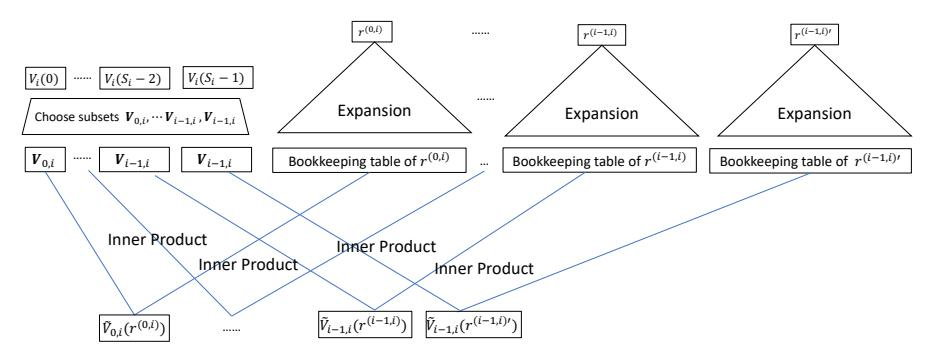
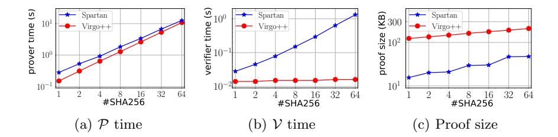

# Doubly Efficient Interactive Proofs for General Arithmetic Circuits with Linear Prover Time

Jiaheng Zhang\*, Tianyi Liu\*\*, Weijie Wang\*\*\*, Yinuo Zhang\*, Dawn Song\*, Xiang Xie<sup>†</sup>, Yupeng Zhang\*\*.

**Abstract.** We propose a new doubly efficient interactive proof protocol for general arithmetic circuits. The protocol generalizes the interactive proof for layered circuits proposed by Goldwasser, Kalai and Rothblum to arbitrary circuits, while preserving the optimal prover complexity that is strictly linear to the size of the circuits. The proof size remains succinct for low depth circuits and the verifier time is sublinear for structured circuits. We then construct a new zero knowledge argument scheme for general arithmetic circuits using our new interactive proof protocol together with polynomial commitments.

Our key technique is a new sumcheck equation that reduces a claim about the output of one layer to claims about its input only, instead of claims about all the layers above which inevitably incurs an overhead proportional to the depth of the circuit. We developed efficient algorithms for the prover to run this sumcheck protocol and to combine multiple claims back into one in linear time in the size of the circuit.

Not only does our new protocol achieve optimal prover complexity asymptotically, but it is also efficient in practice. Our experiments show that it only takes 0.3 seconds to generate the proof for a circuit with more than 600,000 gates, which is 13 times faster than the original interactive proof protocol on the corresponding layered circuit. The proof size is 208 kilobytes and the verifier time is 66 milliseconds. Our implementation can take general arithmetic circuits directly, without transforming them to layered circuits with a high overhead on the size of the circuit.

#### 1 Introduction

Interactive proofs allow a powerful yet untrusted prover to convince a verifier through a sequence of interactions that the result of a computation is correctly computed. Since they were introduced by Goldwasser, Micali, and Rackoff [15] in the 1980s, interactive proofs have expanded people's understanding on traditional static mathematical proofs and led to many important theoretical results in complexity theory, such as IP=PSPACE [16, 20] and MIP=NEXP [7].

<sup>\*</sup> University of California, Berkeley. **Email:** {jiaheng\_zhang,yinuo, dawnsong}@berkeley.edu.

<sup>\*\*</sup> Texas A&M University. **Email:** {tianyi,zhangyp}@tamu.edu.

<sup>\* \* \*</sup> Shanghai Jiao Tong University. **Email: wangnick@sjtu.edu.cn**.

<sup>†</sup> Shanghai Key Laboratory of Privacy-Preserving Computation. **Email:** xiexiang@matrixelements.com.

In recent years, there is great progress on turning interactive proofs from purely theoretical constructions to practical schemes with efficient implementations. In the seminal work of [14], Goldwasser, Kalai and Rothblum proposed doubly efficient interactive proofs where the prover can convince the verifier the correctness of the evaluation of a layered arithmetic circuit with addition gates and multiplication gates of fan-in two. The time for the prover to generate all the messages during the protocol (prover time) is a polynomial on the size of the circuit, and the time to validate the result (verifier time) is close to linear in the size of the input for log-space uniform circuits, thus the name "doubly efficient". The total communication between the prover and the verifier is only poly-logarithmic in the size of the circuit and linear in the depth of the circuit, which is *succinct* for bounded-depth circuits. We refer the protocol in [14] as the GKR protocol in this paper. Later, researchers spent great effort improving the concrete efficiency of the GKR protocol. The prover time was improved to quasi-linear  $(O(|C|\log|C|))$  in [13], and then to close to linear for various circuits with different structures [21, 23, 30]. Finally, in [26], Xie et al. proposed an algorithm to improve the prover time to strictly linear (O(|C|)) for layered arithmetic circuits without assuming any structures, which is asymptotically optimal and very efficient in practice.

Another important advance of interactive proofs is using them to construct efficient zero knowledge argument schemes. In [28], Zhang et al. first proposed to combine the GKR protocol with polynomial commitments to build argument systems, where the prover can further prove to the verifier the computations on the prover's witness, without sending the witness directly to the verifier. Following the framework, there are many subsequent zero knowledge argument constructions based on interactive proofs, including [18, 24, 26, 27, 29]. These schemes demonstrate great prover efficiency and can achieve sublinear verifier time for structured circuits, thanks to the advantages of the interactive proofs and the GKR protocol.

Despite the progress of the GKR protocol, a major drawback is that the protocol only works for layered arithmetic circuits. Each gate can only connect to the layer above, due to the layer-by-layer reduction of the GKR protocol. In practice, it introduces a high overhead to pad general circuits to layered circuits using relay gates. Asymptotically, the circuit size increases from O(|C|) to O(d|C|) where |C| is the size of the general circuit and d is the depth of the circuit. This is easily 1-2 orders of magnitude larger in practice as we show in our experiments, and introduces a big overhead on the prover time. Moreover, it is also inconvenient to implement circuits in a strictly layered way, and most existing tools such as rank-1-constraint-system (R1CS) cannot be used directly. Therefore, in this paper we ask the following question:

Is it possible to generalize the GKR protocol to directly support general circuits, without introducing any overhead on the prover time?

#### 1.1 Our Contributions

We answer the above question affirmatively by proposing a generalized doubly efficient interactive proofs for arbitrary arithmetic circuits, where each gate can take the output of any gate as input. The prover time is still linear to the size of the circuit, and is very efficient in practice. In particular, our contributions are:

- We generalize the GKR protocol to work on arbitrary arithmetic circuits efficiently for the first time. For a general circuit of size |C| and depth d, the prover time is O(|C|), the same as the original GKR protocol on a layered circuit with the same size. The overhead on the proof size and the verifier time is minimal. The proof size in our new protocol is  $\min\{O(d\log|C|+d^2), O(|C|)\}$ . For structured circuits, the verifier time is also  $\min\{O(d\log|C|+d^2), O(|C|)\}$ . Those in the original GKR are  $\min\{O(d\log|C|), O(|C|)\}$ .
- Together with zero knowledge polynomial commitments, we construct zero knowledge arguments for general arithmetic circuits. The zero knowledge version of our interactive proof protocols does not incur any overhead asymptotically on the prover time, the proof size and the verifier time compared to the plain version without zero knowledge.
- We fully implement a system, virgo++, for our new interactive proof protocols and zero knowledge arguments. We show that on random circuits with d=50 and d=75, our new protocols are 9-13× faster than the state-of-the-art GKR protocol on the corresponding layered circuits. The prover time per gate (the constant in the linear complexity) is only  $1.3\times$  more than the original GKR protocol on layered circuits. Therefore, as long as padding the general circuit to layered circuit makes the size  $1.3\times$  or larger, our new protocol will have faster prover time. The verifier time of our new protocols is  $17-25\times$  faster, while the proof size is only slightly larger than GKR on layered circuits.

#### 1.2 Technical Overview

The key idea of the GKR protocol is to write the values in the *i*-th layer of the circuit as an equation of the values in the previous layer i+1. Then starting from the output layer (layer 0),  $\mathcal{P}$  and  $\mathcal{V}$  reduce the correctness of the values in layer i to the correctness of the values in layer i+1 recursively, and eventually to the correctness of the input.  $\mathcal{V}$  can then validates the correctness of the input on her own, which completes the reduction and guarantees that the output is correctly computed. To do so, we use the notation of multilinear extension  $\tilde{V}_i()$  of the *i*-th layer in [22], which is a multilinear polynomial that agrees with all the values in the *i*-th layer on the Boolean hypercube, i.e.,  $\tilde{V}_i(0,0,\ldots,0) = \mathbf{V}_i[0], \tilde{V}_i(0,0,\ldots,1) = \mathbf{V}_i[1],\ldots$  where  $\mathbf{V}_i$  is the array representing the values in the *i*-th layer of the circuit. Assuming for simplicity that all layers have S gates and  $\tilde{V}$  takes  $s = \log S$  variables, we can write  $\tilde{V}_i()$  as a equation of  $\tilde{V}_{i+1}()$ :

$$\tilde{V}_{i}(z) = \sum_{x,y \in \{0,1\}^{s}} (\tilde{add}_{i+1}(z,x,y)(\tilde{V}_{i+1}(x) + \tilde{V}_{i+1}(y)) + \tilde{mult}_{i+1}(z,x,y)\tilde{V}_{i+1}(x)\tilde{V}_{i+1}(y))$$

for all  $z \in \{0,1\}^s$ , where  $add_{i+1}(z,x,y)$  and  $mult_{i+1}(z,x,y)$  are polynomials describing the addition/multiplication gates and their connections in the circuit between layer i and layer i+1. With this equation, the GKR protocol invokes the sumcheck protocol (See Section 2.2), which reduces the correctness of  $\tilde{V}_i(g)$  at a random point  $g \in \mathbb{F}^s$  to the correctness of  $\tilde{V}_{i+1}(u)$  and  $\tilde{V}_{i+1}(v)$  at two random points  $u, v \in \mathbb{F}^s$ . Then  $\tilde{V}_{i+1}(u)$  and  $\tilde{V}_{i+1}(v)$  can be combined back to a single evaluation of  $\tilde{V}_{i+1}(w)$  for  $w \in \mathbb{F}^s$ . At this point,  $\tilde{V}_{i+1}(w)$  can be further reduced to an evaluation of  $\tilde{V}_{i+2}$  using the same equation and protocol for layer i+1. Therefore, starting from the output layer,  $\mathcal{P}$  and  $\mathcal{V}$  perform the reduction layer by layer to the input layer, which can be validated by  $\mathcal{V}$  directly. The prover time is O(S) in each layer [26] and the proof size is only  $O(\log S)$ . Therefore, the total prover time is O(dS) = O(|C|) and the proof size is  $O(d\log S) = O(d\log |C|)$ .

Extending GKR to general circuits naively. The above equation relies on the fact that gates in layer i can only take input from gates in layer i+1. In a general circuit, a gate in layer i can take input from any gate in layer j for j>i. As circuits cannot contain cycles (otherwise we cannot get outputs of the circuit), we can still assign a layer number to each gate in the topological order. Thus a gate can take input from any gate in layers above, but not below. More interestingly, every gate in layer i has to have at least one input from layer i+1, otherwise it cannot belong to layer i in the topological order. Because of this generalization, we can write  $\tilde{V}_i()$  as:

$$\begin{split} \tilde{V}_{i}(z) &= \sum\nolimits_{x,y \in \{0,1\}^{s}} (a\tilde{d}d_{i+1,i+1}(z,x,y)(\tilde{V}_{i+1}(x) + \tilde{V}_{i+1}(y)) \\ &+ \tilde{mult}_{i+1,i+1}(z,x,y)(\tilde{V}_{i+1}(x)\tilde{V}_{i+1}(y)) \\ &+ a\tilde{d}d_{i+1,i+2}(z,x,y)(\tilde{V}_{i+1}(x) + \tilde{V}_{i+2}(y)) + \tilde{mult}_{i+1,i+2}(z,x,y)(\tilde{V}_{i+1}(x)\tilde{V}_{i+2}(y)) \\ &+ \ldots + a\tilde{d}d_{i+1,d}(z,x,y)(\tilde{V}_{i+1}(x) + \tilde{V}_{d}(y)) + \tilde{mult}_{i+1,d}(z,x,y)(\tilde{V}_{i+1}(x)\tilde{V}_{d}(y)). \end{split}$$

Namely, we have multiple parts in the summation, one for each layer  $j=i+1,i+2,\ldots,d$ .  $\mathcal{P}$  and  $\mathcal{V}$  run the sumcheck protocol on this equation, which reduces the correctness of  $\tilde{V}_i(g)$  at a random point  $g\in\mathbb{F}^s$  to the correctness of  $\tilde{V}_{i+1}(u)$  and  $\tilde{V}_{i+1}(v), \tilde{V}_{i+2}(v), \ldots, \tilde{V}_d(v)$  at random points  $u,v\in\mathbb{F}^s$ . Moreover, when reaching layer i+1, now  $\mathcal{V}$  has many evaluations about  $\tilde{V}_{i+1}$  instead of just two. In the sumcheck protocols of all layers below,  $\mathcal{V}$  has received one evaluation of  $\tilde{V}_{i+1}$  from the sumcheck of layer  $k=0,\ldots,i-1$ , and two evaluations from layer i. Nevertheless,  $\mathcal{V}$  can combine all these evaluations into one evaluation  $\tilde{V}_{i+1}(w)$  using the original protocol multiple times with  $\mathcal{P}$ .  $\mathcal{P}$  and  $\mathcal{V}$  can then run the protocol recursively layer by layer just as the original GKR protocol to reduce the correctness of the output layer to the input layer.

It is not hard to show that the generalized protocol is secure. However, it introduces a big overhead on the prover time. The size of all the polynomials in the generalized equation becomes O((d-i)S), and the total prover time for the sumcheck protocol of all layers becomes  $O(dS + (d-1)S + \ldots + S) = O(d^2S) = O(d|C|)$ . This is as bad as padding the general circuit to a layered circuit and running the original GKR protocol on it. Even worse, the second step of combining multiple evaluations into one also introduces a prover time of O(d|C|), because there are now i+1 evaluations to combine instead of two.

Extending GKR to general circuits with optimal prover time. In order to preserve the linear prover time, we introduce two new techniques. First, we observe that the key reason why the prover time of the sumcheck protocol on the generalized equation becomes O((d-i)S) is that the multilinear extension  $\tilde{V}_j$  of the entire layer j for j>i is used. As layer j has S gates and its multilinear extension is uniquely defined by these gates, merely writing out all the polynomials  $\tilde{V}_j$  for j>i takes O((d-i)S) time. There is no hope to reduce the prover time if we define the equation in this way. Meanwhile, it is also not necessary to use all the gates in layers above, because gates in layer i can at most take input from 2S gates in total. Therefore, we propose a new equation to write  $\tilde{V}_i$  as a function of multilinear extensions define by only those values used by layer i from layer j>i. In particular, we have

$$\begin{split} \tilde{V}_{i}(z) &= \sum_{x,y \in \{0,1\}^{s'}} (a\tilde{d}d_{i+1,i+1}(z,x,y)(\tilde{V}_{i,i+1}(x) + \tilde{V}_{i,i+1}(y)) \\ &+ \tilde{mu}lt_{i+1,i+1}(z,x,y)(\tilde{V}_{i,i+1}(x)\tilde{V}_{i,i+1}(y)) \\ &+ a\tilde{d}d_{i+1,i+2}(z,x,y)(\tilde{V}_{i,i+1}(x) + \tilde{V}_{i,i+2}(y)) + \tilde{mu}lt_{i+1,i+2}(z,x,y)\tilde{V}_{i,i+1}(x)\tilde{V}_{i,i+2}(y) \\ &+ \ldots + a\tilde{d}d_{i+1,d}(z,x,y)(\tilde{V}_{i,i+1}(x) + \tilde{V}_{i,d}(y)) + \tilde{mu}lt_{i+1,d}(z,x,y)\tilde{V}_{i,i+1}(x)\tilde{V}_{i,d}(y)), \end{split}$$

where  $\tilde{V}_{i,j}$  is the multilinear extension of values used by layer i from layer j for j > i arranged in a pre-defined order, i.e., a subset of the values in the entire layer j. Now the total size of the all these polynomials is bounded by 2S. We also change the range of the summation from  $\{0,1\}^s$  to  $\{0,1\}^{s'}$  to informally denote that now the number of variables is smaller. We will show how to deal with different sizes from different layers in our formal protocols. We then design a new algorithm for the prover to run the sumcheck protocol on the equation above with time complexity O(S) by utilizing the sparsity of the polynomials  $a\bar{d}d$  and  $m\bar{u}lt$ . The formal algorithms are presented in Section 3.2.

Combining evaluations of different multilinear extensions. At the end of the sumcheck protocol on the equation above,  $\mathcal{P}$  and  $\mathcal{V}$  reduce the correctness of  $\tilde{V}_i(g)$  at a random point  $g \in \mathbb{F}^s$  to the correctness of  $\tilde{V}_{i,i+1}(u)$  and  $\tilde{V}_{i,i+1}(v), \tilde{V}_{i,i+2}(v), \dots, \tilde{V}_{i,d}(v)$  at random points  $u, v \in \mathbb{F}^{s'}$ . When reaching layer i+1,  $\mathcal{V}$  has many evaluations of multilinear extensions of subsets of  $\mathbf{V}_{i+1}$ . Now we cannot even use the original protocol to combine these points into one, as they are evaluations of different multilinear extensions, not to mention that we want to reduce the complexity of the prover time in this step. Our second technique is to compute them using a layered arithmetic circuit and reduce these evaluations to a single evaluation of  $V_i$  through the original GKR protocol. At this point, the random points in these evaluations are already fixed by the verifier. We construct a circuit whose input is the values  $V_{i+1}$  of the entire layer i + 1, and all the random points in the evaluations, denoted as  $v^{(0)}, v^{(1)}, \dots, v^{(i)}$  and  $u^{(i)}$ . The output of the circuit is exactly the evaluations of the multilinear extensions of the subsets, received from the sumcheck protocols for all layers below, i.e.,  $\tilde{V}_{0,i+1}(v^{(0)})$ ,  $\tilde{V}_{1,i+1}(v^{(1)})$ , ...,  $\tilde{V}_{i,i+1}(v^{(i)})$  and  $\tilde{V}_{i,i+1}(u^{(i)})$ . To compute the output, the circuit selects all the subsets from input  $V_i$  and arrange them in the predefined order, which can be determined by the structure of the general circuit. The circuit then evaluates the multilinear extensions defined by these subsets at points from input  $v^{(0)}, v^{(1)}, \ldots, v^{(i)}$  and  $u^{(i)}$ . By executing the original GKR protocol on this circuit,  $\mathcal{P}$  and  $\mathcal{V}$  reduce the correctness of  $\tilde{V}_{0,i+1}(v^{(0)}), \tilde{V}_{1,i+1}(v^{(1)}), \ldots, \tilde{V}_{i,i+1}(v^{(i)})$  and  $\tilde{V}_{i,i+1}(u^{(i)})$  to a single evaluation of the input. As part of the input  $v^{(0)}, v^{(1)}, \ldots, v^{(i)}$  and  $u^{(i)}$  are known to the verifier, it is easy to subtract it from the evaluation and obtain  $\tilde{V}_i(w)$ , a single evaluation of the multilinear extension  $\tilde{V}_i$  at a random point  $w \in \mathbb{F}^s$ . With this single evaluation,  $\mathcal{P}$  and  $\mathcal{V}$  can continue the sumcheck for layer i+1 recursively and proceed all the way to the input layer. With proper design, we are able to bound the total size of this circuit in all rounds by O(|C|). Therefore, the prover complexity in this step is also O(|C|). See Figure 1 and Section 3.3 for the design of the circuit and the details of the protocol.

Furthermore, inspired by the structure of this circuit, we are able to design a single sumcheck protocol to combine multiple claims on the subsets to a single evaluation of  $\tilde{V}_i$  at a random point. This second approach further improves the prover time, the proof size and the verifier time. Putting the two steps together, we are able to construct a generalized GKR protocol for arbitrary arithmetic circuits while maintaining the optimal prover time of O(|C|).

Building zero knowledge arguments. Finally, following the framework of [12, 24, 26–28], we build zero knowledge arguments for general arithmetic circuits using our new protocol. We use the standard techniques of zero knowledge sumcheck and low degree extensions in [12, 26] to lift our generalized GKR protocol to be zero knowledge, and use the polynomial commitment scheme in [27] to make the protocol a zero knowledge argument.

#### <span id="page-5-0"></span>1.3 Related Work

Interactive proofs were formalized by Goldwasser, Micali, and Rackoff in [15]. In the seminal work of [14], Goldwasser et al. proposed the doubly efficient interactive proof for layered arithmetic circuits. Later, Cormode et al. improved the prover time of the GKR protocol from  $O(|C|^3)$  to  $O(|C|\log |C|)$  using multilinear extensions instead of low degree extensions in [13]. Several follow-up papers further reduce the prover time for circuits with special structures. Justin Thaler [21] introduced a protocol with O(|C|) prover time for regular circuits where the wiring pattern can be described in constant space and time. In the same work, a protocol with prove time  $O(|C|\log|C'|)$  was proposed for data parallel circuits with many copies of small circuits of size |C'|. The complexity was further improved to  $O(|C| + |C'| \log |C'|)$  by Wahby et al. in [23]. For circuits with many non-connected but different copies, Zhang et al. [30] showed a protocol with  $O(|C| \log |C'|)$  prover time. Eventually, Xie et al. [26] proposed a variant of the GKR protocol with O(|C|) prover time for arbitrary layered arithmetic circuits. All these existing works follow the layered structure of the GKR protocol and doubly efficient interactive proofs for general arithmetic circuits have not been considered before.

In [28], Zhang et al. extended the GKR protocol to an argument system using polynomial commitments. Subsequent works [18, 24, 26, 27, 29] followed the

framework and constructed efficient zero knowledge argument schemes based on interactive proofs. We follow the approach of [12, 26, 27] and constructs zero knowledge arguments for general circuits instead of layered circuits. Notably, there is a recent work [18] on constructing interactive proof-based zero knowledge arguments for R1CS. The protocol reduces the R1CS to a polynomial commitment on the entire extended witness of all the values in the circuit using one sumcheck. On the contrary, the GKR protocols reduce the evaluation of the circuit to only the input of the circuit. As the polynomial commitments are usually the overhead of the zero knowledge argument schemes, we expect that our scheme has faster prover time, while the scheme in [18] has smaller proof size. We give detailed comparisons in Section 5.2. In addition, the scheme in [18] cannot be used for delegation of computations, which is the original goal of the GKR protocols. In a recent manuscript [19], the proof size of the scheme in [18] is improved from square-root to logarithmic in the size of the R1CS instance, but the prover time is  $3.8 \times$  slower. In a different setting, Blumberg et al. [10] construct argument schemes using interactive proofs with two provers.

There is a rich literature of zero knowledge arguments other than schemes based on interactive proofs. Categorized by their underlying techniques, there are schemes based on quadratic arithmetic programs (QAP) [17], interactive oracle proofs (IOP) [9], discrete-log [11], MPC-in-the-head [6] and lattice [8]. We refer the readers to surveys [25] and recent papers [18] on zero knowledge proofs and arguments for a more comprehensive list of schemes.

#### 2 Preliminaries

We use  $\operatorname{\mathsf{negl}}(\cdot): \mathbb{N} \to \mathbb{N}$  to denote the negligible function, where for each positive polynomial  $f(\cdot)$ ,  $\operatorname{\mathsf{negl}}(k) < \frac{1}{f(k)}$  for sufficiently large integer k. Let  $\lambda$  denote the security parameter. "PPT" stands for probabilistic polynomial time. We use f(),g() for polynomials, x,y,z for vectors of variables and g,u,v for vectors of values.  $x_i$  denotes the i-th variable in x. We use bold letters such as  $\mathbf{A}$  to represent arrays. For a multivariate polynomial f, its "variable-degree" is the maximum degree of f in any of its variables.

### 2.1 Interactive Proofs

Interactive proofs. An interactive proof allows a prover  $\mathcal{P}$  to convince a verifier  $\mathcal{V}$  the validity of some statement. The interactive proof runs in several rounds, allowing  $\mathcal{V}$  to ask questions in each round based on  $\mathcal{P}$ 's answers of previous rounds. We phrase this in terms of  $\mathcal{P}$  trying to convince  $\mathcal{V}$  that C(x) = y. We formalize interactive proofs in the following:

**Definition 1.** Let C be a function. A pair of interactive machines  $\langle \mathcal{P}, \mathcal{V} \rangle$  is an interactive proof for f with soundness  $\epsilon$  if the following holds:

- Completeness. For every x such that C(x) = y it holds that  $\Pr[\langle \mathcal{P}, \mathcal{V} \rangle(x) = accept] = 1$ .

-  $\epsilon$ -Soundness. For any x with  $C(x) \neq y$  and any  $\mathcal{P}^*$  it holds that  $\Pr[\langle \mathcal{P}^*, \mathcal{V} \rangle = accept] \leq \epsilon$ 

We say an interactive proof scheme has succinct proof size (verifier time) if the total communication (verifier time) is O(polylog(|C|,|x|)).

#### <span id="page-7-0"></span>2.2 Doubly Efficient Interactive Proofs for Layered Circuits

In [14], Goldwasser et al. proposed an efficient interactive proof protocol for layered arithmetic circuits. We present the details of the protocol here.

<span id="page-7-2"></span>Sumcheck Protocol The GKR protocol uses the sumcheck protocol as a major building block. The problem is to sum a multivariate polynomial  $f: \mathbb{F}^{\ell} \to \mathbb{F}$  on the Boolean hypercube:  $\sum_{b_1,b_2,...,b_{\ell} \in \{0,1\}} f(b_1,b_2,...,b_{\ell})$ . Directly computing the sum requires exponential time in  $\ell$ , as there are  $2^{\ell}$  combinations of  $b_1,\ldots,b_{\ell}$ . Lund et al. [16] proposed a *sumcheck* protocol that allows a verifier  $\mathcal{V}$  to delegate the computation to a computationally unbounded prover  $\mathcal{P}$ , who can convince  $\mathcal{V}$  that H is the correct sum. We provide a description of the sumcheck protocol in Protocol 1.

<span id="page-7-1"></span>**Protocol 1** (Sumcheck). The protocol proceeds in  $\ell$  rounds.

- In the first round, P sends a univariate polynomial

$$f_1(x_1) \stackrel{def}{=} \sum_{b_2,\dots,b_\ell \in \{0,1\}} f(x_1,b_2,\dots,b_\ell),$$

 $\mathcal{V}$  checks  $H = f_1(0) + f_1(1)$ . Then  $\mathcal{V}$  sends a random challenge  $r_1 \in \mathbb{F}$  to  $\mathcal{P}$ .

- In the i-th round, where  $2 \le i \le \ell - 1$ ,  $\mathcal{P}$  sends a univariate polynomial

$$f_i(x_i) \stackrel{def}{=} \sum_{b_{i+1},\dots,b_{\ell} \in \{0,1\}} f(r_1,\dots,r_{i-1},x_i,b_{i+1},\dots,b_{\ell}),$$

V checks  $f_{i-1}(r_{i-1}) = f_i(0) + f_i(1)$ , and sends a random challenge  $r_i \in \mathbb{F}$  to  $\mathcal{P}$ .

– In the  $\ell$ -th round,  ${\mathcal P}$  sends a univariate polynomial

$$f_{\ell}(x_{\ell}) \stackrel{def}{=} f(r_1, r_2, \dots, r_{l-1}, x_{\ell}),$$

 $\mathcal{V}$  checks  $f_{\ell-1}(r_{\ell-1}) = f_{\ell}(0) + f_{\ell}(1)$ . The verifier generates a random challenge  $r_{\ell} \in \mathbb{F}$ . Given oracle access to an evaluation  $f(r_1, r_2, \ldots, r_{\ell})$  of  $f, \mathcal{V}$  will accept if and only if  $f_{\ell}(r_{\ell}) = f(r_1, r_2, \ldots, r_{\ell})$ . The instantiation of the oracle access depends on the application of the sumcheck protocol.

The proof size of the sumcheck protocol is  $O(\tau\ell)$ , where  $\tau$  is the variable-degree of f, as in each round,  $\mathcal P$  sends a univariate polynomial of one variable in f, which can be uniquely defined by  $\tau+1$  points. The verifier time of the protocol is  $O(\tau\ell)$ . The prover time depends on the degree and the sparsity of f, and we will give the complexity later in our scheme. The sumcheck protocol is complete and sound with  $\epsilon = \frac{\tau\ell}{\|\mathcal E\|}$ .

**Definition 2 (Multi-linear Extension).** Let  $V: \{0,1\}^{\ell} \to \mathbb{F}$  be a function. The multilinear extension of V is the unique polynomial  $\tilde{V}: \mathbb{F}^{\ell} \to \mathbb{F}$  such that  $\tilde{V}(x_1, x_2, ..., x_{\ell}) = V(x_1, x_2, ..., x_{\ell})$  for all  $x_1, x_2, ..., x_{\ell} \in \{0,1\}$ .  $\tilde{V}$  can be expressed as:

$$\tilde{V}(x_1, x_2, ..., x_\ell) = \sum_{b \in \{0,1\}^\ell} \prod_{i=1}^\ell ((1 - x_i)(1 - b_i) + x_i b_i) \cdot V(b),$$

where  $b_i$  is i-th bit of b.

**Multilinear extensions of arrays**. Inspired by the closed-form equation of the multilinear extension given above, we can view an array  $\mathbf{A} = (a_0, a_1, \dots, a_{n-1})$  as a function  $A : \{0,1\}^{\log n} \to \mathbb{F}$  such that  $\forall i \in [0, n-1], A(i_1, \dots, i_{\log n}) = a_i$ . Here we assume n is a power of 2. Therefore, in this paper, we abuse the use of multilinear extension on an array as the multilinear extension  $\tilde{A}$  of A.

**Definition 3 (Identity function).** Let  $\beta: \{0,1\}^{\ell} \times \{0,1\}^{\ell} \to \{0,1\}$  be the identity function such that  $\beta(x,y) = 1$  if x = y, and  $\beta(x,y) = 0$  otherwise. Suppose  $\tilde{\beta}$  is the multilinear extension of  $\beta$ . Then  $\tilde{\beta}$  can be expressed as:  $\tilde{\beta}(x,y) = \prod_{i=1}^{\ell} ((1-x_i)(1-y_i) + x_iy_i)$ .

**GKR Protocol.** Using the sumcheck protocol as a building block, Goldwasser et al. [14] showed an interactive proof protocol for layered arithmetic circuits. Let C be a layered arithmetic circuit with depth d over a finite field  $\mathbb{F}$ . Each gate in the i-th layer takes inputs from two gates in the (i+1)-th layer; layer 0 is the output layer and layer d is the input layer. The protocol proceeds layer by layer. Upon receiving the claimed output from  $\mathcal{P}$ , in the first round,  $\mathcal{V}$  and  $\mathcal{P}$  run the sumcheck protocol to reduce the claim about the output to a claim about the values in the layer above. In the i-th round, both parties reduce a claim about layer i-1 to a claim about layer i through the sumcheck protocol. Finally, the protocol terminates with a claim about the input layer d, which can be checked directly by  $\mathcal{V}$ . If the check passes,  $\mathcal{V}$  accepts the claimed output.

**Notation**. We follow the convention in prior works of GKR protocols [13, 21, 26–28]. We denote the number of gates in the *i*-th layer as  $S_i$  and let  $s_i = \lceil \log S_i \rceil$ . (For simplicity, we assume  $S_i$  is a power of 2, and we can pad the layer with dummy gates otherwise.) We then define a function  $V_i : \{0,1\}^{s_i} \to \mathbb{F}$  that takes a binary string  $b \in \{0,1\}^{s_i}$  and returns the output of gate b in layer i, where b is called the gate label. With this definition,  $V_0$  corresponds to the output of the circuit, and  $V_d$  corresponds to the input layer. Finally, we define two additional functions  $add_i, mult_i : \{0,1\}^{s_{i-1}+2s_i} \to \{0,1\}$ , referred to as wiring predicates in the literature.  $add_i \ (mult_i)$  takes one gate label  $z \in \{0,1\}^{s_{i-1}}$  in layer i-1 and two gate labels  $x, y \in \{0,1\}^{s_i}$  in layer i, and outputs 1 if and only if gate z is an addition (multiplication) gate that takes the output of gate x, y as input. With these definitions, for any  $z \in \{0,1\}^{s_i}$ ,  $V_i$  can be written as:

$$V_{i}(z) = \sum_{x,y \in \{0,1\}^{s_{i+1}}} (add_{i+1}(z,x,y)(V_{i+1}(x) + V_{i+1}(y)) + mult_{i+1}(z,x,y)V_{i+1}(x)V_{i+1}(y))$$
(1)

In the equation above,  $V_i$  is expressed as a summation, so  $\mathcal{V}$  can use the sumcheck protocol to check that it is computed correctly. As the sumcheck protocol operates on polynomials defined on  $\mathbb{F}$ , we rewrite the equation with their multilinear extensions:

<span id="page-9-0"></span>
$$\tilde{V}_{i}(g) = \sum_{x,y \in \{0,1\}^{s_{i+1}}} f_{i}(g,x,y) 
= \sum_{x,y \in \{0,1\}^{s_{i+1}}} (\tilde{add}_{i+1}(g,x,y)(\tilde{V}_{i+1}(x) + \tilde{V}_{i+1}(y)) 
+ \tilde{mult}_{i+1}(g,x,y)\tilde{V}_{i+1}(x)\tilde{V}_{i+1}(y)),$$
(2)

where  $g \in \mathbb{F}^{s_i}$  is a random vector.

**Protocol**. With Equation 2, the GKR protocol proceeds as following. The prover  $\mathcal{P}$  first sends the claimed output of the circuit to  $\mathcal{V}$ . From the claimed output,  $\mathcal{V}$  defines polynomial  $V_0$  and computes  $V_0(g)$  for a random  $g \in \mathbb{F}^{s_0}$ .  $\mathcal{V}$  and  $\mathcal{P}$ then invoke a sumcheck protocol on Equation 2 with i = 0. As described in Section 2.2, at the end of the sumcheck,  $\mathcal{V}$  needs an oracle access to  $f_i(g,u,v)$ , where u, v are randomly selected in  $\mathbb{F}^{s_{i+1}}$ . To compute  $f_i(g, u, v), \mathcal{V}$  computes  $\tilde{add}_{i+1}(g,u,v)$  and  $\tilde{mult}_{i+1}(g,u,v)$  locally (they only depend on the wiring pattern of the circuit, not on the values), asks  $\mathcal{P}$  to send  $\tilde{V}_1(u)$  and  $\tilde{V}_1(v)$  and computes  $f_i(g, u, v)$  to complete the sumcheck protocol. In this way,  $\mathcal{V}$  and  $\mathcal{P}$ reduce a claim about the output to two claims about values in layer 1.  $\mathcal{V}$  and  $\mathcal{P}$  could invoke two sumcheck protocols on  $V_1(u)$  and  $V_1(v)$  recursively to layers above, but the number of the sumcheck protocols would increase exponentially. Combining two claims using a random linear combination. One way to combine two claims  $V_i(u)$  and  $V_i(v)$  is using random linear combinations, as proposed in [12, 24]. Upon receiving the two claims  $\tilde{V}_i(u)$  and  $\tilde{V}_i(v)$ ,  $\mathcal{V}$  selects  $\alpha_{i,1}, \alpha_{i,2} \in \mathbb{F}$  randomly and computes  $\alpha_{i,1} \tilde{V}_i(u) + \alpha_{i,2} \tilde{V}_i(v)$ . Based on Equation 2, this random linear combination can be written as

$$\alpha_{i,1}\tilde{V}_{i}(u) + \alpha_{i,2}\tilde{V}_{i}(v)$$

$$=\alpha_{i,1}\sum_{x,y\in\{0,1\}^{s_{i+1}}} (a\tilde{d}d_{i+1}(u,x,y)(\tilde{V}_{i+1}(x) + \tilde{V}_{i+1}(y)) + m\tilde{u}lt_{i+1}(u,x,y)\tilde{V}_{i+1}(x)\tilde{V}_{i+1}(y))$$

$$+\alpha_{i,2}\sum_{x,y\in\{0,1\}^{s_{i+1}}} (a\tilde{d}d_{i+1}(v,x,y)(\tilde{V}_{i+1}(x) + \tilde{V}_{i+1}(y)) + m\tilde{u}lt_{i+1}(v,x,y)\tilde{V}_{i+1}(x)\tilde{V}_{i+1}(y))$$

$$=\sum_{x,y\in\{0,1\}^{s_{i+1}}} ((\alpha_{i,1}a\tilde{d}d_{i+1}(u,x,y) + \alpha_{i,2}a\tilde{d}d_{i+1}(v,x,y))(\tilde{V}_{i+1}(x) + \tilde{V}_{i+1}(y))$$

$$+ (\alpha_{i,1}m\tilde{u}lt_{i+1}(u,x,y) + \alpha_{i,2}m\tilde{u}lt_{i+1}(v,x,y))\tilde{V}_{i+1}(x)\tilde{V}_{i+1}(y))$$

$$(3)$$

<span id="page-9-1"></span> $\mathcal{V}$  and  $\mathcal{P}$  then execute the sumcheck protocol on Equation 3 instead of Equation 2. At the end of the sumcheck protocol,  $\mathcal{V}$  still receives two claims about  $\tilde{V}_{i+1}$ , computes their random linear combination and proceeds to the layer above recursively until the input layer.

<span id="page-9-2"></span>The formal GKR protocol is presented in Protocol 4 in Appendix A. With the optimal algorithms with a linear prover time proposed in [26], we have the following theorem:

**Theorem 1.** [26]. Let  $C : \mathbb{F}^n \to \mathbb{F}^k$  be a depth-d layered arithmetic circuit. Protocol 4 is an interactive proof for the function computed by C with soundness  $O(d \log |C|/|\mathbb{F}|)$ . It uses  $O(d \log |C|)$  rounds of interaction and the running time of the prover  $\mathcal{P}$  is O(|C|). Let T be the time to evaluate all  $a\tilde{d}d_i$  and  $m\tilde{u}lt_i$  at the corresponding random points, the running time of  $\mathcal{V}$  is  $O(n+k+d \log |C|+T)$ .

### 3 Generalizing GKR to Arbitrary Arithmetic Circuits

Though the GKR protocol has great prover efficiency as demonstrated in [21, 23, 26, 27] and is used as a major building block to construct fast zero knowledge proof schemes, one major drawback is that the protocol only works for layered arithmetic circuits, i.e., each gate can only take input from the layer above. In this section, we show how to generalize the GKR protocol to arbitrary circuits with no overhead on the prover time.

We consider a general arithmetic circuit C with fan-in 2, which can be viewed as a directed acyclic graph (DAG),  $G_C$ . Each gate in C is a vertex in  $G_C$  and each wire is a directed edge in  $G_C$ . The in-degree of each vertex is at most 2. The depth of the circuit d is defined as the length of the longest path in the DAG. Without loss of generality, we assume that all input gates are at layer d, and all output gates are at layer 0.1 Following the order to evaluate the circuit, we can actually assign a layer number to each gate topologically. In particular, if gate g is not an input, suppose gate u and gate v are the input gates of g, then  $\text{layer}(g) = \min(\text{layer}(u), \text{layer}(v)) - 1$ , where the function layer(x) represents the layer of the gate v. Because of this definition, an interesting observation is that a gate at layer v must take at least one input from layer v can only take input from layer v such that v is a gate at layer v can only take input from layer v such that v is an input from layer v and v is a gate at layer v and v and v is a gate at layer v and v is a gate at layer v and v is a gate at layer v and v is a gate at layer v and v is a gate at layer v and v is a gate at layer v and v is a gate at layer v and v is a gate at layer v and v is a gate at layer v and v is a gate at layer v and v is a gate at layer v and v is a gate at layer v and v is a gate at layer v and v is a gate at layer v and v is a gate at layer v and v is a gate at layer v and v is a gate at layer v and v is a gate v and v is a gate v is a gate v and v is a gate v is a gate v and v is a gate v and v is a gate v is a gate v in v in v in v is a gate v in v in v in v in v in v in v in v in v in v in v in v in v in v in v in v in v in v in v in v in v in v in v in v in v in v in v in v in v in v in v in v in v in v

Same as the original GKR protocol, we use  $S_i$  as the number of gates in the i-th layer and  $s_i = \lceil \log S_i \rceil$ . For simplicity, we assume  $S_i$  is a power of 2, and we can pad the layer with dummy gates otherwise. The function  $V_i$  takes a binary string b and outputs the b-th gate value in layer i of C. As now every gate can take input from any layer above, we generalize the notations naturally and define  $add_{i,j}, mult_{i,j}: \{0,1\}^{s_{i-1}, s_i, s_j} \to \{0,1\}$  as the wiring-predicate functions for the general circuit C.  $add_{i,j}$  takes one gate label  $z \in \{0,1\}^{s_{i-1}}$  in layer i-1, one gate label  $x \in \{0,1\}^{s_i}$  in layer i and one gate label  $y \in \{0,1\}^{s_j}$  in layer j for  $j \geq i$ , and outputs 1 if and only if gate z is an addition gate that takes the output of gate x, y as input.  $mult_{i,j}$  is defined similarly for multiplication gates. We still use  $\tilde{f}$  to represent the multilinear extensions of the function f.

#### <span id="page-10-1"></span>3.1 A Naive Generalization of the GKR Protocol

With these definitions, we first describe a naive generalization of the GKR protocol to general arithmetic circuits. We follow the core idea of the GKR protocol

<span id="page-10-0"></span><sup>&</sup>lt;sup>1</sup> Note that as we support general circuits, it takes at most one relay gate per input/output to transform an arbitrary circuit to a circuit with such property. Thus the overhead is small and we assume so for simplicity.

to reduce the claim about  $V_i$  layer by layer via the sumcheck protocol. In a general circuit, a gate in layer i can take the output of any gate in layer i+1 to d, thus we simply extend Equation 2 to have one add and one mult for each layer above. Recall from above that every gate at layer i must have at least one input from layer i+1, we assume that this is the left input and rewrite the sumcheck equation in Equation 2 as:

<span id="page-11-0"></span>
$$\begin{split} \tilde{V}_{i}(g) &= \sum_{x \in \{0,1\}^{s_{i+1}}} \left( \sum_{y \in \{0,1\}^{s_{i+1}}} a\tilde{d}d_{i+1,i+1}(g,x,y) (\tilde{V}_{i+1}(x) + \tilde{V}_{i+1}(y)) \right. \\ &+ \sum_{y \in \{0,1\}^{s_{i+2}}} a\tilde{d}d_{i+1,i+2}(g,x,y) (\tilde{V}_{i+1}(x) + \tilde{V}_{i+2}(y)) \\ &+ \ldots + \sum_{y \in \{0,1\}^{s_d}} a\tilde{d}d_{i+1,d}(g,x,y) (\tilde{V}_{i+1}(x) + \tilde{V}_{d}(y)) \\ &+ \sum_{y \in \{0,1\}^{s_{i+1}}} \tilde{mult}_{i+1,i+1}(g,x,y) (\tilde{V}_{i+1}(x)\tilde{V}_{i+1}(y)) \\ &+ \sum_{y \in \{0,1\}^{s_{i+2}}} \tilde{mult}_{i+1,i+2}(g,x,y) (\tilde{V}_{i+1}(x)\tilde{V}_{i+2}(y)) \\ &+ \ldots + \sum_{y \in \{0,1\}^{s_d}} \tilde{mult}_{i+1,d}(g,x,y) (\tilde{V}_{i+1}(x)\tilde{V}_{d}(y))) \end{split} \tag{4}$$

for any  $g \in \mathbb{F}^{s_i}$ . With this equation, starting from the output layer, in round i, the first step is that  $\mathcal{P}$  and  $\mathcal{V}$  engage the sumcheck protocol on Equation 4 to reduce one claim about layer i to claims about previous layers. At the end of the sumcheck protocol,  $\mathcal{P}$  sends  $\mathcal{V}$  evaluations of  $\tilde{V}_{i+1}(u), \tilde{V}_{i+1}(v), \tilde{V}_{i+2}(v), \dots, \tilde{V}_{d}(v)$  on the randomness of u and v.  $\mathcal{V}$  evaluates all add and mult on her own and completes the last round of the sumcheck protocol.

In the second step, when going to a new layer,  $\mathcal{P}$  and  $\mathcal{V}$  need to combine multiple claims about this layer. Here in the naive approach, we use the same method of random linear combinations. When reaching layer i,  $\mathcal{V}$  has received the claims about  $\tilde{V}_i$  from layer  $0, 1, \ldots, i-1$  (twice for i-1). Denote the randomness of these claims as  $g^{(0)}, g^{(1)}, \ldots, g^{(i)}$ .  $\mathcal{V}$  picks a random number  $\alpha_{i,j}$  for each claim, and we can rewrite Equation 4 as:

<span id="page-11-1"></span>
$$\alpha_{i,0}\tilde{V}_{i}(g^{(0)}) + \alpha_{i,1}\tilde{V}_{i}(g^{(1)}) + \dots + \alpha_{i,i}\tilde{V}_{i}(g^{(i)})$$

$$= \sum_{j=0}^{i} \alpha_{i,j} \Big( \sum_{x \in \{0,1\}^{s_{i+1}}} (\sum_{y \in \{0,1\}^{s_{i+1}}} \tilde{add}d_{i+1,i+1}(g^{(j)}, x, y)(\tilde{V}_{i+1}(x) + \tilde{V}_{i+1}(y))$$

$$+ \dots + \sum_{y \in \{0,1\}^{s_d}} \tilde{add}d_{i+1,d}(g^{(j)}, x, y)(\tilde{V}_{i+1}(x) + \tilde{V}_{d}(y))$$

$$+ \sum_{y \in \{0,1\}^{s_{i+1}}} \tilde{mult}_{i+1,i+1}(g^{(j)}, x, y)(\tilde{V}_{i+1}(x)\tilde{V}_{i+1}(y))$$

$$+ \dots + \sum_{y \in \{0,1\}^{s_d}} \tilde{mult}_{i+1,d}(g^{(j)}, x, y)(\tilde{V}_{i+1}(x)\tilde{V}_{d}(y)))\Big)$$
(5)

 $\mathcal{V}$  and  $\mathcal{P}$  then execute the sumcheck protocol on Equation 5 instead of Equation 4. At the end of the sumcheck protocol,  $\mathcal{V}$  still receives claims about  $\tilde{V}_{i+1}, \tilde{V}_{i+2}, \ldots, \tilde{V}_d$ . For layer i+1,  $\mathcal{V}$  computes their random linear combination and proceeds to the sumcheck protocol for layer i+1 recursively.

This protocol is a direct generalization of the GKR protocol in Protocol 4, and it is not hard to see that the protocol is sound. Unfortunately, it introduces a big overhead on the prover time. First, in the beginning of the sumcheck protocol on Equation 4, the equation is defined over the multilinear extensions

 $\tilde{V}_{i+1}, \tilde{V}_{i+2}, \dots, \tilde{V}_d$ . Hence, the prover time in this step is at least  $O(S_{i+1} + S_{i+2} + \dots + S_d)$ . In fact, merely listing these polynomials and evaluating them at random points already take  $O(S_{i+1} + S_{i+2} + \dots + S_d)$  time, not to mention the prover time of the sumcheck protocol. Therefore, the total prover time is  $O(dS_d + (d-1)S_{d-1} + \dots + S_1) = O(d|C|)$  for all layers. There is a multiplicative overhead of d on the prover time, which is in fact as bad as transforming the general circuit to a layered circuit. Second, in the step of random linear combinations, as shown in Equation 5, V combines i+1 claims together for layer i. On the right hand side of the equation, each add and mult has to be evaluated on i+1 different random points  $g^{(j)}$ . This again introduces a prover time of O(d|C|). Therefore, overall the prover time of this naive generalized GKR protocol is O(d|C|), as slow as naively transforming the general circuit to a layered circuit.

In the next two subsections, we will show how to remove the overhead of each of the two steps.

#### <span id="page-12-0"></span>3.2 Sumcheck with Linear Prover Time

As explained above, the main overhead of the sumcheck on Equation 4 in the first step comes from the fact that each layer can connect to all layers above in a general circuit, and defining  $\tilde{V}_{i+1}, \tilde{V}_{i+2}, \ldots, \tilde{V}_d$  already blows up the complexity. Therefore, instead of using the multilinear extension of the entire layer, we define the multilinear extension of only those gates used in layer i from a previous layer. As each gate only has two input gates, there are at most  $2S_i$  gates connecting to gates in layer i in total. In this way, the total size of these multilinear extensions is bounded by  $O(S_i)$ .

Formally speaking, we also generalize the definitions of S and s such that  $S_{i,j}$  denotes the number of gates connecting from layer j (j > i) to layer i, and  $s_{i,j} = \lceil \log S_{i,j} \rceil$ . We then introduce a new function  $V_{i,j} : \{0,1\}^{s_{i,j}} \to \mathbb{F}$ , which is defined by the subset of gates from layer j connecting to layer i in a pre-defined order. The function takes a binary string  $b \in \{0,1\}^{s_{i,j}}$  and returns the b-th value in this subset. We also re-define  $add_{i,j}, mult_{i,j} : \{0,1\}^{s_{i-1}+s_{i-1,i}+s_{i-1,j}} \to \{0,1\}$  to take labels from the subsets instead of the labels of the entire layers. In particular,  $add_{i,j}(z,x,y) = 1$   $(multi_{i,j}(z,x,y) = 1)$  if and only if gate z in layer i-1 is the addition (multiplication) of value  $V_{i-1,i}(x)$  and  $V_{i-1,j}(y)$ . With these definitions, by taking their multilinear extensions, we can rewrite Equation 4 as

<span id="page-12-1"></span>
$$\tilde{V}_{i}(g) = \sum_{x \in \{0,1\}^{s_{i,i+1}}} \left( \sum_{y \in \{0,1\}^{s_{i,i+1}}} a\tilde{d}d_{i+1,i+1}(g,x,y) (\tilde{V}_{i,i+1}(x) + \tilde{V}_{i,i+1}(y)) + \right. \\
+ \dots + \sum_{y \in \{0,1\}^{s_{i,d}}} a\tilde{d}d_{i+1,d}(g,x,y) (\tilde{V}_{i,i+1}(x) + \tilde{V}_{i,d}(y)) \\
+ \sum_{y \in \{0,1\}^{s_{i,i+1}}} \tilde{mult}_{i+1,i+1}(g,x,y) (\tilde{V}_{i,i+1}(x)\tilde{V}_{i,i+1}(y)) \\
+ \dots + \sum_{y \in \{0,1\}^{s_{i,d}}} \tilde{mult}_{i+1,d}(g,x,y) (\tilde{V}_{i,i+1}(x)\tilde{V}_{i,d}(y)))$$
(6)

In Equation 6, the size of  $\tilde{V}_{i,i+1}, \ldots, \tilde{V}_{i,d}$  are bounded by  $O(S_i)$ . Moreover, the  $\tilde{add}$  and  $\tilde{mult}$  polynomials are still sparse. In fact, the total number of nonzeros

in all  $\tilde{add}$  and  $\tilde{mult}$  together is  $S_i$ . Therefore, using similar ideas proposed in [26], we are able to develop an algorithm for the prover to run the sumcheck in linear time  $O(S_i)$ , instead of  $O(S_i + S_{i+1} + \ldots + S_d)$ .

Before presenting the linear-time algorithm, we make one more refinement on the equation. Note that Equation 6 consists of multiple sums, because the number of gates connecting from layer j > i to layer i is different for each j. We cannot pad them to the same length, as it would introduce an overhead asymptotically. We combine them into a single sum in the following way. Without loss of generality, we suppose  $s_{i,i+1}$  is the largest. We can then rewrite Equation 6 as:

<span id="page-13-0"></span>
$$\begin{split} \tilde{V}_{i}(g) &= \sum_{x,y \in \{0,1\}^{s_{i},i+1}} (a\tilde{d}d_{i+1,i+1}(g,x,y)(\tilde{V}_{i,i+1}(x) + \tilde{V}_{i,i+1}(y_{1},\ldots,y_{s_{i,i+1}})) \\ &+ y_{s_{i,i+2}+1} \cdot \ldots \cdot y_{s_{i,i+1}} a\tilde{d}d_{i+1,i+2}(g,x,y_{1},\ldots,y_{s_{i,i+2}})(\tilde{V}_{i,i+1}(x) + \tilde{V}_{i,i+2}(y_{1},\ldots,y_{s_{i,i+2}})) \\ &+ \ldots + y_{s_{i,d}+1} \cdot \ldots \cdot y_{s_{i,i+1}} a\tilde{d}d_{i+1,d}(g,x,y_{1},\ldots,y_{s_{i,d}})(\tilde{V}_{i,i+1}(x) + \tilde{V}_{i,d}(y_{1},\ldots,y_{s_{i,d}})) \\ &+ m\tilde{u}lt_{i+1,i+1}(g,x,y)(\tilde{V}_{i,i+1}(x)\tilde{V}_{i,i+1}(y_{1},\ldots,y_{s_{i,i+1}})) \\ &+ y_{s_{i,i+2}+1} \cdot \ldots \cdot y_{s_{i,i+1}} m\tilde{u}lt_{i+1,i+2}(g,x,y_{1},\ldots,y_{s_{i,i+2}})\tilde{V}_{i,i+1}(x)\tilde{V}_{i,i+2}(y_{1},\ldots,y_{s_{i,i+2}}) \\ &+ \ldots + y_{s_{i,d}+1} \cdot \ldots \cdot y_{s_{i,i+1}} m\tilde{u}lt_{i+1,d}(g,x,y_{1},\ldots,y_{s_{i,d}})\tilde{V}_{i,i+1}(x)\tilde{V}_{i,d}(y_{1},\ldots,y_{s_{i,d}})) \end{split}$$

Note that the only difference between Equation 6 and 7 is that in Equation 7 all the sums are over  $y \in \{0,1\}^{s_{i,i+1}}$ , the longest binary string. For  $j=i+2,\ldots,d$ , as  $a\bar{d}d_{i+1,j}$ ,  $m\bar{u}lt_{i+1,j}$  and  $\tilde{V}_{i,j}$  only take  $y_1,\ldots,y_{s_{i,j}}$ , we multiply each term with  $y_{s_{i,j}+1} \cdot y_{s_{i,j}+2} \cdot \ldots \cdot y_{s_{i,i+1}}$ . This guarantees that the term only appears once in the sum, when  $y_{s_{i,j}+1} = y_{s_{i,j}+2} = \ldots = y_{s_{i,i+1}} = 1$ , and thus Equation 7 holds. In fact,  $y_{s_{i,j}+1} \cdot y_{s_{i,j}+2} \cdot \ldots \cdot y_{s_{i,i+1}}$  is exactly the identity polynomial  $\tilde{\beta}((y_{s_{i,j}+1}, y_{s_{i,j}+2}, \ldots, y_{s_{i,i+1}}), 1)$ . In this way, we do not have to pad all the polynomials to the same size. We only pad the size of each subset to the nearest power of 2, which incurs at most an overhead of 2.

Next, we present an algorithm for  $\mathcal{P}$  to run the sumcheck protocol on Equation 7 in linear time. We start with an algorithm to run sumcheck for the product of two multilinear polynomials in the literature, which we will use as a major building block.

Linear-time sumcheck for products of multilinear functions [21]. In [21], Thaler proposed a linear-time algorithm for the prover of the sumcheck protocol on the product of two multilinear polynomials f and g with  $\ell$  variables (the algorithm runs in  $O(2^{\ell})$  time). We present the algorithm in Algorithm 2. Algorithm 2 invokes Algorithm 1 FunctionEvaluations() as a subroutine. The algorithms are exactly the same as Algorithm 1 and 3 in [26]. Both Algorithm 1 and Algorithm 2 run in time  $O(2^{\ell})$  and the formal proof can be found in [21, 26]. We have a lemma as follows:

<span id="page-13-1"></span>**Lemma 1.** Given multilinear functions f and g on  $\ell$  variables and a book-keeping table  $\mathbf{A}_f$  for f and a bookkeeping table  $\mathbf{A}_g$  for g, the prover in Protocol 1 for  $f \cdot g$  runs in  $O(2^{\ell})$  time.  $\mathbf{A}_f = (f(0, \ldots, 0), \ldots, f(1, \ldots, 1))$  and  $\mathbf{A}_g = (g(0, \ldots, 0), \ldots, g(1, \ldots, 1))$  are initialized with evaluations of f and g on the Boolean hypercube, respectively.

## <span id="page-14-0"></span>**Algorithm 1** $\mathcal{F} \leftarrow \mathsf{FunctionEvaluations}(f, \mathbf{A}, r_1, \dots, r_\ell)$

Input: Multilinear f on  $\ell$  variables, initial bookkeeping table  $\mathbf{A}$ , random  $r_1, \ldots, r_{\ell}$ ; Output: All function evaluations  $f(r_1, \ldots, r_{i-1}, t, b_{i+1}, \ldots, b_{\ell})$ ;

```
1: for i=1,\ldots,\ell do

2: for b\in\{0,1\}^{\ell-i} do  // b is both a number and its binary representation.

3: for t=0,1,2 do

4: Let f(r_1,\ldots,r_{i-1},t,b)=\mathbf{A}[b]\cdot(1-t)+\mathbf{A}[b+2^{\ell-i}]\cdot t

5: \mathbf{A}[b]=\mathbf{A}[b]\cdot(1-r_i)+\mathbf{A}[b+2^{\ell-i}]\cdot r_i

6: Let \mathcal F contain all function evaluations f(.) computed at Step 4

7: return \mathcal F
```

# **Algorithm 2** $\{a_1, \ldots, a_\ell\} \leftarrow \mathsf{SumCheckProduct}(f, \mathbf{A}_f, g, \mathbf{A}_g, r_1, \ldots, r_\ell)$

**Input:** Multilinear f and g, initial bookkeeping tables  $\mathbf{A}_f$  and  $\mathbf{A}_g$ , random  $r_1, \ldots, r_\ell$ ; **Output:**  $\ell$  sumcheck messages for  $\sum_{x \in \{0,1\}^\ell} f(x)g(x)$ . Each message  $a_i$  consists of 3 elements  $(a_{i0}, a_{i1}, a_{i2})$ ;

```
1: \mathcal{F} \leftarrow \text{FunctionEvaluations}(f, \mathbf{A}_f, r_1, \dots, r_\ell)

2: \mathcal{G} \leftarrow \text{FunctionEvaluations}(g, \mathbf{A}_g, r_1, \dots, r_\ell)

3: \mathbf{for} \ i = 1, \dots, \ell \ \mathbf{do}

4: \mathbf{for} \ t \in \{0, 1, 2\} \ \mathbf{do}

5: a_{it} = \sum_{b \in \{0, 1\}^{\ell-i}} f(r_1, \dots, r_{i-1}, t, b) \cdot g(r_1, \dots, r_{i-1}, t, b)
\nevaluations needed are in \mathcal{F} and \mathcal{G}.

6: \mathbf{return} \ \{a_1, \dots, a_\ell\};
```

Linear-time sumcheck for Equation 7. The idea of the prover algorithm is similar to that proposed in [26]. The algorithm proceeds in two phases, one summing x and the other summing y. For the ease of presentation, let us consider the sumcheck on a particular class of equations:

<span id="page-14-1"></span>
$$\sum_{x,y\in\{0,1\}^{\ell}} y_{k_1+1} \dots y_{\ell} f_1(g,x,y_1,\dots,y_{k_1}) s_1(y_1,\dots,y_{k_1}) t(x) + y_{k_2+1} \dots y_{\ell} f_2(g,x,y_1,\dots,y_{k_2}) s_2(y_1,\dots,y_{k_2}) t(x) + \dots + y_{k_m+1} \dots y_{\ell} f_m(g,x,y_1,\dots,y_{k_m}) s_m(y_1,\dots,y_{k_m}) t(x),$$
(8)

for a fixed point  $g \in \mathbb{F}^{\ell}$ , where  $t(x) : \mathbb{F}^{\ell} \to \mathbb{F}$  and  $s_i(x) : \mathbb{F}^{k_i} \to \mathbb{F}$  are multilinear extensions of arrays  $\mathbf{A}_t$  and  $\mathbf{A}_{s_i}$ , and all functions of  $f_i(x) : \mathbb{F}^{2\ell+k_i} \to \mathbb{F}$  are multilinear extensions of sparse arrays with  $O(2^{\ell})$  nonzero elements in total. In addition, we require that  $2^{k_1} + 2^{k_2} + \ldots + 2^{k_m} = 2^{\ell}$ . It is not hard to see that Equation 7 satisfies these properties, as there are at most  $S_i$  left input gates and  $S_i$  right input gates connected to layer i in the circuit C. If we set  $\ell = s_i = \lceil \log S_i \rceil$ , we have  $2^{k_1} + 2^{k_2} + \ldots + 2^{k_m} = O(S_i)$  in Equation 7.

We use the same intuition in [26] of dividing the sumcheck process into two phases, one is for x and the other is for y. We rewrite Equation 8 as follows

<span id="page-15-1"></span>**Algorithm 3**  $\mathbf{A}_{h_q} \leftarrow \mathsf{Initialize\_PhaseOne}(f_1, \dots, f_m, s_1, \dots, s_m, \mathbf{A}_{s_1}, \dots, \mathbf{A}_{s_m}, g)$ **Input:** Multilinear  $f_1, \ldots, f_m$  and  $s_1, \ldots, s_m$ , initial bookkeeping tables  $\mathbf{A}_{s_1}, \ldots, \mathbf{A}_{s_m}$ , random  $g = g_1, \ldots, g_\ell$ ; We have  $|\mathbf{A}_{s_1}| + \ldots + |\mathbf{A}_{s_m}| = 2^\ell$ . Output: Bookkeeping table  $\mathbf{A}_{h_q}$ ; // G is an array of size  $2^{\ell}$ . 1: **procedure**  $G \leftarrow \mathsf{Precompute}(q)$ 2: Set **G**[0] = 1 for  $i = 0, ..., \ell - 1$  do 3: 4: for  $b \in \{0,1\}^i$  do  $\mathbf{G}[b,0] = \mathbf{G}[b] \cdot (1 - g_{i+1})$ 5:  $\mathbf{G}[b,1] = \mathbf{G}[b] \cdot g_{i+1}$ 7:  $\forall x \in \{0,1\}^{\ell}$ , set  $\mathbf{A}_{h_q}[x] = 0$ 8: for every (z, x, y) such that  $f'_i(z, x, y)$  is non-zero do  $\mathbf{A}_{h_q}[x] = \mathbf{A}_{h_q}[x] + \mathbf{G}[z] \cdot f_i'(z, x, y) \cdot \mathbf{A}_{s_i}[y_1, \dots, y_{k_i}]$ 10: return  $\mathbf{A}_{h_a}$ ;

 $\sum_{x\in\{0,1\}^{\ell}} t(x)h_g(x)$ , where

$$h_{g}(x) = \sum_{y \in \{0,1\}^{\ell}} (y_{k_{1}+1} \dots y_{\ell} f_{1}(g, x, y_{1}, \dots, y_{k_{1}}) s_{1}(y_{1}, \dots, y_{k_{1}}) + y_{k_{2}+1} \dots y_{\ell} f_{2}(g, x, y_{1}, \dots, y_{k_{2}}) s_{2}(y_{1}, \dots, y_{k_{2}}) + \dots + y_{k_{m}+1} \dots y_{\ell} f_{m}(g, x, y_{1}, \dots, y_{k_{m}}) s_{m}(y_{1}, \dots, y_{k_{m}}))$$

$$(9)$$

**Phase one**. With the formula above, in the first  $\ell$  rounds, the prover and the verifier are running exactly a sumcheck on the product of two multilinear polynomials  $t(x) \cdot h_g(x)$ , since functions t and  $h_g$  can be viewed as functions only in x, and y can be considered constant (it is always summed on the Boolean hypercube). To compute the sumcheck messages for the first  $\ell$  rounds, given their bookkeeping tables, this will take  $O(2^{\ell})$  time by Lemma 1. It remains to show how to initialize the bookkeeping tables in linear time.

#### Initializing the bookkeeping tables:

Initializing the bookkeeping table for t in  $O(2^{\ell})$  time is trivial, since t is a multilinear extension of an array and therefore the evaluations on the hypercube are known. Initializing the bookkeeping table for  $h_g$  in  $O(2^{\ell})$  time is more challenging, but we can take advantage of the sparsity of  $f_i$ .

**Lemma 2.** Let  $\mathcal{N}_x$  be the set of  $(z,y) \in \{0,1\}^{2\ell}$  such that  $f_i'(z,x,y) = y_{k_i+1} \dots y_{\ell}$   $f_i(z,x,y_1,\dots,y_{k_i})$  is non-zero for some  $1 \leq i \leq m$ . Then for all  $x \in \{0,1\}^{\ell}$ , it is  $h_g(x) = \sum_{(z,y) \in \mathcal{N}_x} \tilde{\beta}(g,z) \cdot (\sum_{i=1}^m f_i'(z,x,y) \cdot s_i(y_1,\dots,y_{k_i}))$ .

*Proof.* Since  $f_i$  is a multilinear extension, as shown in [21], we have  $f'_i(g, x, y) = \sum_{z \in \{0,1\}^{\ell}} \tilde{\beta}(g, z) f'_i(z, x, y)$ . Therefore,

<span id="page-15-0"></span>
$$h_g(x) = \sum_{z \in \{0,1\}^{\ell}} \tilde{\beta}(g,z) \cdot (\sum_{i=1}^{m} f_i'(z,x,y) \cdot s_i(y_1,\dots,y_{k_i}))$$
  
= 
$$\sum_{(z,y) \in \mathcal{N}_r} \tilde{\beta}(g,z) \cdot (\sum_{i=1}^{m} f_i'(z,x,y) \cdot s_i(y_1,\dots,y_{k_i}))$$

<span id="page-16-1"></span>**Lemma 3.** The bookkeeping table  $A_{h_q}$  can be initialized in time  $O(2^{\ell})$ .

*Proof.* As  $f_i$  is sparse,  $\sum_{x \in \{0,1\}^\ell} |\mathcal{N}_x| = O(2^\ell)$ . From Lemma 2, given the evaluations of  $\tilde{\beta}(g,z)$  for all  $z \in \{0,1\}^\ell$ , the prover can iterate through all  $(z,y) \in \mathcal{N}_x$  for all x to compute  $\mathbf{A}_{h_g}$ . The full algorithm is presented in Algorithm 3. Since each  $s_i$  is the multilinear extension of an array, its evaluations on the Boolean hypercube are known. Therefore, we use  $\mathbf{A}_{s_1}, \ldots, \mathbf{A}_{s_m}$  as the input of Algorithm 3.  $|\mathbf{A}_{s_1}| + \ldots + |\mathbf{A}_{s_m}| = 2^\ell$  as  $2^{k_1} + 2^{k_2} + \ldots + 2^{k_m} = 2^\ell$ .

Procedure Precompute(g) is to evaluate  $\mathbf{G}[z] = \tilde{\beta}(g,z) = \prod_{i=1}^{\ell} ((1-g_i)(1-z_i)+g_iz_i))$  for  $z \in \{0,1\}^{\ell}$ . By the closed-form of  $\tilde{\beta}(g,z)$ , the procedure iterates each bit of z, and multiples  $1-g_i$  for  $z_i=0$  and multiples  $g_i$  for  $z_i=1$ . In this way, the size of  $\mathbf{G}$  doubles in each iteration, and the total complexity is  $O(2^{\ell})$ .

Step 8-9 computes  $h_g(x)$  using Lemma 2. When  $f_i'$  is represented as a map of  $((z, x, y), f_i'(z, x, y))$  for non-zero values, the complexity of these steps is  $O(2^{\ell})$  since  $\sum_{x \in \{0,1\}^{\ell}} |\mathcal{N}_x| = O(2^{\ell})$ .

In Protocol 3, the map above is exactly the representation of a gate in the circuit, where z, x, y are labels of the gate, its left input and its right input, and  $f'_i(z, x, y) = 1$ .

With the bookkeeping tables, the prover runs Algorithm 2 for the product of multilinear polynomials and the total complexity for phase one is  $O(2^{\ell})$ .

**Phase two.** At this point, the variable x is bounded to random numbers  $u \in \mathbb{F}^{\ell}$ . In the second phase, the equation to sum on becomes

<span id="page-16-0"></span>
$$t(u) \sum\nolimits_{y \in \{0,1\}^{\ell}} (\sum\nolimits_{i=1}^{m} y_{k_i+1} \dots y_{\ell} f_i(g,u,y_1,\dots,y_{k_i}) s_i(y_1,\dots,y_{k_i}))$$

Note here that t(u) is merely a constant which the prover already computed in phase one. For the part behind the summation symbol on y, it has m products of two multilinear functions to sum. If we naively apply Algorithm 2 to each product, the prover runs in  $O(m \cdot 2^{\ell})$  time instead of only  $O(2^{\ell})$ . Fortunately, we observe that we can merge some products dynamically during the sumcheck process, which reduces the number of products and removes the m factor in the complexity. To achieve the linear prover time, we generalize Lemma 1 to Lemma 4 for the summation of multiple products of multilinear functions.

**Lemma 4.** Suppose we have 2m multilinear functions  $f_1, f_2, \ldots, f_m$  and  $g_1$ ,  $g_2, \ldots, g_m$ . Both  $g_i$  and  $f_i$  have  $k_i$  variables. Without loss of generality, suppose  $\ell \geq k_m \geq k_{m-1} \geq k_1$ . If  $2^{k_1} + 2^{k_2} + \ldots + 2^{k_m} = 2^{\ell}$ , given the bookkeeping tables  $\mathbf{A}_{f_1}, \ldots, \mathbf{A}_{f_m}$  for  $f_1, \ldots, f_m$  and  $\mathbf{A}_{g_1}, \ldots, \mathbf{A}_{g_m}$  for  $g_1, \ldots, g_m$ , the prover in Protocol 1 for  $\sum_{i=1}^m \sum_{y \in \{0,1\}^{k_i}} f_i(y) \cdot g_i(y) = \sum_{y \in \{0,1\}^{\ell}} \sum_{i=1}^m y_{k_i+1} \ldots y_{\ell} f_i(y_1, \ldots, y_{k_i}) \cdot g_i(y_1, \ldots, y_{k_i})$  runs in  $O(2^{\ell})$  time.

*Proof.* We present Algorithm 4 for the prover in the sumcheck.  $\mathcal{P}$  runs in  $O(2^{\ell})$  for step 1-3 as  $|\mathbf{A}_{f_1}| + \ldots + |\mathbf{A}_{f_m}| = |\mathbf{A}_{g_1}| + \ldots + |\mathbf{A}_{g_m}| = 2^{\ell}$ .  $\mathcal{P}$  runs in  $O(2^{\ell})$  for step 5-12 as the total number of the operations is  $O(2^{k_1} + 2^{k_2} + \ldots + 2^{k_m}) = O(2^{\ell})$ . So  $\mathcal{P}$  runs in  $O(2^{\ell})$  time for Algorithm 4.

```
Algorithm 4 \{a_1,\ldots,a_\ell\} \leftarrow
\mathsf{SumCheckProduct2}(f_1,\mathbf{A}_{f_1},g_1,\mathbf{A}_{g_1},\ldots,f_m,\mathbf{A}_{f_m},g_m,\mathbf{A}_{g_m},r_1,\ldots,r_\ell)
Input: Multilinear f_i and g_i, initial bookkeeping tables \mathbf{A}_{f_i} and \mathbf{A}_{g_i} for i=1 to m,
random r_1, ..., r_\ell; We have |\mathbf{A}_{f_1}| + ... + |\mathbf{A}_{f_m}| = |\mathbf{A}_{g_1}| + ... + |\mathbf{A}_{g_m}| = 2^{\ell}.
Output: \ell sumcheck messages for \sum_{y \in \{0,1\}^{\ell}} \sum_{i=1}^{m} y_{k_i+1} \dots y_{\ell} f_i(y_1,\dots,y_{k_i}) \cdot g_i(y_1,\dots,y_{k_i}). Each message a_i consists of 3 elements (a_{i0},a_{i1},a_{i2});
 1: for i = 1, ..., m do
 2:
           \mathcal{F}_i \leftarrow \mathsf{FunctionEvaluations}(f_i, \mathbf{A}_{f_i}, r_1, \dots, r_{k_i})
           \mathcal{G}_i \leftarrow \mathsf{FunctionEvaluations}(g_i, \mathbf{A}_{g_i}, r_1, \dots, r_{k_i})
 4: temp = 0
 5: for i = 0, ..., m do
           if i > 0 then
 6:
 7:
                 temp = temp + f_i(r_1, \dots, r_{k_i}) \cdot g_i(r_1, \dots, r_{k_i})
                                                           // Suppose \ k_0 = 0 < k_1 \le \ldots \le k_m \le k_{m+1} = \ell
 8:
           for j = k_i + 1, ..., k_{i+1} do
                 if j \leq \ell then
 9:
                       for q \in \{0, 1, 2\} do
10:
                                                                  \sum_{t=i+1}^{m} \sum_{b \in \{0,1\}^{k_t-j}} f_t(r_1, \dots, r_{j-1}, q, b)
11:
                             a_{jq}
      g_t(r_1,\ldots,r_{j-1},q,b)+q\cdot temp
                                                                     // All evaluations needed are in \mathcal{F}_i and \mathcal{G}_i.
12:
                             temp = temp \cdot r_i
13: return \{a_1, \ldots, a_\ell\};
```

The sumcheck polynomial for phase two has the same form in Lemma 4. To compute the sumcheck messages for the last  $\ell$  rounds, given their bookkeeping tables, this will take  $O(2^{\ell})$  time by Lemma 4. We now show how to initialize the bookkeeping tables in linear time.

#### Initializing the bookkeeping tables:

Initializing the bookkeeping table for each  $s_i$  in  $O(2^{k_i})$  time is trivial, since each  $s_i$  is a multilinear extension of an array and therefore the evaluations on the hypercube are known. We also know  $2^{k_1} + 2^{k_2} + \ldots + 2^{k_m} = O(2^{\ell})$ . It remains to initialize bookkeeping tables for all  $f_i$  in  $O(2^{\ell})$  time. Similar to phase one, we can leverage the sparsity of  $f_i$  and we have the lemma as follows:

**Lemma 5.** Let  $\mathcal{N}_y$  be the set of  $(z, x) \in \{0, 1\}^{2\ell}$  such that  $f'_i(z, x, y) = y_{k_i+1} \dots y_{\ell}$   $f_i(z, x, y_1, \dots, y_{k_i})$  is non-zero for some  $1 \le i \le m$ . Then for all  $y \in \{0, 1\}^{\ell}$ , it is  $f'_i(g, u, y) = \sum_{(z, x) \in \mathcal{N}_y} \tilde{\beta}(g, z) \tilde{\beta}(u, x) f'(z, x, y)$ 

<span id="page-17-1"></span>Lemma 5 is a generalization of Lemma 2 and we omit the proof.

**Lemma 6.** The bookkeeping table  $A_{f_1}, \ldots, A_{f_m}$  can be initialized in time  $O(2^{\ell})$ .

*Proof.* As  $f_i$  is sparse,  $\sum_{y \in \{0,1\}^{\ell}} |\mathcal{N}_y| = O(2^{\ell})$ . From Lemma 2, given the evaluations of  $\tilde{\beta}(g,z)$  and  $\tilde{\beta}(u,x)$  for all  $z,x \in \{0,1\}^{\ell}$ , the prover can iterate all  $(z,x) \in \mathcal{N}_x$  for all y to compute  $\mathbf{A}_{f_1},\ldots,\mathbf{A}_{f_m}$ . The full algorithm is presented in Algorithm 5.

 $\mathcal{P}$  runs procedure Precompute(g) and Precompute(u) in  $O(2^{\ell})$  time as we have shown in the proof of Lemma 3. Step 4-5 computes  $f_i(y_1, \ldots, y_{k_i})$  using

```
Algorithm 5 \mathbf{A}_{f_1}, \dots, \mathbf{A}_{f_m} \leftarrow \mathsf{Initialize\_PhaseTwo}(f_1, \dots, f_m, g, u)
```

**Input:** Multilinear  $f_1, \ldots, f_m$ , random  $g = g_1, \ldots, g_m$  and  $u = u_1, \ldots, u_\ell$ ; **Output:** Bookkeeping tables  $\mathbf{A}_{f_1}, \ldots, \mathbf{A}_{f_m}$ ;

- 1:  $\mathbf{G} \leftarrow \mathsf{Precompute}(g)$
- 2:  $\mathbf{U} \leftarrow \mathsf{Precompute}(u)$
- 3:  $\forall y \in \{0,1\}^{\ell}$ , set  $\mathbf{A}_{f_i}[y_1,\ldots,y_{k_i}] = 0$  for all i
- 4: for every (z, x, y) such that  $f_i(z, x, y_1, \dots, y_{k_i})$  is non-zero do
- $\mathbf{A}_{f_{i}}[y_{1},\ldots,y_{k_{i}}] = \mathbf{A}_{f_{i}}[y_{1},\ldots,y_{k_{i}}] + \mathbf{G}[z] \cdot \mathbf{U}[x] \cdot f_{i}(z,x,y_{1},\ldots,y_{k_{i}})$
- 6: **return**  $A_{f_1}, A_{f_2}, \ldots, A_{f_m}$ ;

Lemma 5. It takes  $O(2^{\ell})$  time as  $\sum_{y \in \{0,1\}^{\ell}} |\mathcal{N}_y| = O(2^{\ell})$ . Therefore,  $\mathcal{P}$  runs in  $O(2^{\ell})$  time for Algorithm 5.

With the bookkeeping tables, the prover runs SumCheckProduct2 $(f_1, \mathbf{A}_{f_1}, g_1, \mathbf{A}_{g_1}, \ldots, f_m, \mathbf{A}_{f_m}, g_m, \mathbf{A}_{g_m}, r_1, \ldots, r_\ell)$  in Algorithm 4 and the total complexity for phase two is  $O(2^\ell)$ .

Combining phase one and phase two, we know that  $\mathcal{P}$  runs in O(|C|) time for the sumcheck protocol on Equation 8.

**Step one with linear prover time**. Finally, the sumcheck protocol for Equation 7 can be decomposed into several instances that have the form of Equation 8. The term

<span id="page-18-1"></span>
$$\sum\nolimits_{x,y \in \{0,1\}^{s_{i},i+1}} (\tilde{mult}_{i+1,i+1}(z,x,y)(\tilde{V}_{i,i+1}(x)\tilde{V}_{i,i+1}(y)) + \dots \\ + y_{s_{i,d}+1} \ldots y_{s_{i,i+1}} \tilde{mult}_{i+1,d}(z,x,y_1,y_2,\ldots,y_{s_{i,d}})(\tilde{V}_{i,i+1}(x)\tilde{V}_{i,d}(y_1,y_2,\ldots,y_{s_{i,d}}))$$

is exactly the same as Equation 8. The term

$$\sum_{x,y\in\{0,1\}^{s_{i,i+1}}} a\tilde{d}d_{i+1,i+1}(z,x,y) (\tilde{V}_{i,i+1}(x) + \tilde{V}_{i,i+1}(y)) + \dots \\ + y_{s_{i,d}+1} \dots y_{s_{i,i+1}} a\tilde{d}d_{i+1,d}(z,x,y_1,\dots,y_{s_{i,d}}) (\tilde{V}_{i,i+1}(x) + \tilde{V}_{i,d}(y_1,\dots,y_{s_{i,d}}))$$

can be rewritten as the sum of

$$\sum_{x,y\in\{0,1\}^{s_{i,i+1}}} a\tilde{d}d_{i+1,i+1}(z,x,y)\tilde{V}_{i,i+1}(x) + \dots + y_{s_{i,d+1}} \dots y_{s_{i,i+1}} a\tilde{d}d_{i+1,d}(z,x,y_1,\dots,y_{s_{i,d}})\tilde{V}_{i,i+1}(x)$$

and

$$\sum_{x,y \in \{0,1\}^{s_{i,i+1}}} \tilde{add}_{i+1,i+1}(z,x,y) \tilde{V}_{i,i+1}(y) + \dots$$

$$+ y_{s_{i,d}+1} \dots y_{s_{i,i+1}} \tilde{add}_{i+1,d}(z,x,y_1,\dots,y_{s_{i,d}}) \tilde{V}_{i,d}(y_1,\dots,y_{s_{i,d}}) .$$

The first sum is the same as Equation 8 with  $s_i(x) = 1$ , and the second sum is the same as Equation 8 with t(x) = 1. The complexity for both cases remains

linear. Due to linearity of the sumcheck protocol, the prover can execute these 3 instances simultaneously in every round, sum up the individual messages and send them to the verifier.

Verifier time and proof size for all sumcheck protocols on Equation 7. The verifier time for all sumcheck protocols on Equation 7 is the same as Protocol 4.  $\mathcal{V}$  still runs in  $O(d \log |C|)$  time to verify all sumcheck statements based on Equation 7. The proof size is also  $O(d \log |C|)$ . Note that this excludes the claims of  $\tilde{V}_{i,j}$  at random points at the end of the sumcheck protocol in each layer, and we will count them in the next section combining these claims.

### <span id="page-19-0"></span>3.3 Combining Multiple Claims in Linear Time

By executing the sumcheck protocol on Equation 7,  $\mathcal{P}$  and  $\mathcal{V}$  reduce an evaluation of the multiliear extension of a layer to multiple evaluations of multilinear extensions defined by values in the layers above. As we explained in Section 3.1, when reaching layer i,  $\mathcal{V}$  has received multiple evaluations about this layer and combining these evaluations using a random linear combination would introduce an overhead on the prover. Even worse, with the refined sumcheck on Equation 7 in Section 3.2, now the verifier has received multiple evaluations of different multilinear extensions defined by subsets of gates in layer i used by different layers below. Now even combining these evaluations becomes challenging, let alone reducing the overhead of the prover.

In this section, we propose two different approaches that not only combine these evaluations to a single evaluation of the multilinear extension of the entire layer i, but also incur only a linear prover time in the size of the circuit.

Combining multiple claims by an arithmetic circuit. The key idea of the first approach is that instead of trying to come up with a complicated protocol to do the combination, we simply model the computation as an arithmetic circuit! The circuit takes the values  $\mathbf{V}_i$  of the entire layer i as the input. In addition, it also takes the randomness to compute these evaluations of subsets from the verifier. At this point, these randomness are already chosen by the verifier and can merely be viewed as constants known both to  $\mathcal{V}$  and  $\mathcal{P}$ . The circuit then selects multiple subsets from  $\mathbf{V}_i$  according to the wiring of the circuit (i.e., gates used by layer j < i from layer i), arrange them in the pre-defined order. The circuit then computes the multilinear extensions of these subsets, and evaluates them on the corresponding points from the input. The structure of the circuit  $C_i$  is given in Figure 1.

The output of the circuit is exactly the multiple evaluations of the multilinear extensions, which are known to the verifier. The verifier then executes the original GKR protocol for layered arithmetic circuits (Protocol 4) on this circuit, which reduces the output to a single evaluation of the multilinear extension of the input. This can further be expressed as the evaluation of the multilinear extension of  $\mathbf{V}_i$ , together with the multilinear extension of all the randomnesses used to compute the output. As the latter is known to  $\mathcal{V}$ ,  $\mathcal{V}$  can compute it locally. In this way, using the circuit,  $\mathcal{P}$  and  $\mathcal{V}$  reduce multiple claims about subsets of layer i to one claim about  $\tilde{V}_i$ .

<span id="page-20-0"></span>

Fig. 1: Circuit  $C_i$  computing  $\tilde{V}_{0,i}(r^{(0,i)}), \tilde{V}_{i-1,i}(r^{(i-1,i)}), \tilde{V}_{i-1,i}(r^{(i-1,i)'})$ 

Another tricky part is that the size of the circuit is not optimal if implemented naively. As shown in Figure 1, the circuit expands the randomness to the bookkeeping tables exactly as described in Algorithm 1, which has logarithmic layers  $\log S_i$ . If the circuit also takes  $\mathbf{V}_i$  as input at the same layer as the randomness,  $\mathbf{V}_i$  has to be relayed by logarithmic layers and the size of the circuit is  $O(S_i \log S_i)$ . Instead, we feed  $\mathbf{V}_i$  as input to one layer above the bookkeeping tables, as shown on the left side of Figure 1. The circuit selects multiple subsets out of it in one layer, and then computes the inner product between a subset and its corresponding bookkeeping table, which gives the evaluation of its multilinear extension. Now the size of the circuit is linear to the total size of all the subsets. The GKR protocol can support inputs from different layers with such a structure, as proposed in [28]. We give the formal protocol in Protocol 2.

<span id="page-20-1"></span>**Protocol 2.** Let  $C_i$  be the circuit in Figure 1 with input in consisting of two parts:  $V_i = (V_i(0), \ldots, V_i(S_i - 1))$  and  $R = (r^{(0,i)}, \ldots, r^{(i-1,i)}, r^{(i-1,i)'})$ , and the output  $out = (\tilde{V}_{0,i}(r^{(0,i)}), \ldots, \tilde{V}_{i-1,i}(r^{(i-1,i)}), \tilde{V}_{i-1,i}(r^{(i-1,i)'}))$ . We use  $V = (V_{0,i}, \ldots, V_{i-1,i}, V_{i-1,i})$  to represent subsets of  $V_i$  used in layer j (j < i), and  $T_R = (T_{r^{(0,i)}}, \ldots, T_{r^{(i-1,i)}}, T_{r^{(i-1,i)'}})$  to represent bookkeeping tables after expanding  $r^{(0,i)}, \ldots, r^{(i-1,i)}, r^{(i-1,i)'}$ .

- $\mathcal{P}$  and  $\mathcal{V}$  invoke Protocol 4 on inner products to reduce the claim about **out** to the claim about the layer of  $\mathbf{V}$  and  $\mathbf{T}_R$ :  $q = r_1 \cdot \mathbf{V}(r) + (1 r_1) \cdot \mathbf{T}_R(r)$
- V requires P to provide values of V(r) and  $T_R(r)$  to check  $q = r_1 \cdot V(r) + (1 r_1) \cdot T_R(r)$ .
- $\mathcal{P}$  and  $\mathcal{V}$  invoke Protocol 4 on the left part and the right part of  $C_i$  as shown in Figure 1, separately. For the left part, it reduces the claim about  $\mathbf{V}(r)$  to the claim about  $\mathbf{V}_i(r^{(i)})$  in one layer. For the right part, it reduces the claim about  $\mathbf{T}_R(r)$  to the claim about  $\mathbf{R}(r^{(i)})$ .
- V asks P to send  $V_i(r^{(i)})$  and checks the reduction for the left part. V computes  $R(r^{(i)})$  itself and checks the reduction for the right part. If both checks pass, output 1; otherwise, output 0.

**Efficiency.** In order to analyze the prover time for Protocol 2, we consider the specific structure of  $C_i$ , as shown in Figure 1. For layer k < i, there are  $S_{k,i}$  gates from layer i connected to layer k. The number of gates in  $C_i$  is

at most  $8|\mathbf{V}|$ , which is  $8\sum_{k=0}^{i-1}S_{k,i}$ . By Theorem 1, the prover time for the circuit  $C_i$  is  $O(\sum_{k=0}^{i-1}S_{k,i})$ . So the total prover time for circuits  $C_1,\ldots,C_d$  is  $8\sum_{i=1}^{d}\sum_{k=0}^{i-1}S_{k,i}=O(|C|)$  as  $\sum_{i=1}^{d}\sum_{k=0}^{i-1}S_{k,i}$  equals to the number of all output wires in the circuit, which is at most 2|C|.

The size of  $C_i$  is  $O(S_{0,i}+\ldots+S_{i-1,i})=O(|C|)$ , the depth of  $C_i$  is  $O(\log S_i)=O(\log |C|)$  and the size of input  $\mathbf{R}_i$  is at most  $s_{0,i}+s_{1,i}+\ldots+s_{i-1,i}+s_{i-1,i}\leq d\log |C|$ . Let  $Q_i$  be the time to evaluate all add and mult at the corresponding random points in  $C_i$ . Therefore, the verifier time for  $C_i$  is  $O(\log^2 |C|+d\log |C|+Q_i)$  and the proof size is  $O(\log^2 |C|)$  by Theorem 1. In total for all layers,  $\mathcal{V}$  runs in  $\min\{O(d\log^2 |C|+d^2\log |C|+Q), |C|\}$  time and the proof size is  $\min\{O(d\log^2 |C|), |C|\}$ , where  $Q=Q_1+Q_2+\ldots+Q_d$ .

Combining multiple claims by a sumcheck protocol. Though the prover time of the first method is optimal asymptotically, the overhead in practice is still relatively high. As we will show in Section 5, the cost per gate is around  $5 \times$  slower than that of the original GKR protocol on layered circuits. In addition, it introduces an overhead of  $O(\log |C|)$  on the proof size and the verifier time. Therefore, inspired by the design of the circuit in Figure 1, we propose the second method to combine multiple claims through a single sumcheck protocol.

The key idea is to define a function to connect the gate in  $V_i$  with the same gate in a subset  $V_{k,i}$ . Formally speaking, we define  $C_{k,i}(z,x): \{0,1\}^{s_{k,i}} \times \{0,1\}^{s_i} \to \mathbb{F}$  such that it takes two gate labels, one in the subset  $V_{k,i}$  and the other in the entire layer  $V_i$ , and  $C_{k,i}(z,x)=1$  if the gate z in  $V_{k,i}$  is exactly the gate x in  $V_i$ . Otherwise  $C_{k,i}(z,x)=0$ . Note that the function  $C_{k,i}$  serves exactly the same purpose as the circuit in Figure 1 selecting subsets from  $V_i$ .

With the definition of  $C_{k,i}$ , given  $\tilde{V}_{0,i}(r^{(0,i)}), \ldots, \tilde{V}_{i-1,i}(r^{(i-1,i)}), \tilde{V}_{i-1,i}(r^{(i-1,i)'}), \mathcal{V}$  can combine them through a random linear combination. In particular,  $\mathcal{V}$  chooses i+1 random values  $\alpha_{0,i}, \ldots, \alpha_{i-1,i}, \alpha'_{i-1,i}$ . Then we have

$$\sum_{k=0}^{i-1} \alpha_{k,i} \tilde{V}_{k,i}(r^{(k,i)}) + \alpha'_{i-1,i} \tilde{V}_{i-1,i}(r^{(i-1,i)'})$$

$$= \sum_{k=0}^{i-1} \alpha_{k,i} \left( \sum_{x \in \{0,1\}^{s_i}} \tilde{C}_{k,i}(r^{(k,i)}, x) \tilde{V}_i(x) \right) + \alpha'_{i-1,i} \sum_{x \in \{0,1\}^{s_i}} \tilde{C}_{i-1,i}(r^{(i-1,i)'}, x) \tilde{V}_i(x)$$

$$= \sum_{x \in \{0,1\}^{s_i}} \tilde{V}_i(x) \left( \sum_{k=0}^{i-1} \alpha_{k,i} \tilde{C}_{k,i}(r^{(k,i)}, x) + \alpha'_{i-1,i} \tilde{C}_{i-1,i}(r^{(i-1,i)'}, x) \right)$$

$$= \sum_{x \in \{0,1\}^{s_i}} \tilde{V}_i(x) g_i(x), \tag{10}$$

where  $\tilde{C}_{k,i}$  is the multilinear extension of  $C_{k,i}$  and  $\tilde{C}_{k,i}(r^{(k,i)},x) = \sum_{z \in \{0,1\}^{s_{k,i}}} \tilde{\beta}(r^{(k,i)},z) C_{k,i}(z,x)$ .

We define  $g_i(x) = \sum_{k=0}^{i-1} \alpha_{k,i} \tilde{C}_{k,i}(r^{(k,i)}, x) + \alpha'_{i-1,i} \tilde{C}_{i-1,i}(r^{(i-1,i)'}, x)$ . As  $g_i(x)$  only depends on the structure of the circuit,  $\mathcal{V}$  can compute  $g_i(r^{(i)})$  herself given the randomness of  $r^{(i)}$ .  $\mathcal{P}$  and  $\mathcal{V}$  can execute a sumcheck protocol on Equation 10, which reduces multiple claims of subsets to a single evaluation of  $\tilde{V}_i(r^{(i)})$  for the randomness of  $r^{(i)}$ .

# <span id="page-22-0"></span>**Algorithm 6** $\mathbf{A}_{g_i} \leftarrow \mathsf{Initialize}(r^{(0,i)}, \dots, r^{(i-1,i)}, r^{(i-1,i)'})$

```
Input: r^{(0,i)}, \ldots, r^{(i-1,i)}, r^{(i-1,i)'};
Output: \mathbf{A}_{g_i};

1: \forall x \in \{0,1\}^{s_i}, set \mathbf{A}_{g_i}[x] = 0
2: for k = 0, \cdots, i - 1 do
3: \mathbf{G} \leftarrow \operatorname{Precompute}(r^{(k,i)})
4: for t \in \{0,1\}^{s_{k,i}} such that C_{k,i}(t,x) = 1 do
5: \mathbf{A}_{g_i}[x] = \mathbf{A}_{g_i}[x] + \alpha_{k,i} \cdot \mathbf{G}[t]
6: \mathbf{G} \leftarrow \operatorname{Precompute}(r^{(i-1,i)'})
7: for t \in \{0,1\}^{s_{i-1,i}} such that C_{i-1,i}(t,x) = 1 do
8: \mathbf{A}_{g_i}[x] = \mathbf{A}_{g_i}[x] + \alpha'_{i-1,i} \cdot \mathbf{G}[t]
9: return \mathbf{A}_{g_i};
```

It remains to show that the sumcheck can be executed by the prover in linear time. Recall that given the bookkeeping tables of two multilinear polynomials, the prover can run the sumcheck protocol in linear time using Algorithm 2. In the equation above, the bookkeeping table  $\mathbf{A}_{\tilde{V}_i}$  for  $\tilde{V}_i$  is already known by the prove as the values of the gates in layer i. We further describe a linear time algorithm to initialize the bookkeeping table  $\mathbf{A}_{g_i}$  for  $g_i(x)$  in Algorithm 6.

<span id="page-22-1"></span>**Lemma 7.** The bookkeeping table  $A_{g_i}$  can be initialized in  $O(S_{0,i} + \cdots + S_{i-1,i})$  time

Proof. It takes  $O(S_{0,i}+\ldots+S_{i-1,i}+S_{i-1,i})$  time to run procedure Precompute $(r^{(0,i)})$ , ..., Precompute $(r^{(i-1,i)})$  and Precompute $(r^{(i-1,i)'})$ . There are at most  $S_{0,i}+\ldots+S_{i-1,i}+S_{i-1,i}$  entries such that  $C_{k,i}(t,x)=1$ . Therefore, the running time of Algorithm 6 is  $O(S_{0,i}+\ldots+S_{i-1,i})$ .

**Efficiency**. Next we analyze the efficiency of the second scheme to combine multiple claims to one claim. The prover costs  $O(S_1 + \ldots + S_d) = O(|C|)$  to compute all bookkeeping tables of  $A_{\tilde{V}_i}$ . By Lemma 7, the prover runs Algorithm 6 to compute all bookkeeping tables of  $A_{g_i}$  in  $O(\sum_{i=1}^d \sum_{k=0}^{i-1} S_{k,i}) = O(|C|)$  time. By Lemma 1, the prover runs the sumcheck protocol on Equation 10 for layer 1 to layer d in  $O(\sum_{i=1}^d S_i) = O(|C|)$  time. So the total prover time of the second scheme is also linear in the circuit size.

By the efficiency of the sumcheck protocol in Protocol 1, it takes  $O(\log S_i)$  for the verifier to validate the sumcheck protocol on Equation 10 in round i. She also needs to generate i+1 random numbers and computes  $g_i(r^{(i)})$  in round i. Suppose  $\mathcal{V}$  costs  $T_i$  to compute  $g_i(r^{(i)})$  and  $T = T_1 + \ldots + T_d$ , the total verifier time is  $O(\log S_1 + \ldots + \log S_d) + O(2 + \ldots + d + 1) + T_1 + \ldots + T_d = O(d \log |C| + d^2 + T)$ . The total proof size is  $O(d \log C + d^2)$ . Finally, by a similar analysis to the prover time, the term  $O(d^2)$  in the complexity is always bounded by O(|C|). This is because in order for the prover to send a claim about  $\tilde{V}_{i,j}$ , there has to be a gate in layer i connecting to layer j, thus the number of claims cannot be more than

2|C|. Therefore, the proof size of our protocol is  $\min\{O(d \log C + d^2), O(|C|)\}$  and the verifier time is  $\min\{O(d \log |C| + d^2 + T), O(|C|)\}$ .

#### 3.4 The Full Protocol for General Arithmetic Circuits

Combining the first step and the sumcheck scheme of the second step together, we give the full protocol of the generalized GKR for arbitrary arithmetic circuits in Protocol 3. As the prover time, proof size and the verifier time of the second method to combine multiple points are all better than those of the first method, we state the protocol and the theorem using the second method.

<span id="page-23-0"></span>**Protocol 3.** Let  $\mathbb{F}$  be a prime field. Let  $C: \mathbb{F}^n \to \mathbb{F}^k$  be a d-depth unlayered arithmetic circuit.  $\mathcal{P}$  wants to convince that  $C(\mathbf{in}) = \mathbf{out}$  where  $\mathbf{in}$  is the input from  $\mathcal{V}$ , and  $\mathbf{out}$  is the output. Without loss of generality, assume n is the power of 2 and both parties can pad them if not.

- 1. Define the multilinear extension of array out as  $\tilde{V}_0$ . V chooses a random  $g \in \mathbb{F}^{s_0}$  and sends it to  $\mathcal{P}$ . Both parties compute  $\tilde{V}_0(g)$ .
- 2.  $\mathcal{P}$  and  $\mathcal{V}$  run a sumcheck protocol on Equation 7 for i=0. At the end of the protocol,  $\mathcal{V}$  receives  $\tilde{V}_{0,1}(r^{(0,1)'})$ ,  $\tilde{V}_{0,1}(r^{(0,1)})$ ,  $\tilde{V}_{0,2}(r^{(0,2)})$ , ...,  $\tilde{V}_{0,d}(r^{(0,d)})$ .  $\mathcal{V}$  computes left side of the above equation by removing the summation symbol and replacing x,y with  $r^{(0,1)'}$ ,  $r^{(0,1)}$ . If it does not equal to the last message of the sumcheck,  $\mathcal{V}$  outputs 0 and aborts.
- 3. For i=1,...,d-1,d:

  (a) Given  $\tilde{V}_{0,i}(r^{(0,i)}),...,\tilde{V}_{i-1,i}(r^{(i-1,i)'}),V_{i-1,i}(r^{(i-1,i)})$  and  $r^{(0,i)},r^{(1,i)},...,$   $r^{(i-1,i)'}, r^{(i-1,i)}, \mathcal{V}$  chooses i+1 random elements  $\alpha_{0,i},...,\alpha_{i-1,i},\alpha'_{i-1,i}$ \nin  $\mathbb{F}$  and sends them to  $\mathcal{P}$ . Then  $\mathcal{P}$  and  $\mathcal{V}$  run the sumcheck protocol on Equation 10. If  $\mathcal{V}$  does not abort in the sumcheck protocol, he receives  $\tilde{V}_i(r^{(i)})$  for some randomness  $r^{(i)} \in \mathbb{F}^{s_i}$  in the last round.
  - (b) If i < d,  $\mathcal{P}$  and  $\mathcal{V}$  run the sumcheck on Equation 7 by replacing g with  $r^{(i)}$ . At the end of the sumcheck protocol,  $\mathcal{P}$  sends  $\mathcal{V}$   $\tilde{V}_{i,i+1}(r^{(i,i+1)'})$ ,  $\tilde{V}_{i,i+1}(r^{(i,i+1)})$ , ...,  $\tilde{V}_{i,d}(r^{(i,d)})$ .  $\mathcal{V}$  computes the left side of the above equation by removing the summation symbol and replacing x, y with  $r^{(i,i+1)'}, r^{(i,i+1)}$  and checks it equals to the last message of the sumcheck. If all checks in the sumcheck pass, V uses  $\tilde{V}_{i,i+1}(r^{(i,i+1)'})$  and  $\tilde{V}_{i,i+1}(r^{(i,i+1)})$  to proceed to the (i+1)-th layer. Otherwise,  $\mathcal{V}$  outputs 0 and aborts.
- 4. At the input layer d, V has one claim of  $\tilde{V}_d(r^{(d)})$ . V computes it locally or queries the oracle of evaluations of  $\tilde{V}_d$  at  $r^{(d)}$  and checks that it is the same as the claim. If yes, output 1; otherwise, output 0.

<span id="page-23-1"></span>**Theorem 2.** Let  $C: \mathbb{F}^n \to \mathbb{F}^k$  be a depth-d general arithmetic circuit. Protocol 3 is an interactive proof for the function computed by C with soundness  $O(d \log |C|/|\mathbb{F}|)$ . The running time of the prover  $\mathcal{P}$  is O(|C|). The proof size is  $\min\{O(d \log C + d^2), O(|C|)\}$ . Let the time to evaluate all  $add_{i,j}$  and  $mult_{i,j}$  at random points be T', the time to evaluate  $g_i(r^{(i)})$  be  $T_i$  in Equation 10, and  $T = T_1 + \ldots + T_d$ , the running time of  $\mathcal{V}$  is  $\min\{O(n+d \log |C|+d^2+T+T'), O(|C|)\}$ .

If in addition  $d = \mathsf{polylog}(|C|)$ , T and T' are in  $\mathsf{polylog}(|C|)$  time in Theorem 2, Protocol 3 is an interactive proof with succinct proof size and verifier time.

We give the formal proof in Appendix B.

# <span id="page-24-1"></span>4 Zero Knowledge Arguments from Generalized GKR

In this section, we build a new zero knowledge argument protocol for general arithmetic circuits based on Protocol 3. The construction follows the same ideas proposed in [12, 26]. In particular, as proposed in [28], we combine the GKR protocol with a (zero knowledge) polynomial commitment scheme on the witness to build an argument scheme. In order to achieve zero knowledge, we apply the zero knowledge sumcheck protocol [12, 26] on Equation 7 and 10 to eliminate the leakage during the sumcheck. We then use the low degree extensions instead of multilinear extensions of  $V_i$  and  $V_{i,j}$  so that their evaluations sent from the prover to the verifier do not leak information about the values in the circuit. The only difference is that for the values  $V_i$  in each layer i of the circuit, the verifier receives multiple claims, one for each of the subsets  $V_{i,j}$ , instead of two claims about  $V_i$  in the original GKR protocol. Thus, we use the low degree extensions of both  $V_i$  and  $V_{i,j}$  with a different random masking polynomial for each. In this way, these claims leak no information about the values.

For completeness, we present the formal definitions and protocols in Appendix C. As the second approach to combine multiple claims in Section 3.3 is better on all aspects, we focus on building zero knowledge arguments using the second approach. The first approach can also be lifted to a zero knowledge argument with similar ideas by applying a zero knowledge GKR protocol on circuit  $C_i$  in Figure 1. We state the theorem of our zero knowledge argument here and give the proof in Appendix C.4.

<span id="page-24-2"></span>**Theorem 3.** For an input size n and a finite field  $\mathbb{F}$ , let  $\mathcal{C}_{\mathbb{F}}$  represent the set of general arithmetic circuits of depth d on  $\mathbb{F}$ , then there exists a zero knowledge argument for the relation

$$\mathcal{R} = \{ (C, x; w) : C \in \mathcal{C}_{\mathbb{F}} \land |x| + |w| \le n \land C(x; w) = 1 \},$$

as defined in Definition 4. Moreover, using the polynomial commitment scheme (Definition 5) in [27], for every  $(C, x; w) \in \mathcal{R}$ , the running time of  $\mathcal{P}$  is  $O(|C| + n \log n)$ . The running time of  $\mathcal{V}$  is  $\min\{O(|x| + \log^2 n + d \log |C| + d^2 + T''), O(|C|)\}$ , where T'' is the total time to compute all functions of add and mult and all functions of  $g_i(r^{(i)})$  in the second step. The total proof size is  $\min\{O(d \log |C| + d^2), O(|C|)\}$ . In case d is  $\operatorname{polylog}(|C|)$  and T'' is also  $\operatorname{polylog}(|C|)$ , the protocol is a succinct argument with succinct verifier time.

#### <span id="page-24-0"></span>5 Implementations and Evaluations

We fully implement our new interactive proof protocols for general arithmetic circuits and use them to build a zero knowledge argument system for general

<span id="page-25-0"></span>

|        |              | Prover time (s) |          |          | Verifier time (s) |          |          | Proof size (KB) |          |          |
|--------|--------------|-----------------|----------|----------|-------------------|----------|----------|-----------------|----------|----------|
|        |              | $2^{9}$         | $2^{11}$ | $2^{13}$ | $2^9$             | $2^{11}$ | $2^{13}$ | $2^9$           | $2^{11}$ | $2^{13}$ |
| d = 50 | GKR          | 0.118           | 0.465    | 1.908    | 0.052             | 0.206    | 0.838    | 83              | 95       | 107      |
|        | Our Scheme 1 | 0.043           | 0.154    | 0.576    | 0.013             | 0.042    | 0.151    | 280             | 397      | 535      |
|        | Our Scheme 2 | 0.012           | 0.049    | 0.197    | 0.003             | 0.011    | 0.044    | 93              | 106      | 120      |
| d = 75 | GKR          | 0.244           | 0.973    | 3.954    | 0.100             | 0.404    | 1.608    | 129             | 147      | 166      |
|        | Our Scheme 1 | 0.069           | 0.243    | 0.910    | 0.021             | 0.066    | 0.237    | 416             | 593      | 803      |
|        | Our Scheme 2 | 0.019           | 0.075    | 0.304    | 0.004             | 0.017    | 0.066    | 168             | 188      | 208      |

Table 1: Comparison of our scheme 1, our scheme 2 and the original GKR on random circuits.

arithmetic circuits. We name our new system Virgo++. The implementation is in C++. There are around 1900 lines of code for Protocol 3 and 1600 lines for building the arithmetic circuit to combine multiple evaluations into one (Protocol 2). We implement two variants of combining multiple claims to one claim in step 3(b) of Protocol 3 as described in Section 3.3. One is building the arithmetic circuit to make the reduction as shown in Figure 1 and the other is running the sumcheck protocol on Equation 10. Our protocols work on any finite field, and we choose the extension field  $\mathbb{F}_{p^2}$  for the Mersenne prime  $p=2^{61}-1$ . This is the same as in [27], and we choose it so that our interactive proof protocols can be compatible with the polynomial commitments in [27] to build zero knowledge arguments. The choice of the finite field does not affect our comparison to the original GKR protocol in the next Section. Our protocols provide 100+ bits of security. We plan to make our implementation open-source.

**Hardware**. We ran all of the experiments on an AWS EC2 c5a.2xlarge instance with an AMD EPYC 7R32 CPU with 3.512Ghz, 8 cores and 16GB of RAM. Our current implementation is not parallelized and we only utilize a single CPU core in the experiments. We report the average running time of 10 executions.

#### 5.1 Comparing to the GKR Protocol for Layered Circuits

In this section, we compare the performance of our new protocols with the original GKR protocol. For a fair comparison, we re-implement the GKR protocol for layered arithmetic circuits with the same field and libraries in C++. We generate random general circuits with depth d=50 and d=75. We vary the number of gates in each layer from  $2^9$  to  $2^{13}$ . Our schemes can easily go beyond  $2^{13}$ , but the original GKR protocol on the corresponding layered circuits runs out of memory on our machine. We randomly sample the type of each gate, input value and the wiring patterns. We execute our new protocols directly on these general circuits. We refer the one using the arithmetic circuit to combine multiple claims to one claim in Protocol 2 as scheme 1 and the one using the sumcheck protocol on Equation 10 to combine multiple claims for step 3(b) in Protocol 3 as scheme 2. We then transform the general circuits to layered circuits by relaying necessary values layer by layer, and execute the original GKR protocol on the layered circuits. We report the prover time, verifier time and proof size in Table 1.

First, when we transform the general circuits to layered circuits, the size of the circuit increases by  $13 \times$  for d = 50 and by  $19 \times$  for d = 75. This roughly

agrees with the blowup of O(d|C|) and justifies the high overhead of transforming general circuits to layered circuits. As shown in Table 1, when the depth is 50, the prover time of our scheme 1 is faster by 2-4× than the original GKR protocol, while our scheme 2 is faster by 9-10×. When the depth is 75, the speedup increases to 3-5× for scheme 1 and 12-13× for scheme 2. Finally, the prover time in all schemes grows linearly with the size of the circuit, and is very efficient in practice. The cost per gate in scheme 2 is only  $0.49\mu$ s.

To further justify the improvement, the prover of the original GKR protocol for layered circuits takes around 21 field multiplications per gate. In the implementation of our new protocols, the cost per gate of the prover is around 120 field multiplications for scheme 1 and around 27 field multiplications for scheme 2. The average cost per gate of our scheme 2 is only  $1.29\times$  of the original GKR protocol. In other words, as long as the layered circuit has 22% or more relay gates, it is faster to remove those relay gates and run our new protocol of scheme 2 on the corresponding general circuit. The speedup in our experiments above matches the analysis here.

Our protocols introduce an overhead on the proof size compared to the original GKR protocol. In particular, the proof size of our first scheme is  $3\text{-}5\times$  larger than the GKR protocol, matching the  $\log |C|$  overhead in the complexity of the proof size. However, the proof size of our second scheme is very close to the GKR protocol. It is only  $1.1\text{-}1.3\times$  larger, showing that this variant reduces the proof size significantly upon scheme 1. In fact, this overhead is introduced by the second sumcheck protocol to combine multiple points. The term  $d^2$  in the complexity has minimal impact on the total proof size. In all cases, the proof size is succinct. The largest proof size is still less than 1MB and the proof size is always much smaller than the size of the circuit.

As the circuits are generated randomly, the verifier time in all schemes are linear in the circuit size. Therefore, the comparisons on the verifier time of the three protocols are similar to the comparisons on the prover time. As shown in Table 1, our scheme 1 is faster by  $4\text{-}6\times$  than the original GKR protocol on circuits with d=50, and  $5\text{-}7\times$  faster for d=75. Our scheme 2 is  $17\text{-}19\times$  faster on circuits with d=50, and  $23\text{-}25\times$  faster for d=75. Therefore, we observe in the experiments that our scheme 2 improves the performance of scheme 1 on all the aspects on random circuits, proving our statement in Section 3.3. Compared to the original GKR protocol, our scheme 2 is much faster on the prover time and the verifier time, and incurs only a small overhead on the proof size.

#### <span id="page-26-0"></span>5.2 Evaluations of Our Zero Knowledge Argument

In this section, we present the performance of our new zero knowledge argument for general arithmetic circuits, as described in Section 4. We use the zero knowledge polynomial commitment scheme in [27] to lift our new interactive proofs to zero knowledge arguments. We import the open-source code of zero knowledge polynomial commitment scheme in [5]. We also compare our zero knowledge proof system with Spartan [4].

<span id="page-27-0"></span>

Fig. 2: Comparison of Virgo++ and Spartan.

We do experiments on the benchmark of computing the hash functions of SHA-256. For our protocol, we modify the circuit generation file of [1, 2] to obtain the general arithmetic circuit for SHA-256. In fact, the code first generates the general circuit of SHA-256 and then pads it to the layered circuit, and our new protocol makes the circuit design even simpler. The circuit contains other types of gates such as subtraction, bit decomposition and reconstruction. We modify our protocols to support all these types of gates. Each SHA-256 circuit has 99,949 gates in total (around  $2^{17}$ ), with the input size of 7,226 (around  $2^{13}$ ). In the experiments, we vary the number of SHA-256 from 1 to 64.

Figure 2 shows the performance of our system (red line with circle markers). As shown in the figure, Virgo++ achieves good efficiency in practice. It only takes 0.15s to generate the proof of one SHA-256 circuit, and 0.014s to verify. In the largest instance of 64 hashes, our system takes 10.8s to generate the proof, the verifier time is 0.016s and the proof size is 209KB. The verifier time only grows slightly with the number of hashes, as the verifier time of our new GKR protocol is only linear in the size of a single hash in the data-parallel circuit, and logarithmic in the size of the entire circuit.

Comparing to Spartan. We then compare the performance of our system with Spartan [18], which also combines the sumcheck protocol and the polynomial commitments to construct zero knowledge arguments on R1CS. As described in [18, Section 5], the sumcheck protocol is executed on a equation defined by the extended witness z and the matrices A, B, C in an R1CS instance. The size of the extended witness roughly maps to the number of multiplication gates in a circuit, and the number of nonzero elements in the matrices roughly maps to the number of addition gates. As Spartan is also using the linear time sumcheck protocol proposed in [26], the prover time of the sumcheck protocol is expected to be similar to the sumcheck protocol in our zero knowledge argument (O(n))in Spartan, where n is the number of nonzeros in the matrices [18], and O(|C|)in Virgo++). The major improvement of Virgo++ comes from the polynomial commitment part. In our scheme, the polynomial commitment is only on the witness of the circuit, while in Spartan, the polynomial commitment is on the extended witness, which is always larger than the size of the real witness of the circuit. The improvement comes at the cost of larger proof size. In our scheme, we reduce the correctness of the output layer by layer to the real witness and

the proof size is linear in the depth, while in Spartan, the sumcheck is executed on one "layer" to check the correctness of the extended witness.

We demonstrate the comparison in our experiments. We download the opensource code of Spartan from [\[4\]](#page-29-19). We use the highly-optimized R1CS for SHA-256 generated by jsnark [\[3\]](#page-29-22). Each SHA-256 has 25,656 (around 215) constraints and 25,546 (around 215) witnesses. The number of nonzero elements is 87,689 in A, 54,968 in B and 78,232 in C. Note that the size of the extended witness is 3.5× larger than the witness of our general circuit for the same function of SHA-256, while the number of nonzeros in the matrices is roughly the same as the size of the circuit, matching our analysis above. As the open-source code of Spartan only works on randomly generated R1CS instances, we generate random R1CS instances with exactly the same number of constraints, witnesses and nonzero elements as SHA-256.

Figure [2](#page-27-0) shows the performance of Spartan (blue line with star markers). As shown in the figure, the prover time of Virgo++ is 1.2–1.8× faster than Spartan. The verifier of Spartan grows linearly with the number of hashes and is significantly slower than Virgo++. We believe its verifier time can also be made sublinear for data-parallel circuits, but it is not considered in [\[18\]](#page-29-8) and its implementation. In contrast, the proof size of Virgo++ is 4.1–7.9× larger than Spartan. Other than the reason explained above, this is also partly because we are using the polynomial commitment in [\[27\]](#page-30-4) based on interactive oracle proofs (IOP). It is known that IOP-based schemes have larger proof size compared to discrete-log based schemes including the one used in Spartan, but are plausibly post-quantum secure.

The evaluations of Spartan are in the NIZK mode. There is a SNARK mode of Spartan that has sublinear verifier time in the holographic model, but the prover time is 9× slower. Finally, as described in Section [1.3,](#page-5-0) our new GKR protocol can also be used for delegation of computations. Spartan does not work in this setting as the size of the extended witness is always asymptotically the same as the size of the computation and the verifier does not save anything by delegating the computation using Spartan. In a recent manuscript [\[19\]](#page-29-11), the proof size of Spartan is improved from square-root to logarithmic in the size of the R1CS instance, but the prover time is 3.8× slower. We do not include the comparison as its implementation is not available.

# Acknowledgment

We greatly thank Yuval Ishai for proposing the interesting problem of interactive proofs for general circuits and for the helpful discussions on the paper. This material is based upon work supported by DARPA under Contract No. HR001120C0087. Any opinions, findings and conclusions or recommendations expressed in this material are those of the author(s) and do not necessarily reflect the views of DARPA.

# References

- <span id="page-29-20"></span>1. Hyrax reference implementation. <https://github.com/hyraxZK/hyraxZK>
- <span id="page-29-21"></span>2. Libra implementation. <https://github.com/sunblaze-ucb/fastZKP/tree/Libra>
- <span id="page-29-22"></span>3. jsnark. <https://github.com/akosba/jsnark> (2015)
- <span id="page-29-19"></span>4. Spartan. <https://github.com/microsoft/Spartan> (2020)
- <span id="page-29-18"></span>5. Virgo implementation. <https://github.com/sunblaze-ucb/Virgo> (2020)
- <span id="page-29-16"></span>6. Ames, S., Hazay, C., Ishai, Y., Venkitasubramaniam, M.: Ligero: Lightweight sublinear arguments without a trusted setup. In: Proceedings of the ACM SIGSAC Conference on Computer and Communications Security (2017)
- <span id="page-29-3"></span>7. Babai, L., Fortnow, L., Lund, C.: Non-deterministic exponential time has twoprover interactive protocols. Computational complexity 1(1), 3–40 (1991)
- <span id="page-29-17"></span>8. Baum, C., Bootle, J., Cerulli, A., Del Pino, R., Groth, J., Lyubashevsky, V.: Sublinear lattice-based zero-knowledge arguments for arithmetic circuits. In: Annual International Cryptology Conference. pp. 669–699. Springer (2018)
- <span id="page-29-14"></span>9. Ben-Sasson, E., Chiesa, A., Riabzev, M., Spooner, N., Virza, M., Ward, N.P.: Aurora: Transparent succinct arguments for r1cs. In: Annual international conference on the theory and applications of cryptographic techniques. pp. 103–128. Springer (2019)
- <span id="page-29-12"></span>10. Blumberg, A.J., Thaler, J., Vu, V., Walfish, M.: Verifiable computation using multiple provers. Cryptology ePrint Archive, Report 2014/846 (2014), [https:](https://eprint.iacr.org/2014/846) [//eprint.iacr.org/2014/846](https://eprint.iacr.org/2014/846)
- <span id="page-29-15"></span>11. B¨unz, B., Bootle, J., Boneh, D., Poelstra, A., Wuille, P., Maxwell, G.: Bulletproofs: Short proofs for confidential transactions and more. In: Proceedings of the Symposium on Security and Privacy (SP), 2018. vol. 00, pp. 319–338
- <span id="page-29-10"></span>12. Chiesa, A., Forbes, M.A., Spooner, N.: A Zero Knowledge Sumcheck and its Applications. CoRR abs/1704.02086 (2017), <http://arxiv.org/abs/1704.02086>
- <span id="page-29-5"></span>13. Cormode, G., Mitzenmacher, M., Thaler, J.: Practical Verified Computation with Streaming Interactive Proofs. In: Proceedings of the 3rd Innovations in Theoretical Computer Science Conference. ITCS '12
- <span id="page-29-4"></span>14. Goldwasser, S., Kalai, Y.T., Rothblum, G.N.: Delegating Computation: Interactive Proofs for Muggles. J. ACM 62(4), 27:1–27:64 (Sep 2015)
- <span id="page-29-0"></span>15. Goldwasser, S., Micali, S., Rackoff, C.: The knowledge complexity of interactive proof systems. SIAM Journal on computing 18(1), 186–208 (1989)
- <span id="page-29-1"></span>16. Lund, C., Fortnow, L., Karloff, H., Nisan, N.: Algebraic Methods for Interactive Proof Systems. J. ACM 39(4), 859–868 (Oct 1992)
- <span id="page-29-13"></span>17. Parno, B., Howell, J., Gentry, C., Raykova, M.: Pinocchio: Nearly practical verifiable computation. In: S&P 2013. pp. 238–252 (2013)
- <span id="page-29-8"></span>18. Setty, S.: Spartan: Efficient and general-purpose zksnarks without trusted setup. In: Annual International Cryptology Conference. pp. 704–737. Springer (2020)
- <span id="page-29-11"></span>19. Setty, S., Lee, J.: Quarks: Quadruple-efficient transparent zksnarks. Cryptology ePrint Archive, Report 2020/1275 (2020), <https://eprint.iacr.org/2020/1275>
- <span id="page-29-2"></span>20. Shamir, A.: Ip= pspace. Journal of the ACM (JACM) 39(4), 869–877 (1992)
- <span id="page-29-6"></span>21. Thaler, J.: Time-Optimal Interactive Proofs for Circuit Evaluation. In: Canetti, R., Garay, J.A. (eds.) Advances in Cryptology – CRYPTO 2013 (2013)
- <span id="page-29-9"></span>22. Thaler, J.: A note on the GKR protocol (2015), available at [http://people.cs.](http://people.cs.georgetown.edu/jthaler/GKRNote.pdf) [georgetown.edu/jthaler/GKRNote.pdf](http://people.cs.georgetown.edu/jthaler/GKRNote.pdf)
- <span id="page-29-7"></span>23. Wahby, R.S., Ji, Y., Blumberg, A.J., Shelat, A., Thaler, J., Walfish, M., Wies, T.: Full accounting for verifiable outsourcing. In: Proceedings of the 2017 ACM SIGSAC Conference on Computer and Communications Security. ACM (2017)

- <span id="page-30-3"></span>24. Wahby, R.S., Tzialla, I., Shelat, A., Thaler, J., Walfish, M.: Doubly-efficient zk-SNARKs without trusted setup. In: 2018 IEEE Symposium on Security and Privacy (SP). pp. 926–943. IEEE (2018)
- <span id="page-30-6"></span>25. Walfish, M., Blumberg, A.J.: Verifying computations without reexecuting them. Commun. ACM 58(2), 74–84 (2015)
- <span id="page-30-1"></span>26. Xie, T., Zhang, J., Zhang, Y., Papamanthou, C., Song, D.: Libra: Succinct zeroknowledge proofs with optimal prover computation. In: Annual International Cryptology Conference. pp. 733–764. Springer (2019)
- <span id="page-30-4"></span>27. Zhang, J., Xie, T., Zhang, Y., Song, D.: Transparent polynomial delegation and its applications to zero knowledge proof. In: S&P 2020
- <span id="page-30-2"></span>28. Zhang, Y., Genkin, D., Katz, J., Papadopoulos, D., Papamanthou, C.: vSQL: Verifying arbitrary SQL queries over dynamic outsourced databases. In: Security and Privacy (SP), 2017 IEEE Symposium on. pp. 863–880. IEEE (2017)
- <span id="page-30-5"></span>29. Zhang, Y., Genkin, D., Katz, J., Papadopoulos, D., Papamanthou, C.: A Zero-Knowledge version of vSQL. Cryptology ePrint (2017)
- <span id="page-30-0"></span>30. Zhang, Y., Genkin, D., Katz, J., Papadopoulos, D., Papamanthou, C.: vRAM: Faster verifiable RAM with program-independent preprocessing. In: Proceeding of IEEE Symposium on Security and Privacy (S&P) (2018)

### <span id="page-31-1"></span>GKR Protocol on Layered Circuits

<span id="page-31-0"></span>**Protocol 4.** Let  $\mathbb{F}$  be a finite field. Let  $C: \mathbb{F}^n \to \mathbb{F}^k$  be a d-depth layered arithmetic circuit. P wants to convince that out = C(in) where in is the input from V, and out is the output. Without loss of generality, assume n and k are both powers of 2 and we can pad them if not.

- 1. Define the multilinear extension of array out as  $\tilde{V}_0$ . V chooses a random  $g \in \mathbb{F}^{s_0}$  and sends it to  $\mathcal{P}$ . Both parties compute  $\tilde{V}_0(g)$ .
- 2. P and V run a sumcheck protocol on

$$\tilde{V}_0(g^{(0)}) = \sum_{x,y \in \{0,1\}^{s_1}} (\tilde{add}_1(g^{(0)}, x, y)(\tilde{V}_1(x) + \tilde{V}_1(y)) + \tilde{mult}_1(g^{(0)}, x, y)\tilde{V}_1(x)\tilde{V}_1(y))$$

At the end of the protocol, V receives  $\tilde{V}_1(u^{(1)})$  and  $\tilde{V}_1(v^{(1)})$ . V computes  $\tilde{mult}_1(g^{(0)},u^{(1)},v^{(1)})$ ,  $\tilde{add}_1(g^{(0)},u^{(1)},v^{(1)})$  and checks that  $\tilde{add}_1(g^{(0)},u^{(1)},v^{(1)})$  $(\tilde{V}_1(u^{(1)}) + \tilde{V}_1(v^{(1)})) + \tilde{mult}_1(g^{(0)}, u^{(1)}, v^{(1)}) \tilde{V}_1(u^{(1)}) \tilde{V}_1(v^{(1)})$  equals to the last message of the sumcheck.

- 3. For i = 1, ..., d 1:
  - $\mathcal{V}$  randomly selects  $\alpha_{i,1}, \alpha_{i,2} \in \mathbb{F}$  and sends them to  $\mathcal{P}$ .
  - $-\mathcal{P}$  and  $\mathcal{V}$  run the sumcheck on the equation

$$\begin{split} \alpha_{i,1}\tilde{V}_{i}(u^{(i)}) + \alpha_{i,2}\tilde{V}_{i}(v^{(i)}) &= \\ \sum_{x,y \in \{0,1\}^{s_{i+1}}} ((\alpha_{i,1}\tilde{add}_{i+1}(u^{(i)},x,y) + \alpha_{i,2}\tilde{add}_{i+1}(v^{(i)},x,y))(\tilde{V}_{i+1}(x) + \tilde{V}_{i+1}(y)) \\ &+ (\alpha_{i,1}\tilde{mult}_{i+1}(u^{(i)},x,y) + \alpha_{i,2}\tilde{mult}_{i+1}(v^{(i)},x,y))\tilde{V}_{i+1}(x)\tilde{V}_{i+1}(y)) \end{split}$$

- At the end of the sumcheck protocol,  $\mathcal{P}$  sends  $\mathcal{V}$   $\tilde{V}_{i+1}(u^{(i+1)})$  and  $\tilde{V}_{i+1}(v^{(i+1)})$ .  $\mathcal{V}$  computes the following and checks if it equals to the last message of the sumcheck. For simplicity, let  $Mult_{i+1}(x) = \tilde{mult}_{i+1}(x, u^{(i+1)}, v^{(i+1)})$  and  $Add_{i+1}(x) = a\tilde{d}d_{i+1}(x, u^{(i+1)}, v^{(i+1)}).$

$$(\alpha_{i,1}Mult_{i+1}(u^{(i)}) + \alpha_{i,2}Mult_{i+1}(v^{(i)})(\tilde{V}_{i+1}(u^{(i+1)})\tilde{V}_{i+1}(v^{(i+1)})) + (\alpha_{i,1}Add_{i+1}(u^{(i)}) + \alpha_{i,2}Add_{i+1}(v^{(i)})(\tilde{V}_{i+1}(u^{(i+1)}) + \tilde{V}_{i+1}(v^{(i+1)}))$$

If all checks in the sumcheck pass, V uses  $\tilde{V}_{i+1}(u^{(i+1)})$  and  $\tilde{V}_{i+1}(v^{(i+1)})$  to proceed to the (i + 1)-th layer. Otherwise, V outputs 0 and aborts.

4. At the input layer d, V has two claims  $\tilde{V}_d(u^{(d)})$  and  $\tilde{V}_d(v^{(d)})$ . V evaluates  $\tilde{V}_d$ at  $u^{(d)}$  and  $v^{(d)}$  using the input and checks that they are the same as the two claims. If yes, output 1; otherwise, output 0.

#### <span id="page-31-2"></span>Proof of Theorem 2 $\mathbf{B}$

*Proof.* Completeness. The completeness is straightforward by the completeness of the sumcheck protocol.

**Soundness.** For the soundness, for any PPT adversary  $\mathcal{A}$ , we use  $\tilde{V}'$  to represent the correct messages corresponding to  $\tilde{V}$  in Protocol 3 with input in and the correct execution for circuit C. Suppose  $C(\mathbf{in}) \neq \mathbf{out}$ , there must exist a layer i such that  $\tilde{V}_j(r^{(j)}) = \tilde{V}'_j(r^{(j)})$  and  $\tilde{V}_{k,j}(r^{(k,j)}) = \tilde{V}'_{k,j}(r^{(k,j)})$  for j > i and all k < j but  $\tilde{V}_i(r^{(i)}) \neq \tilde{V}_i'(r^{(i)})$  or  $\tilde{V}_{k,i}(r^{(k,i)}) \neq \tilde{V}_{k,i}'(r^{(k,i)})$  for some k < i, which event is defined as  $E_i$ . This event can be divided into three cases:

- Case 1: The random elements are chosen in a way such that  $\sum_{k=0}^{i-1} \alpha_{k,i} \tilde{V}'_{k,i}(r^{(k,i)}) + \alpha'_{i-1,i} \tilde{V}'_{i-1,i}(r^{(i-1,i)'}) = \sum_{k=0}^{i-1} \alpha_{k,i} \tilde{V}_{k,i}(r^{(k,i)}) + \alpha'_{i-1,i} \tilde{V}_{i-1,i}(r^{(i-1,i)'})$ . This happens with probability at most  $\frac{1}{|\mathbb{F}|}$ .
- Case 2: The above case does not happen, but at the end of sumcheck protocol induced by Equation 10, the final round random evaluation (e.g.  $V_i(r^{(i)})$ ) is consistent with the single evaluation of  $\tilde{V}'_i(r^{(i)})$ . By the soundness of sumcheck protocol this happens with probability at most  $\frac{2\lceil \log S_i \rceil}{|\mathbb{F}|}$
- Case 3: We have  $\tilde{V}_i(r^{(i)}) \neq \tilde{V}_i'(r^{(i)})$ , but the verifier accepts after the sumcheck protocol for  $\tilde{V}_i(r^{(i)})$ . Since we assume that  $\tilde{V}_j(r^{(j)}) = \tilde{V}_j'(r^{(j)})$  and  $\tilde{V}_{k,j}(r^{(k,j)}) = \tilde{V}'_{k,j}(r^{(k,j)})$  for j > i and all k < j, this happens with probability at most  $\frac{2\lceil \log S_{i+1} \rceil}{|\mathbb{F}|}$  by the soundness of sumcheck protocol.

Thus the overall probability that event  $E_i$  happens is at most  $\frac{2(\lceil \log S_i \rceil + \lceil \log S_{i+1} \rceil) + 1}{|\mathbb{F}|} =$  $O(\frac{\log |C|}{|\mathbb{F}|}).$  Eventually, by the union bound, we have the following statement:

$$\Pr[C(\mathbf{in}) \neq \mathbf{out} \land \mathcal{V} \text{ outputs 1}] \leq \Pr[\exists i, E_i]$$

$$\leq \Pr[E_0] + \Pr[E_1] + \ldots + \Pr[E_{d-1}]$$

$$\leq O(\frac{\log |C|}{|\mathbb{F}|}) + O(\frac{\log |C|}{|\mathbb{F}|}) + \ldots + O(\frac{\log |C|}{|\mathbb{F}|})$$

$$\leq O(\frac{d \log |C|}{|\mathbb{F}|})$$

The efficiency follows the efficiency analysis of Section 3.2 and Section 3.3.

#### <span id="page-32-0"></span> $\mathbf{C}$ Our New Zero Knowledge Argument Scheme

#### <span id="page-32-1"></span>C.1Definitions

We introduce definitions of zero knowledge arguments and zero knowledge polynomial commitments before presenting the formal protocols.

Zero knowledge arguments. An argument system for an NP relationship  $\mathcal{R}$ is a protocol between a computationally-bounded prover  $\mathcal{P}$  and a verifier  $\mathcal{V}$ . At the end of the protocol,  $\mathcal{V}$  is convinced by  $\mathcal{P}$  that there exists a witness w such that  $(x; w) \in R$  for some input x. We focus on arguments of knowledge which have the stronger property that if the prover convinces the verifier of the statement validity, then the prover must know w. We use  $\mathcal{G}$  to represent the generation phase of the public parameters pp. Formally, consider the definition below, where we assume R is known to  $\mathcal{P}$  and  $\mathcal{V}$ .

<span id="page-33-0"></span>**Definition 4.** Let  $\mathcal{R}$  be an NP relation. A tuple of algorithm  $(\mathcal{G}, \mathcal{P}, \mathcal{V})$  is a zero knowledge argument of knowledge for  $\mathcal{R}$  if the following holds.

- Correctness. For every pp output by  $\mathcal{G}(1^{\lambda})$  and  $(x, w) \in R$ ,

$$\langle \mathcal{P}(\mathsf{pp}, w), \mathcal{V}(\mathsf{pp}) \rangle (x) = 1$$

- Knowledge Soundness. For any PPT prover  $\mathcal{P}^*$ , there exists a PPT extractor  $\mathcal{E}$  such that given the access to the entire executing process and the randomness of  $\mathcal{P}^*$ ,  $\mathcal{E}$  can extract a witness w such that  $\mathsf{pp} \leftarrow \mathcal{G}(1^\lambda)$ ,  $\pi^* \leftarrow \mathcal{P}^*(x, \mathsf{pp})$  and  $w \leftarrow \mathcal{E}^{\mathcal{P}^*}(\mathsf{pp}, x, \pi^*)$ , the following probability is  $\mathsf{negl}(\lambda)$ :

$$\Pr[(x; w) \notin \mathcal{R} \wedge \mathcal{V}(x, \pi^*, \mathsf{pp}) = 1]$$

- **Zero knowledge**. There exists a PPT simulator S such that for any PPT algorithm  $V^*$ , auxiliary input  $z \in \{0,1\}^*$ ,  $(x;w) \in \mathcal{R}$ , pp output by  $\mathcal{G}(1^{\lambda})$ , it holds that

$$\mathsf{View}(\langle \mathcal{P}(\mathsf{pp}, w), \mathcal{V}^*(z, \mathsf{pp}) \rangle(x)) \approx \mathcal{S}^{\mathcal{V}^*}(x, z)$$

We say that  $(\mathcal{G}, \mathcal{P}, \mathcal{V})$  is a **succinct** argument system if the total communication between  $\mathcal{P}$  and  $\mathcal{V}$  (proof size) are  $poly(\lambda, |x|, \log |w|)$ .

In the definition of zero knowledge,  $\mathcal{S}^{\mathcal{V}^*}$  denotes that the simulator  $\mathcal{S}$  is given the randomness of  $\mathcal{V}^*$  sampled from polynomial-size space. This definition is commonly used in existing transparent zero knowledge proof schemes [6, 9, 11, 24, 26, 27].

**Zero knowledge polynomial commitment.** Let  $\mathbb{F}$  be a finite field,  $\mathcal{F}$  be a family of  $\ell$ -variate polynomial over  $\mathbb{F}$ , and D be a variable-degree parameter. We use  $\mathcal{W}_{\ell,d}$  to denote the collection of all monomials in  $\mathcal{F}$  and  $N = |\mathcal{W}_{\ell,D}| = (D+1)^{\ell}$ . A zero knowledge verifiable polynomial commitment (zkPC) for  $f \in \mathcal{F}$  and  $t \in \mathbb{F}^{\ell}$  consists of the following algorithms:

 $\begin{array}{l} -\mathsf{\,pp} \leftarrow \mathsf{zkPC.KeyGen}(1^{\lambda}), \\ -\mathsf{\,com} \leftarrow \mathsf{zkPC.Commit}(f,r_f,\mathsf{pp}), \\ -((y,\pi);\{0,1\}) \leftarrow \langle \mathsf{zkPC.Open}(f,r_f), \mathsf{zkPC.Verify}(\mathsf{com})\rangle(t,\mathsf{pp}) \end{array}$ 

<span id="page-33-1"></span>**Definition 5.** A zkPC scheme satisfies the following properties:

- Completeness. For any polynomial  $f \in \mathcal{F}$  and value  $t \in \mathbb{F}^{\ell}$ ,  $\mathsf{pp} \leftarrow \mathsf{zkPC}.\mathsf{KeyGen}(1^{\lambda})$ ,  $\mathsf{com} \leftarrow \mathsf{zkPC}.\mathsf{Commit}(f, r_f, \mathsf{pp})$ , it holds that

$$\Pr\left[\langle \mathsf{zkPC.Open}(f, r_f), \mathsf{zkPC.Verify}(\mathsf{com})\rangle(t, \mathsf{pp}) = 1\right] = 1$$

- Knowledge Soundness. For any PPT adversary  $\mathcal{A}$ , pp  $\leftarrow$  zkPC.KeyGen $(1^{\lambda})$ , there exists a PPT extractor  $\mathcal{E}$ . Given any tuple  $(pp, \mathsf{com}^*)$  and the executing process of  $\mathcal{A}$ ,  $\mathcal{E}$  can extract a function  $f^* \in \mathcal{F}$  and the randomness  $r_{f^*}$  such that  $(f^*, r_{f^*}) \leftarrow \mathcal{E}^{\mathcal{A}}(\mathsf{pp}, \mathsf{com}^*)$  and  $\mathsf{com}^* \leftarrow \mathsf{zkPC}.\mathsf{Commit}(f^*, r_{f^*}, \mathsf{pp})$ . The following probability is negligible of  $\lambda$ :

$$\Pr\left[((\boldsymbol{y}^*, \boldsymbol{\pi}^*); \mathbf{1}) \leftarrow \langle \mathcal{A}(), \mathsf{zkPC.Verify}(\mathsf{com}^*) \rangle(t, \mathsf{pp}) \wedge (\boldsymbol{f}^*, r_{\boldsymbol{f}^*}) \leftarrow \mathcal{E}^{\mathcal{A}}(\mathsf{pp}, \mathsf{com}^*) \wedge \boldsymbol{f}^*(t) \neq \boldsymbol{y}^*\right]$$

- **Zero Knowledge.** For security parameter  $\lambda$ , polynomial  $f \in \mathcal{F}$ ,  $pp \leftarrow zkPC$ . KeyGen(1 $^{\lambda}$ ), PPT algorithm  $\mathcal{A}$ , and simulator  $\mathcal{S} = (\mathcal{S}_1, \mathcal{S}_2)$ , consider the following two experiments:

For any PPT algorithm A and all polynomial  $f \in \mathbb{F}$ , there exists simulator S such that

$$|\Pr[\mathsf{Real}_{\mathcal{A},f}(\mathsf{pp})=1] - \Pr[\mathsf{Ideal}_{\mathcal{A},\mathcal{S}^{\mathcal{A}}}(\mathsf{pp})=1]| \leq \mathsf{negl}(\lambda).$$

#### C.2 Zero Knowledge Sumcheck

To build a zero knowledge argument for arbitrary arithmetic circuit using Protocol 3, we follow the same blueprint of [26] using zkPC, zero knowledge sumcheck and low degree extensions. In the following, we present the zero knowledge version of step 3(b) and step 3(a) in Protocol 3, followed by the whole zero knowledge argument.

In step 3(b) of the full protocol,  $\mathcal{P}$  and  $\mathcal{V}$  execute a sumcheck protocol on Equation 7, during which  $\mathcal{P}$  sends  $\mathcal{V}$  evaluations of the polynomial at several random points chosen by  $\mathcal{V}$ . These evaluations leak information about the values in the circuit, as they can be viewed as weighted sums of these values.

To prevent the leakage, we take the zero knowledge sumcheck proposed by Xie et al. in [26]. To prove

$$H = \sum_{x_1, x_2, \dots, x_{\ell} \in \{0,1\}} f(x_1, x_2, \dots, x_{\ell}),$$

the prover generates a random polynomial g such that  $g(x_1,\ldots,x_\ell)=a_0+g_1(x_1)+g_2(x_2)+\ldots+g_\ell(x_\ell)$ , where  $g_i(x_i)=a_{i,1}x_i+a_{i,2}x_i^2+\ldots+a_{i,\tau}x_i^{\tau}$  is a random univariate polynomial of degree  $\tau$  ( $\tau$  is the variable degree of f). Note here that the size of g is only  $O(\tau\ell)$ , while the size of f is exponential in  $\ell$ .  $\mathcal P$  commits to the polynomial g using zkPC.Commit, and sends the verifier a claim  $G=\sum_{x_1,x_2,\ldots,x_\ell\in\{0,1\}}g(x_1,x_2,\ldots,x_\ell)$ . The verifier picks a random number  $\rho\in\mathbb F$ ,

and execute a sumcheck protocol with the prover on

$$H + \rho G = \sum_{x_1, x_2, \dots, x_\ell \in \{0,1\}} (f(x_1, x_2, \dots, x_\ell) + \rho g(x_1, x_2, \dots, x_\ell)).$$

At the last round of this sumcheck, the prover opens the commitment of g at  $g(r_1, \ldots, r_\ell)$  using zkPC.Open, and the verifier computes  $f(r_1, \ldots, r_\ell)$  by subtracting  $\rho g(r_1, \ldots, r_\ell)$  from the last message, and compares it with the oracle access of f. It is shown that as long as the polynomial commitment is zero knowledge, the protocol is zero knowledge. Intuitively, this is because the information of f transmitted in the sumcheck protocol is exactly masked by the randomness of g. We present the protocol in Protocol 5 and we have the following theorem:

<span id="page-35-0"></span>**Protocol 5.** We assume the existence of a zkPC protocol defined in Section C.1. For simplicity, we omit the randomness  $r_f$  and public parameters pp, vp without any ambiguity. To prove the claim  $H = \sum_{x_1, x_2, \dots, x_\ell \in \{0,1\}} f(x_1, x_2, \dots, x_\ell)$ :

- 1.  $\mathcal{P}$  selects a polynomial  $g(x_1, \dots, x_\ell) = a_0 + g_1(x_1) + g_2(x_2) + \dots + g_\ell(x_\ell)$ , where  $g_i(x_i) = a_{i,1}x_i + a_{i,2}x_i^2 + \dots + a_{i,\tau}x_i^{\tau}$  and all  $a_{i,j}s$  are uniformly random.  $\mathcal{P}$  sends  $H = \sum_{x_1, x_2, \dots, x_\ell \in \{0, 1\}} f(x_1, x_2, \dots, x_\ell)$ ,  $G = \sum_{x_1, x_2, \dots, x_\ell \in \{0, 1\}} g(x_1, x_2, \dots, x_\ell)$  and  $\mathsf{com}_g = \mathsf{zkPC.Commit}(g, r_g, \mathsf{pp})$  to  $\mathcal{V}$ .
- 2. V uniformly selects  $\rho \in \mathbb{F}^*$ , computes  $H + \rho G$  and sends  $\rho$  to  $\mathcal{P}$ .
- 3.  $\mathcal{P}$  and  $\mathcal{V}$  run the sumcheck protocol on

$$H + \rho G = \sum_{x_1, x_2, \dots, x_\ell \in \{0, 1\}} (f(x_1, x_2, \dots, x_\ell) + \rho g(x_1, x_2, \dots, x_\ell))$$

- 4. At the last round of the sumcheck protocol,  $\mathcal V$  obtains a claim  $h_\ell(r_\ell)=f(r_1,r_2,\ldots,r_\ell)+\rho g(r_1,r_2,\ldots,r_\ell)$ .  $\mathcal P$  opens the commitment of g at  $r=(r_1,\ldots,r_\ell)$  and  $\mathcal V$  verifies by using zkPC.Open and zkPC.Verify. If the verification fails,  $\mathcal V$  aborts.
- 5. V computes  $h_{\ell}(r_{\ell}) \rho g(r_1, \ldots, r_{\ell})$  and compares it with the oracle access of  $f(r_1, \ldots, r_{\ell})$ .

**Theorem 4 ( [26]).** Protocol 5 is complete and sound for the relationship of  $H = \sum_{x_1, x_2, \dots, x_\ell \in \{0,1\}} f(x_1, x_2, \dots, x_\ell)$ . In addition, for every verifier  $\mathcal{V}^*$  and every

 $\ell$ -variate polynomial  $f: \mathbb{F}^{\ell} \to \mathbb{F}$  with variable degree d, there exists a simulator S such that given access to  $H = \sum_{x_1, x_2, \dots, x_{\ell} \in \{0,1\}} f(x_1, x_2, \dots, x_{\ell})$ , S is able to simulate the partial view of  $\mathcal{V}^*$  in Protocol 5. The efficiency of prover time, verifier time and proof size in Protocol 5 retain the same as in Protocol 1.

We apply the zero knowledge sumcheck directly on the sumcheck equation (Equation 7 and 10) of our new GKR protocol. It eliminates all the leakage during the sumcheck protocol.

#### C.3 Zero Knowledge GKR

Even with the zero knowledge sumcheck, the protocol still leaks information about values in the circuit. In particular, at the end of the zero knowledge sumcheck,  $\mathcal{V}$  still needs an oracle access to  $f(r_1, \ldots, r_\ell)$ . When executed on Equation 7, the verifier evaluates all add and mult at the random point, and

queries the prover for the evaluations of  $\tilde{V}_{0,i}, \dots, \tilde{V}_{i-1,i}$ . These evaluations reveal information about values in the circuit.

To prevent this leakage, we use the same idea in [26] to replace them with their low-degree extensions  $\dot{V}_{0,i}, \dots, \dot{V}_{i-1,i}$ . Let

$$\dot{V}_{j,i}(x) \stackrel{def}{=} \tilde{V}_{j,i}(x) + Z_{j,i}(x) \cdot \sum_{w \in \{0,1\}} R_{j,i}(x_1, w), \tag{11}$$

where  $Z_{j,i}(x) = \prod_{k=1}^{s_{j,i}} x_k (1 - x_k)$  is the vanishing polynomial, i.e.,  $Z_{j,i}(x) = 0$  for all  $x \in \{0,1\}^{s_{j,i}}$ , and  $R_{j,i}$  is the mask polynomial with only two variables generated by  $\mathcal{P}$ .

Additionally, in the last round of the sumcheck on Equation 10, V asks for  $\tilde{V}(r^{(i)})$ , which leaks information about  $V_i$ . With exactly the same idea as above, we replace it with its low-degree extension  $\dot{V}_i$  such that

$$\dot{V}_i(x_1, \dots, x_{s_i}) \stackrel{def}{=} \tilde{V}_i(x_1, \dots, x_{s_i}) + Z_i(x_1, \dots, x_{s_i}) \sum_{w \in \{0, 1\}} R_i(x_1, w), \quad (12)$$

where  $Z_i(x) = \prod_{i=1}^{s_i} x_i (1-x_i)$  is still the vanishing polynomial, and  $R_i$  is still a mask multilinear polynomial with only two variables. As  $R_{0,i}, \dots, R_{i-1,i}$  and  $R_i$  are randomly selected by  $\mathcal{P}$ , revealing several evaluations of them does not leak information about  $V_{0,i}, \dots, V_{i-1,i}$  and  $V_i$  thus the values in the circuit. The zero knowledge polynomial commitment scheme is used to commit to these masking polynomials and later open them at random points. With these changes, Equation 7 becomes

<span id="page-36-0"></span>
$$\dot{V}_{i}(g) = \sum_{\substack{x,y \in \{0,1\}^{s_{i,i+1}} \\ w \in \{0,1\}}} [\tilde{\beta}(w,\mathbf{1})(\tilde{a}dd_{i+1,i+1}(g,x,y)(\dot{V}'_{i,i+1}(x) + \dot{V}_{i,i+1}(y_{1},\ldots,y_{s_{i,i+1}})) \\
+ y_{s_{i,i+2}+1} \cdot \ldots \cdot y_{s_{i,i+1}} \tilde{a}dd_{i+1,i+2}(g,x,y_{1},\ldots,y_{s_{i,i+2}})(\dot{V}'_{i,i+1}(x) + \dot{V}_{i,i+2}(y_{1},\ldots,y_{s_{i,i+2}})) \\
+ \ldots + y_{s_{i,d}+1} \cdot \ldots \cdot y_{s_{i,i+1}} \tilde{a}dd_{i+1,d}(g,x,y_{1},\ldots,y_{s_{i,d}})(\dot{V}'_{i,i+1}(x) + \dot{V}_{i,d}(y_{1},\ldots,y_{s_{i,d+2}})) \\
+ \tilde{m}\tilde{u}lt_{i+1,i+1}(g,x,y)(\dot{V}'_{i,i+1}(x)\dot{V}_{i,i+1}(y_{1},\ldots,y_{s_{i,i+1}})) \\
+ y_{s_{i,i+2}+1} \cdot \ldots \cdot y_{s_{i,i+1}} \tilde{m}\tilde{u}lt_{i+1,i+2}(g,x,y_{1},\ldots,y_{s_{i,i+2}})(\dot{V}'_{i,i+1}(x)\dot{V}_{i,i+2}(y_{1},\ldots,y_{s_{i,i+2}})) \\
+ \ldots + y_{s_{i,d}+1} \cdot \ldots \cdot y_{s_{i,i+1}} \tilde{m}\tilde{u}lt_{i+1,d}(g,x,y_{1},\ldots,y_{s_{i,d}})(\dot{V}'_{i,i+1}(x)\dot{V}_{i,d}(y_{1},\ldots,y_{s_{i,d}})) \\
+ \tilde{\beta}((x,y),\mathbf{1})Z_{i}(g)R_{i}(g_{1},w)] \tag{13}$$

The equation holds because  $\dot{V}_{j,i}$  agrees with  $\tilde{V}_{j,i}$  on the Boolean hypercube  $\{0,1\}^{s_{i,j}}$ , as  $Z_{i,i}(z)=0$  for binary inputs.

Now  $\mathcal{P}$  and  $\mathcal{V}$  instead execute the zero knowledge sumcheck protocol on Equation 13. At the end of the protocol,  $\mathcal{V}$  receives  $\dot{V}_{i,i+1}(r^{(i,i+1)'}), \dot{V}_{i,i+1}(r^{(i,i+1)}), \ldots$ ,  $\dot{V}_{i,d}(r^{(i,d)})$  for random points  $r^{(i,i+1)'}, r^{(i,i+1)}, \ldots, r^{(i,d)}$  chosen by  $\mathcal{V}$ . They no longer leak information about  $V_{i,i+1}, \ldots, V_{i,d}$ .  $\mathcal{V}$  then evaluates  $mult_{i,j}$  and  $add_{i,j}$  on the randomness as before, computes  $Z_i(g), \tilde{\beta}(c,1), \tilde{\beta}((r^{(i,i+1)'}, r^{(i,i+1)}), \mathbf{1})$  where  $c \in \mathbb{F}$  is a random point chosen by  $\mathcal{V}$  for the variable w.  $\mathcal{V}$  also opens  $R_i(g_1, w)$  at point c with  $\mathcal{P}$  using zkPC, and checks that together with the points received

from  $\mathcal{P}$ , they are consistent with the last message of the sumcheck, i.e., the oracle access to the evaluation of the polynomial in the zero knowledge sumcheck.  $\mathcal{V}$  then uses these values to proceed to the second step of combining multiple evaluations, i.e., step 3(a) in Protocol 3. We have the following theorem.

<span id="page-37-1"></span>**Theorem 5.** For every verifier  $\mathcal{V}^*$ , there exists a simulator  $\mathcal{S}$  such that given oracle access to  $\dot{V}_i(g)$  and  $\dot{V}_{i,i+1}(r^{(i,i+1)'}), \dot{V}_{i,i+1}(r^{(i,i+1)}), \ldots, \dot{V}_{i,d}(r^{(i,d)})$ ,  $\mathcal{S}$  is able to simulate the partial view of  $\mathcal{V}^*$  in the zero knowledge sumcheck protocol on Equation 13.

**Proof sketch**. The completeness and the soundness inherits from the zero knowledge sumcheck protocol and zkPC. For zero knowledge, we combine the simulator  $S_1$  in zkPC and the simulator  $S_2$  in the zero knowledge sumcheck protocol to construct the simulator S. Therefore, V only learns  $\dot{V}_{i,i+1}(r^{(i,i+1)'})$ ,  $\dot{V}_{i,i+1}(r^{(i,i+1)})$ , ...,  $\dot{V}_{i,d}(r^{(i,d)})$  at the end of the protocol, which leaks no information about  $\tilde{V}_{i,i+1}, \dots, \tilde{V}_{i,d}$  because of mask polynomials of  $R_{i,i+1}, \dots, R_{i,d}$ .

**Efficiency**. Compared with the plain sumcheck protocol in step 3(a) of Protocol 3, the prover costs extra O(1) time to compute zkPC.Commit and zkPC.Open for  $R_i(g_1, w)$  and  $O(\log |C|)$  compute zkPC.Commit and zkPC.Open for the mask polynomial in Protocol 5. Therefore, the total prover time is still O(|C|). The verifier time is  $\min\{O(d\log |C|+d^2), O(|C|)\}$  while the proof size is also  $\min\{O(d\log |C|+d^2), O(|C|)\}$ .

<span id="page-37-0"></span>Combine multiple evaluations in zero knowledge. With low degree extensions of  $\dot{V}_{0,i}, \ldots, \dot{V}_{i-1,i}$  and  $\dot{V}_i$ , we modify Equation 10 to

$$\sum_{k=0}^{i-1} \alpha_{k,i} \dot{V}_{k,i}(r^{(k,i)}) + \alpha'_{i-1,i} \dot{V}_{i-1,i}(r^{(i-1,i)'}) \\
= \sum_{k=0}^{i-1} \alpha_{k,i} \left( \sum_{x \in \{0,1\}^{s_i}} \tilde{C}_{k,i}(r^{(k,i)}, x) \dot{V}_i(x) \right) + \alpha'_{i-1,i} \sum_{x \in \{0,1\}^{s_i}} \tilde{C}_{i-1,i}(r^{(i-1,i)'}, x) \dot{V}_i(x) + \\
\sum_{k=0}^{i-1} \alpha_{k,i} Z_{k,i}(r^{(k,i)}) \sum_{w \in \{0,1\}} R_{k,i}(r_1^{(k,i)}, w) + \alpha'_{i-1,i} Z_{i-1,i}(r^{(i-1,i)'}) \sum_{w \in \{0,1\}} R_{i-1,i}(r_1^{(i-1,i)'}, w) \\
= \sum_{x \in \{0,1\}^{s_i}, w \in \{0,1\}} \left[ \tilde{\beta}(w, 1) \dot{V}_i(x) \left( \sum_{k=0}^{i-1} \alpha_{k,i} \tilde{C}_{k,i}(r^{(k,i)}, x) + \alpha'_{i-1,i} \tilde{C}_{i-1,i}(r^{(i-1,i)'}, x) \right) + \\
\tilde{\beta}(x, 1) \left( \sum_{k=0}^{i-1} \alpha_{k,i} Z_{k,i}(r^{(k,i)}) R_{j,i}(r_1^{(k,i)}, w) + \alpha'_{i-1,i} Z_{i-1,i}(r^{(i-1,i)'}) R_{i-1,i}(r_1^{(i-1,i)'}, w) \right) \right], \tag{14}$$

The equation holds because  $\dot{V}_i$  agrees with  $\tilde{V}_i$  on the Boolean hypercube  $\{0,1\}^{s_i}$ , as  $Z_i(z)=0$  for binary inputs. To execute the second step, the prover commits to mask polynomials of  $R_{0,i},\ldots,R_{i-1,i}$  using zkPC.  $\mathcal{P}$  and  $\mathcal{V}$  then run the zero knowledge sumcheck protocol on Equation 14. At the end of the protocol, the verifier receives evaluations of  $R_{0,i}(r_1^{(0,i)},c),\ldots,R_{i-1,i}(r_1^{(i-1,i)},c)$  on a random point c chosen by  $\mathcal{V}$  for the variable w. He opens  $R_{0,i}(r_1^{(0,i)},c),\ldots$ ,

 $R_{i-1,i}(r_1^{(i-1,i)},c)$  using the zkPC. Then  $\mathcal{V}$  evaluates  $g_i(r^{(i)})$  as before, computes all  $Z_{k,i}(r^{(k,i)})$ ,  $Z_{i-1,i}(r^{(i-1,i)'})$ ,  $\beta(c,1)$ ,  $\beta(r^{(i)},1)$ , shaves them off to obtain the evaluation of  $\dot{V}_i(r^{(i)})$ . We have the following theorem.

<span id="page-38-1"></span>**Theorem 6.** For every verifier  $\mathcal{V}^*$ , there exists a simulator  $\mathcal{S}$  such that given oracle access to  $\dot{V}_i(r^{(i)})$  and  $\dot{V}_{0,i}(r^{(0,i)}), \ldots, \dot{V}_{i-1,i}(r^{(i-1,i)}), \dot{V}_{i-1,i}(r^{(i-1,i)'}), \mathcal{S}$  is able to simulate the partial view of  $\mathcal{V}^*$  in the zero knowledge sumcheck protocol on Equation 14.

**Proof sketch.** The completeness and the soundness inherits from the zero knowledge sumcheck protocol and zkPC. For zero knowledge, we combine the simulator  $S_1$  in zkPC and the simulator  $S_2$  in the zero knowledge sumcheck protocol to construct the simulator S. Therefore, V only learns  $\dot{V}_i(r^{(i)})$  at the end of the protocol, which leaks no information about  $V_i$  because of the mask polynomial of  $R_i$ .

**Efficiency**. Compared with the plain sumcheck protocol in the second step, the prover costs extra O(i) time to compute  $\mathsf{zkPC}.\mathsf{Commit}$  and  $\mathsf{zkPC}.\mathsf{Open}$  for i constant size polynomials of  $R_{0,i},\ldots,R_{i-1,i}$  and  $O(\log|C|)$  compute  $\mathsf{zkPC}.\mathsf{Commit}$  and  $\mathsf{zkPC}.\mathsf{Open}$  for the mask polynomial in Protocol 5. Therefore, the total prover time is  $O(|C|+1+\ldots+d)=O(|C|)$ . The verifier time is  $\min\{O(d\log|C|+d^2),O(|C|)\}$  while the proof size is also  $\min\{O(d\log|C|+d^2),O(|C|)\}$ .

#### <span id="page-38-0"></span>C.4 Putting Everything Together

Combining the zero knowledge variants of step 3(a) and 3(b) in Protocol 3 with the zkPC scheme, we get a zero knowledge argument protocol for general arithmetic circuits.

**Proof Sketch of Theorem 3**. The correctness and the soundness follow from those of the three building blocks, by Theorem 5, 6 and Definition 5.

To prove zero knowledge, consider a simulator  $\mathcal{S}$  that calls the simulator  $\mathcal{S}_1$  of zero knowledge sumcheck given in Theorem 5 for step 1, the simulator  $\mathcal{S}_2$  of combining multiply claims to one claim with zero knowledge given in Theorem 6 for step 2 and the simulator  $\mathcal{S}_3$  of zkPC in Definition 5 for committing and opening of all hiding polynomials as subroutines. Then  $\mathcal{S}$  can simulate the partial view of every verifier  $\mathcal{V}^*$  for any general arithmetic circuit C only given oracle access to x.

The complexity of our zero knowledge argument scheme follows from the efficiency of Protocol 5 and the extra complexity of applying zkPC.Commit to the input layer demonstrated in [27].