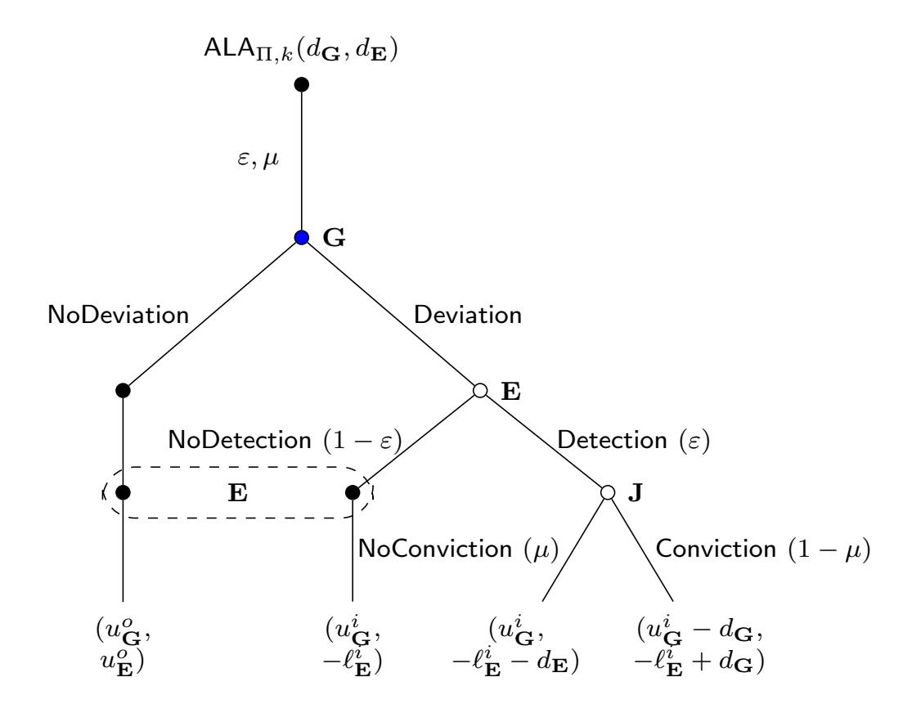
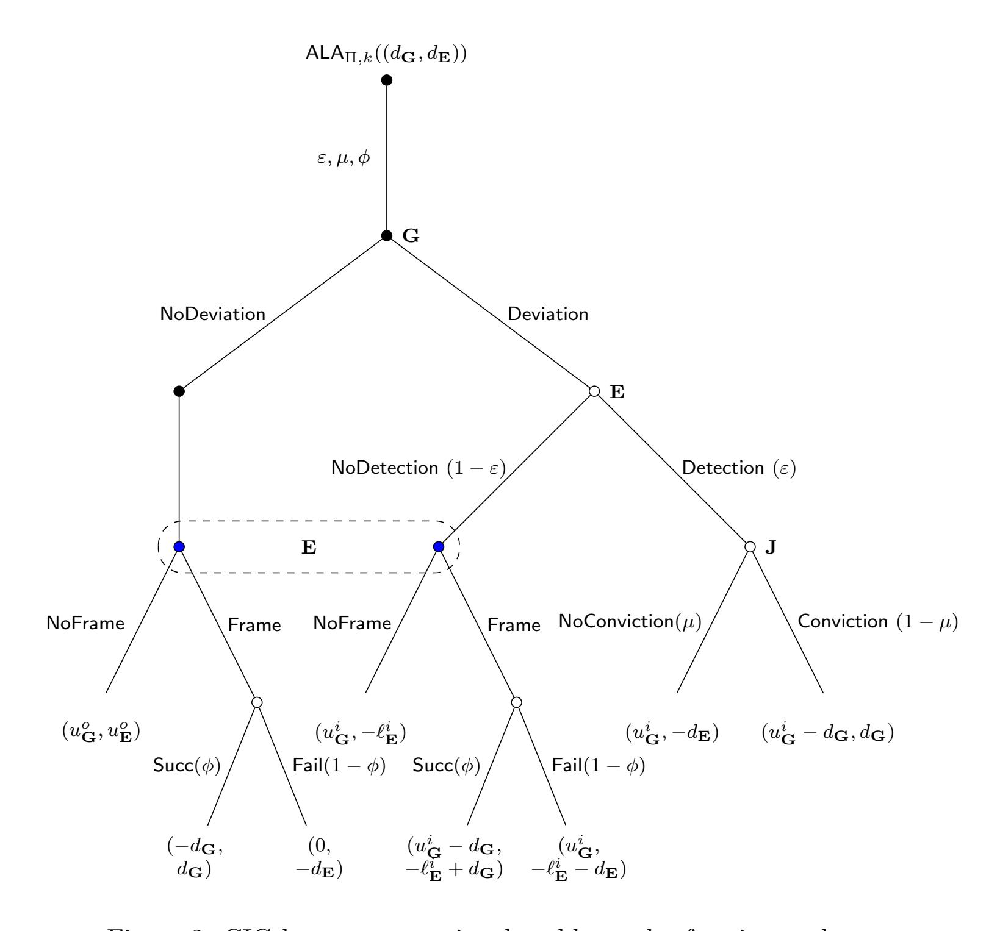
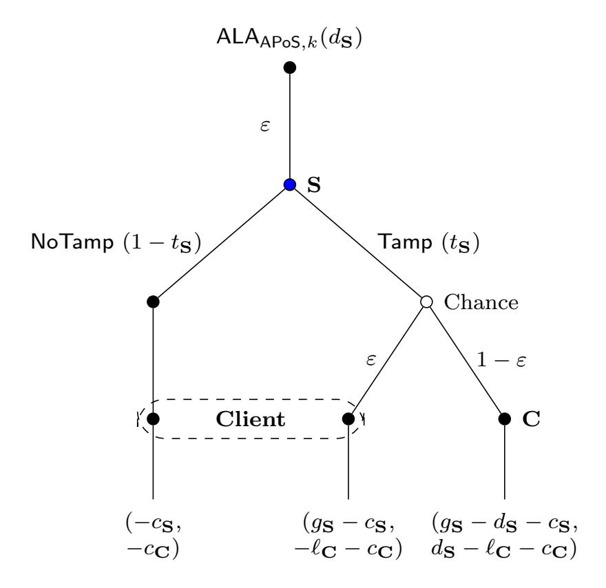
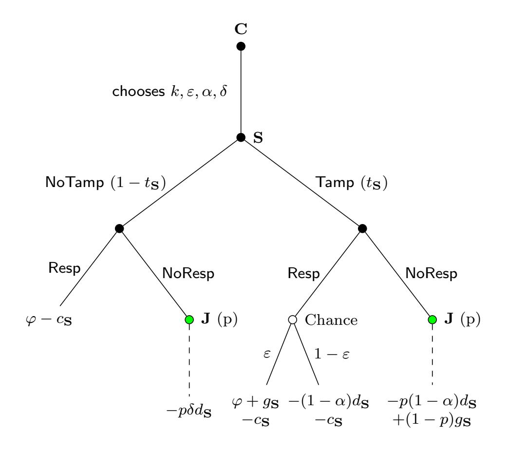
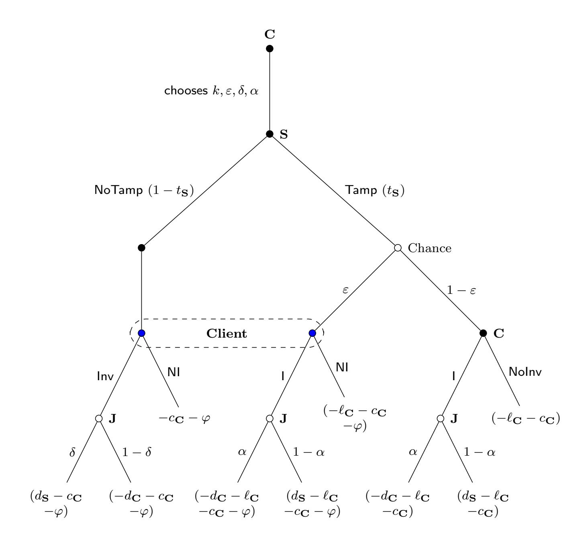
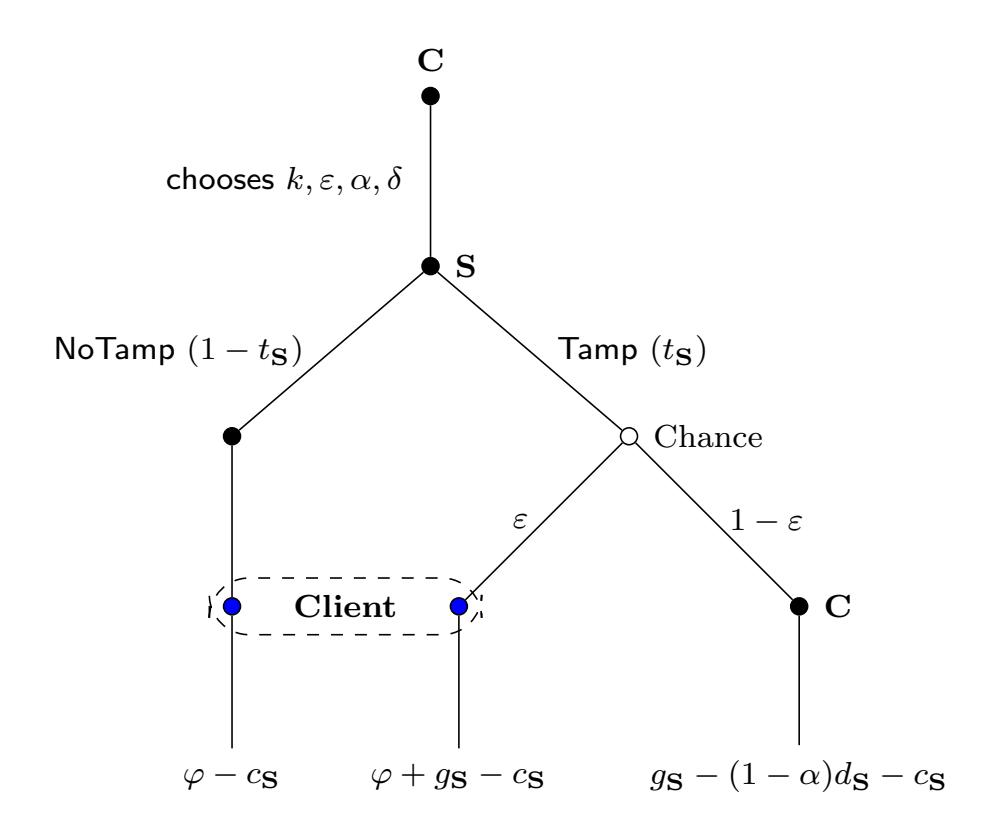

{0}------------------------------------------------

# Adversarial Level Agreements for Two-Party Protocols

Marilyn George<sup>∗</sup> Brown University Seny Kamara† Brown University

#### Abstract

Adversaries in cryptography have traditionally been modeled as either semi-honest or malicious. Over the years, however, several lines of work have investigated the design of cryptographic protocols against rational adversaries. The most well-known example are covert adversaries in secure computation (Aumann & Lindell, TCC '07 ) which are adversaries that wish to deviate from the protocol but without being detected. To protect against such adversaries, protocols secure in the covert model guarantee that deviations are detected with probability at least ε which is known as the deterrence factor.

In this work, we initiate the study of contracts in cryptographic protocol design. We show how to design, use and analyze contracts between parties for the purpose of incentivizing honest behavior from rational adversaries. We refer to such contracts as adversarial level agreements (ALA). The framework we propose can result in more efficient protocols and can enforce deterrence in covert protocols; meaning that one can guarantee that a given deterrence factor will deter the adversary instead of assuming it.

We show how to apply our framework to two-party protocols, including secure two-party computation (2PC) and proofs of storage (PoS). In the 2PC case, we integrate ALAs to publicly-verifiable covert protocols and show, through a game-theoretic analysis, how to set the parameters of the ALA to guarantee honest behavior. We do the same in the setting of PoS which are two-party protocols that allow a client to efficiently verify the integrity of a file stored in the cloud.

<sup>∗</sup> marilyn\_george@brown.edu

<sup>†</sup> seny@brown.edu

{1}------------------------------------------------

### Contents

| 1 | Introduction<br>1.1<br>Our Contributions<br>      | 3<br>4 |
|---|---------------------------------------------------|--------|
| 2 | Related Work                                      | 6      |
| 3 | Preliminaries and Notation                        | 7      |
| 4 | Adversarial Level Agreements                      | 10     |
| 5 | Augmenting Two-Party Computation With ALAs        | 11     |
|   | 5.1<br>Rational Garbler vs. Honest Evaluator      | 11     |
|   | 5.2<br>Rational Garbler vs. Framing Evaluator<br> | 12     |
|   | 5.3<br>Concrete Improvements<br>                  | 14     |
| 6 | Auditable Proofs of Storage                       | 15     |
|   | 6.1<br>Definitions                                | 15     |
|   | 6.2<br>A PoS-to-APoS Transformation               | 18     |
| 7 | Augmenting Proofs of Storage with ALAs            | 20     |
|   | 7.1<br>Rational Server vs. Honest Client          | 22     |
|   | 7.2<br>Rational Server vs. Framing Client         | 23     |
|   | 7.3<br>Concrete Instantiations<br>                | 29     |
|   | 7.3.1<br>The Juels-Kaliski PoS                    | 30     |
|   | 7.3.2<br>The Ateniese et al. PoS                  | 31     |
|   | 7.3.3<br>The Shacham-Waters PoS.<br>              | 32     |
| 8 | Conclusions and Future Work                       | 33     |

{2}------------------------------------------------

# <span id="page-2-0"></span>1 Introduction

Adversaries in cryptographic protocols have traditionally been modeled as either semi-honest or malicious. Semi-honest adversaries are assumed to follow the protocol while trying to learn as much as possible whereas malicious adversaries can behave arbitrarily. In 2004, Halpern and Teague first considered adversaries that were rational in the sense that their behavior was governed by some utility function they sought to maximize [\[14\]](#page-33-0). While Halpern and Teague mostly focused on proving and circumventing impossibility results in secret sharing and secure multi-party computation (MPC), followup work has shown that protocols secure against rational adversaries can be more efficient than protocols secure against malicious adversaries. The most well-known example is the work of Aumann and Lindell which showed how to construct secure two-party computation (2PC) protocols secure against covert adversaries [\[8\]](#page-33-1).

Covert adversaries. An adversary is covert if it deviates from the protocol but wishes to do so without being detected. A protocol secure against such an adversary guarantees that if the adversary is able to cheat then it will be detected with high enough probability. The covert model seems to capture many real-world adversaries, for example companies that cannot afford to be caught cheating because they have a reputation to protect. But to use a covert protocol in practice, one needs to set its deterrence factor which is a lower bound on the probability that cheating is detected. The idea is that if the adversary's utility function decreases when it gets caught and if the deterrence factor is set appropriately, then it is rational for a covert adversary to behave honestly.

In this work, we propose a new way to design cryptographic protocols against covert adversaries. Instead of focusing on deterrence, we focus on punishment. That is, our approach is to design protocols that explicitly punish adversaries when they cheat. It is well known in game theory that, when applied appropriately, punishment can lead to good outcomes. We will show this is the case in the setting of cryptographic protocols as well.

Contracts. In our framework, we integrate punishment into cryptographic protocols through contracts. Contracts are not a standard cryptographic primitive but they are powerful against rational adversaries. Furthermore, contracts are easy to design and well-understood by individuals and institutions. Many companies, including cloud providers, telecommunication companies and ISPs routinely use contracts called service level agreements (SLA) to guarantee a certain level of performance to their customers. In our setting, we use contracts to guarantee a certain level of "adversarialness" so we refer to them as adversarial level agreements (ALA). An ALA is a contract that specifies the damages a party has to pay if it is caught cheating.

One of the challenges in using contracts is that they require an enforcement mechanism. For our purposes, we assume the existence of a third party called the judge, that can enforce the damages stipulated in the ALAs. Of course, this requires our protocols to be auditable/verifiable by the judge. Motivated by covert security, verifiable protocols have received some attention, starting with the work of Asharov and Orlandi [\[5\]](#page-32-1) who show how to design publicly-verifiable secure computation protocols in the covert adversary model.

Advantages. The use of ALAs in cryptographic protocols provides several advantages. The first is in helping to "enforce deterrence" in the covert model. In covert protocols, it is assumed that a high deterrence factor will prevent dishonest behavior but, in practice, there is no reason to believe this is true. For example, when faced with a rational garbler, we can set the deterrence factor of the two-party protocol to some value but we have no way of knowing if it is high enough 

{3}------------------------------------------------

to incentivize the garbler to behave honestly. Using ALAs, however, allows us to integrate punishment which can be used to incentivize honest behavior at a given deterrence level.

The second advantage is in improving efficiency against covert adversaries in a "cost-free" manner. Cryptographic protocols secure against deviating adversaries (i.e., either covert or malicious) have to guarantee some form of soundness error which bounds the probability that the adversary can cheat successfully. Interestingly, we will see that enhancing a protocol with an ALA creates a tradeoff between the damages in the ALA and the soundness error of the protocol: the higher we make the damages the higher the soundness error we can tolerate. Higher soundness error, in turn, implies a smaller security parameter which implies increased efficiency. This efficiency vs. damages tradeoff is particularly interesting because increasing damages is "free" in the sense that it does not impose any financial or computational costs on either party (unless cheating occurs). In other words, by using ALAs we can increase the efficiency of a protocol by decreasing its security parameter and increasing the damages but, for the most part, this increase in damages doesn't cost the parties anything.

Application to two-party protocols. In this work we explore how ALAs can be integrated into cryptographic protocols. We focus on two-party protocols and, specifically, the cases of 2PC and proofs of storage (PoS). We stress that the goal of this work is to initiate and motivate the use of contracts/ALAs in protocol design. The specific applications to 2PC and PoS are to illustrate how our framework can be applied to non-trivial cryptographic protocols and to motivate further study of ALAs.

In the setting of 2PC, we will be particularly interested in publicly-verifiable covert (PVC) protocols which were introduced by Asharov and Orlandi [\[5\]](#page-32-1). These protocols enhance covert protocols by providing honest parties with evidence of cheating that can be publicly verified. PoS, which were introduced by Juels and Kaliski [\[16\]](#page-33-2) and by Ateniese et al. [\[6\]](#page-33-3), are two-party protocols that allow a client to efficiently verify the integrity of a file stored at a remote server. Roughly speaking, the client encodes its file before outsourcing it to the server. From that point on, it can verify the integrity of the file by sending a constant-size challenge to the server. The server then uses the challenge and the file to compute a constant-size proof which it returns to the client. If the proof verifies, the client is convinced the server is storing the file.

#### <span id="page-3-0"></span>1.1 Our Contributions

In this work, we introduce the notion of ALAs and show how to integrate them into the design of two-party cryptographic protocols; including secure two-party computation and proof of storage (PoS) protocols. We show that ALA-enhanced protocols are not only more efficient than standard protocols but that they exhibit a "cost-free" tradeoff. More precisely, we make the following contributions.

Cryptographic inspection games. The introduction of contracts and punishment into cryptographic protocols results in new strategic interactions between the parties. We formalize these interactions as cryptographic inspection games (CIG) which are strategic games played between an inspector and an inspectee which correspond to the verifier/evaluator and prover/garbler, respectively. CIGs are a variant of inspection games which were introduced in the 1960's in the context of nuclear disarmament (we refer the reader to [\[9\]](#page-33-4) for an overview). In an inspection game the inspector's goal is to detect deviation from some prescribed "good" behavior whereas the inspectee's goals are to deviate without being detected.

One difference between CIGs and traditional inspection games is that, in our setting, we are also interested in cases where the inspector is dishonest and can itself deviate from the protocol. 

{4}------------------------------------------------

This can occur in the setting of ALA-enhanced protocols because the use of ALAs introduce an incentive for the inspector to "frame" the inspectee so that it can recover the damages. To address this, we use a dual ALA which is a second contract; this time between the inspector and a judge that, if required, can "inspect the inspector" to ensure that the former is honest. In this manner, we find a desirable equilibrium for our CIGs where the parties behave honestly.

Secure two-party computation. We show how to integrate ALAs into 2PC protocols in order to get efficiency improvements against rational adversaries. More precisely, we augment PVC protocols [\[5\]](#page-32-1) which guarantees accountability (i.e., deviations from the protocol can be publicly-verified) and defamation-freeness (i.e., no party can generate evidence that an honest party deviated) by having the garbler and evaluator first agree to an ALA that stipulates damages if the garbler deviates from the protocol. At high level, the ALA induces a CIG where the evaluator plays the role of inspector and the garbler plays the role of inspectee. We analyze this game and, based on the accountability of the underlying protocol, find conditions under which the ALA guarantees honest behavior from the garbler. Note, however, that the previous result assumes an honest evaluator/inspector We address this by adding a dual ALA between the inspector/evaluator and the judge that stipulates the damages the former must pay (to the judge) if it attempts to frame the inspectee/garbler. The introduction of the dual ALA gives rise to a more complex CIG whose analysis, in part, relies on the defamation-freeness of the PVC protocol.

Proofs of storage. To add ALAs to a PoS we must first ensure that it is auditable by a judge. Towards this, we introduce and formalize the notion of an auditable PoS (APoS) which is a PoS that includes an audit algorithm that a judge can use to determine if the server has the file or not. From a security perspective, an APoS has to satisfy the same soundness requirement as a PoS (i.e., if the proof verifies then the server holds the file) in addition to a form of accountability and defamation-freeness. The former guarantees that, if the server does not have the file, then the judge will determine that it cheated; whereas the latter guarantees that, if the server holds the file, then the judge will determine that it did not cheat. This is analogous to the notions of accountability and defamation-freeness in the setting of 2PC [\[5\]](#page-32-1). With these definitions in place, we describe a general transformation that turns any PoS into an APoS. The transformation relies on simple and efficient building blocks: collision-resistant hash functions and digital signatures.

We then consider how to extend an APoS with ALAs. We use an ALA between the client and server that stipulates the damages the server must pay if the APoS verification fails. This introduces strategic incentives which we model and analyze as a CIG. However, similar to the 2PC case, a rational client (as opposed to an honest one) now has an incentive to frame the server in order to receive the damages. To address this we use a dual ALA between the client and the judge. We analyze the equilibria in both of the CIGs induced by these ALAs and show the conditions under which they guarantee that both parties will behave honestly.

Concrete analysis. We show how to apply our framework to concrete PVC and PoS protocols. Specifically, we design concrete ALAs for the 2PC protocols of Asharov and Orlandi [\[5\]](#page-32-1), Kolesnikov and Mazolemoff [\[17\]](#page-33-5) and of Hong et al [\[15\]](#page-33-6). and the APoS protocols that result from applying our transformation to the PoS protocols of Juels and Kaliski [\[16\]](#page-33-2), Ateniese et al [\[6\]](#page-33-3) and of Shacham and Waters [\[18\]](#page-33-7).

{5}------------------------------------------------

# <span id="page-5-0"></span>2 Related Work

Secure two-party computation. 2PC was introduced by Yao [\[21\]](#page-34-0) and the two main adversarial models are the semi-honest model where the adversary follows the protocol but tries to learn additional information and the malicious model where the adversary deviates arbitrarily. Covert adversaries, which were introduced by Aumann and Lindell [\[8\]](#page-33-1), wish to deviate from the protocol as long as they are detected. While the covert model is clearly and explicitly meant to capture rational adversaries, the strategic behavior of covert adversaries has, as far as we know, never been studied explicitly. In other words, protocols secure against covert adversaries guarantee that deviation is detectable with at least some probability ε, but the impact of this guarantee on a rational adversary's strategy has not been formally studied. Our work provides such a study and, in addition, extends the covert model to consider what happens not only when deviations are detected but when deviations are punished.

As discussed in Section [1,](#page-2-0) ALAs require the underlying cryptographic protocol to be auditable in the sense that a third party can verify whether one of the participants deviated from the protocol. Auditability has received some attention in the setting of secure computation. For example, Asharov and Orlandi [\[5\]](#page-32-1) introduce publicly-verifiable covert secure computation (PVC) which augments covert protocols with a certificate that allows honest parties to prove their innocence. They proposed a garbled circuit-based protocol which was later improved by Kolesnikov and Malozemoff[\[17\]](#page-33-5) and then by Hong et al. [\[15\]](#page-33-6). Baum, Damgard and Orlandi [\[10\]](#page-33-8) show how to design PVC protocols whose correctness can be verified by a trusted third party after the execution of the protocol. Cunningham, Fuller and Yakoubov [\[11\]](#page-33-9) propose completely identifiable auditability, which allows the third party to identify the cheating parties in the protocol.

In work more closely related to our own, Zhu, Ding and Huang [\[22\]](#page-34-1) design and analyze PVC protocols with lightweight audit algorithms that can be implemented using smart contracts. The judge is optimistic and is only invoked if a dispute arises. There are several differences between our approaches. First, our framework relies on legal contracts and not blockchains/smart contracts—though the audits of the underlying auditable protocols could be implemented using smart contracts. Also, the approach taken in [\[22\]](#page-34-1) requires that the parties deposit funds up front which is not the case with ALAs. More fundamentally, though, the framework of Zhu et al. assumes that the strategic interaction between the parties is a zero-sum game in the sense that the loss to the honest party is exactly the gain to the adversary. While this might apply in some settings, it is not always the case. Furthermore, the game-theoretic analysis is independent of blockchain transactions fees and assumes the deposits are high enough to deter framing.

Proofs of storage. Proofs of storage were introduced by Juels and Kaliski [\[16\]](#page-33-2) and Ateniese et al. [\[6\]](#page-33-3). The former considered privately-verifiable proofs of retrievability whereas the latter considered publicly-verifiable proofs of data possession. PoS were further studied by Shacham and Waters [\[18\]](#page-33-7) who gave both privately- and publicly-verifiable constructions. Dodis, Vadhan and Wichs then showed a connection between privately-verifiable PoS and hardness amplification. They present the idea of PoS codes and show improved constructions[\[13\]](#page-33-10). Ateniese, Kamara and Katz described a general compiler that transforms any identification protocol into a publicly-verifiable PoS [\[7\]](#page-33-11). PoS have been used in rational settings such as cryptocurrencies. Filecoin[\[2\]](#page-32-2) is a decentralized storage network based on PoS that allows its miners to rent out storage to customers for tokens. In this work, we construct highly-efficient PoS against rational adversaries. As an underlying building block, we also describe an auditable PoS against standard malicious adversaries that may be of independent interest.

{6}------------------------------------------------

### <span id="page-6-0"></span>3 Preliminaries and Notation

**Notation.** The security parameter is denoted  $k \in \mathbb{N}$ . A function is negligible in k if it is dominated by any inverse polynomial. The set of all binary strings of length n is denoted  $\{0,1\}^n$  and the set of all binary strings of arbitrary lengths is denoted  $\{0,1\}^*$ . We write  $x \stackrel{\$}{\leftarrow} X$  to denote that x is sampled uniformly at random from a set X. When an algorithm  $\mathsf{Alg}_1$  has oracle access to an algorithm  $\mathsf{Alg}_2$  we write  $\mathsf{Alg}_1^{\mathsf{Alg}_2}(\cdot)$ . The output of an interactive protocol  $\Pi$  executed between parties  $P_1$  and  $P_2$  with inputs  $x_1$  and  $x_2$ , respectively, is denoted by  $(y_1, y_2) \leftarrow \Pi_{P_1, P_2}(x_1, x_2)$ , where  $y_1$  is  $P_1$ 's output and  $y_2$  is  $P_2$ 's output. We denote the space of valid inputs to the protocol as  $\mathbb{I}_{\Pi} = \mathsf{I}_1 \times \mathsf{I}_2$  where  $\mathsf{I}_i$  is the space of valid inputs for party i. Similarly, we define the output space  $\mathbb{O}_{\Pi} = \mathsf{O}_1 \times \mathsf{O}_2$ . Then for the protocol  $(y_1,y_2) \leftarrow \Pi_{P_1,P_2}(x_1,x_2)$  we say that  $x_i \in I_i$  and  $y_i \in O_i$ . Additionally let  $\mathbb{T}_{\Pi}$  be the set of valid transcripts of the protocol where  $\mathbb{T}_{\Pi} = \mathsf{T}_1 \times \mathsf{T}_2$  and  $\mathsf{T}_i$  is the set of all messages sent by party i during the protocol. Whenever the protocol is obvious from context we drop the subscript for convenience. We denote the expected utility (in a game-theoretic sense) to a player P due to playing a strategy S as  $U_P[S]$ . This expectation is calculated over the outcomes due to the distribution of the other players' strategies and any randomness in the game being played. The expected utility of playing S when other players are playing the strategy vector  $S_{-}$  is denoted as  $U_P[S, S_-]$ . A player's best response is the strategy that gives maximum expected utility given the game and the other players' strategies.

Collision resistant hash functions. A hash function  $\mathsf{Hash} = (\mathsf{Gen}, \mathsf{Hash})$  consists of two polynomial-time algorithms that work as follows. Gen takes as input a security parameter k and outputs a (non-secret) key  $\alpha$ . Hash takes as input a key  $\alpha$  and a message  $m \in \{0,1\}^*$  and outputs a hash  $h \in \{0,1\}^k$ . The security of a hash function family is formalized using the following randomized experiment where  $\mathcal{A}$  is an adversary:

- $Coll_{\mathcal{A}}(k)$ :
  - 1. compute  $\alpha \leftarrow \mathsf{Gen}(1^k)$ ;
  - 2.  $(m_1, m_2) \leftarrow \mathcal{A}(\alpha)$ ;
  - 3. if  $m_1 \neq m_2$  and  $\mathsf{Hash}(\alpha, m_1) = \mathsf{Hash}(\alpha, m_2)$  output 1 else output 0.

We say that Hash is collision-resistant if for all PPT adversaries  $\mathcal{A}$ ,

$$\Pr\left[\mathsf{Coll}_{\mathcal{A}}(k) = 1\right] \le \mathsf{negl}(k),$$

where the probability is over the coins of Gen and A.

**Digital signatures.** A digital signature scheme  $\mathsf{Sig} = (\mathsf{Gen}, \mathsf{Sign}, \mathsf{Vrfy})$  consists of three polynomial-time algorithms that work as follows. Gen takes as input a security parameter k and outputs a signing key  $\mathsf{sk}$  and a verification key  $\mathsf{vk}$ . Sign takes as input a signing key  $\mathsf{sk}$  and a message m and outputs a signature  $\sigma$ . Vrfy takes as input a verification key  $\mathsf{vk}$ , a message m and a signature  $\sigma$  and outputs a bit b. A signature scheme is correct if for all  $k \in \mathbb{N}$ , for all  $(\mathsf{vk}, \mathsf{sk})$  output by  $\mathsf{Gen}(1^k)$ , for all  $m \in \{0, 1\}^*$ ,  $\mathsf{Vrfy}(\mathsf{vk}, m, \mathsf{Sign}(\mathsf{sk}, m)) = 1$ .

The security of a digital signature scheme is formalized using the following randomized experiment:

- Forge<sub>A</sub>(k):
  - 1. compute  $(\mathsf{sk}, \mathsf{vk}) \leftarrow \mathsf{Gen}(1^k)$ ;

{7}------------------------------------------------

- 2. (m, σ) ← ASign(sk,·) (vk);
- 3. let Q be the set of messages on which the Sign oracle was queried
- 4. if Vrfy(vk, m, σ) = 1 and m 6∈ Q, output 1 else output 0.

We say that a signature scheme Sig is existentially unforgeable if for all PPT adversaries A

$$\Pr\left[\mathsf{Forge}_{\mathcal{A}}(k) = 1\right] \le \mathsf{negl}(k),$$

where the probability is over the coins of Gen and A.

PVC protocols. We assume the reader is familiar with the definitions of 2PC. Covert protocols include an additional parameter ε called the deterrence factor which is a lower bound on the probability that cheating is detected. PVC protocols further include two protocols Blame and Judge that work as follows:

Definition 1. A publicly-verifiable covert protocol PVC = (Π, Blame, Judge) consists of a covert 2PC protocol Π and two polynomial-time algorithms Blame and Judge that work as follows:

- cert ← Blame(id, view): is a deterministic algorithm that takes as input the identifier of the cheating party id and a view of the protocol and outputs a certificate cert.
- b ← Judge(cert): is deterministic algorithm that takes as input a certificate cert and outputs 1 if the accused party is determined to have cheated and 0 otherwise.

We say that a PVC protocol is (ε, µ, φ)-secure if it satisfies covert security, accountability and defamation-freeness. Covert security guarantees that a cheating party is detected with probability at least ε. Accountability guarantees that if an honest party outputs a certificate of cheating for a dishonest party, Judge(cert) outputs 0 with probability at most µ. Defamation-freeness guarantees that if a party outputs a certificate cert that blames an honest party, Judge(cert) outputs 1 with probability at most φ.

Proofs of storage. A PoS is a protocol executed between a server that stores a dataset and a client that wishes to verify the integrity of the data. A publicly-verifiable PoS has the property that anyone in possession of the client's public key can run the verification of integrity. In this section, we recall the syntax and security definitions for a publicly-verifiable PoS.

<span id="page-7-0"></span>Definition 2 (Proof of storage). A publicly-verifiable proof of storage PoS = (Gen, Encode, Chall, Prove, Vrfy) consists of five polynomial-time algorithms that work as follows:

- (sk, pk) ← Gen(1<sup>k</sup> ): is a probabilistic algorithm that takes as input the security parameter k and outputs a secret key sk and a public key pk.
- (e,st) ← Encode(sk,f ): is a probabilistic algorithm that takes as input a secret key sk and a file f and outputs an encoded file e and a state st.
- ch ← Chall(pk,st): is a probabilistic algorithm that takes as input a public-key pk and a state st and outputs a challenge ch.
- π ← Prove(pk, e, ch): is a deterministic algorithm that takes as input a public key pk, an encoded file e and a challenge ch and outputs a proof π.
- b ← Vrfy(pk,st, ch, π): is a deterministic algorithm that takes as input a public key pk, a state st, a challenge ch, a proof π and outputs a bit b.

{8}------------------------------------------------

We say that PoS is complete if for all k ∈ N, for all (sk, pk) output by Gen(1<sup>k</sup> ), for all f ∈ {0, 1} poly(k) , for all (e,st) output by Encode(sk,f ), for all ch output by Chall(pk,st), for all π output by Prove(pk, e, ch), Vrfy(pk,st, ch, π) outputs 1.

A publicly-verifiable PoS is typically used as follows. The client runs (sk, pk) ← Gen(1<sup>k</sup> ) to generate a key pair. It keeps sk secret and sends pk to the verifier (which could be the client itself of course). The client then encodes its file by computing (e,st) ← Encode(sk,f ) and sends e to the server and st to the verifier. To verify the integrity of the file, the verifier sends a challenge ch ← Chall(pk,st) to the server who returns a proof π ← Prove(pk, e, ch). Finally, the verifier verifies the proof by computing b ← Vrfy(pk,st, ch, π). The security property we require of a PoS is that if the proof verifies then that the server must be storing the file (or some efficiently extractable form of the file). We recall the formalization of security for PoS given in [\[7\]](#page-33-11) in which K is a stateful knowledge extractor that interacts with a stateful adversary A and attempts to output the original file f :

### • OutputAdvA(k):

- 1. generate (sk, pk) ← Gen(1<sup>k</sup> );
- 2. repeat p(k) times where p is a polynomial;
  - (a) the adversary computes f ← A;
  - (b) compute (e,st) ← Encode(sk,f )
- 3. the adversary computes f <sup>∗</sup> ← A;
- 4. compute (e ∗ ,st) ← Encode(sk,f <sup>∗</sup> )
- 5. compute ch ← Chall(pk,st);
- 6. the adversary computes π <sup>∗</sup> ← A(e ∗ , ch);
- 7. output (ch, π<sup>∗</sup> ).

### • OutputExtA,K(k):

- 1. generate (sk, pk) ← Gen(1<sup>k</sup> );
- 2. repeat p(k) times where p is a polynomial;
  - (a) the adversary computes f ← A;
  - (b) compute (e,st) ← Encode(sk,f )
- 3. the adversary computes f <sup>∗</sup> ← A;
- 4. compute (e ∗ ,st) ← Encode(sk,f <sup>∗</sup> )
- 5. repeat q(k) times where q is a polynomial;
  - (a) the extractor computes ch<sup>i</sup> ← Chall(pk,st);
  - (b) the adversary computes π<sup>i</sup> ← A(e ∗ , chi);
- 6. the extractor computes ((ch<sup>e</sup> , π<sup>e</sup> ),f <sup>e</sup> ) ← K(pk,st, {ch<sup>i</sup> , πi});
- 7. output (ch<sup>e</sup> , π<sup>e</sup> ).

#### • SoundA,K(k):

- 1. run OutputExtA,K(k);
- 2. obtain f <sup>∗</sup> ← A and ((ch<sup>e</sup> , π<sup>e</sup> ),f <sup>e</sup> ) ← K(pk,st, {ch<sup>i</sup> , πi}) from the above run;
- 3. if 1 ← Vrfy(pk,st, ch<sup>e</sup> , π<sup>e</sup> ) and f e 6= f ∗ output 1 else output 0.

{9}------------------------------------------------

Definition 3 (Soundness). A publicly-verifiable proof of storage PoS = (Gen, Encode, Chall, Prove, Vrfy) is -sound if there exists an expected polynomial-time extractor K such that for all PPT adversaries A, OutputAdvA(k) and OutputExtA,K(k) are identically distributed and,

$$\Pr\left[\mathsf{Sound}_{\mathcal{A},\mathcal{K}}(k)=1\right] \leq \epsilon(k),$$

where the probabilities are over the coins of Gen, Encode, A.

# <span id="page-9-0"></span>4 Adversarial Level Agreements

We augment cryptographic protocols with contracts that stipulate the punishments parties must incur if they deviate from the protocol. We call such contracts adversarial level agreements. Note that it is arguably the avoidance of punishment rather than the evasion of detection that is the true motivation of a covert adversary; i.e., it is the consequence of detection that makes detection undesirable not detection on its own. As such, modeling and integrating punishment here through contracts—is natural. Also, in practice, many cryptographic protocols operate in environments where there are (at least) implicit consequences for deviating.

We show that, using our framework, one can design cryptographic protocols that achieve new tradeoffs: namely, one can achieve better efficiency effectively for free, i.e., without any loss of security (against rational adversaries). To do so, it suffices to increase the damages in the ALA. Note that such a tradeoff is not possible with standard covert protocols because the covert model does not capture punishment. In the covert model, the only parameter we can tune is the deterrence factor (i.e., the probability of being detected) and there is a tight dependency between deterrence and efficiency.

ALAs. For a cryptographic protocol Π, an adversarial level agreement ALAΠ,k(d) includes: (1) a specification of Π, defining each party's prescribed behavior; (2) damages d due from each party if found deviating from Π, where d = (d1, . . . , dn) is a vector that describes the damages for each party. The inclusion of contracts and punishment in cryptographic protocols introduces new strategic interactions between the parties. We formalize these interactions as games we refer to as cryptographic inspection games which are a variant of inspection games.

Inspection games. An inspection game is two-player game between an inspectee who wishes to cheat and an inspector who wishes to deter cheating. Inspection games were introduced in the 1960s in the context of nuclear disarmament and are used to design nuclear inspections under nuclear Non-Proliferation Treaties. It is well-known that inspection games have no pure strategy Nash equilibria [\[9\]](#page-33-4). Informally if the inspector always inspects, the inspectee never cheats but then the inspector would never inspect so the inspectee would always cheat etc. Though pure equilibria do not exist, an inspection game could have mixed equilibria but they often have a positive probability of cheating and are therefore undesirable. To overcome this, an inspection game is usually converted to a leadership variant by having the inspector commit to a mixed strategy for which the inspectee's best response is not to cheat. This is an application of the leadership principle in game theory [\[19\]](#page-33-12) where the first player (the leader) declares and commits to a strategy which forces the second player (the follower) to play its the best response. The leader then has the power to choose a favorable equilibrium in this sequential game. We refer to [\[9\]](#page-33-4) for a comprehensive summary of the applications of inspection games and the consequences of inspector leadership.

{10}------------------------------------------------

Cryptographic inspection games. A CIG is a two-party game between an inspectee that wishes to deviate from a protocol and an inspector that wishes to enforce honest behavior. There are two main differences between inspection games and CIGs: (1) inspection games typically have both false-positives and false-negatives whereas CIGs have only false-negatives; and (2) in a CIG the inspector can be dishonest. We represent CIGs as extensive form games which are trees that represent a player's possible actions as nodes and outcomes as leaves. Each ALAenhanced cryptographic protocol results in a CIG which we analyze to find ALA parameters that will guarantee a desirable equilibrium which here is that the parties follow the protocol.

# <span id="page-10-0"></span>5 Augmenting Two-Party Computation With ALAs

We now show how to use ALAs in secure two-party computation. As discussed above, we start with a PVC protocol Π and have the parties sign an ALA that describes Π and the damages they must pay if they deviate.

PVC protocols. Most two-party PVC protocols have a similar structure which we now describe. The garbler G creates many garbled circuits and the evaluator E opens and checks all but one of them. If any of the checks fail, the evaluator receives a publicly-verifiable certificate of the garbler's deviation. If all the checks pass, the evaluator evaluates the unopened circuit and receives the output which it then sends to the garbler. The protocol guarantees accountability and defamation-freeness (see Section [4](#page-9-0) for definitions).

#### Adversarial settings. We consider two adversarial settings:

- 1. Rational garbler vs. honest evaluator: the evaluator follows the protocol but the garbler can deviate to increase its utility;
- 2. Rational garbler vs. framing evaluator: when damages are introduced, a rational evaluator has an incentive to frame an honest garbler.

For each of these settings, we first describe the CIGs that result from the strategic interactions between the parties. We then analyze these games to find the damages that guarantee that the dishonest parties behave honestly.

#### <span id="page-10-1"></span>5.1 Rational Garbler vs. Honest Evaluator

When an (ε, µ, φ)-secure PVC protocol is enhanced with an ALA between an honest evaluator and a rational garbler, it results in the CIG depicted in Figure [1.](#page-11-1) The garbler has a choice between deviating which we denote Deviation and behaving honestly which we denote NoDeviation. When the garbler behave honestly (the left sub-tree) the evaluator's circuit checks pass, it evaluates the circuit and both parties receive the output and their utilities u o <sup>G</sup> and u o E . On the other hand, when the garbler deviates (the right sub-tree), the deviation is detected by the evaluator with probability at least ε (from the deterrence of Π). This is a probabilistic event which is represented by a hollow chance node in the tree. When the deviation is detected, the Judge is invoked and its audit gives the same output as the honest evaluator except with probability µ (from the accountability Π). If the audit outputs 1 the garbler is punished and pays d<sup>G</sup> to the evaluator. If the audit outputs 0, which occurs with probability µ, the evaluator is punished and pays d<sup>E</sup> to the Judge.

We denote the garbler's utility for deviating (and potentially learning information about the evaluator's input) as u i <sup>G</sup> and the loss to the evaluator as ` i E . If a deviation occurs, the garbler

{11}------------------------------------------------



<span id="page-11-1"></span>Figure 1: CIG between a rational garbler and an honest evaluator.

(resp. evaluator) receives this utility (resp. loss) regardless of the judge's decision. We are now ready to analyze the game.

<span id="page-11-2"></span>**Lemma 1.** Let  $\Pi$  be an  $(\varepsilon, \mu, \phi)$ -secure PVC protocol between a rational garbler and an honest evaluator that is augmented with an ALA with damages  $d_{\mathbf{G}}$  and  $d_{\mathbf{E}}$ . If

$$d_{\mathbf{G}} \ge \frac{u_{\mathbf{G}}^i - u_{\mathbf{G}}^o}{\varepsilon(1 - \mu)},$$

then the dominant strategy for a rational garbler is to follow the protocol.

*Proof.* To find the garbler's dominant strategy, we compare its expected utilities from the actions available at the blue node of the game: namely, deviating from the protocol and not deviating. Clearly, we have  $U_{\mathbf{G}}$  [NoDeviation] =  $u_{\mathbf{G}}^o$ . Furthermore,

$$\begin{split} \mathbf{U}_{\mathbf{G}} \left[ \mathsf{Deviation} \right] &= (1 - \varepsilon) u_{\mathbf{G}}^{i} + \varepsilon \left( \mu u_{\mathbf{G}}^{i} + (1 - \mu) (u_{\mathbf{G}}^{i} - d_{\mathbf{G}}) \right) \\ &= u_{\mathbf{G}}^{i} - \varepsilon (1 - \mu) d_{\mathbf{G}} \\ &\leq u_{\mathbf{G}}^{i} - \varepsilon (1 - \mu) \frac{u_{\mathbf{G}}^{i} - u_{\mathbf{G}}^{o}}{\varepsilon (1 - \mu)} \\ &= u_{\mathbf{G}}^{o}, \end{split}$$

where the inequality holds by the condition in the Lemma. It follows then that the garbler's expected utility from deviating is at most its expected utility from behaving honestly from which the Lemma follows.

#### <span id="page-11-0"></span>5.2 Rational Garbler vs. Framing Evaluator

When an  $(\varepsilon, \mu, \phi)$ -secure PVC protocol is enhanced with an ALA between a rational garbler and a framing evaluator, it results in the CIG depicted in Figure 2. In this game, the evaluator has new strategies which account for framing. The garbler's strategies remain the same as in the previous game. The garbler chooses to deviate or to behave honestly. If the garbler is

{12}------------------------------------------------



<span id="page-12-0"></span>Figure 2: CIG between an rational garbler and a framing evaluator.

honest (the left sub-tree) then the evaluator's checks pass. If the garbler deviates (the right sub-tree) the evaluator's checks pass with probability  $1-\varepsilon$ . These two blue nodes represent an information set. The evaluator now has a choice between framing which we denote by Frame and not framing which we denote by NoFrame. If it chooses to frame the garbler, the audit will output 0 except with probability  $\phi$ . This is a chance node whose probability is derived from the defamation-freeness of  $\Pi$ . If the audit outputs 1, the evaluator receives its utility  $u_{\mathbf{E}}^f$ . If the audit outputs 0, the evaluator is punished for attempted framing and has to pay damages  $d_{\mathbf{E}}$ . The garbler's utility for deviating is  $u_{\mathbf{G}}^i$  and the loss to the evaluator is  $\ell_{\mathbf{E}}^i$  and they remain regardless of the judge's decision. The evaluator's utility for framing is  $u_{\mathbf{E}}^f$ . This is equal to the damages imposed on the garbler,  $d_{\mathbf{G}}$ , since the damages are paid to the evaluator. The damages paid by the evaluator for framing is  $d_{\mathbf{E}}$ . We show how to set these damages so that both parties behave honestly.

<span id="page-12-1"></span>**Lemma 2.** Let  $\Pi$  be an  $(\varepsilon, \mu, \phi)$ -secure PVC protocol between a rational garbler and a framing evaluator that is augmented with an ALA with damages  $d_{\mathbf{G}}$  and  $d_{\mathbf{E}}$ . If,

$$d_{\mathbf{E}} \ge \frac{\phi d_{\mathbf{G}}}{1 - \phi},$$

then the dominant strategy for a framing evaluator is to follow the protocol.

*Proof.* We now examine the evaluator's expected utility of framing the garbler given that its checks passed (the choice at the information set denoted by the blue nodes in Figure 2). Let

{13}------------------------------------------------

the probability of deviation given none was detected be q and the probability of no deviation given none was detected be (1-q). We then have,

$$\mathbf{U}_{\mathbf{E}}\left[\,\mathsf{NoFrame}\,\right] = -q\ell^i_{\mathbf{E}} + (1-q)u^o_{\mathbf{E}}$$

Furthermore, we have

$$\begin{aligned} \mathbf{U_E}\left[\mathsf{Frame}\right] &= q\left[\phi(-\ell_{\mathbf{E}}^i + d_{\mathbf{G}})(1-\phi)(-\ell_{\mathbf{E}}^i - d_{\mathbf{E}})\right] + (1-q)\left(\phi d_{\mathbf{G}} - (1-\phi)d_{\mathbf{E}}\right) \\ &\leq q\left(-\ell_{\mathbf{E}}^i + \phi d_{\mathbf{G}} - (1-\phi)\frac{\phi d_{\mathbf{G}}}{1-\phi}\right) + (1-q)\left(\phi d_{\mathbf{G}} - (1-\phi)\frac{\phi d_{\mathbf{G}}}{1-\phi}\right) \\ &= -q\ell_{\mathbf{E}}^i, \end{aligned}$$

where the inequality follows from the conditions of the Lemma. But since  $u_{\mathbf{E}}^o \geq 0$ ,  $U_{\mathbf{E}}$  [Frame]  $\leq U_{\mathbf{E}}$  [NoFrame] from which the Lemma follows.

Notice that when we set the damages to rule out the evaluator's framing strategy, the game reduces to the CIG of Figure 1 and the garbler has the choice to deviate or not. But if we also set the damages according to the conditions of Lemma 1, then we know that the garbler will not deviate in this game. So by setting damages according both Lemmas, we can ensure that both the garbler and the evaluator will behave honestly.

### <span id="page-13-0"></span>5.3 Concrete Improvements

In this section, we apply our framework to three concrete PVC protocols to achieve two kinds of improvements: (1) setting concrete deterrence factors; and (2) improving efficiency.

The Hong et al. protocol [15]. The most efficient PVC protocol is by Hong et al. [15]. Its deterrence factor is  $\varepsilon = 1 - (1/\lambda)$ , where  $\lambda$  is the number of garbled circuits generated by the garbler so the smallest deterrence factor that can be achieved is 1/2 (with two circuits). Also, it achieves negligible accountability  $\mu$  and defamation-freeness  $\phi$ . For concreteness, we assume that the security parameter k is set such that  $\mu$  and  $\phi$  are at most 1/64 qnd that  $u_{\mathbf{G}}^i \leq \$100$ ,  $u_{\mathbf{G}}^o \geq \$50$  and  $u_{\mathbf{E}}^w \leq \$100$ . By Lemmas 1 and 2, we can incentivize honest behavior by using an ALA with damages

$$d_{\mathbf{G}} \ge \frac{u_{\mathbf{G}}^{i} - u_{\mathbf{G}}^{o}}{\varepsilon(1 - \mu)} = \$101.60$$
 and  $d_{\mathbf{E}} \ge \frac{\phi d_{\mathbf{G}}}{1 - \phi} = \$1.61$ .

The Koleznikov and Malozemoff protocol [17]. Another PVC protocol was proposed by Koleznikov and Malozemoff (KM). Its deterrence factor is

$$\varepsilon = (1 - 1/\lambda)(1 - 2^{-\eta + 1}),$$

where  $\lambda$  is the number of garbled circuits and  $\eta$  is the XOR-tree replication factor. The smallest deterrence factor possible is 1/4 with  $\lambda=2$  and  $\eta=2$  but Kolesnikov and Malozemoff set  $\varepsilon$  to 1/2. Using ALAs, we can guarantee honest behavior even with the minimal deterrence factor  $\varepsilon=1/4$ . As above, we assume the security parameter is set so that  $\mu$  and  $\phi$  are at most 1/64 and that  $u_{\mathbf{G}}^i \leq \$100, u_{\mathbf{G}}^o \geq \$50$  and  $u_{\mathbf{E}}^w \leq \$100$ . Again, by Lemmas 1 and 2, we can incentivize honest behavior by using an ALA with damages

$$d_{\mathbf{G}} \ge \frac{u_{\mathbf{G}}^i - u_{\mathbf{G}}^o}{\varepsilon(1 - \mu)} = \$203.20$$
 and  $d_{\mathbf{E}} \ge \frac{\phi d_{\mathbf{G}}}{1 - \phi} = \$3.22.$ 

{14}------------------------------------------------

The same analysis holds for the protocol Asharov and Orlandi (AO) since the deterrence factor is the same.

Notice, however, that our use of ALAs also improves the computation and communication complexity of the protocols since we can use the minimal deterrence factor. These protocols have several parameters which include the bit-length of their underlying field τ , the length of the inputs n, and the size of their commitments κ, the number of replicated circuits λ, and the XOR-tree replication factor ν. In addition, for the KM protocol let t be the number of OTs and assume that 3κ > τ . Based on the analysis of [\[17\]](#page-33-5), the communication complexity of the KM protocol when using signed OTs is,

$$\tau(7t+11) + 2\lambda\kappa t + \lambda\kappa(2n+1) + \tau(13\lambda - 4) + \lambda(2\kappa(\lambda - 1) + n\kappa) + \log(\lambda) + 2\kappa|G_C|,$$

where |GC| is the number of non-XOR gates in the circuit. The communication cost of the AO protocol with signed OTs is,

$$\tau(7\nu n + 11) + 2\lambda\kappa\nu n$$

$$+ \lambda(2\kappa|G_C|+\tau)$$

$$+ 2n\lambda(\kappa + \tau)$$

$$+ \tau(13\lambda - 8)$$

$$+ \lambda\kappa(2(n + \nu n)(\lambda - 1) + 2n(\lambda - 1) + n).$$

For κ = 128, τ = 256 and λ = ν = 3, which leads to ε = 1/2, the KM protocol needs 3.47Mbit to compute a 128-bit AES circuit with 9100 non-XOR gates. For these same parameters, the AO protocol requires 9.3Mbit. Using the ALA described above, however, we can set λ = ν = 2 which leads to the minimal deterrence factor of 1/4 and a communication complexity of 3.03Mbit for the KM protocol and 5.75Mbit for the AO protocol.

# <span id="page-14-0"></span>6 Auditable Proofs of Storage

In this section we show how to apply ALAs to PoS. We begin by presenting a transformation that converts any PoS into an APoS using simple cryptographic primitives. We then define and analyze the CIGs that result from applying ALAs to APoS protocols to design ALAs that lead to concrete efficiency improvements for several concrete protocols.

#### <span id="page-14-1"></span>6.1 Definitions

We now introduce and formalize the notion of an auditable proof of storage which is a PoS whose execution can be audited by a trusted third party called the Judge. In addition to soundness, an APoS has to satisfy two properties: (1) accountability which, roughly speaking, guarantees that the Judge will correctly detect when the file has been tampered with; and (2) defamationfreeness which, roughly speaking, guarantees that the Judge cannot be fooled (by the client) into believing that the file has been tampered with if it has not.

Definition 4 (Auditable PoS). An auditable proof of storage APoS = (Gen, Π, Chall, Prove, Vrfy, Audit) is composed of five polynomial-time algorithms and one two-party protocol. Gen, 

{15}------------------------------------------------

Chall, Prove and Vrfy are as in a standard PoS (Definition [2\)](#page-7-0) and Π, Receipt and Audit work as follows:

- (stJ, clk,srk) ← Gen(1<sup>k</sup> ): is a probabilistic algorithm that takes as input the security parameter k and outputs a state st, a client key clk = (clpk, clsk) and a server key srk = (srpk,srsk) where clpk,srpk are public keys for the client and the server respectively.
- ((stC,rec); e) ← ΠC,S((clk,f );srk): is a two-party protocol executed between the client and the server. The client inputs a client key clk and a file f , and the server inputs a server key srk. The client receives as output a state st<sup>C</sup> and a receipt rec whereas the server receives an encoded file e.
- b ← Audit(stJ,rec<sup>∗</sup> , e<sup>∗</sup> ): is a deterministic algorithm that takes as input a state st, a receipt rec<sup>∗</sup> from the client. It also receives an encoded file e ∗ from the server—which may not be the original file and could possibly be empty if the server doesn't respond. It outputs a bit b which is 1 if the server is found guilty and 0 otherwise

We say that APoS is complete if for all k ∈ N, for all (stJ, clk,srk) ← Gen(1<sup>k</sup> ), for all f ∈ {0, 1} poly(k) , for all ((stC,rec); e) ← ΠC,S((clk,f );srk), for all ch output by Chall(clpk,stC), for all π output by Prove(srk, e, ch), Vrfy(clk,stC, ch, π) outputs 1.

An auditable PoS is used as follows. The judge runs Gen to generate a state stJ, a client key clk and a server key srk. We note here that this step could be replaced by an interactive protocol that generates the keys—we only require that the judge be able to trust the keys. The client and server then execute the Π protocol on a file f . From this, the client receives a receipt rec and the server receives an encoded file e. Chall, Prove and Vrfy are used as in a standard publicly-verifiable PoS. If at any time, the client claims the server is not storing the file, the judge runs b ← Audit(stJ,rec<sup>∗</sup> , e<sup>∗</sup> ) where rec<sup>∗</sup> is the receipt provided by the client and e ∗ is the encoded file provided by the server.

Soundness. The notion of soundness of auditable PoS is similar to that of standard PoS. We formalize this with the following randomized experiments where K is a stateful extractor which interacts with the stateful adversary A and attempts to output the original file f :

### • OutputAdvA(k):

- 1. generate (stJ, clk,srk) ← Gen(1<sup>k</sup> );
- 2. repeat p(k) times where p is a polynomial;
  - (a) the adversary computes f ← A;
  - (b) compute ((stC,rec); e) ← ΠC,A((clk,f );srk)
- 3. the adversary computes f <sup>∗</sup> ← A;
- 4. compute ((stC,rec); e ∗ ) ← ΠC,A((clk,f <sup>∗</sup> );srk)
- 5. compute ch ← Chall(clpk,stC);
- 6. the adversary computes π <sup>∗</sup> ← A(e ∗ , ch);
- 7. output (ch, π<sup>∗</sup> ).

### • OutputExtA,K(k):

- 1. generate (stJ, clk,srk) ← Gen(1<sup>k</sup> );
- 2. repeat p(k) times where p is a polynomial;

{16}------------------------------------------------

- (a) the adversary computes f ← A;
- (b) compute ((stC,rec); e) ← ΠC,A((clk,f );srk)
- 3. the adversary computes f <sup>∗</sup> ← A;
- 4. compute ((stC,rec); e ∗ ) ← ΠC,A((clk,f <sup>∗</sup> );srk)
- 5. repeat q(k) times where q is a polynomial;
  - (a) the extractor computes ch<sup>i</sup> ← Chall(clpk,stC);
  - (b) the adversary computes π<sup>i</sup> ← A(e ∗ , chi);
- 6. the extractor computes ((ch<sup>e</sup> , π<sup>e</sup> ),f <sup>e</sup> ) ← K(clk,stC,rec, {ch<sup>i</sup> , πi});
- 7. output (ch<sup>e</sup> , π<sup>e</sup> ).
- SoundA,K(k):
  - 1. run OutputExtA,K(k);
  - 2. obtain f <sup>∗</sup> ← A and ((ch<sup>e</sup> , π<sup>e</sup> ),f <sup>e</sup> ) ← K(clk,st<sup>∗</sup> C,rec<sup>∗</sup> , {ch<sup>i</sup> , πi}) from the above run;
  - 3. if 1 ← Vrfy(clk,stC, ch<sup>e</sup> , π<sup>e</sup> ) and f e 6= f ∗ output 1 else output 0.

Definition 5 (Soundness). An auditable proof of storage APoS = (Gen, Π, Chall, Prove, Vrfy, Audit) is ε-sound if there exists an expected polynomial-time extractor K such that for all PPT adversaries A, OutputAdvA(k) and OutputExtA,K(k) are identically distributed and,

$$\Pr\left[\mathsf{Sound}_{\mathcal{A},\mathcal{K}}(k)=1\right] \leq \varepsilon,$$

where the probabilities are over the coins of Gen, Π, A.

Accountability. As discussed above, accountability guarantees that the Judge will correctly determine if the file has been tampered with. Note that since standard publicly-verifiable PoS allow for a third party to verify the integrity of the file, they naturally achieve accountability if we simply let the Judge run the verification algorithm using the client's public key and state. We formalize accountability with the following randomized experiment where A is a stateful adversary, f is a file and APoS = (Gen, Π, Chall, Prove, Vrfy, Audit) is an auditable PoS:

- AccntA,f (k):
  - 1. generate (stJ, clk,srk) ← Gen(1<sup>k</sup> );
  - 2. compute ((stC,rec); e) ← ΠC,A((clk,f );srk)
  - 3. the adversary computes e <sup>∗</sup> ← A;
  - 4. if Audit(stJ,rec, e<sup>∗</sup> ) = 0 and e <sup>∗</sup> 6= e output 1 else output 0.

Definition 6 (Accountability). An auditable proof of storage APoS = (Gen, Π, Chall, Prove, Vrfy, Audit) is α-accountable if for all PPT adversaries A, for all files f ,

$$\Pr\left[\operatorname{Accnt}_{\mathcal{A},\boldsymbol{f}}(k)=1\right] \leq \alpha$$

where the probabilities are over the coins of Gen, Π, A.

{17}------------------------------------------------

Defamation-freeness. The third security property we require of an APoS is defamationfreeness which guarantees that the Judge cannot be fooled into believing that the file has been tampered with when it has not. We formalize defamation-freeness with the following randomized experiment where A is a stateful adversary, f is a file and APoS = (Gen, Π, Chall, Prove, Vrfy, Audit) is an auditable PoS:

- Defame-FreeA,f (k):
  - 1. generate (stJ, clk,srk) ← Gen(1<sup>k</sup> );
  - 2. compute ((stC,rec); e) ← ΠA,S((clk,f );srk)
  - 3. the adversary computes rec<sup>∗</sup> ← A;
  - 4. if Audit(stJ,rec<sup>∗</sup> , e) = 1 output 1 else output 0.

Definition 7 (Defamation-freeness). An auditable proof of storage APoS = (Gen, Π, Chall, Prove, Vrfy, Audit) is δ-defamation-free if for all PPT adversaries A, for all files f ,

$$\Pr\left[ \mathsf{Defame}\text{-}\mathsf{Free}_{\mathcal{A},\pmb{f}}(k) = 1 \right] \leq \delta$$

where the probabilities are over the coins of Gen, Π, A.

Notation. Throughout this work, we will refer to an APoS that is ε-sound, α-accountable and δ-defamation-free simply as being (ε, α, δ)-secure.

#### <span id="page-17-0"></span>6.2 A PoS-to-APoS Transformation

In this section we present a transformation that converts any PoS to an auditable PoS. Our transformation makes use of a hash function family Hash = (Gen, Hash) and of a signature scheme Sig = (Gen, Sign, Vrfy). We assume authenticated channels between all the parties.

Overview. The transformation is detailed in Figure [3](#page-20-0) and works as follows. The Gen algorithm creates a public/private key pair for the underlying PoS, a key w for the hash function family, and two signing/verification key pairs: one for the client and one for the server. The two-party protocol Π is executed between the client C and the server S. The client encodes the file f and signs its hash h. It then sends the encoded file e, its hash h and its signature σ<sup>C</sup> on the hash to the server. The server checks if h is indeed the hash of the encoded file e and if so signs it as well. It then returns the hash h, the signature σ<sup>C</sup> and its own signature σ<sup>S</sup> on the hash. Finally, the client verifies that σ<sup>S</sup> is indeed a signature on h. The receipt rec consists of the hash h and the two signatures σ<sup>C</sup> and σS. The Chall, Prove and Vrfy algorithms are the same as the Chall and Prove and Vrfy algorithms of the underlying PoS. The Audit algorithm takes as input a receipt rec = (h, σC, σS) from the client and some encoded file e ∗ from the server. The judge first checks whether σ<sup>C</sup> and σ<sup>S</sup> are indeed signatures over h. If not, it determines that the client is dishonest. If both signatures are valid and if the encoded file e <sup>∗</sup> hashes to the hash h, then the server is considered honest. On the other hand, if the two signatures are valid but e <sup>∗</sup> does not hash to h then the server is considered dishonest since e ∗ could not be the original encoded file e.

Theorem 1. If PoS is sound, Sig is existentially unforgeable and Hash is collision-resistant with security parameter k, then APoS as described in Figure [3](#page-20-0) is (ε, α, δ)-secure where ε, α, and δ are negligible in k.

{18}------------------------------------------------

*Proof.* The soundness of APoS follows directly from the soundness of PoS so we focus here on auditability.

To show accountability, we show that if there exists a PPT adversary  $\mathcal A$  and a file  $\boldsymbol f$  such that

$$\Pr\left[\mathsf{Accnt}_{\mathcal{A},\boldsymbol{f}}(k)=1\right]=\varepsilon(k),$$

for a non-negligible function  $\varepsilon(k)$ , then there exists a PPT adversary  $\mathcal{F}$  such that  $\Pr\left[\mathsf{Forge}_{\mathcal{F}}(k)\right] = \varepsilon_1(k)$  or  $\Pr\left[\mathsf{Coll}_{\mathcal{F}}(k)\right] = \varepsilon_2(k)$ , where  $\varepsilon_1$  and  $\varepsilon_2$  are non-negligible in k.

Given hash key w and access to a signing oracle  $\mathsf{Sign}(\mathsf{sk},\cdot)$ ,  $\mathcal{F}$  starts by computing  $(\mathsf{sk},\mathsf{pk}) \leftarrow \mathsf{PoS}.\mathsf{Gen}(1^k)$ ,  $(\mathsf{sk_S},\mathsf{vk_S}) \leftarrow \mathsf{Sig}.\mathsf{Gen}(1^k)$  and setting  $\mathsf{st_J} = \mathsf{vk_S}$ ,  $\mathsf{srk} = (\mathsf{pk},\mathsf{sk_S},\mathsf{vk},w)$ . It then simulates  $\mathcal{A}$  and executes  $((\mathsf{st_C},\mathsf{rec}),\boldsymbol{e}) \leftarrow \Pi_{\mathcal{A},\mathbf{S}}((\mathsf{clk},\boldsymbol{f});\mathsf{srk})$  playing the role of the client  $\mathbf{C}$ . During this execution,  $\mathcal{F}$  generates the signature  $\sigma_{\mathbf{S}}$  by querying its  $\mathsf{Sign}$  oracle on h. It then sends  $\tau = (h,\sigma_{\mathbf{C}})$  to  $\mathcal{A}$  and records  $(h,\sigma_{\mathbf{C}})$  as a pair queried to the  $\mathsf{Sign}$  oracle.  $\mathcal{A}$  sends back  $\mathsf{rec}^* = (h^*,\sigma_{\mathbf{C}}^*,\sigma_{\mathbf{S}}^*)$ , then  $\mathcal{F}$  aborts unless  $h^* = \mathsf{Hash}(w,\boldsymbol{e})$  and the signatures verify. If the client signature verifies but  $(h^*,\sigma_{\mathbf{C}}^*)$  has not been queried to the oracle,  $\mathcal{F}$  produces this as a forgery and terminates the experiment. Notice that  $\mathcal{A}$ 's view up to this point when simulated by  $\mathcal{F}$  is distributed exactly as its view during an  $\mathsf{Accnt}_{\mathcal{A},\boldsymbol{f}}(k)$  experiment.

If the experiment has not been terminated by  $\mathcal{F}$ , then  $\mathcal{A}$ 's view is still consistent and the receipt  $rec = (h, \sigma_C, \sigma_S)$  is produced honestly. Then by our initial assumption and the definition of the Accnt experiment, this implies that

$$\Pr\left[\mathsf{Audit}(\mathsf{st}_{\mathbf{J}},\mathsf{rec},\boldsymbol{e}^*)=0 \land \boldsymbol{e} \neq \boldsymbol{e}^*\right] \geq \varepsilon(k).$$

But note that  $\mathsf{Audit}(\mathsf{st}_{\mathbf{J}},\mathsf{rec},\boldsymbol{e}^*)$  outputs 0 if and only if h is a valid hash of  $\boldsymbol{e}^*$ . Then  $\mathcal{F}$  produces  $(\boldsymbol{e},\boldsymbol{e}^*)$  as the hash collision. Since the total probability of  $\mathcal{A}$  winning is non-negligible it follows that it either produces a forged signature in the receipt  $\mathsf{rec}$  with some  $\varepsilon_1(k)$  or an  $\boldsymbol{e}^*$  with the same hash value as  $\boldsymbol{e}$  with  $\varepsilon_2(k)$  where  $\varepsilon_1,\varepsilon_2$  are non-negligible in k. But since  $\mathsf{Sig}$  is existentially unforgeable and  $\mathsf{Hash}$  is collision-resistant we have a contradiction. Hence we know that

$$\Pr\left[\mathsf{Accnt}_{\mathcal{A},f}(k)=1\right] \leq \alpha(k),$$

where  $\alpha(k)$  is negligible. Towards showing defamation-freeness, we show that if there exists a PPT adversary  $\mathcal{A}$  and a file  $\boldsymbol{f}$  such that

$$\Pr\left[\mathsf{Defame\text{-}Free}_{\mathcal{A},\boldsymbol{f}}(k)=1\right]=\varepsilon(k),$$

for a non-negligible function  $\varepsilon(k)$ , then there exists a PPT adversary  $\mathcal{F}$  such that  $\Pr\left[\mathsf{Forge}_{\mathcal{F}}(k)\right] = \varepsilon(k)$ .

Given  $\mathsf{vk}$  and access to a signing oracle  $\mathsf{Sign}(\mathsf{sk},\cdot)$ ,  $\mathcal{F}$  starts by computing  $(\mathsf{sk},\mathsf{pk}) \leftarrow \mathsf{PoS.Gen}(1^k)$ ,  $w \leftarrow \mathsf{Hash.Gen}(1^k)$  and  $(\mathsf{sk}_{\mathbf{C}},\mathsf{vk}_{\mathbf{C}}) \leftarrow \mathsf{Sig.Gen}(1^k)$  and setting  $\mathsf{st}_{\mathbf{J}} = \mathsf{vk}$  and  $\mathsf{clk} = (\mathsf{sk},\mathsf{pk},\mathsf{sk}_{\mathbf{C}},\mathsf{vk}_{\mathbf{C}},w)$ . It then simulates  $\mathcal{A}$  and executes  $((\mathsf{st}_{\mathbf{C}},\mathsf{rec}),\boldsymbol{e}) \leftarrow \Pi_{\mathcal{A},\mathbf{S}}((\mathsf{clk},\boldsymbol{f});\mathsf{srk})$  playing the role of the server  $\mathbf{S}$ . During this execution,  $\mathcal{F}$  generates the signature  $\sigma_{\mathbf{S}}$  by querying its Sign oracle on h. When the execution finishes and  $\mathcal{A}$  outputs  $\mathsf{rec}^* = (h^*, \sigma_{\mathbf{S}}^*, \sigma_{\mathbf{S}}^*)$ ,  $\mathcal{F}$  outputs the pair  $(h^*, \sigma_{\mathbf{S}}^*)$  as its forgery. Notice that  $\mathcal{A}$ 's view when simulated by  $\mathcal{F}$  is distributed exactly as its view during an Defame-Free  $\mathcal{A}, \boldsymbol{f}(k)$  experiment. By our initial assumption and the definition of the Defame-Free experiment, this implies that

$$\Pr\left[\mathsf{Audit}(\mathsf{st}_{\mathbf{J}},\mathsf{rec}^*,\boldsymbol{e})=1\right] \geq \varepsilon(k).$$

But note that  $\mathsf{Audit}(\mathsf{st}_{\mathbf{J}},\mathsf{rec}^*,\boldsymbol{e})$  outputs 1 if and only if  $\sigma_{\mathbf{S}}^*$  is a valid signature on  $h^*$  and if  $\mathsf{Hash}(w,\boldsymbol{e})\neq h^*$ . Since  $\mathcal{F}$  only queries its Sign oracle on  $\mathsf{Hash}(w,\boldsymbol{e})$  (if  $h\neq \mathsf{Hash}(w,\boldsymbol{e})$  it aborts),

{19}------------------------------------------------

it follows that (h ∗ , σ<sup>∗</sup> S ) is a new and valid message/signature pair. This is a contradiction to the existential unforgeability of Sig. Therefore we have

$$\Pr\left[ \mathsf{Defame\text{-}Free}_{\mathcal{A},\boldsymbol{f}}(k) = 1 \right] \leq \delta(k),$$

where δ(k) is negligible.

### <span id="page-19-0"></span>7 Augmenting Proofs of Storage with ALAs

We now show how our techniques are applicable to PoS protocols. In this setting, the client C and the server S agree on the ALA. We assume an out-of-band "traditional" contract that specifies the hash of the file and the damages the server will pay to the client if the file has been tampered with. To enhance an APoS with an ALA, the ALA has to be signed by both parties after they agree on the file. We denote by ALA(dS) an adversarial level agreement with server damages dS. The strategic interaction between a rational server and client in an ALA-enhanced APoS protocol can be viewed as a CIG where the client plays the role of the inspector and the server plays the role of the inspectee.

Overview of CIG. The client's actions are the set of possible soundness error parameters for the underlying APoS and the server's actions are to either keep the file or lose the file. Here, the client "inspects" the server by using the APoS. If the inspection fails then the client invokes the judge and the server is punished by having to compensate the client for losing the file. The client's strategies can then be viewed as a mixed strategy over the actions "inspection passes" which we denote Pass and "inspection fails" which we denote Fail, where the former is played with probability 1 − ε and the latter is played with probability ε. More precisely, the client picks a soundness error ε which gives it a probabilistic payoff when the server tampers with the file. When the server does not tamper with the file, however, the client will always have the same deterministic payoff (which is the cost of the APoS or the "inspection"). We model these payoffs as mixing over two strategies "pass" and "fail" which: (1) have different payoffs when the server tampers with the file; and (2) the same payoffs when the server does not tamper with the file. In other words, when the server tampers with the file, the APoS can "pass" or "fail" and the client gets the appropriate payoffs but when the server does not tamper, the actions "pass" and "fail" are strategically equivalent and give the same deterministic payoff.

Given solely this choice, a client would want to pick a low ε, or even ε = 0 in order to increase the probability of the inspection passing. However, the technical difficulty is that all practical constructions of proofs of storage protocols have non-zero soundness error. Additionally, in order to reduce the soundness error, the security parameter of these schemes must be increased. With a greater security parameter comes greater computation costs both for the server and the client. These costs can also depend on other factors, such as the cost of computation or storage. In order to simplify the model, we assume that these costs of computation for both the server and the client are fixed constant values. On the other hand, the server strategies are mixed strategies over the set of actions "tamper with file" which we denote Tamp and "do not tamper with file" which we denote NoTamp, where the former is played with probability t<sup>S</sup> and the latter is played with probability 1 − tS. Similar to the 2PC case, the client has an incentive to frame the honest server in order to receive compensation.

In all the games that follow, the judge runs the Audit algorithm to identify the guilty party. If the Audit finds the server guilty the judge enforces the damages d<sup>S</sup> to the server and

{20}------------------------------------------------

```
Let PoS = (Gen, Encode, Chall, Prove, Vrfy) be a publicly-verifiable proof of storage, Sig =
(Gen, Sign, Vrfy) be a signature scheme and Hash = (Gen, Hash) be a hash function family. Consider
the auditable proof of storage APoS = (Gen, Π, Chall, Prove, Vrfy, Audit) defined as follows:
   • Gen(1k
             ):
        1. compute (sk, pk) ← PoS.Gen(1k
                                            );
        2. compute w
                        $
                       ← Hash.Gen(1k
                                       );
        3. compute (skC , vkC) ← Sig.Gen(1k
                                              ) and (skS, vkS) ← Sig.Gen(1k
                                                                            );
        4. output stJ = vkS, clk = (clpk, clsk) = ((pk, vkC, w),(sk,skC)) and srk = (srpk,srsk) =
            ((pk, vkS),(skS, w))
   • Π((clk,f );srk):
        1. the client:
            (a) computes (e,st) ← PoS.Encode(sk,f );
            (b) computes h ← Hash(w, e);
            (c) computes σC ← Sign(skC , h);
            (d) sends e and τ = (h, σC) to the server;
        2. the server:
            (a) if h = Hash(w, e)
                  i. computes σS ← Sign(skS, h);
                  ii. sends rec = (h, σC, σS) to the client
            (b) else outputs ⊥ and aborts;
        3. the client:
            (a) if Vrfy(vkS, h, σS) = 1 outputs rec otherwise outputs ⊥;
   • Chall(clpk,st): output ch ← PoS.Chall(pk,st);
   • Prove(srk, e, ch): output π ← PoS.Prove(pk, e, ch);
   • Vrfy(clk,st, ch, π): output b ← PoS.Vrfy(pk,st, ch, π);
   • Audit(stJ ,rec∗
                    , e∗
                        ):
        1. parse rec∗ as (rec1,rec2,rec3) i.e. (h, σC, σS);
        2. compute b1 ← Sig.Vrfy(vkC, h,rec2);
        3. compute b2 ← Sig.Vrfy(vkS, h,rec3);
        4. if h = Hash(w, e∗
                             ) set b3 = 1 else set b3 = 0;
        5. if b1 = 1 ∧ b2 = 1 ∧ b3 = 1 output 0
        6. if b1 = 1 ∧ b2 = 1 ∧ b3 = 0 output 1
```

<span id="page-20-0"></span>Figure 3: A PoS-to-APoS transformation.

7. otherwise output 0.

{21}------------------------------------------------

compensates the client. On the other hand, if the audit finds the server innocent the judge enforces the damages d<sup>C</sup> to the client for attempting to frame the honest server.

#### Adversarial settings. We consider two adversarial settings:

- 1. Rational server vs. honest client: the client follows the protocol but the server can deviate if it increases its utility.
- 2. Rational server vs. framing client: the server is rational (and may even choose not to participate) and the client is rational and may try to frame the server.

#### <span id="page-21-0"></span>7.1 Rational Server vs. Honest Client

In this section, we describe how to enhance an APoS with an ALA and, specifically, how to set the damages in the ALA as a function of the parameters of underlying APoS. Here, we focus on the case of an honest client and a rational server and our goal is to show that if the damages in the ALA are set appropriately, a rational server will never tamper with the file.

APoS for honest clients. The simplest APoS for the setting of honest clients works as follows. Given a standard PoS, one simply defines the Audit algorithm to always output 1. Note that since the client is honest, Audit will only be invoked when PoS verification fails. This simple construction is (ε, 0, 1)-secure, where ε is the soundness error of the underlying PoS, α = 0 because Audit never outputs 0 and δ = 1. Note that the defamation-freeness of this APoS is the worst possible but this does not matter because an honest client will never invoke the Judge when PoS verification succeeds. We now describe the corresponding PoS game as shown in Figure [4.](#page-21-1)



<span id="page-21-1"></span>Figure 4: CIG between a rational server and an honest client.

Game tree. When an (ε, 0, 1)-secure APoS is enhanced with an ALA between a rational server and an honest client, it results in the CIG in Figure [4.](#page-21-1) The server has a choice between Tamp and NoTamp. When the server chooses not to tamper with the file, the client's check always passes. Since the client is constrained to honest actions, it does nothing. The utilities to

{22}------------------------------------------------

both the server and the client are just the costs of running the check cS, cC. On the other hand, when the server tampers with the file (right sub-tree) it is detected by the client with probability (1 − ε). This probabilistic event is denoted by the hollow chance node. When the tampering is detected, the client invokes the (trivial) judge, who always punishes the server. The damages are paid as compensation to the client. The gain to the server from tampering with the file is denoted as g<sup>S</sup> and the corresponding loss to the client as `C. If the server tampers with the file, this loss to the client and the gain to the server is part of their utilities – even if the tampering is not detected by the client.

Theorem 2. Let Π be an (ε, 0, 1)-secure APoS protocol between a rational server and an honest client that is augmented with an ALA with damages dS. If,

$$d_{\mathbf{S}} \ge \frac{g_{\mathbf{S}}}{(1-\varepsilon)},$$

where g<sup>S</sup> is the server's gain when tampering with the file, then the dominant strategy for a rational server is to not tamper.

Proof. To compute the server's dominant strategy, we compare the expected utilities of the two strategies available at the blue node in Figure [4:](#page-21-1) tampering with the file, and not tampering. Clearly, we have U<sup>S</sup> [ NoTamp ] = −cS. Furthermore,

$$\begin{split} \mathbf{U_S}\left[\mathsf{Tamp}\right] &= (1-\varepsilon)(g_{\mathbf{S}} - d_{\mathbf{S}} - c_{\mathbf{S}}) + \varepsilon(g_{\mathbf{S}} - c_{\mathbf{S}}) \\ &= -(1-\varepsilon)d_{\mathbf{S}} + g_{\mathbf{S}} - c_{\mathbf{S}} \\ &\geq -c_{\mathbf{S}} \end{split}$$

where the inequality holds from the condition in the Theorem. So the server's expected utility from tampering is at most that of not tampering from which the Theorem follows.

#### <span id="page-22-0"></span>7.2 Rational Server vs. Framing Client

We now consider dishonest clients and, specifically, clients that may want to frame the server. As in the 2PC case, this is an important setting because the use of an ALA introduces an incentive for the client to frame the server. As before, we handle framing clients with a dual ALA between the client and the judge that specifies the damages payable to the judge if the client is caught deviating. In addition, however, we also include a server fee ϕ that the client pays to the server when a proof verifies. Now, the ALA, the dual ALA and the server fee together specify a contract parameterized by (dS, dC, ϕ).

Equilibrium conditions. In this setting, we have no guarantee on client behavior. In particular, the client might invoke the Judge even when the APoS verification passes. This, in turn, affects the game from the previous section since the server is no longer sure of the client's behavior. In fact, a rational server may not even want to participate in the protocol. Our first challenge then is to prove that, even in this setting, there exists an equilibrium where the client invokes the Judge if and only if the APoS fails to verify and the server participates in the protocol (in the sense that it responds to the challenges issued by the client). Notice how this equilibrium behavior is identical to the honest client setting. At this equilibrium, we can then derive the soundness error ε that will force the server to play NoTamp. We prove the existence of the equilibrium in Lemma [3](#page-23-0) and Lemma [4](#page-25-0) and show the final result about soundness error in Theorem [3.](#page-27-0) We start by proving that an equilibrium exists where both the server and the client behave as in the honest client setting.

{23}------------------------------------------------

Server fee. In order to have a rational server respond to a challenge—even to a possibly framing client—we need to include a server fee so that it has some utility for completing a proof. Note that in the context of PoS the server fees occur naturally; that is, most cloud services would charge a fee to store a client's file. Given that the honest server always receives ϕ for completing a proof, the honest server will always respond to a challenge. Then if the client does not receive a response to its challenge it assumes that the server has played Tamp and invokes the judge. This forces the server to respond to all challenges even if it has tampered with the file. This may seem surprising but the intuition is as follows. If the server doesn't respond to the challenge, then the client will invoke the Judge which increases its cost due to the damages it has to pay. On the other hand, if the server always responds the soundness error of the APoS creates the possibility that the verification might succeed even if the file was tampered with. Then we have the first part of the equilibrium condition: If the client invokes the Judge only when the APoS verification fails (or) when it does not receive a response, then the server will always respond to challenges. We describe this game for the server in Figure [5](#page-24-0) .

Game tree. The game and the payoffs for the server are shown in Figure [5.](#page-24-0) After the server chooses whether to play Tamp or NoTamp, the server can choose whether to "respond to the APoS challenge" which we denote Resp or "not to respond" which we denote NoResp. Since the client actions are fixed in this game, the client invokes the judge only when either receiving no response from the server (or) when the APoS verification fails. For visual clarity, in Figure [5,](#page-24-0) the outcomes that occur when the Judge is invoked are compressed into a single outcome and marked with the server's expected utility as follows: (1) if the server plays NoTamp and responds to the challenge, the Judge is never invoked; (2) if the server plays Tamp and responds, the Judge is invoked when the proof fails (with probability 1 − ε); (3) If the server does not respond, the client's view is the same in both the left and the right sub-tree— it does not know if the server has played Tamp or NoTamp first, it only knows that NoResp was played second. Then the green nodes from the game tree are in the same information set and the actions that are played from either must be identical. Since the action available to the client is to invoke or not invoke the judge, the probability of the Judge being invoked (p) is the same at both the green nodes. If the server gets away with tampering, it receives the gain g<sup>S</sup> and if the server is found guilty of tampering (even in error) it pays the damages dS. We now prove Lemma [3](#page-23-0) about the server response to a challenge using the server's expected payoffs.

<span id="page-23-0"></span>Lemma 3. Let Π be an (ε, α, δ)-secure APoS protocol between a rational server and a framing client augmented with an ALA with damages d<sup>S</sup> and d<sup>C</sup> and a fee ϕ. If,

$$\varphi \geq \frac{c_{\mathbf{S}}}{\varepsilon}$$

where c<sup>S</sup> is the server's cost of participation, and if the client invokes the judge only if APoS verification fails or the server does not respond, then the dominant strategy for a rational server is to always respond to a challenge.

Proof. Since the client strategy is fixed to always invoke the judge if either the APoS verification fails (or) if the server does not respond – we fix p = 1 at the green nodes in the tree. Then an honest server playing NoTamp will always respond to a challenge. This follows since

$$\begin{aligned} \mathbf{U_S}\left[\, \mathsf{NoTamp}; \mathsf{Resp}\,\right] &= \varphi - c_{\mathbf{S}} \\ &\geq 0 \\ &\geq -\delta d_{\mathbf{S}} \\ &= \mathbf{U_S}\left[\, \mathsf{NoTamp}; \mathsf{NoResp}\,\right], \end{aligned}$$

{24}------------------------------------------------



<span id="page-24-0"></span>Figure 5: Server responses in PoS game.

where the first inequality follows from the fact that ϕ ≥ cS/ε with ε ≤ 1 and the second inequality follows from the fact that p = 1 and δ, d<sup>S</sup> ≥ 0. Then we also show that for a server playing Tamp, responding to a challenge still has better expected payoff than not responding as follows:

$$\begin{split} \mathbf{U_{S}}\left[\mathsf{Tamp};\mathsf{Resp}\right] &= \varepsilon(\varphi + g_{\mathbf{S}}) - (1-\varepsilon)(1-\alpha)d_{\mathbf{S}} - c_{\mathbf{S}} \\ &\geq -(1-\varepsilon)(1-\alpha)d_{\mathbf{S}} \\ &\geq -(1-\alpha)d_{\mathbf{S}} \\ &= \mathbf{U_{S}}\left[\mathsf{Tamp};\mathsf{NoResp}\right] \end{split}$$

where the first inequality is since ϕ ≥ cS/ε with εg<sup>S</sup> ≥ 0, the second inequality is because ε ≤ 1. From the two cases above, we have that fixing the client strategy and the conditions of the lemma, the server will always respond to the challenges; even if it tampered with the file.

We have now shown the first part of the equilibrium condition: If the client invokes the Judge only when the APoS verification fails (or) when the server does not respond then the server will always respond to challenges. It only remains to show that if the server always responds to challenges then the client invokes the Judge only when the APoS verification fails. Fixing the server's strategies, we have the client's game tree as shown in Figure [6.](#page-28-1)

Game tree. If the server responds to all challenges then we have the game described in Figure [6](#page-28-1) where the leaves correspond to the client payoffs. The server makes a choice to play Tamp or NoTamp. The client receives the server response to its challenge. If the server plays NoTamp the verification always passes. However, if the server plays Tamp, the verification passes with the probability ε – the soundness of the APoS. In both these outcomes the client has the same information and this is represented by the blue nodes. After the verification, the client has a choice to invoke (I) or not invoke (NI) the judge. If the verification fails, the judge awards the server damages to the client except with probability α. If the verification passes, the Judge's audit depends on if the server is playing Tamp or NoTamp. If the server is honest, the client 

{25}------------------------------------------------

pays damages to the Judge else the server pays damages to the client. The following lemma then completes the proof that an equilibrium exists where the server responds to all challenges and the client only invokes the Judge if the verification fails:

<span id="page-25-0"></span>Lemma 4. Let Π be an (ε, α, δ)-secure APoS between a rational server and a framing client that is augmented with an ALA with damages d<sup>S</sup> and dC. If the server always responds to the APoS challenges and if

$$\alpha \le \frac{d_{\mathbf{S}}}{d_{\mathbf{S}} + d_{\mathbf{C}}}, \quad \delta \le \frac{d_{\mathbf{C}}}{d_{\mathbf{S}} + d_{\mathbf{C}}}$$
and  $t_{\mathbf{S}} \le \frac{-(\delta d_{\mathbf{S}} - (1 - \delta)d_{\mathbf{C}})}{-(\delta d_{\mathbf{S}} - (1 - \delta)d_{\mathbf{C}}) + \varepsilon((1 - \alpha)d_{\mathbf{S}} - \alpha d_{\mathbf{C}})}$ 

where t<sup>S</sup> is the probability that the server tampers with the file, then the dominant strategy for a rational client is to invoke the judge if and only if the server's proof does not verify.

Proof. We have to show that the client will invoke the Judge if and only if the proof fails. To do this, we show that the client has greater expected utility if either: (1) it invokes the judge when the proof fails to verify; or (2) it does not invoke the judge if the proof verifies. In the following, let Pass be the event that the proof passes verification and let Fail be the event that the proof fails verification.

When the proof does not verify. Towards showing the first claim, observe if the proof fails then the file was tampered with (the APoS has no false negatives). In other words, when Fail occurs the server played Tamp. So the expected utility of the client if it invokes the Judge when the proof fails is:

$$\begin{split} \mathbf{U_{\mathbf{C}}}\left[\mathsf{Tamp};\mathsf{Inv}|\mathsf{Fail}\,\right] &= (1-\alpha)d_{\mathbf{S}} - \alpha(d_{\mathbf{C}}) - \ell_{\mathbf{C}} - c_{\mathbf{C}} \\ &\geq -\ell_{\mathbf{C}} - c_{\mathbf{C}} \\ &= \mathbf{U_{\mathbf{C}}}\left[\mathsf{Tamp};\mathsf{NoInv}|\mathsf{Fail}\,\right] \end{split}$$

where Inv|Fail denotes the action to invoke the Judge when the proof failed and NoInv|Fail denotes the action to not invoke the Judge when the proof failed. Here, the first inequality follows from the fact that d<sup>S</sup> − α(d<sup>S</sup> + dC) ≥ 0. From this, it follows that the client would invoke the Judge if the proof fails.

When the proof verifies. We now turn to the second claim. Due to the soundness error of the APoS, it is possible that Pass occurs even when the server plays Tamp. In this case, the client is at the information set marked in blue in Figure [6](#page-28-1) and must decide whether to play Inv|Pass or NoInv|Pass (which are defined analogously to Inv|Fail and NoInv|Fail). Since the expected utility for either action depends on whether the server played Tamp or NoTamp, we can calculate the expected utility of the client from the game tree. If the server did play Tamp, the client receives damages with some probability depending on the completeness of the Judge's audit. If the server played NoTamp, the client has to pay damages with some probability depending on the soundness of the Judge's audit. Then the expected utility for the client to invoke the judge when the proof passes depends on if the server played Tamp or NoTamp and the combined expected utility can be written as follows:

$$U_{\mathbf{C}}\left[\,\mathsf{Inv}|\mathsf{Pass}\,\right] = \Pr[\mathsf{NoTamp}|\mathsf{Pass}] \cdot U_{\mathbf{C}}\left[\,\mathsf{NoTamp};\mathsf{Inv}|\mathsf{Pass}\,\right] + \Pr[\mathsf{Tamp}|\mathsf{Pass}] \cdot U_{\mathbf{C}}\left[\,\mathsf{Tamp};\mathsf{Inv}|\mathsf{Pass}\,\right]$$

In order to compute this combined expected utility we first compute the expected utility for invoking the judge when the server plays NoTamp. This corresponds to the situation where the client is trying to frame an honest server. From Figure [6,](#page-28-1) if the client is caught trying to frame

{26}------------------------------------------------

the server (probability δ) the client has to pay damages. On the other hand, if the client is not caught, it is awarded the server's damages. Then the client's expected utility for invoking the judge when the server plays NoTamp and the verification passes is:

$$\begin{split} \mathbf{U_C}\left[\,\mathsf{NoTamp};\mathsf{Inv}|\mathsf{Pass}\,\right] &= \delta d_{\mathbf{S}} - (1-\delta) d_{\mathbf{C}} - c_{\mathbf{C}} - \varphi \\ &= A - c_{\mathbf{C}} - \varphi, \end{split}$$

where A = δd<sup>S</sup> − (1 − δ)dC. However, when the server plays Tamp but the verification passes due to soundness error, the client is at the same information set. The client only knows that the verification passed but not what the server has played. When the server has played Tamp, invoking the judge would not be framing. Then from the tree, the client would receive damages except with probability α, from the completeness of the audit. Then we have:

$$\begin{aligned} \mathbf{U_C}\left[\mathsf{Tamp};\mathsf{Inv}|\mathsf{Pass}\right] &= (1-\alpha)d_{\mathbf{S}} - \alpha d_{\mathbf{C}} - \ell_{\mathbf{C}} - c_{\mathbf{C}} - \varphi \\ &= B - \ell_{\mathbf{C}} - c_{\mathbf{C}} - \varphi, \end{aligned}$$

where B = (1 − α)d<sup>S</sup> − αdC. Combining both the above subcases, we have the total expected utility of invoking the judge when the verification passes as follows:

$$\mathbf{U}_{\mathbf{C}}\left[ \, \mathsf{Inv} | \mathsf{Pass} \, \right] = \, \, \Pr[\mathsf{NoTamp} \mid \mathsf{Pass}] \cdot A + \Pr[\mathsf{Tamp} \mid \mathsf{Pass}] \cdot (B - \ell_{\mathbf{C}}) - c_{\mathbf{C}} - \varphi. \tag{1}$$

Similarly from the game tree, we can compute the expected utility of not invoking the Judge when the verification passes. If the server is playing Tamp, the client makes a loss and if the server is playing NoTamp the client only pays the cost of the verification. Now the expected utility for the client to not invoke the judge when the proof passes depends on if the server played Tamp or NoTamp. The combined expression for the client's expected utility is as follows:

$$\mathbf{U_{C}}\left[\left.\mathsf{NoInv}\middle|\mathsf{Pass}\right.\right] = \Pr[\mathsf{NoTamp}|\mathsf{Pass}] \cdot \mathbf{U_{C}}\left[\left.\mathsf{NoTamp};\mathsf{NoInv}\middle|\mathsf{Pass}\right.\right] + \Pr[\mathsf{Tamp}|\mathsf{Pass}] \cdot \mathbf{U_{C}}\left[\left.\mathsf{Tamp};\mathsf{NoInv}\middle|\mathsf{Pass}\right.\right] + \Pr[\mathsf{Tamp}|\mathsf{Pass}] \cdot \mathbf{U_{C}}\left[\left.\mathsf{Tamp};\mathsf{NoInv}\middle|\mathsf{Pass}\right.\right] + \Pr[\mathsf{Tamp}|\mathsf{Pass}] \cdot \mathbf{U_{C}}\left[\left.\mathsf{Tamp};\mathsf{NoInv}\middle|\mathsf{Pass}\right.\right] + \Pr[\mathsf{Tamp}|\mathsf{Pass}] \cdot \mathbf{U_{C}}\left[\left.\mathsf{Tamp};\mathsf{NoInv}\middle|\mathsf{Pass}\right.\right] + \Pr[\mathsf{Tamp}|\mathsf{Pass}] \cdot \mathbf{U_{C}}\left[\left.\mathsf{Tamp};\mathsf{NoInv}\middle|\mathsf{Pass}\right.\right] + \Pr[\mathsf{Tamp}|\mathsf{Pass}] \cdot \mathbf{U_{C}}\left[\left.\mathsf{Tamp};\mathsf{NoInv}\middle|\mathsf{Pass}\right.\right] + \Pr[\mathsf{Tamp}|\mathsf{Pass}] \cdot \mathbf{U_{C}}\left[\left.\mathsf{Tamp};\mathsf{NoInv}\middle|\mathsf{Pass}\right.\right] + \Pr[\mathsf{Tamp}|\mathsf{Pass}] \cdot \mathbf{U_{C}}\left[\left.\mathsf{Tamp};\mathsf{NoInv}\middle|\mathsf{Pass}\right.\right] + \Pr[\mathsf{Tamp}|\mathsf{Pass}] \cdot \mathbf{U_{C}}\left[\left.\mathsf{Tamp};\mathsf{NoInv}\middle|\mathsf{Pass}\right.\right] + \Pr[\mathsf{Tamp}|\mathsf{Pass}] \cdot \mathbf{U_{C}}\left[\left.\mathsf{Tamp};\mathsf{NoInv}\middle|\mathsf{Pass}\right.\right] + \Pr[\mathsf{Tamp}|\mathsf{Pass}] \cdot \mathbf{U_{C}}\left[\left.\mathsf{Tamp};\mathsf{NoInv}\middle|\mathsf{Pass}\right.\right] + \Pr[\mathsf{Tamp}|\mathsf{Pass}] \cdot \mathbf{U_{C}}\left[\left.\mathsf{Tamp};\mathsf{NoInv}\middle|\mathsf{Pass}\right.\right] + \Pr[\mathsf{Tamp}|\mathsf{Pass}] \cdot \mathbf{U_{C}}\left[\left.\mathsf{Tamp};\mathsf{NoInv}\middle|\mathsf{Pass}\right.\right] + \Pr[\mathsf{Tamp}|\mathsf{Pass}] \cdot \mathbf{U_{C}}\left[\left.\mathsf{Tamp};\mathsf{NoInv}\middle|\mathsf{Pass}\right.\right] + \Pr[\mathsf{Tamp}|\mathsf{Pass}] \cdot \mathbf{U_{C}}\left[\left.\mathsf{Tamp};\mathsf{NoInv}\middle|\mathsf{Pass}\right.\right] + \Pr[\mathsf{Tamp}|\mathsf{Pass}] \cdot \mathbf{U_{C}}\left[\left.\mathsf{Tamp};\mathsf{NoInv}\middle|\mathsf{Pass}\right.\right] + \Pr[\mathsf{Tamp}|\mathsf{Pass}] \cdot \mathbf{U_{C}}\left[\left.\mathsf{Tamp};\mathsf{NoInv}\middle|\mathsf{Pass}\right.\right] + \Pr[\mathsf{Tamp}|\mathsf{Pass}] \cdot \mathbf{U_{C}}\left[\left.\mathsf{Tamp};\mathsf{NoInv}\middle|\mathsf{Pass}\right.\right] + \Pr[\mathsf{Tamp}|\mathsf{Pass}] \cdot \mathbf{U_{C}}\left[\left.\mathsf{Tamp};\mathsf{NoInv}\middle|\mathsf{Pass}\right.\right] + \Pr[\mathsf{Tamp}|\mathsf{Pass}] \cdot \mathbf{U_{C}}\left[\left.\mathsf{Tamp};\mathsf{NoInv}\middle|\mathsf{Pass}\right.\right] + \Pr[\mathsf{Tamp}|\mathsf{Pass}] \cdot \mathbf{U_{C}}\left[\left.\mathsf{Tamp};\mathsf{NoInv}\middle|\mathsf{Pass}\right.\right] + \Pr[\mathsf{Tamp}|\mathsf{Pass}] \cdot \mathbf{U_{C}}\left[\left.\mathsf{Tamp};\mathsf{NoInv}\middle|\mathsf{Pass}\right.\right] + \Pr[\mathsf{Tamp}|\mathsf{Pass}] \cdot \mathbf{U_{C}}\left[\left.\mathsf{Tamp};\mathsf{NoInv}\middle|\mathsf{Pass}\right.\right] + \Pr[\mathsf{Tamp}|\mathsf{Pass}\left[\left.\mathsf{Tamp};\mathsf{Tamp}\right] + \Pr[\mathsf{Tamp}|\mathsf{Pass}] \cdot \mathbf{U_{C}}\left[\left.\mathsf{Tamp}\right] + \Pr[\mathsf{Tamp}|\mathsf{Tamp}\left[\mathsf{Tamp}\right] + \Pr[\mathsf{Tamp}|\mathsf{Tamp}\left[\mathsf{Tamp}\right] + \Pr[\mathsf{Tamp}\left[\mathsf{Tamp}\right] + \Pr[\mathsf{Tamp}\left[\mathsf{Tamp}\left[\mathsf{Tamp}\right] + \Pr[\mathsf{Tamp}\left[\mathsf{Tamp}\left[\mathsf{Tamp}\right] + \Pr[\mathsf{Tamp}\left[\mathsf{Tamp}\left[\mathsf{Tamp}\right] + \Pr[\mathsf{Tamp}\left[\mathsf{Tamp}\left[\mathsf{Tamp}\right] + \Pr[\mathsf{Tamp}\left[\mathsf{Tamp}\left[\mathsf{Tamp}\right] + \Pr[\mathsf{Tamp}\left[\mathsf{Tamp}\left[\mathsf{Tamp}\left[\mathsf{Tamp}\left[\mathsf{Tamp}\left[\mathsf{Tamp}\right] + \Pr[\mathsf{Tamp}\left[\mathsf{Tamp}\left[\mathsf{Tamp}\left[\mathsf{Tamp}\left[\mathsf{Tamp}\left[\mathsf{Tamp}$$

In the first subcase, the server has not tampered with the file and the client does not invoke the judge. Then the client only pays the fixed costs: the cost of the proof verification and the server fee.

$$\mathbf{U_{C}}\left[\left.\mathsf{NoTamp};\mathsf{NoInv}\right|\mathsf{Pass}\left.\right] = -c_{\mathbf{C}} - \varphi$$

In the second subcase, the server plays Tamp but the verification passes (again due to soundness error) and the client does not invoke the judge. In this case, the client loses the file, and pays the fixed costs:

$$\mathbf{U}_{\mathbf{C}}\left[\mathsf{Tamp};\mathsf{NoInv}|\mathsf{Pass}\,\right] = -\ell_{\mathbf{C}} - c_{\mathbf{C}} - \varphi$$

Then the expected utility of not invoking the judge when the verification passes can be written by combining the two subcases above as follows:

$$\begin{aligned} \mathbf{U_{\mathbf{C}}}\left[\,\mathsf{NoInv}|\mathsf{Pass}\,\right] &= \, \Pr[\mathsf{NoTamp} \mid \mathsf{Pass}] \cdot (-c_{\mathbf{C}} - \varphi) + \Pr[\mathsf{Tamp} \mid \mathsf{Pass}] \cdot (-\ell_{\mathbf{C}} - c_{\mathbf{C}} - \varphi) \\ &= \, \Pr[\mathsf{Tamp} \mid \mathsf{Pass}] \cdot (-\ell_{\mathbf{C}}) - c_{\mathbf{C}} - \varphi, \end{aligned} \tag{2}$$

where we combine the fixed cost terms for the second equality. We now recall Equation (1) for the expected utility of invoking the Judge when the verification passes:

$$\begin{aligned} \mathbf{U_{\mathbf{C}}} \left[ \, \mathsf{Inv} | \mathsf{Pass} \, \right] &= \Pr[\mathsf{NoTamp} \mid \mathsf{Pass}] \cdot A + \Pr[\mathsf{Tamp} \mid \mathsf{Pass}] \cdot B + \Pr[\mathsf{Tamp} \mid \mathsf{Pass}] \cdot (-\ell_{\mathbf{C}}) - c_{\mathbf{C}} - \varphi. \\ &= \Pr[\mathsf{NoTamp} \mid \mathsf{Pass}] \cdot A + \Pr[\mathsf{Tamp} \mid \mathsf{Pass}] \cdot B + \mathbf{U_{\mathbf{C}}} \left[ \, \mathsf{NoInv} | \mathsf{Pass} \, \right], \end{aligned} \tag{3}$$

where the second equality results from using Equation (2) for the expected utility of not invoking the Judge when the verification passes. In order to determine the relationship between 

{27}------------------------------------------------

the expected utilities of the client's actions, we must compute the conditional probabilities:  $\Pr[\mathsf{NoTamp}|\mathsf{Pass}]$  and  $\Pr[\mathsf{Tamp}|\mathsf{Pass}]$ . Given the server's probability of tampering as  $t_{\mathbf{S}}$ , and from the properties of the APoS,  $\Pr[\mathsf{Pass}|\mathsf{Tamp}] \leq \varepsilon$  and  $\Pr[\mathsf{Pass}|\mathsf{NoTamp}] = 1$ , we can use Bayes' Theorem to compute the conditional probability that the server tampered with the file given verification passed:

$$\begin{split} \Pr[\mathsf{NoTamp} \mid \mathsf{Pass}] = & \frac{\Pr[\mathsf{Pass} \mid \mathsf{NoTamp}] \cdot \Pr[\mathsf{NoTamp}]}{\Pr[\mathsf{Pass} \mid \mathsf{NoTamp}] \cdot \Pr[\mathsf{NoTamp}] + \Pr[\mathsf{Pass} \mid \mathsf{Tamp}] \cdot \Pr[\mathsf{Tamp}]} \\ = & \frac{1 - t_{\mathbf{S}}}{(1 - t_{\mathbf{S}}) + \varepsilon t_{\mathbf{S}}} \end{split}$$

Similarly, the conditional probability that the server did not tamper with the file given that the verification passed is as follows:

$$\Pr[\mathsf{Tamp} \mid \mathsf{Pass}] = \frac{\varepsilon t_{\mathbf{S}}}{(1 - t_{\mathbf{S}}) + \varepsilon t_{\mathbf{S}}}.$$

Now, given the conditional probabilities and the relationship between the expected utilities in Equation (3) we have the following expression:

$$\mathbf{U_{C}}\left[\mathsf{Inv}|\mathsf{Pass}\right] = \frac{(1-t_{\mathbf{S}})A + \varepsilon t_{\mathbf{S}}B}{(1-t_{\mathbf{S}}) + \varepsilon t_{\mathbf{S}}} + \mathbf{U_{C}}\left[\mathsf{NoInv}|\mathsf{Pass}\right]$$

Now, under the conditions of the lemma, we know  $A \leq 0, B \geq 0$  and  $t_{\mathbf{S}} \leq \frac{-A}{-A+\varepsilon B}$  i.e.  $(1-t_{\mathbf{S}})A + \varepsilon t_{\mathbf{S}}B \leq 0$ . Then, since we know that  $(1-t_{\mathbf{S}}) + \varepsilon t_{\mathbf{S}} > 0$  it follows  $\frac{(1-t_{\mathbf{S}})A + \varepsilon t_{\mathbf{S}}B}{(1-t_{\mathbf{S}}) + \varepsilon t_{\mathbf{S}}} < 0$  and therefore:

$$U_{\mathbf{C}}[|\mathsf{Inv}|\mathsf{Pass}] \le U_{\mathbf{C}}[|\mathsf{NoInv}|\mathsf{Pass}]$$

Then, if the conditions of the lemma hold, the client will not invoke the judge when the server's proof verifies. Given the proof for our claims (1) and (2) we have that if the server responds to challenges, the client will invoke the judge if and only if the server's proof does not verify.

It follows from Lemmas 3 and 4 that there exists an equilibrium where a rational client will honestly execute an  $(\varepsilon, \alpha, \delta)$ -secure APoS and a rational server will always respond to challenges with a proof. This behavior is now the same as that of the client and the server in the game with the honest client in Section 7.1. Then under the conditions for Lemmas 3 and 4, we can use the insight from the honest client game and derive the values of the parameters  $\varepsilon$ ,  $\alpha$ , and  $\delta$  such that the server will not deviate from the protocol. Then, our final theorem concerns this choice of parameters that the client needs to declare so as to incentivize a rational server to not tamper with the file.

<span id="page-27-0"></span>**Theorem 3.** Let  $\Pi$  be an  $(\varepsilon, \alpha, \delta)$ -secure APoS between between a rational server and an honest client that is augmented with an ALA with damages  $d_{\mathbf{S}}$  and  $d_{\mathbf{C}}$  and fee  $\varphi$ . If,

$$\varphi \ge c_{\mathbf{S}}/\varepsilon, \quad \alpha \le \frac{d_{\mathbf{S}}}{d_{\mathbf{S}} + d_{\mathbf{C}}}, \quad \delta \le \frac{d_{\mathbf{C}}}{d_{\mathbf{S}} + d_{\mathbf{C}}}, \quad \varphi + (1 - \alpha)d_{\mathbf{S}} \ge g_{\mathbf{S}}/(1 - \varepsilon)$$
and  $t_{\mathbf{S}} \le \frac{-(\delta d_{\mathbf{S}} - (1 - \delta)d_{\mathbf{C}})}{\varepsilon((1 - \alpha)d_{\mathbf{S}} - \alpha d_{\mathbf{C}}) - (\delta d_{\mathbf{S}} - (1 - \delta)d_{\mathbf{C}})},$ 

then the dominant strategy for a rational server is not to tamper with the file.

{28}------------------------------------------------



<span id="page-28-1"></span>Figure 6: Rational Client actions in APoS

Proof. Under the conditions of the theorem, we know that there exists an equilibrium where the client and server execute the auditable proof of storage as intended. Then the game simplifies as shown in Figure [7](#page-29-1) where the Judge nodes are compressed. The expected utility of the server depends on if it chooses to play NoTamp or Tamp given that the client is running APoS and will invoke the Judge only if the proof does not verify. Then from the game tree, the expected utilities for the server are:

$$\begin{split} \mathbf{U_S}\left[\mathsf{Tamp}\right] &= \varepsilon(\varphi + g_\mathbf{S}) + (1 - \varepsilon)(g_\mathbf{S} - (1 - \alpha)d_\mathbf{S}) - c_\mathbf{S} \\ &= \varepsilon\varphi + g_\mathbf{S} - (1 - \varepsilon)(1 - \alpha)d_\mathbf{S} - c_\mathbf{S} \\ &\leq \varphi - c_\mathbf{S} = \mathbf{U_S}\left[\mathsf{NoTamp}\right] \end{split}$$

where the inequality follows from ϕ+(1−α)d<sup>S</sup> ≥ gS/(1−ε) and last equality from U<sup>S</sup> [ NoTamp ] = ϕ − c<sup>S</sup> in the game tree. Then the server's expected utility is always greater if it plays NoTamp under the conditions of the theorem.

#### <span id="page-28-0"></span>7.3 Concrete Instantiations

In this section, we present concrete examples of the application of our framework to the PoS protocols of Juels and Kaliski [\[16\]](#page-33-2), Ateniese et al [\[6\]](#page-33-3) and of Shacham and Waters [\[18\]](#page-33-7).

{29}------------------------------------------------



<span id="page-29-1"></span>Figure 7: Server-Client Game Tree

#### <span id="page-29-0"></span>7.3.1 The Juels-Kaliski PoS.

In this section, we apply our framework to the proof of storage proposed by Juels and Kaliski. In the paper they analyze a concrete example for their proof of storage - the file to be stored is encoded such that it can be retrieved for upto δ = 0.01 fraction of corruption with high probability. Sentinel blocks are then inserted such that a corruption rate of δ = 0.005 can be detected with probability at least 0.71 [\[16\]](#page-33-2). The guarantee provided by their scheme is that of high enough detection of deviation i.e. corruption of the file. We then show how to augment this scheme with an appropriate ALA and damages in order to guarantee that a rational server will not deviate. We show that we need fewer sentinel blocks in order to provide this stronger guarantee due to the presence of the ALA and the damages which come 'for free'.

Example from Juels and Kaliski [\[16\]](#page-33-2). We consider a 2GB file f with 128-bit block size and a (255, 223, 32) Reed Solomon code over GF[2128]. This results in a 2<sup>27</sup> blocks before erasure encoding and 153, 477, 870 blocks after erasure encoding. Adding s = 1, 000, 000 sentinels, the file now has 154, 477, 870 blocks which amounts to about 2.3GB. Extending the analysis, consider a corruption rate of δ = 0.01 the adversary will corrupt the file beyond retrievability with probability at most 0.089. To detect a corruption rate of δ = 0.005, they use 1000 sentinels per challenge which guarantees detection with probability at least 0.71. Keeping the storage constant we show that we can enhance the Juels-Kaliski PoS with an ALA and guarantee that the rational server will not corrupt the file above δ = 0.005 using only 200 sentinels per challenge. Although the detection probability is now lower (∼ 0.23) we can adjust the damages to get this result. We now show how to calculate the appropriate parameters for this ALA.

Estimating server costs. First we estimate the cost incurred by the server to execute the protocol. During the encode protocol Π, the server needs to compute a hash, verify a signature and sign a hash. SHA-256 is estimated to consume 100µwH per MB[\[12\]](#page-33-13) so the energy to hash a 2.3GB file is 2.355 × 10−4kwH. The cost of verifying plus signing a 32-bit SHA-256 hash using RSA-1024 is about 350mJ ≈ 10−7kWh[\[20\]](#page-34-2). The average energy cost in in Seattle is 12 cents per month per kWh[\[4\]](#page-32-3) so the cost of the hash, the signature and the verification amount to 30×10−<sup>4</sup> cents. To answer a challenge, the server needs to return 200 blocks to the client. This amounts to sending 200 × 128bits which is 25.6kB back to the client. The AWS egress prices (i.e., the cost to move data out of a cloud AWS) is 0.09\$ per GB[\[1\]](#page-32-4), so sending the proof will cost about 21.6 × 10−<sup>5</sup> cents. So the total cost for the server is ∼ 32 × 10−<sup>4</sup> cents.

{30}------------------------------------------------

Setting the parameters of the ALA. From this analysis, we should set the server fee to ϕ ≥ cS/ε = 32 × 10−4/0.77 ≈ 0.004 cents. Next, we have to ensure that

$$\varphi + (1 - \alpha)d_{\mathbf{S}} \ge \frac{g_{\mathbf{S}}}{1 - \varepsilon}.$$

where α is the upper bound on the accountability of the APoS, d<sup>S</sup> are the damages the server must pay if caught cheating and g<sup>S</sup> is the gain the server incurs by losing the file. To estimate g<sup>S</sup> we use the price of storing 2.3GB for a year on Amazon S3 which is \$0.6348 ≈ \$0.7[\[3\]](#page-32-5). Using RSA-1024 and SHA-256 implies that δ and α are approximately 0. So if we set the server damages in the ALA to be d<sup>S</sup> = \$4 then the condition above is satisfied. For the equilibrium to exist, we also need the server's probability of violation to be bounded above as

$$t_{\mathbf{S}} \leq \frac{-(\delta d_{\mathbf{S}} - (1 - \delta) d_{\mathbf{C}})}{\varepsilon((1 - \alpha)d_{\mathbf{S}} - \alpha d_{\mathbf{C}}) - (\delta d_{\mathbf{S}} - (1 - \delta) d_{\mathbf{C}})} \approx \frac{d_{\mathbf{C}}}{\varepsilon d_{\mathbf{S}} + d_{\mathbf{C}}}$$

To get the guarantee for t<sup>S</sup> ≤ 0.75 we need the client damages in the dual ALA to be d<sup>C</sup> = \$10. We can always adjust the bound for t<sup>S</sup> to be arbitrarily close to 1 by increasing the client's damages. Finally we need both α ≤ dS/(d<sup>S</sup> + dC) = 2/7, and δ ≤ dC/(d<sup>S</sup> + dC) = 5/7 which is also satisfied. Then by using an ALA with damages of \$4 and a dual ALA with damages of \$10, we can guarantee that a rational server and a framing client will behave honestly using only 200 sentinels per challenge as opposed to the 1000 sentinels per challenge needed originally. This will also allow us to run five times as many challenges in the proof. We also note that we could trade off storage or the parameters of the error-correcting code similarly, as long as we ensure that the conditions for Theorem [3](#page-27-0) hold.

#### <span id="page-30-0"></span>7.3.2 The Ateniese et al. PoS.

We now apply our framework to the publicly-verifiable proofs of data possession S-PDP by Ateniese et al [\[6\]](#page-33-3). In their paper they show that for a file of n blocks where the server corrupts t of them and the client asks for c blocks per challenge then the probability that the client detects this corruption p is given by:

$$1 - \left(\frac{n-t}{n}\right)^c \le p \le 1 - \left(\frac{n-c+1-t}{n-c+1}\right)^c$$

They then say that when t = 1% of n the client must ask for c = 460, c = 300 blocks in order to achieve p of 99% and 95% respectively [\[6\]](#page-33-3). In our setting the above relationship implies for the soundness error ε which is 1 − p:

$$\left(\frac{n-t}{n}\right)^c \ge \varepsilon \ge \left(\frac{n-c+1-t}{n-c+1}\right)^c$$

Now we show that we can provide the guarantee that the rational server will not deviate with c = 50 blocks and dS, d<sup>C</sup> equal to \$2, \$7 respectively. In order to calculate the parameters we choose a 2GB file and assume that with tags it expands to at most 2.5GB. Let each block be 4KB as per the optimal size in the paper. Then n = 524288, t = 5243 and from the above we have: 0.60499 ≥ ε ≥ 0.60497

Estimating server costs. First we estimate the cost incurred by the server to execute the protocol. During the encode protocol Π, the server needs to compute a hash, verify a signature and sign a hash. SHA-256 is estimated to consume 100µwH per MB[\[12\]](#page-33-13) so the energy to hash a 2.5GB file is 2.56 × 10−4kwH. The cost of verifying plus signing a 32-bit SHA-256 hash using RSA-1024 is about 350mJ ≈ 10−7kWh[\[20\]](#page-34-2). The average energy cost in in Seattle is 12 cents per month per

{31}------------------------------------------------

kWh[\[4\]](#page-32-3) so the cost of the hash, the signature and the verification amount to 30.7 × 10−<sup>4</sup> cents. To answer a challenge in the publicly-verifiable scheme, the server needs to return ∼ 1 block to the client. This amounts to sending at most 5kB back to the client. The AWS egress prices (i.e., the cost to move data out of a cloud AWS) is 0.09\$ per GB[\[1\]](#page-32-4), so sending the proof will cost about 4.29 × 10−<sup>5</sup> cents. So the total cost for the server is ∼ 32 × 10−<sup>4</sup> cents.

Setting the parameters of the ALA. From this analysis, we should set the server fee to ϕ ≥ cS/ε = 32 × 10−4/0.61 ≈ 0.005 cents. Next, we have to ensure that

$$\varphi + (1 - \alpha)d_{\mathbf{S}} \ge \frac{g_{\mathbf{S}}}{1 - \varepsilon}.$$

where α is the upper bound on the accountability of the APoS, d<sup>S</sup> are the damages the server must pay if caught cheating and g<sup>S</sup> is the gain the server incurs by losing the file. To estimate g<sup>S</sup> we use the price of storing 2.5GB for a year on Amazon S3 which is \$0.69 ≈ \$0.7[\[3\]](#page-32-5). Using RSA-1024 and SHA-256 implies that δ and α are approximately 0. So if we set the server damages in the ALA to be d<sup>S</sup> = \$2 then the condition above is satisfied. For the equilibrium to exist, we also need the server's probability of violation to be bounded above as

$$t_{\mathbf{S}} \leq \frac{-(\delta d_{\mathbf{S}} - (1 - \delta) d_{\mathbf{C}})}{\varepsilon((1 - \alpha)d_{\mathbf{S}} - \alpha d_{\mathbf{C}}) - (\delta d_{\mathbf{S}} - (1 - \delta) d_{\mathbf{C}})} \approx \frac{d_{\mathbf{C}}}{\varepsilon d_{\mathbf{S}} + d_{\mathbf{C}}}$$

To get the guarantee for t<sup>S</sup> ≤ 0.85 we need the client damages in the dual ALA to be d<sup>C</sup> = \$7. We can always adjust the bound for t<sup>S</sup> to be arbitrarily close to 1 by increasing the client's damages. Finally we need both α ≤ dS/(d<sup>S</sup> + dC) = 2/9, and δ ≤ dC/(d<sup>S</sup> + dC) = 7/9 which is also satisfied. We then see that by using an ALA with damages of \$2 and a dual ALA with damages of \$7, we guarantee that a rational server and a framing client will behave honestly using only 50 blocks per challenge as opposed to the ∼ 300 blocks needed to guarantee a reasonable chance of detection. We have hence reduced the overall computation required for the server and have shown a stronger guarantee by adding the ALA. We could also explore additional trade-offs as long as the conditions for Theorem [3](#page-27-0) hold.

#### <span id="page-31-0"></span>7.3.3 The Shacham-Waters PoS.

For the scheme of Shacham and Waters, we consider the example parameterization mentioned in the paper [\[18\]](#page-33-7). They take the security parameter k = 80 in order to have a small enough soundness error ε. We assume their (negligible) soundness error is 1/2 k[1](#page-31-1) . With our framework we can assume a much smaller security parameter while guaranteeing that the rational server will not cheat. Let the security parameter k = 10. Then by our simplification the soundness ε = 1/1024 ∼ 0.001. We assume a 2.5GB file as in the previous example. The communication costs in this scheme are similar. From the above analysis the server's cost of participation is ∼ 32 × 10−<sup>4</sup> cents.

Setting the parameters of the ALA. From this analysis, we should set the server fee to ϕ ≥ cS/ε = 32 × 10−4/0.001 ≈ 3.2 cents. Next, we have to ensure that

$$\varphi + (1 - \alpha)d_{\mathbf{S}} \ge \frac{g_{\mathbf{S}}}{1 - \varepsilon}.$$

where α is the upper bound on the accountability of the APoS, d<sup>S</sup> are the damages the server must pay if caught cheating and g<sup>S</sup> is the gain the server incurs by losing the file. To estimate g<sup>S</sup> we use the price of storing 2.5GB for a year on Amazon S3 which is \$0.69 ≈ \$0.7[\[3\]](#page-32-5). Using

<span id="page-31-1"></span><sup>1</sup>We note that this is in order to have a concrete value for the example, and any other negligible (or even non-negligible) function can be used similarly.

{32}------------------------------------------------

RSA-1024 and SHA-256 implies that δ and α are approximately 0. So if we set the server damages in the ALA to be d<sup>S</sup> = \$1 then the condition above is satisfied. For the equilibrium to exist, we also need that the server's probability of violation is bounded as

$$t_{\mathbf{S}} \leq \frac{-(\delta d_{\mathbf{S}} - (1 - \delta) d_{\mathbf{C}})}{\varepsilon((1 - \alpha)d_{\mathbf{S}} - \alpha d_{\mathbf{C}}) - (\delta d_{\mathbf{S}} - (1 - \delta) d_{\mathbf{C}})} \approx \frac{d_{\mathbf{C}}}{\varepsilon d_{\mathbf{S}} + d_{\mathbf{C}}}$$

which is t<sup>S</sup> ≤ 0.999 for the client damages in the dual ALA d<sup>C</sup> = \$1. Finally we need both α ≤ dS/(d<sup>S</sup> + dC) = 1/2, and δ ≤ dC/(d<sup>S</sup> + dC) = 1/2 which is also satisfied. Then by using an ALA and a dual ALA with damages of \$1, we can guarantee that a rational server and a framing client will behave honestly using only k = 10. From the paper this now implies that the prime p is 20 bits (down from 160), the challenge space is B = {0, 1} <sup>10</sup> since the challenge length is only 10 elements as opposed to 80 in their example parameterization. In the paper, they attempt to reduce this challenge size by sending a pseudoranodom seed instead to the server. The server evaluates the pseudorandom function at specific points (usually a counter) to generate the challenge. It then creates the proof for this challenge. However, even with the modification; our framework reduces the amount of computation overall for both the server and the client while providing a stronger guarantee with the addition of the ALA. We could also explore additional trade-offs as long as the conditions for Theorem [3](#page-27-0) hold.

# <span id="page-32-0"></span>8 Conclusions and Future Work

We introduced the notion of an ALA and showed how to apply it to non-trivial two-party protocols including 2PC and PoS. We showed that ALA-enhanced protocols can both enforce deterrence and be more efficient than previous protocols. Our work motivates several new and interesting directions for future exploration.

The most immediate is to design ALAs for other two-party protocols like zero-knowledge proofs and verifiable computation. Also, extending our framework to multi-party protocols, including to secure multi-party computation, would be interesting and non-trivial since the resulting CIGs would be substantially more complex to define and analyze. ALAs might also provide a way to achieve fairness by adding damages against a party that withholds the output. Another interesting direction would be to design and study new and more complex kinds of ALAs, for example, using techniques from financial engineering (i.e., stocks, derivatives etc.) and microeconomics (e.g., contract theory).

### References

- <span id="page-32-4"></span>[1] Once you're in the cloud, how expensive is it to get out? [https://www.nefiber.com/blog/](https://www.nefiber.com/blog/cloud-egress-charges/) [cloud-egress-charges/.](https://www.nefiber.com/blog/cloud-egress-charges/) Accessed: 2019-05-29.
- <span id="page-32-2"></span>[2] Filecoin: A decentralized storage network. [https://filecoin.io/filecoin.pdf.](https://filecoin.io/filecoin.pdf) Accessed: 2019- 03-06.
- <span id="page-32-5"></span>[3] Amazon s3 pricing. [https://aws.amazon.com/s3/pricing/.](https://aws.amazon.com/s3/pricing/) Accessed: 2019-05-29.
- <span id="page-32-3"></span>[4] Average energy prices, seattle-tacoma-bellevue – april 2019. [https://www.bls.gov/regions/](https://www.bls.gov/regions/west/news-release/averageenergyprices_seattle.htm) [west/news-release/averageenergyprices](https://www.bls.gov/regions/west/news-release/averageenergyprices_seattle.htm) seattle.htm. Accessed: 2019-05-29.
- <span id="page-32-1"></span>[5] Gilad Asharov and Claudio Orlandi. Calling out cheaters: Covert security with public verifiability. In International Conference on the Theory and Application of Cryptology and Information Security, pages 681–698. Springer, 2012.

{33}------------------------------------------------

- <span id="page-33-3"></span>[6] Giuseppe Ateniese, Randal Burns, Reza Curtmola, Joseph Herring, Lea Kissner, Zachary Peterson, and Dawn Song. Provable data possession at untrusted stores. In Proceedings of the 14th ACM conference on Computer and communications security, pages 598–609. Acm, 2007.
- <span id="page-33-11"></span>[7] Giuseppe Ateniese, Seny Kamara, and Jonathan Katz. Proofs of storage from homomorphic identification protocols. In Asiacrypt, pages 319–333. Springer, 2009.
- <span id="page-33-1"></span>[8] Yonatan Aumann and Yehuda Lindell. Security against covert adversaries: Efficient protocols for realistic adversaries. In Theory of Cryptography Conference, pages 137–156. Springer, 2007.
- <span id="page-33-4"></span>[9] Rudolf Avenhaus, Bernhard Von Stengel, and Shmuel Zamir. Inspection games. Handbook of game theory with economic applications, 3:1947–1987, 2002.
- <span id="page-33-8"></span>[10] Carsten Baum, Ivan Damg˚ard, and Claudio Orlandi. Publicly auditable secure multi-party computation. In Security and Cryptography for Networks, pages 175–196. Springer, 2014.
- <span id="page-33-9"></span>[11] Robert Cunningham, Benjamin Fuller, and Sophia Yakoubov. Catching mpc cheaters: Identification and openability. In International Conference on Information Theoretic Security, pages 110–134. Springer, 2017.
- <span id="page-33-13"></span>[12] R Damasevicius, G Ziberkas, V Stuikys, and J Toldinas. Energy consumption of hash functions. Elektronika ir elektrotechnika, 18(10):81–84.
- <span id="page-33-10"></span>[13] Yevgeniy Dodis, Salil Vadhan, and Daniel Wichs. Proofs of retrievability via hardness amplification. In Theory of Cryptography Conference, pages 109–127. Springer, 2009.
- <span id="page-33-0"></span>[14] Joseph Halpern and Vanessa Teague. Rational secret sharing and multiparty computation. In Proceedings of the thirty-sixth annual ACM symposium on Theory of computing, pages 623–632. ACM, 2004.
- <span id="page-33-6"></span>[15] Cheng Hong, Jonathan Katz, Vladimir Kolesnikov, Wen-jie Lu, and Xiao Wang. Covert security with public verifiability: Faster, leaner, and simpler. In Annual International Conference on the Theory and Applications of Cryptographic Techniques, pages 97–121. Springer, 2019.
- <span id="page-33-2"></span>[16] Ari Juels and Burton S Kaliski Jr. Pors: Proofs of retrievability for large files. In Proceedings of the 14th ACM conference on Computer and communications security, pages 584–597. Acm, 2007.
- <span id="page-33-5"></span>[17] Vladimir Kolesnikov and Alex J. Malozemoff. Public verifiability in the covert model (almost) for free. In Tetsu Iwata and Jung Hee Cheon, editors, Advances in Cryptology – ASIACRYPT 2015, pages 210–235, Berlin, Heidelberg, 2015. Springer Berlin Heidelberg.
- <span id="page-33-7"></span>[18] Hovav Shacham and Brent Waters. Compact proofs of retrievability. In International Conference on the Theory and Application of Cryptology and Information Security, pages 90–107. Springer, 2008.
- <span id="page-33-12"></span>[19] Bernhard Von Stengel and Shmuel Zamir. Leadership games with convex strategy sets. Games and Economic Behavior, 69(2):446–457, 2010.

{34}------------------------------------------------

- <span id="page-34-2"></span>[20] Arvinderpal S Wander, Nils Gura, Hans Eberle, Vipul Gupta, and Sheueling Chang Shantz. Energy analysis of public-key cryptography for wireless sensor networks. In Third IEEE international conference on pervasive computing and communications, pages 324–328. IEEE, 2005.
- <span id="page-34-0"></span>[21] Andrew C Yao. Protocols for secure computations. In 23rd annual symposium on foundations of computer science (sfcs 1982), pages 160–164. IEEE, 1982.
- <span id="page-34-1"></span>[22] Ruiyu Zhu, Changchang Ding, and Yan Huang. Efficient publicly verifiable 2pc over a blockchain with applications to financially-secure computations. In Lorenzo Cavallaro, Johannes Kinder, XiaoFeng Wang, and Jonathan Katz, editors, Proceedings of the 2019 ACM SIGSAC Conference on Computer and Communications Security, CCS 2019, London, UK, November 11-15, 2019, pages 633–650. ACM, 2019. doi: 10.1145/3319535.3363215. URL [https://doi.org/10.1145/3319535.3363215.](https://doi.org/10.1145/3319535.3363215)