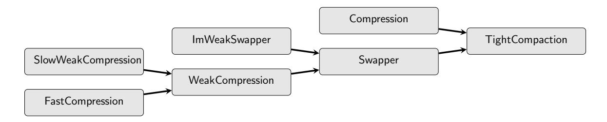

# Oblivious Parallel Tight Compaction

Gilad Asharov∗ Ilan Komargodski† Wei-Kai Lin‡ Enoch Peserico§ Elaine Shi¶ April 6, 2020

#### Abstract

In tight compaction one is given an array of balls some of which are marked 0 and the rest are marked 1. The output of the procedure is an array that contains all of the original balls except that now the 0-balls appear before the 1-balls. In other words, tight compaction is equivalent to sorting the array according to 1-bit keys (not necessarily maintaining order within same-key balls). Tight compaction is not only an important algorithmic task by itself, but its oblivious version has also played a key role in recent constructions of oblivious RAM compilers.

We present an oblivious deterministic algorithm for tight compaction such that for input arrays of n balls requires O(n) total work and O(log n) depth. Our algorithm is in the Exclusive-Read-Exclusive-Write Parallel-RAM model (i.e., EREW PRAM, the most restrictive PRAM model), and importantly we achieve asymptotical optimality in both total work and depth. To the best of our knowledge no earlier work, even when allowing randomization, can achieve optimality in both total work and depth.

∗Bar-Ilan University, Gilad.Asharov@biu.ac.il

†NTT Research, ilan.komargodski@ntt-research.com

‡Cornell University, wklin@cs.cornell.edu

§Universit`a degli Studi di Padova, enoch@dei.unipd.it

¶Cornell University, runting@gmail.com

# Contents

| 1 | Introduction                              | 1  |
|---|-------------------------------------------|----|
|   | 1.1 Our Contributions               | 2  |
|   | 1.2 Related Work                       | 2  |
| 2 | Technical Overview                        | 3  |
| 3 | Preliminaries                             | 7  |
|   | 3.1 Definitions                        | 7  |
|   | 3.2 Tools                              | 8  |
| 4 | Our Abstractions                          | 9  |
|   | 4.1 Tight Compaction                | 9  |
|   | 4.2 Swapper and Imbalanced Swapper  | 9  |
|   | 4.3 Compression                     | 10 |
|   | 4.4 Weak Compression                   | 10 |
| 5 | Parallel Tight Compaction                 | 11 |
| 6 | Realizing the Abstractions                | 13 |
|   | 6.1 Find Matching                   | 13 |
|   | 6.2 Compression                     | 16 |
|   | 6.3 Swapper                            | 19 |
|   | 6.4 Imbalanced Weak Swapper         | 21 |
|   | 6.5 Weak Compression                   | 22 |
|   | 6.6 Slow Weak Compression              | 24 |
|   | 6.7 Fast Compression                   | 25 |
|   | References                                | 25 |
| A | Proof of Theorem 3.3                      | 28 |

# 1 Introduction

Tight compaction aims to solve the following problem: given an array of elements each marked with either the label 0 or 1, move all the 0-elements to the front of the array and all the 1-elements to the end. In other words, we would like to sort an array of elements each tagged with a 1-bit key. Moreover, due to its relationship to the classical sorting problem, tight compaction has been an abstraction of interest and has been studied in the core algorithms literature for several decades and in various models of computation. Notably, Pippenger's elegant self-routing superconcentrator construction [\[Pip96\]](#page-28-0) implied a deterministic tight compaction algorithm completing in O(n) total work and O(log n) depth (see Section [1.2](#page-3-1) for other classical algorithmic results on this important abstraction).

In this paper, we care about solving the tight compaction problem on a parallel RAM, but imposing an additional natural privacy requirement commonly referred to as obliviousness. Specifically, we require that the memory access patterns of the RAM be independent of the input array. In this way, an adversary (e.g., an untrusted cloud server) who observes the RAM's access patterns cannot gather any information about the secret input. Besides being an interesting question on its own, an important application of oblivious tight compaction is in the design of efficient Oblivious RAM (ORAM) algorithms, as shown repeatedly in a sequence of recent works [\[CS17,](#page-27-0) [CCS17,](#page-27-1)[AKL](#page-27-2)+20], including a very recent work of Asharov et al. [\[AKL](#page-27-2)+20] which demonstrated an asymptotically optimal ORAM and closed a long-time open question in this line of work [\[GO96,](#page-28-1)[Gol87\]](#page-28-2).

Clearly a na¨ıve method to solve oblivious tight compaction is to rely on a sorting circuit such as AKS [\[AKS83\]](#page-27-3) to sort the entire input of n elements, consuming O(n·log n) work and O(log n) depth. However, since general-purpose oblivious sorting must consume Ω(n·log n) work (under the indivisibility assumption [\[BN16,](#page-27-4)[LSX19\]](#page-28-3) or assuming a well-known network coding conjecture [\[FHLS19\]](#page-27-5)), a very natural question is whether we can accomplish oblivious tight compaction with asymptotically better overheads.

Pippenger's result [\[Pip96\]](#page-28-0), mentioned above, does not satisfy obliviousness. However, around the same time, another independent work by Leighton et al. [\[LMS95\]](#page-28-4) showed that there is an almost oblivious randomized algorithm that accomplishes tight compaction except with negligible probability in n in O(n · log log n) work and O(log n) depth — and the algorithm's access patterns leak only the total number of 0 elements in the input array, and nothing else. Subsequent works by Mitchell and Zimmerman [\[MZ14\]](#page-28-5) and Lin, Shi, and Xie [\[LSX19\]](#page-28-3) improve upon Leighton et al. [\[LMS95\]](#page-28-4) by showing how to achieve full obliviousness (i.e., also hiding the number of 0s) while retaining the same asymptotical overheads as Leighton et al. Like Leighton et al., Mitchell and Zimmerman and Lin et al.'s algorithms are also randomized and have a negligible probability of failure.

These results left open the question of devising a deterministic oblivious tight compaction algorithm with linear total work. For a very long time there was no progress in either fronts until the recent work by Asharov et al. [\[AKL](#page-27-2)+20] where they constructed a deterministic oblivious tight compaction algorithm that consumes linear total work.[1](#page-2-1) While optimal in total work, Asharov et al.'s algorithm is sequential and turning it into one with logarithmic depth seems non-trivial.[2](#page-2-2) We ask whether one could have a clean and optimal result statement, that is,

Is it possible to construct a deterministic oblivious tight compaction algorithm that

1The work of Asharov et al. [\[AKL](#page-27-2)+20] subsumes and contains the work of Peserico [\[Pes18\]](#page-28-6) so we neither mention the latter explicitly nor compare to it.

2More precisely, the algorithm of Asharov et al., as written, has linear depth. However, as we explain in Section [2,](#page-4-0) there are a couple of standard (yet non-trivial) tricks one can apply in order to make it consume O(log n · log log n) depth. Modifying their scheme to consume only O(log n) depth seems to require new non-trivial ideas.

Essentially we ask whether one can match the best known non-oblivious deterministic result, i.e., Pippenger's algorithm [\[Pip96\]](#page-28-0), but additionally achieving obliviousness. Note that any tight compaction algorithm requires linear work and logarithmic depth on PRAMs with exclusive writes (which is the model we work in), even without obliviousness. The former is since any algorithms must at least read the input and the latter is due to an elegant and classical lower bound by Cook et al. [\[CDR86\]](#page-27-6).

### 1.1 Our Contributions

We close the gap in our understanding regarding this important algorithmic abstraction by answering the above question affirmatively, showing an algorithm that is optimal in total work as well as in depth.

Theorem 1.1 (Informal). There exists a deterministic oblivious tight compaction algorithm such that for an input array of n elements, the algorithm completes in O(n) total work and O(log n) total depth (assuming that each element fits into a single memory word and a memory word can hold at least log n bits).

Our result holds on an Exclusive-Read-Exclusive-Write (EREW) PRAM,[3](#page-3-2) i.e., the most restrictive PRAM model (which makes our result stronger). Furthermore, our algorithm is in the "indivisible model", i.e., while the algorithm can perform numeric computations on the 1-bit keys, the elements themselves are "indivisible" and can only be moved around in memory [\[BN16\]](#page-27-4). By asymptotically matching the best known non-oblivious algorithm [\[Pip96\]](#page-28-0), our result shows that obliviousness of tight compaction can be obtained "for free" (other examples of such tasks are sorting [\[AKS83\]](#page-27-3) and parallel merge sort [\[Col88\]](#page-27-7)).

In a very high level, our algorithm combines ideas, in a non black-box way, from the nonoblivious tight compaction algorithm of Pippenger [\[Pip96\]](#page-28-0) together with the oblivious yet sequential algorithm of Asharov et al. [\[AKL](#page-27-2)+20]. See Section [2](#page-4-0) for an overview of our technical highlights.

Towards an optimal OPRAM. Since oblivious tight compaction is an important building block in the optimal ORAM construction of [\[AKL](#page-27-2)+20], one may wonder if our result can be used to obtain a depth-efficient version of their work, i.e., an oblivious PRAM (OPRAM) [\[BCP16,](#page-27-8)[CS17\]](#page-27-0). Unfortunately, not immediately: their ORAM construction is based on several other building blocks and algorithms which are sub-optimal in terms of depth (e.g., oblivious Cuckoo hashing [\[GM11,](#page-27-9)[KLO12\]](#page-28-7)). While our result does take us one step closer towards an optimal OPRAM, a full resolution is left for future work.

## 1.2 Related Work

As mentioned, the study of compaction algorithms is core to the classical algorithms literature due to its close relations to sorting. We thus discuss additional related work.

The tight compaction problem has been studied in the core algorithms literature under various models of computation. For PRAMs with exclusive-writes, which is the model we consider, a classical result by Cook et al. [\[CDR86\]](#page-27-6) shows that a logarithmic lower bound exists for any algorithm

3 In the EREW model, every memory cell can be read or written to by only one processor at a time.

even without the obliviousness or indivisibility requirements. On a concurrent-read concurrentwrite (CRCW) PRAM, there is a well-known Ω(log n/ log log n)-depth lower bound for any algorithm even without the obliviousness or indivisibility assumptions. Moreover, there is a matching non-oblivious upper bound that achieves O(log n/ log log n) depth and linear total work [\[Rag90\]](#page-28-8).

Another related abstraction, called stable tight compaction, aims to achieve the same task as tight compaction, but now additionally requiring stability, i.e., in the output array, elements with the same key must appear in the same order as the input. For oblivious algorithm subject to the indivisibility assumptions, there is a separation between stable tight compaction and nonstable ones. Specifically, a recent lower bound by Lin et al. [\[LSX19\]](#page-28-3) shows that any oblivious algorithm subject to the indivisibility assumption must incur Ω(n·log n) work to stably and tightly compact an arbitrary input array of n elements (while without stability one can achieve it in O(n) work [\[AKL](#page-27-2)+20]). Therefore, in this paper, we allow our tight compaction to not have to respect stability.

Due to the close relationship of tight compaction and sorting, a natural question is whether one can design algorithms in the so-called comparison-based model where the algorithm is only allowed to perform comparisons on keys and move elements around. However, due to the wellknown 0-1 principle for sorting, any comparison-based algorithm that can sort an array with 1-bit keys must be able to sort any array with arbitrary keys. Thus we cannot constrain ourselves to the comparison-based model since otherwise there would be an Ω(n · log n) lower bound [\[Knu98\]](#page-28-9).

A relaxed abstraction, called loose compaction, is also studied extensively in the algorithms literature. Loose compaction solves the following problem: given an input array containing n elements among which at most n/` are real and the rest are dummy (for some constant ` > 0), compress the input array to half of the original size while not losing any real element in this process. Pippenger's self-routing superconcentrator [\[Pip96\]](#page-28-0) implies a non-oblivious loose compaction algorithm with O(n) total work and O(log n) depth. Asharov et al. [\[AKL](#page-27-2)+20], relying on Pippenger's work, showed how to obtain oblivious loose compaction without increasing the asymptotical overhead. Loose compaction has also received a lot of attention in the parallel (non-oblivious) algorithms literature. There is a separation between loose and tight compaction on a CRCW PRAM. Specifically, Bast and Hagerup [\[BH95\]](#page-27-10) showed the existence of an O(n) work and O(log∗ n) depth parallel (non-oblivious) algorithm for performing loose compaction, while as mentioned Ω(log n/ log log n) depth is necessary for tight compaction.

We note that, in the current paper as well as in previous works (e.g., Asharov et al. [\[AKL](#page-27-2)+20]), we use loose compaction as an intermediate abstraction. Here, however, we are unable to use previous constructions directly. In fact, we introduce another relaxation of loose compaction which allows to "lose" a small fraction of real elements. While this allows us to implement this procedure very efficiently (in work and depth), it introduces a new challenge of correcting the mistakes in parallel afterwards. See Section [2](#page-4-0) for details.

# 2 Technical Overview

In this section we give an overview of our construction with an emphasis on the main ideas used to get Theorem [1.1.](#page-3-3)

It has been known for a while that the tight compaction problem is very related to the notion of self-routing super-concentrator [\[Pip96,](#page-28-0)[AKL](#page-27-2)+20]. Recall that a superconcentrator is a graph that consists of n source vertices and n target vertices such that for any k ≤ n, any k-subset of sources is connected to any k-subset of targets by k vertex-disjoint paths [\[Pip96,](#page-28-0)[AHU74,](#page-27-11)[Val76\]](#page-28-10). Intuitively, one can imagine associating the input balls with the source vertices and then routing the 0 balls to the first target vertices and the 1 balls to the last target vertices. However, this process (i.e., the way the superconcentrator decides how to route) is known to be non-oblivious and the naive way to make it oblivious is by sending "dummy messages" along unused edges—causing a logarithmic overhead in the total work. Actually, working out the details of the algorithm, one can see that the logarithmic overhead is independent of the size of the balls and so the actual total work is  $O(n \cdot \log n + \lceil D/w \rceil \cdot n)$  [CNS18], where D is the bit-size of each ball and w is the word size.

The recent work of Asharov et al. [AKL+20] managed to get this overhead down to  $O(\lceil D/w \rceil \cdot n)$  using two ideas: (1) reducing to loose compaction and (2) packing and decomposition. We elaborate on these ideas next.

Reducing to loose compaction. In this step the task of tight compaction is reduced to the task of loose compaction. In loose compaction, one is given an array where balls are marked either real or dummy and it is guaranteed that there are at most  $1/\ell$  fraction of reals. Henceforth, we arbitrarily assume that  $\ell=128$ . The goal is to output an array of size n/2 which contains all the reals. First note that every real within the first n/2 locations is already in the "right" place and it should not be moved and so we only need to deal with the reals which are in the second half of the array. To this end, Asharov et al. imagine the elements as associated with the left nodes of a good bipartite expander and every misplaced real is swapped with a misplaced dummy (i.e. a real from the second half of the array with a dummy from the first half) if and only if they are neighbors of distance 2 on the expander. Using properties of the expander, one can show that this "handles" almost all of the misplaced reals. Now, one can use loose compaction to compress the array (since it now contains much fewer misplaced reals) and recurse on the the array of size n/2. The cost of this reduction is linear—the bipartite graph has constant degree and each recursive step halves the array size.

**Decomposition and packing.** These two ideas are used to implement loose compaction. The idea is to zoom-in on the input array in various resolutions. In the smallest instance case, one can pack lots of information into a single word and larger instances are decomposed to this smaller one. Concretely, Asharov et al. define three scenarios, depending on the relation between n (the number of balls in the input) and w (the word size):

- 1. Small instances—If  $n \leq w/\log w$ : In this case, one can basically "download" the input to the client and solve loose compaction. More precisely, one can download 1 bit per input element, saying whether it is real or not. This is enough to compute the disjoint routes which can then be used to perform the actual routing.
- 2. Medium instances—If  $n \leq (w/\log w)^2$ : The idea is to "zoom out" and view each block of  $\sqrt{n} \leq w/\log w$  balls as one ball which is labeled dense if and only if it contains at least  $\sqrt{n}/4$  real balls. Since the original array has at most 1/128 reals, the "zoomed out" array has at most  $\sqrt{n}/32$  denses. Notice that we can run our tight compaction procedure on this "zoomed out" array, moving the dense blocks to the front, since it is a "small instance". Next, we run tight compaction for small instances again but now within the non-dense blocks. This compresses 3/4 of the space for 3/4 of the blocks (which are non-dense by assumption).
- 3. Large instances—If  $n > (w/\log w)^2$ : Now that we have tight compaction for small and medium instances (by the above two items), and we get loose compaction for large instances in a very similar way. We "zoom out" and view the input array as  $m = n/(w/\log w)^2$  blocks each consisting of  $(w/\log w)^2$  elements. As before, we mark a block as dense if it contains more than 1/4 or reals (as before, at most 1/32 fraction of the blocks can be dense). To perform loose

compaction on the "zoomed out" array we apply the naive oblivious algorithm to compute routes. As mentioned, the naive algorithm has extra logarithmic overhead but this is okay since we apply it on an array that contains m elements (indeed, O(m · log m + dD/we · m) ≤ O(dD/we · n)). Once the dense blocks are at the front, we can invoke tight compaction for medium instances and compact each block in linear time. As before, this compresses 3/4 of the space for 3/4 of the blocks.

This completes the high-level description of the algorithm of Asharov et al. We continue to explain what are the challenges & ideas used to make it in depth O(log n).

Challenge 1. The first component that is not optimal for depth is the reduction to loose compaction. There, we perform swaps over the edges of a bipartite expander and naively performing all of them in parallel does not work. Indeed, a single "misplaced" real node could be the distance-2 neighbor of two (or more) dummys so we have to be able to resolve these conflict somehow in low depth.

The solution for this is inspired by the solution for a similar problem from the superconcentrator and sorting networks literature. The idea is to use a particular property of the expander graph: there is a natural partitioning of the entire edge-set into a constant number of disjoint perfect matchings. Using this, we can perform the swaps in parallel between different copies and it is guaranteed that there will be no "collisions".

Challenge 2. Recall that the construction of Asharov et al. consists of first reducing tight compaction to loose compaction and then solving loose compaction (for small, medium and finally large instances). In terms of depth, naively the reduction from tight compaction to loose compaction resumes for log n steps until the instance becomes of constant size. A simple observation is that we can actually run the recursion only for O(log log n) steps until the instance size becomes O(n/ log n) size in which case we can just invoke full-fledged oblivious sort [\[AKS83\]](#page-27-3). What about the depth of loose compaction? For small instances it is O(n), for medium ones it is O( √ n), and for large ones it is O(log n) (the latter is the dominant one). In total, the depth of Asharov et al.'s construction (after solving challenge 1 and the above observation about the depth of the recursion) is O(log n·log log n). Getting rid of the extra log log n factor is the most challenging part of our work.

We do not know how to get loose compaction in depth better than O(log n). Our main idea is to circumvent this by weakening the requirement from loose compaction by allowing it to err. Concretely, we consider a weak version of loose compaction that we call weak compression which takes an array of size n that has say 1/128 fraction of reals and it outputs an array of size n/2 that contains almost, say -fraction of, all reals. The main observation is that if is set to be 1/polylog(n), then weak compression can actually be realized in O(log log n) depth (rather than O(log n) without errors). To see this, one has to recall the details of how the superconcentrator chooses its routes. Roughly, this is a process that proceeds in "rounds" over a bipartite graph, where at each round a constant fraction of nodes become satisfied (i.e., routes are found). After O(log n) rounds, all nodes are satisfied, but after O(log log n) rounds all but 1/polylog(n) fraction of nodes are satisfied.

Combining the above weak compression procedure with the reduction from tight compression to (this variant of) loose compaction gives an abstraction we call a swapper and it costs linear work and logarithmic depth. This abstraction can be viewed as (another) relaxation of tight compaction where any 1-ball that appears before a 0-ball is swapped except for a 1/polylog(n) fraction of pairs which remain "in reverse order". All we are left to do is to correct these errors.

We correct the error by building (from scratch) a tight compaction procedure that works for very sparse inputs (of density 1/polylog(n)) in linear work and logarithmic depth. Indeed, using such a procedure we can easily swap the remaining misplaced elements. To get a tight compaction procedure for sparse inputs, the idea is to first compress the array into one that is of size O(n/ log n). Then, we can run full-fledged oblivious sort which completes the task.[4](#page-7-0)

The key technical contribution is the way we compress the sparse array to size O(n/ log n) with only O(log n) depth. Towards this end, we stack O(log log n) many instances of loose compaction, each compressing the size by factor 1/2. Indeed, since the input is only of density 1/polylog(n), O(log log n) layers are sufficient in terms of functionality. But what about complexity? We said that the depth of loose compaction is O(log n) so stacking O(log log n) many instances of them does not sound like a good idea. To see why this is okay, recall again that loose compaction is basically implemented by using a fixed bipartite expander graph and doing: (1) finding an appropriate matching (in rounds), and (2) performing the routing over the matching.

The basic observation is that step (1) can be parallelized among all layers and then using the computed matchings, the routing can be directly performed. Parallelizing step (1) is not straightforward as in layer i for i > 1 we do not know who are the sources when the matching from layer i−1 has not been determined yet. But since the input is very sparse, we can compute all possibilities of sources in each layer i. Since the bipartite graph has constant degree, the number of possibilities only grows by a constant factor in every level and there are only O(log log n) levels so choosing the parameters carefully, we can tolerate the extra polylog(n) factor in the number of possibilities. Let us remark that a similar issue came up in the non-oblivious self-routing superconcentrator of Pippenger [\[Pip96\]](#page-28-0) and the above idea is inspired by Pippenger's solution.

Simplified construction and reduced asymptotic constant. As a bonus, the fact that we introduce weak versions of compaction that permit various types of errors, allows us to simplify the construction of Asharov et al. Concretely, our new algorithm has only two cases "large instances" and "small instances" (i.e., we got rid of the "medium instances").

Recall that in Asharov et al. [\[AKL](#page-27-2)+20], for large instances (i.e., n > (w/ log w) 2 ) it takes O(m · log m) work to compute the matching. Thus, they choose the large-medium cutoff to be of size (w/ log w) 2 so that in the large case m = n/(w/ log w) 2 implies that O(m · log m) = O(n). Medium instances (i.e., n ≤ (w/ log w) 2 ) are still too large to be solved directly, so they further divide each medium instance into √ n small instances. The latter can be solved directly by packing. We, on the other hand, have work overhead for large instances of only O(log log m). This allows us to split large instances to m = n/ log w blocks which implies overhead O(m·log log m) = O(n). This directly reduces us to the "small instance" case without going through the medium size instances case. While we are not motivated by optimizing asymptotic constants, compared to Asharov et al. (whose overhead is roughly 230), our simplified construction directly yields a better constant (roughly 220).

Sorting with more keys. Our tight compaction is an algorithm for sorting an array of n balls where each ball is marked with a 1-bit key. Our algorithm can be extended to sort n balls marked with K-bit keys where K is any constant. The idea is that our reduction to loose compaction can be modified such that every element that is not "misplaced" will remain in the same location throughout the execution of the algorithm. We elaborate on the details of this modification in Remark [5.3.](#page-14-2) With this feature, we can first compact the array, moving the elements tagged with

4Actually, this gives a stable tight compaction procedure for sparse input arrays.

the first key to the front, and then compact (recursively) the rest of the array, keeping those elements at the front.

In more detail, to sort an array of balls marked with keys from [K], we first run the plain tight compaction algorithm so that 1-balls (by k-balls we mean all balls marked with key k ∈ [K]) are moved to the front. Then, we apply the variant of tight compaction, mentioned above, to compact 2-balls while keeping 1-balls unmoved. At the kth step for k ∈ [K], to move the k-balls to their correct locations, we apply the variant of tight compaction to compact k-balls while keeping 1-balls through (k − 1)-balls in place. The procedure finishes after K iteration. By inspection, this algorithm consumes O(K · n) total work and O(K · log n) depth (which remain linear and logarithmic, respectively, as long as K is constant).

# 3 Preliminaries

### 3.1 Definitions

A parallel random-access machine (PRAM) is a machine that consists of a memory and P CPUs. The memory is denoted as mem[N, w], and is indexed by the logical address space [N] = {1, 2, . . . , N}. We refer to each memory cell also as a word and we use w to denote the bit-length of each word. Each CPU has its index in P and an internal state that consists of a small constant number of words. Elaborately, the memory supports read/write instructions (op, addr, data), where op ∈ {read,write}, addr ∈ [N] and data ∈ {0, 1} w ∪ {⊥}. If op = read, then data = ⊥ and the returned value is the content of the word located in logical address addr in the memory. If op = write, then the memory data in logical address addr is updated to data. We use standard setting that w = Θ(log N) (so a word can store an address). We assume only exclusive read and exclusive write (EREW) where each memory word can only be read or written by at most one CPU at a time. This is the most restricted model which makes our result stronger. We follow the convention that each CPU performs one word-level operation per unit time, i.e., arithmetic operations (addition or subtraction), bitwise operations (AND, OR, NOT, or shift) or memory accesses (read or write). A PRAM algorithm is a constant-length sequence of word-level operations that computes on any input stored in the memory for any memory size N ∈ N (i.e., we consider only uniform algorithms).

For an algorithm in the PRAM model, assuming the number P of CPUs is unlimited, we characterize the efficiency by work and depth, where work is the total number of word-level operation performed by all CPUs, and depth is the number of parallel steps consumed by the algorithm. Because the algorithm runs on a PRAM of N memory words, we assume that the input to the algorithm is described in n ≤ N words, which implies that w = Ω(log n) as w = Θ(log N).

Given an abstraction f, [5](#page-8-2) a PRAM machine obliviously implements it if in addition to correctness (namely, outputting a correct output on every input) it also holds that the access pattern to the memory that the algorithm performs, does not reveal anything about the input data. In this work, it suffices to consider algorithms that deterministically implement functionalities. For a machine M and an input I, denote by Addrs(M, I) the sequence of accessed memory addresses during the execution M(I). We require oblivious simulation which we formalize by requiring the existence of a simulator that simulates the distribution of Addrs without knowing I.

Definition 3.1 (Oblivious implementation). Let M be a PRAM machine that interacts with the memory and implements a given functionality. We say that M is oblivious, if there exists a proba-

5Note that we distinguish between an abstraction and a functionality (in terminology). A functionality specifies exactly what the expected output is, while an abstraction may only do so partially. For example, the tight compaction abstraction does not specify any ordering between same-key balls.

bilistic polynomial time simulator Sim such that for every input I, the two variables are identically distributed

$$\mathsf{Addrs}(M,\mathbf{I}) \qquad and \qquad \mathsf{Sim}(1^{|\mathbf{I}|}).$$

In the above we focus on *perfect* obliviousness, i.e., that the access pattern is perfectly simulatable. Note that there are weaker notions of obliviousness, such as statistical (requiring the statistical distance between the above two distributions to be small) or computational (requiring that the above two distributions are computationally indistinguishable). Also notice that a deterministic and perfectly oblivious PRAM machine yields accesses that depends only on (and simulatable by) the input size  $|\mathbf{I}|$ . All constructions in this paper achieve both properties.

#### 3.2 Tools

We will use several (standard) tools on which we elaborate next.

**Oblivious sorting.** Ajtai et al. [AKS83] shows that there is a comparator-based circuit with  $O(n \cdot \log n)$  comparators and  $O(\log n)$  depth that can sort any array of length n.

**Theorem 3.2** (Ajtai et al. [AKS83]). There is a deterministic oblivious sorting algorithm in the PRAM model with word size w that sorts n elements using  $O(\lceil D/w \rceil \cdot n \cdot \log n)$  work and  $O(\log n)$  depth, where D denotes the length of each element in bits.

Expanders. Our construction relies on dense family (i.e., one per say every power of 2) of constant degree bipartite expander graphs that have several appealing properties: (1) their entire edge set can be computed in linear time in the number of nodes and (2) their entire edge set can be partitioned into a constant number of disjoint perfect matchings. For this, we use either of the well-known construction of expander graphs presented by Margulis [Mar73], Gabber and Galil [GG81], or Jimbo and Maruoka [JM87]. It is well-known that these graph satisfies the above properties (e.g., it was used in the sorting network of Ajtai et al. [AKS83] and the self-routing superconcentrators of Pippenger [Pip96]). Below, we provide a precise statement for completeness. We note that more modern constructions of expanders, while giving better constants due to higher spectral gap, do not fit our purpose since they usually result with families which are neither dense enough nor satisfy property (1).

Let G = (L, R, E) be a d-regular bipartite graph such that |L| = |R|. Let  $P_1, \ldots, P_d$  be a partition of E into d disjoint perfect matchings. (Note that by Hall's theorem [Hal35], such a partition always exists though it may not unique and may not be efficiently computable for an arbitrary d-regular bipartite.) We say the vertex u is the r-th neighbor of v, denoted as  $\Gamma_r(v)$ , if and only if (u, v) is an edge in  $P_r$ . The proof of the following theorem can be found in Appendix A.

**Theorem 3.3.** For any constant  $\lambda \in (0,1)$ , there exists a family of bipartite graphs  $\{G_{\lambda,n}\}_{n\in\mathbb{N}}$  and a constant  $d_{\lambda} \in \mathbb{N}$ , such that for every  $n \in \mathbb{N}$  being a power of 2,  $G_{\lambda,n} = (L,R,E)$  has |L| = |R| = n vertices on each side, it is  $d_{\lambda}$ -regular, and for every sets  $S \subseteq L, T \subseteq R$ , it holds that

$$\left| e(S,T) - \frac{d_{\lambda}}{n} \cdot |S| \cdot |T| \right| \le \lambda \cdot d_{\lambda} \cdot \sqrt{|S| \cdot |T|},$$

where e(S,T) is the number of edges  $(s,t) \in E$  such that  $s \in S$  and  $t \in T$ . Additionally, in the word-RAM model with word size w such that  $w \ge \Omega(\log n)$ ,

1. there exists a (uniform) linear work algorithm that on input  $1^n$  outputs the entire edge set of  $G_{\lambda,n}$ .

2. there exists a (uniform) constant work algorithm that on input r ∈ [dλ], v ∈ L ∪ R, computes Γr(v), where Γr(v) is defined with respect to a fixed partition of Gλ,n.

# 4 Our Abstractions

We will realize tight compaction in Section [5](#page-12-0) in linear work and logarithmic depth. On our path towards this goal, we implement a few abstractions that we define next. They will not only help us present the construction in a modular way, but we believe that some of them might be of independent interest. All the following abstractions take as input an array of balls and are parameterized by functions α(?), β(?), (?), or γ(?), where ? is a placeholder for the number of balls in the input array.

### 4.1 Tight Compaction

In the tight compaction problem one is given an input array containing n balls each of which marked with a 1-bit label that is either 0 or 1. The output is a permutation of the input array such that all the 1-balls are moved to the front of the array.

Definition 4.1 (Tight compaction). Let I be an array of n balls such that each ball is labeled with 0 or 1. On input I, tight compaction outputs an array O which is a permutation of the balls in I such that all the 0-balls appear before the 1-balls.

### 4.2 Swapper and Imbalanced Swapper

An -swapper is parametrized by a function : N → [0, 1]. This procedure gets as input an array I of n balls where each ball is marked with a color from {red, blue, ⊥}. It is guaranteed that the number of red balls is equal to the number of blue balls. The output of the procedure is an array O of size n in which all but at most · n red-blue ball pairs are swapped, where the swapped balls are marked as ⊥ but the non-swapped balls keep the input colors. Looking forward, the output colors will be utilized to further swap balls later in Algorithm [5.2.](#page-12-1)

Definition 4.2 (-swapper). Let I be an array of n balls such that each ball is marked either red, blue, or ⊥ and the number of red balls equals to the number of blue balls. On input I, -swapper outputs an array O of size n which is a permutation of I, the number of red balls equals to the number of blue balls in O, the total number of red and blue balls in O is at most ·n, and for every i ∈ [n]:

- 1. If I[i] is ⊥, then O[i] = I[i] and it is marked ⊥.
- 2. If I[i] is red (resp. blue), then either
  - (a) O[i] = I[i] and it is marked red (resp. blue), or
  - (b) O[i] = I[j] and marked ⊥ for some blue I[j] (resp. red I[j]).[6](#page-10-3)

An -imb-swapper (stands for imbalanced swapper ) generalizes an -swapper. It also takes as input an array I of n balls, where each ball is marked with a color from {red, blue, ⊥}, but the difference is that the number of red balls does not have to be equal to the number of blue balls. Let q(I) = |nred − nblue|, where nϕ for ϕ ∈ {red, blue} is the number of balls with color ϕ in I, be the number of "extra" balls in I from either color. On input I, an -imb-swapper outputs an array O

6As the word "swap" hints, our algorithm will indeed swap a blue I[i] with a red I[j] and then output exactly (O[i], O[j]) = (I[j], I[i]) for the pair (i, j); the abstraction is relaxed (as no pairing required) yet sufficient later.

that satisfies the same requirement as O in Definition [4.2](#page-10-4) except that the total number of balls in O that are either red or blue is at most · n + q(I).

We provide realizations for both primitives. We call the first realization Swapper and the second one ImWeakSwapper, where the difference is not only the imbalance of red and blue balls but also the value of . Specifically, for an input array with n balls, Swapper makes all necessary swaps except for (1/poly log n)-fraction in O(log n) depth, whereas ImWeakSwapper makes all the necessary swaps except for a constant fraction but in constant depth.

The following lemmas are proven in Sections [6.3](#page-20-0) and [6.4,](#page-22-0) respectively:

Lemma 4.3 (Swapper). For all constants c ∈ N, letting (?) = 1/ logc ?, there exists a deterministic oblivious procedure Swapper that implements -swapper in the PRAM model. Letting w be the word size, n be the number of balls in the input array, and D be the size of each ball in bits, Swapper consumes O(dD/we · n) work and O(log n) depth.

Lemma 4.4 (Imbalanced weak swapper). For every constant ` ∈ N, there exists a deterministic oblivious procedure ImWeakSwapper that implements an (1/`)-imb-swapper in the PRAM model. Letting w be the word size, n be the number of balls in the input array, and D be the size of each ball in bits, ImWeakSwapper consumes O(dD/we · n) work and O(1) depth.

### 4.3 Compression

The next abstraction is called (α, β)-compression and it is parametrized by α, β : N → [0, 1] such that ∀? ∈ N: α(?) ≤ β(?). It gets as input an array I of n balls where each ball is either real or dummy. It is guaranteed that the number of real balls in I is at most α · n. The output of the procedure is an array O of size β · n that contains all the real balls from I. The output may consist of "filler" balls that are not in the input (and note that even with fillers, we can still "reverse route" the real output balls back to the input).

Definition 4.5 ((α, β)-compression). Let I be an array of n balls such that each balls is marked real or dummy, where the number of real balls is at most α · n. On input I, (α, β)-compression outputs an array O of size β · n that consists of all the real balls in I, where the real balls are still marked real, and the other balls are arbitrary and marked dummy.

The following lemmas are proven in Sections [6.2](#page-17-0) and [6.7,](#page-26-0) respectively.

Lemma 4.6 (Compression). For all large enough constants c ∈ N, letting α(?) = 1/ logc ? and β(?) = 1/ log ?, there exists a deterministic oblivious procedure Compression that implements an (α, β)-compression in the PRAM model. Letting w be the word size, n be the number of balls in the input array, and D be the size of each ball in bits, Compression consumes O(dD/we · n) work and O(log n) depth.

Lemma 4.7 (Fast compression for short inputs). There exists a constant α ∈ (0, 1/2) for which there exists a deterministic oblivious procedure FastCompression that implements an (α, 1/2)-compression in the PRAM model. Letting w be the word size, n ≤ w/ log w be the number of balls in the input array, and D be the size of each ball in bits, FastCompression consumes O(dD/we · n)-work and O(n) depth.

### 4.4 Weak Compression

Lastly, we define γ-approx-(α, β)-compression for α, β, γ : N → [0, 1] such that ∀? ∈ N: γ(?) ≤ α(?) ≤ β(?). This algorithm is the same as (α, β)-compression except that there the is a "mistake" on γ · n inputs which are not in the output array O. Those balls appear in another array E and they are in the same positions as in I. That is, intuitively, the algorithm moves some real balls from I into the output array O, while other real balls are not moved and still reside in I. We call that array E. Note that 0-approx-(α, β)-compression is equivalent to (α, β)-compression, as E will consist of only dummy balls.

Definition 4.8 (γ-approx-(α, β)-compression). Let I be an array of n balls such that each ball is marked real or dummy, where the number of real balls is at most α · n. On input I, γ-approx -(α, β)-compression is an algorithm that outputs two arrays O and E, such that

- O is an array of β · n balls that consists of all real balls in I except γ fraction, where the real balls are still marked real, and the other balls are arbitrary and marked dummy.
- E is obtained by removing from I all the real balls that reside in O and replacing them with dummys.

The following lemmas are proven in Sections [6.5](#page-23-0) and [6.6,](#page-25-0) respectively.

Lemma 4.9 (Weak compression). There exists a constant α ∈ (0, 1/2), such that for all constants c ∈ N, letting γ(?) = 1/ logc ?, there exists a deterministic oblivious procedure WeakCompression that implements a γ-approx-(α, 1/2)-compression in the PRAM model. Letting w be the word size, n be the number of balls in the input array, and D be the size of each ball in bits, WeakCompression consumes O(dD/we · n) work and O(log log n) depth.

Lemma 4.10 (Slow weak compression). There exists a constant α ∈ (0, 1/2) such that for all constants c ∈ N, letting γ(?) = 1/ logc ?, there exists a deterministic oblivious procedure SlowWeakCompression that implements a γ-approx-(α, 1/2)-compression in the PRAM model. Letting w be the word size, n be the number of balls in the input array, and D be the size of each ball in bits, SlowWeakCompression consumes O(n · log log n + dD/we · n)-work and O(log log n) depth.

We summarize our lemmas and their complexities in Figure [1,](#page-13-0) where we let n denote the number of balls in each input array. Figure [1](#page-13-0) also depicts how our implementations correspond to each other and provides an overview of the roadmap towards our tight compaction algorithm.

# 5 Parallel Tight Compaction

In this section we present our tight compaction algorithm.

Theorem 5.1 (Restatement of Theorem [1.1\)](#page-3-3). There exists a deterministic oblivious algorithm TightCompaction that implements tight compaction in the PRAM model. Letting w be the word size, n be the number of balls in the input array, and D be the size of each ball in bits, TightCompaction consumes O(dD/we · n) work and O(log n) depth.

We use the Swapper and Compression algorithms from Lemmas [4.3](#page-11-2) and [4.6.](#page-11-3) Specifically, we use Compression to implement ( 1 logc ? , 1 log ? )-compression for some constant c (see Lemma [4.6\)](#page-11-3) and let Swapper implement ( 1 logc ? )-swapper (for the same constant c).

#### Algorithm 5.2: TightCompaction(I)

- Input: an array I of n balls, each ball is labeled by a single bit 0 or 1.
- Procedure:

| Name                | Reference         | Abstraction                              | Worka               | Depth           |
|---------------------|-------------------|------------------------------------------|---------------------|-----------------|
| TightCompaction     | Theorem 1.1 (§5)  | Tight Compaction                         | O(n)                | O(log n)        |
| Swapper             | Lemma 4.3 (§6.3)  | 1/polylog-swapper                        | O(n)                | O(log n)        |
| ImWeakSwapper       | Lemma 4.4 (§6.4)  | O(1)-imb-swapper                         | O(n)                | O(1)            |
| Compression         | Lemma 4.6 (§6.2)  | (1/polylog, 1/ log)-compression          | O(n)                | O(log n)        |
| FastCompressionb    | Lemma 4.7 (§6.7)  | (O(1), 1/2)-compression                  | O(n)                | O(n)            |
| WeakCompression     | Lemma 4.9 (§6.5)  | 1/polylog-approx-(O(1), 1/2)-compression | O(n)                | O(log log n) |
| SlowWeakCompression | Lemma 4.10 (§6.6) | 1/polylog-approx-(O(1), 1/2)-compression | O(n · log log n) | O(log log n) |

a In this table, we assume that D, each ball size in bits, is O(w).

bAssuming n ≤ w/ log w.

Figure 1: The diagram depicted the relationship between the implementations of our abstractions. TightCompaction is implemented using Compression and Swapper, where the latter is implemented using ImWeakSwapper and WeakCompression, and the latter is implemented using SlowWeakCompression and FastCompression.

- 1. Color the misplaced 1-balls by blue and the misplaced 0-balls by red (notice that there is the same amount of each).
  - (a) Count the number of 0-balls in I, let d be this number.
  - (b) For i = 1, 2, . . . , n, in parallel, do the following:
    - i. If I[i] is a 1-ball and i ≤ d, mark I[i] as blue.
    - ii. If I[i] is a 0-ball and i > d, mark I[i] as red.
    - iii. Otherwise, mark I[i] as ⊥.
- 2. Swap red and blue balls guaranteeing that only n/polylogn misplaced balls remain.
  - (a) Run Swapper(I) and let I 0 be the resulting array.
- 3. Mark and compress the remaining misplaced balls into an array of size n/ log n.
  - (a) For each ball in I 0 , in parallel, mark it as real if it is red or blue, and mark as dummy if ⊥.
  - (b) Run Compression(I 0 ). Let C be the resulting array, and let Aux1 be the array recording every move of balls during the compression.
- 4. Swap reds and blues in the compressed array by sorting the array (moving reds to the front and blues to the end).
  - (a) Using an oblivious sort (e.g. AKS; see Theorem [3.2\)](#page-9-2), permute the array C so that red balls are at the front and blue balls are at the back. Let Aux2 be the array recording every move of balls during the sorting.
  - (b) For each i ∈ [bn/2c], in parallel, swap C[i] and C[n − i + 1] if and only if C[i] is red and C[n − i + 1] is blue. Let C 0 be the result.

- 5. Reverse route the swapped balls in the compressed array back into the original one.
  - (a) Using Aux2 from Step [4a,](#page-13-3) perform the inversed permutation on C 0 . Then, using Aux1 from Step [3b,](#page-13-4) perform the inversed compression on C 0 back to I 0 . Let the result be O.
- Output: The array O.

Proof of Theorem [5.1:](#page-12-4) Correctness, obliviousness, and determinism follow by description. We analyze efficiency next. Step [1](#page-13-5) consists of counting the number of 0-balls and then checking for every ball if it is misplaced or not. Thus, this step consumes O(dD/we · n) work and O(log n) depth (by counting in a tree-like manner). Step [2](#page-13-6) consists, by Lemma [4.3,](#page-11-2) O(dD/we · n) work and O(log n) depth. Step [3](#page-13-7) consists of marking misplaced balls (O(dD/we·n) work and O(1) depth) and then compressing the array, so by Lemma [4.6,](#page-11-3) this step consumes O(dD/we · n) work and O(log n) depth. Step [4](#page-13-8) requires oblivious sorting on an array of size n/ log n which incurs O(dD/we·n) work and O(log n) depth, and swapping the misplaced balls which incurs O(dD/we · n) work and O(1) depth. Lastly, Step [5](#page-14-3) reverses two steps from before. In total, the work is O(dD/we · n) and the depth is O(log n).

Remark 5.3 (Compacting with more keys). In TightCompaction, the balls marked as ⊥ in Step [1](#page-13-5) are never moved throughout the execution and remain in the same place in the output array O. Hence, whenever we want the first t balls to remain in the same location throughout the algorithm while compacting the last n−t balls for some t ≤ n, it suffices to modify TightCompaction as follows. First, we let TightCompaction get t as an extra input. Then, we modify Step [1](#page-13-5) to always mark the first t balls as ⊥, while counting 0-balls and marking blue and red on the remaining n − t balls. This modification achieves the abstraction we mentioned in the end of Section [2](#page-4-0) in the context of compacting balls tagged with more than 1-bit keys: compacting an array while keeping some elements in place.

# 6 Realizing the Abstractions

In this section we provide proofs of our abstractions, i.e., proofs for Lemmas [4.3,](#page-11-2) [4.4,](#page-11-4) [4.6,](#page-11-3) [4.7,](#page-11-5) [4.9,](#page-12-2) and [4.10.](#page-12-3) We start with a common procedure for obliviously finding a matching with a particular structure in a bipartite graph. We use this procedure to implement Compression (Lemma [4.6\)](#page-11-3) and SlowWeakCompression (Lemma [4.10\)](#page-12-3). As each of the building block (including bipartite expander graphs, counting, and oblivious sorting) are both deterministic and oblivious, a straightforward syntactic checking proves obliviousness and determinism for each above lemma, and hence we will focus only on proving the correctness and efficiency.

### 6.1 Find Matching

Let G = (L, R, E) be a d-regular bipartite graph. For r ∈ [d] and vertex u in Gλ,n, let Γr(u) denote the r-th neighbor of u in Gλ,n. For a subset of edges M ⊆ E, and any node u ∈ L ∪ R, let ΓM(u) = {v ∈ L ∪ R | (u, v) ∈ M} be the set of neighboring vertices of u in M. We define an (a, b)-matching for a subset of nodes S ⊆ L on the left, as a subset of edges for which every vertex from S is connected to at least a vertices on the right and that each vertex on the right is connected to at most b vertices from S. [7](#page-15-0)

Definition 6.1 ((a, b)-matching). We say that M ⊆ E is an (a, b)-matching of S ⊆ L in G iff (1) for all u ∈ S, |ΓM(u)| ≥ a, and (2) for all v ∈ R, |ΓM(v)| ≤ b.

We relax Definition [6.1](#page-15-1) to allow for an error. Namely, we define γ-approx-(a, b)-matching as an (a, b)-matching except that condition (1) holds for all but a γ fraction of vertices from S. That is, there is a subset S 0 ⊆ S such that |S 0 | ≥ (1 − γ) · |S| and for every u ∈ S 0 , |ΓM(u)| ≥ a.

Definition 6.2 (γ-approx-(a, b)-matching). We say that M ⊆ E is a γ-approx-(a, b)-matching of S in G iff condition (1) holds for all but γ faction of nodes in S, and condition (2) still holds.

Let Gλ,n = (L, R, E) with λ := 1/64 be the dλ-regular expander from Theorem [3.3.](#page-9-1) Let B := bdλ/2c. In the rest of this subsection, we prove the following two claims.

Claim 6.3 (SlowMatch). For any input I ⊆ [n] such that |I| ≤ n/32, the procedure SlowMatch (see Algorithm [6.6\)](#page-16-0) outputs a (B, B/4)-matching of I in Gλ,n. It consumes O(n · log n) work and O(log n) depth.

Claim 6.4 (WeakSlowMatch). Let constant c > 0, and γ(n) = 1/ logc (n). For any input I ⊆ [n] such that |I| ≤ n/32, the procedure WeakSlowMatch (see Algorithm [6.7\)](#page-16-1) outputs a γ-approx -(B, B/4)-matching of I in Gλ,n. It consumes O(n · log log n) work and O(log log n) depth.

We also use the following claim from [\[AKL](#page-27-2)+20].

Claim 6.5 (FastMatch, [\[AKL](#page-27-2)+20, Claim 5.16]). For any input I ⊆ [n] such that |I| ≤ n/32 and n ≤ w/ log w, there exists a procedure FastMatch outputs a (B, B/4)-matching of I in Gλ,n. It consumes O(n) work and O(n) depth.

Overview. We start with a high-level overview of the non-oblivious matching algorithm, inspired by Pippenger [\[Pip96\]](#page-28-0), Chan et al. [\[CNS18\]](#page-27-12), and Asharov et al. [\[AKL](#page-27-2)+20]. Claims [6.3,](#page-15-2) [6.4,](#page-15-3) and [6.5](#page-15-4) are all based on this algorithm with minor variations, as we explain below. Given a bipartite graph with vertices L, R and a set S ⊆ L of m marked vertices, we first mark all vertices in S as "unsatisfied". Then, in each round:

- Each unsatisfied vertex u ∈ S: Send a request to each one of the neighbors of u.
- Each vertex v ∈ R: If v received more than B/4 requests in each round, it replies with "negative" to all requests it received in this round. Otherwise, it replies with "positive" to all requests it received. (If v did not receive any request, it replies no positive nor negative.)
- Each unsatisfied vertex u ∈ S: If u received more than B positive replies then take these edges to the matching and change the status to "satisfied".

The output is all the edges in the matching. Note that in each round there are O(|S|) = O(m) transmitted messages, where each message is just a single bit. Using the expansion of the graph and the fact that |S| is small enough, in each iteration the number of unsatisfied vertices is decreased by a factor 1/2. This implies that within O(log m) iterations all unsatisfied vertices will become satisfied. Claim [6.3](#page-15-2) is obtained by running this algorithm while always simulating dummy access to hide which node is transmitting messages and which is not. This causes a logarithmic blow-up

7The term "matching" follows previous works [\[AKL](#page-27-2)+20], and it is also known as "assignment" or "compactor" [\[CNS18,](#page-27-12)[Pip96\]](#page-28-0).

in the total work. Claim [6.4](#page-15-3) is obtained by observing that if the above process is executed for only O(log log n) iterations, then all but 1/polylog(n) fraction of vertices become satisfied. Lastly, Claim [6.5](#page-15-4) is obtained by observing that if n is small enough, the whole graph can fit into O(1) words and so it can be read within O(1) queries and so we can run the above algorithm without the logarithmic overhead incurred by simulating dummy accesses.

#### Algorithm 6.6: SlowMatch: (B, B/4)-matching

- Input: An array I of n indicators representing a subset I ⊂ [n] such that |I| ≤ n 32 and n > w/ log w.
- • The procedure:
  - 1. Let M be a (dλ × n)-array of indicators initialized to all 0s, where M[r, i] indicates if the r-th edge of the i-th left vertex is in the (B, B/4)-matching.
  - 2. Let I 0 = I. Repeat the following for dlog ne iterations.
    - (a) Initialize two arrays Request and Positive, both containing n 0s.
    - (b) For each vertex u ∈ I 0 , send a "request" to all neighbors of u: For each r ∈ [dλ], perform the following sequentially. For all vertex u ∈ L in parallel, if u ∈ I 0 , increment Request[Γr(u)]. (If u 6∈ I 0 , perform fake accesses)
    - (c) For each vertex v ∈ R, if v received from 1 to B/2 requests, then reply "positive" to all neighbors of v: For each r ∈ [dλ], perform the following sequentially. For all vertex v ∈ R in parallel, if 1 ≤ Request[v] ≤ B/2, then increment Positive[Γr(v)]. (Otherwise, perform fake accesses)
    - (d) For each vertex u ∈ I 0 , if u received at least B positive replies, then u adds the edge (u, x) to M such that x replied positively: For each r ∈ [dλ], perform the following sequentially:
      - For all vertex u ∈ L in parallel, if u ∈ I 0 and Positive[u] ≥ B and Request[Γr(u)] ≤ B/2, then set M[r, u] := 1. (Otherwise, perform fake accesses)
    - (e) For each vertex u ∈ I 0 , if u received at least B positive replies, then u removes itself from I 0 : For all vertex u ∈ L in parallel, if Positive[u] ≥ B, set I 0 [u] := 0.
- • Output: The array M.

#### Algorithm 6.7: WeakSlowMatch: 1/ logc (?)-approx-(B, B/4)-matching

- Input: An array I of n indicators representing a subset I ⊂ [n] such that |I| ≤ n 32 .
- The procedure:
  - 1. Do everything exactly the same as in Algorithm [6.7,](#page-16-1) except that in step [2,](#page-16-2) perform only c · log log n iterations.
- Output: The array M.

Proof of Claim [6.3:](#page-15-2) Each sub-step in Step [2,](#page-16-2) including Steps [2b,](#page-16-3) [2c,](#page-16-4) and [2d,](#page-16-5) takes O(n) work and O(1) depth as dλ is a constant. Hence, the dlog ne iterations result with O(n · log n) total work and O(log n) depth. We next show that the output is a (B, B/4)-matching.

Observe that whenever a vertex  $u \in I'$  is removed from I', u adds at least B edges (and thus at least B neighbors) to M, while for any vertex  $v \in R$ , the number of neighbors of v in M is at most B/4. Hence, it suffices to show that all vertices in I are removed from I' at the end. For this, it suffice to show that in each iteration of Step 2, the cardinality of I' is reduced (at least) by half.

Fix any iteration, let  $T \subseteq R$  be the set of vertices that got more than B/4 requests and thus do not reply positively in Step 2c, i.e.,  $T = \{v \in R : Request[v] > B/4\}$ . We henceforth say that all vertices in T reply negatively in this proof even they do not reply anything in the procedure. We obtain the following inequality

$$\frac{|T| \cdot d_{\lambda}}{16} < \frac{|T| \cdot B}{4} < e(I', T) \le \frac{d_{\lambda}}{n} \cdot |I'| \cdot |T| + \lambda \cdot d_{\lambda} \cdot \sqrt{|I'| \cdot |T|},\tag{1}$$

where the first inequality holds since  $B = \lfloor d_{\lambda}/2 \rfloor > d_{\lambda}/4$ , the second inequality holds since every vertex in T received more than B/4 requests from I' which implies that  $|T| \cdot B/4 < e(I', T)$ , and the last inequality follows from Theorem 3.3.

Dividing both sides of Inequality (1) by  $d_{\lambda} \cdot |T|$ , we have

$$\frac{1}{16} < \lambda \cdot \sqrt{\frac{|I'|}{|T|}} + \frac{|I'|}{n}.$$

Plugging in  $\frac{|I'|}{n} \leq \frac{|I|}{n} \leq \frac{1}{32}$  and  $\lambda = 1/64$ , it follows that |T| < |I'|/4 (which means that the number of nodes that reply negatively is smaller than |I'|/4). The set of vertices T has at most  $d_{\lambda} \cdot |T| \leq d_{\lambda} \cdot |I'|/4 = B \cdot |I'|/2$  incoming edges. Each such incoming edge will cause a negative reply. By averaging, there are at most |I'|/2 vertices that get at least B negatives (and the rest of the vertices are satisfied).

**Proof of Claim 6.4:** The proof is very similar to the above proof of Claim 6.3 except that we make only  $c \cdot \log \log n$  iterations. Thus, the total work is  $O(n \cdot \log \log n)$  and the depth is  $O(\log \log n)$  depth. As in the proof of Claim 6.3, whenever a node  $u \in I'$  is removed from I', then at least B neighbors are added and in each iteration the cardinality of I' is reduced (at least) by half. Thus, after  $c \cdot \log \log n$  iterations, all but  $O(1/\log^c n)$  nodes are removed from I'.

#### 6.2 Compression

In this section we prove Lemma 4.6.

**Lemma 4.6** (restated). For all large enough constants  $c \in \mathbb{N}$ , letting  $\alpha(\star) = 1/\log^c \star$  and  $\beta(\star) = 1/\log \star$ , there exists a deterministic oblivious procedure Compression that implements an  $(\alpha, \beta)$ -compression in the PRAM model. Letting w be the word size, n be the number of balls in the input array, and D be the size of each ball in bits, Compression consumes  $O(\lceil D/w \rceil \cdot n)$  work and  $O(\log n)$  depth.

To implement  $(\frac{1}{\log^c \star}, \frac{1}{\log \star})$ -compression for large enough constant  $c \in \mathbb{N}$ , the input is an array of n balls, where at most  $\frac{n}{\log^c n}$  balls are real, and we want to compress the input down to  $n/\log n$  balls. Previously, it is known how to implement  $(\alpha', 1/2)$ -compression for small enough constant fraction  $\alpha'$  using (B, B/4)-matching in a bipartite expander [Pip96, AKL+20, CNS18]: Very roughly, every  $\mu$  balls are interpreted as a block, and every B blocks are put on a left vertex of the bipartite expander, where  $\mu$  and B are some parameters (which we will formalize later); Then, the (B, B/4)-matching is capable of routing all real blocks (i.e., a block contains any real ball) from left to right vertices while guaranteeing that every right vertex has at most B/4 real blocks; Hence, merging the real blocks

on every two right vertices into one vertex yields an array of a half number of balls. A straw-man implementation of  $(\frac{1}{\log^c \star}, \frac{1}{\log \star})$ -compression is applying SlowMatch for  $t := \log \log n$  rounds, but given that SlowMatch takes  $O(\log n)$  depth (Claim 6.3) to compute (B, B/4)-matching, the straw man takes more than logarithmic depth.

To reduce the total depth, we separate every instance of (B, B/4)-matching into two phases. Notice that in the straw-man implementation, there is a bipartite expander in each round, and every real block is routed through t layers of bipartite expanders. Thus, we connect t expanders into a directed graph H, where each directed edge (u, v) represents a potential move of a real or dummy block from u to v. In the first phase, given the input array, our compression marks every vertex in the first-layer expander such that is associated with any real block, and then it marks all vertices on H that is reachable by the first-layer marked vertices (i.e., mark a vertex if there exists a path from the first-layer marked vertices). In the second phase, we compute all t instances of (B, B/4)-matching in parallel as the marked vertices are the only input to SlowMatch, which takes  $O(\log n)$  depth as desired.

To ensure SlowMatch outputs correct (B, B/4)-matchings in the second phase, it suffices to ensure that the fraction of marked vertices is at most 1/32 as required in Claim 6.3. Given that the expanders are  $d_{\lambda}$ -regular, after  $t = \log \log n$  layers, the number of marked vertices grows by  $d_{\lambda}^t$  times, which is  $\log^{c'} n$  for some constant c'; Choosing a sufficiently large constant c > c' in the input satisfies the requirement. Finally, as the marked vertices consists of all the vertices that any real block will be routed through, the resulting matchings are capable of routing all real blocks. The algorithm is formalize in Algorithm 6.8.

# Algorithm 6.8: Compression: $(\frac{1}{\log^c \star}, \frac{1}{\log \star})$ -compression

• Input: an array I of n balls such that at most  $\frac{n}{\log^c n}$  are marked as real and all others are marked as dummy.

#### • Procedure:

- 1. Let  $\mu := \lfloor \log n \rfloor$  and  $t := \lceil \log \log n \rceil$ . Let  $\lambda := 1/64$  and let  $G_{\lambda,\star}$  be the family of  $d_{\lambda}$ -regular expander graphs from Theorem 3.3. Let  $B := \lfloor d_{\lambda}/2 \rfloor$ .
- 2. Interpret every  $\mu$  balls as one block: Interpret  $\mathbf{I}$  as an array  $A_0$  of  $n/\mu$  blocks so that each block  $A_0[i]$  consists of  $\mu$  balls. For each block  $A_0[i]$ , in parallel, mark  $A_0[i]$  real if  $A_0[i]$  consists of at least one real ball (and mark dummy otherwise).

Initialize the routing graph H: Let  $m := n/(B \cdot \mu)$ . For each  $j \in \{0, \ldots, t-1\}$ , let  $G_{\lambda, m/2^j} = (L_j, R_j, E_j)$  be the expander defined in Theorem 3.3 so that  $L_j = R_j = [m/2^j]$ . Then, for each  $j \in \{0, \ldots, t-2\}$ , connect every two vertices from  $R_j$  to each vertex in  $L_{j+1}$ ; That is, for each  $i \in [m/2^{j+1}]$ , add two edges from  $2i-1, 2i \in R_j$  to  $i \in L_{j+1}$ . Let H be the resulting graph.

Initialize an indicator bit to 0 for all vertices: For each j = 0, ..., t-1, initialize  $M_j$  and  $\overline{M}_j$  as two arrays each consists of  $m/2^j$  0-bits.

- 3. Mark each vertex on H if the vertex is reachable by any real block: For each  $i \in [m]$ , if any block in  $A_0[(i-1) \cdot B+1, \ldots, i \cdot B]$  is real, then set  $M_0[i] := 1$ . For j from 0 to t-2 sequentially, compute the array  $M_{j+1}$  indicators as follows:
  - (a) For each  $r \in [d_{\lambda}]$ , perform the following sequentially: For all  $v \in [m/2^j]$  in parallel, set  $\overline{M}_j[\Gamma_r(v)] := 1$  if  $M_j[v] = 1$ , where  $\Gamma_r(v)$  denotes the r-th neighbor of the vertex v in the expander  $G_{\lambda,m/2^j}$  as defined in Theorem 3.3.
  - (b) For all  $i \in [m/2^{j+1}]$  in parallel, set  $M_{j+1}[i] := 1$  if and only if  $\overline{M}_j[2i-1] = 1$  or  $\overline{M}_j[2i] = 1$ .

- 4. Compute the (B, B/4)-matching: For all j from 0 to t-1, in parallel, run  $S_j \leftarrow \text{SlowMatch}(M_j)$  (from Claim 6.3).
- 5. Route all real blocks via the computed (B, B/4)-matchings: For each j from 1 to t, let  $A_j$  be an array of  $\frac{n}{\mu \cdot 2^j}$  blocks initialized with dummy. Then, for each j from 0 to t-1 sequentially, route all real blocks from  $A_j$  to  $A_{j+1}$  using the matching  $S_j$  as follows:
  - For each  $r \in [d_{\lambda}]$ , perform the following sequentially:
    - (a) For all  $v \in [m/2^j]$  in parallel, do the following:
      - i. If  $S_i[r,v]=1$ , proceed the following; Otherwise, perform fake accesses.
      - ii. Sequentially find a real block in  $A_j[(v-1) \cdot B + 1, \dots, v \cdot B]$ , and move the real block to a scratch space b[v].
      - iii. Let  $u = \Gamma_r(v)$  be the vertex in the expander  $G_{\lambda,m/2^j}$ . Sequentially find an empty block in  $A_{j+1}[(u-1)\cdot \frac{B}{2}+1,\ldots,u\cdot \frac{B}{2}]$  and then overwrite this empty block with b[v].
- Output: Interpret the array  $A_t$  as balls and output the interpreted array of balls.

**Proof of Lemma 4.6:** We show that for any  $c \geq 2 \log d_{\lambda} + 7$ , any  $n \geq 4$ , Compression (Algorithm 6.8) implements a  $(\frac{1}{\log^c n}, \frac{1}{\log n})$ -compression that consumes  $O(\lceil D/w \rceil \cdot n)$  work and  $O(\log n)$  depth.

To show the correctness, we begin with upper-bounding the fraction of 1-indicators in the arrays  $M_j$  in Step 3. There are at most  $\frac{n}{\log^c n}$  real balls in  $\mathbf{I}$ , so the number of 1-indicators in  $M_0$  is at most  $\frac{n}{\log^c n}$ . For each  $j \in [t]$ , the number of 1-indicators increases by at most  $d_\lambda$  times as  $d_\lambda$  is the vertex degree of the expander  $G_{\lambda,m/2^{j-1}}$ . Hence, the number of 1-indicators in  $M_t$  is at most  $\frac{(d_\lambda)^t \cdot n}{\log^c n}$ , while  $|M_t| = m/\log n$ . Plugging in  $m = \frac{n}{B \cdot \mu} \geq \frac{n}{d_\lambda \cdot \log n}$  and  $(d_\lambda)^t \leq (d_\lambda)^{\log \log n} = (\log n)^{\log d_\lambda}$ , gives that the fraction of 1-indicators in  $M_t$  is at most

$$\frac{(d_\lambda)^t \cdot n}{\log^c n \cdot |M_t|} \leq \frac{(d_\lambda)^{t+1}}{\log^{c-2} n} = d_\lambda \cdot (\log n)^{\log d_\lambda - c + 2} \leq d_\lambda \cdot 2^{-\log d_\lambda - 5} \leq \frac{1}{32},$$

where the penultimate inequality follows since  $c = 2 \log d_{\lambda} + 7$  and  $n \geq 4$ . Hence, for each j from 0 to t, the fraction of 1-indicators in  $M_j$  is at most 1/32, which satisfies the input requirement of SlowMatch. By Claim 6.3, Step 4 computes a correct (B, B/4)-matching for each  $M_j$ .

Using the correct (B, B/4)-matching, every real block in  $A_j$  is routed to  $A_{j+1}$  inductively in Step 5: The induction invariant is that a 1-indicator of  $M_j[i] = 1$  implies that the number of real blocks in  $A_j[(i-1)B+1,\ldots,iB]$  is at most B, while a 0-indicator of  $M_j[i'] = 0$  implies that  $A_j[(i'-1)B+1,\ldots,i'B]$  can not consist of any real block; Then, the subsequent (B, B/4)-matching  $S_j$  is capable of routing at most B real blocks from  $A_j$  corresponding to each 1-indicator of  $M_j$  to the next array  $A_{j+1}$  corresponding to some 1-indicators of  $M_{j+1}$ ; Inductively, all real blocks and thus all real balls are routed into  $A_t$  of  $n/2^t \leq n/\log n$  balls as required.

The  $O(\lceil D/w \rceil \cdot n)$  work follows since we apply the subroutine SlowMatch (see Claim 6.3) only on arrays of geometrically decreasing sizes from  $m = \frac{n}{B \cdot \mu} = O(n/\log n)$ , which sums up to O(n), times the size of a ball  $(\lceil D/w \rceil)$ . The  $O(\log n)$  depth follows by that all instances of the subroutine SlowMatch are performed in parallel (Step 4), which takes  $O(\log n)$  depth by Claim 6.3, while other steps take  $O(t) = O(\log \log n)$  depth and are asymptotically dominated.

&lt;sup>8To achieve the routing, it suffices to use (B, B/2)-matching, but we are just reusing the stronger SlowMatch.

### 6.3 Swapper

In this section we prove Lemma [4.3.](#page-11-2)

Lemma [4.3](#page-11-2) (restated). For all constants c ∈ N, letting (?) = 1/ logc ?, there exists a deterministic oblivious procedure Swapper that implements -swapper in the PRAM model. Letting w be the word size, n be the number of balls in the input array, and D be the size of each ball in bits, Swapper consumes O(dD/we · n) work and O(log n) depth.

Let c ∈ N be the constant for which we wish to implement (1/ logc ?)-swapper. We use ImWeakSwapper (from Lemma [4.4\)](#page-11-4) and WeakCompression (from Lemma [4.9\)](#page-12-2). Particularly, we use WeakCompression which implements (1/ logc1 ?)-approx-(α, 1/2)-compression for some constant α ∈ (0, 1/2) (as in Lemma [4.9\)](#page-12-2) and c1 := max{2c + 2, 4 − log α}, and ImWeakSwapper which implements (α/2)-imb-swapper.

In a high-level, we start by applying ImWeakSwapper to the input array. This swaps a constant fraction of balls in constant depth. Then, we compress (most of) the remaining balls into an array of size n/2 using WeakCompression. Then, we recursively on this smaller array. The end of the recursion is when the remaining array has size O(n/ log n) (namely after O(log log n) recursive steps), in which case we can afford to run a full oblivious sorting algorithm (e.g., Theorem [3.2](#page-9-2) which consumes O(n) work and has O(log n) depth). The formal description is given next. For simplicity of notation in the recursive algorithm, we assume that n is a global fixed parameter.

#### Algorithm 6.9: Swapper : -swapper for (?) = 1/ logc ?

- Input: An array I of size ≤ n in which all balls are marked red, blue or ⊥. In the outermost recursion (i.e., |I| = n), it is guaranteed that the number of red balls equals the number of blue balls.
- • The algorithm:
  - 1. Base case: array is short enough to run oblivious sort.
    - (a) If |I| ≤ n/ log n: run oblivious sort (e.g., AKS; see Theorem [3.2\)](#page-9-2) so that blue balls are in the front and red balls are in the back, swap (blue,red) balls which reside in symmetric locations (from the front and back), and reverse the previous oblivious sort (i.e., identical to Step [4](#page-13-8) of Algorithm [5.2\)](#page-12-1). Output the resulting array.
  - 2. Swap all but an O(1) fraction of balls.
    - (a) Run I 0 ← ImWeakSwapper(I).
  - 3. Compress the array.
    - (a) Consider all balls that are not marked red or blue in I 0 as dummies. Consider all the remaining red or blue balls as reals.
    - (b) Run WeakCompression(I 0 ), and let I 00 and E be the results. Note that I 00 is of size |I 0 | /2 and it contains all the reals from I 0 except for a γ-fraction, and E is of size |I 0 | and it contains the γ = 1 logc1 |I 0 fraction of reals that are not in I 00 (in the same positions). Record all ball movements during this step in Aux.
  - 4. Continue recursively.
    - (a) Run this algorithm Swapper recursively on I 00. Let O0 be the result.
  - 5. Reverse route.
    - (a) Reverse route all real balls from O0 and E back into I 0 using Aux, and let O be the resulting array (note that |O| = |I|).
- • Output: The array O.

**Proof of Lemma 4.3:** We show the correctness holds for all  $c \in \mathbb{N}$  and all  $n \geq 16$  below. We say a ball is a "color ball" if it is blue or red. Intuitively, we swap only (blue,red) pairs and all  $\perp$  balls remain in the same place (after the reverse routing at Step 5). In each recursion, ImWeakSwapper reduces the number of color balls to  $(\alpha/2) \cdot |\mathbf{I}|$ , and then WeakCompression moves all but at most  $\frac{|\mathbf{I}|}{\log^{c_1}|\mathbf{I}|} \leq \frac{|\mathbf{I}|}{\log^{c_1}n}$  color balls into the array  $\mathbf{I}''$  of  $|\mathbf{I}|/2$  balls. Hence, roughly speaking, the fraction of color balls in  $\mathbf{I}''$  is at most  $\alpha$ , and then the recursion continues to further reduce color balls. However, this is not true since WeakCompression may move more blue and less red balls into  $\mathbf{I}''$  (or vice versa). Then, at the next recursion we need to ensure that  $(\alpha/2)$ -imb-swapper gets as input roughly a balanced number of red and blue balls so that it can further reduce the number of color balls. To this end, we upper bound the imbalance and then show that our algorithms can handle it.

Assume, without loss of generality, that each WeakCompression in all recursion levels moves more blue and less red balls (so that the input **I** gets more blue balls). We say the difference between the number of blue balls and red balls as "excess" for short. We show by induction that after WeakCompression in each recursion level, the number of excess is increased by at most  $\frac{|\mathbf{I}|}{\log^{c_1}|\mathbf{I}|}$ . The induction hypothesis holds for the outermost recursion trivially. Assume the induction hypothesis holds until a recursion level t so that input  $|\mathbf{I}| = n/2^t > n/\log n$ . Then, by summing up the increased excess of all recursion levels before t, the total excess in **I** is at most

$$\sum_{j=0}^{t-1} \frac{n/2^j}{\log^{c_1}(n/2^j)} \le \sum_{j=0}^{t-1} \frac{n/2^j}{\log^{c_1/2} n} \le \frac{2n}{\log^{c_1/2} n},$$

where the first inequality holds as  $\log(n/2^j) \ge \log(n/\log n) \ge \log^{1/2} n$  holds for all  $n \ge 16$ . Thus, in recursion level t, using ImWeakSwapper at Step 2,  $\mathbf{I}'$  consists of at most  $|\mathbf{I}'| \cdot \alpha/2 + \frac{2n}{\log^{c_1/2} n}$  color balls. Plugging in  $|\mathbf{I}'| \ge n/\log n$ ,  $c_1 \ge 4 - \log \alpha$ , and  $n \ge 16$ , we have that

$$\frac{2n}{\log^{c_1/2} n} \leq \frac{2}{(\log n)^{c_1/2-1}} \cdot \left| \mathbf{I}' \right| \leq \frac{2(\log n)^{(\log \alpha)/2}}{\log n} \cdot \left| \mathbf{I}' \right| \leq (\alpha/2) \cdot \left| \mathbf{I}' \right|,$$

and thus  $\mathbf{I}'$  consists of at most  $\alpha \cdot |\mathbf{I}'|$  color balls. Hence, at Step 3, WeakCompression proceeds correctly on the  $\alpha$  fraction color balls (by Lemma 4.9) and outputs  $\mathbf{E}$  that consists of at most  $\frac{|\mathbf{I}'|}{\log^{c_1}|\mathbf{I}'|}$  color balls. This bound on the number of color balls is exactly the induction hypothesis for recursion level t, completing our claim.

Summing up, the total number of excess and thus the total number of color balls that go to  $\mathbf{E}$  (but not  $\mathbf{I}''$ ) is at most  $\sum_{j=0}^{\log\log n} \frac{n/2^j}{\log^{c_1}(n/2^j)} \leq \frac{2n}{\log^{c_1/2}n}$ . Due to the imbalance of blue and red, each color ball that goes to  $\mathbf{E}$  incurs at most one color ball that can not be swapped and solved in the base case, and hence, in the array  $\mathbf{O}$  of the outermost recursion, the total number of color balls is at most  $\frac{4n}{\log^{c_1/2}n} \leq \frac{4n}{\log^{c_1+1}n} \leq \frac{n}{\log^c n}$  for all  $n \geq 16$ . This bound fulfills the  $\epsilon(n) = 1/\log^c n$  property and concludes correctness.

We analyze efficiency next. In the base case where  $|\mathbf{I}| \leq n/\log n$ , the total work of the algorithm is  $O(\lceil D/w \rceil \cdot |\mathbf{I}| \cdot \log |\mathbf{I}|) \leq O(\lceil D/w \rceil \cdot n)$  and the depth is  $O(\log n)$ . Consider the outermost case where  $|\mathbf{I}| = n$ . Step 2 takes linear work and O(1) depth. Step 3 takes linear work and  $O(\log w + \log \log n)$  depth by Lemma 4.9. The recursion stops after  $\log \log n$  iterations where in each iteration the instance size reduces by 1/2 so the total work  $\lceil D/w \rceil \cdot O(n) + O(n/2) + \ldots + O(n/\log n) \leq O(\lceil D/w \rceil \cdot n)$  and the total depth is  $O(\log w + \log \log n) + O(\log w + \log \log(n/2)) + O(\log w + \log \log(n/2))$ 

... +  $O(\log w + \log \log(n/\log n)) \le O(\log \log n \cdot (\log w + \log \log n))$ . Reverse routing doubles the work and depth. In total, the total work is  $O(\lceil D/w \rceil \cdot n)$  and the depth is  $O(\log n + \log w \cdot \log \log n)$ .

#### 6.4 Imbalanced Weak Swapper

In this section we prove Lemma 4.4.

**Lemma 4.4** (restated). For every constant  $\ell \in \mathbb{N}$ , there exists a deterministic oblivious procedure ImWeakSwapper that implements an  $(1/\ell)$ -imb-swapper in the PRAM model. Letting w be the word size, n be the number of balls in the input array, and D be the size of each ball in bits, ImWeakSwapper consumes  $O(\lceil D/w \rceil \cdot n)$  work and O(1) depth.

A procedure implementing  $(1/\ell)$ -swapper for all  $\ell \in \mathbb{N}$  with total linear work was developed in Asharov et al. [AKL+20, Claim 5.7], and it actually implements  $(1/\ell)$ -imb-swapper for the same  $\ell$  (we will prove this claim later in this subsection). However, the depth of their procedure is also linear. While this is insufficient for our purposes, we still use their ideas as a starting point. Let us recall the high-level details of their construction.

The procedure instantiates a d-regular bipartite expander (with sufficient expansion depending on  $\ell$ ) for  $d \in O(1)$  that consists of n vertices on both sides. Every ball is associated with a vertex on the left, and for every two vertices that share the same neighbor, the two balls are swapped if and only if the labels are (red, blue). By the vertex expansion of the bipartite expander, only a  $1/\ell$  fraction of misplaced balls may remain not swapped. The algorithm clearly requires linear work as the graph contains a linear number of edges, however parallelizing it is challenging. Concretely, every vertex on the bipartite expander has d neighbors, and so using a naive parallelization a node could be swapped with several other nodes simultaneously, and it is not clear how to resolve conflicts in low depth.

To get over this we use Property 2 in the expander of Theorem 3.3. Namely, we partition the edge set (of the bipartite expander) into disjoint perfect matchings (which can be computed efficiently), and then perform the swaps in within the matchings in parallel as below.

Given the disjoint perfect matchings  $M_1, \ldots, M_d$  from Theorem 3.3, for every pair  $i, j \in [d]$ , we want to swap each pair of red and blue balls that are the 2-edge neighbors on the subgraph  $M_i \cup M_j$ . As the perfect matchings are parallel-friendly, one straw-man solution is to route all n balls via both  $M_i$  and  $M_j$  from left to right (so there are two copies for each ball), swap every pair of red and blue for every vertex on the right side, and then route balls backward via  $M_i$  and  $M_j$ , where the routing and swapping are performed in parallel. However, the straw-man solution doesn't work as every vertex has two neighbors on  $M_i \cup M_j$ , and a red ball may be swapped with both two blue balls in parallel, which still incurs a conflict. To this end, our second observation is that it suffices to copy only reds via  $M_i$ , copy only blues via  $M_j$ , and then swap the pairs if needed; Given a ball is either red or blue exclusively, every ball has at most one copy now. We formally describe the algorithm in the following.

#### **Algorithm 6.10:** ImWeakSwapper: $\epsilon$ -imb-swapper(I) for $\epsilon(\star) = 1/\ell$

- Input: An array I of n balls, each ball is labeled as red, blue or  $\bot$ .
- Parameters: A parameter  $\ell \in \mathbb{N}$ .
- • The algorithm:
  - 1. Let  $\lambda := \frac{1}{2\sqrt{\ell}}$ , and let  $d_{\lambda}$  be the vertex degree given by Theorem 3.3.
  - 2. For each  $(i_1, i_2) \in [d_{\lambda}]^2$ , perform the following sequentially.

- (a) Let  $M_{i_1}$  (resp.  $M_{i_2}$ ) be the  $i_1$ -th (resp.  $i_2$ -th) perfect matching given in Theorem 3.3.
- (b) For all edges  $(k_1, j) \in M_{i_1}$  and  $(k_2, j) \in M_{i_2}$ , do the following: If  $(\mathbf{I}[k_1], \mathbf{I}[k_2])$  are labeled as (red, blue), then swap between  $\mathbf{I}[k_1]$  and  $\mathbf{I}[k_2]$ . Label both as  $\bot$ . Otherwise, perform dummy swap. That is realized as below, where all loops are performed in parallel.
  - i. Initialize two arrays  $R_1, R_2$ , each consists of n empty balls labeled as  $\bot$ , For all  $j \in [n]$ , let  $k_1 := \Gamma_{i_1}(j)$  and  $k_2 := \Gamma_{i_2}(j)$  (so that  $(k_1, j)$  is an edge in  $M_{i_1}$  and  $(k_2, j)$  is an edge in  $M_{i_2}$  for each j by property 2 of Theorem 3.3).
  - ii. For each edge  $(k_1, j)$  in  $M_{i_1}$ , let  $R_1[j] := \mathbf{I}[k_1]$  if  $\mathbf{I}[k_1]$  is red. For each edge  $(k_2, j)$  in  $M_{i_2}$ , let  $R_2[j] := \mathbf{I}[k_2]$  if  $\mathbf{I}[k_2]$  is blue.
  - iii. For each  $j \in [n]$ , if the pair  $(R_1[j], R_2[j])$  is labeled (red, blue), then swap between  $R_1[j]$  and  $R_2[j]$ ), label both as  $\bot$ . Otherwise, perform dummy swap.
  - iv. For each edge  $(k_1, j)$  in  $M_{i_1}$ , let  $\mathbf{I}[k_1] := R_1[j]$  if  $\mathbf{I}[k_1]$  is red. For each edge  $(k_2, j)$  in  $M_{i_2}$ , let  $\mathbf{I}[k_2] := R_2[j]$  if  $\mathbf{I}[k_2]$  is blue.
- • Output: The array I.

**Proof of Lemma 4.4:** The ImWeakSwapper algorithm runs in  $O(\lceil D/w \rceil \cdot n)$  time: Step 2 runs in time  $O(\lceil D/w \rceil \cdot d_{\lambda}^2 \cdot n) = O(\lceil D/w \rceil \cdot n)$  as  $\ell$  is a constant, thus  $\lambda$  is a constant, and then  $d_{\lambda}$  is a constant by Theorem 3.3. The depth is O(1) by Step 2 repeats Step 2b for  $O(d_{\lambda}^2) = O(1)$  iterations and Step 2b has O(1) depth. It remains to prove the correctness.

Without loss of generality, assume the number of blue balls is greater than or equal to the number of red balls in  $\mathbf{I}$  (otherwise, the following argument will work symmetrically). Recall that  $q(\mathbf{I})$  is defined as the excess number of blue balls. Let  $G_{\lambda,n}=(L,R,E)$  be the bipartite expander given in Theorem 3.3, where L=R=[n]. We claim that it suffices to show that for all vertices  $k_1, k_2 \in L$  and  $j \in R$  such that  $(k_1,j), (k_2,j) \in E$ , the pair  $(\mathbf{O}[k_1], \mathbf{O}[k_2])$  cannot have labels (red, blue). To see why, we consider to cases of  $q(\mathbf{I})$ . If  $q(\mathbf{I})=0$ , then the remaining bound of  $\epsilon \cdot n$  follows exactly by the same spectral-expansion argument as the proof of Asharov et al. [AKL+20, Claim 5.7]. The other case  $q(\mathbf{I}) > 0$  is more interesting: viewing the last  $q(\mathbf{I})$  excess blue balls as if they were labeled as  $\bot$ , the input  $\mathbf{I}$  is reduced to the  $q(\mathbf{I})=0$  case, and then the bound  $\epsilon \cdot n + q(\mathbf{I})$  follows by adding up the  $q(\mathbf{I})=0$  case and the last  $q(\mathbf{I})$  excess; Note this reduction is only needed in the proof so there is no additional cost in the procedure.

It remains to prove the above claim. Recall that, in Theorem 3.3,  $E = \bigcup_{i=1}^{d_{\lambda}} M_i$  and for each  $i \in [d_{\lambda}]$ ,  $M_i$  is a perfect matching on  $G_{\lambda,n}$ . Suppose not for contradiction, the edges  $(k_1,j), (k_2,j) \in E$  and  $(\mathbf{O}[k_1], \mathbf{O}[k_2])$  have labels (red, blue). Then, there must exist matchings  $M_{i_1}, M_{i_2}$  such that  $(k_1,j) \in M_{i_1}$  and  $(k_2,j) \in M_{i_2}$ . Because  $(\mathbf{O}[k_1], \mathbf{O}[k_2])$  have labels (red, blue),  $(\mathbf{I}[k_1], \mathbf{I}[k_2])$  must be (red, blue) and satisfy the criteria of Step 2(b)ii. Hence the balls are copied to  $R_1[j], R_2[j]$ , then swapped and relabeled to  $\bot$ , and then moved back to  $\mathbf{I}[k_1], \mathbf{I}[k_2]$  with no label, which contradicts that  $(\mathbf{O}[k_1], \mathbf{O}[k_2])$  have labels.

#### 6.5 Weak Compression

In this section we prove Lemma 4.9.

**Lemma 4.9** (restated). There exists a constant  $\alpha \in (0, 1/2)$ , such that for all constants  $c \in \mathbb{N}$ , letting  $\gamma(\star) = 1/\log^c \star$ , there exists a deterministic oblivious procedure WeakCompression that implements a  $\gamma$ -approx- $(\alpha, 1/2)$ -compression in the PRAM model. Letting w be the word size, n be

the number of balls in the input array, and D be the size of each ball in bits, WeakCompression consumes  $O(\lceil D/w \rceil \cdot n)$  work and  $O(\log \log n)$  depth.

Let  $c \in \mathbb{N}$  be the constant for which we wish to implement  $(1/\log^c \star)$ -approx- $(\alpha, 1/2)$ -compression for some  $\alpha \in (0, 1/2)$  to be determined shortly. We implement this procedure using FastCompression (from Lemma 4.7) and SlowWeakCompression (from Lemma 4.10). Particularly, we use SlowWeakCompression which implements  $(1/\log^{c_1} \star)$ -approx- $(\alpha_1, 1/2)$ -compression, for  $c_1 = 2c + 2$  and some  $\alpha_1 \in (0, 1/2)$ , using super linear work but doubly logarithmic depth, and FastCompression which implements  $(\alpha_2, 1/2)$ -compression for some  $\alpha_2 \in (0, 1/2)$  using linear work and depth. We let  $\alpha = \alpha_1 \cdot \alpha_2/4$ .

## **Algorithm 6.11:** WeakCompression: $1/\log^c \star$ -approx- $(\alpha, 1/2)$ -compression

- **Public parameters:** Size of input array n,
- Input: An array I with n balls each of size D bits, where at most  $\alpha \cdot n$  balls are real and the rest are dummy.
- • The procedure:
  - 1. Let  $\mu := \min(\log w, \log \log n)$ .
  - 2. Compress the array, keeping most of the dense blocks.
    - (a) Represent **I** as another array A that consists of  $m := n/\mu$  blocks each of size  $\mu \cdot D$  bits: for each  $i \in [m]$ , let A[i] be the block consists of all balls  $\mathbf{I}[(i-1) \cdot \mu + 1], \dots, \mathbf{I}[i \cdot \mu]$ .
    - (b) For each  $i \in [m]$ , label A[i] as dense if A[i] consists of more than  $\mu \cdot \alpha_2/2$  real balls.
    - (c) Run  $(\mathbf{O}_1, \mathbf{E}_1) \leftarrow \mathsf{SlowWeakCompression}(A)$ , where  $|\mathbf{O}_1| = n/2$  and  $|\mathbf{E}_1| = n$  (in number of balls). Record all moves in array  $\mathsf{Aux}_1$ .
    - (d) Repeat the above process, this time on the array  $\mathbf{O}_1$ : interpret it as m/2 blocks each of size  $\mu \cdot D$ , mark dense blocks as before, and let  $(\mathbf{O}_2, \mathbf{E}_2) \leftarrow \mathsf{SlowWeakCompression}(\mathbf{O}_1)$ , where  $|\mathbf{O}_2| = n/4$ ,  $|\mathbf{E}_2| = n/2$  (in number of balls). Record all moves in array  $\mathsf{Aux}_2$ .
    - (e) Using  $\mathsf{Aux}_1$ , reverse route the real balls in  $\mathbf{E}_2$  back into  $\mathbf{O}_1$ , and then using  $\mathsf{Aux}_2$ , reverse route and merge real balls from  $\mathbf{E}_1$  and  $\mathbf{O}_1$  back into an error array  $\mathbf{E}$  of size n (recall that  $\mathbf{E}_2$  is in fact  $\mathbf{O}_1$  where some elements were excluded into  $\mathbf{O}_2$ ; reversing  $\mathbf{E}_1$  and  $\mathbf{O}_1$  to A is also possible using  $\mathsf{Aux}_1$ ).
  - 3. Compress the sparse blocks.
    - (a) Replace all dense blocks in A with dummy blocks. For every  $i \in [n/\mu]$ , in parallel, run  $\mathbf{O}_{3,i} \leftarrow \mathsf{FastCompression}(A[i])$ , where A[i] is interpreted as  $\mu$  balls, and then again  $\mathbf{O}'_{3,i} \leftarrow \mathsf{FastCompression}(\mathbf{O}_{3,i})$ . Note that  $|A[i]| = \mu$  and  $|\mathbf{O}'_{3,i}| = \mu/4$ .
  - 4. Set  $\mathbf{O} = \mathbf{O}_2 \| \mathbf{O}_{3,1}' \| \dots \| \mathbf{O}_{3,n/\mu}'$  (which is of total size n/2, as  $|\mathbf{O}_2| = n/4$  and  $\sum_{i=1}^{n/\mu} |\mathbf{O}_{3,i}'| = n/4$ .
  - 5. Output: O and E.

**Proof of Lemma 4.9:** We prove the correctness for all  $c \in \mathbb{N}$  and all  $n \geq 16$  by analyzing the sparsity  $\alpha$  as below. Given the input **I** consists of at most  $\frac{\alpha_1\alpha_2}{4} \cdot n$  real balls, both A and  $\mathbf{O}_1$  consist of at most  $\frac{1}{2}\alpha_1 \cdot \frac{n}{\mu}$  dense blocks, so the sparsity of A and  $\mathbf{O}_1$  is  $\alpha_1/2$  and  $\alpha_1$ , respectively. Thus, SlowWeakCompression works correctly at Steps 2c-2d by Lemma 4.10. Afterwards, for each non-dense block A[i] and  $\mathbf{O}_{3,i}$ , the sparsity is  $\alpha_2/2$  and  $\alpha_2$ , respectively, and so FastCompression works correctly at Step 3a by Lemma 4.7. Since SlowWeakCompression works, the total number of

real balls go to E is at most

$$\frac{m \cdot \mu}{\log^{c_1} m} + \frac{(m/2) \cdot \mu}{\log^{c_1} (m/2)} = \frac{n}{\log^{c_1} (n/\mu)} + \frac{n/2}{\log^{c_1} (n/2\mu)}$$

$$\leq \frac{n}{\log^{c_1} (n/\log \log n)} + \frac{n/2}{\log^{c_1} (n/2\log \log n)}$$

$$\leq \frac{n}{\log^{c_1/2} n} + \frac{n/2}{\log^{c_1/2} n} \leq \frac{n}{\log^{c} n},$$

where the first inequality holds by  $\mu \leq \log \log n$ , the second follows since  $\log \frac{n}{2 \log \log n} \geq \log^{1/2} n$  holds for all  $n \geq 16$ , and the third follows by plugging in  $c_1 = 2c + 2$  and  $\log n \geq 1 + \frac{1}{2}$  for all  $n \geq 4$ . All other real balls go to  $\mathbf{O}$  and then correctness holds.

We next prove the efficiency of Algorithm 6.11. We divide the array into  $n/\mu$  blocks of size  $\mu$  each. By Lemma 4.10, the SlowWeakCompression at Step 2c consumes  $O(\frac{n}{\mu} \cdot \log \log n + \frac{n}{\mu} \cdot \lceil \mu D/w \rceil) = O(n \cdot \lceil D/w \rceil)$  work as  $\mu = \min\{\log w, \log \log n\} = \min\{\log(\Omega(\log n)), \log \log n\} = \Omega(\log \log n)$ , and  $O(\log \log(n/\mu)) = O(\log \log n)$  depth; The depth of counting and marking dense blocks at Step 2b is  $O(\log \mu)$  and dominated. Finally, we run in parallel FastCompression on instances of  $\mu \leq \log \log n$  balls each, so the depth of is also  $O(\mu) = O(\log \log n)$ . We get overall  $O(\log \log n)$  depth and  $O(\lceil D/w \rceil \cdot n)$  work.

#### 6.6 Slow Weak Compression

In this section we prove Lemma 4.10.

**Lemma 4.10** (restated). There exists a constant  $\alpha \in (0,1/2)$  such that for all constants  $c \in \mathbb{N}$ , letting  $\gamma(\star) = 1/\log^c \star$ , there exists a deterministic oblivious procedure SlowWeakCompression that implements a  $\gamma$ -approx- $(\alpha,1/2)$ -compression in the PRAM model. Letting w be the word size, n be the number of balls in the input array, and D be the size of each ball in bits, SlowWeakCompression consumes  $O(n \cdot \log \log n + \lceil D/w \rceil \cdot n)$ -work and  $O(\log \log n)$  depth.

In our implementation,  $\alpha=1/128$ . Let  $c\in\mathbb{N}$  be the constant for which we wish to implement  $1/\log^c\star$ -approx- $(\alpha,1/2)$ -compression. The algorithm SlowWeakCompression uses a sub-procedure WeakSlowMatch from Claim 6.4 (see Algorithm 6.7). Particularly, we use WeakSlowMatch that implements  $(\log^{c/2}\star)$ -approx-(B,B/4)-matching on the graph  $G_{\lambda,n}$  (from Theorem 3.3) with  $\lambda=1/64$ , regularity  $d_{\lambda}$ , and  $B=d_{\lambda}/2$ .

#### **Algorithm 6.12:** SlowWeakCompression: $1/\log^c \star$ -approx- $(\alpha, 1/2)$ -compression

- Input: An array I of n balls, in which at most  $\alpha \cdot n$  are real.
- • The Procedure:
  - Interpret the array I as m := n/B bins, where each bin consists of B balls. Mark all bins in I as dense or sparse, where a bin is dense if it consists of more than B/4 real balls. Let S be an array of m indicators representing the set of indexes of the dense bins. Let I' be an array of m empty bins, where the capacity of a bin is B balls.
  - 2. Let  $G_{\lambda,m}=(L,R,E)$  be the  $d_{\lambda}$ -regular bipartite graph guaranteed by Theorem 3.3, where |L|=|R|=m.
  - 3. Compute  $M \leftarrow \mathsf{WeakSlowMatch}(S)$ .
  - 4. **Distribute:** For each edge  $(u, v) \in E$  (where  $u \in L, v \in R$ ), if  $(u, v) \in M$ , move a real ball from bin  $\mathbf{I}[u]$  to bin  $\mathbf{I}'[v]$  and then mark bin  $\mathbf{I}[u]$  as sparse. This step is achieved

in the following parallel way. Recall that WeakSlowMatch outputs M as a  $(d_{\lambda} \times m)$ -array of indicators such that M[r,u]=1 iff the r-th edge of vertex  $u \in L$  is in the (B,B/4)-matching. For each  $r \in [d_{\lambda}]$ , perform the following sequentially:

- (a) For all  $u \in [m]$ , in parallel, do the following:
  - i. If M[r, u] = 1, proceed with the following (otherwise, perform fake accesses):
  - ii. Sequentially read every ball in bin  $\mathbf{I}[u]$  and fetch the first encountered real ball, then sequentially read every slot in bin  $\mathbf{I}'[\Gamma_r(u)]$  and write the fetched real ball to the first encountered empty slot.
  - iii. Mark bin I[u] as sparse.
- 5. **Fold:** Let **O** be an array of size m/2 empty bins, each of capacity of B balls. For all  $i \in [m/2]$ , in parallel, move all real balls from the bins marked sparse in the four bins  $\mathbf{I}[i], \mathbf{I}[m/2+i), \mathbf{I}'[i], \mathbf{I}'[m/2B+i]$  into bin  $\mathbf{O}[i]$ , and pad  $\mathbf{O}[i]$  with dummy balls if there are less than B real balls.
- Output: The array O, as well as the input array I.

**Proof of Lemma 4.10:** Given that m = O(n), by Claim 6.4, WeakSlowMatch takes  $O(n \cdot \log \log n)$  work and  $O(\log \log n)$  depth additively. Given that |E| = O(m) and B is a constant, the remaining steps take work linear in  $\lceil D/w \rceil \cdot m = O(\lceil D/w \rceil \cdot n)$  and O(1) depth.

We next show the correctness holds for all  $c \in \mathbb{N}$  and all large enough  $n \geq \max\{16, d_\lambda^2/4\}$ . At Step 1, there are at most  $\frac{m}{32}$  dense bins as the total number of real balls is at most  $\frac{n}{128}$  but each dense bin consists of at least B/4 real balls; Thus,  $|S| \leq \frac{m}{32}$ , and M is a  $\frac{1}{\log^{c/2} \star}$ -approx-(B, B/4)-matching using WeakSlowMatch and by Claim 6.4. Hence, at most  $\frac{m}{\log^c m}$  dense bins are not distributed at Step 4, which is at most  $\frac{Bm}{\log^{c/2} m} = \frac{n}{\log^{c/2} m} \leq \frac{n}{\log^{c/4} n} = \frac{n}{\log^{c} n}$  as  $\log m = \log(n/B) \geq \frac{1}{2} \log n \geq \log^{1/2} n$  holds for  $n \geq d_\lambda^2/4 = B^2$  and for  $n \geq 16$ .

#### 6.7 Fast Compression

In this section we prove Lemma 4.7.

**Lemma 4.7** (restated). There exists a constant  $\alpha \in (0,1/2)$  for which there exists a deterministic oblivious procedure FastCompression that implements an  $(\alpha,1/2)$ -compression in the PRAM model. Letting w be the word size,  $n \leq w/\log w$  be the number of balls in the input array, and D be the size of each ball in bits, FastCompression consumes  $O(\lceil D/w \rceil \cdot n)$ -work and O(n) depth.

The algorithm is the same as Algorithm 6.12, while using FastMatch from Claim 6.5 instead of WeakSlowMatch at Step 3. Because FastMatch implements (B, B/4)-matching, the resulting matching M is capable of distributing all real balls in every dense bins at Step 4, correctness follows directly (so there is no need to calculate the number of real balls remains in I). The work and depth follows also immediately from Claim 6.5.

# Acknowledgments

This work is supported in part by NSF CNS-1453634, an ONR YIP award, a Packard Fellowship, and a DARPA Brandeis grant. Wei-Kai thanks Jyun-Jie Liao for reminding the similarity between superconcentrators and oblivious tight compaction.

# References

- [AHU74] Alfred V. Aho, John E. Hopcroft, and Jeffrey D. Ullman. The Design and Analysis of Computer Algorithms. Addison-Wesley Longman Publishing Co., Inc., Boston, MA, USA, 1st edition, 1974.
- [AKL+20] Gilad Asharov, Ilan Komargodski, Wei-Kai Lin, Kartik Nayak, Enoch Peserico, and Elaine Shi. OptORAMa: optimal oblivious RAM. In Advances in Cryptology - EURO-CRYPT, 2020.
- [AKS83] Mikl´os Ajtai, J´anos Koml´os, and Endre Szemer´edi. An O(n log n) sorting network. In Proceedings of the 15th Annual ACM Symposium on Theory of Computing, STOC, pages 1–9, 1983.
- [BCP16] Elette Boyle, Kai-Min Chung, and Rafael Pass. Oblivious parallel RAM and applications. In Theory of Cryptography - 13th International Conference, TCC, pages 175–204, 2016.
- [BH95] Hannah Bast and Torben Hagerup. Fast parallel space allocation, estimation, and integer sorting. Inf. Comput., 123(1):72–110, November 1995.
- [BN16] Elette Boyle and Moni Naor. Is there an oblivious RAM lower bound? In Proceedings of the 2016 ACM Conference on Innovations in Theoretical Computer Science, ITCS, pages 357–368, 2016.
- [CCS17] Hubert Chan, Kai-Min Chung, and Elaine Shi. On the depth of oblivious parallel oram. In Asiacrypt, 2017.
- [CDR86] S. Cook, C. Dwork, and R. Reischuk. Upper and Lower Time Bounds for Parallel Random Access Machines without Simultaneous Writes. SIAM Journal on Computing, 15(1):87–97, February 1986.
- [CNS18] T.-H. Hubert Chan, Kartik Nayak, and Elaine Shi. Perfectly secure oblivious parallel RAM. In Theory of Cryptography - 16th International Conference, TCC 2018, pages 636–668, 2018.
- [Col88] Richard Cole. Parallel merge sort. SIAM Journal on Computing, 17(4):770–785, 1988.
- [CS17] T.-H. Hubert Chan and Elaine Shi. Circuit OPRAM: unifying statistically and computationally secure orams and oprams. In Theory of Cryptography - 15th International Conference, TCC, pages 72–107, 2017.
- [FHLS19] Alireza Farhadi, MohammadTaghi Hajiaghayi, Kasper Green Larsen, and Elaine Shi. Lower bounds for external memory integer sorting via network coding. In STOC, 2019.
- [GG81] Ofer Gabber and Zvi Galil. Explicit constructions of linear-sized superconcentrators. J. Comput. Syst. Sci., 22(3):407–420, 1981.
- [GM11] Michael T. Goodrich and Michael Mitzenmacher. Privacy-preserving access of outsourced data via oblivious RAM simulation. In Automata, Languages and Programming - 38th International Colloquium, ICALP, pages 576–587, 2011.

- [GO96] Oded Goldreich and Rafail Ostrovsky. Software protection and simulation on oblivious RAMs. J. ACM, 1996.
- [Gol87] Oded Goldreich. Towards a theory of software protection and simulation by oblivious rams. In Proceedings of the 19th Annual ACM Symposium on Theory of Computing, STOC, pages 182–194, 1987.
- [Hal35] P. Hall. On Representatives of Subsets. Journal of the London Mathematical Society, s1-10(1):26–30, 1935.
- [JM87] Shuji Jimbo and Akira Maruoka. Expanders obtained from affine transformations. Combinatorica, 7(4):343–355, 1987.
- [KLO12] Eyal Kushilevitz, Steve Lu, and Rafail Ostrovsky. On the (in)security of hash-based oblivious RAM and a new balancing scheme. In Proceedings of the Twenty-Third Annual ACM-SIAM Symposium on Discrete Algorithms, SODA, pages 143–156, 2012.
- [Knu98] Donald E. Knuth. The Art of Computer Programming, Volume 3: (2Nd Ed.) Sorting and Searching. Addison Wesley Longman Publishing Co., Inc., 1998.
- [LMS95] Tom Leighton, Yuan Ma, and Torsten Suel. On probabilistic networks for selection, merging, and sorting. In Proceedings of the Seventh Annual ACM Symposium on Parallel Algorithms and Architectures, SPAA '95, pages 106–118. ACM, 1995.
- [LSX19] Wei-Kai Lin, Elaine Shi, and Tiancheng Xie. Can we overcome the n log n barrier for oblivious sorting? In SODA, 2019.
- [Mar73] Grigorii Aleksandrovich Margulis. Explicit constructions of concentrators. Problemy Peredachi Informatsii, 9(4):71–80, 1973.
- [MZ14] John C. Mitchell and Joe Zimmerman. Data-oblivious data structures. In 31st International Symposium on Theoretical Aspects of Computer Science STACS, pages 554–565, 2014.
- [Pes18] Enoch Peserico. Deterministic oblivious distribution (and tight compaction) in linear time. CoRR, abs/1807.06719, 2018.
- [Pip96] Nicholas Pippenger. Self-routing superconcentrators. J. Comput. Syst. Sci., 52(1):53–60, 1996.
- [Rag90] P. Ragde. The parallel simplicity of compaction and chaining. In Proceedings of the Seventeenth International Colloquium on Automata, Languages and Programming, pages 744–751, Berlin, Heidelberg, 1990. Springer-Verlag.
- [Vad12] Salil P. Vadhan. Pseudorandomness. Foundations and Trends R in Theoretical Computer Science, 7(1–3):1–336, 2012.
- [Val76] Leslie G. Valiant. Graph-theoretic properties in computational complexity. J. Comput. Syst. Sci., 13(3):278–285, December 1976.

## A Proof of Theorem 3.3

Our expander graph will be the same as the one used in Asharov et al. [AKL+20], however, they only proved that it has the required expansion property and that it satisfies property 1 (namely, that the edge set can be efficiently sampled). Before showing how to compute  $\Gamma_r(v)$  efficiently (i.e., property 2), let us recall the construction of Asharov et al. [AKL+20] which is based on the expander of Gabber and Galil [GG81].9

Let  $n = m^2$  for an integer m, let  $\bar{H} = (V, \bar{E})$  be a graph of n vertices such that each vertex  $v \in V$  is represented by  $v = (x, y) \in \mathbb{Z}_m^2$ , where  $\mathbb{Z}_m$  is the set of integers modulo m. The edge set  $\bar{E}$  is defined by

$$\bar{E} = \left\{ \begin{array}{ll} \big( (x,y), (x,y) \big), & \big( (x,y), (x+y,y) \big), \\ \big( (x,y), (x,x+y) \big), & \big( (x,y), (x+y+1,y) \big), \\ \big( (x,y), (x,x+y+1) \big) & \end{array} \right\}_{(x,y) \in V},$$

where the additions are modulo m. Gabber and Galil proved that for all  $n=m^2$ , the above  $\bar{H}$  satisfies the expander mixing lemma. Namely, for any  $S, T \subseteq V$ , it holds that

$$\left| e(S,T) - \frac{\bar{d}}{n} \cdot |S| \cdot |T| \right| \le \bar{\lambda} \cdot \bar{d} \cdot \sqrt{|S| \cdot |T|},$$

where  $\bar{d}=10$  is the degree of  $\bar{H}$ , and  $\bar{\lambda}\in(0,1)$  is a fixed constant. To obtain an expander  $H_{\lambda}$  with arbitrary  $\lambda\in(0,1)$ , the standard approach is to raise  $\bar{H}$  to a constant power p (i.e., to put an edge (u,v) in  $H_{\lambda}$  if the distance between u and v in  $\bar{H}$  is p) so that  $\lambda\leq\bar{\lambda}^p$  while increasing the degree to  $d_{\lambda}=\bar{d}^p$  (see, e.g., [Vad12]). To obtain the bipartite expander  $G_{\lambda,n}=(L,R,E)$  required by Theorem 3.3, it suffices to duplicate all vertices of V into L=R=V and then for each  $u\in L,v\in R$ , to add an edge (u,v) into E if and only if (u,v) is an edge in  $H_{\lambda}$ .

To satisfy property 2, observe that each of the five mappings of E (e.g.,  $(x, y) \mapsto (x, x + y + 1)$ ) is a bijection from V to V. Thus, raising  $\bar{H}$  to the pth power is just composing p bijections, which yields  $\bar{d}^p$  bijections from V to V. In this process, each edge is chosen from the five bijections or their inverses. Finally, the construction of  $G_{\lambda,n}$  from  $H_{\lambda}$  extends each  $V \to V$  bijection to an  $L \to R$  bijection, and then each  $L \to R$  bijection defines a perfect matching on  $G_{\lambda,n}$ . It follows by construction that these  $\bar{d}^p$  perfect matchings constitute a partition of  $G_{\lambda,n}$ . Observe that, by construction, for each vertex v and each bijection the mapping of v according to the bijection can be evaluated using O(p) = O(1) word arithmetics if  $\log n = O(w)$ .

&lt;sup>9As we mentioned, for our purposes one can also use the expander of Jimbo and Maruoka [JM87] that has slightly better constants.