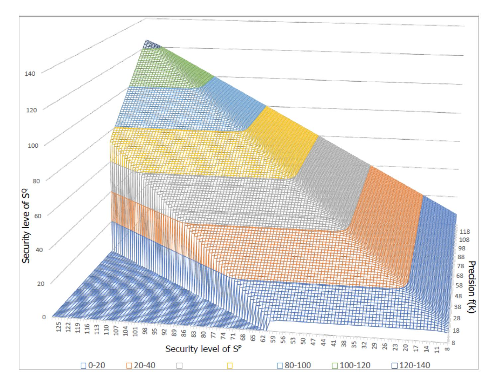
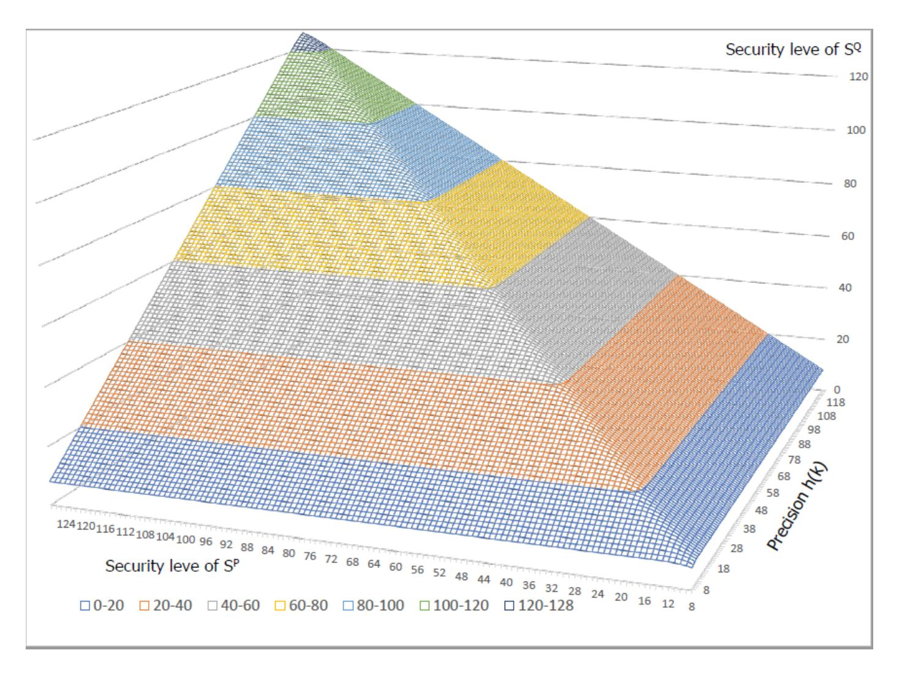

{0}------------------------------------------------

# Bit Security Estimation Using Various Information-Theoretic Measures\*

Dong-Hoon Lee (scott814@ccl.snu.ac.kr)<sup>1</sup>, Young-Sik Kim<sup>2</sup>, and Jong-Seon No<sup>1</sup>

Seoul National University, Seoul, South Korea
 Chosun University, Gwangju, South Korea

**Abstract.** In this paper, various quantitative information-theoretic security reductions which correlate statistical difference between two probability distributions with security level's gap for two cryptographic schemes are proposed. Security is the most important prerequisite for cryptographic primitives. In general, there are two kinds of security; one is computational security, and the other is information-theoretic security. We focus on the latter one in this paper, especially the view point of bit security which is a convenient notion to indicate the quantitative security level. We propose tighter and more generalized version of informationtheoretic security reductions than those of the previous works [1,2]. More specifically, we obtain about 2.5-bit tighter security reduction than that in the previous work [2], and we devise a further generalized version of security reduction in the previous work [1] by relaxing the constraint on the upper bound of the information-theoretic measure, that is,  $\lambda$ -efficient. Through this work, we propose the methodology to estimate the affects on security level when  $\kappa$ -bit secure original scheme is implemented on p-bit precision system. (Here, p can be set to any value as long as certain condition is satisfied.) In the previous work [1], p was fixed as  $\frac{\kappa}{2}$ , but the proposed scheme is generalized to make it possible for security level  $\kappa$  and precision p to variate independently. This makes a very big difference. The previous result cannot provide the exact lower bound value of security level for the case  $p \neq \frac{\kappa}{2}$ , but, it can only provide inaccurate relative information for security level. In contrast to this, the proposed result can provide the exact lower bound of estimation value of security level as long as precision p satisfies the certain condition. Moreover, we provide diverse types of security reduction formulas for the five kinds of information-theoretic measures. We are expecting that the proposed schemes could provide an information-theoretic guideline for how much the two identical cryptographic schemes with different probability distribution may show the difference in their security level when extracting their randomness from two different probability distributions. Especially, the proposed schemes can be used to obtain the quantitative estimation of how much the statistical difference between the ideal distribution and the real distribution affects the security level [8,10,11].

<sup>\*</sup> This research was supported by Samsung Research Funding and Incubation Center for Future Technology of Samsung Electronics under Project SRFC-IT1801-08.

{1}------------------------------------------------

Keywords: bit security · information-theoretic measures · security reduction · R´enyi divergence · statistical distance · max-log distance · λefficient measure.

# 1 Introduction

Nowadays, almost every modern cryptographic primitive depends their security on some randomness value, which is extracted from a specific probability distribution (e.g., lattice-based cryptographic scheme which extracts its randomness from discrete Gaussian distribution). In other words, probability distribution of the cryptographic scheme has an important influence on its security. From this point of view, a lot of research has been conducted to analyze how security level changes when the probability distribution for the randomness of the cryptographic scheme is replaced by another probability distribution. Traditionally, 'probability preservation property (PPP)' [4,6] has been widely used to correlate difference between two statistical distributions with adversary's attack success probability. This kind of security reduction enables us to compare relative security level among cryptographic schemes. However only with PPP, we cannot have any detailed quantitative information for security level. With this motivation, several researchers have conducted studies to enable quantitative security analysis. Micciancio and Walter [1,2] deserve to be considered as leaders in this field. They suggested various quantitative security reductions by informationtheoretic measures and they expressed the security reductions in terms of bit security. However, we could notice that their reduction results could be further improved and their results provide clear information only in limited cases.

In this paper, our contributions are given as follows. First, we derive tighter security reduction bounds than those of Micciancio and Walter. Second, we propose a further generalized version of Micciancio and Walter's security reduction result by relaxing the constraint on the upper bound of the measure, that is, λ-efficient. Through this work, we manage to propose the methodology to elaborately estimate the affects on security level when κ-bit secure original scheme is implemented on p-bit precision system. (p can be set to any value as long as certain condition is satisfied.) Third, we provide various types of security reduction formulas for the five kinds of information-theoretic measures; statistical distance, R´enyi divergence, Kullback-Leibler divergence, max-log distance, and relative error. These measures are often used in cryptography for security reduction analysis.

This paper is organized as follows. In Section II, we briefly introduce some essential concepts which are necessary to understand our results. Next, in Section III, we provide three main results, that is, tighter security reductions for cryptographic schemes, further generalized and more accurate security reduction, and various forms of security reductions expressed by five kinds of informationtheoretic measures. Finally, in Section IV, we conclude the paper and present the future research directions.

{2}------------------------------------------------

#### **Preliminaries** $\mathbf{2}$

#### Information-Theoretic Measures 2.1

There are several widely known information-theoretic measures which are used to analyze security reduction as follows.

#### i) Statistical Distance $(\Delta_{SD})$

For any two discrete probability distributions P and Q, the statistical distance between P and Q is defined as

$$\Delta_{SD}(P,Q) = \frac{1}{2} \sum_{x \in Supp(P) \cup Supp(Q)} |P(x) - Q(x)|,$$

where  $Supp(\cdot)$  denotes the support set of probability distribution.

#### ii) Rényi Divergence $(RD_{\alpha})$

For any two discrete probability distributions P and Q such that  $Supp(Q) \subseteq$ Supp(P), the Rényi divergence of order  $\alpha$  between P and Q is defined as

a) 
$$\alpha \in (1, \infty)$$
:  $RD_{\alpha}(Q||P) = \left(\sum_{x \in Supp(Q)} \frac{Q(x)^{\alpha}}{P(x)^{\alpha-1}}\right)^{\frac{1}{\alpha-1}}$ 

b) 
$$\alpha = 1$$
:  $RD_1(Q||P) = \exp(\sum_{x \in Supp(Q)} Q(x) \log \frac{Q(x)}{P(x)})$   
c)  $\alpha = \infty$ :  $RD_{\infty}(Q||P) = \max_{x \in Supp(Q)} \frac{Q(x)}{P(x)}$ .

c) 
$$\alpha = \infty$$
:  $RD_{\infty}(Q||P) = \max_{x \in Supp(Q)} \frac{Q(x)}{P(x)}$ 

 $RD_{\alpha}$  satisfies many attractive features such as probability preservation property, multiplicative property, data processing inequality, etc [4,5,7].

### iii) Kullback-Leibler Divergence ( $\Delta_{KL}$ )

For any two discrete probability distributions P and Q such that  $Supp(Q) \subseteq$ Supp(P), the Kullback-Leibler divergence between P and Q is defined as

$$\Delta_{KL}(Q||P) = \sum_{x \in Supp(Q)} Q(x) \log \frac{Q(x)}{P(x)}.$$

## iv) Max-Log Distance $(\Delta_{ML})$

For any two discrete probability distributions P and Q over the same support (i.e., Supp(P) = Supp(Q)), the max-log distance between P and Q is defined as

$$\Delta_{ML}(P,Q) = \max_{x \in Supp(Q)} |\ln P(x) - \ln Q(x)|.$$

Note that we should apply  $\Delta_{ML}$  only in case when the support sets of two distributions are same.

{3}------------------------------------------------

v) Relative Error  $(\delta_{RE})$ 

For any two discrete probability distributions P and Q, the relative error between P and Q is defined as [3]

$$\delta_{RE}(P,Q) = \max_{x \in Supp(P)} \frac{|P(x) - Q(X)|}{P(x)}.$$

#### 2.2 Special Kinds of Measures

Micciancio and Walter defined two special kinds of measures in their paper [1]. Those are 'useful measure' and ' $\lambda$ -efficient measure'. We will reuse their definitions.

i) Useful Measure

Any measure  $\delta$  that satisfies the following three properties is called useful measure:

- a) Probability preservation property: For any event E over the random variable X, we have  $\Pr_{X \leftarrow P}[E] \ge \Pr_{X \leftarrow Q}[E] \delta(P,Q)$ , where  $X \leftarrow P$  (respectively,  $X \leftarrow Q$ ) denotes that X is sampled from probability distribution P (respectively, Q). This property makes it possible to bound the probability of an event occurring under distribution P in terms of the probability of the same event occurring under distribution Q and the measure value  $\delta(P,Q)$ . It is not hard to prove that this property is equivalent to the bound  $\Delta_{SD}(P,Q) \le \delta(P,Q)$ . This fact implies that  $\delta = \Delta_{SD}$  satisfies this property for sure.
- b) Sub-additivity for joint distributions: Let  $(X_i)_i$  and  $(Y_i)_i$  be two lists of discrete random variables over the support  $\prod_i S_i$  and let's define  $X_{\leq i} = (X_1, ..., X_{i-1})$  (and similar for  $Y_{\leq i}$ ). Then

$$\delta((X_i)_i, (Y_i)_i) \le \sum_i \max_a \delta([X_i|X_{< i} = a], [Y_i|Y_{< i} = a]),$$

where the maximum value is taken over  $a \in \prod_{j < i} S_j$ .

- c) Data processing inequality:  $\delta(f(P), f(Q)) \leq \delta(P, Q)$  for any two probability distributions P, Q and function  $f(\cdot)$ , i.e., the measure  $\delta$  does not increase under additional function application.
- ii)  $\lambda$ -Efficient Measure

Consider a measure  $\delta$  which satisfies the above two properties b) and c). We call it ' $\lambda$ -efficient measure' if it satisfies the following property d) instead of property a):

d) Pythagorean probability preservation property (with parameter  $\lambda$ ): For any joint distributions  $(P_i)_i$  and  $(Q_i)_i$  over support  $\prod_i S_i$ , if  $\delta(P_i|a_i,Q_i|a_i) \leq \lambda$  is enjoyed for all i and  $a_i \in \prod_{j < i} S_j$ , then

$$\Delta_{SD}((P_i)_i, (Q_i)_i) \le ||(\max_{a_i} \delta(P_i|a_i, Q_i|a_i))_i||_{2}.$$

{4}------------------------------------------------

#### 2.3 New Notion of Bit Security

For long time, bit security has widely played a role to measure and estimate the quantitative security level of cryptographic primitives. The traditional definition of bit security is pretty simple. It is defined as  $\min_A \{\log_2 \frac{T_A}{\epsilon_A}\}$ , where for an arbitrary adversary A,  $T_A$  and  $\epsilon_A$  are adversary's resources and attack success probability, respectively. Micciancio and Walter designed a new concept of security game and they defined new notion of bit security in their work [2]. With their newly devised security game, they redefined the adversary's advantage. They provided adversary's advantage in terms of information-theoretic quantities. We will cite their definitions as follows.

**Definition 1** [Definition 5, [2]] An *n*-bit security game is played by an adversary A who is interacting with a challenger C. At the beginning of the game, the challenger chooses a secret c, which is represented by the random variable  $C \in \{0,1\}^n$ , from some distribution  $D_C$ . At the end of the game, A outputs some value, which is represented by the random variable A. The goal of the adversary is to output a value a such that R(c, a), where R is some relation. A may output a special symbol  $\bot$  such that  $R(c, \bot)$  and  $R^c(c, \bot)$  are both false.

**Definition 2** [Definition 7, [2]] For any security game with corresponding random variable  $\mathcal{C}$  and  $\mathcal{A}(\mathcal{C})$ , the adversary's advantage is  $adv^A = \frac{I(\mathcal{C};\mathcal{Y})}{H(\mathcal{C})} = 1 - \frac{H(\mathcal{C}|\mathcal{Y})}{H(\mathcal{C})}$ , where  $I(\cdot;\cdot)$  is the mutual information between two random variables,  $H(\cdot)$  is the Shannon entropy of a random variable, and  $\mathcal{Y}(\mathcal{C},\mathcal{A})$  is the random variable with marginal distributions  $\mathcal{Y}_{c,a} = \{y | \mathcal{C} = c, \mathcal{A} = a\}$  defined as follows:

```
a) \mathcal{Y}_{c,\perp} = \perp, for all c
```

b)  $\mathcal{Y}_{c,a} = c$ , for all  $(c,a) \in R$ c)  $\mathcal{Y}_{c,a} = \{c' \leftarrow D_{\mathcal{C}} | c' \neq c\}$ , for all  $(c,a) \in R^c$ .

**Definition 3** [Definition 10, [2]] For a search game, the advantage of the adversary A is  $adv^A = \alpha^A \beta^A$  and for a decision game, it is  $adv^A = \alpha^A (2\beta^A - 1)^2$ , where  $\alpha^A = \Pr[A \neq \bot]$  is output probability, and  $\beta^A = \Pr[R(\mathcal{C}, A) | A \neq \bot]$  is conditional success probability.

## 3 Main Results

Micciancio and Walter found out quantitative security reductions between two identical cryptographic schemes with all other conditions equal and differing only in the probability distributions for which the schemes extract the randomness [1,2]. Their works made it possible to guess how much security loss would occur when the defined probability distribution is replaced by another distribution. In other words, their works have provided information-theoretic guideline of security level (i.e., how statistical difference of two distribution affects on security level of cryptographic scheme). However, problems have been raised that

{5}------------------------------------------------

their results may not be tight enough and provide clear information only in limited cases. That is, their results give elaborate information only when the information-theoretic measure values between two probability distributions are upper bounded by specific fixed value. Otherwise, they can only tell inaccurate relative information. Due to these problems, it is necessary to bring out the tighter and the more generalized security reduction. Our first work is tighter version of Lemma 3 in [1] that is proved by using similar approach to that in [1] as follows.

**Theorem 1.** Let  $S^P$  and  $S^Q$  be standard cryptographic schemes with blackbox access to probability distribution ensembles  $P_{\theta}$  and  $Q_{\theta}$ , respectively. If  $S^P$  is  $\kappa$ -bit secure and  $\delta(P_{\theta},Q_{\theta}) \leq 2^{-\frac{\kappa}{2}}$  for some  $2^{-\frac{\kappa}{2}}$ -efficient measure  $\delta$ , then  $S^Q$  is  $(\kappa - \log_2 \frac{2}{3-2e^{-1}-\sqrt{5-4e^{-1}}}) \approx (\kappa - 2.374)$ -bit secure.

*Proof.* Suppose that  $\frac{T_A}{\epsilon_A^Q} < 2^{\kappa - \log_2 \frac{2}{3 - 2e^{-1} - \sqrt{5 - 4e^{-1}}}}$  is satisfied when an adversary A satisfies  $\frac{T_A}{\epsilon_A^P} \ge 2^{\kappa}$ . Now, let's define some notations:

- a)  $G_{S,A}^P$  (respectively,  $G_{S,A}^Q$ ): event that an adversary A succeeds in breaking the scheme  $S^P$  (respectively,  $S^Q$ ) with the probability  $\epsilon_A^P = \Pr(G_{S,A}^P)$  (respectively,  $\epsilon_A^Q = \Pr(G_{S,A}^Q)$ )
- b)  $[G_{S,A}^P]^n$  (respectively,  $[G_{S,A}^Q]^n$ ): independent n copies of  $G_{S,A}^P$  (respectively,  $G_{S,A}^Q$ )
- c)  $\epsilon_{A^n}^P$  (respectively,  $\epsilon_{A^n}^Q$ ): probability that A wins the security game  $[G_{S,A}^P]^n$  (respectively,  $[G_{S,A}^Q]^n$ ) at least once
- d)  $T_{A^n}$ : required resources that A wins the security game  $[G_{S,A}^P]^n$  (respectively,  $[G_{S,A}^Q]^n$ ) at least once
- e) q: adversary A's number of queries

Applying probability preservation property and data processing inequality of  $\Delta_{SD}$ , we have

$$\epsilon_{A^n}^P \ge \epsilon_{A^n}^Q - \Delta_{SD}([G_{S,A}^P]^n, [G_{S,A}^Q]^n)$$
  
 
$$\ge \epsilon_{A^n}^Q - \Delta_{SD}((\theta_i, P_{\theta_i})_i, (\theta_i', Q_{\theta_i'})_i).$$

Here,  $(\theta_i)_i$  (respectively,  $(\theta'_i)_i$ ) is the sequence of queries made during the game  $[G_{S,A}^P]^n$  (respectively,  $[G_{S,A}^Q]^n$ ). Note that at any point during the game, conditioned on the event  $E_i$  that  $(\theta_j, P_{\theta_j})_{j < i}$  and  $(\theta'_j, Q_{\theta'_j})_{j < i}$  take some specific and the same value, the adversary behaves identically in the two games up to the point that it makes the *i*-th query. Especially, the conditional distributions  $(\theta_i|E_i)$  and  $(\theta'_i|E_i)$  are the same and  $\delta((\theta_i|E_i), (\theta'_i|E_i)) = 0$ . This fact follows by sub-additivity for joint distributions that

{6}------------------------------------------------

$$\delta((\theta_i, P_{\theta_i}|E_i), (\theta_i', Q_{\theta_i'}|E_i))$$

$$\leq \delta((\theta_i|E_i), (\theta_i'|E_i)) + \delta(P_{\theta_i}, Q_{\theta_i})$$

$$\leq 0 + 2^{-\frac{\kappa}{2}} = 2^{-\frac{\kappa}{2}}.$$

This ensures that we can apply Pythagorean probability preservation property, and thus we can guarantee that the following inequalities are also true.

$$\epsilon_{A^n}^P \ge \epsilon_{A^n}^Q - \Delta_{SD}((\theta_i, P_{\theta_i})_i, (\theta_i', Q_{\theta_i'})_i)$$

$$\ge \epsilon_{A^n}^Q - \sqrt{q \times \delta(P_{\theta}, Q_{\theta})^2}$$

$$\ge \epsilon_{A^n}^Q - \sqrt{T_{A^n} \times \delta(P_{\theta}, Q_{\theta})^2}$$

$$\ge \epsilon_{A^n}^Q - \sqrt{T_{A^n} \times 2^{-\frac{\kappa}{2}}}.$$

At this point, without loss of generality, we suppose  $q \leq T_{A^n}$ . Now we set  $\epsilon_A^Q = \frac{1}{n}$  and note that  $T_{A^n} \leq n \times T_A$ , and then we have

$$\epsilon_{A^n}^Q - \sqrt{T_{A^n}} \times 2^{\frac{-\kappa}{2}} \ge \epsilon_{A^n}^Q - \sqrt{\frac{nT_A}{2^{\kappa}}}$$
$$= \epsilon_{A^n}^Q - \sqrt{\frac{T_A}{2^{\kappa} \epsilon_A^Q}}.$$

From the first assumption in the proof, the following inequalities are satisfied as

$$\epsilon_{A^n}^P \ge \epsilon_{A^n}^Q - \sqrt{\frac{T_A}{2^{\kappa} \epsilon_A^Q}}$$

$$> \epsilon_{A^n}^Q - \sqrt{2^{-\log_2 \frac{2}{3 - 2e^{-1} - \sqrt{5 - 4e^{-1}}}}}$$

$$= 1 - (1 - \epsilon_A^Q)^n - \sqrt{2^{-\log_2 \frac{2}{3 - 2e^{-1} - \sqrt{5 - 4e^{-1}}}}}$$

$$> 1 - e^{-1} - \sqrt{2^{-\log_2 \frac{2}{3 - 2e^{-1} - \sqrt{5 - 4e^{-1}}}}}$$

$$= 0.1929...$$

from  $\epsilon_A^Q = \frac{1}{n}$  and  $(1 - \epsilon_A^Q)^n = (1 - \frac{1}{n})^n < e^{-1}$ . Meanwhile, considering union bound, we can notice  $\epsilon_{A^n}^P \leq n \times \epsilon_A^P$  and reminding 

{7}------------------------------------------------

initial assumption  $\epsilon_A^P \leq \frac{T_A}{2^{\kappa}}$ , we have

$$\epsilon_{A^n}^P \le \frac{nT_A}{2^{\kappa}} = \frac{T_A}{2^{\kappa} \epsilon_A^Q}$$

$$< 2^{-\log_2 \frac{2}{3-2e^{-1} - \sqrt{5-4e^{-1}}}}$$

$$= 0.1929...$$

Summarizing the above results, we obtain

$$1 - e^{-1} - \sqrt{2^{-\log_2 \frac{2}{3 - 2e^{-1} - \sqrt{5 - 4e^{-1}}}}} < \epsilon_{A^n}^P$$

$$< 2^{-\log_2 \frac{2}{3 - 2e^{-1} - \sqrt{5 - 4e^{-1}}}}.$$

After simple computing verification process, we can conclude that the upper and lower bounds of  $\epsilon_{A^n}^P$  are exactly the same. This is definitely a contradiction. This contradiction must be from the first wrong assumption. Thus finally, we have

$$\frac{T_A}{\epsilon_A^Q} \ge 2^{\kappa - \log_2 \frac{2}{3 - 2e^{-1} - \sqrt{5 - 4e^{-1}}}}$$

i.e., we show  $S^Q$  preserves at least  $(\kappa - \log_2 \frac{2}{3 - 2e^{-1} - \sqrt{5 - 4e^{-1}}})$ -bit security.

**Remark.** In the previous work [1], Micciancio and Walter suggested  $(\kappa - 3)$ -bit security preserving security reduction. We propose  $(\kappa - 2.374)$ -bit security preserving security reduction in the above theorem. Our result is almost 1-bit tighter than that of the previous reduction. The 1-bit improvement may seem minimal, but this improvement will be enhanced in the later results, that is, Theorem 2 up to 2.5-bit security gains and generalized result in Theorem 3.

In the previous work [9], Genise and Micciancio proposed a novel sampling algorithm for G-lattices for any modulus  $q < b^k$  (where the positive integers  $b \geq 2, k \geq 1$  are implicit parameters of the algorithm). Their proposed sampler SAMPLEG outputs a sample with distribution statistically close to  $D_{\Lambda_n^{\perp}(g^T),s}$ (which denotes the ideal discrete Gaussian distribution defined on lattice coset  $\Lambda_u^{\perp}(g^T)$ ). In Section 3.2 of [9], they provided quantitative security analysis of how much security loss would occur when using SAMPLEG instead of  $D_{\Lambda_{u}^{\perp}(g^{T}),s}$ . Assuming that a cryptosystem using a perfect sampler for  $D_{\Lambda_u^{\perp}(g^T),s}$  is  $\kappa$ -bit secure, they concluded that swapping  $D_{\Lambda_n^{\perp}(g^T),s}$  with SAMPLEG yields about  $\kappa - 2\log(tb^2) - 3\log\log q - 5$  bits of security (where t is a tail-cut parameter) under given conditions. In the process of deriving this result, they used their Corollary 1, Proposition 1, and Lemma 3 in [1]. The important point here is that they applied Lemma 3 in [1] to obtain this result. Because our Theorem 1 provides almost 1-bit tighter security reduction than that of Lemma 3 in [1], we can expect to obtain additional security gains if we apply our Theorem 1 in place of Lemma 3 in [1].

{8}------------------------------------------------

It is well known that  $\Delta_{ML}$  and  $\Delta_{KL}$  are  $\lambda$ -efficient measures for  $\lambda \leq \frac{1}{3}$  and  $\lambda \leq \frac{2}{9}$ , respectively, [1,2]. Thus we could derive the following corollaries easily from Theorem 1.

Corollary 1. If  $S^P$  is  $\kappa$ -bit secure and  $\Delta_{ML}(P_{\theta}, Q_{\theta}) \leq 2^{-\frac{\kappa}{2}} \ (\leq 1/3)$ , then  $S^Q$  is  $(\kappa - 2.374)$ -bit secure.

Corollary 2. If  $S^P$  is  $\kappa$ -bit secure and  $\Delta_{KL}(Q_\theta||P_\theta) \leq 2^{-\frac{\kappa}{2}} \ (\leq 2/9)$ , then  $S^Q$  is  $(\kappa - 2.374)$ -bit secure.

Also, from Lemma 6 in [1], we have the relation  $\Delta_{ML}(P,Q) \leq -\ln(1-\delta_{RE}(P,Q))$ , so we can naturally derive the following corollary.

Corollary 3. If  $S^P$  is  $\kappa$ -bit secure and  $\delta_{RE}(P_\theta, Q_\theta) \leq 1 - e^{-2^{-\frac{\kappa}{2}}} (\leq 1 - e^{-\frac{1}{3}})$ , then  $S^Q$  is  $(\kappa - 2.374)$ -bit secure.

In [2], Micciancio and Walter supported and justified their new "bit security" definition by proving a number of technical results, including an application to the security analysis of indistinguishability primitives (e.g., encryption schemes) making use of (approximate) floating point numbers (refer to Section 5.3 in [2]). Corollary 2 and Theorem 8 in [2] are their main results. In this paper, we make both of them further tighter than those in [2]. Following lemma is an improved version of Corollary 2 in [2].

**Lemma 1.** For any adversary A with resource T attacking  $S^P$  and any event E over A's output, the probability of E is denoted by  $\gamma_P$ . The probability of E over A's output when attacking  $S^Q$  is also denoted by  $\gamma_Q$ . If the efficient measure  $\delta$  is

A's output when attacking 
$$S^Q$$
 is also denoted by  $\gamma_Q$ . If the efficient measure  $\delta$  is 
$$\sqrt{\frac{\gamma_Q}{T}}\sqrt{\left(\frac{2\times 2^y}{3-2e^{-1}-\sqrt{5-4e^{-1}}}\right)^{-1}}\text{-efficient and }\delta(P_\theta,Q_\theta)\leq \sqrt{\frac{\gamma_Q}{T}}\sqrt{\left(\frac{2\times 2^y}{3-2e^{-1}-\sqrt{5-4e^{-1}}}\right)^{-1}},$$
 then

 $\gamma_Q \leq \frac{2 \times 2^y}{3 - 2e^{-1} - \sqrt{5 - 4e^{-1}}} \times \gamma_P \approx 5.184 \times \gamma_P$ , where y is sufficiently small positive real number, i.e.,  $y \to 0^+$ .

*Proof.* Let's consider the contraposition of Theorem 1, i.e., introduce k that satisfies the following equation

$$2^{k-\log_2 \frac{2}{3-2e^{-1}-\sqrt{5-4e^{-1}}}-y} = \frac{T}{\gamma_O} \left( < 2^{k-\log_2 \frac{2}{3-2e^{-1}-\sqrt{5-4e^{-1}}}} \right),$$

where y is sufficiently small positive real number.

For proof by contradiction, suppose

$$\gamma_Q > \frac{2 \times 2^y}{3 - 2e^{-1} - \sqrt{5 - 4e^{-1}}} \times \gamma_P.$$

Then we have

$$2^{k - \log_2 \frac{2}{3 - 2e^{-1} - \sqrt{5 - 4e^{-1}}} - y} = \frac{T}{\gamma_O}$$

{9}------------------------------------------------

$$< T/(\frac{2 \times 2^y}{3 - 2e^{-1} - \sqrt{5 - 4e^{-1}}} \times \gamma_P)$$

and it implies

$$2^k < \frac{T}{\gamma_P}. (1)$$

Meanwhile, according to the contraposition of Theorem 1, if

$$\frac{T}{\gamma_Q} < 2^{k - \log_2 \frac{2}{3 - 2e^{-1} - \sqrt{5 - 4e^{-1}}}}$$

is hold, then at least one of  $2^k > \frac{T}{\gamma_P}$  or  $\delta(P_\theta, Q_\theta) > 2^{-\frac{k}{2}}$  should be true. Now, let's remind the original condition of Lemma 1 such that  $\delta$  satisfies

$$\delta(P_{\theta}, Q_{\theta}) \le \sqrt{\frac{\gamma_Q}{T}} \sqrt{\left(\frac{2 \times 2^y}{3 - 2e^{-1} - \sqrt{5 - 4e^{-1}}}\right)^{-1}}$$

and the value k also satisfies

$$2^{k - \log_2 \frac{2}{3 - 2e^{-1} - \sqrt{5 - 4e^{-1}}} - y} = \frac{T}{\gamma_Q}.$$

These facts imply that  $\delta(P_{\theta}, Q_{\theta}) \leq 2^{-\frac{k}{2}}$  holds for the selected k. Therefore, by the contraposition of Theorem 1,  $2^k > \frac{T}{\gamma_P}$  should be held but it is contradiction to (1). It means that the initial assumption must be false. Thus, we have

$$\gamma_Q \le \frac{2 \times 2^y}{3 - 2e^{-1} - \sqrt{5 - 4e^{-1}}} \times \gamma_P.$$

**Remark.** Corollary 2 in [2] suggested the relation between  $\gamma_P$  and  $\gamma_Q$  as  $\gamma_Q \leq 16 \times \gamma_P$  if efficient measure  $\delta$  satisfies  $\delta(P_\theta, Q_\theta) \leq \sqrt{\frac{\gamma_Q}{16T}} (= \sqrt{\frac{\gamma_Q}{T}} \times 0.25)$ . On the other hand, Lemma 1 proposes the relation between  $\gamma_P$  and  $\gamma_Q$  as  $\gamma_Q \leq 5.184 \times \gamma_P$  if efficient measure  $\delta$  satisfies  $\delta(P_\theta, Q_\theta) \leq \sqrt{\frac{\gamma_Q}{T}} \sqrt{(\frac{2 \times 2^y}{3 - 2e^{-1} - \sqrt{5 - 4e^{-1}}})^{-1}} (\approx \sqrt{\frac{\gamma_Q}{T}} \times 0.44)$ . We manage to derive more than 3 times tighter relation between  $\gamma_P$  and  $\gamma_Q$ , even though the upper bound of  $\delta(P_\theta, Q_\theta)$  is larger than that of Corollary 2 in [2]. This fact implies that Corollary 2 in [2] provides us somewhat loose reduction.

Using Lemma 1, we could derive the following theorem which gives tighter  $(\kappa - 5.54)$ -bit security reduction than  $(\kappa - 8)$ -bit security reduction of Theorem 8 in [2]. The following theorem can be used to analyze the security of indistinguishability primitives. The proof is similar to that in [2].

{10}------------------------------------------------

**Theorem 2.** Let  $S^P$  and  $S^Q$  be 1-bit secrecy games with black-box access to probability ensembles  $(P_{\theta})_{\theta}$  and  $(Q_{\theta})_{\theta}$ , respectively, and  $\delta$  be a  $\lambda$ -efficient measure for any  $\lambda \leq \sqrt{(\frac{2}{3-2e^{-1}-\sqrt{5-4e^{-1}}})^{-1}} (\approx 0.44)$ . If  $S^P$  is  $\kappa$ -bit secure and  $\delta(P_{\theta},Q_{\theta}) \leq 2^{-\frac{\kappa}{2}}$ , then  $S^Q$  is  $(\kappa - \log_2 \frac{18}{3-2e^{-1}-\sqrt{5-4e^{-1}}} - y) \approx (\kappa - 5.544)$ -bit secure, where y is sufficiently small positive real number, i.e.,  $y \to 0^+$ .

*Proof.* Consider an arbitrary adversary A of  $S^P$ , whose resource is upper bounded by  $T^A$ . Define A's output probability as  $\alpha_P^A$ , and its conditional success probability as  $\beta_P^A$ . From the  $\kappa$ -bit security of  $S^P$ , the inequality  $\alpha_P^A(2\beta_P^A-1)^2 \leq \frac{T^A}{2^{\kappa}}$  is satisfied. For proof by contradiction, suppose

$$\alpha_Q^A (2\beta_Q^A - 1)^2 > T^A / 2^{\kappa - \log_2 \frac{18}{3 - 2e^{-1} - \sqrt{5 - 4e^{-1}}} - y}.$$

From Lemma 1, we have

$$\alpha_P^A \ge \left(\frac{2 \times 2^y}{3 - 2e^{-1} - \sqrt{5 - 4e^{-1}}}\right)^{-1} \times \alpha_Q^A.$$

The reason why we can apply Lemma 1 is that  $\delta$  is  $\sqrt{\frac{\gamma_Q}{T^A}} \sqrt{\left(\frac{2\times 2^y}{3-2e^{-1}-\sqrt{5-4e^{-1}}}\right)^{-1}}$ -efficient measure, because the following inequalities are satisfied as

$$\begin{split} &\sqrt{(\frac{3-2e^{-1}-\sqrt{5-4e^{-1}}}{2})}\\ &>\sqrt{(\frac{2\times 2^y}{3-2e^{-1}-\sqrt{5-4e^{-1}}})^{-1}}\\ &>\sqrt{\frac{\alpha_Q^A}{T^A}}\sqrt{(\frac{2\times 2^y}{3-2e^{-1}-\sqrt{5-4e^{-1}}})^{-1}}\\ &\geq\sqrt{\frac{\alpha_Q^A(2\beta_Q^A-1)^2}{T^A}}\sqrt{(\frac{2\times 2^y}{3-2e^{-1}-\sqrt{5-4e^{-1}}})^{-1}}\\ &=\sqrt{\frac{\gamma_Q^A}{T^A}}\sqrt{(\frac{2\times 2^y}{3-2e^{-1}-\sqrt{5-4e^{-1}}})^{-1}}\\ &>\sqrt{2^{\log_2\frac{18\times 2^y}{3-2e^{-1}-\sqrt{5-4e^{-1}}}}\times 2^{-\frac{\kappa}{2}}}\\ &\times\sqrt{(\frac{2\times 2^y}{3-2e^{-1}-\sqrt{5-4e^{-1}}})^{-1}}\\ &=3\times 2^{-\frac{\kappa}{2}}>2^{-\frac{\kappa}{2}}\geq\delta(P_\theta,Q_\theta). \end{split}$$

Now, consider  $\hat{S}^P$  and  $\hat{S}^Q$  which are somewhat modified version of  $S^P$  and  $S^Q$ . They are almost the same with  $S^P$  and  $S^Q$  but the only difference is that

{11}------------------------------------------------

adversary A can restart the game with totally fresh randomness whenever it wants. Consider an adversary B against  $\hat{S}$  that simply runs A until  $A \neq \bot$  (restarting the game if  $A = \bot$ ) and outputs whatever A returns. If we define  $\alpha$  as  $\alpha = \min(\alpha_P^A, \alpha_Q^A)$ , then adversary B's resource  $T^B$  satisfies  $T^B < T^A/\alpha$ . B's output probability is  $\alpha_P^B = \alpha_Q^B = 1$ , and the conditional success probability, i.e., the case that successfully solves distinguish problem is  $\beta_P^B = \beta_P^A$  (or  $\beta_Q^B = \beta_Q^A$ ) for  $\hat{S}^P$  (or  $\hat{S}^Q$ , respectively). By the properties of  $\lambda$ -efficient measure  $\delta$  and  $\Delta_{SD}$ , we have

$$\beta_P^B \ge \beta_Q^B - \sqrt{T^B}\delta(P_\theta, Q_\theta) \ge \beta_Q^B - \sqrt{\frac{T^B}{2^\kappa}}.$$

Thus, we can have

$$2\beta_P^B - 1 \ge 2\beta_Q^B - 1 - 2\sqrt{\frac{T^B}{2^\kappa}}.$$

From the given condition in the theorem, we also have

$$2\beta_P^A - 1 \le \sqrt{\frac{T^A}{\alpha_P^A \times 2^\kappa}}$$

i.e.,

$$\sqrt{\frac{T^A}{\alpha \times 2^{\kappa}}} \ge \sqrt{\frac{T^A}{\alpha_P^A \times 2^{\kappa}}} \ge 2\beta_P^A - 1$$

$$\ge 2\beta_Q^B - 1 - 2\sqrt{\frac{T^B}{2^{\kappa}}} > 2\beta_Q^B - 1 - 2\sqrt{\frac{T^A}{\alpha \times 2^{\kappa}}}$$

$$\Rightarrow 3\sqrt{\frac{T^A}{\alpha \times 2^{\kappa}}} > 2\beta_Q^B - 1 = 2\beta_Q^A - 1.$$

If  $\alpha_Q^A \leq \alpha_P^A$ , then we have  $\alpha = \alpha_Q^A$ . Considering our proof by contradiction assumption, we have

$$2^{\kappa} < \frac{9T^A}{\alpha_O^A (2\beta_O^A - 1)^2} < 9 \times 2^{\kappa - \log_2 \frac{18 \times 2^y}{3 - 2e^{-1} - \sqrt{5 - 4e^{-1}}}}.$$

After some computation, we can simplify the above inequality to

$$1 < y + 1 < \log_2(3 - 2e^{-1} - \sqrt{5 - 4e^{-1}}) < -1.374.$$

This is definitely a contradiction. If  $\alpha_Q^A > \alpha_P^A$ , then we have  $\alpha = \alpha_P^A$  and we know that the following inequalities are valid as

$$\left( \frac{2 \times 2^y}{3 - 2e^{-1} - \sqrt{5 - 4e^{-1}}} \right)^{-1} \times \alpha_Q^A \le \alpha_P^A$$
 
$$< \frac{9T^A}{2^\kappa (2\beta_Q^A - 1)^2} < \frac{\alpha_Q^A (3 - 2e^{-1} - \sqrt{5 - 4e^{-1}})}{2^{y+1}}.$$

{12}------------------------------------------------

By observation, we can notice that the upper bound and the lower bound of  $\alpha_P^A$  are exactly the same. This fact implies that the inequalities can be reduced to 1 < 1, and thus this case is also a contradiction. Above process tells us that our initial assumption is false and finally we have

$$\alpha_Q^A (2\beta_Q^A - 1)^2 \le T^A / 2^{\kappa - \log_2 \frac{18}{3 - 2e^{-1} - \sqrt{5 - 4e^{-1}}} - y}$$

and theorem is clearly proved.

**Remark.** We propose 2.5-bit tighter security reduction than that of Theorem 8 in [2]. It can be interpreted as being 6 times more secure in terms of the number of attack trials by adversary. We think that this result is by no means small improvement. We not only improve the tightness of security reduction, but also extend the possible ranges of  $\lambda$  value. Theorem 8 in [2] can be applied for  $\lambda$  which satisfies  $\lambda \leq \frac{1}{4}$ , but we extend its allowed ranges to  $\lambda \leq 0.44$ .

Theorem 1 improves the work in [1]. However, it still has significant limitations for its universal use, because we can obtain the exact lower bound of estimation value of security level by applying Theorem 1 only in case when efficient measure  $\delta$  satisfies  $\delta(P_{\theta}, Q_{\theta}) \leq 2^{-\frac{\kappa}{2}}$ . In other words, we can only obtain inaccurate relative information about security level by applying Theorem 1 for otherwise. There are many practical situations that  $\delta(P_{\theta}, Q_{\theta})$  is much smaller or bigger than  $2^{-\frac{\kappa}{2}}$ . We need more general criteria and methodology which give us theoretic guideline how statistical difference affects on security level of cryptographic primitives. This motivation enables us to come up with the following theorem.

**Theorem 3.** [Generalization of Theorem 1] Let  $S^P$  and  $S^Q$  be standard cryptographic schemes with black-box access to probability distribution ensembles  $P_{\theta}$  and  $Q_{\theta}$ , respectively. If  $S^P$  is  $\kappa$ -bit secure and  $\delta(P_{\theta},Q_{\theta}) \leq 2^{-\frac{f(\kappa)}{2}}$  for some  $2^{-\frac{f(\kappa)}{2}}$ -efficient measure  $\delta$ , then  $S^Q$  is  $(2\log_2(\sqrt{1+2^{f(\kappa)-\kappa+2}(1-e^{-1})}-1)-f(\kappa)+2\kappa-2)$ -bit secure. Here,  $f(\kappa)$  should satisfy  $f(\kappa) \geq -2\log_2(1-e^{-1}-2^{-\kappa})$ , where  $\kappa$  is the security level of  $S^P$ .

Proof. The overall flow of proof is similar to that of Theorem 1. Considering an arbitrary adversary A, suppose that if  $\frac{T_A}{\epsilon_A^P} \geq 2^{\kappa}$  is satisfied, then  $\frac{T_A}{\epsilon_A^Q} < 2^{f(\kappa)-g(\kappa)}$  is also satisfied. Here, without loss of generality, we suppose that  $g(\cdot)$  is a monotonically increasing function. The reason why we can suppose like this is that we are only interested in the value  $g(\kappa)$ , not the original form of the function  $g(\cdot)$ . Our purpose is finding  $g(\kappa)$ , which should be expressed by  $\kappa$  and  $f(\kappa)$ . Then, we will use the same notations a), b), c), d), and e) in the proof of Theorem 1.

Applying probability preservation property and data processing inequality of  $\Delta_{SD}$ , we have

{13}------------------------------------------------

$$\epsilon_{A^n}^P \ge \epsilon_{A^n}^Q - \Delta_{SD}([G_{S,A}^P]^n, [G_{S,A}^Q]^n)$$
  
 
$$\ge \epsilon_{A^n}^Q - \Delta_{SD}((\theta_i, P_{\theta_i})_i, (\theta_i', Q_{\theta_i'})_i).$$

Here,  $(\theta_i)_i$  (respectively,  $(\theta'_i)_i$ ) is the sequence of queries made during the game  $[G_{S,A}^P]^n$  (respectively,  $[G_{S,A}^Q]^n$ ). Note that at any point during the game, conditioned on the event  $E_i$  that  $(\theta_j, P_{\theta_j})_{j < i}$  and  $(\theta'_j, Q_{\theta'_j})_{j < i}$  take some specific and the same value, the adversary behaves identically in the two games up to the point that it makes the *i*-th query. Especially, the conditional distributions  $(\theta_i|E_i)$  and  $(\theta'_i|E_i)$  are the same and  $\delta((\theta_i|E_i), (\theta'_i|E_i)) = 0$ . This fact follows by sub-additivity for joint distributions that

$$\delta((\theta_i, P_{\theta_i}|E_i), (\theta'_i, Q_{\theta'_i}|E_i))$$

$$\leq \delta((\theta_i|E_i), (\theta'_i|E_i)) + \delta(P_{\theta_i}, Q_{\theta_i})$$

$$\leq 0 + 2^{-\frac{f(\kappa)}{2}} = 2^{-\frac{f(\kappa)}{2}}.$$

This ensures that we can apply Pythagorean probability preservation property, and thus we can guarantee that the following inequalities are also true as

$$\epsilon_{A^n}^P \ge \epsilon_{A^n}^Q - \Delta_{SD}((\theta_i, P_{\theta_i})_i, (\theta_i', Q_{\theta_i'})_i)$$

$$\ge \epsilon_{A^n}^Q - \sqrt{q \times \delta(P_{\theta_i}, Q_{\theta_i})^2}$$

$$\ge \epsilon_{A^n}^Q - \sqrt{T_{A^n} \times \delta(P_{\theta_i}, Q_{\theta_i})^2}$$

$$\ge \epsilon_{A^n}^Q - \sqrt{T_{A^n} \times 2^{-\frac{f(\kappa)}{2}}}.$$

At this point, without loss of generality, we assume  $q \leq T_{A^n}$ . Now we set  $\epsilon_A^Q = \frac{1}{n}$  and note that  $T_{A^n} \leq n \times T_A$ , and then we have

$$\epsilon_{A^n}^Q - \sqrt{T_{A^n}} \times 2^{\frac{-f(\kappa)}{2}} \ge \epsilon_{A^n}^Q - \sqrt{\frac{nT_A}{2^{f(\kappa)}}}$$
$$= \epsilon_{A^n}^Q - \sqrt{\frac{T_A}{2^{f(\kappa)}\epsilon_A^Q}}.$$

Now from the first assumption  $\frac{T_A}{\epsilon_A^Q}<2^{f(\kappa)-g(\kappa)}$  in this proof, the following inequalities are satisfied as

{14}------------------------------------------------

$$\epsilon_{A^n}^P \ge \epsilon_{A^n}^Q - \sqrt{\frac{T_A}{2^{f(\kappa)}\epsilon_A^Q}}$$

$$> \epsilon_{A^n}^Q - \sqrt{2^{-g(\kappa)}}$$

$$= 1 - (1 - \epsilon_A^Q)^n - \sqrt{2^{-g(\kappa)}}$$

$$> 1 - e^{-1} - \sqrt{2^{-g(\kappa)}}$$

from 
$$\epsilon_A^Q = \frac{1}{n}$$
 and  $(1 - \epsilon_A^Q)^n = (1 - \frac{1}{n})^n < e^{-1}$ .

Meanwhile, considering union bound, we can notice that P <sup>A</sup><sup>n</sup> ≤ n × P A. Reminding the initial condition P <sup>A</sup> ≤ T<sup>A</sup> <sup>2</sup><sup>κ</sup> , we have

$$\epsilon_{A^n}^P \le \frac{nT_A}{2^{\kappa}} = \frac{T_A}{2^{\kappa} \epsilon_A^Q} < 2^{f(\kappa) - g(\kappa) - \kappa}.$$

Summarizing the above results, we have

$$1 - e^{-1} - \sqrt{2^{-g(\kappa)}} < \epsilon_{A^n}^P < 2^{f(\kappa) - g(\kappa) - \kappa}.$$
 (2)

We notice that if the inequality

$$1 - e^{-1} - \sqrt{2^{-g(\kappa)}} \ge 2^{f(\kappa) - g(\kappa) - \kappa} \tag{3}$$

holds, (2) becomes contradiction. We want to find a sufficient condition to derive the contradiction in the proof in order to draw out the contradiction on the first assumption. Since we assumed that g(·) is an increasing function, the left hand side of (3) monotonically increases as g(κ) increases. In contrary, for fixed value f(κ), the right hand side of (3) monotonically decreases as g(κ) increases. Thus the left hand side and the right hand side equations meet at one point. The inequality is reversed at that point. This fact implies that if we consider the equality in (3), we can have the tightest extreme case. Through some computation, we can solve the equality equation in (3) as

$$1 - e^{-1} - \sqrt{2^{-g(\kappa)}} = 2^{f(\kappa) - g(\kappa) - \kappa}$$

$$\iff 2^{f(\kappa) - \kappa} \times 2^{-g(\kappa)} + \sqrt{2^{-g(\kappa)}} - (1 - e^{-1}) = 0$$

$$\iff \sqrt{2^{-g(\kappa)}} = \frac{\sqrt{1 + 2^{f(\kappa) - \kappa + 2}(1 - e^{-1})} - 1}{2^{f(\kappa) - \kappa + 1}}$$

$$\iff -g(\kappa) = 2\{\log_2(\sqrt{1 + 2^{f(\kappa) - \kappa + 2}(1 - e^{-1})} - 1) - (f(\kappa) - \kappa + 1)\}$$

$$= 2\log_2(\sqrt{1 + 2^{f(\kappa) - \kappa + 2}(1 - e^{-1})} - 1)$$

$$- 2f(\kappa) + 2\kappa - 2.$$

{15}------------------------------------------------

Thus we have

$$f(\kappa) - g(\kappa)$$
=  $2\log_2(\sqrt{1 + 2^{f(\kappa) - \kappa + 2}(1 - e^{-1})} - 1) - f(\kappa) + 2\kappa - 2.$ 

Then we can conclude that S <sup>Q</sup> preserves at least (2log<sup>2</sup> ( p 1 + 2f(κ)−κ+2(1 − e−1)− 1) − f(κ) + 2κ − 2)-bit security. It is not hard to show that the inequality 2log<sup>2</sup> ( p 1 + 2f(κ)−κ+2(1 − e−1) − 1) − f(κ) + 2κ − 2 ≤ κ is satisfied. That is because the following inequalities are satisfied as

$$2\log_{2}(\sqrt{1+2^{f(\kappa)-\kappa+2}(1-e^{-1})}-1)-f(\kappa)+2\kappa-2 \leq \kappa$$

$$\iff \log_{2}(\sqrt{1+2^{f(\kappa)-\kappa+2}(1-e^{-1})}-1) \leq \frac{f(\kappa)-\kappa+2}{2}$$

$$\iff \sqrt{1+2^{f(\kappa)-\kappa+2}(1-e^{-1})} \leq 2^{\frac{f(\kappa)-\kappa+2}{2}}+1$$

$$\iff 1+2^{f(\kappa)-\kappa+2}-e^{-1}2^{f(\kappa)-\kappa+2} \leq 1+2^{f(\kappa)-\kappa+2}+2^{\frac{f(\kappa)-\kappa+4}{2}}.$$

Also, to maintain Theorem 3 meaningful, the obtained security level should be non-negative. Thus, the condition f(κ) − g(κ) ≥ 0 should be satisfied. This fact implies that the following inequalities are satisfied as

$$f(\kappa) - g(\kappa) \ge 0$$

$$\iff 2\log_2(\sqrt{1 + 2^{f(\kappa) - \kappa + 2}(1 - e^{-1})} - 1) \ge f(\kappa) - 2\kappa + 2$$

$$\iff \sqrt{1 + 2^{f(\kappa) - \kappa + 2}(1 - e^{-1})} \ge 2^{\frac{f(\kappa) - 2\kappa + 2}{2}} + 1$$

$$\iff 2^{f(\kappa) - \kappa + 2}(1 - e^{-1}) \ge 2^{f(\kappa) - 2\kappa + 2} + 2^{\frac{f(\kappa) - 2\kappa + 4}{2}}$$

$$\iff 2^{\frac{f(\kappa)}{2} - \kappa + 2}(1 - e^{-1} - 2^{-\kappa}) \ge 2^{-\kappa + 2}$$

$$\iff 2^{\frac{f(\kappa)}{2}} \ge \frac{1}{1 - e^{-1} - 2^{-\kappa}}$$

$$\iff f(\kappa) \ge -2\log_2(1 - e^{-1} - 2^{-\kappa}).$$

Thus, we can conclude that f(κ) should satisfy the condition

$$f(\kappa) \ge -2\log_2(1 - e^{-1} - 2^{-\kappa})$$

for the theorem. Once this condition is satisfied, we can arbitrarily set f(κ) value whatever we want. The detailed applying example of Theorem 3 will be dealt with the following remark. Thus, we finish the proof.

Remark. It is not hard to show that Theorem 3 can be reduced to Theorem 1 when we substitute f(κ) = κ. It only requires some mathematical manipulations

{16}------------------------------------------------

**Table 1.** Guaranteed security level of  $S^Q$  by applying Lemma 3 in [1] and Theorem 3

|   | $\kappa$ |                                          |      | $\kappa$ |             |        |        |
|---|----------|------------------------------------------|------|----------|-------------|--------|--------|
|   |          | $\left  \text{(Lemma 3 in [1])} \right $ |      |          | (Theorem 3) |        |        |
|   |          | 104                                      | 116  | 128      | 104         | 116    | 128    |
| 1 | 104      | 101                                      | ≥101 | ≥101     | 101.63      | 102.68 | 102.68 |
|   | 116      | ≥101                                     | 113  | ≥113     | 103.31      | 113.63 | 114.68 |
|   | 128      | ≥101                                     | ≥113 | 125      | 103.34      | 115.31 | 125.63 |

as

$$f(\kappa) = \kappa$$

$$\Longrightarrow \kappa - 2 + \log_2(\sqrt{1 + 4(1 - e^{-1})} - 1)$$

$$= \kappa - \log_2 \frac{2}{3 - 2e^{-1} - \sqrt{5 - 4e^{-1}}}$$

$$\approx \kappa - 2.374.$$

Table I indicates guaranteed security level of  $S^Q$  with respect to security level parameter  $\kappa$  and precision parameter  $f(\kappa)$ , which is obtained by applying Lemma 3 in [1] and Theorem 3, respectively. From Table I, we can deduce the following facts. First, Theorem 3 (always) provides additional security gains compared to Lemma 3 in [1]. Second, we need to pay attention that Lemma 3 in [1] cannot provide the exact lower bound value of security level of  $S^Q$  for the case  $f(\kappa) \neq \kappa$ , but it can only provide inaccurate relative information. In contrast to this, Theorem 3 always, without exception, provides the exact lower bound of estimation value of security level of  $S^Q$  as long as  $f(\kappa)$  satisfies the condition  $f(\kappa) \geq -2\log_2(1-e^{-1}-2^{-\kappa})$ . Theorem 3 deserves sufficient recognition for its contribution just by removing the constraints imposed on the precision in the previous work (in [1], the precision was fixed).

Summarizing the discussion so far, we can interpret Theorem 3 as follows. Through Theorem 3, we can estimate the affects on security level when  $\kappa$ -bit secure original scheme is implemented on  $\frac{f(\kappa)}{2}$ -bit precision system. In the previous work [1],  $f(\kappa)$  was fixed as  $\kappa$ , but Theorem 3 is generalized to make it possible for security level  $\kappa$  and precision  $\frac{f(\kappa)}{2}$  to variate independently. Through Theorem 3, we can provide the theoretic ground on how security level of 128-bit security scheme may change if it is implemented on 32-bit or 64-bit precision system. Figure 1 shows a 3-dimensional plot which indicates the security level of  $S^Q$  determined by  $\kappa$  and  $f(\kappa)$ .

Until now, we have given tighter and more generalized versions of Micciancio and Walter's results which were introduced in [1,2]. However, Theorems 1, 2, 3, and Lemma 1 can only be applied with  $\lambda$ -efficient measure  $\delta$ . There are several information-theoretic measures which are used to analyze security reduction. Among them, only the max-log distance  $\Delta_{ML}$  and the Kullback-Leibler divergence  $\Delta_{KL}$  have been proven that those are  $\lambda$ -efficient measures. As we already

{17}------------------------------------------------



**Fig. 1.** Security level of  $S^Q$  with respect to  $\kappa$  and  $f(\kappa)$ .

took a look at Corollary 3, we can apply Theorems 1, 2, and 3 also with  $\delta_{RE}$  from Lemma 6 in [1]. But, we can't apply our theorems with  $RD_{\alpha}$  and  $\Delta_{SD}$  directly. Thus, we have undertaken further research to find out additional results for other measures. Those results are given in the last two theorems. Theorem 4 deals with infinity order of RD, which is well-known to be closely related to  $\Delta_{ML}$ . Theorem 4 considers only the case that adversary is in resource restricted environment (so that the adversary's number of attack trials is limited). This kind of premise is not that impractical, but actually practically meaningful, e.g., consider the situation that adversary should succeed the attack within limited time.

**Theorem 4.** [Applying to adversary in resource restricted environment] Let  $S^P$  and  $S^Q$  be standard cryptographic schemes with black-box access to probability distribution ensembles  $P_{\theta}$  and  $Q_{\theta}$ , respectively. Consider the adversary A whose number of queries is upper bounded by q (i.e., adversary's attack resources are restricted). If  $S^P$  is  $\kappa$ -bit secure and  $RD_{\infty}(Q_{\theta}||P_{\theta}) \leq 1 + 2^{-p(\kappa)}$ , then  $S^Q$  is  $(\kappa - \frac{q \times 2^{-p(\kappa)}}{\ln 2})$ -bit secure. Here,  $p(\kappa)$  should satisfy  $p(\kappa) \geq -\log_2(\ln 2^{\kappa}) + \log_2 q$ , where  $\kappa$  is the security level of  $S^P$ .

{18}------------------------------------------------

*Proof.* Notations are the same as the proofs of the previous theorems. From the definition and the probability preservation property of  $RD_{\infty}$ , we have

$$RD_{\infty}(G_{S,A}^{Q}||G_{S,A}^{P}) = \max_{x \in Supp(Q)} \left(\frac{G_{S,A}^{Q}(x)}{G_{S,A}^{P}(x)}\right) \ge \frac{\epsilon_{A}^{Q}}{\epsilon_{A}^{P}}.$$

Then, by applying multiplicative property and data processing inequality of  $RD_{\infty}$ , we also have

$$RD_{\infty}(G_{S,A}^{Q}||G_{S,A}^{P}) \ge \frac{\epsilon_{A}^{Q}}{\epsilon_{A}^{P}} \Longleftrightarrow$$

$$\epsilon_A^P \ge \frac{\epsilon_A^Q}{RD_{\infty}(G_{SA}^Q||G_{SA}^P)} \ge \frac{\epsilon_A^Q}{RD_{\infty}(Q_{\theta}||P_{\theta})^q}.$$

Note that from the definition of natural constant e, the following inequalities are satisfied as

$$RD_{\infty}(Q_{\theta}||P_{\theta})^{q} \le (1 + 2^{-p(\kappa)})^{q} \le e^{q \times 2^{-p(\kappa)}}$$
  
=  $2^{\log_{2} e^{q \times 2^{-p(\kappa)}}}$ 

From the given condition of Theorem 4, we know that  $\frac{T_A}{\epsilon_A^P} \geq 2^{\kappa}$  is satisfied, and thus we have the following inequalities as

$$2^{-\kappa} \ge \frac{\epsilon_A^P}{T_A} \ge \frac{\epsilon_A^Q}{T_A} \frac{1}{RD_{\infty}(Q_{\theta}||P_{\theta})^q} \ge \frac{\epsilon_A^Q}{T_A} \times 2^{-\log_2 e^{q \times 2^{-p(\kappa)}}}$$

$$\iff 2^{-\kappa + \log_2 e^{q \times 2^{-p(\kappa)}}} \ge \frac{\epsilon_A^Q}{T_A}$$

$$\iff \frac{T_A}{\epsilon_A^Q} \ge 2^{\kappa - \log_2 e^{q \times 2^{-p(\kappa)}}}$$

$$\iff \log_2(\frac{T_A}{\epsilon_A^Q}) \ge \kappa - \log_2 e^{q \times 2^{-p(\kappa)}}$$

$$= \kappa - \frac{q \times 2^{-p(\kappa)}}{\ln 2}.$$

Therefore, we can conclude that  $S^Q$  preserves at least  $(\kappa - \frac{q \times 2^{-p(\kappa)}}{\ln 2})$ -bit security. It is trivial that the inequality  $\kappa - \frac{q \times 2^{-p(\kappa)}}{\ln 2} \le \kappa$  is satisfied. Also, to maintain Theorem 4 meaningful, the obtained security level should be non-negative. Thus the condition  $\kappa - \log_2 e^{q \times 2^{-p(\kappa)}} \ge 0$  should be satisfied and the following in-

{19}------------------------------------------------

equalities are satisfied as

$$\kappa - \log_2 e^{q \times 2^{-p(\kappa)}} \ge 0$$

$$\iff \kappa \ge \log_2 e^{q \times 2^{-p(\kappa)}}$$

$$\iff 2^{\kappa} \ge e^{q \times 2^{-p(\kappa)}}$$

$$\iff p(\kappa) \ge -\log_2(\frac{\ln 2^{\kappa}}{q}) = -\log_2(\ln 2^{\kappa}) + \log_2 q.$$

Thus we can conclude that  $p(\kappa)$  should satisfy the condition

$$p(\kappa) \ge -\log_2(\ln 2^{\kappa}) + \log_2 q$$

for the theorem. Now, we finish the proof.

Remark. We derived security reduction formula in terms of  $RD_{\infty}$ . Actually, it may be possible to derive security reduction in terms of  $RD_{\infty}$  as a corollary from security reduction in terms of  $\Delta_{ML}$ , because  $RD_{\infty}$  and  $\Delta_{ML}$  are closely related. However, we found that eliciting an independent security reduction for  $RD_{\infty}$  is also an interesting research topic. From the condition  $p(\kappa) \geq -\log_2(\ln 2^{\kappa}) + \log_2 q$ , which should be satisfied to apply Theorem 4, we can notice that if the number of queries of adversary increases,  $p(\kappa)$  should also increase (i.e., the statistical similarity between  $Q_{\theta}$  and  $P_{\theta}$  should be closer) to achieve the same target security level. This fact fits well with our general intuition. Note that Rényi divergence-based security analysis can provide significant gains when the number of queries of adversary is restricted and the search problem is given.

However, the most widely used information-theoretic measure to analyze security reduction between two cryptographic schemes is the statistical distance  $\Delta_{SD}$ . It is important to estimate how much  $\Delta_{SD}$  value between two different probability distributions affect on the security level. We can provide the theoretic guideline for the relationship between  $\Delta_{SD}$  and the security level in the following theorem.

**Theorem 5.** Let  $S^P$  and  $S^Q$  be standard cryptographic schemes with blackbox access to probability distribution ensembles  $P_{\theta}$  and  $Q_{\theta}$ , respectively. If  $S^P$  is  $\kappa$ -bit secure and  $\Delta_{SD}(P_{\theta}, Q_{\theta}) \leq 2^{-h(\kappa)}$ , then  $S^Q$  is  $\log_2 \frac{1}{2^{-\kappa} + 2^{-h(\kappa)}}$ -bit secure. Here,  $h(\kappa)$  should satisfy  $h(\kappa) \geq -\log_2 (1 - \frac{1}{2^{\kappa}})$ , where  $\kappa$  is the security level of  $S^P$ .

*Proof.* Notations are the same as the proofs of the previous theorems. From the probability preservation property of  $\Delta_{SD}$ , we have

$$\Delta_{SD}(G_{S,A}^P, G_{S,A}^Q) \ge \epsilon_A^Q - \epsilon_A^P.$$

Then, applying additive property, data processing inequality, and  $q \leq T_A$ , we can derive the following inequalities as

$$\Delta_{SD}(G_{S,A}^P, G_{S,A}^Q) \ge \epsilon_A^Q - \epsilon_A^P$$

{20}------------------------------------------------

$$\iff \epsilon_A^P \ge \epsilon_A^Q - \Delta_{SD}(G_{S,A}^P, G_{S,A}^Q)$$
$$\ge \epsilon_A^Q - \Delta_{SD}(P_\theta, Q_\theta) \times q$$
$$\ge \epsilon_A^Q - \Delta_{SD}(P_\theta, Q_\theta) \times T_A.$$

From the given condition of Theorem 5, we know that  $\frac{T_A}{\epsilon_A^P} \geq 2^{\kappa}$  is satisfied, and thus we have the following inequalities as

$$2^{-\kappa} \ge \frac{\epsilon_A^P}{T_A} \ge \frac{\epsilon_A^Q}{T_A} - \Delta_{SD}(P_\theta, Q_\theta) \ge \frac{\epsilon_A^Q}{T_A} - 2^{-h(\kappa)}$$

$$\iff 2^{-\kappa} + 2^{-h(\kappa)} \ge \frac{\epsilon_A^Q}{T_A}$$

$$\iff \frac{T_A}{\epsilon_A^Q} \ge \frac{1}{2^{-\kappa} + 2^{-h(\kappa)}}$$

$$\iff \log_2 \frac{T_A}{\epsilon_A^Q} \ge \log_2 \frac{1}{2^{-\kappa} + 2^{-h(\kappa)}}.$$

Then we can conclude that  $S^Q$  preserves at least  $\log_2 \frac{1}{2^{-\kappa}+2^{-h(\kappa)}}$ -bit security. It is trivial that the inequality  $\log_2 \frac{1}{2^{-\kappa}+2^{-h(\kappa)}} \le \kappa$  is satisfied. Also, to maintain Theorem 5 meaningful, the obtained security level should be non-negative. Thus the condition  $\log_2 \frac{1}{2^{-\kappa}+2^{-h(\kappa)}} \ge 0$  should be satisfied and the following inequalities are satisfied as

$$\log_2 \frac{1}{2^{-\kappa} + 2^{-h(\kappa)}} \ge 0$$

$$\iff \frac{1}{2^{-\kappa} + 2^{-h(\kappa)}} \ge 1$$

$$\iff 2^{-\kappa} + 2^{-h(\kappa)} \le 1$$

$$\iff h(\kappa) \ge -\log_2(1 - 2^{-\kappa}).$$

Thus, we can conclude that  $h(\kappa)$  should satisfy the condition

$$h(\kappa) \ge -\log_2(1 - \frac{1}{2^{\kappa}})$$

for the theorem. Now, we finish the proof.

**Remark.** To the best of our knowledge, Theorem 5 is a first attempt to provide generalized security reduction with arbitrary precision in terms of  $\Delta_{SD}$  in completed form. Similar to Theorem 3, Theorem 5 also can be interpreted as follows. Through Theorem 5, we can estimate the affects on security level when  $\kappa$ -bit secure original scheme is implemented on  $h(\kappa)$ -bit precision system. Figure 2 shows a 3-dimensional plot which indicates the security level of  $S^Q$  determined by  $\kappa$  and  $h(\kappa)$ .

{21}------------------------------------------------



Fig. 2. Security level of S <sup>Q</sup> with respect to κ and h(κ).

From Theorem 5, we can derive some corollaries. First, from Pinsker's inequality, for the relationship between ∆SD and ∆KL, the following inequality is satisfied as

$$\Delta_{SD}(P,Q) \le \sqrt{\frac{1}{2}\Delta_{KL}(Q||P)}.$$

Using this formula, we can derive the following corollary without proof.

Corollary 4. If S <sup>P</sup> is κ-bit secure and ∆KL(Qθ||Pθ) ≤ 2 1−2h(κ) , then S Q is log<sup>2</sup> 1 2−κ+2−h(κ) -bit secure. Here, h(κ) should satisfy h(κ) ≥ − log<sup>2</sup> (1 − 1 <sup>2</sup><sup>κ</sup> ), where κ is the security level of S P .

Also, in [1], the following relation was proved as

$$\Delta_{KL}(Q||P) \le \frac{8}{9}\delta_{RE}(P,Q)^2.$$

Using this formula, we can derive the following corollary without proof.

Corollary 5. If S <sup>P</sup> is κ-bit secure and δRE(Pθ, Qθ) ≤ 3 2 √ 2 2 1−2h(κ) <sup>2</sup> , then S Q is log<sup>2</sup> 1 2−κ+2−h(κ) -bit secure. Here, h(κ) should satisfy h(κ) ≥ − log<sup>2</sup> (1 − 1 <sup>2</sup><sup>κ</sup> ), 

{22}------------------------------------------------

where  $\kappa$  is the security level of  $S^P$ .

Finally, from Lemma 6 in [1], which indicates the relation between  $\Delta_{ML}$  and  $\delta_{RE}$ , we can also derive the following corollary.

Corollary 6. If  $S^P$  is  $\kappa$ -bit secure and  $\Delta_{ML}(P_\theta, Q_\theta) \leq \ln(\frac{3}{2\sqrt{2}}2^{\frac{1-2h(\kappa)}{2}}+1)$ , then  $S^Q$  is  $\log_2 \frac{1}{2^{-\kappa}+2^{-h(\kappa)}}$ -bit secure. Here,  $h(\kappa)$  should satisfy  $h(\kappa) \geq -\log_2 (1-\frac{1}{2^{\kappa}})$ , where  $\kappa$  is the security level of  $S^P$ .

## 4 Conclusions and Future Works

In this paper, information-theoretic security reductions from the statistical difference between probability distributions were derived in terms of various information-theoretic measures. We provided diverse types of security reduction formulas for the five kinds of information-theoretic measures, those measures are;  $\Delta_{SD}$ ,  $RD_{\infty}$ ,  $\delta_{KL}$ ,  $\Delta_{ML}$ , and  $\delta_{RE}$ . We proposed tighter and more generalized version of security reductions than those of the previous works [1,2]. These reduction results are expected to provide information-theoretic methodology to estimate security loss in situation such as replacing with the different probability distributions.

For future works, we will conduct further research to prove or disprove whether the proposed quantitative security reduction results achieve information-theoretic limit or not. We are asking the question, "Is the tighter reduction than the proposed one theoretically possible?" The second research topic is further generalization of Theorem 4. Up to now, Theorem 4 only can deal with constrained adversary and even it can be applied only for RD of infinity order. We want to generalize Theorem 4 to cover arbitrary adversary and arbitrary orders. These might be interesting future research topics.

#### References

- 1. D. Micciancio and M. Walter, "Gaussian sampling over the integers: Efficient, generic, constant-time," In J. Katz and H. Shacham, editors, Advances in Cryptology CRYPTO 2017, Part 2, vol. 10402 of Lecture Notes in Computer Science, pp. 455-485, Aug. 2017.
- 2. D. Micciancio and M. Walter, "On the bit security of cryptographic primitives," In J. B. Nielsen and V. Rijmen, editors, Advances in Cryptology EUROCRYPT 2018, part 1, vol. 10820 of Lecture Notes in Computer Science, pp. 3-28, May. 2018.
- 3. M. Walter, "Sampling the integers with low relative error," In Progress in Cryptology AFRICACRYPT 2019, vol. 11627 of Lecture Notes in Computer Science, pp. 157-180, 2019.
- 4. S. Bai, A. Langlois, T. Lepoint, D. Stehle, and R. Steinfeld, "Improved security proofs in lattice-based cryptography: Using the Rényi divergence rather than the statistical distance," In T. Iwata and J. H. Cheon, editors, Advances in Cryptology ASIACRYPT 2015, vol. 9452 of Lecture Notes in Computer Science, pp. 3-24, Dec. 2015.

{23}------------------------------------------------

- 5. T. Prest, "Sharper bounds in lattice-based cryptography using the R´enyi divergence," In T. Takagi and T. Peyrin, editors, Advances in Cryptology - ASIACRYPT 2017, part 1, vol. 10624 of Lecture Notes in Computer Science, pp. 347-374, Dec. 2017.
- 6. Y. Gao and K. Wang, "Probability preservation property in the security reduction," 8th International Congress of Information and Communication Technology, 2018.
- 7. K. Takashima and A. Takayasu, "Tighter security for efficient lattice cryptography via R´enyi divergence of optimized orders," International Conference on Provable Security, 2015.
- 8. T. Matsuda, K. Takashashi, and T. Murakami, "Improved security evaluation techniques for imperfect randomness from arbitrary distributions," 22nd International Conference on Practice and Theory of Public Key Cryptography, 2019.
- 9. N. Genise and D. Micciancio, "Faster gaussian sampling for trapdoor lattices with arbitrary modulus," In Advances in Cryptology - EUROCRYPT 2018, vol. 10820 of Lecture Notes in Computer Science, pp. 174-203, 2018.
- 10. Y. Dodis and Y. Yu, "Overcoming weak expectations," in Proc. 10th Theory of Cryptography Conference (TCC), vol. 7785, pp. 1-22, 2013.
- 11. M. Backes, A. Kate, S. Meiser, and T. Ruffing, "Secrecy without perfect randomness: Cryptography with (bounded) weak sources," Applied Cryptography and Network Security (ACNS) 2015, vol. 9092 of Lecture Notes in Computer Science, pp. 675-695, 2015.