{0}------------------------------------------------

## **New Representations of the AES Key Schedule**<sup>∗</sup>

Gaëtan Leurent and Clara Pernot

Inria, Paris, France [{gaetan.leurent,clara.pernot}@inria.fr](mailto:{gaetan.leurent,clara.pernot}@inria.fr)

**Abstract.** In this paper we present a new representation of the AES key schedule, with some implications to the security of AES-based schemes. In particular, we show that the AES-128 key schedule can be split into four independent parallel computations operating on 32-bit chunks, up to linear transformation. Surprisingly, this property has not been described in the literature after more than 20 years of analysis of AES. We show two consequences of our new representation, improving previous cryptanalysis results of AES-based schemes.

First, we observe that iterating an odd number of key schedule rounds results in a permutation with short cycles. This explains an observation of Khairallah on mixFeed, a second-round candidate in the NIST lightweight competition. Our analysis actually shows that his forgery attack on mixFeed succeeds with probability 0.44 (with data complexity 220GB), breaking the scheme in practice. The same observation also leads to a novel attack on ALE, another AES-based AEAD scheme.

Our new representation also gives efficient ways to combine information from the first subkeys and information from the last subkeys, in order to reconstruct the corresponding master key. This results in small improvements to previous attacks: we improve impossible differential attacks against several variants of AES (and Rijndael), and a square attack against AES-192.

**Keywords:** AES · Key schedule · mixFeed · ALE · Impossible differential attack · Square attack

### **1 Introduction**

The AES [\[AES01\]](#page-43-0) is the most widely used block cipher today, designed by Daemen and Rijmen in 1998 as Rijndael [\[DR98,](#page-45-0) [DR02\]](#page-45-1) and selected for standardization by NIST as AES. Like all symmetric cryptography primitives, the security of the AES can only be evaluated with cryptanalysis, and there is a constant effort to study its resistance again old and new attacks, and to evaluate its security margin. Rijndael has nine variants, with a state size of 128, 192, or 256 bits, and a key length of 128, 192, or 256 bits. The three variants with a 128-bit state have been standardized as AES, with a number of round that varies with the key length: AES-128 with 10 rounds, AES-192 with 12 rounds, and AES-256 with 14 rounds. After twenty years of cryptanalysis, many different attacks have been applied to AES, and we have a strong confidence in its security: the best attacks against AES-128 in the single-key setting reach only 7 rounds out of 10. The best attacks known so far are either impossible differential attacks (following a line of work starting with [\[BA08\]](#page-43-1)), meet-in-the-middle attacks (with a line of work starting from [\[DS08\]](#page-45-2)), or zero-difference attacks [\[BR22\]](#page-44-0) as listed in Table [2.](#page-1-0)

<sup>∗</sup>This article is an extended version of the paper with the same title which appeared in the proceedings of Eurocrypt 2021 [\[LP21\]](#page-46-0).

{1}------------------------------------------------

**Table 1:** Comparison of attacks against ALE.

<span id="page-1-2"></span>

| Attack                                                  |                   | Enc.    |          | Verif. Time Ref. |           |
|---------------------------------------------------------|-------------------|---------|----------|------------------|-----------|
| Existential Forgery                                     | Known Plaintext 2 | 110.4 2 | 102      | 110.4<br>2       | [WWH+13]  |
| Existential Forgery                                     | Known Plaintext 2 | 103     | 103<br>2 | 104<br>2         | [KR14]    |
| Existential Forgery                                     | Known Plaintext 1 |         | 2120     | 120<br>2         | [KR14]    |
| State Recovery, Almost Univ. Forgery Known Plaintext 1  |                   |         | 121<br>2 | 121<br>2         | [KR14]    |
| State Recovery, Almost Univ. Forgery Chosen Plaintext 2 |                   | 57.3    | 0        | 2                | 104.4 New |

**Table 2:** Best single-key attacks against 7-round AES-128.

<span id="page-1-0"></span>

| Attack                    | Data                                                |                                             | Time Mem. Ref.                           |                                          | Note                                                                                                                     |
|---------------------------|-----------------------------------------------------|---------------------------------------------|------------------------------------------|------------------------------------------|--------------------------------------------------------------------------------------------------------------------------|
| Meet-in-the-middle        | 97<br>2<br>105<br>2<br>105<br>2<br>113<br>2         | 99<br>2<br>105<br>2<br>105<br>2<br>113<br>2 | 98<br>2<br>90<br>2<br>81<br>2<br>74<br>2 | [DFJ13]<br>[DFJ13]<br>[BNS19]<br>[BNS19] |                                                                                                                          |
| Impossible differential 2 | 113<br>105.1 2<br>2<br>106.1 2<br>2<br>104.9 2<br>2 | 113<br>2<br>113<br>112.1 2<br>110.9 2       | 74<br>2<br>74.1<br>2<br>73.1<br>71.9     | [BLNS18]<br>[BLNS18]<br>New              | Using 4 out. diff. and state-test<br>a Using 4 out. diff<br>Variant of [BLNS18] using 1 out. diff.<br>Using 1 out. diff. |
| Zero-difference           | 110.2 2<br>2                                        | 110.2 2                                     | 110.2                                    | [BR22]                                   |                                                                                                                          |

<span id="page-1-1"></span>*<sup>a</sup>*The time complexity is incorrectly given as 2 *.*<sup>88</sup> in [\[BLNS18\]](#page-44-3).

**Table 3:** Comparison of attacks against AES-192 and Rijndael-256/256. RK: Related Keys; ID: Impossible Differential.

<span id="page-1-3"></span>

| Cipher           | Rounds Attack        | Data                                                                                                         |                             | Time Reference                                                                 |
|------------------|----------------------|--------------------------------------------------------------------------------------------------------------|-----------------------------|--------------------------------------------------------------------------------|
| AES-192          | 9/12 MitM            | 121<br>2                                                                                                     | 188<br>2                    | [LJW15]                                                                        |
|                  | 8/12 MitM            | 113<br>2<br>105<br>2                                                                                         | 172<br>2<br>140<br>2        | [DKS10]<br>[DF14]                                                              |
|                  | 8/12 Square          | 128 −<br>119 2<br>2<br>2<br>128 −<br>119 2<br>2<br>2<br>128 −<br>119 2<br>2<br>2<br>128 −<br>119 2<br>2<br>2 | 188                         | [FKL+01]<br>187.3 Variant of [FKL+01]<br>185.6 Variant of [DKS15]<br>185.1 New |
| AES-192          | 12/12 RK Boomerang 2 | 123                                                                                                          | 176<br>2                    | [BK09]                                                                         |
|                  | 8/12 RK ID           | 64.5<br>2<br>63.3<br>2                                                                                       | 177<br>2<br>2               | [ZWZF07]<br>174.7 New                                                          |
| Rijndael-256/256 | 10/14 ID             | 244.2<br>2<br>244.3<br>2<br>242.6<br>2                                                                       | 253.9<br>2<br>240<br>2<br>2 | [WGR+13]<br>[LSG+18]<br>238.4 New                                              |

{2}------------------------------------------------

#### **1.1 Our results**

The key schedule is arguably the weakest part of the AES, and it is well known to cause issues in the related-key setting [\[BDK](#page-43-3)<sup>+</sup>10, [BK09,](#page-43-2) [BKN09\]](#page-43-4). In this paper, we focus on the key schedule of AES, and we show a surprising alternative representation, where the key schedule is split into several independent chunks, and the actual subkeys are just linear combinations of the chunks.

**Application to mixFeed and ALE.** This representation is motivated by an observation made by Khairallah [\[Kha19\]](#page-45-7) on the AEAD scheme mixFeed: when the 11-round AES-128 key schedule is iterated there are apparently many short cycles of length roughly 2 <sup>34</sup>. Our representation explains this observation, and proves that the forgery attack of Khairallah against mixFeed actually succeeds with a very high probability. It only requires the encryption of one known message of length at least 2 <sup>33</sup>*.*<sup>7</sup> blocks, and generates a forgery with probability 0*.*44, making it a practical break of the scheme.

We also apply the same observation to ALE, another AES-based scheme that iterates the AES key schedule. We obtain a novel attack against ALE, with a much lower data complexity than previous attacks, but we need chosen plaintexts rather than known plaintexts (see Table [1\)](#page-1-2).

**Key recovery attack against AES and Rijndael.** We also improve key recovery attacks against AES-128 based on impossible differential cryptanalysis. This type of attacks targets bytes of the first subkey and of the last subkey, and excludes some values that are shown impossible. Then, the attacker must iterate over the remaining candidates, and reconstruct the corresponding master keys. Using our new representation of the key schedule, we make the reconstruction of the master key more efficient. Therefore we can start from a smaller data set: we identify fewer impossible keys, but we process the larger number of remaining key candidates without making this step the bottleneck.

While the improvement is quite modest (see Table [2\)](#page-1-0), it is notable that we improve this attack in a non-negligible way, because cryptanalysis of AES has achieved a high level of technicality, and attacks are already thoroughly optimized. In particular, we obtain the best attack so far when the amount of memory is limited (*eg.* below 2 <sup>75</sup>).

Finally, we use our representation to improve the final phase of several other attacks against AES and Rijndael. In Table [3](#page-1-3) we list minor improvements to the square attack on AES-192, and to impossible differential attacks on AES-192 (in the related key model) and Rijndael-256/256 (in the single key model); this demonstrates that our techniques are applicable to a larger range of targets. As far as we know, the resulting attacks on Rijndael-256/256 are the best attack known so far, but the attacks on AES-192 that we improve are not the best attacks known.

#### **1.2 Organization of the paper**

We start with a description of the AES-128 key schedule and describe our alternative representation in Section [2,](#page-3-0) before applying the same techniques to AES-192 and AES-256 in Section [3.](#page-8-0) Then, we present applications to mixFeed (Section [4\)](#page-14-0), to ALE (Section [5\)](#page-20-0), to impossible differential attacks against AES and Rijndael (Section [6\)](#page-23-0), and to the square attack against AES-192 (Section [7\)](#page-33-0). Finally, we describe some properties of the AES key schedules that might be useful in future works in Section [8.](#page-40-0)

{3}------------------------------------------------

## <span id="page-3-0"></span>2 A New Representation of the AES-128 Key Schedule

In AES-128, the key schedule is an iterative process to derive 11 subkeys from one master key. To start with, the 128 bits of the master key are divided into 4 words of 32 bits each:  $w_i$  for  $0 \le i \le 3$ . The following notations are used within the algorithm:

**RotWord** performs a cyclic permutation of one byte to the left.

**SubWord** applies the AES Sbox to each of the 4 bytes of a word.

**RCon(i)** is a round constant defined as  $[x^{i-1}, 0, 0, 0]$  in the field  $\mathbb{F}_{2^8}$  described in [AES01]. For simplicity, we denote  $x^{i-1}$  as  $c_i$ .

In order to construct  $w_i$  for  $i \geq 4$ , one applies the following steps:

- if  $i \equiv 0 \mod 4$ ,  $w_i = \mathsf{SubWord}(\mathsf{RotWord}(w_{i-1})) \oplus \mathsf{RCon}(i/4) \oplus w_{i-4}$ .
- else,  $w_i = w_{i-1} \oplus w_{i-4}$ .

The subkey at round r is the concatenation of the words  $w_{4r}$  to  $w_{4r+3}$ . We can also express the key schedule at the byte level, using  $k_i^r$  with  $0 \le i < 16$  to denote byte i of the round-r subkey (we use  $k_{\langle i,j,\ldots\rangle}^r$  as a shorthand for  $k_i^r, k_j^r,\ldots$ ). A subkey is typically represented as a  $4 \times 4$  matrix with the AES byte ordering, with  $w_i = k_{4(i \mod 4)}^{i/4} \|k_{4(i \mod 4)+1}^{i/4} \|k_{4(i \mod 4)+2}^{i/4} \|k_{4(i \mod 4)+3}^{i/4}$ :

$$\begin{bmatrix} k_0^r & k_4^r & k_8^r & k_{12}^r \\ k_1^r & k_5^r & k_9^r & k_{13}^r \\ k_2^r & k_6^r & k_{10}^r & k_{14}^r \\ k_3^r & k_7^r & k_{11}^r & k_{15}^r \end{bmatrix} = \begin{bmatrix} w_{4r} & w_{4r+1} & w_{4r+2} & w_{4r+3} \\ w_{4r+1} & w_{4r+2} & w_{4r+3} \\ w_{4r+1} & w_{4r+2} & w_{4r+3} \end{bmatrix}$$

The key schedule can be written as follows, with k the key schedule state,  $k'_i$  the state after one round of key schedule, and S the AES Sbox (see Figure 1 and 5):

$$k'_{0} = k_{0} \oplus S(k_{13}) \oplus c_{i} \qquad k'_{8} = k_{8} \oplus k_{4} \oplus k_{0} \oplus S(k_{13}) \oplus c_{i}$$

$$k'_{1} = k_{1} \oplus S(k_{14}) \qquad k'_{9} = k_{9} \oplus k_{5} \oplus k_{1} \oplus S(k_{14})$$

$$k'_{2} = k_{2} \oplus S(k_{15}) \qquad k'_{10} = k_{10} \oplus k_{6} \oplus k_{2} \oplus S(k_{15})$$

$$k'_{3} = k_{3} \oplus S(k_{12}) \qquad k'_{11} = k_{11} \oplus k_{7} \oplus k_{3} \oplus S(k_{12})$$

$$k'_{4} = k_{4} \oplus k_{0} \oplus S(k_{13}) \oplus c_{i} \qquad k'_{12} = k_{12} \oplus k_{8} \oplus k_{4} \oplus k_{0} \oplus S(k_{13}) \oplus c_{i}$$

$$k'_{5} = k_{5} \oplus k_{1} \oplus S(k_{14}) \qquad k'_{13} = k_{13} \oplus k_{9} \oplus k_{5} \oplus k_{1} \oplus S(k_{14})$$

$$k'_{6} = k_{6} \oplus k_{2} \oplus S(k_{15}) \qquad k'_{14} = k_{14} \oplus k_{10} \oplus k_{6} \oplus k_{2} \oplus S(k_{15})$$

$$k'_{7} = k_{7} \oplus k_{3} \oplus S(k_{12}) \qquad k'_{15} = k_{15} \oplus k_{11} \oplus k_{7} \oplus k_{3} \oplus S(k_{12})$$

#### 2.1 Invariant subspaces

Recently, several lightweight block ciphers have been analyzed using invariant subspace attacks. This type of attack was first proposed on PRINTcipher by Leander et al. [LAAZ11]; the basic idea is to identify a linear subspace V and an offset u such that the round function F of a cipher satisfies F(u+V) = F(u) + V. At Eurocrypt 2015, Leander, Minaud and Rønjom [LMR15] introduced an algorithm in order to detect such invariant subspaces. By applying this algorithm to four rounds of the AES-128 key schedule, we find invariant subspaces of dimension four over  $\mathbb{F}_{2^8}$ , and this implies a decomposition of the key schedule.

First, let's recall the generic algorithm for a permutation  $F: \mathbb{F}_2^n \to \mathbb{F}_2^n$ :

1. Guess an offset  $u \in \mathbb{F}_2^n$  and a one-dimensional subspace  $V_0$ .

{4}------------------------------------------------

- 2. Compute  $V_{i+1} = \text{span}\{(F(u+V_i) F(u)) \cup V_i\}.$
- 3. If the dimension of  $V_{i+1}$  equals the dimension of  $V_i$ , we found an invariant subspace: F(u+V) = F(u) + V.
- 4. Else, we go on step 2.

In the case of the AES-128 key schedule, we use subspaces of  $\mathbb{F}_{2^8}^{16}$  over the field  $\mathbb{F}_{2^8}$  rather than over  $\mathbb{F}_2$ . If we apply this algorithm with the permutation F corresponding to 4 rounds of key schedule, with any key state u, and with  $V_0$  the vector space generated by one of the first four bytes, we obtain 4 invariant affine subspaces whose linear parts are:

$$E_{0} = \{(a, b, c, d, 0, b, 0, d, a, 0, 0, d, 0, 0, 0, d) \text{ for } a, b, c, d \in \mathbb{F}_{2^{8}}\}$$

$$E_{1} = \{(a, b, c, d, a, 0, c, 0, 0, c, d, 0, 0, c, 0) \text{ for } a, b, c, d \in \mathbb{F}_{2^{8}}\}$$

$$E_{2} = \{(a, b, c, d, 0, b, 0, d, 0, b, c, 0, 0, c, 0, 0, c, 0, 0, c, d, 0, c, d \in \mathbb{F}_{2^{8}}\}$$

$$E_{3} = \{(a, b, c, d, a, 0, c, 0, a, b, 0, 0, 0, 0, 0, 0, c, d, c, d \in \mathbb{F}_{2^{8}}\}$$

When we consider a single round R of the key schedule, the subspaces are not invariant, but are images of each other. We have the following relations, with  $u_0$  an arbitrary element in  $(\mathbb{F}_{2^8})^{16}$  and  $u_i = R^i(u_0)$ , for  $(1 \le i < 5)$ :

$$R(E_0 + u_0) = E_1 + u_1,$$
  $R(E_1 + u_1) = E_2 + u_2,$   
 $R(E_2 + u_2) = E_3 + u_3,$   $R(E_3 + u_3) = E_0 + u_4$ 

In other words, if the difference pattern between two states is in  $E_i$ , then after r rounds of key schedule, the difference pattern will be in  $E_{(i+r)\%4}$ . This is illustrated by Figure 3.

This can be verified by tracking the differences in the key schedule, starting from a difference (a,0,0,0,0,0,0,0,0,0,0,0,0,0,0,0,0,0,0,0

#### 2.2 New representation from invariant subspaces

We actually have a much stronger property than just invariant spaces: the full space is the direct sum of those four vector spaces, with parallel invariant subspaces for any offset u:

$$(\mathbb{F}_{2^8})^{16} = E_0 \oplus E_1 \oplus E_2 \oplus E_3$$
  
$$\forall u, \forall i, F(u \oplus E_i) = F(u) \oplus E_i.$$

This implies that we can split the internal state according to those vector spaces. Indeed, there exists unique linear projections  $\pi_i: (\mathbb{F}_{2^8})^{16} \to E_i$  for  $0 \le i < 4$  such that  $\forall x \in E_i, \, \pi_i(x) = x$ , and  $\pi_i(E_j) = 0$  for  $i \ne j$ . In particular, we have  $\forall x, \, x = \pi_0(x) \oplus \pi_1(x) \oplus \pi_2(x) \oplus \pi_3(x)$ . This implies:

$$F(x) = F(\pi_0(x) \oplus \pi_1(x) \oplus \pi_2(x) \oplus \pi_3(x))$$

$$\in F(\pi_0(x) \oplus \pi_1(x) \oplus \pi_2(x)) \oplus E_3$$

$$\in F(\pi_0(x) \oplus \pi_1(x)) \oplus E_3 \oplus E_2$$

$$\in F(\pi_0(x)) \oplus E_3 \oplus E_2 \oplus E_1$$

{5}------------------------------------------------

<span id="page-5-0"></span>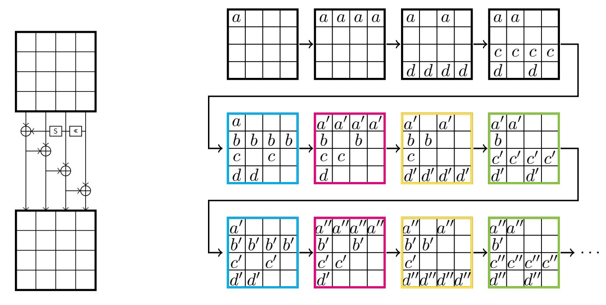

ule. from [Jea16])

Figure 1: AES key sched- Figure 2: Evolution of a difference located on the first byte (figure adapted after several rounds of key schedule.

<span id="page-5-1"></span>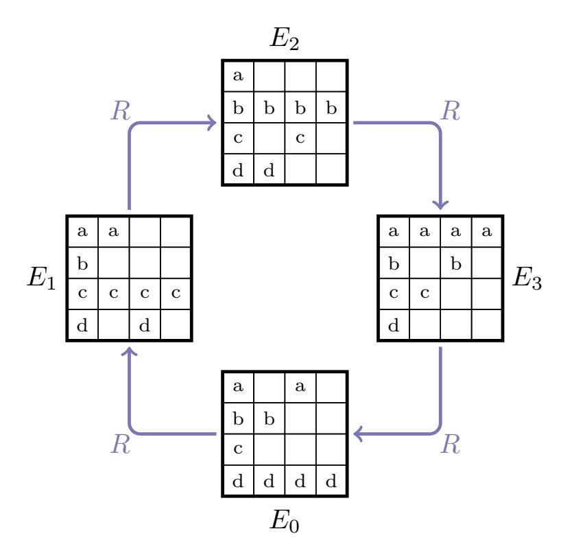

**Figure 3:** Evolution of the pattern of differences for invariant subspace of dimension four.

{6}------------------------------------------------

Therefore  $\pi_0(F(x)) = \pi_0(F(\pi_0(x)))$ . Similarly,  $\pi_i(F(x)) = \pi_i(F(\pi_i(x)))$ , and finally we can split the permutation in four independent 32-bit computations:

$$F(x) = \pi_0(F(\pi_0(x))) \oplus \pi_1(F(\pi_1(x))) \oplus \pi_2(F(\pi_2(x))) \oplus \pi_3(F(\pi_3(x))).$$

To obtain a representation that makes the 4 subspaces appear clearly, we perform a change of basis. Let  $\{e_0, e_1, \ldots, e_{15}\}$  be our new basis of  $(\mathbb{F}_{2^8})^{16}$  defined as follows:

$$\text{Base of } E_0 \begin{cases} e_0 &= (0,0,0,1,0,0,0,1,0,0,0,1,0,0,0,1) \\ e_1 &= (0,0,1,0,0,0,0,0,0,0,0,0,0,0,0,0,0,0) \\ e_2 &= (0,1,0,0,0,1,0,0,0,0,0,0,0,0,0,0,0,0) \\ e_3 &= (1,0,0,0,0,0,0,0,1,0,0,0,1,0,0,0,0,0,0) \end{cases}$$
 
$$\begin{cases} e_4 &= (0,0,1,0,0,0,1,0,0,0,1,0,0,0,1,0) \\ e_5 &= (0,1,0,0,0,0,0,0,0,0,0,0,0,0,0,0,0,0,0) \\ e_6 &= (1,0,0,0,1,0,0,0,0,0,0,0,0,0,0,0,0,0) \\ e_7 &= (0,0,0,1,0,0,0,0,0,0,0,0,0,0,0,0,0,0) \\ e_9 &= (1,0,0,0,1,0,0,0,1,0,0,0,1,0,0,0,0,0,0) \\ e_{10} &= (0,0,0,1,0,0,0,1,0,0,0,0,0,0,0,0,0) \\ e_{11} &= (0,0,1,0,0,0,1,0,0,0,1,0,0,0,0,0,0,0) \\ e_{13} &= (0,0,0,1,0,0,0,1,0,0,0,0,0,0,0,0,0,0) \\ e_{14} &= (0,0,1,0,0,0,1,0,0,0,0,0,0,0,0,0,0) \\ e_{15} &= (0,1,0,0,0,0,0,0,0,0,0,0,0,0,0,0,0) \end{cases}$$

Let  $s_0, s_1, \ldots, s_{15}$  be the coordinates in the new basis. They can be obtained by multiplying the original coordinates  $(k_0, \ldots, k_{15})$  with the matrix  $A = C_0^{-1}$ , where the columns of the transition matrix  $C_0$  are the coordinates of the vectors  $e_0, e_1, \ldots, e_{15}$  expressed in the old basis (canonical basis):

$$C_0 = \begin{pmatrix} \begin{smallmatrix} 0 & 0 & 0 & 1 & 0 & 0 & 1 & 0 & 0 & 1 & 0 & 0$$

Therefore, we use:

<span id="page-6-0"></span>
$$s_{0} = k_{15} s_{1} = k_{14} \oplus k_{10} \oplus k_{6} \oplus k_{2} s_{2} = k_{13} \oplus k_{5} s_{3} = k_{12} \oplus k_{8}$$

$$s_{4} = k_{14} s_{5} = k_{13} \oplus k_{9} \oplus k_{5} \oplus k_{1} s_{6} = k_{12} \oplus k_{4} s_{7} = k_{15} \oplus k_{11}$$

$$s_{8} = k_{13} s_{9} = k_{12} \oplus k_{8} \oplus k_{4} \oplus k_{0} s_{10} = k_{15} \oplus k_{7} s_{11} = k_{14} \oplus k_{10}$$

$$s_{12} = k_{12} s_{13} = k_{15} \oplus k_{11} \oplus k_{7} \oplus k_{3} s_{14} = k_{14} \oplus k_{6} s_{15} = k_{13} \oplus k_{9}$$

$$(1)$$

{7}------------------------------------------------

After defining s' with the same transformation from k', we can verify that:

<span id="page-7-0"></span>
$$s'_{0} = k'_{15} = k_{15} \oplus k_{11} \oplus k_{7} \oplus k_{3} \oplus S(k_{12}) \qquad = s_{13} \oplus S(s_{12})$$

$$s'_{1} = k'_{14} \oplus k'_{10} \oplus k'_{6} \oplus k'_{2} = k_{14} \oplus k_{6} \qquad = s_{14}$$

$$s'_{2} = k'_{13} \oplus k'_{5} = k_{13} \oplus k_{9} \qquad = s_{15}$$

$$s'_{3} = k'_{12} \oplus k'_{8} = k_{12} \qquad = s_{12}$$

$$s'_{4} = k'_{14} = k_{14} \oplus k_{10} \oplus k_{6} \oplus k_{2} \oplus S(k_{15}) \qquad = s_{1} \oplus S(s_{0})$$

$$s'_{5} = k'_{13} \oplus k'_{9} \oplus k'_{5} \oplus k'_{1} = k_{13} \oplus k_{5} \qquad = s_{2}$$

$$s'_{6} = k'_{12} \oplus k'_{4} = k_{12} \oplus k_{8} \qquad = s_{3}$$

$$s'_{7} = k'_{15} \oplus k'_{11} = k_{15} \qquad = s_{0} \qquad (2)$$

$$s'_{8} = k'_{13} = k_{13} \oplus k_{9} \oplus k_{5} \oplus k_{1} \oplus S(k_{14}) \qquad = s_{5} \oplus S(s_{4})$$

$$s'_{9} = k'_{12} \oplus k'_{8} \oplus k'_{4} \oplus k'_{0} = k_{12} \oplus k_{4} \qquad = s_{6}$$

$$s'_{10} = k'_{15} \oplus k'_{7} = k_{15} \oplus k_{11} \qquad = s_{7}$$

$$s'_{11} = k'_{14} \oplus k'_{10} = k_{14} \qquad = s_{4}$$

$$s'_{12} = k'_{12} = k_{12} \oplus k_{8} \oplus k_{4} \oplus k_{0} \oplus S(k_{13}) \oplus c_{i} \qquad = s_{9} \oplus S(s_{8}) \oplus c_{i}$$

$$s'_{13} = k'_{15} \oplus k'_{11} \oplus k'_{7} \oplus k'_{3} = k_{15} \oplus k_{7} \qquad = s_{10}$$

$$s'_{14} = k'_{14} \oplus k'_{6} = k_{14} \oplus k_{10} \qquad = s_{11}$$

$$s'_{15} = k'_{13} \oplus k'_{9} = k_{13} \qquad = s_{8}$$

This is represented by Figure 6 (see also Figure 20 in Appendix for a more visual representation). In the rest of this paper we use the notation  $k_i^r$  to denote byte i of the round-r subkey, and  $s_i^r$  to denote bytes of the alternative representation at round r, where the relations between  $k_i^r$  and  $s_i^r$  follow (1).

To further simplify the description, we write the output as

$$(s'_4, s'_5, s'_6, s'_7, s'_8, s'_9, s'_{10}, s'_{11}, s'_{12}, s'_{13}, s'_{14}, s'_{15}, s'_0, s'_1, s'_2, s'_3).$$

This corresponds to "untwisting" the rotation of the 4-byte blocks, so that each block of 4 output bytes depends on the same 4 input bytes. This results in our alternate representation of the AES-128 key schedule:

- 1. We first apply the linear transformation A to the state, corresponding to the change of variable above.
- 2. Then the rounds of the key schedule are seen as the concatenation of 4 permutations each acting on 32-bit words (4 bytes), as seen in Figure 4.
- 3. In order to extract the subkey of round r, another linear transformation  $C_{r \mod 4}$  is applied to the state, depending of the round number modulo 4.  $C_i$  is defined as  $C_i = A^{-1} \times SR^i$ , with SR the matrix corresponding to rotation of 4 bytes to the right (see below). In particular  $C_0 = A^{-1}$ .

$$A = \begin{pmatrix} \begin{smallmatrix} 0 & 0 & 0 & 0 & 0 & 0 & 0 & 0 & 0 & 0$$

{8}------------------------------------------------

<span id="page-8-1"></span>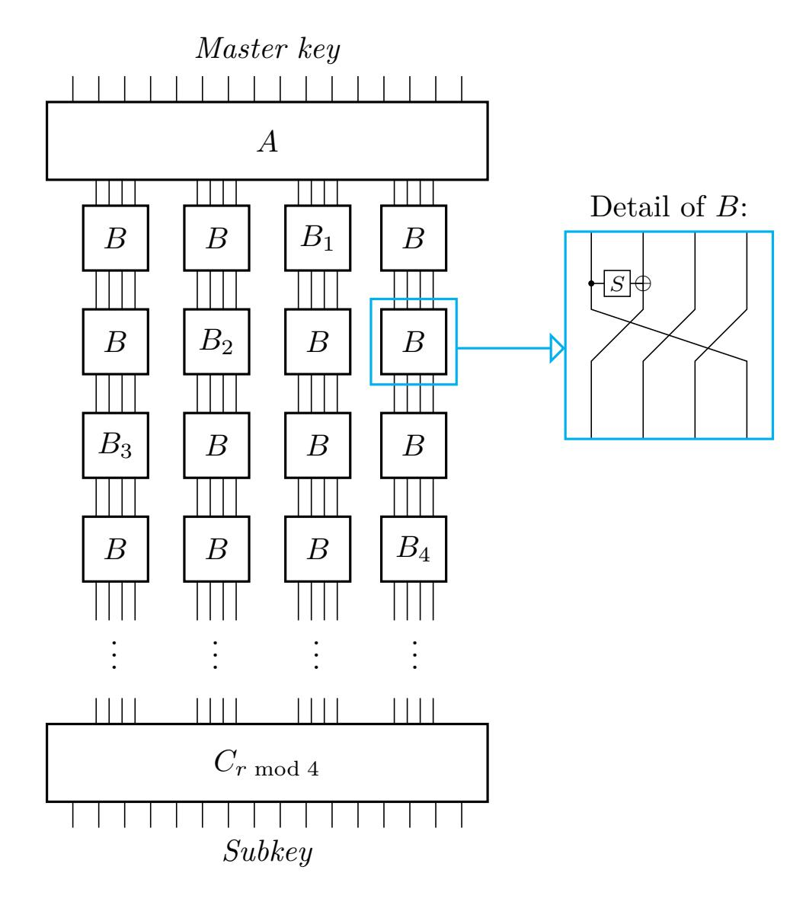

**Figure 4:** r rounds of the key schedule in the new representation.  $B_i$  is similar to B but the round constant  $c_i$  is XORed to the output of the Sbox.

In this new representation, there are clearly 4 independent chunks each acting on 4 bytes, and the subkeys are reconstructed with linear combinations of the alternative key schedule state. This representation also preserves the symmetry of the key schedule: the original key schedule is invariant by rotation of the columns (up to constants), and this corresponds to a rotation of four bytes in the new representation.

# <span id="page-8-0"></span>3 New Representations of the AES-192 and AES-256 Key Schedules

The same techniques can also be applied to other variants of AES: we apply the algorithm of Leander, Minaud and Rønjom [LMR15] to extract invariant subspaces of the key schedule, and we use a change of variables corresponding to the subspaces to obtain a simplified representation.

#### 3.1 AES-192

The AES-192 key schedule derives 13 subkeys from a 192-bit master key. The operations used are the same as in the AES-128, but the key schedule is different:

- In the initialization, six 32-bit words  $w_i$  ( $0 \le i < 6$ ) are filled with the bytes of the master key;
- The iteration defines  $w_i$   $(i \ge 6)$  as:
  - $\text{ if } i \equiv 0 \mod 6, w_i = \mathsf{SubWord}(\mathsf{RotWord}(w_{i-1})) \oplus \mathsf{RCon}(i/6) \oplus w_{i-6};$

{9}------------------------------------------------

<span id="page-9-0"></span>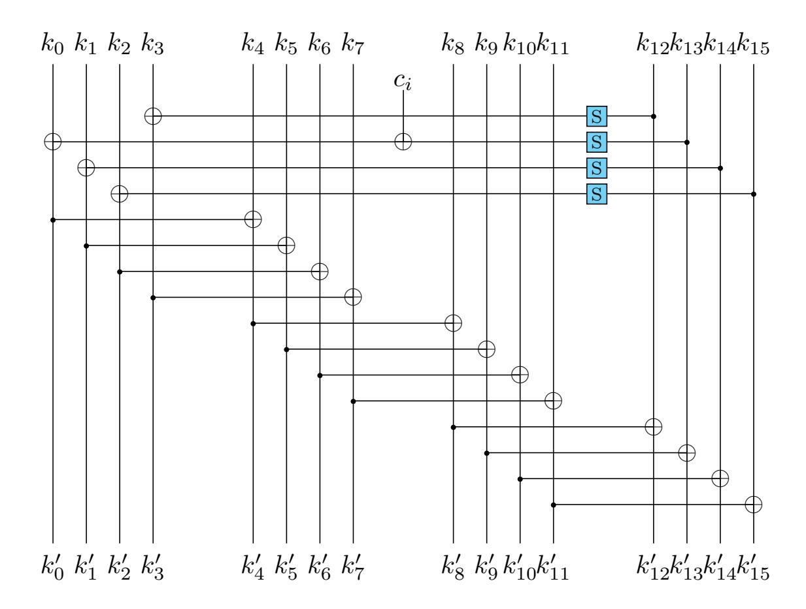

Figure 5: One round of the AES-128 key schedule.

<span id="page-9-1"></span>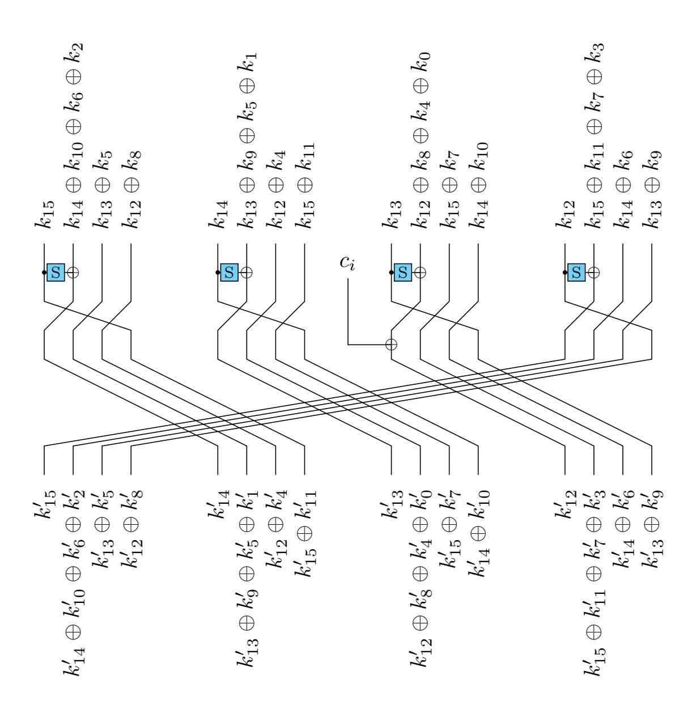

Figure 6: One round of the AES-128 key schedule (alternative representation).

{10}------------------------------------------------

- else, 
$$w_i = w_{i-1} \oplus w_{i-6}$$
.

As for the AES-128, the subkey at round i is the concatenation of the words  $w_{4i}$  to  $w_{3+4i}$ . Nevertheless, in AES-192, a key schedule state corresponds to one and a half consecutive subkeys. We can also express the key schedule at byte level using  $k_i$  ( $0 \le i < 24$ ) to denote the key schedule state, and  $k'_i$  for the state after one round of key schedule.

This is represented in Figure 7 and corresponds to the following equations:

$$k'_{0} = k_{0} \oplus S(k_{21}) \oplus c_{i}$$

$$k'_{1} = k_{1} \oplus S(k_{22})$$

$$k'_{2} = k_{2} \oplus S(k_{23})$$

$$k'_{3} = k_{3} \oplus S(k_{20})$$

$$k'_{4} = k_{4} \oplus k_{0} \oplus S(k_{21}) \oplus c_{i}$$

$$k'_{5} = k_{5} \oplus k_{1} \oplus S(k_{22})$$

$$k'_{6} = k_{6} \oplus k_{2} \oplus S(k_{23})$$

$$k'_{7} = k_{7} \oplus k_{3} \oplus S(k_{20})$$

$$k'_{8} = k_{8} \oplus k_{4} \oplus k_{0} \oplus S(k_{21}) \oplus c_{i}$$

$$k'_{9} = k_{9} \oplus k_{5} \oplus k_{1} \oplus S(k_{22})$$

$$k'_{10} = k_{10} \oplus k_{6} \oplus k_{2} \oplus S(k_{23})$$

$$k'_{11} = k_{11} \oplus k_{7} \oplus k_{3} \oplus S(k_{20})$$

$$k'_{12} = k_{12} \oplus k_{8} \oplus k_{4} \oplus k_{0} \oplus S(k_{21}) \oplus c_{i}$$

$$k'_{13} = k_{13} \oplus k_{9} \oplus k_{5} \oplus k_{1} \oplus S(k_{22})$$

$$k'_{14} = k_{14} \oplus k_{10} \oplus k_{6} \oplus k_{2} \oplus S(k_{23})$$

$$k'_{15} = k_{15} \oplus k_{11} \oplus k_{7} \oplus k_{3} \oplus S(k_{20})$$

$$k'_{16} = k_{16} \oplus k_{12} \oplus k_{8} \oplus k_{4} \oplus k_{0} \oplus S(k_{21}) \oplus c_{i}$$

$$k'_{17} = k_{17} \oplus k_{13} \oplus k_{9} \oplus k_{5} \oplus k_{1} \oplus S(k_{22})$$

$$k'_{18} = k_{18} \oplus k_{14} \oplus k_{10} \oplus k_{6} \oplus k_{2} \oplus S(k_{23})$$

$$k'_{19} = k_{19} \oplus k_{15} \oplus k_{11} \oplus k_{7} \oplus k_{3} \oplus S(k_{20})$$

$$k'_{20} = k_{20} \oplus k_{16} \oplus k_{12} \oplus k_{8} \oplus k_{4} \oplus k_{0} \oplus S(k_{21}) \oplus c_{i}$$

$$k'_{21} = k_{21} \oplus k_{17} \oplus k_{13} \oplus k_{9} \oplus k_{5} \oplus k_{1} \oplus S(k_{22})$$

$$k'_{22} = k_{22} \oplus k_{18} \oplus k_{14} \oplus k_{10} \oplus k_{6} \oplus k_{2} \oplus S(k_{23})$$

$$k'_{23} = k_{23} \oplus k_{19} \oplus k_{15} \oplus k_{11} \oplus k_{7} \oplus k_{3} \oplus S(k_{20})$$

By making this base change:

$$s_0 = k_{20}$$
  $s_1 = k_{12}$   $s_2 = k_4$   
 $s_3 = k_{17} \oplus k_{21}$   $s_4 = k_9 \oplus k_{13}$   $s_5 = k_1 \oplus k_5$   
 $s_6 = k_{22}$   $s_7 = k_{14}$   $s_8 = k_6$   
 $s_9 = k_{19} \oplus k_{23}$   $s_{10} = k_{11} \oplus k_{15}$   $s_{11} = k_3 \oplus k_7$   
 $s_{12} = k_{16} \oplus k_{20}$   $s_{13} = k_8 \oplus k_{12}$   $s_{14} = k_0 \oplus k_4$   
 $s_{15} = k_{21}$   $s_{16} = k_{13}$   $s_{17} = k_5$   
 $s_{18} = k_{18} \oplus k_{22}$   $s_{19} = k_{10} \oplus k_{14}$   $s_{20} = k_2 \oplus k_6$   
 $s_{21} = k_{23}$   $s_{22} = k_{15}$   $s_{23} = k_7$ 

we find two invariant subspaces of dimension 12, and obtain a simplified representation with 2 independent chunks each acting on 12 bytes, as shown in Figure 8.

{11}------------------------------------------------

<span id="page-11-0"></span>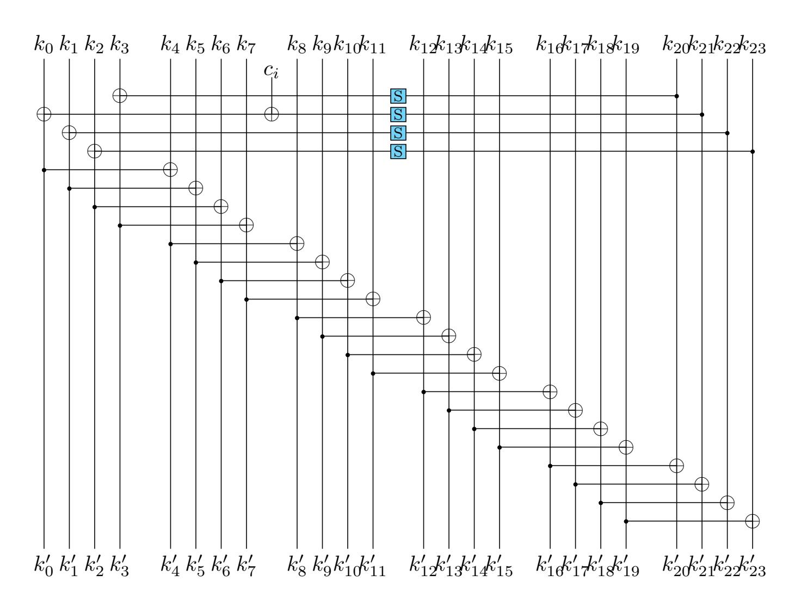

Figure 7: One round of the AES-192 key schedule.

<span id="page-11-1"></span>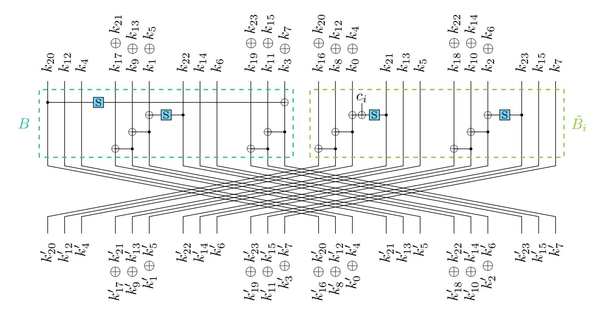

Figure 8: One round of the AES-192 key schedule (alternative representation).

{12}------------------------------------------------

<span id="page-12-0"></span>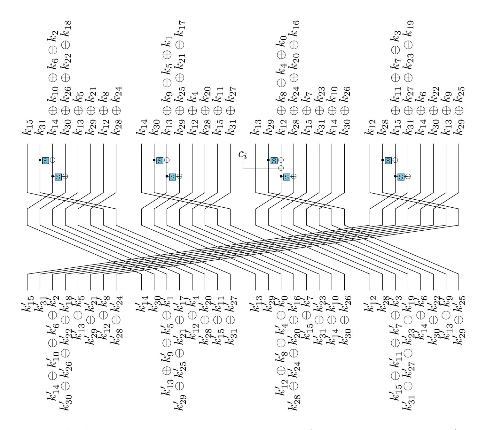

**Figure 9:** One round of the AES-256 key schedule (alternative representation).

#### 3.2 AES-256

The AES-256 key schedule derives 15 subkeys from a 256-bit master key. Again, the operations used are the same as in the AES-128, but the key schedule is different:

- In the initialization, eight 32-bit words  $w_i$  ( $0 \le i < 8$ ) are filled with the bytes of the master key;
- The iteration defines  $w_i$   $(i \ge 8)$  as:
  - $\text{ if } i \equiv 0 \mod 8, w_i = \mathsf{SubWord}(\mathsf{RotWord}(w_{i-1})) \oplus \mathsf{RCon}(i/8) \oplus w_{i-8};$
  - else if  $i \equiv 0 \mod 4$ ,  $w_i = \mathsf{SubWord}(w_{i-1}) \oplus w_{i-8}$ .
  - else,  $w_i = w_{i-1} \oplus w_{i-8}$ .

The subkey at round i is the concatenation of the words  $w_{4i}$  to  $w_{3+4i}$ . So in AES-256, each key schedule state corresponds to two consecutive subkeys. As for the AES-128, we can also express the key schedule at byte level using  $k_i$  ( $0 \le i < 32$ ) to denote the key schedule state, and  $k'_i$  for the state after one round of key schedule. This corresponds to the following equations:

$$k'_0 = k_0 \oplus S(k_{29}) \oplus c_i$$
  
 $k'_1 = k_1 \oplus S(k_{30})$   
 $k'_2 = k_2 \oplus S(k_{31})$   
 $k'_3 = k_3 \oplus S(k_{28})$ 

{13}------------------------------------------------

```
k
  ′
  4 = k4 ⊕ k0 ⊕ S(k29) ⊕ ci
k
  ′
  5 = k5 ⊕ k1 ⊕ S(k30)
k
  ′
  6 = k6 ⊕ k2 ⊕ S(k31)
k
  ′
  7 = k7 ⊕ k3 ⊕ S(k28)
k
  ′
  8 = k8 ⊕ k4 ⊕ k0 ⊕ S(k29) ⊕ ci
k
  ′
  9 = k9 ⊕ k5 ⊕ k1 ⊕ S(k30)
k
 ′
 10 = k10 ⊕ k6 ⊕ k2 ⊕ S(k31)
k
 ′
 11 = k11 ⊕ k7 ⊕ k3 ⊕ S(k28)
k
 ′
 12 = k12 ⊕ k8 ⊕ k4 ⊕ k0 ⊕ S(k29) ⊕ ci
k
 ′
 13 = k13 ⊕ k9 ⊕ k5 ⊕ k1 ⊕ S(k30)
k
 ′
 14 = k14 ⊕ k10 ⊕ k6 ⊕ k2 ⊕ S(k31)
k
 ′
 15 = k15 ⊕ k11 ⊕ k7 ⊕ k3 ⊕ S(k28)
k
 ′
 16 = k16 ⊕ S(k12 ⊕ k8 ⊕ k4 ⊕ k0 ⊕ S(k29) ⊕ ci)
k
 ′
 17 = k17 ⊕ S(k13 ⊕ k9 ⊕ k5 ⊕ k1 ⊕ S(k30))
k
 ′
 18 = k18 ⊕ S(k14 ⊕ k10 ⊕ k6 ⊕ k2 ⊕ S(k31))
k
 ′
 19 = k19 ⊕ S(k15 ⊕ k11 ⊕ k7 ⊕ k3 ⊕ S(k28))
k
 ′
 20 = k20 ⊕ k16 ⊕ S(k12 ⊕ k8 ⊕ k4 ⊕ k0 ⊕ S(k29) ⊕ ci)
k
 ′
 21 = k21 ⊕ k17 ⊕ S(k13 ⊕ k9 ⊕ k5 ⊕ k1 ⊕ S(k30))
k
 ′
 22 = k22 ⊕ k18 ⊕ S(k14 ⊕ k10 ⊕ k6 ⊕ k2 ⊕ S(k31))
k
 ′
 23 = k23 ⊕ k19 ⊕ S(k15 ⊕ k11 ⊕ k7 ⊕ k3 ⊕ S(k28))
k
 ′
 24 = k24 ⊕ k20 ⊕ k16 ⊕ S(k12 ⊕ k8 ⊕ k4 ⊕ k0 ⊕ S(k29) ⊕ ci)
k
 ′
 25 = k25 ⊕ k21 ⊕ k17 ⊕ S(k13 ⊕ k9 ⊕ k5 ⊕ k1 ⊕ S(k30))
k
 ′
 26 = k26 ⊕ k22 ⊕ k18 ⊕ S(k14 ⊕ k10 ⊕ k6 ⊕ k2 ⊕ S(k31))
k
 ′
 27 = k27 ⊕ k23 ⊕ k19 ⊕ S(k15 ⊕ k11 ⊕ k7 ⊕ k3 ⊕ S(k28))
k
 ′
 28 = k28 ⊕ k24 ⊕ k20 ⊕ k16 ⊕ S(k12 ⊕ k8 ⊕ k4 ⊕ k0 ⊕ S(k29) ⊕ ci)
k
 ′
 29 = k29 ⊕ k25 ⊕ k21 ⊕ k17 ⊕ S(k13 ⊕ k9 ⊕ k5 ⊕ k1 ⊕ S(k30))
k
 ′
 30 = k30 ⊕ k26 ⊕ k22 ⊕ k18 ⊕ S(k14 ⊕ k10 ⊕ k6 ⊕ k2 ⊕ S(k31))
k
 ′
 31 = k31 ⊕ k27 ⊕ k23 ⊕ k19 ⊕ S(k15 ⊕ k11 ⊕ k7 ⊕ k3 ⊕ S(k28))
```

By making this change of variable:

$$s_{0} = k_{15} \qquad s_{1} = k_{31} \qquad s_{2} = k_{14} \oplus k_{10} \oplus k_{6} \oplus k_{2} \qquad s_{3} = k_{30} \oplus k_{26} \oplus k_{22} \oplus k_{18}$$

$$s_{4} = k_{13} \oplus k_{5} \qquad s_{5} = k_{29} \oplus k_{21} \qquad s_{6} = k_{12} \oplus k_{8} \qquad s_{7} = k_{28} \oplus k_{24}$$

$$s_{8} = k_{14} \qquad s_{9} = k_{30} \qquad s_{10} = k_{13} \oplus k_{9} \oplus k_{5} \oplus k_{1} \qquad s_{11} = k_{29} \oplus k_{25} \oplus k_{21} \oplus k_{17}$$

$$s_{12} = k_{12} \oplus k_{4} \qquad s_{13} = k_{28} \oplus k_{20} \qquad s_{14} = k_{15} \oplus k_{11} \qquad s_{15} = k_{31} \oplus k_{27}$$

$$s_{16} = k_{13} \qquad s_{17} = k_{29} \qquad s_{18} = k_{12} \oplus k_{8} \oplus k_{4} \oplus k_{0} \qquad s_{19} = k_{28} \oplus k_{24} \oplus k_{20} \oplus k_{16}$$

$$s_{20} = k_{15} \oplus k_{7} \qquad s_{21} = k_{31} \oplus k_{23} \qquad s_{22} = k_{14} \oplus k_{10} \qquad s_{23} = k_{30} \oplus k_{26}$$

$$s_{24} = k_{12} \qquad s_{25} = k_{28} \qquad s_{26} = k_{15} \oplus k_{11} \oplus k_{7} \oplus k_{3} \qquad s_{27} = k_{31} \oplus k_{27} \oplus k_{23} \oplus k_{19}$$

$$s_{28} = k_{14} \oplus k_{6} \qquad s_{29} = k_{30} \oplus k_{22} \qquad s_{30} = k_{13} \oplus k_{9} \qquad s_{31} = k_{29} \oplus k_{25}$$

we find four invariant subspaces of dimension 8, and obtain a simplified representation with 4 independent chunks each acting on 8 bytes, as shown in Figure [9.](#page-12-0)

{14}------------------------------------------------

<span id="page-14-2"></span>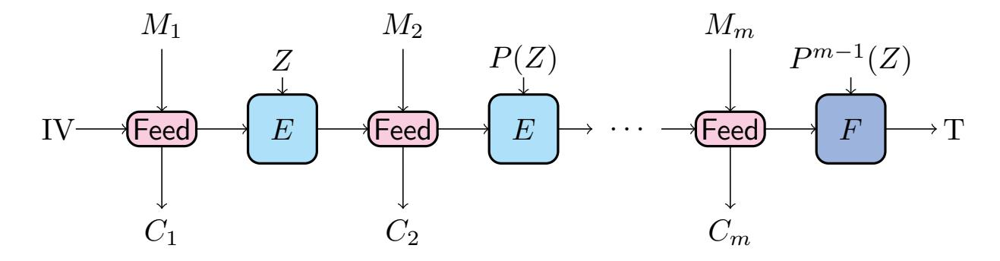

**Figure 10:** Simplified scheme of mixFeed encryption.

<span id="page-14-1"></span>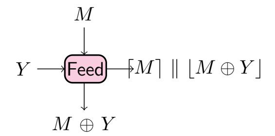

**Figure 11:** Function Feed with a full message block.

## <span id="page-14-0"></span>**4 Application to mixFeed**

The AEAD scheme mixFeed [\[CN19a\]](#page-44-5) was a second-round candidate in the NIST Lightweight Standardization Process, submitted by Chakraborty and Nandi, and based on the AES block cipher. It is a rate-1 feedback-based mode inspired by COFB. For each message block, a Feed function is used to compute the ciphertext and the block cipher input from the previous internal state, and the internal state is replaced by the block cipher output. In COFB, there is a need for an extra state variable, to make each Feed function different. In order to reduce the state size, mixFeed instead makes each block cipher call different, applying a permutation *P* to the key between each block. For optimal efficiency, the permutation *P* just corresponds to eleven round of the AES key schedule, so that the subkeys for all the AES calls essentially correspond to running the AES key schedule indefinitely (up to the round constants).

In [\[Kha19\]](#page-45-7), Khairallah observed that some keys generate short cycles when iterating the *P* permutation, and he built a forgery attack for keys in short cycles. In this work, we show that the new representation of the key schedule explains the existence of these short cycles, and we characterize the keys belonging to such cycles. This shows that the permutation *P* cannot be considered as a random permutation.

#### **4.1 Description of mixFeed**

For simplicity, we only describe a simplified mixFeed without associated data; the full description of mixFeed can be found in [\[CN19a\]](#page-44-5).

**Notations:** We use *M* and *C* to denote the plaintext and ciphertext. For the sake of simplicity, we assume that *M* is made of *m* 128-bit blocks.

The following functions are used in mixFeed:

- *E*: a modified version of AES-128 including MixColumns in the last round;
- *P*: the permutation corresponding to eleven rounds of AES-128 key schedule;

{15}------------------------------------------------

• Feed: the feedback function defined as (see Figure [11\)](#page-14-1):

$$\begin{aligned} \mathsf{Feed}(Y,M) &= (X,C) \\ &= (\lceil M \rceil \| \lfloor M \oplus Y \rfloor, M \oplus Y), \end{aligned}$$

where ⌈*D*⌉ represent the 64 most significant bits of *D*, and ⌊*D*⌋ the 64 least significant bits.

The computations are as follow (see Figure [10\)](#page-14-2):

**Initialization of the state.** An initial value IV = *Y*<sup>0</sup> and a internal key *Z* are computed from the nonce *N* and the key *K*.

**Encryption and authentication.** For *i* from 1 to *m*, the Feed function is applied to the current state *Yi*−<sup>1</sup> and message block *M<sup>i</sup>* . Feed returns the ciphertext block *C<sup>i</sup>* , and a new state *X<sup>i</sup>* which is then encrypted under the key *P i*−1 (*Z*) using *E* to obtain *Y<sup>i</sup>* . At the end of this step, a finalization function computes the tag from the final state and the internal key *P m*−1 (*Z*), we denote as *F* the composition of the cipher call of last round and the finalization function.

#### **4.2 Short Cycles of** *P*

In [\[Kha19\]](#page-45-7), Khairallah found 20 keys belonging to small cycles of *P*, and observed that all of them have the same cycle length[1](#page-15-0) : 14018661024. He deduced a forgery attack, assuming that the subkey falls in one of those cycles, but did not further analyse the probability of having such a subkey. Later the designers of mixFeed published a security proof for the scheme [\[CN19b\]](#page-44-6), under the assumption that the number of keys in a short cycle is sufficiently small. More precisely, they wrote:

**Assumption 1** ([\[CN19b\]](#page-44-6))**.** *For any K* ∈ {0*,* 1} *<sup>n</sup> chosen uniformly at random, probability that K has a period at most ℓ is at most ℓ/*2 *n/*2 *.*

The 20 keys identified by Khairallah do not contradict this assumption, but if there are many such keys the assumption does not hold, and mixFeed can be broken by a forgery attack. We now provide a theoretical explanation of the observation of Khairallah, and a full characterization of the cycles of *P*. We find that a random key is in a cycle of length smaller than 2 <sup>34</sup> with probability 0.44; this contradicts the assumption made in [\[CN19b\]](#page-44-6), and allows a practical forgery attack.

**Analysis of the structure of** *P* **.** Using our new representation, the 11-round key schedule *P* consists of:

- The linear transformation *A*
- 4 parallel 32-bit permutations that we denote *f*1∥*f*2∥*f*3∥*f*4, with

$$f_1 = B_{11} \circ B \circ B \circ B \circ B_7 \circ B \circ B \circ B \circ B_3 \circ B \circ B$$

$$f_2 = B \circ B_{10} \circ B \circ B \circ B \circ B_6 \circ B \circ B \circ B \circ B_2 \circ B$$

$$f_3 = B \circ B \circ B_9 \circ B \circ B \circ B \circ B_5 \circ B \circ B \circ B \circ B_1$$

$$f_4 = B \circ B \circ B \circ B_8 \circ B \circ B \circ B \circ B_4 \circ B \circ B \circ B$$

(the permutations differ only by the round constants)

<span id="page-15-0"></span><sup>1</sup>Khairallah actually reported the length as 1133759136, probably because of a 32-bit overflow.

{16}------------------------------------------------

• The linear transformation  $C_3 = A^{-1} \times SR^{-1}$ 

To simplify the analysis, we consider the cycle structure of  $\widetilde{P} = A \circ P \circ A^{-1}$ , which is the same as the cycle structure of P:

$$\widetilde{P}: (a, b, c, d) \mapsto (f_2(b), f_3(c), f_4(d), f_1(a))$$

To further simplify the analysis, we consider the cycle structure of  $\widetilde{P}^4$ , which is closely related to the cycle structure of  $\widetilde{P}$ . A cycle of  $\widetilde{P}^4$  of length  $\ell$  corresponds to a cycle of  $\widetilde{P}$ , of length  $\ell$ ,  $2\ell$  or  $4\ell$ . Conversely a cycle of  $\widetilde{P}$  of length  $\ell$  corresponds to one or several cycles of  $\widetilde{P}^4$ , of length  $\ell$ ,  $\ell/2$  or  $\ell/4$  (depending on the divisibility of  $\ell$ ). Analyzing  $\widetilde{P}^4$  is easier because it can be decomposed into 4 parallel permutations, cancelling the left rotation induced by  $\mathsf{SR}^{-1}$  (see Figure 13):

$$\widetilde{P}^{4}: (a, b, c, d) \mapsto (\phi_{1}(a), \phi_{2}(b), \phi_{3}(c), \phi_{4}(d))$$

$$\phi_{1}(a) = f_{2} \circ f_{3} \circ f_{4} \circ f_{1}(a)$$

$$\phi_{2}(b) = f_{3} \circ f_{4} \circ f_{1} \circ f_{2}(b)$$

$$\phi_{3}(c) = f_{4} \circ f_{1} \circ f_{2} \circ f_{3}(c)$$

$$\phi_{4}(d) = f_{1} \circ f_{2} \circ f_{3} \circ f_{4}(d)$$

If (a, b, c, d) is in a cycle of length  $\ell$  of  $\widetilde{P}^4$ , we have  $\widetilde{P}^{4\ell}(a, b, c, d) = (a, b, c, d)$ , that is to say:

$$\phi_1^{\ell}(a) = a$$
  $\phi_2^{\ell}(b) = b$   $\phi_3^{\ell}(c) = c$   $\phi_4^{\ell}(d) = d$ 

In particular, a, b, c and d must be in cycles of  $\phi_1$ ,  $\phi_2$ ,  $\phi_3$ ,  $\phi_4$  (respectively) of length dividing  $\ell$ . Conversely, if a, b, c, d are in small cycles of the corresponding  $\phi_i$ , then (a, b, c, d) is in a cycle of  $\widetilde{P}^4$  of length the lowest common multiple of the small cycle lengths.

Moreover, due to the structure of the  $\phi_i$  permutations, all of them have the same cycle structure (the same number of cycles with the same cycle length). This implies that  $\widetilde{P}$  has a large number of small cycles. Indeed, if we consider a cycle of  $\phi_i$  of length  $\ell$ , and elements a, b, c, d in the corresponding cycles, (a, b, c, d) is in a cycle of  $P^4$  of length  $\ell$ . There are  $\ell^4$  choices of a, b, c, d, which correspond to  $\ell^3$  different cycles of P. If we assume that  $\phi_i$  behaves like a random 32-bit permutation, we expect that the largest cycle has length about  $2^{31}$ , which gives around  $2^{93}$  cycles of  $\widetilde{P}^4$  of length  $\approx 2^{31}$ , and around  $2^{93}$  cycles of  $\widetilde{P}$  of length  $\approx 2^{33}$ .

Cycle analysis of 11-round AES-128 key schedule. In order to identify the small cycles of the permutation P, we start by analyzing the cycle structure of the 32-bit permutation  $\phi_1 = f_2 \circ f_3 \circ f_4 \circ f_1$ : it can be decomposed into cycles of lengths 3504665256, 255703222, 219107352, 174977807, 99678312, 13792740, 8820469, 7619847, 5442633, 4214934, 459548, 444656, 14977, 14559, 5165, 4347, 1091, 317, 27, 6, 5 (3 cycles), 4 (2 cycles), 2 (3 cycles), and 1 (2 fixed points), as shown in Table 4. In particular, the largest cycle has length  $\ell = 3504665256$ . Consequently, with probability  $(3504665256 \times 2^{-32})^4 \approx 0.44$ , we have a, b, c and d each in a cycle of length  $\ell$ , resulting in a cycle of length  $\ell$  for  $\widetilde{P}^4$ , and a cycle of length at most  $4\ell = 14018661024$  for  $\widetilde{P}$  and P. This explains the observation of Khairallah [Kha19], and clearly contradicts the assumption of [CN19b].

More generally, when a, b, c, d belong to a cycle of length  $\ell_i$ , the corresponding cycle for  $\widetilde{P}^4$  is of length  $\ell = \operatorname{lcm}(\ell_1, \ell_2, \ell_3, \ell_4)$ , and we can compute the associated probability from Table 4. In most cases, a cycle of length  $\ell$  of  $\widetilde{P}^4$  corresponds to a cycle of  $\widetilde{P}$  of length  $\ell$ . However, the cycle of  $\widetilde{P}$  is of length  $\ell$  when  $\widetilde{P}^{\ell}(a, b, c, d) = (a, b, c, d)$ , and of length  $2\ell$  when  $\widetilde{P}^{2\ell}(a, b, c, d) = (a, b, c, d)$  (this can only be the case with odd  $\ell$ , by definition of  $\ell$ ).

{17}------------------------------------------------

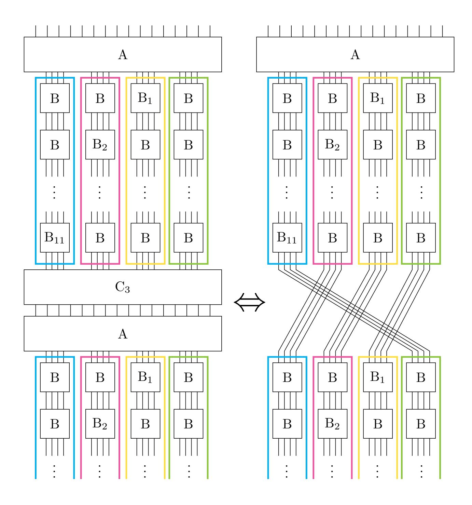

Figure 12: Two iterations of 11 rounds of the key schedule in the new representation.

<span id="page-17-0"></span>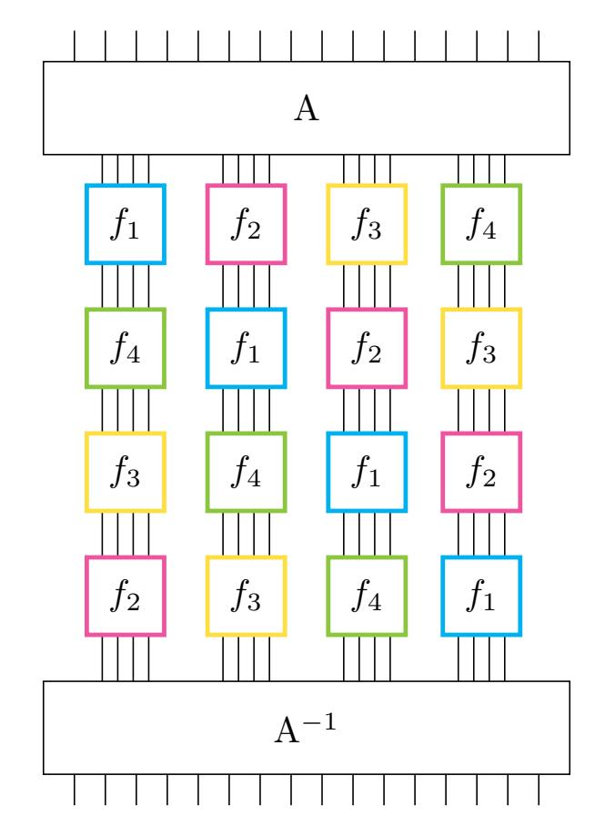

**Figure 13:** 4 iterations of P in the new model.

{18}------------------------------------------------

This is unlikely for short cycles, but as an example we can construct a fixed-point for  $\tilde{P}$  and P from a fixed-point of  $\phi_1$ :

- a = 7e be d1 92
- $b = \text{de d4 b7 cc} = f_3 \circ f_4 \circ f_1(a)$
- $c = 9f 95 88 26 = f_4 \circ f_1(a)$
- $d = d4 b9 79 91 = f_1(a)$

Since  $f_2 \circ f_3 \circ f_4 \circ f_1(a) = a$ , we have  $\widetilde{P}(a,b,c,d) = (f_2(b),f_3(c),f_4(d),f_1(a)) = (a,b,c,d)$ . Since  $\widetilde{P} = A \circ P \circ A^{-1}$ , the corresponding key in the original representation is:

$$A^{-1} \times \begin{pmatrix} a \\ b \\ c \\ d \end{pmatrix} = \begin{pmatrix} 0 & 0 & 0 & 1 & 0 & 0 & 1 & 0 & 0 & 1 & 0 & 0$$

This results in a fixed point of P.

We can generalize this construction for all odd cycle lengths  $\ell$ . We choose w an element of a cycle of length  $\ell$ , and then we can build an element which belongs to a cycle of length  $\ell$  for the permutation P:

• if  $\ell = 1 \mod 4$ :

$$a = w$$

$$b = f_3 \circ f_4 \circ f_1 \circ \dots \circ f_1(w), \qquad \text{with } 3\ell \text{ terms } f_i$$

$$c = f_4 \circ f_1 \circ f_2 \circ \dots \circ f_1(w), \qquad \text{with } 2\ell \text{ terms } f_i$$

$$d = f_1 \circ f_2 \circ f_3 \circ \dots \circ f_1(w), \qquad \text{with } \ell \text{ terms } f_i$$

• if  $\ell = 3 \mod 4$ :

$$a = w$$

$$b = f_3 \circ f_4 \circ f_1 \circ \dots \circ f_1(w), \qquad \text{with } \ell \text{ terms } f_i$$

$$c = f_4 \circ f_1 \circ f_2 \circ \dots \circ f_1(w), \qquad \text{with } 2\ell \text{ terms } f_i$$

$$d = f_1 \circ f_2 \circ f_3 \circ \dots \circ f_1(w), \qquad \text{with } 3\ell \text{ terms } f_i$$

{19}------------------------------------------------

<span id="page-19-0"></span>**Table 4:** Cycle structure of  $\phi_1$  for 11-round AES-128 key schedule

| Length     | # cycles | Proba                | Smal | lest | ele | ment |
|------------|----------|----------------------|------|------|-----|------|
| 3504665256 | 1        | 0.82                 | 00   | 00   | 00  | 01   |
| 255703222  | 1        | 0.05                 | 00   | 00   | 00  | 0b   |
| 219107352  | 1        | 0.05                 | 00   | 00   | 00  | 1d   |
| 174977807  | 1        | 0.04                 | 00   | 00   | 00  | 00   |
| 99678312   | 1        | 0.02                 | 00   | 00   | 00  | 21   |
| 13792740   | 1        | 0.003                | 00   | 00   | 00  | 75   |
| 8820469    | 1        | $2^{-8,93}$          | 00   | 00   | 00  | 24   |
| 7619847    | 1        | $2^{-9,14}$          | 00   | 00   | 00  | c1   |
| 5442633    | 1        | $2^{-9,63}$          | 00   | 00   | 02  | 78   |
| 4214934    | 1        | $2^{-10}$            | 00   | 00   | 05  | 77   |
| 459548     | 1        | $2^{-13,2}$          | 00   | 00   | 38  | fe   |
| 444656     | 1        | $2^{-13,24}$         | 00   | 00   | 0b  | 68   |
| 14977      | 1        | $2^{-18,13}$         | 00   | 06   | 82  | 5c   |
| 14559      | 1        | $2^{-18,18}$         | 00   | 04   | fa  | b1   |
| 5165       | 1        | $2^{-19,67}$         | 00   | 0a   | d4  | 4e   |
| 4347       | 1        | $2^{-19,92}$         | 00   | 04   | 94  | 3a   |
| 1091       | 1        | $2^{-21.91}$         | 00   | 21   | 4b  | 3b   |
| 317        | 1        | $2^{-23,7}$          | 00   | 28   | 41  | 36   |
| 27         | 1        | $2^{-27,25}$         | 01   | 3a   | 0d  | 0c   |
| 6          | 1        | $2^{-29,42}$         | 06   | 23   | 25  | 51   |
| 5          | 3        | $3 \cdot 2^{-29,68}$ | 06   | 1a   | ea  | 18   |
| 4          | 2        | $2\cdot 2^{-30}$     | 23   | с6   | 6f  | 2b   |
| 2          | 3        | $3 \cdot 2^{-31}$    | 69   | ea   | 63  | 75   |
| 1          | 2        | $2\cdot 2^{-32}$     | 7e   | be   | d1  | 92   |

#### 4.3 Forgery attack against mixFeed

Khairallah [Kha19] proposed a forgery attack assuming that Z belongs to a cycle of length  $\ell$ , considering a message M made of m blocks, with  $m > \ell$ :

- 1. Encrypt the message M to obtain the ciphertext C and tag T.
- 2. Compute  $Y_0$  using  $M_1$  and  $C_1$  and  $X_{\ell+1}$  using  $M_{\ell+1}$  and  $C_{\ell+1}$ .
- 3. Compute  $\bar{M}$  and  $\bar{C}$  such that  $(X_{\ell+1}, \bar{C}) = \mathsf{Feed}(Y_0, \bar{M})$ .
- 4. The T tag will also authenticate the new ciphertext  $C' = \bar{C} \|C_{\ell+2}\| \cdots \|C_m$ .

The computations required for the forge are negligible with only a few XORs to invert the Feed function. Therefore the complexity of the attack is just the encryption of a message with at least  $(\ell+1)$  blocks, with  $\ell$  the length of the cycle. As explained above, the probability of success is approximately 0.44, using  $\ell=14018661024$ . When the forgery fails, we can repeat the attack with a different nonce, because the internal key Z depends on the nonce; for each master key K, the attack works on 44% of the nonces.

We have verified this attack using the reference implementation provided by the designers. We take a message of  $\ell + 1 = 14018661025$  blocks of 16 bytes (220 Gbytes<sup>2</sup>), choose a random key and nonce, and encrypt the message with mixFeed. We modify the ciphertext according to the previous explanation, and we check if the new ciphertext

<span id="page-19-1"></span><sup>&</sup>lt;sup>2</sup>Note that there is no need to store the plaintext or ciphertext in memory if we have access to an online implementation of mixFeed.

{20}------------------------------------------------

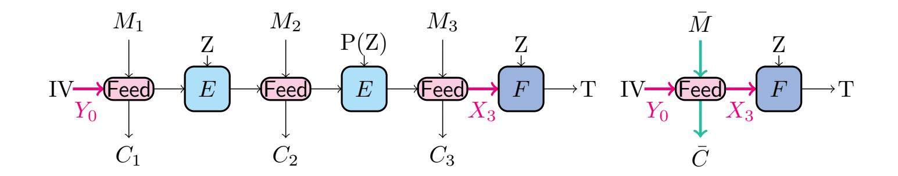

**Figure 14:** Forgery attack when Z belongs to a cycle of length 2.

<span id="page-20-1"></span>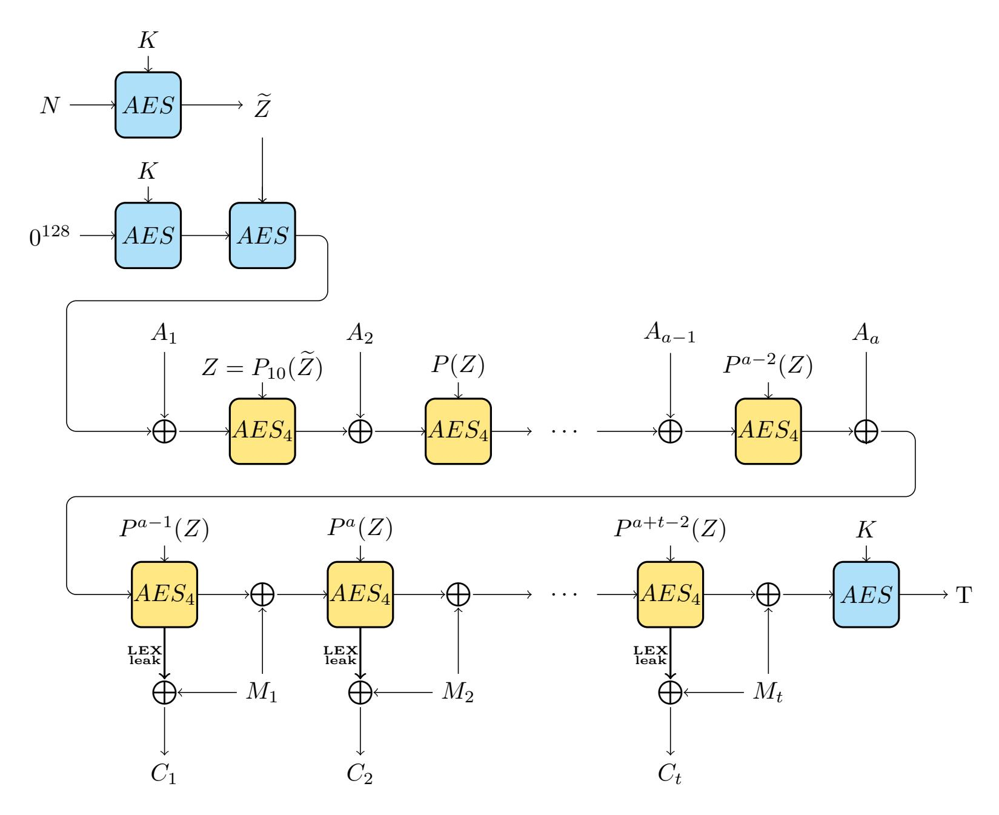

**Figure 15:** Authenticated encryption with ALE.

is accepted. We obtained 41% of success over 100 attempts. This result is close to the expected 44% success rate, and confirms our analysis.

## <span id="page-20-0"></span>**5 Application to ALE**

ALE [\[BMR](#page-44-7)<sup>+</sup>14] is an earlier authenticated encryption scheme based on the AES round function, strongly inspired by LEX [\[Bir07\]](#page-43-5) (for the encryption part) and Pelican-MAC [\[DR05\]](#page-45-10) (for the authentication part). Attacks have already been presented against ALE [\[KR14,](#page-45-3) [WWH](#page-46-1)<sup>+</sup>13] but the new representation of the key schedule gives new types of attacks, based on previous attacks against LEX [\[BDF11,](#page-43-6) [DK08a\]](#page-44-8).

{21}------------------------------------------------

#### **5.1 Description of ALE**

For the sake of simplicity, we will consider ALE without associated data, and we only consider blocks of 16 bytes for the plaintext (to ignore the padding). ALE maintains a state composed of an internal state and an internal key, and operates with 3 steps (cf Figure [15\)](#page-20-1). As for mixFeed, the internal key is updated with iterative applications of a permutation *P* corresponding to AES key schedule rounds. In the case of ALE, *P* corresponds to 5 rounds of key schedule rather than 11, but we have again many short cycles because 5 is also an odd number.

**Initialization.** The state is initialized from the key *K* and a nonce *N*, using a session key *<sup>Z</sup>*<sup>e</sup> <sup>=</sup> *<sup>E</sup>K*(*N*). The internal state is initialized to *IV* <sup>=</sup> *<sup>E</sup><sup>Z</sup>*<sup>e</sup> (*EK*(0)), and the internal key is initialized to *P*10(*Z*), where *P*<sup>10</sup> correspond to 11 rounds of AES key schedule.

**Message processing phase.** For each block of message, the internal state is encrypted with 4-round AES, and the internal key is updated by five rounds of AES key schedule. During the encryption, four bytes are leaked in each AES round according to the LEX specification (bytes 0, 2, 8, 10 for odd rounds, and bytes 4, 6, 12 and 14 for even rounds), and used as keystream to encrypt the message. Then the message block is xored to the current internal state, following the Pelican-MAC construction.

**Finalization.** Finally, the internal state is encrypted with the full AES using the master key *K* to generate the tag *T*.

**Rekeying.** The designers of ALE require that the master key is changed after processing 2 <sup>48</sup> bits (*i.e.* 2 <sup>41</sup> blocks).

**Previous results.** ALE was designed to thwart attacks against LEX [\[BDF11,](#page-43-6) [DK08a\]](#page-44-8) that use a pair of partially-colliding internal states to recover the key. Indeed, each AES call uses a different key, which prevents those attacks. Other attacks have been proposed against LEX, based on differential trails between two message injections [\[KR14,](#page-45-3) [WWH](#page-46-1)<sup>+</sup>13]. We compare the previous attacks in Table [1.](#page-1-2) To make the results comparable, we assume that attacks with a low success rate are repeated until they succeed. For attacks using more than 2 <sup>41</sup> blocks of data, the master key will be rotated.

#### **5.2 Internal Key Recovery**

We describe a new attack against ALE, based on previous analysis of LEX. The key update of ALE was supposed to avoid these attacks, but since the update function has small cycles, there is a large probability that the key state is repeated, which makes the attack possible.

We analyze cycles of *P* in the same way as for mixFeed: four iterations of the 5-round key schedule are equivalent to the application in parallel of four 32-bit permutations. The study of one of these permutations gives us information about the cycle structure of the permutation *P*. As seen in Table [5,](#page-22-0) the 32-bit permutation has a cycle of length *ℓ* = 4010800805 ≈ 2 31*.*9 ; therefore the permutation *P* admits many cycles of length 4 × *ℓ* ≈ 2 <sup>33</sup>*.*<sup>9</sup> which are reached with probability (*ℓ* × 2 <sup>−</sup><sup>32</sup>) <sup>4</sup> ≈ 0*.*76.

Previous attacks against LEX [\[BDF11,](#page-43-6) [BDF12,](#page-43-7) [DK08a\]](#page-44-8) are based on the search for a pair of internal states that partially collides, with two identical columns. This pattern can occur in odd or even round: we use columns 0 and 2 for odd rounds, and columns 1 and 3 for even rounds. The partial collision occurs with probability 2 <sup>−</sup><sup>64</sup>, and 32 bits of the colliding state can be directly observed, due to the leak extractions. A candidate pair can

{22}------------------------------------------------

<span id="page-22-0"></span>**Table 5:** Cycle structure of  $\phi_1$  for 5-round AES-128 key schedule

| Length     | # cycles | Proba        | Smal | lest | ele | ment |
|------------|----------|--------------|------|------|-----|------|
| 4010800805 | 1        | 0.93         | 00   | 00   | 00  | 00   |
| 131787964  | 1        | 0.03         | 00   | 00   | 00  | 5d   |
| 49935997   | 1        | 0.01         | 00   | 00   | 00  | 0e   |
| 34379325   | 1        | 0.008        | 00   | 00   | 00  | 1d   |
| 33741892   | 1        | 0.008        | 00   | 00   | 00  | 1e   |
| 14932111   | 1        | 0.003        | 00   | 00   | 01  | 94   |
| 9654619    | 1        | 0.002        | 00   | 00   | 01  | 3d   |
| 6188177    | 1        | $2^{-9.44}$  | 00   | 00   | 07  | 28   |
| 3087025    | 1        | $2^{-10.44}$ | 00   | 00   | 02  | 8a   |
| 117032     | 1        | $2^{-15.16}$ | 00   | 00   | 63  | a3   |
| 110859     | 1        | $2^{-15.25}$ | 00   | 01   | 21  | ca   |
| 74232      | 1        | $2^{-15.82}$ | 00   | 00   | a6  | 8e   |
| 57337      | 1        | $2^{-16.2}$  | 00   | 01   | 1e  | 11   |
| 33273      | 1        | $2^{-16.98}$ | 00   | 03   | 9f  | 7b   |
| 23808      | 1        | $2^{-17.46}$ | 00   | 02   | 2d  | 14   |
| 17227      | 1        | $2^{-17.93}$ | 00   | 01   | ab  | 12   |
| 8853       | 1        | $2^{-18.89}$ | 00   | 80   | 41  | 42   |
| 6025       | 1        | $2^{-19.44}$ | 00   | 05   | d7  | 2c   |
| 5042       | 1        | $2^{-19.70}$ | 00   | 05   | 21  | 3a   |
| 2516       | 1        | $2^{-20.70}$ | 00   | 1d   | d2  | 74   |
| 1920       | 1        | $2^{-21.10}$ | 00   | 3f   | 0e  | 58   |
| 906        | 1        | $2^{-22.18}$ | 00   | 22   | 52  | 0d   |
| 179        | 1        | $2^{-24.52}$ | 01   | 59   | 63  | a1   |
| 168        | 1        | $2^{-24.61}$ | 00   | 66   | 2a  | fd   |
| 3          | 1        | $2^{-30.42}$ | 3f   | 37   | с5  | 3c   |
| 1          | 1        | $2^{-32}$    | 7f   | 22   | aa  | a7   |

be tested with complexity  $2^{64}$  [BDF12, Section 7.1], using the leak extraction of rounds before and after the collision; if it actually corresponds to a partial collision this reveals the internal state and key.

In the case of ALE, we perform a chosen plaintext attack: we choose a message M of  $2^{41}$  blocks (the maximum length allowed by the ALE specification) which admits cycles of length  $4 \times \ell$ . With probability 0.76, the key cycles after  $4 \times \ell \approx 2^{33.9}$  iterations of the permutation P. When this happens, we can split the message into  $2^{33.9}$  sets of  $2^{7.1}$  blocks encrypted under the same key. In each set we can construct  $2^{13.2}$  pairs. In total, from one message M of  $2^{41}$  blocks, we get on average  $0.76 \times 2^{13.2} \times 2^{33.9} \approx 2^{46.7}$  pairs encrypted with the same key.

Unfortunately, the attack against LEX uses five consecutive AES rounds, but in ALE, the subkeys used in five consecutive rounds do not follow the exact AES key schedule. It is not possible to apply exactly the same attack on ALE, but we can use the tool developed by Bouillaguet, Derbez, and Fouque [BD11, BDF12] in order to find an attack in this setting. This tool found an attack that can test a candidate pair with time complexity  $2^{72}$ , and a memory requirement of  $2^{72}$ , for two different positions of the partial collision:

- when the collision occurs in round 4, the attack uses the leak of rounds 1, 2, 3, 4 and of round 1 of the next 4-round AES.
- when the collision occurs in round 1, the attack uses the leak of rounds 1 and 2, and of rounds 2, 3, 4 of the previous 4-round AES.

{23}------------------------------------------------

Starting with  $2^{16.3}$  messages of length  $2^{41}$  (encrypted under different master keys) we obtain  $2^{16.3} \times 2^{13.2} \times 2^{33.9} \approx 2^{63.4}$  pairs, such that each pair uses the same key with probability 0.76. Each pair can be used twice, assuming a collision at round 1 or at round 4, so we have in total  $2^{64.4}$  pairs to consider, and we expect one of them to actually collide  $(0.76 \times 2^{64.4} \approx 2^{64})$ . After filtering on 32 bits, we have  $2^{32.4}$  candidate pairs to analyse, so that the time complexity is  $2^{32.4} \times 2^{72} = 2^{104.4}$ , and the data complexity is  $2^{16.3} \times 2^{41} = 2^{57.3}$ .

This attack recovers the internal state, and we can compute backwards the initial state  $E_K(0)$  and the session key  $\widetilde{Z} = E_K(N)$ . We can also generate almost universal forgeries: when  $E_K(0)$  and  $\widetilde{Z}$  are known we can compute the internal state and ciphertext corresponding to an arbitrary message, and we can match the value of the final internal state (and hence the tag) by choosing one block of message or associated data appropriately.

#### <span id="page-23-0"></span>6 Application to Impossible Differential Attacks

The new representation of the key schedule also gives some insight to improve several existing attacks on the AES.

In 1999, Biham, Biryukov and Shamir introduced impossible differential attacks: a new cryptanalysis technique that they applied to Skipjack ([BBS99]). This attack is based on the existence of an impossible differential, *i.e.* a differential occurring with probability 0. If a key guess leads to this differential, then it can be deduced that this guess was wrong. This allows to eliminate key candidates and thus to obtain an attack faster than exhaustive search. Impossible differentials have been applied to various cryptosystems, including reduced versions of AES [BA08, BLNS18, MDRMH10].

The framework described in [BLNS18] is composed of two parts: firstly, combinations of bytes from the first and last subkeys are shown impossible, and secondly, the master keys associated to the remaining candidates are reconstructed and tested. When reconstructing the master key, previous attacks only exploit the subkeys bytes in the first rounds, guess the missing bytes, and evaluate the key schedule to check the bytes in the last subkeys. Our results significantly improve this part, by combining information from the first and the last subkeys. Indeed, the new representation shows that some bytes of a given subkey depend on fewer than 128 bits of information of another subkey, even if the subkeys are separated by many rounds. The complexity of the attack is a trade-off between the first and second parts. After improving the second part we obtain slightly better trade-offs. The improvement is limited because a small increase of the data complexity (corresponding to the cost of the first part) leads to a large reduction in the number of remaining candidates (corresponding to the complexity of the second part).

#### 6.1 The AES round function

The AES state is represented as a  $4 \times 4$ -byte array, and the round function iterates the following operations:

- SubBytes applies an Sbox on each byte of the state;
- ShiftRows shifts to the left the second row of the state by 1 cell, the third row by 2 cells, and the last row by 3 cells;
- MixColumns multiplies each column of the state by an MDS matrix;
- AddRoundKey xors the state with the round key.

{24}------------------------------------------------

**Sbox property.** During this attack, we will use a well-known property for a n-bit to m-bit Sbox: given an input and an output difference, there is on average  $2^{n-m}$  possible values matching the specified differences. For the AES Sbox, n = m = 8, so in average one value is expected. We pre-compute those values, and refer to that table as the DDT.

#### 6.2 Previous results

The best impossible differential attacks against AES-128 are variants of an attack from Mala, Dakhilalian, Rijmen and Modarres-Hashemi [MDRMH10]. Several trade-off are proposed in [BLNS18] with four output differentials and using a technique to reduce the memory by iterating over the possible key bytes values, rather that iterating over the data pairs. In this work, we start from a variant with a single output differential explained in detail below; it is easier to describe than variants considered in [BLNS18] and provides an interesting trade-off.

**Impossible differential.** This attack uses a collection of impossible differentials over 4 rounds, and extends them with two rounds at the beginning and one round at the end (omitting the final MixColumns), as shown in Figure 16. We use a set of impossible differentials over 4 rounds (without the last MixColumns):

$$\mathcal{D}_{X} \neq \mathcal{D}_{Y}$$

$$\mathcal{D}_{X} = \begin{cases} (0, ?, ?, ?, 0, 0, 0, 0, ?, ?, 0, ?, 0, 0, 0, 0) \\ (?, 0, ?, ?, 0, 0, 0, 0, 0, ?, ?, ?, 0, 0, 0, 0, 0) \\ (?, ?, 0, ?, 0, 0, 0, 0, 0, ?, ?, ?, 0, 0, 0, 0) \\ (?, ?, ?, 0, 0, 0, 0, 0, 0, ?, 0, ?, ?, 0, 0, 0, 0) \\ (?, ?, ?, 0, 0, 0, 0, 0, 0, 0, 0, 0, 0, 0, 0, 0,$$

We assume to be given a pair of plaintexts and the corresponding ciphertexts such that the plaintext difference is in a set  $\mathcal{D}_{in}$  corresponding to two active diagonals, and the ciphertext difference is in a set  $\mathcal{D}_{out}$  corresponding to one active anti-diagonal:

$$\begin{split} \mathcal{D}_{\mathrm{in}} &= \{(?,0,?,0,0,?,0,?,?,0,?,0,0,?,0,?)\} \\ \mathcal{D}_{\mathrm{out}} &= \{(0,0,0,?,0,0,?,0,0,?,0,0,?,0,0,?,0,0)\} \end{split}$$

After guessing the values of the key bytes  $k^0_{\langle 0,2,5,7,8,10,13,15\rangle}, k^1_{\langle 8,10\rangle}, k^7_{\langle 3,6,9,12\rangle}$ , we can deduce that some values result in differences in  $\mathcal{D}_X$  and  $\mathcal{D}_Y$ . Since this transition holds with probability 0, we can discard those key candidates. Eventually with a large number N of pairs of plaintexts, we eliminate most of the key candidates, and we can verify the remaining candidates exhaustively. We now detail how to perform this attack efficiently, following Algorithm 1.

**Pre-computation.** After the MixColumns of the first round, in column 1 and 3, we want non-zero differences only in the first and the third bytes. There are  $2^{16}$  possible differences; by inverting the linear operations MixColumns and ShiftRows, we obtain  $2^{16}$  possible differences for the diagonal (bytes  $\langle 0, 5, 10, 15 \rangle$  and  $\langle 2, 7, 8, 13 \rangle$  respectively) after the SubBytes of the first round. We store these  $2^{16}$  differences in the table  $T_1$ . Similarly, we build a table  $T_2$  with the  $2^{10}$  possible differences before the SubBytes of the last round by propagating the  $2^{10}$  differences in  $\mathcal{D}_Y$ .

{25}------------------------------------------------

<span id="page-25-0"></span>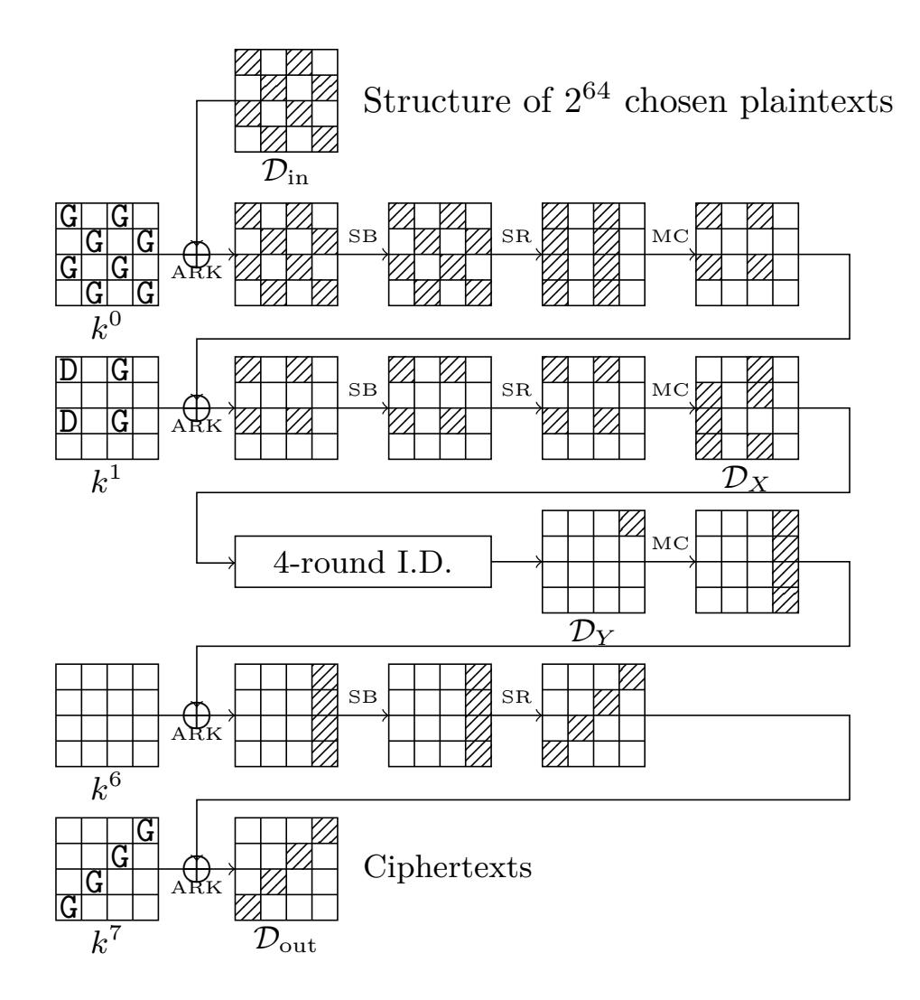

**Figure 16:** 7-round impossible differential attack of [MDRMH10] (figure adapted from [Jea16]).

Key bytes marked G and D are respectively guessed, and deduced from guessed bytes.

**Construction of pairs.** We start with  $2^{37+\epsilon}$  structures of  $2^{64}$  plaintexts such that all the plaintexts in a structure are identical in bytes 1, 3, 4, 6, 9, 11, 12, and 14. For each set, we construct  $\binom{2^{64}}{2} \approx 2^{127}$  pairs. We identify the pairs with a ciphertext difference in  $\mathcal{D}_{out}$  and store them in a list  $L_1$ ; we expect to have  $N = 2^{127} \times 2^{-96} \times 2^{37+\epsilon} = 2^{68+\epsilon}$  pairs.

**Step 1.** First, we identify plaintext/ciphertext pairs and values of  $k_{\langle 0,5,10,15\rangle}^0$  that result in a zero difference in bytes 1 and 3 after the first MixColumns. To this end, we sort the list  $L_1$  according to the plaintext difference and value in bytes 0, 5, 10 and 15. We obtain  $2^{64}$  sublists of approximatively  $2^{4+\epsilon}$  pairs. From now on, all the steps are repeated for all guesses of the key bytes  $k_{\langle 0,5,10,15\rangle}^0$ . For each possible difference  $\delta$  in bytes 0, 5, 10 and 15 before SubBytes, we confront the difference with each of the possible differences after SubBytes ( $\theta \in T_1$ ). Then, using the DDT of the AES Sbox, we extract the input values of the SubBytes operation of the first round, corresponding to this input and output difference. Since the key  $k_{\langle 0,5,10,15\rangle}^0$  has been guessed, we can deduce the value of the plaintext in bytes 0, 5, 10 and 15, and locate the right sublist of  $L_1$  with  $2^{4+\epsilon}$  pairs that follow this part of the trail for this key guess. We store those pairs in a list  $L_2$ ; after iterating over  $\delta$  and  $\theta$  we have on average  $2^{32+16+4+\epsilon} = 2^{52+\epsilon}$  pairs in  $L_2$ .

**Step 2.** During this step, we filter data pairs and values of  $k_{\langle 2,7,8,13\rangle}^0$  leading to a zero difference in bytes 13 and 15 after the first MixColumns. To do this, we consider each pair of  $L_2$ , and iterate over the possible differences after SubBytes in bytes 2, 7, 8, 13, stored in  $T_1$ . Since we have the input and output differences of those Sboxes, we retrieve the corresponding values from the DDT. By xoring these values with the plaintext, we obtain the associated key bytes  $k_{\langle 2,7,8,13\rangle}^0$  and we add this pair to a list indexed by the key bytes,  $L_3[k_{\langle 2,7,8,13\rangle}^0]$ .

{26}------------------------------------------------

The following steps are repeated for each value of  $k^0_{\langle 2,7,8,13\rangle}$ ; we have a list  $L_3[k^0_{\langle 2,7,8,13\rangle}]$  of  $2^{52+\epsilon+16-32}=2^{36+\epsilon}$  plaintext pairs that satisfy the required difference after the first round.

**Step 3.** During this step, we associate each pair of  $L_3[k_{\langle 2,7,8,13\rangle}^0]$  to the key bytes  $k_8^1$  and  $k_{10}^1$  such that difference after the MixColumns of round 2 is in  $\mathcal{D}_X$ . We recall that at this point, the bytes  $k_{\langle 0,2,5,7,8,10,13,15\rangle}^0$  have already been guessed. Following the AES-128 key schedule, we can easily deduce bytes  $k_0^1$  and  $k_2^1$ . For each pair of  $L_3[k_{\langle 2,7,8,13\rangle}^0]$ , we compute the values of the first and the third column of both plaintexts after the MixColumns of the first round. Using  $k_{\langle 0,2\rangle}^1$  We can also compute the values of both states on bytes 0 and 2 after AddRoundKey and SubBytes in the second round, corresponding to bytes 0 and 10 after ShiftRows. Looking at the MixColumns operations in columns 1 and 3 in the second round, we know the difference in 3 input bytes (2 zeros given by the differential trail, and the value just recovered) and one output byte (a zero given by the differences in  $\mathcal{D}_X$ ). Therefore we can recover the full input and output difference in those columns by solving a linear system (the solution is unique because of the MDS property). By inverting the ShiftRows operation, we recover the difference after the SubBytes operation of the second round in bytes 8 and 10. The difference before this operation is also known, therefore we recover the values of bytes 8 and 10 before SubBytes, and deduce the value of  $k_{\langle 8,10\rangle}^1$ by xoring the value at the end of the first round. We have to repeat this deduction four time, because we have four different positions of the zero differences in  $\mathcal{D}_X$ . Each pair of  $L_3[k^0_{\langle 2,7,8,13\rangle}]$  suggests on average four candidates for  $k^1_{\langle 8,10\rangle}$ , and we store the pairs in a list indexed by the key bytes,  $L_4[k^1_{\langle 8,10\rangle}]$ .

The next steps are repeated for each value of  $k^1_{\langle 8,10\rangle}$ , using the list  $L_4[k^1_{\langle 8,10\rangle}]$  with on average  $2^{36+\epsilon+2-16}=2^{22+\epsilon}$  pairs leading to a difference in  $\mathcal{D}_X$ .

**Step 4.** This step determines the key candidates  $k_{\langle 3,6,9,12\rangle}^7$  that are ruled out with the available data, for each  $k_{\langle 0,2,5,7,8,10,13,15\rangle}^0$ ,  $k_{\langle 8,10\rangle}^1$ . For this purpose, we use a list  $L_5$  of  $2^{32}$  bits to mark impossible key candidates  $k_{\langle 3,6,9,12\rangle}^7$ . For each pair of  $L_4[k_{\langle 8,10\rangle}^1]$ , we consider all the differences at the end of the sixth round that correspond to a difference in  $\mathcal{D}_Y$ , stored in  $T_2$ . From the differences before and after the last SubBytes, we compute the value of the output of SBox in bytes 3, 6, 9 and 12 using the DDT. Then, using the ciphertext values, we recover the bytes  $k_{\langle 3,6,9,12\rangle}^7$  and mark this value in the list  $L_5$ .

On average we mark  $2^{22+\epsilon+10} = 2^{32+\epsilon}$  keys as impossible, so that each key remains possible with probability  $P = (1-2^{-32})^{2^{32+\epsilon}} \approx e^{-2^{\epsilon}}$ .

**Step 5.** Finally, we reconstruct the master keys corresponding to the candidates not marked as impossible  $(k_{\langle 0,2,5,7,8,10,13,15\rangle}^0, k_{\langle 8,10\rangle}^1, k_{\langle 3,6,9,12\rangle}^7)$ . Following [MDRMH10, BLNS18], knowing  $k_{\langle 0,2,5,7,8,10,13,15\rangle}^0$  and  $k_{\langle 8,10\rangle}^1$  is equivalent to knowing  $k_{\langle 0,2,4,5,6,7,8,10,13,15\rangle}^0$ , but it is hard to combine this with information about the last round. Therefore, for each of the  $2^{112} \times P$  candidates, we just consider the 10 known bytes of  $k^0$ , do an exhaustive search for the 6 missing bytes and recompute  $k^7$  to see if it matches the candidate. This requires  $2^{112} \times P \times 2^{48} = 2^{160} \times P$  evaluations of the key schedule. We verify the  $2^{160} \times P \times 2^{-32} = 2^{128} \times P$  remaining candidates with a know plaintext/ciphertext pair, for a cost of  $2^{128} \times P$  encryptions.

**Complexity.** There are three dominant terms in the complexity of the attack. First we need to make  $2^{101+\epsilon}$  calls to the encryption oracle. Then, the generation of key candidates (steps 1 to 4) is dominated by step 4. This step is done  $2^{80}$  times (for each guess of  $k_{\langle 0,2,5,7,8,10,13,15\rangle}^0$  and  $k_{\langle 8,10\rangle}^1$ ) and during this step we go through the whole list  $L_4[k_{\langle 8,10\rangle}^1]$ ,

{27}------------------------------------------------

containing  $2^{22+\epsilon}$  pairs. For each pair and for each of the  $2^{10}$  differences in  $T_2$ , we use 4 times the DDT. In order to express this complexity using one encryption as the unit, we follow the common practice of counting the number of table look-up. A 7-round AES encryption, requires  $20 \times 7$  table lookups (including the Sboxes in the key schedule), therefore the cost of 4 DDT lookups is similar to 4/140 = 1/35 encryptions. In total, the complexity of Step 4 is  $2^{80} \times 2^{22+\epsilon} \times 2^{10}/35$ . Finally step 5 requires the equivalent of  $e^{-2^{\epsilon}} \cdot 2^{160}/5 + e^{-2^{\epsilon}} \cdot 2^{128}$  encryptions, because the cost of the key schedule compared to an encryption<sup>3</sup> is 4/20 = 1/5. In total, the time complexity is:

$$T = 2^{101+\epsilon} + 2^{112+\epsilon}/35 + e^{-2^{\epsilon}} \cdot (2^{160}/5 + 2^{128})$$

The best time complexity is obtained by taking  $\epsilon = 5.1$ , leading to a time complexity of  $2^{112.1}$ , a data complexity of  $2^{106.1}$  chosen plaintexts, and a memory complexity of  $N = 2^{73.1}$  words.

#### **6.2.1** Variant with multiple differentials.

Boura, Lallemand, Naya-Plasencia and Suder describe [BLNS18] in a variant of this attack using multiple output differentials. More precisely, instead of using a fixed column for  $\mathcal{D}_Y$  and a fixed anti-diagonal for  $\mathcal{D}_{\text{out}}$ , they consider the four possible columns for  $\mathcal{D}_Y$  and the four corresponding anti-diagonal for  $\mathcal{D}_{\text{out}}$ . The attacks is essentially the same, but there are two important differences.

To construct the pairs, they start from only  $2^{35+\epsilon}$  structures of  $2^{64}$  plaintexts, but they obtain  $2^{68+\epsilon}$  pairs matching  $\mathcal{D}_{in}$  and  $\mathcal{D}_{out}$  when considering the four anti-diagonal in  $\mathcal{D}_{out}$ . Steps 1 to 3 of the attack are the same a given above, but in step 4 each pair can give information about different bytes of  $k^7$ , depending on which anti-diagonal is active in the ciphertext. For each choice of  $k^0_{\langle 0,2,5,7,8,10,13,15\rangle}, k^1_{\langle 8,10\rangle}$ , they build a list of possible values for each anti-diagonal of  $k^7$ , and each key value remains possible with probability  $e^{-2^{\epsilon-2}}$  because one fourth of the data correspond to each diagonal. Finally, in step 5, they merge the 4 lists, for a cost of  $2^{80} \times (e^{-2^{\epsilon-2}} \cdot 2^{32})^4 = e^{-2^{\epsilon}} \cdot 2^{208}$ .

The total time complexity of this variant is:

$$T = 2^{99+\epsilon} + 2^{112+\epsilon}/35 + e^{-2^{\epsilon}} \cdot (2^{208}/5 + 2^{128})$$

The best time complexity is obtained by taking  $\epsilon = 6.1$ , leading to a time complexity of  $2^{113}$ , a data complexity of  $2^{105.1}$  chosen plaintexts, and a memory complexity of  $N = 2^{74.1}$  words.

This attack is listed with a time complexity of  $2^{106.88}$  with  $\epsilon = 6$  in [BLNS18], but this seems to be a mistake. There are not enough details of this attack in [BLNS18] to verify where their attack would differ from our understanding, but we don't see how to avoid having  $2^{112+\epsilon}$  iterations at step 4, when we are eliminating 112-bit keys. Applying the generic formula (7) from the same paper also gives a term  $2^{112+\epsilon}/35$  in the complexity (written as  $2^{k_A+k_B}\frac{N}{2^{c_{\text{in}}+c_{\text{out}}}}\cdot C_E'$  in [BLNS18]).

#### **6.2.2** Variant with state-test technique.

In [BLNS18], the authors describe in detail a variant using four output differentials and the state-test technique. This allows them to reduce by one byte the number of key bytes to be guessed, but they must use smaller structures, and this increases the data complexity.

The attack requires  $N=2^{68+\epsilon}$  chosen plaintexts, with a time complexity of:

$$T = 2^{107+\epsilon} + 2^{104+\epsilon}/35 + e^{-2^{\epsilon}} \cdot (2^{200}/5 + 2^{128})$$

<span id="page-27-0"></span>This ratio is given as  $2^{-3.6} \approx 1/12$  in [BLNS18], but we don't see how to achieve this result. In any case the impact on the total complexity is negligible because it is compensated by a very small change of  $\epsilon$ .

{28}------------------------------------------------

```
Algorithm 1 Construction of possible key candidates (Steps 1 to 4)
Require: Tables T_1, T_2 and a list L_1 of 2^{68+\epsilon} pairs satisfying \mathcal{D}_{in} and \mathcal{D}_{out}.
   Sort L_1 according to the plaintext difference and value in bytes 0, 5, 10 and 15.
   Let L_1|\delta||x| be the sub-list with difference \delta and value x in those bytes.
   for all k^0_{\langle 0,5,10,15\rangle} do
         L_2 \leftarrow \varnothing
         for all 32-bits difference \delta do
              for all difference \theta in T_1 do
                                                                                                           \triangleright bytes \langle 0, 5, 10, 15 \rangle
                   Compute value(s) x_{(0,5,10,15)} before first SubBytes from DDT.
                   Add all pairs of L_1[\delta][x_{(0,5,10,15)} \oplus k^0_{(0,5,10,15)}] to L_2.
        L_3 \leftarrow \left| \varnothing, \text{ for all } k^0_{\langle 2,7,8,13 \rangle} \right|
         for all pairs ((p, p'), (c, c')) in L_2 do
              for all difference \theta in T_1 do
                                                                                                             \triangleright bytes \langle 2, 7, 8, 13 \rangle
                   Compute value(s) x_{(2,7,8,13)} before first SubBytes from DDT.
                   Add pair to L_3[x_{(2,7,8,13)} \oplus p_{(2,7,8,13)}].
         for all k^0_{\langle 2,7,8,13\rangle} do
              L_4 \leftarrow \left[\varnothing, \text{ for all } k^1_{\langle 8, 10 \rangle}\right]
              Compute k_{\langle 0,2\rangle}^1 using the AES key schedule.
              for i in \{0, 1, 2, 3\} do
                   for all pairs in L_3[k^0_{\langle 2,7,8,13\rangle}] do
                        Deduce k_{(8,10)}^1, assuming that diagonal i is inactive at end of round 2.
                        Add pair to L_4[k_{\langle 8,10\rangle}^1].
              for all k^1_{\langle 8,10\rangle} do
                   L_5 \leftarrow \left| \mathbf{True}, \mathbf{for all} \ k_{\langle 3,6,9,12 \rangle}^7 \right|
                   for all pairs ((p, p'), (c, c')) in L_4[k^1_{\langle 8, 10 \rangle}] do
                        for all difference \theta in T_2 do
                                                                                                       \triangleright bytes \langle 12, 13, 14, 15 \rangle
                              Compute value(s) x_{\langle 15,14,13,12\rangle} after last SubBytes from DDT.
                              L_5[x_{\langle 15,14,13,12\rangle} \oplus c_{\langle 3,6,9,12\rangle}] \leftarrow False.
                   for all k_{\langle 3,6,9,12\rangle}^7 do
                        if L_5[k_{(3,6,9,12)}^7] then
```

The optimal time complexity<sup>4</sup> is  $2^{113}$  with  $\epsilon = 6$ .

#### <span id="page-28-2"></span>6.3 Our improvement

We now explain how to improve the first attack using properties of the key schedule. We keep steps 1 to 4 as given in Algorithm 1, but we improve the reconstruction of the master key from bytes of the first and last round keys (Step 5). With this improvement, generating the key candidates is actually cheaper than verifying them with a known plaintext/ciphertext pair. We use the following property of the key schedule, in order to guess the missing key bytes of  $k^0$  iteratively, and to efficiently verify whether they match the known bytes of  $k^7$ .

Check key candidate  $k^0_{(0,2,5,7,8,10,13,15)}, k^1_{(8,10)}, k^7_{(3,6,9,12)}$ 

**Proposition 1.** Let  $k_i^r$  a byte of an AES-128 subkey. If the byte is in the last column (12  $\leq i <$  16), then it depends on only 32 bits of information of the master key. If the

<span id="page-28-1"></span><sup>&</sup>lt;sup>4</sup>In [BLNS18] they report the complexity as  $2^{113.1}$  with  $\epsilon = 6.1$ .

{29}------------------------------------------------

byte is in the second or third column ( $4 \le i < 12$ ), then it depends on only 64 bits of information of the master key.

*Proof.* Bytes in the last column correspond to basis vectors in the new representation, following Equation (1) (for instance  $k_{12}^r = s_{12}^r$ ). Therefore they depend only on one 32-bit chunk at any given round (e.g.  $k_{12}^7$  can be computed from  $s_{\langle 0,1,2,3\rangle}^0$ ).

Bytes in the second column correspond to the sum of two basis vector in the new representation (for instance  $k_6^r = s_{14}^r \oplus s_4^r$ ). Since the two elements do not belong to the same chunk, the byte depends on two 32-bit chunks at any given round (e.g.  $k_6^7$  can be computed from  $s_{\langle 0,1,2,3,8,9,10,11\rangle}^0$ ).

Similarly, bytes in the third column correspond to the sum of two basis vector in the new representation (for instance  $k_9^r = s_{15}^r \oplus s_8^r$ ). Therefore they depend only on two 32-bit chunks at any given round (e.g.  $k_9^7$  can be computed from  $s_{\langle 0,1,2,3,12,13,14,15\rangle}^0$ ).

Bytes in the first column correspond to the sum of four basis vector from four different chunks, therefore they depend on the full state in general (for instance  $k_3^r = s_{13}^r \oplus s_{10}^r \oplus s_7^r \oplus s_0^r$ ).

Initially we are given the values of  $k^0_{\langle 0,2,4,5,6,7,8,10,13,15\rangle}$  and  $k^7_{\langle 3,6,9,12\rangle}$ . According to the property above,  $k^7_{12}$  can be computed from  $k^0_{15}$ ,  $k^0_{14} \oplus k^0_{10} \oplus k^0_{6} \oplus k^0_{2}$ ,  $k^0_{13} \oplus k^0_{5}$ ,  $k^0_{12} \oplus k^0_{8}$ ,  $k^0_{14}$ , and  $k^7_{6}$  can be computed from  $k^0_{15}$ ,  $k^0_{14} \oplus k^0_{10} \oplus k^0_{6} \oplus k^0_{2}$ ,  $k^0_{13} \oplus k^0_{5}$ ,  $k^0_{12} \oplus k^0_{8}$ ,  $k^0_{13}$ ,  $k^0_{12} \oplus k^0_{8} \oplus k^0_{4} \oplus k^0_{0}$ ,  $k^0_{15} \oplus k^0_{7}$ ,  $k^0_{14} \oplus k^0_{10}$ . Therefore we can verify their value after guessing  $k^0_{\langle 12,14\rangle}$ .

At this point two chunks are completely known:  $s^0_{\langle 0,1,2,3\rangle}$  and  $s^0_{\langle 8,9,10,11\rangle}$  or equivalently  $s^7_{\langle 12,13,14,15\rangle}$  and  $s^7_{\langle 4,5,6,7\rangle}$ . In particular, we can deduce the value of  $k^7_{13} = s^7_8 = s^7_{15} \oplus k^7_9$ , which can also be computed from  $s^0_{\langle 12,13,14,15\rangle}$ , *i.e.* from  $k^0_{12}$ ,  $k^0_{15} \oplus k^0_{11} \oplus k^0_7 \oplus k^0_3$ ,  $k^0_{14} \oplus k^0_6$ ,  $k^0_{13} \oplus k^0_9$ . Therefore, we only need to guess  $k^0_{11} \oplus k^0_3$  and  $k^0_9$  to verify  $k^7_{13}$ .

Finally, we focus of the remaining 32-bit chunk, corresponding to  $s^0_{\langle 4,5,6,7\rangle}$  and  $s^7_{\langle 0,1,2,3\rangle}$ . We already have the value of  $s^0_4=k^0_{14}$  and  $s^0_6=k^0_{12}\oplus k^0_4$ , and we can compute  $s^7_0=s^7_{10}\oplus s^7_{13}\oplus s^7_7\oplus k^7_3$ . Using a pre-computed table, we recover the  $2^8$  values of the chunk corresponding to those constraints.

Algorithm 2 describes the full process. The cost of this step is  $e^{-2^{\epsilon}} \times 2^{128}/5$ , where 1/5 is the cost of computing the key schedule compared to a full encryption. Finally the total time complexity of our attack is:

$$T = 2^{101+\epsilon} + 2^{112+\epsilon}/35 + e^{-2^{\epsilon}} \cdot (2^{128}/5 + 2^{128})$$

The best time complexity is obtained by taking  $\epsilon = 3.9$  leading to a time complexity of  $2^{110.9}$ , a data complexity of  $2^{104.9}$  chosen plaintext, and a memory complexity of  $2^{71.9}$  words.

We remark that the improvement is only applicable when the last MixColumns is omitted. In general, it does not affect the complexity of attacks, because removing the last MixColumns defines an equivalent cipher up to a modification of the key schedule. However, when attacks exploit relations between the subkeys, the relations are simpler if the last MixColumns is omitted [DK10].

## 6.4 Application to Related-Key Impossible Differential Attacks against AES-192

In [ZWZF07], Zhang et al. describe several related-key impossible differential attacks against 7 and 8 rounds of AES-192. These attacks are not the best know related-key attacks against AES-192 (an attack on the full 12 rounds is given in [BK09]), but the same methods explained in the previous section can be applied to slightly improve them.

{30}------------------------------------------------

#### Algorithm 2 Improved version of the key candidate checking (Step 5)

```
Require: A key candidate k_{\langle 0,2,5,7,8,10,13,15\rangle}^0, k_{\langle 8,10\rangle}^1, k_{\langle 3,6,9,12\rangle}^7.

for all k_{\langle 12,14\rangle}^0 do

Compute s_{\langle 12,13,14,15\rangle}^7 from s_{\langle 0,1,2,3\rangle}^0
\nif k_{12}^7 = s_{12}^7 then

Compute s_{\langle 4,5,6,7\rangle}^7 from s_{\langle 8,9,10,11\rangle}^0
\nif k_6^7 = s_4^7 \oplus s_{14}^7 then

T \leftarrow [\varnothing, \text{ for all } k_{15}^7]

for all k_{11}^0, k_1^0 \oplus k_9^0 do

Compute s_{\langle 0,1,2,3\rangle}^7 from s_{\langle 4,5,6,7\rangle}^0

Add (k_{11}^0, k_1^0 \oplus k_9^0) to T[s_0^7]

for all k_9^0, k_3^0 \oplus k_{11}^0 do

Compute s_{\langle 8,9,10,11\rangle}^7 from s_{\langle 12,13,14,15\rangle}^0
\nif k_9^7 = s_8^7 \oplus s_{15}^7 then

for all (k_{11}^0, k_1^0 \oplus k_9^0) in T[s_{13}^7 \oplus s_{10}^7 \oplus s_7^7 \oplus k_3^7] do

Check the master key k^0 with a pair (p,c).
```

Zhang et~al. introduce three attacks on 8-round AES-192 with different time/data trade-offs. The first one works as follow:  $2^{64.5}$  chosen plaintext are taken. They are split in two pools of  $2^{63.5}$ , and a portion  $2^{-56}$  of the pairs remains after several filtering. In this attack,  $2^{63.5\times2-56}=2^{71}$  pairs can be used for each guess of 112 subkey bits (14 bytes) of the last two subkeys: bytes  $k_{\langle 0,1,2,4,5,7,8,10,11,12,13,14,15\rangle}^8$  and  $w_3^7$ , where  $w^i=$  MixColumns $^{-1}(k^i)$ . Then, each pair discards on average one possible value of an eight bytes guess of  $k^0$  (bytes  $k_{\langle 1,2,6,7,8,11,12,13\rangle}^0$ ). So, the probability that a wrong candidate remains is  $2^{64}\times(1-1/2^{64})^{2^{71}}\approx 2^{64}\times e^{-2^7}\approx 2^{-120}$  for each 112 bits guess. The total expected number of suggestions is  $2^{112}\times2^{-120}=2^{-8}$ , and in average only the right candidate remains. To obtain the corresponding master key, an exhaustive search of the missing bits is needed: starting from the 14 bytes of  $k^7$  and  $k^8$ , 10 bytes are missing, and then a filtering can be done using  $k^0$ , so in average  $2^{16}$  master keys will be given, and the good one is found using a plaintext/ciphertext pair. The time complexity is dominated by the first part of the attack (the generation of key candidates) which costs approximately  $2^{71}\times2^{112}/2^6=2^{177}$  encryptions $^5$ . The data and the memory complexity are respectively  $2^{64.5}$  plaintexts and  $2^{69}$  bytes.

This attack can be improved in several ways, using previously known techniques, and our new representation of the key schedule. The first improvement we propose is to keep more than one candidate, in order to reduce the time and data complexities (following [BNS14]). This can be done until the cost of the reconstruction part is lower or equal than the cost of the generation of key candidate part. Starting from  $2^{64+\epsilon}$  pairs (after filtering), in average  $2^{64} \times e^{-2^{\epsilon}}$  candidates remains for each 112-bit guess, so in total they are  $2^{112+64} \times e^{-2^{\epsilon}} = 2^{176} \times e^{-2^{\epsilon}}$  subkey candidates. This step cost  $2^{112+64-6+\epsilon}$  encryptions. Knowing that those subkey candidates are composed of 14 bytes from  $k^7$  and  $k^8$ , and 8 bytes from  $k^0$ , in order to go back to the corresponding master keys, an exhaustive search of 10 bytes is needed, so the cost of this part is  $2^{176} \times e^{-2^{\epsilon}} \times 2^{80}/7$  because the cost of the key schedule compared to an encryption is 1/7. Finally,  $2^{176} \times e^{-2^{\epsilon}} \times 2^{16}$  master keys are checked using a plaintext/ciphertext pair to find the right master key. The total

<span id="page-30-1"></span> $<sup>\</sup>overline{\phantom{a}}^5$ As it is done in [ZWZF07], we consider here that an encryption corresponds to  $2^6$  memory accesses. However, this is debatable, because accessing in a table of size  $2^{64}$  is an expensive operation.

{31}------------------------------------------------

complexity is:

$$T = 2^{176+\epsilon}/2^6 + e^{-2^{\epsilon}} \times (2^{256}/7 + 2^{192})$$
  $D = 2^{61+\epsilon/2}$ 

The best time complexity is  $2^{175.9}$  and it is obtained for  $\epsilon = 5.9$ . The corresponding data complexity is  $2^{64}$ .

The second improvement comes from the key bridging technique ([DKS10, DKS15]). This technique deduces the byte in position i ( $0 \le i < 4$ ) of the fourth column of  $k^0$  from four bytes of  $k^8$ : the bytes i in the first column, i and i+1 in the second column, and i+1 in the fourth column. With the parameters described above, we can exploit a single key bridging relation (for i=0), but we propose a variant of the attack in order to exploit 2 of them. Indeed, guessing  $k^8_{(0,1,3,4,5,6,7,9,10,11,12,13,14)}$  permits to partially decrypt the last round in column 0, 1 and 3, and then by reversing the role of columns 2 and 3 compared to the original attack, we obtain a similar result. The key bridging can be applied twice, for i=0 and i=1, corresponding to bytes  $k^0_{\langle 12,13\rangle}$  that are guessed in the attack. A simple way to compute the complexity of this variant is to proceed as for the normal attack, and to remove the inconsistent candidates before the reconstruction phase. This is a 16-bit filtering, and  $2^{160} \times e^{-2^e}$  candidates remain. Then, the cost of the reconstruction phase is reduced to  $2^{160} \times e^{-2^e} \times 2^{80}/7$ . The total time complexity is now:

$$2^{176+\epsilon}/2^6 + e^{-2^{\epsilon}} \times (2^{240}/7 + 2^{192})$$

The best tradeoff is obtained with  $\epsilon = 5.6$ , with time complexity  $2^{175.6}$  and data complexity  $2^{63.8}$ .

The third improvement is to use our new representation in order to recombine information from subkeys in the first and last rounds. Rather than guessing 10 bytes in the reconstruction of master key phase, we guess the 5 bytes  $k_{\langle 9\oplus 13,11\oplus 15,12,14\rangle}^7$  and  $k_{15}^8$  in order to have a complete chunk in our new representation (for conciseness, we use the notation  $k_{\langle i,j_1\oplus j_2,\ldots\rangle}^r$  to denote  $k_i^r,k_{j_1}^r\oplus k_{j_2}^r,\ldots\rangle$ ). We obtain half of the information bits of  $k^0$ , and we filter the remaining candidates according to the value of three bytes:  $k_{\langle 2\oplus 6,8\oplus 12,7\rangle}^0$ , leaving  $2^{160}\times e^{-2^\epsilon}\times 2^{8\cdot5-8\cdot3}$  candidates. Then the value of the byte  $k_8^8$  is computed from  $w_3^7$  and  $k_{\langle 4,5,6,7,9,10,11\rangle}^8$ , and the 5 missing bytes of the last key schedule state are guessed. The second chunk is therefore complete, and the remaining candidates are filtered using the three others bytes conditions from  $k^0$  with a complexity of  $2^{176}\times e^{-2^\epsilon}\times 2^{8\times 5}/7=2^{216}\times e^{-2^\epsilon}/7$ . We can further reduce the complexity to  $2^{208}\times e^{-2^\epsilon}/7$  using pre-computed tables as in the attack of section 6.3: after guessing  $k_{15}^8$ , and before guessing  $k_{\langle 9\oplus 13,11\oplus 15,12,14\rangle}^7$ ,  $2^{32}$  values of  $k_{\langle 8\oplus 12,10\oplus 14,13,15\rangle}^7$  and  $k_2^8$  can be precomputed. Finbally, we obtain the complexity:

$$T = 2^{176+\epsilon}/2^6 + e^{-2^{\epsilon}} \times (2^{208}/7 + 2^{192})$$
  $D = 2^{61+\epsilon/2}$ 

The value  $\epsilon = 4.6$  minimize the time complexity which is reduced to  $2^{174.7}$  (with data complexity  $2^{63.3}$ ).

The two other attacks are improved in the same way. In the second attack, we obtain a complexity of

$$T = 2^{152+\epsilon}/2^6 + e^{-2^{\epsilon}} \times (2^{208}/7 + 2^{192})$$
  $D = 2^{81+\epsilon}$ 

It is minimal for  $\epsilon = 5.4$ ; the corresponding time and data complexities are  $2^{151.4}$  and  $2^{86.4}$  which is slightly lower than the complexities initially proposed in [ZWZF07] ( $2^{153}$  and  $2^{88}$ ).

In the third attack, we obtain a complexity of

$$T = 2^{135+\epsilon}/2^6 + e^{-2^{\epsilon}} \times (2^{208}/7 + 2^{192})$$
  $D = 2^{105+\epsilon}$ 

It is minimal for  $\epsilon = 5.7$ ; the corresponding time and data complexities are  $2^{134.8}$  and  $2^{110.7}$  improving from  $2^{136}$  and  $2^{112}$ .

{32}------------------------------------------------

#### 6.5 Application to Impossible Differential against Rijndael-256-256

The members of the Rijndael family [DR98, DR02] selected by the NIST to be standardized as the AES have a block size of 128 bits, but the Rijndael family allows variable block and key lengths, ranging from 128 to 256 bits in steps of 32 bits. In this subsection, we slightly improve the impossible differential attack against a non-AES Rijndael variant, denoted Rijndael-256-256, with a block size and key size of 256 bits. In Rijndael-256-256, the internal state is represented as a  $4 \times 8$  matrix of bytes, and the key schedule is the same as for the AES-256, except that a 256-bit subkey is XORed in each encryption round, so that more subkeys need to be computed. The SubBytes, MixColumns, and AddRoundKey operations work as for the AES, but the ShiftRows has different rotations: the rows are cyclically shifted by 0, 1, 3 and 4 bytes to the left in Rijndael-256-256.

The best attack known against Rijndael-256-256 is the 10-round impossible differential attack proposed in [LSG<sup>+</sup>18]. Using our new representation of the 256-bit AES key schedule, we reduce the complexity of the reconstruction part, and thus the time and data complexity of this attack. We start by briefly summarizing the attack proposed in [LSG<sup>+</sup>18], focusing on the key recovery. This attack has 3 steps:

**Step 1.** Starting from  $2^n$  structures (each of  $2^{128}$  plaintexts),  $2^{n+255}$  pairs are considered. The plaintexts are encrypted, and the pairs are filtered with a 192-bit condition on the ciphertexts, so that  $2^{n+63}$  pairs remain. For each pair,  $2^{67}$  impossible values of  $k^0_{\langle 0,3,4,5,9,12,14,16,17,18,19,21,23,26,30,31\rangle}$ ,  $k^1_{\langle 0,5,14,19\rangle}$ ,  $w^9_{\langle 0,29\rangle}$  and  $k^{10}_{\langle 0,15,18,19,22,25,28,29\rangle}$  (30 bytes) are found. Given one pair, the probability that a wrong key is not discarded is  $1-2^{67-240}=1-2^{-173}$ . Starting from  $2^{n+63}$  pairs,  $2^{240}\times(1-2^{-173})^{2^{n+63}}\approx 2^{240}\times e^{-2^{\epsilon}}$  key candidates remain, with  $\epsilon=n-110$ . This step costs  $2^{n+63+67}/(8\times10)=2^{\epsilon+237}/10$  encryptions according to [LSG<sup>+</sup>18].

**Step 2.** For each remaining 30-byte key candidate, we need to find the corresponding master keys. To do that, the authors of [LSG<sup>+</sup>18] start from 18 information bytes of  $k^0$  (16 bytes of  $k^0$  and 2 bytes of  $k^1$ —2 bytes of  $k^1$  are not used), perform an exhaustive search of the 14 missing bytes, and filter according to the 12 other bytes. This costs  $2^{112} \times 2^{240} \times e^{-2^{\epsilon}}/5 = 2^{352} \times e^{-2^{\epsilon}}/5$  (assuming that the cost of the key schedule compared to an encryption is 1/5), and results in  $2^{112} \times 2^{240} \times e^{-2^{\epsilon}} \times 2^{-96} = 2^{256} \times e^{-2^{\epsilon}}$  possible master keys.

**Step 3.** Each of those possible master keys is checked using a plaintext/ciphertext pair. The time complexity of this step is  $2^{256} \times e^{-2^{\epsilon}}$  encryptions.

In total, the time complexity is:

$$2^{\epsilon+237}/10 + e^{-2^{\epsilon}}(2^{352}/5 + 2^{256})$$

The best time complexity is  $2^{240}$  and it is obtained for  $\epsilon = 6.3$ .

Our improvement. To improve this attack, we revisit the reconstruction part (Step 2): instead of guessing 14 bytes of the first subkey, and then filtering using  $k^{10}$ ,  $w^9$  and  $k^1$ , we proceed chunk by chunk. We start with shifted versions of the impossible differential proposed in [LSG<sup>+</sup>18] in order to improve the filtering, with 6 of the 10 bytes that can be used after guessing only 3 chunks in our new representation. More precisely, the upper part and the lower part are shifted by one byte to the left. The bytes guessed in step 1 are therefore also shifted and become  $k^0_{\langle 0,1,5,8,10,12,13,14,15,17,19,22,26,27,28,31\rangle}$ ,  $k^1_{\langle 1,10,15,28\rangle}$ ,  $w^9_{\langle 25,28\rangle}$  and  $k^{10}_{\langle 11,14,15,18,21,24,25,28\rangle}$ . By proceeding chunk by chunk, we reduce the complexity of the reconstruction part from  $e^{-2^{\epsilon}} \times 2^{352}/5$  to  $e^{-2^{\epsilon}} \times 2^{288}/5$ , with the operations detailed in Table 6.

{33}------------------------------------------------

**Table 6:** Reconstruction phase for the 10-round Rijndael-256-256 attack using our new representation of the key schedule. The time complexity is given in key schedule operations for one candidate, so to obtain the total time complexity of this phase in encryptions, the complexity given in the last column must be multiplied by  $e^{-2^{\epsilon}} \times 2^{240}/5$ .

<span id="page-33-1"></span>

|                                  | Bytes                                                  |                                                            | Chu      | ınks        |                                |
|----------------------------------|--------------------------------------------------------|------------------------------------------------------------|----------|-------------|--------------------------------|
| To guess                         | To deduce                                              | To filter                                                  | of $k^0$ | of $k^{10}$ | Candidates (w/ tables)         |
|                                  | $k^0_{\langle 30,2\oplus 6,3\oplus 7\oplus 11\rangle}$ |                                                            |          |             |                                |
| $k^0_{\langle 4,7,23,29\rangle}$ | (==)                                                   |                                                            |          |             | $2^{32}$                       |
| (1,1,20,20)                      | $k^0_{16\oplus 20\oplus 24}$                           |                                                            |          |             | $2^{32}$                       |
|                                  | 1001001                                                | $k^{10}_{\langle 15,24\oplus 28 \rangle}$                  |          |             | $2^{32-16} = 2^{16}$           |
| $k^0_{\langle 6,9,25\rangle}$    |                                                        | (10,=10=0)                                                 |          |             | $2^{16+24} = 2^{40}  (2^{24})$ |
| (0,0,20)                         |                                                        | $k^{10}_{\langle 14,11\oplus 15\rangle}$                   |          |             | $2^{40-16} = 2^{24}$           |
| $k^0_{\langle 11,20,21\rangle}$  |                                                        | (14,11010)                                                 |          |             | $2^{24+24} = 2^{48}  (2^{32})$ |
| \11,20,21/                       |                                                        | $k^{10}_{\langle 21 \oplus 25,28 \rangle}$                 |          |             | $2^{48-16} = 2^{32}$           |
| $k^0_{\langle 18,24 \rangle}$    |                                                        | \21\\\20,20\                                               |          |             | $2^{32+16} = 2^{48}  (2^{32})$ |
| (10,24)                          |                                                        | $k^{10}_{\langle 18,21\rangle},w^9_{\langle 25,28\rangle}$ |          |             | $2^{48-32} = 2^{16}$           |

We further reduce the complexity to  $e^{-2^{\epsilon}} \times 2^{272}/5$  using pre-computed tables as in the attack of section 6.3. We build a table of size  $2^{64}$  with the full computation of the third chunk. The table is sorted so that for each 30-byte candidate, after guessing  $k^0_{\langle 4,7,23,29\rangle}$ , we directly recover the  $2^8$  values of  $k^0_{\langle 6,9,25\rangle}$  compatible with  $k^{10}_{15,24\oplus 28}$  from the table, instead of trying  $2^{24}$  choices of  $k^0_{\langle 6,9,25\rangle}$  and then filtering using  $k^{10}_{\langle 14,11\oplus 15\rangle}$ . We also build similar tables for the other two chunks.

The rest of the attack is identical to what has been described above. The resulting complexity is

$$2^{\epsilon+237}/10 + e^{-2^{\epsilon}}(2^{272}/5 + 2^{256})$$

The best time complexity is  $2^{238.4}$  and it is obtained for  $\epsilon = 4.6$ . The corresponding data complexity is  $2^{128+n} = 2^{242.6}$ .

## <span id="page-33-0"></span>7 Application to Square Attack

In the section, we show how our new representation can slightly improve the Square attack with partial sums on 8-round AES-192 proposed in [FKL<sup>+</sup>01]. This attack is an extension of the original Square attack ([DKR97]) which relies on the study of the evolution of structural properties after several rounds. We first describe the attacks presented in [DKR97, DR98] and improved in [FKL<sup>+</sup>01], and then we explain how our representation of the key schedule can further improve these attacks. For consistency, all the reduced versions of AES considered in this section include the final MixColumns. In particular, this is necessary for the 8-round attack, in order to exploit key schedule relations on the equivalent subkeys  $w^i = \text{MixColumns}^{-1}(k^i)$ .

The 3-round distinguisher [DKR97]. We start with the definition of a  $\delta$ -set and the main results concerning its evolution through AES operations (more details are available in [DR02]). A  $\delta$ -set is a set of  $2^8$  AES states such that some bytes are active, *i.e.* each of the 256 values are present exactly once in the set, and the others are passive, *i.e.* their value is constant in all states. AddRoundKey and SubBytes preserve active and passive bytes, and ShiftRows only shifts them. Concerning MixColumns, the output structure

{34}------------------------------------------------

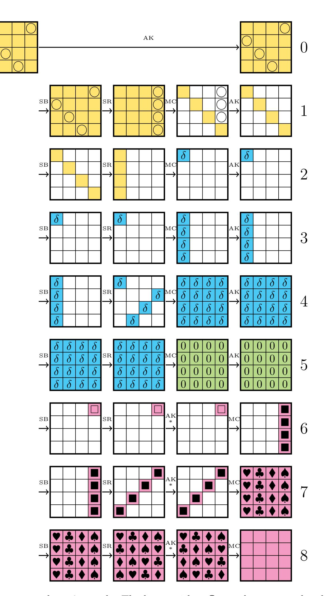

<span id="page-34-0"></span>⃝

**Figure 17:** Square attack on 8 rounds. The bytes with a ⃝ are the ones used to build the herds. Blue bytes (marked with a *δ*) represent active bytes. The green bytes (marked with a 0) are those such as the sum of all the occurrences of this byte in the herd is equal to 0. Pink bytes represent the bytes required to compute the value of the byte in position 12 at the end of round 5, in order to check the 0-sum.

{35}------------------------------------------------

<span id="page-35-0"></span>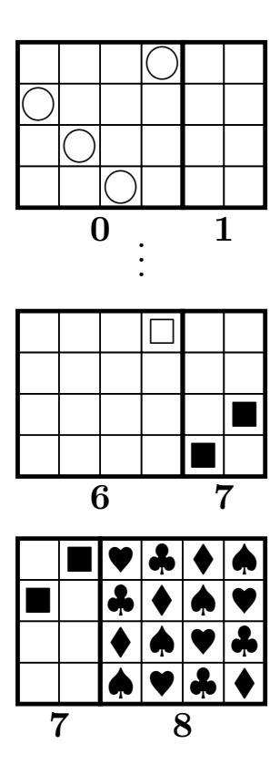

**Figure 18:** Representation of the position of the bytes to guess in the 192-bit key schedule states. The bytes of subkeys 6, 7 and 8 are from equivalent subkeys  $w^i$ , while the bytes of the first subkey are not.

depends on the number of passive and active bytes among the 4 input bytes. When the four bytes of a column are passive, then they remain passive. When a single byte is active and the others are passive, the  $\delta$ -set structure is preserved and the four bytes become active. In the others cases (more than one active byte), the  $\delta$ -set structure is lost. However, a property is preserved: if the input is a  $\delta$ -set, then the XOR of the 256 outputs is zero because the XOR of the elements of a  $\delta$ -set is zero, and MixColumns is a linear operation.

The starting point of the Square attack is a 3-round distinguisher starting from  $\delta$ -set with a single active byte. This is represented by rounds 3 to 5 of Figure 17: the active bytes are in blue, and the bytes whose XOR is zero are in green. At the end of the first round, we have a  $\delta$ -set with a column of active bytes; at the end of the second round a  $\delta$ -set with all bytes active; and at the end of the third round, the sum of the 256 states is zero. This property allows to distinguish 3-round AES from a random permutation.

Key recovery attacks by adding some rounds on the ciphertext side [DKR97]. To do a 4-round key recovery, we ask for the encryption of a  $\delta$ -set, and compute the sum of a state byte at the end of round 3 after a partial guess of  $k_4$ . If the sum is not zero, we know that the key guess is wrong. On the other hand, there is a probability  $2^{-8}$  that a wrong guess leads to a zero sum, so we need to repeat the previous steps with several  $\delta$ -sets in order to eliminate false positives. Instead of guessing a full column of  $k^4$ , we swap the MixColumns and the AddRoundKey operations in round 4, replacing  $k^4$  by the equivalent key  $w^4$ . We can compute the value of one byte of state at the end of round 3 from 4 bytes of ciphertext, and one byte of  $w^4$ .

The same strategy gives a 5-round key recovery: one byte of state at the end of round 3 can be computed from 16 bytes of ciphertext, one byte of  $w^4$  and one column (4 bytes) of  $w^5$ . On AES-192 and AES-256, we can extend it to a 6-round key recovery: one byte of state at the end of round 3 can be computed using 1 + 4 + 16 = 21 bytes of equivalent key. Moreover, those 21 bytes are not independent if we take into account the key schedule relations, so we can lower the number of bytes to guess to 18 for AES-192 and to 20 for AES-256, by wisely selecting the byte position of the zero sum we want to check [FKL<sup>+</sup>01].

{36}------------------------------------------------

Adding one round on the plaintext side [DKR97, FKL<sup>+</sup>01]. We can also add one round before the distinguisher, in order to obtain a  $\delta$ -set at the end of round 1. We consider a set of  $2^{32}$  plaintexts, by fixing all the bytes of plaintexts except four bytes of a diagonal. Then, for each guess of four bytes of the first subkey (corresponding to the same diagonal), we can select a subset of  $2^8$  messages that form a  $\delta$ -set at the end of the first round, and apply the same attack as in the previous paragraph. In [FKL<sup>+</sup>01], another variant that does not require a key guess is presented: if all the  $2^{32}$  texts are taken, we know that for any key guess, the  $2^{32}$  texts split into  $2^{24}$   $\delta$ -sets. Therefore, the XOR of the  $2^{32}$  texts at the end of round 4 must be zero, independently of the first round key. This technique reduces the number of key guesses to  $2^{8.5}$ , but each key guess becomes more expensive to verify because they must be performed for  $2^{32}$  texts instead of  $2^8$ . The 6-round attack requires  $2^{32}$  data and  $2^{32} \cdot 2^{8.5} = 2^{72}$  time.

The partial sums technique [FKL<sup>+</sup>01]. The partial sum technique reduces the complexity the 6-round attack. The goal is to compute the XOR of a byte at the end of round 4, over  $2^{32}$  ciphertexts of a 6-round AES. Let  $c_j^{(i)}$  be the j-th byte of the i-th ciphertext  $(0 \le j < 16, 0 \le i < 2^{32})$ . For example, to compute the byte 12 at the end of round 4 for the ciphertext i, we need to guess 5 equivalent subkey bytes  $(w_{12}^5$  and  $w_{\langle 3,6,9,12\rangle}^6)$  and to use the 4 ciphertext bytes  $c_{\langle 3,6,9,12\rangle}^{(i)}$ . In a generic way, let us denote the required bytes as  $k_{\tilde{0}}, \ldots, k_{\tilde{4}}$  and  $c_{\tilde{0}}^{(i)}, \ldots, c_{\tilde{3}}^{(i)}$ . The sum to be computed is:

$$\bigoplus_{i} S^{-1} \left[ S_0[c_{\tilde{0}}^{(i)} \oplus k_{\tilde{0}}] \oplus S_1[c_{\tilde{1}}^{(i)} \oplus k_{\tilde{1}}] \oplus S_2[c_{\tilde{2}}^{(i)} \oplus k_{\tilde{2}}] \oplus S_3[c_{\tilde{3}}^{(i)} \oplus k_{\tilde{3}}] \oplus k_{\tilde{3}} \right] \oplus k_{\tilde{4}}$$

where  $S_j$  corresponds to an inverse Sbox followed by a multiplication by an element from the inverse MixColumns matrix in the AES field.

First we observe that the sum only depends on the parity of occurrence of each value of the the bytes  $c_{\tilde{0}}, \ldots, c_{\tilde{3}}$ . Thereforefore, we build a list  $L_0$  of  $2^{32}$  counters, so that  $L_0[(c_{\tilde{0}}, \ldots, c_{\tilde{3}})]$  is the number of occurrence of this quadruplet of values in the  $2^{32}$  ciphertexts  $c^{(i)}$ , computed modulo 2.

The partial sum technique associates a series of partial sums  $x_{\ell}$  to each ciphertext value  $(c_{\tilde{0}}, \ldots, c_{\tilde{\ell}})$ , and each key guess  $(k_{\tilde{0}}, \ldots, k_{\tilde{\ell}})$ :

$$x_{\ell} = \bigoplus_{j=0}^{\ell} S_j[c_{\tilde{j}} \oplus k_{\tilde{j}}], \qquad 1 \le \ell < 4.$$

The partial sums are computed iteratively, reducing the number of counters after each key guesses. We detail in Algorithm 3 the partial sum technique, which allows to reduce the time complexity from  $2^{72}$  operations to  $4 \cdot 2^{48}$ .

Using herds to add two rounds on the plaintext side [FKL<sup>+</sup>01]. With two rounds before the distinguisher, we could follow the same process as the one round extension, starting with the full codebook ( $2^{128}$  texts). At the end of round 2, the data splits into  $2^{120}$   $\delta$ -sets, therefore the XOR of all the  $2^{128}$  bytes in a fixed position at the end of round 5 is zero, as previously. However, this can't be used as a distinguisher because the sum is zero for any permutation (in particular, during the key recovery it would be zero even for a wrong key guess).

Instead, [FKL<sup>+</sup>01] defines a herd as a set of  $2^{120}$  plaintexts that share a fixed value for one byte at the end of the first round. After the first rounds, a herd can be split into  $2^{88}$  sets of  $2^{32}$  texts, with 12 fixed bytes and an active diagonal; after two rounds it splits into  $2^{112}$   $\delta$ -sets. Therefore summing a byte at the end of round 5 over a herd results in a zero sum; this only happens with probability  $2^{-8}$  for a random permutation. The set of

{37}------------------------------------------------

#### Algorithm 3 Partial Sum technique

```
Require: A list L_0 which contains the number of occurrence (mod 2) of each quadruplet
    (c_{\tilde{0}}, c_{\tilde{1}}, c_{\tilde{2}}, c_{\tilde{3}}).
    for all k_{\tilde{0}}, k_{\tilde{1}} do
          L_1 \leftarrow [0, \text{ for all } (x_1, c_{\tilde{2}}, c_{\tilde{3}})]
          for all (c_{\tilde{0}}, c_{\tilde{1}}, c_{\tilde{2}}, c_{\tilde{3}}) such that L_0[(c_{\tilde{0}}, c_{\tilde{1}}, c_{\tilde{2}}, c_{\tilde{3}})] = 1 do
                Compute x_1 and increment L_1[(x_1, c_{\tilde{2}}, c_{\tilde{3}})]
          for all k_{\tilde{2}} do
                L_2 \leftarrow [0, \text{ for all } (x_2, c_{\tilde{3}})]
                for all (x_1, c_{\tilde{2}}, c_{\tilde{3}}) such that L_0[(x_1, c_{\tilde{2}}, c_{\tilde{3}})] = 1 do
                      Compute x_2 and increment L_2[(x_2, c_3)]
                for all k_{\tilde{3}} do
                      L_3 \leftarrow [0, \text{ for all } (x_3)]
                      for all (x_2, c_{\tilde{3}}) such that L_0[(x_2, c_{\tilde{3}})] = 1 do
                            Compute x_3 and increment L_3[(x_3)]
                      for all k_{\tilde{4}} do
                            s \leftarrow 0
                            for all (x_3) such that L_3[(x_3)] = 1 do
                                  Add S^{-1}[x_3 \oplus k_{\tilde{a}}] to s
                            The sum for the subkey guess (k_{\tilde{0}}, k_{\tilde{1}}, k_{\tilde{2}}, k_{\tilde{3}}, k_{\tilde{4}}) is s
```

plaintext corresponding to a herd can be identified after guessing four bytes (a diagonal) of  $k^0$ . [FKL<sup>+</sup>01] also describe smaller herds, as sets of  $2^{104}$  plaintexts that share a fixed value for three byte in the same column at the end of the first round. These smaller herds also split into  $\delta$ -sets at the end of the second rounds. Given the full codebook,  $2^{26}$  such herds can be constructed after guessing a diagonal of  $k^0$ , by varying the position of the active byte at the end of the first round. Since we do not need all  $2^{26}$  herds, [FKL<sup>+</sup>01] propose to take only  $2^{128} - 2^{119}$  texts. This reduces slightly the data complexity while having on average half of the herds undamaged, and thus usable, for each key guess.

The 8-round attack [FKL<sup>+</sup>01]. By combining all these techniques, [FKL<sup>+</sup>01] obtains an 8-round attack against AES-192 and AES-256. We focus on the attack against AES-192 with a data complexity of  $2^{128} - 2^{119}$  and a time complexity of  $2^{188}$ . We consider 8 full rounds, *i.e.* a XOR with a whitening subkey followed by 8 rounds including the final MixColumns. In the rounds 6 to 8, the MixColumns and the AddRoundKey are swapped using the equivalent subkeys  $w^i$ . A representation of this attack is given in Figure 17.

Herds are built as previously described by guessing a diagonal of  $k^0$  and then grouping the texts which have the same value on three bytes of the same column (corresponding to the shifted diagonal) after the MixColumns of round 1. The condition to be checked is whether the XOR of all the partially decrypted texts of a herd of size  $2^{104}$  is zero or not, in a fixed position at the end of round round 5. To compute this XOR, the whole equivalent subkey  $w^8$  need to be guessed, as well as 4 bytes of  $w^7$  and one byte of  $w^6$ . To minimize the time complexity, we apply five times the partial sum technique: first, we apply this technique four times on each anti-diagonal (respectively symbolized by  $\P$ ,  $\P$ ,  $\P$ ,  $\P$ ,  $\P$ ) of the ciphertext in order to get the value of one of the four bytes of an anti-diagonal (represented by  $\P$ ) of round 7 before the MixColumns, and then we apply one more time the partial sum technique at a "second level" in order to compute the desired sum, using the four bytes of the anti-diagonal.

In this attack, we exploit key schedule relations to deduce some subkey bytes from others. In particular, using trivial key schedule relations, we know that the knowledge of 

{38}------------------------------------------------

the subkey  $k^8$  lead to the knowledge of two columns of  $k^7$  and one column of  $k^6$ . However, when using the partial sum technique, we guess (equivalent) subkey bytes one by one, so we can't use those relations (we need a full column of the equivalent key to recover bytes of the actual key). Nevertheless, there are also relations on equivalent subkeys such as equation (1) in [DK10]. Indeed, if  $C_0$ ,  $C_1$  and  $C_2$  are columns such that  $C_0 = C_1 \oplus C_2$  (a trivial key schedule relation), then  $\mathsf{MixColumns}(C_0) = \mathsf{MixColumns}(C_1) \oplus \mathsf{MixColumns}(C_2)$  by linearity of  $\mathsf{MixColumns}$ . For this reason, we focus on an attack against a reduced AES including the final  $\mathsf{MixColumns}^6$ . By wisely choosing the byte position we target in round 5, we can determine the two required bytes of  $w^7$  and the byte of  $w^6$  from two anti-diagonals of  $w^8$  (with symbolsby  $\P$  and  $\P$ ). The positions of the bytes that we use are shown in Figure 18.

The order of operations is also very important as it can significantly influence the complexity. We describe an attack slightly different from the one in [FKL<sup>+</sup>01] which has some inconsistencies<sup>7</sup>. We target the byte in position 12 at the end of round 5, because this byte position allows to exploit 3 key schedule relations, and will also be convenient for the improvements proposed in the next paragraphs. In this attack, we start by guessing four bytes of  $k^0$  to build our herds. Then, we select a herd and initialize  $2^{128}$ counters  $(c_0, \dots, c_{15})$ . The partial sum technique is applied a first time on an anti-diagonal (bytes marked  $\P$  on Figure 17): 4 key bytes are guessed  $(w_{\langle 0,7,10,13\rangle}^8)$  and  $2^{104}$  counters remains because the counters associated to the bytes  $c_{(0,7,10,13)}$  have been replaced by counters associated to the byte in position 3 before MixColumns of round 7. Then we proceed similarly for the anti-diagonal  $w_{\langle 1,4,11,14\rangle}^8$  (bytes marked with  $\clubsuit$ ) and we obtain  $2^{80}$  counters for a total of 96 guessed bits. At this point, using key schedule relations on equivalent subkeys, bytes  $w_3^7$  and  $w_6^7$  can be deduced because  $w_3^7 = w_7^8 \oplus w_{11}^8$  and  $w_6^7 = w_{10}^8 \oplus w_{14}^8$ . Using those keys, the first step of the partial sum on the "second level" can be computed from the counters associated to bytes 3 and 6 before MixColumns in round 7, reducing the number of counters to  $2^{72}$ . Then, going back to partial sum on the "first level", bytes  $w_{\langle 2,5,8,15\rangle}^{8}$  (represented by  $\blacklozenge$ ) are guessed progressively as the total number of counters decrease. Then, it is possible to do one more step of the partial sum on the "second level" by guessing  $w_9^7$ . Finally, the last anti-diagonal is guessed (bytes marked with  $\spadesuit$ ) gradually, and then  $w_{12}^7$  is guessed and  $w_{12}^6$  is deduced in order to finish the partial sum on the "second level". This allows to check if the desired sum is zero or not. We detail all the steps of this attack and the subkey bytes involved in each state in Table 7.

We observe that there are 4 steps requiring  $2^{192}$  operations, so taking the convention that an encryption is equivalent to  $2^8$  operations (following [FKL<sup>+</sup>01]), we obtain that the complexity for one herd is  $4 \times 2^{192} \times 2^{-8} = 2^{186}$  encryptions. The authors of [FKL<sup>+</sup>01] say that about 24 herds are needed but the complexity is dominated by the first 4 herds, so the time complexity is approximately  $4 \times 2^{186} = 2^{188}$ . Before explaining how to improve this attacks with our representation of the key schedule, we present some known techniques to reduce the complexity.

More precise cost evaluation. Looking at the detail of the complexity more precisely, we notice that during the processing of the first herd, there are 4 steps of complexity  $2^{184}$ , but only three during the processing of the second herd, because for the guess of the last key byte  $(w_{12}^7)$  we have on average only one candidate that is coherent with the first herd. For the third herd there are two steps with complexity  $2^{184}$ , and only one for the fourth herd. Therefore, the complexity is reduced to  $(4+3+2+1) \cdot 2^{184} = 2^{187.3}$ .

<span id="page-38-0"></span> $<sup>^6</sup>$ The description in [FKL $^+$ 01] does not explicitly specify whether the MixColumn is present in the last round or not, nor whether it exploits direct relations of the key schedule or relations on equivalent subkeys.

<span id="page-38-1"></span><sup>&</sup>lt;sup>7</sup>For example, they guess columns of  $k^8$  whereas the presence of the ShiftRows on round 8 requires bytes located on an anti-diagonal for the partial sums.

{39}------------------------------------------------

**Table 7:** Summary of the Square attack on 8-round AES-192 for one herd. The complexity is given in number of operation, and we consider one encryption is equivalent to  $2^8$  operations. The complexity of the four last steps (marked with \*) can be reduced using the Key Bridging technique ([DKS10, DKS15]).

<span id="page-39-0"></span>

| Nb of                | f Key bytes                                                         |                            | Nb of guesses                 |     |       |            |                                                                   |
|----------------------|---------------------------------------------------------------------|----------------------------|-------------------------------|-----|-------|------------|-------------------------------------------------------------------|
| $\operatorname{ctr}$ | Guess                                                               | Deduce                     | Symbol                        | New | Total | Complexity | Relations                                                         |
| $2^{128}$            | $k^0_{\langle 1,6,11,12\rangle}$                                    |                            | 0000                          | 32  | 32    | $2^{160}$  |                                                                   |
| $2^{128}$            | $w_{\langle 0,7\rangle}^{8}$                                        |                            | ₩₩                            | 16  | 48    | $2^{176}$  |                                                                   |
| $2^{120}$            | $w_{10}^{8}$                                                        |                            | •                             | 8   | 56    | $2^{176}$  |                                                                   |
| $2^{112}$            | $w_{13}^{\circ}$                                                    |                            | •                             | 8   | 64    | $2^{176}$  |                                                                   |
| $2^{104}$            | $w_{\langle 1,4 \rangle}^{8} \ w_{11}^{8} \ w_{14}^{8}$             |                            | **                            | 16  | 80    | $2^{184}$  |                                                                   |
| $2^{96}$             | $w_{11}^{8}$                                                        |                            | •                             | 8   | 88    | $2^{184}$  |                                                                   |
| $2^{88}$             | $w_{14}^{\bar{8}^-}$                                                |                            | 4                             | 8   | 96    | $2^{184}$  |                                                                   |
| $2^{80}$             |                                                                     | $w^7_{\langle 3,6\rangle}$ |                               |     | 96    | $2^{176}$  | $w_3^7 = w_7^8 \oplus w_{11}^8; w_6^7 = w_{10}^8 \oplus w_{14}^8$ |
| $2^{72}$             | $w_{\langle 2.5 \rangle}^8$                                         | (-)-/                      | $\blacklozenge \blacklozenge$ | 16  | 112   | $2^{184}$  |                                                                   |
| $2^{64}$             | $\widetilde{w_8^8}$                                                 |                            | <b>♦</b>                      | 8   | 120   | $2^{184}$  |                                                                   |
| $2^{56}$             | $w_{15}^{\breve{8}}$                                                |                            | <b>♦</b>                      | 8   | 128   | $2^{184}$  |                                                                   |
| $2^{48}$             | $w_{\langle 2,5 \rangle}^{8} \ w_{8}^{8} \ w_{15}^{7} \ w_{9}^{7}$  |                            |                               | 8   | 136   | $2^{184}$  |                                                                   |
| $2^{40}$             | $w_{\langle 3,6 \rangle}^{8} \ w_{12}^{8} \ w_{9}^{8} \ w_{12}^{7}$ |                            | $\spadesuit$                  | 16  | 152   | $2^{192}$  |                                                                   |
| $2^{32}$             | $\widetilde{w_{12}^8}$                                              |                            | $\spadesuit$                  | 8   | 160   | $2^{192*}$ |                                                                   |
| $2^{24}$             | $w_9^{\overline{8}}$                                                |                            | <b>•</b>                      | 8   | 168   | $2^{192*}$ |                                                                   |
| $2^{16}$             | $w_{12}^{\tilde{7}}$                                                |                            |                               | 8   | 176   | $2^{192*}$ |                                                                   |
| $-2^{8}$             |                                                                     | $w_{12}^{6}$               |                               |     | 176   | $2^{184*}$ | $w_{12}^6 = w_0^8 \oplus w_4^8$                                   |

Key bridging. Dunkleman, Keller and Shamir have proposed to apply the key bridging technique [DKS10] to improve this attack: it allows to compute the last column of  $k^0$  from three columns of  $k^8$ . This relation is at a word level, but there also exists a relation at the byte level: the byte j of the fourth column of  $k^0$  can be computed from the bytes j of the first and the second column, and  $(j+1) \mod 4$  of the second and the fourth columns of  $k^8$ . As explained in [DKS15], using this technique can reduce slightly the complexity: even if the complexity peak remains unchanged  $(2^{184})$ , the difference come from the number of time this peak is achieved. In this attack, we need to pay attention to the fact that we don't guess bytes of  $k^8$  but bytes of  $w^8$ . For this reason, it's only after guessing 14 bytes that one byte of  $w^8$  can be deduced. More precisely, if the bytes  $k_{12}^0$ , and  $w_{(0,1,2,3,4,5,6,7,8,10,11,13,14,15)}^8$  (corresponding to three anti-diagonals and a half) are known, then the byte  $k_{12}^8$  can be deduced. So, the complexity of the last four steps is divided by  $2^8$  because the byte  $w_{12}^8$  is deduced rather than guessed. Using the key bridging technique, only one peak of complexity  $2^{184}$  encryptions remains for the first three herds, then the complexity is considered negligible. In total, the complexity is reduced to  $3 \cdot 2^{184} = 2^{185.6}$ .

Using fewer herds. The previous attacks use a large number of herds (24) in order to identify a unique candidate for the recovered subkey, and reconstructs the corresponding master by exhaustive search of the missing bytes (with a negligible cost). However, as for the impossible differential attacks, we don't need a unique candidate before doing the exhaustive search of the missing bytes. We can devise attacks processing fewer herds, making a trade-off between the complexity of processing the herds, and the complexity of reconstructing the master key. The complexity of the attack is composed of three components:

{40}------------------------------------------------

- the cost of processing the herds, denoted C (N subkey candidate remain);
- the cost of reconstructing the master key from candidates;
- the cost of checking the master key candidates using a plaintext/ciphertext pair.

Concretely, the attack of [DKS15] using key-bridging recovers 4 bytes of  $k^0$  and 17 bytes of  $k^{7,8}$  (one additional byte of  $k^8$  is deduced). Processing the first three herds requires  $2^{184}$  operation each, so that the cost of processing i herds is  $C = \min(i, 3) \cdot 2^{184}$ . After this step,  $N = 2^{168-8i}$  candidates for a 168-bit subkey remain.

In order to reconstruct a master key candidate, the attacker guesses 6 bytes missing from  $k^{7,8}$  to obtain 192 bits of consecutive subkeys, and computes the key schedule backwards to check whether this matches the known information on  $k^0$ . The cost of this step is  $N \cdot 2^{48} \cdot 2^{-2.8}$ , assuming that the cost of the key schedule compared to an encryption is  $2^{-2.8}$ . After this step  $N \cdot 2^{24}$  master keys remain. Therefore, the cost of the attack with i herds is

$$\min(i,3) \cdot 2^{184} + 2^{168-8i} \cdot 2^{45.2} + 2^{168-8i} \cdot 2^{24}$$

Using five herds, we obtain a complexity of  $3 \cdot 2^{184} + 2^{128} \cdot 2^{45.2} \approx 2^{185.6}$ , but using a small value of i results in a higher overall complexity. This type of trade-off is not sufficient to reduce the total complexity.

**New representation of the key schedule.** The new representation of the key schedule allows to reconstruct the master keys more efficiently, and to reduce the second term of the complexity. Instead of guessing the 6 missing bytes of the last subkeys, and then computing the first subkey to check whether it matches, we can do the same thing but chunk by chunk. More precisely, starting from a candidate composed of 16 bytes of  $w^8$ (or equivalently  $k^8$ ), and  $w_{\langle 9,12\rangle}^7$ , we guess four bytes  $(k_{13}^7,k_{15}^7,k_8^7\oplus k_{12}^7,k_{10}^7\oplus k_{14}^7)$  and the right chunk of our new representation is complete. We deduce the left chunk of the first state of the key schedule, and the bytes  $k_{\langle 6,11\rangle}^0$  can be checked (the knowledge of  $k_{12}^0$  has already be used implicitly). We actually recover  $k_{11}^0 \oplus k_{15}^0$  rather than directly  $k_{11}^0$ , but  $k_{15}^0$ belongs to the last column so it can be deduced from  $k^8$  using key bridging. We obtain a two-byte filtering. Then guessing  $k_{\langle 8,10\rangle}^7$  allows to deduce the fourth column of  $k^7$  from the guessed key material, and by applying the inverse of the MixColumns matrix, we can check the byte  $w_{12}^7$ . This is a one-byte filtering. Finally, guessing  $k_{11}^7$  allows to compute  $k_9^7$  using  $w_9^7$  and  $k_{\langle 8,10,11\rangle}^7$ . The second chunk is complete and gives a one-byte filtering using  $k_1^0$ . In total, reconstruction the master key by using the new representation of the key schedule has a cost of  $2^{32-2.8}$  encryptions rather than  $2^{45.2}$ .

Finally, the total complexity of the attack using i herds becomes:

$$\min(i,3) \cdot 2^{184} + 2^{168-8i} \cdot 2^{29.2} + 2^{168-8i} \cdot 2^{24}$$

Using two herds, we obtain a complexity of  $2 \cdot 2^{184} + 2^{152} \cdot 2^{29.2} + 2^{152} \cdot 2^{24} \approx 2^{185.1}$ . This reduces the complexity of the best previous attack [DKS15] by a factor roughly 2/3.

## <span id="page-40-0"></span>8 Properties on the AES Key Schedule

To conclude, we mention some properties of the AES key schedule that follow from our new representation, in addition to the short length cycles already mentionned.

#### 8.1 Relations between subkey bytes

**Proposition 2.** Let  $P_r$  and  $P'_r$  defined in one of the following ways:

{41}------------------------------------------------

<span id="page-41-0"></span>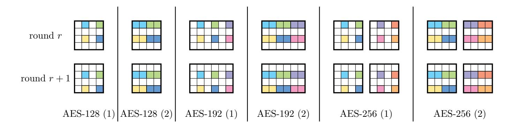

**Figure 19:** Representation of the position of the bytes of the proposition. In variants (2), only the XOR of the two bytes of the same color must be known.

- AES-128 (1):  $P_r = k_{\langle 5,7,13,15 \rangle}^r$ , and  $P_r' = k_{\langle 4,6,12,14 \rangle}^r$
- AES-128 (2):  $P_r = k_{\langle 0 \oplus 4, 2 \oplus 6, 8 \oplus 12, 10 \oplus 14 \rangle}^r$ , and  $P_r' = k_{\langle 1 \oplus 5, 3 \oplus 7, 9 \oplus 13, 11 \oplus 15 \rangle}^r$
- AES-192 (1):  $P_r = k_{\langle 5,7,13,15,21,23\rangle}^r$ , and  $P_r' = k_{\langle 4,6,12,14,20,22\rangle}^r$
- AES-192 (2):  $P_r = k_{\langle 0 \oplus 4, 2 \oplus 6, 8 \oplus 12, 10 \oplus 14, 16 \oplus 20, 18 \oplus 22 \rangle}^r$ , and  $P_r' = k_{\langle 1 \oplus 5, 3 \oplus 7, 9 \oplus 13, 11 \oplus 15, 17 \oplus 21, 19 \oplus 23 \rangle}^r$
- AES-256 (1):  $P_r = k_{\langle 5,7,13,15,21,23,29,31 \rangle}^r$ , and  $P_r' = k_{\langle 4,6,12,14,20,22,28,30 \rangle}^r$
- AES-256 (2):  $P_r = k_{\langle 0 \oplus 4, 2 \oplus 6, 8 \oplus 12, 10 \oplus 14, 16 \oplus 20, 18 \oplus 22, 24 \oplus 28, 26 \oplus 30 \rangle}^r$  $and P_r' = k_{\langle 1 \oplus 5, 3 \oplus 7, 9 \oplus 13, 11 \oplus 15, 17 \oplus 21, 19 \oplus 23, 25 \oplus 29, 27 \oplus 31 \rangle}^r$

If there exists an  $r_0$  such as  $P_{r_0}$  and  $P'_{r_0\pm 1}$  are known, then for all  $i \in \mathbb{Z}$ , the bytes  $P_{r_0+2i}$  and  $P'_{r_0+2i+1}$  are known (and they are easily computable).

Proof. The AES-128 (1) case is considered here, the other cases are demonstrated in the same way. Knowing  $k^r_{\langle 5,7,13,15\rangle}$  and  $k^{r+1}_{\langle 4,6,12,14\rangle}$  is equivalent to knowing two chunks of the state:  $s^r_{\langle 0,1,2,3\rangle}$  and  $s^r_{\langle 8,9,10,11\rangle}$ . This can be verified using Equation (2.2). The knowledge of these 2 chunks is suffiscient to extract the value of the bytes in position  $k_{\langle 5,7,13,15\rangle}$  or  $k_{\langle 4,6,12,14\rangle}$  at any round.

The byte positions of this proposition are represented in figure 19. This proposition is a generalization of the observations made for AES-128 by Dunkelman and Keller (where  $k_r(i, j)$  is the byte at position (i, j) of the round-r subkey):

**Observation 3** ([DK08b]). For each  $0 \le i \le 3$ , the subkeys of AES satisfy the relations:

$$k_{r+2}(i,0) \oplus k_{r+2}(i,2) = k_r(i,2).$$

$$k_{r+2}(i,1) \oplus k_{r+2}(i,3) = k_r(i,3).$$

**Observation 4** ([DK08b]). For each  $0 \le i \le 3$ , the subkeys of AES satisfy the relation:

$$k_{r+2}(i,1) \oplus SB(k_{r+1}((i+1) \bmod 4,3)) \oplus RCON_{r+2}(i) = k_r(i,1).$$

Another property can also be demonstrated on the AES-128 key schedule, using the value of one byte of the last column per round over 4 consecutive rounds:

**Proposition 3.** If there exists  $r \in \mathbb{N}$  and  $i \in \{0, 1, 2, 3\}$  such that the bytes  $k_{15-i}^r$ ,  $k_{15-(i+1)\%4}^{r+1}, k_{15-(i+2)\%4}^{r+2}, k_{15-(i+3)\%4}^{r+3}$  are known, then for all  $j \in \mathbb{Z}$ , the value of the byte  $k_{15-(i+j\%4)}^{r+j}$  is known.

{42}------------------------------------------------

*Proof.* Knowing the bytes  $k_{15-i}^r, k_{15-(i+1)\%4}^{r+1}, k_{15-(i+2)\%4}^{r+2}, k_{15-(i+3)\%4}^{r+3}$  is equivalent to knowing one chunk of the state in the new representation:  $s_{\langle 4i,4i+1,4i+2,4i+3\rangle}^r$ . Given that  $\forall r \in \mathbb{N}$ ,  $s_{4i}^r = k_{15-i}^r$ , we can calculate a byte of the last column at any round because we have the knowledge of a chunk in our new representation.

The property can also be generalized when bytes at the correct position are known in non-consecutive rounds.

#### 8.2 Independence of AES-256 subkeys

Concerning the AES-256, each key schedule state corresponds to the concatenation of two consecutive 128 bits subkeys. We consider that two subkeys are independent if there is no key schedule relation linking their bytes. In other words, two subkeys are independent if and only if there always exist a unique corresponding 256 bits master key. We are interested here in the independence of distant subkeys (two consecutive subkeys are clearly independent) and our new representation of the key schedule implies this non-trivial property:

**Proposition 4.** The subkeys  $k^0$  and  $k^9$  are independent.

*Proof.* To demonstrate this property, we prove that  $k^0$  and  $k^9$  define a unique master key. In our new representation, the knowledge of  $k^0$  and  $k^9$  is equivalent to the knowledge of the bytes  $s_{2i}^0$  and  $s_{2i+1}^4$  for  $0 \le i < 32$ . We reason chunk by chunk, and we consider the first chunk here, but the situation is identical for the other chunks. The bytes  $s_{\langle 1,3,5,7\rangle}^0$  (or equivalently  $s_{\langle 0,2,4,6\rangle}^4$ ) can be computed from  $s_{\langle 0,2,4,6\rangle}^0$  and  $s_{\langle 1,3,5,7\rangle}^4$ :

$$s_0^4 = s_0^0 \oplus S(s_7^4) \qquad s_4^4 = s_4^0 \oplus S(s_3^4)$$

$$s_1^0 = s_1^4 \oplus S(s_0^4) \qquad s_5^0 = s_5^4 \oplus S(s_4^4)$$

$$s_2^4 = s_2^0 \oplus S(s_1^0) \qquad s_6^4 = s_6^0 \oplus S(s_5^4)$$

$$s_3^0 = s_3^4 \oplus S(s_2^4) \qquad s_7^0 = s_7^4 \oplus S(s_6^4) \qquad \Box$$

Other properties of the same type that can be proved using either our new representation or the classical one:  $k^0$  is independent from  $k^1$ ,  $k^3$ ,  $k^5$ ,  $k^7$ , and  $k^8$ , and  $k^1$  is independent from  $k^2$ ,  $k^4$ ,  $k^6$ ,  $k^8$ , and  $k^9$ .

#### 9 Conclusion

Alternative representations of the AES data operations have been used in several previous works; in particular, the super-box property [GP10] of Gilbert and Peyrin is an alternative representation of two AES rounds that led to several improved cryptanalysis results on AES-based schemes. Gilbert has later shown a more general untwisted representation of the AES data path, resulting in the first known-key attack against the full AES-128 [Gil14].

In this work we use techniques from invariant subspace attacks to discover an equivalent representation of the AES key schedule, and we derive new cryptanalysis results, based on two main observations. First, iterating an odd number of key schedule rounds defines a permutation with short cycles. This undermine the security of AES-based schemes using iterations of the key schedule as a type of tweak to make each encryption call different. More generally, the AES key schedule cannot and should not be considered as a random permutation, even after a large number of rounds. Second, the alternative representation makes it easier to combine information from the first subkeys and from the last subkeys, improving previous key recovery attacks. This topic has been studied before and many attacks use key schedule relations to reduce the complexity (in particular, we can mention

{43}------------------------------------------------

the *key bridging* notion of Dunkelman, Keller and Shamir [\[DKS10,](#page-45-4) [DKS15\]](#page-45-6)). However our alternative representation shows non-linear relations that have not been exploited before. In particular, we show that bytes in the last column of an AES-128 subkey depend on only 32 bits of information from the master key.

We expect that this alternative representation can open the way to further results exploiting properties of the AES key schedule. For instance, the new representation can be used to characterize keys that stay symmetric for two rounds, as used in [\[GLR](#page-45-13)<sup>+</sup>20], but this is easily be done with the standard representation due to the small number of rounds.

**Acknowledgement.** The second author is funded by a grant from Région Ile-de-France. This work was also supported by the French Agence Nationale de la Recherche (ANR), under grant ANR-20-CE48-0017 (project SELECT).

## **References**

- <span id="page-43-0"></span>[AES01] Advanced Encryption Standard (AES). National Institute of Standards and Technology, NIST FIPS PUB 197, U.S. Department of Commerce, November 2001.
- <span id="page-43-1"></span>[BA08] Behnam Bahrak and Mohammad Reza Aref. Impossible differential attack on seven-round AES-128. *IET Inf. Secur.*, 2(2):28–32, 2008.
- <span id="page-43-9"></span>[BBS99] Eli Biham, Alex Biryukov, and Adi Shamir. Cryptanalysis of Skipjack reduced to 31 rounds using impossible differentials. In Jacques Stern, editor, *EUROCRYPT'99*, volume 1592 of *LNCS*, pages 12–23. Springer, Heidelberg, May 1999.
- <span id="page-43-8"></span>[BD11] Charles Bouillaguet and Patrick Derbez. AES attacks finder. [https://](https://github.com/cbouilla/AES-attacks-finder) [github.com/cbouilla/AES-attacks-finder](https://github.com/cbouilla/AES-attacks-finder), 2011.
- <span id="page-43-6"></span>[BDF11] Charles Bouillaguet, Patrick Derbez, and Pierre-Alain Fouque. Automatic search of attacks on round-reduced AES and applications. In Phillip Rogaway, editor, *CRYPTO 2011*, volume 6841 of *LNCS*, pages 169–187. Springer, Heidelberg, August 2011.
- <span id="page-43-7"></span>[BDF12] Charles Bouillaguet, Patrick Derbez, and Pierre-Alain Fouque. Automatic search of attacks on round-reduced AES and applications. Cryptology ePrint Archive, Report 2012/069, 2012. <https://eprint.iacr.org/2012/069>.
- <span id="page-43-3"></span>[BDK<sup>+</sup>10] Alex Biryukov, Orr Dunkelman, Nathan Keller, Dmitry Khovratovich, and Adi Shamir. Key recovery attacks of practical complexity on AES-256 variants with up to 10 rounds. In Henri Gilbert, editor, *EUROCRYPT 2010*, volume 6110 of *LNCS*, pages 299–319. Springer, Heidelberg, May / June 2010.
- <span id="page-43-5"></span>[Bir07] Alex Biryukov. The design of a stream cipher LEX. In Eli Biham and Amr M. Youssef, editors, *SAC 2006*, volume 4356 of *LNCS*, pages 67–75. Springer, Heidelberg, August 2007.
- <span id="page-43-2"></span>[BK09] Alex Biryukov and Dmitry Khovratovich. Related-key cryptanalysis of the full AES-192 and AES-256. In Mitsuru Matsui, editor, *ASIACRYPT 2009*, volume 5912 of *LNCS*, pages 1–18. Springer, Heidelberg, December 2009.
- <span id="page-43-4"></span>[BKN09] Alex Biryukov, Dmitry Khovratovich, and Ivica Nikolic. Distinguisher and related-key attack on the full AES-256. In Shai Halevi, editor, *CRYPTO 2009*, volume 5677 of *LNCS*, pages 231–249. Springer, Heidelberg, August 2009.

{44}------------------------------------------------

- <span id="page-44-3"></span>[BLNS18] Christina Boura, Virginie Lallemand, María Naya-Plasencia, and Valentin Suder. Making the impossible possible. *Journal of Cryptology*, 31(1):101–133, January 2018.
- <span id="page-44-7"></span>[BMR<sup>+</sup>14] Andrey Bogdanov, Florian Mendel, Francesco Regazzoni, Vincent Rijmen, and Elmar Tischhauser. ALE: AES-based lightweight authenticated encryption. In Shiho Moriai, editor, *FSE 2013*, volume 8424 of *LNCS*, pages 447–466. Springer, Heidelberg, March 2014.
- <span id="page-44-10"></span>[BNS14] Christina Boura, María Naya-Plasencia, and Valentin Suder. Scrutinizing and improving impossible differential attacks: Applications to CLEFIA, Camellia, LBlock and Simon. In Palash Sarkar and Tetsu Iwata, editors, *ASIACRYPT 2014, Part I*, volume 8873 of *LNCS*, pages 179–199. Springer, Heidelberg, December 2014.
- <span id="page-44-2"></span>[BNS19] Xavier Bonnetain, María Naya-Plasencia, and André Schrottenloher. Quantum security analysis of AES. *IACR Trans. Symm. Cryptol.*, 2019(2):55–93, 2019.
- <span id="page-44-0"></span>[BR22] Navid Ghaedi Bardeh and Vincent Rijmen. New key-recovery attack on reduced-round AES. *IACR Trans. Symm. Cryptol.*, 2022(2):43–62, 2022.
- <span id="page-44-5"></span>[CN19a] Bishwajit Chakraborty and Mridul Nandi. mixFeed. Submission to the NIST Lightweight Cryptography standardization process, 2019. [https:](https://csrc.nist.gov/CSRC/media/Projects/lightweight-cryptography/documents/round-2/spec-doc-rnd2/mixFeed-spec-round2.pdf) [//csrc.nist.gov/CSRC/media/Projects/lightweight-cryptography/](https://csrc.nist.gov/CSRC/media/Projects/lightweight-cryptography/documents/round-2/spec-doc-rnd2/mixFeed-spec-round2.pdf) [documents/round-2/spec-doc-rnd2/mixFeed-spec-round2.pdf](https://csrc.nist.gov/CSRC/media/Projects/lightweight-cryptography/documents/round-2/spec-doc-rnd2/mixFeed-spec-round2.pdf).
- <span id="page-44-6"></span>[CN19b] Bishwajit Chakraborty and Mridul Nandi. Security proof of mixFeed, 2019. [https://csrc.nist.gov/CSRC/media/Events/](https://csrc.nist.gov/CSRC/media/Events/lightweight-cryptography-workshop-2019/documents/papers/security-proof-of-mixfeed-lwc2019.pdf) [lightweight-cryptography-workshop-2019/documents/papers/](https://csrc.nist.gov/CSRC/media/Events/lightweight-cryptography-workshop-2019/documents/papers/security-proof-of-mixfeed-lwc2019.pdf) [security-proof-of-mixfeed-lwc2019.pdf](https://csrc.nist.gov/CSRC/media/Events/lightweight-cryptography-workshop-2019/documents/papers/security-proof-of-mixfeed-lwc2019.pdf).
- <span id="page-44-4"></span>[DF14] Patrick Derbez and Pierre-Alain Fouque. Exhausting Demirci-Selçuk meetin-the-middle attacks against reduced-round AES. In Shiho Moriai, editor, *FSE 2013*, volume 8424 of *LNCS*, pages 541–560. Springer, Heidelberg, March 2014.
- <span id="page-44-1"></span>[DFJ13] Patrick Derbez, Pierre-Alain Fouque, and Jérémy Jean. Improved key recovery attacks on reduced-round AES in the single-key setting. In Thomas Johansson and Phong Q. Nguyen, editors, *EUROCRYPT 2013*, volume 7881 of *LNCS*, pages 371–387. Springer, Heidelberg, May 2013.
- <span id="page-44-8"></span>[DK08a] Orr Dunkelman and Nathan Keller. A new attack on the LEX stream cipher. In Josef Pieprzyk, editor, *ASIACRYPT 2008*, volume 5350 of *LNCS*, pages 539–556. Springer, Heidelberg, December 2008.
- <span id="page-44-12"></span>[DK08b] Orr Dunkelman and Nathan Keller. Treatment of the initial value in timememory-data tradeoff attacks on stream ciphers. *Inf. Process. Lett.*, 107:133– 137, 08 2008.
- <span id="page-44-9"></span>[DK10] Orr Dunkelman and Nathan Keller. The effects of the omission of last round's mixcolumns on AES. *Inf. Process. Lett.*, 110(8-9):304–308, 2010.
- <span id="page-44-11"></span>[DKR97] Joan Daemen, Lars R. Knudsen, and Vincent Rijmen. The block cipher Square. In Eli Biham, editor, *FSE'97*, volume 1267 of *LNCS*, pages 149–165. Springer, Heidelberg, January 1997.

{45}------------------------------------------------

- <span id="page-45-4"></span>[DKS10] Orr Dunkelman, Nathan Keller, and Adi Shamir. Improved single-key attacks on 8-round AES-192 and AES-256. In Masayuki Abe, editor, *ASI-ACRYPT 2010*, volume 6477 of *LNCS*, pages 158–176. Springer, Heidelberg, December 2010.
- <span id="page-45-6"></span>[DKS15] Orr Dunkelman, Nathan Keller, and Adi Shamir. Improved single-key attacks on 8-round AES-192 and AES-256. *Journal of Cryptology*, 28(3):397–422, July 2015.
- <span id="page-45-0"></span>[DR98] Joan Daemen and Vincent Rijmen. AES proposal: Rijndael, 1998. Submission to the NIST AES competition.
- <span id="page-45-1"></span>[DR02] Joan Daemen and Vincent Rijmen. The design of Rijndael: AES – the advanced encryption standard, 2002.
- <span id="page-45-10"></span>[DR05] Joan Daemen and Vincent Rijmen. The Pelican MAC function 2.0. Cryptology ePrint Archive, Report 2005/088, 2005. [https://eprint.iacr.org/](https://eprint.iacr.org/2005/088) [2005/088](https://eprint.iacr.org/2005/088).
- <span id="page-45-2"></span>[DS08] Hüseyin Demirci and Ali Aydin Selçuk. A meet-in-the-middle attack on 8-round AES. In Kaisa Nyberg, editor, *FSE 2008*, volume 5086 of *LNCS*, pages 116–126. Springer, Heidelberg, February 2008.
- <span id="page-45-5"></span>[FKL<sup>+</sup>01] Niels Ferguson, John Kelsey, Stefan Lucks, Bruce Schneier, Michael Stay, David Wagner, and Doug Whiting. Improved cryptanalysis of Rijndael. In Bruce Schneier, editor, *FSE 2000*, volume 1978 of *LNCS*, pages 213–230. Springer, Heidelberg, April 2001.
- <span id="page-45-12"></span>[Gil14] Henri Gilbert. A simplified representation of AES. In Palash Sarkar and Tetsu Iwata, editors, *ASIACRYPT 2014, Part I*, volume 8873 of *LNCS*, pages 200–222. Springer, Heidelberg, December 2014.
- <span id="page-45-13"></span>[GLR<sup>+</sup>20] Lorenzo Grassi, Gregor Leander, Christian Rechberger, Cihangir Tezcan, and Friedrich Wiemer. Weak-key distinguishers for AES. In Orr Dunkelman, Michael J. Jacobson Jr., and Colin O'Flynn, editors, *SAC 2020*, volume 12804 of *LNCS*, pages 141–170. Springer, Heidelberg, October 2020.
- <span id="page-45-11"></span>[GP10] Henri Gilbert and Thomas Peyrin. Super-sbox cryptanalysis: Improved attacks for AES-like permutations. In Seokhie Hong and Tetsu Iwata, editors, *FSE 2010*, volume 6147 of *LNCS*, pages 365–383. Springer, Heidelberg, February 2010.
- <span id="page-45-9"></span>[Jea16] Jérémy Jean. TikZ for Cryptographers. [https://www.iacr.org/authors/](https://www.iacr.org/authors/tikz/) [tikz/](https://www.iacr.org/authors/tikz/), 2016.
- <span id="page-45-7"></span>[Kha19] Mustafa Khairallah. Weak keys in the rekeying paradigm: Application to COMET and mixFeed. *IACR Trans. Symm. Cryptol.*, 2019(4):272–289, 2019.
- <span id="page-45-3"></span>[KR14] Dmitry Khovratovich and Christian Rechberger. The LOCAL attack: Cryptanalysis of the authenticated encryption scheme ALE. In Tanja Lange, Kristin Lauter, and Petr Lisonek, editors, *SAC 2013*, volume 8282 of *LNCS*, pages 174–184. Springer, Heidelberg, August 2014.
- <span id="page-45-8"></span>[LAAZ11] Gregor Leander, Mohamed Ahmed Abdelraheem, Hoda AlKhzaimi, and Erik Zenner. A cryptanalysis of PRINTcipher: The invariant subspace attack. In Phillip Rogaway, editor, *CRYPTO 2011*, volume 6841 of *LNCS*, pages 206–221. Springer, Heidelberg, August 2011.

{46}------------------------------------------------

- <span id="page-46-2"></span>[LJW15] Leibo Li, Keting Jia, and Xiaoyun Wang. Improved single-key attacks on 9-round AES-192/256. In Carlos Cid and Christian Rechberger, editors, *FSE 2014*, volume 8540 of *LNCS*, pages 127–146. Springer, Heidelberg, March 2015.
- <span id="page-46-6"></span>[LMR15] Gregor Leander, Brice Minaud, and Sondre Rønjom. A generic approach to invariant subspace attacks: Cryptanalysis of robin, iSCREAM and Zorro. In Elisabeth Oswald and Marc Fischlin, editors, *EUROCRYPT 2015, Part I*, volume 9056 of *LNCS*, pages 254–283. Springer, Heidelberg, April 2015.
- <span id="page-46-0"></span>[LP21] Gaëtan Leurent and Clara Pernot. New representations of the AES key schedule. In Anne Canteaut and François-Xavier Standaert, editors, *EU-ROCRYPT 2021, Part I*, volume 12696 of *LNCS*, pages 54–84. Springer, Heidelberg, October 2021.
- <span id="page-46-5"></span>[LSG<sup>+</sup>18] Ya Liu, Yifan Shi, Dawu Gu, Bo Dai, Fengyu Zhao, Wei Li, Zhiqiang Liu, and Zhiqiang Zeng. Improved impossible differential cryptanalysis of large-block rijndael. *Science China Information Sciences*, 07 2018.
- <span id="page-46-7"></span>[MDRMH10] Hamid Mala, Mohammad Dakhilalian, Vincent Rijmen, and Mahmoud Modarres-Hashemi. Improved impossible differential cryptanalysis of 7 round AES-128. In Guang Gong and Kishan Chand Gupta, editors, *IN-DOCRYPT 2010*, volume 6498 of *LNCS*, pages 282–291. Springer, Heidelberg, December 2010.
- <span id="page-46-4"></span>[WGR<sup>+</sup>13] Qingju Wang, Dawu Gu, Vincent Rijmen, Ya Liu, Jiazhe Chen, and Andrey Bogdanov. Improved impossible differential attacks on large-block Rijndael. In Taekyoung Kwon, Mun-Kyu Lee, and Daesung Kwon, editors, *ICISC 12*, volume 7839 of *LNCS*, pages 126–140. Springer, Heidelberg, November 2013.
- <span id="page-46-1"></span>[WWH<sup>+</sup>13] Shengbao Wu, Hongjun Wu, Tao Huang, Mingsheng Wang, and Wenling Wu. Leaked-state-forgery attack against the authenticated encryption algorithm ALE. In Kazue Sako and Palash Sarkar, editors, *ASIACRYPT 2013, Part I*, volume 8269 of *LNCS*, pages 377–404. Springer, Heidelberg, December 2013.
- <span id="page-46-3"></span>[ZWZF07] Wentao Zhang, Wenling Wu, Lei Zhang, and Dengguo Feng. Improved related-key impossible differential attacks on reduced-round AES-192. In Eli Biham and Amr M. Youssef, editors, *SAC 2006*, volume 4356 of *LNCS*, pages 15–27. Springer, Heidelberg, August 2007.

{47}------------------------------------------------

## **10 Appendix**

<span id="page-47-0"></span>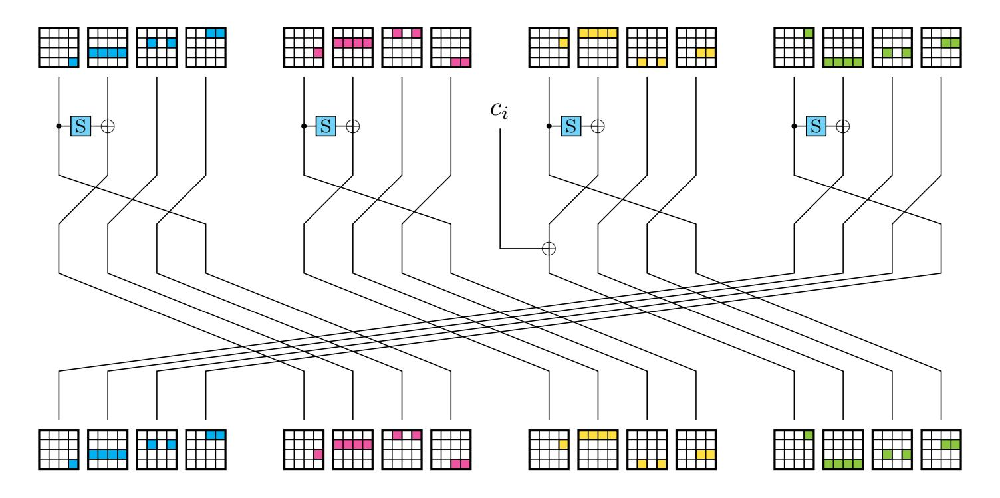

**Figure 20:** One round of the AES key schedule with graphic representations of bytes positions (alternative representation).