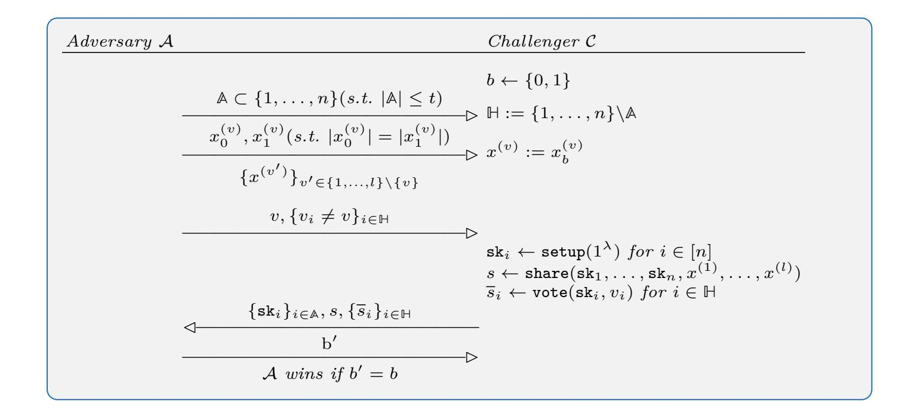
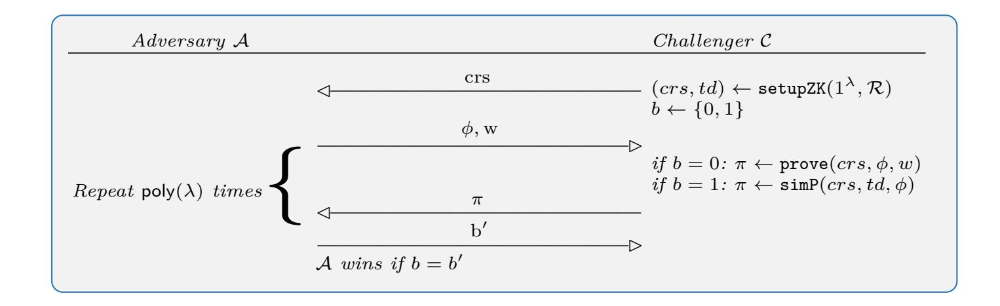
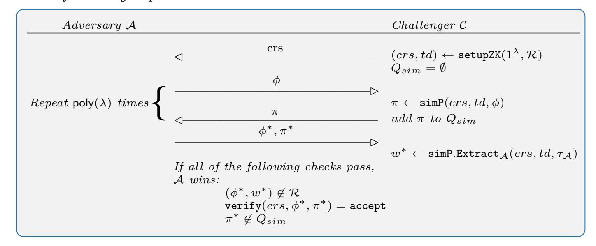
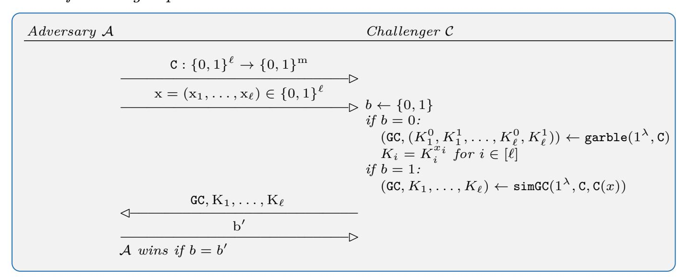
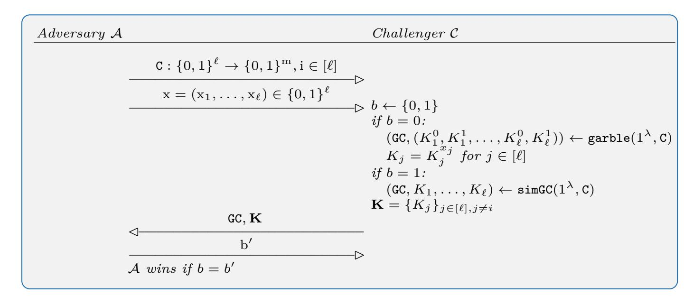

{0}------------------------------------------------

# <span id="page-0-1"></span><span id="page-0-0"></span>**Broadcast-Optimal Two Round MPC with an Honest Majority**

Ivan Damg˚ard<sup>1</sup> , Bernardo Magri<sup>1</sup>*,*<sup>2</sup> , Divya Ravi<sup>1</sup> , Luisa Siniscalchi<sup>1</sup>*,*<sup>2</sup> , and Sophia Yakoubov<sup>1</sup>*?*

> <sup>1</sup> Aarhus University, Denmark <sup>2</sup> Concordium Blockchain Research Center

**Abstract.** This paper closes the question of the possibility of two-round MPC protocols achieving different security guarantees with and without the availability of broadcast in any given round. Cohen *et al.* [\[CGZ20\]](#page-42-0) study this question in the dishonest majority setting; we complete the picture by studying the honest majority setting.

In the honest majority setting, given broadcast in both rounds, it is known that the strongest guarantee — guaranteed output delivery is achievable [\[GLS15\]](#page-42-1). We show that, given broadcast in the first round only, guaranteed output delivery is still achievable. Given broadcast in the second round only, we give a new construction that achieves identifiable abort, and we show that fairness — and thus guaranteed output delivery — are not achievable in this setting. Finally, if only peer-to-peer channels are available, we show that the weakest guarantee — selective abort — is the only one achievable for corruption thresholds *t >* 1 and for *t* = 1 and *n* = 3. On the other hand, it is already known that selective abort can be achieved in these cases. In the remaining cases, i.e., *t* = 1 and *n* ≥ 4, it is known [\[IKP10](#page-43-0)[,IKKP15\]](#page-43-1) that guaranteed output delivery (and thus all weaker guarantees) are possible.

*<sup>?</sup>* Funded by the European Research Council (ERC) under the European Unions's Horizon 2020 research and innovation programme under grant agreement No 669255 (MPCPRO).

{1}------------------------------------------------

# **Table of Contents**

|              |                   | 1                                                                                                                                                                                                                                                                                                                                                                                                                                                                                                                                                                                                                                                                                                                                                                                                                                                                                                                                        |  |  |  |  |
|--------------|-------------------|------------------------------------------------------------------------------------------------------------------------------------------------------------------------------------------------------------------------------------------------------------------------------------------------------------------------------------------------------------------------------------------------------------------------------------------------------------------------------------------------------------------------------------------------------------------------------------------------------------------------------------------------------------------------------------------------------------------------------------------------------------------------------------------------------------------------------------------------------------------------------------------------------------------------------------------|--|--|--|--|
|              | , Luisa           |                                                                                                                                                                                                                                                                                                                                                                                                                                                                                                                                                                                                                                                                                                                                                                                                                                                                                                                                          |  |  |  |  |
|              |                   |                                                                                                                                                                                                                                                                                                                                                                                                                                                                                                                                                                                                                                                                                                                                                                                                                                                                                                                                          |  |  |  |  |
| Introduction |                   |                                                                                                                                                                                                                                                                                                                                                                                                                                                                                                                                                                                                                                                                                                                                                                                                                                                                                                                                          |  |  |  |  |
| 1.1          |                   | 4                                                                                                                                                                                                                                                                                                                                                                                                                                                                                                                                                                                                                                                                                                                                                                                                                                                                                                                                        |  |  |  |  |
| 1.2          |                   | 7                                                                                                                                                                                                                                                                                                                                                                                                                                                                                                                                                                                                                                                                                                                                                                                                                                                                                                                                        |  |  |  |  |
|              |                   | 9                                                                                                                                                                                                                                                                                                                                                                                                                                                                                                                                                                                                                                                                                                                                                                                                                                                                                                                                        |  |  |  |  |
| 2.1          |                   | 9                                                                                                                                                                                                                                                                                                                                                                                                                                                                                                                                                                                                                                                                                                                                                                                                                                                                                                                                        |  |  |  |  |
|              |                   | 11                                                                                                                                                                                                                                                                                                                                                                                                                                                                                                                                                                                                                                                                                                                                                                                                                                                                                                                                       |  |  |  |  |
|              |                   | 12                                                                                                                                                                                                                                                                                                                                                                                                                                                                                                                                                                                                                                                                                                                                                                                                                                                                                                                                       |  |  |  |  |
| 3<br>4<br>15 |                   |                                                                                                                                                                                                                                                                                                                                                                                                                                                                                                                                                                                                                                                                                                                                                                                                                                                                                                                                          |  |  |  |  |
|              |                   | 18                                                                                                                                                                                                                                                                                                                                                                                                                                                                                                                                                                                                                                                                                                                                                                                                                                                                                                                                       |  |  |  |  |
|              |                   | 21                                                                                                                                                                                                                                                                                                                                                                                                                                                                                                                                                                                                                                                                                                                                                                                                                                                                                                                                       |  |  |  |  |
|              |                   | 22                                                                                                                                                                                                                                                                                                                                                                                                                                                                                                                                                                                                                                                                                                                                                                                                                                                                                                                                       |  |  |  |  |
| 7.1          |                   | 23                                                                                                                                                                                                                                                                                                                                                                                                                                                                                                                                                                                                                                                                                                                                                                                                                                                                                                                                       |  |  |  |  |
|              |                   | 23                                                                                                                                                                                                                                                                                                                                                                                                                                                                                                                                                                                                                                                                                                                                                                                                                                                                                                                                       |  |  |  |  |
|              |                   | 24                                                                                                                                                                                                                                                                                                                                                                                                                                                                                                                                                                                                                                                                                                                                                                                                                                                                                                                                       |  |  |  |  |
|              |                   | 25                                                                                                                                                                                                                                                                                                                                                                                                                                                                                                                                                                                                                                                                                                                                                                                                                                                                                                                                       |  |  |  |  |
| 27           |                   |                                                                                                                                                                                                                                                                                                                                                                                                                                                                                                                                                                                                                                                                                                                                                                                                                                                                                                                                          |  |  |  |  |
|              |                   | 31                                                                                                                                                                                                                                                                                                                                                                                                                                                                                                                                                                                                                                                                                                                                                                                                                                                                                                                                       |  |  |  |  |
|              |                   | 43                                                                                                                                                                                                                                                                                                                                                                                                                                                                                                                                                                                                                                                                                                                                                                                                                                                                                                                                       |  |  |  |  |
|              |                   | 43                                                                                                                                                                                                                                                                                                                                                                                                                                                                                                                                                                                                                                                                                                                                                                                                                                                                                                                                       |  |  |  |  |
|              |                   | 44                                                                                                                                                                                                                                                                                                                                                                                                                                                                                                                                                                                                                                                                                                                                                                                                                                                                                                                                       |  |  |  |  |
|              |                   | 44                                                                                                                                                                                                                                                                                                                                                                                                                                                                                                                                                                                                                                                                                                                                                                                                                                                                                                                                       |  |  |  |  |
|              |                   | 46                                                                                                                                                                                                                                                                                                                                                                                                                                                                                                                                                                                                                                                                                                                                                                                                                                                                                                                                       |  |  |  |  |
|              |                   | 47                                                                                                                                                                                                                                                                                                                                                                                                                                                                                                                                                                                                                                                                                                                                                                                                                                                                                                                                       |  |  |  |  |
|              |                   | 49                                                                                                                                                                                                                                                                                                                                                                                                                                                                                                                                                                                                                                                                                                                                                                                                                                                                                                                                       |  |  |  |  |
|              |                   | 50                                                                                                                                                                                                                                                                                                                                                                                                                                                                                                                                                                                                                                                                                                                                                                                                                                                                                                                                       |  |  |  |  |
|              |                   |                                                                                                                                                                                                                                                                                                                                                                                                                                                                                                                                                                                                                                                                                                                                                                                                                                                                                                                                          |  |  |  |  |
|              | 2.2<br>7.2<br>8.1 | Broadcast-Optimal Two Round MPC with an Honest Majority<br>Ivan Damg˚ard1<br>, Bernardo Magri1,2<br>, Divya Ravi1<br>Siniscalchi1,2<br>, and Sophia Yakoubov13<br>Technical Overview<br>Related Work<br>Secure Multiparty Computation (MPC) Definitions<br>Security Model<br>Notation<br>No Broadcast: Impossibility of Unanimous Abort<br>Broadcast in the Second Round: Impossibility of Fairness<br>Completing the Picture: Impossibility Results for n ≤ 3t<br>Broadcast in the First Round: Guaranteed Output Delivery<br>One-or-Nothing Secret Sharing<br>Definitions<br>Syntax<br>Security<br>Constructions<br>Broadcast in the Second Round: Identifiable Abort<br>Proof of Security<br>Building Blocks<br>Symmetric Key Encryption<br>Public Key Encryption<br>Non-Interactive Zero-Knowledge Arguments of Knowledge<br>Commitment Scheme<br>Garbling Scheme<br>Non-Interactive Key Exchange<br>Threshold Secret Sharing Scheme |  |  |  |  |

{2}------------------------------------------------

# <span id="page-2-0"></span>**1 Introduction**

In this paper we advance the study of round-optimal secure computation, focusing on secure computation with active corruptions, an honest majority, and some setup (e.g. a public key infrastructure). It is known that in this setting, secure computation is possible in two rounds (whereas one round is clearly not enough). However, most known two-round protocols in the honest majority setting either only achieve the weakest security guarantee (selective abort) [\[ACGJ19\]](#page-41-0), or make use of a broadcast channel in both rounds [\[GLS15\]](#page-42-1). Since broadcast channels are expensive, it is important to try to minimize their use (while achieving strong security guarantees).

The only step in this direction is the protocol of Cohen *et al.* [\[CGZ20\]](#page-42-0). They achieve secure computation with unanimous abort for a dishonest majority (and thus also for an honest majority) with broadcast in the second round only, and they also show that unanimous abort is the strongest achievable guarantee in this setting. Finally, Cohen *et al.* showed that, given a dishonest majority, selective abort is the strongest achievable security guarantee with broadcast in the first round only.

We make a study analogous to the work of Cohen *et al.* but in the honest majority setting. Like Cohen *et al.*, we consider all four broadcast patterns: broadcast in both rounds, broadcast in the second round only, broadcast in the first round only, and no broadcast at all. Gordon *et al.* [\[GLS15\]](#page-42-1) showed that, given broadcast in both rounds, the strongest guarantee — guaranteed output delivery — is achievable. For each of the other broadcast patterns, we ask:

What is the strongest achievable security guarantee in this broadcast pattern, given an honest majority?

We consider the following security guarantees:

**Selective Abort (SA):** A secure computation protocol achieves *selective abort* if every honest party either obtains the output, or aborts.

**Unanimous Abort (UA):** A secure computation protocol achieves *unanimous abort* if either *all* honest parties obtain the output, or they all (unanimously) abort.

**Identifiable Abort (IA):** A secure computation protocol achieves *identifiable abort* if either all honest parties obtain the output, or they all (unanimously) abort, *identifying one corrupt party*.

**Fairness (FAIR):** A secure computation protocol achieves *fairness* if either all parties obtain the output, or none of them do. In particular, an adversary cannot learn the output if the honest parties do not also learn it.

**Guaranteed Output Delivery (GOD):** A secure computation protocol achieves *guaranteed output delivery* if all honest parties will learn the computation output no matter what the adversary does.

Some of these guarantees are strictly stronger than others. In particular, guaranteed output delivery implies identifiable abort (since an abort never happens), 

{3}------------------------------------------------

which implies unanimous abort, which in turn implies selective abort. Similarly, guaranteed output delivery implies fairness, which implies unanimous abort. Fairness and identifiable abort are incomparable. In a fair protocol, in case of an abort, both corrupt and honest parties get less information: corrupt parties are guaranteed to learn nothing if the protocol aborts, but honest parties may not learn anything about corrupt parties' identities. On the other hand, in a protocol with identifiable abort, in case of an abort corrupt parties may learn the output, but honest parties will identify at least one corrupt party.

<span id="page-3-0"></span>

| Broadcast<br>Pattern |         | t              | selective<br>abort      | unanimous<br>abort     | identifiable<br>abort | fairness                | guaranteed<br>output<br>delivery |
|----------------------|---------|----------------|-------------------------|------------------------|-----------------------|-------------------------|----------------------------------|
| R1                   | R2      |                |                         |                        |                       |                         |                                  |
| BC                   | BC      |                | ✓                       | ✓                      | ✓ [GLS15]             | ✓                       | ✓ [GLS15]                        |
| P2P BC               |         |                | ✓                       | ✓                      | ✓ (Thm 9)             | ✗ (Thm 2) for<br>t > 1  | ✗ for t > 1                      |
|                      |         | 1 < t < n<br>2 |                         |                        |                       | ✗ (Cor 3) for<br>n ≤ 3t | ✗ for n ≤ 3t                     |
|                      | BC P2P  |                | ✓                       | ✓                      | ✓ (Thm 7)             | ✓                       | ✓ (Thm 7)                        |
|                      | P2P P2P |                | ✓ [ACGJ19]              | ✗ (Cor 1) for<br>t > 1 | ✗ for t > 1           | ✗ (Thm 2) for<br>t > 1  | ✗ for t > 1                      |
|                      |         |                |                         |                        |                       | ✗ (Cor 3) for<br>n ≤ 3t | ✗ for n ≤ 3t                     |
|                      |         |                | t = 1, n = 3 ✓ [ACGJ19] | ✗ (Cor 2)              | ✗                     | ✗ (Cor 2)               | ✗                                |
|                      | P2P P2P | t = 1, n = 4   | ✓                       | ✓                      | ✓ ([IKKP15])          | ✓                       | ✓ ([IKKP15])                     |
|                      |         | t = 1, n ≥ 5   | ✓                       | ✓                      | ✓ ([IKP10])           | ✓                       | ✓ ([IKP10])                      |

Table 1: Feasibility and impossibility for two-round MPC in the honest majority setting with different guarantees and broadcast patterns.

The R1 column describes whether broadcast is available in round 1; the R2 column describes whether broadcast is available in round 2.

Arrows indicate implication: the possibility of a stronger security guarantee implies the possibility of weaker ones in the same setting, and the impossibility of a weaker guarantee implies the impossibility of stronger ones in the same setting.

In Table [1,](#page-3-0) we summarize our results. Like the impossibility results of Cohen *et al.*, all of our impossibility results hold given arbitrary setup (such as a common reference string, a public key infrastructure, and correlated randomness). Our feasibility results use only a PKI and CRS. Below we give a very brief description of our results. It turns out that going from dishonest to honest majority allows for stronger security guarantees in some, but not all cases. In section [1.1](#page-4-0) we give a longer overview of our results, and the techniques we use.

{4}------------------------------------------------

**No Broadcast** In this setting, we show that if the adversary controls two or more parties (*t >* 1), or if *t* = 1*, n* = 3, selective abort is the best achievable guarantee. This completes the picture, since (1) selective abort can indeed be achieved by the results of Ananth *et al.* [\[ACGJ19\]](#page-41-0), and (2) for *t* = 1*, n* ≥ 4, guaranteed output delivery can be achieved by the results of Ishai *et al.* [\[IKP10\]](#page-43-0), [\[IKKP15\]](#page-43-1).

**Broadcast in the First Round Only** In this setting, we show that guaranteed output delivery — the strongest guarantee — can be achieved.

**Broadcast in the Second Round Only** In this setting, we show that fairness is impossible if *t* ≥ *n/*3, or if *t >* 1 (again, in the remaining case of *t* = 1*, n* ≥ 4, guaranteed output delivery can be achieved). If fairness is ruled out, the best one can hope for is identifiable abort, and we show this can indeed be achieved given an honest majority.

To achieve identifiable abort with broadcast in the second round only, we introduce a new tool called *one-or-nothing secret sharing*, which we believe to be of independent interest. One-or-nothing secret sharing is a flavor of secret sharing that allows a dealer to share a *vector* of secrets. Once the shares are distributed to the receivers, they can vote on which secret to reconstruct by publishing "ballots". Each receiver either votes for the secret she wishes to reconstruct, or abstains (by publishing a special equivocation ballot). If only one secret is voted for, and gets sufficiently many votes, the ballots enable reconstruction of that secret. On the other hand, if receivers disagree about which secret to reconstruct, nothing is revealed. This could have applications to voting scenarios where, though some voters may remain undecided, unanimity among the decided voters is important.

#### <span id="page-4-0"></span>**1.1 Technical Overview**

In this section we summarize our results given each of the broadcast patterns in more detail.

*No Broadcast (P2P-P2P)* Without a broadcast channel, we show that only the weakest guarantee — selective abort — is achievable. Ananth *et al.* [\[ACGJ19\]](#page-41-0) give a protocol for secure computation with selective abort in this setting; we prove that secure computation with unanimous abort is not achievable, implying impossibility for all stronger guarantees. More specifically, we get the following two results:

**Result 1 (Cor [1:](#page-15-0) P2P-P2P, UA,** *t >* 1**)** *Secure computation of general functions with unanimous abort cannot be achieved in two rounds of peer-to-peer communication for corruption threshold t >* 1*.*

{5}------------------------------------------------

**Result 2 (Cor [2:](#page-20-0) P2P-P2P, UA,** *t* = 1**,** *n* = 3**)** *Secure computation of general functions with unanimous abort cannot be achieved in two rounds of peerto-peer communication for corruption threshold t* = 1 *when n* = 3 [4](#page-5-0) *.*

We prove the first result by focusing on broadcast, where only one party (the dealer) has an input bit, and all parties should output that bit. We show that computing broadcast with unanimous abort in two peer-to-peer rounds with *t >* 1 is impossible[5](#page-5-1) .

The only case not covered by these two results is *t* = 1 and *n* ≥ 4. However for this case, it follows from results by Ishai *et al.* [\[IKP10\]](#page-43-0) and [\[IKKP15\]](#page-43-1) that the strongest guarantee — guaranteed output delivery — is achievable in two rounds of peer-to-peer communication.

For completeness, we note that the case of *n* = 2 and *t* = 1 is special. We are no longer in an honest majority setting, so fairness is known to be impossible [\[Cle86\]](#page-42-2). The other three guarantees are possible and equivalent.

*Broadcast in the First Round Only (BC-P2P)* We show that any *first-round extractable* two broadcast-round protocol (where the simulator demonstrating security of the protocol can extract parties' inputs from their first-round messages and it is efficient to check whether a given second-round message is correct) can be run over one broadcast round followed by one peer-to-peer round without any loss in security. Since the protocol of Gordon *et al.* [\[GLS15\]](#page-42-1) satisfies these properties, we conclude that guaranteed output delivery is achievable in the honest majority setting as long as broadcast is available in the first round.

**Result 3 (Thm [7:](#page-22-1) BC-P2P, GOD,** *n* ≥ 2*t* + 1**)** *Secure computation of general functions with guaranteed output delivery is possible in two rounds of communication, only the first of which is over a broadcast channel, for corruption threshold t such that n* ≥ 2*t* + 1*.*

*Broadcast in the Second Round Only (P2P-BC)* When broadcast is available in the second round, not the first, it turns out that fairness (and hence guaranteed output delivery) cannot be achieved. More specifically, we obtain the following two results:

**Result 4 (Cor [3:](#page-21-1) P2P-BC, FAIR,** *n* ≤ 3*t***)** *Secure computation of general functions with fairness cannot be achieved in two rounds of communication, only the second of which is over a broadcast channel, for corruption threshold t such that n* ≤ 3*t.*

<span id="page-5-0"></span><sup>4</sup> Patra and Ravi [\[PR18\]](#page-43-4) give a similar result in the absence of a PKI and correlated randomness; our impossibility result is stronger, as it holds even given arbitrary correlated randomness

<span id="page-5-1"></span><sup>5</sup> It is well known that computing broadcast with guaranteed output delivery requires *t* rounds, but this of course does not imply the same for broadcast with unanimous abort.

{6}------------------------------------------------

**Result 5 (Thm [2:](#page-16-1) P2P-BC, FAIR,** *t >* 1**)** *Secure computation of general functions with fairness cannot be achieved in two rounds of communication, only the second of which is over a broadcast channel, for corruption threshold t >* 1*.*

Both these results are shown using the same basic idea, namely if the protocol is fair, we construct an attack in which corrupt players send inconsistent messages in the first round and then use the second round messages to obtain two different outputs, corresponding to different choices of their own input — which, of course, violates privacy.

Combining the two results, we see that fairness is unachievable when broadcast is only available in the second round (the only case not covered is *t* = 1*, n* ≥ 4 where guaranteed output delivery is possible, as discussed above). We therefore turn to the next-best guarantee, which is identifiable abort; in Section [8,](#page-27-0) we show how to achieve it for *n >* 2*t*.

**Result 6 (Thm [9:](#page-31-0) P2P-BC, ID,** *n >* 2*t***)** *Secure computation of general functions with identifiable abort is achievable in two rounds of communication, only the second of which is over a broadcast channel, for corruption threshold t such that n >* 2*t.*

To show this result, we use a high-level strategy adopted from Cohen *et al.* Namely, we start from any protocol that achieves identifiable abort for honest majority given two rounds of broadcast, and compile this into a protocol that works when the first round is limited to peer-to-peer channels. While Cohen *et al.* achieve unanimous abort this way, we aim for the stronger guarantee of identifiable abort, since we assume honest majority.

To explain our technical contribution, let us follow the approach of Cohen *et al.* and see where we get stuck. The idea is to have each party broadcast a garbled circuit in the second round. This garbled circuit corresponds to the code they would use to compute their second-round message in the underlying protocol (given their input and all the first-round messages they receive). In the first round (over peer-to-peer channels), the parties additively secret share all the labels for their garbled circuit, and send their first-round message from the underlying protocol to each of their peers. In the second round (over broadcast), for each bit of first-round message she receives, each party forwards her share of the corresponding label in everyone else's garbled circuit. Cohen *et al.* used this approach to achieve unanimous abort for dishonest majority.

However, even assuming honest majority, this will not be sufficient for identifiable abort. The main issue is that corrupt parties may send inconsistent messages in the first round. This problem cannot be solved just by requiring each party to sign their first-round messages, because *P<sup>i</sup>* may send an invalid signature — or nothing at all — to *P<sup>j</sup>* . *P<sup>j</sup>* then cannot do what she was supposed to in the second round; so, all she can do is to complain, but she cannot demonstrate any proof that *P<sup>i</sup>* cheated. All honest parties now agree that either *P<sup>i</sup> or P<sup>j</sup>* is corrupt, but there is no way to tell which one. This is not an issue if we aim for unanimous abort; however, if we aim for identifiable abort, we must 

{7}------------------------------------------------

either find out who to blame or compute the correct output anyway, without any further interaction.

We solve this problem by introducing a new primitive we call *one-or-nothing* secret sharing. This special kind secret sharing allows a dealer to share several values simultaneously. (In our case, the values would be two garbled circuit labels for a given bit *b*.) The share recipients can then "vote" on which of the values to reconstruct; if they aren't sure (in our case, they wouldn't be sure if they didn't get *b* in the first round), they are able to "abstain", which essentially means casting their vote with the majority. As long as there are no contradictory votes and a minority of abstain votes, reconstruction of the appropriate value succeeds; otherwise, the privacy of all values is guaranteed.

We use this primitive to share the labels for the garbled circuits as sketched above. If all reconstructions succeed, we get the correct output. Otherwise, we can identify a corrupt player. By requiring parties to sign their first-round messages, we can ensure that if there are contradicting votes, all parties can agree that some party *P<sup>i</sup>* sent inconsistent messages in the first round. If there is a majority of abstains, this proves that some particular *P<sup>i</sup>* sent an invalid first-round message to at least one honest party.

### <span id="page-7-0"></span>**1.2 Related Work**

The quest for optimal round-complexity for secure computation protocols is a well-established topic in cryptography. Starting with the first feasibility results from almost 35 years ago [\[Yao86](#page-43-5)[,GMW87](#page-43-6)[,BGW88,](#page-42-3)[CCD88\]](#page-42-4) a lot of progress has been made in improving the round complexity of protocols [\[GIKR01,](#page-42-5)[Lin01,](#page-43-7)[CD01\]](#page-42-6) [\[IK02,](#page-43-8)[IKP10](#page-43-0)[,IKKP15](#page-43-1)[,GLS15,](#page-42-1)[PR18](#page-43-4)[,ACGJ18,](#page-41-1)[CGZ20\]](#page-42-0). In this section we detail the prior work that specifically targets the two-round setting. We divide the discussion into two: impossibility and feasibility results.

<span id="page-7-1"></span>

| Result              | n   | t           | Guarantee CRS? PKI? CR? |   |   |   | R1  | R2                |
|---------------------|-----|-------------|-------------------------|---|---|---|-----|-------------------|
| [GIKR02]            | any | t ≥ 2       | fairness                | ✓ | ✗ | ✗ |     | BC + P2P BC + P2P |
| [GLS15] n = 3 t = 1 |     |             | fairness                | ✓ | ✗ | ✗ | BC  | BC                |
| [PR18]              |     | n = 3 t = 1 | fairness                | ✓ | ✗ | ✗ |     | BC + P2P BC + P2P |
| [PR18]              |     | n = 3 t = 1 | UA                      | ✓ | ✗ | ✗ | P2P | P2P               |
| [CGZ20] n = 3 t = 2 |     |             | UA                      | ✓ | ✓ | ✓ | BC  | P2P               |
| [CGZ20] n = 3 t = 2 |     |             | IA                      | ✓ | ✓ | ✓ | P2P | BC                |

Table 2: Previous impossibility results. Each row in this table describes a setting where MPC is known to be *impossible.* "UA" stand for unanimous abort, and "IA" for identifiable abort.

{8}------------------------------------------------

*Impossibility Results.* Table [2](#page-7-1) summarizes the known lower bounds on two-round secure computation. Gennaro *et al.* [\[GIKR02\]](#page-42-7) shed light on the optimal roundcomplexity for general MPC protocols achieving fairness without correlated randomness (e.g., PKI). Their model allows for communication over both authenticated point-to-point channels and a broadcast channel. They show that in this setting, three rounds are necessary for a protocol with at least *t* ≥ 2 corrupt parties by focusing on the computation of exclusive-or and conjunction functions. In a slightly different model, where the parties can communicate only over a broadcast channel, Gordon *et al.* [\[GLS15\]](#page-42-1) show that the existence of a fair two-round MPC protocol for an honest majority would imply a virtual black-box program obfuscation scheme, which would contradict the well-known impossibility result of Barak *et al.* [\[BGI](#page-42-8)<sup>+</sup>01].

Patra and Ravi [\[PR18\]](#page-43-4) investigate the three party setting. They show that three rounds are necessary for generic secure computation achieving unanimous abort when parties *do not* have access to a broadcast channel, and that the same three are necessary for fairness even when parties do have a broadcast channel. Badrinarayanan *et al.* [\[BMMR21\]](#page-42-9) study broadcast-optimal three-round MPC with guaranteed output delivery given an honest majority and CRS, and show that use of broadcast in the first two rounds is necessary.

It is well known that in the dishonest majority setting fairness cannot be achieved for generic computation [\[Cle86\]](#page-42-2). Cohen *et al.* [\[CGZ20\]](#page-42-0) study the feasibility of two round secure computation with unanimous and identifiable abort in the dishonest majority setting. Their results show that considering arbitrary setup (e.g., a PKI) and communication over point-to-point channels, achieving unanimous abort in two rounds is not possible even if the parties are additionally allowed to communicate over a broadcast channel only in the first round, and achieving identifiable abort in two rounds is not possible even if the parties are additionally allowed to communicate over a broadcast channel only in the second round.

*Feasibility Results.* Table [3](#page-9-2) summarizes known two-round secure computation constructions. While three rounds are necessary for fair MPC [\[GIKR02\]](#page-42-7) for *t* ≥ 2 (without correlated randomness), Ishai *et al.* [\[IKP10\]](#page-43-0) show that it is possible to build generic two-round MPC with guaranteed output delivery when only a *single* party is corrupt (*t* = 1) for *n* ≥ 5. Later, [\[IKKP15\]](#page-43-1) showed the same for *n* = 4, and that selective abort is also possible for *n* = 3.

The work of [\[GLS15\]](#page-42-1) gives a three round generic MPC protocol that guarantees output delivery and is secure against a minority of semi-honest fail-stop adversaries where parties only communicate over point-to-point channels; the same protocol can be upgraded to be secure against malicious adversaries if the parties are also allowed to communicate over a broadcast channel. The use of broadcast channel in the last round can be avoided (and point-to-point channels can be used instead), as shown by Badrinarayanan *et al.* [\[BMMR21\]](#page-42-9). Moreover, assuming a PKI, the protocol of [\[GLS15\]](#page-42-1) can be compressed to only two rounds.

For *n* = 3 and *t* = 1, Patra and Ravi [\[PR18\]](#page-43-4) present a tight upper bound achieving unanimous abort in the setting with point-to-point channels and a

{9}------------------------------------------------

<span id="page-9-2"></span>

| Result   | n         | t                 | Guarantee                                           | PKI? | CRS? | 1st round   | 2nd round        | Assumptions            |
|----------|-----------|-------------------|-----------------------------------------------------|------|------|-------------|------------------|------------------------|
| [IKP10]  | $n \ge 5$ | t = 1             | GOD                                                 | Х    | Х    | P2P         | P2P              | PRG                    |
| [IKKP15] | n = 3     | t = 1             | SA                                                  | X    | X    | P2P         | P2P              | PRG                    |
| [IKKP15] | n = 4     | t = 1             | GOD                                                 | X    | X    | P2P         | P2P              | injective OWF          |
| [GLS15]  | any       | $t < \frac{n}{2}$ | M- $GOD$                                            | ✓    | 1    | BC + P2P    | BC + P2P         | $\mathrm{dFHE}$        |
| [PR18]   | n = 3     | t = 1             | UA                                                  | X    | ×    | BC + P2P    | BC + P2P         | GC, NICOM, eNICOM, PRG |
| [ACGJ18] | any       | $t < \frac{n}{2}$ | UA                                                  | X    | ×    | BC + P2P    | BC + P2P         | OWF                    |
| [ACGJ18] | any       | $t < \frac{n}{2}$ | FS-GOD                                              | ✓    | ×    | BC + P2P    | BC + P2P         | OWF                    |
| [ACGJ18] | any       | $t < \frac{n}{2}$ | FS-GOD                                              | X    | ×    | BC + P2P    | BC + P2P         | OWF, SH-OT             |
| [ACGJ18] | any       | $t < \frac{n}{2}$ | $\operatorname{FS-GOD} \ / \ \operatorname{SM-GOD}$ | ✓    | ×    | $_{\rm BC}$ | $_{\rm BC}$      | OWF                    |
| [GS18]   | any       | t < n             | UA                                                  | X    | 1    | $_{\rm BC}$ | $_{\rm BC}$      | 2-round OT             |
| [CGZ20]  | any       | t < n             | SA                                                  | X    | 1    | P2P         | P2P              | 2-round OT             |
| [CGZ20]  | any       | t < n             | UA                                                  | X    | 1    | P2P         | $_{\mathrm{BC}}$ | 2-round OT             |
| [CGZ20]  | any       | t < n             | IA                                                  | X    | ✓    | BC          | BC               | 2-round OT             |

Table 3: Protocols for secure MPC with two-rounds. "UA" stands for unanimous abort, "FS-GOD" for guaranteed output delivery against fail-stop adversaries, "SM-GOD" for guaranteed output delivery against semi-malicious adversaries, and "M-GOD" for guaranteed output delivery against malicious adversaries.

broadcast channel. The protocol leverages garbled circuits, (equivocal) non-interactive commitment scheme and a PRG. In the same honest majority setting but for arbitrary n, Ananth  $et\ al.$  [ACGJ18] build four variants of a two-round protocol. Two of these variants are in the plain model (without setup), with both point-to-point channels and broadcast available in both rounds. The first achieves security with unanimous abort and relies on one-way functions, and the second achieves guaranteed output delivery against fail-stop adversaries and additionally relies on semi-honest oblivious transfer. Their other two protocols require a PKI; and achieve guaranteed output delivery against fail-stop and semi-malicious adversaries.

Finally, Cohen et al. [CGZ20] present a complete characterization of the feasibility landscape of two-round MPC in the dishonest majority setting, for all broadcast patterns. In particular, they show protocols (without a PKI) for the cases of point-to-point communication in both rounds, point-to-point in the first round and broadcast in the second round, and broadcast in both rounds. The protocols achieve security with selective abort, unanimous abort and identifiable abort, respectively. All protocols rely on two-round oblivious transfer.

### <span id="page-9-0"></span>2 Secure Multiparty Computation (MPC) Definitions

#### <span id="page-9-1"></span>2.1 Security Model

We follow the real/ideal world simulation paradigm and we adopt the security model of Cohen, Garay and Zikas [CGZ20]. As in their work, we state our results in a stand-alone setting.<sup>6</sup>

<span id="page-9-3"></span>We note that our security proofs can translate to an appropriate (synchronous) composable setting with minimal changes.

{10}------------------------------------------------

Real-world. An n-party protocol  $\Pi = (P_1, \ldots, P_n)$  is an n-tuple of probabilistic polynomial-time (PPT) interactive Turing machines (ITMs), where each party  $P_i$  is initialized with input  $x_i \in \{0,1\}^*$  and random coins  $r_i \in \{0,1\}^*$ . We let  $\mathcal{A}$  denote a special PPT ITM that represents the adversary and that is initialized with input that contains the identities of the corrupt parties, their respective private inputs, and an auxiliary input. The protocol is executed in rounds (i.e., the protocol is synchronous), where each round consists of the send phase and the receive phase, where parties can respectively send the messages from this round to other parties and receive messages from other parties. In every round parties can communicate either over a broadcast channel or a fully connected point-to-point (P2P) network, where we additionally assume all communication to be private and ideally authenticated. (Given a PKI and a broadcast channel, such a fully connected point-to-point network can be instantiated.)

During the execution of the protocol, the corrupt parties receive arbitrary instructions from the adversary  $\mathcal{A}$ , while the honest parties faithfully follow the instructions of the protocol. We consider the adversary  $\mathcal{A}$  to be rushing, i.e., during every round the adversary can see the messages the honest parties sent before producing messages from corrupt parties.

At the end of the protocol execution, the honest parties produce output, the corrupt parties produce no output, and the adversary outputs an arbitrary function of its view. The view of a party during the execution consists of its input, random coins and the messages it sees during the execution.

**Definition 1 (Real-world execution).** Let  $\Pi = (P_1, ..., P_n)$  be an n-party protocol and let  $\mathcal{I} \subseteq [n]$ , of size at most t, denote the set of indices of the parties corrupted by  $\mathcal{A}$ . The joint execution of  $\Pi$  under  $(\mathcal{A}, \mathcal{I})$  in the real world, on input vector  $x = (x_1, ..., x_n)$ , auxiliary input aux and security parameter  $\lambda$ , denoted REAL $_{\Pi,\mathcal{I},\mathcal{A}(\mathsf{aux})}(x,\lambda)$ , is defined as the output vector of  $P_1, ..., P_n$  and  $\mathcal{A}(\mathsf{aux})$  resulting from the protocol interaction.

*Ideal-world.* We describe ideal world executions with selective abort (sl-abort), unanimous abort (un-abort), identifiable abort (id-abort), fairness (fairness) and guaranteed output delivery (god).

**Definition 2** (Ideal Computation). Consider type  $\in$  {sl-abort, un-abort, id-abort, fairness, god}. Let  $f: (\{0,1\}^*)^n \to (\{0,1\}^*)^n$  be an n-party function and let  $\mathcal{I} \subseteq [n]$ , of size at most t, be the set of indices of the corrupt parties. Then, the joint ideal execution of f under  $(\mathcal{S},\mathcal{I})$  on input vector  $x = (x_1,\ldots,x_n)$ , auxiliary input aux to  $\mathcal{S}$  and security parameter  $\lambda$ , denoted IDEAL type  $(x,\lambda)$ , is defined as the output vector of  $P_1,\ldots,P_n$  and  $\mathcal{S}$  resulting from the following ideal process.

1. Parties send inputs to trusted party: An honest party  $P_i$  sends its input  $x_i$  to the trusted party. The simulator S may send to the trusted party arbitrary inputs for the corrupt parties. Let  $x_i'$  be the value actually sent as the input of party  $P_i$ .

{11}------------------------------------------------

- 2. Trusted party speaks to simulator: The trusted party computes  $(y_1, \ldots, y_n) = f(x'_1, \ldots, x'_n)$ . If there are no corrupt parties or type = god, proceed to step 4.
  - (a) If type  $\in$  {sl-abort, un-abort, id-abort}: The trusted party sends  $\{y_i\}_{i\in\mathcal{I}}$  to  $\mathcal{S}$ .
  - (b) If type = fairness: The trusted party sends ready to S.
- 3. Simulator S responds to trusted party:
  - (a) If type = sl-abort: The simulator S can select a set of parties that will not get the output as  $\mathcal{J} \subseteq [n] \setminus \mathcal{I}$ . (Note that  $\mathcal{J}$  can be empty, allowing all parties to obtain the output.) It sends (abort,  $\mathcal{J}$ ) to the trusted party.
  - (b) If type  $\in$  {un-abort, fairness}: The simulator can send abort to the trusted party. If it does, we take  $\mathcal{J} = [n] \setminus \mathcal{I}$ .
  - (c) If type = id-abort: If it chooses to abort, the simulator S can select a corrupt party  $i^* \in \mathcal{I}$  who will be blamed, and send (abort,  $i^*$ ) to the trusted party. If it does, we take  $\mathcal{J} = [n] \setminus \mathcal{I}$ .
- <span id="page-11-1"></span>4. Trusted party answers parties:
  - (a) If the trusted party got abort from the simulator S,
    - i. It sets the abort message abortmsg, as follows:
      - -if type  $\in$  {sl-abort, un-abort, fairness}, we let abortmsg  $= \bot$ .
      - -if type = id-abort, we let abortmsg =  $(\bot, i^*)$ .
    - ii. The trusted party then sends abortmsg to every party  $P_j$ ,  $j \in \mathcal{J}$ , and  $y_j$  to every party  $P_j$ ,  $j \in [n] \setminus \mathcal{J}$ .

Note that, if type = god, we will never be in this setting, since S was not allowed to ask for an abort.

- (b) Otherwise, it sends y to every  $P_i$ ,  $j \in [n]$ .
- 5. Outputs: Honest parties always output the message received from the trusted party while the corrupt parties output nothing. The simulator S outputs an arbitrary function of the initial inputs  $\{x_i\}_{i\in\mathcal{I}}$ , the messages received by the corrupt parties from the trusted party and its auxiliary input.

Security Definitions. We now define the security notion for protocols.

**Definition 3.** Consider type  $\in$  {sl-abort, un-abort, id-abort, fairness, god}. Let  $f: (\{0,1\}^*)^n \to (\{0,1\}^*)^n$  be an n-party function. A protocol  $\Pi$  t-securely computes the function f with type security if for every PPT real-world adversary  $\mathcal{A}$  there exists a PPT simulator  $\mathcal{S}$  such that for every  $\mathcal{I} \subseteq [n]$  of size at most t, it holds that

$$\left\{\mathtt{REAL}_{\Pi,\mathcal{I},\mathcal{A}(\mathsf{aux})}(x,\lambda)\right\}_{x \in (\{0,1\}^*)^n,\lambda \in \mathbb{N}} \stackrel{c}{=} \left\{\mathtt{IDEAL}^{\mathsf{type}}_{f,\mathcal{I},\mathcal{S}(\mathsf{aux})}(x,\lambda)\right\}_{x \in (\{0,1\}^*)^n,\lambda \in \mathbb{N}}.$$

#### <span id="page-11-0"></span>2.2 Notation

In this paper, we focus on two-round secure computation protocols. Rather than viewing a protocol  $\Pi$  as an n-tuple of interactive Turing machines, it is convenient to view each Turing machine as a sequence of three algorithms:  $\mathtt{frst-msg}_i$ , to compute  $P_i$ 's first messages to its peers;  $\mathtt{snd-msg}_i$ , to compute  $P_i$ 's second messages; and  $\mathtt{output}_i$ , to compute  $P_i$ 's output. Thus, a protocol  $\Pi$  can be defined as  $\{(\mathtt{frst-msg}_i, \mathtt{snd-msg}_i, \mathtt{output}_i)\}_{i \in [n]}$ .

The syntax of the algorithms is as follows:

{12}------------------------------------------------

- $\operatorname{frst-msg}_i(x_i, r_i) \to (\operatorname{msg}_{i \to 1}^1, \dots, \operatorname{msg}_{i \to n}^1)$  produces the first-round messages of party  $P_i$  to all parties. Note that a party's message to itself can be considered to be its state.
- $\operatorname{snd-msg}_i(x_i, r_i, \operatorname{msg}_{1 \to i}^1, \dots, \operatorname{msg}_{n \to i}^1) \to (\operatorname{msg}_{i \to 1}^2, \dots, \operatorname{msg}_{i \to n}^2)$  produces the second-round messages of party  $P_i$  to all parties.
- $\operatorname{output}_i(x_i, r_i, \operatorname{\mathsf{msg}}^1_{1 \to i}, \dots, \operatorname{\mathsf{msg}}^1_{n \to i}, \operatorname{\mathsf{msg}}^2_{1 \to i}, \dots, \operatorname{\mathsf{msg}}^2_{n \to i}) \to y_i$  produces the output returned to party  $P_i$ .

When the first round is over broadcast channels, we consider  $\mathtt{frst\text{-}msg}_i$  to return only one message —  $\mathtt{msg}_i^1$ . Similarly, when the second round is over broadcast channels, we consider  $\mathtt{snd\text{-}msg}_i$  to return only  $\mathtt{msg}_i^1$ .

Throughout our negative results, we omit the randomness r, and instead focus on deterministic protocols, modeling the randomness implicitly as part of the algorithm.

### <span id="page-12-0"></span>3 No Broadcast: Impossibility of Unanimous Abort

For our negative results in the setting where no broadcast is available, we leverage related negative results for broadcast (or byzantine agreement). To show that guaranteed output delivery is impossible in two rounds of peer-to-peer communication, we can use the fact that broadcast cannot be realized in two rounds for t > 1 [FL82,DS83]. To show the impossibility of weaker guarantees such as unanimous abort in this setting, we prove that a weaker flavor of broadcast, called (weak) detectable broadcast [FGMv02] — where all parties either learn the broadcast bit, or unanimously abort — cannot be realized in two rounds either.

We state the definitions of broadcast and detectable broadcast (from Fitzi et al. [FGMv02]) below.

<span id="page-12-1"></span>**Definition 4 (Broadcast).** A protocol among n parties, where the dealer  $D = P_1$  holds an input value  $x \in \{0,1\}$  and every other party  $P_i, i \in [2, ..., n]$  outputs a value  $y_i \in \{0,1\}$ , achieves broadcast if it satisfies the following two conditions:

Validity: If the dealer D is honest then all honest parties  $P_i$  output  $y_i = x$ . Consistency: All honest parties output the same value  $y_2 = \cdots = y_n = y$ .

<span id="page-12-2"></span>**Definition 5 (Detectable Broadcast).** A protocol among n parties achieves detectable broadcast if it satisfies the following three conditions:

Correctness: All honest parties unanimously accept or unanimously reject the protocol. If all honest parties accept then the protocol achieves broadcast. Completeness: If all parties are honest then all parties accept.

**Fairness:** If any honest party rejects the protocol then the adversary gets no information about the dealer's input x.

<span id="page-12-3"></span>We additionally define weak detectable broadcast.

{13}------------------------------------------------

**Definition 6 (Weak Detectable Broadcast).** *A protocol among n parties achieves* weak detectable broadcast *if it satisfies only the correctness and completeness requirements of detectable broadcast.*

An alternative way of viewing broadcast, through the lense of secure computation, is by considering the simple broadcast function *f*bc(*x,* ⊥*, . . . ,* ⊥) = (⊥*, x, . . . , x*) which takes an input bit *x* from the dealer *D* = *P*1, and outputs that bit to all other parties. *Broadcast* (Definition [4\)](#page-12-1) is exactly equivalent to computing *f*bc with guaranteed output delivery; *detectable broadcast* (Definition [5\)](#page-12-2) is equivalent to computing it with fairness; and *weak detectable broadcast* (Definition [6\)](#page-12-3) is equivalent to computing it with unanimous abort.

<span id="page-13-0"></span>**Theorem 1.** *Weak detectable broadcast cannot be achieved in two rounds of peer-to-peer communication for corruption threshold t >* 1*.*

*Proof.* We prove Thm [1](#page-13-0) by contradiction. We let

$$\varPi_{\texttt{wdbc}} = \{(\texttt{frst-msg}_i, \texttt{snd-msg}_i, \texttt{output}_i)\}_{i \in [1, \dots, n]}$$

be the description of the two-round weak detectable broadcast protocol. We use the notation we introduce for two-round secure computation in Section [2.2,](#page-11-0) and consider the weak detectable broadcast protocol to be a secure computation with unanimous abort of *fbc*. We let *x*<sup>1</sup> = *x* denote the bit being broadcast by the dealer *D* = *P*1, and *x<sup>i</sup>* = ⊥ for *i* ∈ [2*, . . . , n*] be placeholders for other parties' inputs. We assume that *µ* = (1 − *negl*) is the overwhelming probability with which security of *Π*wdbc holds.

Below we consider an execution of *Π*wdbc and a sequence of scenarios involving different adversarial strategies with two corruptions (*t* = 2). The dealer *D* = *P*<sup>1</sup> is corrupt in all of these; at most one of the receiving parties *P*2*, . . . , P<sup>n</sup>* is corrupt at a time. We argue that each subsequent strategy clearly requires certain parties to output certain values, by the definition of weak detectable broadcast. In the last strategy, we see a contradiction, where some parties must output both 0 and 1. Therefore, *Π*wdbc could not have been a weak detectable broadcast protocol. In all of the strategies below, we let msg*b,i*→*<sup>j</sup>* denote a party *P<sup>i</sup>* 's *b*th-round message to party *P<sup>j</sup>* ; we only specify how these messages are generated when this is done dishonestly.

**Scenario 1:** *D* is corrupt.

**Round 1:** *D* behaves honestly using input *x* = 0.

**Round 2:** *D* behaves honestly using input *x* = 0.

By completeness (which holds since everyone behaved honestly), all honest parties must accept the protocol. By correctness, the protocol must thus achieve broadcast. By validity, all honest parties must output 0. Thus, we can infer that honest parties must output 0 with probability at least *µ*.

**Scenario** 2*M***:** *D* and *P*<sup>2</sup> are corrupt.

{14}------------------------------------------------

**Round 1:** D computes two different sets of messages, using different inputs x = 0 and x = 1, as follows:

$$(\mathsf{msg}_{1 \rightarrow 1}^{1,(0)}, \ldots, \mathsf{msg}_{1 \rightarrow n}^{1,(0)}) \leftarrow \mathsf{frst-msg}_1(x=0)$$

$$(\mathsf{msg}_{1 \rightarrow 1}^{1,(1)}, \ldots, \mathsf{msg}_{1 \rightarrow n}^{1,(1)}) \leftarrow \mathtt{frst-msg}_1(x=1)$$

D sends  $\mathsf{msg}_{1\to 3}^{1,(0)}, \ldots, \mathsf{msg}_{1\to n}^{1,(0)}$  to parties  $P_3, \ldots, P_n$ .  $P_2$  behaves honestly. **Round 2:** D behaves honestly using input x=0.  $P_2$  computes two different sets of second-round messages, as follows:

$$(\mathsf{msg}_{2\to 1}^{2,(0)},\ldots,\mathsf{msg}_{2\to n}^{2,(0)}) \leftarrow \mathsf{snd-msg}_2(\bot,\mathsf{msg}_{1\to 2}^{1,(0)},\mathsf{msg}_{2\to 2}^1,\ldots,\mathsf{msg}_{n\to 2}^1)$$

$$(\mathsf{msg}_{2\to 1}^{2,(1)},\ldots,\mathsf{msg}_{2\to n}^{2,(1)}) \leftarrow \mathsf{snd-msg}_2(\bot,\mathsf{msg}_{1\to 2}^{1,(1)},\mathsf{msg}_{2\to 2}^1,\ldots,\mathsf{msg}_{n\to 2}^1)$$

 $P_2$  sends  $\mathsf{msg}_{2\to n}^{2,(1)}$  to  $P_n$  (pretending, essentially, that D dealt a 1), and  $\mathsf{msg}_{2\to i}^{2,(0)}$  to other parties  $P_i$  (pretending that D dealt a 0).

 $P_3, \ldots, P_{n-1}$  must accept and output 0 with probability at least  $\mu$ , since their views are identical to those in the previous scenario. By correctness (which holds with probability  $\mu$ ),  $P_n$  must also accept when other honest parties accept (which occurs with probability  $\mu$ ). It now follows from consistency that  $P_n$  must also output 0 with probability at least  $\mu \times \mu = \mu^2$ .

Scenario  $2_H$ : D is corrupt.

**Round 1:** D sends  $\mathsf{msg}_{1\to 2}^{1,(1)}$  to  $P_2$ , and  $\mathsf{msg}_{1\to i}^{1,(0)}$  to other parties  $P_i$ .

**Round 2:** D continues to represent x = 1 towards  $P_2$  and x = 0 towards the others.

 $P_n$  must accept and output 0 with probability at least  $\mu^2$ , since its view is the same as in the previous scenario. By correctness (which holds with probability  $\mu$ ),  $P_2, \ldots, P_{n-1}$  must also accept when  $P_n$  accepts (which occurs with probability  $\mu^2$ ). It now follows from consistency that  $P_2, \ldots, P_{n-1}$  must also output 0 with probability at least  $\mu^2 \times \mu = \mu^3$ .

Now, skipping ahead, we generalize, for  $k \in [3, ..., n-1]$ :

Scenario  $k_M$ : D and  $P_k$  are corrupt.

**Round 1:** D sends  $\mathsf{msg}_{1\to i}^{1,(1)}$  to  $P_2,\ldots,P_{k-1}$ , and  $\mathsf{msg}_{1\to i}^{1,(0)}$  to the other parties  $P_{k+1},\ldots,P_n$ .  $P_k$  acts honestly.

**Round 2:** D continues to represent x=1 to  $P_2,\ldots,P_{k-1}$  and x=0 to  $P_{k+1},\ldots,P_n$ . In the second round  $P_k$  acts analogously to  $P_2$  in scenario  $2_M$ ; i.e.,  $P_k$  uses  $\mathsf{msg}_{1\to k}^{1,(0)}$  to compute  $(\mathsf{msg}_{k\to 1}^{2,(0)},\ldots,\mathsf{msg}_{k\to n-1}^{2,(0)})$  (which it sends to  $P_2,\ldots,P_{n-1}$ ), and  $\mathsf{msg}_{1\to k}^{1,(1)}$  to compute  $\mathsf{msg}_{k\to n}^{2,(1)}$  (which it sends to  $P_n$ ).

 $P_2, \ldots, P_{n-1}$  must accept and output 0 with probability at least  $\mu^{2(k-1)-1} = \mu^{2k-3}$ , since their views are identical to those in the previous scenario (namely Scenario  $(k-1)_H$ ). By correctness (which holds with probability  $\mu$ ),  $P_n$  must also accept when other honest parties accept. It now follows from consistency that  $P_n$  must also output 0 with probability at least  $\mu^{2k-3} \times \mu = \mu^{2(k-1)}$ .

{15}------------------------------------------------

Scenario  $k_H$ : D is corrupt.

**Round 1:** D sends  $\mathsf{msg}_{1\to i}^{1,(1)}$  to  $P_2,\ldots,P_k$ , and  $\mathsf{msg}_{1\to i}^{1,(0)}$  to the other parties  $P_{k+1},\ldots,P_n$ .

**Round 2:** D continues to represent x = 1 to  $P_2, \ldots, P_k$  and x = 0 to  $P_{k+1}, \ldots, P_n$ .

 $P_n$  must accept and output 0 with probability at least  $\mu^{2(k-1)}$ , since its view is the same as in the previous scenario. By correctness (which holds with probability  $\mu$ ),  $P_2, \ldots, P_{n-1}$  must also accept. It now follow from consistency that  $P_2, \ldots, P_{n-1}$  must also output 0 with probability at least  $\mu^{2(k-1)} \times \mu = \mu^{2k-1}$ .

We end with Scenarios  $n_M, n_H$ .

Scenario  $n_M$ : D and  $P_n$  are corrupt.

**Round 1:** D behaves honestly using input x=1.  $P_n$  behaves honestly. **Round 2:** D behaves honestly using input x=1.  $P_n$  pretends D dealt a 0 towards, e.g., only  $P_2$ . More precisely,  $P_n$  uses  $\mathsf{msg}_{1 \to n}^{1,(0)}$  to compute  $\mathsf{msg}_{n \to 2}^{2,(0)}$  (which it sends to  $P_2$ ), and  $\mathsf{msg}_{1 \to n}^{1,(1)}$  to compute  $(\mathsf{msg}_{n \to 3}^{2,(1)}, \ldots, \mathsf{msg}_{n \to n-1}^{2,(1)})$  (which it sends to  $P_3, \ldots, P_{n-1}$ ).

 $P_2$  must accept and output 0 with probability at least  $\mu^{2(n-1)-1} = \mu^{2n-3}$ , since its view is the same as in the previous scenario (namely, Scenario  $(n-1)_H$ ). By correctness,  $P_3, \ldots, P_{n-1}$  must also accept. It now follows from consistency that  $P_3, \ldots, P_{n-1}$  must also output 0 with probability at least  $\mu^{2n-3} \times \mu = \mu^{2(n-1)}$ .

Scenario  $n_H$ : D is corrupt.

**Round 1:** D behaves honestly using input x = 1.

**Round 2:** D behaves honestly using input x = 1.

In Scenario  $n_H$ , on the one hand, by completeness (which holds as everyone behaved honestly), all honest parties must accept the protocol; by validity, all honest parties must output 1. On the other hand, since the view of  $P_3, \ldots, P_{n-1}$  is the same as their respective views in the previous scenario, they must output 0 with probability at least  $\mu^{2(n-1)}$ , which is overwhelming (as  $\mu^{2(n-1)} = (1 - negl(\lambda))^{2n-2} \ge 1 - (2n-2) \times negl(\lambda)$ , by binomial expansion).

This is a contradiction.

The impossibility of realizing weak detectable broadcast in two rounds for t > 1 clearly implies that there exists a function (specifically,  $f_{bc}$ ) which is impossible to compute with unanimous abort for t > 1 in two rounds of peer-to-peer communication.

<span id="page-15-0"></span>Corollary 1 (P2P-P2P, UA, t > 1). There exist functions f such that no n-party two-round protocol can compute f with unanimous abort against t > 1 corruptions in two rounds of peer-to-peer communication.

{16}------------------------------------------------

# <span id="page-16-0"></span>4 Broadcast in the Second Round: Impossibility of Fairness

In this section, we show that it is not possible to design fair protocols tolerating t > 1 corruptions when broadcast is available only in the second round.

<span id="page-16-1"></span>**Theorem 2 (P2P-BC, FAIR,** t > 1). There exist functions f such that no n-party two-round protocol can compute f with fairness against t > 1 corruptions while making use of broadcast only in the second round (i.e. where the first round is over point-to-point channels and second round uses both broadcast and point-to-point channels).

In our proof we use the function  $f_{mot}$ , which is defined below. Let  $P_1$  hold as input a bit  $X_1 = b \in \{0, 1\}$ , and every other party  $P_i$   $(i \in \{2, ..., n\})$  hold as input a pair of strings, denoted as  $X_i = (x_i^0, x_i^1)$ .

$$f_{\text{mot}}(X_1 = b, X_2 = (x_2^0, x_2^1), \dots, X_n = (x_n^0, x_n^1)) = (x_2^b, x_3^b, \dots, x_n^b).$$

*Proof.* We prove Thm 2 by contradiction. Let  $\Pi$  be a protocol that computes  $f_{\text{mot}}$  with fairness by using broadcast only in the second round. Consider an execution of  $\Pi$  where  $X_i$  denotes the input of  $P_i$ . We describe a sequence of scenarios  $C_1, \ldots, C_n, C_n^*$ . In each scenario,  $P_1$  and at most one other party is corrupt. In all the scenarios, the corrupt parties behave honestly (in particular, they use their honest inputs), but may drop incoming or outgoing messages.

At a high-level, the sequence of scenarios is designed so that corrupt  $P_1$  drops her first-round message to one additional honest party in each scenario. We show that in each scenario, the adversary manages to obtain the output computed with respect to  $X_1 = b$  and (at least some of) the honest parties' inputs. This leads to a contradiction, because the final scenario involves no first-round messages from  $P_1$  related to its input  $X_1 = b$ , but the adversary is still able to learn  $x_i^b$  corresponding to some honest  $P_i$ . In particular, this implies that the adversary is able to re-compute second-round messages from  $P_1$  with different choices of input  $X_1$ , obtaining multiple outputs (on different inputs).

Before describing the scenarios in detail, we define some useful notation. Let  $(X_1, \ldots, X_n)$  denote a specific combination of inputs that are fixed across all scenarios. Let  $\mu = (1 - negl)$  denote the overwhelming probability with which the security of  $\Pi$  holds. We assume, without loss of generality, that the second round of  $\Pi$  involves broadcast communication alone (as given a PKI and a broadcast channel, point-to-point communication can be realized by broadcasting encryptions of the private messages using the public key of the recipient). Let  $\widetilde{\mathsf{msg}}_i^2$  denote  $P_i$ 's second-round broadcast message, computed honestly given that  $P_i$  did not receive the private message (i.e. the communication over point-to-point channel) from  $P_1$  in the first round.

Scenario  $C_1$ :  $P_1$  is corrupt.

**Round 1:**  $P_1$  behaves honestly (i.e. follows the instructions of  $\Pi$ ).

Round 2:  $P_1$  behaves honestly.

{17}------------------------------------------------

Since everyone behaved honestly, it follows from correctness that  $P_1$  obtains the output  $y = f_{\text{mot}}(x_1, \ldots, x_n) = (x_2^b, x_3^b, \ldots, x_n^b)$  with probability at least  $\mu$ .

Scenario  $C_2$ :  $P_1$  and  $P_2$  are corrupt.

**Round 1:**  $P_1$  and  $P_2$  behave honestly.

**Round 2:**  $P_1$  remains silent.  $P_2$  pretends she did not receive a first-round message from  $P_1$ . In more detail,  $P_2$  sends  $\widetilde{\mathsf{msg}}_2^2$  over broadcast channel.

The adversary's view subsumes her view in the previous scenario, so the adversary learns the output  $y = (x_2^b, x_3^b, \dots, x_n^b)$  which allows her to learn  $x_i^b$  corresponding to each honest  $P_i$ . It thus follows from security of  $\Pi$  that honest parties must also obtain  $x_i^b$  corresponding to each honest  $P_i$  (i.e. for  $i \in [n] \setminus \{1, 2\}$ ) with probability at least  $\mu$ . If not, then either correctness or fairness is violated, which contradicts our assumption that  $\Pi$  is secure.

#### Scenario $C_3$ : $P_1$ and $P_3$ are corrupt.

**Round 1:**  $P_1$  behaves honestly, but does not send a message to  $P_2$ .  $P_3$  behaves honestly.

**Round 2:**  $P_1$  remains silent.  $P_3$  pretends that she did not receive a first-round message from  $P_1$  (i.e. she sends  $\widetilde{\mathsf{msg}}_3^2$  via broadcast).

The adversary's view subsumes the view of an honest  $P_3$  in Scenario  $C_2$  (which includes  $\widetilde{\mathsf{msg}}_2^2$ ); so, the adversary learns  $\{x_i^b\}_{i\in[n]\setminus\{1,2\}}$  with probability at least  $\mu$ . Due to security of  $\Pi$  (which holds with probability  $\mu$ ), we can infer that when the adversary obtains this information (which occurs with probability  $\mu$ ), honest parties  $P_2, P_4, P_5, \ldots, P_n$  must also learn  $x_i^b$  corresponding to each honest  $P_i$  (i.e. for  $i \in [n] \setminus \{1,3\}$ ) with probability at least  $\mu \times \mu = \mu^2$ . More specifically, this inference follows from fairness of  $\Pi$  and our assumption that  $\Pi$  realizes the ideal functionality  $f_{\mathtt{mot}}$ .

#### Scenario $C_4$ : $P_1$ and $P_4$ are corrupt.

**Round 1:**  $P_1$  behaves honestly, except that she does not send a message to  $P_2$  and  $P_3$ .  $P_4$  behaves honestly.

**Round 2:**  $P_1$  remains silent.  $P_4$  pretends that she did not receive a first-round message from  $P_1$  (i.e. she sends  $\widetilde{\mathsf{msg}}_4^2$  via broadcast).

The adversary's view subsumes the view of an honest  $P_4$  in Scenario  $C_3$  (which includes  $\widetilde{\mathsf{msg}}_j^2$ , where  $j \in \{2,3\}$ ). Therefore, the adversary would learn  $\{x_i^b\}_{i \in [n] \setminus \{1,3\}}$  with probability at least  $\mu^2$ . It now follows from security of  $\Pi$  (which holds with probability at least  $\mu$ ) that honest  $P_2, P_3, P_5, \ldots, P_n$  must obtain  $x_i^b$  corresponding to each honest  $P_i$  (i.e. for  $i \in [n] \setminus \{1,4\}$ ) with probability at least  $\mu^2 \times \mu = \mu^3$ .

Generalizing the above for k = 3 to n:

#### Scenario $C_k$ : $P_1$ and $P_k$ are corrupt.

**Round 1:**  $P_1$  behaves honestly, except that she does not send a message to  $P_2, P_3, \ldots, P_{k-1}, P_k$  behaves honestly.

**Round 2:**  $P_1$  remains silent.  $P_k$  pretends that she did not receive a first-round message from  $P_1$  (i.e. she sends  $\widetilde{\mathsf{msg}}_k^2$  via broadcast).

{18}------------------------------------------------

The adversary's view subsumes the view of an honest  $P_k$  in Scenario  $C_{k-1}$  (which includes messages  $\widetilde{\mathsf{msg}}_j^2$ , where  $j \in \{2, \ldots, k-1\}$ ). Thus, the adversary learns  $\{x_i^b\}_{i \in [n] \setminus \{1, k-1\}}$  with probability at least  $\mu^{k-2}$ . Security of  $\Pi$  (which holds with probability at least  $\mu$ ) dictates that honest parties should obtain  $x_i^b$  corresponding to each honest  $P_i$  (i.e. for  $i \in [n] \setminus \{1, k\}$ ) with probability at least  $\mu^{k-2} \times \mu = \mu^{k-1}$ .

Finally, we describe the last scenario:

Scenario  $C_n^*$ :  $P_1$  and  $P_n$  are corrupt.

**Round 1:**  $P_1$  remains silent.  $P_n$  behaves honestly.

Round 2:  $P_1$  and  $P_n$  remain silent.

The adversary's view subsumes her view in Scenario  $C_n$  (which includes messages  $\widetilde{\mathsf{msg}}_j^2$ , where  $j \in \{1, \ldots, n-1\}$ ). Thus, in Scenario  $C_n^*$ , the adversary is able to learn  $\{x_i^b\}_{i \in [n] \setminus \{1, n-1\}}$  with probability at least  $\mu^{n-2}$ . Note that  $\mu^{n-2} = (1 - negl(\lambda))^{n-2} \ge 1 - (n-2) \times negl(\lambda)$  (by binomial expansion), which is overwhelming. This leads us to the final contradiction  $-C_n^*$  does not involve any message from  $P_1$  related to the input  $X_1 = b$ , but the adversary was able to obtain  $\{x_i^b\}_{i \in [n] \setminus \{1, n-1\}}$ . This implies that the adversary can compute  $\{x_i^{b'}\}_{i \in [n] \setminus \{1, n-1\}}$  with respect to any input  $X_1 = b'$  of her choice. This "residual attack" breaks the privacy property of the protocol, as it allows the adversary to learn both input strings of an honest  $P_i$ , where  $i \in \{2, \ldots, n-2\}$  (which is not allowed as per the ideal realization of  $f_{\mathtt{mot}}$ ).

Lastly, we point that the above proof requires that the function computed is such that each party receives the output. This is because the inference in Scenario  $C_k$   $(k \in [n])$  relies on the adversary obtaining output on behalf of  $P_k$ .

# <span id="page-18-0"></span>5 Completing the Picture: Impossibility Results for $n \leq 3t$

In the previous two sections, we showed the impossibility of unanimous abort when no broadcast is available, and the impossibility of fairness when broadcast is only available in the second round. However, both of those impossibility results only hold for t > 1. In this section, using different techniques, we extend those results to the case when t = 1 and n = 3. In our impossibility results in this section, we use a property which we call *last message resiliency*.

<span id="page-18-1"></span>**Definition 7 (Last Message Resiliency).** A protocol is t-last message resilient if, in an honest execution, any protocol participant  $P_i$  can compute its output without using t of the messages it received in the last round.

More formally, consider a protocol  $\Pi = \{(\texttt{frst-msg}_i, \texttt{snd-msg}_i, \texttt{output}_i)\}_{i \in [1, \dots, n]}$ . The protocol is t-last message resilient if, for each  $i \in [1, \dots, n]$  and each  $S \subseteq \{1, \dots, n\} \setminus \{i\}$  such that  $|S| \leq t$ , the output function  $\texttt{output}_i$  returns the correct output even without second round messages from parties  $P_i, i \in S$ . That

{19}------------------------------------------------

is, for all security parameters  $\lambda$ , for all sets  $S \subseteq \{1, \ldots, n\} \setminus \{i\}$  such that  $|S| \leq t$ , for all inputs  $x_1, \ldots, x_n$ ,

$$\Pr\left( \begin{matrix} \mathsf{output}_i(x_i, \mathsf{msg}^1_{1 \to i}, \dots, \mathsf{msg}^1_{n \to i}, \mathsf{m\tilde{s}g}^2_{1 \to i}, \dots, \mathsf{m\tilde{s}g}^2_{n \to i}) \\ \neq \mathsf{output}_i(x_i, \mathsf{msg}^1_{1 \to i}, \dots, \mathsf{msg}^1_{n \to i}, \mathsf{msg}^2_{1 \to i}, \dots, \mathsf{msg}^2_{n \to i}) \end{matrix} \right) = negl(\lambda)$$

over the randomness used in the protocol, where, for  $j \in [1, ..., n]$ ,

$$(\mathsf{msg}_{j \to 1}^1, \dots, \mathsf{msg}_{j \to n}^1) \leftarrow \mathtt{frst-msg}_j(x_j),$$
 
$$(\mathsf{msg}_{j \to 1}^2, \dots, \mathsf{msg}_{j \to n}^2) \leftarrow \mathtt{snd-msg}_j(x_j, \mathsf{msg}_{1 \to j}^1, \dots, \mathsf{msg}_{n \to j}^1),$$

and

$$\tilde{\mathsf{msg}}_{j \to i}^2 = \begin{cases} \mathsf{msg}_{j \to i}^2, & \textit{if } j \not \in S, \\ \bot & \textit{otherwise}. \end{cases}$$

<span id="page-19-0"></span>**Theorem 3.** Any protocol  $\Pi$  which achieves secure computation with unanimous abort with corruption threshold t and whose last round can be executed over peer-to-peer channels must be t-last message resilient.

*Proof.* We prove this by contradiction. Assume  $\Pi$  achieves unanimous abort, and is not t-resilient. Then, by definition, there exist inputs  $x_1, \ldots, x_n$ , an  $i \in [1, \ldots, n]$  and a subset  $S \subseteq \{1, \ldots, n\} \setminus \{i\}$  (such that  $|S| \leq t$ ) where, with non-negligible probability,

$$\begin{aligned} & \mathsf{output}_i(x_i, \mathsf{msg}^1_{1 \to i}, \dots, \mathsf{msg}^1_{n \to i}, \mathsf{m\tilde{s}g}^2_{1 \to i}, \dots, \mathsf{m\tilde{s}g}^2_{n \to i}) \\ & \neq \mathsf{output}_i(x_i, \mathsf{msg}^1_{1 \to i}, \dots, \mathsf{msg}^1_{n \to i}, \mathsf{msg}^2_{1 \to i}, \dots, \mathsf{msg}^2_{n \to i}) \end{aligned}$$

(where the messages are produced in the way described in Definition 7).

The adversary can use this by corrupting  $P_j$ ,  $j \in S$ ; it will behave honestly, except in the last round, where  $P_j$ ,  $j \in S$  will not send messages to  $P_i$ . (Note that the ability to send last round messages to some parties but not others relies on the fact that the last round is over peer-to-peer channels.) With non-negligible probability,  $P_i$  will receive an incorrect output (e.g. an abort). However, this cannot occur in a protocol with unanimous abort; all other honest parties must accept the protocol and produce the correct output (since their views are the same as in an entirely honest execution), so  $P_i$  must as well.

<span id="page-19-1"></span>**Theorem 4.** Any protocol  $\Pi$  which achieves secure computation with fairness with corruption threshold t must be t-last message resilient.

*Proof.* We prove this by contradiction. Assume  $\Pi$  achieves fairness, and is not t-resilient. Then, by definition, there exist inputs  $x_1, \ldots, x_n$ , an  $i \in [1, \ldots, n]$  and a subset  $S \subseteq \{1, \ldots, n\} \setminus \{i\}$  (such that  $|S| \leq t$ ) where, with non-negligible probability,

$$\begin{aligned} & \mathsf{output}_i(x_i, \mathsf{msg}^1_{1 \to i}, \dots, \mathsf{msg}^1_{n \to i}, \mathsf{m\tilde{s}g}^2_{1 \to i}, \dots, \mathsf{m\tilde{s}g}^2_{n \to i}) \\ & \neq \mathsf{output}_i(x_i, \mathsf{msg}^1_{1 \to i}, \dots, \mathsf{msg}^1_{n \to i}, \mathsf{msg}^2_{1 \to i}, \dots, \mathsf{msg}^2_{n \to i}). \end{aligned}$$

{20}------------------------------------------------

(where the messages are produced in the way described in Definition 7).

The adversary can use this by corrupting  $P_j$ ,  $j \in S$ . As in the previous proof, it will behave honestly, except in the last round, where  $P_j$ ,  $j \in S$  will not send messages to  $P_i$ . With non-negligible probability,  $P_i$  will receive an incorrect output (e.g. an abort), while the rushing adversary will learn the output, since it will have all of the messages it would have gotten in a fully honest execution of the protocol. This violates fairness.<sup>7</sup>

<span id="page-20-2"></span>**Theorem 5.** There exists a function f such that any protocol  $\Pi$  securely realizing f with corruption threshold t such that  $n \leq 3t$  and whose first round can be executed over peer-to-peer channels cannot be t-last message resilient.

*Proof.* Consider the function  $f_{mot}$  described in the proof of Thm 2, where party  $P_1$  provides as input a choice bit  $X_1 = b \in \{0,1\}$  and every other party  $P_i$  provides as input a pair of strings i.e.  $X_i = (x_i^0, x_i^1)$ .

Consider an adversary corrupting  $P_1$ . The adversary should clearly be unable to recompute the function with multiple inputs, e.g., with respect to both  $X_1 = 0$  and  $X_1 = 1$  (as this will allow it to learn both the input strings of the honest parties which is in contrast to an ideal execution, where it can learn exactly one of the input strings).

We now show that, in a t-last message resilient (where  $n \leq 3t$ ) two-round protocol  $\Pi$  where the first round is over peer-to-peer channels,  $P_1$  can always learn both of those outputs. Consider a corrupt  $P_1$ , and partition the honest parties into two sets of equal size (assuming for simplicity that the number of honest parties is even):  $S_0$  and  $S_1$ . Note that  $|S_0| = |S_1| = \frac{n-t}{2} \leq t$ .

 $P_1$  uses  $X_1 = 0$  to compute its first round messages to  $S_0$ ; it uses  $X_1 = 1$  to compute its first round messages to  $S_1$ . (Note that the ability to send first round messages based on different inputs relies on the fact that the first round is over peer-to-peer channels.) All other parties behave honestly. Because the protocol  $\Pi$  is t-last message resilient, and because  $S_1$  contains t or fewer parties,  $P_1$  has enough second round messages excluding those it received from  $S_1$  to compute its output. Note that all second round messages except for those received from  $S_1$  are distributed exactly as in an honest execution with  $X_1 = 0$ ; therefore, by last message resiliency,  $P_1$  learns  $(x_2^0, x_3^0, \ldots, x_n^0)$  (as per the definition of  $f_{mot}$ ). Similarly, by excluding second round messages it received from  $S_0$ ,  $P_1$  learns the output  $(x_2^1, x_3^1, \ldots, x_n^1)$  i.e. the output computed based on  $X_1 = 1$ . This is clearly a violation of privacy.

<span id="page-20-0"></span>Corollary 2 (P2P-P2P, UA,  $n \leq 3t$ ). Secure computation of general functions with unanimous abort cannot be achieved in two rounds of peer-to-peer communication for corruption threshold t such that  $n \leq 3t$ .

This corollary follows directly from Theorems 3 and 5.

<span id="page-20-1"></span>Note that while  $P_i$  does not learn the output, other honest parties might. However, even one honest party not receiving the output is a violation of fairness if the adversary learns the output.

{21}------------------------------------------------

Remark 1. Note that for t > 1, Cor 2 is subsumed by Cor 1. However, Cor 2 covers the case of t = 1 and n = 3, closing the question of unanimous abort with honest majority in two rounds of peer-to-peer communication.

<span id="page-21-1"></span>Corollary 3 (P2P-BC, FAIR,  $n \leq 3t$ ). Secure computation of general functions with fairness cannot be achieved in two rounds the first of which is over peer-to-peer channels for corruption threshold t such that  $n \leq 3t$ .

This corollary follows from Theorems 4 and 5.

# <span id="page-21-0"></span>6 Broadcast in the First Round: Guaranteed Output Delivery

In this section, we argue that any protocol that achieves guaranteed output delivery in two rounds of broadcast also achieves guaranteed output delivery when broadcast is available in the first round only. We first show that if the protocol achieves guaranteed output delivery with corruption threshold t in two rounds of broadcast, it achieves the same guarantee with threshold t-1 when the second round is over peer-to-peer channels. We next show that if the first-round messages commit corrupt parties to their inputs, the second round can be run over peer-to-peer channels with no loss in corruption budget.

**Theorem 6.** Let  $\Pi_{bc}^{god}$  be a two broadcast-round protocol that securely computes the function f with guaranteed output delivery against an adversary corrupting t parties. Then  $\Pi_{bc}^{god}$  achieves the same guarantee when the second round is run over peer-to-peer channels but with t-1 corruptions.

Proof (Sketch). Let  $\tilde{H}_{bc}^{god}$  denote the protocol where the second round is run over peer-to-peer channels but with t-1 corruptions. Towards a contradiction, assume  $\tilde{H}_{bc}^{god}$  is not secure against (t-1) corruptions; in particular, assume that there is an adversary  $\tilde{\mathcal{A}}$  that breaks security.

We first observe that  $\tilde{\mathcal{A}}$  certainly can't cause honest parties to abort in  $\tilde{H}_{bc}^{god}$  by sending them incorrect things in the second round, since  $\Pi_{bc}^{god}$  achieves guaranteed output delivery, meaning that honest parties do not abort no matter what  $\tilde{\mathcal{A}}$  does. Therefore, all  $\tilde{\mathcal{A}}$  can hope for is to cause disagreement in  $\tilde{H}_{bc}^{god}$ . In particular,  $\tilde{\mathcal{A}}$  can send different second-round messages to different honest parties, hoping that honest parties end up with outputs computed on different corrupt party inputs. However, if  $\tilde{\mathcal{A}}$  could do that, we could use  $\tilde{\mathcal{A}}$  to build an adversary  $\mathcal{A}$  that breaks the security of  $\Pi_{bc}^{god}$  by corrupting one additional honest party, mentally sending different messages to it, and obtaining the output on two different sets of its own inputs.

Suppose  $\tilde{\mathcal{A}}$  can make a pair of honest parties in  $\tilde{H}_{bc}^{god} - P_i$  and  $P_j$  — obtain different outputs by sending different second-round messages to them. Then, we construct our adversary  $\mathcal{A}$  for  $\Pi_{bc}^{god}$  as follows.  $\mathcal{A}$  corrupts the same t-1 parties as  $\tilde{\mathcal{A}}$ , as well as one additional honest party —  $P_i$  — who will behave semi-honestly.  $\mathcal{A}$  uses the second-round messages sent by  $\tilde{\mathcal{A}}$  to  $P_j$  as her broadcast

{22}------------------------------------------------

second-round messages in  $\Pi_{bc}^{god}$ . However,  $\mathcal{A}$  also computes what  $P_i$ 's output would have been if she had broadcast the second-round messages sent by  $\tilde{\mathcal{A}}$  to  $P_i$ . This allows  $\mathcal{A}$  to obtain the output on behalf of  $P_i$  on two different sets of inputs, breaking the security of  $\Pi_{bc}^{god}$  (and completing the proof).

<span id="page-22-1"></span>**Theorem 7.** Let  $\Pi_{bc}^{god}$  be a two broadcast-round protocol that securely computes the function f with guaranteed output delivery with the additional constraint that a simulator can extract inputs from the first-round messages and it is efficient to check whether a given second-round message is correct. Then  $\Pi_{bc}^{god}$  achieves the same guarantee when the second round is run over point-to-point channels.

Proof (Sketch). Starting from the protocol  $\Pi_{bc}^{god}$  it is possible to define another protocol  $\Pi_{bcp2p}^{god}$  that has the following modifications: (1) the second round messages of  $\Pi_{bc}^{god}$  are sent over point-to-point channels and (2) the honest parties compute their output based on all the first round messages and the subset C of second round messages that are generated correctly. (Observe that  $|C| \geq n - t$ , because at least n - t parties are honest.)

Because at least n-t parties are honest.)

Relying on the GOD security of  $\Pi_{bc}^{god}$ , it is possible to claim that  $\Pi_{bcp2p}^{god}$  also achieves GOD. This follows from two important observations. First, since the input is extracted from the first round of  $\Pi_{bcp2p}^{god}$  which is over broadcast, the adversary cannot cause disagreement among the honest parties with respect to her input (i.e. she cannot send messages based on different inputs to different honest parties). Second, in  $\Pi_{bcp2p}^{god}$  the honest parties are always able to compute the output; otherwise, the honest parties in  $\Pi_{bc}^{god}$  would not have been able to compute an output when  $\mathcal A$  does not send any second round message, which contradicts GOD security.

Next, we observe that the two broadcast-round protocol of Gordon et al. [GLS15] has the two properties required by Thm 7. The protocol of Gordon et al. [GLS15] uses zero knowledge proofs to compile a semi-malicious protocol into a fully malicious one. The zero knowledge proofs accompanying the first round messages can be used for input extraction; the zero knowledge proofs accompanying the second round messages can be used to efficiently determine which of these second round messages are generated correctly.

#### <span id="page-22-0"></span>7 One-or-Nothing Secret Sharing

In Section 8, we will show a protocol that achieves security with identifiable abort in the honest majority setting in two rounds, only the second of which is over broadcast. In this section, we introduce an important building block for that protocol which we call *one-or-nothing secret sharing*.

We define one-or-nothing secret sharing as a new flavor of secret sharing wherein the dealer can share a *vector* of secrets. While traditional secret sharing schemes are designed for receivers to eventually publish their shares and recover the entirety of what was shared, one-or-nothing secret sharing is designed for

{23}------------------------------------------------

receivers to eventually recover *at most one* of the shared values. While reconstruction usually requires each party to contribute its entire share, in one-ornothing secret sharing, each party instead *votes* on the index of the value to reconstruct by producing a "ballot" based on its secret share. If two parties vote for different indices, the set of published ballots should reveal nothing about any of the values. However, some parties are allowed to equivocate — they might be unsure which index they wish to vote for, so they will support the preference of the majority. If a majority votes for the same index, and the rest equivocate, the ballots enable the recovery of the value at that index.

Our secure computation construction in Section [8](#page-27-0) uses one-or-nothing secret sharing to share labels for garbled circuits. However, we imagine one-or-nothing secret sharing might be of independent interest, e.g. in voting scenarios where unanimity among the decided voters is important.

#### <span id="page-23-0"></span>**7.1 Definitions**

<span id="page-23-1"></span>**Syntax** The natural syntax for a one-or-nothing secret sharing scheme consists of a tuple of three algorithms (share*,* vote*,* reconstruct).

share(*x* (1)*, . . . , x*(*l*) ) → (*s, s*1*, . . . , sn*) is an algorithm that takes *l* values *x* (1) *, . . . , x*(*l*) , and produces the secret shares *s*1*, . . . , sn*, as well as the public share *s*.

vote(*s, s<sup>i</sup> , v*) → *s<sup>i</sup>* is an algorithm that takes the public share *s*, a secret share *s<sup>i</sup>* , and a vote *v*, where *v* ∈ {1*, . . . , l,* ⊥} can either be an index of a value, or it can be ⊥ if party *i* is unsure which value it wants to vote for. It outputs a public ballot *s<sup>i</sup>* .

reconstruct(*s, s*1*, . . . , sn*) → {*x* (*v*) *,* ⊥} is an algorithm that takes the public share *s*, all of the ballots *s*1*, . . . , sn*, and outputs either the value *x* (*v*) which received a majority of votes, or outputs ⊥.

*Non-Interactive One-or-Nothing Secret Sharing* We modify this natural syntax to ensure that each party can vote even if they have not received a secret share. This is important in case e.g. the dealer is corrupt, and chooses not to distribute shares properly. We call such a scheme a *non-interactive* one-or-nothing secret sharing scheme. A non-interactive one-or-nothing secret sharing scheme consists of a tuple of four algorithms (setup*,* share*,* vote*,* reconstruct).

setup(1*<sup>λ</sup>* ) → sk is an algorithm that produces a key shared between the dealer and one of the receivers. (This can be non-interactively derived by both dealer and receiver by running setup on randomness obtained from e.g. key exchange.)

share(sk1*, . . . ,* sk*n, x*(1)*, . . . , x*(*l*) ) → *s* is an algorithm that takes the *n* shared keys sk1*, . . . ,* sk*<sup>n</sup>* and the *l* values *x* (1)*, . . . , x*(*l*) , and produces a public share *s*.

vote(sk*<sup>i</sup> , v*) → *s<sup>i</sup>* is an algorithm that takes a secret share *s<sup>i</sup>* and a vote *v*, where *v* ∈ {1*, . . . , l,* ⊥} can either be an index of a value, or it can be ⊥ if 

{24}------------------------------------------------

party i is unsure which value it wants to vote for. It outputs a public ballot  $\overline{s}_i$ .

reconstruct $(s, \overline{s}_1, \ldots, \overline{s}_n) \to \{x^{(v)}, \bot\}$  is an algorithm that takes the public share s, all of the ballots  $\overline{s}_1, \ldots, \overline{s}_n$ , and outputs either the value  $x^{(v)}$  which received a majority of votes, or outputs  $\bot$ .

<span id="page-24-0"></span>**Security** We require three properties of one-or-nothing secret sharing: correct ness, privacy (which requires that if fewer than t+1 parties vote for an index, the value at that index stays hidden) and contradiction-privacy (which requires that if two parties vote for different indices, all values stay hidden). Below we define these formally for non-interactive one-or-nothing secret sharing.

Definition 8 (One-or-Nothing Secret Sharing: Correctness). Informally, this property requires that when at least n-t parties produce their ballot using the same v (and the rest produce their ballot with  $\bot$ ), reconstruct returns  $x^{(v)}$ . (When  $t = \frac{n}{2} - 1$ , n - t is a majority.)

More formally, a one-or-nothing secret sharing scheme is correct if for any security parameter  $\lambda \in \mathbb{N}$ , any vector of secrets  $(x^{(1)}, \ldots, x^{(l)})$ , any index  $v \in [l]$  and any subset  $S \subseteq [n], |S| \ge n - t$ ,

$$\Pr\left[\begin{matrix} \mathtt{sk}_i \leftarrow \mathtt{setup}(1^\lambda) \ \textit{for} \ i \in [n] \\ s \leftarrow \mathtt{share}(\mathtt{sk}_1, \dots, \mathtt{sk}_n, x^{(1)}, \dots, x^{(l)}) \\ x = x^{(v)} : & \overline{s}_i \leftarrow \mathtt{vote}(\mathtt{sk}_i, v) \ \textit{for} \ i \in S \\ \overline{s}_i \leftarrow \mathtt{vote}(\mathtt{sk}_i, \bot) \ \textit{for} \ i \in [n] \setminus S \\ x \leftarrow \mathtt{reconstruct}(s, \overline{s}_1, \dots, \overline{s}_n) \end{matrix}\right] \geq 1 - negl(\lambda),$$

where the probability is taken over the random coins of the algorithms.

<span id="page-24-1"></span>**Definition 9 (One-or-Nothing Secret Sharing: Privacy).** Informally, this property requires that when no honest parties produce their ballot using v, then the adversary learns nothing about  $x^{(v)}$ .

More formally, a one-or-nothing secret sharing scheme is private if for any security parameter  $\lambda \in \mathbb{N}$ , for every PPT adversary A, it holds that

$$\Pr[A \ wins] \leq \frac{1}{2} + negl(\lambda)$$

in the following experiment:

{25}------------------------------------------------



# Definition 10 (One-or-Nothing Secret Sharing: Contradiction-Privacy). Informally, this property requires that if two different parties produce their ballots

using different votes  $v_i \neq v_j$  such that  $v_i \neq \bot$  and  $v_j \neq \bot$ , then the adversary should learn nothing at all.

More formally, a one-or-nothing secret sharing scheme is contradiction-private if for any security parameter  $\lambda \in \mathbb{N}$ , for every PPT adversary A, it holds that

$$\Pr[A \text{ wins}] \leq \frac{1}{2} + negl(\lambda)$$

in the following experiment:

$$\begin{array}{c|c} Adversary \ \mathcal{A} & Challenger \ \mathcal{C} \\ \hline & & b \leftarrow \{0,1\} \\ \hline & x_0^{(v)}, x_1^{(v)}(s.t. \mid x_0^{(v)} \mid = \mid x_1^{(v)} \mid) \\ \hline & for \ v \in \{1,\dots,l\} \\ \hline & & \\ \hline & & \\ \hline & & \\ \hline & & \\ \hline & & \\ \hline & & \\ \hline & & \\ \hline & & \\ \hline & & \\ \hline & & \\ \hline & & \\ \hline & & \\ \hline & & \\ \hline & & \\ \hline & & \\ \hline & & \\ \hline & & \\ \hline & & \\ \hline & & \\ \hline & & \\ \hline & & \\ \hline & & \\ \hline & & \\ \hline & & \\ \hline & & \\ \hline & & \\ \hline & & \\ \hline & & \\ \hline & & \\ \hline & & \\ \hline & & \\ \hline & & \\ \hline & & \\ \hline & & \\ \hline & & \\ \hline & & \\ \hline & & \\ \hline & & \\ \hline & & \\ \hline & & \\ \hline & & \\ \hline & & \\ \hline & & \\ \hline & & \\ \hline & & \\ \hline & & \\ \hline & & \\ \hline & & \\ \hline & & \\ \hline & & \\ \hline & & \\ \hline & & \\ \hline & & \\ \hline & & \\ \hline & & \\ \hline & & \\ \hline & & \\ \hline & & \\ \hline & & \\ \hline & & \\ \hline & & \\ \hline & & \\ \hline & & \\ \hline & & \\ \hline & & \\ \hline & & \\ \hline & & \\ \hline & & \\ \hline & \\ \hline & & \\ \hline & & \\ \hline & & \\ \hline & & \\ \hline & & \\ \hline & & \\ \hline & & \\ \hline & & \\ \hline & & \\ \hline & & \\ \hline & & \\ \hline & & \\ \hline & & \\ \hline & & \\ \hline & & \\ \hline & & \\ \hline & & \\ \hline & & \\ \hline & & \\ \hline & & \\ \hline & & \\ \hline & & \\ \hline & & \\ \hline & & \\ \hline & & \\ \hline & & \\ \hline & & \\ \hline & & \\ \hline & & \\ \hline & & \\ \hline & & \\ \hline & & \\ \hline & & \\ \hline & & \\ \hline & & \\ \hline & & \\ \hline & & \\ \hline & & \\ \hline & & \\ \hline & & \\ \hline & & \\ \hline & & \\ \hline & & \\ \hline & & \\ \hline & & \\ \hline & & \\ \hline & & \\ \hline & & \\ \hline & & \\ \hline & & \\ \hline & & \\ \hline & & \\ \hline & & \\ \hline & & \\ \hline & & \\ \hline & & \\ \hline & & \\ \hline & & \\ \hline & & \\ \hline & & \\ \hline & & \\ \hline & & \\ \hline & & \\ \hline & & \\ \hline & & \\ \hline & & \\ \hline & & \\ \hline & & \\ \hline & & \\ \hline & & \\ \hline & & \\ \hline & & \\ \hline & & \\ \hline & & \\ \hline & & \\ \hline & & \\ \hline & & \\ \hline & & \\ \hline & & \\ \hline & & \\ \hline & & \\ \hline & & \\ \hline & & \\ \hline & & \\ \hline & & \\ \hline & & \\ \hline & & \\ \hline & & \\ \hline & & \\ \hline & & \\ \hline & & \\ \hline & & \\ \hline & & \\ \hline & & \\ \hline & & \\ \hline & & \\ \hline & & \\ \hline & & \\ \hline & & \\ \hline & & \\ \hline & & \\ \hline & & \\ \hline & & \\ \hline & & \\ \hline & & \\ \hline & & \\ \hline & & \\ \hline & & \\ \hline & & \\ \hline & & \\ \hline & & \\ \hline & & \\ \hline & & \\ \hline & & \\ \hline & & \\ \hline & & \\ \hline & & \\ \hline & & \\ \hline & & \\ \hline & & \\ \hline & & \\ \hline & & \\ \hline & & \\ \hline & & \\ \hline & & \\ \hline & & \\ \hline & & \\ \hline & & \\ \hline & & \\ \hline & & \\ \hline & & \\ \hline & & \\ \hline & & \\ \hline & & \\ \hline & & \\ \hline & & \\ \hline & & \\ \hline & & \\ \hline & & \\ \hline & & \\ \hline & & \\ \hline & & \\ \hline & & \\ \hline & & \\ \hline & & \\ \hline & & \\ \hline & & \\ \hline & & \\ \hline & & \\ \hline & & \\ \hline & & \\ \hline & & \\ \hline & & \\ \hline & & \\ \hline & & \\ \hline & & \\ \hline & & \\ \hline & & \\ \hline & & \\ \hline & & \\ \hline & & \\ \hline & & \\ \hline & & \\ \hline & & \\ \hline & & \\ \hline & & \\ \hline & & \\ \hline & &$$

#### <span id="page-25-0"></span>7.2 Constructions

A first attempt would be to additively share all the values  $x^{(1)}, \ldots, x^{(l)}$ . However, this fails because if all of the honest parties compute vote on  $\bot$  (by e.g.

{26}------------------------------------------------

publishing both their additive shares), the adversary will be able to reconstruct all of the values, violating privacy (Definition 9).

Instead, we instantiate a non-interactive one-or-nothing secret sharing scheme as follows, using a symmetric encryption scheme SKE = (keygen, enc, dec) (defined in Appendix A).

Figure 7.1: Non-Interactive One-or-Nothing Secret Sharing

```
\mathtt{setup}(1^{\lambda}) \to \mathtt{sk}: Choose l+1 symmetric encryption keys \mathtt{k}^{(1)}, \ldots, \mathtt{k}^{(l)}, \mathtt{k}^{(\perp)} us-
ing SKE.keygen(1<sup>\lambda</sup>). Let sk = (k^{(1)}, \dots, k^{(l)}, k^{(\perp)}).
\mathtt{share}(\mathtt{sk}_1,\ldots,\mathtt{sk}_n,x^{(1)},\ldots,x^{(l)})\to s:
 1. Compute (x_1^{(v)}, \ldots, x_n^{(v)}) as the additive sharing of x^{(v)} for v \in [l].
2. Compute (x_{i \to 1}^{(v)}, \ldots, x_{i \to n}^{(v)}) as the threshold sharing of x_i^{(v)} with threshold
        t \text{ for } v \in [l], i \in [n].
  3. Parse (k_i^{(1)}, \dots, k_i^{(l)}, k_i^{(\perp)}) = \mathfrak{sk}_i for i \in [n].
  4. Compute c_i^{(v)} = \operatorname{enc}(\mathtt{k}_i^{(v)}, x_i^{(v)}) for v \in [l], i \in [n].

5. Compute c_{i \to j}^{(v)} = \operatorname{enc}(\mathtt{k}_i^{(\perp)}, \operatorname{enc}(\mathtt{k}_j^{(v)}, x_{i \to j}^{(v)})) for v \in [l], i \in [n], j \in [n].
  6. Output s = (\{c_i^{(v)}\}_{i \in [n], v \in [l]}, \{c_{i \to j}^{(v)}\}_{i, j \in [n], v \in [l]}).
\mathtt{vote}(\mathtt{sk}_i, v) \to \overline{s}_i \text{ where } v \in \{1, \dots, l, \bot\}: \text{ Output } \overline{s}_i = (v, \mathtt{k}_i^{(v)}).
\mathtt{reconstruct}(s, \overline{s}_1, \dots, \overline{s}_n) \to \{x^{(v)}, \bot\}:
 1. Parse (\{c_i^{(v)}\}_{i \in [n], v \in [l]}, \{c_{i \to j}^{(v)}\}_{i, j \in [n], v \in [l]}) = s.
2. Parse (v_i, \mathbf{k}_i) = \overline{s}_i for i \in [n].
  3. If there does not exist a v \in \{1, \dots, l\} such that at least (n-t) parties vote
        for v and everyone else votes for \bot, output \bot.
  4. Let v \neq \bot denote the only value which received votes; let S \subseteq \{1, \ldots, n\}
        be the set of i such that v_i = v.
  5. For i \in S (so, v_i = v), compute x_i = \operatorname{dec}(\mathbf{k}_i, c_i^{(v)}).
  6. For i \notin S (so, v_i = \bot), for each j \in S, compute x_{i \to j} =
        \operatorname{dec}(\mathbf{k}_i,\operatorname{dec}(\mathbf{k}_j,c_{i\to j}^{(v)})). Let x_i denote the value reconstructed using the
        threshold shares \{x_{i\to j}\}_{j\in S}.
  7. If there exists any i such that x_i = \bot, output \bot. Else, output x = \sum_{i=1}^n x_i.
```

**Theorem 8.** The above construction is a secure non-interactive one-or-nothing sharing scheme when n > 2t.

*Proof.* We prove correctness, privacy and contradiction-privacy below.

**Correctness:** Suppose a set of at least (n-t) parties vote for v, and others vote for  $\bot$ . Hence, v would be established as the majority vote. Let S and T denote the set of indices corresponding to parties voting for v and  $\bot$  respectively. Firstly, it directly follows from the steps of reconstruct that  $x_i^{(v)} \neq \bot$  can be obtained for  $i \in S$ . Further, since  $|S| \geq n - t > t$  holds, it follows that  $x_i^{(v)}$  shared using threshold t can be successfully reconstructed corresponding to each  $i \in T$ . Lastly, since  $S \cup T = [n]$ , we can infer that  $x_i^{(v)} \neq \bot$  for each  $i \in [n]$ ; thereby reconstruct would output  $x^{(v)}$ .

{27}------------------------------------------------

**Privacy:** Suppose no honest party votes for v. Consider an honest party i. We show that the adversary learns nothing about  $x_i^{(v)}$ , which suffices to show that  $x^{(v)}$  remains perfectly hidden from the adversary. If party i votes for  $v_i \neq v$ , then it follows from the steps in vote that party i does not reveal any information related to  $\mathbf{k}_{i}^{(v)}$  or  $\mathbf{k}_{i}^{(\perp)}$ . Due to the security of the encryption scheme, the adversary learns nothing about  $x_i^{(v)}$  from  $c_i^{(v)}$  and  $\{c_{i\to j}^{(v)}\}_{j\in[n]}$ . Next, suppose party i votes for  $\perp$  and publishes  $\mathbf{k}_i^{(\perp)}$ . In this case, we note that the adversary can use  $\mathbf{k}_i^{(\perp)}$  and  $\mathbf{k}_j^{(v)}$  to decrypt  $c_{i\to j}^{(v)}$  and obtain the share  $x_{i\to j}^{(v)}$  if party j is corrupt. However,  $c_{i\to j}^{(v)}$  corresponding to an honest party j can be decrypted by the adversary only if party j reveals  $\mathbf{k}_{i}^{(v)}$ ; since this occurs only when honest party j votes for v (which does not happen as per our assumption), we can conclude that the adversary learns no information from  $c_{i\to i}^{(v)}$  corresponding to an honest party j. Thus, the adversary has access to at most t shares of  $x_i^{(v)}$  which is shared using threshold t. It now follows from the privacy of threshold secret sharing that the adversary learns no information about  $x_i^{(v)}$ .

Contradiction Privacy: Suppose two different honest parties, say parties i and j, publish votes for  $v_i \neq v_j$ ,  $v_i, v_j \neq \bot$ . First, we argue that the adversary learns nothing about  $x_j^{(v_i)}$ , which suffices to prove that adversary learns nothing about  $x^{(v_i)}$ . Since honest party j voted for  $v_j \neq v_i$ , the adversary does not have access to  $\mathbf{k}_j^{(v_i)}$  or  $\mathbf{k}_j^{(\bot)}$ . Therefore, the adversary cannot obtain any information related to  $x_j^{(v_i)}$  via  $c_j^{(v_i)}$  or  $c_{j\to k}^{(v_i)}$  (for any  $j \in [n]$ ). A similar argument as above can be used to show that the adversary learns nothing about  $x_i^{(v_j)}$ , which suffices to prove that adversary learns nothing about  $x_i^{(v_j)}$ .

### <span id="page-27-0"></span>8 Broadcast in the Second Round: Identifiable Abort

In this section, we show a protocol achieving secure computation with identifiable abort in two rounds, with the first round only using peer-to-peer channels, when  $t < \frac{n}{2}$ .

One could hope that executing a protocol  $\Pi_{bc}$  that requires two rounds of broadcast over one round of peer-to-peer channels followed by one round of broadcast followed by one round of peer-to-peer channels (Section 6). However, this is not the case. When the first round is over peer-to-peer channels, the danger is that corrupt parties might send inconsistent messages to honest parties in that round. Allowing honest parties to compute their second-round messages based on inconsistent first-round messages might violate security. So, we must somehow guarantee that all honest-party second-round messages are based on the same set of first-round messages.

{28}------------------------------------------------

Our protocol follows the structure of the protocols described by Cohen et al. [CGZ20]. It is described as a compiler that takes a protocol  $\Pi_{bc}$  which achieves the desired guarantees given two rounds of broadcast, and achieves those same guarantees in the broadcast pattern we are interested in, which has broadcast available in the second round only. In the compiler of Cohen et al., to ensure that honest parties base their second-round messages on the same view of the first round, parties garble and broadcast their second-message functions. In more detail, in the first round the parties secret share all the labels for their garbled circuit using additive secret sharing, and send their first-round message from the underlying protocol to each of their peers. In the second round (over broadcast), each party sends their garbled second-message function, and for each bit of first-round message she receives, she forwards her share of the corresponding label in everyone else's garbled circuit. The labels corresponding to the same set of first-round messages are reconstructed for each party's garbled second-message function, thus guaranteeing consistency.

We use a similar approach. However, as mentioned in the introduction, there are other challenges to address when our goal is identifiable (as opposed to unanimous) abort. In the techniques of Cohen  $et\ al.$ , in the second round, for each bit of every first-round message, every party  $P_i$  must forward to everyone else exactly one of a pair of shares of labels which  $P_i$  should have obtained from every other party  $P_j$ . However, since the first round is over peer-to-peer channels,  $P_i$  can claim that it didn't get the shares of labels from  $P_j$ , and the computation must still complete (i.e. the correct label needs to be reconstructed), since it is unclear who to blame —  $P_i$  or  $P_j$  8

An alternative approach might be to use threshold secret sharing instead of additive secret sharing to share the garbled labels. In order to ensure that honest parties can either identify a cheater or reconstruct at least one of each pair of labels, we would need to set our secret sharing threshold to be at most n-t. However, when  $t=\frac{n}{2}-1$ , the adversary only needs one additional honest party's share to reconstruct any given label. If she sends different first-round messages to different honest parties, they will contribute shares of different labels, enabling the adversary to reconstruct both labels for some input wires. This allows the adversary to violate honest parties' privacy.

This is where our non-interactive one-or-nothing secret sharing primitive comes into play. Parties can use it to secret share the pair of labels for each wire of their garbled circuit by only broadcasting one value — the public share — in the second round. By the non-interactive design of the one-or-nothing secret sharing scheme, parties don't even need to have seen the public share to contribute to reconstruction, so no party can claim to be unable to contribute. The privacy properties of the scheme guarantee that at most one label per wire will be recovered. Moreover, if an honest party is not sure which label share to choose (which may happen if she did not get a valid first-round message of  $\Pi_{bc}$ ),

<span id="page-28-0"></span><sup>&</sup>lt;sup>8</sup> Note that this is not an issue in the protocol with unanimous abort of Cohen *et al.* since if the reconstruction of the label fails, the honest parties can simply abort.

{29}------------------------------------------------

she can still enable the recovery of the appropriate label (by contributing an equivocation ballot).

We also have to consider how to identify an adversary that sends different first-round messages from the underlying protocol to different honest parties. We thus require each party  $P_i$  to sign these first-round messages; each other party  $P_j$  will only act upon first-round messages from  $P_i$  with valid signatures, and echo those messages (and signatures). In this way, we can identify  $P_i$  as a cheater as long as she included valid signatures with her inconsistent messages. If she did not, then either enough parties will complain about  $P_i$  to implicate her, or the equivocation ballots will allow the computation to complete anyway.

At a very high level, our protocol can be described as follows. In the first round, the parties send their first-round message of  $\Pi_{bc}$  along with a signature to each of their peers. In the second round (over broadcast), the parties do the following: (1) compute a garbling of their second-message function; (2) secret share all the labels for their garbled circuit using the one-or-nothing secret sharing; (3) vote for the share of the corresponding label (based on the first-round message received) in everyone else's garbled circuit; (4) compute a zero-knowledge proof to ensure the correctness of the actions taken in the second round; and (5) echo all the first-round messages of  $\Pi_{bc}$  with the corresponding signatures received from the other parties in the first round.

Intuitively, our protocol achieves identifiable abort due to the following. First, if a corrupt party is not caught, she must have sent a first-round message with a valid signature to at least one honest party; otherwise, n-t>t parties would claim to have a conflict with her, which implicates her as a cheater (since at least one honest party is clearly accusing her). Second, she must *not* have sent two different first-round messages with valid signatures; otherwise, those two contradictory signatures would implicate her. Third, the zero-knowledge proof in the second round ensures that every corrupt party garbles and shares its garbled circuit labels correctly. We can conclude that, by the correctness property of the secret sharing scheme, if no party is caught, then one label from each label pair is reconstructed, and the underlying protocol  $\Pi_{bc}$  can be carried out.

In Figure 8.1, we describe our protocol  $\Pi_{p2p-bc}^{id-abort}$  that achieves identifiable abort in one round of peer-to-peer communication followed by one round of broadcast for n > 2t.

We assume that the parties have access to the following tools:

- A protocol  $\Pi_{bc}$  achieving security with identifiable abort over two rounds of broadcast, represented by the set of functions  $\{ \mathtt{frst-msg}_i, \mathtt{snd-msg}_i, \mathtt{output}_i \}_{i \in [n]}$ . Additionally, let  $C_i(x_i, r_i, \mathtt{msg}_1, \ldots, \mathtt{msg}_n)$  denote the boolean circuit that takes as input  $P_i$ 's input  $x_i$ , randomness  $r_i$  and the first round messages  $\mathtt{msg}_1, \ldots, \mathtt{msg}_n$  and computes  $\mathtt{snd-msg}_i$ . For simplicity assume that  $(x_i, r_i)$  is z bits long and that each first round message is  $\ell$  bits long, so each circuit has  $L = z + n \cdot \ell$  input bits. Note that  $C_i$  is public.
- A garbling scheme (garble, eval, simGC). Let q be the size of a label.
- A digital signature scheme (gen, sign, ver).

{30}------------------------------------------------

- A non-interactive one-or-nothing secret sharing scheme (setup, share, vote, reconstruct).
- A non-interactive key agreement scheme (keygen, keyagree). (We abuse notation slightly by assuming that keyagree outputs a vector of shared keys; we do this for simplicity of exposition, and because the output of keyagree can always be used as a PRF seed to obtain a vector of shared keys in a black-box way.)
- A non-interactive zero-knowledge proof system (setupZK, prove, verify, simP, simP.Extract) for the following relation:

$$\mathcal{R} = \left\{ \begin{array}{l} \phi = \begin{pmatrix} i \in [n], \{ \operatorname{pk}_j \}_{j \in [n]}, \\ \{ \operatorname{msg}_j \}_{j \in [n]}, \operatorname{GC}, \\ \mathsf{C}, \{ K_{\alpha}^{\nu_{\alpha}} \}_{\alpha \in [z]}, \\ \{ s_{\alpha} \}_{\alpha \in [z+1, \dots, \mathsf{L}]}, \\ \{ \overline{s}_{\alpha}^k \}_{\alpha \in [z+1, \dots, \mathsf{L}], k \in [n]} \end{pmatrix} \left| \begin{array}{l} \operatorname{sk} \text{ is the secret key corresp. to } \operatorname{pk}_i \\ \land \{ \{ \operatorname{shk}_{j,\alpha} \}_{\alpha \in [z+1, \dots, \mathsf{L}]} \leftarrow \operatorname{keyagree}(\operatorname{pk}_j, \operatorname{sk}) \}_{j \in [n]} \\ \land (\operatorname{GC}, \{ K_{\alpha}^b \}_{b \in \{0,1\}, \alpha \in [\mathsf{L}]}) \leftarrow \operatorname{garble}(1^{\lambda}, \mathsf{C}; R_1) \\ \land \{ s_{\alpha} \leftarrow \operatorname{share}(\operatorname{shk}_{1,\alpha}, \dots, \operatorname{shk}_{n,\alpha}, K_{\alpha}^b; R_2) \}_{b \in \{0,1\}, \alpha \in [z+1, \dots, \mathsf{L}]} \\ \land \operatorname{for} j \in [n] \text{ let } b_{\alpha} \text{ denotes the } \alpha \operatorname{th bit in } \operatorname{msg}_j, \\ \land \overline{s}_{\alpha}^k \leftarrow \operatorname{vote}(\operatorname{shk}_{k,\alpha}, b_{\alpha}; R_3) \}_{k \in [n], \alpha \in \{z+(j-1)\ell+1, \dots, z+j \cdot \ell\}} \\ \end{array} \right\},$$

<span id="page-30-0"></span>Figure 8.1:  $\Pi_{p2p-bc}^{id-abort}$  with n > 2t

**Private input.** Every party  $P_i$  has a private input  $x_i \in \{0, 1\}^*$ .

**Setup.** 1. Set up the PKI; each party  $P_i$  publishes the public signature verification key  $pk_i$  corresponding to her secret signing key  $sk_i$ .

- 2. Set up the common reference strings  $crs \leftarrow \mathtt{setupZK}(1^{\lambda}, \mathcal{R})$ .
- 3. Sample the correlated randomness  $(r_i, \ldots, r_n) \leftarrow \mathcal{D}_{\mathtt{corr}}^{\mathtt{bc}}$  (for  $\Pi_{\mathtt{bc}}$ ), and give  $r_i$  to  $P_i$ .

First Round (P2P). Each party  $P_i$  does the following:

- 1. Let  $\mathsf{msg}_i^1 \leftarrow \mathsf{frst}\text{-}\mathsf{msg}_i(x_i, r_i)$  be  $P_i$ 's first round message in  $\Pi_{\mathsf{bc}}$  and  $\sigma_i \leftarrow \mathsf{sign}(\mathsf{sk}_i, \mathsf{msg}_i^1)$ .
- 2. Send  $(\mathsf{msg}_i^1, \sigma_i)$  to  $P_j$  for  $j \in [n]$ .

**Second Round (BC).** Each party  $P_i$  does the following:

- 1. Compute  $(GC_i, \vec{K}_i) \leftarrow garble(1^{\lambda}, C_i; R_{i,1})$ , where  $\vec{K}_i = \{K_{i,\alpha}^{(0)}, K_{i,\alpha}^{(1)}\}_{\alpha \in [L]}$ .
- 2. Let  $(\nu_{i,1}, \ldots, \nu_{i,z})$  denote the bits corresponding to  $(x_i, r_i)$ . Set  $K_{i,\alpha} = K_{i,\alpha}^{\nu_{i,\alpha}}$  for  $\alpha \in [z]$ .
- 3. Derive shared keys corresponding to each  $P_j$  and for each index  $\alpha \leftarrow [z+1,\ldots,\mathsf{L}]$  using NIKE:  $\mathtt{shk}_{j,\alpha} \leftarrow \mathtt{keyagree}(\mathtt{pk}_j,\mathtt{sk}_i)$ , where  $\mathtt{shk}_{j,\alpha} = (\mathtt{k}^{(0)},\mathtt{k}^{(1)},\mathtt{k}^{(\perp)})$ .
- 4. Compute  $s_{\alpha} \leftarrow \mathtt{share}(\mathtt{shk}_{1,\alpha}, \ldots, \mathtt{shk}_{n,\alpha}, K_{i,\alpha}^{(0)}, K_{i,\alpha}^{(1)}; R_{i,2})$  for each  $\alpha \in [z+1,\ldots,\mathsf{L}]$ .
- 5. Suppose  $(\mathsf{msg}_j^1, \sigma_j)$  was received from  $P_j$  in Round 1. With respect to each  $P_j$ , execute the following steps:
  - If  $\operatorname{ver}(\operatorname{pk}_j,\operatorname{msg}_j^1,\sigma_j)=\operatorname{reject}$ , then set  $b_\alpha=\bot$  for  $\alpha\in\{z+(j-1)\ell+1,\ldots,z+j\cdot\ell\}$  and set  $(\operatorname{msg}_j^1,\sigma_j)=\bot$ . Else, let  $b_{z+\alpha}$  denotes the  $\alpha$ th bit in  $\operatorname{msg}_j^1$ .
  - For each  $k \in [n]$  and  $\alpha \in \{z + (j-1)\ell + 1, \ldots, z + j \cdot \ell\}$ , compute  $\overline{s}_{i,\alpha}^k \leftarrow \mathtt{vote}(\mathtt{shk}_{k,\alpha}, b_\alpha; R_{i,3})$ .

{31}------------------------------------------------

- 6. Set  $\phi_i = (i, \{ pk_j \}_{j \in [n]}, \{ msg_j^1 \}_{j \in [n]}, GC_i, C_i, \{ K_{i,\alpha} \}_{\alpha \in [z]}, \{ s_\alpha \}_{\alpha \in [z+1,...,L]},$  $\{\overline{s}_{i,\alpha}^k\}_{\alpha\in[z+1,...,L],k\in[n]}\}$  and  $w_i=(\mathbf{sk}_i,R_{i,1},R_{i,2},R_{i,3},\nu=(x_i,r_i))$ . Com-
- Broadcast  $\left(\pi_i, \{\mathsf{msg}_j^1, \sigma_j\}_{j \in [n]}, \mathsf{GC}_i, \{K_{i,\alpha}\}_{\alpha \in z}, \{s_\alpha\}_{\alpha \in \{z+1, \dots, \mathsf{L}\}}, \{\overline{s}_{i,\alpha}^k\}_{\alpha \in \{z+1, \dots, \mathsf{L}\}, k \in [n]} \right).$ 7. Broadcast

Output Computation. Each party  $P_i$  proceeds as follows:

- 1. For each  $j \in |n|$ 
  - If  $\operatorname{verify}(crs, \phi_j, \pi_j) \neq 1$ , then output  $\operatorname{abort}_j$ .
  - If there exists a pair of distinct indices  $i_1, i_2$  such that  $(\mathsf{msg}_i^1, \sigma_j)$  broadcast by  $P_{i_1}$  and  $P_{i_2}$  are not identical but both the signatures are valid (i.e.  $\operatorname{ver}(\operatorname{pk}_i, \operatorname{msg}_i^1, \sigma_i) = \operatorname{accept}$ ), then output  $\operatorname{abort}_i$ . Else, set  $\operatorname{msg}_i^1$ to the corresponding message broadcast by  $P_j$  in Round 2.
- 2. Let  $GC_j$  denote the garbled circuit broadcast by  $P_j$   $(j \in [n])$ . The following steps are carried out with respect to each  $GC_i$ :
  - For  $\alpha \in [z]$ , set  $K_{j,\alpha}$  to the corresponding label broadcast by  $P_j$  in Round 2.
  - For  $\alpha \in \{z + 1, ..., L\}$ , compute  $K_{j,\alpha} = \text{reconstruct}(s_{\alpha}^{j}, \overline{s}_{1,\alpha}^{j}, ..., \overline{s}_{n,\alpha}^{j})$ , where  $s_{\alpha}^{j}$  refers to  $s_{\alpha}$  broadcast - For by  $P_j$  in Round 2 and  $\overline{s}_{k,\alpha}^j$   $(k \in [n])$  is broadcast by  $P_k$  in Round 2. If  $K_{j,\alpha} = \bot$  and the wire at index  $\alpha$  corresponds to input  $\mathsf{msg}_k^1$  (i.e.  $\alpha \in \{z + (k-1)\ell + 1, \dots, z + k\ell\}), \text{ then output abort}_k.$
  - Evaluate the garbled circuit  $GC_j$  as  $msg_j^2 = eval(GC_j, K_{j,1}, \ldots, K_{j,L})$ . If the evaluation fails, output  $abort_j$ .
- 3. Output  $y = \operatorname{output}_i(x_i, r_i, (\operatorname{\mathsf{msg}}_1^1, \dots \operatorname{\mathsf{msg}}_n^1), (\operatorname{\mathsf{msg}}_1^2, \dots \operatorname{\mathsf{msg}}_n^2))$ .

<span id="page-31-0"></span>**Theorem 9 (P2P-BC, ID,** n > 2t). Let  $\mathcal{F}$  be an efficiently computable nparty function and let n > 2t. Let  $\Pi_{bc}$  be a two broadcast-round protocol that securely computes  $\mathcal F$  with identifiable abort with the additional constraint that the straight-line simulator can extract inputs from the first-round messages. Assuming a setup with CRS and PKI, and that (garble, eval, simGC) is a secure garbling scheme, (gen, sign, ver) is a digital signature scheme, (share, vote, reconstruct, verify) is a one-or-nothing secret sharing scheme, (keygen, keyagree) is a non-interactive key agreement scheme and (setupZK, prove, verify, simP, simp.Extract) is a secure non-interactive zero-knowledge proof system. Then,  $\Pi_{\text{p2pbc}}^{\text{id-abort}}$  securely computes  $\mathcal F$  with identifiable abort over two rounds, the first of which is over peer-to-peer channels, and the second of which is over a broadcast channel.

Remark 2. Note that when the underlying protocol  $\Pi_{bc}$  is instantiated using the protocols of Gordon et al. or Cohen et al. [GLS15,CGZ20], then our construction relies only on CRS and PKI (and does not require correlated randomness).

{32}------------------------------------------------

#### <span id="page-32-0"></span>8.1 Proof of Security

Proof Intuition. The protocol  $\Pi_{p2pbc}^{id-abort}$  is a compiler, and should take as input any two-broadcast-round protocol  $\Pi_{bc}$  that securely computes  $\mathcal{F}$  with unanimous identifiable abort. Therefore the corresponding simulator  $\mathcal{S}$ , that interacts with adversary  $\mathcal{A}$ , relies on the a simulator  $\mathcal{S}_{bc}$  for  $\Pi_{bc}$ . In particular, our simulator  $\mathcal{S}$  runs  $\mathcal{S}_{bc}$  internally, acting as a proxy for the messages of  $\Pi_{bc}$ : she forwards the malicious parties'  $\Pi_{bc}$  messages received from  $\mathcal{A}$  to  $\mathcal{S}_{bc}$ , and she uses the messages of  $\mathcal{S}_{bc}$  to simulate the honest parties' messages (that she compiles into  $\Pi_{p2pbc}^{id-abort}$  messages before forwarding to  $\mathcal{A}$ ). Moreover,  $\mathcal{S}$  simulates the trusted party's messages to  $\mathcal{S}_{bc}$ , forwarding the messages (i.e., abort messages and the inputs/outputs of the adversary) that she gets from  $\mathcal{S}_{bc}$  to her own trusted party. Note that, if  $\mathcal{S}_{bc}$  will need the corrupt parties' inputs,  $\mathcal{S}_{bc}$  extracts them from the corrupt parties' first round  $\Pi_{bc}$  messages (if  $\Pi_{bc}$  did not abort), with a simulator which is straight-line and black box.

Unfortunately, as already observed by Cohen et al., this strategy requires some finesse in our setting, since in the first round of  $\Pi_{p2pbc}^{id-abort}$  (which is over peer-to-peer channels) the adversary could send different messages to different honest parties. The challenges we face are (1) defining the adversary  $\mathcal{A}_{bc}$  to which  $\mathcal{S}_{bc}$  should correspond, and (2) choosing which of potentially several different first-round messages from  $\mathcal{A}$  to forward to  $\mathcal{S}_{bc}$ . (These challenges are largely related; the way in which we select messages to forward to  $\mathcal{S}_{bc}$  defines the adversary to which  $\mathcal{S}_{bc}$  should correspond.)

We follow a simulation strategy that is based on the one used by Cohen *et al.* We design a class of adversaries, one for each honest party, called receiver-specific adversaries  $\{A_h\}_{h\in\mathbb{H}}$ . Roughly speaking, a receiver-specific adversary  $\mathcal{A}_h$  executes  $\Pi_{bc}$  with the honest parties and internally runs  $\mathcal{A}$ .  $\mathcal{A}_h$  uses the malicious parties' messages generated by  $\mathcal{A}$ :

- 1.  $\mathcal{A}_h$  forwards the message received by the honest party  $P_h$  if one of the following two conditions hold: (1) there exists at least two honest parties to whom  $\mathcal{A}$  sends different first-round messages of  $\Pi_{bc}$  along with valid signatures; (2) In the first round, none of the honest parties receive a first-round message from  $\mathcal{A}$  with a valid signature.
- 2. Otherwise, there exists exactly one (unique) first-round message of  $\Pi_{bc}$  with a valid signature and  $A_h$  forwards that message to all honest parties.

Note that in  $\Pi_{p2pbc}^{id-abort}$  in the first case due to the security properties of the one-or-nothing secret sharing scheme we are guaranteed that the adversary  $\mathcal{A}$  will not recover the garbled circuit labels corresponding to this message; so,  $\mathcal{S}$  sends abort to the trusted party (blaming the sender of the inconsistent message) and simulates garbled circuits that output a dummy value.

In the second case we will rely on the security of  $\Pi_{bc}$ . In particular, the security of  $\Pi_{bc}$  guarantees that there exists a simulator for this class of receiver-specific adversaries  $\{A_h\}_{h\in\mathbb{H}}$ ; the simulator  $\mathcal{S}$  for  $\Pi_{p2pbc}^{id-abort}$  will make use of it.  $\mathcal{S}$  uses the simulator  $\mathcal{S}_k$  for  $\mathcal{A}_k$  (where k is the smallest index in  $\mathbb{H}$ ) using the "standard" proxy simulation strategy explained earlier. The crucial point is that

{33}------------------------------------------------

in this case S can obtain the inputs of A using  $S_k$  which extracts from the first-round message of  $\Pi_{bc}$ .

It is important to notice that the strategies of S for generating the first round message for A is exactly the strategy of  $A_k$ .

*Proof.* Let  $\mathbb{A}$  and  $\mathbb{H}$  be, respectively, the set of corrupt parties and the set of honest parties.

We assume that  $\mathcal{A}$  is deterministic and that the output of  $\mathcal{A}$  consists of her entire view during the protocol, i.e., the auxiliary information, the input and correlated randomness (if required by the underlying protocol  $\Pi_{bc}$ ) of all corrupt parties, and the messages received by honest parties during the protocol. We start by giving the description of the receiver specific adversary and then of our simulator  $\mathcal{S}$ .

Figure 8.2: The Receiver Specific Adversary  $A_k$ 

**Setup:**  $A_k$  simulates the setup for A. In particular  $A_k$  sets up a PKI and runs  $(crs, td) \leftarrow \text{setupZK}(1^{\lambda}, \mathcal{R})$ .

#### First Round:

- For each  $h \in \mathbb{H}$  upon receiving the first-broadcast-round message  $\mathsf{msg}_h^1$  from an honest party  $P_h$  in  $\Pi_{\mathsf{bc}}$ ,  $\mathcal{A}_k$  computes  $\sigma_h \leftarrow \mathsf{sign}(\mathsf{sk}_h,\mathsf{msg}_h^1)$  and sends  $(\mathsf{msg}_h^1,\sigma_h)$  over the point-to-point channel to  $\mathcal{A}$  in  $\Pi_{\mathsf{p2pbc}}^{\mathsf{id-abort}}$ .

Let  $\{(\mathsf{msg}_{j\to h}^1, \sigma_{j\to h}^1\}_{j\in\mathbb{A}}$  be the set of messages received from  $\mathcal{A}$ . For each party  $P_j$  with  $j\in\mathbb{A}$ :

- 1.  $\mathcal{A}_k$  broadcasts  $\mathsf{msg}_{j\to k}^1$  in  $\Pi_{\mathsf{bc}}$  and sets  $\mathsf{msg}_j^1 = \mathsf{msg}_{j\to k}^1, \mathsf{msg}_j^2 = \bot$  if one of the following 2 conditions holds:
  - (a) There exists a pair of distinct indices  $h_1, h_2 \in \mathbb{H}$  such that  $(\mathsf{msg}_{j \to h_1}^1, \sigma_{j \to h_1}^1)$  and  $(\mathsf{msg}_{j \to h_2}^1, \sigma_{j \to h_2}^1)$  are not identical but both the signatures are valid;
  - (b) For all  $k \in \mathbb{H}$  the signature  $\sigma^1_{j \to k}$  is invalid.
- 2. Else,  $\mathcal{A}_k$  broadcasts  $\mathsf{msg}_j^1$  in  $\Pi_{\mathsf{bc}}$ , where  $\mathsf{msg}_j^1$  refers to the unique first-round message with valid signature received from  $P_j$ . This message is unique because none of the conditions above were true. (note that  $P_j$  could also send no message at all or invalid signatures to some, but not all, honest parties).

**Second Round:** For each  $h \in \mathbb{H}$ , upon receiving the first-broadcast-round message  $\mathsf{msg}_h^2$  from an honest party  $P_h$  in  $\Pi_{\mathsf{bc}}$ ;  $\mathcal{A}_k$  computes the following steps:

- 1. Let  $C_h$  be the circuit computing  $\operatorname{snd-msg}_h$ , run  $(\operatorname{GC}_h, \tilde{K}_{h,1}, \dots, \tilde{K}_{h,L}) \leftarrow \operatorname{simGC}(1^{\lambda}, C_h, \operatorname{msg}_h^2)$ .
- 2. Derive shared keys corresponding to each  $P_j$  for each  $\alpha \in \{z + 1, ..., L\}$  using NIKE:  $\mathtt{shk}_{j,\alpha} \leftarrow \mathtt{keyagree}(\mathtt{pk}_j, \mathtt{sk}_h)$ , where  $\mathtt{shk}_{j,\alpha} = (\mathtt{k}^{(0)}, \mathtt{k}^{(1)}, \mathtt{k}^{(\perp)})$ . Note that if  $j \in \mathbb{H}$  then the generated keys are taken at random from the distribution  $\mathcal{D}$  (which is an implicit parameter of key agreement scheme).

{34}------------------------------------------------

- 3. For  $j \in [n]$  consider the message  $\mathsf{msg}_j^1$  and set  $K_{h,\alpha}^{b_{z+\alpha}} = \tilde{K}_{h,\alpha}, K_{h,\alpha}^{(1-b_{z+\alpha})} = 0^q$ , where  $b_{z+\alpha}$  denotes the  $\alpha$ th bit in  $\mathsf{msg}_j^1$  for  $\alpha \in \{z + (j-1)\ell + 1, \ldots, z + j \cdot \ell\}$ .
- 4. Compute  $s_{\alpha} \leftarrow \text{share}(\text{shk}_{1,\alpha}, \ldots, \text{shk}_{n,\alpha}, K_{h,\alpha}^{(0)}, K_{h,\alpha}^{(1)})$  for each  $\alpha \in [z+1,\ldots,L]$ .
- 5. Suppose  $(\mathsf{msg}_j^1, \sigma_j)$  was received from  $P_j$  in Round 1. With respect to each  $P_j$ , execute the following steps:
  - If  $\operatorname{ver}(\operatorname{pk}_j, \operatorname{msg}_j^1, \sigma_j) = \operatorname{reject}$ , then set  $b_{\alpha} = \bot$  for  $\alpha \in \{z + (j 1)\ell + 1, \ldots, z + j \cdot \ell\}$  and set  $(\operatorname{msg}_j^1, \sigma_j) = \bot$ . Else, let  $b_{z+\alpha}$  denotes the  $\alpha$ th bit in  $\operatorname{msg}_j^1$ .
  - For each  $k \in [n]$  and  $\alpha \in \{z + (j-1)\ell + 1, \dots, z + j \cdot \ell\}$ , compute  $\overline{s}_{h,\alpha}^k \leftarrow \mathtt{vote}(\mathtt{shk}_{k,\alpha}, b_{\alpha}).$
- 6. Set  $\phi = (h, \{ pk_j \}_{j \in [n]}, \{ msg_j^1 \}_{j \in [n]}, GC_h, C_h, \{ \tilde{K}_{h,\alpha} \}_{\alpha \in [z]}, \{ s_\alpha \}_{\alpha \in [z+1,...,L]}, \{ \overline{s}_{h,\alpha}^k \}_{\alpha \in [z+1,...,L], k \in [n]}$ . Compute  $\pi \leftarrow simP(crs, td, \phi)$ .
- 7.  $\mathcal{A}_{k}$  broadcasts in  $\Pi_{\mathtt{p2pbc}}^{\mathsf{id-abort}}$  to  $\mathcal{A}$  the message:  $\left(\pi, \{\mathsf{msg}_{j}^{1}, \sigma_{j}\}_{j \in [n]}, \mathsf{GC}_{h}, \{\tilde{K}_{h,\alpha}\}_{\alpha \in z}, \{s_{\alpha}\}_{\alpha \in \{z+1,\ldots,\mathsf{L}\}}, \{\overline{s}_{h,\alpha}^{k}\}_{k \in [n], \alpha \in \{z+1,\ldots,\mathsf{L}\}}\right).$

**Output Computation.** For each party  $P_h$ , with  $h \in \mathbb{H}$ , proceed as follows:

- 1. For each  $j \in \mathbb{A}$ , if simP.Extract fails on input of  $\pi$ , then set  $\mathsf{msg}_j^2 = \bot$ .
- 2. Let  $GC_j$  denote the garbled circuit broadcast by  $P_j$   $(j \in [n])$ . The following steps are carried out with respect to each  $GC_j$ :
  - For  $\alpha \in [z]$ , set  $K_{j,\alpha}$  to the corresponding label broadcast by  $P_j$  in Round 2.
  - For  $\alpha \in \{z + 1, \ldots, L\}$ , compute  $K_{j,\alpha} = \text{reconstruct}(s_{\alpha}^{j}, \overline{s}_{1,\alpha}^{j}, \ldots, \overline{s}_{n,\alpha}^{j})$ , where  $s_{\alpha}^{j}$  refers to  $s_{\alpha}$  broadcast by  $P_{j}$  in Round 2 and  $\overline{s}_{k,\alpha}^{j}$   $(k \in [n])$  is broadcast by  $P_{k}$  in Round 2.
  - Evaluate the garbled circuit  $GC_j$  as  $msg_j^2 = eval(GC_j, K_{j,1}, \ldots, K_{j,L})$ .
- 3. Finally,  $\mathcal{A}_k$  broadcasts the messages  $\mathsf{msg}_j^2$  for every corrupt  $P_j$  in  $\Pi_{\mathsf{bc}}$ , outputs whatever  $\mathcal{A}$  outputs, and halts.

By the security of  $\Pi_{bc}$ , for every  $k \in \mathbb{A}$  there exists a simulator  $\mathcal{S}_k$  for the adversarial strategy  $\mathcal{A}_k$  such that for every auxiliary information  $\mathtt{aux}$  and input vector  $x = (x_1, \ldots, x_n)$  it holds that ideal world and real world are computationally indistinguishable. Every simulator  $\mathcal{S}_k$  starts by extracting corrupt parties' input values  $\overrightarrow{x_k} = \{x'_{i,k}\}_{i \in \mathbb{A}}$ , and sending them to her trusted party. Upon receiving the output value y, the simulator  $\mathcal{S}_k$  sends a message  $\mathtt{abort}_j/\mathtt{continue}$  (for some  $j \in \mathbb{A}$ ), and finally outputs the simulated view of the adversary, consisting of its input and the simulated messages of  $\Pi_{bc}$ :

$$\hat{view}_k = \{\hat{\text{aux}}^k, \{(x_i^k, r_i^k)\}_{i \in \mathbb{A}}, \hat{\text{msg}}_1^{1,k}, \dots, \hat{\text{msg}}_n^{1,k}, \hat{\text{msg}}_1^{2,k}, \dots, \hat{\text{msg}}_n^{2,k}\}.$$

{35}------------------------------------------------

Our simulator S will make use of  $S_{RS}$  that is the simulator  $S_k$  where k is the minimal index s.t.  $k \in \mathbb{H}$ .

#### Figure 8.3: Simulator $\mathcal{S}$

The simulator S starts by invoking  $S_{RS}$  and simulating for  $S_{RS}$  the interaction with  $A_k$  making use of the adversary A as described above. S receives back (from  $S_{RS}$ )  $\vec{x} = \{x_i\}_{i \in A}$  or an abort<sub>j</sub>, for some  $j \in A$ . S simulates the interaction between  $S_{RS}$  and the ideal functionality, relying on the trusted third party that computes F. Specifically, S forwards the messages (e.g. extracted inputs or abort messages) that she receives from  $S_{RS}$  to the trusted third party, and if  $S_{RS}$  did not abort she receives y in response. S forwards y to  $S_{RS}$  which outputs the simulated view:

$$vi\hat{e}w_{\mathrm{RS}} = \{\hat{\mathrm{aux}}, \{(x_i, r_i)\}_{i \in \mathbb{A}}, \hat{\mathrm{msg}}_1^1, \dots, \hat{\mathrm{msg}}_n^1, \hat{\mathrm{msg}}_1^2, \dots, \hat{\mathrm{msg}}_n^2\}.$$

After invoking  $\mathcal{S}_{RS}$  (as described above) to get simulated honest party first round messages, the simulator  $\mathcal{S}$  executes the following steps. Note that because the adversary  $\mathcal{A}$  is deterministic, the executions above and below will always result in the same adversarial behavior (and transcript) up until the second round.

- 1. Setup: S sets up a PKI and runs  $(crs, td) \leftarrow \text{setupZK}(1^{\lambda}, \mathcal{R})$ .
- <span id="page-35-1"></span>2. First Round:
  - (a) On behalf of honest party  $P_h$ , for all  $h \in \mathbb{H}$ , computes  $\hat{\sigma}_h \leftarrow \text{sign}(\text{sk}_h, \text{msg}_h^1)$  and sends  $(\text{msg}_h^1, \hat{\sigma}_h)$  to  $\mathcal{A}$ .
  - (b) Let  $\{(\mathsf{msg}_{j\to h}^1, \sigma_{j\to h}^1\}_{j\in\mathbb{A}}$  be the set of messages received from  $\mathcal{A}$ . For each party  $P_j$  with  $j\in\mathbb{A}$ :
    - i. Sets  $\mathsf{flag}_j = 0$ ,  $\mathsf{msg}_j^1 = \mathsf{msg}_{j \to h}^1$  if one of the following 2 conditions hold:
      - A. There exists a pair of distinct indices  $h_1, h_2 \in \mathbb{H}$  such that  $(\mathsf{msg}^1_{j \to h_1}, \sigma^1_{j \to h_1})$  and  $(\mathsf{msg}^1_{j \to h_2}, \sigma^1_{j \to h_2})$  are not identical but both the signatures are valid.
      - B. For all  $k \in \mathbb{H}$  the signature  $\sigma_{j \to k}^1$  is invalid.
    - ii. Else sets  $\mathsf{flag}_j = 1$  and let  $\mathsf{msg}_j^1$  be the message send by  $P_j$  (along with a valid signature) to one or more honest parties a.
- <span id="page-35-0"></span>3. **Second Round:** On behalf of honest party  $P_h$ , for all  $h \in \mathbb{H}$ ,  $\mathcal{S}$  computes the following steps:
  - (a) If there exist  $j \in \mathbb{A}$  s.t.  $\mathsf{flag}_j = 0$  let  $\mathsf{C}_h$  be the circuit computing  $\mathsf{snd\text{-}msg}_h$  run  $(\mathsf{GC}_h, K_{h,1}, \ldots, K_{h,L}) \leftarrow \mathsf{simGC}(1^\lambda, \mathsf{C}_h, 0^L)$  and  $\mathsf{send}$  abort to the trusted third party. Else, run  $(\mathsf{GC}_h, K_{h,1}, \ldots, K_{h,L}) \leftarrow \mathsf{simGC}(1^\lambda, \mathsf{C}_h, \mathsf{msg}_h^2)$ .
  - (b) Derive shared keys corresponding to each  $P_j$  for each  $\alpha \in [z+1,\ldots,L]$  using NIKE:  $\mathtt{shk}_{j,\alpha} \leftarrow \mathtt{keyagree}(\mathtt{pk}_j,\mathtt{sk}_h)$ , where  $\mathtt{shk}_{j,\alpha} = (\mathtt{k}^{(0)},\mathtt{k}^{(1)},\mathtt{k}^{(\perp)})$ . Note that if  $j \in \mathbb{H}$  then the generated

{36}------------------------------------------------

keys are taken at random from the distribution  $\mathcal{D}$  (which is an implicit parameter of key agreement scheme).

- <span id="page-36-2"></span>(c) For  $j \in [n]$  consider the message  $\mathfrak{msg}_j^1$  and set  $K_{h,\alpha}^{b_{z+\alpha}} = \tilde{K}_{h,\alpha}, K_{h,\alpha}^{(1-b_{z+\alpha})} = 0^q$ , where  $b_{z+\alpha}$  denotes the  $\alpha$ th bit in  $\mathfrak{msg}_j^1$  for  $\alpha \in \{z + (j-1)\ell + 1, \ldots, z + j \cdot \ell\}$ .
- (d) Compute  $s_{\alpha} \leftarrow \operatorname{share}(\operatorname{shk}_{1,\alpha} \dots, \operatorname{shk}_{n,\alpha}, K_{h,\alpha}^{(0)}, K_{h,\alpha}^{(1)})$  for each  $\alpha \in [z+1,\dots,\mathsf{L}]$ .
- (e) Suppose  $(\mathsf{msg}_{j\to h}^1, \, \sigma_{j\to h})$  was received from  $P_j \in \mathbb{A}$  in Round 1. With respect to each  $P_j$ , where  $j \in \mathbb{A}$ , execute the following steps:
  - If  $\operatorname{ver}(\operatorname{pk}_j, \operatorname{msg}_{j\to h}^1, \sigma_{j\to h}) = \operatorname{reject}$ , then set  $b_{\alpha} = \bot$  for  $\alpha \in \{z+(j-1)\ell+1, \ldots, z+j\cdot\ell\}$  and set  $(\operatorname{msg}_{j\to h}^1, \sigma_{j\to h}) = \bot$ . Else, let  $b_{z+\alpha}$  denotes the  $\alpha$ th bit in  $\operatorname{msg}_{j\to h}^1$ .
  - For each  $k \in [n]$  and  $\alpha \in \{z + (j-1)\ell + 1, \dots, z + j \cdot \ell\}$ , compute  $\overline{s}_{k}^{k} \leftarrow \text{vote}(\text{shk}_{k}, \alpha, b_{\alpha})$ .
- compute  $\overline{s}_{h,\alpha}^k \leftarrow \text{vote}(\text{shk}_{k,\alpha}, b_{\alpha})$ . (f) For each  $P_j \in \mathbb{H}$ , execute the following step (where  $b_{z+\alpha}$  denotes the  $\alpha$ th bit in  $\hat{\text{msg}}_j^1$ ): For each  $k \in [n]$  and  $\alpha \in \{z + (j-1)\ell + 1, \ldots, z + j \cdot \ell\}$ , compute  $\overline{s}_{h,\alpha}^k \leftarrow \text{vote}(\text{shk}_{k,\alpha}, b_{\alpha})$ .
- $\begin{array}{ll} (\mathbf{g}) \ \operatorname{Set} \ \phi = (h, \{\operatorname{pk}_j\}_{j \in [n]}, \{\operatorname{msg}_j^1, \}_{j \in \mathbb{H}}, \{\operatorname{msg}_{j \to h}^1\}_{j \in \mathbb{A}}, \operatorname{GC}_h, \operatorname{C}_h, \{\tilde{K}_{h,\alpha}\}_{\alpha \in [z]}, \\ \{s_\alpha\}_{\alpha \in [z+1, \dots, \mathsf{L}]}, \{\overline{s}_{h,\alpha}^k\}_{\alpha \in [z+1, \dots, \mathsf{L}], k \in [n]}) \ \ \operatorname{Compute} \ \ \pi \ \leftarrow \\ \operatorname{simP}(crs, td, \phi). \end{array}$
- (h) Broadcasts  $\left( \pi, \{ \mathsf{msg}_{j}^{1}, \hat{\sigma}_{j} \}_{j \in \mathbb{H}}, \{ \mathsf{msg}_{j \to h}^{1}, \sigma_{j \to h} \}_{j \in \mathbb{A}}, \mathsf{GC}_{h}, \{ K_{h,\alpha} \}_{\alpha \in \mathbb{Z}}, \{ s_{\alpha} \}_{\alpha \in \{z+1,\dots,\mathsf{L}\}}, \{ \overline{s}_{h,\alpha}^{k} \}_{k \in [n], \alpha \in \{z+1,\dots,\mathsf{L}\}} \right) \text{ to } \mathcal{A}.$
- <span id="page-36-1"></span><span id="page-36-0"></span>4. **Output Computation.** For each party  $P_h$ , with  $h \in \mathcal{H}$ , proceeds as follows:
  - (a) For each  $j \in \mathbb{A}$ 
    - If simP.Extract fails on input  $\pi$ , then sends abort<sub>j</sub> to the trusted third party.
    - If there exists a pair of distinct indices  $i_1, i_2$  such that  $(\mathsf{msg}_j^1, \sigma_j)$  broadcast by  $P_{i_1}$  and  $P_{i_2}$  are not identical but both the signatures are valid, then send  $\mathsf{abort}_j$  to the trusted third party. Else, set  $\mathsf{msg}_j^1$  to the corresponding message broadcast by  $P_i$  in Round 2.
  - (b) Let  $GC_j$  denote the garbled circuit broadcast by  $P_j$   $(j \in [n])$ . The following steps are carried out with respect to each  $GC_j$ :
    - i. For  $\alpha \in [z]$ , set  $K_{j,\alpha}$  to the corresponding label broadcast by  $P_j$  in Round 2.
    - ii. For  $\alpha \in \{z + 1, ..., L\}$ , compute  $K_{j,\alpha} = \text{reconstruct}(s_{\alpha}^{j}, \overline{s}_{1,\alpha}^{j}, ..., \overline{s}_{n,\alpha}^{j})$ , where  $s_{\alpha}^{j}$  refers to  $s_{\alpha}$  broadcast by  $P_{j}$  in Round 2 and  $\overline{s}_{k,\alpha}^{j}$   $(k \in [n])$  is broadcast by  $P_{k}$  in Round 2. If  $K_{j,\alpha} = \bot$  and the wire at index  $\alpha$  corresponds to input  $\text{msg}_{k}^{1}$  (i.e.  $\alpha \in \{z + (k-1)\ell + 1, ..., z + k\ell\}$ ), then sends abort<sub>k</sub> to the trusted third party.

{37}------------------------------------------------

- <span id="page-37-1"></span>iii. Evaluate the garbled circuit  $GC_i$  $\mathsf{msg}_i^2$ as =  $eval(GC_j, K_{j,1}, \ldots, K_{j,L})$ . If the evaluation fails, sends  $abort_j$  to the trusted third party.
- (c) If  $\mathcal{S}$  did not abort sends continue to the trusted third party.
- (d) S outputs the output of A and terminates.

We now define a series of hybrid experiments in order to prove that the joint distribution of the output of  $\mathcal{A}$  and the output of the honest parties in the ideal execution is computationally indistinguishable from the joint distribution of the output of A and the output of honest parties in a real protocol execution. The hybrid experiments are listed below. The output of the experiments is defined as the output of  $\mathcal{A}$  and the output of the honest parties.

- 1.  $\text{Expt}^0_{\mathbb{A},\mathcal{A},\Pi^{\text{id-abort}}_{p2pbc}}$ : In this experiment, the simulator  $\mathcal{S}_0$  has access to the internal state of the trusted party computing  $\mathcal{F}$ , therefore  $\mathcal{S}_0$  can see the input values of honest parties and chooses the output values of the honest parties. In the execution of  $\Pi_{p2pbc}^{id-abort}$  the simulator is interacting with  $\mathcal{A}$  on behalf of the honest parties. The output of this hybrid experiment is the output of the honest parties and the output of  $\mathcal{A}$  in the execution of  $\Pi_{\mathtt{p2pbc}}^{\mathsf{id-abort}}$  explained above. It follows trivially that the output of  $\mathtt{Expt}^0_{\mathbb{A},\mathcal{A},\Pi^\mathsf{id-abort}_{p2pbc}}$  and the output of the real world experiment are identically distributed.
- 2.  $\text{Expt}^1_{\mathbb{A},\mathcal{A},\Pi^{\text{id-abort}}_{p2pbc}}$ : In this experiment  $\text{Expt}^0_{\mathbb{A},\mathcal{A},\Pi^{\text{id-abort}}_{p2pbc}}$  is modified as follows. The simulator  $S_1$  start invoking  $S_{RS}$  on her input and receiving back  $\vec{x} = \{x_i\}_{i \in A}$ or an abort<sub>i</sub>, for some  $i \in \mathbb{A}$ .  $S_1$  simulates the interaction between  $S_{RS}$  and the ideal functionality relying on the trusted third party. Specifically,  $\mathcal{S}_1$ forwards the message that she received from  $\mathcal{S}_{RS}$  to  $\mathcal{F}$  and if  $\mathcal{S}_{RS}$  did not abort she receives back y.  $S_1$  forwards y to  $S_{RS}$ .

Let  $\{(\mathsf{msg}_{j\to h}^1, \sigma_{j\to h}^1\}_{j\in\mathbb{A}}$  be the set of messages received from  $\mathcal{A}$  in Round

1, from all  $h \in \mathbb{H}$ .  $S_1$  checks that for every dishonest party  $P_j$ :
(a) If there exists a pair of distinct indices  $h_1, h_2 \in \mathbb{H}$  such that  $(\mathsf{msg}_{j \to h_1}^1, \sigma_{j \to h_1}^1)$ and  $(\mathsf{msg}_{j\to h_2}^1, \sigma_{j\to h_2}^1)$  are not identical but both the signatures are valid

sets  $\mathsf{flag}_j = 0$ ,  $\mathsf{msg}_j^1 = \mathsf{msg}_{j \to h}^1$ . (b) For all  $k \in \mathbb{H}$  the signature  $\sigma_{j \to k}^1$  is invalid. If one of the above conditions hold  $\mathcal{S}_1$  will sends  $\mathsf{abort}_j$  to the trusted third party after that the second round is played (as an honest player and  $\mathcal S$  would do).

 $\mathcal{S}_1$  executes also the same checks that the ideal world simulator  $\mathcal{S}$  (described above) in steps 4(b)ii and 4(b)iii does. If one of the checks fail  $S_1$  aborts identifying the cheater according to the strategy of  $\mathcal{S}$  in the corresponding steps.

Claim.  $\operatorname{Expt}^0_{\mathbb{A},\mathcal{A},\Pi^{\operatorname{id-abort}}_{\operatorname{p2pbc}}}$  and  $\operatorname{Expt}^1_{\mathbb{A},\mathcal{A},\Pi^{\operatorname{id-abort}}_{\operatorname{p2pbc}}}$  are computationally indistinguishable.

<span id="page-37-0"></span><sup>&</sup>lt;sup>a</sup> Note that in this case if  $P_j$  sends messages along with valid signature to different honest parties these messages are identical.

{38}------------------------------------------------

 $Proof\ (Sketch)$ . In  $\operatorname{Expt}^0_{\mathbb{A},\mathcal{A},\Pi^{\operatorname{id-abort}}_{\operatorname{p2pbc}}}$  the honest parties output  $\operatorname{abort}_j$  if  $\mathcal{A}$ , on behalf of some malicious party j, does one of the following actions: (1) sends different first messages of  $\Pi_{bc}$  along with valid signatures or (2) sends invalid signatures to all honest parties. Note that in this case the same check fails also in  $\text{Expt}^1_{\mathbb{A},\mathcal{A},\Pi^{\text{id-abort}}_{p2pbc}}$ , therefore  $\mathcal{S}_1$  sends  $\text{abort}_j$  to her trusted third party making sure that the honest parties also in  $\text{Expt}^1_{\mathbb{A},\mathcal{A},\Pi^{\text{id-abort}}_{p2pbc}}$  output  $\text{abort}_j$ . If the check described above did not fail, then  $\mathcal{A}$  recovers the garbled circuits and labels of the honest parties and therefore  $\mathcal{A}$  gets to learn the output. At this point  $\mathcal{A}$  could sends labels and garbled circuits on behalf of dishonest parties. If the garbled circuit evaluation fails corresponding to garbler  $P_j$  or the one-or-nothing secret sharing reconstruction fails corresponding to the message  $\mathsf{msg}_k^1$ , honest parties abort identifying the cheater j or k respectively (where the cheater identified corresponds to the minimal index for which garbled circuit evaluation or the the one-or-nothing secret sharing reconstruction fails) in  $\operatorname{Expt}^0_{\mathbb{A},\mathcal{A},\Pi^{\operatorname{id-abort}}_{\operatorname{p2pbc}}}$ . In this case in  $\operatorname{Expt}^1_{\mathbb{A},\mathcal{A},\Pi^{\operatorname{id-abort}}_{\operatorname{p2pbc}}}$  one of the checks in steps 4(b)ii and 4(b)iii of  $\mathcal{S}$  fail and therefore  $\mathcal{S}_1$  in  $\operatorname{Expt}^1_{\mathbb{A},\mathcal{A},\Pi^{\operatorname{id-abort}}_{\operatorname{p2pbc}}}$ sends  $abort_j$  or  $abort_k$  to  $\mathcal{F}$  accordingly. We conclude that honest parties aborts in  $\operatorname{Expt}^1_{\mathbb{A},\mathcal{A},\Pi^{\operatorname{id-abort}}_{\operatorname{p2pbc}}}$  only when the honest parties are aborting in  $\mathtt{Expt}^0_{\mathbb{A},\mathcal{A},\varPi^{\mathsf{id}\text{-abort}}_{\mathtt{p2pbc}}}.$ 

If all the checks above did not fail then it is possible to claim that  $\operatorname{Expt}^0_{\mathbb{A},\mathcal{A},\Pi^{\operatorname{id-abort}}_{\operatorname{p2pbc}}}$  and  $\operatorname{Expt}^1_{\mathbb{A},\mathcal{A},\Pi^{\operatorname{id-abort}}_{\operatorname{p2pbc}}}$  are computationally indistinguishable relying on the security of  $\Pi_{\operatorname{bc}}$ .

3.  $\operatorname{Expt}^2_{\mathbb{A},\mathcal{A},\Pi^{\operatorname{id-abort}}_{\operatorname{p2pbc}}}$ : In this experiment  $\operatorname{Expt}^1_{\mathbb{A},\mathcal{A},\Pi^{\operatorname{id-abort}}_{\operatorname{p2pbc}}}$  is modified as follows. In order to compute  $\pi$  of party  $P_h$ , in the second round,  $\mathcal{S}_2$  runs  $\operatorname{simP}(crs,td,\phi)$ , for  $h \in \mathbb{H}$ . Moreover  $\mathcal{S}_2$  executes the check that  $\mathcal{S}$  does in 4a.

Claim.  $\operatorname{Expt}^2_{\mathbb{A},\mathcal{A},\Pi^{\operatorname{id-abort}}_{\operatorname{p2pbc}}}$  and  $\operatorname{Expt}^1_{\mathbb{A},\mathcal{A},\Pi^{\operatorname{id-abort}}_{\operatorname{p2pbc}}}$  are computationally indistinguishable.

Proof (Sketch). The proof proceeds via  $|\mathbb{H}| + 1$  hybrids arguments: in the i-th hybrid experiment,  $\pi$  of honest party  $P_h$  with  $h \leq i$  are simulated as in  $\operatorname{Expt}^2_{\mathbb{A},\mathcal{A},\Pi^{\operatorname{id-abort}}_{\operatorname{p2pbc}}}$  and for h > i are computed as in  $\operatorname{Expt}^1_{\mathbb{A},\mathcal{A},\Pi^{\operatorname{id-abort}}_{\operatorname{p2pbc}}}$ . In order to claim that two consecutive hybrids are computationally indistinguishable, we can rely on the simulation extractability property of the zero-knowledge proof system. Notice that the abort probability between two consecutive hybrids increases only by a negligible amount due to simulation extractability of the zero-knowledge proof system. The proof concludes by observing that the 0-th hybrid corresponds to  $\operatorname{Expt}^1_{\mathbb{A},\mathcal{A},\Pi^{\operatorname{id-abort}}_{\operatorname{p2pbc}}}$  and the  $|\mathbb{H}|$ -th corresponds to

 $\mathsf{Expt}^2_{\mathbb{A},\mathcal{A},\Pi^{\mathsf{id-abort}}_{\mathsf{p2pbc}}}.$ 

4.  $\operatorname{Expt}_{\mathbb{A},\mathcal{A},\Pi_{\operatorname{p2pbc}}^{\operatorname{id-abort}}}^3$ : This experiment proceeds as the experiment  $\operatorname{Expt}_{\mathbb{A},\mathcal{A},\Pi_{\operatorname{p2pbc}}^{\operatorname{id-abort}}}^2$  except that for the honest parties,  $\mathcal{S}_3$  generates the keys of the key agreement scheme as described in step 3b of  $\mathcal{S}$ .

{39}------------------------------------------------

Claim.  $\operatorname{Expt}^2_{\mathbb{A},\mathcal{A},\Pi^{\operatorname{id-abort}}_{\operatorname{p2pbc}}}$  and  $\operatorname{Expt}^3_{\mathbb{A},\mathcal{A},\Pi^{\operatorname{id-abort}}_{\operatorname{p2pbc}}}$  are computationally indistinguishable.

Proof (Sketch). The proof proceeds via  $|\mathbb{H}|+1$  hybrids arguments: in the *i*-th hybrid experiment the keys of the key agreement scheme of honest party  $P_h$  with  $h \leq i$  are generated as in  $\operatorname{Expt}^3_{\mathbb{A},\mathcal{A},\Pi^{\operatorname{id-abort}}_{\operatorname{p2pbc}}}$  and for h > i are computed as in  $\operatorname{Expt}^2_{\mathbb{A},\mathcal{A},\Pi^{\operatorname{id-abort}}_{\operatorname{p2pbc}}}$ . In order to claim that two neighboring hybrids are computationally indistinguishable we can rely on security of key agreement scheme. The proof conclude observing that the 0-th hybrid corresponds to  $\operatorname{Expt}^2_{\mathbb{A},\mathcal{A},\Pi^{\operatorname{id-abort}}_{\operatorname{p2pbc}}}$  and the  $|\mathbb{H}|$ -th corresponds to  $\operatorname{Expt}^3_{\mathbb{A},\mathcal{A},\Pi^{\operatorname{id-abort}}_{\operatorname{p2pbc}}}$ .

5.  $\operatorname{Expt}_{\mathbb{A},\mathcal{A},\Pi_{\operatorname{p2pbc}}^{\operatorname{id-abort}}}^4$ : This experiment proceeds as the experiment  $\operatorname{Expt}_{\mathbb{A},\mathcal{A},\Pi_{\operatorname{p2pbc}}^{\operatorname{id-abort}}}^3$  except that for the honest parties,  $\mathcal{S}_4$  executes share following the steps 3b, 3c described for  $\mathcal{S}$ .

Claim.  $\operatorname{Expt}^4_{\mathbb{A},\mathcal{A},\Pi^{\operatorname{id-abort}}_{\operatorname{p2pbc}}}$  and  $\operatorname{Expt}^3_{\mathbb{A},\mathcal{A},\Pi^{\operatorname{id-abort}}_{\operatorname{p2pbc}}}$  are computationally indistinguishable.

The proof proceeds via  $|\mathbb{H}| + 1$  hybrids arguments: in the *i*-th hybrid experiment, honest party  $P_h$  with  $h \leq i$  executes share as in  $\operatorname{Expt}_{\mathbb{A},\mathcal{A},\Pi_{\mathrm{p2pbc}}^{\mathrm{id-abort}}}^4$  and for h > i executes share as in  $\operatorname{Expt}_{\mathbb{A},\mathcal{A},\Pi_{\mathrm{p2pbc}}^{\mathrm{id-abort}}}^3$ . It follows from the security properties of one-or-nothing secret sharing that two consecutive hybrids are computationally indistinguishable. In more detail, let us consider the labels  $K_{h,v}^0, K_{h,v}^1$  for the garbled circuit of the honest party  $P_h$  and specifically for a wire v, where v corresponds to the input of some malicious party  $P_j$  (i.e. to the message  $\operatorname{msg}_j^1$ ). We analyze the following cases:

- <span id="page-39-0"></span>(a) In the first round  $\mathcal{A}$  (on behalf of  $P_j$ ) sends different first messages  $\mathsf{msg}_j^1, \mathsf{msg}_j^1$  of  $\Pi_{bc}$  along with valid signatures to honest parties. W.l.o.g. let us assume that the messages  $\mathsf{msg}_j^1, \mathsf{msg}_j^1$  differ in the bit corresponding to the wire v, then at least two different honest parties runs vote w.r.t. different bits (i.e. the votes of the honest parties would be for different inputs, which are both different from  $\bot$ ). Therefore, from the contradiction-privacy of the one-or-nothing secret sharing we are guaranteed that the adversary learns none of the labels.
- <span id="page-39-1"></span>(b) In the first round  $\mathcal{A}$  (on behalf of  $P_j$ ) sends invalid signatures to all honest parties, then all the honest parties run vote w.r.t.  $\bot$ . Therefore, no honest party executes vote w.r.t. 0 or 1. Now, from the privacy of the one-or-nothing secret sharing we are guaranteed that no-information will be revealed about  $K_{h,v}^0$  and  $K_{h,v}^1$ .
- (c) If conditions 5a, 5b do not verify then all the honest parties that receive a message along with a valid signature have the identical message  $\mathsf{msg}_j^1$ . Therefore the honest parties will runs vote on input  $\bot$  or w.r.t. the same bits  $b_v$ , where  $b_v$  corresponds to the vth bit of  $\mathsf{msg}_j^1$ . In this case from the privacy of the one-or-nothing secret sharing we are guaranteed that

{40}------------------------------------------------

no-information will be revealed about  $K_{h,v}^{1-b_v}$  (which in  $\text{Expt}_{\mathbb{A},\mathcal{A},\Pi_{p2pbc}}^4$  will corresponds to the dummy label  $0^q$ ).

The same analysis can be conducted for the wire of the garbled circuits of party  $P_h$ .

The proof conclude observing that the 0-th hybrid corresponds to  $\operatorname{Expt}^3_{\mathbb{A},\mathcal{A},\Pi^{\operatorname{id-abort}}_{p2pbc}}$  and the  $|\mathbb{H}|$ -th corresponds to  $\operatorname{Expt}^4_{\mathbb{A},\mathcal{A},\Pi^{\operatorname{id-abort}}_{p2pbc}}$ .

<span id="page-40-0"></span>6.  $\operatorname{Expt}_{\mathbb{A},\mathcal{A},\Pi_{\operatorname{p2pbc}}^{\operatorname{id-abort}}}^{5}$ : This experiment proceeds as the experiment  $\operatorname{Expt}_{\mathbb{A},\mathcal{A},\Pi_{\operatorname{p2pbc}}^{\operatorname{id-abort}}}^{4}$  except that the garbled circuits corresponding to the honest parties are computed using the simulated procedure  $\operatorname{simGC}$ . In more detail,  $\mathcal{S}_{5}$  executes, for all  $h \in \mathbb{H}$ ,  $(\operatorname{GC}_{h},K_{h,1},\ldots,K_{h,L}) \leftarrow \operatorname{simGC}(1^{\lambda},\operatorname{C}_{h},\operatorname{msg}_{h}^{2})$ , where  $\operatorname{msg}_{h}^{2}$  is the message computed by  $P_{h}$  in the execution of  $\Pi_{\operatorname{bc}}$  and  $\operatorname{C}_{h}$  is the circuit  $\operatorname{snd-msg}_{h}$ .

Claim.  $\operatorname{Expt}^4_{\mathbb{A},\mathcal{A},\Pi^{\operatorname{id-abort}}_{\operatorname{p2pbc}}}$  and  $\operatorname{Expt}^5_{\mathbb{A},\mathcal{A},\Pi^{\operatorname{id-abort}}_{\operatorname{p2pbc}}}$  are computationally indistinguishable.

Proof (Sketch). The proof proceeds via  $|\mathbb{H}|+1$  hybrids arguments: in the *i*-th hybrid experiment the garbled circuit of honest party  $P_h$  with  $h \leq i$  are simulated as in  $\operatorname{Expt}_{\mathbb{A},\mathcal{A},\Pi_{\operatorname{p2pbc}}^{\operatorname{id-abort}}}^5$  and for h > i are computed as in  $\operatorname{Expt}_{\mathbb{A},\mathcal{A},\Pi_{\operatorname{p2pbc}}^{\operatorname{id-abort}}}^4$ . In order to claim that two neighboring hybrids are computationally indistinguishable we can rely on security of garbling scheme. The proof conclude observing that the 0-th hybrid corresponds to  $\operatorname{Expt}_{\mathbb{A},\mathcal{A},\Pi_{\operatorname{p2pbc}}^{\operatorname{id-abort}}}^4$  and the  $|\mathbb{H}|$ -th corresponds to  $\operatorname{Expt}_{\mathbb{A},\mathcal{A},\Pi_{\operatorname{p2pbc}}^{\operatorname{id-abort}}}^4$ .

7.  $\operatorname{Expt}_{\mathbb{A},\mathcal{A},\Pi_{\operatorname{p2pbc}}^{\operatorname{id-abort}}}^6$ : in this experiment  $\operatorname{Expt}_{\mathbb{A},\mathcal{A},\Pi_{\operatorname{p2pbc}}^{\operatorname{id-abort}}}^5$  is modified as follows. Let  $\mathsf{C}_h$  be the circuit  $\operatorname{snd-msg}_h$ .

If in the first round  $\mathcal{A}$  (on behalf of  $P_j$  for some  $j \in \mathbb{A}$ ) sends different first messages  $\mathsf{msg}_j^1, \mathsf{msg}_j^1$  of  $\Pi_{\mathsf{bc}}$  along with valid signatures to honest parties or does not send a first-round message with valid signature to any honest party, then  $P_h$  (for all  $h \in \mathbb{H}$ ) executes  $(\mathsf{GC}_h, K_{h,1}, \ldots, K_{h,L}) \leftarrow \mathsf{sim}\mathsf{GC}(1^\lambda, \mathsf{C}_h, 0^L)$  (i.e. she garbles the circuit on a dummy output); otherwise she executes  $(\mathsf{GC}_h, K_{h,1}, \ldots, K_{h,L}) \leftarrow \mathsf{sim}\mathsf{GC}(1^\lambda, \mathsf{C}_h, \mathsf{msg}_h^2)$ , where  $\mathsf{msg}_h^2$  is the message computed by  $P_h$  in the execution of  $\Pi_{\mathsf{bc}}$ .

Claim.  $\operatorname{Expt}^5_{\mathbb{A},\mathcal{A},\Pi^{\operatorname{id-abort}}_{\operatorname{p2pbc}}}$  and  $\operatorname{Expt}^6_{\mathbb{A},\mathcal{A},\Pi^{\operatorname{id-abort}}_{\operatorname{p2pbc}}}$  are computationally indistinguishable.

Proof (Sketch). This proceeds via hybrid experiments similar as in the proof of Claim 6, the only extra observation is that in both in  $\operatorname{Expt}_{\mathbb{A},\mathcal{A},\Pi_{\mathrm{p2pbc}}^{\mathrm{id-abort}}}^6$  that in  $\operatorname{Expt}_{\mathbb{A},\mathcal{A},\Pi_{\mathrm{p2pbc}}^{\mathrm{id-abort}}}^5 \mathcal{A}$  does not learn all the labels for the garbled circuit if one of this conditions hold: (1) in the first round  $\mathcal{A}$  (on behalf of  $P_j$ ) sends different first messages  $\operatorname{msg}_j^1$ ,  $\operatorname{msg}_j^1$  of  $\Pi_{\mathrm{bc}}$  along with valid signatures to honest parties; (2) in the first round  $\mathcal{A}$  (on behalf of  $P_j$ ) sends invalid signatures to all honest

{41}------------------------------------------------

parties. Note that due to partial evaluation resiliency property of the garbled circuit if  $\mathcal{A}$  does not learn all the labels,  $\mathcal{A}$  is not able to evaluate the garbled circuit of the honest party  $P_h$ .

8.  $\operatorname{Expt}_{\mathbb{A},\mathcal{A},\Pi_{\operatorname{p2pbc}}^{\operatorname{id-abort}}}^7$ : This experiment proceeds as the experiment  $\operatorname{Expt}_{\mathbb{A},\mathcal{A},\Pi_{\operatorname{p2pbc}}^{\operatorname{id-abort}}}^6$  except that instead of computing the messages of  $\Pi_{\operatorname{bc}}$  using honest parties inputs, the simulator  $\mathcal{S}_6$  uses the messages given as output by  $\mathcal{S}_{\operatorname{RS}}$ . In more detail: For all  $h \in \mathbb{H}$  in the first round:  $\mathcal{S}_7$  sends  $\operatorname{msg}_h^1$ ; in the second round  $\mathcal{S}_7$  computes  $(\operatorname{GC}_h, K_{h,1}, \ldots, K_{h,L}) \leftarrow \operatorname{sim}\operatorname{GC}(1^{\lambda}, \operatorname{C}_h, \operatorname{msg}_h^2)$  (if the check in step 2b does not set any flag to 0) and executes vote w.r.t. the messages  $\{\operatorname{msg}_h^1\}_{h \in \mathbb{H}}$ .

Claim.  $\operatorname{Expt}^7_{\mathbb{A},\mathcal{A},\Pi^{\operatorname{id-abort}}_{\operatorname{p2pbc}}}$  and  $\operatorname{Expt}^6_{\mathbb{A},\mathcal{A},\Pi^{\operatorname{id-abort}}_{\operatorname{p2pbc}}}$  are computationally indistinguishable.

Proof (Sketch). In  $\operatorname{Expt}_{\mathbb{A},\mathcal{A},\Pi_{\operatorname{p2pbc}}^{\operatorname{id-abort}}}^7$  the adversary learns the second messages of  $\Pi_{\operatorname{bc}}$  w.r.t. the honest parties only when the honest parties agree on a same first round message  $\operatorname{msg}_i^1$  of  $\Pi_{\operatorname{bc}}$  from dishonest party  $P_j$ , that is when  $P_j$  sends a unique message with valid signature to a subset of the honest parties for the first round of  $\Pi_{\operatorname{bc}}$  (and invalid or no message to others)  $^9$ . Therefore the indistinguishability between  $\operatorname{Expt}_{\mathbb{A},\mathcal{A},\Pi_{\operatorname{p2pbc}}^{\operatorname{id-abort}}}^7$  and  $\operatorname{Expt}_{\mathbb{A},\mathcal{A},\Pi_{\operatorname{p2pbc}}^{\operatorname{id-abort}}}^6$  follows from the security of  $\Pi_{\operatorname{bc}}$ . In more detail, any distinguisher between  $\operatorname{Expt}_{\mathbb{A},\mathcal{A},\Pi_{\operatorname{p2pbc}}^{\operatorname{id-abort}}}^6$  and  $\operatorname{Expt}_{\mathbb{A},\mathcal{A},\Pi_{\operatorname{p2pbc}}^{\operatorname{id-abort}}}^7$  can be used to distinguish between  $\mathcal{S}_{\operatorname{RS}}$  and a real execution with the receiver-specific adversary. As observed in [CGZ20], the proof crucially rely on the ability of the simulator  $\mathcal{S}_{\operatorname{RS}}$  to extract the adversary's input from her first round of  $\Pi_{\operatorname{bc}}$ .

The proof ends observing that in  $\operatorname{Expt}_{\mathbb{A},\mathcal{A},\Pi_{\operatorname{p2pbc}}^{\operatorname{id-abort}}}^7$  does not need anymore to have access to the internal state of the trusted third party that computes  $\mathcal{F}$  and therefore  $\operatorname{Expt}_{\mathbb{A},\mathcal{A},\Pi_{\operatorname{p2pbc}}^{\operatorname{id-abort}}}^7$  and the ideal world experiment are identically distributed.

## References

- <span id="page-41-1"></span>ACGJ18. Prabhanjan Ananth, Arka Rai Choudhuri, Aarushi Goel, and Abhishek Jain. Round-optimal secure multiparty computation with honest majority. In Hovav Shacham and Alexandra Boldyreva, editors, *CRYPTO 2018*, *Part II*, volume 10992 of *LNCS*, pages 395–424. Springer, Heidelberg, August 2018.
- <span id="page-41-0"></span>ACGJ19. Prabhanjan Ananth, Arka Rai Choudhuri, Aarushi Goel, and Abhishek Jain. Two round information-theoretic MPC with malicious security. In Yuval Ishai and Vincent Rijmen, editors, *EUROCRYPT 2019*, *Part II*, volume 11477 of *LNCS*, pages 532–561. Springer, Heidelberg, May 2019.

<span id="page-41-2"></span>Note that the one-or-nothing secret sharing scheme allow the honest parties to agree on a same first message of  $\Pi_{bc}$  even if, in the first round, an adversary sends nothing or invalid signatures to multiple (but not all) honest parties.

{42}------------------------------------------------

- <span id="page-42-8"></span>BGI<sup>+</sup>01. Boaz Barak, Oded Goldreich, Russell Impagliazzo, Steven Rudich, Amit Sahai, Salil P. Vadhan, and Ke Yang. On the (im)possibility of obfuscating programs. In Joe Kilian, editor, *CRYPTO 2001*, volume 2139 of *LNCS*, pages 1–18. Springer, Heidelberg, August 2001.
- <span id="page-42-3"></span>BGW88. Michael Ben-Or, Shafi Goldwasser, and Avi Wigderson. Completeness theorems for non-cryptographic fault-tolerant distributed computation (extended abstract). In *20th ACM STOC*, pages 1–10. ACM Press, May 1988.
- <span id="page-42-14"></span>BHR12. Mihir Bellare, Viet Tung Hoang, and Phillip Rogaway. Foundations of garbled circuits. In Ting Yu, George Danezis, and Virgil D. Gligor, editors, *ACM CCS 2012*, pages 784–796. ACM Press, October 2012.
- <span id="page-42-9"></span>BMMR21. Saikrishna Badrinarayanan, Peihan Miao, Pratyay Mukherjee, and Divya Ravi. On the round complexity of fully secure solitary mpc with honest majority. Cryptology ePrint Archive, Report 2021/241, 2021. [https://](https://eprint.iacr.org/2021/241) [eprint.iacr.org/2021/241](https://eprint.iacr.org/2021/241).
- <span id="page-42-4"></span>CCD88. David Chaum, Claude Cr´epeau, and Ivan Damg˚ard. Multiparty unconditionally secure protocols (extended abstract). In *20th ACM STOC*, pages 11–19. ACM Press, May 1988.
- <span id="page-42-6"></span>CD01. Ronald Cramer and Ivan Damg˚ard. Secure distributed linear algebra in a constant number of rounds. In Joe Kilian, editor, *CRYPTO 2001*, volume 2139 of *LNCS*, pages 119–136. Springer, Heidelberg, August 2001.
- <span id="page-42-0"></span>CGZ20. Ran Cohen, Juan A. Garay, and Vassilis Zikas. Broadcast-optimal two-round MPC. In Anne Canteaut and Yuval Ishai, editors, *EURO-CRYPT 2020, Part II*, volume 12106 of *LNCS*, pages 828–858. Springer, Heidelberg, May 2020.
- <span id="page-42-2"></span>Cle86. Richard Cleve. Limits on the security of coin flips when half the processors are faulty (extended abstract). In *18th ACM STOC*, pages 364–369. ACM Press, May 1986.
- <span id="page-42-11"></span>DS83. Danny Dolev and H. Raymond Strong. Authenticated algorithms for byzantine agreement. *SIAM J. Comput.*, 12(4):656–666, 1983.
- <span id="page-42-12"></span>FGMv02. Matthias Fitzi, Nicolas Gisin, Ueli M. Maurer, and Oliver von Rotz. Unconditional byzantine agreement and multi-party computation secure against dishonest minorities from scratch. In Lars R. Knudsen, editor, *EURO-CRYPT 2002*, volume 2332 of *LNCS*, pages 482–501. Springer, Heidelberg, April / May 2002.
- <span id="page-42-10"></span>FL82. Michael J. Fischer and Nancy A. Lynch. A lower bound for the time to assure interactive consistency. *Inf. Process. Lett.*, 14(4):183–186, 1982.
- <span id="page-42-5"></span>GIKR01. Rosario Gennaro, Yuval Ishai, Eyal Kushilevitz, and Tal Rabin. The round complexity of verifiable secret sharing and secure multicast. In *33rd ACM STOC*, pages 580–589. ACM Press, July 2001.
- <span id="page-42-7"></span>GIKR02. Rosario Gennaro, Yuval Ishai, Eyal Kushilevitz, and Tal Rabin. On 2-round secure multiparty computation. In Moti Yung, editor, *CRYPTO 2002*, volume 2442 of *LNCS*, pages 178–193. Springer, Heidelberg, August 2002.
- <span id="page-42-1"></span>GLS15. S. Dov Gordon, Feng-Hao Liu, and Elaine Shi. Constant-round MPC with fairness and guarantee of output delivery. In Rosario Gennaro and Matthew J. B. Robshaw, editors, *CRYPTO 2015, Part II*, volume 9216 of *LNCS*, pages 63–82. Springer, Heidelberg, August 2015.
- <span id="page-42-13"></span>GM17. Jens Groth and Mary Maller. Snarky signatures: Minimal signatures of knowledge from simulation-extractable SNARKs. In Jonathan Katz and Hovav Shacham, editors, *CRYPTO 2017, Part II*, volume 10402 of *LNCS*, pages 581–612. Springer, Heidelberg, August 2017.

{43}------------------------------------------------

- <span id="page-43-6"></span>GMW87. Oded Goldreich, Silvio Micali, and Avi Wigderson. How to play any mental game or A completeness theorem for protocols with honest majority. In Alfred Aho, editor, *19th ACM STOC*, pages 218–229. ACM Press, May 1987.
- <span id="page-43-9"></span>GS18. Sanjam Garg and Akshayaram Srinivasan. Two-round multiparty secure computation from minimal assumptions. In Jesper Buus Nielsen and Vincent Rijmen, editors, *EUROCRYPT 2018, Part II*, volume 10821 of *LNCS*, pages 468–499. Springer, Heidelberg, April / May 2018.
- <span id="page-43-8"></span>IK02. Yuval Ishai and Eyal Kushilevitz. Perfect constant-round secure computation via perfect randomizing polynomials. In Peter Widmayer, Francisco Triguero Ruiz, Rafael Morales Bueno, Matthew Hennessy, Stephan Eidenbenz, and Ricardo Conejo, editors, *ICALP 2002*, volume 2380 of *LNCS*, pages 244–256. Springer, Heidelberg, July 2002.
- <span id="page-43-1"></span>IKKP15. Yuval Ishai, Ranjit Kumaresan, Eyal Kushilevitz, and Anat Paskin-Cherniavsky. Secure computation with minimal interaction, revisited. In Rosario Gennaro and Matthew J. B. Robshaw, editors, *CRYPTO 2015, Part II*, volume 9216 of *LNCS*, pages 359–378. Springer, Heidelberg, August 2015.
- <span id="page-43-0"></span>IKP10. Yuval Ishai, Eyal Kushilevitz, and Anat Paskin. Secure multiparty computation with minimal interaction. In Tal Rabin, editor, *CRYPTO 2010*, volume 6223 of *LNCS*, pages 577–594. Springer, Heidelberg, August 2010.
- <span id="page-43-7"></span>Lin01. Yehuda Lindell. Parallel coin-tossing and constant-round secure two-party computation. In Joe Kilian, editor, *CRYPTO 2001*, volume 2139 of *LNCS*, pages 171–189. Springer, Heidelberg, August 2001.
- <span id="page-43-11"></span>Ped92. Torben P. Pedersen. Non-interactive and information-theoretic secure verifiable secret sharing. In Joan Feigenbaum, editor, *CRYPTO'91*, volume 576 of *LNCS*, pages 129–140. Springer, Heidelberg, August 1992.
- <span id="page-43-4"></span>PR18. Arpita Patra and Divya Ravi. On the exact round complexity of secure three-party computation. In Hovav Shacham and Alexandra Boldyreva, editors, *CRYPTO 2018, Part II*, volume 10992 of *LNCS*, pages 425–458. Springer, Heidelberg, August 2018.
- <span id="page-43-13"></span>Sha79. Adi Shamir. How to share a secret. *Communications of the Association for Computing Machinery*, 22(11):612–613, November 1979.
- <span id="page-43-12"></span>Yao82. Andrew Chi-Chih Yao. Protocols for secure computations (extended abstract). In *23rd FOCS*, pages 160–164. IEEE Computer Society Press, November 1982.
- <span id="page-43-5"></span>Yao86. Andrew Chi-Chih Yao. How to generate and exchange secrets (extended abstract). In *27th FOCS*, pages 162–167. IEEE Computer Society Press, October 1986.

# <span id="page-43-2"></span>**A Building Blocks**

In this section we define the building blocks necessary for our protocols.

#### <span id="page-43-10"></span><span id="page-43-3"></span>**Symmetric Key Encryption**

**Definition 11 (Symmetric-Key Encryption (SKE)).** *A symmetric-key encryption (SKE) scheme is a tuple of efficient algorithms* SKE = (keygen*,* enc*,* dec) *defined as follows.*

{44}------------------------------------------------

keygen(1*<sup>λ</sup>* ) → sk**:** *The probabilistic algorithm* keygen *takes as input the security parameter λ* ∈ **N***, and outputs a secret key* sk*.* enc(sk*,* msg; *r*) → *c***:** *The probabilistic algorithm* enc *takes as input the secret key* pk*, a message* msg ∈ M*, and implicit randomness ρ* ∈ R*, and outputs a ciphertext c* = enc(sk*,* msg; *r*)*. The set of all ciphertexts is denoted by* C*.* dec(sk*, c*) → msg**:** *The deterministic algorithm* dec *takes as input the secret key* sk *and a ciphertext c* ∈ C *and outputs* msg = dec(sk*, c*) *which is either equal to some message* msg ∈ M *or to an error symbol* ⊥*.*

*We require the following properties of a symmetric encryption scheme:*

*Correctness. We say that* SKE *satisfies* correctness *if for all* sk ← keygen(1*<sup>λ</sup>* )*,*

$$\Pr[\texttt{dec}(\texttt{sk},\texttt{enc}(\texttt{sk},\texttt{msg})) = \texttt{msg}] \geq 1 - negl(\lambda)$$

*(where the randomness is taken over the internal coin tosses of algorithm* enc*).*

*Semantic Security. We say that* SKE *satisfies* semantic security *if for all PPT adversaries* A*, for* (msg<sup>0</sup> *,* msg<sup>1</sup> ) ← A(1*<sup>λ</sup>* )*, if* |msg<sup>0</sup> | = |msg<sup>1</sup> |*,*

$$\Pr\left[ \mathcal{A}(c) = b: \begin{array}{c} \mathtt{sk} \leftarrow \mathtt{keygen}(1^{\lambda}); b \leftarrow \{0,1\}; \\ c \leftarrow \mathtt{enc}(\mathtt{sk}, \mathtt{msg}_b); \end{array} \right] \leq \frac{1}{2} + negl(\lambda)$$

*(where the randomness is taken over the internal coin tosses of* A*,* keygen *and* enc*).*

#### <span id="page-44-0"></span>**Public Key Encryption**

**Definition 12 (Public-Key Encryption (PKE)).** *A public-key encryption (PKE) scheme is a tuple of efficient algorithms* PKE = (keygen*,* enc*,* dec) *defined as follows.*

keygen(1*<sup>λ</sup>* ) → (pk*,* sk)**:** *The probabilistic algorithm* keygen *takes as input the security parameter λ* ∈ **N***, and outputs a public/secret key pair* (pk*,* sk)*.* enc(pk*,* msg; *r*) → *c***:** *The probabilistic algorithm* enc *takes as input the public key* pk*, a message* msg ∈ M*, and implicit randomness ρ* ∈ R*, and outputs a ciphertext c* = enc(pk*,* msg; *r*)*. The set of all ciphertexts is denoted by* C*.* dec(sk*, c*) → msg**:** *The deterministic algorithm* dec *takes as input the secret key* sk *and a ciphertext c* ∈ C *and outputs* msg = dec(sk*, c*) *which is either equal to some message* msg ∈ M *or to an error symbol* ⊥*.*

*We require the following properties of a PKE scheme:*

*Correctness. We say that* PKE *satisfies* correctness *if for all* (pk*,* sk) ← keygen(1*<sup>λ</sup>* )*,*

$$\Pr[\mathtt{dec}(\mathtt{sk},\mathtt{enc}(\mathtt{pk},\mathtt{msg})) = \mathtt{msg}] \geq 1 - negl(\lambda)$$

*(where the randomness is taken over the internal coin tosses of algorithm* enc*).*

{45}------------------------------------------------

CPA Security. We say that PKE satisfies semantic security if for all PPT adversaries  $\mathcal{A}$ , for  $(\mathsf{msg}_0, \mathsf{msg}_1) \leftarrow \mathcal{A}(1^\lambda)$ , if  $|\mathsf{msg}_0| = |\mathsf{msg}_1|$ ,

$$\Pr\left[ \mathcal{A}(\texttt{pk}, c) = b: \begin{array}{c} (\texttt{pk}, \texttt{sk}) \leftarrow \texttt{keygen}(1^{\lambda}); b \leftarrow \{0, 1\}; \\ c \leftarrow \texttt{enc}(\texttt{pk}, \texttt{msg}_b) \end{array} \right] \leq \frac{1}{2} + negl(\lambda)$$

(where the randomness is taken over the internal coin tosses of  $\mathcal{A}$ , keygen and enc).

<span id="page-45-0"></span>Non-Interactive Zero-Knowledge Arguments of Knowledge We take this definition from Groth and Maller [GM17].

Definition 13 (Non-Interactive Zero-Knowledge Arguments of Knowledge (NIZKAoK)). A non-interactive zero-knowledge argument of knowledge (NIZK) scheme is a tuple of efficient algorithms NIZK = (setupZK, prove, verify, simP) defined as follows.

 $\operatorname{setupZK}(1^{\lambda}, \mathcal{R}) \to (crs, td)$ : The algorithm  $\operatorname{setupZK}$  takes as input the security parameter  $\lambda \in \mathbb{N}$ , and outputs the global common reference string  $\operatorname{crs}$  and the trapdoor  $\operatorname{td}$  for the NIZK system.

prove $(crs, \phi, w) \to \pi$ : The algorithm prove takes as input the common reference string crs for a relation  $\mathcal{R}$ , a statement  $\phi$  and a witness w, and outputs a proof  $\pi$  that  $(\phi, w) \in \mathcal{R}$ .

verify $(crs, \phi, \pi) \to \texttt{accept/reject:}$  The algorithm verify takes as input the common reference string crs for a relation  $\mathcal{R}$ , a statement  $\phi$  and a proof  $\pi$ , and verifies whether  $\pi$  proves the existence of a witness w such that  $(\phi, w) \in \mathcal{R}$ .

 $simP(crs, td, \phi) \rightarrow \pi$ : The algorithm simP takes as input the common reference string crs for a relation  $\mathcal{R}$ , the trapdoor td and a statement  $\phi$ , and outputs a simulated proof of the existence of a witness w such that  $(\phi, w) \in \mathcal{R}$ .

We require the following properties of a NIZK scheme:

Correctness. We say that NIZK satisfies correctness if for any  $(\phi, w) \in \mathcal{R}$ , we have that

$$\Pr\left[ \mathtt{verify}(\phi, \pi) = 1 \left| \begin{matrix} (crs, td) \leftarrow \mathtt{setupZK}(1^{\lambda}, \mathcal{R}) \\ \pi \leftarrow \mathtt{prove}(\phi, w) \end{matrix} \right. \right] \geq 1 - negl(\lambda)$$

(where the randomness is taken over the internal coin tosses of setupZK, prove and verify).

Zero Knowledge. We say that NIZK satisfies zero-knowledge if for all PPT adversaries A,

$$\Pr[A \text{ wins}] \leq \frac{1}{2} + negl(\lambda)$$

in the following experiment:

{46}------------------------------------------------



Simulation Extractability. We say that NIZK satisfies simulation extractability if for all PPT adversaries  $\mathcal A$  there exists an extraction algorithm  $\mathtt{simP.Extract}_{\mathcal A}$  such that

$$\Pr[A \ wins] \le negl(\lambda)$$

in the following experiment:



<span id="page-46-0"></span>Commitment Scheme A commitment scheme allows a party to commit to a value while keeping it hidden, and to later reveal the committed value with the guarantee that the commitment is binding [Ped92].

**Definition 14 (Commitment Scheme).** A commitment (C) scheme is a tuple of efficient algorithms C = (com, open) defined as follows.

 $com(msg) \rightarrow (decom, com)$ : The commitment algorithm  $com\ takes\ as\ input\ a$  message  $msg \in \{0,1\}^{\lambda}$  and outputs a decommitment value  $decom \in \{0,1\}^{\lambda}$  and a commitment value  $com \in \{0,1\}^{\lambda}$ .

open $(decom, com) \to \{ \mathsf{msg}, \bot \}$ : The opening algorithm open takes as input a decommitment value  $decom \in \{0,1\}^{\lambda}$  and a commitment value  $com \in \{0,1\}^{\lambda}$  and outputs either a message  $\mathsf{msg}$  or  $\bot$  in case decom is not a valid decommitment for com.

We require the following properties of a commitment scheme:

{47}------------------------------------------------

Correctness. We say that a commitment scheme C satisfies correctness if for any message  $msg \in \{0,1\}^{\lambda}$  and  $(decom, com) \leftarrow com(msg)$ , we have that

$$\Pr[(com, decom) = \mathsf{msg}] \ge 1 - negl(\lambda).$$

Hiding. The hiding property requires a commitment reveals nothing about the underlying message. More formally, we say that a commitment scheme C satisfies hiding if for all PPT adversaries A,

$$\Pr\left[b = b' \middle| \begin{matrix} (\mathsf{msg}_0, \mathsf{msg}_1) \leftarrow \mathcal{A}(1^\lambda); \\ b \leftarrow \{0, 1\}; \\ (decom, com) \leftarrow \mathsf{com}(\mathsf{msg}_b); \\ b' \leftarrow \mathcal{A}(com) \end{matrix}\right] \leq \frac{1}{2} + negl(\lambda) \; .$$

Binding. The binding property requires that an adversary cannot open a commitment in two different ways. More formally, we say that a commitment scheme C satisfies binding if for all PPT adversaries A,

$$\Pr\left[ \mathsf{msg}_0, \mathsf{msg}_1 \neq \bot, \mathsf{msg}_0 \neq \mathsf{msg}_1 \middle| \begin{matrix} (com, decom_0, decom_1) \leftarrow \mathcal{A}(1^{\lambda}); \\ \mathsf{msg}_0 \leftarrow \mathsf{open}(com, decom_0); \\ \mathsf{msg}_1 \leftarrow \mathsf{open}(com, decom_1) \end{matrix} \right] \leq negl(\lambda) \; .$$

<span id="page-47-0"></span>Garbling Scheme A garbling scheme, introduced by Yao [Yao82] and formalized by Bellare *et al.* [BHR12], enables a party to "encrypt" or "garble" a circuit in such a way that it can be evaluated on inputs — given tokens or "labels" corresponding to those inputs — without revealing what the inputs are.

**Definition 15 (Garbling Scheme).** A projective garbling scheme is a tuple of efficient algorithms GC = (garble, eval) defined as follows.

garble(1 $^{\lambda}$ , C)  $\rightarrow$  (GC, **K**): The garbling algorithm garble takes as input the security parameter  $\lambda$  and a boolean circuit C:  $\{0,1\}^{\ell} \rightarrow \{0,1\}^{m}$ , and outputs a garbled circuit GC and  $\ell$  pairs of garbled labels  $\mathbf{K} = (K_{1}^{0}, K_{1}^{1}, \ldots, K_{\ell}^{0}, K_{\ell}^{1})$ . For simplicity we assume that for every  $i \in [\ell]$  and  $b \in \{0,1\}$  it holds that  $K_{\ell}^{b} \in \{0,1\}^{\lambda}$ .

eval(GC,  $K_1, \ldots, K_\ell$ )  $\to y$ : The evaluation algorithm eval takes as input the garbled circuit GC and  $\ell$  garbled labels  $K_1, \ldots, K_\ell$ , and outputs a value  $y \in \{0,1\}^m$ .

We require the following properties of a projective garbling scheme:

Correctness. We say GC satisfies correctness if for any boolean circuit  $C : \{0,1\}^{\ell} \to \{0,1\}^m$  and  $x = (x_1, \dots, x_{\ell})$  it holds that

$$\Pr[\text{eval}(GC, \mathbf{K}[x]) \neq C(x)] = negl(\lambda),$$

where  $(GC, \mathbf{K}) \leftarrow garble(1^{\lambda}, \mathbf{C})$  with  $\mathbf{K} = (K_1^0, K_1^1, \dots, K_{\ell}^0, K_{\ell}^1)$ , and  $\mathbf{K}[x] = (K_1^{x_1}, \dots, K_{\ell}^{x_{\ell}})$ .

{48}------------------------------------------------

Next, we formally define the security notions we require for a garbling scheme. When garbled circuits are used in such a way that decoding information is used separately, obliviousness requires that a garbled circuit together with a set of labels reveals nothing about the input the labels correspond to, and privacy requires that the additional knowledge of the decoding information reveals only the appropriate output. In our work, we do not consider decoding information separately (but rather, consider it to be included in the garbled circuit), so we do not need obliviousness. However, we introduce a new property that is necessary for our setting: partial evaluation resiliency, which requires that without knowledge of at least one label corresponding to each bit of input, nothing about the output is revealed.

Privacy. Informally, privacy requires that a garbled circuit together with a set of labels reveal nothing about the input the labels correspond to (beyond the appropriate output).

More formally, we say that GC satisfies privacy if there exists a simulator simGC such that for every PPT adversary A, it holds that

$$\Pr[A \ wins] \le \frac{1}{2} + negl(\lambda)$$

in the following experiment:



Partial Evaluation Resiliency. We introduce an additional property of garbled circuits which we call partial evaluation resiliency. Informally, this property requires that unless the adversary has at least one label corresponding to every bit, she learns nothing about the output.

More formally, we say that GC satisfies partial evaluation resiliency if there exists a simulator simGC such that for every PPT adversary A, it holds that

$$\Pr[A \ wins] \le \frac{1}{2} + negl(\lambda)$$

in the following experiment:

{49}------------------------------------------------



Note that existing garbling schemes clearly meet a weaker definition which requires that given no labels, the garbled circuit GC reveals nothing about the input. We can easily augment any garbling scheme GC = (garble, eval) that meets this weaker definition to meet the stronger definition as well. We do this simply by encrypting each label with  $\ell-1$  one-time pads, each of which is bundled with one of the other labels. More formally, we define  $\widetilde{GC} = (garble, eval)$  as follows.

```
\widetilde{\operatorname{garble}(1^{\lambda})}:
1. Run (GC, K_1^0, K_1^1, \ldots, K_\ell^0, K_\ell^1) \leftarrow garble(1^{\lambda}).
2. For each i, j \in [\ell], i \neq j: let \mathbf{k}_{i,j} \leftarrow \{0, 1\}^{\lambda}.
3. For each i \in [\ell], b \in \{0, 1\}: let K_i^b = \left(K_i^b \oplus \left(\oplus_{j \in [\ell], j \neq i} \mathbf{k}_{i,j}\right), \{\mathbf{k}_{j,i}\}_{j \in [\ell], j \neq i}\right).

4. Return (GC, \widetilde{K}_1^0, \widetilde{K}_1^1, \ldots, \widetilde{K}_\ell^0, \widetilde{K}_\ell^1).
\neval(GC, \widetilde{K}_1, \ldots, \widetilde{K}_\ell):

1. For i \in [\ell]: parse (K_i', \{\mathbf{k}_{j,i}\}_{j \in [\ell], j \neq i}) \leftarrow \widetilde{K}_i.

2. For i \in [\ell]: let K_i \leftarrow K_i' \oplus \left(\oplus_{j \in [\ell], j \neq i} \mathbf{k}_{i,j}\right).

3. Return eval(GC, K_1, \ldots, K_\ell).
```

<span id="page-49-0"></span>Non-Interactive Key Exchange A non-interactive key-exchange protocol allows two parties to jointly compute a cryptographic key.

#### Definition 16 (Non-Interactive Key Exchange (NIKE)).

A non-interactive key exchange (NIKE) scheme, parametrized by a distribution  $\mathcal{D}$ , is a tuple of efficient algorithms NIKE = (keygen, keyagree) defined as follows.

 $keygen(1^{\lambda}) \rightarrow (pk, sk)$ : The key generation algorithm keygen takes as input the security parameter  $\lambda$  and outputs a public - private key pair.

keyagree(pk, sk)  $\rightarrow$  k: The key agreement algorithm keyagree takes as input a public key and a secret key from a different key pair, and outputs a shared key for the holder of the public key and the holder of the secret key. Importantly, this algorithm should return the same key when run on  $P_i$ 's public key and  $P_j$ 's secret key, and vice versa.

We require the following properties of a non-interactive key exchange scheme:

{50}------------------------------------------------

Correctness. We say that a non-interactive key exchange NIKE scheme is correct if

$$\Pr \begin{bmatrix} (\mathtt{pk}_0, \mathtt{sk}_0) \leftarrow \mathtt{keygen}(1^\lambda); \\ (\mathtt{pk}_1, \mathtt{sk}_1) \leftarrow \mathtt{keygen}(1^\lambda); \\ \mathtt{keyagree}(\mathtt{pk}_0, \mathtt{sk}_1) = \mathtt{keyagree}(\mathtt{pk}_1, \mathtt{sk}_0) \end{bmatrix} \geq 1 - negl(\lambda) \; .$$

Security. We say that a non-interactive key exchange scheme is secure if for all PPT adversaries  $\mathcal{A}$ ,

$$\Pr\left[b = b' \middle| \begin{matrix} (\mathtt{pk}_0, \mathtt{sk}_0) \leftarrow \mathtt{keygen}(1^\lambda); \\ (\mathtt{pk}_1, \mathtt{sk}_1) \leftarrow \mathtt{keygen}(1^\lambda); \\ b \leftarrow \{0, 1\}; \\ \mathtt{k}_0 \leftarrow \mathtt{keyagree}(\mathtt{pk}_1, \mathtt{sk}_0); \\ \mathtt{k}_1 \leftarrow \mathcal{D}; \\ b' \leftarrow \mathcal{A}(\mathtt{pk}_0, \mathtt{pk}_1, \mathtt{k}_b) \end{matrix} \right] \leq \frac{1}{2} + negl(\lambda) \; .$$

<span id="page-50-0"></span>Threshold Secret Sharing Scheme A t-out-of-n secret sharing scheme allows a party to "split" a secret into n shares that can be distributed among different parties. To reconstruct the original secret x at least t+1 shares need to be used.

**Definition 17 (Secret Sharing).** A t-out-of-n secret sharing scheme is a tuple of efficient algorithms (share, reconstruct) defined as follows.

 $\operatorname{share}(x) \to (s_1, \dots, s_n)$ : The randomized algorithm share takes as input a secret x and output a set of n shares.

reconstruct $(s_i)_{i \in S \subseteq [n], |S| > t}$  : The reconstruct algorithm reconstruct takes as input a vector of at least t+1 shares and outputs the secret x.

We require the following properties of a t-out-of-n secret sharing scheme:

Perfect Correctness. The perfect correctness property requires that the shares of a secret x should always reconstruct to x. More formally, a secret sharing scheme is perfectly correct if for any secret x, for any subset  $S \subseteq [n], |S| > t$ ,

$$\Pr\left[x = x' : \frac{(s_1, \dots, s_n) \leftarrow \mathtt{share}(x)}{x' \leftarrow \mathtt{reconstruct}(\{s_i\}_{i \in S})}\right] = 1,$$

where the probability is taken over the random coins of share. Moreover, if a negligible error probability is allowed, we simply say that the scheme is correct.

Privacy. The privacy property requires that any combination of up to t shares should leak no information about the secret x. More formally, we say that a secret sharing scheme is private if for all (unbounded) adversaries A, for any set  $A \subseteq \{1, \ldots, n\}$ ,  $|A| \le t$  and any two secrets  $x_0, x_1$  (such that  $|x_0| = |x_1|$ ),

$$\Pr\left[\mathcal{A}(\mathbf{s}) = 1 : \begin{vmatrix} \{s_i\}_{i \in [n]} = \mathtt{share}(x_0); \\ \mathbf{s} = \{s_i\}_{i \in \mathbb{A}} \end{vmatrix} \equiv \Pr\left[\mathcal{A}(\mathbf{s}) = 1 : \begin{vmatrix} \{s_i\}_{i \in [n]} = \mathtt{share}(x_1); \\ \mathbf{s} = \{s_i\}_{i \in \mathbb{A}} \end{vmatrix}\right].$$

{51}------------------------------------------------

Share Simulatability. Additionally, we require an efficient simulator for the generated shares. More formally, we say that a secret sharing scheme is share simulatable if there exists a PPT simulator simshare such that for every PPT adversary  $\mathcal{A}$ , for any set  $\mathbb{A} \subseteq \{1,\ldots,n\}$ ,  $|\mathbb{A}| \leq t$  (and  $\mathbb{H} = \{1,\ldots,n\}\setminus\mathbb{A}$ ), and any two secrets  $x_0, x_1$ , for  $(s_0,\ldots,s_n) \leftarrow \operatorname{share}(x_0)$ ,  $(s'_1,\ldots,s'_n) \leftarrow \operatorname{share}(x_1)$  and  $\{s''_i\}_{i\in\mathbb{H}} \leftarrow \operatorname{simshare}(\{s_i\}_{i\in\mathbb{A}},x_0)$ ,

$$|\Pr[\mathcal{A}(\{s_i\}_{i\in\mathbb{A}}, \{s_i\}_{i\in\mathbb{H}}) = 1] - \Pr[\mathcal{A}(\{s_i\}_{i\in\mathbb{A}}, \{s_i''\}_{i\in\mathbb{H}}) = 1]| \le negl(\lambda).$$

In our constructions, we use the Shamir's threshold secret sharing scheme [Sha79], and refer to its algorithms as (Shamir.s, Shamir.reconstruct).

#### <span id="page-51-0"></span>Digital Signatures

**Definition 18 (Digital Signatures).** A digital signature scheme is a tuple of efficient algorithms (gen, sign, ver) defined as follows.

 $gen(1^{\lambda}) \rightarrow (vk, sk)$ : The randomized algorithm gen generates a verification and signing key pair.

 $sign(sk, msg) \rightarrow \sigma$ : The signing algorithm  $sign\ takes\ as\ input\ a\ secret\ signing\ key\ sk\ and\ a\ message\ msg,\ and\ produces\ a\ signature.$ 

 $ver(vk, msg, \sigma) \rightarrow \{accept, reject\}$ : The verification algorithm ver takes as input a public verification key vk, a message msg and a signature  $\sigma$ , outputs accept if the signature looks valid, and accept otherwise.

We require the following properties of a digital signature scheme:

Correctness For every pair  $(vk, sk) \leftarrow gen(1^{\lambda})$  and every  $msg \in \{0, 1\}^*$ , we have that ver(pk, msg, sign(sk, msg)) = accept.

**Security** For every PPT algorithm A, we have that

 $\Pr[\mathcal{A}^{\text{sign}(sk,\cdot)} = (\mathsf{msg},\sigma) \text{ s.t.msg wasn't queried by } \mathcal{A} \text{ and } \mathsf{ver}(\mathsf{pk},m,\sigma) = 1] < negl(\lambda).$