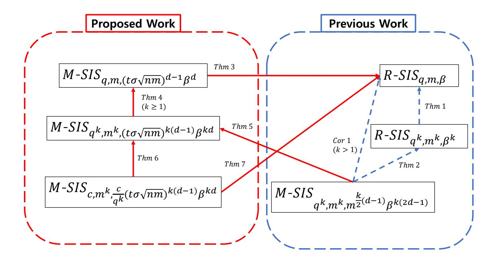
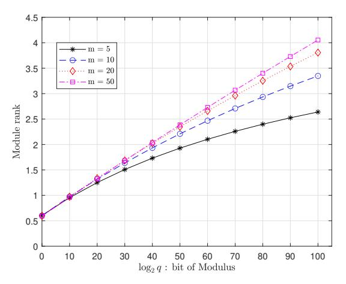
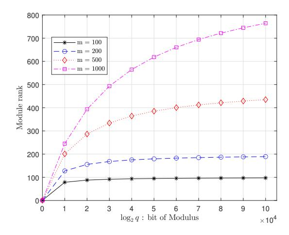
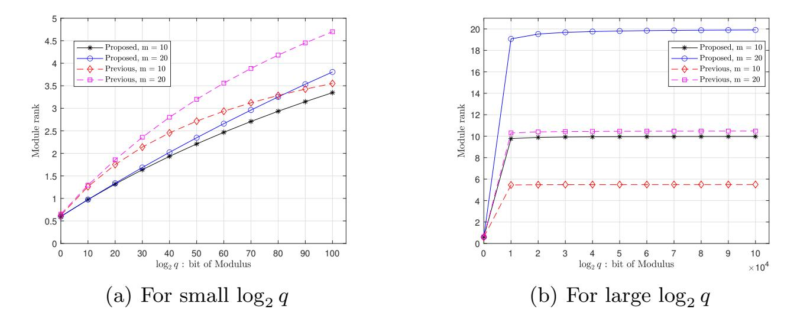

{0}------------------------------------------------

## Improved Reduction Between SIS Problems over Structured Lattices

ZaHyun Koo1 , Yongwoo Lee1 , Joon-Woo Lee1 , Jong-Seon No1 , and Young-Sik Kim2

> 1 Seoul National University, Republic of Korea 2 Chosun University, Republic of Korea

Abstract. Lattice-based cryptographic scheme is constructed based on hard problems on an algebraic structured lattice such as the short integer solution (SIS) problems. These problems are called ring-SIS (R-SIS) and its generalized version, module-SIS (M-SIS). Generally, it has been considered that problems defined on the module-lattice are more difficult than the problems defined on the ideal-lattice. However, Koo, No, and Kim showed that R-SIS is more difficult than M-SIS under some norm constraints of R-SIS. However, this reduction has problems that the rank of the module is limited to about half of the instances of R-SIS, and the comparison is not performed through the same modulus of R-SIS and M-SIS. In this paper, we propose that R-SIS is more difficult than M-SIS with the same modulus under some constraint of R-SIS. Also, we show that R-SIS with the modulus prime q is more difficult than M-SIS with the composite modulus c such that c is divided by q. In particular, it shows that through the reduction from M-SIS to R-SIS with the same modulus, the rank of the module is extended as much as the number of instances of R-SIS from half of the number of instances of R-SIS. Finally, this paper shows that R-SIS is more difficult than M-SIS under some constraint, which is tighter than the M-SIS in the previous work.

Keywords: Lattice-based cryptography · module-short integer solution (M-SIS) problem · ring-short integer solution (R-SIS) problem · short integer solution (SIS) problem.

## 1 Introduction

Many cryptographic schemes are based on problems that are difficult to solve on computers. Representatively, there are cryptographic schemes made by Rivest, Shamir, and Adleman (RSA) based on prime factor decomposition and elliptic curve cryptographic (ECC) scheme based on the discrete logarithm problem (DLP). Since the prime factor decomposition problem and DLP take a long time to solve on computers, both cryptographic schemes have been considered secure. However, due to the quantum computer's development, it is known that many cryptographic schemes can be broken using quantum algorithms operated on quantum computers [14]. Therefore, candidates of cryptographic schemes that 

{1}------------------------------------------------

are resistant to quantum computers have been actively researched. The representative candidates are lattice-based cryptography, code-based cryptography, multivariate polynomial-based cryptography, and so on. Among them, the diverse forms of lattice-based cryptography such as public key cryptographic schemes, signature schemes, and key encapsulation mechanisms are presented in NIST post-quantum cryptography (PQC) standardization competition for the advantages of small-sized key and efficiency as well as security [2].

Lattice-based cryptographic schemes are based on hard problems such as the shortest independent vector problem (SIVP), which is known to reduce to short integer solution (SIS) problem and learning with error (LWE) problem. The SIS problem introduced by Ajtai in 1996 [1] has been used to construct many lattice-based cryptographic schemes. The SIS problem is defined as follows: Let  $\mathbb{Z}$  and  $\mathbb{R}$  denote the set of integers and the set of real numbers, respectively. Let  $\mathbb{Z}_q$  denote the set of integers modulo q. For any positive integers m, n, given positive real number  $\beta \in \mathbb{R}$ , and positive integer q, the SIS problem is to find solution  $\mathbf{z} \in \mathbb{Z}^m$  such that  $\mathbf{A} \cdot \mathbf{z} = \mathbf{0} \mod q$  and  $0 < ||\mathbf{z}|| \le \beta$  for uniformly random matrix  $\mathbf{A} \in \mathbb{Z}_q^{n \times m}$ . Many cryptographic schemes such as signature and commitment schemes [6], [11], [12] can be constructed based on the one-way function. At this time, the one-way function can be constructed based on SIS [4].

However, cryptographic schemes based on SIS are inefficient since the size of the key of the signature scheme or commitment scheme is too large. Many cryptographic schemes based on the structured lattices such as the ideal-lattice and the module-lattice have been proposed to overcome this problem. The ideal-lattice is defined on the lattice with a polynomial ring structure, and the module-lattice is defined on a module structure, which is an algebraic structure that generalizes ring structure and vector space. Then we can define the SIS problem over the structured lattices. The SIS problem defined over an ideal-lattice is said to be ring-SIS (R-SIS) [13] and the SIS problem defined over a module-lattice is said to be module-SIS (M-SIS) [10]. It is shown that R-SIS and M-SIS are as hard as SIVP defined on the ideal-lattice and the module-lattice, respectively [10].

## 1.1 Previous Works

Generally, it has been considered that M-SIS is more difficult than R-SIS in the polynomial ring. For example, suppose that there is an algorithm  $\mathcal{A}$  for solving M-SIS. The instances of R-SIS can be embedded in M-SIS since the polynomial ring defining R-SIS is considered as the module with rank one. Then the algorithm  $\mathcal{A}$  can be used to find the solution of R-SIS. Thus, in lattice-based cryptographic schemes [3], [5], [7], [8], M-SIS having a module structure is preferred due to the fundamental difficulty as well as the reduced key-size and thus, we do not work on the existence of an algorithm to solve the R-SIS.

However, the problems over the module-lattice are not always more difficult than the problems over the ideal-lattice. In the case of SIS over structured lattices, Koo, No, and Kim showed that the R-SIS problem is more difficult than

{2}------------------------------------------------

Fig. 1. Relationship of Reductions between R-SIS and M-SIS for various parameters.

M-SIS for some specific parameters [9]. In other words, there exists a reduction from M-SIS $_{q^k,m^k,\beta'}$  to R-SIS $_{q,m,\beta}$ , where  $\beta'=m^{\frac{k}{2}(d-1)}\beta^{k(2d-1)}$ . To show this, they assign a specific constraint to the upper bound of the norm of the solution of R-SIS. In particular, due to this constraint, the possible range of module rank that can be reduced to R-SIS is limited to  $d<\frac{m+1}{2}$  for sufficiently large modulus q. Also, this reduction showed the relationship between R-SIS with m instances and modulus q and M-SIS with  $m^k$  instances and modulus  $q^k$  for some k>1. In other words, this reduction cannot be said that it is established for the same modulus and the same instances.

#### 1.2 Contributions

In this paper, we propose the improved reduction from M-SIS to R-SIS compared to the previous work [9]. Similar to the previous work, the proposed reduction considers some condition of the upper bound  $\beta$  on the norm of the solution of R-SIS. However, there are three differences between the previous work and the proposed reduction. First, we propose a new method to find m distinct solutions of instances of R-SIS $_{q,m,\beta}$ . Using this method, we obtain the reduction from M-SIS $_{q,m,\beta_1}$  to R-SIS $_{q,m,\beta}$ , where  $\beta_1 = (t\sigma\sqrt{n\cdot m})^{d-1}\beta^d$  in Theorem 3. In particular, we can see that the possible range of module rank that allows to the reduction from M-SIS to R-SIS is doubled compared to that in the previous work [9]. Second, we propose that M-SIS $_{q,m,\beta_1}$  is more difficult than M-SIS $_{q^k,m^k,\beta_3}$ , where  $\beta_3 = m^{\frac{k}{2}(d-1)}\beta^{k(2d-1)}$  for  $k \geq 1$ . To show this, first, we show the reduction from M-SIS $_{q^k,m^k,\beta^k}$  to M-SIS $_{q,m,\beta}$  in Theorem 4, where there is no constraint on  $\beta$ , that is,  $\beta$  can be  $t\sigma\sqrt{n\cdot m}\beta$  as in Fig. 1. Using this, the modulus and the number of instances of M-SIS $_{q^k,m^k,\beta_2}$  are matched with M-SIS $_{q^k,m^k,\beta_3}$  as in Fig. 1.

{3}------------------------------------------------

Then, we show a reduction from M-SIS $q^k,m^k,\beta_3$  to M-SIS $q,m,\beta_2$  for some  $k \geq 1$  by comparing the upper bound of the solution of M-SIS in Theorem 5. Thirdly, we propose a reduction between M-SIS with different modulus, that is, there exists a reduction from M-SIS $c,m^k,\gamma$  to M-SIS $q^k,m^k,\beta_2$ , where c is a composite integer that has a factor  $q^k$  and  $\gamma = \frac{c}{q^k}\beta_2$  for some  $k \geq 1$ . in Theorem 6. Thus, as the modulus of M-SIS becomes large, M-SIS becomes less secure. Combining three reductions, that is, Theorems 3, 4, and 6, we propose the following main result, Theorem 7 (See Subsection 4.3 for details):

**Main Result.** Let m be a positive integer and q be a prime. Let c be a composite integer such that c is divided by  $q^k$  for some  $k \geq 1$ . Let  $D_{R,\sigma}$  be the discrete Gaussian distribution with deviation  $\sigma$ . Choose a module rank  $d \in \mathbb{Z}_{>0}$  such that

$$\sqrt{n \cdot m} \cdot q^{\frac{1}{m}} < \frac{\sqrt[d]{q \cdot t\sigma\sqrt{n \cdot m}}}{t\sigma\sqrt{n \cdot m}}.$$

Let a positive real number  $\beta$  be an upper bound on the norm of the solution of  $R\text{-}SIS_{q,m,\beta}$  such that

$$\sqrt{n \cdot m} \cdot q^{\frac{1}{m}} \le \beta < \frac{\sqrt[d]{q \cdot t\sigma\sqrt{n \cdot m}}}{t\sigma\sqrt{n \cdot m}}.$$

Assume that an algorithm  $\mathcal{A}$  exists for solving  $R\text{-}SIS_{q,m,\beta}$ . Then there exists an algorithm  $\mathcal{A}'$  for solving  $M\text{-}SIS_{c,m,\gamma}$ , where  $\gamma = \frac{c}{q^k}(t\sigma\sqrt{n\cdot m})^{k(d-1)}\beta^{kd}$ .

#### 1.3 Organization

The remainder of this paper is organized as follows: In Section 2, SIS problems on ideal and module lattices are introduced and we also introduce the results of the previous works. In Section 3, we propose a new method to find m distinct solutions for R-SIS. Using this method, we derive the reduction from M-SIS $_{q,m,(t\sigma\sqrt{n\cdot m})^{d-1}\beta^d}$  to R-SIS $_{q,m,\beta}$ . Also, we show the possible range of module rank of the proposed reduction. And it shows the comparison with the range in [9]. Section 4 proposes the various reductions among the M-SIS problems, which lead to the reduction from M-SIS $_{c,m^k,\frac{c}{q^k}(t\sigma\sqrt{n\cdot m})^{k(d-1)}\beta^{kd}}$  to R-SIS $_{q,m,\beta}$  for the modulus c such that  $q^k|c$  for some  $k \geq 1$ . Finally the conclusion and suggested future works are provided in Section 5.

#### 2 Preliminaries

### 2.1 Structured Lattices

Notations: Let D be a distribution over some finite set S, and then  $x \leftarrow D$  means that x is chosen from the distribution D. Let  $\mathcal{A}$  be an algorithm, and then  $x \to \mathcal{A}$  means that  $\mathcal{A}$  inputs x and  $y \leftarrow \mathcal{A}$  means that  $\mathcal{A}$  outputs y.

{4}------------------------------------------------

Ideals and Modules: Let  $\Phi(X)$  be a monic irreducible polynomial of degree n and  $\mathbb{Q}$  be the set of rational numbers. We use the 2n-th cyclotomic polynomial  $\Phi(X) = X^n + 1$  with  $n = 2^s$  for some positive integer s. Define R as the ring  $\mathbb{Z}[X]/\langle \Phi(X) \rangle$ . Conveniently, we refer to R as the polynomial ring. A non-empty set  $I \subseteq R$  is an ideal of R if I is additive subgroup of R and for all  $r \in R$  and all  $x \in I$ ,  $r \cdot x \in I$ . The quotient ring R/I is the set of equivalence classes r+I of R modulo I. Let q be the positive integer and define  $R_q = R/qR$ . Define  $M \subseteq R^d$  as an R-module if M is closed under addition and under scalar multiplication by elements of R. It is known that M/qM is isomorphic to  $R_q^d$  [10]. The element of  $R_q^d$  is denoted by the vector  $\mathbf{a}$  whose entry is an element of polynomial ring, that is,  $\mathbf{a} = (a_1(X), \ldots, a_d(X)) \in R_q^d$ . A matrix is denoted by uppercase letter in bold.

Norms: For each  $a = a(X) \in R$ , let  $a(X) = \sum_{i=0}^{n-1} c_i X^i$  for  $c_i \in \mathbb{Z}$ . Then we define the norm of a as

$$||a|| = ||a(X)|| = \left(\sum_{i=0}^{n-1} c_i^2\right)^{1/2}.$$

Similarly, for each  $\mathbf{a} = (a_1(X), \dots, a_d(X)) = (a_1, \dots, a_d) \in \mathbb{R}^d$ , where  $a_i = a_i(X) = \sum_{j=0}^{n-1} c_{ij} X^j$  for all  $i = 1, \dots, d$ , we define the norm of  $\mathbf{a}$  as

$$\|\mathbf{a}\| = \left(\sum_{i=1}^{d} \|a_i(X)\|^2\right)^{1/2} = \left(\sum_{i=1}^{d} \sum_{j=0}^{n-1} c_{ij}^2\right)^{1/2}.$$

Lattices: An *n*-dimensional lattice is a discrete subgroup of  $\mathbb{R}^n$ , where  $\mathbb{R}$  is the set of real numbers. Specifically, for linearly independent vectors  $\{\mathbf{b}_1, \ldots, \mathbf{b}_n\}$ ,  $\mathbf{b}_i \in \mathbb{R}^n$ , for all  $i = 1, \ldots, m$ , the set

$$\mathcal{L} = \mathcal{L}(\mathbf{b}_1, \dots, \mathbf{b}_n) = \left\{ \sum_{i=1}^n x_i \mathbf{b}_i : x_i \in \mathbb{Z} \right\}$$

is a lattice in  $\mathbb{R}^n$  with the basis  $\{\mathbf{b}_1, \dots, \mathbf{b}_n\}$ . A lattice is an *ideal lattice* if it is isomorphic to some ideal I of R. Similarly, a lattice is a *module lattice* if it is isomorphic to some R-module M [10].

Discrete Gaussian distribution: The Gaussian function of center  $\mathbf{c} \in \mathbb{R}^n$  and width parameter  $\sigma$  is defined as  $\rho_{\sigma,\mathbf{c}}(\mathbf{x}) = \exp(-\pi \frac{\|\mathbf{x} - \mathbf{c}\|^2}{\sigma^2})$  for all  $\mathbf{x} \in \mathbb{R}^n$ . The discrete Gaussian distribution over a lattice  $\mathcal{L}$  is defined as  $D_{\mathcal{L},\sigma,\mathbf{c}} = \frac{\rho_{\sigma,\mathbf{c}}(\mathbf{x})}{\rho_{\sigma,\mathbf{c}}(\mathcal{L})}$ , where  $\rho_{\sigma\mathbf{c}}(\mathcal{L}) = \sum_{\mathbf{x} \in \mathcal{L}} \rho_{\sigma,\mathbf{c}}(\mathbf{x})$ .

Tailcut: We use the fact that  $\Pr_{x \leftarrow D_{\mathbb{Z},\sigma}}[|x| > t\sigma] \le \operatorname{erfc}(\frac{t}{\sqrt{2}})$ , where  $\operatorname{erfc}(x) = 1 - \frac{2}{\pi} \int_0^x \exp(-t^2) dt$ . Then, a vector  $\mathbf{x} \leftarrow D_{\mathcal{L},\sigma}$  would have small norm  $\|\mathbf{x}\| \le t\sigma \sqrt{n}$  with overwhelming probability.

{5}------------------------------------------------

#### 2.2 Short Integer Solution Problems

First, we define the *short integer solution* (SIS) problem over the lattice, which is used in many lattice-based cryptographic schemes such as signature scheme and commitment scheme. This problem defined by Ajtai [1] is given as follows:

**Definition 1 ([1]).** The SIS problem is defined as follows: Given  $\mathbf{A} \in \mathbb{Z}_q^{n \times m}$  chosen from the uniform distribution, the SIS is to find  $\mathbf{z} = (z_1, \dots, z_m)^T \in \mathbb{Z}^m$  such that  $\mathbf{A} \cdot \mathbf{z} = 0 \mod q$  and  $0 < ||\mathbf{z}|| \le \beta$ .

To guarantee the non-trivial solution  $\mathbf{z} \in \mathbb{Z}^m$  of SIS, the upper bound  $\beta$  of the norm of the solution of SIS is less than the modulus q. Indeed, if  $\beta \geq q$  and  $\mathbf{A} \in \mathbb{Z}^{n \times m}$ , then we take the solution  $\mathbf{z} = (q, 0, \dots, 0)^T \in \mathbb{Z}^m$  and we obtain  $\|\mathbf{z}\| = q \leq \beta$  and  $\mathbf{A} \cdot \mathbf{z} = 0 \mod q$ .

This problem is extended to the structured lattices, which are ideal lattice and module lattice. Since the instance of R-SIS is polynomial, the key size of the signature scheme based on R-SIS can be smaller than that of a signature scheme based on SIS. The module structure is a generalized structure of the ring, and R-SIS can be extended to the module lattice, which is termed as M-SIS. These problems are defined as follows:

**Definition 2** ([10], [13]). The problem R- $SIS_{q,m,\beta}$  is defined as follows: Given  $a_1, \ldots, a_m \in R_q$  chosen independently from the uniform distribution, the R-SIS problem is to find  $z_1, \ldots, z_m \in R$  such that  $\sum_{i=1}^m a_i \cdot z_i = 0 \mod q$  and  $0 < ||\mathbf{z}|| \le \beta$ , where  $\mathbf{z} = (z_1, \ldots, z_m)^T \in R^m$ .

**Definition 3 ([10], [13]).** Similarly, the problem M-SIS $_{q,m,\beta}$  is defined as follows: Given  $\mathbf{a}_1, \ldots, \mathbf{a}_m \in R_q^d$  chosen independently from uniform distribution, the M-SIS problem is to find  $\mathbf{z} = (z_1, \ldots, z_m)^T \in R^m$  such that  $\sum_{i=1}^m \mathbf{a}_i \cdot z_i = 0 \mod q$  and  $0 < ||\mathbf{z}|| \le \beta$ .

#### 2.3 Reduction from M-SIS to R-SIS

Generally, the M-SIS problem is more difficult than the R-SIS problem. Indeed, suppose that an algorithm  $\mathcal{A}$  exists for solving M-SIS and let  $a_1, \ldots, a_m \in R_q$  be instances of R-SIS. Also, we choose  $a_2^{(j)}, \ldots, a_d^{(j)} \in R_q$  from uniform distribution over  $R_q$  for all  $j = 1, \ldots, m$ , where d is a module rank. Then  $\mathbf{a}_j = (a_1, a_2^{(j)}, \ldots, a_d^{(j)})$  and  $\mathbf{a}_1, \ldots, \mathbf{a}_m$  are instances of M-SIS. Using the algorithm  $\mathcal{A}$  for solving M-SIS, we obtain a solution  $\mathbf{z} = (z_1, \ldots, z_m)^T$  such that

$$\sum_{i=1}^{m} \mathbf{a}_{i} \cdot z_{i} = \left(\sum_{i=1}^{m} a_{i} \cdot z_{i}, \sum_{i=1}^{m} a_{2}^{(i)} \cdot z_{i}, \dots, \sum_{i=1}^{m} a_{d}^{(i)} \cdot z_{i}\right) = \mathbf{0} \mod q$$

with  $\|\mathbf{z}\| \leq \beta$ . Since  $\sum_{i=1}^{m} a_i \cdot z_i = 0 \mod q$  and  $\|\mathbf{z}\| \leq \beta$ , we find the solution of the instance of R-SIS. However, Koo, et al., showed that R-SIS is more difficult than M-SIS under norm constraints of R-SIS [9]. To show the reduction from M-SIS to R-SIS, Koo, et al., showed it in two steps. The first step is that there exists a reduction from R-SIS $q^k, m^k, \beta^k$  to R-SIS $q, m, \beta$  as follows:

{6}------------------------------------------------

**Theorem 1** ([9]). Let m be a positive integer and q be a prime. Choose the upper bound of the norm,  $\beta \in \mathbb{R}$  such that  $\beta \geq \sqrt{n \cdot m} \cdot q^{\frac{1}{m}}$  and  $q \geq \beta \sqrt{n} \omega(\log n)$ . Assume that there exists an algorithm  $\mathcal{A}$  for solving the R-SIS $_{q,m,\beta}$  problem. Then there exists an algorithm  $\mathcal{A}'$  for solving the R-SIS $_{q^k,m^k,\beta^k}$  for any integer  $k \geq 1$ , which corresponds to the reduction from R-SIS $_{q^k,m^k,\beta^k}$  to R-SIS $_{q,m,\beta}$ .

In Theorem 1, the condition  $\beta \geq \sqrt{n \cdot m} \cdot q^{\frac{1}{m}}$  is essential since it is the condition to guarantee the solution of  $R\text{-}SIS_{q,m,\beta}$ . And the solution of  $R\text{-}SIS_{q^k,m^k,\beta^k}$  is obtained using the solution of  $R\text{-}SIS_{q,m,\beta}$ . Since each solution of  $\mathbf{z}$  of  $R\text{-}SIS_{q,m,\beta}$  is relatively prime to q, the solution of  $R\text{-}SIS_{q^k,m^k,\beta^k}$  is also relatively prime to q. Thus, we can assume that the solution  $\mathbf{z}$  of  $R\text{-}SIS_{q^k,m^k,\beta^k}$  satisfies  $\gcd(\mathbf{z},q)=1$ .

To the second step, we need to find as many distinct solutions as the number of instances for the same instances of R-SIS. However, finding distinct solutions for the same instances of R-SIS is difficult since details of the algorithms' process for solving R-SIS are not known. To resolve this problem, we use the following lemma.

Lemma 1 ([9]). Let m be a positive integer. Let k > 1 be a positive integer and q be a prime. Let  $\beta$  be a real number such that  $\max(q, \sqrt{n \cdot m} \cdot q^{\frac{k}{m}}) \leq \beta$ . Assume that an algorithm  $\mathcal{A}'$  exists for solving  $R\text{-}SIS_{q^k,m,\beta}$  such that  $\mathcal{A}'$  outputs a solution  $\mathbf{z} \in R^m$  with  $\gcd(\mathbf{z},q) = 1$ . Let  $a_1, \ldots, a_m \in R_{q^k}$  be instances of  $R\text{-}SIS_{q^k,m,\beta}$ . Then we can find m distinct solutions  $\bar{\mathbf{z}}^{(j)} = (\bar{z}_1^{(j)}, \ldots, \bar{z}_m^{(j)})^T \in R^m$  with  $\|\bar{\mathbf{z}}^{(j)}\| \leq \beta^2$  such that  $\sum_{i=1}^m a_i \cdot \bar{z}_i^{(j)} = 0 \mod q^k$  for all  $j = 1, \ldots, m$ .

In Lemma 1, since the modulus is  $q^k$ , we assume that the upper bound  $\beta$  of the norm of the solution of  $R\text{-}SIS_{q^k,m,\beta}$  is larger than the prime q without loss of generality. This assumption implies that we can find m distinct solutions that have the norm less than or equal to  $\beta^2$ , that is, the upper bound of the norm of the solution of  $R\text{-}SIS_{q^k,m,\beta}$  becomes large, which means the loose bound.

The following theorem shows the second step that there exists a reduction from M-SIS $q^k,m,\beta'$  to R-SIS $q^k,m,\beta$  using Lemma 1.

**Theorem 2** ([9]). Let m be a fixed positive integer. Let k > 1 be a positive integer and q be a prime. Choose a module rank  $d \in \mathbb{Z}$  such that

$$\max(q, \sqrt{n \cdot m} \cdot q^{\frac{k}{m}}) < \sqrt[2d-1]{q^k/(\sqrt{m})^{(d-1)}}.$$

Let a positive real number  $\beta$  be an upper bound of the norm of the solution of  $R\text{-}SIS_{q^k,m,\beta}$  such that

$$\max(q, \sqrt{n \cdot m} \cdot q^{\frac{k}{m}}) \le \beta,$$

where  $\beta < \sqrt[2d-1]{q^k/(\sqrt{m})^{(d-1)}}$ . Assume that an algorithm  $\mathcal{A}'$  exists for solving the  $R\text{-}SIS_{q^k,m,\beta}$  problem such that  $\mathcal{A}'$  outputs a solution  $\mathbf{z} \in R^m$  with  $\gcd(\mathbf{z},q) = 1$ . Then an algorithm  $\mathcal{A}''$  exists for solving the  $M\text{-}SIS_{q^k,m,\beta'}$  problem with module rank d, where  $\beta' = m^{\frac{1}{2}(d-1)}\beta^{(2d-1)}$ ; that is, there exists a reduction from  $M\text{-}SIS_{q^k,m,\beta'}$  to  $R\text{-}SIS_{q^k,m,\beta}$ .

{7}------------------------------------------------

Combining Theorems 1 and 2, we can show that there exists the reduction from M-SISq k,mk,β0 to R-SISq,m,β with β 00 = m k 2 (d−1)β k(2d−1) as in the following corollary.

Corollary 1 ([9]). Let m be a fixed positive integer. Let k > 1 be a positive integer and q be a prime. Choose a module rank d ∈ Z such that

$$\sqrt{n \cdot m} \cdot q^{\frac{1}{m}} < \sqrt[2d-1]{q^k/(\sqrt{m})^{(d-1)}}.$$
 (1)

Let a positive real number β be an upper bound on the norm of the solution of R-SISq,m,β such that

$$\sqrt{n \cdot m} \cdot q^{\frac{1}{m}} \le \beta,$$

where β < 2d−p1 q k/( √ m) (d−1). Assume that an algorithm A exists for solving the R-SISq,m,β problem. Then an algorithm A00 exists for solving M-SISq k,mk,β00 problem with module rank d, where β 00 = m k 2 (d−1)β k(2d−1); that is, there exists a reduction from M-SISq k,mk,β00 to R-SISq,m,β.

## 2.4 Range of Module Rank for Previous Work

The module rank d is determined by (1) in Corollary 1. Since n is the dimension of the polynomial ring R and m is the number of instances of R-SIS, these parameters are fixed. Thus, the module rank d depends only on the modulus prime q, with fixed parameters n and m. By modifying (1), we have the range of module rank, where the reductions in Corollary 1 is possible, as follows:

$$d < \frac{2(m+1)\log q + 2m\log m + m\log n}{4\log q + 2m\log m + 2m\log n}.$$
 (2)

Then we have

$$d < \frac{m+1}{2}$$

for sufficiently large q [9]. Thus, the possible module rank d which enables the reduction from M-SISq k,mk,β00 to R-SISq,m,β is upper bounded by m+1 2 for sufficiently large q, where β 00 = m k 2 (d−1)β k(2d−1) .

## 3 Reduction from M-SIS to R-SIS

In this section, we propose a new method to find m distinct solutions for instances of R-SIS. In particular, the m distinct solutions are linearly independent over Rq. Using m distinct solutions, we obtain the solution for instances of M-SIS. Similar to the previous work [9], there is a range of module rank that allows the reduction from M-SIS to R-SIS. However, the proposed work shows that the range is doubled compared to the previous work.

{8}------------------------------------------------

# 3.1 Reduction from M-SIS to R-SIS for the Same Modulus and the Number of Instances

We propose a new method of finding m distinct solutions of an instances of R-SIS. Finding distinct solutions for the same instances of R-SIS is difficult since details of the algorithms' process for solving R-SIS are not known. For example, if the algorithm  $\mathcal{A}$  for solving R-SIS is deterministic, then this algorithm outputs the same solution for the same instance. To overcome this problem, we devise a method to add randomness before using the algorithm for solving R-SIS. The following lemma shows how to find m distinct solutions using randomness.

**Lemma 2.** Let m be a positive integer and q be a prime. Let  $D_{R,\sigma}$  be the discrete Gaussian distribution with deviation  $\sigma$ . Choose a real number  $\beta$  such that

$$\sqrt{n \cdot m} \cdot q^{\frac{1}{m}} \le \beta < \frac{q}{t\sigma\sqrt{n}}.$$

Suppose that there exists an algorithm  $\mathcal{A}$  for solving  $R\text{-}SIS_{q,m,\beta}$ . Let  $a_1,\ldots,a_m \in R_q$  be chosen independently from uniform distribution. Then there exist m linearly independent solutions  $\bar{\mathbf{z}}^{(j)} = (\bar{z}_1^{(j)},\ldots,\bar{z}_m^{(j)}) \in R^m$  such that  $\sum_{i=1}^m a_i \cdot \bar{z}^{(j)} = 0 \mod q$  with  $\|\bar{\mathbf{z}}^{(j)}\| \leq \beta t \sigma \sqrt{n}$  for all  $j = 1,\ldots,m$ .

Proof. (Step 1) Let  $r_1^{(1)}, \ldots, r_m^{(1)} \leftarrow D_{R,\sigma}$  and let  $\mathbf{a}^{(1)} = (a_1 \cdot r_1^{(1)}, \ldots, a_m \cdot r_m^{(1)})$ . Then  $\mathbf{a}^{(1)}$  is uniform and we can consider  $\mathbf{a}^{(1)}$  as an instance of R-SIS $_{q,m,\beta}$ . Using the algorithm  $\mathcal{A}$  for solving R-SIS $_{q,m,\beta}$ , we obtain a solution  $\mathbf{z}^{(1)} = (z_1^{(1)}, \ldots, z_m^{(1)})$  such that  $\sum_{i=1}^m a_i \cdot r_i^{(1)} \cdot z_i^{(1)} = 0 \mod q$  with  $\|\mathbf{z}^{(1)}\| \leq \beta$ . Denote  $\bar{\mathbf{z}}^{(1)} = (r_1^{(1)} \cdot z_1^{(1)}, \ldots, r_m^{(1)} \cdot z_m^{(1)})$ . Then  $\bar{\mathbf{z}}^{(1)}$  is a solution of  $(a_1, \ldots, a_m)$  with  $\|\bar{\mathbf{z}}^{(1)}\| \leq \beta t \sigma \sqrt{n}$ . Since  $\beta t \sigma \sqrt{n}$  is less than q, we consider  $r_i^{(1)}, z_i^{(1)} \in R$  as  $r_i^{(1)}, z_i^{(1)} \in R_q$  for all  $i = 1, \ldots, m$ .

(Step 2) Let  $r_1^{(2)}, \ldots, r_m^{(2)} \leftarrow D_{R,\sigma}$  and let  $\mathbf{a}^{(2)} = (a_1 \cdot r_1^{(2)}, \ldots, a_m \cdot r_m^{(2)})$ . Then  $\mathbf{a}^{(2)}$  is uniform and we can consider  $\mathbf{a}^{(2)}$  as an instance of R-SIS $q,m,\beta$ . Through the above process, we obtain a solution  $\bar{\mathbf{z}}^{(2)} = (r_1^{(2)} \cdot z_1^{(2)}, \ldots, r_m^{(2)} \cdot z_m^{(2)})$  with  $\|\bar{\mathbf{z}}^{(2)}\| \leq \beta t \sigma \sqrt{n}$ . Also, we consider  $r_i^{(2)}, z_i^{(2)} \in R$  as  $r_i^{(2)}, z_i^{(2)} \in R_q$  for all  $i = 1, \ldots, m$ .

Let  $\bar{\mathbf{z}}^{(1)}$  be fixed and let  $S_1 = \operatorname{span}_{R_q}(\bar{\mathbf{z}}^{(1)}) = \{k_1 \cdot \bar{\mathbf{z}}^{(1)} \mid k_1 \in R_q\}$  and

$$T_{1} = \{ \bar{\mathbf{z}}^{(2)} = (r_{1}^{(2)} \cdot z_{1}^{(2)}, \dots, r_{m}^{(2)} \cdots z_{m}^{(2)}) \mid r_{1}^{(2)}, \dots, r_{m}^{(2)} \leftarrow D_{R,\sigma},$$

$$(a_{1} \cdot r_{1}^{(2)}, \dots, a_{m} \cdot r_{m}^{(2)}) \to \mathcal{A}, \text{ and } \mathbf{z}^{(2)} = (z_{1}^{(2)}, \dots, z_{m}^{(2)}) \leftarrow \mathcal{A} \}.$$

Since  $S_1$  is determined by an element  $k_1 \in R_q$ , we obtain  $|S_1| = q^n$ . However,  $\bar{\mathbf{z}}^{(2)}$  is determined by an element in  $R_q$  and  $r_i^{(2)}$  for all  $i = 1, \ldots, m$ , whether  $\bar{\mathbf{z}}^{(2)}$  belongs to  $S_1$  or not. Thus, we obtain  $|T_1| = q^{n(m+1)}$ . Then  $|S_1 \cap T_1| \leq |S_1| \ll |T_1|$ . If  $\bar{\mathbf{z}}^{(2)}$  is in  $S_1$ , then we repeat Step 2 until  $\bar{\mathbf{z}}^{(1)}$  and  $\bar{\mathbf{z}}^{(2)}$  are linearly independent, which is possible from  $|S_1| \ll |T_1|$ .

Now, assume that  $\bar{\mathbf{z}}^{(1)}, \dots, \bar{\mathbf{z}}^{(j-1)} \in R^m$  are linearly independent solutions of  $(a_1, \dots, a_m)$  such that  $\|\bar{\mathbf{z}}^{(k)}\| \leq \beta t \sigma \sqrt{n}$  for all  $k = 1, \dots, j-1$ .

{9}------------------------------------------------

(Step 3) Let  $r_1^{(j)}, \ldots, r_m^{(j)} \leftarrow D_{R,\sigma}$  and let  $\mathbf{a}^{(j)} = (a_1 \cdot r_1^{(j)}, \ldots, a_m \cdot r_m^{(j)})$ . Through the above process, we obtain a solution  $\bar{\mathbf{z}}^{(j)} = (r_1^{(j)} \cdot z_1^{(j)}, \ldots, r_m^{(j)} \cdot z_m^{(j)})$  with  $\|\bar{\mathbf{z}}^{(j)}\| \leq \beta t \sigma \sqrt{n}$ . Also, we consider  $r_i^{(j)}, z_i^{(j)} \in R$  as  $r_i^{(j)}, z_i^{(j)} \in R_q$  for all  $i = 1, \ldots, m$ . Let  $\bar{\mathbf{z}}^{(1)}, \ldots, \bar{\mathbf{z}}^{(j-1)}$  be fixed and let

$$S_{j-1} = \operatorname{span}_{R_q}(\bar{\mathbf{z}}^{(1)}, \dots, \bar{\mathbf{z}}^{(1)})$$
  
=  $\{k_1 \cdot \bar{\mathbf{z}}^{(1)} + \dots + k_{j-1} \cdot \bar{\mathbf{z}}^{(j-1)} \mid k_i \in R_q \text{ for } i = 1, \dots, j-1\}$ 

and

$$T_{j-1} = \{ \bar{\mathbf{z}}^{(j)} = (r_1^{(j)} \cdot z_1^{(j)}, \dots, r_m^{(j)} \cdots z_m^{(j)}) \mid r_1^{(j)}, \dots, r_m^{(j)} \leftarrow D_{R,\sigma},$$

$$(a_1 \cdot r_1^{(j)}, \dots, a_m \cdot r_m^{(j)}) \to \mathcal{A}, \text{ and } \mathbf{z}^{(j)} = (z_1^{(j)}, \dots, z_m^{(j)}) \leftarrow \mathcal{A} \}.$$

Then  $|S_{j-1}| = q^{n(j-1)}$  since  $S_{j-1}$  is determined by elements  $k_1, \ldots, k_{j-1} \in R_q$ . However,  $\bar{\mathbf{z}}^{(j)}$  is determined by an element in  $R_q$  and  $r_i^{(j)}$  for all  $i = 1, \ldots, m$  whether  $\bar{\mathbf{z}}^{(j)}$  belongs to  $S_{j-1}$  or not. Thus, we obtain  $|T_{j-1}| = q^{n(m+1)}$ . Then  $|S_{j-1} \cap T_{j-1}| \leq |S_{j-1}| \ll |T_{j-1}|$ . If  $\bar{\mathbf{z}}^{(j)}$  is in  $S_{j-1}$ , then we repeat Step 3 until  $\bar{\mathbf{z}}^{(1)}, \bar{\mathbf{z}}^{(2)}, \ldots, \bar{\mathbf{z}}^{(j)}$  are linearly independent, which is also possible from  $|S_{j-1}| \ll |T_{j-1}|$ . If we repeat this process m times, then we can find m linearly independent solutions  $\bar{\mathbf{z}}^{(j)} = (\bar{z}_1^{(j)}, \ldots, \bar{z}_m^{(j)}) = (r_1^{(j)} \cdot z_1^{(j)}, \ldots, r_m^{(j)} \cdot z_m^{(j)})$  such that  $\sum_{i=1}^m a_i \cdot r_i^{(j)} \cdot z_i^{(j)} = 0 \mod q$  with  $\|\bar{\mathbf{z}}^{(j)}\| \leq \beta t \sigma \sqrt{n}$  for all  $i = 1, \ldots, m$ .

The above solutions are not exact solutions of  $R\text{-}SIS_{q,m,\beta}$ , but we can use these solutions to find the solution of M-SIS. Now, we prove the reduction from M-SIS to R-SIS using Lemma 2. The proof of the following theorem is the same as that of Theorem 2. However, the upper bound of the solution of R-SIS is changed since we use Lemma 2. Also, the condition for  $\beta$  is changed as in the following theorem, where the reduction from M-SIS to R-SIS is satisfied.

**Theorem 3.** Let m be a positive integer and q be a prime. Let  $D_{R,\sigma}$  be the discrete Gaussian distribution with deviation  $\sigma$ . Choose a module rank  $d \in \mathbb{Z}_{>0}$  such that

$$\sqrt{n \cdot m} \cdot q^{\frac{1}{m}} < \frac{\sqrt[d]{q \cdot t\sigma\sqrt{n \cdot m}}}{t\sigma\sqrt{n \cdot m}}.$$
 (3)

Let a positive real number  $\beta$  be an upper bound on the norm of the solution of  $R\text{-}SIS_{q,m,\beta}$  such that

$$\sqrt{n \cdot m} \cdot q^{\frac{1}{m}} \le \beta < \frac{\sqrt[d]{q \cdot t\sigma\sqrt{n \cdot m}}}{t\sigma\sqrt{n \cdot m}}.$$

Assume that an algorithm  $\mathcal{A}$  exists for solving R-SIS $_{q,m,\beta}$ . Then there exists an algorithm  $\mathcal{A}_1$  for solving M-SIS $_{q,m,\beta_1}$ , where  $\beta_1 = (t\sigma\sqrt{n\cdot m})^{d-1}\beta^d$ .

{10}------------------------------------------------

*Proof.* Let  $\mathbf{a}_1, \ldots, \mathbf{a}_m \in R_q^d$  be instances of M-SIS $q^k, m, \beta$ , which are chosen independently from the uniform distribution, where  $\mathbf{a}_i = (a_{i1}, \ldots, a_{id})^T$  and  $a_{ij} \in R_q$ . Then we can write the matrix

$$\mathbf{A} = \begin{bmatrix} a_{11} \ a_{21} \cdots a_{m1} \\ a_{12} \ a_{22} \cdots a_{m2} \\ \vdots \ \vdots \ \vdots \ \vdots \\ a_{1d} \ a_{2d} \cdots a_{md} \end{bmatrix} = \begin{bmatrix} \mathbf{a}'_1 \\ \mathbf{a}'_2 \\ \vdots \\ \mathbf{a}'_d \end{bmatrix} \in R_q^{d \times m},$$

where  $\mathbf{a}'_i = (a_{1i}, \dots, a_{mi})$ . Then the *i*-th row  $\mathbf{a}'_i$  of  $\mathbf{A}$  is considered as an instance of R-SIS. Consider the last row  $\mathbf{a}'_d$  of  $\mathbf{A}$ . Then there are m distinct solutions  $\bar{\mathbf{z}}_d^{(j)} = (\bar{z}_{d,1}^{(j)}, \dots, \bar{z}_{d,m}^{(j)})^T$  with  $\|\bar{\mathbf{z}}_d^{(j)}\| \leq (t\sigma\sqrt{n})\beta$  such that  $\mathbf{a}'_d \cdot \bar{\mathbf{z}}_d^{(j)} = 0 \mod q^k$  for  $j = 1, \dots, m$ . Now, we construct the  $m \times m$  solution matrix

$$\bar{\mathbf{Z}}_d = \left[ \bar{\mathbf{z}}_d^{(1)} \ \bar{\mathbf{z}}_d^{(2)} \cdots \ \bar{\mathbf{z}}_d^{(m)} \right]$$

and  $\|\bar{\mathbf{Z}}_d\|(t\sigma\sqrt{n\cdot m})\beta$ . Then, we have

$$\mathbf{A} \cdot \bar{\mathbf{Z}}_d = \begin{bmatrix} \mathbf{a}_1'' \ \mathbf{a}_2'' \ \vdots \ \mathbf{a}_{d-1}'' \ \mathbf{0} \end{bmatrix} \mod q,$$

where  $\mathbf{a}_i''$  is an *m*-tuple vector. Applying the above method d-1 times, we obtain the solution matrix

$$\mathbf{A}^* = \mathbf{A} \cdot \bar{\mathbf{Z}}_d \cdots \bar{\mathbf{Z}}_2 = \begin{bmatrix} \mathbf{a}_1^* \ \mathbf{0} \ \vdots \ \mathbf{0} \end{bmatrix} \mod q.$$

Finally, applying the algorithm  $\mathcal{A}$  to  $\mathbf{a}_1^*$ , we find a solution  $\mathbf{z}'$  with  $\|\mathbf{z}'\| \leq \beta$  such that  $\mathbf{A}^* \cdot \mathbf{z}' = \mathbf{0} \mod q$ . Then, we have the solution  $\mathbf{z} = \bar{\mathbf{Z}}_d \cdots \bar{\mathbf{Z}}_2 \cdot \mathbf{z}'$  for  $\mathbf{A}$ . Then  $\mathbf{A} \cdot \mathbf{z} = \mathbf{0} \mod q$  and

$$\|\mathbf{z}\| = \|\bar{\mathbf{Z}}_d \cdots \bar{\mathbf{Z}}_2 \cdot \mathbf{z}'\|$$

$$\leq \left(\sqrt{m} \cdot \beta t \sigma \sqrt{n}\right)^{d-1} \cdot \beta$$

$$\leq \left(t \sigma \sqrt{n \cdot m}\right)^{d-1} \beta^d.$$

From (1), we have that the upper bound  $\beta_1 = (t\sigma\sqrt{n\cdot m})^{d-1}\beta^d$  on the norm of the solution of M-SISq,m,\beta\_1 is less than q since

$$(t\sigma\sqrt{n\cdot m})^{d-1}\beta^d < (t\sigma\sqrt{n\cdot m})^{d-1}\left(\frac{\sqrt[d]{q\cdot t\sigma\sqrt{n\cdot m}}}{t\sigma\sqrt{n\cdot m}}\right)^d$$

$$= q.$$

{11}------------------------------------------------

- (a) Module rank for small number bits of modulus
- (b) Convergence of module rank

**Fig. 2.** Rank of module when  $n = 2^{16}$  from (4) in Section 3.2.

Thus, we find a non-trivial solution of  $M\text{-}SIS_{q,m,\beta_1}$  and show that there exists a reduction from  $M\text{-}SIS_{q,m,\beta_1}$  to  $R\text{-}SIS_{q,m,\beta}$ , where  $\beta_1 = (t\sigma\sqrt{n\cdot m})^{d-1}\beta^d$ .

### 3.2 The Possible Range of Module Rank for M-SIS

Similar to the previous work [9], the possible range of module rank of M-SIS that satisfies the reduction from  $\text{M-SIS}_{q,m,\beta_1}$  to  $\text{R-SIS}_{q,m,\beta}$  depends on (3) in Theorem 2, where  $\beta_1 = (t\sigma\sqrt{n\cdot m})^{d-1}\beta^d$ . Since the parameter n is the dimension of the polynomial ring R and m is the number of instances of R-SIS, these are fixed. Also, t and  $\sigma$  are given, the module rank d depends on the modulus q. The range of module rank d of M-SIS through (3) is derived as

$$d < \frac{2m\log q + 2m\log t + 2m\log \sigma + m\log m + m\log n}{2\log q + 2m\log t + 2m\log \sigma + 2m\log m + 2m\log n}.$$
 (4)

Then, for sufficiently large q, we obtain the range of module rank as

$$d < m$$
.

This result is twice as large as the range of module rank of the reduction from M-SIS to R-SIS in [9]. Fig. 2 shows the possible module ranks with the different parameters and  $\log_2 q$  for  $n=2^{16}$ , t=10, and  $\sigma=3.2$ . In the case of Fig. 2(a), the bits of modulus q vary from 0 to 100. In the case of Fig. 2(b), the bits of modulus q vary from 0 to  $10^5$ . As  $\log_2 q$  increases, the possible range of module rank d approaches to the number of the instances m as in Fig. 2(b). Also, as m increases, the possible range of module rank d becomes even wider.

The possible range of module rank is doubled compared to that of the previous work (2). Also, in the previous work (2), they considered the case where the modulus exponent k is larger than 1, but in this work, we propose the reduction for the case of k = 1. Fig. 3 shows the comparison of the possible ranges of module ranks of the previous work [9] and the proposed work for  $n = 2^{16}$ ,

{12}------------------------------------------------

Fig. 3. Comparison of the possible ranges of module ranks for the previous and the proposed works when n = 216 .

t = 10, and σ = 3.2. In the case of Fig. 3(a), the bits of modulus q vary from 0 to 100. The range of module rank of the previous work is larger than that of the proposed work, but the proposed reduction is possible when the exponent k of the modulus of M-SIS is larger than one. On the other hand, the proposed work has a smaller range of the module rank than that of the previous work for the range of small log2 q, but it should be noted that the modulus of M-SIS is the same as that of R-SIS as q in the proposed work. In the case of Fig. 3(b), the bits of modulus q vary from 0 to 105 and it shows the convergence values of (2) and (4). Equation (2) converges to half of the number of instances of R-SIS, which is the maximum module rank. However, Equation (4) converges to the same number of instances of R-SIS, which is the maximum module rank.

## 4 Reduction from Various M-SIS to R-SISq,m,β

In this section, we derive the several reductions among the M-SIS problems, which lead to the reduction from M-SISc,mk, c qk (tσ√ n·m) k(d−1)βkd to R-SISq,m,β for the modulus c such that q k |c.

## 4.1 Reduction from M-SISqk,mk,βk to M-SISq,m,β

First, we derive the reduction from M-SISq k,mk,βk to M-SISq,m,β as in the following theorem, where its proof is the same method as that of Theorem 1 in the previous work [9]

Theorem 4. Let m be a positive integer and q be a prime. Assume that there exists an algorithm A1 for solving the M-SISq,m,β problem. Then there exists an algorithm A2 for solving the M-SISq k,mk,βk for any integer k ≥ 1, which corresponds to the reduction from M-SISq k,mk,βk to M-SISq,m,β.

{13}------------------------------------------------

Proof. Assume that there exists an algorithm  $\mathcal{A}_1$  for solving M-SIS $_{q,m,\beta}$ . Assume that  $\mathbf{a}_1, \ldots, \mathbf{a}_{m^k} \in R_q^d$  are chosen independently from uniform distribution over  $R_q^d$ . We can write  $\mathbf{A} = (\mathbf{a}_1, \ldots, \mathbf{a}_{m^k}) = (\bar{\mathbf{a}}_1, \ldots, \bar{\mathbf{a}}_{m^{k-1}})$ , where  $\bar{\mathbf{a}}_i$  is an m tuple vector. Using the algorithm  $\mathcal{A}_1$ , we obtain the solution  $\mathbf{z}_i \in R^m$  such that  $\bar{\mathbf{a}}_i \cdot \mathbf{z}_i = \mathbf{0} \mod q$  and  $\|\mathbf{z}_i\| \leq \beta$ . Since  $\beta < q$  and q is a prime,  $\gcd(\mathbf{z}_i, q) = 1$ . Thus,  $\bar{\mathbf{a}}_i \cdot \mathbf{z}_i = q \cdot \mathbf{a}_i'$  and  $\mathbf{a}_i' = \bar{\mathbf{a}}_i \cdot \mathbf{z}_i/q \in R_{q^{k-1}}^d$  for some  $\mathbf{a}_i' \in R^d$ . Set  $\mathbf{A}' = (\mathbf{a}_1', \ldots, \mathbf{a}_{m^{k-1}}')$  and use the induction on k. Then we find a solution  $\mathbf{z}' = (z_1', \ldots, z_{m^{k-1}}')^T \in R^{m^{k-1}}$  with  $\|\mathbf{z}'\| \leq \beta^{k-1}$  such that  $\mathbf{A}' \cdot \mathbf{z}' = 0 \mod q^{k-1}$ . Let  $\mathbf{z} = (z_1' \cdot \mathbf{z}_1, \ldots, z_{m^{k-1}}' \cdot \mathbf{z}_{m^{k-1}})^T \in R^{m^k}$ . Then, we have

$$\mathbf{A} \cdot \mathbf{z} = \sum_{i=1}^{m^{k-1}} z_i' \cdot \bar{\mathbf{a}}_i \cdot \mathbf{z}_i$$

$$= \sum_{i=1}^{m^{k-1}} z_i' \cdot q \cdot \mathbf{a}_i'$$

$$= q \cdot \sum_{i=1}^{m^{k-1}} z_i' \cdot \mathbf{a}_i'$$

$$= q \cdot \mathbf{A}' \cdot \mathbf{z}' = 0 \mod q^k$$

and  $\|\mathbf{z}\| \leq \|\mathbf{z}'\| \cdot \max_i \|\mathbf{z}_i\| \leq \beta^k$ . Thus, M-SIS $q,m,\beta$  is more difficult than M-SIS $q^k,m^k,\beta^k$ .

Using Theorem 4, we can obtain the following reduction

Corollary 2. there exists the reduction from M-SIS $_{q^k,m^k,\beta_2}$  to M-SIS $_{q,m,\beta_1}$ , where  $\beta_1 = (t\sigma\sqrt{n\cdot m})^{d-1}\beta^d$  and  $\beta_2 = \beta_1^k$  as in Fig. 1.

## 4.2 Reduction from M-SIS $_{q^k,m^k,m^{\frac{k}{2}(d-1)}\beta^{k(2d-1)}}$ to M-SIS $_{q^k,m^k,\beta^k}$

In order to derive the reduction from  $M\text{-}SIS_{q^k,m^k,\beta_3}$  to  $M\text{-}SIS_{q,m,\beta_1}$  in Fig. 1, we use the reduction from  $M\text{-}SIS_{q^k,m^k,\beta_3}$  to  $M\text{-}SIS_{q^k,m^k,\beta_2}$ , where

$$\beta_1 = (t\sigma\sqrt{n\cdot m})^{d-1}\beta^d,$$

$$\beta_2 = \beta_1^k$$

$$= (t\sigma\sqrt{n\cdot m})^{k(d-1)}\beta^{kd},$$

$$\beta_3 = m^{\frac{k}{2}(d-1)}\beta^{k(2d-1)},$$

and  $k \geq 1$ . To derive the reduction, we need to know the following remark.

Remark 1. Let m and q be positive integers. Let  $\beta, \beta' \in \mathbb{R}$  such that

$$\sqrt{n \cdot m} \cdot q^{\frac{1}{m}} \le \beta \le \beta' < q.$$

{14}------------------------------------------------

Assume that there exists an algorithm  $\mathcal{A}$  for solving  $\operatorname{R-SIS}_{q,m,\beta}$ . Then there exists an algorithm  $\mathcal{A}'$  for solving  $\operatorname{R-SIS}_{q,m,\beta'}$ . Similarly, assume that there exists an algorithm  $\mathcal{A}$  for solving  $\operatorname{M-SIS}_{q,m,\beta}$ . Then there exists an algorithm  $\mathcal{A}'$  for solving  $\operatorname{M-SIS}_{q,m,\beta'}$  with the same module rank.

Thus, we derive the reduction from M-SIS $q^k,m^k,\beta_3$  to M-SIS $q^k,m^k,\beta_2$  as in the following theorem.

**Theorem 5.** Let m be a positive integer and  $k \geq 1$  be a positive integer. Let  $D_{R,\sigma}$  be the discrete Gaussian distribution. Let q be a prime such that  $\log q > m(\log t + \log \sigma)$ . Then  $M\text{-}SIS_{q^k,m^k,\beta_2}$  is harder than  $M\text{-}SIS_{q^k,m^k,\beta_3}$ , where  $\beta_2 = (t\sigma\sqrt{n\cdot m})^{k(d-1)}\beta^{kd}$ , and  $\beta_3 = m^{\frac{k}{2}(d-1)}\beta^{k(2d-1)}$  and  $k \geq 1$ .

*Proof.* Assume that there exists an algorithm  $\mathcal{A}_2$  for solving M-SIS $q^k,m^k,\beta_2$ , where  $\beta_2 = \left(t\sigma\sqrt{n\cdot m}\right)^{k(d-1)}\beta^{kd}$ . Then we need to compare  $\beta_2$  and  $\beta_3$  as

$$\frac{\beta_3}{\beta_2} = \frac{m^{\frac{k}{2}(d-1)}\beta^{k(2d-1)}}{(\beta')^k} = \frac{m^{\frac{k}{2}(d-1)}\beta^{k(2d-1)}}{(t\sigma\sqrt{n\cdot m})^{k(d-1)}\beta^{kd}}$$

$$= \left(\frac{\beta}{t\sigma\sqrt{n}}\right)^{k(d-1)}$$

$$\geq \left(\frac{\sqrt{n\cdot m}q^{\frac{1}{m}}}{t\sigma\sqrt{n\cdot m}}\right)^{k(d-1)}$$

$$= \left(\frac{q^{\frac{1}{m}}}{t\sigma}\right)^{k(d-1)},$$

which is larger than one if  $\log q > m(\log t + \log \sigma)$ . Thus, we obtain

$$\beta_3 = m^{\frac{k}{2}(d-1)} \beta^{k(2d-1)} > (t\sigma \sqrt{n \cdot m})^{k(d-1)} \beta^{kd} = \beta_2$$

From Remark 1, there exists an algorithm  $\mathcal{A}_3$  for solving M-SIS $q^k,m^k,\beta_3$ , where  $\beta_3 = m^{\frac{k}{2}(d-1)}\beta^{k(2d-1)}$ .

From Theorems 3, 5, and Corollary 2, we can derive the reduction from  $\text{M-SIS}_{q^k,m^k,\beta_3}$  to  $\text{R-SIS}_{q,m,\beta}$ , where  $\beta_3 = m^{\frac{k}{2}(d-1)}\beta^{k(2d-1)}$  for  $k \geq 1$ , where Corollary 1 in the previous work [9] derived the same reduction for k > 1.

# 4.3 Reduction from M-SIS with Composite Number as Modulus to $R\text{-}SIS_{q,m,\beta}$

In this subsection, we observe the relationship between M-SIS with modulus  $q^k$  for prime q and  $k \ge 1$  and M-SIS with modulus c as a composite number. In particular, composite number c is divided by prime  $q^k$ . The following theorem shows the relationship between two problems.

{15}------------------------------------------------

**Theorem 6.** Let m be a positive integer. Let  $k \geq 1$  be a positive integer and q be a prime. Let c be a composite integer such that  $q^k$  divides c. Assume that there exists an algorithm  $\mathcal{A}$  for solving M-SIS $_{q^k,m^k,\beta_2}$ . Then there exists an algorithm  $\mathcal{B}$  for solving M-SIS $_{c,m^k,\gamma}$ , where  $\gamma = \frac{c}{q^k}\beta_2$  and  $\beta_2 = (t\sigma\sqrt{n \cdot m})^{k(d-1)}\beta^{kd}$  for  $k \geq 1$ .

*Proof.* Let  $\mathbf{a}_1, \ldots, \mathbf{a}_{m^k} \in R_c^d$  be chosen independently from uniform distribution, where  $\mathbf{a}_i = (a_{i1}, \ldots, a_{id})$  for all  $i = 1, \ldots, m^k$ . For  $i = 1, \ldots, m^k$  and  $j = 1, \ldots, d$ ,  $a_{ij} = a_{ij}^{(0)} + q^k a_{ij}^{(1)} + \cdots + q^{ks} a_{ij}^{(s)}$  for some integer s and thus we write  $\mathbf{a}_i = \mathbf{a}_i^{(0)} + q^k \mathbf{a}_i^{(1)} + \cdots + q^{ks} \mathbf{a}_i^{(s)}$ . Thus,  $\mathbf{a}_i \equiv \mathbf{a}_i^{(0)} \mod q^k$ . From the algorithm  $\mathcal{A}$  for solving M-SIS $_{q^k, m^k, \beta_2}$ , we can find the solution  $z_1, \ldots, z_{m^k} \in R$  such that

$$\mathbf{a}_{1}^{(0)} \cdot z_{1} + \dots + \mathbf{a}_{m^{k}}^{(0)} \cdot z_{m^{k}} = \sum_{i=1}^{m^{k}} \mathbf{a}_{i}^{(0)} \cdot z_{i} = 0 \mod q^{k}$$

and  $\|\mathbf{z}\| \leq \beta_2$ , where  $\mathbf{z} = (z_1, \dots, z_{m^k})^T$ . This means that  $\sum_{i=1}^{m^k} \mathbf{a}_i^{(0)} \cdot z_i = q^k \cdot \alpha$  for some  $\alpha \in R$ . Thus, we have

$$\sum_{i=1}^{m} \mathbf{a}_{i} \cdot z_{i} = \sum_{i=1}^{m^{k}} \mathbf{a}_{i}^{(0)} \cdot z_{i} + q^{k} \sum_{i=1}^{m} \mathbf{a}_{i}^{(1)} \cdot z_{i} + \dots + q^{ks} \sum_{i=1}^{m} \mathbf{a}_{i}^{(s)} \cdot z_{i}$$

$$= q^{k} \cdot \alpha + q^{k} \sum_{i=1}^{m^{k}} \mathbf{a}_{i}^{(1)} \cdot z_{i} + \dots + q^{ks} \sum_{i=1}^{m} \mathbf{a}_{i}^{(s)} \cdot z_{i}$$

$$= 0 \mod q^{k}.$$

Thus,  $\sum_{i=1}^{m^k} \mathbf{a}_i \cdot z_i = q^k \cdot \alpha'$  for some  $\alpha' \in R$  and we have

$$\frac{c}{q^k} \sum_{i=1}^{m^k} \mathbf{a}_i \cdot z_i = \sum_{i=1}^{m^k} \mathbf{a}_i \cdot \left(\frac{c}{q^k} z_i\right)$$
$$= c \cdot \alpha'$$
$$= 0 \mod c.$$

Since  $\frac{c}{q^k}$  is an integer,  $\frac{c}{q^k}z_i$  is in R for all  $i=1,\ldots,m^k$ . And we obtain  $\|\frac{c}{q^k}\mathbf{z}\| = \frac{c}{q^k}\|\mathbf{z}\| \le \frac{c}{q^k}\beta_2$ . Thus,  $\frac{c}{q^k}\mathbf{z}$  is a solution of the instance of M-SIS $c,m^k,\gamma$ , where  $\gamma = \frac{c}{q^k}\beta_2$  and  $\beta_2 = (t\sigma\sqrt{n\cdot m})^{k(d-1)}\beta^{kd}$  for  $k \ge 1$ .

Using from Theorems 3, 6, and Corollary 2, we obtain the reduction from  $\text{M-SIS}_{c,m^k,\gamma}$  to  $\text{R-SIS}_{q,m,\beta}$ , where  $\gamma = \frac{c}{q^k} (t\sigma\sqrt{n\cdot m})^{k(d-1)}\beta^{kd}$  as in the following theorem.

**Theorem 7.** Let m be a positive integer and q be a prime. Let c be a composite integer such that c is divided by  $q^k$  for some  $k \geq 1$ . Let  $D_{R,\sigma}$  be the discrete

{16}------------------------------------------------

Gaussian distribution with deviation  $\sigma$ . Choose a module rank  $d \in \mathbb{Z}_{>0}$  such that

$$\sqrt{n \cdot m} \cdot q^{\frac{1}{m}} < \frac{\sqrt[d]{q \cdot t\sigma\sqrt{n \cdot m}}}{t\sigma\sqrt{n \cdot m}}.$$

Let a positive real number  $\beta$  be an upper bound on the norm of the solution of  $R\text{-}SIS_{q,m,\beta}$  such that

$$\sqrt{n \cdot m} \cdot q^{\frac{1}{m}} \le \beta < \frac{\sqrt[d]{q \cdot t\sigma\sqrt{n \cdot m}}}{t\sigma\sqrt{n \cdot m}}.$$

Assume that an algorithm  $\mathcal{A}$  exists for solving R-SIS $q,m,\beta$ . Then there exists an algorithm  $\mathcal{B}$  for solving M-SIS $c,m^k,\gamma$ , where  $\gamma = \frac{c}{a^k} (t\sigma \sqrt{n \cdot m})^{k(d-1)} \beta^{kd}$ .

## 5 Conclusion and Future Works

In this paper, we derived the reduction from M-SIS $c,m^k,\gamma$  to R-SIS $q,m,\beta$ , where  $\gamma = \frac{c}{a^k} (t\sigma\sqrt{n\cdot m})^{k(d-1)}\beta^{kd}$  and c is a composite integer that has a factor  $q^k$ for some  $k \geq 1$ . To show this reduction, we first showed the new method to find m distinct solutions of R-SIS $_{q,m,\beta}$ . This new method is to add randomness to the algorithm for solving R-SIS $_{q,m,\beta}$ . Thus, we can create an algorithm that give m distinct solutions to the same instances of R-SIS. Also, using this method, we obtain the reduction from M-SIS $q,m,\beta_1$  to R-SIS $q,m,\beta$ , where  $\beta_1 = (t\sigma\sqrt{n\cdot m})^{d-1}\beta^d$ , and the possible range of module rank for reduction from M-SIS $_{q,m,\beta_1}$  to R-SIS $_{q,m,\beta}$  could be doubled compared to the previous work [9]. Second, we proposed the reduction from  $M\text{-}SIS_{q^k,m^k,\beta_3}$  to  $M\text{-}SIS_{q,m,\beta_1}$ , where  $\beta_1 = (t\sigma\sqrt{n\cdot m})^{d-1}\beta^d$  and  $\beta_3 = m^{\frac{k}{2}(d-1)}\beta^{k(2d-1)}$  for  $k \geq 1$ . To show this reduction, we derived the method extended the reduction from  $R\text{-SIS}_{q^k,m^k,\beta^k}$ to  $R\text{-}SIS_{q,m,\beta}$  shown in [9] to the reduction from  $M\text{-}SIS_{q^k,m^k,\beta_2}$  to  $M\text{-}SIS_{q,m,\beta_1}$ , where  $\beta_2 = \beta_1^k = (t\sigma\sqrt{n\cdot m})^{k(d-1)}\beta^{kd}$ . Also, using the fact that M-SIS becomes more difficult as the upper bound of M-SIS is tighter, we showed that M-SIS $_{q,m,\beta_2}$ is more difficult than M-SIS $q^k,m^k,\beta_3$  in [9]. Thus, we obtained the reduction from  $M-SIS_{q^k,m^k,\beta_3}$  to  $M-SIS_{q,m,\beta_1}$ . In other words,  $R-SIS_{q,m,\beta}$  is more difficult than  $M-SIS_{q,m,\beta_2}$ , where this M-SIS problem is more difficult than  $M-SIS_{q^k,m^k,\beta_3}$ . Finally, we showed that M-SIS $c,m^k,\gamma$  is more difficult than M-SIS $q^k,m^k,\beta_2$ , where c is a composite integer that has a factor  $q^k$ . Therefore, combining three reductions, we obtained the reduction from M-SISc,mk, $\gamma$  to R-SISq,m, $\beta$ .

As future work, it is important to handle the upper bound of the solution of R-SIS and M-SIS because this upper bound determines the rank of the module. Also, since we showed the result for R-SIS and M-SIS related to only one prime q, we need to derive the relationship between R-SIS and M-SIS with different primes p and q as the modulus.

#### References

1. Ajtai, M.: Generating hard instances of lattice problems. In: Proc. 28th Annu. ACM Symp. Theory Comp. pp. 99–108 (1996)

{17}------------------------------------------------

- 2. Alagic, G., Alagic, G., Alperin-Sheriff, J., Apon, D., Cooper, D., Dang, Q., Liu, Y.K., Miller, C., Moody, D., Peralta, R., et al.: Status report on the first round of the NIST post-quantum cryptography standardization process. US Department of Commerce, National Institute of Standards and Technology (2019)
- 3. Baum, C., Damg˚ard, I., Lyubashevsky, V., Oechsner, S., Peikert, C.: More efficient commitments from structured lattice assumptions. In: International Conference on Security and Cryptography for Networks. pp. 368–385. Springer (2018)
- 4. Bert, P., Fouque, P.A., Roux-Langlois, A., Sabt, M.: Practical implementation of ring-SIS/LWE based signature and IBE. In: International Conference on Post-Quantum Cryptography. pp. 271–291. Springer (2018)
- 5. Bos, J., Ducas, L., Kiltz, E., Lepoint, T., Lyubashevsky, V., Schanck, J.M., Schwabe, P., Seiler, G., Stehl´e, D.: CRYSTALS-Kyber: a CCA-secure modulelattice-based KEM. In: 2018 IEEE European Symposium on Security and Privacy (EuroS&P). pp. 353–367. IEEE (2018)
- 6. Ducas, L., Durmus, A., Lepoint, T., Lyubashevsky, V.: Lattice signatures and bimodal Gaussians. In: Proc. CRYPTO 2013. vol. 8042 of LNCS, pp. 40–56. Springer, Berlin/Heidelberg, Germany (Aug 2013)
- 7. Ducas, L., Kiltz, E., Lepoint, T., Lyubashevsky, V., Schwabe, P., Seiler, G., Stehl´e, D.: CRYSTALS-Dilithium: A lattice-based digital signature scheme. IACR Transactions on Cryptographic Hardware and Embedded Systems pp. 238–268 (2018)
- 8. Esgin, M.F., Steinfeld, R., Sakzad, A., Liu, J.K., Liu, D.: Short lattice-based oneout-of-many proofs and applications to ring signatures. In: International Conference on Applied Cryptography and Network Security. pp. 67–88. Springer (2019)
- 9. Koo, Z., No, J., Kim, Y.: Reduction from module-SIS to ring-SIS under norm constraint of ring-SIS. IEEE Access 8, 140998–141006 (2020)
- 10. Langlois, A., Stehl´e, D.: Worst-case to average-case reductions for module lattices. Designs, Codes and Cryptography 75(3), 565–599 (2015)
- 11. Lyubashevsky, V.: Lattice signatures without trapdoors. In: Proc. EUROCRYPT 2012. vol. 7237 of LNCS, pp. 738–755. Springer, Berlin/Heidelberg, Germany (Apr 2012)
- 12. Micciancio, D., Regev, O.: Lattice-based cryptography. In: Post-Quantum Cryptography, pp. 147–191. Springer, Berlin/Heidelberg, Germany (2009)
- 13. Peikert, C., Rosen, A.: Efficient collision-resistant hashing from worst-case assumptions on cyclic lattices. In: Proc. TCC 2006. vol. 3876 of LNCS, pp. 145–166. Springer, Berlin/Heidelberg, Germany (Mar 2006)
- 14. Shor, P.W.: Polynomial-time algorithms for prime factorization and discrete logarithms on a quantum computer. SIAM Review 41(2), 303–332 (1999)