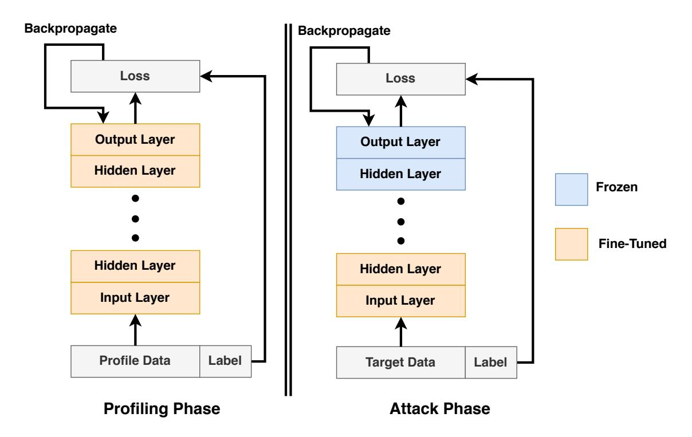
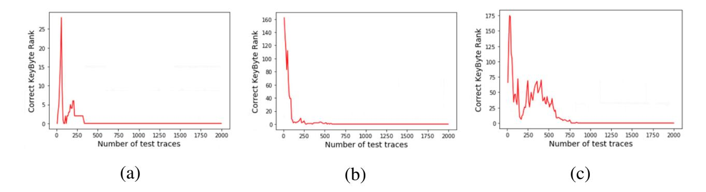
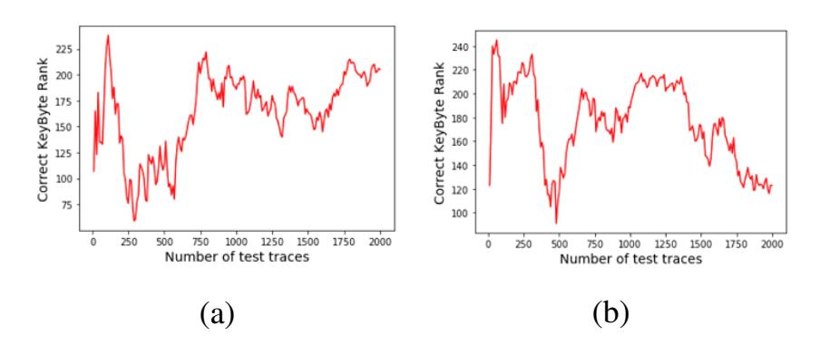
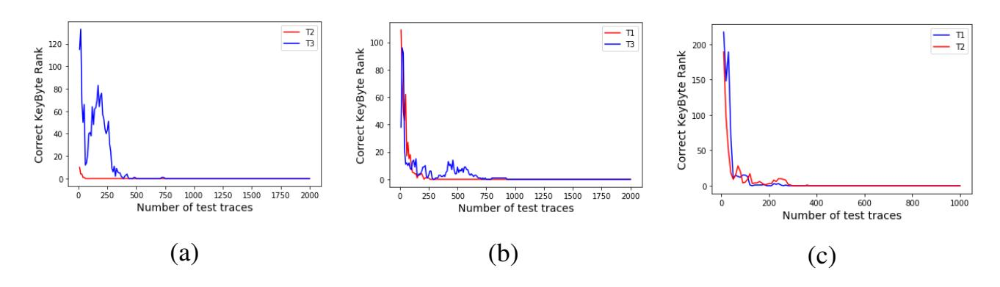
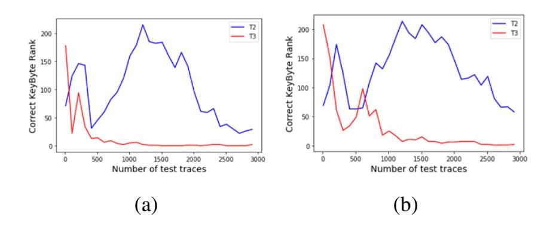
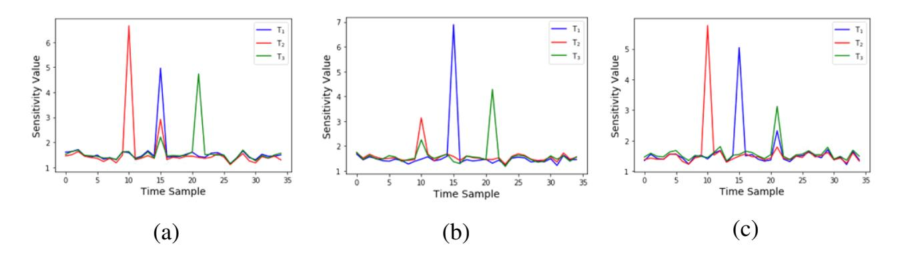
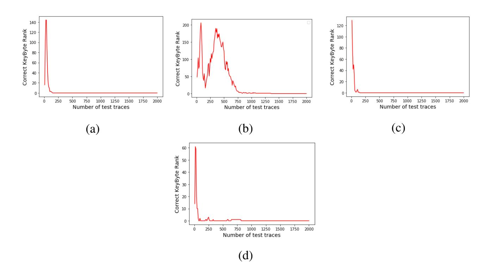
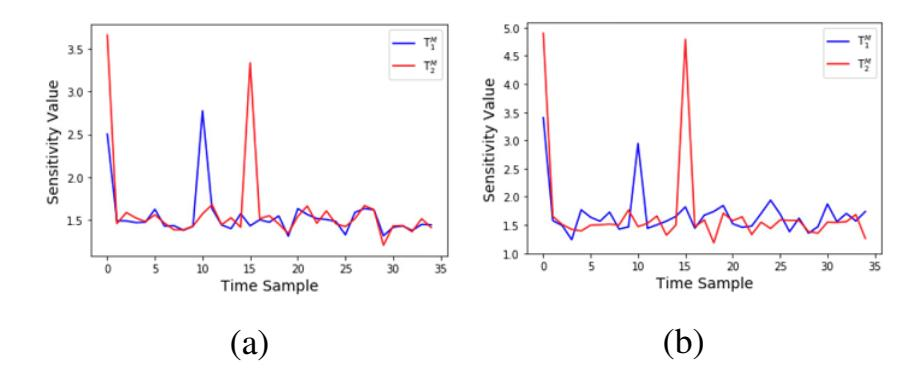

{0}------------------------------------------------

# TranSCA: Cross-Family Profiled Side-Channel Attacks using Transfer Learning on Deep Neural Networks

Dhruv Thapar, Manaar Alam, and Debdeep Mukhopadhyay

Indian Institute of Technology Kharagpur, India {dhruvthapar97, alam.manaar, debdeep.mukhopadhyay}@gmail.com

Abstract. Side-channel analysis (SCA) utilizing the power consumption of a device has proved to be an efficient technique for recovering secret keys exploiting the implementation vulnerability of mathematically secure cryptographic algorithms. Recently, Deep Learning-based profiled SCA (DL-SCA) has gained popularity, where an adversary trains a deep learning model using profiled traces obtained from a dummy device (a device that is similar to the target device) and uses the trained model to retrieve the secret key from the target device. *However, for efficient key recovery from the target device, training of such a model requires a large number of profiled traces from the dummy device and extensive training time*. In this paper, we propose *TranSCA*, a new DL-SCA strategy that tries to address the issue. *TranSCA* works in three steps – an adversary (1) performs a one-time training of a *base model* using profiled traces from *any* device, (2) fine-tunes the parameters of the *base model* using significantly less profiled traces from a dummy device with the aid of *transfer learning* strategy in lesser time than training from scratch, and (3) uses the fine-tuned model to attack the target device. We validate *TranSCA* on simulated power traces created to represent different FPGA families. Experimental results show that the transfer learning strategy makes it possible to attack a new device from the knowledge of another device even if the new device belongs to a different family. Also, *TranSCA* requires very few power traces from the dummy device compared to when applying DL-SCA without any previous knowledge.

Keywords: Deep Neural Network · Side-Channel Attacks · Transfer Learning

# 1 Introduction

Side-Channel Analysis (SCA) is a class of physical attacks on mathematically secure cryptographic algorithms, where an adversary tries to retrieve the secret key by analyzing weakness in the physical implementation [\[12\]](#page-13-0). The execution of cryptographic algorithms manipulates some sensitive variables which are directly dependent on the secret key. During the execution, such sensitive variables leak information about the secret due to device physics of the underlying computing elements making the information leakage hard to eliminate. An SCA adversary exploits this unintentional leakage emitting from the target device in the form of side-channels like power dissipation, electromagnetic radiation, execution timing, acoustics, etc. which can be easily obtained with high resolution and low cost. One of the strong class of such SCA is a profiled SCA, where an adversary has access to prior information about the implementation of the target device. The adversary can procure a copy of the target device (which we term as a *dummy* device in the rest of the 

{1}------------------------------------------------

paper) and utilize it to create a profile for that device using side-channel information. The adversary then uses that profile to attack the target device and retrieve the secret key. One of the widely used profiled attacks is Template Attack [\[3\]](#page-12-0), where its success depends on proper assumptions of data distributions, efficient pre-processing of the raw side-channel information, and also on the assumptions of appropriate leakage models. Recently, Deep Learning-based SCA (DL-SCA) received significant attention in the SCA community as the results show several situations where DL-SCA performs exceptionally well and even surpasses different statistical methods. Moreover, DL-SCA neither makes any assumptions on the data distribution nor requires pre-processing on the acquired side-channel information, making it more practical to mount such attacks.

Advancement of Deep Learningz in Profiled Side-Channel Attacks: The seminal work on the use of Deep Learning (DL) methodologies in the context of Side-Channel Analysis (SCA) was first proposed in [\[10\]](#page-12-1). The authors demonstrated that DL-SCA is very efficient in breaking unprotected and masked implementations of Advanced Encryption Standard (AES) with a substantial advantage over the well-known template attack. The advantage of Convolution Neural Networks (CNN) has been efficiently used in [\[2\]](#page-12-2) to analyze misaligned traces without the requirement of any pre-processing steps. The ability of CNN has prompted the researchers to design efficient CNN architectures to enhance the performance further. The authors in [\[20,](#page-13-1)[19\]](#page-13-2) presented efficient and systematic methodologies to select most-suitable hyper-parameters (i.e., number of layers, activation functions, number of iterations, etc.) of CNN to enhance the performance. Moreover, the authors in [\[21,](#page-13-3)[11\]](#page-12-3) have recommended using different evaluation metrics during the training phase to enhance the capability of the trained CNN model. Apart from the investigation on deciding optimum CNN architectures and evaluation metrics, there are also research works on efficiently handling the acquired data while performing the attack. The authors in [\[8\]](#page-12-4) presented an approach to show that introducing artificial noise in the training data increases the performance of CNN. The authors in [\[21,](#page-13-3)[13\]](#page-13-4) have presented different evaluation metrics and data balancing techniques to address the issues associated with class imbalance. The author in [\[9\]](#page-12-5) assessed the performance of DL-SCA under different realistic and practical scenarios.

Advancement in Cross-Device Side-Channel Attacks: Recent literature shows the efficacy of deep learning-based profiling attacks in practice. However, one of the major concerns in such a scenario is the effect of device variation on its performance. In profiled attacks, an adversary trains a deep learning model with the data acquired from a dummy device and attacks with the data acquired from the target device. However, the data collected from both the devices might differ due to several environmental effects like temperature, setup noise, measurement variations, etc. making the key recovery more difficult. The authors in [\[14\]](#page-13-5) first presented the existence of measurement variations between dummy and target devices. Hence, recent research mostly focuses on applying profiled attacks in a *cross-device* scenario where power traces are collected from one device and used to attack a similar device instead of training and testing a deep learning model on the dataset collected from a single device. The authors in [\[4\]](#page-12-6) first introduced the DL-SCA application in a cross-device setup by proposing a multi-device training approach to enhance performance. The authors in [\[7\]](#page-12-7) used Principal Component Analysis to apply a cross-device attack. Further, the authors in [\[1\]](#page-12-8) emphasized the importance of device portability in the context of cross-device attacks in different practical scenarios.

{2}------------------------------------------------

Problem Statement Addressed in this Work: With the growing demand for security products, the requirement of certification of VLSI (Very Large Scale Integration) chips have increased for many applications. In the testing industry, Automatic Test Equipment (ATE) is referred to any apparatus that performs tests on a device using suitable automation to accelerate measurements and interpret the test results. One of the constraints to making the test viable is to ensure a very low test time for which the ATE is used to test a device. Validating a moderate level of resistance (e.g., FIPS 140 Level 2/3) should not require an excessive amount of testing time per algorithm [\[6\]](#page-12-9). Similar time constraints can also be seen with respect to a side-channel adversary, who intends to break several designs on different platforms in less time. In a profiled side-channel attack scenario, the advancement of cross-device DL-SCA has established the potential of deep learning methods to retrieve the secret key of an encryption algorithm in many practical scenarios. However, the success of such techniques primarily depends on the availability of a considerably large profiled dataset from a dummy device. However, a large size of the profiled dataset can have an adverse effect on the overall test time, thus necessitating new methods for accelerated testing. *In this work, we introduce a cross-family profiled attack scenario, which reduces the requirement of a large number of profiled traces from a dummy device, thereby decreases the time to attack*. The approach is also of interest when the number of similar profiling traces is limited to an adversary. The attack works in three steps:

- One-time profiling: an adversary selects any device of his choice, collects a large number of profiled power traces, and performs a one-time training to create a *base model* using state-of-the-art deep learning techniques.
- Fine-Tuning for a target device: the adversary procures a copy of the target device with access to a limited set of profiled power traces, and fine-tunes the base-model with the aid of *transfer learning* strategy. The problem is believed to be more challenging than the cross-device attack as devices from different manufacturers vary in the internal architectural design. Hence, the information leakage through power dissipation or other side-channel will naturally differ. Thus, a deep learning model built for a particular device might not work well on a device produced by different manufacturers. In this paper, we take the aid of *Transfer Learning* (TL) to design *TranSCA*, a transfer learning-based DL-SCA methodology, to address the issue. TL is popularly used in different machine learning applications to solve a task utilizing the knowledge obtained from a related task [\[16\]](#page-13-6). In the TL strategy, it is not required to build a deep learning model again from scratch. Instead, one can fine-tune an already trained model for a particular task to obtain satisfactory performance from a dissimilar dataset for the same task. Moreover, the transfer learning strategy requires significantly less data for fine-tuning and achieves high accuracy with fewer iterations. The more similar the data, the easier it is to cross-utilize the knowledge.
- Attack: the adversary then uses the fine-tuned model to attack the target device. *One should note that the adversary can use a single base model and fine-tune it to attack different target devices.*

Thus, the usage of a pre-developed base model, transfer learned onto a target device using few traces, reduces the time the attack methodology is engaged before it can be used for evaluating the next device of a different make.

{3}------------------------------------------------

#### 4 D. Thapar *et al.*

Our Contribution: We propose a new class of DL-SCA using Transfer Learning to reduce the requirement of having access to a large number of similar profiled traces from a dummy device. The transfer learning strategy requires less training data and fewer iterations to fine-tune an already trained model with a new dataset. Applying such an approach makes it feasible to attack any target device with fewer traces than existing profiled attacks, thereby decreasing the overall attack time. *The authors in [\[5\]](#page-12-10) also applied the transfer learning strategy in the context of profiled side-channel attacks. However, this work is done independently and concurrently. Moreover, we additionally performed* sensitivity analysis *[\[17\]](#page-13-7) to interpret the effect of transfer learning among different FPGA families.*

The rest of the paper is organized as follows: Section [2](#page-3-0) discusses the proposed methodology in details. Section [3](#page-5-0) evaluates the methodology on different simulated environments[1](#page-3-1) for protected and unprotected AES implementation. Finally, Section [4](#page-12-11) concludes the paper with a possible scope of future research. In addition, Appendix [A](#page-13-8) and Appendix [B](#page-14-0) presents preliminaries on deep learning techniques for interested readers.

### <span id="page-3-0"></span>2 Proposed Methodology

In this section, we first provide the threat model used in for the attack along with the operation targeted by the adversary for the side-channel analysis. Next, we present a brief introduction of the Transfer Learning paradigm, and then we discuss how the application of transfer learning helped us to design *TranSCA*.

### 2.1 Capability of an Attacker

We assume that the attacker has full control of a training device, which he can use during the one-time profiling phase. The attacker can measure physical leakages during the execution of cryptographic encryption on that device. The attacker's objective is to recover the unknown secret key from a target device (not necessarily belonging to the same family of profiling device) by collecting as few measurements of physical leakages as possible. In this paper, without loss of generality, we consider that the attacker targets the first round output of AES Sbox as a leakage point since it is a frequent target, as presented in the literature. Hence, the targeted operation is *Z* = *Sbox*(*P*⊕*k* ∗ ), where *P* and *k* <sup>∗</sup> denote the plaintext and secret key respectively. The measurement of physical leakage and the targeted operation produces the dataset for the deep learning algorithm for an attacker.

### 2.2 A brief overview of Transfer Learning

Transfer Learning (TL) is an inherent ability of machine learning-based applications to utilize knowledge about one task to solve related tasks. The more similar the tasks, the easier it is to transfer or cross-utilize the knowledge. The idea of TL is different from conventional machine learning and deep learning algorithms, where the models need to be rebuilt from scratch once the distribution of feature-space changes. Traditional learning

<span id="page-3-1"></span><sup>1</sup> Due to the difficulty caused by the COVID-19 lockdown scenario, we could not experimentally validate the methodology on real power traces.

{4}------------------------------------------------

is performed without considering prior learned knowledge in other tasks, whereas transfer learning can be faster, more accurate, and needs less training data.

#### **Commonly used Notations in Transfer Learning**

- A domain  $\mathcal{D}$  consists of two components a feature space  $\mathcal{X}$  and a marginal probability distribution  $P(\mathcal{X} = X)$ , where  $X = \{x_1, x_2, \dots, x_n\}$ . Hence,  $\mathcal{D} = \{\mathcal{X}, P(\mathcal{X})\}$ . In general, for two domains  $\mathcal{D}_1$  and  $\mathcal{D}_2$ , if  $\mathcal{D}_1 \neq \mathcal{D}_2$ , then they may have different feature spaces or different marginal probability distributions.
- A task  $\mathscr{T}$  for a specific domain  $\mathscr{D} = \{\mathscr{X}, P(\mathscr{X})\}$  consists of two components a label space  $\mathscr{Y}$  and a predictive function  $\mathscr{F}(\cdot)$ . Hence,  $\mathscr{T} = \{\mathscr{Y}, \mathscr{F}(\cdot)\}$ . The predictive function  $\mathscr{F}(\cdot)$  is not given but can be learned from the training data consisting of training pairs  $\{X_i, Y_i\}$ , where  $X_i \in \mathscr{X}$  and  $Y_i \in \mathscr{Y}$ . The predictive function  $\mathscr{F}(\cdot)$  can be used to predict the corresponding label  $\mathbf{y}$  of a new instance  $\mathbf{x}$ , which can be written as  $P(\mathbf{y}|\mathbf{x})$ .

We consider one source domain  $\mathscr{D}_S$  and one target domain  $\mathscr{D}_T$ . Using the definitions mentioned previously we can express  $\mathscr{D}_S = \{(X_{S_1}, Y_{S_1}), (X_{S_2}, Y_{S_2}), \dots, (X_{S_{n_S}}, Y_{S_{n_S}})\}$ , where  $X_{S_i} \in \mathscr{X}_S$  is a data instance and  $Y_{S_i} \in \mathscr{Y}_S$  is corresponding class label. Similarly, we can denote  $\mathscr{D}_T = \{(X_{T_1}, Y_{T_1}), (X_{T_2}, Y_{T_2}), \dots, (X_{T_{n_T}}, Y_{T_{n_T}})\}$ , where for the data input  $X_{T_i} \in \mathscr{X}_T$ , the corresponding output is  $Y_{T_i} \in \mathscr{Y}_T$ . In most case,  $0 \le n_T \ll n_S$ . Now the unified definition of *Transfer Learning* is given as:

**Definition:** (*Transfer Learning*) Given a source domain  $\mathcal{D}_S$  and a learning task  $\mathcal{T}_S$ , a target domain  $\mathcal{D}_T$  and learning task  $\mathcal{T}_T$ , the objective of *transfer learning* is to help improve the learning of target predictive function  $F_T(\cdot)$  in  $\mathcal{D}_T$  with the information gained from  $\mathcal{D}_S$  and  $\mathcal{T}_S$ , where  $\mathcal{D}_S \neq \mathcal{D}_T$  or  $\mathcal{T}_S \neq \mathcal{T}_T$ .

There are different variations of transfer learning strategy based on its applications. In this paper, we consider *Transductive Transfer Learning*, where there are similarities between the source and target tasks, but the corresponding domains are different (i.e.,  $\mathcal{D}_S \neq \mathcal{D}_T$ ). In this setting, the source domain has a lot of labeled data, while the target domain has none or very little data.

#### 2.3 Application of Transfer Learning in Cross-Family Attacks

Let a side-channel adversary has any profiling device  $(\mathscr{A}_p)$  having the implementation of the target encryption algorithm. The adversary acquires as many traces as required from  $\mathscr{A}_p$  and trains a model with any state-of-the-art deep learning algorithm present in the literature to create a base model  $(\mathscr{M})$ , which forms the basis of transfer learning in the context of TranSCA. In the scenario of TranSCA, the domains of the side-channel information obtained from different devices are different. However, the task at hand is similar. More specifically, in the case of a power attack, the power traces obtained from the profiling device  $\mathscr{A}_p$  may vary from those acquired from the target device  $\mathscr{A}_t$ , which depends on the internal architecture of both the devices. But, in both cases, the target of an adversary is to learn the predictive function  $\mathscr{F}(\cdot)$ , which maps the power traces to a probable leakage value. The deep learning model  $\mathscr{M}$  has generally layered architectures that learn different features from the input dataset at different layers. These layers are then

{5}------------------------------------------------

#### <span id="page-5-1"></span>6 D. Thapar *et al.*



Fig. 1: In the profiling phase an adversary trains a deep learning model M with profiled data from A*p*. In the attack phase, the model M is first fine-tuned with the data from A*<sup>d</sup>* while the weights in the last layer are not updated during backpropagation.

connected to the last layer, usually a fully connected layer, to obtain a final prediction. It is shown in various literature that the initial layers seem to capture generic features, while the later ones focus more on the specific task at hand. Hence, we *freeze* (fix weights) the last few layers of M while fine-tuning the rest of them with the traces obtained from a dummy device (A*d*) that is similar to A*<sup>t</sup>* to suit our needs. The freezing of layers indicates that the weights of those layers do not update during backpropagation, and also, freezing the last few layers ensures that the task remains the same. In contrast, fine-tuning initial layers update the already learned features from the knowledge of A*<sup>p</sup>* with the knowledge of the A*d*, which helps to achieve better performance with less training time. The overview of the technique is shown in Fig. [1.](#page-5-1)

### <span id="page-5-0"></span>3 Experimental Results

In this section, we assess the efficiency of TranSCA considering simulated traces for both unprotected and masked AES implementation. Power models are used to simulate the power consumption of a cryptographic implementation operating on a device. If the intermediate data of a computation is *x*, and the power model is captured by a function *f* , then the simulated power consumption is *f*(*x*). Two popular power models for software implementations are the identity power model, where *f*(*x*) = *x*, and the Hamming weight power model, where *f*(*x*) = *HW*(*x*), where *HW* stands for Hamming Weight. Power models are an effective tool for evaluating the efficacy of deep learning techniques for side-channel analysis [\[18\]](#page-13-9). In context to deep learning, the power model defines the number of outputs in a classifier. If the data is a byte, the identity model leads to a set of 256 classes, whereas if it is Hamming Weight, the model leads to a set of nine classes. In the following discussions, we present our results using identity power model without loss of generality.

{6}------------------------------------------------

### <span id="page-6-2"></span>3.1 Unprotected AES Implementation

We define a setup to generate *L* simulated traces (T*i*)1≤*i*≤*<sup>L</sup>* of *S* time samples each. All sample values are randomly chosen from the range [0,255] except at the point-of-interest (*POI*). The *POI* is the location of the sensitive data manipulation, i.e., *Z* = *Sbox*[*P*⊕*k* ∗ ] where *P* is the first plaintext byte and *k* ∗ is the first key byte. We add Gaussian noise N (0,σ 2 ) with zero mean and variance σ 2 . The trace generation is shown as below:

$$\mathbf{T}_{i}[s] = \begin{cases} Z + \mathcal{N}(0, \sigma^{2}) & \text{if } s = POI \\ R + \mathcal{N}(0, \sigma^{2}) & \text{otherwise,} \end{cases}$$

where *R* denotes a randomly chosen integer in the range [0,255]. The *POI* lies anywhere between [1,*S*]. We have used three different sets of simulated traces T1, T2, and T<sup>3</sup> according to the parameters mentioned in Table [1.](#page-6-0)

<span id="page-6-0"></span>Table 1: Parameters of different sets of simulated traces for three different platforms

|        | T1  | T2 | T3  |
|--------|-----|----|-----|
| POI    | 15  | 10 | 21  |
| 2<br>σ | 100 | 50 | 200 |

The leakage measurements for different families will vary considerably because of the differences in internal architectures and various environmental noise. The three sets of traces mentioned in Table [1](#page-6-0) represent traces from three different families. We have considered Gaussian noise with a significantly higher variance for all the traces to simulate the practical scenario as best as possible. Also, the *POI* varies among the traces. However, the variations will be within the window of time sample [1,*S*], which can be modeled with a neural network with *S* neurons in the input layer.

We have considered a deep neural network (DNN) architecture with four layers for all our experiments. The input layer of the network contains 35 neurons[2](#page-6-1) . The first hidden layer consists of 128 neurons, followed by a Rectified Linear Unit (ReLU) activation function, Batch Normalization, and a Dropout layer. The Batch Normalization and Dropout layers are used to prevent overfitting the model while training. The second hidden layer is also the same as the first one. The last layer is the output layer with the softmax activation function, which has 256 neurons for predicting the probabilities of each label. We implemented the network architecture with the help of python-based deep learning library Keras and is shown as follows:

### Deep Neural Network Architecture

```
model = S e q u e n t i a l ( [
Dense ( 1 2 8 , i n p u t d i m =35 , a c t i v a t i o n = ' r e l u ' )
B a t c h N o r m a l i z a t i o n ( )
D r o p o ut ( 0 . 3 )
Dense ( 1 2 8 , a c t i v a t i o n = ' r e l u ' )
B a t c h N o r m a l i z a t i o n ( )
D r o p o ut ( 0 . 3 )
Dense ( 2 5 6 , a c t i v a t i o n = ' s o ftm a x ' ) ] )
```

<span id="page-6-1"></span><sup>2</sup> We have considered 35 input samples for trace.

{7}------------------------------------------------

Profiled Deep Learning Attacks: We consider three different instances of DNN model mentioned in the previous paragraph and train the instances for T1, T2, and T<sup>3</sup> with 5000, 1000, and 15000 traces, respectively. We consider 20000 traces in each case as validation data to ensure that the model is not getting overfitted. We compute the average rank of the correct key among all key hypotheses from the trained model (a unified metric used by most of the work [\[15\]](#page-13-10)). The resulting plots are shown in Fig. [2,](#page-7-0) which shows the average rank of the correct key drops to zero within 300, 600, and 800 test traces for the model trained with T1, T2, and T3, respectively. The platform for T<sup>3</sup> requires more traces to train a model and more traces to converge to key rank zero than the other platforms expectedly because of a higher amount of noise. Fig. [2](#page-7-0) indicates that the DNN model used in this paper works efficiently for profiled attacks on T1, T2, and T3. One should note that the number of training traces used to train each model is empirically selected (also for all the further experiments), which signifies the minimum number of traces required to train a model and get the correct key efficiently. We have seen that with fewer traces, the trained model is unable to provide the correct key even with an increasing number of testing traces. Now, to show the importance of cross-family attack, we utilize the trained model for T<sup>1</sup> and test directly with T<sup>2</sup> and T3. The resulting plots for the correct key rank in each case are shown in Fig. [3.](#page-8-0) The non-saturating nature of the plots for the correct key rank clearly shows that profiling and attacking dissimilar devices require additional treatment.

Advantage of Transfer Learning: In order to show the advantage of TranSCA, we considered the trained model for T<sup>1</sup> as a base model (M), which we will fine-tune while applying transfer learning strategy. We use Keras API [trainable=false] to freeze the last layer of M, and [trainable=true] for all the remaining layers to allow them for fine-tuning. In order to apply transfer learning from T1, we use 500 and 1000 traces for T<sup>2</sup> and T3, respectively. We then compute the average rank of the correct key among all key hypotheses from the fine-tuned model. The resulting plots for the correct key rank in each case are shown in Fig. [4a,](#page-8-1) which shows the average key rank drops to zero within 500 test traces even for dissimilar data. The observations from Fig. [3](#page-8-0) and Fig. [4a](#page-8-1) shows that any target device can be attacked with a base model with less number of traces which are similar to the target device. The number of traces required for fine-tuning M in each case is empirically selected, which signifies the minimum number of traces required to fine-tune M and get the correct key efficiently. We have seen that with fewer traces, the

<span id="page-7-0"></span>

Fig. 2: Average rank for the correct key with increasing number of test traces when targeting (a) T<sup>1</sup> with the model trained on T1, (b) T<sup>2</sup> with the model trained on T2, and (c) T<sup>3</sup> with the model trained on T3.

{8}------------------------------------------------

<span id="page-8-0"></span>

Fig. 3: Average rank for the correct key with increasing number of test traces when targeting (a) T<sup>2</sup> and (b) T<sup>3</sup> directly with the model trained with T1.

<span id="page-8-1"></span>

Fig. 4: Average rank for the correct key with increasing number of test traces when targeting other traces with fine-tuned base model trained using (a) T1, (b) T2, and (c) T3.

fine-tuned model is unable to provide the correct key even with an increasing number of testing traces. A similar observation with the base model trained with T<sup>2</sup> and T<sup>3</sup> are shown in Fig. [4b](#page-8-1) and Fig. [4c,](#page-8-1) respectively. For Fig. [4b,](#page-8-1) we use 1000 and 6000 traces of T<sup>1</sup> and T3, respectively to fine-tune the base model. For Fig. [4c,](#page-8-1) we use 500 traces of both T<sup>1</sup> and T<sup>2</sup> to fine-tune the base model.

In order to apply transfer learning, we make the last layer non-trainable, as discussed previously. However, instead of freezing the last layer, one can freeze other layers. The transfer learning will not provide satisfactory results in those cases as the initial layers learn the feature space in the data. Making the initial layers non-trainable will prevent the deep learning model from learning anything from the new dataset. To support the hypothesis, we consider two instances of deep learning model trained with T<sup>1</sup> as the base model. Now instead of freezing the last layer, we make the penultimate layer nontrainable and allow other layers to fine-tune with 800 traces of T<sup>2</sup> and 5000 traces of T3, respectively. We then compute the average rank of the correct key from the fine-tuned model. The resulting plots for the correct key rank in each case are shown in Fig. [5a,](#page-9-0) which shows the average key rank never converges to zero even with the increase in testing traces. However, as we have seen earlier, making the last layer non-trainable, transfer learning can efficiently obtain the correct key by fine-tuning the base model with 500 and 1000 traces of T<sup>2</sup> and T3, respectively. A similar observation by making the first hidden layer non-trainable is shown in Fig. [5b,](#page-9-0) which also supports our hypothesis to make the last layer non-trainable. Hence, in our further discussions, while applying transfer learning, we always freeze the last layer.

{9}------------------------------------------------

<span id="page-9-0"></span>

Fig. 5: Average rank for the correct key with increasing number of test traces when targeting other traces while applying transfer learning on a base model trained using T<sup>1</sup> when freezing (a) penultimate layer and (b) first hidden layer.

<span id="page-9-1"></span>

Fig. 6: Sensitivity values of each time sample for different traces considering a base model trained with (a) T1, (b) T2, and (c) T3.

The sensitivity analysis (SA) technique, as discussed in [\[17\]](#page-13-7) provides an insight into the POI learned by a deep learning model during the training phase. We applied a similar technique for our analysis of TranSCA. We consider a base model (M) trained with T1. The POI of T1, as shown in Table [1,](#page-6-0) is 15. Hence, an SA on the base model for T<sup>1</sup> should reveal a high sensitivity value at the time sample 15. The blue line in Fig. [6a](#page-9-1) shows the sensitivity value obtained directly from the base model M, which shows a high peak at the time sample 15 as expected. The red line in Fig. [6a,](#page-9-1) shows the sensitivity value from the model obtained after fine-tuning M with T2. We can observe the high peak at time sample 10, which is the POI for T2. The observation indicates that the fine-tuned model has appropriately learned the POI for T2. However, we can also observe a small peak at time sample 15, which signifies that the model has been previously trained with T1. The observation shows the appropriateness of cross-knowledge utilization of the transfer learning approach. The green line in Fig. [6a,](#page-9-1) shows the sensitivity value from the model obtained after fine-tuning M with T3. We can observe the high peak at time sample 21, which is the POI of T3. We can also observe a small peak at time sample 15, signifying the transfer learning of knowledge from T1. The similar observations for the base models trained with T<sup>2</sup> and T<sup>3</sup> are shown in Fig. [6b](#page-9-1) and Fig. [6c,](#page-9-1) respectively.

### 3.2 First-Order Masked AES Implementation

We define a setup to generate *L* simulated traces (T *M i* )1≤*i*≤*<sup>L</sup>* of *S* time samples each for first-order masked AES implementation. All sample values are randomly chosen from the 

{10}------------------------------------------------

range [0,255] except at the point-of-interest (POI) corresponding to the manipulation of mask M and masked sensitive data, i.e.,  $Z \oplus M$ . We have considered that the masked value always leaks at first data sample. The trace generation is shown as below:

$$\mathbf{T}_{i}^{M}[s] = \begin{cases} M + \mathcal{N}(0, \sigma^{2}) & \text{if } s = 1\\ (Z \oplus M) + \mathcal{N}(0, \sigma^{2}) & \text{if } s = POI\\ R + \mathcal{N}(0, \sigma^{2}) & \text{otherwise,} \end{cases}$$

where R denotes a randomly chosen integer in the range [0,255] and M denotes the mask value which is also a randomly chosen integer in the range [0,255]. The POI lies anywhere between [2,S]. We have used two different sets of simulated traces  $\mathbf{T}_1^M$  and  $\mathbf{T}_2^M$  according to the parameters mentioned in Table 2. We consider the same deep neural network architecture as discussed in Section 3.1.

<span id="page-10-0"></span>Table 2: Parameters of different sets of simulated traces of masked AES for two platforms

|            | $\mathbf{T}_1^M$ | $\mathbf{T}_2^M$ |
|------------|------------------|------------------|
| POI        | 10               | 15               |
| $\sigma^2$ | 10               | 100              |

**Profiled Deep Learning Attacks** We consider two different instances of the DNN model and train them for  $\mathbf{T}_1^M$  and  $\mathbf{T}_2^M$  with 10000, 100000 traces, respectively. We consider 20000 traces in each case as validation data to ensure that the model is not getting overfitted. We compute the average rank of the correct key from the trained model. The resulting plots are shown in Fig. 7a and Fig. 7b, which show the average key rank drops to zero within 250 test traces for  $\mathbf{T}_1^M$  and 1400 test traces for  $\mathbf{T}_2^M$ .

Advantage of Transfer Learning: In order to show the advantage of TranSCA, we considered the trained model for  $\mathbf{T}_1^M$  as a base model  $(\mathcal{M})$ , which we will fine-tune. In order to apply transfer learning from  $\mathbf{T}_1^M$ , we use 30000 traces of  $\mathbf{T}_2^M$  for fine-tuning  $\mathcal{M}$ . The resulting plot for the correct key rank from the fine-tuned model is shown in Fig. 7c, which shows the average key rank drops to zero within 200 test traces even for dissimilar data. A similar observation with the base model trained with  $\mathbf{T}_2^M$  is shown in Fig. 7d. We use 2000 traces of  $\mathbf{T}_1^M$  to fine-tune the base model. We apply a similar sensitivity analysis, as performed in Section 3.1, also for the masked AES implementation. The resulting plots are shown in Fig. 8. In this case, we can observe a peak in the sensitivity value at the first time sample in both Fig. 8a and Fig. 8b, which corresponds to the manipulation of the masked variable. The figure also shows the appropriateness of cross-knowledge utilization of the transfer learning approach even for masked AES implementation.

### 3.3 Discussion

The advantage of TranSCA regarding the number of traces required over standard DL-SCA on both unprotected and protected AES implementation is summarized in Table 3. The models within brackets after the values for TranSCA signifies the base model on which fine-tuning is applied. Moreover, let us assume the adversary wants to target N different devices. In a traditional DL-SCA scenario, let the profiling and model building time from scratch for each device is on average  $t_p$ , and the time to attack the target device

{11}------------------------------------------------

#### D. Thapar et al.

<span id="page-11-0"></span>

<span id="page-11-1"></span>Fig. 7: Average rank for the correct key with increasing number of test traces when targeting (a)  $\mathbf{T}_1^M$  with the model trained on  $\mathbf{T}_1^M$ , (b)  $\mathbf{T}_2^M$  with the model trained on  $\mathbf{T}_2^M$ , (c)  $\mathbf{T}_2^M$  with the fine-tuned base model model trained on  $\mathbf{T}_1^M$ , and (d)  $\mathbf{T}_1^M$  with the fine-tuned base model model trained on  $\mathbf{T}_2^M$ 



Fig. 8: Sensitivity values of each time sample for different traces of masked AES implementation considering a base model trained with (a)  $\mathbf{T}_1^M$  traces, (b)  $\mathbf{T}_2^M$  traces.

<span id="page-11-2"></span>Table 3: Comparison of number of traces required from a dummy device (similar to target device) for profiling/fine-tuning to attack the target device for DL-SCA and TranSCA

|                  | DL-SCA             | TranSCA                                      |
|------------------|--------------------|----------------------------------------------|
|                  | (Profiling Traces) | (Fine-Tuning Traces)                         |
| $T_1$            | 5,000              | $1,000 (\mathbf{T}_2), 500 (\mathbf{T}_3)$   |
| $T_2$            | 1,000              | $500 (\mathbf{T}_1), 500 (\mathbf{T}_3)$     |
| $T_3$            | 15,000             | $1,000 (\mathbf{T}_1), 6,000 (\mathbf{T}_2)$ |
| $\mathbf{T}_1^M$ | 10,000             | $2,000 (\mathbf{T}_2^M)$                     |
| $\mathbf{T}_2^M$ | 100,000            | $30,000  (\mathbf{T}_1^M)$                   |

is on average  $t_a$ . Hence, the total time taken in this case will be  $N \times t_p + N \times t_a$ . However, in TranSCA, let the model fine-tuning time is  $t_f$ , where  $t_f < t_p$  (by the theory of transfer learning). Hence, the total time, in this scenario will be  $t_p + N \times t_f + N \times t_a$ . Since,  $t_p + N \times t_a$ .

{12}------------------------------------------------

*tf* is always less than *N* ×*t<sup>p</sup>* (for *N* > 1), we can comprehend the advantage of TranSCA over traditional DL-SCA considering attack time on multiple devices.

# <span id="page-12-11"></span>4 Conclusion

In this paper, we proposed a new profiled SCA strategy called TranSCA, which eases the requirement of having a significant number of traces from a similar device for an adversary in a profiled attack scenario. The experimental results on different simulated environments show that the proposed approach can help an adversary to profile power traces from any device and attack any target device even with different underlying architectures with the aid of transfer learning strategy for both unprotected and first-order masked AES implementation with a limited amount of traces from a dummy device. The sensitivity analysis results demonstrate the appropriateness of cross-knowledge utilization of the transfer learning approach. We have highlighted the capability of TranSCA in a simulated environment, which we would like to explore further for real power-traces in our future studies.

# References

- <span id="page-12-8"></span>1. Bhasin, S., Chattopadhyay, A., Heuser, A., Jap, D., Picek, S., Shrivastwa, R.R.: Mind the portability: A warriors guide through realistic profiled side-channel analysis. IACR Cryptology ePrint Archive (2019), <https://eprint.iacr.org/2019/661>
- <span id="page-12-2"></span>2. Cagli, E., Dumas, C., Prouff, E.: Convolutional neural networks with data augmentation against jitter-based countermeasures. In: International Conference on Cryptographic Hardware and Embedded Systems. pp. 45–68. Springer (2017)
- <span id="page-12-0"></span>3. Chari, S., Rao, J.R., Rohatgi, P.: Template attacks. In: International Workshop on Cryptographic Hardware and Embedded Systems. pp. 13–28. Springer (2002)
- <span id="page-12-6"></span>4. Das, D., Golder, A., Danial, J., Ghosh, S., Raychowdhury, A., Sen, S.: X-deepsca: Cross-device deep learning side channel attack. In: Proceedings of the 56th Annual Design Automation Conference 2019. pp. 1–6 (2019)
- <span id="page-12-10"></span>5. Genevey-Metat, C., Gerard, B., Heuser, A.: On what to learn: Train or adapt a deeply learned ´ profile? IACR Cryptology ePrint Archive (2020), <https://eprint.iacr.org/2020/952>
- <span id="page-12-9"></span>6. Gilbert Goodwill, B.J., Jaffe, J., Rohatgi, P., et al.: A testing methodology for side-channel resistance validation. In: NIST non-invasive attack testing workshop. vol. 7, pp. 115–136 (2011)
- <span id="page-12-7"></span>7. Golder, A., Das, D., Danial, J., Ghosh, S., Sen, S., Raychowdhury, A.: Practical approaches toward deep-learning-based cross-device power side-channel attack. IEEE Transactions on Very Large Scale Integration (VLSI) Systems 27(12), 2720–2733 (2019)
- <span id="page-12-4"></span>8. Kim, J., Picek, S., Heuser, A., Bhasin, S., Hanjalic, A.: Make some noise. unleashing the power of convolutional neural networks for profiled side-channel analysis. IACR Transactions on Cryptographic Hardware and Embedded Systems pp. 148–179 (2019)
- <span id="page-12-5"></span>9. Maghrebi, H.: Deep learning based side channel attacks in practice. IACR Cryptology ePrint Archive (2019), <https://eprint.iacr.org/2019/578>
- <span id="page-12-1"></span>10. Maghrebi, H., Portigliatti, T., Prouff, E.: Breaking cryptographic implementations using deep learning techniques. In: International Conference on Security, Privacy, and Applied Cryptography Engineering. pp. 3–26. Springer (2016)
- <span id="page-12-3"></span>11. Masure, L., Dumas, C., Prouff, E.: A comprehensive study of deep learning for side-channel analysis. IACR Trans. on Cryptographic Hardware and Embedded Systems pp. 348–375 (2020)

{13}------------------------------------------------

- <span id="page-13-0"></span>12. Mukhopadhyay, D., Chakraborty, R.S.: Hardware security: design, threats, and safeguards. CRC Press (2014)
- <span id="page-13-4"></span>13. Picek, S., Heuser, A., Jovic, A., Bhasin, S., Regazzoni, F.: The curse of class imbalance and conflicting metrics with machine learning for side-channel evaluations. IACR Transactions on Cryptographic Hardware and Embedded Systems pp. 1–29 (2019)
- <span id="page-13-5"></span>14. Renauld, M., Standaert, F.X., Veyrat-Charvillon, N., Kamel, D., Flandre, D.: A formal study of power variability issues and side-channel attacks for nanoscale devices. In: Annual International Conference on the Theory and Applications of Cryptographic Techniques. pp. 109–128. Springer (2011)
- <span id="page-13-10"></span>15. Standaert, F.X., Malkin, T.G., Yung, M.: A unified framework for the analysis of side-channel key recovery attacks. In: Annual international conference on the theory and applications of cryptographic techniques. pp. 443–461. Springer (2009)
- <span id="page-13-6"></span>16. Tan, C., Sun, F., Kong, T., Zhang, W., Yang, C., Liu, C.: A survey on deep transfer learning. In: International conference on artificial neural networks. pp. 270–279. Springer (2018)
- <span id="page-13-7"></span>17. Timon, B.: Non-profiled deep learning-based side-channel attacks with sensitivity analysis. IACR Transactions on Cryptographic Hardware and Embedded Systems pp. 107–131 (2019)
- <span id="page-13-9"></span>18. Wang, H.: Side-channel analysis of aes based on deep learning (2019), [https://www.](https://www.diva-portal.org/smash/get/diva2:1325691/FULLTEXT01.pdf) [diva-portal.org/smash/get/diva2:1325691/FULLTEXT01.pdf](https://www.diva-portal.org/smash/get/diva2:1325691/FULLTEXT01.pdf)
- <span id="page-13-2"></span>19. Wouters, L., Arribas, V., Gierlichs, B., Preneel, B.: Revisiting a methodology for efficient CNN architectures in profiling attacks. IACR Transactions on Cryptographic Hardware and Embedded Systems pp. 147–168 (2020)
- <span id="page-13-1"></span>20. Zaid, G., Bossuet, L., Habrard, A., Venelli, A.: Methodology for efficient cnn architectures in profiling attacks. IACR Trans. on Crypt. Hardware and Embedded Systems pp. 1–36 (2020)
- <span id="page-13-3"></span>21. Zhang, J., Zheng, M., Nan, J., Hu, H., Yu, N.: A novel evaluation metric for deep learning-based side channel analysis and its extended application to imbalanced data. IACR Transactions on Cryptographic Hardware and Embedded Systems pp. 73–96 (2020)

# Appendix

## <span id="page-13-8"></span>A Multi-Layer Perceptron

Multiple Layer Perceptron (MLP) is one of the basic types of deep learning architectures. MLP is composed of multiple layers with each layer having basic elements, called neurons. A neuron takes a vector as input and outputs a weighted sum evaluated through an *activation function*. In an MLP, each neuron output of one layer is connected to each neuron of the next layer. An MLP consists of three different types of layers:

- *Input Layer:* It is an intermediate layer between the input data and the rest of the network. The output of the neurons belonging to this layer is simply the input vector itself. The number of neurons in the input layer is equal to the number of feature points in the input data.
- *Hidden Layer:* It introduces non-linearity in the network so that the MLP can fit a non-linear separable dataset. The number of neurons on the hidden layer or even the number of layers depends on the nonlinearity and complexity of the dataset.
- *Output Layer:* It is the last layer of the network that directly maps output of the hidden layer to classes that the user intends to predict. Hence, the number of neurons in the output layer is determined by the number of classes in the input dataset.

The weights of an MLP are the trainable parameters that are updated during gradient descent optimization. The number of hidden layers and the number of neurons in each layer constitute a subset of hyper-parameters.

{14}------------------------------------------------

# <span id="page-14-0"></span>**B** Deep Learning-based Data Classification

The objective of data classification is to classify some data  $x \in \mathbb{R}^d$  based on their labels  $Lb(x) \in \mathcal{Z}$ , where d is the dimension of x and  $\mathcal{Z} = \{0, 1, \dots, L-1\}$  is a set with L number of classification labels. A classification algorithm can be viewed as a mapping  $\mathscr{F}: \mathbb{R}^d \to \mathbb{R}^{|\mathscr{Z}|}$ , which takes  $x \in \mathbb{R}^d$  as input to classify and produces an output vector  $y = \mathscr{F}(x) \in \mathbb{R}^{|\mathscr{Z}|}$ . In order to quantify the efficiency of the mapping  $\mathscr{F}$  for a given input x we define an error function  $\mathscr{E}: \mathbb{R}^{|\mathscr{Z}|} \to \mathbb{R}$ . In order to quantify the error of  $\mathscr{F}$  over a whole set of data, we define a loss function, which is the average over all the errors calculated using  $\mathscr{E}$ . An MLP consists of a set of trainable parameters. The loss function depends on these trainable parameters, which are tuned during a training process to improve the efficiency of the network. The training starts with initializing small random values to the trainable parameters. The training process is a classic numerical optimization problem, where the goal is to find the optimal parameters minimizing the loss function. A preferred approach to train an MLP is to use the *Stochastic Gradient Descent* (SGD) technique to optimize the loss function. The basic operation of SGD contains two steps. First, it calculates *gradients* of the loss function with respect to each parameter in the MLP. Then, it *backpropagates* the gradients to adjust all the parameters proportionally to the gradients. The process of updating all the parameters based on the training data in a single iteration is known as an *epoch*. The training process is defined as the repetition of epochs for a predetermined number of times in order to minimize the loss function. The training process also depends on several hyper-parameters, such as network architecture, loss function, optimization strategy, etc., which a designer needs to select before starting the training process. Once the MLP parameters are optimized after the training, the network  $\mathscr{F}$  can be used to classify a data x whose corresponding label is unknown as  $l = \operatorname{argmax}_{j \in \mathscr{Z}} \mathscr{F}(x)[j].$ 

There is a tendency in each DL algorithms to memorize information in the training dataset instead of learning generalizable features of the entire data during the training process. The phenomenon is known as *overfitting* of the network, which is a big challenge for every DL designer. In order to monitor whether the network is being overfitted or not, one widely used practice is to divide the complete dataset into three parts – *training*, *validation*, and *testing*. The network is trained with the training data, and after each epoch, it is tested with validation data to monitor both *training accuracy* and *validation accuracy*. Overfitting is manifested by a continuous rise of the training accuracy over the number of epochs while the validation accuracy begins to fall. In that case, we adjust the training hyper-parameters to get rid of such overfitting. We determine the effectiveness of the learned mapping by calculating *test accuracy* using the testing data.