{0}------------------------------------------------

# Lattice Reduction with Approximate Enumeration Oracles

## Practical Algorithms and Concrete Performance (Full Version)

Martin R. Albrecht<sup>1</sup> , Shi Bai<sup>2</sup> , Jianwei Li<sup>1</sup> , and Joe Rowell1?

1 Information Security Group, Royal Holloway, University of London.

Abstract. This work provides a systematic investigation of the use of approximate enumeration oracles in BKZ, building on recent technical progress on speeding-up lattice enumeration: relaxing (the search radius of) enumeration and extended preprocessing which preprocesses in a larger rank than the enumeration rank. First, we heuristically justify that relaxing enumeration with certain extreme pruning asymptotically achieves an exponential speed-up for reaching the same root Hermite factor (RHF). Second, we perform simulations/experiments to validate this and the performance for relaxed enumeration with numerically optimised pruning for both regular and extended preprocessing.

Upgrading BKZ with such approximate enumeration oracles gives rise to our main result, namely a practical and faster (wrt. previous work) polynomial-space lattice reduction algorithm for reaching the same RHF in practical and cryptographic parameter ranges. We assess its concrete time/quality performance with extensive simulations and experiments.

## 1 Introduction

Lattices are discrete subgroups of R <sup>m</sup>. A lattice L in R <sup>m</sup> is represented as a set of all integer linear combinations of n linearly independent vectors b0, . . . , bn−<sup>1</sup> in R <sup>m</sup>: L = nPn−<sup>1</sup> <sup>i</sup>=0 x<sup>i</sup> · b<sup>i</sup> , x<sup>i</sup> ∈ Z o . The matrix B := (b0, . . . , bn−1) forms a basis of L, and the integer n is the rank of L. Any lattice of rank ≥ 2 has infinitely many bases.

A central lattice problem is the shortest vector problem (SVP): given a basis of a lattice L (endowed with the Euclidean norm), SVP is to find a shortest nonzero vector in L. SVP is known to be NP-hard under randomised reductions [\[Ajt98\]](#page-25-0). The hardness of solving SVP and in particular its applications in cryptography have led to the study of approximate variants.

<sup>2</sup> Department of Mathematical Sciences, Florida Atlantic University.

<sup>?</sup> This work was supported in part by EPSRC grants EP/S020330/1, EP/S02087X/1, EP/P009301/1, by European Union Horizon 2020 Research and Innovation Program Grant 780701, by Innovate UK grant AQuaSec, by NIST award 60NANB18D216 and by National Science Foundation under Grant No. 2044855. Part of this work was done while MA visited the Simons Institute for the Theory of Computing.

{1}------------------------------------------------

For  $\delta \geq 1$ , the  $\delta$ -approximate variant of SVP ( $\delta$ -SVP) is to find a non-zero vector  $\mathbf{v}$  in  $\mathcal{L}$  such that  $\|\mathbf{v}\| \leq \delta \cdot \lambda_1(\mathcal{L})$ , where  $\lambda_1(\mathcal{L}) := \min_{\mathbf{x} \in \mathcal{L}_{\neq 0}} \|\mathbf{x}\|$  denotes the length of the shortest nonzero vector in  $\mathcal{L}$ . Solving  $\delta$ -SVP is also NP-hard for any  $\delta \leq n^{c/\log\log n}$  with some constant c > 0 under reasonable complexity assumptions [Mic01, Kho05, HR12, Mic12]. A closely related problem is  $\delta$ -Hermite SVP ( $\delta$ -HSVP), which asks to find a non-zero vector  $\mathbf{v}$  in  $\mathcal{L}$  such that  $\|\mathbf{v}\| \leq \delta \cdot \operatorname{vol}(\mathcal{L})^{1/n}$ , where  $\operatorname{vol}(\mathcal{L})$  denotes the volume of  $\mathcal{L}$ . Many cryptographic primitives base their security on the worst-case hardness of  $\delta$ -SVP or related lattice problems [Ajt96, Reg05, GPV08, Pei09]. Security estimates of these constructions depend on solving  $\delta$ -HSVP, typically for  $\delta = \operatorname{poly}(n)$  [ADPS16, AGVW17]. The output quality of a  $\delta$ -HSVP solver in rank n is typically assessed with the so-called root Hermite factor (RHF)  $\delta^{1/(n-1)}$ .

To solve the approximate versions of SVP, the standard approach is *lattice* reduction, which finds reduced bases consisting of reasonably short and relatively orthogonal vectors. Its "modern" history began with the celebrated LLL algorithm [LLL82] and continued with stronger blockwise algorithms [Sch87, SE94, GN08a, MW16, ALNS20, ABF<sup>+</sup>20]. Lattice reduction has numerous applications in mathematics, computer science and especially cryptanalysis.

Lovász [Lov86] showed that any  $\delta$ -HSVP solver in rank n can be used to efficiently solve  $\delta^2$ -SVP in rank n. For random lattices  $\mathcal{L}$  of rank n, the classical Gaussian heuristic claims  $\lambda_1(\mathcal{L}) \approx \mathrm{GH}(\mathcal{L}) := \mathrm{GH}(n) \cdot \mathrm{vol}(\mathcal{L})^{1/n}$ . Here,  $\mathrm{GH}(n)$  denotes the radius of the unit-volume n-dimensional ball. Thus, any  $\delta$ -HSVP solver in rank n for  $\delta \geq \sqrt{n}$  can possibly be used to solve  $(\delta/\sqrt{n})$ -SVP in the same rank in practice (see [GN08b, §3.2]).

In this work we consider the practical aspects of solving  $\delta$ -HSVP using blockwise lattice reduction algorithms. The Schnorr–Euchner BKZ algorithm [SE94] and its modern incarnations [CN11, AWHT16, BSW18, ADH+19, ABF+20] provide the best time/quality trade-off in practice. The BKZ algorithm takes a parameter k controlling its time/quality trade-off: the larger k is, the more reduced the output basis, but the running time grows at least exponentially with k. BKZ is commonly available in software libraries (such as FP(y)LLL [FPL19, FPy20], NTL [Sho20] and PBKZ [AWHT16]) and has been used in many lattice record computations [SG10, ADH+19, DSvW21]. G6K [ADH+19, DSvW21] currently provides the fastest public BKZ implementation by replacing the enumeration-based SVP oracle in BKZ with a sieving-based oracle. As such, it achieves a running time of  $2^{\Theta(k)}$  at the cost of also requiring  $2^{\Theta(k)}$  memory. However, this memory requirement may prove prohibitively expensive in some settings. Moreover, in a massively parallelised computation the communication overhead required for sieving may limit its performance advantage.

In this work we reduce the performance gap between enumeration-based and sieving-based BKZ. That is, we focus on enumeration-based lattice reduction for solving  $\delta$ -HSVP, i.e. the polynomial-memory regime, building on recent technical

<span id="page-1-0"></span>The normalisation by the (n-1)-th root is justified by that the algorithms considered here achieve RHFs that are bounded independently of the lattice rank n.

{2}------------------------------------------------

progress on speeding-up lattice enumeration: relaxed pruned enumeration [\[LN20\]](#page-27-7) and extended preprocessing [\[ABF](#page-25-5)+20].

Recently, [\[LN20\]](#page-27-7) heuristically justified that if relaxing the search radius by a small constant α > 1, then enumeration with certain extreme cylinder pruning [\[SH95,](#page-28-6) [GNR10\]](#page-26-8) asymptotically achieves an exponential speed-up. Intuitively, this relaxation strategy allows to upgrade the enumeration subroutine for BKZ (2.0) [\[SE94,](#page-28-3) [CN11\]](#page-26-3) with one more optional parameter α. Here and in what follows, we omit pruning parameters due to the use of FP(y)LLL's numerical pruning module [\[FPL19,](#page-26-5) [FPy20\]](#page-26-6).

Concurrently, a variant of BKZ presented in [\[ABF](#page-25-5)<sup>+</sup>20] can achieve RHF GH(k) <sup>1</sup>/(k−1) in time k k/8+o(k) , which is super-exponentially faster than the cost record k k/(2e)+o(k) of [\[Kan83,](#page-27-8) [HS07\]](#page-27-9) for reaching the same RHF. The idea behind the BKZ variant [\[ABF](#page-25-5)+20] is to preprocess in a larger rank than the enumeration rank. That is, [\[ABF](#page-25-5)<sup>+</sup>20] upgraded the HSVP-oracle of BKZ to exact (pruned) enumeration in rank k with extended preprocessing in rank d(1 + c) · ke for some small constant c ≥ 0. Intuitively, this preprocessing strategy upgrades the enumeration subroutine for BKZ (2.0) [\[SE94,](#page-28-3) [CN11\]](#page-26-3) with an additional optional parameter c.

Contributions. This work investigates the impact of improved enumeration subroutines in BKZ by integrating the relaxation strategy [\[AWHT16,](#page-25-6) [ALNS20,](#page-25-4) [LN20\]](#page-27-7) with the extended preprocessing strategy [\[ABF](#page-25-5)<sup>+</sup>20], i.e. we propose the use of relaxed pruned enumeration with extended preprocessing in BKZ.

First, in Section [3,](#page-11-0) we justify and empirically validate that relaxed enumeration with certain extreme cylinder pruning [\[SH95,](#page-28-6) [GNR10\]](#page-26-8) asymptotically achieves better time/quality trade-offs for certain approximation regimes based on standard heuristics. More precisely, for large enough k, the resulting α · GH(kα)-HSVPoracle in rank k<sup>α</sup> is exponentially faster than a GH(k)-HSVP-oracle in rank k for any constant α ∈ (1, 2]. Here, k<sup>α</sup> is the smallest integer greater than k such that the corresponding RHF would not become larger after relaxation:

$$\operatorname{GH}(k)^{\frac{1}{k-1}} \ge (\alpha \cdot \operatorname{GH}(k_{\alpha}))^{\frac{1}{k_{\alpha}-1}}.$$

Prior work [\[LN20\]](#page-27-7) only treated the speed-up of α · GH(k) compared with GH(k). Second, in Section [4,](#page-15-0) we explore the concrete cost estimates of relaxed enumeration with FP(y)LLL's pruning module [\[FPL19,](#page-26-5) [FPy20\]](#page-26-6) with or without extended preprocessing, using simulations and experiments. We validate that with the same preprocessing in rank d(1 +c)· ke for c ∈ [0, 0.4], the resulting α·GH(k)- HSVP-oracle in rank k is exponentially faster than a GH(k)-HSVP-oracle in rank k for constants α ∈ (1, 1.3].[4](#page-2-0)

Third, our main result is a practical BKZ variant presented in Section [5,](#page-18-0) which uses an (α · GH(kα))-HSVP enumeration oracle in rank k<sup>α</sup> with preprocessing in rank d(1 + c) · kαe. Intuitively, it upgrades the enumeration

<span id="page-2-0"></span><sup>4</sup> We also observed a small speed-up of c = 0.15 over c = 0.25 (claimed to be the "optimal" in [\[ABF](#page-25-5)<sup>+</sup>20]) and verified it using the original simulation code from [\[ABF](#page-25-5)<sup>+</sup>20] in Figure [C.1](#page-33-0) in Appendix [C.](#page-33-1)

{3}------------------------------------------------

subroutine for BKZ (2.0) [\[SE94,](#page-28-3) [CN11\]](#page-26-3) with two more optional parameters (α, c), and generalises the BKZ variant in [\[ABF](#page-25-5)<sup>+</sup>20] with one more optional parameter α. This additional freedom results in the best current time/quality trade-off for enumeration-based BKZ implementations: our algorithm achieves RHF GH (k) 1 k−1 in time ≈ 2 k log k <sup>8</sup> <sup>−</sup>0.<sup>654</sup> <sup>k</sup>+25.84. This improves on the cost record 2 k log k <sup>8</sup> <sup>−</sup>0.<sup>547</sup> <sup>k</sup>+10.<sup>4</sup> given in [\[ABF](#page-25-5)+20]. As a side result, by setting c = 0 (i.e without extended preprocessing), our algorithm achieves RHF GH (k) 1 k−1 in time ≈ 2 k log k 2 e <sup>−</sup>1.<sup>077</sup> <sup>k</sup>+29.<sup>12</sup>, which also improves on the cost for BKZ 2.0 [\[CN11\]](#page-26-3) reported in [\[ABF](#page-25-5)+20]: 2 <sup>k</sup> log <sup>k</sup> 2 e <sup>−</sup>0.<sup>995</sup> <sup>k</sup>+16.25. A comparison between our results and those reported in [\[ABF](#page-25-5)<sup>+</sup>20] is given in Figure [1.1:](#page-3-0) it illustrates that our BKZ variant is exponentially faster than previous BKZ variants in the polynomialmemory setting. Comparing our best fit with the results reported in [\[ABF](#page-25-5)<sup>+</sup>20], we obtain a crossover rank of 145, or approximately 2<sup>61</sup> operations.[5](#page-3-1)

<span id="page-3-0"></span>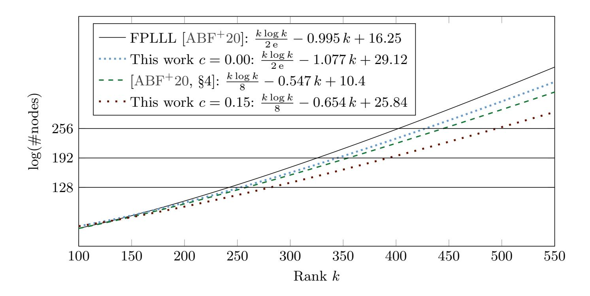

Costs are given in number of nodes visited during enumeration. It is typically assumed that processing one node takes about 64 CPU cycles [\[ABF](#page-25-5)<sup>+</sup>20]. A BKZ-like algorithm will make a polynomial number of calls to an oracle where the cost of each call is given in this figure. Costs are extrapolated from simulations.

Fig. 1.1: Cost comparison.

Since our results critically depend on our simulation and implementation results, we provide the complete source code (used to produce our simulation data and experimental verification) as an attachment to this document.

<span id="page-3-1"></span><sup>5</sup> To put this into perspective, [\[TKH18\]](#page-28-7) reports solving 1.05-HSVP in rank 150 using a distributed implementation of an enumeration algorithm. As a result, we expect the speedups demonstrated in this work to be practical.

{4}------------------------------------------------

Impact on security estimates. Security estimates for lattice-based cryptographic primitives typically rely upon sieving algorithms [\[ACD](#page-25-8)+18]. In the classical (i.e. non-quantum) setting this is backed by both the asymptotic [\[BDGL16\]](#page-26-9) and concrete [\[ADH](#page-25-7)+19, [DSvW21\]](#page-26-7) performance of sieving algorithms. Our results do not affect this state of the art.[6](#page-4-0) As can be gleaned from Figure [1.1,](#page-3-0) all known enumeration-based algorithms, including those based on the strategies in this work, perform similarly up to rank k ≈ 100. On the other hand, G6K [\[ADH](#page-25-7)+19] outperforms FPLLL's implementation of enumeration for ranks & 70.

In the quantum setting the situation is considerably more complicated. Quantum enumeration algorithms asymptotically produce a quadratic speed-up over classical enumeration algorithms [\[ANS18\]](#page-25-9) in the "query model", but each such queries may have significant (polynomial) cost, implying that such an estimate is likely a significant underestimate of the true cost. On the other hand, quantum sieving improves the cost from 20.<sup>292</sup> <sup>k</sup>+o(k) to 20.<sup>265</sup> <sup>k</sup>+o(k) [\[Laa15\]](#page-27-10), assuming no depth restriction on quantum computation. In [\[AGPS20\]](#page-25-10) some quantum resource estimates are given for the dominant part of various lattice sieving algorithms. These costs, however, are derived assuming unit cost for accessing quantum accessible RAM, an optimistic assumption. Overall, given the lack of clarity on the cost of the two families of algorithms under consideration in a quantum setting, it is currently not possible to assess the crossover rank when quantum lattice sieving outperforms quantum lattice-point enumeration. This suggests an analogous investigation to [\[AGPS20\]](#page-25-10) for quantum enumeration as a pressing research question.

Faced with the difficulty of assessing the cost of quantum algorithms, the literature routinely relies on rough low bounds to estimate the cost of lattice reduction, see e.g. [\[PAA](#page-28-8)<sup>+</sup>19, [GZB](#page-27-11)<sup>+</sup>19, [BBC](#page-26-10)<sup>+</sup>20].[7](#page-4-1) In particular, the quantum version of the Core-SVP methodology [\[ADPS16\]](#page-25-2) assigns a cost of 2<sup>0</sup>.<sup>265</sup> <sup>k</sup> to performing lattice reduction with RHF GH(k) <sup>1</sup>/(k−1). Now, comparing this figure with a naive square-root of our enumeration costs would give a crossover rank of k = 547. Yet, even then, i.e. even presuming the square-root advantage applies as is to our algorithm including preprocessing, accepting the assumptions of suppressing (potentially significant) polynomial factors, no depth restriction on quantum computation and unit-cost qRAM, this would not imply a downward correction of Category 1 NIST PQC Round 3 submission parameters and similar parameters for lattice-based schemes. That is, we stress that this work does not invalidate the claimed NIST Security Level of such submissions. This is because a given security level is defined by both a classical and a quantum cost: roughly 2<sup>λ</sup> classically and 2λ/<sup>2</sup> quantumly. For example, for Level 1 this is the cost of classically and quantumly breaking AES-128. Submissions targeting a classical security level 2<sup>λ</sup> relying on the cost of classical sieving 2<sup>0</sup>.<sup>292</sup> <sup>k</sup>+o(k) have a quantum security level much higher than 2λ/<sup>2</sup> under the 2<sup>0</sup>.<sup>265</sup> <sup>k</sup> cost model. In

<span id="page-4-0"></span><sup>6</sup> We discuss the (apparent lack of) applicability of our approach to the sieving setting in Appendix [B.](#page-32-0)

<span id="page-4-1"></span><sup>7</sup> This does not imply, though, that those works endorse this mode of comparison, e.g. [\[BBC](#page-26-10)<sup>+</sup>20] explicates its objections to it.

{5}------------------------------------------------

other words, this work does not lower the cost of quantum enumeration sufficiently to invalidate NIST Security Level claims since known quantum algorithms provide only a minor speed-up in the chosen cost model over classical algorithms when compared to Grover's algorithm for, say, AES.

### 2 Background

Notation. To be compatible with software implementations such as FP(y)LLL, we let matrix indices start with 0 and use row-representation for both vectors and matrices in this work. Bold lower-case and upper-case letters denote row vectors and matrices respectively. The set of  $n \times m$  matrices with coefficients in the ring  $\mathbb{A}$  is denoted by  $\mathbb{A}^{n \times m}$ , and we identify  $\mathbb{A}^m$  with  $\mathbb{A}^{1 \times m}$ . The notations  $\log(\cdot)$  and  $\ln(\cdot)$  stand for the base 2 and natural logarithms respectively.

#### 2.1 Lattices

Orthogonalisation. Let  $\mathbf{B} = (\mathbf{b}_0, \dots, \mathbf{b}_{n-1}) \in \mathbb{R}^{n \times m}$  be a basis of a lattice  $\mathcal{L}$ . Lattice algorithms often involve the orthogonal projections  $\pi_i : \mathbb{R}^m \mapsto \operatorname{span}(\mathbf{b}_0, \dots, \mathbf{b}_{i-1})^{\perp}$  for  $i = 0, \dots, n-1$ . The Gram-Schmidt orthogonalisation (GSO) of  $\mathbf{B}$  is  $\mathbf{B}^* = (\mathbf{b}_0^*, \dots, \mathbf{b}_{n-1}^*)$ , where the Gram-Schmidt vector  $\mathbf{b}_i^*$  is  $\pi_i(\mathbf{b}_i)$ . Then  $\mathbf{b}_0^* = \mathbf{b}_0$  and  $\mathbf{b}_i^* = \mathbf{b}_i - \sum_{j=0}^{i-1} \mu_{i,j} \cdot \mathbf{b}_j^*$  for  $i = 1, \dots, n-1$ , where  $\mu_{i,j} = \frac{\langle \mathbf{b}_i, \mathbf{b}_j^* \rangle}{\langle \mathbf{b}_j^*, \mathbf{b}_j^* \rangle}$ . The projected block  $(\pi_i(\mathbf{b}_i), \pi_i(\mathbf{b}_{i+1}), \dots, \pi_i(\mathbf{b}_{j-1}))$  is denoted by  $\mathbf{B}_{[i,j)}$ . Then the volume of the parallelepiped generated by  $\mathbf{B}_{[i,j)}$  is  $\operatorname{vol}(\mathbf{B}_{[i,j)}) = \prod_{k=i}^{j-1} \|\mathbf{b}_k^*\|$ . In particular,  $\mathbf{B}_{[0,j)} = (\mathbf{b}_0, \dots, \mathbf{b}_{j-1})$  and  $\operatorname{vol}(\mathcal{L}) = \operatorname{vol}(\mathbf{B}) = \prod_{k=0}^{n-1} \|\mathbf{b}_k^*\|$ .

Hermite's constant. Hermite's constant of dimension n is the maximum  $\gamma_n = \max \left(\lambda_1(\mathcal{L})/\operatorname{vol}(\mathcal{L})^{1/n}\right)^2$  over all n-rank lattices  $\mathcal{L}$ , where  $\lambda_1(\mathcal{L}) = \min_{\boldsymbol{v} \in \mathcal{L} \setminus \{\boldsymbol{0}\}} \|\boldsymbol{v}\|$  is the first minimum of  $\mathcal{L}$ . The best asymptotical bounds known are [CS87, MH73]:  $\frac{n}{2\pi e} + \frac{\log(\pi n)}{2\pi e} \leq \gamma_n \leq \frac{1.744n}{2\pi e} + o(n).$ 

Lattice reduction. Let  $\mathbf{B} = (\mathbf{b}_0, \dots, \mathbf{b}_{n-1})$  be a basis of a lattice  $\mathcal{L}$ .

 $\boldsymbol{B}$  is size-reduced if  $|\mu_{i,j}| \leq \frac{1}{2}$  for all  $0 \leq j < i < n$ .  $\boldsymbol{B}$  is LLL-reduced [LLL82] if it is size-reduced and every 2-rank projected block  $\boldsymbol{B}_{[i,i+2)}$  satisfies Lovász's condition:  $\frac{3}{4} \cdot \|\boldsymbol{b}_i^*\|^2 \leq \|\mu_{i+1,i} \cdot \boldsymbol{b}_i^* + \boldsymbol{b}_{i+1}^*\|^2$  for  $0 \leq i \leq n-2$ . In practice, the parameter  $\frac{3}{4}$  can be replaced with any constant in the interval  $(\frac{1}{4}, 1)$ .

 $\bm{B}$  is SVP-reduced if  $\|\bm{b}_0\| = \lambda_1(\mathcal{L})$ . There are two relaxations with  $\delta \geq 1$ :  $\bm{B}$  is  $\delta$ -SVP-reduced if  $\|\bm{b}_0\| \leq \delta \cdot \lambda_1(\mathcal{L})$ ;  $\bm{B}$  is  $\delta$ -HSVP-reduced if  $\|\bm{b}_0\| \leq \delta \cdot \operatorname{vol}(\mathcal{L})^{1/n}$ .

 $\boldsymbol{B}$  is HKZ-reduced if it is size-reduced and  $\boldsymbol{B}_{[i,n)}$  is SVP-reduced for  $i=0,\ldots,n-1$ ;  $\boldsymbol{B}$  is k-BKZ-reduced [Sch87] if it is size-reduced and  $\boldsymbol{B}_{[i,\min\{i+k,n\})}$  is SVP-reduced for  $i=0,\ldots,n-1$ .

Primitive vector. Let  $\mathcal{L}$  be a lattice with basis  $(\boldsymbol{b}_0, \dots, \boldsymbol{b}_{n-1})$ . A vector  $\boldsymbol{b} = \sum_{i=0}^{n-1} x_i \boldsymbol{b}_i \in \mathcal{L}$  with  $x_i \in \mathbb{Z}$  is primitive for  $\mathcal{L}$  iff it can be extended to a basis of  $\mathcal{L}$ , or equivalently,  $\gcd(x_0, \dots, x_{n-1}) = 1$  [Sie89, Theorem 32].

{6}------------------------------------------------

HSVP-oracle and RHF. A δ-HSVP-oracle with factor  $\delta > 0$  is any algorithm which, given as input an n-rank lattice  $\mathcal{L}$  specified by a basis, outputs a primitive vector  $\mathbf{v}$  in  $\mathcal{L}$  such that  $\|\mathbf{v}\| \leq \delta \cdot \operatorname{vol}(\mathcal{L})^{1/n}$ . The resulting root-Hermite-factor (RHF) is  $\left(\frac{\|\mathbf{v}\|}{\operatorname{vol}(\mathcal{L})^{1/n}}\right)^{1/(n-1)}$ , which is less than  $\delta^{1/(n-1)}$ . In other words, the worst-case RHF of this δ-HSVP-oracle on an n-rank lattice is  $\delta^{1/(n-1)}$ . For instance, any exact SVP-solver working on an n-rank lattice is a  $\sqrt{\gamma_n}$ -HSVP-oracle, whose corresponding worse-case RHF is  $\gamma_n^{\frac{1}{2(n-1)}}$ .

Geometric Series Assumption. Let  $\mathbf{B} = (\mathbf{b}_0, \dots, \mathbf{b}_{n-1})$  be a basis. Schnorr's Geometric Series Assumption (GSA) [Sch03] says that  $\mathbf{B}$  follows the GSA wrt. some constant  $r \in [3/4, 1)$  (depending on the reduction algorithm) if its Gram-Schmidt lengths decay geometrically wrt. r, namely  $\|\mathbf{b}_{i+1}^*\|/\|\mathbf{b}_i^*\| = r$  for all  $i = 0, \dots, n-2$ . In practice, it has been observed that a reduced basis produced by the LLL algorithm [LLL82] satisfies the GSA in an approximate sense when the input basis is sufficiently randomised.

Gaussian heuristic. Given a full-rank lattice  $\mathcal{L}$  in  $\mathbb{R}^n$  and a measurable set  $S \subseteq \mathbb{R}^n$ , the cardinality of  $S \cap \mathcal{L}$  is approximately  $\operatorname{vol}(S)/\operatorname{vol}(\mathcal{L})$ . Under the heuristic, there are about  $\alpha^n$  points in  $\mathcal{L}$  of norm  $\leq \alpha \cdot \operatorname{GH}(\mathcal{L})$ , and one would expect  $\lambda_1(\mathcal{L})$  to be close to  $\operatorname{GH}(\mathcal{L})$ . Here,  $\operatorname{GH}(\mathcal{L}) := \operatorname{GH}(n) \cdot \operatorname{vol}(\mathcal{L})^{1/n}$  with

GH(n) := 
$$\frac{\Gamma(n/2+1)^{1/n}}{\sqrt{\pi}} \approx \sqrt{\frac{n}{2\pi e}} \cdot (\pi n)^{\frac{1}{2n}}$$

by Stirling's formula (4). In fact, for a random lattice  $\mathcal{L}$ ,  $\lambda_1(\mathcal{L})$  is close to GH ( $\mathcal{L}$ ) with high probability [Rog56]; for any lattice  $\mathcal{L}$  of rank n > 24, it follows from Blichfeldt's inequality  $\gamma_n \leq 2 \cdot \text{GH}(n)^2$  [Bli14] that  $\lambda_1(\mathcal{L}) \leq \sqrt{2} \cdot \text{GH}(\mathcal{L})$ .

#### 2.2 Enumeration: pruning plus relaxation

Enumeration [Poh81, Kan83, FP85, SE94, MW15, ABF<sup>+</sup>20] is the simplest algorithm for solving SVP and requires only polynomial memory: given a full-rank lattice  $\mathcal{L}$  in  $\mathbb{R}^n$  and a radius R > 0, enumeration outputs  $\mathcal{L} \cap \text{Ball}_n(R)$  by a depth-first tree search. If  $R \geq \lambda_1(\mathcal{L})$ , then it is trivial to extract a nonzero lattice vector of length  $\leq R$ : moreover, by comparing all the norms of vectors in  $\mathcal{L} \cap \text{Ball}_n(R)$ , one can find a shortest nonzero lattice vector.

Cylinder pruning [SH95, GNR10] speeds up enumeration by replacing the search region  $\operatorname{Ball}_n(R)$  with a (much smaller) subset  $\operatorname{P}_f(\boldsymbol{B},R)$  defined by a bounding function  $f:\{1,\ldots,n\}\to[0,1]$ , a basis  $\boldsymbol{B}$  of  $\mathcal L$  and R:

$$P_f(\boldsymbol{B}, R) = \{ \boldsymbol{x} \in \mathbb{R}^n : ||\pi_{n-k}(\boldsymbol{x})|| \le f(k) \cdot R \text{ for all } 1 \le k \le n \} \subseteq Ball_n(R).$$

Algorithm 1 recalls enumeration with extreme cylinder pruning, which repeats enumeration with cylinder pruning many times over different subsets  $P_f(\boldsymbol{B}, R)$  by randomising  $\boldsymbol{B}$ . Here, each Step 3 is a single cylinder pruning.

{7}------------------------------------------------

#### <span id="page-7-0"></span>**Algorithm 1** Extreme cylinder pruning [GNR10, Algorithm 1]

**Input:**  $(\mathcal{L}, R, f)$ , where  $\mathcal{L}$  is a full-rank lattice in  $\mathbb{R}^n$  specified by a basis, R > 0 is a radius and f is a bounding function.

**Output:** A nonzero vector in  $\mathcal{L} \cap \text{Ball}_n(R)$ .

- 1: WHILE no nonzero vector in  $\mathcal{L} \cap \text{Ball}_n(R)$  has been found:
- 2: Compute a (randomised) reduced basis  $\boldsymbol{B}$  by applying basis reduction to a "random" basis of  $\mathcal{L}$ .
- 3: Compute  $\mathcal{L} \cap P_f(\boldsymbol{B}, R)$  by enumeration with cylinder pruning

The use of enumeration with extreme cylinder pruning in blockwise lattice reduction requires finding just one nonzero point in  $\mathcal{L} \cap P_f(\boldsymbol{B}, R)$  for some basis  $\boldsymbol{B}$  produced at Step 2: it allows to suitably relax radius R for speedup, which was already exploited in solving SVP challenges [SG10].

Recently, Li and Nguyen [LN20] clarified the heuristic asymptotic speedup achieved by enumeration with relaxed radius and with certain extreme cylinder pruning. It uses the following two heuristic assumptions as in [GNR10]:

<span id="page-7-1"></span>**Heuristic 1** The cost of Algorithm 1 is dominated by enumeration with cylinder pruning at Step 3, rather than the repeated reductions of Step 2.

<span id="page-7-2"></span>**Heuristic 2** All the reduced bases  $\boldsymbol{B}$  of Algorithm 1 follow the GSA wrt. the same positive constant.

<span id="page-7-3"></span>Theorem 1 ([LN20, Theorem 6]). Let  $\mathcal{L}$  be a full-rank lattice in  $\mathbb{R}^n$ . Let  $\alpha \geq 1$  and  $\rho \in (0, \frac{1}{2})$  such that  $4\alpha^4 \cdot \rho \cdot (1-\rho) < 1$ . Let  $R = \alpha \cdot \mathrm{GH}(\mathcal{L})$  and

$$f(i) = \begin{cases} \sqrt{\rho} & \text{if } 1 \le i \le n/2, \\ 1 & \text{otherwise.} \end{cases}$$

Under Heuristics 1 and 2, the time complexity  $T_{\alpha,\rho}(n)$  of Alg. 1 on  $(\mathcal{L}, R, f)$  equals, up to polynomial factors, T(n) of a full enumeration on  $\mathcal{L} \cap Ball_n(GH(\mathcal{L}))$  reduced by a multiplicative factor  $(4\alpha^2(1-\rho))^{n/4}$ :

$$T_{\alpha,\rho}(n) \approx \frac{T(n)}{(4\alpha^2(1-\rho))^{n/4}}.$$

Here (and for the remainder of this work) the cost of enumeration is expressed as the number of nodes visited during the enumeration process.

### 2.3 Schnorr–Euchner's BKZ and its accelerated variant in [ABF<sup>+</sup>20]

**BKZ.** The (original) BKZ algorithm introduced by Schnorr and Euchner [SE94] is the most widely used lattice reduction algorithm besides LLL [LLL82] and a central tool in lattice-based cryptanalysis. Its performance drives the setting of concrete parameters (such as keysizes) for concrete lattice-based cryptographic primitives (see e.g. [ACD<sup>+</sup>18]).

{8}------------------------------------------------

Originally, the SVP subroutine implemented in [SE94] was the simplest form of lattice enumeration, but it is now replaced by better subroutines, such as pruned enumeration [GNR10] in BKZ 2.0 [CN11] and FP(y)LLL [FPL19, FPy20] and (asymptotically) faster sieving in the General Sieve Kernel [ADH<sup>+</sup>19, DSvW21]. In practice, BKZ is typically implemented with an approximate (rather than exact) SVP-subroutine. Thus, Algorithm 2 slightly generalises BKZ by allowing the use of a relaxed HSVP-oracle at Step 3, as well as full LLL (instead of partial LLL) at Step 5: both are justified by Li–Nguyen's analysis [LN20].

At a high level, Algorithm 2 reduces a basis in high rank, using HSVP-oracles in low rank ( $\leq k$ ) as subroutines and running the LLL algorithm [LLL82] to remove the linear dependency right after inserting a lattice vector (found by the oracle) in the current basis.

### <span id="page-8-0"></span>Algorithm 2 BKZ: Schnorr–Euchner's BKZ algorithm [SE94]

8: end for 9: return B.

```
Input: A block size k \in (2, n), the number of tours N \in \mathbb{Z}^+, a relaxation factor \alpha \geq 1,
     and an LLL-reduced basis \boldsymbol{B} = (\boldsymbol{b}_0, \dots, \boldsymbol{b}_{n-1}) of a lattice \mathcal{L} \subseteq \mathbb{Z}^m.
Output: A new basis of \mathcal{L}.
 1: for \ell = 0 to N - 1 do
 2:
          for j = 0 to n - 2 do
               Find a primitive vector \boldsymbol{b} for the sublattice generated by the basis vectors
 3:
     b_j, ..., b_{h-1} where h = \min\{j + k, n\} s.t. \|\pi_j(b)\| \le \alpha \sqrt{\gamma_{h-j}} \cdot \text{vol}(B_{[j,h)})^{1/(h-j)}
 4:
               if \|{\bm b}_i^*\| > \|\pi_j({\bm b})\| then
 5:
                    LLL-reduce (\boldsymbol{b}_0,\ldots,\boldsymbol{b}_{j-1},\boldsymbol{b},\boldsymbol{b}_j,\ldots,\boldsymbol{b}_{n-1}) to remove linear dependencies
 6:
               end if
 7:
           end for //A BKZ tour refers to a single execution of Steps 2-7.
```

Building on Hanrot–Pujol–Stehlé's analysis of a certain BKZ variant (removing internal LLL calls) [HPS11], Li and Nguyen [LN20] justified the popular "early termination" strategy in practice of BKZ:

<span id="page-8-1"></span>**Theorem 2** ([LN20, Theorem 2]). Let  $n > k \ge 2$  be integers and let  $0 < \varepsilon \le 1 \le \alpha \le \frac{2^{(k-1)/4}}{\sqrt{\gamma_k}}$ . Given as input a block size k, a relaxation factor  $\alpha$ , and an LLL-reduced basis of an n-rank lattice  $\mathcal{L} \subset \mathbb{R}^m$ , if  $N \ge 4(\ln 2)\frac{n^2}{k^2}\log\frac{n^{1.5}}{(4\sqrt{3})\varepsilon}$ , then Alg. 2 outputs a basis  $(\boldsymbol{b}_0, \ldots, \boldsymbol{b}_{n-1})$  of  $\mathcal{L}$  such that

$$\|\boldsymbol{b}_0\| \le (1+\varepsilon) \cdot (\alpha^2 \gamma_k)^{\frac{n-1}{2(k-1)} + \frac{k \cdot (k-2)}{2n \cdot (k-1)}} \cdot \operatorname{vol}(\mathcal{L})^{1/n}$$

It was also mentioned in [LN20] that for  $n > k > 8e\pi$ , there is a k-BKZ reduced basis  $\mathbf{B} = (\mathbf{b}_0, \dots, \mathbf{b}_{n-1})$  satisfying  $\|\mathbf{b}_0\| = \left(\frac{k-1}{8e\pi}\right)^{\frac{n-1}{2k}} \cdot \operatorname{vol}(\mathbf{B})^{1/n}$ . Since  $\gamma_k = \Theta(k)$ , this means that BKZ with early termination indeed provides bases almost as reduced as the full BKZ algorithm. Th. 2 has a heuristic version (i.e. [LN20, Th. 5]), which heuristically models the practical behaviour of BKZ.

{9}------------------------------------------------

The accelerated BKZ variant in [\[ABF](#page-25-5)+20]. Recently, in [\[ABF](#page-25-5)+20] a practical and faster BKZ variant within the class of polynomial-space algorithms was introduced, based on the idea that its HSVP-oracle performs an exact enumeration with extended preprocessing.

Extended preprocessing is to preprocess in a larger rank than the enumeration rank. Exact enumeration with extended preprocessing refers to the procedure that the δ(k)-HSVP-oracle in "block size" d(1 + c) · ke (for some small constant c ≥ 0 and an integer k ≥ 2) first preprocesses a given projected block of rank d(1 + c) · ke (using this BKZ variant recursively in lower levels) into a reduced block (say,) C and then performs a (pruned) enumeration for solving SVP exactly on the k-rank head block of C to find a short nonzero vector v ∈ L(C).

The performance parameter k dominates the time/quality trade-off:

- Quality aspect: v is a shortest nonzero vector in the lattice generated by the <sup>k</sup>-rank head block <sup>C</sup>[0,k) of <sup>C</sup>, so that <sup>k</sup>vk ≤ <sup>√</sup>γ<sup>k</sup> · vol(C[0,k)) <sup>1</sup>/k. The BKZ-preprocessing on C ensures that vol(C[0,k))/vol(C) k/d(1+c)ke can be upper bounded well, so that kvk ≤ δ(k) · vol(C) 1/d(1+c)ke .
- Cost aspect: Due to the extended preprocessing on C, the k-rank head block C[0,k) has good quality for enumeration, i.e. C[0,k) almost satisfies the GSA. As a result, enumeration on C[0,k) costs at most k k/8 · 2 O(k) (matching the Gaussian heuristic estimate under the GSA). Both the GSA shape and the cost estimate were validated by [\[ABF](#page-25-5)+20]'s simulations and experiments.

We revisit [\[ABF](#page-25-5)+20, § 4]'s BKZ variant in Algorithms [3](#page-10-0) and [4.](#page-10-1) We refer the reader to [\[ABF](#page-25-5)<sup>+</sup>20] for definitions of the functions tail() and pre() called in Algorithm [4.](#page-10-1)

When c = 0, Algorithm [3](#page-10-0) is essentially Schnorr-Euchner's BKZ algorithm [\[SE94\]](#page-28-3) (i.e. using enumeration but with recursive BKZ preprocessing as an SVP-oracle).

Without formal analysis but with concrete simulations and experiments, [\[ABF](#page-25-5)+20] reported that the following instantiation of Algorithm [3](#page-10-0) seems to provide the best practical performance: (c, N) = (0.25, 4) and Algorithm [4](#page-10-1) performing pruned enumeration at both Step [4](#page-10-1) and Step [8.](#page-10-1) The resulting procedure achieves RHF ≈ GH(k) <sup>1</sup>/(k−1) in time ≈ 2 k log k <sup>8</sup> −0.547 k+10.4 , at least up to k ≈ 500.

### 2.4 Simulating BKZ

To understand the behaviour of lattice reduction algorithms, a useful approach is to conduct simulations. The underlying idea is to model the practical behaviour of the evolution of the Gram–Schmidt norms during the algorithm execution, without running a costly lattice reduction algorithm. Note that this requires only the Gram–Schmidt norms rather than the basis itself. Chen and Nguyen first provided a BKZ simulator [\[CN11\]](#page-26-3) based on the Gaussian heuristic and with an experiment-driven modification for the tail blocks of the basis. It relies on the assumption that each SVP solver on the projected blocks (except the tail ones of the basis) finds a vector whose norm corresponds to the Gaussian heuristic applied to that local block.

{10}------------------------------------------------

### <span id="page-10-0"></span>**Algorithm 3** BKZ variant in [ABF<sup>+</sup>20, Algorithm 4]

**Input:**  $(\boldsymbol{B}, k, c)$ , where  $\boldsymbol{B} = (\boldsymbol{b}_0, \dots, \boldsymbol{b}_{n-1})$  is an LLL-reduced basis of an n-rank lattice  $\mathcal{L}$  in  $\mathbb{Z}^m$ ,  $k \in [2, n)$  is a performance parameter,  $c \geq 0$  is an overshooting parameter and  $N \in \mathbb{Z}^+$  is the number of tours.

```
Output: A reduced basis of \mathcal{L}.
 1: for \ell = 0 to N - 1 do
 2:
          for j = 0 to n - 2 do
 3:
               Find a short nonzero vector v in the lattice \mathcal{L}_{[j,h)} (generated by the projected
     block B_{[j,h)} where h = \min\{j + \lceil (1+c)k \rceil, n\}), by calling Alg. 4 on (B_{[j,h)}, k, c)
 4:
               \|\boldsymbol{b}_i^*\|>\|\boldsymbol{v}\| then
                    Lift v into a primitive vector b for the sublattice generated by the basis
 5:
     vectors \boldsymbol{b}_i, \dots, \boldsymbol{b}_{h-1} such that \|\pi_j(\boldsymbol{b})\| \leq \|\boldsymbol{v}\|
                    LLL-reduce (\boldsymbol{b}_0,\ldots,\boldsymbol{b}_{j-1},\boldsymbol{b},\boldsymbol{b}_j,\ldots,\boldsymbol{b}_{n-1}) to remove linear dependencies
 6:
 7:
               end if
 8:
          end for
 9: end for
10: return \boldsymbol{B}.
```

<span id="page-10-1"></span>**Algorithm 4** An approx-HSVP oracle on  $(\boldsymbol{B}_{[j,h)}, k, c)$  using exact enumeration in rank  $k^*$  with extended preprocessing in rank (h-j) [ABF<sup>+</sup>20, Algorithm 3]

```
    Find the enumeration rank k* ← tail(k, c, h - j)
    Numerically find the preprocessing parameter k' ← pre(k*, ||b<sub>j</sub>*||, ..., ||b<sub>h-1</sub>*||)
    if k' ≥ 3 then
    Run Alg. 3 on (B<sub>[j,h)</sub>, k', c) to obtain a reduced basis C∈ Q<sup>(h-j)×m</sup> of L<sub>[j,h)</sub>
    else
    LLL-reduce B<sub>[j,h)</sub> into a basis C∈ Q<sup>(h-j)×m</sup> of L<sub>[j,h)</sub>
    end if //Steps 3-7 preprocess B<sub>[j,h)</sub> for the next local enumeration
    Enumerate on the head block C<sub>[0,k*)</sub> of C to find a shortest nonzero vector v in the lattice generated by C<sub>[0,k*)</sub>
```

We extend/adapt this simulator to also estimate the cost and not only the evolution of the Gram-Schmidt norms. To find the enumeration cost with pruning, we make use of FPyLLL's pruning module which numerically optimises pruning parameters for a time/success probability trade-off using a gradient descent. In small block sizes, the enumeration cost is dominated by calls to LLL. In our code, we simply assume that one LLL call in rank k costs the equivalent of visiting  $k^3$  enumeration nodes. While this is clearly not the cost of LLL [NS05], this choice produces costs that match the observed running times (see e.g. Figure 4.2) closest among the choices we experimented with. We hypothesise that this behaviour can be explained by that the basis vectors  $b_0, \ldots, b_{j-1}, b_j, \ldots, b_{n-1}$  appearing at, say, Step 6 of Algorithm 3 are already (better than) LLL-reduced. This assumption enables us to bootstrap our cost estimates. BKZ in block size up to (say,) 40 only requires LLL preprocessing, allowing us to estimate the cost of preprocessing with block size up to 40, which in turn enables us to estimate the cost (including preprocessing) for larger block sizes etc. Our simulation source code is available

{11}------------------------------------------------

as simu.py, as an attachment to the electronic version of the full version of this document.

#### <span id="page-11-0"></span>Asymptotic Time/Quality Trade-Offs 3

In this section, we show asymptotically that relaxed (rather than exact) enumeration with certain extreme cylinder pruning does achieve better time/quality trade-offs for certain approximation regimes, especially for small enough RHFs.

#### <span id="page-11-5"></span>3.1An elementary lemma

We will use the following notation for the remainder of this work:

- $-\delta$ -HSVP enumeration oracle: it denotes a  $\delta$ -HSVP-solver using (relaxed) enumeration with (extreme) pruning, i.e. setting the radius  $R = \delta \cdot \text{vol}(\mathcal{L})^{1/n}$ for enumeration on a given n-rank lattice  $\mathcal{L}$ .
- $-k_{\alpha}$ : for real  $\alpha \geq 1$  and integer  $k \geq 36$ , let  $k_{\alpha}$  be the smallest integer greater than k such that

<span id="page-11-7"></span>
$$GH(k)^{\frac{1}{k-1}} \ge (\alpha \cdot GH(k_{\alpha}))^{\frac{1}{k_{\alpha}-1}}.$$
 (1)

The integer  $k_{\alpha}$  is well-defined, due to the following fact:

<span id="page-11-1"></span>**Fact 3** With the definition GH  $(i) = \frac{\Gamma(i/2+1)^{1/i}}{\sqrt{\pi}}$ , GH  $(i)^{\frac{1}{i-1}}$  strictly decreases for integers  $i \geq 36$ .

Our following analysis relies on a key observation that the ratio  $\frac{k_{\alpha}}{k}$  "almost" decreases for  $k \geq \lceil 2\pi e^2 \rceil = 47$  and tends to 1 as k tends to infinity. More precisely, we will use the following key elementary lemma:

**Lemma 1.** Let  $\alpha \geq 1$  be a real and  $k \geq 36$  be an integer.

- <span id="page-11-6"></span>1. Monotonicity: For any fixed k,  $k_{\alpha}$  increases with  $\alpha \geq 1$ . 2. Lower bound:  $k_{\alpha} \geq k + \frac{k \log \alpha}{\log k}$ .
- <span id="page-11-4"></span>
- <span id="page-11-3"></span>3. Upper bound: If  $k \geq (2\pi e^2)^{\frac{\eta}{\eta-2}}$  for some variable  $\eta > 2$ , then

<span id="page-11-2"></span>
$$k_{\alpha} \le k + \left\lceil \frac{\eta \, k \log \alpha}{\log k} \right\rceil.$$

The proofs of Fact 3 and Lemma 1 can be found in Appendix A.

Lemma 1 indicates that asymptotically for a fixed constant  $\alpha$ , the larger the integer k, the smaller we can assign the variable  $\eta$  in Item 3, then the smaller both the upper bound  $1 + \frac{\eta \log \alpha}{\log k} + \frac{1}{k}$  and the lower bound  $1 + \frac{\log \alpha}{\log k}$  of the ratio  $\frac{k_{\alpha}}{k}$ . Figure 3.1 verifies this numerically for several values of  $\alpha$  and k.

{12}------------------------------------------------

<span id="page-12-0"></span>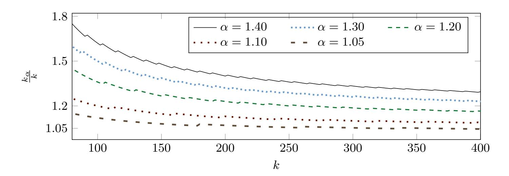

Fig. 3.1: Evolution of the ratio <sup>k</sup><sup>α</sup> <sup>k</sup> wrt. constant α ∈ {1.05, 1.1, 1.2, 1.3, 1.4} and integer k = 80, . . . , 400.

#### 3.2 Asymptotic time/quality trade-offs

Theorem [1](#page-7-3) implies that with certain extreme cylinder pruning, relaxing enumeration would result in an exponential speedup, with a minor loss in the approximation factor:

Corollary 1. Let L be a full-rank lattice in R <sup>n</sup>. Let α ≥ 1 and ρ ∈ (0, 1 2 ) such that 4α <sup>4</sup>ρ(1 − ρ) < 1. Let R = GH(L), R<sup>α</sup> = α · GH(L) and

<span id="page-12-1"></span>
$$f(i) = \begin{cases} \sqrt{\rho} & \text{if } 1 \le i \le n/2, \\ 1 & \text{otherwise.} \end{cases}$$

Under Heuristics [1](#page-7-1) and [2,](#page-7-2) the heuristic time complexity of Alg. [1](#page-7-0) with radius R<sup>α</sup> is less than that of Alg. [1](#page-7-0) with radius R by a multiplicative factor α n/2 (up to some polynomial factor).

Proof. Let T(n) denote the standard heuristic estimate for the cost of full enumeration on L T Balln(GH(L)). It follows from Theorem [1](#page-7-3) that the heuristic cost estimates of Alg. [1](#page-7-0) with radius R<sup>α</sup> and with radius R are respectively

$$\frac{T(n)}{(4\alpha^2(1-\rho))^{n/4}}$$
 and  $\frac{T(n)}{(4(1-\rho))^{n/4}}$ 

up to some polynomial factors. This implies the conclusion. ut

The corollary indicates that, in the same extreme pruning regime (i.e. with the same bounding function f), if one is interested in finding just one short nonzero vector (rather than one shortest nonzero vector) for a given lattice, then it is faster to run a relaxed (rather than exact) enumeration.

A more interesting question is whether such benefits can be carried over without sacrificing the quality. Thus what remains to be established is how the cost gain compares to the corresponding quality loss. For instance, we take k = 50 and α = 2. For reaching the same RHF GH (50) 1 <sup>49</sup> ≈ 1.012, it is unlikely that the 

{13}------------------------------------------------

 $(2 \cdot \text{GH}(152))$ -HSVP enumeration oracle in rank 152 is faster than the GH(50)-HSVP enumeration oracle in rank 50. Thus, we now clarify that asymptotically relaxed (rather than exact) enumeration with certain extreme cylinder pruning does achieve better time/quality trade-offs for certain approximation regimes, especially for small enough RHFs. To do so, we compare costs of  $\delta$ -HSVP enumeration oracles with different factors  $\delta$  aiming for the same output quality.

More precisely, Lemma 1 allows us to prove that for reaching the same RHF  $GH(k)^{\frac{1}{k-1}}$ , the  $(\alpha \cdot GH(k_{\alpha}))$ -HSVP enumeration oracle in rank  $k_{\alpha}$  is exponentially faster than the GH(k)-HSVP enumeration oracle in rank k, provided that k is sufficiently large and  $\alpha > 1$  is reasonably small.

<span id="page-13-0"></span>**Theorem 4.** Let  $\alpha > 1$  and  $\rho \in (0, \frac{1}{2})$  be constants such that  $4\alpha^4 \rho \cdot (1 - \rho) < 1$ . Let

$$f(i) = \begin{cases} \sqrt{\rho} & \text{if } 1 \le i \le n/2, \\ 1 & \text{otherwise.} \end{cases}$$

In addition to Heuristics 1 and 2, assume that up to some polynomial factor, the heuristic runtime of full enumeration on any n-rank integer lattice with radius equal to the Gaussian heuristic is  $T(n) := n^{c_0 n} \cdot 2^{c_1 n}$  with constant coefficients  $c_0, c_1$  such that  $0 < c_0 < \frac{1}{4}$ . Let k be an arbitrary positive integer satisfying  $k > \max\left\{(2\pi e^2)^{\frac{1}{1-4c_0}}, 2^{-\frac{c_1}{c_0}}\right\}$ . For any real  $\eta \in \left[\frac{2\ln k}{\ln k - \ln(2\pi e^2)}, \frac{1}{2c_0}\right)$ , if  $1 < \alpha \le (k^{c_0} \cdot 2^{c_1})^2$ , then the  $(\alpha \cdot \operatorname{GH}(k_\alpha))$ -HSVP enumeration oracle in rank  $k_\alpha$  (using Alg. 1) is exponentially faster than the  $\operatorname{GH}(k)$ -HSVP enumeration oracle in rank k (using Alg. 1) by a multiplicative factor of at least

$$\alpha^{\left(\frac{1}{2}-c_0\eta\right)k} \cdot \left(4(1-\rho)\left(\frac{\sqrt{\alpha}}{\left(2e\right)^{c_0}2^{c_1}}\right)^{4\eta}\right)^{\frac{k\log\alpha}{4\log k}}$$
 (up to some polynomial factor).

*Proof.* We omit some polynomial factors in the following complexity analysis. By the assumption, it follows from Theorem 1 that the heuristic runtime of the  $(\alpha \cdot GH(k_{\alpha}))$ -HSVP enumeration oracle in rank  $k_{\alpha}$  and the GH(k)-HSVP enumeration oracle in rank k are respectively

$$T_{\alpha} \approx \frac{T(k_{\alpha})}{(4\alpha^{2}(1-\rho))^{k_{\alpha}/4}} = k_{\alpha}^{c_{0}k_{\alpha}} \cdot 2^{c_{1}k_{\alpha}} \cdot \alpha^{-k_{\alpha}/2} \cdot (4(1-\rho))^{-k_{\alpha}/4}$$

$$= 2^{\left(c_{0}\log k_{\alpha} + c_{1} - \frac{\log \alpha}{2}\right)k_{\alpha}} \cdot (4(1-\rho))^{-k_{\alpha}/4},$$

$$T_{1} \approx \frac{T(k)}{(4(1-\rho))^{k/4}} = k^{c_{0}k} \cdot 2^{c_{1}k} \cdot (4(1-\rho))^{-k/4}.$$

For simplicity, let  $u_{\alpha} := k + \phi_{\alpha} \in \mathbb{Z}^+$  with  $\phi_{\alpha} := \left\lceil \frac{\eta k \log \alpha}{\log k} \right\rceil$ . Since  $\eta \in \left\lceil \frac{2 \ln k}{\ln k - \ln(2\pi e^2)}, \frac{1}{2c_0} \right\rceil$  and  $k > (2\pi e^2)^{\frac{1}{1-4c_0}}$ , we have  $\eta > 2$  and  $k \ge (2\pi e^2)^{\frac{\eta}{\eta-2}} > (2\pi e^2)^{\frac{1}{1-4c_0}}$ . Then Item 3 of Lemma 1 implies  $k_{\alpha} \le u_{\alpha}$ . Since  $1 < \alpha \le (k^{c_0} \cdot 2^{c_1})^2$ , Item 2 of Lemma 1 implies  $k_{\alpha} > k \ge \alpha^{\frac{1}{c_0}} 2^{\frac{|c_1|}{c_0}}$ . Then  $c_0 \log k_{\alpha} + c_1 - \frac{\log \alpha}{2} > 0$ .

{14}------------------------------------------------

Thus,

$$T_{\alpha} \lesssim 2^{\left(c_0 \log u_{\alpha} + c_1 - \frac{\log \alpha}{2}\right)u_{\alpha}} \cdot (4(1-\rho))^{-k_{\alpha}/4} = u_{\alpha}^{c_0 u_{\alpha}} \cdot 2^{c_1 u_{\alpha}} \cdot \alpha^{-u_{\alpha}/2} \cdot (4(1-\rho))^{-k_{\alpha}/4}.$$

As a result, we have

$$\begin{split} \frac{T_1}{T_{\alpha}} &\gtrapprox \frac{k^{c_0k} \cdot 2^{c_1k} \cdot \alpha^{u_{\alpha}/2} \cdot (4(1-\rho))^{k_{\alpha}/4}}{u_{\alpha}^{c_0u_{\alpha}} \cdot 2^{c_1u_{\alpha}} \cdot (4(1-\rho))^{k/4}} \\ &= \frac{\alpha^{(k+\phi_{\alpha})/2}}{k^{c_0\phi_{\alpha}} \cdot (1+\frac{\phi_{\alpha}}{k})^{c_0\cdot(k+\phi_{\alpha})} \cdot 2^{c_1\phi_{\alpha}}} \cdot (4(1-\rho))^{\frac{(k_{\alpha}-k)}{4}} \\ &\trianglerighteq \frac{\alpha^{(k+\phi_{\alpha})/2}}{k^{c_0\phi_{\alpha}} \cdot e^{c_0\cdot\phi_{\alpha}} \cdot (1+\frac{\phi_{\alpha}}{k})^{c_0\phi_{\alpha}} \cdot 2^{c_1\phi_{\alpha}}} \cdot (4(1-\rho))^{\frac{(k_{\alpha}-k)}{4}} \quad (\text{using } \left(1+\frac{\phi_{\alpha}}{k}\right)^k \leq e^{\phi_{\alpha}}) \\ &\trianglerighteq \frac{\alpha^{(k+\phi_{\alpha})/2}}{k^{c_0\phi_{\alpha}} \cdot (2e)^{c_0\phi_{\alpha}} \cdot 2^{c_1\phi_{\alpha}}} \cdot (4(1-\rho))^{\frac{(k_{\alpha}-k)}{4}} \quad (\text{using } 1+\frac{\phi_{\alpha}}{k} \leq 2) \\ &\trianglerighteq \frac{\alpha^{(k+\phi_{\alpha})/2}}{\alpha^{c_0\eta k} \cdot k^{c_0} \cdot (2e)^{c_0\phi_{\alpha}} \cdot 2^{c_1\phi_{\alpha}}} \cdot (4(1-\rho))^{\frac{(k_{\alpha}-k)}{4}} \quad (\text{using } k^{c_0\phi_{\alpha}} \leq \alpha^{c_0\eta k} \cdot k^{c_0}) \\ &\trianglerighteq \alpha^{(\frac{1}{2}-c_0\eta)k} \cdot \left(\frac{\sqrt{\alpha}}{(2e)^{c_0}2^{c_1}}\right)^{\phi_{\alpha}} \cdot k^{-c_0} \cdot (4(1-\rho))^{\frac{k\log\alpha}{4\log k}}. \quad (\text{by Item 2 of Lemma 1}) \\ & \text{Substituting } \phi_{\alpha} = \left\lceil \frac{\eta k \log\alpha}{\log k} \right\rceil, \text{ we conclude that} \\ & \frac{T_1}{T_{-n}} \gtrapprox \alpha^{(\frac{1}{2}-c_0\eta)k} \cdot \left(\frac{\sqrt{\alpha}}{(2e)^{c_0}2^{c_1}}\right)^{\frac{\eta k \log\alpha}{\log k}}} \cdot (4(1-\rho))^{\frac{k\log\alpha}{4\log k}}. \end{split}$$

up to some polynomial factor. This completes the proof.

By Theorem 4, the smaller the time coefficient  $c_0$  and the larger the relaxation constant  $\alpha$  (satisfying both  $4\alpha^4 \rho \cdot (1-\rho) < 1$  and  $1 < \alpha \le (k^{c_0} \cdot 2^{c_1})^2$ ), the larger the exponential speedup factor  $\alpha^{\left(\frac{1}{2}-c_0\eta\right)k}$ . This suggests that if some full enumeration algorithm of time  $n^{c_0n} \cdot 2^{O(n)}$  with smaller coefficient  $c_0$  is found, then relaxing such an algorithm in the certain extreme cylinder pruning regime would result in better time/quality trade-offs for certain (including larger) RHFs. In brief, an enumeration oracle with smaller coefficient  $c_0$  would benefit more from (larger) relaxation.

### <span id="page-14-0"></span>3.3 Numerical validation

To validate Corollary 1 for concrete parameters, we simulated enumeration up to rank k = 500 when fixing  $\rho = 0.01$  for varying  $\alpha$ . For this, we first simulated both the output and the corresponding cost of pre-processing with k'-BKZ for some index k' < k. We note that for our pre-processing, we always assume a k'-rank SVP oracle inside BKZ. By combining the (recursive) preprocessing cost with the expected (repeated) enumeration cost, we arrive at an expected overall enumeration cost (denoted by  $t_{\alpha}(k)$  in Table 1). For the top-most enumeration, we pick pruning parameters as suggested by Corollary 1 for  $\rho = 0.01$  and for all

{15}------------------------------------------------

values of  $\alpha$ . Our simulation runs a simple linear search for k' such that the total expected cost is minimised. We then used SciPy's scipy.optimize.curve\_fit function [VGO<sup>+</sup>20] to fit simulation data into cost functions of form  $k^{\frac{k}{2e}} \cdot 2^{c_1 k + c_2}$  with constant coefficients  $c_1$  and  $c_2$ . For fitting we use always the indices  $k = \lceil \alpha \cdot 100 \rceil, \lceil \alpha \cdot 100 \rceil + 1, \ldots, \lceil \alpha \cdot 250 \rceil$ , which depend on  $\alpha$  due to numerical stability issues. The results are given in Table 1.

Furthermore, several heuristics (such as the Geometric Series Assumption) are required to hold to instantiate Corollary 1 and Theorem 4. We check these experimentally in Appendix D. In those experiments, the preprocessing cost is not taken into account and thus these algorithms are hypothetical. As a consequence, they give lower-bound estimates rather than predict costs.

<span id="page-15-1"></span>Table 1: Speedups of relaxed enumeration with certain extreme cylinder pruning derived from our simulation for  $\rho = 0.01$  and claimed by Corollary 1.

| $\alpha$ | $\log t_{\alpha}(k)$<br>Simulation                                                                                         | $\log \frac{t_1(k)}{t_{\alpha}(k)}$<br>Simulation | $\log \frac{t_1(k)}{t_{\alpha}(k)} \approx \frac{\log \alpha}{2} k$<br>Corollary 1 |
|----------|----------------------------------------------------------------------------------------------------------------------------|---------------------------------------------------|------------------------------------------------------------------------------------|
| 1.00     | $\frac{k \log k}{2 e} - 0.581 k + 9.07$                                                                                    | 0.00                                              | 0.00                                                                               |
| 1.05     | $\frac{k \log k}{2 e} - 0.638 k + 10.91$ $\frac{k \log k}{2 e} - 0.691 k + 12.34$ $\frac{k \log k}{2 e} - 0.731 k + 11.97$ | 0.057 k - 1.84                                    | 0.035k                                                                             |
| 1.10     | $\frac{k \log k}{2 e} - 0.691 k + 12.34$                                                                                   | 0.110 k - 3.27                                    | 0.069k                                                                             |
| 1.15     | $\frac{k \log k}{2 e} - 0.731 k + 11.97$                                                                                   | 0.150 k - 2.90                                    | 0.101k                                                                             |
| 1.20     | $\frac{k \log k}{2 e} - 0.767 k + 11.21$                                                                                   | 0.186 k - 2.14                                    | 0.132k                                                                             |
| 1.25     | $\frac{k \log k}{2 e} - 0.767 k + 11.21$ $\frac{k \log k}{2 e} - 0.800 k + 10.37$                                          | 0.219 k - 1.30                                    | 0.161k                                                                             |
| 1.30     | $\frac{\frac{2 \mathrm{e}}{2 \mathrm{e}}}{\frac{k \log k}{2 \mathrm{e}}} - 0.836 k + 10.37$                                | 0.255  k - 1.69                                   | 0.189k                                                                             |

Here,  $t_{\alpha}(k)$  denotes the "expected cost" of the  $(\alpha \cdot GH(k))$ -HSVP enumeration oracle in rank  $k \in [\lceil \alpha \cdot 100 \rceil, \lceil \alpha \cdot 250 \rceil]$ , including preprocessing.

#### <span id="page-15-0"></span>4 Practical Approximate Enumeration Oracles

Table 1 highlights the relative speedups obtainable by relaxed enumeration with certain extreme cylinder pruning. It does not, however, present speedups over the state-of-the-art for enumeration, which can be observed by comparing the second column of Table 1 with the known cost  $2^{\frac{k \log k}{2e} - 0.995 k + 16.25}$  of enumeration with optimised BKZ 2.0 [CN11] preprocessing (see [ABF<sup>+</sup>20, Fig. 2]).

In this section, we provide simulation data – fitted curves and experimental validation – to show that with FP(y)LLL's pruning module [FPL19, FPy20] and with or without extended preprocessing, relaxed enumeration does achieve exponential speedups, but with a loss in the approximation factor: it can be viewed as a practical version of Corollary 1. We will consider the performance gain when targeting the same RHF as an exact oracle in Section 5. In Appendix E, we also provide additional experiments to check the accuracy of the underlying cost

{16}------------------------------------------------

estimation module in FP(y)LLL, with respect to relaxed pruned enumeration. Furthermore, a curious artefact of our parameters is that they do not suggest extreme pruning. Rather, they imply a small number of repetitions only. We elaborate on this in Appendix [F.](#page-41-1)

#### 4.1 Simulations and cost estimates

As in Section [3.3,](#page-14-0) we run the top-most enumeration as an (α·GH(k))-HSVP-oracle in rank k and perform a linear search over parameter k 0 (< k) for preprocessing such that the overall enumeration cost is minimised. We first simulate calling Algorithm [2](#page-8-0) with block size k 0 (i.e. k 0 -BKZ) to preprocess a given basis of rank d(1 + c) · ke and then simulate running relaxed enumeration on it. That is, we simulate the "expected cost" of the (α · GH(k))-HSVP enumeration oracle in rank k with preprocessing in rank d(1 + c) · ke, i.e. enumeration on a k-rank head block B with FPyLLL's optimised cylinder pruning and with relaxed radius R = α · GH(L(B)). Here, the "expected cost" of each oracle call includes both the expected (repeated) enumeration cost and all recursive preprocessing costs.

We illustrate the fitted cost estimates in Table [2](#page-22-0) (columns "α <sup>0</sup> = 1"), which confirm that relaxed enumeration does achieve exponential speedups. We also give some example data and curve fits in Figure [4.1.](#page-17-0)

Remark 1. In Table [2](#page-22-0) we are seeing a slight advantage when picking c = 0.15 over picking c = 0.25. It slightly deviates from a claim in [\[ABF](#page-25-5)<sup>+</sup>20] that for α = 1, c = 0.25 seems to provide the best performance among c ≥ 0. We hence reproduce this advantage using the original simulation code from [\[ABF](#page-25-5)<sup>+</sup>20] in Figure [C.1](#page-33-0) in Appendix [C.](#page-33-1) This simulation confirms that the choice of c = 0.15 also provides a minor performance improvement for α = 1.

### 4.2 Consistency with experiments

In Figure [4.2](#page-18-1) (and Figures [C.2,](#page-34-0) [C.3](#page-35-0) in Appendix [C\)](#page-33-1), we give experimental data comparing our implementation with our simulations of the (α · GH(k))- HSVP enumeration oracle in rank k with preprocessing in rank d(1 + c) · ke for c ∈ {0.00, 0.15, 0.25}. [8](#page-16-0) It shows that our simulation for cost estimates is reasonably accurate for larger instances with a minor bias towards underestimating the cost. The data should be understood as follows:

- "Simulation" is the output of our simulation code simu.py.
- "Runtime" is the walltime for running FPLLL, converted to "nodes visited" units, assuming 64 CPU cycles per node.
- "Runtime" in Figure [C.2](#page-34-0) is scaled by 2.6·109/64 because it runs on a "Intel(R) Xeon(R) CPU E5-2690 v4 @ 2.60GHz" (atomkohle), while "Runtime" in Figures [4.2](#page-18-1) and [C.3](#page-35-0) is scaled by 3.3 · 10<sup>9</sup>/64 because it runs on a "Intel(R) Xeon(R) CPU E5-2667 v2 @ 3.30GHz" (strombenzin).
- "Nodes" is the number of enumeration nodes visited reported by FPLLL. "Runtime" also includes the cost of recursive LLL calls, but "Nodes" does not.

<span id="page-16-0"></span><sup>8</sup> The reader may consult [\[ABF](#page-25-5)<sup>+</sup>20, Fig. 4] for the case c = 0.00, α = 1.00.

{17}------------------------------------------------

<span id="page-17-0"></span>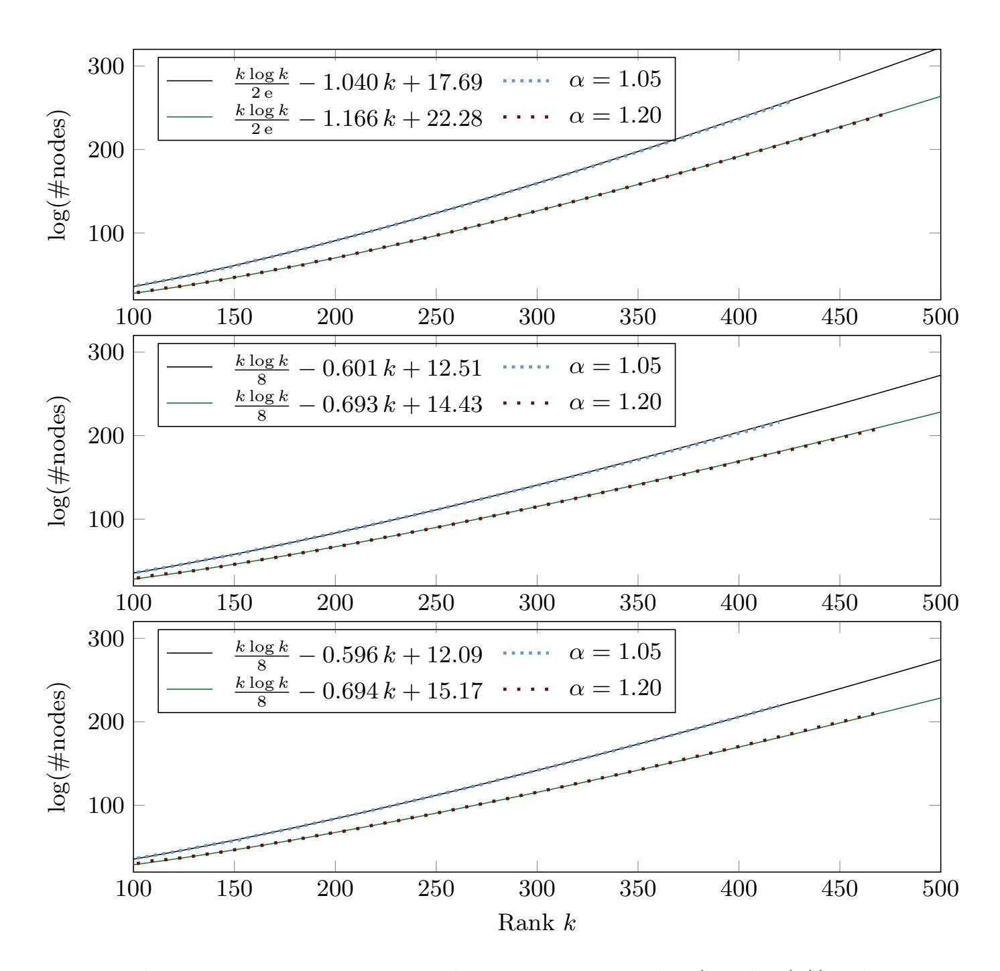

Fig. 4.1: Selected "expected costs" from simulations for (α · GH(k))-HSVP enumeration oracles in rank k for c ∈ {0.00, 0.15, 0.25} (in turn).

{18}------------------------------------------------

<span id="page-18-1"></span>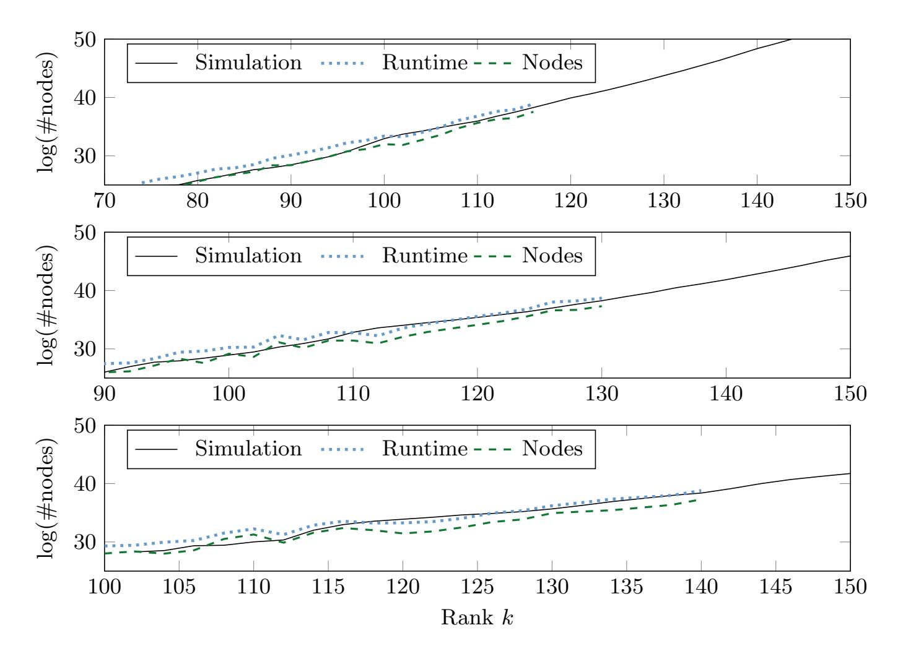

Fig. 4.2: Experimental verification of simulation results for the (α · GH(k))-HSVP enumeration oracle in rank k with example α ∈ {1.10, 1.20, 1.30} (in turn) and c = 0.15. We ran 16 experiments.

## <span id="page-18-0"></span>5 A Practical BKZ Variant

While Section [4](#page-15-0) establishes a practical exponential speed-up of relaxed enumeration in the same rank k, it does not yet account for the loss in quality. In this section, we consider relaxed enumeration in rank k<sup>α</sup> to obtain a RHF of ≈ GH(k) <sup>1</sup>/(k−1). This enables us to define a practical variant of the BKZ algorithm utilising relaxed enumeration. This, in turn, enables us to use relaxed enumeration recursively to preprocess bases for relaxed enumeration.

To this end, we present a generalisation of the BKZ variant in [\[ABF](#page-25-5)<sup>+</sup>20] with one more optional parameter. This generalisation integrates the idea of extended preprocessing (introduced by [\[ABF](#page-25-5)<sup>+</sup>20]) with the relaxation strategy (formalised in [\[ALNS20,](#page-25-4) [LN20\]](#page-27-7)) on enumeration-based HSVP-oracles. That is, given a performance parameter k (akin to the 'block size' of Alg. [2\)](#page-8-0), we equip Schnorr–Euchner's BKZ with approximate enumeration oracles as illustrated in Section [4,](#page-15-0) namely an (α · GH(kα))-HSVP enumeration oracle in rank k<sup>α</sup> with preprocessing in rank d(1 + c) · kαe for some small constant c ≥ 0 and an optional relaxation constant α ≥ 1. This BKZ variant uses three parameters (k, c, α), while [\[ABF](#page-25-5)<sup>+</sup>20]'s variant relies on two parameters (k, c) and BKZ

{19}------------------------------------------------

(2.0) [\[SE94,](#page-28-3) [CN11\]](#page-26-3) uses one parameter k. In particular, our BKZ variant can be viewed as a practical version of Theorem [4.](#page-13-0)

With extensive experiments and simulations, we investigate the performances of this BKZ variant for both practical and cryptographic parameter ranges: it does achieve better time/quality trade-offs for certain approximation regimes than both [\[ABF](#page-25-5)+20]'s variant and BKZ 2.0 [\[CN11\]](#page-26-3).

Main result. Given as input a performance parameter k — our simulations cover k ∈ [100, 400] — an overshooting parameter c ∈ [0, 0.4], and a basis of an integer lattice of rank n ≥ (1 + c) · k1.3, our BKZ variant first picks the "optimal" relaxation constant α ∈ {1, 1.05, 1.1, 1.15, 1.2, 1.25, 1.3} to minimise the expected cost of one oracle call and achieves RHF GH (k) 1 <sup>k</sup>−<sup>1</sup> with simulated cost estimates:

- Case c = 0: the expected cost of one oracle call is about 2 <sup>k</sup> log <sup>k</sup> 2 e −1.077 k+29.12 , which is lower than BKZ 2.0's record 2 <sup>k</sup> log <sup>k</sup> 2 e <sup>−</sup>0.<sup>995</sup> <sup>k</sup>+16.<sup>25</sup> reported in [\[ABF](#page-25-5)+20, Fig. 2];
- Case c = 0.25: the expected cost of one oracle call is about 2 <sup>k</sup> log <sup>k</sup> <sup>8</sup> −0.632 k+21.94 , which is lower than the record in [\[ABF](#page-25-5)+20]: 2 <sup>k</sup> log <sup>k</sup> <sup>8</sup> −0.547 k+10.4 ;
- Case c = 0.15: the expected cost of one oracle call is about 2 <sup>k</sup> log <sup>k</sup> <sup>8</sup> −0.654 k+25.84

.

Our results are illustrated in Figure [1.1.](#page-3-0) Our simulations were performed on q-ary lattices of dimensions n = d(1 + c) · kαe with volume q n/2 for q = 2<sup>30</sup> .

#### 5.1 Algorithm

Alg. [5](#page-21-0) is our BKZ variant which, given as input a performance parameter k ≥ 2, an overshooting parameter c ≥ 0, a relaxation parameter α ≥ 1, and a basis of an integer lattice L of rank n ≥ (1 + c) · kα, outputs a reduced basis of L.

It calls the (α·GH(kα))-HSVP enumeration oracle in rank k<sup>α</sup> with preprocessing in rank d(1 + c) · kαe as an HSVP subroutine. This oracle includes recursive preprocessing: when α = 1 then Alg. [6](#page-21-1) is essentially Alg. [4,](#page-10-1) and hence calls a function pre(·, ·) for returning the preprocessing parameter. When (c, α) = (0, 1), Alg. [5](#page-21-0) is essentially BKZ 2.0 [\[CN11\]](#page-26-3) and Schnorr-Euchner's BKZ algorithm [\[SE94\]](#page-28-3).

Restricted to the state-of-the-art power in practice, we choose c ∈ [0, 0.4] and α ∈ {1.00, 1.05, 1.10, 1.15, 1.20, 1.25, 1.30} for simplicity in our simulations.

Remark 2. In our experiments, the choice of α in Alg. [5](#page-21-0) is determined from an optimised strategy profile built upon our simulated data for each k ∈ [2, 400]. We remark that it is also possible to determine such α on-the-fly based on simulations on the current basis.

Handling the tail. Just like all known BKZ variants (such as the variant in [\[ABF](#page-25-5)<sup>+</sup>20] and BKZ 2.0 [\[CN11\]](#page-26-3)), it is tricky to handle tail projected blocks of the current basis during execution, because of the decreasing ranks over 

{20}------------------------------------------------

 $d = \lceil (1+c) \cdot k_{\alpha} \rceil, \lceil (1+c) \cdot k_{\alpha} \rceil - 1, \dots, 2$ . We hence generalise [ABF<sup>+</sup>20]'s tail function tail $(\cdot, \cdot, \cdot)$  with one more parameter  $\alpha$  for computing the enumeration rank.

For given integer  $k \geq 2$ , constant  $c \geq 0$  and relaxation constant  $\alpha \geq 1$ , our approximate enumeration oracle first finds the enumeration rank  $k^*$  using the function  $tail(k, c, \alpha, d)$  for  $d = 2, \ldots, \lceil (1+c) \cdot k_{\alpha} \rceil$ :

<span id="page-20-0"></span>
$$k^* \leftarrow \operatorname{tail}(k, c, \alpha, d) = \max \left\{ \min \left\{ d, \left\lceil k_{\alpha} - \frac{\lceil (1+c) \cdot k_{\alpha} \rceil - d}{2} \right\rceil \right\}, 2 \right\}.$$

Then  $k^* = k_{\alpha}$  when  $d = \lceil (1+c) \cdot k_{\alpha} \rceil$ . It can be checked that  $k^*$  is strictly less than d if d is large enough and is exactly equal to d otherwise:

$$tail(k, c, \alpha, d) = \begin{cases} k_{\alpha} + \left\lceil \frac{d - \lceil (1+c) \cdot k_{\alpha} \rceil}{2} \right\rceil & \text{if } (1-c) \cdot k_{\alpha} < d \leq \lceil (1+c) \cdot k_{\alpha} \rceil \\ d & \text{if } 2 \leq d \leq (1-c) \cdot k_{\alpha} \end{cases} \in [2, k_{\alpha}].$$

$$(2)$$

Alg. 5 calls the  $(\alpha \cdot GH(k^*))$ -HSVP enumeration oracle in rank  $k^*$  with preprocessing in rank d to reduce each tail projected block, namely Alg. 6.

**Preprocessing parameter.** Given a projected block (say,)  $(\boldsymbol{b}_0, \ldots, \boldsymbol{b}_{d-1})$  of rank  $d \in [2, \lceil (1+c) \cdot k_{\alpha} \rceil]$ , the preprocessing function  $\operatorname{pre}(k^*, \|\boldsymbol{b}_0^*\|, \ldots, \|\boldsymbol{b}_{d-1}^*\|)$  returns the "optimal" preprocessing parameter  $k' \in [2, k^*]$ , possibly based on simulations, such that the cost of enumeration on the  $k^*$ -rank head block is minimised (e.g., at most  $k^{k/8} \cdot 2^{O(k)}$  when c = 0.15), after preprocessing on  $(\boldsymbol{b}_0, \ldots, \boldsymbol{b}_{d-1})$  using Alg. 5 recursively in lower levels, i.e. equipped with a similar HSVP-oracle with parameters  $(k', c, \alpha')$  (instead of the current level  $(k, c, \alpha)$ ).

Since  $k_{\alpha} \geq k^* \geq k' \geq 2$ , each enumeration throughout all recursive levels of Alg. 5 would not be more expensive than the top-most enumeration-based HSVP-oracle (i.e., the  $(\alpha \cdot \text{GH}(k_{\alpha}))$ -HSVP enumeration oracle in rank  $k_{\alpha}$  with preprocessing in rank  $\lceil (1+c) \cdot k_{\alpha} \rceil$ ).

#### 5.2 Performance of our BKZ variant

Using simulations and data from our implementation, we now validate the performance of our algorithm. We first show that preprocessing with relaxed enumeration has a performance benefit (for c > 0) and then validate the output quality of our algorithm. Combining the two, we obtain our main result in Figure 1.1, as claimed above.

 $\alpha \cdot \text{GH}(k)$ -HSVP oracle performance. In the columns labelled " $\alpha' \geq 1$ " in Table 2, we present the speed-ups over  $\alpha = 1$  attained by our BKZ variant. That is, the performance of solving  $\alpha \cdot \text{GH}(k)$ -HSVP when using recursive preprocessing with  $\alpha' \geq 1$ . We can observe the following from Table 2:

- Without extended preprocessing (i.e. setting the overshooting parameter c=0), Table 2 indicates that it is better for preprocessing in rank k to

{21}------------------------------------------------

#### <span id="page-21-0"></span>**Algorithm 5** A new BKZ variant with three parameters $(k, c, \alpha)$

**Input:**  $(\boldsymbol{B}, k, c, \alpha)$ , where  $\boldsymbol{B} = (\boldsymbol{b}_0, \dots, \boldsymbol{b}_{n-1})$  is an LLL-reduced basis of an n-rank lattice  $\mathcal{L}$  in  $\mathbb{Z}^m$ ,  $k \in [2, n)$  is a performance parameter,  $c \geq 0$  is an overshooting parameter,  $\alpha \geq 1$  is a relaxation parameter satisfying  $n \geq (1 + c) \cdot k_{\alpha}$ , and  $N \in \mathbb{Z}^+$  denotes the number of tours.

```
Output: A reduced basis of \mathcal{L}.
 1: for \ell = 0 to N - 1 do
 2:
           for j = 0 to n - 2 do
 3:
                 Find a short nonzero vector v in the lattice \mathcal{L}_{[j,h)} (generated by the projected
      block \boldsymbol{B}_{[j,h)} where h = \min\{j + \lceil (1+c) \cdot k_{\alpha} \rceil, n\}), by calling Alg. 6 on (\boldsymbol{B}_{[j,h)}, k, c, \alpha)
 4:
                 \text{if } \|\boldsymbol{b}_{i}^{*}\|>\|\boldsymbol{v}\| \text{ then }
 5:
                      Lift v into a primitive vector b for the sublattice generated by the basis
      vectors \boldsymbol{b}_i, \dots, \boldsymbol{b}_{h-1} such that \|\pi_i(\boldsymbol{b})\| \leq \|\boldsymbol{v}\|
                      LLL-reduce (\boldsymbol{b}_0,\ldots,\boldsymbol{b}_{j-1},\boldsymbol{b},\boldsymbol{b}_j,\ldots,\boldsymbol{b}_{n-1}) to remove linear dependencies
 6:
 7:
                 end if
           end for
 8:
 9: end for
10: return \boldsymbol{B}.
```

<span id="page-21-1"></span>**Algorithm 6** An approx-HSVP oracle on  $(\boldsymbol{B}_{[j,h)}, k, c, \alpha)$  using relaxed enumeration in rank  $k^*$  with extended preprocessing in rank (h-j)

```
    Find the enumeration rank k* ← tail(k, c, α, h − j) by Eq. (2)
    Numerically find the preprocessing parameter k' ← pre(k*, ||b<sub>j</sub>*||, ..., ||b<sub>h-1</sub>*||)
    if k' ≥ 3 then
    Run Alg. 5 on (B<sub>[j,h)</sub>, k', c, α') with some α' ≥ 1 to obtain a reduced basis C∈ Q<sup>(h-j)×m</sup> of L<sub>[j,h)</sub>
    else
    LLL-reduce B<sub>[j,h)</sub> into a basis C∈ Q<sup>(h-j)×m</sup> of L<sub>[j,h)</sub>
    end if //Steps 3-7 preprocess B<sub>[j,h)</sub> for the relaxed enumeration.
    Call the (α·GH(k*))-HSVP enumeration oracle in rank k* on the head block C<sub>[0,k*)</sub> of C to find a short nonzero vector v in the lattice L<sub>[j,h)</sub>
```

call the  $(\alpha' \cdot GH(k'))$ -HSVP enumeration oracle in rank k' with  $\alpha' = 1$  than  $\alpha' > 1$ .

– In contrast, Table 2 indicates that in the case c > 0, it is better for preprocessing in rank  $\lceil (1+c) \cdot k \rceil$  to call the  $(\alpha' \cdot GH(k'))$ -HSVP enumeration oracle in rank k' with some  $\alpha' \geq 1$  than  $\alpha' = 1$ , i.e. to proceed as outlined above.

Table 2 does not normalise time/quality trade-offs. Thus, in Figure 5.1 (and Figures C.4 and C.5 in Appendix C) we illustrate the performance gain of relaxed enumeration for reaching the same RHF.

**Quality.** To validate the output quality of our BKZ variant, we compared the RHF predicted by the simulations for BKZ, Alg. 5 and a self-dual variant of Alg. 5 in Figure 5.2a, following the strategy of [ABF<sup>+</sup>20]. As Figure 5.2a illustrates, our variant achieves the same RHF as BKZ, when run in "self-dual" mode.

{22}------------------------------------------------

<span id="page-22-0"></span>Table 2: Speedups of relaxed enumeration with extreme cylinder pruning derived from our simulation with FPyLLL's optimised cylinder pruning and recursive relaxed enumeration compared with that claimed by Corollary 1.

| $\alpha$ | $\log \frac{t_1(k)}{t_{\alpha}(k)}$ | $\log t_{\alpha}(k)$                                                              | $\log \frac{t_1(k)}{t_{\alpha}(k)}$ | $\log t_{\alpha}(k)$                                                                                     | $\log \frac{t_1(k)}{t_{\alpha}(k)}$ |
|----------|-------------------------------------|-----------------------------------------------------------------------------------|-------------------------------------|----------------------------------------------------------------------------------------------------------|-------------------------------------|
|          | Cor. 1                              | Sim. $(\alpha' = 1)$                                                              | Sim. $(\alpha' = 1)$                | Sim. $(\alpha' \ge 1)$                                                                                   | Sim. $(\alpha' \ge 1)$              |
|          |                                     |                                                                                   | c = 0.00                            |                                                                                                          |                                     |
| 1.00     | 0.00                                | $\frac{k \log k}{2 e} - 0.994 k + 17.94$ $\frac{k \log k}{2 e} - 1.040 k + 17.69$ | 0.00                                | $\frac{k \log k}{2^{\frac{2}{9}}} - 0.946 k + 11.31$ $\frac{k \log k}{2^{\frac{2}{9}}} - 0.984 k + 9.82$ | 0.00                                |
| 1.05     | 0.035k                              | $\frac{k \log k}{2 e} - 1.040 k + 17.69$                                          | 0.046 k + 0.24                      | $\frac{k \log k}{2 e} - 0.984 k + 9.82$                                                                  | 0.038 k + 1.49                      |
| 1.10     | 0.069k                              | $\frac{k \log k}{2 e} - 1.088 k + 18.56$                                          | 0.093 k - 0.63                      | $\frac{k \log k}{2 e} - 1.027 k + 9.99$                                                                  | 0.081 k + 1.32                      |
| 1.15     | 0.101k                              | $\frac{k \log k}{2 e} - 1.088 k + 18.56$ $\frac{k \log k}{2 e} - 1.132 k + 20.55$ | 0.137 k - 2.61                      | $\frac{k \log k}{2 e} - 1.027 k + 9.99$ $\frac{k \log k}{2 e} - 1.078 k + 12.75$                         | 0.132 k - 1.45                      |
| 1.20     | 0.132k                              | $\frac{k \log k}{2 e} - 1.166 k + 22.28$                                          | 0.171 k - 4.34                      | $\frac{k \log k}{2e} - 1.123 k + 15.73$                                                                  | 0.176 k - 4.43                      |
| 1.25     | 0.161k                              | $\frac{k \log k}{2 e} - 1.166 k + 22.28$ $\frac{k \log k}{2 e} - 1.193 k + 23.84$ | 0.199 k - 5.90                      | $\frac{k \log k}{2 e} - 1.157 k + 17.93$                                                                 | 0.211 k - 6.62                      |
| 1.30     | 0.189k                              | $\frac{k \log k}{2 e} - 1.217 k + 25.42$                                          | 0.223 k - 7.48                      | $\frac{k \log k}{2 e} - 1.187 k + 20.31$                                                                 | 0.241 k - 9.00                      |
| c = 0.15 |                                     |                                                                                   |                                     |                                                                                                          |                                     |
| 1.00     | 0.00                                | $\frac{k \log k}{8} - 0.552 k + 12.53$                                            | 0.00                                | $\frac{k \log k}{8} - 0.566 k + 14.28$                                                                   | 0.00                                |
| 1.05     | 0.035k                              | $\frac{k \log k}{8} - 0.601 k + 12.51$                                            | 0.049 k + 0.02                      | $\frac{k \log k}{8} - 0.617 k + 14.69$                                                                   | 0.052 k - 0.41                      |
| 1.10     | 0.069k                              | $\frac{k \log k}{8} - 0.641 k + 13.13$                                            | 0.089 k - 0.60                      | $\frac{k \log k}{8} - 0.660 k + 15.68$                                                                   | 0.094 k - 1.40                      |
| 1.15     | 0.101k                              | $\frac{k \log k}{8} - 0.670 k + 13.79$                                            | 0.118 k - 1.26                      | $\frac{k \log k}{8} - 0.691 k + 16.71$                                                                   | 0.126 k - 2.43                      |
| 1.20     | 0.132k                              | $\frac{k \log k}{2} - 0.693 k + 14.43$                                            | 0.142 k - 1.90                      | $\frac{k \log k}{8} - 0.716 k + 17.73$                                                                   | 0.151 k - 3.45                      |
| 1.25     | 0.161k                              | $\frac{k \log k}{8} - 0.713 k + 15.19$                                            | 0.161 k - 2.66                      | $\frac{k \log k}{8} - 0.738 k + 18.91$                                                                   | 0.172 k - 4.63                      |
| 1.30     | 0.189k                              | $\frac{k \log k}{8} - 0.730  k + 15.95$                                           | 0.178 k - 3.42                      | $\frac{k \log k}{8} - 0.757  k + 20.01$                                                                  | 0.191 k - 5.73                      |
| c = 0.25 |                                     |                                                                                   |                                     |                                                                                                          |                                     |
| 1.00     | 0.00                                | $\frac{k \log k}{8} - 0.549 k + 12.33$                                            | 0.00                                | $\frac{k \log k}{8} - 0.571 k + 15.39$                                                                   | 0.00                                |
| 1.05     | 0.035k                              | $\frac{k \log k}{8} - 0.596 k + 12.09$                                            | 0.047 k + 0.24                      | $\frac{k \log k}{8} - 0.616 k + 14.80$                                                                   | 0.044 k + 0.60                      |
| 1.10     | 0.069k                              | $\frac{k \log k}{8} - 0.596 k + 12.09$ $\frac{k \log k}{8} - 0.639 k + 13.15$     | 0.090 k - 0.82                      | $\frac{k \log k}{8} - 0.651 k + 14.84$                                                                   | 0.080 k + 0.55                      |
| 1.15     | 0.101k                              | $\frac{k \log k}{8} - 0.669 k + 14.08$                                            | 0.121 k - 1.75                      | $\frac{k \log k}{8} - 0.683 k + 15.93$                                                                   | 0.112 k - 0.53                      |
| 1.20     | 0.132k                              | $\frac{k \log k}{8} - 0.694 k + 15.17$                                            | 0.145 k - 2.84                      | $\frac{k \log k}{8} - 0.712 k + 17.59$                                                                   | 0.140  k - 2.20                     |
| 1.25     | 0.161k                              | $\frac{k \log k}{8} - 0.713 k + 15.92$                                            | 0.164 k - 3.59                      | $\frac{k \log k}{8} - 0.735 k + 19.09$                                                                   | 0.164 k - 3.70                      |
| 1.30     | 0.189k                              | $\frac{k \log k}{8} - 0.728  k + 16.62$                                           | 0.180 k - 4.29                      | $\frac{k \log k}{8} - 0.755  k + 20.50$                                                                  | 0.183 k - 5.11                      |

Here,  $t_{\alpha}(k)$  denotes the "expected cost" of the  $(\alpha \cdot GH(k))$ -HSVP enumeration oracle in rank  $k \in [\lceil \alpha \cdot 100 \rceil, \lceil \alpha \cdot 250 \rceil]$ , with preprocessing in rank  $\lceil (1+c) k \rceil$ , using relaxed enumeration recursively.

We also verified the behaviour of the practical implementation of Alg. 5 against our simulation and give an example in Figure 5.2b. As this figure illustrates, our implementation agrees with our simulation except in the tail.

{23}------------------------------------------------

<span id="page-23-0"></span>(a) Expected cost  $t_{\alpha}(k_{\alpha})$  of the  $(\alpha \cdot \text{GH}(k_{\alpha}))$ -HSVP enumeration oracle in rank  $k_{\alpha}$  for reaching RHF GH  $(k)^{\frac{1}{k-1}}$ .

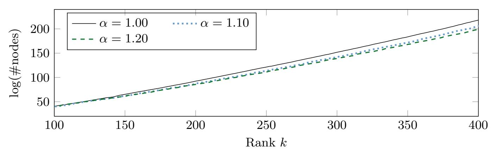

(b) Cost advantage  $\log \frac{t_1(k)}{t_{\alpha}(k_{\alpha})}$  of the  $(\alpha \cdot \mathrm{GH}(k_{\alpha}))$ -HSVP enumeration oracle in rank  $k_{\alpha}$  for reaching RHF GH  $(k)^{\frac{1}{k-1}}$ .

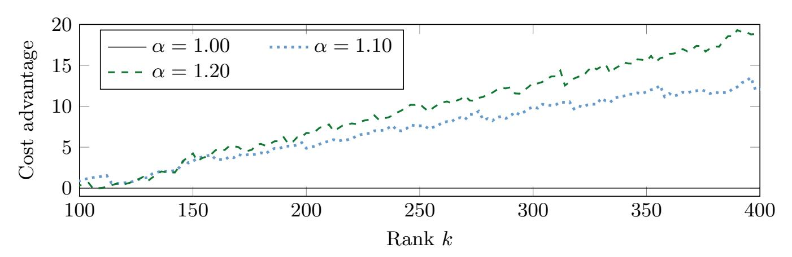

Fig. 5.1: Expected performance of  $(\alpha \cdot \text{GH}(k_{\alpha}))$ -HSVP enumeration oracle in rank  $k_{\alpha}$ ; case c = 0.15; preprocessing with  $\alpha' \geq 1.00$ .

{24}------------------------------------------------

<span id="page-24-0"></span>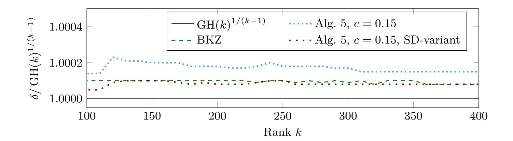

(a) We compare  $\delta := (\|\boldsymbol{b}_0\|/\operatorname{vol}(\Lambda)^{1/n})^{1/(n-1)}$  as predicted by simulation algorithms to  $\operatorname{GH}(k)^{1/(k-1)}$  for n=2 k and random q-ary lattices. For "BKZ" we use eight tours of the simulator from [CN11]. For "Alg. 5, c=0.15" we use eight tours of our simulator. For "Alg. 5, c=0.15, SD-variant" we use our simulator on the dual basis (four tours) followed by the same on the primal basis (four tours).

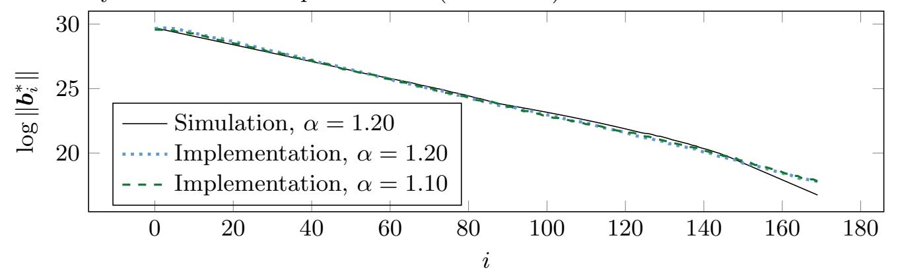

(b) We compare the basis shape predicted by our simulations with that produced by our implementation of Algorithm 5 for q-ary lattices  $\Lambda$  with  $q=2^{24}+43$ , n=170,  $\operatorname{vol}(\Lambda)=q^{n/2}$ , k=60 and c=0.25. Implementation data is averaged over eight runs.

Fig. 5.2: Basis quality.

{25}------------------------------------------------

### References

- <span id="page-25-5"></span>ABF<sup>+</sup>20. Martin R. Albrecht, Shi Bai, Pierre-Alain Fouque, Paul Kirchner, Damien Stehl´e, and Weiqiang Wen. Faster enumeration-based lattice reduction: Root hermite factor k 1/(2k) time k k/8+o(k) . In Micciancio and Ristenpart [\[MR20\]](#page-27-15), pages 186–212.
- <span id="page-25-8"></span>ACD<sup>+</sup>18. Martin R. Albrecht, Benjamin R. Curtis, Amit Deo, Alex Davidson, Rachel Player, Eamonn W. Postlethwaite, Fernando Virdia, and Thomas Wunderer. Estimate all the LWE, NTRU schemes! In Dario Catalano and Roberto De Prisco, editors, SCN 18, volume 11035 of LNCS, pages 351–367. Springer, Heidelberg, September 2018.
- <span id="page-25-11"></span>AD18. Michel Abdalla and Ricardo Dahab, editors. PKC 2018, Part I, volume 10769 of LNCS. Springer, Heidelberg, March 2018.
- <span id="page-25-7"></span>ADH<sup>+</sup>19. Martin R. Albrecht, L´eo Ducas, Gottfried Herold, Elena Kirshanova, Eamonn W. Postlethwaite, and Marc Stevens. The general sieve kernel and new records in lattice reduction. In Yuval Ishai and Vincent Rijmen, editors, EUROCRYPT 2019, Part II, volume 11477 of LNCS, pages 717–746. Springer, Heidelberg, May 2019.
- <span id="page-25-2"></span>ADPS16. Erdem Alkim, L´eo Ducas, Thomas P¨oppelmann, and Peter Schwabe. Postquantum key exchange - A new hope. In Thorsten Holz and Stefan Savage, editors, USENIX Security 2016, pages 327–343. USENIX Association, August 2016.
- <span id="page-25-13"></span>ADRS15. Divesh Aggarwal, Daniel Dadush, Oded Regev, and Noah Stephens-Davidowitz. Solving the shortest vector problem in 2<sup>n</sup> time using discrete Gaussian sampling: Extended abstract. In Rocco A. Servedio and Ronitt Rubinfeld, editors, 47th ACM STOC, pages 733–742. ACM Press, June 2015.
- <span id="page-25-10"></span>AGPS20. Martin R. Albrecht, Vlad Gheorghiu, Eamonn W. Postlethwaite, and John M. Schanck. Estimating quantum speedups for lattice sieves. In Shiho Moriai and Huaxiong Wang, editors, ASIACRYPT 2020, Part II, volume 12492 of LNCS, pages 583–613. Springer, Heidelberg, December 2020.
- <span id="page-25-3"></span>AGVW17. Martin R. Albrecht, Florian G¨opfert, Fernando Virdia, and Thomas Wunderer. Revisiting the expected cost of solving uSVP and applications to LWE. In Tsuyoshi Takagi and Thomas Peyrin, editors, ASIACRYPT 2017, Part I, volume 10624 of LNCS, pages 297–322. Springer, Heidelberg, December 2017.
- <span id="page-25-1"></span>Ajt96. Mikl´os Ajtai. Generating hard instances of lattice problems (extended abstract). In 28th ACM STOC, pages 99–108. ACM Press, May 1996.
- <span id="page-25-0"></span>Ajt98. Mikl´os Ajtai. The shortest vector problem in L2 is NP-hard for randomized reductions (extended abstract). In 30th ACM STOC, pages 10–19. ACM Press, May 1998.
- <span id="page-25-12"></span>AKS01. Mikl´os Ajtai, Ravi Kumar, and D. Sivakumar. A sieve algorithm for the shortest lattice vector problem. In 33rd ACM STOC, pages 601–610. ACM Press, July 2001.
- <span id="page-25-4"></span>ALNS20. Divesh Aggarwal, Jianwei Li, Phong Q. Nguyen, and Noah Stephens-Davidowitz. Slide reduction, revisited - filling the gaps in SVP approximation. In Micciancio and Ristenpart [\[MR20\]](#page-27-15), pages 274–295.
- <span id="page-25-9"></span>ANS18. Yoshinori Aono, Phong Q. Nguyen, and Yixin Shen. Quantum lattice enumeration and tweaking discrete pruning. In Peyrin and Galbraith [\[PG18\]](#page-28-15), pages 405–434.
- <span id="page-25-6"></span>AWHT16. Yoshinori Aono, Yuntao Wang, Takuya Hayashi, and Tsuyoshi Takagi. Improved progressive BKZ algorithms and their precise cost estimation by sharp simulator. In Fischlin and Coron [\[FC16\]](#page-26-14), pages 789–819.

{26}------------------------------------------------

- <span id="page-26-10"></span>BBC<sup>+</sup>20. Daniel J. Bernstein, Billy Bob Brumley, Ming-Shing Chen, Chitchanok Chuengsatiansup, Tanja Lange, Adrian Marotzke, Bo-Yuan Peng, Nicola Tuveri, Christine van Vredendaal, and Bo-Yin Yang. NTRU Prime. Technical report, National Institute of Standards and Technology, 2020. available at [https://csrc.nist.gov/projects/post-quantum-cryptography/](https://csrc.nist.gov/projects/post-quantum-cryptography/round-3-submissions) [round-3-submissions](https://csrc.nist.gov/projects/post-quantum-cryptography/round-3-submissions).
- <span id="page-26-9"></span>BDGL16. Anja Becker, L´eo Ducas, Nicolas Gama, and Thijs Laarhoven. New directions in nearest neighbor searching with applications to lattice sieving. In Robert Krauthgamer, editor, 27th SODA, pages 10–24. ACM-SIAM, January 2016.
- <span id="page-26-15"></span>BGJ15. Anja Becker, Nicolas Gama, and Antoine Joux. Speeding-up lattice sieving without increasing the memory, using sub-quadratic nearest neighbor search. Cryptology ePrint Archive, Report 2015/522, 2015. [https://eprint.iacr.](https://eprint.iacr.org/2015/522) [org/2015/522](https://eprint.iacr.org/2015/522).
- <span id="page-26-12"></span>Bli14. H. F. Blichfeldt. A new principle in the geometry of numbers, with some applications. Trans. Am. Math. Soc., 16:227–235, 1914.
- <span id="page-26-4"></span>BSW18. Shi Bai, Damien Stehl´e, and Weiqiang Wen. Measuring, simulating and exploiting the head concavity phenomenon in BKZ. In Peyrin and Galbraith [\[PG18\]](#page-28-15), pages 369–404.
- <span id="page-26-3"></span>CN11. Yuanmi Chen and Phong Q. Nguyen. BKZ 2.0: Better lattice security estimates. In Dong Hoon Lee and Xiaoyun Wang, editors, ASIACRYPT 2011, volume 7073 of LNCS, pages 1–20. Springer, Heidelberg, December 2011.
- <span id="page-26-11"></span>CS87. J. H. Conway and N. J. A. Sloane. Sphere-packings, Lattices, and Groups. Springer, 1987.
- <span id="page-26-7"></span>DSvW21. L´eo Ducas, Marc Stevens, and Wessel van Woerden. Advanced lattice sieving on GPUs, with tensor cores. 2021. To appear in Eurocrypt 2021. Available at <https://eprint.iacr.org/2021/141>.
- <span id="page-26-16"></span>Duc18. L´eo Ducas. Shortest vector from lattice sieving: A few dimensions for free. In Jesper Buus Nielsen and Vincent Rijmen, editors, EUROCRYPT 2018, Part I, volume 10820 of LNCS, pages 125–145. Springer, Heidelberg, April / May 2018.
- <span id="page-26-14"></span>FC16. Marc Fischlin and Jean-S´ebastien Coron, editors. EUROCRYPT 2016, Part I, volume 9665 of LNCS. Springer, Heidelberg, May 2016.
- <span id="page-26-13"></span>FP85. U. Fincke and M. Pohst. Improved methods for calculating vectors of short length in a lattice, including a complexity analysis. Mathematics of Computation, 44(170):463–471, 1985.
- <span id="page-26-5"></span>FPL19. FPLLL development team. FPLLL, a lattice reduction library. Available at <https://github.com/fplll/fplll>, 2019.
- <span id="page-26-6"></span>FPy20. FPyLLL development team. FPyLLL, a Python interface to FPLLL. Available at <https://github.com/fplll/fpylll>, 2020.
- <span id="page-26-1"></span>GN08a. Nicolas Gama and Phong Q. Nguyen. Finding short lattice vectors within Mordell's inequality. In Ladner and Dwork [\[LD08\]](#page-27-16), pages 207–216.
- <span id="page-26-2"></span>GN08b. Nicolas Gama and Phong Q. Nguyen. Predicting lattice reduction. In Nigel P. Smart, editor, EUROCRYPT 2008, volume 4965 of LNCS, pages 31–51. Springer, Heidelberg, April 2008.
- <span id="page-26-8"></span>GNR10. Nicolas Gama, Phong Q. Nguyen, and Oded Regev. Lattice enumeration using extreme pruning. In Henri Gilbert, editor, EUROCRYPT 2010, volume 6110 of LNCS, pages 257–278. Springer, Heidelberg, May / June 2010.
- <span id="page-26-0"></span>GPV08. Craig Gentry, Chris Peikert, and Vinod Vaikuntanathan. Trapdoors for hard lattices and new cryptographic constructions. In Ladner and Dwork [\[LD08\]](#page-27-16), pages 197–206.

{27}------------------------------------------------

- <span id="page-27-11"></span>GZB<sup>+</sup>19. Oscar Garcia-Morchon, Zhenfei Zhang, Sauvik Bhattacharya, Ronald Rietman, Ludo Tolhuizen, Jose-Luis Torre-Arce, Hayo Baan, Markku-Juhani O. Saarinen, Scott Fluhrer, Thijs Laarhoven, and Rachel Player. Round5. Technical report, National Institute of Standards and Technology, 2019. available at [https://csrc.nist.gov/projects/](https://csrc.nist.gov/projects/post-quantum-cryptography/round-2-submissions) [post-quantum-cryptography/round-2-submissions](https://csrc.nist.gov/projects/post-quantum-cryptography/round-2-submissions).
- <span id="page-27-18"></span>HKL18. Gottfried Herold, Elena Kirshanova, and Thijs Laarhoven. Speed-ups and time-memory trade-offs for tuple lattice sieving. In Abdalla and Dahab [\[AD18\]](#page-25-11), pages 407–436.
- <span id="page-27-14"></span>HPS11. Guillaume Hanrot, Xavier Pujol, and Damien Stehl´e. Analyzing blockwise lattice algorithms using dynamical systems. In Phillip Rogaway, editor, CRYPTO 2011, volume 6841 of LNCS, pages 447–464. Springer, Heidelberg, August 2011.
- <span id="page-27-2"></span>HR12. Ishay Haviv and Oded Regev. Tensor-based hardness of the shortest vector problem to within almost polynomial factors. Theory of Computing, 8(1):513– 531, 2012. Preliminary version in Proceedings of STOC '07.
- <span id="page-27-9"></span>HS07. Guillaume Hanrot and Damien Stehl´e. Improved analysis of kannan's shortest lattice vector algorithm. In Alfred Menezes, editor, CRYPTO 2007, volume 4622 of LNCS, pages 170–186. Springer, Heidelberg, August 2007.
- <span id="page-27-8"></span>Kan83. Ravi Kannan. Improved algorithms for integer programming and related lattice problems. In 15th ACM STOC, pages 193–206. ACM Press, April 1983.
- <span id="page-27-1"></span>Kho05. Subhash Khot. Hardness of approximating the shortest vector problem in lattices. Journal of the ACM, 52(5):789–808, 2005. Preliminary version in Proceedings of FOCS '04.
- <span id="page-27-10"></span>Laa15. Thijs Laarhoven. Search problems in Crpytography. PhD thesis, Eindhoven University of Technology, 2015.
- <span id="page-27-16"></span>LD08. Richard E. Ladner and Cynthia Dwork, editors. 40th ACM STOC. ACM Press, May 2008.
- <span id="page-27-4"></span>LLL82. Arjen Klaas Lenstra, Hendrik W. Lenstra Jr., and L´aszlo Lov´asz. Factoring polynomials with rational coefficients. Mathematische Annalen, 261:366–389, 1982.
- <span id="page-27-7"></span>LN20. Jianwei Li and Phong Q. Nguyen. A complete analysis of the BKZ lattice reduction algorithm. <https://eprint.iacr.org/2020/1237.pdf>, 2020.
- <span id="page-27-6"></span>Lov86. L´aszl´o Lov´asz. An algorithmic theory of numbers, graphs and convexity. Society for Industrial and Applied Mathematics, 1986.
- <span id="page-27-12"></span>MH73. J. Milnor and D. Husemoller. Symmetric bilinear forms. Springer, 1973.
- <span id="page-27-0"></span>Mic01. Daniele Micciancio. The shortest vector in a lattice is hard to approximate to within some constant. SIAM Journal on Computing, 30(6):2008–2035, 2001. Preliminary version in Proceedings of FOCS '98.
- <span id="page-27-3"></span>Mic12. Daniele Micciancio. Inapproximability of the Shortest Vector Problem: Toward a deterministic reduction. Theory of Computing, 8(22):487–512, 2012.
- <span id="page-27-15"></span>MR20. Daniele Micciancio and Thomas Ristenpart, editors. CRYPTO 2020, Part II, volume 12171 of LNCS. Springer, Heidelberg, August 2020.
- <span id="page-27-17"></span>MV10. Daniele Micciancio and Panagiotis Voulgaris. Faster exponential time algorithms for the shortest vector problem. In Moses Charika, editor, 21st SODA, pages 1468–1480. ACM-SIAM, January 2010.
- <span id="page-27-13"></span>MW15. Daniele Micciancio and Michael Walter. Fast lattice point enumeration with minimal overhead. In Piotr Indyk, editor, 26th SODA, pages 276–294. ACM-SIAM, January 2015.
- <span id="page-27-5"></span>MW16. Daniele Micciancio and Michael Walter. Practical, predictable lattice basis reduction. In Fischlin and Coron [\[FC16\]](#page-26-14), pages 820–849.

{28}------------------------------------------------

- <span id="page-28-13"></span>NS05. Phong Q. Nguyen and Damien Stehl´e. Floating-point LLL revisited. In Ronald Cramer, editor, EUROCRYPT 2005, volume 3494 of LNCS, pages 215–233. Springer, Heidelberg, May 2005.
- <span id="page-28-8"></span>PAA<sup>+</sup>19. Thomas Poppelmann, Erdem Alkim, Roberto Avanzi, Joppe Bos, L´eo Ducas, Antonio de la Piedra, Peter Schwabe, Douglas Stebila, Martin R. Albrecht, Emmanuela Orsini, Valery Osheter, Kenneth G. Paterson, Guy Peer, and Nigel P. Smart. NewHope. Technical report, National Institute of Standards and Technology, 2019. available at [https://csrc.nist.gov/projects/](https://csrc.nist.gov/projects/post-quantum-cryptography/round-2-submissions) [post-quantum-cryptography/round-2-submissions](https://csrc.nist.gov/projects/post-quantum-cryptography/round-2-submissions).
- <span id="page-28-1"></span>Pei09. Chris Peikert. Public-key cryptosystems from the worst-case shortest vector problem: extended abstract. In Michael Mitzenmacher, editor, 41st ACM STOC, pages 333–342. ACM Press, May / June 2009.
- <span id="page-28-15"></span>PG18. Thomas Peyrin and Steven Galbraith, editors. ASIACRYPT 2018, Part I, volume 11272 of LNCS. Springer, Heidelberg, December 2018.
- <span id="page-28-12"></span>Poh81. Michael Pohst. On the computation of lattice vectors of minimal length, successive minima and reduced bases with applications. SIGSAM Bulletin, 15:37–44, 1981.
- <span id="page-28-0"></span>Reg05. Oded Regev. On lattices, learning with errors, random linear codes, and cryptography. In Harold N. Gabow and Ronald Fagin, editors, 37th ACM STOC, pages 84–93. ACM Press, May 2005.
- <span id="page-28-11"></span>Rog56. C. A. Rogers. The number of lattice points in a set. Proceedings of the London Mathematical Society, 3-6, 1956.
- <span id="page-28-2"></span>Sch87. C. P. Schnorr. A hierarchy of polynomial time lattice basis reduction algorithms. Theor. Comput. Sci., pages 201–224, 1987.
- <span id="page-28-10"></span>Sch03. C. P. Schnorr. Lattice reduction by random sampling and birthday methods. In Proceedings of STACS '03, volume 2607 of LNCS, pages 145–156. Springer, 2003.
- <span id="page-28-3"></span>SE94. C. P. Schnorr and M. Euchner. Lattice basis reduction: Improved practical algorithms and solving subset sum problems. Math. Program., 66:181–199, 1994.
- <span id="page-28-5"></span>SG10. Michael Schneider and Nicolas Gama. Darmstadt SVP Challenges. [https://](https://www.latticechallenge.org/svp-challenge/index.php) [www.latticechallenge.org/svp-challenge/index.php](https://www.latticechallenge.org/svp-challenge/index.php), 2010. Accessed: 17- 08-2018.
- <span id="page-28-6"></span>SH95. Claus-Peter Schnorr and Horst Helmut H¨orner. Attacking the Chor-Rivest cryptosystem by improved lattice reduction. In Louis C. Guillou and Jean-Jacques Quisquater, editors, EUROCRYPT'95, volume 921 of LNCS, pages 1–12. Springer, Heidelberg, May 1995.
- <span id="page-28-4"></span>Sho20. Victor Shoup. NTL 11.4.3: Number theory c++ library. [http://www.shoup.](http://www.shoup.net/ntl/) [net/ntl/](http://www.shoup.net/ntl/), 2020.
- <span id="page-28-9"></span>Sie89. Carl Ludwig Siegel. Lectures on the Geometry of Numbers. Springer, New York, 1989.
- <span id="page-28-7"></span>TKH18. Tadanori Teruya, Kenji Kashiwabara, and Goichiro Hanaoka. Fast lattice basis reduction suitable for massive parallelization and its application to the shortest vector problem. In Abdalla and Dahab [\[AD18\]](#page-25-11), pages 437–460.
- <span id="page-28-14"></span>VGO<sup>+</sup>20. Pauli Virtanen, Ralf Gommers, Travis E. Oliphant, Matt Haberland, Tyler Reddy, David Cournapeau, Evgeni Burovski, Pearu Peterson, Warren Weckesser, Jonathan Bright, St´efan J. van der Walt, Matthew Brett, Joshua Wilson, K. Jarrod Millman, Nikolay Mayorov, Andrew R. J. Nelson, Eric Jones, Robert Kern, Eric Larson, CJ Carey, ˙Ilhan Polat, Yu Feng, Eric W. Moore, Jake Vand erPlas, Denis Laxalde, Josef Perktold, Robert Cimrman, Ian Henriksen,

{29}------------------------------------------------

- E. A. Quintero, Charles R Harris, Anne M. Archibald, Antˆonio H. Ribeiro, Fabian Pedregosa, Paul van Mulbregt, and SciPy 1. 0 Contributors. SciPy 1.0: Fundamental Algorithms for Scientific Computing in Python. Nature Methods, 2020.
- <span id="page-29-0"></span>WLW15. Wei Wei, Mingjie Liu, and Xiaoyun Wang. Finding shortest lattice vectors in the presence of gaps. In Kaisa Nyberg, editor, CT-RSA 2015, volume 9048 of LNCS, pages 239–257. Springer, Heidelberg, April 2015.

{30}------------------------------------------------

### <span id="page-30-1"></span>A Proofs of Section [3.1](#page-11-5)

#### A.1 Proof of Fact [3](#page-11-1)

It can be numerically checked that GH (i) 1 <sup>i</sup>−<sup>1</sup> strictly decreases over integer i = 36, 37, . . . , 200.

Now, assume i ≥ 200. It remains to show GH (i) 1 <sup>i</sup>−<sup>1</sup> > GH (i + 1) 1 i , or equivalently,

<span id="page-30-2"></span><span id="page-30-0"></span>
$$\Gamma\left(\frac{i}{2}+1\right)^{i+1} > \pi^{\frac{i+1}{2}} \cdot \Gamma\left(\frac{i+1}{2}+1\right)^{i-1}.\tag{3}$$

Indeed, applying Stirling's formula

$$\sqrt{2\pi x} \left(\frac{x}{e}\right)^x < \Gamma(x+1) < \sqrt{2\pi x} \left(\frac{x}{e}\right)^x e^{\frac{1}{12x}} \quad \text{for } x > 0, \tag{4}$$

we set respectively x = i 2 and x = i+1 2 to obtain:

$$\Gamma\left(\frac{i}{2}+1\right)^{i+1} > \left(\sqrt{\pi i} \left(\frac{i}{2e}\right)^{\frac{i}{2}}\right)^{i+1},$$

$$\pi^{\frac{i+1}{2}} \left(\sqrt{\pi (i+1)} \left(\frac{i+1}{2e}\right)^{\frac{i+1}{2}} e^{\frac{1}{6(i+1)}}\right)^{i-1} > \pi^{\frac{i+1}{2}} \cdot \Gamma\left(\frac{i+1}{2}+1\right)^{i-1}.$$

Since i ≥ 200, we have i i 2πe<sup>2</sup> i <sup>3</sup> > e > 1 + <sup>1</sup> i i . Then it can be checked by manual calculation that

$$\left(\sqrt{\pi i} \left(\frac{i}{2e}\right)^{\frac{i}{2}}\right)^{i+1} > \pi^{\frac{i+1}{2}} \left(\sqrt{\pi (i+1)} \left(\frac{i+1}{2e}\right)^{\frac{i+1}{2}} e^{\frac{1}{6(i+1)}}\right)^{i-1}.$$

The above three inequalities imply Eq. [\(3\)](#page-30-2). This completes the proof.

### A.2 Proof of Lemma [1](#page-11-2)

It is obvious by the definition that k<sup>α</sup> = k if α = 1 and k<sup>α</sup> ≥ k + 1 if α > 1. Thus, Items [1-](#page-11-6)[3](#page-11-3) hold trivially when α = 1. Without loss of generality, assume that α > 1 throughout the proof below.

We show Item [1.](#page-11-6) Let ξ be another constant such that 1 < α < ξ. Then k<sup>α</sup> ≥ k + 1 and k<sup>ξ</sup> ≥ k + 1. Our goal is to prove k<sup>α</sup> ≤ kξ.

By the definition of k<sup>α</sup> and kξ, we have

$$(\alpha \cdot GH(k_{\alpha} - 1))^{\frac{1}{k_{\alpha} - 2}} > GH(k)^{\frac{1}{k - 1}} \ge (\alpha \cdot GH(k_{\alpha}))^{\frac{1}{k_{\alpha} - 1}},$$
$$(\xi \cdot GH(k_{\xi} - 1))^{\frac{1}{k_{\xi} - 2}} > GH(k)^{\frac{1}{k - 1}} \ge (\xi \cdot GH(k_{\xi}))^{\frac{1}{k_{\xi} - 1}}.$$

Then (α · GH(k<sup>α</sup> − 1)) 1 kα−<sup>2</sup> > (ξ · GH(kξ)) 1 kξ−1 . Since GH (i) 1 <sup>i</sup>−<sup>1</sup> strictly decreases over integer i ≥ 36 (by Fact [3\)](#page-11-1) and α < ξ, this implies k<sup>α</sup> − 1 < kξ. This proved k<sup>α</sup> ≤ k<sup>ξ</sup> and hence Item [1.](#page-11-6)

{31}------------------------------------------------

We show Item 2 for any fixed k. For simplicity, let  $\ell_{\alpha} := k + \rho_{\alpha} \in \mathbb{Z}^+$  with  $\rho_{\alpha} := \left\lceil \frac{(\log \alpha)k}{\log k} \right\rceil - 1$ . Then  $\ell_{\alpha} \geq k$ . If  $\ell_{\alpha} = k$ , then Item 2 holds trivially since  $k_{\alpha} \geq k + 1 \geq k + \frac{(\log \alpha)k}{\log k}$ .

Now, assume  $\ell_{\alpha} \geq k+1$ . Then  $\frac{(\log \alpha)k}{\log k} > 1$ . The issue is to prove  $k_{\alpha} \geq \ell_{\alpha} + 1$ . By Fact 3,  $(\alpha \cdot \operatorname{GH}(i))^{\frac{1}{i-1}}$  strictly decreases over integer  $i = k, k+1, \ldots, \ell_{\alpha}$ . By the definition of  $k_{\alpha}$ , it suffices to prove  $\operatorname{GH}(k)^{\frac{1}{k-1}} < (\alpha \cdot \operatorname{GH}(\ell_{\alpha}))^{\frac{1}{\ell_{\alpha}-1}}$ , or equivalently,

<span id="page-31-0"></span>
$$\Gamma\left(\frac{k}{2}+1\right)^{\frac{\ell_{\alpha}-1}{k}} < \alpha^{k-1}\pi^{\frac{\rho_{\alpha}}{2}} \cdot \Gamma\left(\frac{\ell_{\alpha}}{2}+1\right)^{\frac{k-1}{\ell_{\alpha}}}.$$
 (5)

Indeed, it follows from Stirling's formula (4) for  $x = \frac{k}{2}$  and  $x = \frac{\ell_{\alpha}}{2}$  that

$$\Gamma\left(\frac{k}{2}+1\right)^{\frac{\ell_{\alpha}-1}{k}} < \left(\sqrt{\pi k} \left(\frac{k}{2e}\right)^{\frac{k}{2}} e^{\frac{1}{6k}}\right)^{\frac{\ell_{\alpha}-1}{k}},$$

$$\alpha^{k-1} \pi^{\frac{\rho_{\alpha}}{2}} \left(\sqrt{\pi \ell_{\alpha}} \left(\frac{\ell_{\alpha}}{2e}\right)^{\frac{\ell_{\alpha}}{2}}\right)^{\frac{k-1}{\ell_{\alpha}}} < \alpha^{k-1} \pi^{\frac{\rho_{\alpha}}{2}} \cdot \Gamma\left(\frac{\ell_{\alpha}}{2}+1\right)^{\frac{k-1}{\ell_{\alpha}}}.$$

Using two facts  $k \geq 2e^2$  and  $\left(1 + \frac{\rho_{\alpha}}{k}\right)^{\frac{k}{\rho_{\alpha}} + 1} \geq e$ , our manual calculation implies:

$$\left(\sqrt{\pi k} \left(\frac{k}{2e}\right)^{\frac{k}{2}} e^{\frac{1}{6k}}\right)^{\frac{\ell_{\alpha}-1}{k}} \leq \alpha^{k-1} \pi^{\frac{\rho_{\alpha}}{2}} \left(\sqrt{\pi \ell_{\alpha}} \left(\frac{\ell_{\alpha}}{2e}\right)^{\frac{\ell_{\alpha}}{2}}\right)^{\frac{k-1}{\ell_{\alpha}}}.$$

Combining the above three inequalities, this implies Eq. (5). Then Item 2 follows. We show Item 3 for any fixed k. For simplicity, let  $u_{\alpha} := k + \phi_{\alpha} \in \mathbb{Z}^+$  with  $\phi_{\alpha} := \left\lceil \frac{\eta(\log \alpha)k}{\log k} \right\rceil$ . By the definition of  $k_{\alpha}$ , it suffices to prove  $\operatorname{GH}(k)^{\frac{1}{k-1}} \geq (\alpha \cdot \operatorname{GH}(u_{\alpha}))^{\frac{1}{u_{\alpha}-1}}$ , or equivalently,

<span id="page-31-1"></span>
$$\Gamma\left(\frac{k}{2}+1\right)^{\frac{u_{\alpha}-1}{k}} \ge \alpha^{k-1} \pi^{\frac{\phi_{\alpha}}{2}} \cdot \Gamma\left(\frac{u_{\alpha}}{2}+1\right)^{\frac{k-1}{u_{\alpha}}}.$$
 (6)

Indeed, it follows from Stirling's formula (4) for  $x = \frac{k}{2}$  and  $x = \frac{u_{\alpha}}{2}$  that

$$\Gamma\left(\frac{k}{2}+1\right)^{\frac{u_{\alpha}-1}{k}} > \left(\sqrt{\pi k} \left(\frac{k}{2e}\right)^{\frac{k}{2}}\right)^{\frac{u_{\alpha}-1}{k}},$$

$$\alpha^{k-1} \pi^{\frac{\phi_{\alpha}}{2}} \left(\sqrt{\pi u_{\alpha}} \left(\frac{u_{\alpha}}{2e}\right)^{\frac{u_{\alpha}}{2}} e^{\frac{1}{6u_{\alpha}}}\right)^{\frac{k-1}{u_{\alpha}}} > \alpha^{k-1} \pi^{\frac{\phi_{\alpha}}{2}} \cdot \Gamma\left(\frac{u_{\alpha}}{2}+1\right)^{\frac{k-1}{u_{\alpha}}}.$$

{32}------------------------------------------------

Thanks to the condition k ≥ (2πe<sup>2</sup> ) η η−2 , we have k <sup>φ</sup><sup>α</sup> ≥ α 2k (2πe<sup>2</sup> ) φ<sup>α</sup> . Using the fact 1 + <sup>φ</sup><sup>α</sup> <sup>k</sup> ≤ e φα <sup>k</sup> , it can be checked by manual calculation that

$$\left(\sqrt{\pi k} \left(\frac{k}{2e}\right)^{\frac{k}{2}}\right)^{\frac{u_{\alpha}-1}{k}} \ge \alpha^{k-1} \pi^{\frac{\phi_{\alpha}}{2}} \left(\sqrt{\pi u_{\alpha}} \left(\frac{u_{\alpha}}{2e}\right)^{\frac{u_{\alpha}}{2}} e^{\frac{1}{6u_{\alpha}}}\right)^{\frac{k-1}{u_{\alpha}}}.$$

Combining the above three inequalities, this implies Eq. [\(6\)](#page-31-1). Then Item [3](#page-11-3) follows. This completes the proof.

## <span id="page-32-0"></span>B Relaxed sieving

The Ajtai-Kumar-Sivakumar (AKS) sieve algorithm [\[AKS01\]](#page-25-12) equipped with a relaxation strategy could result in better time/quality trade-offs in an asymptotic sense. The AKS sieve can solve SVP in rank k exactly in time 23.4k+o(k) and space 2 1.97k+o(k) [\[MV10\]](#page-27-17), but it can be modified to solve δ-SVP in rank k (for some large constant δ > 1) in time 2<sup>0</sup>.802k+o(k) and space 2<sup>0</sup>.401k+o(k) [\[ADRS15,](#page-25-13) [WLW15\]](#page-29-0). The exponential gain in both time and space for the relaxed AKS implies better time/quality trade-offs if the lattice rank is sufficiently large.

However, provable sieving algorithms are rarely used in practice. Instead, recent record computations [\[ADH](#page-25-7)+19, [DSvW21\]](#page-26-7) were achieved by using heuristic sieving algorithms [\[BGJ15,](#page-26-15) [BDGL16,](#page-26-9) [HKL18\]](#page-27-18) equipped with the "dimensions for free" method [\[Duc18\]](#page-26-16). Briefly, the "dimensions for free" method solves SVP in rank k by instead sieving over sublattices of rank k − Θ(k/ log k), and 'lifting' short vectors from these sublattices to the full lattice. However, this method seems not to benefit from relaxation. Intuitively, this is because to reach the same RHF, the same sieving algorithm needs to find a short vector of norm equal to α · GH(L) on a (random) lattice L of rank k + Θ((k log α)/ log k), so that more ranks Θ(k/ log k) for free do not asymptotically offset the lattice rank increment Θ((k log α)/ log k). To confirm this intuition and to check for constant-factor improvements, we ran experiments using G6K [\[ADH](#page-25-7)<sup>+</sup>19] which are shown in Figure [B.1.](#page-33-2) Due to the non-determinism of heuristic sieving algorithms, we plot the average maximum sieving rank for both solving SVP in rank k and solving (α · GH(kα))-HSVP in rank kα. Note that, for easier comparison, we normalise the sieving rank of our relaxed results. Our results seem to indicate that, at least for practical ranks, the 'dimensions for free' method does not benefit from relaxation.

{33}------------------------------------------------

<span id="page-33-2"></span>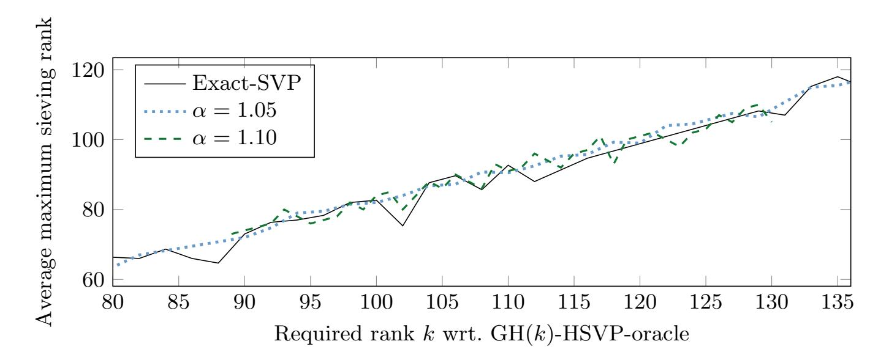

Fig. B.1: Average maximum sieving rank for both (α · GH(kα))-HSVP-oracle in rank k<sup>α</sup> and GH(k)-HSVP-oracle in rank k whilst achieving the same RHF. Here, both oracles use sieving with Ducas' "dimension for free" method.

### <span id="page-33-1"></span>C Additional Plots

<span id="page-33-0"></span>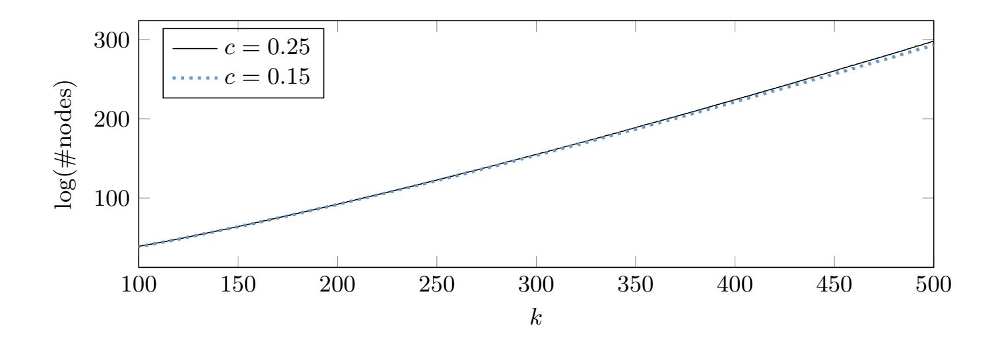

Fig. C.1: Cost of one call to [\[ABF](#page-25-5)+20, Algorithm 3] in enumeration rank k with c = 0.15 vs. c = 0.25, d = d(1 + c) · ke and four preprocessing sweeps.

{34}------------------------------------------------

<span id="page-34-0"></span>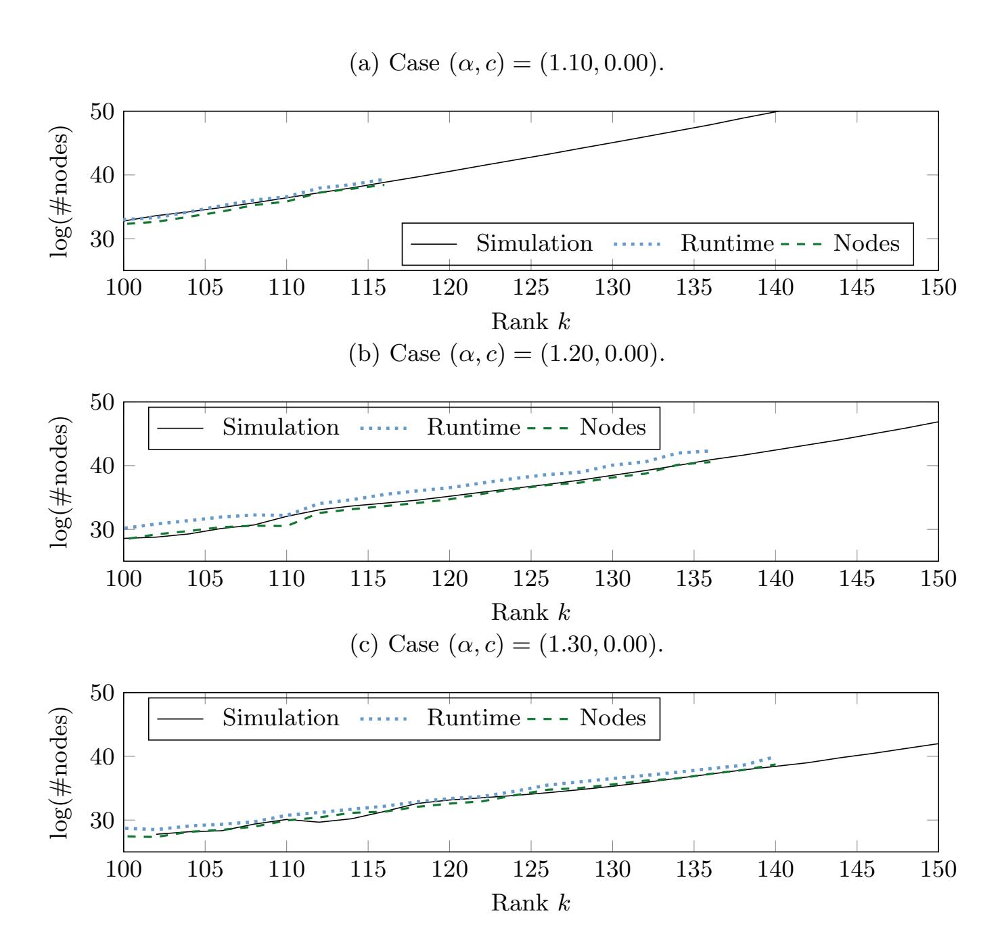

Fig. C.2: Experimental verification of simulation results for the (α·GH(k))-HSVP enumeration oracle in rank k with example α ∈ {1.10, 1.20, 1.30} and c = 0.00. We ran 16 experiments.

{35}------------------------------------------------

<span id="page-35-0"></span>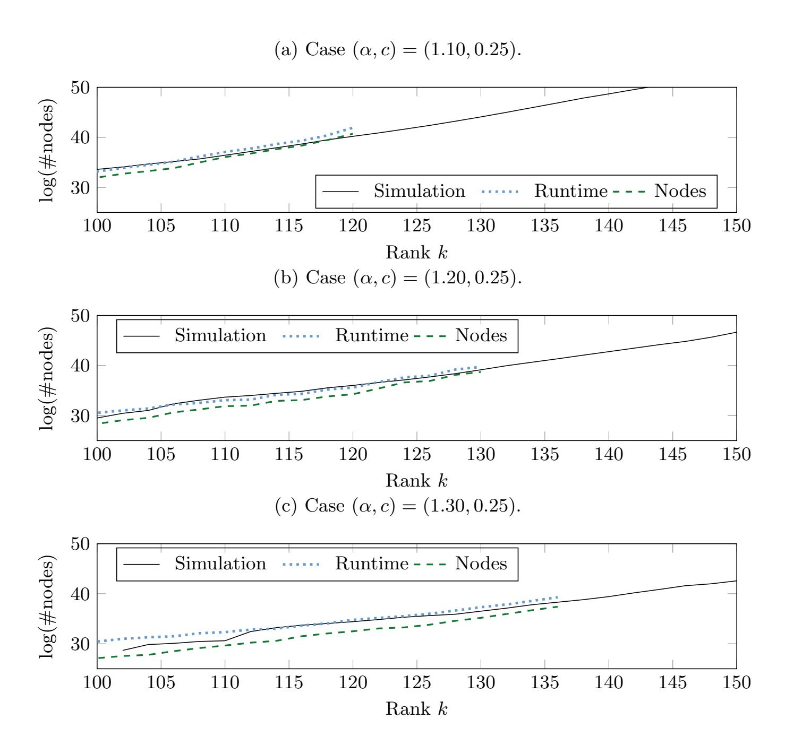

Fig. C.3: Experimental verification of simulation results for the (α·GH(k))-HSVP enumeration oracle in rank k with example α ∈ {1.10, 1.20, 1.30} and c = 0.25. We ran 16 experiments.

{36}------------------------------------------------

<span id="page-36-0"></span>(a) Expected cost  $t_{\alpha}(k_{\alpha})$  of the  $(\alpha \cdot \text{GH}(k_{\alpha}))$ -HSVP enumeration oracle in rank  $k_{\alpha}$  for reaching RHF GH  $(k)^{\frac{1}{k-1}}$ .

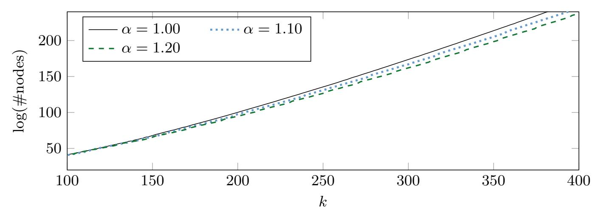

(b) Cost advantage  $\log \frac{t_1(k)}{t_{\alpha}(k_{\alpha})}$  of the  $(\alpha \cdot \mathrm{GH}(k_{\alpha}))$ -HSVP enumeration oracle in rank  $k_{\alpha}$  for reaching RHF GH  $(k)^{\frac{1}{k-1}}$ .

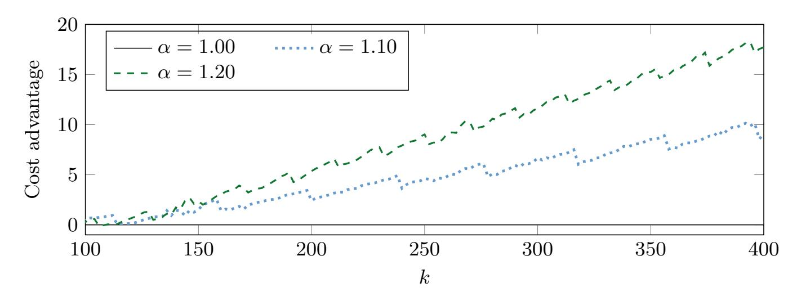

Fig. C.4: Expected performance of  $(\alpha \cdot \text{GH}(k_{\alpha}))$ -HSVP enumeration oracle in rank  $k_{\alpha}$ ; case c = 0.00; preprocessing with  $\alpha' = 1.00$ .

{37}------------------------------------------------

<span id="page-37-0"></span>(a) Expected cost  $t_{\alpha}(k_{\alpha})$  of the  $(\alpha \cdot \text{GH}(k_{\alpha}))$ -HSVP enumeration oracle in rank  $k_{\alpha}$  for reaching RHF GH  $(k)^{\frac{1}{k-1}}$ .

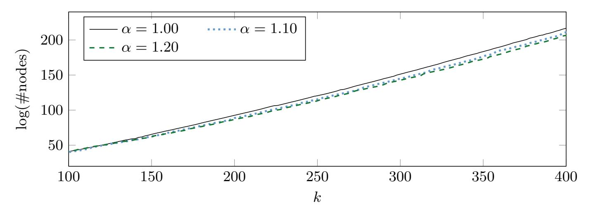

(b) Cost advantage  $\log \frac{t_1(k)}{t_{\alpha}(k_{\alpha})}$  of the  $(\alpha \cdot \mathrm{GH}(k_{\alpha}))$ -HSVP enumeration oracle in rank  $k_{\alpha}$  for reaching RHF GH  $(k)^{\frac{1}{k-1}}$ .

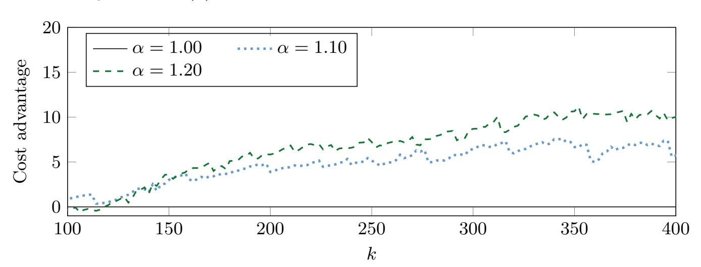

Fig. C.5: Expected performance of  $(\alpha \cdot \text{GH}(k_{\alpha}))$ -HSVP enumeration oracle in rank  $k_{\alpha}$ ; case c = 0.25; preprocessing with  $\alpha' \geq 1.00$ .

{38}------------------------------------------------

### <span id="page-38-0"></span>D Dropping Heuristic Assumptions

Several heuristics are required to hold to instantiate Corollary 1 and Theorem 4 in practice. First, Corollary 1 assumes all reduced bases of the input follow the GSA, while in practice, any reduced basis does not fully satisfy the GSA shape. Second, it assumes preprocessing is free, while in practice the preprocessing cost should be amortised into the overall cost. In the experiments in this section, we drop the heuristic assumption of starting with a perfect GSA shape. Instead, we assume a BKZ reduced basis as input. We only count minor preprocessing cost to simulate LLL. This aims to derive a lower-bound estimate, i.e. a plausible limit of our strategy, for the relaxed enumeration, conditioned on the effectiveness of the optimization procedure in pruner. We note that, in contrast to this appendix, in Sections 3.3 and 4 we do take the preprocessing cost and the input shape into account.

#### D.1 For Corollary 1

In the first experiment, we drop the GSA heuristic used in Corollary 1. We start with a HKZ reduced basis in rank k and compare the extreme pruning enumeration cost (with  $\rho = 0.01$ ) of relaxed enumeration for various  $\alpha$ . In this experiment, we set up a small preprocessing cost (equal to  $k^3$ ) to simulate the LLL cost and confirm that it is minor compared to the overall cost. For the values of  $\alpha$  given in Table 3, we noticed that the success probability is similar to Corollary 1. From Table 3, we conclude that the heuristic assumption of a perfect GSA shape can be replaced by assuming an HKZ shape as input.

<span id="page-38-1"></span>Table 3: Speedups of relaxed enumeration with certain extreme cylinder pruning  $(\rho = 0.01)$  derived from our simulation (assuming HKZ reduced input) and claimed by Corollary 1.

| $\alpha$ | $\log t_{\alpha}(k)$<br>Simulation                                                                                                                                                                                                      | $\log \frac{t_1(k)}{t_{\alpha}(k)}$ Simulation | $\log \frac{t_1(k)}{t_{\alpha}(k)} \approx \frac{\log \alpha}{2} k$<br>Corollary 1 |
|----------|-----------------------------------------------------------------------------------------------------------------------------------------------------------------------------------------------------------------------------------------|------------------------------------------------|------------------------------------------------------------------------------------|
| 1.00     | $\frac{k \log k}{2 e} - 0.692 k + 8.99$ $\frac{k \log k}{2 e} - 0.727 k + 9.03$ $\frac{k \log k}{2 e} - 0.760 k + 9.12$                                                                                                                 | 0.00                                           | 0.00                                                                               |
| 1.05     | $\frac{k \log k}{2 e} - 0.727 k + 9.03$                                                                                                                                                                                                 | 0.035k - 0.04                                  | 0.035k                                                                             |
| 1.10     | $\frac{k \log k}{2 e} - 0.760 k + 9.12$                                                                                                                                                                                                 | 0.068k - 0.13                                  | 0.069k                                                                             |
| 1.15     | $\frac{k \log k}{2 e} - 0.793 k + 9.21$                                                                                                                                                                                                 | 0.101k - 0.22                                  | 0.101k                                                                             |
| 1.20     | $\frac{k \log k}{2 e} - 0.823 k + 9.30$                                                                                                                                                                                                 | 0.131k - 0.31                                  | 0.132k                                                                             |
| 1.25     | $\frac{\frac{2 \text{ e}}{2 \text{ e}}}{\frac{k \log k}{2 \text{ e}}} - 0.760 k + 9.12$ $\frac{k \log k}{2 \text{ e}} - 0.793 k + 9.21$ $\frac{k \log k}{2 \text{ e}} - 0.823 k + 9.30$ $\frac{k \log k}{2 \text{ e}} - 0.853 k + 9.38$ | 0.161k - 0.39                                  | 0.161k                                                                             |

Here,  $t_{\alpha}(k)$  denotes the "expected cost" (ignoring preprocessing) of an  $(\alpha \cdot GH(k))$ -HSVP enumeration oracle on a HKZ reduced basis in rank  $k \in [100, 500]$ . See Table 1 for a simulation also considering preprocessing cost.

{39}------------------------------------------------

Table 3 only provides an estimate for the relaxed enumeration in rank-k with certain extreme cylinder pruning. In Table 4 we present experiments using FPyLLL's cylindrical pruning optimiser to derive the pruning coefficients. Again, the experiments here only provide a lower-bound estimate.

<span id="page-39-0"></span>Table 4: Speedups of relaxed enumeration with extreme cylinder pruning derived from FPyLLL's optimised cylinder pruning (assuming HKZ reduced input) and claimed by Corollary 1.

| $\alpha$ | $\log t_{\alpha}(k)$<br>Simulation                                                                                                                                                          | $\log \frac{t_1(k)}{t_{\alpha}(k)}$<br>Simulation | $\log \frac{t_1(k)}{t_{\alpha}(k)} \approx \frac{\log \alpha}{2} k$<br>Corollary 1 |
|----------|---------------------------------------------------------------------------------------------------------------------------------------------------------------------------------------------|---------------------------------------------------|------------------------------------------------------------------------------------|
| 1.00     | $\frac{k \log k}{2} - 1.020 k + 11.20$                                                                                                                                                      | 0.00                                              | 0.00                                                                               |
| 1.05     | $\frac{k \log k}{2^{e}} - 1.020 k + 11.20$ $\frac{k \log k}{2^{e}} - 1.064 k + 11.46$ $\frac{k \log k}{2^{e}} - 1.105 k + 11.94$                                                            | 0.044k - 0.26                                     | 0.035k                                                                             |
| 1.10     | $\frac{k \log k}{2 e} - 1.105 k + 11.94$                                                                                                                                                    | 0.085k - 0.74                                     | 0.069k                                                                             |
| 1.15     | $\frac{k \log k}{2 e} - 1.146 k + 12.76$                                                                                                                                                    | 0.126k - 1.56                                     | 0.101k                                                                             |
| 1.20     | $\frac{\frac{2 e}{2 e}}{\frac{k \log k}{2 e}} - 1.103 k + 11.94$ $\frac{k \log k}{2 e} - 1.146 k + 12.76$ $\frac{k \log k}{2 e} - 1.188 k + 14.65$ $\frac{k \log k}{2 e} - 1.233 k + 17.96$ | 0.168k - 3.45                                     | 0.132k                                                                             |
| 1.25     | $\frac{k \log k}{2 e} - 1.233 k + 17.96$                                                                                                                                                    | 0.213k - 6.76                                     | 0.161k                                                                             |

Here,  $t_{\alpha}(k)$  denotes the "expected cost" (ignoring preprocessing) of an  $(\alpha \cdot GH(k))$ -HSVP enumeration oracle on a HKZ reduced basis in rank  $k \in [100, 300]$ . See Table 2 for a simulation also considering preprocessing cost.

### D.2 For Theorem 4

In this experiment, we consider the enumeration in rank  $k_{\alpha}$  (instead of rank k), as implied by Theorem 4. Rather than the certain pruning function  $f(\cdot)$ used in Theorem 4, we present experiments using FPyLLL's cylindrical pruning optimiser to derive the pruning coefficients. For each rank k and a given  $\alpha$ , we compute the smallest integer  $k_a$  satisfying Eq. (1). We also simulate the extended preprocessing idea from [ABF<sup>+</sup>20]. More precisely, we assume the input lattice of rank  $\lceil (1+c) \cdot k_{\alpha} \rceil$  for  $c \in \{0, 0.15, 0.25\}$  to be already k-BKZ reduced. Under this assumption, we compute the  $(\alpha \cdot \mathrm{GH}(k_{\alpha}))$ -HSVP enumeration cost in a rank  $k_{\alpha}$ sublattice (i.e. the sublattice formed by the first  $k_{\alpha}$  basis vectors) using FPyLLL's pruner. The interpolated enumeration costs are tabulated in Table 5. We observe that a positive speed-up is visible for c = 0.15, but not for c = 0.25 for certain  $\alpha$ . This seems to be somewhat consistent with the estimates of Figure 1.1, which shows c = 0.15 leads to a better performance. On the other hand, Figure 1.1 does show a speed-up also for c = 0.25, in contrast to the data presented here. However, we stress, once more, that the interpolated model used in this section does not include preprocessing cost and thus is less expressive about practice than Figure 1.1.

{40}------------------------------------------------

<span id="page-40-0"></span>Table 5: Speedups of relaxed enumeration with extreme cylinder pruning derived from FPyLLL's optimised cylinder pruning, assuming k-BKZ reduced input.

| <i>α</i> | $\log t_{\alpha}(k_{\alpha})$<br>Simulation                                                          | $\log \frac{t_1(k)}{t_{\alpha}(k_{\alpha})}$<br>Simulation |
|----------|------------------------------------------------------------------------------------------------------|------------------------------------------------------------|
|          | c = 0.00                                                                                             |                                                            |
| 1.00     | $\frac{k \log k}{2 e} - 1.020 k + 11.20$                                                             | 0.00                                                       |
| 1.05     | $\frac{k \log k}{2 \pi} - 1.021 k + 11.45$                                                           | 0.001k - 0.25                                              |
| 1.10     | $\frac{k \log k}{2 e} - 1.026 k + 12.09$                                                             | 0.006k - 0.89                                              |
| 1.15     | $\frac{\frac{2}{2}e}{\frac{k \log k}{2}} - 1.026 k + 12.09$                                          | 0.022k - 3.26                                              |
| 1.20     | $\frac{2 \text{ e}}{k \log k} - 1.042 k + 14.40$<br>$\frac{k \log k}{2 \text{ e}} - 1.060 k + 17.04$ | 0.040k - 5.84                                              |
| 1.25     | $\frac{2e}{2e} - 1.060 k + 17.04$<br>$\frac{k \log k}{2e} - 1.081 k + 20.17$                         | 0.061k - 8.97                                              |
| 1.30     | $\frac{\frac{2 \mathrm{e}}{2 \mathrm{e}}}{\frac{k \log k}{2 \mathrm{e}}} - 1.001 k + 20.17$          | 0.080k - 11.79                                             |
|          | c = 0.15                                                                                             |                                                            |
| 1.00     | $\frac{k \log k}{8} - 0.681  k + 16.04$                                                              | 0.00                                                       |
| 1.05     | $\frac{k \log k}{8} - 0.689 k + 16.69$                                                               | 0.008k - 0.65                                              |
| 1.10     | $\frac{k \log k}{8} - 0.698 k + 17.59$                                                               | 0.017k - 1.55                                              |
| 1.15     | $\frac{k \log k}{8} - 0.704 k + 18.24$                                                               | 0.023k - 2.20                                              |
| 1.20     | $\frac{k \log k}{8} - 0.705 k + 18.62$                                                               | 0.024k - 2.58                                              |
| 1.25     | $\frac{k \log k}{8} - 0.705 k + 18.75$                                                               | 0.024k - 2.71                                              |
| 1.30     | $\frac{k \log k}{8} - 0.702  k + 18.63$                                                              | 0.021k - 2.59                                              |
|          | c = 0.25                                                                                             |                                                            |
| 1.00     | $\frac{k \log k}{8} - 0.724 k + 19.88$                                                               | 0.00                                                       |
| 1.05     | $\frac{k \log k}{8} - 0.725 k + 19.86$                                                               | 0.001k + 0.02                                              |
| 1.10     | $\frac{k \log k}{8} - 0.725 k + 20.04$                                                               | 0.001k - 0.16                                              |
| 1.15     | $\frac{k \log k}{8} - 0.722 k + 19.87$                                                               | -0.002k + 0.01                                             |
| 1.20     | $\frac{k \log k}{8} - 0.716 k + 19.35$                                                               | -0.008k - 0.53                                             |
| 1.25     |                                                                                                      | -0.013k + 1.02                                             |
| 1.30     | $\frac{k \log k}{8} - 0.706 k + 18.46$                                                               | -0.018k + 1.42                                             |

Here,  $t_{\alpha}(k_{\alpha})$  denotes the "expected cost" of the  $(\alpha \cdot GH(k_{\alpha}))$ -HSVP enumeration oracle in a sublattice of rank  $k_{\alpha}$ . We take  $k \in [100, 300]$ .

{41}------------------------------------------------

### <span id="page-41-0"></span>E Alternative Verification of Enumeration Cost Estimates

Our simulation results critically depend the estimated cost of pruned enumeration using FPyLLL's pruning module. Thus in this section, we verify the enumeration cost estimates via FPyLLL's pruner with respect to relaxed pruned enumeration. In the experiments, we consider  $k \in \{50, 52, 54, \dots, 100\}$ . For each k, we iterate over  $\alpha \in \{1.00, 1.05, 1.10, 1.15, 1.20, 1.25\}$  and sample random q-ary lattices (using the IntegerMatrix.random function in FPyLLL) of rank  $|(1+c)k_{\alpha}|$  for  $c \in \{0, 0.15, 0.25\}$ . For each such lattice, we preprocess it with k'-BKZ until the success probability of the enumeration on the first sublattice of rank  $k_{\alpha}$  is not too small. Initially we set k' = k - 30 and progressively increase k' until the success probability of the relaxed enumeration (on the first sublattice of rank  $k_{\alpha}$ ) becomes greater than 0.1 on the k'-BKZ reduced basis. For each set of parameters  $(k, c, \alpha)$ , we sample 5 random q-ary lattices. In the end, we record the estimated number of nodes of the relaxed enumeration on the first sublattice of rank  $k_{\alpha}$  versus the actual number of nodes visited. Their ratios are computed and averaged over 5 samples. In Figure E.1, the ratio (of the estimated enumeration cost via FPyLLL's pruner and the actual enumeration cost) is plotted as the y-axis. We observe that, on average, the actual enumeration cost is always smaller than the estimated enumeration cost for the k's in this region. This is true for both standard and relaxed enumeration. These experiments justify the use of the FPyLLL's pruning module for the cost estimate, which have been used and further verified in the experiments of Section 4 and 5.

### <span id="page-41-1"></span>F Repetitions

A standard strategy for speeding up enumeration-based algorithms is extreme pruning [GNR10], i.e. to enumerate with parameters such that the algorithm succeeds with exponentially small probability. This is repeated exponentially often and after each trial the basis rerandomised. It was already reported in [ABF<sup>+</sup>20] that the numerically optimised pruning parameters used there do not imply an exponential drop in success probability. We observe the same behaviour. Indeed, our data suggests a small number of repetitions. In our setting ( $\alpha > 1.0$ ), repetitions are not roughly the inverse of some success probability. Instead, the target quantity is the number of solutions  $\tau$  expected to be found per enumeration within the given target radius and we expect to repeat enumeration roughly  $1/\tau$  times. As can be seen in Figure F.1, the parameters output by the numerical optimiser, i.e. the FPLLL pruning module, imply that  $\tau$  is close to one for many relevant parameter ranges, which means a constant number of enumerations suffices. We speculate that this is an artefact of the significantly more expensive preprocessing compared to previous works where  $\alpha = 1.00$  and c = 0.00.

{42}------------------------------------------------

<span id="page-42-0"></span>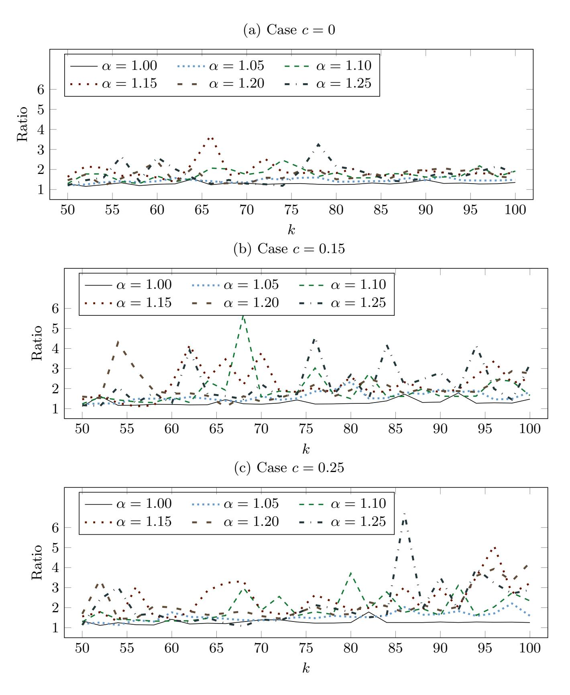

Fig. E.1: Verification of enumeration cost estimate on the sublattice of rank k<sup>α</sup> on q-ary lattices of rank d(1 + c) · kαe. For each α and each k, five q-ary random lattices are sampled and preprocessed. Then the (averaged) ratio of the estimated enumeration cost versus the actual enumeration cost is plotted as the y-axis.

{43}------------------------------------------------

<span id="page-43-0"></span>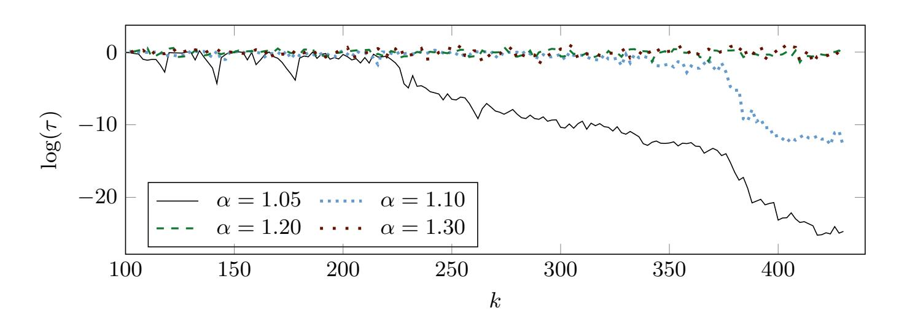

Fig. F.1: Expected number of solutions τ per enumeration for reaching RHF GH (k) 1 k−1 , for c = 0.15 and α <sup>0</sup> ≥ 1.00.