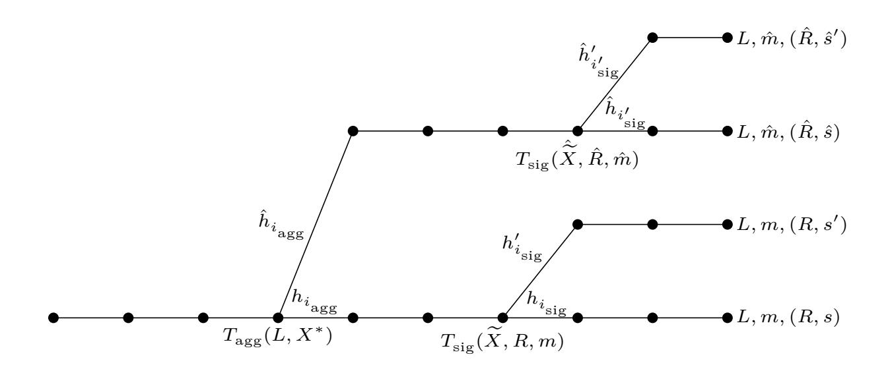

{0}------------------------------------------------

# **MuSig2: Simple Two-Round Schnorr Multi-Signatures**

Jonas Nick<sup>1</sup> , Tim Ruffing<sup>1</sup> , and Yannick Seurin<sup>2</sup>

> <sup>1</sup> Blockstream <sup>2</sup> ANSSI, Paris, France

jonas@n-ck.net crypto@timruffing.de yannick.seurin@m4x.org

Revision 2023-10-20[\\*](#page-0-0)

**Abstract.** Multi-signatures enable a group of signers to produce a joint signature on a joint message. Recently, Drijvers *et al.* (S&P'19) showed that all thus far proposed two-round multisignature schemes in the pure DL setting (without pairings) are insecure under concurrent signing sessions. While Drijvers *et al.* proposed a secure two-round scheme, this efficiency in terms of rounds comes with the price of having signatures that are more than twice as large as Schnorr signatures, which are becoming popular in cryptographic systems due to their practicality (e.g., they will likely be adopted in Bitcoin). If one needs a multi-signature scheme that can be used as a drop-in replacement for Schnorr signatures, then one is forced to resort either to a three-round scheme or to sequential signing sessions, both of which are undesirable options in practice.

In this work, we propose MuSig2, a simple and highly practical two-round multi-signature scheme. This is the first scheme that simultaneously *i)* is secure under concurrent signing sessions, *ii)* supports key aggregation, *iii)* outputs ordinary Schnorr signatures, *iv)* needs only two communication rounds, and *v)* has similar signer complexity as ordinary Schnorr signatures. Furthermore, it is the first multi-signature scheme in the pure DL setting that supports preprocessing of all but one rounds, effectively enabling a non-interactive signing process without forgoing security under concurrent sessions. We prove the security of MuSig2 in the random oracle model, and the security of a more efficient variant in the combination of the random oracle and the algebraic group model. Both our proofs rely on a weaker variant of the OMDL assumption.

<span id="page-0-0"></span><sup>\*</sup> This is the full version of a work appearing at CRYPTO 2021. See page [40](#page-39-0) for a changelog.

{1}------------------------------------------------

### 1 Introduction

### 1.1 Background on Multi-Signatures

Multi-signature schemes [IN83] enable a group of signers (each possessing an own secret/public key pair) to run an interactive protocol to produce a single signature  $\sigma$  on a message m. A recent spark of interest in multi-signatures is motivated by the idea of using them as a drop-in replacement for ordinary (single-signer) signatures in applications such as cryptocurrencies that support signatures already. For example the Bitcoin community, awaiting the adoption of Schnorr signatures [Sch91] as proposed in BIP 340 [WNR20], is seeking for practical multi-signature schemes which are fully compatible with Schnorr signatures: multi-signatures produced by a group of signers should just be ordinary Schnorr signatures and should be verifiable like Schnorr signatures, i.e., they can be verified using the ordinary Schnorr verification algorithm given only a single aggregate public key that can be computed from the set of public keys of the signers and serves as a compact representation of it.

This provides a number of benefits that reach beyond simple compatibility with an upcoming system: Most importantly, multi-signatures enjoy the efficiency of Schnorr signatures, which are very compact and cheap to store on the blockchain. Moreover, if multi-signatures can be verified like ordinary Schnorr signatures, the additional complexity introduced by multi-signatures remains on the side of the signers and is not exposed to verifiers who need not be concerned with multi-signatures at all and can simply run Schnorr signature verification. Verifiers, who are just given the signature and the aggregate public key, in fact do not even learn whether the signature was created by a single signer or by a group of signers (or equivalently, whether the public key is an aggregation of multiple keys), which is advantageous for the privacy of users.

MULTI-SIGNATURES BASED ON SCHNORR SIGNATURES. A number of modern and practical proposals [NKD+03; BN06; BCJ08; MWL+10; STV+16; MPS+19; DEF+19; NRS+20] for multi-signature schemes are based on Schnorr signatures. The Schnorr signature scheme [Sch91] relies on a cyclic group  $\mathbb G$  of prime order p, a generator g of  $\mathbb G$ , and a hash function H. A secret/public key pair is a pair  $(x,X) \in \{0,\ldots,p-1\} \times \mathbb G$  where  $X=g^x$ . To sign a message m, the signer draws a random integer r in  $\mathbb Z_p$ , computes a nonce  $R=g^r$ , the challenge c=H(X,R,m), and s=r+cx. The signature is the pair (R,s), and its validity can be checked by verifying whether  $g^s=RX^c$ .

The naive way to design a multi-signature scheme fully compatible with Schnorr signatures would be as follows. Say a group of n signers want to sign a message m, and let  $L = \{X_1 = g^{x_1}, \ldots, X_n = g^{x_n}\}$  be the multiset<sup>3</sup> of all their public keys. Each signer randomly generates and communicates to others a nonce  $R_i = g^{r_i}$ ; then, each of them computes  $R = \prod_{i=1}^n R_i$ ,  $c = H(\widetilde{X}, R, m)$  where  $\widetilde{X} = \prod_{i=1}^n X_i$  is the product of individual public keys, and a partial signature  $s_i = r_i + cx_i$ ; partial signatures are then combined into a single signature (R, s) where  $s = \sum_{i=1}^n s_i \mod p$ . The validity of a signature  $s_i = r_i + cx_i$ ; partial signature  $s_i = r_i + cx_i$ ; partial signature  $s_i = r_i + cx_i$ ; partial signature  $s_i = r_i + cx_i$ ; partial signature  $s_i = r_i + cx_i$ ; partial signature  $s_i = r_i + cx_i$ ; partial signatures are then combined into a single signature  $s_i = r_i + cx_i$ ; partial signatures are then combined into a single signature  $s_i = r_i + cx_i$ ; partial signature  $s_i = r_i + cx_i$ ; partial signature  $s_i = r_i + cx_i$ ; partial signature  $s_i = r_i + cx_i$ ; partial signature  $s_i = r_i + cx_i$ ; partial signature  $s_i = r_i + cx_i$ ; partial signature  $s_i = r_i + cx_i$ ; partial signature  $s_i = r_i + cx_i$ ; partial signature  $s_i = r_i + cx_i$ ; partial signature  $s_i = r_i + cx_i$ ; partial signature  $s_i = r_i + cx_i$ ; partial signature  $s_i = r_i + cx_i$ ; partial signature  $s_i = r_i + cx_i$ ; partial signature  $s_i = r_i + cx_i$ ; partial signature  $s_i = r_i + cx_i$ ; partial signature  $s_i = r_i + cx_i$ ; partial signature  $s_i = r_i + cx_i$ ; partial signature  $s_i = r_i + cx_i$ ; partial signature  $s_i = r_i + cx_i$ ; partial signature  $s_i = r_i + cx_i$ ; partial signature  $s_i = r_i + cx_i$ ; partial signature  $s_i = r_i + cx_i$ ; partial signature  $s_i = r_i + cx_i$ ; partial signature  $s_i = r_i + cx_i$ ; partial signature  $s_i = r_i + cx_i$ ; partial signature  $s_i = r_i + cx_i$ ; partial signature  $s_i = r_i + cx_i$ ; partial signature  $s_i = r_i +$ 

One way to generically prevent rogue-key attacks is to require that users prove possession of the secret key, e.g., by attaching a zero-knowledge proof of knowledge to their public keys [RY07; BDN18]. However, this makes key management cumbersome, complicates implementations, and is not compatible with existing and widely used key serialization formats.

THE MUSIG SCHEME. A more direct defense against rogue-key attacks proposed by Bellare and Neven [BN06] is to work in the *plain public-key model*, where public keys can be aggregated without the need to check their validity. To date, the only multi-signature scheme provably secure in this model and fully compatible with Schnorr signatures is MuSig (and the variant MuSig-DN [NRS+20]) by Maxwell *et al.* [MPS+19], independently proven secure by Boneh, Drijvers, and Neven [BDN18].

<span id="page-1-0"></span>Since we do not impose any constraint on the key setup, the adversary can choose corrupted public keys arbitrarily and duplicate public keys can appear in L.

{2}------------------------------------------------

In order to overcome rogue-key attacks in the plain public-key model, MuSig computes partial signatures  $s_i$  with respect to "signer-dependent" challenges  $c_i = \mathsf{H}_{\mathrm{agg}}(L,X_i) \cdot \mathsf{H}_{\mathrm{sig}}(\widetilde{X},R,m)$ , where  $\widetilde{X}$  is the aggregate public key corresponding to the multiset of public keys  $L = \{X_1,\ldots,X_n\}$ . It is defined as  $\widetilde{X} = \prod_{i=1}^n X_i^{a_i}$  where  $a_i = \mathsf{H}_{\mathrm{agg}}(L,X_i)$  (note that the  $a_i$ 's only depend on the public keys of the signers). This way, the verification equation of a signature (R,s) on message m for public keys  $L = \{X_1,\ldots,X_n\}$  becomes  $g^s = R\prod_{i=1}^n X_i^{a_ic} = R\widetilde{X}^c$ , where  $c = \mathsf{H}_{\mathrm{sig}}(\widetilde{X},R,m)$ . This recovers the key aggregation property enjoyed by the naive scheme, albeit with respect to a more complex aggregate key  $\widetilde{X} = \prod_{i=1}^n X_i^{a_i}$ .

In order to be able to simulate an honest signer in a run of the signing protocol via the standard way of programming the random oracle  $\mathsf{H}_{\mathrm{sig}}$ ,  $\mathsf{MuSig}$  has an initial commitment round (like the scheme by Bellare and Neven [BN06]) where each signer commits to its nonce  $R_i$  before receiving the nonces of other signers.

As a result, the signing protocol of MuSig requires three communication rounds, and only the initial commitment round can be preprocessed without knowing the message to be signed.<sup>4</sup>

TWO-ROUND SCHEMES. Following the scheme by Bellare and Neven [BN06], in which signing requires three rounds of interaction, multiple attempts to reduce this number to two rounds [BN06; BCJ08; STV+16; MPS+19] were foiled by Drijvers et al. [DEF+19]. In their pivotal work, they show that all thus far proposed two-round schemes in the pure DL setting (without pairings) cannot be proven secure and are vulnerable to attacks with subexponential complexity when the adversary is allowed to engage in an arbitrary number of concurrent sessions (concurrent security), as required by the standard definition of unforgeability.

If one prefers a scheme in the pure DL setting with fewer communication rounds, only two options remain, and none of them is fully satisfactory. The first option is the mBCJ scheme by Drijvers et al. [DEF+19], a repaired variant of the scheme by Bagherzandi, Cheon, and Jarecki [BCJ08]. While mBCJ needs only two rounds, it does not output ordinary Schnorr signatures and is thus not suitable as a drop-in replacement for Schnorr signatures, e.g., in cryptocurrencies whose validation rules support Schnorr signatures (such as proposed for Bitcoin). The second option is MuSig-DN (MuSig with Deterministic Nonces) [NRS+20], which however relies on heavy zero-knowledge proofs to prove a deterministic derivation of the nonce to all cosigners. This increases the complexity of the implementation significantly and makes MuSig-DN, even though it needs only two rounds, in fact less efficient than three-round MuSig in common settings. Moreover, in neither of these two-round schemes is it possible to reduce the rounds further by preprocessing the first round without knowledge of the message to be signed.

#### 1.2 Our Contribution

We propose a novel and simple two-round variant of the MuSig scheme that we call MuSig2. In particular, we remove the preliminary commitment phase, so that signers start right away by sending nonces. However, to obtain a scheme secure under concurrent sessions, each signer i sends a list of  $\nu \geq 2$  nonces  $R_{i,1}, \ldots, R_{i,\nu}$  (instead of a single nonce  $R_i$ ), and effectively uses a linear combination  $\hat{R}_i = \prod_{j=1}^{\nu} R_{i,j}^{b^{j-1}}$  of these  $\nu$  nonces, where b is derived via a hash function.

MuSig2 is the first multi-signature scheme that simultaneously i) is secure under concurrent signing sessions, ii) supports key aggregation, iii) outputs ordinary Schnorr signatures, iv) needs only two communication rounds, and v) has similar signer complexity as ordinary Schnorr signatures. Furthermore, it is the first scheme in the pure DL setting that supports preprocessing of all but one rounds, effectively enabling non-interactive signing without forgoing security under concurrent sessions. MuSig-DN [NRS+20], which relies on rather complex and expensive zero-knowledge proofs (proving time  $\approx 1\,\mathrm{s}$ ), only enjoys the first four properties and does not allow preprocessing of the first round without knowledge of the message.

In comparison to other multi-signature schemes based on Schnorr signatures, the price we pay for saving a round is a stronger cryptographic assumption: instead of the DL assumption, we rely

<span id="page-2-0"></span><sup>&</sup>lt;sup>4</sup> The second move of the protocol is independent of the message to be signed, which makes it tempting to preprocess it without the message. But revealing the second move to the cosigners before the message is fixed renders the scheme insecure [Nic19].

{3}------------------------------------------------

<span id="page-3-0"></span>Table 1. Comparison of MuSig2 and MuSig2\* with other DL-based multi-signatures schemes secure under concurrent sessions instantiated in a group  $\mathbb{G}$  of order p. Column "S" indicates whether the scheme is fully compatible with Schnorr signature verification. The next two columns show the total number of communication rounds ("tot.") in the signing algorithm and the number of communication rounds that cannot be preprocessed ("pp."). The next four columns show the number of (multi-)exponentiations in  $\mathbb{G}$  for key generation (KeyGen), key aggregation (KeyAgg), signing (Sign) and verification (Ver), where  $\mathbb{G}^m$  denotes a multi-exponentiation of size m and n is the number of signers. The asterisk (\*) for MuSig-DN indicates that the signing complexity is not comparable because it requires NIZK proofs for arithmetic circuit satisfiability. The next three columns show the domains of individual public keys pk, aggregate public keys pk, and signatures  $\sigma$ . The last column indicates provable security results for existential unforgeability under chosen-message attacks under concurrent sessions. In the case of MuSig-DN, DL is required in  $\mathbb{G}$  and DDH is required in an elliptic curve group  $\mathbb{G}'$  related to  $\mathbb{G}$ .

| Scheme                                             | S | Rounds |     | Multi-Exponentiations |                          |                                 |                     | Domain                             |                  |                                      | Security                                                                      |
|----------------------------------------------------|---|--------|-----|-----------------------|--------------------------|---------------------------------|---------------------|------------------------------------|------------------|--------------------------------------|-------------------------------------------------------------------------------|
|                                                    |   | tot.   | pp. | KeyGen                | KeyAgg                   | Sign                            | Ver                 | pk                                 | $\widetilde{pk}$ | σ                                    | (ROM+)                                                                        |
| BN [BN06]                                          |   | 3      | 2   | 1G                    |                          | 1G                              | $1\mathbb{G}^{n+1}$ | G                                  |                  | $\mathbb{G} \times \mathbb{Z}_p$     | $\mathrm{DL}_{\mathbb{G}}$                                                    |
| MuSig [MPS+19; BDN18]                              | ✓ | 3      | 2   | 1G                    | $1\mathbb{G}^n$          | $1\mathbb{G}$                   | $1\mathbb{G}^2$     | G                                  | G                | $\mathbb{G} \times \mathbb{Z}_p$     | $DL_{\mathbb{G}}$                                                             |
| MSDL-pop [BDN18]                                   | ✓ | 3      | 2   | $2\mathbb{G}$         | $n\mathbb{G}^2$          | $1\mathbb{G}$                   | $1\mathbb{G}^2$     | $\mathbb{G} \times \mathbb{Z}_p^2$ | $\mathbb{G}$     | $\mathbb{G} \times \mathbb{Z}_p$     | $DL_{\mathbb{G}}$                                                             |
| mBCJ [DEF+19]                                      |   | 2      | 2   | $2\mathbb{G}$         | $n\mathbb{G}^2$          | $1\mathbb{G}^2 + 1\mathbb{G}^3$ | $3\mathbb{G}^2$     | $\mathbb{G} \times \mathbb{Z}_p^2$ | $\mathbb{G}$     | $\mathbb{G}^2 \times \mathbb{Z}_p^3$ | $\mathrm{DL}_{\mathbb{G}}$                                                    |
| MuSig-DN [NRS+20]                                  | ✓ | 2      | 2   | 1G                    | $1\mathbb{G}^n$          | *                               | $1\mathbb{G}^2$     | G                                  | $\mathbb{G}$     | $\mathbb{G} \times \mathbb{Z}_p$     | $DL_{\mathbb{G}}^{+}DDH_{\mathbb{G}'}$                                        |
| $MuSig2[\nu = 4] \; (\mathrm{Sect.} \; 4)$         | ✓ | 2      | 1   | 1G                    | $\mathbb{I}\mathbb{G}^n$ | $4\mathbb{G} + 1\mathbb{G}^3$   | $1$ $\mathbb{G}^2$  | G                                  | $\mathbb{G}$     | $\mathbb{G} \times \mathbb{Z}_p$     | $AOMDL_{\mathbb{G}}$                                                          |
| $MuSig2[\nu=2] \; (\mathrm{Sect.} \; 4)$           | ✓ | 2      | 1   | 1G                    | $1\mathbb{G}^n$          | $3\mathbb{G}$                   | $1\mathbb{G}^2$     | G                                  | G                | $\mathbb{G} \times \mathbb{Z}_p$     | $AGM_{\mathbb{G}} + AOMDL_{\mathbb{G}}$                                       |
| $MuSig2^*[\nu=4] \; (\mathrm{App.} \; \mathbf{A})$ | ✓ | 2      | 1   | 1G                    | $1\mathbb{G}^{n-1}$      | · ·                             | $1\mathbb{G}^2$     | G                                  | $\mathbb{G}$     | $\mathbb{G} \times \mathbb{Z}_p$     | $AOMDL_{\mathbb{G}}$                                                          |
| $MuSig2^*[\nu=2] \; (\mathrm{App.} \; \mathbf{A})$ | ✓ | 2      | 1   | 1G                    | $1\mathbb{G}^{n-1}$      | $3\mathbb{G}$                   | $1\mathbb{G}^2$     | G                                  | G                | $\mathbb{G}\times\mathbb{Z}_p$       | $\boxed{\operatorname{AGM}_{\mathbb{G}} + \operatorname{AOMDL}_{\mathbb{G}}}$ |

on the algebraic one-more discrete logarithm (AOMDL) assumption, a weaker and falsifiable variant of the one-more discrete logarithm (OMDL) assumption [BP02; BNP+03], which states that it is hard to find the discrete logarithm of q + 1 group elements by making at most q queries to an oracle solving the DL problem.

We give two independent security proofs which reduce the security of MuSig2 to the AOMDL assumption. Our first proof relies on the random oracle model (ROM), and applies to MuSig2 with  $\nu=4$  nonces. Our second proof additionally assumes the algebraic group model (AGM) [FKL18], and for this ROM+AGM proof,  $\nu=2$  nonces are sufficient.

Assuming a group element is as large as a collision-resistant hash of a group element, the overhead for every MuSig2 signer as compared to normal three-round MuSig is broadcasting  $\nu-2$  group elements as well as  $\nu-1$  exponentiations plus one multi-exponentiation of size  $\nu-1$ . As a result, for the optimal choice of  $\nu=2$ , the computational overhead of a signing session of MuSig2 is just two exponentiations as compared to the state-of-the-art scheme MuSig. This makes MuSig2 highly practical.

A further optimized variant of MuSig2, which we call MuSig2\* and discuss in Appendix A, reduces the size of the multi-exponentiation in the key aggregation algorithm from n to n-1. See Table 1 for a detailed comparison of MuSig2 and MuSig2\* with other multi-signature schemes in the DL setting.

### 1.3 Concurrent Work

Concurrently to our work, two other works rely on a similar idea of using a linear combination of multiple nonces in order to remove a communication round while achieving security under concurrent sessions.

FROST. Komlo and Goldberg [KG20] use this idea for their FROST scheme in the context of the more general setting of threshold signatures: in a "t-of-n" threshold signature scheme, any subset of size t of some set of n signers can create a signature. By setting t = n (as supported in FROST), it is possible to obtain a multi-signature scheme as a special case. In comparison, the scope of our work is restricted to only "n-of-n" multi-signatures, which enables us to optimize for this case and achieve properties which, in the pure DL setting, are unique to multi-signatures, namely non-interactive key generation as well as non-interactive public key aggregation, two features not offered by FROST.

{4}------------------------------------------------

A major difference between our work and their work is the cryptographic model. The FROST security proof relies on a non-standard heuristic which models the hash function (a public primitive) used for deriving the coefficients for the linear combination as a one-time VRF (a primitive with a secret key) in the security proof. This treatment requires an additional communication round in FROST preprocessing stage and to disallow concurrent sessions in this stage, resulting in a modified scheme FROST-Interactive. As a consequence, the FROST-Interactive scheme that is proven secure is in fact a three-round scheme and as such differs significantly from the two-round FROST scheme that is recommended for deployment. Komlo and Goldberg [\[KG20\]](#page-40-12) show that the security of FROST-Interactive is implied by the DL assumption. In contrast, our MuSig2 proofs use the well-established ROM (or alternatively, AGM+ROM) to model the hash function as a random oracle and rely on a falsifiable and weaker variant of the OMDL assumption.

DWMS. Again concurrently, Alper and Burdges [\[AB21\]](#page-39-6) use the idea of a linear combination of multiple nonces to obtain a two-round multi-signature scheme DWMS, which resembles MuSig2 closely but lacks several optimizations present in MuSig2. Concretely, DWMS does not aggregate the first-round messages of all signers, an optimization which saves bandwidth and ensures that each signer needs to perform only a constant number of exponentiations. Moreover, DWMS does not make use of the optimizations of setting the coefficient of one nonce to the constant 1, which saves one more exponentiation per signer when aggregating nonces, as well as setting the coefficient of one public key to the constant 1, which saves one exponentiation when aggregating keys (see the variant MuSig2<sup>∗</sup> of our scheme in [Appendix](#page-41-4) [A\)](#page-41-4).

In terms of provable security, Alper and Burdges [\[AB21\]](#page-39-6) provide a proof only in the combination of ROM+AGM, whereas we additionally provide a proof that does not rely on the AGM.

## **2 Technical Overview**

### **2.1 The Challenge of Constructing Two-Round Schemes**

Already an obsolete preliminary version [\[MPS+18\]](#page-40-13) of the MuSig paper [\[MPS+19\]](#page-40-3) proposed a two-round variant of MuSig in which the initial commitment round is omitted. We call this scheme InsecureMuSig in the following. Maxwell *et al.* [\[MPS+18\]](#page-40-13) claimed concurrent security under the OMDL assumption but their proof turned out be flawed: it fails to cover a subtle problem in the simulation of the signing oracle, which in fact had been described (and correctly sidestepped by restricting concurrency) already 15 years earlier in a work on two-party Schnorr signatures by Nicolosi *et al.* [\[NKD+03\]](#page-40-1).

Drijvers *et al.* [\[DEF+19\]](#page-40-4) rediscovered the flaw in the security proof of InsecureMuSig and show that similar flaws appear also in the proofs of the other two-round DL-based multi-signature schemes by Bagherzandi *et al.* [\[BCJ08\]](#page-39-2) and Ma *et al.* [\[MWL+10\]](#page-40-2).[5](#page-4-0) Moreover, they show through a meta-reduction that the concurrent security of these schemes cannot be reduced to the DL or OMDL problem using an algebraic black-box reduction (assuming the OMDL problem is hard).[6](#page-4-1) In addition to the meta-reduction, Drijvers *et al.* [\[DEF+19\]](#page-40-4) also gave a concrete attack of subexponential complexity based on Wagner's algorithm [\[Wag02\]](#page-41-5) for solving the Generalized Birthday Problem [\[Wag02\]](#page-41-5), which has led to similar attacks on Schnorr blind signatures [\[Sch01\]](#page-41-6). Their attack breaks InsecureMuSig and the other aforementioned multi-signature schemes and inherently exploits the ability to run multiple sessions concurrently. Recently, Benhamouda *et al.* [\[BLL+21\]](#page-39-7) gave a novel, simple, and very efficient attack of polynomial complexity, which confirms and extends these negative results.

A Concrete Attack. We outline the attack by Drijvers *et al.* [\[DEF+19\]](#page-40-4) in order to provide an intuition for how we can overcome their negative results. The attack relies on Wagner's algorithm for solving the Generalized Birthday Problem [\[Wag02\]](#page-41-5), which can be defined as follows for the purpose of this paper: Given a constant value *t* ∈ Z*<sup>p</sup>* , an integer *k*max, and access to random oracle

<span id="page-4-0"></span><sup>5</sup> Remarkably, both Maxwell *et al.* [\[MPS+18\]](#page-40-13) and Drijvers *et al.* [\[DEF+19\]](#page-40-4) were apparently unaware of the much earlier work by Nicolosi *et al.* [\[NKD+03\]](#page-40-1).

<span id="page-4-1"></span><sup>6</sup> We refer the interested reader to [Appendix](#page-46-0) [B](#page-46-0) for a high-level explanation of why the meta-reduction cannot be adapted to work with our scheme.

{5}------------------------------------------------

H mapping onto  $\mathbb{Z}_p$ , find a set  $\{q_1, \ldots, q_{k_{\max}}\}$  of  $k_{\max}$  queries such that  $\sum_{k=1}^{k_{\max}} H(q_k) = t$ . While for  $k_{\max} \leq 2$ , the complexity of this problem is the same as finding a preimage  $(k_{\max} = 1)$  or a collision  $(k_{\max} = 2)$  in the random oracle, the problem becomes, maybe surprisingly, easy for large  $k_{\max}$ . In particular, Wagner [Wag02] gives a subexponential algorithm assuming that  $k_{\max}$  is not bounded.

The attack proceeds as follows. The adversary opens  $k_{\max}$  concurrent signing sessions, in which it plays the role of the signer with public key  $X_2 = g^{x_2}$ , and receives  $k_{\max}$  nonces  $R_1^{(1)}, \ldots, R_1^{(k_{\max})}$  from the honest signer with public key  $X_1 = g^{x_1}$ . Let  $\widetilde{X} = X_1^{a_1} X_2^{a_2}$  be the corresponding aggregate public key. Given a forgery target message  $m^*$ , the adversary computes  $R^* = \prod_{k=1}^{k_{\max}} R_1^{(k)}$  and uses Wagner's algorithm to find nonces  $R_2^{(k)}$  to reply with such that

<span id="page-5-0"></span>
$$\sum_{k=1}^{k_{\text{max}}} \underbrace{\mathsf{H}_{\text{sig}}(\widetilde{X}, R_1^{(k)} R_2^{(k)}, m^{(k)})}_{=: c^{(k)}} = \underbrace{\mathsf{H}_{\text{sig}}(\widetilde{X}, R^*, m^*)}_{=: c^*}. \tag{1}$$

Having received  $R_2^{(k)}$ , the honest signer will reply with partial signatures  $s_1^{(k)} = r_1^{(k)} + c^{(k)} \cdot a_1 x_1$ . Let  $r^* = \sum_{k=1}^{k_{\text{max}}} r_1^{(k)} = \log_g(R^*)$ . The adversary is able to obtain

$$s_1^* = \sum_{k=1}^{k_{\text{max}}} s_1^{(k)} = \sum_{k=1}^{k_{\text{max}}} r_1^{(k)} + \left(\sum_{k=1}^{k_{\text{max}}} c^{(k)}\right) \cdot a_1 x_1 = r^* + c^* \cdot a_1 x_1,$$

where the last equality follows from Equation (1). The adversary can further complete  $s_1^*$  to the full value

$$s^* = s_1^* + c^* \cdot a_2 x_2 = r^* + c^* \cdot (a_1 x_1 + a_2 x_2).$$

In other words,  $(R^*, s^*)$  is a valid forgery on message  $m^*$  with signature hash  $c^* = \mathsf{H}_{\mathrm{sig}}(\widetilde{X}, R^*, m^*)$ . In this example, the forgery is valid for the aggregate public key  $\widetilde{X}$ , which is the result of aggregating public keys  $X_1$  and  $X_2$ . It is however straightforward to adapt the attack to produce a forgery under a different aggregate public key as long as it is the result of aggregating the honest signer's public key  $X_1$  with any multiset of adversarial public keys.

The complexity of this attack is dominated by the complexity of Wagner's algorithm, which is  $O(k_{\text{max}} \, 2^{\log_2(p)/(1+\lfloor (\log_2(k_{\text{max}}) \rfloor)})$ . While this is super-polynomial, the attack is practical for common parameters and moderately large numbers  $k_{\text{max}}$  of sessions. For example, for a group size of  $p \approx 2^{256}$  as common for elliptic curves, a value of  $k_{\text{max}} = 128$  brings the complexity of the attack down to approximately  $2^{39}$  operations, which is practical even on off-the-shelf hardware. If the attacker is able to open more sessions concurrently, the improved polynomial-time attack by Benhamouda  $et \ al. \ [\text{BLL}+21]$  assumes  $k_{\text{max}} > \log_2 p$  sessions, but then has complexity  $O(k_{\text{max}} \log_2 p)$  and a negligible running time in practice.

#### 2.2 Our Solution

The attack by Drijvers et al. (and similarly the attack by Benhamouda et al.) relies on the ability to control the signature hash by controlling the aggregate nonce  $R_1^{(k)}R_2^{(k)}$  (on the LHS of Equation (1)) in the first round of each of the concurrent signing sessions. Since all signers must know the aggregate nonce at the end of the first round, it seems hard to prevent the adversary from being able to control the aggregate nonce on the LHS without adding a preliminary commitment round. Our high-level idea to solve this problem and to foil the attacks is to accept that the adversary can control the LHS of the equation but prevent it from controlling the RHS instead.

The main novelty in our work is to let every signer i send a list of  $\nu \geq 2$  nonces  $R_{i,1}, \ldots, R_{i,\nu}$  and let it effectively use a random linear combination  $\hat{R}_i = \prod_{j=1}^{\nu} R_{i,j}^{b^{j-1}}$  of those nonces in lieu of the former single nonce  $R_i$ . The scalar b is derived via a hash function  $\mathsf{H}_{\mathrm{non}}$  (modeled as a random oracle) applied the nonces of all signers, i.e.,  $b = \mathsf{H}_{\mathrm{non}}(\widetilde{X}, (\prod_{i=1}^n R_{i,1}, \ldots, \prod_{i=1}^n R_{i,\nu}), m)$ .

<span id="page-5-1"></span><sup>&</sup>lt;sup>7</sup> Since the values  $R_{i,j}$  end up as input to a hash function, one may wonder why we propose to take products  $\prod_{i=1}^{n} R_{i,j}$  instead of simply concatenating all  $R_{i,j}$ . While we believe that concatenation also

{6}------------------------------------------------

As a result, whenever the adversary tries different values for  $R_2$ , the coefficient b changes, and so does the honest signer's effective nonce  $\hat{R}_1 = \prod_{j=1}^{\nu} R_{1,j}^{b^{j-1}}$ . This ensures that the sum of the honest signer's effective nonces taken over all open sessions, i.e., value  $R^* = \prod_{k=1}^{k_{\text{max}}} \hat{R}_1^{(k)}$  in the RHS of Equation (1), is no longer a constant value. Without a constant RHS, the adversary lacks an essential prerequisite in the definition of the Generalized Birthday Problem and Wagner's algorithm is not applicable.

With this idea in mind, it is tempting to fall back to only a single nonce  $(\nu = 1)$  but instead rely just on the coefficient b such that  $\hat{R}_1 = R_1^b$ . However, then the adversary can effectively eliminate b by redefining  $R^* = \prod_{k=1}^{k_{\text{max}}} R_1^{(k)}$  (which is independent of all  $b^{(k)}$ ) and considering the equation

$$\sum_{k=1}^{k_{\text{max}}} \frac{\mathsf{H}_{\text{sig}}(\widetilde{X}, (R_1^{(k)} R_2^{(k)})^{b^{(k)}}, m^{(k)})}{b^{(k)}} = \mathsf{H}_{\text{sig}}(\widetilde{X}, R^*, m^*)$$

instead of Equation (1) in order to perform the attack.

### 2.3 Proving Security

Before we describe how to prove MuSig2 secure, we first take a step back to InsecureMuSig in order to understand the flaw in its purported security proof. Then, we explain how the usage of more than once nonce in MuSig2 enables us to fix that flaw.

THE DIFFICULTY OF SIMULATING SIGNATURES. Following the textbook security proof of Schnorr signatures, a natural but necessarily flawed approach to reduce the security of InsecureMuSig<sup>8</sup> to the DL problem in the ROM will be to let the reduction announce the challenge group element  $X_1$  as the public key of the honest signer and fork the execution of the adversary in order to extract the discrete logarithm of  $X_1$  from the two forgeries output by the adversary in its two executions (using the Forking Lemma [BN06; PS00]).

The insurmountable difficulty for the reduction in this approach is to simulate the honest signer in signing sessions without knowledge of the secret key of the honest signer. From the perspective of the reduction, simply omitting the preliminary commitment phase enables the adversary to know the combined nonce R before the reduction learns it, which prevents the reduction from simulating the signing oracle using the standard technique of programming the random oracle on the signature challenge  $\mathsf{H}_{\mathrm{sig}}(\tilde{X},R,m)$ . In more details, observe that in InsecureMuSig, an adversary (controlling public key  $X_2$ ) can impose the value of  $R=R_1R_2$  used in signing sessions since it can choose  $R_2$  after having received  $R_1$  from the honest signer (with public key  $X_1=g^{x_1}$ ). This forbids the textbook way of simulating the honest signer in the ROM without knowing  $x_1$  by randomly drawing  $s_1$  and  $s_2$ 0, computing  $s_3$ 1 and  $s_4$ 2, and programming  $s_3$ 3 and programming  $s_3$ 4 and  $s_4$ 5, since the adversary might have made the random oracle query  $\mathsf{H}_{\mathrm{sig}}(\tilde{X},R,m)$ 5 before making the corresponding signing query.

THE FLAWED SECURITY PROOF OF InsecureMuSig. The hope of Maxwell et al. [MPS+18] was to rely on the stronger OMDL assumption instead of the DL assumption in order to solve this problem without a commitment round. The DL oracle in the formulation of the OMDL problem enables the reduction to answer a signing query by obtaining the partial signature  $s_1$  of the honest signer via a DL oracle query for the discrete logarithm of  $R_1(X_1)^{a_1c}$ . The reduction does not generate the nonce  $R_1$  of the honest signer randomly, but instead sets it to a DL challenge freshly drawn from the OMDL problem at the start of each signing session. As in the standard security proof of Schnorr signatures, the reduction forks the adversary and extracts the discrete logarithm  $x_1$  of the first DL challenge  $X_1$  from the forgeries that the adversary outputs in its different executions. This allows computing the discrete logarithm of each challenge  $R_1$  from  $s_1$  as  $r_1 = s_1 - a_1cx_1$ .

<span id="page-6-0"></span>yields a secure scheme, we note the products  $\prod_{i=1}^n R_{i,j}$  anyway need to be computed when computing  $R = \prod_{i=1}^n \hat{R}_i = \prod_{i=1}^n \prod_{j=1}^\nu R_{i,j}^{b^{j-1}} = \prod_{j=1}^\nu \left(\prod_{i=1}^n R_{i,j}\right)^{b^{j-1}}$  with a minimal number of exponentiations. 

8 Observe that InsecureMuSig is identical to an imaginary MuSig2 with a just a single nonce, i.e.,  $\nu = 1$ .

{7}------------------------------------------------

With the adversary opening  $q_s$  signing sessions, if the reduction was not flawed, it would return the DL of  $q_s + 1$  challenge elements (including the DL challenge  $X_1$  used as public key of the honest signer) using only  $q_s$  DL oracle calls, i.e., the reduction would solve the OMDL problem.

This simulation technique however fails in a subtle way when combined with the Forking Lemma, since the adversary might be forked in the middle of a signing session, when it has received  $R_1$  but has not returned  $R_2$  to the reduction yet. This can be seen as follows. Assume that the adversary sends a different value  $R_2$  and  $R'_2$  in the two executions after the fork, resulting in different signature hashes c and c' respectively. This implies that in order to correctly simulate the signing oracle in the forked execution, the reduction needs two queries to the DL oracle, both of which are related to the same single challenge  $R_1$ . Since the answer of the first DL oracle query will already be enough to compute the discrete logarithm of  $R_1$  later on, the second query does not provide any additional useful information to the reduction (neither about the discrete logarithm of  $R_1$  nor about the discrete logarithm of another DL challenge) and is thus wasted. As a result, the reduction forgoes any hope to solve the OMDL problem when making the second query.

How Multiple Nonces in MuSig2 Help the Reduction. With MuSig2 however, the reduction can handle this situation. Now assume  $\nu=2$ , i.e., the reduction will obtain two (instead of one) group elements  $R_{1,1}, R_{1,2}$  as DL challenges from the OMDL challenger during the first round of each signing session. This will allow the reduction to make two DL queries per signing session, and thus be able to simulate signatures even if the adversary forces different signature hashes  $c \neq c'$  in the two executions.

The natural question is how the reduction ensures that it is able to answer both DL challenges  $R_{1,1}, R_{1,2}$  for each signing session. MuSig2 solves this by having signers effectively use the linear combination  $\hat{R}_1 = R_{1,1}R_{1,2}^b$  as nonce where  $b = \mathsf{H}_{\mathrm{non}}(\tilde{X}, (\prod_{i=1}^n R_{i,1}, \prod_{i=1}^n R_{i,2}), m)$ . As a result, the reduction is able to program the  $\mathsf{H}_{\mathrm{non}}$  and  $\mathsf{H}_{\mathrm{sig}}$  such that whenever the adversary gives a different response to a signing query in the second execution such that  $c \neq c'$ , then also b and b' differ between the two executions. Consequently, the two DL queries made by the reduction will be answered with some  $s_1$  and  $s_1'$  that give rise to two linear independent equations  $s_1 = r_{1,1} + br_{1,2} + a_1cx_1$  and  $s_1' = r_{1,1} + b'r_{1,2} + a_1c'x_1$ . After the reduction has extracted  $x_1$  from the forgeries output by the adversary in the two executions, it can solve those equations for the unknowns  $r_{1,1}$  and  $r_{1,2}$ , the discrete logarithms of the DL challenges  $R_{1,1}$  and  $R_{1,2}$ .

Similarly, in the case that c = c', the reduction ensures that b = b' and therefore needs only one DL query to simulate the honest signer in both executions. Thus, it can use the free DL query to obtain a second linear independent equation.

Note that for this simulation technique, it is not important how the adversary controls the signature hashes c and c'. So far we only considered the case that the adversary influences c and c' by choosing its nonces depending on the honest signer's nonce. The reduction works equally for an adversary which controls the signature hash computed as  $\mathsf{H}_{\mathrm{sig}}(\widetilde{X},R,m)$  not by influencing R but instead by being able to choose the message m or the set of signers L (and thus the aggregate public key  $\widetilde{X}$ ) only in the second round of the signing protocol, i.e., after having seen the honest signer's nonce. This explains why our scheme enables preprocessing and broadcasting the nonces (the first round) without having determined the message and the set of signers. This is in contrast to existing schemes, which are vulnerable to essentially the same attack as explained above if the adversary is given the ability to select the message or the set of signers after having seen the honest signer's nonce [Nic19].

So far we discussed only how the reduction is able to handle two different executions of the adversary (due to a single fork). However, since our reduction needs to fork the adversary twice to support key aggregation, it needs to handle four possible executions of the adversary. As a consequence, it will need four DL queries as well as  $\nu = 4$  nonces.

### 2.4 A More Efficient Solution in the Algebraic Group Model

In the algebraic group model (AGM) [FKL18], the adversary is assumed to be algebraic, i.e., whenever it outputs a group element, it outputs a representation of this group element in the

<span id="page-7-0"></span><sup>&</sup>lt;sup>9</sup> This is exactly the issue which had been observed earlier by Nicolisi *et al.* [NKD+03], and which is exploited in the meta-reduction by Drijvers *et al.* [DEF+19].

{8}------------------------------------------------

base formed by all group elements it has received so far. While the AGM is idealized, it is a strictly weaker model than the generic group model (GGM) [Sho97], i.e, security proofs in the AGM carry over to the GGM but the AGM imposes fewer restrictions on the adversary. Security proofs in the AGM work via reductions to hard problems (similar to the standard model) because computational problems such as DL and OMDL are not information-theoretically hard in the AGM (as opposed to the GGM). In the AGM, Schnorr signatures (and related schemes such Schnorr blind signatures [CP93]) can be proven secure using a straight-line reduction without forking the execution of the adversary [FPS20].

The main technical reason why our ROM proof works only for MuSig2 with as many as  $\nu=4$  nonces is that our reduction needs to handle four executions of the adversary due to two applications of the Forking Lemma. Since this fundamental reason for requiring  $\nu=4$  in the plain ROM simply disappears in the AGM, we are able to prove MuSig2 with  $\nu=2$  nonces secure in the combination ROM+AGM.

### 2.5 Algebraic OMDL: A Falsifiable Variant of OMDL

A cryptographic assumption is algorithmically *falsifiable* if it can be decided in p.p.t. whether a given algorithm breaks it.<sup>10</sup> While this is true for most standard assumptions such as the RSA assumption or the DL assumption, it is notably not true for the OMDL assumption, where the OMDL challenger needs to provide the adversary with a DL oracle that cannot be implemented in p.p.t. (unless the DL problem is easy, but then the OMDL assumption does not hold anyway).

While we believe that the OMDL has with stood the test of time, it is still desirable to avoid non-falsifiable assumptions whenever possible. We observe that the DL oracle can be in fact implemented in p.p.t. when the solving algorithm is required to be algebraic. In the context of OMDL, this translates to the requirement that whenever the adversary queries the discrete logarithm of a group element via the DL oracle, it outputs a representation of this group element in the basis formed by the generator and all DL challenges it has received thus far (which together constitute all group elements it has received thus far). As a result we obtain a falsifiable variant of the OMDL assumption that we call the *algebraic OMDL* (AOMDL) assumption. Since every algebraic algorithm is also a normal algorithm, the AOMDL assumption is immediately implied by the well-established OMDL assumption.

Since our reductions in both the ROM and in the AGM+ROM are algebraic in this sense, we can rely on the falsifiable AOMDL assumption. We would like to stress that being algebraic here refers to a property of the reduction, which acts as the algorithm solving (A)OMDL, and our reductions are algebraic independent of whether the unforgeability adversary, to which the reduction has access internally, is algebraic. As such, the use of the AOMDL assumption is independent and orthogonal of our use of the AGM as described in the previous subsection. In particular we can rely on the AOMDL assumption even in our ROM-only proof.

We believe that the AOMDL problem is helpful beyond the scope of this paper, as it turns out that essentially all security proofs in the literature use the OMDL problem in an algebraic and thus falsifiable fashion [e.g., BP02; NKD+03; BS07; FPS20]. We do not claim that our observation about algebraic algorithms is a deep insight—in fact implementing the DL oracle is straight-forward given an algebraic solving algorithm—we simply believe it is useful for the evaluation of security results.

### <span id="page-8-1"></span>3 Preliminaries

#### 3.1 Notation and Definitions

NOTATION. The security parameter is denoted  $\lambda$ . Given a sampleable set S, we denote  $s \leftarrow S$  the operation of sampling an element of S uniformly at random and assigning it to s. If A is a randomized algorithm, we let  $y := A(x_1, \ldots; \rho)$  denote the operation of running A on inputs  $x_1, \ldots$  and random coins  $\rho$  and assigning its output to y, and  $y \leftarrow A(x_1, \ldots)$  when coins  $\rho$  are chosen uniformly at random. Given a game  $\mathsf{Game}_{\mathcal{A}}$  parameterized by an adversary  $\mathcal{A}$ , we define the advantage of  $\mathcal{A}$  in  $\mathsf{Game}_{\mathcal{A}}$  as  $\mathsf{Adv}_{\mathcal{A}}^{\mathsf{Game}}(\lambda) := \Pr[\mathsf{Game}_{\mathcal{A}}(\lambda) = \mathsf{true}]$ .

<span id="page-8-0"></span>Note that there are multiple different formal definitions of falsifiability in the literature. In this work we work with the commonly used definition by Gentry and Wichs [GW11; GK15] which unlike the definition by Naor [Nao03] allows for interactive assumptions.

{9}------------------------------------------------

```
\begin{array}{lll} & \underline{\text{Game AOMDL}}_{\mathsf{GrGen}}^{\mathcal{A}}(\lambda) & \underline{\text{Oracle CH}()} & \underline{\text{Oracle DLog}_g(X, (\alpha, (\beta_i)_{1 \leq i \leq c}))} \\ & (\mathbb{G}, p, g) \leftarrow \mathsf{GrGen}(1^{\lambda}) & c := c + 1 & \text{$/// X = g^{\alpha} \prod_{i=1}^{c} X_i^{\beta_i} \text{ for } X_i = g^{x_i}$} \\ & c := 0 \,; \; q := 0 & x_c \leftarrow \mathbb{Z}_p \,; \; X := g^{x_c} & q := q + 1 \\ & \vec{y} \leftarrow \mathcal{A}^{\mathsf{CH}, \mathsf{DLog}_g}(\mathbb{G}, p, g) & \mathbf{return} \; X & \mathbf{return} \; \alpha + \sum_{i=1}^{c} \beta_i x_i \\ & \vec{x} := (x_1, \dots, x_c) & \mathbf{return} \; \log_g(X) \end{array}
```

<span id="page-9-0"></span>**Fig. 1.** The algebraic OMDL problem. The changes from the OMDL problem to the algebraic OMDL problem are in gray.

GROUP DESCRIPTION. A group description is a triple  $(\mathbb{G}, p, g)$  where  $\mathbb{G}$  is a cyclic group of order p and g is a generator of  $\mathbb{G}$ . A (prime-order) group generation algorithm is an algorithm GrGen which on input  $1^{\lambda}$  returns a group description  $(\mathbb{G}, p, g)$  where p is a  $\lambda$ -bit prime. The group  $\mathbb{G}$  is denoted multiplicatively, and we conflate group elements and their encoding when given as input to hash functions. Given an element  $X \in \mathbb{G}$ , we let  $\log_g(X)$  denote the discrete logarithm of X in base g, i.e., the unique  $x \in \mathbb{Z}_p$  such that  $X = g^x$ .

<span id="page-9-2"></span>ALGEBRAIC OMDL PROBLEM. We introduce the algebraic OMDL (AOMDL) problem, which is at least as hard as the standard one-more discrete logarithm (OMDL) problem [BP02; BNP+03]. As in the standard OMDL problem, an algorithm  $\mathcal{A}$  is given a group description  $(\mathbb{G}, p, g)$  and wins if it outputs the discrete logarithms  $x_1, \ldots, x_{q+1}$  to base g of q+1 challenge group elements  $X_1, \ldots, X_{q+1}$  obtained via the CH oracle by making at most q queries to the DLOG $_g$  oracle which returns the discrete logarithm to base g of a given group element. The difference of the AOMDL problem as opposed to the OMDL problem is that whenever  $\mathcal{A}$  queries a discrete logarithm of a group element X via the DLOG $_g$  oracle, it is required to include an algebraic representation  $(\alpha, (\beta_i)_{1 \leq i \leq c})$  of X such that  $X = g^{\alpha} \prod_{i=1}^{c} X_i^{\beta_i}$ , where c is the number of challenge group elements it has received thus far. (Since the DLOG $_g$  oracle is the only place where  $\mathcal{A}$  is supposed to output group elements, this is in fact equivalent to assuming that  $\mathcal{A}$  is an algebraic algorithm.) The representation makes it possible to implement the DL oracle in p.p.t. in a straight-forward manner.

We stress that even though we are the first to formalize the AOMDL assumption, it is not stronger than the well-established OMDL assumption (i.e., if the OMDL problem is hard, then the AOMDL problem is hard). The benefit of the AOMDL assumption over the OMDL assumption is that it is falsifiable, i.e., it can be checked in p.p.t. whether a candidate algorithm breaks AOMDL.

**Definition 1 (AOMDL Problem).** Let GrGen be a group generation algorithm, and let game  $AOMDL_{GrGen}^{\mathcal{A}}$  be as defined in Figure 1. The algebraic one-more discrete logarithm (AOMDL) problem is hard for GrGen if for any p.p.t. algorithm  $\mathcal{A}$ ,

$$\mathsf{Adv}^{\mathsf{AOMDL}}_{\mathcal{A},\mathsf{GrGen}}(\lambda) := \Pr\left[\mathsf{AOMDL}^{\mathcal{A}}_{\mathsf{GrGen}}(\lambda) = \mathtt{true}\right] = \mathsf{negl}(\lambda).$$

We highlight the changes from the standard OMDL problem to the AOMDL problem in gray in Figure 1. Since every algorithm solving AOMDL can be turned into an algorithm solving OMDL by dropping the representation from the  $DLog_g$  oracle queries, the AOMDL problem is hard for some GrGen if the OMDL problem is hard for GrGen.

It is immediate that the entire  $\mathsf{AOMDL}^\mathcal{A}_\mathsf{GrGen}$  game runs in p.p.t. whenever  $\mathcal{A}$  runs in p.p.t., i.e., the assumption that the AOMDL problem is hard is falsifiable as defined for instance by Gentry and Wichs [GW11].

#### <span id="page-9-1"></span>3.2 Syntax and Security Definition of Multi-Signature Schemes

To keep the notation simple, we make a few simplifying assumptions in the remainder of the paper. In particular, we restrict our syntax and security model to two-round signing algorithms, and in

{10}------------------------------------------------

order to model that the first round can be preprocessed without having determined a message to be signed or the public keys of all signers, and without accessing the secret key, those inputs are given only to the second round of the signing algorithm.

It is straightforward to extend our model to signing algorithms with a different number of rounds or different input handling. Our syntax further assumes that each signer outputs a signature, but most multi-signature schemes (in particular the one presented in this paper) can be easily modified so that a single designated participant computes the final signature.

SYNTAX. A two-round multi-signature scheme  $\Sigma$  with key aggregation consists of algorithms (Setup, KeyGen, KeyAgg, (Sign, SignAgg, Sign', SignAgg', Sign''), Ver) as follows. System-wide parameters par are generated by the setup algorithm Setup taking as input the security parameter. For notational simplicity, we assume that par is given as implicit input to all other algorithms. The randomized key generation algorithm takes no input and returns a secret/public key pair  $(sk, pk) \leftarrow$ \$ KeyGen(). The deterministic key aggregation algorithm KeyAgg takes a multiset of public keys  $L = \{pk_1, \ldots, pk_n\}$  and returns an aggregate public key  $\widetilde{pk} := \text{KeyAgg}(\{pk_1, \ldots, pk_n\})$ .

The interactive signature algorithm (Sign, SignAgg, Sign', SignAgg', Sign'') is run by each signer i and proceeds in a sequence of two communication rounds. Sign does not take explicit inputs and returns a signer's first-round output  $out_i$  and some first-round secret state  $state_i$ . SignAgg is a deterministic algorithm that aggregates the first-round outputs  $(out_1, \ldots, out_n)$  from all signers into a single first-round output out to be broadcast to all signers. Similarly, Sign' takes the first-round secret state  $state_i$  of signer i, the aggregate first-round output out, the secret key  $sk_i$  of signer i, a message m to sign, a multiset  $\{pk_2, \ldots, pk_n\}$  of public keys of all cosigners, and returns this signer's second-round output  $out'_i$  and some second-round secret state  $state'_i$ , and SignAgg' is a deterministic algorithm that aggregates the second-round outputs  $(out'_1, \ldots, out'_n)$  from all signers into a single second-round output out' to be broadcast to all signers. Finally, Sign'' takes the second-round secret state  $state'_i$  of signer i and the aggregate second-round output out' and outputs a signature  $\sigma$ .

For instance, from the point of view of signer 1, a full signing run proceeds as follows:

```
\begin{split} &(out_1, state_1) \leftarrow \mathsf{Sign}() \\ &out := \mathsf{SignAgg}(out_1, \dots, out_n) \\ &(out_1', state_1') \leftarrow \mathsf{Sign}'(state_1, out, sk_1, m, \{pk_2, \dots, pk_n\}) \\ &out' := \mathsf{SignAgg}'(out_1', \dots, out_n') \\ &\sigma \leftarrow \mathsf{Sign}''(state_1', out') \end{split}
```

The purpose of the aggregation algorithms SignAgg and SignAgg' is to enable savings in the broadcast communication in both signing rounds: An aggregator node [SS01; KG20], which will be untrusted in our security model and can for instance be one of the signers, can collect the outputs of all signers in both rounds, aggregate the outputs using SignAgg and SignAgg', respectively, and broadcast only the aggregate output back to all signers. This optimization is entirely optional. If it is not desired, each signer can simply broadcast its outputs directly to all signers, which then all run SignAgg and SignAgg' by themselves.

The deterministic verification algorithm Ver takes an aggregate public key  $\widetilde{pk}$ , a message m, and a signature  $\sigma$ , and returns true if the signature is valid for  $\widetilde{pk}$  and m and false otherwise.

Consider game  $\mathsf{CORRECT}_{\Sigma,m,n,j}$  as defined in Figure 2. Correctness requires that for every  $\lambda$ , every message m, every integer n, and every  $j \in \{1, \ldots, n\}$ ,

$$\Pr\left[\mathsf{CORRECT}_{\Sigma,m,n,j}(\lambda) = \mathsf{true}\right] = 1.$$

SECURITY. Our security model is the same as in previous works on multi-signatures for multi-signatures with key aggregation [BDN18; DEF+19; MPS+19] and requires that it is infeasible to forge multi-signatures involving at least one honest signer. As in previous work [MOR01; Bol03; BN06], we assume without loss of generality that there is a single honest public key (representing a honest signer) and that the adversary has corrupted all other public keys (representing possible cosigners), choosing corrupted public keys arbitrarily and potentially as a function of the honest signer's public key.

The security game  $\mathsf{EUF\text{-}CMA}^{\mathcal{A}}_{\Sigma}$  is defined as follows (see also Figure 3). A key pair  $(sk_1, pk_1)$  is generated for the honest signer and the adversary  $\mathcal{A}$  is given  $pk_1$ . The adversary can engage

{11}------------------------------------------------

```
\begin{aligned} &\operatorname{Game} \, \mathsf{CORRECT}_{\Sigma,m,n,j}(\lambda) \\ &\operatorname{\textit{par}} \leftarrow \mathsf{Setup}(1^{\lambda}) \\ &\mathbf{for} \, i \coloneqq 1 \dots n \, \, \mathbf{do} \\ & (sk_i, pk_i) \leftarrow \mathsf{KeyGen}() \\ & (out_i, state_i) \leftarrow \mathsf{Sign}() \\ & out \coloneqq \mathsf{SignAgg}(out_1, \dots, out_n) \\ &\mathbf{for} \, i \coloneqq 1 \dots n \, \, \mathbf{do} \\ & (out_i', state_i') \leftarrow \mathsf{Sign}'(state_i, out, sk_i, m, \{pk_1, \dots, pk_{i-1}, pk_{i+1}, \dots, pk_n\}) \\ & out' \coloneqq \mathsf{SignAgg}'(out_1', \dots, out_n') \\ & \sigma \leftarrow \mathsf{Sign}''(state_j', out') \\ & \widetilde{pk} \coloneqq \mathsf{KeyAgg}(pk_1, \dots, pk_n) \\ & \mathbf{return} \, \, \mathsf{Ver}(\widetilde{pk}, m, \sigma) \end{aligned}
```

<span id="page-11-1"></span>**Fig. 2.** The correctness game for a multi-signature scheme  $\Sigma$ .

in any number of (concurrent) signing sessions with the honest signer. Formally,  $\mathcal{A}$  has access to oracles Sign, Sign', and Sign' implementing the three steps Sign, Sign', and Sign' of the signing algorithm with the honest signer's secret key. This in particular means that the adversary can pass the same L, containing  $pk_1$  multiple times, and the same m to multiple Sign' calls, effectively obtaining a signing session in which the honest signer participates multiple times.

Note that oracles Sign' and Sign' expect as input aggregate values *out* and *out'*, purported to be the aggregation of all signers' outputs from the respective previous round. This leaves the task performed by the algorithms SignAgg and SignAgg' to the adversary and models that the aggregator node (if present) is untrusted. We omit explicit oracles for SignAgg and SignAgg'. This is without loss of generality because these algorithms do not take secret inputs and can be run by the adversary locally.

Eventually, the adversary returns a multiset  $L = \{pk_1, \ldots, pk_n\}$  of public keys, a message m, and a signature  $\sigma$ . The game returns  $\mathsf{true}$  (representing a win of  $\mathcal{A}$ ) if  $pk_1 \in L$ , the forgery is valid, i.e.,  $\mathsf{Ver}(\mathsf{KeyAgg}(L), m, \sigma) = \mathsf{true}$ , and the adversary never made a  $\mathsf{SIGN}'$  query for multiset L and message m. In addition, if we work in the random oracle model, the adversary can make arbitrary random oracle queries at any stage of the game.

**Definition 2 (EUF-CMA).** Given a two-round multi-signature scheme with key aggregation  $\Sigma = (\text{Setup}, \text{KeyGen}, \text{KeyAgg}, (\text{Sign}, \text{SignAgg}, \text{Sign'}, \text{SignAgg'}, \text{Sign''}), \text{Ver}), let game EUF-CMA}_{\Sigma}^{\mathcal{A}} be$  as defined in Figure 3. Then  $\Sigma$  is existentially unforgeable under chosen-message attacks (EUF-CMA) if for any p.p.t. adversary  $\mathcal{A}$ ,

$$\mathsf{Adv}^{\mathsf{EUF}\text{-}\mathsf{CMA}}_{\mathcal{A},\Sigma}(\lambda) := \Pr\left[\mathsf{EUF}\text{-}\mathsf{CMA}^{\mathcal{A}}_{\Sigma}(\lambda) = \mathsf{true}\right] = \mathsf{negl}(\lambda).$$

Our security model is based on the model by Bellare and Neven [BN06] which was proposed in the context of multi-signatures without key aggregation. Even though this security model has been used previously for multi-signatures with key aggregation [BDN18; DEF+19; MPS+19], one may wonder if it is at all suitable in this context. We argue in Appendix C that it is indeed suitable.

## <span id="page-11-0"></span>4 The Multi-Signature Scheme MuSig2

#### 4.1 Description

Our new multi-signature scheme MuSig2 is parameterized by a group generation algorithm GrGen and by an integer  $\nu$ , which specifies the number of nonces sent by each signer. The scheme is defined as follows (see also Figure 4).

{12}------------------------------------------------

```
Game EUF-CMA_{\Sigma}^{\mathcal{A}}(\lambda)
par \leftarrow \mathsf{Setup}(1^{\lambda})
/\!\!/ honest signer has index 1
(sk^*, pk^*) \leftarrow \mathsf{KeyGen}(); (sk_1, pk_1) \leftarrow (sk^*, pk^*)
ctrs := 0 // session counter
S := \emptyset \; ; \; S' := \emptyset \;\;\;\;\;\; /\!\!/ \;  sets of open signing sessions after Sign and Sign'
Q := \emptyset // set of Sign'() queries
(L, m, \sigma) \leftarrow \mathcal{A}^{\operatorname{Sign}, \operatorname{Sign}', \operatorname{Sign}''}(pk_1)
\textbf{return}\ (pk_1 \in L \land (L,m) \not\in Q \land \mathsf{Ver}(\mathsf{KeyAgg}(L),m,\sigma) = \mathtt{true})
Oracle Sign()
ctrs := ctrs + 1
                            // increment session counter
k := \mathit{ctrs} \, ; \ S := S \cup \{k\} \quad /\!\!/ \text{ open session } k
(out_1, state_{1,k}) \leftarrow \mathsf{Sign}()
return out_1
Oracle Sign'(k, out, m, \{pk_2 \dots, pk_n\})
if k \notin S then return \perp
(out_1', state_{1,k}') \leftarrow \mathsf{Sign}'(state_{1,k}, out, sk_1, m, \{pk_2, \dots, pk_n\})
L := \{pk_1, \dots, pk_n\}
Q := Q \cup \{(L, m)\}
S := S \setminus \{k\}; \ S' := S' \cup \{k\}
return out'_1
Oracle Sign''(k, out')
if k \notin S' then return \bot
\sigma \leftarrow \mathsf{Sign}''(state'_{1,k}, out')
S' := S' \setminus \{k\}
return \sigma
```

<span id="page-12-0"></span>**Fig. 3.** The EUF-CMA security game for a multi-signature scheme  $\Sigma$ .

{13}------------------------------------------------

**Parameters setup** (Setup). On input  $1^{\lambda}$ , the setup algorithm runs  $(\mathbb{G}, p, g) \leftarrow \text{GrGen}(1^{\lambda})$ , selects three hash functions  $\mathsf{H}_{\text{agg}}$ ,  $\mathsf{H}_{\text{non}}$ , and  $\mathsf{H}_{\text{sig}}$  from  $\{0,1\}^*$  to  $\mathbb{Z}_p$ ,  $\mathbb{Z}_p$  and returns  $par := ((\mathbb{G}, p, g), \mathsf{H}_{\text{agg}}, \mathsf{H}_{\text{non}}, \mathsf{H}_{\text{sig}})$ .

**Key generation** (KeyGen). Each signer generates a random secret key  $x \leftarrow \mathbb{Z}_p$  and returns the corresponding public key  $X := g^x$ .

**Key aggregation** (KeyAgg). Let  $L = \{X_1, \ldots, X_n\}$  be a multiset of public keys. The key aggregation coefficient for  $L = \{X_1, \ldots, X_n\}$  and a public key  $X \in L$  is defined as KeyAggCoef $(L, X) := H_{\text{agg}}(L, X)$ . Then the aggregate key corresponding to L is  $\widetilde{X} := \prod_{i=1}^n X_i^{a_i}$ , where  $a_i := \text{KeyAggCoef}(L, X_i)$ .

First signing round (Sign and SignAgg). Each signer can perform the Sign step before the cosigners and the message to sign have been determined.

Sign: For each  $j \in \{1, ..., \nu\}$ , each signer generates random  $r_{1,j} \leftarrow \mathbb{Z}_p$  and computes  $R_{1,j} := g^{r_{1,j}}$ . It then outputs the  $\nu$  nonces  $(R_{1,1}, ..., R_{1,\nu})$ .

SignAgg: Let n be the number of signers. The aggregator receives outputs  $(R_{1,1}, \ldots, R_{1,\nu}), \ldots, (R_{n,1}, \ldots, R_{n,\nu})$  from all signers and aggregates them by computing  $R_j := \prod_{i=1}^n R_{i,j}$  for each  $j \in \{1, \ldots, \nu\}$  and outputting  $(R_1, \ldots, R_{\nu})$ .

**Second signing round** (Sign', SignAgg' and Sign"). Let  $X_1$  and  $x_1$  be the public and secret key of a specific signer. Let m be the message to sign. Given the multiset  $\{X_2, \ldots, X_n\}$  of public keys of the cosigners, let  $L = \{X_1, \ldots, X_n\}$  be the multiset of all public keys involved in signing.<sup>12</sup>

Sign': The signer uses the key aggregation algorithm to compute  $\widetilde{X}$  and stores its own key aggregation coefficient  $a_1 := \mathsf{KeyAggCoef}(L, X_1)$ . Upon reception of the aggregate first-round output  $(R_1, \ldots, R_{\nu})$ , the signer computes  $b := \mathsf{H}_{\mathrm{non}}(\widetilde{X}, (R_1, \ldots, R_{\nu}), m)$ . Then it computes

$$R := \prod_{j=1}^{\nu} R_j^{b^{j-1}},$$
  $c := \mathsf{H}_{\mathrm{sig}}(\widetilde{X}, R, m),$   $s_1 := ca_1x_1 + \sum_{j=1}^{\nu} r_{1,j}b^{j-1} \bmod p,$ 

and outputs  $s_1$ .

SignAgg': The aggregator receives outputs  $(s_1, \ldots, s_n)$  of all signers and aggregates them by outputting the sum  $s := \sum_{i=1}^n s_i \mod p$ .

Sign": The signer receives s and returns the signature  $\sigma := (R, s)$ .

**Verification** (Ver). Given an aggregate public key  $\widetilde{X}$ , a message m, and a signature  $\sigma = (R, s)$ , the verifier accepts the signature if  $g^s = R\widetilde{X}^c$ .

Note that verification is exactly the same as for ordinary key-prefixed Schnorr signatures with respect to the aggregate public key  $\widetilde{X}$ .

Correctness is straightforward to verify.

#### 4.2 Practical Considerations

THE CHOICE OF THE NUMBER  $\nu$  OF NONCES. When compared to MuSig2[ $\nu=4$ ], the signing algorithm of MuSig2[ $\nu=2$ ] saves a multi-exponentiation of size three plus a single exponentiation (see also Table 1 on p. 4) as well as three group elements of communication in the first round (all per signer).

<span id="page-13-0"></span><sup>&</sup>lt;sup>11</sup> Hash function  $H_{\rm agg}$  is used to compute the aggregate key,  $H_{\rm non}$  is used to aggregate nonces, and  $H_{\rm sig}$  to compute the signature. These hash functions can be constructed from a single one using proper domain separation.

<span id="page-13-1"></span>Indices  $1, \ldots, n$  are local references to signers, defined within the specific party (signer or aggregator) at hand, and we use the notational convention that a signer always uses local index 1 to refer to itself. We do not require that different parties agree on the assignment of indices to signers. We, however, assume a canonical encoding (e.g., lexicographically sorted) of the multiset L (as we do for all other data).

{14}------------------------------------------------

```
\mathsf{Setup}(1^{\lambda})
                                                                           \mathsf{SignAgg}(\mathit{out}_1,\ldots,\mathit{out}_n)
(\mathbb{G}, p, g) \leftarrow \mathsf{GrGen}(1^{\lambda})
                                                                           for i := 1 \dots n do
Select three hash functions
                                                                               (R_{i,1},\ldots,R_{i,\nu}):=out_i
                                                                           for j := 1 \dots \nu do
    \mathsf{H}_{\mathrm{agg}}, \mathsf{H}_{\mathrm{non}}, \mathsf{H}_{\mathrm{sig}} : \{0,1\}^* \to \mathbb{Z}_p
                                                                               R_j := \prod_{i=1}^n R_{i,j}
par := ((\mathbb{G}, p, g), \mathsf{H}_{agg}, \mathsf{H}_{non}, \mathsf{H}_{sig})
                                                                           return out := (R_1, \dots, R_{\nu})
return par
                                                                           \mathsf{Sign'}(state_1, out, sk_1, m, \{pk_2, \dots, pk_n\})
KeyGen()
x \leftarrow \mathbb{Z}_p; \ X := g^x
                                                                           \# Sign' must be called at most once per state_1.
sk := x ; pk := X
                                                                           (r_{1\,1},\ldots,r_{1\,\nu}):=state_1
                                                                           x_1 := sk_1; \ X_1 := g^{x_1}
return (sk, pk)
                                                                           \{X_2, \dots, X_n\} := \{pk_2, \dots, pk_n\}
\mathsf{KeyAggCoef}(L, X_i)
                                                                           L := \{X_1, \dots, X_n\}
return \mathsf{H}_{\mathrm{agg}}(L,X_i)
                                                                           a_1 := \mathsf{KeyAggCoef}(L, X_1)
                                                                           \widetilde{X} := \mathsf{KevAgg}(L)
\mathsf{KeyAgg}(L)
                                                                           (R_1,\ldots,R_{\nu}):=out
\{X_1, \dots, X_n\} := L
                                                                           b := \mathsf{H}_{\mathrm{non}}(\widetilde{X}, (R_1, \dots, R_{\nu}), m)
for i := 1 \dots n do
                                                                           R := \prod_{j=1}^{\nu} R_j^{b^{j-1}}
   a_i := \mathsf{KeyAggCoef}(L, X_i)
                                                                           c := \mathsf{H}_{\mathrm{sig}}(\widetilde{X}, R, m)
return \widetilde{X} := \prod_{i=1}^n X_i^{a_i}
                                                                           s_1 := ca_1x_1 + \sum_{j=1}^{\nu} r_{1,j}b^{j-1} \bmod p
                                                                           state'_1 := R; out'_1 := s_1
\mathsf{Ver}(\widetilde{pk}, m, \sigma)
                                                                           return (state'_1, out'_1)
\widetilde{X} := \widetilde{pk}; \ (R,s) := \sigma
c := \mathsf{H}_{\mathrm{sig}}(\widetilde{X}, R, m)
                                                                           \mathsf{SignAgg}'(out_1',\ldots,out_n')
return (g^s = R\widetilde{X}^c)
                                                                           (s_1,\ldots,s_n):=(out'_1,\ldots,out'_n)
                                                                           s := \sum_{i=1}^{n} s_i \bmod p
Sign()
                                                                           return out' := s
// Local signer has index 1.
                                                                           Sign''(state'_1, out')
for j := 1 \dots \nu do
   r_{1,j} \leftarrow \mathbb{Z}_p; R_{1,j} := g^{r_{1,j}}
                                                                           R := state'_1; \ s := out'
out_1 := (R_{1,1}, \dots, R_{1,\nu})
                                                                           return \sigma := (R, s)
state_1 := (r_{1,1}, \dots, r_{1,\nu})
return (out_1, state_1)
```

<span id="page-14-0"></span>**Fig. 4.** The multi-signature scheme  $MuSig2[GrGen, \nu]$ . Public parameters par returned by Setup are implicitly given as input to all other algorithms. We use a helper algorithm KeyAggCoef as a wrapper for  $H_{agg}$  to make the description of the scheme more modular, which will help us describe a variant  $MuSig2^*$  of the scheme with optimized key aggregation (see Appendix A).

{15}------------------------------------------------

Since we provide a security proof in the ROM (Section 5) for MuSig2[ $\nu=4$ ] as well as a second independent proof in the ROM+AGM (Section 6) for MuSig2[ $\nu=2$ ], one may wonder about the choice of  $\nu$  in practice. As there is no evidence that MuSig2[ $\nu=2$ ] is insecure, this is the obvious and most efficient choice if one is willing to accept the combination of the ROM and the AGM (remember that the AGM is strictly weaker than the GGM, i.e., it puts fewer restrictions on the adversary as compared to the GGM). Moreover, our ROM+AGM proof offers a tighter reduction to the AOMDL problem. If one prefers a ROM-only proof instead, then  $\nu=4$  still provides a very practical instantiation of MuSig2.

DETERMINISTIC NONCES ARE INSECURE. To protect against failures in the randomness generation, it is common in practice to derandomize the signing procedure of DL-based signature schemes by deriving the random values used as exponents for the nonces  $(r_{1,j} \text{ in our case})$  using a deterministic pseudorandom function of the secret key and the message instead of drawing the nonces uniformly at random. However, this technique is in general insecure when applied to multi-signatures, and Maxwell et al. [MPS+19] describe an attack that applies to essentially all Schnorr multi-signature schemes in the literature when derandomized naively, including MuSig2. Therefore our signing protocol requires a secure random number generator for generating the values  $r_{1,j}$ . The only known way to sidestep this issue is to securely derandomize the signing protocol using expensive zero-knowledge proofs as proposed in the MuSig-DN [NRS+20] scheme.

STATEFULNESS. After executing Sign' with some state the signer must make sure to never run Sign' again with the same state. Otherwise, the signer will reuse the nonce, allowing trivial extraction of the secret key. (Again, similar attacks apply to essentially all Schnorr multi-signature schemes, except the fully deterministic MuSig-DN [NRS+20].) Guaranteeing correct state transitions may be difficult in practice if the state is written to persistent storage. In particular, the state may be reused by accident when restoring a backup or through a deliberate attack on the physical storage.

OPTIMIZED KEY AGGREGATION. It is possible to save one exponentiation in the key aggregation algorithm by setting the exponent  $\mathsf{KeyAggCoef}(L, X_i)$  of one public key  $X_i$  in L to the constant 1 in certain circumstances, resulting in an optimized variant  $\mathsf{MuSig2}^*$  of the scheme. To keep the presentation of our main results simple, we postpone a detailed treatment of  $\mathsf{MuSig2}^*$  to  $\mathsf{Appendix}\ \mathsf{A}$ , where we reduce its unforgeability to the unforgeability of  $\mathsf{MuSig2}$ .

OPTIMIZED COMMUNICATION COMPLEXITY. In both communication rounds, every signer outputs a network message to be delivered to other signers. If all signers broadcast their outputs directly to all other signers, the total number of exchanged messages grows quadratically with the number of signers. This can be improved upon by using an aggregator node (see Section 3.2), e.g., a central server or one of the signers. With this optimization, each signer sends only to the aggregator node, which will collect and aggregate all signers' outputs (using algorithms SignAgg and SignAgg'), and broadcast the aggregate output to all signers. Since the sizes of the aggregate outputs in both rounds do not depend on the number of signers, the total amount of communication during a signing session will grow only linearly with the number of signers. We stress that the aggregator node is untrusted in our security model.

Partial Verification and Accountability. The nonces  $out_i = (R_{i,1}, \ldots, R_{i,\nu})$  and the partial signature  $out_i' = s_i$  output by each signer i during a signing session can be verified by checking the equation

$$g^{s_i} = \hat{R}_i X_i^{a_i c},$$

where the effective nonce  $\hat{R}_i$  of signer i is  $\hat{R}_i = \prod_{j=1}^{\nu} R_{i,j}^{b^{j-1}}$ , the key aggregation coefficient  $a_i$  is  $a_i = \mathsf{KeyAggCoef}(L, X_i)$ , and c is computed as in Sign'. If this partial verification passes for all signers, then Sign'' will output a signature that passes verification. <sup>13</sup>

<span id="page-15-0"></span>The only purpose of partial verification is to identify invalid inputs to Sign", and MuSig2 does not provide unforgeability guarantees with respect to partial verification (except the trivial guarantee that coming up with nonces and corresponding valid partial signatures for *all signers* in a signing session is at least as hard as coming up with a valid full signature). In fact, it is possible to forge partial signatures of a subset of honest signers in a signing session [Gib23].

{16}------------------------------------------------

Assuming authenticated channels, partial verification enables honest signers (or an honest aggregator node if used) to identify disruptive signers who only pretend their willingness to sign but fail to send correct values. This makes it possible to hold disruptive signers accountable when some external mechanism demands that they sign, e.g., a protocol that uses the MuSig2 signing protocol as a subprotocol.

## <span id="page-16-0"></span>5 Security of MuSig2 in the ROM

<span id="page-16-2"></span>In this section, we establish the security of MuSig2 with  $\nu = 4$  nonces in the random oracle model.

**Theorem 1.** Let GrGen be a group generation algorithm for which the AOMDL problem is hard. Then the multi-signature scheme MuSig2[GrGen,  $\nu = 4$ ] is EUF-CMA in the random oracle model for  $H_{agg}$ ,  $H_{non}$ ,  $H_{sig}: \{0,1\}^* \to \mathbb{Z}_p$ .

Precisely, for any adversary  $\mathcal{A}$  against MuSig2[GrGen,  $\nu=4$ ] running in time at most t, making at most  $q_s$  Sign queries and at most  $q_h$  queries to each random oracle, and such that the size of L in any signing session and in the forgery is at most N, there exists an algorithm  $\mathcal{D}$  taking as input group parameters  $(\mathbb{G}, p, g) \leftarrow \mathsf{GrGen}(1^{\lambda})$ , running in time at most

$$t' = 4(t + Nq + 6q)t_{\text{exp}} + O(qN),$$

where  $q = 4q_h + 3q_s + 2$  and  $t_{exp}$  is the time of an exponentiation in  $\mathbb{G}$ , making at most  $4q_s$  DLog queries, and solving the AOMDL problem with an advantage

$$\mathsf{Adv}^{\mathsf{AOMDL}}_{\mathcal{D},\mathsf{GrGen}}(\lambda) \geq \frac{(\mathsf{Adv}^{\mathsf{EUF-CMA}}_{\mathcal{A},\mathsf{MuSig2}[\mathsf{GrGen},\nu=4]}(\lambda))^4}{2q^3} - \frac{32q^2 + 12}{2^\lambda}.$$

Before proving the theorem, we start with an informal explanation of the key techniques used in the proof. Let us recall the security game defined in Section 3.2, adapting the notation to our setting. Group parameters  $(\mathbb{G}, p, g)$  and a key pair  $(x^*, X^*)$  for the honest signer are generated. The target public key  $X^*$  is given as input to the adversary  $\mathcal{A}$ . Then, the adversary can engage in protocol executions with the honest signer by providing a message m to sign and a multiset L of public keys involved in the signing process where  $X^*$  occurs at least once, and simulating all signers except one instance of  $X^*$ .

THE DOUBLE-FORKING TECHNIQUE. This technique is already used by Maxwell *et al.* in the security proof for MuSig [MPS+19].<sup>14</sup> We recall the idea below with slightly modified notation.

The first difficulty is to extract the discrete logarithm  $x^*$  of the challenge public key  $X^*$ . The standard technique for this would be to "fork" two executions of the adversary in order to obtain two valid forgeries (R,s) and (R',s') for the same multiset of public keys  $L=\{X_1,\ldots,X_n\}$  with  $X^*\in L$  and the same message m such that R=R',  $\mathsf{H}_{\mathrm{sig}}(\widetilde{X},R,m)$  was programmed in both executions to some common value  $h_{i_{\mathrm{sig}}}$ ,  $\mathsf{H}_{\mathrm{agg}}(L,X_i)$  was programmed in both executions to the same value  $a_i$  for each i such that  $X_i\neq X^*$ , and  $\mathsf{H}_{\mathrm{agg}}(L,X^*)$  was programmed to two distinct values  $h_{i_{\mathrm{agg}}}$  and  $h'_{i_{\mathrm{agg}}}$  in the two executions, implying that

$$\begin{split} g^s &= R(X^*)^{n^*h_{i_{\text{agg}}}h_{i_{\text{sig}}}} \prod_{\substack{i \in \{1, \dots, n\} \\ X_i \neq X^*}} X_i^{a_i h_{i_{\text{sig}}}}, \\ g^{s'} &= R(X^*)^{n^*h'_{i_{\text{agg}}}h_{i_{\text{sig}}}} \prod_{\substack{i \in \{1, \dots, n\} \\ X_i \neq X^*}} X_i^{a_i h_{i_{\text{sig}}}}, \end{split}$$

where  $n^*$  is the number of times  $X^*$  appears in L. This would allow to compute the discrete logarithm of  $X^*$  by dividing the two equations above.

<span id="page-16-1"></span>Double-forking as used in this work can also be seen as a special case of what Chatterjee and Kamath refer to as "multiple forking with index (in)dependence" [CK16, Lemma 2].

{17}------------------------------------------------

However, simply forking the executions with respect to the answer to the query  $\mathsf{H}_{\mathrm{agg}}(L,X^*)$  does not work: indeed, at this moment, the relevant query  $\mathsf{H}_{\mathrm{sig}}(\widetilde{X},R,m)$  might not have been made yet by the adversary, and there is no guarantee that the adversary will ever make this same query again in the second execution, let alone return a forgery corresponding to the same  $\mathsf{H}_{\mathrm{sig}}$  query. In order to remedy this situation, we fork the execution of the adversary twice: once on the answer to the query  $\mathsf{H}_{\mathrm{sig}}(\widetilde{X},R,m)$ , which allows us to retrieve the discrete logarithm of the aggregate public key  $\widetilde{X}$  with respect to which the adversary returns a forgery, and on the answer to  $\mathsf{H}_{\mathrm{agg}}(L,X^*)$ , which allows us to retrieve the discrete logarithm of  $X^*$ .

As in Bellare and Neven [BN06], our technical tool to handle forking of the adversary is the "generalized Forking Lemma" which extends Pointcheval and Stern's Forking Lemma [PS00] and which does not mention signatures nor adversaries and only deals with the outputs of an algorithm  $\mathcal{A}$  run twice on related inputs.

<span id="page-17-2"></span>Lemma 1 (Generalized Forking Lemma [BN06]). Let  $q \ge 1$  be an integer. Let  $\mathcal{A}$  be a randomized algorithm which takes as input a main input inp generated by some probabilistic algorithm  $\mathsf{InpGen}()$ , elements  $h_1, \ldots, h_q$  from some sampleable set H, and random coins from some sampleable set R, and returns either a distinguished failure symbol  $\bot$ , or a tuple (i, out), where  $i \in \{1, \ldots, q\}$  and out is some side output. The accepting probability of  $\mathcal{A}$ , denoted  $\mathsf{acc}(\mathcal{A})$ , is defined as the probability, over  $\mathsf{inp} \leftarrow \mathsf{InpGen}(), h_1, \ldots, h_q \leftarrow H$ , and the random coins of  $\mathcal{A}$ , that  $\mathcal{A}$  returns a non- $\bot$  output. Consider algorithm  $\mathsf{Fork}^{\mathcal{A}}$ , taking as input inp and  $h_1, h'_1, \ldots, h_q, h'_q \leftarrow H$ , described in Figure 5. Let frk be the probability (over  $\mathsf{inp} \leftarrow \mathsf{InpGen}(), h_1, h'_1, \ldots, h_q, h'_q \leftarrow H$ , and the random coins of  $\mathsf{Fork}^{\mathcal{A}}$ ) that  $\mathsf{Fork}^{\mathcal{A}}$  returns a non- $\bot$  output. Then

$$frk \ge acc(\mathcal{A}) \left( \frac{acc(\mathcal{A})}{q} - \frac{1}{|H|} \right).$$

```
\begin{aligned} & \overline{\operatorname{Fork}^{\mathcal{A}}(inp,h_1,h'_1,\ldots,h_q,h'_q)} \ & \overline{\rho \leftarrow \!\!\! \$ \, R \quad / \!\!\! / \, \operatorname{pick \ random \ coins \ for \ } \mathcal{A}} \ & \alpha := \mathcal{A}(inp,h_1,\ldots,h_q;\rho) \ & \mathbf{if} \ \alpha = \bot \ \mathbf{then \ return} \ \bot \ & (i,out) := \alpha \ & \alpha' := \mathcal{A}(inp,h_1,\ldots,h_{i-1},h'_i,\ldots,h'_q;\rho) \ & \mathbf{if} \ \alpha' = \bot \ \mathbf{then \ return} \ \bot \ & (i',out') := \alpha' \ & \mathbf{if} \ i \neq i' \lor h_i = h'_i \ \mathbf{then \ return} \ \bot \ & \mathbf{return} \ (i,out,out') \end{aligned}
```

<span id="page-17-1"></span>**Fig. 5.** The "forking" algorithm Fork<sup> $\mathcal{A}$ </sup> built from  $\mathcal{A}$ .

The algorithms in our proof of Theorem 1 have explicit access to a DL oracle, whereas  $\mathcal{A}$  in Lemma 1 does not have explicit access to an oracle. The lemma is nevertheless applicable because every algorithm  $\mathcal{A}^f$  which has explicit oracle access to a computable, stateless and deterministic function f that can be queried up to  $q_f$  times can be turned into an algorithm  $\mathcal{A}'$  without explicit oracle access by inlining the computation of f. If one assumes a running time model in which each of the first  $q_f$  computations of f have the same cost as an oracle query, this change does not affect the running time.

<span id="page-17-0"></span>In fact, it is easy to see that the adversary can only guess the value of the aggregate public key  $\widetilde{X}$  corresponding to L before making the relevant queries  $\mathsf{H}_{\mathrm{agg}}(L,X_i)$  for  $X_i\in L$ , so that the query  $\mathsf{H}_{\mathrm{sig}}(\widetilde{X},R,m)$  can only come after the relevant queries  $\mathsf{H}_{\mathrm{agg}}(L,X_i)$  except with negligible probability.

{18}------------------------------------------------

SIMULATING THE HONEST SIGNER. For now, consider the scheme with  $\nu = 1$ . (We will illustrate the problem of this choice further down in this section.) The adversary has access to an interactive signing oracle, which enables it to open sessions with the honest signer. The signing oracle consists of three sub-oracles Sign, Sign', and Sign'' but note that we can without loss of generality ignore Sign'', which computes the final signature  $s = \sum_{i=1}^{n} s_i \mod p$ , because it does not depend on secret state and thus the adversary can simply simulate it locally.

The reduction's strategy for simulating the signing oracle is to use the DL oracle available in the formulation of the AOMDL problem as follows. Whenever the adversary starts the k-th signing session by querying Sign, the reduction uses a fresh DL challenge  $R_{1,1}$  from the AOMDL challenge oracle and returns it as its nonce to the adversary. At any later time the adversary queries Sign' with session counter k, a nonce R (purported to be obtained as  $R = \prod_{i=1}^n R_{i,1}$ ), a message m to sign, and a multiset  $\{X_2, \ldots, X_n\}$  of n-1 public keys. The reduction then sets  $L = \{X_1 = X^*, X_2, \ldots, X_n\}$ , computes  $\widetilde{X}$  and  $c = \mathsf{H}_{\mathrm{sig}}(\widetilde{X}, R, m)$ , and uses the DL oracle in the formulation of the AOMDL problem to compute  $s_1$  as

$$s_1 = \mathrm{DLog}_q(R_{1,1}(X^*)^{ca_1}, \ldots),$$

where the required algebraic representation of  $R_{1,1}(X^*)^{ca_1}$  is omitted in this informal description and can be computed naturally by the reduction. The reduction then returns  $s_1$  to the adversary. Since a fresh DL challenge is used as  $R_{1,1}$  in each signing query, the reduction will be able to compute its discrete logarithm  $r_{1,1}$  once  $x^*$  has been retrieved via  $r_{1,1} = s_1 - ca_1 x^*$ .

LEVERAGING TWO OR MORE NONCES. The main obstacle in the proof and the novelty in this work is to handle adversaries whose behavior follows this pattern: The adversary initiates a signing session by querying the oracle SIGN to obtain  $R_{1,1}$ , then makes a query  $\mathsf{H}_{\mathrm{sig}}(\widetilde{X},R,m)$ , for which it will output a forgery later, and only then continues the signing session with a query to  $\mathsf{SIGN}'$  with arguments  $m, R, \{X_2, \ldots, X_n\}$ . Our goal is to fork the execution of the adversary at the  $\mathsf{H}_{\mathrm{sig}}$  query. But then, the adversary may make  $\mathsf{SIGN}'$  queries with different arguments  $m, R, \{X_2, \ldots, X_n\}$ , and  $m', R', \{X_2', \ldots, X_{n'}'\}$  in the two executions. In that case, this results in different signature hashes  $c \neq c'$  and requires the reduction simulating the honest signer to make two DL oracle queries in order to answer the  $\mathsf{SIGN}'$  query. Consequently, the reduction will lose the AOMDL game because it had only requested the single AOMDL challenge  $R_{1,1}$ .

This is exactly where  $\nu \geq 2$  nonces will come to the rescue. Now assume  $\nu = 2$ , i.e., the reduction will obtain two (instead of one) group elements  $R_{1,1}, R_{1,2}$  as challenges from the AOMDL challenger. This will allow the reduction to make two DL queries. In order to answer Sign', the reduction follows the MuSig2 scheme by computing  $\widetilde{X}$  from the public keys, and b by hashing  $\widetilde{X}$ , m and all R values of the signing session with  $\mathsf{H}_{\mathrm{non}}$ . The reduction then aggregates the nonces of the honest signer into its effective nonce  $\hat{R}_1 = R_{1,1}R_{1,2}^b$ , queries the signature hash c and replies to the adversary with  $s_1 = \mathrm{DLog}_q(\hat{R}_1(X^*)^{a_1c}, \ldots)$ .

Now since the reduction has obtained two AOMDL challenges, it can make a second  $DLog_g$  query to compute  $s_1' = DLog_g(\hat{R}_1'(X^*)^{a_1'c'}, \ldots)$  and answer the Sign' query in the second execution. Moreover, to ensure that the AOMDL challenge responses  $r_{1,1}$  and  $r_{1,2}$  can be computed after extracting  $x^*$ , the reduction programs  $H_{\text{non}}$  to give different responses in each execution after a fork. Let us assume for now that the signing session was started with a Sign query after the  $H_{\text{agg}}$  fork. We can distinguish the following two cases depending on when  $H_{\text{non}}$  is queried with the inputs corresponding to the signing session:

 $\mathsf{H}_{\mathrm{non}}$  is queried after the  $\mathsf{H}_{\mathrm{sig}}$  fork. Regardless of what values the adversary sends in Sign', the way  $\mathsf{H}_{\mathrm{non}}$  is programmed ensures that with overwhelming probability the second execution will use a value b' that is different from b in the first execution. In order to answer the Sign' queries, the reduction uses  $\mathsf{DLog}_g$  to compute  $s_1$  and  $s'_1$  resulting in a system of linear equations

$$r_{1,1} + br_{1,2} = s_1 - a_1 cx^* \mod p$$
  
 $r_{1,1} + b'r_{1,2} = s'_1 - a'_1 c'x^* \mod p$ 

with unknowns  $r_{1,1}$  and  $r_{1,2}$ . As the system is linearly independent (as  $b \neq b'$ ) the reduction can solve it and forward the solutions to the AOMDL challenger.

{19}------------------------------------------------

 $\mathsf{H}_{\mathrm{non}}$  is queried before the  $\mathsf{H}_{\mathrm{sig}}$  fork. This implies that b in the first execution is equal to b' in the second execution and requires the reduction to ensure that  $a'_1$  and c' are identical in both executions. Then the input to the  $\mathsf{DLog}_g$  query is also identical and the reduction can simply cache and reuse the result of the  $\mathsf{DLog}_g$  query from the first execution to save the  $\mathsf{DLog}_g$  query in the second execution. (Without this caching, the reduction would waste a second  $\mathsf{DLog}_g$  query to compute  $s'_1 = s_1$ , which it knows already, and then would not have a second, linearly independent equation that allows solving for  $r_{1,1}$  and  $r_{1,2}$ .)

The value  $a_1$  is equal to  $a_1'$  because the inputs of  $\mathsf{H}_{\mathrm{non}}$  contain  $\widetilde{X}$  which implies that the corresponding  $\mathsf{H}_{\mathrm{agg}}$  happened before  $\mathsf{H}_{\mathrm{non}}$  and therefore before the fork. Similarly,  $\mathsf{H}_{\mathrm{sig}}$  requires the aggregate nonce R of the signing session and therefore  $\mathsf{H}_{\mathrm{non}}$  must be queried before the corresponding  $\mathsf{H}_{\mathrm{sig}}$ . In order to argue that c=c', observe that from the inputs (and output) of a  $\mathsf{H}_{\mathrm{non}}$  query it is possible to compute the inputs of the  $\mathsf{H}_{\mathrm{sig}}$  query. Therefore, the reduction can make such an internal  $\mathsf{H}_{\mathrm{sig}}$  query for every  $\mathsf{H}_{\mathrm{non}}$  query it receives. This  $\mathsf{H}_{\mathrm{sig}}$  query is before the fork point implying c=c' as desired. (The reduction does not need to handle the case that this  $\mathsf{H}_{\mathrm{sig}}$  query is the fork point, because then the values L and m of forgery were queried in a signing session and thus the forgery is invalid.) Now the reduction has a  $\mathsf{DLoG}_g$  query left to compute the discrete logarithm of  $R_{1,1}$ , which enables to compute the discrete logarithm of  $R_{1,2}$  after  $x^*$  has been extracted.

More generally, if the signing session can be started before the  $H_{\rm agg}$  fork, the reduction may have to provide different signatures in all four executions. To answer the signature queries nonetheless, the reduction requires four DL queries and therefore requires MuSig2 with  $\nu=4$  nonces. Similar to the above, whenever  $H_{\rm non}$  is queried after the  $H_{\rm sig}$  fork, the reduction ends up with up to four equations, which are constructed to be linearly independent with high probability. Whenever  $H_{\rm non}$  is queried before the  $H_{\rm sig}$  fork, the DLOG<sub>g</sub> queries in the corresponding executions will be identical and the result can be cached and reused. The DLOG<sub>g</sub> queries saved due to caching can then be used to complete the linear system to  $\nu=4$  linearly independent equations, and the reduction can solve for the unknowns  $r_{1,1},\ldots,r_{1,4}$ .

#### 5.1 Security Proof

PROOF OVERVIEW. We first construct a "wrapping" algorithm  $\mathcal{B}$  which essentially runs the adversary  $\mathcal{A}$  and returns a forgery together with some information about the adversary execution, unless some bad events happen. Algorithm  $\mathcal{B}$  simulates the random oracles  $\mathsf{H}_{\rm agg}$ ,  $\mathsf{H}_{\rm non}$ , and  $\mathsf{H}_{\rm sig}$  uniformly at random and the signing oracle by obtaining  $\nu$  DL challenges from the AOMDL challenge oracle for each Sign query and by making a single query to the DL oracle for each Sign query. Then, we use  $\mathcal{B}$  to construct an algorithm  $\mathcal{C}$  which runs the forking algorithm Fork as defined in Section 3 (where the fork is w.r.t. the answer to the  $\mathsf{H}_{\rm sig}$  query related to the forgery), allowing it to return a multiset of public keys L together with the discrete logarithm of the corresponding aggregate public key. Finally, we use  $\mathcal{C}$  to construct an algorithm  $\mathcal{D}$  computing the DL of the public key of the honest signer by running Fork (where the fork is now w.r.t. the answer to the  $\mathsf{H}_{\rm agg}$  query related to the forgery). Throughout the proof, the reader might find helpful to refer to Figure 6 which illustrates the inner working of  $\mathcal{D}$ .

Due to  $\mathcal{D}$  and  $\mathcal{C}$  carefully relaying DL challenges, it is ensured that the  $\nu \geq 4$  DL challenges that  $\mathcal{B}$  obtains in each Sign query are identical across all executions of  $\mathcal{B}$ . Since  $\mathcal{D}$  (via  $\mathcal{C}$  and  $\mathcal{B}$ ) obtains  $1 + \nu q_s$  DL challenges (one for the public key of the honest signer and  $\nu$  for each of the  $q_s$  signing sessions) and solves all of these challenges using at most  $\nu q_s$  queries to the DL oracle (one for each of the  $q_s$  signing session in at most  $4 \leq \nu$  executions due to double-forking), algorithm  $\mathcal{D}$  solves the AOMDL problem.

<span id="page-19-1"></span>NORMALIZING ASSUMPTIONS AND CONVENTIONS. Let a  $(t, q_s, q_h, N)$ -adversary be an adversary running in time at most t, making at most  $q_s$  SIGN queries, at most  $q_h$  queries to each random oracle, and such that |L| in any signing session and in the forgery is at most N.

<span id="page-19-0"></span><sup>&</sup>lt;sup>16</sup> In particular, we must exclude the case where the adversary is able to find two distinct multisets of public keys L and L' such that the corresponding aggregate public keys are equal, since when this happens the adversary can make a signing query for (L, m) and return the resulting signature  $\sigma$  as a forgery for (L', m). Jumping ahead, this will correspond to bad event KeyColl defined in the proof of Lemma 2.

{20}------------------------------------------------



<span id="page-20-0"></span>Fig. 6. A possible execution of algorithm  $\mathcal{D}$ . Each path from the leftmost root to one of the four rightmost leaves represents an execution of the adversary  $\mathcal{A}$ . Each vertex symbolizes a call to random oracles  $\mathsf{H}_{\mathrm{agg}}$  and  $\mathsf{H}_{\mathrm{sig}}$ , and the edge originating from this vertex symbolizes the response used for the query. Leaves symbolize the forgery returned by the adversary. Only vertices and edges that are relevant to the forgery are labeled.

In all the following, we assume that the adversary only makes "well-formed" random oracles queries, meaning that  $X^* \in L$  and  $X \in L$  for any query  $\mathsf{H}_{\mathrm{agg}}(L,X)$ . This is without loss of generality, since "ill-formed" queries are irrelevant and could simply be answered uniformly at random in the simulation.

We further assume without loss of generality that the adversary makes exactly  $q_h$  queries to each random oracle and exactly  $q_s$  queries to the Sign oracle, and that the adversary closes every signing session, i.e., for every Sign query it will also make a corresponding Sign' query at some point. This is without loss of generality because remaining queries can be emulated after the adversary has terminated (in the case of Sign' queries using a set of public keys and a message m which are different from the adversary's forgery to make sure not to invalidate a valid forgery).

We ignore the Sign" oracle in the simulation. This is without loss of generality because it does not depend on secret state and thus the adversary can simply simulate it locally.

<span id="page-20-1"></span>**Lemma 2.** Given some integer  $\nu$ , let  $\mathcal{A}$  be a  $(t, q_s, q_h, N)$ -adversary in the random oracle model against the multi-signature scheme MuSig2[GrGen, $\nu$ ], and let  $q = 4q_h + 3q_s + 2$ . Then there exists an algorithm  $\mathcal{B}$  that takes as input group parameters  $(\mathbb{G}, p, g) \leftarrow \text{GrGen}(1^{\lambda})$ , uniformly random group elements  $X^*, U_1, \ldots, U_{\nu q_s} \in \mathbb{G}$ , and uniformly random scalars  $h_1, \ldots, h_q \in \mathbb{Z}_p$ , makes at most  $q_s$  queries to a discrete logarithm oracle  $\text{DLog}_g$ , and with accepting probability (as defined in Lemma 1)

$$acc(\mathcal{B}) \geq \mathsf{Adv}^{\mathsf{EUF-CMA}}_{\mathcal{A},\mathsf{MuSig2}[\mathsf{GrGen},\nu]}(\lambda) - \frac{4q^2}{2^{\lambda}}$$

outputs a tuple  $(i_{\text{sig}}, i_{\text{agg}}, L, R, s, \vec{a})$  where  $i_{\text{sig}}, i_{\text{agg}} \in \{1, \ldots, q\}$ ,  $L = \{X_1, \ldots, X_n\}$  is a multiset of public keys such that  $X^* \in L$ ,  $\vec{a} = (a_1, \ldots, a_n) \in \mathbb{Z}_p^n$  is a tuple of scalars such that  $a_i = h_{i_{\text{agg}}}$  for any i such that  $X_i = X^*$ , and

<span id="page-20-3"></span>
$$g^s = R \prod_{i=1}^n X_i^{a_i h_{i_{\text{sig}}}}.$$
 (2)

*Proof.* Algorithm  $\mathcal{B}$  is described in Figure 7. It simulates the EUF-CMA game towards  $\mathcal{A}$ . Note that  $\mathcal{B}$  uses a single list  $h_1, \ldots, h_q$  of scalars to program the three random oracles  $\mathsf{H}_{\mathrm{agg}}$ ,  $\mathsf{H}_{\mathrm{non}}$ , and  $\mathsf{H}_{\mathrm{sig}}$ . This ensures that after a fork in any random oracle, the answers of all three random oracles in one execution will be independent of the answers in the other execution.<sup>17</sup>

<span id="page-20-2"></span>For example, when forking on a  $H_{sig}$  query that was answered  $h_i$  in the first execution, not only will the answer  $h'_i$  to that query and all further  $H_{sig}$  queries in the second execution be drawn freshly, but also all further  $H_{agg}$  and  $H_{non}$  answers in the remainder of the second execution will be drawn freshly and independently of those in the main execution. This ensures in particular that the  $H_{non}$  answers in the two executions are (with overwhelming probability) different after an  $H_{sig}$  or an  $H_{agg}$  fork, which will be crucial for the reduction to work.

{21}------------------------------------------------

```
\mathsf{H}_{\mathrm{non}}(\widetilde{X},(R_1,\ldots,R_{\nu}),m)
\mathcal{B}((\mathbb{G}, p, q), (X^*, U_1, \dots, U_{\nu q}), (h_1, \dots, h_q))
                                                                                                if T_{\text{non}}(\widetilde{X},(R_1,\ldots,R_{\nu}),m)=\perp then
/\!\!/ tables for storing random oracle answers
T_{\mathrm{agg}} := \emptyset \, ; \ T_{\mathrm{non}} := \emptyset \, ; \ T_{\mathrm{sig}} := \emptyset
                                                                                                     ctrh := ctrh + 1
                                                                                                     T_{\mathrm{non}}(\widetilde{X},(R_1,\ldots,R_{\nu}),m):=h_{ctrh}
# tables for storing assignment indexes
                                                                                                    b := T_{\text{non}}(\widetilde{X}, (R_1, \dots, R_{\nu}), m)
T_{\text{iagg}} := \emptyset \; ; \; T_{\text{isig}} := \emptyset
                                                                                                    R := \prod_{j=1}^{\nu} R_j^{b^{j-1}}
ctrh := 0 // counter for random oracle queries
ctrs := 0 // counter for signing session
                                                                                                     \mathsf{H}_{\mathrm{sig}}(\widetilde{X},R,m) // preemptive \mathsf{H}_{\mathrm{sig}} query
S := \emptyset // open sessions
                                                                                                return T_{\text{non}}(\widetilde{X},(R_1,\ldots,R_{\nu}),m)
Q := \emptyset // completed sessions
K := \emptyset // aggregate public keys
                                                                                                \mathsf{H}_{\mathrm{sig}}(\widetilde{X},R,m)
{\tt BadOrder} := {\tt false} \quad /\!\!/ \text{ flag for a bad event}
                                                                                                if T_{\text{sig}}(\widetilde{X}, R, m) = \bot then
KeyColl := false // flag for a bad event
                                                                                                     ctrh := ctrh + 1
\rho_A \leftarrow R / / \text{randomness for } A
                                                                                                    T_{\mathrm{sig}}(\widetilde{X}, R, m) := h_{ctrh}
frg := \mathcal{A}^{\mathsf{H}_{\operatorname{agg}}, \mathsf{H}_{\operatorname{non}}, \mathsf{H}_{\operatorname{sig}}, \operatorname{Sign}, \operatorname{Sign}'}((\mathbb{G}, p, g), X^*; \rho_A)
                                                                                                    T_{\mathrm{isig}}(\widetilde{X}, R, m) := \operatorname{ctrh}
(L, m, (R, s)) := frg
                                                                                                return T_{\mathrm{sig}}(\widetilde{X},R,m)
\widetilde{X}:=\mathsf{KeyAgg}(L)
if X^* \notin L \vee \neg Ver(\widetilde{X}, m, (R, s)) \vee (L, m) \in Q then
                                                                                                 Sign()
   return ⊥ // invalid forgery
                                                                                                 ctrs := ctrs + 1
X_1 := X^*
                                                                                                 S := S \cup \{ctrs\}
\{X_2,\ldots,X_n\}:=L\setminus\{X^*\}
                                                                                                 \hat{k} := \nu(ctrs - 1) + 1
if BadOrder V KeyColl then
                                                                                                (R_{1,1}\ldots,R_{1,\nu}):=(U_{\hat{k}},\ldots,U_{\hat{k}+\nu-1})
    return \perp / bad event happened
/\!\!/ T_{\rm agg} entries are defined due to Ver call
                                                                                                return (R_{1,1}...,R_{1,\nu})
(a_1, \ldots, a_n) := (T_{\text{agg}}(L, X_1), \ldots, T_{\text{agg}}(L, X_n))
                                                                                                SIGN'(k, out, m, \{X_2, \dots, X_n\})
\vec{a} = (a_1, \dots, a_n)
i_{\mathrm{sig}} := T_{\mathrm{isig}}(\widetilde{X}, R, m)
                                                                                                 if k \notin S then return \perp
i_{\text{agg}} := T_{\text{iagg}}(L, X^*)
                                                                                                 S := S \setminus \{k\}
                                                                                                 k' := \nu(k-1) + 1
return (i_{\text{sig}}, i_{\text{agg}}, L, R, s, \vec{a})
                                                                                                 (R_{1,1},\ldots,R_{1,\nu}):=(U_{k'},\ldots,U_{k'+\nu-1})
\mathsf{H}_{\mathrm{agg}}(L,X)
                                                                                                 X_1 := X^* \; ; \; L := \{X_1, \dots, X_n\}
                                                                                                 \widetilde{X} := \mathsf{KeyAgg}(L) /\!\!/ increments \mathit{ctrh} only by 1
// by assumption, X^* \in L and X \in L
if T_{\text{agg}}(L, X) = \bot then
                                                                                                 Q := Q \cup \{(L, m)\}
    ctrh := ctrh + 1
                                                                                                 (R_1,\ldots,R_{\nu}):=out
    for X' \in L \setminus \{X^*\} do
                                                                                                b := \mathsf{H}_{\mathrm{non}}(\widetilde{X}, (R_1, \dots, R_{\nu}), m)
        T_{\text{agg}}(L, X') \leftarrow \mathbb{Z}_p
                                                                                                 /\!\!/ R can be cached from H_{non} in previous line
    T_{\text{agg}}(L, X^*) := h_{ctrh}
                                                                                                 R:=\textstyle\prod_{j=1}^{\nu}R_{j}^{b^{j-1}}
    T_{\mathrm{iagg}}(L, X^*) := \operatorname{ctrh}
                                                                                                 c := \mathsf{H}_{\mathrm{sig}}(\widetilde{X}, R, m)
    \widetilde{X} := \mathsf{KeyAgg}(L) \quad /\!\!/ \text{ does not increment } \mathit{ctrh}
                                                                                                 \hat{R}_1 := \prod_{j=1}^{\nu} R_{1,j}^{b^{j-1}}
    if \exists R, m: T_{\operatorname{sig}}(\widetilde{X}, R, m) \neq \bot then
                                                                                                 \hat{k} := \nu(ctrs - 1) + 1
        BadOrder := true
                                                                                                 \alpha := 0; \ (\beta_i)_{1 \le i \le \hat{k}} := (0, \dots, 0)
    if \widetilde{X} \in K then
                                                                                                 \beta_1 := a_1 c
        KeyColl := true
                                                                                                 (\beta_{k'}, \dots, \beta_{k'+\nu-1}) := (b^0, \dots, b^{\nu-1})
    K := K \cup \{\widetilde{X}\}
                                                                                                s_1 := \mathrm{DLog}_g(\hat{R}_1(X^*)^{a_1c}, (\alpha, (\beta_i)_{1 \le i \le \hat{k}}))
return T_{\text{agg}}(L, X)
                                                                                                 return s_1
```

<span id="page-21-0"></span>**Fig. 7.** Algorithm  $\mathcal{B}$  from the proof of Lemma 2.

{22}------------------------------------------------

Assume  $\mathcal{B}$  returns  $(i_{\text{sig}}, i_{\text{agg}}, L, R, s, \vec{a})$ , where  $\vec{a} = (a_1, \dots, a_n)$ . By construction,  $a_i = h_{i_{\text{agg}}}$  for each i such that  $X_i = X^*$  and the validity of the forgery (as checked by  $\mathcal{B}$ ) implies Equation (2).

Let us count how many times ctrh is incremented.  $\mathsf{H}_{agg}$  is called at most  $q_h$  times by the adversary and at most once when verifying the forgery. Additionally,  $\mathsf{H}_{agg}$  is called multiple times per Sign' query (when evaluating the KeyAgg call within Sign'), but since all these calls are with the same L argument, the counter ctrh is incremented only once per Sign' query, and  $\mathsf{H}_{agg}$  is called indirectly by itself (when evaluating the KeyAgg call within  $\mathsf{H}_{agg}$ ), but since these recursive calls occur only when the corresponding  $T_{agg}$  entry is already defined, they never increment ctrh. Hence ctrh is incremented at most  $q_h + q_s + 1$  times in total when handling  $\mathsf{H}_{agg}$  calls. Similarly,  $\mathsf{H}_{non}$  is called at most  $q_h$  times by the adversary and at most once per Sign' query, hence at most  $q_h + q_s$  times in total. Finally,  $\mathsf{H}_{sig}$  is called at most  $q_h$  times by the adversary, at most once per  $\mathsf{H}_{non}$  query, and at most once when verifying the forgery, hence at most  $2q_h + q_s + 1$  times in total. Hence, ctrh is incremented at most  $q_h + q_h + q_h + q_h + q_h + q_h + q_h + q_h + q_h + q_h + q_h + q_h + q_h + q_h + q_h + q_h + q_h + q_h + q_h + q_h + q_h + q_h + q_h + q_h + q_h + q_h + q_h + q_h + q_h + q_h + q_h + q_h + q_h + q_h + q_h + q_h + q_h + q_h + q_h + q_h + q_h + q_h + q_h + q_h + q_h + q_h + q_h + q_h + q_h + q_h + q_h + q_h + q_h + q_h + q_h + q_h + q_h + q_h + q_h + q_h + q_h + q_h + q_h + q_h + q_h + q_h + q_h + q_h + q_h + q_h + q_h + q_h + q_h + q_h + q_h + q_h + q_h + q_h + q_h + q_h + q_h + q_h + q_h + q_h + q_h + q_h + q_h + q_h + q_h + q_h + q_h + q_h + q_h + q_h + q_h + q_h + q_h + q_h + q_h + q_h + q_h + q_h + q_h + q_h + q_h + q_h + q_h + q_h + q_h + q_h + q_h + q_h + q_h + q_h + q_h + q_h + q_h + q_h + q_h + q_h + q_h + q_h + q_h + q_h + q_h + q_h + q_h + q_h + q_h + q_h + q_h + q_h + q_h + q_h + q_h + q_h + q_h + q_h + q_h + q_h + q_h + q_h + q_h + q_h + q_h + q_h + q_h + q_h + q_h + q_h + q_h + q_h + q_h + q_h + q_h + q_h +$ 

We now lower bound the accepting probability of  $\mathcal{B}$ . Since  $h_1, \ldots, h_q$  are uniformly random,  $\mathcal{B}$  perfectly simulates the security experiment to the adversary. Moreover, when the adversary eventually returns a forgery,  $\mathcal{B}$  returns a non- $\perp$  output unless BadOrder or KeyColl is set to true. Hence, by the union bound,

$$acc(\mathcal{B}) \geq \mathsf{Adv}^{\mathsf{EUF-CMA}}_{\mathcal{A},\mathsf{MuSig2}[\mathsf{GrGen},\nu]}(\lambda) - \Pr\left[\mathsf{BadOrder}\right] - \Pr\left[\mathsf{KeyColl}\right].$$

It remains to upper bound Pr [BadOrder] and Pr [KeyColl]. Note that for any query  $\mathsf{H}_{\mathrm{agg}}(L',X')$ , either  $T_{\mathrm{agg}}(L',X')$  is already defined, in which case  $\mathsf{H}_{\mathrm{agg}}$  returns immediately and neither BadOrder nor KeyColl can be set to true, or  $T_{\mathrm{agg}}(L',X')$  is undefined, in which case  $T_{\mathrm{agg}}(L',X'')$  is undefined for every  $X'' \in L'$  since all these table values are set at the same time when the first query  $\mathsf{H}_{\mathrm{agg}}(L',*)$  happens. In the latter case, the corresponding aggregate key is

$$\widetilde{X}' = (X^*)^{n^* h_i} \cdot Z$$

where  $n^* \geq 1$  is the number of times  $X^*$  appears in L' and  $h_i$  (where i is the value of ctrh when  $T_{\rm agg}(L',X^*)$  is set) is uniformly random in  $\mathbb{Z}_p$  and independent of Z which accounts for public keys different from  $X^*$  in L'. Hence,  $\widetilde{X}'$  is uniformly random in  $\mathbb{G}$  of size  $p \geq 2^{\lambda-1}$ . Since there are always at most q defined entries in  $T_{\rm sig}$  and at most q queries to  $H_{\rm agg}$ ,  $\operatorname{BadOrder}$  is set to true with probability at most  $q^2/2^{\lambda-1}$ . Similarly, the size of K is always at most q (since at most one element is added per  $H_{\rm agg}$  query), hence KeyColl is set to true with probability at most  $q^2/2^{\lambda-1}$ . Combining all of the above, we obtain

$$acc(\mathcal{B}) \geq \mathsf{Adv}^{\mathsf{EUF-CMA}}_{\mathcal{A},\mathsf{MuSig2}[\mathsf{GrGen},\nu]}(\lambda) - \frac{4q^2}{2\lambda}.$$

Using  $\mathcal{B}$ , we now construct an algorithm  $\mathcal{C}$  which returns a multiset of public keys L together with the discrete logarithm of the corresponding aggregate key.

<span id="page-22-0"></span>**Lemma 3.** Given some integer  $\nu$ , let  $\mathcal{A}$  be a  $(t, q_s, q_h, N)$ -adversary in the random oracle model against the multi-signature scheme MuSig2[GrGen,  $\nu$ ] and let  $q = 4q_h + 3q_s + 2$ . Then there exists an algorithm  $\mathcal{C}$  that takes as input group parameters  $(\mathbb{G}, p, g) \leftarrow \mathsf{GrGen}(1^{\lambda})$ , uniformly random group elements  $X^*, U_1, \ldots, U_{\nu q_s} \in \mathbb{G}$ , and uniformly random scalars  $h_1, h'_1, \ldots, h_q, h'_q \in \mathbb{Z}_p$ , makes at most  $2q_s$  queries to a discrete logarithm oracle  $\mathsf{DLog}_g$ , and with accepting probability (as defined in Lemma 1)

$$acc(\mathcal{C}) \geq \frac{(\mathsf{Adv}^{\mathsf{EUF-CMA}}_{\mathcal{A},\mathsf{MuSig2}[\mathsf{GrGen},\nu]}(\lambda))^2}{q} - \frac{2(4q+1)}{2^{\lambda}}$$

outputs a tuple  $(i_{\text{agg}}, L, \vec{a}, \tilde{x})$  where  $i_{\text{agg}} \in \{1, \ldots, q\}$ ,  $L = \{X_1, \ldots, X_n\}$  is a multiset of public keys such that  $X^* \in L$ ,  $\vec{a} = (a_1, \ldots, a_n) \in \mathbb{Z}_p^n$  is a tuple of scalars such that  $a_i = h_{i_{\text{agg}}}$  for any i such that  $X_i = X^*$ , and  $\tilde{x}$  is the discrete logarithm of  $\tilde{X} = \prod_{i=1}^n X_i^{a_i}$  in base g.

*Proof.* Algorithm  $\mathcal{C}$  runs  $\mathsf{Fork}^{\mathcal{B}}$  with  $\mathcal{B}$  as defined in Lemma 2 and takes additional steps as described below. The mapping with notation of our Forking Lemma (Lemma 1) is as follows:

- inp in Lemma 1 is 
$$((\mathbb{G}, p, g), X^*, U_1, \dots, U_{\nu q_s}),$$

{23}------------------------------------------------

```
-i in Lemma 1 is i_{sig},

-out in Lemma 1 is (i_{agg}, L, R, s, \vec{a}).
```

In more details,  $\mathcal{C}$  picks random coins  $\rho_B$  and runs algorithm  $\mathcal{B}$  on coins  $\rho_B$ , group description  $(\mathbb{G}, p, g)$ , group elements  $X^*, U_1, \ldots, U_{\nu q_s} \in \mathbb{G}$ , and scalars  $h_1, \ldots, h_q \in \mathbb{Z}_p$ . All DLog<sub>g</sub> oracle queries made by  $\mathcal{B}$  are relayed by  $\mathcal{C}$  to its own DLog<sub>g</sub> oracle. If  $\mathcal{B}$  returns  $\bot$ ,  $\mathcal{C}$  returns  $\bot$  as well. Otherwise, if  $\mathcal{B}$  returns a tuple  $(i_{\text{sig}}, i_{\text{agg}}, L, R, s, \vec{a})$ , where  $L = \{X_1, \ldots, X_n\}$  and  $\vec{a} = (a_1, \ldots, a_n)$ ,  $\mathcal{C}$  runs  $\mathcal{B}$  again with the same random coins  $\rho_B$  on input  $(\mathbb{G}, p, g), X^*, U_1, \ldots, U_{\nu q_s}$  and scalars  $h_1, \ldots, h_{i_{\text{sig}}-1}, h'_{i_{\text{sig}}}, \ldots, h'_q$ . Again, all DLog<sub>g</sub> oracle queries made by  $\mathcal{B}$  are relayed by  $\mathcal{C}$  to its own DLog<sub>g</sub> oracle. If  $\mathcal{B}$  returns  $\bot$  in this second run,  $\mathcal{C}$  returns  $\bot$  as well. If  $\mathcal{B}$  returns a second tuple  $(i'_{\text{sig}}, i'_{\text{agg}}, L', R', s', \vec{a}')$ , where  $L' = \{X'_1, \ldots, X'_{n'}\}$  and  $\vec{a}' = (a'_1, \ldots, a'_{n'})$ ,  $\mathcal{C}$  proceeds as follows. Let  $\widetilde{X} = \prod_{i=1}^n X_i^{a_i}$  and  $\widetilde{X}' = \prod_{i=1}^{n'} (X'_i)^{a'_i}$  denote the aggregate public keys from the two forgeries. If  $i_{\text{sig}} \neq i'_{\text{sig}}$ , or  $i_{\text{sig}} = i'_{\text{sig}}$  and  $h_{i_{\text{sig}}} = h'_{i_{\text{sig}}}$ , then  $\mathcal{C}$  returns  $\bot$ . Otherwise, if  $i_{\text{sig}} = i'_{\text{sig}}$  and  $h_{i_{\text{sig}}} \neq h'_{i_{\text{sig}}}$ , we will prove shortly that

<span id="page-23-0"></span>
$$i_{\text{agg}} = i'_{\text{agg}}, \ L = L', \ R = R', \ \text{and} \ \vec{a} = \vec{a}',$$
 (3)

which implies in particular that  $\widetilde{X} = \widetilde{X}'$ . By Lemma 2, the two outputs returned by  $\mathcal{B}$  are such that

$$g^s = R\widetilde{X}^{h_{i_{\text{sig}}}}$$
 and  $g^{s'} = R'(\widetilde{X}')^{h'_{i_{\text{sig}}}} = R\widetilde{X}^{h'_{i_{\text{sig}}}}$ ,

which allows  $\mathcal{C}$  to compute the discrete logarithm of  $\widetilde{X}$  as

$$\tilde{x} := (s - s')(h_{i_{\text{sig}}} - h'_{i_{\text{sig}}})^{-1} \mod p.$$

Then C returns  $(i_{\text{agg}}, L, \vec{a}, \tilde{x})$ .

 $\mathcal{C}$  returns a non- $\perp$  output if Fork<sup> $\mathcal{B}$ </sup> does, so that by Lemma 1 (with  $H = \mathbb{Z}_p$ ) and Lemma 2, and letting  $\varepsilon = \mathsf{Adv}^{\mathsf{EUF-CMA}}_{\mathcal{A},\mathsf{MuSig2}[\mathsf{GrGen},\nu]}(\lambda)$ ,  $\mathcal{C}$ 's accepting probability satisfies

$$acc(\mathcal{C}) \ge acc(\mathcal{B}) \left( \frac{acc(\mathcal{B})}{q} - \frac{1}{p} \right) \ge \frac{(\varepsilon - 4q^2/2^{\lambda})^2}{q} - \frac{\varepsilon - 4q^2/2^{\lambda}}{2^{\lambda - 1}}$$

$$= \frac{\varepsilon^2}{q} - \frac{2\varepsilon(4q + 1)}{2^{\lambda}} + \frac{8q^2(2q + 1)}{2^{2\lambda}}$$

$$\ge \frac{\varepsilon^2}{q} - \frac{2(4q + 1)}{2^{\lambda}}.$$

It remains to prove the equalities of Equation (3). In  $\mathcal{B}$ 's first execution,  $h_{i_{\mathrm{sig}}}$  is assigned to  $T_{\mathrm{sig}}(\widetilde{X},R,m)$ , while in  $\mathcal{B}$ 's second execution,  $h'_{i_{\mathrm{sig}}}$  is assigned to  $T_{\mathrm{sig}}(\widetilde{X}',R',m')$ . Note that these two assignments can happen either because of a direct query to  $\mathsf{H}_{\mathrm{sig}}$  by the adversary, during a query to  $\mathsf{H}_{\mathrm{non}}$ , during a Sign' query, or during the final verification of the validity of the forgery. Up to these two assignments, the two executions are identical since  $\mathcal{B}$  runs  $\mathcal{A}$  on the same random coins and input, uses the same values for  $T_{\mathrm{agg}}(\cdot,X\neq X^*)$  assignments and DL oracle outputs  $s_1$  in Sign' queries, and uses the same scalars  $h_1,\ldots,h_{i_{\mathrm{sig}}-1}$  for  $T_{\mathrm{agg}}(\cdot,X^*)$  assignments,  $T_{\mathrm{non}}$  assignments, and  $T_{\mathrm{sig}}$  assignments. Since both executions are identical up to the two assignments  $T_{\mathrm{sig}}(\widetilde{X},R,m):=h_{i_{\mathrm{sig}}}$  and  $T_{\mathrm{sig}}(\widetilde{X}',R',m'):=h'_{i_{\mathrm{sig}}}$ , the arguments of the two assignments must be the same, which in particular implies that R=R' and  $\widetilde{X}=\widetilde{X}'$ . Assume that  $L\neq L'$ . Then, since  $\widetilde{X}=\widetilde{X}'$ , this would mean that KeyColl is set to true in both executions, a contradiction since  $\mathcal{B}$  returns a non- $\bot$  output in both executions. Hence, L=L'. Since in both executions of  $\mathcal{B}$ , BadOrder is not set to true, assignments  $T_{\mathrm{agg}}(L,X^*):=h_{i_{\mathrm{agg}}}$  and  $T_{\mathrm{agg}}(L',X^*):=h_{i_{\mathrm{agg}}}$  necessarily happened before the fork. This implies that  $i_{\mathrm{agg}}=i'_{\mathrm{agg}}$  and  $\vec{a}=\vec{a}'$ .

We are now ready to prove Theorem 1, which we restate below for convenience, by constructing from  $\mathcal{C}$  an algorithm  $\mathcal{D}$  solving the AOMDL problem.

**Theorem 1.** Let GrGen be a group generation algorithm for which the AOMDL problem is hard. Then the multi-signature scheme MuSig2[GrGen,  $\nu=4$ ] is EUF-CMA in the random oracle model for  $\mathsf{H}_{\mathrm{agg}},\ \mathsf{H}_{\mathrm{non}},\ \mathsf{H}_{\mathrm{sig}}:\{0,1\}^* \to \mathbb{Z}_p.$ 

{24}------------------------------------------------

Precisely, for any adversary  $\mathcal{A}$  against MuSig2[GrGen,  $\nu=4$ ] running in time at most t, making at most  $q_s$  Sign queries and at most  $q_h$  queries to each random oracle, and such that the size of L in any signing session and in the forgery is at most N, there exists an algorithm  $\mathcal{D}$  taking as input group parameters  $(\mathbb{G}, p, g) \leftarrow \text{GrGen}(1^{\lambda})$ , running in time at most

$$t' = 4(t + Nq + 6q)t_{\text{exp}} + O(qN)$$

where  $q = 4q_h + 3q_s + 2$  and  $t_{exp}$  is the time of an exponentiation in  $\mathbb{G}$ , making at most  $4q_s$  DLog queries, and solving the AOMDL problem with an advantage

$$\mathsf{Adv}^{\mathsf{AOMDL}}_{\mathcal{D},\mathsf{GrGen}}(\lambda) \geq \frac{(\mathsf{Adv}^{\mathsf{EUF-CMA}}_{\mathcal{A},\mathsf{MuSig2}[\mathsf{GrGen},\nu=4]}(\lambda))^4}{2a^3} - \frac{32q^2 + 12}{2^\lambda}.$$

*Proof.* Fix some integer  $\nu \geq 4.^{18}$  Algorithm  $\mathcal{D}$  runs  $\mathsf{Fork}^{\mathcal{C}}$  with  $\mathcal{C}$  as defined in Lemma 3 and takes additional steps as described below. The mapping with the notation in our Forking Lemma (Lemma 1) is as follows:

- inp in Lemma 1 is  $((\mathbb{G}, p, g), X^*, U_1, \dots, U_{\nu q_s}),$
- $-h_1,\ldots,h_q$  in Lemma 1 is  $h_1,h'_1,\ldots,h_q,h'_q$  (in particular, there are 2q values),
- -i in Lemma 1 is  $i_{\text{agg}}$ ,
- out in Lemma 1 is  $(L, \vec{a}, \tilde{x})$ .

In more details, algorithm  $\mathcal{D}$  makes  $\nu q_s + 1$  queries to its challenge oracle  $X^*, U_1, \ldots, U_{\nu q_s} \leftarrow \operatorname{CH}()$ , picks random coins  $\rho_C$  and uniformly random scalars  $h_1, \hat{h}_1, h'_1, \hat{h}'_1, \ldots, h_q, \hat{h}_q, h'_q, \hat{h}'_q \in \mathbb{Z}_p$ , and runs  $\mathcal{C}$  on coins  $\rho_C$ , group description  $(\mathbb{G}, p, g)$ , group elements  $X^*, U_1, \ldots, U_{\nu q_s}$ , and scalars  $h_1, h'_1, \ldots, h_q, h'_q$ . It relays all  $\operatorname{DLoG}_g$  oracle queries made by  $\mathcal{C}$  to its own  $\operatorname{DLoG}_g$  oracle, caching pairs of group elements and responses to avoid making multiple queries for the same group element. If  $\mathcal{C}$  returns  $\bot$ ,  $\mathcal{D}$  returns  $\bot$  as well. Otherwise, if  $\mathcal{C}$  returns a tuple  $(i_{\operatorname{agg}}, L, \vec{a}, \tilde{x})$ ,  $\mathcal{D}$  runs  $\mathcal{C}$  again with the same random coins  $\rho_C$  on input  $(\mathbb{G}, p, g), X^*, U_1, \ldots, U_{\nu q_s}$  and scalars  $h_1, h'_1, \ldots, h_{i_{\operatorname{agg}}-1}, h'_{i_{\operatorname{agg}}}, \hat{h}'_{i_{\operatorname{agg}}}, \ldots, \hat{h}_q, \hat{h}'_q$ . It relays all  $\operatorname{DLoG}_g$  oracle queries made by  $\mathcal{C}$  to its own  $\operatorname{DLoG}_g$  oracle after looking them up in its cache to avoid making duplicate queries. If  $\mathcal{C}$  returns  $\bot$  in this second run,  $\mathcal{D}$  returns  $\bot$  as well. If  $\mathcal{C}$  returns a second tuple  $(i'_{\operatorname{agg}}, L', \vec{a}', \tilde{x}')$ ,  $\mathcal{D}$  proceeds as follows. Let  $L = \{X_1, \ldots, X_n\}$ ,  $\vec{a} = (a_1, \ldots, a_n)$ ,  $L' = \{X'_1, \ldots, X'_{n'}\}$ , and  $\vec{a}' = (a'_1, \ldots, a'_n)$ . Let  $n^*$  be the number of times  $X^*$  appears in L. If  $i_{\operatorname{agg}} \neq i'_{\operatorname{agg}}$ , or  $i_{\operatorname{agg}} = i'_{\operatorname{agg}}$  and  $h_{i_{\operatorname{agg}}} = \hat{h}_{i_{\operatorname{agg}}}$ ,  $\mathcal{D}$  returns  $\bot$ . Otherwise, if  $i_{\operatorname{agg}} = i'_{\operatorname{agg}}$  and  $h_{i_{\operatorname{agg}}} \neq \hat{h}_{i_{\operatorname{agg}}}$ , then we will show below that

<span id="page-24-1"></span>
$$L = L'$$
 and  $a_i = a_i'$  for each  $i$  such that  $X_i \neq X^*$ . (4)

By Lemma 3, we have that

$$g^{\tilde{x}} = \prod_{i=1}^{n} X_{i}^{a_{i}} = (X^{*})^{n^{*}h_{i_{\text{agg}}}} \prod_{\substack{i \in \{1, \dots, n\} \\ X_{i} \neq X^{*}}} X_{i}^{a_{i}},$$

$$g^{\tilde{x}'} = \prod_{i=1}^{n} X_{i}^{a'_{i}} = (X^{*})^{n^{*}\hat{h}_{i_{\text{agg}}}} \prod_{\substack{i \in \{1, \dots, n\} \\ X_{i} \neq X^{*}}} X_{i}^{a_{i}}.$$

Thus,  $\mathcal{D}$  can compute the discrete logarithm of  $X^*$  as

$$x^* := (\tilde{x} - \tilde{x}')(n^*)^{-1}(h_{i_{\text{agg}}} - \hat{h}_{i_{\text{agg}}})^{-1} \mod p.$$

We will now prove the equalities in Equation (4). In the two executions of  $\mathcal{B}$  run within the first execution of  $\mathcal{C}$ ,  $h_{i_{\text{agg}}}$  is assigned to  $T_{\text{agg}}(L, X^*)$ , while in the two executions of  $\mathcal{B}$  run within the second execution of  $\mathcal{C}$ ,  $\hat{h}_{i_{\text{agg}}}$  is assigned to  $T_{\text{agg}}(L', X^*)$ . Note that these two assignments can

<span id="page-24-0"></span>Theorem 1 states the security of MuSig2 only for  $\nu = 4$ , because there is no reason to use more than four nonces in practice. The proof works for any  $\nu > 4$ .

{25}------------------------------------------------

happen either because of a direct query  $\mathsf{H}_{\mathrm{agg}}(L,X)$  made by the adversary for some key  $X \in L$  (not necessarily  $X^*$ ), during a Sign' query, or during the final verification of the validity of the forgery. Up to these two assignments, the four executions of  $\mathcal{A}$  are identical since  $\mathcal{B}$  runs  $\mathcal{A}$  on the same random coins and the same input, uses the same values for  $T_{\mathrm{agg}}(\cdot,X\neq X^*)$  assignments and DL oracle outputs  $s_1$  in Sign' queries, and uses the same scalars  $h_1,\ldots,h_{i_{\mathrm{agg}}-1}$  for  $T_{\mathrm{agg}}(\cdot,X^*)$  assignments, for  $T_{\mathrm{non}}$  assignments, and for  $T_{\mathrm{sig}}$  assignments (note that this relies on the fact that in the four executions of  $\mathcal{B}$ , BadOrder is not set to true). Since the four executions of  $\mathcal{B}$  are identical up to the assignments  $T_{\mathrm{agg}}(L,X^*) := h_{i_{\mathrm{agg}}}$  and  $T_{\mathrm{agg}}(L',X^*) := \hat{h}_{i_{\mathrm{agg}}}$ , the arguments of these two assignments must be the same, which implies that L = L'. Besides, all values  $T_{\mathrm{agg}}(L,X)$  for  $X \in L \setminus \{X^*\}$  are chosen uniformly at random by  $\mathcal{B}$  using the same coins in the four executions, which implies that  $a_i = a_i'$  for each i such that  $X_i \neq X^*$ . This shows the equalities in Equation (4).

Recall that  $\mathcal{D}$  internally ran four executions of  $\mathcal{B}$  (throughout forking in  $\mathsf{Fork}^{\mathcal{B}}$  and in  $\mathsf{Fork}^{\mathcal{C}}$ ). Consider a Sign query handled by  $\mathcal{B}$ , and let i be the index such that the group elements  $U_i, \ldots, U_{i+\nu-1}$  queried by  $\mathcal{D}$  to CH were assigned to  $R_{1,1}, \ldots R_{1,\nu}$  by  $\mathcal{B}$  when handling this query. In the corresponding  $\mathsf{Sign}'$  query, algorithm  $\mathcal{B}$  has computed  $a_1$ , b and c and has queried the DL oracle with

<span id="page-25-2"></span>
$$s_1 := \mathrm{DLog}_g \left( \left( \prod_{j=1}^{\nu} R_{1,j}^{b^{j-1}} \right) (X^*)^{a_1 c}, \dots \right)$$
 (5)

(and the appropriate algebraic representation, which we do not repeat here). Note that all four executions of  $\mathcal{B}$  have been passed the same group elements  $U_i, \ldots, U_{i+\nu-1}$  as input to be used in Sign queries. However, when handling the corresponding Sign' queries,  $\mathcal{B}$  may have made different queries to the DL oracle in the four executions.<sup>19</sup>

Algorithm  $\mathcal{D}$  initializes a flag LinDep representing a bad event and attempts to deduce the discrete logarithm of all challenges which were used in each Sign query in all four executions of  $\mathcal{B}$  as follows.

For each Sign' $(k,\ldots)$  query with session index k, algorithm  $\mathcal{D}$  proceeds to build a system of  $\nu$  linear equations with unknowns  $r_1,\ldots,r_{\nu}$ , the discrete logarithms of  $R_{1,1},\ldots,R_{1,\nu}$ . Let  $P_k$  be the partition of the four executions of  $\mathcal{B}$  such that two executions are in the same component if they were identical up to assignment of the  $T_{\text{non}}$  entry accessed by the Sign' $(k,\ldots)$  query handler when defining  $b:=T_{\text{non}}(\widetilde{X},(R_1,\ldots,R_{\nu}),m)$ . Consider the variables  $b,a_1,c,s_1$  in the Sign' $(k,\ldots)$  query handler within all executions within some component  $\ell \in P_k$ . We will show below that all executions in component  $\ell \in P_k$  assign identical values  $b^{(\ell)},a_1^{(\ell)},c^{(\ell)},s_1^{(\ell)}$  to these variables. As a consequence, all executions in component  $\ell$  pass identical group elements as inputs to their DL oracles in the Sign' $(k,\ldots)$  query handler (see Equation (5)). Thus, due to the caching of DL oracle replies in  $\mathcal{D}$ , algorithm  $\mathcal{D}$  has used only  $|P_k|$  queries to its own DL oracle to answer the DL oracle queries originating from all four executions of  $\mathcal{B}$ . Then  $\mathcal{D}$  has a system of  $|P_k| \leq 4 \leq \nu$  linear equations

<span id="page-25-3"></span>
$$\sum_{j=1}^{\nu} (b^{(\ell)})^{j-1} r_j = s_1^{(\ell)} - a_1^{(\ell)} c^{(\ell)} x^*, \quad \ell \in \{1, \dots, |P_k|\}$$
 (6)

with unknowns  $r_1, \ldots, r_{\nu}$ . If the values  $b^{(\ell)}$  for  $\ell \in \{1, \ldots, |P_k|\}$  are not pairwise distinct, then  $\mathcal{D}$  sets LinDep := true and returns  $\perp$ .

Otherwise,  $\mathcal{D}$  completes the linear system with  $\nu - |P_k|$  remaining DL queries as follows. For each  $\ell \in \{|P_k|+1,\ldots,\nu\}$ , it picks a value  $b^{(\ell)}$  from  $\mathbb{Z}_p$  such that  $b^{(\ell)} \neq b^{(\ell')}$  for all  $\ell' < \ell$  and obtains the additional equations

<span id="page-25-4"></span>
$$\sum_{j=1}^{\nu} (b^{(\ell)})^{j-1} r_j = \mathrm{DLog}_g \left( \prod_{j=1}^{\nu} (R_{1,j})^{(b^{(\ell)})^{j-1}}, \left( \alpha^{(\ell)}, (\beta_i^{(\ell)})_{1 \le i \le \nu q_s + 1} \right) \right), \quad \ell \in \{ |P_k| + 1, \dots, \nu \}, \quad (7)$$

<span id="page-25-0"></span><sup>&</sup>lt;sup>19</sup> For example, the adversary may have replied with different L, m or R values in different executions, or algorithm  $\mathcal{B}$  may have received different answers to the corresponding  $\mathsf{H}_{\mathrm{non}}$  query.

<span id="page-25-1"></span>For example, all four executions (as visualized in Figure 6) are in the same component if the corresponding  $T_{\rm non}$  value was set before the  $H_{\rm agg}$  fork point, and two executions in the same branch of the  $H_{\rm agg}$  fork are in the same component if the  $T_{\rm non}$  value was set before the  $H_{\rm sig}$  fork point.

{26}------------------------------------------------

computing the algebraic representations of the queried group elements appropriately as  $\alpha^{(\ell)} := 0$  and  $(\beta_i^{(\ell)})_{1 \leq i \leq \nu q_s + 1} := (0, \dots, 0, \beta_{\nu(k-1)} = (b^{(\ell)})^0 = 1, \dots, \beta_{\nu k-1} = (b^{(\ell)})^{\nu-1}, 0, \dots, 0)$ .

The coefficient matrix

$$B = \begin{pmatrix} 1 & (b^{(1)})^1 & \cdots & (b^{(1)})^{\nu-1} \\ 1 & (b^{(2)})^1 & \cdots & (b^{(2)})^{\nu-1} \\ \vdots & \vdots & \ddots & \vdots \\ 1 & (b^{(\nu)})^1 & \cdots & (b^{(\nu)})^{\nu-1} \end{pmatrix}$$

of the complete linear system (Equations (6) and (7)) is a square Vandermonde matrix with pairwise distinct  $b^{(\ell)}$  values, and thus has full rank  $\nu$ . At this stage,  $\mathcal{D}$  has a system of  $\nu$  linear independent equations with  $\nu$  unknowns. Because the system is consistent by construction, it has a unique solution  $r_1, \ldots, r_{\nu}$ , which is computed and output by  $\mathcal{D}$ .

It remains to show that if for some given Sign'(k,...) query, two executions of  $\mathcal{B}$  are in the same component of  $P_k$ , then

<span id="page-26-0"></span>
$$b = b', \quad a_1 = a_1', \quad c = c', \quad \text{and} \quad s_1 = s_1',$$
 (8)

where here and in the following, non-primed and primed terms are the values used in the Sign' query in the respective execution. By definition, the executions were identical up to the assignments of  $T_{\text{non}}(\widetilde{X}, (R_1, \ldots, R_{\nu}), m)$  and  $T_{\text{non}}(\widetilde{X}', (R'_1, \ldots, R'_{\nu}), m')$ , which implies that  $\widetilde{X} = \widetilde{X}'$ ,  $(R_1, \ldots, R_{\nu}) = (R'_1, \ldots, R'_{\nu}), m = m'$ , and  $T_{\text{non}}(\widetilde{X}, (R_1, \ldots, R_{\nu}), m) = T_{\text{non}}(\widetilde{X}', (R'_1, \ldots, R'_{\nu}), m')$ . The equality b = b' follows immediately.

To prove c=c', note that previous equalities imply that  $\prod_{j=1}^{\nu} R_j^{b^{j-1}} = \prod_{j=1}^{\nu} (R_j')^{(b')^{j-1}}$ , i.e. R=R'. Hence, c and c' were defined using the same table entry  $T_{\text{sig}}(\widetilde{X},R,m)$  in both executions. If entry  $T_{\text{sig}}(\widetilde{X},R,m)$  had already been set when  $T_{\text{non}}(\widetilde{X},(R_1,\ldots,R_{\nu}),m)$  was set, then c=c' due to the executions being identical. Otherwise, if the value  $T_{\text{sig}}(\widetilde{X},R,m)$  had not already been set when  $T_{\text{non}}(\widetilde{X},(R_1,\ldots,R_{\nu}),m)$  was set, then the internal preemptive  $H_{\text{sig}}$  query in the  $H_{\text{non}}$  query handler set  $T_{\text{sig}}(\widetilde{X},R,m)$  exactly when the query  $H_{\text{non}}(\widetilde{X},(R_1,\ldots,R_{\nu}),m)$  was handled. Since  $\mathcal{B}$  did not receive a forgery which is invalid due to the values m and L from the forgery having been queried in a Sign' query, the internal  $H_{\text{sig}}$  query was not the  $H_{\text{sig}}$  fork point. Therefore, both executions are still identical when  $T_{\text{sig}}(\widetilde{X},R,m)$  is set, which implies that c=c'.

To prove  $a_1 = a_1'$  we first note that in the first execution,  $\mathsf{H}_{\mathrm{agg}}(L,X^*)$  was set before  $T_{\mathrm{sig}}(\widetilde{X},R,m)$  (as otherwise  $\mathcal{B}$  would have set  $\mathsf{BadOrder} := \mathsf{true}$ ), hence before  $T_{\mathrm{non}}(\widetilde{X},(R_1,\ldots,R_{\nu}),m)$  since as proved above  $T_{\mathrm{sig}}(\widetilde{X},R,m)$  was set before or at the same time as  $T_{\mathrm{non}}(\widetilde{X},(R_1,\ldots,R_{\nu}),m)$ . Similarly, in the second execution,  $\mathsf{H}_{\mathrm{agg}}(L',X^*)$  was set before  $T_{\mathrm{non}}(\widetilde{X},(R_1,\ldots,R_{\nu}),m)$ . Because both executions are identical up to the assignment of  $T_{\mathrm{non}}(\widetilde{X},(R_1,\ldots,R_{\nu}),m)$ ,  $\mathsf{H}_{\mathrm{agg}}(L,X^*)$  and  $\mathsf{H}_{\mathrm{agg}}(L',X^*)$  were set in both executions. Assume that  $L\neq L'$ . Then  $\mathsf{KeyAgg}(L)=\widetilde{X}=\widetilde{X}'=\mathsf{KeyAgg}(L')$ , a contradiction since  $\mathcal{B}$  has not set  $\mathsf{KeyColl}:=\mathsf{true}$  in either of the executions. This implies that  $a_1$  and  $a_1'$  were defined using the same table entry  $\mathsf{H}_{\mathrm{agg}}(L,X^*)$  which was set when executions were identical, hence  $a_1=a_1'$ .

The equality  $s_1 = s'_1$  follows from Equation (5) together with b = b',  $a_1 = a'_1$ , and c = c'. This shows the equalities in Equation (8).

Altogether,  $\mathcal{D}$  makes |P| DL queries initiated by  $\mathcal{B}$  (as in Equation (6)) and  $\nu - |P|$  additional DL queries (as in Equation (7)) per initiated signing session. Thus, the total number of DL queries is exactly  $\nu q_s$ .

Neglecting the time needed to compute discrete logarithms and solve linear equation systems, the running time t' of  $\mathcal{D}$  is twice the running time of  $\mathcal{C}$ , which itself is twice the running time of  $\mathcal{B}$ . The running time of  $\mathcal{B}$  is the running time t of  $\mathcal{A}$  plus the time needed to maintain tables  $T_{\text{agg}}$ ,  $T_{\text{non}}$ , and  $T_{\text{sig}}$  (we assume each assignment takes unit time) and answer signing and hash queries. The sizes of  $T_{\text{agg}}$ ,  $T_{\text{non}}$ , and  $T_{\text{sig}}$  are at most qN, q, and q respectively. Answering signing queries is dominated by the time needed to compute the aggregate key as well as the honest signer's effective nonce, which is at most  $Nt_{\text{exp}}$  and  $(\nu-1)t_{\text{exp}}$  respectively. Answering hash queries is dominated by the time to compute the aggregate nonce which is at most  $(\nu-1)t_{\text{exp}}$ . Therefore,  $t' = 4(t+q(N+2\nu-2))t_{\text{exp}} + O(qN)$ .

{27}------------------------------------------------

Clearly,  $\mathcal{D}$  is successful if  $\mathsf{Fork}^{\mathcal{C}}$  returns a non- $\bot$  answer and  $\mathsf{LinDep}$  is not set to  $\mathsf{true}$ . LinDep is set to  $\mathsf{true}$  if, in the linear system corresponding to some  $\mathsf{SIGN}(k,\dots)$  query, there are two identical values  $b^{(\ell)} = b^{(\ell')}$  in two different execution components  $\ell, \ell' \leq |P_k|$ . By construction,  $b^{(\ell)}$  and  $b^{(\ell')}$  were assigned the value of two distinct scalars among  $h_1, \hat{h}_1, h'_1, \hat{h}'_1, \dots, h_q, \hat{h}_q, h'_q, \hat{h}'_q$ . Since these 4q scalars are drawn from  $\mathbb{Z}_p$  with  $p > 2^{\lambda - 1}$ , we have

$$\Pr\left[\mathsf{LinDep}\right] \leq \frac{(4q)^2}{2^{\lambda-1}} = \frac{32q^2}{2^{\lambda}}.$$

Let  $\varepsilon = \mathsf{Adv}_{\mathcal{A},\mathsf{MuSig2}[\mathsf{GrGen},\nu]}^{\mathsf{EUF-CMA}}(\lambda)$ . By Lemma 1 (with  $H = \mathbb{Z}_p$  and q replaced by 2q) and Lemma 3, the success probability of  $\mathsf{Fork}^{\mathcal{C}}$  is at least

$$\begin{split} &acc(\mathsf{Fork}^{\mathcal{C}}) \geq acc(\mathcal{C}) \left( \frac{acc(\mathcal{C})}{2q} - \frac{1}{p} \right) \\ &\geq \frac{(\varepsilon^2/q - 2(4q+1)/2^{\lambda})^2}{2q} - \frac{\varepsilon^2/q - 2(4q+1)/2^{\lambda}}{2^{\lambda-1}} \\ &\geq \frac{\varepsilon^4}{2q^3} - \frac{(8+2/q)}{q \cdot 2^{\lambda}} - \frac{2}{q \cdot 2^{\lambda}} \\ &\geq \frac{\varepsilon^4}{2q^3} - \frac{12}{2^{\lambda}}. \end{split}$$

Altogether, the advantage of  $\mathcal{D}$  is at least

$$\mathsf{Adv}^{\mathsf{AOMDL}}_{\mathcal{D},\mathsf{GrGen}}(\lambda) \geq \mathit{acc}(\mathsf{Fork}^{\mathcal{C}}) - \Pr\left[\mathsf{LinDep}\right] \geq \frac{\varepsilon^4}{2q^3} - \frac{32q^2 + 12}{2^\lambda}. \quad \Box$$

## <span id="page-27-0"></span>6 Security of MuSig2 in the ROM + AGM

In the algebraic group model (AGM) [FKL18], adversaries are assumed to be algebraic. An algorithm  $\mathcal{A}$  is algebraic w.r.t. some group description  $(\mathbb{G}, p, g)$  if for all group elements Z that it outputs, it also provides a representation of Z relative to all previously received group elements: If  $\mathcal{A}$  has so far received  $(Y_1, \ldots, Y_n) \in \mathbb{G}^n$ , then  $\mathcal{A}$  must output Z together with  $(\alpha_1, \ldots, \alpha_n) \in (\mathbb{Z}_p)^n$  such that  $Z = \prod_{i=1}^n Y_i^{\alpha_i}$ . We write [Z] for a group element Z augmented with its representation, e.g.,

$$[Z] = (Z, \alpha_1, \dots, \alpha_n).$$

When the adversary returns a multiset of group elements L, we write [L] for the multiset of augmented group elements. Given augmented group elements  $[Z_1], \ldots, [Z_m]$  and scalars  $a_1, \ldots, a_m \in \mathbb{Z}_p$ , we let

$$\prod_{j=1}^{m} [Z_j]^{a_j}$$

denote the augmented group element whose representation is computed "naturally" from the representations of the  $Z_j$ 's; explicitly, if  $[Z_j] = (Z_j, \alpha_{j,1}, \dots, \alpha_{j,n})$  for each  $j \in \{1, \dots, m\}$ , then

$$\prod_{j=1}^{m} [Z_j]^{a_j} = \left(\prod_{j=1}^{m} Z_j, \alpha_1, \dots, \alpha_n\right)$$

where  $\alpha_i = \sum_{j=1}^m a_j \alpha_{j,i} \mod p$  for  $i \in \{1, \dots, n\}$ .

We work with random oracles  $H_{agg}$ ,  $H_{non}$ ,  $H_{sig}$  taking group elements as input [FPS20]. Hence, an algebraic adversary querying these oracles must provide a representation of the group elements contained in the query. In the security game, which implements the random oracles by lazy sampling, we define auxiliary oracles  $\overline{H}_{agg}$ ,  $\overline{H}_{non}$ ,  $\overline{H}_{sig}$  which are used by the game itself and thus do not expect representations of the group elements contained in queries.

<span id="page-27-1"></span>By assuming the ROM and AGM, we can show the security of MuSig2 with only  $\nu = 2$  nonces.

{28}------------------------------------------------

**Theorem 2.** Let GrGen be a group generation algorithm for which the AOMDL problem is hard. Then the multi-signature scheme MuSig2[GrGen,  $\nu=2$ ] is EUF-CMA in the algebraic group model for GrGen and the random oracle model for  $H_{\rm agg}$ ,  $H_{\rm non}$ ,  $H_{\rm sig}:\{0,1\}^* \to \mathbb{Z}_p$ .

Precisely, for any algebraic adversary  $\mathcal{A}$  against MuSig2[GrGen,  $\nu=2$ ] running in time at most t, making at most  $q_s$  Sign queries, at most  $q_h$  queries to each random oracle, and such that the size of L in any signing session and in the forgery is at most N, there exists an algorithm  $\mathcal{B}$  running in time at most

$$t' = t + O(qN) \cdot t_{\exp} + O(q^3)$$

where  $q = 2q_h + (N+2)(q_s+1)$  and  $t_{\exp}$  is the time of an exponentiation in  $\mathbb{G}$  and making at most  $2q_s$  DLog<sub>q</sub> queries such that

$$\mathsf{Adv}^{\mathsf{AOMDL}}_{\mathcal{B},\mathsf{GrGen}}(\lambda) \geq \mathsf{Adv}^{\mathsf{EUF-CMA}}_{\mathcal{A},\mathsf{MuSig2}[\mathsf{GrGen},\nu=2]}(\lambda) - 26q^3/2^{\lambda}.$$

Proof. Let  $\mathcal{A}$  be an algebraic adversary in the EUF-CMA<sup> $\mathcal{A}$ </sup><sub>MuSig2[GrGen, $\nu=2$ ]</sub> security game. With respect to the queries made by  $\mathcal{A}$ , we make without loss of generality the same normalizing assumptions as in Section 5.1: We assume that  $\mathcal{A}$  only makes "well-formed" queries, meaning that  $X^* \in L$  and  $X \in L$  for any query  $\mathsf{H}_{\mathrm{agg}}(L,X)$ . We further assume without loss of generality that the adversary makes exactly  $q_h$  queries to each random oracle and exactly  $q_s$  queries to the Sign oracle, and that the adversary closes every signing session, i.e., for every Sign query it will also make a corresponding Sign' query at some point. We ignore the Sign" oracle in the simulation. This is without loss of generality because it does not depend on secret state and thus the adversary can simply simulate it locally.

Consider Figure 8 which specifies  $\mathsf{Game}_0 = \mathsf{EUF\text{-}CMA}_{\mathsf{MuSig2}[\mathsf{GrGen},\nu=2]}^{\mathcal{A}}$ . Since the adversary is algebraic, it outputs for each group element Z (including those contained in queries to oracles) a representation  $(\alpha,\beta,(\gamma_{1,k},\gamma_{2,k})_{1\leq k\leq q_s})$  in basis  $(g,X^*,(R_{1,1}^{(k)},R_{1,2}^{(k)})_{1\leq k\leq q_s})$  such that

$$Z = g^{\alpha}(X^*)^{\beta} \prod_{k=1}^{q_s} (R_{1,1}^{(k)})^{\gamma_{1,k}} (R_{1,2}^{(k)})^{\gamma_{2,k}},$$

where  $(R_{1,1}^{(k)}, R_{1,2}^{(k)})$  are the nonces returned by the k-th query to Sign() and with the convention that  $\gamma_{1,k} = \gamma_{2,k} = 0$  for k > ctr, where ctr is the counter keeping track of the number of Sign() queries so far (see Figure 8). To prepare for the change to  $\mathsf{Game}_1$ ,  $\mathsf{Game}_0$  calls  $\mathsf{H}_{agg}$ ,  $\mathsf{H}_{non}$ , and  $\mathsf{H}_{sig}$  (rather than  $\mathsf{H}_{agg}$ ,  $\mathsf{H}_{non}$ , and  $\mathsf{H}_{sig}$ ) with representations derived from the ones provided by the adversary. This does not modify the probability that the game returns true since in  $\mathsf{Game}_0$ ,  $\mathsf{H}_{agg}$ ,  $\mathsf{H}_{non}$  and  $\mathsf{H}_{sig}$  behave exactly as  $\mathsf{H}_{agg}$ ,  $\mathsf{H}_{non}$ , and  $\mathsf{H}_{sig}$  respectively. By definition,

<span id="page-28-0"></span>
$$\mathsf{Adv}^{\mathsf{Game}_0}_{\mathcal{A}}(\lambda) = \mathsf{Adv}^{\mathsf{EUF-CMA}}_{\mathcal{A},\mathsf{MuSig2}[\mathsf{GrGen},\nu=2]}(\lambda). \tag{9}$$

In order to bound the probability of certain bad events in  $\mathsf{Game}_0$ , we define in Figure 8 a game  $\mathsf{Game}_1$  which differs from  $\mathsf{Game}_0$  by a number of additional steps and checks implemented by procedures  $\mathsf{CheckTagg}$ ,  $\mathsf{CheckTnon}$ , and  $\mathsf{CheckTsig}$  as specified in Figures 9–11. Also, in order to facilitate the analysis,  $\mathsf{H}_{\mathrm{agg}}([L],[X])$  assigns random values to  $T_{\mathrm{agg}}(L,X')$  for every  $X' \in L$  as soon as the first query  $\mathsf{H}_{\mathrm{agg}}([L],*)$  is made and  $\mathsf{H}_{\mathrm{non}}([\widetilde{X}],([R_1],[R_2]),m)$  calls  $\mathsf{H}_{\mathrm{sig}}([\widetilde{X}],[R_1][R_2]^b,m)$  "preemptively".

Let  $\mathsf{Bad}(P,C,I)$  be the event that  $\mathsf{Game}_1$  aborts in the I-th invocation of procedure P in pseudocode line C and returns  $\mathsf{false}$ . Combining all invocations and lines, let

$$\mathsf{Bad}(P) = \bigcup_{C,I} \mathsf{Bad}(P,C,I).$$

Let  $q=2q_h+(N+2)(q_s+1)$ . First, note that CheckTagg is invoked at most  $q_h+N(q_s+1)\leq q$  times because  $\mathsf{H}_{\mathrm{agg}}$  is invoked at most  $q_h$  times by the adversary, at most  $Nq_s$  times in Sign', and at most N times when  $\mathsf{Game}_1$  verifies the forgery. CheckTnon is invoked at most  $q_h+q_s\leq q$  times because  $\mathsf{H}_{\mathrm{non}}$  is invoked at most  $q_h$  times by the adversary and at most  $q_s$  times in Sign'. CheckTsig is invoked at most  $2(q_h+q_s)+1\leq q$  times because  $\mathsf{H}_{\mathrm{sig}}$  is invoked at most  $q_h$  times by

{29}------------------------------------------------

```
\operatorname{Game} \ \mathsf{EUF\text{-}CMA}^{\mathcal{A}}_{\mathsf{MuSig2}}(\lambda) \ \boxed{\mathsf{Game}_1}
                                                                                                                                                                                                                \mathsf{H}_{\mathrm{agg}}([L],[X])
  (\mathbb{G}, p, g) \leftarrow \mathsf{GrGen}(1^{\lambda}) \qquad /\!\!/ (\mathbb{G}, p, g) \text{ is } \mathcal{B}'\text{s input}
x^* \leftarrow \mathbb{Z}_p \; ; \; X^* \coloneqq g^{x^*} \qquad /\!\!/ X^* \leftarrow \mathsf{CH}()
X_1 \coloneqq X^*
ctrs \coloneqq 0 \; ; \; S \coloneqq \emptyset \; ; \; Q \coloneqq \emptyset
T_{\mathrm{agg}} \coloneqq \emptyset \; ; \; T_{\mathrm{non}} \coloneqq \emptyset \; ; \; T_{\mathrm{sig}} \coloneqq \emptyset \qquad /\!\!/ \text{ tables for ROs}
T_{\mathrm{akey}} \coloneqq \emptyset \qquad /\!\!/ \text{ stores info on agg. keys}
T_{\mathrm{sigrep}} \coloneqq \emptyset \qquad /\!\!/ \text{ rep. of } R \text{ for } (\widetilde{X}, R, m) \in T_{\mathrm{sig}}
([L], m, ([R], s)) \leftarrow \mathcal{A}^{\mathsf{Sign}, \mathsf{Sign}', \mathsf{H}_{\mathrm{agg}}, \mathsf{H}_{\mathrm{non}}, \mathsf{H}_{\mathrm{sig}}}(X_1)
\mathbf{if} \; (L, m) \in \Omega \text{ then return false}
                                                                                                                                                                                                                  /\!\!/ X, X^* \in L by assumption
                                                                                                                                                                                                                 if T_{\text{agg}}(L, X) = \bot then
                                                                                                                                                                                                                         T_{\rm agg}(L,X) \leftarrow \$ \, \mathbb{Z}_p
                                                                                                                                                                                                                         for X' \in L do
                                                                                                                                                                                                                                  T_{\operatorname{agg}}(L, X') \leftarrow \mathbb{Z}_p
                                                                                                                                                                                                                          \{[X_1] = [X^*], [X_2], \dots, [X_n]\} := [L]
                                                                                                                                                                                                                          for i := 2 \dots n do
                                                                                                                                                                                                                                  (X_i, \tilde{\alpha}_i, \tilde{\beta}_i, (\tilde{\gamma}_{i,1,k}, \tilde{\gamma}_{i,2,k})_{1 \leq k \leq q_s}) := [X_i]
                                                                                                                                                                                                                                   /\!\!/ \ X_i = g^{\tilde{\alpha}_i} (X^*)^{\tilde{\beta}_i} \prod\nolimits_{k=1}^{q_s} (R_{1,1}^{(k)})^{\tilde{\gamma}_{i,1,k}} (R_{1,2}^{(k)})^{\tilde{\gamma}_{i,2,k}} 
      if (L,m)\in Q then return false
  if (L,m) \in \mathbb{Q} then return false \{[X_1],\ldots,[X_n]\} := [L] [\widetilde{X}] := \prod_{i=1}^n [X_i]^{\mathsf{H}_{\mathrm{agg}}([L],[X_i])} c := \mathsf{H}_{\mathrm{sig}}([\widetilde{X}],[R],m) return (g^s = R\widetilde{X}^c)
                                                                                                                                                                                                                          for i := 1 \dots n do
                                                                                                                                                                                                                                  a_i := T_{\text{agg}}(L, X_i)
                                                                                                                                                                                                                          \widetilde{X} := \prod_{i=1}^n X_i^{a_i}
                                                                                                                                                                                                                          \mathsf{CheckTagg}(\widetilde{X},(a_1,\ldots,a_n),
                                                                                                                                                                                                                                                                    (\tilde{\gamma}_{i,1,k}, \tilde{\gamma}_{i,2,k})_{2 \leq i \leq n, 1 \leq k \leq q_s})
                                                                                                                                                                                                                 return T_{\text{agg}}(L, X)
       Sign()
  ctrs := ctrs + 1; \ k := ctrs; \ S := S \cup \{k\}
r_{1,1}^{(k)} \leftarrow \mathbb{Z}_p; \ R_{1,1}^{(k)} := g^{r_{1,1}^{(k)}} \qquad /\!\!/ R_{1,1}^{(k)} \leftarrow \text{CH}()
r_{1,2}^{(k)} \leftarrow \mathbb{Z}_p; \ R_{1,2}^{(k)} := g^{r_{1,2}^{(k)}} \qquad /\!\!/ R_{1,2}^{(k)} \leftarrow \text{CH}()
\mathbf{return} \ (R_{1,1}^{(k)}, R_{1,2}^{(k)})
                                                                                                                                                                                                                 \mathsf{H}_{\mathrm{non}}([\widetilde{X}],([R_1],[R_2]),m)
                                                                                                                                                                                                                if T_{\text{non}}(\widetilde{X},(R_1,R_2),m) = \bot then
                                                                                                                                                                                                                         T_{\mathrm{non}}(\widetilde{X},(R_1,R_2),m) \leftarrow \mathbb{Z}_p
                                                                                                                                                                                                                         b \leftarrow T_{\text{non}}(\widetilde{X}, (R_1, R_2), m)
                                                                                                                                                                                                                         |R| := [R_1][R_2]^b
    \frac{\text{Sign}'(k, ([R_1^{(k)}], [R_2^{(k)}]), m^{(k)}, \{[X_2^{(k)}], \dots, [X_{n^{(k)}}^{(k)}]\})}{\text{if } k \notin S \text{ then return } \bot}
                                                                                                                                                                                                                         c \leftarrow \mathsf{H}_{\mathrm{sig}}([\widetilde{X}], [R], m)
                                                                                                                                                                                                                         \mathsf{CheckTnon}(\widetilde{X},(R_1,R_2),m)
If k \notin S then return \perp n := n^{(k)} [X_1^{(k)}] := (X^*, 0, 1, (0, 0)_{1 \le k \le q_s}) \quad \text{$/\!\!\!/} \text{ trivial rep.} [L^{(k)}] := \{[X_1^{(k)}], [X_2^{(k)}], \dots, [X_n^{(k)}]\} for i := 1 \dots n do a_i^{(k)} := \mathsf{H}_{\mathrm{agg}}([L^{(k)}], [X_i^{(k)}]) [\widetilde{X}^{(k)}] := \prod_{i=1}^n [X_i^{(k)}]^{a_i^{(k)}} b^{(k)} := \mathsf{H}_{\mathrm{non}}([\widetilde{X}^{(k)}], ([R_1^{(k)}], [R_2^{(k)}]), m^{(k)})
                                                                                                                                                                                                                return T_{\text{non}}(\widetilde{X},(R_1,R_2),m)
                                                                                                                                                                                                                 \mathsf{H}_{\mathrm{sig}}([\widetilde{X}],[R],m)
                                                                                                                                                                                                                if T_{\text{sig}}(\widetilde{X}, R, m) = \bot then
                                                                                                                                                                                                                         T_{\mathrm{sig}}(\widetilde{X},R,m) \leftarrow \mathbb{Z}_p
                                                                                                                                                                                                                          (R, \alpha, \beta, (\gamma_{1,k}, \gamma_{2,k})_{1 \le k \le q_s}) := [R]
                                                                                                                                                                                                                          T_{\text{sigrep}}(\widetilde{X}, R, m) := (\alpha, \beta, (\gamma_{1,k}, \gamma_{2,k})_{1 \leq k \leq q_s})
 [R^{(k)}] := [R_1^{(k)}][R_2^{(k)}]^{b^{(k)}}
c^{(k)} := \mathsf{H}_{\mathrm{sig}}([\widetilde{X}^{(k)}], [R^{(k)}], m^{(k)})
s_1^{(k)} := c^{(k)}a_1^{(k)}x^* + r_{1,1}^{(k)} + b^{(k)}r_{1,2}^{(k)} \bmod p
/\!\!/ s_1^{(k)} := \mathsf{DLog}_g([R_{1,1}^{(k)}][R_{1,2}^{(k)}]^{b^{(k)}}[X_1^{(k)}]^{a_1^{(k)}c^{(k)}})
Q := Q \cup \{(L^{(k)}, m^{(k)})\}; \ S := S \setminus \{k\}
\mathbf{return} \ s_1^{(k)}
```

<span id="page-29-0"></span>Fig. 8. Games used in the proof of Theorem 2. Comments in gray show how reduction  $\mathcal{B}$  simulates  $\mathsf{Game}_1$ . Procedures  $\mathsf{CheckTagg}$ ,  $\mathsf{CheckTnon}$ , and  $\mathsf{CheckTsig}$  are defined in Figures 9–11.

{30}------------------------------------------------

```
\mathsf{CheckTagg}(\widetilde{X},(a_1,\ldots,a_n),(\widetilde{\gamma}_{i,1,k},\widetilde{\gamma}_{i,2,k})_{2\leq i\leq n,1\leq k\leq q_s})
 1: if T_{\text{akey}}(\widetilde{X}) \neq \bot then
              abort game and return false // Property (P1)
 3: T_{\text{akev}}(\widetilde{X}) := ((a_1, \dots, a_n), (\tilde{\gamma}_{i,1,k}, \tilde{\gamma}_{i,2,k})_{2 \le i \le n, 1 \le k \le q_s})
 4: if \exists (R,m): T_{\text{sig}}(\widetilde{X},R,m) \neq \bot then
 5: abort game and return false // Property (P2)
 6: if \exists (R_1, R_2, m) : T_{\text{non}}(\widetilde{X}, (R_1, R_2), m) \neq \bot then
 7: abort game and return false // Property (P3)
  8: for k := 1 \dots q_s do
 9: if \exists i \in \{2, \dots, n\}: \widetilde{\gamma}_{i,1,k} \neq 0 then /\!\!/ k \in \widetilde{K}
9: if \exists i \in \{2, ..., n\}: \gamma_{i,1,k} \neq 0 then \# \kappa \in K

10: if \tilde{\gamma}_{1,k} := \sum_{j=2}^{n} a_j \tilde{\gamma}_{j,1,k} = 0 then \# \Leftrightarrow a_i = -\left(\sum_{j=2; j \neq i}^{n} a_j \tilde{\gamma}_{j,1,k}\right) / \tilde{\gamma}_{i,1,k}
                      abort game and return false // Property (P4)
11:
12: if \forall i \in \{2, \dots, n\}: \tilde{\gamma}_{i,1,k} = 0 then \# k \notin \widetilde{K}
13: if \exists i \in \{2, ..., n\}: \tilde{\gamma}_{i,2,k} \neq 0 then

14: if \theta_k := \sum_{j=2}^n a_j \tilde{\gamma}_{j,2,k} = 0 then /\!\!/ \Leftrightarrow a_i = -\left(\sum_{j=2; j \neq i}^n a_j \tilde{\gamma}_{j,2,k}\right) / \tilde{\gamma}_{i,2,k}
                           abort game and return false // Property (P8)
15:
16: for ((\widetilde{X}', R'_1, R'_2, m'), b') \in T_{\text{non}} do
17: if \exists i \in \{2, ..., n\}: \zeta_{i,k} := \tilde{\gamma}_{i,2,k} - b' \tilde{\gamma}_{i,1,k} \neq 0 then
          if \theta_k := \sum_{j=2}^n a_j \zeta_{j,k} = 0 then \# \Leftrightarrow a_i = -\left(\sum_{j=2; j \neq i}^n a_j \zeta_{j,k}\right) / \zeta_{i,k}
18:
                      abort game and return false // Property (P7)
19:
20: \widetilde{K} := \{k \in \{1, \dots, q_s\} : \exists i \in \{2, \dots, n\} : \widetilde{\gamma}_{i,1,k} \neq 0\}
21: for k \in \widetilde{K} do
         /\!\!/ check whether there exists a T_{\mathrm{non}} entry such that \theta_k=0 holds independently of (a_1,\ldots,a_n)
22:
23: if \exists ((\widetilde{X}', R'_1, R'_2, m'), b') \in T_{\text{non}}:
24: (T_{\text{akey}}(\widetilde{X}') \neq \bot)
25: \wedge (\forall i \in \{2, \dots, n\}: \tilde{\gamma}_{i,2,k} - b' \tilde{\gamma}_{i,1,k} = 0) then
          /\!\!/ such a T_{\rm non} entry is necessarily unique by (P9)
26:
\begin{array}{ll} 27: & \hat{a}_1^{(k)} := T_{\mathrm{akey}}(\widetilde{X}')[1] \quad \mbox{$/$/$ first component of $T_{\mathrm{akey}}(\widetilde{X}')$} \\ 28: & \hat{c}^{(k)} := T_{\mathrm{sig}}(\widetilde{X}', R_1'(R_2')^{b'}, m') \quad \mbox{$/\!\!/$ necessarily defined by (P11)} \end{array}
              else (\hat{a}_{1}^{(k)}, \hat{c}^{(k)}) := \bot
29:
30: if \forall k \in \widetilde{K}: (\hat{a}_1^{(k)}, \hat{c}^{(k)}) \neq \bot then
31: if \theta_0 := a_1 + \sum_{i=2}^n a_i \tilde{\beta}_i - \sum_{k \in \widetilde{K}} \hat{a}_1^{(k)} \hat{c}^{(k)} \sum_{i=2}^n a_i \tilde{\gamma}_{i,1,k} = 0 then
                  /\!\!/ a_1 is a different random sample than \hat{a}_1^{(k)} for all k \in \widetilde{K}, because we did not abort in line 2.
32:
                   abort game and return false
                                                                                     // Property (P12)
33:
```

<span id="page-30-8"></span><span id="page-30-7"></span><span id="page-30-6"></span><span id="page-30-0"></span>**Fig. 9.** Procedure used to check bad events for a  $T_{\text{agg}}$  assignment in  $\mathsf{Game}_1$ .

{31}------------------------------------------------

```
\begin{array}{lll} & \text{CheckTnon}(\widetilde{X}',(R_1',R_2'),m') \\ \hline 1: & b' := T_{\text{non}}(\widetilde{X}',(R_1',R_2'),m') \\ 2: & \text{if } \exists (\widetilde{X}'',(R_1'',R_2''),m'') \neq (\widetilde{X}',(R_1',R_2'),m') : b' = T_{\text{non}}(\widetilde{X}'',(R_1'',R_2''),m'') \text{ then} \\ 3: & \text{abort game and return false} & \# \text{Properties (P9) and (P10)} \\ 4: & \text{for } \widetilde{X} \in T_{\text{akey}} \text{ do} \\ 5: & ((a_1,\ldots,a_n),(\tilde{\gamma}_{i,1,k},\tilde{\gamma}_{i,2,k})_{2 \leq i \leq n,1 \leq k \leq q_s}) := T_{\text{akey}}(\widetilde{X}) \\ 6: & \text{for } k:=1\ldots q_s \text{ do} \\ 7: & \text{if } \widetilde{\gamma}_{1,k} := \sum_{i=2}^n a_i \tilde{\gamma}_{i,1,k} \neq 0 \text{ then} \\ 8: & \text{if } \theta_k := \sum_{i=2}^n a_i \tilde{\gamma}_{i,2,k} - b' \tilde{\gamma}_{1,k} = 0 \text{ then} & \# \Leftrightarrow b' = \left(\sum_{i=2}^n a_i \tilde{\gamma}_{i,2,k}\right)/\tilde{\gamma}_{1,k} \\ 9: & \text{abort game and return false} & \# \text{Property (P6)} \\ 10: & \text{for } (\widetilde{X},R,m) \in T_{\text{sig}} \text{ do} \\ 11: & \text{if } T_{\text{akey}}(\widetilde{X}) \neq \bot \text{ then} \\ 12: & ((a_1,\ldots,a_n),(\tilde{\gamma}_{i,1,k},\tilde{\gamma}_{i,2,k})_{2 \leq i \leq n,1 \leq k \leq q_s}) := T_{\text{akey}}(\widetilde{X}) \\ 13: & c := T_{\text{sig}}(\widetilde{X},R,m) \\ 14: & (\alpha,\beta,(\gamma_{1,k},\gamma_{2,k})_{1 \leq k \leq q_n}) := T_{\text{sigrep}}(\widetilde{X},R,m) \\ 15: & \text{for } k:=1\ldots q_s \text{ do} \\ 16: & \text{if } \delta_{1,k} := \gamma_{1,k} + c \sum_{i=2}^n a_i \tilde{\gamma}_{i,1,k} \neq 0 \text{ then} \\ 17: & \text{if } \eta_k := c \sum_{i=2}^n a_i \tilde{\gamma}_{i,2,k} + \gamma_{2,k} - b' \delta_{1,k} = 0 \text{ then} & \# \Leftrightarrow b' = \left(c \sum_{i=2}^n a_i \tilde{\gamma}_{i,2,k} + \gamma_{2,k}\right)/\delta_{1,k} \\ 18: & \text{abort game and return false} & \# \text{Case 1} \\ \end{array}
```

<span id="page-31-2"></span>**Fig. 10.** Procedure used to check bad events for a  $T_{\text{non}}$  assignment in  $\mathsf{Game}_1$ .

the adversary, at most once for every invocation of Sign', at most once for every invocation of  $\mathsf{H}_{\mathrm{non}}$ , and once when  $\mathsf{Game}_1$  verifies the forgery. Hence, at any point of the execution of  $\mathsf{Game}_1$ ,  $|T_{\mathrm{akey}}| \leq q$ ,  $|T_{\mathrm{non}}| \leq q$ , and  $|T_{\mathrm{sig}}| \leq q$ .

Since in CheckTagg, the freshly drawn value  $\widetilde{X}$  is random and independent of the other table entries in  $T_{\text{akey}}$ ,  $T_{\text{non}}$ , and  $T_{\text{sig}}$ , we have by code inspection for each invocation I of CheckTagg that

```
\begin{split} &\Pr\left[\mathsf{Bad}(\mathsf{CheckTagg}, 2, I)\right] \leq |T_{\mathrm{akey}}|/p \leq q/p, \\ &\Pr\left[\mathsf{Bad}(\mathsf{CheckTagg}, 5, I)\right] \leq |T_{\mathrm{sig}}|/p \leq q/p, \\ &\Pr\left[\mathsf{Bad}(\mathsf{CheckTagg}, 7, I)\right] \leq |T_{\mathrm{non}}|/p \leq q/p. \end{split}
```

Furthermore, since in CheckTagg, the freshly drawn value  $a_i$  (where  $i \neq 1$  is defined in the specific code location) is random and independent of the other table entries in  $T_{\text{akey}}$  (including the values  $a_j$  for  $j \neq i$ ) as well as the table entries in  $T_{\text{non}}$ , and  $T_{\text{sig}}$ , we have by code inspection for each invocation I of CheckTagg that

```
\begin{split} &\Pr\left[\mathsf{Bad}(\mathsf{CheckTagg}, 11, I)\right] \leq q_s/p \leq q/p, \\ &\Pr\left[\mathsf{Bad}(\mathsf{CheckTagg}, 15, I)\right] \leq q_s/p \leq q/p, \\ &\Pr\left[\mathsf{Bad}(\mathsf{CheckTagg}, 19, I)\right] \leq |T_{\mathrm{non}}| \, q_s/p \leq q^2/p. \end{split}
```

and similarly, since the freshly drawn value  $a_1$  is random and independent of the other table entries in  $T_{\text{akey}}$ ,  $T_{\text{non}}$ , and  $T_{\text{sig}}$ ,

<span id="page-31-3"></span>
$$\Pr[\mathsf{Bad}(\mathsf{CheckTagg}, 33, I)] \leq 1/p.$$

Thus, by the union bound

$$\Pr[\mathsf{Bad}(\mathsf{CheckTagg})] \le q(5q + q^2 + 1)/p \le 7q^3/p.$$
 (10)

{32}------------------------------------------------

```
\frac{\mathsf{CheckTsig}(\widetilde{X}, R, m, (\alpha, \beta, (\gamma_{1,k}, \gamma_{2,k})_{1 \leq k \leq q_s}))}{1: \quad c := T_{\mathrm{sig}}(\widetilde{X}, R, m)}
  2: if T_{\text{akey}}(\widetilde{X}) = \bot then return
  3: ((a_1, \dots, a_n), (\tilde{\gamma}_{i,1,k}, \tilde{\gamma}_{i,2,k})_{2 \le i \le n, 1 \le k \le q_s}) := T_{\text{akey}}(\widetilde{X})
  4: for k := 1 \dots q_s do
 5: if \tilde{\gamma}_{1,k} := \sum_{i=2}^{n} a_i \tilde{\gamma}_{i,1,k} \neq 0 then

6: if \delta_{1,k} := \gamma_{1,k} + c \tilde{\gamma}_{1,k} = 0 then /\!\!/ \Leftrightarrow c = -\gamma_{1,k}/\tilde{\gamma}_{1,k}
  7: abort game and return false // Property (P5)
  8: for ((\widetilde{X}', R'_1, R'_2, m'), b') \in T_{\text{non}} \mathbf{do}
9: if \theta_k := \sum_{i=2}^n a_i \left( \tilde{\gamma}_{i,2,k} - b' \tilde{\gamma}_{i,1,k} \right) \neq 0 then

10: if \eta_k := c\theta_k + \gamma_{2,k} - b' \gamma_{1,k} = 0 then /\!\!/ \Leftrightarrow c = \left( b' \gamma_{1,k} - \gamma_{2,k} \right) / \theta_k
                   abort game and return false // Cases 2a, 2(b)i, and 2(b)iiA
 11:
12: \widetilde{K} := \{k \in \{1, \dots, q_s\} : \exists i \in \{2, \dots, n\} : \widetilde{\gamma}_{i,1,k} \neq 0\}
13: K := \{k \in \{1, \dots, q_s\}: \gamma_{1,k} \neq 0\}
14: for k \in \widetilde{K} \cup K do
14: for k \in \widetilde{K} \cup K do
15: if \exists ((\widetilde{X}', R'_1, R'_2, m'), b') \in T_{\text{non}}:
16: (T_{\text{akey}}(\widetilde{X}') \neq \bot)
17: \wedge (\widetilde{X}', R'_1(R'_2)^{b'}, m') \neq (\widetilde{X}, R, m)
17:                                    
             \forall \ (k \in K \setminus \widetilde{K} \wedge \gamma_{2,k} - b' \gamma_{1,k} = 0) then
 19:
20: /\!\!/ such a T_{\rm non} entry is necessarily unique by (P9) and (P10)
21: \hat{a}_1^{(k)} := T_{\text{akey}}(\widetilde{X}')[1] // first component of T_{\text{akey}}(\widetilde{X}')

22: \hat{c}^{(k)} := T_{\text{sig}}(\widetilde{X}', R_1'(R_2')^{b'}, m') // necessarily defined by (P11)

23: else (\hat{a}_1^{(k)}, \hat{c}^{(k)}) := \bot
24: if \forall k \in \widetilde{K} \cup K: (\hat{a}_1^{(k)}, \hat{c}^{(k)}) \neq \bot then
25: if \theta_0 := a_1 + \sum_{i=2}^n a_i \tilde{\beta}_i - \sum_{k \in \widetilde{K}} \hat{a}_1^{(k)} \hat{c}^{(k)} \sum_{i=2}^n a_i \tilde{\gamma}_{i,1,k} \neq 0 then
 26: if \eta_0 := c\theta_0 + \beta - \sum_{k \in K} \hat{a}_1^{(k)} \hat{c}^{(k)} \gamma_{1,k} = 0 then \# \Leftrightarrow c = (\sum_{k \in K} \hat{a}_1^{(k)} \hat{c}^{(k)} \gamma_{1,k} = 0)
                                                                                                                                                           (\hat{a}_{1}^{(k)}\hat{c}^{(k)}\gamma_{1,k}-\beta)/\theta_{0}
                          /\!\!/ c is a different random sample than \hat{c}^{(k)} due to line 17.
 27:
                          abort game and return false // Case 2(b)iiB
 28:
```

<span id="page-32-4"></span><span id="page-32-1"></span><span id="page-32-0"></span>**Fig. 11.** Procedure used to check bad events for a  $T_{\text{sig}}$  assignment in  $\mathsf{Game}_1$ .

{33}------------------------------------------------

Since in CheckTnon, the freshly drawn  $T_{\text{non}}$  value b' is random and independent of the other table entries in  $T_{\text{akey}}$ ,  $T_{\text{non}}$ , and  $T_{\text{sig}}$ , we have by code inspection for each invocation I of CheckTnon that

$$\begin{split} &\Pr\left[\mathsf{Bad}(\mathsf{CheckTnon}, \ \ 3, I)\right] \leq |T_{\mathrm{non}}|/p \leq q/p, \\ &\Pr\left[\mathsf{Bad}(\mathsf{CheckTnon}, \ \ 9, I)\right] \leq |T_{\mathrm{akey}}| \, q_s/p \leq q^2/p, \\ &\Pr\left[\mathsf{Bad}(\mathsf{CheckTnon}, 18, I)\right] \leq |T_{\mathrm{sig}}| \, q_s/p \leq q^2/p. \end{split}$$

Thus, by the union bound

<span id="page-33-0"></span>
$$\Pr\left[\mathsf{Bad}(\mathsf{CheckTnon})\right] \le q(q+2q^2)/p \le 3q^3/p. \tag{11}$$

Since in CheckTsig, the freshly drawn  $T_{\text{sig}}$  value c is random and independent of the other table entries in  $T_{\text{akey}}$ ,  $T_{\text{non}}$ , and  $T_{\text{sig}}$ , we have by code inspection for each invocation I of CheckTsig that

$$\begin{split} &\Pr\left[\mathsf{Bad}(\mathsf{CheckTsig}, \ 7, I)\right] \leq q_s/p \leq q/p, \\ &\Pr\left[\mathsf{Bad}(\mathsf{CheckTsig}, 11, I)\right] \leq q_s \, |T_{\mathrm{non}}|/p \leq q^2/p, \\ &\Pr\left[\mathsf{Bad}(\mathsf{CheckTsig}, 28, I)\right] \leq 1/p. \end{split}$$

Thus, by the union bound

$$\Pr\left[\mathsf{Bad}(\mathsf{CheckTsig})\right] \le q(q+q^2+1)/p \le 3q^3/p. \tag{12}$$

Let

 $\mathsf{Bad} = \mathsf{Bad}(\mathsf{CheckTagg}) \cup \mathsf{Bad}(\mathsf{CheckTnon}) \cup \mathsf{Bad}(\mathsf{CheckTsig}).$ 

Combining Equations (10), (11), and (12), we have by the union bound

<span id="page-33-4"></span><span id="page-33-1"></span>
$$\Pr\left[\mathsf{Bad}\right] \le 13q^3/p \le 26q^3/2^{\lambda}$$

and thus

$$\begin{aligned} \mathsf{Adv}_{\mathcal{A}}^{\mathsf{Game}_1}(\lambda) &\geq \mathsf{Adv}_{\mathcal{A}}^{\mathsf{Game}_0}(\lambda) - \Pr\left[\mathsf{Bad}\right] \\ &\geq \mathsf{Adv}_{\mathcal{A}}^{\mathsf{Game}_0}(\lambda) - 26q^3/2^{\lambda}. \end{aligned} \tag{13}$$

Now we define an algorithm  $\mathcal{B}$  which solves the AOMDL problem whenever  $\mathsf{Game}_1$  returns  $\mathsf{true}$ . On input  $(\mathbb{G}, p, g)$ , it makes a first query  $X^* \leftarrow \mathrm{CH}()$  and runs  $\mathcal{A}$  on input  $X^*$ .

Algorithm  $\mathcal{B}$  simulates  $\mathsf{Game}_1$  without knowledge of the discrete logarithm  $x^*$  of  $X^*$  as follows (see comments in Figure 8): each time  $\mathcal{A}$  makes a SIGN query,  $\mathcal{B}$  queries its CH oracle twice to obtain  $R_{1,1}$  and  $R_{1,2}$ ; it then simulates SIGN' without knowledge of  $x^*$  by querying its  $\mathsf{DLog}_g$  oracle available from the AOMDL problem.<sup>21</sup>

Algorithm  $\mathcal{B}$  proceeds as follows. Let ([L], m, ([R], s)) denote the forgery returned by  $\mathcal{A}$  with  $L = \{X_1 = X^*, X_2, \dots, X_n\}$ . Algorithm  $\mathcal{B}$  sets

$$a_i := T_{\text{agg}}(L, X_i) \quad \text{for } i \in \{1, \dots, n\}$$
  
 $\widetilde{X} := \prod_{i=1}^n X_i^{a_i}$   
 $c := T_{\text{sig}}(\widetilde{X}, R, m).$ 

(Note that all table values are necessarily defined whenever  $\mathsf{Game}_1$  returns.) First,  $\mathcal{B}$  considers the first call  $\mathsf{H}_{\mathrm{agg}}([L],*)^{22}$  and for every key  $X_i \in L$  it retrieves the representation  $(\tilde{\alpha}_i, \tilde{\beta}_i, (\tilde{\gamma}_{i,1,k}, \tilde{\gamma}_{i,2,k})_{1 \leq k \leq q_s})$  from this call, which gives

$$X_i = g^{\tilde{\alpha}_i}(X^*)^{\tilde{\beta}_i} \prod_{k=1}^{q_s} (R_{1,1}^{(k)})^{\tilde{\gamma}_{i,1,k}} (R_{1,2}^{(k)})^{\tilde{\gamma}_{i,2,k}}.$$

<span id="page-33-2"></span>The simulation of signing queries is entirely analogous to algorithm  $\mathcal{B}$  from Section 5.

<span id="page-33-3"></span>Note that this can either be a direct query by the adversary, or an indirect call during an invocation of Sign' or during the verification of the forgery.

{34}------------------------------------------------

Note that the adversary could provide different representations for the keys  $X_i \in L$ , e.g., when making a query  $\mathsf{H}_{\mathrm{agg}}([L],*)$  and in the forgery. Considering the representations provided in the very first call  $\mathsf{H}_{\mathrm{agg}}([L],*)$  ensures that  $\mathsf{CheckTagg}(\widetilde{X},(a_1,\ldots,a_n),(\widetilde{\gamma}_{i,1,k},\widetilde{\gamma}_{i,2,k})_{2\leq i\leq n,1\leq k\leq q_s})$  was called.

Using the representations of  $X_i$ ,  $\mathcal{B}$  computes a representation of  $\widetilde{X} = (X^*)^{a_1} \cdot \prod_{i=2}^n X_i^{a_i}$ , viz.

<span id="page-34-0"></span>
$$\widetilde{X} = g^{\tilde{\alpha}} (X^*)^{\tilde{\beta}} \prod_{k=1}^{q_s} (R_{1,1}^{(k)})^{\tilde{\gamma}_{1,k}} (R_{1,2}^{(k)})^{\tilde{\gamma}_{2,k}}$$
(14)

where

$$\tilde{\alpha} := \sum_{i=2}^{n} a_i \tilde{\alpha}_i \bmod p, \tag{15}$$

<span id="page-34-6"></span><span id="page-34-5"></span>
$$\tilde{\beta} := a_1 + \sum_{i=2}^n a_i \tilde{\beta}_i \bmod p, \tag{16}$$

$$\tilde{\gamma}_{1,k} := \sum_{i=2}^{n} a_i \tilde{\gamma}_{i,1,k} \mod p \text{ for all } k \in \{1, \dots, q_s\},$$
(17)

$$\tilde{\gamma}_{2,k} := \sum_{i=2}^{n} a_i \tilde{\gamma}_{i,2,k} \bmod p \text{ for all } k \in \{1,\dots,q_s\}.$$

$$(18)$$

Similarly,  $\mathcal{B}$  retrieves the representation  $(\alpha, \beta, (\gamma_{1,k}, \gamma_{2,k})_{1 \leq k \leq q_s})$  of R provided in the very first call  $\mathsf{H}_{\mathrm{sig}}([\widetilde{X}], [R], m)$  (therefore ensuring that  $\mathsf{CheckTsig}(\widetilde{X}, R, m, (\alpha, \beta, (\gamma_{1,k}, \gamma_{2,k})_{1 \leq k \leq q_s}))$  was called), which gives

<span id="page-34-7"></span><span id="page-34-1"></span>
$$R = g^{\alpha}(X^*)^{\beta} \prod_{k=1}^{q_s} (R_{1,1}^{(k)})^{\gamma_{1,k}} (R_{1,2}^{(k)})^{\gamma_{2,k}}.$$
 (19)

Validity of the forgery implies that  $g^s = R\widetilde{X}^c$ , which together with (14) and (19) yields

<span id="page-34-2"></span>
$$g^{s} = g^{\alpha + c\tilde{\alpha}} (X^{*})^{\beta + c\tilde{\beta}} \prod_{k=1}^{q_{s}} (R_{1,1}^{(k)})^{\gamma_{1,k} + c\tilde{\gamma}_{1,k}} (R_{1,2}^{(k)})^{\gamma_{2,k} + c\tilde{\gamma}_{2,k}}.$$

$$(20)$$

Similarly, validity of the partial signature  $s_1^{(k)}$  returned in the k-th signing session yields

<span id="page-34-3"></span>
$$g^{s_1^{(k)}} = R_{1,1}^{(k)} (R_{1,2}^{(k)})^{b^{(k)}} (X^*)^{a_1^{(k)} c^{(k)}}$$
 for all  $k \in \{1, \dots, q_s\}$  (21)

where  $a_1^{(k)}$ ,  $b^{(k)}$ , and  $c^{(k)}$  are defined as in the call to Sign' $(k, \ldots)$  in Figure 8.

Combining (20) and (21),  $\mathcal{B}$  obtains a linear system with  $q_s+1$  equations and  $2q_s+1$  unknowns  $x^*, r_{1,1}^{(1)}, r_{1,2}^{(1)}, \ldots, r_{1,1}^{(q_s)}, r_{1,2}^{(q_s)}$  which are the discrete logarithms of  $X^*, R_{1,1}^{(1)}, R_{1,2}^{(1)}, \ldots, R_{1,1}^{(q_s)}, R_{1,2}^{(q_s)}$  respectively:

$$s_1^{(1)} = a_1^{(1)} c^{(1)} x^* + r_{1,1}^{(1)} + b^{(1)} r_{1,2}^{(1)}$$

$$\vdots$$

$$s_1^{(q_s)} = a_1^{(q_s)} c^{(q_s)} x^* + r_{1,1}^{(q_s)} + b^{(q_s)} r_{1,2}^{(q_s)}$$

$$s - \alpha - c\tilde{\alpha} = (\beta + c\tilde{\beta}) x^* + \sum_{k=1}^{q_s} (\gamma_{1,k} + c\tilde{\gamma}_{1,k}) r_{1,1}^{(k)} + (\gamma_{2,k} + c\tilde{\gamma}_{2,k}) r_{1,2}^{(k)}.$$

With the unknowns rearranged as  $r_{1,1}^{(1)}, \ldots, r_{1,1}^{(q_s)}, r_{1,2}^{(1)}, \ldots, r_{1,2}^{(q_s)}, x^*$ , the coefficient matrix M of this linear system is

<span id="page-34-4"></span>
$$M = \begin{pmatrix} 1 & \cdots & 0 & b^{(1)} & \cdots & 0 & a_1^{(1)}c^{(1)} \\ \vdots & \ddots & \vdots & \vdots & \ddots & \vdots & \vdots \\ 0 & \cdots & 1 & 0 & \cdots & b^{(q_s)} & a_1^{(q_s)}c^{(q_s)} \\ \delta_{1,1} & \cdots & \delta_{1,q_s} & \delta_{2,1} & \cdots & \delta_{2,q_s} & \beta + c\tilde{\beta} \end{pmatrix}$$
(22)

{35}------------------------------------------------

where for  $k \in \{1, \ldots, q_s\}$ , we let

<span id="page-35-2"></span>
$$\delta_{1,k} = \gamma_{1,k} + c\tilde{\gamma}_{1,k} \tag{23}$$

<span id="page-35-3"></span>
$$\delta_{2,k} = \gamma_{2,k} + c\tilde{\gamma}_{2,k}.\tag{24}$$

We will prove in Lemma 4 below that when  $\mathsf{Game}_1$  returns  $\mathsf{true}$ , then necessarily this matrix has rank  $q_s+1$ . Hence,  $\mathcal{B}$  is able to compute  $x^*, r_{1,1}^{(1)}, r_{1,2}^{(1)}, \ldots, r_{1,1}^{(q_s)}, r_{1,2}^{(q_s)}$  by solving the linear system after querying the DL oracle  $q_s$  times to add  $q_s$  equations to the system such that the system has a unique solution. This is possible because the system is consistent by construction and the existing coefficient vectors are linearly independent. More specifically, for every  $j \in \{1, \ldots, q_s\}$ ,  $\mathcal{B}$  chooses a coefficient vector  $\vec{v}_j = (v_{j,0}, v_{j,1}^{(1)}, v_{j,2}^{(1)}, \ldots, v_{j,1}^{(q_s)}, v_{j,2}^{(q_s)}) \in \mathbb{Z}_p^{2q_s+1}$  such that the vector is linearly independent of the rows of coefficient matrix and adds the following equations to the linear system:

$$DLog_{g}\left((X^{*})^{v_{j,0}}\prod_{k=1}^{q_{s}}(R_{1,1}^{(k)})^{v_{j,1}^{(k)}}(R_{1,2}^{(k)})^{v_{j,2}^{(k)}},\left(\alpha^{(k)},(\beta_{i}^{(j)})_{1\leq i\leq 2q_{s}+1}\right)\right)=\vec{v}_{j}\cdot\begin{pmatrix}x^{*}\\r_{1,1}^{(1)}\\\vdots\\r_{1,2}^{(q_{s})}\end{pmatrix},\ j\in\{1,\ldots,q_{s}\},$$

computing the algebraic representations of the queried group elements appropriately as  $\alpha^{(j)} := 0$  and  $(\beta_i^{(j)})_{1 \leq i \leq 2q_s+1} := (v_{j,0}, v_{j,1}^{(1)}, v_{j,2}^{(1)}, \dots, v_{j,1}^{(q_s)}, v_{j,2}^{(q_s)})$ .

This allows  $\mathcal{B}$  to solve the linear system and output the solution  $x^*, r_{1,1}^{(1)}, r_{1,2}^{(1)}, \dots, r_{1,1}^{(q_s)}, r_{1,2}^{(q_s)}$  to the AOMDL problem. In total,  $\mathcal{B}$  queried the DL oracle  $q_s$  times to answer signing queries and  $q_s$  times to complete the linear system, which totals  $2q_s$  DL oracle queries.

Algorithm  $\mathcal{B}$  succeeds whenever  $\mathsf{Game}_1$  returns  $\mathsf{true}$  and the matrix M defined by Equation (22) has rank  $q_s + 1$ . By Lemma 4, these two conditions are necessarily fulfilled whenever  $\mathsf{Game}_1$  returns  $\mathsf{true}$ . By Equations (9) and (13), the advantage of  $\mathcal{B}$  is

$$\begin{split} \mathsf{Adv}^{\mathsf{AOMDL}}_{\mathcal{B},\mathsf{GrGen}}(\lambda) & \geq \mathsf{Adv}^{\mathsf{Game}_1}_{\mathcal{A}}(\lambda) \\ & \geq \mathsf{Adv}^{\mathsf{Game}_0}_{\mathcal{A}}(\lambda) - 26q^3/2^{\lambda} = \mathsf{Adv}^{\mathsf{EUF-CMA}}_{\mathcal{A},\mathsf{MuSig2[GrGen},\nu=2]}(\lambda) - 26q^3/2^{\lambda}. \end{split}$$

In order to analyze the running time of  $\mathcal{B}$ , we first observe that the purpose of the procedures CheckTagg, CheckTnon, and CheckTsig is only to determine the event Bad and abort accordingly, but those procedures do not modify state used in  $\mathsf{Game}_1$  outside of the procedures. As a consequence,  $\mathcal{B}$  can skip these procedures when simulating  $\mathsf{Game}_1$ .<sup>23</sup> Using this optimization, the running time t' of  $\mathcal{B}$  is the running time t of  $\mathcal{A}$  plus the time needed to maintain tables  $T_{\rm agg}$ ,  $T_{\rm non}$ , and  $T_{\rm sig}$  (we assume each assignment takes unit time), answer signing and hash queries, and solve the linear equation system. All tables have size in O(qN), and  $\mathcal{B}$  needs  $O(q_sN)t_{\rm exp} = O(qN)t_{\rm exp}$  time to compute the aggregate key and the effective nonces when simulating signatures and answering  $\mathsf{H}_{\rm agg}$  queries, where  $t_{\rm exp}$  is the time to compute an exponentiation in  $\mathbb{G}$ . Solving the linear equation system takes time in  $O(q_s^3)$ . Thus

$$t' = t + O(qN) \cdot t_{\text{exp}} + O(q^3).$$

This concludes the proof.

<span id="page-35-0"></span>**Lemma 4.** Consider an execution of  $\mathsf{Game}_1$  which returns true. Then matrix M defined by Equation (22) has rank  $q_s + 1$ .

*Proof.* Subtracting  $\delta_{1,k}$  times the k-th row from the last row,  $k=1,\ldots,q_s$ , yields

$$\begin{pmatrix} 1 & \cdots & 0 & b^{(1)} & \cdots & 0 & a_1^{(1)}c^{(1)} \\ \vdots & \ddots & \vdots & \vdots & \ddots & \vdots & \vdots \\ 0 & \cdots & 1 & 0 & \cdots & b^{(q_s)} & a_1^{(q_s)}c^{(q_s)} \\ 0 & \cdots & 0 & \eta_1 & \cdots & \eta_q & \eta_0 \end{pmatrix}$$

<span id="page-35-1"></span>Then  $\mathcal{B}$  does not abort when  $\mathsf{Game}_1$  would abort and return  $\mathsf{false}$ , i.e.,  $\mathcal{B}$  does not know upfront whether it will be successful in solving the AOMDL problem. But it still holds that  $\mathcal{B}$  is successful whenever  $\mathsf{Game}_1$  returns  $\mathsf{true}$ , which suffices for our analysis.

{36}------------------------------------------------

where we let

<span id="page-36-3"></span><span id="page-36-2"></span>
$$\eta_k = \delta_{2,k} - b^{(k)} \delta_{1,k} \quad \text{for } k \in \{1, \dots, q_s\}$$
 (25)

<span id="page-36-4"></span>
$$\eta_0 = \beta + c\tilde{\beta} - \sum_{k=1}^{q_s} a_1^{(k)} c^{(k)} \delta_{1,k}. \tag{26}$$

Being in row echelon form, we see that the system has rank  $< q_s + 1$  if and only if all coefficients of the last row are zero, i.e.,  $\eta_k = 0$  for all  $k \in \{0, \dots, q_s\}$ .

By (16), (17), (18), (23) and (24), Equation (25) can be written

$$\eta_k = -b^{(k)} \left( \underbrace{\gamma_{1,k} + c \sum_{i=2}^n a_i \tilde{\gamma}_{i,1,k}}_{\delta_{1,k}} \right) + \gamma_{2,k} + c \sum_{i=2}^n a_i \tilde{\gamma}_{i,2,k}$$
 (27)

<span id="page-36-5"></span>
$$= c \left( \underbrace{\sum_{i=2}^{n} a_i \left( \tilde{\gamma}_{i,2,k} - b^{(k)} \tilde{\gamma}_{i,1,k} \right)}_{:=\theta_i} \right) + \gamma_{2,k} - b^{(k)} \gamma_{1,k}$$

$$(28)$$

while Equation (26) becomes

<span id="page-36-6"></span>
$$\eta_0 = c \left( \underbrace{a_1 + \sum_{i=2}^n a_i \tilde{\beta}_i - \sum_{k=1}^{q_s} a_1^{(k)} c^{(k)} \sum_{i=2}^n a_i \tilde{\gamma}_{i,1,k}}_{:=\theta_0} \right) + \beta - \sum_{k=1}^{q_s} a_1^{(k)} c^{(k)} \gamma_{1,k}. \tag{29}$$

Consider all  $T_{\rm agg}$ ,  $T_{\rm non}$ , and  $T_{\rm sig}$  table entries that appear in (27)/(28) and (29). These are:

$$- a_{i} = T_{\text{agg}}(L, X_{i}), i \in \{1, \dots, n\}$$

$$- c = T_{\text{sig}}(\widetilde{X}, R, m)$$

$$- a_{1}^{(k)} = T_{\text{agg}}(L^{(k)}, X_{1}), k \in \{1, \dots, q_{s}\}$$

$$- b^{(k)} = T_{\text{non}}(\widetilde{X}^{(k)}, (R_{1}^{(k)}, R_{2}^{(k)}), m^{(k)}), k \in \{1, \dots, q_{s}\}$$

$$- c^{(k)} = T_{\text{sig}}(\widetilde{X}^{(k)}, R^{(k)}, m^{(k)}), k \in \{1, \dots, q_{s}\}.$$

We will show that if at the end of the execution it holds that  $\eta_k = 0$  for all  $k \in \{0, \dots, q_s\}$ , then necessarily, one of the bad events leading to  $\mathsf{Game}_1$  returning false must have happened during the random assignment of one of these table values, a contradiction.

In our analysis, we rely on the order in which assignments occur. Given two table entries  $T(\alpha)$  and  $T'(\alpha')$  which are not undefined at the end of the execution of  $\mathsf{Game}_1$ , we denote  $T(\alpha) \leadsto T'(\alpha')$  to mean that assignment of  $T(\alpha)$  happened before assignment of  $T'(\alpha')$ .

In all the following, we let

$$\widetilde{K} = \{k \in \{1, \dots, q_s\} : \exists i \in \{2, \dots, n\} : \widetilde{\gamma}_{i,1,k} \neq 0\}$$
  
 $K = \{k \in \{1, \dots, q_s\} : \gamma_{1,k} \neq 0\}.$ 

Note that (29) is equivalent to

$$\eta_0 = c \left( \underbrace{a_1 + \sum_{i=2}^n a_i \tilde{\beta}_i - \sum_{k \in \widetilde{K}} a_1^{(k)} c^{(k)} \sum_{i=2}^n a_i \tilde{\gamma}_{i,1,k}}_{\theta_0} \right) + \beta - \sum_{k \in K} a_1^{(k)} c^{(k)} \gamma_{1,k}. \tag{30}$$

First, we prove a number of properties that will be useful for the main reasoning.

Claim. For an execution of Game<sub>1</sub> which returns true, the following properties holds:

<span id="page-36-0"></span>(P1) For every 
$$k \in \{1, \dots, q_s\}$$
, one has  $(\widetilde{X}^{(k)}, R_1^{(k)}(R_2^{(k)})^{b^{(k)}}, m^{(k)}) \neq (\widetilde{X}, R, m)$ .

<span id="page-36-1"></span>(P2) 
$$T_{\text{akey}}(X) \leadsto T_{\text{sig}}(X, R, m)$$
.

{37}------------------------------------------------

- <span id="page-37-0"></span>(P3) For every  $k \in \{1, \dots, q_s\}$ ,  $T_{\text{akey}}(\widetilde{X}^{(k)}) \leadsto T_{\text{non}}(\widetilde{X}^{(k)}, (R_1^{(k)}, R_2^{(k)}), m^{(k)})$ .
- <span id="page-37-1"></span>(P4)  $(k \in K) \Rightarrow (\tilde{\gamma}_{1,k} \neq 0)$ .
- <span id="page-37-9"></span>(P5)  $(k \in \widetilde{K} \cup K) \Rightarrow (\delta_{1,k} \neq 0).$
- <span id="page-37-8"></span> $(P6) \ (k \in \widetilde{K}) \land (T_{\text{akey}}(\widetilde{X}) \leadsto T_{\text{non}}(\widetilde{X}^{(k)}, (R_1^{(k)}, R_2^{(k)}), m^{(k)})) \Rightarrow (\theta_k \neq 0).$
- <span id="page-37-3"></span>(P7)  $(\exists i \in \{2, \dots, n\}: \tilde{\gamma}_{i,2,k} - b^{(k)} \tilde{\gamma}_{i,1,k} \neq 0) \land (T_{\text{non}}(\tilde{X}^{(k)}, (R_1^{(k)}, R_2^{(k)}), m^{(k)}) \leadsto T_{\text{akey}}(\tilde{X})) \Rightarrow (\theta_k \neq 0).$
- <span id="page-37-2"></span>(P8)  $(k \notin \widetilde{K}) \land (\exists i \in \{2, \dots, n\}: \widetilde{\gamma}_{i,2,k} \neq 0) \Rightarrow (\theta_k \neq 0).$
- <span id="page-37-4"></span>(P9) When  $\mathsf{CheckTagg}(\widetilde{X},(a_1,\ldots,a_n),(\widetilde{\gamma}_{i,1,k},\widetilde{\gamma}_{i,2,k})_{2\leq i\leq n,1\leq k\leq q_s})$  or  $\mathsf{CheckTsig}(\widetilde{X},R,m,\ldots)$  with  $\bot\neq T_{\mathrm{akey}}(\widetilde{X})=((a_1,\ldots,a_n),(\widetilde{\gamma}_{i,1,k},\widetilde{\gamma}_{i,2,k})_{2\leq i\leq n,1\leq k\leq q_s})$  is called, for any  $k\in\widetilde{K}$ , there is at most one entry  $((\widetilde{X}',(R_1',R_2'),m'),b')\in T_{\mathrm{non}}$  such that  $\forall i\in\{2,\ldots,n\}:\widetilde{\gamma}_{i,2,k}-b'\widetilde{\gamma}_{i,1,k}=0.$
- <span id="page-37-7"></span>(P10) When  $\mathsf{CheckTsig}(\widetilde{X}, R, m, (\alpha, \beta, (\gamma_{1,k}, \gamma_{2,k})_{1 \leq k \leq q_s}))$  is called, for any  $k \in K$ , there is at most one entry  $((\widetilde{X}', (R_1', R_2'), m'), b') \in T_{\mathrm{non}}$  such that  $\gamma_{2,k} - b' \gamma_{1,k} = 0$ .
- <span id="page-37-5"></span>(P11) During an invocation of CheckTagg or CheckTsig, for any  $((\widetilde{X}', (R'_1, R'_2), m'), b') \in T_{\text{non}}$ , one has  $T_{\text{sig}}(\widetilde{X}', R'_1(R'_2)^{b'}, m') \neq \bot$ .
- <span id="page-37-6"></span> $(P12) \quad (\forall k \in \widetilde{K}: T_{\text{non}}(\widetilde{X}^{(k)}, (R_1^{(k)}, R_2^{(k)}), m^{(k)}) \leadsto T_{\text{akey}}(\widetilde{X}) \land \forall i \in \{2, \dots, n\}: \widetilde{\gamma}_{i,2,k} - b^{(k)} \widetilde{\gamma}_{i,1,k} = 0) \Rightarrow \theta_0 \neq 0.$

*Proof.* We prove each item in turn.

- (P1) Assume that  $\exists k \in \{1, \ldots, q_s\}: (\widetilde{X}^{(k)}, R_1^{(k)}(R_2^{(k)})^{b^{(k)}}, m^{(k)}) = (\widetilde{X}, R, m)$ . Since the forgery is valid, we have  $(L, m) \notin Q$ , where  $Q = \{(L^{(k)}, m^{(k)}) : k \in \{1, \ldots, q_s\}\}$ ). Since  $m^{(k)} = m$ , we have  $L^{(k)} \neq L$ . Since additionally  $\widetilde{X}^{(k)} = \widetilde{X}$ ,  $\mathsf{Game}_1$  would have necessarily have returned false at line 2 of the later of the two invocations  $\mathsf{CheckTagg}(\widetilde{X}, \ldots)$  and  $\mathsf{CheckTagg}(\widetilde{X}^{(k)}, \ldots)$ .
- (P2) Assume that  $T_{\text{akey}}(X) = \bot$  when the assignment of  $T_{\text{sig}}(X, R, m)$  occurs. Since for the forgery,  $T_{\text{akey}}(\widetilde{X}) \neq \bot$  at the end of the execution,  $\mathsf{Game}_1$  would necessarily have returned false at line 5 of  $\mathsf{CheckTagg}(\widetilde{X}, \ldots)$ , which would necessarily have been called after the assignment of  $T_{\text{sig}}(\widetilde{X}, R, m)$ .
- (P3) Assume that  $T_{\text{akey}}(\widetilde{X}^{(k)}) = \bot$  when the assignment of  $T_{\text{non}}(\widetilde{X}^{(k)}, (R_1^{(k)}, R_2^{(k)}), m^{(k)})$  occurs. Since for the k-th signing session,  $T_{\text{akey}}(\widetilde{X}^{(k)}) \neq \bot$  at the end of the execution,  $\mathsf{Game}_1$  would necessarily have returned false at line 7 of  $\mathsf{CheckTagg}(\widetilde{X}^{(k)}, \ldots)$ , which would necessarily have been called after the assignment of  $T_{\text{non}}(\widetilde{X}^{(k)}, (R_1^{(k)}, R_2^{(k)}), m^{(k)})$ .
- (P4) Assume that  $k \in \widetilde{K}$  and  $\widetilde{\gamma}_{1,k} := \sum_{i=2}^{n} a_i \widetilde{\gamma}_{i,1,k} = 0$ . Then  $\mathsf{Game}_1$  would necessarily have returned false at line 11 of  $\mathsf{CheckTagg}(\widetilde{X},\ldots)$ .
- (P5) Assume that  $k \in \widetilde{K} \cup K$  and  $\delta_{1,k} := \gamma_{1,k} + c \widetilde{\gamma}_{1,k} = 0$ . We distinguish two cases. If  $k \in \widetilde{K}$ , then by (P4), we have that  $\widetilde{\gamma}_{1,k} \neq 0$ . Hence,  $\mathsf{Game}_1$  would necessarily have returned false at line 7 of  $\mathsf{CheckTsig}(\widetilde{X},R,m)$ . If  $k \in K \setminus \widetilde{K}$ , then  $k \notin \widetilde{K}$  implies that  $\widetilde{\gamma}_{1,k} = 0$  and hence  $\delta_{1,k} = \gamma_{1,k} \neq 0$  since  $k \in K$ .
- (P6) Assume that  $k \in \widetilde{K}$ ,  $T_{\text{akey}}(\widetilde{X}) \leadsto T_{\text{non}}(\widetilde{X}^{(k)}, (R_1^{(k)}, R_2^{(k)}), m^{(k)})$ , and  $\theta_k = 0$ . Then by (P4),  $\widetilde{\gamma}_{1,k} \neq 0$  so that  $\mathsf{Game}_1$  would have returned false at line 9 of  $\mathsf{CheckTnon}(\widetilde{X}^{(k)}, (R_1^{(k)}, R_2^{(k)}), m^{(k)})$
- (P7) Assume that  $\exists i \in \{2, \dots, n\}: \tilde{\gamma}_{i,2,k} b^{(k)} \tilde{\gamma}_{i,1,k} \neq 0, T_{\text{non}}(\widetilde{X}^{(k)}, (R_1^{(k)}, R_2^{(k)}), m^{(k)}) \leadsto T_{\text{akey}}(\widetilde{X}),$  and  $\theta_k \neq 0$ . Then  $\mathsf{Game}_1$  would necessarily have returned  $\mathsf{false}$  at line 19 of  $\mathsf{CheckTagg}(\widetilde{X}, \dots)$ .
- (P8) Assume that  $k \notin \widetilde{K}$ ,  $\exists i \in \{2, ..., n\}: \widetilde{\gamma}_{i,2,k} \neq 0$ , and  $\theta_k = 0$ . Since  $k \notin \widetilde{K}$ ,  $\theta_k = \sum_{i=2}^n a_i \widetilde{\gamma}_{i,2,k}$ , so that  $\mathsf{Game}_1$  would have returned  $\mathsf{false}$  at  $\lim_{n \to \infty} \mathsf{15}$  of  $\mathsf{CheckTagg}(\widetilde{X}, ...)$ .
- (P9) Fix  $k \in \widetilde{K}$  and assume that there exists  $((\widetilde{X}', (R'_1, R'_2), m'), b') \neq ((\widetilde{X}'', (R''_1, R''_2), m''), b'') \in T_{\text{non}}$  such that for all  $i \in \{2, \ldots, n\}$ ,  $\tilde{\gamma}_{i,2,k} b'\tilde{\gamma}_{i,1,k} = \tilde{\gamma}_{i,2,k} b''\tilde{\gamma}_{i,1,k} = 0$ . Since  $k \in \widetilde{K}$ , there exists  $i \in \{2, \ldots, n\}$  such that  $\tilde{\gamma}_{i,1,k} \neq 0$ , which implies  $b' = b'' = \tilde{\gamma}_{i,2,k}/\tilde{\gamma}_{i,1,k}$ . But then  $((\widetilde{X}', (R'_1, R'_2), m'), b') \neq ((\widetilde{X}'', (R''_1, R''_2), m''), b'')$  implies that  $(\widetilde{X}', (R'_1, R'_2), m') \neq (\widetilde{X}'', (R''_1, R''_2), m'')$  which means that  $\mathsf{Game}_1$  would have returned  $\mathsf{false}$  at line 3 of the later of the two invocations  $\mathsf{CheckTnon}(\widetilde{X}', (R'_1, R'_2), m')$  and  $\mathsf{CheckTnon}(\widetilde{X}'', (R''_1, R''_2), m'')$ .
- (P10) Fix  $k \in K$  and assume that there exists  $((\tilde{X}', (R_1', R_2'), m'), b') \neq ((\tilde{X}'', (R_1'', R_2''), m''), b'') \in T_{\text{non}}$  such that  $\gamma_{2,k} b'\gamma_{1,k} = \gamma_{2,k} b''\gamma_{1,k} = 0$ . Since  $k \in K$ ,  $\gamma_{1,k} \neq 0$ , which implies  $b' = b'' = \gamma_{2,k}/\gamma_{1,k}$ . As above, this means that  $\mathsf{Game}_1$  would have returned  $\mathsf{false}$  at line 3 of the later of the two invocations  $\mathsf{CheckTnon}(\tilde{X}', (R_1', R_2'), m')$  and  $\mathsf{CheckTnon}(\tilde{X}'', (R_1'', R_2''), m'')$ .

{38}------------------------------------------------

- (P11) This is a consequence of the observation that in  $\mathsf{Game}_1$ ,  $\mathsf{H}_{\mathrm{non}}([\widetilde{X}'],([R_1'],[R_2']),m')$  calls  $\mathsf{H}_{\mathrm{sig}}([\widetilde{X}'],[R_1'][R_2']^{b'},m')$  before returning.
- (P12) Assume that for all  $k \in \widetilde{K}$ ,  $T_{\text{non}}(\widetilde{X}^{(k)}, (R_1^{(k)}, R_2^{(k)}), m^{(k)}) \leadsto T_{\text{akey}}(\widetilde{X})$  and for all  $i \in \{2, \ldots, n\}$ ,  $\widetilde{\gamma}_{i,2,k} b^{(k)} \widetilde{\gamma}_{i,1,k} = 0$ . Consider the invocation of  $\mathsf{CheckTagg}(\widetilde{X}, \ldots)$ , lines 21 and after. Then for each  $k \in \widetilde{K}$ , there exists an entry  $((\widetilde{X}', (R_1', R_2'), m'), b') \in T_{\text{non}}$  such that for all  $i \in \{2, \ldots, n\}$ ,  $\widetilde{\gamma}_{i,2,k} b' \widetilde{\gamma}_{i,1,k} = 0$ , namely  $((\widetilde{X}^{(k)}, (R_1^{(k)}, R_2^{(k)}), m^{(k)}), b^{(k)})$ . Moreover, this entry is unique by (P9),  $T_{\text{akey}}(\widetilde{X}') = T_{\text{akey}}(\widetilde{X}^{(k)}) \neq \bot$  by (P3), and  $T_{\text{sig}}(\widetilde{X}', R_1'(R_2')^{b'}, m') \neq \bot$  by (P11). Hence, after the **for** loop,  $(\widehat{a}_1^{(k)}, \widehat{c}^{(k)}) \neq \bot$  for all  $k \in \widetilde{K}$ , so that if  $\theta_0 = 0$ , then  $\mathsf{Game}_1$  would have returned  $\mathsf{false}$  at line 33 of  $\mathsf{CheckTagg}(\widetilde{X}, \ldots)$ .

This proves the claim.

We are now ready to prove the lemma. Towards a contradiction, consider an execution of  $\mathsf{Game}_1$  which returns  $\mathsf{true}$  and such that  $\eta_k = 0$  for all  $k \in \{0, \dots, q_s\}$  holds at the end of the execution. We distinguish the following cases:

- <span id="page-38-0"></span>1. There exists  $k \in \widetilde{K} \cup K$  such that  $T_{\text{sig}}(\widetilde{X}, R, m) \leadsto T_{\text{non}}(\widetilde{X}^{(k)}, (R_1^{(k)}, R_2^{(k)}), m^{(k)})$ : Then by (P2),  $T_{\text{akey}}(\widetilde{X}) \neq \bot$  when  $T_{\text{non}}(\widetilde{X}^{(k)}, (R_1^{(k)}, R_2^{(k)}), m^{(k)})$  is assigned and by (P5),  $\delta_{1,k} \neq 0$ , so that Game<sub>1</sub> would have returned false at line 18 of CheckTnon( $\widetilde{X}^{(k)}, (R_1^{(k)}, R_2^{(k)}), m^{(k)}$ ).
- <span id="page-38-4"></span><span id="page-38-3"></span><span id="page-38-2"></span><span id="page-38-1"></span>Game<sub>1</sub> would have returned false at line 18 of CheckTnon( $\widetilde{X}^{(k)}, (R_1^{(k)}, R_2^{(k)}), m^{(k)}$ ). 2. For all  $k \in \widetilde{K} \cup K$ ,  $T_{\text{non}}(\widetilde{X}^{(k)}, (R_1^{(k)}, R_2^{(k)}), m^{(k)}) \leadsto T_{\text{sig}}(\widetilde{X}, R, m)$ : Then we distinguish the following sub-cases:
  - (a) There exists  $k \in \widetilde{K}$  such that  $T_{\text{akey}}(\widetilde{X}) \leadsto T_{\text{non}}(\widetilde{X}^{(k)}, (R_1^{(k)}, R_2^{(k)}), m^{(k)})$ : Then by (P6),  $\theta_k \neq 0$  so that  $\mathsf{Game}_1$  would have returned false at line 11 of  $\mathsf{CheckTsig}(\widetilde{X}, R, m, \dots)$ .
  - (b) For all  $k \in \widetilde{K}$ ,  $T_{\text{non}}(\widetilde{X}^{(k)}, (R_1^{(k)}, R_2^{(k)}), m^{(k)}) \leadsto T_{\text{akey}}(\widetilde{X})$ : Then we distinguish:
    - i. There exists  $k \in \widetilde{K}$  and  $i \in \{2, ..., n\}$  such that  $\widetilde{\gamma}_{i,2,k} b^{(k)} \widetilde{\gamma}_{i,1,k} \neq 0$ : Then by (P7),  $\theta_k \neq 0$  so that  $\mathsf{Game}_1$  would have returned false at line 11 of  $\mathsf{CheckTsig}(\widetilde{X}, R, m, ...)$ .
    - ii. For all  $k \in \widetilde{K}$  and all  $i \in \{2, ..., n\}$ ,  $\tilde{\gamma}_{i,2,k} b^{(k)} \tilde{\gamma}_{i,1,k} = 0$ : Again, we distinguish:
      - A. There exists  $k \in K \setminus \widetilde{K}$  and  $i \in \{2, ..., n\}$  such that  $\widetilde{\gamma}_{i,2,k} \neq 0$ : Then by (P8),  $\theta_k \neq 0$  so that  $\mathsf{Game}_1$  would have returned false at line 11 of  $\mathsf{CheckTsig}(\widetilde{X}, R, m, ...)$ .
      - B. For all  $k \in K \setminus \widetilde{K}$  and all  $i \in \{2, \ldots, n\}$ ,  $\tilde{\gamma}_{i,2,k} = 0$ : Consider the invocation of  $\mathsf{CheckTsig}(\widetilde{X}, R, m, \ldots)$ , line 12 and after. By the assumption of sub-case (ii), for each  $k \in \widetilde{K}$ , there exists an entry  $((\widetilde{X}', (R'_1, R'_2), m'), b') \in T_{\mathrm{non}}$  such that for all  $i \in \{2, \ldots, n\}$ ,  $\tilde{\gamma}_{i,2,k} b'\tilde{\gamma}_{i,1,k} = 0$ , namely  $((\widetilde{X}^{(k)}, (R_1^{(k)}, R_2^{(k)}), m^{(k)}), b^{(k)})$ . Moreover, this entry is unique by (P9). Similarly, for each  $k \in K \setminus \widetilde{K}$ , there exists an entry  $((\widetilde{X}', (R'_1, R'_2), m'), b') \in T_{\mathrm{non}}$  such that  $\gamma_{2,k} b'\gamma_{1,k} = 0$ , namely  $((\widetilde{X}^{(k)}, (R_1^{(k)}, R_2^{(k)}), m^{(k)}), b^{(k)})$ . Indeed, for all  $i \in \{2, \ldots, n\}$ ,  $\tilde{\gamma}_{i,1,k} = 0$  since  $k \notin \widetilde{K}$  and  $\tilde{\gamma}_{i,2,k} = 0$  by assumption of sub-case (B), so that

$$\eta_k = c \left( \sum_{i=2}^n a_i \left( \tilde{\gamma}_{i,2,k} - b^{(k)} \tilde{\gamma}_{i,1,k} \right) \right) + \gamma_{2,k} - b^{(k)} \gamma_{1,k} \\
= \gamma_{2,k} - b^{(k)} \gamma_{1,k} \\
= 0$$

where the last equality comes from the assumption that  $\eta_k = 0$ . Moreover, this entry is unique by (P10).

In every case,  $(\widetilde{X}', R_1'(R_2')^{b'}, m') \neq (\widetilde{X}, R, m)$  by (P1),  $T_{\text{akey}}(\widetilde{X}') = T_{\text{akey}}(\widetilde{X}^{(k)}) \neq \bot$  by (P3), and  $T_{\text{sig}}(\widetilde{X}', R_1'(R_2')^{b'}, m') \neq \bot$  by (P11). Hence, after the **for** loop,  $(\hat{a}_1^{(k)}, \hat{c}^{(k)}) \neq \bot$  for all  $k \in \widetilde{K} \cup K$ , and by (P12),  $\theta_0 \neq 0$ , so that if  $\eta_0 = 0$ , then Game<sub>1</sub> would have returned false at line 28.

Hence, in all cases we obtain a contradiction, which concludes the proof.

{39}------------------------------------------------

## **Acknowledgments**

We thank Yevgeniy Dodis, Paul Gerhart, Adam Gibson, Elliott Jin, Russell W. F. Lai, Julian Loss, Greg Maxwell, Akira Takahashi, Sri Aravinda Krishnan Thyagarajan, and Pieter Wuille for their helpful comments and suggestions. We also thank Chelsea Komlo and Ian Goldberg [\[KG20\]](#page-40-12) as well as Handan Kilinc Alper and Jeffrey Burdges [\[AB21\]](#page-39-6) for insightful discussions helping us understand the relation of our work to theirs.

## <span id="page-39-0"></span>**Changelog**

### **2023-10-20**

- **–** Switched to the vanilla generalized Forking Lemma [\[BN06\]](#page-39-1) [\(Lemma 1\)](#page-17-2). We withdraw the variant of the generalized Forking Lemma that appeared in previous revisions of this work, and we thank Elliott Jin and Paul Gerhart for pointing out the same gap in the proof independently. As a result of this change, we also had to adapt the bound on *q* in [Theorem 1](#page-16-2) (as well as in [Lemma 2](#page-20-1) and [Lemma 3\)](#page-22-0) from *q* = 2*q<sup>h</sup>* + 1*q<sup>s</sup>* + 1 to *q* = 4*q<sup>h</sup>* + 3*q<sup>s</sup>* + 2.
- **–** Replaced the textual description of algorithm B in the proof of [Lemma 2](#page-20-1) by pseudocode.
- **–** Clarified that the Sign′ algorithm takes a multiset of cosigners (and not a list).
- **–** Minor fixes and improvements throughout the paper.

### **2021-07-06**

- **–** Changed the coefficient of the *j*-th nonce *Ri,j* of every signer *i* to *b j*−1 for a single random value *b*. This ensures that the coefficient matrix of the equation system in the ROM-only reduction [\(Section 5\)](#page-16-0) is a Vandermonde matrix that has full rank by construction. This is a breaking change in the signing protocol [\(Section 4\)](#page-11-0). We thank Russell W. F. Lai for suggesting this modification.
- **–** Improved the security proof in the AGM+ROM significantly [\(Section 6\)](#page-27-0).
- **–** Added scheme variant MuSig2<sup>∗</sup> which saves an exponentiation in key aggregation [\(Section A\)](#page-41-4).
- **–** Replaced OMDL assumption by weaker AOMDL assumption (mostly [Section 3.1\)](#page-9-2).
- **–** Added possibility to use an aggregator node.
- **–** Minor fixes and improvements throughout the paper.

## **2020-10-11**

**–** First public draft.

# **References**

- <span id="page-39-6"></span>[AB21] H. K. Alper, J. Burdges. "Two-Round Trip Schnorr Multi-signatures via Delinearized Witnesses". In: *CRYPTO 2021, Part I*. doi: [10.1007/978-3-030-84242-0\\_7.](https://doi.org/10.1007/978-3-030-84242-0_7)
- <span id="page-39-2"></span>[BCJ08] A. Bagherzandi, J. H. Cheon, S. Jarecki. "Multisignatures secure under the discrete logarithm assumption and a generalized forking lemma". In: *ACM CCS 2008*. doi: [10.1145/1455770.1455827.](https://doi.org/10.1145/1455770.1455827)
- <span id="page-39-3"></span>[BDN18] D. Boneh, M. Drijvers, G. Neven. "Compact Multi-signatures for Smaller Blockchains". In: *ASIACRYPT 2018, Part II*. doi: [10.1007/978-3-030-03329-3\\_15.](https://doi.org/10.1007/978-3-030-03329-3_15)
- <span id="page-39-7"></span>[BLL+21] F. Benhamouda, T. Lepoint, J. Loss, M. Orrù, M. Raykova. "On the (in)security of ROS". In: *EUROCRYPT 2021*.
- <span id="page-39-1"></span>[BN06] M. Bellare, G. Neven. "Multi-signatures in the plain public-Key model and a general forking lemma". In: *ACM CCS 2006*. doi: [10.1145/1180405.1180453.](https://doi.org/10.1145/1180405.1180453)
- <span id="page-39-5"></span>[BNP+03] M. Bellare, C. Namprempre, D. Pointcheval, M. Semanko. "The One-More-RSA-Inversion Problems and the Security of Chaum's Blind Signature Scheme". In: *Journal of Cryptology* 16.3 (2003). doi: [10.1007/s00145-002-0120-1.](https://doi.org/10.1007/s00145-002-0120-1)
- <span id="page-39-8"></span>[Bol03] A. Boldyreva. "Threshold Signatures, Multisignatures and Blind Signatures Based on the Gap-Diffie-Hellman-Group Signature Scheme". In: *PKC 2003*. doi: [10.1007/3-](https://doi.org/10.1007/3-540-36288-6_3) [540-36288-6\\_3.](https://doi.org/10.1007/3-540-36288-6_3)
- <span id="page-39-4"></span>[BP02] M. Bellare, A. Palacio. "GQ and Schnorr Identification Schemes: Proofs of Security against Impersonation under Active and Concurrent Attacks". In: *CRYPTO 2002*. doi: [10.1007/3-540-45708-9\\_11.](https://doi.org/10.1007/3-540-45708-9_11)

{40}------------------------------------------------

- <span id="page-40-17"></span>[BS07] M. Bellare, S. Shoup. "Two-Tier Signatures, Strongly Unforgeable Signatures, and Fiat-Shamir Without Random Oracles". In: *PKC 2007*. doi: [10.1007/978- 3- 540-](https://doi.org/10.1007/978-3-540-71677-8_14) [71677-8\\_14.](https://doi.org/10.1007/978-3-540-71677-8_14)
- <span id="page-40-22"></span>[CK16] S. Chatterjee, C. Kamath. "A Closer Look at Multiple Forking: Leveraging (In)Dependence for a Tighter Bound". In: *Algorithmica* 74.4 (2016). doi: [10.1007/s00453-015-9997-6.](https://doi.org/10.1007/s00453-015-9997-6)
- <span id="page-40-15"></span>[CP93] D. Chaum, T. P. Pedersen. "Wallet Databases with Observers". In: *CRYPTO'92*. doi: [10.1007/3-540-48071-4\\_7.](https://doi.org/10.1007/3-540-48071-4_7)
- <span id="page-40-4"></span>[DEF+19] M. Drijvers, K. Edalatnejad, B. Ford, E. Kiltz, J. Loss, G. Neven, I. Stepanovs. "On the Security of Two-Round Multi-Signatures". In: *2019 IEEE Symposium on Security and Privacy*. doi: [10.1109/SP.2019.00050.](https://doi.org/10.1109/SP.2019.00050)
- <span id="page-40-11"></span>[FKL18] G. Fuchsbauer, E. Kiltz, J. Loss. "The Algebraic Group Model and its Applications". In: *CRYPTO 2018, Part II*. doi: [10.1007/978-3-319-96881-0\\_2.](https://doi.org/10.1007/978-3-319-96881-0_2)
- <span id="page-40-16"></span>[FPS20] G. Fuchsbauer, A. Plouviez, Y. Seurin. "Blind Schnorr Signatures and Signed ElGamal Encryption in the Algebraic Group Model". In: *EUROCRYPT 2020, Part II*. doi: [10.1007/978-3-030-45724-2\\_3.](https://doi.org/10.1007/978-3-030-45724-2_3)
- <span id="page-40-21"></span>[Gib23] A. Gibson. *Forgery with a fake key in MuSig2*. [https://gist.github.com/AdamISZ/](https://gist.github.com/AdamISZ/ca974ed67889cedc738c4a1f65ff620b) [ca974ed67889cedc738c4a1f65ff620b.](https://gist.github.com/AdamISZ/ca974ed67889cedc738c4a1f65ff620b) 2023.
- <span id="page-40-19"></span>[GK15] S. Goldwasser, Y. T. Kalai. *Cryptographic Assumptions: A Position Paper*. Cryptology ePrint Archive, Report 2015/907. [https://eprint.iacr.org/2015/907.](https://eprint.iacr.org/2015/907) 2015.
- <span id="page-40-18"></span>[GW11] C. Gentry, D. Wichs. "Separating succinct non-interactive arguments from all falsifiable assumptions". In: *43rd ACM STOC*. doi: [10.1145/1993636.1993651.](https://doi.org/10.1145/1993636.1993651)
- <span id="page-40-6"></span>[HMP95] P. Horster, M. Michels, H. Petersen. "Meta-multisignature schemes based on the discrete logarithm problem". In: *IFIP/Sec '95*.
- <span id="page-40-0"></span>[IN83] K. Itakura, K. Nakamura. "A public-key cryptosystem suitable for digital multisignatures". In: *NEC Research and Development* 71 (1983).
- <span id="page-40-12"></span>[KG20] C. Komlo, I. Goldberg. "FROST: Flexible Round-Optimized Schnorr Threshold Signatures". In: *SAC 2020*. doi: [10.1007/978-3-030-81652-0\\_2.](https://doi.org/10.1007/978-3-030-81652-0_2)
- <span id="page-40-7"></span>[Lan96] S. K. Langford. "Weakness in Some Threshold Cryptosystems". In: *CRYPTO'96*. doi: [10.1007/3-540-68697-5\\_6.](https://doi.org/10.1007/3-540-68697-5_6)
- <span id="page-40-8"></span>[MH96] M. Michels, P. Horster. "On the Risk of Disruption in Several Multiparty Signature Schemes". In: *ASIACRYPT'96*. doi: [10.1007/BFb0034859.](https://doi.org/10.1007/BFb0034859)
- <span id="page-40-9"></span>[MOR01] S. Micali, K. Ohta, L. Reyzin. "Accountable-Subgroup Multisignatures: Extended Abstract". In: *ACM CCS 2001*. doi: [10.1145/501983.502017.](https://doi.org/10.1145/501983.502017)
- <span id="page-40-13"></span>[MPS+18] G. Maxwell, A. Poelstra, Y. Seurin, P. Wuille. *Simple Schnorr multi-signatures with applications to Bitcoin*. IACR Cryptology ePrint Archive, 2018/068, Version 20180118:124757. Preliminary obsolete version of [\[MPS+19\]](#page-40-3) claiming the security of an insecure two-round scheme. [https://eprint.iacr.org/2018/068/20180118:124757.](https://eprint.iacr.org/2018/068/20180118:124757) 2018.
- <span id="page-40-3"></span>[MPS+19] G. Maxwell, A. Poelstra, Y. Seurin, P. Wuille. "Simple Schnorr multi-signatures with applications to Bitcoin". In: *Des. Codes Cryptogr.* 87.9 (2019). [https://eprint.iacr.](https://eprint.iacr.org/2018/068) [org/2018/068.](https://eprint.iacr.org/2018/068)
- <span id="page-40-2"></span>[MWL+10] C. Ma, J. Weng, Y. Li, R. H. Deng. "Efficient discrete logarithm based multi-signature scheme in the plain public key model". In: *Des. Codes Cryptogr.* 54.2 (2010). doi: [10.1007/s10623-009-9313-z.](https://doi.org/10.1007/s10623-009-9313-z)
- <span id="page-40-20"></span>[Nao03] M. Naor. "On Cryptographic Assumptions and Challenges". In: *CRYPTO 2003*. doi: [10.1007/978-3-540-45146-4\\_6.](https://doi.org/10.1007/978-3-540-45146-4_6)
- <span id="page-40-10"></span>[Nic19] J. Nick. *Insecure Shortcuts in MuSig*. [https://medium.com/blockstream/insecure](https://medium.com/blockstream/insecure-shortcuts-in-musig-2ad0d38a97da)[shortcuts-in-musig-2ad0d38a97da.](https://medium.com/blockstream/insecure-shortcuts-in-musig-2ad0d38a97da) 2019.
- <span id="page-40-1"></span>[NKD+03] A. Nicolosi, M. N. Krohn, Y. Dodis, D. Mazières. "Proactive Two-Party Signatures for User Authentication". In: *NDSS 2003*. [https://www.ndss-symposium.org/ndss2003/](https://www.ndss-symposium.org/ndss2003/proactive-two-party-signatures-user-authentication/) [proactive-two-party-signatures-user-authentication/.](https://www.ndss-symposium.org/ndss2003/proactive-two-party-signatures-user-authentication/)
- <span id="page-40-5"></span>[NRS+20] J. Nick, T. Ruffing, Y. Seurin, P. Wuille. "MuSig-DN: Schnorr Multi-Signatures with Verifiably Deterministic Nonces". In: *ACM CCS 2020*. doi: [10.1145/3372297.3417236.](https://doi.org/10.1145/3372297.3417236)
- <span id="page-40-14"></span>[PS00] D. Pointcheval, J. Stern. "Security Arguments for Digital Signatures and Blind Signatures". In: *Journal of Cryptology* 13.3 (2000). doi: [10.1007/s001450010003.](https://doi.org/10.1007/s001450010003)

{41}------------------------------------------------

- <span id="page-41-3"></span>[RY07] T. Ristenpart, S. Yilek. "The Power of Proofs-of-Possession: Securing Multiparty Signatures against Rogue-Key Attacks". In: EUROCRYPT~2007. DOI:  $10.1007/978-3-540-72540-4\_13$ .
- <span id="page-41-6"></span>[Sch01] C.-P. Schnorr. "Security of Blind Discrete Log Signatures against Interactive Attacks". In: *ICICS 2001*. DOI: 10.1007/3-540-45600-7\_1.
- <span id="page-41-0"></span>[Sch91] C.-P. Schnorr. "Efficient Signature Generation by Smart Cards". In: *Journal of Cryptology* 4.3 (1991). DOI: 10.1007/BF00196725.
- <span id="page-41-7"></span>[Sho97] V. Shoup. "Lower Bounds for Discrete Logarithms and Related Problems". In: EU-ROCRYPT'97. DOI:  $10.1007/3-540-69053-0_18$ .
- <span id="page-41-8"></span>[SS01] D. R. Stinson, R. Strobl. "Provably Secure Distributed Schnorr Signatures and a (t, n) Threshold Scheme for Implicit Certificates". In:  $ACISP\ 01$ . DOI:  $10.1007/3-540-47719-5\ 33$ .
- <span id="page-41-2"></span>[STV+16] E. Syta, I. Tamas, D. Visher, D. I. Wolinsky, P. Jovanovic, L. Gasser, N. Gailly, I. Khoffi, B. Ford. "Keeping Authorities "Honest or Bust" with Decentralized Witness Cosigning". In: 2016 IEEE Symposium on Security and Privacy. DOI: 10.1109/SP. 2016.38.
- <span id="page-41-5"></span>[Wag02] D. Wagner. "A Generalized Birthday Problem". In: CRYPTO~2002. DOI: 10.1007/3-540-45708-9~19.
- <span id="page-41-1"></span>[WNR20] P. Wuille, J. Nick, T. Ruffing. Schnorr Signatures for secp256k1. Bitcoin Improvement Proposal 340. https://github.com/bitcoin/bips/blob/master/bip-0340.mediawiki. 2020.

## <span id="page-41-4"></span>A MuSig2\*: Optimizing the Key Aggregation Algorithm

In this section we describe a practical optimization to MuSig2 that saves one exponentiation in key aggregation by setting the key aggregation coefficient of one public key to the constant 1. Remember that the key aggregation algorithm for multiset  $L = \{X_1, \ldots, X_n\}$  computes  $\widetilde{X} = \prod_{i=1}^n X_i^{a_i}$ , where  $a_i = \text{KeyAggCoef}(L, X_i)$ .

The optimized MuSig2\* scheme is identical to MuSig2 except that the second public key in L is a special case in the KeyAggCoef\* algorithm, which replaces KeyAggCoef in MuSig2\*. In order to determine the second key, let  $\leq$  be a total order on public keys (e.g., the lexicographic order on their serializations) and let  $\min(L)$  be the smallest element in a multiset L according to  $\leq$ . We define the predicate IsSecond(L,X) to be true if and only if X is the smallest element in L such that  $X \neq \min(L)$ . Thus we can define the KeyAggCoef\* algorithm for MuSig2\* such that

$$\mathsf{KeyAggCoef}^*(L,X) = \begin{cases} 1 & \text{if } \mathsf{IsSecond}(L,X) \\ \mathsf{H}_{\mathrm{agg}}(L,X) & \text{otherwise.} \end{cases}$$

It is natural to question why it is the second key that is special cased and not the first. Let InsecureKeyAgg denote a key aggregation function where it is indeed the first key for which the key aggregation coefficient is the constant 1. Then InsecureKeyAgg for a multiset L that only consists of (multiple copies of) a single key does not involve randomization using  $H_{agg}$ . This allows creating InsecureKeyAgg collisions as follows:

$$L := \{X, X^2\}$$
 
$$\mathsf{InsecureKeyAgg}(L) = X^{(1+2\mathsf{H}_{\mathrm{agg}}(L,X^2))} = \mathsf{InsecureKeyAgg}(\{\underbrace{X, \dots, X}_{1+2\mathsf{H}_{\mathrm{agg}}(L,X^2) \text{ times}}\}).$$

One potential way to fix this problem would be to enforce a polynomial upper limit D on the multiplicity of the key, i.e., the call to InsecureKeyAgg on the RHS would simply error out if  $2H_{\rm agg}(L,X^2)>D$ , which happens with overwhelming probability. This would however complicate the security proof and be error-prone in practice because this check is easy to miss in an implementation. Therefore, MuSig2\* key aggregation raises the key to the power of a  $H_{\rm agg}$  output even when L only consists of (multiple copies of) a single key.

<span id="page-41-9"></span>Depending on how multisets are serialized, the serialization of the multiset on the RHS may in fact not be computable in p.p.t., and implementations would not require to implement the check explicitly. But

{42}------------------------------------------------

The following theorem reduces the security of MuSig2\* tightly to the security of MuSig2.

**Theorem 3.** Let GrGen be a group generation algorithm and  $\nu$  be an integer such that the multi-signature scheme MuSig2[GrGen,  $\nu$ ] is EUF-CMA. Then the multi-signature scheme MuSig2\*[GrGen,  $\nu$ ] is EUF-CMA in the random oracle model for  $H_{agg}$ ,  $H_{non}$ ,  $H_{sig}: \{0,1\}^* \to \mathbb{Z}_p$ .

Precisely, for any adversary A against  $MuSig2^*[GrGen]$  running in time at most t, making at most  $q_s$  Sign queries, at most  $q_h$  queries to each random oracle, and such that the size of L in any signing session and in the forgery is at most N, there exists an adversary  $\mathcal{B}$  running in time at most

<span id="page-42-0"></span>
$$t' = t + O(qN)t_{\rm exp}$$

where  $q = q_h + q_s + 1$  and  $t_{exp}$  is the time of an exponentiation in  $\mathbb{G}$  such that

$$\mathsf{Adv}^{\mathsf{EUF-CMA}}_{\mathcal{B},\mathsf{MuSig2}[\mathsf{GrGen},\nu]}(\lambda) \geq \mathsf{Adv}^{\mathsf{EUF-CMA}}_{\mathcal{A},\mathsf{MuSig2}^*[\mathsf{GrGen},\nu]}(\lambda) - \frac{3q^2+q}{2^{\lambda-1}}.$$

Moreover, if A is algebraic, then B is algebraic.

Since  $\mathcal{B}$  is algebraic whenever  $\mathcal{A}$  is algebraic, this theorem is compatible both with Theorem 1, with which it implies the security of MuSig2\*[GrGen,  $\nu=4$ ] in the ROM, and with Theorem 2, with which it implies the security of MuSig2\*[GrGen,  $\nu=2$ ] in the combination ROM+AGM.

*Proof.* Let  $\mathcal{A}$  be an adversary in the EUF-CMA<sup> $\mathcal{A}$ </sup><sub>MuSig2\*</sub> security game. We make similar normalizing assumptions as in Section 5.1: We assume that  $\mathcal{A}$  only makes "well-formed" queries, meaning that  $X^* \in L$ ,  $X \in L$  and IsSecond(L, X) = false for any query  $\mathsf{H}_{agg}(L, X)$ , and we ignore the Sign" oracle in the simulation because it does not depend on secret state and thus the adversary can simply simulate it locally.

Consider Figure 12 which specifies  $\mathsf{Game}_0 = \mathsf{EUF}\text{-}\mathsf{CMA}^{\mathcal{A}}_{\mathsf{MuSig2}^*}(\lambda)$ . By definition, we have

$$\mathsf{Adv}^{\mathsf{EUF-CMA}}_{\mathsf{MuSig}2^*[\mathsf{GrGen}],\mathcal{A}}(\lambda) = \mathsf{Adv}^{\mathsf{Game}_0}_{\mathcal{A}}(\lambda).$$

Figure 12 also specifies  $\mathsf{Game}_1$  that, if it does not abort, is indistinguishable from  $\mathsf{Game}_0$  and is easy to simulate by an algorithm with access to  $\mathsf{EUF\text{-}CMA}_{\mathsf{MuSig2}}$ .

The main idea behind  $\mathsf{Game}_1$  is to implement  $\mathsf{H}_{agg}, \mathsf{H}_{non}, \mathsf{H}_{sig}$  queries via internal helper procedures  $\mathsf{H}'_{agg}, \mathsf{H}'_{non}, \mathsf{H}'_{sig}$  whose purpose is to simulate the random oracles exposed by  $\mathsf{EUF\text{-}CMA}_{\mathsf{MuSig2}}$ . This simulation strategy will ensure that  $\mathsf{MuSig2}^*$  with oracles  $\mathsf{H}_{agg}, \mathsf{H}_{non}, \mathsf{H}_{sig}$  is indistinguishable from  $\mathsf{MuSig2}$  with oracles  $\mathsf{H}'_{agg}, \mathsf{H}'_{non}, \mathsf{H}'_{sig}$ , which will later on make it possible to translate a forgery against the former into a forgery against the latter.

The oracle  $\mathsf{H}_{\mathrm{agg}}$  is modified to relay queries to  $\mathsf{H}'_{\mathrm{agg}}$  but translates the responses by dividing by  $\mathsf{transl}(L)$ , which returns  $\mathsf{H}'_{\mathrm{agg}}(L,X)$  if there is a key X in L such that  $\mathsf{IsSecond}(L,X)$  and returns 1 otherwise. (Note that  $\mathsf{transl}(L)$  defined in Figure 12 never returns 0 but will abort if it is about to return 0.) The oracle  $\mathsf{H}_{\mathrm{agg}}$  also stores the multiset L that results in aggregate key  $\mathsf{KeyAgg}(L)$  in table  $T_{\mathrm{agginv}}$ . Let us refer to  $\mathsf{KeyAgg}'(L)$  as key aggregation using oracle  $\mathsf{H}'_{\mathrm{agg}}$  instead of  $\mathsf{H}_{\mathrm{agg}}$  and corresponding to  $\mathsf{MuSig2}$ , i.e., all keys in L get a non-constant key aggregation coefficient:

$$\begin{split} & \frac{\mathsf{KeyAgg}'(L)}{\{X_1, \dots, X_n\} := L} \\ & \widetilde{X} := \prod_{i=1}^n X_i^{\mathsf{H}'_{\mathrm{agg}}(L, X_i)} \\ & \mathbf{return} \ \widetilde{X} \end{split}$$

Then for all multisets L of public keys we have

<span id="page-42-1"></span>
$$\mathsf{KeyAgg}(L)^{\mathsf{transl}(L)} = \mathsf{KeyAgg}'(L) \tag{31}$$

if  $\mathsf{KeyAgg}(L)$  does not abort.

then the security of the scheme would depend on the details of the serialization method, which again is fragile in practice.

{43}------------------------------------------------

$$\begin{array}{lll} \operatorname{Game}_{0} = \operatorname{EUF-CMA}_{\operatorname{abs}\otimes\mathbb{R}^{2}}^{2}(\lambda) \left[ \operatorname{Game}_{1} \right] & \operatorname{H}_{\operatorname{agg}}(L,X) \\ & \left( (G,p,g) \leftarrow \operatorname{GrGen}(1^{\lambda}) \right) & x^{*} \in \mathbb{Z}_{p}, X^{*} := y^{*} & \mathbb{X}^{*} := (X^{*}) \\ & x_{1} := x^{*}; \ X_{1} := X^{*} & \mathbb{X}^{*} := y^{*} & \mathbb{X}^{*} := (X^{*}) \\ & x_{1} := x^{*}; \ X_{1} := X^{*} & \mathbb{X}^{*} := y^{*} \\ & x_{1} := x^{*}; \ X_{1} := X^{*} & \mathbb{X}^{*} := \mathbb{X}^{*} \\ & x_{1} := X^{*} := X_{1} := X^{*} & \mathbb{X}^{*} := \mathbb{X}^{*} \\ & \mathbb{X}_{\operatorname{argiv}}, T_{\operatorname{argiv}}, \mathbb{X}_{\operatorname{dist}} := \mathbb{X}^{*} & \mathbb{X}^{*} := \mathbb{X}^{*} \\ & T_{\operatorname{argiv}}, T_{\operatorname{argiv}}, T_{\operatorname{dist}} := \mathbb{X}^{*} \\ & T_{\operatorname{argiv}}, T_{\operatorname{argiv}}, T_{\operatorname{dist}} := \mathbb{X}^{*} \\ & T_{\operatorname{argiv}}, T_{\operatorname{argiv}}, T_{\operatorname{dist}} := \mathbb{X}^{*} \\ & \mathbb{X} := \mathbb{X}^{*} := \mathbb{X}^{*} := \mathbb{X}^{*} \\ & \mathbb{X}_{1} := \mathbb{X}^{*}, X_{2}, \dots, X_{n} := \mathbb{X}^{*} \\ & \mathbb{X}_{1} := \mathbb{X}^{*}, X_{2}, \dots, X_{n} := \mathbb{X}^{*} \\ & \mathbb{X}_{1} := \mathbb{X}^{*}, X_{2} := \mathbb{X}^{*} \\ & \mathbb{X}_{1} := \mathbb{X}^{*}, X_{2} := \mathbb{X}^{*} \\ & \mathbb{X}_{1} := \mathbb{X}^{*}, X_{2} := \mathbb{X}^{*} \\ & \mathbb{X}_{1} := \mathbb{X}^{*}, X_{2} := \mathbb{X}^{*} \\ & \mathbb{X}_{1} := \mathbb{X}^{*}, X_{2} := \mathbb{X}^{*} \\ & \mathbb{X}_{1} := \mathbb{X}^{*}, X_{2} := \mathbb{X}^{*} \\ & \mathbb{X}_{1} := \mathbb{X}^{*}, \mathbb{X}_{1} := \mathbb{X}^{*} \\ & \mathbb{X}_{1} := \mathbb{X}^{*}, \mathbb{X}_{2} := \mathbb{X}^{*} \\ & \mathbb{X}_{1} := \mathbb{X}^{*}, \mathbb{X}_{2} := \mathbb{X}^{*} \\ & \mathbb{X}_{1} := \mathbb{X}^{*}, \mathbb{X}_{2} := \mathbb{X}^{*} \\ & \mathbb{X}_{1} := \mathbb{X}^{*}, \mathbb{X}_{2} := \mathbb{X}^{*} \\ & \mathbb{X}_{1} := \mathbb{X}^{*}, \mathbb{X}_{2} := \mathbb{X}^{*} \\ & \mathbb{X}_{1} := \mathbb{X}^{*}, \mathbb{X}_{2} := \mathbb{X}^{*} \\ & \mathbb{X}_{1} := \mathbb{X}^{*}, \mathbb{X}_{2} := \mathbb{X}^{*} \\ & \mathbb{X}_{1} := \mathbb{X}^{*}, \mathbb{X}_{2} := \mathbb{X}^{*} \\ & \mathbb{X}_{1} := \mathbb{X}^{*}, \mathbb{X}_{2} := \mathbb{X}^{*} \\ & \mathbb{X}_{2} := \mathbb{X}^{*} \\ & \mathbb{X}_{1} := \mathbb{X}^{*}, \mathbb{X}_{2} := \mathbb{X}^{*} \\ & \mathbb{X}_{2} := \mathbb{X}^{*} \\ & \mathbb{X}_{2} := \mathbb{X}^{*} \\ & \mathbb{X}_{2} := \mathbb{X}^{*} \\ & \mathbb{X}_{2} := \mathbb{X}^{*} \\ & \mathbb{X}_{2} := \mathbb{X}^{*} \\ & \mathbb{X}_{2} := \mathbb{X}^{*} \\ & \mathbb{X}_{2} := \mathbb{X}^{*} \\ & \mathbb{X}_{2} := \mathbb{X}^{*} \\ & \mathbb{X}_{2} := \mathbb{X}^{*} \\ & \mathbb{X}_{2} := \mathbb{X}^{*} \\ & \mathbb{X}_{2} := \mathbb{X}^{*} \\ & \mathbb{X}_{2} := \mathbb{X}^{*} \\ & \mathbb{X}_{2} := \mathbb{X}^{*} \\ & \mathbb{X}_{2} := \mathbb{X}^{*} \\ & \mathbb{X}_{2} := \mathbb{X}^{*} \\ & \mathbb{X}_{2}$$

<span id="page-43-0"></span>**Fig. 12.** Games used in the proof of Theorem 3. transl,  $H'_{agg}$ ,  $H'_{non}$  and  $H'_{sig}$  are specified in Figure 13. Comments in gray show how reduction  $\mathcal{B}$  simulates  $\mathsf{Game}_1$ .  $\mathsf{Sign}^\dagger$ ,  $(\mathsf{Sign}')^\dagger$  refer to oracles of  $\mathsf{EUF\text{-}CMA}^\mathcal{B}_{\mathsf{MuSig2}}$  and  $(X^*)^\dagger$  to its challenge public key.

{44}------------------------------------------------

$$\begin{aligned} & \operatorname{transl}(L) \\ & \operatorname{if} \ \exists X \in L : \operatorname{lsSecond}(L,X) \ \operatorname{then} \\ & a := \operatorname{H}'_{\operatorname{agg}}(L,X) \\ & \operatorname{if} \ a = 0 \ \operatorname{then} \\ & \operatorname{abort \ game \ and \ return \ false} \\ & \operatorname{else} \ a := 1 \\ & \operatorname{return \ } H'_{\operatorname{agg}}(L,X) \\ & \| H'_{\operatorname{agg}}(L,X) \|_{\operatorname{return \ } H^{\dagger}_{\operatorname{agg}}(L,X)} \\ & \| H'_{\operatorname{agg}}(L,X) \|_{\operatorname{return \ } H^{\dagger}_{\operatorname{agg}}(L,X)} \\ & \| H'_{\operatorname{agg}}(L,X) \|_{\operatorname{return \ } H^{\dagger}_{\operatorname{agg}}(L,X)} \\ & \| \operatorname{ff} \ T'_{\operatorname{agg}}(L,X) = \bot \ \operatorname{then} \\ & T'_{\operatorname{agg}}(L,X) \Leftrightarrow \mathbb{Z}_p \\ & \operatorname{return \ } T'_{\operatorname{agg}}(\widetilde{X},R,m) \mapsto \mathbb{Z}_p \\ & \operatorname{return \ } T'_{\operatorname{agg}}(\widetilde{X},R,m) \mapsto \mathbb{Z}_p \\ & \operatorname{return \ } T'_{\operatorname{agg}}(\widetilde{X},R,m) \mapsto \mathbb{Z}_p \\ & \operatorname{return \ } T'_{\operatorname{agg}}(\widetilde{X},R,m) \mapsto \mathbb{Z}_p \\ & \operatorname{return \ } T'_{\operatorname{agg}}(\widetilde{X},R,m) \mapsto \mathbb{Z}_p \\ & \operatorname{return \ } T'_{\operatorname{agg}}(\widetilde{X},R,m) \mapsto \mathbb{Z}_p \\ & \operatorname{return \ } T'_{\operatorname{agg}}(\widetilde{X},R,m) \mapsto \mathbb{Z}_p \\ & \operatorname{return \ } T'_{\operatorname{agg}}(\widetilde{X},R,m) \mapsto \mathbb{Z}_p \\ & \operatorname{return \ } T'_{\operatorname{agg}}(\widetilde{X},R,m) \mapsto \mathbb{Z}_p \\ & \operatorname{return \ } T'_{\operatorname{agg}}(\widetilde{X},R,m) \mapsto \mathbb{Z}_p \\ & \operatorname{return \ } T'_{\operatorname{agg}}(\widetilde{X},R,m) \mapsto \mathbb{Z}_p \\ & \operatorname{return \ } T'_{\operatorname{agg}}(\widetilde{X},R,m) \mapsto \mathbb{Z}_p \\ & \operatorname{return \ } T'_{\operatorname{agg}}(\widetilde{X},R,m) \mapsto \mathbb{Z}_p \\ & \operatorname{return \ } T'_{\operatorname{agg}}(\widetilde{X},R,m) \mapsto \mathbb{Z}_p \\ & \operatorname{return \ } T'_{\operatorname{agg}}(\widetilde{X},R,m) \mapsto \mathbb{Z}_p \\ & \operatorname{return \ } T'_{\operatorname{agg}}(\widetilde{X},R,m) \mapsto \mathbb{Z}_p \\ & \operatorname{return \ } T'_{\operatorname{agg}}(\widetilde{X},R,m) \mapsto \mathbb{Z}_p \\ & \operatorname{return \ } T'_{\operatorname{agg}}(\widetilde{X},R,m) \mapsto \mathbb{Z}_p \\ & \operatorname{return \ } T'_{\operatorname{agg}}(\widetilde{X},R,m) \mapsto \mathbb{Z}_p \\ & \operatorname{return \ } T'_{\operatorname{agg}}(\widetilde{X},R,m) \mapsto \mathbb{Z}_p \\ & \operatorname{return \ } T'_{\operatorname{agg}}(\widetilde{X},R,m) \mapsto \mathbb{Z}_p \\ & \operatorname{return \ } T'_{\operatorname{agg}}(\widetilde{X},R,m) \mapsto \mathbb{Z}_p \\ & \operatorname{return \ } T'_{\operatorname{agg}}(\widetilde{X},R,m) \mapsto \mathbb{Z}_p \\ & \operatorname{return \ } T'_{\operatorname{agg}}(\widetilde{X},R,m) \mapsto \mathbb{Z}_p \\ & \operatorname{return \ } T'_{\operatorname{agg}}(\widetilde{X},R,m) \mapsto \mathbb{Z}_p \\ & \operatorname{return \ } T'_{\operatorname{agg}}(\widetilde{X},R,m) \mapsto \mathbb{Z}_p \\ & \operatorname{return \ } T'_{\operatorname{agg}}(\widetilde{X},R,m) \mapsto \mathbb{Z}_p \\ & \operatorname{return \ } T'_{\operatorname{agg}}(\widetilde{X},R,m) \mapsto \mathbb{Z}_p \\ & \operatorname{return \ } T'_{\operatorname{agg}}(\widetilde{X},R,m) \mapsto \mathbb{Z}_p \\ & \operatorname{return \ } T'_{\operatorname{agg}}(\widetilde{X},R,m) \mapsto \mathbb{Z}_p \\ & \operatorname{return \ } T'_{\operatorname{agg}}(\widetilde{X},R,m) \mapsto \mathbb{Z}_p \\ & \operatorname{return \ } T'_{\operatorname{agg}}(\widetilde{X},R,m) \mapsto \mathbb{Z}_p \\ & \operatorname{return \ } T'_{\operatorname{agg}}(\widetilde{X$$

<span id="page-44-0"></span>**Fig. 13.** Additional algorithms of  $\mathsf{Game}_1$  (Figure 12). Comments in gray show how reduction  $\mathcal B$  simulates  $\mathsf{Game}_1$ .  $\mathsf{H}_{\mathrm{agg}}^\dagger, \mathsf{H}_{\mathrm{non}}^\dagger, \mathsf{H}_{\mathrm{sig}}^\dagger$  refer to oracles of  $\mathsf{EUF\text{-}CMA}_{\mathsf{MuSig2}}^\mathcal B$ .

Table  $T_{\text{agginv}}$  allows  $\mathsf{H}_{\text{non}}$  and  $\mathsf{H}_{\text{sig}}$  to retrieve L for a given aggregate key and compute  $\mathsf{transl}(L)$ . For all  $\widetilde{X}$  that are output of a KeyAgg query at any point of the game, if we let  $L = T_{\text{agginv}}(\widetilde{X})$ , it holds that

$$\mathsf{H}'_{\mathrm{non}}(\mathsf{KeyAgg}'(L), (R_1, \dots, R_{\nu}), m) = \mathsf{H}_{\mathrm{non}}(\widetilde{X}, (R_1, \dots, R_{\nu}), m) \tag{32}$$

<span id="page-44-2"></span><span id="page-44-1"></span>
$$\mathsf{H}'_{\mathrm{sig}}(\mathsf{KeyAgg}'(L), R, m) = \mathsf{transl}(L)^{-1} \cdot \mathsf{H}_{\mathrm{sig}}(\widetilde{X}, R, m) \tag{33}$$

for all  $R, R_1, \ldots, R_{\nu} \in \mathbb{G}$  and  $m \in \{0, 1\}^*$ . This follows from the fact that  $T_{\text{agginv}}(\widetilde{X})$  is always defined when  $\mathsf{H}_{\text{non}}$  or  $\mathsf{H}_{\text{sig}}$  are queried on  $\widetilde{X}$ . If that was not the case, key aggregation would have aborted in the  $\mathsf{H}_{\text{agg}}$  query when finding that  $T_{\text{queried}}(\widetilde{X})$  is already set.

We now show that unless  $\mathsf{Game}_1$  aborts before receiving  $\mathcal{A}$ 's forgery, it is indistinguishable from  $\mathsf{Game}_0$ . First, the input  $X_1$  to  $\mathcal{A}$  is distributed as in  $\mathsf{Game}_0$  and algorithm Sign and Sign' are the same in both games.

The oracle  $\mathsf{H}_{\mathrm{agg}}$  is indistinguishable from a true random oracle because all queries are relayed to random oracle  $\mathsf{H}'_{\mathrm{agg}}$  and divided by transl. The output of transl is independent of  $\mathsf{H}'_{\mathrm{agg}}$  because it is either 1 or  $\mathsf{H}'_{\mathrm{agg}}(L,X)$  for L,X which never occur as an argument to the original  $\mathsf{H}_{\mathrm{agg}}$  query (because  $\mathsf{IsSecond}(L,X)$  is required to be  $\mathsf{false}$ ).

The oracle  $\mathsf{H}_{\mathrm{non}}$  is indistinguishable from a true random oracle because when queried with fresh inputs, it either responds with a random element or relays the query to  $\mathsf{H}'_{\mathrm{non}}$  after raising  $\widetilde{X}$  to the power of  $\mathsf{transl}(L)$ . The response in the second case is indistinguishable from a random response because  $\mathsf{H}'_{\mathrm{non}}$  is never queried more than once on the same input. That follows from the observation that  $(\widetilde{X}')^{\mathsf{transl}(L')} \neq \widetilde{X}^{\mathsf{transl}(L)}$  for all  $(\widetilde{X},L), (\widetilde{X}',L') \in T_{\mathrm{agginv}}$  with  $\widetilde{X}' \neq \widetilde{X}$  because otherwise the game would have aborted when setting  $T'_{\mathrm{agginv}}$  for  $\widetilde{X}^{\mathsf{transl}(L)}$  or  $(\widetilde{X}')^{\mathsf{transl}(L')}$ .

The same argument applies to  $H_{sig}$  except that the  $H'_{sig}$  response is multiplied by transl(L) which is either 1 or the output of a  $H'_{agg}$  random oracle query.

We conclude that  $\mathsf{Game}_1$  is indistinguishable from  $\mathsf{Game}_0$  unless it aborts. Before bounding that probability, we observe that  $\mathsf{H}_{\mathrm{sig}}$  is invoked at most  $q = q_h + q_s + 1$  times:  $q_h$  times directly by  $\mathcal{A}$ ,  $q_s$  times through  $\mathsf{Sign}'$  and once when verifying the forgery. Furthermore,  $\mathsf{H}_{\mathrm{agg}}$  is invoked at most q times with a fresh argument L with which it has never been queried before. This is because in each  $\mathsf{Sign}'$  query and in the verification of the forgery it is invoked with the same L. Similarly,  $\mathsf{H}_{\mathrm{non}}$  is invoked most  $q_h + q_s \leq q$  times with a fresh argument  $\widetilde{X}$ .

{45}------------------------------------------------

The game aborts in transl(L) if the  $H'_{agg}$  query returns 0, which happens with probability 1/p. The function transl(L) is used in  $H_{agg}$  and in  $H_{sig}$ . Since transl(L) will be invoked with the same L in queries from Sign' to  $H_{agg}$  and  $H_{sig}$ , and when verifying the forgery, transl(L) is invoked at most q times with a fresh L. Therefore, the probability that  $Game_1$  aborts in transl(L) is at most q/p.

The other location where  $\mathsf{Game}_1$  may abort is in  $\mathsf{H}_{agg}$ . The values  $\widetilde{X} = \mathsf{KeyAgg}(L)$  and  $\widetilde{X}^{\mathsf{transl}(L)}$  are random and independent of other table entries in  $T_{\mathrm{agginv}}$ ,  $T'_{\mathrm{agginv}}$  and  $T_{\mathrm{queried}}$ . Moreover, the tables  $T_{\mathrm{agginv}}$  and  $T'_{\mathrm{agginv}}$  have at most q entries, since  $\mathsf{H}_{\mathrm{agg}}$  is called at most q times with a fresh argument L. The oracles  $\mathsf{H}_{\mathrm{non}}$  and  $\mathsf{H}_{\mathrm{sig}}$  are called at most q times with a fresh argument  $\widetilde{X}$  which implies that  $T_{\mathrm{queried}}$  has also at most q entries. Thus, the probability that  $\mathsf{H}_{\mathrm{agg}}$  aborts is at most 3q/p and since it is invoked with a fresh L at most q times, the probability that  $\mathsf{Game}_1$  aborts in  $\mathsf{H}_{\mathrm{agg}}$  is at most  $3q^2/p$  and

$$\mathsf{Adv}^{\mathsf{Game}_0}_{\mathcal{A}}(\lambda) \leq \mathsf{Adv}^{\mathsf{Game}_1}_{\mathcal{A}}(\lambda) + \frac{3q^2 + q}{2^{\lambda - 1}}.$$

Now we define an algorithm  $\mathcal{B}$  which wins  $\mathsf{EUF\text{-}CMA}^{\mathcal{B}}_{\mathsf{MuSig2}}$  whenever  $\mathsf{Game}_1$  returns 1. Let  $\mathsf{H}^{\dagger}_{\mathsf{agg}}, \mathsf{H}^{\dagger}_{\mathsf{non}}, \mathsf{H}^{\dagger}_{\mathsf{sig}}$  be the random oracles and  $\mathsf{SIGN}^{\dagger}, (\mathsf{SIGN}')^{\dagger}$  the signing oracles exposed to  $\mathcal{B}$  by  $\mathsf{EUF\text{-}CMA}^{\mathcal{B}}_{\mathsf{MuSig2}}$ . Algorithm  $\mathcal{B}$  simulates  $\mathsf{Game}_1$  without knowledge of the discrete logarithm  $x^*$  of  $X^*$  provided by  $\mathsf{EUF\text{-}CMA}^{\mathcal{B}}_{\mathsf{MuSig2}}$  as follows: All queries to  $\mathsf{H}'_{\mathsf{agg}}, \mathsf{H}'_{\mathsf{non}}, \mathsf{H}'_{\mathsf{sig}}, \mathsf{SIGN}$  are relayed to  $\mathsf{H}^{\dagger}_{\mathsf{agg}}, \mathsf{H}^{\dagger}_{\mathsf{non}}, \mathsf{H}^{\dagger}_{\mathsf{sig}}, \mathsf{SIGN}^{\dagger}$  respectively. As a result, a forgery (L, m, (R, s)) against  $\mathsf{EUF\text{-}CMA}^{\mathcal{B}}_{\mathsf{MuSig2}}$  must satisfy

$$q^s = R \cdot \mathsf{KeyAgg}'(L)^{\mathsf{H}'_{\mathrm{sig}}(\mathsf{KeyAgg}'(L), R, m)}.$$

When adversary  $\mathcal{A}$  returns a valid forgery (L, m, (R, s)) against EUF-CMA $_{\text{MuSig2}*}^{\mathcal{A}}$ , it has never queried Sign' with L, m, and therefore  $\mathcal{B}$  has never queried (Sign')<sup>†</sup> with L, m. This, together with the fact that

$$\begin{split} \widetilde{X} &= \mathsf{KeyAgg}(L) \\ g^s &= R \widetilde{X}^{\mathsf{H}_{\mathrm{sig}}(\widetilde{X},R,m)} \\ &= R \widetilde{X}^{\mathsf{transl}(L) \cdot \mathsf{H}'_{\mathrm{sig}}(\mathsf{KeyAgg}'(L),R,m)} \\ &= R \cdot \mathsf{KeyAgg}'(L)^{\mathsf{H}'_{\mathrm{sig}}(\mathsf{KeyAgg}'(L),R,m)}, \end{split}$$

which makes use of Equations (31) and (33), implies that the forgery returned by  $\mathcal{A}$  is also a valid  $\mathsf{EUF\text{-}CMA}^{\mathcal{B}}_{\mathsf{MuSig2}}$  forgery.

It remains to show that queries to signing oracle Sign' are answered correctly. The oracle  $(Sign')^{\dagger}$  to which Sign' queries are forwarded produces a response  $s_1$ , such that

$$\begin{split} a_1 &= \mathsf{H}'_{\mathrm{agg}}(L,X_1) = \mathsf{H}_{\mathrm{agg}}(L,X_1) \cdot \mathsf{transl}(L) \\ b &= \mathsf{H}'_{\mathrm{non}}(\mathsf{KeyAgg}'(L),(R_1,\ldots,R_\nu),m) \\ s_1 &= \mathsf{H}'_{\mathrm{sig}}(\mathsf{KeyAgg}'(L),R,m)a_1x_1 + \sum_{j=1}^\nu b^{j-1}r_{1,j}. \end{split}$$

We apply Equations (32) and (33) to obtain

$$\begin{split} s_1 &= \operatorname{transl}(L)^{-1} \cdot \mathsf{H}_{\operatorname{sig}}(\widetilde{X}, R, m) \cdot \mathsf{H}_{\operatorname{agg}}(L, X_1) \cdot \operatorname{transl}(L) \cdot x_1 + \sum_{j=1}^{\nu} b^{j-1} r_{1,j} \\ &= \mathsf{H}_{\operatorname{sig}}(\widetilde{X}, R, m) \cdot \mathsf{H}_{\operatorname{agg}}(L, X_1) x_1 + \sum_{j=1}^{\nu} (\mathsf{H}_{\operatorname{non}}(\widetilde{X}, (R_1, \dots, R_{\nu}), m))^{j-1} r_{1,j} \end{split}$$

which is a valid SIGN' response for A.

Therefore,  $\mathcal{B}$  wins  $\mathsf{EUF}\text{-}\mathsf{CMA}^{\mathcal{B}}_{\mathsf{MuSig2}}$  if  $\mathsf{Game}_1$  returns true and it holds that

$$\begin{split} \mathsf{Adv}^{\mathsf{EUF-CMA}}_{\mathsf{MuSig2^*}[\mathsf{GrGen}],\mathcal{A}}(\lambda) &= \mathsf{Adv}^{\mathsf{Game}_0}_{\mathcal{A}}(\lambda) \\ &\leq \mathsf{Adv}^{\mathsf{Game}_1}_{\mathcal{A}}(\lambda) + \frac{3q^2 + q}{2^{\lambda - 1}} \\ &= \mathsf{Adv}^{\mathsf{EUF-CMA}}_{\mathsf{MuSig2}[\mathsf{GrGen}],\mathcal{B}}(\lambda) + \frac{3q^2 + q}{2^{\lambda - 1}}. \end{split}$$

{46}------------------------------------------------

Note that if  $\mathcal{A}$  is an algebraic algorithm and therefore provides representations of group elements in any query and the forgery,  $\mathcal{B}$  is an algebraic algorithm as well. This is easy to see for SIGN and SIGN' queries and the forgery which are relayed to EUF-CMA $_{\text{MuSig2}}^{\mathcal{B}}$  without modification. For the remaining oracles  $H_{\text{agg}}$ ,  $H_{\text{non}}$  and  $H_{\text{sig}}$ , algorithm  $\mathcal{B}$  either directly relays the group elements to EUF-CMA $_{\text{MuSig2}}^{\mathcal{B}}$  or the representations are raised to the power of transl(L) before being passed over.

The running time t' of  $\mathcal{B}$  is the running time t of  $\mathcal{A}$  plus the time needed to maintain tables  $T_{\rm agg}$ ,  $T_{\rm non}$ ,  $T_{\rm sig}$  and  $T_{\rm agginv}$  (we assume each assignment takes unit time) and answer signing and hash queries. All tables have size in O(qN). Let  $t_{\rm exp}$  denote the time to compute an exponentiation in  $\mathbb{G}$ . Algorithm  $\mathcal{B}$  needs time  $Nt_{\rm exp}$  to compute  ${\rm KeyAgg}(L)$  which happens once when verifying the forgery and once in  ${\rm H_{agg}}$  which is itself called at most q times with a fresh L. Additionally, there is one exponentiation to compute  $\widetilde{X}^{\rm transl}(L)$  in  ${\rm H_{agg}}$ ,  ${\rm H_{non}}$  and  ${\rm H_{sig}}$  each, where  ${\rm H_{non}}$  is called at most  $4q_h + 3q_s + 2_h \leq q$  and  ${\rm H_{sig}}$  at most  $q_h + 1 \leq q$  times. Thus, we have

$$t' = t + (1+q)Nt_{\exp} + 3qt_{\exp} + O(qN)$$
$$= t + O(qN)t_{\exp}.$$

## <span id="page-46-0"></span>B Inapplicability of the Meta-reduction by Drijvers et al.

Drijvers et al. [DEF+19] show that there is no algebraic reduction from the OMDL problem to InsecureMuSig if the OMDL problem is hard. They describe a meta-reduction that solves the OMDL problem by executing a given reduction and simulating the OMDL challenger and the forger. To illustrate the idea, let us consider a reduction similar to the one in the flawed security proof of InsecureMuSig. It runs the forger twice with identical inputs up to the H<sub>sig</sub> query from the forgery and responds to it with a different value in the second execution.

The main idea of the meta-reduction is that it opens a signing session before the reduction forks the simulated forger and then continues the session with a different nonce (or different message) in each fork, allowing extraction of the secret key. So, after opening the session by requesting the reduction's  $R_1$  value, the meta-reduction obtains an OMDL challenge R that will be the nonce of the forgery and queries  $H_{\text{sig}}$  with R. Now the forger sends some nonce to continue the signing session and receives  $s_1$  from the reduction. Then the forger queries the DL oracle to produce a forged signature (R, s).

The reduction runs the simulated forger again with exactly the same responses up to the  $\mathsf{H}_{\mathrm{sig}}$  query relevant to the forgery. In this execution the forger continues the signing session by sending a different nonce and receives  $s_1'$  from the reduction. Let c and c' with  $c \neq c'$  be the signature hashes of the sessions and  $a_1$  be the key aggregation coefficient of the reduction's public key. Then the meta-reduction computes the secret key  $x_1$  of the reduction as  $(s_1 - s_1')/((c - c')a_1)$ . In order to prevent the reduction from guessing the  $\mathsf{H}_{\mathrm{sig}}$  query and programming it such that c = c', the simulated forger actually opens multiple concurrent signing sessions to make sure that the reduction guessed wrong for at least one of the sessions with high probability. Note how in the concrete attack with Wagner's algorithm the attacker similarly opens multiple signing sessions and controls their R values.

With the secret key  $x_1$  the meta-reduction uses the s-value from the DL oracle query to compute r such that  $g^r = R$ , creates a signature with  $x_1$  and r and returns it as the forgery in the second execution. The meta-reduction used one DL query and obtained two OMDL challenges that are solved with  $x_1$  and r. Therefore, if the reduction is successful, the meta-reduction solves the OMDL problem without access to an actual forger for InsecureMuSig which implies that the OMDL problem was not hard if such a reduction existed.

However, the idea behind this meta-reduction does not apply to MuSig2. Assume that the reduction now provides  $\nu=2$  nonces  $R_{1,1}$  and  $R_{1,2}$  at the start of a signing session. If the forger replies with values such that  $c \neq c'$  we have that  $b \neq b'$ . As a result, the meta-reduction can not extract the secret key because it obtains two linearly independent signature equations with three unknowns  $x_1, r_{1,1}, r_{1,2}$ . That means that in order to create a forgery in the second execution the meta-reduction needs to use another DL query which prevents it from winning the OMDL game. More generally, this explains why the meta-reduction can only be applied to reductions that execute the forger more than  $\nu$  times. In Section 5 we provide a reduction for MuSig2 with  $\nu=4$  that requires exactly four executions of the forger.

{47}------------------------------------------------

## <span id="page-47-0"></span>C Suitability of the Security Model for Schemes with Key Aggregation

Our security model (formalized using game EUF-CMA<sub> $\Sigma$ </sub> in Section 3.2) is based on the model by Bellare and Neven [BN06] which was proposed in the context of multi-signatures without key aggregation. Even though this security model has been used previously for multi-signatures with key aggregation [BDN18; DEF+19; MPS+19], one may wonder if it is at all suitable in this context. In more detail, a multi-signature scheme with key aggregation offers two different usage modes of verification, only one of which is explicit in our security model.

First, it is possible that the verifier has access to the full multiset L of keys, in which case it checks whether  $\mathsf{Ver}(\mathsf{KeyAgg}(L), m, \sigma) = \mathsf{true}$ . This mode, which is captured explicitly in our security model, is a direct generalization of multi-signatures without key aggregation where the verification algorithm simply takes L directly instead of going through  $\mathsf{KeyAgg}$ . Here, the verifier will be assured that all individual signers (identified by the public keys) have signed the message.

Second, it is possible that the verifier has access only to  $\widetilde{pk}$  and checks  $\mathsf{Ver}(\widetilde{pk}, m, \sigma) = 1$  directly. This is the mode in which we envision multi-signatures used in, e.g., Bitcoin. Here, a node verifying signatures as part of blockchain verification may in fact not even know or care that  $\widetilde{pk}$  is an aggregate of multiple keys. All that node cares about is that the owners of some coins (compactly represented by  $\widetilde{pk}$ ) are eligible to spend these coins.

Since we model only the first mode explicitly in our security model, one may wonder whether demanding that the adversary returns an explicit multiset L of public keys for its forgery is not too restrictive, and thus whether the security model captures adversaries that simply obtain an aggregate public key  $\widetilde{pk}$  from somewhere and create a forgery under  $\widetilde{pk}$  without caring what L is.

We argue that the security model is indeed sufficient. First, note that the set L specified in the forgery  $(L, m, \sigma)$  is required to check if the forgery is not trivial, i.e., whether the adversary has ever engaged in a signing session with L, m. If the aggregate key  $\widetilde{pk}$  was used instead of L here, our model would not capture legitimate attacks in which the adversary finds a collision  $L \neq L'$  in the KeyAgg algorithm (s.t. KeyAgg(L) = KeyAgg(L') and  $pk^* \in L \cap L'$ ): if the adversary asks for a signing session for L, m, obtaining a signature  $\sigma$ , then (KeyAgg $(L'), m, \sigma$ ) passes verification and should be a considered a valid forgery because the honest signer did not intend to sign with signer set L'.<sup>25</sup>

Second, note that one cannot simply allow the adversary to return an arbitrary aggregate public key for its forgery as it would lead to trivial wins: the adversary can simply pick an aggregate public key for which it knows the corresponding secret key. So the generation of the aggregate public key  $\widetilde{pk}$  must necessarily involve the honest public key  $pk^*$ . In our Bitcoin example, it will not help the adversary to generate signatures under an aggregate key  $\widetilde{pk}$  which does not involve the honest public key  $pk^*$  at all: the adversary cannot steal coins using such a signature, because coins (co-)owed by the honest user would have been stored under a different aggregate key involving  $pk^*$ . With this observation in mind, the ability of the adversary to specify any L with  $pk^* \in L$  is not a restriction but in fact gives the adversary the maximum control over how  $\widetilde{pk}$  is generated.

For a formal explanation, consider the following modified game EUF-CMA' $_{\Sigma}^{\mathcal{A}'}$ : The adversary is granted access to a KeyAgg(L) oracle that it can query on any multiset L such that  $pk^* \in L$ . Eventually, it returns  $(\widetilde{pk}, m, \sigma)$  and wins if  $\text{Ver}(\widetilde{pk}, m, \sigma) = \text{true}$  and there has been a query KeyAgg(L) such that KeyAgg(L) =  $\widetilde{pk}$  and  $(L, m) \notin Q$ . Then it is easy to see that these two security models are equivalent. Any EUF-CMA' $_{\Sigma}^{\mathcal{A}}$  adversary  $\mathcal{A}$  can be turned into a EUF-CMA' $_{\Sigma}^{\mathcal{A}'}$  adversary  $\mathcal{A}'$  with similar resources and advantage:  $\mathcal{A}'$  runs  $\mathcal{A}$ , relaying its oracle queries; when  $\mathcal{A}$  returns  $(L, m, \sigma)$ ,  $\mathcal{A}'$  queries  $\widetilde{pk} := \text{KeyAgg}(L)$  and returns  $(\widetilde{pk}, m, \sigma)$ ; the winning conditions for  $\mathcal{A}'$  are then satisfied. Similarly, any EUF-CMA' $_{\Sigma}^{\mathcal{A}'}$  adversary  $\mathcal{A}'$  can be turned into a EUF-CMA' $_{\Sigma}^{\mathcal{A}}$  adversary  $\mathcal{A}$ : Adversary  $\mathcal{A}$  runs  $\mathcal{A}'$ , relaying its signature oracle queries and answering its KeyAgg queries by simply computing KeyAgg locally; when  $\mathcal{A}'$  returns  $(\widetilde{pk}, m, \sigma)$ ,  $\mathcal{A}$  looks up for a KeyAgg(L) query such that KeyAgg(L) =  $\widetilde{pk}$  and L0 (which must necessarily exist when  $\mathcal{A}'$  is successful) and returns L1, L2, L3.

<span id="page-47-1"></span>Thus, our security model requires us to handle such collisions. They show up for example in our ROM-only proof as the event KeyColl, which we show occurs with only negligible probability (see the proof of Lemma 2).