{0}------------------------------------------------

# Multi-stage Proof-of-Works: Properties and Vulnerabilities

Paolo D'Arco<sup>1</sup> , Zahra Ebadi Ansaroudi<sup>1</sup> , and Francesco Mogavero<sup>2</sup>

> <sup>1</sup> Dipartimento di Informatica University of Salerno Via Giovanni Paolo II, 132 I-84084, Fisciano (SA), Italy {pdarco, zebadiansaroudi}@unisa.it

<sup>2</sup> Dipartimento di Ingegneria Informatica, Automatica e Gestionale (Antonio Ruberti) Sapienza University of Rome Via Ariosto, 25 I-00185, Roma, Italy mogavero@diag.uniroma1.it

Abstract. Since its appearance in 2008, Bitcoin has attracted considerable attention. So far, it has been the most successful cryptocurrency, with the highest market capitalization. Nevertheless, due to the method it uses to append new transactions and blocks to the blockchain, based on a Proof-of-Work, Bitcoin suffers from poor scalability, which strongly limits the number of transactions per second and, hence, its adoption as a global payment layer for everyday uses. In this paper we analyze some recent proposals to address this issue. In particular, we focus our attention on permissionless blockchain protocols, whose distributed consensus algorithm lies on a Proof-of-Work composed of k > 1 sequential hash-puzzles, instead of a single one. Such protocols are referred to as multi-stage Proof-of-Works. We consider a simplified scenario, commonly used in the blockchain literature, in which the number of miners, their hashing powers, and the difficulty values of the hash-puzzles are constant over time. Our contribution is threefold. Firstly, we derive a closed-form expression for the mining probability of a miner, that is, the probability that the miner completes the Proof-of-Work of the next block to be added to the blockchain, before any other miner does. Secondly, we show that in multi-stage Proof-of-Works the mining probability might not be strictly related to the miner hashing power. This feature could be exploited by a smart miner, and could open up potential fairness and decentralization issues in mining. Finally, we focus on a more restricted scenario and present two attacks, which can be applied successfully against multi-stage Proof-of-Works: a Selfish Mining attack and a Selfish Stage-Withholding attack. We show that both are effective, and we point out that Selfish Stage-Withholding can be seen as a complementary strategy to Selfish Mining, which in some cases increases the selfish miner profitability in the Selfish Mining attack.

Keywords: Mining probability · Hypoexponential distribution · Proof-of-Work · Blockchain scalability · Blockchain security · Selfish mining

# 1 Introduction

Bitcoin and the blockchain technology. Bitcoin and the blockchain technology came to the fore in 2008, when the famous Bitcoin Whitepaper was published by Satoshi Nakamoto [\[1\]](#page-33-0). In a nutshell, Bitcoin is a digital currency that allows end-users to exchange money across the Internet, without relying on a third party, like a conventional bank. The Bitcoin transaction history is recorded on the Bitcoin blockchain. In essence, the Bitcoin blockchain is a public, tamper-resistant, distributed, and decentralized transaction ledger, maintained and replicated entirely and consistently in a peerto-peer weakly-synchronized ([\[2\]](#page-33-1)) network, by anonymous, unpermissioned, and trustless nodes. It is structured as a chain of blocks. Each block has a block header, which contains a hash pointer to a Merkle tree, storing the transactions, and a hash pointer to the previous block in the chain [\[3\]](#page-33-2). The only way to extend the Bitcoin blockchain is by mining a new block. To mine a new block, any 

{1}------------------------------------------------

competitor node, called miner, is required to compose a block of transactions that have not been added to the blockchain, yet. To this aim, every miner should follow the mining rules, laid down in the Bitcoin protocol. A miner is successful in mining a new block, and receives Bitcoins as a reward, if he is the first to complete a hash-puzzle, called Proof-of-Work (PoW, for short), for the current block. To complete the PoW, the miner must add a nonce to the block header, such that the hash value of the entire block, in binary, is lower than a target value for the hash-puzzle [\[3\]](#page-33-2). Once this occurs, the mined block is broadcasted to all network nodes, which verify that the block is valid, and then add the block to their blockchain local copies.

Mining difficulty and pooled mining in Bitcoin. Let the hashing power of a miner be the number-ofhash values he can compute in a second (hash/s, for short). It denotes the number of trials per unit of time that the miner performs in his PoW. As a measure of the hash-puzzle complexity, the difficulty parameter establishes how long it takes on average for miners to add new blocks of transactions to the blockchain, with respect to their hashing powers. The difficulty parameter is adjusted every 2016 mined blocks, by estimating the network current hashing power ([\[4,](#page-33-3) [5\]](#page-33-4)), aiming at a 10 minutes average inter-block latency [\[6\]](#page-33-5). Consequently, it is recomputed approximately every two weeks. Notice that, by increasing the difficulty, the probability of finding a block for any single miner decreases. Indeed, as analyzed in [\[7\]](#page-33-6), there is an inversely proportional relationship between the difficulty of the hash-puzzle and the expected number and the variance of PoWs completed (and, consequently, the rewards obtained) by any miner in any interval of time. Such a condition is especially unsuitable for low-powered miners, as they hardly ever will complete a PoW in a reasonable time. Thus, miners are encouraged to collaborate in a mining pool and share the block rewards, proportionally to their contributions. In such a way, the expected reward of each miner stays the same as in individual mining in the long-term, while the rewards variance is linearly decreased. Yet, pooled mining is a two-edged sword; while it effectively lowers the reward variance and spreads the reward efficiently over time, it can also trigger block mining to take place only in a handful of mining pools. Therefore, pooled mining is a threat to the decentralization of the blockchain. Alternative and more decentralized mining pools, such as P2Pool and SmartPool have been presented in the literature. Nonetheless, P2Pool is not efficient and does not scale well with the number of miners [\[8\]](#page-33-7). SmartPool [\[9\]](#page-33-8) seems to be more efficient and scalable to a very large number of miners. However, a full implementation of SmartPool is still perceived to be a long way off [\[10,](#page-33-9) [11\]](#page-33-10).

Forks. Miners could deviate from the protocol specifications. A faulty miner may mine a block that does not completely respect the rules. Such a faulty behavior may be accidentally caused by external factors, e.g., network propagation delays, or it may be voluntarily brought on by a malicious miner [\[12,](#page-33-11) [13,](#page-33-12) [14\]](#page-33-13).

As an example, different nodes might add, as the latest block, a different block to their respective blockchain local copies. Such an event occurs, for example, when two miners find and broadcast a PoW for their blocks almost at the same time[3](#page-1-0) . As a consequence, the Bitcoin blockchain may be forked into two or more branches [\[15\]](#page-33-14). Decker et al. formally proved that, as the block size grows, it takes longer to propagate the block to the majority of the network nodes, thereby increasing the blockchain fork probability [\[16\]](#page-33-15). To deal with this issue, the Bitcoin protocol has adopted the longest valid chain rule [\[3,](#page-33-2) [17\]](#page-33-16). Accordingly, each honest (i.e., non-faulty) network node selects and uses only the longest valid chain of his local copy of the blockchain.

Forks may also cause several other concerns. As an example, a block recently added by a miner to his longest valid chain may suddenly disappear from the blockchain. Indeed, another miner may broadcast to the network blocks belonging to a different longest valid chain. In this case, the

<span id="page-1-0"></span><sup>3</sup> For simplicity, we do not consider the case of planned forks, caused by protocol upgrades [\[3\]](#page-33-2).

{2}------------------------------------------------

most recent blocks of the first miner become stale or orphan blocks, and all the transactions the blocks carry will disappear with them. As a consequence, blockchain forks could open the door to several attacks. Well-known examples are double-spending attacks, which would let an attacker double-spend a coin that he has already spent in another transaction [\[18\]](#page-33-17) and selfish-mining attacks, which, as we will see, would let the attacker increase his profit from mining [\[19\]](#page-34-0).

Bitcoin has adopted the heuristic of transaction confirmations to mitigate the damages caused by orphan blocks. A transaction is heuristically considered as confirmed, and permanently added to the blockchain, when a block containing the transaction is mined, and five other blocks are mined on top of it. The intuition is that if five successive blocks are mined to extend a branch, then, with high probability, the majority of the network nodes share that branch as the longest valid chain in their respective local copies of the blockchain. At this point, this branch will presumably be in the longest valid chain also in the long-term.

The Bitcoin scalability issue. Scalability concerns with the number of transactions that can be processed per unit of time by the network. More precisely, for security reasons [\[20\]](#page-34-1), Bitcoin only appends new blocks of size up to 1 Megabyte, with an average latency of 10 minutes. These constraints limit the Bitcoin transaction processing rate (TPS, for short) to an average number of 7 transactions processed per second [\[3\]](#page-33-2). Many researchers have attempted various approaches to deal with this issue so far [\[21\]](#page-34-2).

Sarkar has been the first researcher to propose a multi-stage PoW blockchain protocol [\[22\]](#page-34-3). In a nutshell, a PoW is multi-stage if it is composed of k > 1 sequential hash-puzzles. Every miner has to sequentially add k nonces to the headers of a block, in order to complete his multi-stage PoW. Each miner can start the hash-puzzle number s+ 1 of his PoW only after he has found a valid nonce for the hash-puzzle number s. The first miner who completes the last hash-puzzle of his PoW is the winner. Besides this innovative multi-stage PoW mechanism, the author also proposed a pipeline-like mining architecture, in which multiple sequential blocks are mined at the same time. The proposal improves the Bitcoin scalability, and also encourages joint efforts among miners, without the need to be involved in a mining pool. However, Sarkar's work lacks from a consistent and formal analysis of multi-stage PoWs, and this motivated us to provide it.

Organization of the paper and our contribution. In this work, we formally analyze how a multi-stage PoW affects block mining, in order to provide a first step in evaluating whether a multi-stage PoW can be useful and worthwhile to be practically implemented. In detail, in Section [2,](#page-3-0) we overview related works on the Bitcoin scalability problem, while, in Section [3,](#page-3-1) we describe Sarkar's protocol and point out some issues we found in its design. In Section [4,](#page-7-0) we give some background, required to understand the following sections. Then, in Section [5,](#page-9-0) we recap an analysis of single-stage PoWs. In particular, denoting with the share of the network hashing power a miner holds the ratio between the miner hashing power and the sum of the hashing powers of all the network miners, and with the mining probability the probability that the miner completes the PoW of the next block to be added to the blockchain before every other miner does, we recall a result of Houy ([\[23\]](#page-34-4)) which shows[4](#page-2-0) that they coincides. Later on, in Section [6,](#page-10-0) we extend and generalize the analysis to multi-stage PoWs. Under the same assumption, as our first contribution, we provide a closed-form expression for the mining probability, which is valid in PoWs composed of a generic number k > 1 of sequential hashpuzzles. As our second contribution, we show that in a multi-stage PoW the share of the network hashing power held by a miner and his mining probability are not necessarily equal. Then, we focus on a more restricted setting, and describe an equivalent but simpler strategy for the computation of the mining probability. Afterwards, as our third contribution, in Section [7,](#page-21-0) we present two at-

<span id="page-2-0"></span><sup>4</sup> As standard in the blockchain literature, e.g., [\[4,](#page-33-3) [6,](#page-33-5) [7\]](#page-33-6), the target and the difficulty values of the hash-puzzle, and the hashing powers of the miners, are all supposed to be constant over time in the analysis.

{3}------------------------------------------------

### 4 D'Arco et al.

tacks, which can be applied successfully against multi-stage PoWs: a Selfish Mining attack and a Selfish Stage-Withholding attack. We show that both are effective, and we point out that Selfish Stage-Withholding can be seen as a complementary strategy to Selfish Mining, which in some cases increases the selfish miner profitability in the Selfish Mining attack. Finally, we conclude the paper in Section [8.](#page-32-0)

Notice that some preliminary results presented here appeared in [\[24\]](#page-34-5) and [\[25\]](#page-34-6).

## <span id="page-3-0"></span>2 Related Works

As previously anticipated, Bitcoin does not scale well. Croman et al. suggested a few ideas to let Bitcoin and other PoW-based blockchains scale beyond their boundaries [\[21\]](#page-34-2). For Bitcoin, a lightweight approach to improve scalability may be retuning the block size and the inter-block latency parameters. However, this approach may cause security issues: a larger block size or a lower interblock latency can raise the success probability of forks and double-spending attacks [\[20\]](#page-34-1). Therefore, as pointed out in [\[26\]](#page-34-7), solutions to the Bitcoin scalability problem should be designed carefully.

GHOST (Greedy Heaviest-Observed Sub-Tree) [\[20\]](#page-34-1) replaces the longest valid chain rule. Indeed, the nodes pick the chain belonging to the heaviest valid subtree in their respective local blockchain copies. More precisely, it considers all the block subtrees rooted in one of the forking blocks. The fork is resolved by picking the heaviest subtree, instead of the longest chain. The heaviest subtree is the tree that has the highest number of blocks. Hence, differently from the longest valid chain rule, GHOST also considers the orphan blocks out of the longest valid chain. In such a way, it improves both fairness in the mining game and hashing power utilization, and it increases the transaction processing rate, without compromising the security against double-spending attacks.

The Inclusive blockchain protocol [\[27\]](#page-34-8) restructures the blockchain into a Directed Acyclic Graph (DAG). It picks the longest valid chain from the DAG by applying an inclusive rule. Nodes are incentivized to work honestly, which leads to increased transaction processing rate, fairness, and hashing power utilization.

Bitcoin-NG [\[28\]](#page-34-9) splits the mining operations into two phases: leader election and transaction serialization. Time is divided into epochs. In each epoch, a PoW winner becomes the leader. The leader is responsible for appending to the blockchain multiple micro-blocks carrying transactions. Bitcoin-NG also offers a higher level of fairness in the mining game and better hashing power utilization, compared to GHOST and Inclusive blockchain.

Parallel Proof-of-Work [\[29\]](#page-34-10) scales by speeding up the PoW mining process. Indeed, it proposes a parallel mining approach, in which miners work together to mine a given block.

## <span id="page-3-1"></span>3 Multi-Stage Proof-of-Works

The first multi-stage PoW protocol (and the last so far) dates back to 2019 [\[22\]](#page-34-3), and has been reviewed, with minor changes, in 2020 [\[30\]](#page-34-11). The author proposed an alternative mining game by dividing the PoW in k > 1 consecutive hash-puzzles, also called stages, that have to be solved sequentially. Each miner can start stage s + 1 of his PoW only after he has found a valid nonce for stage s. The first miner who completes the last stage of his PoW is the winner. Let us proceed more formally.

Hardware incompatible hash functions. Two hash functions are hardware incompatible if, any kind of ASIC[5](#page-3-2) , or other special-purpose hardware, that allows computing the output of one function

<span id="page-3-2"></span><sup>5</sup> Application specific integrated circuit.

{4}------------------------------------------------

faster than general-purpose mining hardware, cannot be easily reconfigured to provide an advantage over general-purpose hardware in the computation of the other function. The protocol employs  $\mu$  hardware incompatible hash functions,  $G_0, \ldots G_{\mu-1}$ . There is no correlation between k and  $\mu$ . The purpose of using hardware incompatible hash functions is to make it harder for miners to obtain high hashing power values in multiple stages. The author suggested the NIST finalists for the SHA-3 competition as a valid set of hardware incompatible hash functions.

Transactions. A transaction is a tuple (IL, OL,  $\sigma$ ), where

- 1.  $\mathsf{IL} = ((\mathsf{pk}_1, \mathsf{c}_1), \ldots, (\mathsf{pk}_s, \mathsf{c}_s)), \text{ for } s \geqslant 1. \text{ For each } i \in \{1, \ldots, s\}, \mathsf{pk}_i \text{ is a public key, and } \mathsf{c}_i \text{ is the } \mathsf{c}_i \text{ is the } \mathsf{c}_i \text{ is the } \mathsf{c}_i \text{ is the } \mathsf{c}_i \text{ is the } \mathsf{c}_i \text{ is the } \mathsf{c}_i \text{ is the } \mathsf{c}_i \text{ is the } \mathsf{c}_i \text{ is the } \mathsf{c}_i \text{ is the } \mathsf{c}_i \text{ is the } \mathsf{c}_i \text{ is the } \mathsf{c}_i \text{ is the } \mathsf{c}_i \text{ is the } \mathsf{c}_i \text{ is the } \mathsf{c}_i \text{ is the } \mathsf{c}_i \text{ is the } \mathsf{c}_i \text{ is the } \mathsf{c}_i \text{ is the } \mathsf{c}_i \text{ is the } \mathsf{c}_i \text{ is the } \mathsf{c}_i \text{ is the } \mathsf{c}_i \text{ is the } \mathsf{c}_i \text{ is the } \mathsf{c}_i \text{ is the } \mathsf{c}_i \text{ is the } \mathsf{c}_i \text{ is the } \mathsf{c}_i \text{ is the } \mathsf{c}_i \text{ is the } \mathsf{c}_i \text{ is the } \mathsf{c}_i \text{ is the } \mathsf{c}_i \text{ is the } \mathsf{c}_i \text{ is the } \mathsf{c}_i \text{ is the } \mathsf{c}_i \text{ is the } \mathsf{c}_i \text{ is the } \mathsf{c}_i \text{ is the } \mathsf{c}_i \text{ is the } \mathsf{c}_i \text{ is the } \mathsf{c}_i \text{ is the } \mathsf{c}_i \text{ is the } \mathsf{c}_i \text{ is the } \mathsf{c}_i \text{ is the } \mathsf{c}_i \text{ is the } \mathsf{c}_i \text{ is the } \mathsf{c}_i \text{ is the } \mathsf{c}_i \text{ is the } \mathsf{c}_i \text{ is the } \mathsf{c}_i \text{ is the } \mathsf{c}_i \text{ is the } \mathsf{c}_i \text{ is the } \mathsf{c}_i \text{ is the } \mathsf{c}_i \text{ is the } \mathsf{c}_i \text{ is the } \mathsf{c}_i \text{ is the } \mathsf{c}_i \text{ is the } \mathsf{c}_i \text{ is the } \mathsf{c}_i \text{ is the } \mathsf{c}_i \text{ is the } \mathsf{c}_i \text{ is the } \mathsf{c}_i \text{ is the } \mathsf{c}_i \text{ is the } \mathsf{c}_i \text{ is the } \mathsf{c}_i \text{ is the } \mathsf{c}_i \text{ is the } \mathsf{c}_i \text{ is the } \mathsf{c}_i \text{ is the } \mathsf{c}_i \text{ is the } \mathsf{c}_i \text{ is the } \mathsf{c}_i \text{ is the } \mathsf{c}_i \text{ is the } \mathsf{c}_i \text{ is the } \mathsf{c}_i \text{ is the } \mathsf{c}_i \text{ is the } \mathsf{c}_i \text{ is the } \mathsf{c}_i \text{ is the } \mathsf{c}_i \text{ is the } \mathsf{c}_i \text{ is the } \mathsf{c}_i \text{ is the } \mathsf{c}_i \text{ is the } \mathsf{c}_i \text{ is the } \mathsf{c}_i \text{ is the } \mathsf{c}_i \text{ is the } \mathsf{c}_i \text{ is the } \mathsf{c}_i \text{ is the } \mathsf{c}_i \text{ is the } \mathsf{c}_i \text{ is the } \mathsf{c}_i \text{ is the } \mathsf{c}_i \text{ is the } \mathsf{c}_i \text{ is the } \mathsf{c}_i \text{ is the } \mathsf{c}_i \text{ is the } \mathsf{c}_i \text{ is the } \mathsf{c}_i \text{ is the } \mathsf{c}_i \text{ is the } \mathsf{c}_i \text{ is the } \mathsf{c}_i \text{ is the } \mathsf{c}_i \text{ is the } \mathsf{c}_i \text{ is the } \mathsf{c}_i \text{ is the } \mathsf{c}_i \text{ i$ amount of coins to be withdrawn from the address  $H(pk_i)$ , where H is a hash function defined at protocol level.
- 2.  $\mathsf{OL} = ((\alpha_1, \delta_1), \ldots, (\alpha_t, \delta_t)), \text{ for } t \geqslant 1.$  For each  $j \in \{1, \ldots, t\}, \alpha_j$  is a recipient address and  $\delta_j$
- is the amount of coins to send to  $\alpha_j$ . 3.  $\sum_{i=1}^{s} c_i \geqslant \sum_{j=1}^{t} \delta_j$ . The difference  $\left(\sum_{i=1}^{s} c_i\right) \left(\sum_{j=1}^{t} \delta_j\right) \geqslant 0$  is the sum of the transaction fees in the block.
- 4.  $\sigma$  is the set of signatures on the pair (IL, OL), computed with the private keys  $\{sk_i\}_{i\in\{1,\ldots,s\}}$ , paired with the set of public keys  $\{pk_i\}_{i\in\{1,...,s\}}$ .

Genesis blocks composition and their PoWs. The first k blocks of the blockchain,  $B_0, \ldots, B_{k-1}$ , are the genesis blocks. They do not carry any transaction and must be mined to bootstrap the protocol and to mine some initial coins. This way, it becomes possible making transactions. For each  $i \in \{0, ..., k-1\}$ , the *i*-th genesis block  $B_i$  has the following structure

$$\begin{bmatrix} i, \\ \text{bdigest}_i, \\ t_i, \, \eta_i, \, \tau_i, \, \alpha_i, \, \mathsf{c}_i \end{bmatrix}$$

where

```
i is the block number, such that 0 \le i \le k-1

\mathrm{bdigest}_0 = H_0\left(0, t_0, \eta_0, \tau_0, \alpha_0, c_0\right)

\mathrm{bdigest}_i = H_i\left(\mathrm{bdigest}_{i-1}, t_i, \eta_i, \tau_i, \alpha_i, c_i\right), such that 1 \le i \le k-1
t_i is the target value of the hash-puzzle of block i
\eta_i is the nonce of block i
\tau_i is the timestamp of the i-th block PoW completion time
\alpha_i is the address of the recipient of the i-th block reward
\mathsf{c}_i is the reward for mining block i
```

The PoW for the i-th genesis block is valid if  $bdigest_i < t_i$ . Thus, the PoW of a genesis block is very similar to Bitcoin's Proof-of-Work.

General blocks construction and their PoWs. The PoW of a general block is divided into k > 1sequential stages. For each  $s \in \{0, \ldots, k-1\}$ , the hash function of the s-th stage is  $H_s = G_{s \mod \mu}$ . Each stage target and difficulty parameters are set such that, globally, the expected time to solve each stage, denoted by T, is the same. There is no fixed amount of coins given to a single user as block reward, since the rewarding system is divided into stage rewards. A stage reward is a fixed amount of coins given to a user who successfully completes a stage of a block. It consists of newly 

{5}------------------------------------------------

created coins, which will be effectively generated once the block has been fully mined and submitted to the network. Furthermore, the winners of different stages of a block must split the transaction fees earned from the block transactions. A general block  $B_{bn}$  has the following structure

```
bn,
bdigest,
\mathcal{L},
t_0, \eta_0, \tau_0, \alpha_0, c_0
t_1, \eta_1, \tau_1, \alpha_1, c_1
\vdots
t_{k-1}, \eta_{k-1}, \tau_{k-1}, \alpha_{k-1}, c_{k-1}
```

where

bn  $\geqslant k$  is the block number bdigest is the digest of the block  $\mathcal{L}$  is the possibly empty hash tree of transactions carried by the block  $t_s$  is the target value of the s-th stage hash-puzzle  $\eta_s$  is the nonce of stage s  $\tau_s$  is the timestamp of the s-th stage hash-puzzle completion time  $\alpha_s$  is the address of the recipient of the s-th stage reward  $\mathbf{c}_s$  is the reward for completing stage s

Consider a general block  $B_{i+k}$ , with  $i \ge 0$ . Based on the definition of the protocol, the outputs of the stages are obtained through the following computation

```
\begin{cases} g_{i+k,0} = H_0 \text{ (bdigest}_i, i+k, \mathsf{RH}(\mathcal{L}_{i+k}), t_{i+k,0}, \alpha_{i+k,0}, c_{i+k,0}, \tau_{i+k,0}, \eta_{i+k,0}) \\ g_{i+k,1} = H_1 \text{ (bdigest}_{i+1}, g_{i+k,0}, t_{i+k,1}, \alpha_{i+k,1}, c_{i+k,1}, \tau_{i+k,1}, \eta_{i+k,1}) \\ \vdots \\ g_{i+k,k-1} = H_{k-1} \text{ (bdigest}_{i+k-1}, g_{i+k,k-2}, t_{i+k,k-1}, \alpha_{i+k,k-1}, c_{i+k,k-1}, \tau_{i+k,k-1}, \eta_{i+k,k-1}) \end{cases}
```

where

RH( $\mathcal{L}_{i+k}$ ) is the root hash of the possibly empty hash tree in which the block transactions are stored  $g_{i+k,s}$  is the output of stage s  $t_{i+k,s}$  is the target value of the s-th stage hash-puzzle  $\eta_{i+k,s}$  is the nonce of stage s  $\tau_{i+k,s}$  is the timestamp of the s-th stage completion time  $\alpha_{i+k,s}$  is the address of the recipient of the s-th stage reward  $\mathbf{c}_{i+k,s}$  is the reward for completing stage s

The PoW is valid if and only if  $g_{i+k,s} < t_{i+k,s}$ , for each  $s \in \{0, ..., k-1\}$ . Finally, the value of  $g_{i+k,k-1}$  is assigned to bdigest<sub>i+k</sub>. Following the protocol, for any  $s \ge 1$ , stage s of the PoW for block  $B_{i+k}$  requires two inputs: the output of stage s-1 of the PoW for block  $B_{i+k}$  and bdigest<sub>i+s</sub>.

Since the network has already mined blocks  $B_0, \ldots, B_{k-1}$  to bootstrap the protocol, the second required input is already available in any stage of block  $B_k$ . Later, we will exploit this property

{6}------------------------------------------------

in our analysis on the mining probability regarding block Bk. Due to the nature of the PoW, the author suggested a pipeline-like mining architecture, in which miners working in the same pipeline can freely partition themselves into k groups. The architecture may be realized by letting the k groups work in parallel and on different parts of the same task. If the number of the already mined general blocks in the blockchain is i > 0, then, for each s ∈ {0, . . . , k − 1}, group s works on stage s of block Bi+k−s. For any given s ∈ {0, . . . , k − 1}, the hashing power of group s is equal to the sum of the hashing powers of the group miners. Hence, miners belonging to different groups of the same pipeline mine collaboratively to complete the PoW before the other pipelines do and obtain the block reward. At the same time, miners in the same group mine competitively. Finally, separate pipelines compete against each other to mine the blocks. Generally, once a miner in a group completes a stage, he broadcasts to the network all the information necessary to start the successive stage of the same block and to prove that the previous stage was completed successfully[6](#page-6-0) . The pipeline-like mining architecture is shown in Fig. [1.](#page-6-1)

Remarks. Notice that the proposed protocol raises some issues.

- 1. Some hardware incompatible hash functions may be present in multiple stages. In this case, the advantage the miner has gained by buying an ASIC for those hash functions may be worthwhile in many stages.
- 2. A pipeline-like mining architecture cannot be easily constructed since stage mining is a stochastic event. As a consequence, the pipeline-like block mining architecture can hardly ever be perfectly synchronized among different stages. Considering a single pipeline, given an i > 0 and a s ∈ {1, . . . , k − 1}, it is easy to see that the probability that stage s of block Bi+<sup>k</sup> is completed exactly at the same time of completion of stage s − 1 of block Bi+k+1 is negligible.

<span id="page-6-1"></span>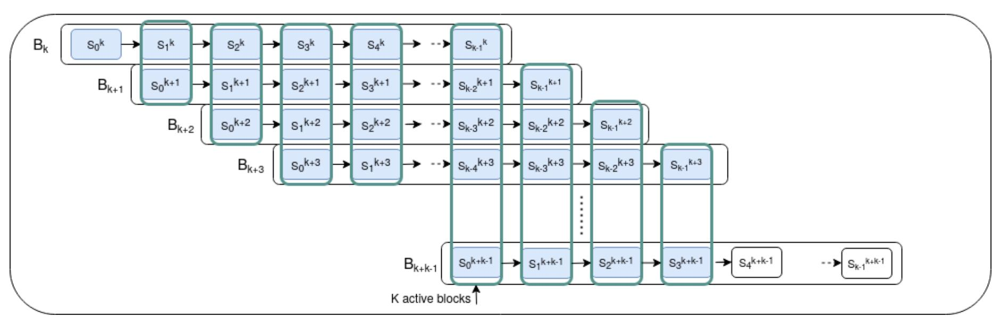

Fig. 1: The pipeline-like mining architecture with i = 0. The x axis denotes the time. At most k PoWs can be active at the same time.

<span id="page-6-0"></span><sup>6</sup> Notice that, the author pointed out that his architecture achieves the sharding ([\[31\]](#page-34-12)) property. Roughly speaking, the sharding property incentivizes a more collaborative mining among distributed miners. Indeed, miners working in the same pipeline can freely partition themselves into groups, such that miners belonging to different groups work collaboratively on different pieces or shards of a shared job. Moreover, the block reward system is more equitable than the one provided by Bitcoin. Indeed, Bitcoin rewards only the miner of a block, while in the multi-stage PoW, each miner who completed one of the k stages of a mined block, receives a share of the block reward.

{7}------------------------------------------------

### <span id="page-7-0"></span>4 Preliminaries

We briefly review some elements of probability theory, used in the rest of the paper. We provide a high-level description of Bernoulli trials, Binomial and Poisson distributions, Poisson point processes, and of exponential and hypoexponential distributions. Our treatment is based on [32]. The reader which is familiar with these elements can safely skip the section.

### 4.1 Discrete time probability

**Bernoulli trials** A Bernoulli trial, also known as a binomial trial, is an experiment with two possible outcomes: a success with probability  $p \in [0, 1]$ , and a failure with probability 1 - p. A sequence of n Bernoulli trials is a sequence of independent and identically distributed (i.i.d.) experiments, each of them having the same success probability p.

**Binomial distribution** In the discrete time, for any  $r \in \{0, ..., n\}$ , the number r of successes out of a sequence of n Bernoulli trials, is given by the binomial distribution Bin(r, n, p), defined as

<span id="page-7-1"></span>
$$Bin(r,n,p) = \binom{n}{r} p^r (1-p)^{n-r}.$$
 (1)

If X is the random variable denoting the number of successes, then P(X = r) = Bin(r, n, p).

**Negative binomial distribution** Consider a discrete sequence of Bernoulli trials. The execution of new trials is stopped when the r-th success is found, where  $r \ge 1$ . Then, the total number  $k \ge 0$  of failures, already occurred when the r-th success happened, is given by the negative binomial distribution NB(k, r, p), defined as

$$NB(k,r,p) = {\binom{k+r-1}{r-1}} p^r (1-p)^k.$$
 (2)

If N is the random variable denoting the number of failures already occurred when the r-th success happened, for any integer  $k \ge 0$ , then P(N = k) = NB(k, r, p).

Notice that, for any integer  $k \ge 0$ , the probability that at most k failures had happened can be computed as follows:

$$P(N \le k) = \sum_{i=0}^{k} {i+r-1 \choose r-1} p^r (1-p)^i = I(p; r, k+1)$$
(3)

where I(;,,) is a Regularized beta function, also known as Regularized incomplete beta function [33, 34, 35]. Notice that I(p;r,k+1) itself can be computed by [35]:

$$I(p; r, k+1) = \frac{\beta(p; r, k+1)}{\beta(r, k+1)}$$
(4)

where  $\beta(,)$  is the *complete beta function*, defined by  $\beta(r, k+1) = \int_0^1 x^{r-1} (1-x)^k dx$ , and  $\beta(;,)$  is the *incomplete beta function*, a generalization of the complete beta function, defined for  $p \in [0,1]$  as  $\beta(p;r,k+1) = \int_0^p x^{r-1} (1-x)^k dx$  [36].

{8}------------------------------------------------

<span id="page-8-0"></span>Poisson distribution If the number n of Bernoulli trials in a sequence is large (asymptotically, n → ∞), p is small (asymptotically, p → 0), and the product n·p converges to a positive finite value λ = n · p, then the binomial distribution [\(1\)](#page-7-1) is approximated by a Poisson distribution P ois(λ, r), defined as

$$Pois(\lambda, r) = \frac{\lambda^r e^{-\lambda}}{r!}.$$
 (5)

If Y is the random variable denoting the number of successes, then, for any integer r > 0, the P(Y = r) = P ois(λ, r). The parameter λ is the mean of the Poisson distribution, and indicates the expected number of successes, i.e., E[Y ] = λ (see [\[37\]](#page-34-18)).

### 4.2 Continuous time probability

Poisson point processes Roughly speaking, a Poisson point process is a stochastic process that counts the number of independent occurrences, over continuous time, of an event that happens with an average rate λ. Each occurrence is represented as a point on the time axis. If λ is constant over time, then the process is called homogeneous [\[38\]](#page-34-19).

Let t denote the continuous time, and let n be a large number of Bernoulli trials, executed in a time unit (e.g., 1 second). The number r > 0 of successes, obtained over the time t, is given by a Poisson point process, having rate parameter λ = n · p [\[39,](#page-35-0) [40\]](#page-35-1). Any new point in the process, represented as a point on the t-axis, i.e., the time axis, corresponds bijectively to a new success in a Bernoulli trial. The process is distributed according to P ois(λt, r). Therefore, letting Y be the random variable denoting the number of successes over time t, applying expression [\(5\)](#page-8-0), it holds that:

$$P(Y=r) = \frac{(\lambda t)^r e^{-(\lambda t)}}{r!}$$
(6)

<span id="page-8-1"></span>The expected number of successes in an interval of time long t is given by E[Y ] = λ t.

Exponential and hypoexponential distributions The inter-arrival times, or waiting times, between two consecutive points in a homogeneous Poisson point process, are described by an exponential distribution exp(λ), having the same rate parameter λ of the process [\[41\]](#page-35-2). Formally, the probability it takes t units of time until a point is found is given by the probability density function f<sup>X</sup> (t), defined as:

$$f_X(t) = \lambda e^{-\lambda \cdot t} \tag{7}$$

If X is the random variable denoting the time it takes to find a point, then P (X = t) = f<sup>X</sup> (t). The probability it takes more than t units of time until a point is found is given by the survival function R<sup>X</sup> (t), defined as

$$R_X(t) = e^{-\lambda \cdot t} \tag{8}$$

Hence, P (X > t) = R<sup>X</sup> (t). The expected value E[X] = 1/λ denotes the average waiting time until the next point is found. The exponential distribution is the only continuous time distribution to be memoryless [\[38\]](#page-34-19). The memoryless property is formally denoted by the equivalence P(X > t + x | X > t) = P(X > x), that holds for any given t and x, both greater than or equal to 0. Roughly speaking, the property holds because Bernoulli trials are i.i.d. experiments, and, therefore, the failures of the past trials, executed in time t <sup>0</sup> ≤ t, are mathematically irrelevant for the outcomes of the next trials.

To explain the consequences of this property, let us bring a simple example. If the first point is not found in the first t = 10 seconds of the process execution, then the conditional probability that it will take more than x = 5 other seconds until the point is found is equal to the unconditional 

{9}------------------------------------------------

probability that the point takes more than x = 5 seconds to be found, since the starting time of the process.

Let  $\alpha \geq 2$  and let  $X_1, X_2, \ldots, X_{\alpha}$  be mutually independent exponential random variables, having rate parameters  $\lambda_1, \lambda_2, \ldots, \lambda_{\alpha}$ . Then,  $X = \sum_{i=1}^{\alpha} X_i$  is a hypoexponential random variable, assuming values according to the hypoexponential distribution  $Hypo(\lambda_1, \lambda_2, \ldots, \lambda_{\alpha})$  The random variable X can be viewed as the waiting time until a point is found in the homogeneous Poisson point process having rate  $\lambda_1$ , summed to the waiting time until a point is found in the homogeneous Poisson point process having rate  $\lambda_2$ , and so on. It is worth remarking that the hypoexponential distribution is not memoryless. A closer look is given in Subsection 6.2.

# <span id="page-9-0"></span>5 Mining probability in single-stage PoWs

In this section, we recap a mathematical analysis of single-stage PoWs, which we use as a starting point for our analysis in the following sections. We also recall an important result from Houy [23], which states the equivalence between the *share of the network hashing power* held by a miner and his *mining probability*.

Mathematical analysis Let h > 0 be the hashing power of a miner, let t > 0 be the current target value of the hash-puzzle, and let  $d = 2^{256}/t$  be the current difficulty of the hash-puzzle. The hash-puzzle output space is  $\{0,1\}^{256}$ , since the protocol uses a double SHA-256 hash function. Using the random oracle assumption<sup>7</sup> to model the hash function, widely used in the Bitcoin and the blockchain literature, for any distributed over the output of the hash function can be considered as uniformly and independently distributed over the output space. It follows that, under the assumption of constant hash-puzzle difficulty, every trial the miner makes to complete the PoW is a Bernoulli trial, with success probability  $prob = t/2^{256} = 1/d$  [43, 44]. Moreover, under the assumptions of constant hash-puzzle difficulty and constant hashing power<sup>9</sup>, the number of successes in any interval of time is described by a homogeneous Poisson point process, having rate parameter  $\lambda = h/d$  [4, 7]. In our scenario, the homogeneous Poisson point process describes the number of PoWs the miner completes per interval of time. A new point found in the homogeneous Poisson point process corresponds bijectively to a new valid nonce found – a new PoW completed, or, equivalently, a new block mined – by the miner. Formally, the probability of having  $k \ge 0$  successes in an interval of time t is given by expression (6).

Let the block height of a block be the integer  $\gamma \geq 0$ , denoting its position in the chain. Consider  $M \geq 2$  competing miners, trying to mine the next block, say, with block height  $\gamma$ . For each  $p \in \{1, \ldots, M\}$ , let  $X_p$  be the exponential random variable, describing the inter-arrival time between two consecutive blocks found by miner p. The parameter of  $X_p$  is  $\lambda_p = h_p/d$ , where  $h_p > 0$  is the hashing power of miner p. Then, the probability density function of  $X_p$  is  $f_{X_p}(t) = P(X_p = t) = \lambda_p e^{-\lambda_p \cdot t}$ , and the survival function of  $X_p$  is  $R_{X_p}(t) = P(X_p > t) = e^{-\lambda_p \cdot t}$ . If each miner starts to mine the block at the same time, then the winner is the miner whose Poisson point process first finds a point. Notice that the processes are independent from each other. Therefore, for each  $p \in \{1, \ldots, M\}$ , the

<span id="page-9-1"></span><sup>&</sup>lt;sup>7</sup> We implicitly use this assumption throughout the entire work.

<span id="page-9-2"></span><sup>&</sup>lt;sup>8</sup> For completeness, it is worth noting that, in the literature, the difficulty value is also indicated as  $d' = (2^{16} - 1) \cdot 2^{208}/t \approx 2^{224}/t$ , and, as a consequence, the probability value as  $prob = t/2^{256} \approx 1/(d' \cdot 2^{32})$  [42]. The value  $(2^{16} - 1) \cdot 2^{208} \approx 2^{224}$  is the maximum allowed *target* value in Bitcoin. Nevertheless, our results are independent from this consideration, as they can be equivalently applied to both notations by setting  $d' \approx d/2^{32}$ .

<span id="page-9-3"></span><sup>&</sup>lt;sup>9</sup> Consider also that usually h > 0 is very high, and prob = 1/d is very small. Indeed, on Apr 15, 2021, d is greater than 20 trillions [45].

{10}------------------------------------------------

probability that miner p mines the block, is given by:

<span id="page-10-1"></span>
$$P (p \text{ mines block } \gamma) = \int_{0}^{\infty} f_{X_{p}}(t) \prod_{\substack{z=1\\z\neq p}}^{M} R_{X_{z}}(t) dt = \int_{0}^{\infty} \lambda_{p} e^{-\lambda_{p} \cdot t} \prod_{\substack{z=1\\z\neq p}}^{M} e^{-\lambda_{z} \cdot t} dt$$

$$= \int_{0}^{\infty} \lambda_{p} \prod_{z=1}^{M} e^{-\lambda_{z} \cdot t} dt = \int_{0}^{\infty} \lambda_{p} e^{-(\sum_{z=1}^{M} \lambda_{z}) \cdot t} dt = \lambda_{p} \int_{0}^{\infty} e^{-(\sum_{z=1}^{M} \lambda_{z}) \cdot t} dt$$

$$= \lambda_{p} \frac{-1}{\sum_{z=1}^{M} \lambda_{z}} \cdot \left[ e^{-(\sum_{j=0}^{M} \lambda_{j}) \cdot t} \right]_{0}^{\infty} = \lambda_{p} \frac{-1}{\sum_{z=1}^{M} \lambda_{z}} \cdot (-1) = \frac{\lambda_{p}}{\sum_{z=1}^{M} \lambda_{z}}$$

$$= \frac{h_{p}}{\sum_{z=1}^{M} h_{z}}. \tag{9}$$

Hence, the mining probability is independent of the hash-puzzle difficulty and target values, and is equal to the share of the network hashing power the miner holds.

On the other hand, a new PoW is globally completed every time one of the M miners finds a point in his Poisson point process. Thus, the global block mining event can be mathematically represented as the superposition of the M mutually independent homogeneous Poisson point processes, which itself is a homogeneous Poisson point process with rate parameter  $\lambda_{glob} = \sum_{p=1}^{M} \lambda_p = \sum_{p=1}^{M} h_p/d$ .

Hence, the waiting time until a new PoW is globally completed is given by an exponential distribution with a constant rate parameter  $\lambda_{glob}$ . The expected value of the exponential distribution – the expected time until a new block is mined –,  $\lambda_{glob}^{-1}$ , should be  $\lambda_{glob}^{-1} = 10$  minutes [3, 46].

### <span id="page-10-0"></span>6 Mining probability in multi-stage PoWs

In this section, we extend the previous result and propose a closed-form expression for the mining probability. The closed-form expression works for every blockchain protocol whose PoW is composed of  $k \ge 1$  sequential hash-puzzles, under the same assumptions used before. Each miner can start the stage s+1 of his PoW only after he has found a valid nonce in stage s, and the first miner that completes the last stage in his PoW is the winner and mines the block.

In Subsection 6.5 we prove that, when k = 1, our expression reduces to (9), i.e., it is a true generalization of the single-stage case.

As announced in Section 3, in the protocol proposed by Sarkar, the expression is applicable to the PoW of the first general block  $B_k$ . Indeed, all the genesis blocks have already been mined before the PoW of block  $B_k$  had started. Consequently, as soon as a miner completes stage number s of the PoW of block  $B_k$ , for  $0 \le s \le k-2$ , he can immediately start stage s+1 of the same PoW. Conversely, given a block  $B_{i+k}$ , such that  $i \ge 1$  and  $s \in \{0, \ldots, k-2\}$ , when a miner completes stage s of block  $B_{i+k}$ , he may need to wait until block  $B_{i+s+1}$  is mined and  $bdigest_{i+s+1}$  becomes available. Only at this point, he can start stage s+1 of block  $B_{i+k}$ . For this reason, we will restrict our analysis to block  $B_k$ .

#### 6.1 Notation

We use the following notation:

- the integer  $k \ge 1$  denotes the number of sequential hash-puzzles of which a PoW consists.
- the integer  $M \ge 2$  denotes the number of competing miners involved in the PoW of a block.
- $-d_0,\ldots,d_{k-1}$  are the positive real values representing hash-puzzles difficulties.

{11}------------------------------------------------

- $h_{p,s}$  is a positive real value, denoting the hashing power of miner p on stage s, for a given  $p \in \{1, ..., M\}$  and a given  $s \in \{0, ..., k-1\}$ .
- $X_{p,s}$  is the exponential random variable describing the time miner p takes to complete the stage s of a block, for a given  $p \in \{1, \ldots, M\}$  and a given  $s \in \{0, \ldots, k-1\}$ .
- $\lambda_{p,s} = h_{p,s}/d_s$  is the positive real parameter of  $X_{p,s}$ , for a given  $p \in \{1, \ldots, M\}$  and a given  $s \in \{0, \ldots, k-1\}$ .

Let  $p \in \{1, ..., M\}$ . The time miner p takes to complete the entire PoW of a block is given by the hypoexponential random variable  $X_{p,+k} = \sum_{s=0}^{k-1} X_{p,s}$ . Indeed, the time to complete the PoW of a block can be represented this way because every single stage can be described by its own independent Poisson point process. The Poisson point process related to the first stage starts at the same time the PoW of the block starts. Completing a stage is equal to finding the first point in the Poisson point process. As soon as the first point in a Poisson point process is found, the stage process is not relevant anymore, and the next stage (i.e., the next Poisson point process) starts. Therefore, the time to complete every single stage is described by an exponential random variable, while the time to complete the PoW is the sum of the exponential random variables associated to the individual stages.

### <span id="page-11-0"></span>6.2 The hypoexponential distribution

Let us introduce more formally the hypoexponential distribution, in order to provide the basis for our computation of the closed-form expression for the mining probability.

The probability density function and the survival function of the hypoexponential distribution have been presented by Scheuer [47], and, as closed-form expressions, i.e., expressions computable in a finite number of standard operations, by Amari and Misra [48].

Literature results on the hypoexponential distribution. Consider a miner  $p \in \{1, ..., M\}$ . As explained in [47], the literature studies on the hypoexponential distribution have been divided into three major subcases, as follows:

- 1. In the first subcase,  $\lambda_{p,s} = \lambda_{p,s'}$ , for every pair  $s, s' \in \{0, \dots, k-1\}$ , with  $s' \neq s$ . The hypoexponential distribution is reduced to an *Erlang distribution* with *shape* parameter k and k are parameter k, with k k k k k k k k k k
- 2. In the second subcase,  $\lambda_{p,s} \neq \lambda_{p,s'}$ , for every pair  $s, s' \in \{0, \dots, k-1\}$ , with  $s' \neq s$ .
- 3. In the third subcase,  $\lambda_{p,s}$  can be either equal or not equal to  $\lambda_{p,s'}$ , for every pair  $s, s' \in \{0, \ldots, k-1\}$ , with  $s' \neq s$ .

The first two cases have been deeply studied in mathematics over the years, and we will not analyze them in this section. Scheuer, Amari, and Misra were the first researchers to focus on the third and most general scenario.

# <span id="page-11-1"></span>6.3 Probability density function and survival function

In this subsection, we recall the Amari and Misra's closed-form expressions for the probability density function and the survival function of a hypoexponential distribution [48]. We omit the majority of the low-level technical details that have led to the composition of the two expressions that are not necessary for our goals. We refer to the original papers for the complete mathematical analysis of the two expressions.

Let  $p \in \{1, ..., M\}$ . Let  $f_{X_{p,+_k}}(t) = P(X_{p,+_k} = t)$  be the probability density function, and let  $R_{X_{p,+_k}}(t) = P(X_{p,+_k} > t)$  be the survival function of  $X_{p,+_k}$ . In order to compute  $f_{X_{p,+_k}}(t)$ 

{12}------------------------------------------------

and  $R_{X_{p,+k}}(t)$ , the exponential random variables  $X_{p,s}$  and  $X_{p,s'}$ , such that  $s' \neq s$ , and  $s,s' \in$  $\{0,\ldots,k-1\}$ , which satisfy the condition  $\lambda_{p,s}=\lambda_{p,s'}$  must be grouped together. Their common  $\lambda$ value must be denoted with a new parameter. For example, if k = 4,  $\lambda_{p,0} = \lambda_{p,3}$ , and  $\lambda_{p,1} = \lambda_{p,2}$ , then two new parameters,  $\beta_{p,1}$  and  $\beta_{p,2}$ , can be set as follows:

$$\lambda_{p,0} = \lambda_{p,3} = \beta_{p,1}$$
$$\lambda_{p,1} = \lambda_{p,2} = \beta_{p,2}$$

<span id="page-12-0"></span>At the same time, denote by  $r_{p,1}$  and  $r_{p,2}$  the number of  $\lambda$ -parameters having value equal to  $\beta_{p,1}$  and  $\beta_{p,2}$ , respectively. At this point, if the number of different  $\lambda$  values is  $a_p$ , then  $a_p$  pairs are obtained:  $(\beta_{p,1}, r_{p,1}), \ldots, (\beta_{p,a_p}, r_{p,a_p})$ . It holds that  $\sum_{q_p=1}^{a_p} r_{p,q_p} = k$ . The probability density function  $f_{X_{p,+_k}}(t)$ is (47], equation 13)

$$f_{X_{p,+_k}}(t) \stackrel{\text{def}}{=} B_p \sum_{q_p=1}^{a_p} \sum_{l_p=1}^{r_{p,q_p}} \frac{\Phi_{p,q_p,l_p}(-\beta_{p,q_p})}{(r_{p,q_p}-l_p)! (l_p-1)!} t^{r_{p,q_p}-l_p} e^{-\beta_{p,q_p} t}$$

$$\tag{10}$$

where

$$-B_p = (\prod_{q_p=1}^{a_p} (\beta_{p,q_p})^{r_{p,q_p}}), \text{ (see [48], Notation Paragraph))}$$

$$-\Phi_{p,q_p,l_p}(t) = (-1)^{l_p-1} \cdot (l_p-1)! \cdot \sum_{\Omega_{2p}(1)} \prod_{\substack{j_p=1 \ j_p \neq q_p}}^{a_p} {i_{j_p}+r_{p,j_p}-1 \choose i_{j_p}} \cdot \tau_{j_p}$$
 (see [48], equation 4)

$$-\tau_{j_p} = (\beta_{p,j_p} + t)^{-(r_{p,j_p} + i_{j_p})}$$
 (see [48], between equations 3 and 4)

$$- \Omega_{2p}(1) = \{i_{j_p} \in \mathbb{N}_0, \text{ for each } j_p \in \{1, \dots, a_p\}, \text{ such that } \sum_{\substack{j_p = 1 \\ j_p \neq q_p}}^{a_p} i_{j_p} = l_p - 1\}$$

(see |48|, Notation Paragraph).

<span id="page-12-1"></span>The survival function is ([48], equation 3)

$$R_{X_{p,+_{k}}}(t) \stackrel{\text{def}}{=} B_{p} \sum_{q_{p}=1}^{a_{p}} \sum_{l_{p}=1}^{r_{p,q_{p}}} \frac{\Psi_{p,q_{p},l_{p}}(-\beta_{p,q_{p}})}{(r_{p,q_{p}}-l_{p})! (l_{p}-1)!} t^{r_{p,q_{p}}-l_{p}} e^{-\beta_{p,q_{p}}t}$$

$$(11)$$

where  $B_p$  is defined as above, and

$$-\Psi_{p,q_{p},l_{p}}(t) = -(-1)^{l_{p}-1} \cdot (l_{p}-1)! \cdot \sum_{\Omega_{2_{p}}(0)} \prod_{\substack{j_{p}=0 \\ j_{p} \neq q_{p}}}^{a_{p}} \binom{i_{j_{p}}+r_{p,j_{p}}-1}{i_{j_{p}}} \cdot \tau_{j_{p}}$$
(see [48], equation 5. See [48], Notation Paragraph for the "-" sign)

(see [48], equation 5. See [48], Notation Paragraph for the "-" sign)

 $-\tau_{j_p}$  as above

$$-\Omega_{2p}(0) = \{i_{j_p} \in \mathbb{N}_0, \text{ for each } j_p \in \{0, \dots, a_p\}, \text{ such that } \sum_{\substack{j_p = 0 \ j_p \neq q_p}}^{a_p} i_{j_p} = l_p - 1\}$$

(see [48], Notation Paragraph)

 $-\beta_{p,0} = 0, r_{p,0} = 1$  (see [48], between equations 2 and 3).

{13}------------------------------------------------

### <span id="page-13-1"></span>6.4 A closed-form expression for the mining probability

Let  $p \in \{1, ..., M\}$  be a miner, and let  $\gamma$  be a non-negative integer. The probability that miner p is the first one in completing the PoW of block  $\gamma$  is given by

<span id="page-13-2"></span>
$$P\left(p \text{ mines block } \gamma\right) = \int_0^\infty f_{X_{p,+_k}}(t) \prod_{\substack{z=1\\z\neq p}}^M R_{X_{z,+_k}}(t) dt \tag{12}$$

By substituting expressions (10) and (11), the above integration is equal to

$$\int_{0}^{\infty} \left( B_{p} \sum_{q_{p}=1}^{a_{p}} \sum_{l_{p}=1}^{r_{p,q_{p}}} \frac{\Phi_{p,q_{p},l_{p}}(-\beta_{p,q_{p}})}{(r_{p,q_{p}}-l_{p})! (l_{p}-1)!} t^{r_{p,q_{p}}-l_{p}} e^{-\beta_{p,q_{p}} t} \right) \cdot \left( \prod_{\substack{z=1\\z\neq p}}^{M} B_{z} \left( \sum_{q_{z}=1}^{a_{z}} \sum_{l_{z}=1}^{r_{z,q_{z}}} \frac{\Psi_{z,q_{z},l_{z}}(-\beta_{z,q_{z}})}{(r_{z,q_{z}}-l_{z})! (l_{z}-1)!} t^{r_{z,q_{z}}-l_{z}} e^{-\beta_{z,q_{z}} t} \right) \right) dt$$

Due to the linearity of integration, the above expression is equal to

$$\left(\prod_{z=1}^{M} B_{z}\right) \cdot \int_{0}^{\infty} \left(\sum_{q_{p}=1}^{a_{p}} \sum_{l_{p}=1}^{r_{p,q_{p}}} \frac{\Phi_{p,q_{p},l_{p}}(-\beta_{p,q_{p}})}{(r_{p,q_{p}}-l_{p})! (l_{p}-1)!} t^{r_{p,q_{p}}-l_{p}} e^{-\beta_{p,q_{p}} t}\right) \cdot \left(\prod_{\substack{z=1\\z\neq p}}^{M} \left(\sum_{q_{z}=1}^{a_{z}} \sum_{l_{z}=1}^{r_{z,q_{z}}} \frac{\Psi_{z,q_{z},l_{z}}(-\beta_{z,q_{z}})}{(r_{z,q_{z}}-l_{z})! (l_{z}-1)!} t^{r_{z,q_{z}}-l_{z}} e^{-\beta_{z,q_{z}} t}\right)\right) dt$$

More concisely, the above expression can be written as

$$\left(\prod_{z=1}^{M} B_{z}\right) \int_{0}^{\infty} \left(\prod_{z=1}^{M} \left(\sum_{q_{z}=1}^{a_{z}} \sum_{l_{z}=1}^{r_{z,q_{z}}} \frac{\Theta_{z,q_{z},l_{z}}(-\beta_{z,q_{z}})}{(r_{z,q_{z}}-l_{z})! (l_{z}-1)!} t^{r_{z,q_{z}}-l_{z}} e^{-\beta_{z,q_{z}} t}\right)\right) dt$$

where

$$\Theta_{z,q_z,l_z} \left( -\beta_{z,q_z} \right) = \begin{cases} \Phi_{z,q_z,l_z} \left( -\beta_{z,q_z} \right), & \text{iff } z = p \\ \Psi_{z,q_z,l_z} \left( -\beta_{z,q_z} \right), & \text{otherwise} \end{cases}$$

Due to the distributive property of multiplication over addition, the above expression is equal to

$$\left(\prod_{z=1}^{M} B_{z}\right) \int_{0}^{\infty} \sum_{q_{1}=1}^{a_{1}} \sum_{l_{1}=1}^{r_{1,q_{1}}} \dots \sum_{q_{M}=1}^{a_{M}} \sum_{l_{M}=1}^{r_{M,q_{M}}} \left(\prod_{z=1}^{M} \frac{\Theta_{z,q_{z},l_{z}}(-\beta_{z,q_{z}})}{(r_{z,q_{z}}-l_{z})!(l_{z}-1)!} t^{r_{z,q_{z}}-l_{z}} e^{-\beta_{z,q_{z}}t}\right) dt$$

Furthermore, due to the linearity of integration, the above expression is equal to

$$\left(\prod_{z=1}^{M} B_{z}\right) \sum_{q_{1}=1}^{a_{1}} \sum_{l_{1}=1}^{r_{1,q_{1}}} \dots \sum_{q_{M}=1}^{a_{M}} \sum_{l_{M}=1}^{r_{M,q_{M}}} \left(\int_{0}^{\infty} \left(\prod_{z=1}^{M} \frac{\Theta_{z,q_{z},l_{z}}(-\beta_{z,q_{z}})}{(r_{z,q_{z}}-l_{z})!(l_{z}-1)!} t^{r_{z,q_{z}}-l_{z}} e^{-\beta_{z,q_{z}}t}\right) dt\right)$$

<span id="page-13-0"></span>and to

{14}------------------------------------------------

$$\left(\prod_{z=1}^{M} B_{z}\right) \cdot \sum_{q_{1}=1}^{a_{1}} \sum_{l_{1}=1}^{r_{1,q_{1}}} \dots \sum_{q_{M}=1}^{a_{M}} \sum_{l_{M}=1}^{r_{M,q_{M}}} \left(\left(\prod_{z=1}^{M} \frac{\Theta_{z,q_{z},l_{z}}(-\beta_{z,q_{z}})}{(r_{z,q_{z}}-l_{z})!(l_{z}-1)!}\right) \cdot \int_{0}^{\infty} t^{\sum_{z=1}^{M} (r_{z,q_{z}}-l_{z})} e^{-\sum_{z=1}^{M} \beta_{z,q_{z}} t} dt\right).$$
(13)

A corollary of the Gamma Function definition With  $t_2 = \eta t$ , for each  $\alpha \in \mathbb{N}_0$ , and  $\eta \in \mathbb{R}$  such that  $\eta \neq 0$ , it holds that

$$\int_0^\infty t^{\alpha} \cdot e^{-\eta \cdot t} dt = \int_0^\infty \frac{1}{\eta^{\alpha}} t_2^{\alpha} \cdot e^{-t_2} \cdot \frac{1}{\eta} dt_2 = \frac{1}{\eta^{\alpha+1}} \int_0^\infty t_2^{\alpha} \cdot e^{-t_2} dt_2$$

By definition of  $\Gamma$ , the Gamma function [49], we have that

$$\int_0^\infty t_2{}^\alpha \cdot e^{-t_2} dt_2 = \Gamma(\alpha + 1) = \alpha!$$

and, hence, that

$$\frac{1}{\eta^{\alpha+1}} \int_0^\infty t_2^{\alpha} \cdot e^{-t_2} dt_2 = \frac{\alpha!}{\eta^{\alpha+1}}.$$

We can apply the corollary to expression (13). Indeed, for each  $z \in \{1, ... M\}$ , we have that  $l_z, r_{z,q_z} \in \mathbb{N}$ , and  $l_z \leq r_{z,q_z}$ , and, hence

$$\sum_{z=1}^{M} (r_{z,q_z} - l_z) \in \mathbb{N}_0.$$

Moreover, for each  $z \in \{1, ... M\}$ , we have that  $\beta_{z,q_z} > 0$ , and hence

$$\sum_{z=1}^{M} \beta_{z,q_z} \neq 0.$$

Therefore, setting  $\alpha = \sum_{z=1}^{M} (r_{z,q_z} - l_z)$  and  $\eta = \sum_{z=1}^{M} \beta_{z,q_z}$ , and applying the corollary, it holds that

$$\int_{0}^{\infty} t^{\sum_{z=1}^{M} (r_{z,q_{z}} - l_{z})} e^{-\sum_{z=1}^{M} \beta_{z,q_{z}} t} dt = \int_{0}^{\infty} t^{\alpha} \cdot e^{-\eta \cdot t} dt$$

$$= \frac{\alpha!}{\eta^{\alpha+1}}$$

$$= \left(\sum_{z=1}^{M} \beta_{z,q_{z}}\right)^{-1 - \sum_{z=1}^{M} (r_{z,q_{z}} - l_{z})} \cdot \left(\left(\sum_{z=1}^{M} (r_{z,q_{z}} - l_{z})\right)!\right)$$

{15}------------------------------------------------

Hence, expression (13) can be equivalently written as

$$\left( \prod_{z=1}^{M} B_{z} \right) \cdot \sum_{q_{1}=1}^{a_{1}} \sum_{l_{1}=1}^{r_{1,q_{1}}} \dots \sum_{q_{M}=1}^{a_{M}} \sum_{l_{M}=1}^{r_{M,q_{M}}} \left( \left( \prod_{z=1}^{M} \frac{\Theta_{z,q_{z},l_{z}} \left( -\beta_{z,q_{z}} \right)}{(r_{z,q_{z}} - l_{z})! \left( l_{z} - 1 \right)!} \right) \cdot \left( \sum_{z=1}^{M} r_{z,q_{z}} - l_{z} \right) \cdot \left( \sum_{z=1}^{M} (r_{z,q_{z}} - l_{z}) \cdot \left( \sum_{z=1}^{M} (r_{z,q_{z}} - l_{z}) \right)! \right)$$

$$= \left( \prod_{z=1}^{M} B_{z} \right) \cdot \sum_{q_{1}=1}^{a_{1}} \sum_{l_{1}=1}^{r_{1,q_{1}}} \dots \sum_{q_{M}=1}^{a_{M}} \sum_{l_{M}=1}^{r_{M,q_{M}}} \left( \left( \prod_{z=1}^{M} \frac{\Theta_{z,q_{z},l_{z}} \left( -\beta_{z,q_{z}} \right)}{(l_{z}-1)!} \right) \cdot Multinomial_{\left(\sum_{z=1}^{M} \left( r_{z,q_{z}} - l_{z} \right) \right); \left( r_{1,q_{1}} - l_{1} \right), \dots, \left( r_{M,q_{M}} - l_{M} \right)} \right)$$

$$\left( \sum_{z=1}^{M} \beta_{z,q_{z}} \right)^{1 + \sum_{z=1}^{M} \left( r_{z,q_{z}} - l_{z} \right)} \right) \cdot Multinomial_{\left(\sum_{z=1}^{M} \left( r_{z,q_{z}} - l_{z} \right) \right); \left( r_{1,q_{1}} - l_{1} \right), \dots, \left( r_{M,q_{M}} - l_{M} \right)} \right)$$

where

$$Multinomial_{\left(\sum_{z=1}^{M} (r_{z,q_{z}} - l_{z})\right); (r_{1,q_{1}} - l_{1}), \dots, (r_{M,q_{M}} - l_{M})} = \frac{\left(\sum_{z=1}^{M} (r_{z,q_{z}} - l_{z})\right)!}{\prod_{z=1}^{M} \left((r_{z,q_{z}} - l_{z})!\right)}$$

is a multinomial coefficient. Finally, letting:

$$- \Phi'_{z,q_{z},l_{z}}(t) = \frac{\Phi_{z,q_{z},l_{z}}(t)}{(l_{z}-1)!} = (-1)^{l_{z}-1} \cdot \sum_{\Omega_{2z}(1)} \prod_{j_{z}} {i_{j_{z}} + r_{z,j_{z}} - 1 \choose i_{j_{z}}} \cdot \tau_{j_{z}}$$

$$- \Psi'_{z,q_{z},l_{z}}(t) = \frac{\Psi_{z,q_{z},l_{z}}(t)}{(l_{z}-1)!} = - (-1)^{l_{z}-1} \cdot \sum_{\Omega_{2z}(0)} \prod_{j_{z}} {i_{j_{z}} + r_{z,j_{z}} - 1 \choose i_{j_{z}}} \cdot \tau_{j_{z}}$$

$$- \Theta'_{z,q_{z},l_{z}}(-\beta_{z,q_{z}}) = \begin{cases} \Phi'_{z,q_{z},l_{z}}(-\beta_{z,q_{z}}), & \text{iff } z = p \\ \Psi'_{z,q_{z},l_{z}}(-\beta_{z,q_{z}}), & \text{otherwise} \end{cases}$$

then, the mining probability of miner p is given by:

<span id="page-15-1"></span>
$$P (p \text{ mines block } \gamma) = \left(\prod_{z=1}^{M} B_{z}\right) \cdot \sum_{q_{1}=1}^{a_{1}} \sum_{l_{1}=1}^{r_{1,q_{1}}} \dots \sum_{q_{M}=1}^{a_{M}} \sum_{l_{M}=1}^{r_{M,q_{M}}} \left(\prod_{z=1}^{M} \Theta'_{z,q_{z},l_{z}} \left(-\beta_{z,q_{z}}\right)\right) \cdot Multinomial_{\left(\sum_{z=1}^{M} (r_{z,q_{z}}-l_{z})\right); (r_{1,q_{1}}-l_{1}), \dots, (r_{M,q_{M}}-l_{M})}}{\left(\sum_{z=1}^{M} \beta_{z,q_{z}}\right)^{1+\sum_{z=1}^{M} (r_{z,q_{z}}-l_{z})}}\right) (14)$$

To the best of our knowledge, expression (14) is no further simplifiable.

### <span id="page-15-0"></span>6.5 The closed-form expression for the mining probability for k=1

It is worth remarking that, when k = 1, expression (14) reduces to expression (9).

Look at the closed-form expression of the mining probability given by (14). Let  $p \in \{1, ..., M\}$ . If k = 1, then the time miner p takes to complete the PoW follows the hypoexponential distribution  $X_{p,+1}$  with parameter  $\lambda_{p,0} = h_{p,0}/d_0$ . After grouping the operations, it remains a single pair  $(\beta_{p,1}, 1)$ , with  $\beta_{p,1} = \lambda_{p,0}$ . Hence, for each  $p \in \{1, ..., M\}$ , the number of distinct  $\beta$ -values is  $a_p = 1$ , and the number of occurrences of this single  $\beta$ -value is  $r_{p,1} = 1$ .

{16}------------------------------------------------

Therefore, expression [\(14\)](#page-15-1) consists of a single addend, that is:

<span id="page-16-0"></span>
$$P (p \text{ mines block } \gamma) = \left( \prod_{z=1}^{M} B_z \right) \cdot \sum_{q_1=1}^{1} \sum_{l_1=1}^{1} \dots \sum_{q_M=1}^{1} \sum_{l_M=1}^{1} \left( \prod_{l_1=1}^{M} \Psi'_{z,q_z,l_z} \left( -\beta_{z,q_z} \right) \right) \cdot Multinomial_{\left( \sum_{z=1}^{M} (r_{z,q_z} - l_z) \right); (r_{1,q_1} - l_1), \dots, (r_{M,q_M} - l_M)} \left( \frac{\left( \sum_{z=1}^{M} \beta_{z,q_z} \right)^{1 + \sum_{z=1}^{M} (r_{z,q_z} - l_z)}}{\left( \sum_{z=1}^{M} \beta_{z,q_z} \right)^{1 + \sum_{z=1}^{M} (r_{z,q_z} - l_z)}} \right)$$
(15)

In order to further simplify expression [\(15\)](#page-16-0), notice that the following results hold:

Lemma 1. 
$$\prod_{z=1}^M B_z = \prod_{z=1}^M \lambda_{z,0}$$
.

Proof. The lemma holds since B<sup>z</sup> = λz,0, for each z ∈ {1, . . . , M}.

Lemma 2. Multinomial( P<sup>M</sup> <sup>z</sup>=1(rz,qz <sup>−</sup> <sup>l</sup>z)); (r1,q1−l1), ... ,(rM,qM <sup>−</sup>lM) = 1.

Proof. The lemma holds since rz,q<sup>z</sup> = l<sup>z</sup> = 1, for each z ∈ {1, . . . , M}.

**Lemma 3.** 
$$\left(\sum_{z=1}^{M} \beta_{z,q_z}\right)^{1+\sum_{z=1}^{M} (r_{z,q_z}-l_z)} = \sum_{z=1}^{M} \lambda_{z,0}$$
.

Proof. The lemma holds since rz,q<sup>z</sup> = lz, q<sup>z</sup> = 1, and βz,<sup>1</sup> = λz,0, for each z ∈ {1, . . . , M}.

Moreover, we also have that:

Lemma 4. Φ 0 p,qp,lp (− βp,q<sup>p</sup> ) = 1.

Proof. Since q<sup>p</sup> = 1, l<sup>p</sup> = 1, and given that βp,q<sup>p</sup> = βp,<sup>1</sup> = λp,0, it holds that

$$\Phi'_{p,q_p,l_p}(-\beta_{p,q_p}) = \Phi'_{p,1,1}(-\lambda_{p,0})$$

Due to the definition of Φ 0 , provided in Subsection [6.4,](#page-13-1) since l<sup>p</sup> = 1, it holds that

$$\Phi'_{p,1,1}(-\lambda_{p,0}) = \sum_{\Omega_{2p}(1)} \prod_{\substack{j_p=1\\j_p \neq q_p}}^{a_p} \binom{i_{j_p} + r_{p,j_p} - 1}{i_{j_p}} \cdot \tau_{j_p}$$

Focusing on the sum, and in particular on the definition of the Ω2<sup>p</sup> (1) set, provided in Subsection [6.3,](#page-11-1) since q<sup>p</sup> = 1, a<sup>p</sup> = 1, and l<sup>p</sup> = 1, we have

$$\Omega_{2p}(1) = \{i_{j_p} \in \mathbb{N}_0, \text{ for each } j_p \in \{1, \dots, a_p\}, \text{ such that } \sum_{\substack{j_p = 1 \ j_p \neq q_p}}^{a_p} i_{j_p} = l_p - 1\}$$

$$= \{i_{j_p} \in \mathbb{N}_0, \text{ for each } j_p \in \{1\}, \text{ such that } \sum_{\substack{j_p = 1 \ j_p \neq 1}}^{1} i_{j_p} = 0\}$$

$$= \{i_1 \in \mathbb{N}_0, \text{ such that } \sum_{\varnothing} i_{j_p} = 0\}$$

{17}------------------------------------------------

Since an *empty sum* ([50]) of the form  $\sum_{\varnothing} expr$  evaluates to 0, independently from expr, then the constraint  $\sum_{\varnothing} i_{j_p} = 0$  always evaluates to true.

Once a  $\gamma \in \mathbb{N}_0$  is assigned to  $i_1$ , we focus on the product  $\prod_{\substack{j_p=1\\j_p\neq q_p}}^{a_p} \binom{i_{j_p}+r_{p,j_p}-1}{i_{j_p}} \cdot \tau_{j_p}$ . Similarly to

the above analysis, since  $q_p = a_p = 1$ , but  $j_p \neq q_p$  is required, we have an *empty product* ([50]) of the form  $\prod_{\varnothing} expr'$ , which evaluates to 1, independently from expr'. Putting all together,

$$\Phi'_{p,1,1} (-\lambda_{p,0}) = \sum_{\Omega_{2p}(1)} \prod_{\substack{j_p = 1 \\ j_p \neq q_p}}^{a_p} \binom{i_{j_p} + r_{p,j_p} - 1}{i_{j_p}} \cdot \tau_{j_p}$$

$$= \sum_{i_1 = \gamma} \prod_{\varnothing} \binom{i_{j_p} + r_{p,j_p} - 1}{i_{j_p}} \cdot \tau_{j_p}$$

$$= \sum_{i_1 = \gamma} 1 = 1.$$

**Lemma 5.** For each  $z \in \{1, \ldots, M\}$ , with  $z \neq p$ , it holds that  $\Psi'_{z,q_z,l_z}(-\beta_{z,q_z}) = \frac{1}{\lambda_{z,0}}$ .

*Proof.* Let  $z \in \{1, \ldots, M\}$ , with  $z \neq p$ . Since  $q_z = 1$ ,  $l_z = 1$ , and  $\beta_{z,q_z} = \beta_{z,1} = \lambda_{z,0}$ , it holds that

$$\Psi'_{z,q_z,l_z}(-\beta_{z,q_z}) = \Psi'_{z,1,1}(-\lambda_{z,0})$$

Due to the definition of  $\Psi'$ , provided in Subsection 6.4, since  $l_z = 1$ , it holds that

$$\Psi'_{z,1,1}(-\lambda_{z,0}) = -\sum_{\Omega_{2z}(0)} \prod_{\substack{j_z=0\\j_z \neq q_z}}^{a_z} \binom{i_{j_z} + r_{z,j_z} - 1}{i_{j_z}} \cdot \tau_{j_z}$$

Focusing on the sum, and in particular on the definition of the  $\Omega_{2p}(0)$  set, provided in Subsection 6.3, since  $q_z = 1$ ,  $a_z = 1$ , and  $l_z = 1$ , we have that

$$\Omega_{2z}(0) = \{i_{jz} \in \mathbb{N}_0, \text{ for each } j_z \in \{0, \dots, a_z\}, \text{ such that } \sum_{\substack{j_z = 0 \\ j_z \neq q_z}}^{a_z} i_{jz} = l_z - 1\} \\
= \{i_{jz} \in \mathbb{N}_0, \text{ for each } j_z \in \{0, 1\}, \text{ such that } \sum_{\substack{j_z = 0 \\ j_z \neq 1}}^{1} i_{jz} = 0\} \\
= \{i_0 \in \mathbb{N}_0, i_1 \in \mathbb{N}_0, \text{ such that } \sum_{j_z = 0}^{1} i_{jz} = 0\} \\
= \{i_0 = 0, i_1 \in \mathbb{N}_0\}$$

Hence,  $i_0 = 0$ , while  $i_1$  can take any non-negative integer value  $\gamma$ .

Once a  $\gamma \in \mathbb{N}_0$  is assigned to  $i_1$ , we focus also on the product  $\prod_{\substack{j_z=0\\j_z\neq q_z}}^{a_z} \binom{i_{j_z}+r_{z,j_z}-1}{i_{j_z}} \cdot \tau_{j_z}$ .

{18}------------------------------------------------

Putting all together, it holds that

$$\begin{split} \Psi'_{z,1,1}\left(-\lambda_{z,0}\right) &= -\sum_{\Omega_{2z}(0)} \prod_{\substack{j_z=0\\j_z \neq q_z}}^{a_z} \binom{i_{j_z} + r_{z,j_z} - 1}{i_{j_z}} \cdot \tau_{j_z} \\ &= -\sum_{\substack{i_0=0\\i_1=\gamma}} \prod_{\substack{j_z=0\\j_z \neq 1}}^{1} \binom{i_{j_z} + r_{z,j_z} - 1}{i_{j_z}} \cdot \tau_{j_z} \\ &= -\sum_{\substack{i_0=0\\i_1=\gamma}} \prod_{\substack{j_z=0\\i_1=\gamma}} \binom{i_{j_z} + r_{z,j_z} - 1}{i_{j_z}} \cdot \tau_{0} = -\binom{r_{z,0}-1}{0} \cdot \tau_{0} \end{split}$$

Since  $r_{z,0} = 1$ , it holds that  $\Psi'_{z,1,1}(-\lambda_{z,0}) = -\tau_0$ . The definition of  $\tau_0$ , provided in Subsection 6.3, is:

$$\tau_0 = (\beta_{z,0} + t)^{-(r_{z,0} + i_0)}$$

where  $\beta_{z,0} = 0$ , and t is the input of function  $\Psi'_{z,1,1}$  (i.e.,  $t = \lambda_{z,0}$  in this case). Given that  $\beta_{z,0} = 0$ ,  $r_{z,0} = 1$ ,  $i_0 = 0$ , and  $t = \lambda_{z,0}$ , then, it holds that

$$\tau_0 = (\beta_{z,0} + t)^{-(r_{z,0} + i_0)} = (-\lambda_{z,0})^{-1}$$

Therefore,

$$\Psi'_{z,1,1}(-\lambda_{z,0}) = -\tau_0 = \frac{1}{\lambda_{z,0}}.$$

By using the above five lemmas, expression (15) is reduced to

$$\left(\prod_{z=1}^{M} \lambda_{z,0}\right) \cdot \frac{\prod_{\substack{z=1 \ z \neq p}}^{M} \frac{1}{\lambda_{z,0}}}{\left(\sum_{z=1}^{M} \lambda_{z,0}\right)} = \frac{\lambda_{p,0}}{\sum_{z=1}^{M} \lambda_{z,0}} = \frac{h_{p,0}}{\sum_{z=1}^{M} h_{z,0}}.$$

### 6.6 The relation between hashing power and mining probability

The mining probability in a multi-stage PoW can be practically computed with several tools, such as Matlab or Wolfram Mathematica. We used the hypoexponential distribution library of Wolfram Mathematica [51], in order to compute the mining probability through expression (12). Alternatively, we also implemented a prototypical Mathematica Library, which computes the mining probability directly through expression (14). Benchmarking results prove that, with  $M \leq 5$  and  $k \leq 5$ , our implementation of expression (14) is faster than the built-in Mathematica library in computing the mining probability value on a standard personal computer<sup>10</sup>. Therefore, one practical future application of expression (14) may be a time-efficient computation of the mining probability. However,

<span id="page-18-0"></span><sup>&</sup>lt;sup>10</sup> The benchmarking was performed on a HP Pavilion Laptop 15-cs2023nl notebook, equipped with a quad-core CPU Intel Core<sup>™</sup> i7-8565U CPU running at 1.80GHz, 8MB cache, and 16GB (2x8) SO-DIMM SDRAM DDR4 running at 2400MHz.

{19}------------------------------------------------

at the moment, our prototypical implementation is slower than the built-in Mathematica library with higher values for M and k. Optimized implementations of expression [\(14\)](#page-15-1) may significantly improve the time performances[11](#page-19-0) .

In the following, we describe the relationship between the share of the network hashing power a miner holds and his mining probability. In particular, we prove that, if k > 1, then the network hashing power share of a miner and his mining probability are not necessarily equal.

<span id="page-19-2"></span>Example 1. Let M = 2, k = 2, and d<sup>0</sup> = 2<sup>8</sup> , d<sup>1</sup> = 212. If h1,<sup>0</sup> = 1053.3420821484203 hash/s, h1,<sup>1</sup> = 3350.877902092879 hash/s, h2,<sup>0</sup> = 388.6077318015238 hash/s, h2,<sup>1</sup> = 6217.723708824381 hash/s, then the first miner possesses the 39.99% of the network hashing power[12](#page-19-1) and obtains a mining probability of 0.49100464.

<span id="page-19-3"></span>Example 2. Let M = 4, k = 4, and d<sup>0</sup> = 2<sup>8</sup> , d<sup>1</sup> = 2<sup>12</sup> , d<sup>2</sup> = 2<sup>16</sup> , d<sup>3</sup> = 210. If h1,<sup>0</sup> = 145.199661766661 hash/s, h1,<sup>1</sup> = 591.7504823551661 hash/s, h1,<sup>2</sup> = 2583.430837941575 hash/s, h1,<sup>3</sup> = 292.17570557- 33901 hash/s, h2,<sup>0</sup> = 1.0007894670483253 hash/s, h2,<sup>1</sup> = 16.012631472773204 hash/s, h2,<sup>2</sup> = 256.20210356437127 hash/s, h2,<sup>3</sup> = 4.003157868193301 hash/s, h3,<sup>0</sup> = 8090.186554101536 hash/s, h3,<sup>1</sup> = 4183.275450846497 hash/s, h3,<sup>2</sup> = 1.000580310170299 hash/s, h3,<sup>3</sup> = 5168.46086015704 hash/s, h4,<sup>0</sup> = 5434.391620198674 hash/s, h4,<sup>1</sup> = 4195.160557464889 hash/s, h4,<sup>2</sup> = 1.0005808334- 883484 hash/s, h4,<sup>3</sup> = 5169.58494402513 hash/s, then the first miner possesses the 9.99% of the hashing power and obtains a mining probability of 0.9987.

Such cases can occur in the PoW of the first general block, Bk, using the pipeline-like mining architecture of the protocol proposed by Sarkar. Indeed, let us focus on Example [1](#page-19-2) and suppose that the second miner is initially the only miner in the blockchain network, having just mined the k genesis blocks to bootstrap the blockchain protocol. Let the hash functions used in the two stages be hardware incompatible. Following the protocol, the difficulties of the hash-puzzles are set and updated at repeated intervals to let the expected time to complete the two stages be the same. It means that E[X2,0] def = 1/λ2,<sup>0</sup> is equal to <sup>E</sup>[X2,1] def = 1/λ2,1. This constraint is satisfied in the example. Right before the second miner starts to mine block Bk, the first miner joins the mining game.

Similar cases to the one described in Examples [1](#page-19-2) and [2](#page-19-3) might advantage a clever miner, who may optimally divide his hashing power among the different hash-puzzles and obtain a mining probability value greater than the share of the network hashing power he holds.

In Examples [1](#page-19-2) and [2,](#page-19-3) the inequality between the share of the network hashing power a miner holds and his mining probability caused the mining process to be unfair. For instance, in Example [2](#page-19-3) the first miner has the 90% probability to win the PoW of every block, and he expects to mine averagely the 90% of the total mined blocks in the long-term, even though he possesses only the 10% of the network hashing power.

Moreover, mining fairness is a requirement to keep PoW blockchains decentralized. In particular, Bano et. al. stated that, to mitigate centralization risks, the number of valid blocks mined by a miner should be proportional to his share of the network hashing power in the network [\[52\]](#page-35-13). Therefore, in order to implement a truly decentralized multi-stage PoW blockchain, further investigations for a fair multi-stage PoW mining are required.

Individual and pooled mining. It is also worth noting that, if k = 1, then the mining probability of a miner is always the same whether his opponents are competing against each other or cooperating

<span id="page-19-0"></span><sup>11</sup> Our source code, its comprehensive documentation, and the information regarding the benchmark results are available on GitHub: [https://github.com/FraMog/MiningProbabilityMultiStageProof-of-Work.](https://github.com/FraMog/MiningProbabilityMultiStageProof-of-Work)

<span id="page-19-1"></span><sup>12</sup> The share of the network hashing power the first miner possesses is (h1,<sup>0</sup> + h1,1)/(h1,<sup>0</sup> + h1,<sup>1</sup> + h2,<sup>0</sup> + h2,1).

{20}------------------------------------------------

and joining their forces inside a mining pool. This is valid since the share of the network hashing power the miner holds is the same in both cases. The equivalence does not hold if k > 1.

Example 3. Let M=3,  $d_0=2^8$ ,  $d_1=2^{12}$ ,  $h_{1,0}=h_{2,0}=h_{3,0}=100\ hash/s$ , and let  $h_{1,1}=h_{2,1}=h_{3,1}=50\ hash/s$ . In this setting, both the share of the network hashing power of the first miner and his mining probability amount to  $\frac{1}{3}$ . Instead, if the second and the third miner collaborate in a mining pool p', so that  $h_{p',0}=200\ hash/s$  and  $h_{p',1}=100\ hash/s$ , then the mining probability of the first miner is equal to  $\frac{1073}{3315}<\frac{1}{3}$ .

# 6.7 Another approach to computing the mining probability under additional assumptions

Let us assume a simplified scenario with only two miners, and let k > 1 be the number of stages. Let the two miners simultaneously start the mining process of the first non-genesis block  $B_k$ . For any  $s \in \{0, \ldots, k-1\}$ , let  $h_{1,s} > 0$  and  $h_{2,s} > 0$  be the hashing powers of the first and the second miner on stage s, respectively, and let  $d_s > 0$  be the hash-puzzle difficulty. Assume, as in the previous subsections, that the hashing powers and the difficulty values are constant over time. Additionally, let us assume that

$$h_{1,0} = h_{1,1} = \dots = h_{1,k-1} \stackrel{\text{def}}{=} h_1, \qquad h_{2,0} = h_{2,1} = \dots = h_{2,k-1} \stackrel{\text{def}}{=} h_2,$$

and

$$d_0 = d_1 = \dots = d_{k-1} \stackrel{\text{def}}{=} d,$$

that is, the first and the second miner have hashing power  $h_1$  and  $h_2$  on every stage, respectively, and all the hash-puzzle difficulties have identical value d. Let  $\lambda_1 = h_1/d$  and  $\lambda_2 = h_2/d$ . Then, for each miner  $p \in \{1,2\}$ , the mining process of a block consists in completing k equally difficult hash-puzzles, which corresponds to finding k successive points in a homogeneous Poisson point process having constant rate parameter  $\lambda_p$ . Hence, the random variable  $N_p$ , which denotes the number of hash-puzzles completed in an interval of t units of time, has a Poisson distribution with mean  $\lambda_p t$ . Moreover, the inter-arrival time between two consecutive stages, completed by a miner is described by an exponential distribution, having the same rate parameter  $\lambda$  of the process.

According to expression (9), if both miners start a multi-stage PoW at the same time, then the probability that the first miner completes the first hash-puzzle of his PoW, earlier than the second miner does, is  $p_1 = \frac{h_1}{h_1 + h_2}$ . On the other hand, the second miner completes his first hash-puzzle earlier than the first miner does, with probability  $p_2 = \frac{h_2}{h_1 + h_2}$ .

We can generalize the above result, by exploiting the memoryless property of the exponential distribution. Let  $t^* > 0$ , and assume that at time  $t^*$  the first miner is working on stage  $s_1$  of the PoW of block  $B_{i_1+k}$ , while the second miner is working on stage  $s_2$  of block  $B_{i_2+k}$ , such that  $s_1, s_2 \in \{0, \ldots, k-1\}$  and both  $i_1$  and  $i_2$  are greater than or equal to 0. If  $i_1 \neq i_2$ , then the two miners are working on different forks of the blockchain. Due to the memoryless property of the exponential distribution, the failed trials of both miners that occurred at time  $t < t^*$  have no relevance for the outcomes of their next Bernoulli trials. Hence, we can consider  $t^*$  as the time when both miners started their respective current stages. Therefore, the probability that the first miner completes his current stage earlier than the second miner completes his own can be computed as in expression (9), using  $t^*$  as common starting time, and amounts to  $\frac{h_1}{h_1+h_2}$ .

If the aforementioned assumptions hold, the mining probability of a miner in a multi-stage PoW is related to the Banach matchbox problem [53]. In the Banach matchbox problem, a mathematician has two matchboxes, each of which includes k matches. For  $i \in \{0, 1\}$ , with probability  $p_i$ , he selects

{21}------------------------------------------------

box i, and, then, he takes a match out of that box. He carries on until one of the boxes is empty. A match taken out from the first box corresponds bijectively to the first miner completing his current hash-puzzle earlier than the second miner completes his own. The opposite holds for a match taken out from the second box. The matchbox problem consists in evaluating, once one of the two boxes is empty, how many matches have been removed from the other box. Therefore, to compute the mining probability of the first miner, we are interested in counting the number n, such that  $0 \le n \le k-1$ , of hash-puzzles solved by the second miner when the first miner completes his PoW and empties his matchbox.

Let  $N_1$  be a negative binomial random variable which counts the number of *failures*, that is, the number of *hash-puzzles* already completed by the second miner when the first miner completed his k-th hash-puzzle (k-th success). The mining probability  $M_1$  of the first miner is equal to  $P(N_1 \le k-1)$ . Hence, it holds that:

<span id="page-21-1"></span>
$$M_1 = \sum_{n=0}^{k-1} {n+k-1 \choose k-1} p_1^k (1-p_1)^n,$$
(16)

where  $p_1 = \frac{h_1}{h_1 + h_2}$  is the *success probability*, that is, the probability that the first miner completes his current hash-puzzles earlier than the second miner completes his own. The second miner mining probability is  $M_2 = 1 - M_1$ . It is noteworthy that expression (16) holds for every  $k \ge 1$ .

Example 4. Let us assume a scenario with two miners, where each of them divides his hashing power equally between the stages. Moreover, let all the k > 1 stages be equally difficult, and let  $h_{sum} > 0$  be the network hashing power. In Fig. 2 and Fig. 3, the graphs plot the mining probability of the first miner, computed with both the negative binomial expression and the closed-form expression. The two graphs are identical, confirming that, under the considered assumptions, the two methods for computing the mining probability are equivalent. The horizontal axis represents the share of the network hashing power of the first miner, while the vertical axis shows his mining probability. Each colored line depicts the probability over a certain number k of stages. The dotted black line indicates the Bitcoin mining probability (i.e., k = 1). The intersection of the colored lines with the dotted black line indicates the point where they have the same mining probability, i.e., the point (0.5, 0.5). The colored lines have rotational symmetry around (0.5, 0.5). Furthermore, as the number of stages grows, the slope of the curves of the mining probabilities gets steeper. Finally, as the number of stages increases, the mining probability of a miner holding a low or a high share of the network hashing power becomes negligible or overwhelming, respectively.

# <span id="page-21-0"></span>7 Security of multi-stage PoWs

Single-stage PoWs security requires that no entity should gather more than 50% of the hashing power, since such an entity would become the centralized owner of the blockchain consensus protocol [43], and he could carry out several attacks, which undermine the trust of the system [3]. For instance, he could revert and rewrite the blockchain history [3], and be successful in double-spending attacks. Other well-known attacks, which do not require the 50% of the hashing power are, to name a few: block withholding attacks [7, 54] and selfish mining [19].

Regarding multi-stage PoWs, in Subsections 7.1 and 7.2, we present a *Selfish mining attack* and a *Selfish Stage-Withholding attack*. We consider a general *sequential mining* multi-stage PoW, i.e., blocks are mined one after the other<sup>13</sup>. Moreover, for the sake of simplicity and generality, in our

<span id="page-21-2"></span>We do not consider the pipeline-like architecture since, as already discussed in Section 3, a pipeline-like mining architecture is not easily implementable. Indeed, stage mining is a stochastic process, and synchronizing the pipeline architecture precisely between multiple phases is extremely difficult.

{22}------------------------------------------------

<span id="page-22-0"></span>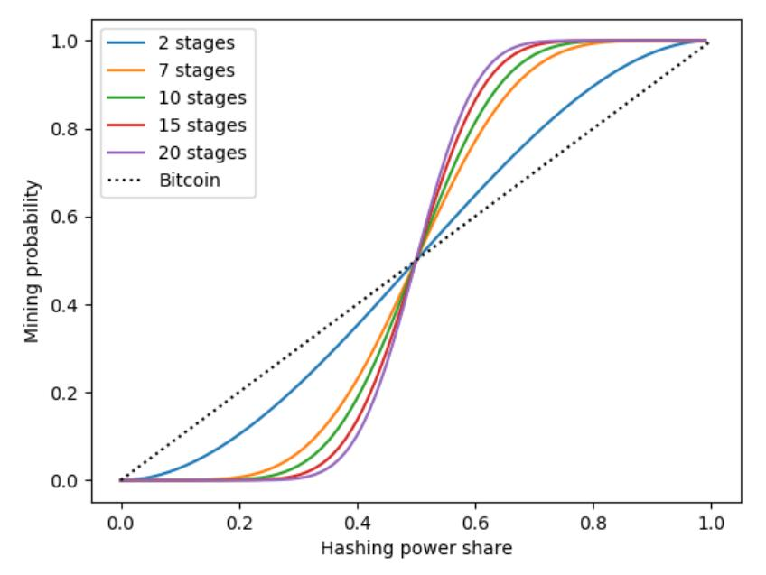

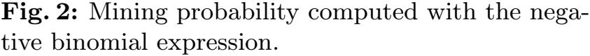

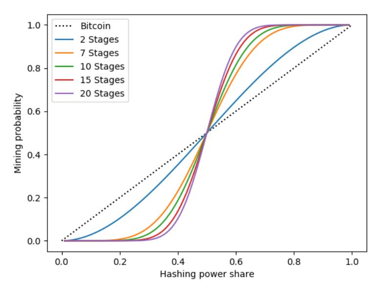

Fig. 3: Mining probability computed with the closed form expression

analysis, stage s, with 1 ≤ s ≤ k − 1, of the PoW of block Bi+k, with i > 0, only requires the output of stage s − 1 as input. In other words, compared to the PoW model of Section [3,](#page-3-1) the value bdigesti+<sup>s</sup> is not required as input.

### <span id="page-22-1"></span>7.1 Selfish mining

What is the idea behind Selfish mining in Bitcoin? A clever miner or a mining pool, with enough hashing power, may increase the rewards they expect from block mining, by adaptively withholding and releasing the mined blocks to the rest of the network at the right time [\[19\]](#page-34-0). Indeed, the network nodes follow the standard Bitcoin protocol, and any newly mined block is publicly released, as soon as the miner completes the PoW. These clever miners, also known as selfish miners, by not immediately publishing the blocks they mine, attempt to create their own private chain, that forks from the last mined block of the public chain. In such a way, they mine new blocks on top of their private chain, while the rest of the network nodes mine on top of the public chain. Since to resolve a fork the network nodes pick the longest valid chain in their respective local chains [\[3,](#page-33-2) [17\]](#page-33-16), selfish miners exploit this feature and reveal the blocks in their private chain at whatever moment they like. Once their private chain is publicly revealed, and turns out to be the longest valid chain, then the rest of the network nodes immediately discard the current public blocks, and replace them with the blocks just revealed. As a consequence, the selfish miners receive all the block rewards for these blocks and, at the same time, all the work done by the other nodes is wasted.

Selfish mining on sequential mining multi-stage PoWs. Assume that the longest valid chain rule is used to resolve forks[14](#page-22-2). Let the network miners be divided into two groups. The first is a selfish pool, composed of selfish miners, who collaboratively mine hash-puzzles of shared blocks on the private chain. The second is an honest pool, containing the rest of the network miners, who collaboratively mine hash-puzzles of shared blocks on the public chain. As for pooled mining in single-stage PoWs, both pools have a pool manager, and any other pool member works following his directives. Each pool member receives a share of each reward, proportionally to his contribution, for the blocks that the pool has mined. The selfish pool only needs to "find a block", i.e., complete the PoW of a block, ahead of the honest pool to launch the attack.

If such a block is found, the selfish pool might keep it private, and publish it at the most advantageous time. In the meantime, the selfish pool starts mining the second private block, while the

<span id="page-22-2"></span><sup>14</sup> In [\[22,](#page-34-3) [30\]](#page-34-11) Sarkar did not explicitly define a rule to resolve forks.

{23}------------------------------------------------

honest pool is still working on the previous block. The selfish pool aims at maximizing both its expected reward from block mining and the honest-pool work wastage, by extending the selfish branch as much as possible. Algorithm [1](#page-24-0) describes the selfish mining strategy. The algorithm highlights the three events that happen and affect the public and the private chains:

- 1. the selfish pool completes a PoW. The two possible outcomes, based on the number η of still unpublished blocks in the private chain, including the block just mined, are:
  - (a) if η = 1 and the honest pool is currently working on its last hash-puzzle, then the selfish pool releases the mined block immediately, to avoid being caught up by the honest pool. This way, the selfish pool gets the block reward, while the honest pool discards its work on the current PoW. Then, both pools start mining the next block, on top of the published one. See Fig. [4.](#page-23-0)
  - (b) in every other case, the selfish pool keeps the block private and starts mining the next private block on top of it.

<span id="page-23-0"></span>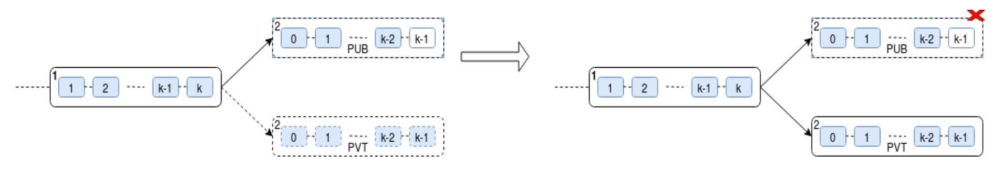

Fig. 4: Event 1.(a): The already completed stages are identified by a light blue background. Solid-border rectangles depict published stages and blocks. Dashed rectangles depict unpublished blocks and stages. The selfish pool mines the first unpublished block, i.e., η = 1, while the honest pool is working on the last hash-puzzle of its PoW. The selfish pool publishes immediately the mined block.

- 2. the honest pool completes its second-last hash-puzzle and is going to start the last one, bringing it closer to find a block. The possible outcomes, based on the number η of still unpublished blocks in the private chain, are:
  - (a) if η = 0, then the pool that completes its current PoW earlier than the other pool, mines and publishes the block, thereby obtaining the block reward and wasting the work of the other pool. Then, both pools start mining a new block, on top of the published one[15](#page-23-1) .
  - (b) if η = 1, then the selfish pool releases the private block immediately, to avoid being caught up by the honest pool. Hence, the selfish pool gets the block reward, while the honest pool discards its work on its current PoW. Moreover, the selfish branch now is the longest valid public branch. As a consequence, the honest blocks become orphan. Then, the honest pool starts mining a new block on top of the public chain. See Fig. [5.](#page-25-0)
  - (c) if η > 2, both pools keep working on their respective PoWs.
- 3. the honest pool completes a PoW, and the number of unpublished blocks is η > 2. The honest pool appends the block to the public chain, and starts mining the next block on top of it. The selfish pool publishes its first unpublished block. Since the selfish block will be in the longest valid chain, the selfish pool will eventually get the block reward, while the work of the honest pool will be wasted. See Fig. [6.](#page-25-1)

<span id="page-23-1"></span><sup>15</sup> The case in which the selfish pool is the winner is identical to Event 1.(a).

{24}------------------------------------------------

### <span id="page-24-0"></span>Algorithm 1 Selfish mining attack on sequential mining

```
1: on Init:
2: public chain ←− publicly known blocks
3: private chain ←− public chain
4: unpublishedBlocksNo ←− 0
5: both pools mine at the head of the public chain
6: Repeat forever:
7: on selfish pool completed k hash-puzzles and found a block:
8: unpublishedBlocksNo ←− unpublishedBlocksNo + 1
9: if unpublishedBlocksNo = 1 and honest pool has completed k − 1 hash-puzzles in its PoW then
10: unpublishedBlocksNo ←− 0 . Immediately publish the block; the block becomes the latest block in the
   public chain
11: discard the k − 1 hash-puzzles found by the honest pool
12: private chain ←− public chain . the attack is reset
13: both pools mine at the head of the public chain
14: else
15: the selfish pool mines at the head of the private chain
16: on honest pool completed k − 1 hash-puzzles, and going to find a block:
17: if unpublishedBlocksNo = 0 then
18: if selfish pool first completes its PoW then
19: publish the block . the block becomes the latest block in the public chain
20: discard the k − 1 hash-puzzles completed by the honest pool
21: else if honest pool first completes its PoW then
22: publish the block . the block becomes the latest block in the public chain
23: discard the hash-puzzles completed by the selfish pool
24: private chain ←− public chain . the attack is reset
25: both pools mine at the head of the public chain
26: else if unpublishedBlocksNo = 1 then
27: The selfish pool publishes the unpublished block
28: unpublishedBlocksNo ←− 0
29: discard the k − 1 hash-puzzles found by the honest pool
30: public chain ←− private chain . the selfish branch is the longest valid public branch in the
                                          blockchain; the honest blocks become orphan
31: both pools mine at the head of the public chain
32: else
33: continue normally . unpublishedBlocksNo > 2
34: on honest pool completed k hash-puzzles and found a block: . unpublishedBlocksNo > 2
35: append the block to the public chain . the block becomes the latest block in the public chain
36: the honest pool mines at the head of the public chain
37: The selfish pool publishes the first unpublished block
38: unpublishedBlocksNo ←− unpublishedBlocksNo - 1
39:
```

{25}------------------------------------------------

<span id="page-25-0"></span>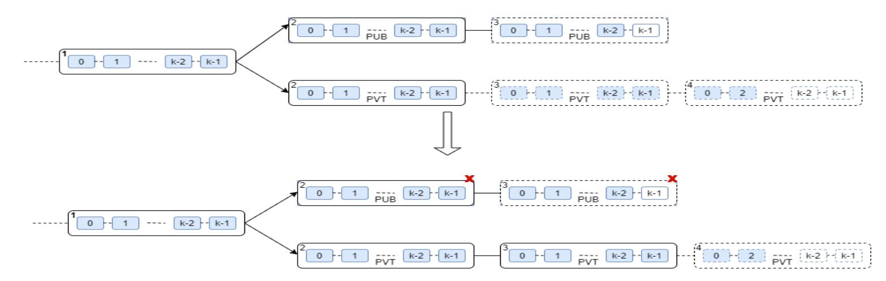

Fig. 5: Event 2.(b): The honest pool completes its second-last hash-puzzle on honest block number 3, while the private chain already has η = 1 unpublished block (i.e., private block number 3). The selfish pool publishes it immediately. The selfish branch now is the longest valid public branch in the blockchain, while the blocks of the honest chain become orphan.

<span id="page-25-1"></span>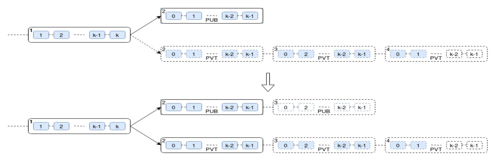

Fig. 6: Event 3. The honest pool mines a block and starts mining the next block on top of it. The private chain has η = 2 unpublished blocks, and the selfish pool publishes the first of them (i.e., block number 2). Eventually, the selfish block number 2 will be in the longest valid chain, while the honest block number 2 will become orphan. Therefore, the selfish pool gets the block reward.

Analysis. Along the same lines of [\[19\]](#page-34-0), the selfish pool behavior has been modeled as a state machine in Fig. [7.](#page-26-0) The states represent the lead of the selfish pool, that is, the number of still unpublished blocks in the private chain. State 0 is the state in which the public and private branches contain the same blocks. The transitions in the figure correspond to events triggered either by the selfish pool or by the honest pool. Let us first describe three events that can trigger state transitions in the state machine:

- 1. When the machine current state is s = 0, with probability M<sup>a</sup> the machine moves forward to state 1, and with probability M<sup>b</sup> + M<sup>c</sup> it loops in state 0, such that M<sup>a</sup> + M<sup>b</sup> + M<sup>c</sup> = 1. M<sup>a</sup> is the probability that the selfish pool mines a block while the honest pool has completed at most k −2 stages of a block. The selfish pool keeps the block private, and the machine moves forward to state 1. The probability M<sup>b</sup> + M<sup>c</sup> addresses two different events:
  - (a) with probability M<sup>c</sup> the honest pool mines a block earlier than the selfish pool does;
  - (b) with probability M<sup>b</sup> the selfish pool mines a block while the honest pool has completed exactly k − 1 stages.

Since in case (b) the selfish pool is only one stage ahead of the honest pool, it immediately publishes the block to avoid being caught up by the honest pool, letting the machine status remain unchanged.

2. When the machine current state is s = 1, with probability M<sup>a</sup> the selfish pool completes its current PoW earlier than the honest pool completes its second-last hash-puzzle. The selfish pool keeps the block private and increases its lead to 2. With probability Mb, the opposite happens: 

{26}------------------------------------------------

the selfish pool immediately publishes its unpublished block to avoid being caught up by the honest pool, decreasing its lead to 0.

3. When the machine current state is  $s \ge 2$ , with probability  $M_a$  the selfish pool completes its current PoW earlier than the honest pool does. It keeps the block private, and increases its lead to s + 1. With probability  $M_b$ , the opposite happens: the selfish pool publishes its first unpublished block and decreases its lead to s - 1.

<span id="page-26-0"></span>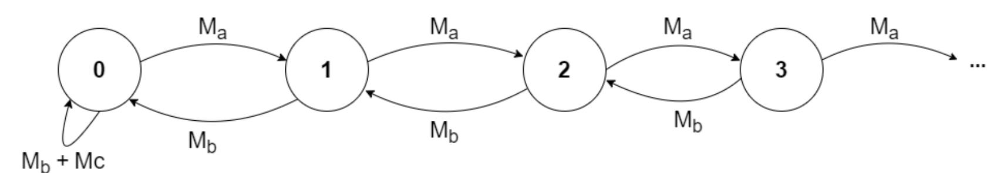

Fig. 7: Selfish mining state machine

The probabilities  $M_a$ ,  $M_b$ , and  $M_c$  have to be determined based on the current machine status, and the remaining number of hash-puzzles to be solved by the two pools, to complete their respective PoWs.

Let all the stages have the same difficulty d. Let  $h_1$  and  $h_2$  be the hashing powers of the selfish and the honest pool on every stage, respectively. Moreover, let  $p_1 = \frac{h_1}{h_1 + h_2}$  be the probability that the selfish pool completes its current stage earlier than the honest pool completes its own. Then, to compute the values of  $M_a$ ,  $M_b$ , and  $M_c$ , consider the following events:

1. The machine is in state 0. It has just started, or has looped in state 0, or returned to state 0 from state 1. If it has just started or has looped in state 0, both the selfish and the honest pool need to solve k sequential hash-puzzles to complete a PoW. If it has just returned from state 1 to state 0, then the selfish pool is already working on the  $stage_{sel}$ -th hash-puzzle, with  $stage_{sel} \in \{0, \ldots, k-1\}$  of its current PoW, and need to find  $R = k - stage_{sel}$  more hash-puzzles to complete it. Note that, in the other two cases  $stage_{sel} = 0$ . In detail,  $M_a$  is the probability that the selfish pool solves R hash-puzzles, while the honest pool has solved at most k-2 hash-puzzles. The selfish pool keeps the mined block private, thereby changing the machine status to state 1. More formally, let N be a random variable denoting the number n of stages found by the honest pool (i.e., failures), while the selfish pool completed the R-th stage (i.e., R-th success), with success probability  $p_1$ . It assumes values according to a negative binomial distribution. Therefore,  $M_a$  is given by  $P(N \le k-2)$ . That is:

<span id="page-26-1"></span>
$$M_a = \sum_{n=0}^{k-2} {n+R-1 \choose R-1} p_1^R (1-p_1)^n$$
 (17)

 $M_b$  is the probability that the selfish pool solves R hash-puzzles, while the honest pool has solved k-1 stages. In this case, the selfish pool releases the found block immediately, and the machine loops in state 0. That is:

<span id="page-26-2"></span>
$$M_b = {k+R-2 \choose R-1} p_1^R (1-p_1)^{k-1}$$
(18)

 $M_c = 1 - M_a - M_b$  is the probability that the honest pool completes its PoW earlier than the selfish pool, causing the machine to loop in state 0.

{27}------------------------------------------------

2. The machine has just moved forward to state i, such that i > 1. In this case, the selfish pool has completed its PoW, keeping the block private. The new value of M<sup>a</sup> is computed based on the number stagehon of hash-puzzles already completed by the honest pool in its current PoW, with stagehon ∈ {0, 1, ..., k − 1}, when the state transition was triggered. In detail, M<sup>a</sup> is the probability that the selfish pool solves k more hash-puzzles, mining another block and changing the machine status to state i + 1, earlier than the honest pool finds R = k − stagehon hashpuzzles and completes its current PoW [16](#page-27-0). More formally, let N be a random variable denoting the number n of stages found by the honest pool (i.e., failures), while the selfish pool completed the k-th stage (i.e., k-th success), with success probability p1. It assumes values according to a negative binomial distribution. Therefore, M<sup>a</sup> is given by P(N ≤ k − 2). That is:

<span id="page-27-1"></span>
$$M_a = \sum_{n=0}^{R-1} {n+k-1 \choose k-1} p_1^k (1-p_1)^n$$
(19)

With probability M<sup>b</sup> = 1 − M<sup>a</sup> the opposite happens, forcing the selfish pool to release its first unpublished block, and to change the machine status to state i − 1.

3. The machine has just moved back to state i, such that i > 1. In this case, the honest pool had completed the second-last puzzle of its PoW, and the selfish pool released the first unpublished block in the private chain. Consequently, the machine moved back to state i from the previous state i + 1. The new value of M<sup>a</sup> depends on the number stagesel of hash-puzzles the selfish pool has already completed in its current PoW, with stagesel ∈ {0, 1, ..., k − 1}, when the state transition was triggered. In detail, M<sup>a</sup> is the probability that the selfish pool solves R = k − stagesel hash-puzzles of its PoW, and changes the machine status to state i + 1 earlier than the honest pool solves k (resp. k − 1 if i = 1) hash-puzzles. More formally, let N be a random variable denoting the number n of stages found by the honest pool (i.e., failures), while the selfish pool completed the R-th stage (i.e., R-th success), with success probability p1. It assumes values according to a negative binomial distribution. Therefore, if i > 2, M<sup>a</sup> is given by P(N ≤ k − 1). That is:

$$M_a = \sum_{n=0}^{k-1} {n+R-1 \choose R-1} p_1^R (1-p_1)^n$$
 (20)

<span id="page-27-2"></span>Instead, with i = 1 the sum is computed for every n such that 0 ≤ n ≤ k − 2.

With probability M<sup>b</sup> = 1 − M<sup>a</sup> the opposite happens, causing the selfish pool to release its first unpublished block, and the machine status to move back to state i − 1.

We must now wonder how to measure the R value. To answer this question, we need to know how many hash-puzzles the loser pool had already solved when the last state transition was triggered, i.e., the values of stagehon or stagesel. Let us explain how to proceed with an example. Assume the machine starts, and the first event that occurs is that the selfish pool completes a PoW earlier than the honest pool completes the second-last hash-puzzles of a PoW, with probability M<sup>a</sup> computed according to item 1. Thereby, the machine moves to state 1. At this moment, the selfish pool has mined a block, and starts the PoW of the next one. Hence, it needs to solve k more hash-puzzles to complete the next block. In the meantime, the honest pool is still working on the stagehon-th stage, where stagehon ∈ {0, . . . , k − 2}, of its first PoW. The new M<sup>a</sup> and M<sup>b</sup> values can now be computed according to expression [\(19\)](#page-27-1). But we need to know the value of stagehon. Actually, we can compute the expected value of the random variable N, and use it as an approximation for stagehon.

<span id="page-27-0"></span><sup>16</sup> Resp. R = k − stagehon − 1 hash-puzzles and completes the second-last hash-puzzle in its current PoW if i = 1.

{28}------------------------------------------------

Precisely:

$$\mathbb{E}[N \mid N \le k - 2] = \sum_{n=0}^{k-2} n \, \frac{P(N = n \, \cap \, N \le k - 2)}{P(N \le k - 2)}.$$

Notice that:

$$-P(N = n \cap N \le k - 2) = P(N = n)$$
, since  $n \le k - 2$ 

$$-P(N=n) = \binom{n+k-1}{k-1} p_1^k (1-p_1)^n$$

$$-P(N \leq k-2) = I(p_1; k, k-1)$$
, where  $I(;,,)$  is the Regularized beta function

Therefore, it holds that

$$\mathbb{E}[N \mid N \le k - 2] = \sum_{n=0}^{k-2} n \, \frac{P(N=n)}{P(N \le k - 2)}$$

$$= \sum_{n=0}^{k-2} n \, \frac{\binom{n+k-1}{k-1} p_1^k (1-p_1)^n}{I(p_1; k, k-1)} = \frac{\sum_{n=0}^{k-2} n \binom{n+k-1}{k-1} p_1^k (1-p_1)^n}{I(p_1; k, k-1)}.$$

Let us focus on

$$\sum_{n=0}^{k-2} n \binom{n+k-1}{k-1} p_1^k (1-p_1)^n = \sum_{n=1}^{k-2} n \binom{n+k-1}{k-1} p_1^k (1-p_1)^n.$$

It easy to check that:

$$n\binom{n+k-1}{k-1} = n\frac{(n+k-1)!}{(k-1)! \, n!} = k \, n \, \frac{(n+k-1)!}{(k)! \, n \, (n-1)!} = k \, \frac{(n+k-1)!}{(k)! \, (n-1)!} = k \, \binom{n+k-1}{k}.$$

Using the above equality, and due to the distributive property of multiplication over addition, it follows that:

$$\sum_{n=1}^{k-2} n \binom{n+k-1}{k-1} p_1^k (1-p_1)^n = k p_1^k \sum_{n=1}^{k-2} \binom{n+k-1}{k} (1-p_1)^n.$$

Setting n = x + 1, we get:

$$kp_1^k \sum_{n=1}^{k-2} \binom{n+k-1}{k} (1-p_1)^n = k(1-p_1)p_1^k \sum_{x=0}^{k-3} \binom{x+k}{k} (1-p_1)^x =$$

$$(\text{setting } k = s-1, \text{ and using a Computer Algebra System})$$

$$= (s-1)(1-p_1)p_1^{s-1} \sum_{x=0}^{s-4} \binom{x+s-1}{s-1} (1-p_1)^x$$

$$= \frac{(s-1)(1-p_1)p_1^{s-1} \left(1-(s-3)\binom{s-4+s}{s-1}\beta(1-p_1;s-3,s)\right)}{p_1^s}$$

$$(\text{setting } s = k+1)$$

$$= \frac{k(1-p_1)\left(1-(k-2)\binom{k+k-2}{k}\beta(1-p_1;k-2,k+1)\right)}{p_1}.$$

{29}------------------------------------------------

Therefore,

$$E[N|N \le k-2] = \frac{k(1-p_1)\left(1-(k-2)\binom{2(k-1)}{k}\beta(1-p_1;k-2,k+1)\right)}{p_1I(p_1;k,k-1)},$$

where  $\beta(1-p_1; k-2, k+1)$  is the incomplete beta function. For cases 1. and 3., the expected value of N and, consequently, of R, can be computed in a similar way.

Experimental results. Let  $k \geqslant 2$  be the number of stages in each PoW. To evaluate the profitability of the attack, let the selfish pool share and the honest pool share of the network hashing power be  $\alpha < 1/2$  and  $\beta = 1 - \alpha$ , respectively. Let us assume that both pools divide their respective hashing power equally between stages, i.e.,  $h_{sel} = \frac{\alpha}{k}$  and  $h_{hon} = \frac{\beta}{k}$ , respectively. The probability that the selfish pool finds a new stage in its current PoW earlier than the honest pool is  $p_{sel} = \frac{h_{sel}}{h_{sel} + h_{hon}} = \alpha$ . With probability  $p_{hon} = \frac{h_{hon}}{h_{sel} + h_{hon}} = \beta$  the opposite happens. Without loss of generality, let the block reward for mining every block be 1, and let  $p_{loss} = p_{loss} = p_{loss} = p_{loss} = p_{loss} = p_{loss} = p_{loss} = p_{loss} = p_{loss} = p_{loss} = p_{loss} = p_{loss} = p_{loss} = p_{loss} = p_{loss} = p_{loss} = p_{loss} = p_{loss} = p_{loss} = p_{loss} = p_{loss} = p_{loss} = p_{loss} = p_{loss} = p_{loss} = p_{loss} = p_{loss} = p_{loss} = p_{loss} = p_{loss} = p_{loss} = p_{loss} = p_{loss} = p_{loss} = p_{loss} = p_{loss} = p_{loss} = p_{loss} = p_{loss} = p_{loss} = p_{loss} = p_{loss} = p_{loss} = p_{loss} = p_{loss} = p_{loss} = p_{loss} = p_{loss} = p_{loss} = p_{loss} = p_{loss} = p_{loss} = p_{loss} = p_{loss} = p_{loss} = p_{loss} = p_{loss} = p_{loss} = p_{loss} = p_{loss} = p_{loss} = p_{loss} = p_{loss} = p_{loss} = p_{loss} = p_{loss} = p_{loss} = p_{loss} = p_{loss} = p_{loss} = p_{loss} = p_{loss} = p_{loss} = p_{loss} = p_{loss} = p_{loss} = p_{loss} = p_{loss} = p_{loss} = p_{loss} = p_{loss} = p_{loss} = p_{loss} = p_{loss} = p_{loss} = p_{loss} = p_{loss} = p_{loss} = p_{loss} = p_{loss} = p_{loss} = p_{loss} = p_{loss} = p_{loss} = p_{loss} = p_{loss} = p_{loss} = p_{loss} = p_{loss} = p_{loss} = p_{loss} = p_{loss} = p_{loss} = p_{loss} = p_{loss} = p_{loss} = p_{loss} = p_{loss} = p_{loss} = p_{loss} = p_{loss} = p_{loss} = p_{loss} = p_{loss} = p_{loss} = p_{loss} = p_{loss} = p_{loss} = p_{loss} = p_{loss} =$ 

Experimentally, we evaluated the profitability of the attack by running the state machine for all  $\alpha$  in the set  $\{0.001, 0.002, ..., 0.499\}$ , and k in the set  $\{2, 7, 10, 15, 25\}$ . Each execution simulated  $100\,000$  state machine transitions. Fig. 8 shows the selfish pool relative reward, defined by  $relative Reward_{sel} = \frac{reward_{sel}}{reward_{sel} + reward_{hon}}$ . On the graph, the horizontal axis represents  $\alpha$ , while the vertical axis represents  $relative Reward_{sel}$ . The dotted lines represent the expected value of  $relative Reward_{sel}$  is equivalent to the mining probability of the selfish pool. Therefore, the attack turns out to be profitable if  $relative Reward_{sel}$  is greater than the mining probability of the selfish pool. As the figure shows, selfish mining is unprofitable for a low hash powered selfish pool. With two stages, it becomes profitable, as the share of the network hashing power held by the selfish pool rises to roughly 0.2. With higher numbers of stages, the value of  $\alpha$  for which the attack is profitable is greater. Independently from k, as the share of the network hashing power approaches to 0.5, the attack profitability is boosted. The pseudocode of the algorithm, used to evaluate the profitability of the attack, is provided in Appendix A.

### <span id="page-29-0"></span>7.2 Selfish Stage-Withholding

In the previous subsection, we have seen that the Selfish Mining profitability depends on the share of the network hashing power held by the selfish pool. If the share is low, then the selfish pool mining probability is almost zero, and the profitability of the attack is not noteworthy either. What can be done in this case? A possible strategy is Stage-Withholding.

A stage-withholder in a multi-stage PoW is a miner behaving like the single-stage Block-Withholder in the work of Dong et al. [55]. A block-withholder joins a pool, and acts as any other pool member, trying to mine a new block, under the directives of the pool manager, and receiving in exchange a share of the block rewards, for every block that the pool has mined. The only difference with the other pool members is that, whenever the block-withholder finds a block, he does not publish it. Instead, he discards it, undermining the overall earnings of the victim pool [7, 54]. Similarly, a stage-withholder joins a pool, and whenever completes a stage hash-puzzle, he

<span id="page-29-1"></span>The graph shows a dotted line for each stage number.

{30}------------------------------------------------

<span id="page-30-0"></span>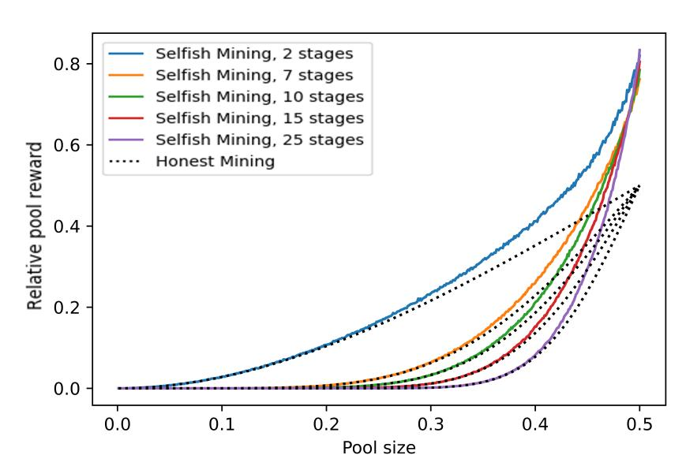

Fig. 8: Selfish Mining on multi-stage PoWs

drops it without informing the pool administrator or any other miner. On the other hand, for every other block mined by the pool, he obtains his share of each stage reward.

In Selfish Stage-Withholding, two attacks on a general multi-stage PoW, implemented through sequential mining, are executed jointly: selfish mining and stage-withholding. The selfish mining attack is performed as in Subsection 7.1. On the other hand, however, a share  $\tau \in (0,1)$  of the selfish pool hashing power is devoted to the Stage-Withholding attack in the honest pool. The Stage-Withholding attack might increase the selfish pool reward, especially when the selfish mining attack is unprofitable, due to a low network hashing share owned by the selfish pool. In such a case, the honest pool mines the majority of the blocks, and a Selfish Stage Withholder could increase his expected reward by "stealing" a share of the honest pool rewards.

Let now analyze the Selfish Stage-Withholding profitability more in details. Let  $\alpha < 1/2$  be the share of the network hashing power held by the selfish pool, and let  $\tau$  be a fraction of his power, devoted to the stage withholding attack, such that  $0 < \tau < 1$ . Thus, the Stage-Withholding network hashing power share would be  $\tau \alpha$ . In this case, if the share of the network hashing power held by the honest miners is  $\beta = 1 - \alpha$ , then it would sum up to  $\beta + \tau \alpha$ . However, the  $\tau \alpha$  stage withholder hashing power is useless, since the miner only pretends to contribute block mining.

The probability that the selfish pool finds a new stage in its current PoW earlier than the honest pool is  $p_{sel} = \frac{(1-\tau)\alpha}{(1-\tau)\alpha+\beta}$ . With probability  $p_{hon} = \frac{\beta}{(1-\tau)\alpha+\beta}$  the opposite happens.

Without loss of generality, let the block reward for mining every block be 1, and let  $reward_{sel}$  and  $reward_{hon}$  count the number of blocks in the public chain mined by the selfish and the honest pool, respectively. Considering that the expected reward for the stage-withholder is computed based on its fake contributions in the honest pool, that is,  $reward_{wit} = \frac{\tau \alpha}{\beta + \tau \alpha} * reward_{hon}$ , then the selfish stage-withholder earnings would be, accordingly, the sum of Selfish mining and Stage-Withholding revenues  $reward_{sel-wit} = reward_{wit} + reward_{sel}$ .

Experimentally, we evaluated the profitability of the attack by running the state machine for all  $\alpha$  in the set  $\{0.001, 0.002, ..., 0.499\}$ ,  $\tau$  in the set  $\{0.1, 0.3, 0.5, 0.7, 0.9\}$ , and with k=2 or k=15. Each execution simulated  $100\,000$  state machine transitions. Figs. 9 and 10 depict the revenues of the Selfish Stage-Withholding attack with 2 and 15, stages, respectively. The horizontal axis represents the share of the network hashing power  $\alpha$  belonging to the selfish pool, while the vertical axis represents its relative reward, computed as:

$$relativeReward_{sel-wit} = \frac{reward_{sel-wit}}{reward_{sel-wit} + (reward_{hon} - reward_{wit})}.$$

{31}------------------------------------------------

As before, the dotted lines represent the expected value of relativeRewardsel−wit, when the selfish stage withholder does not attack and mines honestly instead. In this case, the expected value of relativeRewardsel−with is equivalent to the mining probability of the selfish stage withholder.

For a low-powered selfish pool, the Selfish Stage-Withholding solid lines have the highest revenues, until they intersect with the Selfish mining line: from that point on, Selfish mining is more profitable than Selfish Stage-Withholding. Therefore, based on the share of the network hashing power the attacker holds, he can choose between the Selfish Mining or Selfish Stage-Withholding strategies to launch the most profitable attack. On the other hand, Fig. [10](#page-31-0) shows that Selfish Stage-Withholding is not always profitable compared to honest mining. Indeed, the profitability of the attack depends on the share of the network hashing power held by the selfish pool, the value of τ , and the number of stages involved in the PoWs.

<span id="page-31-0"></span>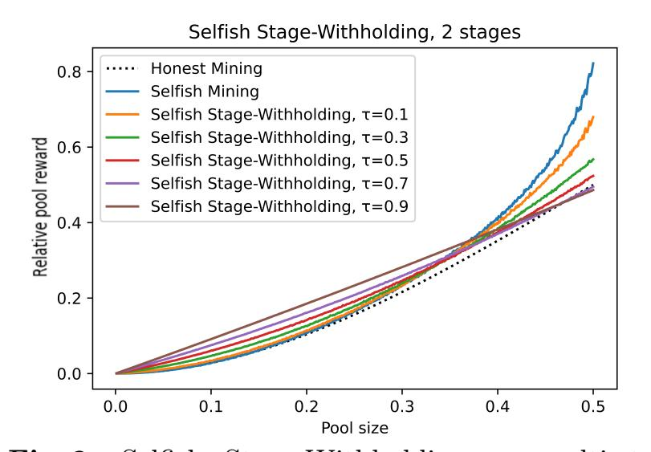

Fig. 9: Selfish Stage-Withholding on multi-stage PoWs with two stages.

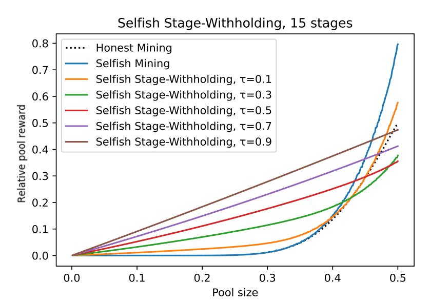

Fig. 10: Selfish Stage-Withholding on multi-stage PoWs with fifteen stages.

### 7.3 Previous works on multi-stage PoW Selfish mining

Chang et al. presented a selfish mining attack on the multi-stage PoW proposed by Sarkar [\[56\]](#page-35-17). Their attacking scenario is similar to ours since it consists of two pools: a selfish pool, whose miners collaborate to carry on the attack, and an honest pool, in which the rest of the network miners collaborate. However, unlike in Sarkar's original protocol, the authors assumed that if the selfish pool publishes the solutions to a number of stages of the PoW of a not-mined-yet block greater than the number of hash-puzzles already completed by the honest pool on that block, then the honest pool discards its work and mines on top of the selfish stages. In contrast, Sarkar's protocol incentivized a cooperative behavior, but never explicitly forced a miner to discard his partial work[18](#page-31-1) . Indeed, in theory, competing miners or pipelines can also continue to mine individually against each other until a block is fully mined. Given the mentioned assumptions, the authors analyzed three distinct honest pool mining techniques: "pipeline mining", "parallel mining", and "sequential mining". The selfish pool adaptively chooses its mining strategy to maximize its expected reward from the attack, modeling its attack on the share of network hashing power held by the selfish pool and on the honest pool mining strategy. The authors showed that the attack is profitable in any mining strategy adopted by the honest pool.

<span id="page-31-1"></span><sup>18</sup> "Note that the formation of the groups is not imposed extraneously. The cooperative process of the multi-stage mining will itself incentivize miners to work on individual stages, thus leading to the formation of the groups " [\[30\]](#page-34-11).

{32}------------------------------------------------

Let us give a closer look at the attack on "sequential mining", which is of interest to us, due to the similarities with our attack proposed in Subsection 7.1. In "sequential mining", all honest pool miners work on a single hash-puzzle of a PoW at a time, and move to the PoW of the next block only once the present block is done. Let k be the number of stages, and let the shares of the network hashing power share held by the honest pool and the selfish pool be  $\beta$  and  $\alpha$ , respectively (with  $\alpha = 1 - \beta$ ). The authors proved that, if  $\beta/\alpha < k$ , then the attack is profitable with  $\frac{1}{k+1} < \alpha < \frac{1}{2}$ . In contrast, if  $\beta/\alpha \geqslant k$ , then the attack is profitable with  $\frac{1}{k(k-1)+1} < \alpha < \frac{1}{2}$ .

There are two main conceptual differences between the attacks proposed in [56] and our attack. First, in [56], the authors used entirely Sarkar's model, in which, stage s of the PoW of block  $B_{i+k}$  requires two inputs: the output of stage s-1 of block  $B_{i+k}$  (if  $s \ge 1$ ) and bdigest<sub>i+s</sub>. In contrast, our attack assumed a more general "sequential mining" multi-stage PoW architecture, in which stage  $s \ge 1$  of the PoW of block  $B_{i+k}$  only requires the output of stage s-1 as input. In our general architecture, the PoW of block  $B_{i+k}$  can start only after block  $B_{i-1+k}$  has been mined. In contrast, in Sarkar's model, stage 0 of block  $B_{i+k}$  can start much earlier; indeed, it can start right after block  $B_i$  has been mined and bdigest<sub>i</sub> is available. Given the different considered settings, the profitability of the attack in [56] is evaluated with respect to the share of the network hashing power held by the selfish pool. In contrast, the profitability of our attack is evaluated with respect to the selfish pool mining probability.

Sarkar also presented himself a possible selfish mining attack on his multi-stage PoW in the latest version of his work [30]. He considered a specific selfish mining strategy, in which the first k-1 hash-puzzles of every PoW are mined exclusively by the honest pool, and the selfish pool only mines, against the honest pool, the last hash-puzzle of every PoW. If the selfish pool succeeds in completing the last hash-puzzle of the PoW of a block, say block  $B_{i+k}$ , for a  $i \ge 0$ , then it initially keeps the block private to perform the Selfish mining attack. The attack exploits the dependency between the PoWs of near blocks. Indeed, stage k-1 of the PoW of block  $B_{i+1+k}$  requires  $bdigest_{i+k}$  as input. The selfish pool may exploit the private knowledge of  $bdigest_{i+k}$  to start the stage k-1 of the PoW of block  $B_{i+1+k}$  earlier than the honest pool, thereby increasing its chances to complete that hash-puzzle before everyone else. This way, the selfish pool receives the stage reward for stage k-1 of block  $B_{i+k}$ , and, if it is successful in completing stage k-1 of block  $B_{i+1+k}$  before the honest pool does, it can repeat the attack on block  $B_{i+1+k}$  as well.

### <span id="page-32-0"></span>8 Conclusion

We have analyzed how a multi-stage PoW affects block mining, to provide a first step in evaluating whether a multi-stage PoW can be useful and worthwhile to be practically implemented. We have obtained a closed-form expression for the mining probability, which is valid, under common assumptions, in permissionless blockchain protocols whose PoW is composed of  $k \ge 1$  sequential hash-puzzles. We have proved that if k > 1, then the share of the network hashing power held by a miner and his mining probability are not necessarily equal. This awareness might favor a clever miner, who may divide his hashing power between the k hash-puzzles optimally, and obtain a mining probability value greater than the share of the network hashing power he holds. Such a possibility also opens up potential fairness and decentralization issues in mining. Afterwards, we have analyzed the security of multi-stage PoWs, with respect to the Selfish mining and the Selfish Stage-Withholding strategies. We have shown that Selfish mining can be successful and profitable depending on the share of the network hashing power held by the selfish pool, and on the number of stages of every PoW. Moreover, we have shown that Selfish Stage-Withholding is a complementary strategy to Selfish mining, which can increase the selfish miner profitability when he controls

{33}------------------------------------------------

a small share of the network hashing power. Our findings clearly point out that future designs of multi-stage PoWs deserve further and careful investigations. Indeed, if from one hand it seems to be a natural and appealing alternative to single-hash PoWs, on the other hand, as our analysis shows, some subtle and unexpected issues need to be dealt with.

# Acknowledgement

Francesco Mogavero's work was partially funded by Sapienza's Progetto di Ateneo 2020: La disintermediazione della Pubblica Amministrazione: il ruolo della tecnologia blockchain e le sue implicazioni nei processi e nei ruoli della PA, and by Fondazione Ugo Bordoni which funds his Ph.D. studies.

## References

- <span id="page-33-0"></span>[1] S. Nakamoto. Bitcoin: A peer-to-peer electronic cash system. 2008. url: [http://bitcoin.org/](http://bitcoin.org/bitcoin.pdf) [bitcoin.pdf.](http://bitcoin.org/bitcoin.pdf)
- <span id="page-33-1"></span>[2] W. Wang et al. "A Survey on Consensus Mechanisms and Mining Strategy Management in Blockchain Networks". In: IEEE Access 7 (2019), pp. 22328–22370. issn: 2169-3536.
- <span id="page-33-2"></span>[3] A. Narayanan et al. Bitcoin and Cryptocurrency Technologies: A Comprehensive Introduction. 1st. Priceton, New Jersey, USA: Princeton University Press, 2016. isbn: 0691171696.
- <span id="page-33-3"></span>[4] Block arrivals in the Bitcoin blockchain, author=Bowden, R. and Keeler, H. P. and Krzesinski, A. E. and Taylor, P. G. 2018. arXiv: [1801.07447](https://arxiv.org/abs/1801.07447) [cs.CR].
- <span id="page-33-4"></span>[5] [https://www.blockchain.com/en/charts/hash-rate.](https://www.blockchain.com/en/charts/hash-rate) 2021. (Visited on 01/15/2021).
- <span id="page-33-5"></span>[6] D. Kraft. "Difficulty control for blockchain-based consensus systems". In: Peer-to-Peer Networking and Applications 9 (Apr. 2015). doi: [10.1007/s12083-015-0347-x.](https://doi.org/10.1007/s12083-015-0347-x)
- <span id="page-33-6"></span>[7] M. Rosenfeld. Analysis of Bitcoin Pooled Mining Reward Systems. 2011. arXiv: [1112.4980](https://arxiv.org/abs/1112.4980) [\[cs.DC\]](https://arxiv.org/abs/1112.4980).
- <span id="page-33-7"></span>[8] F. Voight. p2pool: Decentralized, DoS-resistant, Hop-Proof pool. 2011. url: [https://bitcointalk.](https://bitcointalk.org/index.php?topic=18313.0) [org/index.php?topic=18313.0.](https://bitcointalk.org/index.php?topic=18313.0)
- <span id="page-33-8"></span>[9] L. Luu et al. "SmartPool: Practical Decentralized Pooled Mining". In: Proc. of the 26th Usenix Security Symposium (Usenix Security 17). 2017, pp. 1409–1426.
- <span id="page-33-9"></span>[10] p2pool: Decentralized, DoS-resistant, Hop-Proof pool. [https: / / bitcointalk. org /index. php ?](https://bitcointalk.org/index.php?topic=18313.14900) [topic=18313.14900.](https://bitcointalk.org/index.php?topic=18313.14900) 2017.
- <span id="page-33-10"></span>[11] Smart Pool: Efficient Decentralized Mining Pools for Existing Cryptocurrencies Based on Ethereum Smart Contracts. [http://smartpool.io/.](http://smartpool.io/) 2017.
- <span id="page-33-11"></span>[12] V. Gramoli. "From blockchain consensus back to Byzantine consensus". In: Future Generation Computer Systems 107 (2020). issn: 0167-739X. url: [https://www.sciencedirect.com/science/](https://www.sciencedirect.com/science/article/pii/S0167739X17320095) [article/pii/S0167739X17320095.](https://www.sciencedirect.com/science/article/pii/S0167739X17320095)
- <span id="page-33-12"></span>[13] N. A. Lynch. Distributed Algorithms. San Francisco, CA, USA: Morgan Kaufmann Publishers Inc., 1993. isbn: 9780080504704.
- <span id="page-33-13"></span>[14] Y. Zhang, H. Chen, and M. Guizani. Cooperative wireless communications. CRC press, 2009.
- <span id="page-33-14"></span>[15] [https://en.wikipedia.org/wiki/Fork\\_\(blockchain\).](https://en.wikipedia.org/wiki/Fork_(blockchain)) Feb. 2021.
- <span id="page-33-15"></span>[16] C. Decker and R. Wattenhofer. "Information propagation in the Bitcoin network". In: Proc. of IEEE P2P 2013. IEEE. 2013, pp. 1–10.
- <span id="page-33-16"></span>[17] F. Tschorsch and B. Scheuermann. "Bitcoin and Beyond: A Technical Survey on Decentralized Digital Currencies". In: IEEE Communications Surveys & Tutorials 18.3 (2016), pp. 2084– 2123.
- <span id="page-33-17"></span>[18] Analysis of Hashrate-Based Double Spending, author=Rosenfeld, M. 2014. arXiv: [1402.2009](https://arxiv.org/abs/1402.2009) [\[cs.CR\]](https://arxiv.org/abs/1402.2009).

{34}------------------------------------------------

- <span id="page-34-0"></span>[19] I. Eyal and E. G. Sirer. "Majority is not enough: Bitcoin mining is Vulnerable". In: Proc. of Financial Cryptography and Data Security. Springer. 2014, pp. 436–454.
- <span id="page-34-1"></span>[20] Y. Sompolinsky and A. Zohar. "Secure High-Rate Transaction Processing in Bitcoin". In: Proc. of Financial Cryptography and Data Security. Berlin, Heidelberg: Springer Berlin Heidelberg, Jan. 2015, pp. 507–527. doi: [10.1007/978-3-662-47854-7\\_32.](https://doi.org/10.1007/978-3-662-47854-7_32)
- <span id="page-34-2"></span>[21] K. Croman et al. "On Scaling Decentralized Blockchains (A Position Paper)". In: Proc. of International Conference on Financial Cryptography and Data Security. Springer. 2016, pp. 106– 125.
- <span id="page-34-3"></span>[22] P. Sarkar. Multi-Stage Proof-of-Work Blockchain. Cryptology ePrint Archive, Report 2019/162. [https://eprint.iacr.org/2019/162.](https://eprint.iacr.org/2019/162) July 2019.
- <span id="page-34-4"></span>[23] N. Houy. "The Bitcoin Mining Game". In: Ledger 1 (Dec. 2016), pp. 53–68. doi: [10.5195/](https://doi.org/10.5195/LEDGER.2016.13) [LEDGER.2016.13.](https://doi.org/10.5195/LEDGER.2016.13)
- <span id="page-34-5"></span>[24] P. D'Arco and F. Mogavero. "On multi-stage Proof-of-Works". In: 3rd Blockchain Congress. to appear in a forthcoming volume of Lecture Notes in Networks and Systems (LNNS). Salamanca (Spain), 6th-8th October 2021.
- <span id="page-34-6"></span>[25] P. D'Arco and Z. E. Ansaroudi. "Security Attacks on Multi-Stage Proof-of-Work". In: Proc. of the The Fifth International Workshop on Security, Privacy and Trust in the Internet of Things (SPT-IoT). IEEE, 2021, pp. 698–703. doi: [10.1109/PerComWorkshops51409.2021.9431013.](https://doi.org/10.1109/PerComWorkshops51409.2021.9431013)
- <span id="page-34-7"></span>[26] G. Karame. "On the Security and Scalability of Bitcoin's Blockchain". In: Proc. of the ACM SIGSAC Conference on Computer and Communications Security. 2016, pp. 1861–1862.
- <span id="page-34-8"></span>[27] Y. Lewenberg, Y. Sompolinsky, and A. Zohar. "Inclusive Block Chain protocols". In: Proc. of the Financial Cryptography and Data Security. Springer. 2015, pp. 528–547.
- <span id="page-34-9"></span>[28] I. Eyal et al. "Bitcoin-NG: A Scalable Blockchain Protocol". In: Proceedings of the 13th Usenix Conference on Networked Systems Design and Implementation. 2016, pp. 45–59.
- <span id="page-34-10"></span>[29] S. S. Hazari and Q. H. Mahmoud. "A Parallel Proof of Work to Improve Transaction Speed and Scalability in Blockchain Systems". In: Proc. of the IEEE 9th Annual Computing and Communication Workshop and Conference (CCWC). IEEE. 2019, pp. 0916–0921.
- <span id="page-34-11"></span>[30] P. Sarkar. A New Blockchain Proposal Supporting Multi-Stage Proof-of-Work. Cryptology ePrint Archive, Report 2019/162. [https://eprint.iacr.org/2019/162.](https://eprint.iacr.org/2019/162) May 2020.
- <span id="page-34-12"></span>[31] L. Luu et al. "A Secure Sharding Protocol For Open Blockchains". In: Proceedings of the 2016 ACM SIGSAC Conference on Computer and Communications Security. CCS '16. Vienna, Austria: Association for Computing Machinery, 2016, pp. 17–30. isbn: 9781450341394. doi: [10.1145/2976749.2978389.](https://doi.org/10.1145/2976749.2978389) url: [https://doi.org/10.1145/2976749.2978389.](https://doi.org/10.1145/2976749.2978389)
- <span id="page-34-13"></span>[32] W. Feller. An Introduction to Probability Theory and Its Applications. Vol. I. John Wiley and Sons, 1950.
- <span id="page-34-14"></span>[33] Wolfram MathWorld: Negative Binomial Distribution. [https : / / mathworld . wolfram . com /](https://mathworld.wolfram.com/NegativeBinomialDistribution.html) [NegativeBinomialDistribution.html.](https://mathworld.wolfram.com/NegativeBinomialDistribution.html) 2021.
- <span id="page-34-15"></span>[34] GP Patil. "On the evaluation of the negative binomial distribution with examples". In: Technometrics 2.4 (1960), pp. 501–505.
- <span id="page-34-16"></span>[35] Jacques Dutka. "The incomplete Beta function—a historical profile". In: Archive for history of exact sciences (1981), pp. 11–29.
- <span id="page-34-17"></span>[36] Alan Jeffrey and Daniel Zwillinger. Table of integrals, series, and products. Elsevier, 2007.
- <span id="page-34-18"></span>[37] A. Birnbaum. "Statistical Methods for Poisson Processes and Exponential Populations". In: Journal of the American Statistical Association 49.266 (1954), pp. 254–266. issn: 01621459. url: [http://www.jstor.org/stable/2280934.](http://www.jstor.org/stable/2280934)
- <span id="page-34-19"></span>[38] Poisson Processes. 2011. url: [https: / / ocw.mit. edu / courses / electrical - engineering - and](https://ocw.mit.edu/courses/electrical-engineering-and-computer-science/6-262-discrete-stochastic-processes-spring-2011/course-notes/MIT6_262S11_chap02.pdf)  [computer - science/6 - 262 - discrete - stochastic - processes - spring - 2011/course - notes/MIT6\\_](https://ocw.mit.edu/courses/electrical-engineering-and-computer-science/6-262-discrete-stochastic-processes-spring-2011/course-notes/MIT6_262S11_chap02.pdf) [262S11\\_chap02.pdf](https://ocw.mit.edu/courses/electrical-engineering-and-computer-science/6-262-discrete-stochastic-processes-spring-2011/course-notes/MIT6_262S11_chap02.pdf) (visited on 01/15/2021).

{35}------------------------------------------------

- <span id="page-35-0"></span>[39] Bernoulli Trials and the Poisson Process. 2021. url: [https://dipmat.univpm.it/~demeio/](https://dipmat.univpm.it/~demeio/Alabama_PDF/14.%20The_Poisson_Process/Bernoulli.pdf) [Alabama\\_PDF/14.%20The\\_Poisson\\_Process/Bernoulli.pdf](https://dipmat.univpm.it/~demeio/Alabama_PDF/14.%20The_Poisson_Process/Bernoulli.pdf) (visited on 01/15/2021).
- <span id="page-35-1"></span>[40] Bernoulli Trials and the Poisson Process. 2021. url: [https://stats.libretexts.org/Bookshelves/](https://stats.libretexts.org/Bookshelves/Probability_Theory/Book%3A_Probability_Mathematical_Statistics_and_Stochastic_Processes_(Siegrist)/14%3A_The_Poisson_Process/14.02%3A_The_Exponential_Distribution#Relation_to_the_Geometric_Distribution) [Probability\\_Theory/Book%3A\\_Probability\\_Mathematical\\_Statistics\\_and\\_Stochastic\\_](https://stats.libretexts.org/Bookshelves/Probability_Theory/Book%3A_Probability_Mathematical_Statistics_and_Stochastic_Processes_(Siegrist)/14%3A_The_Poisson_Process/14.02%3A_The_Exponential_Distribution#Relation_to_the_Geometric_Distribution) [Processes \\_ \(Siegrist \) /14 % 3A \\_ The \\_ Poisson \\_ Process / 14 . 02 % 3A \\_ The \\_ Exponential \\_](https://stats.libretexts.org/Bookshelves/Probability_Theory/Book%3A_Probability_Mathematical_Statistics_and_Stochastic_Processes_(Siegrist)/14%3A_The_Poisson_Process/14.02%3A_The_Exponential_Distribution#Relation_to_the_Geometric_Distribution) [Distribution#Relation\\_to\\_the\\_Geometric\\_Distribution](https://stats.libretexts.org/Bookshelves/Probability_Theory/Book%3A_Probability_Mathematical_Statistics_and_Stochastic_Processes_(Siegrist)/14%3A_The_Poisson_Process/14.02%3A_The_Exponential_Distribution#Relation_to_the_Geometric_Distribution) (visited on 01/15/2021).
- <span id="page-35-2"></span>[41] G: Grimmett and D. Stirzaker. Probability and random processes. Oxford university press, 2001.
- <span id="page-35-5"></span>[42] D. Malone and K.J. O'Dwyer. "Bitcoin Mining and its Energy Footprint". In: Proc. of ISS-C/IICT 2014. Jan. 2014, pp. 280–285. isbn: 978-1-84919-924-7. doi: [10.1049/cp.2014.0699.](https://doi.org/10.1049/cp.2014.0699)
- <span id="page-35-3"></span>[43] J. Garay, A. Kiayias, and N. Leonardos. "The Bitcoin Backbone Protocol: Analysis and Applications". In: Proc. of Advances in Cryptology - EUROCRYPT 2015. Ed. by E. Oswald and M. Fischlin. Berlin, Heidelberg: Springer Berlin Heidelberg, 2015, pp. 281–310. isbn: 978-3- 662-46803-6.
- <span id="page-35-4"></span>[44] G. O. Karame et al. "Misbehavior in Bitcoin: A Study of Double-Spending and Accountability". In: ACM Trans. Inf. Syst. Secur. 18.1 (May 2015). issn: 1094-9224. doi: [10.1145/2732196.](https://doi.org/10.1145/2732196) url: [https://doi.org/10.1145/2732196.](https://doi.org/10.1145/2732196)
- <span id="page-35-6"></span>[45] [https://www.blockchain.com/charts/difficulty.](https://www.blockchain.com/charts/difficulty) 2021. (Visited on 04/15/2021).
- <span id="page-35-7"></span>[46] Y. Lewenberg et al. Bitcoin Mining Pools: A Cooperative Game Theoretic Analysis. Istanbul, Turkey, 2015.
- <span id="page-35-8"></span>[47] E. M. Scheur. "Reliability of an m-out of-n system when component failure induces higher failure rates in survivors". In: IEEE TRANSACTIONS ON RELIABILITY 37.1 (1988). issn: 0018-9529.
- <span id="page-35-9"></span>[48] S. V. Amari and R. B. Misra. "Closed-Form Expressions for Distribution of Sum of Exponential Random Variables". In: IEEE TRANSACTIONS ON RELIABILITY 46.4 (1997). issn: 0018- 9529.
- <span id="page-35-10"></span>[49] [https://mathworld.wolfram.com/GammaFunction.html.](https://mathworld.wolfram.com/GammaFunction.html) Feb. 2021.
- <span id="page-35-11"></span>[50] [https:// sites.millersville. edu/ bikenaga/ number - theory/ sums - and - products/ sums - and](https://sites.millersville.edu/bikenaga/number-theory/sums-and-products/sums-and-products.pdf)  [products.pdf.](https://sites.millersville.edu/bikenaga/number-theory/sums-and-products/sums-and-products.pdf) Feb. 2021.
- <span id="page-35-12"></span>[51] Wolfram Language and System: HypoexponentialDistribution. [https://reference.wolfram.com/](https://reference.wolfram.com/language/ref/HypoexponentialDistribution.html) [language/ref/HypoexponentialDistribution.html.](https://reference.wolfram.com/language/ref/HypoexponentialDistribution.html) 2021. (Visited on 01/15/2021).
- <span id="page-35-13"></span>[52] S. Bano et al. "SoK: Consensus in the Age of Blockchains". In: Proceedings of the 1st ACM Conference on Advances in Financial Technologies. AFT '19. Zurich, Switzerland: Association for Computing Machinery, 2019, pp. 183–198. isbn: 9781450367325. doi: [10.1145/3318041.](https://doi.org/10.1145/3318041.3355458) [3355458.](https://doi.org/10.1145/3318041.3355458) url: [https://doi.org/10.1145/3318041.3355458.](https://doi.org/10.1145/3318041.3355458)
- <span id="page-35-14"></span>[53] W. Feller. An Introduction to Probability Theory and Its Applications. Vol. II. John Wiley and Sons, 1971.
- <span id="page-35-15"></span>[54] L. Luu et al. "On Power Splitting Games in Distributed Computation: The Case of Bitcoin Pooled Mining". In: Proc. of the IEEE 28th Computer Security Foundations Symposium. IEEE. 2015, pp. 397–411.
- <span id="page-35-16"></span>[55] X. Dong et al. "Selfholding: A combined attack model using selfish mining with block withholding attack". In: Computers & Security 87 (2019), p. 101584.
- <span id="page-35-17"></span>[56] D. Chang, M. Hasan, and P. Jain. Spy Based Analysis of Selfish Mining Attack on Multi-Stage Blockchain. Cryptology ePrint Archive, Report 2019/1327. [https://eprint.iacr.org/2019/1327.](https://eprint.iacr.org/2019/1327) 2019.

{36}------------------------------------------------

# <span id="page-36-0"></span>A Selfish Mining Profitability

In the following, we present the algorithm used to simulate the state machine and evaluate the profitability of the selfish mining attack on a general sequential mining multi-stage PoW. The algorithm models the state machine presented in Subsection [7.1.](#page-22-1) It takes four inputs: the number k of hash-puzzles of every PoW, the number transitionsNo of state transitions that must be executed until the simulation ends, and the shares of the stage hashing powers, hsel and hhon, of the selfish and the honest pool, respectively. We remark that, as defined in Subsection [7.1,](#page-22-1) the k stage difficulties are identical. We computed the relativeRewardsel of the selfish pool as the ratio between the blocks it mined and the total number of blocks in the longest chain.

In the pseudocode, we indicate by N(x, p) the random variable counting the number n of stages completed by the loser pool (failures) n ∈ {0, 1, . . . }, occurred when the x-th stage is completed by the winning pool (x-th success) such that x > 1. The parameter p denotes the success probability. As discussed before, the random variable takes values according to a negative binomial distribution.

Note that, in general, the expected number of stages completed by a losing pool is decimal. It is randomly rounded (with floor or ceil) to the nearest integer, with a probability determined using randomized rounding[19](#page-36-1) .

<span id="page-36-1"></span><sup>19</sup> The pseudocode for the selfish stage-withholding attack is similar. The source code of both Selfish mining and Selfish Stage-Withholding attacks is available on GitHub: [https://github.com/ZAnsaroudi/](https://github.com/ZAnsaroudi/SecurityAttacks-on-Multi-stage-Proof-of-work) [SecurityAttacks-on-Multi-stage-Proof-of-work.](https://github.com/ZAnsaroudi/SecurityAttacks-on-Multi-stage-Proof-of-work)

{37}------------------------------------------------

### **Algorithm 2** Selfish Relative Reward Computation (Part 1)

```
1: procedure SelfishRelativeReward(k, transitionsNo h_{sel}, h_{hon})
       on Init:
 2:
          p_{stage\_sel} \leftarrow \frac{h_{sel}}{h_{sel} + h_{hon}} /* Prob. the selfish pool finds a new stage earlier than the honest
 3:
          pool */
          p_{stage\_hon} \leftarrow \frac{h_{hon}}{h_{sel} + h_{hon}} /* Prob. the honest pool finds a new stage earlier than the selfish pool */
 4:
          reward_{sel} \leftarrow 0 /* Number of blocks in the longest chain that have been mined by the
 5:
           selfish pool */
 6:
          reward_{hon} \leftarrow 0 /* Number of blocks in the longest chain that have been mined by the
          honest pool */
 7:
          relativeReward_{sel} \leftarrow 0
 8:
          previousState \leftarrow 0
 9:
           currentState \leftarrow 0
           stage_{sel} \leftarrow 0 /* Expected number of stages solved by the selfish pool when it looses a
10:
           mining race */
           stage_{hon} \leftarrow 0 /* Expected number of stages solved by the honest pool when it looses a
11:
           mining race */
           R \leftarrow k
12:
13:
           transitionCounter \leftarrow 0
14:
           unpublished BlocksNo \leftarrow 0 /* Number of still unpublished blocks in the private chain*/
15:
       while transitionCounter < transitionsNo do
16:
           if currentState = 0 then
           /* Item 1: The machine has either just started, looped or returned to state 0 from
           state 1. The selfish and the honest pool have to complete R and k stages to trigger a
           state transition, respectively. */
17:
              compute M_a, M_b, and M_c according to expressions (17) and (18)
              /* Determine the next state transition */
18:
              with probability M_a:
              /* The selfish pool completed its R-th stage. In the meantime the honest pool has
              completed at most k\,-\,2 stages. The selfish pool keeps the block private. The state
              machine will transition to state 1. */
19:
                  unpublishedBlocksNo \leftarrow unpublishedBlocksNo + 1
                  stage_{hon} \leftarrow \mathbb{E}[N(R, p_{stage\_sel}) \mid N(R, p_{stage\_sel}) \leq k-2] \; \textit{/*} \; \; \text{The honest pool has completed}
20:
                  at most \ k-2 stages in the meantime. */
                  R \leftarrow k - stage_{hon} - 1 /* The honest pool needs to find k - stage_{hon} - 1 more stages
21:
                  to complete the second-last hash-puzzle in its current {\tt PoW} and trigger a state
                  transition. */
22:
                  previousState \leftarrow currentState
23:
                  currentState \leftarrow 1 /* The machine moves forward to state 1. */
```

{38}------------------------------------------------

### Algorithm 2 Selfish Relative Reward Computation (Part 2)

```
24: or with probability Mb:
           /* The selfish pool completed its R-th stage while the honest pool has completed ex-
           actly k − 1 stages. The selfish pool publishes its found block, while the honest pool
           discards its PoW. The state machine will loop in state 0. */
25: rewardsel ←− rewardsel+1 /* The selfish pool has just published its mined block. */
              R ←− k /* The selfish pool will need to find R ←− k more stages to complete its
              current PoW and trigger a new state transition. */
26: previousState ←− currentState
27: or with probability Mc:
           /* The honest pool has been faster than the selfish pool. The honest pool gets the
           block reward, while the selfish pool discards its PoW. The state machine will loop
           in state 0. */
28: rewardhon ←− rewardhon + 1 /* The honest pool has just published its mined block.
              */
              R ←− k /* The selfish pool discards its work. It will need to find R ←− k stages
              to trigger a state transition. */
29: previousState ←− currentState
30: else if currentState − previousState = 1 then
        /* Item 2: The machine has just moved forward to state currentState > 1. The selfish
        and the honest pool have to complete k and R stages to trigger a state transition,
        respectively. */
31: compute Ma and Mb according to expression (19)
           /* Determine the next state transition */
32: with probability Ma:
           /* The selfish pool has been faster than the honest pool and will keep the mined
           block private. The state machine will transition to state currentState + 1. */
33: unpublishedBlocksNo ←− unpublishedBlocksNo + 1
34: stagehon ←− E[N(k, pstage_sel) | N(k, pstage_sel) ≤ R − 1] /* The honest pool has completed
              at most R − 1 stages in the meantime. */
35: if currentState = 1 then
36: R ←− R − stagehon + 1 /* The honest pool needs to find R − stagehon + 1 more stages
                 to complete its current PoW and trigger a state transition. */
37: else currentState > 2
38: R ←− R − stagehon /* The honest pool needs to find R − stagehon more stages to
                 complete its current PoW and trigger a state transition. */
39: end if
40: previousState ←− currentState
41: currentState ←− currentState+1 /* The machine moves forward to state currentState+1.
              */
```

{39}------------------------------------------------

### Algorithm 2 Selfish Relative Reward Computation (Part 3)

```
/* Determine the next state transition */
42: or with probability Mb:
           /* The honest pool has been faster than the selfish pool. The state machine will
           transition to state currentState − 1. */
43: rewardsel ←− rewardsel + 1 /* The selfish pool publishes the first unpublished block.
              */
44: unpublishedBlocksNo ←− unpublishedBlocksNo − 1
45: stagesel ←− E[N(R, pstage_hon)|N(R, pstage_hon) ≤ k−1] /* The selfish pool has completed
              at most k − 1 stages in the meantime. */
46: R ←− k − stagesel /* The selfish pool needs to find k − stagesel more stages to
              complete its current PoW and trigger a state transition. */
47: previousState ←− currentState
48: /*currentState ←− currentState−1 The machine moves back to state currentState−1. */
49: else if currentState − previousState = −1 then
        /* Item 3: The machine has just moved back to state currentState > 1. The selfish pool
        has to complete R stages to trigger a state transition. If currentState = 1 (resp.
        currentState > 2), then the honest pool has to complete k−1 (resp. k) stages to trigger
        a state transition. */
50: compute Ma and Mb according to expression (20)
51: with probability Ma:
           /* The selfish pool has been faster than the honest pool and will keep the mined
           block private. The state machine will transition to state currentState + 1. */
52: unpublishedBlocksNo ←− unpublishedBlocksNo + 1
53: if currentState = 1 then
54: stagehon ←− E[N(R, pstage_sel) | N(R, pstage_sel) ≤ k − 2] /* The honest pool has
                 completed at most k − 2 stages in the meantime. */
55: else/* currentState > 2 */
56: stagehon ←− E[N(R, pstage_sel) | N(R, pstage_sel) ≤ k − 1] /* The honest pool has
                 completed at most k − 1 stages in the meantime. */
57: end if
58: R ←− k − stagehon /* The honest pool needs to find k − stagehon more stages to
              complete its current PoW and trigger a state transition. */
59: previousState ←− currentState
60: currentState ←− currentState+1 /* The machine moves forward to state currentState+1.
              */
```

{40}------------------------------------------------

### **Algorithm 2** Selfish Relative Reward Computation (Part 4)

```
61:
              or with probability M_b:
              /* The honest pool has been faster than the selfish pool. The state machine will
              transition to state currentState - 1. */
                 reward_{sel} \leftarrow reward_{sel} + 1 /*The selfish pool publishes the first unpublished block.
62:
                 The block published by the selfish pool and the block just mined by the honest
                 pool have the same block height. Since only the selfish block will be in the
                 longest chain in the long-term, the selfish pool gets the reward.*/
                 unpublishedBlocksNo \leftarrow unpublishedBlocksNo - 1
63:
64:
                 if currentState = 1 then
65:
                     stage_{sel} \leftarrow \mathbb{E}[N(k-1, p_{stage\ hon}) \mid N(k-1, p_{stage\ hon}) \leq R-1] / * The selfish pool has
                     completed at\ most\ R\ -\ 1 stages in the meantime. */
                 else/* currentState \ge 2 */
66:
67:
                     stage_{sel} \leftarrow \mathbb{E}[N(k, p_{stage\ hon}) \mid N(k, p_{stage\ hon}) \leq R-1] /* The selfish pool has
                     completed at most R-1 stages in the meantime. */
68:
                 end if
                 R \leftarrow R - stage_{sel} /* The selfish pool needs to find R - stage_{sel} more stages to
69:
                 complete its current PoW and trigger a state transition. */
70:
                 previousState \leftarrow currentState
                 currentState \leftarrow currentState - 1 /* The machine moves back to state currentState - 1. */
71:
72:
           end if
73:
           transitionCounter \leftarrow transitionCounter + 1
74:
       end while
75:
       The selfish pool publishes all the unpublishedBlocksNo unpublished blocks
76:
       reward_{sel} \leftarrow reward_{sel} + unpublishedBlocksNo /* The selfish pool has just published
       unpublishedBlocksNo blocks. */
       relativeReward_{sel} \leftarrow \frac{reward_{sel}}{reward_{sel} + reward_{hon}}
77:
       return relativeReward_{sel}
78:
79: end procedure
```