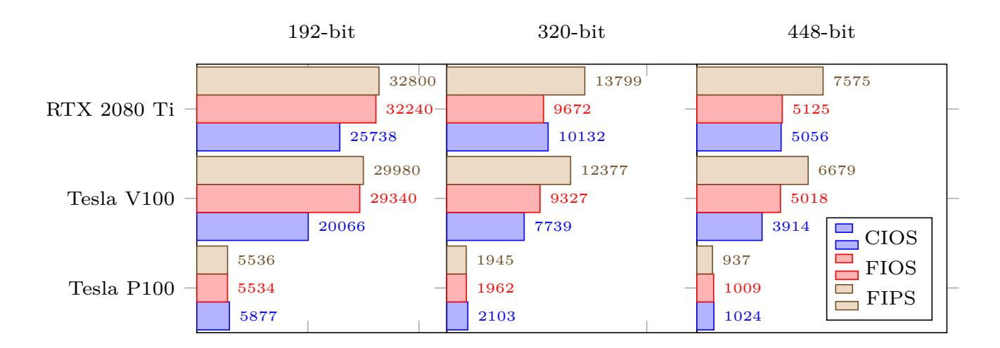
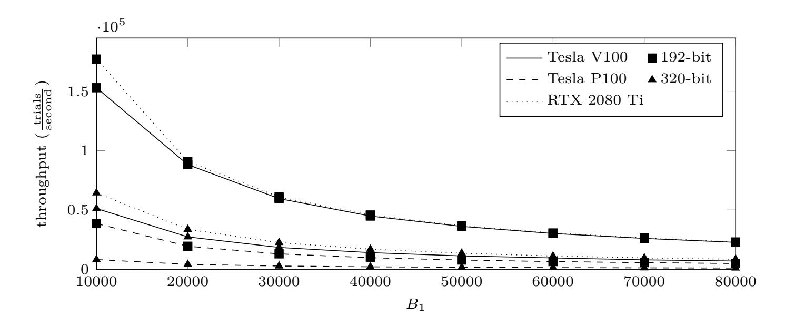
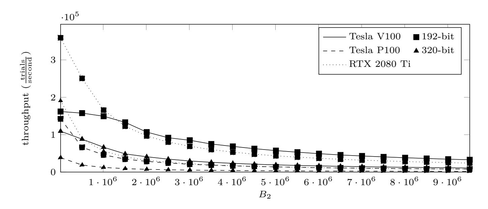

{0}------------------------------------------------

# **Revisiting ECM on GPUs**

Jonas Wloka<sup>1</sup> , Jan Richter-Brockmann<sup>2</sup> , Colin Stahlke<sup>3</sup> , Thorsten Kleinjung<sup>4</sup> , Christine Priplata<sup>3</sup> and Tim Güneysu<sup>1</sup>*,*<sup>2</sup>

<sup>1</sup> DFKI GmbH, Cyber-Physical Systems, Bremen, Germany [jonas.wloka@dfki.de](mailto:jonas.wloka@dfki.de) <sup>2</sup> Ruhr University Bochum, Horst Görtz Institute Bochum, Germany [jan.richter-brockmann@rub.de,tim.gueneysu@rub.de](mailto:jan.richter-brockmann@rub.de, tim.gueneysu@rub.de) <sup>3</sup> CONET Solutions GmbH, Hennef, Germany [cstahlke@conet.de,cpriplata@conet.de](mailto:cstahlke@conet.de, cpriplata@conet.de) <sup>4</sup> EPFL IC LACAL, Station 14, Lausanne, Switzerland [thorsten.kleinjung@epfl.ch](mailto:thorsten.kleinjung@epfl.ch)

**Abstract.** Modern public-key cryptography is a crucial part of our contemporary life where a secure communication channel with another party is needed. With the advance of more powerful computing architectures – especially Graphics Processing Units (GPUs) – traditional approaches like RSA and Diffie-Hellman schemes are more and more in danger of being broken.

We present a highly optimized implementation of Lenstra's ECM algorithm customized for GPUs. Our implementation uses state-of-the-art elliptic curve arithmetic and optimized integer arithmetic while providing the possibility of arbitrarily scaling ECM's parameters allowing an application even for larger discrete logarithm problems. Furthermore, the proposed software is not limited to any specific GPU generation and is to the best of our knowledge the first implementation supporting multiple device computation. To this end, for a bound of *B*<sup>1</sup> = 8 192 and a modulus size of 192 bit, we achieve a throughput of 214 thousand ECM trials per second on a modern RTX 2080 Ti GPU considering only the first stage of ECM. To solve the Discrete Logarithm Problem for larger bit sizes, our software can easily support larger parameter sets such that a throughput of 2 781 ECM trials per second is achieved using *B*<sup>1</sup> = 50 000, *B*<sup>2</sup> = 5 000 000, and a modulus size of 448 bit.

**Keywords:** ECM · Cryptanalysis · Prime Factorization · GPU.

## **1 Introduction**

Public-Key Cryptography (PKC) is a neccessary part of any large-scale cryptographic infrastructure in which communicating partners are unable to exchange keys over a secure channel. PKC systems use a keypair of public and private key, designed such that to retrieve the secret counterpart of a public key, a potential attacker would have to solve a mathematically hard problem. Traditionally – most prominently in RSA and Diffie-Hellman schemes – *factorization of integers* or computing a *discrete logarithm* are the hard problems at the core of the scheme. For reasonable key sizes, both these problems are considered to be computationally infeasible for classical computers.

If built, large-scale quantum computers, are able to compute both factorization and discrete logarithms in polynomial time. However, common problem sizes are not only under threat by quantum computers: With Moore's Law still mostly accurate, classical computing power becomes more readily available at a cheaper price. Additionally, in the last decade more diverse computing architectures are available. Graphics Processing Units (GPUs) have been used in multiple scientific applications – including cryptanalysis – for

{1}------------------------------------------------

their massive amount of parallel computing cores. As the problem of factorization and computing a discrete logarithm can (in part) be parallelized, GPU architectures fit these tasks well.

Nowadays the NIST recommends to use 2048- and 3072-bit keys for RSA [\[BD15\]](#page-15-0). Factoring keys of this size is out of reach for current publicly known algorithms on classical computers. However, in [\[VCL](#page-17-0)<sup>+</sup>17], the authors found that still tens of thousands of 512-bit keys are used in the wild, which could be factored for around \$70 within only a few hours.

To find the prime factorization of large numbers, the currently best performing algorithm is the General Number Field Sieve (GNFS). During a run of the GNFS algorithm, many numbers smaller than the main target need to be factored which is commonly done by Lenstra's Elliptic-Curve Factorization Method (ECM) and is inherently parallel.

**Related Work** ECM has been implemented on graphic cards before and several approaches at optimizing the routines used in ECM on the different levels have already been published.

A general overview of factoring, solving the Discrete Logarithm Problem (DLP) and the role of ECM in such efforts is given in [\[Len00,](#page-16-0) [Len17\]](#page-16-1). The most recent result in factorization and solving a DLP was announced in December 2019 with the factorization of RSA-240 and with solving the DLP for a 795-bit prime [\[BGG](#page-15-1)<sup>+</sup>20]. Previous records for the factorization of a 768-bit RSA modulus and the computation of a 768-bit DLP are reported in [\[KBL](#page-16-2)<sup>+</sup>12,[KAF](#page-16-3)<sup>+</sup>10] and [\[KDL](#page-16-4)<sup>+</sup>17], respectively. A general overview of factorization methods, and the use of ECM on GPUs within the GNFS is given in [\[Mie15\]](#page-17-1).

The original publication of ECM by Lenstra in [\[Len87\]](#page-16-5) has since received much attention, especially the choice of curves [\[BBLP13,](#page-15-2) [BBL10\]](#page-15-3) and parameters [\[GKL17\]](#page-16-6) was found to have a major impact on the algorithm's performance. Optimizing curve arithmetic for parallel architectures – mostly GPUs – has been a topic of many scientific works as well [\[ABS12,](#page-14-0)[ABS10,](#page-14-1)[LMA13,](#page-16-7)[HWCD08,](#page-16-8)[MC14\]](#page-17-2). A detailed description of a parallel implementation for GPUs is given in [\[Bos12\]](#page-15-4).

To this end, the implementation of ECM on GPUs has attracted a lot of attention in the years around 2010, as General Purpose Computing on GPU (GPGPU) became readily available to the scientific community. The beginning of the usage of GPUs for cryptanalytic purposes is marked by [\[SG08\]](#page-17-3), including elliptic curve cryptography, an early implementation of ECM on graphics cards was published in [\[BCC](#page-15-5)<sup>+</sup>09b[,BCC](#page-15-6)<sup>+</sup>09a]. A discussion of the performance of ECM on available GPUs around 2010 is given in [\[NA11,](#page-17-4)[BK12\]](#page-15-7). With the application of ECM in the cofactorization step of the GNFS, the discussion of an implementation for GPUs that includes ECM's second stage on the GPU was published in [\[MBKL14\]](#page-16-9).

**Existing Implementations** Although many authors have already worked on implementing ECM on GPUs, only a few implementations are openly available. GMP-ECM[1](#page-1-0) , which features support for computing the first stage of ECM on graphic cards using Montgomery curves, was introduced by Zimmermann et al.

Bernstein et al. published GPU-ECM in [\[BCC](#page-15-5)<sup>+</sup>09b] and an improved version CUDA-ECM in [\[BCC](#page-15-6)<sup>+</sup>09a]. In the following years, Bernstein et al. [\[BBLP13\]](#page-15-2) released GMP-EECM – a variant of GMP-ECM using Edwards curves –, and subsequently EECM-MPFQ, which is available online at [https://eecm.cr.yp.to/.](https://eecm.cr.yp.to/) Both latter, however, do not support GPUs.

To the authors' knowledge, the most recent implementation, including ECM's second stage by Miele et al. in [\[MBKL14\]](#page-16-9) has not been made publicly available. Additionally, almost all previous implementations of ECM on GPUs only consider a fixed set of parameters for the bit length and ECM bounds. As we will show in [Section 2,](#page-2-0) these restrictions do not meet real world assumptions and scalability seems to be significant even for larger moduli.

<span id="page-1-0"></span><sup>1</sup>Available at <http://ecm.gforge.inria.fr/>

{2}------------------------------------------------

**Contribution** We propose a complete and scalable implementation of ECM suitable for NVIDIA GPUs, that includes:

- 1. State-of-the-art Fast Curve Arithmetic All elliptic curve computations are performed using a=-1 Twisted Edwards curves with the fastest known arithmetical operations.
- 2. Scalability to Arbitrary ECM Parameters We show that currently used parameters for ECM in related work do not meet assumptions in realistic scenarios as most implementations are optimized for a set of small and fixed problem sizes. Hence, we propose an implementation which can be easily scaled to any arbitrary ECM parameter and bit length.
- **3. State-of-the-art Integer Arithmetic** We demonstrate that the commonly used CIOS implementation strategy can be outperformed by the less widespread FIOS and FIPS approaches on modern GPUs.
- **4. No Limitation to any Specific GPU Generation** Our implementation uses GPU-generation independent low level code based upon the PTX-level abstraction.

The corresponding software is released under an open source license and is available at https://github.com/Chair-for-Security-Engineering/ecmongpu.

**Outline** The remainder of this paper is organized as follows: Section 2 briefly summarizes the DLP and the background of ECM. In Section 3 we describe our optimizations for stage one and stage two on the algorithmic level. This is followed by Section 4 introducing our implementation strategies for GPUs. Before concluding this work in Section 6, we evaluate and compare our implementation in terms of throughput in Section 5.

### <span id="page-2-0"></span>2 Preliminaries

This section provides the mathematical background of ECM and introduces cofactorization as part of GNFS.

### <span id="page-2-1"></span>2.1 Elliptic Curve Method

ECM introduced by H. W. Lenstra in [Len87] is a general purpose factoring algorithm which works on random elliptic curves defined modulo the composite number to be factored. Thus, ECM operates in the group of points on the curve. Whether ECM is able to find a factor of the composite depends on the smoothness of the order of the curve. Choosing a different random curve most likely results in a different group order. To increase the probability of finding a factor, ECM can be run multiple times (in parallel) on the same composite number. ECM consists of a first stage and an optional second stage.

<span id="page-2-2"></span>**Stage 1** In the first stage, one chooses a random curve E over  $\mathbb{Z}_n$  with n the composite to factor, with p being one of its factors, and a random point P on the curve. With s a large scalar, one computes the scalar multiplication sP and hopes that  $sP = \mathcal{O}$  (the identity element) on the curve modulo p, but not modulo n. As p is unknown, all computations are done on the curve defined over  $\mathbb{Z}_n$ .

This can be regarded as working on all curves defined over  $\mathbb{Z}_p$  for all factors p simultaneously. If p was known, reducing the coordinates of a point computed over  $\mathbb{Z}_n$  modulo p yields the point on the curve over  $\mathbb{Z}_p$ .

If s is a multiple of the group order, i.e., the number of points on the curve over  $\mathbb{F}_p$ , sP is equal to the point at infinity  $\mathcal{O} = (0:1:0)$  modulo p, e.g, on Weierstrass curves, but

{3}------------------------------------------------

not *n*. Thus, the *x*- and *z*-coordinates are a multiple of *p*, and so gcd(*x, n*) (or gcd(*z, n*)) should reveal a factor of *n*.

One chooses *s* to be the product of all small powers of prime numbers *p<sup>i</sup>* up to a specific bound *B*1, i.e., *s* = lcm(1*,* 2*,* 3*, . . . , B*1). If the number of points on the chosen curve #*E* modulo *p* divides *s*, a factor will be found by ECM. This is equivalent to stating that the factorization of #*E* consists only of primes ≤ *B*1, thus is *B*1-smooth.

**Stage 2** Stage two of ECM relaxes the constraint that the group order on *E* has to be a product of primes smaller than *B*<sup>1</sup> and allows one additional prime factor larger than *B*<sup>1</sup> but smaller than a second bound *B*2.

Thus, for *Q* = *sP* the result from stage one, for each prime *p<sup>i</sup>* with *B*<sup>1</sup> *< p*<sup>1</sup> *< p*<sup>2</sup> *<* · · · ≤ *B*2, one computes *piQ* = *pisP* and hopes that *pis* is a multiple of the group order. If so, *piQ* – as in stage one – is equivalent to the identity element modulo *p*, the *x*- and *z*-coordinates equal 0 modulo *p* but not modulo *n*, hence the gcd of the coordinates and *n* reveals a factor of *n*.

**Curve Selection and Construction** As ECM's compute intensive part is essentially scalar multiplication, we chose *a=-1* Twisted Edwards curves [\[BBJ](#page-15-8)<sup>+</sup>08] with extended projective coordinates [\[HWCD08\]](#page-16-8) as these offer the lowest operation costs for point additions and doublings. Each point *P* = (*X* : *Y* : *T* : *Z*) is thus represented by four coordinates, each of the size of the number to factor.

As ECM works on arbitrarily selected elliptic curves modulo the number to factor, multiple parameterized curve constructions have been proposed (see [\[ZD06\]](#page-17-5) for an overview). Our implementation constructs random curves according to the proposal by Gélin et al. in [\[GKL17\]](#page-16-6).

### <span id="page-3-0"></span>**2.2 Discrete Logarithm Problem**

In 2016 the DLP was solved for a 768-bit prime *p* [\[KDL](#page-16-4)<sup>+</sup>17]. The computation of a database containing discrete logarithms for small prime ideals took about 4 000 CPU core years. Using this database, an individual discrete logarithm modulo *p* could be computed within about two core days. Using more than one CPU core, the latency could be decreased, but the parallelization is not trivial. Recently, Boudot et al. announced a new record, solving the DLP for a 795-bit prime [\[BGG](#page-15-1)<sup>+</sup>20].

The computation of an individual logarithm of a number *z* consists of two computationally intensive steps: the initial split and the descent. During the initial split the main task is to find two smooth integers that are norms of certain principal ideals, such that their quotient modulo *p* equals *z*. The prime factors of these two integers correspond to prime ideals with not too large norms. During the descent step, each of these prime ideals can be replaced by smaller ideals using relations found by sieving realized in the same way as during the sieving step in the first step of the GNFS. Eventually, all prime ideals are so small, that their discrete logarithms can all be found in the database. These discrete logarithms can easily be assembled to the discrete logarithm of the number *z*.

The initial split is done by first performing some sieving in some lattice. The dimension of this lattice can be two or eight for example, depending on the number fields. This produces a lot of pairs of integers. There are many lattices that can be used for sieving, which offer obvious opportunities for parallelization and lead to even more pairs of integers. It is enough to find just one pair such that both integers are smooth enough. Smoothness of integers can be tested by a combination of several factorization algorithms. The most popular are trial division, Pollard-(*p* − 1) and ECM.

One goal of our work was to reduce the latency of two CPU core days for the computation of individual 786-bit discrete logarithms using 25 CPUs with 4 cores each (Intel Core

{4}------------------------------------------------

i7-4790K CPU @ 4.00GHz). In the initial split it is important to find good parameters for the factorization algorithms. For our purpose we found that

$$B_1 \approx 7 \cdot \exp(n/9)$$
  
 $B_2 \approx 600 \cdot \exp(0.113 \cdot n)$ 

are good choices for ECM to detect an *n*-bit factor (*n* ∈ {44*,* 45*, . . . ,* 80}) using our CPUs. This is close to the widely used *B*<sup>2</sup> ≈ 100 · *B*1. The sieving of the descent step was parallelized with Open MPI and the sieving strategy was carefully chosen and balanced with the factorization strategies used in the initial split. Finally, we managed to compute individual discrete logarithms on 25 CPUs (i.e., 100 cores) within three minutes.

The implementation of ECM on GPUs provides several opportunities to speed up the computation of discrete logarithms. First, it can be used for smoothness testing in the sieving step in the first step of the GNFS in order to reduce the 4 000 core years by supporting the CPUs with GPUs. Second, in the same way it can speed up the sieving in the descent step. Third, it can be used for speeding up the smoothness tests in the initial split.

In our experiment we utilized two GeForce RTX 2080 TI GPUs filtering the pairs of integers in the initial split between the sieving and the smoothness tests. The parameters of the sieving in the initial split were relaxed, such that the sieving was faster, producing more pairs (and reducing their quality). This leaves us with a huge amount of pairs of integers, most of them not smooth enough. These integers were reduced to a size of 340 bit at most by trial division (or otherwise dropped). The surviving integer pairs were sent to the two GPUs in order to find factors with ECM using two curves, *B*<sup>1</sup> = 5 000, and *B*<sup>2</sup> = 20 000. A pair survived this step, if ECM found a factor in both integers and after division by this factor the integers were still composite. The remaining survivors were sent to the GPUs in order to find factors with ECM using 50 curves, *B*<sup>1</sup> = 5 000, and *B*<sup>2</sup> = 30 000. The final survivors were sent to a factorization engine on CPUs. Eventually, the use of GPUs reduced the latency of the computation of individual logarithms from three minutes to two minutes.

To this end, the aforementioned experiments demonstrate that our ECM implementation on GPUs can support the GNFS substantially, speeding up the computation of discrete logarithms and possibly also the factorization of RSA moduli with the GNFS.

After building a database for a prime *p*, individual discrete logarithms can be computed rather easily. We estimate the cost for building such a database within a year using CPUs to roughly 10<sup>6</sup> US-Dollars for 768 bit, to 10<sup>9</sup> US-Dollars for 1 024 bit and to at least 10<sup>14</sup> US-Dollars for 1 536 bit. In our experiments we could compute individual logarithms for 1 024 bit within an hour on 100 CPU cores (up to the point of looking up in a database which we did not have). This is an upper bound since we did not focus on optimizations on polynomial selection and on choosing good parameters and a good balance between initial split and descent. The initial split produced 448-bit integers after trial division and the parameters for ECM went up to *B*<sup>1</sup> = 50 000 and *B*<sup>2</sup> = 5 000 000. Due to the opportunity to scale our ECM implementation to any arbitrary parameter set, these numbers can be processed on GPUs which should considerably reduce the latency of one hour for 1024-bit individual logarithms.

## <span id="page-4-0"></span>**3 Algorithmic Optimizations**

With the general algorithm and background of ECM discussed in [Section 2.1,](#page-2-1) this section introduces optimizations to both stages of the algorithm suitable for efficient GPU implementations.

{5}------------------------------------------------

<span id="page-5-0"></span>Table 1: Comparison of different strategies optimizing the ECM throughput for stage one setting  $B_1 = 8\,192$  and the modulus size to 192 bit. To count modular multiplications, we assume  $1\mathbf{M} = 1\mathbf{S}$ .

|       | Optimal Chains [BCL17]    |         | 4-NAF            |                           | Random Batching |                                       |                           | Adapted from [BI18]          |                  |                           |                           |                                       |
|-------|---------------------------|---------|------------------|---------------------------|-----------------|---------------------------------------|---------------------------|------------------------------|------------------|---------------------------|---------------------------|---------------------------------------|
| $B_1$ | $\mathbf{M}^{\mathrm{b}}$ | Ic      | trials<br>second | $\mathbf{M}^{\mathrm{b}}$ | I <sup>c</sup>  | $\frac{\text{trials}}{\text{second}}$ | $\mathbf{M}^{\mathrm{b}}$ | $\mathbf{I}^{_{\mathbf{C}}}$ | trials<br>second | $\mathbf{M}^{\mathrm{b}}$ | $\mathbf{I}^{\mathrm{c}}$ | $\frac{\text{trials}}{\text{second}}$ |
| 4 096 | 48 442                    | 4       | 311 032          | 49 777                    | 4               | 354 422                               | 48 307                    | 20                           | 294 466          |                           | N/A                       |                                       |
| 8192  |                           | $N/A^a$ |                  | 99328                     | 4               | 215495                                | 95756                     | 64                           | $163\ 751$       | 90503                     | 0                         | 138565                                |
| 50000 |                           | $N/A^a$ |                  | 605983                    | 4               | 37476                                 | 585509                    | 432                          | $25\ 718$        |                           | N/A                       |                                       |

a The calculation of an optimal chain is too computation-intensive b Modular multiplications c Modular inversions (during computation of small multiples and/or point optimization)

#### 3.1 Stage 1 Optimizations

As introduced in Section 2.1, during stage one of ECM a random point P on an elliptic curve is multiplied by a large scalar  $s = \text{lcm}(1, 2, \dots, B_1 - 1, B_1)$ , e.g., for a  $B_1 = 50\,000\,s$  is 72 115 bit. To this end, stage one of ECM is essentially a scalar multiplication of a point on an elliptic curve. This section will deal with the possible optimizations, leading to a faster computation of  $s \cdot P$  for large s. This section introduces methods for reducing that effort.

**Non-Adjacent Form** In general, our implementation uses a w-NAF (Non-adjacent form) representation for the scalar  $s = \sum_{i=0}^{t-1} s_i 2^i$ , where  $s_i \in C = \{-2^{w-1} + 1, -2^{w-1} + 3, ..., -1, 0, 1, ..., 2^{w-1} - 1\}$ . While the necessary point doublings roughly stay the same, the number of point additions is reduced at the cost of needing to precompute and store a small multiple of the base point for each positive coefficient from C. For example, choosing w = 4 reduces the number of point additions to 14455 for a  $B_1 = 50000$  at the cost of storage for three additional points (3P, 5P, 7P). The w-NAF representation of any scalar can be computed on-the-fly during program startup.

For all upcoming experiments we decided to set w=4 allowing a fair comparison and removing one degree of freedom.

Different Scalar Representations For fixed values of  $B_1$  used repeatedly, other representations of the scalar can be found with significantly more precomputation. Addition chains have been proposed by Bos et al. in [BK12], however finding (optimal) addition chains with low operation cost for large scalars is still an open question. In [DL93] Dixon et al. also proposed so-called batching for splitting the scalar s into batches of primes in order to lower the overall number of required point operations. In [BCL17] Bernstein et al. introduced fast tripling formulas for points on Edwards curves and presented an algorithm finding the optimal chain for a target scalar s with the lowest amount of modular multiplications. Bouvier et al. also used tripling formulas and employed double-base chains and double-base expansions in combination with batches to generate multiple chains to compute scalars for somewhat larger bounds in [BI18]. Recently Yu et al. provided a more efficient algorithm to compute optimal double-base chains in [YML20].

However, these approaches are limited to small bounds  $B_1$  (i.e., for  $B_1 \leq 8\,192$ ) and therefore do not match our requirements of an arbitrary value for  $B_1$ . Nevertheless, we generated double-base chains for small values of  $B_1$  with the algorithm from [BCL17] choosing  $S = \pm\{1, 3, 5, 7\}$  and benchmarked them.

The two approaches – batching and addition chains – can be combined by generating multiple addition chains, one for each batch [BK12, BI18]. We also included results for a slightly modified version of the chains from [BI18]. We used their batching but generated *only* optimal double-base chains using the code from [BCL17] with  $S=\pm 1$  (no precomputation), whereas the authors use 22 double-base expansions and switch to Montgomery coordinates for 4 batches out of a total of 222 batches. As a result, our variant

{6}------------------------------------------------

needs to perform 931 additional modular multiplications. We disabled our optimized point representation (see Section 4.2) due to the high number of chains resulting in many costly inversions.

While in general the best batching strategy for larger  $B_1$  is unclear, we were able to generate multiple addition chains for a  $B_1 = 50\,000$  by randomly selecting subsets of primes smaller than  $B_1$  and using the algorithm from [BCL17]. Keeping only the best generated chains, we continued generating new batching variants for the rest of the primes still to cover until the overall cost of the chains stabilized. This strategy will be called Random Batching in the following. We supply all generated batched double-base addition chain for our  $B_1$  with the software.

Table 1 compares the ECM stage one's throughputs for  $B_1 \in \{4\,096, 8\,192, 50\,000\}$  using the naive 4-NAF approach, our random batching, the results from [BCL17] and our adaptation of [BI18] on an NVIDIA RTX 2080Ti. Although the batching based approaches require less modular operations (also compared to an optimal chain for  $B_1 = 4\,096$ ), the absolute throughput is drastically lowered. We found that in practice the cost of using multiple chains quickly remedied the benefit of requiring less point operations: For each chain one needs to compute small multiples of the (new) base point when using a larger window size. Our implementation stores precomputed points in a variant of affine coordinates to reduce the cost of this point's addition, each requiring one inversion during precomputation (cf. Section 4.2). This approach is not well suited if precomputed points are only used for relatively few additions on a single chain.

In addition, for each digit in *double-base* chains the software has to check whether it has to perform a doubling or tripling. Even if using only the base point and disabling the optimization of its coordinates, the overhead introduced by the interruption of the GPU program flow between chains slows down the computation, even though the full set of batches are processed on the GPU with one kernel launch.

In our experiments, we found that using our optimized coordinates for point addition with w-NAF scalar representation is more beneficial to the overall throughput than using multiple addition chains without the optimization of precomputed points. Hence, our NAF approach achieves better results as only doublings are executed, the program flow is uninterrupted and no switching between operations is needed.

#### 3.2 ECM Stage 2 Optimizations

As introduced above, in the second stage of ECM one hopes that the number of points on E is  $B_1$ -powersmooth, except for one additional prime factor. For stage two, a second bound  $B_2$  is set, and each multiple of the result of stage one  $p_{k+i}Q$  for each prime  $B_1 < p_{k+1} < p_{k+2} < \cdots < p_{k+l} \le B_2$  is computed.

<span id="page-6-0"></span>**Reducing Point Operations** The number of point operations can be reduced by employing a baby-step giant-step approach as in [Mie15]. Each prime  $p_{k+i}$  is written as  $p_{k+i} = vg \pm u$ , with g a giant-step size and u the number of baby-steps. To cover all the primes between  $B_1$  and  $B_2$ , set

$$u \in U = \left\{ u \in \mathbb{Z} \mid 1 \le u \le \frac{g}{2}, \gcd(u, g) = 1 \right\}$$
$$v \in V = \left\{ v \in \mathbb{Z} \mid \left[ \frac{B_1}{g} - \frac{1}{2} \right] \le v \le \left\lfloor \frac{B_2}{g} + \frac{1}{2} \right\rfloor \right\}.$$

As in stage two, one tries to find a prime  $p_{k+i} = vg \pm u$  such that  $(vg \pm u)Q = \mathcal{O}$  on the curve modulo a factor p. This is equivalent to finding a pair of vg and u, such that  $vgQ = \pm uQ \mod p$ . If this is the case, then the (affine) y-coordinates of vgQ and uQ are

{7}------------------------------------------------

also equal and

$$\frac{y_{vgQ}}{z_{vgQ}} - \frac{y_{uQ}}{z_{uQ}} = 0 \mod p.$$

Since  $\frac{y_P}{z_P} = \frac{y_{(-P)}}{z_{(-P)}}$  on Twisted Edwards curves, one only needs to check for  $y_{vgQ}z_{uQ} - y_{uQ}z_{vgQ}$ , if either vg + u or vg - u is a prime, thus saving computation on roughly half the prime numbers. Our implementation uses a bitfield to mark those combinations that are prime.

The result of the difference for all l primes of y-coordinates can be collected, so that stage two only outputs a single value m with

$$m = \prod_{v \in V} \prod_{u \in U} y_{vgQ} z_{uQ} - y_{uQ} z_{vgQ}.$$

If any of the differences  $y_{vgQ}z_{uQ} - y_{uQ}z_{vgQ}$  equals zero modulo p, gcd(m, n) is divisible by p and usually not n thus a non-trivial factor of n is found.

When for all  $u \in U$  points the point uQ is precomputed together with the giant-step stride of gQ, this approach only needs |V| + |U| + 1 point additions, plus 3|V||U| modular multiplications for the computation of m.

<span id="page-7-1"></span>**Reducing Multiplications** Our approach is to normalize all points vgQ and uQ to the same projective z-coordinates instead of affine coordinates. This way the computation of m only requires y-coordinates, because – as introduced above – the goal is to find equal points modulo p. Given  $a \geq 2$  points  $P_1, \ldots, P_a$  – in this case all giant-step points vgQ and baby-step points uQ – the following approach sets all  $z_{P_i}$  to  $\prod_{1 \leq i \leq a} z_{P_i}$ : To do so, each  $z_{P_i}$  needs to be multiplied by  $\prod_{1 \leq i \leq a, i \neq k} z_{P_i}$ . An efficient method to compute each  $\prod_{1 \leq i \leq a, i \neq k} z_{P_i}$  is given in [Kru09, p. 31]. Normalizing all points to the same z-coordinate costs 4(|V| + |U|) multiplications during precomputation and the cost of computing m drops down to |V||U| modular multiplications, as  $m = \prod_{v \in V} \prod_{u \in U} y_{vgQ} - y_{uQ}$ .

However, for this normalization all baby- and giant-step points need to be precomputed which needs quite a lot of memory to store z- and y-coordinates of all |V| + |U| baby-step and giant-step points, as well as the storage of the batch cross multiplication algorithm from [Kru09, p. 31] with |V||U| entries. If less memory is available, the giant-step points can be processed in batches. In this case, the normalization has to be computed again for each batch.

## <span id="page-7-0"></span>4 Implementation Strategies

The following sections discuss in more detail the implementation of multi-precision arithmetic and elliptic curve operations tuned to our requirements and those of GPUs.

#### 4.1 Large Integer Representation on GPUs

Our implementation follows the straight-forward approach of, e.g., [MBKL14, MC14] and uses 32-bit integer limbs to store multi-precision values. The number of limbs for any number is set at compile time to the size of the largest number to factor. Thus, all operations iterating over limbs of multi-precision numbers, can be completely unrolled during compilation, yielding long sequences of straight-line machine code. To avoid inversions during multi-precision arithmetic, all computation on the GPU is carried out in the Montgomery domain. All multi-precision arithmetic routines use inline Parallel Thread Execution (PTX) assembly to make use of carry-flags and multiply-and-add instructions. Note that PTX code, while having an assembly-like syntax, is code for a virtual machine

{8}------------------------------------------------

that is compiled to the actual architecture specific instructions set. PTX has the advantage of being hardware independent and ensures our proposed implementation is executable on a variety of NVIDIA hardware.

To enable fast parallel transfer of multi-precision values from global device memory to registers and shared memory of the GPU cores, multi-precision values in global memory are stored strided: Consecutive 32-bit integers in memory are arranged such that they are retrieved by different GPU threads, thus coalescing memory accesses to the same limb of different values by multiple threads into one memory transaction.

**GPU-Optimized Montgomery Multiplication** As the modular multiplication is at the core of elliptic curve point operations, the speed of the implementation is most influenced by the speed of the modular multiplication routine. As in the implemented software architecture, a single thread performs the full multiplication to avoid any synchronization overhead between threads, reducing the amount of registers per multiplication is of high importance.

Different strategies to implement multi-precision Montgomery multiplication and reduction have been surveyed in [KKAK96]. These differ in two aspects: The tightness of interleaving of multiplication and reduction, and the access to operands' limbs. In [NA11], Neves et al. claimed that the Coarsely Integrated Operand Scanning (CIOS), Finely Integrated Operand Scanning (FIOS) and Finely Integrated Product Scanning (FIPS) strategies are the most promising, and CIOS is most widely used, e.g., in [SG08]. All three methods need  $2l^2 + l$  multiplications of limbs for l-limb operands (see [KKAK96, Table 1] for a complete cost overview). Using PTX, each of these multiplications requires two instructions to retrieve the lower and upper half of the 2l product. PTX offers multiply-and-add instructions with carry-in and -out to almost entirely eliminate additinoal add instructions.

Our implementation of FIOS follows [GK04] in accumulating carries in an additional register to prevent excessive memory accesses and carry propagation loops. Our FIPS implementation follows [NA11, Algorithm 4].

Comparing FIPS, FIOS and CIOS on current GPUs, our benchmarks show varying results for newer architectures. Figure 1 shows the runtime of different strategies on different hardware architectures. For each of these benchmarks, 32 768 threads are started in 256 blocks, with 128 threads in each block. Each thread reads its input data from strided arrays in global memory and performs one million multiplications (reusing the result as operand for the next iteration) and writes the final product in strided form back to global memory.

For the most recent Volta and Turing architectures featuring integer arithmetic units, the FIPS strategy is the most efficient especially for larger moduli. On the older Pascal architecture, the difference between the implementation strategies' efficiency is much smaller. However, on the Tesla P100 CIOS slightly outperformed both finely integrated methods.

**GPU-Optimized Montgomery Inversion** While modular inversions are costly compared to multiplications and are not used during any *hot* arithmetic, precomputed points are transformed needing one modular inversion per point. Montgomery Inversion, given a modulus n and a number  $\tilde{A} = AR$  to invert in Montgomery representation, computes its inverse  $\tilde{A}^{-1} = A^{-1}R \mod n$ , again in Montgomery representation.

The algorithm implemented in this work is based on the Binary Extended Euclidean Algorithm as in [SK18, Algorithm 3]. Divisions by two within the algorithm are accomplished by using PTX funnel shifts to the right. The PTX instruction shf.r.clamp takes two 32-bit numbers, concatenates them and shifts the 64-bit value to the right, returning the lower 32 bit. Thus, each division by two can be achieved with l instructions for an

{9}------------------------------------------------

<span id="page-9-1"></span>

Figure 1: Million modular multiplication per second for different Montgomery implementation strategies and architectures.

*l*-word number. However, the inversion algorithm needs four branches depending on the number to invert and thus produces inner warp thread divergence.

## <span id="page-9-0"></span>**4.2 Elliptic Curve Arithmetic on GPUs**

Based on the modular arithmetic of the last section, the elliptic curve arithmetic can be implemented. With offering the lowest operation count (in terms of multiplications/squarings) of all proposed elliptic curves, our GPU implementation uses *a=-1* twisted Edwards curves, with coordinates represented in extended projective format.

### **4.2.1 Point Arithmetic**

The implementation of point addition and subtraction is a straight-forward application of the addition and doubling formulas from [\[HWCD08\]](#page-16-8) using the multi-precision arithmetic detailed in the previous section.

**Point Addition** Addition of an arbitrary point with *Z* = 1 6 is only needed seldom: During precomputation of small multiples of the base point for the *w*-NAF multiplication and during computation of the giant-steps for stage two. General point addition is implemented by a straight-forward application of the formulas from [\[HWCD08,](#page-16-8) [BL\]](#page-15-12) as given in [Algorithm 1.](#page-9-2)

If one of the points of the addition is precomputed and used in many additions, further optimization is beneficial. As in the *w*-NAF point multiplication, precomputed points are only used for addition, all operations that solely depend on values of the point itself are done once during precomputation. These are addition and subtraction of *x*- and *y*-coordinates, as well as the multiplication of the *t*-coordinate with the curve constant *k* = 2*d*. To further save one multiplication per point addition, the precomputed point can be normalized such that its *z*-coordinate equals one at the cost of one inversion and three

```
Algorithm 1: Point addition on a=-1 twisted Edwards curves [HWCD08,BL].
```

```
Data: Points P = (xP , yP , zP , tP ) and Q = (xQ, yQ, zQ, tQ) in extended projective coordinates, curve
         parameter k = 2d
  Result: Point R = P + Q = (xR, yR, zR, tR)
1 a ← (yP − xP ) · (yQ − xQ)
2 b ← (yP + xP ) · (yQ + xQ)
3 c ← tP · k · tQ
4 d ← zP · zQ
5 d ← d + d
                                       6 e ← b − a
                                       7 f ← d − c
                                       8 g ← d + c
                                       9 h ← b + a
                                      10 xR ← e · f
                                                                             11 yR ← g · h
                                                                             12 zR ← f · g
                                                                             13 tR ← e · h
                                                                             14 return
                                                                                  (xR, yR, zR, tR)
```

{10}------------------------------------------------

|                                   |                         | projec | tive* |              | $\mathrm{extended}^{\star}$ |     |  |  |
|-----------------------------------|-------------------------|--------|-------|--------------|-----------------------------|-----|--|--|
|                                   | $\overline{\mathbf{M}}$ | S      | ADD   | $\mathbf{M}$ | S                           | ADD |  |  |
| Doubling <sup>†</sup>             | 3                       | 4      | 8     | 4            | 4                           | 8   |  |  |
| $\mathrm{Tripling}^\dagger$       | 9                       | 3      | 10    | 11           | 3                           | 10  |  |  |
| Addition*                         | 8                       |        | 9     | 9            |                             | 9   |  |  |
| Precomputed addition <sup>‡</sup> | 6                       |        | 7     | 7            |                             | 7   |  |  |

<span id="page-10-0"></span>Table 2: Modular operation cost of the implemented point arithmetic.

multiplications. Applying these optimizations yields the modified format of a precomputed point  $\tilde{P}$  from the general point representation P, such that

$$x_{\tilde{P}} = y_P - x_P$$
  $y_{\tilde{P}} = y_P + x_P$   $z_{\tilde{P}} = 1$   $t_{\tilde{P}} = 2 \cdot d_{curve} \cdot t_P$ 

Using this representation, point additions require seven multiplications only. Computing the inverse of a point  $-P = (-x_P, y_P, z_P, -t_P)$  in its modified representation is achieved by switching the x- and y-coordinates, and computing  $-t_{\tilde{P}} = n - t_{\tilde{P}} \mod n$ , i.e.,  $-\tilde{P} = (y_{\tilde{P}}, x_{\tilde{P}}, 1, n - t_{\tilde{P}})$ .

**Point Doubling and Tripling** Point doubling is used for each digit of the scalar in scalar multiplication, tripling also on double-base chains. As all intermediate values do not fulfill the condition of Z = 1, no further optimized doubling formulas can be applied in this case. The implemented doubling and tripling routines follow [HWCD08, BL] and [BCL17].

**Mixed Representation** Using extended projective coordinates, the point doubling formula does not use the t-coordinate of the input point. When using the w-NAF scalar multiplication, the number of non-zero digits is approximately  $\frac{l}{w-1}$  for an l-bit scalar. Thus, there are long runs of zero bits in the w-NAF, resulting in many successive doublings without intermediate addition.

Thus, to further reduce multiplications during scalar multiplication computing the t-coordinate can be omitted if the scalar's next digit is zero, as no addition follows in this case. Furthermore, as each point addition is followed by a point doubling, which does not rely on the correct extended coordinate, again, the multiplication computing  $t_R$  can be omitted from all point additions within the scalar multiplication. The same applies to tripling. The resulting operation counts as implemented are listed in Table 2.

#### 4.2.2 Scalar Multiplication

To compute the scalar multiple of any point P, as in the first stage of ECM, w-NAF multiplication is used. The first stage's scalar  $s = \text{lcm}(1, \ldots, B_1)$  is computed on the host and transformed into w-NAF representation, with w a configurable compile time constant defaulting to w = 4. Thus, each digit of  $s_{w\text{-NAF}}$  is odd or zero and in the range of  $-2^{w-1}$  to  $2^{w-1}$ .

Our precomputation generates 2P by point doubling and the small odd multiples of P, i.e.,  $\{3P, \ldots, (2^{w-1}-1)P\}$  with repeated addition of 2P. Precomputed points are stored with strided coordinates along with other batch data in global memory, as registers and shared memory are not sufficiently available.

All threads read their corresponding precomputed point's coordinates from global memory to registers with coalesced memory accesses. In case the current digit of the NAF is negative, the precomputed point is inverted before addition. Again, as all threads are working on the same limb, this does not create any divergence.

<sup>\*</sup> result coordinate format

{11}------------------------------------------------

<span id="page-11-1"></span>

Figure 2: ECM first stage trials per second for varying size of  $B_1$ .

## <span id="page-11-0"></span>5 Evaluation

Three different GPU platforms were available during this work, a Tesla P100 belonging to the Pascal family, a Tesla V100 manufactured in the Volta architecture, and a RTX 2080 Ti with a Turing architecture.

As the actual curves in use for ECM are not within the scope of this paper, the *yield*, i.e., the numbers for which a factor is found, is not part of this evaluation. Of interest is, however, the throughput of the implementation: How many ECM trials can be performed per second on moduli of a given bit length. Therefore, each benchmark in this work is conducted on 32 768 randomly generated numbers n = pq, with  $\sqrt{n} \approx p \approx q$  and p and q prime.

Benchmarks for different problem sizes are carried out in two standard configurations, with the first being a somewhat standard throughout the literature to enable a comparison with previous works. As most previously reported GPU implementations only support the first stage of ECM on the GPU, this first case only executes stage one of the implementation with a bound of  $B_1 = 8\,192$ . The second benchmark parameter set is aimed at much larger ECM bounds and does include the second stage, with bounds  $B_1 = 50\,000$  and  $B_2 = 5\,000\,000$ .

#### 5.1 Stage One Bound

Firstly, we evaluate the impact of the bound  $B_1$ . Figure 2 gives the number of ECM trials per second for moduli of 192 bit and 320 bit for growing values of  $B_1$ . Note that the size of the scalar  $s = \text{lcm}(1, \ldots, B_1)$  grows very fast with  $B_1$ . Using w-NAF multiplication, the runtime of ECM mainly depends on the number of digits in s, resulting in the values seen in Figure 2. Note that each single trial (per second) on the y-axis is equivalent to  $\log_2 \text{lcm}(1, \ldots, B_1)$  operations (double and possibly add) per second and thus changes for each value of  $B_1$ , e.g., 1 trial is equivalent to 14 447 ops for  $B_1 = 10\,000$  and 28 821 ops for  $B_1 = 20\,000$ .

#### 5.2 Stage Two Bound

For a given bound  $B_2$ , the number of primes less than or equal to  $B_2$  are the key factor in determining the runtime of stage two. Via the prime number theorem, with a fixed negligible value for  $B_1$ , this value is approximately  $\pi(B_2) \approx \frac{B_2}{\ln B_2}$ . See Figure 3 for the achieved ECM trials per second for different values of  $B_2$ . While for small values of  $B_2$ , the RTX 2080 Ti outperforms the Tesla V100, as soon as  $B_2$  grows larger than 1 000 000, the Tesla V100 performs slightly better. As described in Section 3.2 for larger values of  $B_2$ 

{12}------------------------------------------------

<span id="page-12-0"></span>

Figure 3: ECM first and second stage trials per second for varying size of *B*2, with *B*<sup>1</sup> = 256, and a stage two window size of *w* = 2310 (cf. [Section 3.2\)](#page-6-0).

<span id="page-12-1"></span>Table 3: Absolute throughput of ECM trials for stage one (in thousands per second) on different platforms with *B*<sup>1</sup> = 8 192 and varying moduli sizes.

|               | 128   | 160   | 192   | 224   | 256   | 288   | 320   | 352   | 384  | 416  | 448  |
|---------------|-------|-------|-------|-------|-------|-------|-------|-------|------|------|------|
| Tesla P100    | 103.9 | 66.6  | 46.8  | 33.5  | 19.0  | 14.3  | 9.9   | 8.3   | 7.0  | 6.0  | 5.2  |
| Tesla V100    | 228.9 | 188.8 | 149.1 | 141.3 | 117.6 | 73.4  | 61.9  | 52.4  | 35.4 | 29.4 | 24.7 |
| RTX 2080 Ti   | 450.6 | 310.0 | 214.1 | 152.5 | 124.2 | 98.9  | 77.1  | 58.8  | 37.2 | 29.7 | 24.7 |
| 2×RTX 2080 Ti | 542.6 | 481.3 | 377.1 | 285.5 | 232.9 | 191.4 | 150.2 | 113.6 | 73.0 | 58.3 | 48.2 |

not all baby-step and giant-step points can fit into GPU memory, but have to be processed in batches. Our Tesla V100 setup features 16 GB of GPU memory while the RTX 2080 Ti only has 11 GB available. Again, note that the plot shows trials second where with growing *B*<sup>2</sup> the number of operations per trial increases with *B*2.

### **5.3 ECM Throughput**

With these benchmarks giving the runtime dependency on different parameters, this section gives absolute throughput numbers for the two exemplary cases of first stage only ECM with *B*<sup>1</sup> = 8 192, and both stages with more ambitious *B*<sup>1</sup> = 50 000 and *B*<sup>2</sup> = 5 000 000.

**Stage 1** The absolute throughput for the first case for different moduli sizes is given in [Table 3.](#page-12-1) Interestingly, when comparing the throughput for 192-bit moduli between the high-performance GPU Tesla V100 with the consumer GPU RTX 2080 Ti, the consumer card processes more ECM trials per second by a factor of 1*.*44.

**Stage 1 and Stage 2** Eventually, [Table 4](#page-13-0) states the absolute throughput of the entire ECM setting the bounds to *B*<sup>1</sup> = 50 000 and *B*<sup>2</sup> = 5 000 000. For the exemplary application with a modulus size of 448 bit mentioned in [Section 2.2,](#page-3-0) only one RTX 2080 Ti is capable of processing 2 781 ECM trials per second.

**Multiple Devices** Our implementation is designed to use multiple GPUs to increase throughput. [Table 3](#page-12-1) and [Table 4](#page-13-0) show that the throughput is almost doubled when utilizing two RTX 2080 Ti, and more so for larger moduli and larger ECM parameters, as the ratio of host side to GPU computation shifts towards more work on the GPU.

{13}------------------------------------------------

<span id="page-13-0"></span>Table 4: Absolute throughput of ECM trials for stage one and stage two (in thousands per seconds) on different platforms with  $B_1 = 50\,000$ ,  $B_2 = 5\,000\,000$  and varying moduli sizes.

|                       | 128   | 160   | 192   | 224   | 256   | 288   | 320   | 352  | 384  | 416  | 448  |
|-----------------------|-------|-------|-------|-------|-------|-------|-------|------|------|------|------|
| Tesla P100            | 10.79 | 7.15  | 4.97  | 3.52  | 1.91  | 1.42  | 1.11  | 0.91 | 0.77 | 0.65 | 0.55 |
| Tesla V100            | 46.88 | 30.74 | 22.85 | 17.12 | 13.58 | 7.99  | 7.12  | 5.78 | 4.60 | 3.49 | 2.78 |
| RTX 2080 Ti           | 40.86 | 27.39 | 20.21 | 14.77 | 11.62 | 9.34  | 6.85  | 6.30 | 4.11 | 3.32 | 2.78 |
| $2\times RTX$ 2080 Ti | 80.46 | 53.79 | 39.42 | 28.61 | 22.51 | 17.91 | 13.50 | 9.72 | 7.89 | 6.46 | 5.39 |

<span id="page-13-1"></span>Table 5: Comparison of scaled throughput for Montgomery multiplication from the literature and this work. Throughput values are given in  $\frac{\text{multiplications}}{\text{core} \times \text{cycle}} \times 10^{-3}$ .

|                          | [LMA13] | [MBKL14] | $[ELWW16]^d$            |                         | this work               |             |
|--------------------------|---------|----------|-------------------------|-------------------------|-------------------------|-------------|
| GPU                      | GTX 480 | GTX 580  | GTX 980 Ti <sup>a</sup> | Tesla P100 <sup>b</sup> | Tesla V100 <sup>c</sup> | RTX 2080 Ti |
| cores                    | 480     | 512      | 2816                    | 3584                    | 5120                    | 4352        |
| $\operatorname{clock}^*$ | 1401    | 1544     | 1000                    | 1316                    | 1530                    | 1665        |
| modulus <sup>†</sup>     |         |          |                         |                         |                         |             |
| 128                      | 3.54063 | 7.34319  | 4.03125                 | 2.65388                 | 9.01974                 | 8.65915     |
| 160                      | 2.85956 | 4.75631  |                         | 1.74424                 | 6.40737                 | 6.01596     |
| 192                      | 2.32423 | 3.32816  |                         | 1.24673                 | 4.65732                 | 4.62363     |
| 224                      | 1.90638 | 2.45785  |                         | 0.91325                 | 3.61875                 | 3.46953     |
| 256                      | 1.53313 | 1.88861  | 1.32813                 | 0.70659                 | 2.92659                 | 2.80919     |
| 320                      | 1.04687 | 1.21691  |                         | 0.44531                 | 1.97959                 | 1.88013     |
| 384                      | 0.75839 | 0.84880  | 0.64063                 | 0.30303                 | 1.41461                 | 1.36107     |

<sup>\*</sup> in MHz

#### 5.4 Comparison to Previous Work

Multiple factors make it hard to compare our results to previous work: Especially the fast changing GPU architectures make a comparison very difficult, but also no comparable set of parameters for  $B_1$  and  $B_2$  has been established. In lack of a better computation power estimate, we adopt the approach of [MBKL14] to scale the results accomplished on different GPU hardware by scoring results per cuda cores  $\times$  clock rate.

Montgomery Multiplication Comparing the most influential building block, the Montgomery multiplication algorithm to previous publications is a first step. Table 5 lists relevant work, the hardware in use and a score for the throughput scaled by the number of Compute Unified Device Architecture (CUDA) cores and their clock rate. The implementation of this work is the fastest of all implementations under comparison on the RTX 2080 Ti and more so for larger moduli, however comes in last place for the Pascal architecture platforms. Using our implementation and a modern GPU manufactured in the Turing architecture, clearly outperforms the previous results.

**ECM Throughput** Comparing the achieved throughput of the developed software with previously published results suffers from various problems: different hardware, varying modulus sizes and varying settings for both first and second stage bounds across different publications.

Especially, as to the authors' knowledge, apart from Miele et al. in [MBKL14], no other publication of ECM on GPUs implemented the second stage. Additionally, in [MBKL14] only very small bounds of  $B_1=256$  and  $B_2=16\,384$  were chosen. Note that the implemented w-NAF approach in stage one in this work benefits from larger  $B_1$  as precomputation costs amortize. For bounds this small our implementation is actually significantly slower, as host-side and precomputation overhead dominate the runtime.

<sup>&</sup>lt;sup>d</sup> Values have been scaled from throughput per *Streaming Multiprocessor* per clock cycle

{14}------------------------------------------------

|                                       |                         | Bos et al. [BK12]       | this work                     |                               |                               |  |  |  |  |
|---------------------------------------|-------------------------|-------------------------|-------------------------------|-------------------------------|-------------------------------|--|--|--|--|
|                                       | no-storage              | windowing               |                               |                               |                               |  |  |  |  |
| GPU<br>cores/clock∗                   | GTX 580<br>512/1544     |                         | Tesla P100<br>3584/1316       | Tesla V100<br>5120/1530       | RTX 2080 Ti<br>4352/1665      |  |  |  |  |
| B1 = 960<br>B1 = 8 192<br>B1 = 50 000 | 2.1692<br>0.2513<br>N/A | 1.0014<br>0.1151<br>N/A | 0.64070<br>0.09917<br>0.01650 | 0.20936<br>0.20134<br>0.04609 | 0.49398<br>0.29373<br>0.05168 |  |  |  |  |

<span id="page-14-3"></span>Table 6: Comparison of this implementation with [\[BK12\]](#page-15-7) and their parameter sets for 192-bit moduli. Values are given in ECM trials core×cycle × 10−<sup>5</sup> .

Albeit already published in 2012, the comparison with [\[BK12\]](#page-15-7) is the most interesting for the stage one implementation, as they also use a somewhat larger bound of *B*<sup>1</sup> = 8 192, but do not implement stage two. However, the comparison lacks modulus sizes other than 192 bit, as [\[BK12\]](#page-15-7) only published these results. The comparison to our implementation is shown in [Table 6](#page-14-3) and perfectly shows the advantage of our approach for larger bounds. Considering *B*<sup>1</sup> = 8 192, our implementation slightly outperforms the *no-storage* approach by Bos et al. although we do not use highly optimized addition chains.

Even less recent, published in 2009, is the implementation by Bernstein et al. [\[BCC](#page-15-5)<sup>+</sup>09b]. A comparison is somewhat unfair, as Bernstein developed *a=-1* Edwards curves after this paper was published. However, their GPU implementation uses the bound *B*<sup>1</sup> = 8 192, and in comparison the proposed implementation is significantly faster. However, this comparison is unfair as multiple generations of hardware architectures aimed at GPGPU have been released within the last ten years, and the authors of [\[BCC](#page-15-5)<sup>+</sup>09b] decided to use a floating point representation.

## <span id="page-14-2"></span>**6 Conclusion**

In this work we present a highly optimized and scalable implementation of the entire ECM algorithm for modern GPUs. On algorithmic level, we demonstrated that a *w*-NAF representation seems to be the most promising optimization technique realizing the scalar multiplication in the first stage. For the second stage we rely on an optimized baby-step giant-step approach. For the underlying Montgomery multiplication, we implemented three difference strategies where against our expectations FIPS performs best. Eventually, we demonstrate that the throughput of previous literature is achieved – and actually exceeded – on the most recent Turing architecture. We hope that the scalability, flexibility and free availability of our ECM implementation will support other researchers in achieving new factorization and DL records, reducing costs and reassessing the security of some algorithms used in PKC.

## **References**

- <span id="page-14-1"></span>[ABS10] Samuel Antao, Jean-Claude Bajard, and Leonel Sousa. Elliptic curve point multiplication on GPUs. In *ASAP 2010 - 21st IEEE International Conference on Application-specific Systems, Architectures and Processors*. IEEE, July 2010.
- <span id="page-14-0"></span>[ABS12] S. Antao, J.-C. Bajard, and L. Sousa. RNS-Based Elliptic Curve Point Multiplication for Massive Parallel Architectures. *The Computer Journal*, 55(5):629–647, May 2012.

<sup>∗</sup> in MHz

{15}------------------------------------------------

- <span id="page-15-8"></span>[BBJ<sup>+</sup>08] Daniel J. Bernstein, Peter Birkner, Marc Joye, Tanja Lange, and Christiane Peters. Twisted Edwards Curves. In Serge Vaudenay, editor, *Progress in Cryptology – AFRICACRYPT 2008*, volume 5023, pages 389–405. Springer Berlin Heidelberg, 2008.
- <span id="page-15-3"></span>[BBL10] Daniel J. Bernstein, Peter Birkner, and Tanja Lange. Starfish on Strike. In *Progress in Cryptology – LATINCRYPT 2010*, Lecture Notes in Computer Science, pages 61–80. Springer, Berlin, Heidelberg, August 2010.
- <span id="page-15-2"></span>[BBLP13] Daniel Bernstein, Peter Birkner, Tanja Lange, and Christiane Peters. ECM using Edwards curves. *Mathematics of Computation*, 82(282):1139–1179, 2013.
- <span id="page-15-6"></span>[BCC<sup>+</sup>09a] D. J. Bernstein, H.-C. Chen, M. S. Chen, C. M. Cheng, C. H. Hsiao, T. Lange, Z. C. Lin, and B. Y. Yang. The billion-mulmod-per-second PC. *SHARCS'09 Workshop Record (Proceedings 4th Workshop on Special-purpose Hardware for Attacking Cryptograhic Systems, Lausanne, Switserland, September 9-10, 2009)*, 2009.
- <span id="page-15-5"></span>[BCC<sup>+</sup>09b] Daniel J. Bernstein, Tien-Ren Chen, Chen-Mou Cheng, Tanja Lange, and Bo-Yin Yang. ECM on Graphics Cards. In Antoine Joux, editor, *Advances in Cryptology - EUROCRYPT 2009*, pages 483–501. Springer Berlin Heidelberg, 2009.
- <span id="page-15-9"></span>[BCL17] Daniel J. Bernstein, Chitchanok Chuengsatiansup, and Tanja Lange. Doublebase scalar multiplication revisited. Cryptology ePrint Archive, Report 2017/037, 2017. [https://eprint.iacr.org/2017/037.](https://eprint.iacr.org/2017/037)
- <span id="page-15-0"></span>[BD15] Elaine B. Barker and Quynh H. Dang. Recommendation for Key Management Part 3: Application-Specific Key Management Guidance. Technical Report NIST SP 800-57Pt3r1, National Institute of Standards and Technology, January 2015.
- <span id="page-15-1"></span>[BGG<sup>+</sup>20] F. Boudot, P. Gaudry, A. Guillevic, N. Heninger, E. Thomé, and P. Zimmermann. Comparing the difficulty of factorization and discrete logarithm: a 240-digit experiment. Cryptology ePrint Archive, Report 2020/697, 2020. [https://eprint.iacr.org/2020/697.](https://eprint.iacr.org/2020/697)
- <span id="page-15-10"></span>[BI18] Cyril Bouvier and Laurent Imbert. Faster cofactorization with ECM using mixed representations. Cryptology ePrint Archive, Report 2018/669, 2018. [https://eprint.iacr.org/2018/669.](https://eprint.iacr.org/2018/669)
- <span id="page-15-7"></span>[BK12] Joppe W. Bos and Thorsten Kleinjung. ECM at Work. In *Advances in Cryptology – ASIACRYPT 2012*, Lecture Notes in Computer Science, pages 467–484. Springer, Berlin, Heidelberg, December 2012.
- <span id="page-15-12"></span>[BL] Daniel J. Bernstein and Tanja Lange. Explicit-Formulas Database.
- <span id="page-15-4"></span>[Bos12] Joppe W. Bos. Low-Latency Elliptic Curve Scalar Multiplication. *International Journal of Parallel Programming*, 40(5):532–550, October 2012.
- <span id="page-15-11"></span>[DL93] B. Dixon and A. K. Lenstra. Massively parallel elliptic curve factoring. In Rainer A. Rueppel, editor, *Advances in Cryptology — EUROCRYPT' 92*, pages 183–193. Springer Berlin Heidelberg, 1993.
- <span id="page-15-13"></span>[ELWW16] Niall Emmart, Justin Luitjens, Charles Weems, and Cliff Woolley. Optimizing Modular Multiplication for NVIDIA's Maxwell GPUs. In *2016 IEEE 23nd Symposium on Computer Arithmetic (ARITH)*, pages 47–54, Silicon Valley, CA, USA, July 2016. IEEE.

{16}------------------------------------------------

<span id="page-16-12"></span>[GK04] Johann Großschädl and Guy-Armand Kamendje. Optimized RISC Architecture for Multiple-Precision Modular Arithmetic. In Dieter Hutter, Günter Müller, Werner Stephan, and Markus Ullmann, editors, *Security in Pervasive Computing*, Lecture Notes in Computer Science, pages 253–270. Springer Berlin Heidelberg, 2004.

- <span id="page-16-6"></span>[GKL17] Alexandre Gélin, Thorsten Kleinjung, and Arjen K. Lenstra. Parametrizations for families of ecm-friendly curves. In *Proceedings of the 2017 ACM on International Symposium on Symbolic and Algebraic Computation, ISSAC 2017, Kaiserslautern, Germany, July 25-28, 2017*, pages 165–171, 2017.
- <span id="page-16-8"></span>[HWCD08] Huseyin Hisil, Kenneth Koon-Ho Wong, Gary Carter, and Ed Dawson. Twisted Edwards Curves Revisited. In Josef Pieprzyk, editor, *Advances in Cryptology - ASIACRYPT 2008*, volume 5350, pages 326–343. Springer Berlin Heidelberg, Berlin, Heidelberg, 2008.
- <span id="page-16-3"></span>[KAF<sup>+</sup>10] Thorsten Kleinjung, Kazumaro Aoki, Jens Franke, Arjen K. Lenstra, Emmanuel Thomé, Joppe W. Bos, Pierrick Gaudry, Alexander Kruppa, Peter L. Montgomery, Dag Arne Osvik, Herman J. J. te Riele, Andrey Timofeev, and Paul Zimmermann. Factorization of a 768-bit RSA modulus. In *Advances in Cryptology - CRYPTO 2010, 30th Annual Cryptology Conference, Santa Barbara, CA, USA, August 15-19, 2010. Proceedings*, pages 333–350, 2010.
- <span id="page-16-2"></span>[KBL<sup>+</sup>12] Thorsten Kleinjung, Joppe W. Bos, Arjen K. Lenstra, Dag Arne Osvik, Kazumaro Aoki, Scott Contini, Jens Franke, Emmanuel Thomé, Pascal Jermini, Michela Thiémard, Paul Leyland, Peter L. Montgomery, Andrey Timofeev, and Heinz Stockinger. A heterogeneous computing environment to solve the 768-bit RSA challenge. *Cluster Computing*, 15(1):53–68, March 2012.
- <span id="page-16-4"></span>[KDL<sup>+</sup>17] Thorsten Kleinjung, Claus Diem, Arjen K. Lenstra, Christine Priplata, and Colin Stahlke. Computation of a 768-bit prime field discrete logarithm. In *EUROCRYPT (1)*, pages 185–201. Springer, 2017.
- <span id="page-16-11"></span>[KKAK96] C. Kaya Koc, T. Acar, and B.S. Kaliski. Analyzing and comparing Montgomery multiplication algorithms. *IEEE Micro*, 16(3):26–33, June 1996.
- <span id="page-16-10"></span>[Kru09] Alexander Kruppa. A Software Implementation of ECM for NFS. Research Report RR-7041, INRIA, 2009.
- <span id="page-16-5"></span>[Len87] H. W. Lenstra. Factoring Integers with Elliptic Curves. *Annals of Mathematics*, 126(3):649–673, 1987.
- <span id="page-16-0"></span>[Len00] Arjen K. Lenstra. Integer Factoring. *Designs, Codes and Cryptography*, 19(2-3):101–128, March 2000.
- <span id="page-16-1"></span>[Len17] Arjen K. Lenstra. General purpose integer factoring. Cryptology ePrint Archive, Report 2017/1087, 2017. [https://eprint.iacr.org/2017/1087.](https://eprint.iacr.org/2017/1087)
- <span id="page-16-7"></span>[LMA13] K. Leboeuf, R. Muscedere, and M. Ahmadi. A GPU implementation of the Montgomery multiplication algorithm for elliptic curve cryptography. In *2013 IEEE International Symposium on Circuits and Systems (ISCAS2013)*, pages 2593–2596, May 2013.
- <span id="page-16-9"></span>[MBKL14] Andrea Miele, Joppe W. Bos, Thorsten Kleinjung, and Arjen K. Lenstra. Cofactorization on graphics processing units. In Lejla Batina and Matthew Robshaw, editors, *Cryptographic Hardware and Embedded Systems – CHES 2014*, pages 335–352. Springer Berlin Heidelberg, 2014.

{17}------------------------------------------------

- <span id="page-17-2"></span>[MC14] Eric M. Mahé and Jean-Marie Chauvet. Fast GPGPU-based elliptic curve scalar multiplication. Cryptology ePrint Archive, Report 2014/198, 2014. [https://eprint.iacr.org/2014/198.](https://eprint.iacr.org/2014/198)
- <span id="page-17-1"></span>[Mie15] Andrea Miele. On the Analysis of Public-Key Cryptologic Algorithms, 2015.
- <span id="page-17-4"></span>[NA11] S. Neves and F. Araujo. On the performance of GPU public-key cryptography. In *ASAP 2011 - 22nd IEEE International Conference on Application-specific Systems, Architectures and Processors*, pages 133–140, September 2011.
- <span id="page-17-3"></span>[SG08] Robert Szerwinski and Tim Güneysu. Exploiting the Power of GPUs for Asymmetric Cryptography. In *Cryptographic Hardware and Embedded Systems – CHES 2008*, Lecture Notes in Computer Science, pages 79–99. Springer, Berlin, Heidelberg, August 2008.
- <span id="page-17-7"></span>[SK18] Erkay Savas and Cetin Kaya Koc. Montgomery inversion. *Journal of Cryptographic Engineering*, 8(3):201–210, September 2018.
- <span id="page-17-0"></span>[VCL<sup>+</sup>17] Luke Valenta, Shaanan Cohney, Alex Liao, Joshua Fried, Satya Bodduluri, and Nadia Heninger. Factoring as a Service. In Jens Grossklags and Bart Preneel, editors, *Financial Cryptography and Data Security*, volume 9603, pages 321–338. Springer Berlin Heidelberg, Berlin, Heidelberg, 2017.
- <span id="page-17-6"></span>[YML20] Wei Yu, Saud Al Musa, and Bao Li. Double-Base Chains for Scalar Multiplications on Elliptic Curves. In Anne Canteaut and Yuval Ishai, editors, *Advances in Cryptology – EUROCRYPT 2020*, pages 538–565, Cham, 2020. Springer International Publishing.
- <span id="page-17-5"></span>[ZD06] Paul Zimmermann and Bruce Dodson. 20 Years of ECM. In Florian Hess, Sebastian Pauli, and Michael Pohst, editors, *Algorithmic Number Theory*, Lecture Notes in Computer Science, pages 525–542. Springer Berlin Heidelberg, 2006.