{0}------------------------------------------------

# Fault Attacks In Symmetric Key Cryptosystems Systemization of Knowledge

Anubhab Baksi1 , Shivam Bhasin1 , Jakub Breier3 , Dirmanto Jap1 , and Dhiman Saha4

> 1 Temasek Laboratories, Nanyang Technological University, Singapore 2 Silicon Austria Labs, Graz, Austria

3 Department of Electrical Engineering And Computer Science, IIT Bhilai, India anubhab001@e.ntu.edu.sg, sbhasin@ntu.edu.sg, jbreier@jbreier.com, djap@ntu.edu.sg, dhiman@iitbhilai.ac.in

Abstract. Fault attacks are among the well-studied topics in the area of cryptography. These attacks constitute a powerful tool to recover the secret key used in the encryption process. Fault attacks work by forcing a device to work under non-ideal environmental conditions (such as high temperature) or external disturbances (such as glitch in the power supply) while performing a cryptographic operation. The recent trend shows that the amount of research in this direction; which ranges from attacking a particular primitive, proposing a fault countermeasure, to attacking countermeasures; has grown up substantially and going to stay as an active research interest for a foreseeable future. Hence, it becomes apparent to have a comprehensive yet compact study of the (major) works. This work, which covers a wide spectrum in the present day research on fault attacks that fall under the purview of the symmetric key cryptography, aims at fulfilling the absence of an up-to-date survey. We present mostly all aspects of the topic in a way which is not only understandable for a non-expert reader, but also helpful for an expert as a reference.

Keywords: fault attack, countermeasure, symmetric key, systemization of knowledge

### 1 Introduction

With the emergence of the Internet of things and edge computing in modern era, small scale devices are becoming more ubiquitous. These devices often perform cryptographic operations, which are vulnerable to device-specific attacks. One such attack, referred to as Fault Attack[1](#page-0-0) (FA) is shown to be powerful against common ciphers; including the high-profile ones, which are considered secure against classical cryptanalysis methods. This concept is first presented to the cryptographic community in the context of public key cryptography, and adopted to symmetric key soon afterwards. In this type of attack, the attacker/adversary, Eve, is assumed to have physical access to the device under operation. She deliberately injects disturbances into the device while it is running some cryptographic computation. The disturbances could be injected by means of, for example, voltage glitches, Light Amplification by Stimulated Emission of Radiation (LASER) shots, sudden temperature variations. By utilizing the information from the correct (non-faulty) and the incorrect (faulty) outputs, she is normally able to deduce some information on the secret key. Under certain models, attacker does not need the non-faulty output, as the faulty output only is enough for her to recover the secret information.

On the device, a fault injected can modify/skip the normal flow of operation, alter/erase data, access non-permitted location of memory, perform a non-permitted operation, bypass certain countermeasures and so on. Basically, fault attacks allow the adversary to bypass certain security claims in contrary to classical cryptanalysis methods where the cipher is considered to be a black-box and therefore, it cannot be tampered with. As the recent research trend shows, FA is a very popular cryptanalysis technique in the community; thanks to its wide usability, practicality (often possible by a non-expert with cheap equipment), easy computations and the attacker's ability to simulate.

To keep track of the recent developments as well as to explore interesting open problems; few works put together various aspects of fault attacks, such as [\[BECN](#page-17-0)+04,[GT04,](#page-20-0)[JT12,](#page-20-1)[BBKN12\]](#page-17-1). However, as one may notice, there have not been a comprehensive survey in the recent years. For example, the fault automation frameworks (Section [6\)](#page-12-0) are not mentioned in any of the earlier works. We feel that it would be useful to the community to have a concise report on the more recent advancements. Furthermore, we attempt to provide new insights on the existing works (that can be used to break existing designs, such as the precise bit flip model in Section [2.1\)](#page-1-0), interesting research directions that can be pursued in the future (such as, inherent DFA resistance in stream ciphers, see Section [5.1\)](#page-8-0) and so on; at the same time streamlining the (somewhat confusing) terminologies.

We restrict ourselves to the fault attacks on the gray-box model in symmetric key cryptography. As such, fault attacks in post quantum cryptography, public key cryptography, theoretical cryptography (such as non-malleable codes) as well as white-box[2](#page-0-1) are not considered within the scope.

1We use both the terms, attack and analysis, interchangeably throughout this document in context of fault. For the classical cryptanalytic techniques; we use the three terms attack, analysis and cryptanalysis interchangeably.

2 [https://www.blackhat.com/docs/eu-15/materials/eu-15-Sanfelix-Unboxing-The-White-Box-Practical-Attacks](https://www.blackhat.com/docs/eu-15/materials/eu-15-Sanfelix-Unboxing-The-White-Box-Practical-Attacks-Against-Obfuscated-Ciphers-wp.pdf) [-Against-Obfuscated-Ciphers-wp.pdf](https://www.blackhat.com/docs/eu-15/materials/eu-15-Sanfelix-Unboxing-The-White-Box-Practical-Attacks-Against-Obfuscated-Ciphers-wp.pdf)

{1}------------------------------------------------

# 2 Fault Models

By a fault model we mean the nature, efficiency, repeatability and feasibility of the faults injected. Nature of a fault can be described by the impact on the target device (such as, bits or a nibble/byte/word) and precision of location (targets one particular bit, etc.). Efficiency indicates attacker's precision (how precisely she can choose) the fault value. Repeatability means whether the attacker can repeat the identical fault (the fault value may be unknown) in either the temporal or the spatial domain. Feasibility refers to the practical aspects (cost, equipment, time, expertise required) of the fault attack. Generally, it is accepted that a more restrictive/precise model is more difficult/impractical in the real life scenario.

#### 2.1 Precise Bit Flip

The proponents of fault attacks try to show the effectiveness of their attacks by assuming as little as possible (e.g., the fault location is assumed to be unknown, which is later recovered through rigorous analysis). In terms of Differential Fault Attack (DFA, see Section [5.1\)](#page-6-0), the strongest model would be to flip one particular bit (the round of the cipher as well as the location of the bit is chosen by the attacker). Such model, to the best of our knowledge, is never considered. Consider the effect of changing one input bit of an AND operation: y = x0 ∧ x1. If, say, Eve is able to precisely flip x0, then by judging whether the output changes or not, she is able to retrieve x1 (no change in output means x1 = 0, otherwise x1 = 1). This way, any AND gate can be targeted. It is also interesting to notice, this model (which we call as, Precise Bit Flip), if/when exists, we break certain countermeasures in their current forms; such as the Detection (Section [7.2\)](#page-15-0) or Infection (Section [7.3\)](#page-15-1). Even though the cipher is 'protected' by detection or infection (which effectively stops her to get the faulty output she desires, see Section [7\)](#page-13-0); the attacker is able to check whether flipping one bit of an AND operation changes the output (whether the output is suppressed in case of detection; or, a random value, instead of the non-faulty output, is returned in case of infection) or not. One way to protect against this model in such countermeasures would be to ensure that there is no non-linear operation that takes two bits as inputs; this can be done, e.g., implementing all the SBoxes as look-up tables.

#### 2.2 Single/Multiple Fault Adversary

Majority of published works in fault attacks assumes single fault adversary model. Under this model, the attacker, Eve can inject faults at most once during one execution of the cipher (that may result in affecting multiple locations). So, if she injects two sets of faults, say, at the first & the last round of encryption, that will be considered a violation of the model. Relaxed model, where attacker can inject multiple sets of faults during one execution, has been proposed in rare cases, such as Internal Differential Fault Analysis (InDFA, see Section [5.2](#page-10-0) for more details).

### 2.3 Random/Deterministic Fault Model

The random fault model is the one most commonly used in literature, e.g., [\[PQ03,](#page-21-0)[SH13\]](#page-22-0). Here, the attacker can control in which round the faults can be injected; but cannot control the value changed by the fault injection. Basically, here the injected fault results in flipping one/more targeted bit(s) of the operand value(s). Generally, attacker can control the intensity, location and duration of the external disturbance, but cannot control the fault precision (the precise effect of fault is assumed to be unknown to her). Under certain cases, the exact fault location could also be assumed to be unknown (the attack complexity is multiplied by the number of fault locations), e.g., [\[JKP12b\]](#page-20-2). Depending on the particular attack, the target for fault injection can be a word (byte/nibble) or a series of bits. Other than flipping bits, different models can be employed where particular bits are set to 1 or re-set to 0 [\[BS02\]](#page-18-0). For byte-oriented ciphers like AES, the random byte fault is most commonly assumed.

Slight variation of the above models can also be found in the literature. For example, the neighborhood fault model TRIVIUM [\[DA14\]](#page-19-0) assumes that any number of bits in a neighborhood of few bits of a stream cipher state can be flipped — this type of assumption is meaningful when the implementation is bit-sliced (which is normally the case) and a LASER induced instruction skip attack (such as the practical attack described in [\[BJC15\]](#page-18-1)) can do it.

### 2.4 Information Theoretic View

Few works attempt to interpret fault attacks (so far, these works focus only on differential fault attack which is described in Section [5.1\)](#page-6-0) from an information theoretic point-of-view. The objective is to find out whether the information leaked by the faults are optimal or there is any scope to utilize the information further. Examples include [\[SLIO12,](#page-22-1)[KSK14\]](#page-21-1).

{2}------------------------------------------------

#### 2.5 Other Aspects

Following [\[BBB](#page-17-2)+18, Section II.D], we classify block cipher modes into two categories: Non-symmetric and Symmetric modes. In non-symmetric modes, the original plaintext is encrypted with the encrypt() subroutine; but decrypted with the decrypt() subroutine; examples include ECB, CBC. In contrast to this, in symmetric modes, a counter/IV is both encrypted & decrypted with the encrypt() subroutine, the result is XORed with the plaintext (like a stream cipher); examples include CTR, OFB, CFB. As noted in [\[LCFS17,](#page-21-2)[BBB](#page-17-2)+18, Section 7.1]; symmetric modes have properties that can be useful to resist certain type of fault attacks (DFA, in particular). Except these two works, rest inherently assume ECB mode; to the best of our knowledge. Besides, fault attacks on block ciphers can target the main cipher routine or the key scheduling subroutine if it contains non-linear operations (such as the attack on AES key scheduling [\[AM11,](#page-17-3)[Kim12\]](#page-20-3)).

Nonce-based primitives generally can be considered relatively more difficult as the non-repeatability of nonce makes certain fault attacks (like DFA, see Section [5.1\)](#page-6-0) not possible. The InDFA model (see Section [5.2\)](#page-10-0) is proposed for such a case.

Another aspect to consider is for authenticated encryption ciphers that block the output if the verification fails (assuming the attacker cannot attack the decryption/verification circuit). This also makes DFA impossible but the ineffective faults (see Section [5.2\)](#page-10-1) are still possible. The attacker can bypass this limitation by targeting the decryption/verification circuit.

### 3 Data Alteration Methods

### 3.1 Volatility

Based on volatility of faults, they can be classified either as hard (also known as permanent) or transient faults. Hard faults assume that one/a few particular bit(s) in the device are permanently set some value. Even though this type is not so popular, it has been applied against, for example, the stream cipher based AEAD ACORN [\[DRA16\]](#page-19-1). Transient faults, on the other hand, allow the device to get back to its normal operation flow when the source of fault is revoked. Generally, all the hard fault models assume too much power for the attacker; hard to achieve in practice; and also easier to detect. One possible way to attain this scenario could be manufacturing defect or causing an irreparable damage to the chip. These attacks are apparently impossible to protect from a purely cipher design point-of-view, since they essentially change the cipher description. A new attack model, termed as the persistent fault model was proposed (refer to Section [5.4\)](#page-12-1), which lies somewhat in between the transient and the hard fault models.

### 3.2 Modification of Operation

Under this model, the attacker is allowed to alter (skip, misinterpret or execute multiple times) a number of operations in a microcontroller. For example, it is shown that a well-aimed instruction skip can reveal a full secret key of AES [\[BJC15\]](#page-18-1). Similarly, the attack on CHACHA in [\[KPB](#page-20-4)+17] substitutes one instruction with another – addition operation was effectively changed into subtraction, allowing fault analysis.

These models are too powerful to protect from a cipher design perspective, as the attacker can effectively alter the cipher description and recover the key easily. In the most extreme case, it may reduce to a situation where the operation actually performed hardly qualifies as a cryptographic one, e.g., skipping the call to the entire encrypt() subroutine. Nonetheless, this type of research paradigm is not uncommon in the community, e.g., [\[BdSG](#page-17-4)+14[,EHH](#page-19-2)+14]. The Internal Differential Fault Attack (InDFA, Section [5.2\)](#page-10-0) works by altering round counter, hence belongs to this category.

### 3.3 Modification of Operand

In this fault model, Eve is able to manipulate the operands during any phase of the cipher execution. Such type of attacks is most commonly used in practice.

The fault attacks that belong to the modification of operand category are: Differential Fault Attack (DFA, Section [5.1\)](#page-6-0), Algebraic Fault Attack (AFA, Section [5.1\)](#page-9-0), Impossible Differential Fault Attack (IDFA, Section [5.1\)](#page-9-1), Collision Fault Attack (CFA, Section [5.2\)](#page-9-2); Linear Fault Attack and Integral Fault Attack (LFA and IFA, respectively; described in Section [5.1\)](#page-9-3). These analysis methods work based on the analysis of the propagation of the difference injected at the internal state (generally a few rounds before the final round); and are somewhat similar.

In essence, all these methods result in a weakened (easier for Eve) version of the corresponding classical attack, as shown in Figure [1.](#page-3-0) More precisely, a classical attack can inject difference at one/more words at the very beginning of the cipher execution (such as, difference in the plaintext). This difference passes through all the rounds of the cipher. In contrast, in the corresponding fault attacks, the attacker can inject the difference at any round during the cipher execution, thus relaxing the model for her. As modern ciphers that are in use are designed to withstand

{3}------------------------------------------------

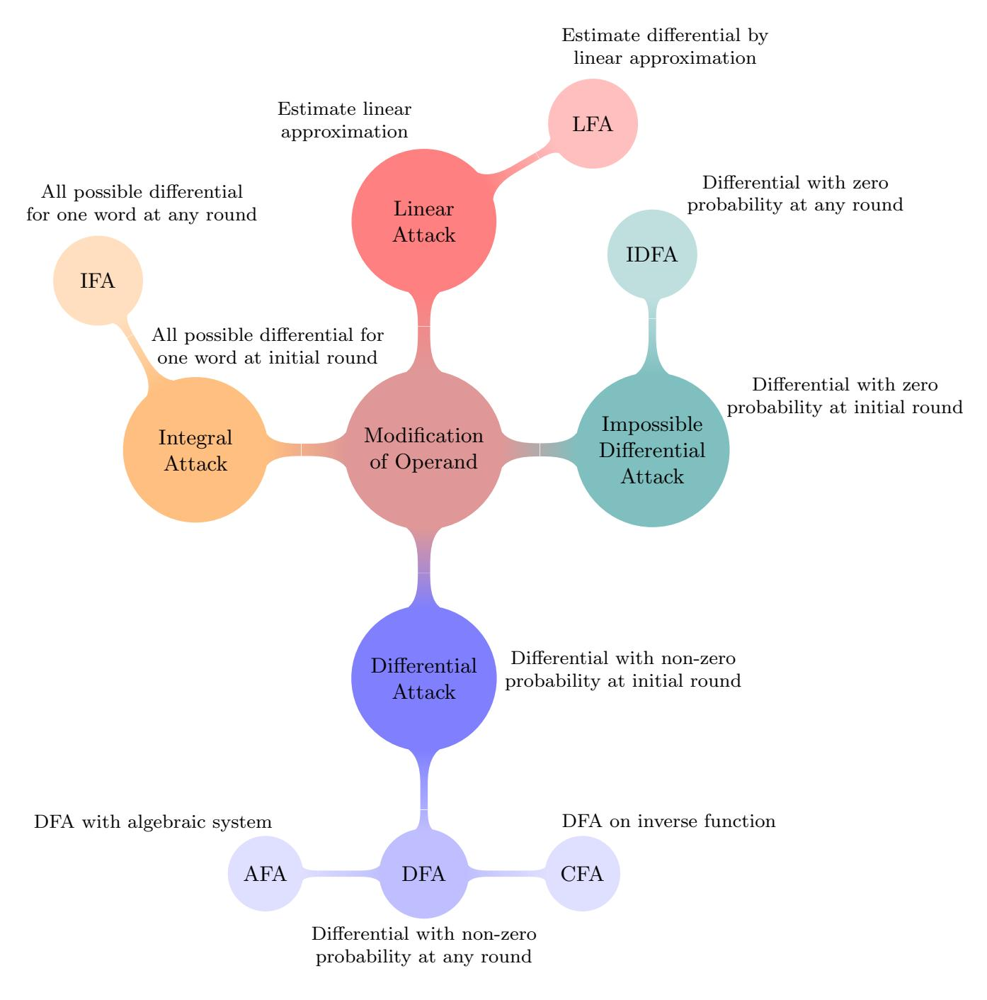

Fig. 1: Attacks (classical and fault) based on modification of operand models

classical attacks, putting the difference at the beginning would not yield any exploitable information to Eve. When she puts the differences near the end of the cipher execution (e.g., within the last three rounds for SPN block ciphers, see Section 5.1), she can lower the entropy in the ciphertext, giving her some information on the secret key. As a result, by using a few faults (sometimes with a single fault), she can recover the entire secret key. One may also refer to [SSL15, Chapters 5.5, 6] for the analysis of such fault attacks from a classical attack point-of-view. Since the attacks in modification of operand category closely follow classical attacks; it may be possible to design a cipher which, by design, is capable of thwarting such fault attacks; at least to some extent. The only cipher to have such a claim is, DEFAULT [Bak21, Chapters 7, 8] (see Section 7.1), which offers a non-trivial 264 search complexity against DFA and variants (all those fault models mentioned in Section 5.1). DEFAULT is inherently different from CRAFT [BLMR19], which attempts to protect against DFA (to some extent) inherently; although it falls under the category of detective countermeasures (see Section 7.2 for more details).

Generally, the analysis procedure in these types of fault attacks consists of two orthogonal terms; namely, fault complexity and search complexity. It is commonly possible to extract the secret key by using many faults and a low cost searches; the same result can be obtained by using less faults and high cost searches. As the cost of computation up-to a certain complexity is negligible, whereas a fault might not be easy to perform at some cases; the attacker usually tries to keep the fault complexity minimal (say, within few 10's) while keeping the search complexity within a doable limit (say, less than 240). However, certain attacks require a few hundred or even a few thousand faults (refer to Section 5.1 for examples).

### 4 Sources of Fault Injection

In this part, we briefly discuss on the equipment used to inject faults. Figure 2 shows the schematic of a fault injection set-up. A comparison of common tools is given in Table 1 (which is adopted with slight modification from [BBKN12]), where the most frequently used tools are highlighted.

The fault injection tools can be compared based on their properties. The first property is the effect of the fault injection tool. In this case, the effect could be global or local. Localized fault indicates that the adversary could precisely limit the effect of fault on the specific location or spot in the device, as compared to global fault where the attacker cannot really control where the fault is injected.

{4}------------------------------------------------

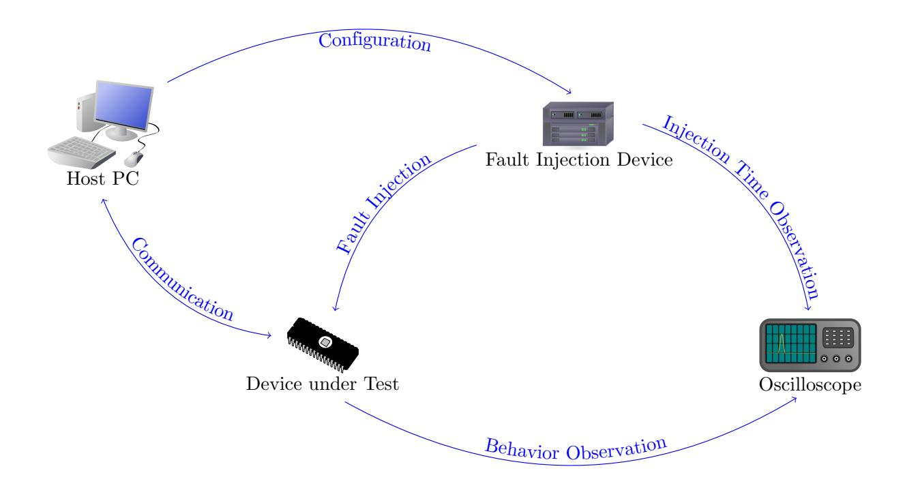

Fig. 2: Schematic view of a fault injection set-up

The second comparison is a requirement on the target device. De-packaging means that the outer layer of the device will have to be opened either through chemical (acid) or mechanical means, in order to access the chip inside. Damage refers to the state of the device after fault injection. For some fault injection tools, the target device might be destroyed. Hence, the choice of tools can be adjusted depending on the availability and importance of the target device. The last property under this category is the detail of the device design. Some of the tools required the knowledge of the device in order to properly inject the fault, while in other cases, partial or no knowledge is required.

The third comparison is about the accuracy of the fault injection tool. The time parameter refers to the timing precision when the fault is injected, and the position refers to precision of fault location in the target device. The next comparison is regarding the cost of the fault injection equipment. The cost is highly related to the accuracy, in this case, in order to achieve higher accuracy, the fault injection equipment will be more expensive. Lastly, the comparison is regarding the technical or expertise skill required to operate the equipment. In this case, for some specialized tools, such as LASER or focused ion beam, they might be more dangerous and can cause potential harm; and hence, a higher level of knowledge is required to safely operate the equipment.

Table 1: Comparison of various fault injection equipment

|                          |        | Device                     |          |                                      | Accuracy |          | Cost of                             | Technical |
|--------------------------|--------|----------------------------|----------|--------------------------------------|----------|----------|-------------------------------------|-----------|
| Method                   |        | Effect De-packaging Damage |          | Design details                       | Time     | Position | equipment                           | skill     |
| Clock glitch             | Global | No                         | No       | Required                             | High     | Low      | Low                                 | Moderate  |
| Voltage glitch           | Global | No                         | No       | Partially required Moderate          |          | Low      | Low                                 | Moderate  |
| Underfeeding             | Global | No                         | No       | Not required                         | None     | High     | Low                                 | Low       |
| Heating                  | Global | No                         | Possible | Required                             | None     | Low      | Low                                 | Low       |
| EM pulse                 | Local  | No                         |          | Possible Partially required Moderate |          | Low      | Low                                 | Moderate  |
| Localized EM pulse Local |        | May be                     | Possible | Required                             |          |          | Moderate Moderate Moderate Moderate |           |
| Light pulse              | Local  | Yes                        | Possible | Required                             |          |          | Moderate Moderate Moderate Moderate |           |
| LASER beam               | Local  | Yes                        | Possible | Required                             | High     | High     | High                                | High      |
| Light radiation          | Local  | Yes                        | Yes      | Not required                         | Low      | Low      | Low                                 | Moderate  |
| Focused ion beam         | Local  | Yes                        | Yes      | Required                             | High     |          | Very high Very high Very high       |           |

Figure [3](#page-5-0) shows various practical set-ups used to inject faults. A short discussion on most common set-ups is given next. For further information on these fault injection set-ups, one may refer to [\[Kor16,](#page-20-5) Chapter 3.1].

#### 4.1 Clock/Power Glitch

If the device uses an external clock, then a sudden variation in the clock can result in a transient fault in the device. For example, the technique is demonstrated in [\[DEK](#page-19-3)+18]. A glitch in the power can also result in a similar fault [\[O'F16\]](#page-21-3). Glitch is an efficient, cost effective and commonly employed method for fault injection in practice, which also does not require too much technical expertise. It can be applied on both the pins as well as the die. However, it may be hard for a glitch based set-up to control the fault, for example, to inject all possible 255 faults in a byte fault setting; and also the faults injected may not be uniform.

{5}------------------------------------------------

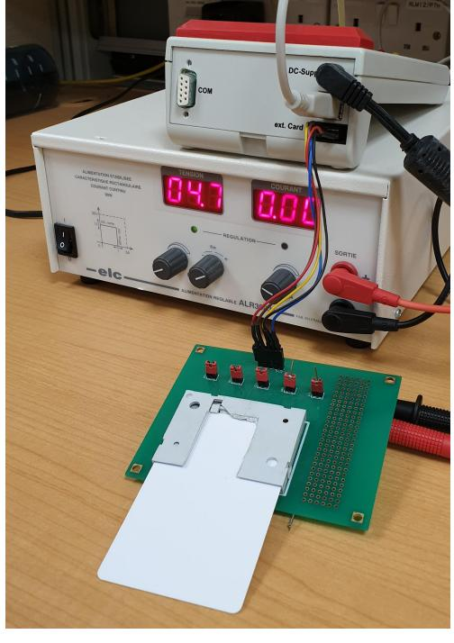

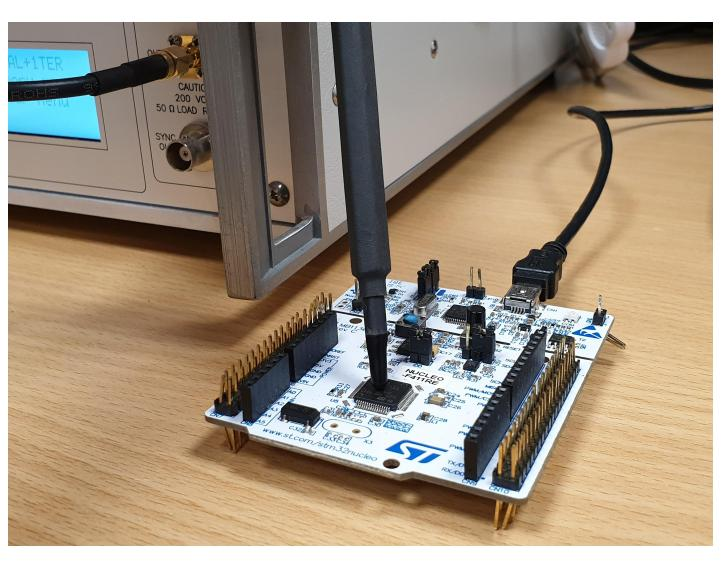

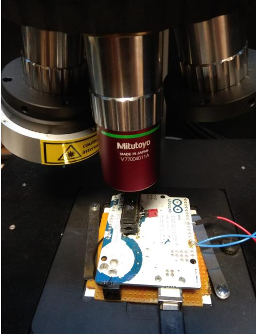

(a) Voltage glitch on a smart card (b) Electromagnetic pulse injection on a microcontroller (c) LASER fault injection on a microcontroller

Fig. 3: Fault injection equipment on different targets

### 4.2 Optics (LASER/UV-ray/X-ray)

Induction of faults by optical sources is another commonly used method. Often, this type of attack is done with a focused LASER beam at a particular location of the chip, e.g., [\[ABC](#page-17-6)+17,[SBHS15\]](#page-22-2). In this technique, the chip has to be de-packaged. Also, the correct location for injecting the fault has to be found by inspection, which requires specific expertise, time and expensive equipment. The advantage of this approach is that the fault can be precisely injected into the device, and thus, wider variety of fault model can be realized. A comprehensive categorization of various optical fault analysis set-up can be found at [\[PDL18\]](#page-21-4).

# 4.3 EM Emanation

We can further divide this technique into two categories. Pulse injection targets the digital blocks of integrated circuits, such as logic and memories. The cells in the chip can be effectively forced to produce erroneous output by a high energy EM pulse for a short period of time. As an example, one may refer to [\[MDH](#page-21-5)+13] for more information. It has a few advantages over other techniques. For example; effect of glitch is generally global to the chip, whereas EM emanation can be made local to a particular location by suitably placing the probe; it does not require de-packaging of the chip as in the case of optical fault, while maintaining almost similar level of fault precision. Harmonic injection targets the analog blocks, such as internal clock generator or random number generators. In this case the attacker generates a stable sinusiodal signal at given frequency, injecting a harmonic wave to create a parasitic signal biasing the behavior of the block. Such attack is more global and the duration of the signal is relatively long compared to pulse injection. More details on such setup can be found for example in [\[HHM](#page-20-6)+12].

# 4.4 Others

Besides the commonly used fault injection methods described before, there are also other techniques for fault injection include, for example, row hammer [\[KDK](#page-20-7)+14]. Row hammer is a known side effect in dynamic random access memory (DRAM). By repeatedly accessing a row in a DRAM, the attacker can potentially flip bits in adjacent rows. It is inducible by software, and can be repeated. Another source can be a hardware Trojan, as shown in [\[BH15\]](#page-18-3). Other examples include: Temperature variation, where forcing a chip to work outside its operating temperature can cause faulty operations [\[HS13\]](#page-20-8), as well as under powering, where the faults are induced by reducing the supply voltage [\[SGD08\]](#page-22-3).

# 5 Analysis Methods

Broadly, the fault analysis techniques can be classified in three major categories — differential (Section [5.1\)](#page-6-1), collision based (Section [5.2\)](#page-9-4) and statistical (Section [5.3\)](#page-11-0). Figure [4](#page-6-2) shows a general overview of the classification of various fault analysis methods. The Statistical Ineffective Fault Attack (SIFA, see Section [5.4\)](#page-12-2) falls somewhat in between collision and difference based. Two other new methods, namely, Persistent Fault Attack and Fault Intensity Map Analysis (FIMA) are hard to fit in an exact category. These three methods are kept separate (Section [5.4\)](#page-12-3).

{6}------------------------------------------------

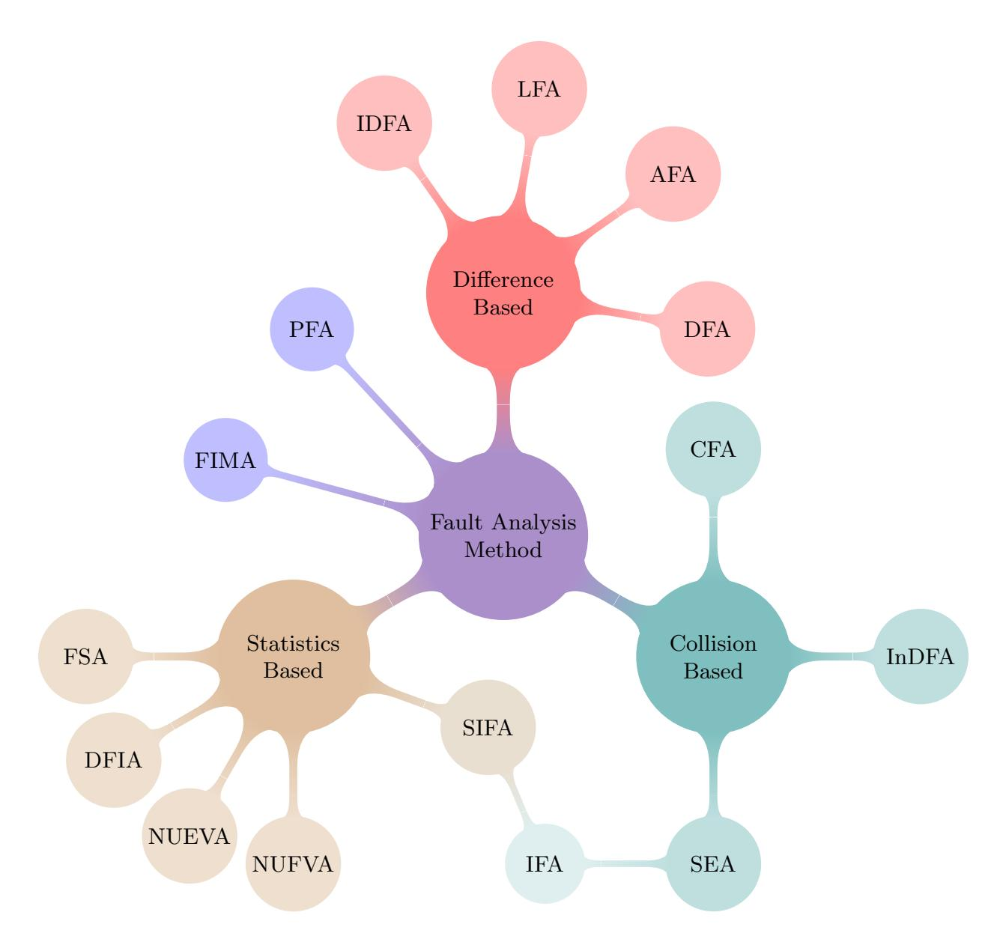

Fig. 4: Classification of fault analysis methods

### 5.1 Difference Based Fault Analysis

All the methods in the difference based analysis category are somewhat similar and can be thought of as an extension of DFA (which itself can be thought of as an extension of the classical differential attack). These methods exploit the confusion and diffusion characteristics of a cipher to inject a well-aimed fault that allows to obtain the desired difference distribution at the output of the cipher. In general, DFA and variants are more practical (such as require less number of faults) than ineffective or statistical models.

Differential Fault Attack (DFA) The concept of DFA is introduced in [\[BS97\]](#page-18-4). As already mentioned (Section [2\)](#page-1-1), the attacker injects a difference at a round of her choosing. DFA is possibly the most commonly employed fault technique. Here we list a few relatively recent works on high profile ciphers: AES [\[AMT13\]](#page-17-7), TWOFISH [\[AM13a\]](#page-17-8), PRESENT [\[BEG13,](#page-18-5) [JLSH13\]](#page-20-9), PRINCE [\[SH13\]](#page-22-0), MIDORI [\[CZS16\]](#page-19-4) etc.

To the best of our knowledge, the earliest round DFA on AES works at the 4th last round [\[DFL11\]](#page-19-5). The diagonal fault model [\[SMC09\]](#page-22-4) proposes the best known DFA on AES (without using information from key scheduling), where the computational complexity is reduced to a nominal bound.

In general, the underlying philosophy of attacking SPN ciphers by various fault methods are somewhat similar (particularly those use a diffusion matrix, instead of bit permutation, as the linear layer), and can be (to some extent) generalized from a theoretical perspective. We omit a thorough analysis here, as interested readers may find it in [\[SSL15,](#page-23-0) Chapters 5.5, 6].

In order to give an overall idea, we present the simplest case of DFA on SPN. Here, the attacker injects faults at the last round SBoxes one by one. For each SBox S, she injects a fault δ and obtains a relation of the form: S(x) ⊕ S(x ⊕ δ) = ∆(x, δ); where ∆ is known to her, x is the unknown input she wants to retrieve and δ is either known (deterministic model) or unknown (random model). Nonetheless, using the input difference – output difference relation of S, she is able to narrow down the solutions for x. Finally, with a few such relations, she is able to solve x uniquely. Now that she knows the state before the last SBox layer, she can compute the last round key by XORing the ciphertext with the output of the last SBox layer. In this approach, the fault complexity is maximized, and the search complexity is minimized.

The fault complexity of the approach mentioned above can be reduced if the fault is injected a few rounds earlier. Let us assume the fault is injected at the beginning of the 2nd last round SBox. Then, the difference will spread through one permutation layer, where it enters another layer of SBoxes. Thus, one fault in a round effectively induces multiple faults on the next round, the number depends on the nature of the permutation (e.g., in case of a standard 4 × 4 SubByte-ShiftRow-MixColumn-AddRoundKey construction, one column, i.e., 4 faults are induced). However, in

{7}------------------------------------------------

this situation, the fault-output differential relation becomes more complicated, which results in more computation. In other words, injecting fault(s) at the penultimate round reduces the number of required faults at the expense of more computation. Now, consider the effect of injecting fault at the beginning of 3rd last round SBox. Thanks to the property of the permutation rounds, in common SPN block ciphers, the fault passes through 2 permutation layers before reaching the last round SBox; which generally results in activating all SBoxes at the last round. Thus, generally one fault in 3rd last round is equivalent to the naïve approach on each individual SBox with the overhead of computational cost (which is generally within doable range). Figure 5 shows one such case with the MIDORI block cipher, based on [CZS16, Figure 2]. Here, the fault is injected at the (0,0)th word of the MIDORI state at the beginning of the 3rd last round. This fault propagates through the following SubCell, ShuffleCell, MixColumn and AddRoundKey to other 3 words in that column. Thus, at the beginning of the 2nd last round, the attacker enjoys the effect of injecting 3 faults. These 3 faults induce a total of 9 differences at the ciphertext. So, the attacker effectively reduces the required number of faults to one-ninth from the last round attack.

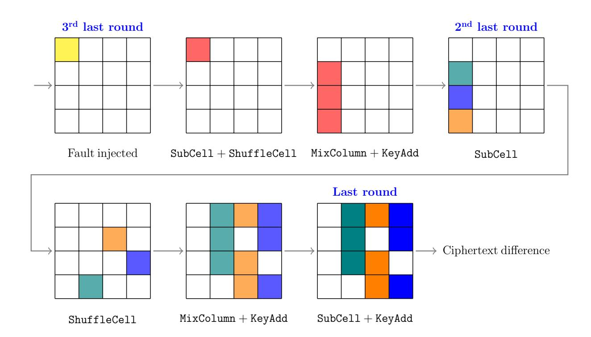

Fig. 5: DFA on MIDORI encryption at the third last round

As noted earlier, the SPN ciphers with the bit permutation as the linear layer act a little differently. For example, in DFA on PRESENT the fault propagation pattern spreads bit-wise through the state because of the cipher's pLayer (which depends on the value) [BH15]. If a nibble gets affected in PRESENT, it spreads into 2-4 nibbles in the following round. Therefore, if the attacker manages to make the output of four chosen nibbles in round i faulty, it might spread into the whole state in round i+1. Together with the differential characteristic of the sBoxLayer, it will reduce the number of input candidates per nibble to 2-4. Then, if the fault is injected into different four nibbles, and therefore, different input bits of the SBox in round i+1 get affected, the input candidates of each nibble might be known. After this step, the attacker simply recovers the last round key and computes an inverse key schedule to get the secret key.

The FAs on the Feistel block ciphers are of more variety, because the analysis of these attacks depends on the following (non-exhaustive) list of factors:

- choice of the f function,
- how the round keys are inserted (through a linear function or a non-linear function),
- number of branches.

Hence, it is difficult to generalize all the attacks here. One may refer to [BTLT14] for DFA on a few Feistel block ciphers; namely, DES, MIBS, TWINE and CLEFIA.

However, the last round of several high profile Feistel network based ciphers (such as CLEFIA [AM13b], TWOFISH [AM13a] and PICCOLO [Jeo12]) can be modelled as in Figure 6. As for the notations, L and R denote the left and right branches, K as the round key and WK as the whitening key, f as the Feistel function, and red indicates it is unknown to attacker. One can view  $K \oplus L$  as the final round key addition in an SPN cipher, and thus DFA can be launched as in the case of a SPN. Once the input of the Feistel function f is identified, WK can be uniquely determined. Now, the attacker can perform a similar strategy on the previous round to determine the value of L and thus recover K from the previous round as well, etc.

DFA or its variants can be successfully applied to any unprotected symmetric key cipher. Interestingly though, we notice that there are several stream ciphers on which no DFA or its variants (see AFA, Section 5.1) are reported so far. In [KY10], the authors present a DFA on the stream cipher HC-128 where the attacker is allowed to inject fault at a random word of the state of the cipher but cannot control its exact location or the resulted value of the word. Normally, DFA/AFA on stream ciphers is considered difficult to carry out in practice, compared to block ciphers, as

{8}------------------------------------------------

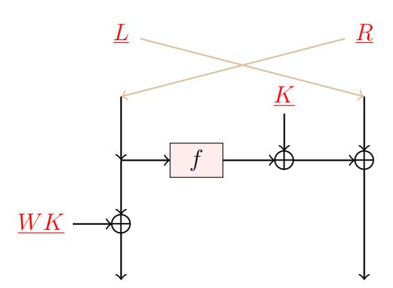

Fig. 6: Last round of many Feistel network based ciphers

the analysis complexity often goes beyond the computational requirements of automated tools such as satisfiability (SAT) solvers. One may check eSTREAM finalist SALSA or its variant CHACHA in this regard [\[BGV17\]](#page-18-7).

As an interesting side note, it may be observed that, the complexity of a DFA (or its variant) may be increased if the following design choices are incorporated in a stream cipher design:

- Suppress several key-stream words (say, output every two hundredth key stream bit in TRIVIUM).
- Use constructions with bigger state which are (possibly) difficult to solve by SAT solvers.
- Value position swap (as in RC4) such that fault equations are hard to formulate.
- Use block ciphers with CTR mode (it inherently works like a protocol level countermeasure, see Section [2.5\)](#page-2-0).

It is not long since the faults attacks on hash functions or other primitives that use a hash function appear in the literature. As hash functions are commonly underrepresented in fault attacks, here we present a compact overview of major fault attacks.

The first such attack is reported by Li et al. in [\[LLG09\]](#page-21-7) against SHACAL1, a block cipher employing SHA-1 without the final addition operation. In [\[HH11\]](#page-20-11), the authors argue in favor of analyzing public primitives like hash functions or their internal compression function in the light of DFA, citing reasons that the impact of the result will get amplified in applications like HMAC or key derivation functions. They extend the attack of [\[LLG09\]](#page-21-7) to include the final addition and demonstrated a DFA on SHA-1 compression function using 1000 faulty outputs. The authors conclude that applications using the SHA-1 compression function having fixed input and output which are known to the attacker are particularly vulnerable to their attack.

In [\[FR12\]](#page-19-6), the authors demonstrate a DFA on the hash function GRØSTL which was an AES based finalist of the SHA-3 competition. They indirectly make use of the classical DFA on AES along with some precomputation to invert the output transformation using 16 faults and required 280 faults on average to invert each compression step attacking both GRØSTL-256 and GRØSTL-224. They were able retrieve the key of HMAC-GRØSTL using 300 faults and also present a possible countermeasure using a modification of the truncation function. In [\[SC15\]](#page-22-5), a diagonal fault analysis attack is reported on GRØSTL when used in dedicated MAC mode that makes use of the notion of fault repeatability introduced in [\[RLK11\]](#page-22-6). The number of faults to invert the output transformation is reduced from the previous record of 16 to 8.

The first fault attack on the SHA-3 standard is presented in [\[BGS15\]](#page-18-8). The main result in this paper is a DFA on SHA-3 variants SHA-3-512 and SHA-3-384. The authors showed that using a random bit fault model, 1592 bits among the total of 1600 bits of the internal state of SHA-3 can be extracted using 80 faulty messages given the first 320 least significant bits. This gives the indication that it is indeed possible to recover (most of) the state of a compression function even if the full state is not available to the attacker (only a truncated state is available). The idea of the attack is based on the DFA models used in GRØSTL [\[FR12\]](#page-19-6) and STREEBOG [\[AY15\]](#page-17-10). The ciphers, SHA-3-224 and SHA-3-256 are attacked in [\[LFZD16\]](#page-21-8), where they adopt more realistic single byte fault model to mount DFA. In [\[LAFW17\]](#page-21-9), the first algebraic fault analysis of SHA-3 family is reported, where they argue in favor of AFA being a more effective technique as it recovers more bits per fault injection and also more efficient since it required lesser fault injections compared to the DFA results. Moreover, they report that AFA is more suited for SHA-3 as it could exploit the inherent algebraic properties of SHA-3. The main result is to recover the internal state of the penultimate round using a random byte model. The work is extended in [\[LAFW18\]](#page-21-10) where the authors use more relaxed fault models using 16 and 32-bit faults and found the attack to be more effective for shorter message digests.

STREEBOG, the Russian hash function standard, was analyzed in the light of differential fault analysis attacks [\[AY15\]](#page-17-10). They used the random bit-flip model and also discussed the scenario where the fault location in the state can be controlled. They demonstrated a two-stage attack which recovers the compression function inputs with number of fault injection ranging between 330 and 1640 based on certain assumptions.

DFA was also applied against the AEAD MINALPHER in [\[CDN17\]](#page-19-7), which is a second round CAESAR[3](#page-8-1) candidate. Using a single fault at a fixed position, almost universal forgeries on the third round CAESAR candidates, CLOC and

3 "CAESAR: Competition for Authenticated Encryption: Security, Applicability, and Robustness", [https://competitions.](https://competitions.cr.yp.to/caesar.html) [cr.yp.to/caesar.html](https://competitions.cr.yp.to/caesar.html)

{9}------------------------------------------------

SILC were shown in [RCC+16]. In [BDM+19], DFA on AEGIS-128L (which is in the final portfolio) and TIAOXIN-346, two candidates of the CAESAR competition were reported. The authors commented that the ciphers following a stream cipher design paradigm and a particular form of update function are vulnerable to similar attack.

Algebraic Fault Attack (AFA) The notion of AFA [CJW10] is similar to that of DFA. The difference between AFA and DFA lies in the process analyzing the faulty and non-faulty outputs. DFA relies on astute observation done manually on the difference propagation through the cipher, thereby solving the unknown state of the cipher. AFA relies on forming algebraic equations and commonly feeding the resulting system of equations to a Boolean satisfiability (SAT) solver thereafter. AFA has been successfully applied against block ciphers (e.g., LED [JKP12a, ZGZ+13], PICCOLO [ZZG+13]) and hash functions such as SHA-3 [LAFW17].

It may be noted that AFA is particularly useful against stream ciphers and stream cipher based designs; as it is relatively straightforward to get the algebraic equations in the computer rather than manually exploiting structure of the cipher. Observing differential trails manually is tedious in such cases. For example, AFA against ciphers in GRAIN family [SBM15, DCAM15], TRIVIUM [DA14], SPROUT [MSBD15] etc. were reported. ACORN was also analyzed in [SSMC17] (where few bits are exhaustively searched, and the rest are solved by the SAT solver) together with GRAIN-v1 and LIZARD (in the latter case, the state recovery at a particular round was shown to be possible). The first step in these attacks is to deduce optimal places for fault injection. Generally, precise location and round of fault injection is considered unknown to Eve (to be determined the difference pattern in the key-stream, which is referred to as the fault signature) although Eve controls which (part of) LFSR-NLFSR is affected. However, in these stream cipher related attacks, the authors describe their works as DFAs (not AFAs), possibly because the typical DFA approach that works (without involving automated solvers) on block ciphers does not work in stream ciphers. Section 5.1 points out few ideas on how it could be possible to make a stream cipher more resistant to AFA.

As for the AEADs, the finalist in the first CAESAR portfolio (lightweight applications); ACORN was analyzed by AFA (by assuming few bits are known to the attacker) in [SSMC17], and also in [ZFL18] where the feasibility of a DFA was discussed and verified with a toy version of ACORN. Two other CAESAR candidates, AEGIS which is a finalist in the second portfolio of CAESAR (high performance applications), and TIAOXIN which is a third round candidate were analyzed by DFA (technically, AFA) in [DRSA16].

Impossible Differential Fault Attack (IDFA) The underlying concept of IDFA [BGN05] is similar to classical impossible differential attack (IDA), where the attacker looks for probability zero differentials instead of high probability ones. Once such a differential is chosen, the attacker checks which sub-key guesses produce this differential. Those sub-key guesses are then discarded as they cannot lead to a correct key guess. IDA utilizes input difference to get a differential, whereas IDFA makes use of fault to achieve the same. IDFA was successfully used against AES, e.g., in [PY06, DFL11].

Linear Fault Attack/ Integral Fault Attack Two other types of fault models were proposed which resemble two classical cryptanalysis techniques. The linear fault attack (LFA) [LGLL12] is a fault based generalization of the linear cryptanalysis. Similarly, the integral fault attack, described in [PY06] and later in [SSL15, Chapter 6.3], is the fault based generalization of the classical integral cryptanalysis. In the LFA scenario, Eve tries to recover the information regarding the fault through the output from a (non-linear) component appended to it by means of linear approximation. The number of pairs of output required for the attacker to successfully apply LFA is of the order of  $c \times \epsilon^{-4}$ , where  $\epsilon$  is the linear bias ( $c \times \epsilon^{-2}$  pairs of output would be needed to apply linear cryptanalysis) and c is a small constant (typically, 4). For the integral fault case, she repeats all the possible faults for a word, effectively simulating the integral attack. Note that, this model can be hard to achieve in practice, and requires sophisticated equipment; also it is worth mentioning that such model has never been reported with any practical attack set-ups up to date.

#### 5.2 Collision Based Fault Analysis

Collision Fault Attack (CFA) CFA was proposed in [BK06] and independently in [Hem04]4. The concept was used against IDEA [CGV08]. In CFA, the attacker, Eve, gains information about the secret key if the outputs, obtained from a normal (non-faulty) encryption and from a faulty encryption, are equal. She arbitrarily chooses the first plaintext  $P_0$  and obtains the corresponding faulty ciphertext:  $C' = E'_K(P_0)$  (here  $E_K$  is the encryption operation and where  $E'_K$  denotes the faulty invocation of the encryption operation with secret key K). Then, she asks for encryption of another input, P, which might give an output identical to C' (i.e., E(P) = C = C'). Such collision can be then used to get an information about the intermediate state of the cipher, and consequently, about the secret key. Unlike DFA, the fault

&lt;sup>4The work against 3-DES in [Hem04] was described as a DFA; though with the current terminology, it probably makes better sense to classify this work as CFA.

{10}------------------------------------------------

is normally introduced in the early rounds of the cipher, exploiting the property that the propagation of the fault in the intermediate value will result in a collision with the normal output.

One natural problem that arises is, how to find two such colliding inputs; as the cipher is expected to have a very good diffusion. Eve solves this problem by utilizing differential properties at early rounds (to avoid much diffusion). Therefore, unlike DFA, the fault is normally introduced in the early rounds of the cipher, exploiting the property that the propagation of the fault in the intermediate value will result in the collision with the normal output. Hence, one can consider a CFA on  $E_K$  to be similar to the DFA on  $E_K^{-1}$ . Interchanging the input & output for CFA, the situation becomes: Two identical inputs are fed to the system, at a later round one fault is applied, then the outputs become different; which is the case for a DFA.

Internal Differential Fault Attack (InDFA) The Internal Differential Fault Attack [SC16,SC17] mainly leverages upon the internal symmetry of a cipher. The ciphers which are employing a parallel mode of operation are the most vulnerable to this kind of analysis. The idea of InDFA is to overcome the nonce barrier that acts as an implicit guard against DFA, as the nonce is not allowed to repeat. This guard can be removed when faults are injected at some counters of the parallel branches (which differ minimally at the inputs). This can result in both branches having same inputs, as the faulty counter gets the same content as the non-faulty counter. The rest of the analysis can be done similarly to DFA. In other words, the attacker injects a second fault in the internal state of any of the (currently identical) branches. This second fault propagates through the rest of the state. The effect of this fault can be utilized by DFA to recover secret information. Refer to Figure 7 for a visual representation of the scenario. The InDFA model was applied on the CAESAR candidate PAEQ [SC16].

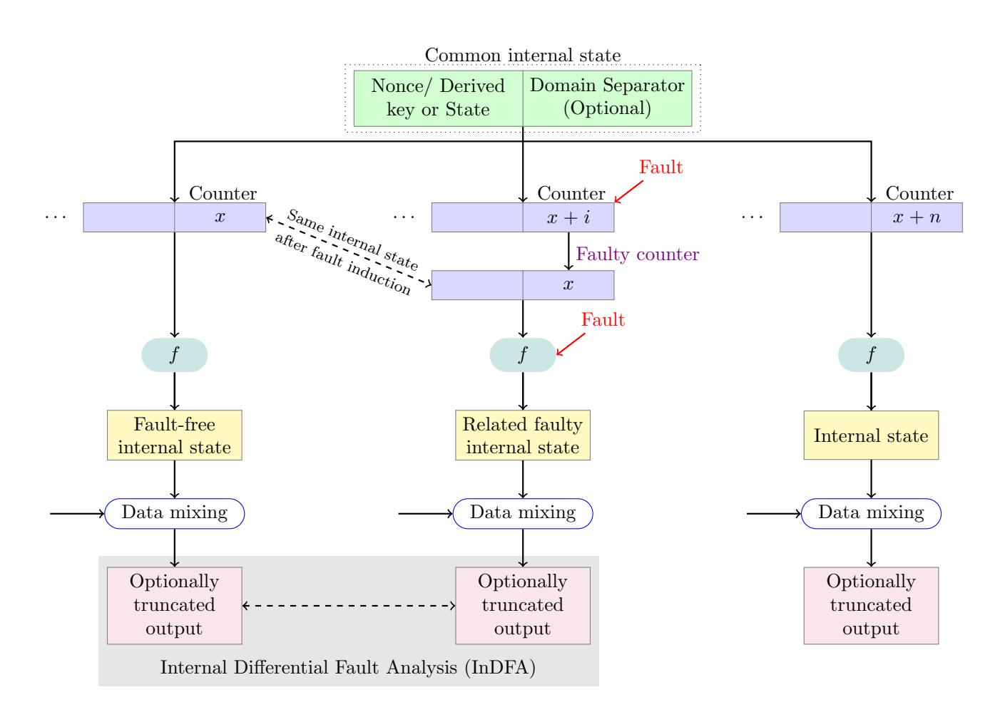

Fig. 7: Generic model for using internal differentials in fault analysis of parallelizable ciphers in the counter mode

Safe Error Analysis (SEA)/ Ineffective Fault Analysis (IFA) Similar to the CFA model, the SEA [YJ00, YKLM01,JQYY02] model makes use of the situation when the fault introduced in the cipher does not alter the output. To achieve this, intermediate bits are changed and the information whether the output changed or not is used to determine the non-faulty content at the time of the fault injection. Generally, this attack works by recovering one bit at a time; so, as many faults as the state size may be required. It may be noted that the SEA requires a strict adversarial model. IFA [Cla07] is a special type of SEA where the injected fault has no effect.

SEA attacks are able to break many countermeasures that do not withhold the output in case a fault is safe (that is, the fault does not change the output), but they do otherwise. In that case, SEA is able to utilize the information whether the output is withheld or not.

IFA was used to recover the secret SBox of the block cipher KUZNYECHIK (a Russian standard) [ADY15]. In addition, the authors also presented a DFA with the random byte fault model in the same research paper.

{11}------------------------------------------------

#### 5.3 Statistics Based Fault Analysis

In this third category of fault analysis, the statistical distribution of a variable is considered, which is biased because of the nature of fault injection. Generally, the underlying models assume more powerful adversary compared to difference based method, and are of stuck-at type. The details on practical implementations on such fault models can be found in [NFG15]. Further, the authors also showed the connection among these models and gave a comparison on efficiency. More information on each of the analysis methods are given later.

An abridged taxonomy of statistics based fault attacks (adopted with slight modifications from [RAD19a, Figure 1]) is given in Figure 8. The terms, *Non-Uniform Error Value Analysis* (NUEVA, Section 5.3) and *Non-Uniform Fault Value Analysis* (NUFVA, Section 5.3) are adopted following [NFG15, RAD19a, RAD19b].

The following description of the terminologies are adopted (with slight modification) from [GYS15, Section 2.1]:

- Fault Intensity Fault intensity is the strength by which a device is forced to work under non-favorable conditions (that may effectively induce a fault). For example, in case of clock glitch as the source of fault injection, the fault intensity refers to the shortened clock cycle.
- Fault Sensitivity The fault sensitivity is the minimal fault intensity at which a device starts to show faulty behavior. For example, in case of clock glitches, the fault sensitivity generally corresponds to the critical path.
- Biased Fault A biased fault refers to the gradual change in the faulty behavior of the device, which is a result of gradual change in fault intensity.

The Differential Fault Intensity Analysis (DFIA, Section 5.3) uses the biased fault model described above that is based on minimal bias (e.g., flip of one or two bits); and it relies on side channel leakage. Here, side channel information generated by a countermeasure to a fault attack (such as starting time of an alarm or time of premature stop of a cipher execution) is used. Hence, the knowledge on the fault and the fault-free computations is not necessarily required. Notice that Fault Sensitivity Analysis (FSA) is considered one variant of DFIA under the current taxonomy. On another note, FSA and NUFVA do not require the knowledge of the faulty output.

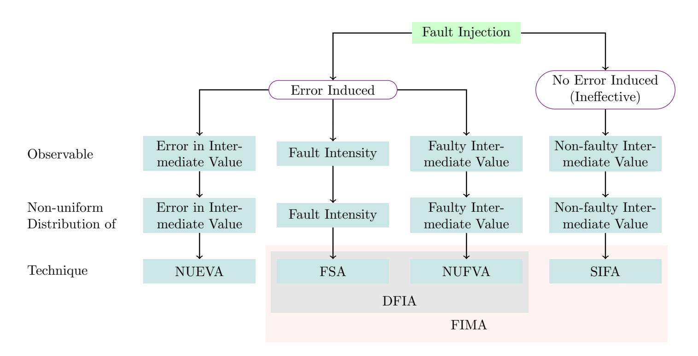

Fig. 8: Overview of statistics based fault analysis methods

**Non-Uniform Error Value Attack (NUEVA)** In NUEVA [LRD+12], the fault value (which acts as a mask) is considered as the variable of interest and the non-uniform distribution of it is observed. This non-uniformity in distribution can be caused by, e.g., the Hamming weight of the fault value.

Non-Uniform Faulty Value Attack (NUFVA) This model was proposed in [FJLT13]; where the biased distribution of the state was considered. This bias is caused due to the result of the fault injection technique. For example, it was shown in [NFG15] that certain fault values will more likely appear than the rest.

Fault Sensitivity Analysis (FSA) FSA [LSG+10] exploits the behavior of underlying hardware when exposed to faults. This behavior changes with the change of the intensity of the fault injection. This behavior is a potential source of side channel information to the attacker. She does not need the output to analyze, instead she checks the data dependency for each intensity. The attack procedure is therefore related to side channel analysis. It tests the circuit by varying the intensity of the injection and checks the data dependency for each case. In the actual attack procedure, Eve collects the input to the cipher, non-faulty output, and the side channel information. After this, the correlation coefficient is used to find the most likely sub-keys.

{12}------------------------------------------------

Differential Fault Intensity Analysis (DFIA) This method [\[GYTS14\]](#page-20-16) combines fault injection with side channel attack set-up. Similar to FSA, it tests the system responses under different fault intensity and takes advantage of a non-uniform distribution of the faults (biased fault model). Afterwards, it treats the biased fault model as the source of leakage and applies side channel methods. However, unlike FSA, it does not require a fault sensitivity profile of the attacked device. DFIA has been successfully applied against AES [\[GYTS14\]](#page-20-16), PRESENT and LED [\[GYS15\]](#page-20-15).

#### 5.4 Others

Statistical Ineffective Fault Attack (SIFA) SIFA [\[DEK](#page-19-3)+18] lies somewhere in between the IFA (Section [5.2\)](#page-10-1) and SFA (Section [5.3\)](#page-11-3). Similar to IFA, SIFA utilizes the probability that a fault injection may not result in a successful alteration in the device (ineffective fault). The main observation that works in SIFA is that the probability of error as a result of a successful ineffective fault injection is non-uniform. The bias can be observed in case of a correct key guess, but not for the cases where the key guesses are wrong. A SIFA on the ASCON AEAD, which is a finalist in the CAESAR portfolio for the use case 1 (lightweight applications) was reported in [\[RAD19b\]](#page-22-13). Another SIFA is reported on GIMLI in [\[GPT19\]](#page-19-14). SIFA can be used to break existing fault countermeasures (see Section [7\)](#page-13-0) that are used to protect against DFA and other common fault methods. Therefore special techniques are required for this purpose, more information can be found in Section [7.7.](#page-16-0)

Persistent Fault Attack (PFA) Recently, another category of biased fault injection is introduced, based on the fault duration. The fault model, known as the persistent fault, is proposed as a hybrid fault model between commonly used transient and permanent faults. Unlike transient fault, it affects several calls of the target function, however, persistent fault is not permanent, and disappears with a device reset/reboot. Based on this fault model, a statistical analysis technique is developed, called Persistent Fault Analysis (PFA) [\[ZLZ](#page-23-7)+18], to attack block ciphers. The attack targets the (common) SBox table stored in memory for a serialized implementation, with one fault injection altering any one element in SBox. The adversary collects several ciphertext resulting from this faulty SBox, to statistically recover the key. PFA is shown to break redundancy based fault countermeasures. Application of PFA can be found in [\[CB19\]](#page-18-11) and [\[ZZY](#page-23-8)+19].

Fault Intensity Map Analysis FIMA [\[RAD19a\]](#page-22-12) generalizes the statistics based fault models, taking into account all the relevant variables and the side channel information. So, it can be considered as the common method for FSA, DFIA, NUEVA and SIFA. This method utilizes the bias that is introduced by faults in the distribution of any of the relevant variables (faulty, non-faulty or the fault value), and the information on the fault intensity. As such, it can work with less amount of data than the predecessor methods.

### 6 Generalized Fault Attack Automation Frameworks

As fault attacks are becoming a more serious threat, efforts have been made to construct a generalized and automated framework that can evaluate the effectiveness of the attack and provide recommendations for cipher implementers, on which they can spot vulnerabilities and judge if they want to make their algorithm more robust. Conceptually, it can be described as follows: Given a cipher (and possibly a platform-specific implementation), such tools will automatically look for vulnerability; thereby cutting off the manual labor and expertise required to perform such attacks which is often error-prone [\[BHB19\]](#page-18-12).

The overall trend in this area, along with the possible challenges, can be deduced from the recent publications. Basically, the methods that focus on fully automated analysis always utilize some sort of automated solver, such as a SAT solver. While this solver can provide a formally-proven output, the quality of this output always depends on the input that has to be constructed by the analysis framework. It is an open problem to have a universal transformation framework which would take a cipher representation in any form and construct set of equations for a solver. Another challenge is to provide automated analysis on protected implementations — so far, the above mentioned works only focus on unprotected implementations since they only consider a single fault adversary. To be able to bypass most of the countermeasures, it is necessary to have a multi-fault adversary model; e.g., in case the attacker wants to break a simple redundancy countermeasure only with fault injection attack, she needs either to inject the same fault into both branches of the execution, or inject a fault into one branch and then into the comparison module. Next, we will explain the working principle of the main works in this area, divided into cipher level techniques and implementation level techniques.

#### 6.1 Cipher Level Approaches

The first idea of automating cipher-specific fault analysis is aimed at AFA [\[ZGZ](#page-23-9)+16]. It requires manual interpretation of the cipher representation in an algebraic form and then a SAT solver is used to find the vulnerable spots. The first 

{13}------------------------------------------------

automated framework focused on DFA, [\[KRH17\]](#page-21-16), requires a manual identification of non-linear operations in a cipher. It then proceeds with finding a fault propagation pattern through the cipher rounds which is represented by colors if a value served as an input to a non-linear operation, the output of this operation is assigned a unique color so that the number of these operations can be determined from the fault until the output of the cipher.

Later, several fully-automated cipher level frameworks emerge in the literature. Some of the proposed works have adopted the machine learning methods to identify vulnerable spots in the ciphers, based on existing fault attacks observed or learned on different ciphers. The work in [\[SKMD17\]](#page-22-14) adopts the association rule mining to explore fault vulnerabilities on DFA, whereas the work in [\[SJP](#page-22-15)+19] uses random forest to identify solvable algebraic representation for AFA. Later, [\[SMD18\]](#page-22-16) propose a framework that estimates the attack complexity required to recover the secret. To find a distinguisher, a data-mining approach was utilized in this case. While works generally focus on block ciphers, the authors in [\[SDAM17\]](#page-22-17) attempted to fill the gap for stream ciphers. Recently, this work has been improved in [\[BSS](#page-18-13)+20] by substituting correlation coefficient (used in [\[SDAM17\]](#page-22-17)) by machine learning.

### 6.2 Implementation Level Approaches

In case of software level techniques, there are two works focusing on analyzing assembly implementations. The work in [\[BHL18\]](#page-18-14) aims at unrolled microcontroller implementations and shows that some vulnerabilities are not visible from the cipher level perspective. For example, when permutation layer is combined with the substitution layer in block ciphers into a form of look-up tables, it introduces new vulnerabilities that cannot be estimated from the algorithmic representation. However, this work leaves the final step of the attack, namely, the analysis of DFA equations, on user. This task is later completed in [\[HBZL19\]](#page-20-17) which utilizes Satisfiability Modulo Theories (SMT) solver to automate this last step.

The hardware level approach is presented in [\[BGE](#page-18-15)+17,[GPU](#page-19-15)+19]. This framework takes the hardware description of the cipher and creates a fault list based on exploited fault model. This is represented in a Conjunctive Normal Form (CNF) which is analyzed by a SAT solver. For implementation based approaches, the authors argue that the requirement for cryptanalyst expertise could be minimized, since the algebraic representation solely depends on the implementations themselves, rather than the cipher description.

# 7 Countermeasures

The fault attacks are usually not prevented at the cipher design level. Instead, the cipher designer has to rely on the circuit implementer/secure software developer to ensure that an adequate countermeasure is deployed. Hence, countermeasures are designed and analysed separately from the ciphers, as we discuss here. For the sake of simplicity, we do not include the combined fault and side channel countermeasures. A compact view of the countermeasures is presented in Figure [9.](#page-14-1) Overall, the countermeasures can be divided into two main categories. In the first category, the countermeasures try to prevent the fault happening in the first place (achieved through a specialized device). In the second, the countermeasures try to eliminate the effect of the fault either by means of redundancy or protocol.

All the countermeasures that mitigate fault effect utilize some form of redundancy to achieve protection against FA. The following classification shows the three classes based on the part where the redundancy is introduced:

- 1. Cipher Level. The security against fault attacks solely come from the virtue of the design itself (Section [7.1\)](#page-14-0). Hence, no redundant computation is needed.
- 2. Using a separate, dedicated device. These devices are not related to the cipher. These devices can be passive, where a shield is used to block external interference [\[BECN](#page-17-0)+04]. It may be possible to peel off the passive layer using chemicals or precise milling tools, such as Ultra Tec ASAP-1. Alternatively, active devices can be used (such as, a sensor that detects any potential stress [\[ZDT](#page-23-10)+14,[HBB](#page-20-18)+16b,[HBB16a\]](#page-20-19)).
- 3. Using redundancy in computation. The common procedure for these types of countermeasures is to duplicate (fully/partially) the circuit. This duplication can be in the spatial domain or the temporal domain, or a precomputed signature can be used to check integrity [\[Kor16,](#page-20-5) Chapter 3.4]. Then, some predefined procedure to handle the situation of a fault detection is used, such as not producing any output or producing a random output.
- 4. Using protocol level technique. The communication protocol between Alice and Bob ensures that the probability for a successful fault injection is negligibly small.

The countermeasures in the category [3](#page-13-1) that use redundant computations are quite well-studied. Those can be further classified into Detection (Section [7.2\)](#page-15-0), Infection (Section [7.3\)](#page-15-1), Prevention (Section [7.4\)](#page-15-2), which are described later. The protocol level countermeasures are generally one among Re-keying, Tweak and Tweak-in-Plaintext, Masking plaintext; which are combined subsequently (Section [7.5\)](#page-16-1). Before going into particulars of each of these types, we first briefly mention the role of the so-called Double Fault in this context.

{14}------------------------------------------------

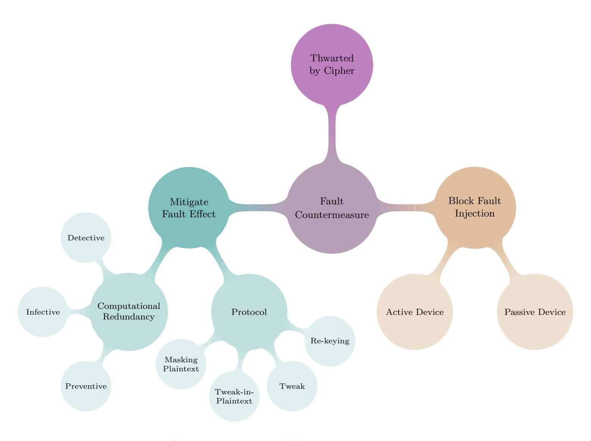

Fig. 9: Generic overview of fault attack countermeasures

#### Double Fault

Given the fault attack countermeasures (see the subsequent parts), a particular model may be of interest, which we refer to as the double fault model. The notion is adopted from [\[BSS19,](#page-18-16) Section 2.6]. Note that, the detective and the infective countermeasures work by running two identical instances of the cipher. The inherent assumption here is that the attacker cannot inject identical faults in both the actual and the redundant instances. Under the double fault model, however, it is assumed that Eve can inject identical faults in both the actual and redundant instances. This model is shown to be practical in [\[SHS16\]](#page-22-18). Since both the redundant and the actual computation results in the same output (since identical faults are injected), the countermeasure will treat this case as no fault, and return the (faulty) output to the attacker. This is a generic problem against detection and infection – if higher than double redundancy is not used. If such models are considered within the scope, protocol level or preventive countermeasures can be used. Note that, any cipher level protection (see Section [7.1\)](#page-14-0) does not duplicate, hence is free from the double fault model.

Another interesting aspect of the double fault model is whether it is to be considered within the single fault or the multiple fault adversary model (see Section [2.2\)](#page-1-2). Basically, the answer depends on the precise definition of the term 'one execution of the cipher'. To be more specific; consider by 'one execution', we refer to the complete system (both the actual and the redundant instances) — in this case, we consider the double fault model outside the scope of single fault adversary model. On the contrary, consider the scenario where we refer to a single execution of the cryptographic algorithm designed by a cryptographer as "one execution of the cipher"; here the attacker injects faults once per one execution; so the single fault adversary model is maintained. For the sake of consistency, we stick to the second notion, so we do not consider the double fault model as a violation of the frequently used single fault adversary model. The recently proposed CRAFT [\[BLMR19\]](#page-18-2) cipher has an in-built mechanism to protect against the double fault (see Section [7.2](#page-15-0) for more information on this cipher). This model of double fault can be generalized for more faults, such as the triplication based countermeasure proposed in [\[BBK](#page-17-13)+10]. Note that, this notion of "double fault" is different from [\[RAD19a,](#page-22-12)[RAD19b\]](#page-22-13), where the same term refers to attacking a pair of SBoxes at the same round.

#### 7.1 Cipher Level

This is a new genre of fault protection which solely relies on the careful choice of design parameters of the cipher. This is introduced in the form of the cipher DEFAULT [\[Bak21,](#page-17-5) Chapters 7, 8]; and so far is the only of its kind. Basically, DEFAULT is composed of DEFAULT-LAYER (28 rounds) – DEFAULT-CORE (24 rounds) – DEFAULT-LAYER (28 rounds), where DEFAULT-LAYER is good against DFA and bad against the classical differential attack, and DEFAULT-CORE does not claim any DFA security. Overall, the whole cipher runs for 80 rounds, which is comparable to a lightweight cipher duplicated (this is reasonable, as the common DFA countermeasures rely on duplication). Also, the design is not fixed, namely any cipher with proclaimed classical security can be used instead of DEFAULT-CORE to have a DFA security.

{15}------------------------------------------------

The fundamental observation which leads to this DFA security of DEFAULT-LAYER is due to the presence of non-zero linear structure (LS) in its SBox, 037ED4A9CF18B265. In general, such SBoxes are not used in cipher design due to undesirable properties with respect to various classical attacks. In that sense, this design opens up a new paradigm for cipher construction.

### 7.2 Detection

Detection based countermeasures[5](#page-15-3) aim at detecting an anomaly. After it is detected, a predefined recovery procedure can be launched to stop the attacker from getting any information regarding the faulty output (the output from the cipher is suppressed or a random output is returned). These methods try to detect any data modification due to fault injection, deploying methods from coding & information theory, such as linear parity, non-linear (n, k) codes, representing data in wave dynamic differential logic [\[BJB16\]](#page-18-17) etc.

In [\[LRT12\]](#page-21-17), it is commented that detection based countermeasures that rely on error correcting codes are difficult to adopt in cases where side channel security (such as masking) is needed. Therefore, researchers try to design a countermeasure which is capable of protecting against both [\[SMG16,](#page-23-11) [BH17\]](#page-18-18). Ways to find efficient codes and to evaluate the encoding-protected cipher implementations are studied in [\[BHL19\]](#page-18-19).

The authors of [\[BLMR19\]](#page-18-2) propose a tweakable block cipher named CRAFT. This cipher is claimed as the first cipher level protection against DFA. The underlying approach here is a detective countermeasure which is able to detect the double fault, thanks to an error detecting code used in conjunction with duplication. Also, because of the overlapping nature of error detecting code and the (non-duplicated) cipher, the cost is generally less than what would be for other major ciphers. The idea of using coding theory is previously used in [\[KGKP18\]](#page-20-20), where an architecture capable of detecting and correcting certain fault-induced errors was proposed.

#### 7.3 Infection

Infective countermeasures are proposed as an enhancement to detection. A detection mechanism generally relies on the logical state of only one particular bit (such as the zero flag of a microcontroller). The idea of infection first emerge in the context of public key cryptography, which is later extended to symmetric key. Examples include, [\[SBG](#page-22-19)+09,[TBM14,](#page-23-12)[GSSC15,](#page-19-16)[GST12\]](#page-20-21). It is noted in [\[LRT12\]](#page-21-17) that such countermeasures would require randomness[6](#page-15-4) . All the infective proposals following [\[LRT12\]](#page-21-17) use randomness.

Infection based countermeasures introduce a diffusion caused by the faulted intermediate value that spreads further into entire cipher state to avoid explicit detection. Overall, they can be classified into two types. In one type, the two computations (actual and redundant) are allowed to run for full rounds. Then, the XOR between the two computations (∆) is computed; which is passed into another function, τ , such that τ (0) = 0 and τ (∆) is a random value if ∆ 6= 0 (τ uses a hidden random parameter). The output from τ is then used with the actual computation of the cipher (such as, XORed). Therefore, if both outputs are equal, the circuit continues by outputting the result. Examples of this type include [\[LRT12,](#page-21-17)[GSSC15\]](#page-19-16). In the other type, introduced in [\[GST12\]](#page-20-21), XOR of the actual and the redundant computations is done as they are being computed at each round. If the XOR result is non-zero at some round, then the diffusion of the underlying cipher is used to propagate the difference through the subsequent rounds, finally making the output unusable for the attacker. A more comprehensive analysis, together with state-of-the art results can be found in [\[BSS19\]](#page-18-16).

As already mentioned, infective countermeasures do not work against the double faults. Besides, infective countermeasures cannot provide safeguard against collision (Section [5.2\)](#page-9-2), ineffective (Section [5.2\)](#page-10-1) attacks; as they utilize situations where injection of faults does not alter the output.

Interestingly, quite a few infective countermeasures were broken soon afterwards by standard DFA technique. Nonetheless, to the best of our knowledge, the following three have not been broken by DFA: GF(2128) multiplication proposed in [\[LRT12\]](#page-21-17) (the lightweight variant of this protection was broken in [\[BG13\]](#page-18-20)); modification of [\[GSSC15\]](#page-19-16) proposed in [\[GSSC17,](#page-19-17) Section 5] (the original proposal in [\[GSSC15\]](#page-19-16) was broken in [\[BB15\]](#page-17-14)); and the one in [\[TBM14,](#page-23-12) [PCM15\]](#page-21-18) [7](#page-15-5) (see Section [7.6](#page-16-2) for non-DFA attacks on this proposal).

It has been shown in [\[BSS19\]](#page-18-16) that the countermeasure proposed in [\[TBM14\]](#page-23-12) does not follow the infection paradigm, as it suffers from the one-bit judgment condition similar to detection. A similar claim is made in [\[FCL](#page-19-18)+20, Section VIII.A].

# 7.4 Prevention

This type of countermeasure works at the software implementation by inserting dummy instructions, randomization of execution etc. For example, usage of idempotent instruction sequences against an instruction skip attack [\[MHER14\]](#page-21-19) or

5Sometimes referred to as, Concurrent Error Detection (CED).

6However, [\[LRT12\]](#page-21-17) is more of a case study on AES rather than a formal proof for a general case.

7The two proposals presented in these two papers are conceptually the same.

{16}------------------------------------------------

intra-instruction redundancy [PYGS16] fall into this category. These countermeasures can be adopted on top of other fault (such as infection) or side channel (such as masking) countermeasures.

#### 7.5 Re-keying, Tweak and Tweak-in-Plaintext, Masking Plaintext

Re-keying [MSGR10] is a protocol level approach; here it is assumed that a relatively smaller portion of the device can be protected, whereas the rest of it is still vulnerable to fault attack. The concept was extended to multi-party set-up in [MPR+11]. The basis of re-keying is the re-keying function, g; which generates a different session key  $K_i^*$  for each session i with the help of the (fixed) master key K and a random nonce (different for every session); and has a low hardware footprint. Later, this session key is used in an underlying block cipher E with plaintext  $P_i$  as:  $C_i = E_{K_i^*}(P_i)$ . Even if g is not secure cryptographically, as per the authors claim, this scheme is capable of thwarting DFA and side channel attacks. The basic principle is, g guarantees that the effective key is changing at every session, while these attacks require the key to remain fixed for successive sessions.

However, this scheme suffers from a birthday attack, and can only provide security up to the birthday bound on the session key size, as pointed out in [DEMM14]. As an improvement, it was later proposed to replace the re-keying function with a tweakable block cipher, with a block counter acting as a tweakable input [DKM+15]. This work extended the security of fresh re-keying scheme beyond birthday-bound security against side channel attacks. In a parallel work, it was shown in [PRM16] that, a tweakable block cipher with a random (unknown) tweak can prevent fault attacks.

An approach entitled tweak-in-plaintext was proposed to solve some of the issues with the aforementioned works [BBB+18]. By reducing the bandwidth linearly, a sub-exponential safeguard against DFA was achieved, without the need of the synchronization between the communicating parties. One similar concept of masking the plaintext was proposed in [GSDS10, Algorithm 1], where the bandwidth was halved. However, in both the cases, decryption circuit cannot be protected against fault attacks (the authors in [BBB+18] indeed argue that this is not a serious limitation).

#### 7.6 Attacks on Countermeasures

Several fault attacks specifically target some fault countermeasure. Normally, redundancy based countermeasures can be bypassed by injecting identical faults on the redundant operations. For example, in [PCNM15], the authors introduced bias in the fault distribution, which could be exploited to inject same faults in the branches of a time redundancy countermeasure. In [SHS16], identical faults were injected to bypass the hardware redundancy countermeasures. In [HBBC16, BJB17], the authors showed the practical experiments on how to bypass information redundancy countermeasure (encoding approach). Also, recently, in [SJB+18], the authors showed how to exploit the redundancy based countermeasure itself to leak some information.

Some of the infective countermeasures were shown to be broken by DFA approach (see Section 7.3). Some non-DFA techniques, such as modifying the round counter or stuck-at fault, were also proposed in [BG16] against [TBM14]. Also, in [DEK+18], it was shown that even with the knowledge of only the correct outputs (the technique is called SIFA, see Section 5.4), it is still possible to recover the secret information when the cipher is protected by the aforementioned countermeasure. FIMA model [RAD19a] (Section 5.4) can be used to break both the detective and the infective countermeasures.

#### 7.7 Specialized Countermeasures against Statistical Ineffective Fault Attack

The countermeasures discussed so far are incapable of thwarting SIFA, in general. Specialized countermeasures are needed for protecting against SIFA. The countermeasures proposed in this regard are listed here.

**Repetition Code** The authors in [BKHL19] propose an error correction which is based on binary repetition code. Taking majority voting, this countermeasure corrects the fault injection (which can alter at most one bit), and stops the attacker from getting information on whether the fault has occurred or not.

Masking and Repetition Code A two-phase approach is proposed in [SJR+20]. At the first phase, masking is used that protects against faults at the state. At the second phase, attacks on individual sub-operations like SBox are prevented by error correction.

Error Detection through Toffoli Gate and Masking Based on reversible computing paradigm, Daemen et al. [DDE+19] propose an error detection mechanism that targets at most one bit. The non-linear components are designed using Toffoli gates in such a way that a single bit flip would result in a garbage output.

{17}------------------------------------------------

Error Correction An error correcting code is used by [\[SRM19\]](#page-23-13) which is able to protect against SIFA. The authors propose a more general code than the repetition code used earlier.

Removing Bias by Duplication While the other countermeasures rely on non-standard gate like Toffoli or at least triplicate the cost, a recent countermeasure relies on duplication [\[BKK](#page-18-24)+20]. This way, the authors are able to provide the least expensive SIFA countermeasure.

# 8 Outlook

Although fault attacks in the symmetric key setting are a very active research field, not much effort have been put to gather various concepts together. This paper aims at filling the recent gap of a compact description of notable works. All major aspects of fault attacks are covered, that includes; models, attack and analysis techniques, automation ideas, and countermeasures. Apart from noting the already presented ideas, we also describe several new viable ways to explore in the future. We notice that sometime the research topics are overlapping, causing uncertainty in proper terminology. Hence, another objective of this work is to streamline the terminologies with classification based on recent results. We believe that this work will be useful to the community as a reference for literature survey.

# References

- ABC+17. St´ephanie Anceau, Pierre Bleuet, Jessy Cl´edi`ere, Laurent Maingault, Jean-luc Rainard, and R´emi Tucoulou. Nanofocused x-ray beam to reprogram secure circuits. In Wieland Fischer and Naofumi Homma, editors, Cryptographic Hardware and Embedded Systems – CHES 2017, pages 175–188, Cham, 2017. Springer International Publishing. [Cited: [6\]](#page-5-1)
- ADY15. Riham AlTawy, Onur Duman, and Amr M. Youssef. Fault analysis of kuznyechik. IACR Cryptology ePrint Archive, 2015:347, 2015. [Cited: [11\]](#page-10-3)
- AM11. Subidh Ali and Debdeep Mukhopadhyay. A differential fault analysis on AES key schedule using single fault. In 2011 Workshop on Fault Diagnosis and Tolerance in Cryptography, FDTC 2011, Tokyo, Japan, September 29, 2011, pages 35–42, 2011. [Cited: [3\]](#page-2-1)
- AM13a. Sk Subidh Ali and Debdeep Mukhopadhyay. Differential fault analysis of twofish. In Miros law Kuty lowski and Moti Yung, editors, Information Security and Cryptology: 8th International Conference, Inscrypt 2012, Beijing, China, November 28-30, 2012, Revised Selected Papers, pages 10–28, Berlin, Heidelberg, 2013. Springer Berlin Heidelberg. [Cited: [7](#page-6-3) and [8\]](#page-7-1)
- AM13b. Subidh Ali and Debdeep Mukhopadhyay. Improved differential fault analysis of CLEFIA. In 2013 Workshop on Fault Diagnosis and Tolerance in Cryptography, Los Alamitos, CA, USA, August 20, 2013, pages 60–70, 2013. [Cited: [8\]](#page-7-1)
- AMT13. Subidh Ali, Debdeep Mukhopadhyay, and Michael Tunstall. Differential fault analysis of AES: towards reaching its limits. J. Cryptographic Engineering, 3(2):73–97, 2013. [Cited: [7\]](#page-6-3)
- AY15. Riham AlTawy and Amr M. Youssef. Differential fault analysis of streebog. In Information Security Practice and Experience - 11th International Conference, ISPEC 2015, Beijing, China, May 5-8, 2015. Proceedings, pages 35–49, 2015. [Cited: [9\]](#page-8-2)
- Bak21. Anubhab Baksi. Classical and Physical Security of Symmetric Key Cryptographic Algorithms. PhD thesis, School of Computer Science & Engineering, Nanyang Technological University, Singapore, 2021. [https://dr.ntu.edu.sg/](https://dr.ntu.edu.sg/handle/10356/152003) [handle/10356/152003](https://dr.ntu.edu.sg/handle/10356/152003). [Cited: [4](#page-3-1) and [15\]](#page-14-2)
- BB15. Subhadeep Banik and Andrey Bogdanov. Cryptanalysis of two fault countermeasure schemes. In Progress in Cryptology - INDOCRYPT 2015 - 16th International Conference on Cryptology in India, Bangalore, India, December 6-9, 2015, Proceedings, pages 241–252, 2015. [Cited: [16\]](#page-15-6)
- BBB+18. Anubhab Baksi, Shivam Bhasin, Jakub Breier, Mustafa Khairallah, and Thomas Peyrin. Protecting block ciphers against differential fault attacks without re-keying (extended version). Cryptology ePrint Archive, Report 2018/085, 2018. <https://eprint.iacr.org/2018/085>. [Cited: [3](#page-2-1) and [17\]](#page-16-3)
- BBK+10. Alessandro Barenghi, Luca Breveglieri, Israel Koren, Gerardo Pelosi, and Francesco Regazzoni. Countermeasures against fault attacks on software implemented AES: effectiveness and cost. In Proceedings of the 5th Workshop on Embedded Systems Security, WESS 2010, Scottsdale, AZ, USA, October 24, 2010, page 7, 2010. [Cited: [15\]](#page-14-2)
- BBKN12. Alessandro Barenghi, Luca Breveglieri, Israel Koren, and David Naccache. Fault injection attacks on cryptographic devices: Theory, practice, and countermeasures. Proceedings of the IEEE, 100(11):3056–3076, 2012. [Cited: [1](#page-0-2) and [4\]](#page-3-1)
- BDM+19. Harry Bartlett, Ed Dawson, Hassan Qahur Al Mahri, Md. Iftekhar Salam, Leonie Simpson, and Kenneth Koon-Ho Wong. Random fault attacks on a class of stream ciphers. Security and Communication Networks, 2019:1680263:1– 1680263:12, 2019. [Cited: [10\]](#page-9-6)
- BdSG+14. Johannes Bl¨omer, Ricardo Gomes da Silva, Peter G¨unther, Juliane Kr¨amer, and Jean-Pierre Seifert. A practical second-order fault attack against a real-world pairing implementation. In 2014 Workshop on Fault Diagnosis and Tolerance in Cryptography, FDTC 2014, Busan, South Korea, September 23, 2014, pages 123–136, 2014. [Cited: [3\]](#page-2-1)
- BECN+04. Hagai Bar-El, Hamid Choukri, David Naccache, Michael Tunstall, and Claire Whelan. The sorcerer's apprentice guide to fault attacks. IACR Cryptology ePrint Archive, 2004:100, 2004. [Cited: [1](#page-0-2) and [14\]](#page-13-2)

{18}------------------------------------------------

- BEG13. Nasour Bagheri, Reza Ebrahimpour, and Navid Ghaedi. New differential fault analysis on PRESENT. EURASIP Journal on Advances in Signal Processing, 2013(1):145, 2013. [Cited: [7\]](#page-6-3)
- BG13. Alberto Battistello and Christophe Giraud. Fault analysis of infective AES computations. In 2013 Workshop on Fault Diagnosis and Tolerance in Cryptography, Los Alamitos, CA, USA, August 20, 2013, pages 101–107, 2013. [Cited: [16\]](#page-15-6)
- BG16. Alberto Battistello and Christophe Giraud. A note on the security of CHES 2014 symmetric infective countermeasure. In Constructive Side-Channel Analysis and Secure Design - 7th International Workshop, COSADE 2016, Graz, Austria, April 14-15, 2016, Revised Selected Papers, pages 144–159, 2016. [Cited: [17\]](#page-16-3)
- BGE+17. Jan Burchard, Ma˜nl Gay, Ange-Salom´e Messeng Ekossono, Jan Hor´aˇcek, Bernd Becker, Tobias Schubert, Martin Kreuzer, and Ilia Polian. Autofault: towards automatic construction of algebraic fault attacks. In Fault Diagnosis and Tolerance in Cryptography (FDTC), 2017 Workshop on, pages 65–72. IEEE, 2017. [Cited: [14\]](#page-13-2)
- BGN05. Eli Biham, Louis Granboulan, and Phong Q. Nguyen. Impossible fault analysis of RC4 and differential fault analysis of RC4. In Fast Software Encryption: 12th International Workshop, FSE 2005, Paris, France, February 21-23, 2005, Revised Selected Papers, pages 359–367, 2005. [Cited: [10\]](#page-9-6)
- BGS15. Nasour Bagheri, Navid Ghaedi, and Somitra Kumar Sanadhya. Differential fault analysis of SHA-3. In Progress in Cryptology - INDOCRYPT 2015 - 16th International Conference on Cryptology in India, Bangalore, India, December 6-9, 2015, Proceedings, pages 253–269, 2015. [Cited: [9\]](#page-8-2)
- BGV17. Arthur Beckers, Benedikt Gierlichs, and Ingrid Verbauwhede. Fault analysis of the chacha and salsa families of stream ciphers. In Smart Card Research and Advanced Applications - 16th International Conference, CARDIS 2017, Lugano, Switzerland, November 13-15, 2017, Revised Selected Papers, pages 196–212, 2017. [Cited: [9\]](#page-8-2)
- BH15. Jakub Breier and Wei He. Multiple fault attack on present with a hardware trojan implementation in fpga. In 2015 International Workshop on Secure Internet of Things (SIoT), pages 58–64, Sept 2015. [Cited: [6](#page-5-1) and [8\]](#page-7-1)
- BH17. Jakub Breier and Xiaolu Hou. Feeding two cats with one bowl: On designing a fault and side-channel resistant software encoding scheme. In Topics in Cryptology - CT-RSA 2017 - The Cryptographers' Track at the RSA Conference 2017, San Francisco, CA, USA, February 14-17, 2017, Proceedings, pages 77–94, 2017. [Cited: [16\]](#page-15-6)
- BHB19. Jakub Breier, Xiaolu Hou, and Shivam Bhasin, editors. Automated Methods in Cryptographic Fault Analysis. Springer, 1st edition, Mar 2019. [Cited: [13\]](#page-12-6)
- BHL18. Jakub Breier, Xiaolu Hou, and Yang Liu. Fault attacks made easy: Differential fault analysis automation on assembly code. IACR Transactions on Cryptographic Hardware and Embedded Systems, 2018(2):96–122, 2018. [Cited: [14\]](#page-13-2)
- BHL19. Jakub Breier, Xiaolu Hou, and Yang Liu. On evaluating fault resilient encoding schemes in software. IEEE Transactions on Dependable and Secure Computing, 2019. [Cited: [16\]](#page-15-6)
- BJB16. Jakub Breier, Dirmanto Jap, and Shivam Bhasin. The other side of the coin: Analyzing software encoding schemes against fault injection attacks. In 2016 IEEE International Symposium on Hardware Oriented Security and Trust, HOST 2016, McLean, VA, USA, May 3-5, 2016, pages 209–216, 2016. [Cited: [16\]](#page-15-6)
- BJB17. Jakub Breier, Dirmanto Jap, and Shivam Bhasin. A study on analyzing side-channel resistant encoding schemes with respect to fault attacks. J. Cryptographic Engineering, 7(4):311–320, 2017. [Cited: [17\]](#page-16-3)
- BJC15. Jakub Breier, Dirmanto Jap, and Chien-Ning Chen. Laser profiling for the back-side fault attacks (with a practical laser clock glitch attack on aes). In First Cyber-Physical System Security Workshop (CPSS 2015), pages 99–103. ACM, Apr 2015. [Cited: [2](#page-1-3) and [3\]](#page-2-1)
- BK06. Johannes Bl¨omer and Volker Krummel. Fault based collision attacks on AES. In Fault Diagnosis and Tolerance in Cryptography, Third International Workshop, FDTC 2006, Yokohama, Japan, October 10, 2006, Proceedings, pages 106–120, 2006. [Cited: [10\]](#page-9-6)
- BKHL19. Jakub Breier, Mustafa Khairallah, Xiaolu Hou, and Yang Liu. A countermeasure against statistical ineffective fault analysis. Cryptology ePrint Archive, Report 2019/515, 2019. <https://eprint.iacr.org/2019/515>. [Cited: [17\]](#page-16-3)
- BKK+20. Anubhab Baksi, Vinay B. Y. Kumar, Banashri Karmakar, Shivam Bhasin, Dhiman Saha, and Anupam Chattopadhyay. A novel duplication based countermeasure to statistical ineffective fault analysis. In Joseph K. Liu and Hui Cui, editors, Information Security and Privacy, pages 525–542. Springer International Publishing, 2020. [Cited: [18\]](#page-17-15)
- BLMR19. Christof Beierle, Gregor Leander, Amir Moradi, and Shahram Rasoolzadeh. Craft: Lightweight tweakable block cipher with efficient protection against dfa attacks. IACR Transactions on Symmetric Cryptology, 2019(1):5–45, Mar. 2019. [Cited: [4,](#page-3-1) [15,](#page-14-2) and [16\]](#page-15-6)
- BS97. Eli Biham and Adi Shamir. Differential Fault Analysis of Secret Key Cryptosystems. In Jr. Kaliski, BurtonS., editor, Advances in Cryptology - CRYPTO '97, volume 1294 of Lecture Notes in Computer Science, pages 513–525. Springer Berlin Heidelberg, 1997. [Cited: [7\]](#page-6-3)
- BS02. Johannes Bl¨omer and Jean-Pierre Seifert. Fault based cryptanalysis of the advanced encryption standard. Cryptology ePrint Archive, Report 2002/075, 2002. <http://eprint.iacr.org/2002/075>. [Cited: [2\]](#page-1-3)
- BSS19. Anubhab Baksi, Dhiman Saha, and Sumanta Sarkar. To infect or not to infect: A critical analysis of infective countermeasures in fault attacks. IACR Cryptology ePrint Archive, 2019:355, 2019. [Cited: [15](#page-14-2) and [16\]](#page-15-6)
- BSS+20. Anubhab Baksi, Santanu Sarkar, Akhilesh Siddhanti, Ravi Anand, and Anupam Chattopadhyay. Fault location identification by machine learning. Cryptology ePrint Archive, Report 2020/717, 2020. [https://eprint.iacr.](https://eprint.iacr.org/2020/717) [org/2020/717](https://eprint.iacr.org/2020/717). [Cited: [14\]](#page-13-2)
- BTLT14. H´el`ene Le Bouder, Ga¨el Thomas, Yanis Linge, and Assia Tria. On fault injections in generalized feistel networks. In 2014 Workshop on Fault Diagnosis and Tolerance in Cryptography, FDTC 2014, Busan, South Korea, September 23, 2014, pages 83–93, 2014. [Cited: [8\]](#page-7-1)
- CB19. Andrea Caforio and Subhadeep Banik. A study of persistent fault analysis. In Security, Privacy, and Applied Cryptography Engineering - 9th International Conference, SPACE 2019, Gandhinagar, India, December 3-7, 2019, Proceedings, pages 13–33, 2019. [Cited: [13\]](#page-12-6)

{19}------------------------------------------------

- CDN17. Avik Chakraborti, Nilanjan Datta, and Mridul Nandi. Practical fault attacks on minalpher: How to recover key with minimum faults? In Security, Privacy, and Applied Cryptography Engineering - 7th International Conference, SPACE 2017, Goa, India, December 13-17, 2017, Proceedings, pages 111–132, 2017. [Cited: [9\]](#page-8-2)
- CGV08. Christophe Clavier, Benedikt Gierlichs, and Ingrid Verbauwhede. Fault analysis study of IDEA. In Topics in Cryptology - CT-RSA 2008, The Cryptographers' Track at the RSA Conference 2008, San Francisco, CA, USA, April 8-11, 2008. Proceedings, pages 274–287, 2008. [Cited: [10\]](#page-9-6)
- CJW10. Nicolas T Courtois, Keith Jackson, and David Ware. Fault-algebraic attacks on inner rounds of des. e-Smart'10 Proceedings: The Future of Digital Security Technologies, 2010. [Cited: [10\]](#page-9-6)
- Cla07. Christophe Clavier. Secret external encodings do not prevent transient fault analysis. In Cryptographic Hardware and Embedded Systems - CHES 2007, 9th International Workshop, Vienna, Austria, September 10-13, 2007, Proceedings, pages 181–194, 2007. [Cited: [11\]](#page-10-3)
- CZS16. Wei Cheng, Yongbin Zhou, and Laurent Sauvage. Differential fault analysis on midori. In Information and Communications Security - 18th International Conference, ICICS 2016, Singapore, November 29 - December 2, 2016, Proceedings, pages 307–317, 2016. [Cited: [7](#page-6-3) and [8\]](#page-7-1)
- DA14. Prakash Dey and Avishek Adhikari. Improved multi-bit differential fault analysis of Trivium. In INDOCRYPT 2014, New Delhi, India, Proceedings, pages 37–52, 2014. [Cited: [2](#page-1-3) and [10\]](#page-9-6)
- DCAM15. Prakash Dey, Abhishek Chakraborty, Avishek Adhikari, and Debdeep Mukhopadhyay. Improved practical differential fault analysis of grain-128. In Proceedings of the 2015 Design, Automation & Test in Europe Conference & Exhibition, DATE 2015, Grenoble, France, March 9-13, 2015, pages 459–464, 2015. [Cited: [10\]](#page-9-6)
- DDE+19. Joan Daemen, Christoph Dobraunig, Maria Eichlseder, Hannes Gross, Florian Mendel, and Robert Primas. Protecting against statistical ineffective fault attacks. Cryptology ePrint Archive, Report 2019/536, 2019. [https:](https://eprint.iacr.org/2019/536) [//eprint.iacr.org/2019/536](https://eprint.iacr.org/2019/536). [Cited: [17\]](#page-16-3)
- DEK+18. Christoph Dobraunig, Maria Eichlseder, Thomas Korak, Stefan Mangard, Florian Mendel, and Robert Primas. SIFA: exploiting ineffective fault inductions on symmetric cryptography. IACR Trans. Cryptogr. Hardw. Embed. Syst., 2018(3):547–572, 2018. [Cited: [5,](#page-4-2) [13,](#page-12-6) and [17\]](#page-16-3)
- DEMM14. Christoph Dobraunig, Maria Eichlseder, Stefan Mangard, and Florian Mendel. On the security of fresh re-keying to counteract side-channel and fault attacks. In Smart Card Research and Advanced Applications - 13th International Conference, CARDIS 2014, Paris, France, November 5-7, 2014. Revised Selected Papers, pages 233–244, 2014. [Cited: [17\]](#page-16-3)
- DFL11. Patrick Derbez, Pierre-Alain Fouque, and Delphine Leresteux. Meet-in-the-middle and impossible differential fault analysis on AES. In Cryptographic Hardware and Embedded Systems - CHES 2011 - 13th International Workshop, Nara, Japan, September 28 - October 1, 2011. Proceedings, pages 274–291, 2011. [Cited: [7](#page-6-3) and [10\]](#page-9-6)
- DKM+15. Christoph Dobraunig, Fran¸cois Koeune, Stefan Mangard, Florian Mendel, and Fran¸cois-Xavier Standaert. Towards fresh and hybrid re-keying schemes with beyond birthday security. In Smart Card Research and Advanced Applications - 14th International Conference, CARDIS 2015, Bochum, Germany, November 4-6, 2015. Revised Selected Papers, pages 225–241, 2015. [Cited: [17\]](#page-16-3)
- DRA16. Prakash Dey, Raghvendra Singh Rohit, and Avishek Adhikari. Full key recovery of ACORN with a single fault. J. Inf. Sec. Appl., 29:57–64, 2016. [Cited: [3\]](#page-2-1)
- DRSA16. Prakash Dey, Raghvendra Singh Rohit, Santanu Sarkar, and Avishek Adhikari. Differential fault analysis on tiaoxin and AEGIS family of ciphers. In Security in Computing and Communications - 4th International Symposium, SSCC 2016, Jaipur, India, September 21-24, 2016, Proceedings, pages 74–86, 2016. [Cited: [10\]](#page-9-6)
- EHH+14. Sho Endo, Naofumi Homma, Yu-ichi Hayashi, Junko Takahashi, Hitoshi Fuji, and Takafumi Aoki. A multiple-fault injection attack by adaptive timing control under black-box conditions and a countermeasure. In Emmanuel Prouff, editor, Constructive Side-Channel Analysis and Secure Design: 5th International Workshop, COSADE 2014, Paris, France, April 13-15, 2014. Revised Selected Papers, pages 214–228, Cham, 2014. Springer International Publishing. [Cited: [3\]](#page-2-1)
- FCL+20. J. Feng, H. Chen, Y. Li, Z. Jiao, and W. Xi. A framework for evaluation and analysis on infection countermeasures against fault attacks. IEEE Transactions on Information Forensics and Security, 15:391–406, 2020. [Cited: [16\]](#page-15-6)
- FJLT13. Thomas Fuhr, Eliane Jaulmes, Victor Lomn´e, and Adrian Thillard. Fault attacks on AES with faulty ciphertexts ´ only. In 2013 Workshop on Fault Diagnosis and Tolerance in Cryptography, Los Alamitos, CA, USA, August 20, 2013, pages 108–118, 2013. [Cited: [12\]](#page-11-4)
- FR12. Wieland Fischer and Christian A. Reuter. Differential fault analysis on grøstl. In 2012 Workshop on Fault Diagnosis and Tolerance in Cryptography, Leuven, Belgium, September 9, 2012, pages 44–54, 2012. [Cited: [9\]](#page-8-2)
- GPT19. Michael Gruber, Matthias Probst, and Michael Tempelmeier. Statistical ineffective fault analysis of GIMLI. CoRR, abs/1911.03212, 2019. [Cited: [13\]](#page-12-6)
- GPU+19. Ma¨el Gay, Tobias Paxian, Devanshi Upadhyaya, Bernd Becker, and Ilia Polian. Hardware-oriented algebraic fault attack framework with multiple fault injection support. In 2019 Workshop on Fault Diagnosis and Tolerance in Cryptography, FDTC 2019, Atlanta, GA, USA, August 24, 2019, pages 25–32, 2019. [Cited: [14\]](#page-13-2)
- GSDS10. Sylvain Guilley, Laurent Sauvage, Jean-Luc Danger, and Nidhal Selmane. Fault injection resilience. In 2010 Workshop on Fault Diagnosis and Tolerance in Cryptography, FDTC 2010, Santa Barbara, California, USA, 21 August 2010, pages 51–65, 2010. [Cited: [17\]](#page-16-3)
- GSSC15. Shamit Ghosh, Dhiman Saha, Abhrajit Sengupta, and Dipanwita Roy Chowdhury. Preventing fault attacks using fault randomization with a case study on AES. In Information Security and Privacy - 20th Australasian Conference, ACISP 2015, Brisbane, QLD, Australia, June 29 - July 1, 2015, Proceedings, pages 343–355, 2015. [Cited: [16\]](#page-15-6)
- GSSC17. Shamit Ghosh, Dhiman Saha, Abhrajit Sengupta, and Dipanwita Roy Chowdhury. Preventing fault attacks using fault randomisation with a case study on AES. IJACT, 3(3):225–235, 2017. [Cited: [16\]](#page-15-6)

{20}------------------------------------------------

- GST12. Benedikt Gierlichs, J¨orn-Marc Schmidt, and Michael Tunstall. Infective computation and dummy rounds: Fault protection for block ciphers without check-before-output. In Progress in Cryptology - LATINCRYPT 2012 - 2nd International Conference on Cryptology and Information Security in Latin America, Santiago, Chile, October 7-10, 2012. Proceedings, pages 305–321, 2012. [Cited: [16\]](#page-15-6)
- GT04. Christophe Giraud and Hugues Thiebeauld. A survey on fault attacks. In Smart Card Research and Advanced Applications VI, IFIP 18th World Computer Congress, TC8/WG8.8 & TC11/WG11.2 Sixth International Conference on Smart Card Research and Advanced Applications (CARDIS), 22-27 August 2004, Toulouse, France, pages 159–176, 2004. [Cited: [1\]](#page-0-2)
- GYS15. Nahid Farhady Ghalaty, Bilgiday Yuce, and Patrick Schaumont. Differential fault intensity analysis on PRESENT and LED block ciphers. In Constructive Side-Channel Analysis and Secure Design - 6th International Workshop, COSADE 2015, Berlin, Germany, April 13-14, 2015. Revised Selected Papers, pages 174–188, 2015. [Cited: [12](#page-11-4) and [13\]](#page-12-6)
- GYTS14. Nahid Farhady Ghalaty, Bilgiday Yuce, Mostafa M. I. Taha, and Patrick Schaumont. Differential fault intensity analysis. In 2014 Workshop on Fault Diagnosis and Tolerance in Cryptography, pages 49–58, Sept 2014. [Cited: [13\]](#page-12-6)
- HBB16a. Wei He, Jakub Breier, and Shivam Bhasin. Cheap and cheerful: A low-cost digital sensor for detecting laser fault injection attacks. In Security, Privacy, and Applied Cryptography Engineering - 6th International Conference, SPACE 2016, Hyderabad, India, December 14-18, 2016, Proceedings, pages 27–46, 2016. [Cited: [14\]](#page-13-2)
- HBB+16b. Wei He, Jakub Breier, Shivam Bhasin, Noriyuki Miura, and Makoto Nagata. Ring oscillator under laser: Potential of pll-based countermeasure against laser fault injection. In Fault Diagnosis and Tolerance in Cryptography (FDTC), 2016 Workshop on, pages 102–113. IEEE, 2016. [Cited: [14\]](#page-13-2)
- HBBC16. Wei He, Jakub Breier, Shivam Bhasin, and Anupam Chattopadhyay. Bypassing parity protected cryptography using laser fault injection in cyber-physical system. In Proceedings of the 2nd ACM International Workshop on Cyber-Physical System Security, pages 15–21. ACM, 2016. [Cited: [17\]](#page-16-3)
- HBZL19. Xiaolu Hou, Jakub Breier, Fuyuan Zhang, and Yang Liu. Fully automated differential fault analysis on software implementations of block ciphers. IACR Transactions on Cryptographic Hardware and Embedded Systems, pages 1–29, 2019. [Cited: [14\]](#page-13-2)
- Hem04. Ludger Hemme. A differential fault attack against early rounds of (triple-)des. In Cryptographic Hardware and Embedded Systems - CHES 2004: 6th International Workshop Cambridge, MA, USA, August 11-13, 2004. Proceedings, pages 254–267, 2004. [Cited: [10\]](#page-9-6)
- HH11. Ludger Hemme and Lars Hoffmann. Differential fault analysis on the SHA1 compression function. In 2011 Workshop on Fault Diagnosis and Tolerance in Cryptography, FDTC 2011, Tokyo, Japan, September 29, 2011, pages 54–62, 2011. [Cited: [9\]](#page-8-2)
- HHM+12. Yu-ichi Hayashi, Naofumi Homma, Takaaki Mizuki, Takafumi Aoki, and Hideaki Sone. Transient iemi threats for cryptographic devices. IEEE transactions on Electromagnetic Compatibility, 55(1):140–148, 2012. [Cited: [6\]](#page-5-1)
- HS13. Michael Hutter and J¨orn-Marc Schmidt. The temperature side channel and heating fault attacks. In Smart Card Research and Advanced Applications - 12th International Conference, CARDIS 2013, Berlin, Germany, November 27-29, 2013. Revised Selected Papers, pages 219–235, 2013. [Cited: [6\]](#page-5-1)
- Jeo12. Kitae Jeong. Differential fault analysis on block cipher piccolo. IACR Cryptology ePrint Archive, 2012:399, 2012. [Cited: [8\]](#page-7-1)
- JKP12a. Philipp Jovanovic, Martin Kreuzer, and Ilia Polian. An algebraic fault attack on the led block cipher. Cryptology ePrint Archive, Report 2012/400, 2012. <http://eprint.iacr.org/2012/400>. [Cited: [10\]](#page-9-6)
- JKP12b. Philipp Jovanovic, Martin Kreuzer, and Ilia Polian. A fault attack on the LED block cipher. In Constructive Side-Channel Analysis and Secure Design - Third International Workshop, COSADE 2012, Darmstadt, Germany, May 3-4, 2012. Proceedings, pages 120–134, 2012. [Cited: [2\]](#page-1-3)
- JLSH13. Kitae Jeong, Yuseop Lee, Jaechul Sung, and Seokhie Hong. Improved differential fault analysis on PRESENT-80/128. Int. J. Comput. Math., 90(12):2553–2563, 2013. [Cited: [7\]](#page-6-3)
- JQYY02. Marc Joye, Jean-Jacques Quisquater, Sung-Ming Yen, and Moti Yung. Observability analysis - detecting when improved cryptosystems fail. In Topics in Cryptology - CT-RSA 2002, The Cryptographer's Track at the RSA Conference, 2002, San Jose, CA, USA, February 18-22, 2002, Proceedings, pages 17–29, 2002. [Cited: [11\]](#page-10-3)
- JT12. Marc Joye and Michael Tunstall, editors. Fault Analysis in Cryptography. Information Security and Cryptography. Springer, 2012. [Cited: [1\]](#page-0-2)
- KDK+14. Yoongu Kim, Ross Daly, Jeremie Kim, Chris Fallin, Ji-Hye Lee, Donghyuk Lee, Chris Wilkerson, Konrad Lai, and Onur Mutlu. Flipping bits in memory without accessing them: An experimental study of DRAM disturbance errors. In ACM/IEEE 41st International Symposium on Computer Architecture, ISCA 2014, Minneapolis, MN, USA, June 14-18, 2014, pages 361–372, 2014. [Cited: [6\]](#page-5-1)
- KGKP18. Batya Karp, Ma¨el Gay, Osnat Keren, and Ilia Polian. Detection and correction of malicious and natural faults in cryptographic modules. In PROOFS 2018, 7th International Workshop on Security Proofs for Embedded Systems, colocated with CHES 2018, Amsterdam, The Netherlands, September 13, 2018, pages 68–82, 2018. [Cited: [16\]](#page-15-6)
- Kim12. Chong Hee Kim. Improved differential fault analysis on AES key schedule. IEEE Trans. Information Forensics and Security, 7(1):41–50, 2012. [Cited: [3\]](#page-2-1)
- Kor16. Roman Korkikian. Side-channel and fault analysis in the presence of countermeasures : tools, theory, and practice. Theses, PSL Research University, October 2016. [Cited: [5](#page-4-2) and [14\]](#page-13-2)
- KPB+17. S. V. Dilip Kumar, Sikhar Patranabis, Jakub Breier, Debdeep Mukhopadhyay, Shivam Bhasin, Anupam Chattopadhyay, and Anubhab Baksi. A practical fault attack on arx-like ciphers with a case study on chacha20. In 2017 Workshop on Fault Diagnosis and Tolerance in Cryptography, FDTC 2017, Taipei, Taiwan, September 25, 2017, pages 33–40, 2017. [Cited: [3\]](#page-2-1)

{21}------------------------------------------------

- KRH17. Punit Khanna, Chester Rebeiro, and Aritra Hazra. Xfc: A framework for exploitable fault characterization in block ciphers. In Design Automation Conference (DAC), 2017 54th ACM/EDAC/IEEE, pages 1–6. IEEE, 2017. [Cited: [14\]](#page-13-2)
- KSK14. Juliane Kr¨amer, Anke St¨uber, and Agnes Kiss. On the optimality of differential fault analyses on CLEFIA. ´ IACR Cryptology ePrint Archive, 2014:572, 2014. [Cited: [2\]](#page-1-3)
- KY10. Aleksandar Kircanski and Amr M. Youssef. Differential fault analysis of hc-128. In Daniel J. Bernstein and Tanja Lange, editors, Progress in Cryptology – AFRICACRYPT 2010, pages 261–278, Berlin, Heidelberg, 2010. Springer Berlin Heidelberg. [Cited: [8\]](#page-7-1)
- LAFW17. Pei Luo, Konstantinos Athanasiou, Yunsi Fei, and Thomas Wahl. Algebraic fault analysis of SHA-3. In Design, Automation & Test in Europe Conference & Exhibition, DATE 2017, Lausanne, Switzerland, March 27-31, 2017, pages 151–156, 2017. [Cited: [9](#page-8-2) and [10\]](#page-9-6)
- LAFW18. Pei Luo, Konstantinos Athanasiou, Yunsi Fei, and Thomas Wahl. Algebraic fault analysis of sha-3 under relaxed fault models. IEEE Transactions on Information Forensics and Security, 13(7):1752–1761, July 2018. [Cited: [9\]](#page-8-2)
- LCFS17. Benjamin Lac, Anne Canteaut, Jacques Fournier, and Renaud Sirdey. DFA on ls-designs with a practical implementation on SCREAM (extended version). IACR Cryptology ePrint Archive, 2017:76, 2017. [Cited: [3\]](#page-2-1)
- LFZD16. Pei Luo, Yunsi Fei, Liwei Zhang, and A. Adam Ding. Differential fault analysis of SHA3-224 and SHA3-256. In 2016 Workshop on Fault Diagnosis and Tolerance in Cryptography, FDTC 2016, Santa Barbara, CA, USA, August 16, 2016, pages 4–15, 2016. [Cited: [9\]](#page-8-2)
- LGLL12. Zhiqiang Liu, Dawu Gu, Ya Liu, and Wei Li. Linear fault analysis of block ciphers. In Applied Cryptography and Network Security - 10th International Conference, ACNS 2012, Singapore, June 26-29, 2012. Proceedings, pages 241–256, 2012. [Cited: [10\]](#page-9-6)
- LLG09. Ruilin Li, Chao Li, and Chunye Gong. Differential fault analysis on SHACAL-1. In Sixth International Workshop on Fault Diagnosis and Tolerance in Cryptography, FDTC 2009, Lausanne, Switzerland, 6 September 2009, pages 120–126, 2009. [Cited: [9\]](#page-8-2)
- LRD+12. Ronan Lashermes, Guillaume Reymond, Jean-Max Dutertre, Jacques J. A. Fournier, Bruno Robisson, and Assia Tria. A DFA on AES based on the entropy of error distributions. In 2012 Workshop on Fault Diagnosis and Tolerance in Cryptography, Leuven, Belgium, September 9, 2012, pages 34–43, 2012. [Cited: [12\]](#page-11-4)
- LRT12. Victor Lomn´e, Thomas Roche, and Adrian Thillard. On the need of randomness in fault attack countermeasures - application to AES. In 2012 Workshop on Fault Diagnosis and Tolerance in Cryptography, Leuven, Belgium, September 9, 2012, pages 85–94, 2012. [Cited: [16\]](#page-15-6)
- LSG+10. Yang Li, Kazuo Sakiyama, Shigeto Gomisawa, Toshinori Fukunaga, Junko Takahashi, and Kazuo Ohta. Fault sensitivity analysis. In Cryptographic Hardware and Embedded Systems, CHES 2010, 12th International Workshop, Santa Barbara, CA, USA, August 17-20, 2010. Proceedings, pages 320–334, 2010. [Cited: [12\]](#page-11-4)
- MDH+13. Nicolas Moro, Amine Dehbaoui, Karine Heydemann, Bruno Robisson, and Emmanuelle Encrenaz. Electromagnetic fault injection: Towards a fault model on a 32-bit microcontroller. In 2013 Workshop on Fault Diagnosis and Tolerance in Cryptography, Los Alamitos, CA, USA, August 20, 2013, pages 77–88, 2013. [Cited: [6\]](#page-5-1)
- MHER14. Nicolas Moro, Karine Heydemann, Emmanuelle Encrenaz, and Bruno Robisson. Formal verification of a software countermeasure against instruction skip attacks. J. Cryptographic Engineering, 4(3):145–156, 2014. [Cited: [16\]](#page-15-6)
- MPR+11. Marcel Medwed, Christophe Petit, Francesco Regazzoni, Mathieu Renauld, and Fran¸cois-Xavier Standaert. Fresh re-keying II: securing multiple parties against side-channel and fault attacks. In Smart Card Research and Advanced Applications - 10th IFIP WG 8.8/11.2 International Conference, CARDIS 2011, Leuven, Belgium, September 14-16, 2011, Revised Selected Papers, pages 115–132, 2011. [Cited: [17\]](#page-16-3)
- MSBD15. Subhamoy Maitra, Santanu Sarkar, Anubhab Baksi, and Pramit Dey. Key recovery from state information of sprout: Application to cryptanalysis and fault attack. IACR Cryptology ePrint Archive, 2015:236, 2015. [Cited: [10\]](#page-9-6)
- MSGR10. Marcel Medwed, Fran¸cois-Xavier Standaert, Johann Großsch¨adl, and Francesco Regazzoni. Fresh re-keying: Security against side-channel and fault attacks for low-cost devices. In Progress in Cryptology - AFRICACRYPT 2010, Third International Conference on Cryptology in Africa, Stellenbosch, South Africa, May 3-6, 2010. Proceedings, pages 279–296, 2010. [Cited: [17\]](#page-16-3)
- NFG15. Patrick Schaumont Nahid Farhady Ghalaty, Bilgiday Yuce. Analyzing the efficiency of biased-fault based attacks. Cryptology ePrint Archive, Report 2015/663, 2015. <https://eprint.iacr.org/2015/663>. [Cited: [12\]](#page-11-4)
- O'F16. Colin O'Flynn. Fault injection using crowbars on embedded systems. Cryptology ePrint Archive, Report 2016/810, 2016. <https://eprint.iacr.org/2016/810>. [Cited: [5\]](#page-4-2)
- PCM15. Sikhar Patranabis, Abhishek Chakraborty, and Debdeep Mukhopadhyay. Fault tolerant infective countermeasure for AES. In Security, Privacy, and Applied Cryptography Engineering - 5th International Conference, SPACE 2015, Jaipur, India, October 3-7, 2015, Proceedings, pages 190–209, 2015. [Cited: [16\]](#page-15-6)
- PCNM15. Sikhar Patranabis, Abhishek Chakraborty, Phuong Ha Nguyen, and Debdeep Mukhopadhyay. A biased fault attack on the time redundancy countermeasure for AES. In Constructive Side-Channel Analysis and Secure Design - 6th International Workshop, COSADE 2015, Berlin, Germany, April 13-14, 2015. Revised Selected Papers, pages 189–203, 2015. [Cited: [17\]](#page-16-3)
- PDL18. Dmytro Petryk, Zoya Dyka, and Peter Langendoerfer. Optical fault injections: a setup comparison. RESCUE - Interdependent Challenges of Reliability, Security and Quality in Nanoelectronic Systems Design, 2018. [Cited: [6\]](#page-5-1)
- PQ03. Gilles Piret and Jean-Jacques Quisquater. A differential fault attack technique against SPN structures, with application to the AES and KHAZAD. In Cryptographic Hardware and Embedded Systems - CHES 2003, 5th International Workshop, Cologne, Germany, September 8-10, 2003, Proceedings, pages 77–88, 2003. [Cited: [2\]](#page-1-3)
- PRM16. Sikhar Patranabis, Debapriya Basu Roy, and Debdeep Mukhopadhyay. Using tweaks to design fault resistant ciphers. In VLSI Design and 2016 15th International Conference on Embedded Systems (VLSID), 2016 29th International Conference on, pages 585–586. IEEE, 2016. [Cited: [17\]](#page-16-3)

{22}------------------------------------------------

- PY06. Raphael C.-W. Phan and Sung-Ming Yen. Amplifying side-channel attacks with techniques from block cipher cryptanalysis. In Smart Card Research and Advanced Applications, 7th IFIP WG 8.8/11.2 International Conference, CARDIS 2006, Tarragona, Spain, April 19-21, 2006, Proceedings, pages 135–150, 2006. [Cited: [10\]](#page-9-6)
- PYGS16. Conor Patrick, Bilgiday Yuce, Nahid Farhady Ghalaty, and Patrick Schaumont. Lightweight fault attack resistance in software using intra-instruction redundancy. In Selected Areas in Cryptography - SAC 2016 - 23rd International Conference, St. John's, NL, Canada, August 10-12, 2016, Revised Selected Papers, pages 231–244, 2016. [Cited: [17\]](#page-16-3)
- RAD19a. Keyvan Ramezanpour, Paul Ampadu, and William Diehl. Fima: Fault intensity map analysis. In International Workshop on Constructive Side-Channel Analysis and Secure Design, pages 63–79. Springer, 2019. [Cited: [12,](#page-11-4) [13,](#page-12-6) [15,](#page-14-2) and [17\]](#page-16-3)
- RAD19b. Keyvan Ramezanpour, Paul Ampadu, and William Diehl. A statistical fault analysis methodology for the ascon authenticated cipher. In IEEE International Symposium on Hardware Oriented Security and Trust, HOST 2019, McLean, VA, USA, May 5-10, 2019, pages 41–50, 2019. [Cited: [12,](#page-11-4) [13,](#page-12-6) and [15\]](#page-14-2)
- RCC+16. Debapriya Basu Roy, Avik Chakraborti, Donghoon Chang, S. V. Dilip Kumar, Debdeep Mukhopadhyay, and Mridul Nandi. Fault based almost universal forgeries on cloc and silc. In Claude Carlet, M. Anwar Hasan, and Vishal Saraswat, editors, Security, Privacy, and Applied Cryptography Engineering, pages 66–86, Cham, 2016. Springer International Publishing. [Cited: [10\]](#page-9-6)
- RLK11. Thomas Roche, Victor Lomn´e, and Karim Khalfallah. Combined fault and side-channel attack on protected implementations of aes. In Emmanuel Prouff, editor, Smart Card Research and Advanced Applications, pages 65–83, Berlin, Heidelberg, 2011. Springer Berlin Heidelberg. [Cited: [9\]](#page-8-2)
- SBG+09. Nidhal Selmane, Shivam Bhasin, Sylvain Guilley, Tarik Graba, and Jean-Luc Danger. WDDL is protected against setup time violation attacks. In Sixth International Workshop on Fault Diagnosis and Tolerance in Cryptography, FDTC 2009, Lausanne, Switzerland, 6 September 2009, pages 73–83, 2009. [Cited: [16\]](#page-15-6)
- SBHS15. Bodo Selmke, Stefan Brummer, Johann Heyszl, and Georg Sigl. Precise laser fault injections into 90 nm and 45 nm sram-cells. In Smart Card Research and Advanced Applications - 14th International Conference, CARDIS 2015, Bochum, Germany, November 4-6, 2015. Revised Selected Papers, pages 193–205, 2015. [Cited: [6\]](#page-5-1)
- SBM15. Santanu Sarkar, Subhadeep Banik, and Subhamoy Maitra. Differential fault attack against grain family with very few faults and minimal assumptions. IEEE Trans. Computers, 64(6):1647–1657, 2015. [Cited: [10\]](#page-9-6)
- SC15. Dhiman Saha and Dipanwita Roy Chowdhury. Diagonal fault analysis of grstl in dedicated MAC mode. In IEEE International Symposium on Hardware Oriented Security and Trust, HOST 2015, Washington, DC, USA, 5-7 May, 2015, pages 100–105, 2015. [Cited: [9\]](#page-8-2)
- SC16. Dhiman Saha and Dipanwita Roy Chowdhury. Encounter: On breaking the nonce barrier in differential fault analysis with a case-study on PAEQ. In Cryptographic Hardware and Embedded Systems - CHES 2016 - 18th International Conference, Santa Barbara, CA, USA, August 17-19, 2016, Proceedings, pages 581–601, 2016. [Cited: [11\]](#page-10-3)
- SC17. Dhiman Saha and Dipanwita Roy Chowdhury. Internal differential fault analysis of parallelizable ciphers in the counter-mode. J. Cryptographic Engineering, Available Online, 2017. [Cited: [11\]](#page-10-3)
- SDAM17. Santanu Sarkar, Prakash Dey, Avishek Adhikari, and Subhamoy Maitra. Probabilistic signature based generalized framework for differential fault analysis of stream ciphers. Cryptography and Communications, 9(4):523–543, 2017. [Cited: [14\]](#page-13-2)
- SGD08. Nidhal Selmane, Sylvain Guilley, and Jean-Luc Danger. Practical setup time violation attacks on AES. In Seventh European Dependable Computing Conference, EDCC-7 2008, Kaunas, Lithuania, 7-9 May 2008, pages 91–96, 2008. [Cited: [6\]](#page-5-1)
- SH13. Ling Song and Lei Hu. Differential fault attack on the PRINCE block cipher. In Lightweight Cryptography for Security and Privacy - Second International Workshop, LightSec 2013, Gebze, Turkey, May 6-7, 2013, Revised Selected Papers, pages 43–54, 2013. [Cited: [2](#page-1-3) and [7\]](#page-6-3)
- SHS16. Bodo Selmke, Johann Heyszl, and Georg Sigl. Attack on a DFA protected AES by simultaneous laser fault injections. In 2016 Workshop on Fault Diagnosis and Tolerance in Cryptography, FDTC 2016, Santa Barbara, CA, USA, August 16, 2016, pages 36–46, 2016. [Cited: [15](#page-14-2) and [17\]](#page-16-3)
- SJB+18. Sayandeep Saha, Dirmanto Jap, Jakub Breier, Shivam Bhasin, Debdeep Mukhopadhyay, and Pallab Dasgupta. Breaking redundancy-based countermeasures with random faults and power side channel. In 2018 Workshop on Fault Diagnosis and Tolerance in Cryptography, FDTC 2018, Amsterdam, The Netherlands, September 13, 2018, pages 15–22. IEEE Computer Society, 2018. [Cited: [17\]](#page-16-3)
- SJP+19. Sayandeep Saha, Dirmanto Jap, Sikhar Patranabis, Debdeep Mukhopadhyay, Shivam Bhasin, and Pallab Dasgupta. Automatic characterization of exploitable faults: A machine learning approach. IEEE Trans. Information Forensics and Security, 14(4):954–968, 2019. [Cited: [14\]](#page-13-2)
- SJR+20. Sayandeep Saha, Dirmanto Jap, Debapriya Basu Roy, Avik Chakraborty, Shivam Bhasin, and Debdeep Mukhopadhyay. A framework to counter statistical ineffective fault analysis of block ciphers using domain transformation and error correction. IEEE Trans. Information Forensics and Security, 15:1905–1919, 2020. [Cited: [17\]](#page-16-3)
- SKMD17. Sayandeep Saha, Ujjawal Kumar, Debdeep Mukhopadhyay, and Pallab Dasgupta. Differential fault analysis automation. IACR Cryptology ePrint Archive, 2017:673, 2017. [Cited: [14\]](#page-13-2)
- SLIO12. Kazuo Sakiyama, Yang Li, Mitsugu Iwamoto, and Kazuo Ohta. Information-theoretic approach to optimal differential fault analysis. IEEE Trans. Information Forensics and Security, 7(1):109–120, 2012. [Cited: [2\]](#page-1-3)
- SMC09. Dhiman Saha, Debdeep Mukhopadhyay, and Dipanwita Roy Chowdhury. A diagonal fault attack on the advanced encryption standard. IACR Cryptology ePrint Archive, 2009:581, 2009. [Cited: [7\]](#page-6-3)
- SMD18. Sayandeep Saha, Debdeep Mukhopadhyay, and Pallab Dasgupta. Expfault: An automated framework for exploitable fault characterization in block ciphers. IACR Trans. Cryptogr. Hardw. Embed. Syst., 2018(2):242–276, 2018. [Cited: [14\]](#page-13-2)

{23}------------------------------------------------

- SMG16. Tobias Schneider, Amir Moradi, and Tim G¨uneysu. Parti – towards combined hardware countermeasures against side-channel and fault-injection attacks. In Matthew Robshaw and Jonathan Katz, editors, Advances in Cryptology – CRYPTO 2016: 36th Annual International Cryptology Conference, Santa Barbara, CA, USA, August 14-18, 2016, Proceedings, Part II, pages 302–332, Berlin, Heidelberg, 2016. Springer Berlin Heidelberg. [Cited: [16\]](#page-15-6)
- SRM19. Aein Rezaei Shahmirzadi, Shahram Rasoolzadeh, and Amir Moradi. Impeccable circuits ii. Cryptology ePrint Archive, Report 2019/1369, 2019. <https://eprint.iacr.org/2019/1369>. [Cited: [18\]](#page-17-15)
- SSL15. Kazuo Sakiyama, Yu Sasaki, and Yang Li. Security of Block Ciphers - From Algorithm Design to Hardware Implementation. Wiley, 2015. [Cited: [4,](#page-3-1) [7,](#page-6-3) and [10\]](#page-9-6)
- SSMC17. Akhilesh Siddhanti, Santanu Sarkar, Subhamoy Maitra, and Anupam Chattopadhyay. Differential fault attack on grain v1, ACORN v3 and lizard. In Security, Privacy, and Applied Cryptography Engineering - 7th International Conference, SPACE 2017, Goa, India, December 13-17, 2017, Proceedings, pages 247–263, 2017. [Cited: [10\]](#page-9-6)
- TBM14. Harshal Tupsamudre, Shikha Bisht, and Debdeep Mukhopadhyay. Destroying fault invariant with randomization. In International Workshop on Cryptographic Hardware and Embedded Systems, pages 93–111. Springer, 2014. [Cited: [16](#page-15-6) and [17\]](#page-16-3)
- YJ00. Sung-Ming Yen and Marc Joye. Checking before output may not be enough against fault-based cryptanalysis. IEEE Trans. Computers, 49(9):967–970, 2000. [Cited: [11\]](#page-10-3)
- YKLM01. Sung-Ming Yen, Seungjoo Kim, Seongan Lim, and Sang-Jae Moon. A countermeasure against one physical cryptanalysis may benefit another attack. In Information Security and Cryptology - ICISC 2001, 4th International Conference Seoul, Korea, December 6-7, 2001, Proceedings, pages 414–427, 2001. [Cited: [11\]](#page-10-3)
- ZDT+14. Loic Zussa, Amine Dehbaoui, Karim Tobich, Jean-Max Dutertre, Philippe Maurine, Ludovic Guillaume-Sage, Jessy Clediere, and Assia Tria. Efficiency of a glitch detector against electromagnetic fault injection. In Design, Automation and Test in Europe Conference and Exhibition (DATE), 2014, pages 1–6. IEEE, 2014. [Cited: [14\]](#page-13-2)
- ZFL18. Xiaojuan Zhang, Xiutao Feng, and Dongdai Lin. Fault attack on ACORN v3. Comput. J., 61(8):1166–1179, 2018. [Cited: [10\]](#page-9-6)
- ZGZ+13. Xinjie Zhao, Shize Guo, Fan Zhang, Zhijie Shi, Chujiao Ma, and Tao Wang. Improving and Evaluating Differential Fault Analysis on LED with Algebraic Techniques. In 2013 Workshop on Fault Diagnosis and Tolerance in Cryptography, pages 41–51, Aug 2013. [Cited: [10\]](#page-9-6)
- ZGZ+16. Fan Zhang, Shize Guo, Xinjie Zhao, Tao Wang, Jian Yang, Fran¸cois-Xavier Standaert, and Dawu Gu. A framework for the analysis and evaluation of algebraic fault attacks on lightweight block ciphers. IEEE Trans. Information Forensics and Security, 11(5):1039–1054, 2016. [Cited: [13\]](#page-12-6)
- ZLZ+18. Fan Zhang, Xiaoxuan Lou, Xinjie Zhao, Shivam Bhasin, Wei He, Ruyi Ding, Samiya Qureshi, and Kui Ren. Persistent fault analysis on block ciphers. IACR Transactions on Cryptographic Hardware and Embedded Systems, pages 150–172, 2018. [Cited: [13\]](#page-12-6)
- ZZG+13. Fan Zhang, Xinjie Zhao, Shize Guo, Tao Wang, and Zhijie Shi. Improved algebraic fault analysis: A case study on piccolo and applications to other lightweight block ciphers. In Constructive Side-Channel Analysis and Secure Design - 4th International Workshop, COSADE 2013, Paris, France, March 6-8, 2013, Revised Selected Papers, pages 62–79, 2013. [Cited: [10\]](#page-9-6)
- ZZY+19. Y. Zhang, F. Zhang, B. Yang, G. Xu, B. Shao, X. Zhao, and K. Ren. Persistent fault injection in fpga via bram modification. In 2019 IEEE Conference on Dependable and Secure Computing (DSC), pages 1–6, 2019. [Cited: [13\]](#page-12-6)