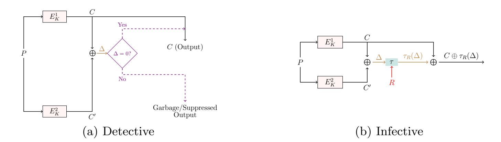
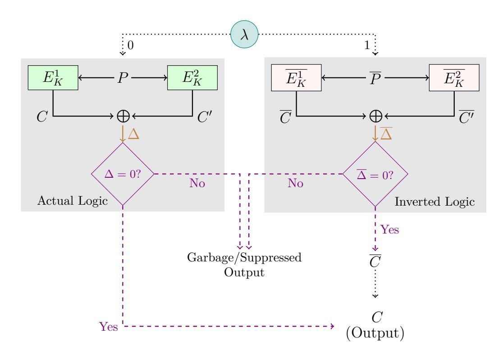
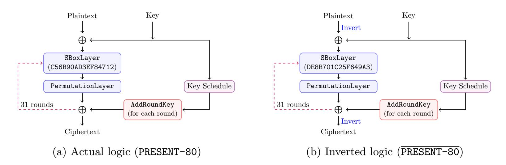
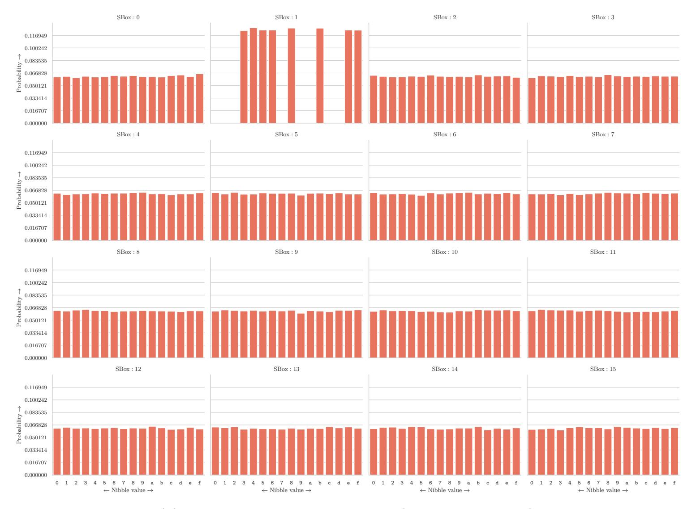
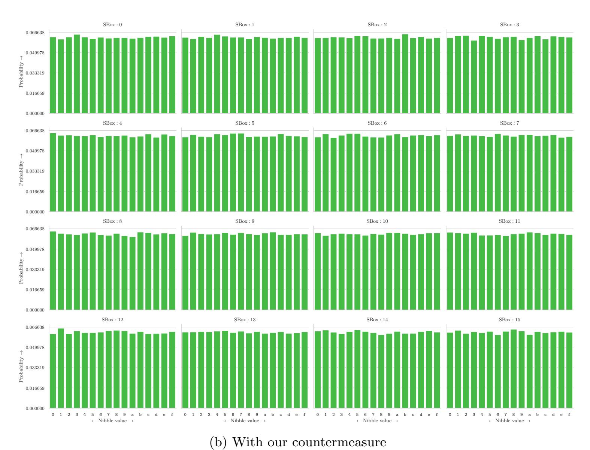

{0}------------------------------------------------

# <span id="page-0-1"></span>A Novel Duplication Based Countermeasure To Statistical Ineffective Fault Analysis

Anubhab Baksi1? , Vinay B. Y. Kumar<sup>1</sup> , Banashri Karmakar<sup>2</sup> , Shivam Bhasin<sup>1</sup> , Dhiman Saha<sup>2</sup> , and Anupam Chattopadhyay<sup>1</sup>

<sup>1</sup> Nanyang Technological University, Singapore

anubhab001@e.ntu.edu.sg, vinayby@iitbombay.org, banashrik@iitbhilai.ac.in, sbhasin@ntu.edu.sg, dhiman@iitbhilai.ac.in, anupam@ntu.edu.sg

Abstract. The Statistical Ineffective Fault Analysis, SIFA, is a recent addition to the family of fault based cryptanalysis techniques. SIFA based attack is shown to be formidable and is able to bypass virtually all the conventional fault attack countermeasures. Reported countermeasures to SIFA incur overheads of the order of at least thrice the unprotected cipher. We propose a novel countermeasure that reduces the overhead (compared to all existing countermeasures) as we rely on a simple duplication based technique. In essence, our countermeasure eliminates the observation that enables the attacker to perform SIFA. The core idea we use here is to choose the encoding for the state bits randomly. In this way, each bit of the state is free from statistical bias, which renders SIFA unusable. Our approach protects against stuck-at faults and also does not rely on any side channel countermeasure. We show the effectiveness of the countermeasure through an open source gate-level fault attack simulation tool. Our approach is probably the simplest and the most cost effective.

Keywords. fault attack, countermeasure, sifa

# 1 Introduction

Fault Attacks[3](#page-0-0) (FAs) have been proven to be a powerful new attack vector targeting devices performing cryptographic operations (both as software and hardware) [\[3\]](#page-12-0). The rapid growth of low-end devices together with reducing cost and barriers to mounting advanced fault attacks is being recognized as a serious concern. This type of attack requires the attacker to force the device to perform outside its designated condition of operation, thus producing incorrect (faulty) output from the cipher operation. The attacker can do this by using a multitude of techniques such as shooting optical pulses, overheating, using hardware Trojans etc. This faulty output, or even just the information whether the device actually produced a faulty output, can be used by an attacker, to deduce information on the secret state of the underlying cipher and ultimately the secret key. Fault attacks are shown to be powerful enough to compromise the security of a cipher which is considered secure with respect to theoretical cipher evaluation criteria. It is also shown in the literature that a fault attack can be carried out with cheap equipment, thus making this type of attack a serious concern.

The earliest and probably the most common fault attack model in the symmetric key setting is the Differential Fault Attack (DFA) [\[9\]](#page-12-1). In a DFA, the device is allowed to run normally (without a fault) once. Next, the attacker injects a fault that effectively toggles a bit (or few bits) in the cipher execution. The difference between the faulty and the non-faulty output lets the attacker learn information on the secret key.

In contrast to DFA, the Safe Error Attack (SEA) [\[21,](#page-13-0) [31,](#page-13-1) [32\]](#page-13-2) makes use of the cases where the fault injection does not change the output from the non-faulty case. One particular case of SEA, known as Ineffective Fault Attack (IFA) [\[12\]](#page-12-2), is of interest here. In an IFA, the attacker injects a potential

<sup>2</sup> de.ci.phe.red Lab, Department of Electrical Engineering and Computer Science, Indian Institute of Technology, Bhilai, Raipur, India

<sup>?</sup> This work is partially supported by TUM CREATE.

<span id="page-0-0"></span><sup>3</sup> We use the terms 'attack' and 'analysis' interchangeably.

{1}------------------------------------------------

<span id="page-1-0"></span>disturbance, but the cases where the disturbance does not effectively change the execution of the cipher. In another direction of fault analysis, statistical information of a variable is observed (Statistical Fault Attack, SFA). The distribution which becomes biased as a result of fault injection can be used [\[24\]](#page-13-3).

The recently proposed Statistical Ineffective Fault Attack (SIFA) [\[16\]](#page-12-3) combines IFA and SFA. Like IFA, SIFA makes use of the cases where a fault injection does not result in a change in the output. Also, similar to SFA, the statistical distribution of bias of a variable caused by the effect of fault is used to recover the variable.

Another class of attacks, known as the Side Channel Attacks (SCAs) [\[23\]](#page-13-4), is also capable of finding information on the secret key from a device running a cipher. Generally, fault attack countermeasures are not capable of inherently protecting against SCAs, hence a separate protection is commonly needed.

On top of being a direct way to mitigate the security of the ciphers as shown in [\[26\]](#page-13-5) and [\[19\]](#page-12-4), SIFA is also able to bypass duplication based countermeasures. Those duplication based countermeasures have been proposed to counter DFA. Such countermeasures work by implementing two instances of the same cipher execution, which we call the actual and the redundant computations, following [\[5\]](#page-12-5). Assuming a fault can alter at most one of the executions; it is explicitly detected by the detective countermeasures, whereas infective countermeasures implicitly detect the difference [\[5\]](#page-12-5). If a fault injection does not alter the course of non-faulty execution of the cipher, this case is considered as if no fault is injected by the duplication based countermeasures. Since SIFA utilizes the cases where the fault injection does not alter the normal execution of the cipher, those countermeasures cannot (at least in the current form) protect against SIFA.

Very recently, four countermeasures dedicated to protect against SIFA have been proposed in the literature. In one work, Breier et al. [\[11\]](#page-12-6) use a triplication of the circuit to correct up to 1-bit error. Since at most one bit is assumed to subject to SIFA, the majority of the three will correct the error and hence the attacker will receive the correct (non-faulty) output. In [\[13\]](#page-12-7), Daemen et al. suggest to use an error detection mechanism based on Toffoli gates which follow the reversible computing paradigm. Any successful fault would result in a garbage output and hence will be detected. Saha et al. in [\[27\]](#page-13-6) present a combination of masking (which is used as a countermeasure to SCAs, [\[23,](#page-13-4) Section 9]) and encoding. In the impeccable circuits II [\[29\]](#page-13-7), an error correction facility is introduced (extending the idea of impeccable circuits [\[1\]](#page-11-0)) to protect against SIFA.

Given this backdrop, our approach neither does any error correction nor any other expensive technique. Instead, we basically use duplication (and comparison) in a way that removes the bias utilized by SIFA. Hence, our countermeasure is by far the simplest and least expensive. While it may be required to implement the cipher almost completely from scratch in other countermeasures (which can be non-trivial), our countermeasure can be easily implemented to protect any symmetric key cipher.

It has been argued [\[16\]](#page-12-3) that the duplication based countermeasures do not protect against SIFA. Indeed this argument is valid with respect to the countermeasures proposed till date, such as [\[22\]](#page-13-8). This also extends to DFA countermeasures proposed even after SIFA is published, e.g., [\[7\]](#page-12-8) or [\[5\]](#page-12-5). On the other hand, the SIFA countermeasures [\[11,](#page-12-6) [13,](#page-12-7) [27,](#page-13-6) [29\]](#page-13-7) rely on some form of triplication (including error correcting codes) of the cipher execution possibly with masking. The cost for any such countermeasure is more than thrice the cost of the unprotected cipher. Hence the community seems to accept the norm that it is not possible to have a SIFA countermeasure with cost less than thrice the cost of the basic (unprotected) implementation of the cipher. Our detailed analysis reveals that while triplication can protect against SIFA, a sophisticated version of duplication can also do the same. The idea of our protection stems from the existing duplication based DFA countermeasures [\[5\]](#page-12-5).

### Contribution

We extend the idea of duplication to accommodate randomized encoding to destroy statistical bias (which is exploited by SIFA). This is done by choosing an encoding based on a 1-bit random parameter λ. If λ = 0, both the actual and redundant computations are done as is, and this is referred to as actual logic. When λ = 1, we encode ∀x bits of the state as (x ⊕ 1) for both the actual and the redundant computations, we refer to this as inverted logic. In other words, we invert the bits (0 is encoded as

{2}------------------------------------------------

<span id="page-2-1"></span>1, and 1 is encoded as 0) when λ = 1. This removes the statistical bias (since λ \$← {0, <sup>1</sup>} and is kept hidden from the attacker), thereby forestalling SIFA. This idea can be used atop the duplication based countermeasures, namely detective and infective ones [\[5\]](#page-12-5), depending on the security warranted. The proper output from the cipher is given only if there is no difference between the computations of the actual logic and the inverted logic (i.e., the fault is ineffective/no fault is injected). In such a situation, reverse encoding is performed on the actual execution (if λ = 1), or (if λ = 0) the output is returned as is. Otherwise (i.e., the fault is effective), necessary steps are taken, such as a random output is produced or the output is suppressed.

Hence, unlike the existing SIFA countermeasures, our solution does not rely on (any form of) error correction. Instead, it simply blocks the attacker to get information on the statistical bias. The attacker is able to see the cases of ineffective faults in our proposed solution, however, this does not help the attacker to gain any extra information as we explore later on.

The proposed simple and low-cost idea can be applied to any symmetric key cipher with minimal changes to the implementation. We do not claim any inherent SCA protection, though, SCA countermeasures can be applied easily. Our approach also has advantages when put in perspective to existing countermeasures. For example, our approach does not increase side channel leakage, which is the case for [\[11\]](#page-12-6).

We describe further details in Section [4](#page-5-0) with Figure [2](#page-6-0) showing a visual representation of our idea. The security evaluation of it is done by an open-source tool used by the authors of [\[29\]](#page-13-7), with the PRESENT-80 cipher (similar to [\[27\]](#page-13-6)) in Section [4.3.](#page-9-0) We subsequently present benchmarking results in Section [4.4.](#page-9-1)

# 2 Fault Attack Preliminaries

### 2.1 Differential Fault Attack (DFA)

As mentioned already, DFA is likely the most commonly used FA technique in the symmetric key community. It has been successfully applied against most, if not all, symmetric key ciphers. First it lets the cipher run as it is (without any fault). It then injects faults at some later round of the cipher. Then it uses the difference of the faulty and non-faulty outputs that works as a variant of the Differential Attack [\[8\]](#page-12-9).

### <span id="page-2-0"></span>2.2 General Countermeasures against Fault Attacks

In general, the countermeasures against the fault attacks can be classified into three broad categories [\[5\]](#page-12-5), as we discuss here.

- 1. To use a specialized device. This device is separate from the cipher design and dedicated for protection against such attack. Examples include a sensor that detects a potential fault [\[20\]](#page-12-10).
- 2. To use redundancy. Commonly, this class of countermeasures duplicates (can be fully or partially) the circuit. After this, a recovery procedure (which dictates what to do in case a fault is sensed) takes place. Based on the recovery procedure, two types of countermeasures exist [\[5\]](#page-12-5). First, in the detection based countermeasures, the XOR of the non-faulty and faulty is explicitly computed. If this results in zero, the output from one of the computations (the so-called actual computation [\[5\]](#page-12-5)) is directly made available, otherwise the output is suppressed/a garbage or random output is given. In the second category, the infective countermeasures do not explicitly compute the difference. Instead, such countermeasures implicitly sense the presence of a fault. By using a sophisticated mechanism (infection [\[5\]](#page-12-5)), either the non-faulty output (in case no fault is sensed) or a random output is given (otherwise).
- 3. To use the communication protocol in such a way that the conditions required for a successful fault to happen with low probability [\[4,](#page-12-11)[17\]](#page-12-12). For example, in order to utilize DFA, the inputs to the cipher have to be unchanged; the probability of which can be reduced by using a suitable protocol.

{3}------------------------------------------------

### <span id="page-3-4"></span>3 Statistical Ineffective Fault Attack (SIFA)

As mentioned earlier, SIFA [16] is a new type of fault attack which combines the concept of ineffective and statistical faults. In SIFA, the attacker exploits the bias (which is caused by the fault injection) of one/more state bits. Unlike DFA, SIFA does not need the non-faulty output, but at the same time requires more fault injections compared to DFA.

Here we present an example of SIFA for better clarity, more information on SIFA can be found in [16]. Suppose a device is more prone to bit reset  $(1 \to 0)$  than bit set  $(0 \to 1)$  due to a fault injection. This can be achieved by, for example, by fixing a particular intensity of the optical fault injection set-up. This results in the bias of bit flip. In other words, the probability that the output will be changed depends on whether the target bit is actually 0 (high probability) or 1 (low probability). This bias where fault does not change the output (i.e., ineffective) can be observed by the attacker statistically. When such a state bit is known, the procedure can be repeated to get information on the other state bits and finally the secret key can be recovered. In one extreme, the probability of bit reset (respectively, set) can be 1, in which case the fault model is known as stuck-at 0 (respectively, stuck-at 1).

#### <span id="page-3-3"></span>3.1 Duplication Based Countermeasures and Need for Specialization

From the types of fault protection given in Section 2.2, the duplication based countermeasures are the closest to cipher design and hence are of particular interest.

As noted earlier, such countermeasures can be classified into detective and infective [5]. The schematic for the two types is shown in Figure 1. Figure 1(a) shows the detection based or detective countermeasure. Here the XOR difference of the actual computation (C from  $E_K^1$ ) and the redundant computation (C' from  $E_K^2$ ), denoted by  $\Delta$ , is explicitly computed (here P is the input and K is the secret key, both are common to both of the computations). If  $\Delta=0$ , then no fault is detected and C is given as output. Otherwise a garbage output (could be random or a predetermined constant) is given or the output is suppressed. Figure 1(b) shows the infection mechanism used in infection based or infective countermeasure. Here the XOR difference  $\Delta$  of  $C \oplus C'$  is computed. However, instead of taking the if—then decision,  $\Delta$  is implicitly used to compute  $\tau_R(\Delta)$  such that  $\tau_R(0)=0$  but  $\tau_R(d)=R'\neq 0$  for  $d\neq 0$  where R is randomly generated and hence R' is also random (it is possible that R'=R). Thereafter  $C \oplus \tau_R(\Delta)$  is given as output. Hence, when fault is sensed,  $\Delta$  is non-zero and the attacker gets a random output. Otherwise (in case of no fault), the actual output C is returned. The XOR difference can be computed at the end of the cipher execution (such as [22]), or after each round (the basic idea is introduced in [18]); depending on which, a further classification of infective countermeasures as discussed in [5].

<span id="page-3-1"></span><span id="page-3-0"></span>

<span id="page-3-2"></span>Fig. 1: Schematic for detective and infective countermeasures

Both the detective and the infective countermeasures are suitable to protect against DFA, except for one specific type of DFA. This type is named *double fault* [5] and is shown practical in [28]. In this case, both the actual and the redundant computations are injected with the identical faults. As a result, the XOR difference is 0 and the countermeasure in place senses it as a case of no fault. Impeccable

{4}------------------------------------------------

<span id="page-4-1"></span>circuits [\[1\]](#page-11-0) attempts to solve the problem by employing different encodings for the two computations and finally with an error detection mechanism. This idea is later extended to a block cipher named CRAFT [\[7\]](#page-12-8). Employing such technique can increase the cost (depending on the error detecting code used). For example, protecting against single bit faults at the output has 2.45× overhead for CRAFT [\[7\]](#page-12-8).

However, it may be noted that none of these duplication based countermeasures is able to protect against SIFA. SIFA only makes use of the cases where the fault injection does not alter the regular flow of the cipher. All the countermeasures, including impeccable circuits/CRAFT, treat such a case as no fault. This underlies the need for specialized countermeasures for SIFA, which is described next.

### 3.2 Existing SIFA Countermeasures

To the best of our knowledge, four specialized countermeasures aiming at protecting against SIFA have been proposed in the literature. We describe those here for better clarity.

Repetition Code Breier et al. propose an error correction based on binary repetition code [\[11\]](#page-12-6) and taking majority. Assuming the fault injection can alter at most one bit, the error correction will fix it back to its original content. Hence, the attacker will not get any information whether the fault has occurred or not. This actually blocks the attacker's ability to mount SIFA.

Masking and Repetition Code Saha et al. [\[27\]](#page-13-6) propose a two phase countermeasure. The first type (called, transform) is based on masking that aims at protecting faults induced into the state of the cipher. Further, under a stronger attack model where the attacker can inject fault with high precision within the computation of individual sub-operations like SBox, [\[27\]](#page-13-6) proposes an encoding which allows error correction. The countermeasure was tested with a LASER based fault injection experiments and shown to be sound in a practical setting. Depending on the attacker's capability, the overhead limits to just that of a masking or error correction with masking. As an additional benefit, the implemented masking protects the design against side channel attacks as well.

Error Detection through Toffoli Gate and Masking Daemen et al. [\[13\]](#page-12-7) propose an error detection mechanism based on Toffoli gates. This countermeasure acts as a combined SCA and a SIFA that targets at most one bit. The non-linear components are designed using Toffoli gates in such a way that a single bit flip would result in a garbage output. On top, the entire circuit is masked. It may be mentioned that the concept relies on non-standard gates.

Error Correction Shahmirzadi et al. [\[29\]](#page-13-7) extend the idea of [\[1\]](#page-11-0) to incorporate error correction, and verifies with the open-source tool VerFI presented in [\[2\]](#page-12-14) [4](#page-4-0) . The error correction is done through an error correcting code as the authors note shortcoming of repetition with majority voting.

From the discussions, a few basic characteristics of the existing SIFA countermeasures can be noted. Except [\[13\]](#page-12-7), the rest (namely, [\[11,](#page-12-6) [27,](#page-13-6) [29\]](#page-13-7)) depend on some form of error correction, thus making the cost of such countermeasure at least triple of the unprotected cipher. Error correction also suffers from the coverage of the underlying error correcting code being used. The concepts of [\[13\]](#page-12-7) and [\[27\]](#page-13-6) require masking, which is a costly operation. The scheme in [\[13\]](#page-12-7) uses detection, but relies on non-standard Toffoli gates. As elaborated in Section [4,](#page-5-0) our proposed approach relies on simple duplication. Hence, no customized gate such as Toffoli or costly operation such as masking would be required. This makes our proposal the least expensive in the category.

<span id="page-4-0"></span><sup>4</sup> Available at <https://github.com/emsec/VerFI>.

{5}------------------------------------------------

### <span id="page-5-2"></span><span id="page-5-0"></span>4 Our Proposed Solution

Here we describe our proposed approach in more detail. As mentioned, the basic idea of our approach is to use duplication in such a way that the attacker does not get any useful information.

As we noted in Section 3.1, the basic duplication based countermeasures fail to protect against SIFA. Using an error detecting mechanism is said not to have protection against the same [7]. Therefore, we use a novel idea that changes the encoding of the bits to its inversion with probability  $\frac{1}{2}$ , so that the statistical bias is removed. A basic pictorial and algorithmic descriptions are given in Figure 2 and Algorithm 1. Figure 2 shows a form of quadruplication, though both the branches for  $\lambda = 0$  and  $\lambda = 1$  are not taken at the same time.

Here we choose a random bit  $\lambda$  ( $\lambda \leftarrow \{0,1\}$ ). It is regenerated at each invocation and is kept secret from the attacker.

As a part of duplication, we run two instances of the cipher, namely the actual (denoted by  $E_K^1$ ) and the redundant (denoted by  $E_K^2$ ) where E denotes the cipher and K is the secret key, and the corresponding outputs are denoted by C and C'. However, depending on  $\lambda$  we either choose the logic as is (if  $\lambda = 0$ ), or the inverted logic where 0 is encoded as 1 and 1 is encoded as 0 (if  $\lambda = 1$ ). So, the input to E, denoted by P is passed as is if  $\lambda = 0$ ; but as its inversion  $\overline{P}$  otherwise. The actual and the redundant computations for the inverted logic are denoted respectively by  $\overline{E_K^1}$  and  $\overline{E_K^2}$ , and the corresponding outputs by  $\overline{C}$  and  $\overline{C'}$ .

After this, a recovery mechanism is applied. Here we adopt detection for the purpose of illustration. Instead of detection, infection could be used if the attacker is powerful enough to flip the 1-bit judgement condition, together with another DFA-type fault at the cipher instance (more details in this regard can be found in [5]). We choose detection as DFA protection is not the focus of this work. In some sense, we also refute the claim made in [16] that duplication based countermeasures like detection or infection cannot protect against SIFA.

As a part of the detection mechanism, the XOR difference ( $\Delta$  for the actual logic and  $\overline{\Delta}$  in case of the inverted logic) is computed at the end of the cipher execution. For the actual logic, the output C is given if  $\Delta = 0$ , otherwise a garbage output is given or the output is suppressed. Similarly, for the inverted logic, if  $\overline{\Delta} = 0$  the actual output C is computed by inverting logic of  $\overline{C}$  and given, otherwise a garbage output is given/no output is given.

Hence, the encoding of the actual and the redundant computations are same and is determined by the random bit  $\lambda$ . We assume the attacker can target at most one of the computations. Under our countermeasure, the encoding of that computation changes uniformly. More precisely, the probabilities of bit set and bit reset for one particular bit are both equal. As  $\lambda$  is kept secret, the encoding used is not known to the attacker. Suppose, the probability for bit set and that of bit reset for an (unprotected) cipher are  $p_0$  and  $p_1$ , respectively. Because of the random encoding, both the probabilities are now  $(p_0 + p_1)/2$ . This destroys the statistical property utilized by SIFA, thus rendering it useless.

#### <span id="page-5-1"></span>**Algorithm 1** SIFA Countermeasure (Ours)

```
Input: P; K
Output: C if no fault (SIFA); suppress output, otherwise
 1: \lambda \stackrel{\$}{\leftarrow} \{0,1\}
                                                                                                                          \triangleright \lambda is unknown to the attacker
 2: if \lambda = 0 then
                                                                                                                                                    ▶ Actual logic
          \Delta = E_K^1(P) \oplus E_K^2(P)
           if \Delta = 0 then
 4:
                return C = E_K^1(P)
 5:
                                                                                                                                                 ▶ Inverted logic
 6: else
           Compute \overline{P} from P
 7:
           \Delta = \overline{E_K^1}(\overline{P}) \oplus \overline{E_K^2}(\overline{P})
 8:
           if \overline{\Delta} = 0 then
 9:
                \overline{C} = \overline{E_K^1}(\overline{P})
10:
                Compute C from \overline{C}
11:
                return C
12:
```

{6}------------------------------------------------

<span id="page-6-1"></span><span id="page-6-0"></span>

Fig. 2: Schematic for our SIFA protection (with detection mechanism)

Security of  $\lambda$ . It may be noted that  $\lambda$  plays a vital role in the overall security of the countermeasure. In this context, we note the following points:

- The attacker can recover  $\lambda$  by SCA, if left unprotected. We believe, protecting  $\lambda$  against SCA will incur minimal overhead as it is only one bit.
- The attacker can inject a bit flip (as in the case for DFA) to  $\lambda$ . However, this will only flip the value of  $\lambda$  but will not affect the security of the countermeasure.
- The attacker can also inject a biased fault. This may lead to biased distribution of  $\lambda$ , and can compromise the security. However, we would like to note that this would result in a second order SIFA. We do not consider this model within the scope as it is not yet proposed in the literature, to the best of our knowledge.

Stuck-at Fault Protection. For simplicity, consider stuck-at 0 fault only. Regardless of the attacker's ability, half of the time a particular bit will be encoded 0 and rest half of the time as 1. If the attacker is able to inject a stuck-at 0 fault, then half of the times it will result in changed output (the cases where that bit is encoded as 1) and hence be detected (by detective mechanism). Therefore, such cases are not useful to SIFA (as SIFA only makes use of ineffective faults). Rest half of the time, the attacker will know that the fault injection resulted in a stuck-at fault. However, since it is assumed the attacker does not know whether it is stuck-at 0 or stuck-at 1, such information will not be useful. We thus conclude our proposal can resist against stuck-at based SIFA.

#### 4.1 Adopting Inverted Logic to Symmetric Key Ciphers

In order to see how the inverted logic works, first we show the inverted XOR  $(\overline{\text{XOR}})$  and inverted AND  $(\overline{\text{AND}})$  operations in Table 1. With this, it is now possible to convert an SBox to its inversion.

Now we discuss how to implement any symmetric key cipher in the inverted logic. If the circuit is already described in terms of XOR and AND gates (typical for stream ciphers), implementing it in inverted logic should be straightforward. For a typical block cipher, the circuit is described in terms of a linear layer and non-linear layer (such the SBoxes).

Adopting to Linear Layer Overall, the linear layer can be classified into three categories – bit permutation as in PRESENT [10], binary non-singular matrix as in MIDORI [6], and non-singular matrix over higher order finite field such as AES. However, at a closer look, all the three categories can be

{7}------------------------------------------------

Table 1: XOR and AND operations in inverted logic

<span id="page-7-1"></span><span id="page-7-0"></span>

|    |                |                  |                  |                      |                  | _              |                   | _ | _ | <br> | - 1 | <br> |  |       | _              |       | - (              | <i>)</i> -                |                  |                |                  |
|----|----------------|------------------|------------------|----------------------|------------------|----------------|-------------------|---|---|------|-----|------|--|-------|----------------|-------|------------------|---------------------------|------------------|----------------|------------------|
| (a | $\overline{y}$ | =                | XC               | $\overline{\rm PR}($ | $\overline{x}_0$ | $, \bar{a}$    | $\overline{c}_1)$ |   |   |      |     |      |  | (b)   | $\overline{y}$ | =     | AN               | $\overline{\mathrm{ID}}($ | $\overline{x}_0$ | $\overline{x}$ | $\overline{z}_1$ |
|    | $x_0$          | $\overline{x_1}$ | $\overline{x}_0$ | $\overline{x}_1$     | y                | $\overline{y}$ |                   |   |   |      |     |      |  | a     | ;0             | $x_1$ | $\overline{x_0}$ | $\overline{x}_1$          | y                | $\overline{y}$ |                  |
|    | 0              | 0                | 1                | 1                    | 0                | 1              |                   |   |   |      |     |      |  |       | O              | 0     | 1                | 1                         | 0                | 1              |                  |
|    | 0              | 1                | 1                | 0                    | 1                | 0              |                   |   |   |      |     |      |  | -   ( | 0              | 1     | 1                | 0                         | 0                | 1              |                  |
|    | 1              | 0                | 0                | 1                    | 1                | 0              |                   |   |   |      |     |      |  |       | 1              | 0     | 0                | 1                         | 0                | 1              |                  |
|    | 1              | 1                | 0                | 0                    | 0                | 1              |                   |   |   |      |     |      |  |       | 1              | 1     | 0                | 0                         | 1                | 0              |                  |

described as a multiplication by binary non-singular matrices. In particular, bit permutation corresponds to binary permutation matrices.

Since bit permutation does not have any impact on the inverted logic implementation, we only consider the case with binary matrices. Suppose, we want to implement the matrix  $M = (m_{i,j})$  for  $i, j = 1 \cdots n$ . Considering the system of affine equations,  $\vec{y}^{\top} = M\vec{x}^{\top}$  where  $\vec{y} = (y_1, \dots, y_n)$  and  $\vec{x} = (x_1, \dots, x_n)$ , we can equivalently write,  $y_k = m_{k,1}x_1 \oplus m_{k,2}x_2 \oplus \cdots \oplus m_{k,n}x_n$  for each  $k = 1 \cdots n$ . Since in the inverted logic each variable  $x_i$  will be inverted as well as the entire result will inverted, we deduce,

$$\overline{y_k} = \overline{m_{k,1}\overline{x_1} \oplus m_{k,2}\overline{x_2} \oplus \cdots \oplus m_{k,n}\overline{x_n}} 
= m_{k,1}\overline{x_1} \oplus m_{k,2}\overline{x_2} \oplus \cdots \oplus m_{k,n}\overline{x_n} \oplus 1 
= m_{k,1}(x_1 \oplus 1) \oplus m_{k,2}(x_2 \oplus 1) \oplus \cdots \oplus m_{k,n}(x_n \oplus 1) \oplus 1 
= \underline{m_{k,1}x_1 \oplus m_{k,2}x_2 \oplus \cdots \oplus m_{k,n}x_n} \oplus \underline{m_{k,1} \oplus m_{k,2} \oplus \cdots \oplus m_{k,n}} \oplus 1 
= y_k \oplus (\text{parity of } k^{\text{th}} \text{ row of } M) \oplus 1$$

Hence, converting a binary matrix to its inversion is straightforward. For example, the AES MixColumn is a  $32 \times 32$  binary matrix. The parity for each row is 1. Therefore, for AES MixColumn, the same source code/hardware description will work for both the original logic and the inverted logic.

**Adopting to Non-linear Layer** To begin with, consider the Boolean function,  $y = x_1 \oplus x_1 x_2$ . The inverted function,  $\overline{y}$  is given by  $\overline{y} = \overline{x_1} \oplus \overline{x_1 x_2} = (1 \oplus x_1) \oplus (1 \oplus x_1)(1 \oplus x_2) \oplus 1 = x_2 \oplus x_1 x_2 \oplus 1$ .

With this example, now consider the PRESENT SBox, C56B90AD3EF84712 [10], which is represented by the following coordinate functions (in ANF):

```
y_0 = x_0 \oplus x_2 \oplus x_1 x_2 \oplus x_3,
y_1 = x_1 \oplus x_0 x_1 x_2 \oplus x_3 \oplus x_1 x_3 \oplus x_0 x_1 x_3 \oplus x_2 x_3 \oplus x_0 x_2 x_3,
y_2 = 1 \oplus x_0 x_1 \oplus x_2 \oplus x_3 \oplus x_0 x_3 \oplus x_1 x_3 \oplus x_0 x_1 x_3 \oplus x_0 x_2 x_3,
y_3 = 1 \oplus x_0 \oplus x_1 \oplus x_1 x_2 \oplus x_0 x_1 x_2 \oplus x_3 \oplus x_0 x_1 x_3 \oplus x_0 x_2 x_3.
```

Now the inverted SBox is given by the coordinate functions (in ANF) by (these are obtained by inverting each variable):

```
y_{0} = 1 \oplus x_{0} \oplus x_{1} \oplus x_{1}x_{2} \oplus x_{3},
y_{1} = x_{0} \oplus x_{2} \oplus x_{1}x_{2} \oplus x_{0}x_{1}x_{2} \oplus x_{3} \oplus x_{0}x_{1}x_{3} \oplus x_{0}x_{2}x_{3},
y_{2} = 1 \oplus x_{1} \oplus x_{0}x_{2} \oplus x_{3} \oplus x_{0}x_{3} \oplus x_{0}x_{1}x_{3} \oplus x_{2}x_{3} \oplus x_{0}x_{2}x_{3},
y_{3} = 1 \oplus x_{2} \oplus x_{0}x_{1}x_{2} \oplus x_{3} \oplus x_{1}x_{3} \oplus x_{0}x_{1}x_{3} \oplus x_{2}x_{3} \oplus x_{0}x_{2}x_{3}.
```

This leads us to the SBox DE8B701C25F649A3. The Algorithm 2 shows the implementation of PRESENT-80 cipher in the inverted logic (which we call PRESENT-80).

It may be noted that the SBox in the inverted logic is not same as its inverse, in general. For example, the inverse of the PRESENT SBox is 5EF8C12DB463079A. If an SBox with this property exists, it could be beneficial to reduced cost for a combined encryption and decryption circuits if our countermeasure is adopted. We leave this problem open for future research.

{8}------------------------------------------------

<span id="page-8-3"></span>Effect on the Key Schedule The key schedule algorithm will not change in the inverted logic. Hence, no extra cost/protection would be necessary. The round key addition operations are done by XOR.

Adopting to PRESENT-80 Now both the linear and the non-linear layers are adopted to the inverted logic, we explain how the overall design would be adopted for PRESENT-80. The key schedule, the round key additions (including the final round key addition at the end) and the bit permutation layer would remain unchanged. The state is inverted before and after the encryption function. Also the SBox is changed in PRESENT-80 as DE8B701C25F649A3. Figure 3 gives visual representation for PRESENT-80 in both the actual and the inverted logic.

<span id="page-8-1"></span>

Fig. 3: Overview of PRESENT-80 in actual and inverted logic

```
Algorithm 2 Convert PRESENT-80 to inverted logic (PRESENT-80)
Input: P; K
Output: C
 1: Run Key Schedule
                                                                                                 > No change (from PRESENT-80)
 2: Compute \overline{P}
                                                                                                              \triangleright Invert the bits of P
 3: S_t = \overline{P}

    State is initialized

 4: for i \leftarrow 1; i \leq 31; i \leftarrow i + 1 do
         S_t \leftarrow AddRoundKey_i(S_t)
                                                                              ▶ Add the corresponding round key; No change
 5:
         S_t \leftarrow \texttt{SBoxLayer}(S_t)

 6:
 7:
         S_t \leftarrow \text{PermutationLayer}(S_t)
                                                                                                                         ▶ No change
 8: S_t \leftarrow AddRoundKey_{32}(S_t)
                                                                                           ▶ Add the last round key; No change
 9: C \leftarrow \overline{S_t}
                                                                                               ▷ Ciphertext is the inverted state
```

### 4.2 Benchmarks

Evaluation of the proposed countermeasure is presented in terms of PRESENT-80 [10] cipher (similar to [27]). Table 2 reports the area overheads of the countermeasure targeting the 45nm NangateOpenCell-Library PDK v13 v201012<sup>5</sup> in terms of NAND2 equivalents. Similar to [5], we do not consider the cost for generating randomness.

As for the software benchmark, we note that the inverted implementation can be done with only a little change to the actual cipher implementation. Thus the code size will only be marginally increased. The time taken would also be basically the same as the number of rounds for the cipher is invariant over actual or inverted implementation.

<span id="page-8-2"></span><sup>&</sup>lt;sup>5</sup> An open-source research cell library, available at https://www.silvaco.com/products/nangate/FreePDK45\_Open\_Cell\_Library/.

{9}------------------------------------------------

<span id="page-9-5"></span><span id="page-9-2"></span>

| Table 2. The evented of the proposed confidences are |                                   |         |                         |  |  |  |  |  |  |
|------------------------------------------------------|-----------------------------------|---------|-------------------------|--|--|--|--|--|--|
| PRESENT-80                                           | Gate Equivalent (45nm Technology) |         |                         |  |  |  |  |  |  |
| Cipher Implementation                                | Combinational                     | Total   |                         |  |  |  |  |  |  |
| Unprotected                                          | 1620.00                           | 844.32  | $2464.32 (1.00 \times)$ |  |  |  |  |  |  |
| Proposed Countermeasure                              | 3570.99                           | 2264.66 | 5835.65 (2.37×)         |  |  |  |  |  |  |

Table 2: Area overhead of the proposed countermeasure

#### <span id="page-9-0"></span>4.3 Evaluation

The evaluation of the proposed countermeasure is done through fault attack simulation on the gate-level netlist of the protected PRESENT-80 cipher, using VerFI [2] (the same tool used in [29])<sup>6</sup>. It may be noted that the FA simulation through VerFI considers much finer level granularity, not just the state bits, thereby conforming to the SIFA-2 model used in [27].

We show in Figure 4 an evaluation of our countermeasure through the simulation tool VerFI when biased faults are applied at random locations at the 30<sup>th</sup> round. The data shown in both Figure 4(a) (unprotected) and Figure 4(b) (protected by our countermeasure) are collected over a simulation of 120000 runs for PRESENT-80, for the cases where the fault is ineffective (therefore a usual duplication based countermeasure would treat those cases as no fault). When the countermeasure is applied, significant biases (that are caused by the fault) are removed, as seen in Figure 4(b). Thus, we conclude our countermeasure is capable of removing the statistical bias.

#### <span id="page-9-1"></span>4.4 Comparison with Existing Countermeasures

The hardware cost of protecting the  $3 \times 3$  SBox  $\chi$  of X00D00 [14] by the SIFA countermeasures proposed in [11,13,27,29] using two 65nm technologies, namely UMC (uk65lscllmvbbh\_120c25\_t) and Faraday (fse0k\_d generic\_core\_ss1p08v125c) are given in Table 3. The authors in [29] use [7,4,3]<sub>2</sub> and [11,4,5]<sub>2</sub> codes. Since  $\chi$  is of three bits, we use a [6,3,3]<sub>2</sub> code with the generator matrix:

$$\begin{bmatrix} 0 & 1 & 1 & 1 & 0 & 0 \\ 1 & 0 & 1 & 0 & 1 & 0 \\ 1 & 1 & 0 & 0 & 0 & 1 \end{bmatrix}.$$

All in all, we conclude that our solution has the least overhead compared to the rest of the countermeasures. Further, the evaluation is done through gate-level simulation and hence is comparable to SIFA-2 of [27] (which is a stronger SIFA model).

<span id="page-9-4"></span>

| Table 3: | Comparison | of cost of | protecting $\gamma$ ( | of xoodoo) | by SIFA    | countermeasures |
|----------|------------|------------|-----------------------|------------|------------|-----------------|
| rabic o. | Companion  | OI CODE OI | $producting \chi$     | OI MOODOO  | , by bilit | Countricusation |

| Design               |      | Gate Eq | uivalent       | Method     |                      |                            |  |  |  |
|----------------------|------|---------|----------------|------------|----------------------|----------------------------|--|--|--|
| Design               |      | UMC     | (65nm)         | Faraday    | y (65nm)             | Wethod                     |  |  |  |
| $\chi$ (unprotected) | [14] | 14.58   | $(1.0\times)$  | 14.06      | $(1.0\times)$        | -                          |  |  |  |
| Breier et al.        | [11] | 45.14   | $(3.1\times)$  | 42.97      | $(3.1\times)$        | Error correction           |  |  |  |
| Daemen et al.        | [13] | No st   | andard ce      | ll library | Reversible computing |                            |  |  |  |
| Saha et al.          | [27] | > 45.14 | $(>3.1\times)$ | > 42.97    | $(>3.1\times)$       | Masking, Error correction  |  |  |  |
| Shahmirzadi et al.   | [29] | 71.53   | $(4.9\times)$  | 68.75      | $(4.9\times)$        | Error correction           |  |  |  |
| Ours                 |      | 27.77   | $(1.9\times)$  | 25.78      | $(1.8\times)$        | Remove bias by duplication |  |  |  |

Here we note few other points. The proposal of [13] inherently requires masking (thus also protects against SCA), similar is the case for [27]. From a different angle, only [13] relies on error detection, while the rest rely on some form of error correction (hence the cost is at least tripled). Also, [13] needs

<span id="page-9-3"></span><sup>&</sup>lt;sup>6</sup> Our source code can be found at https://github.com/vinayby/VerFI.

{10}------------------------------------------------

<span id="page-10-1"></span><span id="page-10-0"></span>

(a) Without our countermeasure (naïve duplication)

<span id="page-10-2"></span>

Fig. 4: Evaluation of our countermeasure through VerFI simulation

{11}------------------------------------------------

<span id="page-11-1"></span>Toffoli gates which is not available in the standard gate libraries, to the best of our knowledge. For this reason, we do not provide any benchmark for the protection proposed in [13]. The cost for applying [27] protection is at least that of [11]. In comparison, our proposal simply depends on duplication with randomized bit encoding. It does not require masking or specialized gate, nor it is restricted by the error coverage of the underlying code. In essence, the inverted logic based cipher can be thought of as a cipher (which could also share components with the actual logic based cipher). Also, our countermeasure works at the cipher design level (thus it has an edge when adopting to any symmetric key cipher), whereas other countermeasures work at the implementation level.

#### 4.5 Connection with Side Channel Countermeasures

Our proposal does not have any inherent side channel protection. We mention that side channel countermeasures can be easily adopted as essentially the inverted logic based implementation works like a cipher. Hence, no special technique would be necessary.

As already mentioned, the randomly generated bit  $\lambda$  is needed to be protected from a side channel attacker, aside from the usual protection for the actual and redundant computations. We believe, this would add minimal cost since  $\lambda$  is only of 1-bit.

It is to be mentioned that our proposal does not inherently increase side channel leakage (which typically happens for [11]). In fact, the basic concept used here is somewhat similar to that of the *Masked Dual-Rail Pre-charge Logic* which is proposed as a countermeasure to the side channel attacks in 2005 [25]. However, this method is shown not secure in [15, 30].

Since the countermeasure uses two different SBoxes (actual and inverted logic), each SBox can depict minor differences in their side channel leakage (for example, operating in two memory locations may result in distinct time signatures). If such a model is considered within scope, we propose to combine the two SBoxes (say,  $n \times n$ ) to one combined ( $n \times 2n$ ) SBox. For example, the combined SBox in case of PRESENT-80 would be the  $4 \times 8$  SBox: CD, 5E, 68, BB, 97, 00, A1, DC, 32, E5, FF, 86, 44, 79, 1A, 23. Once this SBox has been fetched from memory, either the most significant n bits or the least significant n bits are obtained by masking the unnecessary part.

One idea to perform SCA is to check if there is any inversion of state at either the beginning or the end (since this operation is done only for the inverted logic). To prevent that, we propose to compute dummy inversion of the state both at the beginning and at the end regardless of the value of  $\lambda$ , but then choose the inverted state only when  $\lambda = 1$ .

### 5 Conclusion

In this work, we present a duplication based SIFA countermeasure. The basic idea is to use randomized encoding for the state bits. This removes the statistical bias caused by ineffective faults. Consequently, the attacker cannot mount SIFA. Our countermeasure by far is the least expensive. More precisely, ours is the only one in the category to have the overhead cost of less than thrice that of an unprotected cipher. The verification is done through a gate-level SIFA simulation tool. Our countermeasure, being at the cipher design level, is almost readily adoptable to any symmetric key cipher (even when some other countermeasure, such as side channel, is needed).

In the future scope, one may consider a combined SIFA and SCA countermeasure atop our design. Also, our design does not protect against double fault (Section 3.1) since both the actual and redundant computations are using the same encoding. Hence, one may think of extending our work to protect against double fault. Another interesting problem could be to search for an SBox whose inverse (in actual logic) is same as itself in inverted logic.

### References

<span id="page-11-0"></span>1. Aghaie, A., Moradi, A., Rasoolzadeh, S., Shahmirzadi, A.R., Schellenberg, F., Schneider, T.: Impeccable circuits. Cryptology ePrint Archive, Report 2018/203 (2018), https://eprint.iacr.org/2018/203 2, 5

{12}------------------------------------------------

- <span id="page-12-14"></span>2. Arribas, V., Wegener, F., Moradi, A., Nikova, S.: Cryptographic fault diagnosis using verfi. IACR Cryptology ePrint Archive 2019, 1312 (2019), <https://eprint.iacr.org/2019/1312> [5,](#page-4-1) [10](#page-9-5)
- <span id="page-12-0"></span>3. Baksi, A., Bhasin, S., Breier, J., Jap, D., Saha, D.: Fault attacks in symmetric key cryptosystems. Cryptology ePrint Archive, Report 2020/1267 (2020), <https://eprint.iacr.org/2020/1267> [1](#page-0-1)
- <span id="page-12-11"></span>4. Baksi, A., Bhasin, S., Breier, J., Khairallah, M., Peyrin, T.: Protecting block ciphers against differential fault attacks without re-keying. In: 2018 IEEE International Symposium on Hardware Oriented Security and Trust, HOST 2018, Washington, DC, USA, April 30 - May 4, 2018. pp. 191–194 (2018), [https:](https://doi.org/10.1109/HST.2018.8383913) [//doi.org/10.1109/HST.2018.8383913](https://doi.org/10.1109/HST.2018.8383913) [3](#page-2-1)
- <span id="page-12-5"></span>5. Baksi, A., Saha, D., Sarkar, S.: To infect or not to infect: A critical analysis of infective countermeasures in fault attacks. IACR Cryptology ePrint Archive 2019, 355 (2019), <https://eprint.iacr.org/2019/355> [2,](#page-1-0) [3,](#page-2-1) [4,](#page-3-4) [6,](#page-5-2) [9](#page-8-3)
- <span id="page-12-16"></span>6. Banik, S., Bogdanov, A., Isobe, T., Shibutani, K., Hiwatari, H., Akishita, T., Regazzoni, F.: Midori: A block cipher for low energy. In: Advances in Cryptology - ASIACRYPT 2015 - 21st International Conference on the Theory and Application of Cryptology and Information Security, Auckland, New Zealand, November 29 - December 3, 2015, Proceedings, Part II. pp. 411–436 (2015), [https://doi.org/10.1007/](https://doi.org/10.1007/978-3-662-48800-3_17) [978-3-662-48800-3\\_17](https://doi.org/10.1007/978-3-662-48800-3_17) [7](#page-6-1)
- <span id="page-12-8"></span>7. Beierle, C., Leander, G., Moradi, A., Rasoolzadeh, S.: Craft: Lightweight tweakable block cipher with efficient protection against dfa attacks. IACR Transactions on Symmetric Cryptology 2019(1), 5–45 (Mar 2019), <https://tosc.iacr.org/index.php/ToSC/article/view/7396> [2,](#page-1-0) [5,](#page-4-1) [6](#page-5-2)
- <span id="page-12-9"></span>8. Biham, E., Shamir, A.: Differential cryptanalysis of des-like cryptosystems. In: Advances in Cryptology - CRYPTO '90, 10th Annual International Cryptology Conference, Santa Barbara, California, USA, August 11-15, 1990, Proceedings. pp. 2–21 (1990), [https://doi.org/10.1007/3-540-38424-3\\_1](https://doi.org/10.1007/3-540-38424-3_1) [3](#page-2-1)
- <span id="page-12-1"></span>9. Biham, E., Shamir, A.: Differential Fault Analysis of Secret Key Cryptosystems. In: Kaliski, BurtonS., J. (ed.) Advances in Cryptology - CRYPTO '97, Lecture Notes in Computer Science, vol. 1294, pp. 513–525. Springer Berlin Heidelberg (1997), <http://dx.doi.org/10.1007/BFb0052259> [1](#page-0-1)
- <span id="page-12-15"></span>10. Bogdanov, A., Knudsen, L.R., Leander, G., Paar, C., Poschmann, A., Robshaw, M.J., Seurin, Y., Vikkelsoe, C.: PRESENT: An ultra-lightweight block cipher. In: CHES. vol. 4727, pp. 450–466. Springer (2007) [7,](#page-6-1) [8,](#page-7-1) [9](#page-8-3)
- <span id="page-12-6"></span>11. Breier, J., Khairallah, M., Hou, X., Liu, Y.: A countermeasure against statistical ineffective fault analysis. Cryptology ePrint Archive, Report 2019/515 (2019), <https://eprint.iacr.org/2019/515> [2,](#page-1-0) [3,](#page-2-1) [5,](#page-4-1) [10,](#page-9-5) [12](#page-11-1)
- <span id="page-12-2"></span>12. Clavier, C.: Secret external encodings do not prevent transient fault analysis. In: Cryptographic Hardware and Embedded Systems - CHES 2007, 9th International Workshop, Vienna, Austria, September 10-13, 2007, Proceedings. pp. 181–194 (2007), [https://doi.org/10.1007/978-3-540-74735-2\\_13](https://doi.org/10.1007/978-3-540-74735-2_13) [1](#page-0-1)
- <span id="page-12-7"></span>13. Daemen, J., Dobraunig, C., Eichlseder, M., Gross, H., Mendel, F., Primas, R.: Protecting against statistical ineffective fault attacks. Cryptology ePrint Archive, Report 2019/536 (2019), [https://eprint.iacr.org/](https://eprint.iacr.org/2019/536) [2019/536](https://eprint.iacr.org/2019/536) [2,](#page-1-0) [5,](#page-4-1) [10,](#page-9-5) [12](#page-11-1)
- <span id="page-12-17"></span>14. Daemen, J., Hoffert, S., Peeters, M., Assche, G.V., Keer, R.V.: Xoodoo cookbook. Cryptology ePrint Archive, Report 2018/767 (2018), <https://eprint.iacr.org/2018/767> [10](#page-9-5)
- <span id="page-12-18"></span>15. De Mulder, E., Gierlichs, B., Preneel, B., Verbauwhede, I.: Practical dpa attacks on mdpl. In: 2009 First IEEE International Workshop on Information Forensics and Security (WIFS). pp. 191–195 (Dec 2009) [12](#page-11-1)
- <span id="page-12-3"></span>16. Dobraunig, C., Eichlseder, M., Korak, T., Mangard, S., Mendel, F., Primas, R.: SIFA: exploiting ineffective fault inductions on symmetric cryptography. IACR Trans. Cryptogr. Hardw. Embed. Syst. 2018(3), 547–572 (2018), <https://doi.org/10.13154/tches.v2018.i3.547-572> [2,](#page-1-0) [4,](#page-3-4) [6](#page-5-2)
- <span id="page-12-12"></span>17. Dobraunig, C., Koeune, F., Mangard, S., Mendel, F., Standaert, F.: Towards fresh and hybrid re-keying schemes with beyond birthday security. In: Smart Card Research and Advanced Applications - 14th International Conference, CARDIS 2015, Bochum, Germany, November 4-6, 2015. Revised Selected Papers. pp. 225–241 (2015), [https://doi.org/10.1007/978-3-319-31271-2\\_14](https://doi.org/10.1007/978-3-319-31271-2_14) [3](#page-2-1)
- <span id="page-12-13"></span>18. Gierlichs, B., Schmidt, J., Tunstall, M.: Infective computation and dummy rounds: Fault protection for block ciphers without check-before-output. In: Progress in Cryptology - LATINCRYPT 2012 - 2nd International Conference on Cryptology and Information Security in Latin America, Santiago, Chile, October 7-10, 2012. Proceedings. pp. 305–321 (2012), [https://doi.org/10.1007/978-3-642-33481-8\\_17](https://doi.org/10.1007/978-3-642-33481-8_17) [4](#page-3-4)
- <span id="page-12-4"></span>19. Gruber, M., Probst, M., Tempelmeier, M.: Statistical ineffective fault analysis of GIMLI. CoRR abs/1911.03212 (2019), <http://arxiv.org/abs/1911.03212> [2](#page-1-0)
- <span id="page-12-10"></span>20. He, W., Breier, J., Bhasin, S.: Cheap and cheerful: A low-cost digital sensor for detecting laser fault injection attacks. In: Security, Privacy, and Applied Cryptography Engineering - 6th International Conference, SPACE 2016, Hyderabad, India, December 14-18, 2016, Proceedings. pp. 27–46 (2016), [https://doi.org/10.1007/](https://doi.org/10.1007/978-3-319-49445-6_2) [978-3-319-49445-6\\_2](https://doi.org/10.1007/978-3-319-49445-6_2) [3](#page-2-1)

{13}------------------------------------------------

- <span id="page-13-0"></span>21. Joye, M., Quisquater, J., Yen, S., Yung, M.: Observability analysis - detecting when improved cryptosystems fail. In: Topics in Cryptology - CT-RSA 2002, The Cryptographer's Track at the RSA Conference, 2002, San Jose, CA, USA, February 18-22, 2002, Proceedings. pp. 17–29 (2002), [https://doi.org/10.1007/](https://doi.org/10.1007/3-540-45760-7_2) [3-540-45760-7\\_2](https://doi.org/10.1007/3-540-45760-7_2) [1](#page-0-1)
- <span id="page-13-8"></span>22. Lomn´e, V., Roche, T., Thillard, A.: On the need of randomness in fault attack countermeasures - application to AES. In: 2012 Workshop on Fault Diagnosis and Tolerance in Cryptography, Leuven, Belgium, September 9, 2012. pp. 85–94 (2012), <https://doi.org/10.1109/FDTC.2012.19> [2,](#page-1-0) [4](#page-3-4)
- <span id="page-13-4"></span>23. Mangard, S., Oswald, E., Popp, T.: Power analysis attacks - revealing the secrets of smart cards. Springer (2007) [2](#page-1-0)
- <span id="page-13-3"></span>24. Nahid Farhady Ghalaty, Bilgiday Yuce, P.S.: Analyzing the efficiency of biased-fault based attacks. Cryptology ePrint Archive, Report 2015/663 (2015), <https://eprint.iacr.org/2015/663> [2](#page-1-0)
- <span id="page-13-10"></span>25. Popp, T., Mangard, S.: Masked dual-rail pre-charge logic: Dpa-resistance without routing constraints. In: Rao, J.R., Sunar, B. (eds.) Cryptographic Hardware and Embedded Systems – CHES 2005. pp. 172–186. Springer Berlin Heidelberg, Berlin, Heidelberg (2005) [12](#page-11-1)
- <span id="page-13-5"></span>26. Ramezanpour, K., Ampadu, P., Diehl, W.: A statistical fault analysis methodology for the ascon authenticated cipher. In: IEEE International Symposium on Hardware Oriented Security and Trust, HOST 2019, McLean, VA, USA, May 5-10, 2019. pp. 41–50 (2019), <https://doi.org/10.1109/HST.2019.8741029> [2](#page-1-0)
- <span id="page-13-6"></span>27. Saha, S., Jap, D., Roy, D.B., Chakraborty, A., Bhasin, S., Mukhopadhyay, D.: A framework to counter statistical ineffective fault analysis of block ciphers using domain transformation and error correction. IEEE Trans. Information Forensics and Security 15, 1905–1919 (2020), [https://doi.org/10.1109/TIFS.2019.](https://doi.org/10.1109/TIFS.2019.2952262) [2952262](https://doi.org/10.1109/TIFS.2019.2952262) [2,](#page-1-0) [3,](#page-2-1) [5,](#page-4-1) [9,](#page-8-3) [10,](#page-9-5) [12](#page-11-1)
- <span id="page-13-9"></span>28. Selmke, B., Heyszl, J., Sigl, G.: Attack on a dfa protected aes by simultaneous laser fault injections. In: 2016 Workshop on Fault Diagnosis and Tolerance in Cryptography (FDTC). pp. 36–46 (Aug 2016) [4](#page-3-4)
- <span id="page-13-7"></span>29. Shahmirzadi, A.R., Rasoolzadeh, S., Moradi, A.: Impeccable circuits ii. Cryptology ePrint Archive, Report 2019/1369 (2019), <https://eprint.iacr.org/2019/1369> [2,](#page-1-0) [3,](#page-2-1) [5,](#page-4-1) [10](#page-9-5)
- <span id="page-13-11"></span>30. Suzuki, D., Saeki, M.: Security evaluation of dpa countermeasures using dual-rail pre-charge logic style. In: Goubin, L., Matsui, M. (eds.) Cryptographic Hardware and Embedded Systems - CHES 2006. pp. 255–269. Springer Berlin Heidelberg, Berlin, Heidelberg (2006) [12](#page-11-1)
- <span id="page-13-1"></span>31. Yen, S., Joye, M.: Checking before output may not be enough against fault-based cryptanalysis. IEEE Trans. Computers 49(9), 967–970 (2000), <https://doi.org/10.1109/12.869328> [1](#page-0-1)
- <span id="page-13-2"></span>32. Yen, S., Kim, S., Lim, S., Moon, S.: A countermeasure against one physical cryptanalysis may benefit another attack. In: Information Security and Cryptology - ICISC 2001, 4th International Conference Seoul, Korea, December 6-7, 2001, Proceedings. pp. 414–427 (2001), [https://doi.org/10.1007/3-540-45861-1\\_31](https://doi.org/10.1007/3-540-45861-1_31) [1](#page-0-1)