{0}------------------------------------------------

# PRINCEv2

# More Security for (Almost) No Overhead

Dušan Božilov1,2 , Maria Eichlseder3,4 , Miroslav Knežević1 , Baptiste Lambin4 , Gregor Leander4,5 , Thorben Moos4 , Ventzislav Nikov1 , Shahram Rasoolzadeh4 , Yosuke Todo6,4 , and Friedrich Wiemer4,5

 NXP Semiconductors, Leuven, Belgium firstname.lastname@nxp.com COSIC KU Leuven and imec, Leuven, Belgium dusan.bozilov@esat.kuleuven.be Graz University of Technology, Graz, Austria maria.eichlseder@iaik.tugraz.at Ruhr-Universität Bochum, Bochum, Germany firstname.lastname@rub.de 5 cryptosolutions, Essen, Germany friedrich,gregor@cryptosolutions.de NTT Secure Platform Laboratories, Tokyo 180-8585, Japan yosuke.todo.xt@hco.ntt.co.jp

Abstract. In this work, we propose tweaks to the PRINCE block cipher that help us to increase its security without changing the number of rounds or round operations. We get substantially higher security for the same complexity. From an implementation perspective, PRINCEv2 comes at an extremely low overhead compared to PRINCE in all key categories, such as area, latency and energy. We expect, as it is already the case for PRINCE, that the new cipher PRINCEv2 will be deployed in various settings.

Keywords: PRINCE · low latency · lightweight · block cipher

### 1 Introduction

During the last several years we have been witnessing a very rapid deployment of secure microcontrollers in IoT, automotive and cloud infrastructures. Various technology fields, including industrial automation, robotics as well as the 5th generation mobile network urge for real-time operation and require low-latency execution while preserving the highest levels of security. Low-power and lowenergy requirements are of equal importance, especially when considering the IoT market where the majority of devices are in a low-power mode during most of their lifetime. Those devices occasionally wake up, carry out a quick computation, the result of which they store or communicate securely and then go back to sleep. A life most humans are craving to have.

Securing a microcontroller involves securing the following three groups of assets:

- End-user data, including dynamic data such as personal information.
- Original equipment manufacturer (OEM) intellectual property, including firmware and software.

The article is the revised version of the final version [\[BEK](#page-24-0)+20] submitted by the authors, available online at

<https://sac2020.ca/files/preproceedings/08-PrinceV2.pdf>. The confcerence presentation is available at <https://www.youtube.com/watch?v=YBxb1oWb8OQ>.

{1}------------------------------------------------

– Silicon manufacturer intellectual property, including hardware, ROM code, crypto libraries and various drivers.

Securing each of these assets is a complex problem and requires a multilayered approach. Starting with trust provisioning and then enabling secure boot, secure debug access, secure firmware update, secure test and life-cycle management is essential for creating a secure execution environment. One of the crucial aspects of a secure execution environment is secure storage, a security mechanism used for keeping confidentiality and integrity of valuable code and data stored on the device. Our paper focuses on memory encryption, which is a fundamental building block of secure storage.

Memory encryption has been used in the PC world for a long time already. Some examples include IBM's SecureBlue++, Intel's SGX and AMD's SEV encryption and integrity mechanisms. Those mechanisms are used to protect valuable assets against an attacker capable of monitoring and/or manipulating the memory content. The attacker is assumed to be employing various software tools running on the targeted platform as well as being able to manipulate the integrity of any underlying hardware by using invasive methods such as probing, voltage glitching, electromagnetic fault injection (EMFI), etc. While the device must remain secure in the hands of such adversary, the level of protection differs depending on whether the memory is volatile or non-volatile or whether it is internal or external to the system on chip (SoC). Securing the SoC-external memory is especially challenging while, at the same time, the advances of CMOS technology lead to increased production of FLASH-less microcontrollers. Add to this the everlasting requirement to minimize power and energy consumption as well as the never-ending race for higher performance and it will become clear why designing an efficient memory encryption scheme is a serious challenge. We are looking for a solution where a single clock cycle encryption is one cycle too many.

PRINCE [\[BCG](#page-24-1)+12] is the first publicly known low-latency family of block ciphers that got scrutinized by the cryptographic community.[7](#page-1-0) As a result, PRINCE has been deployed in a number of products including LPC55S of NXP Semiconductors [\[NXP20\]](#page-26-0), which is a family of highly constrained general purpose IoT microcontrollers.

As pointed out in [\[KNR12,](#page-26-1)[BCG](#page-24-1)+12], the ultimate goal of low-latency block cipher design is to encrypt a block of data in a single clock cycle. The best illustration of the importance of meeting this goal is to look at the comparison of PRINCE and AES in the low-latency setting. When implemented fully unrolled, PRINCE occupies 4 times less silicon area while, at the same time, reaching an 8 times higher clock frequency.

Although some design principles have been explored during the design of PRINCE, there has been little work going on to determine the design choices that lead to the lowest-latency and most energy-efficient cipher architecture. Several parameters contribute to the efficiency of a given cipher design: area, latency, throughput, power, and energy. Several other designs, including Midori [\[BBI](#page-24-2)+15],

7 see [https://www.emsec.ruhr-uni-bochum.de/research/research\\_startseite/prince-challenge/](https://www.emsec.ruhr-uni-bochum.de/research/research_startseite/prince-challenge/)

{2}------------------------------------------------

MANTIS [\[BJK](#page-24-3)+16] and QARMA [\[Ava17\]](#page-24-4) have been particularly optimized for one or more of these parameters.

This document describes the result of our efforts to increase the security margins of PRINCE without significantly increasing the latency, area, power or energy consumption. We recall the PRINCE security claims as follows: an adversary who has 2 n chosen plaintext-ciphertext pairs (obtained under the same key) needs at least 2 126−n calls to the encryption function to recover the secret key. This security level is sufficient for most of the aforementioned applications, yet we set ourselves to explore design opportunities when facing the security requirements NIST put forward in its lightweight crypto competition [\[NIS\]](#page-26-2). Therefore, the targeted security level for PRINCEv2 is 112 bits [\[NIS18\]](#page-26-3); precisely, we claim that there is no attack against PRINCEv2 with data complexity below 2 47 (chosen) plaintext-ciphertext pairs (obtained under the same key) and time-complexity below 2 112. It has to be noted that the NIST lightweight crypto competition does not focus on the design of low-latency block ciphers. Instead, it focuses on Authenticated Encryption with Associated Data (AEAD) schemes which are, in general, too slow or too big compared to dedicated block ciphers, thus failing to meet the aforementioned design challenges.

One last design constraint we put in front of ourselves is to be able to implement PRINCEv2 on top of the existing PRINCE architecture without adding a significant area overhead nor increasing the latency.

#### Our Contribution

Starting with the last design constraint mentioned, we tried to minimize the difference from PRINCEv2 to PRINCE. Besides minimizing the overhead of implementing one on top of the other, this has the convenient benefit that a lot of the security analysis that PRINCE received can then either directly be transferred to PRINCEv2 or transferred with small modifications.

To achieve the requested higher security level, a different key schedule is strictly necessary, as without a change there the generic bound of the FX construction applies. Through a carefully crafted and analyzed key schedule we can get a secure cipher meeting the NIST security requirements. Besides the change in the key schedule, we only add a single XOR in the middle rounds. This middle round was unkeyed in PRINCE. From an aesthetic point of view, the new key schedule has the drawback that the α-reflection property is slightly weakened. That is, decryption is not simply encryption with a modified key as in PRINCE, but requires slightly more effort.

Besides being beneficial from a security point of view, our minimal changes result in only minimal performance changes in all the aforementioned dimensions. This makes PRINCEv2, in the unrolled setting we aim at, nearly as efficient as PRINCE, while achieving a higher security level, echoing the title of our work.

We want to emphasize that the problem we are trying to solve is quite general, yet not an easy task. It touches the least understood part of block cipher design, namely the design of the key-scheduling. For an existing cipher with a potentially non-optimal key-scheduling (here PRINCE), this translates to the question on how 

{3}------------------------------------------------

to increase security while minimizing the resulting overhead. For the interesting – being deployed in several products – case of PRINCE, we came up with an elegant yet simple and efficient solution to this problem. This simplicity is an advantage concerning our objective. We venture to say that the smaller the change to the original PRINCE design, the higher the value of our contribution.

#### Outline of the Paper

We specify the design of PRINCEv2 in Section 2, highlighting the differences to PRINCE and explaining our choices in Section 3. As noted above, the main changes are in the key schedule. By not using the FX construction for this new design, we also follow the advice in [Din15].

In Section 4 we report on our findings when implementing PRINCEv2 and compare with PRINCE, Midori, MANTIS and QARMA. As we will explain there, those comparisons are naturally difficult as, for example, MANTIS and QARMA provide a tweak, which PRINCEv2 does not.

We discuss the security analysis in Section 5. As PRINCE has attracted quite some third party analysis, e.g. [CFG+14a,DZLY17,Mor17,RR16b], we can build on significant previous work. Besides confirming our belief that PRINCEv2 indeed provides the requested security level, as a side result, we derive some new insights in PRINCE as well.

#### 2 Specification

As discussed above, we aim to keep the changes to PRINCE minimal. To achieve this, we use the same round function and only change the middle layer, key schedule and the round constants compared to PRINCE. To be self-contained, we quickly recall PRINCE's general structure and the round function, before giving the updated parts for PRINCEv2.

#### 2.1 PRINCE

PRINCE is a family of block ciphers with block size of 64 and key size of 128 bits. The encryption function iterates the round function R five times, then applies the middle layer R', followed by five applications of the inverse round function  $R^{-1}$ . The round function itself applies an S-box layer SB, followed by a linear layer consisting of a MixColumns operation MC and a ShiftRows SR. The S-box in PRINCE family, can be chosen from one of the 8 Affine equivalent classes given in the proposal paper [BCG+12, Tab. 3]. The S-box used in the PRINCE proposal that is given in Tab. 1(a), the ShiftRows permutation applied in SR in Tab. 1(b). While the ShiftRows permutation is the same used in the AES, the MixColumns operation is built from the following four  $4 \times 4$  matrices:

$$M_1 = \begin{pmatrix} 0 & 0 & 0 & 0 \\ 0 & 1 & 0 & 0 \\ 0 & 0 & 1 & 0 \\ 0 & 0 & 0 & 1 \end{pmatrix}, \quad M_2 = \begin{pmatrix} 1 & 0 & 0 & 0 \\ 0 & 0 & 0 & 0 \\ 0 & 0 & 1 & 0 \\ 0 & 0 & 0 & 1 \end{pmatrix}, \quad M_3 = \begin{pmatrix} 1 & 0 & 0 & 0 \\ 0 & 1 & 0 & 0 \\ 0 & 0 & 0 & 0 \\ 0 & 0 & 0 & 1 \end{pmatrix}, \quad M_4 = \begin{pmatrix} 1 & 0 & 0 & 0 \\ 0 & 1 & 0 & 0 \\ 0 & 0 & 1 & 0 \\ 0 & 0 & 0 & 0 \end{pmatrix},$$

{4}------------------------------------------------

**Table 1.** The S-box and ShiftRows permutation used in PRINCE and PRINCEv2. Note that the S-box for PRINCE family can be chosen from 8 Affine equivalent classes and the one given here is the one suggested in the PRINCE proposal paper.

| (a) 4-bit S-box of SB                | (b) Permutation of SR                 |
|--------------------------------------|---------------------------------------|
| x 0123456789ABCDEF                   | 0 1 2 3 4 5 6 7 8 9 10 11 12 13 14 15 |
| S(x) B F 3 2 A C 9 1 6 7 8 0 E 5 D 4 | 0 5 10 15 4 9 14 3 8 13 2 7 12 1 6 11 |

or in other words  $M_i$  is the  $4 \times 4$  identity matrix where the *i*th row is replaced by the zero vector. From these  $M_i$  we build the matrices  $\widehat{M}^{(0)}$ ,  $\widehat{M}^{(1)}$  and M':

$$\widehat{M}^{(0)} = \begin{pmatrix} M_1 & M_2 & M_3 & M_4 \\ M_2 & M_3 & M_4 & M_1 \\ M_3 & M_4 & M_1 & M_2 \\ M_4 & M_1 & M_2 & M_3 \end{pmatrix}, \ \widehat{M}^{(1)} = \begin{pmatrix} M_2 & M_3 & M_4 & M_1 \\ M_3 & M_4 & M_1 & M_2 \\ M_4 & M_1 & M_2 & M_3 \end{pmatrix}, \ M' = \begin{pmatrix} \widehat{M}^{(0)} & 0 & 0 & 0 \\ 0 & \widehat{M}^{(1)} & 0 & 0 \\ 0 & 0 & \widehat{M}^{(1)} & 0 \\ 0 & 0 & 0 & \widehat{M}^{(0)} \end{pmatrix},$$

i.e., M' is the  $64 \times 64$  block diagonal matrix with blocks  $(\widehat{M}^{(0)}, \widehat{M}^{(1)}, \widehat{M}^{(1)}, \widehat{M}^{(0)})$ . Finally, the MC-layer multiplies the state with M' and is an involution.

The round function application is interleaved with additions of the round key  $\bigoplus_{k_i}$  and constant  $\bigoplus_{RC_i}$ , where

$$\bigoplus_{k_i}(x) := x + k_i$$
 and  $\bigoplus_{RC_i}(x) = x + RC_i$ .

Overall for PRINCE we thus have the structure shown in Fig. 1 (top), where

$$R = \mathtt{SR} \circ \mathtt{MC} \circ \mathtt{SB} \;, \quad R'_{\mathtt{PRINCE}} = \mathtt{SB}^{-1} \circ \mathtt{MC} \circ \mathtt{SB} \quad \mathrm{and} \quad R^{-1} = \mathtt{SB}^{-1} \circ \mathtt{MC} \circ \mathtt{SR}^{-1} \;.$$

As we modify the PRINCE key schedule and round constants, we do not give more details about them.

#### 2.2 PRINCEv2

PRINCEv2 is also a family of block ciphers in the same way as PRINCE that the applied S-box can be chosen from 8 Affine equivalent classes. For PRINCEv2, we keep the forward round R and backward round  $R^{-1}$  with their operations SB, MC, and SR. The structure for one full encryption is shown in Fig. 1 (bottom) and in full detail in Figs. 9 and 10 in the appendix.

Middle Layer We change R', which was a key-less operation, to

$$R' = \mathtt{SB}^{-1} \circ \oplus_{RC_{11} + k_1} \circ \mathtt{MC} \circ \oplus_{k_0} \circ \mathtt{SB}$$
 .

Key Schedule Given the 128-bit master key  $k = (k_0 \parallel k_1)$ , we define the *i*th round key as

$$k_i := \begin{cases} k_0 & i \in \{0, 2, 4, 6, 8, 10\} \\ k_1 & i \in \{1, 3, 5, 7, 9, 11\} \end{cases}$$

that is, we alternate between the two parts of the master key  $k_0$  and  $k_1$ .

{5}------------------------------------------------

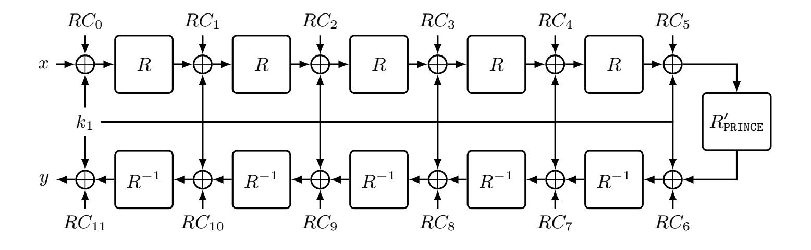

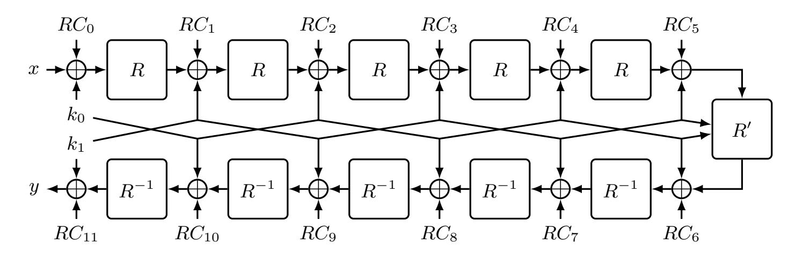

**Fig. 1.** (Top) PRINCE core structure, leaving out the FX construction; (bottom) PRINCEv2 structure. Note that values of  $RC_7$ ,  $RC_9$  and  $RC_{11}$  in PRINCEv2 are different than the ones in PRINCE.

Round Constants The round constants are derived as for PRINCE, but instead of adding the same  $\alpha$  for every round constant in the second half of the encryption process  $(i \ge 6)$ , we alternate adding  $\alpha$  and  $\beta$  as defined in Tab. 2.

#### 2.3 Encryption vs. Decryption

While PRINCEv2 does not fulfil the  $\alpha$  reflection property anymore, the choice of round keys and constants allows to implement both encryption and decryption with only a small area and delay overhead. This is shown in Fig. 10. In this figure the extra control signal **dec** switches between encryption and decryption. In particular, the Swap function is defined as

$$\mathtt{Swap}(k_0, k_1, \mathrm{dec}) = \begin{cases} k_0, k_1 & \text{if } \mathrm{dec} = 0 \\ k_1 \oplus \beta, k_0 \oplus \alpha & \text{if } \mathrm{dec} = 1 \end{cases}.$$

### 3 Design Rationale

The main objectives almost immediately results in clear design rationales. The first design rationale is to leave the round function, and not less important the

{6}------------------------------------------------

Table 2. Round constants used in PRINCEv2.

|                        | Constants                         |
|------------------------|-----------------------------------|
| RC0 = 0000000000000000 | RC6 = 7ef84f78fd955cb1 = RC5 ⊕ α  |
| RC1 = 13198a2e03707344 | RC7 = 7aacf4538d971a60 = RC4 ⊕ β  |
| RC2 = a4093822299f31d0 | RC8 = c882d32f25323c54 = RC3 ⊕ α  |
| RC3 = 082efa98ec4e6c89 | RC9 = 9b8ded979cd838c7 = RC2 ⊕ β  |
| RC4 = 452821e638d01377 | RC10 = d3b5a399ca0c2399 = RC1 ⊕ α |
| RC5 = be5466cf34e90c6c | RC11 = 3f84d5b5b5470917 = RC0 ⊕ β |
| α = c0ac29b7c97c50dd   | β = 3f84d5b5b5470917           |

number of rounds, (almost) unchanged, and only change the key-scheduling. Note that the main reason for wanting to keep the number of round unchanged is mainly because having more rounds will necessarily increase latency and cause an overall loss in performances. As we are able to improve the security margin as in PRINCE (see Section [5\)](#page-17-0), we believe that this is the correct choice to make. Here, the round-constants are thought of as part of the key-scheduling, even if it is not presented this way in the original PRINCE paper. This rationale (leaving the round function as is) both drastically simplified the design process and made it much more challenging. The simplification is due to the choices being narrowed down to a key-scheduling that has to be picked. More challenging, the analysis has to be much more precise and careful, as clearly the security margin would decrease. It is important to highlight that the security margin is relative to the claimed security level, not in absolute terms.

The only compromise from the goal of leaving the round function unchanged is the middle round. Some attacks that have been developed since the publication of PRINCE take explicit advantage of the symmetry and the key-less middle rounds. To make those attacks, particularly meet-in-the-middle attacks and accelerated exhaustive search procedures, less of a concern, it seems to be a good trade-off to spend two (actually one as will be explained in the implementation section) additional XOR on the critical path. It is noteworthy to mention that the idea of the keyed middle round is previously used in the design of QARMA block cipher.

For the key-scheduling, we were again highly restricted by the requirement of limiting the overhead of implementing decryption on top of encryption. This implies, as it did in PRINCE, that a complicated key-update is not a proper choice but a simple, up to the constants, periodic key-scheduling is best.

We opted for one of the simplest possible options: iterated round-keys.

Originally, in PRINCE, the round keys derived from the 128-bit key (k0 k k1) correspond to

$$k_0 \oplus k_1 \; , \; k_1 \; , \; k_1 \; , \; k_1 \; , \; k_1 \; , \; k_1 \; , \; k_1 \oplus \alpha \; , \; k_1 \oplus \alpha \; , \; k_1 \oplus \alpha \; , \; k_1 \oplus \alpha \; , \; k_1 \oplus \alpha \; , \; k_1 \oplus \alpha \; , \; k_1 \oplus \alpha \; , \; k_2 \oplus \alpha \; , \; k_3 \oplus \alpha \; , \; k_4 \oplus \alpha \; , \; k_4 \oplus \alpha \; , \; k_4 \oplus \alpha \; , \; k_5 \oplus \alpha \; , \; k_5 \oplus \alpha \; , \; k_8 \oplus \alpha \; , \; k_8 \oplus \alpha \; , \; k_8 \oplus \alpha \; , \; k_8 \oplus \alpha \; , \; k_8 \oplus \alpha \; , \; k_8 \oplus \alpha \; , \; k_8 \oplus \alpha \; , \; k_8 \oplus \alpha \; , \; k_8 \oplus \alpha \; , \; k_8 \oplus \alpha \; , \; k_8 \oplus \alpha \; , \; k_8 \oplus \alpha \; , \; k_8 \oplus \alpha \; , \; k_8 \oplus \alpha \; , \; k_8 \oplus \alpha \; , \; k_8 \oplus \alpha \; , \; k_8 \oplus \alpha \; , \; k_8 \oplus \alpha \; , \; k_8 \oplus \alpha \; , \; k_8 \oplus \alpha \; , \; k_8 \oplus \alpha \; , \; k_8 \oplus \alpha \; , \; k_8 \oplus \alpha \; , \; k_8 \oplus \alpha \; , \; k_8 \oplus \alpha \; , \; k_8 \oplus \alpha \; , \; k_8 \oplus \alpha \; , \; k_8 \oplus \alpha \; , \; k_8 \oplus \alpha \; , \; k_8 \oplus \alpha \; , \; k_8 \oplus \alpha \; , \; k_8 \oplus \alpha \; , \; k_8 \oplus \alpha \; , \; k_8 \oplus \alpha \; , \; k_8 \oplus \alpha \; , \; k_8 \oplus \alpha \; , \; k_8 \oplus \alpha \; , \; k_8 \oplus \alpha \; , \; k_8 \oplus \alpha \; , \; k_8 \oplus \alpha \; , \; k_8 \oplus \alpha \; , \; k_8 \oplus \alpha \; , \; k_8 \oplus \alpha \; , \; k_8 \oplus \alpha \; , \; k_8 \oplus \alpha \; , \; k_8 \oplus \alpha \; , \; k_8 \oplus \alpha \; , \; k_8 \oplus \alpha \; , \; k_8 \oplus \alpha \; , \; k_8 \oplus \alpha \; , \; k_8 \oplus \alpha \; , \; k_8 \oplus \alpha \; , \; k_8 \oplus \alpha \; , \; k_8 \oplus \alpha \; , \; k_8 \oplus \alpha \; , \; k_8 \oplus \alpha \; , \; k_8 \oplus \alpha \; , \; k_8 \oplus \alpha \; , \; k_8 \oplus \alpha \; , \; k_8 \oplus \alpha \; , \; k_8 \oplus \alpha \; , \; k_8 \oplus \alpha \; , \; k_8 \oplus \alpha \; , \; k_8 \oplus \alpha \; , \; k_8 \oplus \alpha \; , \; k_8 \oplus \alpha \; , \; k_8 \oplus \alpha \; , \; k_8 \oplus \alpha \; , \; k_8 \oplus \alpha \; , \; k_8 \oplus \alpha \; , \; k_8 \oplus \alpha \; , \; k_8 \oplus \alpha \; , \; k_8 \oplus \alpha \; , \; k_8 \oplus \alpha \; , \; k_8 \oplus \alpha \; , \; k_8 \oplus \alpha \; , \; k_8 \oplus \alpha \; , \; k_8 \oplus \alpha \; , \; k_8 \oplus \alpha \; , \; k_8 \oplus \alpha \; , \; k_8 \oplus \alpha \; , \; k_8 \oplus \alpha \; , \; k_8 \oplus \alpha \; , \; k_8 \oplus \alpha \; , \; k_8 \oplus \alpha \; , \; k_8 \oplus \alpha \; , \; k_8 \oplus \alpha \; , \; k_8 \oplus \alpha \; , \; k_8 \oplus \alpha \; , \; k_8 \oplus \alpha \; , \; k_8 \oplus \alpha \; , \; k_8 \oplus \alpha \; , \; k_8 \oplus \alpha \; , \; k_8 \oplus \alpha \; , \; k_8 \oplus \alpha \; , \; k_8 \oplus \alpha \; , \; k_8 \oplus \alpha \; , \; k_8 \oplus \alpha \; , \; k_8 \oplus \alpha \; , \; k_8 \oplus \alpha \; , \; k_8 \oplus \alpha \; , \; k_8 \oplus \alpha \; , \; k_8 \oplus \alpha \; , \; k_8 \oplus \alpha \; , \; k_8 \oplus \alpha \; , \; k_8 \oplus \alpha \; , \; k_8 \oplus \alpha \; , \; k_8 \oplus \alpha \; , \; k_8 \oplus \alpha \; , \; k_8 \oplus \alpha \; , \; k_8 \oplus \alpha \; , \; k_8 \oplus \alpha \; , \; k_8 \oplus \alpha \; , \; k_8 \oplus \alpha \; , \; k_8 \oplus \alpha \; , \; k_8 \oplus \alpha \; , \; k_8 \oplus \alpha \; , \; k_8 \oplus \alpha \; , \; k_8 \oplus \alpha \; , \; k_8 \oplus \alpha \; , \; k_8 \oplus \alpha \; , \; k_8 \oplus \alpha \; , \; k_8 \oplus \alpha \; , \; k_8 \oplus \alpha \; , \; k_8 \oplus \alpha \; , \; k_8 \oplus \alpha \; , \; k_8 \oplus \alpha \; , \; k_8$$

where k 0 0 is the result of a simple and efficient bijective linear mapping from k0, and α is a constant value.

{7}------------------------------------------------

In particular, the value of k0 is used only in the whitening keys, limiting the security generically. The α-reflection property, that is the fact that decryption is encryption with a modified key, follows as replacing k1 by k1 ⊕ α reverts the order of the round keys (except for the outer whitening keys).

In PRINCEv2, using a master key (k0 k k1), we decide to choose

$$k_0$$
,  $k_1$ ,  $k_0$ ,  $k_1$ ,  $k_0$ ,  $k_1$ ,  $k_0$ ,  $k_1 \oplus \beta$ ,  $k_0 \oplus \alpha$ ,  $k_1 \oplus \beta$ ,  $k_0 \oplus \alpha$ ,  $k_1 \oplus \beta$ ,  $k_0 \oplus \alpha$ ,  $k_1 \oplus \beta$ ,

as the round keys where α and β are constant values. The constants are chosen as digits of π = 3.1415 . . ., as they were done in PRINCE. The new constant β is simply the next in line looking at the binary digits of π, see the appendix for a sage code to reproduce the constants used. Besides, it is noteworthy to mention that due to the key additions in the middle round of PRINCEv2, it has two more round keys than the one for PRINCE.

Here, replacing k0 by k1 ⊕ β and k1 by k0 ⊕ α does ensure that the first rounds (the first seven round keys) of the encryption circuit perform decryption as required. However, when reaching the middle round (second key addition of the middle round), an additional modification is required to ensure the second half (the second seven round keys) works as well. For the second half of the round keys, we need to XOR all of these round keys with the constant value α ⊕ β. While replacing k0 by k1 ⊕ β and k1 by k0 ⊕ α, needs to implement 64 multiplexers in the critical path, modifying round keys of the second half does not affect the latency. As we will show in Section [4,](#page-8-0) combining decryption together with the encryption circuit does not significantly harm performance.

The only case where this would not be necessary is when α equals β. However, this would introduce a set of weak-keys. Namely, if k1 ⊕k2 = α, then encryption would equal decryption, that is, the whole cipher would be an involution.

Finally, let us explicitly state the claim we want our design to be tested against:

Security Claim: We claim that there is no attack against PRINCEv2 with data complexity below 2 50 bytes – 2 47 (chosen) plaintext-ciphertext pairs obtained under the same key – and time-complexity below 2 112. We do not claim any security in the related-key setting and related-keys have to be avoided at the protocol level.

This claim is backed up by the extensive security analysis. It is interesting to see how the advance in the state of the art has made the analysis more precise (e.g., for Boomerang-attacks using connectivity tables and for integral attacks using the division property) and simpler (using mainly MILP-based tools). Those improvements are an important tool to enable a cipher design with a very tight security claim: For a cipher optimized for low-latency, a large security margin is nothing but wasted performance.

Note that as PRINCE did not have any claim regarding security against sidechannel and fault attacks, we chose to not make such claims either. Moreover to our knowledge, protecting a fully unrolled primitive against such attacks is not a well-researched area so far.

{8}------------------------------------------------

### 4 Implementation

The primary objective of PRINCE and PRINCEv2 is to offer low-latency singlecycle encryption and decryption. This objective requires a short critical path in round-unrolled non-pipelined hardware implementations. In other words, the ciphers aim for a small logic depth in circuit representation. Furthermore, adding decryption functionality to an encryption circuit should induce minimal area and latency overhead. PRINCE achieves this goal in part due to the so-called αreflection property [\[BCG](#page-24-1)+12]. This property has been imitated by several other low-latency constructions (e.g. MANTIS [\[BJK](#page-24-3)+16] and QARMA [\[Ava17\]](#page-24-4)) and mandates that decryption with one key corresponds to encryption with a related key. Due to the modified key schedule, PRINCEv2 does not fulfil the α-reflection behaviour of PRINCE. Yet, it implements a modified version that keeps the decryption overhead in hardware fairly small.

A secondary design goal is keeping its unrolled implementation cost-efficient, including a small hardware footprint (little occupied chip area) and a low energy consumption. In fact, the costs should be lower compared to unrolled implementations of other lightweight block ciphers. According to the original proposal, unrolled PRINCE with decryption and encryption capability can be clocked at frequencies up to 212.8 MHz when synthesized in NanGate 45 nm, an open-source standard cell library, and requires as little as 8260 Gate Equivalents (GE) of area [\[BCG](#page-24-1)+12]. PRINCEv2 aims to achieve similar performance figures while providing stronger security guarantees overall. Staying close to the initial design of PRINCE enables us to recycle and build upon the extensive security analysis it has already received. Furthermore, it allows us to construct circuits that can perform encryption and decryption in both the new PRINCEv2 and original PRINCE at low overhead. This provides needed legacy support and backward compatibility for a variety of applications and environments where PRINCE is already deployed.

In the following, we compare our novel PRINCEv2 design to the original PRINCE concerning the minimum latency and minimum area achieved by unrolled implementations. Since gate count and delay numbers depend on the particular technology used, we provide synthesis results from 4 different commercial standard cell libraries of feature sizes between 90 nm and 28 nm. This redundancy minimizes the influence of a single technology on the comparison's interpretation. All 4 standard cell libraries contain multiple classes of gates, namely a high threshold voltage (hvt) class, a standard threshold voltage (std) class and a low threshold voltage (lvt) class. These distinct classes allow to fully explore the latency-vs-leakage tradeoff. More specifically, when placing a tight constraint on the latency of a circuit, primarily lvt cells are chosen due to their high speed. On the other hand, when synthesizing without tight timing constraints, hvt cells will be chosen due to the lower energy loss through leakage currents. Using manufacturable standard cell libraries from a commercial foundry instead of open-source libraries for a design comparison is often preferable since the reported numbers are more accurate in all key categories, such as area, latency and energy. They are especially superior in power and energy estimation, as common open-source libraries fail to provide industry quality characterization in that regard. How-

{9}------------------------------------------------

Table 3. Area, latency and energy characteristics of unrolled PRINCE and PRINCEv2 when constrained for minimum latency.

| Techn.      | Mode           | Cipher   |          | Area [GE] Latency [ns] Energy [pJ] |          |
|-------------|----------------|----------|----------|------------------------------------|----------|
|             | ENC            | PRINCE   | 16244.25 | 4.101177                           | 1.993172 |
| 90 nm LP*   |                | PRINCEv2 | 17661.25 | 4.047311                           | 2.230068 |
|             | ENC/DEC PRINCE |          | 17808.00 | 4.106262                           | 2.213275 |
|             |                | PRINCEv2 | 18888.75 | 4.151113                           | 2.424250 |
|             |                | PRINCE   | 19877.75 | 2.866749                           | 1.602513 |
|             | ENC            | PRINCEv2 | 18798.25 | 2.944367                           | 1.492794 |
| 65 nm LP*   | ENC/DEC PRINCE |          | 19966.00 | 2.946442                           | 1.594025 |
|             |                | PRINCEv2 | 21171.25 | 2.930153                           | 1.696559 |
|             | ENC            | PRINCE   | 17177.00 | 2.521302                           | 0.617719 |
|             |                | PRINCEv2 | 16556.50 | 2.509131                           | 0.592155 |
| 40 nm LP*   | ENC/DEC PRINCE |          | 17377.50 | 2.541220                           | 0.630223 |
|             |                | PRINCEv2 | 17799.50 | 2.583466                           | 0.648450 |
|             | ENC            | PRINCE   | 38145.33 | 1.108886                           | 1.258586 |
|             |                | PRINCEv2 | 33470.33 | 1.103273                           | 1.108789 |
| 28 nm HPC** | ENC/DEC PRINCE |          | 35297.67 | 1.119593                           | 1.181171 |
|             |                | PRINCEv2 | 38962.33 | 1.148693                           | 1.299172 |

\* LP = Low Power

\*\* HPC = High Performance Computing

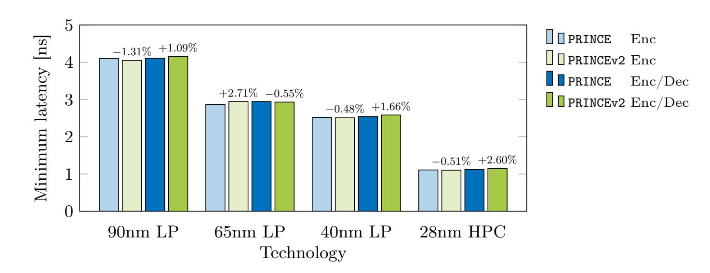

Fig. 2. Minimum achievable latency of unrolled PRINCE and PRINCEv2 across different technologies.

ever, to keep our results reproducible and make comparisons to existing works easy we provide a comparison of all our unrolled PRINCE and PRINCEv2 circuits to several other low-latency and low-energy constructions in NanGate 45 nm and 15 nm Open Cell Libraries (OCL) later in this section.

We consider the typical process and operating conditions in all our synthesis results, i.e., the typical PVT (process, voltage, temperature) corner case, with a nominal supply voltage and a working temperature of 25 ◦C. For synthesis, we

{10}------------------------------------------------

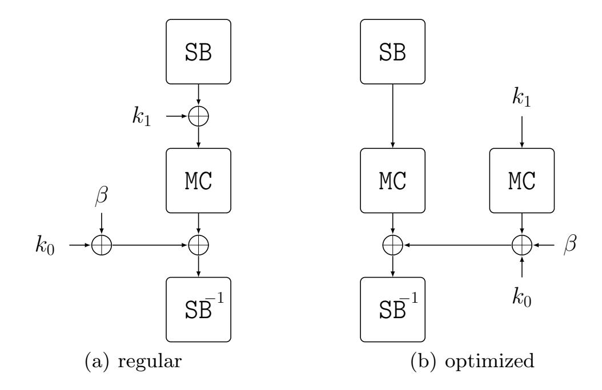

Fig. 3. Simple latency optimization strategy in the middle round of PRINCEv2 that removes one key addition from the critical path.

have used Synopsys Design Compiler Version O-2018.06-SP4 with three stages of the compile\_ultra command (two incremental). As a first step, we have constrained our circuits for minimum latency. The results are given in Table [3](#page-9-0) and visualized in Figure [2.](#page-9-1) We distinguish between circuits that can only encrypt (ENC) and circuits that can decrypt as well (ENC/DEC).

Several interesting observations can be made. Firstly, all four distinct circuits perform decidedly similar in terms of minimum latency. The difference falls in the range of single-digit picoseconds in several cases. To gain a better overview, Figure [2](#page-9-1) provides the differences between corresponding PRINCE and PRINCEv2 circuits as percentages on top of the bar graphs. Interestingly, the encryptiononly version of PRINCEv2 outperforms PRINCE in terms of minimum latency in three of four technologies. This may be counter-intuitive, as PRINCEv2 adds two key additions to the middle round. However, as shown in Figure [3,](#page-10-0) those two key additions can be merged into a single one regarding the critical path by calculating and adding MC(K1) in parallel.

This optimization not only improves the minimum latency but also saves area.[8](#page-10-1) One may expect the synthesis tool to perform such an optimization implicitly by itself, as two key additions and a MC operation in the middle essentially result in a sequence of four consecutive XORs per bit. Yet, our results suggest that it is indeed required to perform the optimization algorithmically in the RTL code. Additionally, it has to be noted that the original PRINCE design applies two key additions (whitening and round key) to the input before the first Sbox stage. PRINCEv2, on the other hand, applies only one. Hence, the difference between the latency of PRINCE and PRINCEv2 in encryption-only mode comes down to whether the synthesizer implements the additional key XOR at the input more

8 Area is saved by this optimization since slower cells with a lower drive strength can be selected for the parallel calculations. Those cells have a smaller area footprint.

{11}------------------------------------------------

efficiently or the one in the middle round. More often than not, the middle round key addition is more efficient latency-wise since the synthesizer has more freedom to move that XOR stage around (e.g., to the input, output or intermediate signals of the MC operation), while the two key XORs at the input have a fixed location and cannot be optimized beyond instantiating a three-input XOR per bit, since all inputs to the operation (key and plaintext) arrive at approximately the same time. Original PRINCE also requires an additional key XOR at the output. Yet, since the last round's output arrives much later than the keys, the key parts will be added to each other beforehand and only one of the XOR stages affects the critical path.

At this point, we should stress that differences in synthesis results of such a small magnitude may sometimes go beyond algorithmic considerations and can not always be understood in detail without having insight into the proprietary optimization algorithms used by EDA tools. Sometimes a latency optimization with a big area penalty is deemed worth it by the synthesizer, sometimes not. Thresholds for such decisions are unknown and therefore the outcome can not always be predicted. One example for such a case in Table [3](#page-9-0) is the difference between the full variant of PRINCEv2 and its encryption-only version in 65 nm LP technology. For unknown reasons, the full variant achieves a lower latency than the encryption-only one, but at the price of a significantly increased area, indicating costly latency optimizations. However, the majority of our reported figures directly corresponds to the algorithmic differences in the analyzed ciphers and modes.

Regarding the cipher variants with decryption capability, the situation is slightly different compared to the encryption-only versions. The more complex key-multiplexing in PRINCEv2 required to choose between encryption and decryption, as apparent in Figure [10,](#page-28-1) induces additional delay. In the worst case, this results in an overhead of 2.6%, but on average the overhead is about 1.2%. Table [3](#page-9-0) also reports area and energy numbers for the highly constrained circuits. The energy values correspond to the average energy consumed by one evaluation of the unrolled circuits at maximum clock frequency (corresponding to minimum latency). While PRINCEv2 is often more area and energy-efficient than PRINCE in encryption-only mode, PRINCEv2 with decryption capability consistently requires the largest area and consumes the most energy. Yet, the margins are still very thin. In summary, PRINCE's most important property and main selling point, namely high-speed single-cycle encryption, is well preserved by PRINCEv2. For scenarios that require no decryption but only encryption, it may even be slightly improved.

As a second step, we evaluate the minimum area that can be achieved by the unrolled circuits. In this regard, we have executed the same synthesis scripts as before, but without the tight timing constraints. Our results are reported in Table [4](#page-12-0) and depicted as a bar graph in Figure [4.](#page-12-1)

In contrast to the latency results, a consistent overhead for minimum area can be observed for the PRINCEv2 circuits. This is expected, due to the additional operations in the middle round and the more complex key-multiplexing to decide

{12}------------------------------------------------

Table 4. Area, latency and energy characteristics of unrolled PRINCE and PRINCEv2 when constrained for minimum area.

| Techn.      | Mode           | Cipher   |         | Area [GE] Latency [ns] Energy [pJ] |          |
|-------------|----------------|----------|---------|------------------------------------|----------|
|             |                | PRINCE   | 7937.50 | 12.859 908                         | 0.569694 |
| 90 nm LP*   | ENC            | PRINCEv2 | 8111.25 | 12.856 450                         | 0.574683 |
|             | ENC/DEC PRINCE |          | 8183.00 | 14.015 245                         | 0.616671 |
|             |                | PRINCEv2 | 8440.75 | 15.513 536                         | 0.628298 |
|             |                | PRINCE   | 8316.00 | 11.434 771                         | 0.433378 |
|             | ENC            | PRINCEv2 | 8385.25 | 11.504 968                         | 0.430286 |
| 65 nm LP*   | ENC/DEC PRINCE |          | 8547.75 | 12.349 355                         | 0.440872 |
|             |                | PRINCEv2 | 8792.75 | 13.376 949                         | 0.456154 |
|             | ENC            | PRINCE   | 8563.75 | 10.144 847                         | 0.212027 |
|             |                | PRINCEv2 | 8608.50 | 10.063 908                         | 0.207317 |
| 40 nm LP*   | ENC/DEC PRINCE |          | 8780.00 | 10.886 960                         | 0.217739 |
|             |                | PRINCEv2 | 9039.75 | 11.798 657                         | 0.226534 |
|             | ENC            | PRINCE   | 8197.00 | 3.599 936                          | 0.127798 |
|             |                | PRINCEv2 | 8292.00 | 3.682 593                          | 0.127786 |
| 28 nm HPC** | ENC/DEC PRINCE |          | 8426.33 | 4.260 999                          | 0.131239 |
|             |                | PRINCEv2 | 8844.67 | 4.323 993                          | 0.134909 |

\* LP = Low Power

\*\* HPC = High Performance Computing

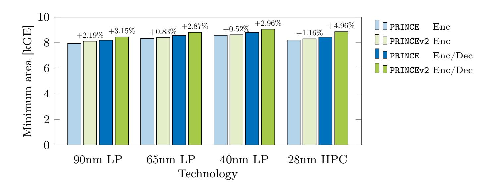

Fig. 4. Minimum achievable area of unrolled PRINCE and PRINCEv2 across different technologies.

between encryption and decryption. Yet, the average overhead is less than 1.2% for the encryption-only and less than 3.5% for the full versions. This is a rather small price to pay for the additional security PRINCEv2 provides. When comparing the low-latency and low-area implementations in Tables [3](#page-9-0) and [4](#page-12-0) respectively, it can be seen that area increases 2 to 4 times from low-area to low-latency constraint. Latency scales down 3 to 4 times. Energy consumption increases between 4 and 10 times, due to a dependency on both factors (caused by leakage cur

{13}------------------------------------------------

rents). These metrics should be carefully considered when choosing operating frequency and target technology for a given application.

Finally, we compare PRINCE and PRINCEv2 to other lightweight block ciphers proposed in the literature. Only a few cryptographic primitives have made low latency a primary design objective. To the best of our knowledge, none of those who have share all design goals and security claims with PRINCE or PRINCEv2. Hence, the following comparison involves ciphers with different security and performance claims and is only supposed to put their hardware efficiency in relation to each other, without concluding the superiority of one or the other. In particular, we compare PRINCE and PRINCEv2 to the low-latency tweakable block ciphers MANTIS [\[BJK](#page-24-3)+16] and QARMA [\[Ava17\]](#page-24-4). Yet, since both of those constructions are tweakable, unlike all PRINCE versions, they can not easily achieve the same latency and area as PRINCE and PRINCEv2. We also include Midori [\[BBI](#page-24-2)+15] in the comparison, as the authors have partially aimed for a low logic depth as well. However, Midori primarily targets energy efficiency in round-based implementations and has no claim to provide low latency in unrolled representation. Additionally, we have developed a combination of PRINCE and PRINCEv2, which we call PRINCE+v2. This combined cipher offers a control signal to select whether the input should be processed according to the PRINCE or the PRINCEv2 specification. In environments where PRINCE is already deployed, this can be useful for backward compatibility and legacy support. We have analyzed all 6 ciphers in two modes each (ENC and ENC/DEC) in NanGate 45 nm and 15 nm Open Cell Libraries and evaluate their area-vs-latency tradeoff. The result is depicted in Figure [5](#page-16-0) for NanGate 45 nm and in Figure [6](#page-16-1) for 15 nm technology. The exact performance figures used to create these graphs can be found in the Appendix in Tables [5](#page-14-0) and [6.](#page-15-0) The results in these two libraries demonstrate that PRINCE and PRINCEv2 are the most suitable choices for high-speed encryption, as long as a tweak input is not required. All PRINCE and PRINCEv2 variants outperform the other ciphers both in terms of minimum latency and minimum area. PRINCEv2 in encryption-only mode is roughly 20 percent faster than Midori and MANTIS, and 40 percent faster than QARMA. At the same time, its minimum area is about 15 percent smaller than Midori, 30 percent smaller than MANTIS and 40 percent smaller than QARMA. The results are similar when comparing both encryption and decryption implementations, except for Midori being significantly larger and slower. This outcome is unsurprising since all compared ciphers except Midori are reflection ciphers, i.e., they use a variant of the α-reflection property introduced by PRINCE. Please note that for this reason the full version of Midori64, including decryption, is barely visible in Figures [5](#page-16-0) and [6](#page-16-1) as it simply does not fit in the frame due to its much higher latency and area caused by the extra multiplexers required in each round. Yet the full figures for that implementation can be found in Tables [5](#page-14-0) and [6](#page-15-0) in the Appendix. We chose the particular instances MANTIS7 and QARMA7-64-σ1 for the comparison as they are supposed to offer a similar security level as PRINCE and PRINCEv2, while being tweakable.

{14}------------------------------------------------

Table 5. Full comparison of unrolled block ciphers in NanGate 45 nm Open Cell Library.

| PRINCE                                                               |                                                                |                                                                      |                                                                | PRINCEv2                                                             |                                                                                 |                                                                      |                                                                |
|----------------------------------------------------------------------|----------------------------------------------------------------|----------------------------------------------------------------------|----------------------------------------------------------------|----------------------------------------------------------------------|---------------------------------------------------------------------------------|----------------------------------------------------------------------|----------------------------------------------------------------|
| ENC ENC/DEC                                                       |                                                                |                                                                      |                                                                | ENC                                                                  | ENC/DEC                                                                         |                                                                      |                                                                |
|                                                                      |                                                                |                                                                      |                                                                |                                                                      | Lat. [ns] Area [GE] Lat. [ns] Area [GE] Lat. [ns] Area [GE] Lat. [ns] Area [GE] |                                                                      |                                                                |
| 4.059997                                                             | 9873.33                                                        | 4.119023                                                             | 10486.33                                                       | 4.077636                                                             | 10332.00                                                                        | 4.245165                                                             | 10780.67                                                       |
| 4.500000 5.000000 5.500000 6.000000 6.500000 7.000000 | 8421.67 7837.00 7684.33 7620.00 7620.00 7620.00 | 4.500000 5.000000 5.500000 6.000000 6.500000 7.000000 | 8807.00 8213.33 7959.33 7874.00 7868.67 7868.67 | 4.500000 5.000000 5.500000 6.000000 6.500000 7.000000 | 8526.67 8013.00 7865.67 7812.33 7812.33 7812.33                  | 4.500000 5.000000 5.500000 6.000000 6.500000 7.000000 | 9488.00 8659.67 8328.67 8196.00 8144.00 8141.67 |

| PRINCE+v2 |                |           |                                                                                 | Midori64  |          |           |          |
|-----------|----------------|-----------|---------------------------------------------------------------------------------|-----------|----------|-----------|----------|
|           | ENC ENC/DEC |           | ENC                                                                             |           | ENC/DEC  |           |          |
|           |                |           | Lat. [ns] Area [GE] Lat. [ns] Area [GE] Lat. [ns] Area [GE] Lat. [ns] Area [GE] |           |          |           |          |
| 4.353092  | 11258.33       | 4.469554  | 12395.67                                                                        | 4.934847  | 10755.67 | 7.111567  | 25058.33 |
| 4.500000  | 9588.33        | 4.500000  | 10709.00                                                                        | 4.500000  | -        | 4.500000  | -        |
| 5.000000  | 8622.67        | 5.000000  | 9870.33                                                                         | 5.000000  | 10353.67 | 5.000000  | -        |
| 5.500000  | 8276.00        | 5.500000  | 9356.00                                                                         | 5.500000  | 9223.67  | 5.500000  | -        |
| 6.000000  | 8169.67        | 6.000000  | 9091.67                                                                         | 6.000000  | 8858.00  | 6.000000  | -        |
| 6.500000  | 8156.33        | 6.500000  | 8990.33                                                                         | 6.500000  | 8792.33  | 6.500000  | -        |
| 7.000000  | 8155.33        | 7.000000  | 8982.00                                                                         | 7.000000  | 8748.33  | 7.000000  | -        |
| 7.500000  | 8155.33        | 7.500000  | 8969.33                                                                         | 7.500000  | 8748.33  | 7.500000  | 19733.00 |
| 8.000000  | 8155.33        | 8.000000  | 8969.33                                                                         | 8.000000  | 8748.33  | 8.000000  | 18381.00 |
| 9.000000  | 8155.33        | 9.000000  | 8969.33                                                                         | 9.000000  | 8748.33  | 9.000000  | 16241.67 |
| 10.000000 | 8155.33        | 10.000000 | 8969.33                                                                         | 10.000000 | 8748.33  | 10.000000 | 14877.67 |
| 11.000000 | 8155.33        | 11.000000 | 8969.33                                                                         | 11.000000 | 8748.33  | 11.000000 | 14476.33 |

| MANTIS7   |                                                                                 |           |          | QARMA7-64-σ1 |          |           |          |  |
|-----------|---------------------------------------------------------------------------------|-----------|----------|--------------|----------|-----------|----------|--|
| ENC       |                                                                                 | ENC/DEC   |          | ENC          |          | ENC/DEC   |          |  |
|           | Lat. [ns] Area [GE] Lat. [ns] Area [GE] Lat. [ns] Area [GE] Lat. [ns] Area [GE] |           |          |              |          |           |          |  |
| 5.036228  | 14481.67                                                                        | 5.235198  | 14810.67 | 5.756122     | 17096.67 | 5.794558  | 18085.67 |  |
| 5.500000  | 12445.33                                                                        | 5.500000  | 12931.67 | 5.500000     | -        | 5.500000  | -        |  |
| 6.000000  | 11613.33                                                                        | 6.000000  | 12082.67 | 6.000000     | 14821.33 | 6.000000  | 15449.67 |  |
| 6.500000  | 11246.67                                                                        | 6.500000  | 11786.67 | 6.500000     | 13886.00 | 6.500000  | 14866.33 |  |
| 7.000000  | 11134.33                                                                        | 7.000000  | 11529.00 | 7.000000     | 13139.67 | 7.000000  | 14019.33 |  |
| 7.500000  | 11064.67                                                                        | 7.500000  | 11397.67 | 7.500000     | 12698.33 | 7.500000  | 13467.33 |  |
| 8.000000  | 11019.33                                                                        | 8.000000  | 11322.67 | 8.000000     | 12326.67 | 8.000000  | 13012.33 |  |
| 8.500000  | 11019.33                                                                        | 8.500000  | 11305.33 | 8.500000     | 12106.33 | 8.500000  | 12801.67 |  |
| 9.000000  | 11019.33                                                                        | 9.000000  | 11305.33 | 9.000000     | 12039.33 | 9.000000  | 12677.00 |  |
| 9.500000  | 11019.33                                                                        | 9.500000  | 11305.33 | 9.500000     | 12039.33 | 9.500000  | 12614.67 |  |
| 10.000000 | 11019.33                                                                        | 10.000000 | 11305.33 | 10.000000    | 12039.33 | 10.000000 | 12610.33 |  |
| 10.500000 | 11019.33                                                                        | 10.500000 | 11305.33 | 10.500000    | 12039.33 | 10.500000 | 12609.00 |  |

In the original proposal, the maximum achievable frequency in NanGate 45 nm of unrolled PRINCE was given as 212.8 MHz [\[BCG](#page-24-1)+12]. Our unrolled PRINCE can be clocked at 242.8 MHz for the full variant and 246.3 MHz for the encryption-only version in the same technology, which corresponds to a 12.4% or 15.7% higher performance respectively. The minimum area was given as 8260 GE in the original proposal, while our implementations are as small as 7868.67 GE

{15}------------------------------------------------

Table 6. Full comparison of unrolled block ciphers in NanGate 15 nm Open Cell Library.

|                                                                                 |          | PRINCE   |          | PRINCEv2 |          |          |          |  |
|---------------------------------------------------------------------------------|----------|----------|----------|----------|----------|----------|----------|--|
|                                                                                 | ENC      | ENC/DEC  |          | ENC      |          | ENC/DEC  |          |  |
| Lat. [ns] Area [GE] Lat. [ns] Area [GE] Lat. [ns] Area [GE] Lat. [ns] Area [GE] |          |          |          |          |          |          |          |  |
| 0.389144                                                                        | 13291.00 | 0.400530 | 13468.00 | 0.387146 | 13069.50 | 0.404112 | 14181.25 |  |
| 0.400000                                                                        | 12380.75 | 0.400000 | -        | 0.400000 | 12331.75 | 0.400000 | -        |  |
| 0.450000                                                                        | 9618.50  | 0.450000 | 10275.50 | 0.450000 | 9859.00  | 0.450000 | 11185.25 |  |
| 0.500000                                                                        | 8811.00  | 0.500000 | 9115.50  | 0.500000 | 8940.75  | 0.500000 | 9822.25  |  |
| 0.550000                                                                        | 8621.50  | 0.550000 | 8935.50  | 0.550000 | 8820.00  | 0.550000 | 9272.25  |  |
| 0.600000                                                                        | 8610.50  | 0.600000 | 8828.75  | 0.600000 | 8787.25  | 0.600000 | 9134.50  |  |
| 0.650000                                                                        | 8610.50  | 0.650000 | 8828.75  | 0.650000 | 8787.25  | 0.650000 | 9108.00  |  |
| 0.700000                                                                        | 8610.50  | 0.700000 | 8828.75  | 0.700000 | 8787.25  | 0.700000 | 9105.50  |  |
| 0.750000                                                                        | 8610.50  | 0.750000 | 8828.75  | 0.750000 | 8787.25  | 0.750000 | 9104.00  |  |

| PRINCE+v2 |          |          |          | Midori64 |                                                                                 |          |          |  |
|-----------|----------|----------|----------|----------|---------------------------------------------------------------------------------|----------|----------|--|
|           | ENC      |          | ENC/DEC  |          | ENC                                                                             | ENC/DEC  |          |  |
|           |          |          |          |          | Lat. [ns] Area [GE] Lat. [ns] Area [GE] Lat. [ns] Area [GE] Lat. [ns] Area [GE] |          |          |  |
| 0.415065  | 14422.75 | 0.426661 | 16016.00 | 0.481522 | 13775.00                                                                        | 0.657338 | 30563.50 |  |
| 0.450000  | 11701.25 | 0.450000 | 14280.50 | 0.450000 | -                                                                               | 0.450000 | -        |  |
| 0.500000  | 9698.00  | 0.500000 | 11253.50 | 0.500000 | 11581.25                                                                        | 0.500000 | -        |  |
| 0.550000  | 9234.00  | 0.550000 | 10193.00 | 0.550000 | 10427.00                                                                        | 0.550000 | -        |  |
| 0.600000  | 9147.75  | 0.600000 | 9991.75  | 0.600000 | 9896.25                                                                         | 0.600000 | -        |  |
| 0.650000  | 9163.00  | 0.650000 | 9967.25  | 0.650000 | 9831.00                                                                         | 0.650000 | -        |  |
| 0.700000  | 9144.00  | 0.700000 | 9931.75  | 0.700000 | 9806.50                                                                         | 0.700000 | 28135.25 |  |
| 0.750000  | 9143.50  | 0.750000 | 9931.25  | 0.750000 | 9806.50                                                                         | 0.750000 | 22886.75 |  |
| 0.800000  | 9143.50  | 0.800000 | 9929.75  | 0.800000 | 9806.50                                                                         | 0.800000 | 20793.75 |  |
| 0.850000  | 9143.50  | 0.850000 | 9929.00  | 0.850000 | 9806.50                                                                         | 0.850000 | 18871.75 |  |
| 0.900000  | 9143.50  | 0.900000 | 9929.00  | 0.900000 | 9806.50                                                                         | 0.900000 | 17772.00 |  |
| 1.000000  | 9143.50  | 1.000000 | 9929.00  | 1.000000 | 9806.50                                                                         | 1.000000 | 16423.00 |  |
| 1.100000  | 9143.50  | 1.100000 | 9929.00  | 1.100000 | 9806.50                                                                         | 1.100000 | 15420.75 |  |
| 1.200000  | 9143.50  | 1.200000 | 9929.00  | 1.200000 | 9806.50                                                                         | 1.200000 | 15380.00 |  |
| 1.300000  | 9143.50  | 1.300000 | 9929.00  | 1.300000 | 9806.50                                                                         | 1.300000 | 15318.00 |  |

| MANTIS7                                                                                      |                                                                                              |                                                                                              |                                                                                       | QARMA7-64-σ1                                                                                 |                                                                                       |                                                                                              |                                                                                |  |
|----------------------------------------------------------------------------------------------|----------------------------------------------------------------------------------------------|----------------------------------------------------------------------------------------------|---------------------------------------------------------------------------------------|----------------------------------------------------------------------------------------------|---------------------------------------------------------------------------------------|----------------------------------------------------------------------------------------------|--------------------------------------------------------------------------------|--|
| ENC                                                                                          |                                                                                              | ENC/DEC                                                                                      |                                                                                       | ENC                                                                                          |                                                                                       | ENC/DEC                                                                                      |                                                                                |  |
| Lat. [ns] Area [GE] Lat. [ns] Area [GE] Lat. [ns] Area [GE] Lat. [ns] Area [GE]              |                                                                                              |                                                                                              |                                                                                       |                                                                                              |                                                                                       |                                                                                              |                                                                                |  |
| 0.492660                                                                                     | 17542.75                                                                                     | 0.504465                                                                                     | 18193.75                                                                              | 0.542777                                                                                     | 20736.25                                                                              | 0.552887                                                                                     | 22130.75                                                                       |  |
| 0.500000 0.550000 0.600000 0.650000 0.700000 0.750000 0.800000 0.850000 | 17142.75 14404.00 13650.00 12469.00 12378.25 12285.75 12275.00 12275.00 | 0.500000 0.550000 0.600000 0.650000 0.700000 0.750000 0.800000 0.850000 | - 15159.25 14464.50 12804.75 12681.50 12626.75 12580.00 12565.00 | 0.500000 0.550000 0.600000 0.650000 0.700000 0.750000 0.800000 0.850000 | - 20736.25 16413.25 14864.25 13862.00 13794.00 13531.25 13359.00 | 0.500000 0.550000 0.600000 0.650000 0.700000 0.750000 0.800000 0.850000 | - - 18195.25 16299.75 15111.25 14542.25 14292.25 14130.25 |  |
| 0.900000 0.950000                                                                         | 12275.00 12275.00                                                                         | 0.900000 0.950000                                                                         | 12561.25 12561.25                                                                  | 0.900000 0.950000                                                                         | 13304.00 13304.00                                                                  | 0.900000 0.950000                                                                         | 14009.75 13988.75                                                           |  |

for the full variant and 7620.00 GE for the encryption-only version. That corresponds to a 5.0% or 8.4% higher area efficiency respectively. We conclude that

{16}------------------------------------------------

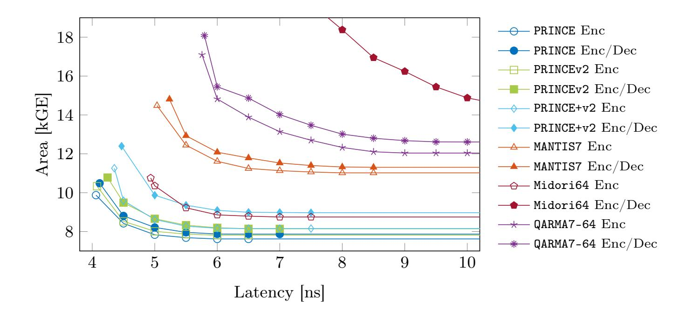

Fig. 5. Comparison of unrolled block ciphers in NanGate 45 nm Open Cell Library.

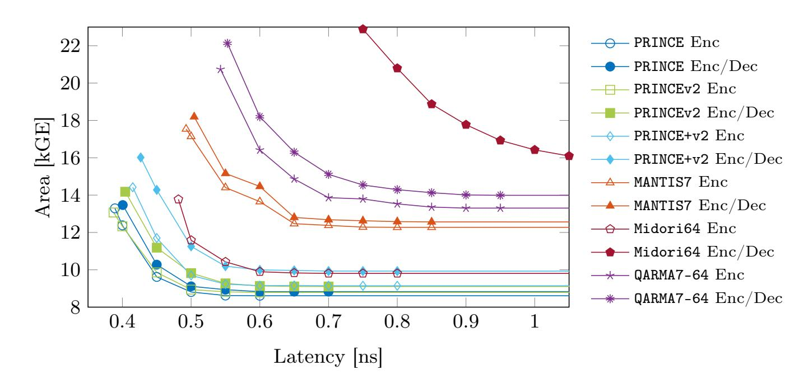

Fig. 6. Comparison of unrolled block ciphers in NanGate 15 nm Open Cell Library.

our base-implementation used for the construction of PRINCEv2 and PRINCE+v2 (and partially for MANTIS7) is well optimized.

Finally, we compare the energy consumption of the 6 ciphers. As detailed before, open-source libraries are not suitable for power and energy estimation. Thus, we have performed the energy comparison in the commercial 40 nm Low Power CMOS technology. This particular technology proved to be the most energy efficient, as apparent from Tables [3](#page-9-0) and [4.](#page-12-0) The results have been estimated at 50 MHz and are depicted in Figure [7.](#page-17-1) Please note the y-axis limits on the bar graph. The differences between the circuits are not as large as they may appear at first sight. Yet, the results confirm once again that PRINCE and PRINCEv2 are the most cost-efficient unrolled circuits.

{17}------------------------------------------------

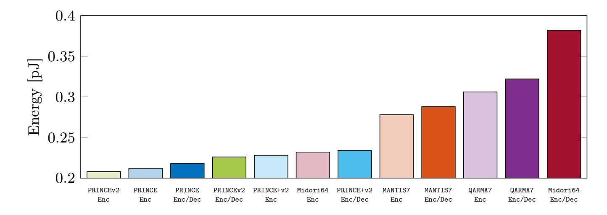

Fig. 7. Average energy consumption of unrolled block ciphers clocked at 50 MHz in a commercial 40 nm Low Power CMOS technology.

# 5 Security Analysis

We analyzed the security of PRINCEv2 building on the previously published analysis of PRINCE. Most dedicated attacks on PRINCEv2 are comparable to PRINCE, while PRINCEv2 offers significantly better resistance to generic attacks. We show that several attacks successful against PRINCE, such as certain accelerated exhaustive search and meet-in-the-middle attacks, do not apply to PRINCEv2. Note that we do not consider analyses of variants with modified operations or relatedkey attacks, but we provide a discussion of the latter at the end of this section.

Since PRINCEv2 is designed to provide a higher security level, we also need to consider attacks with higher complexity than for PRINCE. For several dedicated attack strategies, we find attacks that cover 1 or 2 more rounds with significantly higher time complexity T or data complexity D. This higher complexity is above the bound D · T < 2 126 claimed for PRINCE, but below the generic bounds of D < 2 64 , T < 2 128 for PRINCEv2, and thus relevant to judge the security margin of PRINCEv2. We note that the security claim for PRINCEv2 limits the attacker to D < 2 47 and T < 2 112, while most of the results we propose for round-reduced PRINCEv2 require more data than permitted by this bound.

Additionally, we provide several new results, including a linear attack, a 6-round integral distinguisher based on the division property, a more precise evaluation of boomerang attacks using recently published techniques, and a new 10-round Demirci-Selçuk meet-in-the-middle attack.

Table [7](#page-18-0) provides an overview of the highlights of this section, including the best attacks on PRINCEv2 and noteworthy new results. In summary, PRINCEv2 is at least as secure as PRINCE against various dedicated attacks and provides better generic security.

Differential [\[ALL12,](#page-24-5)[CFG](#page-25-1)+14a[,CFG](#page-25-3)+14b[,DP15a,](#page-25-4)[DP15b,](#page-25-5)[GR16a,](#page-25-6)[GR16b\]](#page-26-6): The truncated differential used in [\[GR16a,](#page-25-6)[GR16b\]](#page-26-6) applies the subspace trail technique and attacks at most 6 rounds of PRINCE, which is the same for PRINCEv2.

{18}------------------------------------------------

Table 7. Overview of the main analysis results on round-reduced PRINCEv2, where 12 is the full number of rounds. Time complexity is given in computation equivalents, data complexity in known plaintexts (KP) or chosen plaintexts (CP). For most attacks in this table except meet-in-the-middle (†), the attacks on PRINCE apply to PRINCEv2 with similar complexity and vice-versa; however, the complexity of the attacks listed for PRINCEv2 is higher than permitted by the PRINCE security claim. For other results, refer to details in Section 5.

| Attack                  | Targ                | et       | Comp                        | Complexity                                               |                               |  |
|-------------------------|---------------------|----------|-----------------------------|----------------------------------------------------------|-------------------------------|--|
|                         | Version             | Rounds   | Time                        | Data                                                     |                               |  |
| Differential            | PRINCE PRINCEv2  | 10 11 | $2^{61}$ $2^{92}$           | $2^{58}  \text{CP} $ $2^{59}  \text{CP}$              | [CFG + 14a] New |  |
| Impossible differential | PRINCE PRINCEv2  | 7 9   | $e^{-\alpha} \cdot 2^{128}$ | $2^{56}  \mathrm{CP}$ $\alpha \cdot 2^{65}  \mathrm{CP}$ | [DZLY17] New               |  |
| Integral                | PRINCE PRINCEv2  | 7 8   | $2^{57} \\ 2^{107.4}$       | $2^{60}  \text{CP} $ $2^{36}  \text{CP}$              | [Mor17] New                |  |
| Meet-in-the-middle      | PRINCE † PRINCEv2 † | 10 10 | $2^{122} \\ 2^{112}$        | ${}^{2\mathrm{KP}}_{2^{48}\mathrm{CP}}$                  | [RR16b] New                |  |

The inside-out differential in [ALL12] took advantage of the key-less middle round to attack at most 6 rounds of PRINCE and is thus not applicable to PRINCEv2.

The most powerful differential attack against PRINCE was the one introduced in  $[CFG^+14a, CFG^+14b]$  that covers 10 rounds using  $2^{57.94}$  chosen plaintexts,  $2^{60.62}$  computations and  $2^{61.52}$  blocks of memory. The distinguisher of this attack covers 6-round and it appends 2 rounds before and 2 rounds after which needs to guess 66 key bits. Using the same distinguisher and attack for PRINCEv2, we need to guess 64 key bits. The complexities of both attacks are roughly the same. The probability of the corresponding differentials are summarized in Table 8.

This attack can be extended by one round with the new key schedule at the cost of significantly higher time complexity, as illustrated in Figure 8.

- 1. Query  $N_s$  structures of  $2^{32}$  chosen plaintexts P with columns  $P_1, P_3$  fixed within each structure. This yields  $N_s \cdot 2^{31} \cdot (2^{32} 1) \approx N_s \cdot 2^{63}$  candidate pairs as in Figure 8.
- 2. For each of the  $N_s \cdot 2^{63}$  candidate pairs (P, P'), we expect 1 candidate for the 96-bit key  $(K_1, K_{0,0}, K_{0,2})$ , which can be determined by a small number of table lookups:
  - (a) We expect 1 key candidate for the key columns  $K_{1,0}, K_{1,2}$  ( $\star$ ) that satisfies the pattern through SB, MC in rounds 1 and 11. This costs one lookup in a precomputed table  $(\Delta X_0, \Delta Y_0, X_0 \oplus Y_0) \to X_0$  per pair.
  - (b) For any fixed difference  $\Delta U$ , we also get 1 key candidate for the 4 nibbles of  $K_0$  involved in round 2, which determines 4 nibbles of W in round 10  $(\bullet)$ .

{19}------------------------------------------------

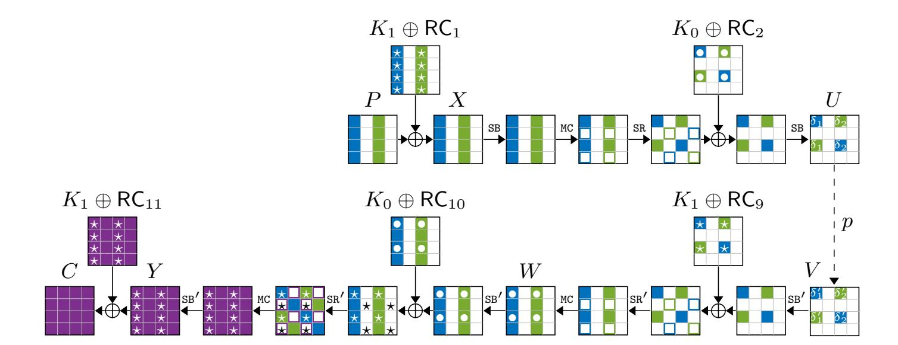

Fig. 8. Differential attack on 11-round PRINCEv2 extending [CFG+14a] by one round.

- (c) Due to the pattern for MC in round 10, there are only  $2^8 \times 2^8$  possible differences  $\Delta W$ . The key bits found so far determine 16 bits of this difference and thus on average fully determine  $\Delta W$ .
- (d) For any fixed difference  $\Delta V$ , knowing  $K_{1,0}, K_{1,2}$ , we get on average 1 candidate for the value of the two active columns  $W_0, W_2$ . This determines the difference  $\Delta Z$  and thus the key columns  $K_{1,1}, K_{1,3}$  as well as the rest of  $K_{0,0}, K_{0,2}$ .
- 3. Rank the obtained  $N_s \cdot 2^{63}$  candidates for the 96-bit key  $(K_1, K_{0,0}, K_{0,2})$ .

Using  $N_s = 5/p/2^{31} = 2^{29}$  structures for the best differential  $(\delta_0, \delta_1, \delta'_0, \delta'_1) = (1, 2, 1, 2)$  from Table 8, we expect about 5 right pairs, which should be easily sufficient for distinguishing. The remaining 32 key bits  $(K_{0,1}, K_{0,3})$  can be recovered by brute-force search. The overall complexity is  $N_s \cdot 2^{32} = 2^{61}$  chosen plaintexts and the time corresponding to  $N_s \cdot 2^{63} = 2^{92}$  repetitions of a few table lookups and arithmetic operations, which can be roughly approximated by one encryption equivalent.

The attack can be slightly improved using multiple differentials from Table 8, but fewer structures. For example, we can use the  $2^2$  permutations of the best differential with the same p and decrease  $N_s$  by a factor of  $2^2$ , obtaining an attack with the same expected number of valid pairs and key candidates, while the data complexity is reduced to  $2^{59}$  and the time complexity is slightly lower than before.

Linear: Even though there is no published linear analysis for PRINCE, we find out that the activity patterns used in [CFG+14a] for differential analysis are also useful for the linear one. This is because of the MC operation that uses an involutive and self-transpose matrix, i.e.  $M'^T = M'^{-1} = M'$ . We compute the average square correlation of all 6-round linear hulls which follow the given activity patterns similarly as in [CFG+14a] for both PRINCE and PRINCEv2. These values are summarized in Table 8.

{20}------------------------------------------------

**Table 8.** Differentials and linear hulls fitting to the 6-round activity patterns given in [CFG+14a] for both PRINCE and PRINCEv2.

| differential probability (divided by $2^{-72} \times 2^3$ ) |                         |           | •       |                                  | re linear corn l by $2^{-91} \times 2$ |            |            |
|-------------------------------------------------------------|-------------------------|-----------|---------|----------------------------------|----------------------------------------|------------|------------|
| $\overline{(\delta_0,\delta_1)}$                            | $(\delta_0',\delta_1')$ | PRINCE PF | RINCEv2 | $\overline{(\delta_0,\delta_1)}$ | $(\delta_0',\delta_1')$                | PRINCE     | PRINCEv2   |
| (1,2)                                                       | (1,2)                   | 6144      | 2560    | $\overline{(4,2)}$               | (4,2)                                  | 3563313280 | 2701826048 |
| (1,2)                                                       | (1,8)                   | 3328      | 1344    | (4,2)                            | (4,8)                                  | 243931552  | 177559040  |
| (1,2)                                                       | (1,a)                   | 1664      | 672     | (4,2)                            | (4,a)                                  | 215632256  | 165965824  |
| (1,2)                                                       | (4,2)                   | 1536      | 640     | (4,2)                            | (5,2)                                  | 44716840   | 22956032   |
| (1,2)                                                       | (4,8)                   | 1664      | 928     | (4,2)                            | (5,8)                                  | 23525008   | 14792960   |
| (1,2)                                                       | (4,a)                   | 832       | 336     | (4,2)                            | (5,a)                                  | 3662080    | 2491520    |
| (1,8)                                                       | (1,8)                   | 2112      | 784     | (4,8)                            | (4,8)                                  | 16864144   | 11669888   |
| (1,8)                                                       | (1,a)                   | 1056      | 392     | (4,8)                            | (4,a)                                  | 14706248   | 10906624   |
| (1,8)                                                       | (4,2)                   | 832       | 336     | (4,8)                            | (5,2)                                  | 3338620    | 1510400    |
| (1,8)                                                       | (4,8)                   | 1056      | 520     | (4,8)                            | (5,8)                                  | 1723948    | 972992     |
| (1,8)                                                       | (4,a)                   | 528       | 196     | (4,8)                            | (5,a)                                  | 256192     | 163616     |
| (1,a)                                                       | (1,a)                   | 528       | 196     | (4,a)                            | (4,a)                                  | 13067272   | 10194944   |
| (1,a)                                                       | (4,2)                   | 416       | 168     | (4,a)                            | (5,2)                                  | 2613530    | 1409536    |
| (1,a)                                                       | (4,8)                   | 528       | 260     | (4,a)                            | (5,8)                                  | 1385768    | 908416     |
| (1,a)                                                       | (4,a)                   | 264       | 98      | (4,a)                            | (5,a)                                  | 219776     | 153088     |
| (4,2)                                                       | (4,2)                   | 384       | 160     | (5,2)                            | (5,2)                                  | 1221068    | 203976     |
| (4,2)                                                       | (4,8)                   | 416       | 232     | (5,2)                            | (5,8)                                  | 698555     | 133008     |
| (4,2)                                                       | (4,a)                   | 208       | 84      | (5,2)                            | (5,a)                                  | 54472      | 20960      |
| (4,8)                                                       | (4,8)                   | 656       | 388     | (5,8)                            | (5,8)                                  | 466562     | 87600      |
| (4,8)                                                       | (4,a)                   | 264       | 130     | (5,8)                            | (5,a)                                  | 27160      | 13544      |
| (4,a)                                                       | (4,a)                   | 132       | 49      | (5,a)                            | (5,a)                                  | 4024       | 2312       |

One can use these linear hulls to analyze 10-round PRINCE by guessing 66 key bits and on PRINCEv2 with 64 key bits guesses (similar to differential attack). Data complexity for both of these attacks are factor of  $2^{57}$  known plaintexts.

Impossible Differential [DZLY17]: The best previously known impossible differential attack was discovered by Ding et al. [DZLY17], based on a 4-round distinguisher and extended to an attack up to 7 rounds with  $2^{56}$  data,  $2^{53.8}$  time and  $2^{43}$  bytes of memory. At Eurocrypt'17, Sasaki and Todo proposed a new way to search for impossible differentials [ST17] based on MILP, leading to much more sophisticated distinguishers than previously known. We implemented this algorithm and were able to find new impossible distinguishers over 5 rounds which are given in Table 9. Note that there are two different configurations for our distinguishers: either 1 + 2 + 2 which means one forward round, the two middles rounds and 2 backward rounds, or 2 + 2 + 1, *i.e.*, two forward rounds, two middle rounds and one backward round.

{21}------------------------------------------------

Table 9. Impossible differential distinguishers for 5 rounds.

| 2 + 2 + 1 Rounds | 1 + 2 + 2 Rounds                                                          |
|------------------|---------------------------------------------------------------------------|
|                  | 0010000000000000 6→ 0000000040000000 0400000000000000 6→ 0000000000004000 |
|                  | 0000000000100000 6→ 0000000001000000 0010000000000000 6→ 0000000000000010 |
|                  | 0000000000004000 6→ 0400000000000000 0000000040000000 6→ 0010000000000000 |
|                  | 0000000000000010 6→ 0010000000000000 0000000001000000 6→ 0000000000100000 |

Due to the specific shape of these impossible differentials (only one active bit in the input and output), we can take any one of them and use it to mount an attack up to 9 rounds. Using [\[BNPS14\]](#page-25-7), we were able to estimate that the resulting attack would need α· 2 65 data and memory, and 2 128 · e −α time, where α is a parameter allowing for a trade-off between data/memory and time complexities (the higher is α, the higher is the data/memory complexity and the lower is the time complexity).

Integral and Higher-Order Differential [\[JNP](#page-26-8)+13[,Mor17,](#page-26-4)[PN15](#page-26-9)[,RR16c\]](#page-26-10): The longest known distinguisher of these types is a higher-order differential that is introduced in [\[Mor17\]](#page-26-4). This distinguisher includes 5 nonlinear layers and needs a data set of size 2 32. For key recovery, it is possible to append at most 3 rounds to the end of distinguisher and attack 8 round PRINCEv2 by guessing 80 key bits. The complexity of this attack is 2 112 computations (equivalent to 2 107.4 8-round PRINCEv2 encryption), 2 36 chosen plaintexts and 2 36 blocks of memory.

A more recent technique to build integral distinguisher is to use the socalled division property introduced by Todo at Eurocrypt'15 [\[Tod15\]](#page-27-0). This technique was later refined into bit-based division property at FSE'16 by Todo and Morii [\[TM16\]](#page-26-11) and some work was done to efficiently search for division property using e.g. Mixed Integer Linear Programming (MILP) [\[XZBL16,](#page-27-1)[ZR19\]](#page-27-2). We implemented this algorithm to search for division property based distinguishers and we ended up finding such a distinguisher over 6 rounds. This distinguisher requires 2 62 chosen plaintexts and due to this high data complexity, we do not expect it to be used to mount an attack over more than 8 rounds while also having better complexities than the above-mentioned attack.

Boomerang [\[PDN15\]](#page-26-12): The boomerang attack is applied to PRINCE in [\[PDN15\]](#page-26-12), but there are some flaws on the estimation of the probability, e.g., the effect of the boomerang switching [\[BK09\]](#page-24-6) is not taken in consideration. The so-called sandwich attack [\[DKS10,](#page-25-8)[DKS14\]](#page-25-9) is an experimental approach to estimate more rigorously this probability. We estimated the probability for a boomerang distinguisher with 4-round plus the middle layer. The probability of this 6-round distinguisher is about 2 −34, but the 7-round distinguisher is clearly worse than the classical differential attack because it involves 9 additional active S-boxes.

Accelerated Exhaustive Search [\[JNP](#page-26-8)+13[,PDN15](#page-26-12)[,RR16a](#page-26-13)[,RR16b\]](#page-26-5): These attacks on PRINCE either used the α-reflection and FX-construction property or the 

{22}------------------------------------------------

key-less middle rounds of the cipher to accelerate the exhaustive search. For PRINCEv2, these properties do not hold anymore and the only possible attack of this type is the one used in [\[RR16b\]](#page-26-5). Using the technique of [\[RR16b\]](#page-26-5) and by starting from the middle of the cipher, attacking 4 round or more requires to guess all the key bits. By starting from the plaintext/ciphertext side, attacking 6 rounds or more requires to guess all the key bits.

Meet-in-the-Middle [\[CNPV13a](#page-25-10)[,CNPV13b,](#page-25-11)[DP15a,](#page-25-4)[DP15b,](#page-25-5)[LJW13](#page-26-14)[,RR16b\]](#page-26-5): Meetin-the-Middle attacks used in [\[LJW13,](#page-26-14)[RR16b\]](#page-26-5) took advantage of key-less middle rounds and use super-sboxes in the middle of the cipher to attack at most 10 rounds. These attacks do not work on PRINCEv2 as effective as on PRINCE.

The sieve-in-the-middle attack, introduced in [\[CNPV13a,](#page-25-10)[CNPV13b\]](#page-25-11), is applicable to 8 rounds of PRINCE which includes 6 rounds for the sieve-in-the-middle and 2 rounds for the biclique part. Applying it to PRINCEv2, the sieve-in-themiddle part will be more complicated. The super-sbox used there will be keydependent, which increases the time and memory complexity.

The meet-in-the-middle attack used in [\[DP15a,](#page-25-4)[DP15b\]](#page-25-5) reaches 10 rounds of PRINCE. Applying the tool given in [\[Der19\]](#page-25-12) by Patrick Derbez which uses the same technique, we find out that it is possible to attack at most 6 rounds of PRINCEv2 with the complexity of either 2 96 computations and 2 26 memory blocks or 2 112 computations and 2 6 memory blocks.

We also analyzed the security of PRINCEv2 against Demirci-Selçuk meet-inthe-middle attacks using the same tool by Derbez. This attack can reach at most 10 rounds using 2 48 chosen plaintexts, 2 112 computations and 2 70 memory blocks.

Time-Data-Memory Trade-Offs [\[Din15](#page-25-0)[,JNP](#page-26-8)+13]: Excluding trivial Diffie-Hellman time-data-memory trade-offs, all of these attacks used FX-construction property of the PRINCE and do not work on the PRINCEv2.

Biclique [\[ALL12,](#page-24-5)[YPO15\]](#page-27-3): These attacks could accelerate an exhaustive search maximally by a factor of 2, exploiting the FX-construction in PRINCE. Since PRINCEv2 is not an FX-construction anymore and this attack does not improve the exhaustive search generally, we expect this attack to be not applicable.

Collisions [\[FJM14\]](#page-25-13): The FX-construction of PRINCE allows a collision-based attack, using 2 32 data, 2 96 off-line and 2 32 on-line computations, to recover the key. But again, it does not apply to PRINCEv2.

Remarks about Related-Key Attacks: We emphasize that we never claim any security under related-key attacks, but it is also important to understand the impact on PRINCEv2 when attackers can use related-key attacks.

First of all, when both rotational and XOR-difference relations are allowed, the trivial related-key distinguishing attack is possible by exploiting the convertible property from encryption to decryption. Even if the relationship is restricted to XOR-difference, attackers can still attack PRINCEv2 by using relatedkey boomerang attacks. The related-key boomerang attack is applied to PRINCE 

{23}------------------------------------------------

without whitening keys in [\[JNP](#page-26-8)+13]. Inducing differences with the key allows attackers to construct iterative related-key differential characteristics whose number of active S-boxes is only one in each round. This iterative property is lost in the middle round R0 , but attackers can overcome R0 by using related-key boomerang attack, where two iterative related-key differential characteristics are connected. The new key schedule for PRINCEv2 is not designed to avoid this related-key boomerang attack, and there are related-key boomerang characteristics with 12 active S-boxes. Similarly to the single-key boomerang attack, evaluating the probability in detail requires to analyze the effect of the boomerang switching. However, we can estimate the probability is roughly 2 −12×2×2 = 2−48 from the number of active S-boxes, and it implies that PRINCEv2 is not secure against the related-key attack.

Again, we never claim any security under related-key attacks, and we believe that a related-key attack never happens in the environment that PRINCEv2 is demanded.

## 6 Conclusion

The need for a secure and efficient low-latency block cipher which also has lowpower and low-energy requirements is ever increasing with the widespread of multiple technologies using microcontrollers. While PRINCE family of block ciphers were specifically designed to tackle this problem, the recent lightweight crypto competition for AEAD from the NIST set a specific security level that PRINCE cannot reach. As a low-latency cipher would probably be deployed in a larger environment using such an AEAD primitive, it makes sense to want this low-latency cipher to reach the same security level. We show how to modify PRINCE to reach the required security level set by the NIST while minimizing the induced overhead, especially in a situation where PRINCE is already deployed.

We solve this problem by showing that a carefully built key-schedule is sufficient to provide the required security goal while keeping (almost) all of the remaining design untouched and propose PRINCEv2 family of block ciphers. As proven by our various experiments, PRINCEv2 only has a very small overhead compared to PRINCE, while still reaching the required higher security level. Moreover, the fact that the PRINCE and PRINCEv2 designs are very similar allows one to implement both PRINCE and PRINCEv2 in the same environment (e.g., for backward compatibility) with a very small overhead.

Finally, the similarities between PRINCE and PRINCEv2 allow us to reuse a majority of the security analysis done by the community over the last 8 years since PRINCE's publication. By doing so and carefully analyzing how the modifications made influenced the previously known attacks on PRINCE, as well as providing new cryptanalysis insights for both versions, we showed that PRINCEv2 meets its security requirements.

We thus believe that PRINCEv2 is a major improvement over PRINCE and we expect it to be widely adopted in the near future. Moreover, our work shows that one can improve the security level of some lightweight primitives with minimal 

{24}------------------------------------------------

downsides. An open question is thus to see if similar improvements could be made for other microcontroller-targeted ciphers such as Midori, MANTIS and QARMA, which could lead to interesting future work.

We made the reference implementation publicly available on GitHub in:

<https://github.com/rub-hgi/princev2>

### Acknowledgments

The work described in this paper has been partially supported by the Deutsche Forschungsgemeinschaft (DFG, German Research Foundation) under Germany's Excellence Strategy - EXC 2092 CASA - 390781972 and through the project 271752544 and partially by the German Federal Ministry of Education and Research (BMBF, project iBlockchain – 16KIS0901K).

# References

- ALL12. Farzaneh Abed, Eik List, and Stefan Lucks. On the security of the core of PRINCE against biclique and differential cryptanalysis. IACR Cryptology ePrint Archive, 2012:712, 2012.
- Ava17. Roberto Avanzi. The QARMA block cipher family. IACR Transactions on Symmetric Cryptology, 2017(1):4–44, 2017.
- BBI+15. Subhadeep Banik, Andrey Bogdanov, Takanori Isobe, Kyoji Shibutani, Harunaga Hiwatari, Toru Akishita, and Francesco Regazzoni. Midori: A block cipher for low energy. In Tetsu Iwata and Jung Hee Cheon, editors, Advances in Cryptology – ASIACRYPT 2015, volume 9453 of LNCS, pages 411–436. Springer, 2015.
- BCG+12. Julia Borghoff, Anne Canteaut, Tim Güneysu, Elif Bilge Kavun, Miroslav Knežević, Lars R. Knudsen, Gregor Leander, Ventzislav Nikov, Christof Paar, Christian Rechberger, Peter Rombouts, Søren S. Thomsen, and Tolga Yalçin. PRINCE – A low-latency block cipher for pervasive computing applications – extended abstract. In Xiaoyun Wang and Kazue Sako, editors, Advances in Cryptology – ASIACRYPT 2012, volume 7658 of LNCS, pages 208–225. Springer, 2012.
- BEK+20. Dušan Božilov, Maria Eichlseder, Miroslav Knežević, Baptiste Lambin, Gregor Leander, Thorben Moos, Ventzislav Nikov, Shahram Rasoolzadeh, Yosuke Todo, and Friedrich Wiemer. PRINCEv2. In SAC 2020, LNCS. Springer, Heidelberg, 2020.
- BJK+16. Christof Beierle, Jérémy Jean, Stefan Kölbl, Gregor Leander, Amir Moradi, Thomas Peyrin, Yu Sasaki, Pascal Sasdrich, and Siang Meng Sim. The SKINNY family of block ciphers and its low-latency variant MANTIS. In Matthew Robshaw and Jonathan Katz, editors, Advances in Cryptology – CRYPTO 2016, volume 9815 of LNCS, pages 123–153. Springer, 2016.
- BK09. Alex Biryukov and Dmitry Khovratovich. Related-key cryptanalysis of the full AES-192 and AES-256. In Mitsuru Matsui, editor, Advances in Cryptology – ASIACRYPT 2009, volume 5912 of LNCS, pages 1–18. Springer, 2009.

{25}------------------------------------------------

- BNPS14. Christina Boura, María Naya-Plasencia, and Valentin Suder. Scrutinizing and improving impossible differential attacks: Applications to CLEFIA, Camellia, LBlock and Simon. In Palash Sarkar and Tetsu Iwata, editors, Advances in Cryptology – ASIACRYPT 2014, volume 8873 of LNCS, pages 179–199. Springer, 2014.
- CFG+14a. Anne Canteaut, Thomas Fuhr, Henri Gilbert, María Naya-Plasencia, and Jean-René Reinhard. Multiple differential cryptanalysis of round-reduced PRINCE. In Carlos Cid and Christian Rechberger, editors, Fast Software Encryption – FSE 2014, volume 8540 of LNCS, pages 591–610. Springer, 2014.
- CFG+14b. Anne Canteaut, Thomas Fuhr, Henri Gilbert, María Naya-Plasencia, and Jean-René Reinhard. Multiple differential cryptanalysis of round-reduced PRINCE (full version). IACR Cryptology ePrint Archive, 2014:89, 2014.
- CNPV13a. Anne Canteaut, María Naya-Plasencia, and Bastien Vayssière. Sieve-inthe-middle: Improved MITM attacks. In Ran Canetti and Juan A. Garay, editors, Advances in Cryptology – CRYPTO 2013, volume 8042 of LNCS, pages 222–240. Springer, 2013.
- CNPV13b. Anne Canteaut, María Naya-Plasencia, and Bastien Vayssière. Sievein-the-middle: Improved MITM attacks (full version). IACR Cryptology ePrint Archive, 2013:324, 2013.
- Der19. Patrick Derbez. AES automatic tool. [https: // seafile. cifex-dedibox.](https://seafile.cifex-dedibox.ovh/f/72be1bc96bf740d3a854/) [ovh/ f/ 72be1bc96bf740d3a854/](https://seafile.cifex-dedibox.ovh/f/72be1bc96bf740d3a854/) , 2019.
- Din15. Itai Dinur. Cryptanalytic time-memory-data tradeoffs for FX-constructions with applications to PRINCE and PRIDE. In Elisabeth Oswald and Marc Fischlin, editors, Advances in Cryptology – EUROCRYPT 2015, volume 9056 of LNCS, pages 231–253. Springer, 2015.
- DKS10. Orr Dunkelman, Nathan Keller, and Adi Shamir. A practical-time relatedkey attack on the KASUMI cryptosystem used in GSM and 3G telephony. In Tal Rabin, editor, Advances in Cryptology – CRYPTO 2010, volume 6223 of LNCS, pages 393–410. Springer, 2010.
- DKS14. Orr Dunkelman, Nathan Keller, and Adi Shamir. A practical-time relatedkey attack on the KASUMI cryptosystem used in GSM and 3G telephony. J. Cryptology, 27(4):824–849, 2014.
- DP15a. Patrick Derbez and Léo Perrin. Meet-in-the-middle attacks and structural analysis of round-reduced PRINCE. In Gregor Leander, editor, Fast Software Encryption – FSE 2015, volume 9054 of LNCS, pages 190–216. Springer, 2015.
- DP15b. Patrick Derbez and Léo Perrin. Meet-in-the-middle attacks and structural analysis of round-reduced PRINCE. IACR Cryptology ePrint Archive, 2015:239, 2015.
- DZLY17. Yao-Ling Ding, Jing-Yuan Zhao, Lei-Bo Li, and Hong-Bo Yu. Impossible differential analysis on round-reduced PRINCE. J. Inf. Sci. Eng., 33(4):1041–1053, 2017.
- FJM14. Pierre-Alain Fouque, Antoine Joux, and Chrysanthi Mavromati. Multi-user collisions: Applications to discrete logarithm, Even-Mansour and PRINCE. In Palash Sarkar and Tetsu Iwata, editors, Advances in Cryptology – ASI-ACRYPT 2014, volume 8873 of LNCS, pages 420–438. Springer, 2014.
- GR16a. Lorenzo Grassi and Christian Rechberger. Practical low data-complexity subspace-trail cryptanalysis of round-reduced PRINCE. In Orr Dunkelman and Somitra Kumar Sanadhya, editors, Progress in Cryptology – IN-DOCRYPT 2016, volume 10095 of LNCS, pages 322–342, 2016.

{26}------------------------------------------------

- GR16b. Lorenzo Grassi and Christian Rechberger. Practical low data-complexity subspace-trail cryptanalysis of round-reduced PRINCE. IACR Cryptology ePrint Archive, 2016:964, 2016.
- JNP+13. Jérémy Jean, Ivica Nikolić, Thomas Peyrin, Lei Wang, and Shuang Wu. Security analysis of PRINCE. In Shiho Moriai, editor, Fast Software Encryption – FSE 2013, volume 8424 of LNCS, pages 92–111. Springer, 2013.
- KNR12. Miroslav Knežević, Ventzislav Nikov, and Peter Rombouts. Low-latency encryption – is "lightweight = light + wait"? In Emmanuel Prouff and Patrick Schaumont, editors, Cryptographic Hardware and Embedded Systems – CHES 2012, volume 7428 of LNCS, pages 426–446. Springer, 2012.
- LJW13. Leibo Li, Keting Jia, and Xiaoyun Wang. Improved meet-in-the-middle attacks on AES-192 and PRINCE. IACR Cryptology ePrint Archive, 2013:573, 2013.
- Mor17. Paweł Morawiecki. Practical attacks on the round-reduced PRINCE. IET Information Security, 11(3):146–151, 2017.
- NIS. NIST. Lightweight cryptography. [https://csrc.nist.gov/projects/](https://csrc.nist.gov/projects/lightweight-cryptography) [lightweight-cryptography](https://csrc.nist.gov/projects/lightweight-cryptography).
- NIS18. NIST. Submission requirements and evaluation criteria for the lightweight cryptography standardization process. [https:](https://csrc.nist.gov/CSRC/media/Projects/Lightweight-Cryptography/documents/final-lwc-submission-requirements-august2018.pdf) [//csrc.nist.gov/CSRC/media/Projects/Lightweight-Cryptography/](https://csrc.nist.gov/CSRC/media/Projects/Lightweight-Cryptography/documents/final-lwc-submission-requirements-august2018.pdf) [documents/final-lwc-submission-requirements-august2018.pdf](https://csrc.nist.gov/CSRC/media/Projects/Lightweight-Cryptography/documents/final-lwc-submission-requirements-august2018.pdf), 2018.
- NXP20. NXP. AN12278 LPC55S00 Security Solutions for IoT. [https://www.nxp.](https://www.nxp.com/docs/en/application-note/AN12278.pdf) [com/docs/en/application-note/AN12278.pdf](https://www.nxp.com/docs/en/application-note/AN12278.pdf), 2020.
- PDN15. Raluca Posteuca, Cristina-Loredana Duta, and Gabriel Negara. New approaches for round-reduced PRINCE cipher cryptanalysis. Proceedings of the Romanian Academy, Series A, 16:253–264, 2015.
- PN15. Raluca Posteuca and Gabriel Negara. Integral cryptanalysis of roundreduced PRINCE cipher. Proceedings of the Romanian Academy, Series A, 16:265–270, 2015.
- RR16a. Shahram Rasoolzadeh and Håvard Raddum. Cryptanalysis of 6-round PRINCE using 2 known plaintexts. IACR Cryptology ePrint Archive, 2016:132, 2016.
- RR16b. Shahram Rasoolzadeh and Håvard Raddum. Cryptanalysis of PRINCE with minimal data. In David Pointcheval, Abderrahmane Nitaj, and Tajjeeddine Rachidi, editors, Progress in Cryptology – AFRICACRYPT 2016, volume 9646 of LNCS, pages 109–126. Springer, 2016.
- RR16c. Shahram Rasoolzadeh and Håvard Raddum. Faster key recovery attack on round-reduced PRINCE. In Andrey Bogdanov, editor, Lightweight Cryptography for Security and Privacy – LightSec 2016, volume 10098 of LNCS, pages 3–17. Springer, 2016.
- ST17. Yu Sasaki and Yosuke Todo. New impossible differential search tool from design and cryptanalysis aspects – revealing structural properties of several ciphers. In Jean-Sébastien Coron and Jesper Buus Nielsen, editors, Advances in Cryptology – EUROCRYPT 2017, volume 10212 of LNCS, pages 185–215, 2017.
- TM16. Yosuke Todo and Masakatu Morii. Bit-based division property and application to Simon family. In Thomas Peyrin, editor, Fast Software Encryption – FSE 2016, volume 9783 of LNCS, pages 357–377. Springer, 2016.

{27}------------------------------------------------

- Tod15. Yosuke Todo. Structural evaluation by generalized integral property. In Elisabeth Oswald and Marc Fischlin, editors, Advances in Cryptology – EUROCRYPT 2015, volume 9056 of LNCS, pages 287–314. Springer, 2015.
- XZBL16. Zejun Xiang, Wentao Zhang, Zhenzhen Bao, and Dongdai Lin. Applying MILP method to searching integral distinguishers based on division property for 6 lightweight block ciphers. In Jung Hee Cheon and Tsuyoshi Takagi, editors, Advances in Cryptology – ASIACRYPT 2016, volume 10031 of LNCS, pages 648–678, 2016.
- YPO15. Zheng Yuan, Zhen Peng, and Haiwen Ou. Two kinds of biclique attacks on lightweight block cipher PRINCE. IACR Cryptology ePrint Archive, 2015:1208, 2015.
- ZR19. Wenying Zhang and Vincent Rijmen. Division cryptanalysis of block ciphers with a binary diffusion layer. IET Information Security, 13(2):87–95, 2019.

### A Code

SageMath code to generate the round constants:

- 1 a = RealField(prec=2000)(pi)-3
- 2 for i in range(1, 9):
- 3 b = (floor(a\*2^(64\*i)) + 2^64) % 2^64
- 4 print("0x%016x" % (b))

#### The output is:

- 0 0x243f6a8885a308d3
- 1 0x13198a2e03707344
- 2 0xa4093822299f31d0
- 3 0x082efa98ec4e6c89
- 4 0x452821e638d01377
- 5 0xbe5466cf34e90c6c 6 0xc0ac29b7c97c50dd
- 7 0x3f84d5b5b5470917

The 0th constant is not used in PRINCE, so we skip it, too. The second last constant (line 6) is α and thus we use the last one (line 7) as β.

## B Test Vectors

| Plaintext | k0                                                                  | k1 | Ciphertext |
|-----------|---------------------------------------------------------------------|----|------------|
|           | 0000000000000000 0000000000000000 0000000000000000 0125fc7359441690 |    |            |
|           | ffffffffffffffff 0000000000000000 0000000000000000 832bd46f108e7857 |    |            |
|           | 0000000000000000 ffffffffffffffff 0000000000000000 ee873b2ec447944d |    |            |
|           | 0000000000000000 0000000000000000 ffffffffffffffff 0ac6f9cd6e6f275d |    |            |
|           | 0123456789abcdef 0123456789abcdef fedcba9876543210 603cd95fa72a8704 |    |            |

{28}------------------------------------------------

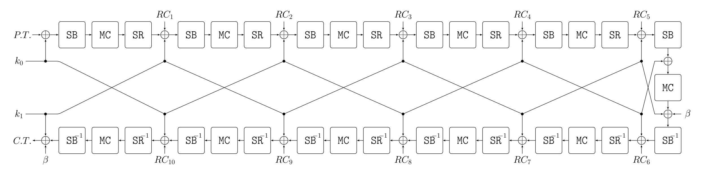

Fig. 9. PRINCEv2 structure for encryption.

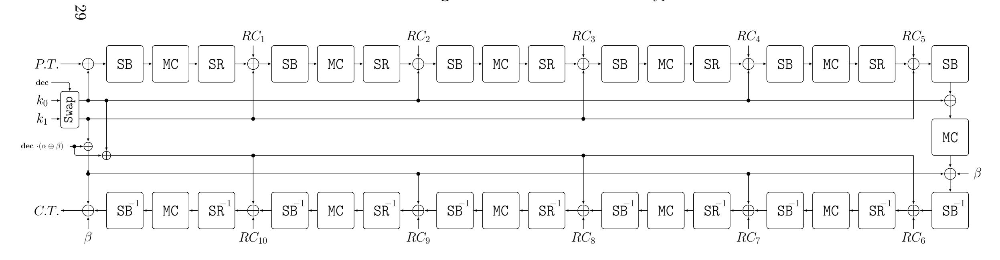

Fig. 10. PRINCEv2 structure for encryption and decryption.