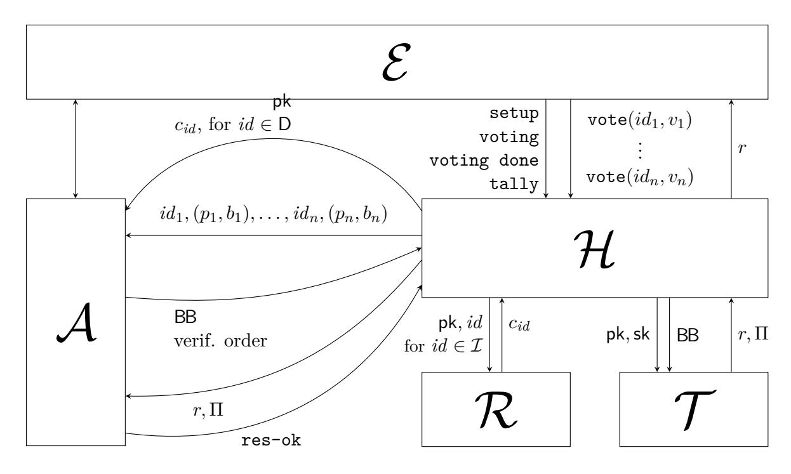
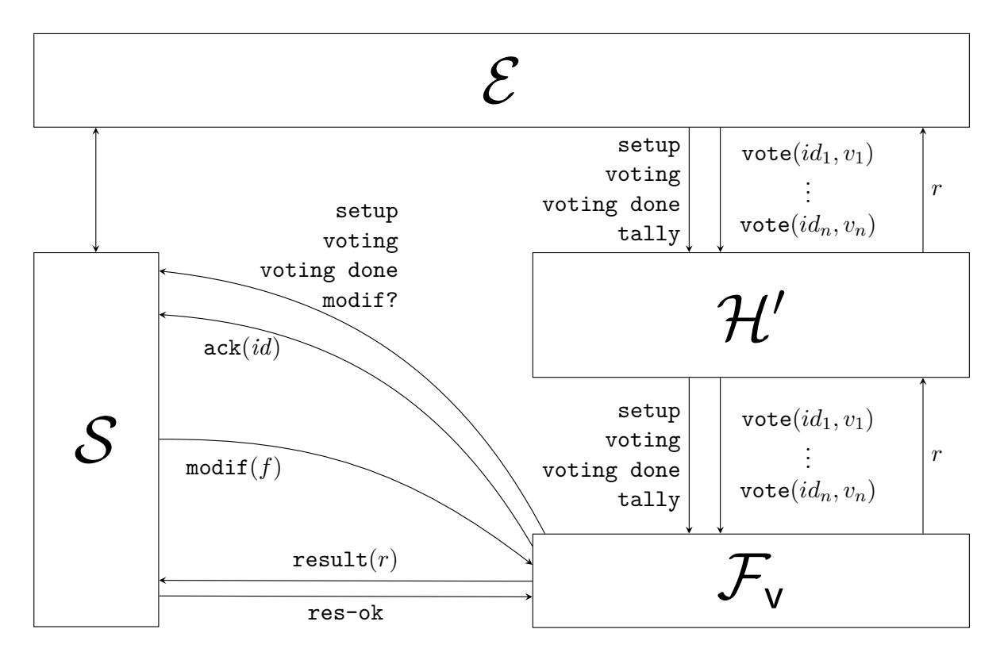

# Fifty Shades of Ballot Privacy: Privacy against a Malicious Board

Véronique Cortier CNRS, Loria veronique.cortier@loria.fr

Joseph Lallemand Inria, Loria/ETH Zürich joseph.lallemand@inf.ethz.ch

Bogdan Warinschi University of Bristol/Dfinity csxbw@bristol.ac.uk

February 6, 2020

### **Abstract**

We propose a framework for the analysis of electronic voting schemes in the presence of malicious bulletin boards. We identify a spectrum of notions where the adversary is allowed to tamper with the bulletin board in ways that reflect practical deployment and usage considerations. To clarify the security guarantees provided by the different notions we establish a relation with simulation-based security with respect to a family of ideal functionalities. The ideal functionalities make clear the set of authorised attacker capabilities which makes it easier to understand and compare the associated levels of security. We then leverage this relation to show that each distinct level of ballot privacy entails some distinct form of individual verifiability. As an application, we study three protocols of the literature (Helios, Belenios, and Civitas) and identify the different levels of privacy they offer.

# **1 Introduction**

Electronic voting aims to achieve the same properties as traditional paper based voting. Even when voters vote from their home, they should be given the same guarantees, without having to trust the election authorities, the voting infrastructure, and/or the Internet network. A key property is privacy: no one should know how I voted. Many schemes have been designed to achieve vote privacy under various trust assumptions. The typical strategy is to encrypt the votes under a key for which the corresponding decryption key is split among several authorities – at least a certain number of authorities are required to decrypt and tally. The motivation for this design is that in this setting the voting server which, among other functions, maintains the public bulletin board, does not need to be trusted.

It has recently been observed *e.g.* in [\[12,](#page-25-0) [5,](#page-25-1) [11\]](#page-25-2) that this trust assumption is not appropriately captured by existing security definitions. In brief, existing definitions (*e.g.* [\[3,](#page-25-3) [4,](#page-25-4) [7\]](#page-25-5)) consider a game where the adversary controls the votes cast by honest parties but cannot control the resulting ballots: these get placed on the bulletin board before it is tallied and cannot ever be modified or removed. In other words, current notions allow to prove security of schemes only under the assumption that the bulletin board contains all of the submitted honest votes, and these are not dropped or modified. This is in contrast with the stated design goal to resist a dishonest voting server, that could try to tamper with the ballots.

This gap between security goals and security definitions has recently been confirmed by Roenne [\[16\]](#page-26-0) in the case for Helios [\[1\]](#page-25-6), a popular voting scheme. Roenne's attack shows that a malicious board can break privacy as soon as users are allowed to revote. Moreover, it seems impossible to prevent the attack even if voters and external auditors carry out additional checks (*e.g.* forbidding duplicate ballots). Even detecting the attack would require unrealistic countermeasures where every voter carefully records all of her ballots, even the ones that failed to reach the ballot box.

We aim to fill this gap. To motivate our work, and contextualise some of our design choices, it is useful to discuss the security of Helios against an adversary who can control the bulletin board. Recall that in Helios voters encrypt their votes and send their encrypted ballots to a bulletin board, that displays them. The tally is done through mixnets or using the homomorphic property of the encryption. Importantly, voters can and should check that their ballot appears on the bulletin board.

How much security does Helios provide when the board which collects the votes behaves maliciously? The answer to this question strongly depends on the behaviour of the users involved in the election.

- 1. The strongest guarantees are offered when all of the honest voters vote and check that their vote appears on the ballot box. In this case the result of the election contains all of the honest votes plus at most as many votes as the number of voters controlled by the adversary.
- 2. Assume now that not all honest voters vote, but those who vote, also check that their ballot appears on the board. Over the previous scenario, the security of Helios decreases. Indeed, a malicious board may use absentee voters to place ballots of her choice. So the privacy of the election is as good as what an attacker can learn from a result formed from the honest voters that did vote and any choice of votes from the remaining voters (dishonest or not).
- 3. Finally, the most common scenario is that not all honest voters vote and only a fraction of them actually conduct the suggested verification steps. In this case the security of Helios decreases even further. A malicious board may now selectively remove ballots that have been cast by voters that do not check. Hence a malicious board has now even more control on the result which, in turn, may leak more information about the honest votes since the board may contain fewer votes (and more of which are selected by the adversary).

The examples above make it clear that it is difficult to settle on a unique definition of privacy: each scenario is, at least in theory, possible and each corresponds to a different level of guarantees. The strongest privacy level for a voter's ballot is obtained when her ballot is *always* tallied together with all of the other honest votes. For Helios, such a level of security corresponds to the first case above but can only be provided under the unrealistic assumption that all voters verify that their vote has been cast. Alternatively, we could consider a weaker variant, where the adversary can remove some (prespecified) number of ballots. This attacker corresponds to case 3 where only some voters check that their ballot has been recorded correctly. A benefit of this relaxation is that it would allow to study the security of more schemes: while the attacker may remove votes, we would like to understand how harmful these actions are with respect to the privacy of the remaining votes.

However, if we settled only on the weak variant, we would not be able to express that security guarantees vary considerably between different usage scenarios of *the same* scheme, as our three examples above show. Moreover, while in the above examples we only identified three relevant levels of privacy for Helios, we note that other schemes may require even more different levels.

A spectrum of privacy definitions is also useful to compare *different* schemes. A "black or white" definition would declare a set of voting schemes secure while the rest would be deemed insecure. Instead, it is clearly more useful to to spell out conditions under which some scheme is "more secure" than another one. For example, in Civitas [\[8\]](#page-25-7), due to the use of credentials, a malicious server may drop ballots from honest voters that do not check but cannot replace them with arbitrary ballots, like in Helios. In that respect, Civitas is more secure since the adversary can infer less from the result. This is a more precise analysis than declaring Civitas private and Helios insecure.

## **1.1 Our contributions**

We make four contributions which address the challenges outlined above. Throughout, unlike most existing privacy definitions, we assume a malicious voting server. Furthermore, we assume that the adversary (an arbitrary probabilistic polynomial time algorithm) fully controls the network, and a set of dishonest voters, in addition of course to the voting server. We highlight however that our privacy definition still assumes a trusted setup and a trusted tally. While verifiability notions have already been studied and formally defined against a dishonest talliers for example, this remains unexplored regarding privacy. We also leave it for future work (one issue at a time!).

**Game based security.** Our first contribution is *a family* of rigorous game-based definitions for ballot privacy against malicious bulletin boards. Here, we build upon the security notion BPRIV introduced in [\[4\]](#page-25-4). Like other game-based privacy definitions, the general idea behind BPRIV is that the adversary has to distinguish between two situations. The first considers the case where honest voters submit ballots containing votes selected by the adversary and the tally happens as expected. This is the "real world". In the second scenario the adversary sees the same tally but does not see the real ballots. Instead, honest voters submit "fake" ballots corresponding to other votes, also chosen by the adversary. If no adversary can tell whether the bulletin board contains real or fake ballots then the ballots themselves, together with the result learned by the adversary, do not leak information about the underlying votes.

Building on top of this definition is not straightforward, and this probably also explains why most existing vote privacy definitions assume an honest voting server. The difficulty is that the approach outlined above breaks immediately when considering a dishonest server. As explained above, we need to return to the adversary the tally of the honest votes both when he sees true ballots and when he sees fake ones. However, an adversary who fully controls the ballot box may tamper or drop all ballots submitted by the honest parties. In turn, it may be hard to determine which of the "real" ballots should be tallied – and an incorrect choice would make distinguishing trivial. Moreover, as discussed above, we need to distinguish between the case where removing honest ballots is an actual attack or corresponds to some actions which are in fact allowed by the scheme.

Our solution is to define the security only for schemes where we can somehow detect how an adversary tampers with the bulletin board. Technically we demand the existence of a *recovery* algorithm which can detect *how* the adversary has modified the ballots issued by the honest users. The output of the recovery algorithm can be thought of as a small *tampering program*, written in a small programming language with commands that act on the bulletin board (*e.g.* delete honest votes, modify votes, re-order votes, *etc.*). This recovery algorithm is a parameter of the security definition and can be used to determine which honest votes to tally for the adversary. Of course, the more actions the recovery algorithm allows, the less security guarantees we get. We emphasise that this detection procedure is an artefact of our modelling approach, and not a procedure which could for example be run during the execution of the protocol to detect tampering.

**Relation with simulation-based security.** Next, we validate our game-based definitions of security by relating them with simulation-based notions. In this latter definitional approach, security is defined with respect to some ideal functionality that captures a small set of possible behaviours, corresponding to a very abstract model of the system. Functionalities capture security somewhat more directly which facilitates understanding of some of their associated security guarantees.

The typical definition for simulation based vote privacy involves a functionality which collects the list of votes of all parties (honest and corrupt) and simply returns the result of the election determined by the list. To capture the setting where an adversary can to some extent tamper with the bulletin board (and therefore the list of votes that is tallied) we modify the ideal functionality to reflect this adversarial ability. We now give a high level (and imprecise) sketch of how we proceed. Similarly to how our game-based notion is parametrised by the recovery algorithm, the functionality is parametrised by a small tampering "programming" language *P* – think about *P* as containing commands that tamper with the board (*e.g.* delete ballot(*i*), insert ballot(*b*)). After it collects the votes, but before it returns the result, the functionality allows the adversary to tamper with the votes list via an arbitrary program *f* which uses the commands in *P* (*e.g.* delete ballot(1); delete ballot(4); delete ballot(5)) before returning the tally[1](#page-3-0) .

We can then establish a link between security *w.r.t.* mb-BPRIV parametrised by recovery algorithm *f* and idealised security with respect to an ideal functionality parametrised by tampering language *P*. Provided that *f* and *P* are compatible (roughly: they allow the same commands on the list of ballots/votes), then any scheme which is mb-BPRIV secure and strongly consistent is secure with respect to the ideal functionality. Strong consistency, a notion introduced in [\[4\]](#page-25-4), demands that the tally reveals only the desired result function on the votes (and no additional information).

**Relation with verifiability** Our definitions exhibit a subtle interplay between verifiability and privacy which is worth discussing. Our ideal functionalities reflect different adversarial capabilities and restrictions to modify honest votes. Is this a privacy or a verifiability property? Intuitively, ballot privacy says that the adversary should not learn more information about the votes than the result itself. Hence, whether or not the adversary can remove or alter honest votes, or add more votes (all of which are actions which verifiability could/should prevent), gives more control to the adversary over the result and therefore with the level of privacy offered by the voting scheme.

Similarly to [\[11\]](#page-25-2), we show that ballot privacy entails some form of verifiability. The less the adversary can tamper with the ballots, the highest verifiability we get. We therefore define a spectrum of verifiability notions that echoes our spectrum of privacy levels. For example, one of the lowest verifiability levels only guarantees that the votes of honest voters that did check are indeed part of the result. One of the highest verifiability levels ensures that the result corresponds to all honest votes plus a set of votes corresponding to the dishonest voters. Note that, like in [\[11\]](#page-25-2), we prove that ballot privacy implies verifiability *under the same trust assumptions*. In particular, our definition (like all vote privacy definitions we know) still assumes an honest tally, while of course verifiability in general can be studied and defined under weaker trust assumptions, relying for example on proofs of correct decryption.

**Case studies** As applications of our definitional contributions we study the security of three standard protocols when the adversary can control the bulletin board: Helios [\[11\]](#page-25-2), Belenios [\[9\]](#page-25-8), and Civitas [\[8\]](#page-25-7). For each protocol in turn we identify which ideal functionalities they achieve and under which trust assumptions. In particular, we highlight that Civitas is the only scheme among the three that guarantees that ballots cannot be reordered, even by a malicious board.

<span id="page-3-0"></span><sup>1</sup>Technically, our model is slightly different: we capture validity of tampering functions via predicates which do more than only syntactic checks.

## **1.2 Related work**

The first game-based definition which considers a malicious board has been proposed by Bernhard and Smyth [\[5\]](#page-25-1). Their definition extends Benaloh's approach [\[3\]](#page-25-3). The adversary submits a board and the tally is performed only if the ballots on the board that come from honest voters are such that the subtally does not differ in the "left" and "right" worlds. This somehow corresponds to one possible instance of our recovery algorithm in mb-BPRIV, where the attacker may remove any honest vote and add an arbitrary number of votes, independently of whether honest voters do check their ballot and independently of the number of dishonest voters. Note that [\[5\]](#page-25-1) requires that ballots cannot be modified at all (*e.g.* they cannot contain a tag such as the date). Perhaps the most important technical difference from our approach is that Benaloh's definitional approach does not seem to allow a formal link with a simulation-based notion of security. In brief, Benaloh's definition does not allow to construct a simulator which can simulate on the fly a fake board towards an adversary: the global consistency requirement between the subtally of the real votes seems to preclude an on-line simulator which can fake a board. Furthermore, this approach assumes that the counting function admits partial tally, which discards many modern counting functions such as Condorcet or STV.

The shortcomings that stem from the use of Benaloh's approach are also shared by [\[11\]](#page-25-2). This definition can be again seen as an extension of Benaloh's definition but which assumes that *all* honest voters check that their ballot appears on the bulletin board.

Recently, Bursuc, Dragan and Kremer [\[6\]](#page-25-9) have studied the security of encryption schemes where ballots can be partially modified, for example by a malicious device. They propose a variant of BPRIV that accounts for such behaviours. The case of a malicious board corresponds to the case where ballots can be fully modified. Then for malicious boards, vote privacy defined in [\[6\]](#page-25-9) can be seen as an instance of mb-BPRIV where the recovery algorithm lets the adversary tamper arbitrarily with the honest ballots. However, in such a case, all schemes would be declared insecure. So the model of [\[6\]](#page-25-9) does not seem suitable to reason about malicious boards in general. Instead, it addresses a class of schemes where security is due to the part of the ballot that is securely transmitted to the (honest) board, despite the adversary tampering with the other parts of the ballot.

The approach we take in this paper is to understand the level of security offered by schemes when faced with an adversary who is allowed to tamper with the bulletin board. A different approach adopted by a series of recent works [\[14,](#page-26-1) [12,](#page-25-0) [7\]](#page-25-5) aims to ensure that such tampering is not possible. Technically, this is enforced via a distributed algorithm. This line of work nicely complements our approach by studying how to guarantee a consistent view of the board among the voters and the auditors. In particular, our mb-BPRIV definition assumes that voters all see the same board. On the other hand, [\[14,](#page-26-1) [12,](#page-25-0) [7\]](#page-25-5) do not study how an attacker could tamper with the bulletin board (*e.g.* removing some honest ballots, reordering the ballots) and how this could affect the privacy of the voting scheme.

# **2 Background**

In this section we recall some terminology from existing literature, and fix some assumptions which we will use throughout the paper. We consider a finite set I = H ∪ D of voter identities, partitioned into the sets H and D of honest and dishonest voters. H is further partitioned into sets Hcheck and Hcheck, meant to contain the identities of voters who verify their vote (resp. do not verify).

We study schemes for which the adversary can legally tamper with the bulletin board (NB: throughout the paper we use bulletin board and ballot box interchangeably.) For concreteness, we make a mild assumption regarding the format the bulletin board takes.

**Definition 1** (Bulletin board)**.** *A* bulletin board BB *is a list of ballots of the form* (*p, b*) *where p is called a* public credential *and b is a ciphertext.* BB[*j*] *denotes the jth element of* BB*.*

*We will also call* extended bulletin board *a board where elements are associated to an identity, i.e. a list of elements of the form* (*id,*(*p, b*))*.*

**Definition 2** (Voting scheme)**.** *A voting scheme consists of seven algorithms:*

V = (Setup*,* Register*,* Pub*,* Vote*,* Valid*,*Tally*,* Verify)*.*

- Setup(1*<sup>λ</sup>* ) *computes a pair of* election keys (pk*,*sk) *given a security parameter λ.*
- Register(1*<sup>λ</sup> , id*) *generates a* private credential *c for voter id and stores the correspondence* (*id, c*) *in a list* U*, used for modelling purposes.*
- Pub(*c*) *returns the public credential associated with a credential c.*
- Vote(pk*, id, c, v*) *constructs a ballot* (*p, b*) *for user id with private credential c, containing vote v, using the public election key* pk*. It also returns a state to the voter, that models what a voter should record, e.g. her ballot. One can think about this state as any information a voter would need to record, e.g. to verify if the ballot has been cast.*
- Valid(BB*,* pk) *checks that the board* BB *is valid.*
- Tally(BB*,*sk) *uses the board* BB *and the secret election key* sk *to compute the result r of the election, and potentially proofs* Π *of good tallying.*
- Verify(*id, s,* BB) *represents the checks a voter id, with local state s, should perform on a board* BB *to ensure her vote is counted.*

Counting functions are the functions which calculate the result of an election. For example, the result of an election can be the sum of the votes for each candidate, or the multiset of votes, or the result of more complex voting methods such as Condorcet or Single Transferable Vote.

**Definition 3** (Counting function)**.** *A* counting function *ρ is a mapping that takes a sequence S of pairs* (*id, v*)*, where id* ∈ I *and v is a vote, and returns the result of tallying the votes in S. It may use the ids to apply a revote policy.*

*We assume a special value* ⊥ *that represents the case of an invalid vote (e.g. obtained by decrypting a ballot that was incorrectly generated). We require that counting functions ignore this value, i.e. that for all l, l* 0 *, ρ*(*l*||⊥||*l* 0 ) = *ρ*(*l*||*l* 0 )*.*

# **3 Game-based Security**

In this section we present our game-based notion for vote privacy. Namely, *ballot privacy* ensures that ballots do not reveal information about the underlying votes. We will show that ballot privacy implies simulation-based security, provided that the scheme is additionally strongly consistent, that is that the tally function behaves as counting the votes extracted from the ballots.

## **3.1 mb-BPRIV**

Ballot privacy has been proposed by Bernhard et al [\[4\]](#page-25-4). It captures the idea that ballots themselves do not reveal information about the underlying votes (even after tallying). That notion models an honest ballot box whereas we consider a malicious one. To distinguish between the two notions we refer to the existing one as hb-BPRIV security and to the notion we introduce here as mb-BPRIV. We start with a high level discussion of the notion which we introduce, provide a formal definition and then discuss its salient features over those of hb-BPRIV.

We consider a game which pits an adversary against a voting scheme. The adversary has partial information about honest users' votes: for each such user the adversary selects a left-orright challenge consisting of two votes *v*<sup>0</sup> and *v*1. The game computes the ballots corresponding to the votes but returns to the adversary the ballot which corresponds to *vβ*, for some hidden bit *β* which the adversary needs to determine. However, the game keeps track of two bulletin boards BB<sup>0</sup> and BB<sup>1</sup> (the ordered list of ballots calculated in response to the adversary's queries) – the adversary sees, essentially, BB*β*. The adversary then creates a public bulletin board BB, by using the honest votes and arbitrary other votes it creates.

The key aspect of the definition is how the game computes the tally it returns to the adversary. When the adversary is in the world where he sees BB0, the game simply tallies BB, the board which the adversary returned.

When the adversary is in the world where he sees BB<sup>1</sup> (so where BB is calculated using BB1) we need to determine *how* the adversary manipulated the votes on BB<sup>1</sup> to produce the board he returned to be tallied. To define security we demand that it should be possible to (efficiently) determine which of the honest ballots have been cast, on which position on the bulletin board, and which ones have been removed. Once this transformation is determined, the game applies it to BB0, tallies the resulting board and returns the result to the adversary. We explain a bit later in the paper how an insecure scheme would allow a distinguishing attack in the game we outlined above.

Technically, we represent the transformation which describes how the adversary constructs BB from BB<sup>1</sup> as a *selection function*, and we formalise the process of recovering this transformation as a *recovery* algorithm.

**Definition 4** (Selection function)**.** *For m, n* ≥ 1*, a* selection function for *m*, *n is any mapping*

$$\pi : [1, n] \longrightarrow [1, m] \cup (\{0, 1\}^* \times \{0, 1\}^*)$$

Intuitively, *π* represents the process used by an adversary to construct a bulletin board BB of *<sup>n</sup>* ballots from a given board BB<sup>1</sup> of *<sup>m</sup>* ballots. For *<sup>i</sup>* <sup>∈</sup> <sup>J</sup>1*, n*K, *<sup>π</sup>*(*i*) indicates how to construct BB[*i*]:

- *<sup>π</sup>*(*i*) = *<sup>j</sup>* <sup>∈</sup> <sup>J</sup>1*, m*<sup>K</sup> means this element is the *<sup>j</sup>*th from BB1;
- *π*(*i*) = (*p, b*) means that this element is (*p, b*).

A bit more formally:

**Definition 5** (Applying a selection function to a board)**.** *Consider a selection function π for m, n* ≥ 1*. The function π associated to π maps an extended board* BB<sup>0</sup> *of length m to a board <sup>π</sup>*(BB0) *of length <sup>n</sup> such that for any <sup>j</sup>* <sup>∈</sup> <sup>J</sup>1*, n*K*,*

$$\overline{\pi}(\mathsf{BB}_0)[j] = \left\{ \begin{array}{ll} (p,b) & \textit{if } \pi(j) = i \; \textit{and} \; \mathsf{BB}_0[i] = (id,(p,b)) \\ (p,b) & \textit{if } \pi(j) = (p,b) \end{array} \right.$$

*.*

The "recovery" algorithm which recovers the selection function used by the adversary takes as input two boards and some additional data d (intuitively, this piece of data contains the link between voter identities and public credentials).

**Definition 6** (Recovery algorithm). We call recovery algorithm any algorithm RECOVER that, given a board BB, an extended board BB<sub>1</sub>, and some additional data d as input, returns a selection function for  $|BB_1|$ , n for some n.

We discuss the role of RECOVER and how it can be interpreted after we provide our formal definition for mb-BPRIV.

The following definition formalises ballot privacy of some scheme  $\mathcal{V}$  in a setting where the adversary  $\mathcal{A}$  controls the voting server hence the ballot box. Recall that we consider some fixed set of voter identities  $\mathcal{I}$  partitioned between two sets H and D of honest and dishonest voters. We also assume that some subset  $\mathsf{H}_{\mathsf{check}}$  of H of users perform whatever checks the scheme expects to be executed before the tally is performed. The execution described in Figure 1 starts with the generation of a public key for the election and its associated secret key (to be used for tallying). Next, a number of voters from an arbitrary set  $\mathcal{I}$  are registered. We keep this aspect of the execution fairly abstract: we assume a registration algorithm/protocol is executed for each user  $id \in \mathcal{I}$  and we only record the secret credential c and its associated public credential  $\mathsf{Pub}(c)$ . We use respectively arrays U and PU to record these. We also use array CU to record the secret credentials for some (arbitrary) set of dishonest users D.

The adversary gets as input pk, CU and PU. It also gets access to a left-right voting oracle. On input an identity id and two potential votes  $v_0$  and  $v_1$ , the oracle computes two ballots for id, one for each adversarially selected vote. It records the first ballot in list  $BB_0$  and the second in list  $BB_1$ . We remark that we model a voting algorithm which is stateful. This is a necessary feature if one wants, as we do, to consider voters who perform additional actions after they have voted (e.g. checking that their ballot has been cast). For each user, we store the resulting state (for both worlds) in arrays  $V_0$  and  $V_1$ , respectively. This phase corresponds to the voting phase where the users submit their ballots. Then, the adversary prepares a bulletin board BB which it would like to be tallied. If the bulletin board does not pass the validity test then tally does not occur and the adversary needs to output his guess at this point.

Otherwise, the adversary gets control over the users who check via the oracle  $\mathcal{O}$ verify, to which it submits arbitrary identities. The oracle records the set of users who have checked in variable Checked and the set of users for which the check was successful in variable Happy.

If all of the voters who should check do check successfully, then the adversary gets to see the tally of the election. Otherwise the adversary must produce his guess without seeing the tally.

Finally, one of the salient aspects of our definition is how the experiment calculates the tally. In the real execution (i.e.  $\beta=0$ ) the tally is simply executed on BB. In the fake execution (i.e.  $\beta=1$ ) the tally first employs the Recover algorithm which parametrises the game to determine how the adversary has tampered with the votes it has seen (i.e. BB<sub>1</sub>) to produce the board it asks to be tallied. Then the game applies the transformation obtained this way to BB<sub>0</sub>. The resulting board is tallied and the result, together with a simulated proof, is returned to the adversary.

**Definition 7** (mb-BPRIV w.r.t. a recovery algorithm). Let  $\mathcal V$  be a voting scheme, and RECOVER a recovery algorithm. Consider game  $\operatorname{Exp}_{\mathcal A,\mathcal V,\operatorname{SimProof}}^{\mathit{mb-BPRIV},\operatorname{RECOVER},\beta}$  defined in Figure 1.  $\mathcal V$  satisfies  $\mathit{mb-BPRIV}$  w.r.t. RECOVER if there exists a simulator SimProof such that for any polynomial adversary  $\mathcal A$ ,

$$|\mathbb{P}(\mathsf{Exp}_{\mathcal{A},\mathcal{V},\mathsf{SimProof}}^{\textit{mb-BPRIV},\mathtt{RECOVER},0}(\lambda)\!=\!1) - \mathbb{P}(\mathsf{Exp}_{\mathcal{A},\mathcal{V},\mathsf{SimProof}}^{\textit{mb-BPRIV},\mathtt{RECOVER},1}(\lambda)\!=\!1)|$$

is negligible in  $\lambda$ .

```
\mathsf{Exp}^{\mathsf{mb\text{-}BPRIV}, \mathsf{RECOVER}, \beta}_{\mathcal{A}, \mathcal{V}, \mathsf{SimProof}}(\lambda)
                                                                                                        \mathcal{O}voteLR(id, v_0, v_1)
                                                                                                       if id \notin H then return \bot
V_0, V_1, Checked, Happy \leftarrow \emptyset
                                                                                                       (p_0, b_0, state_0) \leftarrow \mathsf{Vote}(\mathsf{pk}, id, \mathsf{U}[id], v_0)
(pk, sk) \leftarrow Setup(1^{\lambda})
                                                                                                       (p_1, b_1, state_1) \leftarrow \mathsf{Vote}(\mathsf{pk}, id, \mathsf{U}[id], v_1)
for all id \in \mathcal{I} do
                                                                                                       V_0[id] \leftarrow state_0, V_1[id] \leftarrow state_1
     c \leftarrow \mathsf{Register}(1^{\lambda}, id)
                                                                                                       \mathsf{BB}_0 \leftarrow \mathsf{BB}_0 \parallel (id, (p_0, b_0))
     \mathsf{U}[id] \leftarrow c, \mathsf{PU}[id] \leftarrow \mathsf{Pub}(c)
                                                                                                       BB_1 \leftarrow BB_1 \parallel (id, (p_1, b_1))
for all id \in D do CU[id] \leftarrow U[id]
                                                                                                       return (p_{\beta}, b_{\beta}).
BB \leftarrow \mathcal{A}^{\mathcal{O}voteLR}(pk, CU, PU)
if H_{check} \not\subseteq V_0, V_1 then return \bot;
                                                                                                        \mathcal{O}verify<sub>BB</sub>(id) for id \in \mathsf{H}_{\mathsf{check}}
if Valid(BB, pk) = \bot  then
                                                                                                        Checked \leftarrow Checked \cup { id}
     d \leftarrow \mathcal{A}(); output d
                                                                                                       if Verify(id, V_{\beta}[id], BB) = T then
\mathcal{A}^{\mathcal{O}\mathsf{verify}_\mathsf{BB}}()
                                                                                                            \mathsf{Happy} \leftarrow \mathsf{Happy} \cup \{id\}
if H_{check} \not\subseteq Checked then return \bot
if \mathsf{H}_{\mathsf{check}} \not\subseteq \mathsf{Happy} then d \leftarrow \mathcal{A}();
if \mathsf{H}_{\mathsf{check}} \subseteq \mathsf{Happy} then d \leftarrow \mathcal{A}^{\mathcal{O}\mathsf{tally}_{\mathsf{BB}}, \mathsf{BB}_0, \mathsf{BB}_1}()
output d.
                         \mathcal{O}tally<sub>BB,BB<sub>0</sub>,BB<sub>1</sub></sub>() for \beta = 0
                                                                                                \mathcal{O}tally<sub>BB.BBn,BB1</sub>() for \beta = 1
                         (r,\Pi) \leftarrow \mathsf{Tally}(\mathsf{BB},\mathsf{sk})
                                                                                                \pi \leftarrow \text{RECOVER}_{\mathsf{II}}(\mathsf{BB}_1, \mathsf{BB})
                                                                                                 BB' \leftarrow \overline{\pi}(BB_0)
                                                                                                 (r,\Pi) \leftarrow \mathsf{Tally}(\mathsf{BB}',\mathsf{sk})
                                                                                                \Pi' \leftarrow \mathsf{SimProof}(\mathsf{BB}, r)
                         return (r,\Pi)
                                                                                                return (r,\Pi')
```

<span id="page-8-0"></span>Figure 1: The mb-BPRIV game.

Our definition is parametrised by a recovery algorithm, which is a rather non-standard feature. We explain the role it plays through an example. One way to think about the recovery algorithm is that it aims to detect the (legal) actions which the adversary took when tampering with the board. For a secure scheme, it should be possible to understand how each ballot on the bulletin board to be tallied has been created, *i.e.* was it submitted by an honest user, was it created by the adversary, was it submitted by an honest user but modified by the adversary, according to what is considered to be acceptable.

The following example sheds some light on the role played by the recovery algorithm in our security definition. Similarly to the Helios scheme, assume a scheme where copying a ballot and submitting it in the name of another voter is possible. There are already two possibilities. Either this is completely allowed by the scheme (scheme A, no weeding is performed) or such duplicate ballots should be weeded out and therefore a board with duplicate ballots would be rejected (scheme B). Now, even when no weeding is performed, such a weakness (letting the adversary copies votes) may be well identified and accepted by the users (case 1) or not accepted (case 2). To win mb-BPRIV, the adversary can proceed as follows. First, it submits (id, 1, 0) to the voting oracle. The game calculates  $b_0$  and  $b_1$  and returns  $b_\beta$  to the adversary. The adversary returns for tallying a board containing  $b_\beta, b'_\beta$ , where the adversary turned  $b_\beta$  into an equivalent ballot  $b'_\beta$ , which contains the same vote as  $b_\beta$ . In the left world, the tally returns 2. What happens in the right world depends on which recovery algorithm we consider. If we pick a recovery algorithm that does not detect that  $b'_\beta$  is a duplicate of  $b_\beta$ , then it interprets  $b'_\beta$  as a fresh adversarial

ballot. The board which will be tallied is then *b*0*, b*<sup>0</sup> 1 , so the result would be 1. The scheme would thus be insecure for this recovery algorithm. This corresponds to case 2: ballot copying has not been identified as an acceptable behaviour and therefore this is an attack. Conversely, if we pick a recovery that detects that *b* 0 1 is a copy of *b*1, then the board submitted to tally would be *b*0*, b*<sup>0</sup> 0 , where *b* 0 0 is obtained from *b*<sup>0</sup> using the same action the adversary used on *b*1, so the result would also be 2, and it would not help the adversary to distinguish. The scheme would then be mb-BPRIV for this recovery algorithm which detects the copying action. This corresponds to case 1: the users are aware that ballot copying is possible and this is not considered an issue. Yet, the users would like to perform a privacy analysis: are there other behaviours that may leak some information on the votes?

We see here that the Recover we choose determines the security level provided by mb-BPRIV. Our example where ballots can be copied would be declared insecure for a Recover that does not detect copied ballots, as this Recover is unable to detect what the adversary did, but secure for a Recover that does detect copies. The second Recover detects more possible actions from the adversary, and hence allows the adversary to do more without breaking mb-BPRIV: so this variant of recovery algorithm yields weaker security guarantees. More generally, the transformations which Recover detects limit what an adversary is allowed to do without breaking mb-BPRIV. An adversary that can perform some actions that Recover does not detect will break mb-BPRIV, as in the example. Thus, proving a given voting scheme mb-BPRIV for a Recover that detects less behaviours from the attacker gives stronger security guarantees: it means that no adversary can have such behaviours, as otherwise mb-BPRIV would break.

Finally, it is instructive to consider the case where the scheme itself detects and discards such copies (to offer better privacy). This is scheme B. Then, even if we pick the first recovery algorithm, the one that does not detect that *b* 0 *β* is a duplicate of *bβ*, the scheme would satisfy mb-BPRIV. Indeed, as the scheme itself detects and prevents the adversary from copying ballots, there is no need for Recover to detect this behaviour. Just as intuition should say, such a scheme would be mb-BPRIV with a recovery algorithm that detects less, which ensures a stronger level of security.

## <span id="page-9-0"></span>**3.2 Instantiations of mb-BPRIV**

In this section we describe three instantiations of mb-BPRIV with recovery algorithms relevant for the schemes we study in this paper. Recall that the recovery algorithm aims to determine how the adversary tampered with the board. For clarity, in our examples we indicate in the indices of the recovery algorithms the actions which we expect each recovery algorithm to be able to detect. For example, Recoverdel*,*reorder would be expected to detect, for each vote in turn, if the adversary has blocked it from appearing in the final tally, or if it has changed the order in which it was cast. In that cas, such actions are deemed acceptable. We detail this recovery algorithm and discuss how it works. We then provide two variations: one which adds an additional capability to the adversary (and thus makes the associated mb-BPRIV variant weaker) and one which restricts the power of the recovery algorithm (and thus makes the associated variant stronger).

For each instantiation we informally describe the power we expect the adversary to have and then give a matching recovery algorithm. Our instantiations assume an efficient algorithm that can extract an identity and a vote from each ballot. Formally, we assume two functions extractid and extract<sup>v</sup> such that for any (*p, b*) generated by Vote(pk*, id,*U[*id*]*, v*), then extractid(U*, p*) = *id* and extractv(sk*, b*) = *v* with overwhelming probability. We then write extract(sk*,*U*, p, b*) = (extractid(U*, p*)*,* extractv(sk*, b*)) the extraction function that extracts (*id, v*) from (*p, b*). Typically, the extraction of the vote is simply the decryption of the ballot. The extraction of the identity may consist in reading the first component of the ballot (*e.g.* in Helios) and is based on the

credential (*e.g.* in Belenios). This extract function will also be used in other parts of the paper.

### **3.2.1** del + reorder

We start with adversaries who are allowed to arbitrarily change the order of the votes in the ballot box, and remove the votes of the voters who do not run the verification algorithm, but who cannot replace these votes with other votes of their own choosing. In other words, if an adversary succeeds in replacing a vote, he will win the game. Conversely, if she simply blocks a ballot, this will not form an attack. Below, we informally describe the transformation the recovery algorithm recovers (as it is applied to the board in the left world).

Given BB<sup>1</sup> and BB, when applied to BB0, Recoverdel*,*reorder will construct a board BB<sup>0</sup> where

- Each ballot in BB that comes from BB<sup>1</sup> is replaced with the ballot at the same position in BB0.
- The other ballots in BB are considered to be cast, provided they do not belong to a honest voter, *i.e.* if they do not extract to a honest identity. They are added to BB<sup>0</sup> as is.
- In addition, all ballots in BB<sup>0</sup> created by honest voters who check their votes are added to BB<sup>0</sup> , regardless of whether these voters' ballots actually occur in BB.

The details of the Recoverdel*,*reorder algorithm are in Figure [2.](#page-11-0)

### **3.2.2** del + change + reorder

Here, we assume that the adversary is allowed to change the order of the votes, and remove or change the votes of voters who do not verify.

Intuitively, given BB<sup>1</sup> and BB, when applied to BB0, recovery algorithm Recoverdel*,*reorder*,*change will construct a board BB<sup>0</sup> where

- Each ballot in BB that comes from BB<sup>1</sup> is replaced with the corresponding ballot from BB0.
- The other ballots in BB are considered to be cast, even if they belong to an honest voter. They are added to BB<sup>0</sup> as is.
- All the ballots registered for voters who check in BB<sup>0</sup> are added to BB<sup>0</sup> , regardless of whether these voters' ballots actually occur in BB.

Formally, Recoverdel*,*reorder*,*change is defined in Figure [2.](#page-11-0)

### **3.2.3 Ideal**

Assume now the adversary is not allowed to remove, change, or reorder any honest vote, even for voters who do not verify. Any adversary that can produce a valid board with such an alteration of the ballots will win the game.

Intuitively, given BB<sup>1</sup> and BB, when applied to BB0, Recover<sup>∅</sup> will construct a board BB<sup>0</sup> where

- Each ballot in BB<sup>0</sup> is added to BB<sup>0</sup> , in the same order, regardless of whether the corresponding ballot from BB<sup>1</sup> actually occurs in BB.
- The other ballots in BB that belong to a dishonest voter are considered to be cast, and are added to BB<sup>0</sup> as is.

Formally, the Recover<sup>∅</sup> algorithm is displayed in Figure [2.](#page-11-0)

```
\operatorname{RECOVER}_{IJ}^{del,reorder}(BB_1,BB_1,BB_2)
                                                                                     Recover_{II}^{\emptyset}(BB_1, BB)
                                                                                     L \leftarrow [1, \dots, |\mathsf{BB}_1|];
L \leftarrow [];
for (p,b) \in BB do
                                                                                     for (p, b) \in BB do
    if \exists j, id. \mathsf{BB}_1[j] = (id, (p, b)) then
                                                                                         if extract_{id}(U, p) \notin H then
        L \leftarrow L \parallel j
                                                                                             L \leftarrow L \parallel (p, b)
        (if several such j exist, pick the first one)
                                                                                     return (\lambda i. L[i])
    else if extract_{id}(U, p) \notin H then
        L \leftarrow L \parallel (p, b)
  L' \leftarrow [i|\mathsf{BB}_1[i] = (id,(p,b)) \land id \in \mathsf{H}_{\mathsf{check}} \land (p,b) \notin \mathsf{BB}]
  L'' \leftarrow L \parallel L'
  return (\lambda i. L''[i])
                  \underline{\mathrm{RECOVER}^{\mathsf{del},\mathsf{reorder},\mathsf{change}}_{\mathsf{U}}(\mathsf{BB}_1,\mathsf{BB})}
                  L \leftarrow \square:
                  for (p, b) \in BB do
                      if \exists j, id. \mathsf{BB}_1[j] = (id, (p, b)) then
                           L \leftarrow L \parallel j (if several such j exist, pick the first one)
                      else if extract_{id}(U, p) \notin H_{check} then
                      L \leftarrow L \parallel (p, b)
                  L' \leftarrow [i|\mathsf{BB}_1[i] = (id, (p, b)) \land id \in \mathsf{H}_{\mathsf{check}} \land (p, b) \notin \mathsf{BB}]
                  L'' \leftarrow L \parallel L'
                  return (\lambda i. L''[i])
```

<span id="page-11-0"></span>Figure 2: The Recover  $^{\text{del,reorder}}$ , Recover  $^{\text{del,reorder,change}}$ , and Recover  $^{\emptyset}$  algorithms.

# 4 Simulation-based security

In this section we introduce simulation based definitions for the security of voting systems. As usual, we describe a real and an ideal execution scenario for the protocol. The definitions are fairly standard in terms of the underlying communication models, and to a large extent in terms of the ideal functionalities we consider. A major departure from functionalities used in the literature, e.g. [13, 4], is that our ideal functionalities explicitly allow the adversary to influence the list of votes to be tallied.

### 4.1 Real execution

We describe the real execution of the protocol in a hybrid model where the protocol is implemented using ideal functionalities for registration and for tallying. As for our game based approach, some parameters are fixed. These include the sets H and D of honest and corrupt voters and the set  $H_{check}$  of voters who check. All these parameters are assumed hardwired in the algorithms defining the execution. We illustrate in Figure 3 the execution setting. It comprises:

- The environment  $\mathcal{E}$  is in charge of deciding on the execution phases of the protocol (setup, vote, tally); the environment also decides on the votes of the honest users.
- The adversary  $\mathcal{A}$ : it receives the ballots of the honest users, controls the corrupt users and produces the bulletin board to be tallied. The adversary is controlled by the environment via a direct communication channel.



<span id="page-12-0"></span>Figure 3: The real execution, with  $id_1, \ldots, id_n \in \mathsf{H}$ 

- An entity  $\mathcal{H}$  models the honest parties in the system. In particular it models the honest voters (for simplicity we do not consider separate entities for each individual voter in the system) and the generation of keys for the election.
- The functionality for registration  $\mathcal{R}$ , in charge of generating and distributing credentials to voters.
- The functionality for tallying  $\mathcal{T}$ .

The execution consists of three phases (a setup phase, a voting phase, and a tallying phase). The environment  $\mathcal{E}$  sends commands to  $\mathcal{H}$  to trigger these phases.  $\mathcal{H}$  then informs the other entities of the phase change.

**Setup phase.** During the setup phase,  $\mathcal{H}$  runs the Setup algorithm to generate the election keys (pk, sk), sends pk to the other entities, and sk to  $\mathcal{T}$ .  $\mathcal{H}$  also asks  $\mathcal{R}$  to generate credentials.  $\mathcal{R}$  runs the Register algorithm to generate credentials for each voter. It returns the secret credentials of voters in  $\mathcal{H}$  to  $\mathcal{H}$  and the secret credentials of voters in  $\mathcal{L}$  to all other entities. Finally,  $\mathcal{H}$  returns the control to  $\mathcal{E}$ .

Voting and checking phase. During the voting phase,  $\mathcal{E}$  may send any number of vote(id, v) to  $\mathcal{H}$ , for honest voters  $id \in \mathsf{H}$ . When receiving such a command,  $\mathcal{H}$  runs the Vote algorithm to obtain a ballot for id containing v, it records the state returned by the voting algorithm and sends id and the ballot to  $\mathcal{A}$ . At some point,  $\mathcal{E}$  notifies  $\mathcal{H}$  that the voting phase is done. At that point,  $\mathcal{H}$  asks  $\mathcal{A}$  to provide a board BB.  $\mathcal{H}$  checks that  $\mathsf{Valid}(\mathsf{BB},\mathsf{pk}) = \top$ , and continues the execution. If the check fails, it informs  $\mathcal{E}$  that no result will be published.  $\mathcal{H}$  then performs the verifications of honest voters. It asks  $\mathcal{A}$  in which order the voters should verify.  $\mathcal{H}$  then runs the Verify algorithm on BB for each voter in  $\mathsf{H}_{\mathsf{check}}$ , in the order specified by  $\mathcal{A}$ . If all of these checks succeed, it continues the execution. Otherwise, it informs  $\mathcal{E}$  that no result will be published.



<span id="page-13-0"></span>Figure 4: The ideal execution with  $id_1, \ldots, id_n \in \mathsf{H}$ 

Tallying phase. During the tallying phase,  $\mathcal{H}$  sends BB to  $\mathcal{T}$  and asks for the result.  $\mathcal{T}$  runs the Tally algorithm, to compute a result  $(r,\Pi)$ , and sends it back to  $\mathcal{H}$ .  $\mathcal{H}$  forwards this result to  $\mathcal{A}$ , asking if the result should be published. Depending on  $\mathcal{A}$ 's decision,  $\mathcal{H}$  sends  $\mathcal{E}$  either r or a message informing  $\mathcal{E}$  that no result is published. Finally, the environment  $\mathcal{E}$  outputs a bit  $\beta$  which serves as the output of realexec( $\mathcal{E}||\mathcal{A}||\mathcal{V}$ ).

### <span id="page-13-1"></span>4.2 Ideal voting functionality and ideal execution

The ideal execution replaces the honest participants and the functionalities for registration and tallying with a single idealised functionality  $\mathcal{F}_{v}$ . The resulting structure of the system is illustrated in Figure 4. It comprises

- $\bullet$  The environment  $\mathcal{E}$ : as in the real execution the environment decides changes between the different phases of the execution, decides on the votes of the honest parties, and communicates with the ideal world adversary. As in the real case, we will only consider environments that choose to make each voter in  $H_{check}$  vote at least once.
- The ideal world adversary S, a.k.a. the simulator;
- The ideal voting functionality  $\mathcal{F}_{v}$ : this component captures the idealised voting scheme. Very roughly, it receives the votes from the honest parties and, when queried, it returns the result of the election. We give a precise description in the next section.
- The entity  $\mathcal{H}'$  is a dummy interface between the environment and the voting functionality (i.e. it only forwards the messages between  $\mathcal{E}$  and  $\mathcal{F}_{v}$ ).

As in the real execution the environment decides when to switch between the three phases of the execution (setup, vote and check, tally) and decides on the votes of the honest parties via messages it sends to  $\mathcal{H}'$ . In this world  $\mathcal{H}'$  is simply a forwarding channel between the environment and the ideal functionality (we explain below how the functionality operates). At some point the environment outputs a bit  $\beta$  which is also the output of idealexec( $\mathcal{E}||\mathcal{S}||\mathcal{F}_{v}$ ).

Next we describe the ideal functionality which is the key component of the execution, and which encapsulates the level of security guaranteed.

Ideal voting functionality. We consider several ideal functionalities which share the same basic design idea: they collect the votes of the honest parties (in a way which hides them from the adversary). Nonetheless, since we treat the setting where the adversary controls the bulletin board, and can therefore influence what is being tallied, our functionalities reflect this ability. The difference between the functionalities we consider is reflected in how permissive they are with respect to this step.

The functionality  $\mathcal{F}_{\mathsf{v}}^{\mathsf{del},\mathsf{reorder}}(\rho)$  is in Figure 5. In brief, i) it ensures that an adversary only learns who voted, and learns the result of the election, computed using  $\rho$ , but not what the votes were; ii) it ensures that the votes of honest voters who verify are not removed (though they may be reordered); iii) it allows an adversary to delete the votes of voters who do not verify, but not to change them.

Technically, the functionality maintains a list L of votes submitted by honest voters. Once the voting phase is over, it allows the ideal world adversary S to submit a vote modification function, i.e. a function f with domain [1, n] for some n, that describes how S wishes to manipulate the votes in L. The function provided by S needs to satisfy a couple of restrictions. Specifically, for any i, f(i) can either be some index j or some pair (id, v). Applying f to the list L of honest votes results in list  $\overline{f}(L)$  of length n defined by

$$\forall i \in [1, n]. \ \overline{f}(L)[i] = \left\{ \begin{array}{ll} L[j] & \text{if } f(i) = j \text{ is an index} \\ (id, v) & \text{if } f(i) = (id, v) \text{ for some } id, v \end{array} \right.$$

NB: the function f is applied only if it satisfies the requirements outlined above on how it affects the votes corresponding to the honest voters who check.

Next, we define  $\mathcal{F}_{\mathsf{v}}^{\mathsf{del},\mathsf{reorder},\mathsf{change}}(\rho)$ , a more permissive functionality for voting schemes. This functionality is similar to the previous  $\mathcal{F}_{\mathsf{v}}^{\mathsf{del},\mathsf{reorder}}(\rho)$  but it allows an adversary to change (and not only delete) the votes of voters who do not verify. Technically,  $\mathcal{F}_{\mathsf{v}}^{\mathsf{del},\mathsf{reorder},\mathsf{change}}(\rho)$  accepts the same commands as  $\mathcal{F}_{\mathsf{v}}^{\mathsf{del},\mathsf{reorder}}(\rho)$ , and answers them identically, except for the  $\mathsf{modif}(f)$  command. In that case, in  $\mathcal{F}_{\mathsf{v}}^{\mathsf{del},\mathsf{reorder},\mathsf{change}}(\rho)$ , the checks performed before computing the result are:

 $\bullet$  f keeps the votes of all voters who check:

$$\forall i. \ \forall id \in \mathsf{H}_{\mathsf{check}}. \ \forall v. \ L[i] = (id, v) \implies \exists j. \ f(j) = i.$$

• no votes from voters who verify are modified by f:

$$\forall i, id, v. \ f(i) = (id, v) \implies id \in D \cup \mathsf{H}_{\overline{\mathsf{check}}}.$$

Finally we define a functionality  $\mathcal{F}_{\mathsf{v}}^{\emptyset}(\rho)$ , that gives the strongest security guarantees, as it does not allow the adversary to delete, change, nor reorder the votes of honest voters, even if they do not verify. The adversary may only cast votes in the name of dishonest voters. This functionality is similar to the previous two, except it checks a stronger condition before computing the result. More precisely,  $\mathcal{F}_{\mathsf{v}}^{\emptyset}(\rho)$  is identical to  $\mathcal{F}_{\mathsf{v}}^{\mathsf{del},\mathsf{reorder}}(\rho)$ , except that the test performed before computing  $\rho(\overline{f}(L))$  on command  $\mathsf{modif}(f)$  is that:

F del*,*reorder <sup>v</sup> (*ρ*) accepts the following commands:

- on setup from H<sup>0</sup> : send setup to S.
- on voting from H<sup>0</sup> : send voting to S.
- on voting done from H<sup>0</sup> : send voting done to S.
- on vote(*id, v*) (for *id* ∈ H) from H<sup>0</sup> : *L* ← *L* k (*id, v*); send ack(*id*) to S.
- on tally from H<sup>0</sup> : send modif? to S.
- on modif(*f*) from S: (only once, after tally)
  - **–** if *f* keeps the votes of all voters who check:

$$\forall i. \ \forall id \in \mathsf{H}_{\mathsf{check}}. \ \forall v. \ L[i] = (id, v) \implies \exists j. \ f(j) = i.$$

**–** and if no honest votes are modified by *f*:

$$\forall i, id, v. \ f(i) = (id, v) \implies id \in D.$$

Then let *r* = *ρ*(*f*(*L*)) else let *r* = no tally. Send result(*r*) to S.

- on res-ok from S: (only once, after modif) send *r* to H<sup>0</sup> .
- on res-block from S: (only once, after modif) send no tally to H<sup>0</sup> .

<span id="page-15-0"></span>Figure 5: The ideal functionality F del*,*reorder <sup>v</sup> (*ρ*).

• *f* keeps the votes of all honest voters in the same order:

$$[f(j), j = 1 \dots |\mathsf{dom}(f)| \mid f(j) \in \mathbb{N}] = [1, \dots, |L|]$$

• and no honest votes are modified by *f*:

$$\forall i, id, v. \ f(i) = (id, v) \implies id \in \mathsf{D}.$$

This functionality enforces that no honest votes can be deleted or even reordered. Looking ahead, in the presence of a malicious ballot box, this level of security can be guaranteed only if all honest voters verify their votes.

### **4.3 Security**

As usual, we define simulation-based security by demanding that environments cannot distinguish between the interaction with the real protocol, or with the ideal functionality (together with some simulator). However, as the motivating examples from the introduction show, the level

of security guaranteed depends on the fact that (some) voters (*i.e.* those in  $H_{check}$ ) check that their vote had been cast. Our security definition captures this by considering certain restrictions. Specifically, we will only consider environments who direct all voters in  $H_{check}$  to cast at least one vote, so that it makes sense for this vote to be verified. We call such an environment well-behaved.

**Definition 8.** We say that a voting scheme  $\mathcal{V}$  securely implements an ideal functionality  $\mathcal{F}_{\mathsf{v}}$  if for any adversary  $\mathcal{A}$  there exists a simulator  $\mathcal{S}$  such that for any well-behaved environment  $\mathcal{E}$  the outputs of  $\mathsf{realexec}(\mathcal{E}||\mathcal{A}||\mathcal{V})$  and  $\mathsf{idealexec}(\mathcal{E}||\mathcal{S}||\mathcal{F}_{\mathsf{v}})$  are indistinguishable.

## <span id="page-16-1"></span>5 Game-based security implies simulation-based security

Our main technical result, detailed in this section, is that game-based ballot privacy implies simulation security with respect to a suitable ideal functionality. This holds for *strongly consistent* voting schemes, Strong consistency demands that the tallying process behaves as expected, *i.e.* it returns the result of tallying the votes which underly the ballots on any given board, even a dishonestly produced one. In particular, strong consistency excludes insecure tally functions that would e.g. remove the first ballot if it corresponds to a vote for candidate A, hence breaking privacy of the first voter. The notion is a direct extension of the analogous notion introduced by Bernhard et al [4]. It considers an adversary who is given the public key for some election as well as public information for a set  $\mathcal{I}$  of registered users. The adversary returns an arbitrary bulletin board. Strong consistency requires that tallying the board returns the same result as running the desired counting function on the votes underlying the ballots on the board. A formal definition can be found in the supplementary material (Section  $\mathbf{A}$ ).

Both our game-based security notion and the ideal functionalities we consider are parametrised. The former is parametrised by a recovery algorithm which aims to "detect" how the adversary has tampered with the bulletin board. The latter allows the adversary to submit a tampering function, but only allows certain tampering functions. We show that the two parameters are closely related: mb-BPRIV with respect to some specific recovery algorithm implies simulation-based security, if the tampering function recovered by the recovery algorithm is permitted by the ideal functionality.

To make this relatively complex statement more palatable, we start with a warm-up theorem which establishes this type of relation between the three instantiations of mb-BPRIV from Section 3.2 and simulation based security which uses the three ideal functionalities from Section 4.2, respectively. Then, we provide a powerful generalisation which links mb-BPRIV with simulation based security under an abstract assumption on their parameters.

Before we provide our warm-up theorem, we motivate and introduce a mild assumption required by the scheme. All of the recover algorithms considered earlier in this paper identify the ballots on the board by matching them with the specific calls to the voting oracle which produced them. For this reason, a precondition for the recovery algorithms to work as intended is that distinct calls to the Vote algorithm produce two different ballots (except with negligible probability). We say that a scheme with this property does not produce duplicate ballots (see formal definition in Supplementary material, Section F).

<span id="page-16-0"></span>**Theorem 1.** Consider a strongly consistent voting scheme  $\mathcal{V}$  for counting function  $\rho$  which does not produce duplicate ballots. Let power  $\in \{\emptyset, (\text{del}, \text{reorder}), (\text{del}, \text{reorder}, \text{change})\}$ . If  $\mathcal{V}$  satisfies mb-BPRIV with RECOVER<sup>power</sup>, then  $\mathcal{V}$  securely implements  $\mathcal{F}_{\rho}^{\text{power}}(\rho)$ .

This theorem is proved in Supplementary material (Section F) as a particular case of our general theorem, that we explain next.

**Parametric ideal functionality.** The three functionalities from Theorem 1,  $\mathcal{F}_{\mathsf{v}}^{\emptyset}(\rho)$ ,  $\mathcal{F}_{\mathsf{v}}^{\mathsf{del},\mathsf{reorder}}(\rho)$  and  $\mathcal{F}_{\mathsf{v}}^{\mathsf{del},\mathsf{reorder},\mathsf{change}}(\rho)$  differ only by the check they perform on the modification function provided by the simulator. They can be seen as instances of a more general functionality, that is parametrised by a predicate P that expresses this check. In other words, P characterises the ability of the simulator to manipulate the votes. The predicate P takes as inputs a list L of pairs (id, v), where id is a voter identity and v is a vote, and a modification function f. It returns T or  $\bot$ , indicating whether the modifications specified by f are allowed on L or not.

The generalisation is then straightforward: we consider the functionality  $\mathcal{F}_{\mathsf{v}}^P(\rho)$  with the same interface and (mostly the same) internal behaviour as  $\mathcal{F}_{\mathsf{v}}^{\mathsf{power}}(\rho)$ . The only distinction is that the checks performed on f before applying to L are replaced with a single check that  $P(L, f) = \top$ .

Our generic theorem links mb-BPRIV w.r.t. some recovery algorithm Recover with an ideal functionality which allows tampering satisfying some predicate P whenever the Recover algorithm returns (with overwhelming probability) only tampering functions which satisfy P. NB: in this description we overloaded the semantics of the recovery algorithm. Strictly speaking this algorithm returns a selection function, which in turn defines a tampering function. Below, we develop the technical machinery that captures these ideas.

First we relate selection functions (which are the type of functions returned by recovery algorithms) with tampering functions (the functions the simulators provide to the ideal functionalities). This definition can be seen as the analogous definition of applying a selection function to a bulletin board, except that now we operate at vote level (rather than ballot level). In particular, this requires that we recover the votes underlying ballots in the selection function.

**Definition 9** (Vote modification associated to a selection function). Assume a strongly consistent voting scheme V. Let (pk, sk) be a pair of keys generated by the Setup algorithm, and U be a list of credentials issued by Register. Let  $\pi$  be a selection function for two integers m, n. Let then L be the list of length n defined by

$$\forall i \!\in\! [\![1,n]\!]. \ L[i] \!=\! \left\{ \begin{array}{l} \pi(i) & \textit{if } \pi(i) \in [\![1,m]\!] \\ \text{extract}(\mathsf{sk},\mathsf{U},p,b) \textit{ if } \pi(i) = (p,b) \textit{ for some } p,b \end{array} \right.$$

The vote modification  $\mathsf{mod}_{\mathsf{sk},\mathsf{U}}(\pi)$  associated to  $\pi$  for  $\mathsf{sk}$  and  $\mathsf{U}$  is the function  $\lambda i.\ L'[i]$  (L' is L where  $\bot$  elements have been removed).

As explained above we want to consider ideal functionalities which put restrictions on how the adversary (the simulator) can tamper with the list of votes collected by the functionality. We capture this intuition by requiring that the selection function is *compatible* with the testing predicate associated to the functionality.

**Definition 10** (Selection function compatible with a testing predicate). Let (pk, sk) be a pair of keys generated by the Setup algorithm, and U be a list of credentials issued by Register. Let P be a predicate, and  $\pi$  be a selection function for m, n. Let  $L_{id}$  be a list of ids of length m. We say that  $\pi$  is compatible with P w.r.t. sk, U, and  $L_{id}$  if for any list L of pairs of the form (id, v) such that  $[id \mid (id, v) \in L] = L_{id}$ , we have  $P(L, \mathsf{mod}_{\mathsf{sk},\mathsf{U}}(\pi)) = \top$ .

The notion of compatibility can then be extended from individual selection functions to recovery algorithms which return selection functions. The general intuition is that Recover is compatible with P if Recover (almost) always returns selection functions compatible with P in normal executions of the scheme (*i.e.* where parameters and ballots are generated honestly).

<span id="page-17-0"></span>**Definition 11** (Recovery algorithm compatible with a testing predicate). Let P be a predicate, and Recover be a recovery algorithm. We say that Recover is compatible with P if for any

*adversary* <sup>A</sup>*, the advantage* <sup>P</sup>(Expcomp*,P,*Recover A*,*V (*λ*) = 1) *is negligible, where* Expcomp*,P,*Recover A*,*V *is defined as the following game.*

```
Expcomp,P,Recover
    A,V
                   (λ)
(pk,sk) ← Setup(1λ
                   )
for all id ∈ I do
  c ← Register(1λ
                  , id)
  U[id] ← c, PU[id] ← Pub(c)
for all id ∈ D do CU[id] ← U[id]
BB ← AOvote(pk, CU, PU)
                                     Ovote(id, v) for id ∈ H
                                     (p, b, s) ← Vote(pk, id,U[id], v)
                                     BB0 ← BB0 k (id,(p, b));
                                     Lid ← Lid k id;
                                     return (p, b).
if Valid(BB, pk) = ⊥ ∨ Hcheck 6⊆ Lid then return 0
π ← RecoverU(BB0, BB)
if π is not compatible with P w.r.t. sk,U, Lid
then return 1 else return 0.
```

For example, Recoverdel*,*reorder is compatible with predicate *P* del*,*reorder, where *P* del*,*reorder(*L, f*) holds if *f* keeps the votes of all voters who check (that is, ∀*id* ∈ Hcheck*. L*[*i*] = (*id, v*) =⇒ ∃*j. f*(*j*) = *i*) and no honest votes are modified by *f* (*i.e. f*(*i*) = (*id, v*) =⇒ *id* ∈ D). This precisely corresponds to the checks made by F del*,*reorder <sup>v</sup> or, in other words, F del*,*reorder <sup>v</sup> = F *P* del*,*reorder v .

## **5.1 General theorem**

Our main technical result establishes a relation between game-based and simulation-based security for voting, under a minimal compatibility between the parameters of the respective definitions.

<span id="page-18-0"></span>**Theorem 2** (mb-BPRIV implies simulation)**.** *Let P be a predicate, and* Recover *a recovery algorithm compatible with P. Let* V *be a strongly consistent voting scheme for counting function ρ.*

*If* V *satisfies* mb-BPRIV *w.r.t.* Recover*, then* V *securely implements* F *P* v (*ρ*)*.*

In Supplementary material (Section [B\)](#page-27-1) we provide a variant of this theorem (Theorem [5\)](#page-33-0) which establishes a similar link for schemes where revote is not allowed. This condition can be modelled in mb-BPRIV by considering adversaries who call oracle OvoteLR only once for each *id*. In simulation based security, we consider environments E which make each voter votes at most once. The implication captured by our general theorem holds under these additional restrictions.

*proof sketch.* The fully detailed proof is available in Supplementary material (Section [B\)](#page-27-1). We prove this theorem by constructing a simulator S that, given black-box access to a real adversary A, ensures that for any well-behaved environment E, the outputs of realexec(E||A||V) and idealexec(E||S||F*<sup>P</sup>* v (*ρ*)) are indistinguishable.

The idea of the proof is to have S run A internally, letting A communicate with E through S, and simulate the real execution of the voting scheme to A. To do this, S generates election keys and credentials on its own, and sends them to A. S then needs to provide A with ballots when E makes voters vote, to obtain a board BB from A. Finally S must determine which modification function it should submit to F *P* v (*ρ*) to get the tally of BB that A expects to see. The issue is that S does not have access to the actual votes of the voters: F *P* v (*ρ*) only informs S of who voted, but not of the values of the votes. Hence S cannot construct ballots containing the real votes to show to A. Instead, S will construct fake ballots, containing always the same arbitrary fixed fake vote *v* ∗ .

After the voting phase is over the adversary returns a bulletin board BB and demands to see the result of the tally. At this point, S uses the Recover algorithm on the board BB (and its own list of ballots) to determine how A manipulated the ballots. The recovery algorithm returns a selection function (which encodes how A has tampered with the honest votes) which S submits to  $\mathcal{F}_{\mathsf{v}}^{P}(\rho)$ . Notice that from the adversary's point of view the simulation is as in the experiment that defines compatibility of Recover and P (Definition 11). So,  $\mathcal{F}_{\mathsf{v}}^{P}(\rho)$  will accept the output of Recover, and will return a result to S it can return to the adversary A (together with a fake proof calculated using the SimProof algorithm on  $(r,\mathsf{BB})$ ).

Intuitively, when adversary  $\mathcal{A}$  is placed in the real execution (i.e. is in realexec( $\mathcal{E}||\mathcal{A}||\mathcal{V}$ )), its view is as in  $\mathsf{Exp}_{\mathcal{V},\mathsf{SimProof}}^{\mathsf{mb-BPRIV},\mathsf{Recover},0}$ : the ballots contain the "real" votes for honest parties, and the tally is the tally of the board it provides. When  $\mathcal{A}$  is run internally by S when executing idealexec( $\mathcal{E}||\mathcal{S}||\mathcal{F}_{\mathsf{v}}^{P}(\rho)$ ), the view of the adversary is as in  $\mathsf{Exp}_{\mathcal{V},\mathsf{SimProof}}^{\mathsf{mb-BPRIV},\mathsf{Recover},1}$ : the ballots contain "fake" votes, and the tally is a fake tally (with a simulated proof). Strong consistency ensures that the result for which  $\mathcal{S}$  simulates the proof is exactly the result seen by the adversary in  $\mathsf{Exp}_{\mathcal{V},\mathsf{SimProof}}^{\mathsf{mb-BPRIV},\mathsf{Recover},1}$ .

Since security with respect to mb-BPRIV guarantees that the adversary cannot tell the two situations apart, the environment cannot distiguish between  $\text{realexec}(\mathcal{E}||\mathcal{A}||\mathcal{V})$  and  $\text{idealexec}(\mathcal{E}||\mathcal{A}||\mathcal{V})$ .

# <span id="page-19-1"></span>6 Relation with individual verifiability

We have shown that our definition for vote privacy implies a simulation-based notion of security for voting protocols. Interestingly, this simulation-based notion guarantees more than just privacy: the ideal functionality  $\mathcal{F}_{\nu}^{P}(\rho)$  ensures that votes are properly collected and counted, to an extent that depends on the parameter P. As one could expect, the more permissive P is (allowing e.g. deletions and vote changes), the less verifiability guarantees we obtain. In this section we provide more rigorous connections between ballot privacy and individual verifiability. Note that we specifically target individual verifiability since we consider an honest tally (because our privacy definition does so)<sup>2</sup>. So, what our notion of verifiability really guarantees is that the tallied board contains the desired ballots.

### 6.1 Parametric individual verifiability

We formally relate simulation-based security to a rather standard [9] game-based notion of individual verifiability. Basically, individual verifiability requires that some relation holds between the election result and the votes. One typical relation would be that the result must properly account for at least all votes from voters who perform whatever verification checks are prescribed – plus some additional votes, that can come from honest voters who did not check or from corrupted voters.

However, the same concerns we exposed earlier for privacy also apply to verifiability: depending on the scheme, threat model and use case considered, different levels of verifiability are achievable and desirable. For instance, the condition above could be strengthened to describe what happens to votes from voters who do not perform the required checks: for example, we want to ensure that these votes, even though they can be deleted from the bulletin board, cannot be modified. An even stronger verifiability notion requires that all votes from honest voters are counted—which can only be achieved in a scenario where all voters are assumed to verify.

These various levels of individual verifiability echo the variants of privacy we defined earlier. Hence, in the same spirit as our family of privacy notions, we consider a family of verifiability

<span id="page-19-0"></span><sup>&</sup>lt;sup>2</sup>Other flavours of verifiability, e.q. universal verifiability, typically consider a dishonest tally.

```
\mathcal{O}\mathsf{vote}(id, v) \text{ for } id \in \mathsf{H}
V, V_{check}, V_{\overline{check}}, Happy \leftarrow []
                                                                                        (p, b, state) \leftarrow \mathsf{Vote}(\mathsf{pk}, id, \mathsf{U}[id], v)
                                                                                        V[id] \leftarrow state
(pk, sk) \leftarrow Setup(1^{\lambda})
                                                                                        if id \in H_{check} then
for all id \in \mathcal{I} do
                                                                                             V_{\mathsf{check}} \leftarrow V_{\mathsf{check}} \parallel (\mathit{id}, v)
     c \leftarrow \mathsf{Register}(1^{\lambda}, id)
                                                                                        if id \in H_{\overline{check}} then
     \mathsf{U}[id] \leftarrow c, \mathsf{PU}[id] \leftarrow \mathsf{Pub}(c)
                                                                                             V_{\overline{\mathsf{check}}} \leftarrow V_{\overline{\mathsf{check}}} \parallel (id, v)
for all id \in D do CU[id] \leftarrow U[id]
                                                                                        return (p, b).
BB \leftarrow \mathcal{A}^{\mathcal{O}\mathsf{vote}}(\mathsf{pk}, \mathsf{CU}, \mathsf{PU})
if H_{check} \not\subseteq dom(V) then return \bot;
                                                                                        \mathcal{O}verify<sub>BB</sub>(id) for id \in \mathsf{H}_{\mathsf{check}}
if Valid(BB, pk) = \bot then return \bot;
                                                                                        if Verify(id, V[id], BB) = T then
\mathcal{A}^{\mathcal{O}\mathsf{verify}_\mathsf{BB}}()
                                                                                             \mathsf{Happy} \leftarrow \mathsf{Happy} \cup \{id\}
if H_{check} \not\subseteq Happy then return \bot;
r \leftarrow \mathsf{Tally}(\mathsf{BB}, \mathsf{sk})
if r \neq \bot \land \neg \mathcal{R}(r, \mathsf{V}_{\mathsf{check}}, \mathsf{V}_{\overline{\mathsf{check}}})
then return 1
else return 0.
```

<span id="page-20-0"></span>Figure 6: Individual verifiability.

notions.

This family is parametrised by an arbitrary relation  $\mathcal{R}(r, \mathsf{V}_{\mathsf{check}}, \mathsf{V}_{\mathsf{check}})$  that describes what link we wish to enforce between the election result r and the sequences  $\mathsf{V}_{\mathsf{check}}$  and  $\mathsf{V}_{\mathsf{check}}$  of pairs (id, v) containing respectively the votes from voters who verify and who do not verify.

Following the formalisation from [9], we define individual verifiability as a game  $\operatorname{Exp}_{\mathcal{A},\mathcal{V}}^{\mathsf{mb-verif},\mathcal{R}}$  depicted in Figure 6. That game considers the scheme  $\mathcal{V}$  and an adversary  $\mathcal{A}$ , who is trying to break the relation  $\mathcal{R}$  between the votes and the result. As in our privacy games, after a setup phase, the adversary can choose through an oracle how honest voters vote. During the voting phase, honest votes (and the associated identities) are recorded in lists  $V_{\mathsf{check}}$  (for voters in  $\mathsf{H}_{\mathsf{check}}$ ) and  $V_{\mathsf{check}}$  (for voters in  $\mathsf{H}_{\mathsf{check}}$ ). The adversary is then asked to provide a bulletin board BB, that he can arbitrarily construct from the honest ballots and the dishonest ballots he crafts. Afterwards,  $\mathcal{A}$  makes each voter in  $\mathsf{H}_{\mathsf{check}}$  verify, in the order of his choice, using oracle  $\mathcal{O}$ verify. The game enforces that all voters in  $\mathsf{H}_{\mathsf{check}}$  have indeed verified before computing the tally of BB. The adversary wins if all verifications were successful, but the relation  $\mathcal{R}$  is violated.

Formally, we define individual verifiability against a malicious board as follows.

**Definition 12** (Individual verifiability). Consider a voting scheme V and a relation  $\mathcal{R}$ . We say that V is individually verifiable w.r.t.  $\mathcal{R}$  against a malicious board if for any polynomial adversary  $\mathcal{A}$ ,  $\mathbb{P}(\mathsf{Exp}_{\mathcal{A},\mathcal{V}}^{\mathit{mb-verif},\mathcal{R}}(\lambda) = 1)$  is negligible in  $\lambda$ .

### 6.2 Instantiations

To give a more concrete idea of how our parametric formulation of individual verifiability can be used, we now describe a few examples of instantiations of the relation  $\mathcal{R}$ . We use the following notation. Given two lists  $V_1, V_2$ , we write  $V_1 \approx V_2$  if the *set* of elements of  $V_1$  is equal to the set of elements of  $V_2$ . We write  $V_1 \sqsubseteq V_2$  if the set of elements of  $V_1$  is included in the set of elements of  $V_2$ .

Votes from voters who check are counted. If we wish to just require that the votes of voters who verify are counted – although each voter's votes may be reordered – we may consider

the following relation:

$$\begin{split} \mathcal{R}^{\mathsf{del},\mathsf{reorder},\mathsf{change}}(r,\mathsf{V}_{\mathsf{check}},\mathsf{V}_{\overline{\mathsf{check}}}) = \\ \exists \mathsf{V}_a \approx \mathsf{V}_{\mathsf{check}}. \ \exists \mathsf{V}_c. \ (\forall (id,v) \in V_c. \ id \notin \mathsf{H}_{\mathsf{check}}) \ \land \ r = \rho(\mathsf{V}_a \parallel \mathsf{V}_c). \end{split}$$

**Votes from honest voters cannot be changed.** As explained above, a stronger verifiability condition additionally requires that votes from voters who do not verify cannot be modified – although of course they can still be removed or reordered – and that no more than |D| dishonest votes may be added. This condition is expressed by the following relation:

$$\mathcal{R}^{\mathsf{del},\mathsf{reorder}}(r,\mathsf{V}_{\mathsf{check}},\mathsf{V}_{\overline{\mathsf{check}}}) = \\ \exists \mathsf{V}_a \approx \mathsf{V}_{\mathsf{check}}. \ \exists \mathsf{V}_b \sqsubseteq \mathsf{V}_{\overline{\mathsf{check}}}. \ \exists \mathsf{V}_c. (\forall (id,v) \in \mathsf{V}_c. \ id \in \mathsf{D}) \ \land \ r = \rho(\mathsf{V}_a \parallel \mathsf{V}_b \parallel \mathsf{V}_c).$$

**All honest votes are counted.** Finally, the strongest notion of verifiability we consider expresses the requirement that all honest votes are counted (in the right order). This condition, which can typically only be satisfied in a context where all voters are assumed to verify, corresponds to the following relation:

$$\begin{split} \mathcal{R}^{\emptyset}(r, \mathsf{V}_{\mathsf{check}}, \mathsf{V}_{\overline{\mathsf{check}}}) &= \\ \exists \mathsf{V}_c. \ (\forall (id, v) \in \mathsf{V}_c. \ id \in \mathsf{D}) \ \land \ r = \rho(\mathsf{V}_{\mathsf{check}} \parallel \mathsf{V}_{\overline{\mathsf{check}}} \parallel \mathsf{V}_c). \end{split}$$

**Remark.** Note that, for clarity, in all three relations above we grouped all votes from honest voters in Hcheck together, as well as all votes from Hcheck and all dishonest votes. This only makes sense if doing so does not change the result. More precisely, we call the counting function *ρ stable*, if changing the order of votes does not change the result, as long as for any *id*, *id*'s votes remain in the same order. The relations above are only useful when the counting function has this property, which is the case of all usual counting functions.

### **6.3 Privacy implies individual verifiability**

We prove that our privacy notion mb-BPRIV implies the verifiability notion described above, under some conditions relating the relation R and the recovery algorithm. To do this, we leverage our previous result: since mb-BPRIV implies simulation security, we only need to show that the simulation implies individual verifiability, which is much easier.

As in the case of privacy earlier, we need to relate the predicate *P* from the ideal functionality F *P* v (*ρ*) with the verifiability relation R. For any *P*, R, we say that *P entails* R if all tampering functions allowed by *P* produce results that satisfy R. For instance, the relations Rdel*,*reorder*,*change , Rdel*,*reorder , R<sup>∅</sup> described above are respectively entailed by the predicates *P* del*,*reorder*,*change , *P* del*,*reorder , *P* ∅ from the three ideal functionalities we considered in previous sections.

Simulation security implies individual verifiability.

<span id="page-21-0"></span>**Theorem 3** (Simulation security implies individual verifiability)**.** *Consider a voting scheme* V*, for a counting function ρ, a predicate P and a relation* R*. Assume that P entails* R*, and that* R *can be computed in polynomial time.*

*If* V *securely implements* F *P* v (*ρ*)*, then* V *is individually verifiable w.r.t.* R*.*

It directly follows that mb-BPRIV implies individual verifiability:

<span id="page-21-1"></span>**Theorem 4** (mb-BPRIV implies individual verifiability)**.** *Consider a strongly consistent voting scheme* V*, for a stable counting function ρ, a* Recover *algorithm, and a relation* R*. Assume that* Recover *entails* R*, and that* R *can be computed in polynomial time. If* V *is* mb-BPRIV *w.r.t.* Recover*, then* V *is individually verifiable w.r.t.* R*.*

The complete proofs for these two theorems are provided in Supplementary material (Section C).

## <span id="page-22-0"></span>7 Application to voting schemes

We use the general framework developed in previous sections to study the resilience of three protocols of the literature, namely Helios [11], Belenios [9], and Civitas [8], in the presence of malicious boards. For each of them, we identify which ideal functionalities they achieve. Interestingly, the guarantees differ depending on the revote policy in place and the counting function  $\rho$ . We consider security w.r.t. the three functionalities introduced in Section 4.2 plus a new functionality we introduce here.  $\mathcal{F}_{\nu}^{\emptyset}$  is the very ideal functionality where honest votes are registered and processed exactly as they are received,  $\mathcal{F}_{\nu}^{\text{del}}$  (defined in Supplementary material, Section D, together with the associated verifiability relation) lets the adversary remove some honest votes (from voters that do not check), but requires that the votes of voters who check are kept and not reordered, while  $\mathcal{F}_{\nu}^{\text{del},\text{reorder}}$  further lets the adversary reorder the votes. Finally,  $\mathcal{F}_{\nu}^{\text{del},\text{reorder},\text{change}}$  even lets the adversary modify honest votes, from voters who do not verify.

### <span id="page-22-1"></span>7.1 Overview of the protocols

Helios. Helios is a simple voting protocol that guarantees privacy and verifiability in a low-coercion environment. It has been used in several elections, e.g. to elect the president of the university of Louvain-la-Neuve [2], or for student elections at Princeton [15]. In Helios, voters cast a vote by computing a ballot  $Vote(id, pk, c, v) = (s, id, (enc(v, pk), \pi))$ , where the state s records the ciphertext  $(enc(v, pk), \pi)$  and id is the identity of the voter (or possibly a pseudonym). If the voter id votes again then the state is updated with the new ciphertext. The ciphertext is simply formed of an ElGamal encryption enc(v, pk) of v under the public key of the election pk, together with  $\pi$ , a zero-knowledge proof that guarantees that v is a valid vote. Helios does not use credentials, hence c is not used. The check Verify(id, s, BB) done by a voter id consists in verifying that the ciphertext recorded in s appears on BB.

Belenios. Belenios enhances Helios with credentials, so that a compromised voting server cannot add votes. It has been launched in 2016 and used in more than 200 elections [10]. At registration, each voter id receives a signing key  $k_{id}$ , with an associated verification key  $pk_{id}$ . The voting procedure  $\mathsf{Vote}(id,\mathsf{pk},(k_{id},pk_{id}),v)$  produces the state and ballot  $(s,pk_{id},(\mathsf{signElGamal}(v,\mathsf{pk},k_{id}),\pi))$ , where we denote  $\mathsf{signElGamal}(v,\mathsf{pk},k_{id})$  the  $\mathsf{ElGamal}$  encryption of v,  $\mathsf{signed}$  with  $k_{id}$ . The other algorithms are modified as expected.

To ease the verification step made by voters, in Helios and Belenios, only the last ballot for each voter is presented in the bulletin board. This can be modelled by a  $\mathsf{Verify}(id, s, \mathsf{BB})$  algorithm that checks that the last ballot recorded in s is the last ballot appearing in  $\mathsf{BB}$  for voter id.

Civitas. Civitas has been designed to protect voters against coercion. Each voter receives a credential but can produce a fake credential when she is under coercion. Ballots cast with invalid credentials are removed thanks to plaintext equality tests (PET), after some mixing phase, to avoid a coercer noticing that his ballots have been excluded. The voting procedure  $\mathsf{Vote}(id,\mathsf{pk},c,v)$  yields  $(s,\mathsf{enc}(c,\mathsf{pk}),(\mathsf{enc}(v,\mathsf{pk}),\pi_1,\pi_2))$ , where s again records the ballot.  $\pi_1$  is a zero-knowledge proof that v is a valid vote, and  $\pi_2$  is a zero-knowledge proof that the agent generating the ballot knows both c and v.

| Voting scheme                            | General case | , - | $\frac{F_{v}^{\emptyset}}{H_{check}} = H$ | $\mathcal{F}_v^del$ | $\mathcal{F}_{v}^{del,reorder}$ | $\mathcal{F}_{v}^{del,reorder,change}$ |
|------------------------------------------|--------------|-----|-------------------------------------------|---------------------|---------------------------------|----------------------------------------|
| Helios - no revote                       | X            | 1   | if $\rho$ stable $\wedge$ $id$ -blind     | X                   | X                               | ✓ if $\rho$ id-blind                   |
| Helios - revote                          | X            | X   |                                           | X                   | ×                               | X                                      |
| Belenios - no revote                     | X            | 1   | if $\rho$ stable                          | 1                   | ✓                               | ✓                                      |
| Belenios - revote, $\rho = last$         | X            | 11  | if $\rho$ stable                          | 1                   | ✓                               | ✓                                      |
| Belenios - revote, arbitrary rev. policy | X            | X   |                                           | X                   | ×                               | X                                      |
| Civitas - no revote                      | X            | 1   | if $\rho$ stable                          | 1                   | ✓                               | ✓                                      |
| Civitas - revote                         | X            | 1/  | if $\rho$ stable                          | 1                   | <b>✓</b>                        | ✓                                      |

<span id="page-23-0"></span>Figure 7: Case study.

In Civitas, the voting server can no longer select the "last" ballot for each voter since ballots cannot be properly linked to an identity. So when a voter revotes (if this is allowed), she should additionally link her new ballot to the previous one, proving that she knows the credential and the choices used in both ballots. Then the Valid(BB, pk) algorithm checks consistency of all the proofs.

### 7.2 Our findings

The results of our study are gathered in Figure 7. For each protocol, we distinguish the case where revote is allowed from the case where it is not. When revote is not allowed then we assume that (honest) voters do *not* revote. As we will discuss in this section, this is not equivalent, security-wise, to the case where voters may revote but only the first vote is counted.

(in)security of Helios. As mentioned already in introduction, Helios is subject to an attack [16] if the attacker controls the bulletin board (or simply the communication channel between the voter and the server). Indeed, an attacker may block and copy the first ballot  $b_A$  sent by Alice, say for candidate 0. The attacker can then pretend that the communication was lost, so that Alice starts over the procedure and sends again a ballot,  $b'_A$ , still for candidate 0 (there is no reason that she changes her mind). Then since ballots are not cryptographically authenticated in Helios, the attacker may submit  $b_A$  as his own ballot, introducing a bias in the result. This attack cannot be prevented, even if the auditors check for duplicates before the tally. Therefore Helios with revote does not satisfy any of the four functionalities.

Assume now that there is no revote, in the strong sense that voters do not ever construct two ballots for their vote. Since in Helios the identity of a voter is not strongly linked to the ciphertext containing her vote, as soon as two voters A and B do not verify, an adversary is able to swap their ciphertexts, e.g. replacing  $[(A,b_A),(B,b_B)]$  with  $[(A,b_B),(B,b_A)]$ . This is fine as long as the counting function processes the votes independently of the actual identity of a voter, so that attributing Alice's vote to Bob and vice versa does not change the result. We call this property id-blindness. Most voting functions enjoy this property but not all of them. For example, for elections with weighted votes, each vote is associated to a weight depending on the status of the voter. For example, it could be the case that Alice's vote is counted 10 times while Bob's vote is counted only 3 times. For id-blind counting functions, then Helios satisfies  $\mathcal{F}_{\mathsf{V}}^{\mathsf{del},\mathsf{reorder},\mathsf{change}}$ , the weakest functionality, since an attacker may reorder votes and remove and even modify the ballots of voters that do not check.

No revote  $vs \rho = first$ . Interestingly, the Helios example illustrates why it is not possible to properly emulate the "no revote" policy by letting voters revote and considering a function  $\rho$  where only the first ballot is counted for each voter. In fact, if voters may revote then the adversary has more power. In particular, Helios with revote is still subject to Roenne's attack, even if only the first ballot is counted.

No reordering in Civitas. Our findings highlight that Civitas is the only scheme that prevents an adversary from reordering the votes, thanks to the link made by voters between their ballots. Note that if the attacker controls the board, then he can always permute Alice and Bob's ballots without anyone noticing. However, this does not influence the result for all the result functions  $\rho$  we know, namely *stable functions*, in the sense defined in the previous section.

So now the question is: which schemes can prevent an adversary from reordering the votes of a given voter? This would be a priori a real attack since it does change the result. Our results show that only Civitas protects again such a re-ordering, thanks to the chain between ballots cast by the same voter. Belenios provides weaker security guarantees since the adversary may reorder the votes of Alice. However, this does not affect the result as long as only the last ballot is counted, since Alice checks that her last ballot appears in the final board. To render Belenios suitable for arbitrary (stable) counting functions, we would need to require that each voter records her ballots in order, and checks that they appear in the same order in the final board. This would of course not be realistic. Alternatively, the most reasonable approach is probably to chain ballots thanks to an additional zero-knowledge proof, like in Civitas. Note however that this chain is only briefly sketched in [8] and no proper definition is provided.

"Perfect" functionality  $\mathcal{F}_{\nu}^{\emptyset}$ . Perhaps surprisingly, none of the three schemes satisfy the strongest ideal functionality, where the attacker cannot tamper at all with honest votes. This is due to the fact that an adversary can always drop the ballots of voters that do not check. This limitation applies to many other schemes as well. If we assume now that *all* honest voters actually vote and conduct all required checks, the three schemes (except Helios with revote) satisfy  $\mathcal{F}_{\nu}^{\emptyset}$ . This requirement is however not realistic in practice.

**Proofs.** To establish security with respect to ideal functionalities in Figure 7 we leverage the framework we have developed in this paper in two distinct ways. On the one hand, for each scheme in turn we prove game based security with respect to appropriately chosen recovery algorithms and then employ Theorem 2 to conclude simulation-based security. Interestingly, we also employ reasoning about ideal functionalities directly. Specifically, we show that for stable  $\rho$  functions,  $\mathcal{F}_{\nu}^{\text{del}} \wedge H = H_{\text{check}} \Rightarrow \mathcal{F}_{\nu}^{\emptyset}$  (Supplementary material, Section E) and the desired results in the column  $H = H_{\text{check}}$  (under the  $\mathcal{F}_{\nu}^{\emptyset}$  heading) follow from those in column with heading  $\mathcal{F}_{\nu}^{\text{del}}$ .

# **References**

- <span id="page-25-6"></span>[1] Ben Adida. Helios: Web-based open-audit voting. In *17th USENIX Security Symposium (Usenix'08)*, pages 335–348, 2008.
- <span id="page-25-11"></span>[2] Ben Adida, Olivier De Marneffe, Olivier Pereira, and Jean-Jacques Quisquater. Electing a university president using open-audit voting: Analysis of real-world use of helios. In *International Conference on Electronic Voting Technology/Workshop on Trustworthy Elections*, 2009.
- <span id="page-25-3"></span>[3] J. C. Benaloh and M. Yung. Distributing the power of a government to enhance the privacy of voters. In *5th ACM Symposium on Principles of Distributed Computing, (PODC'86*, pages 52––62, 1986.
- <span id="page-25-4"></span>[4] David Bernhard, Veronique Cortier, David Galindo, Olivier Pereira, and Bogdan Warinschi. A comprehensive analysis of game-based ballot privacy definitions. In *36th IEEE Symposium on Security and Privacy (S&P'15)*, pages 499–516, May 2015.
- <span id="page-25-1"></span>[5] David Bernhard and Ben Smyth. Ballot secrecy with malicious bulletin boards. Cryptology ePrint Archive, Report 2014/822, 2014.
- <span id="page-25-9"></span>[6] Sergiu Bursuc, Constantin-Cătălin Drăgan, and Steve Kremer. Private votes on untrusted platforms: models, attacks and provable scheme. In *4th IEEE European Symposium on Security and Privacy (EuroS&P'19)*, 2019.
- <span id="page-25-5"></span>[7] Nikos Chondros, Bingsheng Zhang, Thomas Zacharias, Panos Diamantopoulos, Stathis Maneas, Christos Patsonakis, Alex Delis, Aggelos Kiayias, and Mema Roussopoulos. Ddemos: A distributed, end-to-end verifiable, internet voting system. In *ICDCS 2016*, pages 711–720, 2016.
- <span id="page-25-7"></span>[8] M. R. Clarkson, S. Chong, and A. C. Myers. Civitas: Toward a secure voting system. In *IEEE Symposium on Security and Privacy (S&P'08)*, pages 354–368, 2008.
- <span id="page-25-8"></span>[9] Véronique Cortier, David Galindo, Stéphane Glondu, and Malika Izabachene. Election verifiability for Helios under weaker trust assumptions. In *19th European Symposium on Research in Computer Security (ESORICS'14)*, volume 8713 of *LNCS*, pages 327–344. Springer, 2014.
- <span id="page-25-12"></span>[10] Véronique Cortier, Pierrick Gaudry, and Stéphane Glondu. *Belenios: A Simple Private and Verifiable Electronic Voting System*, pages 214–238. Springer International Publishing, 2019.
- <span id="page-25-2"></span>[11] Véronique Cortier and Joseph Lallemand. Voting: You can't have privacy without individual verifiability. In *25th ACM Conference on Computer and Communications Security (CCS'18)*, pages 53–66. ACM, 2018.
- <span id="page-25-0"></span>[12] C. Culnane and S. Schneider. A peered bulletin board for robust use in verifiable voting systems. In *27th IEEE Computer Security Foundations Symposium (CSF 2014)*, page 169–183, 2014.
- <span id="page-25-10"></span>[13] Jens Groth. Evaluating security of oting schemes in the universal composability framework. In *International Conference on Applied Cryptography and Network Securtiy*, pages 46–60, 2004.

- <span id="page-26-1"></span>[14] Aggelos Kiayias, Annabell Kuldmaa, Helger Lipmaa, Janno Siim, and Thomas Zacharias. On the security properties of e-voting bulletin boards. In *11th International Conference on Security and Cryptography for Networks (SCN 2018)*, pages 505–523, 2018.
- <span id="page-26-2"></span>[15] Olivier Pereira. *Real-World Electronic Voting: Design, Analysis and Deployment*, chapter Internet Voting with Helios. CRC Press, 2016.
- <span id="page-26-0"></span>[16] Peter Roenne. Private communication.

## <span id="page-27-0"></span>**A Strong consistency**

In this section we formally define the notion of strong consistency, evoked in Section [5.](#page-16-1)

**Definition 13** (Strong consistency)**.** *A voting scheme* V *is strongly consistent if there exist two algorithms* extractid*,* extract<sup>v</sup> *such that:*

• *For any id* ∈ I*, and any vote v, if* (pk*,*sk) *are generated by* Setup*,* U *by* Register*, and* (*p, b*) *by* Vote(pk*, id,*U[*id*]*, v*)*, then* extractid(U*, p*) = *id and* extractv(sk*, b*) = *v with overwhelming probability.*

*We then write* extract(sk*,*U*, p, b*) = (extractid(U*, p*)*,* extractv(sk*, b*)) *the extraction function that extracts* (*id, v*) *from* (*p, b*)*.*

• *For any adversary* A*, the advantage* P(ExpSC A*,*V (*λ*) = 1) *is negligible, where* ExpSC A*,*V *is defined as the following game:*

```
ExpSC
    A,V
        (λ)
(pk,sk) ← Setup(1λ
                    )
for all id ∈ I do
  U[id] ← Register(id)
BB ← A(pk,U)
(r, Π) ← Tally(BB,sk)
if r 6= ρ(extract(sk,U, p1, b1), . . . , extract(sk,U, pn, bn))
  where BB = [(p1, b1), . . . ,(pn, bn)]
then return 1
else return 0
```

*Notation:* for any board BB = [(*p*1*, b*1)*, . . . ,*(*pn, bn*)], any sk, U and extract, we denote extract(sk*,*U*,* BB) the list of extractions of the ballots in BB, *i.e.* [extract(sk*,*U*, p*1*, b*1)*, . . . ,* extract(sk*,*U*, pn, bn*)]. We also denote extract(sk*,*U*,* BB) the list obtained by removing all ⊥ elements from extract(sk*,*U*,* BB). Note that, by definition of a counting function, *ρ*(extract(sk*,*U*,* BB)) = *ρ*(extract(sk*,*U*,* BB)).

## <span id="page-27-1"></span>**B Proof of the main theorem**

We prove here our main Theorem [2,](#page-18-0) that states that, for meaningfully related parameters, the mb-BPRIV property and strong consistency imply simulation-based security. This theorem makes no restriction on how many times the voting oracle in the mb-BPRIV game may be called, and therefore holds when revote is allowed. We also state and prove a variant of this theorem that applies when revote is not allowed (Theorem [5\)](#page-33-0).

Let us recall here the statement of Theorem [2:](#page-18-0)

**Theorem 2** (mb-BPRIV implies simulation)**.** *Let P be a predicate, and* Recover *a recovery algorithm compatible with P. Let* V *be a strongly consistent voting scheme for counting function ρ.*

*If* V *satisfies* mb-BPRIV *w.r.t.* Recover*, then* V *securely implements* F *P* v (*ρ*)*.* *Proof.* Let P be a predicate, and RECOVER a recovery algorithm such that RECOVER is compatible with P. Let  $\mathcal{V}$  be a strongly consistent voting scheme, with a counting function  $\rho$ . Assume  $\mathcal{V}$  satisfies mb-BPRIV w.r.t. RECOVER.

We will construct a simulator  $\mathcal{S}$  that, given access to a real adversary  $\mathcal{A}$ , ensures that for any environment  $\mathcal{E}$ , the distributions of  $\operatorname{realexec}(\mathcal{E}||\mathcal{A}||\mathcal{V})$  and  $\operatorname{idealexec}(\mathcal{E}||\mathcal{S}||\mathcal{F}_{\mathsf{v}}^{P}(\rho))$  are indistinguishable, which will prove the theorem. We proceed to show this, and to construct  $\mathcal{S}$ , by a succession of game hops.

 $Game \ \theta \ is \ realexec(\mathcal{E}||\mathcal{A}||\mathcal{V}).$ 

Game 1 is a modified variant of Game 0, in which the adversary does not see the real ballots that will be tallied, but fake ballots containing votes for some arbitrarily fixed vote  $v^*$ . More precisely, Game 1 is identical to Game 0, except:

- When  $\mathcal{H}$  receives  $\mathsf{vote}(id, v)$  from  $\mathcal{E}$  for some  $id \in \mathsf{H}$  during the voting phase:  $\mathcal{H}$  does not only compute  $(p, b, state_{id}) = \mathsf{Vote}(\mathsf{pk}, id, c_id, v)$  (as before, where  $c_{id}$  is the credential generated for id by  $\mathcal{R}$  during the setup phase), but also  $(p', b', state'_{id}) = \mathsf{Vote}(\mathsf{pk}, id, c_{id}, v^*)$  for some fixed vote  $v^*$ .  $\mathcal{H}$  then returns (id, (p', b')) to  $\mathcal{A}$  (instead of (id, (p, b)) in Game 0). It also stores (id, (p, b)) and (id, (p', b')) respectively in a list  $\mathsf{BB}_0$  and a list  $\mathsf{BB}_1$ .
- When H is performing the verification for a voter id ∈ H<sub>check</sub> during the voting phase (in the order specified by S):
   it runs Verify(id, state'<sub>id</sub>, BB) (instead of Verify(id, state<sub>id</sub>, BB) in Game 0).
- If all verifications have succeeded on the board BB provided by  $\mathcal{A}$ , and  $\mathcal{H}$  thus decides to perform the tallying phase: it first computes  $\pi = \text{RECOVER}_{\mathsf{U}}(\mathsf{BB}_1,\mathsf{BB})$ , where  $\mathsf{U}$  is the association between identities and secret credentials, that  $\mathcal{H}$  knows from the setup phase.  $\mathcal{H}$  then computes  $\mathsf{BB}' = \overline{\pi}(\mathsf{BB}_0)$ , and sends  $\mathsf{BB}'$  to  $\mathcal{T}$  for tallying.
- When  $\mathcal{H}$  receives the result  $(r,\Pi)$  from  $\mathcal{T}$  in the tallying phase: it computes  $\Pi' = \mathsf{SimProof}(r,\mathsf{BB})$ , and sends  $(r,\Pi')$  to  $\mathcal{A}$  (instead of  $(r,\Pi)$  in Game 0).

We now show that, for any  $\mathcal{A}$  and  $\mathcal{E}$ , the outputs of Game 0 and Game 1 are indistinguishable, using the assumption that  $\mathcal{V}$  is mb-BPRIV. Intuitively, Game 0 corresponds to the execution of the game  $\mathsf{Exp}^{\mathsf{mb-BPRIV},\mathsf{Recover},0}_{\mathcal{A},\mathcal{V}}$ , and Game 1 corresponds to the execution of  $\mathsf{Exp}^{\mathsf{mb-BPRIV},\mathsf{Recover},1}_{\mathcal{A},\mathcal{V}}$ .

More formally, assume there exists a distinguisher D for the outputs of Game 0 and Game 1. We then construct an adversary  $\mathcal{B}$  playing the game  $\mathsf{Exp}^{\mathsf{mb-BPRIV},\mathsf{Recover},\beta}_{\mathcal{B},\mathcal{V}}$ .  $\mathcal{B}$  runs  $\mathcal{A}$  and  $\mathcal{E}$  internally as follows.

- When  $\mathcal{B}$  is first allowed to run in  $\mathsf{Exp}^{\mathsf{mb-BPRIV},\mathsf{Recover},\beta}_{\mathcal{B},\mathcal{V}}$ , it receives  $\mathsf{pk}$ ,  $\mathsf{CU}$  and  $\mathsf{PU}$ . It sends  $\mathsf{pk}$ ,  $\mathsf{CU}$  and  $\mathsf{PU}$  to  $\mathcal{A}$ , simulating the setup phase.  $\mathcal{B}$  then returns the control to  $\mathcal{E}$ .
- When  $\mathcal{E}$  wants to send the command  $\mathsf{vote}(id, v)$  to  $\mathcal{H}$ ,  $\mathcal{B}$  uses its voting oracle by calling  $\mathcal{O}\mathsf{voteLR}(id, v, v^*)$ .  $\mathcal{B}$  receives a ballot (p, b), and sends (id, (p, b)) to  $\mathcal{A}$ .
- Once  $\mathcal{E}$  sends voting done,  $\mathcal{B}$  asks  $\mathcal{A}$  for a board.  $\mathcal{A}$  responds with some BB, which  $\mathcal{B}$  returns to the game  $\mathsf{Exp}_{\mathcal{B},\mathcal{V}}^{\mathsf{mb-BPRIV},\mathsf{RECOVER},\beta}$ .
- If the  $\mathsf{Exp^{mb\text{-}BPRIV}}$  game finds BB invalid,  $\mathcal B$  is then asked to guess a bit. It sends no tally to  $\mathcal E$ , who will output a bit.  $\mathcal B$  applies the distinguisher D to  $\mathcal E$ 's output, and returns the result to  $\mathsf{Exp^{mb\text{-}BPRIV}}$ .

- Otherwise,  $\mathcal{B}$  is then provided by  $\mathsf{Exp}_{\mathcal{B},\mathcal{V}}^{\mathsf{mb-BPRIV},\mathsf{RECOVER},\beta}$  with oracle  $\mathcal{O}\mathsf{verify}_\mathsf{BB}$  to make voters verify.  $\mathcal{B}$  obtains from  $\mathcal{A}$  the order in which verifications should be performed, and calls  $\mathcal{O}\mathsf{verify}_\mathsf{BB}$  on each voter in  $\mathsf{H}_\mathsf{check}$  following this order. If some verifications have failed, here too,  $\mathcal{B}$  is asked for its guess for the bit  $\beta$ , which it obtains by sending no tally to  $\mathcal{E}$ , and applying D to  $\mathcal{E}$ 's output.
- Otherwise the game goes on to the tallying phase, and  $\mathcal{B}$  is provided with the tallying oracle.  $\mathcal{B}$  calls the tallying oracle, and obtains a result  $(r,\Pi)$ .  $\mathcal{B}$  sends  $(r,\Pi)$  to  $\mathcal{A}$ , asking if the result should be published. Depending on  $\mathcal{A}$ 's response,  $\mathcal{B}$  either sends r or no tally to  $\mathcal{E}$ , and waits for its output.
- During the execution,  $\mathcal{B}$  forwards between  $\mathcal{E}$  and  $\mathcal{A}$  any messages they wish to exchange.
- When  $\mathcal{E}$  stops,  $\mathcal{B}$  runs the distinguisher D on the output of  $\mathcal{E}$ , and answers to  $\mathsf{Exp}^{\mathsf{mb-BPRIV},\mathsf{RECOVER},\beta}_{\mathcal{B},\mathcal{V}}$  what D returns.

It is clear from the definitions of realexec and  $\mathsf{Exp}^{\mathsf{mb-BPRIV},\mathsf{Recover},\beta}_{\mathcal{B},\mathcal{V}}$  that, if  $\beta=0$ ,  $\mathcal{B}$  provides the  $\mathcal{E}$  and  $\mathcal{A}$  it runs internally with the same view they would have in the corresponding execution of realexec( $\mathcal{E}||\mathcal{A}||\mathcal{V}$ ). Similarly, if  $\beta=1$ , the views of  $\mathcal{E}$  and  $\mathcal{A}$  as run by  $\mathcal{B}$  are the same as their view in Game 1. Hence, the output of  $\mathcal{E}$  (run by  $\mathcal{B}$ ) is the output of Game 0 or Game 1, depending on  $\beta$ . Thus, whenever D correctly distinguishes Game 0 and Game 1,  $\mathcal{B}$  correctly guesses  $\beta$ . Therefore, the advantage of a distinguisher between the outputs of Game 0 and Game 1 is at most the advantage of an adversary in  $\mathsf{Exp}^{\mathsf{mb-BPRIV},\mathsf{Recover},\beta}_{\mathcal{V}}$ , and is thus negligible.

Game 2 introduces an invariant regarding the board BB'. We introduce a list  $BB_2$ , that records (in clear) the votes from honest voters, and apply to  $BB_2$  the same transformation as the one used to go from BB to BB'. This yields a board  $BB'_2$ , for which we ensure it contains the extractions of the ballots in BB'. More precisely, Game 2 is identical to Game 1, except:

- When  $\mathcal{H}$  receives  $\mathtt{vote}(id, v)$  for some  $id \in \mathsf{H}$ : in addition to computing ballots for  $v, v^*$  and sending them to the other parties,  $\mathcal{H}$  also stores (id, v) into a list  $\mathsf{BB}_2$ .
- When  $\mathcal{H}$  receives the board BB from  $\mathcal{A}$ :
  \nit computes  $f = \mathsf{mod}_{\mathsf{sk},\mathsf{U}}(\pi)$  (recall that  $\pi = \mathsf{RECOVER}_{\mathsf{U}}(\mathsf{BB}_1,\mathsf{BB})$ ).  $\mathcal{H}$  then lets  $\mathsf{BB}_2' = \overline{f}(\mathsf{BB}_2)$ . Before sending  $\mathsf{BB}'$  to  $\mathcal{T}$  for tallying,  $\mathcal{H}$  checks that  $\mathsf{BB}_2' = \overline{\mathsf{extract}}(\mathsf{sk},\mathsf{U},\mathsf{BB}')$ , and if not, stops the execution.

The outputs of Games 1 and 2 differ only if the test  $BB'_2 = \overline{\text{extract}}(sk, U, BB')$  fails. We show that this may only happen with negligible probability, using the first point of the strong consistency assumption.

We will actually show the stronger statement that  $\mathsf{BB}_2'' = \mathsf{extract}(\mathsf{sk}, \mathsf{U}, \mathsf{BB}')$  except with negligible probability, where  $\mathsf{BB}_2'' = \overline{f'}(\mathsf{BB}_2)$ , and f' is such that for all  $i, f'(i) = \mathsf{extract}(\mathsf{sk}, \mathsf{U}, \pi(i))$  if  $\pi(i)$  is a ballot, and  $f'(i) = \pi(i)$  otherwise. Note that by construction,  $f = \lambda i.L'[i]$ , where  $L' = [f'(i), i \in \mathsf{dom}(f)|f'(i) \neq \bot]$  is the list obtained by removing all  $\bot$  elements from f'. Hence,  $\mathsf{BB}_2'$  is obtained from  $\mathsf{BB}_2''$  by removing all  $\bot$  elements. Since, by definition,  $\overline{\mathsf{extract}}(\mathsf{sk}, \mathsf{U}, \mathsf{BB}')$  is also obtained from  $\mathsf{extract}(\mathsf{sk}, \mathsf{U}, \mathsf{BB}')$  by removing all  $\bot$  elements,  $\mathsf{BB}_2'' = \mathsf{extract}(\mathsf{sk}, \mathsf{U}, \mathsf{BB}')$  indeed implies  $\mathsf{BB}_2' = \overline{\mathsf{extract}}(\mathsf{sk}, \mathsf{U}, \mathsf{BB}')$ .

We construct an adversary  $\mathcal{B}$  that breaks strong consistency with the same probability as the probability that  $BB_2'' \neq \mathsf{extract}(\mathsf{sk},\mathsf{U},\mathsf{BB}')$  in Game 2.

 $\mathcal{B}$  runs Game 2 internally, simulating the entities  $\mathcal{E}$ ,  $\mathcal{A}$ ,  $\mathcal{H}$ , ... by itself. If  $\mathsf{BB}_2'' \neq \mathsf{extract}(\mathsf{sk}, \mathsf{U}, \mathsf{BB}')$ ,  $\mathcal{B}$  retrieves a ballot  $(p,b) \in \mathsf{BB}'$  that makes this test fail. That is,  $\mathsf{BB}'[i] = (p,b)$  for some i, and  $\mathsf{BB}_2''[i] \neq \mathsf{extract}(\mathsf{sk}, \mathsf{U}, p, b)$ .  $\mathcal{B}$  then simply returns this ballot.

Intuitively, this ballot cannot be a dishonest one, as  $BB_2''$  contains their extraction by construction; it is thus a honestly constructed ballot, whose extraction is not the vote used to construct it. This breaks strong consistency.

Formally,  $\pi$  is Recoverul(BB<sub>1</sub>, BB). By definition of Recover, either  $\pi(i) = j$  for some j, or  $\pi(i) = \text{BB}[i]$ . The second case is actually impossible: indeed, in that case, BB'[i] =  $\pi(i)$  by definition of  $\overline{\pi}$ , and  $f'(i) = \text{extract}(\text{sk}, \mathsf{U}, p, b)$  by definition of f'. Hence BB''<sub>2</sub>[i] =  $f'(i) = \text{extract}(\text{sk}, \mathsf{U}, p, b)$ , This contradicts the assumption that BB''<sub>2</sub>[i]  $\neq \text{extract}(\text{sk}, \mathsf{U}, p, b)$ .

Hence,  $\pi(i) = j$  for some j. By construction,  $\mathsf{BB}' = \overline{\pi}(\mathsf{BB}_0)$ . Thus by definition of  $\overline{\pi}$ ,  $\mathsf{BB}_0[j] = (id,\mathsf{BB}'[i]) = (id,(p,b))$  for some id. By construction of f', we also have f'(i) = j. Then, since  $\mathsf{BB}''_2 = \overline{f'}(\mathsf{BB}_2)$ , we have  $\mathsf{BB}''_2[i] = \mathsf{BB}_2[j] = (id',v)$  for some id',v. By construction of  $\mathsf{BB}_0$  and  $\mathsf{BB}_2$ ,  $\mathsf{BB}_2[j] = (id',v)$  was added to  $\mathsf{BB}_2$  by  $\mathcal{H}$  at the same time (id,(p,b)) was added to  $\mathsf{BB}_0$ , which means that id = id', and (p,b) was generated by voter id calling  $\mathsf{Vote}(\mathsf{pk},id,\mathsf{U}[id],v)$ . Since  $\mathsf{extract}(\mathsf{sk},\mathsf{U},p,b) \neq \mathsf{BB}''_2[j]$ , we have  $\mathsf{extract}(\mathsf{sk},\mathsf{U},p,b) \neq (id,v)$ , which breaks strong consistency.

Therefore, the probability of distinguishing between the outputs of Game 1 and Game 2 is at most the probability of breaking strong consistency, and is thus negligible.

Game 3 then uses  $\mathsf{BB}_2'$  to compute the tally, instead of calling  $\mathcal{T}$ . It is identical to Game 2, except that when  $\mathcal{H}$ , having run the validity check and the verifications successfully, decides to compute the tally, it computes  $r = \rho(\mathsf{BB}_2')$ , instead of getting r from  $\mathcal{T}$  as in Game 2. Since this was the only action performed by  $\mathcal{T}$  in Game 2,  $\mathcal{T}$  is actually absent from Game 3.

The outputs of Game 2 and Game 3 are indistinguishable, as a consequence of the second point in the strong consistency assumption. Indeed, the invariant introduced in Game 2 ensures that the tally is only computed if  $BB'_2 = \overline{\text{extract}}(\mathsf{sk}, \mathsf{U}, \mathsf{BB}')$ . The outputs of Game 2 and Game 3 then only differ if  $r' \neq r$ , where  $(r', \Pi') = \mathsf{Tally}(\mathsf{BB}', \mathsf{sk})$ , that is, if  $r' \neq \rho(\overline{\text{extract}}(\mathsf{sk}, \mathsf{U}, \mathsf{BB}'))$ .

We can construct an adversary  $\mathcal B$  that breaks strong consistency with the same probability as this occurring.  $\mathcal B$  receives the key  $\mathsf{pk}$  and the credentials  $\mathsf U$ . It internally runs the voting phase of Game 3 using  $\mathsf{pk}$  and  $\mathsf U$ , running  $\mathcal E$ ,  $\mathcal A$ ,  $\mathcal H$  by itself.  $\mathcal B$  retrieves the board  $\mathsf{BB}'$  in this execution, and returns it.

Hence, the probability of an adversary distinguishing the outputs of Game 2 and Game 3 is at most the probability of breaking strong consistency, and is thus negligible.

Game 4 removes the invariant established in Game 2. It is identical to Game 3, except that  $\mathcal{H}$  does not check that  $BB_2' = \overline{\mathsf{extract}}(\mathsf{sk},\mathsf{U},\mathsf{BB})$  before computing the result.

The outputs of Game 3 and Game 4 are indistinguishable thanks to the first point of the strong consistency assumption, which follows from the same reasoning as the hop between Game 1 and Game 2.

Game 5 entirely removes the ballots containing the real votes, since those are now unused. It is identical to Game 4, except that:

• When  $\mathcal{H}$  receives  $\mathsf{vote}(id, v)$  for  $id \in \mathsf{H}$ :  $\mathcal{H}$  only computes  $(p', b', state'_{id}) = \mathsf{Vote}(\mathsf{pk}, id, c_{id}, v^*)$  (and sends (id, (p', b')) to  $\mathcal{A}$ ), and not  $\mathsf{Vote}(\mathsf{pk}, id, c_{id}, v)$ . As in Game 4,  $\mathcal{H}$  still updates the lists  $\mathsf{BB}_1$  (with (id, (p', b'))) and  $\mathsf{BB}_2$  (with (id, v)), but no longer keeps  $\mathsf{BB}_0$ .

The outputs of Game 4 and Game 5 are indistinguishable: they are actually exactly the same, as what was removed going from Game 4 to Game 5 has no influence on the execution of the game.

We now recapitulate the execution of Game 5:

- 1.  $\mathcal{E}$  sends setup to  $\mathcal{H}$  to start the setup phase.
- 2. On receiving this message,  $\mathcal{H}$  generates (pk, sk) using Setup, and sends pk to the other entities  $\mathcal{A}$ ,  $\mathcal{R}$ . For each  $id \in \mathcal{I}$ ,  $\mathcal{H}$  then sends register(id) to  $\mathcal{R}$ , asking for credentials.
- 3. When receiving register(id),  $\mathcal{R}$  lets  $c_{id} = \text{Register}(id)$ , and sends  $c_{id}$  to  $\mathcal{H}$ .
- 4.  $\mathcal{H}$  memorises  $c_{id}$  when receiving it from  $\mathcal{R}$ . Once all voters have been registered,  $\mathcal{H}$  sends the list of  $(id, \mathsf{Pub}(c_{id}))$  for all id to  $\mathcal{A}$  and  $\mathcal{T}$ .  $\mathcal{H}$  also sends all dishonest credentials  $[(id, c_{id})|id \in \mathsf{D}]$  to  $\mathcal{A}$ , and gives control back to  $\mathcal{E}$ .
- 5.  $\mathcal{E}$  then starts the voting phase (by sending voting phase to  $\mathcal{E}$ , and gaining control back). It may then send any number of messages of the form vote(id, v) to  $\mathcal{H}$  for any  $id \in \mathsf{H}$ .
- 6. On receiving  $\mathsf{vote}(id, v)$ ,  $\mathcal{H}$  lets  $(p', b', state'_{id}) = \mathsf{Vote}(\mathsf{pk}, id, c_{id}, v^*)$ , sends (id, (p', b')) to  $\mathcal{A}$ , and appends (id, (p', b')) to the list  $\mathsf{BB}_1$ , and (id, v) to the list  $\mathsf{BB}_2$  (both initially empty).  $\mathcal{H}$  then gives control back to  $\mathcal{E}$ .
- 7. At some point,  $\mathcal{E}$  sends voting done to  $\mathcal{H}$ .  $\mathcal{H}$  then asks  $\mathcal{A}$  for a board.
- 8.  $\mathcal{A}$  then computes some bulletin board BB, and sends it to  $\mathcal{H}$ .
- 9.  $\mathcal{H}$  then checks whether  $Valid(BB, pk) = \top$ . If so, it continues the execution, otherwise it sends no tally to  $\mathcal{E}$ .
- 10.  $\mathcal{H}$  then obtains from  $\mathcal{A}$  the order in which to verify. For each voter  $id \in \mathsf{H}_{\mathsf{check}}$ , in the specified order,  $\mathcal{H}$  then successively runs  $\mathsf{Verify}(id, state'_{id}, \mathsf{BB})$ .
- 11. Once all verifications have been performed, if any of them failed,  $\mathcal{H}$  sends no tally to  $\mathcal{E}$ . Otherwise,  $\mathcal{H}$  computes  $\pi = \text{Recover}_{\mathsf{U}}(\mathsf{BB}_1, \mathsf{BB}), f = \mathsf{mod}_{\mathsf{sk},\mathsf{U}}(\pi), \text{ and } \mathsf{BB}_2' = \overline{f}(\mathsf{BB}_2). \mathcal{H}$  then computes  $r = \rho(\mathsf{BB}_2')$  and  $\Pi' = \mathsf{SimProof}(r, \mathsf{BB}).$
- 12.  $\mathcal{H}$  then sends  $(r, \Pi')$ , tally? to  $\mathcal{A}$ .
- 13. A may then answer either res-ok or res-block to  $\mathcal{H}$ .
- 14. Following A's request,  $\mathcal{H}$  then either sends r or no tally to  $\mathcal{E}$ .
- 15. Finally,  $\mathcal{E}$  outputs a bit  $\beta$ . This bit is the output of Game 5.

Ideal adversary: We finally define the simulator  $\mathcal{S}$ , that uses  $\mathcal{A}$  as a black-box, in such a way that for any  $\mathcal{A}$ , for any  $\mathcal{E}$ , the distributions of realexec( $\mathcal{E}||\mathcal{A}||\mathcal{V}$ ) and idealexec( $\mathcal{E}||\mathcal{S}||\mathcal{F}_{\mathsf{v}}^{P}(\rho)$ ) are indistinguishable.

• On setup from  $\mathcal{F}^P_{\mathsf{v}}(\rho)$ , starting the setup phase:  $\mathcal{S}$  runs Setup to obtain  $(\mathsf{pk}, \mathsf{sk})$ ,  $\mathcal{S}$  and  $\mathsf{Register}(id)$  for each  $id \in \mathcal{I}$ . It stores the generated secret and public credentials (computed with Pub) in tables U, PU. It also stores the credentials of dishonest voters into CU.  $\mathcal{S}$  internally runs  $\mathcal{A}$  in this simulated election: it transmits  $\mathsf{pk}$ , CU and PU to  $\mathcal{A}$ .

- On voting from  $\mathcal{F}_{\mathbf{v}}^{P}(\rho)$ , starting the voting phase:  $\mathcal{S}$  gives control back to  $\mathcal{E}$ .
- On  $\operatorname{ack}(id)$  from  $\mathcal{F}^P_{\mathsf{v}}(\rho)$  during the voting phase:  $\mathcal{S}$  generates a ballot for id containing  $v^*$  and shows it to  $\mathcal{A}$ . That is,  $\mathcal{S}$  computes  $(p',b',state'_{id})=\operatorname{Vote}(\mathsf{pk},id,\mathsf{U}[id],v^*)$ , records  $state'_{id}$ , transmits (id,(p',b')) to  $\mathcal{A}$ , and stores (id,(p',b')) in a list  $\mathsf{BB}_1$ .
- On voting done from  $\mathcal{F}_{\mathbf{v}}^{P}(\rho)$ :  $\mathcal{S}$  gives control back to  $\mathcal{E}$ .
- On modif? from  $\mathcal{F}_{\mathsf{v}}^{P}(\rho)$ :

 $\mathcal{S}$  asks  $\mathcal{A}$  for a board, and obtains BB from  $\mathcal{A}$ .  $\mathcal{S}$  then checks that the board is valid and performs the verifications. That is,  $\mathcal{S}$  checks that  $\mathsf{Valid}(\mathsf{BB},\mathsf{pk}) = \top$ , and, if so, asks  $\mathcal{A}$  for the order in which verifications should be performed.  $\mathcal{S}$  then runs  $\mathsf{Verify}(id, state'_{id}, \mathsf{BB})$  for each  $id \in \mathsf{H}_{\mathsf{check}}$ , in the order returned by  $\mathcal{A}$ . If the validity check on the board and all voter verifications succeed,  $\mathcal{S}$  will then compute the tally (next point).

Otherwise,  $\mathcal{S}$  must prevent the publication of the result.  $\mathcal{S}$  sends  $\operatorname{modif}(f_{\emptyset})$  to  $\mathcal{F}_{\mathsf{v}}^{P}(\rho)$ , where  $f_{\emptyset}$  is the empty modification function  $f_{\emptyset}:\emptyset\to\emptyset$ . Either the functionality accepts this modification function, and computes a tally, or it refuses it. In either case,  $\mathcal{S}$  receives  $\operatorname{result}(r)$  from  $\mathcal{F}_{\mathsf{v}}^{P}(\rho)$  for some r (which may be no tally).  $\mathcal{S}$  then answers  $\operatorname{res-block}$  to  $\mathcal{F}_{\mathsf{v}}^{P}(\rho)$ .  $\mathcal{H}'$ , and then the environment  $\mathcal{E}$ , will then receive no tally.

- If all verifications succeeded, S must compute the tally, to simulate it for A. S computes  $\pi = \text{Recover}_{\mathsf{U}}(\mathsf{BB}_1,\mathsf{BB})$ , and  $f = \mathsf{mod}_{\mathsf{sk},\mathsf{U}}(\pi)$ . S then sends  $\mathsf{modif}(f)$  to  $\mathcal{F}^P_{\mathsf{v}}(\rho)$ . Let  $L_{id}$  be the list of ids contained in  $\mathsf{BB}_1$ . By construction of  $\mathsf{BB}_1$ ,  $L_{id}$  is the list of the identities of all honest voters for whom vote queries were submitted, in the same order. Note that, by assumption on  $\mathcal{E}$ , if this point is reached,  $\mathcal{E}$  has requested each voter in  $\mathsf{H}_{\mathsf{check}}$  to vote at least once. Hence  $\mathsf{BB}_1$ , and  $L_{id}$  as well, contain at least one entry for each  $id \in \mathsf{H}_{\mathsf{check}}$ . In addition, by definition of the ideal execution,  $L_{id}$  is also the list of all ids occurring in the list L of votes recorded by  $\mathcal{F}^P_{\mathsf{v}}(\rho)$ . By assumption,  $\mathsf{Recover}$  is compatible with P. Hence, by definition, since  $\mathsf{BB}$  is valid,  $\pi$  is compatible with P w.r.t. sk,  $\mathsf{U}$ , and  $L_{id}$ , except with negligible probability. Indeed, an adversary could otherwise win the  $\mathsf{Exp}^{\mathsf{comp},P,\mathsf{Recover}}_{\mathcal{V}}$  game by running internally  $\mathcal{E}$ ,  $\mathcal{A}$ ,  $\mathcal{S}$ , and submitting to the game the board  $\mathsf{BB}$ . Thus,  $P(L,f) = \top$ , except with negligible probability, which means  $\mathcal{F}^P_{\mathsf{v}}(\rho)$  accepts the modifications submitted by  $\mathcal{S}$ .
- On  $\operatorname{result}(r)$  from  $\mathcal{F}_{\mathsf{v}}^P(\rho)$ , for some result  $r \neq \mathsf{no}$  tally, in the tallying phase:  $\mathcal{S}$  computes  $\Pi' = \mathsf{SimProof}(r,\mathsf{BB})$ , and sends  $(r,\Pi')$ , tally? to  $\mathcal{A}$ .  $\mathcal{A}$  either answers res-ok or res-block.  $\mathcal{S}$  forwards this message to  $\mathcal{F}_{\mathsf{v}}^P(\rho)$ .
- In addition, during the whole execution, S forwards between E and A any message they wish to exchange.

It is clear from carefully examining Game 5 and idealexec( $\mathcal{E}||\mathcal{S}||\mathcal{F}^P_{\mathbf{v}}(\rho)$ ) that, if  $\pi$  is compatible with P w.r.t. sk, U, then the views of  $\mathcal{A}$  (simulated by  $\mathcal{S}$ ) and  $\mathcal{E}$  in the above execution are the same as their views in Game 5. As explained above, this condition holds except with negligible probability, by the assumption that Recover is compatible with P Hence, the distributions of the outputs of Game 5 and idealexec( $\mathcal{E}||\mathcal{S}||\mathcal{F}^P_{\mathbf{v}}(\rho)$ ) are indistinguishable. This implies that the outputs of idealexec( $\mathcal{E}||\mathcal{S}||\mathcal{F}^P_{\mathbf{v}}(\rho)$ ) and idealexec( $\mathcal{E}||\mathcal{A}||\mathcal{V}$ ) are indistinguishable, which concludes the proof.

We can also state a variant of this theorem, for the case where revote is not allowed.

<span id="page-33-0"></span>**Theorem 5.** Let P be a predicate, and RECOVER a recovery algorithm such that RECOVER is compatible with P. Let V be a strongly consistent voting scheme, with a counting function  $\rho$ .

If V satisfies mb-BPRIV w.r.t. RECOVER with the restriction that the adversary may only call oracle OvoteLR at most once for each id, then V securely implements  $\mathcal{F}^P_{\mathsf{v}}(\rho)$ , when considering only environments  $\mathcal{E}$  that make each voter vote at most once.

*Proof.* The proof of this theorem is exactly the same as for the previous one, except that in the hop between Games 0 and 1 we need to make sure that the adversary  $\mathcal{B}$  that plays game  $\mathsf{Exp}^{\mathsf{mb-BPRIV},\mathsf{Recover},\beta}_{\mathcal{B},\mathcal{V}}$  makes at most one call to oracle  $\mathcal{O}\mathsf{voteLR}$  for each id. By definition of  $\mathcal{B}$ , a call to  $\mathcal{O}\mathsf{voteLR}(id,v,v^*)$  is made whenever  $\mathcal{E}$  sends a query  $\mathsf{vote}(id,v)$ , and only then. By assumption on  $\mathcal{E}$ ,  $\mathcal{E}$  does not make voters revote, and therefore indeed makes at most one such query for each id.

## <span id="page-33-1"></span>C mb-BPRIV and individual verifiability

We prove here our result from Section 6, relating individual verifiability first to simulation security (Theorem 3), and then to mb-BPRIV (Theorem 4).

Let us first precise the formal definition of a relation being entailed by a predicate, which we informally sketched in Section 6:

**Definition 14.** For any P, R, we say that P entails R if

$$\forall L, f. \; P(L, f) = \top \implies \phi(\rho(\overline{f}(L), L|_{\mathsf{check}}, L|_{\overline{\mathsf{check}}}) = \top$$

where for any L,  $L|_{\mathsf{check}}$  (resp.  $L|_{\overline{\mathsf{check}}}$ ) is the list of all elements of L (in the same order) that are associated to an id in  $\mathsf{H}_{\mathsf{check}}$  (resp.  $\mathsf{H}_{\overline{\mathsf{check}}}$ ):

$$\forall L.\ \forall X \in \{\mathsf{check}, \overline{\mathsf{check}}\}.\ L|_X = [(id,v) \in L| id \in \mathsf{H}_X].$$

We then extend this notion to recovery algorithms: for any Recover,  $\mathcal{R}$ , we say that Recover entails  $\mathcal{R}$  if

 $\exists P. \text{ Recover } is \text{ compatible } with P \land P \text{ entails } \mathcal{R}.$ 

We now prove Theorem 3. Recall its statement:

**Theorem 3** (Simulation security implies individual verifiability). Consider a voting scheme V, for a counting function  $\rho$ , a predicate P and a relation R. Assume that P entails R, and that R can be computed in polynomial time.

If  $\mathcal{V}$  securely implements  $\mathcal{F}_{\mathcal{V}}^{P}(\rho)$ , then  $\mathcal{V}$  is individually verifiable w.r.t.  $\mathcal{R}$ .

*Proof.* By contraposition, consider an adversary  $\mathcal{A}$  that wins the individual verifiability game  $\mathsf{Exp}^{\mathsf{mb-verif},\mathcal{R}}_{\mathcal{A},\mathcal{V}}$  with non-negligible probability.

We then construct an adversary  $\mathcal{B}$  and an environment  $\mathcal{E}$  for the real execution realexec( $\mathcal{E}||\mathcal{B}||\mathcal{V}$ ), such that  $\mathcal{B}$  cannot be simulated in the eyes of  $\mathcal{E}$  by any simulator  $\mathcal{S}$  in the ideal execution idealexec( $\mathcal{E}||\mathcal{S}||\mathcal{F}_{\nu}^{P}(\rho)$ ). Intuitively,  $\mathcal{E}$  will run  $\mathcal{A}$  internally, and instruct  $\mathcal{B}$  how to tamper with the ballot box following  $\mathcal{A}$ 's behaviour. In the end,  $\mathcal{E}$  will check whether verifiability is broken or not. Since  $\mathcal{A}$  wins the verifiability game, in the real execution it will be; however no simulator will be able to break it in the ideal world.

 $\mathcal{B}$  and  $\mathcal{E}$ 's executions are as follows.  $\mathcal{E}$  runs  $\mathcal{A}$  internally, and starts by asking  $\mathcal{H}$  to start the setup phase. During that phase,  $\mathcal{B}$  receives from  $\mathcal{H}$  the public parameters of the election (the key pk, and the public credentials of all voters), and the private credentials of corrupt voters.  $\mathcal{B}$ transmits those to  $\mathcal{E}$ , who in turn transmits them to  $\mathcal{A}$ .  $\mathcal{E}$  then asks  $\mathcal{H}$  to start the voting phase, and continues to run  $\mathcal{A}$ . Whenever  $\mathcal{A}$  calls oracle  $\mathcal{O}\mathsf{vote}(id,v)$ ,  $\mathcal{E}$  sends  $\mathsf{vote}(id,v)$  to  $\mathcal{H}$ .  $\mathcal{B}$  then obtains the corresponding ballot from  $\mathcal{H}$ , transmits it to  $\mathcal{E}$ , who returns it to  $\mathcal{A}$ . During this process,  $\mathcal{E}$  records the sequences  $V_{\mathsf{check}}$  and  $V_{\overline{\mathsf{check}}}$  of identities and votes chosen by  $\mathcal{A}$  respectively for voters in  $H_{check}$  and in  $H_{\overline{check}}$ . Once  $\mathcal{A}$  returns some board BB,  $\mathcal{E}$  transmits it to  $\mathcal{B}$ , and asks  $\mathcal{H}$  to end the voting phase.  $\mathcal{H}$  then retrieves BB from  $\mathcal{B}$ , checks its validity, and asks  $\mathcal{B}$  for the verification order.  $\mathcal{E}$  continues to internally run  $\mathcal{A}$ , and transmits the order in which it makes Overify queries to  $\mathcal{B}$ .  $\mathcal{B}$  returns this order to  $\mathcal{H}$ , who runs the verifications. If they succeed,  $\mathcal{H}$ asks  $\mathcal{T}$  to tally BB, and asks  $\mathcal{B}$  whether to publish the result.  $\mathcal{B}$  agrees to publish it, and  $\mathcal{H}$ sends the result r to  $\mathcal{E}$ .  $\mathcal{E}$  computes  $\mathcal{R}(r, \mathsf{V}_{\mathsf{check}}, \mathsf{V}_{\overline{\mathsf{check}}})$ , which by assumption can be done in polynomial time.  $\mathcal{E}$  outputs 0 if  $\mathcal{R}(r, \mathsf{V}_{\mathsf{check}}, \mathsf{V}_{\overline{\mathsf{check}}}) = \top$  or  $r = \bot$ , and 1 otherwise. If at any point in its execution  $\mathcal{E}$  does not receive the expected messages from  $\mathcal{B}$ , it returns 0 when asked for a guess. In addition, if A did not make all voters in  $H_{check}$  vote (and later verify),  $\mathcal{E}$  ends its execution, and answers 0 as a guess.

It is clear that the real execution  $\mathsf{realexec}(\mathcal{E}||\mathcal{B}||\mathcal{V})$  follows the execution of game  $\mathsf{Exp}^{\mathsf{mb-verif},\mathcal{R}}_{\mathcal{A},\mathcal{V}}$ , and therefore that

$$\mathbb{P}(\mathsf{realexec}(\mathcal{E}||\mathcal{B}||\mathcal{V}) = 1) = \mathbb{P}(\mathsf{Exp}^{\mathsf{mb-verif},\mathcal{R}}_{\mathcal{A},\mathcal{V}} = 1).$$

Consider now any simulator  $\mathcal{S}$  for the ideal execution idealexec( $\mathcal{E}||\mathcal{S}||\mathcal{F}_{\mathsf{v}}^P(\rho)$ ). As defined above, for  $\mathcal{E}$  to output 1 in that execution, it needs to receive a result  $r \neq \bot$  such that  $\mathcal{R}(r,\mathsf{V}_{\mathsf{check}},\mathsf{V}_{\overline{\mathsf{check}}}) = \bot$ . At some point in the ideal execution,  $\mathcal{S}$  submits a tampering function f to  $\mathcal{F}_{\mathsf{v}}^P(\rho)$ . If f is rejected by P,  $\mathcal{E}$  does not get any result, and thus answers 0. The only way for  $\mathcal{E}$  to answer 1 is hence that  $P(L,f) = \top$ , where L is the list of votes recorded by the functionality.  $\mathcal{F}_{\mathsf{v}}^P(\rho)$  will then compute  $r = \rho(\overline{f}(L))$ .  $\mathcal{S}$  must accept this result, otherwise  $\mathcal{E}$  will not receive it from  $\mathcal{H}'$ , and again answer 0. By construction, it is clear that  $\mathsf{V}_{\mathsf{check}}$  and  $\mathsf{V}_{\overline{\mathsf{check}}}$  are equal to the sublists of L corresponding to identities in respectively  $\mathsf{H}_{\mathsf{check}}$  and  $\mathsf{H}_{\overline{\mathsf{check}}}$ . Therefore, since  $P(L,f) = \top$ , and using the assumption that P entails  $\mathcal{R}$ , we have  $\mathcal{R}(r,\mathsf{V}_{\mathsf{check}},\mathsf{V}_{\overline{\mathsf{check}}}) = \top$ , which means that even in that case  $\mathcal{E}$  can only answer 0.

Hence in the ideal execution, with any possible simulator,  $\mathcal{E}$  can never answer 1, while it returns 1 with the non-negligible probability  $\mathbb{P}(\mathsf{Exp}^{\mathsf{mb-verif},\mathcal{R}}_{\mathcal{A},\mathcal{V}}=1)$  in the real execution with  $\mathcal{B}$ . Therefore,  $\mathcal{B}$  cannot be accurately simulated, and  $\mathcal{V}$  does not securely implement  $\mathcal{F}^P_{\mathsf{v}}(\rho)$ , which proves the theorem.

Finally, Theorem 4 follows quite easily:

**Theorem 4** (mb-BPRIV implies individual verifiability). Consider a strongly consistent voting scheme V, for a stable counting function  $\rho$ , a RECOVER algorithm, and a relation  $\mathcal{R}$ . Assume that RECOVER entails  $\mathcal{R}$ , and that  $\mathcal{R}$  can be computed in polynomial time. If V is mb-BPRIV w.r.t. RECOVER, then V is individually verifiable w.r.t.  $\mathcal{R}$ .

*Proof.* This directly follows from the previous theorem regarding the ideal functionality. Since RECOVER entails  $\mathcal{R}$ , there exists a predicate P compatible with RECOVER such that P entails  $\mathcal{R}$ . By Theorem 2, since  $\mathcal{V}$  is mb-BPRIV,  $\mathcal{V}$  securely implements  $\mathcal{F}_{\mathbf{v}}^{P}(\rho)$ . Therefore, by Theorem 3,  $\mathcal{V}$  is individually verifiable w.r.t.  $\mathcal{R}$ .

# <span id="page-35-0"></span>D Ideal functionality $\mathcal{F}_{\nu}^{\text{del}}$

We define here formally the ideal functionality  $\mathcal{F}_{v}^{del}(\rho)$ , mentioned in Section 7, which allows the simulator to delete votes from voters who do not verify, but restricts the way it can change the order of votes, by requiring that for any given voter who verifies, all of her votes are left in the same order: only the way the votes of different voters are interleaved can vary.

This functionality is defined using the generic functionality  $\mathcal{F}_{\mathbf{v}}^{P}(\rho)$ , using the following predicate  $P^{\mathsf{del}}$ .

$$P^{\mathsf{del}}(L, f) = \top$$
 iff:

 $\bullet$  f keeps the votes of all voters who check, in the same order for each voter:

$$\begin{split} \forall id \in \mathsf{H}_{\mathsf{check}}. \ [i \in [\![1,|L|]\!] | \exists v. \ L[i] = (id,v)] = \\ [f(j),j = 1 \ldots |\mathsf{dom}(f)| | \exists v. \ L[f(j)] = (id,v)] \end{split}$$

 $\bullet$  and no honest votes are modified by f:

$$\forall i, id, v. \ f(i) = (id, v) \implies id \in \mathsf{D}.$$

The associated variant of individual verifiability (provided  $\rho$  is stable) is defined using the generic game  $\mathsf{Exp}_{\mathcal{V}}^{\mathsf{mb-verif},\mathcal{R}}$ , with the following relation  $\mathcal{R}^{\mathsf{del}}$ :

$$\begin{split} \mathcal{R}^{\mathsf{del}}(r, \mathsf{V}_{\mathsf{check}}, \mathsf{V}_{\overline{\mathsf{check}}}) &= \\ \exists \mathsf{V}_b \sqsubseteq \mathsf{V}_{\overline{\mathsf{check}}}. \ \exists \mathsf{V}_c. \ (\forall (id, v) \in \mathsf{V}_c. \ id \in \mathsf{D}) \ \land \ r = \rho(\mathsf{V}_{\mathsf{check}} \parallel \mathsf{V}_b \parallel \mathsf{V}_c) \end{split}$$

# <span id="page-35-1"></span>E Perfect ideal functionality

We show here that, assuming that all voters verify their vote, and that the counting function  $\rho$  is stable, the perfect ideal functionality  $\mathcal{F}_{\nu}^{\emptyset}(\rho)$  is implied by the functionality  $\mathcal{F}_{\nu}^{\mathsf{del}}(\rho)$ .

Recall that a result function  $\rho$  is *stable* if changing the order of votes does not change the result, as long as for each voter, her votes remain in the same order, *i.e.* 

$$\forall L, L'. \quad (\forall id. \ [(id', v) \in L | id' = id] = [(id', v) \in L' | id' = id]) \ \Rightarrow \ \rho(L) = \rho(L').$$

We prove the following theorem.

<span id="page-35-2"></span>**Theorem 6.** Assume that  $H = H_{\mathsf{check}}$ , and that  $\rho$  is a stable counting function. For any simulator  $\mathcal{S}$ , there exists a simulator  $\mathcal{S}'$  such that for any well-behaved environment  $\mathcal{E}$ , the outputs of  $\mathsf{idealexec}(\mathcal{E}||\mathcal{S}||\mathcal{F}^{\mathsf{del}}_{\mathsf{v}}(\rho))$  and  $\mathsf{idealexec}(\mathcal{E}||\mathcal{S}'||\mathcal{F}^{\emptyset}_{\mathsf{v}}(\rho))$  are indistinguishable.

*Proof.* Let  $\mathcal{S}$  be a simulator, intended to be executed with  $\mathcal{F}_{\mathsf{v}}^{\mathsf{del}}(\rho)$ . We construct a simulator  $\mathcal{S}'$ , intended to be executed with  $\mathcal{F}_{\mathsf{v}}^{\emptyset}(\rho)$ .  $\mathcal{S}'$  will run  $\mathcal{S}$  internally, and answers queries from  $\mathcal{F}_{\mathsf{v}}^{\emptyset}(\rho)$  as follows.

- On setup from  $\mathcal{F}_{\nu}^{\emptyset}(\rho)$ , starting the setup phase:  $\mathcal{S}'$  sends setup to  $\mathcal{S}$  (in the name of  $\mathcal{F}_{\nu}^{\mathsf{del}}(\rho)$ ).
- On voting from  $\mathcal{F}_{\mathbf{v}}^{\emptyset}(\rho)$ , starting the voting phase:  $\mathcal{S}'$  sends voting to  $\mathcal{S}$ .
- On  $\operatorname{ack}(id)$  from  $\mathcal{F}_{\mathsf{v}}^{\emptyset}(\rho)$  during the voting phase:  $\mathcal{S}'$  forwards this message to  $\mathcal{S}$ , and appends id to a list LL (initially empty). Let us call L the list of (identities,votes) kept by the functionality  $\mathcal{F}_{\mathsf{v}}^{\emptyset}(\rho)$  in the execution idealexec( $\mathcal{E}||\mathcal{S}'||\mathcal{F}_{\mathsf{v}}^{\emptyset}(\rho)$ ). It is clear that LL is the list of identities in L, i.e.  $LL = [id|(id,v) \in L]$ . In addition, by definition of  $\mathcal{F}_{\mathsf{v}}^{\mathsf{del}}(\rho)$  and  $\mathcal{F}_{\mathsf{v}}^{\emptyset}(\rho)$ , L is also equal to the list kept by  $\mathcal{F}_{\mathsf{v}}^{\mathsf{del}}(\rho)$  in the (simulated) execution idealexec( $\mathcal{E}||\mathcal{S}||\mathcal{F}_{\mathsf{v}}^{\mathsf{del}}(\rho)$ ).

- On voting done from  $\mathcal{F}_{\mathbf{v}}^{\emptyset}(\rho)$ :  $\mathcal{S}'$  forwards this message to  $\mathcal{S}$
- On modif? from  $\mathcal{F}_{\mathbf{v}}^{\emptyset}(\rho)$ :
  - $-\mathcal{S}'$  forwards modif? to  $\mathcal{S}$ , and waits for  $\mathcal{S}$  to try to send a modification function to  $\mathcal{F}_{\mathsf{v}}^{\mathsf{del}}(\rho)$ . When  $\mathcal{S}$  sends modif(f),  $\mathcal{S}'$  retrieves the function f, and has to produce a function to send to  $\mathcal{F}_{\mathsf{v}}^{\emptyset}(\rho)$ .
  - $-\mathcal{S}'$  starts by checking whether  $P^{\mathsf{del}}(L, f) = \top$ .  $\mathcal{S}'$  does not have access to the list L, but it appears by carefully examining the definition of  $P^{\mathsf{del}}$  that L itself is not needed to compute  $P^{\mathsf{del}}(L, f)$ : only the list of the identities in L is used.  $\mathcal{S}'$  knows this list of identities: as previously noted, it is equal to LL.
  - If  $P^{\mathsf{del}}(L, f) = \bot$ ,  $\mathcal{S}'$  sends  $\mathsf{modif}(f_{\emptyset})$  to  $\mathcal{F}^{\emptyset}_{\mathsf{v}}(\rho)$ , where  $f_{\emptyset} : \emptyset \to \emptyset$  is the empty function.
  - Otherwise, S' computes the list  $LL_{\mathsf{cast}}$  of the votes cast in f:

$$LL_{\mathsf{cast}} = [f(i), i = 1 \dots | \mathsf{dom}(f) | \mid \exists (id, v). \ f(i) = (id, v).$$

 $\mathcal{S}'$  then computes the list  $L' = [1, \dots, |LL|] \parallel LL_{\mathsf{cast}}$ . Finally  $\mathcal{S}'$  sends  $\mathsf{modif}(\lambda i. \ L'[i])$  to  $\mathcal{F}^{\emptyset}_{\mathsf{v}}(\rho)$ .

- On result(r) from  $\mathcal{F}_{\mathbf{v}}^{\emptyset}(\rho)$ , for some r (potentially no tally), in the tallying phase:
  - If  $P^{\text{del}}(L, f)$  was  $\perp$  in the previous step:  $\mathcal{S}'$  sends result(no tally) to  $\mathcal{S}$ , and regardless of its answer, sends res-block to  $\mathcal{F}_{\nu}^{\emptyset}(\rho)$ .
  - Otherwise,  $\mathcal{S}'$  sends  $\operatorname{result}(r)$  to  $\mathcal{S}$ , and waits for  $\mathcal{S}$ 's answer.  $\mathcal{S}$  either answers  $\operatorname{res-ok}$  or  $\operatorname{res-block}$ .  $\mathcal{S}$  forwards this message to  $\mathcal{F}_{\mathsf{v}}^{P}(\rho)$ .
- In addition, during the whole execution, S forwards between E and S any message they wish to exchange.

Let us now prove that the outputs of the executions idealexec( $\mathcal{E}||\mathcal{S}||\mathcal{F}_{v}^{\mathsf{del}}(\rho)$ ) and idealexec( $\mathcal{E}||\mathcal{S}'||\mathcal{F}_{v}^{\emptyset}(\rho)$ ) are indistinguishable. We do this by showing that both  $\mathcal{E}$  and the simulated  $\mathcal{S}$  in idealexec( $\mathcal{E}||\mathcal{S}'||\mathcal{F}_{v}^{\emptyset}(\rho)$ ) have the same view they would have in idealexec( $\mathcal{E}||\mathcal{S}||\mathcal{F}_{v}^{\mathsf{del}}(\rho)$ ).

It is clear that up to right before S' sends the **result** command to S, these views are indeed the same. The subtle points is that remain to be proved are then that

- $\mathcal{S}$  simulated by  $\mathcal{S}'$  receives exactly the same result it would receive in idealexec( $\mathcal{E}||\mathcal{S}||\mathcal{F}_{\nu}^{\mathsf{del}}(\rho)$ );
- and  $\mathcal{E}$  in idealexec( $\mathcal{E}||\mathcal{S}'||\mathcal{F}_{\mathsf{v}}^{\emptyset}(\rho)$ ) receives the same result (or no tally) from  $\mathcal{F}_{\mathsf{v}}^{\emptyset}(\rho)$  as it would receive from  $\mathcal{F}_{\mathsf{v}}^{\mathsf{del}}(\rho)$  in the ideal execution with  $\mathcal{S}$ , idealexec( $\mathcal{E}||\mathcal{S}||\mathcal{F}_{\mathsf{v}}^{\mathsf{del}}(\rho)$ ).

Let us first deal with the easy case where the test  $P^{\mathsf{del}}(L,f)$  performed by  $\mathcal{S}'$  fails. In that case, in  $\mathsf{idealexec}(\mathcal{E}||\mathcal{S}||\mathcal{F}^{\mathsf{del}}_{\mathsf{v}}(\rho))$ ,  $\mathcal{F}^{\mathsf{del}}_{\mathsf{v}}(\rho)$  would reject f, meaning that  $\mathcal{S}$  would receive  $\mathsf{result}(\mathsf{no}\ \mathsf{tally})$ , and  $\mathcal{E}$  would receive  $\mathsf{no}\ \mathsf{tally}$ . These are indeed the results they see in  $\mathsf{idealexec}(\mathcal{E}||\mathcal{S}'||\mathcal{F}^{\emptyset}_{\mathsf{v}}(\rho))$ .

The interesting case is when  $P^{\mathsf{del}}(L, f) = \top$ . Then in  $\mathsf{idealexec}(\mathcal{E}||\mathcal{S}||\mathcal{F}^{\mathsf{del}}_{\mathsf{v}}(\rho))$ ,  $\mathcal{F}^{\mathsf{del}}_{\mathsf{v}}(\rho)$  would accept f, and compute  $r = \rho(\overline{f}(L))$ .  $\mathcal{S}$  would receive  $\mathsf{result}(r)$ , and  $\mathcal{E}$  would receive r

or no tally depending on S's decision. In execution idealexec $(\mathcal{E}||S'||\mathcal{F}_{v}^{\emptyset}(\rho))$ , S' computes  $f' = \lambda i$ . L'[i], where

$$L' = [1, \dots, |LL|] \parallel LL_{\mathsf{cast}}$$

and  $LL_{\mathsf{cast}}$  is the list of identities and votes cast in f. This f' is clearly accepted by  $\mathcal{F}_{\mathsf{v}}^{\emptyset}(\rho)$ , *i.e.*  $P^{\emptyset}(L,f') = \top$ . Indeed

• f' keeps the votes of all honest voters in the same order:

$$[f'(j), j = 1 \dots |\mathsf{dom}(f')| \mid f'(j) \in \mathbb{N}] = [1, \dots, |LL|] = [1, \dots, |L|]$$

• and no honest votes are modified by f':  $\forall i, id, v$ , if f'(i) = (id, v) then  $(id, v) \in \text{Im}(f)$ , which implies, since  $P^{\text{del}}(L, f) = \top$ , that  $id \in D$ .

Thus  $\mathcal{F}_{\mathsf{v}}^{\emptyset}(\rho)$  accepts f', and returns to  $\mathcal{S}'$   $r' = \rho(\overline{f'}(L)) = \rho(L \parallel LL_{\mathsf{cast}})$ . In addition, since  $P^{\mathsf{del}}(L,f) = \top$ , f keeps the votes of each separate voter  $id \in \mathsf{H}$  (as  $\mathsf{H} = \mathsf{H}_{\mathsf{check}}$ ) in the same order. Thus it is clear that  $L \parallel LL_{\mathsf{cast}}$  and  $\overline{f}(L)$  feature the votes of each voter in the same order. By assumption  $\rho$  is stable, and therefore r = r'. Thus,  $\mathcal{S}$  and  $\mathcal{E}$  indeed receive the same result as in idealexec( $\mathcal{E}||\mathcal{S}||\mathcal{F}_{\mathsf{v}}^{\mathsf{del}}(\rho)$ ), which concludes the proof.

We can similarly show the following theorem, when there is no revote.

<span id="page-37-0"></span>**Theorem 7.** Assume that  $H = H_{\mathsf{check}}$ , and that  $\rho$  is a stable counting function. For any simulator  $\mathcal{S}$ , there exists a simulator  $\mathcal{S}'$  such that for any well-behaved environment  $\mathcal{E}$  that does not make voters revote, the outputs of the executions  $\mathsf{idealexec}(\mathcal{E}||\mathcal{S}||\mathcal{F}^{\mathsf{del},\mathsf{reorder},\mathsf{change}}_{\mathsf{v}}(\rho))$  and  $\mathsf{idealexec}(\mathcal{E}||\mathcal{S}'||\mathcal{F}^{\emptyset}_{\mathsf{v}}(\rho))$  are indistinguishable.

*Proof.* The construction of the simulator  $\mathcal{S}'$  is exactly the same as in the proof of the previous theorem, except that it checks whether  $P^{\mathsf{del},\mathsf{reorder},\mathsf{change}}(L,f) = \top$  instead of  $P^{\mathsf{del}}(L,f) = \top$ . As before, we show that both  $\mathcal{E}$  and the simulated  $\mathcal{S}$  in  $\mathsf{idealexec}(\mathcal{E}||\mathcal{S}'||\mathcal{F}^{\emptyset}_{\mathsf{v}}(\rho))$  have the same view they would have in  $\mathsf{idealexec}(\mathcal{E}||\mathcal{S}||\mathcal{F}^{\mathsf{del},\mathsf{reorder},\mathsf{change}}(\rho))$ .

For the same reason as in the previous proof, it is clear that these views are the same, up to right before  $\mathcal{S}'$  sends the result command to  $\mathcal{S}$ . The subtle point, as before, is to prove that  $\mathcal{E}$  and the simulated  $\mathcal{S}$  in idealexec( $\mathcal{E}||\mathcal{S}'||\mathcal{F}_{\mathsf{v}}^{\emptyset}(\rho)$ ) both receive the same result they would obtain in idealexec( $\mathcal{E}||\mathcal{S}||\mathcal{F}_{\mathsf{v}}^{\mathsf{del},\mathsf{reorder},\mathsf{change}}(\rho)$ ). Here, too, the case where  $P^{\mathsf{del},\mathsf{reorder},\mathsf{change}}(L,f) = \bot$  is trivial, as both receive no tally.

The interesting case is when  $P^{\text{del},\text{reorder},\text{change}}(L,f) = \top$ . Then in the execution idealexec( $\mathcal{E}||\mathcal{S}||\mathcal{F}^{\text{del},\text{reorder},\text{change}}_{\mathsf{V}}(\mathcal{E}||\mathcal{F}^{\text{del},\text{reorder},\text{change}}_{\mathsf{V}}(L,f))$ . Then in the execution idealexec( $\mathcal{E}||\mathcal{S}||\mathcal{F}^{\text{del},\text{reorder},\text{change}}_{\mathsf{V}}(L,f)$  would accept f, and compute  $f = \rho(\overline{f}(L))$ .  $\mathcal{S}$  would receive f or no tally depending on  $\mathcal{S}$ 's decision. In idealexec( $\mathcal{E}||\mathcal{S}'||\mathcal{F}^{\emptyset}_{\mathsf{V}}(\rho)$ ),  $\mathcal{S}'$  computes  $f' = \lambda i$ . L'[i], where  $L' = [1, \ldots, |LL|] \parallel LL_{\mathsf{cast}}$  and  $LL_{\mathsf{cast}}$  are the votes cast in f. This f' is clearly accepted by  $\mathcal{F}^{\emptyset}_{\mathsf{V}}(\rho)$ , i.e.  $P^{\emptyset}(L,f') = \top$ . Indeed

• f' keeps the votes of all honest voters in the same order:

$$[f'(j), j = 1... | \mathsf{dom}(f')| \mid f'(j) \in \mathbb{N}] = [1, ..., |LL|] = [1, ..., |L|]$$

• and no honest votes are modified by f':  $\forall i, id, v$ , if f'(i) = (id, v) then  $(id, v) \in \text{Im}(f)$ , which implies, since  $P^{\text{del},\text{reorder},\text{change}}(L, f) = \top$ , that  $id \in \mathsf{D} \cup \mathsf{H}_{\overline{\text{check}}} = \mathsf{D}$ .

Thus  $\mathcal{F}_{\mathsf{v}}^{\emptyset}(\rho)$  accepts f', and returns to  $\mathcal{S}'$   $r' = \rho(\overline{f'}(L)) = \rho(L \parallel LL_{\mathsf{cast}})$ . In addition, since  $P^{\mathsf{del},\mathsf{reorder},\mathsf{change}}(L,f) = \top$ , f keeps the (unique, as  $\mathcal{E}$  does not make voters revote) vote of all voters  $id \in \mathsf{H}$  (as  $\mathsf{H} = \mathsf{H}_{\mathsf{check}}$ ). Thus it is clear that  $L \parallel LL_{\mathsf{cast}}$  and  $\overline{f}(L)$  contain the same votes, and only differ by the order of the honest votes. Thus they feature the votes of each voter in the same order. By assumption  $\rho$  is stable, and therefore r = r'. Thus, as in the previous proof,  $\mathcal{S}$  and  $\mathcal{E}$  indeed receive the same result as in idealexec( $\mathcal{E}||\mathcal{S}||\mathcal{F}_{\mathsf{v}}^{\mathsf{del}}(\rho)$ ), which concludes the proof.  $\square$ 

From the previous two theorems, we get that:

**Theorem 8.** Let V be a voting scheme. Assume that  $H = H_{\mathsf{check}}$ , and that  $\rho$  is a stable counting function.

- If  $\mathcal{V}$  securely implements  $\mathcal{F}_{\mathcal{V}}^{\mathsf{del}}(\rho)$ , then  $\mathcal{V}$  securely implements  $\mathcal{F}_{\mathcal{V}}^{\emptyset}(\rho)$ .
- If we only consider environments where voters do not revote, if  $\mathcal{V}$  securely implements  $\mathcal{F}^{\mathsf{del},\mathsf{reorder},\mathsf{change}}_{\mathsf{v}}(\rho)$ , then  $\mathcal{V}$  securely implements  $\mathcal{F}^{\emptyset}_{\mathsf{v}}(\rho)$ .

*Proof.* The first point directly follows from Theorem 6. Indeed, if  $\mathcal{V}$  securely implements  $\mathcal{F}_{\mathsf{v}}^{\mathsf{del}}(\rho)$ , then for any adversary  $\mathcal{A}$ , there exists a simulator  $\mathcal{S}$  such that for any well-behaved  $\mathcal{E}$  the outputs of  $\mathsf{realexec}(\mathcal{E}||\mathcal{A}||\mathcal{V})$  and  $\mathsf{idealexec}(\mathcal{E}||\mathcal{S}||\mathcal{F}_{\mathsf{v}}^{\mathsf{del}}(\rho))$  are indistinguishable. By Theorem 6 there exists  $\mathcal{S}'$  such that for any well-behaved  $\mathcal{E}$  the outputs of  $\mathsf{idealexec}(\mathcal{E}||\mathcal{S}'||\mathcal{F}_{\mathsf{v}}^{\emptyset}(\rho))$  and  $\mathsf{idealexec}(\mathcal{E}||\mathcal{S}||\mathcal{F}_{\mathsf{v}}^{\mathsf{del}}(\rho))$  are indistinguishable. This  $\mathcal{S}'$  proves that  $\mathcal{V}$  securely implements  $\mathcal{F}_{\mathsf{v}}^{\emptyset}(\rho)$ . The second point similarly follows from Theorem 7.

# <span id="page-38-0"></span>F Proofs of the example Recover algorithms

We give here the proof of Theorem 1. Recall its statement:

**Theorem 9.** Consider a strongly consistent voting scheme  $\mathcal{V}$ , whose Vote algorithm produces no duplicate ballots, with some counting function  $\rho$ . Let power  $\in \{\emptyset, (\text{del}, \text{reorder}), (\text{del}, \text{reorder}, \text{change})\}$ . If  $\mathcal{V}$  satisfies mb-BPRIV with RECOVER power, then  $\mathcal{V}$  securely implements  $\mathcal{F}_{\nu}^{\text{power}}(\rho)$ .

Before getting to the proof of this theorem, let us first precise the assumption on the Vote algorithm. It is that for all adversary  $\mathcal{A}$ , the following probability is negligible in  $\lambda$ .

```
\begin{split} \mathbb{P}(\; (\mathsf{pk}, \mathsf{sk}) \leftarrow \mathsf{Setup}(1^{\lambda}); \\ \mathsf{U} \leftarrow \mathsf{Register}(1^{\lambda}, \mathcal{I}); \\ (\mathit{id}, v, \mathit{id}', v') \leftarrow \mathcal{A}(\mathsf{pk}, \mathsf{U}); \\ (p, b, s) \leftarrow \mathsf{Vote}(\mathsf{pk}, \mathit{id}, \mathsf{U}[\mathit{id}], v); (p', b', s') \leftarrow \mathsf{Vote}(\mathsf{pk}, \mathit{id}', \mathsf{U}[\mathit{id}'], v'); \\ (p, b) = (p', b')) \end{split}
```

*Proof.* By Theorem 2, it is sufficient to show that the algorithms  $RECOVER^{\emptyset}$ ,  $RECOVER^{\text{del,reorder}}$ ,  $RECOVER^{\text{del,reorder}}$  are respectively compatible with predicates  $P^{\emptyset}$ ,  $P^{\text{del,reorder}}$ ,  $P^{\text{del,reorder,change}}$  formally defined below, that are respectively checked by  $\mathcal{F}_{\nu}^{\emptyset}$ ,  $\mathcal{F}_{\nu}^{\text{del,reorder}}$ , and  $\mathcal{F}_{\nu}^{\text{del,reorder,change}}$ .

## $P^{\emptyset}(L,f) = \top$ iff:

- f keeps the votes of all honest voters in the same order:  $[f(j), j = 1... | dom(f)| \mid f(j) \in \mathbb{N}] = [1, ..., |L|]$
- and no honest votes are modified by f:  $\forall i, id, v. \ f(i) = (id, v) \implies id \in D$ .

## $P^{\mathsf{del},\mathsf{reorder}}(L,f) = \top \text{ iff:}$

- f keeps the votes of all voters who check:  $\forall i. \ \forall id \in \mathsf{H}_{\mathsf{check}}. \ \forall v. \ L[i] = (id, v) \implies \exists j. \ f(j) = i.$
- and no honest votes are modified by f:  $\forall i, id, v. \ f(i) = (id, v) \implies id \in D$ .

## $P^{\mathsf{del},\mathsf{reorder},\mathsf{change}}(L,f) = \top \text{ iff:}$

- f keeps the votes of all voters who check:  $\forall i. \forall id \in \mathsf{H}_{\mathsf{check}}. \ \forall v. \ L[i] = (id, v) \implies \exists j. \ f(j) = i.$
- and no votes from voters who check are modified by f:  $\forall i, id, v. \ f(i) = (id, v) \implies id \in \mathsf{D} \cup \mathsf{H}_{\overline{\mathsf{check}}}.$

We prove these three properties by considering an adversary  $\mathcal{A}$ , that will play the game  $\mathsf{Exp}^{\mathsf{comp},P^\emptyset,\mathsf{RECOVER}^\emptyset}_{\mathcal{A},\mathcal{V}}$  (respectively  $\mathsf{Exp}^{\mathsf{comp},P^\mathsf{del,reorder}}_{\mathcal{A},\mathcal{V}}$ ,  $\mathsf{Exp}^{\mathsf{comp},P^\mathsf{del,reorder}}_{\mathcal{A},\mathcal{V}}$ ).

Following this game (the three games follow the same structure), let  $(\mathsf{pk}, \mathsf{sk}) \leftarrow \mathsf{Setup}(1^\lambda)$ ,  $\mathsf{U} \leftarrow \mathsf{Register}(1^\lambda, \mathcal{I})$ ,  $\mathsf{CU} \leftarrow [\mathsf{U}[id]|id \in \mathsf{D}]$ , and  $\mathsf{PU} \leftarrow [\mathsf{Pub}(\mathsf{U}[id])|id \in \mathcal{I}]$ .  $\mathcal{A}$  has access to the  $\mathcal{O}$ vote oracle, to generate honest ballots, that get stored in a board  $\mathsf{BB}_1$ . For each  $(id, (p, b)) \in \mathsf{BB}_1$ , by construction, (p, b) was constructed by calling  $\mathsf{Vote}(\mathsf{pk}, id, \mathsf{U}[id], v)$  for some v. Let  $\mathsf{BB}$  be the board returned by  $\mathcal{A}$  in the game. Note that, by the assumption that  $\mathsf{Vote}$  creates no duplicate ballots,  $\mathsf{BB}_1$  contains no duplicate ballots either, except with negligible probability. If  $\mathsf{BB}$  is not valid, or  $\mathsf{BB}_1$  does not contain at least one entry for each  $id \in \mathsf{H}_{\mathsf{check}}$ ,  $\mathcal{A}$  loses the game.

valid, or BB<sub>1</sub> does not contain at least one entry for each  $id \in \mathsf{H}_{\mathsf{check}}$ ,  $\mathcal{A}$  loses the game. Otherwise, let  $\pi_1 = \mathsf{RECOVER}_{\mathsf{U}}^{\emptyset}(\mathsf{BB}_1, \mathsf{BB})$ ,  $\pi_2 = \mathsf{RECOVER}_{\mathsf{U}}^{\mathsf{del},\mathsf{reorder}}(\mathsf{BB}_1, \mathsf{BB})$ ,  $\pi_3 = \mathsf{RECOVER}_{\mathsf{U}}^{\mathsf{del},\mathsf{reorder},\mathsf{change}}(\mathsf{BL}_1, \mathsf{BB})$  Let us show that  $\pi_1, \pi_2, \pi_3$  are compatible respectively with  $P^{\emptyset}$ ,  $P^{\mathsf{del},\mathsf{reorder}}$ ,  $P^{\mathsf{del},\mathsf{reorder}}$ ,  $P^{\mathsf{del},\mathsf{reorder}}$ , w.r.t. sk, U, L<sub>id</sub>, except with negligible probability. Assume BB<sub>1</sub> contains no duplicate ballots, which, as explained, holds with overwhelming probability.

1. We first show that for any L such that  $[id|(id,v) \in L] = \mathsf{L}_{id}$ , we have  $P^{\emptyset}(L,\mathsf{mod}_{\mathsf{sk},\mathsf{U}}(\pi_1)) = \top$ .

Consider the list LL constructed by the following process:

$$\begin{split} LL \leftarrow [1,\dots,|\mathsf{BB}_1|]; \\ \mathbf{for}\ (p,b) \in \mathsf{BB}\ \mathbf{do} \\ \mathbf{if}\ \mathsf{extract}_{\mathsf{id}}(\mathsf{U},p) \notin \mathsf{H}\ \mathbf{then} \\ LL \leftarrow LL \parallel \mathsf{extract}(\mathsf{sk},\mathsf{U},p,b) \end{split}$$

By definition,  $\mathsf{mod}_{\mathsf{sk},\mathsf{U}}(\pi_1)$  is  $\lambda i.LL'[i]$ , where LL' is the list obtained by removing all  $\bot$  elements from LL. We have to show that  $P^{\emptyset}(L, \mathsf{mod}_{\mathsf{sk},\mathsf{U}}(\pi_1))$  holds. That is, that

• No honest votes are modified by  $\mathsf{mod}_{\mathsf{sk},\mathsf{U}}(\pi_1)$ :

$$\forall i. \ \forall (id, v). \ \mathsf{mod}_{\mathsf{sk},\mathsf{U}}(\pi_1)[i] = (id, v) \implies id \in \mathsf{D}.$$

Let i, id, v be such that  $\mathsf{mod}_{\mathsf{sk},\mathsf{U}}(\pi_1)[i] = (id, v)$ . Hence LL[j] = (id, v) for some j. Thus, by construction of  $LL, id \in \mathsf{D}$ .

•  $\mathsf{mod}_{\mathsf{sk},\mathsf{U}}(\pi_1)$  keeps the votes of all honest voters in the same order:

$$[\mathsf{mod}_{\mathsf{sk},\mathsf{U}}(\pi_1)(j) \mid \mathsf{mod}_{\mathsf{sk},\mathsf{U}}(\pi_1)(j) \in \mathbb{N}] = [1,\ldots,|L|]$$

that is, since the non- $\perp$  elements in LL' and LL are in the same order,

$$[LL[j] \mid LL[j] \in \mathbb{N}] = [1, \dots, |L|]$$

which clearly holds by construction of LL.

2. We now show that for any L such that  $[id|(id,v) \in L] = \mathsf{L}_{id}$ , we have  $P^{\mathsf{del},\mathsf{reorder}}(L,\mathsf{mod}_{\mathsf{sk},\mathsf{U}}(\pi_2)) = \top$ .

Consider the lists LL, LL', LL'' constructed by the following process:

$$\begin{split} LL \leftarrow []; \\ \mathbf{for} \; (p,b) \in \mathsf{BB} \; \mathbf{do} \\ \quad \mathbf{if} \; \exists j, id. \; \mathsf{BB}_1[j] = (id,(p,b)) \; \mathbf{then} \\ \quad LL \leftarrow LL \parallel j \\ \quad \text{(by assumption on BB}_1, \; \mathsf{this} \; j \; \mathsf{is \; unique)} \\ \quad \mathsf{else} \; \mathbf{if} \; \mathsf{extract}_{\mathsf{id}}(\mathsf{U},p) \not\in \mathsf{H} \; \mathbf{then} \\ \quad LL \leftarrow LL \parallel \; \mathsf{extract}(\mathsf{sk},\mathsf{U},p,b) \\ LL' \leftarrow [i|\mathsf{BB}_1[i] = (id,(p,b)) \; \land \; id \in \mathsf{H}_{\mathsf{check}} \; \land \; (p,b) \not\in \mathsf{BB}] \\ LL'' \leftarrow LL \parallel LL' \end{split}$$

By definition,  $\mathsf{mod}_{\mathsf{sk},\mathsf{U}}(\pi_2)$  is  $\lambda i.LL'''[i]$ , where LL''' is the list obtained by removing all  $\bot$  elements from LL''. We have to show that  $P^{\mathsf{del},\mathsf{reorder}}(L,\mathsf{mod}_{\mathsf{sk},\mathsf{U}}(\pi_2)) = \top$ . That is, that

• No honest votes are modified by  $\mathsf{mod}_{\mathsf{sk},\mathsf{U}}(\pi_2)$ :

$$\forall i. \ \forall (id, v). \ \mathsf{mod}_{\mathsf{sk},\mathsf{U}}(\pi_2)[i] = (id, v) \implies id \in \mathsf{D}.$$

Let i, id, v be such that  $\mathsf{mod}_{\mathsf{sk},\mathsf{U}}(\pi_2)[i] = (id, v)$ . Hence LL[j] = (id, v) for some j. Thus, by construction of  $LL, id \in \mathsf{D}$ .

•  $\mathsf{mod}_{\mathsf{sk},\mathsf{U}}(\pi_2)$  keeps the votes of all honest voters who check:

$$\forall i. \ \forall id \in \mathsf{H}_{\mathsf{check}}. \ \forall v. \ L[i] = (id, v) \implies \exists j. \ \mathsf{mod}_{\mathsf{sk},\mathsf{U}}(\pi_2)(j) = i,$$

that is,

$$\forall i. \ \forall id \in \mathsf{H}_{\mathsf{check}}. \ \forall (p,b). \ \mathsf{BB}_1[i] = (id,(p,b)) \implies \exists j. \ LL''[j] = i.$$

Let  $i, p, b, id \in \mathsf{H}_{\mathsf{check}}$  such that  $\mathsf{BB}_1[i] = (id, (p, b))$ . Either  $(p, b) \notin \mathsf{BB}$ , and then by definition of LL',  $i \in LL'$ . Or  $(p, b) \in \mathsf{BB}$ , and by construction  $i \in LL$ . In any case,  $i \in LL''$ .

3. We finally show that for any L such that  $[id|(id,v) \in L] = \mathsf{L}_{id}$ , we have  $P^{\mathsf{del},\mathsf{reorder},\mathsf{change}}(L,\mathsf{mod}_{\mathsf{sk},\mathsf{U}}(\pi_3)) = \top$ .

Consider the lists LL, LL', LL'' constructed by the following process:

$$\begin{split} LL \leftarrow []; \\ \mathbf{for} \ (p,b) \in \mathsf{BB} \ \mathbf{do} \\ \quad \mathbf{if} \ \exists j, id. \ \mathsf{BB}_1[j] = (id,(p,b)) \ \mathbf{then} \\ \quad LL \leftarrow LL \parallel j \\ \quad \text{(by assumption on BB}_1, \ \mathsf{this} \ j \ \mathsf{is \ unique)} \\ \quad \mathsf{else} \ \mathbf{if} \ \mathsf{extract}_{\mathsf{id}}(\mathsf{U},p) \notin \mathsf{H}_{\mathsf{check}} \ \mathbf{then} \\ \quad LL \leftarrow LL \parallel \mathsf{extract}(\mathsf{sk},\mathsf{U},p,b) \\ \quad LL' \leftarrow [i|\mathsf{BB}_1[i] = (id,(p,b)) \ \land \ id \in \mathsf{H}_{\mathsf{check}} \ \land \ (p,b) \notin \mathsf{BB}] \\ \quad LL'' \leftarrow LL \parallel LL' \end{split}$$

By definition,  $\mathsf{mod}_{\mathsf{sk},\mathsf{U}}(\pi_3)$  is  $\lambda i.LL'''[i]$ , where LL''' is the list obtained by removing all  $\bot$  elements from LL''. We have to show that  $P^{\mathsf{del},\mathsf{reorder},\mathsf{change}}(L,\mathsf{mod}_{\mathsf{sk},\mathsf{U}}(\pi_3)) = \top$ . That is, that

• No votes from voters who verify are modified by  $\mathsf{mod}_{\mathsf{sk},\mathsf{U}}(\pi_3)$ :

$$\forall i. \ \forall (id, v). \ \mathsf{mod}_{\mathsf{sk}, \mathsf{U}}(\pi_3)[i] = (id, v) \implies id \in \mathsf{D}.$$

Let i, id, v be such that  $\mathsf{mod}_{\mathsf{sk},\mathsf{U}}(\pi_2)[i] = (id, v)$ . Hence LL[j] = (id, v) for some j. Thus, by construction of  $LL, id \in \mathsf{D} \cup \mathsf{H}_{\overline{\mathsf{check}}}$ .

•  $\mathsf{mod}_{\mathsf{sk},\mathsf{U}}(\pi_3)$  keeps the votes of all honest voters who check:

$$\forall i. \ \forall id \in \mathsf{H}_{\mathsf{check}}. \ \forall v. \ L[i] = (id, v) \implies \exists j. \ \mathsf{mod}_{\mathsf{sk},\mathsf{U}}(\pi_3)(j) = i,$$

that is,

$$\forall i. \ \forall id \in \mathsf{H}_{\mathsf{check}}. \ \forall (p,b). \ \mathsf{BB}_1[i] = (id,(p,b)) \implies \exists j. \ LL''[j] = i.$$

Let  $i, p, b, id \in \mathsf{H}_{\mathsf{check}}$  such that  $\mathsf{BB}_1[i] = (id, (p, b))$ . Either  $(p, b) \notin \mathsf{BB}$ , and then by definition of LL',  $i \in LL'$ . Or  $(p, b) \in \mathsf{BB}$ , and by construction  $i \in LL$ . In any case,  $i \in LL''$ .

# G Case study: Civitas and Belenios without revote

We show here that, under reasonable assumptions, Civitas and Belenios without revote are mb-BPRIV w.r.t. Recoverder (defined below), and that this implies they realise  $\mathcal{F}_{v}^{\text{del,reorder}}$ . Equivalently, as there is no revote, they realise  $\mathcal{F}_{v}^{\text{del}}$ . Consequently they also realise the weaker  $\mathcal{F}_{v}^{\text{del,reorder,change}}$ .

We write the assumptions and proofs in a generic way, so that they apply to both Civitas and Belenios.

### G.1 Notations: Civitas

 $enc(\cdot, pk)$  denotes ElGamal encryption under key pk.

• Register(id) generates a private credential  $c_{id}$ 

- Pub(*c*) = enc(*c,* pk) encrypts the credential *c*
- Vote(*id,* pk*, c, v*) = (*s,* enc(*c,* pk)*,*(enc(*v,* pk)*, π*1*, π*2)). The state *s* records the ballot. The public credential/pseudonym is enc(*c,* pk). *π*<sup>1</sup> is a zero-knowledge proof that *v* is a valid vote, and *π*<sup>2</sup> is a zero-knowledge proof that the agent generating the ballot knows both *c* and *v*.
- Valid(BB*,* pk) checks for each (*p, b*) in BB the zero-knowledge proofs in *b*, and ensures that *p* is a valid public credential, using Pub(U) and a PET. It finally checks, also with a PET, that BB does not already contain several ballots (*p, b*), (*p* 0 *, b*0 ) where *p* and *p* 0 encrypt the same credential.
- Tally only keeps the parts of the ballots containing the encrypted votes. These are then run through a mixnet, decrypted, and published.
- Verify(*id, s,* BB) checks whether the ballot recorded in *s* appears on BB.

## **G.2 Notations: Belenios**

signElGamal(·*,* pk*, k*) denotes the combination of ElGamal encryption and signature, under the public encryption key pk and the private signing key *k*.

- Register(*id*) generates a pair (*kid, pkid*) of a secret signing key *kid* and the associated verification key *pkid*.
- Pub(*kid, pkid*) = *pkid* is simply the public verification key.
- Vote(*id,* pk*,*(*kid, pkid*)*, v*) = (*s, pkid,*(signElGamal(*v,* pk*, kid*)*,* Π)). The state *s* records the ballot. The public credential/pseudonym is the public key *pkid*. *π* is a zero-knowledge proof that *v* is a valid vote.
- Valid(BB*,* pk) checks for each (*p, b*) in BB the zero-knowledge proof in *b*, and ensures that *p* is a valid verification key, using Pub(U), and that *b* is indeed signed with the associated signing key. It finally checks that BB does not contain several ballots (*p, b*), (*p, b*<sup>0</sup> ) that use the same public key, *i.e.* such that *p* = *p* 0 .
- Tally can either run the ballots through a mixnet, decrypt them, and publish the decrypted votes; or homomorphically compute the sum of all ballots, before decrypting and publishing the result.
- Verify(*id, s,* BB) checks whether the ballot recorded in *s* appears on BB, signed by *id*'s signing key.

## **G.3 Recovery**

We consider the following recovery algorithm:

$$\begin{split} & \text{RECOVER}_{\textbf{U}}^{\text{del,reorder}}(\text{BB}_1, \text{BB}) \\ & L \leftarrow []; \\ & \text{for } (p,b) \in \text{BB do} \\ & \text{if } \exists j, id. \ \text{BB}_1[j] = (id,(p,b)) \ \text{then} \\ & L \leftarrow L \parallel j \\ & \text{(in case several such } j \ \text{exist, pick the first one)} \\ & \text{else if extract}_{\text{id}}(\textbf{U},p) \notin \textbf{H then} \\ & L \leftarrow L \parallel (p,b) \\ & L' \leftarrow [i|\text{BB}_1[i] = (id,(p,b)) \ \land \ id \in \textbf{H}_{\text{check}} \ \land \ (p,b) \notin \text{BB}] \\ & L'' \leftarrow L \parallel L' \\ & \text{return } (\lambda i. \ L''[i]) \end{split}$$

## **G.4 Assumptions**

We assume that the ballots (including the public credential) are non malleable, *i.e.* that for all adversary A,

$$|\mathbb{P}(\mathsf{Exp}^{\mathsf{NM},0}_{\mathcal{A},\mathcal{V}}(\lambda) = 1) - \mathbb{P}(\mathsf{Exp}^{\mathsf{NM},1}_{\mathcal{A},\mathcal{V}}(\lambda) = 1)|$$

is negligible in *λ*, where ExpNM*,β* A*,*V is the following game.

| ExpNM,β<br>(λ)<br>A,V                 | Oc(id, c, v0, v1)                        | Od(cL)                                    |
|---------------------------------------|------------------------------------------|-------------------------------------------|
| Setup(1λ<br>(pk,sk)<br>←<br>)         | ←<br>(p, b, s)<br>Vote(pk,<br>id, c, vβ) | ∈<br>for all<br>(p, b)<br>cL<br>do        |
| for all<br>id<br>∈ I<br>do            | L<br>←<br>L<br>k<br>(p, b)               | if<br>(p, b)<br>∈/<br>L<br>then           |
| Register(1λ<br>U[id]<br>←<br>,<br>id) | return<br>(p, b).                        | dL<br>←<br>dL<br>k<br>extract(sk,U, p, b) |
| 0 ← AOc,Od<br>β<br>(pk,U)             |                                          | return<br>dL.                             |
| 0<br>output<br>β                      |                                          |                                           |

A is allowed any number of calls to Oc, followed by one single call to Od.

We also assume that the credentials within the ballots are non malleable, *i.e.* that for all adversary A, |P(ExpCNM A*,*V (*λ*) = 1)| is negligible in *λ*, where ExpCNM A*,*V is the following game.

```
\begin{array}{ll} \operatorname{Exp}^{\mathsf{CNM}}_{\mathcal{A},\mathcal{V}}(\lambda) & & & & & & & & \\ (\mathsf{pk},\mathsf{sk}) \leftarrow \operatorname{Setup}(1^{\lambda}) & & & & & & \\ (p,b,state) \leftarrow \operatorname{Vote}(\mathsf{pk},id,\operatorname{U}[id],v) \\ & & & & & \\ c \leftarrow \operatorname{Register}(1^{\lambda},id); & & & \\ & & & & & \\ \mathsf{U}[id] \leftarrow c;\operatorname{PU}[id] \leftarrow \operatorname{Pub}(c) \\ & & & & \\ \mathsf{for} \ \ \mathrm{all} \ \ id \in \operatorname{D} \ \ \mathrm{do} \ \ \operatorname{CU}[id] \leftarrow \operatorname{U}[id] \\ & & & \\ \operatorname{BB} \leftarrow \mathcal{A}^{\mathcal{O}_{\mathsf{c}}}(\mathsf{pk},\operatorname{CU},\operatorname{PU}) \\ & & & \\ \mathsf{if} \ \operatorname{Valid}(\operatorname{BB},\operatorname{pk}) \ \wedge \ \exists (p,b) \in \operatorname{BB}. \\ & & & \\ ((p,b) \notin \operatorname{L} \ \wedge \ \operatorname{extract}(\operatorname{sk},\operatorname{U},p,b) = (id,*)) \\ & & & \\ \mathsf{for} \ \operatorname{some} \ id \in \operatorname{H} \\ & & \\ \mathsf{then} \ \ \operatorname{return} \ 0. \end{array}
```

We assume that the voting scheme is strongly consistent.

We also assume a zero-knowledge property from the proof of correct tallying, expressed by the following game:

$$\begin{split} & \frac{\mathsf{Exp}_{\mathcal{A},\mathcal{V}}^{\mathsf{ZK},\beta}(\lambda)}{(\mathsf{pk},\mathsf{sk}) \leftarrow \mathsf{Setup}(1^{\lambda})} \\ & \mathsf{BB} \leftarrow \mathcal{A}(\mathsf{pk}) \\ & (r,\Pi_0) \leftarrow \mathsf{Tally}(\mathsf{BB},\mathsf{sk}) \\ & \Pi_1 \leftarrow \mathsf{SimProof}(r,\mathsf{BB}) \\ & \beta' \leftarrow \mathcal{A}(r,\Pi_{\beta}) \\ & \mathbf{output} \ \beta'. \end{split}$$

Finally we assume that the proof of correct tallying and the rest of the protocol use different random oracles.

### G.5 Belenios and Civitas without revote are mb-BPRIV

<span id="page-44-0"></span>**Theorem 10.** Assume Belenios, with no revote allowed, is strongly consistent, has non-malleable ballots and credentials, that the proofs of correct tallying are zero-knowledge, and that different random oracles are used for these proofs and the rest of the protocol. Then Belenios, without revote, is mb-BPRIV w.r.t. RECOVER del, reorder.

 ${\it Under the same assumptions, Civitas \ without \ revote \ also \ is \ \textit{mb-BPRIV} \ w.r.t. \ \operatorname{Recover}^{\mathsf{del,reorder}}$ 

*Proof.* Consider the game  $\mathsf{Exp}^{\mathsf{mb-BPRIV1},\beta}_{\mathcal{A},\mathcal{V}}$ , which is identical to the experiment  $\mathsf{Exp}^{\mathsf{mb-BPRIV},\mathsf{Recover}^{\mathsf{del},\mathsf{reorder},\beta}}_{\mathcal{A},\mathcal{V}}$  except that the adversary is not shown the tally of the board, but instead the result computed using  $\rho$  and the extract function, without any proof of correct tallying. That is, the  $\mathcal{O}$ tally oracle is replaced with  $\mathcal{O}$ tally', defined by:

We will also consider the game  $\mathsf{Exp}^{\mathsf{mb-BPRIV2},\beta}_{\mathcal{A},\mathcal{V}}$ , where the adversary is given the result of the election as computed by the Tally algorithm, but still no proof of correct tallying, *i.e.* this game is identical to  $\mathsf{Exp}^{\mathsf{mb-BPRIV}}$ , except the oracle  $\mathcal{O}\mathsf{tally}$  is replaced with  $\mathcal{O}\mathsf{tally}''$ :

$$\begin{array}{ll} \underline{\mathcal{O}}\mathsf{tally}_{\mathsf{BB},\mathsf{BB}_0,\mathsf{BB}_1}'') \text{ for } \beta = 0 \\ \hline (r,\Pi) \leftarrow \mathsf{Tally}(\mathsf{BB},\mathsf{sk}) & \underline{\mathcal{O}}\mathsf{tally}_{\mathsf{BB},\mathsf{BB}_0,\mathsf{BB}_1}'() \text{ for } \beta = 1 \\ \hline \pi \leftarrow \mathsf{RECOVER}_{\mathsf{U}}^{\mathsf{del},\mathsf{reorder}}(\mathsf{BB}_1,\mathsf{BB}) \\ \mathbf{return} \ r & \mathsf{BB}' \leftarrow \overline{\pi}(\mathsf{BB}_0) \\ \hline (r,\Pi) \leftarrow \mathsf{Tally}(\mathsf{BB}',\mathsf{sk}) \\ \mathbf{return} \ r & \mathbf{return} \ r \\ \end{array}$$

Finally we consider a third variant,  $\mathsf{Exp}_{\mathcal{A},\mathcal{V}}^{\mathsf{mb-BPRIV}3,\beta}$ , where the adversary is shown the result of the election, and the proof of correct tallying for the board provided by A is simulated on both sides, *i.e.* where the  $\mathcal{O}$ tally oracle is replaced with the following  $\mathcal{O}$ tally":

$$\begin{array}{ll} \underline{\mathcal{O}}\mathsf{tally}'''_{\mathsf{BB},\mathsf{BB}_0,\mathsf{BB}_1}() \text{ for } \beta = 0 \\ \hline (r,\Pi) \leftarrow \mathsf{Tally}(\mathsf{BB},\mathsf{sk}) & \pi \leftarrow \mathsf{RECOVER}_{\mathsf{U}}^{\mathsf{del},\mathsf{reorder}}(\mathsf{BB}_1,\mathsf{BB}) \\ \Pi' \leftarrow \mathsf{SimProof}(\mathsf{BB},r) & \mathsf{BB}' \leftarrow \overline{\pi}(\mathsf{BB}_0) \\ \mathbf{return} \ (r,\Pi') & (r,\Pi) \leftarrow \mathsf{Tally}(\mathsf{BB}',\mathsf{sk}) \\ \Pi' \leftarrow \mathsf{SimProof}(\mathsf{BB},r) \\ \mathbf{return} \ (r,\Pi') & \mathbf{return} \ (r,\Pi') \end{array}$$

The structure of the proof is as follows. We first show that if no adversary has a non-negligible advantage in Exp<sup>NM</sup> or Exp<sup>CNM</sup>, then no adversary has a non-negligible advantage in Exp<sup>mb-BPRIV1</sup> Using the strong consistency assumption, we then show that this implies no adversary has a non-negligible advantage in Exp<sup>mb-BPRIV2</sup>. We then show, using the assumption that the random oracles used for the proof of correct tallying and the remainder of the protocol are different, that this implies no adversary has a non-negligible advantage in Exp<sup>mb-BPRIV3</sup>. From there, using the zero-knowledge assumption on the proof of correct tallying, we show that no adversary has a non-negligible advantage in  $\mathsf{Exp}^{\mathsf{mb-BPRIV}}$ .

 $\frac{\mathsf{Exp}^{\mathsf{NM}} \ \land \ \mathsf{Exp}^{\mathsf{CNM}} \Rightarrow \mathsf{Exp}^{\mathsf{mb-BPRIV}_1}}{\mathrm{Let} \ \mathcal{A} \ \mathrm{be} \ \mathrm{an} \ \mathrm{attacker} \ \mathrm{that} \ \mathrm{wins} \ \mathrm{the}} \ \mathsf{Exp}_{\mathcal{V}}^{\mathsf{mb-BPRIV}_1}, \ \mathrm{game}.$ 

We construct an attacker  $\mathcal{B}$  against  $\mathsf{Exp}_{\mathcal{V}}^{\mathsf{NM},\beta}$ .  $\mathcal{B}$  is given access to  $\mathsf{pk}$  and  $\mathsf{U}$ . It runs  $\mathcal{A}$ internally, simulating the oracle calls as follows. When  $\mathcal{A}$  calls  $\mathcal{O}$ voteLR( $id, v_0, v_1$ ), for some  $id \in H$ ,  $\mathcal{B}$  calls  $\mathcal{O}_{c}(id, U[id], v_0, v_1)$  and obtains some (p, b).  $\mathcal{B}$  records (id, (p, b)) in a list  $\mathsf{BB}_{\mathsf{init}}$ , and stores  $(id, v_0, v_1, p, b)$  in a list V.  $\mathcal{B}$  then returns (p, b) to  $\mathcal{A}$ . At some point,  $\mathcal{A}$  returns to  $\mathcal{B}$ some board BB.

### Note that

- By construction, during the execution, the list  $[(p,b)|(id,(p,b)) \in \mathsf{BB}_\mathsf{init}]$  of the ballots in  $\mathsf{BB}_{\mathsf{init}}$  (kept by  $\mathcal{B}$ ) is always equal to the list  $\mathsf{L}$  in the game  $\mathsf{Exp}_{\mathcal{V}}^{\mathsf{NM},\beta}$  played by  $\mathcal{B}$ .
- It is also clear by examining the game  $\mathsf{Exp}^{\mathsf{mb-BPRIV1},\beta}_{\mathcal{A}}$  that, up to this point,  $\mathcal{A}$  has been accurately simulated, and has the same view it would have in game  $\mathsf{Exp}_{\mathcal{A}}^{\mathsf{mb-BPRIV1},\beta}$
- $\bullet$  By construction of the OvoteLR oracle, the list  $BB_{init}$  is also equal to the list  $BB_{\beta}$  in (the corresponding execution of) the game  $\mathsf{Exp}_{\mathcal{A}}^{\mathsf{mb-BPRIV1},\beta}$  for  $\mathcal{A}$ .
- $\bullet$  We can also note that  $BB_{init}$  contains no duplicate ballots (except with a negligible probability  $p_1^{\beta}(\lambda)$ ). Indeed, BB<sub>init</sub> containing duplicate ballots would imply that two oracle calls Vote(pk, id, U[id], v) and Vote(pk, id', U[id'], v') produced the same ballot. If this happened with non-negligible probability, by submitting  $\mathcal{O}_{c}(id, \mathsf{U}[id], v, v'')$  followed by  $\mathcal{O}_{\mathsf{c}}(id',\mathsf{U}[id'],v',v''')$  (for some  $v''\neq v'''$ ) to the encryption oracle, and checking whether

the two resulting ballots are equal, an adversary would win the non-malleability game. The two ballots obtained on the right would indeed be different, except with negligible probability, by strong consistency (as they contain different votes).

Once  $\mathcal{A}$  has returned BB,  $\mathcal{B}$  checks (in V) that all voters in  $H_{check}$  have voted, and halts if not.  $\mathcal{B}$  also checks whether  $Valid(BB, pk) = \top$ . If not,  $\mathcal{B}$  directly asks  $\mathcal{A}$  to guess the bit  $\beta'$ , and returns  $\mathcal{A}$ 's guess.

Following the structure of game  $\mathsf{Exp}^{\mathsf{mb-BPRIV1}}$ ,  $\mathcal B$  then lets  $\mathcal A$  perform the verifications for the honest voters. That is, when  $\mathcal A$  calls  $\mathcal O$ verify\_{\mathsf{BB}}(id),  $\mathcal B$  retrieves the entry  $(id, v_0, v_1, p, b)$  for id in  $\mathsf V$ , and checks that  $(p,b) \in \mathsf{BB}$ . Once  $\mathcal A$  is done with the verification phase,  $\mathcal B$  checks that each  $id \in \mathsf H_{\mathsf{check}}$  has verified (and halts otherwise). If any of the verifications have failed,  $\mathcal B$  directly asks  $\mathcal A$  to guess the bit  $\beta'$ , and returns  $\mathcal A$ 's guess.

If all verifications are successful,  $\mathcal{B}$  will simulate the tallying phase to  $\mathcal{A}$ . To do this,  $\mathcal{B}$  first computes  $\pi = \text{Recover}_{U}^{\text{del,reorder}}(\text{BB}_{\text{init}}, \text{BB})$ .

Note, at this point, that since all checks succeeded,  $\pi$  is simpler than in the general case. Indeed, this means that the algorithm Recover (BB<sub>init</sub>, BB) did not need to add back any ballots from a honest voter who checked and whose ballot would be missing from BB. Hence,  $\pi$  is only defined on [1, |BB|], and, except with negligible probability  $p_2^{\beta}(\lambda)$ , is such that for all i:

- $\pi(i) = j$  if j is the index of the first (and only) occurrence of BB[i] in  $BB_{init}$ ,
- or  $\pi(i) = \mathsf{BB}[i]$  if no such index exists. Indeed, in that case, we have  $\mathsf{extract}_{\mathsf{id}}(\mathsf{U}, p) \notin \mathsf{H}$  (where p is the public credential in  $\mathsf{BB}[i]$ ), except with negligible probability: otherwise an adversary could win game  $\mathsf{Exp}^\mathsf{CNM}$  by simulating  $\mathcal{A}$  and returning  $\mathsf{BB}$ .

To continue the simulation of  $\mathcal{A}$ ,  $\mathcal{B}$  must then provide  $\mathcal{A}$  with the result of the election, to answer  $\mathcal{A}$ 's calls to  $\mathcal{O}$ tally'.  $\mathcal{B}$  asks for the decryption of the list of all (p,b) such that  $\exists j. \pi(j) = (p,b)$ . That is,  $\mathcal{B}$  calls  $\mathcal{O}_{\mathsf{d}}([(p,b)|\exists j. \pi(j) = (p,b)])$ . This call to the decryption oracle is allowed: indeed, by definition of Recovered abeliance, a ballot such that  $\pi(j) = (p,b)$  cannot occur in an element of  $\mathsf{BB}_{\mathsf{init}}$ , and hence is not in  $\mathsf{L}$ .

 $\mathcal{B}$  then constructs a list  $\overline{\mathsf{BB}}$  containing the votes in  $\overline{\pi}\mathsf{BB}_0$  in clear,  $\mathsf{BB}_0$  being the board of the left ballots, maintained by  $\mathcal{O}\mathsf{voteLR}$  in  $\mathsf{Exp}^{\mathsf{mb-BPRIV1},\beta}_{\mathcal{A},\mathcal{V}}$ . This is done by retrieving the vote from the list V for ballots coming from the encryption oracle, and using the decryption oracle for the others. Formally this list is obtained by, for all i:

- $\overline{\mathsf{BB}}[i] = (id, v_0)$  if  $\mathsf{BB}[i] = (p, b)$  for some (p, b) appearing in  $\mathsf{BB}_{\mathsf{init}}$ , where  $(id, v_0, v_1, p, b)$  is the corresponding element in  $\mathsf{V}$  (in that case,  $\pi(i)$  is the index of this element in  $\mathsf{V}$ ).
- $\overline{\mathsf{BB}}[i] = \mathsf{extract}(\mathsf{sk},\mathsf{U},\mathsf{BB}[i])$ , which  $\mathcal{B}$  gets from its call to  $\mathcal{O}_\mathsf{d}$ , if  $\mathsf{BB}[i]$  does not appear in  $\mathsf{BB}_\mathsf{init}$ .

At this point, we have  $\overline{BB} = \mathsf{extract}(\mathsf{sk}, \mathsf{U}, \overline{\pi}(\mathsf{BB}_0))$ , except with negligible probability. Indeed, for any i:

- Either BB[i] does not appear in  $BB_{init}$ , and, by definition,  $\pi(i) = BB[i]$ . Hence  $\overline{\pi}(BB_0)[i] = BB[i]$ . Then  $\overline{BB}[i] = \text{extract}(\mathsf{sk}, \mathsf{U}, \mathsf{BB}[i])$  holds by construction of  $\overline{BB}$ .
- Or  $\mathsf{BB}_{\mathsf{init}}[j] = (id, \mathsf{BB}[i])$  for some j, id, and, by definition,  $\pi(i) = j$ . Hence  $\overline{\pi}(\mathsf{BB}_0)[i] = \mathsf{BB}[i]$ . Let  $(id, v_0, v_1, \mathsf{BB}[i])$  denote V[j]. By construction by the  $\mathcal{O}\mathsf{voteLR}$  oracle,  $\mathsf{BB}_0[j] = \mathsf{BB}[i]$

(id, (p, b)), where (p, b) is a ballot created by calling  $\mathsf{Vote}(\mathsf{pk}, id, \mathsf{U}[id], v_0)$ . By construction of  $\overline{\mathsf{BB}}$ ,  $\overline{\mathsf{BB}}[i] = (id, v_0)$ . Hence,

$$\begin{split} & \mathbb{P}(\overline{\mathsf{BB}}[i] \neq \mathsf{extract}(\mathsf{sk},\mathsf{U},\mathsf{BB}[i]))) \\ \leq & \mathbb{P}((\mathsf{pk},\mathsf{sk}) \leftarrow \mathsf{Setup}(1^\lambda); \ \mathsf{U} \leftarrow \mathsf{Register}(1^\lambda,\mathcal{I}); \\ & (s,p,b) \leftarrow \mathsf{Vote}(\mathsf{pk},id,\mathsf{U}[id],v_0); \ \mathsf{extract}(\mathsf{sk},\mathsf{U},p,b) \neq (id,v_0)) \end{split}$$

which is negligible by strong consistency.

Since  $\overline{\mathsf{BB}}$  has as many elements as  $\mathsf{BB}$ , it is of polynomial size (bounded by the running time of  $\mathcal{A}$ ). Hence,

$$\mathbb{P}(\overline{\mathsf{BB}} \neq \mathsf{extract}(\mathsf{sk}, \mathsf{U}, \overline{\pi}(\mathsf{BB}_0))) = \mathbb{P}(\exists i. \ \overline{\mathsf{BB}}[i] \neq \mathsf{extract}(\mathsf{sk}, \mathsf{U}, \overline{\pi}(\mathsf{BB}_0)[i]))$$

is also negligible. We write

$$p_3^{\beta}(\lambda) = \mathbb{P}(\overline{\mathsf{BB}} \neq \mathsf{extract}(\mathsf{sk}, \mathsf{U}, \overline{\pi}(\mathsf{BB}_0)) \text{ in } \mathsf{Exp}_{\mathcal{B},\mathcal{V}}^{\mathsf{NM},\beta}).$$

 $\mathcal{B}$  then computes  $\rho(\overline{\mathsf{BB}})$ , and shows this result to  $\mathcal{A}$ .  $\mathcal{A}$  finally outputs a bit  $\beta'$ , that  $\mathcal{B}$  returns. We now argue that  $\rho(\overline{\mathsf{BB}})$  is indeed the result  $\mathcal{A}$  would have been shown in  $\mathsf{Exp}_{\mathcal{A},\mathcal{V}}^{\mathsf{mb-BPRIV1},\beta}$ .

• If  $\beta = 1$ ,  $BB_{init} = BB_1$ , and thus  $\pi = RECOVER_U^{del,reorder}(BB_1, BB)$ . As previously explained, we then have

$$\overline{\mathsf{BB}} = \mathsf{extract}(\mathsf{sk}, \mathsf{U}, \overline{\mathrm{RECOVER}_{\mathsf{U}}^{\mathsf{del},\mathsf{reorder}}(\mathsf{BB}_1, \mathsf{BB})}(\mathsf{BB}_0)),$$

that is,  $\overline{BB} = \text{extract}(sk, U, BB')$ , where BB' is the board computed using Recover del, reorder in  $\text{Exp}_{\mathcal{A},\mathcal{V}}^{\text{mb-BPRIV1},1}$ . By definition of  $\mathcal{O}\text{tally}'$ ,  $\rho(\overline{BB})$  is thus the election result  $\mathcal{A}$  sees in this game.

• If  $\beta=0$ ,  $BB_{init}=BB_0$ , and thus  $\pi=\text{Recover}_U^{\text{del,reorder}}(BB_0,BB)$ . Recall that, since all the verifications have succeeded, all the ballots in  $BB_0$  produced by honest voters who check correctly occur in BB. Therefore, it is clear from the definition of  $\text{Recover}_D^{\text{del,reorder}}$  that  $\overline{\pi}(BB_0)=BB$ . As previously explained, we then have  $\overline{BB}=\text{extract}(\text{sk}, \text{U}, BB)$ , and, by definition of  $\mathcal{O}\text{tally'}$ ,  $\rho(\overline{BB})$  is thus the election result  $\mathcal{A}$  sees in this  $\text{Exp}_{\mathcal{A},\mathcal{V}}^{\text{mb-BPRIV1},0}$ .

As we argued, except if  $\mathsf{BB}_{\mathsf{init}}$  contains duplicate ballots, or  $\pi$  does not have the expected form, or  $\overline{\mathsf{BB}} \neq \mathsf{extract}(\mathsf{sk}, \mathsf{U}, \overline{\pi}\mathsf{BB}_0)$ ,  $\mathcal{A}$  is run until the end of its execution by  $\mathcal{B}$  if and only if it would also reach the end of the game  $\mathsf{Exp}^{\mathsf{mb-BPRIV1},\beta}_{\mathcal{A}}$ ; and  $\mathcal{A}$  run by  $\mathcal{B}$  has the same view it would have in the corresponding execution of  $\mathsf{Exp}^{\mathsf{mb-BPRIV1},\beta}_{\mathcal{A},\mathcal{V}}$ . Hence, except in those three cases,  $\mathcal{B}$  returns 1 in  $\mathsf{Exp}^{\mathsf{NM},\beta}_{\mathcal{B}}$  if and only if  $\mathcal{A}$  returns 1 in the corresponding execution of  $\mathsf{Exp}^{\mathsf{mb-BPRIV1},\beta}_{\mathcal{A}}$ . Thus, for any  $\beta$ , if  $p^{\beta}(\lambda)$  denote  $p_1^{\beta}(\lambda) + p_2^{\beta}(\lambda) + p_3^{\beta}(\lambda)$ ,

$$|\mathbb{P}(\mathsf{Exp}^{\mathsf{NM},\beta}_{\mathcal{B},\mathcal{V}}(\lambda) = 1) - \mathbb{P}(\mathsf{Exp}^{\mathsf{mb-BPRIV1},\beta}_{\mathcal{A},\mathcal{V}}(\lambda) = 1)| \leq p^{\beta}(\lambda).$$

Therefore

$$\begin{split} & | \mathbb{P}(\mathsf{Exp}^{\mathsf{mb\text{-}BPRIV1},0}_{\mathcal{A},\mathcal{V}}(\lambda) = 1) - \mathbb{P}(\mathsf{Exp}^{\mathsf{mb\text{-}BPRIV1},1}_{\mathcal{A},\mathcal{V}}(\lambda) = 1) | \\ \leq & | \mathbb{P}(\mathsf{Exp}^{\mathsf{mb\text{-}BPRIV1},0}_{\mathcal{A},\mathcal{V}}(\lambda) = 1) - \mathbb{P}(\mathsf{Exp}^{\mathsf{NM},0}_{\mathcal{B},\mathcal{V}}(\lambda) = 1) | \\ & + | \mathbb{P}(\mathsf{Exp}^{\mathsf{mb\text{-}BPRIV1},1}_{\mathcal{A},\mathcal{V}}(\lambda) = 1) - \mathbb{P}(\mathsf{Exp}^{\mathsf{NM},1}_{\mathcal{B},\mathcal{V}}(\lambda) = 1) | \\ & + | \mathbb{P}(\mathsf{Exp}^{\mathsf{NM},0}_{\mathcal{B},\mathcal{V}}(\lambda) = 1) - \mathbb{P}(\mathsf{Exp}^{\mathsf{NM},1}_{\mathcal{B},\mathcal{V}}(\lambda) = 1) | \\ \leq & | \mathbb{P}(\mathsf{Exp}^{\mathsf{NM},0}_{\mathcal{B},\mathcal{V}}(\lambda) = 1) - \mathbb{P}(\mathsf{Exp}^{\mathsf{NM},1}_{\mathcal{B},\mathcal{V}}(\lambda) = 1) | + p^0(\lambda) + p^1(\lambda), \end{split}$$

which implies that, assuming strong consistency holds, and that no adversary has a non-negligible advantage in Exp<sup>NM</sup>, no adversary has a non-negligible advantage in Exp<sup>mb-BPRIV1</sup>.

## $\mathsf{Exp}^{\mathbf{mb}\text{-}\mathbf{BPRIV}1} \wedge \mathsf{Exp}^{\mathsf{SC}} \Rightarrow \mathsf{Exp}^{\mathbf{mb}\text{-}\mathbf{BPRIV}2}$ .

We now show that no adversary has a non-negligible advantage in  $\mathsf{Exp^{\mathsf{mb-BPRIV2}}}$ . Let  $\mathcal{A}$  be an adversary against  $\mathsf{Exp^{\mathsf{mb-BPRIV1}}}$ . Consider the same  $\mathcal{A}$  playing  $\mathsf{Exp^{\mathsf{mb-BPRIV1}}}$  instead.  $\mathcal{A}$  has the same view in  $\mathsf{Exp^{\mathsf{mb-BPRIV1},\beta}}_{\mathcal{A},\mathcal{V}}$  as in  $\mathsf{Exp^{\mathsf{mb-BPRIV2},\beta}}_{\mathcal{A},\mathcal{V}}$ , except if the result r returned by the Tally algorithm differs from  $\rho$  applied to the extractions of the board, which happens only with negligible probability by the second point of the strong consistency assumption.

More precisely, consider an adversary  $\mathcal{B}$  playing  $\mathsf{Exp}^\mathsf{SC}$ , that runs  $\mathcal{A}$  internally, simulating its execution in game  $\mathsf{Exp}^\mathsf{mb-BPRIV2,0}_{\mathcal{A},\mathcal{V}}$ .  $\mathcal{B}$  answers any call to  $\mathcal{O}\mathsf{voteLR}(id,v_0,v_1)$  made by  $\mathcal{A}$  by running Vote(pk, id, U[id],  $v_0$ ), and returning the generated ballot to  $\mathcal{A}$ . When  $\mathcal{A}$  produces a board BB,  $\mathcal{B}$  returns this board.

When  $\beta = 0$ ,  $\mathsf{Exp}_{\mathcal{A},\mathcal{V}}^{\mathsf{mb-BPRIV1},0}$  and  $\mathsf{Exp}_{\mathcal{A},\mathcal{V}}^{\mathsf{mb-BPRIV2},0}$  give  $\mathcal{A}$  the same view, and hence return the same result, except if  $\rho(\text{extract}(\mathsf{sk},\mathsf{U},\mathsf{BB})) \neq r$ , where  $(r,\Pi) = \mathsf{Tally}(\mathsf{BB},\mathsf{sk})$ . That is, except if  $\mathsf{Exp}_{\mathcal{B},\mathcal{V}}^{\mathsf{SC}}$  returns 1. Therefore

$$|\mathbb{P}(\mathsf{Exp}^{\mathsf{mb\text{-}BPRIV}1,0}_{\mathcal{A},\mathcal{V}}(\lambda) = 1) - \mathbb{P}(\mathsf{Exp}^{\mathsf{mb\text{-}BPRIV}2,0}_{\mathcal{A},\mathcal{V}}(\lambda) = 1)| \leq \mathbb{P}(\mathsf{Exp}^{\mathsf{SC}}_{\mathcal{B},\mathcal{V}}(\lambda) = 1).$$

Similarly, consider an adversary  $\mathcal{C}$  playing  $\mathsf{Exp^{SC}}$ , that runs  $\mathcal{A}$  internally, simulating its execution in game  $\mathsf{Exp^{mb\text{-}BPRIV2,1}}_{\mathcal{A},\mathcal{V}}$ .  $\mathcal{C}$  answers any call to oracle  $\mathcal{O}\mathsf{voteLR}(id,v_0,v_1)$  made by  $\mathcal{A}$  by running algorithms  $Vote(pk, id, U[id], v_0)$  and  $Vote(pk, id, U[id], v_1)$ , storing the generated ballots in boards  $BB_0$  and  $BB_1$ , and returning the ballot for  $v_1$  to A. When A produces a board BB, C

computes  $\mathsf{BB'} = \overline{\mathrm{RECOVER}_{\mathsf{U}}^{\mathsf{del},\mathsf{reorder}}(\mathsf{BB}_1,\mathsf{BB})}(\mathsf{BB}_0)$ , and returns this board. When  $\beta = 1$ ,  $\mathsf{Exp}_{\mathcal{A},\mathcal{V}}^{\mathsf{mb-BPRIV1},1}$  and  $\mathsf{Exp}_{\mathcal{A},\mathcal{V}}^{\mathsf{mb-BPRIV2},1}$  give  $\mathcal{A}$  the same view, and hence return the same result, except if  $\rho(\text{extract}(\mathsf{sk},\mathsf{U},\mathsf{BB}')) \neq r$ , where  $(r,\Pi) = \mathsf{Tally}(\mathsf{BB}',\mathsf{sk})$ . That is, except if  $\mathsf{Exp}_{\mathcal{C},\mathcal{V}}^{\mathsf{SC}}$  returns 1. Therefore

$$|\mathbb{P}(\mathsf{Exp}^{\mathsf{mb\text{-}BPRIV1},1}_{\mathcal{A},\mathcal{V}}(\lambda) = 1) - \mathbb{P}(\mathsf{Exp}^{\mathsf{mb\text{-}BPRIV2},1}_{\mathcal{A},\mathcal{V}}(\lambda) = 1)| \leq \mathbb{P}(\mathsf{Exp}^{\mathsf{SC}}_{\mathcal{C},\mathcal{V}}(\lambda) = 1).$$

Therefore:

$$\begin{split} & | \mathbb{P}(\mathsf{Exp}^{\mathsf{mb\text{-}BPRIV2},0}_{\mathcal{A},\mathcal{V}}(\lambda) = 1) - \mathbb{P}(\mathsf{Exp}^{\mathsf{mb\text{-}BPRIV2},1}_{\mathcal{A},\mathcal{V}}(\lambda) = 1) | \\ \leq & | \mathbb{P}(\mathsf{Exp}^{\mathsf{mb\text{-}BPRIV2},0}_{\mathcal{A},\mathcal{V}}(\lambda) = 1) - \mathbb{P}(\mathsf{Exp}^{\mathsf{mb\text{-}BPRIV1},0}_{\mathcal{A},\mathcal{V}}(\lambda) = 1) | \\ & + | \mathbb{P}(\mathsf{Exp}^{\mathsf{mb\text{-}BPRIV2},1}_{\mathcal{A},\mathcal{V}}(\lambda) = 1) - \mathbb{P}(\mathsf{Exp}^{\mathsf{mb\text{-}BPRIV1},1}_{\mathcal{A},\mathcal{V}}(\lambda) = 1) | \\ & + | \mathbb{P}(\mathsf{Exp}^{\mathsf{mb\text{-}BPRIV1},0}_{\mathcal{A},\mathcal{V}}(\lambda) = 1) - \mathbb{P}(\mathsf{Exp}^{\mathsf{mb\text{-}BPRIV1},1}_{\mathcal{A},\mathcal{V}}(\lambda) = 1) | \\ \leq & | \mathbb{P}(\mathsf{Exp}^{\mathsf{mb\text{-}BPRIV1},0}_{\mathcal{A},\mathcal{V}}(\lambda) = 1) - \mathbb{P}(\mathsf{Exp}^{\mathsf{mb\text{-}BPRIV1},1}_{\mathcal{A},\mathcal{V}}(\lambda) = 1) | \\ & + \mathbb{P}(\mathsf{Exp}^{\mathsf{SC}}_{\mathcal{B},\mathcal{V}}(\lambda) = 1) + \mathbb{P}(\mathsf{Exp}^{\mathsf{SC}}_{\mathcal{C},\mathcal{V}}(\lambda) = 1), \end{split}$$

which implies, by the strong consistency assumption, that no adversary has a non-negligible advantage in  $\mathsf{Exp}^{\mathsf{mb-BPRIV}2}$ 

 $\frac{\mathsf{Exp^{mb\text{-}BPRIV2}} \wedge \text{ different random oracles } \Rightarrow \mathsf{Exp^{mb\text{-}BPRIV3}}.}{\text{We now show that no adversary has a non-negligible advantage in } \mathsf{Exp^{mb\text{-}BPRIV3}}.}$  Let  $\mathcal A$  be an adversary against  $\mathsf{Exp}^{\mathsf{mb-BPRIV3}}$ . Consider an adversary  $\mathcal B$  against  $\mathsf{Exp}^{\mathsf{mb-BPRIV2}}$ , that runs  $\mathcal A$ internally. During the voting and verification phases,  $\mathcal{B}$  answers  $\mathcal{A}$ 's oracle queries by making the same calls to its oracles, once  $\mathcal{A}$  returns a board BB,  $\mathcal{B}$  returns this same board.  $\mathcal{B}$  also runs its own random oracle, that is made available to A, to simulate the random oracle used for the proof of correct tallying that A expects to receive. This is made possible by the assumption that this random oracle is not used in any other part of the protocol. Once  $\mathcal{A}$  calls  $\mathcal{O}$ tally",  $\mathcal{B}$  calls  $\mathcal{O}$ tally" and receives a result r. Manipulating the random oracle it runs,  $\mathcal{B}$  then produces a proof  $\Pi = \mathsf{SimProof}(r, \mathsf{BB})$ , and returns  $(r, \Pi)$  to  $\mathcal{A}$ . When  $\mathcal{A}$  makes its guess regarding  $\beta$ ,  $\mathcal{B}$  returns the same guess.

It is clear that  $\mathcal{A}$  as run by  $\mathcal{B}$  has the same view it would have in game  $\mathsf{Exp}^{\mathsf{mb-BPRIV3},\beta}_{\mathcal{A}\mathcal{V}}$ . Hence

$$\begin{split} |\mathbb{P}(\mathsf{Exp}^{\mathsf{mb\text{-}BPRIV}3,0}_{\mathcal{A},\mathcal{V}}(\lambda) = 1) - \mathbb{P}(\mathsf{Exp}^{\mathsf{mb\text{-}BPRIV}3,1}_{\mathcal{A},\mathcal{V}}(\lambda) = 1)| = \\ |\mathbb{P}(\mathsf{Exp}^{\mathsf{mb\text{-}BPRIV}2,0}_{\mathcal{B},\mathcal{V}}(\lambda) = 1) - \mathbb{P}(\mathsf{Exp}^{\mathsf{mb\text{-}BPRIV}2,1}_{\mathcal{B},\mathcal{V}}(\lambda) = 1)| \end{split}$$

is negligible, which proves no adversary has a non-negligible advantage in  $\mathsf{Exp}^{\mathsf{mb-BPRIV3}}$ .

## $\mathsf{Exp}^{\mathbf{mb} - \mathbf{BPRIV}_3} \wedge \mathsf{Exp}^{\mathsf{ZK}} \Rightarrow \mathsf{Exp}^{\mathbf{mb} - \mathbf{BPRIV}}$

Finally we show that no adversary has a non-negligible advantage in  $\mathsf{Exp^{mb\text{-}BPRIV}}$ . Let  $\mathcal{A}$  be an adversary against  $\mathsf{Exp^{mb\text{-}BPRIV}}$ . Consider  $\mathcal{A}$  playing  $\mathsf{Exp^{mb\text{-}BPRIV3}}$  instead. It is clear that, when  $\beta=1$ ,  $\mathsf{Exp^{mb\text{-}BPRIV3,1}_{\mathcal{A},\mathcal{V}}}$  and  $\mathsf{Exp^{mb\text{-}BPRIV,1}_{\mathcal{A},\mathcal{V}}}$  are identical. Hence  $\mathbb{P}(\mathsf{Exp^{mb\text{-}BPRIV,1}_{\mathcal{A},\mathcal{V}}}=\mathsf{Exp^{mb\text{-}BPRIV,1}_{\mathcal{A},\mathcal{V}}})$ 

 $1) = \mathbb{P}(\mathsf{Exp}^{\mathsf{mb-BPRIV}3,1}_{\mathcal{A},\mathcal{V}} = 1).$ 

When  $\beta = 0$ , the outputs of  $\mathsf{Exp}^{\mathsf{mb}\mathsf{-BPRIV},1}_{\mathcal{A},\mathcal{V}}$  and  $\mathsf{Exp}^{\mathsf{mb}\mathsf{-BPRIV}3,1}_{\mathcal{A},\mathcal{V}}$  can only differ if  $\mathcal{A}$  is able to distinguish the real proof of correct tallying II returned by Tally(BB, sk) from the simulated proof SimProof(r, BB).

More precisely, let  $\mathcal{B}$  be an adversary against  $\mathsf{Exp}_{\mathcal{V}}^{\mathsf{ZK},\beta'}$ .  $\mathcal{B}$  runs  $\mathsf{Exp}_{\mathcal{A},\mathcal{V}}^{\mathsf{mb-BPRIV},0}$  internally. That is,  $\mathcal{B}$  generates its own sets of credentials U, using the Register algorithm, and runs  $\mathcal{A}$ , answering calls to  $\mathcal{O}$ voteLR $(id, v_0, v_1)$  by computing Vote $(\mathsf{pk}, id, \mathsf{U}[id], v_0)$ .  $\mathcal{B}$  obtains a board BB from  $\mathcal{A}$ , on which it performs the validity check using Valid. If this check fails,  $\mathcal{B}$  answers 0. Otherwise, it lets  $\mathcal{A}$  call its verification oracle, using Verify to answer  $\mathcal{A}$ 's queries. Again, if  $\mathcal{A}$  does not make all voters in  $\mathsf{H}_{\mathsf{check}}$  verify,  $\mathcal{B}$  answers 0. If some verifications fail,  $\mathcal{B}$  asks  $\mathcal{A}$  for its guess regarding the bit  $\beta'$ , and returns it. Otherwise,  $\mathcal{B}$  returns the board BB, and obtains  $(r, \Pi_{\beta})$ , where r is the result of the tally, and  $\Pi_{\beta'}$ , depending on  $\beta'$ , is either the real proof  $\Pi_0$  computed by Tally(BB, sk), or the simulated proof  $\Pi_1 = \mathsf{SimProof}(r, \mathsf{BB})$ .  $\mathcal{B}$  continues to run  $\mathcal{A}$ , answering  $(r,\Pi_{\beta})$  when  $\mathcal{A}$  calls  $\mathcal{O}$ tally. Finally  $\mathcal{A}$  makes a guess regarding  $\beta'$ , that  $\mathcal{B}$  returns as its output.

It is clear that, if  $\beta' = 0$ ,  $\mathcal{A}$  as simulated by  $\mathcal{B}$  in  $\mathsf{Exp}_{\mathcal{B},\mathcal{V}}^{\mathsf{ZK},0}$  has the same view it would have in  $\mathsf{Exp}^{\mathsf{mb\text{-}BPRIV},0}_{\mathcal{A},\mathcal{V}}. \ \ \mathrm{Hence}, \ \mathbb{P}(\mathsf{Exp}^{\mathsf{ZK},0}_{\mathcal{B},\mathcal{V}}=1)=\mathbb{P}(\mathsf{Exp}^{\mathsf{mb\text{-}BPRIV},0}_{\mathcal{A},\mathcal{V}}=1).$ 

Similarly if  $\beta'=1$ ,  $\mathcal{A}$  simulated by  $\mathcal{B}$  in  $\mathsf{Exp}_{\mathcal{B},\mathcal{V}}^{\mathsf{ZK},1}$  has the same view it would have in  $\mathsf{Exp}_{\mathcal{A},\mathcal{V}}^{\mathsf{mb-BPRIV3},0}$ . Hence,  $\mathbb{P}(\mathsf{Exp}_{\mathcal{B},\mathcal{V}}^{\mathsf{ZK},1}=1)=\mathbb{P}(\mathsf{Exp}_{\mathcal{A},\mathcal{V}}^{\mathsf{mb-BPRIV3},0}=1)$ .

Thus,

$$\begin{split} & | \mathbb{P}(\mathsf{Exp}^{\mathsf{mb\text{-}BPRIV},0}_{\mathcal{A},\mathcal{V}}(\lambda) = 1) - \mathbb{P}(\mathsf{Exp}^{\mathsf{mb\text{-}BPRIV},1}_{\mathcal{A},\mathcal{V}}(\lambda) = 1) | \\ = & | \mathbb{P}(\mathsf{Exp}^{\mathsf{ZK},0}_{\mathcal{B},\mathcal{V}}(\lambda) = 1) - \mathbb{P}(\mathsf{Exp}^{\mathsf{mb\text{-}BPRIV}3,1}_{\mathcal{A},\mathcal{V}}(\lambda) = 1) | \\ \leq & | \mathbb{P}(\mathsf{Exp}^{\mathsf{ZK},0}_{\mathcal{B},\mathcal{V}}(\lambda) = 1) - \mathbb{P}(\mathsf{Exp}^{\mathsf{ZK},1}_{\mathcal{B},\mathcal{V}}(\lambda) = 1) | \\ & + | \mathbb{P}(\mathsf{Exp}^{\mathsf{ZK},0}_{\mathcal{B},\mathcal{V}}(\lambda) = 1) - \mathbb{P}(\mathsf{Exp}^{\mathsf{mb\text{-}BPRIV}3,1}_{\mathcal{A},\mathcal{V}}(\lambda) = 1) | \\ = & | \mathbb{P}(\mathsf{Exp}^{\mathsf{ZK},0}_{\mathcal{B},\mathcal{V}}(\lambda) = 1) - \mathbb{P}(\mathsf{Exp}^{\mathsf{ZK},1}_{\mathcal{B},\mathcal{V}}(\lambda) = 1) | \\ & + | \mathbb{P}(\mathsf{Exp}^{\mathsf{mb\text{-}BPRIV}3,0}_{\mathcal{A},\mathcal{V}}(\lambda) = 1) - \mathbb{P}(\mathsf{Exp}^{\mathsf{mb\text{-}BPRIV}3,1}_{\mathcal{A},\mathcal{V}}(\lambda) = 1) |, \end{split}$$

which implies that, assuming that the zero-knowledge property holds, no adversary has a non-negligible advantage in  $\mathsf{Exp}^\mathsf{mb-BPRIV}$ . 

## G.6 Ideal functionality corresponding to Recover del, reorder

Recall the predicate  $P^{\text{del},\text{reorder}}$  that is checked by the functionality  $\mathcal{F}_{V}^{\text{del},\text{reorder}}(\rho)$ :

$$P^{\mathsf{del},\mathsf{reorder}}(L,f) = \top \text{ iff:}$$

- f keeps the votes of all voters who check:  $\forall i. \forall id \in \mathsf{H}_{\mathsf{check}}. \ \forall v. \ L[i] = (id, v) \implies \exists j. \ f(j) = i.$
- and no honest votes are modified by f:  $\forall i, id, v. \ f(i) = (id, v) \implies id \in D$ .

<span id="page-50-0"></span>**Theorem 11.** The Recover del, reorder algorithm defined above is compatible with the predicate  $P^{\text{del},\text{reorder}}$ .

Proof. Indeed, consider an adversary  $\mathcal{A}$  for  $\mathsf{Exp}_{\mathcal{A},\mathcal{V}}^{\mathsf{comp},P^{\mathsf{del},\mathsf{reorder}},\mathsf{Recover}^{\mathsf{del},\mathsf{reorder}}}$ . Following this game, let  $(\mathsf{pk},\mathsf{sk}) \leftarrow \mathsf{Setup}(1^\lambda)$ ,  $\mathsf{U} \leftarrow \mathsf{Register}(1^\lambda,\mathcal{I})$ ,  $\mathsf{CU} \leftarrow [\mathsf{U}[id]|id \in \mathsf{D}]$ , and  $\mathsf{PU} \leftarrow [\mathsf{Pub}(\mathsf{U}[id])|id \in \mathcal{I}]$ . A has access to the  $\mathcal{O}\mathsf{vote}$  oracle, to generate honest ballots, that get stored in a board  $\mathsf{BB}_1$ . For each  $(id,(p,b)) \in \mathsf{BB}_1$ , by construction, (p,b) was constructed by calling  $\mathsf{Vote}(\mathsf{pk},id,\mathsf{U}[id],v)$  for some v. Let  $\mathsf{BB}$  be the board returned by  $\mathcal{A}$  in the game. Note that, by the non-malleability assumption, following the same reasoning as in the previous proof,  $\mathsf{BB}_1$  contains no duplicate ballots, except with negligible probability. If  $\mathsf{BB}$  is not valid, or  $\mathsf{BB}_1$  does not contain at least one entry for each  $id \in \mathsf{H}_\mathsf{check}$ ,  $\mathcal{A}$  loses the game.

Otherwise, let  $\pi = \text{RECOVER}_{\mathsf{U}}^{\mathsf{del},\mathsf{reorder}}(\mathsf{BB}_1,\mathsf{BB})$ . Let us show that  $\pi$  is compatible  $P^{\mathsf{del},\mathsf{reorder}}$  w.r.t. sk,  $\mathsf{U}, L_{id}$ , except with negligible probability. Assume  $\mathsf{BB}_1$  contains no duplicate ballots, which, as explained, holds with overwhelming probability.

Let L be a list of elements (id, v), such that  $[id|(id, v) \in L] = \mathsf{L}_{id}$ . We show that  $P^{\mathsf{del},\mathsf{reorder}}(L,\mathsf{mod}_{\mathsf{sk},\mathsf{U}}(\pi)) = \top$ .

Let  $L' = [i|\exists p, b. \ \mathsf{BB}_1[i] = (id, (p, b)) \land id \in \mathsf{H}_{\mathsf{check}} \land (p, b) \notin \mathsf{BB}]$ , the list of the positions in  $\mathsf{BB}_1$  of ballots belonging to voters in  $\mathsf{H}_{\mathsf{check}}$  that do not occur in  $\mathsf{BB}$ . Let also LL be the list constructed by the following process:

```
\begin{split} LL \leftarrow []; \\ \mathbf{for} \ (p,b) \in \mathsf{BB} \ \mathbf{do} \\ \mathbf{if} \ \exists j, id. \ \mathsf{BB}_1[j] = (id,(p,b)) \ \mathbf{then} \\ LL \leftarrow LL \parallel j \\ \text{(by assumption on } \mathsf{BB}_1, \ \mathsf{this} \ j \ \mathsf{is \ unique)} \\ \mathbf{else} \ \mathbf{if} \ \mathsf{extract}_{\mathsf{id}}(\mathsf{U},p) \not\in \mathsf{H} \ \mathbf{then} \\ LL \leftarrow LL \parallel \mathsf{extract}(\mathsf{sk},\mathsf{U},p,b). \end{split}
```

By definition,  $\mathsf{mod}_{\mathsf{sk},\mathsf{U}}(\pi)$  is  $\lambda i.LL'''[i]$ , where LL''' is the list obtained by removing all  $\bot$  elements from  $LL'' = LL \parallel L'$ .

We have to show that  $P^{\mathsf{del},\mathsf{reorder}}(L,\mathsf{mod}_{\mathsf{sk},\mathsf{U}}(\pi)) = \top$ . That is, that

1. No honest votes are modified by  $\mathsf{mod}_{\mathsf{sk},\mathsf{U}}(\pi)$ :

$$\forall i. \ \forall (id, v). \ \mathsf{mod}_{\mathsf{sk.U}}(\pi)[i] = (id, v) \implies id \in \mathsf{D}.$$

Let i, id, v be such that  $\mathsf{mod}_{\mathsf{sk},\mathsf{U}}(\pi)[i] = (id, v)$ . Hence LL[j] = (id, v) for some j. Thus, by construction of LL,  $\mathsf{BB}[k] = (p, b)$  for some k, p, b such that (p, b) does not occur in  $\mathsf{BB}_1$ ,  $\mathsf{extract}_{\mathsf{id}}(\mathsf{U}, p) \notin \mathsf{H}$ , and  $\mathsf{extract}(\mathsf{sk}, \mathsf{U}, \mathsf{BB}[j]) = (id, v)$ . Therefore  $id \in \mathsf{D}$ .

2.  $\mathsf{mod}_{\mathsf{sk},\mathsf{U}}(\pi)$  keeps the votes of all voters who check:

$$\forall i. \ \forall id \in \mathsf{H}_{\mathsf{check}}. \ \forall v. \ L[i] = (id, v) \implies \exists j. \ \mathsf{mod}_{\mathsf{sk},\mathsf{U}}(\pi)[j] = i.$$

Let  $i, id \in \mathsf{H}_{\mathsf{check}}, v$  such that L[i] = (id, v). By definition of  $L, L_{id}[i] = id$ . Then by definition of  $L_{id}$ , there exist p, b such that  $\mathsf{BB}_1[i] = (id, (p, b))$ . Hence, by definition of L', either  $(p, b) \in \mathsf{BB}$ , or  $i \in L'$ . In the first case, by construction of  $LL, i \in LL$ , and thus  $\exists j. \; \mathsf{mod}_{\mathsf{sk},\mathsf{U}}(\pi)(j) = i$ . In the second case, since, by construction of LL'', L' is a sublist of LL'', we have  $i \in LL''$  and hence  $\exists j. \; \mathsf{mod}_{\mathsf{sk},\mathsf{U}}(\pi)(j) = i$ . In any case, the claim holds, which concludes the proof.

### G.7 Conclusion on Belenios and Civitas without revote

**Theorem 12.** Assume Belenios, with no revote allowed, is strongly consistent, has non-malleable ballots and credentials, that the proofs of correct tallying are zero-knowledge, and that different random oracles are used for these proofs and the rest of the protocol. Then Belenios, securely implements ideal functionalities  $\mathcal{F}_{\mathsf{v}}^{\mathsf{del}}(\rho)$ ,  $\mathcal{F}_{\mathsf{v}}^{\mathsf{del},\mathsf{reorder}}(\rho)$  and  $\mathcal{F}_{\mathsf{v}}^{\mathsf{del},\mathsf{reorder},\mathsf{change}}(\rho)$  against environments that make each voter vote at most once.

Under the same assumptions, Civitas also implements these three functionalities.

Proof.

- It directly follows from Theorems 5, 10, and 11 that, under these assumptions, Belenios and Civitas implement the functionality  $\mathcal{F}_{\nu}^{\text{del,reorder}}(\rho)$ .
- It is also clear that  $\mathcal{F}_{\mathsf{v}}^{\mathsf{del},\mathsf{reorder}}(\rho)$  is stronger than  $\mathcal{F}_{\mathsf{v}}^{\mathsf{del},\mathsf{reorder},\mathsf{change}}(\rho)$ , in that it gives less power to the simulator. Indeed these two functionalities are the same, except that  $\mathcal{F}_{\mathsf{v}}^{\mathsf{del},\mathsf{reorder},\mathsf{change}}(\rho)$  allows more modification functions from  $\mathcal{S}$  than  $\mathcal{F}_{\mathsf{v}}^{\mathsf{del},\mathsf{reorder}}(\rho)$ . Any simulator  $\mathcal{S}$  running with  $\mathcal{F}_{\mathsf{v}}^{\mathsf{del},\mathsf{reorder},\mathsf{change}}(\rho)$  can thus be accurately simulated by a simulator  $\mathcal{S}'$  running with  $\mathcal{F}_{\mathsf{v}}^{\mathsf{del},\mathsf{reorder},\mathsf{change}}(\rho)$ , that runs  $\mathcal{S}$  internally, checks whether its proposed modification function f is accepted by  $P^{\mathsf{del},\mathsf{reorder}}$ , then submits f if so and blocks the result otherwise. (Note  $\mathcal{S}'$  can check this condition using only f and the sequence of the ids of voters who submitted votes, but does not need to know the votes themselves, by definition of  $P^{\mathsf{del},\mathsf{reorder}}$ .) Therefore, any voting scheme that securely implements  $\mathcal{F}_{\mathsf{v}}^{\mathsf{del},\mathsf{reorder},\mathsf{change}}(\rho)$ , which proves the claim that Belenios and Civitas implement this functionality.
- In addition, it is clear by carefully examining the ideal execution that when only considering environment  $\mathcal{E}$  that do not make voters revote, functionalities  $\mathcal{F}_{\mathsf{v}}^{\mathsf{del},\mathsf{reorder}}(\rho)$  and  $\mathcal{F}_{\mathsf{v}}^{\mathsf{del}}(\rho)$  are identical. Indeed, in that case, the list L that  $\mathcal{F}_{\mathsf{v}}^{\mathsf{del},\mathsf{reorder}}(\rho)$  and  $\mathcal{F}_{\mathsf{v}}^{\mathsf{del}}(\rho)$  keep respectively in idealexec( $\mathcal{E}||\mathcal{S}||\mathcal{F}_{\mathsf{v}}^{\mathsf{del},\mathsf{reorder}}(\rho)$ ) and idealexec( $\mathcal{E}||\mathcal{S}||\mathcal{F}_{\mathsf{v}}^{\mathsf{del}}(\rho)$ ) only contains at most one entry for each honest id. For such a list L, we have for any f that  $P^{\mathsf{del}}(L,f) = P^{\mathsf{del},\mathsf{reorder}}(L,f)$ . Since the predicates  $P^{\mathsf{del}}$  and  $P^{\mathsf{del},\mathsf{reorder}}$  are the only difference between the two functionalities, they are indeed equivalent in the case of environments that do not make voters revote, which proves the claim that Civitas and Belenios securely implement  $\mathcal{F}_{\mathsf{v}}^{\mathsf{del}}(\rho)$ .

## **H Case study: Belenios with revote**

We show here that, under reasonable assumptions, Belenios with revote is mb-BPRIV *w.r.t.* Recoverdel<sup>0</sup> (defined below), and that this implies it realises F del v . Consequently it also realises the weaker F del*,*reorder <sup>v</sup> and F del*,*reorder*,*change <sup>v</sup> .

## **H.1 Notations**

Compared to the "no revote" case, the verification algorithm differs. Algorithm Verify(*id, s,* BB) now checks whether the last ballot recorded in *s*, *i.e.* the last ballot generated by *id*, is the last ballot that appears next to the public key of *id* in BB, or, equivalently when the board is valid, the last ballot signed with *id*'s key in BB.

Since revote is now allowed, the validity algorithm Valid also changes: it no longer rejects a board that contains several ballots associated with public credentials encrypting the same private credential. However it still checks all the proofs and signatures on all ballots.

## **H.2 Recovery**

We consider the following recovery algorithm:

```
Recoverdel0
              U(BB1, BB)
L ← [];Lcast ← []; I ← [];
BBrevote ← BB where only the last (p, b) is kept for each public key p
for (p, b) ∈ BBrevote do
  if ∃j, id. BB1[j] = (id,(p, b)) then
    L ← L k j; I[id] ← j;
    (in case several such j exist, pick the first one)
  else if extractid(U, p) ∈/ H then
    L ← L k (p, b);Lcast ← Lcast k (p, b);
∀id ∈ Hcheck. LLid ← [i|∃p, b. BB1[i] = (id,(p, b))]
if ∀id ∈ Hcheck. I[id] = the last element of LLid then
  L
    0 ← L
  for id ∈ Hcheck do
    insert LLid without its last element right before I[id] in L
                                                                    0
  return (λi. L0
                  [i])
else
  L
    0 ← [1 . . . |BB1|] k Lcast;
  return (λi. L0
                  [i])
```

### **H.3 Assumptions**

We assume, as before, that the ballots as well as the credentials are non malleable, *i.e.* that for all adversary A,

$$|\mathbb{P}(\mathsf{Exp}^{\mathsf{NM},0}_{\mathcal{A},\mathcal{V}}(\lambda) = 1) - \mathbb{P}(\mathsf{Exp}^{\mathsf{NM},1}_{\mathcal{A},\mathcal{V}}(\lambda) = 1)|$$

and |P(ExpCNM A*,*V (*λ*) = 1)| are negligible in *λ*.

As before, we also assume that the voting scheme is strongly consistent, that the proof of correct tallying has the zero-knowledge property, and that the proof of correct tallying and the rest of the protocol use different random oracles.

In addition, we will assume that the revote policy encoded by the counting function  $\rho$  is to keep each voter's last vote. That is, for any list L of pairs (id, v), if L' is the list obtained from L by removing each element except the last pair for each distinct id, then  $\rho(L) = \rho(L')$ .

### Belenios with revote is mb-BPRIV

<span id="page-53-0"></span>**Theorem 13.** Assume Belenios, with revote allowed, is strongly consistent, has non-malleable ballots and credentials, that the proofs of correct tallying are zero-knowledge, that different random oracles are used for these proofs and the rest of the protocol, and that  $\rho$  encodes the "last vote counts" revote policy.

Then Belenios is mb-BPRIV w.r.t. RECOVER del'.

Proof. As for the "no revote" case, we will consider a sequence of games that differ from  $\mathsf{Exp}^{\mathsf{mb-BPRIV}, \mathrm{Recover}^{\mathsf{del}'}}$  by the way the result the adversary gets to see is computed. These games are the same as before, except they use RECOVER<sup>del'</sup> instead of RECOVER<sup>del,reorder</sup>:

- In  $\mathsf{Exp}_{\mathcal{A},\mathcal{V}}^{\mathsf{mb\text{-}BPRIV1},\beta}$ ,  $\mathcal{A}$  is not shown the tally of the board/the recovered board by  $\mathcal{O}\mathsf{tally}$ , Otally' instead computes the result using  $\rho$  and the extract function, without any proof of correct tallying.
- In  $\mathsf{Exp}^{\mathsf{mb\text{-}BPRIV2},\beta}_{\mathcal{A},\mathcal{V}}$ ,  $\mathcal{A}$  has access to  $\mathcal{O}\mathsf{tally''}$ , who computes the result of the election using the Tally algorithm, but still no proof of correct tallying.
- In  $\mathsf{Exp}_{\mathcal{A},\mathcal{V}}^{\mathsf{mb-BPRIV3},\beta}$ ,  $\mathcal{A}$  is shown by  $\mathcal{O}\mathsf{tally}'''$  the result of the election computed by the Tally algorithm, but the proof of correct tallying for the board provided by A is simulated on both sides.

The structure of the proof is similar to the "no revote" case. We first show that if no adversary has a non-negligible advantage in Exp<sup>NM</sup> or Exp<sup>CNM</sup>, then no adversary has a non-negligible advantage in Exp<sup>mb-BPRIV1</sup>. Using the strong consistency assumption, we then show that this implies no adversary has a non-negligible advantage in  $\mathsf{Exp}^{\mathsf{mb-BPRIV2}}$ . We then show, using the assumption that the random oracles used for the proof of correct tallying and the remainder of the protocol are different, that this implies no adversary has a non-negligible advantage in Exp<sup>mb-BPRIV3</sup>. From there, using the zero-knowledge assumption on the proof of correct tallying, we show that no adversary has a non-negligible advantage in Exp<sup>mb-BPRIV</sup>.

 $\frac{\mathsf{Exp}^{\mathsf{NM}} \ \land \ \mathsf{Exp}^{\mathsf{CNM}} \Rightarrow \mathsf{Exp}^{\mathsf{mb-BPRIV}_1}}{\mathrm{Let} \ \mathcal{A} \ \mathrm{be} \ \mathrm{an} \ \mathrm{attacker} \ \mathrm{that} \ \mathrm{wins} \ \mathrm{the}} \ \mathsf{Exp}^{\mathsf{mb-BPRIV}_1}_{\mathcal{V}} \ \mathrm{game}.$ 

We construct an attacker  $\mathcal{B}$  against  $\mathsf{Exp}_{\mathcal{V}}^{\mathsf{NM},\beta}$ .  $\mathcal{B}$  is given access to  $\mathsf{pk}$  and  $\mathsf{U}$ . It runs  $\mathcal{A}$ internally, simulating the oracle calls as follows. When  $\mathcal{A}$  calls  $\mathcal{O}$ voteLR $(id, v_0, v_1)$ , for some  $id \in H$ ,  $\mathcal{B}$  calls  $\mathcal{O}_{c}(id, U[id], v_0, v_1)$  and obtains some (p, b).  $\mathcal{B}$  records (id, (p, b)) in a list  $\mathsf{BB}_{\mathsf{init}}$ , and stores  $(id, v_0, v_1, p, b)$  in a list V.  $\mathcal{B}$  then returns (p, b) to  $\mathcal{A}$ . At some point,  $\mathcal{A}$  returns to  $\mathcal{B}$ some board BB.

Note that

- By construction, during the execution, the list  $[(p,b)|(id,(p,b)) \in \mathsf{BB}_{\mathsf{init}}]$  of the ballots in  $BB_{init}$  (kept by  $\mathcal{B}$ ) is always equal to the list L in the game  $Exp_{\mathcal{V}}^{NM,\beta}$  played by  $\mathcal{B}$ .
- It is also clear by examining the game  $\mathsf{Exp}_A^{\mathsf{mb-BPRIV1},\beta}$  that, up to this point,  $\mathcal{A}$  has been accurately simulated, and has the same view it would have in game  $\mathsf{Exp}_{\mathcal{A}}^{\mathsf{mb-BPRIV1},\beta}$

- By construction of the  $\mathcal{O}\text{voteLR}$  oracle, the list  $\mathsf{BB}_{\mathsf{init}}$  is also equal to the list  $\mathsf{BB}_{\beta}$  in (the corresponding execution of) the game  $\mathsf{Exp}_{\mathcal{A}}^{\mathsf{mb-BPRIV1},\beta}$  for  $\mathcal{A}$ .
- We can also note that  $\mathsf{BB}_{\mathsf{init}}$  contains no duplicate ballots (except with a negligible probability  $p_1^\beta(\lambda)$ ). Indeed,  $\mathsf{BB}_{\mathsf{init}}$  containing duplicate ballots would imply that two oracle calls  $\mathsf{Vote}(\mathsf{pk},id,\mathsf{U}[id],v)$  and  $\mathsf{Vote}(\mathsf{pk},id',\mathsf{U}[id'],v')$  produced the same ballot. If this happened with non-negligible probability, by submitting  $\mathcal{O}_\mathsf{c}(id,\mathsf{U}[id],v,v'')$  followed by  $\mathcal{O}_\mathsf{c}(id',\mathsf{U}[id'],v',v''')$  (for some  $v''\neq v'''$ ) to the encryption oracle, and checking whether the two resulting ballots are equal, an adversary would win the non-malleability game. The two ballots obtained on the right would indeed be different, except with negligible probability, by strong consistency (as they contain different votes).

Once  $\mathcal{A}$  has returned BB,  $\mathcal{B}$  checks (in V) that all voters in  $H_{check}$  have voted, and halts if not.  $\mathcal{B}$  also checks whether  $Valid(BB, pk) = \top$ . If not,  $\mathcal{B}$  directly asks  $\mathcal{A}$  to guess the bit  $\beta'$ , and returns  $\mathcal{A}$ 's guess.

Following the structure of game  $\mathsf{Exp}^{\mathsf{mb-BPRIV1}}$ ,  $\mathcal{B}$  then lets  $\mathcal{A}$  perform the verifications for the honest voters. That is, when  $\mathcal{A}$  calls  $\mathcal{O}\mathsf{verify}_\mathsf{BB}(id)$ ,  $\mathcal{B}$  retrieves the last entry  $(id, v_0, v_1, p, b)$  for id in  $\mathsf{V}$ , and checks that the last  $(p', b') \in \mathsf{BB}$  such that  $\mathsf{extract}_\mathsf{id}(\mathsf{U}, p') = id$  is indeed (p, b). Once  $\mathcal{A}$  is done with the verification phase,  $\mathcal{B}$  checks that each  $id \in \mathsf{H}_\mathsf{check}$  has verified (and halts otherwise). If any of the verifications have failed,  $\mathcal{B}$  directly asks  $\mathcal{A}$  to guess the bit  $\mathcal{B}'$ , and returns  $\mathcal{A}$ 's guess.

If all verifications are successful,  $\mathcal{B}$  will simulate the tallying phase to  $\mathcal{A}$ . To do this,  $\mathcal{B}$  first computes  $\pi = \text{Recover}^{\text{del}'}_{\text{U}}(\text{BB}_{\text{init}}, \text{BB})$ .

Note, at this point, that since all checks succeeded,  $\pi$  is simpler than in the general case. Indeed, the verifications guarantee that the last ballot cast by each  $id \in \mathsf{H}_{\mathsf{check}}$  is the last ballot to occur for id's key in BB. Therefore, the test "**if**  $\forall id \in \mathsf{H}_{\mathsf{check}}$ .  $I[id] = \mathsf{the}$  last element of  $LL_{id}$ " performed by RECOVER<sup>del'</sup><sub>U</sub>(BB<sub>init</sub>, BB) succeeds.

Let  $\mathsf{BB}_{\mathsf{revote}}$  be the board obtained by applying the revote policy to  $\mathsf{BB}$ , i.e. keeping only the last ballot for each public key. From the definition of  $\mathsf{RECOVER}^{\mathsf{del}'}$ , it appears clearly that  $\pi$  is in fact equal to  $\mathsf{RECOVER}^{\mathsf{del}'}_{\mathsf{U}}(\mathsf{BB}_{\mathsf{init}}, \mathsf{BB}_{\mathsf{revote}})$ . Then, consider L the list of length  $|\mathsf{BB}_{\mathsf{revote}}|$  such that for all i:

- L[i] = j if j is the index of the first (and only) occurrence of BB'[i] in  $BB_{init}$ ,
- or  $L[i] = \mathsf{BB}_{\mathsf{revote}}[i]$  if no such index exists. Note that, in that case, we have  $\mathsf{extract}_{\mathsf{id}}(\mathsf{U},p) \notin \mathsf{H}$  (where p is the public key in  $\mathsf{BB}_{\mathsf{revote}}[i]$ ), except with negligible probability  $p_2^\beta(\lambda)$ : otherwise an adversary could win game  $\mathsf{Exp}^\mathsf{CNM}$  by simulating  $\mathcal A$  and returning  $\mathsf{BB}_{\mathsf{revote}}$ .

By definition of Recover del',  $\pi$  is the function  $\lambda i$ . L'[i], where L' is obtained from L by inserting, for each  $id \in \mathsf{H}_{\mathsf{check}}$ , the list  $LL_{id}$  of all indices of id's ballots in  $\mathsf{BB}_{\mathsf{init}}$  before the index of id's last ballot. We will also denote  $\pi_{\mathsf{revote}}$  the function  $\lambda i$ . L[i].

To continue the simulation of  $\mathcal{A}$ ,  $\mathcal{B}$  must then provide  $\mathcal{A}$  with the result of the election, to answer  $\mathcal{A}$ 's calls to  $\mathcal{O}$ tally'.  $\mathcal{B}$  asks for the decryption of the list of all (p,b) such that  $\exists j. \ \pi(j) = (p,b)$ . That is,  $\mathcal{B}$  calls  $\mathcal{O}_{\mathsf{d}}([(p,b)|\exists j. \ \pi(j) = (p,b)])$ . This call to the decryption oracle is allowed: indeed, by the description of  $\pi$  above, a ballot such that  $\pi(j) = (p,b)$  cannot occur in an element of  $\mathsf{BB}_{\mathsf{init}}$ , and hence is not in  $\mathsf{L}$ .

 $\mathcal{B}$  then constructs a list  $\overline{\mathsf{BB}}$  containing the votes in  $\overline{\pi}\mathsf{BB}_0$  in clear,  $\mathsf{BB}_0$  being the board of the left ballots, maintained by  $\mathcal{O}\mathsf{voteLR}$  in  $\mathsf{Exp}^{\mathsf{mb-BPRIV1},\beta}_{\mathcal{A},\mathcal{V}}$ . This is done by retrieving the vote from the list V for ballots coming from the encryption oracle, and using the decryption oracle for the others. Formally this list is obtained by, for all i:

- $\overline{BB}[i] = (id, v_0) \text{ if } \pi(i) = j, \text{ where } V[j] = (id, v_0, v_1, p, b),$
- $\overline{\mathsf{BB}}[i] = \mathsf{extract}(\mathsf{sk}, \mathsf{U}, p, b)$ , which  $\mathcal{B}$  gets from its call to  $\mathcal{O}_\mathsf{d}$ , if  $\pi(i) = (p, b)$ .

At this point, we have  $\overline{BB} = \mathsf{extract}(\mathsf{sk}, \mathsf{U}, \overline{\pi}(\mathsf{BB}_0))$ , except with negligible probability. Indeed, for any i:

- Either  $\pi(i) = (p, b)$  for some p, b. Hence  $\overline{\pi}(\mathsf{BB}_0)[i] = (p, b)$ , and  $\overline{\mathsf{BB}}[i] = \mathsf{extract}(\mathsf{sk}, \mathsf{U}, p, b)$  holds by construction of  $\overline{\mathsf{BB}}$ .
- Or  $\pi(i) = j$  for some j. Then let  $(id, v_0, v_1, p, b)$  denote V[j]. By construction of  $\overline{\mathsf{BB}}$ ,  $\overline{\mathsf{BB}}[i] = (id, v_0)$ . In addition, bu definition of  $\overline{\pi}$ ,  $\overline{\pi}(\mathsf{BB}_0)[i] = (p, b)$ . By construction by the  $\mathcal{O}\mathsf{voteLR}$  oracle,  $\mathsf{BB}_0[j] = (id, (p, b))$ , and (p, b) is a ballot created by calling  $\mathsf{Vote}(\mathsf{pk}, id, \mathsf{U}[id], v_0)$ . Hence,

$$\begin{split} & \mathbb{P}(\overline{\mathsf{BB}}[i] \neq \mathsf{extract}(\mathsf{sk},\mathsf{U},\mathsf{BB}[i]))) \\ \leq & \mathbb{P}((\mathsf{pk},\mathsf{sk}) \leftarrow \mathsf{Setup}(1^\lambda); \ \mathsf{U} \leftarrow \mathsf{Register}(1^\lambda,\mathcal{I}); \\ & (s,p,b) \leftarrow \mathsf{Vote}(\mathsf{pk},id,\mathsf{U}[id],v_0); \ \mathsf{extract}(\mathsf{sk},\mathsf{U},p,b) \neq (id,v_0)) \end{split}$$

which is negligible by strong consistency.

Since  $\overline{\sf BB}$  has as many elements as BB, it is of polynomial size (bounded by the running time of  $\mathcal{A}$ ). Hence,  $\mathbb{P}(\overline{\sf BB} \neq \mathsf{extract}(\mathsf{sk}, \mathsf{U}, \overline{\pi}(\mathsf{BB}_0))) = \mathbb{P}(\exists i. \ \overline{\sf BB}[i] \neq \mathsf{extract}(\mathsf{sk}, \mathsf{U}, \overline{\pi}(\mathsf{BB}_0)[i]))$  is also negligible. We write

$$p_3^{\beta}(\lambda) = \mathbb{P}(\overline{\mathsf{BB}} \neq \mathsf{extract}(\mathsf{sk}, \mathsf{U}, \overline{\pi}(\mathsf{BB}_0)) \text{ in } \mathsf{Exp}_{\mathcal{B},\mathcal{V}}^{\mathsf{NM},\beta}).$$

 $\mathcal B$  then computes  $\rho(\overline{\mathsf{BB}})$ , and shows this result to  $\mathcal A$ .  $\mathcal A$  finally outputs a bit  $\beta'$ , that  $\mathcal B$  returns. We now argue that  $\rho(\overline{\mathsf{BB}})$  is indeed the result  $\mathcal A$  would have been shown in  $\mathsf{Exp}_{\mathcal A,\mathcal V}^{\mathsf{mb-BPRIV1},\beta}$ .

• If  $\beta = 1$ ,  $BB_{init} = BB_1$ , and thus  $\pi = RECOVER^{del}_{U}(BB_1, BB)$ . As previously explained, we then have

$$\overline{BB} = \mathsf{extract}(\mathsf{sk}, \mathsf{U}, \overline{\mathrm{RECOVER}^{\mathsf{del}}{}_{\mathsf{U}}'(\mathsf{BB}_1, \mathsf{BB})}(\mathsf{BB}_0)),$$

that is,  $\overline{BB} = \text{extract}(sk, U, BB')$ , where BB' is the board computed using Recover in  $\text{Exp}_{\mathcal{A},\mathcal{V}}^{\text{mb-BPRIV1,1}}$ . By definition of  $\mathcal{O}\text{tally'}$ ,  $\rho(\overline{BB})$  is thus the election result  $\mathcal{A}$  sees in this game.

• If  $\beta=0$ ,  $\mathsf{BB}_{\mathsf{init}}=\mathsf{BB}_0$ , and thus  $\pi=\mathsf{RECOVER}^{\mathsf{del}'}_\mathsf{U}(\mathsf{BB}_0,\mathsf{BB})$ . By definition of  $\mathcal{O}\mathsf{tally'}$ ,  $\mathcal{A}$  receives the result  $\rho(\mathsf{extract}(\mathsf{sk},\mathsf{U},\mathsf{BB}))$  in  $\mathsf{Exp}_{\mathcal{A},\mathcal{V}}^{\mathsf{mb-BPRIV1},1}$ . By assumption,  $\rho$  follows the "last vote counts" revote policy. Thus, we have  $\rho(\mathsf{extract}(\mathsf{sk},\mathsf{U},\mathsf{BB}))=\rho(\mathsf{extract}(\mathsf{sk},\mathsf{U},\mathsf{BB}_{\mathsf{revote}}))$ . In addition, for the same reason, it is clear that  $\rho(\mathsf{extract}(\mathsf{sk},\mathsf{U},\overline{\pi}(\mathsf{BB}_0)))=\rho(\mathsf{extract}(\mathsf{sk},\mathsf{U},\overline{\pi}_{\mathsf{revote}}(\mathsf{BB}_0)))$ . That is,  $\rho(\overline{\mathsf{BB}})=\rho(\mathsf{extract}(\mathsf{sk},\mathsf{U},\overline{\pi}_{\mathsf{revote}}(\mathsf{BB}_0)))$ .

Recall that, since all the verifications have succeeded, for each honest voter who checks  $id \in H_{\mathsf{check}}$ , all the last ballot in  $\mathsf{BB}_0$  produced by id occurs in  $\mathsf{BB}_{\mathsf{revote}}$ . Therefore, it is clear from the definition of  $\pi_{\mathsf{revote}}$  that  $\overline{\pi}(\mathsf{BB}_0) = \mathsf{BB}_{\mathsf{revote}}$ . Hence,  $\rho(\overline{\mathsf{BB}}) = \rho(\mathsf{extract}(\mathsf{sk},\mathsf{U},\mathsf{BB}_{\mathsf{revote}})) = \rho(\mathsf{extract}(\mathsf{sk},\mathsf{U},\mathsf{BB}))$  is indeed the election result  $\mathcal A$  sees in  $\mathsf{Exp}_{\mathcal A,\mathcal V}^{\mathsf{mb-BPRIV1},0}$ .

As we argued, except if

•  $\mathsf{BB}_\mathsf{init}$  contains duplicate ballots  $(p_1^\beta(\lambda)),$ 

- or  $\pi$  does not have the expected form  $(p_2^{\beta}(\lambda))$ ,
- or  $\overline{\mathsf{BB}} \neq \mathsf{extract}(\mathsf{sk},\mathsf{U},\overline{\pi}\mathsf{BB}_0) \ (p_3^\beta(\lambda)),$

 $\mathcal{A}$  is run until the end of its execution by  $\mathcal{B}$  if and only if it would also reach the end of the game  $\mathsf{Exp}_{\mathcal{A}}^{\mathsf{mb-BPRIV1},\beta}$ ; and  $\mathcal{A}$  run by  $\mathcal{B}$  has the same view it would have in the corresponding execution of  $\mathsf{Exp}_{\mathcal{A},\mathcal{V}}^{\mathsf{mb-BPRIV1},\beta}$ . Hence, except in those three cases,  $\mathcal{B}$  returns 1 in  $\mathsf{Exp}_{\mathcal{B}}^{\mathsf{NM},\beta}$  if and only if  $\mathcal{A}$  returns 1 in the corresponding execution of  $\mathsf{Exp}_{\mathcal{A}}^{\mathsf{mb-BPRIV1},\beta}$ . Thus, for any  $\beta$ , if  $p^{\beta}(\lambda)$  denotes  $p_1^{\beta}(\lambda) + p_2^{\beta}(\lambda) + p_3^{\beta}(\lambda)$ ,

$$|\mathbb{P}(\mathsf{Exp}^{\mathsf{NM},\beta}_{\mathcal{B},\mathcal{V}}(\lambda) = 1) - \mathbb{P}(\mathsf{Exp}^{\mathsf{mb-BPRIV1},\beta}_{\mathcal{A},\mathcal{V}}(\lambda) = 1)| \leq p^{\beta}(\lambda).$$

Therefore

$$\begin{split} & | \mathbb{P}(\mathsf{Exp}^{\mathsf{mb-BPRIV1},0}_{\mathcal{A},\mathcal{V}}(\lambda) = 1) - \mathbb{P}(\mathsf{Exp}^{\mathsf{mb-BPRIV1},1}_{\mathcal{A},\mathcal{V}}(\lambda) = 1) | \\ \leq & | \mathbb{P}(\mathsf{Exp}^{\mathsf{mb-BPRIV1},0}_{\mathcal{A},\mathcal{V}}(\lambda) = 1) - \mathbb{P}(\mathsf{Exp}^{\mathsf{NM},0}_{\mathcal{B},\mathcal{V}}(\lambda) = 1) | \\ & + | \mathbb{P}(\mathsf{Exp}^{\mathsf{mb-BPRIV1},1}_{\mathcal{A},\mathcal{V}}(\lambda) = 1) - \mathbb{P}(\mathsf{Exp}^{\mathsf{NM},1}_{\mathcal{B},\mathcal{V}}(\lambda) = 1) | \\ & + | \mathbb{P}(\mathsf{Exp}^{\mathsf{NM},0}_{\mathcal{B},\mathcal{V}}(\lambda) = 1) - \mathbb{P}(\mathsf{Exp}^{\mathsf{NM},1}_{\mathcal{B},\mathcal{V}}(\lambda) = 1) | \\ \leq & | \mathbb{P}(\mathsf{Exp}^{\mathsf{NM},0}_{\mathcal{B},\mathcal{V}}(\lambda) = 1) - \mathbb{P}(\mathsf{Exp}^{\mathsf{NM},1}_{\mathcal{B},\mathcal{V}}(\lambda) = 1) | + p^0(\lambda) + p^1(\lambda), \end{split}$$

which implies that, assuming strong consistency holds, and that no adversary has a non-negligible advantage in  $\mathsf{Exp}^{\mathsf{NM}}$ , no adversary has a non-negligible advantage in  $\mathsf{Exp}^{\mathsf{mb-BPRIV1}}$ .

The remaining steps of the proof are identical to the "no revote" case.

## $\mathsf{Exp}^{\mathbf{mb}\text{-}\mathbf{BPRIV}1}\wedge\mathsf{Exp}^{\mathsf{SC}}\Rightarrow\mathsf{Exp}^{\mathbf{mb}\text{-}\mathbf{BPRIV}2}.$

We now show that no adversary has a non-negligible advantage in  $\operatorname{Exp^{mb-BPRIV2}}$ . Let  $\mathcal A$  be an adversary against  $\operatorname{Exp^{mb-BPRIV2}}$ . Consider the same  $\mathcal A$  playing  $\operatorname{Exp^{mb-BPRIV1}}$  instead.  $\mathcal A$  has the same view in  $\operatorname{Exp^{mb-BPRIV1,\beta}}_{\mathcal A,\mathcal V}$  as in  $\operatorname{Exp^{mb-BPRIV2,\beta}}_{\mathcal A,\mathcal V}$ , except if the result r returned by the Tally algorithm differs from  $\rho$  applied to the extractions of the board, which happens only with negligible probability by the second point of the strong consistency assumption.

More precisely, consider an adversary  $\mathcal{B}$  playing  $\mathsf{Exp^{SC}}$ , that runs  $\mathcal{A}$  internally, simulating its execution in game  $\mathsf{Exp^{mb\text{-}BPRIV2,0}_{\mathcal{A},\mathcal{V}}}$ .  $\mathcal{B}$  answers any call to  $\mathcal{O}\mathsf{voteLR}(id,v_0,v_1)$  made by  $\mathcal{A}$  by running  $\mathsf{Vote}(\mathsf{pk},id,\mathsf{U}[id],v_0)$ , and returning the generated ballot to  $\mathcal{A}$ . When  $\mathcal{A}$  produces a board  $\mathsf{BB}$ ,  $\mathcal{B}$  returns this board.

board BB,  $\mathcal{B}$  returns this board. When  $\beta=0$ ,  $\mathsf{Exp}^{\mathsf{mb-BPRIV1},0}_{\mathcal{A},\mathcal{V}}$  and  $\mathsf{Exp}^{\mathsf{mb-BPRIV2},0}_{\mathcal{A},\mathcal{V}}$  give  $\mathcal{A}$  the same view, and hence return the same result, except if  $\rho(\mathsf{extract}(\mathsf{sk},\mathsf{U},\mathsf{BB})) \neq r$ , where  $(r,\Pi)=\mathsf{Tally}(\mathsf{BB},\mathsf{sk})$ . That is, except if  $\mathsf{Exp}^{\mathsf{SC}}_{\mathcal{B},\mathcal{V}}$  returns 1. Therefore

$$|\mathbb{P}(\mathsf{Exp}^{\mathsf{mb\text{-}BPRIV}1,0}_{\mathcal{A},\mathcal{V}}(\lambda) = 1) - \mathbb{P}(\mathsf{Exp}^{\mathsf{mb\text{-}BPRIV}2,0}_{\mathcal{A},\mathcal{V}}(\lambda) = 1)| \leq \mathbb{P}(\mathsf{Exp}^{\mathsf{SC}}_{\mathcal{B},\mathcal{V}}(\lambda) = 1).$$

Similarly, consider an adversary  $\mathcal{C}$  playing  $\mathsf{Exp^{SC}}$ , that runs  $\mathcal{A}$  internally, simulating its execution in game  $\mathsf{Exp^{mb-BPRIV2,1}_{\mathcal{A},\mathcal{V}}}$ .  $\mathcal{C}$  answers any call to oracle  $\mathcal{O}\mathsf{voteLR}(id,v_0,v_1)$  made by  $\mathcal{A}$  by running algorithms  $\mathsf{Vote}(\mathsf{pk},id,\mathsf{U}[id],v_0)$  and  $\mathsf{Vote}(\mathsf{pk},id,\mathsf{U}[id],v_1)$ , storing the generated ballots in boards  $\mathsf{BB}_0$  and  $\mathsf{BB}_1$ , and returning the ballot for  $v_1$  to  $\mathcal{A}$ . When  $\mathcal{A}$  produces a board  $\mathsf{BB}$ ,  $\mathcal{C}$  computes  $\mathsf{BB}' = \overline{\mathsf{RECOVER^{del}'}_\mathsf{U}(\mathsf{BB}_1,\mathsf{BB})(\mathsf{BB}_0)}$ , and returns this board.

computes  $\mathsf{BB}' = \overline{\mathsf{RECOVER}^{\mathsf{del}'}_{\mathsf{U}}(\mathsf{BB}_1, \mathsf{BB})(\mathsf{BB}_0)}$ , and returns this board. When  $\beta = 1$ ,  $\mathsf{Exp}^{\mathsf{mb-BPRIV1}, 1}_{\mathcal{A}, \mathcal{V}}$  and  $\mathsf{Exp}^{\mathsf{mb-BPRIV2}, 1}_{\mathcal{A}, \mathcal{V}}$  give  $\mathcal{A}$  the same view, and hence return the same result, except if  $\rho(\mathsf{extract}(\mathsf{sk}, \mathsf{U}, \mathsf{BB}')) \neq r$ , where  $(r, \Pi) = \mathsf{Tally}(\mathsf{BB}', \mathsf{sk})$ . That is, except if  $\mathsf{Exp}^{\mathsf{SC}}_{\mathcal{C}, \mathcal{V}}$  returns 1. Therefore

$$|\mathbb{P}(\mathsf{Exp}^{\mathsf{mb\text{-}BPRIV}1,1}_{\mathcal{A},\mathcal{V}}(\lambda) = 1) - \mathbb{P}(\mathsf{Exp}^{\mathsf{mb\text{-}BPRIV}2,1}_{\mathcal{A},\mathcal{V}}(\lambda) = 1)| \leq \mathbb{P}(\mathsf{Exp}^{\mathsf{SC}}_{\mathcal{C},\mathcal{V}}(\lambda) = 1).$$

Therefore:

$$\begin{split} & | \mathbb{P}(\mathsf{Exp}^{\mathsf{mb\text{-}BPRIV2},0}_{\mathcal{A},\mathcal{V}}(\lambda) = 1) - \mathbb{P}(\mathsf{Exp}^{\mathsf{mb\text{-}BPRIV2},1}_{\mathcal{A},\mathcal{V}}(\lambda) = 1) | \\ \leq & | \mathbb{P}(\mathsf{Exp}^{\mathsf{mb\text{-}BPRIV2},0}_{\mathcal{A},\mathcal{V}}(\lambda) = 1) - \mathbb{P}(\mathsf{Exp}^{\mathsf{mb\text{-}BPRIV1},0}_{\mathcal{A},\mathcal{V}}(\lambda) = 1) | \\ & + | \mathbb{P}(\mathsf{Exp}^{\mathsf{mb\text{-}BPRIV2},1}_{\mathcal{A},\mathcal{V}}(\lambda) = 1) - \mathbb{P}(\mathsf{Exp}^{\mathsf{mb\text{-}BPRIV1},1}_{\mathcal{A},\mathcal{V}}(\lambda) = 1) | \\ & + | \mathbb{P}(\mathsf{Exp}^{\mathsf{mb\text{-}BPRIV1},0}_{\mathcal{A},\mathcal{V}}(\lambda) = 1) - \mathbb{P}(\mathsf{Exp}^{\mathsf{mb\text{-}BPRIV1},1}_{\mathcal{A},\mathcal{V}}(\lambda) = 1) | \\ \leq & | \mathbb{P}(\mathsf{Exp}^{\mathsf{mb\text{-}BPRIV1},0}_{\mathcal{A},\mathcal{V}}(\lambda) = 1) - \mathbb{P}(\mathsf{Exp}^{\mathsf{mb\text{-}BPRIV1},1}_{\mathcal{A},\mathcal{V}}(\lambda) = 1) | \\ & + \mathbb{P}(\mathsf{Exp}^{\mathsf{SC}}_{\mathcal{B},\mathcal{V}}(\lambda) = 1) + \mathbb{P}(\mathsf{Exp}^{\mathsf{SC}}_{\mathcal{C},\mathcal{V}}(\lambda) = 1), \end{split}$$

which implies, by the strong consistency assumption, that no adversary has a non-negligible advantage in Exp<sup>mb-BPRIV2</sup>.

 $\frac{\mathsf{Exp^{mb\text{-}BPRIV2}} \wedge \text{ different random oracles } \Rightarrow \mathsf{Exp^{mb\text{-}BPRIV3}}.}{\mathsf{We now show that no adversary has a non-negligible advantage in } \mathsf{Exp^{mb\text{-}BPRIV3}}. \text{ Let } \mathcal{A} \text{ be an } \mathsf{Exp^{mb\text{-}BPRIV3}}.$ adversary against  $Exp^{mb-BPRIV3}$ . Consider an adversary  $\mathcal{B}$  against  $Exp^{mb-BPRIV2}$ , that runs  $\mathcal{A}$ internally. During the voting and verification phases,  $\mathcal{B}$  answers  $\mathcal{A}$ 's oracle queries by making the same calls to its oracles, once  $\mathcal A$  returns a board BB,  $\mathcal B$  returns this same board.  $\mathcal B$  also runs its own random oracle, that is made available to A, to simulate the random oracle used for the proof of correct tallying that  $\mathcal{A}$  expects to receive. This is made possible by the assumption that this random oracle is not used in any other part of the protocol. Once  $\mathcal{A}$  calls  $\mathcal{O}$ tally",  $\mathcal{B}$  calls Otally" and receives a result r. Manipulating the random oracle it runs,  $\mathcal{B}$  then produces a proof  $\Pi = \mathsf{SimProof}(r, \mathsf{BB})$ , and returns  $(r, \Pi)$  to  $\mathcal{A}$ . When  $\mathcal{A}$  makes its guess regarding  $\beta$ ,  $\mathcal{B}$  returns the same guess.

It is clear that  $\mathcal{A}$  as run by  $\mathcal{B}$  has the same view it would have in game  $\mathsf{Exp}^{\mathsf{mb-BPRIV3},\beta}_{\mathcal{A}.\mathcal{V}}$ . Hence

$$\begin{split} |\mathbb{P}(\mathsf{Exp}^{\mathsf{mb\text{-}BPRIV}3,0}_{\mathcal{A},\mathcal{V}}(\lambda) = 1) - \mathbb{P}(\mathsf{Exp}^{\mathsf{mb\text{-}BPRIV}3,1}_{\mathcal{A},\mathcal{V}}(\lambda) = 1)| = \\ |\mathbb{P}(\mathsf{Exp}^{\mathsf{mb\text{-}BPRIV}2,0}_{\mathcal{B},\mathcal{V}}(\lambda) = 1) - \mathbb{P}(\mathsf{Exp}^{\mathsf{mb\text{-}BPRIV}2,1}_{\mathcal{B},\mathcal{V}}(\lambda) = 1)| \end{split}$$

is negligible, which proves no adversary has a non-negligible advantage in  $\mathsf{Exp}^{\mathsf{mb-BPRIV3}}$ .

# $\mathsf{Exp}^{\textbf{mb-BPRIV}3} \land \mathsf{Exp}^{\mathsf{ZK}} \Rightarrow \mathsf{Exp}^{\textbf{mb-BPRIV}}.$

Finally we show that no adversary has a non-negligible advantage in  $\mathsf{Exp^{mb\text{-}BPRIV}}$ . Let  $\mathcal A$  be an adversary against  $\mathsf{Exp^{mb\text{-}BPRIV}}$ . Consider  $\mathcal A$  playing  $\mathsf{Exp^{mb\text{-}BPRIV3}}$  instead. It is clear that, when  $\beta=1$ ,  $\mathsf{Exp^{mb\text{-}BPRIV3,1}_{\mathcal A,\mathcal V}}$  and  $\mathsf{Exp^{mb\text{-}BPRIV,1}_{\mathcal A,\mathcal V}}$  are identical. Hence  $\mathbb P(\mathsf{Exp^{mb\text{-}BPRIV,1}_{\mathcal A,\mathcal V}}=\mathsf P(\mathsf{Exp^{mb\text{-}BPRIV,1}_{\mathcal A,\mathcal V}}=\mathsf P(\mathsf{Exp^{mb\text{-}BPRIV,1}_{\mathcal A,\mathcal V}}=\mathsf P(\mathsf{Exp^{mb\text{-}BPRIV,1}_{\mathcal A,\mathcal V}}=\mathsf P(\mathsf{Exp^{mb\text{-}BPRIV,1}_{\mathcal A,\mathcal V}}=\mathsf P(\mathsf{Exp^{mb\text{-}BPRIV,1}_{\mathcal A,\mathcal V}}=\mathsf P(\mathsf{Exp^{mb\text{-}BPRIV,1}_{\mathcal A,\mathcal V}}=\mathsf P(\mathsf{Exp^{mb\text{-}BPRIV,1}_{\mathcal A,\mathcal V}}=\mathsf P(\mathsf{Exp^{mb\text{-}BPRIV,1}_{\mathcal A,\mathcal V}}=\mathsf P(\mathsf{Exp^{mb\text{-}BPRIV,1}_{\mathcal A,\mathcal V}}=\mathsf P(\mathsf{Exp^{mb\text{-}BPRIV,1}_{\mathcal A,\mathcal V}}=\mathsf P(\mathsf{Exp^{mb\text{-}BPRIV,1}_{\mathcal A,\mathcal V}}=\mathsf P(\mathsf{Exp^{mb\text{-}BPRIV,1}_{\mathcal A,\mathcal V}}=\mathsf P(\mathsf{Exp^{mb\text{-}BPRIV,1}_{\mathcal A,\mathcal V}}=\mathsf P(\mathsf{Exp^{mb\text{-}BPRIV,1}_{\mathcal A,\mathcal V}}=\mathsf P(\mathsf{Exp^{mb\text{-}BPRIV,1}_{\mathcal A,\mathcal V}}=\mathsf P(\mathsf{Exp^{mb\text{-}BPRIV,1}_{\mathcal A,\mathcal V}}=\mathsf P(\mathsf{Exp^{mb\text{-}BPRIV,1}_{\mathcal A,\mathcal V}}=\mathsf P(\mathsf{Exp^{mb\text{-}BPRIV,1}_{\mathcal A,\mathcal V}}=\mathsf P(\mathsf{Exp^{mb\text{-}BPRIV,1}_{\mathcal A,\mathcal V}}=\mathsf P(\mathsf{Exp^{mb\text{-}BPRIV,1}_{\mathcal A,\mathcal V}}=\mathsf P(\mathsf{Exp^{mb\text{-}BPRIV,1}_{\mathcal A,\mathcal V}}=\mathsf P(\mathsf{Exp^{mb\text{-}BPRIV,1}_{\mathcal A,\mathcal V}}=\mathsf P(\mathsf{Exp^{mb\text{-}BPRIV,1}_{\mathcal A,\mathcal V}}=\mathsf P(\mathsf{Exp^{mb\text{-}BPRIV,1}_{\mathcal A,\mathcal V}}=\mathsf P(\mathsf{Exp^{mb\text{-}BPRIV,1}_{\mathcal A,\mathcal V}=\mathsf P(\mathsf{Exp^{mb\text{-}BPRIV,1}_{\mathcal A,\mathcal V}}=\mathsf P(\mathsf{Exp^{mb\text{-}BPRIV,1}_{\mathcal A,\mathcal V}=\mathsf P(\mathsf{Exp^{mb\text{-}BPRIV,1}_{\mathcal A,\mathcal V}=\mathsf P(\mathsf{Exp^{mb\text{-}BPRIV,1}_{\mathcal A,\mathcal V}=\mathsf P(\mathsf{Exp^{mb\text{-}BPRIV,1}_{\mathcal A,\mathcal V}=\mathsf P(\mathsf{Exp^{mb\text{-}BPRIV,1}_{\mathcal A,\mathcal V}=\mathsf P(\mathsf{Exp^{mb\text{-}BPRIV,1}_{\mathcal A,\mathcal V}=\mathsf P(\mathsf{Exp^{mb\text{-}BPRIV,1}_{\mathcal A,\mathcal V}=\mathsf P(\mathsf{Exp^{mb\text{-}BPRIV,1}_{\mathcal A,\mathcal V}=\mathsf P(\mathsf{Exp^{mb\text{-}BPRIV,1}_{\mathcal A,\mathcal V}=\mathsf P(\mathsf{Exp^{mb\text{-}BPRIV,1}_{\mathcal A,\mathcal V}=\mathsf P(\mathsf{Exp^{mb\text{-}BPRIV,1}_{\mathcal A,\mathcal V}=\mathsf P(\mathsf{Exp^{mb\text{-}BPRIV,1}_{\mathcal A,\mathcal V}=\mathsf P(\mathsf{Exp^{mb\text{-}BPRIV,1}_{\mathcal A,\mathcal V}=\mathsf P(\mathsf{Exp^{mb\text{-}BPRIV,1}_{\mathcal A,\mathcal V}=\mathsf P(\mathsf{Exp^{mb\text{-}BPRIV,1}_{\mathcal A,\mathcal V}=\mathsf P(\mathsf{Exp^{mb\text{-}BPRIV,1}_{\mathcal A,\mathcal V}=\mathsf P(\mathsf{Exp^{mb\text{-}BPRIV,1}_{\mathcal A,\mathcal V}=\mathsf P(\mathsf{Exp^{mb\text{-}BPRIV,1}_{\mathcal A,\mathcal V}=\mathsf P(\mathsf{Exp^{mb\text{-}BPRIV,1}_{\mathcal A,\mathcal V}=\mathsf P(\mathsf{Exp^{mb\text{-}BPRIV,1}_{\mathcal A$ 

 $1) = \mathbb{P}(\mathsf{Exp}^{\mathsf{mb-BPRIV}3,1}_{\mathcal{A},\mathcal{V}} = 1).$ 

When  $\beta=0$ , the outputs of  $\mathsf{Exp}^{\mathsf{mb-BPRIV},1}_{\mathcal{A},\mathcal{V}}$  and  $\mathsf{Exp}^{\mathsf{mb-BPRIV}3,1}_{\mathcal{A},\mathcal{V}}$  can only differ if  $\mathcal{A}$  is able to distinguish the real proof of correct tallying II returned by Tally(BB, sk) from the simulated proof SimProof(r, BB).

More precisely, let  $\mathcal{B}$  be an adversary against  $\mathsf{Exp}_{\mathcal{V}}^{\mathsf{ZK},\beta'}$ .  $\mathcal{B}$  runs  $\mathsf{Exp}_{\mathcal{A},\mathcal{V}}^{\mathsf{mb-BPRIV},0}$  internally. That is,  $\mathcal{B}$  generates its own sets of credentials U, using the Register algorithm, and runs  $\mathcal{A}$ , answering calls to  $\mathcal{O}$ voteLR $(id, v_0, v_1)$  by computing Vote $(\mathsf{pk}, id, \mathsf{U}[id], v_0)$ .  $\mathcal{B}$  obtains a board BB from  $\mathcal{A}$ , on which it performs the validity check using Valid. If this check fails,  $\mathcal{B}$  answers 0. Otherwise, it lets  $\mathcal{A}$  call its verification oracle, using Verify to answer  $\mathcal{A}$ 's queries. Again, if  $\mathcal{A}$  does not make all voters in  $H_{check}$  verify,  $\mathcal{B}$  answers 0. If some verifications fail,  $\mathcal{B}$  asks  $\mathcal{A}$  for its guess regarding the bit  $\beta'$ , and returns it. Otherwise,  $\mathcal{B}$  returns the board BB, and obtains  $(r, \Pi_{\beta})$ , where r is the result of the tally, and  $\Pi_{\beta'}$ , depending on  $\beta'$ , is either the real proof  $\Pi_0$  computed by Tally(BB, sk), or the simulated proof  $\Pi_1 = \mathsf{SimProof}(r, \mathsf{BB})$ .  $\mathcal{B}$  continues to run  $\mathcal{A}$ , answering  $(r,\Pi_{\beta})$  when  $\mathcal{A}$  calls  $\mathcal{O}$ tally. Finally  $\mathcal{A}$  makes a guess regarding  $\beta'$ , that  $\mathcal{B}$  returns as its output. It is clear that, if  $\beta'=0$ ,  $\mathcal{A}$  as simulated by  $\mathcal{B}$  in  $\mathsf{Exp}^{\mathsf{ZK},0}_{\mathcal{B},\mathcal{V}}$  has the same view it would have in  $\mathsf{Exp}^{\mathsf{mb-BPRIV},0}_{\mathcal{A},\mathcal{V}}$ . Hence,  $\mathbb{P}(\mathsf{Exp}^{\mathsf{ZK},0}_{\mathcal{B},\mathcal{V}}=1)=\mathbb{P}(\mathsf{Exp}^{\mathsf{mb-BPRIV},0}_{\mathcal{A},\mathcal{V}}=1)$ .

Similarly if  $\beta'=1$ ,  $\mathcal{A}$  simulated by  $\mathcal{B}$  in  $\mathsf{Exp}_{\mathcal{B},\mathcal{V}}^{\mathsf{ZK},1}$  has the same view it would have in  $\mathsf{Exp}_{\mathcal{A},\mathcal{V}}^{\mathsf{mb-BPRIV3},0}$ . Hence,  $\mathbb{P}(\mathsf{Exp}_{\mathcal{B},\mathcal{V}}^{\mathsf{ZK},1}=1)=\mathbb{P}(\mathsf{Exp}_{\mathcal{A},\mathcal{V}}^{\mathsf{mb-BPRIV3},0}=1)$ .

Thus,

$$\begin{split} &|\mathbb{P}(\mathsf{Exp}^{\mathsf{mb\text{-}BPRIV},0}_{\mathcal{A},\mathcal{V}}(\lambda) = 1) - \mathbb{P}(\mathsf{Exp}^{\mathsf{mb\text{-}BPRIV},1}_{\mathcal{A},\mathcal{V}}(\lambda) = 1)| \\ &= &|\mathbb{P}(\mathsf{Exp}^{\mathsf{ZK},0}_{\mathcal{B},\mathcal{V}}(\lambda) = 1) - \mathbb{P}(\mathsf{Exp}^{\mathsf{mb\text{-}BPRIV}3,1}_{\mathcal{A},\mathcal{V}}(\lambda) = 1)| \\ &\leq &|\mathbb{P}(\mathsf{Exp}^{\mathsf{ZK},0}_{\mathcal{B},\mathcal{V}}(\lambda) = 1) - \mathbb{P}(\mathsf{Exp}^{\mathsf{ZK},1}_{\mathcal{B},\mathcal{V}}(\lambda) = 1)| \\ &+ |\mathbb{P}(\mathsf{Exp}^{\mathsf{ZK},0}_{\mathcal{B},\mathcal{V}}(\lambda) = 1) - \mathbb{P}(\mathsf{Exp}^{\mathsf{mb\text{-}BPRIV}3,1}_{\mathcal{A},\mathcal{V}}(\lambda) = 1)| \\ &= &|\mathbb{P}(\mathsf{Exp}^{\mathsf{ZK},0}_{\mathcal{B},\mathcal{V}}(\lambda) = 1) - \mathbb{P}(\mathsf{Exp}^{\mathsf{ZK},1}_{\mathcal{B},\mathcal{V}}(\lambda) = 1)| \\ &+ |\mathbb{P}(\mathsf{Exp}^{\mathsf{mb\text{-}BPRIV}3,0}_{\mathcal{A},\mathcal{V}}(\lambda) = 1) - \mathbb{P}(\mathsf{Exp}^{\mathsf{mb\text{-}BPRIV}3,1}_{\mathcal{A},\mathcal{V}}(\lambda) = 1)|, \end{split}$$

which implies that, assuming that the zero-knowledge property holds, no adversary has a non-negligible advantage in  $\mathsf{Exp}^{\mathsf{mb-BPRIV}}$ .

# H.5 Ideal functionality corresponding to Recover<sup>del'</sup>

Recall the predicate  $P^{\mathsf{del}}$  that is checked by the functionality  $\mathcal{F}^{\mathsf{del}}_{\mathsf{v}}(\rho)$ :

$$P^{\mathsf{del}}(L, f) = \top$$
 iff:

• f keeps the votes of all voters who check, in the same order for each voter:  $\forall id \in \mathsf{H}_{\mathsf{check}}. \ [i \in [\![1,|L|]\!] | \exists v. \ L[i] = (id,v)] = [f(j),j=1\dots|\mathsf{dom}(f)||\exists v. \ L[f(j)] = (id,v)]$ 

• and no honest votes are modified by f:  $\forall i, id, v. \ f(i) = (id, v) \implies id \in D$ .

<span id="page-58-0"></span>**Theorem 14.** The RECOVER  $^{del}$  algorithm defined above is compatible with the predicate  $P^{del}$ .

*Proof.* Indeed, consider an adversary  $\mathcal{A}$  for  $\mathsf{Exp}_{\mathcal{A},\mathcal{V}}^{\mathsf{comp},P^{\mathsf{del}},\mathsf{Recover}^{\mathsf{del}'}}$ . Following this game, let  $(\mathsf{pk},\mathsf{sk}) \leftarrow \mathsf{Setup}(1^{\lambda})$ ,  $\mathsf{U} \leftarrow \mathsf{Register}(1^{\lambda},\mathcal{I})$ ,  $\mathsf{CU} \leftarrow [\mathsf{U}[id]|id \in \mathsf{D}]$ , and  $\mathsf{PU} \leftarrow [\mathsf{Pub}(\mathsf{U}[id])|id \in \mathcal{I}]$   $\mathcal{A}$  has access to the  $\mathcal{O}$ vote oracle, to generate honest ballots, that get stored in a board  $\mathsf{BB}_1$ . For each  $(id,(p,b)) \in \mathsf{BB}_1$ , by construction, (p,b) was constructed by calling  $\mathsf{Vote}(\mathsf{pk},id,\mathsf{U}[id],v)$  for some v. Let  $\mathsf{BB}$  be the board returned by  $\mathcal{A}$  in the game. Note that, by the non-malleability assumption, following the same reasoning as in the previous proof,  $\mathsf{BB}_1$  contains no duplicate ballots, except with negligible probability. If  $\mathsf{BB}$  is not valid, or  $\mathsf{BB}_1$  does not contain at least one entry for each  $id \in \mathsf{H}_{\mathsf{check}}$ ,  $\mathcal{A}$  loses the game.

Otherwise let  $\pi = \text{RECOVER}^{\text{del}}{}'_{\text{U}}(\text{BB}_1, \text{BB})$ . Let us show that  $\pi$  is compatible with  $P^{\text{del}}$  w.r.t. sk, U,  $\text{L}_{id}$ , except with negligible probability. Assume  $\text{BB}_1$  contains no duplicate ballots, which, as explained, holds with overwhelming probability.

Let L be a list of elements (id, v), such that  $[id|(id, v) \in L] = \mathsf{L}_{id}$ . We show that  $P^{\mathsf{del}}(L, \mathsf{mod}_{\mathsf{sk},\mathsf{U}}(\pi)) = \top$ .

Consider the lists LL, LL',  $LL_{cast}$ , I, constructed by the following process:

```
LL \leftarrow []; LL_{\mathsf{cast}} \leftarrow []; I \leftarrow [];
\mathsf{BB}_{\mathsf{revote}} \leftarrow \mathsf{BB} where only the last (p,b) is kept for each public key p
for (p,b) \in \mathsf{BB}_{\mathsf{revote}} \ \mathbf{do}
   if \exists j, id. \mathsf{BB}_1[j] = (id, (p, b)) then
       LL \leftarrow LL \parallel j; I[id] \leftarrow j;
       (by assumption on BB_1, this j is unique)
    else if extract_{id}(U, p) \notin H then
       LL \leftarrow LL \parallel \mathsf{extract}(\mathsf{sk}, \mathsf{U}, p, b); LL_{\mathsf{cast}} \leftarrow LL_{\mathsf{cast}} \parallel \mathsf{extract}(\mathsf{sk}, \mathsf{U}, p, b);
    (note that, since BB is valid, each distinct p in BB is associated with
    a different id, and since each p occurs only once in BB<sub>revote</sub>,
    I[id] only gets modified once for each id, and occurs only once in LL.)
\forall id \in \mathsf{H}_{\mathsf{check}}.\ LL_{id} \leftarrow [i|\exists p, b.\ \mathsf{BB}_1[i] = (id, (p, b))]
if \forall id \in \mathsf{H}_{\mathsf{check}}. I[id] = \mathsf{the last element of } LL_{id} \mathsf{then}
    LL' \leftarrow LL
    \mathbf{for}\ \mathit{id} \in \mathsf{H}_{\mathsf{check}}\ \mathbf{do}
       insert LL_{id} without its last element right before I[id] in LL'
    return (\lambda i. LL'[i])
else
    LL' \leftarrow [1 \dots |\mathsf{BB}_1|] \parallel LL_{\mathsf{cast}};
   return (\lambda i. LL'[i])
```

By definition,  $\mathsf{mod}_{\mathsf{sk},\mathsf{U}}(\pi)$  is  $\lambda i.LL''[i]$ , where LL'' is the list obtained obtained by removing all  $\bot$  elements from LL'.

We have to show that  $P^{\mathsf{del}}(L, \mathsf{mod}_{\mathsf{sk},\mathsf{U}}(\pi)) = \top$ . That is, that

1. No honest votes are modified by  $\mathsf{mod}_{\mathsf{sk},\mathsf{U}}(\pi)$ :

$$\forall i. \ \forall (id, v). \ \mathsf{mod}_{\mathsf{sk}, \mathsf{U}}(\pi)[i] = (id, v) \implies id \in \mathsf{D}.$$

Let i, id, v be such that  $\mathsf{mod}_{\mathsf{sk},\mathsf{U}}(\pi)[i] = (id, v)$ . Hence LL'[j] = (id, v) for some j. Thus, by construction of LL', (id, v) is an element of  $LL_{\mathsf{cast}}$ , which means that  $\mathsf{BB}[k] = (p, b)$  for some k, p, b such that (p, b) does not occur in  $\mathsf{BB}_1$ ,  $\mathsf{extract}_{\mathsf{id}}(p, \mathsf{U}) \notin \mathsf{H}$ , and  $\mathsf{extract}(\mathsf{sk}, \mathsf{U}, p, b) = (id, v)$ . Hence  $id \in \mathsf{D}$ .

2.  $\mathsf{mod}_{\mathsf{sk},\mathsf{U}}(\pi)$  keeps the votes of all voters who check, in the same order:

$$\forall id \in \mathsf{H}_{\mathsf{check}}. \ [i \in \llbracket 1, |L| \rrbracket | \exists v. \ L[i] = (id, v)] = \\ [\mathsf{mod}_{\mathsf{sk}, \mathsf{U}}(\pi)(j) | \exists v. \ L[\mathsf{mod}_{\mathsf{sk}, \mathsf{U}}(\pi)(j)] = (id, v)],$$

that is, since the non- $\perp$  elements in LL'' and LL' are in the same order,

$$\forall id \in \mathsf{H}_{\mathsf{check}}. \ [i \in [\![1,|L|]\!] | \exists v. \ L[i] = (id,v)] = [LL'[j]| \exists (p,b). \ \mathsf{BB}_1[LL'[j]] = (id,(p,b))],$$

i.e.

$$\forall id \in \mathsf{H}_{\mathsf{check}}. \ LL_{id} = [LL'[j]|\exists (p,b). \ \mathsf{BB}_1[LL'[j]] = (id,(p,b))].$$

Let  $id \in \mathsf{H}_{\mathsf{check}}$ . We distinguish two cases:

• either the test  $\forall id \in \mathsf{H}_{\mathsf{check}}.\ I[id] = \mathsf{the}\ \mathsf{last}\ \mathsf{element}\ \mathsf{of}\ LL_{id}\ \mathsf{succeeds}$ : in that case, LL' is by definition obtained by adding all elements of  $LL_{id}$  except the last one before

the only occurrence of this last element, I[id], in LL. In addition, by definition, all p in  $\mathsf{BB}_{\mathsf{revote}}$  are distinct, and since  $\mathsf{BB}$  is valid, they are associated with different id's. Thus, by construction of LL, two distinct indices corresponding to ballots of the same id in  $\mathsf{BB}_1$  cannot occur in LL. Therefore, no element from  $LL_{id}$  is already present in LL, except for the last one I[id]. Hence, the list  $[LL'[j]|\exists (p,b)$ .  $\mathsf{BB}_1[LL[j]] = (id,(p,b))]$  contains exactly the elements of  $LL_{id}$ , in the same order, which proves the claim in this case.

• or this test fails, and  $LL' = [1...|BB_1|] \parallel LL_{cast}$ . In that case it is clear that  $[LL'[j]|\exists (p,b). \ BB_1[LL'[j]] = (id,(p,b))] = [j|\exists (p,b). \ BB_1[j] = (id,(p,b))]$ .

In any case, the claim holds, which concludes the proof.

### <span id="page-60-0"></span>H.6 Conclusion on Belenios with revote

**Theorem 15.** Assume Belenios, with revote allowed, is strongly consistent, has non-malleable ballots and credentials, that the proofs of correct tallying are zero-knowledge, that different random oracles are used for these proofs and the rest of the protocol, and that  $\rho$  encodes the "last vote counts" revote policy.

Then Belenios securely implements ideal functionalities  $\mathcal{F}_{\mathsf{v}}^{\mathsf{del}}(\rho)$ ,  $\mathcal{F}_{\mathsf{v}}^{\mathsf{del},\mathsf{reorder}}(\rho)$  and  $\mathcal{F}_{\mathsf{v}}^{\mathsf{del},\mathsf{reorder},\mathsf{change}}(\rho)$ .

Proof.

- It directly follows from Theorems 2, 13, and 14 that, under these assumptions, Belenios securely implements the functionality  $\mathcal{F}_{\nu}^{\text{del}}(\rho)$ .
- It is also clear that  $\mathcal{F}_{\mathsf{v}}^{\mathsf{del}}(\rho)$  is stronger than  $\mathcal{F}_{\mathsf{v}}^{\mathsf{del},\mathsf{reorder}}(\rho)$ , in that it gives less power to the simulator. Indeed these two functionalities are the same, except that  $\mathcal{F}_{\mathsf{v}}^{\mathsf{del},\mathsf{reorder}}(\rho)$  allows more modification functions from  $\mathcal{S}$  than  $\mathcal{F}_{\mathsf{v}}^{\mathsf{del}}(\rho)$ . Any simulator  $\mathcal{S}$  running with  $\mathcal{F}_{\mathsf{v}}^{\mathsf{del},\mathsf{reorder}}(\rho)$ , that runs  $\mathcal{S}$  internally, checks whether its proposed modification function f is accepted by  $P^{\mathsf{del}}$ , then submits f if so, and blocks the result otherwise. (Note  $\mathcal{S}'$  can check this condition using only f and the sequence of the ids of voters who submitted votes, but does not need to know the votes themselves, by definition of  $P^{\mathsf{del}}$ ). Therefore, any voting scheme that securely implements  $\mathcal{F}_{\mathsf{v}}^{\mathsf{del}}(\rho)$  also securely implements  $\mathcal{F}_{\mathsf{v}}^{\mathsf{del},\mathsf{reorder}}(\rho)$ , which proves the claim that Belenios implements this functionality.
- With a similar reasoning, it appears that  $\mathcal{F}_{v}^{\mathsf{del}}(\rho)$  is also stronger than  $\mathcal{F}_{v}^{\mathsf{del},\mathsf{reorder},\mathsf{change}}(\rho)$ , which implies that Belenios also securely implements  $\mathcal{F}_{v}^{\mathsf{del},\mathsf{reorder},\mathsf{change}}(\rho)$ .

# I Case study: Civitas with revote

We show here that, under reasonable assumptions, Civitas with revote is mb-BPRIV w.r.t. RECOVER<sup>del</sup> (described below), and that this implies it realises  $\mathcal{F}_{v}^{\text{del}}$ . Consequently it also realises the weaker  $\mathcal{F}_{v}^{\text{del,reorder}}$  and  $\mathcal{F}_{v}^{\text{del,reorder,change}}$ .

## **I.1 Notations**

Compared to the "no revote" case, the verification algorithm differs. Algorithm Verify(*id, s,* BB) now checks whether the last ballot recorded in *s*, *i.e.* the last ballot generated by *id*, appears on BB.

Since revote is now allowed, the validity algorithm Valid also changes: it no longer rejects a board that contains several ballots associated with public credentials encrypting the same private credential. However it still checks all the proofs and performs the PETs on all ballots.

### **I.2 Recovery**

We consider the following recovery algorithm:

```
Recoverdel
           U (BB1, BB)
L ← [];Lcast ← []; ∀id ∈ H. Lid ← [];
for (p, b) ∈ BB do
  if ∃j, id. BB1[j] = (id,(p, b)) then
    L ← L k j;Lid ← Lid k j;
    (in case several such j exist, pick the first one)
  else if extractid(U, p) ∈/ H then
    L ← L k (p, b);Lcast ← Lcast k (p, b);
if ∀id ∈ Hcheck. [i|∃p, b. BB1[i] = (id,(p, b))] = Lid then
  return (λi. L[i])
else
  L
    0 ← [1 . . . |BB1|] k Lcast;
  return (λi. L0
                  [i])
```

### **I.3 Assumptions**

We assume, as before, that the ballots as well as the credentials are non malleable, *i.e.* that for all adversary A,

$$|\mathbb{P}(\mathsf{Exp}_{\mathcal{A},\mathcal{V}}^{\mathsf{NM},0}(\lambda) = 1) - \mathbb{P}(\mathsf{Exp}_{\mathcal{A},\mathcal{V}}^{\mathsf{NM},1}(\lambda) = 1)|$$

and |P(ExpCNM A*,*V (*λ*) = 1)| are negligible in *λ*.

As before, we also assume that the voting scheme is strongly consistent, that the proof of correct tallying has the zero-knowledge property, and that the proof of correct tallying and the rest of the protocol use different random oracles.

In addition, as explained in Section [7.1,](#page-22-1) when a voter revotes in Civitas, her new ballot must indicate which ballot it replaces, and to provide proofs of knowledge of the contents of this previous ballot. The Valid algorithm is in charge of checking all these proofs, and that the old ballot that is claimed to be replaced is indeed present on the bulletin board before the new ballot, and is not already supposed to be replaced. This chains the ballots belonging to the same voter together, and provided that this verification is correctly performed, if one of the ballot created by a voter is present in a valid board, it must mean that all of her previous ballots are also present exactly once, in the correct order. We formalise the assumption that the Valid algorithm correctly performs all these checks by the following game.

```
\mathsf{Exp}^{\mathsf{valid}}_{\mathcal{A},\mathcal{V}}(\lambda)
                                                                                                    Ovote(id, v)
(pk, sk) \leftarrow Setup(1^{\lambda})
                                                                                                    (p, b, state) \leftarrow \mathsf{Vote}(\mathsf{pk}, id, \mathsf{U}[id], v)
for all id \in \mathcal{I} do
                                                                                                    L[id] \leftarrow L[id] \parallel (p, b)
                                                                                                    return (p, b).
    c \leftarrow \mathsf{Register}(1^{\lambda}, id);
    \mathsf{U}[id] \leftarrow c; \mathsf{PU}[id] \leftarrow \mathsf{Pub}(c)
for all id \in D do CU[id] \leftarrow U[id]
\mathsf{BB} \leftarrow \mathcal{A}^{\mathcal{O}\mathsf{vote}}(\mathsf{pk}, \mathsf{CU}, \mathsf{PU})
if Valid(BB, pk) \land \exists id \in H.
    (\exists i, j, p, b. \ \mathsf{BB}[i] = (p, b) \ \land \ \mathsf{L}[id][j] = (p, b) \land
      [(p', b') \in BB[1 \dots i] | (p', b') \in L[id][1 \dots j]] \neq
         L[id][1 \dots j]
then return 1
else return 0.
```

### I.4 Civitas with revote is mb-BPRIV

<span id="page-62-0"></span>**Theorem 16.** Assume Civitas, with revote allowed, is strongly consistent, has non-malleable ballots and credentials, that the proofs of correct tallying are zero-knowledge, that different random oracles are used for these proofs and the rest of the protocol, and that Valid correctly checks the chain of ballots belonging to the same voters.

Then Civitas is mb-BPRIV w.r.t. RECOVER<sup>del</sup>.

*Proof.* As for the "no revote" case, we will consider a sequence of games that differ from Exp<sup>mb-BPRIV,Recoverdel</sup> by the way the result the adversary gets to see is computed. These games are the same as before, except they use Recoverdel instead of Recoverdel.

- In  $\mathsf{Exp}_{\mathcal{A},\mathcal{V}}^{\mathsf{mb-BPRIV1},\beta}$ ,  $\mathcal{A}$  is not shown the tally of the board/the recovered board by  $\mathcal{O}\mathsf{tally}'$  instead computes the result using  $\rho$  and the extract function, without any proof of correct tallying.
- In  $\mathsf{Exp}^{\mathsf{mb\text{-}BPRIV2},\beta}_{\mathcal{A},\mathcal{V}}$ ,  $\mathcal{A}$  has access to  $\mathcal{O}\mathsf{tally''}$ , who computes the result of the election using the Tally algorithm, but still no proof of correct tallying.
- In  $\mathsf{Exp}^{\mathsf{mb\text{-}BPRIV3},\beta}_{\mathcal{A},\mathcal{V}}$ ,  $\mathcal{A}$  is shown by  $\mathcal{O}\mathsf{tally'''}$  the result of the election computed by the Tally algorithm, but the proof of correct tallying for the board provided by  $\mathcal{A}$  is simulated on both sides.

The structure of the proof is similar to the "no revote" case. We first show that if no adversary has a non-negligible advantage in  $\mathsf{Exp}^\mathsf{NM}$ ,  $\mathsf{Exp}^\mathsf{CNM}$  or  $\mathsf{Exp}^\mathsf{valid}$ , then no adversary has a non-negligible advantage in  $\mathsf{Exp}^\mathsf{mb-BPRIV1}$ . Using the strong consistency assumption, we then show that this implies no adversary has a non-negligible advantage in  $\mathsf{Exp}^\mathsf{mb-BPRIV2}$ . We then show, using the assumption that the random oracles used for the proof of correct tallying and the remainder of the protocol are different, that this implies no adversary has a non-negligible advantage in  $\mathsf{Exp}^\mathsf{mb-BPRIV3}$ . From there, using the zero-knowledge assumption on the proof of correct tallying, we show that no adversary has a non-negligible advantage in  $\mathsf{Exp}^\mathsf{mb-BPRIV}$ .

```
\frac{\mathsf{Exp}^{\mathsf{NM}} \, \wedge \, \mathsf{Exp}^{\mathsf{CNM}} \, \wedge \, \mathsf{Exp}^{\mathsf{valid}} \Rightarrow \mathsf{Exp}^{\mathsf{mb-BPRIV}_1}.}{\mathrm{Let} \, \mathcal{A} \, \mathrm{be} \, \mathrm{an} \, \mathrm{attacker} \, \mathrm{that} \, \mathrm{wins} \, \mathrm{the} \, \mathsf{Exp}^{\mathsf{mb-BPRIV}_1}_{\mathcal{V}}, \, \mathrm{game}.}
```

We construct an attacker  $\mathcal{B}$  against  $\mathsf{Exp}^{\mathsf{NM},\beta}_{\mathcal{V}}$ .  $\mathcal{B}$  is given access to  $\mathsf{pk}$  and  $\mathsf{U}$ . It runs  $\mathcal{A}$  internally, simulating the oracle calls as follows. When  $\mathcal{A}$  calls  $\mathcal{O}\mathsf{voteLR}(id,v_0,v_1)$ , for some

 $id \in H$ ,  $\mathcal{B}$  calls  $\mathcal{O}_{\mathsf{c}}(id, \mathsf{U}[id], v_0, v_1)$  and obtains some (p, b).  $\mathcal{B}$  records (id, (p, b)) in a list  $\mathsf{BB}_{\mathsf{init}}$ , and stores  $(id, v_0, v_1, p, b)$  in a list  $\mathsf{V}$ .  $\mathcal{B}$  then returns (p, b) to  $\mathcal{A}$ . At some point,  $\mathcal{A}$  returns to  $\mathcal{B}$  some board  $\mathsf{BB}$ .

### Note that

- By construction, during the execution, the list  $[(p,b)|(id,(p,b)) \in \mathsf{BB}_{\mathsf{init}}]$  of the ballots in  $\mathsf{BB}_{\mathsf{init}}$  (kept by  $\mathcal{B}$ ) is always equal to the list L in the game  $\mathsf{Exp}^{\mathsf{NM},\beta}_{\mathcal{V}}$  played by  $\mathcal{B}$ .
- It is also clear by examining the game  $\mathsf{Exp}_{\mathcal{A}}^{\mathsf{mb-BPRIV1},\beta}$  that, up to this point,  $\mathcal{A}$  has been accurately simulated, and has the same view it would have in game  $\mathsf{Exp}_{\mathcal{A}}^{\mathsf{mb-BPRIV1},\beta}$ .
- By construction of the  $\mathcal{O}$ voteLR oracle, the list  $\mathsf{BB}_{\mathsf{init}}$  is also equal to the list  $\mathsf{BB}_{\beta}$  in (the corresponding execution of) the game  $\mathsf{Exp}_{\mathcal{A}}^{\mathsf{mb-BPRIV1},\beta}$  for  $\mathcal{A}$ .
- We can also note that  $\mathsf{BB}_{\mathsf{init}}$  contains no duplicate ballots (except with a negligible probability  $p_1^\beta(\lambda)$ ). Indeed,  $\mathsf{BB}_{\mathsf{init}}$  containing duplicate ballots would imply that two oracle calls  $\mathsf{Vote}(\mathsf{pk},id,\mathsf{U}[id],v)$  and  $\mathsf{Vote}(\mathsf{pk},id',\mathsf{U}[id'],v')$  produced the same ballot. If this happened with non-negligible probability, by submitting  $\mathcal{O}_\mathsf{c}(id,\mathsf{U}[id],v,v'')$  followed by  $\mathcal{O}_\mathsf{c}(id',\mathsf{U}[id'],v',v''')$  (for some  $v''\neq v'''$ ) to the encryption oracle, and checking whether the two resulting ballots are equal, an adversary would win the non-malleability game. The two ballots obtained on the right would indeed be different, except with negligible probability, by strong consistency (as they contain different votes).

Once  $\mathcal{A}$  has returned BB,  $\mathcal{B}$  checks (in V) that all voters in  $H_{check}$  have voted, and halts if not.  $\mathcal{B}$  also checks whether  $Valid(BB, pk) = \top$ . If not,  $\mathcal{B}$  directly asks  $\mathcal{A}$  to guess the bit  $\beta'$ , and returns  $\mathcal{A}$ 's guess.

Following the structure of game  $\mathsf{Exp}^{\mathsf{mb-BPRIV1}}$ ,  $\mathcal{B}$  then lets  $\mathcal{A}$  perform the verifications for the honest voters. That is, when  $\mathcal{A}$  calls  $\mathcal{O}\mathsf{verify}_\mathsf{BB}(id)$ ,  $\mathcal{B}$  retrieves the last entry  $(id, v_0, v_1, p, b)$  for id in  $\mathsf{V}$ , and checks that  $(p, b) \in \mathsf{BB}$ . Once  $\mathcal{A}$  is done with the verification phase,  $\mathcal{B}$  checks that each  $id \in \mathsf{H}_\mathsf{check}$  has verified (and halts otherwise). If any of the verifications have failed,  $\mathcal{B}$  directly asks  $\mathcal{A}$  to guess the bit  $\beta'$ , and returns  $\mathcal{A}$ 's guess.

If all verifications are successful,  $\mathcal{B}$  will simulate the tallying phase to  $\mathcal{A}$ . To do this,  $\mathcal{B}$  first computes  $\pi = \text{Recover}_{U}^{\text{del}}(\text{BB}_{\text{init}}, \text{BB})$ .

Note, at this point, that since all checks succeeded,  $\pi$  is simpler than in the general case. Indeed, the Exp<sup>valid</sup> assumption implies that, except with negligible probability  $p_2^{\beta}(\lambda)$ , for each voter  $id \in \mathsf{H}_{\mathsf{check}}$ , all the ballots generated for id are present in BB in the same order. Otherwise, an adversary could win the Exp<sup>valid</sup> game by running  $\mathcal{A}$  and returning the same board BB. Therefore, the test "if  $\forall id \in \mathsf{H}_{\mathsf{check}}$ .  $[i|\exists p,b$ .  $\mathsf{BB}_{\mathsf{init}}[i] = (id,(p,b))] = L_{id}$ " performed by  $\mathsf{RECOVER}^{\mathsf{del}}_{\mathsf{U}}(\mathsf{BB}_{\mathsf{init}},\mathsf{BB})$  succeeds.

Hence,  $\pi$  is only defined on  $[1, |\mathsf{BB}|]$ , and, except with negligible probability  $p_3^{\beta}(\lambda)$ , is such that for all i:

- $\pi(i) = j$  if j is the index of the first (and only) occurrence of BB[i] in  $BB_{init}$ ,
- or  $\pi(i) = \mathsf{BB}[i]$  if no such index exists. Indeed, in that case, we have  $\mathsf{extract}_{\mathsf{id}}(\mathsf{U}, p) \notin \mathsf{H}$  (where p is the public credential in  $\mathsf{BB}[i]$ ), except with negligible probability: otherwise an adversary could win game  $\mathsf{Exp}^\mathsf{CNM}$  by simulating  $\mathcal A$  and returning  $\mathsf{BB}$ .

To continue the simulation of  $\mathcal{A}$ ,  $\mathcal{B}$  must then provide  $\mathcal{A}$  with the result of the election, to answer  $\mathcal{A}$ 's calls to  $\mathcal{O}$ tally'.  $\mathcal{B}$  asks for the decryption of the list of all (p,b) such that  $\exists j. \ \pi(j) = (p,b)$ . That is,  $\mathcal{B}$  calls  $\mathcal{O}_{\mathsf{d}}([(p,b)|\exists j. \ \pi(j) = (p,b)])$ . This call to the decryption oracle

is allowed: indeed, by definition of Recover  $^{\mathsf{del}}$ , a ballot such that  $\pi(j) = (p, b)$  cannot occur in an element of  $\mathsf{BB}_{\mathsf{init}}$ , and hence is not in  $\mathsf{L}$ .

 $\mathcal{B}$  then constructs a list  $\overline{\mathsf{BB}}$  containing the votes in  $\overline{\pi}\mathsf{BB}_0$  in clear,  $\mathsf{BB}_0$  being the board of the left ballots, maintained by  $\mathcal{O}\mathsf{voteLR}$  in  $\mathsf{Exp}^{\mathsf{mb-BPRIV1},\beta}_{\mathcal{A},\mathcal{V}}$ . This is done by retrieving the vote from the list V for ballots coming from the encryption oracle, and using the decryption oracle for the others. Formally this list is obtained by, for all i:

- $\overline{\mathsf{BB}}[i] = (id, v_0)$  if  $\mathsf{BB}[i] = (p, b)$  for some (p, b) appearing in  $\mathsf{BB}_{\mathsf{init}}$ , where  $(id, v_0, v_1, p, b)$  is the corresponding element in  $\mathsf{V}$  (in that case,  $\pi(i)$  is the index of this element in  $\mathsf{V}$ ).
- $\overline{\mathsf{BB}}[i] = \mathsf{extract}(\mathsf{sk},\mathsf{U},\mathsf{BB}[i])$ , which  $\mathcal{B}$  gets from its call to  $\mathcal{O}_\mathsf{d}$ , if  $\mathsf{BB}[i]$  does not appear in  $\mathsf{BB}_\mathsf{init}$ .

At this point, we have  $\overline{BB} = \mathsf{extract}(\mathsf{sk}, \mathsf{U}, \overline{\pi}(\mathsf{BB}_0))$ , except with negligible probability. Indeed, for any i:

- Either BB[i] does not appear in  $BB_{init}$ , and, by definition,  $\pi(i) = BB[i]$ . Hence  $\overline{\pi}(BB_0)[i] = BB[i]$ . Then  $\overline{BB}[i] = \text{extract}(\mathsf{sk}, \mathsf{U}, \mathsf{BB}[i])$  holds by construction of  $\overline{BB}$ .
- Or  $\mathsf{BB}_{\mathsf{init}}[j] = (id, \mathsf{BB}[i])$  for some j, id, and, by definition,  $\pi(i) = j$ . Hence  $\overline{\pi}(\mathsf{BB}_0)[i] = \mathsf{BB}[i]$ . Let  $(id, v_0, v_1, \mathsf{BB}[i])$  denote  $\mathsf{V}[j]$ . By construction by the  $\mathcal{O}\mathsf{voteLR}$  oracle,  $\mathsf{BB}_0[j] = (id, (p, b))$ , where (p, b) is a ballot created by calling  $\mathsf{Vote}(\mathsf{pk}, id, \mathsf{U}[id], v_0)$ . By construction of  $\overline{\mathsf{BB}}$ ,  $\overline{\mathsf{BB}}[i] = (id, v_0)$ . Hence,

$$\mathbb{P}(\overline{\mathsf{BB}}[i] \neq \mathsf{extract}(\mathsf{sk},\mathsf{U},\mathsf{BB}[i]))) \\ \leq \mathbb{P}((\mathsf{pk},\mathsf{sk}) \leftarrow \mathsf{Setup}(1^{\lambda}); \; \mathsf{U} \leftarrow \mathsf{Register}(1^{\lambda},\mathcal{I}); \\ (s,p,b) \leftarrow \mathsf{Vote}(\mathsf{pk},id,\mathsf{U}[id],v_0); \; \mathsf{extract}(\mathsf{sk},\mathsf{U},p,b) \neq (id,v_0)) \\$$

which is negligible by strong consistency.

Since  $\overline{\mathsf{BB}}$  has as many elements as  $\mathsf{BB}$ , it is of polynomial size (bounded by the running time of  $\mathcal{A}$ ). Hence,

$$\mathbb{P}(\overline{\mathsf{BB}} \neq \mathsf{extract}(\mathsf{sk}, \mathsf{U}, \overline{\pi}(\mathsf{BB}_0))) = \mathbb{P}(\exists i. \ \overline{\mathsf{BB}}[i] \neq \mathsf{extract}(\mathsf{sk}, \mathsf{U}, \overline{\pi}(\mathsf{BB}_0)[i]))$$

is also negligible. We write

$$p_4^{\beta}(\lambda) = \mathbb{P}(\overline{\mathsf{BB}} \neq \mathsf{extract}(\mathsf{sk}, \mathsf{U}, \overline{\pi}(\mathsf{BB}_0)) \text{ in } \mathsf{Exp}_{\mathcal{B},\mathcal{V}}^{\mathsf{NM},\beta}).$$

 $\mathcal B$  then computes  $\rho(\overline{\mathsf{BB}})$ , and shows this result to  $\mathcal A$ .  $\mathcal A$  finally outputs a bit  $\beta'$ , that  $\mathcal B$  returns. We now argue that  $\rho(\overline{\mathsf{BB}})$  is indeed the result  $\mathcal A$  would have been shown in  $\mathsf{Exp}_{\mathcal A.\mathcal V}^{\mathsf{mb-BPRIV1},\beta}$ .

• If  $\beta = 1$ ,  $BB_{init} = BB_1$ , and thus  $\pi = RECOVER_U^{del}(BB_1, BB)$ . As previously explained, we then have

$$\overline{BB} = \mathsf{extract}(\mathsf{sk}, \mathsf{U}, \overline{\mathrm{RECOVER}_{\mathsf{U}}^{\mathsf{del}}(\mathsf{BB}_1, \mathsf{BB})}(\mathsf{BB}_0)),$$

that is,  $\overline{BB} = \mathsf{extract}(\mathsf{sk}, \mathsf{U}, \mathsf{BB}')$ , where  $\mathsf{BB}'$  is the board computed using  $\mathsf{RECOVER}^\mathsf{del}$  in  $\mathsf{Exp}_{\mathcal{A},\mathcal{V}}^\mathsf{mb-BPRIV1,1}$ . By definition of  $\mathcal{O}\mathsf{tally}'$ ,  $\rho(\overline{\mathsf{BB}})$  is thus the election result  $\mathcal{A}$  sees in this game.

• If  $\beta=0$ ,  $\mathsf{BB}_\mathsf{init}=\mathsf{BB}_0$ , and thus  $\pi=\mathsf{RECOVER}^\mathsf{del}_\mathsf{U}(\mathsf{BB}_0,\mathsf{BB})$ . Recall that, since all the verifications have succeeded, for each honest voter who checks  $id \in \mathsf{H}_\mathsf{check}$ , all the ballots in  $\mathsf{BB}_0$  produced by id occur in  $\mathsf{BB}$  in the same order (except with negligible probability  $p_2^\beta(\lambda)$ ). Therefore, it is clear from the definition of  $\mathsf{RECOVER}^\mathsf{del}$  that  $\overline{\pi}(\mathsf{BB}_0)=\mathsf{BB}$ . As previously explained, we then have  $\overline{\mathsf{BB}}=\mathsf{extract}(\mathsf{sk},\mathsf{U},\mathsf{BB})$ , and, by definition of  $\mathcal{O}\mathsf{tally}'$ ,  $\rho(\overline{\mathsf{BB}})$  is thus the election result  $\mathcal{A}$  sees in this  $\mathsf{Exp}^\mathsf{mb-\mathsf{BPRIV1},0}_{\mathcal{A},\mathcal{V}}$ .

As we argued, except if

- BB<sub>init</sub> contains duplicate ballots  $(p_1^{\beta}(\lambda))$ ,
- or the validity check fails to ensure all previous ballots of each voter who check are there
- or  $\pi$  does not have the expected form  $(p_3^{\beta}(\lambda))$ ,
- or  $\overline{BB} \neq \text{extract}(\mathsf{sk}, \mathsf{U}, \overline{\pi}\mathsf{BB}_0) \ (p_4^{\beta}(\lambda)),$
- or applying  $\pi$  to BB<sub>0</sub> does not return BB when  $\beta = 0$   $(p_2^{\beta}(\lambda))$ ,

 $\mathcal A$  is run until the end of its execution by  $\mathcal B$  if and only if it would also reach the end of the game  $\mathsf{Exp}^{\mathsf{mb-BPRIV1},\beta}_{\mathcal{A}}$ ; and  $\mathcal{A}$  run by  $\mathcal{B}$  has the same view it would have in the corresponding execution of  $\mathsf{Exp}^{\mathsf{mb-BPRIV1},\beta}_{\mathcal{A},\mathcal{V}}$ . Hence, except in those five cases,  $\mathcal{B}$  returns 1 in  $\mathsf{Exp}^{\mathsf{NM},\beta}_{\mathcal{B}}$  if and only if  $\mathcal{A}$ returns 1 in the corresponding execution of  $\mathsf{Exp}_{\mathcal{A}}^{\mathsf{mb-BPRIV1},\beta}$ . Thus, for any  $\beta$ , if  $p^{\beta}(\lambda)$  denotes  $p_1^{\beta}(\lambda) + 2 * p_2^{\beta}(\lambda) + p_3^{\beta}(\lambda) + p_4^{\beta}(\lambda),$ 

$$|\mathbb{P}(\mathsf{Exp}^{\mathsf{NM},\beta}_{\mathcal{B},\mathcal{V}}(\lambda) = 1) - \mathbb{P}(\mathsf{Exp}^{\mathsf{mb-BPRIV1},\beta}_{\mathcal{A},\mathcal{V}}(\lambda) = 1)| \leq p^{\beta}(\lambda).$$

Therefore

$$\begin{split} & | \mathbb{P}(\mathsf{Exp}^{\mathsf{mb\text{-}BPRIV1},0}_{\mathcal{A},\mathcal{V}}(\lambda) = 1) - \mathbb{P}(\mathsf{Exp}^{\mathsf{mb\text{-}BPRIV1},1}_{\mathcal{A},\mathcal{V}}(\lambda) = 1) | \\ \leq & | \mathbb{P}(\mathsf{Exp}^{\mathsf{mb\text{-}BPRIV1},0}_{\mathcal{A},\mathcal{V}}(\lambda) = 1) - \mathbb{P}(\mathsf{Exp}^{\mathsf{NM},0}_{\mathcal{B},\mathcal{V}}(\lambda) = 1) | \\ & + | \mathbb{P}(\mathsf{Exp}^{\mathsf{mb\text{-}BPRIV1},1}_{\mathcal{A},\mathcal{V}}(\lambda) = 1) - \mathbb{P}(\mathsf{Exp}^{\mathsf{NM},1}_{\mathcal{B},\mathcal{V}}(\lambda) = 1) | \\ & + | \mathbb{P}(\mathsf{Exp}^{\mathsf{NM},0}_{\mathcal{B},\mathcal{V}}(\lambda) = 1) - \mathbb{P}(\mathsf{Exp}^{\mathsf{NM},1}_{\mathcal{B},\mathcal{V}}(\lambda) = 1) | \\ \leq & | \mathbb{P}(\mathsf{Exp}^{\mathsf{NM},0}_{\mathcal{B},\mathcal{V}}(\lambda) = 1) - \mathbb{P}(\mathsf{Exp}^{\mathsf{NM},1}_{\mathcal{B},\mathcal{V}}(\lambda) = 1) | + p^0(\lambda) + p^1(\lambda), \end{split}$$

which implies that, assuming strong consistency holds, and that no adversary has a non-negligible advantage in Exp<sup>NM</sup>, no adversary has a non-negligible advantage in Exp<sup>mb-BPRIV1</sup>.

The remaining steps of the proof are identical to the "no revote" case.

 $\frac{\mathsf{Exp^{mb\text{-}BPRIV1}} \land \mathsf{Exp^{SC}} \Rightarrow \mathsf{Exp^{mb\text{-}BPRIV2}}.}{\mathsf{We} \ \mathsf{now} \ \mathsf{show} \ \mathsf{that} \ \mathsf{no} \ \mathsf{adversary} \ \mathsf{has} \ \mathsf{a} \ \mathsf{non\text{-}negligible} \ \mathsf{advantage} \ \mathsf{in} \ \mathsf{Exp^{mb\text{-}BPRIV2}}. \ \mathsf{Let} \ \mathcal{A} \ \mathsf{be} \ \mathsf{an} \ \mathsf{adversary} \ \mathsf{against} \ \mathsf{Exp^{mb\text{-}BPRIV2}}. \ \mathsf{Consider} \ \mathsf{the} \ \mathsf{same} \ \mathcal{A} \ \mathsf{playing} \ \mathsf{Exp^{mb\text{-}BPRIV1}} \ \mathsf{instead}. \ \mathcal{A} \ \mathsf{has} \ \mathsf{the} \ \mathsf{same} \ \mathsf{view} \ \mathsf{in} \ \mathsf{Exp^{mb\text{-}BPRIV1,\beta}} \ \mathsf{as} \ \mathsf{in} \ \mathsf{Exp^{mb\text{-}BPRIV2,\beta}}, \ \mathsf{except} \ \mathsf{if} \ \mathsf{the} \ \mathsf{result} \ \mathit{r} \ \mathsf{returned} \ \mathsf{by} \ \mathsf{the} \ \mathsf{Exp^{mb\text{-}BPRIV2,\beta}} \ \mathsf{except} \ \mathsf{in} \ \mathsf{except} \ \mathsf{in} \ \mathsf{except} \ \mathsf{in} \ \mathsf{except} \ \mathsf{except} \ \mathsf{in} \ \mathsf{except} \ \mathsf{except} \ \mathsf{except} \ \mathsf{except} \ \mathsf{except} \ \mathsf{except} \ \mathsf{except} \ \mathsf{except} \ \mathsf{except} \ \mathsf{except} \ \mathsf{except} \ \mathsf{except} \ \mathsf{except} \ \mathsf{except} \ \mathsf{except} \ \mathsf{except} \ \mathsf{except} \ \mathsf{except} \ \mathsf{except} \ \mathsf{except} \ \mathsf{except} \ \mathsf{except} \ \mathsf{except} \ \mathsf{except} \ \mathsf{except} \ \mathsf{except} \ \mathsf{except} \ \mathsf{except} \ \mathsf{except} \ \mathsf{except} \ \mathsf{except} \ \mathsf{except} \ \mathsf{except} \ \mathsf{except} \ \mathsf{except} \ \mathsf{except} \ \mathsf{except} \ \mathsf{except} \ \mathsf{except} \ \mathsf{except} \ \mathsf{except} \ \mathsf{except} \ \mathsf{except} \ \mathsf{except} \ \mathsf{except} \ \mathsf{except} \ \mathsf{except} \ \mathsf{except} \ \mathsf{except} \ \mathsf{except} \ \mathsf{except} \ \mathsf{except} \ \mathsf{except} \ \mathsf{except} \ \mathsf{except} \ \mathsf{except} \ \mathsf{except} \ \mathsf{except} \ \mathsf{except} \ \mathsf{except} \ \mathsf{except} \ \mathsf{except} \ \mathsf{except} \ \mathsf{except} \ \mathsf{except} \ \mathsf{except} \ \mathsf{except} \ \mathsf{except} \ \mathsf{except} \ \mathsf{except} \ \mathsf{except} \ \mathsf{except} \ \mathsf{except} \ \mathsf{except} \ \mathsf{except} \ \mathsf{except} \ \mathsf{except} \ \mathsf{except} \ \mathsf{except} \ \mathsf{except} \ \mathsf{except} \ \mathsf{except} \ \mathsf{except} \ \mathsf{except} \ \mathsf{except} \ \mathsf{except} \ \mathsf{except} \ \mathsf{except} \ \mathsf{except} \ \mathsf{except} \ \mathsf{except} \ \mathsf{except} \ \mathsf{except} \ \mathsf{except} \ \mathsf{except} \ \mathsf{except} \ \mathsf{except} \ \mathsf{except} \ \mathsf{except} \ \mathsf{except} \ \mathsf{except} \ \mathsf{except} \ \mathsf{except} \ \mathsf{except} \ \mathsf{except} \ \mathsf{except} \ \mathsf{except} \ \mathsf{except} \ \mathsf{except} \ \mathsf{except} \ \mathsf{except} \ \mathsf{exce$ Tally algorithm differs from  $\rho$  applied to the extractions of the board, which happens only with negligible probability by the second point of the strong consistency assumption.

More precisely, consider an adversary  $\mathcal{B}$  playing  $\mathsf{Exp^{SC}}$ , that runs  $\mathcal{A}$  internally, simulating its execution in game  $\mathsf{Exp^{mb\text{-}BPRIV2,0}_{\mathcal{A},\mathcal{V}}}$ .  $\mathcal{B}$  answers any call to  $\mathcal{O}\mathsf{voteLR}(id,v_0,v_1)$  made by  $\mathcal{A}$  by running Vote(pk, id, U[id],  $v_0$ ), and returning the generated ballot to A. When A produces a board BB,  $\mathcal{B}$  returns this board.

When  $\beta = 0$ ,  $\mathsf{Exp}_{\mathcal{A},\mathcal{V}}^{\mathsf{mb-BPRIV1},0}$  and  $\mathsf{Exp}_{\mathcal{A},\mathcal{V}}^{\mathsf{mb-BPRIV2},0}$  give  $\mathcal{A}$  the same view, and hence return the same result, except if  $\rho(\mathsf{extract}(\mathsf{sk},\mathsf{U},\mathsf{BB})) \neq r$ , where  $(r,\Pi) = \mathsf{Tally}(\mathsf{BB},\mathsf{sk})$ . That is, except if  $\mathsf{Exp}^{\mathsf{SC}}_{\mathcal{B},\mathcal{V}}$  returns 1. Therefore

$$|\mathbb{P}(\mathsf{Exp}^{\mathsf{mb\text{-}BPRIV}1,0}_{\mathcal{A},\mathcal{V}}(\lambda) = 1) - \mathbb{P}(\mathsf{Exp}^{\mathsf{mb\text{-}BPRIV}2,0}_{\mathcal{A},\mathcal{V}}(\lambda) = 1)| \leq \mathbb{P}(\mathsf{Exp}^{\mathsf{SC}}_{\mathcal{B},\mathcal{V}}(\lambda) = 1).$$

Similarly, consider an adversary  $\mathcal{C}$  playing  $\mathsf{Exp}^\mathsf{SC}$ , that runs  $\mathcal{A}$  internally, simulating its execution in game  $\mathsf{Exp}_{\mathcal{A},\mathcal{V}}^{\mathsf{mb-BPRIV2},1}$ .  $\mathcal{C}$  answers any call to oracle  $\mathcal{O}\mathsf{voteLR}(id,v_0,v_1)$  made by  $\mathcal{A}$  by running  $Vote(pk, id, U[id], v_0)$  and then  $Vote(pk, id, U[id], v_1)$ , storing the generated ballots in boards BB<sub>0</sub> and BB<sub>1</sub>, and returning the ballot for  $v_1$  to  $\mathcal{A}$ . When  $\mathcal{A}$  produces a board BB,  $\mathcal{C}$ 

computes  $BB' = \overline{RECOVER_U^{del}(BB_1, BB)(BB_0)}$ , and returns this board. When  $\beta = 1$ ,  $Exp_{\mathcal{A},\mathcal{V}}^{\mathsf{mb-BPRIV1},1}$  and  $Exp_{\mathcal{A},\mathcal{V}}^{\mathsf{mb-BPRIV2},1}$  give  $\mathcal{A}$  the same view, and hence return the same result, except if  $\rho(\text{extract}(\mathsf{sk},\mathsf{U},\mathsf{BB}')) \neq r$ , where  $(r,\Pi) = \mathsf{Tally}(\mathsf{BB}',\mathsf{sk})$ . That is, except if  $\mathsf{Exp}_{\mathcal{C}\mathcal{V}}^{\mathsf{SC}}$  returns 1. Therefore

$$|\mathbb{P}(\mathsf{Exp}^{\mathsf{mb\text{-}BPRIV}1,1}_{\mathcal{A},\mathcal{V}}(\lambda) = 1) - \mathbb{P}(\mathsf{Exp}^{\mathsf{mb\text{-}BPRIV}2,1}_{\mathcal{A},\mathcal{V}}(\lambda) = 1)| \leq \mathbb{P}(\mathsf{Exp}^{\mathsf{SC}}_{\mathcal{C},\mathcal{V}}(\lambda) = 1).$$

Therefore:

$$\begin{split} &|\mathbb{P}(\mathsf{Exp}^{\mathsf{mb\text{-}BPRIV2},0}_{\mathcal{A},\mathcal{V}}(\lambda) = 1) - \mathbb{P}(\mathsf{Exp}^{\mathsf{mb\text{-}BPRIV2},1}_{\mathcal{A},\mathcal{V}}(\lambda) = 1)|\\ \leq &|\mathbb{P}(\mathsf{Exp}^{\mathsf{mb\text{-}BPRIV2},0}_{\mathcal{A},\mathcal{V}}(\lambda) = 1) - \mathbb{P}(\mathsf{Exp}^{\mathsf{mb\text{-}BPRIV1},0}_{\mathcal{A},\mathcal{V}}(\lambda) = 1)|\\ &+|\mathbb{P}(\mathsf{Exp}^{\mathsf{mb\text{-}BPRIV2},1}_{\mathcal{A},\mathcal{V}}(\lambda) = 1) - \mathbb{P}(\mathsf{Exp}^{\mathsf{mb\text{-}BPRIV1},1}_{\mathcal{A},\mathcal{V}}(\lambda) = 1)|\\ &+|\mathbb{P}(\mathsf{Exp}^{\mathsf{mb\text{-}BPRIV1},0}_{\mathcal{A},\mathcal{V}}(\lambda) = 1) - \mathbb{P}(\mathsf{Exp}^{\mathsf{mb\text{-}BPRIV1},1}_{\mathcal{A},\mathcal{V}}(\lambda) = 1)|\\ \leq &|\mathbb{P}(\mathsf{Exp}^{\mathsf{mb\text{-}BPRIV1},0}_{\mathcal{A},\mathcal{V}}(\lambda) = 1) - \mathbb{P}(\mathsf{Exp}^{\mathsf{sc}}_{\mathcal{A},\mathcal{V}}(\lambda) = 1)|\\ &+\mathbb{P}(\mathsf{Exp}^{\mathsf{SC}}_{\mathcal{B},\mathcal{V}}(\lambda) = 1) + \mathbb{P}(\mathsf{Exp}^{\mathsf{SC}}_{\mathcal{C},\mathcal{V}}(\lambda) = 1), \end{split}$$

which implies, by the strong consistency assumption, that no adversary has a non-negligible advantage in Exp<sup>mb-BPRIV2</sup>

 $\frac{\mathsf{Exp^{mb\text{-}BPRIV2}} \wedge \text{ different random oracles } \Rightarrow \mathsf{Exp^{mb\text{-}BPRIV3}}.}{\text{We now show that no adversary has a non-negligible advantage in } \mathsf{Exp^{mb\text{-}BPRIV3}}.}$  Let  $\mathcal A$  be an adversary against  $Exp^{mb-BPRIV3}$ . Consider an adversary  $\mathcal{B}$  against  $Exp^{mb-BPRIV2}$ , that runs  $\mathcal{A}$ internally. During the voting and verification phases,  $\mathcal{B}$  answers  $\mathcal{A}$ 's oracle queries by making the same calls to its oracles, once  $\mathcal A$  returns a board BB,  $\mathcal B$  returns this same board.  $\mathcal B$  also runs its own random oracle, that is made available to A, to simulate the random oracle used for the proof of correct tallying that A expects to receive. This is made possible by the assumption that this random oracle is not used in any other part of the protocol. Once  $\mathcal{A}$  calls  $\mathcal{O}$ tally",  $\mathcal{B}$  calls Otally" and receives a result r. Manipulating the random oracle it runs,  $\mathcal{B}$  then produces a proof  $\Pi = \mathsf{SimProof}(r, \mathsf{BB})$ , and returns  $(r, \Pi)$  to  $\mathcal{A}$ . When  $\mathcal{A}$  makes its guess regarding  $\mathcal{B}$ ,  $\mathcal{B}$  returns the same guess.

It is clear that  $\mathcal{A}$  as run by  $\mathcal{B}$  has the same view it would have in game  $\mathsf{Exp}^{\mathsf{mb-BPRIV}3,\beta}_{\mathcal{A}.\mathcal{V}}$ . Hence

$$\begin{split} |\mathbb{P}(\mathsf{Exp}^{\mathsf{mb-BPRIV3},0}_{\mathcal{A},\mathcal{V}}(\lambda) = 1) - \mathbb{P}(\mathsf{Exp}^{\mathsf{mb-BPRIV3},1}_{\mathcal{A},\mathcal{V}}(\lambda) = 1)| = \\ |\mathbb{P}(\mathsf{Exp}^{\mathsf{mb-BPRIV2},0}_{\mathcal{B},\mathcal{V}}(\lambda) = 1) - \mathbb{P}(\mathsf{Exp}^{\mathsf{mb-BPRIV2},1}_{\mathcal{B},\mathcal{V}}(\lambda) = 1)| \end{split}$$

is negligible, which proves no adversary has a non-negligible advantage in Exp<sup>mb-BPRIV3</sup>.

# $\mathsf{Exp}^{\mathbf{mb}\text{-}\mathbf{BPRIV}_3} \wedge \mathsf{Exp}^{\mathsf{ZK}} \Rightarrow \mathsf{Exp}^{\mathbf{mb}\text{-}\mathbf{BPRIV}}.$

Finally we show that no adversary has a non-negligible advantage in  $\mathsf{Exp^{mb\text{-}BPRIV}}$ . Let  $\mathcal{A}$  be an adversary against  $\mathsf{Exp^{mb\text{-}BPRIV}}$ . Consider  $\mathcal{A}$  playing  $\mathsf{Exp^{mb\text{-}BPRIV3}}$  instead. It is clear that, when  $\beta=1$ ,  $\mathsf{Exp^{mb\text{-}BPRIV3,1}_{\mathcal{A},\mathcal{V}}}$  and  $\mathsf{Exp^{mb\text{-}BPRIV,1}_{\mathcal{A},\mathcal{V}}}$  are identical. Hence  $\mathbb{P}(\mathsf{Exp^{mb\text{-}BPRIV,1}_{\mathcal{A},\mathcal{V}}}=$ 

 $1) = \mathbb{P}(\mathsf{Exp}^{\mathsf{mb-BPRIV}3,1}_{\mathcal{A},\mathcal{V}} = 1).$ 

When  $\beta=0$ , the outputs of  $\mathsf{Exp}^{\mathsf{mb-BPRIV},1}_{\mathcal{A},\mathcal{V}}$  and  $\mathsf{Exp}^{\mathsf{mb-BPRIV}3,1}_{\mathcal{A},\mathcal{V}}$  can only differ if  $\mathcal{A}$  is able to distinguish the real proof of correct tallying  $\Pi$  returned by  $\mathsf{Tally}(\mathsf{BB},\mathsf{sk})$  from the simulated proof SimProof(r, BB).

More precisely, let  $\mathcal{B}$  be an adversary against  $\mathsf{Exp}^{\mathsf{ZK},\beta'}_{\mathcal{V}}$ .  $\mathcal{B}$  runs  $\mathsf{Exp}^{\mathsf{mb-BPRIV},0}_{\mathcal{A},\mathcal{V}}$  internally. That is,  $\mathcal{B}$  generates its own sets of credentials  $\mathsf{U}$ , using the Register algorithm, and runs  $\mathcal{A}$ , answering calls to  $\mathcal{O}\mathsf{voteLR}(id,v_0,v_1)$  by computing  $\mathsf{Vote}(\mathsf{pk},id,\mathsf{U}[id],v_0)$ .  $\mathcal{B}$  obtains a board BB from  $\mathcal{A}$ , on which it performs the validity check using  $\mathsf{Valid}$ . If this check fails,  $\mathcal{B}$  answers 0. Otherwise, it lets  $\mathcal{A}$  call its verification oracle, using  $\mathsf{Verify}$  to answer  $\mathcal{A}$ 's queries. Again, if  $\mathcal{A}$  does not make all voters in  $\mathsf{H}_{\mathsf{check}}$  verify,  $\mathcal{B}$  answers 0. If some verifications fail,  $\mathcal{B}$  asks  $\mathcal{A}$  for its guess regarding the bit  $\beta'$ , and returns it. Otherwise,  $\mathcal{B}$  returns the board BB, and obtains  $(r, \Pi_{\mathcal{B}})$ , where r is the result of the tally, and  $\mathsf{\Pi}_{\mathcal{B}'}$ , depending on  $\mathcal{B}'$ , is either the real proof  $\mathsf{\Pi}_0$  computed by  $\mathsf{Tally}(\mathsf{BB},\mathsf{sk})$ , or the simulated proof  $\mathsf{\Pi}_1 = \mathsf{SimProof}(r,\mathsf{BB})$ .  $\mathcal{B}$  continues to run  $\mathcal{A}$ , answering  $(r, \mathsf{\Pi}_{\mathcal{B}})$  when  $\mathcal{A}$  calls  $\mathcal{O}$ tally. Finally  $\mathcal{A}$  makes a guess regarding  $\mathcal{B}'$ , that  $\mathcal{B}$  returns as its output.

It is clear that, if  $\beta'=0$ ,  $\mathcal{A}$  as simulated by  $\mathcal{B}$  in  $\mathsf{Exp}^{\mathsf{ZK},0}_{\mathcal{B},\mathcal{V}}$  has the same view it would have in  $\mathsf{Exp}^{\mathsf{mb-BPRIV},0}_{\mathcal{A},\mathcal{V}}$ . Hence,  $\mathbb{P}(\mathsf{Exp}^{\mathsf{ZK},0}_{\mathcal{B},\mathcal{V}}=1)=\mathbb{P}(\mathsf{Exp}^{\mathsf{mb-BPRIV},0}_{\mathcal{A},\mathcal{V}}=1)$ .

Similarly if  $\beta'=1$ ,  $\mathcal{A}$  simulated by  $\mathcal{B}$  in  $\mathsf{Exp}_{\mathcal{B},\mathcal{V}}^{\mathsf{ZK},1}$  has the same view it would have in  $\mathsf{Exp}_{\mathcal{A},\mathcal{V}}^{\mathsf{mb-BPRIV3},0}$ . Hence,  $\mathbb{P}(\mathsf{Exp}_{\mathcal{B},\mathcal{V}}^{\mathsf{ZK},1}=1)=\mathbb{P}(\mathsf{Exp}_{\mathcal{A},\mathcal{V}}^{\mathsf{mb-BPRIV3},0}=1)$ .

Thus,

$$\begin{split} & | \mathbb{P}(\mathsf{Exp}^{\mathsf{mb\text{-}BPRIV},0}_{\mathcal{A},\mathcal{V}}(\lambda) = 1) - \mathbb{P}(\mathsf{Exp}^{\mathsf{mb\text{-}BPRIV},1}_{\mathcal{A},\mathcal{V}}(\lambda) = 1) | \\ = & | \mathbb{P}(\mathsf{Exp}^{\mathsf{ZK},0}_{\mathcal{B},\mathcal{V}}(\lambda) = 1) - \mathbb{P}(\mathsf{Exp}^{\mathsf{mb\text{-}BPRIV}3,1}_{\mathcal{A},\mathcal{V}}(\lambda) = 1) | \\ \leq & | \mathbb{P}(\mathsf{Exp}^{\mathsf{ZK},0}_{\mathcal{B},\mathcal{V}}(\lambda) = 1) - \mathbb{P}(\mathsf{Exp}^{\mathsf{ZK},1}_{\mathcal{B},\mathcal{V}}(\lambda) = 1) | \\ & + | \mathbb{P}(\mathsf{Exp}^{\mathsf{ZK},1}_{\mathcal{B},\mathcal{V}}(\lambda) = 1) - \mathbb{P}(\mathsf{Exp}^{\mathsf{mb\text{-}BPRIV}3,1}_{\mathcal{A},\mathcal{V}}(\lambda) = 1) | \\ = & | \mathbb{P}(\mathsf{Exp}^{\mathsf{ZK},0}_{\mathcal{B},\mathcal{V}}(\lambda) = 1) - \mathbb{P}(\mathsf{Exp}^{\mathsf{ZK},1}_{\mathcal{B},\mathcal{V}}(\lambda) = 1) | \\ & + | \mathbb{P}(\mathsf{Exp}^{\mathsf{mb\text{-}BPRIV}3,0}_{\mathcal{A},\mathcal{V}}(\lambda) = 1) - \mathbb{P}(\mathsf{Exp}^{\mathsf{mb\text{-}BPRIV}3,1}_{\mathcal{A},\mathcal{V}}(\lambda) = 1) | , \end{split}$$

which implies that, assuming that the zero-knowledge property holds, no adversary has a non-negligible advantage in  $\mathsf{Exp}^{\mathsf{mb-BPRIV}}$ .

# I.5 Ideal functionality corresponding to Recover<sup>del</sup>

Recall the predicate  $P^{\mathsf{del}}$  from the functionality  $\mathcal{F}_{\mathsf{v}}^{\mathsf{del}}(\rho)$ :

$$P^{\mathsf{del}}(L, f) = \top$$
 iff:

 $\bullet$  f keeps the votes of all voters who check, in the same order for each voter:

$$\forall id \in \mathsf{H}_{\mathsf{check}}. \ [i \in \llbracket 1, |L| \rrbracket | \exists v. \ L[i] = (id, v)] = \\ [f(j), j = 1 \dots |\mathsf{dom}(f)| | \exists v. \ L[f(j)] = (id, v)]$$

• and no honest votes are modified by f:  $\forall i, id, v. \ f(i) = (id, v) \implies id \in D$ .

<span id="page-67-0"></span>**Theorem 17.** The Recovered algorithm defined above is compatible with the predicate  $P^{\mathsf{del}}$ .

*Proof.* Indeed, consider an adversary  $\mathcal{A}$ , that plays the game  $\mathsf{Exp}_{\mathcal{A},\mathcal{V}}^{\mathsf{comp},P^{\mathsf{del}},\mathsf{Recover}^{\mathsf{del}}}$ . Following this game, let  $(\mathsf{pk},\mathsf{sk}) \leftarrow \mathsf{Setup}(1^{\lambda})$ ,  $\mathsf{U} \leftarrow \mathsf{Register}(1^{\lambda},\mathcal{I})$ ,  $\mathsf{CU} \leftarrow [\mathsf{U}[id]|id \in \mathsf{D}]$ , and  $\mathsf{PU} \leftarrow [\mathsf{Pub}(\mathsf{U}[id])|id \in \mathcal{I}]$ .  $\mathcal{A}$  has access to the  $\mathcal{O}$ vote oracle, to generate honest ballots, that get stored in a board  $\mathsf{BB}_1$ . For each  $(id,(p,b)) \in \mathsf{BB}_1$ , by construction, (p,b) was constructed by calling  $\mathsf{Vote}(\mathsf{pk},id,\mathsf{U}[id],v)$  for some v. Let  $\mathsf{BB}$  be the board returned by  $\mathcal{A}$  in the game. Note that, by the non-malleability assumption, following the same reasoning as in the previous proof,  $\mathsf{BB}_1$  contains no duplicate ballots, except with negligible probability. If  $\mathsf{BB}$  is not valid, or  $\mathsf{BB}_1$  does not contain at least one entry for each  $id \in \mathsf{H}_{\mathsf{check}}$ ,  $\mathcal{A}$  loses the game.

Otherwise let  $\pi = \text{RECOVER}_{U}^{\text{del}}(\mathsf{BB}_1, \mathsf{BB})$ . Let us show that  $\pi$  is compatible with  $P^{\text{del}}$  w.r.t.  $\mathsf{sk}, \mathsf{U}, L_{id}$ , except with negligible probability. Assume  $\mathsf{BB}_1$  contains no duplicate ballots, which, as explained, holds with overwhelming probability.

Let L be a list of elements (id, v), such that  $[id|(id, v) \in L] = \mathsf{L}_{id}$ . We show that  $P^{\mathsf{del}}(L, \mathsf{mod}_{\mathsf{sk},\mathsf{U}}(\pi)) = \top$ .

Consider the lists LL, LL',  $LL_{cast}$ ,  $LL_{id}$  for  $id \in H$ , constructed by the following process:

```
\begin{split} LL \leftarrow []; LL_{\mathsf{cast}} \leftarrow []; \forall id \in \mathsf{H}. \ LL_{id} \leftarrow []; \\ \mathbf{for} \ (p,b) \in \mathsf{BB} \ \mathbf{do} \\ \quad \mathbf{if} \ \exists j, id. \ \mathsf{BB}_1[j] = (id,(p,b)) \ \mathbf{then} \\ \quad LL \leftarrow LL \parallel j; LL_{id} \leftarrow LL_{id} \parallel j; \\ \quad \text{(by assumption on } \mathsf{BB}_1, \ \mathsf{this} \ j \ \mathsf{is \ unique}) \\ \quad \mathbf{else} \ \mathbf{if} \ \mathsf{extract}_{\mathsf{id}}(\mathsf{U},p) \notin \mathsf{H} \\ \quad LL \leftarrow LL \parallel \ \mathsf{extract}(\mathsf{sk},\mathsf{U},p,b); LL_{\mathsf{cast}} \leftarrow LL_{\mathsf{cast}} \parallel \ \mathsf{extract}(\mathsf{sk},\mathsf{U},p,b); \\ \mathbf{if} \ \forall id \in \mathsf{H}_{\mathsf{check}}. \ [i|\exists p,b. \ \mathsf{BB}_1[i] = (id,(p,b))] = LL_{id} \ \mathbf{then} \\ \quad LL' \leftarrow LL \\ \mathbf{else} \quad LL' \leftarrow [1\dots |\mathsf{BB}_1|] \parallel LL_{\mathsf{cast}}; \end{split}
```

By definition,  $\mathsf{mod}_{\mathsf{sk},\mathsf{U}}(\pi)$  is  $\lambda i.LL''[i]$ , where LL'' is the list obtained by removing all  $\bot$  elements from LL'.

We have to show that  $P^{\mathsf{del}}(L, \mathsf{mod}_{\mathsf{sk}, \mathsf{U}}(\pi)) = \top$ . That is, that

1. No honest votes are modified by  $\mathsf{mod}_{\mathsf{sk.U}}(\pi)$ :

$$\forall i. \ \forall (id,v). \ \mathsf{mod}_{\mathsf{sk},\mathsf{U}}(\pi)[i] = (id,v) \implies id \in \mathsf{D}.$$

Let i, id, v be such that  $\mathsf{mod}_{\mathsf{sk},\mathsf{U}}(\pi)[i] = (id, v)$ . Hence LL'[j] = (id, v) for some j. Thus, by construction of LL', (id, v) is an element of  $LL_{\mathsf{cast}}$ , which means that  $\mathsf{BB}[k] = (p, b)$  for some k, p, b such that (p, b) does not occur in  $\mathsf{BB}_1$ ,  $\mathsf{extract}_{\mathsf{id}}(p, \mathsf{U}) \notin \mathsf{H}$ , and  $\mathsf{extract}(\mathsf{sk}, \mathsf{U}, p, b) = (id, v)$ . Hence  $id \in \mathsf{D}$ .

2.  $\mathsf{mod}_{\mathsf{sk},\mathsf{U}}(\pi)$  keeps the votes of all voters who check, in the same order:

$$\forall id \in \mathsf{H}_{\mathsf{check}}. \ [i \in \llbracket 1, |L| \rrbracket | \exists v. \ L[i] = (id, v)] = \\ [\mathsf{mod}_{\mathsf{sk},\mathsf{U}}(\pi)(j) | \exists v. \ L[\mathsf{mod}_{\mathsf{sk},\mathsf{U}}(\pi)(j)] = (id, v)],$$

that is, since the non- $\perp$  elements in LL'' and LL' are in the same order,

$$\forall id \in \mathsf{H}_{\mathsf{check}}. \ [i | \exists (p,b). \ \mathsf{BB}_1[i] = (id,(p,b))] = [LL'[j] | \exists (p,b). \ \mathsf{BB}_1[LL'[j]] = (id,(p,b))].$$

Let  $id \in \mathsf{H}_{\mathsf{check}}$ . We distinguish two cases:

- either the test  $\forall id \in \mathsf{H}_{\mathsf{check}}$ .  $[i|\exists p, b. \ \mathsf{BB}_1[i] = (id, (p, b))] = LL_{id}$  succeeds: in that case, we have LL' = LL, and it is sufficient to show that  $[LL[j]|\exists (p, b). \ \mathsf{BB}_1[LL[j]] = (id, (p, b))] = LL_{id}$ , which is true by construction of  $LL_{id}$ .
- or this test fails, and  $LL' = [1...|BB_1|] \parallel LL_{cast}$ . In that case it is clear that  $[LL'[j]|\exists (p,b). \ BB_1[LL'[j]] = (id,(p,b))] = [j|\exists (p,b). \ BB_1[j] = (id,(p,b))]$ .

In any case, the claim holds, which concludes the proof.

### **I.6 Conclusion on Civitas with revote**

**Theorem 18.** *Assume Civitas, with revote allowed, is strongly consistent, has non-malleable ballots and credentials, that the proofs of correct tallying are zero-knowledge, that different random oracles are used for these proofs and the rest of the protocol, and that* Valid *correctly checks the chain of ballots belonging to the same voters.*

*Then Civitas securely implements ideal functionalities* F del v (*ρ*)*,* F del*,*reorder <sup>v</sup> (*ρ*) *and* F del*,*reorder*,*change <sup>v</sup> (*ρ*)*.*

*Proof.*

- It directly follows from Theorems [2,](#page-18-0) [16,](#page-62-0) and [17](#page-67-0) that, under these assumptions, Civitas securely implements the functionality F del v (*ρ*).
- As argued for Belenios in Section [H.6,](#page-60-0) F del v (*ρ*) is stronger than both functionalities F del*,*reorder <sup>v</sup> (*ρ*) and F del*,*reorder*,*change <sup>v</sup> (*ρ*), meaning that any scheme that securely implements F del v (*ρ*) also implements these two functionalities, which proves the claim.

# **J Case study: Helios without revote**

We show here that, under reasonable assumptions, Helios without revote is mb-BPRIV *w.r.t.* Recoverdel*,*reorder*,*change<sup>0</sup> (allowing only one call to the OvoteLR oracle for each *id*, where Recoverdel*,*reorder*,*change<sup>0</sup> is defined below), and that this implies it realises F del*,*reorder*,*change <sup>v</sup> (when the environment E does not make voters revote).

## **J.1 Notations: Helios**

- Helios does not use credentials, hence the Register and Pub algorithms are unused (they return empty strings).
- Vote(*id,* pk*, c, v*) = (*s, id,*(enc(*v,* pk)*,* Π)). We will call (enc(*v,* pk)*,* Π) the ciphertext of the ballot. The state *s* records this ciphertext. The pseudonym is *id*. *π* is a zero-knowledge proof that *v* is a valid vote. Since Vote does not use a credential *c*, we will omit it in the following.
- Valid(BB*,* pk) checks the zero-knowledge proofs in the ballots in BB, that BB does not contain several ballots for the same *id*, and that BB does not contain duplicate ciphertexts.
- Tally only keeps the parts of the ballots containing the encrypted votes. These are then run through a mixnet, decrypted, and published.
- Verify(*id, s,* BB) checks whether the ciphertext recorded in *s* appears on BB.

## **J.2 Recovery**

We consider the following recovery algorithm:

```
Recoverdel,reorder,change0
                            U(BB1, BB)
L ← []
S ← D ∪ {id ∈ Hcheck | ∀p, b. (id,(p, b)) ∈ BB1 ⇒ ∀p
                                                         0
                                                          . (p
                                                             0
                                                              , b) ∈/ BB)}
for (p, b) ∈ BB do
  if ∃j, id, p0
              . BB1[j] = (id,(p
                                0
                                 , b)) then
     L ← L k j
     (in case several such j exist, pick the first one)
  else if S 6= ∅ then
     L ← L k (id, b); S ← S\{id}
     (for some id ∈ S)
L
 0 ← [i|BB1[i] = (id,(p, b)) ∧ id ∈ Hcheck ∧ ∀p
                                                    0
                                                    . (p
                                                        0
                                                         , b) ∈/ BB]
L
 00 ← L k L
             0
return (λi. L00[i])
```

Intuitively, given BB<sup>1</sup> and BB, when applied to BB0, this recovery algorithm will construct a board BB<sup>0</sup> where

- all the ciphertexts in BB that come from BB<sup>1</sup> are replaced with the corresponding ciphertext from BB0;
- the other ciphertexts in BB are considered to be cast, and added to BB<sup>0</sup> as is;
- all the ciphertexts registered for voters who check in BB<sup>0</sup> are added to BB<sup>0</sup> , regardless of whether these voters' ballots actually occur in BB.

The subtle point is that the ciphertexts that are cast should be cast for identities that do not conflict with those appearing in BB1: only the identities of dishonest voters, or of voters whose ballot was removed should be used. That is the purpose of the set *S* used by Recoverdel*,*reorder*,*change<sup>0</sup> .

## **J.3 Assumptions**

We assume that the ciphertexts of the ballots (*i.e.* excluding the identity *p*) are non malleable, *i.e.* that for all adversary A,

$$|\mathbb{P}(\mathsf{Exp}_{\mathcal{A},\mathcal{V}}^{\mathsf{NM},0'}(\lambda) = 1) - \mathbb{P}(\mathsf{Exp}_{\mathcal{A},\mathcal{V}}^{\mathsf{NM},1'}(\lambda) = 1)|$$

is negligible in *λ*, where ExpNM*,β* A*,*V 0 is the following game.

$$\begin{array}{lll} & \underline{\mathsf{Exp}_{\mathcal{A},\mathcal{V}}^{\mathsf{NM},\beta'}(\lambda)} & \underline{\mathcal{O}_{\mathsf{c}}(id,v_0,v_1)} & \underline{\mathcal{O}_{\mathsf{d}}(\mathsf{cL})} \\ & (\mathsf{pk},\mathsf{sk}) \leftarrow \mathsf{Setup}(1^{\lambda}) & (p,b,state) \leftarrow \mathsf{Vote}(\mathsf{pk},id,v_{\beta}) & \textbf{for all } b \in \mathsf{cL} \ \textbf{do} \\ & \mathsf{for all } id \in \mathcal{I} \ \textbf{do} & \mathsf{L} \leftarrow \mathsf{L} \parallel b & \textbf{if } b \notin \mathsf{L} \ \textbf{then} \\ & \mathsf{U}[id] \leftarrow \mathsf{Register}(1^{\lambda},id) & \textbf{return } b. & \mathsf{dL} \leftarrow \mathsf{dL} \parallel \mathsf{extract}_{\mathsf{v}}(\mathsf{sk},b) \\ & \beta' \leftarrow \mathcal{A}^{\mathcal{O}_{\mathsf{c}},\mathcal{O}_{\mathsf{d}}}(\mathsf{pk},\mathsf{U}) & \textbf{return } \mathsf{dL}. \\ & \mathbf{output } \beta'. & & & & & & & & & \\ \end{array}$$

A is allowed any number of calls to Oc, followed by one single call to Od.

As for Belenios and Civitas, we assume that the voting scheme is strongly consistent, and that the proof of correct tallying and the rest of the protocol use different random oracles. We also assume a zero-knowledge property from the proof of correct tallying, expressed, as before, by the game  $\mathsf{Exp}^\mathsf{ZK}$ .

In addition, we will assume that the counting function  $\rho$  only uses the identities it is given to apply a revote policy, that is, that it only looks for repetitions between the ids, but does not depend on the ids themselves. Formally we assume that for any list L of pairs (id, v), if  $\sigma$  is a permutation of identities, then  $\rho(L) = \rho(L\sigma)$ . We call this property id-blindness.

### J.4 Helios without revote is mb-BPRIV

<span id="page-71-0"></span>**Theorem 19.** Assume Helios, with no revote allowed, is strongly consistent, has non-malleable ciphertexts, that the proofs of correct tallying are zero-knowledge, that different random oracles are used for these proofs and the rest of the protocol, and that the counting function  $\rho$  is id-blind. Then Helios, without revote, is mb-BPRIV w.r.t. RECOVER del, reorder, change'.

*Proof.* As for Belenios and Civitas, we will consider a sequence of games that differ from  $\mathsf{Exp^{\mathsf{mb-BPRIV}}}_{\mathsf{RECOVER}^{\mathsf{del},\mathsf{reorder},\mathsf{change'}}}$  by the way the result the adversary gets to see is computed. These games are the same as before, except they use  $\mathsf{RECOVER}^{\mathsf{del},\mathsf{reorder},\mathsf{change'}}$  instead of  $\mathsf{RECOVER}^{\mathsf{del},\mathsf{reorder}}$ :

- In  $\mathsf{Exp}_{\mathcal{A},\mathcal{V}}^{\mathsf{mb\text{-}BPRIV1},\beta}$ ,  $\mathcal{A}$  is not shown the tally of the board/the recovered board by  $\mathcal{O}\mathsf{tally}'$  instead computes the result using  $\rho$  and the extract function, without any proof of correct tallying.
- In  $\mathsf{Exp}^{\mathsf{mb\text{-}BPRIV2},\beta}_{\mathcal{A},\mathcal{V}}$ ,  $\mathcal{A}$  has access to  $\mathcal{O}\mathsf{tally''}$ , who computes the result of the election using the Tally algorithm, but still no proof of correct tallying.
- In  $\mathsf{Exp}_{\mathcal{A},\mathcal{V}}^{\mathsf{mb\text{-}BPRIV3},\beta}$ ,  $\mathcal{A}$  is shown by  $\mathcal{O}\mathsf{tally'''}$  the result of the election computed by the Tally algorithm, but the proof of correct tallying for the board provided by  $\mathcal{A}$  is simulated on both sides.

The structure of the proof is similar to the case of Belenios and Civitas. We first show that if no adversary has a non-negligible advantage in  $\mathsf{Exp}^{\mathsf{NM'}}$ , then no adversary has a non-negligible advantage in  $\mathsf{Exp}^{\mathsf{mb-BPRIV1}}$ . Using the strong consistency assumption, we then show that this implies no adversary has a non-negligible advantage in  $\mathsf{Exp}^{\mathsf{mb-BPRIV2}}$ . We then show, using the assumption that the random oracles used for the proof of correct tallying and the remainder of the protocol are different, that this implies no adversary has a non-negligible advantage in  $\mathsf{Exp}^{\mathsf{mb-BPRIV3}}$ . From there, using the zero-knowledge assumption on the proof of correct tallying, we show that no adversary has a non-negligible advantage in  $\mathsf{Exp}^{\mathsf{mb-BPRIV3}}$ .

# $\underline{\mathsf{Exp}^{\mathsf{NM'}}}\Rightarrow \mathsf{Exp}^{\mathsf{mb}\text{-}\mathsf{BPRIV}_1}.$

Let  $\overline{\mathcal{A}}$  be an attacker that wins the  $\mathsf{Exp}^{\mathsf{mb-BPRIV1}}_{\mathcal{V}},$  game.

We construct an attacker  $\mathcal{B}$  against  $\mathsf{Exp}^{\mathsf{NM},\beta'}_{\mathcal{V}}$ .  $\mathcal{B}$  is given access to  $\mathsf{pk}$  and  $\mathsf{U}$ . It runs  $\mathcal{A}$  internally, simulating the oracle calls as follows. When  $\mathcal{A}$  calls  $\mathcal{O}\mathsf{voteLR}(id,v_0,v_1)$ , for some  $id \in \mathsf{H}$ ,  $\mathcal{B}$  calls  $\mathcal{O}_\mathsf{c}(id,v_0,v_1)$  and obtains some b.  $\mathcal{B}$  records (id,(id,b)) in a list  $\mathsf{BB}_{\mathsf{init}}$ , and stores  $(id,v_0,v_1,b)$  in a list  $\mathsf{V}$ .  $\mathcal{B}$  then returns (id,b) to  $\mathcal{A}$ . At some point,  $\mathcal{A}$  returns to  $\mathcal{B}$  some board  $\mathsf{BB}$ .

Note that

• By construction, during the execution, the list  $[b|(id,(p,b)) \in \mathsf{BB}_{\mathsf{init}}]$  of the ciphertexts in  $\mathsf{BB}_{\mathsf{init}}$  (kept by  $\mathcal{B}$ ) is always equal to the list L in the game  $\mathsf{Exp}^{\mathsf{NM},\beta'}_{\mathcal{V}}$  played by  $\mathcal{B}$ .

- It is also clear by examining the game  $\mathsf{Exp}_{\mathcal{A}}^{\mathsf{mb-BPRIV1},\beta}$  that, up to this point,  $\mathcal{A}$  has been accurately simulated, and has the same view it would have in game  $\mathsf{Exp}_{\mathcal{A}}^{\mathsf{mb-BPRIV1},\beta}$ .
- By construction of the  $\mathcal{O}$ voteLR oracle, the list  $\mathsf{BB}_{\mathsf{init}}$  is also equal to the list  $\mathsf{BB}_{\beta}$  in (the corresponding execution of) the game  $\mathsf{Exp}_{\mathcal{A}}^{\mathsf{mb-BPRIV1},\beta}$  for  $\mathcal{A}$ .
- We can also note that  $\mathsf{BB}_{\mathsf{init}}$  contains no duplicate ciphertexts (except with a negligible probability  $p_1^\beta(\lambda)$ ). Indeed,  $\mathsf{BB}_{\mathsf{init}}$  containing duplicate ciphertexts would imply that two oracle calls  $\mathsf{Vote}(\mathsf{pk},id,v)$  and  $\mathsf{Vote}(\mathsf{pk},id',v')$  produced ballots with the same ciphertext. If this happened with non-negligible probability, by submitting  $\mathcal{O}_{\mathsf{c}}(id,v,v'')$  followed by  $\mathcal{O}_{\mathsf{c}}(id',v',v''')$  (for some  $v''\neq v'''$ ) to the encryption oracle, and checking whether the ciphertexts of the two resulting ballots are equal, an adversary would win the non-malleability game  $\mathsf{Exp}^{\mathsf{NM}'}$ . The two ciphertexts obtained on the right would indeed be different, except with negligible probability, by strong consistency (as they contain different votes).
- Finally, by assumption  $\mathcal{A}$  is only allowed at most one call to  $\mathcal{O}$ voteLR for each id. Thus  $\mathsf{BB}_{\mathsf{init}}$ , as well as  $\mathsf{V}$ , contain at most one entry for each distinct id.

Once  $\mathcal{A}$  has returned BB,  $\mathcal{B}$  checks (in V) that all voters in  $H_{check}$  have voted, and halts if not.  $\mathcal{B}$  also checks whether  $Valid(BB, pk) = \top$ . If not,  $\mathcal{B}$  directly asks  $\mathcal{A}$  to guess the bit  $\beta'$ , and returns  $\mathcal{A}$ 's guess.

Following the structure of game  $\mathsf{Exp^{mb\text{-}BPRIV1}}$ ,  $\mathcal{B}$  then lets  $\mathcal{A}$  perform the verifications for the honest voters. That is, when  $\mathcal{A}$  calls  $\mathcal{O}\mathsf{verify_{BB}}(id)$ ,  $\mathcal{B}$  retrieves the entry  $(id, v_0, v_1, b)$  for id in  $\mathsf{V}$ , and checks that b occurs in  $\mathsf{BB}$ , i.e. that  $\exists p.\ (p,b) \in \mathsf{BB}$ . Once  $\mathcal{A}$  is done with the verification phase,  $\mathcal{B}$  checks that each  $id \in \mathsf{H_{check}}$  has verified (and halts otherwise). If any of the verifications have failed,  $\mathcal{B}$  directly asks  $\mathcal{A}$  to guess the bit  $\beta'$ , and returns  $\mathcal{A}$ 's guess.

If all verifications are successful,  $\mathcal{B}$  will simulate the tallying phase to  $\mathcal{A}$ . First,  $\mathcal{B}$  computes  $\pi = \text{Recover}_{\mathsf{CI}}^{\mathsf{del},\mathsf{reorder},\mathsf{change}'_{\mathsf{II}}}(\mathsf{BB}_{\mathsf{init}},\mathsf{BB}).$ 

Note, at this point, that since all checks succeeded,  $\pi$  is simpler than in the general case. Indeed, this means that  $\text{RECOVER}^{\text{del,reorder,change}'}_{\mathsf{U}}(\mathsf{BB}_{\mathsf{init}},\mathsf{BB})$  did not need to add back any ballots from a honest voter who checked and whose ciphertext would be missing from BB. That is, the list  $L' = [i|\mathsf{BB}_{\mathsf{init}}[i] = (id,(p,b)) \land id \in \mathsf{H}_{\mathsf{check}} \land \forall p'.\ (p',b) \notin \mathsf{BB}]$  that  $\mathsf{RECOVER}^{\mathsf{del,reorder,change'}}$  constructs is empty.

Hence,  $\pi$  is only defined on [1, |BB|], and, except with negligible probability  $p_2^{\beta}(\lambda)$ , is such that for all i:

- $\pi(i) = j$  if  $\mathsf{BB}[i] = (p, b)$  and j is the index of the first (and only) occurrence of b in  $\mathsf{BB}_{\mathsf{init}}$ ,
- or  $\pi(i) = (id, b)$ , if  $\mathsf{BB}[i] = (p, b)$  if no such index exists, where all the ids are distinct identities belonging to either a dishonest voter, or a honest voter in  $\mathsf{H}_{\overline{\mathsf{check}}}$  who does not have a ciphertext (in  $\mathsf{BB}_{\mathsf{init}}$ ) that appears in  $\mathsf{BB}$ .

Indeed, let us show that the test " $S \neq \emptyset$ " performed by recovery algorithm Recover del, reorder, change' when adding a cast ballot to L always succeeds. Keeping the notations from the definition of Recover del, reorder, change', let m be the number of ballots to be cast in L, that is, the number of ciphertexts from BB that do not occur in BB<sub>init</sub>. Let also

$$\overline{S} = \mathsf{D} \cup \{id \in \mathsf{H}_{\overline{\mathsf{check}}} \ | \ \forall p, b. \ (id, (p, b)) \in \mathsf{BB}_{\mathsf{init}} \ \Rightarrow \ \forall p'. \ (p', b) \notin \mathsf{BB})\}$$

be the initial value of S. Let then S' be the set of identities occurring in BB that are also in  $\overline{S}$ , and S'' the set of identities in BB but not in  $\overline{S}$ . Since  $\mathsf{Valid}(\mathsf{BB},\mathsf{pk}) = \top$ , by definition, all identities in BB are distinct, and all ciphertexts also are.

For all  $id \in S''$ , id appears in BB, and either  $id \in \mathsf{H}_{\mathsf{check}}$ , or  $id \in \mathsf{H}_{\mathsf{check}}$  has a ciphertext in  $\mathsf{BB}_{\mathsf{init}}$  that appears in BB. Actually, since all verifications succeed and since all voters in  $\mathsf{H}_{\mathsf{check}}$  have ballots in  $\mathsf{BB}_{\mathsf{init}}$ , in any case, id's ciphertext appears in BB. Hence each identity in S'' appears in BB, has a ciphertext in  $\mathsf{BB}_{\mathsf{init}}$ , and this ciphertext appears in BB.

All of these ciphertexts are distinct, as  $\mathsf{BB}_{\mathsf{init}}$  contains no duplicates. There can be at most  $|\mathsf{BB}| - m$  such ciphertexts, by definition of m. Hence,  $|S''| \leq |\mathsf{BB}| - m$ . Therefore, since  $\mathsf{BB}$  does not contain duplicate identities,  $|S'| \geq m$ , which implies that  $|S| \geq m$ .

Thus, following its definition, Recover del, reorder, change' keeps in  $\pi$  all the cast ciphertexts, associated with distinct identities from  $\overline{S}$ .

To continue the simulation of  $\mathcal{A}$ ,  $\mathcal{B}$  must then provide  $\mathcal{A}$  with the result of the election, to answer  $\mathcal{A}$ 's calls to  $\mathcal{O}$ tally'.  $\mathcal{B}$  asks for the decryption of the list of all b such that  $\exists j, p. \ \pi(j) = (p, b)$ . That is,  $\mathcal{B}$  makes the oracle call  $\mathcal{O}_{\mathsf{d}}([b|\exists j, p. \ \pi(j) = (p, b)])$ . This call to the decryption oracle is allowed: indeed, by definition of Recoverdel,reorder,change', a ciphertext b such that  $\pi(j) = (p, b)$  cannot occur in an element of  $\mathsf{BB}_{\mathsf{init}}$ , and hence is not in  $\mathsf{L}$ .

 $\mathcal{B}$  then constructs a list  $\overline{\mathsf{BB}}$  containing the votes in  $\overline{\pi}\mathsf{BB}_0$  in clear,  $\mathsf{BB}_0$  being the board of the left ballots, maintained by  $\mathcal{O}\mathsf{voteLR}$  in  $\mathsf{Exp}^{\mathsf{mb-BPRIV1},\beta}_{\mathcal{A},\mathcal{V}}$ . This is done by retrieving the vote from the list V for ballots coming from the encryption oracle, and using the decryption oracle for the others. Formally this list is obtained by, for all i:

- $\overline{\mathsf{BB}}[i] = (id, v_0)$  if  $\mathsf{BB}[i] = (p, b)$  for some p, b such that  $\mathsf{BB}_{\mathsf{init}}[j] = (id, (id, b))$  for some j, and  $\mathsf{V}[j] = (id, v_0, v_1, b)$  (again, such a j is then unique, and  $\pi(i) = j$ ).
- $\overline{\mathsf{BB}}[i] = \mathsf{extract}(\mathsf{sk}, \mathsf{U}, \pi(i))$ , if  $\mathsf{BB}[i] = (p, b)$  for some b not occurring in  $\mathsf{BB}_{\mathsf{init}}$ . In that case  $\pi(i) = (id, b)$  for some  $id \in \overline{S}$ , and  $\mathcal{B}$  computes  $\overline{\mathsf{BB}}[i]$  as  $(id, \mathsf{extract}_{\mathsf{v}}(\mathsf{sk}, b))$ , obtaining the extraction of b from the answer of the decryption oracle.

At this point, we have  $\overline{\mathsf{BB}} = \mathsf{extract}(\mathsf{sk}, \mathsf{U}, \overline{\pi}(\mathsf{BB}_0))$ , except with negligible probability. Indeed, for any i, if we denote  $\mathsf{BB}[i] = (id, b)$ , we have:

- Either b does not appear in  $BB_{init}$ , and, by definition,  $\pi(i) = (id', b)$  for some  $id' \in \overline{S}$ . Hence  $\overline{\pi}(BB_0)[i] = (id', b)$ . Then  $\overline{BB}[i] = \mathsf{extract}(\mathsf{sk}, \mathsf{U}, id', b)$  holds by construction of  $\overline{BB}$ .
- Or  $\mathsf{BB}_{\mathsf{init}}[j] = (id', (id', b))$  for some j, id' (which are then unique), and, by definition,  $\pi(i) = j$ . Hence  $\overline{\pi}(\mathsf{BB}_0)[i] = (id', b)$ . Let  $(id', v_0, v_1, b)$  denote  $\mathsf{V}[j]$ . By construction by the  $\mathcal{O}\mathsf{voteLR}$  oracle,  $\mathsf{BB}_0[j] = (id', (id', b))$ , where (id', b) is a ballot created by calling  $\mathsf{Vote}(\mathsf{pk}, id', v_0)$ . By construction of  $\overline{\mathsf{BB}}$ ,  $\overline{\mathsf{BB}}[i] = (id', v_0)$ . Hence,

$$\begin{split} & \mathbb{P}(\overline{\mathsf{BB}}[i] \neq \mathsf{extract}(\mathsf{sk}, \mathsf{U}, id', b))) \\ \leq & \mathbb{P}((\mathsf{pk}, \mathsf{sk}) \leftarrow \mathsf{Setup}(1^\lambda); \ \mathsf{U} \leftarrow \mathsf{Register}(1^\lambda, \mathcal{I}); \\ & (s, p, b) \leftarrow \mathsf{Vote}(\mathsf{pk}, id', v_0); \ \mathsf{extract}(\mathsf{sk}, \mathsf{U}, p, b) \neq (id', v_0)) \end{split}$$

which is negligible by strong consistency.

Since  $\overline{\mathsf{BB}}$  has as many elements as  $\mathsf{BB}$ , it is of polynomial size (bounded by the running time of  $\mathcal{A}$ ). Hence,

$$\mathbb{P}(\overline{\mathsf{BB}} \neq \mathsf{extract}(\mathsf{sk}, \mathsf{U}, \overline{\pi}(\mathsf{BB}_0))) = \mathbb{P}(\exists i. \ \overline{\mathsf{BB}}[i] \neq \mathsf{extract}(\mathsf{sk}, \mathsf{U}, \overline{\pi}(\mathsf{BB}_0)[i]))$$

is also negligible. We write

$$p_3^{\beta}(\lambda) = \mathbb{P}(\overline{\mathsf{BB}} \neq \mathsf{extract}(\mathsf{sk}, \mathsf{U}, \overline{\pi}(\mathsf{BB}_0)) \text{ in } \mathsf{Exp}_{\mathcal{B},\mathcal{V}}^{\mathsf{NM},\beta}).$$

 $\mathcal{B}$  then computes  $\rho(\overline{\mathsf{BB}})$ , and shows this result to  $\mathcal{A}$ .  $\mathcal{A}$  finally outputs a bit  $\beta'$ , that  $\mathcal{B}$  returns. We now argue that  $\rho(\overline{\mathsf{BB}})$  is indeed the result  $\mathcal{A}$  would have been shown in  $\mathsf{Exp}_{\mathcal{A},\mathcal{V}}^{\mathsf{mb-BPRIV1},\beta}$ .

• If  $\beta = 1$ ,  $BB_{init} = BB_1$ , and thus  $\pi = RECOVER^{del,reorder,change'}_{U}(BB_1, BB)$ . As previously explained, we then have

$$\overline{\mathsf{BB}} = \mathsf{extract}(\mathsf{sk}, \mathsf{U}, \overline{\mathrm{Recover}_{\mathsf{del},\mathsf{reorder},\mathsf{change}'_{\mathsf{U}}}(\mathsf{BB}_1, \mathsf{BB})}(\mathsf{BB}_0)),$$

that is,  $\overline{BB} = \text{extract}(\text{sk}, \text{U}, \text{BB}')$ , where BB' is the board computed using Recover del, reorder, change' in  $\text{Exp}_{\mathcal{A},\mathcal{V}}^{\text{mb-BPRIV1},1}$ . By definition of  $\mathcal{O}\text{tally'}$ ,  $\rho(\overline{BB})$  is thus the election result  $\mathcal{A}$  sees in this game.

- If  $\beta = 0$ ,  $BB_{init} = BB_0$ , and thus  $\pi = RECOVER^{del,reorder,change'}_{U}(BB_0, BB)$ . By definition of  $\mathcal{O}$ tally',  $\mathcal{A}$  receives the result  $\rho(\text{extract}(\mathsf{sk}, \mathsf{U}, \mathsf{BB}))$  in experiment  $\mathsf{Exp}_{\mathcal{A},\mathcal{V}}^{\mathsf{mb-BPRIV1},1}$ . Recall that, as explained before, for all i, if  $\mathsf{BB}[i] = (id, b)$ , then.
  - either b occurs in some element BB<sub>0</sub>[j] (j is then unique), and then  $\pi(i) = j$ ;
  - or  $\pi(i)=(id',b)$ , where all of the id' are chosen distinct in the set  $\overline{S}$  of identities that are either dishonest, or are in  $\mathsf{H}_{\overline{\mathsf{check}}}$  and do not have a ciphertext in  $\mathsf{BB}_0$  that appears in  $\mathsf{BB}$ .

Therefore, the lists of ciphertexts in BB and  $\overline{\pi}(BB_0)$  are equal. Let us then denote BB =  $(id_1, b_1), \ldots, (id_n, b_n)$  and  $\overline{\pi}(BB_0) = (id'_1, b_1), \ldots, (id'_n, b_n)$ . As previously explained, we have  $\overline{BB} = \mathsf{extract}(\mathsf{sk}, \mathsf{U}, \overline{\pi}(BB_0))$ . Thus

$$\rho(\overline{\mathrm{BB}}) = \rho((id_1', \mathsf{extract_v}(\mathsf{sk}, b_1)), \dots, (id_n', \mathsf{extract_v}(\mathsf{sk}, b_n))).$$

Since  $\mathsf{Valid}(\mathsf{BB},\mathsf{pk}) = \top$ , all the  $id_i'$  are pairwise distinct. In addition, by construction of  $\overline{\pi}$ , the  $id_i$  are comprised of, on one hand, pairwise distinct identities picked in  $\overline{S}$ , and on the other hand, identities from  $\mathsf{BB}_0$ , whose associated ciphertext (in  $\mathsf{BB}_0$ ) is present in  $\mathsf{BB}$ . By construction of  $\overline{S}$ , these two sets are disjoint, and since, as noted before, there is no revote, the  $id_i$  in  $\mathsf{BB}_0$  are also pairwise distinct. Thus, all the  $id_i$  are pairwise distinct. Hence, there exists a permutation of identities that maps each  $id_i$  on  $id_i'$ . By assumption on  $\rho$ , we therefore have

$$\rho((id'_1, \mathsf{extract}_{\mathsf{v}}(\mathsf{sk}, b_1)), \dots, (id'_n, \mathsf{extract}_{\mathsf{v}}(\mathsf{sk}, b_n))) = \\ \rho((id_1, \mathsf{extract}_{\mathsf{v}}(\mathsf{sk}, b_1)), \dots, (id_n, \mathsf{extract}_{\mathsf{v}}(\mathsf{sk}, b_n))),$$

i.e.

$$\rho(\overline{\mathrm{BB}}) = \rho(\mathrm{extract}(\mathsf{sk}, \mathsf{U}, \mathsf{BB})).$$

By definition of  $\mathcal{O}\mathsf{tally'}, \, \rho(\overline{\mathsf{BB}})$  is thus the election result  $\mathcal{A}$  sees in experiment  $\mathsf{Exp}^{\mathsf{mb-BPRIV1},0}_{\mathcal{A},\mathcal{V}}$ 

As we argued, except if

- $\mathsf{BB}_{\mathsf{init}}$  contains duplicate ciphertexts  $(p_1^\beta(\lambda)),$
- or  $\pi$  does not have the expected form  $(p_2^{\beta}(\lambda))$ ,
- $\bullet \ \, \text{or} \, \, \overline{\mathsf{BB}} \neq \mathsf{extract}(\mathsf{sk},\mathsf{U},\overline{\pi}\mathsf{BB}_0) \,\, (p_3^\beta(\lambda)),$

 $\mathcal{A}$  is run until the end of its execution by  $\mathcal{B}$  if and only if it would also reach the end of the game  $\mathsf{Exp}_{\mathcal{A}}^{\mathsf{mb-BPRIV1},\beta}$ ; and  $\mathcal{A}$  run by  $\mathcal{B}$  has the same view it would have in the corresponding execution of  $\mathsf{Exp}_{\mathcal{A},\mathcal{V}}^{\mathsf{mb-BPRIV1},\beta}$ . Hence, except in those three cases,  $\mathcal{B}$  returns 1 in  $\mathsf{Exp}_{\mathcal{B}}^{\mathsf{NM},\beta}$  if and only if  $\mathcal{A}$ 

returns 1 in the corresponding execution of  $\mathsf{Exp}^{\mathsf{mb-BPRIV1},\beta}_{\mathcal{A}}$ . Thus, for any  $\beta$ , if  $p^{\beta}(\lambda)$  denotes  $p_1^{\beta}(\lambda) + p_2^{\beta}(\lambda) + p_3^{\beta}(\lambda)$ ,

$$|\mathbb{P}(\mathsf{Exp}^{\mathsf{NM},\beta}_{\mathcal{B},\mathcal{V}}(\lambda) = 1) - \mathbb{P}(\mathsf{Exp}^{\mathsf{mb-BPRIV1},\beta}_{\mathcal{A},\mathcal{V}}(\lambda) = 1)| \leq p^{\beta}(\lambda).$$

Therefore

$$\begin{split} &|\mathbb{P}(\mathsf{Exp}^{\mathsf{mb\text{-}BPRIV1},0}_{\mathcal{A},\mathcal{V}}(\lambda) = 1) - \mathbb{P}(\mathsf{Exp}^{\mathsf{mb\text{-}BPRIV1},1}_{\mathcal{A},\mathcal{V}}(\lambda) = 1)|\\ \leq &|\mathbb{P}(\mathsf{Exp}^{\mathsf{mb\text{-}BPRIV1},0}_{\mathcal{A},\mathcal{V}}(\lambda) = 1) - \mathbb{P}(\mathsf{Exp}^{\mathsf{NM},0'}_{\mathcal{B},\mathcal{V}}(\lambda) = 1)|\\ &+|\mathbb{P}(\mathsf{Exp}^{\mathsf{mb\text{-}BPRIV1},1}_{\mathcal{A},\mathcal{V}}(\lambda) = 1) - \mathbb{P}(\mathsf{Exp}^{\mathsf{NM},1'}_{\mathcal{B},\mathcal{V}}(\lambda) = 1)|\\ &+|\mathbb{P}(\mathsf{Exp}^{\mathsf{NM},0'}_{\mathcal{B},\mathcal{V}}(\lambda) = 1) - \mathbb{P}(\mathsf{Exp}^{\mathsf{NM},1'}_{\mathcal{B},\mathcal{V}}(\lambda) = 1)|\\ \leq &|\mathbb{P}(\mathsf{Exp}^{\mathsf{NM},0'}_{\mathcal{B},\mathcal{V}}(\lambda) = 1) - \mathbb{P}(\mathsf{Exp}^{\mathsf{NM},1'}_{\mathcal{B},\mathcal{V}}(\lambda) = 1)| + p^0(\lambda) + p^1(\lambda), \end{split}$$

which implies that, assuming that strong consistency holds, and that no adversary has a non-negligible advantage in  $\mathsf{Exp}^{\mathsf{NM}'}$ , no adversary has a non-negligible advantage in  $\mathsf{Exp}^{\mathsf{mb-BPRIV1}}$ .

The remaining steps of the proof are identical to the case of Belenios and Civitas.

# $\mathsf{Exp}^{\textbf{mb-BPRIV}1} \wedge \mathsf{Exp}^{\mathsf{SC}} \Rightarrow \mathsf{Exp}^{\textbf{mb-BPRIV}2}.$

We now show that no adversary has a non-negligible advantage in  $\operatorname{Exp^{mb-BPRIV2}}$ . Let  $\mathcal A$  be an adversary against  $\operatorname{Exp^{mb-BPRIV2}}$ . Consider the same  $\mathcal A$  playing  $\operatorname{Exp^{mb-BPRIV1}}$  instead.  $\mathcal A$  has the same view in  $\operatorname{Exp^{mb-BPRIV1,\beta}}_{\mathcal A,\mathcal V}$  as in  $\operatorname{Exp^{mb-BPRIV2,\beta}}_{\mathcal A,\mathcal V}$ , except if the result r returned by the Tally algorithm differs from  $\rho$  applied to the extractions of the board, which happens only with negligible probability by the second point of the strong consistency assumption.

More precisely, consider an adversary  $\mathcal{B}$  playing  $\mathsf{Exp^{SC}}$ , that runs  $\mathcal{A}$  internally, simulating its execution in game  $\mathsf{Exp^{mb-BPRIV2,0}_{\mathcal{A},\mathcal{V}}}$ .  $\mathcal{B}$  answers to any call to  $\mathcal{O}\mathsf{voteLR}(id,v_0,v_1)$  made by  $\mathcal{A}$  by running  $\mathsf{Vote}(\mathsf{pk},id,v_0)$ , and returning the generated ballot to  $\mathcal{A}$ . When  $\mathcal{A}$  produces a board BB,  $\mathcal{B}$  returns this board.

 $\mathcal{B}$  returns this board. When  $\beta=0$ ,  $\mathsf{Exp}^{\mathsf{mb-BPRIV1},0}_{\mathcal{A},\mathcal{V}}$  and  $\mathsf{Exp}^{\mathsf{mb-BPRIV2},0}_{\mathcal{A},\mathcal{V}}$  give  $\mathcal{A}$  the same view, and hence return the same result, except if  $\rho(\mathsf{extract}(\mathsf{sk},\mathsf{U},\mathsf{BB})) \neq r$ , where  $(r,\Pi)=\mathsf{Tally}(\mathsf{BB},\mathsf{sk})$ . That is, except if  $\mathsf{Exp}^{\mathsf{SC}}_{\mathcal{B},\mathcal{V}}$  returns 1. Therefore

$$|\mathbb{P}(\mathsf{Exp}^{\mathsf{mb\text{-}BPRIV}1,0}_{\mathcal{A},\mathcal{V}}(\lambda) = 1) - \mathbb{P}(\mathsf{Exp}^{\mathsf{mb\text{-}BPRIV}2,0}_{\mathcal{A},\mathcal{V}}(\lambda) = 1)| \leq \mathbb{P}(\mathsf{Exp}^{\mathsf{SC}}_{\mathcal{B},\mathcal{V}}(\lambda) = 1).$$

Similarly, consider an adversary  $\mathcal{C}$  playing  $\mathsf{Exp^{SC}}$ , that runs  $\mathcal{A}$  internally, simulating its execution in game  $\mathsf{Exp^{mb-BPRIV2,1}_{\mathcal{A},\mathcal{V}}}$ .  $\mathcal{C}$  answers to any call to oracle  $\mathcal{O}\mathsf{voteLR}(id,v_0,v_1)$  made by  $\mathcal{A}$  by running  $\mathsf{Vote}(\mathsf{pk},id,v_0)$  and  $\mathsf{Vote}(\mathsf{pk},id,v_1)$ , storing the generated ballots in boards  $\mathsf{BB}_0$  and  $\mathsf{BB}_1$ , and returning the ballot for  $v_1$  to  $\mathcal{A}$ . When  $\mathcal{A}$  produces a board  $\mathsf{BB}$ ,  $\mathcal{C}$  computes  $\mathsf{BB}' = \overline{\mathsf{RECOVER_U}(\mathsf{BB},\mathsf{BB}_1)}(\mathsf{BB}_0)$ , and returns this board.

 $BB' = \overline{\text{RECOVER}_{\mathsf{U}}}(BB, \overline{\text{BB}}_{1})(BB_{0}), \text{ and returns this board.}$   $\text{When } \beta = 1, \ \mathsf{Exp}^{\mathsf{mb-BPRIV}1,1}_{\mathcal{A},\mathcal{V}} \text{ and } \ \mathsf{Exp}^{\mathsf{mb-BPRIV}2,1}_{\mathcal{A},\mathcal{V}} \text{ give } \mathcal{A} \text{ the same view, and hence return the same result, except if } \rho(\mathsf{extract}(\mathsf{sk},\mathsf{U},\mathsf{BB}')) \neq r, \text{ where } (r,\Pi) = \mathsf{Tally}(\mathsf{BB}',\mathsf{sk}). \text{ That is, except if } \mathsf{Exp}^{\mathsf{SC}}_{\mathcal{C},\mathcal{V}} \text{ returns } 1. \text{ Therefore}$ 

$$|\mathbb{P}(\mathsf{Exp}^{\mathsf{mb\text{-}BPRIV1},1}_{\mathcal{A},\mathcal{V}}(\lambda) = 1) - \mathbb{P}(\mathsf{Exp}^{\mathsf{mb\text{-}BPRIV2},1}_{\mathcal{A},\mathcal{V}}(\lambda) = 1)| \leq \mathbb{P}(\mathsf{Exp}^{\mathsf{SC}}_{\mathcal{C},\mathcal{V}}(\lambda) = 1).$$

Therefore:

$$\begin{split} & | \mathbb{P}(\mathsf{Exp}^{\mathsf{mb\text{-}BPRIV2},0}_{\mathcal{A},\mathcal{V}}(\lambda) = 1) - \mathbb{P}(\mathsf{Exp}^{\mathsf{mb\text{-}BPRIV2},1}_{\mathcal{A},\mathcal{V}}(\lambda) = 1) | \\ \leq & | \mathbb{P}(\mathsf{Exp}^{\mathsf{mb\text{-}BPRIV2},0}_{\mathcal{A},\mathcal{V}}(\lambda) = 1) - \mathbb{P}(\mathsf{Exp}^{\mathsf{mb\text{-}BPRIV1},0}_{\mathcal{A},\mathcal{V}}(\lambda) = 1) | \\ & + | \mathbb{P}(\mathsf{Exp}^{\mathsf{mb\text{-}BPRIV2},1}_{\mathcal{A},\mathcal{V}}(\lambda) = 1) - \mathbb{P}(\mathsf{Exp}^{\mathsf{mb\text{-}BPRIV1},1}_{\mathcal{A},\mathcal{V}}(\lambda) = 1) | \\ & + | \mathbb{P}(\mathsf{Exp}^{\mathsf{mb\text{-}BPRIV1},0}_{\mathcal{A},\mathcal{V}}(\lambda) = 1) - \mathbb{P}(\mathsf{Exp}^{\mathsf{mb\text{-}BPRIV1},1}_{\mathcal{A},\mathcal{V}}(\lambda) = 1) | \\ \leq & | \mathbb{P}(\mathsf{Exp}^{\mathsf{mb\text{-}BPRIV1},0}_{\mathcal{A},\mathcal{V}}(\lambda) = 1) - \mathbb{P}(\mathsf{Exp}^{\mathsf{mb\text{-}BPRIV1},1}_{\mathcal{A},\mathcal{V}}(\lambda) = 1) | \\ & + \mathbb{P}(\mathsf{Exp}^{\mathsf{SC}}_{\mathcal{B},\mathcal{V}}(\lambda) = 1) + \mathbb{P}(\mathsf{Exp}^{\mathsf{SC}}_{\mathcal{C},\mathcal{V}}(\lambda) = 1), \end{split}$$

which implies, by the strong consistency assumption, that no adversary has a non-negligible advantage in Exp<sup>mb-BPRIV2</sup>.

 $\frac{\mathsf{Exp^{mb\text{-}BPRIV2}} \wedge \text{ different random oracles } \Rightarrow \mathsf{Exp^{mb\text{-}BPRIV3}}.}{\text{We now show that no adversary has a non-negligible advantage in } \mathsf{Exp^{mb\text{-}BPRIV3}}.}$  Let  $\mathcal A$  be an adversary against  $Exp^{mb-BPRIV3}$ . Consider an adversary  $\mathcal{B}$  against  $Exp^{mb-BPRIV2}$ , that runs  $\mathcal{A}$ internally. During the voting phase,  $\mathcal{B}$  answers  $\mathcal{A}$ 's oracle queries by making the same calls to its oracles, and once  $\mathcal{A}$  returns a board BB,  $\mathcal{B}$  returns this same board.  $\mathcal{B}$  also runs its own random oracle, that is made available to  $\mathcal{A}$ , to simulate the random oracle used for the proof of correct tallying that  $\mathcal{A}$  expects to receive. This is made possible by the assumption that this random oracle is not used in any other part of the protocol. Once  $\mathcal{A}$  calls  $\mathcal{O}$ tally",  $\mathcal{B}$  calls  $\mathcal{O}$ tally" and receives a result r. Manipulating the random oracle it runs,  $\mathcal{B}$  then produces a proof  $\Pi = \mathsf{SimProof}(r, \mathsf{BB})$ , and returns  $(r, \Pi)$  to  $\mathcal{A}$ . When  $\mathcal{A}$  makes its guess regarding  $\beta$ ,  $\mathcal{B}$  returns the same guess.

It is clear that  $\mathcal{A}$  as run by  $\mathcal{B}$  has the same view it would have in game  $\mathsf{Exp}_{\mathcal{A}.\mathcal{V}}^{\mathsf{mb-BPRIV3},\beta}$ . Hence

$$\begin{split} |\mathbb{P}(\mathsf{Exp}^{\mathsf{mb\text{-}BPRIV}3,0}_{\mathcal{A},\mathcal{V}}(\lambda) = 1) - \mathbb{P}(\mathsf{Exp}^{\mathsf{mb\text{-}BPRIV}3,1}_{\mathcal{A},\mathcal{V}}(\lambda) = 1)| = \\ |\mathbb{P}(\mathsf{Exp}^{\mathsf{mb\text{-}BPRIV}2,0}_{\mathcal{B},\mathcal{V}}(\lambda) = 1) - \mathbb{P}(\mathsf{Exp}^{\mathsf{mb\text{-}BPRIV}2,1}_{\mathcal{B},\mathcal{V}}(\lambda) = 1)| \end{split}$$

is negligible, which proves no adversary has a non-negligible advantage in Exp<sup>mb-BPRIV3</sup>.

# $\mathsf{Exp}^{\mathbf{mb} - \mathbf{BPRIV}_3} \wedge \mathsf{Exp}^{\mathsf{ZK}} \Rightarrow \mathsf{Exp}^{\mathbf{mb} - \mathbf{BPRIV}}$ .

Finally we show that no adversary has a non-negligible advantage in  $\mathsf{Exp^{mb\text{-}BPRIV}}$ . Let  $\mathcal{A}$  be an adversary against  $\mathsf{Exp^{mb\text{-}BPRIV}}$ . Consider  $\mathcal{A}$  playing  $\mathsf{Exp^{mb\text{-}BPRIV3}}$  instead.

It is clear that, when  $\beta=1$ ,  $\mathsf{Exp^{mb\text{-}BPRIV3,1}_{\mathcal{A},\mathcal{V}}}$  and  $\mathsf{Exp^{mb\text{-}BPRIV,1}_{\mathcal{A},\mathcal{V}}}$  are identical. Hence  $\mathbb{P}(\mathsf{Exp^{mb\text{-}BPRIV,1}_{\mathcal{A},\mathcal{V}}})$ 

 $1) = \mathbb{P}(\mathsf{Exp}^{\mathsf{mb\text{-}BPRIV}3,1}_{\mathcal{A},\mathcal{V}} = 1).$ 

When  $\beta=0$ , the outputs of  $\mathsf{Exp}^{\mathsf{mb-BPRIV},1}_{\mathcal{A},\mathcal{V}}$  and  $\mathsf{Exp}^{\mathsf{mb-BPRIV}3,1}_{\mathcal{A},\mathcal{V}}$  can only differ if  $\mathcal{A}$  is able to distinguish the real proof of correct tallying  $\Pi$  returned by Tally(BB, sk) from the simulated proof

More precisely, let  $\mathcal{B}$  be an adversary against  $\mathsf{Exp}^{\mathsf{ZK},\beta'}_{\mathcal{V}}$ .  $\mathcal{B}$  runs  $\mathsf{Exp}^{\mathsf{mb-BPRIV},0}_{\mathcal{A},\mathcal{V}}$  internally. That is,  $\mathcal{B}$  generates its own sets of credentials U, using the Register algorithm, and runs  $\mathcal{A}$ , answering calls to  $\mathcal{O}$ voteLR $(id, v_0, v_1)$  by computing Vote(pk,  $id, v_0$ ).  $\mathcal{B}$  obtains a board BB from  $\mathcal{A}$ , on which it performs the validity checks, and the voter verifications, using Valid. If this check fails,  $\mathcal{B}$  answers 0. Otherwise, it lets  $\mathcal{A}$  call its verification oracle, using Verify to answer  $\mathcal{A}$ 's queries. Again, if  $\mathcal{A}$  does not make all voters in  $\mathsf{H}_{\mathsf{check}}$  verify,  $\mathcal{B}$  answers 0. If some verifications fail,  $\mathcal{B}$ asks  $\mathcal{A}$  for its guess regarding the bit  $\beta'$ , and returns it. Otherwise,  $\mathcal{B}$  returns the board BB, and obtains  $(r, \Pi_{\beta})$ , where r is the result of the tally, and  $\Pi_{\beta'}$ , depending on  $\beta'$ , is either the real proof  $\Pi_0$  computed by Tally(BB, sk), or the simulated proof  $\Pi_1 = \mathsf{SimProof}(r, \mathsf{BB})$ .  $\mathcal{B}$  continues

to run  $\mathcal{A}$ , answering  $(r, \Pi_{\beta})$  when  $\mathcal{A}$  calls  $\mathcal{O}$ tally. Finally  $\mathcal{A}$  makes a guess regarding  $\beta'$ , that  $\mathcal{B}$  returns as its output.

It is clear that, if  $\beta' = 0$ ,  $\mathcal{A}$  as simulated by  $\mathcal{B}$  in  $\mathsf{Exp}^{\mathsf{ZK},0}_{\mathcal{B},\mathcal{V}}$  has the same view it would have in  $\mathsf{Exp}^{\mathsf{mb-BPRIV},0}_{\mathcal{A},\mathcal{V}}$ . Hence,  $\mathbb{P}(\mathsf{Exp}^{\mathsf{ZK},0}_{\mathcal{B},\mathcal{V}} = 1) = \mathbb{P}(\mathsf{Exp}^{\mathsf{mb-BPRIV},0}_{\mathcal{A},\mathcal{V}} = 1)$ .

Similarly if  $\beta' = 1$ ,  $\mathcal{A}$  simulated by  $\mathcal{B}$  in  $\mathsf{Exp}_{\mathcal{B},\mathcal{V}}^{\mathsf{ZK},1}$  has the same view it would have in  $\mathsf{Exp}_{\mathcal{A},\mathcal{V}}^{\mathsf{mb-BPRIV3},0}$ . Hence,  $\mathbb{P}(\mathsf{Exp}_{\mathcal{B},\mathcal{V}}^{\mathsf{ZK},1} = 1) = \mathbb{P}(\mathsf{Exp}_{\mathcal{A},\mathcal{V}}^{\mathsf{mb-BPRIV3},0} = 1)$ .

Thus,

$$\begin{split} &|\mathbb{P}(\mathsf{Exp}^{\mathsf{mb\text{-}BPRIV},0}_{\mathcal{A},\mathcal{V}}(\lambda) = 1) - \mathbb{P}(\mathsf{Exp}^{\mathsf{mb\text{-}BPRIV},1}_{\mathcal{A},\mathcal{V}}(\lambda) = 1)| \\ &= &|\mathbb{P}(\mathsf{Exp}^{\mathsf{ZK},0}_{\mathcal{B},\mathcal{V}}(\lambda) = 1) - \mathbb{P}(\mathsf{Exp}^{\mathsf{mb\text{-}BPRIV}3,1}_{\mathcal{A},\mathcal{V}}(\lambda) = 1)| \\ &\leq &|\mathbb{P}(\mathsf{Exp}^{\mathsf{ZK},0}_{\mathcal{B},\mathcal{V}}(\lambda) = 1) - \mathbb{P}(\mathsf{Exp}^{\mathsf{ZK},1}_{\mathcal{B},\mathcal{V}}(\lambda) = 1)| \\ &+ |\mathbb{P}(\mathsf{Exp}^{\mathsf{ZK},0}_{\mathcal{B},\mathcal{V}}(\lambda) = 1) - \mathbb{P}(\mathsf{Exp}^{\mathsf{mb\text{-}BPRIV}3,1}_{\mathcal{A},\mathcal{V}}(\lambda) = 1)| \\ &= &|\mathbb{P}(\mathsf{Exp}^{\mathsf{ZK},0}_{\mathcal{B},\mathcal{V}}(\lambda) = 1) - \mathbb{P}(\mathsf{Exp}^{\mathsf{ZK},1}_{\mathcal{B},\mathcal{V}}(\lambda) = 1)| \\ &+ |\mathbb{P}(\mathsf{Exp}^{\mathsf{mb\text{-}BPRIV}3,0}_{\mathcal{A},\mathcal{V}}(\lambda) = 1) - \mathbb{P}(\mathsf{Exp}^{\mathsf{mb\text{-}BPRIV}3,1}_{\mathcal{A},\mathcal{V}}(\lambda) = 1)|, \end{split}$$

which implies that, assuming that the zero-knowledge property holds, no adversary has a non-negligible advantage in  $\mathsf{Exp}^{\mathsf{mb-BPRIV}}$ .

# J.5 Ideal functionality corresponding to Recover del, reorder, change

Recall the predicate  $P^{\text{del,reorder,change}}$  from the functionality  $\mathcal{F}_{v}^{\text{del,reorder,change}}(\rho)$ :

 $P^{\mathsf{del},\mathsf{reorder},\mathsf{change}}(L,f) = \top \text{ iff:}$ 

- f keeps the votes of all voters who check:  $\forall i. \ \forall id \in \mathsf{H}_{\mathsf{check}}. \ \forall v. \ L[i] = (id, v) \implies \exists j. \ f(j) = i.$
- and no votes from voters who check are modified by f:  $\forall i, id, v. \ f(i) = (id, v) \implies id \in \mathsf{D} \cup \mathsf{H}_{\overline{\mathsf{check}}}.$

<span id="page-77-0"></span>**Theorem 20.** The Recoverded, reorder, change' algorithm defined above is compatible with the predicate P<sup>del</sup>, reorder, change.

Proof. Consider an adversary  $\mathcal{A}$  for  $\mathsf{Exp}_{\mathcal{A},\mathcal{V}}^{\mathsf{comp},P^{\mathsf{del},\mathsf{reorder},\mathsf{change}},\mathsf{Recover}^{\mathsf{del},\mathsf{reorder},\mathsf{change}'}$ . Following this game, let  $(\mathsf{pk},\mathsf{sk}) \leftarrow \mathsf{Setup}(1^{\lambda})$ ,  $\mathsf{U} \leftarrow \mathsf{Register}(1^{\lambda},\mathcal{I})$ ,  $\mathsf{CU} \leftarrow [\mathsf{U}[id]|id \in \mathsf{D}]$ , and  $\mathsf{PU} \leftarrow [\mathsf{Pub}(\mathsf{U}[id])|id \in \mathcal{I}]$ . A has access to the  $\mathcal{O}\mathsf{vote}$  oracle, to generate honest ballots, that get stored in a board  $\mathsf{BB}_1$ . For each  $(id,(p,b)) \in \mathsf{BB}_1$ , by construction, (p,b) was constructed by calling  $\mathsf{Vote}(\mathsf{pk},id,\mathsf{U}[id],v)$  for some v. Let  $\mathsf{BB}$  be the board returned by  $\mathcal{A}$  in the game. Note that, by the non-malleability assumption on ciphertexts, following the same reasoning as in the previous proof,  $\mathsf{BB}_1$  contains no duplicate ciphertexts, except with negligible probability. If  $\mathsf{BB}$  is not valid, or  $\mathsf{BB}_1$  does not contain at least one entry for each  $id \in \mathsf{H}_{\mathsf{check}}$ ,  $\mathcal{A}$  loses the game.

contain at least one entry for each  $id \in \mathsf{H}_{\mathsf{check}}$ ,  $\mathcal{A}$  loses the game. Otherwise let  $\pi = \mathtt{RECOVER}^{\mathsf{del},\mathsf{reorder},\mathsf{change}}_{\mathsf{U}}(\mathsf{BB}_1,\mathsf{BB})$ . Let us show that  $\pi$  is compatible with  $P^{\mathsf{del},\mathsf{reorder},\mathsf{change}}$  w.r.t. sk,  $\mathsf{U}, L_{id}$ , except with negligible probability. Assume  $\mathsf{BB}_1$  contains no duplicate ballots, which, as explained, holds with overwhelming probability.

Let L be a list of elements (id,v), such that  $[id|(id,v) \in L] = L_{id}$ . We show that  $P^{\mathsf{del},\mathsf{reorder},\mathsf{change}}(L,\mathsf{mod}_{\mathsf{sk},\mathsf{U}}(\pi)) = \top$ .

Consider the lists *LL*, *LL*<sup>0</sup> , *LL*<sup>00</sup> constructed by the following process:

$$\begin{array}{l} LL \leftarrow [] \\ S \leftarrow \mathsf{D} \cup \{id \in \mathsf{H}_{\overline{\mathsf{check}}} \mid \forall p, b. \ (id, (p, b)) \in \mathsf{BB}_1 \ \Rightarrow \ \forall p'. \ (p', b) \notin \mathsf{BB}) \} \\ \mathbf{for} \ (p, b) \in \mathsf{BB} \ \mathbf{do} \\ \qquad \mathbf{if} \ \exists j, id. \ \mathsf{BB}_1[j] = (id, (id, b)) \ \mathbf{then} \\ \qquad LL \leftarrow LL \parallel j \\ \qquad \text{(by assumption on } \mathsf{BB}_1, \ \mathsf{this} \ j \ \mathsf{is} \ \mathsf{unique}) \\ \qquad \mathbf{else} \ \mathbf{if} \ S \neq \emptyset \ \mathbf{then} \\ \qquad LL \leftarrow LL \parallel \ \mathsf{extract}(\mathsf{sk}, \mathsf{U}, id, b); S \leftarrow S \backslash \{id\} \\ \qquad \text{(for some} \ id \in S) \\ LL' \leftarrow [i|\mathsf{BB}_1[i] = (id, (p, b)) \ \land \ id \in \mathsf{H}_{\mathsf{check}} \ \land \ \forall p'. \ (p', b) \notin \mathsf{BB}] \\ LL'' \leftarrow LL \parallel LL' \\ \qquad \mathbf{return} \ (\lambda i. \ LL''[i]) \end{array}$$

Let us also denote

$$\overline{S} = \mathsf{D} \cup \{id \in \mathsf{H}_{\overline{\mathsf{check}}} \mid \forall p, b. \ (id, (p, b)) \in \mathsf{BB}_1 \ \Rightarrow \ \forall p'. \ (p', b) \notin \mathsf{BB})\}$$

the initial value of *S*.

By definition, modsk*,*U(*π*) is *λi.LL*000[*i*], where *LL*<sup>000</sup> is the list obtained obtained by removing all ⊥ elements from *LL*<sup>00</sup> .

We have to show that *P* del*,*reorder*,*change(*L,* modsk*,*U(*π*)) = >. That is, that

1. No votes from voters in Hcheck are modified by modsk*,*U(*π*):

$$\forall i. \ \forall (id,v). \ \mathsf{mod}_{\mathsf{sk},\mathsf{U}}(\pi)[i] = (id,v) \implies id \in \mathsf{D} \cup \mathsf{H}_{\overline{\mathsf{check}}}.$$

Let *i*, *id*, *v* be such that modsk*,*U(*π*)[*i*] = (*id, v*). Hence *LL*[*j*] = (*id, v*) for some *j*. Thus, by construction of *LL*, *id* ∈ *S*. Since *S* ⊆ D ∪ Hcheck by definition, we have *id* ∈ D ∪ Hcheck.

2. modsk*,*U(*π*) keeps the votes of all voters who check:

$$\forall i. \ \forall id \in \mathsf{H}_{\mathsf{check}}. \ \forall v. \ L[i] = (id, v) \implies \exists j. \ \mathsf{mod}_{\mathsf{sk},\mathsf{U}}(\pi)(j) = i,$$

that is,

$$\forall id \in \mathsf{H}_{\mathsf{check}}. \ \forall i, b. \ \mathsf{BB}_1[i] = (id, (id, b)) \implies \exists j. \ LL''(j) = i.$$

Let *id* ∈ Hcheck*, i, b* such that BB1[*i*] = (*id,*(*id, b*)). We distinguish two cases:

- either ∀*p* 0 *.* (*p* 0 *, b*) ∈*/* BB: in that case, by definition of *LL*<sup>0</sup> , *i* ∈ *LL*<sup>0</sup> . Hence, since *LL*<sup>0</sup> is a sublist of *LL*<sup>00</sup> , *i* ∈ *LL*<sup>00</sup> and the claim holds.
- or there exists *j* such that BB[*j*] = (*p* 0 *, b*) for some *p* 0 . In that case, by construction of *LL*, we have *LL*[*j*] = *i*, and thus *LL*00[*j*] = *i*.

In any case, the claim holds, which concludes the proof.

### J.6 Conclusion on Helios without revote

**Theorem 21.** Assume Helios, with no revote allowed, is strongly consistent, has non-malleable ciphertexts, that the proofs of correct tallying are zero-knowledge, that different random oracles are used for these proofs and the rest of the protocol, and that the counting function  $\rho$  is id-blind. Then Helios securely implements the ideal functionality  $\mathcal{F}_{\nu}^{\mathsf{del},\mathsf{reorder},\mathsf{change}}(\rho)$ , when considering only environments that do not make voters revote.

*Proof.* It directly follows from Theorems 5, 19, and 20 that, under these assumptions, Helios securely implements the functionality  $\mathcal{F}_{\nu}^{\text{del,reorder,change}}(\rho)$ .