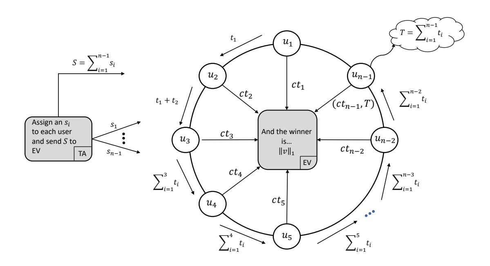
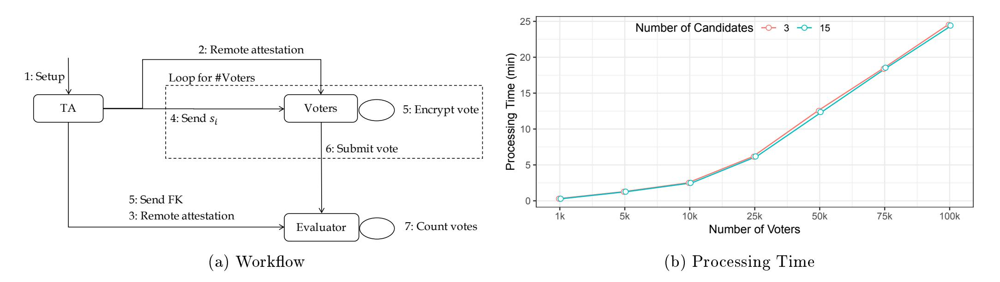

{0}------------------------------------------------

# (F)unctional Sifting: A Privacy-Preserving Reputation System Through Multi-Input Functional Encryption

(extended version)\*

Alexandros Bakas<sup>1</sup>, Antonis Michalas<sup>1</sup>, and Amjad Ullah<sup>2</sup>

- <sup>1</sup> Tampere University of Technology, Tampere, Finland {alexandros.bakas, antonios.michalas}@tuni.fi
- <sup>2</sup> University of Westminster, London, United Kingdom {A.Ullah@westminster.ac.uk}

Abstract. Functional Encryption (FE) allows users who hold a specific secret key (known as the functional key) to learn a specific function of encrypted data whilst learning nothing about the content of the underlying data. Considering this functionality and the fact that the field of FE is still in its infancy, we sought a route to apply this potent tool to solve the existing problem of designing decentralised additive reputation systems. To this end, we first built a symmetric FE scheme for the  $\ell_1$  norm of a vector space, which allows us to compute the sum of the components of an encrypted vector (i.e. the votes). Then, we utilized our construction, along with functionalities offered by Intel SGX, to design the first FE-based decentralized additive reputation system with Multi-Party Computation. While our reputation system faces certain limitations, this work is amongst the first attempts that seek to utilize FE in the solution of a real-life problem.

**Keywords:** Functional Encryption · Multi-Client, Multi-Input · Multi-Party Computation · Reputation System

#### 1 Introduction

Functional Encryption (FE) is an emerging cryptographic technique that allows selective computations over encrypted data. FE schemes provide a key generation algorithm that outputs decryption keys with remarkable capabilities. More precisely, each decryption key FK is associated with a function f. In contrast to traditional cryptographic techniques, using FK on a ciphertext  $\mathsf{Enc}(x)$  does not recover x but the function f(x) – thus keeping the actual value x private. While the first definition of FE allowed the decryption of a single ciphertext per

<sup>\*</sup> This work was funded by the ASCLEPIOS: Advanced Secure Cloud Encrypted Platform for Internationally Orchestrated Solutions in Healthcare Project No. 826093 EU research project.

{1}------------------------------------------------

decryption, more recent works [?] introduced the more general notion of multiinput FE (MIFE). In a MIFE scheme, given ciphertexts Enc(x1), . . . , Enc(xn), a user can use FK to recover f(x1, . . . , xn). This new denition, seems to make MIFE a perfect t in many real-life applications.

Having identied the importance of FE and believing that it is a family of modern encryption schemes that can push us into an uncharted technological terrain, we try to make a rst attempt to smooth out the identied asymmetries between theory and practice. To do so, we rst design a MIFE scheme for the `<sup>1</sup> norm of a vector space based on [?]. Then, using our MIFE scheme we attempt a rst approach in embedding FE into the design of a decentralized additive reputation system [?].

In particular, we show how MIFE can be leveraged to construct privacypreserving decentralized additive reputation systems. A reputation system rates the behaviour of each user, based on the quality of the provided service(s), and gives information to the community in order to decide whether to trust an entity in the network. Furthermore, the absence of schemes that provide privacy in decentralized environments, such as ad-hoc networks, is even greater [?]. Our focus is on how to utilize FE and extend existing techniques in order to use this cryptographic primitive to solve the problem of casting and collecting votes in a privacy-preserving way.

#### Contribution: The contribution of this paper is twofold:

- C1 First, we design a MIFE scheme in the symmetric key setting for the `<sup>1</sup> norm of a vector, based on the single-client MIFE for inner products presented in [?]. Then, we show how our scheme can be transformed from the singleclient to the multi-client setting. This transformation requires the users to perform a Multi-Party Computation (MPC). More precisely, each user generates their own symmetric keys independently and then they collaborate to calculate a functional decryption key sk<sup>f</sup> that is derived from a combination of all the generated symmetric keys. This result is quite remarkable since users generate their private keys locally and independently. As a result, their symmetric keys are never exposed to unauthorized parties, and thus no private information about the content of the underlying ciphertexts is revealed. At the same time, sucient information to generate the functional decryption key is provided.
- C2 Our second contribution derives from the identied need to create a dialogue between the theoretical concept of FE and real life applications. As a result, we tried to provide a pathway towards new prospects that show the direct and realistic applicability of this promising encryption technique when applied to concrete obstacles. To this end, we showed how our MIFE scheme can be used to provide a solution to the problem of designing an additive reputation system. More specically, we use our Multi-client MIFE to design a protocol that preserves the privacy of votes in decentralized environments. The protocol allows n participants to securely cast their ratings in a way that preserves the privacy of individual votes. More precisely, we analyze

{2}------------------------------------------------

the protocol and prove that it is resistant to collusion even against up to n − 1 corrupted insiders.

# 2 Related Work

Functional Encryption: While numerous studies with general denitions and generic constructions of FE have been proposed [?, ?, ?, ?, ?, ?] there is a clear lack of work proposing FE schemes supporting specic functions a necessary step that would allow FE to transcend its limitations and provide the foundations for reaching its full potential. To the best of our knowledge, the only works that have shown how to eciently run specic functions on ciphertexts is [?, ?] which calculates inner-product and [?] which successfully executes computations with quadratic polynomials. While [?] and [?] are symmetric FE schemes (i.e. ecient), their actual application in real-life scenarios can be considered as limited since both are limited to supporting the single-client model. Our work is heavily inuenced by the symmetric key MIFE scheme for inner products presented in [?] where authors designed a scheme that can be regarded as the FE equivalent of the one-time-pad and by [?] where the authors used FE to desing an order-revealing encryption [?] scheme that can be leveraged to desing Symmetric Searchable Encryption schemes with range queries support [?, ?] and a functionally encrypted private database. More precisely, using [?] as a basis, we constructed a symmetric key MIFE scheme for the `<sup>1</sup> norm of an arbitrary vector space. Most importantly, we show that our construction can also support the multi-client model while preserving exactly the same security properties as the MIFE for inner-product in [?]. This is a signicant result as it proves that functional encryption can be eciently applied to solve more complex problems.

Reputation Systems: In [?], authors designed a privacy-preserving reputation system and according to them The logic of anonymous feedback to a reputation system is analogous to the logic of anonymous voting in a political system". To ensure the condentiality of the votes, authors use primitives such as the secure sum and veriable secret sharing. In [?], a new approach was presented based on homomorphic encryption and zero-knowledge proofs. In particular, authors proved that by using their construction, the privacy of a user can be preserved even in the presence of multiple malicious adversaries. In [?] authors presented two protocols with similar architecture as in [?]. However, their constructions were signicantly more ecient since they did not rely on homomorphic encryption, while at the same time, they reduced the number of the exchanged messages. Despite the eciency of these approaches, it is our rm belief that functional encryption is a cryptographic paradigm that squarely ts the eld of repuation systems, and it has all the necessary traits to provide more a wellrounded and versatile solution. Having identied this research gap in the eld, we present a description of a reputation system based on a MIFE scheme that can eciently calculate the sum of multiple encrypted numbers.

{3}------------------------------------------------

#### 3 Preliminaries

**Notation:** If  $\mathcal{Y}$  is a set, we use  $y \stackrel{\$}{\leftarrow} \mathcal{Y}$  if y is chosen uniformly at random from  $\mathcal{Y}$ . The cardinality of a set  $\mathcal{Y}$  is denoted by  $|\mathcal{Y}|$ . For a positive integer m, [m] denotes the set  $\{1,\ldots,m\}$ . If  $m\in\mathbb{Z}$ , we denote by m[i] the digit in the i-th position of m where m[0] is the rightmost digit. The number of digits of m in base n is  $\lfloor log_n m \rfloor + 1$ . Vectors are denoted in bold as  $\mathbf{x} = [x_1,\ldots,x_n]$ . A probabilistic polynomial time (PPT) adversary  $\mathcal{ADV}$  is a randomized algorithm for which there exists a polynomial p(z) such that for all input z, the running time of  $\mathcal{ADV}(z)$  is bounded by p(|z|). A function  $negl(\cdot)$  is called negligible if  $\forall c \in \mathbb{N}, \exists \epsilon_0 \in \mathbb{N}$  such that  $\forall \epsilon \geq \epsilon_0 : negl(\epsilon) < \epsilon^{-c}$ . A probabilistic polynomial time (PPT) adversary  $\mathcal{ADV}$  is a randomized algorithm for which there exists a polynomial p(z) such that for all input z, the running time of  $\mathcal{ADV}(z)$  is bounded by p(|z|). A function  $negl(\cdot)$  is called negligible if  $\forall c \in \mathbb{N}, \exists \epsilon_0 \in \mathbb{N}$  such that  $\forall \epsilon \geq \epsilon_0 : negl(\epsilon) < \epsilon^{-c}$ .

Users, which in our scenario will be voters, are denoted by  $\mathcal{U} = \{u_1, \dots u_\ell\}$ . The universe of votes is  $\mathcal{V} = \{v_1, \dots, v_\ell\}$ . We assume a star-based system in the likes of well-known applications such as AirBnb and ebay. However, we let the number of stars be an a set  $\mathcal{ST} = \{n^1, \dots, n^k\}$  of arbitrary cardinality. Hence, if a user wishes  $u_i$  wishes to rate another user with j stars, then  $u_i$ 's vote is  $v_i = n^j$ . We now proceed with the definition of a decentralized additive reputation system, as described in [?]

**Definition 1.** A reputation system R is said to be a Decentralized Additive Reputation System, if it satisfies the following two requirements:

- 1. Feedback collection, combination and propagation are implemented in a decentralized way.
- 2. Combination of feedbacks provided by the users is calculated in an additive manner.

**Definition 2 (Inner Product).** The inner product (or dot product) of  $\mathbb{Z}^n$  is a function  $\langle , \rangle$  defined by:

$$f(\mathbf{x}, \mathbf{y}) = \langle \mathbf{x}, \mathbf{y} \rangle = x_1 y_1 + \dots + x_n y_n, \text{ for } \mathbf{x} = [x_1, \dots, x_n], \mathbf{y} = [y_1, \dots, y_n] \in \mathbb{Z}^n$$

**Definition 3** ( $\ell_1$  norm). The  $\ell_1$  norm of  $\mathbb{Z}^n$  is a function  $\|\cdot\|_1$  defined by:

$$f(x) = \|\mathbf{x}\|_1 = \sum_{i=1}^{i=n} x_i = x_1 + \dots + x_n, \text{ for } \mathbf{x} = [x_1, \dots, x_n] \in \mathbb{Z}^n$$

From definitions ?? and ??, it follows directly that if  $\mathbf{x} = [x_1, \dots, x_n] \in \mathbb{Z}^n$  and  $\mathbf{y} = [1, \dots, 1] \in \mathbb{Z}^n$  then  $\langle \mathbf{x}, \mathbf{y} \rangle = x_1 \cdot 1 + \dots + x_n \cdot 1 = \sum_{i=1}^n x_i = \|\mathbf{x}\|_1$ .

Below, we define MIFE in the symmetric key setting. Note that while this definition suits the single-client model, it is inadequate for a multi-client setup.

{4}------------------------------------------------

**Definition 4 (Multi-Input Functional Encryption in the Symmetric Key Setting).** Let  $\mathcal{F} = \{f_1, \ldots, f_n\}$  be a family of n-ary functions where each  $f_i$  is defined as follows:  $f_i : \mathbb{Z}^n \to \mathbb{Z}$ . A multi-input functional encryption scheme for  $\mathcal{F}$  consists of the following algorithms:

- Setup(1 $^{\lambda}$ ): Takes as input a security parameter  $\lambda$  and outputs a secret key  $\mathbf{K} = [\mathsf{k}_1, \dots, \mathsf{k}_n] \in \mathbb{Z}^n$ .
- $\mathsf{Enc}(\mathsf{K}, i, x_i)$ : Takes as input  $\mathbf{K}$ , an index  $i \in [n]$  and a message  $x_i \in \mathcal{X}$  and outputs a ciphertext  $ct_i$ .
- KeyGen( $\mathbf{K}$ ): Takes as input  $\mathbf{K}$  and outputs a functional decryption key  $\mathsf{FK}^3$ .
- $Dec(FK, ct_1, ..., ct_n)$ : Takes as input a decryption key FK for a function  $f_i$  and n ciphertexts and outputs a value  $y \in \mathcal{Y}$ .

For the needs of our work, we borrow the one-adaptive (one-AD) and one-selective (one-SEL) security definitions from [?] that were first formalized in [?]. Informally, in the one-AD-IND security game, the adversary  $\mathcal{ADV}$  receives the encryption key of the MIFE scheme and then adaptively queries the corresponding oracle for functional decryption keys of her choice. Furthermore,  $\mathcal{ADV}$  outputs two messages  $x_0$  and  $x_1$  to the encryption oracle, who flips a random coin and outputs an encryption of  $x_{\beta}$ ,  $\beta \in \{0,1\}$ . If the functional keys are associated with functions that do not distinguish between the messages  $(i.e.f(x_0) = f(x_1))$  then  $\mathcal{ADV}$  should not be able to distinguish between the encryption of  $x_0$  and  $x_1$ . In the case of the one-SEL-IND security, the game is identical to the one-AD-IND case, with the only difference being that  $\mathcal{ADV}$  needs to decide on the  $x_0$  and  $x_1$  messages before seeing the encryption key. The "one" in both security games determines that the encryption oracle can only be queried once for each slot i (i.e. the adversary is not allowed to issue multiple queries to the encryption oracle for the same  $x_i$ ).

**Definition 5 (one-AD-IND-secure MIFE).** For every MIFE scheme for  $\mathcal{F}$ , every PPT adversary  $\mathcal{ADV}$ , and every security parameter  $\lambda \in \mathbb{N}$  we define the following experiment for  $\beta \in \{0,1\}$ :

```
 \begin{array}{c} \textit{Adaptive Security} \\ \textit{one-AD-IND}^{MIFE}_{\beta}(1^{\lambda},\mathcal{ADV}) \colon \\ \mathbf{K} \leftarrow \mathsf{Setup}(1^{\lambda}) \\ \alpha \leftarrow \mathcal{ADV}^{\mathsf{KeyGen}(\mathbf{K}),\mathsf{Enc}(\cdot,\cdot,\cdot)} \\ \textit{Output } \alpha \end{array}
```

Where  $\operatorname{Enc}(\cdot,\cdot,\cdot)$  is an oracle that on input  $(i,x_i^0,x_i^1)$ , flips a random coin  $\beta$  and outputs  $\operatorname{Enc}(\mathsf{K},i,x_i^\beta), \beta \in \{0,1\}$ . Moreover,  $\mathcal{ADV}$  is restricted to only make queries to the KeyGen oracle satisfying  $f(x_1^0,\ldots,x_n^0)=f(x_1^1,\ldots,x_n^1)$ . A MIFE scheme is said to be one-AD-IND secure if for all PPT adversaries  $\mathcal{ADV}$ , their advantage is negligible in  $\lambda$  where the advantage is defined as:

<span id="page-4-0"></span>In the literature, this algorithm can often be found as  $\mathsf{KeyGen}(\mathbf{K}, f)$  where it outputs an FK for a specific function f. This is the case, with the MIFE scheme from [?] presented in Section ??. In our case, we only work with one function, so we can omit the f term in the definition of the algorithm.

{5}------------------------------------------------

```
Adv^{one-AD-IND}(\lambda, \mathcal{ADV}) = |Pr[one-AD-IND_0^{MIFE}(1^{\lambda}, \mathcal{ADV}) = 1] - Pr[one-AD-IND_1^{MIFE}(1^{\lambda}, \mathcal{ADV}) = 1]|
```

**Definition 6 (one-SEL-IND-secure MIFE).** For every MIFE scheme for  $\mathcal{F}$ , every PPT adversary  $\mathcal{ADV}$ , and every security parameter  $\lambda \in \mathbb{N}$  we define the following experiment for  $\beta \in \{0,1\}$ :

```
Selective Security
one-SEL-IND_{\beta}^{MIFE}(1^{\lambda}, \mathcal{ADV}):
\{x_{i}^{b}\}_{i \in [n], b \in \{0,1\}} \leftarrow \mathcal{ADV}(1^{\lambda}, f_{i})
\mathbf{K} \leftarrow \mathsf{Setup}(1^{\lambda})
ct_{i} = \mathsf{Enc}(\mathbf{K}, x_{i}^{\beta})
\alpha \leftarrow \mathcal{ADV}^{\mathsf{KeyGen}(\mathbf{K})}(\{ct_{i}\})
Output \alpha
```

 $\mathcal{ADV}$  is restricted to only make queries to the KeyGen oracle satisfying  $f(x_1^0,\ldots,x_n^0)=f(x_1^1,\ldots,x_n^1)$ . A MIFE scheme is said to be one-SEL-IND secure if for all PPT adversaries  $\mathcal{ADV}$ , their advantage is negligible in  $\lambda$  where the advantage is defined as:

$$\begin{split} Adv^{one-SEL-IND}(\lambda,\mathcal{ADV}) &= \\ |Pr[one-SEL-IND_0^{MIFE}(1^{\lambda},\mathcal{ADV}) = 1] - Pr[one-SEL-IND_1^{MIFE}(1^{\lambda},\mathcal{ADV}) = 1]| \end{split}$$

Trusted Execution Environments: A Trusted Execution Environment (TEE) is a secure, integrity-protected environment, with processing, memory and storage capabilities, isolated from an untrusted, Rich Execution Environment that comprises the OS and installed applications. Systems utilizing TEEs are intended to be more secure since they use both hardware and software to isolate security-critical assets. By creating architectures based the use of TEEs, the responsibility for keeping critical parts of an application secure, is shifted to an entity that can have high levels of trust. While there are several different TEEs in our work we rely on the use Intel SGX. We provide a brief description of the main SGX functionalities (more details can be found in [?]).

- Isolation: Enclaves are located in a hardware guarded area of memory and they compromise a total of 128MB (only 90MB can be used by software). Intel SGX is based on memory isolation built in the processor along with strong cryptography. The processor tracks which parts of memory belong to which enclave and ensures that only enclaves can access their own memory.
- Sealing: SGX processors come with a Root Seal Key with which, data is encrypted when stored in untrusted memory. Sealed data can be recovered even after an enclave is destroyed and rebooted on the same platform.
- **Attestation:** One of the core contributions of SGX is the support for attestation between enclaves of the same (local attestation) or different platforms (remote attestation). In the case of local attestation, an enclave  $enc_i$  can verify another enclave  $enc_i$  as well as the program/software running in the

{6}------------------------------------------------

latter. This is achieved through a report generated by  $enc_j$  containing information about the enclave itself and the program running in it. This report is signed with a secret key  $\mathsf{sk}_{\mathsf{rpt}}$  which is the same for all enclaves of the same platform. In remote attestation, enclaves of different platforms can attest each other through a signed quote. This is a report similar to the one used in local attestation. The difference is that instead of using  $\mathsf{sk}_{\mathsf{rpt}}$  to sign it, a special private key provided by Intel is used. Thus, verifying these quotes requires contacting Intel's Attestation Server.

Currently there are many published works that leverage the functionality of SGX mainly to design solutions to the problem of cloud-based storage [?,?]. Due to space constraints, we ommit their formal description (more details can be found in [?])

# 4 Multi-Input Functional Encryption for the $\ell_1$ Norm

In this section, we present the first result and an important contribution of our work. In particular, in the first part of this section, we show how the one-AD-IND-secure MIFE scheme for inner-products from [?], can be transformed to a one-AD-IND-secure MIFE scheme for the  $\ell_1$  norm (MIFE $_{\ell_1}$ ), while preserving exactly the same security properties. Then, we show how we can transform our construction from the single-client model to the multi-client one. For purposes of completeness, we briefly recall the one-AD-IND-secure MIFE scheme for inner-products in Figure ??. The security of both MIFE schemes (inner products and  $\ell_1$  norm), is derived from the fact that they behave as the functional encryption equivalent of the one-time-pad. Note that, just like in the case of the one-time-pad, to achieve perfect secrecy, we require that  $|\mathbf{k}_i| \geq |x_i|$ , where  $\mathbf{k}_i$  is the encryption key and  $x_i$ , the message to be encrypted.

```
\frac{\operatorname{Setup}(1^{\lambda}):}{\forall i \in [n], \mathsf{k}_{i} \overset{\$}{\leftarrow} \mathbb{Z}}
\operatorname{Return} \mathbf{K} = \{\mathsf{k}_{1}, \dots, \mathsf{k}_{n}\} \in \mathbb{Z}^{n}
\frac{\operatorname{Enc}(\mathbf{K}, \mathsf{i}, \mathsf{x}_{\mathsf{i}}):}{\operatorname{Return} ct_{i} = x_{i} + \mathsf{k}_{\mathsf{i}}}
\frac{\operatorname{Enc}(\mathbf{K}, \mathsf{i}, \mathsf{x}_{\mathsf{i}}):}{\operatorname{Return} ct_{i} = x_{i} + \mathsf{k}_{\mathsf{i}}}
\frac{\operatorname{KeyGen}(\mathbf{K}, y_{1}|| \dots || y_{n}):}{\operatorname{Return} \operatorname{FK} = \sum_{i \in [n]} \langle k_{i}, y_{i} \rangle} - \operatorname{FK}
```

Fig. 1: one-AD-IND-secure MIFE for inner products.

In the previous scheme, by fixing  $\mathbf{y}$  to be  $\mathbf{y} = [1, ..., 1]$ , we compute  $\langle \mathbf{x}, 1 \rangle = \|\mathbf{x}\|_1$  for  $\mathbf{x} \in \mathbb{Z}^n$ . By doing so, we manage to transform the original inner products MIFE to a new construct that successfully computes the  $\ell_1$  norm. Our construction is illustrated in Figure ??. Since our construction is a special case

{7}------------------------------------------------

of the scheme presented in Figure ??, it is straight forward that the security proof of our scheme will be very similar to the one presented in [?]. By fixing y to be y = [1, ..., 1], we compute  $\langle x, 1 \rangle = ||x||_1$  for  $x \in \mathbb{Z}^n$  and thus, transform the MIFE for inner products to MIFE for the  $\ell_1$  norm.

```
\frac{\operatorname{Setup}(1^{\lambda}):}{\forall i \in [n], \mathsf{k}_{i}} \stackrel{\$}{\leftarrow} \mathbb{Z} 

\operatorname{Return} \mathbf{K} = [\mathsf{k}_{1}, \dots, \mathsf{k}_{n}] \in \mathbb{Z}^{n}

\frac{\operatorname{Enc}(\mathbf{K}, \mathsf{i}, \mathsf{x}_{i}):}{\operatorname{Return} ct_{i} = x_{i} + \mathsf{k}_{i}}

\frac{\operatorname{KeyGen}(\mathbf{K}):}{\operatorname{Return} \mathsf{FK} = \|\mathsf{K}\|_{1} = \sum_{i}^{n} \mathsf{k}_{i}

\frac{\operatorname{Dec}(\mathsf{FK}, ct_{1}, \dots, ct_{n}):}{\operatorname{Return} \sum_{i=1}^{n} ct_{i} - \mathsf{sk}_{f}}
```

Fig. 2: one-AD-IND-secure MIFE for the  $\ell_1$  norm (MIFE $_{\ell_1}$ ).

**Theorem 1.** The MIFE scheme for the  $\ell_1$  norm (described in Figure ??) is one-AD-IND-secure. That is, for all PPT adversaries  $\mathcal{ADV}$ :

$$Adv_{\mathcal{ADV}}^{one-AD-IND}(\lambda) = 0$$

*Proof.* The proof consists of two parts. First we construct a selective distinguisher  $\mathcal{B}$  whose advantage for the one-SEL-IND experiment is an upper bound for the advantage of any adaptive distinguisher  $\mathcal{ADV}$ . Then, using the fact that the MIFE for the  $\ell_1$  norm behaves like the one-time-pad, we prove that the advantage of  $\mathcal{B}$  is zero.

For the first part of the proof we will use a complexity argument. In particular, let  $\mathcal{B}$  be an adversary that guesses the challenge  $\{x_i^b\}$  and then simulates the one-AD-IND experiment of  $\mathcal{ADV}$ . If  $\mathcal{B}$  successfully guesses  $\mathcal{ADV}$ 's challenge then she can simulate  $\mathcal{ADV}$ 's view. Otherwise it outputs  $\bot$ . Hence,  $\mathcal{ADV}$ 's advantage maximizes when  $\mathcal{B}$  guesses correctly the challenge. If the input space is  $\mathcal{X}$ , then  $\mathcal{B}$  can guess successfully with probability exactly  $|\mathcal{X}|^{-1}$ . Hence:

$$Adv_{\mathcal{ADV}}^{one-AD-IND} \leq |X|^{-1}Adv_{\mathcal{B}}^{one-SEL-IND}$$

From the above, it can be seen that if the input space  $\mathcal{X}$  is very large, the advantage of  $\mathcal{ADV}$  tends to zero independently of the value of  $Adv_{\mathcal{B}}^{one-SEL-IND}$  (i.e.  $|\mathcal{X}| \to \infty \Rightarrow Adv_{\mathcal{ADV}}^{one-AD-IND} \to 0$ ). However, we will still show that no matter the cardinality of  $\mathcal{X}$ ,  $Adv_{\mathcal{ADV}}^{one-AD-IND} = 0$ . To do so, we will prove that  $Adv_{\mathcal{BDV}}^{one-SEL-IND} = 0$ . This will directly imply that  $Adv_{\mathcal{ADV}}^{one-AD-IND} = 0$ , since  $Adv_{\mathcal{ADV}}^{one-AD-IND} \leq Adv_{\mathcal{B}}^{one-SEL-IND}$ . In Figure ?? we present a hybrid game that is identical to the one-SEL-IND security game. This is derived from the fact that if  $u \overset{\$}{\leftarrow} \mathbb{Z}$ , then  $\{u_i\}$  and  $\{u_i - x_i^{\beta}\}$  are identical distributions. Finally, it is easy to see that the only information leaking about  $\beta$ , is  $\|\mathbf{r} - \mathbf{x}^{\beta}\|$ , which is independent of  $\beta$  according to the definition of the security game and the restrictions of the adversary.

{8}------------------------------------------------

```
\frac{\operatorname{Hybrid}_{\beta}(\lambda, \mathcal{B}):}{\{x_{i}^{b}\}_{i \in [n], b \in \{0,1\}} \leftarrow \mathcal{B}(1^{\lambda}, \mathcal{F})} \qquad \qquad \frac{\mathcal{O}_{gen}(\mathbf{r}):}{\forall i \in [n]:} \\ \forall i \in [n]: \qquad \qquad \mathsf{sk}_{f} = \|\mathbf{r} - \mathbf{x}^{\beta}\|_{1} = \sum_{i=1}^{n} (r_{i} - x_{i}^{\beta}) \\ ct_{i} \leftarrow r_{i} \\ \alpha \leftarrow \mathcal{B}^{\mathcal{O}_{gen}(\cdot)}(ct_{i}) \\ \text{Output } \alpha
```

Fig. 3: Hybrid games for the proof of Theorem??

While we showed how a MIFE scheme for inner products can be transformed into a MIFE scheme for the  $\ell_1$  norm, our construction is still inadequate for a reputation system. This is due to the fact that it only supports the single-client model. Assuming that such a model can be the right choice for a system that requires input from a large number of users can only be regarded as a fallacious conclusion. To this end, in Section ??, we show how we acutely attune our single client MIFE to support the multi-client model.

#### 4.1 From Single-Client to Multi-Client MIFE

We are now ready to describe how we can transform our single-user  $\mathsf{MIFE}_{\ell_1}$  to the multi-user  $\mathsf{MIFE}$  for the  $\ell_1$  norm ( $\mathsf{MUMIFE}_{\ell_1}$ ). The idea is the following: Each user generates a symmetric key  $\mathsf{k}_i \in \mathbb{Z}$  which uses it to encrypt a plainetext  $x_i$  as  $ct_i = \mathsf{k}_i + x_i$ . All the generated symmetric keys, form a vector  $\mathbf{K} = [\mathsf{k}_1, \ldots, \mathsf{k}_n] \in \mathbb{Z}^n$ , where n is the number of users. The functional decryption key  $\mathsf{FK}$  is then  $\|\mathbf{K}\|_1$  and decryption works as follows:

$$\sum_{i=1}^{n} ct_i - \mathsf{FK} = \sum_{1}^{n} (\mathsf{k}_i + x_i) - \sum_{1}^{n} \mathsf{k}_i = \sum_{1}^{n} x_i = \|\mathbf{x}\|_1$$

A third party decryptor who would get access to FK should only learn  $\|\mathbf{x}\|_1$  and *not* each individual  $x_i$ . In addition to that, the users should never reveal their symmetric keys. To achieve this, we assume the existence of a trusted authority that will allow users to perform an MPC in order to jointly compute a masked version of FK without revealing each distinct  $k_i$ . Before we proceed to the actual description of our construction (Figure ??), we present a high-level overview of our system model that consists of a trusted authority (TA) and an evaluator (EV) that evaluates the value of a function f on a set of given ciphertexts.

Trusted Authority (TA): TA is running in an enclave and is responsible for generating and distributing a unique random number  $s_i$  to each user  $u_i$ . The users will use the received random values to mask their symmetric keys. By doing so, and considering the fact that TA is running in an enclave and thus it is trusted, they will be able to jointly compute a masked version of the functional decryption key FK which will be used by the evaluator to calculate FK.

{9}------------------------------------------------

Evaluator (EV): EV is responsible for collecting all users' ciphertexts  $\{ct_1, \ldots, ct_n\}$ , generating the functional decryption key FK based on the masked value that will receive from users and finally, calculate  $f(x_1, \ldots, x_n)$  without getting any valuable information about the individual values  $x_i$ .

**Theorem 2.** The Multi-User Multi-Input Functional Encryption scheme for the  $\ell_1$  norm (described in Figure ??) is one-AD-IND-secure. That is, for all PPT adversaries  $\mathcal{ADV}$ :  $Adv_{\mathcal{ADV}}^{one-AD-IND}(\lambda) = 0$ 

Proof (Proof Sketch.). The proof is omitted since it is a direct result from Theorem ??. This can be seen by the fact that the Encryption and KeyGen oracles are identical to the ones described in Figure ??. The only difference is that in the case of  $\mathsf{MUMIFE}_{\ell_1}$ , the Setup algorithm is executed by multiple users instead of one, since each user generates a distinct symmetric key. Without loss of generality, we can assume that this is exactly the same procedure since in the case of  $\mathsf{MIFE}_{\ell_1}$ , one user samples n random numbers from  $\mathbb Z$  resulting to a vector  $\mathbf K = [\mathsf{k}_1, \ldots, \mathsf{k}_n]$ , and in case of  $\mathsf{MUMIFE}_{\ell_1}$ , n users sample one random number from  $\mathbb Z$  each, resulting to a vector  $\mathbf K' = [\mathsf{k}'_1, \ldots, \mathsf{k}'_n]$ . However, the distributions  $\{\mathsf{k}_i\}$  and  $\{\mathsf{k}'_i\}$  are identical and thus we conclude that we can use exactly the same Hybrid game as the one in Figure ??.

```
 \frac{\mathsf{MUMIFE}_{\ell_1}.\mathsf{Setup}(1^\lambda):}{-TA: \forall i \in [n], s_i \leftarrow \mathbb{Z}} \\ -TA: s_i \rightarrow u_i \\ -TA: S = \|\mathbf{s}\|_1 = \sum_1^n s_i \rightarrow EV \\ -u_i: \mathsf{Generates} \ \mathbf{k}_i \in \mathbb{Z} \\ \hline \\ \frac{\mathsf{MUMIFE}\ell_1.\mathsf{Enc}(\mathsf{k}_i, x_i, s_i)}{EV: \mathsf{FK} = T - S} \\ \hline \\ \frac{\mathsf{MUMIFE}\ell_1.\mathsf{Enc}(\mathsf{k}_i, x_i, s_i)}{EV: \mathsf{FK} = T - S} \\ \hline \\ \frac{\mathsf{MUMIFE}\ell_1.\mathsf{Dec}(\mathsf{FK}, ct_1, \dots ct_n)}{EV: \sum_{i=1}^n ct_i - \mathsf{FK}} \\ \hline \\ \frac{\mathsf{MUMIFE}\ell_1.\mathsf{Enc}(\mathsf{k}_i, x_i, s_i)}{EV: \sum_{i=1}^n ct_i - \mathsf{FK}} \\ \hline \\ \frac{\mathsf{MUMIFE}\ell_1.\mathsf{Enc}(\mathsf{k}_i, x_i, s_i)}{EV: \sum_{i=1}^n ct_i - \mathsf{FK}} \\ \hline \\ \frac{\mathsf{MUMIFE}\ell_1.\mathsf{Enc}(\mathsf{k}_i, x_i, s_i)}{EV: \sum_{i=1}^n ct_i - \mathsf{FK}} \\ \hline \\ \frac{\mathsf{MUMIFE}\ell_1.\mathsf{Enc}(\mathsf{k}_i, x_i, s_i)}{EV: \sum_{i=1}^n ct_i - \mathsf{FK}} \\ \hline \\ \frac{\mathsf{MUMIFE}\ell_1.\mathsf{Enc}(\mathsf{k}_i, x_i, s_i)}{EV: \sum_{i=1}^n ct_i - \mathsf{FK}} \\ \hline \\ \frac{\mathsf{MUMIFE}\ell_1.\mathsf{Enc}(\mathsf{FK}, ct_1, \dots ct_n)}{EV: \sum_{i=1}^n ct_i - \mathsf{FK}} \\ \hline \\ \frac{\mathsf{MUMIFE}\ell_1.\mathsf{Enc}(\mathsf{FK}, ct_1, \dots ct_n)}{EV: \sum_{i=1}^n ct_i - \mathsf{FK}} \\ \hline \\ \frac{\mathsf{MUMIFE}\ell_1.\mathsf{Enc}(\mathsf{FK}, ct_1, \dots ct_n)}{EV: \sum_{i=1}^n ct_i - \mathsf{FK}} \\ \hline \\ \frac{\mathsf{MUMIFE}\ell_1.\mathsf{Enc}(\mathsf{FK}, ct_1, \dots ct_n)}{EV: \sum_{i=1}^n ct_i - \mathsf{FK}} \\ \hline \\ \frac{\mathsf{MUMIFE}\ell_1.\mathsf{Enc}(\mathsf{FK}, ct_1, \dots ct_n)}{EV: \sum_{i=1}^n ct_i - \mathsf{FK}} \\ \hline \\ \frac{\mathsf{MUMIFE}\ell_1.\mathsf{Enc}(\mathsf{FK}, ct_1, \dots ct_n)}{EV: \sum_{i=1}^n ct_i - \mathsf{FK}} \\ \hline \\ \frac{\mathsf{MUMIFE}\ell_1.\mathsf{Enc}(\mathsf{FK}, ct_1, \dots ct_n)}{EV: \sum_{i=1}^n ct_i - \mathsf{FK}} \\ \hline \\ \frac{\mathsf{MUMIFE}\ell_1.\mathsf{Enc}(\mathsf{FK}, ct_1, \dots ct_n)}{EV: \sum_{i=1}^n ct_i - \mathsf{FK}} \\ \hline \\ \frac{\mathsf{MUMIFE}\ell_1.\mathsf{Enc}(\mathsf{FK}, ct_1, \dots ct_n)}{EV: \sum_{i=1}^n ct_i - \mathsf{FK}} \\ \hline \\ \frac{\mathsf{MUMIFE}\ell_1.\mathsf{Enc}(\mathsf{FK}, ct_1, \dots ct_n)}{EV: \sum_{i=1}^n ct_i - \mathsf{FK}} \\ \hline \\ \frac{\mathsf{MUMIFE}\ell_1.\mathsf{Enc}(\mathsf{FK}, ct_1, \dots ct_n)}{EV: \sum_{i=1}^n ct_i - \mathsf{FK}} \\ \hline \\ \frac{\mathsf{MUMIFE}\ell_1.\mathsf{Enc}(\mathsf{FK}, ct_1, \dots ct_n)}{EV: \sum_{i=1}^n ct_i - \mathsf{FK}} \\ \hline \\ \frac{\mathsf{MUMIFE}\ell_1.\mathsf{Enc}(\mathsf{FK}, ct_1, \dots ct_n)}{EV: \sum_{i=1}^n ct_i - \mathsf{FK}} \\ \hline \\ \frac{\mathsf{MUMIFE}\ell_1.\mathsf{Enc}(\mathsf{FK}, ct_1, \dots ct_n)}{EV: \sum_{i=1}^n ct_i - \mathsf{FK}} \\ \hline \\ \frac{\mathsf{MUMIFE}\ell_1.\mathsf{Enc}(\mathsf{FK}, ct_1, \dots ct_n)}{EV: \sum_{i=1}^n ct_i - \mathsf{FK}} \\ \hline \\ \frac{\mathsf{MUMIFE}\ell_1.\mathsf{Enc}(\mathsf{FK}, ct_1, \dots ct_n)}{EV: \sum_{i=1}^n ct_i - \mathsf{FK}} \\ \hline \\ \frac{\mathsf{MUMIFE}\ell_1.\mathsf{Enc}(\mathsf{FK}, ct_1, \dots ct_n)}{EV: \sum_{
```

Fig. 4: Multi-Input MIFE for the  $\ell_1$  norm (MUMIFE $_{\ell_1}$ )

Correctness: The correctness of the MUMIFE<sub> $\ell_1$ </sub> scheme presented in Figure ?? follows directly since:

$$\sum_{i=1}^{n} ct_{i} - \mathsf{FK} = \sum_{i=1}^{n} ct_{i} - T + S = \sum_{i=1}^{n} \mathsf{k}_{i} + \sum_{i=1}^{n} x_{i} - \left(\sum_{i=1}^{n} (\mathsf{k}_{i} + s_{1})\right) + \sum_{i=1}^{n} s_{i} = \sum_{i=1}^{n} ct_{i} - \sum_{i=1}^{n} ct_{i} - \sum_{i=1}^{n} ct_{i} - \sum_{i=1}^{n} ct_{i} - \sum_{i=1}^{n} ct_{i} - \sum_{i=1}^{n} ct_{i} - \sum_{i=1}^{n} ct_{i} - \sum_{i=1}^{n} ct_{i} - \sum_{i=1}^{n} ct_{i} - \sum_{i=1}^{n} ct_{i} - \sum_{i=1}^{n} ct_{i} - \sum_{i=1}^{n} ct_{i} - \sum_{i=1}^{n} ct_{i} - \sum_{i=1}^{n} ct_{i} - \sum_{i=1}^{n} ct_{i} - \sum_{i=1}^{n} ct_{i} - \sum_{i=1}^{n} ct_{i} - \sum_{i=1}^{n} ct_{i} - \sum_{i=1}^{n} ct_{i} - \sum_{i=1}^{n} ct_{i} - \sum_{i=1}^{n} ct_{i} - \sum_{i=1}^{n} ct_{i} - \sum_{i=1}^{n} ct_{i} - \sum_{i=1}^{n} ct_{i} - \sum_{i=1}^{n} ct_{i} - \sum_{i=1}^{n} ct_{i} - \sum_{i=1}^{n} ct_{i} - \sum_{i=1}^{n} ct_{i} - \sum_{i=1}^{n} ct_{i} - \sum_{i=1}^{n} ct_{i} - \sum_{i=1}^{n} ct_{i} - \sum_{i=1}^{n} ct_{i} - \sum_{i=1}^{n} ct_{i} - \sum_{i=1}^{n} ct_{i} - \sum_{i=1}^{n} ct_{i} - \sum_{i=1}^{n} ct_{i} - \sum_{i=1}^{n} ct_{i} - \sum_{i=1}^{n} ct_{i} - \sum_{i=1}^{n} ct_{i} - \sum_{i=1}^{n} ct_{i} - \sum_{i=1}^{n} ct_{i} - \sum_{i=1}^{n} ct_{i} - \sum_{i=1}^{n} ct_{i} - \sum_{i=1}^{n} ct_{i} - \sum_{i=1}^{n} ct_{i} - \sum_{i=1}^{n} ct_{i} - \sum_{i=1}^{n} ct_{i} - \sum_{i=1}^{n} ct_{i} - \sum_{i=1}^{n} ct_{i} - \sum_{i=1}^{n} ct_{i} - \sum_{i=1}^{n} ct_{i} - \sum_{i=1}^{n} ct_{i} - \sum_{i=1}^{n} ct_{i} - \sum_{i=1}^{n} ct_{i} - \sum_{i=1}^{n} ct_{i} - \sum_{i=1}^{n} ct_{i} - \sum_{i=1}^{n} ct_{i} - \sum_{i=1}^{n} ct_{i} - \sum_{i=1}^{n} ct_{i} - \sum_{i=1}^{n} ct_{i} - \sum_{i=1}^{n} ct_{i} - \sum_{i=1}^{n} ct_{i} - \sum_{i=1}^{n} ct_{i} - \sum_{i=1}^{n} ct_{i} - \sum_{i=1}^{n} ct_{i} - \sum_{i=1}^{n} ct_{i} - \sum_{i=1}^{n} ct_{i} - \sum_{i=1}^{n} ct_{i} - \sum_{i=1}^{n} ct_{i} - \sum_{i=1}^{n} ct_{i} - \sum_{i=1}^{n} ct_{i} - \sum_{i=1}^{n} ct_{i} - \sum_{i=1}^{n} ct_{i} - \sum_{i=1}^{n} ct_{i} - \sum_{i=1}^{n} ct_{i} - \sum_{i=1}^{n} ct_{i} - \sum_{i=1}^{n} ct_{i} - \sum_{i=1}^{n} ct_{i} - \sum_{i=1}^{n} ct_{i} - \sum_{i=1}^{n} ct_{i} - \sum_{i=1}^{n} ct_{i} - \sum_{i=1}^{n} ct_{i} - \sum_{i=1}^{n} ct_{i} - \sum_{i=1}^{n} ct_{i} - \sum_{i=1}^{n} ct_{i} - \sum_{i=1}^{n} ct_{i} - \sum_{i=1}^{n} ct_{i} - \sum_{i=1}^{n} ct_{i} - \sum_{i=1}^{n} ct_{i} - \sum_{i=1}^{n} ct_{i$$

{10}------------------------------------------------

$$= \sum_{i=1}^{n} \mathbf{k}_{i} + \sum_{i=1}^{n} x_{i} - \sum_{i=1}^{n} \mathbf{k}_{i} - \sum_{i=1}^{n} s_{i} + \sum_{i=1}^{n} s_{i} = \sum_{i=1}^{n} x_{i} = \|\mathbf{x}\|_{1}$$

#### 5 The Reputation System

We begin this section by formalizing the problem that we are trying to solve.

**Problem Statement:** A user  $u_i$  demands feedback for another user  $u_j$ . To this end, she requests from other users on the network, to give their votes about  $u_j$ . The problem is to find a way that each vote  $v_i$  remains private while at the same time an evaluator EV would be in position of understanding what voters, as a whole, believe about  $u_j$ , by evaluating the sum of all votes.

Stars, Voters and Votes: As already stated, the stars are represented as a power of an integer n. Hence, for each vote  $v_i$  we have that  $v_i = n^j$ . The reason for representing votes in this way is that we can tell the final reputation score just by looking at the sum of the votes. This is because for all  $\beta$  in base n, we can represent  $\beta$  as a sum of powers of n. In other words:

$$\forall \beta \in \mathbb{Z}, \exists \beta_j \in \mathbb{Z} : \beta = \beta_0 n^0 + \dots + \beta_{\lfloor \log_n \beta \rfloor} n^{\lfloor \log_n \beta \rfloor}$$

Hence, if  $\sum_{i=0}^{n-1} v_i = \beta$ :

$$\sum_{i=0}^{n-1} v_i = \beta = \sum_{j=0}^{\lfloor \log_n \beta \rfloor} \beta_j n^j = \beta_0 n^0 + \beta_1 n^1 + \dots + \beta_{\lfloor \log_n \beta \rfloor} n^{\lfloor \log_n \beta \rfloor} \in \mathbb{Z}^+,$$

then the coefficient of each  $n^j$  tells us how many voters voted for  $v_i = n^j$ . Moreover, on each round, we only allow n-1 voters to cast their votes. The reason for allowing only n-1 voters is to avoid multiple representations of the same number. Below we present a toy example to help the reader better understand the idea of our design:

| $Voter u_i$ | Vote v <sub>i</sub> | Sum                                                       |
|-------------|---------------------|-----------------------------------------------------------|
| $u_1$       | $10^{1}$            |                                                           |
| $u_2$       | $10^{3}$            |                                                           |
| $u_3$       | $10^{0}$            | $\left  10^1 + 10^3 + 10^0 + 10^1 + 10^4 = 11021 \right $ |
| $u_4$       | $10^{1}$            |                                                           |
| $u_5$       | $10^{4}$            |                                                           |

Table 1: Voting Example with five voters and five candidates.

**Toy Example:** For reasons of simplicity, let the base n = 10. We assume a scenario with a five-star system such as  $n_0 = 10^0$ ,  $n_1 = 10^1$ ,  $n_2 = 10^2$ ,  $n_3 = 10^3$ ,  $n_4 = 10^4$  and five voters. Each voter casts her vote as shown in Table ??.

{11}------------------------------------------------

After all voters cast their votes, we simply compute the sum  $\sum v_i = 11021$ . Hence, we see that the coefficients of the  $n^j$ s are  $\beta_0 = 1$ ,  $\beta_1 = 2$ ,  $\beta_2 = 0$ ,  $\beta_3 = 1$  and  $\beta_4 = 1$  and as a result, we conclude that one user gave a rating of 1 star  $n^0$ , 4 stars  $n^3$  and 5 stars  $n^4$  (i.e.  $\beta_0 = \beta_3 = \beta_4 = 1$ ), two gave a rating of two stars  $n^1$  (i.e.  $\beta_1 = 2$ ) and no one gave a rating of three stars. two users voted for  $n_1$ , one for  $n_0$ ,  $n_3$  and  $n_4$  and no one voted for  $n_2$ . The reason for allowing only n-1 users vote on each round, is because we want to achieve a unique representation of the sum of the votes. For instance, in this example, if we allowed more than n-1=10-1=9 users to vote, then we could interpret 11021 as  $11 \times 10^3 + 21 \times 10^0$  which could also mean that eleven users gave a rating of 4 stars and twenty-one users a rating of 1 star. By limiting the number of users to n-1, we overcome this problem by achieving a unique representation of each number.

#### 5.1 Formal Construction

In this section, we present our construction. Our scheme consists of three different phases, namely, Setup, Voting and Count. The topology of our construction is depicted in Figure ?? and a formal description of our construction is presented in Figure ??.



Fig. 5: Topology of the voting scheme

**Setup:** In the setup phase, TA picks the base n and places the n-1 voters randomly in a circle. Then, generates n-1 random values  $\mathbf{s} = [s_1, \ldots, s_{n-1}] \in \mathbb{Z}^{n-1}$  and send an  $s_i$  to each  $u_i$ . Finally, it computes  $\|\mathbf{s}\|_1 = \sum_{i=1}^{n-1} s_i = S$  and sends it to the evaluator EV.

{12}------------------------------------------------

**Voting:** The voters are voting one by one as follows: At first,  $u_1$  generates an encryption key  $k_1$  such that  $k_1 \in \mathbb{Z}$ . Then, she picks her vote  $v_1$  and runs MUMIFE.Enc( $k_1, v_1, s_i$ ). In particular,  $u_1$  encrypts  $v_1$  and then masks  $k_1$  by calculating  $t_1 = k_1 + s_1$  where  $s_1$  is the secret value received from the TA during the setup phase. Finally,  $u_1$  sends  $ct_1$  to EV and  $t_1$  to  $u_2$  – the next voter in the ring. The rest of the voters follow exactly the same steps except from the last user  $(u_{n-1})$ . In particular,  $u_{n-1}$ , apart from sending  $ct_{n-1}$  to EV, also sends  $T = \sum_{i=1}^{n-1} t_i$ . This sum will allow EV to compute the functional decryption key FK that will be used to compute the sum of the votes.

**Count:** After EV gets n-1 votes, it first computes the function key FK based on the T and S values received during the voting phase. More precisely, EV computes  $\mathsf{FK} = T - S = \|\mathsf{K}\|_1 = \sum_{i=1}^{n-1} \mathsf{k}_i$ . Then, it simply runs  $\mathsf{MUMIFE}_{\ell_1}.\mathsf{Dec}(\mathsf{FK}, ct_1, \ldots ct_n) \to \|v_i\|_1 = \sum_{i=1}^{n-1} v_i \in \mathbb{Z}^+$ . Finally, by looking at the coefficients of the result, it can tell which candidate gathered the most votes.

```
Vote.Setup:
                                                               Vote.Count
TA:
                                                               \mathbf{EV}:
   - Choose the base n
      Place n-1 voters randomly in a circle
                                                                  - VoteCnt = 0
   - Sample \mathbf{s} = \{s_1, \dots, s_{n-1}\} \xleftarrow{\$} \mathbb{Z}^{n-1}
   - Assign an s_i to each user
                                                               for each ct_i received:
   - Compute S = \|\mathbf{s}\|_1 = \sum_{i=1}^{n-1} s_i
   - Send S to the evaluator \overline{\mathrm{EV}}
                                                                  - VoteCnt ++
Vote. Voting:
                                                               if \{VoteCnt = n-1\} then:
Voters:
T = 0
                                                                  - \mathsf{MUMIFE}_{\ell_1}.\mathsf{KeyGen}(T,S) \to \mathsf{FK}
for i=1 to n-1:
                                                                  - \mathsf{MUMIFE}_{\ell_1}.\mathsf{Dec}(\mathsf{FK},ct_1,\dots ct_{n-1}) \to
   - Run \mathsf{MUMIFE}_{\ell_1}.\mathsf{Enc}(\mathsf{k_i},s_i,v_i)
                                                                     \|\mathbf{v}\|_1 = \sum_{i=1}^{n-1} v_i
```

Fig. 6: Voting Scheme

#### 6 Security Analysis

In this section, we prove the security of our construction in the presence of an honest-but-curious adversary  $\mathcal{ADV}$ . In particular, we will prove that even if  $\mathcal{ADV}$  corrupts n-3 of the total n-1 voters and EV, she will still not be able to deduce the votes of the uncorrupted voters.

**Theorem 3.** Assume an honest-but-curious adversary ADV corrupts at most d < n-2 voters out of those who participate in an election round. Moreover,

{13}------------------------------------------------

 $\mathcal{ADV}$  corrupts the evaluator EV. Then  $\mathcal{ADV}$  cannot deduce the votes of the legitimate voters.

*Proof.* We are considering the most extreme case where d = n - 3. In this case,  $\mathcal{ADV}$  has corrupted all but two voters,  $u_l$  and  $u_\ell$ , and the evaluator EV. We start by looking exactly what information  $\mathcal{ADV}$  possesses.

- Since EV is corrupted,  $\mathcal{ADV}$  knows  $S = ||\mathbf{s}|| = \sum_{i=1}^{n-1} s_i$ . For each corrupted voter  $u_{c_i}$ ,  $\mathcal{ADV}$  knows: Her vote,  $v_{c_i}$ , Her key  $k_{c_i}$  and Her share of the secret  $\mathbf{s}$ ,  $s_{c_i}$ .
- For the legitimate voters  $u_l$  and  $u_\ell$ ,  $\mathcal{ADV}$  knows: Their ciphertexts,  $ct_l =$  $v_l + r_l$  and  $ct_\ell = v_\ell + r_\ell$  and The masked values of their keys  $k_l$  and  $k_\ell$  as  $t_l = \mathsf{k}_l + s_l \text{ and } t_\ell = \mathsf{k}_\ell + s_\ell.$

Note that for  $\mathcal{ADV}$  to deduce the votes of  $u_l$  and  $u_\ell$ , she must find the keys  $k_l$  and  $k_\ell$ . To do so, she has to unmask the masked values  $t_l = k_l + s_l$  and  $t_{\ell} = k_{\ell} + m_{\ell}$ . In other words, to learn the votes  $v_{\ell}$  and  $v_{\ell}$  she either needs to find  $s_l$  and  $s_\ell$  or  $k_l$  and  $\ell$ . We present the above information in the form of equations. The circled terms are the ones  $\mathcal{ADV}$  has not been able to compromise.

$$||v||_1 = \sum_{i \in [n-1] \setminus \{l,\ell\}} v_i + \underbrace{v_l} + \underbrace{v_\ell} \qquad ||ct||_1 = \sum_{i \in [n-1] \setminus \{l,\ell\}} ct_i + \underbrace{\underbrace{k_l} + \underbrace{v_l}}_{ct_l} + \underbrace{\underbrace{k_\ell} + \underbrace{v_\ell}}_{ct_\ell} + \underbrace{\underbrace{k_\ell} + \underbrace{v_\ell}}_{ct_\ell} + \underbrace{\underbrace{k_\ell} + \underbrace{v_\ell}}_{ct_\ell} + \underbrace{\underbrace{k_\ell} + \underbrace{v_\ell}}_{ct_\ell} + \underbrace{\underbrace{k_\ell} + \underbrace{v_\ell}}_{ct_\ell} + \underbrace{\underbrace{k_\ell} + \underbrace{v_\ell}}_{ct_\ell} + \underbrace{\underbrace{k_\ell} + \underbrace{v_\ell}}_{ct_\ell} + \underbrace{\underbrace{k_\ell} + \underbrace{v_\ell}}_{ct_\ell} + \underbrace{\underbrace{k_\ell} + \underbrace{v_\ell}}_{ct_\ell} + \underbrace{\underbrace{k_\ell} + \underbrace{v_\ell}}_{ct_\ell} + \underbrace{\underbrace{k_\ell} + \underbrace{v_\ell}}_{ct_\ell} + \underbrace{\underbrace{k_\ell} + \underbrace{v_\ell}}_{ct_\ell} + \underbrace{\underbrace{k_\ell} + \underbrace{v_\ell}}_{ct_\ell} + \underbrace{\underbrace{k_\ell} + \underbrace{v_\ell}}_{ct_\ell} + \underbrace{\underbrace{k_\ell} + \underbrace{v_\ell}}_{ct_\ell} + \underbrace{\underbrace{k_\ell} + \underbrace{v_\ell}}_{ct_\ell} + \underbrace{\underbrace{k_\ell} + \underbrace{v_\ell}}_{ct_\ell} + \underbrace{\underbrace{k_\ell} + \underbrace{v_\ell}}_{ct_\ell} + \underbrace{\underbrace{k_\ell} + \underbrace{v_\ell}}_{ct_\ell} + \underbrace{\underbrace{k_\ell} + \underbrace{v_\ell}}_{ct_\ell} + \underbrace{\underbrace{k_\ell} + \underbrace{v_\ell}}_{ct_\ell} + \underbrace{\underbrace{k_\ell} + \underbrace{v_\ell}}_{ct_\ell} + \underbrace{\underbrace{k_\ell} + \underbrace{v_\ell}}_{ct_\ell} + \underbrace{\underbrace{k_\ell} + \underbrace{v_\ell}}_{ct_\ell} + \underbrace{\underbrace{k_\ell} + \underbrace{v_\ell}}_{ct_\ell} + \underbrace{\underbrace{k_\ell} + \underbrace{v_\ell}}_{ct_\ell} + \underbrace{\underbrace{k_\ell} + \underbrace{v_\ell}}_{ct_\ell} + \underbrace{\underbrace{k_\ell} + \underbrace{v_\ell}}_{ct_\ell} + \underbrace{\underbrace{k_\ell} + \underbrace{v_\ell}}_{ct_\ell} + \underbrace{\underbrace{k_\ell} + \underbrace{v_\ell}}_{ct_\ell} + \underbrace{\underbrace{k_\ell} + \underbrace{v_\ell}}_{ct_\ell} + \underbrace{\underbrace{k_\ell} + \underbrace{v_\ell}}_{ct_\ell} + \underbrace{\underbrace{k_\ell} + \underbrace{v_\ell}}_{ct_\ell} + \underbrace{\underbrace{k_\ell} + \underbrace{v_\ell}}_{ct_\ell} + \underbrace{\underbrace{k_\ell} + \underbrace{v_\ell}}_{ct_\ell} + \underbrace{\underbrace{k_\ell} + \underbrace{v_\ell}}_{ct_\ell} + \underbrace{\underbrace{k_\ell} + \underbrace{v_\ell}}_{ct_\ell} + \underbrace{\underbrace{k_\ell} + \underbrace{v_\ell}}_{ct_\ell} + \underbrace{\underbrace{k_\ell} + \underbrace{v_\ell}}_{ct_\ell} + \underbrace{\underbrace{k_\ell}}_{ct_\ell} + \underbrace{\underbrace{k_\ell}}_{ct_\ell} + \underbrace{\underbrace{k_\ell}}_{ct_\ell} + \underbrace{\underbrace{k_\ell}}_{ct_\ell} + \underbrace{\underbrace{k_\ell}}_{ct_\ell} + \underbrace{\underbrace{k_\ell}}_{ct_\ell} + \underbrace{\underbrace{k_\ell}}_{ct_\ell} + \underbrace{\underbrace{k_\ell}}_{ct_\ell} + \underbrace{\underbrace{k_\ell}}_{ct_\ell} + \underbrace{\underbrace{k_\ell}}_{ct_\ell} + \underbrace{\underbrace{k_\ell}}_{ct_\ell} + \underbrace{\underbrace{k_\ell}}_{ct_\ell} + \underbrace{\underbrace{k_\ell}}_{ct_\ell} + \underbrace{\underbrace{k_\ell}}_{ct_\ell} + \underbrace{\underbrace{k_\ell}}_{ct_\ell} + \underbrace{\underbrace{k_\ell}}_{ct_\ell} + \underbrace{\underbrace{k_\ell}}_{ct_\ell} + \underbrace{\underbrace{k_\ell}}_{ct_\ell} + \underbrace{\underbrace{k_\ell}}_{ct_\ell} + \underbrace{\underbrace{k_\ell}}_{ct_\ell} + \underbrace{\underbrace{k_\ell}}_{ct_\ell} + \underbrace{\underbrace{k_\ell}}_{ct_\ell} + \underbrace{\underbrace{k_\ell}}_{ct_\ell} + \underbrace{\underbrace{k_\ell}}_{ct_\ell} + \underbrace{\underbrace{k_\ell}}_{ct_\ell} + \underbrace{\underbrace{k_\ell}}_{ct_\ell} + \underbrace{\underbrace{k_\ell}}_{ct_\ell} + \underbrace{\underbrace{k_\ell}}_{ct_\ell} + \underbrace{\underbrace{k_\ell}}_{ct_\ell} + \underbrace{\underbrace{k_\ell}}_{ct_\ell} + \underbrace{\underbrace{k_\ell}}_{ct_\ell} + \underbrace{\underbrace{k_\ell}}_{ct_\ell} + \underbrace{\underbrace{k_\ell}}_{ct_\ell} + \underbrace{\underbrace{k_\ell}}_{ct_\ell} + \underbrace{\underbrace{k_\ell}}_{ct_\ell} + \underbrace{\underbrace{k_\ell}}_{ct_\ell} + \underbrace{\underbrace{k_\ell}}_{ct_\ell} + \underbrace{\underbrace{k_\ell}}_{ct_\ell} + \underbrace{\underbrace{k_\ell}}_{ct_\ell} + \underbrace{\underbrace{k_\ell}}_{ct_\ell} + \underbrace{\underbrace{k_\ell}}_{ct_\ell} + \underbrace{\underbrace{k_\ell}}_{ct_\ell} + \underbrace{\underbrace{k_\ell}}_{ct_\ell} + \underbrace{\underbrace{k_\ell}}_{$$

$$S = \sum_{i \in [n-1] \setminus \{l,\ell\}} s_i + \underbrace{s_l} + \underbrace{s_\ell} \qquad T = \sum_{i \in [n-1] \setminus \{l,\ell\}} m_i + \underbrace{\underbrace{k_l} + \underbrace{s_l}}_{t_l} + \underbrace{\underbrace{k_\ell} + \underbrace{s_\ell}}_{t_\ell} + \underbrace{\underbrace{k_\ell} + \underbrace{s_\ell}}_{t_\ell} + \underbrace{\underbrace{k_\ell} + \underbrace{s_\ell}}_{t_\ell} + \underbrace{\underbrace{k_\ell} + \underbrace{s_\ell}}_{t_\ell} + \underbrace{\underbrace{k_\ell} + \underbrace{s_\ell}}_{t_\ell} + \underbrace{\underbrace{k_\ell} + \underbrace{s_\ell}}_{t_\ell} + \underbrace{\underbrace{k_\ell} + \underbrace{s_\ell}}_{t_\ell} + \underbrace{\underbrace{k_\ell} + \underbrace{s_\ell}}_{t_\ell} + \underbrace{\underbrace{k_\ell} + \underbrace{s_\ell}}_{t_\ell} + \underbrace{\underbrace{k_\ell} + \underbrace{s_\ell}}_{t_\ell} + \underbrace{\underbrace{k_\ell} + \underbrace{s_\ell}}_{t_\ell} + \underbrace{\underbrace{k_\ell} + \underbrace{s_\ell}}_{t_\ell} + \underbrace{\underbrace{k_\ell} + \underbrace{s_\ell}}_{t_\ell} + \underbrace{\underbrace{k_\ell} + \underbrace{s_\ell}}_{t_\ell} + \underbrace{\underbrace{k_\ell} + \underbrace{s_\ell}}_{t_\ell} + \underbrace{\underbrace{k_\ell} + \underbrace{s_\ell}}_{t_\ell} + \underbrace{\underbrace{k_\ell} + \underbrace{s_\ell}}_{t_\ell} + \underbrace{\underbrace{k_\ell} + \underbrace{s_\ell}}_{t_\ell} + \underbrace{\underbrace{k_\ell} + \underbrace{s_\ell}}_{t_\ell} + \underbrace{\underbrace{k_\ell} + \underbrace{s_\ell}}_{t_\ell} + \underbrace{\underbrace{k_\ell} + \underbrace{s_\ell}}_{t_\ell} + \underbrace{\underbrace{k_\ell} + \underbrace{s_\ell}}_{t_\ell} + \underbrace{\underbrace{k_\ell} + \underbrace{s_\ell}}_{t_\ell} + \underbrace{\underbrace{k_\ell} + \underbrace{s_\ell}}_{t_\ell} + \underbrace{\underbrace{k_\ell} + \underbrace{s_\ell}}_{t_\ell} + \underbrace{\underbrace{k_\ell} + \underbrace{s_\ell}}_{t_\ell} + \underbrace{\underbrace{k_\ell} + \underbrace{s_\ell}}_{t_\ell} + \underbrace{\underbrace{k_\ell} + \underbrace{s_\ell}}_{t_\ell} + \underbrace{\underbrace{k_\ell} + \underbrace{s_\ell}}_{t_\ell} + \underbrace{\underbrace{k_\ell} + \underbrace{s_\ell}}_{t_\ell} + \underbrace{\underbrace{k_\ell} + \underbrace{s_\ell}}_{t_\ell} + \underbrace{\underbrace{k_\ell} + \underbrace{s_\ell}}_{t_\ell} + \underbrace{\underbrace{k_\ell} + \underbrace{s_\ell}}_{t_\ell} + \underbrace{\underbrace{k_\ell} + \underbrace{s_\ell}}_{t_\ell} + \underbrace{\underbrace{k_\ell} + \underbrace{s_\ell}}_{t_\ell} + \underbrace{\underbrace{k_\ell} + \underbrace{s_\ell}}_{t_\ell} + \underbrace{\underbrace{k_\ell} + \underbrace{s_\ell}}_{t_\ell} + \underbrace{\underbrace{k_\ell} + \underbrace{s_\ell}}_{t_\ell} + \underbrace{\underbrace{k_\ell} + \underbrace{s_\ell}}_{t_\ell} + \underbrace{\underbrace{k_\ell} + \underbrace{s_\ell}}_{t_\ell} + \underbrace{\underbrace{k_\ell} + \underbrace{s_\ell}}_{t_\ell} + \underbrace{\underbrace{k_\ell} + \underbrace{s_\ell}}_{t_\ell} + \underbrace{\underbrace{k_\ell} + \underbrace{s_\ell}}_{t_\ell} + \underbrace{\underbrace{k_\ell} + \underbrace{s_\ell}}_{t_\ell} + \underbrace{\underbrace{k_\ell} + \underbrace{s_\ell}}_{t_\ell} + \underbrace{\underbrace{k_\ell} + \underbrace{s_\ell}}_{t_\ell} + \underbrace{\underbrace{k_\ell}}_{t_\ell} + \underbrace{\underbrace{k_\ell} + \underbrace{s_\ell}}_{t_\ell} + \underbrace{\underbrace{k_\ell}}_{t_\ell} + \underbrace{\underbrace{k_\ell}}_{t_\ell} + \underbrace{\underbrace{k_\ell}}_{t_\ell} + \underbrace{\underbrace{k_\ell}}_{t_\ell} + \underbrace{\underbrace{k_\ell}}_{t_\ell} + \underbrace{\underbrace{k_\ell}}_{t_\ell} + \underbrace{\underbrace{k_\ell}}_{t_\ell} + \underbrace{\underbrace{k_\ell}}_{t_\ell} + \underbrace{\underbrace{k_\ell}}_{t_\ell} + \underbrace{\underbrace{k_\ell}}_{t_\ell} + \underbrace{\underbrace{k_\ell}}_{t_\ell} + \underbrace{\underbrace{k_\ell}}_{t_\ell} + \underbrace{\underbrace{k_\ell}}_{t_\ell} + \underbrace{\underbrace{k_\ell}}_{t_\ell} + \underbrace{\underbrace{k_\ell}}_{t_\ell} + \underbrace{\underbrace{k_\ell}}_{t_\ell} + \underbrace{\underbrace{k_\ell}}_{t_\ell} + \underbrace{\underbrace{k_\ell}}_{t_\ell} + \underbrace{\underbrace{k_\ell}}_{t_\ell} + \underbrace{\underbrace{k_\ell}}_{t_\ell} + \underbrace{\underbrace{k_\ell}}_{t_\ell} + \underbrace{\underbrace{k_\ell}}_{t_\ell} + \underbrace{\underbrace{k_\ell}}_{t_\ell} + \underbrace{\underbrace{k_\ell}}_{t_\ell} + \underbrace{\underbrace{k_\ell}}_{t_\ell} + \underbrace{\underbrace{k_\ell}}_{t_\ell} + \underbrace{\underbrace{k_\ell}}_{t_\ell} + \underbrace{\underbrace{k_\ell}}_{t_\ell} + \underbrace{\underbrace{k_\ell}}_{t_\ell} + \underbrace{\underbrace{k_\ell}}_{t_\ell} + \underbrace{\underbrace{k_\ell}}_{t_\ell} + \underbrace{\underbrace{k_\ell}}_{t_\ell} + \underbrace{\underbrace{k_\ell}}_{t_\ell} + \underbrace{\underbrace{k_\ell}}_{t_\ell} + \underbrace{\underbrace{k_\ell}}_{t_\ell} + \underbrace{\underbrace{k_\ell}}_{t_\ell} +$$

From the above equations, we see that for  $\mathcal{ADV}$  to deduce the votes of  $u_l$  and  $u_{\ell}$ , she needs to solve a system of four equations and six unknown variables. We thus conclude, that the protocol remains secure even in the extreme case where the evaluator, along with all but two voters are compromised.

#### Limitations 7

While this work is amongst the first that seeks to utilize FE to address real-life problems, we acknowledge that it faces certain limitations. However, it is our firm belief that our proposed schemes can serve as the basis for more advanced applications. In particular, we plan to extend our application in order to design a more sophisticated solutions to important and complex problem of designing a decentralized additive reputation system.

Threat Model: The most important limitation of our construction directly affecting its security is the considered adversarial model. Our construction is secure under the not so realistic honest-but-curious threat model – a model that undoubtedly is inadequate for an e-voting protocol. This is due to the fact that it allows us to overlook important features that need to be appropriately addressed (e.g. double voting and validity of casted votes.).

{14}------------------------------------------------

- Topology: The ring topology we presented can be susceptible to various attacks, such as breaking the link between two voters. Additionally, the failure of a single node can cause the entire network to fail (ring down eect).
- MPC Implies Synchronization: Another limitation, also related to the adapted topology, is that since the voters need to participate in an MPC, we need to dene a time interval where voters will be able to cast their votes. Additionally, due to the fact that voters are jointly calculating the masked value T that will be sent to EV, we need to make sure that all voters will be online for a certain amount of time. Otherwise, this will lead to changes in the ring and will aect the entire performance of our construction.

Having identied the shortcomings mentioned above, in our future work, we plan to extend our construction in such a way so as to make it secure under the Dolev-Yao [?] adversarial model.

# 8 Experimental Setup and Results

Our experiments mainly focused on analyzing the performance of our scheme. In contrast to similar works in the area, we wanted our measurements to be taken under realistic conditions and not just be conducted as lab-based experiments. It is worth mentioning that while this can substantially weaken the overall measurements and subsequently the performance of our scheme, we decided to adopt the stance that by following this course we would ensure the conclusions of our work are not built on optimal premises but rather on the realistic ones. Based on that, we created a distributed architecture where the TA was running on an Azure cloud with SGX support (VM with 1 vcpu, 4GB RAM and Standard DC1s\_v2 instance type). The implementation of the TA was based on the Intel SGX SDK[4](#page-14-0) . The Evaluator was implemented on a dierent Azure instance without SGX support (VM with 1 vcpu, 2GB RAM and Standard B1ms instance type). Finally, the voters were running on an Amazon S3 cloud (a VM with 1 vcpu, 2GB RAM and t2.micro instance type). The communication between these three entities was done over the Internet. Furthermore, the TA and the Voters were implemented using C++, whereas EV in C++ and Python 3. The details of the execution enviornment for each component are as follows:

- TA: A VM with 1 vcpu and 4GB RAM. The instance type of VM is Standard DC1s\_v2 and it runs on Microsoft Azure Condential Computing cloud.
- EV: A VM with 1 vcpu and 2GB RAM running on the Azure Standard B1ms instance type.
- Voters: Running on Amazon in a VM of t2.micro instance type with 1 vcpu and 2GB RAM.

To test the performance of our scheme, we gradually increased the number of voters starting from a set of 1,000 and moving up to 100,000 voters. We

<span id="page-14-0"></span><sup>4</sup> <https://software.intel.com/en-us/sgx/sdk>

{15}------------------------------------------------

evaluated two different scenarios regarding the number of candidates – the first uses 3 and the second 15 candidates. In both scenarios, we ran each experiment ten times and calculated the average processing time. As we mentioned in Section ??, our scheme involves a multiparty computation phase between the voters through which the functional decryption key is constructed. For the multiparty computation phase, we divided the total number of voters into unique individual subsets. At the beginning of the process, and after a subset of voters has been created, a remote attestation takes place where the voters of each subset attest the integrity of the TA by contacting Intel's server. If the attestation is successful, the voters run our scheme by calculating their unique encryption keys locally and communicating with the TA to receive the corresponding shares  $s_i$  (i.e. secret values). Subsequently, they perform the multiparty computation through which they compute the sum of all masked keys. At the end of this round, they send their encrypted votes along with the sum of the masked keys to EV. Upon reception, EV attests the TA and receives the sum of all shares sent to the voters in the previous round. Finally, EV uses FK along with the value received by the TA and calculates the total votes. Figure ?? illustrates the communication and the processes run between the three components of our scheme.



Fig. 7: Implementation Architecture and Performance Evaluation

By using the described test-bed and evaluating the aforementioned scenarios, we measured the processing time of the following processes: (1) Enclave Creation: The average required time to initilize the enclave for the TA was 0.011sec; (2) Remote attestation: The average time required for a specific enclave (the TA) to remotely attest itself to a remote party was 1.24sec; (3) Voting Processing Time: The average time required to complete the voting for single group of voters was 2.65sec (this includes a complete run of our scheme). Figure ?? illustrates the results of running the two aforementioned scenarios with up to 100,000 voters. It is important to note that our scheme allows the implementation of the voting procedure in parallel. However, during our experiments, we aimed to demon-

{16}------------------------------------------------

strate and evaluate the performance of the scheme without having any support of parallelism and/or scalability. Therefore, in the current prototype, we ran the experiments in a sequential manner (i.e. each time only a single group of users was voting). Finally, as can be seen from the gure, changing the number of candidates does not have a signicant eect on the overall performance.

It is worht mentioning that at this stage and due to time contstraints, we ran our epxeriments in a sequential manner (i.e. each time only a single group of users was voting). However, our scheme allows the implementation of the voting procedure in parallel an approach that will signicantly reduce the overall processing time. Finally, as can be seen from the gure, changing the number of candidates does not have a signicant eect in the overall performance.

## 9 Conclusion

In this work, we presented the rst reputation reputation based on Functional Encryption. We rst showed how a FE scheme for inner products can be transformed into a FE scheme for the `<sup>1</sup> norm of a vector of an arbitrary vector space. This enabled us to design a multi-client MIFE in the symmetric key setting, which was used as a basis for building a privacy-preserving reputation scheme. While our approach has certain limitations, and thus may not seem particularly earth-shattering, we believe it should be seen as a valuable contribution to both the eld of cryptography and secure and private e-voting. This is due to the fact that we showed how to utilize FE and extend existing techniques to solve the important and dicult problem of casting and collecting votes in a privacypreserving way. Hence, our work can be seen as the rst thoroughfare into the creation of privacy-preserving e-voting schemes with the use of FE.

## References

- 1. Abdalla, M., Catalano, D., Fiore, D., Gay, R., Ursu, B.: Multi-input functional encryption for inner products: Function-hiding realizations and constructions without pairings. In: Shacham, H., Boldyreva, A. (eds.) Advances in Cryptology CRYPTO 2018. pp. 597627. Springer International Publishing, Cham (2018)
- 2. Abdalla, M., Gay, R., Raykova, M., Wee, H.: Multi-input inner-product functional encryption from pairings. In: Annual International Conference on the Theory and Applications of Cryptographic Techniques. pp. 601626. Springer (2017)
- 3. Ananth, P., Brakerski, Z., Segev, G., Vaikuntanathan, V.: From selective to adaptive security in functional encryption. In: Annual Cryptology Conference. pp. 657 677. Springer (2015)
- 4. Badrinarayanan, S., Goyal, V., Jain, A., Sahai, A.: Veriable functional encryption. In: International Conference on the Theory and Application of Cryptology and Information Security. pp. 557587. Springer (2016)
- 5. Bakas, A., Michalas, A.: Power range: Forward private multi-client symmetric searchable encryption with range queries support. In: The 25th IEEE International Conference on Communications (ISCC'20) (2020)

{17}------------------------------------------------

- 6. Bakas, A., Michalas, A.: Modern family: A revocable hybrid encryption scheme based on attribute-based encryption, symmetric searchable encryption and sgx. In: International Conference on Security and Privacy in Communication Systems. pp. 472486. Springer (2019)
- 7. Bakas, A., Michalas, A.: Multi-client symmetric searchable encryption with forward privacy. IACR Cryptol. ePrint Arch. 2019, 813 (2019)
- 8. Bakas, A., Michalas, A.: Multi-input functional encryption: Ecient applications from symmetric primitives. In: Proceedings of the 19th IEEE International Conference on Trust, Security and Privacy in Computing and Communications (Trust-Com'20) (2020)
- 9. Boneh, D., Lewi, K., Raykova, M., Sahai, A., Zhandry, M., Zimmerman, J.: Semantically secure order-revealing encryption: Multi-input functional encryption without obfuscation. In: Annual International Conference on the Theory and Applications of Cryptographic Techniques. pp. 563594. Springer (2015)
- 10. Brakerski, Z., Komargodski, I., Segev, G.: Multi-input functional encryption in the private-key setting: Stronger security from weaker assumptions. Journal of Cryptology 31(2), 434520 (2018)
- 11. Costan, V., Devadas, S.: Intel sgx explained. IACR Cryptology ePrint Archive 2016(086), 1118 (2016)
- 12. Dimitriou, T., Michalas, A.: Multi-party trust computation in decentralized environments in the presence of malicious adversaries. Ad Hoc Networks 15 (2014)
- 13. Dolev, D., Yao, A.C.: On the security of public key protocols. Information Theory, IEEE Transactions on 29(2) (1983)
- 14. Goldwasser, S., Gordon, S.D., Goyal, V., Jain, A., Katz, J., Liu, F.H., Sahai, A., Shi, E., Zhou, H.S.: Multi-input functional encryption. In: Annual International Conference on the Theory and Applications of Cryptographic Techniques. pp. 578 602. Springer (2014)
- 15. Goldwasser, S., Kalai, Y.T., Popa, R.A., Vaikuntanathan, V., Zeldovich, N.: How to run turing machines on encrypted data. In: Annual Cryptology Conference. pp. 536553. Springer (2013)
- 16. Gorbunov, S., Vaikuntanathan, V., Wee, H.: Functional encryption with bounded collusions via multi-party computation. In: Annual Cryptology Conference. pp. 162179. Springer (2012)
- 17. Hasan, O., Brunie, L., Bertino, E., Shang, N.: A decentralized privacy preserving reputation protocol for the malicious adversarial model. IEEE Transactions on Information Forensics and Security 8(6), 949962 (2013)
- 18. Michalas, A.: The lord of the shares: Combining attribute-based encryption and searchable encryption for exible data sharing. In: Proceedings of the 34th ACM/SIGAPP Symposium on Applied Computing. pp. 146155 (2019)
- 19. Pavlov, E., Rosenschein, J.S., Topol, Z.: Supporting privacy in decentralized additive reputation systems. In: International Conference on Trust Management. pp. 108119. Springer (2004)
- 20. Sans, E.D., Gay, R., Pointcheval, D.: Reading in the dark: Classifying encrypted digits with functional encryption. IACR Cryptology ePrint Archive 2018
- 21. Waters, B.: A punctured programming approach to adaptively secure functional encryption. In: Annual Cryptology Conference. pp. 678697. Springer (2015)