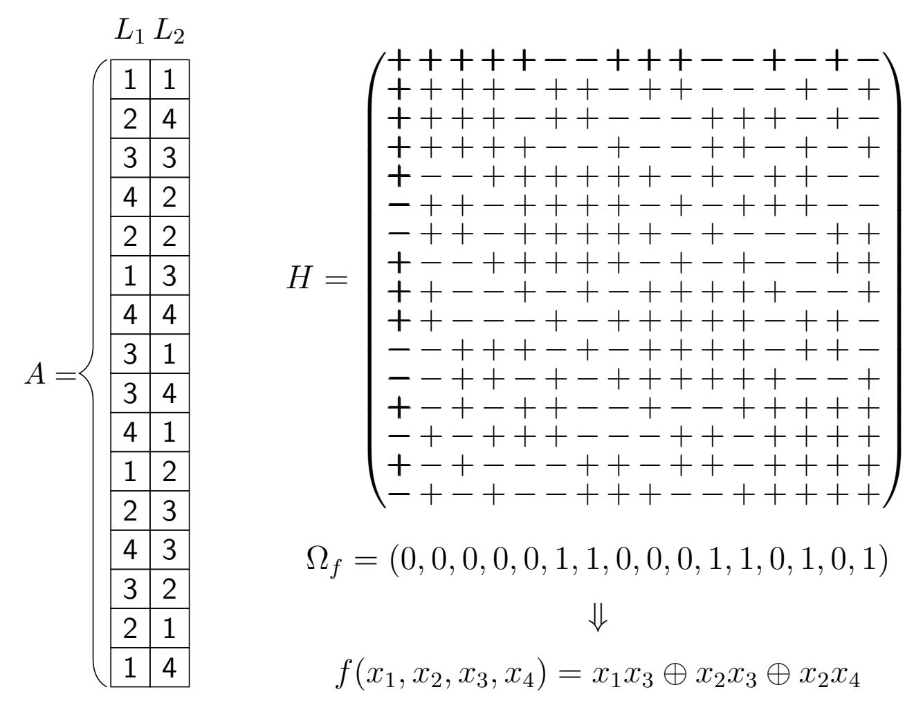
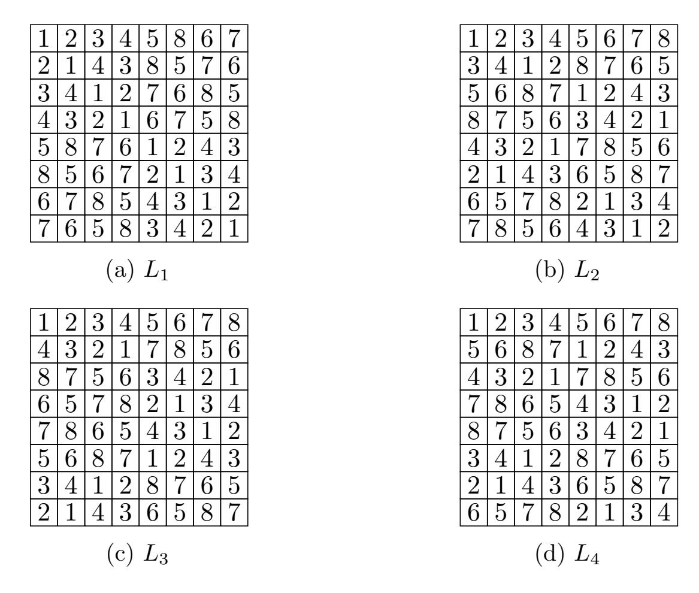

{0}------------------------------------------------

## Bent Functions from Cellular Automata

Maximilien Gadouleau1 , Luca Mariot2 , and Stjepan Picek2

1Department of Computer Science, Durham University, South Road, Durham DH1 3LE, United Kingdom ,

m.r.gadouleau@durham.ac.uk

2Cyber Security Research Group, Delft University of Technology, Mekelweg 2, Delft, The Netherlands , {l.mariot, s.picek}@tudelft.nl

### October 12, 2020

#### Abstract

In this work, we present a primary construction of bent functions based on cellular automata (CA). We consider the well-known characterization of bent functions in terms of Hadamard matrices and employ some recent results about mutually orthogonal Latin squares (MOLS) based on linear bipermutive CA (LBCA) to design families of Hadamard matrices of the form required for bent functions. In particular, the main question to address in this construction can be reduced to finding a large enough set of coprime polynomials over Fq, which are used to define a set of MOLS via LBCA. This set of MOLS is, in turn, used to define a Hadamard matrix of the specific structure characterizing a bent function. We settle the existence question of such bent functions by proving that the required coprime sets exist if and only if the degree of the involved polynomials is either 1 or 2, and we count the resulting sets. Next, we check if the functions of 8 variables arising from our construction are EA-equivalent to Maiorana-McFarland functions, observing that most of them are not. Finally, we show how to represent the support of these bent functions as a union of the kernels of the underlying linear CA. This allows us, in turn, to prove that the functions generated by our construction belong to the partial spread class PS−. In particular, we remark that for degree 1 our construction is a particular case of the Desarguesian spread construction.

Keywords bent functions, cellular automata, Hadamard matrices, Latin squares, orthogonal arrays, polynomials, partial spreads

{1}------------------------------------------------

### 1 Introduction

Boolean functions play an important role in cryptography, coding theory, and combinatorial designs [21]. Among them, bent functions are of particular interest since they lie at the highest possible Hamming distance from the set of all affine functions, or equivalently they reach the highest possible nonlinearity. For this reason, bent functions have been extensively used in the past for designing stream and block ciphers, since highly nonlinear Boolean functions are useful to withstand fast-correlation and linear cryptanalysis attacks. Indeed, even though bent functions are unbalanced, highly nonlinear balanced functions can be derived from them [9]. However, it is known that such functions are vulnerable to fast algebraic attacks, and thus cannot be used directly as nonlinear elements in symmetric ciphers [4]. Besides cryptography, bent functions are connected in coding theory to the covering radius of first-order Reed-Muller codes, whose codewords are affine Boolean functions.

Over the last decades, many constructions of bent functions have been described in the related literature (see, e.g., [3, 21, 4] for a survey of the main ones). A distinction is usually made between the primary and secondary constructions. Primary constructions build sets of bent functions from scratch, usually by leveraging on related combinatorial structures. Some of the most well-known primary constructions for bent functions include the Maiorana-McFarland construction [20], which exploits permutations over F n 2 , and Dillon's construction [8], based on the class of partial spreads PS. On the contrary, secondary constructions build new bent functions starting from existing ones. For example, Rothaus's construction [23] takes three bent functions of n variables whose sum is also bent and yields a bent function of n + 2 variables.

Notwithstanding this multitude of constructions, they only cover a tiny fraction of the total number of bent functions [21]. Moreover, the complete enumeration of bent functions is still an open question for n ≥ 10 variables [22]. For these reasons, the search for new constructions is still an interesting research problem that may contribute to a better understanding of bent functions' structure.

This paper presents a primary construction of bent functions based on cellular automata (CA), that, to the best of our knowledge, has not been reported before. More specifically, this construction employs a recent result about families of Mutually Orthogonal Latin Squares (MOLS) defined by Linear Bipermutive CA (LBCA), which has been described in [15]. These families of MOLS are used to define Hadamard matrices that correspond to bent functions. The characterization of bent functions through Hadamard matrices has been known since Rothaus's pioneering work on the subject [23]. Similarly, the connection between MOLS sets and Hadamard matrices dates back at least to the end of the 60s [11, 1]. However, Hadamard matrices

{2}------------------------------------------------

arising from MOLS, in general, do not have the structure necessary to characterize a bent function. This lack of appropriate structure could be one of the reasons why, up to now, no one investigated how to define bent functions from the several methods known in the combinatorial designs literature to construct MOLS (see [7] for a survey of such techniques).

The main contributions of this paper are the following:

- We prove that the MOLS families of the CA-based construction of [15] generate Hadamard matrices of the specific form required to characterize bent functions, a result which crucially relies on the linearity of the CA.
- We remark that the existence question of the bent functions arising from this construction boils down to finding a large enough family of pairwise coprime polynomials over Fq with the nonzero constant term, which defines the local rules of the CA used to construct the MOLS sets.
- We prove that such coprime families exist if and only if the degree of the considered polynomials is either 1 or 2, and we count the number of bent functions resulting from our construction through Gauss's formula.

Our counting result reveals that the functions obtained from this construction are quite rare compared to the whole class of bent functions. For example, for n = 8 input variables, our construction yields 6 435 bent functions when using coprime polynomials of degree 1, and only 12 functions with polynomials of degree 2. By contrast, the exact number of 8-variable bent functions, which has been determined relatively recently in [14], amounts approximately to 2 106 .

To assess whether the functions generated by our construction are already known, we first experimentally check their Extended Affine (EA)-equivalence against functions in the Maiorana-McFarland (MM) class. The results show that, for n = 8 variables, most of the generated functions are not EA-equivalent to MM functions. We then explain how to determine the support of the functions in this construction as a union of the involved linear CA's kernels. This compact description allows us to prove that the bent functions in our construction belong to the partial spread class PS−, and thus have maximal algebraic degree n/2. Moreover, we show that when the degree of the coprime polynomials is 1, our construction is a particular case of the Desarguesian spread construction. Thus the resulting bent functions are actually in the PSap class. Conversely, there does not seem to be a straightforward way to show that the functions generated with polynomials of degree 2 are also in PSap.

The rest of this paper is organized as follows. Section 2 reviews the background definitions on bent functions, Hadamard matrices, mutually orthogonal Latin squares, and cellular automata that are necessary to introduce

{3}------------------------------------------------

our construction. Section 3 gives an overview of the construction and proves that the function resulting from it are indeed bent. Section 4 characterizes the families of pairwise coprime polynomials that are required for the construction and provides the corresponding counting result. Section 5 describes the experimental assessment of EA-equivalence for the functions of 8 variables in our construction against Maiorana-McFarland functions. Section 6 defines the support of the bent functions in this constructions using the kernels of the underlying linear CA and discusses the connection with partial spreads. Finally, Section 7 summarizes the main results presented in this paper and discusses several avenues for future research on the subject. Appendix A reports a counterexample of a MOLS family not generated through the CA construction of [15], whose associated Hadamard matrix does not have the structure related to a bent function. Appendix B reports the truth tables of the bent functions of 8 variables arising from our construction by using coprime polynomials of degree 2.

### 2 Background

In this section, we cover all the necessary background definitions and notions used throughout the paper. We start by recalling the definition of bent functions and their characterization in terms of Hadamard matrices. We then move to mutually orthogonal Latin squares (MOLS) and Hadamard matrices defined by MOLS sets through their characterization with orthogonal arrays. Finally, we recall the main definitions of cellular automata (CA) and summarize the main results of [15] for constructing families of MOLS using linear CA.

#### 2.1 Bent Functions and Hadamard Matrices

We refer the reader to [3, 4] for a thorough treatment of the results recalled in this section about Boolean functions. In what follows, let  $\mathbb{F}_q$  be the finite field with q elements (where  $q = p^{\alpha}$  is a power of a prime number), and denote by  $\mathbb{F}_q^n$  the n-dimensional vector space over  $\mathbb{F}_q$ , with  $\underline{0}$  being its null vector. For q = 2, sum and multiplication on  $\mathbb{F}_2$  correspond to the XOR and logical AND operations, respectively. Following the convention of the literature pertaining Boolean functions, we will denote the sum operation over  $\mathbb{F}_2$  by  $\oplus$ , while for a generic finite field  $\mathbb{F}_q$  we will adopt the normal sum symbol +. On the other hand, we will denote the multiplication operation in all finite fields by concatenation of the operands. A Boolean function of n variables is a mapping  $f: \mathbb{F}_2^n \to \mathbb{F}_2$ . The most natural way to represent a Boolean function f is by means of its truth table, which is the vector  $\Omega_f \in \mathbb{F}_2^{2^n}$  that lists the output of f evaluated over all  $2^n$  input vectors  $x \in \mathbb{F}_2^n$  in lexicographic order. The support of f is the subset of input vectors that map to 1, that is,  $supp(f) = \{x \in \mathbb{F}_2^n : f(x) \neq 0\}$ , while the Hamming weight

{4}------------------------------------------------

of f is defined as  $w_H(f) = |supp(f)|$ , i.e., the number of ones in the truth table of f. Functions with the Hamming weight equal to  $w_H = 2^{n-1}$  are also called balanced, since their truth table is composed of an equal number of zeros and ones, and they play an important role in the design of stream and block ciphers. The polarity truth table  $\Omega_{\hat{f}}$  of  $f : \mathbb{F}_2^n \to \mathbb{F}_2$  is the truth table of the function  $\hat{f} : \mathbb{F}_2^n \to \{-1, +1\}$  defined as  $\hat{f}(x) = (-1)^{f(x)}$  for all  $x \in \mathbb{F}_2^n$ .

The Algebraic Normal Form (ANF) is another useful representation which expresses a Boolean function  $f: \mathbb{F}_2^n \to \mathbb{F}_2$  as a multivariate polynomial over the quotient ring  $\mathbb{F}_2[x_1, \cdots, x_n]/(x_1^2 \oplus x_1, \cdots, x_n^2 \oplus x_n)$ :

$$P_f(x) = \bigoplus_{I \in \mathcal{P}([n])} a_I \left( \prod_{i \in I} x_i \right) , \qquad (1)$$

with  $\mathcal{P}([n]) = 2^{[n]}$  being the power set of  $[n] = \{1, \dots, n\}$ . The algebraic degree of f is defined as the cardinality of the largest subset  $I \in$  such that  $a_I \neq 0$ . In particular, affine functions are defined as those Boolean functions with degree at most 1. Notice that the ANF is a unique representation of a Boolean function, and in particular one can retrieve the truth table back from the ANF coefficients through the Möbius transform:

$$f(x) = \bigoplus_{I \in \mathcal{P}[n]: I \subseteq supp(x)} a_I , \qquad (2)$$

A third common representation of Boolean functions used in cryptography is the Walsh-Hadamard transform. Formally, the Walsh-Hadamard transform of a Boolean function  $f: \mathbb{F}_2^n \to \mathbb{F}_2$  is the mapping  $W_f: \mathbb{F}_2^n \to \mathbb{Z}$  defined for all  $a \in \mathbb{F}_2^n$  as

$$W_f(a) = \sum_{x \in \mathbb{F}_2^n} (-1)^{f(x) \oplus a \cdot x} , \qquad (3)$$

where  $a \cdot x = \bigoplus_{i=1}^n a_i x_i$  is the scalar product between a and x. One may easily see that a function f is balanced if and only if its Walsh-Hadamard transform vanishes on the null vector, i.e., if and only if  $W_f(\underline{0}) = 0$ . In particular, the Walsh-Hadamard coefficient  $W_f(a)$  quantifies the correlation between f and the linear function  $a \cdot x$ . The lower the absolute value of  $W_f(a)$ , the lower will be the correlation of f from  $a \cdot x$  (and from its affine counterpart  $1 \oplus a \cdot x$ ), and thus the higher will be the Hamming distance between the truth tables of the two functions. In particular, the nonlinearity of a Boolean function  $f : \mathbb{F}_2^n \to \mathbb{F}_2$  is defined as the minimum Hamming distance of f from the set of all affine functions, and it can be computed as follows:

$$Nl_f = 2^{n-1} - \frac{1}{2} \max_{a \in \mathbb{F}_2^n} \{|W_f(a)|\} . \tag{4}$$

Therefore, a Boolean function with high nonlinearity must be characterized by a low maximum absolute value among its Walsh-Hadamard

{5}------------------------------------------------

coefficients. Parseval's relation states that the sum of the squared Walsh-Hadamard spectrum is constant for any Boolean function  $f: \mathbb{F}_2^n \to \mathbb{F}_2$ , and it equals:

$$\sum_{a \in \mathbb{F}_2^n} [W_f(a)]^2 = 2^{2n} . {5}$$

From Parseval's relation one can remark that the lowest maximum absolute value of the Walsh-Hadamard transform occurs when the constant  $2^{2n}$  is uniformly "spread" among all  $2^n$  coefficients, that is when each coefficient equals  $2^{\frac{n}{2}}$  in absolute value. This observation yields the *covering radius bound* for the nonlinearity of a n-variable Boolean function:

$$Nl_f \le 2^{n-1} - 2^{\frac{n}{2} - 1} . (6)$$

Functions satisfying with equality Equation (6) – or equivalently, whose Walsh-Hadamard coefficients all equal  $2^{\frac{n}{2}}$  in absolute value – are called bent functions. Such functions exist when n is even, since the Walsh-Hadamard coefficients must be integer numbers. Although achieving the highest possible nonlinearity granted by the covering radius bound, bent functions cannot be employed directly in the design of stream or block ciphers, since they are always imbalanced. As a matter of fact, we have  $W_f(\underline{0}) = \pm 2^{\frac{n}{2}}$  for any bent function, which means that its Hamming weight is  $2^{n-1} \pm 2^{\frac{n}{2}-1}$ .

A Hadamard matrix of order n is an  $n \times n$  matrix H such that each entry is  $\pm 1$  and such that  $HH^{\top} = n \cdot I_n$ , where  $I_n$  is the  $n \times n$  identity matrix. A necessary condition for H to be a Hadamard matrix of order n is that n must be equal to 1, 2, or a multiple of 4. The following result is a well-known characterization of bent functions in terms of Hadamard matrices, originally discovered by Rothaus [23]:

**Theorem 1.** Let  $f: \mathbb{F}_2^n \to \mathbb{F}_2$  be a Boolean function of n=2m, and let  $\hat{f}(x) = (-1)^{f(x)}$  for all  $x \in \mathbb{F}_2^n$ . Define the  $2^n \times 2^n$  matrix H as  $H(x,y) = \hat{f}(x \oplus y)$  for all  $x, y \in \mathbb{F}_2^n$ . Then, f is a bent function if and only if H is a Hadamard matrix of order  $2^n$ .

Thus, the input vectors of  $\mathbb{F}_2^n$  are used to index the rows and the columns of the Hadamard matrix of Theorem 1, and the entries of the matrix correspond to the output of the function computed on the XOR of the row and column coordinates. Consequently, the resulting Hadamard matrix is symmetric, since  $x \oplus y$  is a commutative operation. In particular, both the first column and the first row of the matrix correspond to the polarity truth table  $\Omega_{\hat{f}}$  of the bent function f.

## 2.2 Mutually Orthogonal Latin Squares and Orthogonal Arrays

Let X be a finite set of  $N \in \mathbb{N}$  elements. A Latin square of order N is an  $N \times N$  matrix L, where each entry is an element of X such that each row

{6}------------------------------------------------

and each column of L is a permutation of X. Two Latin squares L1, L2 of order N are called orthogonal if their superposition yields all the ordered pairs of the Cartesian product X × X. A set of Latin squares L1, L2, · · · , Lt of order N such that Li and Lj are orthogonal for all i =6 j is also called a set of t Mutually Orthogonal Latin Squares (t MOLS).

An Orthogonal Array OA(t, N) over a finite set of symbols X is a N2 × t matrix A, where each entry is an element of X and such that each pair of columns contains all ordered pairs in X × X. MOLS and OA are equivalent objects. Indeed, given t MOLS L1, · · · , Lt of order N, one can define a N2×t matrix A by taking the tuples (L1(i, j), · · · , Lt(i, j)) for all (i, j) ∈ [N] × [N] as the rows of A. It is then easy to check that the resulting matrix satisfies the definition of an OA(t, N) 1 . The reverse direction to show that an OA(t, N) defines a set of t MOLS of order N follows a similar argument; we refer the reader to [24] for the details.

The following result, whose proof can be found in [1], shows how to construct a Hadamard matrix of order 4t 2 from a set of t MOLS of order 2t via the OA characterization introduced above:

Theorem 2. Let L1, · · · , Lt be a set of t MOLS over X of order N = 2t. Further, let A be the OA(t, 2t) associated to the t MOLS. Define the 4t 2 ×4t 2 matrix H as follows:

$$H(i,j) = \begin{cases} +1 &, & \text{if } i = j \\ -1 &, & \text{if } i \neq j \text{ and } \exists k \in \{1, \dots, t\} \text{ s.t. the column} \\ & k \text{ of } A \text{ has the same symbol in rows } i \text{ and } j \\ +1 &, & \text{otherwise} \end{cases}$$
(7)

for i, j ∈ {1, · · · , 4t 2}. Then, H is a symmetric Hadamard matrix of order 4t 2 .

### 2.3 Cellular Automata

Cellular Automata (CA) are shift-invariant transformations over an array of cells defined by a local update rule. Usually, the theoretical analysis of CA focuses on their long-term dynamical behavior emerging from the parallel application of the local rule over the whole cellular array for multiple time steps [13]. However, here we focus instead on the short-term properties of CA, which allow us to define them as a particular kind of vectorial functions. More precisely, we will consider the No-Boundary CA model as defined in [19] in the context of S-boxes:

1More precisely, one can also obtain an OA(t + 2, N) from a set of t MOLS of order N, by simply adjoining all pairs of the Cartesian product X × X in lexicographic order (i.e., (i1, j1) ≤ (i2, j2) if and only if j1 < j2 or j1 = j2 and i1 < i2) as the additional two columns to the array defined above. Nonetheless, in the rest of this paper, we will only focus on the construction of an OA(t, N) out of t MOLS.

{7}------------------------------------------------

|                                    | $x_i, x_{i+1}, x_{i+2}$ | $f(x_i, x_{i+1}, x_{i+2})$ |
|------------------------------------|-------------------------|----------------------------|
|                                    | 000                     | 0                          |
|                                    | 100                     | 1                          |
| $\underbrace{[0 0 1]1 0 1 0 0}_{}$ | 010                     | 0                          |
|                                    | 110                     | 1                          |
| 1 1 1 0 0 1                        | 001                     | 1                          |
|                                    | 101                     | 0                          |
|                                    | 011                     | 1                          |
|                                    | 111                     | 0                          |

Figure 1: Example of computation in a CA of length n = 8 equipped with rule 90 of diameter d = 3, defined as  $f(x_i, x_{i+1}, x_{i+2}) = x_i \oplus x_{i+2}$ .

**Definition 1.** Let  $d, n \in \mathbb{N}$  such that  $d \leq n$ , and let  $f : \Sigma^d \to \Sigma$  be a function of d variables over the finite alphabet  $\Sigma$ . The Cellular Automaton (CA) of length n and local rule f over  $\Sigma$  is the vectorial function  $F : \Sigma^n \to \Sigma^{n-d+1}$  defined for all vectors  $x = (x_0, \dots, x_{n-1}) \in \Sigma^n$  as:

$$F(x_0, \dots, x_{n-1}) = (f(x_0, \dots, x_{d-1}), \dots, f(x_{n-d}, \dots, x_{n-1})) . \tag{8}$$

Hence, the output of a CA is computed by evaluating the local rule f at each coordinate  $i \in \{0, \dots, n-d\}$  over the neighborhoods of diameter d formed by the input variables  $\{x_i, x_{i+1}, \dots, x_{i+d}\}$ . In what follows, we will assume that the alphabet  $\Sigma$  is the finite field  $\mathbb{F}_q$ . When q = 2, the local rule is a Boolean function of d variables  $f : \mathbb{F}_2^d \to \mathbb{F}_2$ . In this case, the CA literature usually identifies a local rule by the decimal encoding of its truth table  $\Omega_f$ , which is also called the Wolfram code of f [26].

Figure 1 depicts an example of CA with n = 8 input cells, induced by the local rule that computes the XOR of the leftmost and rightmost cells in a neighborhood of diameter d = 3. It can be seen from the truth table on the right that the Wolfram code of the rule is 90, by reading the output column from top to bottom and encoding the resulting binary string in decimal form.

A local rule  $f: \mathbb{F}_q^d \to \mathbb{F}_q$  with  $d \geq 2$  variables is *bipermutive* if it is defined for all  $x = (x_0, \dots, x_{d-1}) \in \mathbb{F}_q^d$  as follows:

$$f(x_0, \dots, x_{d-1}) = a_0 x_0 + g(x_1, \dots, x_{d-2}) + a_{d-1} x_{d-1} , \qquad (9)$$

where  $a_0 \neq 0$  and  $a_{d-1} \neq 0$  and  $g: \mathbb{F}_q^{d-2} \to \mathbb{F}_q$  is a function evaluated on the central d-2 cells. Further, a rule is linear if it is defined as a linear combination over  $\mathbb{F}_q$ , i.e., if there exists a vector  $a = (a_0, a_1, \dots, a_{d-2}, a_{d-1}) \in \mathbb{F}_q^d$  such that

$$f(x_0, \dots, x_{d-1}) = a_0 x_0 + a_1 x_1 + \dots + a_{d-2} x_{d-2} + a_{d-1} x_{d-1}$$
 (10)

{8}------------------------------------------------

for all  $x \in \mathbb{F}_q$ . The polynomial associated to the local rule f of (10) is the polynomial  $P_f \in \mathbb{F}_q[X]$  defined as

$$P_f(X) = a_0 + a_1 X + \dots + a_{d-1} X^{d-1} . {11}$$

A linear rule is bipermutive if and only if both its coefficients  $a_0$  and  $a_{d-1}$  are not null. In this case, the associated polynomial is of degree d-1 and has a nonzero constant term. We will denote a CA defined by a linear bipermutive rule as an LBCA.

Assume now that the vectors in  $\mathbb{F}_q^{d-1}$  are totally ordered, and given  $[N] = \{1, \dots, N\}$  with  $N = q^{d-1}$  suppose that there is a monotone and one-to-one mapping  $\Psi : [N] \to \mathbb{F}_q^{d-1}$ , in order to associate integer coordinates to vectors in  $\mathbb{F}_q^{d-1}$ . Given a CA  $F : \mathbb{F}_q^{2(d-1)} \to \mathbb{F}_q^{d-1}$  with local rule  $f : \mathbb{F}_q^d \to \mathbb{F}_q$ , the square  $\mathcal{S}_F$  is the  $N \times N$  matrix with entries in  $\mathbb{F}_q^{d-1}$  defined as:

$$S_F(i,j) = F(\Psi(i)||\Psi(j)) , \qquad (12)$$

for all  $i, j \in [N]$ , where || denotes concatenation. In other words, the first half of the CA input is used to index the row of the square  $\mathcal{S}_F$ , while the second half is used to index the column. The output of the CA computed over the concatenation of the two vectors  $\Psi(i)$  and  $\Psi(j)$  is the entry at coordinates i, j of  $\mathcal{S}_F$ . The following results, proved in [15], show under which conditions the squares defined by CA are orthogonal Latin squares:

**Theorem 3.** Let  $d \in \mathbb{N}$  and b = d - 1. Then:

- The square  $S_F$  associated to a CA  $F : \mathbb{F}_q^{2b} \to \mathbb{F}_q^b$  defined by a bipermutive local rule  $f : \mathbb{F}_q^d \to \mathbb{F}_q$  is a Latin square over  $X = \mathbb{F}_q^b$  of order  $q^b$ .
- Given t LBCA  $F_1, \dots F_t : \mathbb{F}_q^{2b} \to \mathbb{F}_q^b$ , their Latin squares  $\mathcal{S}_{F_1}, \dots, \mathcal{S}_{F_t}$  are a set of t MOLS if and only if for all  $i \neq j$  the polynomials  $P_{f_i}$  and  $P_{f_j}$  respectively associated to their local rules  $f_i$  and  $f_j$  are relatively prime.

Figure 2 depicts an example of two Latin squares of order 4 arising from the LBCA respectively equipped with the local rules 90 and 150, the latter defined as  $f_{150}(x_i, x_{i+1}, x_{i+2}) = x_i \oplus x_{i+1} \oplus x_{i+2}$ . For simplicity, we mapped the entries of  $\mathbb{F}_2^2$  to integer numbers using the encoding  $00 \mapsto 1$ ,  $10 \mapsto 2$ ,  $01 \mapsto 3$ ,  $11 \mapsto 4$ . It can be seen that the polynomials over  $\mathbb{F}_2$  associated to rules 90 and 150 are respectively  $1 + X^2$  and  $1 + X + X^2$ ; since they are relatively prime, the corresponding Latin squares are orthogonal.

### 3 Characterization and Counting Results

We will now show how the characterization of MOLS families based on LBCA given in Theorem 3 can be employed to derive a primary construction for bent functions, under specific conditions.

{9}------------------------------------------------

| 1 | 2           | 3 | 4 | 1 | 4 | 3            | 2 |  | 1, 1 | 2, 4           | 3, 3 |
|---|-------------|---|---|---|---|--------------|---|--|---------|-------------------|---------|
| 2 | 1           | 4 | 3 | 2 | 3 | 4            | 1 |  | 2, 2 | 1, 3           | 4, 4 |
| 3 | 4           | 1 | 2 | 4 | 1 | 2            | 3 |  | 3, 4 | 4, 1           | 1, 2 |
| 4 | 3           | 2 | 1 | 3 | 2 | 1            | 4 |  | 4, 3 | 3, 2           | 2, 1 |
|   | (a) Rule 90 |   |   |   |   | (b) Rule 150 |   |  |         | (c) Superposition |         |

Figure 2: Orthogonal Latin squares generated by BCA with rules 90 and 150.

Before delving into the details of the construction, let us take a closer look at the implications of Theorem 2 for obtaining bent functions from the Hadamard matrices arising from generic MOLS families, not necessarily defined by CA. First, remark that the Hadamard matrix H of Theorem 2 is symmetric, as in the case of the matrix characterizing a bent function in Theorem 1. The next result shows that the matrix is also regular, i.e., each row and each column has the same number −1 occurrences.

Lemma 1. Let H be a Hadamard matrix of order 4t 2 constructed as in Theorem 2. Then, H is regular, and the number of entries equal to −1 in each row and each column of H is t(2t − 1).

Proof. Let L1, · · · , Lt be the set of t MOLS of order 2t defining H in Theorem 2, and let A be the corresponding OA(t, 2t). We start with the following observation: if H(i, j) = −1 for i =6 j, then there exists a unique k such that A(i, k) = A(j, k). Indeed, suppose that there are two distinct k, k0 ∈ [t] such that A(i, k) = A(j, k) = x and A(i, k0 ) = A(j, k0 ) = y. This implies that the pair (x, y) is repeated twice in the columns k and k 0 , contradicting the fact that A is an OA(t, 2t). Consider now the i-th row H(i, ·) of the matrix, and let mi be the number of entries equal to −1 in this row. To determine mi , we need to count how many times there is a column k in A such that A(i, k) = A(j, k) for j 6= i. Since each column k of A corresponds to a Latin square of order 2t, it follows that each symbol occurs exactly 2t times in k. Thus, in particular, the symbol A(i, k) occurs 2t − 1 times in column k, excluding row i. This means that column k accounts for 2t − 1 entries equal to −1 in the i-th row of H, or equivalently there are 2t − 1 indices j such that A(i, k) = A(j, k). Since by the above observation there is only a single column k for any entry H(i, j) = −1, and since the OA is composed of t columns, it means that mi = t(2t − 1). A similar argument shows that also the number of −1 in any column of H is t(2t − 1). Hence, the Hadamard matrix H is regular.

Let us now focus on the case where the order of the Hadamard matrix H in Theorem 2 is 4t 2 = 2n for n ∈ N even. A straightforward consequence 

{10}------------------------------------------------

of Lemma 1 is that the Hamming weight of the Boolean function defined by taking any row or any column of H as its polarity truth table coincides with the weight of a bent function:

**Corollary 1.** Let H be a Hadamard matrix of order  $4t^2 = 2^n$ ,  $n \in \mathbb{N}$  even, resulting from the MOLS construction of Theorem 2. Given a row  $i \in [2^n]$  of H (respectively, a column  $j \in [2^n]$ ), define the Boolean function  $f : \mathbb{F}_2^n \to \mathbb{F}_2$  as:

$$f(x) = \begin{cases} 0 & \text{, if } H(i,x) = +1 \text{ (respectively, } H(x,j) = +1) \\ 1 & \text{, if } H(i,x) = -1 \text{ (respectively, } H(x,j) = -1) \end{cases}$$
 (13)

for all  $x \in \mathbb{F}_2^n$ . Then, the Hamming weight of f is  $2^{n-1} - 2^{\frac{n}{2}-1}$ .

*Proof.* By Lemma 1, we know that H is regular and the number of -1 in each row and column is t(2t-1). Since  $t=2^{\frac{n-2}{2}}$ , the Hamming weight of f equals:

$$w_H(f) = 2^{\frac{n-2}{2}} \left( 2 \cdot 2^{\frac{n-2}{2}} - 1 \right) = 2 \cdot \left( 2^{\frac{n-2}{2}} \right)^2 - 2^{\frac{n-2}{2}} = 2^{n-1} - 2^{\frac{n}{2}-1} .$$

Corollary 1 cues to the idea that the Boolean functions defined from the Hadamard matrices of Theorem 2, when  $4t^2=2^n$  and n is even, could be in principle bent functions, since they have the right Hamming weight. However, Theorem 1 states that the first row (or the first column) of H defines a bent function if and only if H is of the specific form  $\hat{f}(x \oplus y)$ . Therefore, it can be the case that not all families of  $t=2^{\frac{n-2}{2}}$  MOLS of order 2t generate a Hadamard matrix of order  $2^n$  that correspond to bent functions of n variables. Appendix A provides a concrete counterexample of a set of t=4 MOLS of order 2t=8, not defined by the LBCA construction, whose corresponding Boolean functions of n=6 variables is not bent.

In the rest of this section, we show that the MOLS families resulting from the LBCA construction of Theorem 3 indeed give rise to bent functions, i.e., their associated Hadamard matrix has the required  $\hat{f}(x \oplus y)$  form. The proof relies mainly on the linearity of the underlying CA. Indeed, an LBCA  $F: \mathbb{F}_q^n \to \mathbb{F}_q^{n-d+1}$  can be considered as a linear transformation defined by the following transition matrix:

$$M_F = \begin{pmatrix} a_0 & \cdots & a_{d-1} & 0 & \cdots & \cdots & \cdots & 0 \\ 0 & a_0 & \cdots & a_{d-1} & 0 & \cdots & \cdots & 0 \\ \vdots & \vdots & \vdots & \ddots & \vdots & \vdots & \vdots & \ddots & \vdots \\ 0 & \cdots & \cdots & \cdots & 0 & a_0 & \cdots & a_{d-1} \end{pmatrix} , \quad (14)$$

where  $a_0, \dots, a_{d-1} \in \mathbb{F}_q$  are the coefficients defining the linear local rule. The application of the CA F to a configuration  $x \in \mathbb{F}_q^n$  corresponds to the 

{11}------------------------------------------------

multiplication  $y = M_F x^{\top}$ . Incidentally, remark also that  $M_F$  has the same structure of a generator matrix for a linear cyclic code, as shown in [16].

As a first step of our construction, we are interested in obtaining a large enough family of coprime polynomials to apply Theorem 2 to define a Hadamard matrix. Let us take the finite field  $\mathbb{F}_q$  with  $q=2^l$ , for  $l \in \mathbb{N}$ . This is due to the fact that the order of the matrix in Theorem 2 is  $4t^2$ . Moreover, we have that  $4t^2=2^n$  with  $n \in \mathbb{N}$  even, to be in the case of a Hadamard matrix associated with a Boolean function as in Corollary 1. Additionally, the order of the t MOLS in Theorem 2 is 2t, which must also be equal to  $q^b$  when using the linear CA construction of Theorem 3. Recalling that  $q=2^l$ , we have the following relation between the field extension exponent l, the degree b and the number of MOLS t:

$$2^{lb} = 2t \Leftrightarrow lb = 1 + \log_2 t . \tag{15}$$

Since both l and b are integers, it follows that t must be a power of 2, i.e.,  $t = 2^w$  for  $w \in \mathbb{N}$ . Hence, Equation (15) becomes lb = 1 + w, and we obtain the following result:

**Lemma 2.** Let  $l, b, w \in \mathbb{N}$  such that lb = 1 + w, and let  $q = 2^l$ . If there exists a family of  $t = 2^w$  pairwise coprime polynomials of degree b and nonzero constant term over  $\mathbb{F}_q$ , then there exists a Hadamard matrix H of order  $4t^2 = 2^{2(w+1)}$ , which is defined for all  $i, j \in \mathbb{F}_q^{2b}$  as:

$$H(i,j) = \begin{cases} +1 &, & \text{if } i = j \\ -1 &, & \text{if } i \neq j \text{ and } \exists k \in \{1, \dots, t\} \text{ s.t. } F_k(i) = F_k(j) \\ +1 &, & \text{otherwise} \end{cases}$$
 (16)

where  $F_1, \dots, F_t : \mathbb{F}_q^{2b} \to \mathbb{F}_q^b$  are the LBCA defined by the t polynomials.

Proof. By Theorem 3, the LBCA  $F_1, \dots, F_t$  induced by the set of  $t = 2^w$  pairwise coprime polynomials of degree b and nonzero constant term over  $\mathbb{F}_q$  define a set of  $2^w$  MOLS of order  $2^{lb} = 2^{w+1}$  with entries in  $\mathbb{F}_q^b$ . By Theorem 2, the  $OA(2^w, 2^{(w+1)})$  associated to this set of MOLS generates the Hadamard matrix H of order  $2^{2(w+1)}$  defined in Equation (16).  $\square$ 

We now need to show that the Hadamard matrix constructed in Lemma 2 has the  $\hat{f}(x \oplus y)$  structure associated to a bent function f. To this end, let us remark that the rows and columns of the matrix in Equation 16 are indexed by elements in  $\mathbb{F}_q^{2b}$ , i.e., we have H(i,j) for  $i,j \in \mathbb{F}_q^{2b}$  where  $q=2^l$ , while the Hadamard matrix in Theorem 1 is indexed by vectors in  $\mathbb{F}_2^n$ . Hence, given  $m \in \mathbb{N}$ , we first need to change the representation of elements in  $\mathbb{F}_{2^l}^m$  to elements in  $\mathbb{F}_2^l$ . A natural choice is to identify  $\mathbb{F}_{2^l}$  with the vector space

{12}------------------------------------------------

 $\mathbb{F}_2^l$ . In this way, a vector x in  $\mathbb{F}_{2^l}^m$  is a m-tuple whose components are in turn binary l-tuples:

$$x = ((x_{1,1}, \cdots, x_{1,l}), \cdots, (x_{m,1}, \cdots, x_{m,l})) . \tag{17}$$

We now associate to each element  $x \in \mathbb{F}_{2^l}^m$  an element of  $\mathbb{F}_2^{lm}$  through the flattening operator  $\varphi_m : \mathbb{F}_{2^l}^m \to \mathbb{F}_2^{lm}$  which simply drops the parentheses inside the vector representation of x:

$$\varphi_m(x) = (x_{1,1}, \dots, x_{1,l}, \dots, x_{m,1}, \dots, x_{m,l}) . \tag{18}$$

It is then easy to see that  $\varphi_m$  is bijective and preserves the sum operation, that is, for all  $x, y \in \mathbb{F}_{2^l}^m$  it holds:

$$\varphi(x+y) = \varphi(x) \oplus \varphi(y) . \tag{19}$$

In particular, notice that  $\varphi_m$  is not an isomorphism of vector spaces, since  $\mathbb{F}_{2^l}^m$  and  $\mathbb{F}_2^{lm}$  are defined over different ground fields. However, in what follows we will only need the fact that the sum is preserved.

We can now prove the characterization of the Hadamard matrices arising from LBCA as bent functions:

**Theorem 4.** Let H be the Hadamard matrix of order  $2^{2(w+1)}$  defined by the t LBCA  $F_1, \dots F_t : \mathbb{F}_q^{2b} \to \mathbb{F}_q^b$  in Lemma 2. Further, for all  $x \in \mathbb{F}_2^n$  with n = 2(w+1) define the Boolean function  $f : \mathbb{F}_2^n \to \mathbb{F}_2$  as:

$$f(x) = \begin{cases} 0 & \text{if } x = 0 \\ 1 & \text{if } x \neq 0 \text{ and } \exists k \in \{1, \dots, t\} \text{ s.t. } F_k(\varphi_{2b}^{-1}(x)) = 0 \\ 0 & \text{otherwise} \end{cases}$$
 (20)

where  $\varphi_{2b}^{-1}: \mathbb{F}_2^{2lb} \to \mathbb{F}_2^{2b}$  is the inverse mapping of the flattening operator  $\varphi_{2b}$  defined in Equation (18). Then, it holds that:

$$H(i,j) = \hat{f}(x \oplus y) \tag{21}$$

for all  $i, j \in \mathbb{F}_q^{2b}$  with  $x = \varphi_{2b}(i)$  and  $y = \varphi_{2b}(j)$ , and thus f is a bent function.

*Proof.* The matrix  $\hat{f}(x \oplus y)$  is defined as follows:

$$\hat{f}(x \oplus y) = \begin{cases} +1 &, & \text{if } x \oplus y = 0 \Leftrightarrow x = y \\ -1 &, & \text{if } x \neq y \text{ and } \exists k \in \{1, \dots, t\} \text{ s.t. } F_k(\varphi_{2b}^{-1}(x \oplus y)) = 0 \\ +1 &, & \text{otherwise} \end{cases}.$$

(22)

Given  $i, j \in \mathbb{F}_q^{2b}$ , let us first address the case where i = j. By Equation (16), we have that H(i, j) = +1, and since  $\varphi_{2b}(i) = \varphi_{2b}(j)$ , by (22) it follows that  $\hat{f}(x \oplus y) = \hat{f}(\varphi_{2b}(i) \oplus \varphi_{2b}(j)) = +1$ .

{13}------------------------------------------------

Next, suppose that  $i \neq j$  with  $F_k(i) = F_k(j)$  for  $k \in [t]$ . By Equation (16) this is the only case where H(i,j) = -1. Recalling that  $\mathbb{F}_q$  is a field of characteristic 2 (in fact we have  $q = 2^l$ ) we can rewrite  $F_k(i) = F_k(j)$  as  $F_k(i) + F_k(j) = 0$ . Since the LBCA  $F_k$  is a linear map from  $\mathbb{F}_q^{2b} \to \mathbb{F}_q^b$ , the condition becomes:

$$H(i,j) = -1 \Leftrightarrow i \neq j \text{ and } \exists k \in [t] : F_k(i+j) = 0 .$$
 (23)

Remarking that  $i + j = \varphi_{2b}^{-1}(x \oplus y)$  (where  $x = \varphi_{2b}(i)$  and  $y = \varphi_{2b}(j)$ ), we can further rewrite (23) as:

$$H(i,j) = -1 \Leftrightarrow i \neq j \text{ and } \exists k \in [t] : F_k(\varphi_{2b}^{-1}(x \oplus y)) = 0 ,$$
 (24)

from which we finally deduce that  $H(i,j) = -1 \Leftrightarrow \hat{f}(x \oplus y) = -1$ . For all remaining cases, we have  $H(i,j) = +1 = \hat{f}(x \oplus y)$ . Since  $H(i,j) = \hat{f}(x \oplus y)$ , by Theorem 1 it follows that f is a bent function.  $\square$ 

Remark that the polarity truth table of the bent function defined in Equation (20) corresponds to the first row and to the first column of the Hadamard matrix H(i,j). Indeed, since all the CA  $F_1, \dots, F_t$  are linear, we have that  $F_i(0) = 0$  for all  $i \in [t]$  and thus each entry of the first row in the  $OA(2^w, 2^{w+1})$  associated to the MOLS set is the null vector of  $\mathbb{F}_q^b$ . Consequently, checking if there exists a  $k \in [t]$  such that  $F_k(\varphi_{2b}^{-1}(x)) = 0$  is equivalent to verifying if there is a column k in the  $OA(2^w, 2^{w+1})$  such that the symbol in the row indexed by x equals the symbol in the first row, i.e., the null vector.

In the remainder of this section, we show an example of a bent function obtained through our construction.

**Example 1.** Let w = 1, n = 2(w+1) = 4, l = 1 and b = 2. Since lb = 1 + w, in this case we need to find  $t = 2^w = 2$  relatively prime polynomials  $p, q \in$  $\mathbb{F}_2[X]$  with nonzero constant term of degree b=2 to apply our construction. Let  $p(X) = 1 + X^2$  and  $q(X) = 1 + X + X^2$ . As already remarked in Section 2.3, these coprime polynomials are associated respectively to the local rules 90 and 150, and the orthogonal Latin squares  $L_1, L_2$  given by the LBCA  $F_{90}$  and  $F_{150}$ are reported in Figure 2. Figure 3 depicts the corresponding OA(2,4), denoted by A, and the Hadamard matrix H of order 16 resulting from the construction of Lemma 2. By Theorem 4, the first row and the first column of this matrix correspond to the polarity truth table of a bent function f of n = 4 variables, whose ANF is  $f(x_1, x_2, x_3, x_4) = x_1x_3 \oplus x_2x_3 \oplus x_2x_4$ . It is possible to verify that this function is bent in a number of ways. For example, one can observe that f is equivalent to the function  $g(x_1, x_2, x_3, x_4) = x_1x_2 \oplus x_2x_3 \oplus x_3x_4$ , up to a permutation of the input variables (in particular, it suffices to permute  $x_2$ with  $x_3$ ). It is well known in the literature (see, e.g., [24]) that the function  $g(x_1, \dots, x_n) = x_1x_2 \oplus x_2x_3 \oplus \dots \oplus x_{n-1}x_n$  is bent for any  $n \in \mathbb{N}$  even.

{14}------------------------------------------------

Figure 3: Example of bent function of n=4 variables generated by the t=2 MOLS of order 2t=4 defined by the LBCA with rule 90 and 150, respectively. The two Latin squares are represented on the left in the OA form. The first row and the first column of the Hadamard matrix H coincide with the polarity truth table of the function.

## 4 Finding Suitable Families of Coprime Polynomials

The first research question spawning from Theorem 4 is whether for all even  $n \in \mathbb{N}$  there are at least  $t = 2^w$  pairwise coprime polynomials of degree b = (w+1)/l with nonzero constant term over  $\mathbb{F}_{2^l}$ , where w = (n-2)/2. In what follows, we focus on the case of monic polynomials.

The authors of [15] proposed a construction for families of monic coprime polynomials of degree b with nonzero constant term based on the multiplication of two irreducible polynomials of degree k and b-k, respectively. In particular, they showed that the maximum size of the families that can be generated through this construction equals:

$$N_b = I_b + \sum_{k=1}^{\lfloor \frac{b}{2} \rfloor} I_k . {25}$$

In particular,  $I_k$  denotes the number of irreducible monic polynomials of degree n and with nonzero constant term over  $\mathbb{F}_q$ , which is  $I_k = q - 1$  for

{15}------------------------------------------------

k = 1, while for k ≥ 2 it is given by Gauss's formula:

$$I_k = \frac{1}{k} \sum_{d|k} \mu(d) \cdot q^{\frac{k}{d}} \quad , \tag{26}$$

with µ denoting the M¨obius function. Further, in [15] it is proved that such construction is optimal, meaning that Nb actually corresponds to the maximum size attainable by any family of monic coprime polynomials of degree b with nonzero constant term over Fq. Thus, one can study Equation (25) with respect to the parameters l, b, and w to address the existence question for families of polynomials that satisfy the conditions of Theorem 4. We now characterize such families in terms of the degrees of their polynomials:

Theorem 5. Let l, b, w ∈ N such that lb = 1 + w, and let q = 2l . Then there exists a family of t = 2w pairwise coprime polynomials of degree b and nonzero constant term over Fq if and only if b ∈ {1, 2}.

Proof. We need to show that Nb ≥ 1 2 q b if and only if b ≤ 2. We first settle the cases of b ≤ 4 one by one.

For b = 1, we obtain

$$N_1 = I_1 = q - 1 \ge \frac{1}{2}q.$$

For b = 2, we obtain

$$N_2 = I_2 + I_1 = \frac{1}{2}(q^2 - q) + (q - 1) = \frac{1}{2}q^2(1 + q^{-1} - 2q^{-2}) \ge \frac{1}{2}q^2.$$

For b = 3, we obtain

$$N_3 = I_3 + I_1 = \frac{1}{3} (q^3 - q) + (q - 1)$$

$$< \frac{1}{3} q^3 \{1 + 2q^{-2}\} \le \frac{1}{3} q^3 \frac{3}{2}$$

$$= \frac{1}{2} q^3.$$

For b = 4, we obtain

$$N_4 = I_4 + I_2 + I_1 = \frac{1}{4} (q^4 - q^2) + \frac{1}{2} (q^2 - q) + (q - 1)$$

$$< \frac{1}{4} q^4 \{1 + q^{-2} + 2q^{-3}\} \le \frac{1}{4} q^4 \frac{3}{2}$$

$$= \frac{3}{8} q^4.$$

{16}------------------------------------------------

We now move on to the case where  $n \geq 5$ . Denoting the smallest nontrivial divisor of b by p, we first get the following upper bound on  $I_b$ :

$$I_b \le \frac{1}{b} \left\{ q^b - q^{b/p} + (q^{b/p-1} + \dots + q + 1) \right\} < \frac{1}{b} q^b.$$

We also obtain the following upper bound:

$$\sum_{k=1}^{\lfloor b/2\rfloor} I_k \le q^{\lfloor b/2\rfloor + 1} \le q^{b-2} \le \frac{1}{4} q^b.$$

Combining, we obtain

$$N_b = I_b + \sum_{k=1}^{\lfloor b/2 \rfloor} I_k < q^b \left\{ \frac{1}{b} + \frac{1}{4} \right\} < \frac{1}{2} q^b .$$

Hence, bent functions can be obtained from the LBCA construction for all number of variables n = 2(w+1), where w = l-1 when b = 1 and w = 2l-1 when b = 2. This leads us to the following counting result:

**Theorem 6.** Let  $l, w \in \mathbb{N}$  and  $b \in \{1, 2\}$  such that lb = 1 + w, and let  $q = 2^l$ . Then, the number of bent functions of n = 2(w+1) variables that can be obtained by Theorem 4 is  $\binom{2^{w+1}-1}{2^w}$  when b = 1 and

$$\sum_{A=0}^{I_2} {I_2 \choose A} \sum_{B=0}^{2^w - A} {I_1 \choose B} {I_1 - B \choose 2(2^w - B - A)} \frac{(2(2^w - B - A))!}{(2^w - B - A)!2^{2^w - B - A}}, \qquad (27)$$

where  $I_2 = \frac{1}{2}(q^2 - q)$  and  $I_1 = q - 1$ , when b = 2.

Proof. By Theorem 5 b=1 and b=2 are the only cases we need to address. Let b=1 (and thus w=l-1). Then, by Equation (25) the largest family  $\mathcal{F}_1$  of coprime polynomials of degree 1 with nonzero constant term over  $\mathbb{F}_q$  is composed of  $N_1=q-1=2^{w+1}-1$  elements. The number of subsets of  $2^w$  elements of  $\mathcal{F}_1$  that can be selected to apply Theorem 4 is  $\binom{2^{w+1}-1}{2^w}$ . For b=2, any family of  $t=2^w$  coprime polynomials of degree 2 with nonzero constant term over  $\mathbb{F}_q$  consists of:

- 1.  $A \leq I_2$  irreducible polynomials of degree 2;
- 2.  $B \leq I_1$  polynomials of the form  $f^2$ , where f is an irreducible polynomial of degree 1;
- 3. C = t B A polynomials of the form gh, where g and h are irreducible polynomials of degree 1;

{17}------------------------------------------------

and obviously the same irreducible polynomial of degree 1 only appears once. There are  $\binom{I_2}{A}$  choices for the first part of the family,  $\binom{I_1}{B}$  choices for the second part of the family, and

$$\frac{1}{C!} \binom{I_1 - B}{2} \binom{I_1 - B - 2}{2} \dots \binom{I_1 - B - 2C + 2}{2} = \binom{I_1 - B}{2C} \frac{(2C)!}{C!2^C}$$

choices for the third part of the family. Combining all three parts, we obtain the formula.  $\hfill\Box$ 

### 5 Inequivalence to Maiorana-McFarland Functions

As a preliminary assessment of our construction, we experimentally studied the bent functions arising from it concerning the notion of extended affine equivalence (EA-equivalence), to investigate whether some of them belong to the completed Maiorana-McFarland class  $\mathcal{M}^{\#}$ . Recall that two Boolean functions  $f, g: \mathbb{F}_2^n \to \mathbb{F}_2$  are EA-equivalent if there exists a linear permutation  $L: \mathbb{F}_2^n \to \mathbb{F}_2^n$ , two vectors  $u, v \in \mathbb{F}_2^n$  and an element  $c \in \mathbb{F}_2$  such that:

$$g(x) = f(L(x) \oplus u) \oplus v \cdot x \oplus e , \qquad (28)$$

for all  $x \in \mathbb{F}_2^n$ . The Maiorana-McFarland class is the set  $\mathcal{M}$  of functions  $f: \mathbb{F}_2^n \to \mathbb{F}_2$ , with n = 2m, of the form:

$$f(x,y) = x \cdot \pi(y) \oplus g(y) , \qquad (29)$$

for all  $x, y \in \mathbb{F}_2^m$ , where  $\pi : \mathbb{F}_2^m \to \mathbb{F}_2^m$  is any permutation of  $\mathbb{F}_2^m$ . Each function of  $\mathcal{M}$  is bent, and a function  $f : \mathbb{F}_2^n \to \mathbb{F}_2$  belongs to the completed Maiorana-McFarland class  $\mathcal{M}^\#$  if it is EA-equivalent to a function in  $\mathcal{M}$ . In practice, EA-equivalence with functions in  $\mathcal{M}$  can be verified using the notion of second-order derivative. Given  $f : \mathbb{F}_2^n \to \mathbb{F}_2$  and  $a, b \in \mathbb{F}_2^n$ , the second-order derivative of f in the directions of f and f is the function defined for all f is as:

$$D_a D_b f(x) = f(x) \oplus f(x \oplus a) \oplus f(x \oplus b) \oplus f(x \oplus a \oplus b) . \tag{30}$$

Then, a function  $f: \mathbb{F}_2^n \to \mathbb{F}_2$ , n = 2m, belongs to the completed Maiorana McFarland class  $\mathcal{M}^{\#}$  if and only if there exists an m-dimensional subspace  $E \subseteq \mathbb{F}_2^n$  such that the second order derivative  $D_a D_b f$  vanishes for all  $a, b \in E$  (see, e.g., [2] for a proof of this fact).

We started by generating all bent functions of n = 2(w + 1) = 6, 8 variables given by our construction, i.e., with w = 2, 3. By Theorem 6, when b = 1 there are respectively  $\binom{2^{2+1}-1}{2^2} = \binom{7}{4} = 35$  bent functions of n = 6 variables and  $\binom{2^{3+1}-1}{2^3} = \binom{15}{8} = 6435$  bent functions of n = 8 variables, while for degree b = 2 and w = 3 Equation (27) yields 12 bent functions of n = 8 variables.

{18}------------------------------------------------

After generating these functions, we noticed that all of them have degree n/2, which is the highest possible degree for a bent function [23]. It is known that up to n = 6 variables, all bent functions of degree n/2 belong to the completed Maiorana-McFarland class [22]. Therefore, the smallest interesting case to check for EA-equivalence in our construction is n = 8 variables and degree b = 1, 2. We thus implemented a program to check the condition on the second-order derivative in Equation (30) computationally. To prove EA-inequivalence with MM functions of 8 variables, for each of our functions, we needed to visit 255 4 = 172 061 505 4-dimensional subspaces of F 8 2 , and verify that for each of them, the second-order derivative did not vanish for at least one choice of the vectors a, b. In our implementation, checking this condition for a single function required approximately four days on a 64-bit Linux machine with a 16-core AMD Ryzen processor running at 3.5 GHz and 48 GB of RAM. Hence, we could not exhaustively check the condition for all 6 435 bent functions of degree b = 1, which is why we tested a random sample of 30 functions from this set by running the program in parallel on each core. Out of these 30 bent functions, only one of them turned out to be EA-equivalent to a Maiorana-McFarland function. Conversely, for degree b = 2, we tested all 12 bent functions resulting from our construction, and none of them resulted in being EA-equivalent to any Maiorana-McFarland function. Appendix B reports the truth tables of these 12 bent functions.

## 6 Linear Algebraic Description and Link with Partial Spreads

Let us summarize the process of our CA-based construction described in the previous two sections:

- 1. Find a large enough family of coprime polynomials of degree either 1 or 2 and with a nonzero constant term.
- 2. Construct the MOLS based on the LBCA defined by such polynomials.
- 3. Define the Hadamard matrix induced by the set of MOLS.
- 4. Retrieve the first row (or column) of this matrix as the function's polar truth table.

The above procedure is rather complicated to construct a bent function. We now show how to shorten this convoluted route to directly obtain the support of the function by leveraging on the linear algebraic characterization of LBCA.

Remark 1. Recall from Section 3 that an LBCA F : F n q → F n−d+1 q is defined by a transition matrix MF of the form reported in Equation (14). 

{19}------------------------------------------------

Further, denote by  $ker(F) = \{x \in \mathbb{F}_q^n : F(x) = 0\}$  the kernel of F, which is a subspace of  $\mathbb{F}_q^n$ . The dimension of this kernel equals d-1, since bipermutive CA are surjective (see, e.g., [17]). Hence, the image of F coincides with the whole space  $\mathbb{F}_q^{n-d+1}$ , and by the nullity-rank theorem it follows that dim(ker(F)) = d-1.

One can see from Equation (20) that the bent functions arising from our construction evaluates to 1 if and only if  $x \neq 0$  and there exists an LBCA  $F_i : \mathbb{F}_q^{2b} \to \mathbb{F}_q$  among t ones such that the image of x according to  $\varphi_{2b}^{-1}$  belongs to  $ker(F_i)$ . Therefore, we obtain the following corollary of Theorem 4:

**Corollary 2.** Let  $f: \mathbb{F}_2^n \to \mathbb{F}_2$  with n = 2(w+1) be the bent function defined in Equation (20) of Theorem 4, and let  $F_1, \dots, F_t: \mathbb{F}_q^{2b} \to \mathbb{F}_q^b$  be the t LBCA generating the Hadamard matrix associated to f. Then, the support of f is given by the union of the kernels of the t LBCA:

$$supp(f) = \bigcup_{i=1}^{t} ker(F_i) . (31)$$

Thus, one can compute the support of a bent function of n = 2(w+1) variables generated with our construction by following these steps:

- 1. Choose t coprime polynomials with nonzero constant term  $f_1(X), \dots, f_t(X)$  over  $\mathbb{F}_q$ , each of degree either b=1 or b=2, where  $q=2^l$  and lb=1+w.
- 2. For each  $i \in \{1, \dots, t\}$ , determine the kernel  $ker(F_i)$  of the linear CA  $F_i : \mathbb{F}_q^{2b} \to \mathbb{F}_q^b$  defined by the associated polynomial  $f_i(X)$ .
- 3. Compute the union of the t kernels  $ker(F_1), \dots, ker(F_t)$ .

In other words, it is not necessary to pass through the Hadamard matrix characterization to obtain the support of the function (although of course this is useful to prove that the function is actually bent, as we did in Section 3). From an algorithmic point of view, step 2 amounts to computing the preimage of the null vector under the action of the LBCA  $F_i$ , which can be performed through  $Linear\ Feedback\ Shift\ Registers\ (LFSR)$  as shown in [17].

Remark 2. Depending on the application, one may desire to evaluate the bent function on a specific input  $x \in \mathbb{F}_2^n \setminus \{0\}$  "on the fly", without having to look up its truth table or support, since their size is exponential in n. This can be achieved by slightly modifying the steps above: once a suitable family of t coprime polynomials has been found, it suffices to convert x to the  $\mathbb{F}_q^{2b}$ -based representation  $\varphi_{2b}^{-1}(x)$ , and then evolve in parallel the t LBCA on this same input. If at least one of the CA outputs the null vector, then f(x) evaluates to 1, otherwise it evaluates to 0.

{20}------------------------------------------------

Defining the support of a bent function as a union of subspaces, as granted by Corollary 2, is reminiscent of the partial spread construction introduced by Dillon [8]. A partial spread of  $\mathbb{F}_2^n$ , with n=2m, is a family P of mdimensional subspaces  $S_1, S_2, \dots, S_t \subseteq \mathbb{F}_2^n$  with pairwise trivial intersection (i.e., for all  $i \neq j$  one has  $S_i \cap S_j = \{\underline{0}\}$ ). Further, a partial spread is a spread if the union of its subspaces results in the whole space  $\mathbb{F}_2^n$ .

A bent function  $f: \mathbb{F}_2^n \to \mathbb{F}_2$ , n = 2m, belongs to the class  $\mathcal{PS}^-$  if f(0) = 0 and its support is the union of  $t = 2^{m-1}$  subspaces of a partial spread P of  $\mathbb{F}_2^n$ . Bent functions belonging to the class  $\mathcal{PS}^+$  are defined similarly, with f(0) = 1 and their support being the union of  $2^{m-1} + 1$  m-dimensional subspaces of a partial spread of  $\mathbb{F}_2^n$ . The union of  $\mathcal{PS}^-$  and  $\mathcal{PS}^+$  gives the partial spread class of bent functions  $\mathcal{PS}$ .

The next result shows that the functions generated by our CA-based construction are a subset of the  $\mathcal{PS}^-$  class:

**Lemma 3.** Let  $f: \mathbb{F}_2^n \to \mathbb{F}_2$  be a bent function defined as in Equation (20) of Theorem 4, with n = 2m = 2(w+1), and let  $F_1, \dots, F_t: \mathbb{F}_q^{2b} \to \mathbb{F}_q^b$  be the  $t = 2^w$  LBCA generating f, where  $q = 2^l$  and lb = 1 + w. Then,  $f \in \mathcal{PS}^-$ .

Proof. By Corollary 2 the support of f is the union of the  $2^w = 2^{m-1}$  kernels of  $F_1, \dots, F_t$ , and by Remark 1 each kernel  $ker(F_i)$  is a b-dimensional subspace of  $\mathbb{F}_q^{2b}$ . Hence, the image  $\mathcal{F}_i$  of  $ker(F_i)$  according to  $\varphi_{2b}^{-1}$  is an m-dimensional subspace of  $\mathbb{F}_2^n$ . Moreover, we have that  $ker(F_i)$  and  $ker(F_j)$  have trivial intersection for all  $i \neq j$ . In fact, assume by contradiction that  $ker(F_i) \cap ker(F_j) \neq \{0\}$ . Considering the Latin squares generated by  $F_i$  and  $F_j$ , this implies that the pair (1,1) is repeated more than once in their superposition, contradicting the fact that the Latin squares are orthogonal. This also means that the corresponding subspaces  $\mathcal{F}_i$  and  $\mathcal{F}_j$  under the map  $\varphi_{2b}^{-1}$  have trivial intersection. Therefore, the support of f is the union of f subspaces of a partial spread of f specifically, since by Equation (20) we have f(0) = 0, it follows that  $f \in \mathcal{PS}^-$ .

An interesting property of bent functions in the  $\mathcal{PS}^-$  class is that they achieve maximum algebraic degree n/2 [8]. Hence, Lemma 3 explains what we experimentally observed in the functions tested for EA-equivalence in Section 5.

Several constructions generating subsets of the  $\mathcal{PS}^-$  class have been given in the literature (see, e.g., [6] for a general overview). Thus, it makes sense to analyze the partial spreads arising from LBCA more in detail to assess whether the bent functions of our construction are already known.

Let us first introduce the *Desarguesian spread*, which is perhaps the best known example of spread used to construct bent functions since Dillon's work on the  $\mathcal{PS}$  class in [8]. Given n = 2m, there are two main ways to characterize the Desarguesian spread DS of  $\mathbb{F}_2^n$  [21]. The first one is the 

{21}------------------------------------------------

univariate form, where  $\mathbb{F}_2^n$  is identified with the finite field  $\mathbb{F}_{2^n}$ , and DS is defined as the family

$$DS = \{u\mathbb{F}_{2^n}: u \in U\}, \text{ where } U = \{u \in \mathbb{F}_{2^n}: u^{2^m+1} = 1\}$$
. (32)

For our purposes, however, the *bivariate form* is more useful. In this case the vector space  $\mathbb{F}_2^n$  is identified with the Cartesian product  $\mathbb{F}_{2^m} \times \mathbb{F}_{2^m}$ , and the Desarguesian spread is defined as:

$$DS = \{E_a \subseteq \mathbb{F}_{2^m} \times \mathbb{F}_{2^m} : a \in \mathbb{F}_{2^m}\} \cup E_{\infty} , \text{ where :}$$

$$E_a = \{(x, ax) \in \mathbb{F}_{2^m} \times \mathbb{F}_{2^m} : x \in \mathbb{F}_{2^m}\} ,$$

$$E_{\infty} = \{(0, y) \in \mathbb{F}_{2^m} \times \mathbb{F}_{2^m} : y \in \mathbb{F}_{2^m}\} .$$

$$(33)$$

Then, any subset of  $2^{m-1}$  elements of DS is a partial spread whose union defines the support of a bent function. More in particular, these functions belong to the so-called class  $\mathcal{PS}_{ap}$  (where ap stands for "affine plane"), which is a subset of  $\mathcal{PS}^-$ . Besides reaching maximal degree n/2, functions in the  $\mathcal{PS}_{ap}$  class have the additional interesting property of being hyper-bent, as shown, e.g., in [5]. A Boolean function  $f: \mathbb{F}_{2^n} \to \mathbb{F}_2$ , n even, is called hyper-bent if the function  $f(x^i)$  is bent for all exponent i coprime with  $2^n - 1$  [27]. As such, hyper-bent functions have the highest possible distance not only from all affine functions (which corresponds to the case i = 1), but also from all bijective monomial functions.

Let us now consider our construction with degree b = 1. In this case, to generate a bent function  $f: \mathbb{F}_2^n \to \mathbb{F}_2$  of n = 2m = 2(w+1) variables, by Theorem 4 we need to find a set of  $t = 2^w = 2^{m-1}$  irreducible polynomials of degree 1 over  $\mathbb{F}_{2^m}$ . This basically amounts to choose a subset of cardinality t from the family

$$\mathcal{I}_1 = \{ a + X \in \mathbb{F}_{2^m}[X] : a \in \mathbb{F}_{2^m}^* \} . \tag{34}$$

Thus, let  $P = \{p_1(X), \dots, p_t(X)\}$  be a subset of  $\mathcal{I}_1$ . Recall that each polynomial is used as an abstract representation for the coefficients of an LBCA local rule. In particular, for  $p_i(X) = a_i + X$ , we have that the local rule  $f_i$  (which in this case corresponds to the whole CA  $F_i$ ) is defined as:

$$f_i(x_1, x_2) = a_i x_1 + x_2 , (35)$$

for all pairs  $(x_1, x_2) \in \mathbb{F}_{2^m} \times \mathbb{F}_{2^m}$ . By Lemma 3 the kernels of  $F_i \equiv f_i$  for  $i \in \{1, \dots, t\}$  form a partial spread, and each of them is obtained by taking all pairs  $(x_1, x_2) \in \mathbb{F}_{2^m} \times \mathbb{F}_{2^m}$  such that  $x_2 = a_i x_1$ , since  $\mathbb{F}_{2^m}$  is a field of characteristic 2. Therefore, we have that

$$ker(F_i) = \{(x_1, x_2) \in \mathbb{F}_{2^m} \times \mathbb{F}_{2^m} : x_2 = a_i x_1\}$$
  
= \{(x, a\_i x) \in \mathbb{F}\_{2^m} \times \mathbb{F}\_{2^m} : x \in \mathbb{F}\_{2^m}\} = E\_{a\_i}, \tag{36}

where  $E_{a_i}$  is a member of the Desarguesian spread as defined by Equation (33) in bivariate form. We have thus obtained the following result:

{22}------------------------------------------------

Lemma 4. Let f : F n 2 → F2, n = 2m, be a bent function defined as in Theorem 4 with degree b = 1. Then, f ∈ PSap.

Therefore, when the degree of the involved polynomials is 1, our CAbased construction is a particular case of the partial spread construction induced by the Desarguesian spread. This further explains our experimental findings on EA-equivalence discussed in Section 5, in particular that for b = 1 only one bent function out of a random sample of 30 turned out to be EA-equivalent to Maiorana-McFarland functions. As a matter of fact, Weng et al. [25] showed that almost all bent functions generated by subsets of the Desarguesian spread DS are EA-inequivalent to MM functions.

On the other hand, remark that for degree 2, the above reasoning on the Desarguesian spread does not hold. When b = 2, the local rule is defined by three coefficients instead of two, with the CA composed of four cells. Consequently, the local rule is evaluated over three variables x1, x2, x3, and there does not seem to be a straightforward way to express the CA' kernel as a set of pairs of the type (x, ax). To the best of our knowledge, there are no other constructions in the literature that represent partial spreads in a way analogous to our construction with degree b = 2.

### 7 Conclusions

In this paper, we described a method to construct bent functions from linear cellular automata. The construction leverages on a recent characterization of mutually orthogonal Latin squares families from linear CA proposed in [15], which here are, in turn, used to construct a Hadamard matrix. The connection between MOLS and Hadamard matrices has been known for a long time [11, 1]. However, in general, the Hadamard matrices arising from MOLS families do not possess the particular structure associated with a bent function.

In this work, we proved that the MOLS families originating from the CA construction of [15] indeed generate Hadamard matrices of the form ˆf(x ⊕ y), which in turn tells us that the first row or column of such matrices correspond to the truth table of a bent function. In particular, the proof of this fact relies on the linearity of the involved CA. We also showed that such families of linear CA exist if and only if the degree of the coprime polynomials defining their local rules is either 1 or 2, and we derived the counting formulas for both cases. After remarking experimentally that all bent functions given by our construction have maximal degree n/2 and that most of them are EA-inequivalent to Maiorana-McFarland functions, we described a method to directly obtain their support, as a union of the linear CA kernels. This characterization further allowed us to observe that these functions are a subset of the partial spread class PS−. In particular, for degree b = 1, we proved that our construction is a particular case of the 

{23}------------------------------------------------

Desarguesian spread, meaning that its functions belong to the class PSap. On the other hand, the functions obtained with polynomials of degree 2 do not seem amenable to the Desarguesian spread case.

There are multiple directions for further research stemming from the results of this paper. The first and most natural one is to analyze more closely the bent functions generated with polynomials of degree b = 2, to completely classify our construction and verify if at least some of its functions were previously unknown in the existing literature. This could be accomplished, for example, by checking EA-equivalence of the 12 bent functions of 8 variables against those yielded by other existing constructions based on partial spreads, a list of which can be found in [21].

Another interesting direction is to investigate, more in general, the construction of Hadamard matrices based on MOLS induced by cellular automata, which one can pursue in at least two different ways. First, one could study if there exist other classes of nonlinear bipermutive CA whose MOLS generate Hadamard matrices with the structure of bent functions. Since up to now, there are no known algebraic characterizations of MOLS based on nonlinear CA, it could be useful to approach this direction experimentally. In particular, it would be interesting to use heuristic techniques to design nonlinear CA families that yield bent functions when plugged into our construction. In this regard, examples are genetic algorithms and genetic programming, which the authors of [18] have successfully applied to design single pairs of orthogonal Latin squares based on nonlinear CA. Second, it would be interesting to study in general the Hadamard matrices arising from CA since they have many applications in cryptography and coding theory besides bent functions. An idea worth exploring would be, for instance, to see if some of these Hadamard matrices are also Maximum Distance Separable (MDS), which have applications in the diffusion layers of block ciphers [12].

### Acknowledgements

The authors wish to thank Claude Carlet for his comments on an earlier draft of this paper. Further, the authors thank Luca Manzoni and Antonio E. Porreca for their feedback on the main characterization results in Section 3.

### References

- [1] K. Bush. Construction of symmetric Hadamard matrices. In A survey of combinatorial theory, pages 81–83. Elsevier, 1973.
- [2] A. Canteaut, M. Daum, H. Dobbertin, and G. Leander. Finding nonnormal bent functions. Discret. Appl. Math., 154(2):202–218, 2006.
- [3] C. Carlet. Boolean Functions for Cryptography and Error Correcting Codes. In Y. Crama and P. L. Hammer, editors, Boolean Models and

{24}------------------------------------------------

- Methods in Mathematics, Computer Science, and Engineering, pages 257–397. Cambridge University Press, New York, NY, USA, 1st edition, 2010.
- [4] C. Carlet. Boolean Functions for Cryptography and Coding Theory. Cambridge University Press, 2020.
- [5] C. Carlet and P. Gaborit. Hyper-bent functions and cyclic codes. J. Comb. Theory, Ser. A, 113(3):466–482, 2006.
- [6] C. Carlet and S. Mesnager. Four decades of research on bent functions. Des. Codes Cryptogr., 78(1):5–50, 2016.
- [7] C. J. Colbourn. Construction techniques for mutually orthogonal latin squares. In C. J. Colbourn and E. S. Mahmoodian, editors, Combinatorics Advances, pages 27–48, Boston, MA, 1995. Springer US.
- [8] J. F. Dillon. Elementary Hadamard difference sets. PhD thesis, 1974.
- [9] H. Dobbertin. Construction of bent functions and balanced boolean functions with high nonlinearity. In B. Preneel, editor, Fast Software Encryption: Second International Workshop. Leuven, Belgium, 14-16 December 1994, Proceedings, volume 1008 of Lecture Notes in Computer Science, pages 61–74. Springer, 1994.
- [10] J. Egan and I. M. Wanless. Enumeration of MOLS of small order. Math. Comput., 85(298):799–824, 2016.
- [11] A. Hedayat. On the equivalence of a set of mutually orthogonal latin squares with other combinatorial systems. Biometrics Unit Technical Reports, Number BU-316-M, Cornell University, October 1969.
- [12] P. Junod and S. Vaudenay. Perfect diffusion primitives for block ciphers. In H. Handschuh and M. A. Hasan, editors, Selected Areas in Cryptography, 11th International Workshop, SAC 2004, Waterloo, Canada, August 9-10, 2004, Revised Selected Papers, volume 3357 of Lecture Notes in Computer Science, pages 84–99. Springer, 2004.
- [13] J. Kari. Theory of cellular automata: A survey. Theor. Comput. Sci., 334(1-3):3–33, 2005.
- [14] P. Langevin and G. Leander. Counting all bent functions in dimension eight 99270589265934370305785861242880. Des. Codes Cryptogr., 59(1- 3):193–205, 2011.
- [15] L. Mariot, M. Gadouleau, E. Formenti, and A. Leporati. Mutually orthogonal latin squares based on cellular automata. Designs, Codes and Cryptography, 88(2):391–411, 2019.

{25}------------------------------------------------

- [16] L. Mariot and A. Leporati. A cryptographic and coding-theoretic perspective on the global rules of cellular automata. Natural Computing, 17(3):487–498, 2018.
- [17] L. Mariot, A. Leporati, A. Dennunzio, and E. Formenti. Computing the periods of preimages in surjective cellular automata. Nat. Comput., 16(3):367–381, 2017.
- [18] L. Mariot, S. Picek, D. Jakobovic, and A. Leporati. Evolutionary algorithms for the design of orthogonal latin squares based on cellular automata. In P. A. N. Bosman, editor, Proceedings of the Genetic and Evolutionary Computation Conference, GECCO 2017, Berlin, Germany, July 15-19, 2017, pages 306–313. ACM, 2017.
- [19] L. Mariot, S. Picek, A. Leporati, and D. Jakobovic. Cellular automata based s-boxes. Cryptogr. Commun., 11(1):41–62, 2019.
- [20] R. L. McFarland. A family of difference sets in non-cyclic groups. J. Comb. Theory, Ser. A, 15(1):1–10, 1973.
- [21] S. Mesnager. Bent Functions Fundamentals and Results. Springer, 2016.
- [22] A. A. Polujan and A. Pott. Cubic bent functions outside the completed Maiorana-McFarland class. Des. Codes Cryptogr., 2020.
- [23] O. S. Rothaus. On "bent" functions. J. Comb. Theory, Ser. A, 20(3):300– 305, 1976.
- [24] D. R. Stinson. Combinatorial designs constructions and analysis. Springer, 2004.
- [25] G. Weng, R. Feng, and W. Qiu. On the ranks of bent functions. Finite Fields Their Appl., 13(4):1096–1116, 2007.
- [26] S. Wolfram. Statistical mechanics of cellular automata. Reviews of modern physics, 55(3):601, 1983.
- [27] A. M. Youssef and G. Gong. Hyper-bent functions. In B. Pfitzmann, editor, Advances in Cryptology - EUROCRYPT 2001, International Conference on the Theory and Application of Cryptographic Techniques, Innsbruck, Austria, May 6-10, 2001, Proceeding, volume 2045 of Lecture Notes in Computer Science, pages 406–419. Springer, 2001.

{26}------------------------------------------------

## A Appendix: Counterexample for non-CA based MOLS families

Let n = 6 and t = 2 n−2 = 4. Figure 4 depicts a set of t MOLS of order t = 8, taken from [10] , which is not generated by the LBCA construction of [15].

Figure 4: A set of t = 4 MOLS of order 2t = 8.

By constructing the associated Hadamard matrix according to Theorem 2 and taking the first row, one obtains a Boolean functions with the following truth table in hexadecimal format:

$$\Omega_f = 0$$
x9CD8E8361E66E200 ,

whose algebraic normal form is:

$$f(x_{1}, x_{2}, x_{3}, x_{4}, x_{5}, x_{6}) = 1 \oplus x_{6} \oplus x_{5} \oplus x_{4}x_{6} \oplus x_{3}x_{6} \oplus x_{3}x_{5}x_{6} \oplus x_{2}x_{6} \oplus x_{2}x_{5}$$

$$\oplus x_{2}x_{5}x_{6} \oplus x_{2}x_{4}x_{5} \oplus x_{2}x_{3} \oplus x_{2}x_{3}x_{6} \oplus x_{2}x_{3}x_{5}$$

$$\oplus x_{2}x_{3}x_{4}x_{5} \oplus x_{1} \oplus x_{1}x_{6} \oplus x_{1}x_{5} \oplus x_{1}x_{5}x_{6} \oplus x_{1}x_{4}$$

$$\oplus x_{1}x_{4}x_{6} \oplus x_{1}x_{3}x_{5} \oplus x_{1}x_{3}x_{4} \oplus x_{1}x_{2} \oplus x_{1}x_{2}x_{6}$$

$$\oplus x_{1}x_{2}x_{5} \oplus x_{1}x_{2}x_{5}x_{6} .$$

The actual set of MOLS can be retrieved from the webpage associated to the paper: https://users.monash.edu.au/~iwanless/data/MOLS/, under the link "1 species of nonmaximal 4 MOLS of order 8."

{27}------------------------------------------------

It can be easily seen that this function is not bent, since it has algebraic degree 4, while bent functions of 6 variables can have degree at most 3. Thus, as remarked in Section 3, not all MOLS families give rise to a Hadamard matrix of the  $\hat{f}(x \oplus y)$  form associated to a bent function.

# B Appendix: Bent functions of n = 8 variables generated by our construction with degree b = 2

In this section, we report the truth tables of the 12 bent functions of n = 8 variables arising from our CA construction when the degree of the involved polynomials is b = 2. By Theorem 4, we have w = 3, t = 8 and l = 2. Consequently, a bent function in this case is obtained by finding a set of eight pairwise coprime polynomials over  $\mathbb{F}_4$  of degree 2 and with nonzero constant term. Let  $\mathbb{F}_4 = \{0, 1, \alpha, \alpha^2\}$ , where  $\alpha$  is a root of an irreducible polynomial  $p(X) \in \mathbb{F}_2[X]$  of degree 2. Then, by Gauss's formula there are six irreducible polynomials of degree 2 over  $\mathbb{F}_4$ , which are the following:

$$p_{1}(X) = X^{2} + \alpha^{2}X + \alpha ,$$

$$p_{2}(X) = X^{2} + \alpha^{2}X + 1 ,$$

$$p_{3}(X) = X^{2} + \alpha X + \alpha ,$$

$$p_{4}(X) = X^{2} + X + \alpha^{2} ,$$

$$p_{5}(X) = X^{2} + \alpha X + 1 ,$$

$$p_{6}(X) = X^{2} + X + \alpha .$$

Being irreducible, these polynomials are of course pairwise coprime. Let us denote by  $\mathcal{I}_2 = \{p_1, p_2, p_3, p_4, p_5, p_6\}$ . Further, there are four irreducible polynomials of degree 1 over  $\mathbb{F}_4$  that can be squared in order to obtain polynomials of degree 2 that are coprime among themselves and with those in  $\mathcal{I}_2$ . Discarding the polynomial X (because it has a null constant term), we are left with these three additional polynomials:

$$p_7(X) = (X+1)^2 = X^2 + 1 ,$$
  

$$p_8(X) = (X+\alpha)^2 = X^2 + \alpha^2 ,$$
  

$$p_9(X) = (X+\alpha^2)^2 = X^2 + \alpha .$$

Analogously, we denote by  $\mathcal{I}_1^2$  the set  $\{p_7, p_8, p_9\}$ . Finally, we can take the  $\binom{3}{2} = 3$  pairs of  $\mathcal{I}_1$  and multiply the polynomials in them, obtaining:

$$p_{10}(X) = (X+1)(X+\alpha^2) = X^2 + \alpha X + \alpha^2 ,$$
  

$$p_{11}(X) = (X+1)(X+\alpha) = X^2 + \alpha^2 X + \alpha ,$$
  

$$p_{12}(X) = (X+\alpha)(X+\alpha^2) = X^2 + X + 1 ,$$

{28}------------------------------------------------

Table 1: Truth tables and polynomial families of the 12 bent functions of 8 variables obtained from the CA construction with degree b = 2.

| Truth table                        | Polynomials                     |
|------------------------------------|---------------------------------|
| 0xE5165E1C39AA7DA0C95C1E3A13E6CB70 | p1, p2, p3, p4, p5, p6, p7, p8  |
| E19A365691ECB6D00EECE0E6EE0A0000   |                                 |
| 0xE1365C9C31EA7CB0E91C9E1A5366DB60 | p1, p2, p3, p4, p5, p6, p7, p9  |
| A39A1E5615ECA7D00EEAE0ECEE060000   |                                 |
| 0x65361E9C19EA6DB0E15C9A3A51E6DA70 | p1, p2, p3, p4, p5, p6, p8, p9  |
| E31A3E1695CCB7C00EE6E0EAEE0C0000   |                                 |
| 0xA5365E8C39E875B0E9549C3A43E6DB30 | p1, p2, p3, p4, p5, p7, p8, p9  |
| E29A3E52956C97D00ECE60EEEA0E0000   |                                 |
| 0xE532569C29EA7D90E85C9E3853A65B70 | p1, p2, p3, p4, p6, p7, p8, p9  |
| C39A3E4695E4B3D00E6EA0EEEC0E0000   |                                 |
| 0xC5365E9838EA7D30E94C963A53E49B70 | p1, p2, p3, p5, p6, p7, p8, p9  |
| E3922E5695ACB5D00AEEE0CE6E0E0000   |                                 |
| 0xE5265A9C39E25DB0E9588E3A53C6D370 | p1, p2, p4, p5, p6, p7, p8, p9  |
| 639A3E5494ECB7900CEEE06EAE0E0000   |                                 |
| 0xE5344E9C396A79B0A95C9E3252E6DB50 | p1, p3, p4, p5, p6, p7, p8, p9  |
| E38A3C5695E837D006EEE0AECE0E0000   |                                 |
| 0xE4365E9439CA3DB0695C9E2A53E2D970 | p2, p3, p4, p5, p6, p7, p8, p9  |
| E3983A5685ECB7500EAEC0EEE60E0000   |                                 |
| 0xF1165E1C31EA7CA8E91C1F1A13E6CB64 | p1, p2, p3, p4, p5, p6, p7, p12 |
| E19A1E5611FCA6D28EE8E4E4EE220000   |                                 |
| 0xE5161F1C19EA6DA2E15C1E3A11F6CA78 | p1, p2, p3, p4, p5, p6, p8, p10 |
| F11A3E1691ECB6C44EE4E2E2EE880000   |                                 |
| 0xE1361E9C11FA6CB4F11C9E1A51E6DA62 | p1, p2, p3, p4, p5, p6, p9, p11 |
| E31A1F1615ECA7C82EE2E8E8EE440000   |                                 |

with I1,1 = {p10, p11, p12}. These three polynomials are not pairwise coprime among themselves, but each of them is relatively prime to all polynomials in I2, and to exactly one polynomial in I 2 1 . Summarizing, we can construct the following families of t = 8 coprime polynomials:

- The 9 8 = 9 subsets of 8 elements in the union I2 ∪ I2 1 .
- The 3 families obtained by adjoining to I2 one element from I 2 1 and one from I1,1, so that these last two polynomials are coprime, i.e., I2 ∪ {p7, p12}, I2 ∪ {p8, p10}, and I2 ∪ {p9, p11}.

Hence, we obtain 12 families of 8-MOLS of order 16 generated by LBCA over F4, which give rise to 12 bent functions as stated in Theorem 6. Table 1 reports the truth tables of these functions in hexadecimal format and the corresponding families of polynomials that define them.