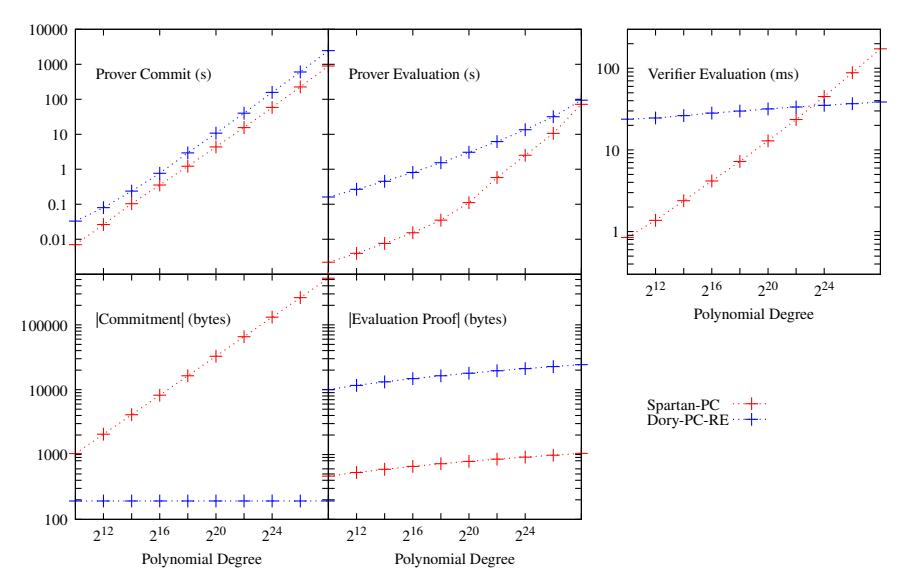
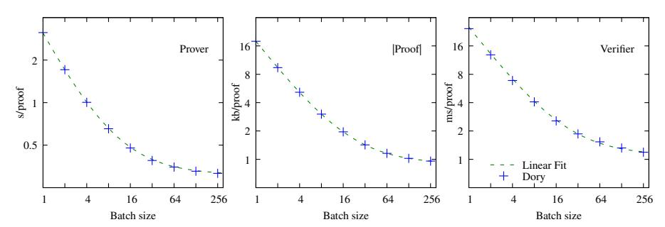

## Dory: Efficient, Transparent arguments for Generalised Inner Products and Polynomial Commitments

Jonathan Lee<sup>∗</sup>

Microsoft Research, Nanotronics Imaging?

Abstract. This paper presents Dory, a transparent setup, public-coin interactive argument for inner-pairing products between committed vectors of elements of two source groups. For a product of vectors of length n, proofs are 6 log n target group elements and O(1) additional elements. Verifier work is dominated by an O(log n) multi-exponentiation in the target group and O(1) pairings. Security is reduced to the standard SXDH assumption in the standard model.

We apply Dory to build a multivariate polynomial commitment scheme via the Fiat-Shamir transform. For a dense polynomial with n coefficients, Prover work to compute a commitment is dominated by a multiexponentiation in one source group of size n. Prover work to show that a commitment to an evaluation is correct is O(n log 8/ log 25) in general (O(n 1/2 ) for univariate or multilinear polynomials); communication complexity and Verifier work are both O(log n). These asymptotics previously required trusted setup or concretely inefficient groups of unknown order. Critically for applications, these arguments can be batched, saving large factors on the Prover and improving Verifier asymptotics: to validate ` polynomial evaluations for polynomials of size at most n requires O(` + log n) exponentiations and O(` log n) field operations.

Dory is also concretely efficient: Using one core and setting n = 2<sup>20</sup> , commitments are 128 bytes and take ∼ 10s to generate. Evaluation proofs are ∼ 18kB, requiring ∼ 3.5s to generate and ∼ 30ms to verify. For batches at n = 2<sup>20</sup>, the marginal cost per evaluation is < 1kB communication, ∼ 30ms for the Prover and ∼ 1ms for the Verifier.

## 1 Introduction

Zero-knowledge succinct arguments of knowledge (zkSNARKs) for the satisfiability of Rank-1 Constraint Systems (R1CS) are the subject of ongoing research. A general strategy to construct zkSNARKS for R1CS is to partition the proof into two phases. First, an information-theoretic argument reduces proving the existence of a satisfying assignment to a consistency check on commitments to evaluations of (possibly multi-variate) polynomials. Some computationally sound

<sup>∗</sup> [jlee@nanotronics.co](mailto:jlee@nanotronics.co)

<sup>?</sup> Current Affiliation: Nanotronics Imaging; work done primarily at Microsoft Research

argument with sub-linear verification time is used to show these commitments to evaluations are correct. These auxiliary arguments are variously inner-product arguments, or the more restricted polynomial commitments, introduced by Kate [\[32\]](#page-34-0) and generalised to multivariate polynomials in [\[36\]](#page-34-1).

Spartan [\[37\]](#page-34-2) makes the independence of the information-theoretic argument and these auxiliary arguments explicit, provides an extensive overview of the history and details of prior works, and details key practical considerations relating to the uniformity of the computation to verify. There are multiple approaches in the literature to constructing these auxiliary arguments, and for each many concrete constructions. Non-exhaustively, Bulletproofs [\[18\]](#page-33-0) use inner-product arguments and Hyrax [\[40\]](#page-34-3) utilise polynomial commitments, both based on the logarithmic communication complexity discrete log-based work (LCC-DLOG) of Bootle et al. [\[15\]](#page-33-1), which in turn uses ideas from [\[26\]](#page-33-2). Spartan [\[37\]](#page-34-2) optimises this approach further, and Halo [\[17\]](#page-33-3) applies these on cycles of pairing friendly curves to achieve recursive composition.

Ligero [\[4\]](#page-32-0), Aurora [\[9\]](#page-33-4), Virgo [\[41\]](#page-34-4) and Fractal [\[21\]](#page-33-5) use Interactive Oracle Proofs based on Reed-Solomon codes (RS-IOP) to prove that a polynomial is of bounded degree [\[7\]](#page-33-6). Supersonic and its follow on works [\[19,](#page-33-7)[13\]](#page-33-8) makes use of groups of unknown order to construct Diophantine ARguments of Knowledge (DARK-GUO) proofs for polynomial evaluations over fields. Other works rely on some trusted setup, which allows the use of other commitment schemes. For example PLONK [\[23\]](#page-33-9) makes use of KZG [\[32\]](#page-34-0) commitments directly, whilst [\[20\]](#page-33-10) uses sublinear-sized KZG commitments as a component in their GIPP argument and polynomial commitment. In all cases these interactive arguments are then compiled to non-interactive arguments in the random-oracle model.

This paper introduces a new argument for generalised inner products without trusted setup, inspired by Bootle et al. [\[15\]](#page-33-1) but applying new techniques to achieve a logarithmic V complexity. This argument can be applied to give polynomial commitments for arbitrary numbers of variables, using two-tiered homomorphic commitments of Groth [\[27\]](#page-33-11) applied to matrix commitment strategy of [\[40\]](#page-34-3). This commitment was also used in B¨unz et al. [\[20\]](#page-33-10) for univariate and bivariate polynomials.

For transparent polynomial commitment schemes, there are four key operations: (1) P and V must generate public parameters; (2) P must commit to a polynomial and transmit that commitment to V; (3, 4) P and V must compute, transmit and verify a proof of evaluation of the polynomial. We give the best achieved asymptotics of previous transparent polynomial commitment schemes, grouped by overall approach, in Figure [1.](#page-2-0)

Unfortunately, implementations generally bundle their polynomial commitment with differing polynomial IOPs for some language, so concrete comparisons of the polynomial commitments in isolation are challenging. To allow for a somewhat concrete discussion, we first note typical object sizes and operation times for fast implementations[1](#page-1-0) of the required primitives at the 128-bit security

<span id="page-1-0"></span><sup>1</sup> We use curve25519-dalek's [\[34\]](#page-34-5) implementation of Curve25519 [\[10\]](#page-33-12) for G and blstrs' [\[2\]](#page-32-1) implementation of BLS12–381 [\[16\]](#page-33-13) for G1,2,<sup>T</sup> and P. We use ANTIC's [\[29\]](#page-33-14) implemen-

<span id="page-2-0"></span>

|                                | Transparent<br>Setup? |                                                                                | unication<br>plexity                                                      |                                                 | Time<br>Complexity                |                                                                    |                                                                 |
|--------------------------------|-----------------------|--------------------------------------------------------------------------------|---------------------------------------------------------------------------|-------------------------------------------------|-----------------------------------|--------------------------------------------------------------------|-----------------------------------------------------------------|
|                                |                       | Commit                                                                         | Eval                                                                      | Gen                                             | Commit                            | Eval $(\mathcal{P})$                                               | Eval $(\mathcal{V})$                                            |
| LCC-DLOG<br>RS-IOP<br>DARK-GUO | √<br>√<br>√           | $n^{1/2} \mid \mathbb{G} \mid 1 \mid \mathbb{H} \mid 1 \mid \mathbb{G}_U \mid$ | $ \log n  \mathbb{G}  \\ \log^2 n  \mathbb{H}  \\ \log n  \mathbb{G}_U  $ | $n^{1/2}\mathbb{H}$ $1$ $n\log n  \mathbb{G}_U$ | _                                 | $n^{1/2} \mathbb{G}$ $n \log n \mathbb{H}$ $n \log n \mathbb{G}_U$ | _                                                               |
| KZG [32,36]<br>GIPP [20]       | ×                     |                                                                                | $\frac{\log n}{\log n}  \mathbb{G}_T $                                    |                                                 | $n \mathbb{G}_1$ $n \mathbb{G}_1$ | $ \begin{array}{c} n  \mathbb{G}_1 \\ n^{1/2}  P \end{array} $     | $ \begin{array}{c} r \ P \\ \log n \ \mathbb{G}_T \end{array} $ |
| This work                      | ✓                     | $1  \mathbb{G}_T $                                                             | $\log n  \mathbb{G}_T $                                                   | $n^{1/2}P$                                      | $n \mathbb{G}_1$                  | $n^{1/2}P$                                                         | $\log n  \mathbb{G}_T$                                          |

Fig. 1: Asymptotic comparisons for dense univariate polynomials of degree n, neglecting Pippenger-type savings in groups. We report the most expensive dominant operations for the most efficient instantiations of each class.  $\mathbb{H}$  denotes a hash function.  $\mathbb{G}$  denotes a group.  $\mathbb{G}_1$ ,  $\mathbb{G}_2$ ,  $\mathbb{G}_T$  denote the two source groups and the target group of a pairing P.  $\mathbb{G}_U$  is a group of unknown order. These schemes all generalise to multivariate polynomials with degree sequence  $(d_1,\ldots,d_r)$ , setting  $n=\prod_i(d_i+1)$ 

level in Figure 2. We note that blstrs is enhanced to apply torus-based pairing compression [35] of  $\mathbb{G}_T$  for serialisation.

<span id="page-2-1"></span>

| Setting                | Implementation    |                  | Size (bytes) | Time $(\mu s)$ |
|------------------------|-------------------|------------------|--------------|----------------|
| Group of Unknown Order | ANTIC-QFB         | $ \mathbb{G}_U $ | 832          | 27000          |
| Hashing                | rust-crypto       | H                | 32           | 0.072          |
| Group                  | curve 25519-dalek | $ \mathbb{G} $   | 32           | 42             |
| Group with Pairing     | blstrs            | $ \mathbb{G}_1 $ | 48           | 110            |
|                        |                   | $ \mathbb{G}_2 $ | 96           | 270            |
|                        |                   | $ \mathbb{G}_T $ | 192          | 470            |
|                        |                   | P                | _            | 600            |

Fig. 2: Micro-benchmarks on a single core (AMD Ryzen 5 3600). For groups we give the serialised size in bytes of a group element, and the time taken to multiply a random point by a 256-bit scalar. P denotes a pairing computation, and  $|\mathbb{H}|$  denotes hashing of a 512-bit message to a 256-bit digest.

#### 1.1 Limitations of prior approaches

Unfortunately, each prior approach to transparent polynomial commitments have substantial problems in practice. Concretely, only LCC-DLOG based-schemes provide a linear-time Prover, which is key for large applications where  $n \sim 2^{20-30}$ . Unfortunately, these schemes require  $\Omega(n^{1/2})$  computation by  $\mathcal V$  to Eval a committed polynomial, and have similarly sized commitments. This is because they commit to a matrix with O(n) entries by committing to the rows and later

tation of imaginary class groups [31] for a  $\mathbb{G}_U$  with transparent setup. At the 128-bit security level, recent work [22] suggests a  $\sim 6656$  bit discriminant is required; we take  $-(2^{6656}-26745)$ . Following Fractal [21], we measure the Blake2b hash function with 64 byte messages and 32 byte digests, using rust-crypto [1].

opening a commitment to some linear combination of the rows. Hyrax [\[40\]](#page-34-3) and its successors saturate this bound with small concrete constants. However for large n these commitments remain quite large ( 10kB), and can be challenging in applications applications where the polynomial commitment is used as a routine and so many commitments must be sent.

RS-IOP-based schemes are built on Reed-Solomon based IOPPs, and would have attractive concrete costs, even with their asymptotic slowness, if the concrete constants were commensurate with the cost of hashing. Unfortunately the soundness error of the underlying IOPP is quite large and the proven bounds are worse still, requiring a number of repetitions linear in the security level. For example, libiop [\[8\]](#page-33-16) runs the underlying proof in Fractal [\[21\]](#page-33-5) ∼ 500 times to achieve provable 128-bit security. This large additional multiplicative constant largely closes the micro-benchmark gap with curve arithmetic, especially as multi-exponentiations in groups permit log savings using Pippenger's algorithm.

DARK-GUO-based schemes [\[19](#page-33-7)[,13\]](#page-33-8) are built around groups of unknown order, which can be constructed transparently as class groups of quadratic number fields, or analogously as Jacobians of higher genus curves [\[22\]](#page-33-15). They have a long history of crpytographic use [\[31](#page-34-7)[,33,](#page-34-8)[14\]](#page-33-17). Unfortunately, general sub-exponential attacks on the order are known [\[12\]](#page-33-18); fast attacks on a low-density sets of weak groups are problematic for applications with transparent setup [\[22\]](#page-33-15), which forces the group operation to be materially slower than operations on curves, as is seen in Figure [2.](#page-2-1) In the particular case of Supersonic [\[19](#page-33-7)[,13\]](#page-33-8), even with Pippenger-type acceleration P must perform O(nλ) group operations, and generating parameters takes O(nλ log n) group operations, which is unlikely to be efficient in practice.

Finally, if transparent setup is given up then Kate commitments [\[32\]](#page-34-0) and their multivariate generalisation [\[36\]](#page-34-1) are available, generally requiring O(n) operations in G<sup>1</sup> for P, O(1) commitment sizes and a V time linear in the number of variables. This is combined with ideas from LCC-DLOG in [\[20\]](#page-33-10) to achieve sublinear Prover computation for evaluation. Whilst performant, these systems have unprovable knowledge-of-exponent type assumptions for their security, which is undesirable.

## 1.2 Review of LCC-DLOG techniques

Dory builds on the LCC-DLOG tradition, which construct inner-product arguments [\[15,](#page-33-1)[18,](#page-33-0)[20\]](#page-33-10) or reductions of Hadamard products to inner products [\[26\]](#page-33-2) with efficient Provers and sublinear communication from homomorphic commitments.

Explicitly for the inner product as a bilinear form, these provide arguments for inner products between vectors of scalars and group elements or generalised products between the source groups of a pairing, where either input may be committed. Let these vectors have length n 0 , WLOG a power of two (in most cases for polynomial commitments n <sup>0</sup> = O(n 1/2 )). The key idea, which is inherited in Dory, is to observe that for any vectors u~L, u~R, v~L, v~R, and any non-zero scalar a:

$$\langle \vec{u_L} || \vec{u_R}, \vec{v_L} || \vec{v_R} \rangle = \langle a\vec{u_L} + \vec{u_R}, a^{-1}\vec{v_L} + \vec{v_R} \rangle - a\langle \vec{u_L}, \vec{v_R} \rangle - a^{-1}\langle \vec{u_R}, \vec{v_L} \rangle.$$

So a claim about the inner product h~u,~vi of length n 0 can be reduced to some claims about the inner products of vectors of length n <sup>0</sup>/2. The Verifier uses the homomorphic properties of the commitment scheme (WLOG of  $\vec{u}$ ) and some Prover assistance to find commitments to these shorter vectors  $\vec{u'} = a\vec{u_L} + u_R^2$ ,  $a^{-1}\vec{v_L} + \vec{v_R}$ , and to a claim for a commitment to the product  $\langle \vec{u'}, \vec{v'} \rangle$ , for some Verifier challenge a. This procedure is applied recursively to obtain a claim about vectors of length 1, for which some sigma protocol are used. Computational soundness comes from rewinding the Prover, since  $\vec{u}$  can be recovered from a few samples of  $\vec{u'}$  considered as a function of a.

The key problem is that when the commitment key used for  $\vec{u}$  is unstructured, the commitment to  $\vec{u'}$  is made with some *challenge-dependent* commitment key. This point is typically implicit, since the entire iterated reduction and final proof is presented as a single protocol. In this case, what one sees is that the Verifier has some final O(n') computation that must be performed, using the challenges to convert the initial commitment key to a single curve point.

In [26], similar techniques are applied to a sequence of vectors with common commitment keys, which allows the Verifier computation to be avoided, at the cost of being only able to combine inner-products rather than compute them. In [15,18], inner-product arguments are given, but with linear Verifier computation. These are generalised to pairing groups in [20], where the key observation is made (following [17]) that this Verifier computation can be expressed as the evaluation of a polynomial whose coefficients are entries in the original commitment key. In this case they structure the commitment key to allow this to be done by opening a Kate commitment.

To construct polynomial commitments, these works use the matrix commitment idea of [26] in an essentially similar fashion as [40,20]. In its simplest form, this represents a polynomial f(x) of degree  $n = {n'}^2$  by a matrix M such that:

$$f(x) = (1, x, x^2, \dots, x^{n'-1})M(1, x^{n'}, x^{2n'}, \dots, x^{n-n'})^T,$$

which is possible as each entry of M is multiplied by a distinct power  $x^i$  for  $i \in \{0, ..., n-1\}$ . In [40], the Verifier keeps a homomorphic commitment to each row of M, combines them by hand, and then engages in a  $\sqrt{n}$ -sized inner product argument. In this case the  $\sqrt{n}$  lower bound is sharp, as either the initial linear combination or the inner-product argument must be this large. In [20], this outer combination is done with a multivariate Kate opening, using the structure-preserving commitment scheme of Abe et al. [3].

#### 1.3 Core techniques of Dory

We now sketch the key ideas that allow Dory to achieve a logarithmic Verifier.

Symmetry of messages and commitment keys: The structure-preserving commitment scheme of [3] has a symmetry between the messages and the commitment key; for some pairing group  $(\mathbb{G}_1, \mathbb{G}_2, \mathbb{G}_T)$  if the message is a vector in  $\mathbb{G}_1$  then the commitment key is a vector in  $\mathbb{G}_2$  (and vice versa), with the commitment itself in  $\mathbb{G}_T$ . So the Verifier is free to treat parts of a commitment key as messages,

and compute a commitment to them with a second commitment key. Additionally, the commitment key and all Verifier challenges are public, so we can hope to outsource computations on the commitment key to the Prover. This is not possible in the no-pairing setting of [15,18,40], and is not exploited in [20].

Structured Verifier computation: The computations that the Verifier has to perform on the commitment key are highly structured; as observed in [17,20] that this inner product can be thought of as a multivariate polynomial evaluation. Equivalently, it is an inner product with a vector of scalars, which is a Kronecker products of  $\log n'$  vectors of length 2 (each built from one of the Verifier's challenges); this kind of vector occurs throughout Dory, and we say that a vector with such a cauterisation has multiplicative structure. Given the first challenge a, the Verifier must turn the commitment key  $\vec{\Gamma} = (\vec{\Gamma_L} || \vec{\Gamma_R})$  into  $\Gamma' = (f(a)\vec{\Gamma_L} + g(a)\vec{\Gamma_R})$ , where f, g are cheap to compute; after this a can be discarded. Plainly if the verified holds structure-preserving commitments to  $\vec{\Gamma_L}, \vec{\Gamma_R}$  they can quickly compute a commitment to  $\Gamma'$ . Once the remaining challenges are known, the Verifier's remaining computation with  $\Gamma'$  is a length n'/2 inner product. So we can hope to outsource this to the Prover. The key point is that given structure-preserving commitments to the commitment key, the Verifier can apply one (or a few) challenges to shrink the commitment key and have the Prover do the linear work of computing the actual inner product.

Naively, this let us to use a  $\log n'$ -round protocol along the lines of [15,18,20] as a black box to reduce computing a length n' inner product of committed vectors to computing a length n'/2 inner product on committed vectors derived from the commitment keys of the commitments used in the length n' inner product. If we recursively use this idea, we obtain an  $O(\log^2 n')$ -round protocol for length n' inner products.

Alternately, we can start to run these inner product arguments in parallel, so that the inner product arguments in parallel, so that after k rounds we would have k+1 claims about inner products of  $n'2^{-k}$ -length vectors. This allows us to combine claims about vectors in the same group along the lines of the 'collapsing' observed in [17]. This makes each round somewhat more complex, but the number of claims remains O(1), and so a logarithmic Verifier is feasible.

Structured public scalars: Finally, Dory must handle public vectors of scalars, or for a polynomial commitment the point of evaluation. For general inner products this seems hopeless, as even reading a full vector would be a linear lower bound. However, for polynomial commitments the polynomial size vector of scalars has multiplicative structure, as it is the evaluation of monomials for fixed values of variables. Conveniently, inner products of vectors of this form can be computed in only logarithmically many operations. For a small concrete example,  $(1, x, y, xy, z, xz, yz, xyz) \cdot (1, a, b, ab, c, ac, bc, abc) = (1 + ax)(1 + by)(1 + cz)$ . So any final inner product of public vectors with a challenge-derived vector can, in the context of polynomial commitments, be computed in logarithmic time.

Public parameters: We note that for Dory, the public parameters contain commitment keys for of every power-of-2 length less than n' in both  $\mathbb{G}_1$  and  $\mathbb{G}_2$ , and commitments to the left and right halves of each commitment key (using the a commitment key of half the length). This use of public parameters with structure but without trusted setup can be seen as analogous to the *computational commitments* used in Spartan [37], as we perform some linear-size computation once during setup to accelerate the online proof generation and verification.

Batching: Throughout, ideas similar of those of Bowe et al. [17] allow these arguments to be batched for reduced verification time further (see §3.4,§4.4,§5.1,§6.2). Ultimately the cost of evaluating each additional polynomial commitment is reduced to O(1) group operations and  $O(\log n)$  additional operations in  $\mathbb{F}$ .

Application to Polynomial commitments: In §6, similarly to Hyrax [40, §6] and Bünz et al. [20], we construct a polynomial commitment from a two-tiered homomorphic commitment to matrices. Prior approaches here break knowledge soundness (c.f. Definition 10). Ultimately, evaluation of a dense univariate or multilinear polynomial with n coefficients is reduced to to two inner products of size  $O(n^{1/2})$  (see §5), between public vectors of scalars with multiplicative structure and vectors in  $\mathbb{G}_1$ ,  $\mathbb{G}_2$  respectively (see §4). Unlike prior works, these two inner products are proved together, saving a further  $2\times$ .

## 2 Preliminaries

#### 2.1 Notation

Vector, matrix and tensor indices will begin at 1. For any two vectors  $v_1, v_2$  we denote their concatenation by  $(v_1||v_2)$ . We use  $\otimes$  to denote the Kronecker product, sending an  $m \times n$  matrix A and  $p \times q$  matrix B to an  $mp \times nq$  matrix built up of appended copies of B multiplied by scalars in A. For any vector v of even length we will denote the left and right halves of v by  $v_L$  and  $v_R$ ; more formally:  $v_L = ((1,0) \otimes I_{n/2})v$  and  $v_R = ((0,1) \otimes I_{n/2})v$ .

We write  $\leftarrow_{\$} S$  for a uniformly random sample of S, with the understanding that this encodes no additional structure; for example for groups  $\mathbb{G}$  we assume that samples  $g_i \leftarrow_{\$} \mathbb{G}$  have unrelated logarithms, and  $\mathcal{V}$  challenges are independent of the transcript. Techniques to sample from curves are known [38,30,11,39].

We write all groups additively, and assume we are given some method to sample Type III pairings [24] at a given security level. Then we are furnished with a prime field  $\mathbb{F} = \mathbb{F}_p$ , three groups  $\mathbb{G}_1, \mathbb{G}_2, \mathbb{G}_T$  of order p, a bilinear map  $e: \mathbb{G}_1 \times \mathbb{G}_2 \to \mathbb{G}_T$ , and generators  $G_1 \in \mathbb{G}_1$ ,  $G_2 \in \mathbb{G}_2$  such that  $e(G_1, G_2)$  generates  $\mathbb{G}_T$ . Concretely, classes of pairing-friendly curves (e.g. Barreto-Lynn-Scott [5] or Barreto-Naehrig [6] curves) are believed to satisfy these properties.

We generally suppress the distinction between e and multiplication of  $\mathbb{F}$ ,  $\mathbb{G}_1$ ,  $\mathbb{G}_2$  or  $\mathbb{G}_T$  by elements of  $\mathbb{F}$ , writing all of these bilinear maps as multiplication; we will also use  $\langle , \rangle$  to denote the generalised inner products given by  $\langle \vec{a}, \vec{b} \rangle = \sum_{i=1}^n \vec{a}_i \vec{b}_i$ , with signatures:  $\mathbb{F}^n \times \mathbb{F}^n \to \mathbb{F}$ ,  $\mathbb{F}^n \times \mathbb{G}^n_{\{1,2,T\}} \to \mathbb{G}_{\{1,2,T\}}$  or  $\mathbb{G}^n_1 \times \mathbb{G}^n_2 \to \mathbb{G}_T$ .

We will present our arguments as depending on some precomputed, structured public parameters which are derived from public, independent and uniformly random samples of  $\mathbb{G}_1$ ,  $\mathbb{G}_2$ .

## 2.2 Computationally hard problems in Type III pairings

For Type III pairings there are no efficiently computable morphisms between  $\mathbb{G}_1$ ,  $\mathbb{G}_2$ , so the standard security assumption is Symmetric eXternal Diffie-Hellman:

**Definition 1 (SXDH [3]).** For  $(\mathbb{F}_p, \mathbb{G}_1, \mathbb{G}_2, \mathbb{G}_T, e, G_1, G_2)$  as above, the Decisional Diffie-Hellman (DDH) assumption holds for  $(\mathbb{F}_p, \mathbb{G}_1, G_1)$  and  $(\mathbb{F}_p, \mathbb{G}_2, G_2)$ 

<span id="page-7-1"></span>A DDH instance in  $\mathbb{G}_1$  can be mapped to one in  $\mathbb{G}_T$  by  $g \to e(g, G_2)$ , so SXDH implies that DDH holds in  $\mathbb{G}_T$ . In any group, DDH implies DLOG, and so:

**Lemma 1.** For  $(\mathbb{F}_p, \mathbb{G}_1, \mathbb{G}_2, \mathbb{G}_T, e, G_1, G_2)$  satisfying SXDH,  $n = \text{poly}(\lambda)$  and  $\mathbb{G} \in {\mathbb{G}_1, \mathbb{G}_2, \mathbb{G}_T}$ , given  $\vec{B} \stackrel{\$}{\leftarrow} \mathbb{G}^n$  no non-uniform polynomial-time adversary can compute a non-trivial  $\vec{A} \in \mathbb{F}^n$  such that  $\langle \vec{A}, \vec{B} \rangle = 0$ .

SXDH also implies the Double Pairing and reverse Double Pairing assumptions:

**Lemma 2.** For  $(\mathbb{F}_p, \mathbb{G}_1, \mathbb{G}_2, \mathbb{G}_T, e, G_1, G_2)$  as above, given  $A_1, A_2 \leftarrow_{\$} \mathbb{G}_1$  no non-uniform polynomial-time adversary can compute non-trivial  $B_1, B_2 \in \mathbb{G}_2$  such that:  $A_1B_1 + A_2B_2 = 0$ . Similarly, given  $A_1, A_2 \leftarrow_{\$} \mathbb{G}_2$  no adversary can compute non-trivial  $B_1, B_2 \in \mathbb{G}_1$  such that  $B_1A_1 + B_2A_2 = 0$ .

<span id="page-7-0"></span>**Lemma 3.** For  $(\mathbb{F}_p, \mathbb{G}_1, \mathbb{G}_2, \mathbb{G}_T, e, G_1, G_2)$  as above and  $n = \text{poly}(\lambda)$ , given  $\vec{A} \stackrel{\$}{\leftarrow} \mathbb{G}_1^n$  no non-uniform polynomial-time adversary can compute a non-trivial  $\vec{B} \in \mathbb{G}_2^n$  such that:  $\langle \vec{A}, \vec{B} \rangle = 0$ . Similarly, given  $\vec{A} \leftarrow_{\$} \mathbb{G}_2^n$ , no adversary can compute non-trivial  $\vec{B} \in \mathbb{G}_1^n$  such that  $\langle \vec{B}, \vec{A} \rangle = 0$ .

#### 2.3 Succinct interactive arguments of knowledge

We follow the presentation in [37]. Let  $\mathcal{P}, \mathcal{V}$  be a pair of interactive PPT algorithms. Fix an algorithm Gen and public parameters  $pp = \text{Gen}(\lambda)$ , where  $\lambda$  a security parameter such that  $O(2^{-\lambda}) = \text{negl}(\lambda)$  is negligible. For a NP language  $\mathcal{L}$  there is a deterministic polynomial time  $\text{Sat}_{\mathcal{L}}$  s.t.  $\{\exists w : \text{Sat}_{\mathcal{L}}(x, w) = 1\} \Leftrightarrow x \in \mathcal{L}$ . We denote the transcript of the interaction of two PPTs  $\mathcal{P}, \mathcal{V}$  with random tapes  $z_{\mathcal{P}}, z_{\mathcal{V}} \in \{0, 1\}^*$  on x by  $tr\langle \mathcal{P}(z_{\mathcal{P}}), \mathcal{V}(z_{\mathcal{V}})\rangle(x)$ .

**Definition 2.** A public-coin succinct interactive argument of knowledge for an NP language  $\mathcal{L}$  is a protocol between  $\mathcal{P}, \mathcal{V}$  satisfying: properties:

- Completeness: If  $x \in \mathcal{L}$ , for any witness  $w, x \in \mathcal{L}$  and  $r \in \{0,1\}^*$ ,  $\mathbb{P}[\langle \mathcal{P}(pp, w), \mathcal{V}(pp, r) \rangle(x) = 1 | \operatorname{Sat}_{\mathcal{L}}(x, w) = 1 | \geq 1 \operatorname{negl}(\lambda)$ .
- **Soundness:** For  $x \notin \mathcal{L}$ , any PPT Prover  $\mathcal{P}^*$ , and for all  $r \in \{0,1\}^*$ ,  $\mathbb{P}[\langle \mathcal{P}^*(pp), \mathcal{V}(pp,r) \rangle(x) = 1] \leq \text{negl}(\lambda)$ .

- **Knowledge soundness:** For any PPT adversary A, there exists a PPT extractor  $\mathcal{E}$  such that  $\forall \mathbf{x} \in \mathcal{L}, \forall r \in \{0,1\}^*$ , if

$$\mathbb{P}[\langle \mathcal{A}(pp), \mathcal{V}(pp, r) \rangle(\mathbf{x}) = 1] \ge \text{negl}(\lambda),$$

then  $\mathbb{P}[\operatorname{Sat}_{\mathcal{L}}(\mathbf{x}, \mathcal{E}^{\mathcal{A}}(pp, \mathbf{x})) = 1] \geq \operatorname{negl}(\lambda)$ .

- **Succinctness:** Communication between  $\mathcal{P}$  and  $\mathcal{V}$  is sublinear in |w|.
- **Public coin:** Each V message  $\mathcal{M} \stackrel{\$}{\leftarrow} \mathcal{C}$ , for  $\mathcal{C}$  some fixed set.

**Definition 3.** An interactive argument ( $Gen, \mathcal{P}, \mathcal{V}$ ) for  $\mathcal{L}$  is Honest-Verifier Statistical Zero-Knowledge (HVSZK) if there exists a PPT algorithm  $S(\mathbf{x}, z)$  called the simulator, running in time polynomial in  $|\mathbf{x}|$ , such that for every  $\mathbf{x} \in \mathcal{L}$ ,  $w \in \mathcal{R}_{\mathbf{x}}$ , and  $z \in \{0,1\}^*$ , the statistical distance between the distributions  $tr(\mathcal{P}(w), \mathcal{V}(z))(\mathbf{x})$  and  $S(\mathbf{x}, z)$  is  $negl(\lambda)$ .

If we have a family of languages  $\mathcal{L}_{\mathsf{params}}$ , we will often name a pair of interactive PPT algorithms  $\mathsf{Func} = (\mathcal{P}, \mathcal{V})$ , and suppress reference to the tapes and prover witness, i.e. write that  $\mathcal{P}, \mathcal{V}$  run  $\mathsf{Func}_{\mathsf{params}}(x)$  successfully to mean that  $\mathcal{P}$  possesses some witness w for  $x \in \mathcal{L}_{\mathsf{params}}$  and  $\langle \mathcal{P}(pp, w), \mathcal{V}(pp, r) \rangle$  (params, x) = 1.

Remark 1. When compiled with the Fiat-Shamir transform, HVSZK, public-coin, succinct interactive arguments are transformed into zkSNARKs. Standard techniques [25] can also remove the honest-verifier requirement.

**Definition 4 (Witness-extended emulation [28,40]).** An public coin interactive argument ( $Gen, \mathcal{P}, \mathcal{V}$ ) for  $\mathcal{L}$  has witness-extended emulation if for all deterministic polynomial time programs  $\mathcal{P}^*$  there exists an expected polynomial time emulator E such that for all non-uniform polynomial time adversaries A and all  $z_{\mathcal{V}} \in \{0,1\}^*$ , the following probabilities differ by at most  $negl(\lambda)$ :  $\mathbb{P}[\mathcal{A}(t,x)=1|pp \leftarrow Gen(1^{\lambda}) \wedge (x,z_{\mathcal{P}}) \leftarrow A(pp) \wedge t \leftarrow tr\langle \mathcal{P}^*(z_{\mathcal{P}}), \mathcal{V}(z_{\mathcal{V}})\rangle(x)]$  and  $\mathbb{P}[\mathcal{A}(t,x)=1 \wedge (Accept(t)=1 \Rightarrow Sat_{\mathcal{L}}(x,w)=1)|pp \leftarrow Gen(1^{\lambda}) \wedge (x,z_{\mathcal{P}}) \leftarrow A(pp) \wedge (t,w) \leftarrow E^{\mathcal{P}^*(z_{\mathcal{P}})}(x)].$ 

Witness-extended emulation implies soundness and knowledge soundness. For a  $(2\mu+1)$ -move interactive protocol, a  $(w_1,\ldots,w_\mu)$ -tree of accepting transcripts is a tree of depth  $\mu$  in which: (1) the root is labelled with x and the initial  $\mathcal{P}$  message; (2) each node at depth i has  $w_i$  children, labelled with distinct  $\mathcal{V}$  challenges and subsequent  $\mathcal{P}$  message; (3) the concatenation of the labels on any path from the root to a leaf of the tree is an accepting transcript for the protocol.

**Definition 5 (Tree extractability (arguments)).** A  $(2\mu+1)$ -move interactive protocol  $(\mathcal{P}, \mathcal{V})$  with Verifier message space  $\mathcal{C}$  is  $(W, \epsilon)$ -tree extractable if there exists a PPT algorithm extracting a witness from  $(w_1, \ldots, w_{\mu})$ -tree of accepting transcripts with failure probability  $\leq \epsilon$ ,  $\prod_i w_i \leq W$  and  $\max_i (w_i) \leq \epsilon |\mathcal{C}|$ .

<span id="page-8-0"></span>**Definition 6 (Tree extractability (reductions)).** We say an interactive protocol reducing  $x \in \mathcal{L}$  to  $x' \in \mathcal{L}'$  is  $(W, \epsilon)$ -tree extractable if the composition of this argument with a final  $\mathcal{P}$  message revealing a witness w' for  $x' \in \mathcal{L}'$  is a  $(W, \epsilon)$ -tree extractable argument for  $\mathcal{L}$ .

**Lemma 4.** Let  $(\mathcal{P}, \mathcal{V})$  be a  $(W, \epsilon)$ -tree extractable reduction from  $\mathcal{L}$  to  $\mathcal{L}'$ , and  $(\mathcal{P}', \mathcal{V}')$  be a  $(W', \epsilon')$ -tree extractable argument for  $\mathcal{L}'$ . Then the composition of  $(\mathcal{P}, \mathcal{V})$  and  $(\mathcal{P}', \mathcal{V}')$  is a  $(WW', \epsilon + W\epsilon')$ -tree extractable argument for  $\mathcal{L}$ .

Proof. Let the first protocol be extractable from a  $(w_1, \ldots, w_{\mu})$ -tree of accepting transcripts and the second from a  $(w'_1, \ldots, w'_{\mu'})$ -tree of accepting transcripts. We ask for a  $(w_1, \ldots, w_{\mu}, w'_1, \ldots, w'_{\mu'})$ -tree of accepting transcripts, which has size bounded by WW'. We run the PPT extractor for  $(\mathcal{P}, \mathcal{V})$  on the depth  $w_{\mu}$  subtree rooted at the origin, and for each new witness w' for  $x' \in \mathcal{L}'$  that it asks for we run the PPT extractor for  $(\mathcal{P}', \mathcal{V}')$  on the depth  $w_{\mu'}$  subtree rooted at this depth  $\mu$  point. We run the inner extractor at most W times, so taking a union bound our overall failure probability is bounded by  $\epsilon + W\epsilon'$ .

<span id="page-9-1"></span>Lemma 5 ([15, Lemma 1][40, Lemma 13]). If  $W = poly(\lambda)$  and  $\epsilon = negl(\lambda)$ , then any  $(W, \epsilon)$ -tree extractable  $(\mathcal{P}, \mathcal{V})$  has witness-extended emulation.

<span id="page-9-0"></span>We now state a lemma whose object is to obtain results similar to those provided by the Schwartz-Zippel lemma without requiring random evaluation points.

**Lemma 6.** For V a finite vector space over  $\mathbb{F}$ , if  $g \in V[X, X^{-1}]$  is a formal Laurent polynomial of degree d and order e, and  $g(x) = [0]_V$  for d + e + 1 values of  $x \in \mathbb{F}$  then  $g \equiv [0]_V$ .

*Proof.* V is finite so has a basis  $\{v_1, \ldots, v_k\}$ . Each coefficient of g can be uniquely represented by a linear combination of the  $v_i$ , so there exist Laurent polynomials  $f_i \in \mathbb{F}[X, X^{-1}]$  of degree at most d and order at most e such that:  $g \equiv \sum_i v_i \cdot f_i$ . At each of the given d + e + 1 values each of these  $f_i$  vanish. So  $f_i(X).X^e$  is a polynomial of degree  $\leq d + e$ , vanishing at > d + e points. So each  $f_i \equiv 0$  by the factor theorem and hence  $g \equiv [0]_V$ 

Remark 2. Suitable vector spaces V for the above lemma include any  $\mathbb{G}$  a group of order p, or any finite vector  $\mathbb{G}^k$  of such a group, or Laurent polynomials in another variable Y of bounded degree and order (as a finite dimensional sub-space of the vector space  $\mathbb{G}^k[Y, Y^{-1}]$ ).

## 2.4 Commitments

As in [37], we work with the definitions of polynomial commitments from Bünz et al. [19], which allows interactive proofs for evaluations, rather than those of Kate et al. [32]. A *commitment scheme* for some space of messages  $\mathcal{X}$  is a tuple of three protocols (Gen, Commit, Open):

- $-pp \leftarrow \mathsf{Gen}(1^{\lambda})$ : produces public parameters pp.
- $-(\mathcal{C}, \mathcal{S}) \leftarrow \mathsf{Commit}(pp; x)$ : takes as input some  $x \in \mathcal{X}$ ; produces a public commitment  $\mathcal{C}$  and a secret opening hint  $\mathcal{S}$ .
- $-b \leftarrow \mathsf{Open}(pp; \mathcal{C}, x, \mathcal{S})$ : verifies the opening of commitment  $\mathcal{C}$  to  $x \in \mathcal{X}$  with the opening hint  $\mathcal{S}$ ; outputs  $b \in \{0, 1\}$ .

Our commitment schemes sample S uniformly from some space, so we can pass it as a parameter, which gives a modified signature  $C \leftarrow \mathsf{Commit}(pp; S)$ .

**Definition 7.** A tuple of three protocols (Gen, Commit, Open) is a commitment scheme for  $\mathcal{X}$  if for any PPT adversary  $\mathcal{A}$ :

$$\mathbb{P}\left[\begin{array}{c|c}b_0=b_1=1\\ \land x_0\neq x_1\end{array}\middle|\begin{array}{c}pp\leftarrow \mathit{Gen}(1^\lambda)\land (\mathcal{C},x_0,x_1,\mathcal{S}_0,\mathcal{S}_1)=\mathcal{A}(pp)\land\\ b_0\leftarrow \mathit{Open}(pp;\mathcal{C},x_0,\mathcal{S}_0)\land b_1\leftarrow \mathit{Open}(pp;\mathcal{C},x_1,\mathcal{S}_1)\end{array}\right]\leq \mathsf{negl}(\lambda).$$

**Definition 8.** A commitment scheme (Gen, Commit, Open) provides hiding commitments if for all PPT adversaries  $\mathcal{A} = (\mathcal{A}_0, \mathcal{A}_1)$ :

$$\begin{vmatrix} 1 - 2 \cdot \mathbb{P} \left[ b = \bar{b} \middle| \begin{array}{c} pp \leftarrow \textit{Gen}(1^{\lambda}) \land \\ (x_0, x_1, st) = \mathcal{A}_0(pp) \land b \overset{\$}{\leftarrow} \{0, 1\} \land \\ (\mathcal{C}, \mathcal{S}) \leftarrow \textit{Commit}(pp; x_b) \land \bar{b} \leftarrow \mathcal{A}_1(st, \mathcal{C}) \\ \end{vmatrix} \leq \text{negl}(\lambda)$$

If this holds for all algorithms, then the commitment is statistically hiding.

Pedersen and AFGHO Commitments: For messages  $\mathcal{X} = \mathbb{F}^n$  and any  $i \in \{1, 2, T\}$ , the Pedersen commitment scheme is defined by:

$$\begin{split} pp \leftarrow \mathsf{Gen}(1^\lambda) &= (g \overset{\$}{\leftarrow} G_i^n, h \overset{\$}{\leftarrow} G_i) \\ (\mathcal{C}, \mathcal{S}) \leftarrow \mathsf{Commit}(pp; x) &= \{r \overset{\$}{\leftarrow} \mathbb{F} \; ; (\langle x, g \rangle + rh, r)\} \\ \mathsf{Open}(pp; \mathcal{C}, x, \mathcal{S}) &= (\langle x, g \rangle + r(h) \overset{?}{=} \mathcal{C}) \end{split}$$

If DLOG in  $\mathbb{G}_i$  is hard, then this is a hiding commitment scheme. Similarly, Abe et. al. [3] define a structure preserving commitment to group elements. In this case we have  $\mathcal{X} = \mathbb{G}_i^n$  for  $i \in \{1, 2\}$  and:

<span id="page-10-0"></span>
$$\begin{split} pp \leftarrow \mathsf{Gen}(1^\lambda) &= (g \overset{\$}{\leftarrow} G_{3-i}^n, H_1 \overset{\$}{\leftarrow} G_1, H_2 \overset{\$}{\leftarrow} G_2) \\ (\mathcal{C}, \mathcal{S}) \leftarrow \mathsf{Commit}(pp \; ; x) &= \{r \overset{\$}{\leftarrow} \mathbb{F} \; ; (\langle x, g \rangle + r \cdot e(H_1, H_2), r)\} \\ \mathsf{Open}(pp, \mathcal{C}, x, \mathcal{S}) &= (\langle x, g \rangle + \mathcal{S} \cdot e(H_1, H_2) \overset{?}{=} \mathcal{C}) \end{split}$$

This is hiding as  $r \cdot e(H_1, H_2)$  is uniformly random in  $\mathbb{G}_T$ . It is a commitment conditional on SXDH; providing two distinct openings violates Lemma 3). This commitment reduces to that of [3], since in that work an opening for a commitment to a vector  $x \in \mathbb{G}_1^n$  would supply some  $R \in G_1$  such that  $\mathcal{C} = \langle x, g \rangle + e(R, H_2)$ . Here, an opening provides  $r \in \mathbb{F}$  such that  $R = rH_1$ , which is strictly stronger. Both the Pedersen and AFGHO commitments are additively homomorphic.

Remark 3. The existence of  $|\mathbb{F}|^{1/2}$ -time attacks on DLOG on curves implies that if SXHD holds then  $|\mathbb{F}|^{-1/2} = \text{negl}(\lambda)$ ; in the sequel we will assume this.

<span id="page-11-1"></span>Commitments to matrices Composing the Pedersen and AFGHO commitments yields a two-tiered homomorphic commitment [27] to matrices. Formally, we take  $\mathcal{X} = \mathbb{F}^{n \times m}$ , and for  $M_{ij} \in \mathcal{X}$  we have:

$$\begin{aligned} pp \leftarrow \mathsf{Gen}(1^{\lambda}) &= (\varGamma_1 \overset{\$}{\leftarrow} \mathbb{G}_1^m, H_1 \overset{\$}{\leftarrow} \mathbb{G}_1, \varGamma_2 \overset{\$}{\leftarrow} \mathbb{G}_2^n, H_2 \overset{\$}{\leftarrow} \mathbb{G}_2) \\ (\mathcal{C}, \mathcal{S}) \leftarrow \mathsf{Commit}(pp; M_{ij}) &= \left\{ \begin{array}{c} r_{rows} \overset{\$}{\leftarrow} \mathbb{F}^n \; ; \; r_{fin} \overset{\$}{\leftarrow} \mathbb{F} \; ; \; H_T \leftarrow e(H_1, H_2) \; ; \\ V_i \leftarrow \mathsf{Commit}_{Pedersen}((\varGamma_1, H_1) \; ; \; M_{ij}, r_{rows,i}) \; ; \\ C \leftarrow \mathsf{Commit}_{AFGHO}((\varGamma_2, H_T) \; ; \; \overrightarrow{V}, r_{fin} \; ; \\ & (C, (r_{rows}, r_{fin}, \overrightarrow{V})) \end{array} \right\} \\ \mathsf{Open}(pp; \mathcal{C}, M, \mathcal{S}) &= \left( \overset{?}{\mathcal{C}} \overset{?}{=} \sum_i \varGamma_{2i} \left( \sum_j M_{ij} \varGamma_{1j} + r_{rows,i} H_1 \right) \\ &+ r_{fin} \cdot e(H_1, H_2) \end{array} \right) \end{aligned}$$

Remark 4.  $\vec{V} \in \mathbb{G}_1^n$  is a vector of hiding commitments to the rows of M. So if  $\vec{L} \in \mathbb{F}^n$  then  $\sum L_i V_i \in \mathbb{G}_1$  is a hiding commitment to  $\vec{L}^T M \in \mathbb{F}^m$ .

# <span id="page-11-2"></span>2.5 Polynomial commitments and evaluation from vector-matrix-vector products

Let  $(\mathsf{Gen}_{\mathbb{F}}, \mathsf{Commit}_{\mathbb{F}}, \mathsf{Open}_{\mathbb{F}})$  be a commitment scheme for  $\mathcal{X} = \mathbb{F}$  with public parameters  $pp_{\mathbb{F}}$ . We define polynomial commitments for multilinear polynomials, following [37,19], which (contra Kate [32]) allow interactive evaluation proofs.

**Definition 9.** A tuple of protocols (Gen, Commit, Open, Eval) is an honest-verifier, zero-knowledge, extractable polynomial commitment scheme for  $\ell$ -variable multilinear polynomials over  $\mathbb F$  if (Gen, Commit, Open) is a commitment scheme for  $\ell$ -variable multilinear polynomials over  $\mathbb F$ , and Eval is an HVSZK interactive argument of knowledge for:

$$\mathcal{R}_{\textit{Eval}}(pp, pp_{\mathbb{F}}) = \left\{ \langle (\mathcal{C}_G, \vec{x}, \mathcal{C}_v), (G, \mathcal{S}_G, v, \mathcal{S}_v) \rangle \middle| \begin{array}{c} G \in \mathbb{F}[X_1, \dots, X_\ell] \\ \land G \ \textit{is multilinear} \\ \land v \in \mathbb{F} \land G(\vec{x}) = v \\ \land \textit{Open}(pp_{\mathbb{F}}; \mathcal{C}_g, G, \mathcal{S}_G) = 1 \\ \land \textit{Open}_{\mathbb{F}}(pp_{\mathbb{F}}; \mathcal{C}_v, v, \mathcal{S}_v) = 1 \end{array} \right\}.$$

<span id="page-11-0"></span>Note that we have modified the definition from [19] by requiring evaluations  $G(\vec{x})$  are committed, which is required for zkSNARK applications. We also define a weaker knowledge soundness property useful for R1CS SNARKs as in [15,37]:

**Definition 10.** Random Evaluation Knowledge Soundness. For  $pp \leftarrow \text{Gen}(1^{\lambda})$ ,  $pp_{\mathbb{F}} \leftarrow \text{Gen}_{\mathbb{F}}(1^{\lambda})$ , and commitment  $C_G$ , the protocol:

```
\mathcal{V} \to \mathcal{P} \colon \vec{x} \xleftarrow{\$} \mathbb{F}^{\ell}
\mathcal{P} \colon (\mathcal{C}_{e}, \mathcal{S}_{e}) \leftarrow \textit{Commit}_{\mathbb{F}}(pp_{\mathbb{F}}; G(\vec{x}))
\mathcal{P} \to \mathcal{V} \colon \mathcal{C}_{\mathbb{F}}
\mathcal{P}, \mathcal{V} \colon \textit{Accept if Eval}(pp, pp_{\mathbb{F}}; \mathcal{C}_{G}, \vec{x}, \mathcal{C}_{v}) = 1.
```

is an argument of knowledge with witness-extended emulation for:

$$\mathcal{R}(pp,pp_{\mathbb{F}}) = \left\{ \langle \mathcal{C}_{G}, (G,\mathcal{S}_{G},\mathcal{S}_{v}) \rangle \middle| \begin{array}{l} G \in \mathbb{F}[X_{1},\ldots,X_{\ell}] \text{ is multilinear} \\ \land v \in \mathbb{F} \land G(\vec{x}) = v \\ \land \textit{Open}(pp; \mathcal{C}_{G},G,\mathcal{S}_{G}) = 1 \\ \land \textit{Open}_{\mathbb{F}}(pp_{\mathbb{F}}; \mathcal{C}_{v},v,\mathcal{S}_{v}) = 1 \end{array} \right\}$$

We say a scheme providing this property in place of knowledge soundness is  $random\ evaluation\ extractable$ . We also note that prior polynomial commitment schemes in [15,20] satisfy only this weaker property. In these works, the commitment to a polynomial is a  $n^{1/2}$  length list of commitments to lists of scalars of length  $n^{1/2}$  (resp. a structure-preserving commitment to a list of Kate commitments to polynomials). However, for any particular point of evaluation  $\vec{x}$ ,  $\mathcal{P}$  only shows that know an opening of some  $\vec{x}$ -dependent linear combination of these commitments. So a Knowledge Soundness adversary may pick  $\vec{x}$ , then produce  $\mathcal{C}_G$ , without knowledge of openings of all rows (and hence without knowledge of a G,  $S_G$  opening of  $C_G$ ). In the R1CS SNARK context of [15], this is mitigated as the surrounding protocol enforces that  $\vec{x} \leftarrow \mathbb{F}^{\ell}$  after  $C_G$  is made public.

Any polynomial f in variables  $X_1,\ldots,X_\ell$  of degree  $d_1,\ldots,d_\ell$  can be reformulated as a multilinear polynomial in  $\{X_i,X_i^2,\ldots X_i^{2^{\lceil \log(d_i+1)\rceil-1}}:i\in[\ell]\}$ . For example, the bivariate polynomial  $f(X_1,X_2):=1+X_1^2X_2+X_1^7$  can be written as a 4-variable multilinear polynomial  $g(Y_1,Y_2,Y_3,Y_4)=1+Y_2Y_4+Y_1Y_2Y_3$ , with  $f(x_1,x_2)\equiv g(x_1,x_1^2,x_1^4,x_2)$ . Any multilinear polynomial g in r variables can be written as a sum of monomials, so:

$$g(x_1,...,x_r) = \sum_{(i_1,...,i_r)\in\{1,2\}^r} T_{i_1,...,i_r} \prod_{j\in\{1,...,r\}} x_j^{i_j-1},$$

where T is an order r tensor. In the given concrete example, T would be an  $2 \times 2 \times 2 \times 2$  tensor  $T_{ijkl}$ , with  $T_{1111} = T_{1212} = T_{2221} = 1$  and  $T_{ijkl} = 0$  otherwise. Note that this sum is the contraction of T with the r vectors  $(1, \vec{x}_i)$ . In general, for any  $n_1 \times \ldots \times n_r$  tensor T and  $0 \le k \le r$  we can rearrange T into a  $(\prod_{i < k} n_i) \times (\prod_{i > k} n_i)$  matrix M, such that:

$$\sum_{i_1=1}^{n_1} \cdots \sum_{i_r=1}^{n_r} T_{i_1 \dots i_r} (\vec{v_j})_{i_j} = (\bigotimes_{i < k} \vec{v_i})^T M(\bigotimes_{i \ge k} \vec{v_i})$$

for all vectors  $\vec{v_i} \in \mathbb{F}^{n_i}$ . Explicitly this is given by setting  $M_{ij} := T_{i_1, \dots, i_r}$  where:

$$i-1 = (i_{k-1}-1) + n_{k-1}((i_{k-2}-1) + n_{k-2}(\cdots((i_2-1) + n_2(i_1-1)))),$$
  
$$j-1 = (i_r-1) + n_r((i_{r-1}-1) + n_{r-1}(\cdots((i_{k+1}-1) + n_{k+1}(i_k-1))))$$

$$g(\vec{x}) = \sum_{i_1,\dots,i_r \in \{0,1\}} g(i_1,\dots,i_r) \prod_{j \in 1,\dots,r} (1-x_j,x_j)_{i_j+1},$$

Similar formulae interpolate g from evaluations on any set  $\{a_1, b_1\} \times \ldots \times \{a_\ell, b_\ell\}$ .

<span id="page-12-0"></span><sup>&</sup>lt;sup>2</sup> In applications for multilinear polynomials in  $\ell$  variables, it is often convenient to specify a polynomial on some cube, e.g.  $\{0,1\}^{\ell}$  rather than by coefficients. In this case, analogous formulae exist, as:

We select k to make the matrix M approximately square. In our concrete example k = 2 and  $M_{ij}$  is a  $4 \times 4$  matrix with  $M_{11} = M_{22} = M_{43} = 1$  and  $M_{ij} = 0$  otherwise.

So the evaluation of f at some point x can be replaced with the evaluation of a multilinear polynomial in  $r = \sum_i \lceil \log(d_i + 1) \rceil$ , variables, which can in turn be replaced by a vector-matrix-vector product with vectors of length at most  $2^m = 2^{\lceil r/2 \rceil} = O((\prod_i d_i)^{1/2} 2^{\ell/2})$ . The vectors in this product have multiplicative structure, being formed as Kronecker products of vectors  $(1, x_i^{2^j})$  for  $i \in \{1, \ldots, r\}$ ,  $j \in \{0, \ldots, \lceil \log(d_i + 1) \rceil - 1\}$ . For univariate polynomials of degree  $d, m \leq (3 + \log d)/2$ , and for multilinear polynomials in  $\ell$  variables  $m \leq (\ell + 1)/2$ . In the concrete example, we have:

$$f(x_1, x_2) \equiv g(x_1, x_1^2, x_1^4, x_2) = (1, x_1^2, x_1, x_1^3)^T M(1, x_2, x_1^4, x_1^4, x_2),$$

where the two vectors  $(1, x_1^2, x_1, x_1^3) = (1, x_1) \otimes (1, x_1^2)$  and  $(1, x_2, x_1^4, x_1^4 x_2) = (1, x_1^4) \otimes (1, x_2)$  have multiplicative structure.

## 3 An inner-product argument with a logarithmic Verifier

We begin by showing the simplest form of Dory: an argument for inner products between two vectors in  $\vec{v_1} \in \mathbb{G}_1^n$ ,  $\vec{v_2} \in \mathbb{G}_2^n$ , committed with AFGHO commitments with generators  $(\Gamma_2, e(H_1, H_2)) \in \mathbb{G}_2^n \times \mathbb{G}_T$  and  $(\Gamma_1, e(H_1, H_2)) \in \mathbb{G}_1^n \times \mathbb{G}_T$  respectively.

In our initial presentation of the protocols, and discussions of completeness and soundness, we will highlight that which is required only to achieve hiding in commitments and zero-knowledge in the protocols in blue. Discussion of HVSZK properties necessarily requires that commitments be hiding and the full zero-knowledge protocols are used. Formally, we define a language:

$$(C, D_{1}, D_{2}) \in \mathcal{L}_{n, \Gamma_{1}, \Gamma_{2}, H_{1}, H_{2}} \subset \mathbb{G}_{T}^{3}$$

$$\Leftrightarrow \exists (\vec{v_{1}} \in \mathbb{G}_{1}^{n}, \vec{v_{2}} \in \mathbb{G}_{2}^{n}, r_{C} \in \mathbb{F}, r_{D_{1}} \in \mathbb{F}, r_{D_{2}} \in \mathbb{F}) :$$

$$D_{1} = \langle \vec{v_{1}}, \Gamma_{2} \rangle + r_{D_{1}} \cdot e(H_{1}, H_{2}), \quad D_{2} = \langle \Gamma_{1}, \vec{v_{2}} \rangle + r_{D_{2}} \cdot e(H_{1}, H_{2}),$$

$$C = \langle \vec{v_{1}}, \vec{v_{2}} \rangle + r_{C} \cdot e(H_{1}, H_{2})$$

For n even, and  $\Gamma'_{\{1,2\}} \in \mathbb{G}^{2^{n/2}}_{\{1,2\}}$ , we will show (Section 3.2) an reduction from membership in  $\mathcal{L}_{n,\Gamma_1,\Gamma_2,H_1,H_2}$  to membership in  $\mathcal{L}_{n/2,\Gamma'_1,\Gamma'_2,H_1,H_2}$ . In Section 3.1, we give an argument of knowledge for  $\mathcal{L}_{1,\Gamma_1,\Gamma_2,H_1,H_2}$ . In Section 3.4 we give an argument reducing two claims of membership of  $\mathcal{L}_{n,\Gamma_1,\Gamma_2,H_1,H_2}$  to one. In Section 3.3 we discuss concrete efficiency and optimisations for  $\mathcal{V}$ .

## <span id="page-13-0"></span>3.1 Scalar-Product

We give a interactive argument of knowledge for  $\mathcal{L}_{1,\Gamma_{1},\Gamma_{2},H_{1},H_{2}}$ . This requires showing the product of two elements  $v_{1} \in \mathbb{G}_{1}$  and  $v_{2} \in \mathbb{G}_{2}$  under AFGHO commitments; the analogous argument for Pedersen commitments is folklore. Since pairings are more expensive than multiplications in  $\mathbb{G}_{1}$  or  $\mathbb{G}_{2}$ , we combine the usual final three checks into a single pairing with a Verifier challenge.

```
Scalar-ProductΓ1,Γ2,H1,H2
                        (C , D1, D2)
Precompute: HT = e(H1, H2), χ = e(Γ1, Γ2)
   P witness: (v1, v2, rC , rD1
                             , rD2
                                 ) for (C , D1, D2) ∈ L1,Γ1,Γ2,H1,H2
P: rP1
      , rP2
          , rQ , rR ←$ F , d1 ←$ G1, d2 ←$ G2
P → V: P1 = e(d1, Γ2) + rP1HT , P2 = e(Γ1, d2) + rP2HT ,
         Q = e(d1, v2) + e(v1, d2) + rQ HT , R = e(d1, d2) + rRHT ,
V → P: c ←$ F
P → V: E1 ← d1 + cv1, E2 ← d2 + cv2,
         r1 ← rP1 + crD1
                        , r2 ← rP2 + crD2
                                                ,
         r3 ← rR + crQ + c
                          2
                           rC
V: d ←$ F , accept if:
   e(E1 + dΓ1,E2 + d
                      −1Γ2) = χ + R + cQ + c
                                              2C
                                + dP2 + dcD2 + d
                                                  −1P1 + d
                                                           −1
                                                             cD1
                                − (r3 + dr2 + d
                                               −1
                                                 r1)HT
```

<span id="page-14-0"></span>Theorem 1. For Γ1, H<sup>1</sup> \$ ← G1, Γ2, H<sup>2</sup> \$ ← G2, Scalar-Product is an HVSZK, public-coin, succinct interactive argument of knowledge for L1,Γ1,Γ2,H1,H<sup>2</sup> with (9, 9/|F |)-tree extractability under SXDH.

Proof. Succinctness and the Public Coin property are immediate. Completeness holds as for an honest Prover:

$$\begin{split} e(E_1 + d\Gamma_1, E_2 + d^{-1}\Gamma_2) \\ &= e(d_1 + cv_1, d_2 + cv_2) \\ &\quad + d \cdot e(\Gamma_1, d_2 + cv_2) + d^{-1} \cdot e(d_1 + cv_1, \Gamma_2) + e(\Gamma_1, \Gamma_2) \\ &= \chi + c^2 \cdot e(v_1, v_2) + c[e(d_1, v_2) + e(v_1, d_2)] + e(d_1, d_2) \\ &\quad + d \cdot e(\Gamma_1, d_2) + dc \cdot e(\Gamma_1, v_2) + d^{-1} \cdot e(d_1, \Gamma_2) + d^{-1}c \cdot e(v_1, \Gamma_2) \\ &= \chi + R + cQ + c^2C \\ &\quad + dP_2 + dcD_2 + d^{-1}P_1 + d^{-1}cD_1 - (r_3 + dr_2 + d^{-1}r_1)H_T \end{split}$$

so V accepts.

HVSZK: Note that for an honest P, E1,E2, Q are uniformly random in G<sup>T</sup> and r1, r2, r<sup>3</sup> \$ ← F . We split the final check into terms that are proportional to d −1 , d, 1:

$$P_1 = e(E_1, \Gamma_2) + r_1 H_T - cD_1,$$
  $P_2 = e(\Gamma_1, E_2) + r_2 H_T - cD_2,$   
 $R = e(E_1, E_2) + r_3 H_T - cQ - c^2 C$ 

To construct a simulator: Sample Q,E1,E<sup>2</sup> \$ ← G 3 <sup>T</sup> and compute the challenge c from V's coins. Then sample r1, r2, r<sup>3</sup> \$ ← F and compute P1,P2, R as above.

Tree extractability: In the simpler case where commitments are not hiding and the protocol is not ZK, then  $\mathcal{V}$  has sent the full witness  $E_1 = v_1, E_2 = v_2$  to  $\mathcal{P}$ .

We have  $\mu = 2$  with an empty final  $\mathcal{P}$  message, and set  $w_1 = w_2 = 3$ . So we have a tree of accepting transcripts for 3 values c, and for each c there are 3 accepting values of d. We fail if any of these 9 d are 0, which occurs with probability  $\leq 9/|\mathbb{F}|$ . Across all transcripts,  $P_1$ ,  $P_2$ , Q, R, C,  $D_1$ ,  $D_2$  are constant, and  $E_1$ ,  $E_2$ ,  $r_1$ ,  $r_2$ ,  $r_3$  can be interpolated as quadratics in c.

For each c, the final check contains terms in d only of form  $d, 1, d^{-1}$ , so is a check of equality of Laurent polynomials of degree and order 1. This difference vanishes for three distinct choices of d, so Lemma 6 implies the coefficients for each degree must be separately equal. So for each of the three challenge c:

<span id="page-15-3"></span><span id="page-15-2"></span><span id="page-15-1"></span>
$$e(E_1(c), E_2(c)) + r_3(c)H_T = R + cQ + c^2C$$
(1)

$$e(E_1(c), \Gamma_2) + r_1(c) \cdot e(H_1, H_2) = P_1 + cD_1$$
(2)

$$e(\Gamma_1, E_2(c)) + r_2(c) \cdot e(H_1, H_2) = P_2 + cD_2$$
(3)

For i = 1, 2, we interpolate  $E_i(c) = d_i + cv_i + c^2 U_i$  and  $r_i = r_{P_i} + cr_{D_i} + c^2 r_{U_i}$ . Our first task is to show that  $U_i = [0]_{G_i}$  and  $r_{U_i} = 0$ , i.e. that  $\mathcal{P}$  is constrained to send  $E_1, E_2, r_1, r_2$  that depend only affinely on c. Equation 2 is an equality of polynomials in  $\mathbb{G}_T[c]$  of degree 2 which holds at 3 points. Applying Lemma 6, the coefficients are equal. Writing out the quadratic and linear coefficients gives:

$$e(U_1, \Gamma_2) + e(r_{U_1}H_1, H_2) = 0, \quad e(v_1, \Gamma_2) + r_{D_1}H_T = D_1.$$

Since  $\Gamma_2, H_2 \stackrel{\$}{\leftarrow} \mathbb{G}_2$ , Lemma 3 forces the first equation to be satisfied by  $U_1 = r_{U_1}H_1 = [0]_{\mathbb{G}_1}$ . We also have  $v_1, r_{D_1}$  satisfying our constraint on  $D_1$ . Similar considerations applied to Equation 3 imply that  $U_2 = [0]_{\mathbb{G}_2}, r_{U_2} = 0$ , and provide a  $v_2, r_{D_2}$  satisfying the constraint on  $D_2$ .

It remains to extract  $r_C$  to satisfy the constraint on C. We interpolate  $r_3(c) = r_R + cr_Q + c^2r_C$ , and substitute our linear expressions for  $E_1, E_2$  into Equation 1:

$$R + cQ + c^{2}C = e(d_{1}, d_{2}) + r_{R}H_{T} + c(e(d_{1}, v_{2}) + e(v_{1}, d_{2}) + r_{Q}H_{T})$$
$$+ c^{2}(e(v_{1}, v_{2}) + r_{C}H_{T})$$

This is an equality of quadratics in  $\mathbb{G}_T[c]$  holding at 3 distinct values, so from Lemma 6 the  $c^2$  coefficients are equal. So  $C = e(v_1, v_2) + r_C H_T$ . Hence  $(v_1, v_2, r_{D_1}, r_{D_2}, r_C)$  is a witness for  $(C, D_1, D_2) \in \mathcal{L}_{1,\Gamma_1,\Gamma_2,H_1,H_2}$ .

#### <span id="page-15-0"></span>3.2 Dory-Reduce

We now show an interactive argument reducing membership of  $\mathcal{L}_{2^m,\Gamma_1,\Gamma_2,H_1,H_2}$  to membership of  $\mathcal{L}_{2^{m-1},\Gamma'_1,\Gamma'_2,H_1,H_2}$ . The simplest approach to this (neglecting zero-knowledge) would be to start with the 3 claims

$$D_1 = \langle \vec{v_1}, \Gamma_2 \rangle, \qquad \qquad D_2 = \langle \Gamma_1, \vec{v_2} \rangle, \qquad \qquad C = \langle \vec{v_1}, \vec{v_2} \rangle$$

and fold each in some LCC-DLOG-like [15,18,20] fashion with a  $\mathcal{V}$  challenge  $\alpha$  into claims about  $2^{m-1}$  length vectors  $\vec{v_{i\alpha}}$ ,  $\Gamma_{i\alpha}$ :

$$D_1' = \langle \vec{v_{1\alpha}}, \Gamma_{2\alpha} \rangle, \qquad D_2' = \langle \Gamma_{1\alpha}, \vec{v_{2\alpha}} \rangle, \qquad C' = \langle \vec{v_{1\alpha}}, \vec{v_{2\alpha}} \rangle.$$

 $\mathcal{P}, \mathcal{V}$  would separately compute commitments  $\Delta_1 = \langle \vec{v_{1\alpha}}, \vec{\Gamma_2} \rangle$  and  $\Delta_{2\alpha} = \langle \vec{\Gamma_1}, \vec{v_{2\alpha}} \rangle$  from  $\alpha$  and precomputed data.

We would then combine  $v_{i\alpha}^{-}$  and  $\Gamma_{i\alpha}$  for each i in accordance with additional Verifier challenges. This produces a final C'' from C',  $D'_1$ ,  $D'_2$ , a final  $D''_1$  from  $D'_1$  and  $\Delta_1$ , and a final  $D''_2$  from  $D'_2$  and  $\Delta_2$ , with the Prover sending additional cross-terms to support these combinations. However, this approach requires sending at least 8 elements of  $\mathbb{G}_T$  (two for each claim to fold and two for the final combining stage). Instead, we effectively swap the order of these two stages, which allows sending only 6 elements of  $\mathbb{G}_T$ .

```
Dory-Reduce _{m,\Gamma_1,\Gamma_2,\Gamma_1',\Gamma_2',H_1,H_2}(C,D_1,D_2)

Precompute: H_T = e(H_1,H_2), \Delta_{1L} = \langle \Gamma_{1L},\Gamma_2' \rangle, \Delta_{1R} = \langle \Gamma_{1R},\Gamma_2' \rangle,
\Delta_{2L} = \langle \Gamma_1',\Gamma_{2L} \rangle, \Delta_{2R} = \langle \Gamma_1',\Gamma_{2R} \rangle, \text{ and } \chi = \langle \Gamma_1,\Gamma_2 \rangle
\mathcal{P} \text{ witness: } (\vec{v_1},\vec{v_2},r_c,r_{D_1},r_{D_2}) \text{ for } (C,D_1,D_2) \in \mathcal{L}_{2^m,\Gamma_1,\Gamma_2,H_1,H_2}
\mathcal{P} \colon r_{D_{1L}},r_{D_{1R}},r_{D_{2L}},r_{D_{2R}} \leftarrow_{\$} \mathbb{F}
\mathcal{P} \to \mathcal{V} \colon D_{1L} = \langle \vec{v_{1L}},\vec{\Gamma_2'} \rangle + r_{D_{1L}}H_T, \quad D_{1R} = \langle \vec{v_{1R}},\vec{\Gamma_2'} \rangle + r_{D_{1R}}H_T
D_{2L} = \langle \Gamma_1',\vec{v_{2L}} \rangle + r_{D_{2L}}H_T, \quad D_{2R} = \langle \Gamma_1',\vec{v_{2R}} \rangle + r_{D_{2R}}H_T
\mathcal{V} \to \mathcal{P} \colon \beta \leftarrow_{\$} \mathbb{F}
\mathcal{P}(*) \colon \vec{v_1} \leftarrow \vec{v_1} + \beta \Gamma_1, \quad \vec{v_2} \leftarrow \vec{v_2} + \beta^{-1}\Gamma_2, \quad r_C \leftarrow r_C + \beta r_{D_2} + \beta^{-1}r_{D_1}
\mathcal{P} \colon r_{C_+}, r_{C_-} \leftarrow_{\$} \mathbb{F}
\mathcal{P} \to \mathcal{V} \colon C_+ = \langle \vec{v_{1L}}, \vec{v_{2R}} \rangle + r_{C_+}H_T, \quad C_- = \langle \vec{v_{1R}}, \vec{v_{2L}} \rangle + r_{C_-}H_T
\mathcal{V} \to \mathcal{P} \colon \alpha \leftarrow_{\$} \mathbb{F}
\mathcal{P}(**) \colon \vec{v_1}' \leftarrow \alpha \vec{v_{1L}} + \vec{v_{1R}}, \qquad \vec{v_2}' \leftarrow \alpha^{-1}\vec{v_{2L}} + \vec{v_{2R}}
r'_{D_1} \leftarrow \alpha r_{D_{1L}} + r_{D_{1R}}, \qquad r'_{D_2} \leftarrow \alpha^{-1}r_{D_{2L}} + r_{D_{2R}},
r'_{C} \leftarrow r_C + \alpha r_{C_+} + \alpha^{-1}r_{C_-}
\mathcal{V}(***) \colon C' \leftarrow C + \chi + \beta D_2 + \beta^{-1}D_1 + \alpha C_+ + \alpha^{-1}C_-
D_1' \leftarrow \alpha D_{1L} + D_{1R} + \alpha \beta \Delta_{1L} + \beta \Delta_{1R}
D_2' \leftarrow \alpha^{-1}D_{2L} + D_{2R} + \alpha^{-1}\beta^{-1}\Delta_{2L} + \beta^{-1}\Delta_{2R}
\mathcal{V} \colon \text{Accept if } (C', D_1', D_2') \in \mathcal{L}_{2^{m-1},\Gamma_1',\Gamma_2',H_1,H_2}
\mathcal{P} \text{ witness: } (\vec{v_1}', \vec{v_2}', r'_C, r'_{D_1}, r'_{D_2})
```

<span id="page-16-0"></span>**Theorem 2.** For  $\Gamma_1' \stackrel{\$}{\leftarrow} \mathbb{G}_1^{2^{m-1}}$ ,  $H_1 \stackrel{\$}{\leftarrow} \mathbb{G}_1$ ,  $\Gamma_2' \stackrel{\$}{\leftarrow} \mathbb{G}_2^{2^{m-1}}$ ,  $H_2 \stackrel{\$}{\leftarrow} \mathbb{G}_2$ , Dory-Reduce is an an HVSZK, public-coin, succinct interactive argument of knowledge for  $\mathcal{L}_{2^m,\Gamma_1,\Gamma_2,H_1,H_2}$  with  $(9,12/|\mathbb{F}|)$ -tree extractability under SXDH.

Before proving this theorem, we will sketch why tree-extractability holds. First we observe that the  $\mathcal{P}$  witness for  $(C, D'_1, D'_2) \in \mathcal{L}_{2^{m-1}, \Gamma'_1, \Gamma'_2, H_1, H_2}$  opens  $D'_1, D'_2$  as binding commitments.  $\mathcal{V}$  computes these commitments with bivariate Laurent polynomials, and across a tree of accepting transcripts  $\mathcal{P}$  opens at enough points to allow an extractor to open each coefficient of each polynomial.

Since these commitments are binding, coefficients equal to 0 must be opened by  $\vec{0}$ , and coefficients  $\Delta_{\{1,2\}\{L,R\}}$  must be opened by  $\Gamma_{\{1,2\}\{L,R\}}$ . So  $\mathcal{P}$  is substantially constrained in their witness  $\vec{v_1'}, \vec{v_2'}, \ldots$  The extractor also finds vectors opening  $D_{\{1,2\}\{L,R\}}$  (which will end up being  $v_{\{1,2\}\{L,R\}}$ ).

Substituting these into the product constraint on C' (as a function of  $\alpha, \beta$ ), we again get an equality of bivariate Laurent polynomials at enough places to force equality of coefficients. Each of  $C, D_1, D_2$  can be computed from coefficients of C', and these will turn out to be exactly the conditions on  $C, D_1, D_2$  required to have found a witness  $(v_1, v_2, \ldots)$  for  $(C, D_1, D_2) \in \mathcal{L}_{2^m, \Gamma_1, \Gamma_2, H_1, H_2}$ . Essentially similar arguments are used throughout for tree-extractability.

Proof (Theorem 2). Succinctness and the Public Coin properties are immediate. HVSZK holds as all messages from  $\mathcal{P}$  to  $\mathcal{V}$  are uniformly random elements of  $\mathbb{G}_T$ , so are trivially simulated. Completeness holds from substituting the definition of  $\mathcal{P}$ 's witness into the constraints of  $\mathcal{L}_{2^{m-1},\Gamma'_1,\Gamma'_2,H_1,H_2}$ , and cancelling terms to obtain the constraints of  $\mathcal{L}_{2^m,\Gamma_1,\Gamma_2,H_1,H_2}$ .

Tree extractability We have  $\mu=2$ , and set  $w_1=w_2=3$ . So we have a tree of accepting transcripts for 3 values  $\beta$ , and for each  $\beta$  3 values of  $\alpha$ . We fail if any of these challenges are 0, which occurs with probability  $\leq 12/|\mathbb{F}|$ . For each leaf, the Prover reveals the witness  $(\vec{v_1}', \vec{v_2}', r'_D, r'_{D_1}, r'_{D_2})$ . Our witness extraction is analogous to witness extraction of GIPA in [20] or of the improved inner product argument in [18, Appendix B].

 $D_{1L}, D_{1R}$  are constant for all transcripts in the tree. We interpolate  $C_+, C_-$  as a Laurent polynomials in  $\mathbb{G}_T[\beta, \beta^{-1}]$  of degree 1 and order -1, and interpolate  $\vec{v_1}', \vec{v_2}', r'_{D_1}, r'_{D_2}, r'_{C}$  can as bivariate Laurent polynomials of degree 1 and order -1 in variables  $\alpha, \beta$ , with computable coefficients in  $\mathbb{G}_1^{n/2}, \mathbb{G}_2^{n/2}, \mathbb{F}, \mathbb{F}$  and  $\mathbb{F}$  respectively. Since  $(C', D'_1, D'_2)(\alpha, \beta) \in \mathcal{L}_{2^{m-1}, \Gamma'_1, \Gamma'_2, H_1, H_2}$  for each leaf:

$$D_1' = \alpha D_{1L} + D_{1R} + \alpha \beta \langle \Gamma_{1L}, \Gamma_2' \rangle + \beta \langle \Gamma_{1R}, \Gamma_2' \rangle$$
  
=  $\langle \vec{v_1}'(\alpha, \beta), \Gamma_2' \rangle + r_{D_1}'(\alpha, \beta) \cdot e(H_1, H_2),$ 

holds for all 9  $(\beta, \alpha)$  pairs. For each challenge value of  $\beta$ , we have two Laurent polynomials in  $\alpha$  of degree and order 1, equal at 3 values. So by Lemma 6 at each of these three  $\beta$  we have an equality of Laurent polynomials. So overall, we have a pair of Laurent polynomials in  $\beta$  of degree and order 1, whose coefficients are in a finite dimensional subspace of  $\mathbb{G}[\alpha, \alpha^{-1}]$ , with equality holding at 3 values of  $\beta$ . So applying Lemma 6 again, we have an equality of bivariate Laurent polynomials, and so each coefficient must match.

So monomials with  $\alpha^{-1}$  or  $\beta^{-1}$  factors have vanishing coefficients.  $\Gamma_2' \stackrel{\$}{\leftarrow} \mathbb{G}_2^{2^{m-1}}$  and  $H_2 \stackrel{\$}{\leftarrow} \mathbb{G}_2$ , so Lemma 3 implies that if we can compute  $\vec{v}, r$  such that  $\langle \vec{v}, \Gamma_2' \rangle + r \cdot e(H_1, H_2) = 0$ , then  $\vec{v} = \vec{0}$  and r = 0. So  $\vec{v_1}', r'_{D_1}$  must be multilinear in  $\alpha, \beta$ . Similarly the  $\alpha\beta$  and  $\beta$  coefficients of  $\vec{v_1}'(\alpha, \beta)$  must be vectors with inner products with  $\Gamma_2'$  of  $\langle \Gamma_{1L}, \Gamma_2' \rangle$  and  $\langle \Gamma_{1R}, \Gamma_2' \rangle$  respectively, and so must be  $\Gamma_{1L}$  and  $\Gamma_{1R}$  respectively (or else we violate Lemma 3).

We apply symmetric arguments to  $\vec{v_2}', r'_{D_2}$ . So the interpolation of  $\vec{v_1}'(\alpha, \beta)$  and  $\vec{v_2}'(\alpha, \beta)$  provides vectors  $\vec{v_{1L}}, \vec{v_{1R}}, \vec{v_{2L}}, \vec{v_{2R}}$  such that:

$$\vec{v_1}'(\alpha,\beta) = \alpha \vec{v_{1L}} + \vec{v_{1R}} + \beta (\alpha \Gamma_{1L} + \Gamma_{1R})$$
  
$$\vec{v_2}'(\alpha,\beta) = \alpha^{-1} \vec{v_{2L}} + \vec{v_{2R}} + \beta^{-1} (\alpha^{-1} \Gamma_{2L} + \Gamma_{2R})$$

We interpolate  $r'_{C}(\alpha, \beta) = r_{C} + \beta r_{D_{2}} + \beta^{-1} r_{D_{1}} + \alpha f_{\alpha}(\beta) + \alpha^{-1} f_{\alpha^{-1}}(\beta)$ , for  $f_{\alpha}, f_{\alpha^{-1}}$  two Laurent polynomials of degree 1 and order -1. Then substituting into the constraint of  $\mathcal{L}_{2^{m-1}, \Gamma'_{1}, \Gamma'_{2}, H_{1}, H_{2}}$  on C':

$$C' = C + \chi + \beta D_2 + \beta^{-1} D_1 + \alpha C_+(\beta) + \alpha^{-1} C_-(\beta)$$

$$= \langle \vec{v_1}'(\alpha, \beta), \vec{v_2}'(\alpha, \beta) \rangle + r'_C(\alpha, \beta) H_T$$

$$= (\langle \vec{v_{1L}}, \vec{v_{2L}} \rangle + \langle \vec{v_{1R}}, \vec{v_{2R}} \rangle + r_C H_T) + \chi$$

$$+ \beta (\langle \Gamma_{1L}, \vec{v_{2L}} \rangle + \langle \Gamma_{1R}, \vec{v_{2R}} \rangle + r_D H_T) + \beta^{-1} (\langle \vec{v_{1L}}, \Gamma_{2L} \rangle + \langle \vec{v_{1L}}, \Gamma_{2L} \rangle + r_D H_T)$$

$$+ \alpha (\langle \vec{v_{1L}}, \vec{v_{2R}} \rangle + \langle \Gamma_{1L}, \Gamma_{2R} \rangle + \beta \langle \Gamma_{1L}, \vec{v_{2R}} \rangle + \beta^{-1} \langle \vec{v_{1L}}, \Gamma_{2R} \rangle + f_{\alpha}(\beta) H_T)$$

$$+ \alpha^{-1} (\langle \vec{v_{1R}}, \vec{v_{2L}} \rangle + \langle \Gamma_{1R}, \Gamma_{2L} \rangle + \beta \langle \Gamma_{1R}, \vec{v_{2L}} \rangle + \beta^{-1} \langle \vec{v_{1R}}, \Gamma_{2L} \rangle + f_{\alpha^{-1}}(\beta) H_T)$$

These are two bivariate Laurent series of degree 1 and order -1, equal at 3 values of  $\alpha$ , for each of 3 values of  $\beta$ , and so applying Lemma 6 in two rounds we conclude they are equal coefficient by coefficient. In particular comparing the  $1, \beta, \beta^{-1}$  coefficients:

$$C = \langle \vec{v_{1L}}, \vec{v_{2L}} \rangle + \langle \vec{v_{1R}}, \vec{v_{2R}} \rangle + r_C H_T$$

$$D_1 = \langle \vec{v_{1L}}, \Gamma_{2L} \rangle + \langle \vec{v_{1R}}, \Gamma_{2R} \rangle + r_{D_1} H_T$$

$$D_2 = \langle \Gamma_{1L}, \vec{v_{2L}} \rangle + \langle \Gamma_{1R}, \vec{v_{2R}} \rangle + r_{D_2} H_T$$

and so  $((\vec{v_{1L}}||\vec{v_{2L}}), (\vec{v_{2L}}||\vec{v_{2R}}), r_C, r_{D_1}, r_{D_2})$  is the desired witness.

Remark 5. No property of Dory-Reduce depends on the construction of  $\Gamma_1$ ,  $\Gamma_2$ . Instead we require only that the smaller commitment keys  $(\Gamma_1'||H_1), (\Gamma_2'||H_2)$  are sampled randomly. In particular  $\Gamma_1$ ,  $\Gamma_2$  can depend on  $\Gamma_1'$ ,  $\Gamma_2'$  without affecting the tree-extractability of Dory-Reduce.

#### 3.3 Dory-Innerproduct

The full inner product argument applies Dory-Reduce iteratively to shrink an inner-product to a product, and then applies Scalar-Product.

```
Dory-Innerproduct \Gamma_{1,0},\Gamma_{2,0},H_1,H_2 (C,D_1,D_2)

Precompute: H_T = e(H_1,H_2), for all j \in 0 \dots m-1 compute \Gamma_{1,j+1} = (\Gamma_{1,j})_L, \Gamma_{2,j+1} = (\Gamma_{2,j})_L, for all i \in 0 \dots m compute \chi_i = \langle \Gamma_{1,i}, \Gamma_{2,i} \rangle, and for all i \in 0 \dots m-1 compute: \Delta_{1L,i} = \langle (\Gamma_{1,i})_L, \Gamma_{2,i+1} \rangle \qquad = \Delta_{2L,i} = \langle \Gamma_{1,i+1}, (\Gamma_{2,i})_L \rangle, \Delta_{1R,i} = \langle (\Gamma_{1,i})_R, \Gamma_{2,i+1} \rangle, \qquad \Delta_{2R,i} = \langle \Gamma_{1,i+1}, (\Gamma_{2,i})_R \rangle,
```

```
 \begin{array}{l} \mathcal{P} \  \, \textbf{witness:} \  \, (\vec{v_1}, \vec{v_2}, r_C, r_{D_1}, r_{D_2}) \  \, \text{for} \  \, (C, D_1, D_2) \in \mathcal{L}_{2^m, \Gamma_{1,0}, \Gamma_{2,0}, H_1, H_2} \\ \textbf{For} \  \, j = 0 \ldots m-1 : \\ \mathcal{P}, \mathcal{V} \textbf{:} \  \, (C, D_1, D_2) \leftarrow \mathsf{Dory-Reduce}_{m-j, \Gamma_{1,j} \Gamma_{2,j}, \Gamma_{1,j+1}, \Gamma_{2,j+1}, H_1, H_2} (C, D_1, D_2) \\ \mathcal{P}, \mathcal{V} \textbf{:} \  \, \mathsf{Scalar-Product}_{\Gamma_{1,m}, \Gamma_{2,m}, H_1, H_2} (C, D_1, D_2) \\ \end{array}
```

<span id="page-19-1"></span>**Theorem 3.** If  $\Gamma_{i,0} \stackrel{\$}{\leftarrow} \mathbb{G}_i^{2^m}$  and  $H_i \stackrel{\$}{\leftarrow} \mathbb{G}_i$ , then Dory-Innerproduct is an HVSZK, public-coin, succinct interactive argument of knowledge for  $\mathcal{L}_{2^m,\Gamma_1,\Gamma_2,H_1,H_2}$  with  $(9^{m+1},10.5\cdot 9^m/|\mathbb{F}|)$ -tree extractability under SXDH. If  $n=2^m=\operatorname{poly}(\lambda)$  then Dory-Innerproduct has witness extended emulation.

*Proof.* Since  $\Gamma_{i,0} \stackrel{\$}{\leftarrow} \mathbb{G}_i^{2^m}$ , for any  $j \geq 0$  we have  $\Gamma_{i,j} \stackrel{\$}{\leftarrow} \mathbb{G}_i^{2^{m-j}}$  as it is the first  $2^{m-j}$  elements of  $\Gamma_{i,0}$ . So for each round the requirements of Theorems 2 and 1 are satisfied. Succinctness, the Public Coin property, Completeness and HVSZK follow from the same properties of the two sub-arguments.

Tree-extractability follows from Lemma 4 applied round by round. We have m+1 rounds each with W=9, and the error bound  $\epsilon$  is given by  $(9^{m+1}+12(9^m+9^{m-1}+\ldots))/|\mathbb{F}|=10.5\cdot 9^m/|\mathbb{F}|$ . When  $n=2^m=\operatorname{poly}(\lambda)$ , then  $W=\mathcal{O}(n^{\log 9})=\operatorname{poly}(\lambda)$  and  $\epsilon=\mathcal{O}(n^{\log 9}/|\mathbb{F}|)=\operatorname{negl}(\lambda)$  (c.f. Remark 3). Witness extended emulation follows from Lemma 5.

#### <span id="page-19-0"></span>Concrete costs of Dory-Innerproduct

 $\mathcal{P}$ : In each call to Dory-Reduce,  $\mathcal{P}$  sends 6 elements of  $\mathbb{G}_T$  to  $\mathcal{V}$ . For the j-th call  $\mathcal{P}$  performs 6 multi-pairings of size  $2^{m-j-1}$ ,  $O(2^{m-j})$  operations in  $\mathbb{F}$ , and O(1) operations in  $\mathbb{G}_T$ . For the call to Scalar-Product,  $\mathcal{P}$  computes O(1) pairings and exponentiations in  $\mathbb{G}_T$ . So the overall cost to  $\mathcal{P}$  is dominated by multi-pairings of total size  $6 \times 2^m$ , O(m) group operations, and  $O(2^m)$  field arithmetic.

 $\mathcal{V}$ : Naively, in each invocation of Dory-Reduce  $\mathcal{V}$  computes 10 exponentiations in  $\mathbb{G}_T$ , 2 inversions and 2 multiplications in  $\mathbb{F}$ , and O(1) additional operations in  $\mathbb{G}_T$  and additions in  $\mathbb{F}$ . In the invocation of Scalar-Product  $\mathcal{V}$  computes 1 pairing, 7 exponentiations in  $\mathbb{G}_T$ , 1 inversion and 5 multiplications in  $\mathbb{F}$ , and O(1) additional operations in  $\mathbb{G}_T$  and additions in  $\mathbb{F}$ .

Deferring  $\mathcal{V}$  Computation:  $\mathcal{V}$ 's computation depends only on the messages from  $\mathcal{P}$  and the 4m+1 precomputed values. For each call to Dory-Reduce,  $\mathcal{V}$  uses the values  $\Delta_{1L} = \Delta_{2L}, \Delta_{1R}, \Delta_{2R}, \chi$ , and in the final check  $\mathcal{V}$  uses  $e(\Gamma_{1m}, \Gamma_{2m})$ . We will use superscripts on group elements and subscripts on the challenge scalars to denote which call they came from. We assume that we precompute  $\Delta_{\{1,2\}\{L,R\}}^j$  as before, but instead of computing  $\chi_i$  for  $i \in 0 \dots m$ , we compute:  $\chi = \sum_{j=0}^{m-1} \langle \Gamma_{1j}, \Gamma_{2j} \rangle$  and  $\chi_{fin} = \langle \Gamma_{1m}, \Gamma_{2m} \rangle$ . Collapsing the Dory-Reduce rounds,

we obtain the arguments for Scalar-Product:

$$\begin{split} C \leftarrow C + \chi + \beta_0 D_2^0 + \beta_0^{-1} D_1^0 + \sum_{j=0}^{m-1} (\alpha_j C_+^j + \alpha_j^{-1} C_-^j) + \\ + \sum_{j=1}^{m-1} \beta_j (\alpha_{j-1}^{-1} D_{2L}^{j-1} + D_{2R}^{j-1} + \alpha_{j-1}^{-1} \beta_{j-1}^{-1} \Delta_{2L}^{j-1} + \beta_{j-1}^{-1} \Delta_{2R}^{j-1}) \\ + \sum_{j=1}^{m-1} \beta_j^{-1} (\alpha_{j-1} D_{1L}^{j-1} + D_{1R}^{j-1} + \alpha_{j-1} \beta_{j-1} \Delta_{1L}^{j-1} + \beta_{j-1} \Delta_{1R}^{j-1}) \\ D_1 \leftarrow \alpha_{j-1} D_{1L}^{m-1} + D_{1R}^{m-1} + \alpha_{m-1} \beta_{m-1} \Delta_{1L}^{m-1} + \beta_{m-1} \Delta_{1R}^{m-1} \\ D_2 \leftarrow \alpha_{j-1}^{-1} D_{2L}^{m-1} + D_{2R}^{m-1} + \alpha_{m-1}^{-1} \beta_{m-1}^{-1} \Delta_{2L}^{m-1} + \beta_{m-1}^{-1} \Delta_{2R}^{m-1} \end{split}$$

which are substituted into the check in Scalar-Product. This reduces  $\mathcal{V}$ 's group operations to a multi-exponentiation in  $\mathbb{G}_T$  of size 9m+9, two exponentiations in  $\mathbb{G}_T$ , and one pairing. Using Montgomery's trick for batch inversions, we compute the coefficients with one inversion and O(m) multiplications and additions in  $\mathbb{F}$ .

#### <span id="page-20-0"></span>3.4 Batching inner products

Suppose we have  $(C, D_1, D_2), (C', D'_1, D'_2) \in \mathcal{L}_{n,\Gamma_1,\Gamma_2,H_1,H_2}$ , and  $\mathcal{P}$  possesses witnesses  $(\vec{v_1}, \vec{v_2}, r_C, r_{D_1}, r_{D_2})$  and  $(\vec{v_1}', \vec{v_2}', r'_C, r'_{D_1}, r'_{D_2})$  respectively. Then we have the following two-to-one interactive argument:

```
\begin{array}{l} \mathsf{Batch\text{-}Innerproduct}_{\Gamma_1,\Gamma_2}(C,D_1,D_2,C',D_1',D_2') \\ \mathbf{Precompute:} \ H_T = e(H_1,H_2) \in G_T \\ \qquad \mathcal{P} \ \mathbf{witness:}(\vec{v_1},\vec{v_2},r_c,r_{D_1},r_{D_2}) \ \mathsf{for} \ (C,D_1,D_2) \in \mathcal{L}_{n,\Gamma_1,\Gamma_2,H_1,H_2}, \ \mathsf{and} \\ \qquad \qquad (\vec{v_1}',\vec{v_2}',r_c',r_{D_1}',r_{D_2}') \ \mathsf{for} \ (C',D_1',D_2') \in \mathcal{L}_{n,\Gamma_1,\Gamma_2,H_1,H_2}, \ \mathsf{and} \\ \qquad (\vec{v_1}',\vec{v_2}',r_c',r_{D_1}',r_{D_2}') \ \mathsf{for} \ (C',D_1',D_2') \in \mathcal{L}_{n,\Gamma_1,\Gamma_2,H_1,H_2}, \ \mathsf{and} \\ \qquad (\vec{v_1}',\vec{v_2}',r_{D_1}',r_{D_2}') + \langle \vec{v_1}',\vec{v_2}\rangle + r_X H_T \\ \mathcal{P} : \ r_X \leftarrow_\$ \mathbb{F} \\ \mathcal{P} : \ \vec{v_1}'' \leftarrow \gamma \vec{v_1} + \vec{v_1}', \qquad \vec{v_2}'' \leftarrow \gamma \vec{v_2} + \vec{v_2}', \\ \mathcal{P} : \ \vec{v_1}'' \leftarrow \gamma \vec{v_1} + \vec{v_1}', \qquad \vec{v_2}'' \leftarrow \gamma \vec{v_2} + \vec{v_2}', \\ \qquad r_{D_1}' \leftarrow \gamma r_{D_1} + r_{D_1}', \qquad r_{D_2}'' \leftarrow \gamma r_{D_2} + r_{D_2}', \qquad r_C'' \leftarrow \gamma^2 r_C + \gamma r_X + r_C' \\ \mathcal{V} : \ D_1'' \leftarrow \gamma D_1 + D_1', \qquad D_2'' \leftarrow \gamma D_2 + D_2', \qquad C'' \leftarrow \gamma^2 C + \gamma X + C', \\ \mathcal{V} : \ \mathsf{Accept if} \ (C'',D_1'',D_2'') \in \mathcal{L}_{n,\Gamma_1,\Gamma_2,H_1,H_2} \\ \qquad \mathcal{P} \ \mathbf{witness:} \ (\vec{v_1}'',\vec{v_2}'',r_C'',r_{D_1}'',r_{D_2}'') \end{array}
```

<span id="page-20-1"></span>**Theorem 4.** If  $\Gamma_i \stackrel{\$}{\leftarrow} \mathbb{G}_i^n$ ,  $H_i \stackrel{\$}{\leftarrow} G_i$ , Batch-Innerproduct is an HVSZK, publiccoin, succinct interactive argument of knowledge for  $(\mathcal{L}_{n,\Gamma_1,\Gamma_2,H_1,H_2})^2$  with  $(3,3/|\mathbb{F}|)$ -tree extractability under SXDH.

*Proof.* Succinctness, the Public Coin property, Completeness, Soundness and HVSZK of this protocol are immediate.

To show tree extractability, we have  $\mu = 1$  and set  $w_1 = 3$ . We are given witnesses for 3 distinct challenges  $\gamma$ . For  $i \in \{1, 2\}$ , we interpolate  $\vec{v_i''}$  and  $r''_{D_i}$  as

quadratics in  $\gamma$ . Then from Lemma 6, the contribution of the quadratic terms to  $D_i'' = \gamma D_i + D_i'$  is identically zero, and so from Lemma 3 there are no quadratic terms. Hence  $\vec{v_i}''(\gamma) = \gamma \vec{v_i} + \vec{v_i'}$  for some  $\vec{v_i}$  and  $\vec{v_i'}$ , and  $r_{D_i}''(\gamma) = \gamma r + D_i + r_{D_i}'$ , compatible with the commitments  $D_i, D_i'$ . Interpolating  $r_C''(\gamma) = r_C' + \gamma r_X + \gamma^2 r_C$  and substituting in our affine  $\vec{v_i}$ :

$$\gamma^{2}C + \gamma X + C' = C''(\gamma) = \langle \vec{v_{1}}''(\gamma), \vec{v_{2}}''(\gamma) \rangle + r_{C}''(\gamma)H_{T}$$

$$= \gamma^{2}(\langle \vec{v_{1}}, \vec{v_{2}} \rangle + r_{C}H_{T}) + \gamma(\langle \vec{v_{1}}, \vec{v_{2}}' \rangle + \langle \vec{v_{1}}', \vec{v_{2}} \rangle + r_{X}H_{T}) + (\langle \vec{v_{1}}', \vec{v_{2}}' \rangle + r_{C}'H_{T}).$$

Since this holds for 3 values of  $\gamma$ , Lemma 6 implies that the two polynomials have identical coefficients, so  $C = \langle \vec{v_1}, \vec{v_2} \rangle + r_C H_T$  and  $C' = \langle \vec{v_1}', \vec{v_2}' \rangle + r_C' H_T$  and we have extracted the required witnesses.

Concretely, in Batch-Innerproduct messages from  $\mathcal{P}$  to  $\mathcal{V}$  have size  $|G_T|$ ;  $\mathcal{P}$ 's computation is clearly dominated by an 2n-sized multi-pairing and  $\mathcal{V}$ 's computation is clearly O(1) exponentiations in  $\mathbb{G}_T$ .

## <span id="page-21-0"></span>4 Inner products with public vectors of scalars

In the previous section, we constructed Dory-Innerproduct, a succinct argument of knowledge for generalised inner products between committed vectors in  $\mathbb{G}_1^n$  and  $\mathbb{G}_2^n$ . For a polynomial commitment scheme we also require the ability to prove products of committed vectors with vectors of scalars with multiplicative structure. However, this structure is not preserved when instances are batched, so we will extend our arguments to allow for general vectors in  $\mathbb{F}^n$ . We define a family of languages, parameterised by a pair of vectors  $\vec{s_1}, \vec{s_2} \in \mathbb{F}^n$ :

```
\begin{split} (C, D_{1}, D_{2}, E_{1}, E_{2}) &\in \mathcal{L}_{n, \Gamma_{1}, \Gamma_{2}, H_{1}, H_{2}}(\vec{s_{1}}, \vec{s_{2}}) \subset \mathbb{G}^{3}_{T} \times \mathbb{G}_{1} \times \mathbb{G}_{2} \\ &\Leftrightarrow \exists (\vec{v_{1}} \in \mathbb{G}^{n}_{1}, \vec{v_{2}} \in \mathbb{G}^{n}_{2}, r_{C}, r_{D_{1}}, r_{D_{2}}, r_{E_{1}}, r_{E_{2}} \in \mathbb{F}) : \\ D_{1} &= \langle \vec{v_{1}}, \Gamma_{2} \rangle + r_{D_{1}} \cdot e(H_{1}, H_{2}), \quad D_{2} &= \langle \Gamma_{1}, \vec{v_{2}} \rangle + r_{D_{2}} \cdot e(H_{1}, H_{2}), \\ E_{1} &= \langle \vec{v_{1}}, \vec{s_{2}} \rangle + r_{E_{1}} H_{1}, \qquad E_{2} &= \langle \vec{s_{1}}, \vec{v_{2}} \rangle + r_{E_{2}} H_{2}, \\ C &= \langle \vec{v_{1}}, \vec{v_{2}} \rangle + r_{C} \cdot e(H_{1}, H_{2}), \end{split}
```

We extend the arguments of the previous section to these languages. Note that  $(C, D_1, D_2, E_1, E_2) \in \mathcal{L}_{n, \Gamma_1, \Gamma_2, H_1, H_2}(\vec{s_1}, \vec{s_2})$  implies  $(C, D_1, D_2) \in \mathcal{L}_{n, \Gamma_1, \Gamma_2, H_1, H_2}$ .

## 4.1 General reduction with O(n) cost

There is a reduction from  $\mathcal{L}_{n,\Gamma_1,\Gamma_2,H_1,H_2}(\vec{s_1},\vec{s_2})$  to  $\mathcal{L}_{n,\Gamma_1,\Gamma_2,H_1,H_2}$ , with O(n) cost to  $\mathcal{P},\mathcal{V}$ , where the  $\vec{s_i}$  are essentially multiplied by some  $\mathcal{V}$ -selected challenge in  $\mathbb{G}_i$  and added to the witness vectors.

```
Fold-Scalars<sub>n,\Gamma_1,\Gamma_2,H_1,H_2</sub> (C,D_1,D_2,E_1,E_2,\vec{s_1},\vec{s_2})

Precompute: H_T = e(H_1,H_2)

\mathcal{P} witness: (\vec{v_1},\vec{v_2},r_C,r_{D_1}r_{D_2},r_{E_1},r_{E_2}) for (C,D_1,D_2,E_1,E_2) \in \mathcal{L}_{n,\Gamma_1,\Gamma_2,H_1,H_2}(\vec{s_1},\vec{s_2})
```

```
 \mathcal{V} \to \mathcal{P} \colon \gamma \leftarrow_{\$} \mathbb{F} 
 \mathcal{P}(**) \colon \vec{v_1}' \leftarrow \vec{v_1} + \gamma \vec{s_1} H_1, \qquad \vec{v_2}' \leftarrow \vec{v_2} + \gamma^{-1} \vec{s_2} H_2, 
 r_C' \leftarrow r_C + \gamma r_{E_2} + \gamma^{-1} r_{E_1} 
 \mathcal{V}(**) \colon C' \leftarrow C + \langle \vec{s_1}, \vec{s_2} \rangle H_T + \gamma \cdot e(H_1, E_2) + \gamma^{-1} \cdot e(E_1, H_2), 
 D_1' \leftarrow D_1 + e(H_1, \langle \vec{s_1}, \gamma \Gamma_2 \rangle), \quad D_2' \leftarrow D_2 + e(\gamma^{-1} \langle \Gamma_1, \vec{s_2} \rangle, H_2) 
 \mathcal{V} \colon \text{Accept if } (C', D_1', D_2') \in \mathcal{L}_{n, \Gamma_1, \Gamma_2, H_1, H_2} 
 \mathcal{P} \text{ witness: } (\vec{v_1}', \vec{v_2}', r_C', r_{D_1}, r_{D_2})
```

**Theorem 5.** For  $\Gamma_i \stackrel{\$}{\leftarrow} \mathbb{G}_i^n$ ,  $H_i \stackrel{\$}{\leftarrow} G_i$ , Fold-Scalars is an HVSZK, publiccoin, succinct interactive argument of knowledge for  $\mathcal{L}_{n,\Gamma_1,\Gamma_2,H_1,H_2}(\vec{s_1},\vec{s_2})$  with  $(3,3/|\mathbb{F}|)$ -tree extractability under SXDH.

*Proof.* Completeness, Succinctness and Public-Coin are immediate.  $\mathcal{P}$  messages are independent and uniformly random, so zero-knowledge is straightforward.

To show tree-extractability, we have  $\mu=1$  and  $w_1=3$ . We have 3 challenges of  $\gamma$ , and fail if any are 0, which occurs with probability at most  $3/|\mathbb{F}|$ . For  $i\in\{1,2\}$ , we interpolate  $\vec{v_i'}$  and  $r_i'$  as degree 1 order 1 Laurent polynomials in  $\gamma$ . Then from Lemma 6, the contribution of the  $\gamma^{-1}$  terms of  $\vec{v_1'}$  and  $r_1'$  to  $D_1'$  are identically zero, and so from Lemma 3 there are no  $\gamma^{-1}$  terms. Similarly the  $\gamma$  term of  $\vec{v_1'}$  must be  $H_1\vec{s_1}$ . Similarly there are no  $\gamma$  terms in  $\vec{v_2'}$  and  $r_2'$ , and the  $\gamma^{-1}$  term of  $\vec{v_2'}$  must be  $H_2\vec{s_2}$ . So we find some  $\vec{v_1}$ ,  $\vec{v_2}$  such that:  $\vec{v_1'}(\gamma) = \vec{v_1} + \gamma \vec{s_1} H_1$ ,  $\vec{v_2'}(\gamma) = \vec{v_2} + \gamma^{-1} \vec{s_2} H_2$ . We interpolate  $r_C'(\gamma) = r_C' + \gamma r_{E_2} + \gamma^{-1} r_{E_1}$ , and get:

$$C'(\gamma) = C + \langle \vec{s_1}, \vec{s_2} \rangle H_T + \gamma \cdot e(H_1, E_2) + \gamma^{-1} \cdot e(E_1, H_2)$$

$$= \langle \vec{v_1}'(\gamma), \vec{v_2}'(\gamma) \rangle + r'_C(\gamma) H_T$$

$$= \langle \vec{v_1}, \vec{v_2} \rangle + (r'_C + \langle \vec{s_1}, \vec{s_2} \rangle) H_T$$

$$+ \gamma \cdot e(H_1, \langle \vec{s_1}, \vec{v_2} \rangle + r_{E_2} H_2) + \gamma^{-1} \cdot e(\langle \vec{v_1}, \vec{s_2} \rangle + r_{E_1} H_1, H_2).$$

Since this holds for 3 values of  $\gamma$ , the 1,  $\gamma$ ,  $\gamma^{-1}$  Lemma 6 implies that the coefficients must be equal, which immediately implies we have extracted the required witness.

#### 4.2 Extending Dory-Reduce

We add  $E_{1\beta} = \langle \Gamma_1, \vec{s_2} \rangle$ ,  $E_{2\beta} = \langle \vec{s_1}, \Gamma_2 \rangle$  to  $\mathcal{P}$ 's first message. Prior to their second message,  $\mathcal{P}$  samples  $r_{E_{\{1,2\}},\{+,-\}} \stackrel{\$}{\leftarrow} \mathbb{F}$  and adds

$$\mathcal{P} \to \mathcal{V} \colon E_{1+} = \langle \vec{v_{1L}}, \vec{s_{2R}} \rangle + r_{E_{1+}} H_1, \quad E_{1-} = \langle \vec{v_{1R}}, \vec{s_{2L}} \rangle + r_{E_{1-}} H_1, E_{2+} = \langle \vec{s_{1L}}, \vec{v_{2R}} \rangle + r_{E_{2+}} H_2, \quad E_{2-} = \langle \vec{s_{1R}}, \vec{v_{2L}} \rangle + r_{E_{2-}} H_2$$

to their second message. After  $\mathcal{P}$ 's second message,  $\mathcal{P}$  and  $\mathcal{V}$  compute:

```
\mathcal{P}: \ r'_{E_{1}} \leftarrow r_{E_{1}} + \alpha r_{E_{1+}} + \alpha^{-1} r_{E_{2-}}, \quad r'_{E_{2}} \leftarrow r_{E_{2}} + \alpha r_{E_{2+}} + \alpha^{-1} r_{E_{2-}}.
\mathcal{V}: \ E'_{1} \leftarrow E_{1} + \beta E_{1\beta} + \alpha E_{1+} + \alpha^{-1} E_{2-},
E'_{2} \leftarrow E_{2} + \beta^{-1} E_{2\beta} + \alpha E_{2+} + \alpha^{-1} E_{2-},
\mathcal{P}, \mathcal{V}: \ \vec{s_{1}}' \leftarrow \alpha \vec{s_{1L}} + \vec{s_{1R}}, \quad \vec{s_{2}}' \leftarrow \alpha^{-1} \vec{s_{2L}} + \vec{s_{2R}}
```

**Theorem 6.** For  $\Gamma_2' \stackrel{\$}{\leftarrow} \mathbb{G}_2^{m-1}$ ,  $H_2 \stackrel{\$}{\leftarrow} \mathbb{G}_2$ ,  $\Gamma_1 \stackrel{\$}{\leftarrow} \mathbb{G}_2^{m-1}$ ,  $H_1 \stackrel{\$}{\leftarrow} \mathbb{G}_1$ , the extended Dory-Reduce is an HVSZK, public-coin, succinct interactive argument of knowledge for  $\mathcal{L}_{2^m,\Gamma_1,\Gamma_2,H_1,H_2}(\vec{s_1},\vec{s_2})$  with  $(9,12/|\mathbb{F}|)$ -tree extractability under SXDH.

*Proof.* Succinctness and the Public Coin properties are immediate. Completeness and HVSZK hold as in the proof of Theorem 2.  $(9, 12/|\mathbb{F}|)$ -tree extractability is implied by Theorem 2 as a witness for  $(C, D_1, D_2) \in \mathcal{L}_{n, \Gamma_1, \Gamma_2, H_1, H_2}$  suffices.

#### 4.3 Extending Dory-Innerproduct

We use the extended Dory-Reduce, and apply Fold-Scalars at n = 1:

```
\begin{array}{ll} \text{Dory-Innerproduct}_{\Gamma_{1,0},\Gamma_{2,0},H_{1},H_{2}}(C,D_{1},D_{2},E_{1},E_{2},\vec{s_{1}},\vec{s_{2}}) \\ \textbf{Precompute:} \ \ H_{T} = e(H_{1},H_{2}), \ \text{for all} \ \ i \in 0 \dots m-1 \ \text{compute:} \\ \\ \Gamma_{1,i+1} = (\Gamma_{1,i})_{L}, \qquad \Gamma_{2,i+1} = (\Gamma_{2,i})_{L}, \\ \Delta_{1L,i} = \langle (\Gamma_{1,i})_{L},\Gamma_{2,i+1} \rangle, \quad \Delta_{1R,i} = \langle (\Gamma_{1,i})_{R},\Gamma_{2,i+1} \rangle, \\ \Delta_{2L,i} = \langle \Gamma_{1,i+1},(\Gamma_{2,i})_{L} \rangle, \quad \Delta_{2R,i} = \langle \Gamma_{1,i+1},(\Gamma_{2,i})_{R} \rangle, \\ \\ \text{and for all} \ \ i \in 0 \dots m \ \text{compute} \ \ \chi_{i} = \langle \Gamma_{1i},\Gamma_{2i} \rangle. \\ \mathcal{P} \ \ \text{witness:} \ \ (\vec{v_{1}},\vec{v_{2}},r_{C},r_{D_{1}},r_{D_{2}},r_{E_{1}},r_{E_{2}}) \ \text{for} \\ \ \ \ \ \ \ \ \ \ \ \ \ \ \ \ \ \ \
```

**Theorem 7.** If  $\Gamma_{1,0} \stackrel{\$}{\leftarrow} \mathbb{G}_1^{2^m}$ ,  $\Gamma_{2,0} \stackrel{\$}{\leftarrow} \mathbb{G}_2^{2^m}$ ,  $H_1 \stackrel{\$}{\leftarrow} \mathbb{G}_1$  and  $H_2 \stackrel{\$}{\leftarrow} \mathbb{G}_2$ , then the extended Dory-Innerproduct is an HVSZK, public-coin, succinct interactive argument of knowledge for  $\mathcal{L}_{2^m,\Gamma_1,\Gamma_2,H_1,H_2}(\vec{s_1},\vec{s_2})$  with  $(9^{m+1},10.5\cdot 9^m/|\mathbb{F}|)$ -tree extractability under SXDH. If  $n=2^m=\operatorname{poly}(\lambda)$  then the extended Dory-Innerproduct has witness extended emulation.

*Proof.* Succinctness and the Public Coin properties are immediate. Completeness and HVSZK hold as in the proof of Theorem 3. Tree-extractability and witness extended emulation when  $n = \text{poly}(\lambda)$  is implied by Theorem 3 as a witness for  $(C, D_1, D_2) \in \mathcal{L}_{n, \Gamma_1, \Gamma_2, H_1, H_2}$  suffices.

<span id="page-24-1"></span>Concrete costs of the extended Dory-Innerproduct  $\mathcal{P}$  sends 3 additional elements of  $\mathbb{G}_1$  and  $\mathbb{G}_2$  in each invocation of Dory-Reduce.  $\mathcal{P}$  also computes exponentiations of total size  $2 \times 2^{m-j}$  exponentiations in  $\mathbb{G}_1$  and  $\mathbb{G}_2$ , and  $O(2^{m-j})$  additional field arithmetic. So in total,  $\mathcal{P}$ 's work is:  $(6P+4\mathbb{G}_2+4\mathbb{G}_1+O(1)\mathbb{F})\times n+o(n)$  which is dominated by the 6n pairings, especially as multi-exponentiations in  $\mathbb{G}_1$ ,  $\mathbb{G}_2$  can be accelerated with variants of Pippenger's algorithm. The total size of  $\mathcal{P}$ 's messages is:  $(6|G_T|+3|G_2|+3|G_1|)\log n+4|G_T|+|G_2|+|G_1|+5|\mathbb{F}|$ . As before,  $\mathcal{V}$  defers computation to reduce their costs. To compute the C,  $E_1$ ,  $E_2$  passed to Fold-Scalars requires, respectively, a multi-exponentiation in  $\mathbb{G}_T$  of size 9m+9, a multi-exponentiation in  $\mathbb{G}_1$  of size 4m and a multi-exponentiation in  $\mathbb{G}_2$  of size 4m. The computation of the final  $D_1$ ,  $D_2$  and verification of Fold-Scalars and Scalar-Product require 3 additional pairings and O(1) exponentiations. Whilst naively there are 5 pairings, 2 of them are pairings with  $H_1$  and 2 are pairings with  $H_2$ , which can be combined in the final check of Scalar-Product.

 $\mathcal V$  must also compute the final  $\vec{s_1}, \vec{s_2}$  used as arguments to Fold-Scalars. In particular, these are the scalars:  $\langle \vec{s_1}, \otimes_{i=0}^{m-1}(\alpha_i, 1) \rangle$ ,  $\langle \vec{s_2}, \otimes_{i=0}^{m-1}(\alpha_i^{-1}, 1) \rangle$ . For general vectors  $\vec{s_1}, \vec{s_2}$ , these require O(n) operations in  $\mathbb F$ . However, when the vectors  $\vec{s_i}$  themselves have multiplicative structure, we have the identity:

$$\langle \otimes_{i=0}^{m-1}(\ell_i, r_i), \otimes_{i=0}^{m-1}(a_i, 1) \rangle = \prod_{i=0}^{m-1}(\ell_i a_i + r_i),$$

which allows the computation of the product in O(m) operations in  $\mathbb{F}$ . Similarly, a vector that can be written as a sum of  $\ell$  vectors with multiplicative structure can have this inner product computed in  $O(\ell m)$  operations in  $\mathbb{F}$  (as in Section 4.4).

## <span id="page-24-0"></span>4.4 Extending Batch-Innerproduct

 $\mathcal{P}$  samples  $r_{Y_1}, r_{Y_2} \stackrel{\$}{\leftarrow} \mathbb{F}$ , and we add:

$$\mathcal{P} \rightarrow \mathcal{V}: \ Y_1 = \langle \vec{v_1}, \vec{s_2}' \rangle + \langle \vec{v_1}', \vec{s_2} \rangle + r_{Y_1} H_1, \quad Y_2 = \langle \vec{s_1}', \vec{v_2} \rangle + \langle \vec{s_1}, \vec{v_2}' \rangle + r_{Y_2} H_2$$

to  $\mathcal{P}$ 's first message. After receiving  $\gamma$ ,  $\mathcal{P}$  and  $\mathcal{V}$  compute:

$$\begin{array}{l} \mathcal{P} \colon \ r_{E_{1}}'' \leftarrow \gamma^{2} r_{E_{1}} + \gamma r_{Y_{1}} + r_{E_{1}}', \quad r_{E_{2}}'' \leftarrow \gamma^{2} r_{E_{2}} + \gamma r_{Y_{2}} + r_{E_{2}}' \\ \mathcal{V} \colon \ E_{1}'' \leftarrow \gamma^{2} E_{1} + \gamma Y_{1} + E_{1}', \quad E_{2}'' \leftarrow \gamma^{2} E_{2} + \gamma Y_{2} + E_{2}' \\ \mathcal{P}, \mathcal{V} \colon \ \vec{s_{1}}'' \leftarrow \gamma \vec{s_{2}} + \vec{s_{2}}', \quad \vec{s_{2}}'' \leftarrow \gamma \vec{s_{1}} + \vec{s_{1}}' \end{array}$$

**Theorem 8.** If  $\Gamma_1 \stackrel{\$}{\leftarrow} \mathbb{G}_1^n$ ,  $\Gamma_2 \stackrel{\$}{\leftarrow} \mathbb{G}_2^n$ ,  $H_1 \stackrel{\$}{\leftarrow} G_1$  and  $H_2 \stackrel{\$}{\leftarrow} G_2$ , the extended Batch-Innerproduct is an HVSZK, public-coin, succinct interactive argument of knowledge for  $\mathcal{L}_{n,\Gamma_1,\Gamma_2,H_1,H_2}(\vec{s_1},\vec{s_2}) \times \mathcal{L}_{n,\Gamma_1,\Gamma_2,H_1,H_2}(\vec{s_1}',\vec{s_2}')$  with witness extended emulation under SXDH.

*Proof.* Succinctness and the Public Coin properties are immediate. Completeness and HVSZK hold following the proof of Theorem 4. Witness extended emulation is implied by Theorem 4, as a witness for membership of  $(\mathcal{L}_{n,\Gamma_1,\Gamma_2,H_1,H_2})^2$  suffices.

 $\mathcal{P}$ 's messages to  $\mathcal{V}$  have size  $|\mathbb{G}_T| + |\mathbb{G}_2| + |\mathbb{G}_1|$ . As before,  $\mathcal{P}$ 's computation is dominated by a 2n-size multi-pairing and  $\mathcal{V}$ 's group operations are O(1) exponentiations. For general vectors  $\vec{s_i}$ ,  $\vec{s_2}$ ,  $\mathcal{V}$  must perform O(n) operations in  $\mathbb{F}$ . However, if  $\vec{s_i}$ ,  $\vec{s_i}$ ' are some linear combination of  $\ell$ ,  $\ell'$  vectors with multiplicative structure, then  $s_i''$  is a linear combination of  $\ell + \ell'$  vectors with multiplicative structure; this representation can be computed in O(m) operations in  $\mathbb{F}$ .

## <span id="page-25-0"></span>5 Vector-Matrix-Vector products

Let  $n=2^m$ . Fix some commitment scheme for  $\mathbb{F}$  and  $\mathbb{F}^{n\times n}$  with public parameters  $pp_{\mathbb{F}}$ ,  $pp_{\mathbb{F}^{n\times n}}$  respectively, and define:

$$(\mathcal{C}_{M}, \mathcal{C}_{y}, \vec{L}, \vec{R}) \in \mathcal{L}_{VMV, n, pp_{\mathbb{F}^{n \times n}}, pp_{\mathbb{F}}} \subset \mathbb{G}_{T} \times \mathbb{G}_{1} \times \mathbb{F}^{n} \times \mathbb{F}^{n}$$

$$\Leftrightarrow \exists (M \in \mathbb{F}^{n \times n}, y \in \mathbb{F}, \mathcal{S}_{M}, \mathcal{S}_{y}) : y = \vec{L}^{T} M \vec{R},$$

$$Open(pp_{\mathbb{F}^{n \times n}}, \mathcal{C}_{M}, M, \mathcal{S}_{M}) = 1, Open(pp_{\mathbb{F}}, \mathcal{C}_{y}, y, \mathcal{S}_{y}) = 1.$$

This is a stepping stone to polynomial commitments, in which  $\vec{L}$ ,  $\vec{R}$  will have multiplicative structure. For a batch of  $\ell$  evaluations these vectors will be linear combinations of  $\ell$  vectors with multiplicative structure. We require public parameters  $pp_{VMV}$ , generated by the public coin  $\mathsf{Gen}_{VMV}$ :

$$\begin{split} &\Gamma_{1,0},\Gamma_{1,fin},H_{1} \stackrel{\$}{\leftarrow} \mathbb{G}_{1}^{2^{m}} \times \mathbb{G}_{1} \times \mathbb{G}_{1}, \quad \Gamma_{2,0},\Gamma_{2,fin},H_{2} \stackrel{\$}{\leftarrow} \mathbb{G}_{2}^{2^{m}} \times \mathbb{G}_{2} \times \mathbb{G}_{2}, \\ &\forall i \in 1,\ldots,m: \qquad \Gamma_{1,i} = (\Gamma_{1,i})_{L}, \qquad \Gamma_{2,i} = (\Gamma_{2,i})_{L}, \\ &\forall i \in 0,\ldots,m-1: \quad \Delta_{1L,i} = \langle \Gamma_{1,i+1},\Gamma_{2,i+1}\rangle, \quad \Delta_{2L,i} = \langle \Gamma_{1,i+1},\Gamma_{2,i+1}\rangle, \\ &\forall i \in 0,\ldots,m-1: \quad \Delta_{1R,i} = \langle (\Gamma_{1,i})_{R},\Gamma_{2,i+1}\rangle, \quad \Delta_{2R,i} = \langle \Gamma_{1,i+1},(\Gamma_{2,i})_{R}\rangle, \\ &\chi = \sum_{j=0}^{m-1} \langle \Gamma_{1,j},\Gamma_{2,j}\rangle, \qquad \chi_{fin} = \langle \Gamma_{1m},\Gamma_{2m}\rangle \\ &H_{T} = e(H_{1},H_{2}) \qquad \Upsilon = e(H_{1},\Gamma_{2,fin}) \end{split}$$

We fix Pedersen commitment parameters  $pp_{\mathbb{F}} = (\Gamma_{1,fin}, H_1)$ , and parameters  $pp_{\mathbb{F}^{n\times n}} = \{\Gamma_{1,0}, H_1, \Gamma_{2,0}, H_2\}$  for the matrix commitment from Section 2.4. Recall that if  $\mathsf{Commit}(pp, M) = (T, (r_{rows}, r_{fin}, \vec{T}'))$ , then  $\vec{T}' \in \mathbb{G}_1^n$  is a vector of Pedersen commitments to the rows of M with generators  $(\Gamma_{1,0}; H_1)$ , and T is a AFGHO commitment to  $\vec{T}'$  with generators  $(\Gamma_{2,0}; H_2)$ . So T is a hiding commitment to M. The alert reader may note that  $\vec{T}'$  depends only on M and  $r_{rows}$ ; it is retained in the opening hint by  $\mathcal{P}$  to accelerate the evaluation proof.

The general strategy for an argument of knowledge for  $\mathcal{L}_{VMV,n,pp_{\mathbb{F}^n\times n},pp_{\mathbb{F}}}$  is as follows. The commitment to  $y=\vec{L}^TM\vec{R}$  is  $y_{com}=y\Gamma_{1,fin}+r_yH_1$ .  $\mathcal{P}$  can compute the vector  $\vec{v}=\vec{L}^TM$ , and by construction  $y=\vec{L}^TM\vec{R}=\langle \vec{v},\vec{R}\rangle$ . Since

Pedersen commitments are linearly homomorphic:

$$v_{com} := \langle \vec{L}, C' \rangle = \mathsf{Commit}_{\Gamma_{1:0}; H_1}(\vec{v}; \langle \vec{L}, \vec{r_{rows}} \rangle)$$

is a hiding commitment to  $\vec{v}$  with blind  $r_v = \langle \vec{L}, r_{\text{rows}} \rangle$ . Recall also that T is a hiding commitment to  $\vec{T}' \in \mathbb{G}_1^n$ . So to prove  $(T, y_{com}, \vec{L}, \vec{R}) \in \mathcal{L}_{VMV, n, pp_{\mathbb{F}^n \times n}, pp_{\mathbb{F}}}$ ; it suffices to prove knowledge of  $\vec{T}' \in \mathbb{G}_1^n$ ,  $\vec{v} \in \mathbb{F}^n$ ,  $r_v$ ,  $r_{\text{fin}}$ ,  $r_v \in \mathbb{F}$  such that:  $T = \langle \vec{T}', \Gamma_2 \rangle + r_{\text{fin}} H_T$ ,  $\langle \vec{L}, \vec{T}' \rangle = \langle \vec{v}, \Gamma_1 \rangle + r_v H_1$ , and  $y_{com} = \langle \vec{v}, \vec{R} \rangle \Gamma_{1, \text{fin}} + r_v H_1$ 

```
\begin{aligned} & \text{Eval-VMV-RE}_{pp_{VMV}}(T,y_{com},\vec{L},\vec{R}) \\ & \mathcal{P} \text{ witness: } M, (\vec{T}',r_{rows},r_{fin}),r_y \\ & \mathcal{P} \colon \vec{v} = \vec{L}^T M, \ r_v = \langle \vec{L},r_{rows}\rangle, \ y = \langle \vec{v},\vec{R}\rangle, \ r_C,r_{D_2},r_{E_1},r_{E_2} \overset{\$}{\leftarrow} \mathbb{F} \\ & \mathcal{P} \to \mathcal{V} \colon \ C = e(\langle \vec{v},\vec{T}'\rangle,\Gamma_{2,fin}) + r_C H_T, \quad D_2 = e(\langle \Gamma_1,\vec{v}\rangle,\Gamma_{2,fin}) + r_{D_2} H_T, \\ & E_1 = \langle \vec{L},C'\rangle + r_{E_1} H_1, \qquad E_2 = y \Gamma_{2,fin} + r_{E_2} H_2, \\ & \mathcal{P},\mathcal{V} \colon \ \mathcal{E}\text{-protocol showing } \mathcal{P} \text{ knows } s \in \mathbb{F}^3 \colon \\ & E_2 = s_1 \Gamma_{2,fin} + s_2 H_2 \wedge y_C = s_1 \Gamma_{1,fin} + s_3 H_1 \\ & \mathcal{P} \text{ witness: } s = (y,r_{E_2},r_y) \\ & \mathcal{P},\mathcal{V} \colon \ \mathcal{E}\text{-protocol showing } \mathcal{P} \text{ knows } t \in \mathbb{F}^2 \colon \\ & e(E_1,\Gamma_{2,fin}) - D_2 = e(H_1,t_1\Gamma_{2,fin} + t_2 H_2) \\ & \mathcal{P} \text{ witness: } t = (r_{E_1} + r_v, -r_{D_2}) \\ & \mathcal{P},\mathcal{V} \colon \text{ Dory-Innerproduct}_{\Gamma_{1,0},\Gamma_{2,0},H_1,H_2}(C,T,D_2,E_1,E_2,L,\vec{R}). \\ & \mathcal{P} \text{ witness: } (\vec{T}',\vec{v}\Gamma_{2,fin},r_C,r_{fin},r_{D_2},r_{E_1},r_{E_2}) \end{aligned}
```

<span id="page-26-0"></span>**Theorem 9.** For  $pp_{VMV}$  sampled as above, Eval-VMV-RE is an HVSZK, publiccoin, complete, succinct interactive argument of knowledge for  $\mathcal{L}_{VMV}$ . Assuming SXDH: If for fixed T and tuples  $(\vec{L^i}, \vec{R^i}, y^i_{com}) \in \mathbb{F}^n \times \mathbb{F}^n \times \mathbb{G}_1$ ,  $\vec{R^i}(\vec{L^i})^T$  span  $\mathbb{F}^{n \times n}$  and  $\mathcal{P}$  can pass Eval-VMV-RE $(T, y^i_{com}, \vec{L^i}, \vec{R^i})$  with non-negligible probability for each i, then  $M, \vec{T'}, \vec{r_{row}}, r_{fin}$  and the set  $\{r^i_y\}_i$  can be extracted.

Remark 6. Note that we do not claim that Eval-VMV-RE with  $\vec{L}, \vec{R}$  sampled is  $(O(n^2), O(n^2)/|\mathbb{F}|)$ -tree extractable, as without the spanning condition on  $\vec{L}, \vec{R}$  the transcript can be independent of at least one entry of M.

*Proof.* Completeness is straightforward from the definition of  $\mathcal{P}$ 's witnesses. Succinctness, the Public Coin property and HVSZK of Eval-VMV-RE follow straightforwardly from the same properties for the two auxiliary  $\Sigma$ -protocols and Dory-Innerproduct.

Recall that in  $\mathsf{Gen}_{VMV}$ ,  $\Gamma_{1,0}$ ,  $\Gamma_{2,0}$ ,  $\Gamma_{1,fin}$ ,  $\Gamma_{2,fin}$ ,  $H_1$ ,  $H_2$  are all sampled, so on SXDH finding a non-trivial linear relationship between them contradicts Lemma 3. Given tuples  $(\vec{L^i}, \vec{R^i}, y_{com}^i)$  such that  $\mathcal{P}$  passes Eval-VMV-RE for some fixed T with non-negligible probability, witness extract Dory-Innerproduct and the two

sigma proofs in Eval-VMV-RE. For each i, we have (suppressing i superscripts):

<span id="page-27-9"></span><span id="page-27-4"></span><span id="page-27-3"></span><span id="page-27-1"></span><span id="page-27-0"></span>
$$\vec{v_1} \in \mathbb{G}_1^n, \vec{v_2} \in \mathbb{G}_2^n, S, y_C \in \mathbb{G}_1, D_2 \in \mathbb{G}_2, E_1, E_2 \in \mathbb{G}_T, y \in \mathbb{F}.$$

$$s_2, r_y, t_1, t_2, r_C, r_{D_1}, r_{D_2}, r_{E_1}, r_{E_2} \in \mathbb{F}:$$

$$\ne(E_1, \Gamma_{2,fin}) = D_2 + e(H_1, t_1 \Gamma_{2,fin} - t_2 H_2) \quad (4),$$

$$E_2 = y \Gamma_{2,fin} + s_2 H_2 \quad (5), \quad y_C = y \Gamma_{1,fin} + r_y H_1 \quad (6),$$

$$T = \langle \vec{v_1}, \Gamma_{2,0} \rangle + r_{D_1} \cdot e(H_1, H_2) (7), \quad D_2 = \langle \Gamma_{1,0}, \vec{v_2} \rangle + r_{D_2} \cdot e(H_1, H_2) \quad (8),$$

$$E_1 = \langle \vec{L}, \vec{v_1} \rangle + r_{E_1} H_1 \quad (9), \quad E_2 = \langle \vec{R}, \vec{v_2} \rangle + r_{E_2} H_2 \quad (10)$$

<span id="page-27-2"></span>Since T is a constant in (7),  $\vec{v_1}^i$ ,  $r_{D_1}^i$  must also be fixed for all i, as otherwise the difference of some pair gives a non-trivial relationship between  $\Gamma_2$ ,  $H_2$ , contradicting Lemma 3. Then substituting (8, 9) into (4) we have for each i (suppressing i superscripts):

<span id="page-27-6"></span><span id="page-27-5"></span>
$$e(\langle \vec{L}, \vec{v_1} \rangle, \Gamma_{2.fin}) = \langle \Gamma_{1.0}, \vec{v_2} \rangle + e(H_1, (t_1 - r_{E_1}) \Gamma_{2.fin} - (t_2 - r_{D_2}) H_2)$$
 (11)

Then if  $\vec{v_2}^i$  is not a linear function of  $\vec{L^i}$ , there exists a linear combination of these relationships eliminating  $\vec{L^i}$  from the left hand side (since  $\vec{v_1}$  is a constant) without eliminating  $\vec{v_2}$  on the right. So we would obtain a non-trivial relationship between  $\Gamma_{1,0}$ ,  $H_1$ , contradicting Lemma 3. From (5, 10) we have (suppressing i superscripts):  $\langle \vec{R}, \vec{v_2} \rangle = y\Gamma_{2,fin} + (s_2 - r_{E_2})H_2$ , and so if  $y^i$  and  $(s_2^i - r_{E_2}^i)$  are not bilinear in  $\vec{L^i}$ ,  $\vec{R^i}$  we obtain a non-trivial relationship between  $\Gamma_{2,fin}$ ,  $H_2$ , contradicting Lemma 3. In particular since  $\vec{R^i}(\vec{L^i})^T$  span  $\mathbb{F}^{n \times n}$  we extract fixed matrices M,  $B \in \mathbb{F}^{n \times n}$  such that  $y^i = (\vec{L^i})^T M \vec{R^i}$  and  $s_2^i - r_{E_2}^i = (\vec{L^i})^T B \vec{R^i}$  for all i. So  $\vec{v_2}^i = (\vec{L^i})^T M \Gamma_{2,fin} + (\vec{L^i})^T B H_2$ . Substituting into (11), we have for each i (suppressing i superscripts):

$$e(\langle \vec{L}, \vec{v_1} - M \Gamma_{1,0} \rangle + (r_{E_1} - t_1)H_1, \Gamma_{2,fin}) = e(\langle \vec{L}^T B, \Gamma_{1,0} \rangle + (r_{D_2} - t_2)H_1, H_2)$$

and so either we find a non-trivial pairing relationship between  $\Gamma_{2,fin}$ ,  $H_2$ , contradicting Lemma 3, or for all i and suppressing superscripts:

$$0 = \langle \vec{L}, \vec{v_1} - M\Gamma_{1,0} \rangle + (r_{E_1} - t_1)H_1(12), \quad 0 = \langle \vec{L}^T B, \Gamma_{1,0} \rangle + (r_{D_2} - t_2)H_1(13).$$

Similarly a non-trivial relationship between  $\Gamma_{1,0}$ ,  $H_1$  would violate Lemma 1. So Equation 13 implies that  $(\vec{L^i})^TB=0$  and  $r_{D_2}^i=t_2^i$  for all i, so B=0. From Equation 12 the first we deduce that  $r_{E_1}^i-t_1^i$  must be a linear function of  $\vec{L^i}$  and independent of  $\vec{R}$ , so we have some  $r_{\text{rows}}^i \in \mathbb{F}^n$  such that  $r_{E_1}^i-t_1^i=(\vec{L^i})^Tr_{\text{rows}}^i$ , which implies that  $\vec{v_1}=M\Gamma_{1,0}+r_{\text{rows}}^iH_1$ . Substituting into (7) we have:

<span id="page-27-8"></span><span id="page-27-7"></span>
$$T = \langle M\Gamma_{1.0}, \Gamma_{2.0} \rangle + e(H_1, r_{D_2}H_2 + \langle r_{rows}, \Gamma_{2.0} \rangle),$$

i.e. that T is a commitment to M with opening hint  $(r_{\text{rows}}, r_{\text{fin}} = r_{D_2}, \vec{T}' = \vec{v_1})$ . Substituting  $y = (\vec{L^i})^T M \vec{R^i}$  into (6),  $y_C^i$  is a commitment to the evaluation. So we have extracted a matrix M, evaluations  $y^i$  and opening hints  $\vec{T}'$ ,  $r_{\text{rows}}$ ,  $r_{\text{fin}}$  and  $r_y^i$  consistent with the commitments.

If  $\mathcal{P}$  additionally shows that T can be opened at some random challenge point, we can obtain tree extractability

```
\begin{split} & \mathsf{Eval\text{-}VMV}_{pp_{VMV}}(T,y_{com},\vec{L},\vec{R}) \\ & \mathcal{P} \ \mathbf{witness:} \ M, (\vec{T}',r_{\mathrm{rows}},r_{\mathrm{fin}}), r_y \\ & \mathcal{V} \to \mathcal{P} \colon \ u \leftarrow_{\$} \mathbb{F} \\ & \mathcal{P}, \mathcal{V} \colon \vec{L}' = (1,u,u^2,\ldots u^{n-1}), \quad \vec{R}' = (1,u^n,u^{2n},\ldots,u^{(n-1)n}) \\ & \mathcal{P} \colon \ r_{y'} \leftarrow_{\$} \mathbb{F}. \\ & \mathcal{P} \to \mathcal{V} \colon \ y'_{com} = \vec{L}'MR'\Gamma_{1,fin} + r_{y'}H_1 \\ & \mathcal{P}, \mathcal{V} \colon \ \mathsf{Eval\text{-}VMV\text{-}RE}_{pp_{VMV}}(T,y_{com},\vec{L},\vec{R}) \land \mathsf{Eval\text{-}VMV\text{-}RE}_{pp_{VMV}}(T,y'_{com},\vec{L}',\vec{R}') \\ & \mathcal{P} \ \ \mathbf{witnesses:} \ (M,(\vec{T}',r_{\mathrm{rows}}^{-},r_{\mathrm{fin}}),r_y) \ \mathrm{and} \ (M,(\vec{T}',r_{\mathrm{rows}}^{-},r_{\mathrm{fin}}),r_{y'}) \end{split}
```

<span id="page-28-1"></span>**Theorem 10.** Eval-VMV is a HVSZK succinct interactive argument of knowledge for  $\mathcal{L}_{VMV}$  with  $(\mathcal{O}(n^{2+\log 9}, \mathcal{O}(n^{2+\log 9})/|\mathbb{F}|)$ -tree extractability under SXDH.

*Proof.* All properties except tree extractability are immediate.

We take  $\mu = 1$  and set  $w_1 = n^2$ . Internal to each of the  $2n^2$  calls to Eval-VMV-RE, the two sigma proofs are each (2,2/|F|)-tree extractable, and Dory-Innerproduct is  $(\mathcal{O}(n^{\log 9}), \mathcal{O}(n^{\log 9})/|F|)$ -tree extractable.

So it suffices to show that this  $\mathcal{O}(n^{2+\log 9})$ -sized tree of accepting transcripts requires  $\mathcal{P}$  to pass Eval-VMV-RE for T fixed and some collection of  $\vec{L^i}$ ,  $\vec{R^i}$  containing  $\vec{L}$ ,  $\vec{R}$  such that  $\vec{R^i}(\vec{L^i})^T$  span  $\mathbb{F}^{n\times n}$ . Reading off the entries in  $\vec{R}'(\vec{L'})^T$  row-wise gives  $1, u, u^2, \ldots, u^{n^2-1}$ . Any linear dependence between these  $n^2$  vectors would imply the existence of a non-zero polynomial of degree  $n^2-1$  vanishing at  $n^2$  distinct u, which is impossible. Hence they span  $\mathbb{F}^{n\times n}$  as required.

#### <span id="page-28-0"></span>5.1 Batching

From Section 4.4, we can batch multiple invocations of Dory-Innerproduct and so we similarly have an argument for a batches of Eval-VMV-RE or Eval-VMV. We can further optimise these batch argument by observing that the Sigma proofs in Eval-VMV-RE show knowledge of logarithms with respect to fixed bases  $\Gamma_{2,fin}$ ,  $H_2$ ,  $\Gamma_{1,fin}$ ,  $H_1$ . So as is standard we linearly combine these claims with random challenges supplied by  $\mathcal V$  and prove the combination, with negligible alteration to soundness and extractability.

#### <span id="page-28-2"></span>5.2 Concrete costs

For an  $n \times n$  matrix M, the size of the public parameters is  $(n+2)|\mathbb{G}_1| + (n+2)|\mathbb{G}_2| + (3\log n + 4)|\mathbb{G}_T|$ , and running Gen requires sampling n+2 elements of  $\mathbb{G}_1$ , n+2 elements of  $\mathbb{G}_2$ , 3n pairings and  $\log n$  additions in  $\mathbb{G}_T$ .

To Commit a matrix M,  $\mathcal{P}$  samples n+1 elements of  $\mathbb{F}$ , and performs n multi-exponentiations of size n+1 in  $\mathbb{G}_1$ , a multi-pairing of size n, and an exponentiation and addition in  $\mathbb{G}_T$ . The n multi-exponentiations in  $\mathbb{G}_1$  are over fixed generators  $(\Gamma_{1,0}||H_1)$ , so Pippenger-type optimisations save an asymptotic

factor  $2\log n$ . Proving Eval-VMV-RE requires proving Dory-Innerproduct, three multi-exponentiations in  $\mathbb{G}_1$  of size n and O(1) additional exponentiations in  $\mathbb{G}_1$ ,  $\mathbb{G}_2$ ,  $\mathbb{G}_T$ . The messages from  $\mathcal{P}$  to  $\mathcal{V}$  have size  $5|\mathbb{F}|+2|\mathbb{G}_1|+2|\mathbb{G}_2|+3|G_T|$ ;  $\mathcal{V}$ 's computation is 5 exponentiations in  $|\mathbb{G}_2|$ , 3 exponentiations in  $|\mathbb{G}_1|$ , an exponentiation in  $\mathbb{G}_T$  and 2 pairings. Beyond proving a batch of two instances of Eval-VMV-RE, proving Eval-VMV requires  $\mathcal{P}$  perform O(1) exponentiations in  $\mathbb{G}_1$ . The messages from  $\mathcal{P}$  to  $\mathcal{V}$  have size  $|\mathbb{G}_1|$ . Noting that  $\vec{L}'$ ,  $\vec{R}'$  have multiplicative structure and so do not need to be instantiated explicitly by  $\mathcal{V}$ ,  $\mathcal{V}$ 's computation is  $O(\log n)$  multiplications in  $\mathbb{F}$ .

## <span id="page-29-0"></span>6 Dory-PC

We recall the discussion in Section 2.5. Concretely, the evaluation of any multivariate polynomial in  $X_1 cdots X_\ell$  of degrees  $d_1, cdots, d_\ell$  at  $\vec{x} \in \mathbb{F}^\ell$  can be replaced by the evaluation of a multilinear polynomial in  $r = \sum_i \lceil \log(d_i + 1) \rceil$  variables, where the coefficients of the two polynomials are equal. Given a multilinear polynomial f on r variables, we observe that:

$$f(\vec{x}) = \sum_{b \in \{0,1\}^r} f_b \prod_i x_i^{b_i} = \sum_{v \in \{0,1\}^r} f(v) \prod_i (x_i v_i + (1 - x_i)(1 - v_i))$$

which provides for the evaluation of the polynomial as a contraction of a  $2 \times ... \times 2$  tensor  $T^{i_1...i_r}$  with vectors given either the coefficients of f or its evaluations on  $\{0,1\}^r$ . Let  $m = \lceil r/2 \rceil$ . In either case, we can define a  $2^m \times 2^m$  matrix  $M_{ij}$  by:

$$M_{ij} = T^{i_1 \dots i_r}$$
 if  $i2^r + j = \sum_{k=1}^r i_k 2^{r-k}$ ,  $M_{ij} = 0$  otherwise.

and then  $f(\vec{x}) = (1-z)\vec{L}^T M \vec{R}$  where  $\vec{L} = \bigotimes_{i=1}^m (\ell_i, r_i)$  and z=0 for r even,  $\vec{L} = (1, z) \otimes \left(\bigotimes_{i=1}^{m-1} (\ell_i, r_i)\right)$  for  $z \overset{\$}{\leftarrow} \mathbb{F}$  for r odd, and  $\vec{R} = \bigotimes_{i=r-m+1}^r (\ell_i, r_i)$ . In the case where we are given the coefficients of f, we take  $\ell_i = 1, r_i = x_i$ . If we are given the evaluations of f on the  $\{0,1\}$  cube, we take  $\ell_i = 1-x_i$ ,  $r_i = x_i$ . Note that the implicit extension to a polynomial in 2m variables has no impact, as the additional variable is unconditionally set to 0. So we have reduced polynomial evaluation to a vector-matrix-vector product, where the vectors  $\vec{L}$ ,  $\vec{R}$  have multiplicative structure. Dory-PC-RE uses the commitment scheme of Section 2.4, and uses Eval-VMV-RE as Eval. Similarly Dory-PC uses Eval-VMV as Eval.

**Theorem 11.** Dory-PC-RE is an honest-verifier, statistical zero-knowledge, random evaluation extractable polynomial commitment scheme for r-variable multilinear polynomials. Dory-PC is an honest-verifier, statistical zero-knowledge, extractable polynomial commitment scheme for r-variable multilinear polynomials.

*Proof.* All properties except extractability are immediate for both schemes. For Dory-PC, Theorem 10 proves extractability.

For Dory-PC-RE: Suppose some  $2^{r+1} = 2n^2$  distinct  $\vec{x} \in \mathbb{F}^r$  are sampled. If the outer products  $\vec{R}\vec{L}^T$  do not span  $\mathbb{F}^{n \times n}$ , there is some non-zero element of the dual whose inner product with these is 0; this gives a some non-zero multilinear polynomial vanishing for all  $\vec{x}$ . By the Schwartz-Zippel lemma and a union bound, the probability that this occurs is bounded by

$$|\mathbb{F}|^{2^r}.\left(\frac{r}{|\mathbb{F}|}\right)^{2^{r+1}}=\left(\frac{r^2}{|\mathbb{F}|}\right)^{2^r}=\mathrm{negl}(\lambda),$$

as even  $|\mathbb{F}|^{-1/2}| = \text{negl}(\lambda)$  (Remark 3). Theorem 9 then completes the proof.

Since the vectors  $\vec{L}$ ,  $\vec{R}$  (and  $\vec{L}'$ ,  $\vec{R}'$  in Dory-PC) have multiplicative structure, the remarks made in Section 4.3 apply;  $\mathcal{V}$ 's use of these vectors are restricted to computing inner products with vectors  $\bigotimes_{i=0}^{m-1}(\alpha_i,1)$ ,  $\bigotimes_{i=0}^{m-1}(\alpha_i^{-1},1)$  which can be computed in O(m) operations in  $\mathbb{F}$  given x,  $\alpha_i$ ,  $\alpha_i^{-1}$ .

#### 6.1 Concrete costs of Dory-PC-RE

Let  $n = \prod_i (d_i + 1)$ , and let |M| = O(n) be the number of non-zero entries in the matrix M. In the worst case  $d_i = 4$  and  $m = \frac{3}{2 \log 5} \log n + O(1)$ . For multilinear or univariate polynomials  $m = \frac{1}{2} \log n + O(1)$ .

Using the fact that the  $2^m \times 2^m$  matrix has at most |M| non-zero entries,  $\mathcal{P}$ 's time to run Commit is dominated by  $|M| + 2^m$  exponentiations in  $\mathbb{G}_1$  and  $2^m$  pairings. From Section 5.2,  $\mathcal{P}$ 's time to run Eval is dominated by  $O(2^m)$  pairings.

The size of  $\mathcal{P} \to \mathcal{V}$  messages is  $(6m+7)|G_T| + (3m+3)(|\mathbb{G}_2| + |\mathbb{G}_1|) + 8|\mathbb{F}|$ , and  $\mathcal{V} \to \mathcal{P}$  messages are O(m) sampled elements of  $\mathbb{F}$ .  $\mathcal{V}$  computes a 9m + O(1) sized multi-exponentiation in  $\mathbb{G}_T$  and O(1) additional exponentiations and pairings.

#### <span id="page-30-0"></span>6.2 Batching

Given a batch of  $\ell$  polynomials with individual  $m_i \leq m$ , we can use batching to reduce the communication complexity and computational work of  $\mathcal{V}$  substantially. Using Section 5.1, the total size of  $\mathcal{P}$  to  $\mathcal{V}$  messages is:

$$(6m + 3\ell + 5)|\mathbb{G}_T| + (3m + 2\ell + 2)(|\mathbb{G}_2| + |\mathbb{G}_1|) + 8|\mathbb{F}|.$$

 $\mathcal{P}$ 's main computation remains  $O(\ell \times 2^m)$  pairings, though a factor of 3 is saved in the implied constant. However, deferring  $\mathcal{V}$ 's computations as before,  $\mathcal{V}$ 's group operations can be reduced to an exponentiation in  $\mathbb{G}_T$  of size  $9m + 3\ell + 6$ , exponentiations in  $\mathbb{G}_1$  and  $\mathbb{G}_2$  of size  $3m + 2\ell + 2$ , and a multi-pairing of size 4. Unfortunately, the computations with vectors  $\vec{L}$ ,  $\vec{R}$  cannot be efficiently batched, and so  $\mathcal{V}$  performs an additional  $2\ell m$  multiplications and additions in  $\mathbb{F}$ .

As a corollary, the concrete costs of a batch of  $\ell$  instances of Dory-PC is given by the cost of a batch of  $2\ell$  instances of Dory-PC-RE, with an additional  $\ell$  elements of  $\mathbb{G}_1$  added to the  $\mathcal{P}$  to  $\mathcal{V}$  messages.

## 7 Implementation

We implemented Dory to provide polynomial commitments for dense multilinear polynomials, building on framework for non-interactive arguments and dense multilinear polynomials in the Spartan library [37]. This took  $\sim$  3400 LOC. Our implementation used the BLS12-381 curve as implemented in blstrs [2]. We implemented fast algorithms for computing (multiple) multi-exponentiations and torus based compression for serialisation of elements of  $\mathbb{G}_T$  in  $\sim$  1650 LOC.

The implementation was evaluated on a machine with an AMD Ryzen 5 3600 CPU at 3.6 GHz and 16GB RAM. All measurements were taken for a single core. We compare with Spartan-PC, a discrete-log based random evaluation extractable polynomial commitment scheme implemented in the Spartan library [37], which is a highly optimised derivative of the commitment scheme in [40] using Curve25519 as implemented by curve25519-dalek for its curve arithmetic. Throughout, we compare dense multilinear polynomials in m variables, i.e. with  $n = 2^m$  random coefficients. We report results for a variety of polynomial sizes in Figure 3.

<span id="page-31-0"></span>

Fig. 3: Measured performance of Dory-PC-RE for varying polynomial degree.

As can be seen, Dory is slower than the baseline for  $\mathcal{P}$  in Commit by a consistent factor  $\sim 2.7$ , matching the relative speed of  $\mathbb{G}_1$  arithmetic on the implementations of Curve25519 and BLS12-381 as seen in Figure 2.

The time taken for  $\mathcal{P}$  to prove an evaluation is similarly somewhat slower than Spartan-PC. Naively scaling from microbenchmarks in Figure 2 would suggest that Dory might be  $\sim 45\times$  slower asymptotically. As can be seen, this is essentially true on small instances, but for  $n \sim 2^{20}$  the linear  $\mathbb{F}$  arithmetic to evaluating the polynomial becomes dominant for Spartan-PC; for  $n=2^{28}$  Dory is  $\sim 30\%$  slower than Spartan-PC.

The time taken for Dory's  $\mathcal{V}$  to verify an evaluation clearly shows  $O(\log n)$  complexity, concretely taking  $\sim (13 + \log n)ms$ . The  $\mathcal{V}$  of Spartan-PC scales like  $n^{1/2}$ , and is concretely slower than Dory for  $n \gtrsim 2^{24}$ .

In terms of communication complexity, Dory clearly shows a fixed 192-byte commitment size, whilst Dory' proofs are consistently larger than those of Spartan-PC by a factor  $\sim 24$ . This is this is the ratio between  $6|\mathbb{G}_T| + 3(|\mathbb{G}_2| + |\mathbb{G}_1|)$  in the BLS12-381 curve and  $2|\mathbb{G}_1|$  in Curve25519, and so is the ratio between the log n contributions to the proof size in the two systems. In applications, one might expect to have  $\approx 1$  evaluation proof of each freshly committed polynomial; in this context the point where a Dory evaluation proof becomes smaller than a Spartan-PC commitment is  $n = 2^{18}$ .

Batching: Recall that Dory-PC effectively batches two evaluations of Dory-PC-PE. We use the batched Dory-PC-RE argument to open multiple committed polynomial evaluations. This naturally impacts the time taken for  $\mathcal{P}$  to run Eval, the resulting proof size, and  $\mathcal{V}$ 's time taken to run Eval on the batch. We report results for a variety of batch sizes in Figure 4.

<span id="page-32-5"></span>

Fig. 4: Performance of Eval for batched Dory-PC-RE evaluations,  $n=2^{20}$ .

As can be seen, the marginal costs to increase the batch size by one are small; the marginal  $\mathcal{P}$  time is  $\sim 305ms$ , the marginal contribution to the proof size is 912 bytes, and the marginal  $\mathcal{V}$  time is  $\sim 1.1ms$ . For large batches, this provides  $\mathcal{P}$  a constant  $\sim 11.5 \times$  saving over proving each evaluation separately; for proof sizes and  $\mathcal{V}$  large batches save a factor  $\sim 2 \log n$ .

## References

- <span id="page-32-2"></span>1. Rust-crypto. https://github.com/DaGenix/rust-crypto/, 2017.
- <span id="page-32-1"></span>2. blstrs. https://github.com/filecoin-project/blstrs/, 2020.
- <span id="page-32-3"></span> M. Abe, G. Fuchsbauer, J. Groth, K. Haralambiev, and M. Ohkubo. Structure-preserving signatures and commitments to group elements. In T. Rabin, editor, CRYPTO, 2010.
- <span id="page-32-0"></span> S. Ames, C. Hazay, Y. Ishai, and M. Venkitasubramaniam. Ligero: Lightweight sublinear arguments without a trusted setup. In CCS, 2017.
- <span id="page-32-4"></span> P. S. L. M. Barreto, B. Lynn, and M. Scott. Constructing elliptic curves with prescribed embedding degrees. In S. Cimato, G. Persiano, and C. Galdi, editors, Security in Communication Networks, 2003.

- <span id="page-33-21"></span>6. P. S. L. M. Barreto and M. Naehrig. Pairing-friendly elliptic curves of prime order. In B. Preneel and S. Tavares, editors, Selected Areas in Cryptography, 2006.
- <span id="page-33-6"></span>7. E. Ben-Sasson, I. Bentov, Y. Horesh, and M. Riabzev. Fast Reed-Solomon Interactive Oracle Proofs of Proximity. In ICALP, 2018.
- <span id="page-33-16"></span>8. E. Ben-Sasson, A. Chiesa, A. Kazorian, D. Ojha, A. Popovs, M. Riabzev, N. Spooner, M. Virza, and N. Ward. libiop: a C++ library for IOP-based zkSNARKs. https://github.[com/relic-toolkit/relic](https://github.com/relic-toolkit/relic).
- <span id="page-33-4"></span>9. E. Ben-Sasson, A. Chiesa, M. Riabzev, N. Spooner, M. Virza, and N. P. Ward. Aurora: Transparent succinct arguments for R1CS, 2019.
- <span id="page-33-12"></span>10. D. J. Bernstein. Curve25519: New diffie-hellman speed records. In PKC, 2006.
- <span id="page-33-19"></span>11. D. J. Bernstein, M. Hamburg, A. Krasnova, and T. Lange. Elligator: Elliptic-curve points indistinguishable from uniform random strings. In CCS, 2013.
- <span id="page-33-18"></span>12. J.-F. Biasse, M. J. Jacobson, Jr., and A. K. Silvester. Security estimates for quadratic field based cryptosystems. In ACISP, 2010.
- <span id="page-33-8"></span>13. A. R. Block, J. Holmgren, A. Rosen, R. D. Rothblum, and P. Soni. Time- and space-efficient arguments from groups of unknown order. Springer-Verlag, 2021.
- <span id="page-33-17"></span>14. D. Boneh, B. B¨unz, and B. Fisch. A survey of two verifiable delay functions. Cryptology ePrint Archive, Report 2018/712, 2018.
- <span id="page-33-1"></span>15. J. Bootle, A. Cerulli, P. Chaidos, J. Groth, and C. Petit. Efficient zero-knowledge arguments for arithmetic circuits in the discrete log setting. In EUROCRYPT, 2016.
- <span id="page-33-13"></span>16. S. Bowe. Bls12-381: New zk-snark elliptic curve construction. https://electriccoin.[co/blog/new-snark-curve/](https://electriccoin.co/blog/new-snark-curve/), 2013.
- <span id="page-33-3"></span>17. S. Bowe, J. Grigg, and D. Hopwood. Recursive proof composition without a trusted setup. Cryptology ePrint Archive, Report 2019/1021, 2019.
- <span id="page-33-0"></span>18. B. B¨unz, J. Bootle, D. Boneh, A. Poelstra, P. Wuille, and G. Maxwell. Bulletproofs: Short proofs for confidential transactions and more. In S&P, 2018.
- <span id="page-33-7"></span>19. B. B¨unz, B. Fisch, and A. Szepieniec. Transparent snarks from dark compilers. Cryptology ePrint Archive, Report 2019/1229, 2019.
- <span id="page-33-10"></span>20. B. B¨unz, M. Maller, P. Mishra, N. Tyagi, and N. Vesely. Proofs for inner pairing products and applications. Cryptology ePrint Archive, Report 2019/1177, 2019.
- <span id="page-33-5"></span>21. A. Chiesa, D. Ojha, and N. Spooner. Fractal: Post-quantum and transparent recursive proofs from holography. Cryptology ePrint Archive, Report 2019/1076, 2019.
- <span id="page-33-15"></span>22. S. Dobson, S. D. Galbraith, and B. Smith. Trustless groups of unknown order with hyperelliptic curves. Cryptology ePrint Archive, Report 2020/196, 2020.
- <span id="page-33-9"></span>23. A. Gabizon, Z. J. Williamson, and O. Ciobotaru. Plonk: Permutations over lagrange-bases for oecumenical noninteractive arguments of knowledge. 2019.
- <span id="page-33-20"></span>24. S. D. Galbraith, K. G. Paterson, and N. P. Smart. Pairings for cryptographers. Discrete Applied Mathematics, 156(16):3113 – 3121, 2008.
- <span id="page-33-22"></span>25. O. Goldreich, A. Sahai, and S. Vadhan. Honest-verifier statistical zero-knowledge equals general statistical zero-knowledge. In STOC, 1998.
- <span id="page-33-2"></span>26. J. Groth. Linear algebra with sub-linear zero-knowledge arguments. In CRYPTO, 2009.
- <span id="page-33-11"></span>27. J. Groth. Efficient zero-knowledge arguments from two-tiered homomorphic commitments. In D. H. Lee and X. Wang, editors, ASIACRYPT, 2011.
- <span id="page-33-23"></span>28. J. Groth and Y. Ishai. Sub-linear zero-knowledge argument for correctness of a shuffle. In EUROCRYPT, 2008.
- <span id="page-33-14"></span>29. W. Hart. Antic – algebraic number theory in c. https://github.[com/wbhart/antic](https://github.com/wbhart/antic), 2013.

- <span id="page-34-10"></span>30. T. Icart. How to hash into elliptic curves. In CRYPTO, 2009.
- <span id="page-34-7"></span>31. M. J. Jacobson, Jr. and A. J. v. d. Poorten. Computational aspects of NUCOMP. In ANTS, 2002.
- <span id="page-34-0"></span>32. A. Kate, G. M. Zaverucha, and I. Goldberg. Constant-size commitments to polynomials and their applications. In ASIACRYPT, 2010.
- <span id="page-34-8"></span>33. H. Lipmaa. On diophantine complexity and statistical zero-knowledge arguments. In ASIACRYPT, 2003.
- <span id="page-34-5"></span>34. I. A. Lovecruft and H. de Valence. curve25519-dalek: A pure-rust implementation of group operations on ristretto and curve25519. https://github.[com/dalek-cryptography/curve25519-dalek](https://github.com/dalek-cryptography/curve25519-dalek), 2018.
- <span id="page-34-6"></span>35. M. Naehrig, P. S. L. M. Barreto, and P. Schwabe. On compressible pairings and their computation. In S. Vaudenay, editor, AFRICACRYPT, 2008.
- <span id="page-34-1"></span>36. C. Papamanthou, E. Shi, and R. Tamassia. Signatures of correct computation. In TCC, 2013.
- <span id="page-34-2"></span>37. S. Setty. Spartan: Efficient and general-purpose zksnarks without trusted setup. In D. Micciancio and T. Ristenpart, editors, CRYPTO, 2020.
- <span id="page-34-9"></span>38. A. Shallue and C. E. van de Woestijne. Construction of rational points on elliptic curves over finite fields. In ANTS, 2006.
- <span id="page-34-11"></span>39. M. Tibouchi. Elligator squared: Uniform points on elliptic curves of prime order as uniform random strings. In FOCS, 2014.
- <span id="page-34-3"></span>40. R. S. Wahby, I. Tzialla, A. Shelat, J. Thaler, and M. Walfish. Doubly-efficient zkSNARKs without trusted setup. In S&P, 2018.
- <span id="page-34-4"></span>41. J. Zhang, T. Xie, Y. Zhang, and D. Song. Transparent polynomial delegation and its applications to zero knowledge proof. In S&P, 2020.