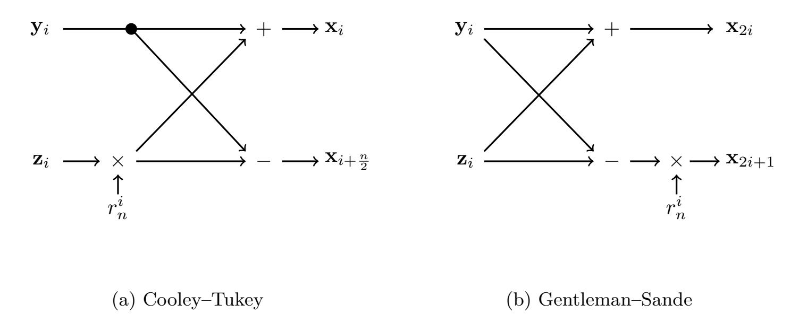

{0}------------------------------------------------

# **Compact Dilithium Implementations on Cortex-M3 and Cortex-M4**

Denisa O. C. Greconici<sup>1</sup> , Matthias J. Kannwischer<sup>2</sup> and Amber Sprenkels<sup>1</sup>

> <sup>1</sup> Digital Security Group, Radboud University, Nijmegen, The Netherlands [denisa.greconici@gmail.com](mailto:denisa.greconici@gmail.com), [amber@electricdusk.com](mailto:amber@electricdusk.com) <sup>2</sup> Max Planck Institute for Security and Privacy, Bochum, Germany [matthias@kannwischer.eu](mailto:matthias@kannwischer.eu),

**Abstract.** We present implementations of the lattice-based digital signature scheme Dilithium for ARM Cortex-M3 and ARM Cortex-M4. Dilithium is one of the three signature finalists of the NIST post-quantum cryptography competition. As our Cortex-M4 target, we use the popular STM32F407-DISCOVERY development board. Compared to the previous speed records on the Cortex-M4 by Ravi, Gupta, Chattopadhyay, and Bhasin we speed up the key operations NTT and NTT<sup>−</sup><sup>1</sup> by 20% which together with other optimizations results in speedups of 7%, 15%, and 9% for Dilithium3 key generation, signing, and verification respectively. We also present the first constant-time Dilithium implementation on the Cortex-M3 and use the Arduino Due for benchmarks. For Dilithium3, we achieve on average 2 562 kilocycles for key generation, 10 667 kilocycles for signing, and 2 321 kilocycles for verification. Additionally, we present stack consumption optimizations applying to both our Cortex-M3 and Cortex-M4 implementation. Due to the iterative nature of the Dilithium signing algorithm, there is no optimal way to achieve the best speed and lowest stack consumption at the same time. We present three different strategies for the signing procedure which allow trading more stack and flash memory for faster speed or viceversa. Our implementation of Dilithium3 with the smallest memory footprint uses

**Keywords:** Dilithium, ARM Cortex-M4, ARM Cortex-M3, number theoric transform, lattice-based cryptography

less than 12kB. As an additional output of this work, we present the first Cortex-M3

implementations of the key-encapsulation schemes NewHope and Kyber.

## **1 Introduction**

In 2016, NIST called for proposals for new post-quantum schemes [\[NIS16\]](#page-22-0) which are meant to replace the existing standards for key establishment (SP 800-56A [\[BCR](#page-20-0)<sup>+</sup>18] and SP 800- 56B [\[BCR](#page-20-1)<sup>+</sup>19]) and digital signatures (FIPS 186-4 [\[Nat13\]](#page-22-1)). While the existing standards are based on the hardness of integer factorization and computing discrete logarithms and are, therefore, broken by Shor's algorithm [\[Sho94\]](#page-23-0), the new ones should resist adversaries with access to a large-scale quantum computer. After receiving 69 submissions in 2017, NIST narrowed down to 26 schemes advancing to round two in 2019. In July 2020, NIST announced their selection of seven finalists which are to be evaluated in a third round. Out of those finalists NIST expressed their intention to standardize a subset at the end of round three. Additionally, NIST announced eight alternative schemes which may still be standardized at a later point. The seven finalists include the four key establishment

<sup>∗</sup>This work was done while MJK was employed by Radboud University, Nijmegen, The Netherlands.

{1}------------------------------------------------

schemes Classic McEliece, Kyber, NTRU, and Saber as well as the three signature schemes Dilithium, Falcon, and Rainbow.

One major family of post-quantum cryptographic schemes are based on hard lattice problems. Out of the seven finalists, five are lattice-based. Together with Falcon [\[PFH](#page-22-2)<sup>+</sup>19], Dilithium [\[LDK](#page-22-3)<sup>+</sup>19] is one of the two remaining lattice-based signature schemes. In round two, an additional lattice-based signature scheme called qTesla [\[BAA](#page-20-2)<sup>+</sup>19]. However, qTesla was not selected to advance to the third round.

Dilithium and qTesla are conceptually very similar; they are both Fiat-Shamir-withabort schemes [\[Lyu09\]](#page-22-4) based on {R,M}LWE and {R,M}SIS. However, Dilithium has significantly smaller keys, smaller signatures, and better performance. For example, qTESLA-p-I public keys are 14 880 bytes and signatures are 2 592 bytes, while Dilithium2 has 1 184 byte public keys and 2 044 byte signatures albeit providing the same level of (claimed) security. Note that qTesla initially also proposed "heuristic" parameter sets which achieved sizes and performance closer to Dilithium, but the qTesla team withdrew those parameter sets because Lyubashevsky and Schwabe presented a complete break allowing universal forgeries[1](#page-1-0) . Falcon, on the other hand, is a "hash-and-sign" signature schemes based on NTRU lattices and, hence, has different characteristics while being competitive with Dilithium in terms of message sizes and computational performance.

Together with the finalist key-encapsulation mechanism Kyber [\[ABD](#page-19-0)<sup>+</sup>19], Dilithium is part of the Cryptographic Suite for Algebraic Lattices (CRYSTALS). Both Dilithium and Kyber use structured lattices to allow fast arithmetic and compact key, signature, and ciphertext sizes. Both make use of the polynomial ring Z*q*[*X*]*/*(*X*<sup>256</sup> + 1) which enables efficient polynomial multiplication using the number theoretic transform (NTT). However, Dilithium is using a 23-bit prime modulus, while Kyber is using a 12-bit prime modulus which means that their implementations of polynomial arithmetic differ significantly.

While there is a vast literature on the implementation of lattice-based key-encapsulation schemes, the coverage of lattice-based signatures is still limited and more research is needed. We advance the field by presenting optimized implementations of Dilithium for the ARM Cortex-M3 and ARM Cortex-M4. In this work, aside from optimizing for speed, we also optimize for stack usage.

The Cortex-M4 has been declared the main microcontroller optimization target for the post-quantum competition by NIST and, hence, the majority of schemes in the third round have an optimized implementation for that architecture. However, its "smaller brother", the Cortex-M3, is also still widely deployed.

The Cortex-M4 provides various advanced instructions for optimizing cryptographic schemes which might be one of the reasons why it has received much attention from the cryptographic community.

However, the Cortex-M3 comes with one "feature" which does appear interesting from an implementation and also from a side channel perspective: Different from the Cortex-M4, it does not have a constant-cycle 32-bit multiplier producing a 64-bit result, but only a variable-cycle one. Therefore, an implementation of any scheme working on large (secret) integers compiled for the Cortex-M3 is most likely going to leak information about these secret integers via timing side channels. This has been shown to pose a problem for cryptographic schemes in preceding ARM architectures [\[GOPT09\]](#page-21-0). This is particularly interesting for Dilithium, because of the large prime modulus *q* = 8380417. If existing implementations for Dilithium are simply compiled for the Cortex-M3, they are very likely to be vulnerable to timing attacks within the polynomial multiplication. In this paper, we build a safe *constant-time* implementation of Dilithium on the Cortex-M3. That is, the execution time of the algorithm is invariant over all the secret values in the algorithm.

<span id="page-1-0"></span><sup>1</sup><https://groups.google.com/a/list.nist.gov/d/msg/pqc-forum/HHnavSx4f5Q/fRsujb9ACgAJ>

{2}------------------------------------------------

**Contribution.** The contribution of this paper is fourfold: First, we further optimize the existing Dilithium implementation for the Cortex-M4 by switching to a signed polynomial representation and optimizing more parts of the scheme. Second, we present the first constant-time implementation of Dilithium on the Cortex-M3. Third, we present various stack consumption and speed trade-offs for the signing procedure of Dilithium. Due to the iterative nature of the signing procedure, there exist interesting implementation choices. Finally, as a by-product, we provide Cortex-M3 implementations of the lattice-based keyencapsulation schemes Kyber and NewHope. This, most notably, consists of constant-time implementations of the NTT and NTT−<sup>1</sup> operations in those schemes.

**Code.** The implementations of Dilithium, Kyber, and NewHope that are the result of this work are in the public domain and available at [https://github.com/dilithium-cortexm/](https://github.com/dilithium-cortexm/dilithium-cortexm) [dilithium-cortexm](https://github.com/dilithium-cortexm/dilithium-cortexm).

**Related Work.** Previous speed-records for Dilithium on the Cortex-M4 were set by Ravi, Gupta, Chattopadhyay, and Bhasin [\[RGCB19\]](#page-22-5) and were built upon an implementation by Güneysu, Krausz, Oder, and Speith [\[GKOS18\]](#page-21-1). A masked implementation of a modified Dilithium on Cortex-M3 is presented in [\[MGTF19\]](#page-22-6). Migliore, Gérard, Tibouchi, and Fouque propose to use a power-of-two modulus instead of the original prime modulus to allow for cheaper masking. However, strictly speaking, they do not implement the Dilithium scheme as it was submitted to NIST. There is an extensive line of work for Cortex-M4 implementation of lattice-based key-encapsulation mechanisms [\[AJS16,](#page-20-3)[BKS19,](#page-20-4)[ABCG20,](#page-19-1) [KRS19,](#page-22-7)[KBMSRV18,](#page-21-2)[BMKV20\]](#page-20-5). Similar studies exist on hardware implementations and instruction set extensions [\[BMTK](#page-20-6)<sup>+</sup>[,BUC19,](#page-21-3)[AEL](#page-19-2)<sup>+</sup>20]. Other lattice-based signatures have been implemented on the Cortex-M4: Pornin presents a fast constant-time implementation of Falcon on the Cortex-M4 [\[Por19\]](#page-22-8); In 2019, [\[GR19\]](#page-21-4) presented a masked implementations of qTesla; More recently, [\[WTJ](#page-23-1)<sup>+</sup>20] presented a hardware-accelerated implementation of qTesla.

**Structure of this paper.** Section [2](#page-2-0) introduces the lattice-based signature scheme Dilithium and the peculiarities of the Cortex-M3 and Cortex-M4 relevant for this work. In Section [3](#page-6-0) we present some improvements for the Cortex-M4. Section [4](#page-9-0) presents the first constant-time implementation of Dilithium on the Cortex-M3. Section [5](#page-12-0) presents various trade-offs in terms of stack consumption and speed of Dilithium implementations. Section [6](#page-14-0) presents the performance results for both implementations. In Appendix [A,](#page-23-2) we provide performance results for Kyber and NewHope on the Cortex-M3 which are a by-product of this work.

## <span id="page-2-0"></span>**2 Preliminaries**

#### **2.1 Dilithium**

Dilithium [\[DKL](#page-21-5)<sup>+</sup>18,[LDK](#page-22-3)<sup>+</sup>19] is a digital signature scheme based on the hardness of the M-LWE and the M-SIS lattice problems. It is one of the three digital signature finalists of the NIST Post-Quantum Competition [\[NIS16\]](#page-22-0). Note that with the advance to the third round the Dilithium submitters may introduce tweaks to the scheme. The following description is based on the second round specification [\[LDK](#page-22-3)<sup>+</sup>19].

**Parameters.** Dilithium consists of four different parameter sets Dilithium1, Dilithium2, Dilithium3, and Dilithium4 of which the latter three target NIST security levels 1 to 3 respectively. We omit Dilithium1 in the following as it falls short of the lowest NIST security level. Dilithium is operating in the polynomial ring Z*q*[*X*]*/*(*X*<sup>256</sup> + 1); denoted by *R<sup>q</sup>* in the following. Across all parameter sets, the modulus is fixed at

{3}------------------------------------------------

Table 1: Dilithium parameter sets

<span id="page-3-0"></span>

| Name       | NIST level | (k, ℓ) | η | β   | ω   | pk   | sig  | exp. iterations |
|------------|------------|--------|---|-----|-----|------|------|-----------------|
| Dilithium2 | 1          | (4, 3) | 6 | 325 | 80  | 1184 | 2044 | 5.9             |
| Dilithium3 | 2          | (5, 4) | 5 | 275 | 96  | 1472 | 2701 | 6.6             |
| Dilithium4 | 3          | (6, 5) | 3 | 175 | 120 | 1760 | 3366 | 4.3             |

*q* = 2<sup>23</sup> − 2 <sup>13</sup> + 1 = 8380417 and the polynomial dimension is *n* = 256. Furthermore, for all parameter sets the bound *γ*<sup>1</sup> is set to (*q* − 1)*/*16 = 523776 and *γ*<sup>2</sup> = *γ*1*/*2 = 261888. For each parameter set, the remaining parameters and the resulting public key and signature sizes are given in Table [1.](#page-3-0) The parameters consist of the matrix dimension (*k, ℓ*), the sampling bounds of the secret *η*, and the rejection thresholds *β* and *ω*. The Dilithium signature generation algorithm uses rejection sampling to find a signature that can be both correctly verified and does not leak information about the secret key. Table [1](#page-3-0) also gives the expected number of iterations of the rejection sampling. Due to this iterative nature, the runtime of Dilithium varies significantly between multiple signature generations. Note, however, that the rejection probability does not depend on the secret key, and consequently, the variable run-time caused by rejection sampling does not violate the time constantness of implementations of Dilithium [\[LDK](#page-22-3)<sup>+</sup>19, Section 3.3].

**Notation.** We follow the notation of the Dilithium specification [\[LDK](#page-22-3)<sup>+</sup>19] and denote polynomials by lower case latin letters like *c*, vectors of polynomials by bold lower case letters like **t**, and matrices by bold upper case letters (**A**). Polynomials, vectors, and matrices that have been transformed to NTT-domain are identified by their hat, e.g., *c*ˆ, **a**ˆ and **A**ˆ . The operator ◦ describes coefficient-wise multiplication. The operator || denotes concatenation of two inputs that are implicitly converted to a byte-string. ||*a*||<sup>∞</sup> refers to the maximum absolute coefficient of the polynomial *a* and is similarly defined for vectors. When sampling *a* from a certain distribution *S*, we write *a* ← *S*. *S<sup>η</sup>* is the uniform distribution ranging from −*η* to +*η* (both inclusive).

**Functions.** As a central building block, Dilithium uses the NTT and NTT<sup>−</sup><sup>1</sup> function which are used to implement efficient polynomial multiplication of *a, b* as NTT<sup>−</sup><sup>1</sup> (NTT(*a*) ◦ NTT(*b*)). The details of the Dilithium NTT are described later in this section. In addition, Dilithium uses a collision resistant hash-function H with 384-bit output length and a cryptographic hash-function H*<sup>B</sup>* outputting a polynomial that has exactly 60 coefficients set to ±1 while the remaining 196 coefficients are zero. The hash functions H and H*<sup>B</sup>* are implemented using the extendable-output function (XOF) SHAKE256. Furthermore, Dilithium defines the seed expansion functions ExpandA and ExpandMask; the rounding functions Power2Round, HighBits, and Decompose and the hint functions MakeHint and UseHint. To keep the algorithm description brief, we omit the details of those functions and refer the reader to the Dilithium specification.

**Scheme Specification.** Algorithm [1,](#page-4-0) Algorithm [2,](#page-5-0) and Algorithm [3](#page-5-1) specify Dilithium key generation, signature generation, and signature verification. The descriptions are consistent with the ones from Figure 4 in the Dilithium specification [\[LDK](#page-22-3)<sup>+</sup>19], but we omit details about rounding that are not relevant to this work.

**Number Theoretic Transform.** At the core of the Dilithium scheme construction and parameter choices is the number theoretic transform (NTT) which allows efficient polynomial multiplication. The NTT can be seen as the counterpart of the Fourier transform in a finite field. NTT-based multiplication allows the multiplication of two polynomials *a* and *b* in quasi-linear time by first transforming both arguments to NTT domain (or *frequency*

{4}------------------------------------------------

#### <span id="page-4-0"></span>**Algorithm 1** Dilithium key generation

```
Output: Secret key sk = (\rho, K, tr, \mathbf{s}_1, \mathbf{s}_2, \mathbf{t}_0)

Output: Public key pk = (\rho, \mathbf{t}_1)

1: \rho \leftarrow \{0, 1\}^{256}

2: K \leftarrow \{0, 1\}^{256}

3: (\mathbf{s}_1, \mathbf{s}_2) \leftarrow S_{\eta}^{\ell} \times S_{\eta}^{k}

4: \hat{\mathbf{A}} \in R_q^{k \times \ell} := \text{ExpandA}(\rho)

5: \mathbf{t} := \text{NTT}^{-1}(\hat{\mathbf{A}} \circ \text{NTT}(\mathbf{s}_1)) + \mathbf{s}_2

6: (\mathbf{t}_1, \mathbf{t}_0) := \text{Power2Round}(\mathbf{t})

7: tr \in \{0, 1\}^{384} := \mathcal{H}(\rho || \mathbf{t}_1)
```

domain) in quasi-linear time using a Fast Fourier transform algorithm (FFT). The multiplication in the NTT-domain is coefficient-wise multiplication and, hence, has linear run-time. To transform back to the regular domain (or time domain), the inverse NTT (denoted as NTT<sup>-1</sup> from here on) is computed which again can be implemented in quasi-linear time. A full polynomial multiplication can be performed as NTT<sup>-1</sup>(NTT(a)  $\circ$  NTT(b)). While NTT-based multiplication itself does achieve superior performance on some platforms over other multiplication methods, the advantage is even bigger when either argument is already in NTT-domain or, alternatively, the output can remain in NTT-domain.

For a polynomial  $a = \sum_{i=0}^{n-1} a_i X^i$ , the Dilithium NTT is defined as

$$\mathtt{NTT}(a) = \hat{a} = \sum_{i=0}^{n-1} \hat{a}_i X^i, \text{ with } \hat{a}_i = \sum_{j=0}^{n-1} r^j a_j r^{2ij},$$

where r is a 2n-th primitive root of unity modulo q. Dilithium uses the 512-th primitive root of unity r = 1753.

The  $NTT^{-1}$  is defined as

$$NTT^{-1}(\hat{a}) = a = \sum_{i=0}^{n-1} a_i X^i, \text{ with } a_i = n^{-1} r^{-i} \sum_{j=0}^{n-1} a_j r^{-2ij}.$$

Dilithium implementations usually use the Cooley–Tukey (CT) FFT algorithm [CT65] in the forward NTT and the Gentleman–Sande (GS) FFT algorithm [GS66] in the NTT<sup>-1</sup>. These algorithms implement the NTT in quasi-linear time, and make use of  $\log n$  layers of n/2 Cooley–Tukey or Gentleman–Sande "butterflies" which we will introduce in Section 3.

#### 2.2 Target Platforms: Cortex-M3 and Cortex-M4

NIST has stated that performance will play an important role in the evaluation of schemes beyond the first round<sup>2</sup>. As a primary microcontroller optimization target, NIST recommends the use of the Cortex-M4 board with all options included. Consequently, previous work on microcontroller implementations of Dilithium [GKOS18, RGCB19] has primarily focused on the Cortex-M4. Particularly, it has been targeting the STM32F407 core which was popularized for post-quantum cryptography by the testing and benchmarking framework pqm4 [KRSS]. For our Cortex-M4 optimization we target the same core and board so that we can report comparable results.

Cortex-M4. The Cortex-M4 implements the ARMv7E-M [ARM14] instruction set architecture (ISA). The core we use is the STM32F407 which provides 196 KiB of RAM (of which

<span id="page-4-1"></span><sup>&</sup>lt;sup>2</sup>https://groups.google.com/a/list.nist.gov/d/msg/pqc-forum/BjLtcwXALbA/Bjj\_77pzCAAJ

{5}------------------------------------------------

#### <span id="page-5-0"></span>Algorithm 2 Dilithium signature generation

```
Input: Secret key sk = (\rho, K, tr, \mathbf{s}_1, \mathbf{s}_2, \mathbf{t}_0)
        Input: Message M \in \{0,1\}^*
        Output: Signature \sigma = (\mathbf{z}, \mathbf{h}, c)
 1: \hat{\mathbf{A}} \in R_q^{k \times \ell} := \mathtt{ExpandA}(\rho)
 2: \mu \in \{0,1\}^{384} := \mathcal{H}(tr||M)
  3: \kappa := 0; (\mathbf{z}, \mathbf{h}) = \bot
 4: \rho' \in \{0,1\}^{384} := \mathcal{H}(K||\mu)
 5: \hat{\mathbf{s}}_1 := \text{NTT}(\mathbf{s}_1); \hat{\mathbf{s}}_2 := \text{NTT}(\mathbf{s}_2); \hat{\mathbf{t}}_0 := \text{NTT}(\mathbf{t}_0)
  6: while (\mathbf{z}, \mathbf{h}) = \perp \mathbf{do}
               \mathbf{y} \in S^\ell_{\gamma_1-1} := \mathtt{ExpandMask}(\rho', \kappa)
  7:
               \mathbf{w} := \mathtt{NTT}^{-1}(\hat{\mathbf{A}} \circ \mathtt{NTT}(\mathbf{y}))
  8:
               \mathbf{w}_1 := \mathtt{HighBits}(\mathbf{w})
  9:
               c := \mathcal{H}_B(\mu||\mathbf{w}_1)
10:
                \hat{c} := NTT(c)
11:
               \mathbf{z} := \mathbf{y} + \mathtt{NTT}^{-1}(\hat{c} \circ \hat{s}_1)
12:
               (\mathbf{r}_1, \mathbf{r}_0) := \mathtt{Decompose}(\mathbf{w} - \mathtt{NTT}^{-1}(\hat{c} \circ \hat{\mathbf{s}}_2))
13:
               if ||\mathbf{z}||_{\infty} \geq \gamma_1 - \beta or ||\mathbf{r}_0||_{\infty} \geq \gamma_2 - \beta or \mathbf{r}_1 \neq \mathbf{w}_1 then
14:
                        (\mathbf{z}, \mathbf{h}) = \bot
15:
                else
16:
                        \mathbf{h} := \mathtt{MakeHint}\left(-\mathtt{NTT}^{-1}(\hat{c} \circ \hat{\mathbf{t}}_0), \mathbf{w} - \mathtt{NTT}^{-1}(\hat{c} \circ \hat{\mathbf{s}}_2) + \mathtt{NTT}^{-1}(\hat{c} \circ \hat{\mathbf{t}}_0)\right)
17:
                        if ||\text{NTT}^{-1}(\hat{c} \circ \hat{\mathbf{t}}_0)||_{\infty} \geq \gamma_2 or # 1's in \mathbf{h} > \omega then
18:
                                (\mathbf{z}, \mathbf{h}) = \bot
19:
               \kappa := \kappa + 1
20:
```

128 KiB are contiguous) and 1 MiB of flash, and it runs at a maximum frequency of 168 MHz. One feature of the ARMv7E-M instruction set makes it particularly interesting for Dilithium optimizations: the large single-cycle multiplier implementing the instructions UMULL, SMULL, UMLAL, and SMLAL. Those allow computing the 64-bit product of two 32-bit arguments and, in the case of UMLAL and SMLAL, adding the result to a 64-bit accumulator. On the Cortex-M4 microarchitecture, these instructions execute in a single cycle. Those prove particularly useful for the Dilithium polynomial multiplication. Due to the large modulus (23-bit) in Dilithium, those multiplications do require computing 64-bit products.

Another feature of the ARMv7E-M ISA are SIMD instructions like SMLAD or UADD16 which have been shown to achieve significant speedups for NTT-based polynomial multiplication [BKS19, ABCG20] and Toom-Cook-based polynomial multiplication [KRS19, KBM-SRV18, BMKV20] on the Cortex-M4. While those provide vast speedups for schemes with

#### <span id="page-5-1"></span>Algorithm 3 Dilithium verification

```
Input: Public key pk = (\rho, \mathbf{t}_1)

Input: Message M \in \{0, 1\}^*

Input: Signature \sigma = (\mathbf{z}, \mathbf{h}, c)

Output: Valid or Invalid

1: \hat{\mathbf{A}} \in R_q^{k \times \ell} := \operatorname{ExpandA}(\rho)

2: \mu \in \{0, 1\}^{384} := \mathcal{H}(\mathcal{H}(\rho||\mathbf{t}_1)||M)

3: \mathbf{w}_1' := \operatorname{UseHint}(\mathbf{h}, \operatorname{NTT}^{-1}(\hat{\mathbf{A}} \circ \operatorname{NTT}(\mathbf{z}) - \operatorname{NTT}(c) \circ \operatorname{NTT}(2^d \cdot \mathbf{t}_1)))

4: if c = \mathcal{H}_B(\mu||w_1') and ||\mathbf{z}||_{\infty} < \gamma_1 - \beta and \# 1's in \mathbf{h} \leq \omega then

5: return Valid

6: else

7: return Invalid
```

{6}------------------------------------------------

small moduli (<16-bits) like Kyber [\[ABD](#page-19-0)<sup>+</sup>19], Saber [\[DKRV19\]](#page-21-8), or NewHope [\[PAA](#page-22-10)<sup>+</sup>19], they do not help when working with larger moduli like the one from Dilithium. Hence, other optimization strategies are needed.

**Cortex-M3.** One issue arising when using the UMULL, SMULL, UMLAL, and SMLAL is that while they are single-cycle (i.e., constant-time) on the Cortex-M4, they are not single-cycle on all ARM cores. Particularly, the Cortex-M3 (implementing the ARMv7-M) ISA also provides these instructions, but on this platform UMULL and SMULL take 3 to 5 cycles to execute and UMLAL and SMLAL take 4 to 7 cycles. As there is no authoritative information available on the early-termination conditions for these variable-time instructions, it appears dangerous to use these instructions in code that needs to be constant-time. The earlytermination conditions have been reverse engineered by de Groot [\[dG15\]](#page-21-9), who showed that there appear to be four properties that cause an early termination: (1) Arguments being zero; (2) arguments being smaller than 16-bits; (3) top-heavy arguments (i.e., zero in the least significant 16-bits); or (4) arguments being a power of two.

Previous work by Großschädl–Oswald–Page–Tunstall [\[GOPT09\]](#page-21-0) evaluated early-terminating multiplication instructions on ARMv3 microcontrollers. They propose a constant-time multiplication algorithm which still uses the variable-time multiplication instructions, but avoids any shortcuts from being taken. Unfortunately, the newer ARMv7-M ISA appears to have vastly more sophisticated shortcuts and it appears unlikely that all shortcuts can be avoided at reasonable cost. In addition, the shortcuts identified by de Groot [\[dG15\]](#page-21-9) are not actually confirmed by ARM. It is, hence, possible that not all shortcuts are known or that the shortcuts do not apply to all Cortex-M3 chips. Therefore, when writing constant-time code those instructions should be avoided, which means only the multiplication instructions MUL and MLA can be used which only compute the lower 32 bits of the 64 bit product. This presents a challenge for implementing the Dilithium polynomial multiplication. This issue was not addressed by previous work on Dilithium implementations on the Cortex-M3 [\[MGTF19\]](#page-22-6). Instead, Migliore, Gérard, Tibouchi, and Fouque propose a modified Dilithium with the power-of-two modulus *q* = 2<sup>32</sup> to allow for cheaper masking. As a side-effect of this proposed change, multiplications can be done using MUL, MLS, and MLA as those implicitly reduce modulo 2 <sup>32</sup>, and, hence, constant-time implementations are more straightforward.

The Cortex-M3 platform we use is the popular Arduino Due which comes with a Atmel SAM3X8E core, has 96 KiB of RAM, 512 KiB of Flash, and runs at a maximum frequency of 84 MHz.

## <span id="page-6-0"></span>**3 Improving the Performance on Cortex-M4**

Our Cortex-M4 implementation is based on the Dilithium implementation by Ravi, Gupta, Chattopadhyay, and Bhasin [\[RGCB19\]](#page-22-5), which includes the NTT and NTT<sup>−</sup><sup>1</sup> assembly implementation of Güneysu, Krausz, Oder, and Speith [\[GKOS18\]](#page-21-1).

The number theoretic transform is implemented using the divide-and-conquer approach of the Cooley–Tukey and Gentleman–Sande FFT algorithms. While these are strictly "fast Fourier-transform" (FFT) algorithms, they are used in Dilithium to compute the "number theoretic transform" (NTT). In this section it is often the case that both terms apply.

Both the CT and GS algorithms split the input vector into two halves: the Cooley– Tukey butterfly breaks the input vector into its even-indexed values and its odd-indexed values; the Gentleman–Sande splits the input vector in the middle of the vector, yielding the first half and the last half of the original vector. After splitting the input vector, the final NTT is computed by applying the NTT over each smaller vector and then combining the results according to the CT or GS methods defined below.

{7}------------------------------------------------

<span id="page-7-0"></span>

Figure 1: Butterfly diagrams for the Cooley–Tukey and Gentleman–Sande FFT algorithms.

In the Cooley–Tukey algorithm, the smaller NTT-transformed vectors **y** (from the even indices) and **z** (from the odd indices) are used to compute the larger vector using

$$\mathbf{x}_i = \mathbf{y}_i + r_m^i \mathbf{z}_i,$$
  
$$\mathbf{x}_{i+\frac{m}{2}} = \mathbf{y}_i - r_m^i \mathbf{z}_i;$$

and in the Gentleman–Sande algorithm, the smaller NTT-transformed vectors **y** (from the low indices) and **z** (from the high indices) construct the larger vector **x** using

$$\mathbf{x}_{2i} = \mathbf{y}_i + \mathbf{z}_i,$$
  
$$\mathbf{x}_{2i+1} = r_m^i(\mathbf{y}_i - \mathbf{z}_i);$$

where, for a vector size of *m*, the value *r<sup>m</sup>* denotes the primitive *m*th root of unity modulo *q*. For the purpose of illustration, we show these formulas in the form of "butterfly diagrams" in Figure [1.](#page-7-0) In the literature, the powers of *r<sup>m</sup>* are known as *twiddle factors*, or *twiddles* for short.

In these FFT algorithms, the NTTs of the smaller vectors can themselves again be computed using the CT and GS algorithms. Indeed, we can recursively apply these algorithms until we are left with vectors of size 1, for which NTT(**v**) = NTT<sup>−</sup><sup>1</sup> (**v**) = **v**. Because the size of the Dilithium polynomial *n* = 256 is a power of two, the algorithm will be applied log<sup>2</sup> *n* = 8 times until we reach the base case.

In Dilithium, the NTT and NTT<sup>−</sup><sup>1</sup> are computed iteratively and in-place, such that no auxiliary vectors are required to store intermediate results. For computing the NTT, Dilithium uses such an iterative Cooley–Tukey algorithm, which takes its input vector in normal order, and outputs the vector in bit-reversed order. The NTT<sup>−</sup><sup>1</sup> is implemented using an iterative Gentleman–Sande algorithm, which takes its input vector in bit-reversed order and returns a vector in normal order. Note that this has no effect on the polynomialmultiplication property (using coefficient-wise multiplication), as described in Section [2.](#page-2-0)

In our implementation similarly to previous work, we precompute and store the twiddle factors in flash. The twiddle factors are stored in Montgomery domain (with modulus *R* = 2<sup>32</sup>), such that after the multiplication in the FFT butterfly, we can use Montgomery reduction [\[Mon85\]](#page-22-11) to reduce the product modulo *q*.

After each level of the NTT and NTT<sup>−</sup><sup>1</sup> , the polynomial coefficients are growing in size due to additions and subtractions. Intuitively we would apply a modular reduction after each addition/subtraction operation. However, the coefficients in the input polynomial are bounded by 2*q* (which is only 24 bits) and even if we do not reduce mod *q* after each level, we will not overflow the 32-bit registers in which we store the coefficients. Therefore, we

{8}------------------------------------------------

#### <span id="page-8-1"></span><span id="page-8-0"></span>**Listing 1** CT butterfly from [\[GKOS18\]](#page-21-1) <sup>1</sup> ; q=8380417, qinv=4236238847 <sup>2</sup> ; Input: p0, p1, twiddle <sup>3</sup> ; Output: p0, p1 <sup>4</sup> umull tmp0, tmp1, p1, twiddle <sup>5</sup> mul pol1, tmp0, qinv <sup>6</sup> umlal tmp0, tmp1, p1, q <sup>7</sup> add p1, p0, q, lsl#1 <sup>8</sup> sub p1, p1, tmp1 <sup>9</sup> add p0, p0, tmp1 **Listing 2** Our CT butterfly <sup>1</sup> ; q=8380417, qinv=4236238847 <sup>2</sup> ; Input: p0, p1, twiddle <sup>3</sup> ; Output: p0, p1 <sup>4</sup> smull tmp0, tmp1, p1, twiddle <sup>5</sup> mul p1, tmp0, qinv <sup>6</sup> smlal tmp0, tmp1, p1, q <sup>7</sup> sub p1, p0, tmp1 <sup>8</sup> add p0, p0, tmp1

```
Listing 3 GS butterfly in [GKOS18]
1 ; q=8380417, qinv=4236238847
2 ; Input: p0, p1, twiddle
3 ; Output: p0, p1
4 add tmp0, p0, q, lsl#8
5 sub tmp0, tmp0, p1
6 add p0, p0, p1
7 umull tmp1, p1, tmp0, twiddle
8 mul tmp0, tmp1, qinv
9 umlal tmp1, p1, tmp0, q
                                   Listing 4 Our GS butterfly
                                  1 ; q=8380417, qinv=4236238847
                                  2 ; Input: p0, p1, twiddle
                                  3 ; Output: p0, p1
                                  4 sub tmp0, p0, p1
                                  5 add p0, p0, p1
                                  6 smull tmp1, p1, tmp0, twiddle
                                  7 mul tmp0, tmp1, qinv
                                  8 smlal tmp1, p1, tmp0, q
```

reduce each coefficient mod *q* only once, at the end of the NTT and NTT<sup>−</sup><sup>1</sup> . This technique of delaying the reduction is usually referred to as *lazy reduction*.

When implementing the NTT and NTT<sup>−</sup><sup>1</sup> , we first unroll the outer loop which iterates over the 8 levels of the NTT and NTT<sup>−</sup><sup>1</sup> . Furthermore, similar to the merging technique in [\[GOPS13\]](#page-21-10), we can merge two levels of the NTT and NTT<sup>−</sup><sup>1</sup> on Cortex-M4 ({0,1}, {2,3}, {4,5} and {6,7}). Merging *k* layers here means that instead of loading two coefficients, one loads the 2 *k* coefficients which are used together in *k* consecutive layers. By doing so on can eliminate the load and store operations between the layers. Hence, the number of layers that can be merged is bounded by the available registers. For our implementation, we achieved the best performance by merging two layers. As a consequence, the number of store and load instructions is reduced with a factor of 2.

Lastly the main difference which distinguishes our implementation from the one published in [\[GKOS18\]](#page-21-1) is changing the polynomial coefficients to signed representation. When unsigned integers are subtracted from each other, it is possible for the result wrap around zero (when the result would be negative). To prevent this overflow, the subtractions in the reference implementation are accompanied by an addition with a multiple of *q*, pushing the results back into the positive domain. By switching to the signed representation, the problem of negative overflows is fixed, and we do not need this extra multiple-of-*q* addition. Therefore, switching to signed representation allows us to eliminate all these additions throughout the code.

This is especially relevant for the NTT and NTT<sup>−</sup><sup>1</sup> implementations, because every butterfly operation has a subtraction. Listing [2](#page-8-0) shows our improvements to the CT butterfly in the NTT by [\[GKOS18\]](#page-21-1) which is shown in Listing [1.](#page-8-1) For the GS butterflies in the NTT<sup>−</sup><sup>1</sup> , the improvements are listed in Listings [3](#page-8-2) and [4.](#page-8-3)

{9}------------------------------------------------

However, the overflow-mitigating additions were not only present in the NTT, but also in the sampling of  $\mathbf{s_1}$ ,  $\mathbf{s_2}$ , and  $\mathbf{y}$ , polynomial subtraction, and unpacking operations throughout the scheme. By switching to signed representation, we did not only improve the performance of the NTT, but also of all the other routines listed above.

Finally, in addition to improving the NTT and NTT<sup>-1</sup>, we rewrote the pointwise polynomial multiplication, uniform sampling of polynomials, and polynomial reduction in assembly as these were the most expensive operations besides the already optimized NTT, NTT<sup>-1</sup>, and hashing operations using Keccak. We omit the details, as they result straightforward from the reference code.

### <span id="page-9-0"></span>4 Fast Constant-Time NTTs on Cortex-M3

Our constant-time Cortex-M3 implementation of Dilithium is based on the Cortex-M4 implementation described in the previous section. To keep this section concise, we only describe the differences here, which are mainly in order to make the implementation constant-time. When compiling the existing implementation [GKOS18] for the Cortex-M3, we identify three functions which make use of the variable-time instructions UMULL and UMLAL: NTT, NTT<sup>-1</sup>, and pointwise multiplication ( $\circ$ ). These functions are the only ones that involve the multiplication of the 32-bit coefficients of polynomials. When any of them operates on secret data, it will leak information through a timing side channel.

Previous work by [MGTF19] suggests that the reference implementation of Dilithium is constant time. This is however untrue for Cortex-M3, because the compiler is in no way prevented from emitting any of the variable-time instructions. In their paper, the authors propose a modified Dilithium with a power-of-two modulus  $q = 2^{32}$  to allow for cheaper masking. As a side-effect of this proposed change, multiplications can be done using MUL, MLS, and MLA as those implicitly wrap their results modulo  $2^{32}$ . In that case, implementing Dilithium in constant-time is more straightforward.

Interestingly, many of the operations within Dilithium do not handle secret data, and, hence, do not need to be constant time. Particularly, all operations in the signature verification (Algorithm 3) are only operating on public data and can, therefore, be implemented in variable time. Similarly, in signature generation (Algorithm 2) NTT( $t_0$ ) (line 5), NTT( $\mathcal{H}_B(\mu, \mathbf{w}_1)$ ) (line 10), and NTT<sup>-1</sup>( $\hat{c} \circ \hat{\mathbf{t}}_0$ ) (line 16 and 17) are not processing secret data as both  $\mathbf{t}$  and c are considered public. For the details we refer to the security proof in [LDK<sup>+</sup>19, Section 5]. The remaining calls to NTT, NTT<sup>-1</sup>, and  $\circ$  do process secret data. Similarly, all operations in the key generation of Dilithium (Algorithm 1) have secret inputs. In our implementation we provide both a constant-time and variable-time (leaktime) implementation implementations of NTT, NTT<sup>-1</sup>, and  $\circ$ . Because the variable-time implementations are significantly faster, we prefer using them over the constant-time implementations when we are only dealing with public data.

Note that, in theory, the compiler could introduce UMULL, UMLAL, SMULL, and SMULL instructions in other parts of the code as well. Since there is no easy way to prevent compilers (gcc and clang) from emitting those instructions, we instead carefully analyze the assembly generated by the compiler to not contain these instructions in functions that are safe to leak. We add the suffix \_leaktime to the names of variable-time functions only operating on public data to support this analysis.

The remainder of this section describes the necessary changes to the Cortex-M4 implementation to ensure it executes in constant-time on the Cortex-M3. We describe the details from the bottom up, i.e., we start with the multiplication of coefficients, continue with the changes to the implementations of the Cooley–Tukey and Gentleman–Sande butterfly operations, and finally describe the changes to the NTT, NTT<sup>-1</sup> and the rest of the scheme.

{10}------------------------------------------------

#### <span id="page-10-2"></span>4.1 SMULL and SMLAL

As Dilithium uses a 23-bit modulus q, its polynomials are usually represented as vectors of 32-bit values. Consequently, multiplying coefficients requires multiplication of 32-bit values producing a 64-bit product. Usually, Montgomery multiplication is used, so that the result is promptly reduced back to 32-bits. In our Cortex-M4 implementation the Montgomery multiplication is computed using SMULL and SMLAL, which—as already discussed—execute in variable-time on the Cortex-M3. In case the inputs are secret, we cannot use those instructions.

In general, there are two approaches to address this issue: either re-implement SMULL and SMLAL using available constant-time instructions (MUL, MLA, ADD) or using a different representation of polynomials that does not require to multiply 32-bit coefficients. We experimented with the latter approach by using multiple smaller 16-bit polynomial multiplications to construct a larger 23-bit polynomial multiplication. The idea is to perform polynomial multiplications in  $R_q$  by first splitting up the polynomial into multiple polynomials in  $\mathbb{Z}_{q_i}/(X^n+1)$ , performing the polynomial multiplication in these smaller rings and then reconstructing the result in  $R_q$  using the explicit Chinese remainder theorem [BS07]. A similar approach is used in the AVX2 implementation of NTRUPrime [BCLv19]. For the result to be correct, it needs to hold that  $2n \cdot \lfloor q/2 \rfloor^2 < \prod q_i$ . For example, one could use the NTT-friendly primes {7681, 10753, 11777, 12289}. However, this approach turned out to be slower than re-implementing the SMULL and SMLAL instructions using MUL instructions, and hence we did not use it in our implementation. Nonetheless, we present results for 16-bit NTTs on the Cortex-M3 for the primes 3329 and 12289 which are used in the NIST key-encapsulation candidates Kyber [ABD<sup>+</sup>19] and NewHope [PAA<sup>+</sup>19] respectively. We report the results for the full schemes in Appendix A.

To re-implement SMULL and SMLAL, we use the schoolbook approach, i.e., we represent the 32-bit inputs in radix  $2^{16}$  and compute the product as sums of 32-bit products. Let  $a=2^{16}a_1+a_0$  and  $b=2^{16}b_1+b_0$ , with  $0 \le a_0, b_0 < 2^{16}$  and  $-2^{15} \le a_1, b_1 < 2^{15}$ , then the product  $ab=2^{32}a_1b_1+2^{16}(a_0b_1+a_1b_0)+a_0b_0$ , with  $-2^{31} \le a_ib_j < 2^{31}$ . Accordingly, our constant-time assembly implementations for SMULL and SMLAL are illustrated in Listing 5 and Listing 6. We denote them by SBSMULL and SBSMLAL in the following. The four 16-bit halves of the two multiplicands are passed in the registers  $a_0, a_1, b_0$ , and  $b_1$ ; the 64-bit output is placed in  $c_0$  (lower half) and  $c_1$  (upper half). For SMLAL,  $c_0$  and  $c_1$  initially contain the value to be added to the product. On the Cortex-M3, additions and multiplications use 1 cycle, while MLA uses 2 cycles. As such, the SBSMULL macro takes 7 cycles to execute, while SBSMLAL takes 9 cycles.

It is important to note that SBSMULL (SBSMLAL) is not semantically equivalent to SMULL (SMLAL). In case the accumulation  $(a_0b_1 + a_1b_0)$  in line 7 of Listing 5 or line 11 of Listing 6 overflows, the carry bit is lost and the result will not be correct. Hence, our schoolbook multiplication does not support the full 32-bit range of the inputs. In general, we have to consider two cases:

- <span id="page-10-0"></span>1. One of the factors (say b) is small, e.g., a twiddle factor (< q) or the constant q. In that case  $b_1$  is at most  $\left\lfloor \frac{q}{2^{16}} \right\rfloor = 127$ . In the worst case both  $b_0$  and  $a_0$  are equal to  $2^{16} - 1$ . Consequently, for the addition  $(a_0b_1 + a_1b_0)$  not to overflow,  $a_1$  can be at most  $\left\lfloor \frac{2^{31} - 1 - 127 \cdot (2^{16} - 1)}{2^{16} - 1} \right\rfloor = 32641$ .
- <span id="page-10-1"></span>2. Both multiplicands can be equally large. This occurs, for example, in the pointwise polynomial multiplication. In that case both  $a_0b_1$  and  $a_1b_0$  need to be less or equal to  $\left|\frac{2^{31}-1}{2}\right|=2^{30}-1$  and hence,  $a_1,b_1\leq \left|\frac{2^{30}-1}{2^{16-1}}\right|=2^{14}$ .

Case 1 applies in the NTT and NTT<sup>-1</sup>. In the NTT, the coefficients values never exceed 10q, which is sufficiently small for the multiplication to remain safe. Similarly, in the NTT<sup>-1</sup> coefficients never exceed  $128q < 32641 \cdot 2^{16}$ .

{11}------------------------------------------------

```
Listing 5 Schoolbook SMULL (SBSMULL)
1 ; Input: a = a0 + a1*2^16
2 ; b = b0 + b1*2^16
3 ; Output: c = a*b = c0 + c1*2^32
4 mul c0, a0, b0
5 mul c1, a1, b1
6 mul tmp, a1, b0
7 mla tmp, a0, b1, tmp
8 adds c0, c0, tmp, lsl #16
9 adc c1, c1, tmp, asr #16
                                      Listing 6 Schoolbook SMLAL (SBSMLAL)
                                     1 ; Input: a = a0 + a1*2^16
                                     2 ; b = b0 + b1*2^16
                                     3 ; c = c0 + c1*2^32
                                     4 ; Output: c = c + a*b
                                     5 ; = c0 + c1*2^32
                                     6 mul tmp, a0, b0
                                     7 adds c0, c0, tmp
                                     8 mul tmp, a1, b1
                                     9 adc c1, c1, tmp
                                     10 mul tmp, a1, b0
                                     11 mla tmp, a0, b1, tmp
                                     12 adds c0, c0, tmp, lsl #16
                                     13 adc c1, c1, tmp, asr #16
```

```
Listing 7 Constant-time Cooley–Tukey butterfly on the Cortex-M3
```

```
1 ; qinv = 4236238847, q = 8380417 = ql + qh*2^16
2 ; Input: p0 (32-bit signed)
3 ; p1 = p1l + p1h*2^16 (p1l 16-bit unsigned, p1h 16-bit signed)
4 ; twiddle = tl + th*2^16 (tl 16-bit unsigned, th 16-bit signed)
5 ; Output: p0, p1 (32-bit signed)
6 SBSMULL tmpl, tmph, p1l, p1h, tl, th ;(tmpl,tmph) = (p1l,p1h)*twiddle
7 mul p1h, tmpl, qinv
8 ubfx p1l, p1h, #0, #16
9 asr p1h, p1h, #16
10 SBSMLAL tmpl, tmph, p1l, p1h, ql, qh ;(tmpl,tmph) += (p1l,p1h)*q
11 sub p1, p0, tmph
12 add p0, p0, tmph
```

Case [2](#page-10-1) applies in the pointwise polynomial multiplication. In that case the input coefficients are bounded by 10*q* which is comfortably below 2 30 .

### **4.2 Cooley–Tukey and Gentleman–Sande Butterflies**

Using constant-time SBSMULL and SBSMLAL sub-routines, we can construct the butterfly operations needed to implement the NTT and NTT<sup>−</sup><sup>1</sup> . Listing [7](#page-11-2) depicts the modified Cooley– Tukey butterfly operation based on Listing [2.](#page-8-0) To be able to use SBSMULL, *p*<sup>1</sup> and the twiddle factor needs to be loaded in half-words, while *p*<sup>0</sup> can be loaded as a 32-bit word. For the multiplication by *q*, we require to have the lower and the upper half-word of *q* separately. Additionally, we need to split up the 32-bit result of the multiplication by −*q* −1 into half-words (lines 8 and 9). In total, the Cooley–Tukey butterfly operation requires 21 cycles on the Cortex-M3, while Listing [2](#page-8-0) only needs 5 cycles on the Cortex-M4.

Similarly, Listing [8](#page-12-1) depicts our constant-time assembly implementation of the Gentleman– Sande butterfly. As the addition and subtraction happens before the multiplication by the twiddle factor, both *p*<sup>0</sup> and *p*<sup>1</sup> are loaded as full 32-bit words, while the twiddle factor is again split into two half words. After the subtraction in line 5, we split up the result before we pass it into SBSMULL. To perform the Montgomery reduction, we again need the split up the result of the multiplication by −*q* −1 into halves, before multiplying it by *q* using SBSMLAL. Each Gentleman–Sande butterfly operation requires 23 cycles on the

{12}------------------------------------------------

<span id="page-12-1"></span>**Listing 8** Constant-time Gentleman–Sande butterfly on the Cortex-M3

```
1 ; qinv = 4236238847, q = 8380417 = ql + qh*2^16
2 ; Input: p0, p1 (32-bit signed)
3 ; twiddle = tl + th*2^16 (tl 16-bit unsigned, th 16-bit signed)
4 ; Output: p0, p1 (32-bit signed)
5 sub tmp, p0, p1
6 add p0, p0, p1
7 ubfx tmpl, tmp, #0, #16
8 asr tmph, tmp, #16
9 SBSMULL tmp, p1, tmpl, tmph, tl, th ;(tmp, p1) = (tmpl,tmph)*twiddle
10 mul tmph, tmp, qinv
11 ubfx tmpl, tmph, #0, #16
12 asr tmph, tmph, #16
13 SBSMLAL tmp, p1, tmpl, tmph, ql, qh ;(tmp, p1) += (tmpl,tmph)*q
```

Cortex-M3 which compares to 5 cycles for Listing [4](#page-8-3) on the Cortex-M4.

#### **4.3 NTT, NTT<sup>−</sup><sup>1</sup> , and ◦**

Using the Cooley–Tukey butterfly from the previous section, we implement the NTT. Similar to in the Cortex-M4 implementation, we pre-compute all the twiddle factors and place them into flash. As our Cooley–Tukey butterfly requires the second coefficient and the twiddle factor in halves, we load those using ldrh (for the unsigned lower half-word) and ldrsh (for the upper signed half-word). This, however, significantly increases register pressure and hinders the common optimization technique of merging multiple levels of butterfly operations with the purpose of saving store and load instructions. Therefore, we can not use that optimization and need to perform one layer at a time. This also leads to a slightly different ordering of the twiddle factors in memory. The results of the butterfly is returned as a 32-bit value and can, hence, be stored back using str.

For the NTT<sup>−</sup><sup>1</sup> , we proceed likewise. However, the inputs to the butterfly have to be loaded in full-words using ldr. At the end of the NTT<sup>−</sup><sup>1</sup> , each coefficient of the polynomial is multiplied with the constant *n* −1 followed by a Montgomery reduction. We integrate this step into the last level of the NTT<sup>−</sup><sup>1</sup> in order to minimize load and store operations. Furthermore, we observe that *n* −1 in Montgomery domain is 41 978 and, hence, less than 16-bits. Therefore, we do not need a full SBSMULL, but can use a simpler multiplication routine that multiplies a 32-bit word by the 16-bit constant which requires 2 multiplication instructions and, hence, 2 cycles less.

Besides the NTT and NTT<sup>−</sup><sup>1</sup> we identify one other place where our compiler is introducing SMULL and SMLAL instruction: The pointwise multiplication ◦. If either of the multiplicands is secret, the pointwise multiplication must not use the variable time instructions. We guarantee that by rewriting the pointwise multiplication in assembly and making use of the Montgomery multiplication using SBSMULL and SBSMLAL like in our Butterfly operation in Listing [7](#page-11-2) and Listing [8.](#page-12-1) In case both inputs are considered public, we simply use the pointwise multiplication which was presented in Section [3](#page-6-0) section.

## <span id="page-12-0"></span>**5 Time-Memory Trade-Offs**

Depending on the programmer's requirements, there are multiple ways in which we can implement Dilithium signing, each with their own tradeoffs.

For microcontroller implementations of Dilithium the main challenge is that computing

{13}------------------------------------------------

**A** is expensive since it involves many calls to SHAKE256 which is relatively slow in software. Also, **A** is used multiple times during the signing procedure. Consequently, we either have to store the complete matrix **A** in RAM or flash, or incur the cost of having to recompute it during each loop iteration.

In order to explore this time-memory tradeoff, we implement the signing operation using three different strategies. In the first strategy, we refuse to recompute **A** during the signing operation and instead store it in flash. The second strategy describes the more traditional implementation of Dilithium, expanding **A** once during each signing operation before entering the rejection-sampling loop. The third case describes the situation wherein we are highly constrained in flash and SRAM size, but have ample performance budget. In this strategy, we save the amount of memory needed by computing both **A** and **y** on the fly.

Although the algorithm's intermediate values can be stored anywhere in the RAM (i.e. in SRAM/CCM for the STM32F407 and SRAM1/SRAM2 for the ATSAM3X8E), we see no real benefit in doing that. Therefore, to keep it simple, we will store the variables on the stack.

### <span id="page-13-1"></span>**5.1 Strategy 1: A in Flash**

In Dilithium signing, the values **A**, ˆ**s**1, ˆ**s**2, and ˆ**t**<sup>0</sup> depend only on the Dilithium key pair. Therefore, instead of computing these values during signing, we can compute these values as part of the key generation. We assume that the platform has some kind of non-volatile storage that is large enough (and secure enough[3](#page-13-0) ) to store these extra values. Then, during the signature generation algorithm, instead of passing in *sk* (as described in line 1 of Algorithm [2\)](#page-5-0), we pass a larger struct that also contains the precomputed values. These precomputed values (**A**, ˆ**s**1, ˆ**s**<sup>2</sup> and ˆ**t**0) add up to *k* · *l* + 2*k* + *l* polynomials that have to be stored extra. In the case of Dilithium3, this amounts to 34 KiB of extra flash space as each Dilithium polynomial requires 1 KiB when stored uncompressed.

Because these four values are now stored separately, we do not have to compute (and store) them anymore during the signature generation. Thus, this strategy will save a considerable amount of SRAM, in exchange for (relatively cheap) flash space. Furthermore, in the absence of hardware-accelerated SHAKE256, generating **A** is a relatively expensive step in the signature-generation process. Having **A** stored in flash will speed up the overall performance of generating signatures. Hence, we think that this strategy will be the most favored to be deployed in a real-world small-devices environment.

#### <span id="page-13-2"></span>**5.2 Strategy 2: A in SRAM**

When there *is* enough SRAM available on the device, we opt for the "traditional" implementation of the signature generation algorithm. That is, we follow the specification closely, and implement signature generation following the general structure of Algorithm [2.](#page-5-0) Apart from some space for storing intermediate values, we will need to allocate

- 4*k* polynomial slots for storing ˆ**t**0, ˆ**s**2, **w**, **w**1;
- (*k* + 3)*l* polynomial slots for storing **A**, ˆ**s**1, **y** and **y**ˆ; and
- 1 polynomial slot for storing **c**ˆ.

This adds up to a pretty high lower bound of *k* · *l* + 4*k* + 3*l* + 1 KiB of necessary stack space, e.g., 53 KiB for Dilithium3.

<span id="page-13-0"></span><sup>3</sup>**A**, and ˆ**t**<sup>0</sup> need to be integrity-protected; ˆ**s**1, and ˆ**s**<sup>2</sup> need to remain secret and integrity-protected.

{14}------------------------------------------------

## **5.3 Strategy 3: Streaming A and y**

For the last strategy we considered the situation, wherein we optimize stack usage without using extra long-term storage for precomputed values. In the signing implementation, we optimize *exclusively* for stack usage. We only intend to find the lower-bound of the needed stack space.

In contrast to the other strategies, we do not store any complete copies of **A** and **y**. Instead, we regenerate every element of **A** and **y** on the fly when we compute elements of **w** (in line 8 of Algorithm [2\)](#page-5-0). Because we do not retain **y** after this step, we regenerate it again in line 12 of Algorithm [2\)](#page-5-0). Relative to strategy 2, this saves us *k* · *l* polynomials of space for **A**, and another *l* polynomials for **y**.

When we look further into stack-optimizing the signing algorithm, we find that the main bottleneck in terms of stack usage is the overlapping lifetimes of **w** and *c*ˆ. In lines [13](#page-4-0) and [17](#page-4-0) of Algorithm [2,](#page-5-0) the values **r**1, **r**<sup>0</sup> and **h** all depend on both **w** and *c*ˆ. However, in line [11](#page-4-0) we also need the complete value of **w**<sup>1</sup> (and thus **w**) to compute *c*ˆ. Therefore, we conclude that we either have to store **w** and *c*ˆ both at the same time; *or* we have to recompute every element of **w** on the fly when we are computing **r**<sup>1</sup> and **r**<sup>0</sup> in line [13,](#page-4-0) and when we are constructing the hint **h** in line [17.](#page-4-0)

In order to recompute elements of **w**, we would have to do the matrix multiplication NTT<sup>−</sup><sup>1</sup> (**A**ˆ ◦ NTT(**y**)) all over again, including the complete regenerating of **A** and **y**. The performance cost of this optimization would be at least a factor 2, so we chose to not do this. Instead we accept that **w** and *c*ˆ both need to be stored at the same time.

### **5.4 Splitting signature generation in an offline and online phase**

To speed up the Dilithium signing process even more, one can choose to split the signature generation in an *offline* and *online* phase, where the offline phase can already be performed before the message to be signed is known. The general idea of using an offline/online phase was introduced in 1989 by Even, Goldreich, and Micali [\[EGM90\]](#page-21-11), and was first proposed for usage in lattice-based signature schemes in [\[AYS15\]](#page-20-10). It has also been used last year by Ravi, Gupta, Chattopadhyay, and Bhasin in [\[RGCB19,](#page-22-5) Section 4.1.2] to optimize the online latency of Dilithium signing.

However for Dilithium, this optimization comes with a significant cost. In their paper, Ravi, Gupta, Chattopadhyay, and Bhasin describe that an additional 260 KiB of space[4](#page-14-1) is needed to store the precomputed values for Dilithium3, such that there is a 95% probability that at least one of the *y* values results in a good signature. For our main target (the ATSAM3X8E), that would mean that more than half its flash space would already be lost to storing these precomputed values. We think that, in the general case, the improved signature-generation latency does not justify this kind of loss in available flash space.

## <span id="page-14-0"></span>**6 Results**

This section presents the performance results for our Dilithium implementations. First, we present new speed-records for the Dilithium NTT on the Cortex-M4 and first results for the Dilithium, Kyber, and NewHope NTT in Section [6.1.](#page-15-0) We then present results for the full Dilithium scheme on the Cortex-M4 (Section [6.2\)](#page-16-0) and on the Cortex-M3 (Section [6.3\)](#page-16-1). Finally, we profile our implementations on the Cortex-M4 in Section [6.5.](#page-18-0)

**Cortex-M4 setup.** We benchmark all our Cortex-M4 implementations on a STM32F407 discovery board, which features the STM32F407VG microcontroller. It was clocked at

<span id="page-14-1"></span><sup>4</sup>See [\[RGCB19,](#page-22-5) Table 6]. Compute 300 − 34 = 266 KB ≈ˆ 260 KiB.

{15}------------------------------------------------

24 MHz to eliminate flash wait states when fetching instructions or data from flash. For benchmarking the algorithm latency we used the SysTick counter. Our build and benchmarking setup is based on pqm4 [\[KRSS\]](#page-22-9) and benchmarking our code within pqm4 gives the same performance results. We will open a pull request to merge our code into pqm4.

**Cortex-M3 setup.** The Cortex-M3 measurements were done on an Arduino Due board which uses the ATSAM3X8E microcontroller. The ATSAM chip was clocked at 16 MHz, which results in a flash access time with zero wait-states. The algorithm latencies were measured using the internal cycle counter (CYCCNT).

**Compiler, random numbers, stack measurements, and Keccak.** For all measurements, we used the GCC compiler, version 10.2.0, except for the Cortex-M4 "Keygen (1)" stack measurements which were incorrectly reported in the first version of this paper. For (only) the updated Cortex-M4 "Keygen (1)" stack values, GCC version 12.2.0 was used. For obtaining random numbers (e.g., *ρ* and *K*), we use the hardware random number generators which are available on both cores. The stack usage was measured by filling the memory with sentinel values, executing the algorithm, and measuring the amount of sentinel-value bytes that were overwritten during the execution. In the stack measurements, space reserved for input and output values is not counted. For SHA3 and SHAKE, we use the assembly optimized implementation of the Keccak permutation from the eXtended Keccak Code Package (XKCP)[5](#page-15-1) . As it only uses ARMv7-M instructions, we use the same implementation on both platforms.

**Side-channel Protection.** Our implementations are only considering timing side-channels, i.e., we provide constant-time code that avoids leaking secret data through variable time instructions, secret-dependent branches, and secret-dependent memory addresses. For certain use-cases one may want to consider to also protect against more powerful attacks like power analysis attacks, e.g., using masking. There exists work in the literature for masking Dilithium by Migliore, Gérard, Tibouchi, and Fouque [\[MGTF19\]](#page-22-6) which presents a protected implementation modified Dilithium. There is more work required for implementing a fully masked Dilithium that is adhering to the specification submitted to NIST. However, this work is outside of the scope of this paper and we leave it for future work.

### <span id="page-15-0"></span>**6.1 NTT performance**

In Table [2,](#page-16-2) we list the benchmarking results for the optimized NTT, NTT<sup>−</sup><sup>1</sup> , and pointwise multiplications (◦) implementations in Dilithium, Kyber, and NewHope1024 on the Cortex-M4 and Cortex-M3. For the Cortex-M4, we obtain a speedup of 23% for the NTT and NTT<sup>−</sup><sup>1</sup> compared to [\[GKOS18,](#page-21-1) [RGCB19\]](#page-22-5). This speedup is mainly due to the switch to a signed representation of polynomials. We use this representation throughout our new Dilithium implementations, which saves a number of additions of multiples of *q*. Additionally, we optimize the pointwise multiplication (◦) which was not optimized in previous implementations.

In the Cortex-M3 results, we first benchmark the implementation also used on the Cortex-M4 which uses SMULL and SMLAL. As SMULL and SMLAL, but also MLA, need significantly more cycles on the Cortex-M4 (respectively 3 – 5, 4 – 7, and 2 on the M3 vs. 1 on the Cortex-M4), the cycle counts for NTT, NTT<sup>−</sup><sup>1</sup> , and ◦ increase between 2*.*3× and 2*.*5×. Making those constant-time on the Cortex-M3 using SBSMULL and SBSMLAL from Section [4.1](#page-10-2) increases the number of cycles by a factor of 1*.*7×.

<span id="page-15-1"></span><sup>5</sup><https://github.com/XKCP/XKCP>

{16}------------------------------------------------

|              |           |               |    | NTT    | NTT−1  | ◦      |  |  |  |
|--------------|-----------|---------------|----|--------|--------|--------|--|--|--|
|              | [GKOS18]  | constant-time | M4 | 10 701 | 11 662 | −      |  |  |  |
| Dilithiuma   | This work | constant-time | M4 | 8 540  | 8 923  | 1 955  |  |  |  |
|              | This work | variable-time | M3 | 19 347 | 21 006 | 4 899  |  |  |  |
|              | This work | constant-time | M3 | 33 025 | 36 609 | 8 479  |  |  |  |
| Kyberb       | [ABCG20]  | constant-time | M4 | 6 855  | 6 983  | 2 325  |  |  |  |
|              | This work | constant-time | M3 | 10 819 | 12 994 | 4 773  |  |  |  |
| NewHope1024c | [ABCG20]  | constant-time | M4 | 68 131 | 51 231 | 6 229  |  |  |  |
|              | This work | constant-time | M3 | 77 001 | 93 128 | 18 722 |  |  |  |

<span id="page-16-2"></span>Table 2: Performance results for NTT, NTT−<sup>1</sup> , and ◦ of Dilithium, Kyber, and NewHope for the Cortex-M3 and the Cortex-M4 reported in clock cycles. The Cortex-M3 (SAM3X8E) is running at 16MHz, and the Cortex-M4 (STM32F407) is running at 24 MHz.

### <span id="page-16-0"></span>**6.2 Cortex-M4 performance**

Table [3](#page-17-0) lists the benchmarking results of our Dilithium implementation, together with the cycle counts from the relevant related work. As signing time varies considerably depending on the number of rejections, we performed 10 000 executions and took the average of the resulting cycle counts.

For our signing strategy 1, we need to pre-compute **A**, ˆ**s**1, ˆ**s**<sup>2</sup> and ˆ**t**<sup>0</sup> We include this pre-computation in the key generation. Compared to the [\[GKOS18\]](#page-21-1) implementation, which is comparable to our signing strategy we obtain speedups of 13%, 27%, and 18% for key generation, signing, and verification respectively. We also drastically decrease the stack consumption.

When comparing to the [\[RGCB19\]](#page-22-5) implementation, our strategy 1 is similar to their scenario 2, while our strategy 2 corresponds to their scenario 1. For both scenarios, we achieve substantial speedups for all parameter sets ranging from 14% to 20%.

Our strategy 3 implementation which solely optimized for memory footprint, achieves by far the worst performance in terms of speed.

#### <span id="page-16-1"></span>**6.3 Cortex-M3 performance**

Table [4](#page-18-1) presents our results for the Cortex-M3. The only other work implementing (a modified version of) Dilithium on the Cortex-M3 is from Migliore, Gérard, Tibouchi, and Fouque [\[MGTF19\]](#page-22-6). However, they do not report cycle counts on the Cortex-M3, and we were not able to find their source code online. Therefore, we can unfortunately not compare our results to theirs.

#### **6.4 Stack usage**

Up to this point we have mainly discussed the improvements in Dilithium's speed. However as already mentioned, it is also important to be economic in the usage of stack space.

In Tables [3](#page-17-0) and [4,](#page-18-1) we show the considerable improvement in stack-space usage over the previous works. We see that signature verification needs only around 10 KiB of storage space (depending on the Dilithium parameters), without incurring a performance hit. Furthermore, when Dilithium is deployed on a device that has enough space to store **A**—either in SRAM or in flash—we get a reasonable signature-generation latency.

<sup>a</sup> *n* = 256*, q* = 8380417 (23 bits), 8 layer NTT/NTT−<sup>1</sup>

<sup>b</sup> *n* = 256*, q* = 3329 (12 bits), 7 layer NTT/NTT−<sup>1</sup>

<sup>c</sup> *n* = 1024*, q* = 12289 (14 bits), 10 layer NTT/NTT−<sup>1</sup>

{17}------------------------------------------------

<span id="page-17-0"></span>Table 3: Performance results on the Cortex-M4 (STM32F407 at 24 MHz). Averaged over 10 000 executions.

| Algorithm/     |            |                    |             |           |
|----------------|------------|--------------------|-------------|-----------|
| strategy       | Params     | Work               | Speed [kcc] | Stack [B] |
|                | Dilithium2 | This work          | 2 267       | 12 836c,f |
| KeyGen (1)     | Dilithium3 | This work          | 3 545       | 15 916d,f |
|                | Dilithium4 | This work          | 5 086       | 18 980e,f |
|                | Dilithium2 | This work          | 1 315       | 7 916     |
|                | Dilithium3 | [GKOS18]           | 2 320       | 50 488    |
| KeyGen (2 & 3) | Dilithium3 | This work          | 2 013       | 8 940     |
|                | Dilithium4 | This work          | 2 837       | 9 964     |
|                | Dilithium2 | [RGCB19, scen. 2]a | 3 640       | –         |
|                | Dilithium2 | This work          | 3 097       | 14 452c   |
|                | Dilithium3 | [RGCB19, scen. 2]a | 5 495       | –         |
| Sign (1)       | Dilithium3 | This work          | 4 578       | 17 660d   |
|                | Dilithium4 | [RGCB19, scen. 2]a | 4 733       | –         |
|                | Dilithium4 | This work          | 3 768       | 20 860e   |
|                | Dilithium2 | [RGCB19, scen. 1]b | 4 632       | –         |
|                | Dilithium2 | This work          | 3 987       | 38 300    |
|                | Dilithium3 | [GKOS18]           | 8 348       | 86 568    |
| Sign (2)       | Dilithium3 | [RGCB19, scen. 1]b | 7 085       | –         |
|                | Dilithium3 | This work          | 6 053       | 52 756    |
|                | Dilithium4 | [RGCB19, scen. 1]b | 7 061       | –         |
|                | Dilithium4 | This work          | 6 001       | 69 276    |
|                | Dilithium2 | This work          | 13 332      | 8 924     |
| Sign (3)       | Dilithium3 | This work          | 23 550      | 9 948     |
|                | Dilithium4 | This work          | 22 658      | 10 972    |
|                | Dilithium2 | This work          | 1 259       | 9 004     |
|                | Dilithium3 | [GKOS18]           | 2 342       | 54 800    |
| Verify         | Dilithium3 | This work          | 1 917       | 10 068    |
|                | Dilithium4 | This work          | 2 720       | 11 084    |
|                |            |                    |             |           |

a "Strategy 1" from Section [5.1](#page-13-1) corresponds to "Scenario 2" in [\[RGCB19\]](#page-22-5).

b "Strategy 2" from Section [5.2](#page-13-2) corresponds to "Scenario 1" in [\[RGCB19\]](#page-22-5).

<sup>c</sup> For Dilithium2 using stack strategy 1, an additional 23 632 bytes of flash space are used for storing the precomputed values.

<sup>d</sup> For Dilithium3 using stack strategy 1, an additional 34 896 bytes of flash space are used for storing the precomputed values.

<sup>e</sup> For Dilithium4 using stack strategy 1, an additional 48 208 bytes of flash space are used for storing the precomputed values.

<sup>f</sup> These updated values were incorrect in the first version of this paper.

{18}------------------------------------------------

| Algorithm/     |            |             |           |  |
|----------------|------------|-------------|-----------|--|
| strategy       | Params     | Speed [kcc] | Stack [B] |  |
|                | Dilithium2 | 2 945       | 12 631a   |  |
| KeyGen (1)     | Dilithium3 | 4 503       | 15 703b   |  |
|                | Dilithium4 | 6 380       | 18 783c   |  |
|                | Dilithium2 | 1 699       | 7 983     |  |
| KeyGen (2 & 3) | Dilithium3 | 2 562       | 9 007     |  |
|                | Dilithium4 | 3 587       | 10 031    |  |
|                | Dilithium2 | 5 822       | 14 869a   |  |
| Sign (1)       | Dilithium3 | 8 730       | 18 083b   |  |
|                | Dilithium4 | 7 398       | 21 273c   |  |
|                | Dilithium2 | 7 115       | 39 503    |  |
| Sign (2)       | Dilithium3 | 10 667      | 53 959    |  |
|                | Dilithium4 | 10 031      | 70 463    |  |
|                | Dilithium2 | 18 932      | 9 463     |  |
| Sign (3)       | Dilithium3 | 33 229      | 10 495    |  |
|                | Dilithium4 | 31 180      | 11 511    |  |
|                | Dilithium2 | 1 541       | 8 944     |  |

<span id="page-18-1"></span>Table 4: Performance results on the Cortex-M3 (SAM3X8E at 16 MHz). Averaged over 10000 executions.

Dilithium3 2 321 9 967 Dilithium4 3 260 10 999

However, in the same tables we see the cost of aggressively optimizing for stack space. On both platforms, we see really disproportionate cycle counts for signature generation, for example with Dilithium3 signature generation takes about 33 million cycles on the Cortex-M3. On slow devices (like our 16 MHz Arduino Due), this latency grows into the order of *seconds*.

#### <span id="page-18-0"></span>**6.5 Profiling**

Verify

To identify how much is still left to optimize in our implementations, we profiled the implementations on the Cortex-M4. Table [5](#page-19-3) contains the profile for all our Dilithium implementations. We see that the run-time of the scheme is mostly dominated by Keccak. The proportion of cycles spent in hashing is up to 85% for key generation, 77% for signing, and 81% for verification, which greatly limits the speedup achievable by further optimizing the arithmetic of the scheme.

Only about 3.4% to 24.5% of cycles are spent in the NTT and NTT<sup>−</sup><sup>1</sup> . Another 3.9% to 13.2% of cycles are spent in the other assembly optimized functions which are pointwise multiplication, uniform sampling, and modular reduction. The time spent in non-optimized C code is consistently relatively small. Hence, optimizing the remaining code is not going

<sup>a</sup> For Dilithium2 using stack strategy 1, an additional 23 632 bytes of flash space are used for storing the precomputed values.

<sup>b</sup> For Dilithium3 using stack strategy 1, an additional 34 896 bytes of flash space are used for storing the precomputed values.

<sup>c</sup> For Dilithium4 using stack strategy 1, an additional 48 208 bytes of flash space are used for storing the precomputed values.

{19}------------------------------------------------

<span id="page-19-3"></span>

|            | Operation | KeyGen |         | Sign  |       |       | Verify |
|------------|-----------|--------|---------|-------|-------|-------|--------|
|            |           | (1)    | (2 & 3) | (1)   | (2)   | (3)   |        |
|            | Keccak    | 81.4%  | 81.4%   | 41.4% | 55.4% | 75.2% | 76.6%  |
|            | NTT       | 5.2%   | 1.9%    | 5.0%  | 7.2%  | 7.0%  | 5.4%   |
| Dilithium2 | NTT−1     | 1.6%   | 2.7%    | 19.5% | 11.7% | 4.0%  | 2.8%   |
|            | other asm | 5.2%   | 6.2%    | 10.5% | 9.3%  | 4.0%  | 6.8%   |
|            | not opt.  | 6.7%   | 7.8%    | 23.6% | 16.3% | 9.8%  | 8.4%   |
|            | Keccak    | 83.4%  | 82.8%   | 50.2% | 63.7% | 77.2% | 79.1%  |
|            | NTT       | 4.3%   | 1.7%    | 6.4%  | 6.8%  | 6.7%  | 4.4%   |
| Dilithium3 | NTT−1     | 1.2%   | 2.2%    | 13.7% | 8.6%  | 3.2%  | 2.3%   |
|            | other asm | 5.3%   | 6.4%    | 11.8% | 8.4%  | 3.9%  | 7.0%   |
|            | not opt.  | 5.8%   | 6.9%    | 17.9% | 12.5% | 8.9%  | 7.2%   |
| Dilithium4 | Keccak    | 85.0%  | 84.2%   | 50.9% | 61.8% | 75.6% | 80.9%  |
|            | NTT       | 3.7%   | 1.5%    | 6.3%  | 6.2%  | 7.2%  | 3.7%   |
|            | NTT−1     | 1.0%   | 1.9%    | 12.8% | 9.2%  | 3.6%  | 1.9%   |
|            | other asm | 5.4%   | 6.6%    | 13.2% | 10.0% | 4.0%  | 7.1%   |
|            | not opt.  | 4.9%   | 5.8%    | 16.8% | 12.9% | 9.6%  | 6.3%   |

Table 5: Profiling results on the Cortex-M4

to provide a large speedup. When looking at individual functions of the non-optimized code, no function takes more than 3% of the total run-time.

### **Acknowledgements**

This work has been supported by the European Commission through the ERC Starting Grant 805031 (EPOQUE). We thank Bo-Yin Yang for his valuable comments and the Institute of Information Science at Academia Sinica in Taipei, Taiwan, for housing and supporting MJK during the COVID-19 pandemic. This paper would not have been written otherwise. We thank Peter Pessl for pointing out various improvements to our stack optimizations.

## **References**

- <span id="page-19-1"></span>[ABCG20] Erdem Alkim, Yusuf Alper Bilgin, Murat Cenk, and François Gérard. Cortex-M4 optimizations for {r,m}lwe schemes. *IACR Transactions on Cryptographic Hardware and Embedded Systems*, 2020(3):336–357, 2020. <https://tches.iacr.org/index.php/TCHES/article/view/8593/8160>.
- <span id="page-19-0"></span>[ABD<sup>+</sup>19] Roberto Avanzi, Joppe Bos, Láo Ducas, Eike Kiltz, Tancrède Lepoint, Vadim Lyubashevsky, John M. Schanck, Peter Schwabe, Gregor Seiler, and Damien Stehlé. CRYSTALS–Kyber. Submission to the NIST Post-Quantum Cryptography Standardization Project [\[NIS16\]](#page-22-0), 2019. available at [https://csrc.nist.gov/projects/](https://csrc.nist.gov/projects/post-quantum-cryptography/round-2-submissions) [post-quantum-cryptography/round-2-submissions](https://csrc.nist.gov/projects/post-quantum-cryptography/round-2-submissions).
- <span id="page-19-2"></span>[AEL<sup>+</sup>20] Erdem Alkim, Hülya Evkan, Norman Lahr, Ruben Niederhagen, and Richard Petri. ISA extensions for finite field arithmetic: Accelerating kyber and newhope on RISC-V. *IACR Transactions on Cryptographic Hardware and Embedded Systems*, 2020(3):219–242, 2020. [https://tches.iacr.org/](https://tches.iacr.org/index.php/TCHES/article/view/8589) [index.php/TCHES/article/view/8589](https://tches.iacr.org/index.php/TCHES/article/view/8589).

{20}------------------------------------------------

- <span id="page-20-3"></span>[AJS16] Erdem Alkim, Philipp Jakubeit, and Peter Schwabe. A new hope on ARM Cortex-M. In *SPACE 2016*, volume 10076 of *LNCS*, pages 332–349. Springer, 2016. <https://eprint.iacr.org/2016/758>.
- <span id="page-20-7"></span>[ARM14] ARM®v7-M Architecture Reference Manual. [https://static.docs.](https://static.docs.arm.com/ddi0403/eb/DDI0403E_B_armv7m_arm.pdf) [arm.com/ddi0403/eb/DDI0403E\\_B\\_armv7m\\_arm.pdf](https://static.docs.arm.com/ddi0403/eb/DDI0403E_B_armv7m_arm.pdf); accessed 13/07/2020, 2014.
- <span id="page-20-10"></span>[AYS15] Aydin Aysu, Bilgiday Yuce, and Patrick Schaumont. The Future of Real-Time Security: Latency-Optimized Lattice-Based Digital Signatures. *ACM Transactions on Embedded Computing Systems*, 14(3), 2015. [https://dl.](https://dl.acm.org/doi/abs/10.1145/2724714) [acm.org/doi/abs/10.1145/2724714](https://dl.acm.org/doi/abs/10.1145/2724714).
- <span id="page-20-2"></span>[BAA<sup>+</sup>19] Nina Bindel, Sedat Akleylek, Erdem Alkim, Paulo S. L. M. Barreto, Johannes Buchmann, Edward Eaton, Gus Gutoski, Juliane Kramer, Patrick Longa, Harun Polat, Jefferson E. Ricardini, and Gustavo Zanon. qTESLA. Technical report, 2019. available at [https://csrc.nist.gov/projects/](https://csrc.nist.gov/projects/post-quantum-cryptography/round-2-submissions) [post-quantum-cryptography/round-2-submissions](https://csrc.nist.gov/projects/post-quantum-cryptography/round-2-submissions).
- <span id="page-20-9"></span>[BCLv19] Daniel J. Bernstein, Chitchanok Chuengsatiansup, Tanja Lange, and Christine van Vredendaal. NTRU Prime. Submission to the NIST Post-Quantum Cryptography Standardization Project [\[NIS16\]](#page-22-0), 2019. available at [https://csrc.nist.gov/projects/post-quantum-cryptography/](https://csrc.nist.gov/projects/post-quantum-cryptography/round-2-submissions) [round-2-submissions](https://csrc.nist.gov/projects/post-quantum-cryptography/round-2-submissions).
- <span id="page-20-0"></span>[BCR<sup>+</sup>18] Elaine Barker, Lily Chen, Allen Roginsky, Apostol Vassilev, and Richard Davis. NIST SP 800-56A Rev. 3: Recommendation for Pair-Wise Key-Establishment Schemes Using Discrete Logarithm Cryptography, 2018. <https://doi.org/10.6028/NIST.SP.800-56Ar3>.
- <span id="page-20-1"></span>[BCR<sup>+</sup>19] Elaine Barker, Lily Chen, Allen Roginsky, Apostol Vassilev, Richard Davis, and Scott Simon. NIST SP 800-56B Rev. 2: Recommendation for Pair-Wise Key-Establishment Using Integer Factorization Cryptography, 2019. <https://doi.org/10.6028/NIST.SP.800-56Br2>.
- <span id="page-20-4"></span>[BKS19] Leon Botros, Matthias J. Kannwischer, and Peter Schwabe. Memory-Efficient High-Speed Implementation of Kyber on Cortex-M4. In *AFRICACRYPT 2019*, volume 11627 of *LNCS*, pages 209–228. Springer, 2019. <https://eprint.iacr.org/2019/489.pdf>.
- <span id="page-20-5"></span>[BMKV20] Jose Maria Bermudo Mera, Angshuman Karmakar, and Ingrid Verbauwhede. Time-memory trade-off in Toom-Cook multiplication: an application to module-lattice based cryptography. *IACR Transactions on Cryptographic Hardware and Embedded Systems*, 2020(2):222–244, 2020. [https://tches.](https://tches.iacr.org/index.php/TCHES/article/view/8550) [iacr.org/index.php/TCHES/article/view/8550](https://tches.iacr.org/index.php/TCHES/article/view/8550).
- <span id="page-20-6"></span>[BMTK<sup>+</sup>] Jose Maria Bermudo Mera, Furkan Turan, Angshuman Karmakar, Sujoy Sinha Roy, and Ingrid Verbauwhede. Compact domain-specific co-processor for accelerating module lattice-based key encapsulation mechanism. In *DAC 2020*. to appear, <https://eprint.iacr.org/2020/321>.
- <span id="page-20-8"></span>[BS07] Daniel J. Bernstein and Jonathan P. Sorenson. Modular exponentiation via the explicit Chinese remainder theorem. *Mathematics of Computation*, 76(257):443–454, 2007. [https://doi.org/10.1090/](https://doi.org/10.1090/S0025-5718-06-01849-7) [S0025-5718-06-01849-7](https://doi.org/10.1090/S0025-5718-06-01849-7).

{21}------------------------------------------------

- <span id="page-21-3"></span>[BUC19] Utsav Banerjee, Tenzin S. Ukyab, and Anantha P. Chandrakasan. Sapphire: A configurable crypto-processor for post-quantum lattice-based protocols. *IACR Transactions on Cryptographic Hardware and Embedded Systems*, 2019(4):17–61, 2019. [https://tches.iacr.org/index.php/TCHES/](https://tches.iacr.org/index.php/TCHES/article/view/8344) [article/view/8344](https://tches.iacr.org/index.php/TCHES/article/view/8344).
- <span id="page-21-6"></span>[CT65] James W. Cooley and John W. Tukey. An algorithm for the machine calculation of complex Fourier series. *Mathematics of Computation*, 19(90):297–301, 1965. [https://www.ams.org/mcom/1965-19-090/](https://www.ams.org/mcom/1965-19-090/S0025-5718-1965-0178586-1/) [S0025-5718-1965-0178586-1/](https://www.ams.org/mcom/1965-19-090/S0025-5718-1965-0178586-1/).
- <span id="page-21-9"></span>[dG15] Wouter de Groot. A performance study of X25519 on Cortex-M3 and M4, 2015. <https://pure.tue.nl/ws/portalfiles/portal/47038543>.
- <span id="page-21-5"></span>[DKL<sup>+</sup>18] Léo Ducas, Eike Kiltz, Tancrède Lepoint, Vadim Lyubashevsky, Peter Schwabe, Gregor Seiler, and Damien Stehlé. Crystals-dilithium: A lattice-based digital signature scheme. *IACR Transactions on Cryptographic Hardware and Embedded Systems*, 2018(1):238–268, 2018. [https:](https://tches.iacr.org/index.php/TCHES/article/view/839) [//tches.iacr.org/index.php/TCHES/article/view/839](https://tches.iacr.org/index.php/TCHES/article/view/839).
- <span id="page-21-8"></span>[DKRV19] Jan-Pieter D'Anvers, Angshuman Karmakar, Sujoy Sinha Roy, and Frederik Vercauteren. SABER. Submission to the NIST Post-Quantum Cryptography Standardization Project [\[NIS16\]](#page-22-0), 2019. available at [https://csrc.nist.](https://csrc.nist.gov/projects/post-quantum-cryptography/round-2-submissions) [gov/projects/post-quantum-cryptography/round-2-submissions](https://csrc.nist.gov/projects/post-quantum-cryptography/round-2-submissions).
- <span id="page-21-11"></span>[EGM90] Shimon Even, Oded Goldreich, and Silvio Micali. On-Line/Off-Line Digital Signatures. In *CRYPTO 1989*, volume 435 of *LNCS*, pages 263–275. Springer, 1990. [https://link.springer.com/chapter/10.1007/0-387-34805-0\\_](https://link.springer.com/chapter/10.1007/0-387-34805-0_24) [24](https://link.springer.com/chapter/10.1007/0-387-34805-0_24).
- <span id="page-21-1"></span>[GKOS18] Tim Güneysu, Markus Krausz, Tobias Oder, and Julian Speith. Evaluation of lattice-based signature schemes in embedded systems. In *ICECS 2018*, pages 385–388, 2018. [https://www.seceng.ruhr-uni-bochum.de/media/](https://www.seceng.ruhr-uni-bochum.de/media/seceng/veroeffentlichungen/2018/10/17/paper.pdf) [seceng/veroeffentlichungen/2018/10/17/paper.pdf](https://www.seceng.ruhr-uni-bochum.de/media/seceng/veroeffentlichungen/2018/10/17/paper.pdf).
- <span id="page-21-10"></span>[GOPS13] Tim Güneysu, Tobias Oder, Thomas Pöppelmann, and Peter Schwabe. Software speed records for lattice-based signatures. In *Post-Quantum Cryptography*, volume 7932 of *LNCS*, pages 67–82. Springer, 2013. [https:](https://cryptojedi.org/papers/lattisigns-20130328.pdf) [//cryptojedi.org/papers/lattisigns-20130328.pdf](https://cryptojedi.org/papers/lattisigns-20130328.pdf).
- <span id="page-21-0"></span>[GOPT09] Johann Großschädl, Elisabeth Oswald, Dan Page, and Michael Tunstall. Side-channel analysis of cryptographic software via early-terminating multiplications. In *ICISC 2009*, volume 5984 of *LNCS*, pages 176–192. Springer, 2009. <https://eprint.iacr.org/2009/538.pdf>.
- <span id="page-21-4"></span>[GR19] François Gérard and Mélissa Rossi. An efficient and provable masked implementation of qtesla, 2019. <https://eprint.iacr.org/2019/606>.
- <span id="page-21-7"></span>[GS66] W. M. Gentleman and G. Sande. Fast Fourier Transforms: for fun and profit. In *FJCC 1966*, AFIPS 1966 (Fall), pages 563–578. ACM, 1966. <https://doi.org/10.1145/1464291.1464352>.
- <span id="page-21-2"></span>[KBMSRV18] Angshuman Karmakar, Jose Maria Bermudo Mera, Sujoy Sinha Roy, and Ingrid Verbauwhede. Saber on ARM: CCA-secure module lattice-based key encapsulation on ARM. *IACR Transactions on Cryptographic Hardware and Embedded Systems*, 2018(3):243–266, 2018. [https://tches.iacr.org/](https://tches.iacr.org/index.php/TCHES/article/view/7275) [index.php/TCHES/article/view/7275](https://tches.iacr.org/index.php/TCHES/article/view/7275).

{22}------------------------------------------------

- <span id="page-22-7"></span>[KRS19] Matthias J. Kannwischer, Joost Rijneveld, and Peter Schwabe. Faster multiplication in **Z**2*<sup>m</sup>*[*x*] on Cortex-M4 to speed up NIST PQC candidates. In *ACNS 2019*, volume 11464 of *LNCS*, pages 281–301. Springer, 2019. <https://eprint.iacr.org/2018/1018.pdf>.
- <span id="page-22-9"></span>[KRSS] Matthias J. Kannwischer, Joost Rijneveld, Peter Schwabe, and Ko Stoffelen. PQM4: Post-quantum crypto library for the ARM Cortex-M4. [https:](https://github.com/mupq/pqm4) [//github.com/mupq/pqm4](https://github.com/mupq/pqm4).
- <span id="page-22-3"></span>[LDK<sup>+</sup>19] Vadim Lyubashevsky, Léo Ducas, Eike Kiltz, Tancrède Lepoint, Peter Schwabe, Gregor Seiler, and Damien Stehlé. CRYSTALS-DILITHIUM. Submission to the NIST Post-Quantum Cryptography Standardization Project [\[NIS16\]](#page-22-0), 2019. available at [https://csrc.nist.gov/projects/](https://csrc.nist.gov/projects/post-quantum-cryptography/round-2-submissions) [post-quantum-cryptography/round-2-submissions](https://csrc.nist.gov/projects/post-quantum-cryptography/round-2-submissions).
- <span id="page-22-4"></span>[Lyu09] Vadim Lyubashevsky. Fiat-shamir with aborts: Applications to lattice and factoring-based signatures. In *ASIACRYPT 2009*, volume 5912 of *LNCS*, pages 598–616. Springer, 2009. [https://www.iacr.org/archive/](https://www.iacr.org/archive/asiacrypt2009/59120596/59120596.pdf) [asiacrypt2009/59120596/59120596.pdf](https://www.iacr.org/archive/asiacrypt2009/59120596/59120596.pdf).
- <span id="page-22-6"></span>[MGTF19] Vincent Migliore, Benoit Gérard, Mehdi Tibouchi, and Pierre-Alain Fouque. Masking dilithium: Efficient implementation and side-channel evaluation, 2019. <https://eprint.iacr.org/2019/394>.
- <span id="page-22-11"></span>[Mon85] Peter L. Montgomery. Modular multiplication without trial division. *Mathematics of Computation*, 44(170):519–521, 1985. [https://www.ams.org/](https://www.ams.org/mcom/1985-44-170/S0025-5718-1985-0777282-X/) [mcom/1985-44-170/S0025-5718-1985-0777282-X/](https://www.ams.org/mcom/1985-44-170/S0025-5718-1985-0777282-X/).
- <span id="page-22-1"></span>[Nat13] National Institute of Standards and Technology. FIPS186-4: Digital Signature Standard (DSS), 2013. [https://doi.org/10.6028/NIST.FIPS.](https://doi.org/10.6028/NIST.FIPS.186-4) [186-4](https://doi.org/10.6028/NIST.FIPS.186-4).
- <span id="page-22-0"></span>[NIS16] NIST Computer Security Division. Post-Quantum Cryptography Standardization, 2016. [https://csrc.nist.gov/Projects/](https://csrc.nist.gov/Projects/Post-Quantum-Cryptography) [Post-Quantum-Cryptography](https://csrc.nist.gov/Projects/Post-Quantum-Cryptography).
- <span id="page-22-10"></span>[PAA<sup>+</sup>19] Thomas Pöppelmann, Erdem Alkim, Roberto Avanzi, Joppe Bos, Léo Ducas, Antonio de la Piedra, Peter Schwabe, Douglas Stebila, Martin R. Albrecht, Emmanuela Orsini, Valery Osheter, Kenneth G. Paterson, Guy Peer, and Nigel P. Smart. NewHope. Submission to the NIST Post-Quantum Cryptography Standardization Project [\[NIS16\]](#page-22-0), 2019. available at [https://csrc.nist.gov/projects/](https://csrc.nist.gov/projects/post-quantum-cryptography/round-2-submissions) [post-quantum-cryptography/round-2-submissions](https://csrc.nist.gov/projects/post-quantum-cryptography/round-2-submissions).
- <span id="page-22-2"></span>[PFH<sup>+</sup>19] Thomas Prest, Pierre-Alain Fouque, Jeffrey Hoffstein, Paul Kirchner, Vadim Lyubashevsky, Thomas Pornin, Thomas Ricosset, Gregor Seiler, William Whyte, and Zhenfei Zhang. Falcon. Technical report, 2019. available at [https://csrc.nist.gov/projects/](https://csrc.nist.gov/projects/post-quantum-cryptography/round-2-submissions) [post-quantum-cryptography/round-2-submissions](https://csrc.nist.gov/projects/post-quantum-cryptography/round-2-submissions).
- <span id="page-22-8"></span>[Por19] Thomas Pornin. New efficient, constant-time implementations of falcon. Cryptology ePrint Archive, Report 2019/893, 2019. [https://eprint.iacr.](https://eprint.iacr.org/2019/893) [org/2019/893](https://eprint.iacr.org/2019/893).
- <span id="page-22-5"></span>[RGCB19] Prasanna Ravi, Sourav Sen Gupta, Anupam Chattopadhyay, and Shivam Bhasin. Improving Speed of Dilithium's Signing Procedure. In *CARDIS 2019*, volume 11833 of *LNCS*, pages 57–73. Springer, 2019. [https://eprint.](https://eprint.iacr.org/2019/420.pdf) [iacr.org/2019/420.pdf](https://eprint.iacr.org/2019/420.pdf).

{23}------------------------------------------------

<span id="page-23-0"></span>[Sho94] P.W. Shor. Algorithms for quantum computation: discrete logarithms and factoring. In *FOCS 1994*, pages 124–134. IEEE, 1994. [https://ieeexplore.](https://ieeexplore.ieee.org/abstract/document/365700) [ieee.org/abstract/document/365700](https://ieeexplore.ieee.org/abstract/document/365700).

<span id="page-23-1"></span>[WTJ<sup>+</sup>20] Wen Wang, Shanquan Tian, Bernhard Jungk, Nina Bindel, Patrick Longa, and Jakub Szefer. Parameterized hardware accelerators for latticebased cryptography and their application to the hw/sw co-design of qtesla. *IACR Transactions on Cryptographic Hardware and Embedded Systems*, 2020(3):269–306, 2020. [https://tches.iacr.org/index.php/](https://tches.iacr.org/index.php/TCHES/article/view/8591) [TCHES/article/view/8591](https://tches.iacr.org/index.php/TCHES/article/view/8591).

## <span id="page-23-2"></span>**A Kyber and NewHope on Cortex-M3**

As a side-product of Section [4,](#page-9-0) we present implementations for the NTT and NTT−<sup>1</sup> operations for the primes 3329 and 12289. While those did not allow us to speed up our Dilithium implementation further, they can be used to implement the key-encapsulation mechanisms Kyber and NewHope on the Cortex-M3 in constant-time. We report the results for these schemes here. Our implementations of both Kyber and NewHope are based on the implementations by Alkim–Bilgin–Cenk–Gérard [\[ABCG20\]](#page-19-1). As those implementations make heavy use of instructions not available on the Cortex-M3 (e.g., SIMD instructions like uadd16, or multiplication instructions like smlabb), these are not directly functional on the Cortex-M3.

In addition to the NTT and NTT<sup>−</sup><sup>1</sup> implementations, we further port the other assembly routines to Cortex-M3. For Kyber this includes polynomial addition, polynomial subtraction, Barrett reduction, and base multiplication. For NewHope, we use the same approach as [\[ABCG20\]](#page-19-1), and use the Cooley–Tukey algorithm [\[CT65\]](#page-21-6) for NTT and the Gentleman–Sande algorithm [\[GS66\]](#page-21-7) for NTT<sup>−</sup><sup>1</sup> . Beside that, we port the code for polynomial addition, pointwise multiplication, and bit-reversal to Cortex-M3. We present the results for both NewHope and Kyber in Table [6.](#page-23-3) The slow-down compared to the Cortex-M4 implementation is between 7% and 20% and as such it is not as significant as for the Dilithium implementations. However, it does demonstrate the limitations of the Cortex-M3.

<span id="page-23-3"></span>Table 6: Kyber and NewHope results on the Cortex-M3 (SAM3X8E at 16 MHz) compared to the fastest Cortex-M4 implementation. Average of 100 executions.

|                 |           | Platform  | KeyGen | Encaps | Decaps |
|-----------------|-----------|-----------|--------|--------|--------|
|                 |           |           | [kcc]  | [kcc]  | [kcc]  |
|                 | [ABCG20]  | Cortex-M4 | 455    | 586    | 544    |
| Kyber512        | This work | Cortex-M3 | 539    | 682    | 652    |
|                 | [ABCG20]  | Cortex-M4 | 864    | 1 033  | 970    |
| Kyber768        | This work | Cortex-M3 | 1 012  | 1 194  | 1 145  |
|                 | [ABCG20]  | Cortex-M4 | 1 405  | 1 606  | 1 526  |
| Kyber1024       | This work | Cortex-M3 | 1 636  | 1 853  | 1 793  |
|                 | [ABCG20]  | Cortex-M4 | 1 157  | 1 675  | 1 587  |
| NewHope1024-CCA | This work | Cortex-M3 | 1 239  | 1 921  | 1 888  |