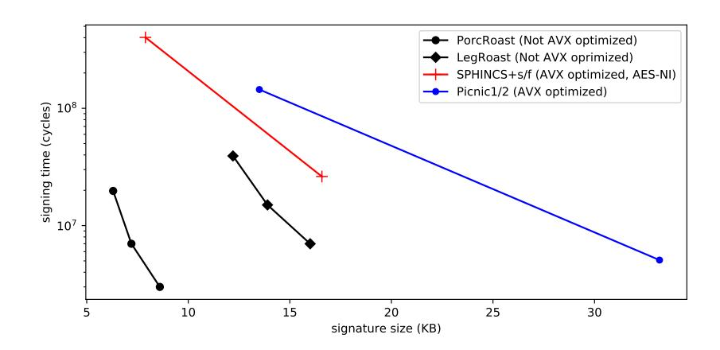
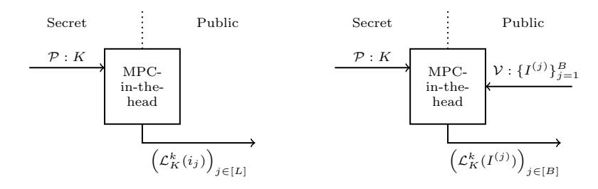
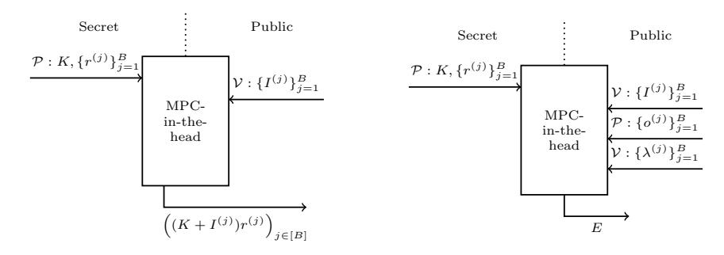

# LegRoast: Efficient post-quantum signatures from the Legendre PRF

Ward Beullens<sup>1</sup> and Cyprien Delpech de Saint Guilhem1,<sup>2</sup>

1 imec-COSIC, KU Leuven, Belgium <sup>2</sup> Dept Computer Science, University of Bristol, U.K.

Abstract. We introduce an efficient post-quantum signature scheme that relies on the one-wayness of the Legendre PRF. This "LEGendRe One-wAyness SignaTure" (LegRoast) builds upon the MPC-in-the-head technique to construct an efficient zero-knowledge proof, which is then turned into a signature scheme with the Fiat-Shamir transform. Unlike many other Fiat-Shamir signatures, the security of LegRoast can be proven without using the forking lemma, and this leads to a tight (classical) ROM proof. We also introduce a generalization that relies on the one-wayness of higher-power residue characters; the "POwer Residue ChaRacter One-wAyness SignaTure" (PorcRoast).

LegRoast outperforms existing MPC-in-the-head-based signatures (most notably Picnic/Picnic2) in terms of signature size and speed. Moreover, PorcRoast outperforms LegRoast by a factor of 2 in both signature size and signing time. For example, one of our parameter sets targeting NIST security level I results in a signature size of 7.2 KB and a signing time of 2.8ms. This makes PorcRoast the most efficient signature scheme based on symmetric primitives in terms of signature size and signing time.

Keywords: Post-Quantum signatures · Legendre PRF · MPC-in-the-head

# 1 Intoduction

In 1994, Shor discovered a quantum algorithm for factoring integers and solving discrete logarithms in polynomial time [\[26\]](#page-13-0). This implies that an adversary with access to a sufficiently powerful quantum computer can break nearly all public-key cryptography that is deployed today. Therefore, it is important to look for alternative public-key cryptography algorithms that can resist attacks from quantum adversaries. Recently, the US National Institute of Standards and Technology (NIST) has initiated a process to solicit, evaluate, and standardize

This work was supported in part by the Research Council KU Leuven grants C14/18/067 and STG/17/019, by CyberSecurity Research Flanders with reference number VR20192203, by the ERC Advanced Grant ERC-2015-AdG-IMPaCT and by the Defense Advanced Research Projects Agency (DARPA) and Space and Naval Warfare Systems Center, Pacific (SSC Pacific) under contract No. N66001-15-C-4070. Ward Beullens is funded by an FWO fellowship.

one or more quantum-resistant public-key cryptographic algorithms [22]. One of the 9 signature schemes that advanced to the second round of the NIST project is Picnic [7,19,27], a signature scheme whose security only relies on symmetric-key primitives.

Indeed, a key pair for Picnic consists of a random secret key sk and the corresponding public key pk = F(sk), where F is a one-way function which can be computed with a low number of non-linear binary gates [7]. To sign a message m the signer then produces a non-interactive zero-knowledge proof of knowledge of sk such that F(sk) = pk in a way that binds the message m to the proof. These zero-knowledge proofs (whose security relies additionally only on a secure commitment scheme) are constructed using the MPC-in-the-head paradigm [17]. This results in a signature scheme whose signatures are 33 KB large for 128 bits of security. Later, Katz et al. developed Picnic [19], which reduces the signature size to only 14 KB by moving from a 3-party MPC protocol in the honest majority setting to an n-party protocol with preprocessing secure in the dishonest majority setting. However, this increased number of parties slows down the signing and verification algorithms. Picnic and Picnic 2 are round 2 candidates in the NIST project [27]. To study the effect of selecting a different function F, Delpech de Saint Guilhem et al. constructed the BBQ scheme using MPC protocols for arithmetic secret sharing to base the signatures on the security of the AES algorithm instead of the less scrutinized block cipher LowMC [24].

Contributions. In this work we propose to use the Legendre PRF [9], denoted by  $\mathcal{L}_K(\cdot)$ , as one-way function, instead of LowMC or AES. The Legendre PRF is a promising alternative since it can be computed very efficiently in the MPC setting [15]. However, a major limitation of the Legendre PRF is that it only produces one bit of output, which means that the public key should consist of many PRF evaluations  $\mathcal{L}_K(i_1), \ldots, \mathcal{L}_K(i_L)$ , at some fixed arbitrary list  $\mathcal{I} =$  $(i_1, \dots, i_L)$  of L elements of  $\mathbb{F}_p$ , to uniquely determine the secret key K. Hence, the zero-knowledge proof needs to prove knowledge of a value K' such that  $\mathcal{L}_{K'}(i) = \mathcal{L}_{K}(i)$  for all  $i \in \mathcal{I}$  simultaneously, which results in prohibitively large signatures. Luckily, we can relax the relation to overcome this problem. Instead of proving that the signer knows a K' such that  $\mathcal{L}_{K'}(i) = \mathcal{L}_K(i)$  for all  $i \in \mathcal{I}$ , we let a prover prove knowledge of a K' such that this holds for a large fraction of the i in  $\mathcal{I}$ . We show that the relaxed statement allows for a much more efficient zero-knowledge proof. This allows us to establish LegRoast, an MPC-in-the-head based scheme with a signature size of 12.2 KB and with much faster signing and verification algorithms than the Picnic2 and BBQ schemes. To further improve the efficiency of LegRoast, we propose to use higher-power residuosity symbols instead of just the quadratic one (i.e. the Legendre symbol) in a second scheme called PorcRoast. This results in signatures that are only 6.3 KB large and in signing and verification times that are twice faster than LegRoast.

A comparison between the signature size and signing time of LegRoast and PorcRoast versus existing signatures based on symmetric primitives (Picnic [27] and SPHINCS+ [16]) is shown in Figure 1. Even though LegRoast and PorcRoast do not have an AVX optimized implementation yet, we see that LegRoast has

faster signing times than both Picnic and SPHINCS+, and that PorcRoast is even faster than LegRoast. We conclude that PorcRoast is the most efficient post-quantum signature scheme based on symmetric primitives in terms of signature size and signing time.

However, note that there are several other branches of post-quantum signatures, such as lattice-based (e.g. Dilithium and Falcon [12,21,23]), Multivariate signatures (e.g., Rainbow, LUOV, MQDSS, MUDFISH [11,10,5,6,25,2]) and isogeny-based signatures (e.g. CSI-FISH [4]), some of which result in more efficient signature schemes.

**Roadmap.** After some preliminaries in Section 2, we introduce a relaxed PRF relation in Section 3. We then sketch an identification scheme in Section 4 which we formalize as a signature scheme in Section 5. We finally discuss parameter choices and implementation results in Section 6.



<span id="page-2-0"></span>Fig. 1. Signature sizes and timings of post-quantum signature schemes based only on symmetric primitives.

## <span id="page-2-1"></span>2 Preliminaries - the Legendre and power residue PRFs

For an odd prime p the Legendre PRF is conjectured to be a pseudorandom function family, indexed by a key  $K \in \mathbb{Z}_p$ , such that  $\mathcal{L}_K$  takes as input an element  $a \in \mathbb{F}_p$  and outputs the bit

$$\mathcal{L}_K(a) = \left\lfloor \frac{1}{2} \left( 1 - \left( \frac{K+a}{p} \right) \right) \right\rfloor \in \mathbb{Z}_2,$$

where  $(\frac{a}{p}) \in \{-1,0,1\}$  denotes the quadratic residuosity symbol of  $a \mod p$ . We note that the function  $\mathcal{L}_K$  above is defined such that  $\mathcal{L}_0(a \cdot b) = \mathcal{L}_0(a) + \mathcal{L}_0(b)$  for all  $a, b \in \mathbb{F}_p^{\times}$ . (Note also that  $\mathcal{L}_K(a) = \mathcal{L}_0(K+a)$ .)

The seemingly random properties of quadratic residues have been the subject of study for number theorists at least since the early twentieth century, which is why Damgård proposed to use this construction in cryptography [9]. Since then, the security of the Legendre PRF has been studied in several attack models. In the very strong model where a quantum adversary is allowed to query the PRF in superposition, a key can be recovered in quantum polynomial time [8]. If the adversary is only allowed to query the PRF classically, there is a memoryless classical attack that requires computing  $O(p^{1/2} \log p)$  Legendre symbols and making  $O(p^{1/2} \log p)$  queries to the PRF [20]. Finally, if the adversary is restricted to querying only L Legendre symbols, the best known attack requires computing  $O(p \log^2 p/L^2)$  Legendre symbols [3].

Damgård also considers a generalisation of the Legendre PRF, where instead of using the quadratic residue symbol  $(\frac{a}{p}) = a^{\frac{p-1}{2}} \mod p$ , the PRF uses the k-th power residue symbol defined as  $(\frac{a}{p})_k = a^{\frac{p-1}{k}} \mod p$ , for some k that divides p-1. We define the power residue PRF, analogous to the Legendre PRF, as the keyed function  $\mathcal{L}_K^k : \mathbb{F}_p \to \mathbb{Z}_k$ , where for an odd prime  $p \equiv 1 \mod k$ ,  $\mathcal{L}_K^k(a)$  is defined as

$$\mathcal{L}_K^k(a) = \begin{cases} i & \text{if } (a+K)/g^i \equiv h^k \bmod p \text{ for some } h \in \mathbb{F}_p^{\times} \\ 0 & \text{if } (a+K) \equiv 0 \bmod p \end{cases},$$

where g is a fixed generator of  $\mathbb{F}_p^{\times}$ . We see that the function  $\mathcal{L}_0^k$  is a homomorphism of groups from  $\mathbb{F}_p^{\times}$  to  $\mathbb{Z}_k$ .

Note that for k=2, this notation coincides with the original Legendre PRF. In this paper, we use the generic notation and we separate the k=2 and k>2 cases only in the experimental sections to highlight the advantages gained by using k>2. One advantage of the power residue PRF is that it yields  $\log k$  bits of output, instead of a single bit. The best known attack against the power residue PRF in the setting where an attacker is allowed to query the PRF L times requires computing  $O(p\log^2 p/(kL\log^2 k))$  power residue symbols [3].

## <span id="page-3-0"></span>3 The (relaxed) power residue PRF relation

In this section, we define the Legendre and power residue PRF NP-languages  $R_{\mathcal{L}^k}$ , for  $k \geq 2$ , which consist of the symbol strings of outputs of the  $\mathcal{L}^k$  PRF for a given set of inputs. We also define a relaxed version of these languages  $R_{\beta\mathcal{L}^k}$ , which consist of the strings that are very close (up to addition by a scalar in  $\mathbb{Z}_k$ ) to a word in  $R_{\mathcal{L}^k}$ , where the Hamming distance  $d_H$  is used and  $\beta$  parameterizes the slack.

For properly chosen parameters, it follows from the Weil bound that the relaxed version is as hard as the exact relation, but the relaxed relation will lead to much more efficient signature schemes. To simplify notation, for a list  $\mathcal{I} = (i_1, \dots, i_L)$  of L arbitrary elements of  $\mathbb{Z}_p$ , we denote a length-L Legendre / k-th power residue PRF as:

$$F_{\mathcal{I}}^k : \mathbb{F}_p \to \mathbb{Z}_k^L$$
  
 $K \mapsto (\mathcal{L}_K^k(i_1), \dots, \mathcal{L}_K^k(i_L)).$ 

**Definition 1 (Legendre** / k-th power residue PRF relation). For an odd prime p, a positive integer  $k \mid p-1$  and a list  $\mathcal{I}$  of L elements of  $\mathbb{Z}_p$  we define the Legendre / k-th power residue PRF relation  $R_{\mathcal{L}^k}$  with output length L as

$$R_{\mathcal{L}^k} = \{ (F_{\mathcal{T}}^k(K), K) \in \mathbb{Z}_k^L \times \mathbb{F}_p \mid K \in \mathbb{F}_p \}.$$

**Definition 2** ( $\beta$ -approximate PRF relation). For  $\beta \in [0,1]$ , an odd prime p, a positive integer  $k \mid p-1$  and a list  $\mathcal{I}$  of L elements of  $\mathbb{Z}_p$  we define the  $\beta$ -approximate PRF relation  $R_{\beta\mathcal{L}^k}$  with output length L as

$$R_{\beta\mathcal{L}^k} = \{(s, K) \in \mathbb{Z}_k^L \times \mathbb{F}_p \mid \exists a \in \mathbb{Z}_k : d_H(s + (a, \dots, a), F_{\mathcal{I}}^k(K)) \le \beta L\}$$

where  $d_H(\cdot,\cdot)$  denotes the Hamming distance.

It follows from the Weil bound for character sums that if  $\beta$  is sufficiently small and L is sufficiently large, then the  $\beta$ -relaxed power residue relation is equally hard as the exact power residue relation, simply because with overwhelming probability over the choice of  $\mathcal{I} = (i_1, \dots, i_L)$  every witness for the relaxed relation is also a witness for the exact relation. The proof is given in Appendix A.

<span id="page-4-1"></span>**Theorem 1.** Let  $\mathcal{B}(n,q)$  denote the binomial distribution with n samples each with success probability q. Take  $K \in \mathbb{F}_p$ , and take  $s = F_{\mathcal{I}}^k(K)$ . Then with probability at least  $1 - kp \cdot \Pr\left[\mathcal{B}(L, 1/k + 1/\sqrt{p} + 2/p) \ge (1 - \beta)L\right]$  over the choice of  $\mathcal{I}$ , there exist only one witness for  $s \in R_{\beta\mathcal{L}^k}$ , namely K, which is also a witness for the exact relation  $R_{\mathcal{L}^k}$ .

#### <span id="page-4-0"></span>4 Identification scheme

In this section, we establish a Picnic-style identification scheme from the Legendre / k-th power residue PRF. We first sketch a scheme very close to the original Picnic construction [7] and gradually add more optimizations, presenting each in turn. Even though the final goal is to construct a signature scheme, we use the language of identification schemes in this section to relate the scheme to existing constructions. We delay the security proof to the next section, where we first apply the Fiat-Shamir transform [13] before we prove that the resulting signature scheme is tightly secure in the ROM. The proof of security of the interactive identification scheme presented here can be derived from the one provided in the next section.

**Starting point.** To begin, we take the Picnic2 identification scheme and replace the LowMC block-cipher by the PRF  $F_{\mathcal{I}}^k$ . The key pair is then  $\mathsf{sk} = K$  and  $\mathsf{pk} = F_{\mathcal{I}}^k(K) \in \mathbb{Z}_k^L$ . From a high-level view, the protocol can be sketched as in Figure 2 where the prover runs an MPC-in-the-head proof with N parties on a secret sharing of K, to prove to the verifier that he knows K such that  $((\frac{K+i_1}{p}), \ldots, (\frac{K+i_L}{p}))$  is equal to the public key. We also use the more efficient method recently proposed by Baum and Nof [1] based on sacrificing rather than the cut-and-choose technique.



<span id="page-5-0"></span>Fig. 2. Picnic-stye identification scheme

<span id="page-5-1"></span>Fig. 3. Checking only B symbols

Relaxing the PRF relation. As a first optimization, rather than computing all of the L residue symbols with the MPC protocol, we only check a fixed number B of them. To do so, the verifier chooses random inputs  $I^{(1)}, \ldots, I^{(B)}$  in  $\mathcal{I}$  at which the  $\mathcal{L}^k$  PRF is evaluated to check the witness. It is crucial that the verifier sends his choice of  $I^{(j)}$ s after the prover has committed to his sharing of K, because if a malicious prover knows beforehand which symbols are going to be checked, he can use a fake key K' such that  $\left(\frac{K'+I^{(j)}}{p}\right) = \mathsf{pk}_{I^{(j)}}$  only for  $j \in [B]$ . This probabilistic method of selecting which circuit will be executed with the MPC-in-the-head technique is similar to the "sampling circuits on the fly" technique of Baum and Nof [1].

This is now an identification scheme for the  $\beta$ -approximate Legendre PRF relation; a prover that convinces the verifier with probability greater than  $(1 - \beta)^B + (1 - (1 - \beta)^B)/N$  could be used to extract a  $\beta$ -approximate witness following the formalism presented in [1, Section 4]. This protocol is sketched in Figure 3.

Computing residue symbols in the clear. Since computing residue symbols is relatively expensive, we avoid doing it within the MPC protocol. We use an idea similar to that of Grassi et al. to make this possible [15]. First, we let the prover create sharings of B uniformly random values  $r^{(1)}, \ldots, r^{(B)} \in \mathbb{F}_p^{\times}$  and commit to their residue symbols by sending  $s^{(j)} = \mathcal{L}_0^k(r^{(j)})$  to the verifier. Then, the MPC protocol only outputs  $o^{(j)} = (K+I^{(j)})r^{(j)}$ . Since  $K+I^{(j)}$  is masked with a uniformly random value with known residue symbol,  $o^{(j)}$  does not leak information about K (except for the residue symbol of  $K+I^{(j)}$ ). The verifier then computes  $\mathcal{L}_0^k(o^{(j)})$  himself in the clear, and verifies whether it equals  $\mathsf{pk}_{I^{(j)}} + s^{(j)}$ . The correctness of this check follows from the facts that  $\mathcal{L}_0^k: \mathbb{F}_p^{\times} \to \mathbb{Z}_k$  is a group homomorphism.

Note that the prover can lie about the values of  $s^{(j)} = \mathcal{L}_0^k(r^{(j)})$  that he sends to the prover. This is not an issue because he has to commit to these values before the choice of  $I^{(j)}$  is revealed. This is the reason why we defined K' to be an  $\beta$ -approximate witness for pk if  $F_{\mathcal{I}}^k(K')$  is close to pk =  $F_{\mathcal{I}}^k(K)$  up to addition by a scalar. This identification protocol is sketched in Figure 4.



<span id="page-6-1"></span>Fig. 4. Computations in the clear.

<span id="page-6-2"></span>Fig. 5. The final scheme.

Verifying instead of computing multiplications. Instead of using the MPC protocol to compute the products  $o^{(j)}$ , the prover can just send these products directly to verifier. We then use the MPC-in-the-head protocol to instead verify that  $o^{(j)} = (K + I^{(j)}) \cdot r^{(j)}$  for all  $j \in [B]$ . A big optimization here is that rather than verifying these B equations separately, it is possible to just check a random linear combination of these equations:

After the prover sends the  $o^{(j)}$  values, the verifier chooses random coefficients  $\lambda^{(1)}, \ldots, \lambda^{(B)}$  for the linear combination. Then, the MPC protocol is used to compute the error term E defined as

$$E = \sum_{j=1}^{B} \lambda^{(j)} \left( (K + I^{(j)}) r^{(j)} - o^{(j)} \right) = K \cdot \sum_{j=1}^{B} \lambda^{(j)} r^{(j)} + \sum_{j=1}^{B} \lambda^{(j)} (I^{(j)} r^{(j)} - o^{(j)}).$$

Clearly, if all the  $o^{(j)}$  are correct, then E=0. Otherwise, if one or more of the  $o^{(j)}$  are wrong, then E will be a uniformly random value. Therefore, checking if E=0 proves to the verifier that all the  $o^{(j)}$  are correct, with a soundness error of 1/p. Moreover, since the  $\lambda^{(j)}, o^{(j)}$  and  $I^{(j)}$  are public values, we see that E can be computed with only a single nonlinear operation! This means we can compute E extremely efficiently in MPC. The identification scheme with this final optimization is sketched in Figure 5.

We note that a single execution of the interactive identification scheme is not enough to achieve negligible soundness error (e.g. the prover has probability 1/N to cheat in the MPC verification protocol). To resolve this, M executions must be run in parallel.

#### <span id="page-6-0"></span>5 LegRoast and PorcRoast signature schemes

We now formalize the signature schemes LegRoast (with k=2) and PorcRoast (with k>2) which are constructed from the identification scheme of Section 4 with the Fiat-Shamir transform [13], by generating the challenges using three random oracles  $\mathcal{H}_1, \mathcal{H}_2$  and  $\mathcal{H}_3$ . The message is combined with a  $2\lambda$ -bit salt and bound to the proof by hashing it together with the messages of the prover.

Parameters. Our new signature schemes are parametrized by the following values. Let p be a prime number and let  $k \geq 2$  be an integer such that  $k \mid p-1$ . Let L be an integer determining the length of the public key,  $\mathcal{I}$  a pseudo-randomly chosen list of L elements of  $\mathbb{Z}_p$  and let  $B \leq L$  denote the number of k-th power residue symbols in the public key that will be checked at random. Let N denote the number of parties in the MPC verification protocol and let M denote the number of parallel executions of the identification scheme. These values are grouped under the term params.

Key generation, signing and verifying. The  $\mathsf{KGen}(1^\lambda,\mathsf{params})$  algorithm samples  $\mathsf{sk} = K \xleftarrow{\$} \mathbb{F}_p$  uniformly at random and computes the public key  $\mathsf{pk} = F^k_{\mathcal{I}}(K)$ . The  $\mathsf{Sign}(\mathsf{params},\mathsf{sk},m)$  algorithm, for message  $m \in \{0,1\}^*$  is presented in Figure 6. The  $\mathsf{Vf}(\mathsf{params},\mathsf{pk},m,\sigma)$  algorithm is presented in Figure 7.

Security. The EUF-CMA security [14] of the LegRoast and PorcRoast signature schemes follows from a *tight* reduction from the problem of finding a witness for the  $R_{\beta\mathcal{L}^k}$ -relation, which is equally hard as a key recovery on the power residue PRF for our parameters. The proof of Theorem 2 is included in Appendix B.

<span id="page-7-1"></span>**Theorem 2.** In the classical random oracle model, the LegRoast and PorcRoast signature schemes defined as above are EUF-CMA-secure under the assumption that computing  $\beta$ -approximate witnesses for a given public key is hard.

#### <span id="page-7-0"></span>6 Parameter choices and implementation

This section shows how to choose secure parameters for the LegRoast and PorcRoast signature schemes, and what the resulting key and signature sizes are. We also go over some of the implementation details and the performance of our implementation.

## 6.1 Parameter choices

Choosing p, L and  $\mathcal{I}$ . We choose p and L such that the problem of finding a  $\beta$ -approximate witness for the PRF relation has the required security level. To do this, we first choose p and L such that the problem of recovering the exact key from L symbols of output is hard. For our proposed parameters we choose L such that the public key size is 4KB, (i.e.  $L=32768/\log(k)$ ). Different trade-offs are possible (see remark 1). Then, we set  $\beta$  such that

$$k \cdot p \cdot \Pr[B(L, 1/k + 1/\sqrt{(p)} + 2/p) > (1 - \beta)l] \le 2^{-\lambda}.$$

With this choice, Theorem 1 says that with overwhelming probability, finding a  $\beta$ -approximate key is equivalent to finding the exact key. Section 2 gives a short overview of attacks on the Legendre PRF for various attack models. However, in the setting of attacking LegRoast and PorcRoast, the adversary is restricted

```
Sign(params, sk, m):
Phase 1: Commitment to sharings of K, randomness and triples
 1: Pick a random salt: salt \leftarrow \{0,1\}^{2\lambda}.
 2: for e from 1 to M do
             Sample a root seed: \operatorname{sd}_e \stackrel{\$}{\leftarrow} \{0,1\}^{\lambda}.
 3:
 4:
             Build binary tree from \mathsf{sd}_e with leaves \mathsf{sd}_{e,1},\ldots,\mathsf{sd}_{e,N}.
 5:
             for i from 1 to N do
                  Sample shares: K_{e,i}, r_{e,i}^{(1)}, \dots, r_{e,i}^{(B)}, a_{e,i}, b_{e,i}, c_{e,i} \leftarrow \mathsf{Expand}(\mathsf{sd}_{e,i}). Commit to seed: \mathsf{C}_{e,i} \leftarrow \mathcal{H}_{\mathsf{sd}}(\mathsf{salt}, e, i, \mathsf{sd}_{e,i}).
 6:
 7:
            Compute witness offset: \Delta K_e \leftarrow K - \sum_{i=1}^N K_{e,i}.
Adjust first share: K_{e,1} \leftarrow K_{e,1} + \Delta K_e.
Compute triple: a_e \leftarrow \sum_{i=1}^N a_{e,i}, b_e \leftarrow \sum_{i=1}^N b_{e,i} and c_e \leftarrow a_e \cdot b_e.
Compute triple offset: \Delta c_e \leftarrow c_e - \sum_{i=1}^N c_{e,i}.
 8:
 9:
10:
11:
             Adjust first share: c_{e,1} \leftarrow c_{e,1} + \Delta c_e.
12:
13:
             for j from 1 to B do
                   Compute residuosity symbol: s_e^{(j)} \leftarrow \mathcal{L}_0^k(r_e^{(j)}) where r_e^{(j)} \leftarrow \sum_{i=1}^N r_{e,i}^{(j)}.
14:
15: Set \sigma_1 \leftarrow ((C_{e,i})_{i \in [N]}, (s_e^{(j)})_{j \in [B]}, \Delta K_e, \Delta c_e)_{e \in [M]}.
Phase 2: Challenge on public key symbols
 1: Compute challenge hash: h_1 \leftarrow \mathcal{H}_1(m, \mathsf{salt}, \sigma_1).
 2: Expand hash: (I_e^{(j)})_{e \in [M], j \in [B]} \leftarrow \mathsf{Expand}(h_1), where I_e^{(j)} \in \mathcal{I}.
Phase 3: Computation of output values
 1: for e from 1 to M and for j from 1 to B do
             Compute output value: o_e^{(j)} \leftarrow (K + I_e^{(j)}) \cdot r_e^{(j)}.
 3: Set \sigma_2 \leftarrow (o_e^{(1)}, \dots, o_e^{(B)})_{e \in [M]}.
Phase 4: Challenge for sacrificing-based verification
 1: Compute challenge hash: h_2 \leftarrow \mathcal{H}_2(h_1, \sigma_2).
 2: Expand hash (\epsilon_e, \lambda_e^{(1)}, \dots, \lambda_e^{(B)})_{e \in [M]} \leftarrow \mathsf{Expand}(h_2), where \epsilon_e, \lambda_e^{(j)} \in \mathbb{Z}_p.
Phase 5: Commitment to views of sacrificing protocol
 1: for e from 1 to M do
 2:
             for i from 1 to N do
                  Compute shares: \alpha_{e,i} \leftarrow a_{e,i} + \epsilon_e K_{e,i} and \beta_{e,i} \leftarrow b_{e,i} + \sum_{i=1}^{B} \lambda_e^{(j)} r_{e,i}^{(j)}.
 3:
             Compute values: \alpha_e \leftarrow \sum_{i=1}^N \alpha_{e,i} and \beta_e \leftarrow \sum_{i=1}^N \beta_{e,i}.
 4:
 5:
             for i from 1 to N do
                  Compute product shares: z_{e,i} \leftarrow \sum_{j=1}^{B} -\lambda_e^{(j)} r_{e,i}^{(j)} I_e^{(j)}
 6:
                  if i \stackrel{?}{=} 1 then z_{e,i} \leftarrow z_{e,i} + \sum_{j=1}^{B} \lambda_e^{(j)} o_e^{(j)}.
 7:
                  Compute check value shares: \gamma_{e,i} \leftarrow \alpha_e b_{e,i} + \beta_e a_{e,i} - c_{e,i} + \epsilon_e z_{e,i}.
 9: Set \sigma_3 \leftarrow (\alpha_e, \beta_e, (\alpha_{e,i}, \beta_{e,i}, \gamma_{e,i})_{i \in [N]})_{e \in [M]}.
Phase 6: Challenge on sacrificing protocol
 1: Compute challenge hash h_3 \leftarrow \mathcal{H}_3(h_2, \sigma_3).
 2: Expand hash (\bar{i}_e)_{e \in [M]} \leftarrow \mathsf{Expand}(h_3), where \bar{i}_e \in [N].
Phase 7: Opening the views of sacrificing protocol
 1: for e from 1 to M do
             \mathsf{seeds}_{\mathsf{e}} \leftarrow \{\log_2(N) \text{ nodes in tree needed to compute } \mathsf{sd}_{e,i} \text{ for } i \in [N] \setminus \overline{i}\}.
 3: Output: \sigma = (\mathsf{salt}, h_1, h_3, (\Delta K_e, \Delta c_e, o_e^{(1)}, \dots, o_e^{(B)}, \alpha_e, \beta_e, \mathsf{seeds}_e, \mathsf{C}_{e, \bar{i}_e})_{e \in [M]}).
```

<span id="page-8-0"></span>**Fig. 6.** Signature scheme from proof of knowledge of k-th power residue PRF pre-image.

```
\mathsf{Vf}(\mathsf{params},\mathsf{pk},m,\sigma):
  1: Parse \sigma = (\mathsf{salt}, h_1, h_3, (\Delta K_e, \Delta c_e, o_e^{(1)}, \dots, o_e^{(B)}, \alpha_e, \beta_e, \mathsf{seeds}_e, \mathsf{C}_{e, \vec{l}_e})_{e \in [M]}).
  2: Compute h_2 \leftarrow \mathcal{H}_2(h_1, (o_e^{(j)})_{e \in [M], i \in [B]}).
  3: Expand challenge hash 1: (I_e^{(1)}, \dots, I_e^{(B)})_{e \in [M]} \leftarrow \mathsf{Expand}(h_1), where I_e^{(j)} \in \mathcal{I}.
  4: Expand challenge hash 2: (\epsilon_e, \lambda_e^{(1)}, \dots, \lambda_e^{(B)})_{e \in [M]} \leftarrow \mathsf{Expand}(h_2).
  5: Expand challenge hash 3: (\bar{i}_e)_{e \in [M]} \leftarrow \mathsf{Expand}(h_3).
  6: for e from 1 to M do
                Use seeds<sub>e</sub> to compute \mathsf{sd}_{e,i} for i \in [N] \setminus \bar{i}_e.
  7:
                for i from 1 to \overline{i}_e - 1 and from \overline{i}_e + 1 to N do

Sample shares: K_{e,i}, r_{e,i}^{(1)}, \dots, r_{e,i}^{(B)}, a_{e,i}, b_{e,i}, c_{e,i} \leftarrow \mathsf{Expand}(\mathsf{sd}_{e,i}).
  8:
  9:
                        if i \stackrel{?}{=} 1 then
10:
                               Adjust shares: K_{e,i} \leftarrow K_{e,i} + \Delta K_e and c_{e,i} \leftarrow c_{e,i} + \Delta c_e.
11:
12:
                        Recompute commitments: C_{e,i}^* \leftarrow \mathcal{H}(\mathsf{salt}, e, i, \mathsf{sd}_{e,i})
                       Recompute shares: \alpha_{e,i}^* \leftarrow a_{e,i} + \epsilon_e K_{e,i} and \beta_{e,i}^* \leftarrow b_{e,i} + \sum_{j=1}^B \lambda_e^{(j)} r_{e,i}^{(j)}
Recompute product shares: z_{e,i} \leftarrow \sum_{j=1}^B -\lambda_e^{(j)} r_{e,i}^{(j)} I_e^{(j)}.
13:
14:
                       if i \stackrel{?}{=} 1 then
z_{e,i} \leftarrow z_{e,i} + \sum_{j=1}^{B} \lambda_e^{(j)} o_e^{(j)}.
15:
16:
                        Recompute check value shares: \gamma_{e,i}^* \leftarrow \alpha_e b_{e,i} + \beta_e a_{e,i} - c_{e,i} + \epsilon_e z_{e,i}.
17:
                Compute missing shares: \alpha_{e,\bar{i}_e}^* \leftarrow \alpha_e - \sum_{i \neq \bar{i}} \alpha_{e,i}^* and \beta_{e,\bar{i}_e}^* \leftarrow \beta_e - \sum_{i \neq \bar{i}} \beta_{e,i}^*. Compute missing check value share: \gamma_{e,\bar{i}_e}^* = \alpha_e \beta_e - \sum_{i \neq \bar{i}} \gamma_{e,i}^*.
18:
19:
                for j from 1 to B do
20:
                        Recompute residuosity symbols: s_e^{(j)*} \leftarrow \mathcal{L}_0^k(o_e^{(j)}) - \mathsf{pk}_{\tau^{(j)}}.
21:
22: Check 1: h_1 \stackrel{?}{=} \mathcal{H}_1(m, \mathsf{salt}, ((\mathsf{C}_{e,i}^*)_{i \in [N]}, (s_e^{(j)*})_{j \in [B]}, \Delta K_e, \Delta c_e)_{e \in [M]})
23: Check 2: h_3 \stackrel{?}{=} \mathcal{H}_3(h_2, (\alpha_e, \beta_e, (\alpha_{e,i}^*, \beta_{e,i}^*, \gamma_{e,i}^*)_{i \in [N]})_{e \in [M]})
24: Output accept if both checks pass.
```

<span id="page-9-0"></span>Fig. 7. Verifying algorithm for LegRoast and PorcRoast.

even more than in the weakest attacker model considered in the literature: an attacker learns only a few evaluations of the Legendre PRF on pseudorandom inputs over which the attacker has no control. If the L inputs are chosen at random, the best known attack is a brute force search which requires computing O(p/k) power residue symbols, and the attack complexity becomes independent of L. For Legroast, we propose to use a prime p of size roughly  $2^{\lambda}$ , where  $\lambda$  is the required security level. We choose the Mersenne prime  $p = 2^{127} - 1$  to speed up the arithmetic. For PorcRoast, we use the same prime and k = 254 such that a power residue symbol can efficiently be represented by a single byte. For k > 2, computing a power residue symbol corresponds to a modular exponentiation, which is much more expensive than an AES operation, so even though an attacker has on average only to compute  $2^{127}/k \approx 2^{119}$  power residue symbols, we claim that this still provides approximately 128-bits of security. We stress that the quantum polynomial-time key recovery attack on the Legendre PRF does not

apply on our scheme, because the adversary can not make queries to the instance of the Legendre PRF (and certainly no quantum queries) [8].

Choosing B, N and M. Our security proof shows that, unless an attacker can produce a  $\beta$ -approximate witness, his best strategy is to query  $\mathcal{H}_1$  on many inputs and then choose the query for which

$$\mathcal{L}_0^k((K_e + I_e^{(j)})r_e^{(j)}) = s_e^{(j)} + \mathsf{pk}_{I_e^{(j)}} \text{ for all } j \in [B]$$

holds for the most executions. Say this is the case for M' out of M executions. He then makes one of the parties cheat in the MPC protocol in each of the M-M' remaining executions and queries  $\mathcal{H}_3$  in the hope of getting an output  $\{\bar{i}_e\}_{e\in[M]}$  that asks him to open all the other non-cheating parties; i.e. the attacker attempts to guess  $\bar{i}_e$  for each e. This succeeds with probability  $N^{-M+M'}$ .

Therefore, to achive  $\lambda$  bits of security, we take parameters  $B,N=2^n$  and M such that

<span id="page-10-1"></span>
$$\min_{M' \in \{0, \dots, M\}} \left( \Pr[\mathcal{B}(M, (1 - \beta)^B) \ge M_1]^{-1} + N^{M - M'} \right) \ge 2^{\lambda}, \tag{1}$$

which says that for each value of M', the adversary is expected to do at least  $2^{\lambda}$  hash function evalutations for the attack to succeed. To choose parameters, we fix N to a certain value and compute which values of B and M minimize the signature size while satisfying Equation (1). The choice of N controls a trade-off between signing time and signature size. If N is large, the soundness error will be small, which results in a smaller signature size, but the signer and the verifier need to simulate an MPC protocol with a large number of parties, which is slow. On the other hand, if N is small, then the signature size will be larger, but signing and verifying will be faster. Some trade-offs achieving 128-bits of security for LegRoast and PorcRoast are displayed in Table 1.

<span id="page-10-0"></span>Remark 1. The parameter L controls a trade-off between public key size and signature size. For example, we can decrease the public key size by a factor 8 (to 0.5KB), at the cost of an increase in signature size by 21% (to 7.6 KB).  $(L=512,k=254,\beta=0.871,n=256,B=10,M=20)$ .

#### 6.2 Implementation

In our implementation, which is publicly available at

we replace the random oracles and the Expand function by SHA-3 and SHAKE128. The signing algorithm is inherently constant time, except for computing Legendre symbols, which when implemented with the usual GCD strategy, leaks timing information on its argument. Therefore, in our implementation, we chose to

|           | Parameters |    |    | Signature Size | Signing time |
|-----------|------------|----|----|----------------|--------------|
|           | N          | M  | B  | (KB)           | (ms)         |
| LegRoast  | 16         | 54 | 9  | 16.0           | 2.8          |
| k = 2     | 64         | 37 | 12 | 13.9           | 6.0          |
| β = 0.449 | 256        | 26 | 16 | 12.2           | 15.7         |
| PorcRoast | 16         | 39 | 4  | 8.6            | 1.2          |
| k = 254   | 64         | 27 | 5  | 7.2            | 2.8          |
| β = 0.967 | 256        | 19 | 6  | 6.3            | 7.9          |

<span id="page-11-8"></span>Table 1. Parameter sets for LegRoast and PorcRoast for NIST security level I. For all parameter sets we have p = 2<sup>127</sup> − 1, a secret key size of 16 Bytes and a public key size of 4 KB (L = 32768 and 4096 for LegRoast and PorcRoast respectively). The verification time is similar to the signing time.

adopt the slower approach of computing Legendre symbols as an exponentiation with fixed exponent (p − 1)/2, which is an inherently constant time operation. Higher-power residue symbols are also calculated as an exponentiation with fixed exponent (p − 1)/k. The signing-time of our implementation, measured on an Intel i5-8400H CPU, running at 2.50GHz, is displayed in Table [1.](#page-11-8)

## References

- <span id="page-11-7"></span>1. Baum, C., Nof, A.: Concretely-efficient zero-knowledge arguments for arithmetic circuits and their application to lattice-based cryptography. Cryptology ePrint Archive, Report 2019/532 (2019), <https://eprint.iacr.org/2019/532>
- <span id="page-11-3"></span>2. Beullens, W.: Sigma protocols for mq, pkp and sis, and fishy signature schemes. Cryptology ePrint Archive, Report 2019/490 (2019), [https://eprint.iacr.org/](https://eprint.iacr.org/2019/490) [2019/490](https://eprint.iacr.org/2019/490)
- <span id="page-11-6"></span>3. Beullens, W., Beyne, T., Udovenko, A., Vitto, G.: Cryptanalysis of the legendre prf and generalizations. Cryptology ePrint Archive, Report 2019/1357 (2019), [https:](https://eprint.iacr.org/2019/1357) [//eprint.iacr.org/2019/1357](https://eprint.iacr.org/2019/1357)
- <span id="page-11-4"></span>4. Beullens, W., Kleinjung, T., Vercauteren, F.: Csi-fish: Efficient isogeny based signatures through class group computations. In: International Conference on the Theory and Application of Cryptology and Information Security. pp. 227–247. Springer (2019)
- <span id="page-11-1"></span>5. Beullens, W., Preneel, B.: Field lifting for smaller UOV public keys. In: Patra, A., Smart, N.P. (eds.) INDOCRYPT 2017. LNCS, vol. 10698, pp. 227–246. Springer, Heidelberg (Dec 2017)
- <span id="page-11-2"></span>6. Beullens, W., Preneel, B., Szepieniec, A., Vercauteren, F.: LUOV. Tech. rep., National Institute of Standards and Technology (2019), available at [https://csrc.](https://csrc.nist.gov/projects/post-quantum-cryptography/round-2-submissions) [nist.gov/projects/post-quantum-cryptography/round-2-submissions](https://csrc.nist.gov/projects/post-quantum-cryptography/round-2-submissions)
- <span id="page-11-0"></span>7. Chase, M., Derler, D., Goldfeder, S., Orlandi, C., Ramacher, S., Rechberger, C., Slamanig, D., Zaverucha, G.: Post-quantum zero-knowledge and signatures from symmetric-key primitives. In: Thuraisingham, B.M., Evans, D., Malkin, T., Xu, D. (eds.) ACM CCS 2017. pp. 1825–1842. ACM Press (Oct / Nov 2017)
- <span id="page-11-5"></span>8. van Dam, W., Hallgren, S.: Efficient quantum algorithms for shifted quadratic character problems. arXiv preprint quant-ph/0011067 (2000)

- <span id="page-12-3"></span>9. Damg˚ard, I.: On the randomness of legendre and jacobi sequences. In: Goldwasser, S. (ed.) CRYPTO'88. LNCS, vol. 403, pp. 163–172. Springer, Heidelberg (Aug 1990)
- <span id="page-12-10"></span>10. Ding, J., Chen, M.S., Petzoldt, A., Schmidt, D., Yang, B.Y.: Rainbow. Tech. rep., National Institute of Standards and Technology (2019), available at [https://csrc.](https://csrc.nist.gov/projects/post-quantum-cryptography/round-2-submissions) [nist.gov/projects/post-quantum-cryptography/round-2-submissions](https://csrc.nist.gov/projects/post-quantum-cryptography/round-2-submissions)
- <span id="page-12-9"></span>11. Ding, J., Schmidt, D.: Rainbow, a new multivariable polynomial signature scheme. In: Ioannidis, J., Keromytis, A., Yung, M. (eds.) ACNS 05. LNCS, vol. 3531, pp. 164–175. Springer, Heidelberg (Jun 2005)
- <span id="page-12-6"></span>12. Ducas, L., Kiltz, E., Lepoint, T., Lyubashevsky, V., Schwabe, P., Seiler, G., Stehl´e, D.: CRYSTALS-Dilithium: A lattice-based digital signature scheme. IACR TCHES 2018(1), 238–268 (2018), [https://tches.iacr.org/index.php/TCHES/article/](https://tches.iacr.org/index.php/TCHES/article/view/839) [view/839](https://tches.iacr.org/index.php/TCHES/article/view/839)
- <span id="page-12-12"></span>13. Fiat, A., Shamir, A.: How to prove yourself: Practical solutions to identification and signature problems. In: Odlyzko, A.M. (ed.) CRYPTO'86. LNCS, vol. 263, pp. 186–194. Springer, Heidelberg (Aug 1987)
- <span id="page-12-13"></span>14. Goldwasser, S., Micali, S., Rivest, R.L.: A digital signature scheme secure against adaptive chosen-message attacks. SIAM Journal on Computing 17(2), 281–308 (1988)
- <span id="page-12-4"></span>15. Grassi, L., Rechberger, C., Rotaru, D., Scholl, P., Smart, N.P.: MPC-friendly symmetric key primitives. In: Weippl, E.R., Katzenbeisser, S., Kruegel, C., Myers, A.C., Halevi, S. (eds.) ACM CCS 2016. pp. 430–443. ACM Press (Oct 2016)
- <span id="page-12-5"></span>16. Hulsing, A., Bernstein, D.J., Dobraunig, C., Eichlseder, M., Fluhrer, S., Gazdag, S.L., Kampanakis, P., Kolbl, S., Lange, T., Lauridsen, M.M., Mendel, F., Niederhagen, R., Rechberger, C., Rijneveld, J., Schwabe, P., Aumasson, J.P.: SPHINCS+. Tech. rep., National Institute of Standards and Technology (2019), available at [https://csrc.nist.gov/projects/post-quantum-cryptography/](https://csrc.nist.gov/projects/post-quantum-cryptography/round-2-submissions) [round-2-submissions](https://csrc.nist.gov/projects/post-quantum-cryptography/round-2-submissions)
- <span id="page-12-2"></span>17. Ishai, Y., Kushilevitz, E., Ostrovsky, R., Sahai, A.: Zero-knowledge proofs from secure multiparty computation. SIAM Journal on Computing 39(3), 1121–1152 (2009)
- <span id="page-12-14"></span>18. Iwaniec, H., Kowalski, E.: Analytic number theory, vol. 53. American Mathematical Soc. (2004)
- <span id="page-12-1"></span>19. Katz, J., Kolesnikov, V., Wang, X.: Improved non-interactive zero knowledge with applications to post-quantum signatures. In: Lie, D., Mannan, M., Backes, M., Wang, X. (eds.) ACM CCS 2018. pp. 525–537. ACM Press (Oct 2018)
- <span id="page-12-11"></span>20. Khovratovich, D.: Key recovery attacks on the legendre prfs within the birthday bound. Cryptology ePrint Archive, Report 2019/862 (2019), [https://eprint.](https://eprint.iacr.org/2019/862) [iacr.org/2019/862](https://eprint.iacr.org/2019/862)
- <span id="page-12-7"></span>21. Lyubashevsky, V., Ducas, L., Kiltz, E., Lepoint, T., Schwabe, P., Seiler, G., Stehl´e, D.: CRYSTALS-DILITHIUM. Tech. rep., National Institute of Standards and Technology (2019), available at [https://csrc.nist.gov/projects/](https://csrc.nist.gov/projects/post-quantum-cryptography/round-2-submissions) [post-quantum-cryptography/round-2-submissions](https://csrc.nist.gov/projects/post-quantum-cryptography/round-2-submissions)
- <span id="page-12-0"></span>22. National Institute of Standards and Technology: Post-quantum cryptography project (2016), https://csrc.nist.gov/projects/post-quantum-cryptography
- <span id="page-12-8"></span>23. Prest, T., Fouque, P.A., Hoffstein, J., Kirchner, P., Lyubashevsky, V., Pornin, T., Ricosset, T., Seiler, G., Whyte, W., Zhang, Z.: FALCON. Tech. rep., National Institute of Standards and Technology (2019), available at [https://csrc.nist.](https://csrc.nist.gov/projects/post-quantum-cryptography/round-2-submissions) [gov/projects/post-quantum-cryptography/round-2-submissions](https://csrc.nist.gov/projects/post-quantum-cryptography/round-2-submissions)

- <span id="page-13-2"></span>24. Delpech de Saint Guilhem, C., De Meyer, L., Orsini, E., Smart, N.P.: BBQ: Using AES in picnic signatures. Cryptology ePrint Archive, Report 2019/781 (2019), https://eprint.iacr.org/2019/781
- <span id="page-13-3"></span>25. Samardjiska, S., Chen, M.S., Hulsing, A., Rijneveld, J., Schwabe, P.: MQDSS. Tech. rep., National Institute of Standards and Technology (2019), available at https://csrc.nist.gov/projects/post-quantum-cryptography/round-2-submissions
- <span id="page-13-0"></span>26. Shor, P.W.: Algorithms for quantum computation: Discrete logarithms and factoring. In: Proceedings 35th annual symposium on foundations of computer science pp. 124–134. Ieee (1994)
- <span id="page-13-1"></span>27. The Picnic team: The picnic signature algorithm specification (2019), https://github.com/microsoft/Picnic/blob/master/spec/spec-v2.1.pdf

## <span id="page-13-4"></span>A Proof of theorem 1

We will use the following version of the Weil bound for character sums [18].

**Theorem 3.** Let p be a prime and  $\chi$  a non-trivial multiplicative character of  $\mathbb{F}_p^{\times}$  of order d > 1. If  $f \in \mathbb{F}_p[X]$  has m distinct roots and is not a d-th power, then

$$\left| \sum_{x \in \mathbb{F}_p} \chi \left( f(x) \right) \right| \le (m-1)\sqrt{p}.$$

The following lemma immediately follows:

<span id="page-13-5"></span>**Lemma 1.** Let p be a prime and  $k \mid p-1$ . For any  $K \neq K' \in \mathbb{F}_p$  and  $a \in \mathbb{Z}_k$ , let  $I_{K,K',a}$  be the set of indices i such that  $\mathcal{L}^k(K+i) = \mathcal{L}^k(K'+i) + a$ . Then we have

$$\frac{p}{k} - \sqrt{p} - 1 \le \#I_{K,K',a} \le \frac{p}{k} + \sqrt{p} + 2$$
.

Proof. Let  $\chi: \mathbb{F}_p^{\times} \to \mathbb{Z}_p$  be the restriction of  $\mathcal{L}^k$  to  $\mathbb{F}^{\times}$ . Note that (unlike  $\mathcal{L}^k$ )  $\chi$  is a group homomorphism. Define  $f(i) = (i+K)(i+K')^{k-1}$  and let  $\phi(a)$  be the number of i such that i+K and i+K' are non-zero and  $\chi(f(i)) = a$ . Clearly we have  $\phi(a) \leq \#I_{K,K',a} \leq \phi(a) + 2$ . Let  $\hat{\phi}: \hat{\mathbb{Z}}_k \to \mathbb{C}$  be the fourier transform of  $\phi$ . Then we have

$$\hat{\phi}(\rho) = \sum_{a \in \mathbb{Z}_k} \rho(a)\phi(a) = \sum_{a \in \mathbb{Z}_k} \rho(a) \sum_{i \in \mathbb{F}_p, i \neq K, i \neq K'} \begin{cases} 1 \text{ if } \chi(f(i)) = a \\ 0 \text{ otherwise} \end{cases}$$

$$= \sum_{i \in \mathbb{F}_p, i \neq K, i \neq K'} \rho \circ \chi(f(i))$$

Observe that  $\rho \circ \chi$  is a multiplicative character of  $\mathbb{F}_p^{\times}$ , and that  $\rho \circ \chi$  is trivial if and only if  $\rho$  is trivial. Clearly  $\hat{\phi}(1) = p - 2$ , and for non-trivial  $\rho$ , the Weil bound

says that  $|\hat{\phi}(\rho)| \leq \sqrt{p}$ . Therefore, if follows from the inverse Fourier transform formula that

$$\phi(a) = \frac{1}{|\mathbb{Z}_k|} \sum_{\rho \in \hat{\mathbb{Z}}_k} \rho(a) \hat{\phi}(\rho) \le \frac{p-2}{k} + \frac{k-1}{k} \sqrt{p} \le \frac{p}{k} + \sqrt{p}.$$

and similarly that  $\frac{p}{k} - \sqrt{p} - 1 \le \phi(a)$ .

Now we can prove Theorem 1.

*Proof.* Accurding to lemma 1, For any  $K' \neq K$  and  $a \in \mathbb{Z}_k$ , for a uniformly random set of inputs  $\mathcal{I}$ , the distance  $d_H(F_{\mathcal{I}}^k(K') + (a, \dots, a), s)$  is distributed as  $\mathcal{B}(L, 1-\alpha)$ , for some  $\alpha \in [1/k - \frac{1}{\sqrt{p}} - \frac{1}{p}, 1/k + \frac{1}{\sqrt{p}} + \frac{2}{p}]$ . Therefore, the probability that for a tuple (K', a) we have  $d_H(F_{\mathcal{I}}^k(K') + (a, \dots, a), s) \leq \beta L$  is at most

$$\Pr[\mathcal{B}(L, 1/k + \frac{1}{\sqrt{p} + 2/p}) > (1 - \beta)L].$$

Since there exists only (p-1)k possibile values for (K',a), the probability that there exists a non-trivial witness for the  $\beta$ -relaxed relation is at most  $\Pr[\mathcal{B}(L,1/k+\frac{1}{\sqrt{p}+2/p})>(1-\beta)L](p-1)k$ .

## <span id="page-14-0"></span>B Security proof

To prove Theorem 2, we first reduce the EUF-KO security to the  $\beta$ -approximate PRF relation (Lemma 2); we then reduce the EUF-CMA security to the EUF-KO security (Lemma 3). For two real random variables A, B, we write  $A \prec B$  if for all  $x \in (-\infty, +\infty)$  we have  $\Pr[A > x] \leq \Pr[B > x]$ .

<span id="page-14-1"></span>**Lemma 2 (EUF-KO security).** Let  $\mathcal{H}_{sd}$ ,  $\mathcal{H}_1$ ,  $\mathcal{H}_2$  and  $\mathcal{H}_3$  be modeled as random oracles and fix a constant  $\beta \in [0,1]$ . If there exists a PPT adversary  $\mathcal{A}$  that makes  $q_{sd}$ ,  $q_1$ ,  $q_2$  and  $q_3$  queries to the respective oracles, then there exists a PPT  $\mathcal{B}$  which, given  $\mathsf{pk} = F_L^k(K)$  for a random  $K \in \mathbb{F}_p$  outputs a  $\beta$ -approximate witness for  $\mathsf{pk}$  with probability at least  $\mathbf{Adv}_{\mathcal{A}}^{EUF-KO}(1^{\lambda}) - e(q_{\mathsf{sd}}, q_1, q_2, q_3)$ , with

$$e(q_{\rm sd},q_1,q_2,q_3) = \frac{MN(q_{\rm sd}+q_1+q_2+q_3)^2}{2^{2\lambda}} + \Pr[X+Y+Z=M]\,,$$

where  $X = \max(X_1, \dots, X_{q_1}), Y = \max(Y_1, \dots, Y_{q_2})$  and  $Z = \max(Z_1, \dots, Z_{q_3}),$  the  $X_i$  are i.i.d as  $\mathcal{B}(M, (1-\beta)^B)$ , the  $Y_i$  are i.i.d. as  $\mathcal{B}(M-X, \frac{2}{p})$  and the  $Z_i$  are i.i.d. as  $\mathcal{B}(M-X-Y, \frac{1}{N})$ .

*Proof.* The algoritm  $\mathcal{B}$  receives a statement  $s = F_L^k(K)$  and forwards it to  $\mathcal{A}$  as pk. Then,  $\mathcal{B}$  simulates the random oracles  $\mathcal{H}_{\mathsf{sd}}$ ,  $\mathcal{H}_1$ ,  $\mathcal{H}_2$  and  $\mathcal{H}_3$  by maintaining initially empty lists of querries  $\mathcal{Q}_{\mathsf{sd}}$ ,  $\mathcal{Q}_1$ ,  $\mathcal{Q}_2$ ,  $\mathcal{Q}_3$ . Moreover,  $\mathcal{B}$  keeps initially empty tables  $\mathcal{T}_s$ ,  $\mathcal{T}_i$  and  $\mathcal{T}_o$  for shares, inputs, and openings. If  $\mathcal{A}$  queries one of the random oracles on an input that it has queried before,  $\mathcal{B}$  responds as before; otherwise  $\mathcal{B}$  does the following:

- $\mathcal{H}_{sd}$ : On new input (salt, sd),  $\mathcal{B}$  samples  $x \stackrel{\$}{\leftarrow} \{0,1\}^{2\lambda}$ . If  $x \in \mathsf{Bad}_{\mathsf{H}}$ , then  $\mathcal{B}$  aborts. Otherwise,  $\mathcal{B}$  adds x to  $\mathsf{Bad}_{\mathsf{H}}$ , ((salt, sd), x) to  $\mathcal{Q}_{sd}$  and returns x.
- $\mathcal{H}_1$ : On new input  $Q = (m, \mathsf{salt}, \sigma_1)$ , with  $\sigma_1 = ((\mathsf{C}_{e,i})_{i \in [N]}, (s_e^{(j)})_{j \in [B]}, \Delta K_e, \Delta c_e)_{e \in [M]}$ , then  $\mathcal{B}$  adds  $\mathsf{C}_{e,i}$  to  $\mathsf{Bad}_\mathsf{H}$  for all  $e \in [M]$  and  $i \in [N]$ . For any  $(e, i) \in [M] \times [N]$  for which there exist  $\mathsf{sd}_{e,i}$  such that  $((\mathsf{salt}, \mathsf{sd}_{e,i}), \mathsf{C}_{e,i}) \in \mathcal{Q}_{\mathsf{sd}}$  define

$$k_{e,i}, a_{e,i}, b_{e,i}, c_{e,i}, r_{e,i}^{(1)}, \cdots, r_{e,i}^{(B)} \leftarrow \mathsf{Expand}(\mathsf{sd}_{e,i}) \text{ for all } j \in [N]$$

and add  $\mathcal{T}_s[Q,e,i]=(k_{e,i},a_{e,i},b_{e,i},c_{e,i},r_{e,i}^{(1)},\ldots,r_{e,i}^{(B)})_{j\in[N]}$ . If  $\mathcal{T}_s[Q,e,i]$  is defined for all  $i\in[N]$  for some  $e\in[M]$ , then we define

$$(k_e, a_e, b_e, c_e, r_e^{(1)}, \dots, r_e^{(B)}) \leftarrow \sum_{i \in [N]} (k_{e,i}, a_{e_i}, b_{e,i}, c_{e,i}, r_{e,i}^{(1)}, \dots, r_{e,i}^{(B)})$$
$$(k_e, c_e) \leftarrow (k_e + \Delta k_e, c_e + \Delta c_e)$$

and add  $\mathcal{T}_i[Q,e] = (k_{e,i}, a_{e_i}, b_{e,i}, c_{e,i}, r_{e,i}^{(1)}, \dots, r_{e,i}^{(B)})$ . Finally,  $\mathcal{B}$  samples  $x \leftarrow \{0,1\}^{2\lambda}$ . If  $x \in \mathsf{Bad}_\mathsf{H}$  then abort. Otherwise,  $\mathcal{B}$  adds (Q,x) to  $\mathcal{Q}_1$  and x to  $\mathsf{Bad}_\mathsf{H}$  and returns x.

-  $\mathcal{H}_2$ : On new input  $Q = (h_1, \sigma_2)$ , where  $\sigma_2 = (o_e^{(j)})_{e \in [M], j \in [B]}$ ,  $\mathcal{B}$  adds  $h_1$  to  $\mathsf{Bad}_{\mathsf{H}}$  and samples  $x \overset{\$}{\leftarrow} \{0,1\}^{2\lambda}$ . If  $x \in \mathsf{Bad}_{\mathsf{H}}$  then abort. Otherwise,  $\mathcal{B}$  adds (Q, x) to  $Q_2$  and x to  $\mathsf{Bad}_{\mathsf{H}}$ . If there exists  $(Q_1, h_1) \in Q_1$ , then  $\mathcal{B}$  does the following: let  $(\epsilon_e, \lambda_e^{(1)}, \dots, \lambda_e^{(B)})_{e \in [M]} \leftarrow \mathsf{Expand}(x)$ . For each  $e \in [M]$  such that  $\mathcal{T}_i(Q_1, e)$  is defined, compute

$$\alpha_e = a_e + \epsilon_e k_e, \qquad \beta_e = b_e + \sum_{j \in [B]} \lambda_e^{(j) r_e^{(j)}} \text{ and}$$

$$\gamma_e = -c_e + \alpha_e b_e + \beta_e a_e + \epsilon_i \sum_{k \in [B]} \lambda_i^{(k)} (o_e^{(j)} - I_e^{(j)} r_e^{(j)})$$

and add  $\mathcal{T}_o[Q_2, e] = (\alpha_e, \beta_e, \gamma_e)$ . Finally  $\mathcal{B}$  returns x.

-  $\mathcal{H}_3$ : On new input  $Q = (h_2, \sigma_3)$ ,  $\mathcal{B}$  adds  $h_2$  to  $\mathsf{Bad}_\mathsf{H}$  and samples  $x \overset{\$}{\leftarrow} \{0, 1\}^{2\lambda}$ . If  $x \in \mathsf{Bad}_\mathsf{H}$  then  $\mathcal{B}$  aborts. Otherwise,  $\mathcal{B}$  adds (Q, x) to  $\mathcal{Q}_3$ , x to  $\mathsf{Bad}_\mathsf{H}$  and returns x.

When  $\mathcal{A}$  terminates,  $\mathcal{B}$  goes through  $\mathcal{T}_i$  and for each  $(K_e, \dots) \in \mathcal{T}_i$ ,  $\mathcal{B}$  checks if  $K_e$  is a  $\beta$ -approximate witness. If it is, then  $\mathcal{B}$  outputs  $K_e$ . If no entry in  $\mathcal{T}_i$  contains a witness,  $\mathcal{B}$  outputs  $\perp$ . Clearly, if  $\mathcal{A}$  runs in time T, then  $\mathcal{B}$  runs in time  $T + O(q_{sd} + q_1 + q_2 + q_3)$ .

In the rest of the proof, we show that if  $\mathcal{A}$  wins the EUF-KO game with probability  $\epsilon$ , then  $\mathcal{B}$  outputs a  $\beta$ -approximate witness with probability at least  $\epsilon - e(q_{\mathsf{sd}}, q_1, q_2, q_3)$  as defined in the statement of Lemma 2.

Cheating in the first phase. Let  $(Q_{\mathsf{best}_1}, h_{\mathsf{best}_1}) \in \mathcal{Q}_1$  be the "best" query-response pair that  $\mathcal{A}$  received from  $\mathcal{H}_1$ , by which we mean the pair that maximizes  $\#\mathsf{G}_1((Q,h))$  over all  $(Q,h) \in \mathcal{Q}_1$ , where  $\mathsf{G}_1(Q,h) = \{I_e^{(j)}\}_{e \in [M], j \in [B]}$  is defined as the set of "good executions"  $e \in [M]$  such that  $\mathcal{T}_i(Q,e)$  is defined and

<span id="page-16-0"></span>
$$\mathcal{L}^{k}((K_{e} + I_{e}^{(j)})r_{e}^{(j)}) = s_{e}^{(j)} + \mathsf{pk}_{I_{e}^{(j)}} \text{ for all } j \in [B].$$

We show that, if  $\mathcal{B}$  outputs  $\bot$ , then the number of good indices is bounded. More precicely, we prove that  $\#\mathsf{G}_1(\sigma_{\mathsf{best}_1}, h_{\mathsf{best}_1})|_{\bot} \prec X$ , where X is as defined in the statement of Lemma 2.

Indeed, for each distinct query to  $\mathcal{H}_1$  of the form  $Q=(m,\mathsf{salt},\sigma_1)$ , with  $\sigma_1=((\mathsf{C}_{e,i})_{i\in[N]},(s_e^{(j)})_{j\in[B]},\Delta K_e,\Delta c_e)_{e\in[M]})$  and for all  $e\in[M]$ , let  $\beta_e^{(j)}(Q)=d_H(F_L^k(K_e)+(\mathcal{L}^k(r_e^{(j)}),\ldots,\mathcal{L}^k(r_e^{(j)})),s_i^{(j)}+\mathsf{pk})$  if  $\mathcal{T}_i(Q,e)$  is defined and  $\beta_e^{(j)}(Q)=1$  otherwise. The event  $\bot$  implies that none of the  $K_e$  in  $\mathcal{T}_i$  is a  $\beta$ -approximate witness, which means that  $\beta_e^{(j)}(Q)>\beta$  for all  $Q\in\mathcal{Q}_1,e\in[M]$  and  $j\in[B]$ .

Since the response  $h = \{I_e^{(j)}\}_{e \in [M], j \in [B]}$  is uniform, the probability that for a certain e, Equation (2) holds is  $\prod_{k \in [B]} (1 - \beta_i^{(k)}) \leq (1 - \beta)^B$ . Therefore, we have that  $\#\mathsf{G}_1(Q,h)|_{\perp} \prec X_Q$ , where  $X_Q \sim \mathcal{B}(M,(1-\beta)^B)$ . Finally, since  $\mathsf{G}_1(Q_{\mathsf{best}_1},h_{\mathsf{best}_1})$  is the maximum over at most  $q_1$  values of  $\mathsf{G}_1(Q,h)$ , it follows that  $\#\mathsf{G}_1(Q_{\mathsf{best}_1},h_{\mathsf{best}_1})|_{\perp} \prec X$ , with X as in the statement of Lemma 2.

Cheating in the second round. We now look at the best query-response pair  $(Q_{\mathsf{best}_2}, h_{\mathsf{best}_2})$  that  $\mathcal{A}$  received from  $\mathcal{H}_2$ . This is the pair for which  $\#\mathsf{G}_2(Q_2, h_2)$  is maximum, where  $\mathsf{G}_2(Q_2 = (h_1, (o_e^{(j)})_{e \in [M], j \in [B]}), h_2)$  is the set of "good" executions defined as follows: if there exists no  $Q_1$ , such that  $(Q_1, h_1) \in \mathcal{Q}_1$ , then all indices are bad (because this query can not lead to a valid signature). Otherwise, let  $Q_1 = (m, \mathsf{salt}, ((\mathsf{C}_{e,i})_{i \in [N]}, (s_e^{(j)})_{j \in [B]}, \Delta K_e, \Delta c_e)_{e \in [M]})$ ). If there exist  $(e, j) \in [M] \times [B]$  such that

<span id="page-16-1"></span>
$$\mathcal{L}^k(o_e^{(j)}) \neq s_s^{(j)} + \mathsf{pk}_{I_e^{(j)}}, \tag{3}$$

then this query can also not result in a valid signature, so we define  $\mathsf{G}_2(Q_2,h_2)=\{\}$ . Otherwise, we say  $\mathsf{G}_2(Q_2,h_2)$  is the set of executions  $e\in[M]$  for which  $\mathcal{T}_o[Q_2,e]=(\alpha_e,\beta_e,\gamma_e)$  is defined and such that  $\alpha_e\beta_e=\gamma_e$ .

Again, we prove that in the case that  $\mathcal{B}$  outputs  $\perp$ , the number of good indices is bounded:  $\#\mathsf{G}_2(Q_{best_2},h_{best_2})|_{\perp} \prec X+Y$ , where Y is defined as in the statement of Lemma 2.

Note that for fixed  $a_e, b_e, c_e, K_e, r_e^{(1)}, \ldots, r_e^{(B)}$  and  $o_e^{(1)}, \ldots, o_e^{(B)}$  the function  $\alpha_e(\epsilon_e)\beta_e(\lambda_e^{(j)}) - \gamma_e(\epsilon_e, \lambda_e^{(j)})$  is a quadratic polynomial in  $\epsilon_e, \lambda_e^{(1)}, \ldots, \lambda_e^{(B)}$ . Moreover, this is the zero-polynomial if and only if  $c_e = a_e b_e$  and  $o_e^{(j)} = (K_e + I_e^{(j)})r_e^{(j)}$  for all  $j \in [B]$ .

Let  $Q = (h_1, \{o_e^{(j)}\}_{e \in [M], j \in [B]})$  be a query to  $\mathcal{H}_2$ . If there exists no  $(Q_1, h_1) \in \mathcal{Q}_1$  then  $\mathsf{G}_2(Q, h_2) = \{\}$  with probability 1. Otherwise, either  $e \notin \mathsf{G}_1(\sigma_1, h_1)$ , then either  $o_e^{(j)} = (K_e + I_e^{(j)})r_e^{(j)}$  for all  $(e, j) \in [M] \times [B]$ , in which case Equation (3)

does not hold, so  $\mathsf{G}_2(Q,h_2)=\{\}$  with probability 1, or  $o_e^{(j)} \neq (K_e+I_e^{(j)})r_e^{(j)}$  for some  $j\in [B]$  in which case  $\alpha_e\beta_e-\gamma_e$  is a non-zero quadratic polynomial in  $\epsilon_e$  and  $\lambda_e^{(j)}$ , so the Schwartz-Zippel lemma says that for a uniformly random choice of  $h_2=\{\epsilon_e,\lambda_e^{(j)}\}_{e\in [M],j\in [B]}\in \mathbb{F}_p^{M(1+B)}$  the probability that  $e\in \mathsf{G}_2(Q_2,h_2)$  is at most 2/p. Therefore, we have that  $\#\mathsf{G}_2(\sigma_2,h_2)|_{\#\mathsf{G}_1(\sigma_1,h_1)=M_1'}\prec M_1+Y_Q'$ , where  $Y_q'\sim \mathcal{B}(M-M_1',2/p)$ . Since for integers  $a\leq b$  and  $p\in [0,1]$  we have  $\mathcal{B}(b,p)\prec a+\mathcal{B}(b-a,p)$ , this implies that  $\#\mathsf{G}_2(\sigma_2,h_2)|_{\#\mathsf{G}_1(\mathsf{state}_{\mathsf{best},1})=M_1}\prec M_1+Y_Q$ , where  $Y_Q\sim \mathcal{B}(M-M_1,2/p)$ . Since  $\#\mathsf{G}_2(\mathsf{state}_{\mathsf{best},2})$  is the maximum over at most  $q_2$  values of  $\#\mathsf{G}_2(\mathsf{state})$  it follows that  $\#\mathsf{G}_2(\mathsf{state}_{\mathsf{best},2})|_{M_1=\#\mathsf{G}_1(\mathsf{state}_{\mathsf{best},1})}\prec M_1+Y$ . Finally, by conditioning on  $\bot$  and summing over all  $M_1$ , we get

$$\#\mathsf{G}_2(\mathsf{state}_{best,2})|_{\perp} \prec \#\mathsf{G}_1(\mathsf{state}_{best,1})|_{\perp} + Y \prec X + Y.$$

Cheating in the third round. Finally, we can bound the probability that A wins the EUF-KO game, conditioned on  $\mathcal{B}$  outputting  $\perp$ . Without loss of generality, we can assume that A outputs a signature  $\sigma$  such that, if  $Q_1, Q_2$  and  $Q_3$  are the queries that the verifier makes to  $\mathcal{H}_1, \mathcal{H}_2$  and  $\mathcal{H}_3$  to verify  $\sigma$ , then  $\mathcal{A}$  has made these queries as well. (If this is not the case, then we can define  $\mathcal{A}'$  that only outputs a signature after running the verification algorithm on  $\mathcal{A}$ 's output.) Now, for each query  $Q = (h_2, (\{\alpha_e, \beta_e\}_{e \in M}, \{\alpha_{e,i}, \beta_{e,i}, \gamma_{e,i}\}_{e \in [M], i \in [N]}))$  that  $\mathcal{A}$ makes to  $\mathcal{H}_3$ , we study the probability that this leads  $\mathcal{A}$  to win the EUF-KO game. If there does not exist  $Q' = (o_e^{(j)})_{e \in [M], j \in [B]}$  such that  $(Q', h_2) \in \mathcal{Q}_2$  then this query cannot result in a win for  $\mathcal{A}$ , because  $\mathcal{A}$  would need to find such a Q' at a later point, and  $\mathcal{B}$  would abort if this happens. Take  $e \in [M] \setminus G_2(Q', h_2)$ , then either  $e \notin G_2(Q', h_2)$  because there exists  $(e', j) \in [M] \times [B]$  such that  $\ell^k o_{e'}^{(j)} \neq$  $s_{e'}^{(j)} + \mathsf{pk}_{I_{q}^{(j)}}$ , in which case, independent of  $h_3, \sigma_4$ , we have that  $\mathsf{Vf}(\sigma) = 0$ . Or otherwise  $e \notin G_2(Q', h_2)$  because  $\alpha_e, \beta_e$  and  $\gamma_e$  are not defined or  $\alpha_e \beta_e \neq \gamma_e$ . In this case, the query can only result in a win if exactly N-1 of the parties "behave honestly" in the MPC protocol. By this we mean that for exactly N-1values of  $i \in [N]$  we have that there exists  $\mathsf{sd}_{e,i}$  such that  $(\mathsf{sd}_{e,i}, \mathsf{C}_{e,i}) \in \mathcal{Q}_{\mathsf{sd}}$  and, if we put  $K_{e,i}, a_{e,i}, b_{e,i}, c_{e,i}, \{r_{e,i}^{(j)}\}_{j \in [B]} = \mathsf{Expand}(\mathsf{sd}_{e,i})$ , then

$$\alpha_{e,i} = a_{e,i} + \epsilon_e K_{e,i}, \qquad \beta_{e,i} = b_{e,i} + \sum_k \lambda_e^{(j)} r_{e,i}^{(j)},$$
  
$$\gamma_{e,i} = -c_{e,i} + \alpha_e b_{e,i} + \beta_e a_{e,i} + \epsilon_e \sum_{j \in [B]} \lambda_e^{(j)} (o_e^{(j)} - I_e^{(j)} r_{e,i}^{(j)}).$$

Indeed, if there are less than N-1 honest parties,  $\sigma_4$  cannot reveal N-1 honest views. In contrast if all the N parties act honestly, then we have  $\gamma_e \neq \alpha_e \beta_e$ , so the signature verification will also fail. The state  $(\sigma_1, h_1, \sigma_2, h_2, \sigma_3)$  can only result in a win if  $h_3 = \{\bar{i}_e\}_{e \in N}$  is such that  $\bar{i}_e$  is the index of the dishonest party. Since  $h_3 \in [N]^M$  is chosen uniformly at random, the probability that this happens for all the  $e \notin \mathsf{G}_2(Q,h_3)$  is

$$\left(\frac{1}{N}\right)^{M-\#\mathsf{G}_2(Q',h_2)} \leq \left(\frac{1}{N}\right)^{M-\#\mathsf{G}_2(Q_{\mathsf{best},2},h_{\mathsf{best},2})} \,.$$

The probability that this happens for at least one of the at most  $q_3$  queries is

$$\Pr[\mathcal{A} \, \mathsf{Wins}| \# \mathsf{G}_2(\mathsf{state}_{best,2}) = M_2] \leq 1 - \left(1 - \left(\frac{1}{N}\right)^{M-M_2}\right)^{q_3} \; .$$

Conditioning on  $\mathcal{B}$  outputting  $\perp$  and summing over all values of  $M_2$  yields

$$\Pr[A \text{ Wins } | \bot] \le \Pr[X + Y + Z = M].$$

To conclude. We now show that if  $\mathcal{A}$  wins the EUF-KO game with probability  $\epsilon$ , then  $\mathcal{B}$  outputs a  $\beta$ -approximate witness with probability  $\epsilon - e(q_{\sf sd}, q_1, q_2, q_3)$ . Indeed,  $\mathcal{B}$  either aborts outputs  $\bot$  or outputs a  $\beta$ -approximate witness. The reduction  $\mathcal{B}$  only aborts if one of the random oracles outputs one of the at most  $q_{\sf sd} + MNq_1 + q_2 + q_3$  bad values. Therefore, we have

$$\Pr[\mathcal{E} \text{ aborts }] \leq \frac{MN(q_{\mathsf{sd}} + q_1 + q_2 + q_3)^2}{2^{2\lambda}}.$$

By the law of total probability we have

$$\begin{split} \Pr[\mathcal{A} \text{ wins}] &= \Pr[\mathcal{A} \text{ wins} \land \mathcal{B} \text{ aborts}] + \Pr[\mathcal{A} \text{ wins} \land \bot] \\ &+ \Pr[\mathcal{A} \text{ wins} \land \mathcal{B} \text{ outputs witness}] \\ &\leq \Pr[\mathcal{B} \text{ aborts}] + \Pr[\mathcal{A} \text{ wins } |\bot] + \Pr[\mathcal{B} \text{ outputs witness}] \\ &\leq e(q_{\mathsf{sd}}, q_1, q_2, q_3) + \Pr[\mathcal{B} \text{ outputs witness}]. \end{split}$$

<span id="page-18-0"></span>**Lemma 3.** Modeling the commitment scheme as a random oracle, if there is an adversary  $\mathcal A$  that wins the EUF-CMA security game against LegRoast with advantage  $\epsilon$ , then there exists an adversary  $\mathcal B$  that, given oracle access to  $\mathcal A$ , and with a constant overhead factor, wins the EUF-KO security game agains LegRoast with probability at least  $\epsilon - \frac{q_s(q_s+q_3)}{2^{2\lambda}} - \frac{q_{sd}}{2^{\lambda}}$ , where  $q_s$ ,  $q_{sd}$  and  $q_3$  are the number of queries that  $\mathcal A$  makes to the signing oracle,  $\mathcal H_{sd}$  and  $\mathcal H_3$  respectively.

*Proof.* Let  $\mathcal{A}$  be an adversary against the EUF-CMA security of LegRoast, we construct an adversary  $\mathcal{B}$  against its EUF-KO security. When  $\mathcal{B}$  is run on input  $\mathsf{pk}$ , it starts  $\mathcal{A}$  also on input  $\mathsf{pk}$ . We first describe how  $\mathcal{B}$  deals with random oracle queries and signature queries, then argue that its signature simulations are indistinguishable from real ones, and finally show that EUF-KO security implies EUF-CMA security.

Simulating random oracles. For each random oracle  $\mathcal{B}$  maintains a table of input output pairs. When  $\mathcal{A}$  queries one of the random oracles,  $\mathcal{B}$  first checks if that query has been made before. If this is the case,  $\mathcal{B}$  responds to  $\mathcal{A}$  with the corresponding recorded output. If not,  $\mathcal{B}$  returns a uniformly random output and records the new input-output pair in the table.

Signing oracle simulation. When  $\mathcal{A}$  queries the signing oracle,  $\mathcal{B}$  simulates a signature  $\sigma$  by sampling a random witness and cheating in the MPC verification phase to hide the fact it has sampled the witness as random. It then programs the last random oracle to always hide the party for which it has cheated. Formally,  $\mathcal{B}$  simulates the signing oracle as follows:

- 1. To simulate  $\sigma_1$ ,  $\mathcal{B}$  follows Phase 1 as in the scheme with one difference: For each  $e \in [M]$ , it samples  $\Delta K_e$  uniformly, effectively sampling  $K_e$  at random.  $\mathcal{B}$  aborts if it picked a salt that was used in one of the earlier simulated signatures.
- 2.  $\mathcal{B}$  simulates the random oracle to obtain  $h_1 \leftarrow \mathcal{H}_1(m, \mathsf{salt}, \sigma_1)$ .
- 3. To simulate  $\sigma_2$ ,  $\mathcal{B}$  samples  $o_e^{(j)} \in \mathbb{F}_p^*$  for each  $j \in [B]$  and  $e \in [M]$  in such a way that  $\mathcal{L}^k(o_e^{(j)}) s_e^{(j)} = \mathsf{pk}_{I^{(j)}}$ .
- 4.  $\mathcal{B}$  simulates the random oracle to obtain  $h_2 \leftarrow \mathcal{H}_2(h_1, \sigma_2)$ .
- 5. To simulate  $\sigma_3$ ,  $\mathcal{B}$  must cheat during the sacrificing protocol to ensure that  $\gamma_e = \alpha_e \beta_e$  for all executions. To do so, for each  $e \in [M]$ ,  $\mathcal{B}$  first samples  $\bar{i}_e \in [N]$  at random. Then it computes Phase 5 honestly except for  $\gamma_{e,\bar{i}_e}$ ; for that value, it instead sets  $\gamma_{e,\bar{i}_e} \leftarrow \alpha_e \beta_e \sum_{i \neq \bar{i}_e} \gamma_{e,i}$ . Finally it sets  $\sigma_3$  as in the scheme using the alternative  $\gamma_{e,\bar{i}_e}$  value.
- 6. If  $(h_2, \sigma_3)$  has already been queried to  $\mathcal{H}_3$ , then  $\mathcal{B}$  aborts. If not,  $\mathcal{B}$  sets  $h_3 = (\bar{i}_1, \dots, \bar{i}_M)$  with the values it sampled previously and then programs its own random oracle  $\mathcal{H}_3$  such that  $h_3 \leftarrow \mathcal{H}_3(h_2, \sigma_3)$ .
- 7.  $\mathcal{B}$  follows the scheme to simulate  $\sigma_4$  and the final signature  $\sigma$ .

Finally, when  $\mathcal{A}$  outputs a forgery for its EUF-CMA game,  $\mathcal{B}$  forwards it as its forgery for the EUF-KO game.

Simulation indistinguishability. If  $\mathcal{B}$  doesn't abort, the simulation of the random oracles is perfect. Moreover, if  $\mathcal{B}$  doesn't abort we show that  $\mathcal{A}$ 's can only distinguish a real signing oracle from the simulated oracle with advantage  $q_{sd}/2^{\lambda}$ , where  $q_{sd}$  is the number of queries to  $\mathcal{H}_{sd}$ .

The simulated signatures follow the exact same distribution as genuine signatures, with the only exception that in a genuine signature the  $(C_{e,\bar{i}_e})_{e\in[m]}$  are equal to  $\mathcal{H}_{sd}(\mathsf{salt},e,\bar{i}_e,\mathsf{sd}_{e,\bar{i}_e})$  for a value of  $\mathsf{sd}_{e,\bar{i}_e}$  that expands to a consistent view of a party in the MPC protocol, whereas in the simulated case,  $\mathsf{sd}_{e,\bar{i}_e}$  expands to the view of a cheating party. Since  $\mathcal{H}_{sd}$  is modelled as a random oracle, each of the  $q_s \cdot M$  values of  $C_{e,\bar{i}_e}$  that  $\mathcal{A}$  gets to see is just a random value, uncorrelated with the rest of the view of  $\mathcal{A}$ , unless  $\mathcal{A}$  has querried  $\mathcal{H}_{sd}$  on  $(\mathsf{salt},e,\bar{i}_e,\mathsf{sd}_{e,\bar{i}_e})$ . Since the  $(\mathsf{salt},e,\bar{i}_e)$  is unique per commitment  $(\mathcal{B}$  aborts if a salt is repeated) and each seed has  $\lambda$  bits of min-entropy each query that  $\mathcal{A}$  makes to  $\mathcal{H}_{sd}$  has a probability of at most  $2^{-\lambda}$  of distinguishing the simulated signature oracle form a genuine signing oracle. Therefore, an adversary that makes  $q_{sd}$  queries to  $\mathcal{H}_{sd}$  has a distinguishing advantage bounded by  $q_{sd}/2^{\lambda}$ .

EUF-KO security implies EUF-CMA security. Finally, we establish  $\mathcal{B}$ 's advantage against the EUF-KO security game. There are two moments at which

B could abort: In phase 1 if a salt is repeated which happens with probability bounded by q 2 <sup>s</sup> /2 2λ (recall that a salt consists of 2λ random bits) and in phase 6, if B fails to program the oracle H3, which happens with probability bounded by qsq3/2 2λ , since h<sup>2</sup> has 2λ bits of min entropy. Therefore, we have Pr [B aborts] ≤ qs(qs+q3) 2 <sup>2</sup><sup>λ</sup> , where q<sup>s</sup> and q<sup>3</sup> denotes the number of signing queries and queries to H<sup>3</sup> made by A respectively. Conditional on B not aborting, replacing the genuine oracles for the simulated oracles decreases the winning probability of A by at most qsd/2 λ . Therefore, given that the winning conditions for the EUF-KO and EUF-CMA games are identical, we have:

$$\mathbf{Adv}_{\mathcal{B}}^{\text{EUF-KO}}(1^{\lambda}) \geq \mathbf{Adv}_{\mathcal{A}}^{\text{EUF-CMA}}(1^{\lambda}) - \frac{q_s(q_s + q_3)}{2^{2\lambda}} - \frac{q_{\mathsf{sd}}}{2^{\lambda}}.$$