{0}------------------------------------------------


# <span id="page-0-0"></span>**DORY: An Encrypted Search System with Distributed Trust**

Emma Dauterman, Eric Feng, Ellen Luo, Raluca Ada Popa, and Ion Stoica

*University of California, Berkeley*

**Abstract.** Efficient, leakage-free search on encrypted data has remained an unsolved problem for the last two decades; efficient schemes are vulnerable to leakage-abuse attacks, and schemes that eliminate leakage are impractical to deploy. To overcome this tradeoff, we reexamine the system model. We surveyed five companies providing end-to-end encrypted filesharing to better understand what they require from an encrypted search system. Based on our findings, we design and build DORY, an encrypted search system that addresses real-world requirements and protects search access patterns; namely, when a user searches for a keyword over the files within a folder, the server learns only that a search happens in that folder, but does not learn which documents match the search, the number of documents that match, or other information about the keyword. DORY splits trust between multiple servers to protect against a malicious attacker who controls all but one of the servers. We develop new cryptographic and systems techniques to meet the efficiency and trust model requirements outlined by the companies we surveyed. We implement DORY and show that it performs orders of magnitude better than a baseline built on ORAM. Parallelized across 8 servers, each with 16 CPUs, DORY takes 116ms to search roughly 50K documents and 862ms to search over 1M documents.

# **1 Introduction**

Users have grown increasingly reliant on filesharing systems such as Box, Dropbox, and iCloud. However, attacks on storage servers [\[87,](#page-17-0) [94,](#page-18-0) [97,](#page-18-1) [108\]](#page-18-2) have exfiltrated large amounts of sensitive data belonging to many users, jeopardizing user privacy as well as the reputation and business of the victim organizations. End-to-end encrypted storage systems [\[72,](#page-17-1) [106,](#page-18-3) [114,](#page-18-4) [120,](#page-18-5) [123\]](#page-18-6) provide a strong defense against this type of attack: the client stores all cryptographic keys and the server receives only encrypted data, and so an attacker that compromises the server can only exfiltrate encrypted data.

At the same time, end-to-end encrypted filesharing services struggle to provide the same functionality as plaintext storage providers like Dropbox because the server cannot decrypt the data to process it. Server-side search is a critical tool that users expect for convenience and companies require for compliance.

Despite a large body of work on searchable encryption [\[23,](#page-15-0)[25](#page-15-1)[,35](#page-15-2)[–39,](#page-16-0)[49](#page-16-1)[,51,](#page-16-2)[66,](#page-17-2)[67](#page-17-3)[,93,](#page-17-4)[96,](#page-18-7)[110,](#page-18-8)[113,](#page-18-9)[115\]](#page-18-10),*practical and leakage-free* search on encrypted data has remained an unsolved problem for two decades. Existing work can largely

be divided in two categories: (1) practical but leaking search access patterns, or (2) not leaking search access patterns but expensive.

In the first category, an attacker can learn sensitive data by observing search access patterns. We now explain what search access patterns are intuitively by contrasting them to the leakage already existing in deployed end-to-end encrypted filesystems [\[72,](#page-17-1)[106,](#page-18-3)[114,](#page-18-4)[120,](#page-18-5)[123\]](#page-18-6). In these filesystems, when a user accesses a file, the server learns that this specific user accessed that specific file, but it does not see the content due to end-to-end encryption. The concern with leaking search access patterns on top of this filesystem leakage is that search access patterns can leak information at the word level, allowing an attacker to potentially reconstruct search queries and document plaintext [\[22,](#page-15-3) [64,](#page-16-3) [71,](#page-17-5) [83,](#page-17-6) [101,](#page-18-11) [105,](#page-18-12) [128\]](#page-19-0).

Consider a simple example of how an attacker can exploit search access patterns [\[128\]](#page-19-0). The server stores an inverted search index for Alice's emails mapping an encrypted keyword to an encrypted list of files. The attacker sends a one-word email to Alice containing "flu". If Alice's client updates entry 924 of index on the server, the attacker learns that index[924] is for "flu". By repeating this process for every word in the dictionary, the attacker can discover the word corresponding to every index entry. Later when Alice receives a confidential email, the attacker can derive all the words in that email based on which index entries are updated. More sophisticated attacks can reconstruct both entire documents and search queries from even more advanced search schemes [\[22,](#page-15-3) [64,](#page-16-3) [71,](#page-17-5) [83,](#page-17-6) [101,](#page-18-11) [105,](#page-18-12) [128\]](#page-19-0). In this paper, we informally define search access pattern leakage as the set of documents matching a search keyword, the size of that set, and any information about the search query. In contrast, if a scheme does not leak search access patterns, then during a search on a folder, the search server learns only that a search is now happening in that folder.

The second category of existing work typically relies on Oblivious RAM (ORAM) [\[53,](#page-16-4) [98,](#page-18-13) [118\]](#page-18-14), a cryptographic tool that allows a client to read and write data from a server without revealing access patterns. Many academic works point to an inverted index inside ORAM as a straightforward way to eliminate leakage [\[60,](#page-16-5) [95,](#page-18-15) [115\]](#page-18-10). Unfortunately, even though the asymptotic complexity of ORAM is polylogarithmic in the index size, the cost of even the most practical ORAM schemes remains prohibitively expensive for our setting. For example, inserting a file requires an expensive ORAM operation for *every* keyword in that file (and there can be hundreds).

{1}------------------------------------------------

Given that practical, leakage-free search remains a difficult problem, we revisit the system model: What do real end-to-end encrypted filesharing systems actually require from a search system? Would the problem become more tractable in their system model?

Choosing a system model. We surveyed five companies that provide end-to-end encrypted filesharing, email, and/or chat services: Keybase [72], PreVeil [106], SpiderOak [114], Sync [120], and Tresorit [123]. To the best of our knowledge, this is the first study of requirements for encrypted search in real filesharing systems. We discuss our findings in §2 and summarize the ones most relevant to DORY here:

Efficiency requirements. These companies care about two primary metrics: latency and monetary cost. They are not concerned about the asymptotic complexity of the search algorithm and would accept an algorithm with runtime linear in the number of documents as long as their concrete performance and cost requirements are met (see Table 2).

Trust model requirements. Some of these companies were already splitting trust to back up secret keys or distribute public keys, and we wanted to know if we could leverage a similar distributed trust assumption to make the problem of encrypted search more tractable. While these companies were willing to split trust across multiple domains, some had two requirements aimed at strengthening the distributed trust assumptions. First, if at least one trust domain is honest, then an attacker that controls all the remaining trust domains and observes user queries should not learn search access patterns. In particular, we need to protect against a *malicious* attacker rather than an honest-but-curious one and should not assume that the attacker follows the protocol. The second requirement, stated intuitively, is that only search access patterns should be protected by distributed trust, and an attacker that compromises all trust domains should not immediately learn the contents of the search index.

While prior work explores some forms of distributing trust for encrypted search [15, 19, 44, 61, 63, 107], we are not aware of any work that meets both the efficiency and distributed trust requirements outlined above without leaking any search access patterns, as explained in §8.

Our system: DORY. We design and implement DORY (Decentralized Oblivious Retrieval sYstem), an encrypted-search system that splits trust to meet the real-world efficiency and trust requirements summarized above (and detailed in §2). DORY ensures that an attacker who cannot compromise every trust domain does not learn search access patterns.

We implemented and evaluated DORY to show that it performs better (for some metrics, orders of magnitude better) than an ORAM baseline (§7). DORY also meets the companies' efficiency requirements; parallelized across 8 servers, searching over 1M documents takes 862ms, and, using workload estimates from the companies, we estimate that DORY costs roughly \$0.0509 per user per month.

DORY combines cryptographic and systems techniques to overcome the security and efficiency challenges of previous solutions. Several of the companies we surveyed have expressed interest in deploying DORY, and one of them already has plans to integrate DORY into their system in the near future.

# 1.1 Summary of techniques

**Choosing an oblivious primitive.** Given the inefficiencies of ORAM, a key challenge was choosing a cryptographic primitive for hiding search access patterns. We identified a relatively recent cryptographic tool, distributed point functions (DPFs) [50] (a specific type of function secret sharing [20,21]), as particularly promising for our setting. DPFs allow us to leverage  $\ell$  servers (for practical constructions,  $\ell = 2$ ) to retrieve part of the search index without any group of  $< \ell$  servers learning which part of the index we're retrieving (the problem of private information retrieval, or PIR [27,28]). A DPF-based solution requires a linear scan over the index, but the overhead per index entry is small because it relies on AES evaluations, which are implemented efficiently in hardware.

**Designing the search index.** An important challenge is how to structure the search index to support efficient search and update operations. To minimize the overhead of updating the search index when a file is uploaded, the client should only need to upload a small, constant-sized amount of data per file, and ideally avoid performing an expensive cryptographic operation for every keyword in that file. To minimize search overhead, we need to limit the number of DPF queries. To achieve both of these goals, we keep a table where each row corresponds to a bitmap of words for a document. An update simply requires the client to insert a row by uploading a new bitmap, and, a search only requires a single DPF request to retrieve the column corresponding to a keyword (§4.1). However, this bitmap can become quite large to accommodate every word in the dictionary. To reduce the size of this bitmap (and thus the time for the linear scan), we use a Bloom filter, which provides compression while preserving column alignment. Bandwidth from the servers to the client is linear in the number of files searched over, but we require less than 1 byte per file (§7) and, more importantly, this fixed bandwidth enables DORY to hide the number of search results, which can be exploited in volume-based attacks [22, 71, 101].

Encrypting the search index. To prevent an attacker that compromises all the servers from immediately reconstructing the plaintext search index, we need to encrypt each bit in the Bloom filter before inserting it into the search index. Unfortunately, the expansion of encryption would increase the size of the search index (and thus the time for the linear scan) by the security parameter  $\lambda$  (typically  $\lambda = 128$ ). To ensure that the encrypted index is the same size as the plaintext index, we instead mask the bits using a random one-time pad that we ensure is unique for each version of the file (§4.1).

{2}------------------------------------------------

**Defending against a malicious attacker.** DPFs do not protect against malicious attackers. To protect against a malicious attacker that compromises all but one of the trust domains, we leverage MACs to allow the client to check the integrity of search results in a way that makes blackbox use of DPFs. Applied naively, adding MACs would increase the search bandwidth and storage at the server by a factor of  $\lambda$ . To address this problem, we employ aggregate MACs [70] to turn  $\lambda$  from a multiplicative factor to an additive one (§4.3).

**Providing fault tolerance.** Splitting trust across different trust domains naturally requires additional servers. With secretsharing, one tool for distributing trust, servers store different data that they may not share. Then, to provide fault tolerance, each of these servers would need to be replicated. We observe that in DORY, servers can use each other for fault-tolerance even though they are in *different* trust domains due to two properties (§5): (1) each server has an identical copy of the state, and (2) the client can perform integrity checks.

**Reducing the cost of replication.** To execute a search query correctly, all the servers must operate on the same version of the state. This is challenging because clients can issue update and search requests concurrently. One possibility is to use standard Byzantine fault-tolerant (BFT) consensus techniques to solve this problem, but this would require 3f + 1 trust domains to handle f failures. Instead, we observe (1) the ways in which our system setting is less demanding than that of BFT, and (2) that our cryptographic protocol enables clients to check integrity even if all servers are compromised; using these, DORY only needs f + 1 trust domains (§5).

## <span id="page-2-0"></span>**2** Finding DORY: identifying a system model

To understand real-world use cases, we surveyed five companies providing end-to-end encrypted file storage, email, and/or chat solutions: Keybase [72], PreVeil¹ [106], SpiderOak [114], Sync [120], and Tresorit [123]. For each company, we asked a set of questions (see §B) over the course of discussion(s) and email exchanges. This study was conducted as we were in the process of designing our system. We summarize our findings in Tables 1 and 2 and in the following sections. We report statistics in aggregate to preserve the confidentiality of individual companies, as they requested. These statistics and requirements motivate DORY's system model.

About the companies. Before we report the results of our survey, we give a brief background about each company. Keybase [72], founded in 2014 in the US and recently acquired by the video-conferencing company Zoom [127], keeps a publicly auditable key directory and offers open-source, end-to-end encrypted chat and storage systems. PreVeil [106], founded in 2015 in the US, focuses on both encrypted chat and storage solutions and open-sources some of its tools.

<span id="page-2-2"></span>

|                     | Acy de | 10 Vol.  | Spiders | S. S. S. S. S. S. S. S. S. S. S. S. S. S |   |            |
|---------------------|--------|----------|---------|------------------------------------------|---|------------|
| Need server search? | 1      | <b>√</b> | 1       | <b>√</b>                                 | 1 | -<br>Table |
| Have server search? | Х      | Х        | X       | Х                                        | X | searc      |
| File sharing?       | ✓      | ✓        | ✓       | ✓                                        | 1 | for e      |
| Email?              | Х      | 1        | Х       | Х                                        | Х | five       |
| Chat?               | 1      | Х        | 1       | Х                                        | X | we si      |
| Mobile client?      | 1      | 1        | 1       | X                                        | 1 |            |

Table 1: The search use-cases for each of the five companies we surveyed.

<span id="page-2-1"></span>Table 2: Survey statistics. In accordance with the companies' confidentiality wishes, we report most fields in aggregate although we report individual responses for max permissible search latency (only 4 of the companies responded).

| System cost & scale                         |                               |
|---------------------------------------------|-------------------------------|
| Avg. #docs/user                             | 100 - 45K                     |
| Max #docs/user                              | 100K - 1.3M                   |
| Price/month/user                            | \$0-20                        |
|                                             |                               |
| Search requirements                         |                               |
| Search requirements Max added \$/month/user | \$0.70-5.54                   |
| -                                           | \$0.70-5.54<br>[0.5, 1, 1, 4] |

SpiderOak [114], founded in 2007 in the US, offers encrypted storage, backup, and messaging solutions leveraging a private blockchain and open-sources many of its tools. Sync [120], founded in 2011 in Canada, and Tresorit [123], founded in 2011 in Switzerland, both provide encrypted storage. With the exception of Keybase, these companies generally target enterprise customers and support compliance with regulations such as GDPR or CMMC. Some of these companies report over 750K users in over 180 countries.

The need for server-side search. Every company expressed a need for server-side search on encrypted data either for their desktop client in cases where users do not have all the files downloaded, or for the mobile or web clients. However, none currently support server-side search; they all told us that they tried at some point to develop a solution (most had researched the academic literature), but their efforts were eventually thwarted by concerns about performance or search access patterns. Several of the companies we surveyed had built or used a client index as a temporary solution, but they did not see this as a long-term solution because of its inability to index many files locally (e.g. enterprise data) or its resource consumption (especially on mobile). In §7.5, we discuss how synchronization between clients makes this solution infeasible in cases where documents are constantly updated.

They all stated interest in deploying a server-side solution that met their functionality, security, and performance requirements, if such a solution were to exist.

## <span id="page-2-3"></span>2.1 System requirements

**Search must be responsive.** The companies reported maximum search latencies between 500ms and 4s (Table 2). The company that reported a maximum search latency of 500ms reported tens of thousands to hundreds of thousands documents per user, while some of the companies that reported larger

<sup>&</sup>lt;sup>1</sup>One of the authors was employed at PreVeil at the time of the survey.

{3}------------------------------------------------

maximum search latencies had users with approximately a million documents.

Monetary cost for search must be small. These companies prioritize keeping the cost of search below \$0.70 per user per month in order to make it feasible to deploy search to all users without increasing prices (Table 2). While some companies were willing to consider charging more for the ability to search, other companies believed that users would be unwilling to pay extra because they are used to free search on other platforms.

Multiple users must be able to update and search the same documents. Each company allows multiple users to access the same file. Therefore, a search solution should be designed with multiple clients in mind and minimize the amount of state clients need to synchronize between operations.

Revoking a user's access must be cheap. All these companies implement revocation lazily [9, 47, 52, 55, 65, 109], meaning that when a user's access to a folder is revoked, the remaining users generate a new key and, rather than reencrypting every document in the folder under the new key, simply use the new key for subsequent updates. In this way, the revoked user can still access documents that haven't been updated since the time of revocation. These companies want to adopt a similar approach for search. When a user is revoked, rather than re-computing the entire search index (as in ORAM-based solutions), subsequent updates should not allow the revoked user to search over the updated documents.

**Relaxations.** In addition to learning requirements, we also learned several system relaxations these companies accepted. The companies did not require search results to be fresh (they could be stale for up to a few minutes), and they were also willing to accept a small number of false positives (several other search schemes have also leveraged this allowance [15,51]).

## <span id="page-3-0"></span>2.2 Distributed trust requirements

The majority of prior encrypted search work considers a single-server model where the attacker can take control of the entire system. As some of these companies were already leveraging distributed trust (e.g. Keybase to distribute public keys via social media servers, PreVeil to backup secret keys secret-shared among multiple clients), we wanted to know if they were willing to accept a distributed trust model for encrypted search as well, as this could be an opportunity for providing a more efficient search. We found that all the companies were open to a distributed trust model, although several companies had more specific requirements for how to distribute trust:

Hide search access patterns even with only one honest trust domain. These companies wanted the guarantee that if at least one trust domain is honest, then an attacker cannot learn search access patterns. They did not want to assume that other trust domains behaved correctly, so they wanted a malicious threat model rather than an honest-but-curious one.

Distributed trust only for search access patterns. These companies wanted to limit the damage caused by an attacker who compromises all the  $\ell$  trust domains by ensuring that putting the  $\ell$  search indices together does not readily provide the attacker with the plaintext search index. For example, if a company is subpoenaed and every trust domain must hand over its search index and search access patterns from then on, the company can choose to suspend search services to protect users' privacy by reducing search access pattern leakage, similar to the case where Lavabit chose to suspend operation rather than reveal Snowden's emails [4]. In such a case, reconstructing the index from the  $\ell$  servers' index shares should result in end-to-end encrypted data. This requirement rules out solutions based on secret-sharing a plaintext search index across multiple servers because an attacker compromising all trust domains can recover the plaintext index.

## 2.3 Opportunities

From the survey results reported above, we summarize what we considered opportunities to make the problem of encrypted search easier:

- Performing a linear scan to search is feasible if the response time and the cost on expected workloads are acceptable.
- Distributing trust across multiple trust domains is acceptable if certain security requirements are met.

<span id="page-3-1"></span>These opportunities serve as the basis for our system design.

## 2.4 Building a distributed trust system

We now discuss how to build a system where an attacker who compromises part of the infrastructure cannot easily gain access to the entire infrastructure. Such a model has already been deployed in several real systems, including cryptocurrencies relying on consensus such as Ripple [89] or Stellar [85], Certificate Transparency [80], and academic work [31].

*Split across clouds.* By treating different clouds as distinct trust domains, a malicious cloud provider (or an attacker that can exploit a vulnerability in one cloud infrastructure), cannot gain access to both trust domains.

Split across institutions. By using trust domains in competing organizations or nonprofits generally trusted by the public (e.g., the Electronic Frontier Foundation), users can have a stronger assurance that the organizations are unlikely to collude.

*Split across jurisdictions*. By separating trust domains by jurisdiction (i.e. different countries), a single legal authority cannot gain access to the entire system.

If the trust domains are deployed in the cloud, we can take advantage of the fact that cloud providers are monetarily incentivized to provide availability. Fail stops can still occur naturally, but cloud providers make it easy to detect failures and launch new servers. Clients can report statistics on the 

{4}------------------------------------------------

lack of availability of a trust domain, and the organization deploying the system can take its business elsewhere.

## **2.5 Future directions**

As we conducted our survey, some companies mentioned additional features that, while not necessary for initial deployment, are desirable. Although we do not support these in DORY, we note them here as potential directions for future work.

*Concentrate resources in a single trust domain.* The trust domain already used for the filesystem should do most of the work for search as well. Each additional trust domain should do little work, so that adding a new trust domain should be cheap. DORY concentrates resources to some extent, ([§5\)](#page-8-0), but, as discussed in [§4,](#page-6-1) still requires a server in each trust domain to perform a linear scan.

*Richer search functionality.* Several companies mentioned that they would appreciate richer search functionality beyond simple keyword search (e.g. ranked search based on term frequency.) DORY only returns the set of documents containing a keyword, leaving ranked search for future work.

# **3 System design overview**

In DORY, we focus only on the search system for end-to-end encrypted filesharing systems and not on the design of these filesharing systems. These systems [\[72,](#page-17-1) [106,](#page-18-3) [114,](#page-18-4) [120,](#page-18-5) [123\]](#page-18-6) already exist and are in use. We design DORY to build on top of and interface with these systems as described in [§3.2.](#page-4-0) For this purpose, we abstract out the underlying filesystem.

## <span id="page-4-2"></span>**3.1 The underlying filesystem**

End-to-end encrypted filesystems (including the five companies we surveyed in [§2\)](#page-2-0) tend to follow a common design pattern, which we now describe. To hide the contents (including the name) of documents, these filesystems assign a document ID to each document and associate the ID with an encryption of the document contents. Documents accessible by the same users are grouped into *folders*, each of which has a corresponding ID. Users who have access to the same folder share a (logical) secret key used to encrypt the documents in that folder. In this way, while the server learns the IDs of documents being accessed, the number of documents in each folder, and which users have access to which folders, it does not see the contents of the documents.

When a user is added to a folder, the other users share the existing folder key with the new user, and when a user's access to a folder is revoked, the remaining clients choose a new folder key. To prevent the remaining clients from having to re-encrypt every document in the folder after a user is revoked, these systems employ lazy revocation (as described in [§2.1\)](#page-2-3).

<span id="page-4-1"></span>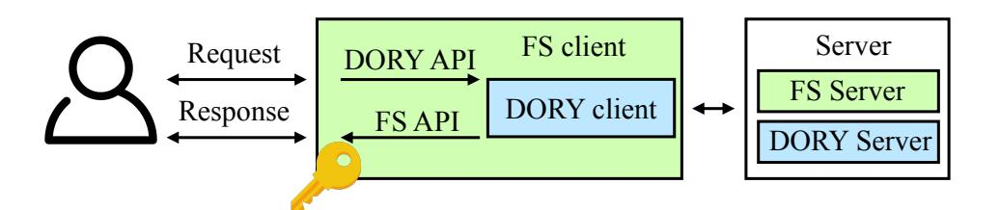

Figure 3: System software architecture. The figure shows the structure of the software rather than the physical system itself, where the server is instantiated across multiple machines.

Users may choose to keep some documents synchronized with the server (i.e., store the most recent version of the document locally) and others not synchronized (i.e., do not store locally and retrieve them from the server only as needed). In either case, the user has already downloaded the most recent version of the document before she sends an update. In the case where two clients try to update the same file simultaneously, these systems often create two versions of a file.

DORY integrates with the filesystem (FS) using the following FS API (depicted in Figure [3\)](#page-4-1):

- getCurrKey(folderID) → *k*: Get the current key associated with the group of files in folderID.
- getDocKey(docID) → *k*: Get the key used in the most recent update for docID.
- getDocIDs(folderID) → docIDs: Get all the document IDs used for the documents in folderID.
- <span id="page-4-0"></span>• getVersion(folderID,docID) → version: Get the current version number associated with a file.

# **3.2 The DORY API**

When a user searches or updates a file,the filesystem client calls the DORY client via DORY's API so that DORY performs the search or incorporates new updates into the search index. We now describe DORY's client API, depicted in Figure [3.](#page-4-1)

When the user updates a document in the underlying filesystem, the user's client also sends an update to the DORY client to maintain the search index, allowing DORY servers to respond to subsequent search queries correctly.

The underlying filesystem already handles key management by giving permitted users access to the folder key(s). DORY leverages this key management mechanism so the permissions of the filesystem naturally extend to DORY: when a user is added to or removed from a folder in the underlying filesystem, she also gains or loses the ability to search in DORY.

We also utilize the fact that to update a document in the underlying filesystem, the user has already downloaded that document (if it is not being added for the first time). We employ the conflict-resolution mechanisms in the underlying filesystem to resolve conflicts in search index updates.

DORY exposes the following API to filesystem clients:

• Update(folderID,docID,prevWords, currWords): Given the folder ID, the document ID of a document in that folder, the previous set of keywords in that document prevWords,

{5}------------------------------------------------

<span id="page-5-0"></span>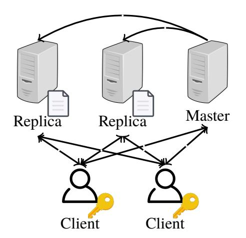

Figure 4: DORY's physical system architecture for a single partition (filesystem server not pictured). Replicas should be deployed in different trust domains, and each holds a copy of the search index.

and the current set of keywords in that document currWords, update the state at the DORY servers.

• Search(folderID, keyword) → docIDs: Given the folder ID to search over and a keyword, find all the documents containing that keyword. DORY has a small (configurable) false positive rate, but DORY has no false negatives.

Updates require the client to upload a small, constant-sized amount of data per file, and searches require the server to perform a linear scan over the search index for a given folder (the cost of search for a user only depends on the number of files that user has access to).

# 3.3 System architecture

Folders in DORY are divided into *partitions*, each of which is managed by a different group of servers. A deployed system may contain many such partitions, and execution across partitions occurs in parallel. The following entities comprise DORY's system architecture for a single partition (Figure 4):

- **Filesystem server:** The underlying filesystem provides the functionality described in §3.1.
- **Replicas:** The  $\ell$  DORY replicas maintain identical copies of the search index and execute search queries. Each replica is deployed in a separate trust domain. In our implementation, we use  $\ell = 2$ .
- Master: The DORY master ensures that the  $\ell$  replicas have the same view of the state and that the clients know the version of this state and which servers to contact. The master can be deployed in any existing trust domain.
- Clients: Multiple clients send requests to the filesystem server and the DORY master and replicas. Each client only needs to store three 128-bit keys (and can optionally cache version numbers received from the master).

To search, the client must interact with  $\ell$  replicas for each partition. The master can be co-located with the filesystem server to ensure that updates to the search system and underlying filesystem occur atomically, although this is not necessary.

## <span id="page-5-1"></span>3.4 Threat model and security properties

We now describe DORY's security properties at a high level, and delegate DORY's formalism (detailing the guarantees)

and proof to §D. In short, we achieve the security goals in §2.2. We discuss security at the level of trust domains, each of which may deploy one or more servers.

Below, we assume that the underlying filesystem is maliciously secure. In particular, we assume that DORY's client can always retrieve the correct version number from the underlying filesystem. Providing such a guarantee (e.g., by detecting rollback and fork attacks in filesystems) is a well-studied line of work [11,62,69,74,81]. If the underlying filesystem only defends against an honest-but-curious attacker, though, DORY also only protects against such an attacker.

Security with one honest trust domain. A malicious attacker that compromises  $\ell-1$  of the  $\ell$  trust domains does not learn any search access patterns. More precisely, such an attacker learns nothing except what is leaked by the underlying filesystem, as well as the timing of individual search requests and the folders they take place over. This security property implies both forward privacy, the privacy of newly added files in the presence of previous queries, and backward privacy, the privacy of deleted files after deletion, as defined by Stefanov et al. [115]. Notably, we do not leak the number of search results; if leaked, this information could open the door to volume-based attacks [101] (parameters that determine result sizes are public).

Security with no honest trust domains. DORY's goal is to hide search access patterns when at least one trust domain is honest. When all trust domains are compromised, we have the modest goal of defaulting to the security of prior schemes leaking search access patterns, instead of readily losing all security by immediately exposing the search index. In this case, the only additional leakage (on top of what the attacker learns if at least one trust domain is honest) is a deterministic identifier for the keyword queried. In the security definition for our cryptographic protocol, we model the attacker as seeing queries only after the point of compromise; in reality, systems retain leakage (e.g. cache state) that increases the amount of information the attacker can access [56].

We formally model the end-to-end security guarantees of DORY for the case where at least one trust domain is honest and the case where no trust domains are honest by defining an ideal functionality  $\mathcal{F}$  that specifies the behavior of an ideal system, capturing the properties discussed above.  $\mathcal{F}$  further captures the fact that the client can verify the integrity of the result. In  $\$ D, we present a formal definition using  $\mathcal{F}$  and prove the following theorem, which captures DORY's security:

**Theorem 1:** Using the definitions in  $\S D.1$ , DORY securely evaluates (with abort) the ideal functionality  $\mathcal{F}$  when instantiated with a secure PRF, a secure aggregate MAC, a secure distributed point function, and a secure filesystem that implements the ideal filesystem functionality.

DORY does not provide availability if any one trust domain refuses to provide service (see §2.4 for how cloud providers are monetarily incentivized to provide availability).

{6}------------------------------------------------

<span id="page-6-3"></span>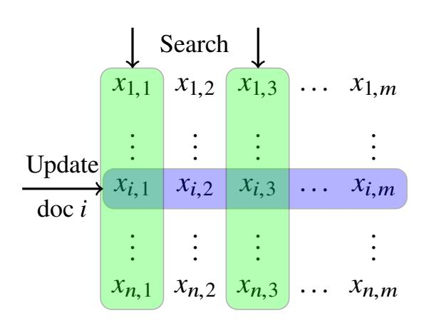

Figure 5: Search index layout for *n* documents with Bloom filters of length *m*. Updates write *rows* and searches retrieve *columns*.

Relationship with underlying filesystem. DORY interfaces with deployed end-to-end encrypted filesystems (§3.1). These, as mentioned, allow the server to learn the ID of the file being accessed (but not its contents). While search itself is protected in DORY, some side effects of the search results are not: If, after seeing the search results, a user decides to open (and retrieve from the filesystem) a file in the results, an attacker could infer that the file matched the search. DORY does not address these side effects, but simply aims to not add any leakage to the overall system during search. These side effects (and leakage due to the filesystem) can be prevented by running DORY on top of an oblivious filesystem.

Extension to oblivious filesystems. Some file storage proposals [10, 26, 57, 90, 91] hide which files are being accessed. These are usually based on oblivious algorithms [118], which have significant overhead and have not yet been deployed. Nevertheless, in §4.5, we discuss how DORY can be used to provide search for an example of such a filesystem design, demonstrating that DORY's techniques do not require the server to know the file ID being updated.

### <span id="page-6-1"></span>4 Search design

We start by describing a basic encrypted search scheme that leaks search access patterns and is only secure against an honest-but-curious attacker in §4.1. We will show how to modify our basic scheme to eliminate search access patterns in §4.2, move from an honest-but-curious to malicious threat model in §4.3, and support dynamic membership in §4.4. We show the pseudocode for the complete search protocol in Appendix A. For simplicity, we only discuss search servers, which we assume are deployed in different trust domains, and ignore the master and filesystem servers in this section.

### <span id="page-6-0"></span>4.1 A strawman search index

In our initial version, clients have access to a single server. For every document, the server stores an encrypted Bloom filter corresponding to the set of keywords in the document. To update the search index for a particular document, the client computes the Bloom filter for the contents of the document and encrypts it using a one time pad unique to that update. We generate the mask for a document using a pseudorandom function (PRF) keyed with a per-folder key and the current

document version number as input. The key management functionality built into the underlying filesystem ensures that every client has a copy of this PRF key.

If there are n documents in the search index and Bloom filters are m bits, then we can think of the server as storing an  $n \times m$  table where each element is a single bit (Figure 5). Each row in the table is a Bloom filter for a document, and the ith row corresponds to the document with ID i. For an update, the client sends a new row that the server inserts into its table. This allows the client to easily modify existing documents and add new ones: the server either replaces an existing row with the new row or appends the new row to the table.

To search for a keyword, the client must find all the documents where the Bloom filter indexes corresponding to that keyword are set to "1". The client can check this by retrieving from the server the *columns* corresponding to the Bloom filter indexes for that keyword. The client can decrypt bit  $b_i$  in a column by computing the mask for row i, extracting the mask bit corresponding to that column  $r_i$ , and then evaluating  $b_i \oplus r_i$ . If the ith entry in each of the decrypted columns is set to "1", then the client marks document i as containing the keyword. In order to prevent the attacker from learning the queried keyword from the requested indexes, we compute the Bloom filter indexes using a PRF keyed with a per-folder key and the keyword as input. This key is managed by the underlying filesystem in the same way that the other PRF key is.

We note that in order for the contents of the client's update to remain hidden from the server, the client must be able to retrieve the correct version number from the underlying filesystem. Without this guarantee, the client could use the same mask twice, leaking information about the update contents. For this reason, we only provide security against a malicious attacker if the underlying filesystem also provides the correct version numbers (discussed in §3.4). This strawman proposal is similar to the one described in [75].

## <span id="page-6-2"></span>4.2 Eliminating search access patterns

To eliminate search access patterns, we need to hide from the server which columns the client is retrieving during a search. To do this, we use a private information retrieval (PIR) protocol [27,28], which allows a client to retrieve an entry in a database from a server (1) without the server learning which entry is being retrieved, and (2) using total communication sublinear in the database size.

**Tool: Distributed Point Functions (DPFs).** One efficient way to implement PIR is using a distributed point function (DPF) [50] (later generalized as function secret sharing [20, 21]), which we identify as particularly well-suited for our setting. DPFs allow a client to split a point function f into function shares such that any strict subset of the shares reveal nothing about f, but when the evaluations at a given point x are combined, the result is f(x).

A DPF is defined by the following algorithms:

{7}------------------------------------------------

- DPF.Gen $(a,b) \to (K_1,...,K_\ell)$ : Generates keys  $K_1,...,K_\ell$  that allow the  $\ell$  servers to jointly evaluate the point function that evaluates to b at input a.
- DPF.Eval( $K_i$ , x)  $\rightarrow y$ : Evaluates the function share corresponding to key  $K_i$  at server i on input x to produce output y.

To evaluate the point function f where f(a) = b on some input x, the client generates keys for all  $\ell$  servers by running DPF.Gen(a,b) and sending  $K_i$  and x to server i for all  $\ell$  servers. Server i then runs DPF.Eval $(K_i,x)$  and returns the result  $y_i$  to the client. The client can then compute  $y_1 \oplus y_2 \cdots \oplus y_\ell$  to reconstruct f(x) = y. We make black-box use of the construction from Boyle et al. where  $\ell = 2$  [21].

**Leveraging DPFs to search.** To hide search access patterns, we switch from having the client interact with a single server to having the client interact with  $\ell$  servers in different trust domains that hold identical copies of the search index. To retrieve column j, the client generates shares of the point function that evaluate to all 1's at column j and all 0's for all other columns. The client then sends a function share to each server. Each server evaluates its function share for each column, ANDing the DPF evaluation with the contents of the column, and sends the XOR of the results back to the client. The client then assembles the responses to recover column j.

Using DPFs to retrieve columns requires a linear scan over the search index for a folder. While this is expensive asymptotically, we only aim to show efficiency for realistic workloads, motivating our decision to compress the search index using Bloom filters.

### <span id="page-7-0"></span>4.3 Protecting against malicious attackers

So far, we have assumed that all servers are honest-but-curious. We now show how to defend against a malicious attacker (namely, an attacker that can deviate from the protocol) that can compromise up to  $\ell-1$  of the  $\ell$  servers. To achieve this, we need to ensure that for a search, the server evaluates the DPF on columns corresponding to the most recent updates sent by the client (not corrupted or old updates).

Strawman: MAC for every bit. We start by showing a strawman that employs MACs, but increases the bandwidth and search latency by roughly a factor of the MAC tag size (typically 256). For each update, the client additionally sends a MAC tag for every bit in the encrypted Bloom filter. The client cannot send a single tag for the row because to search, the client must retrieve individual columns rather than entire rows. We can think of the server as now storing a second table of MAC tags where each entry of this table is the tag for the corresponding entry in the original table (as in Figure 5).

We need to ensure that (1) a tag is only valid for a particular document update (to prevent replay attacks) and that (2) it cannot correspond to a different Bloom filter index. To do this, we compute the MAC over not only the single Bloom

filter bit, but also the document ID, Bloom filter index, and document version number. As with the PRF key, we use the key management functionality in the underlying filesystem to ensure that every client has a copy of the MAC key.

The client now runs the DPF over the columns in both the original table and the MAC tag table. After assembling the responses from all  $\ell$  servers, the client can check that the tag for every bit is correct. However, this increases both the bandwidth and the time to perform the linear scan over the index (i.e., the search latency) by a factor of the tag size. We identify aggregate MACs as a tool to transform this factor from a multiplicative to an additive one.

**Tool: Aggregate MACs.** We leverage aggregate MACs [70] to allow the servers to combine individual MAC tags into a single aggregate MAC tag. Aggregate MACs, analogous to aggregate signatures [17], allow multiple MAC tags computed with possibly different keys on multiple, possibly different messages to be aggregated into a shorter tag that can still be verified using all the keys. Notably, aggregating MAC tags does not require access to the keys.

The Katz-Lindell aggregate MAC construction [70] works as follows. To generate a MAC tag for some message m using a key k, we simply use a pseudorandom function MAC and compute  $t \leftarrow \mathsf{MAC}(k,m)$ . To aggregate MAC tags  $t_1,\ldots,t_n$ , the aggregator computes  $T \leftarrow \bigoplus_{i=1}^n t_i$ . To verify an aggregate MAC tag T using messages  $m_1,\ldots,m_n$  and keys  $k_1,\ldots,k_n$ , the verifier checks  $T \stackrel{?}{=} \bigoplus_{i=1}^n \mathsf{MAC}(k_i,m_i)$ .

**Aggregating MAC tags to improve performance.** To improve performance by a factor of the tag size, we allow the servers to combine individual tags into a single aggregate tag. To search, the server evaluates the DPF on the contents of the column and a single aggregate tag for the entire column.

Aggregating MAC tags also allows us to reduces storage space at the servers. Rather than storing an entire separate MAC table, the servers instead keep an array of aggregate tags, one for each column. On each update, the client XORs the old tag with the new tag (which is why Update takes both prevWords and currWords). By then XORing this value with the aggregate tag, the server can remove the old tag and add the new tag. To ensure that this aggregate MAC tag is maintained correctly, the server must check that the client has the latest version of the document; otherwise it rejects the update.

## <span id="page-7-1"></span>4.4 Supporting dynamic membership

Users might be added to or removed from a folder, requiring the new group to generate a new key. This new key might be in use at the same time that some parts of the search index were generated using an old key in order to support lazy revocation. We let the underlying filesystem handle key management, but we need to ensure that our search protocol supports multiple keys that may be active at the same time.

Decrypting search results is straightforward; to decrypt the

{8}------------------------------------------------

results for an individual document, the client uses the same key from the last update to that document. Aggregating MAC tags is also simple because we can aggregate tags computed with different keys. We can remove old tags and add new tags with different keys using XOR in the same way as before.

## <span id="page-8-1"></span>**4.5 Generalizing to oblivious filesystems**

We briefly discuss how DORY is compatible with a filesystem that hides which document is being accessed within a folder, showing that DORY does not inherently require knowledge of which document is being accessed (see [§C](#page-20-0) for details).

We can build a filesystem that hides document access patterns using PathORAM [\[118\]](#page-18-14), which acts as an oblivious key-value store for each folder. To support multiple users, we keep an encrypted copy of the ORAM client state at the server (discussed in [§7.1](#page-10-1) and [§C\)](#page-20-0). Each ORAM block contains the encrypted contents of a document.

One straightforward way to search over this filesystem would be store an inverted index in ORAM. This would hide which document is being updated, but updates would require an ORAM access for every word in the document.

Instead, we apply DORY to this filesystem. Rather than storing encrypted Bloom filters in a table as in [§4.1,](#page-6-0) we store them in a second PathORAM to hide which document is being updated. We use the same techniques for supporting multiple users as in the underlying filesystem.

To perform an update, the client generates an encrypted Bloom filter as before and needs to insert it into the ORAM index. This creates a new challenge, because ORAM accesses require the client to re-encrypt other ORAM blocks, and standard symmetric key encryption breaks DORY's column alignment. To address this, we keep track of a new value shared among users for each document: the ORAM access number, which is incremented after each ORAM access. Instead of generating PRF masks using the document's version number, we now generate them using the document's ORAM access number, allowing clients to safely re-encrypt Bloom filters.

To execute a search, the client still generates a DPF query for the Bloom filter indexes in question and the server still needs to perform a linear scan over the search index (we must scan over every bit in every Bloom filter). Another challenge arises, because while the order of the scan was obvious when the search index was a table, the order is less obvious for the tree structure of PathORAM. We solve this problem by traversing the tree in a fixed order to generate a table layout. The client can interpret the results by reconstructing the traversal order using the position map stored as part of the ORAM client.

## <span id="page-8-0"></span>**5 Replication across trust domains**

DORY requires that the servers processing search requests operate on the same version of the index in order for the client to receive a valid response; otherwise,the cryptographic shares from the DPF cannot be combined correctly. Because our system processes a mix of update and search requests, the servers need to agree on the index state. The client also needs to know the document version numbers corresponding to the index that the servers used to execute the search; otherwise, the client will be unable to decrypt and verify the result.

Because we are in an adversarial environment, a natural solution is to use a Byzantine fault-tolerant (BFT) consensus algorithm [\[1,](#page-14-3) [16,](#page-15-14) [24,](#page-15-15) [33,](#page-15-16) [76,](#page-17-17) [78\]](#page-17-18) to agree on the ordering of update and search requests. Standard BFT provides the properties we need, but requires 3 *f* +1 servers, each in its own trust domain, to handle *f* failures. A large number of trust domains is expensive to maintain and difficult to deploy, increasing the overall system cost. We make several observations about our setting that allow us to use only *f* +1 trust domains.

**Observations we leverage.** We make three observations that allow us to tailor the problem of consensus to DORY:

*DORY deterministically detects server misbehavior.* Our cryptographic protocol already defends against malicious servers; if a server executes the client's query incorrectly or over an incorrect version of the index, the client will detect this (triggering a manual investigation). This is a significant departure from the Byzantine fault model where failure information is imperfect. By handling server misbehavior at the cryptographic protocol layer, we can use a fail-stop rather than Byzantine failure model at the consensus layer. This and the next observations allow us to use just *f* +1 trust domains to tolerate *f* failures.

*Trust domains provide availability.* To support search, DORY needs all *f* +1 replicas to be available. We need to ensure that servers across multiple trust domains remain online to allow clients to search. Here we leverage the observation that for trust domains deployed in the cloud, the cloud provider is monetarily incentivized to provide availability ([§2.4\)](#page-3-1). This means that if a server in a trust domain fails, either it will eventually come back online or another server will take its place; even if failures occur, *f* +1 servers will be available again at some point in the future.

*DPFs give us replication for free.* The challenge now is to reinitialize the state of these failed servers. The use of DPFs in our cryptographic protocol requires all replicas to have identical copies of the search index. Normally it is unsafe to transfer state between trust domains, as the recipient has no way to verify correctness. However, because the client can check the integrity of the state used to execute a search query, we can safely copy state across trust domains. Because we have *f* +1 servers, at least one server will always remain online to preserve the state of the index.

## **5.1 Algorithm**

A DORY cluster contains the following entities (Figure [6\)](#page-9-0):

{9}------------------------------------------------

<span id="page-9-0"></span>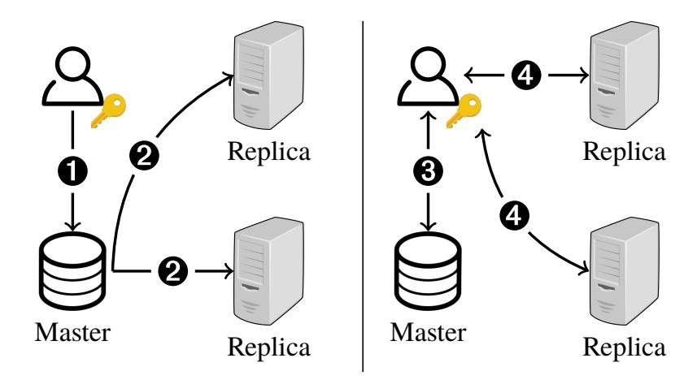

Figure 6: System architecture and protocol flow for updates (left) and searches (right). • Client sends update to master. • Master propagates updates to replicas. • Client requests version number(s) from master. • Client splits search request across replicas.

*Master:* The master receives updates and manages replica state. The master stores the most recent updates and version numbers (both the overall system version number and individual document version numbers), but not the entire search index. The master can be deployed in any trust domain, as clients can detect misbehavior when verifying search results.

*Replicas:* The replicas receive updates from the master and perform searches from the user. The replicas store the most recent versions of the index as well as the version numbers (both the overall system version number and individual document version numbers). We must deploy  $\ell$  replicas in  $\ell$  different trust domains to ensure that the client can split its search request across different trust domains. However, the total number of replicas n may be greater than  $\ell$  in order to improve fault-tolerance.

We additionally use a watchdog service (commonly available in the cloud) that periodically checks that all servers are still online and triggers recovery when it detects a crash.

**Properties.** Our replication algorithm should provide the following properties:

- **Correctness:** If *all* of the replicas and the master fail, a client with the correct set of document version numbers can detect this.
- Fault-tolerance: If at most n-1 of the n replicas fail, then the search index is preserved. If the master fails, then the most recent set of updates can be recovered with help from the client.

We do not guarantee availability if individual trust domains do not provide availability.

**Algorithm.** We now explain how we handle updates and searches and recover from failure (see Figure 6).

Updating a document. To update a document, the client sends the update along with the new document version number to the master. The master needs to send the update to the replicas and increment the version number. Because the master might fail while sending the update to the replicas, the master runs two-phase commit [79] with the replicas to ensure that all the replicas receive the update and associated version number. We

do not need to worry about replica failures during two-phase commit (and so do not need multiple replicas in each trust domain); if a replica fails, the watchdog service will detect this and coordinate recovery as described below.

Searching for a keyword. To search for a keyword, the client first needs to learn the current version numbers from the master (both the overall system version number and the corresponding individual document version numbers). If the client has a relatively recent set of document version numbers, the master can simply send updates for a few of the document version numbers, making the overall bandwidth much smaller than the number of documents. The client then generates a search query for  $\ell$  of the replicas. The replicas execute the search on the version of the index corresponding to the system version number sent by the client.

Coordinating recovery. We rely on the watchdog service to detect failures. If at least  $\ell$  of the replicas across  $\ell$  different trust domains remain online, clients can continue searching. Otherwise, we can start new replicas and transfer the state from a remaining replica to the new replica, even if the replicas are in different trust domains. This will cause a slight delay for clients waiting to search, but is safe due to the underlying cryptographic protocol (as discussed above). We do not need to worry if the master fails, because the master does not respond to the client until it has propagated the update to the replicas. If a replica fails during two-phase commit, the master can roll back the two-phase commit and then start another replica in the same trust domain and copy the state across trust domains.

## 5.2 Batching

Rather than running two-phase commit between the master and replicas for every update, we can apply batching to amortize the cost. Instead of immediately sending an update to the replicas, the master aggregates a batch of updates and, when this batch reaches a certain size or a certain amount of time has elapsed, it runs two-phase commit with the replicas to transfer the current batch of data.

However, now that the master is responding to clients before sending the updates to the replicas, we need to ensure that the master does not lose state when it fails. In particular, the master needs to be able to recover the updates that were waiting to be committed to the replicas. The master does this by comparing the individual document version numbers at the replicas with those at the filesystem server. For each document where the version numbers differ, the master can request an update from the next client to come online with access to that document.

## **6** Implementation

We implemented DORY in  $\sim$ 5,000 lines of C (for the distributed point function and other low-level cryptographic operations) and Go (for the networking and consensus). We used

{10}------------------------------------------------

the OpenSSL library, and our DPF implementation closely follows the one in Express [\[42\]](#page-16-17). We instantiate the PRF using AES. We also implemented the DORY client on an Android Google Pixel 4. In addition to the C code, which we ported to the mobile platform, we wrote ∼1,200 lines of Java. We used the tiny AES library [\[122\]](#page-18-18) to minimize memory usage in our mobile implementation. Our implementation supports a single folder and does not include the watchdog service and coordinated recovery described as part of [§5](#page-8-0) or the generalization to oblivious filesystems described in [§4.5.](#page-8-1) The source code is available at <https://github.com/ucbrise/dory> (see Appendix [E](#page-25-0) for details).

# **6.1 Parallelism**

The linear scan over the search index can be easily parallelized across both cores and servers because it carries no state from document to document.

**Thread-level parallelism.** Since we evaluate the DPF on each column of the search index, we parallelize the scan operation by simply assigning each thread a number of columns and then combining the results computed by each thread.

**Server-level parallelism.** We can partition the search index by having different pairs of replicas maintain different parts of the search index. The client then sends a search query to all pairs of replicas and simply computes the union of the results. Replica partitioning improves latency since each replica now only needs to search over a part of the index instead of the full index. Each pair of replicas can store part of the search index for many folders, making it possible to keep search latency low, but the overall throughput high.

# **6.2 Fast PRF evaluation**

In order to decrypt the search result received from the server, the client must compute a mask for each individual document. To reduce the number of PRF evaluations to decrypt, we group Bloom filter indexes for the same keyword in the same 128-bit block. This grouping allows the client to decrypt the search results for one document using a single PRF evaluation. This does not significantly impact the false positive rate of the Bloom filter because we can now model a *m*-bit Bloom filter storing w words as *m*/128 independent Bloom filters each storing 128w/*m* words.

## <span id="page-10-0"></span>**7 Evaluation**

We evaluated DORY to determine (1) how it performs in comparison to existing techniques and (2) whether it meets the requirements outlined by the companies we surveyed. We consider the following metrics: latency ([§7.2\)](#page-11-0), throughput ([§7.3\)](#page-12-0), storage ([§7.4\)](#page-12-1), bandwidth ([§7.5\)](#page-13-1), and cost ([§7.6\)](#page-13-2). We compare DORY's performance to two different variations of DORY as well as plaintext search and a baseline built on ORAM ([§7.1\)](#page-10-1) that provides similar guarantees to those of DORY. We show that DORY meets the requirements outlined by the companies we surveyed and outperforms (in some cases, by orders of magnitude) our ORAM baseline ([§7.1\)](#page-10-1).

**Experimental setup.** We evaluate DORY on AWS using r5n.4xlarge instances with 128GB of memory and 16 CPUs for the replicas and the master. We use a c5.large client with 4GB of memory and 2 CPUs to model a user's desktop machine. We use an Android Pixel 4 to measure the time to search on a mobile client. We place the two trust domains in different regions (east-1 and east-2) to ensure that machines are in different clusters to model different organizations, although in practice these clusters would likely be geographically close to maximize performance. All communication occurs over TLS. We run experiments for a single folder; a real system would maintain many such folders in parallel.

**System parameters from Enron email dataset.** We use the Enron email dataset, which is commonly used to evaluate searchable encryption schemes [\[22,](#page-15-3) [64,](#page-16-3) [83,](#page-17-6) [93,](#page-17-4) [95,](#page-18-15) [96,](#page-18-7) [128\]](#page-19-0) to set Bloom filter sizes for DORY. We leverage the same standard keyword extraction techniques used in Oblix [\[93\]](#page-17-4): we stemmed the words and removed stopwords and words that were > <sup>20</sup> or < <sup>4</sup> characters long or contained non-alphabetic characters. In the over 500K emails, each email has an average of 73.18 keywords with a standard deviation of 114.89.

Regarding the configuration of the Bloom filters, each keyword hashes to 7 locations in the Bloom filter, as we found that it provided a reasonable tradeoff between the time to perform the linear scan at the server and bandwidth. We choose the Bloom filter size based on the number of documents in a folder so that, for every search in that folder, the search results have less than one false positive document in expectation. The sizes of the Bloom filters are specified in Table [7a.](#page-11-1)

# <span id="page-10-1"></span>**7.1 Baselines**

We evaluate DORY in comparison to four baselines:

- **ORAM baseline**: Eliminates search access patterns using ORAM (expected to incur a significant overhead). With this baseline, we show how DORY compares to a solution that provides comparable security guarantees.
- **Plaintext search**: Searches over a plaintext inverted index and does not provide any security guarantees (expected to have much lower overhead than DORY).
- **Semihonest DORY**: Modifies the DORY protocol to only provide security against semihonest adversaries (expected to have lower overhead than DORY).
- **Leaky DORY**: Modifies the DORY protocol to allow search access pattern leakage by using only one trust domain and querying the replica directly for the indexes corresponding to a keyword rather than using a DPF (expected to have lower overhead than DORY).

{11}------------------------------------------------

<span id="page-11-1"></span>Table 7: On the left, Bloom filter sizes (in bytes) necessary for > <sup>1</sup> expected false positive assuming an average of 73.18 keywords per document where each keyword hashes to 7 Bloom filter indexes (Table [7a\)](#page-11-1). On the right, breakdown of search latency without parallelism and end-to-end search latency with parallelism where *p* is the degree of server parallelism (Table [7b\)](#page-11-1).

|           |         | Docs    | Time breakdown, p=1 (ms) | End-to-end latency (ms) |         |         |         |         |        |
|-----------|---------|---------|--------------------------|-------------------------|---------|---------|---------|---------|--------|
| Docs      | BF size |         | Consensus                | Client                  | Network | Server  | p=1     | p=2     | p=4    |
| 10<br>≤ 2 | 140 B   | 10<br>2 | 0.73                     | 0.54                    | 58.67   | 2.68    | 62.62   | 61.81   | 61.51  |
| 11<br>≤ 2 | 160 B   | 11<br>2 | 0.73                     | 0.87                    | 58.41   | 4.11    | 64.12   | 62.39   | 61.89  |
| 12<br>≤ 2 | 180 B   | 12<br>2 | 0.73                     | 1.52                    | 57.99   | 7.09    | 67.33   | 64.46   | 62.92  |
| 13<br>≤ 2 | 200 B   | 13<br>2 | 0.73                     | 2.80                    | 58.74   | 12.03   | 74.30   | 68.08   | 64.78  |
| 14<br>≤ 2 | 225 B   | 14<br>2 | 0.75                     | 5.30                    | 77.88   | 26.24   | 110.17  | 75.76   | 68.59  |
| 15<br>≤ 2 | 250 B   | 15<br>2 | 0.76                     | 10.18                   | 80.59   | 50.97   | 142.50  | 112.71  | 76.76  |
| 16<br>≤ 2 | 280 B   | 16<br>2 | 0.81                     | 19.83                   | 100.67  | 108.78  | 230.09  | 147.39  | 115.50 |
| 17<br>≤ 2 | 315 B   | 17<br>2 | 0.86                     | 38.99                   | 119.38  | 240.45  | 399.48  | 243.43  | 153.56 |
| 18<br>≤ 2 | 350 B   | 18<br>2 | 1.19                     | 76.92                   | 142.28  | 527.67  | 748.06  | 428.40  | 256.15 |
| 19<br>≤ 2 | 390 B   | 19<br>2 | 1.78                     | 154.37                  | 151.98  | 1172.46 | 1480.59 | 800.98  | 454.52 |
| 20<br>≤ 2 | 435 B   | 20<br>2 | 2.81                     | 306.34                  | 148.96  | 2602.83 | 3060.94 | 1636.80 | 862.42 |

(a) (b)

Semihonest DORY illustrates the overhead of the MAC checks necessary to defend against malicious adversaries, and leaky DORY illustrates the overhead of the DPF queries. In all of the baselines except the ORAM baseline, we use the same consensus system as in DORY, although for the baselines where there is only one trust domain (leaky DORY and plaintext search), the master only needs to send update batches to a single trust domain (we model this by placing all servers in the same AWS region). Only the ORAM baseline has security guarantees comparable to those of DORY.

**ORAM baseline.** Many academic works [\[60,](#page-16-5) [64,](#page-16-3) [95,](#page-18-15) [115\]](#page-18-10) point to an inverted index in ORAM [\[53,](#page-16-4)[98\]](#page-18-13) as a way to achieve searchable encryption without search access pattern leakage, making it a natural baseline for searching within a folder. Traditional ORAM is designed for a single client and requires the client to maintain ORAM client state hidden from the server [\[118\]](#page-18-14). A separate line of work explores extending singleuser constructions to multi-user settings [\[10,](#page-14-2) [26,](#page-15-12) [57,](#page-16-16) [90–](#page-17-14)[92\]](#page-17-20). Mayberry et al.'s system [\[92\]](#page-17-20) is particularly fit for our setting as it protects mutually trusting clients (clients with access to a given folder) from a malicious server. For a semi-honest server or for a malicious server for which we have a mechanism to verify the data returned (discussed in [§3.4\)](#page-5-1), their protocol uses a single-user ORAM and requires clients to store the encrypted ORAM client at the server. To perform an operation, the client acquires a lock at the server, downloads and decrypts the ORAM client state, performs the operation, encrypts and sends back the state, releasing the lock.

*Client failures.* We observed that the above proposal did not consider client failures. If a client fails after issuing operations at the server but before uploading the updated client ORAM state, the next client's access may leak search access patterns (e.g. if it searched for the same word as the previous client). To handle client failures, we require each client to record a client "prepare" operation at the server, and if it fails before completing, the next client can finish the operation.

*Eliminating frequency leakage.* Popular keywords require multiple ORAM blocks to store all the document identifiers containing that keyword. We need to ensure that the number of blocks accessed doesn't leak the frequency of a keyword due to known attacks [\[101\]](#page-18-11), as DORY does not leak this frequency. For each search, we fetch the maximum number of blocks a keyword maps to. Similarly for each keyword we update in a document, we fetch the maximum number of blocks a keyword maps to and write back a single block.

*Implementation.* We implemented our baseline on top of an existing open-source PathORAM implementation in Go [\[100\]](#page-18-19).

**Evaluation on Enron email dataset.** While DORY's performance relies only on the system parameters and not the contents of the documents themselves, the performance of both our ORAM and plaintext search baselines depends on document contents. We evaluate these baselines using subsets of the Enron email dataset with the same keyword extraction techniques described above. To evaluate different numbers of documents, we take different-sized subsets of the Enron email dataset. We treat updates as adding an entire email to the index. Because the Enron email dataset only has ∼ 528K emails, we do not measure the ORAM and plaintext search baseline beyond that number of documents.

## <span id="page-11-0"></span>**7.2 Latency**

**Update latency.** Figure [8](#page-12-2) shows that the update latency of DORY is orders of magnitude faster than that of the ORAM baseline. This holds for both the desktop and mobile clients (Figure [9\)](#page-12-3). The baseline requires a number of ORAM accesses (each of which necessitates a round trip) linear in the number of document keywords. In contrast, DORY simply uploads a single encrypted Bloom filter. Update latency determines (1) how long it takes for updates to be reflected in search results and (2) how long the client must remain online. Neither is a concern in DORY where updates are processed in less than 1ms, but the ORAM baseline requires clients to remain online for hours. Note that semihonest DORY has a faster update time than DORY because the client does not have to generate a MAC for every bit in the Bloom filter.

**Search latency.** Table [7b](#page-11-1) shows the breakdown in search latency. As the number of documents increases, the majority

{12}------------------------------------------------

<span id="page-12-2"></span>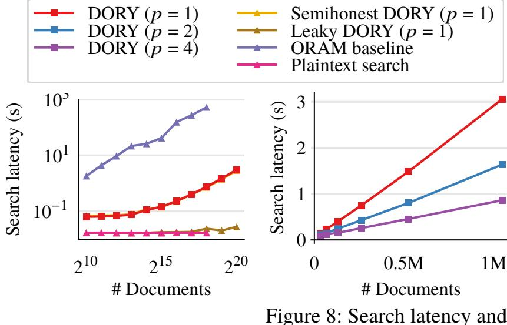

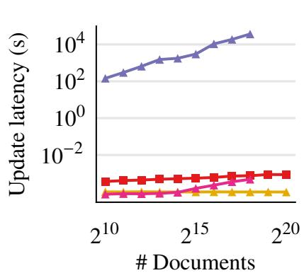

Figure 8: Search latency and update latency. The two figures on the left use a logarithmic scale on both axes, and the figure on the top right uses a linear scale on both axes (*p* denotes server parallelism). The update latency of leaky DORY exactly matches that of DORY, and the search latency of semihonest DORY is slightly less than that of DORY.

<span id="page-12-3"></span>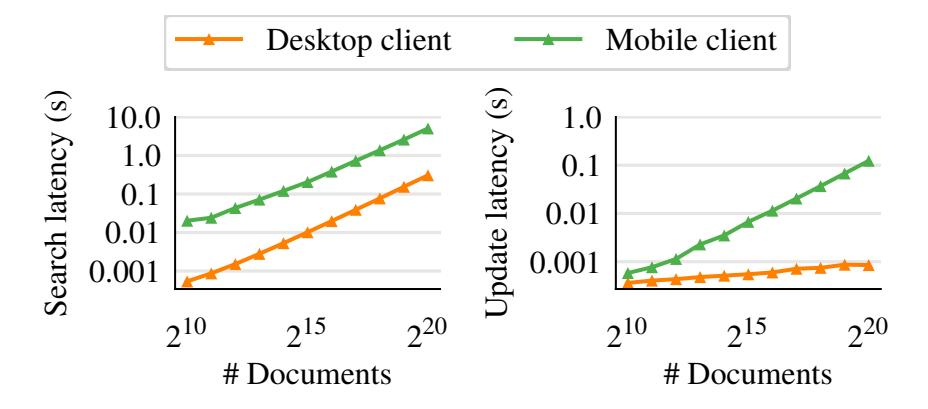

Figure 9: Latency for mobile client and desktop client. Both plots use a logarithmic scale on both axes.

of time is spent performing the linear scan at the server. This is apparent in Figure 8, where leaky DORY's search latency is significantly lower than that of DORY and stays relatively constant as the number of documents increases due to the fact that leaky DORY does not need to perform a linear scan.

Despite overheads incurred due to the linear scan, DORY is orders of magnitude faster than the ORAM baseline. The MAC overhead to protect against malicious adversaries is barely noticeable, as semihonest DORY and DORY have almost identical search latencies. Mobile clients incur additional overhead in comparison to desktop clients (the mobile client spends 5 seconds on client-side processing for 1M documents). This overhead is below 1 second for 2<sup>17</sup> documents (Figure 9).

<span id="page-12-0"></span>By increasing the degree of parallelism p and partitioning the search index across replica groups, we can reduce the server time by roughly a factor of p, as this time is linear in the number of documents (Figure 8). Parallelism allows us to reach the target latency set by the companies (Table 2).

<span id="page-12-4"></span>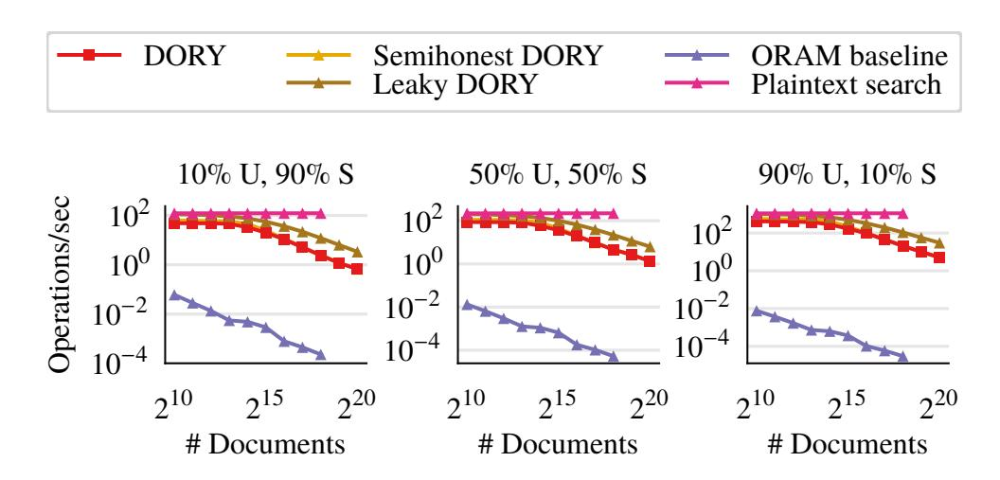

Figure 10: Throughput under a variety of workloads (U indicates updates, S indicates searches). The performance of semihonest DORY closely matches that of DORY. All plots use a logarithmic scale on both axes.

<span id="page-12-5"></span>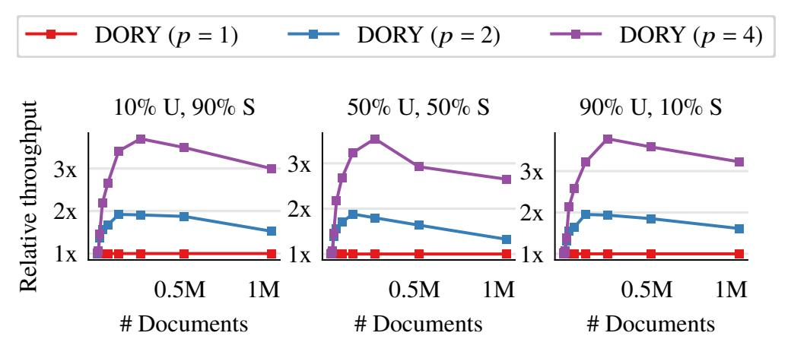

Figure 11: Effect of parallelism (*p* denotes the degree of parallelism) on throughput for different workloads (U indicates updates, S indicates searches).

## 7.3 Throughput

DORY achieves significantly higher throughput than the ORAM baseline (Figure 10). Parallelism improves DORY's throughput by roughly a factor of p for larger numbers of documents (Figure 11). Relative to other workloads, DORY performs best under update-heavy workloads (updates require an insertion while searches require a linear scan), and the ORAM baseline performs best under search-heavy workloads (searches require fewer ORAM accesses than updates).

## <span id="page-12-1"></span>7.4 Storage

Server state. Figure 12 shows how DORY uses substantially less storage space at the server than the ORAM baseline and storage space comparable to that of a plaintext inverted index. DORY's index continues to grow at a constant rate for large numbers of documents while the index for plaintext search grows more slowly, making the plaintext search index smaller than the DORY search index for larger numbers of documents.

Client state. DORY only requires that the client store three 128-bit keys. To generate an update or decrypt a search result, the client also needs to know the version number for each document. To minimize bandwidth, the client can optionally cache the latest version numbers so that it only needs to retrieve the version numbers that changed. For 45K documents (the highest average number of documents per user among the

{13}------------------------------------------------

companies we surveyed), storing these version numbers would require 175.8KB. For 1M documents, storing these would require 3.84MB. Our ORAM baseline only requires the client to store a single 128-bit AES key to encrypt and decrypt the ORAM client, and plaintext search requires no client storage.

# <span id="page-13-1"></span>**7.5 Bandwidth**

Search and update bandwidth is also much smaller in DORY than in the ORAM baseline (Figure [12\)](#page-13-3). The ORAM baseline incurs a significant overhead by sending the encrypted client state, but ORAM accesses are responsible for the majority of the communication. In contrast,the search bandwidthin DORY is linear in the number of documents, and the update bandwidth depends on the size of the Bloom filter. MACs are responsible for a significant part of the update bandwidth in DORY, which is why semihonest DORY has much lower update bandwidth. The difference in search bandwidth between leaky DORY and DORY is due to the size of the DPF keys; however, unlike plaintext search, the search bandwidth for both is still linear in the number of documents. We do not include the bandwidth to retrieve version numbers for individual document numbers in DORY, as these version numbers can for the most part be cached at the client as described above.

**Comparison to client index.** To evaluate the practicality of a client-side index instead of DORY, we built an inverted index over the Enron email dataset using a B+ tree. We found that the index is 159.9MB and while it is feasible to store this amount of data, even on a mobile device, synchronization requires significant bandwidth. One way to keep this data structure updated would be to require each client to download the contents of every update. However, this solution requires the same amount of bandwidth as syncing all the files locally, which we were trying to avoid in the first place. Instead, we could keep an encrypted copy of the client index at the server. Which part of the index is updated leaks information about the document contents, and so whenever a client performs an update, it must encrypt the entire index and send it to the server. Before a client updates or searches, it must download the most recent copy of the search index. This results in roughly a 365× increase in search bandwidth and a <sup>3</sup>,334<sup>×</sup> increase in update bandwidth in comparison to DORY.

# <span id="page-13-2"></span>**7.6 Cost**

The companies we surveyed estimated a workload with 50% updates and 50% searches, and the highest average number of documents per user reported was 45K. The throughput of two replicas and a master operating on a folder of 45K documents under this workload is 19.5 operations/second. One of the companies reported that active users make roughly 50 updates per day, and so based on 100 operations per day and the cost to run a single r5n.4xlarge instance (\$1.192/hour), each user costs roughly \$0.0509 per month, well under the maximum

<span id="page-13-3"></span>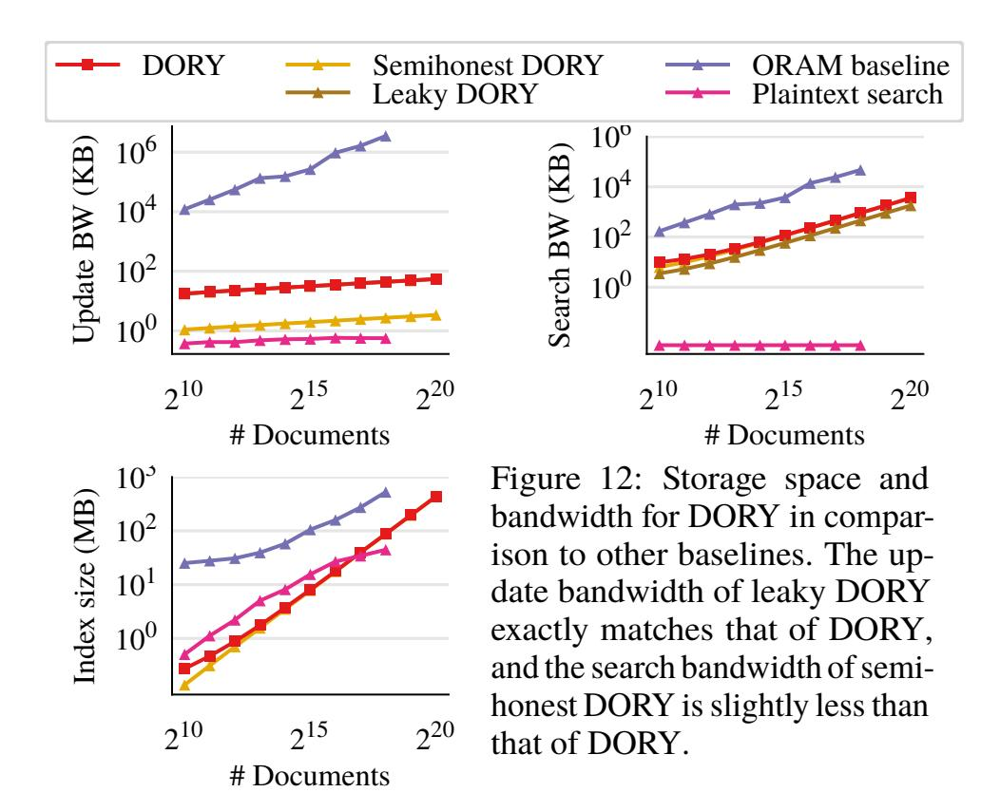

permissible cost per user per month of \$0.70-\$5.54 reported by the companies. Depending on the way in which trust is distributed (see [§2.4\)](#page-3-1), trust domains may incur additional setup and maintenance costs not captured by our calculation.

## <span id="page-13-0"></span>**8 Related Work**

**Symmetric Searchable Encryption (SSE).** A long line of work has examined the problem of Symmetric Searchable Encryption (SSE) [\[23,](#page-15-0)[25,](#page-15-1)[35](#page-15-2)[–39,](#page-16-0)[49,](#page-16-1)[51,](#page-16-2)[66,](#page-17-2)[67,](#page-17-3)[96,](#page-18-7)[110,](#page-18-8)[113,](#page-18-9)[115\]](#page-18-10), summarized in the following surveys [\[18,](#page-15-17) [58,](#page-16-18) [102\]](#page-18-20). Many of these schemes assume a single user and do not support efficient revocation, but more importantly, they permit some search access pattern leakage, opening the door to attacks [\[22](#page-15-3)[,64,](#page-16-3)[71,](#page-17-5)[83,](#page-17-6)[101,](#page-18-11)[105,](#page-18-12)[128\]](#page-19-0). SEAL [\[38\]](#page-15-18) explicitly allows developers to tradeoff between leakage and performance.

**Multi-server SSE and ORAM.** Some SSE schemes use multiple servers to improve efficiency but still permit leakage, with some providing richer functionality than simple keyword search [\[15,](#page-15-4) [44,](#page-16-6) [63,](#page-16-8) [77,](#page-17-21) [99,](#page-18-21) [107\]](#page-18-16). Bösch et al. [\[19\]](#page-15-5) and Hoang et al. [\[61\]](#page-16-7) use multiple servers to hide search access patterns and improve efficiency. Hoang et al. [\[61\]](#page-16-7) use a similar table layout where updates and searches correspond to different dimensions in the table. However, both schemes do not support multiple users, assume honest-but-curious servers, and require expensive updates to hide the document being updated. Our scheme also has similarities to distributed ORAM schemes that leverage multiple servers to hide access patterns with improved efficiency [\[3,](#page-14-4) [41,](#page-16-19) [54,](#page-16-20) [88,](#page-17-22) [116\]](#page-18-22). Implementing search with one of these schemes would still require clients to perform an ORAM access for every document keyword during an update.

**Multi-user SSE and ORAM.** Many existing multi-user searchable encryption schemes that support fast revocation use a different key for each user and leverage proxy encryption [\[8,](#page-14-5)[13\]](#page-15-19) or pairings [\[13,](#page-15-19)[73,](#page-17-23)[103,](#page-18-23)[121\]](#page-18-24). This class of schemes use deterministic query encryption algorithms that leak search

{14}------------------------------------------------

access patterns. The most efficient ORAM constructions assume a single user, with multi-user ORAMs incurring a much larger overhead by leveraging expensive tools such as multiparty computation (MPC) [\[10,](#page-14-2) [26,](#page-15-12) [57,](#page-16-16) [90,](#page-17-14) [91\]](#page-17-15).

**SSE and ORAM with trusted hardware.** One way to improve performance and,in the case of search, potentially reduce leakage is by leveraging trusted hardware. ZeroTrace [\[112\]](#page-18-25), Obliviate [\[5\]](#page-14-6), ObliDB [\[43\]](#page-16-21), GhostRider [\[82\]](#page-17-24), Tiny ORAM [\[45\]](#page-16-22), and Shroud [\[86\]](#page-17-25) combine oblivious techniques with trusted hardware. HardIDX [\[48\]](#page-16-23), Oblix [\[93\]](#page-17-4), POSUP [\[59\]](#page-16-24), and Amjad et al. [\[6\]](#page-14-7) use trusted hardware specifically for the problem of searching on encrypted data. Unlike DORY, such solutions only require a single server, but they necessitate both additional trust assumptions (due to known side-channel attacks) and additional deployment costs.

**Prior use of DPFs in systems.** Splinter [\[124\]](#page-19-4) uses function secret sharing (both DPFs and range queries) to allow users to efficiently make private queries on a public, immutable database. DURASIFT [\[44\]](#page-16-6) uses DPFs with MPC across multiple servers to support boolean expressions of keyword searches for multiple users without leaking search access patterns. However, its techniques incur significant overhead in comparison to ours, and the authors consider thousands rather than millions of documents. Floram [\[41\]](#page-16-19) uses DPFs to implement a distributed-trust ORAM that has linear costs but fast concrete performance. Metadata-hiding communication also benefits from DPFs (e.g. Riposte [\[32\]](#page-15-20) and Express [\[42\]](#page-16-17)).

**BFT consensus and fault-tolerance.** BFT consensus [\[1,](#page-14-3) [16,](#page-15-14) [24,](#page-15-15)[33](#page-15-16)[,76\]](#page-17-17) is a classical problem. Prior work has explored reducing the number of participants in BFT consensus by separating agreement from execution [\[126\]](#page-19-5), only activating some nodes when failures are detected [\[40,](#page-16-25)[68,](#page-17-26)[125\]](#page-19-6), relaxing synchrony assumptions [\[2,](#page-14-8)[84,](#page-17-27)[104\]](#page-18-26), adopting a hybrid fault model [\[104\]](#page-18-26), and using an attested, append-only log [\[29\]](#page-15-21). A separate line of theoretical work considers Byzantine fault-tolerance specifically for the case of private information retrieval [\[12,](#page-15-22) [14,](#page-15-23) [46,](#page-16-26) [119\]](#page-18-27) using information-theoretic tools.

**Oblivious systems.** ObliviStore [\[117\]](#page-18-28), Obladi [\[34\]](#page-15-24), Opaque [\[129\]](#page-19-7), Cipherbase [\[7\]](#page-14-9), and Taostore [\[111\]](#page-18-29) are practical systems for obliviously storing and querying data (not necessarily for the problem of searchable encryption).

# **9 Conclusion**

DORY is an encrypted search system that distributes trust to meet real-world efficiency and security requirements. By reexamining the system model, we are able to build a system that is performant without leaking search access patterns.

**Acknowledgments.** We would like to thank Zoë Bohn, Henry Corrigan-Gibbs, Ioannis Demertzis, Saba Eskandarian, Vivian Fang, David Mazières, Rishabh Poddar, and Wenting Zheng for providing feedback on early drafts. We also thank the leadership of Keybase, PreVeil, SpiderOak, Sync, and Tresorit for generously taking the time to meet with us and discuss their use cases. We thank the OSDI anonymous reviewers for their detailed feedback, and our shepherd Andreas Haeberlen for his working reviewing our camera-ready. This work was supported in part by the NSF CISE Expeditions Award CCF-1730628, and gifts from the Sloan Foundation, Bakar Program, Alibaba, Amazon Web Services, Ant Financial, Capital One, Ericsson, Facebook, Futurewei, Google, Intel, Microsoft, Nvidia, Scotiabank, Splunk, and VMware. This work was also supported by a NSF GRFP fellowship.

# **References**

- <span id="page-14-3"></span>[1] M. Abd-El-Malek, G. R. Ganger, G. R. Goodson, M. K. Reiter, and J. J. Wylie. Fault-scalable byzantine faulttolerant services. *SOSP*, 39(5):59–74, 2005.
- <span id="page-14-8"></span>[2] I. Abraham, S. Devadas, D. Dolev, K. Nayak, and L. Ren. Efficient synchronous byzantine consensus. *arXiv preprint arXiv:1704.02397*, 2017.
- <span id="page-14-4"></span>[3] I. Abraham, C. W. Fletcher, K. Nayak, B. Pinkas, and L. Ren. Asymptotically tight bounds for composing ORAM with PIR. In *PKC*, pages 91–120. Springer, 2017.
- <span id="page-14-1"></span>[4] S. Ackerman. Lavabit email service abruptly shut down citing government interference, 2013. [https:](https://www.theguardian.com/technology/2013/aug/08/lavabit-email-shut-down-edward-snowden) [//www.theguardian.com/technology/2013/aug/](https://www.theguardian.com/technology/2013/aug/08/lavabit-email-shut-down-edward-snowden) [08/lavabit-email-shut-down-edward-snowden](https://www.theguardian.com/technology/2013/aug/08/lavabit-email-shut-down-edward-snowden).
- <span id="page-14-6"></span>[5] A. Ahmad, K. Kim,M. I. Sarfaraz, and B. Lee. OBLIVI-ATE: A Data Oblivious Filesystem for Intel SGX. In *NDSS*, 2018.
- <span id="page-14-7"></span>[6] G. Amjad, S. Kamara, and T. Moataz. Forward and backward private searchable encryption with SGX. In *Proceedings of the 12th European Workshop on Systems Security*, pages 1–6, 2019.
- <span id="page-14-9"></span>[7] A. Arasu, S. Blanas, K. Eguro, R. Kaushik, D. Kossmann, R. Ramamurthy, and R. Venkatesan. Orthogonal security with cipherbase. In *CIDR*, 2013.
- <span id="page-14-5"></span>[8] M. R. Asghar, G. Russello, B. Crispo, and M. Ion. Supporting complex queries and access policies for multiuser encrypted databases. In *Workshop on Cloud computing security workshop*, pages 77–88. ACM, 2013.
- <span id="page-14-0"></span>[9] M. Backes, C. Cachin, and A. Oprea. Secure keyupdating for lazy revocation. In *ESORICS*, pages 327– 346. Springer, 2006.
- <span id="page-14-2"></span>[10] M. Backes, A. Herzberg, A. Kate, and I. Pryvalov. Anonymous ram. In *ESORICS*, pages 344–362. Springer, 2016.

{15}------------------------------------------------

- <span id="page-15-11"></span>[11] M. Bailleu, J. Thalheim, P. Bhatotia, C. Fetzer, M. Honda, and K. Vaswani. {SPEICHER}: Securing lsm-based key-value stores using shielded execution. In *FAST*, pages 173–190, 2019.
- <span id="page-15-22"></span>[12] K. Banawan and S. Ulukus. The capacity of private information retrieval from byzantine and colluding databases. *IEEE Transactions on Information Theory*, 65(2):1206–1219, 2018.
- <span id="page-15-19"></span>[13] F. Bao, R. H. Deng, X. Ding, and Y. Yang. Private query on encrypted data in multi-user settings. In *Information Security Practice and Experience*, pages 71–85. Springer, 2008.
- <span id="page-15-23"></span>[14] A. Beimel and Y. Stahl. Robust information-theoretic private information retrieval. In *International Conference on Security in Communication Networks*, pages 326–341. Springer, 2002.
- <span id="page-15-4"></span>[15] S. M. Bellovin and W. R. Cheswick. Privacy-enhanced searches using encrypted bloom filters. *IACR Cryptology ePrint Archive*, 2007.
- <span id="page-15-14"></span>[16] A. Bessani, J. Sousa, and E. E. Alchieri. State machine replication for the masses with BFT-SMaRt. In *2014 44th Annual IEEE/IFIP International Conference on Dependable Systems and Networks*, pages 355–362. IEEE, 2014.
- <span id="page-15-13"></span>[17] D. Boneh, C. Gentry, B. Lynn, and H. Shacham. Aggregate and verifiably encrypted signatures from bilinear maps. In *EUROCRYPT*, pages 416–432. Springer, 2003.
- <span id="page-15-17"></span>[18] C. Bösch, P. Hartel, W. Jonker, and A. Peter. A survey of provably secure searchable encryption. *ACM Computing Surveys (CSUR)*, 47(2):1–51, 2014.
- <span id="page-15-5"></span>[19] C. Bösch, A. Peter, B. Leenders, H. W. Lim, Q. Tang, H. Wang, P. Hartel, and W. Jonker. Distributed searchable symmetric encryption. In *PST*, pages 330–337. IEEE, 2014.
- <span id="page-15-6"></span>[20] E. Boyle, N. Gilboa, and Y. Ishai. Function secret sharing. In *EUROCRYPT*, pages 337–367. Springer, 2015.
- <span id="page-15-7"></span>[21] E. Boyle, N. Gilboa, and Y. Ishai. Function secret sharing: Improvements and extensions. In *CCS*, pages 1292–1303. ACM, 2016.
- <span id="page-15-3"></span>[22] D. Cash, P. Grubbs, J. Perry, and T. Ristenpart. Leakageabuse attacks against searchable encryption. In *CCS*, pages 668–679. ACM, 2015.
- <span id="page-15-0"></span>[23] D. Cash, J. Jaeger, S. Jarecki, C. S. Jutla, H. Krawczyk, M.-C. Rosu, and M. Steiner. Dynamic searchable encryption in very-large databases: data structures and implementation. In *NDSS*, volume 14, pages 23–26. Citeseer, 2014.

- <span id="page-15-15"></span>[24] M. Castro, B. Liskov, et al. Practical byzantine fault tolerance. In *OSDI*, volume 99, pages 173–186, 1999.
- <span id="page-15-1"></span>[25] Y.-C. Chang and M. Mitzenmacher. Privacy preserving keyword searches on remote encrypted data. In *ASIACRYPT*, pages 442–455. Springer, 2005.
- <span id="page-15-12"></span>[26] W. Chen and R. A. Popa. Metal: A metadata-hiding file sharing system. In *NDSS*, 2020.
- <span id="page-15-8"></span>[27] B. Chor, O. Goldreich, E. Kushilevitz, and M. Sudan. Private information retrieval. In *FOCS*, pages 41–50. IEEE, 1995.
- <span id="page-15-9"></span>[28] B. Chor, O. Goldreich, E. Kushilevitz, and M. Sudan. Private information retrieval. *Journal of the ACM*, 45(6):965–982, 1998.
- <span id="page-15-21"></span>[29] B.-G. Chun, P. Maniatis, S. Shenker, and J. Kubiatowicz. Attested append-only memory: Making adversaries stick to their word. *ACM SIGOPS Operating Systems Review*, 41(6):189–204, 2007.
- <span id="page-15-25"></span>[30] W. Cohen. Enron email dataset, 2015. [http://www.](http://www.cs.cmu.edu/~enron/) [cs.cmu.edu/~enron/](http://www.cs.cmu.edu/~enron/).
- <span id="page-15-10"></span>[31] H. Corrigan-Gibbs and D. Boneh. Prio: Private, robust, and scalable computation of aggregate statistics. In *NSDI*, pages 259–282, 2017.
- <span id="page-15-20"></span>[32] H. Corrigan-Gibbs, D. Boneh, and D. Mazières. Riposte: An anonymous messaging system handling millions of users. In *Security & Privacy*, pages 321–338. IEEE, 2015.
- <span id="page-15-16"></span>[33] J. Cowling, D. Myers, B. Liskov, R. Rodrigues, and L. Shrira. HQ replication: A hybrid quorum protocol for byzantine fault tolerance. In *OSDI*, pages 177–190, 2006.
- <span id="page-15-24"></span>[34] N. Crooks, M. Burke, E. Cecchetti, S. Harel, R. Agarwal, and L. Alvisi. Obladi: Oblivious serializable transactions in the cloud. In *OSDI*, pages 727–743, 2018.
- <span id="page-15-2"></span>[35] R. Curtmola, J. Garay, S. Kamara, and R. Ostrovsky. Searchable symmetric encryption: improved definitions and efficient constructions. *Journal of Computer Security*, 19(5):895–934, 2011.
- [36] I. Demertzis, J. G. Chamani, D. Papadopoulos, and C. Papamanthou. Dynamic searchable encryption with small client storage. In *NDSS*, 2020.
- [37] I. Demertzis, D. Papadopoulos, and C. Papamanthou. Searchable encryption with optimal locality: Achieving sublogarithmic read efficiency. In *CRYPTO*, 2018.
- <span id="page-15-18"></span>[38] I. Demertzis, D. Papadopoulos, C. Papamanthou, and S. Shintre. SEAL: Attack mitigation for encrypted databases via adjustable leakage. In *USENIX Security*, 2020.

{16}------------------------------------------------

- <span id="page-16-0"></span>[39] I. Demertzis and C. Papamanthou. Fast searchable encryption with tunable locality. In *SIGMOD*, 2017.
- <span id="page-16-25"></span>[40] T. Distler, C. Cachin, and R. Kapitza. Resource-efficient byzantine fault tolerance. *IEEE transactions on computers*, 65(9):2807–2819, 2015.
- <span id="page-16-19"></span>[41] J. Doerner and A. Shelat. Scaling oram for secure computation. In *CCS*, pages 523–535. ACM, 2017.
- <span id="page-16-17"></span>[42] S. Eskandarian, H. Corrigan-Gibbs, M. Zaharia, and D. Boneh. Express: Lowering the cost of metadatahiding communication with cryptographic privacy. *arXiv preprint arXiv:1911.09215*, 2019.
- <span id="page-16-21"></span>[43] S. Eskandarian and M. Zaharia. ObliDB: oblivious query processing for secure databases. *VLDB*, 13(2):169–183, 2019.
- <span id="page-16-6"></span>[44] B. H. Falk, S. Lu, and R. Ostrovsky. Durasift: A robust, decentralized, encrypted database supporting private searches with complex policy controls. In *WPES*, pages 26–36, 2019.
- <span id="page-16-22"></span>[45] C. W. Fletcher, L. Ren, A. Kwon, M. Van Dijk, E. Stefanov, D. Serpanos, and S. Devadas. A low-latency, lowarea hardware oblivious RAM controller. In *FCCM*, pages 215–222. IEEE, 2015.
- <span id="page-16-26"></span>[46] R. Freij-Hollanti, O. W. Gnilke, C. Hollanti, and D. A. Karpuk. Private information retrieval from coded databases with colluding servers. *SIAM Journal on Applied Algebra and Geometry*, 1(1):647–664, 2017.
- <span id="page-16-10"></span>[47] K. E. Fu. *Group sharing and random access in cryptographic storage file systems*. PhD thesis, Massachusetts Institute of Technology, 1999.
- <span id="page-16-23"></span>[48] B. Fuhry, R. Bahmani, F. Brasser, F. Hahn, F. Kerschbaum, and A.-R. Sadeghi. HardIDX: Practical and secure index with SGX. In *IFIP Annual Conference on Data and Applications Security and Privacy*, pages 386–408. Springer, 2017.
- <span id="page-16-1"></span>[49] S. Garg, P. Mohassel, and C. Papamanthou. Tworam: efficient oblivious ram in two rounds with applications to searchable encryption. In *CRYPTO*, pages 563–592. Springer, 2016.
- <span id="page-16-9"></span>[50] N. Gilboa and Y. Ishai. Distributed point functions and their applications. In *EUROCRYPT*, pages 640–658. Springer, 2014.
- <span id="page-16-2"></span>[51] E.-J. Goh et al. Secure indexes. *IACR Cryptology ePrint Archive*, 2003:216, 2003.
- <span id="page-16-11"></span>[52] E.-J. Goh, H. Shacham, N. Modadugu, and D. Boneh. Sirius: Securing remote untrusted storage. In *NDSS*, volume 3, pages 131–145, 2003.

- <span id="page-16-4"></span>[53] O. Goldreich and R. Ostrovsky. Software protection and simulation on oblivious RAMs. *Journal of the ACM (JACM)*, 43(3):431–473, 1996.
- <span id="page-16-20"></span>[54] S. D. Gordon, J. Katz, and X. Wang. Simple and efficient two-server ORAM. In *ASIACRYPT*, pages 141–157. Springer, 2018.
- <span id="page-16-12"></span>[55] D. Grolimund, L. Meisser, S. Schmid, and R. Wattenhofer. Cryptree: A folder tree structure for cryptographic file systems. In *SRDS*, pages 189–198. IEEE, 2006.
- <span id="page-16-15"></span>[56] P. Grubbs, T. Ristenpart, and V. Shmatikov. Why your encrypted database is not secure. In *HotOS*, pages 162–168, 2017.
- <span id="page-16-16"></span>[57] A. Hamlin, R. Ostrovsky, M. Weiss, and D. Wichs. Private anonymous data access. In *EUROCRYPT*, pages 244–273. Springer, 2019.
- <span id="page-16-18"></span>[58] A. Hamlin, N. Schear, E. Shen, M. Varia, S. Yakoubov, and A. Yerukhimovich. *Cryptography for big data security*. Taylor & Francis LLC, CRC Press, 2016.
- <span id="page-16-24"></span>[59] T. Hoang, M. O. Ozmen, Y. Jang, and A. A. Yavuz. Hardware-supported ORAM in effect: Practical oblivious search and update on very large dataset. *PETS*, (1):172–191, 2019.
- <span id="page-16-5"></span>[60] T. Hoang, A. A. Yavuz, F. B. Durak, and J. Guajardo. Oblivious dynamic searchable encryption on distributed cloud systems. In *IFIP Annual Conference on Data and Applications Security and Privacy*, pages 113–130. Springer, 2018.
- <span id="page-16-7"></span>[61] T. Hoang, A. A. Yavuz, and J. Guajardo. Practical and secure dynamic searchable encryption via oblivious access on distributed data structure. In *CCS*, pages 302–313. ACM, 2016.
- <span id="page-16-14"></span>[62] Y. Hu, S. Kumar, and R. A. Popa. Ghostor: Toward a secure data-sharing system from decentralized trust. In *NSDI*, pages 851–877, 2020.
- <span id="page-16-8"></span>[63] Y. Ishai, E. Kushilevitz, S. Lu, and R. Ostrovsky. Private large-scale databases with distributed searchable symmetric encryption. In *Cryptographers' Track at the RSA Conference*, pages 90–107. Springer, 2016.
- <span id="page-16-3"></span>[64] M. S. Islam, M. Kuzu, and M. Kantarcioglu. Access pattern disclosure on searchable encryption: Ramification, attack and mitigation. In *NDSS*, volume 20, page 12. Citeseer, 2012.
- <span id="page-16-13"></span>[65] M. Kallahalla, E. Riedel, R. Swaminathan, Q. Wang, and K. Fu. Plutus: Scalable secure file sharing on untrusted storage. In *FAST*, volume 3, pages 29–42, 2003.

{17}------------------------------------------------

- <span id="page-17-2"></span>[66] S. Kamara and C. Papamanthou. Parallel and dynamic searchable symmetric encryption. In *Financial Cryptography and Data Security*, pages 258–274. Springer, 2013.
- <span id="page-17-3"></span>[67] S. Kamara, C. Papamanthou, and T. Roeder. Dynamic searchable symmetric encryption. In *CCS*, pages 965– 976. ACM, 2012.
- <span id="page-17-26"></span>[68] R. Kapitza, J. Behl,C. Cachin, T. Distler, S. Kuhnle, S. V. Mohammadi, W. Schröder-Preikschat, and K. Stengel. CheapBFT: resource-efficient byzantine fault tolerance. In *EuroSys*, pages 295–308, 2012.
- <span id="page-17-11"></span>[69] N. Karapanos, A. Filios, R. A. Popa, and S. Capkun. Verena: End-to-end integrity protection for web applications. In *security & Privacy*, pages 895–913. IEEE, 2016.
- <span id="page-17-7"></span>[70] J. Katz and A. Y. Lindell. Aggregate message authentication codes. In *Cryptographers' Track at the RSA Conference*, pages 155–169, 2008.
- <span id="page-17-5"></span>[71] G. Kellaris, G. Kollios, K. Nissim, and A. O'neill. Generic attacks on secure outsourced databases. In *CCS*, pages 1329–1340, 2016.
- <span id="page-17-1"></span>[72] Keybase. <https://keybase.io/>, Accessed 26 May 2020.
- <span id="page-17-23"></span>[73] A. Kiayias, O. Oksuz, A. Russell, Q. Tang, and B. Wang. Efficient encrypted keyword search for multi-user data sharing. In *ESORICS*, pages 173–195. Springer, 2016.
- <span id="page-17-12"></span>[74] B. H. Kim and D. Lie. Caelus: Verifying the consistency of cloud services with battery-powered devices. In *Security & Privacy*, pages 880–896. IEEE, 2015.
- <span id="page-17-16"></span>[75] S. Korokithakis. Writing a full-text search engine using bloom filters, December 2013. [https://www.stavros.](https://www.stavros.io/posts/bloom-filter-search-engine/) [io/posts/bloom-filter-search-engine/](https://www.stavros.io/posts/bloom-filter-search-engine/).
- <span id="page-17-17"></span>[76] R. Kotla, L. Alvisi,M. Dahlin, A. Clement, and E. Wong. Zyzzyva: speculative byzantine fault tolerance. *SOSP*, 41(6):45–58, 2007.
- <span id="page-17-21"></span>[77] M. Kuzu, M. S. Islam, and M. Kantarcioglu. Efficient similarity search over encrypted data. In *2012 IEEE 28th International Conference on Data Engineering*, pages 1156–1167. IEEE, 2012.
- <span id="page-17-18"></span>[78] L. Lamport, R. Shostak, and M. Pease. The byzantine generals problem. *ACM Transactions on Programming Languages and Systems*, 4(3):382–401, 1982.
- <span id="page-17-19"></span>[79] B. Lampson and D. B. Lomet. A new presumed commit optimization for two phase commit. In *VLDB*, volume 93, pages 630–640, 1993.
- <span id="page-17-10"></span>[80] A. Langley, E. Kasper, and B. Laurie. Certificate transparency. *Internet Engineering Task Force*, 2013. <https://tools.ietf.org/html/rfc6962>.

- <span id="page-17-13"></span>[81] J. Li, M. N. Krohn, D. Mazieres, and D. E. Shasha. Secure untrusted data repository (SUNDR). In *OSDI*, volume 4, pages 9–9, 2004.
- <span id="page-17-24"></span>[82] C. Liu, A. Harris, M. Maas, M. Hicks, M. Tiwari, and E. Shi. GhostRider: A hardware-software system for memory trace oblivious computation. *ASPLOS*, 50(4):87–101, 2015.
- <span id="page-17-6"></span>[83] C. Liu, L. Zhu, M. Wang, and Y.-A. Tan. Search pattern leakage in searchable encryption: Attacks and new construction. *Information Sciences*, 265:176–188, 2014.
- <span id="page-17-27"></span>[84] S. Liu, P. Viotti, C. Cachin, V. Quéma, and M. Vukolić. {XFT}: Practical fault tolerance beyond crashes. In *OSDI*, pages 485–500, 2016.
- <span id="page-17-9"></span>[85] M. Lokhava, G. Losa, D. Mazières, G. Hoare, N. Barry, E. Gafni, J. Jove, R. Malinowsky, and J. McCaleb. Fast and secure global payments with stellar. In *SOSP*, pages 80–96, 2019.
- <span id="page-17-25"></span>[86] J. R. Lorch, B. Parno, J. Mickens, M. Raykova, and J. Schiffman. Shroud: Ensuring private access to largescale data in the data center. In *FAST*, pages 199–213, 2013.
- <span id="page-17-0"></span>[87] T. Lovell. Swedish healthcare advice line stored 2.7 million patient phone calls on unprotected web server, February 20 2019. [https:](https://www.healthcareitnews.com/news/swedish-healthcare-advice-line-stored-27-million-patient-phone-calls-unprotected-web-server) [//www.healthcareitnews.com/news/swedish](https://www.healthcareitnews.com/news/swedish-healthcare-advice-line-stored-27-million-patient-phone-calls-unprotected-web-server)[healthcare-advice-line-stored-27-million](https://www.healthcareitnews.com/news/swedish-healthcare-advice-line-stored-27-million-patient-phone-calls-unprotected-web-server)[patient-phone-calls-unprotected-web-server](https://www.healthcareitnews.com/news/swedish-healthcare-advice-line-stored-27-million-patient-phone-calls-unprotected-web-server).
- <span id="page-17-22"></span>[88] S. Lu and R. Ostrovsky. Distributed oblivious RAM for secure two-party computation. In *TCC*, pages 377–396. Springer, 2013.
- <span id="page-17-8"></span>[89] E. MacBrough. Cobalt: BFT governance in open networks. *arXiv preprint arXiv:1802.07240*, 2018.
- <span id="page-17-14"></span>[90] M. Maffei, G. Malavolta, M. Reinert, and D. Schröder. Privacy and access control for outsourced personal records. In *Security & Privacy*, pages 341–358. IEEE, 2015.
- <span id="page-17-15"></span>[91] M. Maffei, G. Malavolta, M. Reinert, and D. Schröder. Maliciously secure multi-client oram. In *ACNS*, pages 645–664. Springer, 2017.
- <span id="page-17-20"></span>[92] T. Mayberry, E.-O. Blass, and G. Noubir. Multi-User Oblivious RAM Secure Against Malicious Servers. *IACR Cryptology ePrint Archive*, 2015:121, 2015.
- <span id="page-17-4"></span>[93] P. Mishra, R. Poddar, J. Chen, A. Chiesa, and R. A. Popa. Oblix: An efficient oblivious search index. In *Security & Privacy*, pages 279–296. IEEE, 2018.

{18}------------------------------------------------

- <span id="page-18-0"></span>[94] E. Nakashima. Russian government hackers penetrated DNC, stole opposition research on Trump, June 14 2016. [https://www.washingtonpost.com/](https://www.washingtonpost.com/world/national-security/russian-government-hackers-penetrated-dnc-stole-opposition-research-on-trump/2016/06/14/cf006cb4-316e-11e6-8ff7-7b6c1998b7a0_story.html) [world/national-security/russian-government](https://www.washingtonpost.com/world/national-security/russian-government-hackers-penetrated-dnc-stole-opposition-research-on-trump/2016/06/14/cf006cb4-316e-11e6-8ff7-7b6c1998b7a0_story.html)[hackers-penetrated-dnc-stole-opposition](https://www.washingtonpost.com/world/national-security/russian-government-hackers-penetrated-dnc-stole-opposition-research-on-trump/2016/06/14/cf006cb4-316e-11e6-8ff7-7b6c1998b7a0_story.html)[research-on-trump/2016/06/14/cf006cb4-316e-](https://www.washingtonpost.com/world/national-security/russian-government-hackers-penetrated-dnc-stole-opposition-research-on-trump/2016/06/14/cf006cb4-316e-11e6-8ff7-7b6c1998b7a0_story.html)[11e6-8ff7-7b6c1998b7a0\\_story.html](https://www.washingtonpost.com/world/national-security/russian-government-hackers-penetrated-dnc-stole-opposition-research-on-trump/2016/06/14/cf006cb4-316e-11e6-8ff7-7b6c1998b7a0_story.html).
- <span id="page-18-15"></span>[95] M. Naveed. The Fallacy of Composition of Oblivious RAM and Searchable Encryption. *IACR Cryptology ePrint Archive*, 2015:668, 2015.
- <span id="page-18-7"></span>[96] M. Naveed, M. Prabhakaran, and C. A. Gunter. Dynamic searchable encryption via blind storage. In *Security & Privacy*, pages 639–654. IEEE, 2014.
- <span id="page-18-1"></span>[97] C. Osborne. Fortune 500 company leaked 264gb of client, payment data, June 7 2019. [https://www.zdnet.](https://www.zdnet.com/article/veteran-fortune-500-company-leaked-264gb-in-client-payment-data/) [com/article/veteran-fortune-500-company](https://www.zdnet.com/article/veteran-fortune-500-company-leaked-264gb-in-client-payment-data/)[leaked-264gb-in-client-payment-data/](https://www.zdnet.com/article/veteran-fortune-500-company-leaked-264gb-in-client-payment-data/).
- <span id="page-18-13"></span>[98] R. Ostrovsky. Efficient computation on oblivious RAMs. In *STOC*, pages 514–523. ACM, 1990.
- <span id="page-18-21"></span>[99] V. Pappas, M. Raykova, B. Vo, S. M. Bellovin, and T. Malkin. Private search in the real world. In *ACSAC*, pages 83–92, 2011.
- <span id="page-18-19"></span>[100] <https://github.com/aricrocuta/oram2pc>, Accessed 14 April 2020.
- <span id="page-18-11"></span>[101] R. Poddar, S. Wang, J. Lu, and R. A. Popa. Practical volume-based attacks on encrypted databases. 2020.
- <span id="page-18-20"></span>[102] G. S. Poh, J.-J. Chin, W.-C. Yau, K.-K. R. Choo, and M. S. Mohamad. Searchable symmetric encryption: designs and challenges. *ACM Computing Surveys (CSUR)*, 50(3):1–37, 2017.
- <span id="page-18-23"></span>[103] R. A. Popa and N. Zeldovich. Multi-key searchable encryption. *IACR Cryptology ePrint Archive*, 2013:508, 2013.
- <span id="page-18-26"></span>[104] D. Porto, J. Leitão, C. Li, A. Clement, A. Kate, F. Junqueira, and R. Rodrigues. Visigoth fault tolerance. In *EuroSys*, pages 1–14, 2015.
- <span id="page-18-12"></span>[105] D. Pouliot and C. V. Wright. The shadow nemesis: Inference attacks on efficiently deployable, efficiently searchable encryption. In *CCS*, pages 1341–1352, 2016.
- <span id="page-18-3"></span>[106] Preveil. <https://www.preveil.com/>, Accessed 26 May 2020.
- <span id="page-18-16"></span>[107] M. Raykova, B. Vo, S. M. Bellovin, and T. Malkin. Secure anonymous database search. In *Workshop on Cloud computing security*, pages 115–126, 2009.
- <span id="page-18-2"></span>[108] C. Reichert. Payroll data for 29,000 facebook employees stolen, December 13 2019. [https://www.cnet.com/news/payroll-data-of-](https://www.cnet.com/news/payroll-data-of-29000-facebook-employees-reportedly-stolen/)[29000-facebook-employees-reportedly-stolen/](https://www.cnet.com/news/payroll-data-of-29000-facebook-employees-reportedly-stolen/).

- <span id="page-18-17"></span>[109] E. Riedel, M. Kallahalla, and R. Swaminathan. A framework for evaluating storage system security. In *FAST*, volume 2, pages 15–30, 2002.
- <span id="page-18-8"></span>[110] P. Rizomiliotis and S. Gritzalis. ORAM based forward privacy preserving dynamic searchable symmetric encryption schemes. In *Proceedings of the 2015 ACM Workshop on Cloud Computing Security Workshop*, pages 65–76. ACM, 2015.
- <span id="page-18-29"></span>[111] C. Sahin, V. Zakhary, A. El Abbadi, H. Lin, and S. Tessaro. Taostore: Overcoming asynchronicity in oblivious data storage. In *Security & Privacy*, pages 198–217. IEEE, 2016.
- <span id="page-18-25"></span>[112] S. Sasy, S. Gorbunov, and C. W. Fletcher. ZeroTrace: Oblivious Memory Primitives from Intel SGX. *IACR ePrint*, 2017:549, 2017.
- <span id="page-18-9"></span>[113] D. X. Song, D. Wagner, and A. Perrig. Practical techniques for searches on encrypted data. In *Security & Privacy*, pages 44–55. IEEE, 2000.
- <span id="page-18-4"></span>[114] Spideroak. <https://spideroak.com/>, Accessed 26 May 2020.
- <span id="page-18-10"></span>[115] E. Stefanov, C. Papamanthou, and E. Shi. Practical dynamic searchable encryption with small leakage. In *NDSS*, volume 71, pages 72–75, 2014.
- <span id="page-18-22"></span>[116] E. Stefanov and E. Shi. Multi-cloud oblivious storage. In *CCS*, pages 247–258. ACM, 2013.
- <span id="page-18-28"></span>[117] E. Stefanov and E. Shi. Oblivistore: High performance oblivious cloud storage. In *Security & Privacy*, pages 253–267. IEEE, 2013.
- <span id="page-18-14"></span>[118] E. Stefanov, M. Van Dijk, E. Shi, C. Fletcher, L. Ren, X. Yu, and S. Devadas. Path ORAM: an extremely simple oblivious RAM protocol. In *CCS*, pages 299– 310. ACM, 2013.
- <span id="page-18-27"></span>[119] H. Sun and S. A. Jafar. The capacity of robust private information retrieval with colluding databases. *IEEE Transactions on Information Theory*, 64(4):2361–2370, 2017.
- <span id="page-18-5"></span>[120] Sync. <https://www.sync.com/>, Accessed 26 May 2020.
- <span id="page-18-24"></span>[121] Q. Tang. Nothing is for free: security in searching shared and encrypted data. *Transactions on Information Forensics and Security*, 9(11):1943–1952, 2014.
- <span id="page-18-18"></span>[122] Tiny AES in C. [https://github.com/kokke/tiny-](https://github.com/kokke/tiny-AES-c)[AES-c](https://github.com/kokke/tiny-AES-c), Accessed 24 May 2020.
- <span id="page-18-6"></span>[123] Tresorit. <https://tresorit.com/>, Accessed 26 May 2020.

{19}------------------------------------------------

- <span id="page-19-4"></span>[124] F. Wang, C. Yun, S. Goldwasser, V. Vaikuntanathan, and M. Zaharia. Splinter: Practical private queries on public data. In *NSDI*, pages 299–313, 2017.
- <span id="page-19-6"></span>[125] T. Wood, R. Singh, A. Venkataramani, P. Shenoy, and E. Cecchet. ZZ and the art of practical BFT execution. In *Proceedings of the sixth conference on Computer systems*, pages 123–138, 2011.
- <span id="page-19-5"></span>[126] J. Yin, J.-P. Martin, A. Venkataramani, L. Alvisi, and M. Dahlin. Separating agreement from execution for byzantine fault tolerant services. In *SOSP*, pages 253– 267, 2003.
- <span id="page-19-2"></span>[127] E. Yuan. Zoom acquires keybase and announces goal of developing the most broadly used enterprise end-to-end encryption offering, May 7 2020. [https://blog.zoom.us/wordpress/2020/05/07/](https://blog.zoom.us/wordpress/2020/05/07/zoom-acquires-keybase-and-announces-goal-of-developing-the-most-broadly-used-enterprise-end-to-end-encryption-offering/) [zoom-acquires-keybase-and-announces-goal-of](https://blog.zoom.us/wordpress/2020/05/07/zoom-acquires-keybase-and-announces-goal-of-developing-the-most-broadly-used-enterprise-end-to-end-encryption-offering/)[developing-the-most-broadly-used-enterprise](https://blog.zoom.us/wordpress/2020/05/07/zoom-acquires-keybase-and-announces-goal-of-developing-the-most-broadly-used-enterprise-end-to-end-encryption-offering/)[end-to-end-encryption-offering/](https://blog.zoom.us/wordpress/2020/05/07/zoom-acquires-keybase-and-announces-goal-of-developing-the-most-broadly-used-enterprise-end-to-end-encryption-offering/).
- <span id="page-19-0"></span>[128] Y. Zhang, J. Katz, and C. Papamanthou. All your queries are belong to us: The power of file-injection attacks on searchable encryption. In *USENIX Security*, pages 707–720, 2016.
- <span id="page-19-7"></span>[129] W. Zheng, A. Dave, J. G. Beekman, R. A. Popa, J. E. Gonzalez, and I. Stoica. Opaque: An oblivious and encrypted distributed analytics platform. In *NSDI*, pages 283–298, 2017.

## <span id="page-19-3"></span>**A Search protocol**

<span id="page-19-1"></span>We show the pseudocode for the search protocol in Figures [13,](#page-19-8) [14,](#page-20-1) and [15.](#page-20-2)

## **B Company study questions**

We list the questions we asked each company over the course of discussions and email exchanges. We asked each company every question on the list, but some companies were unable or unwilling to answer all questions, and so we report only the results we received. Some of the answers were already available in publicly available material; in these cases, we used this information and did not repeat the question during the course of our discussion. As many of these questions were asked over the course of a discussion, we did not use the same wording every time, but include the questions we prepared below for reference:

### **Encrypted search use-case.**

- 1. Do you have a need for encrypted search?
- 2. What settings do you need encrypted search for? Mobile? Desktop? Offline files?

```
def update (folder_id , doc_id ,
             old_keywords , new_keywords ):
    k1_bf , k1_prf , k1_mac =
         fsclient. get_curr_key ( folder_id )
    k2_bf , k2_prf , k2_mac =
         fsclient. get_key_for_doc (doc_id)
    ## Build encrypted Bloom filters.
    a = bf.build(k1_bf , new_keywords )
    b = bf.build(k2_bf , old_keywords )
    v = fsclient. get_version (doc_id)
    a = a ^ PRF(k1_prf , (doc_id , version + 1))
    b = b ^ PRF(k2_prf , (doc_id , version))
    ## Compute tag for each Bloom filter entry.
    for i = 1 to m:
        x[i] = MAC(k_mac , (a[i], doc_id , i, version +
             1))
        y[i] = MAC(k_mac , (b[i], doc_id , i, version))
        z[i] = x[i] ^ y[i]
    ## Send update to servers.
    for i = 1 to num_servers :
        dory_server [i].apply(folder_id , doc_id , a, z)
```

Figure 13: Pseudocode for client update protocol. We use 128 as the security parameter.

3. Have you explored implementing encrypted search? If so, what progress did you make and what, if any, challenges did you encounter?

## **Performance and cost.**

- 1. What are the requirements for the overhead of search?
  - (a) If cost mentioned: How much would you be willing to pay per user per month to support search?
  - (b) If speed mentioned: What maximum end-to-end search latency would you consider acceptable to deploy? Is a linear scan over the documents acceptable for searching, provided the overall latency was low?
- 2. What are the requirements for the overhead of updates? Is it feasible to perform an expensive cryptographic operation such as an ORAM write for each keyword in a document?
- 3. How do you handle membership changes and,in particular, revocation? Would you accept a solution that required you to recompute the entire search index when a user's access is revoked?

## **Workload.**

- 1. What is the average and maximum number of files each user has access to?
- 2. What do you anticipate will be the ratio of updates to

{20}------------------------------------------------

```
def search (folder_id , keyword):
    doc_ids = fsclient. get_doc_ids ( folder_id )
    k_bf , _, _ = fsclient . get_curr_key ( folder_id )
    I = bf. get_indexes (k_bf , keyword)
    y = 0
    ## Compute the length of the DPF evaluation.
    n = 128 + sizeof(fsserver. get_doc_ids ( folder_id ))
    for i in I:
        ## Evaluate DPF for index i at servers.
        K = dpf.gen(i, n)
        for j = 1 to num_servers :
            v[j], t[j] = dory_server [j].eval(K[j])
        ## Decrypt and verify result.
        for doc_id in fsclient. get_doc_ids ( folder_id ):
            w = xor_all(v[:][ doc_id ])
            k_prf , k_mac = fsclient. get_doc_key (doc_id)
             version = fsclient. get_version (doc_id)
            y = y ^ MAC(k_mac , (w, doc_id , i, version))
            x = PRF(k_prf , (doc_id , version))
            w = w ^ x[i]
            ## Remove doc_id if no match.
            if w = 0:
                 doc_ids.remove(doc_id)
        ## Abort if verification fails.
        if y != xor_all(t):
            return Error("Verification failed.")
    return doc_ids
```

Figure 14: Pseudocode for client search protocol. We use 128 as the security parameter.

```
def eval(folder_id , K):
    r = 0
    ## Evaluate the DPF for each Bloom filter index.
    for i = 0 to m:
        s = agg_mac[i]
        for doc_id in fsserver. get_doc_ids ( folder_id ):
            s = s || enc_contents [doc_id ][i]
        r = r ^ (dpf.eval(K, i) & s)
    return r
def apply(folder_id , doc_id ,
          contents_update , mac_update ):
    enc_contents [doc_id] = contents_update
    agg_mac = agg_mac ^ mac_update
```

Figure 15: Pseudocode for server protocols.

searches?

3. How many updates on average does a user currently perform each day?

### **Splitting trust.**

- 1. Are you already splitting trust in your system? If so, how?
- 2. Would you consider deploying a solution that split trust between multiple servers? What trust guarantees would you require to consider a multi-server solution?
- 3. If yes to the above question: Is it acceptable to split trust to hide the contents of the search index?

### **Other relaxations.**

- 1. Is it acceptable if there is some delay between when updates are performed and when search results are returned?
- 2. Is it acceptable to allow a small (configurable) number of false positives in the search results?

# <span id="page-20-0"></span>**C Applying DORY to oblivious filesystems**

We describe in more detail how the techniques in DORY extend to a simple filesystem that hides which document is being accessed within a folder.

**The filesystem.** We define the filesystem using a PathORAMbased system similar to the one we describe as our baseline in [§7.1.](#page-10-1) However, rather than using ORAM to store an inverted index, each block contains the encrypted contents of a document. As in our baseline, the ORAM client is stored encrypted at the server, and to perform any operation, the client takes a lock at the server, retrieves and decrypts the ORAM client, performs the operation, encrypts and sends back the ORAM client, and releases the lock. We use the same techniques described in [§7.1](#page-10-1) to handle client failures. We use a different ORAM for each folder, and this construction hides which document is being accessed.

**Applying DORY.** We now describe how to apply DORY to this filesystem. Rather than maintaining the search index in the form of a table, we now build the search index in PathORAM, which provides a key-value store abstraction. Each ORAM block contains an encrypted Bloom filter for the document ID associated with it. Just as in the underlying filesystem, we store an encrypted copy of the ORAM client at the server, and we serialize client operations to ensure that only one client holds a copy of the client state at a time.

To perform an update, the client generates an encrypted Bloom filter as described in [§4.1.](#page-6-0) The client then needs to download the ORAM client, write the encrypted Bloom filter to ORAM, and upload the new ORAM client. There's an important subtlety here; when the client performs a PathO-RAM access, the client needs to re-encrypt some other ORAM blocks. Using standard symmetric key encryption breaks the index alignment necessary for DORY. Instead, to re-encrypt blocks, we generate PRF masks (as described in [§4.1\)](#page-6-0) not

{21}------------------------------------------------

<span id="page-21-1"></span>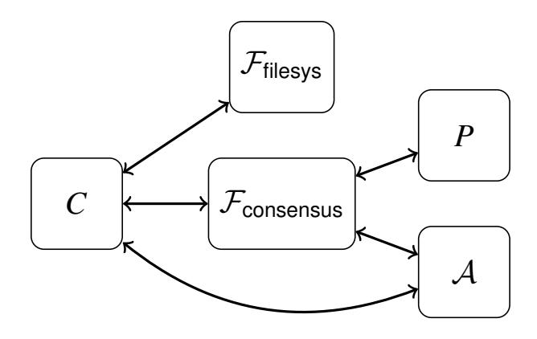

Figure 16: Real world, including the clients *C* with access to a given folder (all other clients are controlled by A), the honest servers *P*, and the adversary A, which includes the compromised servers.

<span id="page-21-2"></span>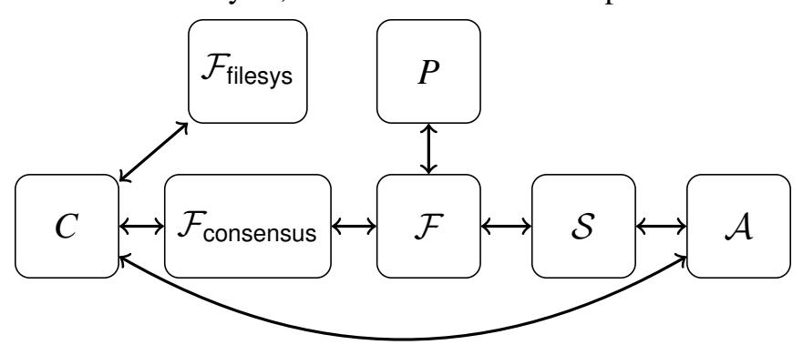

Figure 17: Ideal world, including the client *C* with access to a given folder (all other clients are controlled by A), the filesystem ideal functionality Ffilesys, the consensus ideal functionality Fconsensus, the DORY ideal functionality F, the honest servers *P*, the simulator S, and the adversary A, which includes the compromised servers.

using the filesystem version number, but using an ORAM access number that is incremented after each ORAM access to a document's Bloom filter. The set of ORAM access numbers for every document can also be stored encrypted at the server (along with the encrypted ORAM client) so that every client has access to the current set of access numbers. This allows us to generate a fresh mask used to re-encrypt every time an ORAM access touches a block. The aggregate MAC tags can be maintained as an array outside of ORAM because every element of the array is modified by each update.

To perform a search, the client needs to generate a DPF query for each Bloom filter index corresponding to the keyword in question. The server still needs to perform a linear scan over the search index (as necessitated by our use of DPFs for PIR). While the order of the scan was obvious when the search index was a simple table, the order is less obvious for the tree structure of PathORAM. We solve this problem by scanning through the tree in a predefined order (e.g. an in-order traversal). We treat the *i*th Bloom filter we reach in the traversal of the tree in the same way as the *i*th row in the search index table (Figure [5\)](#page-6-3). The client can interpret the results by reconstructing the traversal order using the position map stored as part of the ORAM client.

## <span id="page-21-0"></span>**D Security analysis**

We use the simulation paradigm of Secure Multi-Party Computation (SMPC) to define DORY's security guarantees against

an adversary who can compromise any number of servers. In particular, we allow our adversary to be *malicious* and so deviate arbitrarily from the protocol. We define security using an ideal world where rather than running the DORY protocol, the clients interact with an ideal functionality F. We compare the ideal world to the real world, where the clients, honest server(s), and adversary interact directly using the DORY protocol. For simplicity, we frame our analysis in terms of servers rather than trust domains and assume that each server is deployed in a different trust domain.

In the ideal world, the ideal functionality F allows us to exactly define the leakage for DORY using a simulator S. The clients interact with F and F gives to S exactly what DORY leaks. Based on that information, S interacts with the adversary A to perform the corresponding operation; S obviously cannot perform the operation exactly as specified because it only has some small amount of information related to the operation. The challenge is for the adversary A to tell whether it is being invoked in the real world (Figure [16\)](#page-21-1) or the ideal world (Figure [17\)](#page-21-2).

We allow A to adaptively choose the operations issued by clients and see the results of those operations in both the real and ideal worlds. This choice strengthens our security definition, as it allows us to model what happens if an adversary is able to influence the operations performed by the client (e.g. in the real world, an adversary might be able to make the client update the index by sending an email) or observe the outputs of operations. Note that the adversary can only observe the final outputs of the operations; the adversary *cannot* observe the messages sent from the honest server to the client.

To model systems that provide folders for different groups of clients that do not trust each other, we will consider clients with access to a single folder and the adversary A as having control of every client without access to that folder. The set of clients not controlled by A is static, and the folder they have access to does not change.

We additionally augment the protocol such that a client verifies that it has access to a folder before making an update or search request to the folder. We assume that the clients under the control of A only send valid requests.

We will show (informally) that for some ideal functionality F modeling the functionality that DORY provides, there exists a simulator S in the ideal world such that for every adversary A, A cannot tell whether it is in the real world or interacting with the simulator S.

**What we don't model.** We model our consensus protocol in a blackbox way, treating it simply as the ideal functionality Fconsensus. We make this choice to focus on the cryptographic components of the DORY protocol and because two-phase commit is already well-studied. As our protocol interacts with the underlying filesystem in a blackbox way without specifying an implementation, we also model the filesystem as the ideal functionality Ffilesys. We also do not model dynamic membership (in particular, user revocation) for simplicity; the 

{22}------------------------------------------------

<span id="page-22-0"></span>set of compromised clients and the set of compromised folders are static.

## **D.1 Definitions**

### <span id="page-22-1"></span>**D.1.1 Ideal functionality for filesystem**

To simplify our analysis, we model the underlying filesystem as the ideal functionality Ffilesys. We now define the ideal functionality for Ffilesys following the API defined in Section [3.1.](#page-4-2)

For each folder, Ffilesys keeps:

- the current key for that folder, and
- a list of the document IDs docIDs in that folder. Each document ID has a corresponding:
  - **–** most recently used key, and
  - **–** version number.

Each time an update for a document is received, the most recently used key for that document is set to the current key for that folder and the version number is incremented. The current key for a folder only changes when a client's access to a folder is revoked (our analysis does not include user revocation).

The ideal functionality Ffilesys uses this data to respond to the following API queries (see Section [3.1\)](#page-4-2):

- getCurrKey(folderID) → *k*: Get the current key associated with the group of files in folderID.
- getDocKey(docID) → *k*: Get the key used in the most recent update for docID.
- getDocIDs(folderID) → docIDs: Get all the document IDs used for the documents in folderID.
- getVersion(folderID,docID) → version: Get the current version number associated with a file.

For each function, Ffilesys only responds to the query if the client making the request has access to the folder.

**Leakage of underlying filesystem.** In order to allow our analysis to apply to many types of filesystems that implement this ideal functionality but may permit different levels of leakage, we define the leakage of the underlying filesystem in terms of the leakage of the filesystem API defined above. We use the leakage function L to denote the leakage of each filesystem function.

### **D.1.2 Ideal functionality for consensus**

We also simplify our analysis by modeling our consensus algorithm as the ideal functionality Fconsensus. We do this to focus on DORY's cryptographic guarantees and because two-phase commit is already well studied. Fconsensus simply serializes the requests from the client *C* before forwarding the requests to either the ideal search functionality F (in the ideal world) or the DORY protocol (in the real world).

### **D.1.3 Definition structure for search ideal functionality**

**Ideal world model.** We define the ideal world functionality as a function F. The simulator S interacts with F, and the adversary can interact with S. The client *C* represents all the clients with access to the folder in question and can issue requests in parallel based on the API defined in Section [4.](#page-6-1) We only trust the clients with access to the folder in question; all other clients are controlled by A. The client can also interact with the filesystem, modeled as Ffilesys. At startup, the ideal world functionality takes as input the number of servers in the system and the identities of the servers that are or will be compromised. The ideal functionality in turn passes this information to the simulator S, which can use this information to determine execution. This information dictates which of two cases F is in: either at least one server is honest, or no servers are honest. This means that the adversary A must statically declare its corruptions at the beginning of execution. As a reminder, the goal of DORY is to minimize leakage when at least one server is honest; we model both cases here to show that DORY still provides some level of protection in the event that all servers are compromised.

**Real world model.** The real world models DORY's execution. We describe the differences from the ideal world for each of the API calls with the client *C* and the adversary A:

- Update(*k*,folderID,docID,prevWords, currWords): In addition to what S receives in the ideal world, A additionally receives the update request sent by *C*, as specified in Section [4](#page-6-1) (namely, the update requests received by the servers controlled by A).
- Search(*k*,folderID, keyword) → (docIDs): In addition to what S receives in the ideal world,A additionally receives some number of search requests sent by *C*, as specified in Section [4,](#page-6-1) depending on the number of servers compromised (namely, the search requests received by the servers controlled by A).

**Definition structure.** We break our definition into two cases: (1) at least one server is honest, and (2) no servers are honest. These cases correspond to different attacker models in the real world, and different numbers of compromised servers given as input to F in the ideal world. We describe the ideal functionality and simulator for each case separately.

### **D.1.4 At least one honest server**

We begin by describing the ideal functionality for the case where at least one server is honest.

**Defining ideal functionality.** We start by defining the ideal functionality F for the case where the adversary has statically compromised at most ` <sup>−</sup><sup>1</sup> of the ` servers. We denote the remaining honest server(s) as *P*. *P* also interacts with F to process requests. We define F for this case as follows:

• Update(folderID,docID,prevWords, currWords):

{23}------------------------------------------------

- $\mathcal{F}$  replaces the old keywords prevWords with the new keywords currWords for docID.
- $\mathcal{F}$  sends  $\mathcal{S}$ :
  - \* the request type (Update),
  - \* folderID,
  - \* docID,
  - \*  $\mathcal{L}(\mathcal{F}_{filesys}.getCurrKey(folderID))$ ,
  - \*  $\mathcal{L}(\mathcal{F}_{\text{filesys}}.\text{getDocKey}(\text{docID}))$ ,
  - \*  $\mathcal{L}(\mathcal{F}_{\text{filesys}}.\text{getVersion}(\text{docID}))$ , and
  - \* the bit  $\beta$  where  $\beta = 1$  if the return value of  $\mathcal{F}_{\text{filesys}}$ .getCurrKey(folderID) changed since the last update request;  $\beta = 0$  otherwise.
- Search(folderID, keyword) → (docIDs):
  - F builds Bloom filters for the documents in folderID and returns the documents docIDs that match the Bloom filter indexes for keyword.
  - $\mathcal{F}$  sends  $\mathcal{S}$  the request type (Search) and, for each docID in folderID:
    - \* the request type (Search),
    - \* folderID,
    - \*  $\mathcal{L}(\mathcal{F}_{\text{filesys}}.\text{getDocIDs}(\text{folderID}))$ , and
    - \* for each docID in folderID,
      - $\cdot \ \mathcal{L}(\mathcal{F}_{\text{filesys}}.\text{getVersion}(\text{docID})),$  and
      - $\cdot \ \mathcal{L}(\mathcal{F}_{\text{filesys}}.\text{getDocKey}(\text{docID})).$

#### **D.1.5** No honest servers

We now move to the case where no servers are honest and describe the ideal functionality for this case.

**Defining ideal functionality.** We define the ideal functionality  $\mathcal{F}$  for the case where every server is compromised as follows. We represent leakage that allows the attacker to correlate queries by attaching an ID to each query. As the ideal functionality is only different from the case where at least one server is honest for search and is identical for update, we only describe search:

- Search(folderID, keyword) → (docIDs):
  - F builds Bloom filters for the documents in folderID and returns the documents docIDs that match the Bloom filter indexes for keyword.
  - $\mathcal{F}$  sends  $\mathcal{S}$  the request type (Search) and, for each docID in folderID:
    - \* the request type (Search),
    - \* folderID,
    - \*  $\mathcal{L}(\mathcal{F}_{\text{filesys}}.\text{getDocIDs}(\text{folderID}))$ ,
    - \* for each docID in folderID,
      - ·  $\mathcal{L}(\mathcal{F}_{\mathsf{filesys}}.\mathsf{getVersion}(\mathsf{docID}))$  and
      - ·  $\mathcal{L}(\mathcal{F}_{\text{filesys}}.\text{getDocKey}(\text{docID}))$ ,

- \* the current queryID, and
- \* the queryIDs of all prior identical queries.

**Defining security.** We denote the security parameter as  $\lambda$  in our definition and proof.

<span id="page-23-0"></span>**Definition 1.** Let  $\Pi$  be the protocol for an encrypted search system. Let  $\mathcal{A}$  be an adversary that outputs a single bit. For any set of compromised servers  $\omega$  statically chosen by  $\mathcal{A}$ , let  $\mathsf{Real}_{\Pi,\mathcal{A},\omega}(1^\lambda)$  be the random variable denoting  $\mathcal{A}$ 's output when interacting with the real world where clients only make queries to folders they have access to. For a simulator  $\mathcal{S}$ , an adversary  $\mathcal{A}$  that outputs a single bit, and the set of compromised servers  $\omega$ , let  $\mathsf{Ideal}_{\mathcal{S},\mathcal{A},\omega}(1^\lambda)$  be the random variable denoting  $\mathcal{A}$ 's output when interacting with the ideal world where clients only make queries to folders they have access to.

We say that a protocol  $\Pi$  securely evaluates (with abort) the ideal functionality  $\mathcal{F}$  defined above if there exists a non-uniform algorithm  $\mathcal{S}$  probabilistic polynomial-time in  $\lambda$  such that for every non-uniform adversary  $\mathcal{A}$  probabilistic polynomial-time in  $\lambda$  that outputs a single bit, for every set of compromised servers  $\omega$  statically chosen by  $\mathcal{A}$ , the probability ensemble of  $\operatorname{Real}_{\Pi,\mathcal{A},\omega}(1^{\lambda})$  over  $\lambda$  is computationally indistinguishable from the probability ensemble of  $\operatorname{Ideal}_{\mathcal{S},\mathcal{A},\omega}(1^{\lambda})$  over  $\lambda$ :

$$\exists \mathcal{S} \ \forall \mathcal{A} \ \forall \omega \ \{ \mathsf{Real}_{\Pi, \mathcal{A}, \omega}(1^{\lambda}) \}_{\lambda} \approx_{c} \{ \mathsf{Ideal}_{\mathcal{S}, \mathcal{A}, \omega}(1^{\lambda}) \}_{\lambda} \ .$$

### D.2 Proof

**Theorem 1:** Using the definitions in  $\S D.1$ , DORY securely evaluates (with abort) the ideal functionality  $\mathcal{F}$  when instantiated with a secure PRF, a secure aggregate MAC, a secure distributed point function, and a secure filesystem that implements the ideal filesystem functionality.

*Proof.* We begin by defining the simulator  $\mathcal{S}$ . The simulator  $\mathcal{S}$  takes in as input the total number of servers and the number of compromised servers. We initialize the system so that a Bloom filter is of length m and each keyword hashes to  $\kappa$  indexes. Based on the number of compromised servers, we define  $\mathcal{S}$  in one of the two following ways.

Constructing the simulator with at least one honest server. We start by describing how to construct the simulator for the case where at least one server is honest; namely, adversary  $\mathcal{A}$  has statically compromised at most  $\ell-1$  out of  $\ell$  servers. We construct a simulator  $\mathcal{S}$  for a single folder in the ideal world for this case as follows.

- We initialize S as follows:
  - S samples  $k \stackrel{\mathbb{R}}{\leftarrow} \{0,1\}^{\lambda}$ .
  - For each folder, S keeps a Bloom filter table mapping document IDs to strings in  $\{0,1\}^m$ . Every entry in this table is initialized with  $0^m$ .

{24}------------------------------------------------

- S keeps a key table mapping document IDs to active keys. Every entry in this table is initialized with k.
- S keeps a version number table mapping document IDs to version numbers. Every entry in this table is initialized with 0.
- When  ${\mathcal S}$  receives an update request from  ${\mathcal F}$  for docID:
  - If the bit  $\beta = 1$ ,  $k \stackrel{\mathbb{R}}{\leftarrow} \{0, 1\}^{\lambda}$ .
  - S samples the string  $b \stackrel{\mathbb{R}}{\leftarrow} \{0,1\}^m$ .
  - S retrieves the entry in the table for docID, called b'.
  - S looks up the version number for doclD in the version number table, called version.
  - S looks up the current key for docID in the key table, called k'.
  - **-** For i ∈ [m]:
    - \*  $y_i \leftarrow MAC(k, (b_i, docID, i, version + 1))$
    - \*  $y_i' \leftarrow MAC(k', (b_i', docID, i, version))$
    - $* z_i \leftarrow y_i \oplus y_i'$
  - $\mathcal{S}$  increments the entry in the version number table for docID.
  - S sets the entry in the key table for docID to k.
  - S sets the entry in the Bloom filter table for doclD to b.
  - S sends  $(b, z_1, ..., z_m)$  to A along with the rest of the data that S received from F.
  - S returns the response from A.
- When S receives a search request from F:
  - For  $j \in [\kappa]$ , S computes:
    - $* i_i \stackrel{\mathbb{R}}{\leftarrow} [m]$
    - \*  $K_{i,1}, \ldots, K_{i,\ell-1} \leftarrow \mathsf{DPF}.\mathsf{Gen}(i_i)$
  - S sends  $K_{1,1},...,K_{\kappa,\ell-1}$  to A along with the rest of the data that S received from F.
  - S returns the response from A.

Constructing the simulator with no honest servers. We now construct a simulator  $\mathcal{S}$  for a single folder in the ideal world for the case where the attacker has compromised every honest server. We have  $\mathcal{S}$  respond to updates requests in the same way as the case where at least one server is honest, and so we only describe how  $\mathcal{S}$  responds to searches in this case.

- We initialize S in the same way as in the case where at least one server is honest, but with one addition:
  - For each folder, S keeps a query ID table mapping sets of query IDs to  $\kappa$  indexes in [m]. This table is initially empty.
- When S receives a search request from F:
  - ${\cal S}$  begins by looking up the queryIDs of all prior identical queries in the query ID table.
    - \* If there is an entry for the queryIDs, add the new

- queryID to the list of query IDs in that entry, and set  $x_1, ..., x_{\kappa} \in [m]$  to be the indexes at that entry.
- \* Otherwise, for  $i \in [\kappa]$ , sample  $x_i \leftarrow [m]$  and add a new entry to the table:  $\{\{\text{queryID}\}, \{x_1, \dots, x_{\kappa}\}\}$ .
- For  $i \in [\kappa]$ , S computes  $K_{i,1},...,K_{i,\ell-1} \leftarrow \mathsf{DPF}.\mathsf{Gen}(x_i)$ .
- S sends  $K_{1,1},...,K_{\kappa,\ell}$  to A along with the rest of the data that S received from F.
- S returns the response from A.

**Putting it together.** Lemma 2 proves that security holds against an adversary that can statically corrupt at most  $\ell-1$  of the  $\ell$  servers, and Lemma 3 proves that security holds against an adversary that can corrupt all  $\ell$  servers. Together these complete the proof.

<span id="page-24-0"></span>**Lemma 2.** DORY securely evaluates (with abort) the ideal functionality  $\mathcal{F}$  as defined in Definition 1 for the case when the adversary can statically corrupt at most  $\ell-1$  of the  $\ell$  servers when instantiated with a secure PRF, a secure aggregate MAC scheme, a secure distributed point function, and a secure filesystem that implements the filesystem ideal functionality defined in Appendix D.1.1.

*Proof.* To prove the above lemma, we construct a series of hybrid protocols  $\mathcal{H}_0, \ldots, \mathcal{H}_3$ . We show that for  $i \in \{0, 1, 2\}$ , the adversary  $\mathcal{A}$  cannot distinguish between  $\mathcal{H}_i$  and  $\mathcal{H}_{i+1}$ .

**Hybrid 0.** We start off running the DORY protocol without any modifications (see pseudocode in Appendix A).

**Hybrid 1.** We now modify the protocol from  $\mathcal{H}_0$  such that for an update, rather than masking the m-bit Bloom filter  $b \in \{0,1\}^m$  with the output of a PRF evaluated at the document ID and its version number (obtained via  $\mathcal{F}_{\text{filesys}}$ .getVersion) keyed with  $\mathcal{F}_{\text{filesys}}$ .getCurrKey evaluated at the folder ID, we mask b with a random  $r \stackrel{\mathbb{R}}{\leftarrow} \{0,1\}^m$ .

Updates in  $\mathcal{H}_0$  and  $\mathcal{H}_1$  are computationally indistinguishable. This follows from the security of the PRF (which ensures that the output of the PRF is computationally indistinguishable from random because the key can only be accessed by legitimate clients) and the underlying filesystem (which ensures that the PRF is evaluated on unique inputs so that a mask is never repeated and that the PRF key is only known to legitimate users). Because the updates in  $\mathcal{H}_0$  and  $\mathcal{H}_1$  are computationally indistinguishable,  $\mathcal{A}$  cannot distinguish between  $\mathcal{H}_0$  and  $\mathcal{H}_1$ .

**Hybrid 2.** We change the protocol from  $\mathcal{H}_1$  to hide the contents of updates. For an update,  $\mathcal{H}_1$  computes the Bloom filter  $b \in \{0,1\}^m$  and samples  $r \stackrel{\mathbb{R}}{\leftarrow} \{0,1\}^m$  and sends  $b \oplus r$ . In  $\mathcal{H}_2$ , we instead just send r.

The value r is acting as a one-time pad, making the updates statistically indistinguishable, and so A cannot distinguish between  $\mathcal{H}_1$  and  $\mathcal{H}_2$ .

**Hybrid 3.** To construct  $\mathcal{H}_3$ , we modify the search operation in  $\mathcal{H}_2$  to argue that we don't leak information about the

{25}------------------------------------------------

keyword being searched for. Rather than running DPF.Gen on the indexes corresponding to the keyword that the client is searching for, we instead sample  $i_1, \ldots, i_K \stackrel{\mathbb{R}}{\leftarrow} [m]$ .

Because the adversary only gets access to at most  $\ell-1$  of the  $\ell$  function shares, from the security of distributed point functions, the adversary cannot tell the difference between function shares chosen from random  $i_1, \ldots, i_{\kappa}$  and the indexes corresponding to the query, and so  $\mathcal{A}$  cannot distinguish between  $\mathcal{H}_2$  and  $\mathcal{H}_3$ . Notice that  $\mathcal{H}_3$  is identical to  $\mathcal{S}$  for the case where at most  $\ell-1$  out of  $\ell$  servers are honest.

We now show that  $\mathcal{H}_3$  cannot provide incorrect results without detection by the user. This follows directly from the security of the underlying MAC scheme; a user with access to the correct version numbers can verify that every bit in the search result was derived from the most recent update. Furthermore, as the MAC is generated using a key retrieved via  $\mathcal{F}_{\text{filesys}}$ .getCurrKey, only legitimate clients can generate MACs, and  $\mathcal{A}$  cannot forge MACs. This ensures that the adversary cannot distinguish between  $\mathcal{H}_3$  and the real world, thus completing the proof.

<span id="page-25-1"></span>**Lemma 3.** DORY securely evaluates (with abort) the ideal functionality  $\mathcal{F}$  as defined in Definition 1 for the case when the adversary can corrupt all  $\ell$  servers when instantiated with a secure PRF, a secure aggregate MAC scheme, and a secure filesystem that implements the filesystem ideal functionality defined in Appendix D.1.1.

*Proof.* To prove the above lemma, we construct a series of hybrid protocols  $\mathcal{H}_0, \ldots, \mathcal{H}_3$ . We show that for  $i \in \{0, 1, 2\}$ , the adversary  $\mathcal{A}$  cannot distinguish between  $\mathcal{H}_i$  and  $\mathcal{H}_{i+1}$ . Hybrids  $\mathcal{H}_0, \mathcal{H}_1$ , and  $\mathcal{H}_2$  match that of Lemma 2, as they concern hiding the contents of updates, and the ideal functionality  $\mathcal{F}$  and simulator  $\mathcal{S}$  behavior for updates match in both cases.

**Hybrid 0.** We start off running the DORY protocol without any modifications (see pseudocode in Appendix A).

**Hybrid 1.** We now modify the protocol from  $\mathcal{H}_0$  such that for an update, rather than masking the m-bit Bloom filter  $b \in \{0,1\}^m$  with the output of a PRF evaluated at the document ID and its version number (obtained via  $\mathcal{F}_{\text{filesys}}$ .getVersion) keyed with  $\mathcal{F}_{\text{filesys}}$ .getCurrKey evaluated at the folder ID, we mask b with a random  $r \stackrel{\mathbb{R}}{\leftarrow} \{0,1\}^m$ .

Updates in  $\mathcal{H}_0$  and  $\mathcal{H}_1$  are computationally indistinguishable. This follows from the security of the PRF (which ensures that the output of the PRF is computationally indistinguishable from random because the key can only be accessed by legitimate clients) and the underlying filesystem (which ensures that the PRF is evaluated on unique inputs so that a mask is never repeated and that the PRF key is only known to legitimate users). Because the updates in  $\mathcal{H}_0$  and  $\mathcal{H}_1$  are computationally indistinguishable,  $\mathcal{A}$  cannot distinguish between  $\mathcal{H}_0$  and  $\mathcal{H}_1$ .

**Hybrid 2.** We change the protocol from  $\mathcal{H}_1$  to hide the contents of updates. For an update,  $\mathcal{H}_1$  computes the Bloom

filter  $b \in \{0,1\}^m$  and samples  $r \stackrel{\mathbb{R}}{\leftarrow} \{0,1\}^m$  and sends  $b \oplus r$ . In  $\mathcal{H}_2$ , we instead just send r.

The value r is acting as a one-time pad, making the updates statistically indistinguishable, and so A cannot distinguish between  $\mathcal{H}_1$  and  $\mathcal{H}_2$ .

**Hybrid 3.** To construct  $\mathcal{H}_3$ , we modify the search operation in  $\mathcal{H}_2$  to argue that we only leak the set of previous queries corresponding to the same keyword. Rather than running DPF.Gen on the indexes corresponding to the keyword that the client is searching for, the client instead keeps a mapping of keywords to indexes. If a keyword has already been searched for, the client uses those indexes. Otherwise, the client samples a new set of indexes  $i_1, \ldots, i_{\kappa} \stackrel{\mathbb{R}}{\leftarrow} [m]$  and updates the mapping accordingly.

Because the adversary can see all  $\ell$  function shares, it can tell which indexes the client is retrieving. However, because the client chooses the indexes as PRF(k, keyword) where k is obtained via  $\mathcal{F}_{\text{filesys}}$ .getCurrKey, the set of indexes queried is computationally indistinguishable from random (only legitimate clients have access to the key), and so  $\mathcal{A}$  cannot distinguish between  $\mathcal{H}_2$  and  $\mathcal{H}_3$ . Notice that  $\mathcal{H}_3$  is identical to  $\mathcal{S}$  for the case where all  $\ell$  servers are compromised.

As in the proof for Lemma 2,  $\mathcal{H}_3$  cannot provide incorrect results without detection by the client. This follows directly from the security of the underlying MAC scheme; a client with access to the correct version numbers can verify that every bit in the search result was derived from the most recent update. Furthermore, as the MAC is generated using a key retrieved via  $\mathcal{F}_{\text{filesys}}$ .getCurrKey, only legitimate clients can generate MACs, and  $\mathcal{A}$  cannot forge MACs. This ensures that the adversary cannot distinguish between  $\mathcal{H}_3$  and the real world, thus completing the proof.

## <span id="page-25-0"></span>**E** Artifact Appendix

### E.1 Abstract

Our DORY prototype is an encrypted search system that splits trust between multiple servers in order to efficiently hide search access patterns from a malicious attacker that controls all but one of the servers. We support parallelism across multiple servers in order to reduce search latency and increase throughput. DORY is written in a combination of C (for the distributed point function and other low-level cryptographic primitives) and Go (for the networking and consensus) for approximately 5,000 lines of code. Our experiment scripts use AWS EC2 instances. Our artifact is available here:

https://github.com/ucbrise/dory

## E.2 Artifact check-list

• **Data set:** Enron email dataset used to choose system parameters and set sample documents.

{26}------------------------------------------------

• **Metrics:** Latency, throughput

• **Experiments:** Search latency breakdown, search latency with parallelism, search throughput with parallelism

• **Required disk space:** 18MB

• **Expected experiment run time:** Approximately 4 hours

• **Public link:** <https://github.com/ucbrise/dory>

• **Code licenses:** Apache v2

## **E.3 Description**

### **E.3.1 How to access**

Our Amazon AWS AMI is public (the AMI IDs for different regions are set in our scripts). See Appendix [E.4](#page-26-0) for instructions on running scripts for configuring security groups and the key pair as well as starting a cluster.

### **E.3.2 Software dependencies**

We use the hashicorp msgpack library ([https://github.com/](https://github.com/hashicorp/go-msgpack) [hashicorp/go-msgpack](https://github.com/hashicorp/go-msgpack)) for parsing messages and libstemmer (<http://snowball.tartarus.org/download.html>) for stemming keywords. We build on the DPF implementation in Express [\[42\]](#page-16-17) ([https://github.com/SabaEskandarian/](https://github.com/SabaEskandarian/Express) [Express](https://github.com/SabaEskandarian/Express)). We also use the OpenSSL library for low-level cryptographic primitives.

## **E.3.3 Data sets**

The Bloom filter size in our experiments is based on statistics from the Enron email dataset [\[30\]](#page-15-25) (see Table [7a\)](#page-11-1). The sample documents to interactively search over in sample\_docs/ are also from the Enron email dataset.

## <span id="page-26-0"></span>**E.4 Installation**

The instructions for setting up the Amazon AWS security groups and key pair are available here: [https://github.com/ucbrise/dory#setting-up-aws](https://github.com/ucbrise/dory#setting-up-aws-security-groups-and-keypairs)[security-groups-and-keypairs](https://github.com/ucbrise/dory#setting-up-aws-security-groups-and-keypairs). The instructions for starting a cluster of EC2 instances using our public AMIs are available here: <https://github.com/ucbrise/dory#setup>. We use r5n.4xlarge instances in different regions that are geographically close (east-1 and east-2). We also provide instructions for building from source here: [https:](https://github.com/ucbrise/dory#building-from-source) [//github.com/ucbrise/dory#building-from-source](https://github.com/ucbrise/dory#building-from-source).

## **E.5 Experiment workflow**

To start running experiments, the reviewer should first create a cluster (Appendix [E.4\)](#page-26-0). Each figure (or group of figures) reproduced has a corresponding script to run the experiment. Each figure reproduced has another script to plot the data collected. Details are available here: [https://github.com/ucbrise/](https://github.com/ucbrise/dory#running-experiments) [dory#running-experiments](https://github.com/ucbrise/dory#running-experiments). After running experiments, the reviewer should teardown the cluster following instructions here: <https://github.com/ucbrise/dory#setup>.

Because the ORAM baseline experiments in our paper take approximately a week to run, we only reproduce two data points (1,024 and 2,048 documents), making the experiment take a little over an hour.

## **E.6 Evaluation and expected result**

The above instructions reproduce Table [7b,](#page-11-1) Figure [8,](#page-12-2) Section [7.2,](#page-12-2) Figure [10,](#page-12-4) and Figure [11.](#page-12-5) There may be some variation from the figures in the paper based on how long the experiments are allowed to run.

Our scripts plot the figures using the ORAM baseline data we collected ourselves, as the experiments we provide for reviewers only reproduce two data points. Reviewers can compare the two data points we reproduce to the data we collected to verify that the data matches up.

More detailed instructions on running experiments and interpreting results are available here: [https://github.com/](https://github.com/ucbrise/dory#running-experiments) [ucbrise/dory#running-experiments](https://github.com/ucbrise/dory#running-experiments).

# **E.7 Experiment customization**

Reviewers can configure experiments to run for more trials, run for different numbers of documents, or use different Bloom filter sizes.

# **E.8 Notes**

We implement the DORY search protocol as described in the body of the paper, and our implementation does not include a complementary end-to-end encrypted filesystem that could use or interface with DORY. We support keyword search with a small, configurable number of false positives (we do not support regular expressions or other advanced search features).

## **E.9 AE Methodology**

Submission, reviewing and badging methodology:

[https://www.usenix.org/conference/osdi20/call-for](https://www.usenix.org/conference/osdi20/call-for-artifacts)[artifacts](https://www.usenix.org/conference/osdi20/call-for-artifacts)