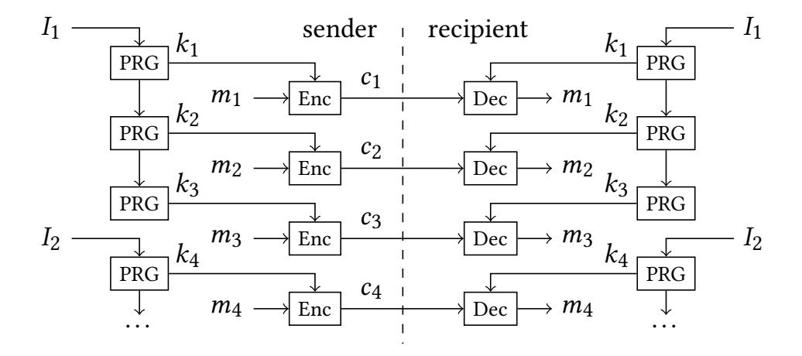
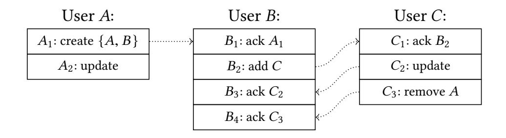
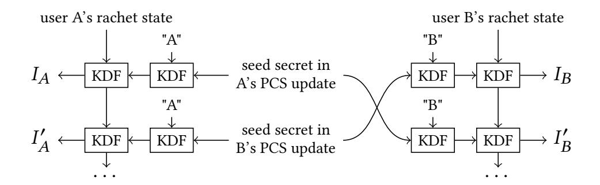
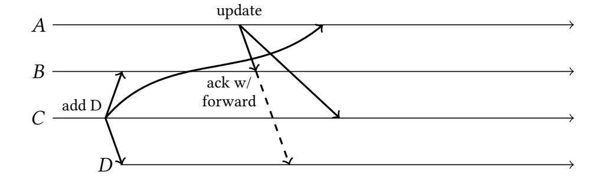
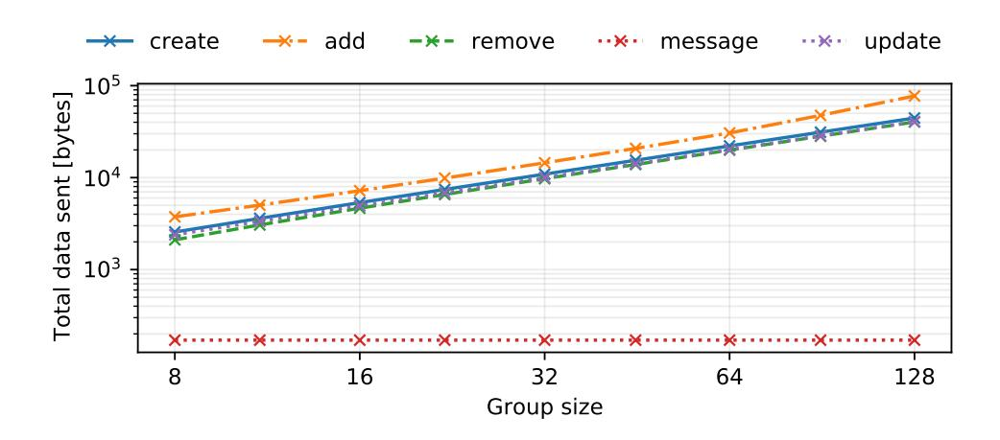
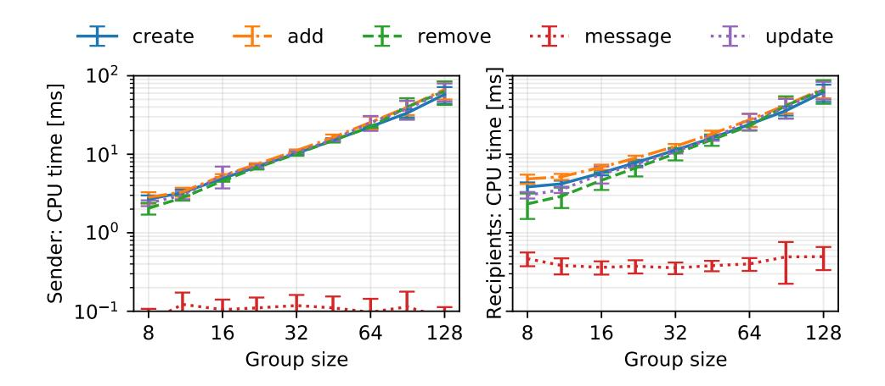

{0}------------------------------------------------

# **Key Agreement for Decentralized Secure Group Messaging with Strong Security Guarantees**

Matthew Weidner maweidne@andrew.cmu.edu Carnegie Mellon University Pittsburgh, PA, USA Martin Kleppmann
Daniel Hugenroth
Alastair R. Beresford
(mk428,dh623,arb33)@cst.cam.ac.uk
University of Cambridge
Cambridge, UK

#### **ABSTRACT**

Secure group messaging protocols, providing end-to-end encryption for group communication, need to handle mobile devices frequently being offline, group members being added or removed, and the possibility of device compromises during long-lived chat sessions. Existing work targets a centralized network model in which all messages are routed through a single server, which is trusted to provide a consistent total order on updates to the group state. In this paper we adapt secure group messaging for decentralized networks that have no central authority. Servers may still optionally be used, but they are trusted less. We define decentralized continuous group key agreement (DCGKA), a new cryptographic primitive encompassing the core of a decentralized secure group messaging protocol; we give a practical construction of a DCGKA protocol and prove its security; and we describe how to construct a full messaging protocol from DCGKA. In the face of device compromise our protocol achieves forward secrecy and post-compromise security. We evaluate the performance of a prototype implementation, and demonstrate that our protocol has practical efficiency.

#### **CCS CONCEPTS**

• Security and privacy  $\rightarrow$  Key management; Distributed systems security.

#### **KEYWORDS**

Secure group messaging, decentralized systems, post-compromise security

## <span id="page-0-0"></span>1 INTRODUCTION

WhatsApp, Signal, and similar messaging apps have brought endto-end encryption to billions of users globally, demonstrating that the benefits of such privacy-enhancing technologies can be enjoyed by users who are not technical experts. Modern secure messaging protocols used by these apps have several important characteristics:

**Asynchronous:** A user can send messages to other users regardless of whether the recipients are currently online. Offline recipients receive their messages when they are next online again (even if the sender is now offline). This property is important for mobile devices, which are frequently offline.

**Resilient to device compromise:** If a user's device is compromised, i.e., all of that device's secret key material is revealed to the adversary, the protocol nevertheless provides *forward* 

This is the extended preprint version of the paper presented at ACM CCS 2021 [41].

secrecy (FS): any messages received before the compromise cannot be decrypted by the adversary. Moreover, protocols can provide *post-compromise security* (PCS) [13]: users regularly update their keys so the adversary eventually loses the ability to decrypt further communication. As secure messaging sessions may last for years, these properties are important for limiting the impact of a compromise.

**Dynamic:** Group members can be added and removed at any time.

In the case when only two users are communicating, the Signal protocol [31] is widely used. However, generalizations of this two-party protocol to groups of more than two users are not straightforward. For example, WhatsApp's group messaging protocol does not provide PCS [35, 42]. Signal implements group messaging by sending each message individually to each group member via a two-party secure channel, which is inefficient for large groups.

Secure group messaging protocols have been the subject of much recent cryptographic work, which we summarize in Section 3. A notable example is the Messaging Layer Security (MLS) protocol, a standard under development by an IETF working group [5, 30], which provides FS/PCS and is designed to scale to large groups. However, MLS assumes that all messages modifying the group state (i.e. adding/removing members or performing key updates for PCS) are delivered to all members in the same order. If two group members concurrently modify the group state, one of the requests must be rejected and retried. This total order is typically enforced by routing all messages through a centralized, semi-trusted delivery service; alternatively, a consensus protocol could be used.

There are many systems in which such centralization is undesirable. Email is a prominent example of a decentralized communication method. Anonymity networks such as Tor [15] or Loopix [32] rely crucially on the assumption that no single node is able to observe all network traffic. Protesters use mesh networks, in which mobile devices exchange messages without any servers, to avoid censorship [1, 4, 37]. In systems such as these, a protocol that assumes a central node or consensus cannot be used, because it would defeat the purpose of the underlying network's decentralization.

In this paper, we present a decentralized, asynchronous secure group messaging protocol supporting dynamic groups. Our protocol works with any underlying network without requirements on message ordering or latency: it can be deployed in peer-to-peer or anonymity networks; it tolerates network partitions, high latency links, and disconnected operation; and it does not require any servers or consensus protocol. If servers are optionally used, there is no need to trust them to order messages correctly, and users can

{1}------------------------------------------------

switch from one server to another (or use multiple servers at the same time) without worrying about preserving message ordering.

Our protocol provides end-to-end encryption with forward secrecy and PCS, even when multiple users concurrently modify the group state. It is practical, using only efficient and widely deployed cryptographic primitives. It provides key agreement: messages to the group need only be encrypted and sent once with small constant overhead, regardless of group size. Group membership changes and key updates (for PCS) require effort proportional to the group size. In this paper we make the following contributions:

• We define *Decentralized Continuous Group Key Agreement* (DCGKA), a new security notion for establishing shared symmetric keys in dynamic groups. Our definition generalizes Continuous Group Key Agreement (CGKA) [3] to the decen-

tralized setting.

• We construct a protocol that implements DCGKA (Section 6), prove its correctness and security (Section 7), and use it to implement secure group messaging (Section 4).

• We evaluate the performance of a prototype implementation of our protocol (Section 8), demonstrating that it is efficient enough for practical deployment.

#### <span id="page-1-0"></span>2 GOALS AND ASSUMPTIONS

In this section we summarize the goals of our protocol and the threat model for which it is designed.

A secure group messaging protocol allows a group with a given set of users to be created, allows group members to add and remove other members, and allows group members to send messages to the current set of members. We distinguish between *application messages* (messages that a user wishes to send to the group) and *control messages* (sent by the protocol to update group state). The protocol must meet the following security goals:

**Confidentiality:** An application message sent by a group member can only be decrypted by users who are also members of the group at the time the message is sent, according to the sender's view of the group.

**Integrity:** Messages cannot be undetectably modified by anyone but the member who sent them.

**Authentication:** The sender of a message cannot be forged, and only members can send messages to the group.

**Forward secrecy (FS):** After a group member decrypts an application message, an adversary who compromises the private state of that member cannot decrypt that message.

Post-compromise security (PCS): If an adversary compromises a group member, learning a snapshot of their current private state (including all secret keys), but the group member retains the ability to send messages, then the adversary can only decrypt messages until that group member sends a *PCS update* message that "heals" the compromise. More precisely, the adversary cannot decrypt messages sent by any group member who has processed the PCS update. In case an adversary gains persistent access to a device, PCS ensures that they lose decryption ability as soon as their persistent access is revoked (e.g., by a software update) and the group member sends a PCS update message.

**Eventual consistency:** All group members receive the same set of application messages (possibly in different orders), and all group members converge to the same view of the group state as they receive the same set of control messages.

Our protocol ensures these security properties in the face of an adversary who can perform arbitrary active network attacks. If servers are used to relay messages, the adversary also fully controls those servers.

We require the protocol to be *decentralized*, which means that whenever any subset of users is able to physically exchange messages, they can communicate via the protocol. For example, consider a group of protesters split across two physical locations, and assume that devices at each location are able to communicate (e.g. via a mesh network), but that long-range communication between the locations is interrupted (perhaps due to an adversary). This is known as a *network partition* [18]. In such a scenario, we require that the users at each location can continue to send and receive application messages, and to add and remove group members. Messages should be delivered immediately to local users, and be delivered to remote users as soon as long-range communication is restored. Such message delay may present usability challenges, but we think it is preferable to the alternatives (delaying communication between co-located users, or dropping messages entirely).

Decentralization implies that we cannot assume messages are routed through a single server, since that would prevent communication between co-located users who cannot reach the server but can connect to each other. It also rules out majority voting or consensus, since a majority of users can reside at most in one location, leaving a minority in the other location unable to communicate.

#### <span id="page-1-1"></span>2.1 Limitations

Decentralization involves trade-offs, which we summarize in this section. We also explain some simplifying assumptions we make.

*Efficiency.* The main practical downside of decentralization is reduced efficiency. Our protocol's PCS update and group membership change messages have size  $\mathcal{O}(n)$ , where n is the number of group members, while in MLS those messages have size  $\mathcal{O}(\log(n))$ . However, in absolute terms, the linear cost is acceptable: in a group with 128 members, a key update operation in our protocol takes 70 ms of CPU time per client and transmits 40 kB of network traffic.

MLS allows up to 50,000 members per group; our protocol is impractical for groups of that size. However, we argue that secure messaging for groups of thousands of people does not have a plausible threat model: large groups are more easily infiltrated by agents of the adversary, making the protocol's confidentiality properties irrelevant. We believe that secure messaging is most valuable in small-to-medium sized groups, for which a  $\mathcal{O}(n)$  cost is acceptable.

Our protocol also stores some state for each PCS update message until every group member acknowledges the message, so the state size may grow without bound if some group member never acknowledges messages. The size of the stored state can be reduced by using a different protocol (a variant of Sender Keys), but this increases the cost of membership changes to  $\mathcal{O}(n^2)$ . In practice, the storage cost is negligible on today's computing devices.

{2}------------------------------------------------

Removed users. When a user is removed in the decentralized setting, the removed user can continue sending messages to group members who have not yet received the instruction to remove that user. However, our protocol prevents removed users from violating confidentiality with such messages.

Malicious group members. In general, we assume that group members correctly follow the protocol. A group member can send malformed protocol messages that make other group members disagree on keys, causing denial of service (the same is true of MLS [11]). However, group members cannot violate the protocol in a way that prevents them, or any members they add, from being removed from the group (Section 7).

Scope of device compromise. While we can guarantee all of the security goals against network attacks at all times, a device compromise inevitably temporarily impacts confidentiality, integrity, and authentication. For PCS we assume that following a device compromise, the adversary does not use the private state it has acquired to impersonate the compromised user until that user sends a PCS update message, as in many PCS protocols [13]. After the compromised user sends a PCS update message, the security properties are restored. If the adversary does impersonate a user, the compromise is healed once that user, and any users the adversary added, are removed from the group (Section 7).

Causal order processing. Messages are processed after all causally prior protocol messages are received (Section 5.1), in contrast to instant message decryption in Signal. MLS has a similar requirement, and it is easily satisfied by retransmitting missing messages.

*Unique additions*. To simplify the presentation of our algorithms, we assume that user additions are unique: if the same user is added more than once to the same group, then each user addition results in a separate protocol instance, and each is associated with a separate ID. This can be achieved e.g. by including a nonce in the user ID.

Metadata privacy. Some protocols (including MLS) encrypt metadata, such as the identity of a user being added to a group. However, these techniques do not work directly in a decentralized setting. We leave metadata privacy for future work.

*Public Key Infrastructure (PKI).* We assume the existence of a PKI that allows group members to obtain a correct public key for other users. Implementing a PKI in a decentralized setting presents many practical issues [38], but they are outside the scope of this paper.

#### <span id="page-2-0"></span>3 RELATED WORK

There are many existing secure messaging protocols [38]. Schemes for two-party communication, providing forward secrecy and PCS to varying degrees, have been studied extensively over the past few years, starting with the Signal protocol [31] and its analysis [12], followed by several new protocols and their analyses [6, 16, 21, 22, 33] as well as a modular analysis and generalization of Signal [2].

Among group messaging protocols for more than two parties, relatively few are both asynchronous and support dynamic groups, which we consider critical requirements for practical group messaging on mobile devices. We focus on such protocols in our discussion below. See Table 1 for a high-level comparison.

Signal groups use a simple protocol: the sender of each application message sends the message individually to each other group member using the two-party Signal protocol [35]. This approach quickly becomes inefficient in large groups, as every application message requires n-1 two-party messages in a group of size n. Also, care is needed to achieve PCS: using the ordinary Signal protocol, a group member effectively performs a PCS update only after receiving a message from every other group member, which would never happen if one member is always offline.

Sender Keys is another simple protocol, used by WhatsApp [35, 42]. In Sender Keys, each group member generates a symmetric key for messages they send, and then sends this key individually to each other group member using the two-party Signal protocol. For each message sent by this member to the group, a new key is derived pseudorandomly from the previous key, providing a ratchet for forward secrecy. Whenever a user is removed, each remaining group member generates a new key and sends it to the other remaining members over the same two-party channels. The protocol could provide PCS by updating keys periodically, but WhatsApp chooses not to do this.

Like Signal groups, Sender Keys can be adapted to the decentralized setting; the disadvantage is that PCS updates are expensive. If one user is compromised, all of the sender keys become known to the adversary. Since each user updates only their own sender key, to recover from the compromise, *each* of the n group members needs to generate a new key and send it to each of the n-1 other members, resulting in  $\mathcal{O}(n^2)$  messages over the two-party channels.

Matrix's end-to-end encryption protocol [28, 39] is a variant of Sender Keys. It is decentralized, provides PCS, and explicitly handles concurrent updates and group membership changes. It is purposely not forward secret, although this could be changed. PCS updates in Matrix require  $\mathcal{O}(n^2)$  messages, while our protocol has  $\mathcal{O}(n)$  cost. No formal security analysis of the Matrix protocol has been published to date.

The MLS protocol, mentioned in Section 1, uses the *TreeKEM* key agreement protocol [5, 8]. Adding or removing a group member, or performing a PCS key update, requires broadcasting a message of size  $\mathcal{O}(\log(n))$ . This is achieved by arranging group members into a binary tree, with one leaf per group member, and each member knowing the secret keys on their leaf node's path to the root.

In large groups, MLS update messages are smaller than those in our protocol; the downside is that MLS is inherently centralized. MLS allows several PCS updates and group membership changes to be proposed concurrently, but they only take effect after being *committed*, and all users must process commits strictly in the same order. A proposal also blocks application messages until the next commit. In the case of a network partition like that described in Section 2, it is not safe for one subset of users to perform a commit, because a different subset of users may perform a different commit, resulting in a group state inconsistency that cannot be resolved. As a result, MLS typically depends on a semi-trusted server to determine the sequence of commits. There is a technique for combining concurrent commits [8, §5], but this approach does not apply to commits that add or remove group members, and it provides weak PCS guarantees for concurrent updates.

{3}------------------------------------------------

<span id="page-3-1"></span>

| Protocol               | Central server not needed Broadcast messages |              | Telliove costs:                |                    | PCS & FS                    | PCS in face of concurrent updates |
|------------------------|----------------------------------------------|--------------|--------------------------------|--------------------|-----------------------------|-----------------------------------|
| 0. 1                   |                                              |              | Sender                         | Per recipient      | 2                           | 123                               |
| Signal groups          | $\checkmark^2$                               | Х            | $\mathcal{O}(n)$               | $\mathcal{O}(1)$   | ½ (PCS issues) <sup>3</sup> | [Optimal] <sup>3</sup>            |
| Sender Keys (WhatsApp) | $\checkmark^2$                               | $\checkmark$ | $\mathcal{O}(n)$               | $\mathcal{O}(n)$   | FS only <sup>4</sup>        | [Optimal] <sup>4</sup>            |
| Matrix                 | ✓                                            | ✓            | $\mathcal{O}(n)$               | $\mathcal{O}(n)$   | PCS only                    | Optimal <sup>3</sup>              |
| MLS (TreeKEM)          | X                                            | ✓            | $\mathcal{O}(\log n)$          | $\mathcal{O}(1)$   | ½ (FS issues)               | Only one sequence heals           |
| Re-randomized TreeKEM  | X                                            | ✓            | $\mathcal{O}(\log n)$          | $\mathcal{O}(1)$   | $\checkmark$                |                                   |
| Causal TreeKEM         | $\checkmark^2$                               | ✓            | $\mathcal{O}(\log n)$          | $\mathcal{O}(1)$   | ½ (severe FS issues)        | Any sequence heals                |
| Concurrent TreeKEM     | $\checkmark^2$                               | ✓            | $\mathcal{O}(t + t \log(n/t))$ | ) $\mathcal{O}(1)$ | PCS only                    | After two rounds                  |
| Our DCGKA protocol     | ✓                                            | ✓            | $\mathcal{O}(n)$               | $\mathcal{O}(1)$   | ✓                           | All but last can be concurrent    |

Table 1: Summary of related work as discussed in this paper.

Alwen et al. [3] introduce *Re-randomized TreeKEM* to strengthen TreeKEM's forward secrecy. That protocol is even harder to decentralize: group members update each other's secret keys so that each secret key is only used once, allowing them to be deleted for forward secrecy, but this approach breaks if multiple concurrent messages are encrypted under the same public key.

In the other direction, *Causal TreeKEM* modifies TreeKEM to require only causally ordered message delivery (see Section 5.1), at the cost of even weaker forward secrecy [40, §4]. Like our work, Causal TreeKEM describes how to handle dynamic groups in the decentralized setting, although the protocol description is largely informal. Also, its post-compromise security is weaker than for our DCGKA protocol: after multiple compromises, all compromised group members must send PCS updates *in sequence*, while our protocol allows all but the last update to be concurrent.

Bienstock, Dodis, and Rösler [9, §6] also propose a concurrency-aware variant of TreeKEM ("Concurrent TreeKEM" in Table 1). This protocol achieves PCS updates whose cost scales with the number of previous concurrent messages, matching MLS's  $\mathcal{O}(\log(n))$  when all messages are totally ordered. However, it assumes that PCS updates occur in fixed rounds, with all messages from one round received before the start of the next round, and the authors do not consider forward secrecy or dynamic groups.

Our definition of DCGKA security is based on CGKA, introduced by Alwen et al. [3].

#### <span id="page-3-0"></span>4 PROTOCOL OVERVIEW

We now introduce our protocol for decentralized secure group messaging. We begin in this section by presenting a high-level overview of the system architecture, before diving into the details in the following sections.

Like many other messaging protocols, we begin with a *ratchet*, which provides forward secrecy by encrypting each message with a different key. Figure 1 illustrates the ratchet for encrypting the

<span id="page-3-2"></span>

Figure 1: Ratchet for forward secret and PCS encryption of messages  $m_1, m_2, \ldots$  based on a sequence of secrets  $I_1, I_2, \ldots$ 

sequence of messages  $m_1, m_2, \ldots$  sent by one particular user. The sender of the messages initializes the ratchet with an *update secret*  $I_1$ . When this user wishes to send message  $m_i$ , we use a pseudorandom generator (PRG) to deterministically generate a symmetric key  $k_i$  and a new ratchet state from the current ratchet state. We encrypt  $m_i$  using  $k_i$  in an authenticated encryption scheme with associated data (AEAD), where the associated data includes the message index i. The resulting ciphertext  $c_i$  is broadcast to all group members. We then delete  $I_1, k_i$  and the old ratchet state from memory, preventing an adversary from obtaining  $k_i$  if the user is subsequently compromised. This construction has been formalized as *forward secure AEAD* [2, §4.2].

From time to time, the sender may replace the ratchet state with a fresh update secret  $I_2, I_3, \ldots$  This enables PCS: an adversary who has learned the ratchet state from a past device compromise, but who does not know the update secret, then loses the ability to decrypt subsequent messages. The schedule for update secrets can be chosen independently from the messages sent; for example, a user could apply a PCS update once per day, and rely on the PRG ratchet for messages sent over the course of a day. Thus, an

<sup>&</sup>lt;sup>1</sup> Costs are the number of public-key cryptographic operations performed. The total size of messages broadcast equals the "Sender" column except for Sender Keys and Matrix, which have total broadcast network cost  $\mathcal{O}(n^2)$ . t denotes the number of mutually concurrent messages.

<sup>&</sup>lt;sup>2</sup> Does not specify how to determine group membership in the face of concurrent additions and removals.

<sup>&</sup>lt;sup>3</sup> Optimal PCS in the face of concurrent updates is possible by using a 2-party protocol with optimal PCS+FS in place of pairwise Signal.

<sup>&</sup>lt;sup>4</sup> Optimal PCS in the face of concurrent updates is possible at the given costs, but not used in practice.

{4}------------------------------------------------

<span id="page-4-1"></span>

Figure 2: Sequence of group state changes at each user.

adversary loses decryption ability shortly after a device compromise ends (e.g., due to a software update).

In a group messaging context, each group member has their own ratchet for the sequence of messages they send. To decrypt those messages, each group member maintains a copy of the ratchet for every other group member. As long as each group member obtains the same sequence of update secrets for each sender, and changes their copy of the ratchet state at the appropriate times, they will be able to decrypt the sender's ciphertexts  $c_1, c_2, \ldots$ . For forward secrecy, recipients also delete update secrets, keys, and ratchet state from memory as soon as they have been used.

With this construction, we have reduced the problem of secure group messaging to the problem of generating a sequence of update secrets  $I_1, I_2, \ldots$  for each group member. That is the responsibility of a *DCGKA protocol*, defined in Section 6.1. For example, in the Sender Keys protocol (Section 3), a group member picks a fresh random update secret, then sends it to every other group member using a two-party secure messaging channel (e.g. the Signal protocol). Sender Keys has the downside that to heal a compromise, each group member must send a new update secret to every other group member, resulting in  $\mathcal{O}(n^2)$  messages via the two-party channels.

Our DCGKA protocol, described fully in Section 6, reduces the number of messages for a PCS update to  $\mathcal{O}(n)$  as follows. To initiate a PCS update, a user generates a fresh random value called a seed secret, and sends it to each other group member via a two-party secure channel, like in Sender Keys. On receiving a seed secret, a group member deterministically derives from it an update secret for the sender's ratchet, and also an update secret for its own ratchet. Moreover, the recipient broadcasts an unencrypted acknowledgment to the group indicating that it has applied the update. Every recipient of the acknowledgment then updates not only the ratchet for the sender of the original update, but also the ratchet for the sender of the acknowledgment. Thus, after one seed secret has been disseminated via n-1 two-party messages, and confirmed via n-1broadcast acknowledgments, each group member has derived an update secret from it and updated their ratchet. To further reduce cost, some of these messages can be delayed and batched without weakening the security properties (see Section 8).

To remove a group member, the user initiating the removal performs a PCS update in which the update secret is sent to all group members except the removed one. To add a group member, each existing group member sends the new user a copy of state needed to derive their future update secrets (see Section 6 for details).

Different group members may receive messages in different orders; care is required to ensure that each sender's ratchet is nevertheless updated with the same sequence of update secrets at each group member. We achieve this by constructing a sequence of group

<span id="page-4-2"></span>

Figure 3: Different group members apply the same seed secrets to their KDF ratchets, but in different orders.

state changes for each group member, as illustrated in Figure 2. In this example, user A first creates a group containing A and B. User B acknowledges the group creation and then adds C. User C acknowledges being added by B, then performs a PCS update (which is acknowledged by B), and then removes A from the group (also acknowledged by B). Concurrently A performs a PCS update, but it is not acknowledged by B or C before A's removal takes effect.

In Figure 2, each box is a group state change that results in an update secret being applied to the ratchet for that particular user, and a message being broadcast to the group. The network protocol we describe in Section 5.1 ensures that messages from the same sender are processed in the order they were sent. Thus, if B first broadcasts  $B_1$  (the acknowledgment of  $A_1$ ), then broadcasts  $B_2$  (the addition of C), and so on, then all group members will first process  $B_1$ , then  $B_2$ , etc., and so all group members will update their copy of B's ratchet with the same sequence of update secrets.

Figure 3 shows in detail how we generate the sequence of update secrets for each group member. We use a second ratchet, based on a key derivation function KDF, in addition to the ratchet from Figure 1. While the Figure 1 ratchet moves forward for every application message sent, the Figure 3 ratchet moves forward every time we produce an update secret for a given group member. Formally, this ratchet can be modeled as a PRF-PRNG [2, §4.3].

In the example of Figure 3, users A and B concurrently initiate a PCS update. Each user generates a random seed secret and sends it to the group. To incorporate a seed secret into its ratchet, a user first uses a KDF to combine the seed with their user ID, producing a *member secret*, and then combines the member secret with their ratchet state in a second invocation of the KDF (the reason for using two KDF invocations is explained in Section 6.2). In Figure 3, user A first applies the seed secret from A's own update, producing update secret  $I_A$ , and then applies B's seed secret when acknowledging the receipt of B's update, producing update secret  $I_A'$ . User B first applies the seed from their own update, producing  $I_B$ , then applies A's seed secret when acknowledging its receipt, producing  $I_B'$ .

#### 5 BUILDING BLOCKS

Our protocol makes use of several underlying modules and services, which we discuss in this section. We mostly use existing published algorithms, so we only briefly outline their required properties here.

#### <span id="page-4-0"></span>5.1 Authenticated Causal Broadcast (ACB)

In a decentralized setting, the same messages may be delivered in a different order to different users. For example, during a network partition, users immediately receive messages from people on their

{5}------------------------------------------------

side of the partition, but messages from the other side may be delivered much later. While we cannot guarantee that users will see all messages in the same order, we provide a weaker ordering guarantee called *causal broadcast*.

**Definition 1.** The *causal order* is a partial order  $\prec$  on messages.  $m_1 \prec m_2$  ( $m_1$  causally precedes  $m_2$ ) if one of the following holds:

- $m_1$  and  $m_2$  were sent by the same group member, and that member sent  $m_1$  before sending  $m_2$ ;
- $m_2$  was sent by group member x, and  $m_1$  was received and processed by x before sending  $m_2$ ;
- there exists  $m_3$  such that  $m_1 < m_3$  and  $m_3 < m_2$ .

We say  $m_1$  and  $m_2$  are concurrent if  $m_1 \not\prec m_2$  and  $m_2 \not\prec m_1$ . Causal broadcast requires that before processing m, a group member must process all preceding messages  $\{m' \mid m' \prec m\}$ . Algorithms typically implement causal broadcast using vector clocks [17, 29] or by including hashes of causal predecessors in each message [23], and by requesting retransmission of any dropped or corrupted messages. The vector clocks/hashes also help prevent replay attacks.

Our causal broadcast module authenticates the sender of each message, as well as its causal ordering metadata, using a digital signature under the sender's identity key. This prevents a passive adversary from impersonating users or affecting causally ordered delivery [23]. On every PCS update, a user generates a new identity keypair and broadcasts it (signed by the old key), so that an adversary who has compromised the user loses the ability to impersonate them [14, §5]. Because our algorithm knows the current set of group members (Section 5.2) it can reject messages from non-members.

Our DCGKA protocol uses two types of messages: broadcast messages are sent to all members of the group, while direct messages are sent to one specified recipient. We make this distinction only for reasons of efficiency; our security properties hold regardless of who receives which message. Even if the underlying network supports only unicast, a gossip protocol [26] or multicast tree [19] can disseminate a broadcast message to all group members at constant cost per node. If the network only supports broadcast, then all direct messages can be bundled into a single broadcast message and sent to the entire group. Each group member can then pick out the direct message intended for them from the broadcast message.

#### <span id="page-5-2"></span>5.2 Decentralized Group Membership (DGM)

In a decentralized setting, it is not always obvious who the current group members are. For example, say user A removes user B from the group, while concurrently B removes A. Some users may first process A's removal of B and then ignore B's operation (because B is no longer a group member at that point), while other users may first process B's removal of A and then ignore A's operation. If this sort of situation is not handled carefully, users could end up with inconsistent views of the group membership.

Matrix implements one approach for resolving such conflicts: it first sorts membership changes so that revocations happen before other changes, then sorts by a timestamp included in each message, and applies changes in that order [20]. Another approach is to use Conflict-free Replicated Data Types (CRDTs) [34, 36]. For space reasons we elide a detailed discussion of these algorithms.

Instead, we assume a *Decentralized Group Membership (DGM)* function that takes a set of membership change messages and their

causal order relationships, and returns the current set of group members. The result must be deterministic and depend only on the causal order, not the exact order in which a given user received the messages. This function may also take permissions into account (e.g. allowing only admins to add or remove members). For simplicity we store the set of all membership changes that have occurred in a group's history, although in practice it is possible to discard details of members who were added and then removed again.

### <span id="page-5-3"></span>5.3 Two-Party Secure Messaging (2SM)

**Definition 2.** A bidirectional *two-party secure messaging* scheme consists of three algorithms 2SM-Init, 2SM-Send, and 2SM-Receive:

**Initialization:** 2SM-Init( $ID_1$ ,  $ID_2$ ) takes two IDs:  $ID_1$  is the local user and  $ID_2$  is the other party. It returns an initial protocol state  $\sigma$ . The 2SM protocol must use a Public Key Infrastructure (PKI) or key server to map these IDs to public keys. In practice, the PKI should include ephemeral *prekeys*, as introduced by Signal [27]. This allows users to send messages to a new group member, even if that member is currently offline.

**Send:** 2SM-Send( $\sigma$ , m) takes a state  $\sigma$  and a plaintext message m, and outputs a new state  $\sigma'$  and a ciphertext c.

**Receive:** 2SM-Receive( $\sigma$ , c) takes a state  $\sigma$  and a ciphertext c, and outputs a new state  $\sigma'$  and a plaintext message m.

The Signal protocol is a popular implementation of 2SM, but it does not suffice for our purposes because it heals from a compromise only after several rounds of communication, not with each message sent. Instead, we use a protocol with optimal forward secrecy and PCS [22, §2.2], described formally in Appendix D. The security of 2SM is formalized in Appendix C.

# <span id="page-5-0"></span>6 DECENTRALIZED CONTINUOUS GROUP KEY AGREEMENT (DCGKA)

DCGKA generates a sequence of *update secrets* for each group member, which are used as input to a ratchet to encrypt/decrypt application messages sent by that member, as described in Section 4. Only group members learn these update secrets, and fresh secrets are generated every time a user is added or removed, or a PCS update is requested. The DCGKA protocol ensures that all users observe the same sequence of update secrets for each group member, regardless of the order in which concurrent messages are received.

### <span id="page-5-1"></span>6.1 The DCGKA Abstraction

**Definition 3.** A decentralized continuous group key agreement scheme consists of the algorithms DCGKA = (init, create, add, remove, update, process). Except for init, all of the algorithms take a state  $\gamma$  and further arguments as specified below.

**Initialization:** init(ID) takes the ID of the current user, and returns an initial state  $\gamma$ .

**Group creation:** create( $\gamma$ , IDs) takes a state  $\gamma$  and a set of users IDs, and creates a new group with those members.

**Member addition:** add( $\gamma$ , ID) takes a state  $\gamma$  and a user ID, and adds that user to the group.

**Member removal:** remove( $\gamma$ , ID) takes a state  $\gamma$  and a user ID, and removes that user from the group.

**PCS update:** update( $\gamma$ ) takes a state  $\gamma$  and performs a key update.

{6}------------------------------------------------

**Message processing:** process( $\gamma$ , sender, control, dmsg) is called when a control message is received. It takes a state  $\gamma$ , the user ID of the message sender (authenticated as discussed in Section 5.1), a control message control, and a direct message dmsg (or  $\varepsilon$  if there is no associated direct message).

create, add, remove and update return a tuple of four variables ( $\gamma'$ , control, dmsgs, I), where  $\gamma'$  is a new state for the current user, control is a control message that should be broadcast to the group (or  $\varepsilon$  if no message needs to be sent), dmsgs is a set of (u, m) pairs where m is a direct message that should be sent to user u, and I is a new update secret for the current user. process returns a 5-tuple ( $\gamma'$ , control, dmsgs,  $I_s$ ,  $I_r$ ), where  $I_s$  is an update secret for the sender of the message being processed,  $I_r$  is an update secret for the recipient, and the other variables are as before.

The control message and direct messages must be distributed to the other group members through Authenticated Causal Broadcast as discussed in Section 5.1, calling the process function on the recipient when they are delivered. If direct messages are sent along with a control message, we assume that the direct message for the appropriate recipient is delivered in the same call to process. Our algorithm never sends a direct message without an associated broadcast control message.

#### <span id="page-6-0"></span>6.2 Our DCGKA Protocol

Figure 4 contains the full specification of our protocol. The variable  $\gamma$  denotes the state, which consists of the variables initialized in the function **init**. The notation  $2\text{sm}[\cdot] \leftarrow \varepsilon$  means that 2sm is a dictionary where every key is initially mapped to the default value  $\varepsilon$ , representing the empty string.

Every control message is a triple of the form (type, seq, content). The message type is one of "create", "ack", "update", "remove", "add", or "add-ack". The seq field is a sequence number, which consecutively numbers successive control messages from the same sender. The content depends on the type. The **process** function unpacks the message tuple and then calls one of the six functions process-create, process-ack, process-update, process-remove, process-add, or process-add-ack, depending on the message type.

To simplify the presentation, we assume that each ID added to the group is unique. We also assume the DGM (Section 5.2) is such that create, add, and remove messages have the usual sequential semantics from their sender's perspective, and that users can only be added by add messages targeting them, not as a side-effect of other messages (e.g., a remove "undoing" a concurrent remove).

*6.2.1 Helper Functions.* We start by explaining several helper functions that appear in the right-hand column of Figure 4.

**encrypt-to** uses 2SM (Section 5.3) to encrypt a direct message for another group member. The first time a message is encrypted to a particular recipient ID, the 2SM protocol state is initialized on line 2 and stored in  $\gamma$ .2sm[ID]. We then use 2SM-Send on line 4 to encrypt the message, and store the updated protocol state in  $\gamma$ .

**decrypt-from** is the reverse of encrypt-to. It similarly initializes the protocol state on first use, and then uses 2SM-Receive to decrypt the ciphertext, with the protocol state stored in  $\gamma$ .2sm[ID].

**update-ratchet** generates the next update secret for group member ID. It implements the outer KDF of the ratchet illustrated in Figure 3. The ratchet state is stored in  $\gamma$ -ratchet[ID]; we use a

HMAC-based key derivation function HKDF [24, 25] to combine the ratchet state with an input, producing an update secret and a new ratchet state.

**member-view** computes the set of group members at the time of the most recent control message sent by user ID. It works by filtering the set of group membership operations to contain only those seen by ID, and then invoking the Decentralized Group Membership function DGM (Section 5.2) to compute the group membership.

**generate-seed** generates a seed secret using KGen, a secure source of random bits, then calls encrypt-to to encrypt it for each other group member using the 2SM protocol. It returns the updated protocol state and the set of direct messages to send.

6.2.2 Group Creation. A group is created in three steps: 1. one user calls **create** and broadcasts a control message of type "create" (plus direct messages) to the initial members; 2. each member processes that message and broadcasts an "ack" control message; 3. each member processes the ack from each other member.

The **create** function constructs the "create" control message and calls generate-seed to generate the set of direct messages to send. It then calls process-create to process the control message for this user (as if it had received the message) before returning. process-create returns a tuple including an updated state  $\gamma$  and an update secret I; we use these and ignore the rest of the tuple.

**process-create** is called both by the sender and each recipient of the "create" control message. It first records the information from the create message in  $\gamma$ .history, which we use to track group membership changes, and then calls process-seed.

**process-seed** first uses member-view to determine the set of users who were group members at the time the control message was sent, and hence the set of recipients of the message. It then attempts to obtain the seed secret: 1. if the control message was sent by the local user, the last call to generate-seed placed the seed secret in γ.nextSeed, so we read that variable and then delete its contents (lines 2–3); 2. if the control message was sent by another user, and the local user is one of its recipients, we use decrypt-from to decrypt the direct message containing the seed secret (lines 4–5); 3. otherwise we return an "ack" message without deriving an update secret (lines 6–7). Case 3 may occur when a group member is added concurrently to other messages, which we discuss later.

Next, process-seed derives independent *member secrets* for each group member from the seed secret (lines 8–10) by combining the seed secret and each user ID using HKDF (like in Figure 3). The secret for the sender of the message is stored in senderSecret, and those for the other group members are stored in  $\gamma$ .memberSecret; the latter are used when we receive acknowledgments from those users. We only store the member secrets, and not the seed secret, so that if the user's private state is compromised, the adversary obtains only those member secrets that have not yet been used.

The sender's member secret is used immediately to update their KDF ratchet and compute their update secret  $I_{\rm sender}$  (line 11), using update-ratchet. If the local user is the sender of the control message, we are now finished and return the update secret (line 12). If we received the seed secret from another user, we construct an "ack" control message to broadcast, including the sender ID and sequence number of the message we are acknowledging (line 13).

{7}------------------------------------------------

```
init(ID)
                                                                                               process-remove(\gamma, sender, seq, removed, dmsg)
                                                                                                                                                                                              generate-seed(\gamma, recipients)
 1: \gamma.myld \leftarrow ID
                                                                                                1: op \leftarrow ("remove", sender, seq, removed)
                                                                                                                                                                                               1: \gamma.nextSeed \leftarrow$ KGen; dmsgs \leftarrow \emptyset
 2: \gamma.mySeq \leftarrow 0
                                                                                                                                                                                               2: foreach ID ∈ recipients do
                                                                                                2: \gamma.history \leftarrow \gamma.history \cup \{op\}
 3: \gamma.history \leftarrow \emptyset
                                                                                                3: return process-seed(\gamma, sender, seq, dmsg)
                                                                                                                                                                                                         (\gamma, \mathsf{msg}) \leftarrow \mathsf{encrypt-to}(\gamma, \mathsf{ID}, \gamma.\mathsf{nextSeed})
                                                                                                                                                                                               3:
 4: \gamma.nextSeed \leftarrow \varepsilon
                                                                                                                                                                                               4:
                                                                                                                                                                                                         dmsgs \leftarrow dmsgs \cup \{(ID, msg)\}
                                                                                               add(\gamma, ID)
 5: \gamma.2sm[\cdot] \leftarrow \varepsilon
                                                                                                                                                                                               5: return (\gamma, dmsgs)
                                                                                                1: control \leftarrow ("add", ++\gamma.mySeq, ID)
 6: \gamma.memberSecret[\cdot, \cdot, \cdot] \leftarrow \varepsilon
                                                                                                                                                                                              process-seed(\gamma, sender, seq, dmsg)
                                                                                                2: (\gamma, c) \leftarrow \text{encrypt-to}(\gamma, \text{ID}, \gamma.\text{ratchet}[\gamma.\text{myld}])
 7: \gamma.ratchet[\cdot] \leftarrow \varepsilon
                                                                                                                                                                                               1: recipients \leftarrow member-view(\gamma, sender) \ {sender}
                                                                                                3: op \leftarrow ("add", \gamma.myId, \gamma.mySeq, ID)
 8: return \gamma
                                                                                                                                                                                               2: if sender = \gamma.myld then
                                                                                                 4: welcome \leftarrow (\gamma.\mathsf{history} \cup \{\mathsf{op}\}, c)
process(\gamma, sender, controlMsg, dmsg)
                                                                                                                                                                                                          seed \leftarrow \gamma.nextSeed; \gamma.nextSeed \leftarrow \varepsilon
                                                                                                                                                                                               3:
                                                                                                 5: (\gamma, \_, \_, I, \_) \leftarrow \text{process-add}(\gamma, \gamma.\text{myId}, \gamma.\text{mySeq}, \text{ID}, \varepsilon)
 1: (type, seq, info) \leftarrow controlMsg
                                                                                                                                                                                               4: else if \gamma.myld \in recipients then
                                                                                                6: return (\gamma, control, {(ID, welcome)}, I)
                                                                                                                                                                                                         (\gamma, \text{seed}) \leftarrow \text{decrypt-from}(\gamma, \text{sender}, \text{dmsg})
 2: if type = "create" then
                                                                                                                                                                                               5:
                                                                                               process-add(\gamma, sender, seq, added, dmsg)
                                                                                                                                                                                               6: else
 3:
           return process-create(\gamma, sender, seq, info, dmsg)
                                                                                                1: if added = \gamma.myld then
                                                                                                                                                                                                         return (\gamma, ("ack", ++\gamma.mySeq, (sender, seq)), \varepsilon, \varepsilon, \varepsilon)
 4: else if type = "ack" then etc...
                                                                                                                                                                                               7:
                                                                                                          return process-welcome(\gamma, sender, seq, dmsg)
                                                                                                2:
                                                                                                                                                                                                      foreach ID ∈ recipients do
                                                                                                                                                                                               8:
create(\gamma, IDs)
                                                                                                3: op \leftarrow ("add", sender, seq, added)
                                                                                                                                                                                                          \gamma.memberSecret[sender, seq, ID] \leftarrow HKDF(seed, ID)
                                                                                                                                                                                               9:
 1: control \leftarrow ("create", ++\gamma.mySeq, IDs)
                                                                                                4: \gamma.history ← \gamma.history \cup {op}
                                                                                                                                                                                              10: senderSecret \leftarrow HKDF(seed, sender)
 2: (\gamma, dmsgs) \leftarrow generate-seed(\gamma, IDs)
                                                                                                 5: if \gamma.myld \in member-view(\gamma, sender) then
                                                                                                                                                                                              11: (\gamma, I_{\text{sender}}) \leftarrow \text{update-ratchet}(\gamma, \text{sender}, \text{senderSecret})
 3: (\gamma, \_, \_, I, \_) \leftarrow \text{process-create}(\gamma, \gamma.\text{myld}, \gamma.\text{mySeq}, \text{IDs}, \varepsilon) 6:
                                                                                                          (\gamma, s) \leftarrow \text{update-ratchet}(\gamma, \text{sender}, \text{"welcome"})
                                                                                                                                                                                              12: if sender = \gamma.myld then return (\gamma, \varepsilon, \varepsilon, I_{\text{sender}}, \varepsilon)
 4: return (\gamma, control, dmsgs, I)
                                                                                                          \gamma.memberSecret[sender, seq, added] \leftarrow s
                                                                                                7:
                                                                                                                                                                                              13: control \leftarrow ("ack", ++\gamma.mySeq, (sender, seq))
                                                                                                          (\gamma, I_{\text{sender}}) \leftarrow \text{update-ratchet}(\gamma, \text{sender}, \text{"add"})
                                                                                                8:
                                                                                                                                                                                              14: members \leftarrow member-view(\gamma, \gamma.myld)
process-create(\gamma, sender, seq, IDs, dmsg)
                                                                                                9: else I_{\text{sender}} \leftarrow \varepsilon
                                                                                                                                                                                              15: forward \leftarrow \emptyset
 1: op \leftarrow ("create", sender, seq, IDs)
                                                                                               10: if sender = \gamma.myld then return (\gamma, \varepsilon, \varepsilon, I_{\text{sender}}, \varepsilon)
                                                                                                                                                                                              16: foreach ID \in members \ (recipients \cup {sender}) do
 2: \gamma.history \leftarrow \gamma.history \cup \{op\}
                                                                                               11: control \leftarrow ("add-ack", ++\gamma.mySeq, (sender, seq))
                                                                                                                                                                                                         s \leftarrow \gamma.memberSecret[sender, seq, \gamma.myld]
                                                                                                                                                                                              17:
 3: return process-seed(\gamma, sender, seq, dmsg)
                                                                                               12: (\gamma, c) \leftarrow \text{encrypt-to}(\gamma, \text{added}, \text{ratchet}[\gamma.\text{myld}])
                                                                                                                                                                                              18:
                                                                                                                                                                                                         (\gamma, \mathsf{msg}) \leftarrow \mathsf{encrypt-to}(\gamma, \mathsf{ID}, s)
                                                                                               13: (\gamma, \_, \_, I_{me}, \_) \leftarrow \text{process-add-ack}(\gamma, \gamma.\text{myld},
process-ack(y, sender, seq, (ackID, ackSeq), dmsg)
                                                                                                                                                                                                         forward \leftarrow forward \cup {(ID, msg)}
                                                                                                                                                                                              19:
                                                                                                              \gamma.mySeq, (sender, seq), \varepsilon)
                                                                                               14:
 1: if (ackID, ackSeq) was a create/add/remove then
                                                                                                                                                                                              20: (\gamma, \_, \_, I_{\text{me}}, \_) \leftarrow \text{process-ack}(\gamma, \gamma.\text{myld}, \gamma.\text{mySeq},
                                                                                               15: return (\gamma, control, {(added, c)}, I_{sender}, I_{me})
          op \leftarrow ("ack", sender, seq, ackID, ackSeq)
                                                                                                                                                                                                             (sender, seq), \varepsilon)
 2:
                                                                                                                                                                                              21:
          \gamma.history \leftarrow \gamma.history \cup \{op\}
 3:
                                                                                                                                                                                              22: return (\gamma, control, forward, I_{\text{sender}}, I_{\text{me}})
                                                                                               process-add-ack(\gamma, sender, seq, (ackID, ackSeq), dmsg)
          ← y.memberSecret[ackID, ackSeq, sender]
 4: s
                                                                                                1: op \leftarrow ("ack", sender, seq, ackID, ackSeq)
                                                                                                                                                                                              encrypt-to(\gamma, recipient, plaintext)
 5: \gamma.memberSecret[ackID, ackSeq, sender] \leftarrow \varepsilon
                                                                                                2: \gamma.history \leftarrow \gamma.history \cup \{op\}
                                                                                                                                                                                               1: if \gamma.2sm[recipient] = \varepsilon then
 6: if s = \varepsilon \land \mathsf{dmsg} = \varepsilon then return (\gamma, \varepsilon, \varepsilon, \varepsilon, \varepsilon)
                                                                                                 3: if dmsg \neq \varepsilon then
                                                                                                                                                                                                          \gamma.2sm[recipient] \leftarrow 2SM-Init(\gamma.myId, recipient)
                                                                                                                                                                                               2:
 7: if s = \varepsilon then (\gamma, s) \leftarrow \text{decrypt-from}(\gamma, \text{sender}, \text{dmsg})
                                                                                                          (\gamma, s) \leftarrow \text{decrypt-from}(\gamma, \text{sender}, \text{dmsg})
                                                                                                4:
                                                                                                                                                                                               3: (y.2sm[recipient], ciphertext) \leftarrow
 8: (\gamma, I) \leftarrow \text{update-ratchet}(\gamma, \text{sender}, s)
                                                                                                          \gamma.ratchet[sender] \leftarrow s
                                                                                                5:
                                                                                                                                                                                                             2SM-Send(y.2sm[recipient], plaintext)
                                                                                                                                                                                               4:
 9: return (\gamma, \varepsilon, \varepsilon, I, \varepsilon)
                                                                                                6: if \gamma.myld \in member-view(\gamma, sender) then
                                                                                                                                                                                               5: return (\gamma, ciphertext)
                                                                                                          (\gamma, I) \leftarrow \text{update-ratchet}(\gamma, \text{sender, "add"})
                                                                                                7:
update(\gamma)
                                                                                                                                                                                              decrypt-from(\gamma, sender, ciphertext)
                                                                                                8:
                                                                                                          return (\gamma, \varepsilon, \varepsilon, I, \varepsilon)
 1: control \leftarrow ("update", ++\gamma.mySeq, \varepsilon)
                                                                                                                                                                                               1: if \gamma.2sm[sender] = \varepsilon then
                                                                                                9: else return (\gamma, \varepsilon, \varepsilon, \varepsilon, \varepsilon)
 2: recipients \leftarrow member-view(\gamma, \gamma.myld) \ {\gamma.myld}
                                                                                                                                                                                                         y.2sm[sender] \leftarrow 2SM-Init(y.myld, sender)
                                                                                                                                                                                               2:
 3: (\gamma, \mathsf{dmsgs}) \leftarrow \mathsf{generate\text{-}seed}(\gamma, \mathsf{recipients})
                                                                                               process-welcome(\gamma, sender, seq, (adderHistory, c))
                                                                                                                                                                                               3: (\gamma.2sm[sender], plaintext) \leftarrow
 4: (\gamma, \_, \_, I, \_) \leftarrow \text{process-update}(\gamma, \gamma.\text{myld}, \gamma.\text{mySeq}, \varepsilon, \varepsilon)
                                                                                                1: \gamma.history \leftarrow adderHistory
                                                                                                                                                                                                            2SM-Receive(y.2sm[sender], ciphertext)
                                                                                                                                                                                               4:
 5: return (\gamma, control, dmsgs, I)
                                                                                                2: (\gamma, \gamma.\text{ratchet[sender]}) \leftarrow \text{decrypt-from}(\gamma, \text{sender}, c)
                                                                                                                                                                                               5: return (\gamma, plaintext)
                                                                                                3: (\gamma, s) \leftarrow \text{update-ratchet}(\gamma, \text{sender}, \text{"welcome"})
process-update(\gamma, sender, seq, _, dmsg)
                                                                                                                                                                                              update-ratchet(\gamma, ID, input)
                                                                                                4: \gamma.memberSecret[sender, seq, \gamma.myId] \leftarrow s
 1: return process-seed(\gamma, sender, seq, dmsg)
                                                                                                                                                                                                1: (updateSecret, \gamma.ratchet[ID]) \leftarrow
                                                                                                 5: (\gamma, I_{\text{sender}}) \leftarrow \text{update-ratchet}(\gamma, \text{sender}, \text{"add"})
remove(\gamma, ID)
                                                                                                                                                                                                           HKDF(y.ratchet[ID], input)
                                                                                                6: control \leftarrow ("ack", ++\gamma.mySeq, (sender, seq))
 1: control \leftarrow ("remove", ++\gamma.mySeq, ID)
                                                                                                                                                                                               3: return (\gamma, updateSecret)
                                                                                                7: (\gamma, \_, \_, I_{\text{me}}, \_) \leftarrow \text{process-ack}(\gamma, \gamma.\text{myld}, \gamma.\text{mySeq},
 2: recipients \leftarrow member-view(\gamma, \gamma.myld) \ {ID, \gamma.myld}
                                                                                                8:
                                                                                                             (sender, seq), \varepsilon)
                                                                                                                                                                                              member-view(\gamma, ID)
 3: (\gamma, dmsgs) \leftarrow generate-seed(\gamma, recipients)
                                                                                                9: return (\gamma, control, \varepsilon, I_{\text{sender}}, I_{\text{me}})
                                                                                                                                                                                               1: ops \leftarrow \{m \in \gamma \text{.history} \mid m \text{ was sent or acked by ID} \}
 4: (\gamma, \_, \_, I, \_) \leftarrow \text{process-remove}(\gamma, \gamma.\text{myId}, \gamma.\text{mySeq}, \text{ID}, \varepsilon)
                                                                                                                                                                                                        (or the user who added ID, if m precedes the add)}
                                                                                                                                                                                               2:
 5: return (\gamma, control, dmsgs, I)
                                                                                                                                                                                               3: return DGM(ops)
```

Figure 4: Our DCGKA Protocol.

{8}------------------------------------------------

Lines 14–19 of process-seed are relevant only in the case of concurrency, so we skip them for now and return to them later. The last step is to compute an update secret  $I_{\text{me}}$  for the local user, which we do on lines 20–21 by calling process-ack.

**process-ack** is also called by other group members when they receive the "ack" message. In this function, ackID and ackSeq are the sender and sequence number of the acknowledged message. First, if the acknowledged message was a group membership operation, we record the acknowledgment in  $\gamma$ .history (lines 1–3). We do this because the member-view function needs to know which operations have been acknowledged by which user.

Next, line 4 of process-ack reads from  $\gamma$  memberSecret the appropriate member secret that was previously derived from the seed secret in the message being acknowledged. The member secret is then deleted for forward secrecy (line 5). Line 6–7 are relevant only in the case of concurrency, so we skip them for now. On lines 8–9 we update the ratchet for the sender of the "ack" and return the resulting update secret.

6.2.3 PCS Update and Removing Group Members. Functions **update** and **remove** are similar to **create**: they also call generate-seed to encrypt a new seed secret to each group member. The difference is that the set of group members is determined using member-view on line 2 of update and remove, and in the case of remove, the user being removed is excluded from the set of recipients of the seed secret. Moreover, the control message they construct has type "update" or "remove" respectively.

Similarly, **process-update** and **process-remove** are analogous to **process-create**. process-update omits updating  $\gamma$ .history, while process-remove adds a remove operation to the history. Both then call process-seed, which works like during group creation.

6.2.4 Adding Group Members. To add a new group member, an existing group member calls the add function, passing in the ID of the user to be added. This function constructs a control message of type "add" to broadcast to the group (line 1), and a welcome message that is sent to the new member as a direct message (lines 2–4). The welcome message contains the current KDF ratchet state of the sender, encrypted using 2SM, and the history of group membership operations to date (necessary so that the new member can evaluate the DGM function). It is possible to avoid sending an unbounded history of membership operations, but we omit this optimization for the sake of clarity. On line 5 we call process-add to compute the update secret for the user performing the addition.

process-add is called by both the sender and each recipient of an "add" message, including the new group member. On lines 1–2, if the local user is the new group member being added, we call process-welcome (see below) and return. Otherwise we extend  $\gamma$ .history with the add operation (lines 3–4). Line 5 determines whether the local user was already a group member at the time the "add" message was sent; this is true in the common case, but may be false if multiple users were added concurrently. We discuss the common case first, and return to concurrency later.

On lines 6–8 we twice update the ratchet for the sender of the "add" message. In both calls to update-ratchet, rather than using a random seed secret, the ratchet input is a constant string ("welcome" and "add" respectively). It is sufficient to use constants here because all existing group members are allowed to know the

next update secrets following the add operation. The value returned by the first ratchet update is stored in  $\gamma$ .memberSecret as the added user's first member secret; the result of the second ratchet update becomes  $I_{\text{sender}}$ , the update secret for the sender of the "add". On line 10, if the local user is the sender, we return that update secret.

Otherwise, we need to acknowledge the "add" message, so on line 11 we construct a control message of type "add-ack" to broadcast (note that add has its own acknowledgment type, whereas create, update and remove all use "ack"). We then use 2SM to encrypt our current ratchet state to send as a direct message to the added user, so that they can decrypt subsequent messages we send (line 12). Finally, we call process-add-ack to compute the local user's update secret  $I_{\text{me}}$ , and return it with  $I_{\text{sender}}$  (lines 13–15).

process-welcome is the second function called by a newly added group member (the first is the call to init that sets up their state). Here, adderHistory is the adding user's copy of  $\gamma$ .history sent in their welcome message, which is used to initialize the added user's history (line 1). c is the ciphertext of the adding user's ratchet state, which we decrypt on line 2 using decrypt-from. After  $\gamma$ .ratchet[sender] is initialized, we can call update-ratchet twice on lines 3–5 with the constant strings "welcome" and "add": exactly the same ratchet operations as every other group member performs in process-add. As before, the result of the first update-ratchet call becomes the first member secret for the added user, and the second returns  $I_{\text{sender}}$ , the update secret for the sender of the add operation.

Finally, the new group member constructs an "ack" control message (not "add-ack") to broadcast on line 6, and calls process-ack to compute their first update secret  $I_{\rm me}$ . process-ack works as described previously, reading from  $\gamma$ -memberSecret the member secret we just generated, and passing it to update-ratchet. The previous ratchet state for the new member is the empty string  $\varepsilon$ , as set up by init, so this step initializes the new member's ratchet. Every other group member, on receiving the new member's "ack", will initialize their copy of the new member's ratchet in the same way.

By the end of process-welcome, the new group member has obtained update secrets for themselves and the user who added them. They then use those secrets to initialize the ratchets for application messages, illustrated in Figure 1, allowing them to send messages and decrypt messages from the user who added them. The ratchets for other group members are initialized by process-add-ack.

**process-add-ack** is called by both the sender and each recipient of an "add-ack" message, including the new group member. On lines 1–2 we add the acknowledgment to  $\gamma$ .history, like in process-ack. If the current user is the new group member, the "add-ack" message is accompanied by the direct message that we constructed in process-add; this direct message dmsg contains the encrypted ratchet state of the sender of the "add-ack", so we decrypt it on lines 3–5.

On line 6 of process-add-ack, we check if the local user was already a group member at the time the "add-ack" was sent (which may not be the case when there are concurrent additions). If so, on line 7 we compute a new update secret *I* for the sender of the "add-ack" by calling update-ratchet with the constant string "add". In the case of the new member, the ratchet state was just previously initialized on line 5. This ratchet update allows all group members, including the new one, to derive each member's update

{9}------------------------------------------------

<span id="page-9-1"></span>

Figure 5: A updates while concurrently C adds D, and B receives the add message before the update. When B receives the update, B considers D to be a group member, but D will be unable to derive B's new update secret. To resolve this, B forwards its member secret to D in its ack message.

secret for the add operation, but it prevents the new group member from obtaining any update secret from before they were added.

6.2.5 Handling Concurrency. We have explained all of the functions in Figure 4, except for skipping a few lines that are related to handling concurrency. In particular, care is required when an add operation occurs concurrently with an update, remove, or another add operation. We now discuss those details.

We want all intended recipients to learn every update secret, since otherwise some users would not be able to decrypt some messages, despite being a group member. For example, consider a group with members  $\{A, B, C\}$  as illustrated in Figure 5, and say A performs an update while concurrently C adds D to the group. When A distributes a new seed secret through 2SM-encrypted direct messages, D will not be a recipient of one of those direct messages, since A did not know about D's addition at the time of sending. D will therefore execute lines 6–7 of process-seed, and it cannot derive any of the member secrets for this update. When B updates its KDF ratchet using A's seed secret, it will compute an update secret that D does not know, and D will not be able to decrypt B's subsequent application messages.

In this example, B may receive the add and the update in either order. If B processes A's update first, the seed secret from A is already incorporated into B's ratchet state at time time of adding D; since B sends this ratchet state to D along with its "add-ack" message, no further action is needed. On the other hand, if B processes the addition of D first (as in Figure 5), then when B subsequently processes A's update, B must take the member secret it derives from A's seed secret and forward it to D, so that D can compute B's update secret for A's update.

This forwarding takes place on lines 14–19 of process-seed, which is called as part of processing an "update" or "remove" message. Recall that on line 1 we set recipients to be the set of group members at the time the update/remove was sent, except for the sender. On line 14 we then compute the current set of members according to the local node. The set difference on line 16 thus computes the set of users whose additions have been processed by the local user, but who were not yet known to sender of the update.

If there are any such users, we construct a direct message to each of them. One of the member secrets we computed on line 9 is the member secret for the local user. On lines 17–19 we 2SM-encrypt that member secret for each of the users who need it. This set forward is sent as direct messages along with the "ack" (the

dashed arrow in Figure 5). The recipient of such a message handles this case on line 7–8 of process-ack, where the forwarded member secret is decrypted and then used to update the ratchet for the "ack" sender. Note that this forwarding behavior does not violate forward secrecy: an application message can still only be decrypted by those users who were group members at the time of sending.

Another scenario that needs to be handled is when two users are concurrently added to the group. For example, in a group consisting initially of  $\{A, B\}$ , say A adds C to the group, while concurrently B adds D. User C first processes its own addition and welcome message, and then processes B's addition of D. However, since C was not a group member at the time B sent its "add" message, C does not yet have B's ratchet state, so C cannot derive an update secret for B's "add" message. The condition on line 5 of process-add is false and so C does not derive an update secret on lines 6–8.

When B finds out about the fact that A has added C, B sends C its ratchet state as usual (line 12 of process-add), so C can initialize its copy of B's ratchet as before (lines 4–5 of process-add-ack). Similarly, when D finds out about the fact that A has added C, D sends its ratchet state to C along with the "add-ack" message. The existing logic therefore handles the concurrent additions: after all acks have been delivered, C and D have both initialized their copies of all four ratchets, and so they are able to decrypt application messages that any group member sent after processing their addition.

#### <span id="page-9-0"></span>7 DCGKA SECURITY ANALYSIS

We capture the security properties of DCGKA and the adversary's capabilities formally in the security game in Appendix A. In summary, the adversary is given access to oracles to cause group members to call the protocol algorithms, deliver messages in causal order, and compromise group members, revealing their current state. The adversary is also given a transcript of all messages sent. However, due to the underlying Authenticated Causal Broadcast, the adversary is not allowed to modify messages, deliver them out of causal order, or forge the sender at the DCGKA level. The game is a key indistinguishability game, in which the adversary may *challenge* update secrets, revealing either the actual update secret or a random value, depending on a random bit *b*. We show that any adversary has only a negligible advantage in guessing *b*.

We do not allow the adversary to send arbitrary messages signed by a compromised user: as discussed in Section 2.1, we assume that group members correctly follow the protocol, and we do not provide post-impersonation security. However, the adversary may perform arbitrary membership changes. To prevent trivial attacks in which the adversary compromises a group member and then decrypts a message intended for that member, the adversary wins the game only if a safety predicate **dom-safe** evaluates to true on the queries made by the adversary. This predicate is defined formally in Figure 14 in Appendix E.

If the adversary compromises multiple users, and these users then perform concurrent PCS updates or removals, then the compromise is not healed until after a subsequent *dominating* update or removal, which is a message that causally succeeds all of them. **dom-safe** captures this fact. For example, if multiple users are removed concurrently, and a group member sends an application message after receiving both remove messages but no subsequent

{10}------------------------------------------------

updates or removals, then the removed users can collude to decrypt the application message. This slightly weaker-than-optimal post-compromise security is not a problem in practice because group members can always detect such a situation and choose to send a PCS update before their next application message, if no other group member has done so already. Also, note that if the adversary only compromises a single group member, that member is healed by their next PCS update, even if there are other concurrent updates (in contrast to some proposed techniques for MLS [8, §5], [40]).

We define a *non-adaptive* (t, q, n)-adversary for the DCGKA game to be an adversary  $\mathcal{A}$  that runs in time at most t, makes at most q queries, references at most n IDs, and must specify the sequence of queries it plans to make in advance, before seeing the result of any queries. Given a DGM scheme DGM, we say that our protocol is *non-adaptively*  $(t, q, n, \text{dom-safe}, \text{DGM}, \epsilon)$ -secure if for all non-adaptive (t, q, n)-adversaries  $\mathcal{A}$ , the *advantage* 

$$\mathsf{Adv}_{\text{dcgka-na}}^{\mathsf{DCKGA}, \textbf{dom-safe}, \mathsf{DGM}}(\mathcal{A}) \coloneqq 2 \left| \Pr[\mathcal{A} \text{ wins}] - \frac{1}{2} \right| \le \epsilon$$

(Definition 5 in Appendix A).

<span id="page-10-2"></span>**Theorem 4.** Let DGM be a DGM function satisfying the assumptions stated in Section 6.2, and assume user additions are unique. Model HKDF as a random oracle, let  $\lambda$  be the bit length of random values output by KGen and HKDF, and let the 2SM protocol be  $(t', q, \epsilon_{2sm})$ -secure in the sense of Appendix C. Then the protocol in Figure 4 is non-adaptively  $(t, q, n, \text{dom-safe}, \text{DGM}, \epsilon)$ -secure, for  $t \approx t'$  and

$$\epsilon = 2q \left( n^2 \epsilon_{2sm} + qnt2^{-\lambda} + {qn \choose 2} 2^{-\lambda} \right).$$

The proof appears in Appendix E. The basic idea is that each dominating message's seed secret is only sent to current group members over uncompromised 2SM channels, and hence those seed secrets are unknown to the adversary. The same then holds for the challenged update secrets, each of which directly incorporates some dominating message's seed secret. Forward secrecy is guaranteed by the group members' KDF ratchets and by deleting secrets after use.

Malicious group members and impersonating adversaries. Our analysis assumes that all group members correctly follow the protocol, and that the adversary does not use compromised state to impersonate a group member. Malicious members can trivially cause a denial of service by sending different seed secrets to different users in an update message, causing their ratchets to become inconsistent. Likewise, an impersonating adversary may cause the group to ignore future PCS updates from the impersonated user, or add other devices they own to the group.

However, malicious members and impersonating adversaries cannot violate the protocol in a way that allows them to decrypt messages after they, and any devices they add, are removed from the group (unlike the "double-join" attacks on early versions of MLS [8,  $\S 5$ ]). Informally, when a user A is removed, the other group members distribute a fresh seed secret over 2SM channels. Prior messages by A have no effect on these 2SM channels, even if A violates the protocol, so A is not able to obtain the seed secret.

#### <span id="page-10-0"></span>8 PERFORMANCE

In this section we examine the performance of our protocol as a function of n, the number of group members.

#### <span id="page-10-1"></span>8.1 Asymptotic Performance Analysis

In general, causal broadcast requires additional metadata in every message to establish the causal ordering. The size of this metadata is proportional to the number of concurrently sent messages by different group members— $\mathcal{O}(n)$  in the worst case [10]. However, we are able to reduce this overhead to zero because our DCGKA protocol does not require acks to be delivered in causal order with respect to each other. Instead, DCGKA only requires that each group member's messages are delivered in order, and that acknowledgment messages are delivered after the message they acknowledge. The acknowledgment messages and the sequence numbers that are already contained in DCGKA messages in plaintext are sufficient to ensure this order.

Additionally, Authenticated Causal Broadcast requires a signature to authenticate the sender of each message, adding a constant-size overhead to each message. The AEAD for application messages and 2SM encryption for direct messages also add a constant overhead. Each direct message requires a constant number of public-key operations on both the sender and the recipient side.

Each create, update, or remove DCGKA operation broadcasts one constant-size control message and sends  $\mathcal{O}(n)$  constant-size direct messages. Each other group member replies by broadcasting a constant-size acknowledgment, resulting in  $\mathcal{O}(n)$  network traffic overall. The operation requires  $\mathcal{O}(n)$  public key operations at the sender, and  $\mathcal{O}(1)$  public key operations for each other group member.

Add operations send one constant-size control message and one direct message (the welcome message to the new user), and require  $\mathcal{O}(1)$  public key operations at the sender. Each other group member broadcasts a constant-size acknowledgment and sends one constantsize direct message to the new member, resulting in  $\mathcal{O}(n)$  network traffic overall. The acknowledgments require in total  $\mathcal{O}(n)$  public key operations by the added user and  $\mathcal{O}(1)$  public key operations by each other group member. In the above protocol description, the welcome message contains the history of group membership operations and acks, but in practice the acks can be replaced with a DAG representation of the causal order, as in Matrix's DGM scheme [20], plus a description of the maximal messages acknowledged by each user. The welcome message thus has size ranging between  $\mathcal{O}(n')$ (no concurrency) and  $\mathcal{O}((n')^2)$  (maximum concurrency), where n'is the total number of users that have participated in the group since it was created. This approach is practical for the group sizes we target, as demonstrated by the protocol's use in Matrix.

As an optimization, a group member can choose to delay sending acknowledgments until the next time it performs a PCS update or membership operation, or wants to send an application message. By coalescing the delayed acknowledgments and the new operation or message into a single message with a single signature, the number of public key operations per ack is effectively reduced to zero. This optimization does not affect the security properties of the protocol.

Our analysis assumes that the underlying network supports broadcast messaging, or at least that the network cost scales with 

{11}------------------------------------------------

broadcast message size instead of only with unicast message size. Indeed, broadcast messages are more efficient than sending distinct unicast messages in many networks, by reducing, e.g., the sender's network usage, storage cost on intermediate nodes, or inter-server traffic in a federated system. If the network does not support broadcast, each broadcast message must become  $\mathcal{O}(n)$  unicast messages. However, these  $\mathcal{O}(n)$  messages need not all be sent independently: many group members (and, optionally, some number of untrusted servers) can be involved in disseminating a broadcast message by using a suitable network topology, e.g. a mesh network, gossip protocol [26] or multicast tree [19]. These strategies are commonly used in practical distributed systems to achieve broadcast at constant cost per node, regardless of group size.

The minimum storage requirement of our algorithm is  $\mathcal{O}(n)$  for the current list of group members and the ratchet state for each member. Three elements of the state can exceed  $\mathcal{O}(n)$ : the DGM state ( $\gamma$ .history), member secrets that have not yet been used because not all group members have acknowledged their source messages, and the 2SM states. The state size for Matrix's DGM scheme was discussed above. The member secrets' state size is proportional to the number of acknowledgments that have not yet been received, which can in principle grow without bound, e.g., if some group members never come online. The 2SM protocols add state size bounded by the state size considered so far.

# 8.2 Implementation and Empirical Measurements

We have implemented a prototype of our DCGKA algorithm in around 3500 lines of Java. The implementation is available as an open-source project on GitHub.<sup>1</sup> We use a Java implementation of Curve25519 [7];<sup>2</sup> all other cryptographic primitives use the built-in cryptography providers of the JVM. For the two-party secure messaging protocol, we use a protocol described informally by Jost et al. [22, §2.2] as a simplification of their full protocol, which we describe formally and prove secure in Appendix D. We ran the evaluation using OpenJDK 8 on a single machine with 16 GiB memory and an 8-core Intel i7 processor.

Our implementation demonstrates that the performance of our protocol is good enough for practical use in medium-sized groups of up to 128 members, even with an implementation that is not highly optimized. In our experiments we execute multiple test scenarios consisting of an initial group setup followed by a single group membership, PCS update, or message send operation. We measure the network traffic and CPU time resulting from that operation (including the processing of messages at all group members, and including any acknowledgments). We run all clients as separate threads in a single process and simulate a network by passing messages between threads as serialized byte arrays. Hash functions and symmetric encryption use a 128-bit security level.

Figure 6 shows that the total network traffic for creating a group, adding a group member, or removing a group member grows linearly with the group size, as expected. Creating a new group of 128 members results in 43.4 kB being sent, and PCS updates (39.6 kB) and the group membership operations add (75.5 kB) and remove

<span id="page-11-2"></span>

Figure 6: The total data volume sent by all clients while executing each type of operation, for groups ranging from 8 to 128 members. Broadcast messages are counted as a single outgoing message.

<span id="page-11-3"></span>

Figure 7: The CPU time (on a single core) to execute an operation, per sender or recipient, for groups ranging from 8 to 128 members. The error bars show the standard deviation over 25 independent executions.

(39.3 kB) are in the same order of magnitude. Sending an application message incurs a constant overhead of 139 bytes regardless of group size. For our evaluation we send a 32 byte payload.

Figure 7 shows that the average computational effort per sender or recipient does not exceed 100 ms for group creation, PCS update, and membership operations on groups up to 128 members.<sup>3</sup> For groups up to 64 members, the CPU times are less than 50 ms. Sending and receiving application messages is very fast, taking less than 1 ms regardless of group size. Comparing these results with an average mobile network latency of around 50 ms, these results support our conclusion that DCGKA is practicable for real-world applications with medium-sized groups.

# 9 CONCLUSION

In this paper we have shown how to enable secure group messaging with strong security guarantees (end-to-end encryption with forward secrecy and post-compromise security) in a decentralized and asynchronous setting. While the basic idea of sending secrets over two-party secure channels is simple, many details require careful design in order to meet our objectives: in particular, ensuring that

<span id="page-11-0"></span><sup>&</sup>lt;sup>1</sup>https://github.com/trvedata/key-agreement

<span id="page-11-1"></span><sup>&</sup>lt;sup>2</sup>https://github.com/trevorbernard/curve25519-java

<span id="page-11-4"></span><sup>&</sup>lt;sup>3</sup>Although the DCGKA protocol performs only  $\mathcal{O}(1)$  public key operations per recipient, Figure 7 shows  $\mathcal{O}(n)$  CPU time per recipient due to each user's ACB layer verifying signatures on the n-1 acknowledgments. We do not use the coalescing optimization from Section 8.1 in this experiment.

{12}------------------------------------------------

all group members obtain the same keys when users are added concurrently with other group members performing PCS updates.

Centralized protocols avoid such challenges by sequencing all updates through a semi-trusted server or consensus protocol. However, such centralization is undesirable in many settings, such as anonymous communication (mix networks), mesh networks, mobile ad-hoc networks, and peer-to-peer settings. By avoiding such centralization, our protocol allows secure group messaging to be deployed on any type of network, regardless of its topology. Even during a network partition, any subset of group members who are able to physically exchange messages can continue to communicate, update keys, and add or remove group members as usual. This gives our protocol much better robustness and censorship resistance than approaches based on a server that can become a single point of failure and a target for denial-of-service attacks.

The downside of our protocol is that group membership operations and PCS key updates have  $\mathcal{O}(n)$  cost in computation and network traffic for a group with n members, whereas the centralized MLS protocol requires only one broadcast message of size  $\mathcal{O}(\log n)$  for the same operations [5]. We have shown in Section 8 that our  $\mathcal{O}(n)$  cost is acceptable even for groups of over 100 members.

Beyond this paper, there are many open problems and interesting directions for future work, in particular addressing the limitations in Section 2.1.

#### **ACKNOWLEDGMENTS**

We thank Giulia Fanti, Heather Miller, Justin Raizes, Katriel Cohn-Gordon, Mansoor Ahmed-Rengers, and Herb Caudill for providing feedback on various drafts of this work. We also thank the anonymous referees for their many helpful suggestions. Matthew Weidner is supported by a Churchill Scholarship from the Winston Churchill Foundation of the USA and an NDSEG Fellowship sponsored by the US Office of Naval Research. Martin Kleppmann is supported by a Leverhulme Trust Early Career Fellowship, the Isaac Newton Trust, Nokia Bell Labs, and crowdfunding supporters including Ably, Adrià Arcarons, Chet Corcos, Macrometa, Mintter, David Pollak, Relational AI, Software Mill, Talent Formation Network, and Adam Wiggins. Daniel Hugenroth is supported by a Nokia Bell Labs Scholarship and the Cambridge European Trust. Alastair R. Beresford is partially supported by EPSRC [grant number EP/M020320/1]. The opinions, findings, and conclusions or recommendations expressed are those of the authors and do not necessarily reflect those of any of the funders.

#### **REFERENCES**

- <span id="page-12-3"></span>[1] Martin R. Albrecht, Jorge Blasco, Rikke Bjerg Jensen, and Lenka Mareková. 2021. Mesh Messaging in Large-scale Protests: Breaking Bridgefy. In *Real World Crypto Symposium*. https://martinralbrecht.files.wordpress.com/2020/08/bridgefy-abridged.pdf
- <span id="page-12-13"></span>[2] Joël Alwen, Sandro Coretti, and Yevgeniy Dodis. 2019. The Double Ratchet: Security Notions, Proofs, and Modularization for the Signal Protocol. In *Advances in Cryptology – EUROCRYPT 2019*. Springer, 129–158. Full version: https://eprint.iacr.org/2018/1037.
- <span id="page-12-5"></span>[3] Joël Alwen, Sandro Coretti, Yevgeniy Dodis, and Yiannis Tselekounis. 2020. Security Analysis and Improvements for the IETF MLS Standard for Group Messaging. In *Advances in Cryptology – CRYPTO 2020*, Daniele Micciancio and Thomas Ristenpart (Eds.). Springer International Publishing, Cham, 248–277. Full version: https://eprint.iacr.org/2019/1189.
- <span id="page-12-4"></span>[4] Jacob Aron and Aviva Rutkin. 2017. Hong Kong protesters use a mesh network to organise. *New Scientist* (Sept. 2017). https://www.newscientist.com/article/

- dn26285-hong-kong-protesters-use-a-mesh-network-to-organise/ Archived at https://perma.cc/VKH7-KE9K.
- <span id="page-12-1"></span>[5] Richard Barnes, Benjamin Beurdouche, Jon Millican, Emad Omara, Katriel Cohn-Gordon, and Raphael Robert. 2020. *The Messaging Layer Security (MLS) Protocol*. Internet-Draft draft-ietf-mls-protocol-11. Internet Engineering Task Force. https://datatracker.ietf.org/doc/html/draft-ietf-mls-protocol-11 Work in Progress.
- <span id="page-12-9"></span>[6] Mihir Bellare, Asha Camper Singh, Joseph Jaeger, Maya Nyayapati, and Igors Stepanovs. 2017. Ratcheted Encryption and Key Exchange: The Security of Messaging. In *Advances in Cryptology – CRYPTO 2017*. Springer, 619–650. Full version: https://eprint.iacr.org/2016/1028.
- <span id="page-12-26"></span>[7] Daniel J Bernstein. 2006. Curve25519: New Diffie-Hellman Speed Records. In 9th International Conference on Theory and Practice in Public-Key Cryptography (PKC). Springer, 207–228. https://doi.org/10.1007/11745853\_14
- <span id="page-12-14"></span>[8] Karthikeyan Bhargavan, Richard Barnes, and Eric Rescorla. 2018. TreeKEM: Asynchronous Decentralized Key Management for Large Dynamic Groups. Messaging Layer Security mailing list. https://mailarchive.ietf.org/arch/msg/mls/v1CY0jFAOVOHokB4DtNqS\_tX1o
- <span id="page-12-15"></span>[9] Alexander Bienstock, Yevgeniy Dodis, and Paul Rösler. 2020. On the Price of Concurrency in Group Ratcheting Protocols. In *Theory of Cryptography*, Rafael Pass and Krzysztof Pietrzak (Eds.). Springer International Publishing, Cham, 198–228. Full version: https://eprint.iacr.org/2020/1171.
- <span id="page-12-25"></span>[10] Bernadette Charron-Bost. 1991. Concerning the size of logical clocks in distributed systems. *Inf. Proc. Letters* 39, 1 (July 1991), 11–16. https://doi.org/10.1016/0020-0190(91)90055-M
- <span id="page-12-7"></span>[11] Katriel Cohn-Gordon. 2018. Trivial DoS by a malicious client. https://github.com/mlswg/mls-protocol/issues/21
- <span id="page-12-8"></span>[12] K. Cohn-Gordon, C. Cremers, B. Dowling, L. Garratt, and D. Stebila. 2017. A Formal Security Analysis of the Signal Messaging Protocol. In *2017 IEEE European Symposium on Security and Privacy (EuroS&P)*. 451–466. https://doi.org/10.1109/EuroSP.2017.27
- <span id="page-12-0"></span>[13] Katriel Cohn-Gordon, Cas Cremers, and Luke Garratt. 2016. On Post-Compromise Security. In *29th IEEE Computer Security Foundations Symposium (CSF)*. IEEE, 164–178. https://doi.org/10.1109/CSF.2016.19
- <span id="page-12-18"></span>[14] Cas Cremers, Britta Hale, and Konrad Kohbrok. 2019. Efficient Post-Compromise Security Beyond One Group. Cryptology ePrint Archive, Report 2019/477. https://eprint.iacr.org/2019/477.
- <span id="page-12-2"></span>[15] Roger Dingledine, Nick Mathewson, and Paul Syverson. 2004. *Tor: The Second-Generation Onion Router*. Technical Report ADA465464. Naval Research Laboratory, Washington DC.
- <span id="page-12-10"></span>[16] F. Betül Durak and Serge Vaudenay. 2019. Bidirectional Asynchronous Ratcheted Key Agreement with Linear Complexity. In *Advances in Information and Computer Security*. Springer, 343–362. Full version: https://eprint.iacr.org/2018/889.
- <span id="page-12-16"></span>[17] C. J. Fidge. 1988. Timestamps in message-passing systems that preserve the partial ordering. *Proceedings of the 11th Australian Computer Science Conference* 10, 1 (1988), 56–66.
- <span id="page-12-6"></span>[18] Seth Gilbert and Nancy A Lynch. 2002. Brewer's conjecture and the feasibility of consistent, available, partition-tolerant web services. ACM SIGACT News 33, 2 (June 2002), 51–59. https://doi.org/10.1145/564585.564601
- <span id="page-12-20"></span>[19] Mojtaba Hosseini, Dewan Tanvir Ahmed, Shervin Shirmohammadi, and Nicolas D. Georganas. 2007. A survey of application-layer multicast protocols. IEEE Communications Surveys & Tutorials 9, 3 (Sept. 2007), 58–74. https://doi.org/10.1109/comst.2007.4317616
- <span id="page-12-21"></span>[20] Florian Jacob, Luca Becker, Jan Grashöfer, and Hannes Hartenstein. 2020. Matrix Decomposition: Analysis of an Access Control Approach on Transaction-Based DAGs without Finality. In *Proceedings of the 25th ACM Symposium on Access Control Models and Technologies* (Barcelona, Spain) (SACMAT '20). Association for Computing Machinery, New York, NY, USA, 81–92. https://doi.org/10.1145/3381991.3395399
- <span id="page-12-11"></span>[21] Joseph Jaeger and Igors Stepanovs. 2018. Optimal Channel Security Against Fine-Grained State Compromise: The Safety of Messaging. In *CRYPTO 2018*. Springer, 33–62. Full version: https://eprint.iacr.org/2018/553.
- <span id="page-12-12"></span>[22] Daniel Jost, Ueli Maurer, and Marta Mularczyk. 2019. Efficient Ratcheting: Almost-Optimal Guarantees for Secure Messaging. In *EUROCRYPT 2019*. 159–188. Full version: https://eprint.iacr.org/2018/954.pdf.
- <span id="page-12-17"></span>[23] Martin Kleppmann and Heidi Howard. 2020. Byzantine Eventual Consistency and the Fundamental Limits of Peer-to-Peer Databases. CoRR abs/2012.00472 (2020). arXiv:2012.00472 https://arxiv.org/abs/2012.00472
- <span id="page-12-23"></span>[24] Hugo Krawczyk. 2010. Cryptographic Extraction and Key Derivation: The HKDF Scheme. In CRYPTO 2010. Springer, 631–648. https://doi.org/10.1007/978-3-642-14623-7\_34
- <span id="page-12-24"></span>[25] Hugo Krawczyk and Pasi Eronen. 2010. HMAC-based Extract-and-Expand Key Derivation Function (HKDF). RFC 5869. https://doi.org/10.17487/RFC5869
- <span id="page-12-19"></span>[26] João Leitão, José Pereira, and Luís Rodrigues. 2009. Gossip-Based Broadcast. In *Handbook of Peer-to-Peer Networking*. Springer, 831–860. https://doi.org/10.1007/978-0-387-09751-0\_29
- <span id="page-12-22"></span>[27] Moxie Marlinspike and Trevor Perrin. 2016. *The X3DH Key Agreement Protocol.* Technical Report Revision 1. https://www.signal.org/docs/specifications/x3dh/Archived at https://perma.cc/633M-J2WM.

{13}------------------------------------------------

- <span id="page-13-9"></span>[28] Matrix.org Foundation. 2019. End-to-End Encryption implementation guide. https://matrix.org/docs/guides/end-to-end-encryption-implementation-guide Archived at https://perma.cc/75RC-HS9B.
- <span id="page-13-12"></span>[29] Friedemann Mattern. 1989. Virtual Time and Global States of Distributed Systems. In *Parallel & Distributed Algorithms*. North-Holland, 215–226.
- <span id="page-13-4"></span>[30] Emad Omara, Benjamin Beurdouche, Eric Rescorla, Srinivas Inguva, Albert Kwon, and Alan Duric. 2020. *The Messaging Layer Security (MLS) Architecture*. Internet-Draft draft-ietf-mls-architecture-05. Internet Engineering Task Force. https://datatracker.ietf.org/doc/html/draft-ietf-mls-architecture-05 Work in Progress.
- <span id="page-13-1"></span>[31] Trevor Perrin and Moxie Marlinspike. 2016. *The Double Ratchet Algorithm*. Technical Report Revision 1. https://signal.org/docs/specifications/doubleratchet/Archived at https://perma.cc/AJL9-MBSB.
- <span id="page-13-5"></span>[32] Ania M Piotrowska, Jamie Hayes, Tariq Elahi, Sebastian Meiser, and George Danezis. 2017. The Loopix Anonymity System. In *USENIX Security Symposium*.
- <span id="page-13-8"></span>[33] Bertram Poettering and Paul Rösler. 2018. Towards Bidirectional Ratcheted Key Exchange. In *CRYPTO 2018*. Springer, 3–32. https://doi.org/10.1007/978-3-319-96884-1\_1 Full version: https://eprint.iacr.org/2018/296.
- <span id="page-13-13"></span>[34] Nuno M. Preguiça, Carlos Baquero, and Marc Shapiro. 2018. Conflict-free Replicated Data Types (CRDTs). *CoRR* abs/1805.06358 (2018). arXiv:1805.06358 http://arxiv.org/abs/1805.06358
- <span id="page-13-2"></span>[35] Paul Rösler, Christian Mainka, and Jörg Schwenk. 2018. More is Less: On the End-to-End Security of Group Chats in Signal, WhatsApp, and Threema. In *2018 IEEE EuroS&P*. 415–429. https://doi.org/10.1109/EuroSP.2018.00036
- <span id="page-13-14"></span>[36] Marc Shapiro, Nuno Preguiça, Carlos Baquero, and Marek Zawirski. 2011. Conflict-Free Replicated Data Types. In 13th International Symposium on Stabilization, Safety, and Security of Distributed Systems. 386–400. https://doi.org/10.1007/978-3-642-24550-3\_29
- <span id="page-13-6"></span>[37] Lokman Tsui. 2015. The coming colonization of Hong Kong cyberspace: government responses to the use of new technologies by the umbrella movement. *Chinese J. Comm* 8, 4 (2015), 1–9. https://doi.org/10.1080/17544750.2015.1058834
- <span id="page-13-7"></span>[38] Nik Unger, Sergej Dechand, Joseph Bonneau, Sascha Fahl, Henning Perl, Ian Goldberg, and Matthew Smith. 2015. SoK: Secure Messaging. In *2015 IEEE Symposium on Security and Privacy (S&P)*. IEEE, 232–249. https://doi.org/10.1109/SP.2015.22
- <span id="page-13-10"></span>[39] Richard van der Hoff. 2019. Megolm group ratchet. https://gitlab.matrix.org/matrix-org/olm/-/blob/efd17631b16d1271a029e0af8f7d8e5ae795cc5d/docs/megolm.md
- <span id="page-13-11"></span>[40] Matthew Weidner. 2019. *Group Messaging for Secure Asynchronous Collaboration*. Master's thesis. University of Cambridge, Cambridge, UK. http://mattweidner.com/acs-dissertation.pdf Archived at https://perma.cc/XA8S-BHFN.
- <span id="page-13-0"></span>[41] Matthew Weidner, Martin Kleppmann, Daniel Hugenroth, and Alastair R. Beresford. 2021. Key Agreement for Decentralized Secure Group Messaging with Strong Security Guarantees. (Nov. 2021). To appear at ACM CCS 2021.
- <span id="page-13-3"></span>[42] WhatsApp. 2017. WhatsApp Encryption Overview. https://www.whatsapp.com/security/WhatsApp-Security-Whitepaper.pdf Archived at https://perma.cc/QD7M-GPG5.

# <span id="page-13-15"></span>A SECURITY GAME FOR DCGKA

The correctness and security of a DCGKA scheme are formally captured by the security game in Figure 8, with additional predicates defined in Figure 9. The game definition and our description of it are based on the CGKA version introduced by Alwen et al. [3, §3.2]. The game is a key indistinguishability game, parameterized by the random bit b, which determines whether challenges return actual update secrets or random values. The adversary's goal is to guess b.

DGM denotes the DGM scheme that we are using to determine group membership. We assume DGM is such that create, add, and remove messages have the usual sequential semantics from their sender's perspective, and we assume that a user can initially be added to the group only by an add message for that user. However, to make the game definition as general as possible, we do not require each ID added to the group to be unique, and do we not impose restrictions on re-adding previous users. In particular, a user may be removed and re-added, possibly indirectly (e.g., due to a remove message "undoing" a concurrent remove), or added multiple times concurrently.

The relation  $\prec$  denotes the causal order on messages, as defined in Section 5.1.

*Initialization.* The **init** oracle sets up the game and all the variables needed to keep track of the execution. The random bit b is used for real-or-random challenges. The dictionary  $\gamma$  keeps track of all of the users' states, while counter[ID] stores the number of messages that have been sent so far by ID. Note that these counters are never reset, unlike the variable ctr in the CGKA security game, which is reset with each CGKA epoch. controlMsgs[ID, c] stores the c-th control message generated by ID, while directMsgs[ID, c, ID'] stores the corresponding direct message intended for ID'. Corresponding to controlMsgs[ID, c], I[ID, c] stores the update secret output by the sender, needsResponse[ID, c] stores whether recipients are required to return an acknowledgment when processing controlMsgs[ID, c] (i.e., it is an output of create, add, remove, or update), and, challenged[ID, c] stores whether I[ID, c] has been challenged or revealed by the adversary. Additionally, for each user ID', delivered[ID, c, ID'] indicates whether controlMsgs[ID, c] has been delivered to ID'. Finally, if controlMsgs[ID, c] is an add message for a user ID', then addTarget[ID, c] is ID', else it is  $\varepsilon$ .

Both controlMsgs and directMsgs are marked **public**, indicating that they are readable by the adversary.

Group creation. The create-group oracle causes  $ID_0$  to create a group with members  $ID_0, \ldots, ID_n$ . It requires that no previous messages have been sent, i.e., the game has just started (if the require statement fails, the game aborts and the adversary loses). To avoid trivial protocols that do not output any update secrets, create must output a non- $\varepsilon$  control message and update secret; if not, we reveal b to the adversary, indicated by the keyword win. We store the returned messages and update secret, increment the sender's counter, and mark the message as delivered to its sender. Here we use the notation directMsgs[ $ID_0, 1$ ]  $\leftarrow$  dmsgs to mean directMsgs[ $ID_0, 1, ID'$ ]  $\leftarrow$  dmsg for each pair (ID', dmsg)  $\in$  dmsgs. To avoid trivial protocols, we set needsResponse[ $ID_0, 1$ ]  $\leftarrow$  true, ensuring that other group members will output response messages and update secrets of their own when processing the create message.

Adding, removing, and performing updates. The three oracles add-user, remove-user, and send-update allow the adversary to cause some user to call the corresponding algorithm. The predicate valid-member (defined in Figure 9) ensures that the sender has received a message before, which implies that they have been added to the group at some point. In contrast to the CGKA security game, we do not make any check that the requested group membership operations are "reasonable", e.g., the removed user is currently in the group, besides the check ID  $\neq$  ID'. This is because the DGM scheme may assign some significance to seemingly redundant or unreasonable operations.

Delivering control messages. The oracle **deliver**(ID, c, ID') delivers controlMsgs[ID, c] and the direct message directMsgs[ID, c, ID'] to user ID'. It first makes several ordering-related checks, which formalize the precise delivery requirements for messages (discussed briefly in Section 5.1):

• The predicate in-history is used to ensure that ID' has not already been delivered this message or a causally later one. The latter case can occur if ID' was already delivered a message adding them to the group which is causally greater

{14}------------------------------------------------

```
init
                                                                                         create-group(\mathsf{ID}_0, \{\mathsf{ID}_1, \ldots, \mathsf{ID}_n\})
                                                                                                                                                                                  send-update(ID)
b \leftarrow \$ \{0, 1\}
                                                                                          1: require controlMsgs is empty
                                                                                                                                                                                   1: require valid-member(ID)
\forall \mathsf{ID} : \gamma[\mathsf{ID}] \leftarrow \mathsf{init}(\mathsf{ID})
                                                                                                require \mathsf{ID}_0 \notin \{\mathsf{ID}_1, \ldots, \mathsf{ID}_n\}
                                                                                                                                                                                   2: c \leftarrow ++counter[ID]
                                                                                           2:
                                                                                          3: (\gamma[\mathsf{ID}_0], \mathsf{control}, \mathsf{dmsgs}, I) \leftarrow
counter[\cdot] \leftarrow 0
                                                                                                                                                                                   3: (\gamma[ID], control, dmsgs, I) \leftarrow update(\gamma[ID])
public controlMsgs[\cdot, \cdot] \leftarrow \varepsilon
                                                                                                       create(\gamma[\mathsf{ID}_0], \mathsf{ID}_1, \ldots, \mathsf{ID}_n)
                                                                                          4:
                                                                                                                                                                                   4: if control = \varepsilon \vee I = \varepsilon then win
public directMsgs[\cdot, \cdot, \cdot] \leftarrow \varepsilon
                                                                                                if control = \varepsilon \vee I = \varepsilon then win
                                                                                                                                                                                   5: controlMsgs[ID, c] \leftarrow control
                                                                                          5:
I[\cdot,\cdot] \leftarrow \varepsilon
                                                                                                controlMsgs[ID_0, 1] \leftarrow control
                                                                                                                                                                                   6: directMsgs[ID, c] \leftarrow dmsgs
                                                                                           6:
needsResponse[\cdot, \cdot] \leftarrow false
                                                                                                directMsgs[ID_0, 1] \leftarrow dmsgs
                                                                                                                                                                                   7: I[ID, c] \leftarrow I
                                                                                          7:
\mathsf{challenged}[\cdot,\cdot] \leftarrow \mathsf{false}
                                                                                          8: I[ID_0, 1] \leftarrow I
                                                                                                                                                                                   8: needsResponse[ID, c] \leftarrow true
\mathsf{delivered}[\cdot,\cdot,\cdot] \leftarrow \mathsf{false}
                                                                                                                                                                                   9: delivered[ID, c, ID] \leftarrow true
                                                                                                needsResponse[ID_0, 1] \leftarrow true
                                                                                          9:
\mathsf{addTarget}[\cdot,\cdot] \leftarrow \varepsilon
                                                                                                counter[\mathsf{ID}_0] \leftarrow 1
                                                                                         10:
                                                                                                                                                                                  deliver(ID, c, ID')
                                                                                         11: delivered[ID_0, 1, ID_0] \leftarrow true
reveal(ID, c)
                                                                                                                                                                                   1: require controlMsgs[ID, c] \neq \varepsilon
require I[ID, c] \neq \varepsilon
                                                                                         add-user(ID, ID')
                                                                                                                                                                                   2: require \negin-history(ID, c, ID')
require \negchallenged[ID, c]
                                                                                                require valid-member(ID) \land ID \neq ID'
                                                                                                                                                                                   3: require should-receive(ID, c, ID')
\mathsf{challenged}[\mathsf{ID}, c] \leftarrow \mathsf{true}
                                                                                          2: c \leftarrow ++counter[ID]
                                                                                                                                                                                   4: require causally-ready(ID, c, ID')\lor
return I[ID, c]
                                                                                          3: (\gamma[ID], control, dmsgs, I) \leftarrow add(\gamma[ID], ID')
                                                                                                                                                                                   5:
                                                                                                                                                                                                add-ready(ID, c, ID')
                                                                                                if control = \varepsilon \vee I = \varepsilon then win
                                                                                          4:
                                                                                                                                                                                   6: (\gamma[ID'], control, dmsgs, I, I') \leftarrow
challenge(ID, c)
                                                                                                controlMsgs[ID, c] \leftarrow control
                                                                                          5:
                                                                                                                                                                                                process(\gamma[ID'], ID, controlMsgs[ID, c],
                                                                                                                                                                                   7:
require I[ID, c] \neq \varepsilon
                                                                                                directMsgs[ID, c] \leftarrow dmsgs
                                                                                          6:
                                                                                                                                                                                                      directMsgs[ID, c, ID']
require \negchallenged[ID, c]
                                                                                                                                                                                   8:
                                                                                          7: I[ID, c] \leftarrow I
I_0 \leftarrow I[ID, c]
                                                                                                                                                                                         if should-decrypt(ID, c, ID') then
                                                                                                                                                                                   9:
                                                                                                addTarget[ID, c] \leftarrow ID'
                                                                                          8:
I_1 \leftarrow \$ KGen()
                                                                                                                                                                                             if I \neq I[ID, c] then win
                                                                                                                                                                                  10:
                                                                                                delivered[ID, c, ID] \leftarrow true
                                                                                          9:
\mathsf{challenged}[\mathsf{ID}, c] \leftarrow \mathsf{true}
                                                                                                                                                                                         else if I \neq \varepsilon then win
                                                                                                                                                                                  11:
return I_b
                                                                                                                                                                                         mustRespond \leftarrow (needsResponse[ID, c] \land
                                                                                                                                                                                  12:
                                                                                         remove-user(ID, ID')
                                                                                                                                                                                                should-decrypt(ID, c, ID'))\lor
                                                                                                                                                                                  13:
compromise(ID)
                                                                                          1: require valid-member(ID) \land ID \neq ID'
                                                                                                                                                                                                adds-member(ID, c, ID')
                                                                                                                                                                                  14:
                                                                                           2: c \leftarrow ++counter[ID]
return γ[ID]
                                                                                                                                                                                  15: if mustRespond \land (control = \varepsilon \lor I' = \varepsilon)
                                                                                          3: (\gamma[ID], control, dmsgs, I) \leftarrow
                                                                                                                                                                                              then win
                                                                                                                                                                                  16:
                                                                                                       remove(\gamma[ID], ID')
                                                                                           4:
                                                                                                                                                                                  17: if control \neq \varepsilon then
                                                                                           5: if control = \varepsilon \vee I = \varepsilon then win
                                                                                                                                                                                            c' \leftarrow ++ \operatorname{counter}[\mathsf{ID}']
                                                                                                                                                                                  18:
                                                                                           6: controlMsgs[ID, c] \leftarrow control
                                                                                                                                                                                            controlMsgs[ID', c'] \leftarrow control
                                                                                                \mathsf{directMsgs}[\mathsf{ID}, c] \leftarrow \mathsf{dmsgs}
                                                                                                                                                                                  19:
                                                                                           7:
                                                                                                                                                                                             directMsgs[ID', c'] \leftarrow dmsgs
                                                                                          8: I[ID, c] \leftarrow I
                                                                                                                                                                                  20:
                                                                                                                                                                                            I[ID', c'] \leftarrow I'
                                                                                          9:
                                                                                                needsResponse[ID, c] \leftarrow true
                                                                                                                                                                                  21:
                                                                                         10 : delivered[ID, c, ID] ← true
                                                                                                                                                                                             delivered[ID', c', ID'] \leftarrow true
                                                                                                                                                                                  22:
                                                                                                                                                                                  23: delivered[ID, c, ID'] \leftarrow true
```

Figure 8: Oracles of security game for DCGKA(DGM)

than this message, hence should have informed  $\mathsf{ID}'$  of any relevant metadata about this message.

- The predicate should-receive ensures that ID' is eligible to receive this message. We dictate that ID' is eligible to receive the message if they consider themselves group members after receiving the message, taking into account all messages they have received already. This rules out confusing situations in which group members consider themselves not in the group, but allows them to receive messages besides just the ones they should be able to decrypt—in particular, messages concurrent to their own addition. Allowing group members to receive messages concurrent to their addition allows us to simplify our DCGKA protocol, since then group members can learn the metadata (but not update secrets) of group membership changes and acknowledgments concurrent to
- their addition, which are impossible to include in the message adding them to the group.
- The predicate causally-ready ensures that ID' processes messages in causal order, by requiring them to have received all causally lesser messages.

The exception to this rule is encoded by add-ready: a group member may receive a message adding them to the group without receiving prior messages. In particular, the first message a group member receives will always be the message adding them to the group. However, this would get confusing if a group member was added to the group, removed, and then re-added later, and they were allowed to receive the second add message before receiving all messages in between the first add and remove, since they would later have to go back and process old messages. To avoid this,

{15}------------------------------------------------

```
 \text{valid-member(ID)} \coloneqq \exists (T \in \text{controlMsgs}) \text{ (delivered}[T, \text{ID}])   \text{in-history}(\text{ID}, c, \text{ID}') \coloneqq \exists (T \in \text{controlMsgs}) \text{ (controlMsgs}[\text{ID}, c] \leq T \land \text{delivered}[T, \text{ID}'])   \text{should-decrypt}(\text{ID}, c, \text{ID}') \coloneqq \text{ID}' \in \text{DGM}\big(\{T \in \text{controlMsgs} \mid T \leq \text{controlMsgs}[\text{ID}, c]\}\big)   \text{should-receive}(\text{ID}, c, \text{ID}') \coloneqq \text{ID}' \in \text{DGM}\big(\{T \in \text{controlMsgs} \mid T \leq \text{controlMsgs}[\text{ID}, c] \lor \text{in-history}(T, \text{ID}')\}\big)   \text{causally-ready}(\text{ID}, c, \text{ID}') \coloneqq \forall (T \in \text{controlMsgs}) \text{ } (T \prec \text{controlMsgs}[\text{ID}, c] \Longrightarrow \text{in-history}(T, \text{ID}'))   \text{add-ready}(\text{ID}, c, \text{ID}') \coloneqq (\text{addTarget}[\text{ID}, c] = \text{ID}') \land   \forall (T \in \text{controlMsgs}) \text{ } ((T \prec \text{controlMsgs}[\text{ID}, c] \land \text{should-decrypt}(T, \text{ID}')) \Longrightarrow \text{delivered}[T, \text{ID}'])   \text{adds-member}(\text{ID}, c, \text{ID}') \coloneqq (\text{let } S = \{T \in \text{controlMsgs} \mid \text{in-history}(T, \text{ID}')\} \text{ in}   (\text{DGM}(S \cup \{\text{controlMsgs}[\text{ID}, c]\}) \setminus \text{DGM}(S) \neq \emptyset))
```

Figure 9: Predicates used in the security game. Here we use delivered [T, D] as an abbreviation for delivered [D', c', D] when T = controlMsgs[D', c'], and likewise for inputs to the predicates.

add-ready requires ID' to first receive any causally prior messages that they should-decrypt.

These restrictions on the adversary's ability to deliver messages are reasonable because they can easily be enforced by the Authenticated Causal Broadcast layer, as discussed in Section 5.1.<sup>4</sup>

After checking these conditions, the oracle delivers the message to ID'. To ensure correctness, we mandate that the output secret *I* is correct (i.e., equal to the update secret returned when its sender processed the message) if ID' should be able to decrypt it. This occurs precisely if they were an intended recipient of the message.

Finally, delivering the message may cause ID' to return a response control message, which is handled like any other generated message. The variable mustRespond mandates that this response exists and has an associated update secret. A response is required if needsResponse is true, i.e., the delivered message was output by create, remove, or update, and ID' should-decrypt the processed message. A response is also required if the message adds a group member, from the perspective of ID', since the added group member needs an update secret from ID' in order to decrypt their application messages; this is checked by adds-member. Note that adds-member(ID, c, ID') is not always equivalent to addTarget[ID, c]  $\neq \varepsilon$ , since an add message may have no effect due to previously received messages (e.g., concurrent removes in a remove-wins DGM), or a non-add message may cause a user to be re-added (e.g., a remove undoing a concurrent remove—this is possible in Matrix [20]). If a response is not required, ID' may choose to output a response regardless, in which case we do not require their response to have an associated update secret.

Challenges and compromises. Challenges and compromises are handled as in the CGKA security game. In order to capture that update secrets must look random, the adversary is allowed to issue a challenge for any update secret, using **challenge**. The adversary

```
\begin{split} \mathbf{safe}(\mathbf{q}_1,\dots,\mathbf{q}_q) \coloneqq \\ &\forall \big( (i,j) \text{ s.t. } \mathbf{q}_i = \mathbf{challenge}(\mathsf{ID},c) \text{ for some ID}, c \text{ and} \\ &\mathbf{q}_j = \mathbf{compromise}(\mathsf{ID}') \text{ for some ID}' \big) \\ &\Big( \big( \mathsf{delivered}[\mathsf{ID},c,\mathsf{ID}'] \text{ was true at the time of } \mathbf{q}_j \big) \\ &\bigvee \exists k \; \big( \mathbf{q}_k = \mathbf{send\text{-}update}(\mathsf{ID}') \land k > j \land \\ &\qquad \qquad \qquad \qquad \qquad \qquad \qquad \qquad \qquad \qquad \qquad \qquad \qquad \qquad \qquad \qquad \qquad \qquad
```

Figure 10: Safety predicate safe and its helper predicate compromises. Here  $message(q_k)$  denotes the control message generated during the query  $q_k$ .

may instead directly reveal the update secret using **reveal**. To model forward secrecy and post-compromise security, the adversary is allowed to learn the current state of any user by calling the oracle **compromise**. Note that because of our requirements about when users output update secrets and response messages, we do not have to worry about trivial protocols that give the adversary nothing to challenge.

Avoiding trivial attacks. At the end of the game, a safety predicate P (specified as a parameter to the security game) is evaluated on the sequence of queries  $\mathbf{q}_1,\ldots,\mathbf{q}_q$  made by the adversary. If  $P(\mathbf{q}_q,\ldots,\mathbf{q}_q)$  is false, the adversary loses. The safety predicate is meant to prevent trivial attacks, in which the adversary compromises a group member's state and then uses it directly to decrypt an update secret. Changing P changes the precise PCS and FS guarantees required by the security game.

The particular safety predicate **safe** in Figure 10 describes *optimal* PCS and FS. The predicate says that a compromise is allowed so long as for each challenged update secret, one of the following holds,

<span id="page-15-1"></span><sup>&</sup>lt;sup>4</sup>The Causal Broadcast layer can enforce the restriction in add-ready by including, along with each message adding ID', a vector clock describing the causally maximal prior messages T satisfying should-decrypt(T, ID'). The Causal Broadcast layer for ID' would then delay processing the add message until its own vector clock was at least as large.

{16}------------------------------------------------

where m denotes the message corresponding to the challenged update secret:

**Forward secrecy** The compromised user had already received *m* before being compromised.

**PCS** After being compromised, the compromised user sent a PCS update message, and *m*'s author had received that message before sending *m* (or the PCS update is *m*).

**Group membership** The compromised user was not an intended recipient of *m*. That is, *m*'s sender did not consider them a group member at the time they sent *m*. This implies that the adversary may freely compromise removed users. Also, this means that in spite of concurrent group membership changes, a message's sender always knows exactly which users can decrypt that message, and they can always avoid undesired recipients by sending remove messages immediately beforehand.

Note that the three clauses in the disjunction correspond to the three allowed cases above.

Optimal PCS and FS in the decentralized setting includes optimal PCS in the face of concurrent updates: after multiple compromises, update secrets must be safe once all compromised group members update, even if they all update concurrently. However, some protocols only achieve weaker forms of PCS or FS, including our own (cf. the last two columns in Table 1). Thus we instead prove security of our DCGKA protocol with respect to the safety predicate **dom-safe** defined in Appendix E, which allows slightly sub-optimal PCS in the face of concurrent updates.

Advantage. In the following, a non-adaptive (t, q, n)-adversary is an adversary  $\mathcal A$  that runs in time at most t, makes at most q queries, references at most n IDs, and must specify the sequence of queries it plans to make in advance, before seeing the result of any queries. The adversary wins the DCGKA security game if it correctly guesses the random bit b in the end and the safety predicate P evaluates to true on the queries made by the adversary. The advantage of  $\mathcal A$  against a DCGKA scheme DCGKA with respect to the safety predicate P and DGM scheme DGM is defined by

$$\mathsf{Adv}_{\mathsf{dcgka-na}}^{\mathsf{DCKGA},\mathsf{P},\mathsf{DGM}}(\mathcal{A}) \coloneqq 2 \left| \mathsf{Pr}[\mathcal{A} \; \mathsf{wins}] - \frac{1}{2} \right|.$$

<span id="page-16-1"></span>**Definition 5.** A DCGKA scheme DCGKA is *non-adaptively*  $(t, q, n, P, DGM, \epsilon)$ -secure if for all non-adaptive (t, q, n)-adversaries  $\mathcal{A}$ ,

$$\mathsf{Adv}^{\mathsf{DCKGA},\mathsf{P},\mathsf{DGM}}_{\mathsf{dcgka-na}}(\mathcal{A}) \leq \epsilon.$$

#### <span id="page-16-2"></span>**B PUBLIC-KEY ENCRYPTION**

We reproduce a standard definition of public-key encryption for use in our description of two-party secure messaging.

**Definition 6.** A *public-key encryption (PKE)* scheme consists of the algorithms PKE = (PKE-Gen, PKE-Enc, PKE-Dec).

**Key generation:** PKE-Gen() outputs a fresh key pair (pk, sk). **Encryption:** PKE-Enc(pk, m) takes a public key pk and a plaintext message m, and outputs a ciphertext c.

**Decryption:** PKE-Dec(sk, c) takes a secret key sk and a ciphertext c, and outputs a plaintext message m.

Correctness of a PKE scheme is defined by

$$\Pr[m' = m \mid (pk, sk) \leftarrow \text{\$ PKE-Gen}, c \leftarrow \text{\$ PKE-Enc}(pk, m),$$
  
 $m' \leftarrow \text{PKE-Dec}(sk, c)] = 1$ 

for all messages m.

We require IND-CPA security. This means that for the security game, the challenger generates a key pair  $(pk, sk) \leftarrow PKE$ -Gen() and a challenge bit b, gives pk to the adversary, and then inputs messages  $m_0, m_1$  of the same length from the adversary, returning PKE-Enc $(pk, m_b)$ . The adversary wins if they correctly guess the bit b. The advantage of an adversary  $\mathcal A$  against a PKE scheme PKE is

$$Adv_{pke-ind-cpa}^{PKE}(\mathcal{A}) := 2 \left| Pr[\mathcal{A} \text{ wins}] - \frac{1}{2} \right|.$$

<span id="page-16-3"></span>**Definition 7.** A PKE scheme PKE is  $(t, \epsilon)$ -*CPA-secure* if for all adversaries  $\mathcal{A}$  running in time t,

$$\mathsf{Adv}^{\mathsf{PKE}}_{\mathsf{pke-ind-cpa}}(\mathcal{A}) \leq \epsilon.$$

# <span id="page-16-0"></span>C SECURITY GAME FOR TWO-PARTY SECURE MESSAGING (2SM)

In this section, we define the precise security notion we require for the 2SM scheme used in our DCGKA protocol. The interface of a 2SM scheme is defined in Section 5.3. Our definition formalizes optimal 2-party forward secrecy and PCS, assuming authentic message delivery. We describe a 2SM scheme satisfying this security definition in Appendix D.

Our 2SM security game is essentially the two-party restriction of our DCGKA security game, with every message counting as a PCS update message, except that we use IND-CPA security instead of secret indistinguishability. The oracles of our security game appear in Figure 11.

The init oracle sets up the game and all the variables needed to keep track of the execution. The random bit b is used for IND-CPA challenges. By a slight abuse of notation, the states of the two parties, A and B, are initialized using key pairs for some public-key encryption scheme using a key generation function PKE-Gen(), instead of using IDs. These key pairs stand in for those returned by the 2SM scheme's internal public-key infrastructure (PKI) on the actual input IDs. Specifically,  $pk_A$  is the public key for A returned to B by the PKI, with matching secret key  $sk_A$  known to A, and likewise for  $(pk_B, sk_B)$ . ciphertexts  $_A[c]$  and plaintexts  $_A[c]$  store the ciphertext and plaintext, respectively, for the *c*-th message sent by A, and likewise for B. The ciphertexts arrays are marked **public**, indicating that they are readable by the adversary, and the parties' public keys are also given to the adversary. nextSend<sub>A</sub> gives the index of the next message A will send, and nextDelivered $_A$  gives the index of the next message to be delivered from *A* to *B*.

After calling **init**, the adversary is free to call the remaining oracles to simulate message sending and receiving, compromise the parties' states, and issue IND-CPA challenges. Note that **deliver-A** enforces authentic in-order delivery of messages from *B* (if the **require** statement fails, the game aborts and the adversary loses). However, messages can be arbitrarily delayed, and messages from the two parties may be interleaved. **deliver-A** checks that *A* correctly decrypts the original plaintext, enforcing correctness (otherwise **win** reveals *b* to the adversary).

{17}------------------------------------------------

```
init
1: b \leftarrow \$ \{0, 1\}
 2: (pk_A, sk_A) \leftarrow \$PKE-Gen()
 3: (pk_B, sk_B) \leftarrow \$PKE-Gen()
 4: \sigma_A \leftarrow 2SM-Init(sk_A, pk_B)
 5: \sigma_B \leftarrow 2SM\text{-Init}(sk_B, pk_A)
 6: public ciphertexts<sub>A</sub>[·], ciphertexts<sub>B</sub>[·] \leftarrow \varepsilon
 7: plaintexts<sub>A</sub>[·], plaintexts<sub>B</sub>[·] \leftarrow \varepsilon
 8: nextSend_A, nextSend_B \leftarrow 1
 9: nextDelivered_A, nextDelivered_B \leftarrow 1
10: return (pk_A, pk_B)
compromise-A
1: return \sigma_A
send-A(m)
1: plaintexts_A[nextSend_A] \leftarrow m
2: (\sigma_A, \text{ciphertexts}_A[\text{nextSend}_A]) \leftarrow 2\text{SM-Send}(\sigma_A, m)
3: nextSend_A + +
deliver-A
1: require nextDelivered_B < nextSend_B
 2: (\sigma_A, m) \leftarrow 2SM-Receive(\sigma_A, \text{ciphertexts}_B[\text{nextDelivered}_B])
 3: if m \neq \text{plaintexts}_B[\text{nextDelivered}_B] then win
 4: nextDelivered_B + +
challenge-A(m_0, m_1)
 1: require |m_0| = |m_1|
 2: send-A(m_b)
```

Figure 11: Oracles of security game for 2SM (A only; oracles for B are analogous).

At the end of the game, the predicate **2SM-safe** in Figure 12 is evaluated on the sequence of queries  $\mathbf{q}_1, \ldots, \mathbf{q}_q$  made by the adversary, and if it is false, the adversary loses. This is to prevent trivial attacks, in which the adversary compromises a user's state and then uses it directly to decrypt a message. Specifically, **2SM-safe** says that a compromise is allowed so long as for each challenged ciphertext c, one of the following holds.

**Forward secrecy** The compromised user had already received *c* before being compromised.

**Per-message PCS** After being compromised, the compromised user sent a message, and the other user had received that message before sending c.

An adversary wins the 2SM security game if it correctly guesses the random bit b in the end and the safety predicate **2SM-safe** in Figure 12 evaluates to true on the queries made by the adversary.

**Definition 8.** A *non-adaptive* (t, q)-adversary is an adversary  $\mathcal{A}$  that runs in time t, makes at most q queries, and must specify the sequence of queries it plans to make in advance, before seeing the result of any queries. The *advantage* of  $\mathcal{A}$  against a 2SM scheme 2SM is

$$\operatorname{Adv}_{2\operatorname{sm-na}}^{2\operatorname{SM}}(\mathcal{A}) := 2 \left| \Pr[\mathcal{A} \text{ wins}] - \frac{1}{2} \right|.$$

<span id="page-17-2"></span>2SM-safe(
$$\mathbf{q}_1, \dots, \mathbf{q}_q$$
) := 
$$\forall ((i,j) \text{ s.t. } \mathbf{q}_i = \mathbf{challenge}\text{-}\mathbf{C}(m_0,m_1) \text{ for some}$$

$$C \in \{A,B\} \text{ and } \mathbf{q}_j = \mathbf{compromise}\text{-}\overline{\mathbf{C}} \text{ for } \overline{C} \neq C)$$

$$\left((\mathbf{q}_i\text{'s ciphertext was delivered by the time of } \mathbf{q}_j)\right)$$

$$\bigvee \exists k \left((\mathbf{q}_k = \mathbf{send}\text{-}\overline{\mathbf{C}}(m) \text{ or challenge}\text{-}\overline{\mathbf{C}}(m'_0,m'_1)) \land k > j \land (\mathbf{q}_k\text{'s ciphertext was delivered})$$
by the time of  $\mathbf{q}_i$ ))

**Figure 12: Safety predicate 2SM-safe.** Note the similarity to **safe** in Figure 10.

**Definition 9.** A 2SM scheme is *non-adaptively*  $(t, q, \epsilon)$ *-secure* if for all (t, q)-adversaries  $\mathcal{A}$ ,

$$Adv_{2sm-na}^{2SM}(\mathcal{A}) \leq \epsilon$$
.

#### <span id="page-17-0"></span>D A SIMPLE 2SM PROTOCOL

Figure 13 formally describes a simple 2SM protocol satisfying our security definition, which we use in our prototype implementation. This protocol is described informally by Jost et al. [22, Figure 2] as a simplification of their full protocol. We use this simplified version because we do not require their full protocol's extra security guarantees. In particular, we assume that the enclosing group messaging protocol provides authentic message delivery, so there is no need for the full protocol's post-impersonation security; and we do not incorporate their protections against bad or leaked randomness due to implementation constraints (see Remark 11).

In Figure 13, the variable  $\sigma$  denotes the state, which consists of the variables initialized in 2SM-Init. PKE = (PKE-Gen, PKE-Enc, PKE-Dec) denotes an IND-CPA-secure public-key encryption scheme, as defined in Appendix B. The inputs to 2SM-Init use the same abuse of notation as the security game in Appendix C: sk is a PKE secret key for the other party and pk is a public key for the current party such that the two parties are initialized using matching key pairs.

Overview. At its core, the protocol uses PKE to encrypt messages, with frequent key rotation to provide PCS and FS. Initially, each party encrypts messages using the public key pk input to its 2SM-Init function. To achieve PCS, each time a party sends a message, it also updates its public key. Finally, to avoid reusing public keys (which would make FS impossible), whenever a party sends a message, it also updates *the other party's* public key. To do so, it sends a new secret key along with its message, then deletes its own copy, storing only the public key.

Sending. 2SM-Send encrypts the message m using  $\sigma$ .otherPk, the other party's current public key. This is either the last public key we generated for the other party, or the last public key we received from the other party, whichever was more recent.  $\sigma$ .otherPkSender is the constant string "me" in the former case, and "other" in the latter case. otherPkSender and otherPkIndex are included in the message as metadata to indicate which of the recipient's public keys is being used. 2SM-Send also generates a new key pair for us,

{18}------------------------------------------------

```
2SM-Init(sk, pk)
1: \sigma.mySks[0] \leftarrow sk; \sigma.nextIndex \leftarrow 1; \sigma.receivedSk \leftarrow \varepsilon
 2: (\sigma.\text{otherPk}, \sigma.\text{otherPkSender}, \sigma.\text{otherPkIndex}) \leftarrow (pk, "other", 0)
3: return \sigma
2SM-Send(m)
1: (\sigma.mySks[\sigma.nextIndex], myNewPk) \leftarrow PKE-Gen()
 2: (otherNewSk, otherNewPk) ←$ PKE-Gen()
 3: plaintext \leftarrow (m, otherNewSk, \sigma.nextIndex, myNewPk)
 4: msg \leftarrow (PKE-Enc(\sigma.otherPk, plaintext), \sigma.otherPkSender, \sigma.otherPkIndex)
 5: \sigma.nextIndex++
 6: (\sigma.\text{otherPk}, \sigma.\text{otherPkSender}, \sigma.\text{otherPkIndex}) \leftarrow (\text{otherNewPk}, "me", \varepsilon)
 7: return (\sigma, msg)
2SM-Receive(c)
1: (ciphertext, keySender, keyIndex) \leftarrow c
 2: if keySender = "other" then
          sk \leftarrow \sigma.mySks[keyIndex]; \sigma.mySks[\leq keyIndex] \leftarrow \varepsilon
 3:
 4: else sk \leftarrow \sigma.receivedSk
 5: (m, \sigma.\text{receivedSk}, \sigma.\text{otherPkIndex}, \sigma.\text{otherPk}) \leftarrow \text{PKE-Dec}(sk, \text{ciphertext})
 6: \sigma.otherPkSender ← "other"
7: return (\sigma, m)
```

Figure 13: A simple two-party secure messaging protocol satisfying our security requirements.

storing the secret key in  $\sigma$ .mySks and sending the public key; and it generates a new key pair for the other party, sending the secret key (in ciphertext) and storing the public key in  $\sigma$ .otherPk.

*Receiving.* 2SM-Receive uses the message's metadata to determine which secret key to use for decryption, assigning it to sk. In case it is a secret key generated by ourselves, that secret key and all keys with lower index are deleted, indicated by  $\sigma$ .mySks[ $\leq$  keyIndex]  $\leftarrow \varepsilon$ , because we know that these keys will never be needed again. We then store the new public and secret keys contained in the message.

*Performance.* As an optimization, we can delete old secret keys in  $\sigma$ .mySks as soon as we know that the other party has received a later secret key, even if that knowledge comes from outside the 2SM protocol. For example, if we send a DCGKA update message, then receive a DCGKA ack of that message from another user A, then we know that A has received the new 2SM public key included in the update message, so we can delete all prior 2SM secret keys sent to A.

With this optimization, for each user A, the size of  $\sigma$ .mySks in our 2SM protocol instance for A is upper bounded by the number of member secrets stored for A in the DCGKA protocol. Indeed,  $\sigma$ .mySks stores one secret key per DCGKA update or remove message sent by us but not yet acknowledged by A, and for each such message, DCGKA stores a member secret for A. Together with the fact that all other costs (CPU and storage) are constant, this justifies the asymptotic performance claims in Section 8.1.

Security proof.

**Theorem 10.** Let the PKE protocol be  $(t', \epsilon_{pke})$ -CPA-secure in the sense of Definition 7. Then the protocol in Figure 13 is non-adaptively  $(t, q, \epsilon_{2sm})$ -secure, for  $t \approx t'$  and

$$\epsilon_{2sm} = 2q\epsilon_{pke}$$
.

PROOF. Let  $\mathbf{q}_1, \ldots, \mathbf{q}_q$  be the sequence of queries made by the adversary, which we can fix in advance because it is non-adaptive. Without loss of generality these queries satisfy **2SM-safe**. Similarly, we assume the adversary never fails a **require** clause. Then in terms of the bit b sampled at the beginning of the game,

$$\label{eq:Adv2SM} \begin{split} \mathsf{Adv}^{\mathsf{2SM}}_{\mathsf{2sm-na}} &= \\ \Big| \Pr[\mathcal{A} \text{ outputs } 1 \mid b = 1] - \Pr[\mathcal{A} \text{ outputs } 1 \mid b = 0] \Big|. \end{split}$$

We now proceed with a hybrid argument. Let  $H_0$  denote the original security game. Let  $H_1$  be the same game but without the win condition in deliver-A and deliver-B. It is not difficult to check that our 2SM protocol is correct, i.e., the parties always correctly decrypt messages assuming authentic in-order delivery to each party, so these games are equivalent.

Next, let  $S_A$  be the set of all queries  $\mathbf{q}_i$  calling **send-A** or **challenge-A** that are *uncompromised*, which we define by: for all queries  $\mathbf{q}_j =$  **compromise-B**, the predicate in **2SM-safe** holds for  $\mathbf{q}_i$  and  $\mathbf{q}_j$ . Let  $S_B$  be analogous and  $S = S_A \cup S_B$ . By safety, S includes all **challenge-A** and **challenge-B** queries.

Define hybrids  $H_1 = H_2^0, H_2^1, \dots, H_2^{|S|}$  by:  $H_2^i$  is the same as  $H_1$ , except for the first i queries in S, the outputs of **2SM-Send** in those queries use PKE-Enc( $\sigma$ .otherPk, r) in place of

PKE-Enc(
$$\sigma$$
.otherPk, plaintext),

where r is a random value of the same length as plaintext. (In the corresponding **deliver** queries, we use the correct value, plaintext, as the decrypted message.)

We claim that given an adversary distinguishing between  $H_2^{i-1}$  and  $H_2^i$  (more formally, distinguishing between the distributions resulting from  $H_2^{i-1}$  with a fixed value of b and  $H_2^i$  with the same value of b), we can construct an adversary of comparable efficiency winning the IND-CPA game for PKE. Let  $\mathbf{q}_{\text{repl}}$  be the last query replaced in  $H_2^i$ . Without loss of generality,  $\mathbf{q}_{\text{repl}}$  is for A, i.e., it is a **send-A** or **challenge-A** query. Let otherPk be the public key used for encryption in  $\mathbf{q}_{\text{repl}}$ . There are two cases to consider: either otherPk was received from B, possibly as the public key in 2SM-Init (if the last A query, excluding **compromise-A**, was **receive-A** or **init**), or it comes from a key pair generated by A (if the last A query, excluding **compromise-A**, was **send-A** or **challenge-A**).

In the first case, because  $\mathbf{q}_{\text{repl}}$  is uncompromised and B deletes the secret key corresponding to otherPk as soon as it is used, no **compromise-B** query reveals this secret key to the adversary. Hence we can reduce the PKE IND-CPA game to the  $H_2^{i-1}/H_2^i$  distinguishing game by simulating  $H_2^{i-1}$  (with the PKE game's public key substituted for otherPk at the time its key pair is generated, either in the 2SM game's **init** oracle or in algorithm 2SM-Send) until we get to the 2SM-Send call in  $\mathbf{q}_{\text{repl}}$ . In that algorithm, we use the PKE game's encryption oracle in place of

PKE-Enc( $\sigma$ .otherPk, plaintext),

{19}------------------------------------------------

passing plaintext and a random string of the same length as arguments. We then continue simulating  $H_2^{i-1}$ , exploiting the fact that we can do this without knowing the secret key corresponding to otherPk. This simulates either  $H_2^{i-1}$  or  $H_2^i$  depending on the value of the bit b in the IND-CPA game for PKE.

In the second case, because  $\mathbf{q}_{\mathrm{repl}}$  is uncompromised, we also have that  $\mathbf{q}_{\mathrm{prev}}$  is uncompromised, where  $\mathbf{q}_{\mathrm{prev}}$  is the last **send-A** or **challenge-A** query issued before  $\mathbf{q}_{\mathrm{repl}}$ . Since  $\mathbf{q}_{\mathrm{prev}}$  was replaced in a previous hybrid step, in both  $H_2^{i-1}$  and  $H_2^i$ , the encrypted portion of  $\mathbf{q}_{\mathrm{prev}}$ 's message encrypts a random plaintext. In particular, it is independent of the value of otherNewSk used in  $\mathbf{q}_{\mathrm{prev}}$ , which is the secret key corresponding to the otherPk used in  $\mathbf{q}_{\mathrm{repl}}$ . Thus we can simulate  $\mathbf{q}_{\mathrm{prev}}$  without knowing otherNewSk. This lets us again reduce the PKE IND-CPA game to the  $H_2^{i-1}/H_2^i$  distinguishing game.

Finally, the adversary's advantage in  $H_2^{|S|}$  is 0, since the game does not depend on the bit b.

<span id="page-19-2"></span>Remark 11. The 2SM protocol is vulnerable to bad or leaked randomness, which is not modeled by our security definition. Indeed, if the adversary learns all random values used in a call to 2SM-Send, then they partially compromise both parties. Jost et al. fix this in the next step of their full construction [22, Figure 3] by combining newly received key pairs with old ones in a homomorphic way. However, although this homomorphic key combination technique works with an abstract Diffie-Hellman group, it does not work directly with the Diffie-Hellman implementation used in our prototype (Curve25519). Thus we omit it from our prototype and from Figure 13.

#### <span id="page-19-1"></span>**E DCGKA SECURITY PROOF**

We now prove the security of our DCGKA protocol (Theorem 4).

As described in Section 7, we achieve slightly suboptimal PCS in the face of concurrent updates. We formalize the weakened security property that we do achieve by replacing the predicate **safe** in the DCGKA security game with the predicate **dom-safe** defined in Figure 14. Like **safe**, **dom-safe** says that a challenge is allowed so long as each compromise falls into one of three cases (the cases in the disjunction): forward secrecy, PCS, or group membership.

Forward secrecy is unchanged from safe. For PCS, dom-safe differs from safe in that for each challenge  $\mathbf{q}_i$ , all update messages message( $\mathbf{q}_k$ ) providing PCS must be causally prior to a "dominating" update (or remove or create) message message( $\mathbf{q}_d$ ) that is itself causally prior to the challenged message. If multiple group members are compromised and then update concurrently, but no such dominating message has been sent, then we do not guarantee security. Indeed, the adversary can decrypt each of the concurrent updates' seed secrets by using a different compromised member's state. Such a dominating message always exists if there are multiple sequential updates (the last one dominates), but it does not exist if multiple group members update concurrently and no subsequent updates have been sent.

For group membership, instead of allowing the adversary to compromise users who should not decrypt the challenged message, we only allow the adversary to compromise users who should also not decrypt the dominating message message( $\mathbf{q}_d$ ). This is because if

```
\begin{split} \operatorname{dom-safe}(\mathbf{q}_1,\dots,\mathbf{q}_q) := \\ \forall \big( i \text{ s.t. } \mathbf{q}_i = \operatorname{challenge}(\operatorname{ID},c) \text{ for some ID},c \big) \\ \exists d \left( \big( \mathbf{q}_d = \operatorname{send-update}(-), \operatorname{remove-user}(-), \operatorname{or} \right. \\ \left. \left. \operatorname{create-group}(-) \right) \land \right. \\ \left. \left( \operatorname{message}(\mathbf{q}_d) \leq \operatorname{controlMsgs}[\operatorname{ID},c] \right) \land \right. \\ \forall \big( j \text{ s.t. } \mathbf{q}_j = \operatorname{compromise}(\operatorname{ID}') \text{ for some ID}' \big) \\ \left( \left( \operatorname{delivered}[\operatorname{ID},c,\operatorname{ID}'] \text{ was true at the time of } \mathbf{q}_j \right) \\ \bigvee \exists k \ \big( \mathbf{q}_k = \operatorname{send-update}(\operatorname{ID}') \land k > j \land \\ \operatorname{message}(\mathbf{q}_k) \leq \operatorname{message}(\mathbf{q}_d) \big) \\ \bigvee \left( \neg \operatorname{should-decrypt}(\operatorname{message}(\mathbf{q}_d),\operatorname{ID}') \land \right. \\ \not\equiv a \ \left( \mathbf{q}_a = \operatorname{add-user}(-,\operatorname{ID}') \land \\ \operatorname{message}(\mathbf{q}_a) \not\prec \operatorname{message}(\mathbf{q}_d) \right. \\ \operatorname{message}(\mathbf{q}_a) \leq \operatorname{controlMsgs}[\operatorname{ID},c] \big) \big) \bigg) \right) \end{split}
```

Figure 14: Safety predicate dom-safe for our protocol. message(q) denotes the control message generated during q.

multiple users are removed concurrently without a subsequent dominating message, then the adversary (or the users in collusion) can decrypt each of the concurrent remove messages' seed secrets by using a different removed user's state. Similarly, if a user is removed as a side-effect of an add message due to the DGM scheme, that add message does not actually include a fresh secret, so confidentiality is not guaranteed until the next update or remove message. We also do not allow the adversary to compromise users who are added to the group in between the dominating message and the challenged message, except as permitted by the usual forward secrecy and PCS, since those users may be able to decrypt the challenged message.

Given this safety predicate, the basic idea of our security proof is that all 2SM instances used by  $message(q_d)$  are uncompromised, hence  $q_d$ 's seed secret is unknown to the adversary. The same then holds for the challenged update secret, since that secret factors into  $q_d$ 's seed secret via the key ratchet. Later compromises by the adversary are foiled by forward secrecy, which we guarantee by using the key ratchet and deleting secrets after use.

<span id="page-19-3"></span>**Lemma 12** (Correctness). Let DGM be a DGM protocol satisfying the restrictions in Section 6.2, and assume user additions are unique. Then our DCGKA protocol is correct. That is, for any adversary, none of the **win** clauses in the security game will ever be triggered. This holds even if we relax the requirement of causally ordered delivery to the weaker ordering requirement described in Section 8.1, by replacing the causal order  $\prec$  in the security game with the partial order  $\prec$  ack defined by the transitive closure of the rules:

- controlMsgs[ID, c]  $\prec_{ack}$  controlMsgs[ID, c'] for all ID and all c < c'.
- $T <_{ack} T'$  whenever T' is an ack or add-ack message acknowledging T.

{20}------------------------------------------------

PROOF. Claim 1: All 2SM protocol messages decrypt correctly.

This claim follows from the correctness of the 2SM protocol, since for each pair of users ID, ID', all 2SM messages from ID to ID' are delivered in order. Note that we initialize the 2SM protocol instances  $\gamma.2\text{sm}[\cdot]$  as needed in functions encrypt-to and decrypt-from.

**Claim 2:** All calls to member-view are correct in the following sense: whenever a user ID calls member-view( $\gamma$ , ID') for some ID' (possibly ID' = ID) while processing a control message T, the returned set of group members is

$$DGM(\{T' \mid in-history(T', ID') \text{ was true immediately after } ID' \text{ generated } T\}).$$

A single exception is the call on line 2 of remove, in which case the removed user's removal is not reflected in the return value of member-view, but they are correctly removed by line 2 (this is correct by the DGM restriction requiring removes to be have as expected at their sender).

To prove this claim, it suffices to prove that in the claim's scenario, ID's  $\gamma$ .history contains at least the metadata of all such T' that affect group membership (create, add, and remove messages, plus acks and add-acks of such messages). The claim follows since lines 1–2 of member-view serve to pick out precisely the given set of T' from  $\gamma$ .history.

First suppose ID has not sent or received any messages prior to sending or receiving T. There are only three possibilities: ID is processing their own create message (via line 3 of create); ID is processing another user's create message; or ID is processing a welcome message. (The valid-member checks on line 1 of oracles **add-user**, **remove-user**, and **send-update** rule out their corresponding protocol functions, and the causally-ready  $\lor$  add-ready check on lines 4–5 of oracle **deliver** only permit create or welcome messages in this scenario.) In the first and second possibilities, the claim holds due to lines 1–2 of process-create. In the third possibility, the claim holds by line 1 of process-welcome and by inductively applying our claim to the adding user; note in this case that the add message is included in adderHistory due to lines 3–4 of add.

Now suppose ID has sent or received at least one message prior to T. By our assumption that ID is added at most once, T is not a welcome message. Thus either ID is the author of T, or causally-ready(T, ID) was true on line 4 of oracle **deliver**. In both cases, it follows inductively that all desired T' except T itself are contained in  $\gamma$ .history. Finally, if T affects group membership, then one can check that in every case, it is added to  $\gamma$ .history before the call to member-view (e.g., lines 1–2 of process-remove), with the permitted exception of line 2 in function remove.

**Claim 3:** We have the invariant: for each pair of users ID, ID' with states  $\gamma$ ,  $\gamma'$ , respectively, at any time, letting T be the most recent control message sent by ID' that ID has received and such that should-decrypt(T, ID) holds,  $\gamma$ .ratchet[ID'] has the same value that  $\gamma'$ .ratchet[ID'] had immediately after generating T.

Initially, this invariant is true as all users' ratchet states are all  $\varepsilon$ . Subsequently, we break into cases depending on T. It suffices to prove that ID calls update-ratchet( $\gamma$ , ID, input) with the same input as ID' did when processing T, since only calls to update-ratchet( $\gamma$ , ID, -) update  $\gamma$ .ratchet[ID'], such calls only occur while processing

messages from ID', and such messages are delivered in order due to line 4 in oracle **deliver** and the definition of  $\leq_{ack}$ .

If *T* is a create, update, remove, or ack message, except for acks generated by process-welcome, then both ID and ID' derive the same member secret for ID', hence update the ratchet states identically. Note that for an ack message, we make use of the assumption that ID received the acknowledged message before the ack, hence ID has the member secret available. We also use the fact that if *T* is an ack and ID could not decrypt the acknowledged message, then ID' forwards their member secret to ID in the direct message, due to lines 16–19 of process-seed (this fact depends on Claim 2). Add and add-ack messages, and acks generated by process-welcome, are similar, noting that all recipients ratchet their states forward even if they were not intended recipients of an add message, but with some special cases concerning the added user:

- All group members in the added user's view of the group (after processing the addition) receive the added user's member secret: they can compute it directly from the adder's ratchet. Here we use our DGM restriction that the add message behaves as expected at its sender, which implies that the added user's view of the group, DGM(adderHistory), equals the adder's view of the group plus the added user.
- The added user knows all other group member's previous ratchet states when processing their add/add-ack: these are forwarded to the added user in the add message (in the adder's case) or in the add-ack messages (all others).

Using these claims, we are now ready to prove that none of the **win** clauses in the security game are ever activated.

The win clauses outside of deliver mandate that the protocol always returns non- $\varepsilon$  control messages and update secrets from create, add, remove, and update. Non- $\varepsilon$  control messages are obvious. For create, remove, and update, the update secret is non- $\varepsilon$  because process-seed will always take the return path on line 12 with  $I_{\text{sender}} \neq \varepsilon$ . For add, the update secret is non- $\varepsilon$  because  $\gamma$ .myld  $\in$  member-view( $\gamma$ ,  $\gamma$ .myld) on line 5 of process-add. (It is always the case that  $\gamma$ .myld  $\in$  member-view( $\gamma$ ,  $\gamma$ .myld), due to Claim 2: the should-receive check in oracle deliver, plus the sequential semantics DGM restriction and the ID  $\neq$  ID' check in oracle remove-user, together ensure that a user can never have a history that makes them not a group member.)

We next consider the win clause on line 16 of oracle deliver, which mandates nontrivial response messages and update secrets  $I_{\rm me}$  after receiving a decryptable create, remove, or update message, or any add message. This is easily checked for add messages. For decryptable create, remove, and update messages, their process- functions all use the response message and its update secret returned by process-seed. Claim 2 guarantees that because should-decrypt holds, recipients on line 1 of process-seed must contain  $\gamma$ .myld. Hence lines 4–5 are activated. Also, line 2 of oracle deliver ensures that users are not delivered their own messages, so line 12 of process-seed is not activated. Thus process-seed returns a nontrivial response message. Furthermore, lines 8–9 of process-seed set  $\gamma$ .memberSecret[sender, seq,  $\gamma$ .myld], so that its call to process-ack on lines 20–21 returns nontrivial  $I_{\rm me}$ . Hence process-seed returns a nontrivial response update secret as well.

{21}------------------------------------------------

Finally, from the proof of Claim 3, it is easy to see that for each message T considered in that claim, ID also outputs the correct update secret when processing T. Indeed, the proof shows that each call to update-ratchet gets the correct inputs, so it obviously outputs the correct updateSecret. It is easy to check that this output is always used correctly to output update secrets by the calling function, using Claim 2 to justify that  $\gamma$ .myld  $\in$  member-view( $\gamma$ , sender) if and only if should-decrypt holds. Likewise, when should-decrypt does not hold, these functions return  $\varepsilon$  for the update secret. Thus the **win** conditions on lines 10–11 of oracle **deliver** are never triggered.

PROOF OF THEOREM 4. By the correctness lemma, it suffices to prove security in a modified security game with all **win** clauses removed. We will prove security with the causal order replaced by the relaxed order  $\prec_{ack}$ .

Fix a non-adaptive (t, q, n) adversary  $\mathcal{A}$ . Let  $\mathbf{q}_1, \ldots, \mathbf{q}_q$  be the sequence of queries made by  $\mathcal{A}$ . Without loss of generality these queries satisfy **dom-safe**. Similarly, we assume the adversary never fails a **require** clause. Then in terms of the bit b sampled at the beginning of the game,

$$\begin{split} \mathsf{Adv}^{\mathsf{DCGKA},\mathsf{dom\text{-}safe},\mathsf{DGM}}_{\mathsf{dcgka\text{-}na}} = \\ & \Big| \Pr[\mathcal{A} \text{ outputs } 1 \mid b = 1] - \Pr[\mathcal{A} \text{ outputs } 1 \mid b = 0] \Big|. \end{split}$$

We now proceed with a hybrid argument. Let  $H^0$  denote the original game, and let  $c \le q$  be the number of **challenge** queries. At the top level, we pass through c hybrid games  $H^1, \ldots, H^c$ , where in the i-th hybrid, the first i **challenge** queries return a random value regardless of b (among other changes). Then  $H^c$  does not depend on b, so the adversary's advantage is 0. Thus it remains to bound the adversary's ability to distinguish between the games  $H^0, \ldots, H^c$  (i.e., between the distributions corresponding to these games with each fixed value of b).

We explain the step from  $H^0$  to  $H^1$ ; the remaining steps are analogous, giving  $\epsilon$  a factor of  $2c \le 2q$ .

Let  $q_{chall}$  be a challenge query, let  $message(q_{chall})$  be the control message generated during  $q_{chall}$ , and let  $ID_{chall}$  be that message's sender. By assumption, the conclusion of dom-safe holds for  $q_{chall}$ . Let  $q_{dom}$  be the update, remove, or create query guaranteed by dom-safe, and likewise define  $message(q_{dom})$  and  $ID_{dom}$ .

Informally, our argument is that the seed secret of message ( $\mathbf{q}_{dom}$ ) is unknown to the adversary, hence can be replaced with a random value independent of all other information available to the adversary. Also, the challenged update secret (i.e., the update secret of message( $\mathbf{q}_{chall}$ )) incorporates this seed secret in a way that preserves confidentiality.

To formalize this argument, we start by considering the path of HKDF applications leading from the seed secret of  $\mathbf{q}_{dom}$  to the challenged update secret. First suppose  $\mathsf{ID}_{chall}$  was an intended recipient of message( $\mathbf{q}_{dom}$ ), i.e., should-decrypt(message( $\mathbf{q}_{dom}$ ),  $\mathsf{ID}_{chall}$ ). Then the seed secret of  $\mathbf{q}_{dom}$  was first used to derive a member secret for  $\mathsf{ID}_{chall}$ . This member secret was input into (each group member's copy of)  $\mathsf{ID}_{chall}$ 's KDF ratchet. That KDF ratchet

may have received other inputs, until eventually, one of its output updateSecret's was used as the challenged update secret.<sup>5</sup>

More generally, it is possible that  $ID_{chall}$  was not an intended recipient of message( $q_{dom}$ ), instead being added to the group causally afterwards. In this case, there is a user  $ID_1$  that was an intended recipient of message( $q_{dom}$ ), such that causally after message( $q_{dom}$ ),  $ID_1$  added a user  $ID_2$ , who added a user  $ID_3$ , etc., through  $ID_a = ID_{chall}$  for some  $a \ge 1$ . Then the (group members' copies of the) KDF ratchet of  $ID_2$  was initialized using an updateSecret output by  $ID_1$ 's KDF ratchet (see lines 2 and 4 of add and line 4 of process-welcome), sometime after  $ID_1$ 's KDF ratchet input their member secret from message( $q_{dom}$ ). The KDF ratchet of  $ID_3$  was likewise initialized using an updateSecret output by  $ID_2$ 's KDF ratchet, etc., through  $ID_a = ID_{chall}$ . Finally,  $ID_{chall}$ 's KDF ratchet possibly received some other inputs, eventually outputting the challenged update secret as some updateSecret.

Having described the path of HKDF applications leading from the seed secret of  $\mathbf{q}_{\text{dom}}$  to the challenged update secret, we now step through two hybrid games. In the first hybrid game  $H^{0.1}$ , we replace all 2SM plaintexts that are values on this HKDF path, with random values of the same lengths. Next, we note that the HKDF path can be thought of as one path in a tree of HKDF applications, with the seed secret of  $\mathbf{q}_{\text{dom}}$  at the root, and with one node for each value that is a function of the seed secret. We step from  $H^{0.1}$  to  $H^{1}$  by replacing all values at siblings of path nodes, plus the challenged update secret, with random values of the same lengths.

It remains to bound the adversary's ability to distinguish  $H^{0.1}$  from  $H^0$ , and  $H^1$  from  $H^{0.1}$ .

Let  $ID_1, ..., ID_a = ID_{chall}$  be as above. By following the path described above and considering which values are sent in 2SM messages, one checks that in  $H^{0.1}$ , the plaintexts of the following 2SM messages have been replaced:

- All direct messages for message( $q_{dom}$ ). Indeed, these messages have the seed secret of  $q_{dom}$  as plaintext, and that is the first value on the path.
- All direct messages for  $ID_1$ 's ack of message( $q_{dom}$ ), if  $ID_1 \neq ID_{dom}$ . Indeed, such messages contain  $ID_1$ 's member secret for message( $q_{dom}$ ), and that is the second value on the path.
- For each  $1 \le b \le a$ , all direct messages sent along with add and add-ack messages sent by  $\mathsf{ID}_b$  between the times of  $\mathsf{q}_{\mathsf{dom}}$  and the addition of  $\mathsf{ID}_{b+1}$  (or  $\mathsf{q}_{\mathsf{chall}}$ , if b=a), inclusive. Indeed, these messages contain a copy of  $\mathsf{ID}_b$ 's ratchet state (line 2 of process-add) that appears on the path. Note that this includes, for each  $1 \le b < a$ , the direct message sent from  $\mathsf{ID}_b$  to  $\mathsf{ID}_{b+1}$  as part of the add message for  $\mathsf{ID}_{b+1}$ .

We claim that by the security of our 2SM protocol, the adversary's advantage in distinguishing  $H^{0.1}$  from  $H^0$  is at most  $n^2\epsilon_{2\mathrm{sm}}$ , noting that  $n^2$  upper bounds the number of 2SM channels and q upper bounds the number of queries to each 2SM channel. To prove

<span id="page-21-0"></span> $<sup>^5</sup>$ Each of the HKDF applications in update-ratchet has two inputs and two outputs. For the purpose of defining the path, we only consider one input and one output. Specifically, we only consider the input that is a function of message( $q_{\rm dom}$ )'s seed secret, and the output that the challenged update secret is a function of (there is always exactly one such input and output).

<span id="page-21-1"></span><sup>&</sup>lt;sup>6</sup>For the HKDF applications in update-ratchet, which have two outputs, we make separate child nodes in the tree for the two outputs. They are both children of the node corresponding to whichever of the two inputs depends on  $message(q_{dom})$ 's seed secret (there is always exactly one such input, hence why this is a tree, not a DAG).

{22}------------------------------------------------

this, observe that if  $\mathcal{A}$  could distinguish between one of the 2SM channels' altered and original transcripts, then we could make an adversary that wins the 2SM security game, as follows:

- The 2SM adversary internally simulates a DCGKA game to  $\mathcal{A}$ , with the exception of function calls involving the affected 2SM protocol.
- Whenever the simulated DCGKA game calls 2SM-Send on an unaltered message for the altered 2SM protocol, the 2SM adversary instructs the corresponding 2SM player to send that message, and it uses the resulting ciphertext in the simulation.
- Whenever the simulated DCGKA game calls 2SM-Send on a message that is altered in  $H^{0.1}$ , the 2SM adversary calls challenge for that party, inputting the original and altered plaintexts. It uses the resulting ciphertext in the DCGKA simulation.
- Whenever the simulated DCGKA game calls 2SM-Receive for the altered 2SM protocol, the 2SM adversary calls deliver for the corresponding party, and also uses the original plaintext in the simulated game.
- Whenever the simulated DCGKA game calls compromise on one of the two affected parties, the 2SM adversary calls compromise for the corresponding party. It uses the returned state as the corresponding entry in the compromised party's γ.2sm.

Depending on the value of the bit b in the 2SM game, the simulated DCGKA game corresponds to either  $H^0$ , or  $H^0$  with a single 2SM channel altered, so long as we can prove that the safety predicate **2SM-safe** is satisfied. Assuming safety for now, it follows that the DCGKA adversary's advantage in distinguishing the single altered channel is at most  $\epsilon_{2sm}$ . Repeating this argument at most  $n^2$  times, once for each altered 2SM channel, takes us from  $H^0$  to  $H^{0.1}$ .

We now prove that **2SM-safe** is satisfied at the end of the 2SM security game played as above. We need to prove that for each challenge  $\mathbf{q}_i'$  and compromise  $\mathbf{q}_j'$  of opposite parties in the 2SM game, either message( $\mathbf{q}_i'$ ) was delivered by the time of  $\mathbf{q}_j'$ , or the compromise was healed causally before  $\mathbf{q}_i'$ . Let  $\mathbf{q}_i$  and  $\mathbf{q}_j$  denote the corresponding queries in the DCGKA game. We have  $\mathbf{q}_j = \mathbf{compromise}(\mathsf{ID}')$  for some  $\mathsf{ID}'$ . For  $\mathbf{q}_i$ , there are three cases, corresponding to the three types of altered messages.

#### Case 1: $q_i = q_{dom}$ .

In this case, ID' must be an intended recipient of message( $\mathbf{q}_{\mathrm{dom}}$ ) besides ID<sub>dom</sub>, since create, update, and remove each pass that set to generate-seed. Here we use the correctness of member-view( $\gamma$ ,  $\gamma$ .myld) from Claim 2 in the proof of Lemma 12. Thus the third case in **dom-safe** cannot hold. The first case in **dom-safe** guarantees that message( $\mathbf{q}_{\mathrm{dom}}$ ), hence message( $\mathbf{q}_i'$ ), was delivered by the time of  $\mathbf{q}_j'$ , since message( $\mathbf{q}_{\mathrm{dom}}$ )  $\leq_{\mathrm{ack}}$  message( $\mathbf{q}_{\mathrm{chall}}$ ). The second case guarantees that the compromise was healed causally before  $\mathbf{q}_i'$ .

Case 2:  $\mathbf{q}_i = \text{deliver}(\text{message}(\mathbf{q}_{dom}), \text{ID}_1)$  and  $\text{message}(\mathbf{q}_i')$  is a direct message for the resulting ack.

Such direct messages only arise from lines 16–19 of processseed, which forward  $ID_1$ 's member secret from message(  $\mathbf{q}_{dom}$ ) to group members who were not intended recipients of message( $\mathbf{q}_{dom}$ ). In particular, the recipient of message( $\mathbf{q}_i'$ ) must have been added concurrently to message( $q_{dom}$ ) but prior to  $q_{chall}$ , again ruling out the third case in **dom-safe**. We can then proceed as in Case 1 above. Note that this ack message must be  $\leq_{ack}$  message( $q_{chall}$ )—in particular, in this case, we cannot have  $q_{chall} = q_{dom}$ , since  $ID_{chall} \neq ID_1$ .

**Case 3:**  $\mathbf{q}_i$  is an add-user query, or a deliver query resulting in an add-ack message, with sender  $\mathsf{ID}_b$  for some  $1 \le b \le a$ , between the times of  $\mathbf{q}_{dom}$  and the addition of  $\mathsf{ID}_{b+1}$  (or  $\mathbf{q}_{chall}$ , if b=a), inclusive, and message  $(\mathbf{q}_i')$  is the corresponding direct message to the added user.

We obviously have  $\operatorname{message}(\mathbf{q}_{\operatorname{dom}}) \prec_{\operatorname{ack}} \operatorname{message}(\mathbf{q}_i) \preceq_{\operatorname{ack}} \operatorname{message}(\mathbf{q}_{\operatorname{chall}})$ . Thus the second and third cases in **dom-safe** cannot hold. Meanwhile, the first case in **dom-safe** guarantees that  $\operatorname{message}(\mathbf{q}_i)$ , hence  $\operatorname{message}(\mathbf{q}_i')$ , was delivered by the time of  $\mathbf{q}_i'$ .

This completes the hybrid step from  $H^0$  to  $H^{0.1}$ .

It remains to bound the adversary's ability to distinguish  $H^1$  from  $H^{0.1}$ . Recall that  $H^1$  is the same as  $H^{0.1}$ , except that we replace all values at siblings of the path from message( $\mathbf{q}_{\text{dom}}$ )'s seed secret to the challenged secret, plus the challenged update secret, with random values of the same lengths.

**Claim:** In  $H^{0.1}$ , with the exception of  $\mathbf{q}_{\text{chall}}$ 's return value, all information known to the adversary that depends on message( $\mathbf{q}_{\text{dom}}$ )'s seed secret only depends on the values at siblings of path nodes in the HKDF tree. Formally, all random variables revealed to the adversary, with the exception of  $\mathbf{q}_{\text{chall}}$ 's return value, can be written as deterministic functions of the values at siblings of path nodes in the HKDF tree together with a single value independent of message( $\mathbf{q}_{\text{dom}}$ )'s seed secret (encompassing all other random values used in the protocol).

We prove this claim below. Given this claim, the adversary's advantage in distinguishing  $H^1$  from  $H^{0.1}$  is at most their advantage in distinguishing between:

- (i) A set of values sampled by choosing a random s and putting that s through the same series of HKDF applications used to compute the replaced values from  $message(q_{dom})$ 's seed secret.
- (ii) A set of independent random values of the same lengths as the above values.

Since we model HKDF as a random oracle and none of the replaced values are ancestors of each other in the tree, the adversary can only distinguish between these distributions by inverting an HKDF application, or if there is an input collision. Note that the total number of HKDF applications used in (i) is at most qn, s and all of the HKDF outputs are at least  $\lambda$  bits long, and all HKDF applications have distinct inputs barring collisions between  $\lambda$  bit values. Thus the adversary's probability of inverting an HKDF application is at most  $qnt2^{-\lambda}$ , and the probability of an input collision is at most  $\binom{qn}{2}2^{-\lambda}$ . In total, the adversary's advantage in distinguishing  $H^1$  form  $H^{0.1}$  is at most  $qnt2^{-\lambda} + \binom{qn}{2}2^{-\lambda}$ , proving the theorem.

*Proof of claim.* We consider all information available to the adversary. When we say that a value is "independent of the seed secret", we formally mean that the random variables corresponding to all such values are jointly independent of  $message(q_{dom})$ 's seed secret.

{23}------------------------------------------------

Except for 2SM protocol messages and states, one easily checks that all values appearing in the DCGKA protocol (messages, state, and outputs) that depend on message( $\mathbf{q}_{dom}$ )'s seed secret are derived through a series of HKDF applications. Thus all such values appear in the HKDF tree described above. The last value in the path, namely, the challenged update secret, is at a leaf node, since that update secret is not used except to be returned as an update secret. Thus all values in the tree not on the path must be deterministic functions of the values at siblings of path nodes in the HKDF tree and values independent of the seed secret.

Then to prove the claim, it suffices to prove that none of the values on path are available to the adversary (i.e., no random variables available to the adversary are defined to equal a random variable on the path), and that 2SM protocol messages and states satisfy the claim. The latter holds because in  $H^{0.1}$ , all 2SM plaintexts on the path have been replaced with random values, so all 2SM plaintexts satisfy the claim, from which obviously all 2SM messages and states do as well.

To prove that none of the values on path are available to the adversary, we consider all values available to the adversary.

**Messages** All direct portions of DCGKA messages are 2SM messages. All broadcast portions of DCGKA messages are public metadata. Neither of these include values on the path, or indeed, in the HKDF tree at all.

**Return values of compromise queries** We already discussed 2SM states. It remains to consider the state variables  $\gamma$ .nextSeed,  $\gamma$ .memberSecret, and  $\gamma$ .ratchet revealed by **compromise** queries.

There are three kinds of compromises allowed by **dom-safe**, corresponding to the three cases in the disjunction. The first case is that the compromised user had  $message(q_{chall})$  in their history at the time of the compromise. One checks that in every instance where a value on the path is used to derive a new value, the original value is deleted immediately. Also, when the challenged update secret is returned, it is deleted immediately. Thus a user who has previously returned the challenged update secret must have no path values in their state. Additionally, if a user ID who was not an intended recipient of  $message(q_{chall})$  has the message in their history, then ID<sub>chall</sub> must have received the add message for ID after sending  $\mathsf{message}(q_{chall}),$  so  $\mathsf{ID}_{chall}$  did not forward any ratchet states on the path to ID (and likewise for  $ID_1, \ldots, ID_{a-1}$ ). In either case, the compromised state satisfies the claim.

The second case is that the compromise was followed by an update  $\leq_{ack}$  message( $\mathbf{q}_{dom}$ ). In particular, the compromised user did not have message( $\mathbf{q}_{dom}$ ) in their history. Then their state cannot possibly contain any path secrets.

The third case is that the compromised user was not an intended recipient of  $message(q_{dom})$ , and they were also not added to the group by a  $message\ m$  satisfying

$$message(q_{dom}) \not\succ_{ack} m \leq_{ack} message(q_{chall}).$$

It follows that they are not  $ID_{dom}$ , the generator of the seed secret; and one checks that they cannot have been forwarded any values on the path by other users (cf. the three cases

in the **2SM-safe** verification above). Hence their state never contained any path secrets.

#### Return values of reveal queries and other challenge queries

The challenged variable in the security game ensures that the challenged update secret is never revealed. None of the other path secrets are update secrets.