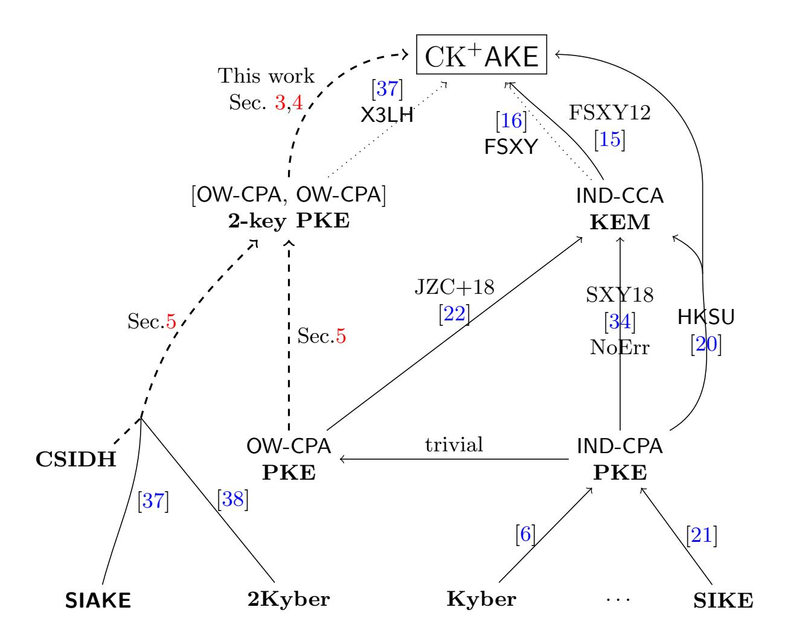
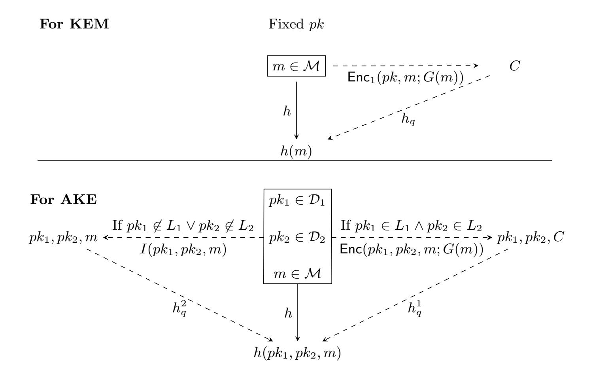
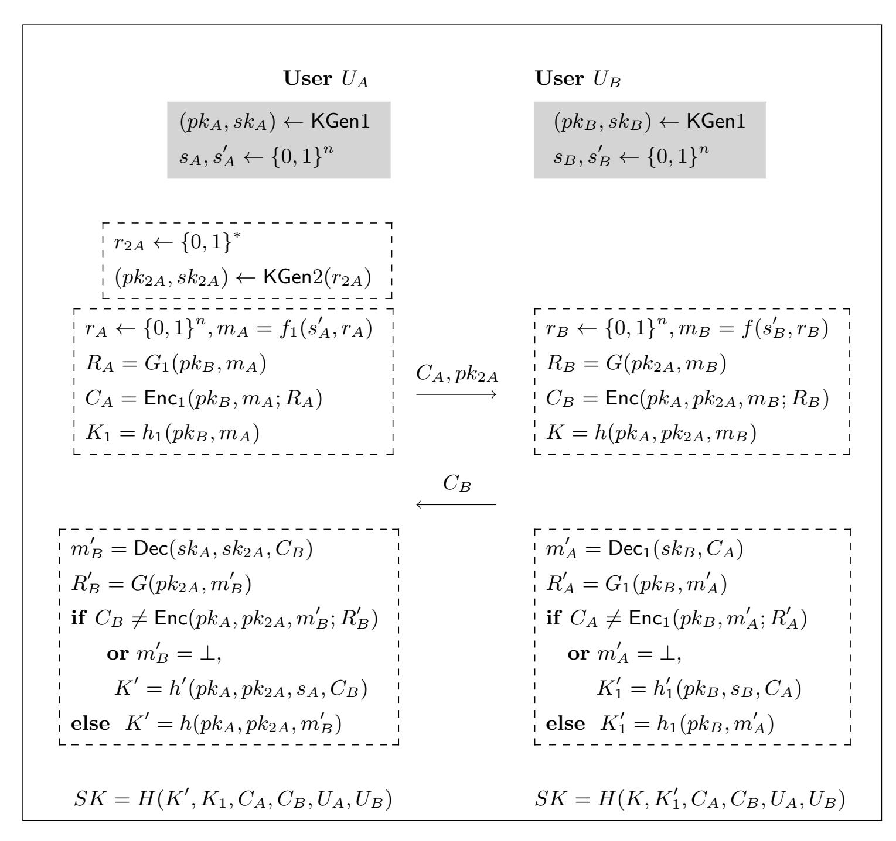

{0}------------------------------------------------

### Compact Authenticated Key Exchange in the Quantum Random Oracle Model

Haiyang Xue1,2,<sup>3</sup> ? , Man Ho Au<sup>2</sup> , Rupeng Yang<sup>2</sup> , Bei Liang<sup>4</sup> , Haodong Jiang<sup>5</sup>

<sup>1</sup> State Key Laboratory of Information Security, Institute of Information Engineering, Chinese Academy of Sciences, Beijing, China

### haiyangxc@gmail.com

- <sup>2</sup> Department of Computer Science, The University of Hong Kong, Hong Kong allen.au@gmail.com, orbbyrp@gmail.com
  - <sup>3</sup> Data Assurance and Communications Security Research Center, Chinese Academy of Sciences, Beijing, China
- <sup>4</sup> Yanqi Lake Beijing Institute of Mathematical Sciences and Applications, Being, China

#### lbei@chalmers.se

<sup>5</sup> State Key Laboratory of Mathematical Engineering and Advanced Computing, Zhengzhou, Henan, China hdjiang13@gmail.com

Abstract. Several quantum-resistant authenticated key exchange protocols (AKEs) have been proposed from supersingular isogeny and lattice. Most of their security analyses are conducted in the classical random oracle model, leaving their securities in the quantum random oracle model (QROM) as open problems. In this paper, we propose a generic construction of two-message AKE in QROM. It can be regarded as a QROM-secure version of X3LH [Xue et al. ASIACRYPT 2018], a generic AKE based on double-key PKE. We prove that, with some modification, the QROM security of X3LH can be reduced to the one-way security of double-key PKE. Aside from answering open problems on the QROM security of prior AKEs, such as SIAKE [Xu et al. ASIACRYPT 2019] based on supersingular isogeny, 2Kyber-AKE based on Module-LWE, and FSXY, we propose a new construction, CSIAKE, based on commutative supersingular isogeny. Our framework enjoys the following desirable features. First of all, it supports PKEs with non-perfect correctness. Secondly, the basic building block is compact and only requires one-wayness. Finally, the resulting AKE achieves the security in CK<sup>+</sup> model as strong as X3LH, and the transformation overhead is low.

### 1 Introduction

Since the introduction of authenticated key exchange (AKE), there has been a series of works on security models and provably secure instantiations based on

<sup>?</sup> This work was done while the author was in the Department of Computing, The Hong Kong Polytechnic University.

{1}------------------------------------------------

classical assumptions. Recently, one of the most important and appealing directions is to construct AKE against quantum attacks. Although one could achieve this goal by combining quantum-secure PKE/KEM with quantum-resistant signatures [32], the resulting schemes incur considerable overhead. An alternative approach is to construct implicit AKE from quantum-secure PKE/KEM based on established generic frameworks. For example, the framework of [15] yields to AKEs from IND-CCA secure KEMs in the standard model.

Recognizing the inefficiency of [15], Fujioka et al. [16] generically construct AKE (denoted as FSXY hereafter) relying on the random oracle. Particularly, FSXY consists of a one-way chosen-ciphertext secure (OW-CCA) KEM under responder's static public key, and parallel execution of OW-CCA secure KEM and passively-secure KEM under initiator's static and ephemeral public key respectively. Both OW-CCA and passive-secure KEMs can be implied by OW-CPA secure PKE in the random oracle model (ROM) [15, Sec. 4]. There have been several instantiations of FSXY. Among them, those based on Module-LWE assumption [6] and supersingular isogeny [30] are the most attractive ones.

Another noteworthy framework is due to Xue et al. [37] (denoted as X3LH hereafter). Abstracted from many well-known ad-hoc implicit AKEs, X3LH devises AKE from a new primitive called adaptively secure double-key (2-key) KEM, which could be obtained from a passively secure 2-key PKE [37, Sec. 6.2] under the assumption of random oracle. Their observation is that, in FSXY, two independent ciphertexts under initiator's static and ephemeral public keys could be incorporated into a single encryption under these two public keys. This incorporation may yield communication and computation advantage. Xue et al. also formalised the security requirement of 2-key PKE as [OW-CPA, OW-CPA]. More precisely, in the [OW-CPA, ·] (resp. [·, OW-CPA]) game, adversary attempts to invert the ciphertext of a random message which is encrypted under a pair of public keys, where the first (resp. second) public key is generated honestly by the challenger, while the second (resp. first) public key is chosen by the adversary.

The prominent advantage of X3LH is that there are compact 2-key PKEs besides the direct combination of two PKEs. Thus, following their framework, several compact AKEs are given, such as SIAKE [38] based on supersingular isogeny and 2Kyber-AKE [37] from Module-LWE.

To explain their framework, let's explain several intuitions on the constructions of 2-key PKE using classical ElGamal encryption beforehand. Let  $g_1, g_2, g$  be a group generators and let  $(g_1, h_1 = g_1^{x_1})$ ,  $(g_2, h_2 = g_2^{x_2})$  or  $h_1 = g^{x_1}, h_2 = g^{x_2}$  be the public keys of two ElGamal PKEs. Let H be hash function. A 2-key PKE of message  $m := m_1 || m_2$  can be generated with  $r_1, r_2$  in following approaches.

| Types  | Intuitions                                                                     | Schemes         |
|--------|--------------------------------------------------------------------------------|-----------------|
| Type 1 | $[\;g_1^{r_1},h_1^{r_1}\oplus m_1\;]\;  \;[\;g_2^{r_2},h_2^{r_2}\oplus m_2\;]$ | FSXY [16,6,30]  |
| Type 2 | $[\ g^{r_1},H(h_1^{r_1})\oplus m_1,H(h_2^{r_1})\oplus m_2\ ]$                  | SIAKE [38]      |
| Type 3 | $[\ g_1^{r_1},g_2^{r_2},h_1^{r_1}h_2^{r_2}\oplus m\ ]$                         | 2Kyber-AKE [37] |

{2}------------------------------------------------

Following these approaches and updating mathematic structures, quantum-resistant AKEs can be constructed based on supersingular isogeny [38,30] and Module-LWE [37,6]. Looking ahead, as shown in Table 1, Type 2 and Type 3 approaches usually have bandwidth and computing advantages over those of Type 1.

The Quantum ROM. Since the quantum computer could execute all the off-line primitives, including hash functions, Boneh et al. [5] introduced the quantum ROM (QROM), in which the adversary can query random oracle with arbitrary superpositions. It is widely believed that proofs in the *quantum* ROM rather than *classical* ROM fulfill the security requirements against quantum adversaries.

Motivation. Although X3LH leads to efficient and quantum-resistant AKEs (i.e., SIAKE, 2Kyber-AKE, and FSXY), analyses of their securities are conducted in the classical ROM, thereby leaving their securities in QROM as open problems, which motivates us to investigate in this paper.

Hövelmanns et al. [20] made the first try on this problem. They proposed a modified FSXY (denoted as HKSU hereafter) and proved its QROM-security. They re-examined the puncture technique of [34] (which is a recent progress on QROM security of Fujisaki-Okamoto transformation) and applied it to FSXY. The drawback of the puncture trick is the underlying 1-key PKE should be IND-CPA secure, as opposed to the fact that in the original FSXYOW-CPA secure PKE is sufficient. Although HKSU's technique works well for Type 1 approach, it can not be applied to Type 2 and Type 3 instantiations of X3LH, i.e., SIAKE and 2Kyber-AKE.

Firstly, 2-key PKE of SIAKE only achieves one-wayness even under isogeny-based DDH assumption. Recall that Type 2 scheme's ciphertext consists of

$$c_1 = g^{r_1}, c_2 = \mathsf{H}(h_1^{r_1}) \oplus m_1, c_3 = \mathsf{H}(h_2^{r_1}) \oplus m_2.$$

The main challenge is that  $h_2$  is chosen by the adversary. Specifically, assuming  $(c_1^*, c_2^*, c_3^*)$  is the challenge ciphertext, to prove IND security, we may embed DDH challenge into  $g, h_1, c_1^*$  and  $c_2^*$ . However, generating  $c_3^*$  is challenging since neither  $\log_g h_2$  nor  $\log_g c_1^*$  is known. Some kind of gap assumption may help to fix it. Unfortunately, gap assumption does not hold for supersingular isogeny due to an adaptive attack proposed by Galbraith et al. [18].

Secondly, HKSU's proof (and several others for QROM security of Fujisaki-Okamoto) is built indispensably on the so-called injective mapping with encryption under fixed public key to decoupling decapsulation oracle from the secret key. However, in Type 2 and 3 approaches, the adversary may query decapsulation oracle under many public keys and could arbitrarily choose the second public key, of which any users is unaware when isogeny or lattice is applied [26]). This highly influences the applicability of injective mapping with encryption since now the "injective" property may not hold.

Thus, to supplement the state-of-the-art of quantum-resistant AKEs, more investigations should be conducted on the security of X3LH in QROM, especially for Type 2 and 3 instantiations. It is also an open problem raised in [37,38].

{3}------------------------------------------------

| AKEs         | Assumption | QROM         | Tool's Security                   | Comm. (Bytes) | Comp.     |
|--------------|------------|--------------|-----------------------------------|---------------|-----------|
| FSXY [16,6]  |            |              | OW-CPA                            | 5920          |           |
| HKSU [20]    | M-LWE      | $\checkmark$ | IND-CPA                           | 5920          |           |
| X3LH [37]    | IVI-LVV E  |              | [OW-CPA,OW-CPA]                   | 5302          |           |
| Ours         |            | $\checkmark$ | [OW-CPA,OW-CPA]                   | 5302          |           |
| FSXY [16,30] |            |              | OW-CPA                            | 2352          | 6+6 Isog. |
| $HKSU^*[20]$ | SIDH       | $\checkmark$ | IND-CPA                           | 2352          | 6+6 Isog. |
| SIAKE [38]   | SIDII      |              | [OW-CPA, OW-CPA]                  | 1788          | 6+5 Isog. |
| Ours         |            | $\checkmark$ | [OW-CPA, OW-CPA]                  | 1788          | 6+5 Isog. |
| HKSU*[20]    | CSIDH      | <b>√</b>     | IND-CPA                           | 2688          | 6+6 Isog. |
| Ours         | CSIDH      | $\checkmark$ | $[OW\text{-}CPA,\!OW\text{-}CPA]$ | 2028          | 6+5 Isog. |

<span id="page-3-0"></span>**Table 1.** Comparison of AKEs. The work marked with (\*) is the direct instantiation of HKSU from (C)SIDH. The parameter of M-LWE and SIDH(-p751) is chosen to have the same security as AES-256, while that for CSIDH(-5280), recommended by [10], has the same security as AES-128. "Comm." and "Comp." indicate communication and computation respectively. We do not count the computation under the M-LWE assumption since it is not a bottleneck. "x + y Isog." means that the initiator (resp. responder) has to perform x (resp. y) isogeny computation.

### 1.1 Our Contributions

- We prove that X3LH (with a slight modification) transforms 2-key PKE into an adaptively secure AKE in QROM. Our transformation is practical, not only because it relies on a weak building block, i.e., [OW-CPA, OW-CPA] secure 2-key PKE, which supports more compact instantiations, but also because it is as efficient as X3LH.
- Our result answers several open problems on the securities of exsiting AKEs in QROM, such as SIAKE, 2Kyber-AKE and FSXY. For FSXY, the security requirement of underlying PKE is the same as FSXY, i.e., OW-CPA, contrary to the result in [20] which requires IND-CPA.
- Our result also provides an alternative approach to design new post-quantum AKEs in QROM, i.e., we only need to focus on instantiating 2-key PKE. With such a guide, CSIAKE, a new construction based on commutative supersingular isogenies [14] is given.
- Our last contribution is the proof technique, namely, domain separation and *injective mapping with encryption under many public keys*. We believe that this technique, which is of independent interest, is useful for multi-user security of Fujisaki-Okamoto transformation in QROM.

To the best of our knowledge, SIAKE, CSIAKE and 2Kyber-AKE represent the most efficient QROM-secure AKEs under their corresponding assumptions. Table 1 and Fig. 1 summarize our and existing works.

{4}------------------------------------------------



<span id="page-4-0"></span>Fig. 1. Illustration of existing works from probabilistic PKE and our contributions. "NoErr" indicates the work does not consider decryption error. The dotted (resp. solid) lines indicate works in the classical ROM (resp. QROM or standard) model. The dashed lines are our contributions.

### 1.2 Technique Overview

We first review the framework of X3LH in detail and discuss the challenges to prove its security in QROM. Then, we present our solution and conclude with a discussion on the applicability of our framework.

Recall that, a CK<sup>+</sup> secure AKE guarantees that no PPT adversary can distinguish the test session key from a random string (if the test session is fresh) even though it could send any message, make SessionKeyReveal queries on any non-test session to obtain the session key, query SessionStateReveal to gain the internal state, and corrupt some users to get their secret keys.

Review of X3LH. X3LH achieves CK<sup>+</sup> security by reasonably summarizing that the underlying 2-key PKE should provide [OW-CPA, OW-CPA] security. In their original paper, it is presented via a two-step process: firstly from passively secure 2-key PKE to adaptively secure 2-key KEM, and then to AKE. Given hash functions G, h and H, the resulting scheme is presented below, where Enc is 2-key encryption and Enc<sup>1</sup> is normal 1-key encryption. Initiator Alice first generates an ephemeral key pk2<sup>A</sup> and sends it to Bob. Bob returns a 2-key ciphertext C<sup>B</sup> under Alice's static and ephemeral public keys pkA, pk2A. The process is

{5}------------------------------------------------

Alice 
$$(pk_A, sk_A)$$
 Bob  $(pk_B, sk_B)$  
$$\underbrace{pk_{2A}, \ C_A = \mathsf{Enc}_1\big(pk_B, m_A, G(m_A)\big)}_{ E_B = \mathsf{Enc}\big(pk_A, pk_{2A}, m_B; G(m_B)\big)}_{ K_B = h(pk_{2A}, m_B)} K_B = h(pk_{2A}, m_B)$$
  $K = H(sid, K_A, K_B)$ 

somewhat symmetric in the sense that in the first move, Alice sends to Bob a 1-key ciphertext under Bob's public key. The final session key is extracted from encapsulated keys K<sup>A</sup> and K<sup>B</sup> together with the session identifier.

X3LH summarized the security of 2-key PKE as [OW-CPA, ·] and [·, OW-CPA] games. In the first (resp. second) game, the adversary attempts to invert the ciphertext of a random message where the first (resp. second) public key is generated by the challenger, while the second (resp. first) public key is chosen by the adversary. [·, OW-CPA] security provides weak perfect forward security, and [OW-CPA, ·] security appropriately handles all the other attacks.

To fill up the gap between AKE and [OW-CPA, OW-CPA] secure 2-key PKE, two issues should be resolved in both classical and quantum ROMs.

Issue I: How to answer SessionKeyReveal query (which is much like decapsulation query) and return session key without knowing static secret key (i.e., the first secret key of 2-key PKE).

Issue II: In the test session, how to decouple session key K<sup>∗</sup> from challenge ciphertext C ∗ (which is the encryption of m<sup>∗</sup> ) and claim its randomness.

In classical ROM, the hash list offers an effective tool to solve them. Concretely, we could answer the SessionKeyReveal query by searching the hash lists and then decouple test session key from challenge ciphertext when the hash lists do not contain m<sup>∗</sup> since, otherwise, we could solve the [OW-CPA, ·] problem. However, the hash list trick is hardly to be used in QROM.

In QROM, a variety of techniques [\[35,](#page-30-2)[19](#page-29-11)[,22,](#page-29-9)[34,](#page-29-5)[2,](#page-28-3)[7](#page-28-4)[,40,](#page-30-3)[27\]](#page-29-12) have been developed for Fujisaki-Okamoto from 1-key CPA PKE to CCA KEM. Fujisaki-Okamoto replaces randomness of PKE with G(m) and sets the encapsulated key as K = h(m), where G, h are QROs. It would be great if these techniques could be used by X3LH. However, except by adding hash which leads to a large overhead, it is not easy to apply them to X3LH in a straightforward way. In the following, we analyze the challenges of Issue I and II separately and show our solution.

Challenges and Our Solution. To simplify the presentation, we only analyze the authentication of Alice. Authenticating Bob is analogous. Let Enc1, Dec<sup>1</sup> be enc/dec algorithms of 1-key PKE, and Enc be encryption of 2-key PKE.

Issue I: Answering SessionKeyReveal without Secret Key. In 1-key Fujisaki-Okamoto, there is a problem of answering decapsulation oracle without knowing the secret key. To solve it, Targhi and Unruh [\[35\]](#page-30-2) appended a length-preserving 

{6}------------------------------------------------

hash of plaintext to the ciphertext. Although this technique could be applied to X3LH, it incurs a considerable overhead which we want to avoid.

Another elegant technique is the injective mapping with encryption [5,34,22,2], which is to replace h with private QRO  $h_q$  and an injective map f. As illustrated in Fig. 2, f is taken to be  $m \mapsto \mathsf{Enc}_1(pk, m; G(m))$  (under the assumption of perfect correctness). By such replacement, we could return  $h_q(C)$  as the key encapsulated in ciphertext C, i.e., without secret key, since

$$h(\mathsf{Dec}_1(sk,C)) = h_q \circ \mathsf{Enc}_1\big(pk,\mathsf{Dec}_1(sk,C);G\left(\mathsf{Dec}_1(sk,C)\right)\big) = h_q(C),$$

where pk, sk are the public and secret keys.



<span id="page-6-0"></span>Fig. 2. The injective mapping by  $\mathsf{Enc}_1$  under fixed public key and the injective mapping by  $\mathsf{Enc}$  under many public keys. pk is a fixed public key.  $L_1$  (resp.  $L_2$ ) is the list of honestly generated first public keys (resp. second public keys). I is the identity map.

Note that to apply the injective mapping with encryption, the public key should be fixed at the beginning. However, in the scenario of X3LH, the adversary could query SessionKeyReveal on many public keys, since the second public key is ephemeral and might be chosen by the AKE adversary. Thus, public keys of Enc should be embedded in h to specify under which public keys Enc is applied, i.e., the encapsulated key is  $K = h(pk_1, pk_2, m)$ . Now, AKE adversary could query h with any  $pk_1$  and  $pk_2$  of its choice, which may contradict with the requirement that  $Enc(pk_1, pk_2, m; G(m))$  should be *injective*.

{7}------------------------------------------------

Our solution. Someone may come up with an idea of checking the validity of public key, which itself is a great challenge [26] (e.g., those based on lattice and supersingular isogeny). However, we observe that SessionKeyReveal queries are applied to many but bounded public keys, i.e., those honestly generated static and ephemeral public keys. Thus, although maintaining hash lists is not an easy task in QROM, the list of bounded public keys could be prepared at the very beginning. Specifically, let N be the number of users and l the number of sessions between two users. Let  $L_1 := \{(pk_{1,i}, sk_{1,i})_{1 \le i \le N}\}$  be the list of honest static public-secret keys where the pair with index i is prepared for user  $U_i$ , and  $L_2 := \{(pk_{2,i}^j, sk_{2,i}^j)_{1 \le i \le N, 1 \le j \le Nl}\}$  be the list of ephemeral public-secret keys, where  $pk_{2,i}^j$  is prepared as the ephemeral public key for  $U_i$ 's j-th session.

With  $L_1$  and  $L_2$ , the domain of h, i.e.,  $\mathcal{D}_1 \times \mathcal{D}_2 \times \mathcal{M}$  could be divided as  $L_1 \times L_2 \times \mathcal{M}$  and its complement. With such a domain separation, our technique, i.e., injective mapping with encryption under many public keys, is illustrated in Fig. 2.  $h(pk_1, pk_2, m)$  is defined according to the domain separation. Namely,

$$h(pk_1, pk_2, m) = \begin{cases} h_q^1(pk_1, pk_2, \text{Enc}(pk_1, pk_2, m; G(m))) & \text{if } pk_1 \times pk_2 \in L_1 \times L_2 \\ h_q^2(pk_1, pk_2, m) & \text{otherwise,} \end{cases}$$

where  $h_q^1, h_q^2$  are private random oracles. With such replacement, we could answer SessionKeyReveal queries on  $(pk_1 \in L_1, pk_2 \in L_2, C, \cdots)$  by using  $h_q^1(pk_1, pk_2, C)$  as the key encapsulated in C, obviously, without the knowledge of secret key.

Issue II: Decoupling Session Key from Challenge Ciphertext. The One Way to Hiding (OW2H) lemma [36] and its variants play essential roles to decouple encapsulated key from challenge ciphertext. Informally, OW2H lemma states that: if a quantum distinguisher, issuing queries to QRO  $\mathcal{O}_1$  or  $\mathcal{O}_2$  which only differ on a set S, could distinguish them from each other, then there exists a one-wayness attacker to find some element in S. The way of using the OW2H lemma is related to the security requirement of the underlying primitive.

Introduced in [34] and later used by [20], the puncture technique removes 0 from the message space. After applying OW2H to G on  $m^*$ , the challenge ciphertext  $C^*$  can be replaced by the encryption of 0, so that the attacker cannot issue a hash query on 0, where makes the attacker not have any advantage to distinguish the ciphertext. The drawback of puncture technique is that the underlying encryption is required to be IND-CPA secure. Unfortunately, compact instantiations of X3LH, i.e. SIAKE and CSIAKE in Sec. 5, do not provide IND security.

The Unified Oracle Trick. Introduced in [35] and later utilized by [22], the unified oracle trick provides a possibility to reduce security to the one-wayness of underlying encryption. The unified oracle trick is to treat the oracle queries to G, h as a unified  $G \times h$ . We adopt such a technique. Specifically, we replace  $G(m_B)$  in X3LH with  $G(pk_{2A}, m_B)$ . Looking ahead, after the guess of the static public key in the test session, say  $pk_1^*$ , any query  $(pk_2, m)$  to G could be handled as a query with  $(pk_1^*, pk_2, m)$  which makes G and h share the same domain.

{8}------------------------------------------------

The Choice of S. In Fujisaki-Okamoto transformation, S (which denotes the set of different elements between  $\mathcal{O}_1$  and  $\mathcal{O}_2$ ) is a set consisting of a single point, i.e., the challenge message. In the scenario of X3LH, since ephemeral public key  $pk_2^*$  of the test session is chosen by the adversary, S should be carefully chosen to make sure that, on the one hand, it is large enough such that  $pk_2^*$  is covered, but on the other hand, it is not too large such that answering SessionKeyReveal query in **Issue I** is not affected.

Let  $L_{2\mathsf{after}} \subset L_2$  be the list of ephemeral public keys utilized after the test session. We could do this by doubling the size of  $L_2$ . Then, we set  $S = \{pk_1^*\} \times \mathcal{D}_2 \setminus L_{2\mathsf{after}} \times \{m_B^*\}$ , where  $m_B^*$  is the challenge message. It is exactly the set satisfying all requirements. 1) If the ephemeral public key has high entropy, it holds that  $pk_2^* \in \mathcal{D}_2 \setminus L_{2\mathsf{after}}$  with overwhelming probability, which satisfies the first requirement. 2) Since  $m_B^*$  is randomly chosen by simulator, any SessionKeyReveal query before the test session meets  $m_B^*$  with negligible probability. Furthermore, by the definition of  $L_{2\mathsf{after}}$ , ephemeral public keys of SessionKeyReveal queries after the test session will be in  $L_{2\mathsf{after}}$ . Thus, the second requirement is satisfied.

Putting all together and the applicability of our framework. According to the above analyses, we modify X3LH by embedding both static and ephemeral public keys into h and adding ephemeral public key into G. The cost of adding public keys into the hash function is negligible, while the gain is QROM security.

With this framework, to construct QROM secure AKE, we only need to focus on instantiating 2-key PKE. Following Type 2 approach, we propose a new instantiations from commutative supersingular isogenies [14]. Compared with HKSU, the communication of our scheme has a significant advantage, since a 2-key PKE ciphertext in this setting is only 5.3% longer than an ordinary PKE ciphertext. We highlight that 2-key encryption of CSIAKE only provides one-way security under the standard assumption. Additional information about instantiations, SIAKE, CSIAKE, and FSXY, are given in Sec. 5.

### 1.3 Related Works

1-key PKE-to-KEM. Several works [19,22,34,2,7,40,27] have re-examined Fujisaki-Okamoto transformation in QROM. They utilized the injective mapping or additional hash to avoid recording queries and also proposed different variants of OW2H lemma. Please refer to Appendix A for more details. Zhandry [40] showed a possibility for lazy sampling and recording queries. As he said, his proof might be looser than those using OW2H.

Hashing with the public key. The technique of hashing with the public key has been used to analyze the multi-user security of Schnorr signature [3]. Recently, several submissions for the NIST Post-Quantum Cryptography Standardization, including Kyber [6], have also employed such technique. Kyber proposed heuristic analysis from the perspective of multi-target attacks. The necessity of putting the public key into hashing is still heavily debated [9]. Our analysis

{9}------------------------------------------------

in this work shows that hashing with the public key seems necessary to prove the multi-user security of Fujisaki-Okamoto in QROM.

HKSU in QROM. H¨ovelmanns et al. [\[20\]](#page-29-4) proposed a modular HKSU framework from IND-CPA secure 1-key PKE in QROM. We note that when applying to FSXY, our framework needs one more re-encryption than HKSU. We take it as a compromise to include more compact instantiations. Firstly, there exist compact constructions of 2-key PKE except for two parallel executions of 1 key PKE. For example, based on (commutative) supersingular isogeny, our scheme has better computation and communication performance than HKSU. (A similar computation comparison between SIAKE and FSXY has been given in [\[38\]](#page-30-1).) Secondly, our framework starts from the same security as FSXY, i.e., the one-wayness, which is weaker than indistinguishability that is relied upon by HKSU [\[20\]](#page-29-4).

AKE from Commutative Supersingular Isogenies Very recently, De Kock [\[25\]](#page-29-13) and Kawashima et al. [\[28\]](#page-29-14) proposed two AKEs from commutative supersingular isogenies (CSI). Their protocols rely on classical ROM and are based on a nonstandard assumption, i.e., a gap Diffie-Hellman assumption in the CSI set.

### 2 Preliminary

In this section, we recall the definition of 2-key PKE and the CK<sup>+</sup> model. At last, preliminary knowledge of the quantum random oracle model is given.

### 2.1 2-Key PKE and Security

We revisit the definition of 2-key PKE [\[37\]](#page-30-0). A 2-key PKE 2PKE=(KGen1, KGen2, Enc, Dec) is a quadruple of PPT algorithms together with two public key space Dpk<sup>1</sup> , Dpk<sup>2</sup> , a plaintext space M, a randomness space R and a ciphertext space C. We want to highlight that the set membership problem of Dpk<sup>1</sup> and Dpk<sup>2</sup> is generally hard. Let D<sup>1</sup> (resp. D2) be some superset of Dpk<sup>1</sup> (resp. Dpk<sup>2</sup> ) such that the membership problem of D<sup>1</sup> (resp. D2)is easy.

- KGen1: on input security parameter, output public-secret key (pk1, sk1).
- KGen2: on input security parameter, output public-secret key (pk2, sk2).
- Enc(pk1, pk2, m; r) : on input public keys pk1, pk2, plaintext m ∈ M, and randomness r ∈ R, output the ciphertext C ∈ C. Sometimes, we eliminate the randomness r and denote it as Enc(pk1, pk2, m) for simplicity.
- Dec(sk1, sk2, C) : on input secret keys sk1, sk<sup>2</sup> and cipheretext C ∈ C, output a plaintext m.

Correctness and Decryption failure. The decryption failure is defined as

$$\delta_2 := \mathrm{E}\left(\max_{m \in \mathcal{M}} \Pr\left[\mathsf{Dec}\left(sk_1, sk_2, \mathsf{Enc}(pk_1, pk_2, m)\right) \neq m\right]\right),$$

{10}------------------------------------------------

where the expectation is taken over  $(pk_1, sk_1) \leftarrow \mathsf{KGen1}$  and  $(pk_2, sk_2) \leftarrow \mathsf{KGen2}$ . Entropy of second public key. For any  $pk_2' \in \mathcal{D}_2$ ,

$$\Pr[pk_2 = pk_2' | (pk_2, sk_2) \leftarrow \mathsf{KGen2}] \le \varepsilon_{\mathsf{pk2}}.$$

ONE-WAY SECURITY. Recall the definition of [OW-CPA, OW-CPA] security for 2PKE [37], two adversaries, i.e.,  $\mathcal{A} = (\mathcal{A}_1, \mathcal{A}_2)$  attacking  $pk_1$  and  $\mathcal{B} = (\mathcal{B}_1, \mathcal{B}_2)$  attacking  $pk_2$ , are taken into account. The [OW-CPA, ·] and [·, OW-CPA] security games are shown in Fig. 3 from left to right, respectively.

| Gan | $\mathrm{me}\;[OW\text{-}CPA,\cdot]$                            | Game $[\cdot, OW\text{-}CPA]$                                 |       |  |  |
|-----|-----------------------------------------------------------------|---------------------------------------------------------------|-------|--|--|
| 1:  | $(pk_1, sk_1) \leftarrow KGen1$                                 | $1:  (pk_2, sk_2) \leftarrow KGen2$                           |       |  |  |
| 2:  | $(state; pk_2^*) \leftarrow \mathcal{A}_1(pk_1)$                | 2: $(state; pk_1^*) \leftarrow \mathcal{B}_1(pk_2)$           |       |  |  |
| 3:  | $m \leftarrow \mathcal{M}, c^* \leftarrow Enc(pk_1, pk_2^*, m)$ | $3:  m \leftarrow \mathcal{M}, c^* \leftarrow Enc(pk_1^*, pk$ | (2,m) |  |  |
| 4:  | $m' \leftarrow \mathcal{A}_2(state, c^*)$                       | $4:  m' \leftarrow \mathcal{B}_2(state, c^*)$                 |       |  |  |
| 5:  | return $m' \stackrel{?}{=} m$                                   | $5: \text{ return } m' \stackrel{?}{=} m$                     |       |  |  |

<span id="page-10-0"></span>Fig. 3. The one-way security games for 2-key PKE.

The advantage of A winning in the game [OW-CPA, ·] is defined as

$$\mathrm{Adv}^{[\mathsf{OW}\text{-}\mathsf{CPA},\cdot]}_{\mathsf{2PKE}}(\mathcal{A}) = \Pr\left[ [\mathsf{OW}\text{-}\mathsf{CPA},\cdot]^{\mathcal{A}} \Rightarrow 1 \right].$$

We say that 2PKE is  $[OW-CPA, \cdot]$  secure, if for any PPT adversary  $\mathcal{A}$ ,  $Adv_{2PKE}^{[OW-CPA, \cdot]}(\mathcal{A})$  is negligible. The advantage  $Adv_{2PKE}^{[\cdot,OW-CPA]}(\mathcal{B})$  and  $[\cdot,OW-CPA]$  security can be defined in the same manner. If 2PKE is both  $[OW-CPA, \cdot]$  and  $[\cdot,OW-CPA]$  secure, we say it is [OW-CPA, OW-CPA] secure.

1-key PKE. Let PKE = (KeyGen<sub>1</sub>, Enc<sub>1</sub>, Dec<sub>1</sub>) be a 1-key PKE with randomness space  $\mathcal{R}_1$ , message space  $\mathcal{M}_1$  and ciphertext space  $\mathcal{C}_1$ . It can be taken as a special 2-key PKE where KGen2 does nothing (such as  $(-,-) \leftarrow$  KGen2), KGen1, Enc, and Dec do as what KeyGen<sub>1</sub>, Enc<sub>1</sub>, and Dec<sub>1</sub> do respectively. The decryption failure for the underlying 1-key PKE is the same as that for this 2-key PKE. The OW-CPA advantage (which is denoted as  $Adv_{PKE}^{OW-CPA}$ ) of PKE is exactly  $Adv_{PKE}^{OW-CPA,\cdot}$  of the specified 2-key PKE.

### <span id="page-10-1"></span>2.2 CK<sup>+</sup> Security Model

Here, we recall the CK<sup>+</sup> model introduced by [15,16], which is a modified CK model [12] integrated with the weak perfect forward security (wPFS), resistant to key compromise impersonation (KCI) and (maximal exposure (MEX) attacks. We focus on the two-pass protocol in this definition. Please refer to Appendix B for a discussion on security models.

{11}------------------------------------------------

U<sup>i</sup> denotes a party indexed by i, which is modeled as probabilistic polynomial time (PPT) interactive Turing machines. We assume that each party U<sup>i</sup> owns a static pair of secret-public keys (ssk<sup>i</sup> , spki), where spk<sup>i</sup> is linked to U<sup>i</sup> 's identity such that the other parties can verify the authentic binding between them. We do not require the well-formedness of the static public key, in particular, a corrupted party can adaptively register any static public key of its choice.

Session. Each party can be activated to run an instance called a session. A party can be activated to initiate the session by an incoming message of the form (Π, I, UA, UB) or respond to an incoming message of the form (Π, R, UB, UA, XA), where Π is a protocol identifier, I and R are role identifiers corresponding to initiator and responder, and X<sup>A</sup> is the communication message. Activated with (Π, I, UA, UB), U<sup>A</sup> is called the session initiator. Activated with (Π, R, UB, UA, XA), U<sup>B</sup> who will responds with X<sup>B</sup> is the session responder.

According to the specification of AKE, the party creates session specified randomness which is generally called ephemeral secret key, computes and maintains a session state, generates outgoing messages, and completes the session by outputting a session key and erasing the session state. Here we require that the session state at least contains the ephemeral secret key.

A session may also be aborted without generating a session key. The initiator U<sup>A</sup> creates a session state and outputs XA, and may receive an incoming message of the forms (Π, I, UA, UB, XA, XB) from the responder UB, and may compute the session key SK. On the contrary, the responder U<sup>B</sup> outputs XB, and may compute the session key SK. We state that a session is completed if its owner computes the session key.

A session is associated with its owner, a peer, and a session identifier. If U<sup>A</sup> is the initiator, the session identifier is sid = (Π, I, UA, UB, XA) or sid = (Π, I, UA, UB, XA, XB), which denotes U<sup>A</sup> as an owner and U<sup>B</sup> as a peer. If U<sup>B</sup> is the responder, the session is identified by sid = (Π, R, UB, UA, XA, XB), which denotes U<sup>B</sup> as an owner and U<sup>A</sup> as a peer. The matching session of (Π, I, UA, UB, XA, XB) is (Π, R, UB, UA, XA, XB) and vice versa.

Adversary. Adversary A is modeled as following to capture real attacks, including the control of communication and access to some secret information.

- Send(message): A sends messages in one of the following forms: (Π, I, UA, UB), (Π, R, UB, UA, XA), or (Π, I, UA, UB, XA, XB), and obtains the response.
- SessionKeyReveal(sid): if the session sid is completed, A obtains the session key SK for sid.
- SessionStateReveal(sid): A obtains the session state of the owner of sid if the session is not completed. The session state should be specified by the concrete protocols. We require it returns the ephemeral secret keys and some intermediate computation results except for immediately erased information.
- Corrupt(Ui): this query allows the adversary to learn the static secret key of user U<sup>i</sup> . After this query, U<sup>i</sup> is said to be corrupted.

Freshness. Let sid<sup>∗</sup> = (Π, I, UA, UB, XA, XB) or (Π, R, UB, UA, XA, XB) be a completed session between U<sup>A</sup> and UB. If the matching session of sid<sup>∗</sup> 

{12}------------------------------------------------

exists, denote it by  $\overline{\operatorname{sid}^*}$ . We say session  $\operatorname{sid}^*$  is fresh if  $\mathcal{A}$  does not query: 1) SessionStateReveal( $\operatorname{sid}^*$ ), SessionKeyReveal( $\operatorname{sid}^*$ ), SessionStateReveal( $\operatorname{sid}^*$ ), or SessionKeyReveal( $\operatorname{sid}^*$ ) when  $\overline{\operatorname{sid}^*}$  exists; 2) SessionStateReveal( $\operatorname{sid}^*$ ) or Session-KeyReveal( $\operatorname{sid}^*$ ) when  $\overline{\operatorname{sid}^*}$  does not exist.

**Security Experiment.** (Quantum) adversary  $\mathcal{A}$  could make a sequence of queries described above. During the experiment,  $\mathcal{A}$  makes the query of Test(sid\*), where sid\* must be a fresh session. Test(sid\*) selects a random bit  $b \in \{0, 1\}$ , and returns the session key held by sid\* if b = 0; and returns a random key if b = 1. The experiment continues until  $\mathcal{A}$  returns b'. The advantage of adversary  $\mathcal{A}$  is defined as  $\mathsf{Adv}_{\Pi}^{ck+}(\mathcal{A}) = \Pr\left[b' = 1 \middle| b = 1\right] - \Pr\left[b' = 1 \middle| b = 0\right]$ .

<span id="page-12-0"></span>**Definition 1.** We state that a AKE protocol  $\Pi$  is secure in the  $CK^+$  model if the following conditions hold:

Correctness: if two honest parties complete matching sessions, then they both compute the same session key except with negligible probability.

**Soundness**: for any PPT adversary  $\mathcal{A}$ ,  $\mathsf{Adv}_{\Pi}^{ck+}(\mathcal{A})$  is negligible for any one of the cases listed in the following and Table 2. Note that in these cases except 5, when it is allowed, the ephemeral secret key or static secret key of the owner of  $\mathsf{sid}^*$  or  $\mathsf{sid}^*$  is given to  $\mathcal{A}$  directly once it is determined. For case 5, the leakage of static secret key happens after the test session ends.

- 1. the static secret key of the owner of  $sid^*$  is given to A, if  $\overline{sid^*}$  does not exist.
- 2. the ephemeral secret key of owner of  $sid^*$  is given to A, if  $sid^*$  does not exist.
- 3. the static secret key of the owner of  $sid^*$  and the ephemeral secret key of  $\overline{sid}^*$  are given to A, if  $sid^*$  exists.
- 4. the ephemeral secret key of  $sid^*$  and the ephemeral secret key of  $\overline{sid^*}$  are given to A, if  $\overline{sid^*}$  exists.
- 5. the static secret key of the owner of  $sid^*$  and the static secret key of the peer of  $sid^*$  are given to A, if  $\overline{sid}^*$  exists.
- 6. the ephemeral secret key of  $sid^*$  and the static secret key of the peer of  $sid^*$  are given to A, if  $\overline{sid}^*$  exists.

#### 2.3 The Quantum Random Oracle Model

Boneh et al. [5] introduced the quantum random oracle (QRO) model. Zhandary [39] proved that any 2q-wise independent random function can be used to simulate the QRO allowing at most q queries. The one way-to-hiding (OW2H) lemma, initially proposed by Unruh [36], is a useful tool for security analysis in QROM. Recently, Ambainis et al. [2] introduced the semi-classical OW2H, which is very generic and flexible. The OW2H lemma is revisited in Theorem 3 of [2] (say as revisited OW2H lemma) and it is implied by semi-classical OW2H. Such revisited OW2H lemma is more suitable for this work. The difference is that [2] considers the query depth d, while we use the number of queries q.

<span id="page-12-1"></span>**Lemma 1 (OW2H, Probabilities [2]).** Let  $S \subseteq X$  be random. Let  $\mathcal{O}_1, \mathcal{O}_2 : X \to Y$  be random functions satisfying  $\forall x \notin S, \mathcal{O}_1(x) = \mathcal{O}_2(x)$ . Let z be a

{13}------------------------------------------------

| Event              | Case | sid* owner     | $\overline{sid^*}$ | $ssk_A$   | $esk_A$ | $esk_{B}$ | $ssk_B$   | Security |
|--------------------|------|----------------|--------------------|-----------|---------|-----------|-----------|----------|
| $E_1$              | 1    | $U_A$          | No                 |           | ×       | -         | ×         | KCI      |
| $E_2$              | 2    | $U_A$          | No                 | ×         |         | -         | ×         | MEX      |
| $E_3$              | 2    | $U_B$          | No                 | ×         | _       |           | ×         | MEX      |
| $E_4$              | 1    | $U_B$          | No                 | ×         | -       | ×         | $\sqrt{}$ | KCI      |
| $E_5$              | 5    | $U_A$ or $U_B$ | exists             | $\sqrt{}$ | ×       | ×         | $\sqrt{}$ | wPFS     |
| $E_6$              | 4    | $U_A$ or $U_B$ | exists             | ×         |         |           | ×         | MEX      |
| $E_{\textsf{7-}1}$ | 3    | $U_A$          | exists             | $\sqrt{}$ | ×       |           | ×         | MEX      |
| $E_{7\text{-}2}$   | 3    | $U_B$          | exists             | ×         |         | ×         | $\sqrt{}$ | MEX      |
| $E_{8\text{-}1}$   | 6    | $U_A$          | exists             | ×         |         | ×         | $\sqrt{}$ | MEX      |
| $E_{8-2}$          | 6    | $U_B$          | exists             | $\sqrt{}$ | ×       | $\sqrt{}$ | ×         | MEX      |

<span id="page-13-0"></span>Table 2. The cases of AKE adversary listed in Definition 1.  $\overline{\text{sid}}^*$  is the matching session of  $\overline{\text{sid}}^*$ . "exists" means that the matching session exists.  $ssk_A(\text{resp. } ssk_B)$  means the static secret key of  $U_A(\text{resp. } U_B)$ .  $esk_A(\text{resp. } esk_B)$  is the ephemeral secret key of  $U_A(\text{resp. } U_B)$  in  $\overline{\text{sid}}^*$  or  $\overline{\text{sid}}^*$  if it exists. " $\sqrt{}$ " means the secret key may be revealed to adversary, " $\times$ " means the secret key is not revealed. "-" means the secret key does not exist.

random bitstring.  $(S, \mathcal{O}_1, \mathcal{O}_2, z \text{ may have arbitrary joint distribution.})$  Let  $U_A$  be an oracle algorithm with query number q. Let  $B^{\mathcal{O}_1}$  be an oracle algorithm that on input z does the following: pick  $i \leftarrow 1, \cdots, q$ , run  $A^{\mathcal{O}_1}(z)$  until (just before) the i-th query, measure all query input registers in the computational basis, and output the set T of measurement outcomes. Let

$$P_{\textit{left}} := \Pr[b = 1 : b \leftarrow A^{\mathcal{O}_1}(z)], P_{\textit{right}} := \Pr[b = 1 : b \leftarrow A^{\mathcal{O}_2}(z)], P_{\textit{guess}} := \Pr[S \cap T \neq \emptyset : T \leftarrow B^{\mathcal{O}_1}(z)].$$

Then we have

$$|P_{left} - P_{right}| \le 2q\sqrt{P_{guess}} \ and \ |\sqrt{P_{left}} - \sqrt{P_{right}}| \le 2q\sqrt{P_{guess}}.$$

<span id="page-13-1"></span>**Lemma 2 ([34]).** Let  $H: \{0,1\}^l \times \mathcal{X} \to \mathcal{Y}$  and  $H': \mathcal{X} \to \mathcal{Y}$  be two independent random oracles, where l is an integer. For any unbounded time quantum adversary  $\mathcal{A}$  with at most  $q_H$  queries to H, we have

$$\left| \Pr[\mathcal{A}^{H,H(s,\cdot)}() \to 1 | s \leftarrow \{0,1\}^l] - \Pr[\mathcal{A}^{H,H'}() \to 1] \right| \le q_H \cdot 2^{\frac{-l+1}{2}}.$$

<span id="page-13-2"></span>Lemma 3 (Generic Distinguishing Problem, [20]). Let X be a finite set, and  $F: X \to \{0,1\}$  be a quantum accessible oracle. Let  $B_{\lambda_x}$  be a Bernoulli distribution that depends on  $x \in X$ , that is, for each x,  $\Pr[F(x) = 1] = \lambda_x$ . Let  $\lambda$  be the upper bound of  $\lambda_x$  for every  $x \in X$ . For any unbounded quantum algorithm A issuing at most q quantum queries,

$$\left| \Pr[\mathcal{A}^F() \to 1 | F(x) \leftarrow B_{\lambda_x}] - \Pr[\mathcal{A}^F() \to 1 | F(x) = 0] \right| \le 8(q+1)^2 \lambda.$$

{14}------------------------------------------------

### <span id="page-14-0"></span>3 Authenticated Key Exchange in QROM

Let  $2\mathsf{PKE} = (\mathsf{KGen1}, \mathsf{KGen2}, \mathsf{Enc}, \mathsf{Dec})$  be a 2-key PKE with public key space  $\mathcal{D}_{pk_1}$  and  $\mathcal{D}_{pk_2}$ , randomness space  $\mathcal{R} = \{0,1\}^r$ , message space  $\mathcal{M} = \{0,1\}^n$  and ciphertext space  $\mathcal{C}$ . Let  $\mathsf{PKE} = (\mathsf{KeyGen}_1, \mathsf{Enc}_1, \mathsf{Dec}_1)$  be a 1-key PKE with randomness space  $\mathcal{R}_1 = \{0,1\}^{r_1}$ , message space  $\{0,1\}^{n_1}$  and ciphertext space  $\mathcal{C}_1$ . We further require that  $\mathsf{KeyGen}_1$  works the same as  $\mathsf{KGen1}$ . This is not a strong requirement, whereas as shown in Sec. 5 it is inherent.

Let  $\mathcal{D}_1$  (resp.  $\mathcal{D}_2$ ) be a superset of  $\mathcal{D}_{pk_1}$  (resp.  $\mathcal{D}_{pk_2}$ ) such that its set membership problem is easy. Let  $\mathcal{U}$  be the space of user's id. Let

$$f: \{0,1\}^{2n} \to \{0,1\}^{n}, \qquad f_{1}: \{0,1\}^{2n} \to \{0,1\}^{n_{1}},$$

$$G: \mathcal{D}_{2} \times \{0,1\}^{n} \to \{0,1\}^{r}, \qquad G_{1}: \mathcal{D}_{1} \times \{0,1\}^{n_{1}} \to \{0,1\}^{r_{1}},$$

$$h: \mathcal{D}_{1} \times \mathcal{D}_{2} \times \{0,1\}^{n} \to \{0,1\}^{n}, \qquad h_{1}: \mathcal{D}_{1} \times \{0,1\}^{n_{1}} \to \{0,1\}^{n},$$

$$h': \mathcal{D}_{1} \times \mathcal{D}_{2} \times \{0,1\}^{n} \times \mathcal{C} \to \{0,1\}^{n}, \quad h'_{1}: \mathcal{D}_{1} \times \{0,1\}^{n} \times \mathcal{C}_{1} \to \{0,1\}^{n},$$

$$H: \{0,1\}^{2n} \times \mathcal{C}_{1} \times \mathcal{C} \times \mathcal{U}^{2} \to \{0,1\}^{n}$$

be hash functions.

**Setup:** Each user's static public-secret key pair is generated using KGen1. Let  $s_P, s_P' \leftarrow \{0, 1\}^n$  be static secret information for user  $U_P$ .

**Protocol and Specifications:** With the setup, protocol  $AKE_{QRO}$  between  $U_A$  and  $U_B$  is presented in Figure 4. The session state owned by  $U_A$  consists of  $r_{2A}$ ,  $r_A$ . The session state owned by B consists of  $r_B$ .

<span id="page-14-1"></span>**Theorem 1.** Assume 2PKE is [OW-CPA, OW-CPA] secure with decryption error  $\delta_2$  and PKE is OW-CPA secure with decryption error  $\delta_1$ . N users are involved and there are at most l sessions between two users. For any quantum adversary A against AKE<sub>QRO</sub> with at most q SessionStateReveal or SessionKeyReveal, and  $q_h$  (resp.  $q_G$ ,  $q_{G_1}$ ,  $q_f$ ,  $q_{f_1}$ ,  $q_{h_1}$ ,  $q_{h'}$ ,  $q_{h'_1}$ ,  $q_{H}$ ) quantum queries to RO h (resp. G,  $G_1$ , f,  $f_1$ ,  $h_1$ , h',  $h'_1$ , H), there exist [OW-CPA, OW-CPA] solvers  $\mathcal{D}$  or  $\mathcal{C}$ , or OW-CPA solver  $\mathcal{B}$ , such that,

$$\begin{split} \mathsf{Adv}^{ck+}_{\mathit{AKE}_{\mathit{QRO}}}(\mathcal{A}) & \leq 4N^2 l(q_G + q_h + 2q) \sqrt{Adv^{[\mathit{OW-CPA},\cdot]}_{\mathit{2PKE}}}(\mathcal{D}) \\ & + 2N^2 l \cdot (2q + q_H + q_f + 4) 2^{\frac{-n+1}{2}} + 2N \cdot (q_{h'} + q_{h'_1} + l^2) 2^{\frac{-n+1}{2}} \\ & + 16N(q_G + 2q)^2 \delta_2 + 16N(q_{G_1} + 2q)^2 \delta_1 + 2N^2 l \varepsilon_{\mathit{pk2}}, \\ \mathsf{Adv}^{ck+}_{\mathit{AKE}_{\mathit{QRO}}}(\mathcal{A}) & \leq 4N^2 l (q_{G_1} + q_{h_1} + 2q) \sqrt{Adv^{\mathit{OW-CPA}}_{\mathit{PKE}}}(\mathcal{B}) \\ & + 2N^2 l \cdot (2q + q_H + q_{f_1} + 4) 2^{\frac{-n+1}{2}} + 2N \cdot (q_{h'} + q_{h'_1}) 2^{\frac{-n+1}{2}} \\ & + 16N(q_G + 2q)^2 \delta_2 + 16N(q_{G_1} + 2q)^2 \delta_1, \\ \mathsf{Adv}^{ck+}_{\mathit{AKE}_{\mathit{QRO}}}(\mathcal{A}) & \leq 4N^2 l (q_G + q_h + 2q) \sqrt{Adv^{[\cdot,\mathit{OW-CPA}]}_{\mathit{2PKE}}}(\mathcal{C}) + 2N^2 l \cdot (q + q_H) 2^{\frac{-n+1}{2}} \\ & + 2N \cdot (2q + q_{h'} + q_f) 2^{\frac{-n+1}{2}}. \end{split}$$

{15}------------------------------------------------



<span id="page-15-0"></span>**Fig. 4.**  $AKE_{QRO}$  in the QROM.

**Proof of Theorem 1 (Sketch).** Here, we give a sketch of the proof to illustrate the core idea. For detailed proof please refer to sec. 4.

First of all, we assume the adversary does not make any SessionKeyReveal or SessionStateReveal query. As in the definition, the adversary falls into one of the cases from  $E_1$  to  $E_{8-2}$  in table 2. Take event  $E_3$  as example, where the adversary sends  $pk_{2A}^*$  in the test session and he/she knows  $r_B$  but does not know  $sk_A, s_A, s_A'$  and  $sk_B, s_B, s_B'$  used in this session. From the argument for the case  $E_3$ , we can easily extend the proof to other cases. By Lemma 2 which says that quantum random oracle could be used as a pseudorandom function,  $m_B^* = f(s_B', r_B)$ , i.e., the message, is randomly chosen. The OW2H lemma and [OW-CPA, ·] security would guarantee the randomness of  $K^*$  and session key.

Now we consider the case that adversary may make the SessionKeyReveal queries as well. For  $E_5$  the analysis is still the same. However, for other cases

{16}------------------------------------------------

like  $E_3$ , the simulator does not hold the static-secret key  $sk_A$  of  $U_A$ . If the adversary makes SessionKeyReveal queries that involve  $U_A$ , the simulator fails to compute the encapsulated key and session key. In the classical ROM, it is easy to overcome this obstacle by searching the hash lists and taking  $pk_{2A}$  as input of h, which is how X3LH handles [37].

Whereas to simulate SessionKeyReveal queries in QROM, we should embed the encryption under many public keys into h. Thus, both static and ephemeral public keys should be included as the inputs of h, which makes new issues arise, in particular, that public keys may not be honestly generated and the encryption may not be injective. Nevertheless, with solutions highlighted in our technique overview, we could build two lists of (honestly generated) static public keys and ephemeral public keys at the very beginning. Then, we could apply encryption-then-hash and decouple the static secret key of the test session with the SessionKeyReveal oracle. Afterward, with a careful choice of S, the OW2H lemma can be applied to argue the randomness of the session key in the test session.

Concretely, for  $E_3$ , the security is argued with a sequence of games as shown in Table 3. At first, we generate two lists  $L_1$ ,  $L_2$  of honest static keys, and ephemeral keys for all users and their sessions at the very beginning. Then both G and  $G_1$  are simulated such that there is no decryption failure under all the static and ephemeral public keys in  $L_1$ ,  $L_2$ . The session key for the invalid ciphertext (that involves  $U_A$ , the owner of the test session) is computed with private oracles of ciphertext. Then, oracle query to h with an input  $(pk_1, pk_2, m)$  is conceptually replaced by the encryption-then-hash  $h_q(pk_1, pk_2, \operatorname{Enc}(pk_1, pk_2, m; G(pk_2, m)))$ when  $pk_1 \times pk_2 \in L_1 \times L_2$ . We do the encryption-then-hash for  $h_1(pk_1, m_1)$  with another private random oracle. Conceptually, the encapsulated key in the valid ciphertext is computed with the private oracles. By integrating the decapsulation for both the valid and invalid ciphertexts, we could avoid using the static secret key of  $U_A$  when answering SessionKeyReveal. In Game 6, G and  $G_1$  are switched back. After randomizing plaintext  $m_B^*$  in Game 7, we could replace  $G \times h$  with a new oracle that differs with  $G \times h$  on a set S. The set S should be carefully chosen such that the randomness and encapsulated key in the test session are altered and the answer for SessionKeyReveal on any other session remains. Then, we can apply the OW2H lemma and argue the distinguisher with a square root of the advantage to solve the one-wayness game of underlying 2-key PKE. Finally, since the quantum random oracle is a pseudorandom function, the session key in the test session is pseudorandom as well. For all other cases, the analyses are similar.

### <span id="page-16-0"></span>4 Formal Security Proof

To prove Theorem 1, we should handle every case in Table 2. The reduction algorithm reduces the advantage of  $CK^+$  adversary to that of attacking [OW-CPA, ·], [·, OW-CPA] of 2PKE or OW-CPA of PKE depending on which case we cope with. For cases  $E_3$ ,  $E_4$ ,  $E_6$ ,  $E_{7-1}$  and  $E_{8-2}$ , their sequences of games

{17}------------------------------------------------

proceed similarly. For cases  $E_1$ ,  $E_2$ ,  $E_{7-2}$  and  $E_{8-1}$  the game sequences proceed similarly. And for case  $E_5$  (which is wPFS security), the proof is much simpler.

Here we take  $E_3$  for example and show the game sequence of proof in detail, which is illustrated in Table 3. Concrete proof of lemmas are given in Sec.4.1. For all the other cases, we will highlight the differences of proof with  $E_3$ 's proof. Let  $Adv_i$  be  $|\Pr[A \Rightarrow 1|b = 1 \text{ in Game } i] - \Pr[A \Rightarrow 1|b = 0 \text{ in Game } i]|$ .

**Game 0.** This is the original  $CK^+$  game as defined in Section 2.2.

In this game,  $\mathcal{A}$  could query Send, Corrupt, SessionKeyReveal and Session-StateReveal oracles whenever he wants. Note that  $\mathcal{A}$  is also given access to quantum ROs for  $f, f_1, G, G_1, h, h_1, h', h'_1$  and H. At some point,  $\mathcal{A}$  chooses a test session, and he may send messages or passively keep track of messages of test session belonging to one of the cases in Table 2. As said before, we take  $E_3$  as an example. Then  $\mathcal{A}$  receives the test session key  $SK^*$  or a totally random key depending on b=1 or 0. After more queries to Send etc. oracles and quantum ROs,  $\mathcal{A}$  finally outputs a bit b'. Let  $\mathsf{Adv}_{\mathsf{AKE}_{\mathsf{ORO}}}^{ck+}(\mathcal{A}) = \mathsf{Adv}_0$ .

**Game 1.** In this game, we prepare honestly generated static keys and ephemeral keys for all users at the very beginning of the CK<sup>+</sup> game, in the state of on-the-fly in Game 0. As shown in Table 4, let  $L_1 := \{(pk_{1,i}, sk_{1,i})_{1 \leq i \leq N}\}$  be the list prepared for honest static public-secret keys. Let  $L_2 := \{(pk_{2,i}^j, sk_{2,i}^j)_{1 \leq i \leq N, 1 \leq j \leq 2Nl}\}$  be the list prepared for the ephemeral public-secret keys. Specially,  $(pk_{1,i}, sk_{1,i})$  is the static public-secret keys prepared for  $U_i$  and  $pk_{2,i}^j$  is used by  $U_i$  as ephemeral public key in its j-th session when it's initiator<sup>6</sup>.

Since this is only a conceptual change, we have  $Adv_0 = Adv_1$ .

**Game 2.** In this game, we impose a requirement that no decryption failure for Enc (resp. Enc<sub>1</sub>) will occur with respect to public key pairs from  $L_1 \times L_2$  (resp.  $L_1$ ). The random oracle G (resp.  $G_1$ ) is replaced with  $\tilde{G}$  (resp.  $\tilde{G}_1$ ) that only samples good randomness (which will be defined later) for all public keys in  $L_1 \times L_2$  (resp.  $L_1$ ). We say that two key-pairs belongs to  $L_1 \times L_2$  only when they share the same user index.

For any fixed public key pairs  $\left[(pk_{1,i},sk_{1,i}),(pk_{2,i}^j,sk_{2,i}^j)\right]\in L_1\times L_2,\ pk_2\in\mathcal{D}_2$ , and  $m\in\{0,1\}^n$ , define  $\mathcal{R}_{\mathsf{bad}}(i,j;pk_2,m)$  as

$$\begin{cases} \{r \in \mathcal{R} | \mathsf{Dec}(sk_{1,i}, sk_{2,i}^j, \mathsf{Enc}(pk_{1,i}, pk_{2,i}^j, m; r)) \neq m\} & \text{if } pk_2 = pk_{2,i}^j \\ \emptyset & \text{o.w.} \end{cases}$$

For fixed  $L_1$  and  $L_2$ , let  $\mathcal{R}_{\mathsf{bad}}(L_1, L_2; pk_2, m) := \bigcup_{i \in [1,N], j \in [1,2Nl]} \mathcal{R}_{\mathsf{bad}}(i,j; pk_2, m)$  be the set of bad randomness for the encryption  $\mathsf{Enc}$ , and let the set of good randomness be  $\mathcal{R}_{\mathsf{good}}(L_1, L_2; pk_2, m) := \mathcal{R} \setminus \mathcal{R}_{\mathsf{bad}}(L_1, L_2; pk_2, m)$ .

<span id="page-17-0"></span>Note that this does not mean the prepared keys are used in the real game, as the adversary may arbitrarily register an *invalid* public key for  $U_i$ , then  $(pk_{1,i}, sk_{1,i})$  is not used. This also may happen for ephemeral keys, since the adversary may make Send queries. Fortunately, we do not need to answer the SessionKeyReveal query on those sessions.

{18}------------------------------------------------

| Games     | I III     | $h$ (for encapsulated key) $h_1$ (for encapsulated key) $G/G_1$ (for randomness)                                                  | K of valid $C$                                                                                                                                                                     | $R_B^*$ $m_B^*/K^*$ $SK^*$ (session key)                                                                                |
|-----------|-----------|-----------------------------------------------------------------------------------------------------------------------------------|------------------------------------------------------------------------------------------------------------------------------------------------------------------------------------|-------------------------------------------------------------------------------------------------------------------------|
| Games 0-1 | IIII      | $h(pk_1, pk_2, m)$<br>$h_1(pk_1, m_1)$<br>$G(pk_2, m)/G_1(pk_1, m_1)$                                                             | $ \begin{vmatrix} h(pk_A, pk_{2,A}^j, m)/h_1(pk_A, m_1) \\ \hline [] \\ h'(pk_A, pk_{2,A}^j, s_A, C)/h'_1(pk_A, s_A, C) \end{vmatrix} $                                            | $ \begin{vmatrix} G(pk_{2A}^*, m_B^*) \\ f(s_B', r_B)/h(pk_A, pk_{2A}^*, m_B^*) \\ H(K^*, \cdots) \end{vmatrix} $       |
| Game 2    | IIII      | $\begin{array}{c} h(pk_{1},pk_{2},m) \\ \\ h_{1}(pk_{1},m_{1}) \\ \\ \tilde{G}(pk_{2},m)/\tilde{G}_{1}(pk_{1},m_{1}) \end{array}$ | $ \begin{vmatrix} h(pk_A, pk_{2,A}^j, m)/h_1(pk_A, m_1) \\ \textbf{Lemma 4} \\ h'(pk_A, pk_{2,A}^j, s_A, C)/h_1'(pk_A, s_A, C) \end{vmatrix} $                                     |                                                                                                                         |
| Game 3    | III<br>II | $h(pk_1, pk_2, m)$ $h_1(pk_1, m_1)$ $\tilde{G}(pk_2, m)/\tilde{G}_1(pk_1, m_1)$                                                   | $ \begin{array}{ c c c c c } & h(pk_A, pk_{2,A}^j, m)/h_1(pk_A, m_1) \\ \hline & & \textbf{Lemma 5} \\ \hline & h_q'(pk_A, pk_{2,A}^j, C)/h_{1q}'(pk_A, C) \\ \hline \end{array} $ |                                                                                                                         |
| Game 4    | 111<br>11 | $h_q^1 \text{ or } h_q^2$ $h_q^3 \text{ or } h_q^4$ $\tilde{G}(pk_2, m)/\tilde{G}_1(pk_1, m_1)$                                   | $h_q^1(pk_A, pk_{2,A}^j, C)/h_q^3(pk_A, C)$ $\boxed{\textbf{Conceptual}}$ $h_q'(pk_A, pk_{2,A}^j, C)/h_{1q}'(pk_A, C)$                                                             |                                                                                                                         |
| Game 5    | III<br>I  | $h_q^1 \text{ or } h_q^2$ $h_q^3 \text{ or } h_q^4$ $\tilde{G}(pk_2, m)/\tilde{G}_1(pk_1m_1)$                                     | $ \begin{array}{c c} h_q^1(pk_A,pk_{2,A}^j,C)/h_q^3(pk_A,C) \\ \hline \textbf{Conceptual} \\ \\ h_q^1(pk_A,pk_{2,A}^j,C)/h_q^3(pk_A,C) \end{array} $                               |                                                                                                                         |
| Game 6    | III<br>II | $h_q^1 \text{ or } h_q^2$ $h_q^3 \text{ or } h_q^4$ $G(pk_2, m)/G_1(pk_1, m_1)$                                                   | $ \begin{array}{ c c c c c } & h_q^1(pk_A, pk_{2,A}^j, C)/h_q^3(pk_A, C) \\ & & & \\ \hline & & \\ & & \\ & h_q^1(pk_A, pk_{2,A}^j, C)/h_q^3(pk_A, C) \\ \end{array} $             | $ \begin{vmatrix} G(pk_{2A}^*, m_B^*) \\ f(s_B', r_B)/h(pk_A, pk_{2A}^*, m_B^*) \\ H(K^*, \cdots) \end{vmatrix} $       |
| Game 7    | III<br>II | $h_q^1 \text{ or } h_q^2$<br>$h_q^3 \text{ or } h_q^4$<br>$G(pk_2, m)/G_1(pk_1, m_1)$                                             | $ \begin{array}{c c} & h_q^1(pk_A, pk_{2,A}^j, C)/h_q^3(pk_A, C) \\ & & \\ & & \\ \hline & h_q^1(pk_A, pk_{2,A}^j, C)/h_q^3(pk_A, C) \end{array} $                                 | $ \begin{array}{c c} G(pk_{2A}^*, m_B^*) \\ \hline f_r(r_B) / h(pk_A, pk_{2A}^*, m_B^*) \\ H(K^*, \cdots) \end{array} $ |
| Game 8    | III III   | $h_q^1$ or $h_q^2$<br>$h_q^3$ or $h_q^4$<br>$G(pk_2, m)/G_1(pk_1, m_1)$                                                           | $ \begin{array}{c c} h_q^1(pk_A,pk_{2,A}^j,C)/h_q^3(pk_A,C) \\ \hline & \textbf{Lemma 7/OW2H} \\ h_q^1(pk_A,pk_{2,A}^j,C)/h_q^3(pk_A,C) \end{array} $                              | $R_B^* \leftarrow \mathcal{R}$ $f_r(r_B)/K^* \leftarrow \{0,1\}^n$ $H(K^*, \cdots)$                                     |
| Game 9    | III<br>II | $h_q^1 \text{ or } h_q^2$ $h_q^3 \text{ or } h_q^4$ $G(pk_2, m)/G_1(pk_1, m_1)$                                                   | $ \begin{array}{ c c c c c } & h_q^1(pk_A, pk_{2,A}^j, C)/h_q^3(pk_A, C) \\ \hline & & \textbf{Lemma 2} \\ & h_q^1(pk_A, pk_{2,A}^j, C)/h_q^3(pk_A, C) \end{array} $               | $R_B^* \leftarrow \mathcal{R}$ $f_T(r_B)/K^* \leftarrow \{0,1\}^n$ $SK^* \leftarrow \{0,1\}^n$                          |

<span id="page-18-0"></span>**Table 3.** Overview of games for the proof of Theorem 1 w.r.t case  $E_3$ . Some details are not shown in this table, such as building lists, the guess of test session, the abort events, and some replacements of random oracles. Please refer to the Games for details. "valid C" and "invalid C" are those ciphertexts received by  $U_A$ , the owner of test session.  $m_B^*$ ,  $R_B^*$ ,  $K^*$  indicate the message, randomness, encapsulated key corresponding to the ciphertext in test session.  $SK^*$  is the session key of test session.

{19}------------------------------------------------

| For user            | $L_1$ : Static Keys            | $L_2$ : Ephemeral Keys                                               |
|---------------------|--------------------------------|----------------------------------------------------------------------|
| $U_1$               | $(pk_{1,1}, sk_{1,1})$         | $(pk_{2,1}^1, sk_{2,1}^1), \cdots, (pk_{2,1}^{2Nl}, sk_{2,1}^{2Nl})$ |
| $\stackrel{:}{U_i}$ | $\vdots\\ (pk_{1,i},sk_{1,i})$ | $(pk_{2,i}^1, sk_{2,i}^1), \cdots, (pk_{2,i}^{2Nl}, sk_{2,i}^{2Nl})$ |
| $U_N$               | $: (pk_{1,N}, sk_{1,N})$       | $(pk_{2,N}^1, sk_{2,N}^1), \cdots, (pk_{2,N}^{2Nl}, sk_{2,N}^{2Nl})$ |

<span id="page-19-0"></span>**Table 4.** Prepared static keys and ephemeral keys.

For a fixed public key  $pk_1$ , and  $m_1 \in \{0,1\}^{n_1}$ , define  $\mathcal{R}_{1\mathsf{bad}}(pk_1,m_1)$  as

$$\begin{cases} \{r_1 \in \mathcal{R}_1 | \mathsf{Dec}_1(sk_{1,i}, \mathsf{Enc}_1(pk_{1,i}, m_1; r_1)) \neq m_1 \} & \text{if } \exists i \text{ s.t. } pk_1 = pk_{1,i} \\ \emptyset & \text{o.w.} \end{cases}$$

For a fixed  $L_1$  and  $m_1$ , denote  $\mathcal{R}_{1\mathsf{bad}}(pk_1, m_1)$  as the set of bad randomness for  $\mathsf{Enc}_1$  and  $\mathcal{R}_{1\mathsf{good}}(pk_1, m_1) = \mathcal{R}_1 \setminus \mathcal{R}_{1\mathsf{bad}}(pk_1, m_1)$  as the set of good randomness.

Concretely, we choose internal  $2(q_G + q_{G_1} + 2q)$ -wise independent random functions  $g_q$  and  $g_{1q}$ . On receiving  $pk_2 \times m \in \mathcal{D}_2 \times \{0,1\}^n$ ,  $\tilde{G}$  samples and outputs an element from set  $\mathcal{R}_{good}(L_1, L_2; pk_2, m)$  using randomness  $g_q(pk_2, m)$ . On input  $pk_1 \times m_1 \in \mathcal{D}_1 \times \{0,1\}^{n_1}$ ,  $\tilde{G}_1$  samples and outputs an element from set  $\mathcal{R}_{1good}(pk_1, m_1)$  using randomness  $g_{1q}(pk_1, m_1)$ .

<span id="page-19-1"></span>**Lemma 4.** 
$$Adv_1 - Adv_2 \le 16(q_G + 2q)^2 \delta_2 + 16(q_{G_1} + 2q)^2 \delta_1$$
.

Note that from Game 2 to 6, since the set of good randomness should be identified, simulating  $\tilde{G}$  and  $\tilde{G}_1$  requires unbounded power, which implies that the simulator is an unbounded algorithm. It makes sense because the differences between these games are analyzed from the information-theoretical perspective.

**Game 3.** In this game, we guess the owner of the test session, denote it by  $U_A$ , and change the way to compute encapsulated keys for invalid ciphertexts received by  $U_A$ . Assume that  $pk_A$  is the static public key, and  $(sk_A, s_A, s'_A)$  are the static secret keys of  $U_A$ . When  $U_A$  as an initiator uses  $pk_{2,A}^j$  as an ephemeral public key and receives an invalid ciphertext  $C_A^j$ , the encapsulated key in  $C_A^j$ , i.e.,  $h'(pk_A, pk_{2,A}^j, s_A, C_A^j)$  is replaced by

<span id="page-19-3"></span>
$$h'_{q}(pk_{A}, pk^{j}_{2,A}, C^{j}_{A});$$
 (1)

and when  $U_A$  as a responder and receives an invalid ciphertext  $C_A^j$ , the encapsulated key, i.e.,  $h'_1(pk_A, s_A, C_A^j)$  is replaced by

<span id="page-19-4"></span>
$$h'_{1q}(pk_A, C_A^j), (2)$$

where  $h'_q: \mathcal{D}_1 \times \mathcal{D}_2 \times \mathcal{C} \to \{0,1\}^n$  and  $h'_{1q}: \mathcal{D}_1 \times \mathcal{C}_1 \to \{0,1\}^n$  are internal hash functions.

<span id="page-19-2"></span>**Lemma 5.**  $Adv_2 \leq N \cdot Adv_3 + 2N(2Nl + q_{h'} + q_{h'_1})2^{\frac{-n+1}{2}}$ .

{20}------------------------------------------------

**Game 4.** We change the way to answer queries to h (resp.  $h_1$ ), and also change the way to compute K (resp.  $K_1$ ) from the valid ciphertext received by  $U_A$ . This game is to make preparation for getting rid of the usage of  $sk_A$  during SessionKeyReveal queries that involve  $U_A$ .

Firstly, h (resp.  $h_1$ ) is answered using two internal random oracles according to the domain separation:

$$h(pk_1, pk_2, m) = \begin{cases} h_q^1(pk_1, pk_2, \operatorname{Enc}(pk_1, pk_2, m; \tilde{G}(pk_2, m))) & \text{if } pk_1 \times pk_2 \in L_1 \times L_2 \\ h_q^2(pk_1, pk_2, m) & \text{o.w.} \end{cases}$$

$$h_1(pk_1, m_1) = \begin{cases} h_q^3(pk_1, \operatorname{Enc}_1(pk_1, m_1; \tilde{G}_1(m_1))) & \text{if } pk_1 \in L_1 \\ h_q^4(pk_1, m_1) & \text{o.w.} \end{cases}$$

where  $h_q^1: \mathcal{D}_1 \times \mathcal{D}_2 \times \mathcal{C} \to \{0,1\}^n$ ,  $h_q^3: \mathcal{D}_1 \times \mathcal{C}_1 \to \{0,1\}^n$ ,  $h_q^2: \mathcal{D}_1 \times \mathcal{D}_2 \times \{0,1\}^n \to \{0,1\}^n$ , and  $h_q^4: \mathcal{D}_1 \times \{0,1\}^{n_1} \to \{0,1\}^n$  are internal oracles. Note that since  $\tilde{G}$  and  $\tilde{G}_1$  output good randomness, both the derandomized Enc in  $h_q^1$  and Enc<sub>1</sub> in  $h_q^3$  are injective functions on messages. Thus h and  $h_1$  are still uniformly random. This is only a conceptual change.

Secondly, when  $U_A$ , as an initiator, uses  $pk_{2,A}^j$  as ephemeral public key and receives a valid ciphertext  $C_A^j$ , then  $K = h(pk_A, pk_{2,A}^j, \mathsf{Dec}(sk_A, sk_{2,A}^j, C_A^j))$  is replaced by

<span id="page-20-0"></span>
$$h_q^1(pk_A, pk_{2,A}^j, C_A^j).$$
 (3)

When  $U_A$  is a responder and receives a valid ciphertext  $C_A^j$ ,  $h_1(pk_A, \mathsf{Dec}_1(sk_A, C_A^j))$  is replaced by

<span id="page-20-1"></span>
$$h_q^3(pk_A, C_A^j). (4)$$

This is also a conceptual replacement. By checking the cases one by one, the replacements for encapsulated keys of valid ciphertexts are consistent with the replacements of h and  $h_1$ . The view of  $\mathcal{A}$  in Game 3 and Game 4 is identical even for unbounded (quantum) adversary. Thus,  $Adv_3 = Adv_4$ .

**Game 5.** Now we are ready to get rid of using the secret key  $sk_A$  during SessionKeyReveal queries. We incorporate the ways to decapsulate K for both valid and invalid ciphertexts received by  $U_A$ . For an invalid ciphertext sent to  $U_A$ , the encapsulated key K is computed the same as for a valid ciphertext. Concretely, Equ.(1) of Game 3 is replaced by Equ.(3), and Equ.(2) is replaced by Equ.(4).

Since  $h_q^1$  and  $h_q^3$  are internal oracles, the adversary can only access to  $h_q^1$  and  $h_q^3$  by querying h. As  $\tilde{G}$  and  $\tilde{G}_1$  only sample good randomness, the ciphertexts on which  $\mathcal{A}$  could query to  $h_q^1$  and  $h_q^3$  are all valid. However, the ciphertexts on which  $\mathcal{A}$  queries to  $h_q'$ ,  $h_{1q}'$  are all invalid. That is, the domain consisting of all the ciphertexts on which  $\mathcal{A}$  could query to  $h_q^1$  (resp.  $h_q^3$ ) is disjoint with that of  $h_q'$  (resp.  $h_{1q}'$ ). Switching the internal oracles when receiving invalid ciphertexts does not change the view of an unbounded (quantum) adversary. Thus,  $\mathsf{Adv}_4 = \mathsf{Adv}_5$ .

**Game 6.** We switch back to G (resp.  $G_1$ ) from  $\tilde{G}$  (resp.  $\tilde{G}_1$ ). The argument is similar to that in Game 2.  $Adv_5 - Adv_6 \le 16(q_G + 2q)^2\delta_2 + 16(q_{G_1} + 2q)^2\delta_1$ .

{21}------------------------------------------------

Note that in Game 6 and the subsequent games, the secret key  $sk_A$  is not used anymore. We are ready to decouple  $K^*$  from the challenge ciphertext in the test session.

Game 7. Let  $L_{2after}$  be  $\{(pk_{2,A}^j, sk_{2,A}^j)_{Nl+1 \leq j \leq 2Nl}\}$ , a subset of  $L_2$ . After the test session, all the ephemeral public keys used by  $U_A$  will be chosen from  $L_{2after}$ . If any public key in  $L_{2after}$  is equal to  $pk_{2A}^*$ , abort. Secondly, we guess the responder of test session and denote it as  $U_B$ , and also guess which session between  $U_A$  and  $U_B$  is the test session at the very beginning. If the guess fails, just abort. Thirdly, we change the generation of  $m_B$  as  $m_B := f_r(r_B)$  with an internal random oracle  $f_r$ , which is identical to  $m_B \leftarrow \mathcal{M}$ . Particularly, in the test session  $m_B^* \leftarrow \mathcal{M}$ . Finally, if there exists a message used by  $\mathcal{A}$  (to interacts with  $U_A$ ) before the test session, which is equal to  $m_B^*$ , the game also aborts.

<span id="page-21-0"></span>**Lemma 6.** 
$$Adv_6 - Nl \cdot Adv_7 \leq 2Nl \cdot (q + q_f) 2^{\frac{-n+1}{2}} + 2Nl \cdot \varepsilon_{pk2} + Nl^2 2^{-n+1}$$
.

Now, random oracles G and h can be regarded as a single oracle  $G \times h$ . As shown in [22], if G and h have the same domain, we can use  $G \times h$  to simulate them. Here, we could easily construct a G' that can simulate G with the same domain as h,i.e.,  $G'(pk_A, pk_2, m) = G(pk_2, m)$ . Then, a query  $(pk_2, m)$  to G can be directly converted to a query  $(pk_A, pk_2, m)$  to G' for fixed  $pk_A$ . Therefore, we can use  $G' \times h$  to simulate both G and h. For simplicity, in the context, we stick to using  $G \times h$  instead of  $G' \times h$ . We take  $\{pk_A\} \times \mathcal{D}_2 \times \mathcal{M}$  as the domain of G. Looking ahead, the same holds for G and G defined in Game 8.

**Game 8.** Define set  $S := \{pk_A\} \times \mathcal{D}_2 \setminus L_{2\mathsf{after}} \times \{m_B^*\}$ . Let  $\ddot{h}$  (resp.  $\ddot{G}$ ) be a function such that the function values on S (resp.  $\mathcal{D}_2 \setminus L_{2\mathsf{after}} \times \{m_B^*\}$ ) are totally random, and  $\ddot{h} = h$  (resp.  $\ddot{G} = G$ ) everywhere else. In this game,  $G \times h$  is replaced by  $\ddot{G} \times \ddot{h}$ .

A equivalent description of this game is that:  $G \times h$  is still the same, but now their values on S that we provide to  $\mathcal{A}$  in the CK<sup>+</sup> games are totally random. Specially, the randomess  $R_B^* = G(pk_{2A}^*, m_B^*)$  for  $C_B^*$  and encapsulated key  $K^* = h(pk_A, pk_{2A}^*, m_B^*)$  are replaced by random strings.

<span id="page-21-1"></span>Lemma 7. 
$$Adv_7 - Adv_8 \leq 2(q_G + q_h + 2q)\sqrt{Adv_{2PKE}^{[OW-CPA,\cdot]}(\mathcal{D})}$$
.

The formal proof for Lemma 7 is provided in the subsection below. We give a sketch of proof here. S is carefully chosen such that any SessionKeyReveal query on the non-test session will not need the outcome of  $G \times h$  on S. Thus, even  $G \times h$  is replaced by  $\ddot{G} \times \ddot{h}$ ,  $h_q^1$  and  $h_q^3$  still can be used to answer the SessionKeyReveal queries. By applying OW2H lemma, the upper bound is a square root of the probability that one could measure some query to find some value in S. And finding out a value in S could solve the onewayness of the underlying 2PKE.

**Game 9.** We change the session key  $SK^*$  to a totally random key. With a similar argument in Game 7, by Lemma 2,  $Adv_8 - Adv_9 \le 2(q+q_H)2^{\frac{-n+1}{2}}$ , since  $K^*$  is totally random from the view of A. Now,  $SK^*$  is always random and  $Adv_8 = 0$ .

To sum up, we give the upper bound of AKE adversary for the case  $E_3$  as the first in-equation in Theorem 1.

{22}------------------------------------------------

For case  $E_4$ , the proof of the game sequences is almost the same as for  $E_3$ , except that in Game 7 the AKE adversary  $\mathcal{A}$  does not know  $r_B$  for  $E_4$ , while he does not know  $s'_B$  for  $E_3$  instead. For case  $E_2$ , the difference with proof of case  $E_3$  lies in that the role of  $U_A$  and  $U_B$  is exchanged, and the challenge ciphertext is under 1-key public key encryption in  $E_2$ , while in case  $E_3$  it is under 2-key PKE instead. For case  $E_1$ , the proof of its game sequences is almost the same as for  $E_2$ , except that in  $E_1$  the AKE adversary  $\mathcal{A}$  does not know  $r_A$ , while he does not know  $s'_A$  in  $E_2$  instead.

For cases  $E_6$ ,  $E_{7-1}$ ,  $E_{7-2}$ ,  $E_{8-1}$ ,  $E_{8-2}$ , the proof is almost the same as for  $E_3$ ,  $E_1$ ,  $E_4$ ,  $E_2$ ,  $E_3$  respectively.

For case  $E_5$ , the proof is much simpler since we only need to deal with the weak perfect forward security, which means no decapsulation oracle is needed, and the injective mapping with encryption under many public keys technique can be left out.

#### <span id="page-22-0"></span>4.1 Proof of Lemmas

**4.1.1** Proof of Lemma 4:  $Adv_1 - Adv_2 \le 16(q_G + 2q)^2 \delta_2 + 16(q_{G_1} + 2q)^2 \delta_1$ . We first define an internal Game 1-1 in which only G is replaced.

By the definition of  $\mathcal{R}_{\mathsf{bad}}(i,j;pk_2,m)$  in Game 2, when  $pk_2 \in L_2$ , there exists  $i^*, j^*$  such that  $\mathcal{R}_{\mathsf{bad}}(i,j;pk_2,m)$  is non-empty only when  $i=i^*$  and  $j=j^*$ ; when  $pk_2 \notin L_2$ ,  $\mathcal{R}_{\mathsf{bad}}(i,j;pk_2,m)$  is always empty.

Define  $\delta(i,j;pk_2,m) = \frac{|\mathcal{R}_{\mathsf{bad}}(i,j;pk_2,m)|}{|\mathcal{R}|}$  and  $\delta(i,j) = \max_{m \in \{0,1\}^n} \delta(i,j;pk_2,m)$ . By the definition of correctness,  $\mathrm{E}\left(\delta(i,j)\right) = \delta_2$  or 0, depending on  $pk_2 \in L_2$  or not, where the expectation is taken over  $(pk_{1,i},sk_{1,i}) \leftarrow \mathsf{KGen1}, (pk_{2,i}^j,sk_{2,i}^j) \leftarrow \mathsf{KGen2}$ . Thus,  $\exists i^*, j^*$ , such that

$$\begin{split} \delta(L_1, L_2, pk_2, m) := & \frac{|\mathcal{R}_{\mathsf{bad}}(L_1, L_2; pk_2, m)|}{|\mathcal{R}|} \leq \sum_{i \in [1, N], j \in [1, 2Nl]} \frac{|\mathcal{R}_{\mathsf{bad}}(i, j; pk_2, m)|}{|\mathcal{R}|} \\ &= \frac{|\mathcal{R}_{\mathsf{bad}}(i^*, j^*; pk_2, m)|}{|\mathcal{R}|} = \delta(i^*, j^*; pk_2, m). \end{split}$$

Let  $\delta(L_1, L_2) := \max_{m \in \{0,1\}^n}^{pk_2 \in L_2} \delta(L_1, L_2; pk_2, m)$ . By taking the expectation on  $\delta(L_1, L_2)$  over the generation of  $L_1$  and  $L_2$ ,  $\exists j^*$ , such that

$$E(\delta(L_1, L_2)) = E\begin{pmatrix} \max_{m \in \{0,1\}^n} (\delta(L_1, L_2; pk_2, m)) \end{pmatrix} \le E(\delta(i^*, j^*)) = \delta_2,$$

where the last expectation is taken over  $(pk_{1,i^*}, sk_{1,i^*}) \leftarrow \mathsf{KGen1}$  and  $(pk_{2,i^*}^{j^*}, sk_{2,i^*}^{j^*}) \leftarrow \mathsf{KGen2}$ .

To give the upper bound of  $\mathsf{Adv}_1 - \mathsf{Adv}_{1-1}$ , we utilize the distinguisher between Game 1 and Game 2 for b = 1 and b = 0 together with Lemma 3 to construct an unbounded quantum adversary  $\mathcal{B}^{|F\rangle}$  to solve the generic distinguishing problem.

{23}------------------------------------------------

 $\mathcal{B}$ , on input randomly chosen  $L_1, L_2$ , simulates the game as in Game 1. Let  $\lambda(pk_2, m) = \delta(L_1, L_2; pk_2, m)$ . Let  $F(pk_2, m)$  be bernoulli-distributed  $B_{\lambda(pk_2,m)}$  or always 0 with respect to the generic distinguishing problem. Define G as

$$G(pk_2,m) = \begin{cases} \mathsf{Sample}(\mathcal{R}_{\mathsf{good}}(L_1,L_2;pk_2,m);g_q(m)) & \text{if } F(pk_2,m) = 0 \\ \mathsf{Sample}(\mathcal{R}_{\mathsf{bad}}(L_1,L_2;pk_2,m);g_q(m)) & \text{o.w.} \end{cases}$$

where  $\mathsf{Sample}(S; r)$  outputs an element from a set S with randomness r.

When  $F(pk_2, m)$  is bernoulli-distributed according to  $B_{\lambda(pk_2,m)}$ , G is as in Game 1; when it is always 0, G is the same as in Game 1-1. At last,  $\mathcal{B}$  just returns what  $\mathcal{A}$  guesses.

For both b = 1 and 0,  $\mathcal{B}^{|F\rangle}(L_1, L_2)$  perfectly simulates Game 1-1 or Game 1 for  $\mathcal{A}$  corresponding to F is always 0 or bernoulli-distributed. By further applying Lemma 3 with  $\lambda = \delta(L_1, L_2)$ , we have

$$|\Pr[b'=1|b=1 \text{ (resp.0) in Game 1}] - \Pr[b'=1|b=1 \text{ (resp.0) in Game 1-1}]|$$
  
=  $\Pr[\mathcal{B}^{|F\rangle}(L_1, L_2) \to 1|F \leftarrow B_{\lambda(pk_2, m)}] - \Pr[\mathcal{B}^{|F\rangle}(L_1, L_2) \to 1|F \equiv 0]$   
 $\leq 8 \cdot (q_G + 2q)^2 \delta(L_1, L_2).$ 

By taking the expectation over  $L_1$  and  $L_2$ , we have  $Adv_1 - Adv_{1-1} \le 16 \cdot (q_G + 2q)^2 \delta_2$ .

Now, we consider the replacement of  $G_1$ . Define  $\delta(pk_1, m_1) = \frac{|\mathcal{R}_{1\mathsf{bad}}(pk_1, m_1)|}{|\mathcal{R}_1|}$ . Then,  $\delta_1 = \mathrm{E}(\max_{pk_1, m}(\delta(pk_1, m_1)))$ .

By constructing a similar unbounded quantum adversary  $\mathcal{B}^{|F\rangle}$ , where  $F(pk_1, m_1)$  is bernoulli-distribution  $B_{\delta(pk_1, m_1)}$  or always 0, with the similar analysis for the switch of  $G_1$ , we have  $\mathsf{Adv}_{1-1} - \mathsf{Adv}_2 \leq 16(q_{G_1} + 2q)^2 \delta_1$ .

### **4.1.2** Proof of Lemma 5: $Adv_2 \leq N \cdot Adv_3 + 2N(2Nl + q_{h'} + q_{h'_1})2^{\frac{-n+1}{2}}$ .

Let Game 2-1 be an internal game in which we guess whom is the owner of test session, i.e.,  $U_A$ . If the guess is wrong, abort. Obviously,  $Adv_2 = N \cdot Adv_{2-1}$ .

To argue the difference between  $Adv_{2-1}$  and  $Adv_3$ , there are two cases that should be handled, namely, either  $U_A$  is an initiator or a responder. Here, we prove the case when  $U_A$  is an initiator. Note that  $s_A$  is totally random for A. By Lemma 2, we construct an algorithm  $\mathcal{T}$  to distinguish which oracle it is given access to,  $h'_q(\cdot,\cdot,\cdot)$  or  $h'(\cdot,\cdot,s_A,\cdot)$ . To this end,  $\mathcal{T}$  simulates the AKE game. It first guesses the owner of test session, generates the static public-secret keys for every user except  $U_A$ . For user  $U_A$ ,  $\mathcal{T}$  only honestly generates  $(pk_A,sk_A)$  but without knowing  $s_A$ . For an invalid ciphertext  $C_A^j$  sent to initiator  $U_A$  who uses  $pk_{2,A}^j$  as ephemeral public key,  $\mathcal{T}$  makes query to the challenge random oracle  $h'(\cdot,\cdot,s_A,\cdot)$  or  $h'_q(\cdot,\cdot,\cdot)$  with tuple  $pk_A,pk_{2,A}^j$ ,  $C_A^j$  depending on  $\sigma=1$  or 0, to set the encapsulated key K. After receiving b' from A,  $\mathcal{T}$  returns b' as the guess of  $\sigma$ .

If the challenge oracle  $\mathcal{T}$  queried is  $h'(\cdot, \cdot, s_A, \cdot)$ , it is Game 2-1. If the oracle  $\mathcal{T}$  queried is  $h'_q(\cdot, \cdot, \cdot)$ , it is Game 3. The number of  $\mathcal{T}$ 's queries to  $h'_q$  is less than

{24}------------------------------------------------

 $Nl + q_{h'}$ . By Lemma 2, for both b = 1 and 0,  $\Pr[b' = 1 | \sigma = 1] - \Pr[b' = 1 | \sigma = 0] \le (Nl + q_{h'})2^{\frac{-n+1}{2}}$ . To further consider the similar replacement of  $h'_1$  when  $U_A$  is a responder, we have  $\mathsf{Adv}_{2-1} - \mathsf{Adv}_3 \le 2(Nl + q_{h'})2^{\frac{-n+1}{2}} + 2(Nl + q_{h'_1})2^{\frac{-n+1}{2}}$ . Thus,  $\mathsf{Adv}_2 \le N \cdot \mathsf{Adv}_3 + 2N(2Nl + q_{h'} + q_{h'_1})2^{\frac{-n+1}{2}}$ .

#### 4.1.3 Proof of Lemma 6:

$$\mathsf{Adv}_6 - Nl \cdot \mathsf{Adv}_7 \leq 2Nl \cdot (q + q_f) 2^{\frac{-n+1}{2}} + 2Nl \cdot \varepsilon_{\mathsf{pk2}} + Nl^2 2^{-n+1}.$$

Define an intermediate Game 6-1, in which it aborts when there exists a public key in  $L_{2\mathsf{after}}$  equal to the ephemeral public key used by adversary in test session. Obviously  $\mathsf{Adv}_6 - \mathsf{Adv}_{6-1} \leq Nl \cdot \varepsilon_{\mathsf{pk}2}$ .

Define an intermediate Game 6-2, in which the simulator guesses who is the responder (here assume it is  $U_B$ ) of test session and which session is the test session. If the guess succeeds, go on as Game 6-1, otherwise abort. The probability of successful guess is exactly 1/Nl. Thus,  $Adv_{6-1} = Nl \cdot Adv_{6-2}$ .

Define an intermediate Game 6-3, in which the message used by  $U_B$  is randomly chosen. Note that  $s_B'$  is totally random for  $\mathcal{A}$ . By Lemma 2, we construct an algorithm  $\mathcal{T}$  to distinguish oracle  $f_r$  from oracle  $f(s_B', \cdot)$ . Given quantum accessible random oracle f,  $\mathcal{T}$  is given access to  $f(s_B', \cdot)$  if  $\sigma = 1$ ; otherwise  $\mathcal{T}$  is given access to  $f_r$ .  $\mathcal{T}$  finally outputs a guess  $\sigma'$  for  $\sigma$ . To this end,  $\mathcal{T}$  simulates the AKE game.  $\mathcal{T}$  honestly sets the static public/secret keys of every user except  $U_B$ . For user  $U_B$ ,  $\mathcal{T}$  honestly sets the static secret key but leaves  $s_B'$  as empty. For any session that involves  $U_B$ ,  $\mathcal{T}$  queries oracle  $f(s_B', \cdot)$  or  $f_r(\cdot)$  with  $r_B$ . After receiving b' from  $\mathcal{A}$  as the guess of b,  $\mathcal{T}$  returns b' as the guess of  $\sigma$ . If  $\mathcal{T}$  queried  $f(s_B', \cdot)$ , the AKE game is Game 6-2. If  $\mathcal{T}$  queried  $f_r(\cdot)$ , the AKE game is Game 6-3. By Lemma 2, for both b=1 and b,  $\mathbf{Pr}[b'=1|\sigma=1]-\mathbf{Pr}[b'=1|\sigma=0] \leq (q+q_f)2^{\frac{-n+1}{2}}$ . Thus  $\mathbf{Adv}_{b-2}-\mathbf{Adv}_{b-3}\leq 2(q+q_f)2^{\frac{-n+1}{2}}$ .

Furthermore, since now  $m_B^*$  is randomly chosen, the probability that it is equal to any message used by  $\mathcal{A}$  (to interacts with  $U_A$ ) before the test session, is less than  $l \times 2^{-n}$ .

To sum up,  $Adv_6 - Nl \cdot Adv_7 \le 2Nl(q + q_f)2^{\frac{-n+1}{2}} + Nl \cdot \varepsilon_{pk2} + Nl^2 \times 2^{-n+1}$ .

## **4.1.4** Proof of Lemma 7: $\mathsf{Adv}_7 - \mathsf{Adv}_8 \leq 2(q_G + q_h + 2q) \sqrt{\mathsf{Adv}_{\mathsf{2PKE}}^{[\mathsf{OW-CPA},\cdot]}(\mathcal{D})}$

Let  $\tilde{h}_q^1$  be the function, which aborts on set  $S = \{pk_A\} \times \mathcal{D}_2 \setminus L_{2\mathsf{after}} \times \{m_B^*\}$ , and is equal to  $h_q^1$  everywhere else. Since any SessionKeyReveal query on non-test session does not need  $h_q^1$  on S,  $\tilde{h}_q^1$  and  $h_q^3$  could be used to answer the SessionKeyReveal query that involves  $U_A$  in both Game 7 and Game 8.

Define  $\mathcal{S}^{G \times h}$  as the following: on input  $z = (L_1, L_2, pk_A, \mathsf{Enc}(pk_A, \cdot, m_B^*; G(\cdot, m_B^*)), h(pk_A, \cdot, m_B^*), \tilde{h}_q^1, h_q^3)$ , where  $\mathsf{Enc}(pk_A, \cdot, m_B^*; G(\cdot, m_B^*)), h(pk_A, \cdot, m_B^*)$  can be seen as two one-time oracles, generate the static public-secret key pairs for  $U_P$  as in Game 7. Set  $pk_A$  as the static public key of  $U_A$ . For any SessionKeyReveal

{25}------------------------------------------------

query that involves  $U_A$ , utilize  $\tilde{h}_q^1$  and  $h_q^3$  to compute the encapsulated key and session key. When  $\mathcal{A}$  sends  $pk_{2A}^*$  in test session,  $\mathcal{S}$  computes  $C_B^* := \operatorname{Enc}(pk_A, pk_{2A}^*, m_B^*; G(pk_{2A}^*, m_B^*))$ , and  $K^* := h(pk_A, pk_{2A}^*, m_B^*)$  with  $pk_{2A}^*$  and z.  $\mathcal{S}$  chooses  $b \leftarrow \{0,1\}$ . If b = 0, set  $SK^* = H(K^*, K_1, C_A, C_B^*, U_A, U_B)$ , else  $SK^* = H(K, K_1, C_A, C_B^*, U_A, U_B)$ , where  $K_1$  is extracted from  $C_A$  using  $sk_B$  and  $K \leftarrow \{0,1\}^n$ .  $\mathcal{S}$  then returns what  $\mathcal{A}$  outputs.

Thus, on input z,  $\mathcal{S}^{G \times h}$  could simulate Game 7 perfectly. By replacing  $G \times h$  with  $\ddot{G} \times \ddot{h}$ , on the same input,  $\mathcal{S}^{\ddot{G} \times \ddot{h}}$  could also simulate Game 8 perfectly. Thus,

$$\mathsf{Adv}_7 = |\Pr[\mathcal{S}^{G \times h} \Rightarrow 1 | b = 1] - \Pr[\mathcal{S}^{G \times h} \Rightarrow 1 | b = 0]|;$$
$$\mathsf{Adv}_8 = |\Pr[\mathcal{S}^{\ddot{G} \times \ddot{h}} \Rightarrow 1 | b = 1] - \Pr[\mathcal{S}^{\ddot{G} \times \ddot{h}} \Rightarrow 1 | b = 0]|.$$

Let  $B^{\ddot{G} \times \ddot{h}}$  be an oracle algorithm that: with the input z does as following: randomly choose  $k \leftarrow \{1, \cdots, q_G + q_h\}$ , run  $\mathcal{S}^{\ddot{G} \times \ddot{h}}(z)$  until (exactly before the starting of) the k-th query, measure all queried input registers in the computational basis, and output the measurement as outcomes.

For b=0 and 1, applying the OW2H (Lemma 1) by setting  $X=\mathcal{D}_1\times\mathcal{D}_2\times\mathcal{M}$ ,  $Y=\{0,1\}^{r+n},\ S=\{pk_A\}\times\mathcal{D}_2\setminus L_{\mathsf{2after}}\times\{m_B^*\},\ \mathcal{O}_1=\ddot{G}\times \ddot{h},\ \mathcal{O}_2=G\times h,\ \text{and}\ z=(L_1,L_2,pk_A,\mathsf{Enc}(pk_A,\cdot,m_B^*;G(\cdot,m_B^*)),h(pk_A,\cdot,m_B^*),\tilde{h}_q^1,h_q^3),\ \text{we have}$ 

$$|\Pr[\mathcal{S}^{\ddot{G} \times \ddot{h}}(z) \Rightarrow 1] - \Pr[\mathcal{S}^{G \times h}(z) \Rightarrow 1]| \le 2(q_G + q_h + 2q)\sqrt{\Pr[s \in S | s \leftarrow B^{\ddot{G} \times \ddot{h}}(z)]}$$

To bound the probability  $\Pr[s \in S | s \leftarrow B^{\ddot{G} \times \ddot{h}}(z)]$ , we construct an adversary  $\mathcal{D}$  against the [OW-CPA, ·]-security.

- Select  $k \leftarrow \{1, \cdots, q_G + q_h\}$ .
- Given the  $pk_A$  from the [OW-CPA, ·] challenger, generate a list of static keys and include an additional pair  $(pk_A, -)$  to get  $L_1$ , and generate a list of ephemeral keys,  $L_2$ .
- $\mathcal{D}$  randomly guesses which users are the initiator  $U_A$  and responder  $U_B$  in the test session, and which session is the test session.
- Pick  $2q_G$  ( $2q_{G_1}$ ,  $2q_h$ ,  $2q_{h_1}$ ,  $2q_{h'}$ ,  $2q_{h'_1}$ ,  $2q_f$ ,  $2q_{f_1}$ ,  $2q_H$ ,  $2q_{h_q^1}$ ,  $2q_{h_q^2}$ ,  $2q_{h_q^3}$ ,  $2q_{h_q^4}$ )wise independent function uniformly to simulate the random oracle  $\ddot{G}$  ( $G_1$ ,  $\ddot{h}$ ,  $h_1$ , h',  $h'_1$ , f,  $f_1$ , H,  $h_q^1$ ,  $h_q^2$ ,  $h_q^3$ ,  $h_q^4$ ).
- For any SessionKeyReveal query that does not involve  $U_A$ , the challenger uses static secret key to extract encapsulated and session key. For any SessionKeyReveal query that involves  $U_A$ , it answers using  $h_q^i$ , for  $1 \le i \le 4$ .
- On receiving  $pk_{2A}^*$  and  $C_A$  in test session, forward  $pk_{2A}^*$  to [OW-CPA, ·] game. On receiving challenge ciphertext  $C^*$  under  $pk_A$  and  $pk_{2A}^*$ , choose  $K \leftarrow \mathcal{K}$  and return  $SK^* = H(K, K_1 = h_1(pk_B, \mathsf{Dec}_1(\underline{s}k_B, C_A)), C_A, C^*, U_A, U_B)$ .
- Measure the argument of the k-th query to  $\ddot{G} \times \ddot{h}$  and output m.

Since  $\mathcal{D}$  simulates perfectly,  $\Pr[s \in \mathcal{S} | s \leftarrow B^{\ddot{G} \times \ddot{h}}(z)] = \operatorname{Adv}_{\mathsf{2PKE}}^{[\mathsf{OW-CPA},\cdot]}(\mathcal{D}).$ By summing the equations,  $\mathsf{Adv}_7 - \mathsf{Adv}_8 \leq 4(q_G + q_h + 2q) \sqrt{\operatorname{Adv}_{\mathsf{2PKE}}^{[\mathsf{OW-CPA},\cdot]}(\mathcal{D})}.$ 

{26}------------------------------------------------

### <span id="page-26-0"></span>5 Prior AKEs and New Construction

In this section, we first give a new instantiation based on commutative supersingular isogeny and then integrate several prior works to our scheme.

#### 5.1 **CSIAKE** from Commutative Supersingular Isogenies

Castryck et al. [14] proposed a commutative supersingular isogeny Diffie-Hellman (CSIDH) key exchange. Although the concrete parameters for CSIDH is heavily debated [8,33,4,10], CSIDH is considered as a candidate of quantum-resistant primitive. We propose 2-key and 1-key PKEs based on CSIDH in Fig.5 and could get a CSIDH-based AKE, CSIAKE, by integrating them to AKE<sub>QRO</sub>.

Let  $p = 4 \times l_1 \cdots l_n - 1$  be a large prime, where each  $l_i$  is a small distinct odd prime. p and the supersingular elliptic curve  $E_0: y^2 = x^3 + x$  over  $\mathbb{F}_p$  with endomorphism ring  $\mathcal{O} = \mathbb{Z}[\pi]$  are public parameters. The CSIDH key exchange works as following: Alice randomly chooses  $(e_{A1}, \dots, e_{An})$  from a range [-m, m]. These integers represent the ideal class  $[\mathfrak{a}] = [\mathfrak{l}_1^{e_{A1}} \cdots \mathfrak{l}_n^{e_{An}}] \in \mathrm{cl}(\mathcal{O})$ . Alice computes  $[\mathfrak{a}]E_0$ . Bob chooses his own secret  $[\mathfrak{b}]$  and computes  $[\mathfrak{b}]E_0$ . They both could compute the common curve  $[\mathfrak{a}][\mathfrak{b}]E_0 = [\mathfrak{b}][\mathfrak{a}]E_0$  in the form  $y^2 = x^3 + sx^2 + x$ . The share secret is the Montgomery coefficient of common curve, i.e., s.

| KGen1                                                                                                                                                             | $Enc(pk_1, pk_2, m_1    m_2);$                                                                                                                                              | $ \operatorname{Dec}(sk_1,sk_2,C) $                                                                |
|-------------------------------------------------------------------------------------------------------------------------------------------------------------------|-----------------------------------------------------------------------------------------------------------------------------------------------------------------------------|----------------------------------------------------------------------------------------------------|
| $(e_{11}, \cdots, e_{1n}) \leftarrow [-m, m]^n$ $sk_1 = [\mathfrak{a}_1] = [\mathfrak{l}_1^{e_{11}} \cdots \mathfrak{l}_n^{e_{1n}}]$ $pk_1 = [\mathfrak{a}_1]E_0$ | $c_1 = [\mathfrak{b}]E_0 = [\mathfrak{l}_1^{f_1} \cdots \mathfrak{l}_n^{f_n}]E_0$                                                                                           | $m_1 = c_2 \oplus h(Coef([\mathfrak{a}_1]c_1))$<br>$m_2 = c_3 \oplus h(Coef([\mathfrak{a}_2]c_1))$ |
| KGen2                                                                                                                                                             | $Enc_1(pk_1,m_1)$                                                                                                                                                           | $\big  Dec_1(sk_1,C)$                                                                              |
| $(e_{21}, \cdots, e_{2n}) \leftarrow [-m, m]^n$ $sk_2 = [\mathfrak{a}_2] = [\mathfrak{l}_1^{e_{21}} \cdots \mathfrak{l}_n^{e_{2n}}]$ $pk_2 = [\mathfrak{a}_2]E_0$ | $(f_1, \dots, f_n) \leftarrow [-m, m]^n$ $c_1 = [\mathfrak{b}] E_0 = [\mathfrak{l}_1^{f_1} \dots \mathfrak{l}_n^{f_n}] E_0$ $c_2 = h(Coef([\mathfrak{b}] pk_1)) \oplus m_1$ | $m_1 = c_2 \oplus h\left(Coef([\mathfrak{a}_1]c_1)\right)$                                         |

<span id="page-26-1"></span>Fig. 5. 2PKE = (KGen1, KGen2, Enc, Dec) and PKE = (KGen1, Enc<sub>1</sub>, Dec<sub>1</sub>) based on CSIDH. Coef(·) is Montgomery coefficient of the input curve.  $h : \{0,1\}^* \to \{0,1\}^n$  is a random pair-wise independent hash function.

<span id="page-26-2"></span>**Lemma 8.** Based on CSI-DDH assumption, 2PKE in Fig. 5 is [OW-CPA, OW-CPA] secure and PKE is OW-CPA secure.

Please refer to Appendix C for the definition of CSI-DDH and a formal proof of Lemma 8. We note that, similar to 2-key PKE in SIAKE (in next subsection), we can not reduce its IND-like security to a standard assumption.

A recent work [10] points out the parameters given in [14] do not achieve the claimed security, and suggests CSIDH-5280 to have the same security as 

{27}------------------------------------------------

AES-128. With CSIDH-5280, the total communication of CSIAKE is 2028 Bytes, while HKSU [20] needs 2688 Bytes. The initiator and responder in HKSUneed 6 and 6 isogeny computation, while those in CSIAKE need 6 and 5, respectively.

### 5.2 Previous Instantiations of X3LH

**5.2.1 SIAKE from Supersingular Isogenies.** Inspired by X3LH, Xu et al. [38] proposed SIAKE and left QROM security as open problem. By augmenting SIAKE to AKE<sub>QRO</sub>, we conclude that SIAKE is secure in QROM.

Here is a brief recall of some notations. Let  $p = \ell_1^{e_1} \ell_2^{e_2} \cdot f \pm 1$  be a large prime. Assume  $E_0$  be a supersingular elliptic curve defined over  $\mathbb{F}_{p^2}$  with order  $|E_0(\mathbb{F}_{p^2})| = (\ell_1^{e_1} \ell_2^{e_2} \cdot f)^2$ . Let  $E_0[m]$  be a group of m-torsion points for  $m \in \{\ell_1^{e_1}, \ell_2^{e_2}\}$ . Assume  $E_0[\ell_1^{e_1}] = \langle P_1, Q_1 \rangle$  and  $E_0[\ell_2^{e_2}] = \langle P_2, Q_2 \rangle$ . Define  $\{t, s\} = \{1, 2\}, \mathfrak{g} = (E_0; P_1, Q_1, P_2, Q_2)$  and  $\mathfrak{e} = (\ell_1, \ell_2, e_1, e_2)$ . Let  $\mathfrak{a} \in \mathbb{Z}_{\ell_1^{e_1}}$  and  $\mathfrak{b} \in \mathbb{Z}_{\ell_2^{e_2}}$ . Then, with computations for  $\mathfrak{g}^{\mathfrak{a}}$ ,  $\mathfrak{g}^{\mathfrak{b}}$ ,  $(\mathfrak{g}^{\mathfrak{b}})^{\mathfrak{a}}$ ,  $(\mathfrak{g}^{\mathfrak{a}})^{\mathfrak{b}}$ , as defined in [17] and Appendix D, SIDH key exchange is: Alice computes  $\mathfrak{g}^{\mathfrak{a}}$  with  $\mathfrak{a}$ , while Bob computes  $\mathfrak{g}^{\mathfrak{b}}$  with  $\mathfrak{b}$ . The shared key is  $j = (\mathfrak{g}^{\mathfrak{b}})^{\mathfrak{a}} = (\mathfrak{g}^{\mathfrak{a}})^{\mathfrak{b}}$ .

With the above notations, Fig. 6 shows the [OW-CPA, OW-CPA] secure 2-key PKE and OW-CPA secure PKE in the supersingular-isogeny setting. Similar with a comparison in [38], the initiator and responder in HKSU need 6 and 6 isogeny computation while those in SIAKE need 6 and 5, respectively.

| KGen1                                                                                                                | $   \operatorname{Enc}(pk_1, pk_2, m_1    m_2); $                                       | $\mid Dec(sk_1, sk_2, C)$                                  |
|----------------------------------------------------------------------------------------------------------------------|-----------------------------------------------------------------------------------------|------------------------------------------------------------|
| $\mathfrak{a_1} \leftarrow \mathbb{Z}_{\ell_s^{e_s}}$                                                                | $\emptyset \leftarrow \mathbb{Z}_{\ell_t^{e_t}},  c_1 = \mathfrak{g}^{\mathfrak{b}}$    |                                                            |
| $pk_1 = \mathfrak{g}^{\mathfrak{a}_1}$                                                                               | $c_2 = h((\mathfrak{g}^{\mathfrak{a}_1})^{\mathfrak{b}}) \oplus m_1$                    | $m_1 = c_2 \oplus h\left(c_1^{\mathfrak{a}_1}\right)$      |
| $sk_1 = \mathfrak{a_1}$                                                                                              | $c_3 = h((\mathfrak{g}^{\mathfrak{a}_2})^{\mathfrak{b}}) \oplus m_2$                    | $m_2 = c_3 \oplus h\left(c_1^{\mathfrak{a}_2}\right)$      |
| KGen2                                                                                                                | $\big  \operatorname{Enc}_1(pk_1,m_1)$                                                  | $\big  Dec_1(sk_1, C)$                                     |
| $\mathfrak{a}_{\scriptscriptstyle 2} \leftarrow \mathbb{Z}_{\ell_{\scriptscriptstyle S}^{e_{\scriptscriptstyle S}}}$ | $\mathfrak{b} \leftarrow \mathbb{Z}_{\ell_t^{e_t}},  c_1 = \mathfrak{g}^{\mathfrak{b}}$ |                                                            |
| $pk_2 = \mathfrak{g}^{\mathfrak{a}_2}, sk_2 = \mathfrak{a}_2$                                                        |                                                                                         | $\mid m_1 = c_2 \oplus h\left(c_1^{\mathfrak{a}_1}\right)$ |

<span id="page-27-0"></span>**Fig. 6.**  $2PKE = (KGen1, KGen2, Enc, Dec) and <math>PKE = (KGen1, Enc_1, Dec_1)$ .

**5.2.2 FSXY.** As pointed out by [37], 2-key PKE of FSXY can be regarded as a parallel execution of two PKEs in Fig. 7. By integrating such a result to AKE<sub>QRO</sub>, we re-answer the open problem on (modified) FSXY's security in QROM after [20]. In our answer, the underlying security requirement of PKE is the same with FSXY, say OW-CPA, while [20] requires IND-CPA. We note that, when applying to FSXY, our framework needs one more re-encryption than HKSU. Several NIST post-quantum proposals [31] in the third round, such as Kyber [6], SIKE [21] etc. could be applied modularly.

{28}------------------------------------------------

| KGen1               | KGen2              | Enc(pk1, pk2, m1  m2)<br>Dec(sk2, sk1, c1  c2)                                               |
|---------------------|--------------------|----------------------------------------------------------------------------------------------|
| (pk1, sk1) ← KGen1; | (pk2, sk2) ← KGen1 | c1 = Enc1(pk1, m1; r1)<br>m1 = Dec1(sk1, c1)<br>c2 = Enc1(pk2, m2; r2)<br>m2 = Dec1(sk2, c2) |

<span id="page-28-9"></span>Fig. 7. 2-key PKE from 1-key scheme. Let PKE := (KGen1, Enc1, Dec1) be a 1-key PKE

5.2.3 2Kyber-AKE Xue et al. [\[37\]](#page-30-0) proposed a 2-key PKE based on Module-LWE, namely 2Kyber. By combining 2Kyber with Kyber [\[6\]](#page-28-0), and updating them to AKEQRO, we will get a compact Module-LWE-based AKE in QROM.

### 6 Conclusion

In this work, we propose a generic construction of two-pass AKE in the quantum random oracle model. Our work not only answers several open problems on the QROM security of prior works but also introduces new construction from commutative supersingular isogenies.

### References

- <span id="page-28-10"></span>1. Ambainis, A., Rosmanis, A., Unruh, D.: Quantum attacks on classical proof systems. In FOCS 2014, pp. 474-483.
- <span id="page-28-3"></span>2. Ambainis, A., Hamburg, M., Unruh, D.: Quantum security proofs using semiclassical oracles. Cryptology ePrint Archive, Report 2018/904
- <span id="page-28-5"></span>3. Bernstein D. J.: Multi-user Schnorr security, revisited. [https://eprint.iacr.org/](https://eprint.iacr.org/2015/996) [2015/996](https://eprint.iacr.org/2015/996)
- <span id="page-28-8"></span>4. Bernstein, D. J. Re: [pqc-forum] [https://groups.google.com/a/list.nist.gov/](https://groups.google.com/a/list.nist.gov/forum/#!original/pqc-forum/svm1kDy6c54/0gFOLitbAgAJ) [forum/#!original/pqc-forum/svm1kDy6c54/0gFOLitbAgAJ](https://groups.google.com/a/list.nist.gov/forum/#!original/pqc-forum/svm1kDy6c54/0gFOLitbAgAJ)
- <span id="page-28-1"></span>5. Boneh, D., Dagdelen, O., Fischlin, M., Lehmann, A., Schaffner, C., Zhandry, M.: ¨ Random oracles in a quantum world. In ASIACRYPT 2011, pp. 41-69.
- <span id="page-28-0"></span>6. Bos, J., Ducas, L., Kiltz, E., Lepoint, T., Lyubashevsky, V., Schanck, J. M., Schwabe, P., Stehl´e D.: CRYSTALS - Kyber: a CCA-secure Module-lattice-based KEM. In 2018 S&P, pp. 353-367.
- <span id="page-28-4"></span>7. Bindel, N., Hamburg, M., H¨ulsing, A., Persichetti, E.: Tighter proofs of CCA security in the quantum random oracle model, In TCC 2019, pp. 61-90.
- <span id="page-28-7"></span>8. Bernstein, D. J., Lange, T., Martindale, C., Panny, L.: Quantum circuits for the CSIDH: optimizing quantum evaluation of isogenies. In EUROCRYPT 2019, pp. 409-441.
- <span id="page-28-6"></span>9. Bernstein, D. J., Hamburg M., Re: [pqc-forum] NIST pqc-forum mailing list, 2018, [https://groups.google.com/a/list.nist.gov/g/pqc-forum/c/SrFO\\_](https://groups.google.com/a/list.nist.gov/g/pqc-forum/c/SrFO_vK3xbI/m/utjUZ9hJDwAJ) [vK3xbI/m/utjUZ9hJDwAJ](https://groups.google.com/a/list.nist.gov/g/pqc-forum/c/SrFO_vK3xbI/m/utjUZ9hJDwAJ)
- <span id="page-28-2"></span>10. Bonnetain, X., Schrottenloher, A.: Quantum Security Analysis of CSIDH. In EUROCRYPT 2020, pp. 493-522. <https://eprint.iacr.org/2018/537>
- 11. Cohn-Gordon, K., Cremers, C., Gjøsteen, K., Jacobsen, H., Jager, T.: Highly Efficient Key Exchange Protocols with Optimal Tightness. In, CRYPTO 2019, pp. 767-797

{29}------------------------------------------------

- <span id="page-29-15"></span>12. Canetti, R., Krawczyk, H.: Analysis of Key-Exchange Protocols and Their Use for Building Secure Channels. In EUROCRYPT 2001, pp. 453-474.
- <span id="page-29-21"></span>13. Cremers, C.J.F.: Formally and Practically Relating the CK, CK-HMQV, and eCK Security Models for Authenticated Key Exchange. Cryptology ePrint Archive, Report 2009/253
- <span id="page-29-8"></span>14. Castryck, W., Lange, T., Martindale, C., Panny, L., Renes, J.: CSIDH: An efficient post-quantum commutative group action. In ASIACRYPT 2018, pp. 395C427.
- <span id="page-29-1"></span>15. Fujioka, A., Suzuki, K., Xagawa, K., Yoneyama, K.: Strongly Secure Authenticated Key Exchange from Factoring Codes and Lattices. In PKC 2012, pp. 467-484.
- <span id="page-29-2"></span>16. Fujioka A., Suzuki K., Xagawa K., Yoneyama K.: Practical and post-quantum authenticated key exchange from one-way secure key encapsulation mechanism. In AsiaCCS 2013, pp. 83-94. <https://dl.acm.org/doi/10.1145/2484313.2484323>
- <span id="page-29-17"></span>17. Fujioka, A., Takashima, K., Terada, S., Yoneyama, K.: Supersingular Isogeny Diffie-Hellman Authenticated Key Exchange. In ICISC 2018, pp. 177-195.
- <span id="page-29-6"></span>18. Galbraith, S. D., Petit, C., Shani, B., Ti, Y. B.: On the security of supersingular isogeny cryptosystems. In ASIACRYPT 2016, pp. 63-91. [https://eprint.iacr.](https://eprint.iacr.org/2016/859) [org/2016/859](https://eprint.iacr.org/2016/859)
- <span id="page-29-11"></span>19. Hofheinz, D., H¨ovelmanns, K., and Kiltz, E.: A Modular Analysis of the Fujisaki-Okamoto Transformation. In TCC 2017, pp. 341-371.
- <span id="page-29-4"></span>20. H¨ovelmanns, K., Kiltz, E., Sch¨age, S. and Unruh, D.: Generic Authenticated Key Exchange in the Quantum Random Oracle Model. In PKC 2020, pp. 389-422. <https://eprint.iacr.org/2018/928>
- <span id="page-29-10"></span>21. Jao, D., Azarderakhsh, R., Campagna, M., et al.: SIKE candidate for NIST.
- <span id="page-29-9"></span>22. Jiang, H., Zhang, Z., Chen, L., Wang, H., Ma, Z.: IND-CCA-Secure Key Encapsulation Mechanism in the Quantum Random Oracle Model, Revisited. In CRYPTO 2018, pp. 96-125. <https://eprint.iacr.org/2017/1096>
- 23. Jiang, H., Zhang, Z., Ma, Z.: On the non-tightness of measurement-based reductions for key encapsulation mechanism in the quantum random oracle model. Cryptology ePrint Archive, Report 2019/494
- <span id="page-29-19"></span>24. Krawczyk, H.: HMQV: A High-Performance Secure Diffie-Hellman Protocol. In CRYPTO 2005, pp. 546-566.
- <span id="page-29-13"></span>25. de Kock, B., Gjøsteen, K., Veroni, M.: Practical isogeny-based key-exchange with optimal tightness. In: SAC 2020 (2020), to appear.
- <span id="page-29-7"></span>26. Kirkwood, D., Lackey, B.C., McVey, J., Motley, M., Solinas, J.A., Tuller, D.: Failure is not an option: Standardization issues for post-quantum key agreement, 2015.
- <span id="page-29-12"></span>27. Kuchta, V., Sakzad, A., Stehl, D, Steinfeld, R., Sun, S.: Measure-Rewind-Measure: Tighter Quantum Random Oracle Model Proofs for One-Way to Hiding and CCA Security. In EUROCRYPT 2020, pp. 703-728.
- <span id="page-29-14"></span>28. Kawashima, T., Takashima, K., Aikawa, Y., Takagi, T.: An efficient authenticated key exchange from random self-reducibility on CSIDH. eprint 2020/1178
- <span id="page-29-20"></span>29. LaMacchia, B.A., Lauter, K., Mityagin, A.: Stronger Security of Authenticated Key Exchange. In ProvSec 2007, pp. 1-16.
- <span id="page-29-3"></span>30. Longa, P.: A Note on Post-Quantum Authenticated Key Exchange from Supersingular Isogenies. Cryptology ePrint Archive, Report 2018/267.
- <span id="page-29-18"></span>31. NIST Post-Quantum Cryptography Standardization, [https://csrc.nist.gov/](https://csrc.nist.gov/Projects/Post-Quantum-Cryptography) [Projects/Post-Quantum-Cryptography](https://csrc.nist.gov/Projects/Post-Quantum-Cryptography)
- <span id="page-29-0"></span>32. Peikert, C.: Lattice Cryptography for the Internet. In PQCrypto 2014, pp. 197-219.
- <span id="page-29-16"></span>33. Peikert, C.: He gives C-sieves on the CSIDH, In EUROCRYPT 2020, pp. 463-492.
- <span id="page-29-5"></span>34. Saito, T., Xagawa, K., Yamakawa, T.: Tightly-Secure Key-Encapsulation Mechanism in the Quantum Random Oracle Model. In EUROCRYPT (3) 2018, pp. 520-551

{30}------------------------------------------------

- <span id="page-30-2"></span>35. Targhi, E.E., Unruh, D.: Post-quantum security of the Fujisaki-Okamoto and OAEP transforms. In TCC 2016-B, pp. 192-216
- <span id="page-30-4"></span>36. Unruh, D.: Revocable quantum timed-release encryption. Journal of the ACM, 62(6):No.49, 2015. A preliminary version appeared in EUROCRYPT 2014.
- <span id="page-30-0"></span>37. Xue, H., Li, B., Lu, X., Liang, B., He, J.: Understanding and Constructing AKE via Double-Key Key Encapsulation Mechanism. In ASIACRYPT 2018, pp. 158-189. <https://eprint.iacr.org/2018/817>
- <span id="page-30-1"></span>38. Xu, X., Xue, H., Wang, K., Au, M., Tian, S.: Strongly Secure Authenticated Key Exchange from Supersingular Isogenies. In ASIACRYPT 2019, pp. 278-308. [https:](https://eprint.iacr.org/2018/760) [//eprint.iacr.org/2018/760](https://eprint.iacr.org/2018/760)
- <span id="page-30-5"></span>39. Zhandry, M.: Secure identity-based encryption in the quantum random oracle model. In CRYPTO 2012, pp. 758-775
- <span id="page-30-3"></span>40. Zhandry, M.: How to record quantum queries, and applications to quantum indifferentiability. In CRYPTO 2019, pp. 239-268.

{31}------------------------------------------------

### <span id="page-31-0"></span>Appendix A FO transformation in QROM

Properties and requirements of existing transformations from probabilistic PKE to CCA secure KEM are summarized in Table 5.

In QROM (and also classical ROM), the main challenges include how to simulate the decapsulation oracle without secret key, and how to argue the randomness of encapsulated key in the challenge ciphertext.

To simulate the decapsulation oracle without secret key in QROM, the additional hash [1,19] has high overhead and reduction loss, while injective map and private RO have low overhead and tight reduction. Boneh et al. [5] firstly introduced the technique of modeling h(m) with  $h_q \circ f(m)$  to provide decapsulation oracle, where  $h_q$  is a private RO and f is an injective function. Inspired by [5], Saito et al. [34] and Jiang et al. [22] independently assumed  $\operatorname{Enc}(pk, \cdot; G(\cdot))$  is injective and modeled h(m) as  $h_q \circ \operatorname{Enc}(pk, m; G(m))$ . Thus, K = h(m) encapsulated in C can be computed as  $h_q(C)$ . We call this technique as injective mapping with encryption under fixed public key and illustrate it in Fig. 2.

With this decapsulation oracle using injective mapping with encryption under fixed public key, several techniques are used to argue the randomness of encapsulated key in challenge ciphertext. Saito et al. [34] introduced the "puncture" technique which relies on the IND-CPA security. Jiang et al. [22] applied their extended OW2H lemma to  $G \times h$  as an unified oracle, thereby reducing the security to a weaker assumption, OW-CPA secure PKE. Recently, Hövelmanns et al. [20] extended the "puncture" analysis of [34] by considering decryption error.

| Schemes | Inj. map.    | prob. PKE  | Additional Hash | Security Bound                 | DecError     |
|---------|--------------|------------|-----------------|--------------------------------|--------------|
| [35,19] | -            | IND/OW-CPA | lenpre          | $q^{3/2}\sqrt[4]{\varepsilon}$ | $\checkmark$ |
| [34]    | $\checkmark$ | IND-CPA    | ×               | $q\sqrt{\varepsilon}$          | ×            |
| [20]    | $\checkmark$ | IND-CPA    | ×               | $q\sqrt{\varepsilon}$          | $\checkmark$ |
| [22]    | $\checkmark$ | OW-CPA     | ×               | $q\sqrt{\varepsilon}$          | $\checkmark$ |
| [2]     | $\checkmark$ | IND-CPA    | ×               | $\sqrt{q\varepsilon}$          | $\checkmark$ |
| [7]     | $\checkmark$ | IND-CPA    | ×               | $\sqrt{q\varepsilon}$          | $\checkmark$ |
| [27]    | $\checkmark$ | IND-CPA    | ×               | $q^2\varepsilon$               | $\checkmark$ |

<span id="page-31-1"></span>**Table 5.** Comparison of proof for FO type probabilistic PKE-to-KEM transform in the QROM. Inj. map. indicates the injective mapping with encryption under fixed public key. len.-pre means additional hash should be length preserving. q is the number of random oracle queries.  $\varepsilon$  is the advantage against OW/IND-CPA security of PKE.

Ambainis et al. [2] proposed an improved OW2H lemma, namely, the semiclassical OW2H, which implies the extended OW2H in [22] and gives better security bounds in several PKEs. Bindel, et al. [7] proposed a double-sided OW2H lemma and reduced q factor from reduction loss. Recently, Kuchta et 

{32}------------------------------------------------

al. [27] by pass the square-root advantage loss using an updated double-sided OW2H lemma with the rewinding technique.

After the propose of OW2H lemma, as mentioned above, several variants are proposed. We summarize them in Table 6. S is the set that two oracles  $\mathcal{O}_1$  and  $\mathcal{O}_2$  differ. The 'Must know' column shows the oracles available to the one-wayness attacker.  $1_S$  refers to the indicator function of S. The one-wayness attacker outputs an element in S with probability  $\epsilon$ . The lemma shows an upper bound of the difference between  $\mathcal{A}^{\mathcal{O}_1}$  and  $\mathcal{A}^{\mathcal{O}_1}$  as function of  $\epsilon$  or q, the number of queries to oracle.

| OW2H Variants            | S              | Must know                                                    | Bound              |
|--------------------------|----------------|--------------------------------------------------------------|--------------------|
| Original [36,2]          | Arbitrary      | $\mathcal{O}_1$ or $\mathcal{O}_2$                           | $q\sqrt{\epsilon}$ |
| Semi-classical [2]       | Arbitrary      | $(\mathcal{O}_1 \text{ or } \mathcal{O}_2) \text{ and } 1_S$ | $\sqrt{q\epsilon}$ |
| Double-side [7]          | 1              | $\mathcal{O}_1$ and $\mathcal{O}_2$                          | $\sqrt{\epsilon}$  |
| Double-side-Revisited [2 | [27] Arbitrary | $\mathcal{O}_1$ and $\mathcal{O}_2$                          | $q\epsilon$        |

<span id="page-32-1"></span>Table 6. Comparison of OW2H lemmas.

# <span id="page-32-0"></span>Appendix B Discussions on Security Models: CK, $CK_{HMQV}$ , eCK and $CK^+$

To achieve a stronger security after the CK model [12] was introduced,  $CK_{HMQV}$  [24], eCK [29], and  $CK^+$  [15] models are being proposed. Due to subtle but crucial differences between them, these models are incomparable. Cremers [13] formally analyzed the relation of CK [12], eCK [29], and  $CK_{HMQV}$  [24]. We give a brief discussion here. For formal details, please refer to [13] and [15].

Matching session: A session s could be defined with  $s_A$  (the owner of s),  $s_B$  (intended peer),  $s_R$  (the role performed by  $s_A$ ),  $s_{send}/s_{recv}$  (the message send/received by  $s_A$ ), and/or  $s_{sid}$  (the session identifier, only used in CK model). In CK model, two sessions s and s' match if  $s_A = s'_B$ ,  $s_B = s'_A$  and  $s_{sid} = s'_{sid}$ . In CK<sub>HMQV</sub>, if  $s_A = s'_B$ ,  $s_B = s'_A$ ,  $s_{send} = s'_{recv}$ , and  $s_{recv} = s'_{send}$ . s and s' match. For eCK, s and s' are matching sessions if they match in CK<sub>HMQV</sub> and  $s_R \neq s'_R$ . CK<sup>+</sup> claims to reformulate CK<sub>HMQV</sub>, but uses the definition of matching session in eCK. The subtle differences are crucial since the role-symmetric AKE that is secure in one model may be insecure in other model [13].

Session state reveal vs ephemeral key reveal: The CK model [12] allows the session state reveal by adversary, but leaves the AKE protocol to specify the contents of the session state. Depending on the content of the session state reveal, a weaker AKE may be proved secure [29]. Thus, eCK replaces session

{33}------------------------------------------------

state reveal with the ephemeral key reveal, which is equivalent to specify the content of session state as ephemeral secret key. However, if more session state is allowed to be revealed, the eCK secure scheme may be insecure [13].

How and when the ephemeral/static secret key related to test session is given to adversary. In CK model, the compromise of static secret key of the test session's owner is not allowed before the test session expire, thus not detecting key compromise impersonation (KCI) attack. To capture KCI,  $CK_{HMQV}$ , eCK and  $CK^+$  allow the compromise of the static secret key of the owner before test session ends.  $CK_{HMQV}$ , eCK and  $CK^+$  also consider the weak version of perfect forward security (wPFS), i.e., the corruption of executor or peer is allowed after the end of test session only if the matching session exists. The exposure of ephemeral/static secret key related to test session in eCK is modeled by adaptive queries to long-term key reveal/ephemeral key reveal. In  $CK^+$  (and  $CK_{HMQV}$ ), the exposure is not modeled by such queries. The ephemeral secret key is given to adversary directly after it is generated (thus they actually allow adaptive queries to ephemeral key reveal); the exposure of static secret key is modeled as giving to the adversary directly when it is allowed.

Our Choice: We use CK<sup>+</sup> model here with more strict definition. We require the session state reveal at least includes ephemeral secret key. The freshness still forbid the session state reveal on the test session and its matching session, while the exposure of static or ephemeral secret key related to test session is allowed to capture KCI, wPFS and maximal exposure attack (MEX). To capture KCI, static secret key of the owner of test session is given to the adversary directly after it is determined; for wPFS, the static secret keys of the owner and its peer in test session is given to adversary at the end of test session; for maximal exposure attack (MEX), the ephemeral secret key is given to adversary after it is determined.

### <span id="page-33-0"></span>Appendix C CSI-DDH and the proof of Lemma 8

**Definition 2 (CSI-DDH Problem**<sup>7</sup>). Let  $E_A = [\mathfrak{a}]E_0$ ,  $E_B = [\mathfrak{b}]E_0$ ,  $E_C = [\mathfrak{c}]E_0$  be randomly chosen.  $b \leftarrow \{0,1\}$ . If b = 0,  $E' = E_C$ , otherwise  $E' = [\mathfrak{a}][\mathfrak{b}]E_0$  Given  $(E_0, E_A, E_B, E')$ , the problem is to output b' as a guess of b.

Let  $Adv_{\mathcal{B}}^{csiddh} = Pr[b = b'] - 1/2$  be the advantage of solving CSI-DDH problem. The CSI-DDH assumption claims, for any PPT adversary  $\mathcal{B}$ ,  $Adv_{\mathcal{B}}^{csiddh}$  is negligible.

We reduce the [OW-CPA, ·] security to CSI-DDH assumption. It is analogous for the [·, OW-CPA] security and the OW-CPA security of 1-key PKE. In Game i ( $i \ge 1$ ), we denote success guess as  $\mathsf{Succ}_i$ 

<span id="page-33-1"></span><sup>&</sup>lt;sup>7</sup> It is defined as a generalized form for n-way by using cryptographic invariant maps in: Dan Boneh, Darren Glass, Daniel Krashen, Kristin Lauter, Shahed Sharif, Alice Silverberg, Mehdi Tibouchi, Mark Zhandry: Multiparty Non-Interactive Key Exchange and More From Isogenies on Elliptic Curves. In MATHCRYPT 2018,

{34}------------------------------------------------

**Game 0:** This is the original  $[OW-CPA, \cdot]$  challenge game in Fig. 3.

**Game 1:** In this game we modify [OW-CPA, ·] challenge game by requiring that the adversary wins the game if  $m'_1 = m_1$ . We denote this event as  $Succ_1$ . Note that in Game 0, the adversary wins only if both  $m'_1 = m_1$  and  $m'_2 = m_2$ . Thus, we have  $Pr[Succ_0] \leq Pr[Succ_1]$ .

**Game 2:** In this game, we modify the computation of challenge ciphertext. Specifically,  $[\mathfrak{b}]pk_1$  is replaced by a random  $[\mathfrak{c}]E_0$ . We construct an algorithm  $\mathcal{B}$  to solve the CSI-DDH problem given an instance  $(E_0, [\mathfrak{a}]E_0, [\mathfrak{a}]E_0, E')$ , if there exists an algorithm  $\mathcal{A}$  to distinguish Game 1 and Game 2.

```
\frac{\mathcal{B}(E_0, E_A, E_B, E')}{01 \quad pk_1 \leftarrow E_A} 

02 \quad pk_2^*, \text{ state } \leftarrow \mathcal{A}(pk_1) 

03 \quad m_1 \leftarrow \{0, 1\}^n 

04 \quad c_1^* = E_B, c_2^* = h(\text{Coef}(E')) \oplus m_1, c_3^* \leftarrow \{0, 1\}^n 

05 \quad m_1' || m_2' \leftarrow \mathcal{A}(\text{state}, (c_1^*, c_2^*, c_3^*)) 

06 \quad \text{If } m_1' = m_1, b' = 1, \text{ else } b' \leftarrow \{0, 1\}.
```

If  $(E_0, E_A, E_B, E')$  is an CSI-DDH tuple,  $\mathcal{B}$  perfectly simulates Game 1, else  $\mathcal{B}$  perfectly simulates Game 2. In the CSI-DDH challenge, we have

$$\begin{aligned} \text{Adv}_{\mathcal{B}}^{csiddh} &= \Pr[b = b'] - 1/2 \\ &= 1/2(\Pr[b' = 1|b = 1] - \Pr[b' = 1|b = 0]) \\ &= 1/2(\Pr[b' = 1|\text{Game 1}] - \Pr[b' = 1|\text{Game 2}]) \\ &= 1/2(\Pr[\text{Succ}_1] - \Pr[\text{Succ}_2]). \end{aligned}$$

**Game 3:** In this game, we modify the computation of the challenge ciphertext. Specifically,  $h(\mathsf{Coef}([\mathfrak{c}]E_0))$  is replaced by a random string  $h^*$ . Now  $c_2^*$  is a completely random string in  $\{0,1\}^n$ . Thus, the advantage to compute  $m_1$  is  $\mathsf{Pr}[\mathsf{Succ}_3] = 1/2^n$ . Note that, since h is a pairwise independent hash function, by the leftover hash lemma,  $|\mathsf{Pr}[\mathsf{Succ}_2] - \mathsf{Pr}[\mathsf{Succ}_3]|$  is negligible.

To sum them up, we have that  $\Pr[\mathsf{Succ}_0] \leq 2\mathrm{Adv}_{\mathcal{B}}^{csidd\bar{h}} + 1/2^n + negl.$ 

### <span id="page-34-0"></span>Appendix D SIDH and Crypto-friendly Description

We recall briefly the SIDH protocol using the same notation as [21]. Let p be a large prime with a form  $p = \ell_1^{e_1} \ell_2^{e_2} \cdot f \pm 1$ , where  $\ell_1$  and  $\ell_2$  are two small primes, and f is an integer cofactor. Then we can construct a supersingular elliptic curve  $E_0$  defined over  $\mathbb{F}_{p^2}$  with order  $|E_0(\mathbb{F}_{p^2})| = (\ell_1^{e_1} \ell_2^{e_2} \cdot f)^2$ . Let  $\mathbb{Z}_m$  be the ring of residue classes modulo m. The subgroup  $E_0[m]$  of m-torsion points is isomorphic to  $\mathbb{Z}_m \times \mathbb{Z}_m$  for  $m \in \{\ell_1^{e_1}, \ell_2^{e_2}\}$ . Let  $P_1, Q_1$  be two points that generate  $E_0[\ell_1^{e_1}]$  and  $P_2, Q_2$  be two points that generate  $E_0[\ell_2^{e_2}]$ . The public parameters are  $(E_0; P_1, Q_1; P_2, Q_2; \ell_1, \ell_2, e_1, e_2)$ .

The SIDH, as depicted in Figure 8, works as follows. Alice chooses her secret key  $k_a$  from  $\mathbb{Z}_{\ell_1^{e_1}}$  and computes the isogeny  $\phi_A: E_0 \to E_A$  whose kernel is the

{35}------------------------------------------------

$$E_{0} \xrightarrow{\phi_{A}} E_{A} = E_{0}/\langle R_{A} \rangle$$

$$\downarrow^{\phi_{B}} \qquad \qquad \downarrow^{\phi_{AB}}$$

$$E_{B} = E_{0}/\langle R_{B} \rangle \xrightarrow{\phi_{BA}} E_{AB} = E_{0}/\langle R_{A}, R_{B} \rangle$$

<span id="page-35-0"></span>Fig. 8. SIDH

subgroup  $\langle R_A \rangle = \langle P_1 + [k_a]Q_1 \rangle$ . She then sends to Bob her public key which is  $E_A$  together with the two points  $\phi_A(P_2), \phi_A(Q_2)$ . Similarly, Bob chooses his secret key  $k_b$  from  $\mathbb{Z}_{\ell_2^{e_2}}$  and computes the isogeny  $\phi_B : E_0 \to E_B$  with kernel subgroup  $\langle R_B \rangle = \langle P_2 + [k_b]Q_2 \rangle$ . He sends to Alice his public key which is  $E_B$  together with the two points  $\phi_B(P_1), \phi_B(Q_1)$ . To get the shared secret, Alice computes the isogeny  $\phi_{BA} : E_B \to E_{BA}$  with kernel subgroup generated by  $\phi_B(P_1) + [k_a]\phi_B(Q_1)$ . Similarly, Bob computes the isogeny  $\phi_{AB} : E_A \to E_{AB}$  with kernel subgroup generated by  $\phi_A(P_2) + [k_b]\phi_A(Q_2)$ . Since the composed isogeny  $\phi_{AB} \circ \phi_A$  has the same kernel  $\langle R_A, R_B \rangle$  as  $\phi_{BA} \circ \phi_B$ , Alice and Bob can share the same j-invariant  $j(E_{AB}) = j(E_{BA})$ .

It will be helpful to have a crypto-friendly description of SIDH for the presentation of our AKEs. We follow the treatment of Fujioka et al. [17]. In what follows we assume  $\{t,s\} = \{1,2\}$ , and denote the public parameters by  $\mathfrak{g} = (E_0; P_1, Q_1, P_2, Q_2)$  and  $\mathfrak{e} = (\ell_1, \ell_2, e_1, e_2)$ . We define the sets of supersingular curves and those with an auxiliary basis as

```
SSEC<sub>p</sub> = {supersingular elliptic curves E over \mathbb{F}_{p^2} with E(\mathbb{F}_{p^2}) \simeq (\mathbb{Z}_{\ell_1^{e_1}\ell_2^{e_2}f})^2};

SSEC<sub>A</sub> = {(E; P'_t, Q'_t) | E \in SSEC_p, (P'_t, Q'_t) is basis of E[\ell_t^{e_t}]};

SSEC<sub>B</sub> = {(E; P'_s, Q'_s) | E \in SSEC_p, (P'_s, Q'_s) is basis of E[\ell_s^{e_s}]}.

Let \mathfrak{a} = k_a and \mathfrak{b} = k_b, then we define,

\mathfrak{g}^{\mathfrak{a}} = (E_A; \phi_A(P_t), \phi_A(Q_t)) \in SSEC_A,
where R_A = P_s + [k_a]Q_s, \phi_A : E_0 \to E_A = E_0/\langle R_A \rangle;

\mathfrak{g}^{\mathfrak{b}} = (E_B; \phi_B(P_s), \phi_B(Q_s)) \in SSEC_B,
where R_B = P_t + [k_b]Q_t, \phi_B : E_0 \to E_B = E_0/\langle R_B \rangle;

(\mathfrak{g}^{\mathfrak{b}})^{\mathfrak{a}} = j(E_{BA}), \text{ where } R_{BA} = \phi_B(P_s) + [k_a]\phi_B(Q_s), \phi_{BA} : E_B \to E_{BA} = E_B/\langle R_{BA} \rangle;

(\mathfrak{g}^{\mathfrak{a}})^{\mathfrak{b}} = j(E_{AB}), \text{ where } R_{AB} = \phi_A(P_t) + [k_b]\phi_A(Q_t), \phi_{AB} : E_A \to E_{AB} = E_A/\langle R_{AB} \rangle.
```

Using this notation, the SIDH looks almost exactly like the classical Diffie-Hellman. That is, the public parameters are  $\mathfrak{g}$  and  $\mathfrak{e}$ . Alice chooses a secret key  $\mathfrak{a}$  and sends  $\mathfrak{g}^{\mathfrak{a}}$  to Bob, while Bob chooses a secret key  $\mathfrak{b}$  and sends  $\mathfrak{g}^{\mathfrak{b}}$  to Alice. The shared key is, as we expect,  $j = (\mathfrak{g}^{\mathfrak{b}})^{\mathfrak{a}} = (\mathfrak{g}^{\mathfrak{a}})^{\mathfrak{b}}$ .

The SI-DDH problem is, given  $\mathfrak{e}$  and  $(\mathfrak{g}, \mathfrak{g}^{\mathfrak{b}}, j')$ , to decide j is a random j-invariant or  $(\mathfrak{g}^{\mathfrak{b}})^{\mathfrak{a}}$ . The SI-DDH assumption claims that for any PPT adversary the SI-DDH problem is still hard.