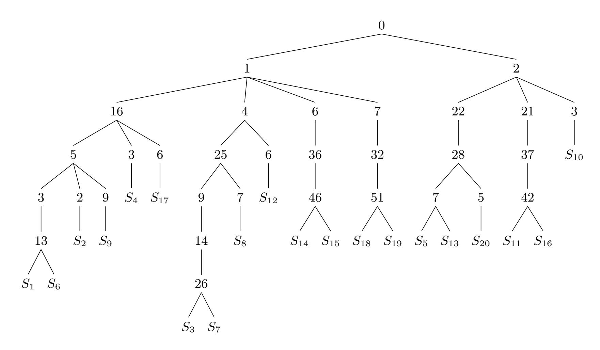

{0}------------------------------------------------

# Sieving for twin smooth integers with solutions to the Prouhet-Tarry-Escott problem

Craig Costello<sup>1</sup> , Michael Meyer2,<sup>3</sup> , and Michael Naehrig<sup>1</sup>

<sup>1</sup> Microsoft Research, Redmond, WA, USA {craigco,mnaehrig}@microsoft.com <sup>2</sup> University of Applied Sciences Wiesbaden, Germany <sup>3</sup> University of W¨urzburg, Germany michael@random-oracles.org

Abstract. We give a sieving algorithm for finding pairs of consecutive smooth numbers that utilizes solutions to the Prouhet-Tarry-Escott (PTE) problem. Any such solution induces two degree-n polynomials, a(x) and b(x), that differ by a constant integer C and completely split into linear factors in Z[x]. It follows that for any ` ∈ Z such that a(`) ≡ b(`) ≡ 0 mod C, the two integers a(`)/C and b(`)/C differ by 1 and necessarily contain n factors of roughly the same size. For a fixed smoothness bound B, restricting the search to pairs of integers that are parameterized in this way increases the probability that they are B-smooth. Our algorithm combines a simple sieve with parametrizations given by a collection of solutions to the PTE problem.

The motivation for finding large twin smooth integers lies in their application to compact isogeny-based post-quantum protocols. The recent key exchange scheme B-SIDH and the recent digital signature scheme SQISign both require large primes that lie between two smooth integers; finding such a prime can be seen as a special case of finding twin smooth integers under the additional stipulation that their sum is a prime p.

When searching for cryptographic parameters with 2<sup>240</sup> ≤ p < 2 <sup>256</sup>, an implementation of our sieve found primes p where p + 1 and p − 1 are 2<sup>15</sup>-smooth; the smoothest prior parameters had a similar sized prime for which p−1 and p+ 1 were 2<sup>19</sup>-smooth. In targeting higher security levels, our sieve found a 376-bit prime lying between two 2<sup>21</sup>-smooth integers, a 384-bit prime lying between two 2<sup>22</sup>-smooth integers, and a 512-bit prime lying between two 2<sup>28</sup>-smooth integers. Our analysis shows that using previously known methods to find high-security instances subject to these smoothness bounds is computationally infeasible.

Keywords: Post-quantum cryptography, isogeny-based cryptography, Prouhet-Tarry-Escott problem, twin smooth integers, B-SIDH, SQISign.

# 1 Introduction

We study the problem of finding twin smooth integers, i.e. finding two consecutive large integers, m and m + 1, whose product is as smooth as possible. Though the literature on the role of smooth numbers in computational number theory and cryptography is vast (see for example the surveys by Pomerance [\[20\]](#page-22-0) and Granville [\[12\]](#page-21-0)), the problem of finding consecutive smooth integers of cryptographic size has only been motivated very recently: optimal instantiations of the key exchange scheme B-SIDH [\[8\]](#page-21-1) and the digital signature scheme SQISign [\[10\]](#page-21-2) require a large prime that lies between two smooth integers, and this is a special case of the twin smooth problem in which 2m + 1 is prime.

This paper presents a sieving algorithm for finding twin smooth integers that improves on the methods used in [\[8\]](#page-21-1) and [\[10\]](#page-21-2). The high-level idea is to use two monic polynomials of degree n that split in Z[x] and that differ by a constant, i.e.

<span id="page-0-0"></span>
$$a(x) = \prod_{i=1}^{n} (x - a_i)$$
 and  $b(x) = \prod_{i=1}^{n} (x - b_i)$ , where  $a(x) - b(x) = C$  (1)

{1}------------------------------------------------

for  $C \in \mathbb{Z}$ . Whenever  $\ell \in \mathbb{Z}$  such that  $a(\ell) \equiv b(\ell) \equiv 0 \mod C$ , it follows that the integers  $a(\ell)/C$  and  $b(\ell)/C$  differ by 1.

Assume that  $|\ell| \gg |a_i|$  and  $|\ell| \gg |b_i|$  for  $1 \le i \le n$ , and fix a smoothness bound B. Rather than directly searching for two consecutive B-smooth integers m and m+1, roughly of size N, the search instead becomes one of finding a value of  $\ell$  such that the 2n (not necessarily distinct) integers

<span id="page-1-0"></span>
$$\ell - a_1, \dots, \ell - a_n, \ell - b_1, \dots, \ell - b_n, \tag{2}$$

each of size roughly  $N^{1/n}$ , are B-smooth. For n > 1, and under rather mild heuristics, the probability of finding twin smooth integers in this fashion is significantly greater than the searches used in [8] and [10]. Put another way, the same computational resources are likely to succeed in finding twin smooth integers subject to an appreciably smaller smoothness bound.

To search for  $\ell \approx N^{1/n}$  such that the 2n integers in (2) are B-smooth, we adopt the simple sieve of Eratosthenes as described by Crandall and Pomerance [9, §3.2.5]; this identifies all of the B-smooth numbers in an arbitrary interval. If w is the largest difference among the 2n integers in  $\{a_i\} \cup \{b_i\}$ , then a sliding window of size |w| can be used to scan the given interval for simultaneous smoothness among the integers in (2). This approach has a number of benefits. Firstly, smooth numbers in a given interval can be recognized once-and-for-all, meaning we can combine arbitrarily many solutions to (1) into one scan of the interval. Secondly, different processors can scan disjoint intervals in parallel, and each of the interval sizes can be tailored to the available memory of the processor. Finally, the simple sieve we use to identify the smooth numbers in an interval (which is the bottleneck of the overall procedure) is open to a range of modifications and improvements – see Section 7.

The approach in this paper hinges on being able to find solutions to (1). Such solutions are related to a classic problem in Diophantine Analysis.

#### 1.1 The Prouhet-Tarry-Escott problem

The Prouhet-Tarry-Escott (PTE) problem of size n and degree k asks to find two distinct multisets of integers  $\{a_1, \ldots, a_n\}$  and  $\{b_1, \ldots, b_n\}$  for which

$$a_1 + \dots + a_n = b_1 + \dots + b_n,$$
  
 $a_1^2 + \dots + a_n^2 = b_1^2 + \dots + b_n^2,$   
 $\vdots \qquad \vdots \qquad \vdots$   
 $a_1^k + \dots + a_n^k = b_1^k + \dots + b_n^k.$ 

The most interesting case is k = n - 1, which is maximal (see Section 3), and such *ideal* solutions immediately satisfy (1). For example, when n = 4, the sets  $\{0, 4, 7, 11\}$  and  $\{1, 2, 9, 10\}$  are such that

$$0 + 4 + 7 + 11 = 1 + 2 + 9 + 10 = 22,$$
  

$$0^{2} + 4^{2} + 7^{2} + 11^{2} = 1^{2} + 2^{2} + 9^{2} + 10^{2} = 186,$$
  

$$0^{3} + 4^{3} + 7^{3} + 11^{3} = 1^{3} + 2^{3} + 9^{3} + 10^{3} = 1738,$$

from which it follows (see Proposition 1) that

$$a(x) = x(x-4)(x-7)(x-11)$$
 and  $b(x) = (x-1)(x-2)(x-9)(x-10)$ 

differ by a constant  $C \in \mathbb{Z}$ . Indeed, a(x) - b(x) = -180.

Origins of the PTE problem are found in the 18th century works of Euler and Goldbach, and it remains an active area of investigation [6,5,7]. In 1935, Wright [28] conjectured that ideal solutions to the PTE problem should exist for all n, but at present this conjecture is open: for n = 11 and

{2}------------------------------------------------

for n ≥ 13, no ideal solutions to the PTE problem have been found, see [\[5,](#page-21-5) p. 94] and [\[7,](#page-21-6) p. 73]. However, Borwein states that "heuristic arguments suggest that Wright's conjecture should be false. [...] It is intriguing, however, that ideal solutions exist for as many n as they do" [\[5,](#page-21-5) p. 87].

The PTE solutions that are known for n ∈ {2, 3, 4, 5, 6, 7, 8, 9, 10, 12} are a nice fit for our purposes. If we were to fix a smoothness bound, B, and then search for the largest pair of consecutive B-smooth integers we could find, having PTE solutions for n as large as possible would be helpful. But for our cryptographic applications (see §[1.3\)](#page-3-0), we will instead fix a target range for our twin smooth integers to match a given security level, and then aim to find the smoothest twins within that range. In this case, the degree n of a(x) and b(x) cannot be too large, since a larger n means fewer ` ∈ Z to search over. Ideally, n needs to be large enough such that the splitting of a(x) and b(x) into n linear factors helps with the smoothness probability, but small enough so that we still have ample ` ∈ Z to find a(`) and b(`) such that

- (i) a(`) ≡ b(`) ≡ 0 mod C,
- (ii) (m, m + 1) = (b(`)/C, a(`)/C) are B-smooth, and (if desired)
- (iii) 2m + 1 is prime.

It turns out that those n ≤ 12 for which PTE solutions are known are the sweet spot for our target applications, where 2<sup>240</sup> ≤ m ≤ 2 512 .

### <span id="page-2-0"></span>1.2 Prior methods of finding twin smooth integers

After defining twin smooth integers for concreteness, we recall previous methods used to find large twin smooth integers.

Definition 1 (Twin smooth integers). For a given B > 1, we call (m, m + 1) with m ∈ Z a pair of twin B-smooth integers or B-smooth twins if m ·(m + 1) contains no prime factor larger than B.

As Lehmer notes in [\[18\]](#page-22-2), consecutive pairs of smooth integers have occurred in 18th century works and have been mentioned by Gauss in the context of computing logarithms of integers.

Hildebrand [\[13,](#page-22-3) Corollary 2] has shown that there are infinitely many pairs of consecutive smooth integers (m, m+1), however this result notably holds for a smoothness bound that depends on m. More precisely, there are infinitely many such pairs of m -smooth integers for any fixed > 0. An analogous result holds for tuples of k consecutive smooth integers (for any k), as shown by Balog and Wooley [\[1\]](#page-21-7).

For a fixed, constant smoothness bound B, the picture is different. A theorem by Størmer [\[25\]](#page-22-4) states that there are only a finite number of such pairs. We begin with some historical results which show that deterministically computing the largest pair of consecutive B-smooth integers requires a number of operations that is exponential in the number of primes up to B.

Solving Pell equations. Fix B, let {2, 3, . . . q} be the set of primes up to B with cardinality π(B), and suppose that m and m + 1 are both B-smooth. Let x = 2m + 1, so that x − 1 and x + 1 are also B-smooth, and let D be the squarefree part of the product (x − 1)(x + 1), so that x <sup>2</sup> − 1 = Dy<sup>2</sup> for some y ∈ Z. Since the product (x − 1)(x + 1) is B-smooth, it follows that Dy<sup>2</sup> is B-smooth, which (since D is squarefree) means that

$$D = 2^{\alpha_2} \cdot 3^{\alpha_3} \cdot \dots \cdot q^{\alpha_q}$$

with α<sup>i</sup> ∈ {0, 1} for i = 2, 3, . . . , q. For each of the 2<sup>π</sup>(B) squarefree possibilities for D, an effective theorem of Størmer [\[25\]](#page-22-4) (and further work by Lehmer [\[18\]](#page-22-2)) reverses the above argument and proposes to solve the 2<sup>π</sup>(B) Pell equations

$$x^2 - Dy^2 = 1,$$

{3}------------------------------------------------

finding all of the solutions for which y is B-smooth, and in doing so finding the complete set of B-smooth consecutive integers m and m+1.

Ideally, this process could be used to deterministically find optimally smooth consecutive integers at any size, by increasing B until the largest pair of twin smooths is large enough. For example, the largest pair of twin smooth integers with B=3 is (8,9), the largest pair of twin smooth integers with B=5 is (80,81), and the largest pair of twin smooth integers with B=7 is (4374,4375). Unfortunately, solving  $2^{\pi(B)}$  Pell equations becomes infeasible before the size of m grows large enough to meet our requirements. For B=113, [8] reports that the largest twins (m,m+1) found upon solving all  $2^{30}$  Pell equations have  $m=19316158377073923834000\approx 2^{74}$ , and the largest twins found among the set when adding the requirement that 2m+1 is prime have  $m=75954150056060186624\approx 2^{66}$ .

The extended Euclidean algorithm. One naïve way of searching for twin smooth integers is to compute B-smooth numbers m until either m-1 or m+1 also turns out to be B-smooth. A much better method, which was used in [8,4,10], is to instead choose two coprime B-smooth numbers  $\alpha$  and  $\beta$  that are both of size roughly the square root of the targets m and m+1. Since  $\alpha$  and  $\beta$  are coprime, Euclid's extended GCD algorithm outputs two integers (s,t) such that  $\alpha s + \beta t = 1$  with  $|s| < |\beta/2|$  and  $|t| < |\alpha/2|$ . We can then take  $\{m, m+1\} = \{|\alpha s|, |\beta t|\}$ , and the probability of m and m+1 being B-smooth is now the probability that  $s \cdot t$  is B-smooth. The key observation here is that the product  $s \cdot t$  with  $s \approx t$  is much more likely to be B-smooth than a random integer of similar size. In Section 2 we will develop methods and heuristics that allow us to closely approximate these probabilities.

Searching with  $m = x^n - 1$ . The method from [8] that proved most effective in finding twin smooth integers with  $2^{240} \le m \le 2^{256}$  is by searching with  $(m, m+1) = (x^n - 1, x^n)$  for various n, where the best instances were found with n = 4 and n = 6. Our approach can be seen as an extension of this method, where the crucial difference is that for n > 2 the polynomial  $x^n - 1$  does not split in  $\mathbb{Z}[x]$ , and the presence of higher degree terms significantly hampers the probability that values of  $\ell^n - 1 \in \mathbb{Z}$  are smooth. For example, with n = 6 we have  $m = (x^2 - x + 1)(x^2 + x + 1)(x - 1)(x + 1)$  and, assuming  $B \ll \ell$ , the probability that integer values of this product are B-smooth is far less than if it was instead a product of six monic, linear terms. On the other hand, the probability that m + 1 is B-smooth for a given  $\ell$  is the probability that  $\ell$  itself is  $\ell$ -smooth, which works in favor of the non-split method. However, as we shall see in the sections that follow, this is not enough to counteract the presence of the higher degree terms. Furthermore, several of the PTE solutions we will be using also benefit from repeated factors.

#### <span id="page-3-0"></span>1.3 Cryptographic applications of twin smooth integers

The field of supersingular isogeny-based cryptography continues to gain increased popularity in large part due to the conjectured quantum-hardness of variants of the supersingular isogeny problem. In its most general form, this problem asks to find a secret isogeny  $\phi \colon E \to E'$  between two given supersingular elliptic curves  $E/\mathbb{F}_{p^2}$  and  $E'/\mathbb{F}_{p^2}$ .

The most famous isogeny-based cryptosystems are Jao and De Feo's SIDH key exchange protocol [15] and its actively secure incarnation SIKE [14], which recently advanced to the third round of the NIST post-quantum standardization effort [26]. On the one hand, SIKE offers the advantage of having the smallest public key and ciphertext sizes of all of the key encapsulation schemes under consideration, but on the other, its performance is currently around an order of magnitude slower than its code- and lattice-based counterparts.

Two supersingular isogeny-based schemes have recently emerged that require a new type of instantiation. Rather than defining primes p for which either p-1 or p+1 is smooth (as in SIDH/SIKE), the key exchange scheme B-SIDH [8] and the digital signature scheme SQISign [10] instead require primes for which (large factors of) both p-1 and p+1 are smooth. As both of those papers discuss, finding primes that lie between two smooth integers is not an easy task, but

{4}------------------------------------------------

the practical incentive to do this is again related to the compactness of these schemes: B-SIDH's public keys are even smaller than the analogous SIDH/SIKE compressed public keys, and the sum of the SQISign public key and signature sizes is significantly smaller than those of all of the remaining NIST signature candidates.

In both B-SIDH and SQISign, the overall efficiency of the protocol is closely tied to the smoothness of p − 1 and p + 1. Roughly speaking, any prime ` appearing in the factorizations of these two integers implies that an `-isogeny needs to be computed somewhere in the protocol. Such `-isogenies have traditionally been computed in O(`) field operations using V´elu's formulas [\[27\]](#page-22-8), but recent work by Bernstein, De Feo, Leroux, and Smith [\[4\]](#page-21-8) improved the asymptotic complexity to <sup>O</sup>e( √ `) by clever use of a baby-step giant-step algorithm. Nevertheless, the large `-isogenies that are required in these protocols dominate the runtime, and the best instantiations of both schemes will use large primes p lying between two integers that are as smooth as possible.

In this paper we will view the search for such primes as one that imposes an additional stipulation on the more general problem of finding twin smooth integers: cryptographically useful instances of the twin smooth integers (m, m + 1) are those where the sum 2m + 1 is a prime, p.

Security analyses of B-SIDH and SQISign suggest that it is possible to relax the requirements and to tolerate cofactors that divide either or both of p − 1 and p + 1 and have prime factors somewhat larger than the target smoothness bound, such that (the size of) any primes dividing these cofactors have no impact on the efficiency. For simplicity and concreteness, we will focus our analysis on the pure problem of finding twin smooth integers that disallows any primes larger than our smoothness bound, but we will oftentimes point out the modifications and relaxations that account for cofactors; this is discussed in Section [7.](#page-19-0)

The heuristic analysis summarized in Table [3](#page-13-0) predicts that sieving with PTE solutions finds twin smooth integers (m, m + 1) that are smoother than one expects to find using the same computational resources and the prior methods described in §[1.2.](#page-2-0) Indeed, in Section [6](#page-18-0) we present a number of examples we found with our sieve whose largest prime divisors are several bits smaller than the largest prime divisors in instantiations found in the literature. In reference to Table [3,](#page-13-0) we briefly sketch some intuition on how these smoother examples translate into practical speedups. For example, the best prior instantiation of a prime p with 2<sup>240</sup> ≤ p < 2 <sup>256</sup> found that (p − 1) and (p + 1) are simultaneously 219-smooth, whereas our sieve found a similarly sized p subject to a smoothness bound of 215. Given the current (square root) complexity of state-of-the-art `-isogeny computations, this suggests that the most expensive isogeny computed in our example will be roughly 4 times faster than that of the prior example.

The source code for our sieving algorithm is publicly available at

<https://github.com/microsoft/twin-smooth-integers>.

This code can be used by implementers to find their own instantiations; in particular, the code is intended to be general and users should be able to tailor it to their own requirements, e.g., to allow for different requirements, cofactors, or to target other security levels.

Roadmap. First time readers may benefit from jumping straight to Section [5,](#page-14-0) where all the theory developed in Sections [2–](#page-4-0)[4](#page-9-0) is put into action by way of a full worked example. Section [2](#page-4-0) gathers some results that allow us to approximate the smoothness probabilities of both integers and integer-valued polynomials. Section [3](#page-6-0) starts by making the connection between our method of finding twin smooth integers and the PTE problem, before going into the theory of the PTE problem and showing how to generate infinitely many solutions for certain degrees. Section [4](#page-9-0) describes our sieving algorithm. Section [6](#page-18-0) presents some of the best examples found with our sieve and compares them with the previous examples in the literature. Section [7](#page-19-0) discusses a number of possible modifications and improvements to the sieve.

# <span id="page-4-0"></span>2 Smoothness probabilities

In this section we recall some well-known results concerning smoothness probabilities that will be used to analyse various approaches throughout the paper: §[2.1](#page-5-0) shows how to approximate the 

{5}------------------------------------------------

probability that m B is B-smooth using the Dickman–de Bruijn function; §[2.2](#page-5-1) shows how to approximate the probability that integer values of a polynomial f(x) ∈ Z[x] are B-smooth.

### <span id="page-5-0"></span>2.1 Smoothness probabilities for large N

Recall that an integer is said to be B-smooth if it does not have any prime factor exceeding B. Let

$$\Psi(N,B) = \#\{1 \le m \le N : m \text{ is } B\text{-smooth}\}\$$

be the number of positive B-smooth integers. For each real number u > 0, Dickman's theorem [\[9,](#page-21-3) Theorem 1.4.9] states that there is a real number ρ(u) > 0 such that

<span id="page-5-2"></span>
$$\frac{\Psi(N, N^{1/u})}{N} \sim \rho(u) \text{ as } N \to \infty.$$
 (3)

Dickman described ρ(u) as the unique continuous function on [0, ∞) that satisfies ρ(u) = 1 for 0 ≤ u ≤ 1, and ρ 0 (u) = − ρ(u−1) u for u > 1. For 1 ≤ u ≤ 2, ρ(u) = 1 − ln(u), but for u > 2 there is no known closed form for ρ(u). Nevertheless, it is easy to evaluate ρ(u) (up to any specified precision) for a given value of u, and popular computer algebra packages (like Magma and Sage) have this function built in.

In this paper we will be using [\(3\)](#page-5-2) to approximate the probability that certain large numbers are smooth. For example, with N = 2<sup>128</sup> and u = 8, the value ρ(8) ≈ 2 <sup>−</sup><sup>25</sup> approximates the probability that a 128-bit number is 216-smooth. With u fixed, this approximation becomes better as N tends towards infinity. Using ρ(u) as the smoothness probability assumes the heuristic that N1/u-smooth numbers are uniformly distributed in [1, N].

While there are methods to more precisely estimate Ψ(N, B), see e.g. [\[24\]](#page-22-9) and [\[2\]](#page-21-9), we are content with the simple approximation given by ρ. Using a basic sieve to identify smooth integers, we have counted all B-smooth integers up to N = 2<sup>43</sup> for B up to 2<sup>16</sup> and compared their numbers with those predicted by the Dickman–de Bruijn function. Except for the lower end of the studied interval and for very small smoothness bounds, we have found the approximation by ρ to be sufficiently close to the actual values.

### <span id="page-5-1"></span>2.2 Smoothness heuristics for polynomials

For a polynomial f(x) ∈ Z[x], define

$$\Psi_f(N,B) = \#\{1 \le m \le N : f(m) \text{ is } B\text{-smooth}\}.$$

Throughout the paper we will use the following conjecture (see [\[19,](#page-22-10) Eq. 1.4] and [\[12,](#page-21-0) Eq. 1.20]) as a heuristic to estimate the probability that f(N) is N<sup>1</sup>/u-smooth.

Heuristic 1 Suppose that the polynomial f(x) ∈ Z[x] has distinct irreducible factors over Z[x] of degrees d1, d2, . . . d<sup>k</sup> ≥ 1, respectively, and fix u > 0. Then

<span id="page-5-3"></span>
$$\frac{\Psi_f(N, N^{1/u})}{N} \sim \rho(d_1 u) \dots \rho(d_k u) \tag{4}$$

as N → ∞.

With B = N<sup>1</sup>/u, Heuristic [1](#page-5-3) says that for m ≤ N, the probability of f(m) being B-smooth is the product of the probabilities of each of its factors being B-smooth (these are computed via [\(3\)](#page-5-2)). Martin proved this conjecture for a certain range of u [\[19,](#page-22-10) Theorem 1.1] that does not apply in our case. Heuristic [1](#page-5-3) inherently assumes that the smoothness probabilities of each of the factors are independent of one another; here, the roots of our split polynomials all lie in relatively short intervals, and thus are not uniformly distributed in, say, [1, N]. For example, with 

{6}------------------------------------------------

 $f(m) = \prod_{1 \le i \le d} (m - f_i) \in \mathbb{Z}$ , any prime q that divides  $m - f_1$  only divides  $m - f_i$  for some  $1 < i \le d$  if  $q \mid f_i - f_1$ , which in particular means that any prime which is larger than the interval size can divide at most one of the (unique)  $m - f_i$ . Nevertheless, our experiments have shown Heuristic 1 to be a very accurate approximation for our purposes; we simply use it as a means to approximate how many values of  $m \in \mathbb{Z}$  need to be searched before we can expect to start finding twin smooth integers, and to draw comparisons between approaches for various target sizes.

# <span id="page-6-0"></span>3 Split polynomials that differ by a constant

Henceforth we will use a(x) and b(x) to denote two polynomials of degree n > 1 in  $\mathbb{Z}[x]$  that differ by an integer constant  $C \in \mathbb{Z}$ , i.e. a(x) - b(x) = C. Moreover, unless otherwise stated, both a and b are assumed to split into linear factors over  $\mathbb{Z}$ , i.e.

$$a(x) = \prod_{1 \le i \le n} (x - a_i)$$
 and  $b(x) = \prod_{1 \le i \le n} (x - b_i)$ ,

where the  $a_i$  and  $b_i$  (which are not necessarily distinct) are all in  $\mathbb{Z}$ .

The core idea of this paper is to search for twin smooth integers by searching over  $\ell \in \mathbb{Z}$  such that

$$a(\ell) \equiv b(\ell) \equiv 0 \bmod C$$
.

Then, the two polynomials  $a_C(x) := a(x)/C$  and  $b_C(x) := b(x)/C \in \mathbb{Q}[x]$  evaluate to integer values  $a_C(\ell)$  and  $b_C(\ell)$  at  $\ell$ , and moreover

$$a_C(\ell) = b_C(\ell) + 1.$$

Since a and b split into n linear factors over  $\mathbb{Z}$ ,  $a_C(\ell)$  and  $b_C(\ell)$  necessarily contain n integer factors of approximately the same size. In §4.4 we approximate the probability that  $a_C(\ell)$  and  $b_C(\ell)$  are B-smooth, and show that these probabilities are favorable (in the ranges of practical interest) compared to the previously known methods of searching for large twin smooths.

### <span id="page-6-2"></span>3.1 The Prouhet-Tarry-Escott problem

For degrees  $n \leq 3$ , infinite families of split polynomials a(x) and b(x) with  $a(x) - b(x) = C \in \mathbb{Z}$  can be constructed by solving the system that arises from equating all but the constant coefficients. Although there are n equations in 2n unknowns, for n > 3 this process becomes unwieldy; the equations are nonlinear and we are seeking solutions that assume values in  $\mathbb{Z}$ . Moreover, relaxing the monic requirement (which permits 4n unknowns) and allowing for solutions in  $\mathbb{Q}$  does not seem to help beyond n > 3. Fortunately, finding these pairs of polynomials is closely connected to the computational hardness of solving the PTE problem of size n.

**Definition 2 (The Prouhet-Tarry-Escott problem).** The Prouhet-Tarry-Escott (PTE) problem of size n and degree k asks to find distinct multisets of integers  $\mathcal{A} = \{a_1, \ldots, a_n\}$  and  $\mathcal{B} = \{b_1, \ldots, b_n\}$ , such that

$$\sum_{i=1}^{n} a_i^j = \sum_{i=1}^{n} b_i^j$$

for j = 1...k. We abbreviate solutions to this problem by writing  $[a_1, ..., a_n] =_k [b_1, ..., b_n]$  or  $A =_k B$ .

A classic result that links PTE solutions to polynomials is the following [6, Proposition 1].

<span id="page-6-1"></span>**Proposition 1.** The following are equivalent:

$$\sum_{i=1}^{n} a_i^j = \sum_{i=1}^{n} b_i^j \quad for \quad j = 1, \dots, k.$$
 (5)

$$\deg\left(\prod_{i=1}^{n}(x-a_i) - \prod_{i=1}^{n}(x-b_i)\right) \le n - (k+1).$$
(6)

{7}------------------------------------------------

Table 1: Divisibility results for the PTE problem

<span id="page-7-0"></span>

| n  | Lower bound for $C_n$                                                   | Upper bound for $C_n$                                                                                     |
|----|-------------------------------------------------------------------------|-----------------------------------------------------------------------------------------------------------|
| 2  | 1                                                                       | 1                                                                                                         |
| 3  | $2^2$                                                                   | $2^2$                                                                                                     |
| 4  | $2^2 \cdot 3^2$                                                         | $2^2 \cdot 3^2$                                                                                           |
| 5  | $2^4 \cdot 3^2 \cdot 5 \cdot 7$                                         | $2^4 \cdot 3^2 \cdot 5 \cdot 7$                                                                           |
| 6  | $2^5 \cdot 3^2 \cdot 5^2$                                               | $2^5 \cdot 3^2 \cdot 5^2$                                                                                 |
| 7  | $2^6 \cdot 3^3 \cdot 5^2 \cdot 7 \cdot 11$                              | $2^6 \cdot 3^3 \cdot 5^2 \cdot 7 \cdot 11$                                                                |
| 8  | $2^4 \cdot 3^3 \cdot 5^2 \cdot 7^2 \cdot 11 \cdot 13$                   | $2^8 \cdot 3^3 \cdot 5^2 \cdot 7^2 \cdot 11 \cdot 13$                                                     |
| 9  | $2^7 \cdot 3^3 \cdot 5^2 \cdot 7^2 \cdot 11 \cdot 13$                   | $2^9 \cdot 3^4 \cdot 5^2 \cdot 7^2 \cdot 11 \cdot 13 \cdot 17 \cdot 23 \cdot 29$                          |
| 10 | $2^7 \cdot 3^4 \cdot 5^2 \cdot 7^2 \cdot 13 \cdot 17$                   | $2^{11} \cdot 3^6 \cdot 5^2 \cdot 7^2 \cdot 11 \cdot 13 \cdot 17 \cdot 23 \cdot 37$                       |
| 11 | $2^8 \cdot 3^4 \cdot 5^3 \cdot 7^2 \cdot 11 \cdot 13 \cdot 17 \cdot 19$ | none known                                                                                                |
| 12 | $2^8 \cdot 3^4 \cdot 5^3 \cdot 7^2 \cdot 11^2 \cdot 17 \cdot 19$        | $2^{12} \cdot 3^8 \cdot 5^3 \cdot 7^2 \cdot 11^2 \cdot 13^2 \cdot 17 \cdot 19 \cdot 23 \cdot 29 \cdot 31$ |

Proposition 1 implies that for any PTE solution of size n and degree k = n-1, the polynomials  $a(x) = \prod_{i=1}^{n} (x - a_i)$  and  $b(x) = \prod_{i=1}^{n} (x - b_i)$  differ by a constant. For a given n, this choice for k is the maximal possible choice [6, Proposition 2], hence the respective solutions are called *ideal* solutions. Ideal solutions are known for  $n \leq 10$  and n = 12, but it remains unclear if there are ideal solutions for other sizes [7]. Unless stated otherwise, henceforth we will only speak of PTE solutions that are ideal solutions.

As we will see later, the most useful PTE solutions for our purposes are those for which the constant C is as small as possible. We now recall some useful results from the literature concerning the constants that can arise from PTE solutions.

**Definition 3 (Fundamental constant**  $C_n$ ). Let n be a positive integer, and write  $C_{n,\mathcal{A},\mathcal{B}}$  for the associated constant of an ideal PTE solution  $\mathcal{A} =_{n-1} \mathcal{B}$  of size n. Then we define

$$C_n = \gcd\{C_{n,\mathcal{A},\mathcal{B}} \mid \mathcal{A} =_{n-1} \mathcal{B}\}$$

as the fundamental constant associated to ideal PTE solutions of size n.

A result by Kleiman [17] gives a lower bound on the fundamental constant.

<span id="page-7-2"></span>**Proposition 2.** Let n be a positive integer. Then  $(n-1)! \mid C_n$ .

For concrete choices of n, more divisibility results are presented by Rees and Smyth [21], and Caley [7]. These results form sharper bounds for  $C_n$ , and thus for constants arising from any given PTE solution. Upper bounds for  $C_n$  can be directly computed by taking the GCD of all known solutions of size n. This is detailed in [7], where for example it is known that for n = 9 we have

$$2^7 \cdot 3^3 \cdot 5^2 \cdot 7^2 \cdot 11 \cdot 13 \mid C_9 \text{ and } C_9 \mid 2^9 \cdot 3^4 \cdot 5^2 \cdot 7^2 \cdot 11 \cdot 13 \cdot 17 \cdot 23 \cdot 29.$$

Table 1 is an updated version of [7, Table 3.2], and gives an overview of the bounds for the fundamental constants  $C_n$ . These results give estimates for the optimal choices of solutions for our searches. In particular, choosing solutions with associated constants close to the upper bound for  $C_n$  yields the best preconditions for finding twin smooth integers.

<span id="page-7-1"></span>For our application of finding twin smooth integers, it may seem unnecessarily restrictive to only make use of PTE solutions, yielding monic polynomials a and b with integer roots. However, it can be proven that all polynomials that are split over  $\mathbb{Q}$  and that differ by a constant arise from PTE solutions. In order to prove this, we make use of the following result ([6, Lemma 1], [7, Proposition 2.1.2]).

{8}------------------------------------------------

**Proposition 3.** Let  $[a_1, \ldots, a_n] =_k [b_1, \ldots, b_n]$  with associated constant C and M, K arbitrary integers with  $M \neq 0$ . Define a linear transform h(x) = Mx + K and let  $a'_i = h(a_i)$  and  $b'_i = h(b_i)$  for  $i = 1, \ldots, n$ . Then  $[a'_1, \ldots, a'_n] =_k [b'_1, \ldots, b'_n]$ , and the associated constant is  $C' = C \cdot M^n$ .

Two such solutions that are connected through a linear transform are called *equivalent*. Note that Proposition 3 also holds for the PTE problem over rational numbers instead of integers, i.e. for  $a_i, b_i \in \mathbb{Q}$  for  $1 \le i \le n$ .

<span id="page-8-0"></span>**Corollary 1.** Let a(x) and b(x) be polynomials of degree n with rational roots  $\mathcal{A} = \{a_1, \ldots, a_n\}$  and  $\mathcal{B} = \{b_1, \ldots, b_n\}$ , such that  $a(x) - b(x) = C \in \mathbb{Q}$ . Then  $\mathcal{A} =_{n-1} \mathcal{B}$  for the PTE problem over  $\mathbb{Q}$ , and there is an equivalent solution  $\mathcal{A}' =_{n-1} \mathcal{B}'$  to the PTE problem over  $\mathbb{Z}$ .

Proof. Since deg(a(x) - b(x)) = 0, Proposition 1 implies that  $\mathcal{A} =_{n-1} \mathcal{B}$ . Let  $M \in \mathbb{Z}$  be a common denominator of  $a_1, \ldots, a_n, b_1, \ldots, b_n$  and define the linear transform h(x) = Mx. Let  $a'_i = h(a_i)$  and  $b'_i = h(b_i)$  for  $i = 1, \ldots, n$ . Then  $\mathcal{A}' = \{a'_1, \ldots, a'_n\}$  and  $\mathcal{B}' = \{b'_1, \ldots, b'_n\}$  consist of integers, and by Proposition 3,  $\mathcal{A}' =_{n-1} \mathcal{B}'$  is a solution for the PTE problem over  $\mathbb{Z}$ .

Corollary 1 allows us to focus entirely on integer PTE solutions without imposing any further restrictions. For our search for smooth values of the polynomials, Proposition 3 further implies that we only have to search with one polynomial per equivalence class.

Corollary 2. Let  $A = \{a_1, \ldots, a_n\}$ ,  $B = \{b_1, \ldots, b_n\}$ , and  $A' = \{a'_1, \ldots, a'_n\}$ ,  $B' = \{b'_1, \ldots, b'_n\}$  be equivalent ideal PTE solutions. Let a(x), b(x), and a'(x), b'(x) be the respective polynomials such that  $a(x) - b(x) = C \in \mathbb{Z}$  resp.  $a'(x) - b'(x) = C' \in \mathbb{Z}$ , and h(x) be the associated linear transform. Then for given  $x_{\min}$  and  $x_{\max}$ ,  $a_C(x)$  and  $b_C(x)$  take on the same integer values for  $x \in I = [x_{\min}, x_{\max}]$  as  $a'_{C'}(x)$  and  $b'_{C'}(x)$  for  $x \in h(I)$ .

In order to efficiently identify equivalent solutions, we make use of Proposition 3 to define a representation of equivalence classes, which we call the *normalized form* of a class of solutions.

<span id="page-8-2"></span>**Definition 4 (Normalized form of PTE solutions).** A normalized form of a given PTE solution is a solution such that  $a_1 \leq a_2 \leq \cdots \leq a_n$ ,  $b_1 \leq b_2 \leq \cdots \leq b_n$ ,  $0 = a_1 < b_1$ , and  $gcd(a_1, \ldots, a_n, b_1, \ldots, b_n) = 1$ .

Another classification of solutions, which is of importance for our searches, is the distinction between *symmetric* and *non-symmetric* solutions [5].

<span id="page-8-1"></span>**Definition 5 (Symmetric PTE solutions).** For n even, an even ideal symmetric solution to the PTE problem is of the form

$$[\pm a_1, \pm a_2, \dots, \pm a_{n/2}] =_{n-1} [\pm b_1, \pm b_2, \dots, \pm b_{n/2}].$$

For n odd, an odd ideal symmetric solution to the PTE problem is of the form

$$[a_1, a_2, \dots, a_n] =_{n-1} [-a_1, -a_2, \dots, -a_n].$$

It can immediately be seen that the normalized form of a symmetric solution is unique, but no longer has the form satisfying Definition 5. However, we will still be calling these solutions symmetric, since they are symmetric with respect to the integer K (instead of symmetric with respect to 0, as in the classic formulation of Definition 5), where h(x) = Mx + K is the linear transform connecting these solutions. Thus, we define solutions as non-symmetric if and only if their equivalence class does not contain a symmetric solution according to Definition 5.

Note that in the special case of non-symmetric solutions, the normalized form is not unique. In particular, if  $[a_1, \ldots, a_n] =_{n-1} [b_1, \ldots, b_n]$  is a non-symmetric normalized solution, then so is the solution arising from the linear transform h(x) = Mx + K, where M = -1 and  $K = \max\{a_n, b_n\}$ . In this case, we take the solution with minimal  $b_1$  to represent the normalized solution, and refer to the second normalized solution as the *flipped solution*.

Finally, in §4.4 we will see that PTE solutions with repeated factors have higher probabilities (than those without repeated factors) of finding twin smooth integers. The following result [7, Theorem 2.1.3] shows that repeated factors can only occur with multiplicity at most 2.

{9}------------------------------------------------

Proposition 4 (Interlacing). Let A = {a1, . . . , an} and B = {b1, . . . , bn} be an ideal PTE solution, where a<sup>1</sup> ≤ a<sup>2</sup> ≤ · · · ≤ a<sup>n</sup> and b<sup>1</sup> ≤ b<sup>2</sup> ≤ · · · ≤ bn, and w.l.o.g., we assume that a<sup>1</sup> < b1. Then, a<sup>1</sup> 6= b<sup>j</sup> for all j. If n is odd, we have

$$a_1 < b_1 \le b_2 < a_2 \le a_3 < \dots < a_{n-1} \le a_n < b_n,$$

and if n is even, then

$$a_1 < b_1 \le b_2 < a_2 \le a_3 < \dots < a_{n-2} \le a_{n-1} < b_{n-1} \le b_n < a_n.$$

## <span id="page-9-2"></span>3.2 PTE solutions

An important prerequisite for searching for twin smooth integers is a large number of normalized ideal PTE solutions with relatively small associated constants. To this end, we briefly review solutions from the literature as well as methods to construct ideal solutions. Henceforth, we will refer to normalized ideal PTE solutions only as PTE solutions.

A database of Shuwen collects several PTE solutions, both symmetric and non-symmetric [\[22\]](#page-22-13). In particular, special solutions, such as the smallest solutions with respect to the associated constants, and the first solutions found for each size, are presented there.

Apart from this, several methods for generating PTE solutions have been found. Parametric solutions are known for n ∈ {2, 3, 4, 5, 6, 7, 8, 10, 12}, and these can be used to generate infinitely many symmetric solutions [\[7\]](#page-21-6). However, the number of solutions with small associated constants is limited. For n = 9, only two non-equivalent solutions are known.

For n ∈ {5, 6, 7, 8}, we implemented the methods from [\[5\]](#page-21-5) to generate as many symmetric solutions with small associated constants as possible. For n = 10 and n = 12, there are parametric symmetric solutions due to Smyth [\[23\]](#page-22-14) and Choudhry and Wr´oblewski [\[29\]](#page-22-15), resp., both following an earlier method from Letac [\[11\]](#page-21-10). In both methods, the two parameters that form solutions come from a quadratic equation in two variables. This equation can be transformed into an elliptic curve equation, and thus finding suitable parameters is equivalent to finding rational points on this elliptic curve. In [\[7,](#page-21-6) Section 6], Caley implements these methods by adding multiples of a nontorsion point, P, to the eight known torsion points.[4](#page-9-1) However, it is evident from the underlying transforms that PTE solutions with small constants can only arise from rational elliptic curve points with small denominators in their coordinates. Caley's approach thus proves to be nonoptimal for our aims, as the denominators in the coordinates of [i]P become too large already for very small i, resulting in PTE solutions with huge constants. We implemented these methods with the curves and transforms from [\[7\]](#page-21-6), but deviated from Caley's approach by first searching for non-torsion points with integer coordinates, resp. coordinates with very small denominators. We then followed Caley's algorithm and computed small multiples of these points and their sums with torsion points. Despite finding many PTE solutions, none of them proved to have an associated constant close to the upper bound for C<sup>10</sup> resp. C12. Further, taking the GCD of all found solutions, we did not succeed in reducing the known upper bounds for C<sup>10</sup> resp. C12.

For each size n, we identified an upper bound for constants that permit acceptable success probabilities for our searches, and collected as many solutions as possible up to this value. Table [2](#page-10-0) reports on the numbers of solutions we found, including solutions from [\[22\]](#page-22-13).

# <span id="page-9-0"></span>4 Sieving with PTE solutions

Our sieving algorithm consists of two phases. The first phase identifies the B-smooth numbers in a given interval (§[4.1\)](#page-10-1). The second phase then scans the interval using either a single PTE solution (§[4.2\)](#page-10-2) or the combination of many PTE solutions (§[4.3\)](#page-11-0).

<span id="page-9-1"></span><sup>4</sup> The elliptic curves that arise for n = 10 and n = 12 have Mordell-Weil-groups Z/4Z × Z/2Z × Z resp. Z/4Z × Z/2Z × Z × Z. Thus there are eight torsion points in each case, and the non-torsion groups are generated by one resp. two non-torsion points.

{10}------------------------------------------------

<span id="page-10-0"></span>Table 2: Number of PTE solutions up to an upper bound for the constants.  $C_{\min,n}$  denotes the smallest constant known for each degree.

| n  | $\lceil \log_2(C_{\min,n}) \rceil$ | Bitlength of upper bound | # of solutions |
|----|------------------------------------|--------------------------|----------------|
| 5  | 13                                 | 50                       | 49             |
| 6  | 14                                 | 50                       | 2438           |
| 7  | 33                                 | 60                       | 8              |
| 8  | 31                                 | 60                       | 51             |
| 9  | 52                                 | 60                       | 2              |
| 10 | 73                                 | 100                      | 1              |
| 12 | 76                                 | 100                      | 1              |

#### <span id="page-10-1"></span>4.1 Identifying smooth numbers in an interval

We follow the exposition of Crandall and Pomerance [9, §3.2.5] and adopt the simple sieve of Eratosthenes to identify the B-smooth integers in an interval [L,R). We set up an array of R-L integers corresponding to the integers  $L,L+1,\ldots,R-1$ , and initialize each entry with 1. For all primes with p < B, we identify the smallest non-negative  $i \in \mathbb{Z}$ , for which  $L+i\equiv 0 \mod p$ , and multiply the array elements at positions i+jp by p for all  $j\in\mathbb{Z}$  such that  $L\leq i+jp< R$ . Additionally, for all primes with  $p<\sqrt{R}$ , we have to identify the maximal exponent e such that  $p^e < R$ , and analogously perform sieving steps with the relevant prime powers, where further multiplications by p take place. After this process is finished, the B-smooth integers in the interval are precisely those for which the number at position i is L+i. Subsequently, we transform this array of integers into a bitstring, where a '1' indicates a B-smooth number, while a '0' represents a non-smooth number.

This simple approach allows for several optimizations and modifications, some of which are discussed further in Section 7.

#### <span id="page-10-2"></span>4.2 Searching with a single PTE solution

Assume that we are searching with a normalized ideal PTE solution of size n, writing  $a(x) = \prod_{i=1}^{n} (x - a_i)$  and  $b(x) = \prod_{i=1}^{n} (x - b_i)$ , together with  $C \in \mathbb{Z}$  such that a(x) - b(x) = C. We will assume C > 0, since a(x) and b(x) can otherwise swap roles accordingly, and as usual we write  $a_C(x) = a(x)/C$  and  $b_C(x) = b(x)/C$  as the two polynomials in  $\mathbb{Q}[x]$ .

We are searching for  $\ell$  such that  $m+1=a_C(\ell)$  and  $m=b_C(\ell)$  are both B-smooth and of a given size, and thus the size of the constant C affects the size of the  $\ell$  we should search over. Moreover, we only wish to search over the values of  $\ell$  for which  $a_C(\ell)$  and  $b_C(\ell)$  are integers, and we determine this set of residues (modulo C) as follows. If  $C=\prod p_i^{e_i}$  is the prime factorization of the constant, then for each prime-power factor we determine all residues  $r_i \mod p_i^{e_i}$  for which  $a(r_i) \equiv b(r_i) \equiv 0 \mod p_i^{e_i}$  (note that it is sufficient to check that one of  $a(r_i)$  or  $b(r_i)$  is a multiple of  $p_i^{e_i}$ ). We then use the Chinese Remainder Theorem (CRT) to reconstruct the full set of residues  $\{r \mod C\}$  for which  $a(r) \equiv b(r) \equiv 0 \mod C$ . Depending on the size of the constant, the full list of suitable residues may be rather large; if not, they can be stored in a lookup table, but if so, only the smaller sets (i.e. the  $\{r_i\}$  corresponding to  $p_i^{e_i}$ ) need to be stored. We can then either loop over the suitable residues by constructing them on the fly using the CRT, or we can check whether a candidate  $\ell$  is a suitable residue by reducing it modulo each of the  $p_i^{e_i}$ .

It is worth pointing out that when searching for cryptographic parameters with a single PTE solution, the condition that 2m+1 is prime can be used to discard the residues  $\{\tilde{r} \bmod C\}$  for which  $2b_C(r)+1$  can never be prime if  $r \equiv \tilde{r} \bmod C$ . In a very rare number of cases, the polynomial  $2b_C(x)+1=2/C\cdot(b(x)+C/2)$  in  $\mathbb{Q}[x]$  is such that (b(x)+C/2) is reducible in  $\mathbb{Z}[x]$ , in which case the PTE solution can be completely discarded. For example, this happens for both of the PTE solutions with n=9.

{11}------------------------------------------------

Recall from Section 3 that the constants of the PTE solutions are (for our purposes) always B-smooth. When processing an interval [L,R), the problem therefore reduces to finding  $\ell \in [L,R)$  such that all of the factors of  $a(\ell)$  and  $b(\ell)$  are marked as B-smooth. For the PTE solution in use, these factors are given by  $\ell_i = \ell - i$ , where  $i \in \{a_1, \ldots, a_n, b_1, \ldots, b_n\}$ . Note that since  $a_1 = 0$  for our normalized representation, we have  $\ell = \ell_0$ . Starting with  $\ell$  at the left end of the interval requires some care since for a given  $\ell$ , we need to be able to check for the smoothness of all  $\ell_i$ . Hence, to be able to cover the full space when processing consecutive intervals, we have to run the first phase of the sieve for a slightly larger interval, namely [L-w,R) (overlapping to the left with the previous interval), where  $w = \max\{a_n,b_n\}$ . This allows us to process  $\ell \in [L,R)$  such that  $\ell_w$  will cover [L-w,R-w).

In the second phase of the sieve we advance  $\ell$  through all of the elements in the bitstring marked '1', each time checking the bits corresponding to the remaining  $\ell_i$ , i.e.  $i \in \{a_2, \ldots, a_n, b_1, \ldots, b_n\}$ . If, at any time, we see that any of the  $\ell_i$  corresponds to a '0', we advance  $\ell$  such that it is aligned with the next '1' and repeat the process until all of the  $\ell_i$  correspond to a '1'. At this point, we can then check whether  $\ell$  is a suitable residue modulo C as above; if not,  $\ell$  is again advanced to the next set bit, but if so, we have found twin smooth integers, and it is here that we can optionally check whether their sum is prime.

We note that when using a single PTE solution, the algorithm could be modified to sieve in arithmetic progressions given by the suitable residues modulo C. We leave the exploration of whether this can be more efficient than the above approach for future work.

In the case of a large interval [L, R), the memory requirements can be significantly reduced by dividing [L, R) into several subintervals, which can be processed separately. The only downside is that a naïve implementation of the first phase processes certain intervals twice due to the overlap of length w. This can be easily mitigated by copying the last w entries of the previous interval at each step. However, due to both the large (sub)intervals used in our implementation and the relatively small w's that arise in PTE solutions, the impact of this overlap is negligible in practice, so the naïve approach can be taken without a noticeable performance penalty.

**Parallelization.** Our implementation parallelizes the sieve in a straightforward way by assigning processors distinct subintervals of [L, R), e.g. according to their own memory/performance capabilities. However, if many processors have rapid access to the same memory, then it may be faster for some resources being devoted to identifying smooth numbers in the next interval while the remaining resources sieve the current interval.

Negative input values. Until now we have only considered positive input values  $\ell \in [L, R)$ , but our approach also permits negative inputs to the polynomials a(x) and b(x). For example, for even n, this gives another pair of integers that could potentially be smooth. At first glance, this seems to imply that each time  $\ell$  is advanced, we must also check the values  $\ell'_i = \ell + i$  with  $i \in \{a_1, \ldots, a_n, b_1, \ldots, b_n\}$  for smoothness. Moreover, it seems that the overlap of size w for each search interval must also be added to both sides. We note, however, that if the PTE solution in use is symmetric (see Definition 5), then the values  $\ell'_i$  are the same as the values  $(\ell + w)_i$ , and thus are naturally checked by our previous algorithm at position  $\ell + w$ . This is not the case for general non-symmetric solutions, but for those non-symmetric solutions that are normalized (see Definition 4), we can instead search with positive inputs to the flipped solution arising from the linear transform h(x) = -x + w, which is especially beneficial when searching with many solutions simultaneously.

#### <span id="page-11-0"></span>4.3 Searching with many PTE solutions

One of the main benefits of our sieve is that it can combine many PTE solutions into the same search and rapidly process them together. Many PTE solutions tend to share at least one non-zero element in common, and if checking this element returns a '0', all such solutions can be discarded at once. In what follows we describe a method to arrange the set of PTE solutions in a *tree*, such

{12}------------------------------------------------

that (on average) a minimal number of checks is used to check the full set of solutions. Note that computing this tree is a one-time precomputation that is performed at initialization.

Suppose we have t solutions, written as [ai,1, . . . , ai,n] =n−<sup>1</sup> [bi,1, . . . , bi,n] for 1 ≤ i ≤ t. Noting that ai,<sup>1</sup> = 0 for all i, write S<sup>i</sup> = {ai,2, . . . , ai,n, bi,1, . . . , bi,n}, i.e. S<sup>i</sup> is the set of distinct non-zero integers in the i-th PTE solution. Now, as in the single solution sieve above, suppose we have advanced ` to a set bit at some stage of our sieving algorithm. Rather than checking each of the PTE solutions individually, we would like to share any checks that are common to multiple PTE solutions. The key observation is that we are highly unlikely[5](#page-12-1) to have a PTE solution whose elements all correspond to '1', so in combining many PTE solutions we would ultimately like to minimize the number of checks required before we can rule all of them out and move ` to the next set bit.

In looking for the minimum number of checks whose failures rule out all PTE solutions, we are looking for a set H of minimal cardinality such that H ∩ S<sup>i</sup> 6= {∅} for 1 ≤ i ≤ t, i.e. the smallest-sized set that shares at least one element with each of the PTE solutions. Finding this set is an instance of the hitting set problem; this problem is NP-complete in general, but for the sizes of the problem in this paper, a good approximation is given by the greedy algorithm [\[16\]](#page-22-16). We start by looking for the element that occurs most among all of the S<sup>i</sup> , call this g1; we then look for the element that occurs most among the S<sup>i</sup> that do not contain g1, call this g2; we then look for the element that occurs most among those S<sup>i</sup> that do not contain g<sup>1</sup> or g2, and continue in this way until we have H = {g1, g2, . . . , gh} such that every S<sup>i</sup> contains at least one of the g<sup>j</sup> , for 1 ≤ i ≤ t and 1 ≤ j ≤ h. This process naturally partitions the PTE solutions to fall under h different branches. For each PTE solution in a given branch, the corresponding element of the hitting set is removed and the process is repeated recursively until there is no common element between the remaining solutions, at which point they become leaves. In §[5.2](#page-16-0) we give a toy example with 20 PTE solutions that produces the tree in Figure [2.](#page-17-0) In this example the first hitting set is {1, 2}; if a search was to use these 20 solutions, then most of the time only two checks will be required before ` can be advanced to the next set bit.

At a high level, our multi-solution sieve then runs the same way as the single solution sieve in §[4.2,](#page-10-2) except that we must traverse our tree each time ` is advanced. We do this by checking all of the elements of a the hitting set, and we only enter the branch corresponding to a given element if the associated check finds a '1' (an example sequence of checks is included in §[5.2\)](#page-16-0). This is repeated recursively until we either encounter a leaf, where we simply check the remaining elements sequentially, or until all of the elements in the hitting set at the current level of the tree return a '0', at which point we can move up to the branch above and continue. As mentioned above, in practice the most common scenario is that all of the elements in the highest hitting set correspond to a '0', and the number of checks performed in order to rule out the full set of PTE solutions is minimal. Note that checking the divisibility of a(`) and b(`) by the constant C is, in practice, best left until the point where a match is found. Since solutions have different constants and different sets of suitable relations, it is not useful to incorporate modular relations into the sieving step of the multi-solution algorithm.

The efficiency of checking all PTE solutions simultaneously is therefore heavily dependent on the size of the first hitting set. In cases where we have many PTE solutions (see §[3.2\)](#page-9-2), the first hitting set can be used to decide which PTE solutions to search with. If a pre-existing set of PTE solutions has a hitting set H, then including any additional solutions that share at least one element with H incurs nearly no performance cost.

### <span id="page-12-0"></span>4.4 Success probabilities

In Table [3](#page-13-0) we use Heuristic [1](#page-5-3) to draw comparisons between our method of finding twin smooth integers and the prior methods discussed in §[1.2.](#page-2-0) The entries in the table are the approximate smoothness bounds that should be used to give success probabilities of 2<sup>−</sup><sup>20</sup>, 2<sup>−</sup><sup>30</sup>, 2<sup>−</sup><sup>40</sup> and 2<sup>−</sup><sup>50</sup> . The term success probability is used to estimate how large a search space needs to be covered before

<span id="page-12-1"></span><sup>5</sup> We assume that the smoothness bound is aggressive enough to make the smooth integers sparse.

{13}------------------------------------------------

<span id="page-13-0"></span>Table 3: Table of smoothness bounds and success probabilities for known methods and our method. All numbers are given as base-2 logarithms. Further explanation in text.

|                |    |      |       |         |        |    |             | N    |        |      |     |      |             |      |      |  |  |  |
|----------------|----|------|-------|---------|--------|----|-------------|------|--------|------|-----|------|-------------|------|------|--|--|--|
|                |    |      | 256   |         |        |    |             | 384  | :<br>: |      | 512 |      |             |      |      |  |  |  |
| method         |    |      | proba | ability | bility |    | probability |      |        |      |     |      | probability |      |      |  |  |  |
|                | n  | -50  | -40   | -30     | -20    | n  | -50         | -40  | -30    | -20  | n   | -50  | -40         | -30  | -20  |  |  |  |
| naïve          | _  | 20.2 | 23.4  | 28.4    | 36.7   | _  | 30.2        | 35.2 | 42.6   | 55.1 | _   | 40.3 | 46.9        | 56.7 | 73.4 |  |  |  |
| XGCD           | _  | 15.9 | 18.4  | 21.9    | 27.7   | _  | 23.9        | 27.5 | 32.8   | 41.5 | _   | 31.9 | 36.7        | 43.7 | 55.3 |  |  |  |
|                | 4  | 15.6 | 17.8  | 20.8    | 25.8   | 6  | 19.9        | 22.6 | 26.4   | 32.3 | 6   | 26.6 | 30.1        | 35.2 | 43.1 |  |  |  |
|                | 6  | 13.3 | 15.1  | 17.6    | 21.6   | 8  | 20.4        | 23.2 | 27.2   | 33.8 | 12  | 22.0 | 24.9        | 28.9 | 35.2 |  |  |  |
| $2x^n - 1$     | 8  | 13.6 | 15.5  | 18.2    | 22.5   | 10 | 20.3        | 23.1 | 27.2   | 33.8 | 16  | 25.8 | 29.3        | 34.6 | 43.5 |  |  |  |
| 2x - 1         | 9  | 15.4 | 17.7  | 21.0    | 26.4   | 12 | 16.5        | 18.7 | 21.7   | 26.4 | 18  | 23.3 | 26.3        | 30.9 | 38.4 |  |  |  |
|                | 10 | 13.5 | 15.4  | 18.2    | 22.5   | 16 | 19.3        | 22.0 | 25.9   | 32.7 | 20  | 23.2 | 26.3        | 31.0 | 38.5 |  |  |  |
|                | 12 | 11.0 | 12.4  | 14.5    | 17.6   | 18 | 17.4        | 19.8 | 23.1   | 28.8 | 24  | 20.2 | 22.9        | 26.7 | 32.8 |  |  |  |
|                | 3  | 20.4 | 23.0  | 26.6    | 32.2   | 3  | 30.6        | 34.5 | 39.9   | 48.4 | 4*  | 30.6 | 34.5        | 39.9 | 48.4 |  |  |  |
|                | 3* | 16.2 | 18.4  | 21.6    | 26.6   | 3* | 24.3        | 27.7 | 32.4   | 39.9 | 5   | 31.9 | 25.6        | 40.6 | 48.2 |  |  |  |
|                | 4  | 17.8 | 20.0  | 22.9    | 27.5   | 4  | 26.7        | 29.9 | 34.4   | 41.2 | 6   | 29.1 | 32.2        | 36.6 | 43.0 |  |  |  |
| $\mathbf{PTE}$ | 4* | 15.3 | 17.2  | 20.0    | 24.2   | 4* | 22.9        | 25.8 | 29.9   | 36.3 | 6*  | 25.2 | 28.2        | 32.2 | 38.5 |  |  |  |
| 1 117          | 5  | 16.0 | 17.8  | 20.3    | 24.1   | 5  | 24.0        | 26.7 | 30.4   | 36.1 | 7   | 26.8 | 29.6        | 33.5 | 39.0 |  |  |  |
|                | 6  | 14.5 | 16.1  | 18.3    | 21.5   | 6  | 21.8        | 24.2 | 27.5   | 32.3 | 8   | 24.9 | 27.5        | 30.9 | 35.8 |  |  |  |
|                | 6* | 12.6 | 14.1  | 16.1    | 19.3   | 6* | 18.9        | 21.1 | 24.2   | 28.9 | 9   | 23.3 | 25.7        | 28.7 | 33.2 |  |  |  |
|                | 7  | 13.4 | 14.8  | 16.7    | 19.5   | 7  | 20.1        | 22.2 | 25.1   | 29.3 | 10  | 22.0 | 24.1        | 26.8 | 31.1 |  |  |  |
|                | 8  | 12.5 | 13.7  | 15.4    | 17.9   | 8  | 18.7        | 20.6 | 23.2   | 26.9 | 12  | 19.8 | 21.5        | 23.9 | 27.5 |  |  |  |

we can expect to find twin smooth integers; these probabilities are computed directly via (1.2). For example (refer to the bold element in the last row of the table), using one PTE solution with n=8 and a smoothness bound of  $B\approx 2^{26.9}$ , we can expect to find a pair of twin smooth numbers in  $[1,N]=[1,2^{384}]$  after searching roughly  $2^{20}$  inputs  $\ell\in[1,N^{1/n}]=[1,2^{48}]$ , for which  $a_C(\ell)$  and  $b_C(\ell)$  are integers.<sup>6</sup> To find similarly sized twin smooth integers using the XGCD approach, we would have to search roughly  $2^{20}$  elements with a smoothness bound of  $B\approx 2^{41.5}$ , or  $2^{30}$  elements with a smoothness bound of  $B\approx 2^{32.8}$ ; on the other hand, if we were using XGCD with the same  $B\approx 2^{26.9}$  as the PTE solution, we should expect to have to search a space larger han  $2^{40}$  before finding twin smooths.

We stress that Table 3 is merely intended as a rough guide to the size of the smoothness bounds we should use in a given search, and similarly to provide an approximate comparison between the methods. As mentioned in Section 2, Heuristic 1 makes the rather strong assumption that the elements in our PTE solutions are uniform in  $[1, N^{1/n}]$ , and using the Dickman–de Bruijn function is a rather crude blanket treatment of the concrete combinations of B, N and n of interest to us. Moreover, the best version of our sieve (like the one used in Section 6) combines hundreds of PTE solutions into one search, and extending a theoretical analysis to cover such a collection of solutions is unnecessary. We point out that the application of Heuristic 1 to our scenario further assumes that the denominator C gets absorbed by the different factors uniformly. In other words,

<span id="page-13-1"></span><sup>&</sup>lt;sup>6</sup> The total number of inputs required for this (including the ones which lead to non-integer polynomial values) depends on the PTE solution and associated constant in use, and can easily be computed via the CRT approach described before.

{14}------------------------------------------------

we assume that after canceling the denominator, all factors of  $a_C(\ell)$  and  $b_C(\ell)$  roughly have the same size. Although this is not true in general, our experiments and the smoothness of C (see §3.1) suggest this to be a good approximation for the average case.

The elements of the table that are faded out correspond to instances where the size of the possible search space is not large enough to expect to find solutions with the given probability. Moreover, Table 3 does not incoporate the additional probabilities associated with the twin smooth integers having a prime sum. Searches for cryptographic parameters typically need to find several twin smooth integers before finding a pair with a prime sum, so our search spaces tend to be a little larger than Table 3 suggests. We chose  $2^{-20}$  as the largest success probability in the table under the assumption that any search for twin smooth integers will cover a space of size at least  $2^{20}$ .

A number of rows in the lower section of the table are marked (\*) to indicate that these are PTE solutions with repeated factors. Viewing Heuristic 1, we see that these solutions find twin smooth integers with a higher probability than those PTE solutions without repeated factors, which is why they show a lower smoothness bound (for a fixed probability). PTE solutions with repeated factors are only known for  $n \in \{3, 4, 6\}$ .

## <span id="page-14-0"></span>5 A worked example

We now give concrete examples found with the sieve described in Section 4, referring back to the theory developed in Section 3 where applicable. We first illustrate a simple search that uses a single PTE solution, and then move to combining many PTE solutions into the same sieve.

#### 5.1 Searching with a single PTE solution

Suppose we are searching for twin smooth integers (m, m + 1) with  $2^{240} \le m < 2^{256}$ . Table 3 suggests that the best chances of success are with  $n \in \{6, 7, 8\}$ , and in particular with the n = 6 solutions that have repeated factors. Since the search spaces using polynomials of degree n = 7 and n = 8 are rather confined when targeting  $m < 2^{256}$  (see Table 3), for this example we use a PTE solution of size n = 6 containing repeated factors, namely

<span id="page-14-2"></span>
$$[1, 1, 8, 8, 15, 15] =_{5} [0, 3, 5, 11, 13, 16], \tag{7}$$

which corresponds to the polynomials

$$a(x) = (x-1)^2(x-8)^2(x-15)^2$$
,  $b(x) = x(x-3)(x-5)(x-11)(x-13)(x-16)$ .

Proposition 1 induces that a(x) and b(x) differ by an integer constant, which in this case is

$$C = a(x) - b(x) = 14400 = 2^6 3^2 5^2$$
.

Observe that Proposition 2 guaranteed that C was a multiple of (n-1)! = 5!.

Given that  $2^{13} < C < 2^{14}$ , searching for m with  $2^{240} \le m < 2^{256}$  means searching for values  $\ell$  such that  $a(\ell)$  and  $b(\ell)$  lie between  $2^{254}$  and  $2^{269}$ , so that  $a_C(\ell)$  and  $b_C(\ell)$  are then of the right size. Since a(x) and b(x) have degree 6, this means searching with  $2^{42} \le \ell < 2^{45}$ .

Recall from Section 4 that our sieving algorithm alternates between two main phases. The first is independent of the PTE solution(s) we are searching with, and simply involves identifying all smooth numbers in a given interval (see  $\S4.1$ ). In this example, we chose interval sizes of  $2^{20} = 1048576$ , so at the conclusion of this first phase, we have a bitstring of length 1048576 to search over: a '1' in this string means the number associated with its index is *B*-smooth, while a '0' indicates that it is not.

<span id="page-14-1"></span><sup>&</sup>lt;sup>7</sup> It is beyond the scope of this work to make any statements about the probability of a prime sum, except to say that in practice we observe that twin smooth sums have a much higher probability of being prime than a random number of the same size.

{15}------------------------------------------------

<span id="page-15-0"></span>Fig. 1: Sieving with the PTE solution  $[1, 1, 8, 8, 15, 15] =_5 [0, 3, 5, 11, 13, 16]$  across the subinterval  $\ell = 5170314186700 + t$  for  $t \in \{30, 31, \dots 59\}$ . Further explanation in text.

| t       | 30 | 31          | 32          | 33 | 34          | 35          | 36          | 37          | 38          | 39          | 40          | 41          | 42          | 43          | 44          | 45       | 46       | 47       | 48 | 49       | 50       | 51       | 52       | 53       | 54       | 55       | 56 | 57 | 58 | 59             |
|---------|----|-------------|-------------|----|-------------|-------------|-------------|-------------|-------------|-------------|-------------|-------------|-------------|-------------|-------------|----------|----------|----------|----|----------|----------|----------|----------|----------|----------|----------|----|----|----|----------------|
| smooth? | 1  | 0           | 0           | 0  | 0           | 0           | 0           | 0           | 1           | 1           | 1           | 0           | 1           | 0           | 1           | 0        | 0        | 1        | 0  | 0        | 1        | 0        | 1        | 0        | 1        | 1        | 0  | 0  | 0  | 0              |
| :       |    |             |             |    |             |             |             |             |             |             |             |             |             |             |             |          |          |          |    |          |          |          |          |          |          |          |    |    |    | _ <del>_</del> |
| X       |    | $\ell_{16}$ | $\ell_{15}$ |    | $\ell_{13}$ |             | $\ell_{11}$ |             |             | $\ell_8$    |             |             | $\ell_5$    |             | $\ell_3$    |          | $\ell_1$ | $\ell_0$ |    |          |          |          |          |          |          |          |    |    |    |                |
| X       |    |             |             |    | $\ell_{16}$ | $\ell_{15}$ |             | $\ell_{13}$ |             | $\ell_{11}$ |             |             | $\ell_8$    |             |             | $\ell_5$ |          | $\ell_3$ |    | $\ell_1$ | $\ell_0$ |          |          |          |          |          |    |    |    |                |
| X       |    |             |             |    |             |             | $\ell_{16}$ | $\ell_{15}$ |             | $\ell_{13}$ |             | $\ell_{11}$ |             |             | $\ell_8$    |          |          | $\ell_5$ |    | $\ell_3$ |          | $\ell_1$ | $\ell_0$ |          |          |          |    |    |    |                |
| X       |    |             |             |    |             |             |             |             | $\ell_{16}$ | $\ell_{15}$ |             | $\ell_{13}$ |             | $\ell_{11}$ |             |          | $\ell_8$ |          |    | $\ell_5$ |          | $\ell_3$ |          | $\ell_1$ | $\ell_0$ | ]        |    |    |    |                |
| ✓       |    |             |             |    |             |             |             |             |             | $\ell_{16}$ | $\ell_{15}$ |             | $\ell_{13}$ |             | $\ell_{11}$ |          |          | $\ell_8$ |    |          | $\ell_5$ |          | $\ell_3$ |          | $\ell_1$ | $\ell_0$ | ]  |    |    |                |

With  $B \approx 2^{16.1}$ , Table 3 suggests that searching with the PTE solution in (7) will find twin smooth integers for roughly 1 in every  $2^{30}$  values of  $\ell$  that are tried. Thus, we set  $B = 2^{16}$  and started the search at  $\ell = 2^{42}$ . With this  $\ell$  and B, the Dickman–de Bruijn function tells us that we can expect the proportion of B-smooth numbers to be close to  $\rho(42/16) \approx 0.103$ .

At the top of Figure 1, we give 30 bits of an interval (found after sieving for some time) that correspond to  $\ell = 5170314186700 + t$ , for  $t \in \{30, 31, \dots 59\}$ . Here 11 of the 30 bits are 1, so the proportion of B-smooth numbers in this small interval is exceptionally high; indeed, these are the kinds of substrings we are sieving for, in hope that our PTE solution aligns favorably to find 1's in all of the required places. Viewing (7), we write  $\ell_i = \ell - i$  for  $i \in \{0, 1, 3, 5, 8, 11, 13, 15, 16\}$ . As depicted in Figure 1, each step in the second phase starts by finding the next smooth number (i.e. the next '1' in the string), advancing  $\ell = \ell_0$  to align there before sequentially checking from  $\ell_1$  through to  $\ell_{16}$ . If, at any stage, one of the  $\ell_i$  is aligned with a '0', we advance  $\ell$  to the next '1' in the string and repeat the procedure. Once we have finished processing a full interval (of size  $2^{20}$  in this case), we advance to the next interval by first computing the string that identifies all B-smooth numbers, then processing the interval by aligning  $\ell_0$  with the next set bit, and checking the remaining  $\ell_i$ .

In Figure 1 we see that when  $\ell_0 = 5170314186747$ , the next bit checked reveals that  $\ell_1$  corresponds to a '0', so this position is immediately discarded and we advance to the next set bit taking  $\ell_0 = 5170314186750$ . Again,  $\ell_1$  discovers a '0', so  $\ell_0$  advances to 5170314186752, and then to 5170314186754 (both of these also have  $\ell_1$  aligned with '0'). Advancing to  $\ell_0 = 5170314186755$ , we see that the remaining  $\ell_i$  correspond to set bits and are thus all smooth, namely

$$\ell_0 = 5 \cdot 29 \cdot 31 \cdot 211 \cdot 557 \cdot 9787, \qquad \ell_1 = 2 \cdot 71 \cdot 919 \cdot 1237 \cdot 32029,$$

$$\ell_3 = 2^{12} \cdot 11^2 \cdot 13 \cdot 277 \cdot 2897, \qquad \ell_5 = 2 \cdot 3 \cdot 5^3 \cdot 181 \cdot 4783 \cdot 7963,$$

$$\ell_8 = 3^2 \cdot 23 \cdot 41 \cdot 83 \cdot 1117 \cdot 6571, \qquad \ell_{11} = 2^3 \cdot 3 \cdot 7^2 \cdot 17 \cdot 43 \cdot 191 \cdot 31489,$$

$$\ell_{13} = 2 \cdot 103 \cdot 1093 \cdot 2663 \cdot 8623, \qquad \ell_{15} = 2^2 \cdot 5 \cdot 1163 \cdot 11927 \cdot 18637,$$

$$\ell_{16} = 13 \cdot 53 \cdot 113 \cdot 3347 \cdot 19841.$$

The PTE solution (7) translates into the twin-smooth numbers

$$(m, m+1) = \left(\frac{\ell_0 \ell_3 \ell_5 \ell_{11} \ell_{13} \ell_{16}}{C}, \frac{(\ell_1 \ell_8 \ell_{15})^2}{C}\right).$$

{16}------------------------------------------------

In this case their sum is a prime p, which lies between the B-smooth numbers 2m and 2(m+1), namely

p = 2m + 1 = 2653194648913198538763028808847267222102564753030025033104122760223436801.

<span id="page-16-1"></span>Remark 1. When searching with a single solution, in practice we only want to search over the  $\ell \in \mathbb{Z}$  for which  $a(\ell) \equiv b(\ell) = 0 \mod C$ . As described in Section 3, we use the CRT to find these  $\ell$  by first working modulo each of the prime power factors of C. In this case we find

```
- 40 residues r_1 \in [0, 2^6) such that a(\ell) \equiv b(\ell) \equiv 0 \mod 2^6 iff \ell \equiv r_1 \mod 2^6;

- 9 residues r_2 \in [0, 3^2) such that a(\ell) \equiv b(\ell) \equiv 0 \mod 3^2 iff \ell \equiv r_2 \mod 3^2;

- 15 residues r_3 \in [0, 5^2) such that a(\ell) \equiv b(\ell) \equiv 0 \mod 5^2 iff \ell \equiv r_3 \mod 5^2.
```

Here we see that  $a(\ell) \equiv b(\ell) \equiv 0 \mod 3^2$  for all  $\ell \in \mathbb{Z}$  (this can be seen immediately by looking at the expression for a(x) above), so we can ignore the factor of  $3^2$  and work with the effective denominator  $C' = 2^6 5^2 = 1600$ . Of the 1600 possible residues in  $[0, 2^6 3^5)$ , we only search over the  $40 \cdot 15 = 600$  values of  $\ell$  that will produce  $a(\ell) \equiv b(\ell) \equiv 0 \mod C'$ . In this case the list of residues is small enough that we can simply store them once and for all and avoid recomputing them on the fly with the CRT at runtime. However, many of the PTE solutions we use have much larger denominators and a much smaller proportion of residues to be searched over, and in these cases storing residues modulo each prime power and then using the CRT on the fly is much faster than looking up the full set of residues (modulo C) in one huge table.

For ease of exposition, we ignored this in the above example. Returning to Figure 1, we point out that none of the four values that were checked prior to finding the solution (i.e.  $\ell = 5170314186700 + t$  with  $t \in \{47, 50, 52, 54\}$ ) are such that  $a(\ell) \equiv b(\ell) \equiv 0 \mod C$ . In fact, none of the other smooth  $\ell$ 's depicted in Figure 1 have this property; the previous smooth  $\ell$  that does is  $\ell = 5170314186728$ , so in practice we would have advanced straight from this  $\ell$  to the successful one.

Remark 2. Since the degree of a and b is even, negative values for  $\ell$  will lead to valid positive twin smooth integers and possibly a corresponding prime sum. Negative values can be taken into account by considering the flipped solution (as defined at the end of §3.1). Because the solution considered here is symmetric, any pattern corresponding to a negative value also occurs for a positive value.

### <span id="page-16-0"></span>5.2 Sieving with many PTE solutions

We now turn to illustrating the full sieving algorithm that combines many PTE solutions into one search. The degree 6 sieves we used in practice combined hundreds of PTE solutions into one search (see Table 2), but for ease of exposition we will illustrate using the first 20 solutions (ordered by the size of the constant). These range from the solution  $S_1$ , which has  $C = 14400 = 2^6 \cdot 3^2 \cdot 5^2$ , to  $S_{20}$ , which has  $C = 13305600 = 2^8 \cdot 3^3 \cdot 5^2 \cdot 7 \cdot 11$ . These solutions are listed below.

```
S_2: [0, 5, 6, 16, 17, 22] =_5 [1, 2, 10, 12, 20, 21],
 S_1: [0,3,5,11,13,16] =_5 [1,1,8,8,15,15];
 S_3: [0,4,9,17,22,26] =_5 [1,2,12,14,24,25],
                                                             S_4: [0,7,7,21,21,28] =_5 [1,3,12,16,25,27],
 S_5: [0,7,8,22,23,30] =_5 [2,2,15,15,28,28],
                                                             S_6: [0, 5, 13, 23, 31, 36] =_5 [1, 3, 16, 20, 33, 35],
 S_7: [0, 8, 9, 25, 26, 34] =_5 [1, 4, 14, 20, 30, 33],
                                                             S_8: [0,7,11,25,29,36] =_5 [1,4,15,21,32,35],
                                                            S_{10}: [0, 8, 11, 27, 30, 38] =_{5} [2, 3, 18, 20, 35, 36],
 S_9: [0, 9, 11, 29, 31, 40] =_5 [1, 5, 16, 24, 35, 39],
                                                            S_{12}: [0,6,17,29,40,46] =_5 [1,4,20,26,42,45],
S_{11}: [0, 5, 16, 26, 37, 42] =_{5} [2, 2, 21, 21, 40, 40],
S_{13}: [0, 7, 14, 28, 35, 42] =_5 [2, 3, 20, 22, 39, 40],
                                                            S_{14}: [0, 10, 13, 33, 36, 46] =_{5} [1, 6, 18, 28, 40, 45],
S_{15}: [0, 9, 17, 34, 36, 46] =_5 [1, 6, 24, 25, 42, 44],
                                                            S_{16}: [0, 9, 14, 32, 37, 46] =_{5} [2, 4, 21, 25, 42, 44],
S_{17}: [0, 9, 16, 34, 41, 50] =_{5} [1, 6, 20, 30, 44, 49],
                                                            S_{18}: [0, 11, 15, 37, 41, 52] =_{5} [1, 7, 20, 32, 45, 51],
                                                            S_{20}: [0, 12, 13, 37, 38, 50] =_{5} [2, 5, 22, 28, 45, 48].
S_{19}: [0,7,21,35,49,56] =_5 [1,5,24,32,51,55],
```

{17}------------------------------------------------

In regards to Remark [1,](#page-16-1) recall from Section [4](#page-9-0) that each PTE solution has a different constant C and thus a different set of residues. In general these residues are incompatible with one another, so we choose to ignore them until the sieve identifies candidate pairs (`, Si), at which point we only mark the pair as a solution if the corresponding polynomials have a(`) ≡ b(`) ≡ 0 mod C.

Now, recall from Section [4](#page-9-0) that our sieving tree is built by recursively identifying hitting sets among the set of solutions, and then removing the corresponding element in the hitting set from each solution. The first hitting set is (always) {0}, which is the root of our tree. After removing 0 from all of the solutions, we see that the next hitting set is {1, 2}; some PTE solutions contain both 1 and 2, but 1 appears in more solutions than 2 does, so the solutions S<sup>2</sup> and S<sup>3</sup> occur in the branches that fall beneath 1 in the tree. Repeating this process produces the tree in Figure [2.](#page-17-0) Note that this is a precomputation that is done once-and-for-all before the sieve begins.

<span id="page-17-0"></span>

Fig. 2: A sieving tree for 20 example PTE solutions. Further explanation in text.

Again we target 2<sup>240</sup> ≤ m < 2 <sup>256</sup> by searching with 2<sup>42</sup> ≤ ` < 2 <sup>45</sup>, set our smoothness bound as B = 2<sup>16</sup>, and alternate between identifying the B-smooth numbers in intervals of size 2 <sup>20</sup> = 1048576, processing each interval by advancing through all of the set bits (smooth numbers) within it. Write `<sup>i</sup> = ` − i as before. Here the hitting set has only two elements, so given that the probability of smoothness is roughly ρ(42/16) ≈ 0.103, most of the time we will only need to check two neighboring bits (`<sup>1</sup> and `2) before discarding each candidate `.

Viewing Figure [2,](#page-17-0) we traverse the tree by moving down the levels and processing each subsequent hitting set from left to right. If, at any stage, we find a smooth number, we immediately move down a level and process the numbers branching beneath it. We are only permitted to move up a level and continue to the right once the entire hitting set at a given level has been checked. Finally, if at any stage we arrive at a leaf and find that all of the remaining numbers are smooth, we then identify this solution as a candidate. At this stage we check whether a(`) ≡ b(`) ≡ 0 mod C, in which case we have found twin smooth integers, and then optionally check whether their sum is a prime, in which case we have found cryptographically suitable parameters.

After some time, our sieve advances to the B-smooth number

$$\ell_0 = 5435932476400 = 2^4 \cdot 5^2 \cdot 199 \cdot 4817 \cdot 14177.$$

{18}------------------------------------------------

In this case the subsequent set of ordered checks made in traversing the tree in Figure 2 are given below (we use  $\checkmark$  to indicate that  $\ell_i$  is B-smooth,  $\nearrow$  otherwise). Checking the entire leaf marked  $S_{17}$  is combined into Check 5 for brevity; the remaining values here are  $\ell_i$  with  $i \in \{9, 20, 30, 34, 41, 44, 49, 50\}$ .

```
Check 1. \ell_1 \checkmark Check 2. \ell_{16} \checkmark Check 3. \ell_5 \bigstar Check 4. \ell_3 \bigstar Check 5. S_{17} \checkmark Check 6. \ell_4 \bigstar Check 7. \ell_6 \checkmark Check 8. \ell_{36} \bigstar Check 9. \ell_7 \bigstar Check 10. \ell_2 \bigstar
```

At the conclusion of Check 5, we now know that all of the elements in  $S_{17}$ :  $[0, 9, 16, 34, 41, 50] =_5$  [1, 6, 20, 30, 44, 49] are smooth, and thus we have found a candidate solution. Checks 6–10 are included to show how the sieve continues. It remains to check whether  $\ell = 5435932476400$  gives  $a(\ell) \equiv b(\ell) \equiv 0 \mod C$ , when

$$a(x) = x(x-9)(x-16)(x-34)(x-41)(x-50)$$

and

$$b(x) = (x-1)(x-6)(x-20)(x-30)(x-44)(x-49).$$

are such that C = 7761600. In this case we do find that  $a(\ell) \equiv 0 \mod C$  (which is sufficient), so we know that

$$m = \ell_0 \ell_9 \ell_{16} \ell_{34} \ell_{41} \ell_{50} / C$$
 and  $m + 1 = \ell_1 \ell_6 \ell_{20} \ell_{30} \ell_{44} \ell_{49} / C$ 

are both B-smooth integers. Indeed, factoring reveals that

```
m = 2^5 \cdot 3^4 \cdot 5^2 \cdot 109 \cdot 173 \cdot 199 \cdot 233 \cdot 571 \cdot 677 \cdot 743 \cdot 1303 \cdot 2351 \cdot 2729\cdot 3191 \cdot 4817 \cdot 12071 \cdot 12119 \cdot 14177 \cdot 16979 \cdot 30389 \cdot 37159 \cdot 39979, \text{ and }m + 1 = 13 \cdot 17 \cdot 23 \cdot 31 \cdot 61 \cdot 103 \cdot 263 \cdot 643 \cdot 1153 \cdot 1429 \cdot 1889 \cdot 2213 \cdot 3359\cdot 5869 \cdot 7951 \cdot 9281 \cdot 18307 \cdot 28163 \cdot 34807 \cdot 41077 \cdot 41851 \cdot 64231.
```

In this case 2m + 1 is the product of two large primes, so a sieve for cryptographic parameters would continue by advancing to the next smooth  $\ell_0$  in the interval.

# <span id="page-18-0"></span>6 Cryptographic examples of twin smooth integers

We implemented the sieve including the tree structure for searching with multiple PTE solutions in Python 3 and used it to run our experiments. The first phase of the algorithm, i.e. the sieve that identifies smooth numbers was written in C and called from the python code, which resulted in a significant speedup. The code takes as input the left and right bounds of a desired interval to be searched, a size for the sub-intervals that are processed by the sieve at a time, as well as a smoothness bound and a list of PTE solutions. It then computes the PTE solution search tree and starts the sieve as described in Sections 4 and 5. Another input is a desired number of threads, between which the interval is divided and then run on the available processors in a multi-processing fashion.

After examining the PTE solution counts in Table 2 and the smoothness probabilities in Table 3, we chose to launch a sieve with 520 PTE solutions of size n=6 that searched  $\ell \in [2^{40}, 2^{45}]$  with a smoothness bound of  $B=2^{16}$  and intervals of size  $2^{20}$ . The 520 solutions are all the ones we found that have a constant of at most 38 bits. The first hitting set of the PTE solutions had cardinality 13, and the Dickman-de Bruijn function estimates that the proportion of B-smooth numbers in our interval is  $\rho(45/16) \approx 0.0715$ . The search ran on 128 logical processors (Intel Xeon CPU E5-2450L @1.8GHz) for just over a week before the entire interval was scanned.

{19}------------------------------------------------

Table [4](#page-20-0) reports one of the cryptographic primes that was found with our sieve for each bitlength between 240 and 257 (excluding 253, 254 and 256, for which no primes were found), and compares it to the primes found with prior methods in the literature. For the primes found using PTE solutions, we give the search parameter ` together with the corresponding PTE solution, which is one of

```
S
 6
 1
   : [0, 3, 5, 11, 13, 16] =5 [1, 1, 8, 8, 15, 15],
S
 6
 2
   : [0, 7, 8, 22, 23, 30] =5 [2, 2, 15, 15, 28, 28],
S
 6
 3
   : [0, 7, 33, 47, 73, 80] =5 [3, 3, 40, 40, 77, 77],
S
 6
 4
   : [0, 5, 16, 26, 37, 42] =5 [2, 2, 21, 21, 40, 40].
```

For each prime we report the smoothness bound B, which is the largest prime divisor of (p−1)(p+ 1), together with its bitlength. In the case of the 241- and 250-bit primes, we see that B < 2 <sup>15</sup>. The smallest prior B corresponding to primes of around this size was the 19-bit B = 486839 from [\[8\]](#page-21-1). Referring back to Table [3,](#page-13-0) we see that a search through an interval of this size should find a few twin smooth integers with B < 2 <sup>15</sup>, but finding enough twin smooths with B < 2 <sup>14</sup> to hope for a prime sum among them may have been out of the question.

To check whether n = 6 produces the smoothest twins of this size (as Table [3](#page-13-0) predicts), we ran similar sieves using the 8 PTE solutions with n = 7 and the 51 PTE solutions with n = 8 with B = 218, and in both cases we covered the full range of possible inputs that would produce a p < 2 <sup>256</sup>. Despite finding a handful of twin smooth integers with B < 2 <sup>17</sup>, the search spaces were not large enough to find any primes among them.

Table [4](#page-20-0) also reports three cryptographic primes that target higher security levels. When searching for p ≈ 2 <sup>384</sup>, the PTE solutions with n = 6 again proved to produce the smoothest twins; the 376- and 384-bit primes reported correspond to twin smooths with B = 2<sup>21</sup> and B = 2<sup>22</sup> , respectively. When searching for p ≈ 2 <sup>512</sup>, the PTE solution

$$S_1^{12}$$
:  $[0, 11, 24, 65, 90, 129, 173, 212, 237, 278, 291, 302]$   
=<sub>11</sub>  $[3, 5, 30, 57, 104, 116, 186, 198, 245, 272, 297, 299]$ 

with n = 12 found the reported 512-bit prime, which lies between two integers that are both 2 <sup>29</sup>-smooth. The primes corresponding to Table [4](#page-20-0) are written in full in Appendix [A.](#page-23-0)

# <span id="page-19-0"></span>7 Relaxations and modifications

There are numerous ways to modify our sieving approach for performance reasons, or to relax the search conditions in order to precisely match the security requirements imposed by B-SIDH or SQISign.

Approximate sieves. There are several sieving optimizations discussed in [\[9,](#page-21-3) §3.2.5–3.3] that can be applied to the sieving phase of our algorithm. For large scale searches, it could be preferred to sacrifice the exactness of the sieve we implemented for more performant approximate sieves. For example, the smallest primes are the most expensive to sieve with due to the large number of multiplications. Thus, an approximate sieve can choose to skip these small primes (but still include the larger prime powers) and choose to tag numbers as being B-smooth as soon as the result is close enough to the expected number. This requires to choose an error bound, which also determines if and how many false positive and false negative results are going to occur.

A standard approach for sieving algorithms is discussed by Crandall and Pomerance [\[9,](#page-21-3) §3.2.5]. This approach replaces multiplications by additions in Eratosthenes-like sieves, by choosing to represent numbers as their (base-2) logarithms. Moreover, sieves can use approximate logarithms, i.e. round these logarithms to nearby integers and tolerate errors in the logarithms; for example, if we

{20}------------------------------------------------

<span id="page-20-0"></span>Table 4: A comparison between some of the best instances found with our sieve and the best instances from the literature. Further explanation in text.

| method         | where                |             | p (bits) | В         | $\lceil \log_2 B \rceil$ |
|----------------|----------------------|-------------|----------|-----------|--------------------------|
| XGCD           | [4, App. A]          |             | 256      | 6548911   | 23                       |
|                | [8, Ex. 5]           |             | 247      | 652357    | 20                       |
| $p = 2x^n - 1$ | [8, Ex. 6]           |             | 237      | 709153    | 20                       |
| p-2x-1         | [8, Ex. 7]           |             | 247      | 745309897 | 30                       |
|                | [8, Ex. 8]           |             | 250      | 486839    | 19                       |
|                | 19798693013832       | $S_{3}^{6}$ | 240      | 54503     | 16                       |
|                | 5170314186755        | $S_1^6$     | 241      | 32039     | 15                       |
|                | 11434786499430       | $S_{2}^{6}$ | 242      | 62653     | 16                       |
|                | 6387061913711        | $S_1^6$     | 243      | 56711     | 16                       |
|                | 32519458118257       | $S_3^6$     | 244      | 64591     | 16                       |
|                | 16232865719280       | $S_{2}^{6}$ | 245      | 49711     | 16                       |
|                | 8812545447095        | $S_1^6$     | 246      | 40151     | 16                       |
| PTE sieve      | 20173246926702       | $S_{2}^{6}$ | 247      | 40289     | 16                       |
| I I E sieve    | 22687888853658       | $S_2^6$     | 248      | 59497     | 16                       |
|                | 13061439823095       | $S_2^6$     | 249      | 38119     | 16                       |
|                | 36144284257450       | $S_4^6$     | 250      | 32191     | 15                       |
|                | 16189037375263       | $S_{2}^{6}$ | 251      | 65029     | 16                       |
|                | 17545941442175       | $S_1^6$     | 252      | 35291     | 16                       |
|                | 27071078665441       | $S_1^6$     | 255      | 52069     | 16                       |
|                | 32554839816383       | $S_1^6$     | 257      | 42979     | 16                       |
|                | 74939989736653381520 | $S_{4}^{6}$ | 376      | 1604719   | 21                       |
|                | 74939982689644756283 | $S_1^6$     | 384      | 3726773   | 22                       |
|                | 510796126391672      | $S_1^{12}$  | 512      | 238733063 | 28                       |

choose to tolerate errors up to  $\log B$ , then we are guaranteed that factors that are unaccounted for in the approximation are also less than the smoothness bound [9, p. 124]. Rather than accumulating products, we are then accumulating sums of relatively small integers. This approach is used in our C implementation and for the ranges targeted here, allows the accumulated approximate logarithms to be stored in a single byte.

Recall from §4.2 that when a single PTE solution is used we are only interested to sieve the subset of integers for which  $a(\ell) \equiv b(\ell) \equiv 0 \mod C$ . In this case it may be preferable to employ Bernstein's batch smoothness algorithm [3]; this can be used to gain a better overall complexity (per element) when sieving through an arbitrary set.

Lastly, we point out that the set of primes used in the factor base can be tailored to our needs. For example, if future research reveals that certain types of prime isogeny degrees are favored over others (i.e. when invoking the  $\tilde{O}(\sqrt{\ell})$  algorithm from [4]), then it may be preferable to increase the bound B and only include those primes in our sieve.

Non-smooth cofactors vs. fully smooth numbers. The security analyses of B-SIDH or SQISign suggest that both systems can tolerate a non-smooth cofactor in either or both of p-1 and p+1. In these cases, relaxing conditions in the second part of our sieve to allow non-smooth cofactors is straightforward. When searching with PTE solutions of size n, we could e.g. only require n-1 of the factors on each side to be B-smooth. The naïve way to do this when traversing

{21}------------------------------------------------

the tree would be to incorporate a counter that only allows branches to be discarded when two nonsmooth numbers have been discovered, but this approach makes things unnecessarily complicated and significantly slower, e.g. it no longer suffices to start the sieving procedure at each '1' in the interval, since `<sup>0</sup> is now allowed to be non-smooth.

A much better approach can be taken by simply creating many relaxed PTE solutions from the original solution A =n−<sup>1</sup> B, and including them in the solution tree. For example, if the security analysis corresponding to a search with n = 6 suggests we only need 5 smooth factors from each side of the PTE solution, then the solution [0, 7, 11, 25, 29, 36] =<sup>5</sup> [1, 4, 15, 21, 32, 35] can be modified into 36 relaxed solutions, each of which corresponds from wiping out one number from A and one number from B; these new solutions only include 10 distinct elements. By building a tree from these solutions and running the same algorithm as in Section [4,](#page-9-0) we are effectively allowing for one of the factors of the original solution to be non-smooth. The only minor modification required appears when 0 is wiped out from a solution, in which case we have to shift all elements such that the new solution contains 0, by the means of Proposition [3.](#page-7-1) We reiterate that all of these modifications are a one-time precomputation before the sieve begins. In the case of the PTE solutions with repeated factors, e.g. [0, 3, 5, 11, 13, 16] =<sup>5</sup> [1, 1, 8, 8, 15, 15], we may not be able to tolerate a non-smooth cofactor that would arise from removing any of 1, 8 or 15 from the PTE solution. On the other hand, if the security analysis does permit such a cofactor (which appears to be the case for SQISign), then our relaxed solutions would either remove one of the repeated numbers from B, or two of the numbers from A; the latter would have a better success probability, but (assuming the hitting set remains unchanged) our tree approach would not pay any noticeable overhead by including all such relaxations.

Acknowledgments. We thank Patrick Longa for his help with implementing the smoothness sieve in C, and Fabio Campos for running and overseeing some of our experiments. This work was partially supported by Elektrobit Automotive, Erlangen, Germany.

# References

- <span id="page-21-7"></span>1. A. Balog and T. Wooley. On strings of consecutive integers with no large prime factors. J. Austral. Math. Soc. (Series A), 64:266–276, 1998.
- <span id="page-21-9"></span>2. D. J. Bernstein. Arbitrarily tight bounds on the distribution of smooth integers. In Proceedings of the Millennial Conference on Number Theory, pages 49–66, 2002.
- <span id="page-21-11"></span>3. D. J. Bernstein. How to find smooth parts of integers. URL: [http: // cr. yp. to/ papers. html#](http://cr.yp.to/papers.html#smoothparts) [smoothparts](http://cr.yp.to/papers.html#smoothparts) , 2004.
- <span id="page-21-8"></span>4. D. J. Bernstein, L. De Feo, A. Leroux, and B. Smith. Faster computation of isogenies of large prime degree. In ANTS-XIV: Fourteenth Algorithmic Number Theory Symposium. [https://eprint.iacr.](https://eprint.iacr.org/2020/341) [org/2020/341](https://eprint.iacr.org/2020/341), 2020.
- <span id="page-21-5"></span>5. P. Borwein. The Prouhet-Tarry-Escott problem. In Computational Excursions in Analysis and Number Theory, pages 85–95. Springer, 2002.
- <span id="page-21-4"></span>6. P. Borwein and C. Ingalls. The Prouhet-Tarry-Escott problem revisited. [http://www.cecm.sfu.ca/](http://www.cecm.sfu.ca/personal/pborwein/PAPERS/P98.pdf) [personal/pborwein/PAPERS/P98.pdf](http://www.cecm.sfu.ca/personal/pborwein/PAPERS/P98.pdf).
- <span id="page-21-6"></span>7. T. Caley. The Prouhet-Tarry-Escott problem. PhD thesis, University of Waterloo, 2012.
- <span id="page-21-1"></span>8. C. Costello. B-SIDH: supersingular isogeny diffie-hellman using twisted torsion. In Shiho Moriai and Huaxiong Wang, editors, ASIACRYPT 2020, volume 12492 of Lecture Notes in Computer Science, pages 440–463. Springer, 2020.
- <span id="page-21-3"></span>9. R. Crandall and C. B. Pomerance. Prime numbers: a computational perspective, volume 182. Springer Science & Business Media, 2006.
- <span id="page-21-2"></span>10. L. De Feo, D. Kohel, A. Leroux, C. Petit, and B. Wesolowski. Sqisign: Compact post-quantum signatures from quaternions and isogenies. In Shiho Moriai and Huaxiong Wang, editors, ASIACRYPT 2020, volume 12491 of Lecture Notes in Computer Science, pages 64–93. Springer, 2020.
- <span id="page-21-10"></span>11. A. Gloden. Mehrgradige Gleichungen. Noordhoff, 1944.
- <span id="page-21-0"></span>12. A. Granville. Smooth numbers: computational number theory and beyond. Algorithmic number theory: lattices, number fields, curves and cryptography, 44:267–323, 2008.

{22}------------------------------------------------

- <span id="page-22-3"></span>13. A. Hildebrand. On a conjecture of Balog. Proceedings of the American Mathematical Society, 95(4):517–523, 1985.
- <span id="page-22-6"></span>14. D. Jao, R. Azarderakhsh, M. Campagna, C. Costello, L. De Feo, B. Hess, A. Jalali, B. Koziel, B. LaMacchia, P. Longa, M. Naehrig, J. Renes, V. Soukharev, and D. Urbanik. SIKE: Supersingular Isogeny Key Encapsulation. Manuscript available at <sike.org/>, 2017.
- <span id="page-22-5"></span>15. D. Jao and L. De Feo. Towards quantum-resistant cryptosystems from supersingular elliptic curve isogenies. In PQCrypto, pages 19–34, 2011.
- <span id="page-22-16"></span>16. R. M. Karp. Reducibility among combinatorial problems. In Complexity of computer computations, pages 85–103. Springer, 1972.
- <span id="page-22-11"></span>17. H. Kleiman. A note on the Tarry-Escott problem. J. Reine Angew. Math., 278/279:48–51, 1975.
- <span id="page-22-2"></span>18. D. H. Lehmer. On a problem of St¨ormer. Illinois Journal of Mathematics, 8(1):57–79, 1964.
- <span id="page-22-10"></span>19. G. Martin. An asymptotic formula for the number of smooth values of a polynomial. Journal of Number Theory, 93:108–182, 2002.
- <span id="page-22-0"></span>20. C. Pomerance. The role of smooth numbers in number theoretic algorithms. In Proceedings of the International Congress of Mathematicians, pages 411–422. Springer, 1995.
- <span id="page-22-12"></span>21. E. Rees and C. Smyth. On the constant in the Tarry-Escott problem. In Cinquante Ans de Polynˆomes, pages 196–208. Springer, 1990.
- <span id="page-22-13"></span>22. C. Shuwen. The Prouhet-Tarry-Escott Problem. <http://eslpower.org/TarryPrb.htm>.
- <span id="page-22-14"></span>23. C.J. Smyth. Ideal 9th-order multigrades and Letac's elliptic curve. mathematics of computation, 57(196):817–823, 1991.
- <span id="page-22-9"></span>24. J. Sorenson. A fast algorithm for appoximately counting smooth numbers. In W. Bosma, editor, Algorithmic Number Theory, 4th International Symposium, ANTS-IV, Leiden, The Netherlands, July 2-7, 2000, Proceedings, volume 1838 of Lecture Notes in Computer Science, pages 539–550. Springer, 2000.
- <span id="page-22-4"></span>25. C. Størmer. Quelques th´eor`emes sur l'´equation de Pell x <sup>2</sup>−dy<sup>2</sup> = ±1 et leurs applications. Christiania Videnskabens Selskabs Skrifter, Math. Nat. Kl, (2):48, 1897.
- <span id="page-22-7"></span>26. The National Institute of Standards and Technology (NIST). Submission requirements and evaluation criteria for the post-quantum cryptography standardization process, December, 2016. URL: [https://csrc.nist.gov/CSRC/media/Projects/Post-Quantum-Cryptography/](https://csrc.nist.gov/CSRC/media/Projects/Post-Quantum-Cryptography/documents/call-for-proposals-final-dec-2016.pdf) [documents/call-for-proposals-final-dec-2016.pdf](https://csrc.nist.gov/CSRC/media/Projects/Post-Quantum-Cryptography/documents/call-for-proposals-final-dec-2016.pdf).
- <span id="page-22-8"></span>27. J. V´elu. Isog´enies entre courbes elliptiques. C.R. Acad. Sc. Paris, S´erie A., 271:238–241, 1971.
- <span id="page-22-1"></span>28. E. Wright. On Tarry's problem (I). The Quarterly Journal of Mathematics, (1):261–267, 1935.
- <span id="page-22-15"></span>29. J. Wr´oblewski and A. Choudhry. Ideal solutions of the Tarry-Escott problem of degree eleven with applications to sums of thirteenth powers. Hardy-Ramanujan Journal, 31, 2008.

{23}------------------------------------------------

# <span id="page-23-0"></span>A Cryptographic instances

Here we write each of the k-bit primes  $p_k$  reported in Table 4 in hexadecimal form, together with  $(b^-, b^+)$ , where  $b^-$  and  $b^+$  are the bitlengths of the largest prime divisors of p-1 and p+1, respectively.

| $p_{240} = \mathtt{0xCC6E44A51DB3CC1FB31485B391D6F94F051241282C838792289735BB7F1F}$       | (16, 12) |
|-------------------------------------------------------------------------------------------|----------|
| $p_{241} = \mathtt{0x1806C75880CA052121E8E7CDE27A1A96609888684875552D29904DFAAB001}$      | (15, 15) |
| $p_{242} = \mathtt{0x396149F81FEBA0C68F83343A97F9291C1C791276069183BA9109C0E1BD691}$      | (16, 15) |
| $p_{243} = \mathtt{0x55633FE3F792D48335FC012D3F97124E875DFA6557A42DCE84095D872747F}$      | (16, 15) |
| $p_{244} = \mathtt{0xFAE1675B4E4863D3233E99D8BCB340A7AF109D4E8BE9DAA0ED70E2A48E551}$      | (16, 13) |
| $p_{245} = \mathtt{0x1D5A36FDD8D3D597C6593A533D024A7114E507366E08F1C82F413D7B4E16F1}$     | (16, 15) |
| $p_{246} = \mathtt{0x24D1C48184B1363802C01018663D5CBF42C71AB522864021BF5F593639C887}$     | (15, 16) |
| $p_{247} = \texttt{0x6C201318D968DD3D9A3CE99CD19FC85CF38B32624583D7C157ACA843500E31}$     | (16, 15) |
| $p_{248} = {\tt 0xDACB77793E7F8FD6E4F23013ECE9BACD3E8CBFFB7059B2D1CD19B15D047487}$        | (16, 15) |
| $p_{249} = 0$ x186508DCB2D590E2DD8A0F1ADE15AC5664777CEA1E5E88574CF0B8CE68C1307            | (16, 14) |
| $p_{250} = \mathtt{0x37E3B69D167331893E3FC9D49A7CA351269D6DED9781B2337A15A5376FC5641}$    | (15, 15) |
| $p_{251} = \mathtt{0x5871FE99852EACA71CCA3BA8D7E3D65F39D6E5DAEFCC0A91C65F72A36D43E1F}$    | (16, 15) |
| $p_{252} = \mathtt{0x8F5A85C728163268C7D2D7C1CB7A71F03C67C34FA7BC67F841F3DFA22C02C1F}$    | (16, 15) |
| $p_{255} = 0$ x78DAB06E306CA0903EF6085B501DF876D5BE579C27CE65FD5564603FBF88487F           | (16, 16) |
| $p_{257} = 0$ x16D877302C42F1A89467FCE215BB4BF148ACC725A621FDB0F3C798E5D9EA8651F          | (16, 15) |
| $p_{376} = \mathtt{0xD0C37C1D0F691A89B4B2ED0774EC29CCFB1BE68140175F474865B435FB6E473A}$   |          |
| 7201811B93DC41B8B7B85F0D6CAFC1                                                            | (21, 20) |
| $p_{384} = 0$ x9FD5A51D44F8C9DFFAD8EBA5177DB40AC0D8E4D931955E7EE85A422907AEC75B           |          |
| 813C9856F12C93BF8DF769E60A0BA491                                                          | (22, 19) |
| $p_{512} = 0 \mathrm{x}$ B2A246D87905CBB6415B6DAF96E21E6B2F094BA8FBEE8D0FADC492889C398B59 |          |
| F29BC2C05DD27600661B9BD8674612FF7FFC94814846FF3883ABA06C3D010B3D                          | (27, 28) |
|                                                                                           |          |